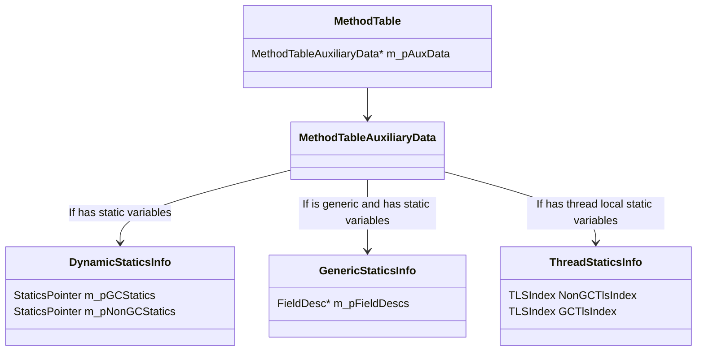
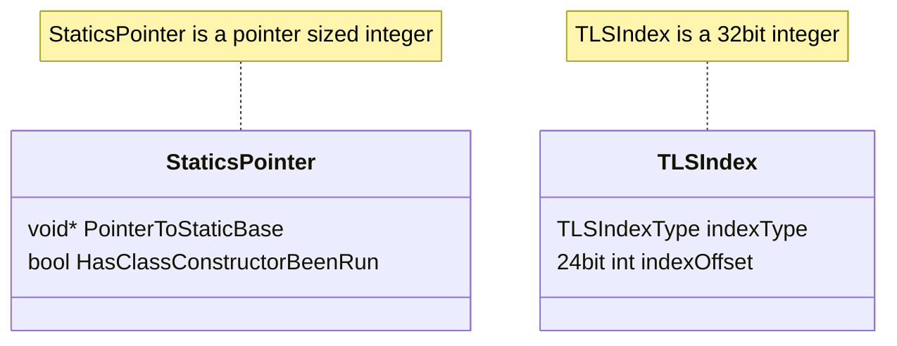
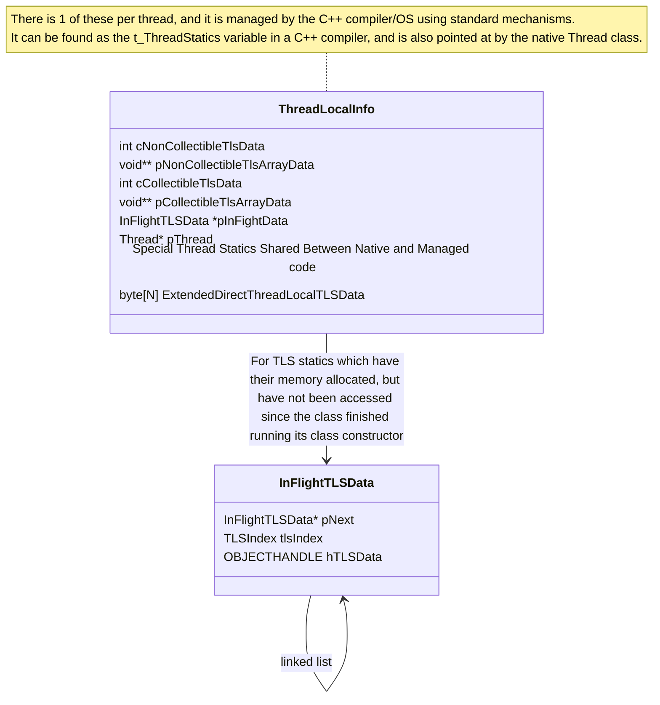
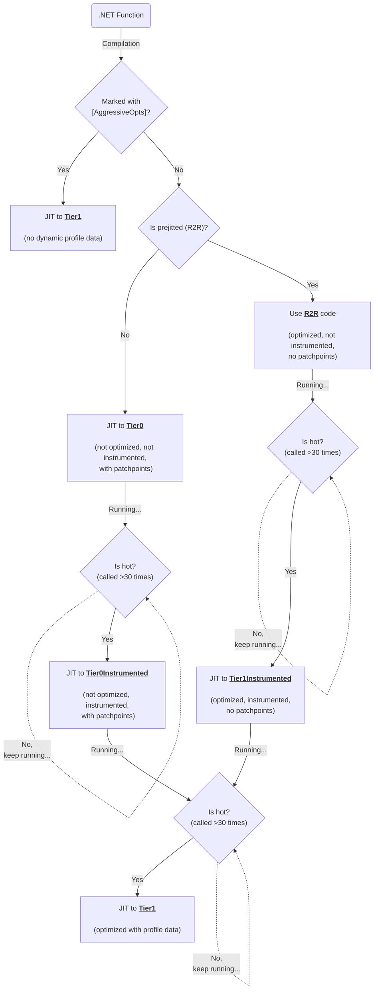
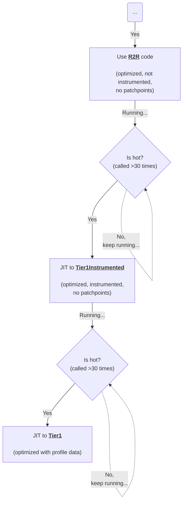
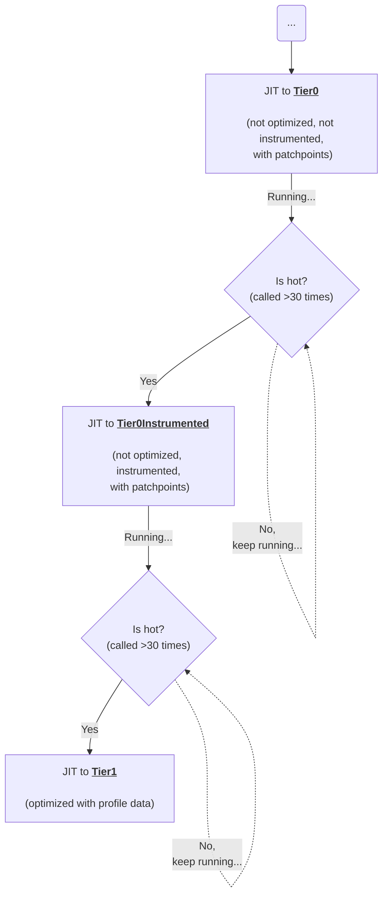
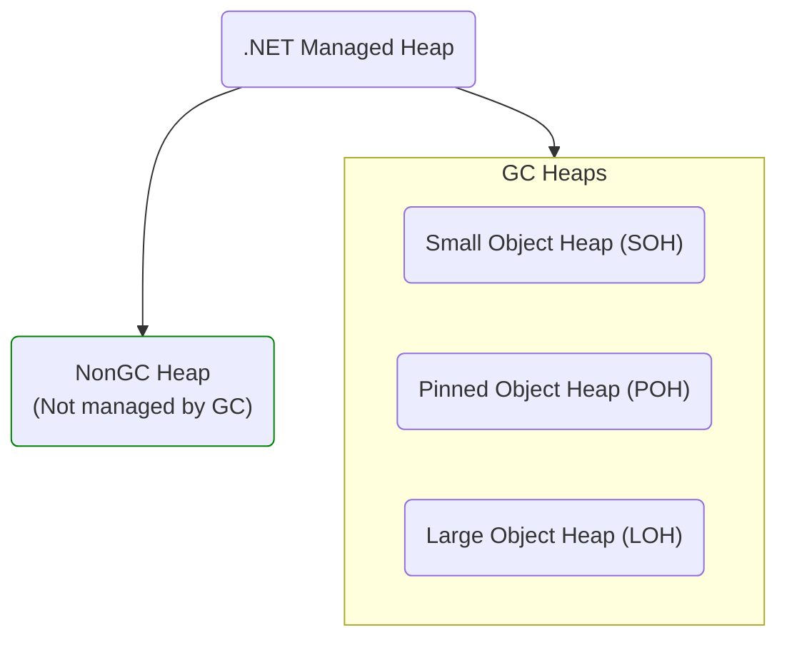

<a id="doc-a82fe1c8cecf4df558b8f06a"></a>

# dotnet/runtime / CODE-OF-CONDUCT.md

Upstream: https://github.com/dotnet/runtime/blob/12955c8ab9478124f56f20510a8be0224e2e4e6a/CODE-OF-CONDUCT.md

Commit: `12955c8ab9478124f56f20510a8be0224e2e4e6a`

Retrieved: 2026-10-01T15:17:27.770409+00:00

Kind: official-document

Raw SHA256: `811c5279d15519ffe122e808702a525e6e592088a244cfe7c002bf8fa102dec3`

Source text below is untrusted reference content. Acquisition does not verify technical claims.

License status: UPSTREAM_NOTICES_CAPTURED_PER_FILE_REVIEW_REQUIRED. See this repository's captured license files.

---

# Code of Conduct

This project has adopted the code of conduct defined by the Contributor Covenant
to clarify expected behavior in our community.
For more information, see the [.NET Foundation Code of Conduct](https://dotnetfoundation.org/code-of-conduct).


<a id="doc-eca12c0a30e25b4b46522ebf"></a>

# dotnet/runtime / CONTRIBUTING.md

Upstream: https://github.com/dotnet/runtime/blob/12955c8ab9478124f56f20510a8be0224e2e4e6a/CONTRIBUTING.md

Commit: `12955c8ab9478124f56f20510a8be0224e2e4e6a`

Retrieved: 2026-10-01T15:17:27.770409+00:00

Kind: official-document

Raw SHA256: `bdb66d609af07adca99c283836b58bfbcfcb873ec03784b93fae46c7821f1969`

Source text below is untrusted reference content. Acquisition does not verify technical claims.

License status: UPSTREAM_NOTICES_CAPTURED_PER_FILE_REVIEW_REQUIRED. See this repository's captured license files.

---

# Contribution to .NET Runtime

You can contribute to .NET Runtime with issues and PRs. Simply filing issues for problems you encounter is a great way to contribute. Contributing implementations is greatly appreciated.

## Reporting Issues

We always welcome bug reports, API proposals and overall feedback. Here are a few tips on how you can make reporting your issue as effective as possible.

### Identify Where to Report

The .NET codebase is distributed across multiple repositories in the [dotnet organization](https://github.com/dotnet). Depending on the feedback you might want to file the issue on a different repo. Here are a few common repos:

* [dotnet/runtime](https://github.com/dotnet/runtime) .NET runtime, libraries and shared host installers.
* [dotnet/roslyn](https://github.com/dotnet/roslyn) C# and VB compiler.
* [dotnet/aspnetcore](https://github.com/dotnet/aspnetcore) ASP.NET Core.
* [dotnet/efcore](https://github.com/dotnet/efcore) Entity Framework Core.
* [dotnet/extensions](https://github.com/dotnet/extensions) Additional libraries.
* [dotnet/maui](https://github.com/dotnet/maui) .NET MAUI.
* [dotnet/core](https://github.com/dotnet/core) Can be used to submit feedback if not sure what repo to use.

### Finding Existing Issues

Before filing a new issue, please search our [open issues](https://github.com/dotnet/runtime/issues) to check if it already exists.

If you do find an existing issue, please include your own feedback in the discussion. Do consider upvoting (👍 reaction) the original post, as this helps us prioritize popular issues in our backlog.

### Writing a Good API Proposal

Please review our [API review process](https://github.com/dotnet/runtime/blob/main/docs/project/api-review-process.md) documents for guidelines on how to submit an API review. When ready to submit a proposal, please use the [API Suggestion issue template](https://github.com/dotnet/runtime/issues/new?assignees=&labels=api-suggestion&template=02_api_proposal.yml&title=%5BAPI+Proposal%5D%3A+).

### Writing a Good Bug Report

Good bug reports make it easier for maintainers to verify and root cause the underlying problem. The better a bug report, the faster the problem will be resolved. Ideally, a bug report should contain the following information:

* A high-level description of the problem.
* A _minimal reproduction_, i.e. the smallest size of code/configuration required to reproduce the wrong behavior.
* A description of the _expected behavior_, contrasted with the _actual behavior_ observed.
* Information on the environment: OS/distro, CPU arch, SDK version, etc.
* Additional information, e.g. is it a regression from previous versions? are there any known workarounds?

When ready to submit a bug report, please use the [Bug Report issue template](https://github.com/dotnet/runtime/issues/new?assignees=&labels=&template=01_bug_report.yml).

#### Why are Minimal Reproductions Important?

A reproduction lets maintainers verify the presence of a bug, and diagnose the issue using a debugger. A _minimal_ reproduction is the smallest possible console application demonstrating that bug. Minimal reproductions are generally preferable since they:

1. Focus debugging efforts on a simple code snippet,
2. Ensure that the problem is not caused by unrelated dependencies/configuration,
3. Avoid the need to share production codebases.

#### Are Minimal Reproductions Required?

In certain cases, creating a minimal reproduction might not be practical (e.g. due to nondeterministic factors, external dependencies). In such cases you would be asked to provide as much information as possible, for example by sharing a memory dump of the failing application. If maintainers are unable to root cause the problem, they might still close the issue as not actionable. While not required, minimal reproductions are strongly encouraged and will significantly improve the chances of your issue being prioritized and fixed by the maintainers.

#### How to Create a Minimal Reproduction

The best way to create a minimal reproduction is gradually removing code and dependencies from a reproducing app, until the problem no longer occurs. A good minimal reproduction:

* Excludes all unnecessary types, methods, code blocks, source files, nuget dependencies and project configurations.
* Contains documentation or code comments illustrating expected vs actual behavior.
* If possible, avoids performing any unneeded IO or system calls. For example, can the ASP.NET based reproduction be converted to a plain old console app?

## Contributing Changes

Project maintainers will merge changes that improve the product significantly.

The [Pull Request Guide](docs/workflow/ci/pr-guide.md) and [Copyright](docs/project/copyright.md) docs define additional guidance.

### DOs and DON'Ts

Please do:

* **DO** follow our [coding style](docs/coding-guidelines/coding-style.md) (C# code-specific).
* **DO** give priority to the current style of the project or file you're changing even if it diverges from the general guidelines.
* **DO** include tests when adding new features. When fixing bugs, start with
  adding a test that highlights how the current behavior is broken.
* **DO** keep the discussions focused. When a new or related topic comes up
  it's often better to create new issue than to side track the discussion.
* **DO** clearly state on an issue that you are going to take on implementing it.
* **DO** blog and tweet (or whatever) about your contributions, frequently!

Please do not:

* **DON'T** make PRs for style changes.
* **DON'T** surprise us with big pull requests. Instead, file an issue and start
  a discussion so we can agree on a direction before you invest a large amount
  of time.
* **DON'T** commit code that you didn't write. If you find code that you think is a good fit to add to the .NET runtime, file an issue and start a discussion before proceeding.
* **DON'T** submit PRs that alter licensing related files or headers. If you believe there's a problem with them, file an issue and we'll be happy to discuss it.
* **DON'T** add API additions without filing an issue and discussing with us first. See [API Review Process](docs/project/api-review-process.md).

### Breaking Changes

Contributions must maintain [API signature](docs/coding-guidelines/breaking-changes.md#bucket-1-public-contract) and behavioral compatibility. Contributions that include [breaking changes](docs/coding-guidelines/breaking-changes.md) will be rejected. Please file an issue to discuss your idea or change if you believe that it may affect managed code compatibility.

### Suggested Workflow

We use and recommend the following workflow:

1. Create an issue for your work.
    - You can skip this step for trivial changes.
    - Reuse an existing issue on the topic, if there is one.
    - Get agreement from the team and the community that your proposed change is a good one.
    - If your change adds a new API, follow the [API Review Process](docs/project/api-review-process.md).
    - Clearly state that you are going to take on implementing it, if that's the case. You can request that the issue be assigned to you. Note: The issue filer and the implementer don't have to be the same person.
2. Create a personal fork of the repository on GitHub (if you don't already have one).
3. In your fork, create a branch off of main (`git checkout -b mybranch`).
    - Name the branch so that it clearly communicates your intentions, such as issue-123 or githubhandle-issue.
    - Branches are useful since they isolate your changes from incoming changes from upstream. They also enable you to create multiple PRs from the same fork.
4. Make and commit your changes to your branch.
    - [Workflow Instructions](docs/workflow/README.md) explains how to build and test.
    - Please follow our [Commit Messages](#commit-messages) guidance.
5. Add new tests corresponding to your change, if applicable.
6. Build the repository with your changes.
    - Make sure that the builds are clean.
    - Make sure that the tests are all passing, including your new tests.
7. Create a pull request (PR) against the dotnet/runtime repository's **main** branch.
    - State in the description what issue or improvement your change is addressing.
    - Check if all the Continuous Integration checks are passing. Refer to [triaging failures in CI](docs/workflow/ci/failure-analysis.md) to check if any outstanding errors are known.
8. Wait for feedback or approval of your changes from the [area owners](docs/area-owners.md).
    - Details about the pull request [review procedure](docs/workflow/ci/pr-guide.md).
9. When area owners have signed off, and all checks are green, your PR will be merged.
    - The next official build will automatically include your change.
    - You can delete the branch you used for making the change.

### Help Wanted (Up for Grabs)

The team marks the most straightforward issues as [help wanted](https://github.com/dotnet/runtime/labels/help%20wanted). This set of issues is the place to start if you are interested in contributing but new to the codebase.

### Commit Messages

Please format commit messages as follows (based on [A Note About Git Commit Messages](http://tbaggery.com/2008/04/19/a-note-about-git-commit-messages.html)):

```
Summarize change in 50 characters or less

Provide more detail after the first line. Leave one blank line below the
summary and wrap all lines at 72 characters or less.

If the change fixes an issue, leave another blank line after the final
paragraph and indicate which issue is fixed in the specific format
below.

Fix #42
```

Also do your best to factor commits appropriately, not too large with unrelated things in the same commit, and not too small with the same small change applied N times in N different commits.

### Contributor License Agreement

You must sign a [.NET Foundation Contribution License Agreement (CLA)](https://cla.dotnetfoundation.org) before your PR will be merged. This is a one-time requirement for projects in the .NET Foundation. You can read more about [Contribution License Agreements (CLA)](http://en.wikipedia.org/wiki/Contributor_License_Agreement) on Wikipedia and the [Microsoft Open Source](https://opensource.microsoft.com/cla/) program.

You don't have to do this up-front. You can simply clone, fork, and submit your pull-request as usual. When your pull-request is created, it is classified by a CLA bot. If the change is trivial (for example, you just fixed a typo), then the PR is labelled with `cla-not-required`. Otherwise it's classified as `cla-required` and the CLA bot will present the agreement to you on the pull-request. The CLA bot will provide a prompt to sign the CLA through a comment on the pull-request. Once you sign a CLA, the current and all future pull-requests will be labelled as `cla-signed`.

### File Headers

The following file header is the used for files in this repo. Please use it for new files.

```
// Licensed to the .NET Foundation under one or more agreements.
// The .NET Foundation licenses this file to you under the MIT license.
```

- See [class.cpp](./src/coreclr/vm/class.cpp) for an example of the header in a C++ file.
- See [List.cs](./src/libraries/System.Private.CoreLib/src/System/Collections/Generic/List.cs) for an example of the header in a C# file.

### PR - CI Process

The [dotnet continuous integration](https://dev.azure.com/dnceng-public/public/_build) (CI) system will automatically perform the required builds and run tests (including the ones you are expected to run) for PRs. Builds and test runs must be clean or have bugs properly filed against flaky/unexpected failures that are unrelated to your change.

If the CI build fails for any reason, the PR issue will link to the `Azure DevOps` build with further information on the failure.

### PR Feedback

Microsoft team and community members will provide feedback on your change. Community feedback is highly valued. You will often see the absence of team feedback if the community has already provided good review feedback.

One or more Microsoft team members will review every PR prior to merge. They will often reply with "LGTM, modulo comments". That means that the PR will be merged once the feedback is resolved. "LGTM" == "looks good to me".

There are lots of thoughts and [approaches](https://github.com/antlr/antlr4-cpp/blob/master/CONTRIBUTING.md#emoji) for how to efficiently discuss changes. It is best to be clear and explicit with your feedback. Please be patient with people who might not understand the finer details about your approach to feedback.

### Contributing Ports

We encourage ports of CoreCLR to other platforms. There are multiple ports ongoing at any one time. You may be interested in one of the following ports:

Chips:

- [ARM32](https://github.com/dotnet/runtime/labels/arch-arm32)
- [ARM64](https://github.com/dotnet/runtime/labels/arch-arm64)
- [X86](https://github.com/dotnet/runtime/labels/arch-x86)
- [LoongArch64](https://github.com/dotnet/runtime/labels/arch-loongarch64)
- [RISC-V](https://github.com/dotnet/runtime/labels/arch-riscv)

Operating System:

- [Linux](https://github.com/dotnet/runtime/labels/os-linux)
- [macOS](https://github.com/dotnet/runtime/labels/os-mac-os-x)
- [Windows Subsystem for Linux](https://github.com/dotnet/runtime/labels/os-windows-wsl)
- [FreeBSD](https://github.com/dotnet/runtime/labels/os-freebsd)

Note: Add links to install instructions for each of these ports.

Ports have a weaker contribution bar, at least initially. A functionally correct implementation is considered an important first goal. Performance, reliability and compatibility are all important concerns after that.

#### Copying Files from Other Projects

The .NET runtime uses some files from other projects, per [copyright](./docs/project/copyright.md) rules.

The following rules must be followed for PRs that include files from another project:

- The license of the file is [permissive](https://en.wikipedia.org/wiki/Permissive_free_software_licence).
- The license of the file is left in-tact.
- The contribution is correctly attributed in the [3rd party notices](./THIRD-PARTY-NOTICES.TXT) file in the repository, as needed.

See [IdnMapping.cs](./src/libraries/System.Private.CoreLib/src/System/Globalization/IdnMapping.cs) for an example of a file copied from another project and attributed in the [CoreCLR 3rd party notices](./THIRD-PARTY-NOTICES.TXT) file.

#### Porting Files from Other Projects

There are many good algorithms implemented in other languages that would benefit the .NET runtime. The rules for porting a Java file to C#, for example, are the same as would be used for copying the same file, as described above.

[Clean-room](https://en.wikipedia.org/wiki/Clean_room_design) implementations of existing algorithms that are not permissively licensed will generally not be accepted. If you want to create or nominate such an implementation, please create an issue to discuss the idea.


<a id="doc-14538857e2a6cdbe65ea17aa"></a>

# dotnet/runtime / LICENSE.TXT

Upstream: https://github.com/dotnet/runtime/blob/12955c8ab9478124f56f20510a8be0224e2e4e6a/LICENSE.TXT

Commit: `12955c8ab9478124f56f20510a8be0224e2e4e6a`

Retrieved: 2026-10-01T15:17:27.770409+00:00

Kind: license

Raw SHA256: `cfc21f5e8bd655ae997eec916138b707b1d290b83272c02a95c9f821b8c87310`

Source text below is untrusted reference content. Acquisition does not verify technical claims.

License status: UPSTREAM_NOTICES_CAPTURED_PER_FILE_REVIEW_REQUIRED. See this repository's captured license files.

---

````text
The MIT License (MIT)

Copyright (c) .NET Foundation and Contributors

All rights reserved.

Permission is hereby granted, free of charge, to any person obtaining a copy
of this software and associated documentation files (the "Software"), to deal
in the Software without restriction, including without limitation the rights
to use, copy, modify, merge, publish, distribute, sublicense, and/or sell
copies of the Software, and to permit persons to whom the Software is
furnished to do so, subject to the following conditions:

The above copyright notice and this permission notice shall be included in all
copies or substantial portions of the Software.

THE SOFTWARE IS PROVIDED "AS IS", WITHOUT WARRANTY OF ANY KIND, EXPRESS OR
IMPLIED, INCLUDING BUT NOT LIMITED TO THE WARRANTIES OF MERCHANTABILITY,
FITNESS FOR A PARTICULAR PURPOSE AND NONINFRINGEMENT. IN NO EVENT SHALL THE
AUTHORS OR COPYRIGHT HOLDERS BE LIABLE FOR ANY CLAIM, DAMAGES OR OTHER
LIABILITY, WHETHER IN AN ACTION OF CONTRACT, TORT OR OTHERWISE, ARISING FROM,
OUT OF OR IN CONNECTION WITH THE SOFTWARE OR THE USE OR OTHER DEALINGS IN THE
SOFTWARE.

````


<a id="doc-b335630551682c19a781afeb"></a>

# dotnet/runtime / README.md

Upstream: https://github.com/dotnet/runtime/blob/12955c8ab9478124f56f20510a8be0224e2e4e6a/README.md

Commit: `12955c8ab9478124f56f20510a8be0224e2e4e6a`

Retrieved: 2026-10-01T15:17:27.770409+00:00

Kind: official-document

Raw SHA256: `bcd0ca8841408b85528eb4f91a610c072eb46df2a0e89ba5ab38a60270286057`

Source text below is untrusted reference content. Acquisition does not verify technical claims.

License status: UPSTREAM_NOTICES_CAPTURED_PER_FILE_REVIEW_REQUIRED. See this repository's captured license files.

---

# .NET Runtime

[](https://dev.azure.com/dnceng-public/public/_build/latest?definitionId=129&branchName=main)
[](https://github.com/dotnet/runtime/labels/help%20wanted)
[](https://github.com/dotnet/runtime/labels/good%20first%20issue)
[](https://aka.ms/dotnet-discord)

* [What is .NET?](#what-is-net)
* [How can I contribute?](#how-can-i-contribute)
* [Reporting security issues and security bugs](#reporting-security-issues-and-security-bugs)
* [Filing issues](#filing-issues)
* [Useful Links](#useful-links)
* [.NET Foundation](#net-foundation)
* [License](#license)

This repo contains the code to build the .NET runtime, libraries and shared host (`dotnet`) installers for
all supported platforms, as well as the sources to .NET runtime and libraries.

## What is .NET?

Official Starting Page: <https://dotnet.microsoft.com>

* [How to use .NET](https://learn.microsoft.com/dotnet/core/get-started) (with VS, VS Code, command-line CLI)
  * [Install official releases](https://dotnet.microsoft.com/download)
  * [Documentation](https://learn.microsoft.com/dotnet/core) (Get Started, Tutorials, Porting from .NET Framework, API reference, ...)
    * [Deploying apps](https://learn.microsoft.com/dotnet/core/deploying)
* [Support](https://github.com/dotnet/core/blob/main/support.md) (Releases, OS Versions, ...)
* [Roadmap](https://github.com/dotnet/core/blob/main/roadmap.md)

## How can I contribute?

We welcome contributions! Many people all over the world have helped make this project better.

* [Contributing](CONTRIBUTING.md) explains what kinds of contributions we welcome
* [Workflow Instructions](docs/workflow/README.md) explains how to build and test
* [Dogfooding .NET](docs/project/dogfooding.md) explains how to get nightly builds of the runtime and its libraries to test them in your own projects.

## Reporting security issues and security bugs

Security issues and bugs should be reported privately to the Microsoft Security Response Center (MSRC) via the [MSRC Researcher Portal](https://msrc.microsoft.com/report/vulnerability/new). You should receive a response within 24 hours. Further information can be found in the [Security TechCenter](https://www.microsoft.com/msrc/faqs-report-an-issue). You can also find these instructions in this repo's [Security doc](SECURITY.md).

Also see info about related [Microsoft .NET Bounty Program](https://www.microsoft.com/msrc/bounty-dot-net-core).

## Filing issues

This repo should contain issues that are tied to the runtime, the class libraries and frameworks, the installation of the `dotnet` binary (sometimes known as the `muxer`) and the installation of the .NET runtime and libraries.

For other issues, please file them to their appropriate sibling repos. We have links to many of them on [our new issue page](https://github.com/dotnet/runtime/issues/new/choose).

## Useful Links

* [.NET source index](https://source.dot.net) / [.NET Framework source index](https://referencesource.microsoft.com)
* [API Reference docs](https://learn.microsoft.com/dotnet/api)
* [.NET API Catalog](https://apisof.net) (incl. APIs from daily builds and API usage info)
* [API docs writing guidelines](https://github.com/dotnet/dotnet-api-docs/wiki) - useful when writing /// comments
* [.NET Discord Server](https://aka.ms/dotnet-discord) - a place to discuss the development of .NET and its ecosystem

## .NET Foundation

.NET Runtime is a [.NET Foundation](https://www.dotnetfoundation.org/projects) project.

There are many .NET related projects on GitHub.

* [.NET home repo](https://github.com/Microsoft/dotnet) - links to 100s of .NET projects, from Microsoft and the community.
* [ASP.NET Core home](https://learn.microsoft.com/aspnet/core) - the best place to start learning about ASP.NET Core.

This project has adopted the code of conduct defined by the [Contributor Covenant](https://contributor-covenant.org) to clarify expected behavior in our community. For more information, see the [.NET Foundation Code of Conduct](https://www.dotnetfoundation.org/code-of-conduct).

General .NET OSS discussions: [.NET Foundation Discussions](https://github.com/dotnet-foundation/Home/discussions)

## License

.NET (including the runtime repo) is licensed under the [MIT](LICENSE.TXT) license.


<a id="doc-f6ed156e4bf5c79168066246"></a>

# dotnet/runtime / SECURITY.md

Upstream: https://github.com/dotnet/runtime/blob/12955c8ab9478124f56f20510a8be0224e2e4e6a/SECURITY.md

Commit: `12955c8ab9478124f56f20510a8be0224e2e4e6a`

Retrieved: 2026-10-01T15:17:27.770409+00:00

Kind: official-document

Raw SHA256: `aa32b7d9d598033833de9dc3e636054c8fb7693b2d3f526e71cce6ed819364cf`

Source text below is untrusted reference content. Acquisition does not verify technical claims.

License status: UPSTREAM_NOTICES_CAPTURED_PER_FILE_REVIEW_REQUIRED. See this repository's captured license files.

---

# Security Policy

## Supported Versions

The .NET, .NET Core and ASP.NET Core support policy, including supported versions can be found at the [.NET and .NET Core Support Policy Page](https://dotnet.microsoft.com/platform/support/policy/dotnet-core).

## Reporting a Vulnerability

**Please do not open issues on GitHub for anything you think might have a security implication.**

Security issues and bugs should be reported privately to the Microsoft Security Response Center (MSRC), via the [MSRC Researcher Portal](https://msrc.microsoft.com/report/vulnerability/new).

You should receive a response within 24 hours. If for some reason you do not, please follow up via the [MSRC Researcher Portal](https://msrc.microsoft.com/report/vulnerability/), using the Message functionality found at the bottom of the Activity tab on your vulnerability report.

Further information can be found in the MSRC [Report an issue and submission guidelines](https://www.microsoft.com/en-us/msrc/faqs-report-an-issue).

Reports via MSRC may qualify for the Microsoft .NET Bug Bounty. Details of the Microsoft .NET Bounty Program including terms and conditions are at [https://aka.ms/corebounty](https://aka.ms/corebounty).


<a id="doc-0b5ca119d2be595aa307d345"></a>

# dotnet/runtime / docs/README.md

Upstream: https://github.com/dotnet/runtime/blob/12955c8ab9478124f56f20510a8be0224e2e4e6a/docs/README.md

Commit: `12955c8ab9478124f56f20510a8be0224e2e4e6a`

Retrieved: 2026-10-01T15:17:27.770409+00:00

Kind: official-document

Raw SHA256: `5c594aa88b5a31db94f8f3623fc459280f0a89f81617f520c2488c784029c6b2`

Source text below is untrusted reference content. Acquisition does not verify technical claims.

License status: UPSTREAM_NOTICES_CAPTURED_PER_FILE_REVIEW_REQUIRED. See this repository's captured license files.

---

Documents Index
===============

This repo includes several documents that explain both high-level and low-level concepts about the .NET runtime and libraries. These are very useful for contributors, to get context that can be very difficult to acquire from just reading code.

Intro to .NET
==================

.NET is a self-contained .NET runtime and framework that implements ECMA 335. It can be (and has been) ported to multiple architectures and platforms. It support a variety of installation options, having no specific deployment requirements itself.

Getting Started
===============

- [Installing the .NET SDK](https://dotnet.microsoft.com/download)
- [Official .NET Docs](https://learn.microsoft.com/dotnet/core/)

Workflow (Building, testing, benchmarking, profiling, etc.)
===============

If you want to contribute a code change to this repo, start here.

- [Workflow Instructions](workflow/README.md)

Design Docs
=================

- Runtime feature designs under [design/features](design/features/)
- Some runtime design can be found at [dotnet/designs](https://github.com/dotnet/designs)

The Book of the Runtime is a set of chapters that go in depth into various
interesting aspects of the design of the .NET Framework.

- [Book of the Runtime](design/coreclr/botr/README.md)

For your convenience, here are a few quick links to popular chapters:

- [Introduction to the Common Language Runtime](design/coreclr/botr/intro-to-clr.md)
- [Garbage Collection Design](design/coreclr/botr/garbage-collection.md)
- [Type System](design/coreclr/botr/type-system.md)

For additional information, see this list of blog posts that provide a ['deep-dive' into the CoreCLR source code](deep-dive-blog-posts.md)

Coding Guidelines
=================

- [CLR Coding Guide](coding-guidelines/clr-code-guide.md)
- [CLR JIT Coding Conventions](coding-guidelines/clr-jit-coding-conventions.md)
- [Cross Platform Performance and Eventing Design](coding-guidelines/cross-platform-performance-and-eventing.md)
- [Adding New Events to the VM](coding-guidelines/EventLogging.md)
- [C# coding style](coding-guidelines/coding-style.md)
- [Framework Design Guidelines](coding-guidelines/framework-design-guidelines-digest.md)
- [Cross-Platform Guidelines](coding-guidelines/cross-platform-guidelines.md)
- [Performance Guidelines](coding-guidelines/performance-guidelines.md)
- [Interop Guidelines](coding-guidelines/interop-guidelines.md)
- [Breaking Changes](coding-guidelines/breaking-changes.md)
- [Breaking Change Definitions](coding-guidelines/breaking-change-definitions.md)
- [Breaking Change Rules](coding-guidelines/breaking-change-rules.md)
- [Project Guidelines](coding-guidelines/project-guidelines.md)
- [Adding APIs Guidelines](coding-guidelines/adding-api-guidelines.md)

Project Docs
=================

- [Breaking change process](./project/breaking-change-process.md)
- [Copyright](./project/copyright.md)
- [Linux build methodology](./project/linux-build-methodology.md)
- [Onboarding Guide for New Operating System Versions](./project/os-onboarding.md)
- [Project docs folder](./project/)

Other Information
=================

- [.NET Glossary](project/glossary.md)
- [.NET Filename Encyclopedia](project/dotnet-filenames.md)
- [Porting to .NET Core](https://learn.microsoft.com/dotnet/standard/analyzers/portability-analyzer)
- [.NET Standards (Ecma)](project/dotnet-standards.md)
- [CLR Configuration Knobs](../src/coreclr/inc/clrconfigvalues.h)
- [CLR overview](https://learn.microsoft.com/dotnet/standard/clr)
- [Wikipedia Entry for the CLR](https://en.wikipedia.org/wiki/Common_Language_Runtime)


<a id="doc-914946298686bf85f6484a02"></a>

# dotnet/runtime / docs/area-owners.md

Upstream: https://github.com/dotnet/runtime/blob/12955c8ab9478124f56f20510a8be0224e2e4e6a/docs/area-owners.md

Commit: `12955c8ab9478124f56f20510a8be0224e2e4e6a`

Retrieved: 2026-10-01T15:17:27.770409+00:00

Kind: official-document

Raw SHA256: `48cd763e48e964af02ad7862499b38c1b7d077db6435b38e7f3098705edc0681`

Source text below is untrusted reference content. Acquisition does not verify technical claims.

License status: UPSTREAM_NOTICES_CAPTURED_PER_FILE_REVIEW_REQUIRED. See this repository's captured license files.

---

# Pull Requests Tagging

If you need to tag folks on an issue or PR, you will generally want to tag the owners (not the lead) for [area](#areas) to which the change or issue is closest to. For areas which are large and can be operating system or architecture specific it's better to tag owners of [OS](#operating-systems) or [Architecture](#architectures).

## Repos

This list is for this **dotnet/runtime** repo. The **dotnet/aspnetcore** repo has [its own list](https://github.com/dotnet/aspnetcore/blob/main/docs/area-owners.md).

## Areas

Note: Editing this file doesn't update the mapping used by `@dotnet-policy-service` for area-specific issue/PR notifications. That configuration is part of the [`resourceManagement.yml`](../.github/policies/resourceManagement.yml) file, and many areas use GitHub teams for those notifications. If you're a community member interested in receiving area-specific issue/PR notifications, you won't appear in this table or be added to those GitHub teams, but you can create a PR that updates `resourceManagement.yml` to add yourself to those notifications. See [automation.md](infra/automation.md) for more information.

| Area                                           | Lead                 | Owners (area experts to tag in PRs and issues)                                           | Notes                                                                                                                                                                                                                                                                                     |
|------------------------------------------------|----------------------|------------------------------------------------------------------------------------------|-------------------------------------------------------------------------------------------------------------------------------------------------------------------------------------------------------------------------------------------------------------------------------------------|
| area-Announcements                            | @jamshedd            | @bribrothers @rbhanda                                                                   | .NET product announcements and security advisories.                                                                                                                                                                                                                                       |
| area-AssemblyLoader                            | @agocke              | @agocke @elinor-fung                                                                     |                                                                                                                                                                                                                                                                                           |
| area-AssemblyLoader-mono                       | @agocke              | @agocke @elinor-fung                                                                     |                                                                                                                                                                                                                                                                                           |
| area-Build-mono                                | @lewing              | @akoeplinger                                                                             |                                                                                                                                                                                                                                                                                           |
| area-Codeflow                                  | @dotnet/dnr-codeflow | @dotnet/dnr-codeflow                                                                     | Used for automated PRs that ingest code from other repos                                                                                                                                                                                                                                  |
| area-Codegen-AOT-mono                          | @steveisok           | @kotlarmilos                                                                             |                                                                                                                                                                                                                                                                                           |
| area-CodeGen-coreclr                           | @JulieLeeMSFT        | @dotnet/jit-contrib                                                                      |                                                                                                                                                                                                                                                                                           |
| area-Codegen-Interpreter-coreclr               | @JulieLeeMSFT        | @BrzVlad @janvorli                                                                       |                                                                                                                                                                                                                                                                                           |
| area-Codegen-Interpreter-mono                  | @vitek-karas         | @BrzVlad @kotlarmilos                                                                    |                                                                                                                                                                                                                                                                                           |
| area-Codegen-Intrinsics-mono                   | @steveisok           |                                                                                          |                                                                                                                                                                                                                                                                                           |
| area-Codegen-JIT-mono                          | @steveisok           |                                                                                          |                                                                                                                                                                                                                                                                                           |
| area-Codegen-LLVM-mono                         | @steveisok           |                                                                                          |                                                                                                                                                                                                                                                                                           |
| area-Codegen-meta-mono                         | @steveisok           |                                                                                          |                                                                                                                                                                                                                                                                                           |
| area-Debugger-mono                             | @steveisok           | @thaystg @dotnet/dotnet-diag                                                             |                                                                                                                                                                                                                                                                                           |
| area-DependencyModel                           | @jeffhandley         | @dotnet/area-dependencymodel                                                             | Included:<ul><li>Microsoft.Extensions.DependencyModel</li></ul>                                                                                                                                                                                                                           |
| area-Diagnostics-cdac                          | @steveisok           | @tommcdon @dotnet/dotnet-diag                                                            |                                                                                                                                                                                                                                                                                           |
| area-Diagnostics-coreclr                       | @steveisok           | @tommcdon @dotnet/dotnet-diag                                                            |                                                                                                                                                                                                                                                                                           |
| area-Diagnostics-mono                          | @steveisok           | @tommcdon @mdh1418 @thaystg                                                              |                                                                                                                                                                                                                                                                                           |
| area-EnC-mono                                  | @steveisok           | @dotnet/dotnet-diag @thaystg                                                             | Hot Reload on WebAssembly, Android, iOS, etc.                                                                                                                                                                                                                                             |
| area-Extensions-Caching                        | @anicka-net          | @dotnet/area-extensions-caching                                                          | Consultants: @adamsitnik, @mgravell, @sebastienros                                                                                                                                                                                                                                        |
| area-Extensions-Configuration                  | @anicka-net          | @dotnet/area-extensions-configuration                                                    | Consultants: @tarekgh, @eerhardt                                                                                                                                                                                                                                                          |
| area-Extensions-DependencyInjection            | @anicka-net          | @dotnet/area-extensions-dependencyinjection                                              | Consultants: @halter73, @benjaminpetit                                                                                                                                                                                                                                                    |
| area-Extensions-FileSystem                     | @anicka-net          | @dotnet/area-extensions-filesystem                                                       | Consultants: @jozkee, @adamsitnik                                                                                                                                                                                                                                                         |
| area-Extensions-Hosting                        | @anicka-net          | @dotnet/area-extensions-hosting                                                          | Consultants: @halter73, @tratcher                                                                                                                                                                                                                                                         |
| area-Extensions-HttpClientFactory              | @karelz              | @dotnet/ncl                                                                              |                                                                                                                                                                                                                                                                                           |
| area-Extensions-Logging                        | @anicka-net          | @dotnet/area-extensions-logging                                                          | Consultants: @tarekgh, @brennanconroy                                                                                                                                                                                                                                                     |
| area-Extensions-Options                        | @anicka-net          | @dotnet/area-extensions-options                                                          | Consultants: @tarekgh, @eerhardt, @brennanconroy                                                                                                                                                                                                                                          |
| area-Extensions-Primitives                     | @anicka-net          | @dotnet/area-extensions-primitives                                                       |                                                                                                                                                                                                                                                                                           |
| area-GC-coreclr                                | @anicka-net          | @dotnet/gc                                                                               |                                                                                                                                                                                                                                                                                           |
| area-GC-mono                                   | @agocke              | @BrzVlad                                                                                 | @agocke to consult                                                                                                                                                                                                                                                                        |
| area-Host                                      | @agocke              | @elinor-fung                                                                             | Issues with dotnet.exe including bootstrapping, framework detection, hostfxr.dll and hostpolicy.dll                                                                                                                                                                                       |
| area-ILTools-coreclr                           | @JulieLeeMSFT        | @dotnet/jit-contrib                                                                      |                                                                                                                                                                                                                                                                                           |
| area-Infrastructure                            | @agocke              | @dotnet/runtime-infrastructure                                                           | Consultants: @MichaelSimons                                                                                                                                                                                                                                                               |
| area-Infrastructure-installer                  | @MichaelSimons       | @NikolaMilosavljevic                                                                     |                                                                                                                                                                                                                                                                                           |
| area-Infrastructure-libraries                  | @jeffhandley         | @dotnet/area-infrastructure-libraries                                                    | Covers:<ul><li>Packaging</li><li>Build and test infra for libraries in dotnet/runtime repo</li><li>VS integration</li></ul><br/>                                                                                                                                                          |
| area-Infrastructure-mono                       | @steveisok           | @akoeplinger @matouskozak @simonrozsival                                                 |                                                                                                                                                                                                                                                                                           |
| area-Interop-coreclr                           | @agocke              | @dotnet/interop-contrib                                                                  |                                                                                                                                                                                                                                                                                           |
| area-Interop-mono                              | @agocke              | @AaronRobinsonMSFT @jkoritzinsky                                                         |                                                                                                                                                                                                                                                                                           |
| area-Meta                                      | @jeffhandley         | @dotnet/area-meta                                                                        | Cross-cutting concerns that span many or all areas, including project-wide code/test patterns and documentation.                                                                                                                                                                          |
| area-Microsoft.CSharp                          | @phil-allen-msft     | @333fred                                                                                 | Archived component - limited churn/contributions (see [#27790](https://github.com/dotnet/runtime/issues/27790))                                                                                                                                                                           |
| area-Microsoft.VisualBasic                     | @phil-allen-msft     | @333fred                                                                                 | Archived component - limited churn/contributions (see [#27790](https://github.com/dotnet/runtime/issues/27790))                                                                                                                                                                           |
| area-Microsoft.Win32                           | @jeffhandley         | @dotnet/area-microsoft-win32                                                             | Included:<ul><li>System.Windows.Extensions</li></ul>                                                                                                                                                                                                                                      |
| area-NativeAOT-coreclr                         | @agocke              | @dotnet/ilc-contrib                                                                      |                                                                                                                                                                                                                                                                                           |
| area-ReadyToRun                                | @agocke              | @dotnet/crossgen-contrib                                                                 |                                                                                                                                                                                                                                                                                           |
| area-Serialization                             | @StephenMolloy       | @StephenMolloy @dotnet/Tellurium                                                         | Packages:<ul><li>System.Runtime.Serialization.Xml</li><li>System.Runtime.Serialization.Json</li><li>System.Private.DataContractSerialization</li><li>System.Xml.XmlSerializer</li></ul> Excluded:<ul><li>System.Runtime.Serialization.Formatters</li></ul>                                |
| area-Setup                                     | @MichaelSimons       | @NikolaMilosavljevic                                                                     | Distro-specific (Linux, Mac and Windows) setup packages and msi files                                                                                                                                                                                                                     |
| area-Single-File                               | @agocke              | @elinor-fung @vsadov                                                                     |                                                                                                                                                                                                                                                                                           |
| area-Snap                                      | @MichaelSimons       | @NikolaMilosavljevic @leecow @MichaelSimons                                              |                                                                                                                                                                                                                                                                                           |
| area-System.Buffers                            | @jeffhandley         | @dotnet/area-system-buffers                                                              |                                                                                                                                                                                                                                                                                           |
| area-System.ClientModel                        | @jeffhandley         | @dotnet/fxdc                                                                             | Bugs and feature requests should go to https://github.com/Azure/azure-sdk-for-net/issues. We don't own the code, but FXDC reviews changes to determine overlap with other `System` concepts. The Azure SDK team will post API updates in this repo for us to review.                      |
| area-System.CodeDom                            | @jeffhandley         | @dotnet/area-system-codedom                                                              |                                                                                                                                                                                                                                                                                           |
| area-System.Collections                        | @jeffhandley         | @dotnet/area-system-collections                                                          | Excluded:<ul><li>System.Array -> System.Runtime</li></ul>                                                                                                                                                                                                                                 |
| area-System.ComponentModel                     | @jeffhandley         | @dotnet/area-system-componentmodel                                                       | Consultants: @dotnet/dotnet-winforms                                                                                                                                                                                                                                                      |
| area-System.ComponentModel.Composition         | @jeffhandley         | @dotnet/area-system-componentmodel-composition                                           |                                                                                                                                                                                                                                                                                           |
| area-System.ComponentModel.DataAnnotations     | @jeffhandley         | @dotnet/area-system-componentmodel-dataannotations                                       | Included:<ul><li>System.ComponentModel.Annotations</li></ul>                                                                                                                                                                                                                              |
| area-System.Composition                        | @jeffhandley         | @dotnet/area-system-composition                                                          |                                                                                                                                                                                                                                                                                           |
| area-System.Configuration                      | @jeffhandley         | @dotnet/area-system-configuration                                                        |                                                                                                                                                                                                                                                                                           |
| area-System.Console                            | @jeffhandley         | @dotnet/area-system-console                                                              |                                                                                                                                                                                                                                                                                           |
| area-System.Data                               | @SamMonoRT           | @dotnet/efteam                                                                           | <ul><li>Odbc, OleDb - @saurabh500</li></ul>                                                                                                                                                                                                                                               |
| area-System.Data.Odbc                          | @SamMonoRT           | @dotnet/efteam                                                                           |                                                                                                                                                                                                                                                                                           |
| area-System.Data.OleDB                         | @SamMonoRT           | @dotnet/efteam                                                                           |                                                                                                                                                                                                                                                                                           |
| area-System.Data.SqlClient                     | @David-Engel         | @cheenamalhotra @david-engel                                                             | Archived component - limited churn/contributions (see https://devblogs.microsoft.com/dotnet/introducing-the-new-microsoftdatasqlclient/)                                                                                                                                                  |
| area-System.DateTime                           | @jeffhandley         | @dotnet/area-system-datetime                                                             | System namespace APIs related to dates and times, including DateOnly, DateTime, DateTimeKind, DateTimeOffset, DayOfWeek, TimeOnly, TimeSpan, TimeZone, and TimeZoneInfo                                                                                                                   |
| area-System.Diagnostics                        | @steveisok           | @dotnet/area-system-diagnostics                                                          |                                                                                                                                                                                                                                                                                           |
| area-System.Diagnostics-coreclr                | @steveisok           | @dotnet/area-system-diagnostics-coreclr                                                  |                                                                                                                                                                                                                                                                                           |
| area-System.Diagnostics-mono                   | @steveisok           | @dotnet/dotnet-diag                                                                      |                                                                                                                                                                                                                                                                                           |
| area-System.Diagnostics.Activity               | @jeffhandley         | @dotnet/area-system-diagnostics-activity                                                 |                                                                                                                                                                                                                                                                                           |
| area-System.Diagnostics.EventLog               | @jeffhandley         | @dotnet/area-system-diagnostics-eventlog                                                 |                                                                                                                                                                                                                                                                                           |
| area-System.Diagnostics.Metric                 | @jeffhandley         | @dotnet/area-system-diagnostics-metric                                                   |                                                                                                                                                                                                                                                                                           |
| area-System.Diagnostics.PerformanceCounter     | @jeffhandley         | @dotnet/area-system-diagnostics-performancecounter                                       |                                                                                                                                                                                                                                                                                           |
| area-System.Diagnostics.Process                | @SamMonoRT           | @dotnet/area-system-diagnostics-process                                                  |                                                                                                                                                                                                                                                                                           |
| area-System.Diagnostics.Tracing                | @steveisok           | @dotnet/area-system-diagnostics-tracing                                                  | Included:<ul><li>System.Diagnostics.DiagnosticSource</li></ul>                                                                                                                                                                                                                            |
| area-System.Diagnostics.TraceSource            | @jeffhandley         | @dotnet/area-system-diagnostics-tracesource                                              |                                                                                                                                                                                                                                                                                           |
| area-System.DirectoryServices                  | @jeffhandley         | @dotnet/area-system-directoryservices                                                    | Consultants: @BRDPM @grubioe @jay98014                                                                                                                                                                                                                                                    |
| area-System.Drawing                            | @jeffhandley         | @dotnet/area-system-drawing                                                              | Excluded:<ul><li>System.Drawing.Common -> winforms</li></ul>                                                                                                                                                                                                                              |
| area-System.Dynamic.Runtime                    | @phil-allen-msft     | @333fred                                                                                 | Archived component - limited churn/contributions (see [#27790](https://github.com/dotnet/runtime/issues/27790))                                                                                                                                                                           |
| area-System.Formats.Asn1                       | @jeffhandley         | @dotnet/area-system-formats-asn1                                                         | Consultants: @bartonjs @vcsjones                                                                                                                                                                                                                                                          |
| area-System.Formats.Cbor                       | @jeffhandley         | @dotnet/area-system-formats-cbor                                                         | Consultants: @bartonjs @vcsjones                                                                                                                                                                                                                                                          |
| area-System.Formats.Nrbf                       | @jeffhandley         | @dotnet/area-system-formats-nrbf                                                         | Consultants: @bartonjs @grabyourpitchforks                                                                                                                                                                                                                                                |
| area-System.Formats.Tar                        | @karelz              | @dotnet/area-system-formats-tar                                                          |                                                                                                                                                                                                                                                                                           |
| area-System.Globalization                      | @jeffhandley         | @dotnet/area-system-globalization                                                        |                                                                                                                                                                                                                                                                                           |
| area-System.IO                                 | @jeffhandley         | @dotnet/area-system-io                                                                   |                                                                                                                                                                                                                                                                                           |
| area-System.IO.Compression                     | @karelz              | @dotnet/area-system-io-compression                                                       | Included:<ul><li>System.Formats.Tar</li><li>System.IO.Packaging</li></ul>                                                                                                                                                                                                                 |
| area-System.IO.Hashing                         | @jeffhandley         | @bartonjs @vcsjones @dotnet/area-system-io-hashing                                       | APIs within the System.IO.Hashing namespace, which align more with cryptography than with I/O                                                                                                                                                                                             |
| area-System.IO.Pipelines                       | @joperezr            | @davidfowl @halter73                                                                     |                                                                                                                                                                                                                                                                                           |
| area-System.IO.Ports                           | @jeffhandley         | @dotnet/area-system-io-ports                                                             |                                                                                                                                                                                                                                                                                           |
| area-System.Linq                               | @jeffhandley         | @dotnet/area-system-linq                                                                 |                                                                                                                                                                                                                                                                                           |
| area-System.Linq.Expressions                   | @phil-allen-msft     | @333fred                                                                                 | Archived component - limited churn/contributions (see [#27790](https://github.com/dotnet/runtime/issues/27790))                                                                                                                                                                           |
| area-System.Linq.Parallel                      | @jeffhandley         | @dotnet/area-system-linq-parallel                                                        | Consultants: @stephentoub @kouvel                                                                                                                                                                                                                                                         |
| area-System.Management                         | @jeffhandley         | @dotnet/area-system-management                                                           | WMI                                                                                                                                                                                                                                                                                       |
| area-System.Memory                             | @jeffhandley         | @dotnet/area-system-memory                                                               |                                                                                                                                                                                                                                                                                           |
| area-System.Net                                | @karelz              | @dotnet/ncl                                                                              | Included:<ul><li>System.Uri</li></ul>                                                                                                                                                                                                                                                     |
| area-System.Net.Http                           | @karelz              | @dotnet/ncl                                                                              |                                                                                                                                                                                                                                                                                           |
| area-System.Net.Quic                           | @karelz              | @dotnet/ncl                                                                              |                                                                                                                                                                                                                                                                                           |
| area-System.Net.Security                       | @karelz              | @dotnet/ncl @bartonjs @vcsjones                                                          |                                                                                                                                                                                                                                                                                           |
| area-System.Net.Sockets                        | @karelz              | @dotnet/ncl                                                                              |                                                                                                                                                                                                                                                                                           |
| area-System.Numerics                           | @jeffhandley         | @dotnet/area-system-numerics                                                             |                                                                                                                                                                                                                                                                                           |
| area-System.Numerics.Tensors                   | @jeffhandley         | @dotnet/area-system-numerics-tensors                                                     |                                                                                                                                                                                                                                                                                           |
| area-System.Reflection                         | @steveisok           | @dotnet/area-system-reflection                                                           | Consultants: @ericstj                                                                                                                                                                                                                                                                     |
| area-System.Reflection.Emit                    | @steveisok           | @dotnet/area-system-reflection-emit                                                      | Consultants: @ericstj                                                                                                                                                                                                                                                                     |
| area-System.Reflection.Metadata                | @agocke              | @dotnet/area-system-reflection-metadata                                                  | Consultants: @ericstj, @tmat                                                                                                                                                                                                                                                             |
| area-System.Resources                          | @jeffhandley         | @dotnet/area-system-resources                                                            |                                                                                                                                                                                                                                                                                           |
| area-System.Runtime                            | @jeffhandley         | @dotnet/area-system-runtime                                                              | Included:<ul><li>System.Runtime.Serialization.Formatters</li><li>System.Runtime.InteropServices.RuntimeInfo</li><li>System.Array</li></ul>Excluded:<ul><li>Path -> System.IO</li><li>StopWatch -> System.Diagnostics</li><li>Uri -> System.Net</li><li>WebUtility -> System.Net</li></ul> |
| area-System.Runtime.Caching                    | @StephenMolloy       | @StephenMolloy @dotnet/Tellurium                                                         |                                                                                                                                                                                                                                                                                           |
| area-System.Runtime.CompilerServices           | @jeffhandley         | @dotnet/area-system-runtime-compilerservices                                             |                                                                                                                                                                                                                                                                                           |
| area-System.Runtime.InteropServices            | @agocke              | @dotnet/interop-contrib                                                                  | Excluded:<ul><li>System.Runtime.InteropServices.RuntimeInfo</li></ul>                                                                                                                                                                                                                     |
| area-System.Runtime.InteropServices.JavaScript | @lewing              | @pavelsavara                                                                             |                                                                                                                                                                                                                                                                                           |
| area-System.Runtime.Intrinsics                 | @jeffhandley         | @dotnet/area-system-runtime-intrinsics                                                   | Consultants: @echesakovMSFT @kunalspathak                                                                                                                                                                                                                                                 |
| area-System.Security                           | @jeffhandley         | @bartonjs @vcsjones @dotnet/area-system-security                                         | Consultants: @GrabYourPitchforks @wfurt                                                                                                                                                                                                                                                   |
| area-System.ServiceModel                       | @mconnew             | @mconnew @dotnet/Tellurium                                                               | Repo: https://github.com/dotnet/WCF<br>Packages:<ul><li>System.ServiceModel.Primitives</li><li>System.ServiceModel.Http</li><li>System.ServiceModel.NetTcp</li><li>System.ServiceModel.Duplex</li><li>System.ServiceModel.Security</li></ul>                                              |
| area-System.ServiceModel.Syndication           | @StephenMolloy       | @StephenMolloy @dotnet/Tellurium                                                         |                                                                                                                                                                                                                                                                                           |
| area-System.ServiceProcess                     | @jeffhandley         | @dotnet/area-system-serviceprocess                                                       |                                                                                                                                                                                                                                                                                           |
| area-System.Speech                             | @jeffhandley         | @dotnet/area-system-speech                                                               |                                                                                                                                                                                                                                                                                           |
| area-System.Text.Encoding                      | @jeffhandley         | @dotnet/area-system-text-encoding                                                        |                                                                                                                                                                                                                                                                                           |
| area-System.Text.Encodings.Web                 | @jeffhandley         | @dotnet/area-system-text-encodings-web                                                   |                                                                                                                                                                                                                                                                                           |
| area-System.Text.Json                          | @jeffhandley         | @dotnet/area-system-text-json                                                            |                                                                                                                                                                                                                                                                                           |
| area-System.Text.RegularExpressions            | @jeffhandley         | @dotnet/area-system-text-regularexpressions                                              | Consultants: @stephentoub                                                                                                                                                                                                                                                                 |
| area-System.Threading                          | @JulieLeeMSFT        | @vsadov                                                                                  |                                                                                                                                                                                                                                                                                           |
| area-System.Threading.Channels                 | @jeffhandley         | @dotnet/area-system-threading-channels                                                   | Consultants: @stephentoub                                                                                                                                                                                                                                                                 |
| area-System.Threading.RateLimiting             | @rafikiassumani-msft | @BrennanConroy @halter73                                                                 |                                                                                                                                                                                                                                                                                           |
| area-System.Threading.Tasks                    | @jeffhandley         | @dotnet/area-system-threading-tasks                                                      | Consultants: @stephentoub                                                                                                                                                                                                                                                                 |
| area-System.Transactions                       | @SamMonoRT           | @dotnet/efteam                                                                           |                                                                                                                                                                                                                                                                                           |
| area-System.Xml                                | @jeffhandley         | @dotnet/area-system-xml                                                                  |                                                                                                                                                                                                                                                                                           |
| area-TieredCompilation-coreclr                 | @JulieLeeMSFT        | @vsadov                                                                                  |                                                                                                                                                                                                                                                                                           |
| area-Tools-ILLink                              | @agocke              | @dotnet/illink                                                                           |                                                                                                                                                                                                                                                                                           |
| area-Tools-ILVerification                      | @JulieLeeMSFT        | @dotnet/jit-contrib                                                                      |                                                                                                                                                                                                                                                                                           |
| area-Tracing-coreclr                           | @steveisok           | @dotnet/area-tracing-coreclr                                                             | .NET runtime issues for EventPipe and ICorProfiler                                                                                                                                                                                                                                        |
| area-Tracing-mono                              | @steveisok           | @dotnet/dotnet-diag @thaystg                                                             |                                                                                                                                                                                                                                                                                           |
| area-TypeSystem-coreclr                        | @agocke              | @davidwrighton @MichalStrehovsky @janvorli @agocke                                       |                                                                                                                                                                                                                                                                                           |
| area-VM-coreclr                                | @agocke              | @agocke @vsadov                                                                          |                                                                                                                                                                                                                                                                                           |
| area-VM-meta-mono                              | @steveisok           | @vitek-karas                                                                             |                                                                                                                                                                                                                                                                                           |
| area-VM-reflection-mono                        | @steveisok           | @vitek-karas                                                                             | MonoVM-specific reflection and reflection-emit issues                                                                                                                                                                                                                                     |
| area-VM-threading-mono                         | @agocke              | @steveisok                                                                               |                                                                                                                                                                                                                                                                                           |
| area-Workloads                                 | @lewing              | @dotnet/net-sdk-workload-contributors                                                    |                                                                                                                                                                                                                                                                                           |

## Operating Systems

`os-` labels not listed here do not have explicit ownership.

> [!NOTE]
> In this context, ownership is purely for the purposes of identifying which part of
> of our engineering team (or the community) is on the hook for fixing issues labeled
> with them. This isn't the same as supported. For example, we don't track `os-windows`
> here because the regular area owners are on the hook for fixing bugs so there is no
> dedicated OS lead/owner, rather ownership falls back to the `area-*` label. However,
> Windows is a supported operating system of course.

| Operating System | Lead          | Owners (area experts to tag in PRs and issues)     | Description     |
|------------------|---------------|----------------------------------------------------|-----------------|
| os-android       | @vitek-karas  | @akoeplinger                                       |                 |
| os-freebsd       |               | @wfurt @Thefrank @sec                              |                 |
| os-maccatalyst   | @vitek-karas  | @kotlarmilos                                       |                 |
| os-ios           | @vitek-karas  | @kotlarmilos                                       |                 |
| os-tizen         | @gbalykov     | @dotnet/samsung                                    |                 |
| os-tvos          | @vitek-karas  | @kotlarmilos                                       |                 |
| os-wasi          | @lewing       | @pavelsavara @kotlarmilos                          |                 |
| os-browser       | @lewing       | @pavelsavara @kotlarmilos                          |                 |

## Architectures

`arch-` labels not listed here do not have explicit ownership.

> [!NOTE]
> Ownership isn't the same as supported. See [operating systems](#operating-systems) for details.

| Architecture     | Lead          | Owners (area experts to tag in PRs and issues)     | Description     |
|------------------|---------------|----------------------------------------------------|-----------------|
| arch-loongarch64 | @shushanhf    | @LuckyXu-HF                                        |                 |
| arch-riscv       | @gbalykov     | @dotnet/samsung                                    |                 |
| arch-s390x       | @uweigand     | @uweigand                                          |                 |
| arch-wasm        | @lewing       | @lewing, @pavelsavara, @kotlarmilos                |                 |

## Community Triagers

While not necessarily associated with a specific area, these community members have the power to assist with routing and labeling issues and pull requests, and are generally knowledgeable about how the repo works:

* @a74nh
* @am11
* @clamp03
* @Clockwork-Muse
* @filipnavara
* @huoyaoyuan
* @martincostello
* @omajid
* @Sergio0694
* @shushanhf
* @SingleAccretion
* @teo-tsirpanis
* @tmds
* @vcsjones
* @xoofx


<a id="doc-8e787bf4fd82fbe0cca95fa3"></a>

# dotnet/runtime / docs/coding-guidelines/EventLogging.md

Upstream: https://github.com/dotnet/runtime/blob/12955c8ab9478124f56f20510a8be0224e2e4e6a/docs/coding-guidelines/EventLogging.md

Commit: `12955c8ab9478124f56f20510a8be0224e2e4e6a`

Retrieved: 2026-10-01T15:17:27.770409+00:00

Kind: official-document

Raw SHA256: `6855460f619cf126c31673d1a5a3473a407dbabc7517751d470de54c9a3c7f35`

Source text below is untrusted reference content. Acquisition does not verify technical claims.

License status: UPSTREAM_NOTICES_CAPTURED_PER_FILE_REVIEW_REQUIRED. See this repository's captured license files.

---

# CoreClr Event Logging Design

## Introduction

Event Logging is a mechanism by which CoreClr can provide a variety of information on it's state. This Logging works by inserting explicit logging calls by the developer within the VM . The Event Logging mechanism is largely based on [ETW- Event Tracing For Windows](https://msdn.microsoft.com/en-us/library/windows/desktop/bb968803(v=vs.85).aspx)

# Adding Events to the Runtime

- Edit the [Event manifest](../../src/coreclr/vm/ClrEtwAll.man) to add a new event. For guidelines on adding new events, take a  look at the existing events in the manifest and this guide for [ETW Manifests](https://msdn.microsoft.com/en-us/library/dd996930%28v=vs.85%29.aspx?f=255&MSPPError=-2147217396).
- The build system should automatically generate the required artifacts for the added events.
- Add entries in the [exclusion list](../../src/coreclr/vm/ClrEtwAllMeta.lst) if necessary
- The Event Logging Mechanism provides the following two functions, which can be used within the VM:
	- **FireEtw**EventName, this is used to trigger the event
	- **EventEnabled**EventName, this is used to see if any consumer has subscribed to this event


# Adding New Logging System

Though the Event logging system was designed for ETW, the build system provides a mechanism, basically an [adapter script- genEventing.py](../../src/coreclr/scripts/genEventing.py) so that other Logging System can be added and used by CoreClr. An Example of such an extension for [LTTng logging system](https://lttng.org/) can be found in [genLttngProvider.py](../../src/coreclr/scripts/genLttngProvider.py )


<a id="doc-321327e3d9d575463518e694"></a>

# dotnet/runtime / docs/coding-guidelines/adding-api-guidelines.md

Upstream: https://github.com/dotnet/runtime/blob/12955c8ab9478124f56f20510a8be0224e2e4e6a/docs/coding-guidelines/adding-api-guidelines.md

Commit: `12955c8ab9478124f56f20510a8be0224e2e4e6a`

Retrieved: 2026-10-01T15:17:27.770409+00:00

Kind: official-document

Raw SHA256: `e14814787c911cb63d38c0f05519e8fc4ec5a78ec644f1bb847017077cf960f4`

Source text below is untrusted reference content. Acquisition does not verify technical claims.

License status: UPSTREAM_NOTICES_CAPTURED_PER_FILE_REVIEW_REQUIRED. See this repository's captured license files.

---

Recommended reading to better understand this document:
[.NET Standard](https://github.com/dotnet/standard/blob/master/docs/faq.md)
| [Project-Guidelines](project-guidelines.md)
| [Package-Projects](package-projects.md)

# Add APIs

- [Add APIs](#add-apis)
    - [Determine what library](#determine-what-library)
    - [Determine target framework](#determine-target-framework)
    - [Determine library version](#determine-library-version)
  - [Making the changes in repo](#making-the-changes-in-repo)
  - [Documentation](#documentation)
  - [FAQ](#faq)

### Determine what library

- Propose a library for exposing it as part of the [API review process](https://aka.ms/apireview).
- Keep in mind the API might be exposed in a reference assembly that
doesn't match the identity of the implementation. There are many reasons for this but
the primary reason is to abstract the runtime assembly identities across
different platforms while sharing a common API surface and allowing us to refactor
the implementation without compat concerns in future releases.

### Determine target framework

`net11.0` is the target framework version currently under development and the new apis
should be added to `net11.0`. [More Information on TargetFrameworks](https://learn.microsoft.com/dotnet/standard/frameworks)

## Making the changes in repo

**Implement your API modification**
  - Implement your API modification in the appropriate library project.

**Update the reference source**
  - [Update the reference source](updating-ref-source.md) for the library.

**Update tests**
  - Add new `TargetFramework` to the ```TargetFrameworks```.
  - Add new test code following [conventions](project-guidelines.md#code-file-naming-conventions) for new files to that are specific to the new target framework.
  - To run just the new test targetFramework run `dotnet build <Library>.csproj -f <TargetFramework> /t:Test`. TargetFramework should be chosen only from supported TargetFrameworks.

## Documentation

New public APIs must be documented with triple-slash comments on top of them. Visual Studio automatically generates the structure for you when you type `///`.

[API writing guidelines](https://github.com/dotnet/dotnet-api-docs/wiki) has information about language and proper style for writing API documentation.
If your new API or the APIs it calls throw any exceptions, those need to be manually documented by adding the `<exception></exception>` elements.

The rest of the documentation workflow depends on whether the assembly has the `UseCompilerGeneratedDocXmlFile` property set in its project file:

**For libraries without this property (or with it set to `true`, which is the default):**
- Source comments in this repo are the source of truth for documentation.
- Triple-slash comments in source code are synced to dotnet-api-docs periodically (every preview).
- More recently introduced libraries typically follow this workflow.

**For libraries with this property set to `false`:**
- The docs in the [dotnet-api-docs](https://github.com/dotnet/dotnet-api-docs) repo are the source of truth for documentation.
- After your change is merged into the runtime repo, we will eventually port the docs to the dotnet-api-docs repo. The tools used for this port live in
the [api-docs-sync](https://github.com/dotnet/api-docs-sync) repo. Once the dotnet-api-docs change
is merged, your doc comments will appear in
the official API documentation at https://learn.microsoft.com, and later they'll appear in IntelliSense
in Visual Studio and Visual Studio Code.
- Older libraries typically follow this workflow.

### API usage examples

API usage examples are included in the test sources so they can be validated during regular test runs. These examples should either be placed in the `examples` subdirectory or use a filename with the `Examples` suffix, depending on what's the best fit for the test project structure. The specific code intended for the published documentation is marked with a #region directive, which allows test-related boilerplate (such as the [Fact] attribute) to be excluded from the final documentation.

Reference an API usage example from the documentation using a `<code lang="cs" source="..." region="..." />` element within an `example` element.

However, if the example is referenced within a Markdown block, use the `code-csharp` directive instead. For example:

`[!code-csharp[](../../../../tests/System.Text.RegularExpressions/FunctionalTests/Regex.Examples.cs#Match)]`

These syntaxes pull the code snippet identified by the specified region from the source file and embed it directly into the documentation.

### Documentation placement in platform-specific libraries

When a library targets platform-specific frameworks (e.g. `net11.0-windows`, `net11.0-linux`),
only **one** platform's compiler-generated doc XML is selected as the source of truth and shipped
to all customers in the IntelliSense package. This means that if XML doc comments for a public API
appear only in a platform-specific partial file, they might be missing from the shipped docs on other
platforms.

To ensure consistent documentation across all platforms, follow these rules:

1. **Place docs on the primary source file.** Each public type should have a primary source file
   named `TypeName.cs`. All public API documentation (`/// <summary>`, `/// <param>`, etc.) must
   be placed in this file.
2. **Follow the naming convention for partial files.** Platform-specific or feature-specific
   partials must follow the `TypeName.Something.cs` naming convention (e.g. `Socket.Windows.cs`,
   `Socket.Unix.cs`).
3. **Do not add public XML doc comments in non-primary partial files.** If a public member is
   declared in a file like `TypeName.Windows.cs`, its documentation should be in `TypeName.cs`
   (using a partial method declaration or `<inheritdoc/>`), not in the platform-specific file.

These rules are enforced by the **PlatformDocAnalyzer** (`eng/analyzers/PlatformDocAnalyzer`),
which is automatically applied to all library source projects. The analyzer only activates when
building a platform-specific target framework with `UseCompilerGeneratedDocXmlFile=true`, and
produces the following diagnostics:

| Diagnostic | Description |
|------------|-------------|
| PLATDOC001 | Public type has no source file named `TypeName.cs`. |
| PLATDOC002 | Partial source file doesn't follow the `TypeName.Something.cs` naming convention. |
| PLATDOC003 | Public member in a non-primary partial file has XML documentation that should be moved to `TypeName.cs`. |
| PLATDOC004 | Documentation for a public API differs from the canonical (platform-agnostic) build. |

PLATDOC001–003 are heuristic rules that guide source organization. PLATDOC004 is an authoritative
check: when a project also targets a platform-agnostic TFM (e.g. `net11.0` alongside
`net11.0-windows`), the build passes the canonical TFM's compiler-generated doc XML to the
analyzer, which compares each public API's documentation against it. Any mismatch indicates that
docs were placed on platform-specific source and will be inconsistent across platforms.

If a file legitimately doesn't follow these conventions (e.g. an `Async` partial using the
established `TypeNameAsync.cs` pattern), suppress the specific diagnostic with
`#pragma warning disable PLATDOCnnn` and a brief comment explaining why.

**For libraries with `<UseCompilerGeneratedDocXmlFile>false</UseCompilerGeneratedDocXmlFile>`:**
- The [dotnet-api-docs](https://github.com/dotnet/dotnet-api-docs) repo is the source of truth for documentation.
- Triple-slash comments in source code are synced to dotnet-api-docs **only once** for newly introduced APIs. After the initial sync, all subsequent documentation
updates must be made directly in the dotnet-api-docs repo.
- It's fine to make updates to the triple-slash comments later to aid local development, they just won't automatically flow into the official docs. Copilot can help with porting small changes
in triple-slash comments to dotnet-api-docs. [PortToDocs](https://github.com/dotnet/api-docs-sync/blob/main/docs/PortToDocs.md) tool works better for ports of large changes.
- Older libraries typically follow this workflow. Libraries in this mode can work towards a better workflow in the future by using api-docs-sync tools or an AI agent to port back docs to source, then removing the `UseCompilerGeneratedDocXmlFile` property.

## FAQ

_**What to do if you are moving types down into a lower contract?**_

If you are moving types down you need to version both contracts at the same time and temporarily use
project references across the projects. You also need to be sure to leave type-forwards in the places
where you removed types in order to maintain back-compat.


<a id="doc-8ce35c2b3ba60540041cd845"></a>

# dotnet/runtime / docs/coding-guidelines/api-guidelines/README.md

Upstream: https://github.com/dotnet/runtime/blob/12955c8ab9478124f56f20510a8be0224e2e4e6a/docs/coding-guidelines/api-guidelines/README.md

Commit: `12955c8ab9478124f56f20510a8be0224e2e4e6a`

Retrieved: 2026-10-01T15:17:27.770409+00:00

Kind: official-document

Raw SHA256: `889149e008ed7688cf42f2b8879fb29663e7389e86f851b8e6cbca727c445e3b`

Source text below is untrusted reference content. Acquisition does not verify technical claims.

License status: UPSTREAM_NOTICES_CAPTURED_PER_FILE_REVIEW_REQUIRED. See this repository's captured license files.

---

# API Design Guidelines

The guidelines in this folder represent work in progress API design guidelines.
The official guidelines can be found in the [documentation][docs] and as an
actual [book][FDG].

## Process

To submit new proposals for design guidelines, simply create a PR adding or
modifying an existing file.

[docs]: https://learn.microsoft.com/dotnet/standard/design-guidelines/
[FDG]: https://amazon.com/dp/0135896460


<a id="doc-4e2ff1c2706f1c8979e1df5e"></a>

# dotnet/runtime / docs/coding-guidelines/api-guidelines/System.Memory.md

Upstream: https://github.com/dotnet/runtime/blob/12955c8ab9478124f56f20510a8be0224e2e4e6a/docs/coding-guidelines/api-guidelines/System.Memory.md

Commit: `12955c8ab9478124f56f20510a8be0224e2e4e6a`

Retrieved: 2026-10-01T15:17:27.770409+00:00

Kind: official-document

Raw SHA256: `2352a1b0267db29234a775bfc3a8a8637242521dece6ff96aa3b33c7ac1612de`

Source text below is untrusted reference content. Acquisition does not verify technical claims.

License status: UPSTREAM_NOTICES_CAPTURED_PER_FILE_REVIEW_REQUIRED. See this repository's captured license files.

---

# System.Memory Design Guidelines

`System.Memory` is a collection of types and features that make working with
buffers and raw memory more efficient while remaining type safe. The feature
specs can be found here:

* [`Span<T>`](https://github.com/dotnet/corefxlab/blob/master/docs/specs/span.md)
* [`Memory<T>`](https://github.com/dotnet/corefxlab/blob/master/docs/specs/memory.md)

## Overview

* `ReadOnlySpan<T>` is effectively the universal receiver, in that `T[]`, `T*`,
  `Memory<T>`, `ReadOnlyMemory<T>`, `Span<T>`, `ArraySegment<T>` can all be
  converted to it. So if you can declare your API to accept a `ReadOnlySpan<T>`
  and behave efficiently, that's best, as any of these inputs can be used with
  your method.
* Similarly for `Span<T>`, if you need write access in the implementation.
* It allows building safe public APIs that can operate on unmanaged memory
  without forcing all consumers to use pointers (and thus becoming unsafe). The
  implementation can still extract a raw pointer, therefore getting equivalent
  performance if necessary.
* It's generally best for a synchronous method to accept `Span<T>` or
  `ReadOnlySpan<T>`. However, since `ReadOnlySpan<T>`/`Span<T>` are stack-only
  [1], this may be too limiting for the implementation. In particular, if the
  implementation needs to be able to store the argument for later usage, such as
  with an asynchronous method or an iterator, `ReadOnlySpan<T>`/`Span<T>` is
  inappropriate. `ReadOnlyMemory<T>`/`Memory<T>` should be used in such
  situations.


[1] *stack-only* isn't the best way to put it. Strictly speaking, these types
    are called `ref`-like types. These types must be structs, cannot be fields
    in classes, cannot be boxed, and cannot be used to instantiate generic
    types. Value types containing fields of `ref`-like types must themselves be
    `ref`-like types.

## Guidance

* **DO NOT** use pointers for methods operating on buffers. Instead, use
  appropriate type from below. In performance critical code where bounds
  checking is unacceptable, the method's implementation can still pin the span
  and get the raw pointer if necessary. The key is that you don't spread the
  pointer through the public API.
    - Synchronous, read-only access needed: `ReadOnlySpan<T>`
    - Synchronous, writable access needed: `Span<T>`
    - Asynchronous, read-only access needed: `ReadOnlyMemory<T>`
    - Asynchronous, writable access needed: `Memory<T>`
* **CONSIDER** using `stackalloc` with `Span<T>` when you need small temporary
  storage but you need to avoid allocations and associated life-time management.
* **AVOID** providing overloads for both `ReadOnlySpan<T>` and `Span<T>` as `Span<T>`
  can be implicitly converted to `ReadOnlySpan<T>`.
* **AVOID** providing overloads for both `ReadOnlySpan<T>`/`Span<T>` as well as
  pointers and arrays as those can be implicitly converted to
  `ReadOnlySpan<T>`/`Span<T>`.


<a id="doc-6e5ba8124280193c09cae18e"></a>

# dotnet/runtime / docs/coding-guidelines/api-guidelines/nullability.md

Upstream: https://github.com/dotnet/runtime/blob/12955c8ab9478124f56f20510a8be0224e2e4e6a/docs/coding-guidelines/api-guidelines/nullability.md

Commit: `12955c8ab9478124f56f20510a8be0224e2e4e6a`

Retrieved: 2026-10-01T15:17:27.770409+00:00

Kind: official-document

Raw SHA256: `9ab0020b2d4c20817f32a3bbf652c4a3b780093464d0fe7ed1188355c2debf3f`

Source text below is untrusted reference content. Acquisition does not verify technical claims.

License status: UPSTREAM_NOTICES_CAPTURED_PER_FILE_REVIEW_REQUIRED. See this repository's captured license files.

---

# Nullability annotations

As of C# 8 and improved in C# 9, the C# language provides an opt-in feature that allows the compiler to track reference type nullability in order to catch potential null dereferences.  We have adopted that feature set across .NET's libraries, working up from the bottom of the stack.  We've done this (and continue to do so for all new library development) for three primary reasons, in order of importance:

- **To annotate the .NET surface area with appropriate nullability annotations.**  While this could be done solely in the reference assemblies, we do it in the implementation to help validate the selected annotations.
- **To help validate the nullability feature itself.**  With millions of lines of C# code, we have a very large and robust codebase with which to try out features and find areas in which it shines and areas in which we can improve it.  The work to annotate System.Private.CoreLib in .NET Core 3.0 helped to improve the feature as shipped in C# 8, and the rest of the core libraries being annotated in .NET 5 helped to further flesh out the design for C# 9.
- **To find null-related bugs in .NET Runtime itself.** We have found few meaningful bugs, due to how relatively well-tested the codebases are and how long they've been around.  However, for new code, the annotations do help to highlight places where null values may be erroneously dereferenced, helping to avoid NullReferenceExceptions in places testing may not yet be adequate.

## Breaking Change Guidance

We strive to get annotations correct the "first time" and do due-diligence in an attempt to do so.  However, we acknowledge that we are likely to need to augment and change some annotations in the future:

- **Mistakes.** Given the sheer number of APIs being reviewed and annotated, we are likely to make some errors, and we'd like to be able to fix them so that long-term customers get the greatest benefit.
- **Breadth.** Annotation takes time, so annotations have rolled out and will continue to roll out over time rather than all at once for the whole stack.
- **Feedback.** We may need to revisit some "gray area" decisions as to whether a parameter or return type should be nullable or non-nullable (more details later).

Any such additions or changes to annotations can impact the warnings consuming code receives if that code has opted-in to nullability analysis and warnings. Even so, for at least the foreseeable future we may still do so, and we will be very thoughtful about when and how we do.

## Annotation Guidance

Nullability annotations are considered to represent intent: they represent the nullability contract for the member.  Any deviation from that intent on the part of an implementation should be considered an implementation bug, and the compiler will help to minimize the chances of such bugs via its flow analysis and nullability warnings. At the same time, it's important to recognize that the validation performed by the compiler isn't perfect; it can have both false positive warnings (suggesting that something may be null even when it isn't) and false negatives (not warning when something that may be null is dereferenced).  The compiler cannot guarantee that an API declared as returning a non-nullable reference never returns null, just as it can't validate that an implementation declared as accepting nulls always behaves correctly when given them.  When deciding how to annotate APIs, it's important then to consider the desired contract rather than the current implementation; in other words, prefer to first annotate the API surface area the way that's desired, and only then work to address any warnings in the codebase, rather than driving the API surface area annotations based on where those warnings lead.

- **DO** annotate all new APIs with the desired contract.
- **CONSIDER** changing that contract if overwhelming use suggests a different de facto contract. This is particularly relevant to virtual/abstract/interface methods defined in a library where all implementations may not be under your control, and derived implementations may not have adhered to the original intent.
- **DO** respect documented behaviors.  Nullability annotations are about codifying a contract, and documentation is a description of that contract.  If, for example, a base abstract or virtual method says that it may throw an exception if `null` is passed in, that dictates that the argument should be non-nullable.
- **DO** continue to validate all arguments as you would have prior to nullability warnings.  In particular, if you would have checked an argument for `null` and thrown an `ArgumentNullException` if it was `null`, continue to do so, even if the parameter is defined as non-nullable.  Many consumers will not have nullability checked enabled, either because they're using a language other than C#, they're using an older version of C#, they simply haven't opted-in to nullability analysis, they've explicitly suppressed warnings, or the compiler isn't able to detect the misuse.
- **DO NOT** remove existing argument validation when annotating existing public/protected APIs.  If through the course of annotating it becomes clear that internal/private surface area is unnecessarily checking for nulls when nulls aren't possible (i.e. you found dead code), such use can be removed or replaced by asserts.
- **AVOID** making any changes while annotating that substantively impact the generated IL for an implementation (e.g. `some.Method()` to `some?.Method()`).  Any such changes should be thoroughly analyzed and reviewed as a bug fix.  In some cases, such changes may be warranted, but they're a red flag that should be scrutinized heavily.

The majority of reference type usage in our APIs is fairly clear as to whether it should be nullable or not. For parameters, these general guidelines cover the majority of cases:

- **DO** define a parameter as non-nullable if the method checks for `null` and throws an `Argument{Null}Exception` if `null` is passed in for that parameter (whether explicitly in that same method or implicitly as part of some method it calls), such that there's no way `null` could be passed in and have the method return successfully.
- **DO** define a parameter as non-nullable if the method fails to check for `null` but instead will always end up dereferencing the `null` and throwing a `NullReferenceException`.
- **Do** define a parameter as non-nullable if the documentation explicitly states that an exception may be thrown for a `null` argument.
- **DO** define a parameter as nullable if the parameter is explicitly documented to accept `null`.
- **DO** define a parameter as nullable if the method checks the parameter for `null` and does something other than throw.  This may include normalizing the input, e.g. treating `null` as `string.Empty`.
- **DO** define a parameter as nullable if the parameter is optional and has a default value of `null`.
- **DO** define `string message` and `Exception innerException` arguments to `Exception`-derived types as nullable.  Additional reference type arguments to `Exception`-derived types should, in general, also be nullable unless not doing so is required for compatibility.
- **DO** prefer nullable over non-nullable if there's any disagreement between the previous guidelines.  For example, if a non-virtual method has documentation that suggests `null` isn't accepted but the implementation explicitly checks for, normalizes, and accepts a `null` input, the parameter should be defined nullable.

However, there are some gray areas that require case-by-case analysis to determine intent. In particular, if a parameter isn't validated nor sanitized nor documented regarding `null`, but in some cases simply ignored such that a `null` doesn't currently cause any problems, several factors should be considered when determining whether to annotate it as `null`.
- Is `null` ever passed in our own code bases?  If yes, it likely should be nullable.
- Is `null` ever passed in prominent 3rd-party code bases?  If yes, it likely should be nullable.
- Is `null` likely to be interpreted as a default / nop placeholder by callers?  If yes, it likely should be nullable.
- Is `null` accepted by other methods in a similar area or that have a similar purposes in the same code base?  If yes, it likely should be nullable.
- If the method is largely oblivious to `null` and just happens to still work if `null` is passed, and if the API's purpose wouldn't make sense if `null` were used, the parameter likely should be non-nullable.

Things are generally easier when looking at return values (and `out` parameters), as those can largely be driven by what the API's implementation is capable of:

- **DO** define a return value or out/ref parameter as nullable if `null` may be returned under any circumstance.
- **DO** define all other return values or out parameters as non-nullable.
- **DO** define the type of events as nullable.  (The only incredibly rare exception to this is if the implementation guarantees that the event will always have at least one delegate registered with it.)
- **CONSIDER** special-casing public properties and fields on structs.  By default, reference type fields of structs are null, and so if those fields are public, or if a property exposes such a field without performing further validation or manipulation, they technically must be nullable, and when annotating, that is how such fields should be annotated initially.  However, we must also consider expected usage, and whether the default value of such structs should ever be used.  In limited circumstances, we may decide that, although technically `default(Struct)` could be used to create a default instance and thus its exposed fields could be null and thus they should be nullable, such a use is considered invalid and such we shouldn't use it for annotation purposes.  Let's consider two examples on opposite ends of the spectrum.  First, `System.Threading.CancellationToken`.  `CancellationToken` has a `CancellationTokenSource` field, and `default(CancellationToken)` is considered a perfectly valid instance to use... its `CancellationTokenSource` field must be nullable.  But second, let's consider `System.Reflection.InterfaceMapping`.  `InterfaceMapping` is a simple wrapper around four public reference type fields, and so technically they should all be nullable.  But it's considered invalid to just use a `default(InterfaceMapping)`; no one ever does it, as you only ever get an `InterfaceMapping` back from some reflection method calls that produce proper instances, and those instances will have all of these fields initialized to non-null.  Making them nullable, while technically correct, would harm the 100% correct use case in favor of the 0% invalid use case.
- **DO NOT** be concerned with the validity of annotations after an object has been Dispose'd.  In general in .NET, using an instance after it's been disposed is a violation of its contract, and so similarly we generally (if the object isn't supposed to be used after disposal) don't consider the nullable annotations to be meaningful after disposal.  This means, for example, that if a property is initialized in a ctor and is always non-null until disposal but then may return null after disposal, it should still be annotated as non-nullable.
- **DO NOT** be concerned with the validity of an enumerator's Current annotations when used before MoveNext has been called or after MoveNext has returned false.  As with Dispose, such use is considered invalid, and we don't want to harm the correct consumption of Current by catering to incorrect consumption.

Annotating one of our return types as non-nullable is equivalent to documenting a guarantee that it will never return `null`.  Violations of that guarantee are bugs to be fixed in the implementation. However, there is a huge gap here, in the form of overridable members…

### Virtual/Abstract Methods and Interfaces

For virtual members, annotating a return type as non-nullable places a requirement on all overrides to meet those same guarantees, just as any other documented behaviors of a virtuals apply to all overrides, whether those stated guarantees can be enforced by the compiler or not.  An override that doesn't abide by these guarantees has a bug.  For existing virtual APIs that have already documented a guarantee about a non-nullable return, it's expected that the return type will be annotated as non-nullable, and derived types must continue to respect that guarantee, albeit now with the compiler's assistance.

However, for existing virtual APIs that do not have any such strong guarantee documented but where the intent was for the return value to be non-`null`, it is a grayer area.  The most accurate return type would be `T?`, whereas the intent-based return type would be `T`.  For `T?`, the pros are that it accurately reflects that `null`s may emerge, but at the expense of consumers that know a `null` will never emerge having to use `!` or some other suppression when dereferencing. For `T`, the pros are that it accurately conveys the intent to overriders and allows consumers to avoid needing any form of suppression, but ironically at the expense of potential increases in occurrences of `NullReferenceException`s due to consumers then not validating the return type to be non-`null` and not being able to trust in the meaning of a method returning non-nullable. As such, there are several factors to consider when deciding which return type to use for an existing virtual/abstract/interface method:
1. How common is it that an existing override written before the guarantee was put in effect would return `null`?
2. How widespread are overrides of the method in question?  This contributes to (1).
3. How common is it to invoke the method via the base vs via a derived type that may narrow the return type to `T` from `T?`?
4. How common is it in the case of (3) for such invocations to then dereference the result rather than passing it off to something else that accepts a `T?`?

`Object.ToString` is arguably the most extreme case.  Answering the above questions:
1. It is fairly easy in any reasonably-sized code base to find cases, intentional or otherwise, where `ToString` returns `null` in some cases (we've found examples in dotnet/runtime, dotnet/roslyn, NuGet/NuGet.Client, dotnet/aspnetcore, and so on).  One of the most prevalent conditions for this are types that just return the value in a string field which may contain its default value of `null`, and in particular for structs where a ctor may not have even had a chance to run and validate an input.  Guidance in the docs suggests that `ToString` shouldn't return `null` or `string.Empty`, but even the docs don't follow its own guidance.
2. Thousands upon thousands of types we don't control override this method today.
3. It's common for helper routines to invoke via the base `object.ToString`, but many `ToString` uses are actually on derived types.  This is particularly true when working in a code base that both defines a type and consumes its `ToString`.
4. Based on examination of several large code bases, we believe it to be relatively rare that the result of an `Object.ToString` call (made on the base) to be directly dereferenced.  It's much more common to pass it to another method that accepts `string?`, such as `String.Concat`, `String.Format`, `Console.WriteLine`, logging utilities, and so on.  And while we advocate that `ToString` results shouldn't be assumed to be in a particular machine-readable format and parsed, it's certainly the case that code bases do, such as using `Substring` on the result, but in such cases, the caller needs to understand the format of what's being rendered, which generally means they're working with a derived type rather than calling through the base `Object.ToString`.

As such, for now, we've annotated `Object.ToString` as returning `string?`.  We can re-evaluate this decision as we get more experience with consumers of the feature.

In contrast, we've annotated `Exception.Message` (which is also virtual) as being non-nullable, even though technically a derived class could override it to return `null`, because doing so is so rare that we couldn't find any meaningful examples where `null` is returned.

### Interface implementations

- **DO** implement `IComparable<T?>` instead of `IComparable<T>` on a reference type `T`.
- **DO** implement `IEquatable<T?>` instead of `IEquatable<T>` on a reference type `T`.
e.g.
```C#
public sealed class Version : IComparable<Version?>, IEquatable<Version?>, ...
```

### Nullable attributes

The C# compiler respects a set of attributes that impact its flow analysis.  We make use of these attributes when simple annotation is insufficient to fully express the contract of a method.

- **DO** annotate any methods that always throw (e.g. `ThrowHelper.ThrowArgumentException`) or that always exit the process (e.g. `Environment.Exit`) with `[DoesNotReturn]`.
- **DO** annotate generic `out` arguments on `Try` methods with `[MaybeNullWhen(false)]`.  In general, such arguments may be `null` when the method returns `false` because the method was unable to fetch/compute the desired data.  If the consumer defined the generic type as being non-nullable, then such attribution will highlight that the `out` argument may be `null` when the method returns `false` but will be non-`null` when the method returns true.  If the consumer defined the generic type as being nullable, then the attribute simply ends up being a nop, because a value of that generic type could always be `null` (e.g. if `null`s are allowed as values in a dictionary, where a successful `TryGetValue` call returning `true` could reasonably produce null).
- **DO** annotate non-generic `out` reference type arguments on `Try` methods as being nullable and with `[NotNullWhen(true)]` (e.g. `TryCreate([NotNullWhen(true)] out Semaphore? semaphore)`).  For non-generic arguments, the argument should be nullable because a failed call will generally store `null` into the argument, and it should be `[NotNullWhen(true)]` because a successful call will store non-`null`.
- **DO** annotate `ref` arguments that guarantee the argument will be non-`null` upon exit (e.g. lazy initialization helpers) with `[NotNull]`.
- **DO** annotate properties where a getter will never return `null` but a setter allows `null` as being non-nullable but also `[AllowNull]`.
- **DO** annotate properties where a getter may return `null` but a setter throws for `null` as being nullable but also `[DisallowNull]`.
- **DO** add `[NotNullWhen(true)]` to nullable arguments of `Try` methods that will definitively be non-`null` if the method returns `true`.  For example, if `Int32.TryParse(string? s)` returns `true`, `s` is known to not be `null`, and so the method should be `public static bool TryParse([NotNullWhen(true)] string? s, out int result)`.
- **DO** add `[NotNullWhen(true)]` to overrides of `public virtual bool Equals(object? obj)`, except in the extremely rare circumstance where a non-null instance may compare equally to `null` (one example of where it's not valid is on `Nullable<T>`).
- **DO** add `[NotNullIfNotNull(string)]` if nullable ref argument will be non-`null` upon exit, when an other argument passed evaluated to non-`null`, pass that argument name as string. Example: `public void Exchange([NotNullIfNotNull("value")] ref object? location, object? value);`.
- **DO** add `[return: NotNullIfNotNull(string)]` if a method would not return `null` in case an argument passed evaluated to non-`null`, pass that argument name as string. Example: `[return: NotNullIfNotNull("name")] public string? FormatName(string? name);`
- **DO** add `[MemberNotNull(string fieldName)]` to a helper method which initializes member field(s), passing in the field name. Example: `[MemberNotNull("_buffer")] private void InitializeBuffer()`.  This will help to avoid spurious warnings at call sites that call the initialization method and then proceed to use the specified field.  Note that there are two constructors to `MemberNotNull`; one that takes a single `string`, and one that takes a `params string[]`.  When the number of fields initialized is small (e.g. <= 3), it's preferable to use multiple `[MemberNotNull(string)]` attributes on the method rather than one `[MemberNotNull(string, string, string, ...)]` attribute, as the latter is not CLS compliant and will likely require `#pragma warning disable` and `#pragma warning restore` around the line to suppress warnings.
- **AVOID** using `[MaybeNull]`, not because it's problematic, but because there's almost always a better option, such as `T?` (as of this writing, in all of the dotnet/runtime there are only 7 occurrences of `[MaybeNull]`).  One example of where it's applicable is `AsyncLocal<T>.Value`; `[DisallowNull]` can't be used here, because `null` is valid if `T` is nullable, and `T?` shouldn't be used because `Value` shouldn't be set to `null` if `T` isn't nullable.  Another is in the relatively rare case where a public or protected field is exposed, may begin life as null, but shouldn't be explicitly set to null.

## Code Review Guidance

Code reviews for enabling the nullability warnings are particularly interesting in that they often differ significantly from general code reviews.  Typically, a code reviewer focuses only on the code actually being modified (e.g. the lines highlighted by the code diffing tool); however, enabling the nullability feature has a much broader impact, in that it effectively inverts the meaning of every reference type use in the codebase (or, more specifically, in the scope at which the nullability warning context was applied).  So, for example, if you turn on nullability for a whole file (`#enable nullable` at the top of the file) and then touch no other lines in the file, every method that accepts a `string` is now accepting a non-nullable `string`; whereas previously passing in `null` to that argument would be fine, now the compiler will warn about it, and to allow nulls, the argument must be changed to `string?`.  This means that enabling nullability checking requires reviewing all exposed APIs in that context, regardless of whether they were modified or not, as the contract exposed by the API may have been implicitly modified.

A code review for enabling nullability generally involves three passes:

- **Review all implementation changes made in the code.**  Except when explicitly fixing a bug (which should be rare), the annotations employed for nullability should have zero impact on the generated IL (other than potentially some added attributes in the metadata).  The most common changes are:

    - Adding `?` to reference type parameters and local symbols.  These inform the compiler that nulls are allowed.  For locals, they evaporate entirely at compile time.  For parameters, they impact the [Nullable(...)] attributes emitted into the metadata by the compiler, but have no effect on the implementation IL.

    - Adding `!` to reference type usage.  These essentially suppress the null warning, telling the compiler to treat the expression as if it's non-null.  These evaporate at compile-time.

    - Adding `Debug.Assert(reference != null);` statements.  These inform the compiler that the mentioned reference is non-`null`, which will cause the compiler to factor that in and have the effect of suppressing subsequent warnings on that reference (until the flow analysis suggests that could change).  As with any `Debug.Assert`, these evaporate at compile-time in release builds (where `DEBUG` isn't defined).

  - Most any other changes have the potential to change the IL, which should not be necessary for the feature.  In particular, it's common for `?`s on dereferences to sneak in, e.g. changing `someVar.SomeMethod()` to `someVar?.SomeMethod()`; that is a change to the IL, and should only be employed when there's an actual known bug that's important to fix, as otherwise we're incurring unnecessary cost.  Similarly, it's easy to accidentally add `?` to value types, which has a significant impact, changing the `T` to a `Nullable<T>` and should be avoided.

  - Any `!`s added that should have been unnecessary and are required due to either a compiler issue or due to lack of expressibility about annotations should have a `// TODO-NULLABLE: http://link/to/relevant/issue` comment added on the same line.

- **Review the API changes explicitly made.**  These are the ones that show up in the diff.  They should be reviewed to validate that they make sense from a contract perspective.  Do we expect/allow `null`s everywhere a parameter reference type was augmented with `?`?  Do we potentially return `null`s everywhere a return type was augmented with `?`?  Was anything else changed that could be an accidental breaking change (e.g. a value type parameter getting annotated to become a `Nullable<T>` instead of a `T`)?

- **Review all other exported APIs (e.g. public and protected on public types) for all reference types in both return and parameter positions.**  Anything that wasn't changed to be `?` is now defined as non-nullable.  For parameters, that means consuming code will now get a harsh warning if it tries to pass `null`, and thus these should be changed if `null` actually is allowed / expected.  For returns, it means the API will never return `null`; if it might return `null` in some circumstance, the API should be changed to return `?`.  This is the most time consuming and tedious part of the review.


<a id="doc-cee501e034c657ca95408971"></a>

# dotnet/runtime / docs/coding-guidelines/breaking-change-definitions.md

Upstream: https://github.com/dotnet/runtime/blob/12955c8ab9478124f56f20510a8be0224e2e4e6a/docs/coding-guidelines/breaking-change-definitions.md

Commit: `12955c8ab9478124f56f20510a8be0224e2e4e6a`

Retrieved: 2026-10-01T15:17:27.770409+00:00

Kind: official-document

Raw SHA256: `3f724b78319a736ee0f4b81eac7b7842e984a4c91b307e95c903e4d162e5b1b0`

Source text below is untrusted reference content. Acquisition does not verify technical claims.

License status: UPSTREAM_NOTICES_CAPTURED_PER_FILE_REVIEW_REQUIRED. See this repository's captured license files.

---

Breaking Change Definitions
===========================

Behavioral Change
-----------------

A behavioral change represents changes to the behavior of a member. A behavioral change may including throwing a new exception, adding or removing internal method calls, or alternating the way in which a return value is calculated. Behavioral changes can be the hardest type of change to categorize as acceptable or not - they can be severe in impact, or relatively innocuous.

Binary Compatibility
--------------------

Refers to the ability of existing consumers of an API to be able to use a newer version without recompilation. By definition, if an assembly's public signatures have been removed, or altered so that consumers can no longer access the same interface exposed by the assembly, the change is said to be a _binary incompatible change_.

Source Compatibility
--------------------

Refers to the ability of existing consumers of an API to recompile against a newer version without any source changes. By definition, if a consumer needs to make changes to its code in order for it to build successfully against a newer version of an API, the change is said to be a _source incompatible change_.

Design-Time Compatibility
-------------------------

_Design-time compatibility_ refers to preserving the design-time experience across versions of Visual Studio and other design-time environments. This can involve details around the UI of the designer, but by far the most interesting design-time compatibility is project compatibility. A potential project (or solution), must be able to be opened, and used on a newer version of a designer.

Backwards Compatibility
-----------------------

_Backwards compatibility_ refers to the ability of an existing consumer of an API to run against, and behave in the same way against a newer version. By definition, if a consumer is not able to run, or behaves differently against the newer version of the API, then the API is said to be _backwards incompatible_.

Changes that affect backwards compatibility are strongly discouraged. All alternates should be actively considered, since developers will, by default, expect backwards compatibility in newer versions of an API.

Forwards Compatibility
----------------------

_Forwards compatibility_ is the exact reverse of backwards compatibility; it refers to the ability of an existing consumer of an API to run against, and behave in the way against a _older_ version. By definition, if a consumer is not able to run, or behaves differently against an older version of the API, then the API is said to be _forwards incompatible_.

Changes that affect forwards compatibility are generally less pervasive, and there is not as stringent a demand to ensure that such changes are not introduced. Customers accept that a consumer which relies upon a newer API, may not function correctly against the older API.

This document does not attempt to detail forwards incompatibilities.


<a id="doc-afc23d567c039e93292f5754"></a>

# dotnet/runtime / docs/coding-guidelines/breaking-change-rules.md

Upstream: https://github.com/dotnet/runtime/blob/12955c8ab9478124f56f20510a8be0224e2e4e6a/docs/coding-guidelines/breaking-change-rules.md

Commit: `12955c8ab9478124f56f20510a8be0224e2e4e6a`

Retrieved: 2026-10-01T15:17:27.770409+00:00

Kind: official-document

Raw SHA256: `017899a5b8401f08c7d9ccfdc391ddac2017e12921dfb552f569023747019996`

Source text below is untrusted reference content. Acquisition does not verify technical claims.

License status: UPSTREAM_NOTICES_CAPTURED_PER_FILE_REVIEW_REQUIRED. See this repository's captured license files.

---

Breaking Change Rules
=====================

* [Behavioral Changes](#behavioral-changes)
   * [Property, Field, Parameter and Return Values](#property-field-parameter-and-return-values)
   * [Exceptions](#exceptions)
   * [Platform Support](#platform-support)
   * [Code](#code)

* [Source and Binary Compatibility Changes](#source-and-binary-compatibility-changes)
   * [Assemblies](#assemblies)
   * [Types](#types)
   * [Members](#members)
   * [Signatures](#signatures)
   * [Attributes](#attributes)

## Behavioral Changes

### Property, Field, Parameter and Return Values
&#10003; **Allowed**
* Increasing the range of accepted values for a property or parameter if the member _is not_ `virtual`

    Note that the range can only increase to the extent that it does not impact the static type. e.g. it is OK to remove `if (x > 10) throw new ArgumentOutOfRangeException("x")`, but it is not OK to change the type of `x` from `int` to `long` or `int?`.

* Returning a value of a more derived type for a property, field, return or `out` value

    Note, again, that the static type cannot change. e.g. it is OK to return a `string` instance where an `object` was returned previously, but it is not OK to change the return type from `object` to `string`.

&#10007; **Disallowed**
* Increasing the range of accepted values for a property or parameter if the member _is_ `virtual`

    This is breaking because any existing overridden members will now not function correctly for the extended range of values.

* Decreasing the range of accepted values for a property or parameter, such as a change in parsing of input and throwing new errors (even if parsing behavior is not specified in the docs)

* Increasing the range of returned values for a property, field, return or `out` value

* Changing the returned values for a property, field, return or 'out' value, such as the value returned from `ToString`

    If you had an API which returned a value from 0-10, but actually intended to divide the value by two and forgot (return only 0-5) then changing the return to now give the correct value is a breaking.

* Changing the default value for a property, field or parameter (either via an overload or default value)

* Changing the value of an enum member

* Changing the precision of a numerical return value

### Exceptions
&#10003; **Allowed**
* Throwing a more derived exception than an existing exception

    For example, `CultureInfo.GetCultureInfo(String)` used to throw `ArgumentException` in .NET Framework 3.5. In .NET Framework 4.0, this was changed to throw `CultureNotFoundException` which derives from `ArgumentException`, and therefore is an acceptable change.

* Throwing a more specific exception than `NotSupportedException`, `NotImplementedException`, `NullReferenceException` or an exception that is considered unrecoverable

    Unrecoverable exceptions should not be getting caught and will be dealt with on a broad level by a high-level catch-all handler. Therefore, users are not expected to have code that catches these explicit exceptions. The unrecoverable exceptions are:

    * `StackOverflowException`
    * `SEHException`
    * `ExecutionEngineException`
    * `AccessViolationException`

* Throwing a new exception that only applies to a code-path which can only be observed with new parameter values, or state (that couldn't hit by existing code targeting the previous version)

* Removing an exception that was being thrown when the API allows more robust behavior or enables new scenarios

    For example, a Divide method which only worked on positive values, but threw an exception otherwise, can be changed to support all values and the exception is no longer thrown.

&#10007; **Disallowed**
* Throwing a new exception in any other case not listed above

* Removing an exception in any other case not listed above

### Platform Support

&#10003; **Allowed**
* An operation previously not supported on a specific platform, is now supported

&#10007; **Disallowed**
* An operation previously supported on a specific platform is no longer supported, or now requires a specific service-pack

### Code
&#10003; **Allowed**
* A change which is directly intended to increase performance of an operation

    The ability to modify the performance of an operation is essential in order to ensure we stay competitive, and we continue to give users operational benefits. This can break anything which relies upon the current speed of an operation, sometimes visible in badly built code relying upon asynchronous operations. Note that the performance change should have no affect on other behavior of the API in question, otherwise the change will be breaking.

* A change which indirectly, and often adversely, affects performance

    Assuming the change in question is not categorized as breaking for some other reason, this is acceptable. Often, actions need to be taken which may include extra operation calls, or new functionality. This will almost always affect performance, but may be essential to make the API in question function as expected.

* Changing the text of an error message

    Not only should users not rely on these text messages, but they change anyways based on culture

* Calling a brand new event that wasn't previously defined.

&#10007; **Disallowed**

* Adding the `checked` keyword to a code-block

    This may cause code in a block to begin to throwing exceptions, an unacceptable change.

* Changing the order in which events are fired

    Developers can reasonably expect events to fire in the same order.

* Removing the raising of an event on a given action

* Changing a synchronous API to asynchronous (and vice versa)

* Firing an existing event when it was never fired before

* Changing the number of times given events are called

* Removing a call to a `virtual`/`abstract` member

    Note that this includes removing any finalizer whose body was to call a `virtual Dispose(false)`.

## Source and Binary Compatibility Changes

### Assemblies
&#10003; **Allowed**
* Making an assembly portable when the same platforms are still supported

&#10007; **Disallowed**
* Changing the name of an assembly

* Changing the public key of an assembly

### Types
&#10003; **Allowed**
* Adding the `sealed` or `abstract` keyword to a type when there are _no accessible_ (public or protected) constructors

* Increasing the visibility of a type

* Introducing a new base class

    So long as it does not introduce any new abstract members or change the semantics or behavior of existing members, a type can be introduced into a hierarchy between two existing types. For example, between .NET Framework 1.1 and .NET Framework 2.0, we introduced `DbConnection` as a new base class for `SqlConnection` which previously derived from `Component`.

* Adding an interface implementation to a type

    This is acceptable because it will not adversely affect existing clients. Any changes which could be made to the type being changed in this situation, will have to work within the boundaries of acceptable changes defined here, in order for the new implementation to remain acceptable.
    Extreme caution is urged when adding interfaces that directly affect the ability of the designer or serializer to generate code or data, that cannot be consumed down-level. An example is the `ISerializable` interface.
    Care should be taken when the interface (or one of the interfaces that this interface requires) has default interface implementations for other interface methods. The default implementation could conflict with other default implementations in a derived class.

* Removing an interface implementation from a type when the interface is already implemented lower in the hierarchy

* Moving a type from one assembly into another assembly

    The old assembly must be marked with `TypeForwardedToAttribute` pointing to the new location

* Changing a `struct` type to a `readonly struct` type

&#10007; **Disallowed**
* Adding the `sealed` or `abstract` keyword to a type when there _are accessible_ (public or protected) constructors

* Decreasing the visibility of a type

* Removing the implementation of an interface on a type

    It is not breaking when you added the implementation of an interface which derives from the removed interface. For example, you removed `IDisposable`, but implemented `IComponent`, which derives from `IDisposable`.

* Removing one or more base classes for a type, including changing `struct` to `class` and vice versa

* Changing the namespace or name of a type

* Changing a `readonly struct` type to a `struct` type

* Changing a `struct` type to a `ref struct` type and vice versa

* Changing the underlying type of an enum

    This is a compile-time and behavioral breaking change as well as a binary breaking change which can make attribute arguments unparsable.

### Members
&#10003; **Allowed**
* Adding an abstract member to a public type when there are _no accessible_ (`public` or `protected`) constructors, or the type is `sealed`

* Moving a method onto a class higher in the hierarchy tree of the type from which it was removed

* Increasing the visibility of a member that is not `virtual`

* Decreasing the visibility of a `protected` member when there are _no accessible_ (`public` or `protected`) constructors or the type is `sealed`

* Changing a member from `abstract` to `virtual`

* Introducing or removing an override

    Make note, that introducing an override might cause previous consumers to skip over the override when calling `base`.

* Change from `ref readonly` return to `ref` return (except for virtual methods or interfaces)

* Adding an interface method with a default implementation to an interface

    Note that care must be taken when adding a default implementation that has "update" semantic (e.g. adding `void AddAll(IEnumerable<T> items)` to `ICollection<T>`). If the interface is implemented by a struct, the default implementation is always executed on a boxed `this`: if the struct is not boxed, the runtime boxes it on users behalf. Changes done by the default interface method would be lost in that case. An example where this implicit boxing would happen are constrained calls (`void CallMethod<T, U>(ref T x) where T : struct, ICollection<U> { x.AddAll(...); }`

&#10007; **Disallowed**
* Adding an abstract method to an interface

* Adding a default implementation of an _existing interface method_ (`IA.Foo`) on an _existing_ interface type (`IB`)

    User code could already be providing a default interface method implementation for `IA.Foo` in another interface (`IU`). If a user type implements both `IU` and `IB`, this would result in the "diamond problem" and runtime/compiler would not be able to disambiguate the target of the interface call.
    Note that this rule also applies to providing a default implementation for public interface methods on _non-public_ interfaces that are implemented by unsealed public types.

* Adding an abstract member to a type when there _are accessible_ (`public` or `protected`) constructors and the type is not `sealed`

* Adding a constructor to a class which previously had no constructor, without also adding the default constructor

* Adding an overload that precludes an existing overload, and defines different behavior

    This will break existing clients that were bound to the previous overload. For example, if you have a class that has a single version of a method that accepts a `uint`, an existing consumer will
successfully bind to that overload, if simply passing an `int` value. However, if you add an overload that accepts an `int`, recompiling or via late-binding the application will now bind to the new overload. If different behavior results, then this is a breaking change.

* Moving an exposed field onto a class higher in the hierarchy tree of the type from which it was removed

* Removing or renaming a member, including a getter or setter from a property or enum members

* Decreasing the visibility of a `protected` member when there _are accessible_ (`public` or `protected`) constructors and the type is not `sealed`

* Adding or removing `abstract` from a member

* Removing the `virtual` keyword from a member

* Adding `virtual` to a member

    While this change would often work without breaking too many scenarios because C# compiler tends to emit `callvirt` IL instructions to call non-virtual methods (`callvirt` performs a null check, while a normal `call` won't), we can't rely on it. C# is not the only language we target and the C# compiler increasingly tries to optimize `callvirt` to a normal `call` whenever the target method is non-virtual and the `this` is provably not null (such as a method accessed through the `?.` null propagation operator). Making a method virtual would mean that consumer code would often end up calling it non-virtually.

* Change from `ref` return to `ref readonly` return

* Change from `ref readonly` return to `ref` return on a virtual method or interface

* Adding or removing `static` keyword from a member

* Adding a field to a struct that previously had no state

    Definite assignment rules allow use of uninitialized variables so long as the variable type is a stateless struct. If the struct is made stateful, code could now end up with uninitialized data. This is both potentially a source breaking and binary breaking change.

* Adding a reference type field, a `ref` field, or a field involving a generic type parameter without the `unmanaged` constraint, to a value type that formerly had none of those field kinds. If the value type already contains at least one such field, adding another is non-breaking. This rule applies recursively to new fields that contain value types that may also introduce a new field kind.

* Adding `partial` modifier to an interface method

    Roslyn has [a spec violation](https://github.com/dotnet/roslyn/blob/6f6d64494dc75614f14ef1ac66dde3cc8d2d0092/docs/compilers/CSharp/Deviations%20from%20Standard.md#interface-partial-methods) that makes partial interface methods implicitly non-virtual. When you add the `partial` modifier to an interface method that was previously implicitly virtual, be sure to also include the `virtual` modifier to avoid a breaking change.

### Signatures
&#10003; **Allowed**
* Adding `params` to a parameter

* Removing `readonly` from a field, unless the static type of the field is a mutable value type

&#10007; **Disallowed**
* Adding `readonly` to a field

* Adding the `FlagsAttribute` to an enum

* Changing the type of a property, field, parameter or return value

* Adding, removing or changing the order of parameters

* Removing `params` from a parameter

* Adding or removing `in`, `out`, or `ref` keywords from a parameter

* Renaming a parameter (including case)

    This is considered breaking for two reasons:
    * It breaks late-bound scenarios, such as Visual Basic's late-binding feature and C#'s `dynamic`
    * It breaks source compatibility when developers use [named parameters](http://msdn.microsoft.com/en-us/library/dd264739.aspx).

* Changing a parameter modifier from `ref` to `out`, or vice versa

* Adding the `unsafe` modifier when compiled with the [updated memory safety rules](https://github.com/dotnet/csharplang/issues/9704)

### Attributes
&#10003; **Allowed**
* Changing the value of an attribute that is _not observable_

&#10007; **Disallowed**

* Removing an attribute

    Although this item can be addressed on a case to case basis, removing an attribute will often be breaking. For example, `NonSerializedAttribute`

* Changing values of an attribute that _is observable_


<a id="doc-927e3d639f112eb2dd82abfc"></a>

# dotnet/runtime / docs/coding-guidelines/breaking-changes.md

Upstream: https://github.com/dotnet/runtime/blob/12955c8ab9478124f56f20510a8be0224e2e4e6a/docs/coding-guidelines/breaking-changes.md

Commit: `12955c8ab9478124f56f20510a8be0224e2e4e6a`

Retrieved: 2026-10-01T15:17:27.770409+00:00

Kind: official-document

Raw SHA256: `c0e00ec26a0a7d034b9bf5f455e545de098b8d68ca695df18e76693d052c4dc9`

Source text below is untrusted reference content. Acquisition does not verify technical claims.

License status: UPSTREAM_NOTICES_CAPTURED_PER_FILE_REVIEW_REQUIRED. See this repository's captured license files.

---

# Breaking Changes

We take compatibility in .NET Framework and .NET Core extremely seriously. We use the [breaking change process](../project/breaking-change-process.md) to manage and consider potential breaking changes.

Although .NET Core can be deployed app local, we are engineering it such that
portable libraries can target it and still run on .NET Framework as well. This
means that the behavior of .NET Framework can constrain the implementation of
any overlapping APIs in .NET Core.

Below is a summary of some documentation we have internally about what kinds of
things constitute breaking changes, how we categorize them, and how we decide
what we're willing to take.

Note that these rules only apply to APIs that have shipped in a previous RTM
release. New APIs still under development can be modified but we are still
cautious not to disrupt the ecosystem unnecessarily when prerelease APIs change.

To help triage breaking changes, we classify them in to four buckets:

1. Public Contract
2. Reasonable Grey Area
3. Unlikely Grey Area
4. Clearly Non-Public

## Bucket 1: Public Contract
*Clear [violation of public contract][breaking-change].*

Examples:
* Renaming or removing of a public type, member, or parameter
* Changing the value of a public constant or enum member
* Sealing a type that wasn't sealed
* Making a virtual member abstract
* Adding an interface to the set of base types of an interface
* Removing a type or interface from the set of base types
* Changing the return type of a member
* ...or any other [incompatible change][breaking-change] to the shape of an API

[breaking-change]: breaking-change-rules.md#source-and-binary-compatibility-changes

## Bucket 2: Reasonable Grey Area
*[Change of behavior][behavioral-changes] that customers would have reasonably
depended on.*

Examples:

* Throwing a new/different exception type in an existing common scenario
* An exception is no longer thrown
* A different behavior is observed after the change for an input
* decreasing the range of accepted values within a given parameter
* A new instance field is added to a type (impacts serialization)
* Change in timing/order of events (even when not specified in docs)
* Change in parsing of input and throwing new errors (even if parsing behavior
  is not specified in the docs)

These require judgment: how predictable, obvious, consistent was the behavior?

[behavioral-changes]: breaking-change-rules.md#behavioral-changes

## Bucket 3: Unlikely Grey Area
*Change of behavior that customers could have depended on, but probably
wouldn't.*

Examples:

* Correcting behavior in a subtle corner case

As with changes in bucket 2, these require judgment: what is reasonable and
what's not?

## Bucket 4: Clearly Non-Public
*Changes to surface area or behavior that is clearly internal or non-breaking
in theory, but breaks an app.*

Examples:

* Changes to internal API that break private reflection

It is impossible to evolve a code base without making such changes, so we don't
require up-front approval for these, but we will sometimes have to go back and
revisit such change if there's too much pain inflicted on the ecosystem through
a popular app or library.

This bucket is painful for the machine-wide .NET Framework, but we do have much
more latitude here in .NET Core.

## What This Means for Contributors

* All bucket 1, 2, and 3 breaking changes require talking to the repo owners
  first:
    - We generally **don't accept** change proposals that are in bucket #1.
    - We **might accept** change proposals that are in #2 and #3 after a
      risk-benefit analysis. See below for more details.
    - We **usually accept** changes that are in bucket #4
* If you're not sure which bucket applies to a given change, contact us.

### Risk-Benefit Analysis

For buckets #2 and #3 we apply a risk-benefit analysis. It doesn't matter if the
old behavior is "wrong", we still need to think through the implications. This
can result in one of the following outcomes:

* **Accepted with compat switch**. Depending on the estimated customer impact,
  we may decide to add a compat switch that allows consumers to bring back the
  old behavior if necessary.

* **Accepted**. In some minor cases, we may decide to accept the change if the
  benefit is large and the risk is super low or if the risk is moderate and a
  compat switch isn't viable.

* **Rejected**. If the risk is too high and/or the improvement too minor, we may
  decide not to accept the change proposal at all. We can help identify
  alternatives such as introducing a new API and obsoleting the old one.


<a id="doc-72726f1194288c84b0de24c6"></a>

# dotnet/runtime / docs/coding-guidelines/clr-code-guide.md

Upstream: https://github.com/dotnet/runtime/blob/12955c8ab9478124f56f20510a8be0224e2e4e6a/docs/coding-guidelines/clr-code-guide.md

Commit: `12955c8ab9478124f56f20510a8be0224e2e4e6a`

Retrieved: 2026-10-01T15:17:27.770409+00:00

Kind: official-document

Raw SHA256: `de347d4a61432f19ae01052deab50095278d7b76a28b9244208e6151e4d269b7`

Source text below is untrusted reference content. Acquisition does not verify technical claims.

License status: UPSTREAM_NOTICES_CAPTURED_PER_FILE_REVIEW_REQUIRED. See this repository's captured license files.

---

What Every CLR Developer Must Know Before Writing Code
===

Written in 2006, by:

- Rick Byers ([@RByers](https://github.com/RByers))
- Jan Kotas ([@jkotas](https://github.com/jkotas))
- Mike Stall ([@mikestall](https://github.com/mikestall))
- Rudi Martin ([@Rudi-Martin](https://github.com/Rudi-Martin))

# Contents

* [1 Why you must read this document](#1)
  * [1.1 Rules of the Code](#1.1)
  * [1.2 How do I &lt;insert common task&gt;?](#1.2)
* [2 Rules of the Code (Unmanaged)](#2)
  * [2.1 Is your code GC-safe?](#2.1)
    * [2.1.1 How GC holes are created](#2.1.1)
    * [2.1.2 Your First GC hole](#2.1.2)
    * [2.1.3 Use GCPROTECT_BEGIN to keep your references up to date](#2.1.3)
    * [2.1.4 Don't do nonlocal returns from within GCPROTECT blocks](#2.1.4)
    * [2.1.5 Do not GCPROTECT the same location twice](#2.1.5)
    * [2.1.6 Protecting multiple OBJECTREF's](#2.1.6)
    * [2.1.7 Use OBJECTHANDLES for non-scoped protection](#2.1.7)
    * [2.1.8 Use the right GC Mode – Preemptive vs. Cooperative](#2.1.8)
    * [2.1.9 Use OBJECTREF to refer to object references as it does automatic sanity checking](#2.1.9)
    * [2.1.10 How to know if a function can trigger a GC](#2.1.10)
      * [2.1.10.1 GC_NOTRIGGER/TRIGGERSGC on a scope](#2.1.10.1)
  * [2.2 Are you using holders to track your resources?](#2.2)
    * [2.2.1 What are holders and why are they important?](#2.2.1)
    * [2.2.2 An example of holder usage:](#2.2.2)
    * [2.2.3 Common Features of Holders](#2.2.3)
    * [2.2.4 Where do I find a holder?](#2.2.4)
    * [2.2.5 Can I bake my own holder?](#2.2.5)
    * [2.2.6 What if my backout code throws an exception?](#2.2.6)
    * [2.2.7 Pay attention to holder initialization semantics](#2.2.7)
    * [2.2.8 Some generally useful prebaked holders](#2.2.8)
      * [2.2.8.1 New'ed memory](#2.2.8.1)
      * [2.2.8.2 New'ed array](#2.2.8.2)
      * [2.2.8.3 COM Interface Holder](#2.2.8.3)
      * [2.2.8.4 Critical Section Holder](#2.2.8.4)
  * [2.3 Does your code follow our OOM rules?](#2.3)
    * [2.3.1 What is OOM and why is it important?](#2.3.1)
    * [2.3.2 Handling OOM failures](#2.3.2)
  * [2.4 Are you using SString and/or the safe string manipulation functions?](#2.4)
    * [2.4.1 SString](#2.4.1)
  * [2.5 Are you using safemath.h for pointer and memory size allocations?](#2.5)
  * [2.6 Are you using the right type of Critical Section?](#2.6)
    * [2.6.1 Use only the official synchronization mechanisms](#2.6.1)
    * [2.6.2 Using Crsts](#2.6.2)
    * [2.6.3 Creating Crsts](#2.6.3)
    * [2.6.4 Entering and Leaving Crsts](#2.6.4)
    * [2.6.5 Other Crst Operations](#2.6.5)
    * [2.6.6 Advice on picking a level for your Crst](#2.6.6)
    * [2.6.7 Can waiting on a Crst generate an exception?](#2.6.7)
    * [2.6.8 CRITSECT_UNSAFE Flags](#2.6.8)
    * [2.6.9 Bypassing leveling (CRSTUNORDEREDnordered)](#2.6.9)
    * [2.6.10 So what are the prerequisites and side-effects of entering a Crst?](#2.6.10)
    * [2.6.11 Using Events and Waitable Handles](#2.6.11)
    * [2.6.12 Do not get clever with "lockless" reader-writer data structures](#2.6.12)
    * [2.6.13 Yes, your thread could be running non-preemptively!](#2.6.13)
    * [2.6.14 Dos and Don'ts for Synchronization](#2.6.14)
  * [2.7 Are you making hidden assumptions about the order of memory writes?](#2.7)
  * [2.8 Is your code compatible with managed debugging?](#2.8)
  * [2.9 Does your code work on 64-bit?](#2.9)
    * [2.9.1 Primitive Types](#2.9.1)
  * [2.10 Does your function declare a CONTRACT?](#2.10)
    * [2.10.1 What can be said in a contract?](#2.10.1)
      * [2.10.1.1 THROWS/NOTHROW](#2.10.1.1)
      * [2.10.1.2 GC_TRIGGERS/GC_NOTRIGGER](#2.10.1.2)
      * [2.10.1.3 MODE_PREEMPTIVE/ MODE_COOPERATIVE/ MODE_ANY](#2.10.1.3)
      * [2.10.1.4 LOADS_TYPE(loadlevel)](#2.10.1.4)
      * [2.10.1.5 CAN_TAKE_LOCK / CANNOT_TAKE_LOCK](#2.10.1.5)
      * [2.10.1.6 EE_THREAD_REQUIRED / EE_THREAD_NOT_REQUIRED](#2.10.1.6)
      * [2.10.1.7 PRECONDITION(expr)](#2.10.1.7)
      * [2.10.1.8 POSTCONDITION(expr)](#2.10.1.8)
    * [2.10.2 Is order important?](#2.10.2)
    * [2.10.3 Using the right form of contract](#2.10.3)
    * [2.10.4 When is it safe to use a runtime contract?](#2.10.4)
    * [2.10.5 Do not make unscoped changes to the ClrDebugState](#2.10.5)
    * [2.10.6 For more details...](#2.10.6)
  * [2.11 Using standard headers](#2.11)
    * [2.11.1 Do not use wchar_t](#2.11.1)
	* [2.11.2 Do not use C++ Standard-defined exceptions](#2.11.2)
	* [2.11.3 Do not use getenv on Unix platforms](#2.11.3)
  * [2.12 Is your code DAC compliant?](#2.12)

# <a name="1"></a>1 Why you must read this document

Like most large codebases, the CLR codebase has many internal invariants and an extensive debug build infrastructure for detecting problems. Clearly, it is important that developers working on the CLR understand these rules and conventions.

The information contained here is considered the minimum set of knowledge required of developers who work on any part of the CLR. This is the document we wished we had all throughout the CLR's history, especially when fixing a bug that could have been prevented had this information been more readily available.

This document is divided into the following sections.

## <a name="1.1"></a>1.1 Rules of the Code

This is the most important section. Think of the chapter headings as a checklist to use while designing and writing your code. This section is divided into sections for managed and unmanaged code as they face quite different issues.

Rules can either be imposed by invariants or team policy.

"Invariants" are actual semantic rules imposed by the architecture, e.g. the GC-safe use of managed object references in unmanaged code. There's nothing discretionary about these. Violate these and you've introduced a customer-visible bug.

"Team Policy" rules are rules we've established as "good practices" – for example, the rule that every function must declare a contract. While a missing contract here or there isn't a shipstopper, violating these rules is still heavily frowned upon and you should expect a bug filed against you unless you can supply a very compelling reason why your code needs an exemption.

Team policy rules are not necessarily less important than invariants. For example, the rule to use [safemath.h][safemath.h] rather than coding your own integer overflow check is a policy rule. But because it deals with security, we'd probably treat it as higher priority than a very obscure (non-security) related bug.

[safemath.h]: https://github.com/dotnet/runtime/blob/main/src/coreclr/inc/safemath.h

One type of rule you won't find here are purely syntactic "code formatting" rules such as brace placement. While there is value in uniform stylistic conventions, we don't want to "lay down the law" on these to the extent that we do for the more semantic-oriented issues covered here. The rules included in this document are here because breaking them would do one of the following:

- Introduce an actual bug.
- Significantly increase the risk of a serious bug slipping through.
- Frustrate our automated bug-detection infrastructure.

## <a name="1.2"></a>1.2 How do I &lt;insert common task&gt;?

The chapter headings in this section can be regarded as a FAQ. If you have a specific need, look here for "best practices" guidance on how to get something. Also, if you're thinking of adding yet another hash table implementation to the code base, check here first as there's a good chance there's already existing code that can be adapted or used as is.

This section will also be divided into managed and unmanaged sections.

# <a name="2"></a>2 Rules of the Code (Unmanaged)

## <a name="2.1"></a>2.1 Is your code GC-safe?

### <a name="2.1.1"></a>2.1.1 How GC holes are created

The term "GC hole" refers to a special class of bugs that bedevils the CLR. The GC hole is a pernicious bug because it is easy to introduce by accident, repros rarely and is very tedious to debug. A single GC hole can suck up weeks of dev and test time.

One of the major features of the CLR is the Garbage Collection system. That means that allocated objects, as seen by a managed application, are never freed explicitly by the programmer. Instead, the CLR periodically runs a Garbage Collector (GC). The GC discards objects that are no longer in use. Also, the GC compacts the heap to avoid unused holes in memory. Therefore, a managed object does not have a fixed address. Objects move around according to the whims of the garbage collector.

To do its job, the GC must be told about every reference to every GC object. The GC must know about every stack location, every register and every non-GC data structure that holds a pointer to a GC object. These external pointers are called "root references."

Armed with this information, the GC can find all objects directly referenced from outside the GC heap. These objects may in turn, reference other objects – which in turn reference other objects and so on. By following these references, the GC finds all reachable ("live") objects. All other objects are, by definition, unreachable and therefore discarded. After that, the GC may move the surviving objects to reduce memory fragmentation. If it does this, it must, of course, update all existing references to the moved object.

Any time a new object is allocated, a GC may occur. GC can also be explicitly requested by calling the GarbageCollect function directly. GC's do not happen asynchronously outside these events but since other running threads can trigger GC's, your thread must act as if GC's _are_ asynchronous unless you take specific steps to synchronize with the GC. More on that later.

A GC hole occurs when code inside the CLR creates a reference to a GC object, neglects to tell the GC about that reference, performs some operation that directly or indirectly triggers a GC, then tries to use the original reference. At this point, the reference points to garbage memory and the CLR will either read out a wrong value or corrupt whatever that reference is pointing to.

### <a name="2.1.2"></a>2.1.2 Your First GC hole

The code fragment below is the simplest way to introduce a GC hole into the system.

	//OBJECTREF is a typedef for Object*.

	{
	     MethodTable *pMT = g_pObjectClass->GetMethodTable();

	     OBJECTREF a = AllocateObject(pMT);
	     OBJECTREF b = AllocateObject(pMT);

	     //WRONG!!! "a" may point to garbage if the second
	     //"AllocateObject" triggered a GC.
	     DoSomething (a, b);
	}

All it does is allocate two managed objects, and then does something with them both.

This code compiles fine, and if you run simple pre-checkin tests, it will probably "work." But this code will crash eventually.

Why? If the second call to AllocateObject() triggers a GC, that GC discards the object instance you just assigned to "a". This code, like all C++ code inside the CLR, is compiled by a non-managed compiler and the GC cannot know that "a" holds a root reference to an object you want kept live.

This point is worth repeating. The GC has no intrinsic knowledge of root references stored in local variables or non-GC data structures maintained by the CLR itself. You must explicitly tell the GC about them.

### <a name="2.1.3"></a>2.1.3 Use GCPROTECT_BEGIN to keep your references up to date

Here's how to fix our buggy code fragment.

	#include "frames.h"
	{
	     MethodTable *pMT = g_pObjectClass->GetMethodTable();

	    //RIGHT
	    OBJECTREF a = AllocateObject(pMT);

	    GCPROTECT_BEGIN(a);
	    OBJECTREF b = AllocateObject(pMT);

	    DoSomething (a, b);

	    GCPROTECT_END();
	}

Notice the addition of the line GCPROTECT_BEGIN(a). GCPROTECT_BEGIN is a macro whose argument is any OBJECTREF-typed storage location (it has to be an expression that you can legally apply the address-of (&) operator to.) GCPROTECT_BEGIN tells the GC two things:

- The GC is not to discard any object referred to by the reference stored in local "a".
- If the GC moves the object referred to by "a", it must update "a" to point to the new location.

Now, if the second AllocateObject() triggers a GC, the "a" object will still be around afterwards, and the local variable "a" will still point to it. "a" may not contain the same address as before, but it will point to the same object. Hence, DoSomething() receives the correct data.

Note that we didn't similarly protect 'b" because the caller has no use for "b" after DoSomething returns. Furthermore, there's no point in keeping "b" updated because DoSomething receives a copy of the reference (don't confuse with "copy of the object"), not the reference itself. If DoSomething internally causes GC as well, it is DoSomething's responsibility to protect its own copies of "a" and "b".

Having said that, no one should complain if you play it safe and GCPROTECT "b" as well. You never know when someone might add code later that makes the protection necessary.

Every GCPROTECT_BEGIN must have a matching GCPROTECT_END, which terminates the protected status of "a". As an additional safeguard, GCPROTECT_END overwrites "a" with garbage so that any attempt to use "a" afterward will fault. GCPROTECT_BEGIN introduces a new C scoping level that GCPROTECT_END closes, so if you use one without the other, you'll probably experience severe build errors.

### <a name="2.1.4"></a>2.1.4 Don't do nonlocal returns from within GCPROTECT blocks

Never do a "return", "goto" or other non-local return from between a GCPROTECT_BEGIN/END pair. This will leave the thread's frame chain corrupted.

One exception: it is explicitly allowed to leave a GCPROTECT block by throwing a managed exception (usually via the COMPlusThrow() function). The exception subsystem knows about GCPROTECT and correctly fixes up the frame chain as it unwinds.

Why is GCPROTECT not implemented via a C++ smart pointer? The GCPROTECT macro originates in .NET Framework v1. All error handling was done explicitly at that time, without any use C++ exception handling or stack allocated holders.

### <a name="2.1.5"></a>2.1.5 Do not GCPROTECT the same location twice

The following is illegal and will cause some sort of crash:

	// WRONG: Can't GCPROTECT twice.
	OBJECTREF a = AllocateObject(...);
	GCPROTECT_BEGIN(a);
	GCPROTECT_BEGIN(a);

It'd be nice if the GC was robust enough to ignore the second, unnecessary GCPROTECT but I've been assured many times that this isn't possible.

Don't confuse the reference with a copy of the reference. It's not illegal to protect the same reference twice. What is illegal is protecting the same _copy_ of the reference twice. Hence, the following is legal:

	OBJECTREF a = AllocateObject(...);
	GCPROTECT_BEGIN(a);
	DoSomething(a);
	GCPROTECT_END();

	void DoSomething(OBJECTREF a)
	{
	    GCPROTECT_BEGIN(a);
	    GCPROTECT_END();
	}

### <a name="2.1.6"></a>2.1.6 Protecting multiple OBJECTREF's

You can protect multiple OBJECTREF locations using one GCPROTECT. Group them all into a structure and pass the structure to GCPROTECT_BEGIN. GCPROTECT_BEGIN applies a sizeof to determine how many locations you want to protect. Do not mix any non-OBJECTREF fields into the struct!

### <a name="2.1.7"></a>2.1.7 Use OBJECTHANDLES for non-scoped protection

GCPROTECT_BEGIN is very handy, as we've seen, but its protection is limited to a C++ nesting scope. Suppose you need to store a root reference inside a non-GC data structure that lives for an arbitrary amount of time?

The solution is the OBJECTHANDLE. OBJECTHANDLE allocates a location from special blocks of memory that are known explicitly to the GC. Any root reference stored in this location will automatically keep the object live and be updated to reflect object moves. You can retrieve the correct reference by indirecting the location.

Handles are implemented through several layers of abstraction – the "official" interface for public use is the one described here and is exposed through [objecthandle.h][objecthandle.h]. Don't confuse this with [handletable.h][handletable.h] which contains the internals. The CreateHandle() api allocates a new location. ObjectFromHandle() dereferences the handle and returns an up-to-date reference. DestroyHandle() frees the location.

[objecthandle.h]: https://github.com/dotnet/runtime/blob/main/src/coreclr/gc/objecthandle.h
[handletable.h]: https://github.com/dotnet/runtime/blob/main/src/coreclr/gc/handletable.h

The following code fragment shows how handles are used. In practice, of course, people use GCPROTECT rather than handles for situations this simple.

	{
	    MethodTable *pMT = g_pObjectClass->GetMethodTable();

	    // Another way is to use handles. Handles would be
	    // wasteful for a case this simple but are useful
	    // if you need to protect something for the long
	    // term.
	    OBJECTHANDLE ah;
	    OBJECTHANDLE bh;

	    ah = CreateHandle(AllocateObject(pMT));
	    bh = CreateHandle(AllocateObject(pMT));

	    DoSomething (ObjectFromHandle(ah),
	                 ObjectFromhandle(bh));

	    DestroyHandle(bh);
	    DestroyHandle(ah);
	}

There are actually several flavors of handles. This section lists the most common ones. ([objecthandle.h][objecthandle.h] contains the complete list.)

- **HNDTYPE_STRONG**: This is the default and acts like a normal reference. Created by calling CreateHandle(OBJECTREF).
- **HNDTYPE_WEAK_LONG**: Tracks an object as long as one strong reference to it exists but does not itself prevent the object from being GC'd. Created by calling CreateWeakHandle(OBJECTREF).
- **HNDTYPE_PINNED**: Pinned handles are strong handles which have the added property that they prevent an object from moving during a garbage collection cycle. This is useful when passing a pointer to object innards out of the runtime while GC may be enabled.

NOTE: PINNING AN OBJECT IS EXPENSIVE AS IT PREVENTS THE GC FROM ACHIEVING OPTIMAL PACKING OF OBJECTS DURING EPHEMERAL COLLECTIONS. THIS TYPE OF HANDLE SHOULD BE USED SPARINGLY!

### <a name="2.1.8"></a>2.1.8 Use the right GC Mode – Preemptive vs. Cooperative

Earlier, we implied that GC doesn't occur spontaneously. This is true... for a given thread. But the CLR is multithreaded. Even if your thread does all the right things, it has no control over other threads.

Consider two possible ways to schedule GC:

- **Preemptive**: Any thread that needs to do a GC can do one without regard for the state of other threads. The other threads run concurrently with the GC.
- **Cooperative**: A thread can only start a GC once all other threads agree to allow the GC. The thread attempting the GC is blocked until all other threads reach a state of agreement.

Both have their strengths and drawbacks. Preemptive mode sounds attractive and efficient except for one thing: it completely breaks our previously discussed GC-protection mechanism. Consider the following code fragment:

	OBJECTREF a = AllocateObject(...)
	GCPROTECT_BEGIN(a);
	DoSomething(a);

Now, while the compiler can generate any valid code for this, it's very likely it will look something like this:

	call	AllocateObject
	mov	[A],eax  ;;store result in "a"
	... code for GCPROTECT_BEGIN omitted...
	push	[A]        ;push argument to DoSomething
	call	DoSomething

This is supposed to work correctly in every case, according to the semantics of GCPROTECT. However, suppose just after the "push" instruction, another thread gets the time-slice, starts a GC and moves the object A. The local variable A will be correctly updated – but the copy of A which we just pushed as an argument to DoSomething() will not. Hence, DoSomething() will receive a pointer to the old location and crash. Clearly, preemptive GC alone will not suffice for the CLR.

How about the alternative: cooperative GC? With cooperative GC, the above problem doesn't occur and GCPROTECT works as intended. Unfortunately, the CLR has to interop with legacy unmanaged code as well. Suppose a managed app calls out to the Win32 MessageBox api which waits for the user to click a button before returning. Until the user does this, all managed threads in the same process are blocked from GC. Not good.

Because neither policy alone suffices for the CLR, the CLR supports both: and you, as a developer, are responsible for switching the threads accordingly. Note that the GC-scheduling mode is a property of an individual thread; not a global system property.

Put precisely: as long as a thread is in cooperative mode, it is guaranteed that a GC will only occur when your thread triggers an object allocation, calls out to interruptible managed code or explicitly requests a GC. All other threads are blocked from GC. As long as your thread is in preemptive mode, then you must assume that a GC can be started any time (by some other thread) and is running concurrently with your thread.

A good rule of thumb is this: a CLR thread runs in cooperative mode any time it is running managed code or any time it needs to manipulate object references in any way. An Execution Engine (EE) thread that is running in preemptive mode is usually running unmanaged code; i.e. it has left the managed world. Process threads that have never entered CLR in any way are effectively running in preemptive mode. Much of the code inside CLR runs in cooperative mode.

While you are running in preemptive mode, OBJECTREF's are strictly hands-off; their values are completely unreliable. In fact, the checked build asserts if you even touch an OBJECTREF in preemptive mode. In cooperative mode, you are blocking other threads from GC so you must avoid long or blocking operations. Also be aware of any critical sections or semaphores you wait on. They must not guard sections that themselves trigger GC.

**Setting the GC mode:** The preferred way to set the GC mode are the GCX_COOP and GCX_PREEMP macros. These macros operate as holders. That is, you declare them at the start of the block of code you want to execute in a certain mode. Upon any local or non-local exit out of that scope, a destructor automatically restores the original mode.

	{ // always open a new C++ scope to switch modes
	    GCX_COOP();
	    Code you want run in cooperative mode
	} // leaving scope automatically restores original mode

It's perfectly legal to invoke GCX_COOP() when the thread is already in cooperative mode. GCX_COOP will be a NOP in that case. Likewise for GCX_PREEMP.

GCX_COOP and GCX_PREEMP will never throw an exception and return no error status.

There is a special case for purely unmanaged threads (threads that have no Thread structure created for them.) Such threads are considered "permanently preemptive." Hence, GCX_COOP will assert if called on such a thread while GCX_PREEMP will succeed as a NOP.

There are a couple of variants for special situations:

- **GCX_MAYBE_\*(BOOL)**: This version only performs the switch if the boolean parameter is TRUE. Note that the mode restore at the end of the scope still occurs whether or not you passed TRUE. (Of course, this is only important if the mode got switched some other way inside the scope. Usually, this shouldn't happen.)
- **GCX_\*_THREAD_EXISTS(Thread\*)**: If you're concerned about the repeated GetThread() and null Thread checks inside this holder, use this "performance" version which lets you cache the Thread pointer and pass it to all the GCX_\* calls. You cannot use this to change the mode of another thread. You also cannot pass NULL here.

To switch modes multiple times in a function, you must introduce a new scope for each switch. You can also call GCX_POP(), which performs a mode restore prior to the end of the scope. (The mode restore will happen again at the end of the scope, however. Since mode restore is idempotent, this shouldn't matter.) Do not, however, do this:

	{
	     GCX_COOP();
	     ...
	     GCX_PREEMP():	//WRONG!
	}

You will get a compile error due to a variable being redeclared in the same scope.

While the holder-based macros are the preferred way to switch modes, sometimes one needs to leave a mode changed beyond the end of the scope. For those situations, you may use the "raw" unscoped functions:

	GetThread()->DisablePreemptiveGC();   // switch to cooperative mode
	GetThread()->EnablePreemptiveGC();	// switch to preemptive mode

There is no automatic mode-restore with these functions so the onus is on you to manage the lifetime of the mode. Also, mode changes cannot be nested. You will get an assert if you try to change to a mode you're already in. The "this" argument must be the currently executing thread. You cannot use this to change the mode of another thread.

**Key Takeaway:** Use GCX_COOP/PREEMP rather than unscoped calls to DisablePreemptiveGC() whenever possible.

**Testing/asserting the GC mode:**

You can assert the need to be in a particular mode in the contract by using one of the following:

	CONTRACTL
	{
	    MODE_COOPERATIVE
	}
	CONTRACTL_END

	CONTRACTL
	{
	    MODE_PREEMPTIVE
	}
	CONTRACTL_END

There are also standalone versions:

	{
	    GCX_ASSERT_COOP();
	}

	{
	    GCX_ASSERT_PREEMP();
	}

You'll notice that the standalone versions are actually holders rather than simple statements. The intention was that these holders would assert again on scope exit to ensure that any backout holders are correctly restoring the mode. However, that exit check was disabled initially with the idea of enabling it eventually once all the backout code was clean. Unfortunately, the "eventually" has yet to arrive. As long as you use the GCX holders to manage mode changes, this shouldn't really be a problem.

### <a name="2.1.9"></a>2.1.9 Use OBJECTREF to refer to object references as it does automatic sanity checking

The checked build inserts automatic sanity-checking every single time an OBJECTREF is manipulated. Under the retail build, OBJECTREF is defined as a pointer exactly as you'd expect. But under the checked build, OBJECTREF is defined as a "smart-pointer" class that sanity-checks the pointer on every operation. Also, the current thread is validated to be in cooperative GC mode.

Thus, the following code fragment:

	OBJECTREF uninitialized;
	DoSomething(uninitialized);

will produce the following assert:

	"Detected use of a corrupted OBJECTREF. Possible GC hole."

This is because the default constructor for OBJECTREF initializes to 0xcccccccc. When you pass "uninitialized" to DoSomething(), this invokes the OBJECT copy constructor which notices that the source of the copy is a bad pointer (0xcccccccc). This causes the assert.

OBJECTREF's pointer mimicry isn't perfect. In certain cases, the checked build refuses to build legal-seeming constructs. We just have to work around this. A common case is casting an OBJECTREF to either a void* or a STRINGREF (we actually define a whole family of OBJECTREF-like pointers, for various interesting subclasses of objects.) The construct:

	//WRONG
	OBJECTREF o =  ...;
	LPVOID pv = (LPVOID)o;

compiles fine under retail but breaks under checked. The usual workaround is something like this:

	pv = (LPVOID)OBJECTREFToObject(o);

### <a name="2.1.10"></a>2.1.10 How to know if a function can trigger a GC

The GC behavior of every function in the source base must be documented in its contract. Every function must have a contract that declares one of the following:

	// If you call me, assume a GC can happen
	void Noisy()
	{
	    CONTRACTL
	    {
	        GC_TRIGGERS;
	    }
	    CONTRACTL_END
	}

or

	// If you call me and the thread is in cooperative mode, I guarantee no GC
	// will occur.
	void Quiet()
	{
	    CONTRACTL
	    {
	        GC_NOTRIGGER;
	    }
	    CONTRACTL_END
	}

A GC_NOTRIGGER function cannot:

- Allocate managed memory
- Call managed code
- Enter a GC-safe point
- Toggle the GC mode <sup>[1]</sup>
- Block for long periods of time
- Synchronize with the GC
- Explicitly trigger a GC (duh)
- Call any other function marked GC_TRIGGERS
- Call any other code that does these things

[1] With one exception: GCX_COOP (which effects a preemp->coop->preemp roundtrip) is permitted. The rationale is that GCX_COOP becomes a NOP if the thread was cooperative to begin with so it's safe to allow this (and necessary to avoid some awkward code in our product.)

**Note that for GC to be truly prevented, the caller must also ensure that the thread is in cooperative mode.** Otherwise, all the precautions above are in vain since any other thread can start a GC at any time. Given that, you might be wondering why cooperative mode is not part of the definition of GC_NOTRIGGER. In fact, there is a third thread state called GC_FORBID which is exactly that: GC_NOTRIGGER plus forced cooperative mode. As its name implies, GC_FORBID _guarantees_ that no GC will occur on any thread.

Why do we use GC_NOTRIGGERS rather than GC_FORBID? Because forcing every function to choose between GC_TRIGGERS and GC_FORBID is too inflexible given that some callers don't actually care about GC. Consider a simple class member function that returns the value of a field. How should it be declared? If you choose GC_TRIGGERS, then the function cannot be legally called from a GC_NOTRIGGER function even though this is perfectly safe. If you choose GC_FORBID, then every caller must switch to cooperative mode to invoke the function just to prevent an assert. Thus, GC_NOTRIGGER was created as a middle ground and has become far more pervasive and useful than GC_FORBID. Callers who actually need GC stopped will have put themselves in cooperative mode anyway and in those cases, GC_NOTRIGGER actually becomes GC_FORBID. Callers who don't care can just call the function and not worry about modes.

**Note:** There is no GC_FORBID keyword defined for contracts but you can simulate it by combining GC_NOTRIGGER and MODE_COOPERATIVE.

**Important:** The notrigger thread state is implemented as a counter rather than boolean. This is unfortunate as this should not be necessary and exposes us to nasty ref-counting style bugs. What is important is that contracts intentionally do not support unscoped trigger/notrigger transitions. That is, a GC_NOTRIGGER inside a contract will **increment** the thread's notrigger count on entry to the function but on exit, **it will not decrement the count , instead it will restore the count from a saved value.** Thus, any _net_ changes in the trigger state caused within the body of the function will be wiped out. This is good unless your function was designed to make a net change to the trigger state. If you have such a need, you'll just have to work around it somehow because we actively discourage such things in the first place. Ideally, we'd love to replace that counter with a Boolean at sometime.

#### <a name="2.1.10.1"></a>2.1.10.1 GC_NOTRIGGER/TRIGGERSGC on a scope

Sometimes you want to mark a scope rather than a function. For that purpose, GC_TRIGGERS and TRIGGERSGC also exist as standalone holders. These holders are also visible to the static contract scanner.

	{
	    TRIGGERSGC();
	}

	{
	    GCX_NOTRIGGER();
	}

One difference between the standalone TRIGGERSGC and the contract GC_TRIGGERS: the standalone version also performs a "phantom" GC that poisons all unreachable OBJECTREFs. The contract version does not do this mainly for checked build perf concerns.

## <a name="2.2"></a>2.2 Are you using holders to track your resources?

### <a name="2.2.1"></a>2.2.1 What are holders and why are they important?

The CLR team has coined the name **holder** to refer to the infrastructure that encapsulates the common grunt work of writing robust **backout code**. **Backout code** is code that deallocates resources or restores CLR data structure consistency when we abort an operation due to an error or an asynchronous event. Oftentimes, the same backout code will execute in non-error paths for resources allocated for use of a single scope, but error-time backout is still needed even for longer lived resources.

Way back in V1, error paths were _ad-hoc._ Typically, they flowed through "fail:" labels where the backout code was accumulated.

Due to the no-compromise robustness requirements that the CLR Hosting model (with SQL Server as the initial customer) imposed on us in the .NET Framework v2 release, we have since become much more formal about backout. One reason is that we like to write backout that will execute if you leave the scope because of an exception. We also want to centralize policy regarding exceptions occurring inside backout. Finally, we want an infrastructure that will discourage developer errors from introducing backout bugs in the first place.

Thus, we have centralized cleanup around C++ destructor technology. Instead of declaring a HANDLE, you declare a HandleHolder. The holder wraps a HANDLE and its destructor closes the handle no matter how control leaves the scope. We have already implemented standard holders for common resources (arrays, memory allocated with C++ new, Win32 handles, and locks.) The Holder mechanism is extensible so you can add new types of holders as you need them.

### <a name="2.2.2"></a>2.2.2 An example of holder usage

The following shows explicit backout vs. holders:

**Wrong**

	HANDLE hFile = ClrCreateFile(szFileName, GENERIC_READ, ...);
	if (hFile == INVALID_HANDLE_VALUE) {
	    COMPlusThrow(...);
	}

	DWORD dwFileLen = SafeGetFileSize(hFile, 0);
	if (dwFileLen == 0xffffffff) {
	    CloseHandle(hFile);
	    COMPlusThrow(...);
	}
	CloseHandle(hFile);
	return S_OK;

**Right**

	HandleHolder hFile(ClrCreateFile(szFileName, GENERIC_READ, ...));
	if (hFile == INVALID_HANDLE_VALUE)
	    COMPlusThrow(...);

	DWORD dwFileLen = SafeGetFileSize(hFile, 0);
	if (dwFileLen == 0xffffffff)
	    COMPlusThrow(...);

	return S_OK;

The difference is that hFile is now a HandleHolder rather than a HANDLE and that there are no more explicit CloseHandle calls. That call is now implicit in the holder's destructor and executes no matter how control leaves the scope.

HandleHolder exposes operator overloads so it can be passed to APIs expecting HANDLEs without casting and be compared to INVALID_HANDLE_VALUE. The wrapper knows that INVALID_HANDLE_VALUE is special and won't attempt to close it. The holder also has some safety features. If you declare it without initializing it, it will be autoinitialized to INVALID_HANDLE_VALUE. If you assign a new value to the holder, the current value will be destructed before it is overwritten.

Suppose you want to auto-close the handle if an error occurs but keep the handle otherwise? Call SuppressRelease() on the holder object. The underlying handle can still be pulled out of the holder but the destructor will no longer close it.

**Wrong:**

	HANDLE hFile = ClrCreateFile(szFileName, GENERIC_READ, ...);
	if (hFile == INVALID_HANDLE_VALUE) {
	    COMPlusThrow(...);
	}
	if (FAILED(SomeOperation())) {
	    CloseHandle(hFile);
	    COMPlusThrow(...);
	}
	return hFile;

**Right:**

	HandleHolder hFile = ClrCreateFile(szFileName, GENERIC_READ, ...);
	if (hFile == INVALID_HANDLE_VALUE) {
	    COMPlusThrow(...);
	}
	if (FAILED(SomeOperation())) {
	    COMPlusThrow(...);
	}
	// No failures allowed after this!
	hFile.SuppressRelease();
	return hFile;

### <a name="2.2.3"></a>2.2.3 Common Features of Holders

All holders, no matter how complex or simple, offer these basic services:

- When the holder goes out of scope, via an exception or normal flow, it invokes a RELEASE function supplied by the holder's designer. The RELEASE function is responsible for the cleanup.
- A holder declared without an explicit initializer will be initialized to a default value. The precise value of the default is supplied by the holder's designer.
- Holders know about "null" values. The holder guarantees never to call RELEASE or ACQUIRE on a null value. The designer can specify any number of null values or no null value at all.
- Holders expose a public SuppressRelease() method which eliminates the auto-release in the destructor. Use this for conditional backout.
- Holders also support an ACQUIRE method when a resource can be meaningfully released and reacquired (e.g. locks.)

In addition, some holders derive from the Wrapper class. Wrappers are like holders but also implement operator overloads for type casting, assignment, comparison, etc. so that the holder proxies the object smart-pointer style. The HandleHolder object is actually a wrapper.

### <a name="2.2.4"></a>2.2.4 Where do I find a holder?

First, look for a prebaked holder that does what you want. Some common ones are described below.

If no existing holder fits your need, make one. If it's your first holder, start by reading [src\inc\holder.h][holder.h]. Decide if you want a holder or a wrapper. If you don't do much with a resource except acquire and release it, use a holder. Otherwise, you want the wrapper since its overloaded operators make it much easier to replace the resource variable with the wrapper.

[holder.h]: https://github.com/dotnet/runtime/blob/main/src/coreclr/inc/holder.h

Instantiate the holder or wrapper template with the required parameters. You must supply the data type being managed, the RELEASE function, the default value for uninitialized constructions, the IS_NULL function and the ACQUIRE function. Unless you're implementing a critical section holder, you can probably supply a NOP for ACQUIRE . Most resources can't be meaningfully released and reacquired so it's easier to allocate the resource outside the holder and pass it in through its constructor. For convenience, [holder.h][holder.h] defines a DoNothing<Type> template that creates a NOP ACQUIRE function for any given resource type. There are also convenience templates for writing RELEASE functions. See [holder.h][holder.h] for their definitions and examples of their use.

Publish the holder in the most global header file possible. [src\inc\holder.h][holder.h] is ideal for OS-type resources. Otherwise, put it in the header file that owns the type being managed.

### <a name="2.2.5"></a>2.2.5 Can I bake my own holder?

When we first put holders into the code, we encouraged developers to inherit from the base holder class rather than writing their own. But the reality has been that many holders only need destruction and SuppressRelease() and it's proven easier for developers to write them from scratch rather than try to master the formidable C++ template magic that goes on in [holder.h][holder.h] It is better that you write your own holders than give up the design pattern altogether because you don't want to tackle [holder.h].

But however you decide to implement it, if you call your object a "holder", please make sure its external behavior conforms to the conventions listed above in "Common Features of Holders."

### <a name="2.2.6"></a>2.2.6 What if my backout code throws an exception?

All holders wrap an implicit NOTHROW contract around your backout code. Thus, you must write your backout code only using primitives that are guaranteed not to throw. If you absolutely have no choice but to violate this (say, you're calling Release() on a COM object that you didn't write), you must catch the exception yourself.

This may sound draconian but consider the real implications of throwing out of your backout code. Backout code, by definition, is code that must complete when throwing out of a block. If it didn't complete, there is no way to salvage the situation and still meet our reliability goals. Either something leaked or CLR state was left inconsistent.

Often, you can avoid failures in backout code by designing a better data structure. For example, implementers of common data structures such as hash tables and collections should provide backout holders for undoing operations as inserts. When creating globally visible data structures such as EEClass objects, you should initialize the object in private and allocate everything needed before "publishing it." In some cases, this may require significant rethinking of your data structures and code. But the upshot is that you won't have to undo global data structure changes in backout code.

### <a name="2.2.7"></a>2.2.7 Pay attention to holder initialization semantics

Holders consistently release on destruction – that's their whole purpose. Sadly, we are not so consistent when it comes the initialization semantics. Some holders, such as the Crst holder, do an implicit Acquire on initialization. Others, such as the ComHolder do not (initializing a ComHolder does _not_ do an AddRef.) The BaseHolder class constructor leaves it up to the holder designer to make the choice. This is an easy source of bugs so pay attention to this.

### <a name="2.2.8"></a>2.2.8 Some generally useful prebaked holders

#### <a name="2.2.8.1"></a>2.2.8.1 New'ed memory

**Wrong:**

	Foo *pFoo = new Foo();
	delete pFoo;

**Right:**

	NewHolder<Foo> pFoo = new Foo();

#### <a name="2.2.8.2"></a>2.2.8.2 New'ed array

**Wrong:**

   	Foo *pFoo = new Foo[30];
	delete pFoo;

**Right:**

	NewArrayHolder<Foo> pFoo = new Foo[30];

#### <a name="2.2.8.3"></a>2.2.8.3 COM Interface Holder

**Wrong:**

	IFoo *pFoo = NULL;
	FunctionToGetRefOfFoo(&pFoo);
	pFoo->Release();

**Right:**

	ComHolder<IFoo> pFoo;  // declaring ComHolder does not insert AddRef!
	FunctionToGetRefOfFoo(&pFoo);

#### <a name="2.2.8.4"></a>2.2.8.4 Critical Section Holder

**Wrong:**

	pCrst->Enter();
	pCrst->Leave();

**Right:**

	{
	    CrstHolder(pCrst);	//implicit Enter
	}			       		//implicit Leave

## <a name="2.3"></a>2.3 Does your code follow our OOM rules?

### <a name="2.3.1"></a>2.3.1 What is OOM and why is it important?

OOM stands for "Out of Memory." The CLR must be fully robust in the face of OOM errors. For us, OOM is not an obscure corner case. SQL Server runs its processes in low-memory conditions as normal practice. OOM exceptions are a regular occurrence when hosted under SQL Server and we are required to handle every single one correctly.

This means that:

- Any operation that fails due to an OOM must allow future retries. This means any changes to global data structures must be rolled back and OOM exceptions cannot be cached.
- OOM failures must be distinguishable from other error results. OOM's must never be transformed into some other error code. Doing so may cause some operations to cache the error and return the same error on each retry.

### <a name="2.3.2"></a>2.3.2 Handling OOM failures

Treat every allocation as capable of failing unless the called API explicitly documents otherwise. Code that mutates shared state must remain retryable after an OOM, typically by using holders or another backout mechanism to defer committing changes until all required allocations succeed.

If an allocation is optional, such as memory used only for a cache or diagnostics, handle its failure explicitly and leave the surrounding operation in a valid state. Otherwise, propagate the OOM without converting it to an unrelated error.

## <a name="2.4"></a>2.4 Are you using SString and/or the safe string manipulation functions?

The native C implementation of strings as raw char* buffers is a well-known breeding ground for buffer overflow bugs. While acknowledging that there's still a ton of legacy char*'s in the code, new code and new data structures should use the SString class rather than raw C strings whenever possible.

### <a name="2.4.1"></a>2.4.1 SString

SString is the abstraction to use for unmanaged strings in CLR code. It is important that as much code as possible uses the SString abstraction rather than raw character arrays, because of the danger of buffer overrun related to direct manipulation of arrays. Code which does not use SString must be manually reviewed for the possibility of buffer overrun or corruption during every security review.

This section will provide an overview for SString. For specific details on methods and use, see the file [src\inc\sstring.h][sstring.h]. SString has been in use in our codebase for quite a few years now so examples of its use should be easy to find.

[sstring.h]: https://github.com/dotnet/runtime/blob/main/src/coreclr/inc/sstring.h

An SString object represents a Unicode string. It has its own buffer which it internally manages. The string buffer is typically not referenced directly by user code; instead the string is manipulated indirectly by methods defined on SString. Ultimately there are several ways to get at the raw string buffer if such functionality is needed to interface to existing APIs. But these should be used only when absolutely necessary.

When SStrings are used as local variables, they are typically used via the StackSString type, which uses a bit of stack space as a preallocated buffer for optimization purposes. When SStrings are used in structures, the SString type may be used directly (if it is likely that the string will be empty), or through the InlineSString template, which allows an arbitrary amount of preallocated space to be declared inline in the structure with the SString. Since InlineSStrings and StackSStrings are subtypes of SString, they have the same API, and can be passed wherever an SString is required.

As parameters, SStrings should always be declared as reference parameters. Similarly, SStrings as return value should also use a "by reference" style.

An SString's contents can be initialized by a "raw" string, or from another SString. A WCHAR based string is assumed to be Unicode, but for a CHAR based string, you must specify the encoding by explicitly invoking one of the tagged constructors with the appropriate encoding (currently Utf8, Ansi, or Console).

In addition, you can specially call out string literals with the Literal tag – this allows the SString implementation to make some additional optimizations during copying and allocation operations. It's important to only use this take for actual read-only compiler literals. Never use them for other strings which might be freed or modified in the future, even if you believe the SString's lifetime will be shorter than the buffer's.

SStrings' contents are typically operated on through use of one of the iterators provided. A SString::CIterator (obtained from a const SString), is used to look at but not change the string. A SString::Iterator (obtained from a non-const SString) should be used when the string will be modified. Note that it is a slightly heavier operation to create a non-const Iterator, so you should use CIterator when appropriate.

Either kind of iterator acts like (through the magic of C++ operator overloading) a pointer into the string buffer. Performance is also similar, although it may be slightly reduced. An iterator also has similar lifetime constraints to a buffer pointer – if an SString changes sizes, the existing iterators on it cease to be valid. (Fortunately the iterator infrastructure provides some explicit checks to aid in enforcement of this constraint, in a checked build.)

If you need to use the string in the context of an external API (either to get the string's contents to pass out, or to use the SString as a buffer to receive a return result.), you may use one of the conversion APIs. Read-only use of the buffer is provided via a simple API; however if you need to write to the string's buffer, you must use an Open/Close call pair around the operation.

For easy creation of an SString for a string literal, use the SL macro. This can be used around either a normal (ASCII characters only) or wide string constant.

## <a name="2.5"></a>2.5 Are you using safemath.h for pointer and memory size allocations?

Integer overflow bugs are an insidious source of buffer overrun vulnerabilities.Here is a simple example of how such a bug can occur:

	void *pInput = whatever;
	UINT32 cbSizeOfData = GetSizeOfData();
	UINT32 cbAllocSize = SIZE_OF_HEADER + cbSizeOfData;
	void *pBuffer = Allocate(cbAllocSize);
	memcpy(pBuffer + SIZE_OF_HEADER, pInput, cbSizeOfData);

If GetSizeOfData() obtains its result from untrusted data, it could return a huge value just shy of UINT32_MAX. Adding SIZE_OF_HEADER causes a silent overflow, resulting in a very small (and incorrect) value being passed to Allocate() which dutifully returns a short buffer. The memcpy, however, copies a huge number of bytes and overflows the buffer.

The source of the bug is clear. The code should have checked if adding SIZE_OF_HEADER and cbSizeOfData overflowed before passing it to Allocate().

We have now standardized on an infrastructure for performing overflow-safe arithmetic on key operations such as calculating allocation sizes. This infrastructure lives in [clr\src\inc\safemath.h][safemath.h].

The _safe_ version of the above code follows:

	#include "safemath.h"

	void *pInput = whatever;
	S_UINT32 cbSizeOfData = S_UINT32(GetSizeOfData());
	S_UINT32 cbAllocSize =  S_UINT32(SIZE_OF_HEADER) + cbSizeOfData;
	if (cbAllocSize.IsOverflow())
	{
	    return E_OVERFLOW;
	}
	void *pBuffer = Allocate(cbAllocSize.Value());
	memcpy(pBuffer + SIZE_OF_HEADER, pInput, cbSizeOfData);

As you can see, the transformation consists of the following:

- Replace the raw C++ integer type with the "S_" version.
- Do the arithmetic as usual.
- Call IsOverflow() on the _final_ result to see if an overflow occurred anytime during the calculations. It's not necessary to check intermediate results if multiple arithmetic operations are chained. [Safemath.h][safemath.h] will propagate the overflow state through the entire chain of operations.
- If IsOverflow() returned false, then call Value() on the final result to get the raw integer back. Otherwise, there's no value to be returned – invoke your error handling code.

As you'd expect, Value() asserts if IsOverflow() is true.

As you might _not_ expect, Value() also asserts if you never called IsOverflow() to check – whether or not the result actually overflowed. This guarantees you won't forget the IsOverflow() check. If you didn't check, Value() won't give you the result.

Currently, the "S_" types are available only for unsigned ints and SIZE_T. Check in [safemath.h][safemath.h] for what's currently defined. Also, only addition and multiplication are supported although other operations could be added if needed.

**Key Takeaway: Use safemath.h for computing allocation sizes and pointer offsets.** Don't rely on the fact that the caller may have already validated the data. You never know what new paths might be added to your vulnerable code.

**Key Takeaway: If you're working on existing code that does dynamic memory allocation, check for this bug.**

**Key Takeaway: Do not roll your own overflow checks. Always use safemath.h.** Writing correct overflow-safe arithmetic code is harder than you might think (take a look at the implementation in [safemath.h][safemath.h] if you don't believe me.) Every unauthorized version is another security hotspot that has to be watched carefully. If safemath.h doesn't support the functionality you need, please get the functionality added to safemath.h rather than creating a new infrastructure.

**Key Takeaway: Don't let premature perf concerns stop you from using safemath.h.** Despite the apparently complexity, the optimized codegen for this helper is very efficient and in most cases, at least as efficient as any hand-rolled version you might be tempted to create.

**Note:** If you've worked on other projects that use the SafeInt class, you might be wondering why we don't do that here. The reason is that we needed something that could be used easily from exception-intolerant code.

## <a name="2.6"></a>2.6 Are you using the right type of Critical Section?

Synchronization in the CLR is challenging because we must support the strong requirements of the CLR Hosting API. This has two implications:

- Hosting availability goals require that we eliminate all races and deadlocks. We need to maintain a healthy process under significant load for weeks and months at a time. Miniscule races will eventually be revealed.
- Hosting requires that we often execute on non-preemptively scheduled threads. If we block a non-preemptively scheduled thread, we idle a CPU and possibly deadlock the process.

### <a name="2.6.1"></a>2.6.1 Use only the official synchronization mechanisms

First, the most important rule. If you learn nothing else here, learn this:

> DO NOT BUILD YOUR OWN LOCK.

A CLR host must be able to detect and break deadlocks. To do this, it must know at all times who owns locks and who is waiting to acquire a lock. If you bypass a host using your own mechanisms, or if even you use a host's events to simulate a lock, you will defeat a host's ability to trace and break deadlocks. You must also eschew the OS synchronization services such as CRITICAL_SECTION.

We have the following approved synchronization mechanisms in the CLR:

1. **Crst:** This is our replacement for the Win32 CRITICAL_SECTION. We should be using Crst's pretty much everywhere we need a lock in the CLR.
2. **Events:** A host can provide event handles that replace the Win32 events.
3. **InterlockedIncrement/Decrement/CompareExchange:** These operations may be used for lightweight ref-counting and initialization scenarios.

Make sure you aren't using events to build the equivalent of a critical section. The problem with this is that we cannot identify the thread that "owns" the critical section and hence, the host cannot trace and break deadlocks. In general, if you're creating a situation that could result in a deadlock, even if only due to bad user code, you must ensure that a CLR host can detect and break the deadlock.

### <a name="2.6.2"></a>2.6.2 Using Crsts

The Crst class ([crst.h][crst.h]) is a replacement for the standard Win32 CRITICAL_SECTION. It has all the properties and features of a CRITICAL_SECTION, plus a few extra nice features. We should be using Crst's pretty much everywhere we need a lock in the CLR.

Crst's are also used to implement our locking hierarchy. Every Crst is placed into a numbered group, or _level_. A thread can only request a Crst whose level is lower than any Crst currently held by the thread. I.e., if a thread currently holds a level 3 Crst, it can try to enter a level 2 Crst, but not a level 4 Crst, nor a different level 3 Crst. This prevents the cyclic dependencies that lead to deadlocks.

We used to assign levels manually, but this leads to problems when it comes time to add a new Crst type or modify an existing one. Since the assignment of levels essentially flattens the dependencies between Crst types into one linear sequence we have lost information on which Crst types really depend on each other (i.e. which types ever interact by being acquired simultaneously on one thread and in which order). This made it hard to determine where to rank a new lock in the sequence.

Instead we now record the explicit dependencies as a set of rules in the src\inc\CrstTypes.def file and use a tool to automatically assign compatible levels to each Crst type. See CrstTypes.def for a description of the rule syntax and other instructions for updating Crst types.

[crst.h]: https://github.com/dotnet/runtime/blob/main/src/coreclr/vm/crst.h

### <a name="2.6.3"></a>2.6.3 Creating Crsts

To create a Crst:

	Crst *pcrst = new Crst(type [, flags]);

Where "type" is a member of the CrstType enumeration (defined in the automatically generated src\inc\CrstTypes.h file). These types indicate the usage of the Crst, particularly with regard to which other Crsts may be obtained simultaneously, There is a direct mapping for the CrstType to a level (see CrstTypes.h) though the reverse is not true.

Don't create static instances of Crsts<sup>[2]</sup>. Use CrstStatic class for this purpose, instead.

Simply define a CrstStatic as a static variable, then initialize the CrstStatic when appropriate:

	g_GlobalCrst.Init(type"tag", level);

A CrstStatic must be destroyed with the Destroy() method as follows:

	g_GlobalCrst.Destroy();

[2]: In fact, you should generally avoid use of static instances that require construction and destruction. This can have an impact on startup time, it can affect our shutdown robustness, and it will eventually limit our ability to recycle the CLR within a running process.

### <a name="2.6.4"></a>2.6.4 Entering and Leaving Crsts

To enter or leave a crst, you must wrap the crst inside a CrstHolder. All operations on crsts are available only through the CrstHolder. To enter the crst, create a local CrstHolder and pass the crst as an argument. The crst is automatically released by the CrstHolder's destructor when control leaves the scope either normally or via an exception:

	{
	    CrstHolder ch(pcrst);	// implicit enter

	    ... do your thing... may also throw...

	}							// implicit leave

**You can only enter and leave Crsts in preemptive GC mode.** Attempting to enter a Crst in cooperative mode will forcibly switch your thread into preemptive mode.

If you need a Crst that you can take in cooperative mode, you must pass a special flag to the Crst constructor to do so. See the information about CRITSECT_UNSAFE_\* flags below. You will also find information about why it's preferable not to take Crsts in cooperative mode.

You can also manually acquire and release crsts by calling the appropriate methods on the holder:

	{
	    CrstHolder ch(pcrst);	// implicit enter

	    ...
	    ch.Release();		// temporarily leave
	    ...
	    ch.Acquire();		// temporarily enter

	}					// implicit leave

Note that holders do not let you nest Acquires or Releases. You will get an assert if you try. Introduce a new scope and a new holder if you need to do this.

If you need to create a CrstHolder without actually entering the critical section, pass FALSE to the holder's "take" parameter like this:

	{
	    CrstHolder ch(pcrst, FALSE);	// no implicit enter

	    ...
	}									// no implicit leave

If you want to exit the scope without leaving the Crst, call SuppressRelease() on the holder:

	{
	    CrstHolder ch(pcrst);	// implicit enter
	    ch.SuppressRelease();
	}							// no implicit leave

### <a name="2.6.5"></a>2.6.5 Other Crst Operations

If you want to validate that you own no other locks at the same or lower level, assert the debug-only IsSafeToTake() method:

	_ASSERTE(pcrst->IsSafeToTake());

Entering a crst always calls IsSafeToTake() for you but calling it manually is useful for functions that acquire a lock only some of the time.

### <a name="2.6.6"></a>2.6.6 Advice on picking a level for your Crst

The point of giving your critical section a level is to help us prevent deadlocks by detecting cycles early in the development process. We try to group critical sections that protect low-level data structures and don't use other services into the lower levels, and ones that protect higher-level data structures and broad code paths into higher levels.

If your lock is only protecting a single data structure, and if the methods accessing that data structure don't call into other CLR services that could also take locks, then you should give your lock the lowest possible level. Using the lowest level ensures that someone can't come along later and modify the code to start taking other locks without violating the leveling. This will force us to consider the implications of taking other locks while holding your lock, and in the end will lead to better code.

If your lock is protecting large sections of code that call into many other parts of the CLR, then you need to give your lock a level high enough to encompass all the locks that will be taken. Again, try to pick a level as low as possible.

Add a new definition for your level rather than using an existing definition, even if there is an existing definition with the level you need. Giving each lock its own level in the enum will allow us to easily change the levels of specific locks at a later time.

### <a name="2.6.7"></a>2.6.7 Can waiting on a Crst generate an exception?

It depends.

If you initialize the crst as CRST_HOST_BREAKABLE, any attempt to acquire the lock can trigger an exception (intended to kill your thread to break the deadlock.) Otherwise, you are guaranteed not to get an exception or failure. Regardless of the flag setting, releasing a lock will never fail.

You can only use a non host-breakable lock if you can guarantee that the lock will never participate in a deadlock. If you cannot guarantee this, you must use a host-breakable lock and handle the exception. Otherwise, a CLR host will not be able to break deadlocks cleanly.

There are several ways we enforce this.

1. A lock that is CRST_UNSAFE_SAMELEVEL must be HOST_BREAKABLE: SAMELEVEL allows multiple locks at the same level to be taken in any order. This sidesteps the very deadlock avoidance that leveling provides.
2. You cannot call managed code while holding a non-hostbreakable lock. We assume that you can't guarantee what the managed code will do. Thus, you can't guarantee that the managed code won't acquire user locks, which don't participate at all in the leveling scheme. User locks can be acquired in any order and before or after any internal CLR locks. Hence, you cannot guarantee that the lock won't participate in a deadlock cycle along with the user locks.

You may be wondering why we invest so much effort into the discipline of deadlock avoidance, and then also require everyone to tolerate deadlock breaking by the host. Sometimes we are unhosted, so we must avoid deadlocks. Some deadlocks involve user code (like class constructors) and cannot be avoided. Some exceptions from lock attempts are due to resource constraints, rather than deadlocks.

### <a name="2.6.8"></a>2.6.8 CRITSECT_UNSAFE Flags

By default, Crsts can only be acquired and released in preemptive GC mode and threads can only own one lock at any given level at a given time. Some locks need to bypass these restrictions. To do so, you must pass the appropriate flag when you create the critical section. (This is the optional third parameter to the Crst constructor.)

**CRST_UNSAFE_COOPGC**

If you pass this flag, it says that your Crst will always be taken in Cooperative GC mode. This is dangerous because you cannot allow a GC to occur while the lock is held<sup>[3]</sup>. Entering a coop mode lock puts your thread in ForbidGC mode until you leave the lock. For handy reference, some of the things you can't do in ForbidGC mode are:

- Allocate managed memory
- Call managed code
- Enter a GC-safe point
- Toggle the GC mode
- Block for long periods of time
- Synchronize with the GC
- Call any other code that does these things

**CRST_UNSAFE_ANYMODE**

If you pass this flag, your Crst can be taken in either Cooperative or Preemptive mode. The thread's mode will not change as a result of taking the lock, however, it will be placed in a GCNoTrigger state. We have a set of assertions to try to ensure that you don't cause problems with the GC due to this freedom. These assertions are the famous "Deadlock situation" messages from our V1 code base. However, it's important to realize that these assertions do not provide full safety, because they rely on code coverage to catch your mistakes.

Note that CRST_UNSAFE_COOPGC and CRST_UNSAFE_ANYMODE are mutually exclusive despite being defined as "or'able" bits.

**CRST_UNSAFE_SAMELEVEL**

All Crsts are ordered to avoid deadlock. The CRST_UNSAFE_SAMELEVEL flag weakens this protection by allowing multiple Crsts at the same level to be taken in any order. This is almost always a bug.

I know of one legitimate use of this flag. It is the Crst that protects class construction (.cctors). The application can legally create cycles in class construction. The CLR has rules for breaking these cycles by allowing classes to see uninitialized data under well-defined circumstances.

In order to use CRST_UNSAFE_SAMELEVEL, you should write a paragraph explaining why this is a legal use of the flag. Add this explanation as a comment to the constructor of your Crst.

Under no circumstances may you use CRST_UNSAFE_SAMELEVEL for a non-host-breakable lock.

[3] More precisely, you cannot allow a GC to block your thread at a GC-safe point. If it does, the GC could deadlock because the GC thread itself blocks waiting for a third cooperative mode thread to reach its GC-safe point... which it can't do because it's trying to acquire the very lock that your first thread owns. This wouldn't be an issue if acquiring a coop-mode lock was itself a GC-safe point. But too much code relies on this not being a GC-safe point to fix this easily

### <a name="2.6.9"></a>2.6.9 Bypassing leveling (CRSTUNORDEREDnordered)

CrstUnordered (used in rules inside CrstTypes.def) is a special level that says that the lock does not participate in any of the leveling required for deadlock avoidance. This is the most heinous of the ways you can construct a Crst. Though there are still some uses of this in the CLR, it should be avoided by any means possible.

### <a name="2.6.10"></a>2.6.10 So what _are_ the prerequisites and side-effects of entering a Crst?

The following matrix lists the effective contract and side-effects of entering a crst for all combinations of CRST_HOST_BREAKABLE and CRST_UNSAFE_\* flags. The SAMELEVEL flag has no effect on any of these parameters.

|                     | Default                                                            | CRST_HOST_BREAKABLE                                                   |
| ------------------- | ------------------------------------------------------------------ | --------------------------------------------------------------------- |
| Default             | NOTHROW<br>GC_TRIGGERS<br>MODE_ANY<br>(switches thread to preemptive)    | THROWS<br>GC_TRIGGERS<br>MODE_ANY<br>(switches thread to preemptive)     |
| CRST_UNSAFE_COOPGC  | NOTHROW<br>GC_NOTRIGGER<br>MODE_COOP<br>(puts thread in GCNoTrigger mode) | THROWS<br>GC_NOTRIGGER<br>MODE_COOP<br>(puts thread in GCNoTrigger mode) |
| CRST_UNSAFE_ANYMODE | NOTHROW<br>GC_NOTRIGGER<br>MODE_ANY<br>(puts thread in GCNoTrigger mode)  | THROWS<br>GC_NOTRIGGER<br>MODE_ANY<br>(puts thread in GCNoTrigger mode)  |

### <a name="2.6.11"></a>2.6.11 Using Events and Waitable Handles

In typical managed app scenarios, services like WszCreateEvent are thin wrappers over OS services like ::CreateEvent. But in hosted scenarios, these calls may be redirected through an abstraction layer to the host. If that's the case, they may return handles that behave somewhat like OS events, but do not support coordination with unmanaged code. Nor can we provide WaitForMultipleHandles support on these handles. You are strictly limited to waiting on a single handle.

If you need to coordinate with unmanaged code, or if you need to do WaitForMultipleHandles ANY/ALL, you will have to avoid WszCreateEvent. If you really know what you are doing, go directly to the OS to obtain these handles. Everyone else should seek advice from someone who thoroughly understands the implications to our host. Obviously the general rule is that everyone should go through our hosted abstraction.

Sometimes you might find yourself building the equivalent of a critical section, but using an event directly. The problem here is that we cannot identify the thread that owns the lock, because the owner isn't identified until they "leave'" the lock by calling SetEvent or Pulse. Consider whether a Crst might be more appropriate.

### <a name="2.6.12"></a>2.6.12 Do not get clever with "lockless" reader-writer data structures

Earlier, we had several hashtable structures that attempted to be "clever" and allow lockless reading. Of course, these structures didn't take into account multiprocessors and the other memory models. Even on single-proc x86, stress uncovered exotic race conditions. This wasted a lot of developer time debugging stress crashes.

We finally stopped being clever and added proper synchronization, with no serious perf degradation.

So if you are tempted to get clever in this way again, **stop and do something else until the urge passes.**

### <a name="2.6.13"></a>2.6.13 Yes, your thread could be running non-preemptively!

Under hosted scenarios, your thread could actually be scheduled non-preemptively (do not confuse this with "GC preemptive mode.".) Blocking a thread without yielding back to the host could have consequences ranging from CPU starvation (perf) to an actual deadlock. You are particularly vulnerable when calling OS apis that block.

Unfortunately, there is no official list of "safe" OS apis. The safest approach is to stick to the officially approved synchronization mechanisms documented in this chapter and be extra careful when invoking OS api.

### <a name="2.6.14"></a>2.6.14 Dos and Don'ts for Synchronization

- Don't build your own lock or use OS locks. Only use Crst or host events and waitable handles. A host must know who owns what to detect and break deadlocks.
- Don't use events to simulate locks or any other synchronization mechanism that could lead to deadlocks. Again, if a host doesn't know about a deadlock situation, it can't break it.
- Don't use a CRITICAL_SECTION anywhere inside the CLR. Use Crst. One exception. If there are bootstrap or shutdown issues that require synchronization beyond the period when the CLR is initialized, you may use CRITICAL_SECTION (e.g. g_LockStartup).
- Do pick the lowest possible level for your Crst.
- Don't create static instances of Crst. Use CrstStatic instead.
- Do assert IsSafeToTake() if your function only takes a crst some of the time.
- Do use the default Crst rather than the CRST_UNSAFE_\* alternatives. They're  named that for a reason.
- Do choose correctly between host-breakable and non-breakable crsts. Crsts that don't protect calls to managed code and participate fully in the leveling scheme can be non-breakable. Otherwise, you must use breakable.
- Don't take locks in cooperative mode if you can avoid it. This can delay or stall the GC. You are in a ForbidGC region the entire time you hold the lock.
- Don't block a thread without yielding back to the host. Your "thread" may actually be a nonpreemptive thread. Always stick to the approved synchronization primitives.
- Do document your locking model. If your locking model involves protecting a resource with a critical section, maybe you don't have to mention that in a comment. But if you have an elaborate mechanism where half your synchronization comes from GC guarantees and being in cooperative mode, while the other half is based on taking a spin lock in preemptive mode – then you really need to write this down. Nobody (not even you) can debug or maintain your code unless you have left a detailed comment.

## <a name="2.7"></a>2.7 Are you making hidden assumptions about the order of memory writes?

_Issues: X86 processors have a very predictable memory order that 64-bit chips or multiprocs don't observe. We've gotten burned in the past because of attempts to be clever at writing thread-safe data structures without crsts. The best advice here is "don't be so clever, the perf improvements usually don't justify the risk." (look for Vance's writeup on memory models for a start.) _

## <a name="2.8"></a>2.8 Is your code compatible with managed debugging?

The managed debugging services have some very unique properties in the CLR, and take a heavy dependency on the rest of the system. This makes it very easy to break managed debugging without even touching a line of debugger code. Here are some key trivia and tips to help you play well with the managed-debugging services.

Be aware of things that make the debugger subsystem different than other subsystems:

- The debugger runs mostly out-of-process.
- The debugger generally inspects things at a very intimate level. For example, the debugger can see private fields, the offsets of those fields, and what registers an object may be stored in.
- The debugger needs to be able to stop and synchronize the debuggee, in a similar way as the GC. That means all those GC-contracts, GC-triggers, GC-toggling, etc, may heavily affect the debugger's synchronization too.
- Whereas most subsystems can just patiently wait for a GC to complete, the debugger will need to do complicated work during a GC-suspension.

Here are some immediate tips for working well with the managed-debugging services:

- Check if you need to DAC-ize your code for debugging! DACizing means adding special annotations so that the debugger can re-use your code to read key CLR data structures from out-of-process. This is especially applicable for code that inspects runtime data structures (running callstacks; inspecting a type; running assembly or module lists; enumerating jitted methods; doing IP2MD lookups; etc). Code that will never be used by the debugger does not have to be DAC-ized. However, when in doubt, it's safest to just DAC-ize your code.
- Don't disassemble your own code. Breakpoints generally work by writing a "break opcode" (int3 on x86) into the instruction stream. Thus when you disassemble your code, you may get the breakpoint opcode instead of your own original opcode. Currently, we have to workaround this by having all runtime disassembly ask the debugger if there's a break opcode at the targeted address, and that's painful.
- Avoid self-modifying code. Avoid this for the same reasons that you shouldn't disassemble your own code. If you modify your own code, that would conflict with the debugger adding breakpoints there.
- Do not change behavior when under the debugger. An app should behave identically when run outside or under the debugger. This is absolutely necessary else we get complaints like "my program only crashes when run under the debugger". This is also necessary because somebody may attach a debugger to an app after the fact. Specific examples of this:
  - Don't assume that just because an app is under the debugger that somebody is trying to debug it.
  - Don't add additional run-time error checks when under the debugger. For example, avoid code like:  if ((IsDebuggerPresent() && (argument == null)) { throw MyException(); }
  - Avoid massive perf changes when under the debugger. For example, don't use an interpreted stub just because you're under the debugger. We then get bugs like [my app is 100x slower when under a debugger](https://learn.microsoft.com/archive/blogs/jmstall/psa-pinvokes-may-be-100x-slower-under-the-debugger).
  - Avoid algorithmic changes. For example, do not make the JIT generate non-optimized code just because an app is under the debugger. Do not make the loader policy resolve to a debuggable-ngen image just because an app is under the debugger.
- Separate your code into a) side-effect-free (non-mutating) read-only accessors and b) functions that change state. The motivation is that the debugger needs to be able to read-state in a non-invasive way. For example, don't just have GetFoo() that will lazily create a Foo if it's not available. Instead, split it out like so:
  - GetFoo() - fails if a Foo does not exist. Being non-mutating, this should also be GC_NOTRIGGER. Non-mutating will also make it much easier to DAC-ize. This is what the debugger will call.
  - and GetOrCreateFoo() that is built around GetFoo(). The rest of the runtime can call this.
  - The debugger can then just call GetFoo(), and deal with the failure accordingly.
- If you add a new stub (or way to call managed code), make sure that you can source-level step-in (F11) it under the debugger. The debugger is not psychic. A source-level step-in needs to be able to go from the source-line before a call to the source-line after the call, or managed code developers will be very confused. If you make that call transition be a giant 500 line stub, you must cooperate with the debugger for it to know how to step-through it. (This is what StubManagers are all about. See [src\vm\stubmgr.h](https://github.com/dotnet/runtime/blob/main/src/coreclr/vm/stubmgr.h)). Try doing a step-in through your new codepath under the debugger.
- **Beware of timeouts** : The debugger may completely suspend your process at arbitrary points. In most cases, the debugger will do the right thing (and suspend your timeout too), but not always. For example, if you have some other process waiting for info from the debuggee, it [may hit a timeout](https://learn.microsoft.com/archive/blogs/jmstall/why-you-sometimes-get-a-bogus-contextswitchdeadlock-mda-under-the-debugger).
- **Use CLR synchronization primitives (like Crst)**. In addition to all the reasons listed in the synchronization section, the CLR-aware primitives can cooperate with the debugging services. For example:
  - The debugger needs to know when threads are modifying sensitive data (which correlates to when the threads lock that data).
  - Timeouts for CLR synchronization primitives may operate better in the face of being debugged.
- **Optimized != Non-debuggable:** While performance is important, you should make sure your perf changes do not break the debugger. This is especially important in stepping, which requires the debugger to know exactly where we are going to execute managed code. For example, when we started using IL stubs for reverse pinvoke calls in the .NET Framework 2, the debugger was no longer notified that a thread was coming back to managed code, which broke stepping. You can probably find a way to make your feature area debuggable without sacrificing performance.

**Examples of dependencies** : Here's a random list of ways that the debugger depends on the rest of the runtime.

- Debugger must be able to inspect CLR data-structures, so your code must be DAC-ized. Examples include: running a module list, walking the thread list, taking a callstack, recognizing stubs, and doing an IP2MD lookup. You can break the debugger by just breaking the DAC (changing DAC-ized code so that it is no longer dac-ized correctly).
- Type-system: Debugger must be able to traverse the type-system.
- Need notifications from VM: loader, exception, jit-complete, etc.
- Anything that affects codegen (Emit, Dynamic language, IBC)s: the debugger needs to know where the code is and how it's laid out.
- GC, threading – debugger must be GC-aware. For example, we must protect the user from trying to inspect the GC-heap in the middle of a GC. The debugger must also be able to do a synchronization that may compete with a GC-synchronization.
- Step-in through a stub: Any time you add a new stub or new way of calling managed code, you might break stepping.
- Versioning: You could write a debugger in managed code targeting CLR version X, but debugging a process that's loaded CLR version Y. Now that's some versioning nightmares.

## <a name="2.9"></a>2.9 Does your code work on 64-bit?

### <a name="2.9.1"></a>2.9.1 Primitive Types

Because the CLR is ultimately compiled on several different platforms, we have to be careful about the primitive types which are used in our code. Some compilers can have slightly different declarations in standard header files, and different processor word sizes can require values to have different representations on different platforms.

Because of this, we have gathered definition all of the "blessed" CLR types in a single header file, [clrtypes.h](https://github.com/dotnet/runtime/blob/main/src/coreclr/inc/clrtypes.h). In general, you should only use primitive types which are defined in this file. As an exception, you may use built-in primitive types like int and short when precision isn't particularly interesting.

The types are grouped into several categories.

- Fixed representation integral types. (INT8, UINT8, INT16, UINT16, INT32, UINT32, INT64, UINT64) These typedefs will always have the same representation on each platform. Each type is named with the number of bits in the representation.
- Pointer sized integral types. (SIZE_T, SSIZE_T) These types will change size on platforms, depending on the native pointer size. Use SIZE_T whenever you need to cast pointers to and from integral types. SSIZE_T is the signed version of SIZE_T; use it if you are computing a difference of two arbitrary pointers.
- Large count-sized integral types (COUNT_T, SCOUNT_T) These are used when you would normally use a SIZE_T or SSIZE_T on a 32 bit machine, but you know you won't ever need more than 32 bits, even on a 64 bit machine. Use this type where practical to avoid bloated data sizes.
- Semantic content types: (BOOL, BYTE). Use these types to indicate additional semantic context to an integral type. BYTE indicates "raw data", and BOOL indicates a value which can be either TRUE or FALSE.
- Character data types (CHAR, SCHAR, UCHAR, WCHAR, ASCII, ANSI, UTF8). These have fixed sizes and represent single characters in strings. CHAR may be either signed or unsigned. Note that CHAR/SCHAR/UCHAR specify no semantics about character set; use ASCII, ANSI, and UTF8 to indicate when a specific encoding is used.It is worth mentioning that manipulation of strings as raw character arrays is discouraged; instead code should use the SString class wherever possible.
- Pointer to executable code PCODE. Use these for any pointers to (managed) executable code.

All standard integral types have *_MIN and *_MAX values declared as well.

## <a name="2.10"></a>2.10 Does your function declare a CONTRACT?

Every function in the CLR must declare a contract. A contract enumerates important behavioral facts such as whether a function throws or whether it can trigger gc. It also a general container for expressing preconditions and postconditions specific to that function.

Contracts help determine which functions can safely invoke others. These constraints are enforced in two ways:

- Statically, using a special tool that analyzes callgraphs and flags violations.
- Runtime assertions.

These two approaches are complementary. Static analysis is always preferable but the tool cannot reliably find all call paths and can not check custom preconditions. Runtime checks are only as good as our code coverage.

Here is a typical contract:

	LPVOID Foo(char *name, Blob *pBlob)
	{
	    CONTRACTL
	    {
	        THROWS;                                     // This function may throw
	        GC_TRIGGERS;                                // This function may trigger a GC
	        MODE_COOPERATIVE;                           // Must be in GC-cooperative mode to call
	        CAN_TAKE_LOCK;                              // This function may take a Crst, spinlock, etc.
	        EE_THREAD_REQUIRED;                         // This function expects an EE Thread object in the TLS
	        PRECONDITION(CheckPointer(name));           // Invalid to pass NULL
	        PRECONDITION(CheckPointer(pBlob, NULL_OK)); // Ok to pass NULL
	    }
	    CONTRACTL_END;

	    ...
	}

There are several flavors of contracts. This example shows the most common type (CONTRACTL, where "L" stands for "lite.")

At runtime (on a checked build), the contract does the following:

At the start of Foo(), it validates that it's safe to throw, safe to trigger gc, that the GC mode is cooperative, and that your preconditions are true.

On a retail build, CONTRACT expands to nothing.

### <a name="2.10.1"></a>2.10.1 What can be said in a contract?

As you can see, a contract is a laundry list of "items" that either assert some requirement on the current thread state or impose a requirement on downstream callees. The following is a whirlwind tour of the supported annotations. The nuances of each one are explained in more detail in their individual chapters.

#### <a name="2.10.1.1"></a>2.10.1.1 THROWS/NOTHROW

Declares whether an exception can be thrown out of this function. Declaring **NOTHROW** puts the thread in a NOTHROW state for the duration of the function call. You will get an assert if you throw an exception or call a function declared THROWS. An EX_TRY/EX_CATCH construct however will lift the NOTHROW state for the duration of the TRY body.

#### <a name="2.10.1.2"></a>2.10.1.2 GC_TRIGGERS/GC_NOTRIGGER

Declares whether the function is allowed to trigger a GC. GC_NOTRIGGER puts the thread in a NOTRIGGER state where any call to a GC_TRIGGERS function will assert.

**Observation:** THROWS does not necessarily imply GC_TRIGGERS. COMPlusThrow does not trigger GC.

#### <a name="2.10.1.3"></a>2.10.1.3 MODE_PREEMPTIVE/ MODE_COOPERATIVE/ MODE_ANY

This item asserts that the thread is in a particular mode or declares that the function is mode-agnostic. It does not change the state of the thread in any way.

#### <a name="2.10.1.4"></a>2.10.1.4 LOADS_TYPE(_loadlevel_)

This item asserts that the function may invoke the loader and cause a type to loaded up to (and including) the indicated loadlevel. Valid load levels are taken from ClassLoadLevel enumerationin [classLoadLevel.h](https://github.com/dotnet/runtime/blob/main/src/coreclr/vm/classloadlevel.h).

The CLR asserts if any attempt is made to load a type past the current limit set by LOADS_TYPE. A call to any function that has a LOADS_TYPE contract is treated as an attempt to load a type up to that limit.

#### <a name="2.10.1.5"></a>2.10.1.5 CAN_TAKE_LOCK / CANNOT_TAKE_LOCK

These declare whether a function or callee takes any kind of EE or user lock: Crst, SpinLock, readerwriter, clr critical section, or even your own home-grown spin lock (e.g., ExecutionManager::IncrementReader).

In TLS we keep track of the current intent (whether to lock), and actual reality (what locks are actually taken). Enforcement occurs as follows:

[contract.h]: https://github.com/dotnet/runtime/blob/main/src/coreclr/inc/contract.h

- SCAN
  - A CANNOT_TAKE_LOCK function calling a CAN_TAKE_LOCK function is illegal (just like THROWS/NOTHROWS)
- Dynamic checking:
  - A CANNOT_TAKE_LOCK function calling a CAN_TAKE_LOCK function is illegal
  - *_LOCK_TAKEN / *_LOCK_RELEASED macros (contract.h):
    - Sprinkled at all places we take/release actual or conceptual locks
    - Asserts if taking a lock in a CANNOT_TAKE_LOCK scope
    - Keeps count of locks currently taken by thread
    - Remembers stack of lock pointers for diagnosis
  - ASSERT_NO_EE_LOCKS_HELD(): Handy way for you to verify no locks are held right now on this thread (i.e., lock count == 0)

#### <a name="2.10.1.6"></a>2.10.1.6 EE_THREAD_REQUIRED / EE_THREAD_NOT_REQUIRED

These declare whether a function or callee deals with the case "GetThread() == NULL".

EE_THREAD_REQUIRED simply asserts that GetThread() != NULL.

EE_THREAD_NOT_REQUIRED is a noop by default. You must "set DOTNET_EnforceEEThreadNotRequiredContracts=1" for this to be enforced. Setting the envvar forces a C version of GetThread() to be used, instead of the optimized assembly versions. This C GetThread() always asserts in an EE_THREAD_NOT_REQUIRED scope regardless of whether there actually is an EE Thread available or not. The reason is that if you claim you don't require an EE Thread, then you have no business asking for it (even if you get lucky and there happens to be an EE Thread available).

Of course, there are exceptions to this. In particular, if there is a clear code path for GetThread() == NULL, then it's ok to call GetThread() in an EE_THREAD_NOT_REQUIRED scope. You declare your intention by using GetThreadNULLOk():

	Thread* pThread = GetThreadNULLOk();
	if (pThread != NULL)
	{
	    pThread->m_dwAVInRuntimeImplOkayCount++;
	}

Rule: You should only use GetThreadNULLOk if it is patently obvious from the call site that NULL is dealt with directly. Obviously, this would be bad:

	GetThreadNULLOk()->BeginCriticalRegion();

This is also frowned upon, as it's unclear whether a NULL Thread is handled:

	MyObj myObj(GetThreadNULLOk());

In more complex situations, a caller may be able to vouch for an EE Thread's existence, while its callee cannot. So you can set up a scope that temporarily stops doing the EE_THREAD_NOT_REQUIRED verification as follows:

	CONTRACTL
	{
	    EE_THREAD_NOT_REQUIRED;
	} CONTRACTL_END;

	Thread* pThread = GetThreadNULLOk();
	if (pThread == NULL)
	    return;

	// We know there's an EE Thread now, so it's safe to call GetThread()
	// and expect a non-NULL return.
	BEGIN_GETTHREAD_ALLOWED;
	CallCodeThatRequiresThread();
	END_GETTHREAD_ALLOWED;

BEGIN/END_GETTHREAD_ALLOWED simply instantiate a holder that temporarily disables the assert on each GetThread() call. A non-holder version is also available which can generate less code if you're wrapping a NOTHROW region: BEGIN/END_GETTHREAD_ALLOWED_IN_NO_THROW_REGION. In fact, GetThreadNULLOk() is implemented by just calling GetThread() from within a BEGIN/END_GETTHREAD_ALLOWED_IN_NO_THROW_REGION block.

You should only use BEGIN/END_GETTHREAD_ALLOWED(_IN_NO_THROW_REGION) if:

- It is provably impossible for GetThread() to ever return NULL from within that scope, or
- All code within that scope directly deals with GetThread()==NULL.

If the latter is true, it's generally best to push BEGIN/END_GETTHREAD_ALLOWED down the callee chain so all callers benefit.

#### <a name="2.10.1.7"></a>2.10.1.7 PRECONDITION(_expr_)

This is pretty self-explanatory. It is basically an **_ASSERTE.** Both _ASSERTE's and PRECONDITIONS are used widely in the codebase. The expression can evaluate to either a Boolean or a Check.

#### <a name="2.10.1.8"></a>2.10.1.8 POSTCONDITION(_expr_)

This is an expression that's tested on a _normal_ function exit. It will not be tested if an exception is thrown out of the function. Postconditions can access the function's locals provided that the locals were declared at the top level scope of the function. C++ objects will not have been destructed yet.

Because of the limitations of our macro infrastructure, this item imposes some syntactic ugliness into the function. More on this below.

### <a name="2.10.2"></a>2.10.2 Is order important?

Preconditions and postconditions will execute in the order declared. The "intrinsic" items will execute before any preconditions regardless of where they appear.

### <a name="2.10.3"></a>2.10.3 Using the right form of contract.

Contracts come in several forms:

- CONTRACTL: This is the most common type. It does runtime checks as well as being visible to the static scanner. It is suitable for all runtime contracts except those that use postconditions. When in doubt, use this form.
- STANDARD_VM_CONTRACT: The recommended default for ordinary EE code. It is a CONTRACTL containing THROWS, GC_TRIGGERS, and MODE_PREEMPTIVE. Use an explicit CONTRACTL instead when a function needs different annotations or additional checks.
- CONTRACT(returntype): This is an uglier version that's needed if you include a POSTCONDITION. You must supply the correct function return type for this form and it cannot be "void" (use CONTRACT_VOID instead.) You must also use the special RETURN macro rather than the normal return keyword.
- CONTRACT_VOID: Use this if you need a postcondition and the return type is void. CONTRACT(void) will not work.
- STATIC_CONTRACT_\*: This form generates no runtime code but still emits the hidden tags visible to the static contract scanner. Use this only if checked build perf would suffer greatly by putting a runtime contract there or if for some technical reason, the runtime-based contract is not possible..
- LIMITED_METHOD_CONTRACT: A static contract equivalent to NOTHROW/GC_NOTRIGGER/MODE_ANY/CANNOT_TAKE_LOCK. Use this form only for trivial one-liner functions. Remember it does not do runtime checks so it should not be used for complex functions.
- WRAPPER_NO_CONTRACT: A static no-op contract for functions that trivially wrap another. This was invented back when we didn't have static contracts and we now wish it hadn't been invented. Please don't use this in new code.

### <a name="2.10.4"></a>2.10.4 When is it safe to use a runtime contract?

Contracts do not require that current thread have a Thread structure. Even those annotations that explicitly check Thread bits (the GC and MODE annotations) will correctly handle the NULL ThreadState case.

Contracts can and are used outside of the files that build CLR. However, the GC_TRIGGERS and MODE family of items is not available outside of CLR.

You cannot use runtime contracts if:

- Your code is callable from the implementation of FLS (Fiber Local Storage). This may result in an infinite recursion as the contract infrastructure itself uses FLS.
- Your code makes a net change to the ClrDebugState. Only the contract infrastructure should be doing this but see below for more details.

### <a name="2.10.5"></a>2.10.5 Do not make unscoped changes to the ClrDebugState.

The ClrDebugState is the per-thread data structure that houses all of the flag bits set and tested by contracts (i.e. NOTHROW, NOTRIGGER.). You should never modify this data directly. Always go through contracts or the specific holders (such as GCX_NOTRIGGER.)

This data is meant to be changed in a scoped manner only. In particular, the CONTRACT destructor always restores the _entire_ ClrDebugState from a copy saved on function entry. This means that any net changes made by the function body itself will be wiped out when the function exits via local _or_ non-local control. The same caveat is true for holders such as GCX_NOTRIGGER.

### <a name="2.10.6"></a>2.10.6 For more details...

See the big block comment at the start of [src\inc\contract.h][contract.h].

## <a name="2.11"></a>2.11 Using standard headers

The C and C++ standard headers are available for usage in the CoreCLR code-base. However, there are restrictions on using the standard-provided APIs for code that will run as part of CoreCLR.

Code that will only run in other processes, such as `createdump` or other extraneous tools, do not have the same set of restrictions.

### <a name="2.11.1"></a> 2.11.1 Do not use wchar_t

The `wchar_t` type is implementation-defined, with Windows and Unix-based platforms using different definitions (2 byte vs 4 byte). Use the `WCHAR` alias instead, which is always 2 bytes. The CoreCLR PAL provides implementations of a variety of the C standard `wchar_t` APIs with the `WCHAR` type instead. These methods, as well as the methods in the [CoreCLR minipal](https://github.com/dotnet/runtime/tree/main/src/coreclr/minipal) and in the [repo minipal](https://github.com/dotnet/runtime/tree/main/src/native/minipal) should be used. In these minipals, the APIs may use `char16_t` or a locally-defined `CHAR16_T` type. In both cases, these types are compatible with the `WCHAR` alias in CoreCLR. If a minipal API exists, it should be used instead of the PAL API.

### <a name="2.11.2"></a> 2.11.2 Do not use C++ Standard-defined exceptions

The exception handling mechanisms in CoreCLR only handle `Exception`-derived types and `PAL_SEHException`. As a result, standard C++ exceptions, derived from `std::exception`, will cause runtime instability and should never be used. There is one standard C++ exception type the CoreCLR infrastructure supports, `std::bad_alloc`. Since CoreCLR supports `std::bad_alloc`, the standard container allocators, `std::allocator<T>` and the standard C++ containers, can be used as long as only the non-throwing members are used.

For example, `std::vector<T>::at()` should not be used as it may throw an `std::out_of_range` exception. Check the C++ standard or [cppreference.com](https://en.cppreference.com) for each member you plan to use to ensure that it will not throw a C++ standard exception other than `std::bad_alloc`.

### <a name="2.11.3"></a> 2.11.3 Do not use getenv on Unix platforms

The POSIX API `setenv` is not thread safe with `getenv` and can lead to crashes. CoreCLR provides a `PAL_getenv` API that is thread-safe. This API should be used instead when on non-Windows platforms.

### <a name="2.11.4"></a> 2.11.4 Limit usage of standard template types in shipping executables

For Linux x64 and amd64 platforms, we build against a very old libstdc++, the version that shipped with Ubuntu 16.04. As a result, we strive to reduce our usage of template types (where code from the headers will be inserted into our binaries) in shipping executables and libraries.

This rule applies to both `coreclr` as well as shipping external executables like `createdump`.

For non-shipping native code, like the `superpmi` tools suite, standard headers can be used without limitation.

## <a name="2.12"></a>2.12 Is your code DAC compliant?

At a high level, DAC is a technique to enable execution of CLR algorithms from out-of-process (eg. on a memory dump). Core CLR code is compiled in a special mode (with DACCESS_COMPILE defined) where all pointer dereferences are intercepted.

Various tools (most notably the debugger and SOS) rely on portions of the CLR code being properly "DACized". Writing code in this way can be tricky and error-prone. Use the following references for more details:

- The best documentation is in the code itself. See the large comments at the top of [src\inc\daccess.h](https://github.com/dotnet/runtime/blob/main/src/coreclr/inc/daccess.h).

C++ standard collections are not DAC-ized and cannot be DAC-ized, so they should never be used as fields in data structures or in global variables that need to be read by the DAC, even when using a CoreCLR compatible allocator. They can be used as intermediate values; however. See [2.11](#2.11) for more rules about using C++ standard headers.


<a id="doc-7a58d3112e947e38ace58c7d"></a>

# dotnet/runtime / docs/coding-guidelines/clr-jit-coding-conventions.md

Upstream: https://github.com/dotnet/runtime/blob/12955c8ab9478124f56f20510a8be0224e2e4e6a/docs/coding-guidelines/clr-jit-coding-conventions.md

Commit: `12955c8ab9478124f56f20510a8be0224e2e4e6a`

Retrieved: 2026-10-01T15:17:27.770409+00:00

Kind: official-document

Raw SHA256: `b51c0b4acb8c13273239609b9ae41f7562bc98878339ecc2d68fd866c2c8e287`

Source text below is untrusted reference content. Acquisition does not verify technical claims.

License status: UPSTREAM_NOTICES_CAPTURED_PER_FILE_REVIEW_REQUIRED. See this repository's captured license files.

---

# CLR JIT Coding Conventions
May 2015

# Overview

Consistent code conventions are important for several reasons:

* *Most importantly:* To make it easy to read and understand the code. Remember: you may be the only one writing the code initially, but many people will need to read, understand, modify, and fix the code over its lifetime. These conventions attempt to make this task much easier. If the code consistently follows these standards, it improves developer understanding across the entire source base.
* To make it easy to debug the code, with both the Visual Studio and windbg debuggers. It should be easy to set breakpoints, view locals, and display and view data structures.
* To make it easier to search and browse the code, both with Visual Studio IntelliSense, and with simple tools like "grep" and Notepad. This implies, for example, that names must be unique, and not require C++ parser intelligence (for example, Visual Studio IntelliSense) to distinguish.
* To attempt to improve code quality through consistency, and requiring patterns that are less likely to result in bugs either initially, or after code modification.

For these reasons, C++ code that is part of the Common Language Runtime (CLR) Just-In-Time compiler (JIT) will follow these conventions.

Note that these conventions are different from the CLR C++ Coding Conventions, documented elsewhere and used for the VM code, though they do have strong similarities. This is due to historical differences in the JIT and VM code, the teams involved in forming these conventions, as well as to technical differences in the code itself.

> Note: the JIT currently doesn't follow some of these conventions very widely. The non-conformant code should be updated, eventually.

> Note: we now use jit-format to format our code. All changes it makes supersede the conventions in this doc. Please see the [jit-format documentation](https://github.com/dotnet/jitutils/blob/main/doc/formatting.md) for instructions on running jit-format.

# How to use this document

* All new code written in the JIT should adhere to these conventions.
* Existing code that does not follow these conventions should be converted to these conventions when it is modified.
  * Typically, conversion to these conventions would be done on a function basis.
  * You need to balance this suggestion against the very real value of submitting a minimal change for any individual fix or feature. Consider doing convention changes as a separate change, to avoid polluting the changes for a bug fix (or other change) with convention changes (which would make it harder to identify exactly which changes are strictly required for the bug fix).
* Code reviewers should look for adherence to the conventions.

# Contents

* [4 Principles](#4)
* [5 Spaces, not tabs](#5)
* [6 Source code line width](#6)
* [7 Commenting](#7)
  * [7.1 General](#7.1)
    * [7.1.1 Comment style](#7.1.1)
    * [7.1.2 Spelling and grammar](#7.1.2)
    * [7.1.3 Bug IDs](#7.1.3)
    * [7.1.4 Email names](#7.1.4)
    * [7.1.5 TODO](#7.1.5)
    * [7.1.6 Performance](#7.1.6)
  * [7.2 File header comment](#7.2)
  * [7.3 Commenting code blocks](#7.3)
  * [7.4 Commenting variables](#7.4)
  * [7.5 Commenting `#ifdefs`](#7.5)
* [8 Naming Conventions](#8)
  * [8.1 General](#8.1)
  * [8.2 Hungarian or other prefix/postfix naming](#8.2)
  * [8.3 Macro names](#8.3)
  * [8.4 Local variables](#8.4)
  * [8.5 Global variables](#8.5)
  * [8.6 Function parameters](#8.6)
  * [8.7 Non-static C++ member variables](#8.7)
  * [8.8 Static member variables](#8.8)
  * [8.9 Functions, including member functions](#8.9)
  * [8.10 Classes](#8.10)
  * [8.11 Enums](#8.11)
* [9 Function Structure](#9)
  * [9.1 In a header file](#9.1)
    * [9.1.1 Comments for function declarations](#9.1.1)
  * [9.2 In an implementation file](#9.2)
    * [9.2.1 Function size](#9.2.1)
  * [9.3 Function definitions](#9.3)
  * [9.4 Function header comment](#9.4)
    * [9.4.1 Example](#9.4.1)
  * [9.5 Specific function information](#9.5)
    * [9.5.1 Constructor with member initialization list](#9.5.1)
* [10 Local Variable Declarations](#10)
  * [10.1 Pointer declarations](#10.1)
* [11 Spacing](#11)
  * [11.1 Logical and arithmetic expressions](#11.1)
  * [11.2 Continuing statements on multiple lines](#11.2)
  * [11.3 Function call](#11.3)
  * [11.4 Arrays](#11.4)
* [12 Control Structures](#12)
  * [12.1 Braces for `if`](#12.1)
  * [12.2 Braces for looping structures](#12.2)
  * [12.3 `switch` statements](#12.3)
  * [12.4 Examples](#12.4)
* [13 C++ Classes](#13)
* [14 Preprocessor](#14)
  * [14.1 Conditional compilation](#14.1)
    * [14.1.1 `#if FEATURE`](#14.1.1)
    * [14.1.2 Disabling code](#14.1.2)
    * [14.1.3 Debug code](#14.1.3)
  * [14.2 `#define` constants](#14.2)
  * [14.3 Macro functions](#14.3)
    * [14.3.1 Macro functions versus C++ inline functions](#14.3.1)
    * [14.3.2 Line continuation](#14.3.2)
    * [14.3.3 Multi-statement macro functions](#14.3.3)
    * [14.3.4 Control flow](#14.3.4)
    * [14.3.5 Scope](#14.3.5)
    * [14.3.6 Examples](#14.3.6)
* [15 Language Usage Rules](#15)
  * [15.1 C/C++ general](#15.1)
    * [15.1.1 Casts](#15.1.1)
    * [15.1.2 Globals](#15.1.2)
    * [15.1.3 `bool` versus `BOOL`](#15.1.3)
    * [15.1.4 `NULL` and `nullptr`](#15.1.4)
    * [15.1.5 Use of zero](#15.1.5)
    * [15.1.6 Nested assignment](#15.1.6)
    * [15.1.7 `if` conditions](#15.1.7)
    * [15.1.8 `const`](#15.1.8)
    * [15.1.9 Ternary operators](#15.1.9)
    * [15.1.10 Use of `goto`](#15.1.10)
  * [15.2 Source file organization](#15.2)
  * [15.3 Function declarations](#15.3)
    * [15.3.1 Default arguments](#15.3.1)
    * [15.3.2 Overloading](#15.3.2)
    * [15.3.3 Enums versus primitive parameter types](#15.3.3)
    * [15.3.4 Functions returning pointers](#15.3.4)
    * [15.3.5 Reference arguments](#15.3.5)
    * [15.3.6 Resource release](#15.3.6)
    * [15.3.7 OUT parameters](#15.3.7)
  * [15.4 STL usage](#15.4)
  * [15.5 C++ class design](#15.5)
    * [15.5.1 Public data members](#15.5.1)
    * [15.5.2 Friend functions](#15.5.2)
    * [15.5.3 Constructors](#15.5.3)
    * [15.5.4 Destructors](#15.5.4)
    * [15.5.5 Operator overloading](#15.5.5)
    * [15.5.6 Copy constructor and assignment operator](#15.5.6)
    * [15.5.7 Virtual functions](#15.5.7)
    * [15.5.8 Inheritance](#15.5.8)
    * [15.5.9 Global class objects](#15.5.9)
  * [15.6 Exceptions](#15.6)
  * [15.7 Code tuning for performance optimization](#15.7)
  * [15.8 Memory allocation](#15.8)
  * [15.9 Obsoleting functions, classes and macros](#15.9)

# <a name="4"></a>4 Principles

As stated above, the primary purpose of these conventions is to improve readability and understandability of the source code, by making it easier for any developer, now or in the future, to easily read, understand, and modify any portion of the source code.

It is assumed that developers should be able to use the Visual Studio editor and debugger to the fullest extent possible. Thus, the conventions should allow us to leverage Visual Studio IntelliSense, editing and formatting, debugging, and so forth. The conventions will not preclude the use of other editors. For example, function declaration commenting style should be such that IntelliSense will automatically display that comment when typing that function name at a use site. Indenting style should be such that using Visual Studio automatic formatting rules creates correctly formatted code.

# <a name="5"></a>5 Spaces, not tabs

Use spaces, not tabs. Files should not contain tab characters.

Indenting is 4 characters per indent level.

In Visual Studio, go to "Tools | Options ... | Text Editor | All Languages | Tabs", edit the tab size setting to be 4 spaces, and select the "Insert spaces" radio-button to enable conversion of tabs to spaces.

# <a name="6"></a>6 Source code line width

A source code line should be limited to a reasonable length, so it fits in a reasonably-sized editor window without scrolling or wrapping. Consider 120 characters the baseline of reasonable, adjusted for per-site judgment.

> Rationale: Modern widescreen monitors can easily display source files much wider than 120 characters, however we don't encourage (or allow) that for a number of reasons:
>
> 1. Very long lines tend to make the code more difficult to read
> 2. If the need for long lines is because there is a lot of scope-based indentation, that is an indication that refactoring is necessary to reduce the number of nested scopes.
> 3. Many people place other windows side-by-side with source code (such as additional source code windows, or Visual Studio tool windows like the Code Definition Window), or use side-by-side "diff" programs. Thus, making (most) code visible when viewed side-by-side, without scrolling, is advantageous.
> 4. Even if there are occasional uses for wide lines, it is expected that most lines will be much shorter, leaving a considerable amount of wasted space that could be used for other purposes (see #3).

Many editors support display of a vertical line at a specified column position. Enable this in your editor to easily know when you write past the specified maximum column position. Visual Studio has this feature if you install the "Productivity Power Tools": https://visualstudiogallery.msdn.microsoft.com/3a96a4dc-ba9c-4589-92c5-640e07332afd.

# <a name="7"></a>7 Commenting

## <a name="7.1"></a>7.1 General

A comment should never just restate what the code does. Instead it should answer a question about the code, such as why, when, or how. Comments that say we must do something need to also state why we must do this.

Avoid using abbreviations or acronyms; it harms readability.

### <a name="7.1.1"></a>7.1.1 Comment style

We prefer end-of-line style `//` comments to original C `/* */` comments.

One important exception is when adding a small comment within an argument list to help document the argument, e.g., `PrintIt(/* AlignIt */ true);` (However, see section FIXTHIS for the suggested alternative to the form.)

### <a name="7.1.2"></a>7.1.2 Spelling and grammar

Check for spelling and grammar errors in your comments: just because you can understand the comment when you write it doesn't mean somebody else will parse it in the same way. Carefully consider the poor reader, especially those for whom English is not their first language.

### <a name="7.1.3"></a>7.1.3 Bug IDs

Don't put the bug or issue identifier (ID) of a fixed bug or completed feature in the source code comments. Such IDs become obsolete when (and not if) the bug tracking system changes, and are an indirect source of information. Also, understanding the bug report might be difficult in the absence of fresh context. Rather, the essence of the bug fix should be distilled into an appropriate comment. The precise condition that a case covers should be specified in the comment, as for all code.

In particular, putting a bug ID in a comment is often a shortcut people use to avoid writing a complete, descriptive comment about the code. The code and comments should stand alone.

Bug IDs of active bugs may be used in the source code to prevent other people from having to debug the problem again, only to figure out that a bug has already been opened for it. These bug IDs are expected to be removed as soon as the bug is fixed.

One thing that would be useful is for a particular case in code to be associated with a test case that exercises the case. This only makes sense if the case in question is localized to one or a few locations in the code, not pervasive and spread throughout the code. However, we don't currently have a good mechanism for referencing test cases (or other external metadata).

### <a name="7.1.4"></a>7.1.4 Email names

Email names or full names should not be used in the source code as people move on to other projects, leave the company, leave another company when working on the JIT in the open source world, or simply stop working on the JIT for some reason. For example, a comment that states, "Talk to JohnDoe to understand this code" isn't helpful after JohnDoe has left the company or is otherwise not available.

### <a name="7.1.5"></a>7.1.5 TODO

"TODO" comments in the code should be used to identify areas in the code that:

* May require tuning for code quality (runtime performance) or throughput.
* Need some cleanup for better maintainability or readability.
* Are either known or thought possibly to have a bug.

Tracking bugs should be associated with the TODO items, but they are also in the source so that they are visible to the Open Source community, which may not have access to the same bug database.

This is the format to be used:

```c++
// TODO[-Arch][-Platform][-CQ|-Throughput|-Cleanup|-Bug|-Bug?]: description of the issue
```

* One type modifier (CQ, Throughput, Cleanup, Bug or Bug?) must be specified.
* The -Arch and -Platform modifiers are optional, and should generally specify actual architectures in all-caps (e.g. AMD64, X86, ARM, ARM64), and then in Pascal casing for Platforms and architecture classes (e.g. –ARMArch, –LdStArch, –XArch, –Unix, –Windows).
* This list is not intended to be exhaustive.

Examples:
```c++
    // TODO-LdStArch-Bug: Should regTmp be a dst on the node or an internal reg?
    // Either way, it is not currently being handled by Lowering.

    // TODO-CQ: based on whether src type is aligned use movaps instead.

    // TODO-Cleanup: Add a comment about why this is unreached() for RyuJIT backend.

    // TODO-Arm64-Bug: handle large constants!  Probably need something like the ARM
    // case above: if (arm_Valid_Imm_For_Instr(ins, val)) ...
```

### <a name="7.1.6"></a>7.1.6 Performance

Be sure to comment the performance characteristics (memory and time) of an API, class, sensitive block of code, line of code that looks simple but actually does something complex, etc.

## <a name="7.2"></a>7.2 File header comment

C and C++ source files (header files and implementation files) must include a file header comment at the beginning of the file that describes the file, gives the file owner, and gives some basic information about the purpose of the file, related documents, etc. The format of this header is as follows:

```c++
//
// Copyright (c) Microsoft. All rights reserved.
// Licensed under the MIT license. See LICENSE file in the project root for full license information.
//
// <summary of the purpose of the file, description of the component, overview of the architecture and API, etc.>
//
```

Major components usually occupy their own file. The top of the file is a good place to document the design of that component, including any information that would be helpful to a new reader of the code. A reference can be made to an actual design and implementation document (specification), but that document must be co-located with the source code, and not on some server that is unlikely to remain active for as long as the source will live.

## <a name="7.3"></a>7.3 Commenting code blocks

Properly commented code blocks allow code to be scanned through and read like a book. There are a number of different commenting conventions that can be used for blocks of code, ranging from comments with significant whitespace to help visually distinguish major code segments to follow, down to single end-of-line comments to annotate individual statements or expressions. Choose the comment style that creates the most readable code.

Major blocks can be commented using the following convention (in each example, the "&lt;comment>" line represents any number of lines with actual comment text):

```c++
<blank line>
//
// <comment>
//
<blank line>
<code>
```

Or:

```c++
<blank line>
// <comment>
<blank line>
<code>
```

Minor blocks can be commented using the following convention:

```c++
// <comment>
<code>
```

Beware, however, of creating a visually dense block of comments-and-code without whitespace that is difficult to read.

If the code line is short enough, and the comment is short enough, it can all be on the same line:

```c++
<code>	// <comment>
```

Major comments should be used to comment a body of code, and minor comments should be used to clarify the intent of sub-bodies within a main body of code.

Comments should be written with proper punctuation, including periods to end sentences. Be careful to check the spelling of your comments.

The following example illustrates correct usage of major and minor comments in a body of code:

```c++
CorElementType MetaSig::NextArgNormalized()
{
    // Cache where the walk starts.
    m_pLastType = m_pWalk;

    //
    // Now get the next element if one exists.
    //

    if (m_iCurArg == GetArgCount())
    {
        // We are done walking the entire signature.
        return ELEMENT_TYPE_END;
    }
    else
    {
        // Skip the current argument and go the next.
        m_iCurArg++;
        CorElementType mt = m_pWalk.PeekElemType(m_pModule,
                                                 m_typeContext);
        m_pWalk.SkipExactlyOne();
        return mt;
    }
}
```

## <a name="7.4"></a>7.4 Commenting variables

All global variables and C++ class data members must be commented at the point of declaration.

It is recommended that local variable declarations are also commented. One should not have to scan all uses of the variable to determine the exact meaning of the variable, including possible values, when it may or may not be initialized, etc. If the name of the variable is sufficient to describe the intent of the variable, then variable comments are unnecessary. However, do keep in mind that someone reading the code for the first time will not know all the rules you might have had in mind.

The following conventions should be used:

```c++
// <comment>
<variable declaration>
```

Or, for sufficiently concise comments:

```c++
<variable declaration> // <comment>
```

The following variable declarations provide an example of how to properly follow this convention when commenting variables:

```c++
class Thread
{
    // This is the maximum stack depth of allowed for any thread.
    // This can be set by a config setting, but might be overridden
    // if it's out of range.
    static int s_MaxStackDepth;

    bool m_fStressHeap; // Are we doing heap-stressing?
};
```

## <a name="7.5"></a>7.5 Commenting `#ifdefs`

Do specify the macro name in a comment at the end of the closing `#endif` of a long or nested `#if`/`#ifdef`.

```c++
#ifdef VIEWER
#ifdef MAC
...
#endif // MAC
#else // !VIEWER
...
#endif // !VIEWER
```

This is so, when you see a page of code with just the `#endif` somewhere in the page, but the `#ifdef` is somewhere off the top of the page, you don't need to page back to see if the `#ifdef`'ed code is relevant to you; you can just look at the comment on the `#endif`. It also helps when there is nesting of `#ifdef`s, as above.

The comment on a `#else` should indicate the condition that will cause the following code to be compiled. The comment on a `#endif` should indicate the condition that caused the immediately preceding code block to be compiled. In both cases, don't simply repeat the condition of the original `#if` – that does help with matching, but doesn't help interpret the exact condition of interest.

Right:
```c++
#if defined(FOO) && defined(BAR)
    ...
#endif // defined(FOO) && defined(BAR)
#ifdef FOO
    ...
#else // !FOO
    ...
#endif // !FOO
```

Wrong:
```c++
#ifdef FOO
    ...
#else // FOO
    ...
#endif // FOO
```

Do comment why the conditional `#ifdef` is needed (just as you might comment an `if` statement).

A comment for code within an `#ifdef` should also appear within the `#ifdef`. For example:

Right:
```c++
#ifdef _TARGET_ARM_
    // This case only happens on ARM...
    if (...)
        ...
#endif // _TARGET_ARM_
```

Wrong:
```c++
// This case only happens on ARM...
#ifdef _TARGET_ARM_
    if (...)
        ...
#endif // _TARGET_ARM_
```

# <a name="8"></a>8 Naming Conventions

Names should be sufficiently descriptive to immediately indicate the purpose of the function or variable.

## <a name="8.1"></a>8.1 General

It is useful for names to be unique, to make it easier to search for them in the code. For example, it might make sense for every class to implement a debug-only `dump()` function. It's a simple name, and descriptive. However, if you do a simple textual search ("grep" or "findstr", or "Find in Files" in Visual Studio) for "dump", you will find far too many to be useful. Additionally, Visual Studio IntelliSense often gets confused when using "Go To Reference" or "Find All References" for such a common word that appears in many places (especially for our imprecise IntelliSense projects), rendering IntelliSense browsing also less useful.

Functions and variables should be named at their level-of-intent.

Good:
```c++
int ClientConnectionsRemaining[MAX_CLIENT_CONNECTIONS + 1];
```

Bad:
```c++
int Connections[MAX];
```

Do not use negative names, as thinking about the negation condition becomes difficult.

Good:
```c++
bool isVerificationEnabled,  allowStressHeap;
```

Bad:
```c++
bool isVerificationDisabled, dontStressHeap;
```

## <a name="8.2"></a>8.2 Hungarian or other prefix/postfix naming

We do not follow "Hungarian" naming, with a detailed set of name prefix requirements. We do suggest or require prefixes in a few cases, described below.

* Global variables should be prefixed by "g_". (Note that the JIT has very few global variables.)
* Non-static C++ class member variables should be prefixed by "m_".
* Static C++ class member variables should be prefixed by "s_".

Two common Hungarian conventions that we do not encourage are:

* Prefixing boolean variables by "f" (for "flag"). Instead, consider using an appropriate verb prefix, such as "is" or "has". For example, `bool isFileEmpty`.
* Prefixing pointer variables by "p" (one "p" for each level of pointer). There may be situations where this helps clarity, but it is not required.

It is often helpful to choose a short, descriptive prefix for all members of a class, e.g. "lv" for local variables, or "emit" for the emitter. This short prefix also helps make the name unique, and easier to find with "grep". Thus, you might have "m_lvFoo" for a non-static member variable of a class that is using a "lv" prefix.

## <a name="8.3"></a>8.3 Macro names

All macros and macro constants should have uppercase names. Words within a name must be separated by underscores. The following statements illustrate some macro and macro constant names:

```c++
#define PAGE_SIZE   4096
#define CONTAINING_RECORD(_address, _type, _field)    \
            ((_type*)((LONG)(_address) -              \
                      (LONG)(&((_type*)0)->_field)))
```

The use of inline functions is strongly encouraged instead of macros, for type-safety, to avoid problems of double evaluation of arguments, and to ease debugging.

The first example here, PAGE_SIZE, should probably be written instead as:

```c++
const int g_PageSize = 4096;
```

which eliminates the need for a `#define` at all.

Macro parameter names should start with one leading underscore. No other names (local variables names, member names, class names, parameters names, etc.) should begin with one leading underscore. This prevents problems from occurring where a macro parameter name accidentally matches a variable name at the point of macro expansion.

All macro parameter names should be surrounded by parentheses in the macro definition to guard against unintended token interactions.

All this being said, there still are some cases where macros are useful, such as the JIT phase list or instruction table, where data is defined in a header file by a series of macro functions that must be defined before #including the header file. This allows the macro function to be defined in different ways and the header file to be included multiple times to create different definitions from the same data. Look, for example, at instrsxarch.h. (Unfortunately, this technique confuses Visual Studio Intellisense.)

## <a name="8.4"></a>8.4 Local variables

Local function variables should be named using camelCasing:

* Multiple words should be concatenated directly, without using underscores in between.
* The first letter of all words (except the first) should be upper case. The other letters should be lower case.
* The first letter of the first word should be upper case if there a (lower-case) prefix. Otherwise it should be lower case.
* Acronyms should be treated as words, and only the first letter may be upper case.

The following variable declarations illustrate variable names that adhere to this convention:

```c++
CorElementType returnType;       // simple camelCasing
TypeHandle     thConstraintType; // constraint for the type argument
MethodDesc*    pOverridingMD;    // the override for the given method
```

## <a name="8.5"></a>8.5 Global variables

Global variables follow the same rules as local variable names, but should be prefixed by a "g_". The following global variable declarations illustrate variable names that adhere to this convention:

```c++
EEConfig*   g_Config;            // Configuration manager interface
bool        g_isVerifierEnabled; // Is the verifier enabled?
```

## <a name="8.6"></a>8.6 Function parameters

Function parameters follow the same rules as local variables

```c++
int Point(int x, int y) : m_x(x), m_y(y) {}
```

## <a name="8.7"></a>8.7 Non-static C++ member variables

Non-static C++ member variables should follow the same rules as local variable names, but should be prefixed by "m_".

```c++
class MetaSig
{
    // The module containing the metadata of the signature blob
    Module*      m_Module;

    // The size of the signature blob in bytes. This is kSizeNotSpecified if
    // the size is not specified.
    UINT32       m_SigSize;

    // This contains the offsets of the stack arguments.
    // It is valid only after the entire signature has been walked.
    // It contains the offset of only the first few arguments.
    short        m_StackOffsets[MAX_CACHED_SIG_SIZE + 1];
};
```

## <a name="8.8"></a>8.8 Static member variables

Static C++ member variables should follow the same rules as non-static member variable names, but should be prefixed by "s_" instead of "m_".

```c++
class Thread
{
    static int         s_MaxThreadRecord;  // Set by config file
    static HANDLE      s_FakeThreadHandle; // Initialized after startup
};
```

## <a name="8.9"></a>8.9 Functions, including member functions

Functions should be named in PascalCasing format:

* Multiple words should be concatenated directly, without using underscores in-between.
* The first letter of all words (including the first) should be upper case. The other letters should be lower case.

The following C++ method declarations illustrate method names that adhere to this convention:

```c++
IExecutionEngine*  GetExecutionEngine();
void               SortArgs();
void               RecordStkLevel(unsigned stkLvl);
```

It is also acceptable, and in fact encouraged, to prefix such names with a "tag" related to the function name's component or group, such as:

```c++
unsigned            lvaGetMaxSpillTempSize();
bool                lvaIsPreSpilled(unsigned lclNum, regMaskTP preSpillMask);
```

This makes it more likely that the names are globally unique. The tag can start either with a lower or upper case.

## <a name="8.10"></a>8.10 Classes

C++ class names should be named in PascalCasing format. A "C" prefix should not be used (thus, use `FooBar`, not `CFooBar` as is used in some conventions). The following C++ class declaration demonstrates proper adherence to this convention:

```c++
class SigPointer : public SigParser
{
    ...
};
```

Interfaces should use a prefix of "I" (capital letter "i"):

```c++
class ICorStaticInfo : public virtual ICorMethodInfo
{
    ...
};
```

## <a name="8.11"></a>8.11 Enums

Enum type names are PascalCased, like function names.

Enum values should be all-caps, and prefixed with a short prefix that is unique to the enum. This makes them easier to "grep" for.

```c++
enum RoundLevel
{
    ROUND_NEVER     = 0,    // Never round
    ROUND_CMP_CONST = 1,    // Round values compared against constants
    ROUND_CMP       = 2,    // Round comparands and return values
    ROUND_ALWAYS    = 3,    // Round always

    COUNT_ROUND_LEVEL,
    DEFAULT_ROUND_LEVEL = ROUND_NEVER
};
```

> The JIT is currently very inconsistent with respect to enum type and element naming standards. Perhaps we should adopt the VM standard of prefixing enum names with "k", and using PascalCasing for names, with a Hungarian-style per-enum prefix. For example, kRoundLevelNever or kRLNever / kRLCmpConst.

# <a name="9"></a>9 Function Structure

The term "function" here refers to both C-style functions as well as C++ member functions, unless otherwise specified.

There are two primary file types:

* A header file. This is named using the .h suffix. It contains declarations, especially those declarations needed by other components. (Declarations only needed by a single file should generally be placed in the implementation file.)
* An implementation file. This contains function definitions, etc. It is named using the .cpp suffix.

Some code uses a third type of file, an "implementation header file" (or .hpp file) in which inline functions are put, which is `#include`ed into the appropriate .h file. We don't use that. Instead, we trust that our retail (ship) build type will use the compiler's whole program optimization feature (such as link-time code generation) to do cross-module inlining. Thus, we organize the implementations logically without worrying about inlining.

It is acceptable to put very small inline member function implementations directly in the header file, at the point of declaration.

## <a name="9.1"></a>9.1 In a header file

This is the format for the declaration of a function in a header file.

For argument lists that fit within the max line length:

```c++
[static] [virtual] [__declspec(), etc]
return-type   FunctionName(<type-name>* <argument-name>, ...) [const];
```

For argument lists that don't fit within the max line length, or where it is deemed to be more readable:

```c++
[static] [virtual] [__declspec(), etc]
return-type   FunctionName(<type-name>*    <argument-name>,
                           <type-name>     <argument-name>,
                           ...
                           <type-name>     <argument-name>) [const];
```

For multi-line function declarations, both argument type names and argument names should be aligned.

Most declarations with more than one argument will be more readable by using the second format.

Functions with no arguments should just use an empty set of parenthesis, and should not use `void` for the argument list.

Right:
```c++
void Foo();
```

Wrong:
```c++
void Foo( ); 	// Don't put space between the parentheses
void Foo(void); // Don't use "void"
```

All arguments can be on the same line if the line fits within the maximum line length.

Right:
```c++
void Foo(int i);
T Min<T>(T a, T b);
```

### <a name="9.1.1"></a>9.1.1 Comments for function declarations

Function declarations in a header file should have a few lines of documentation using single-line comments, indicating the intent of the prototyped function.

Detailed documentation should be saved for the Function Header Comment above the function definition in the implementation file. This makes it easy to scan the API of the class in the header file.

However, note that Visual Studio IntelliSense will pick up the comment that immediately precedes the function declaration, for use when calling the function. Thus, the declaration comment should be detailed enough to aid writing a call-site using IntelliSense.

```c++
class MetaSig
{
public:

    // Used to avoid touching metadata for mscorlib methods.
    MetaSig(MethodDesc*    pMD,
            BinderMethodID methodId);

    // Returns type of current argument, then advances the
    // argument index.
    CorElementType NextArg();

    // Returns type of current argument. Primitive valuetypes
    // like System.Int32 are normalized to the form "int32".
    CorElementType NextArgNormalized(UINT32* pSize);

    // Checks if the calling convention of pSig is varargs.
    static
    bool IsVarArg(Module*         pModule,
                  PCCOR_SIGNATURE pSig);
};
```

## <a name="9.2"></a>9.2 In an implementation file

Typically for each header file in the project there will be an implementation file that contains the function implementations and it is named using the .cpp suffix.

The signature of a function definition in the implementation file should use the same format used in the header file.

Generally the order of the functions in the implementation file should match to the order in the header file.

### <a name="9.2.1"></a>9.2.1 Function size

It is recommended that functions bodies (from the opening brace to the closing brace) are no more than 200 lines of text (including any empty lines and lines with just a single brace in the function body). A large function is difficult to scan and understand.

Use your best judgment here.

## <a name="9.3"></a>9.3 Function definitions

If the header file uses simple comments for the function prototypes, then the function definition in the implementation file should include a full, descriptive function header. If the header file uses a full function header comments for the function prototypes, then the function definition in the implementation file can use a few descriptive lines of comments. That is, there should be a full descriptive comment for the function, but only in one place. The recommendation is to place the detailed comments at the definition site. One primary reason for this choice is that most code readers spend much more time looking at the implementation files than they do looking at the header files.

Note that for virtual functions, the declaration site for the virtual function should provide a sufficient comment to specify the contract of that virtual function. The various implementation sites should provide implementation-specific details.

Default argument values may be repeated as comments. Example:

```c++
void Foo(int i /* = 0 */)
{
    <function body>
}
```

Be careful to update all call sites when changing the default parameters of a function!

Static member functions must repeat the "static" keyword as a comment. Example:

```c++
// static
BOOL IsVarArg(Module*         pModule,
              PCCOR_SIGNATURE pSig)
{
    <function body>
}
```

## <a name="9.4"></a>9.4 Function header comment

All functions, except trivial accessors and wrappers, should have a function header comment which describes the behavior and the implementation details of the function. The format of the function header in an implementation file is as shown below.

Within the comment, argument names (and other program-related names) should be surrounded by double quotes, to emphasize that they are program objects, and not simple English words. This helps clarify those cases where a function argument might be parsed (by a human) in either way.

Any of the sections that do not apply to a method may be skipped. For example, if a method has no arguments, the "Arguments" section can be left out.

If you can formulate any assumptions as asserts in the code itself, you should do so. The "Assumptions" section is intended to encapsulate things that are harder (or impossible) to formulate as asserts, or to provide a place to write a more easily read English description of any assumptions that exist, even if they can be written with asserts.

```c++
//------------------------------------------------------------------------
// <Function name>: <Short description of the function>
//
// Arguments:
//    <argument1-name> - Description of argument 1
//    <argument2-name> - Description of argument 2
//    ... as many as the number of function arguments
//
// Return Value:
//    Description of the values this function could return
//    and under what conditions. When the return value is a
//    described as a function of the arguments, those arguments
//    should be mentioned specifically by name.
//
// Assumptions:
//    Any entry and exit conditions, such as required preconditions of
//    data structures, memory to be freed by caller, etc.
//
// Notes:
//    More detailed notes about the function.
//    What errors can the function return?
//    What other methods are related or alternatives to be considered?
//
<function definition>
```

### <a name="9.4.1"></a>9.4.1 Example

The following is a sample of a completed function definition:

```c++
//------------------------------------------------------------------------
// IsVarArg: Checks if the calling convention of the signature "pSig" is varargs.
//
// Arguments:
//    pModule – The module which contains the metadata of "pSig".
//    pSig    – The pointer to the signature blob.
//
// Return Value:
//    true  – The calling convention of the method is varargs.
//    false – The method is not varargs, or there was some error.
//
// Assumptions:
//    The caller must have ensured that the format of "pSig" is
//    consistent, and that the size of the signature does not extend
//    past the end of the metadata blob.
//
// Notes:
//    Call-site signature blobs include ELEMENT_TYPE_SENTINEL.
//    This method does not check for the presence of the sentinel.
//
BOOL MetaSig::IsVarArg(Module*         pModule,
                       PCCOR_SIGNATURE pSig)
{
    <function body>
}
```

## <a name="9.5"></a>9.5 Specific function information

### <a name="9.5.1"></a>9.5.1 Constructor with member initialization list

This is the format to use for specifying the member initialization list

```c++
ClassName::ClassName(<type-name>*    <argument-name>,
                     <type-name2000> <argument-name>,
                     ...
                     <type-name>     <argument-name>)
    : m_member1(val1)
    , m_member2(val2)
    , m_member3(val3)
{
    <function_body>
}
```

Note that the order of the initializers is defined by C++ to be member declaration order, and some compilers will report an error if the order is incorrect.

# <a name="10"></a>10 Local Variable Declarations

Generally, variables should be declared at or close to the location of their first initialization, especially for large functions. For small functions, it is fine to declare all the locals at the start of the method.

Each variable should be declared on a separate line.

It is preferable to provide an initialization of a variable when it is declared.

Variable names should be unique within a function. This is to make it easier to do a simple textual search for the declaration and all the uses of a name in a function, without worrying about scoping.

Variables that are conditionally assigned or passed as OUT parameters to a function must be declared close to their first use. Values that are passed by reference as OUT parameters should be initialized prior to being passed.

Variable names should generally be aligned, as are function parameter names, to improve readability. Variable initializers should also be aligned, if it improves readability.

```c++
char*   name      = getName();
int     iPosition = 0;
int     errorCode = 0;
FindIllegalCharacter(name, &iPosition, &errorCode);
```

## <a name="10.1"></a>10.1 Pointer declarations

For pointer declaration, there should be no space between the type and the `*`, and one or more spaces between the `*` and the following symbol being declared. This emphasizes that the `*` is logically part of the type declaration (even though the C/C++ parser binds the `*` to the name).

Right:
```c++
int*    pi;
int*    pq;
```

Wrong:
```c++
int *   pi;
int   * pi;
int    *pi;
int     *pi; // the alignment is on the name, not the *
int     *pi, *pq;
```

Each local pointer variable must be declared on its own line. Combined with the fact that most local variables will be declared and initialized on the same line, this naturally prevents the confusing syntax of mixing pointer and non-pointer declarations like:

```c++
int* piVal1, i2, *piVal3, i4;
```

For return types, there should be no space between the type and the `*`, and one or more spaces between the `*` and the function name.

Right:
```c++
Module*  GetModule();
```

Wrong:
```c++
Module  *GetModule();  // no space between * and function name
Module * GetModule();  // one space between type and *
```

For pointer types used in casts, there should be no space between the type and the `*`.

Right:
```c++
BYTE*  pByte = (BYTE*)pBuffer;
```

Wrong:
```c++
BYTE * pByte = (BYTE *)pBuffer; // one space between type and *
```

Reference variables should use similar spacing.

Right:
```c++
void Foo(const BYTE&  byte);
```

Double stars should appear together with no spaces.

Right:
```c++
int**    ppi;
```

Wrong:
```c++
int **   ppi;
int * *  ppi;
```

# <a name="11"></a>11 Spacing

## <a name="11.1"></a>11.1 Logical and arithmetic expressions

The following example illustrates correct spacing of parentheses for expressions:

```c++
if (a < ((!b) + c))
{
    ...
}
```

There is a space between the `if` and the open parenthesis. This is used to distinguish C statements from functions (where the name and open parenthesis have no intervening space).

There is no space after the open parenthesis following the `if` or before the closing parenthesis.

Binary operators are separated on both sides with spaces.

There should be parentheses around all unary and binary expressions if they are contained within other expressions. We prefer to over-specify parentheses instead of requiring developers to memorize the complete C++ precedence rules. This is especially true for `&&` and `||`, whose precedence relationship is often forgotten.

Complex expressions should be broken down to use local variables to express and identify the semantics of the individual components.

While `sizeof` is a built-in operator, it does not require a space between the `sizeof` and the open parenthesis. We require the argument to `sizeof` to be surrounded by parentheses.

Wrong:
```c++
if(a < b)            // no space after "if"
if (a&&b)            // no space around operator "&&"
if (a || ( b && c )) // space after "(" and before ")"
if (a < b + c)       // binary expression "b + c" is not parenthesized
x = sizeof f;        // "sizeof" requires parentheses: sizeof(f)
```

## <a name="11.2"></a>11.2 Continuing statements on multiple lines

When wrapping statements, binary operators are left hanging after the left expression, so that the continuation is obvious. The right expression is indented to match the left expression. Additional spaces between the parentheses may be inserted as necessary in order to clarify how a complex conditional expression is expected to be evaluated. In fact, additional spaces are encouraged so that it is easy to read the condition.

Right:
```c++
if ((condition1) ||
    ((condition2A) &&
     (condition2B)))

if ( (condition1) ||
     ( (condition2A) &&
       (condition2B) ) )

if ( ((condition1A) || (condition1B)) &&
     ((condition2A) || (condition2B))    )
```

Wrong:
```c++
if ((condition1)
    || ((condition2A)
    && (condition2B)))

if ((condition1)
|| ((condition2A)
 && (condition2B)))
```

## <a name="11.3"></a>11.3 Function call

When calling a function, use the following formatting:

```c++
Value = FunctionName(argument1, argument2, argument3);
```

There is no space between the function name and the open parenthesis.

There is no space between the open parenthesis and the first argument.

There is no space between the last argument and the closing parenthesis.

There is a space between every comma and the next argument.

There is no space between an argument and the comma following it.

If all the arguments won't fit in the maximum line-width or you wish to add per-argument comments, enter each argument on its own line. A line must either contain all the arguments, or exactly one argument. All arguments should be aligned. It is preferred that the alignment is with the first argument that comes immediately after the opening parenthesis of the function call. If that makes the call too wide for the screen, the first argument can start on the next line, indented one tab stop. This avoids potential line-length conflicts, avoids having to realign all the arguments each time the method-call expression changes, and allows per-argument comments.

Right:
```c++
Value = FunctionName(argument1,
                     (argument2A + argument2B) / 2,
                     *argument3, // comment about arg3
                     argument4);
```

Acceptable:
```c++
Value = FunctionName(
    argument1,
    (argument2A + argument2B) / 2,
    *argument3, // comment about arg3
    argument4);

Value = TrulyVeryLongAndVerboseFunctionNameThatTakesUpALotOfHorizontalSpace(
            argument1,
            (argument2A + argument2B) / 2,
            *argument3, // comment about arg3
            argument4);
```

The following are examples of incorrect usage of spaces.

Wrong:
```c++
Foo( i ); // space before first argument
Foo (i); // space after function name
Foo(i,j); // space is missing between arguments
```

For arguments that are themselves function calls you should consider assigning them to a new temporary local variable and passing the local variable.

There are a couple of reasons for this:

* The C++ language allows the compiler the freedom to evaluate the arguments of a function in any order, thus making the program non-deterministic when the compiler changes.
* When debugging the program, the step into procedure becomes tedious as you have to step-in/step-out of every nested argument call before stepping into the final call.

Right:
```c++
GenTreePtr asgStmt = gtNewStmt(asg, ilOffset);
*pAfterStmt = fgInsertStmtAfter(block, *pAfterStmt, asgStmt);
```

## <a name="11.4"></a>11.4 Arrays

Array indices should not have spaces around them.

Right:
```c++
int val = array[i] + array[j * k];
```

Wrong:
```c++
int val = array[ i ] + array[ j * k ];
```

# <a name="12"></a>12 Control Structures

The structure for control-flow structures like `if`, `while`, and `do-while` blocks is as follows:

```c++
// Comment about the upcoming control structure
<statement>
{
    <statement 1>
    ...
    <statement n>
}
```

The opening curly for the statement block is aligned with the preceding statement block or control-flow structure, and is on the next line. Statements within a block are indented 4 spaces. Curly braces are always required, with one exception allowed for very simple `if` statements (see below).

Each distinct statement must be on a separate line. While this improves readability, it also allows for breakpoints to easily be set on any statement, since the debuggers use per-line source-level breakpoints.

It is generally a good idea to leave a blank line after a control structure, for readability.

## <a name="12.1"></a>12.1 Braces for `if`

Braces are required for all `else` blocks of all `if` statements. However, "then" blocks (the true case of an `if` statement) may omit braces if:

* the "then" block is a single-line assignment statement, function call, `return` statement, or `continue` statement, *and*
* there is no `else` block.

Braces are required for all other `if` statements.

Right:
```c++
if (x == 5)
    printf("5\n");

if (x == 5)
{
    printf("5\n");
}

if (x == 5)
{
    printf("5\n");
}
else
{
    printf("not 5\n");
}

if (x != 5)
{
    if (x == 6)
        printf("6\n");
}

if (x == 5)
    return;

if (x == 5)
    continue;
```

Wrong:
```c++
if (x == 5)
    printf("5\n");
else
    printf("not 5\n");

if (x == 5)
    printf("5\n");
else
{
    printf("not 5\n");
    printf("Might be 6\n");
}

if (x != 5)
    if (x !=6)
        printf("Neither 5 or 6\n");

if (x != 5)
    for (int i = 0; i < 10; i++)
    {
        printf("x*i = %d\n", (x * i));
    }
```

## <a name="12.3"></a>12.3 Braces for looping structures

Similar spacing should be used for `for`, `while` and `do-while` statements. These examples show correct placement of braces:

```c++
for (int i = 0; i < 100; i++)
{
    printf("i=%d\n", i);
}

for (int i = SomeVeryLongFunctionName(); // Each part of the "for" is aligned
     SomeVeryComplexExpression();
     i++)
{
    printf("i=%d\n", i);
}

while (i < 100)
{
    printf("i=%d\n", i);
}

do
{
    printf("i=%d\n", i);
}
while(i < 100);
```

Note that a loop body *must* have braces; an empty loop body with just a semicolon cannot be used, as it can easily be missed when reading.

Right:
```c++
Foo* p;
for (p = start; p != q; p = p->Next)
{
    // Empty loop body
}
```

Right:
```c++
for (Foo* p = start; p != q; p = p->Next)
{
    // Empty loop body
}
```

Wrong:
```c++
Foo* p;
for (p = start; p != q; p = p->Next);
```

## <a name="12.4"></a>12.4 `switch` statements

For `switch` statements, each `case` label must be aligned to the same column as the `switch` (and the opening brace). The code body for each `case` label should be indented one level. Note that this implies that each case label must exist on its own line; do not place multiple case labels on the same line.

A default case is always required. Use the `unreached()` macro to indicate that it is unreachable, if necessary.

Local variables should not be declared in the scope defined by the `switch` statement.

A nested statement block can be used for the body of a `case` statement if you need to declare local variables, especially if you need local variable initializers. The braces should be indented one level from the `case` label, so as to not be at the same level as the `switch` braces. As with all statement blocks, the statements within the block should be indented one level from the opening and closing braces.

Fall-through between two case statements should be indicated with the `__fallthrough;` annotation. It should be surrounded by blank lines to make it maximally visible.

`case` labels (except the first) should generally be preceded by a blank line, to increase readability.

```c++
//
// Comment about the purpose of the switch
//
switch (Counter)
{
case 1:
    // Comment about the action required for case 1
    [code body]

    __fallthrough;

case 2:
    // Comment about the action required for case 1 or 2
    [code body]
    break;

case 3:
    {
        // Comment about the action required for case 3
        <local variable declaration>
        [code body]
    }
    break;

default:
    unreached();
}
```

## <a name="12.5"></a>12.5 Examples

The following skeletal statements illustrate the proper indentation and placement of braces for control structures. In all cases, indentations consist of four spaces each.

```c++
// static
int MyClass::FooBar(int    iArgumentOne /* = 0 */,
                    ULONG* pArgumentTwo)
{
    // Braces for "if" statements are generally preferred.
    if (iArgumentOne == 0)
    {
        return 0;
    }

    // All "for" loops must have braces.
    for (int counter = 0; counter < 10; counter++)
    {
        ThenBlock ();
    }

    // Simple "if" statements with assignments or function calls
    // in the "then" block may skip braces.
    if (counter == 0)
        ThenCode();

    // All if-else statements require braces.
    if (counter == 2)
    {
        counter += 100;
    }
    else
    {
        counter += 200;
    }

    return 0;
}
```

# <a name="13"></a>13 C++ Classes

The format for a C++ class declaration is as follows.

The labels for the `public`, `protected`, and `private` sections should be aligned with the opening brace.

The labels for the `public`, `protected`, and `private` sections should occur in this order.

This is the format to use:

```c++
//--------------------------------------------
//
// <Class name>: <Description of the class>
//
// Assumptions:
//    Is the class thread-safe? How does it handle memory allocation?
//    etc.
//
// Notes:
//    More detailed notes about the class.
//    Alternative or related types to compare
//
class <class name>
{
public:
    <optional blank line>
    <public methods>
    <public data members. Ideally, there will be none>

protected:
    <optional blank line>
    <protected methods>
    <protected data members>

private:
    <optional blank line>
    <private methods>
    <private data members>
};
```

Example:
```c++
//--------------------------------------------
//
// MetaSig: encapsulate a meta-data signature blob. This could be the
// signature of functions, fields or local variables. It provides
// facilities to inspect the properties of the signature like
// calling convention and number of arguments, as well as to iterate
// the arguments.
//
// Assumptions:
//    The caller must have ensured that the format of the signature is
//    consistent, and that the size of the signature does not extend
//    past the end of the metadata blob.
//
// Notes:
//    Note that the elements of the signature representing primitive
//    valuetype can be accessed either in their raw form
//    (e.g., System.Int32) or in their normalized form (e.g., int32).
//    Note that parsing of generic signatures requires the caller to
//    provide the SigTypeContext to use to interpret the
//    type arguments.
//    Also look at SigPointer if you need to parse a single
//    element of a signature.
//
class MetaSig
{
public:

    //
    // Constructors
    //
    MetaSig(PCCOR_SIGNATURE szMetaSig,
            DWORD           cbMetaSig,
            Module*         pModule);

    // Used to avoid touching metadata for mscorlib methods.
    MetaSig(MethodDesc*    pMD,
            BinderMethodID methodId);

    //
    // Argument iterators
    //

    // Returns type of current argument, then advances the
    // argument index.
    CorElementType NextArg();

    // Returns type of current argument. Primitive valuetypes like
    // System.Int32 are normalized to the form "int32".
    CorElementType NextArgNormalized(UINT32* pSize);

    //
    // Helper methods
    //

    // Checks if the calling convention of pSig is varargs
    // two given strings.
    static
    BOOL IsVarArg(Module*         module,
                  PCCOR_SIGNATURE sig);

private:

    // The module containing the metadata of the signature blob.
    Module*      m_module;

    // The size of the signature blob. This is SizeNotSpecified if
    // the size is not specified.
    UINT32       m_sigSizeBytes;

    // This contains the offsets of the stack arguments.
    // It is valid only after the entire signature has been walked.
    // It contains the offset of only the first few arguments.
    short        m_stackOffsets[MAX_CACHED_SIG_SIZE + 1];
};
```

# <a name="14"></a>14 Preprocessor

## <a name="14.1"></a>14.1 Conditional compilation

Prefer `#if` over `#ifdef` for conditional compilation. This allows setting the macro to 0 to disable it. `#ifdef` will not work in this case, and instead requires ensuring that the macro is not defined.

One exception: we use `#ifdef DEBUG` for debug-only code (see Section FIXME).

Right:
```c++
#if MEASURE_MEM_ALLOC
```

Wrong:
```c++
#ifdef MEASURE_MEM_ALLOC
```

Note, however, that you must be diligent in only using `#if`, because `#ifdef FOO` will be true whether FOO is defined to 0 or 1!

`#if` and other preprocessor directives should not be indented at all, and should be placed at the very start of the line.

If you have conditional `#if`/`#ifdef` in the source, explain what they do, just like you would comment an `if` statement.

Minimize conditional compilation by defining good abstractions, partitioning files better, or defining appropriate constants or macros.

### <a name="14.1.1"></a>14.1.1 `#if FEATURE`

If a new or existing feature is being added or modified then use a `#define FEATURE_XXX` to both highlight the code used to implement this and to allow the JIT to be compiled both with and without the feature.

```c++
#define FEATURE_VALNUM_CSE  0 // disable Value Number CSE optimization logic
#define FEATURE_LEXICAL_CSE 1 // enable Lexical CSE optimization logic

#if FEATURE_VALNUM_CSE
void                Compiler::optValnumCSEinit()
```

Note that periodically we do need to go through and remove FEATURE_* defines that are always enabled, and will never be disabled.

### <a name="14.1.2"></a>14.1.2 Disabling code

It is generally discouraged to permanently disable code by commenting it out or by putting `#if 0` around it, in an attempt to keep it around for reference. This reduces the hygiene of the code base over time and such disabled code is rarely actually useful. Instead, such disabled code should be entirely deleted. If you do disable code without deleting it, then you must add a comment as to why the code is disabled, and why it is better to leave the code disabled than it is to delete it.

One exception is that it is often useful to `#if 0` code that is useful for debugging an area, but is not otherwise useful. Even in this case, however, it is probably better to introduce a DOTNET_* variable to enable the special debugging mode.

### <a name="14.1.3"></a>14.1.3 Debug code

Use `#ifdef DEBUG` for debug-only code. Do not use `#ifdef _DEBUG` (with a leading underscore).

Use the `INDEBUG(x)` macro (and related macros) judiciously, for code that only runs in DEBUG, to avoid `#ifdef`s.

Use the `JITDUMP(x)` macro for printing things to the JIT dump output. Note that these things will only get printed when the `verbose` variable is set, which is when `DOTNET_JitDump=*` or when `DOTNET_JitDump=XXX` and we are JITting function XXX. Do not use `JITDUMP` for all output in a debug-only function that might be useful to call from the debugger. In that case, define a function that uses `printf` (which is a JIT-specific implementation of this function), which can be called from the debugger, and invoke that function like this:

```c++
DBEXEC(verbose, MyDumpFunction());
```

A common pattern in the JIT is the following:

```c++
#ifdef DEBUG
    if (verbose)
        printf("*************** In genGenerateCode()\n");
#endif // DEBUG
```

This could be written on fewer lines as:

```c++
JITDUMP("*************** In genGenerateCode()\n");
```

However, the former is preferred because it is trivial to set an unconditional breakpoint on the "printf" that triggers when we are compiling the function that matches what DOTNET_JitDump is set to – a very common debugging technique. Note that conditional breakpoints could be used, but they are more cumbersome, and are very difficult to get right in windbg.

If many back-to-back JITDUMP statements are going to be used it is preferred that they be written using printf().

Wrong:
```c++
JITDUMP("  TryOffset:     0x%x\n", clause.TryOffset);
JITDUMP("  TryLength:     0x%x\n", clause.TryLength);
JITDUMP("  HandlerOffset: 0x%x\n", clause.HandlerOffset);
JITDUMP("  HandlerLength: 0x%x\n", clause.HandlerLength);
```

Right:
```c++
#ifdef DEBUG
if (verbose)
{
    printf("  TryOffset:     0x%x\n", clause.TryOffset);
    printf("  TryLength:     0x%x\n", clause.TryLength);
    printf("  HandlerOffset: 0x%x\n", clause.HandlerOffset);
    printf("  HandlerLength: 0x%x\n", clause.HandlerLength);
}
#endif // DEBUG
```

Always put debug-only code under `#ifdef DEBUG` (or the equivalent). Do not assume the compiler will get rid of your debug-only code in a non-debug build flavor. This also documents more clearly that you intend the code to be debug-only.

## <a name="14.2"></a>14.2 `#define` constants

Use `const` or `enum` instead of `#define` for constants when possible. The value will still be constant-folded, but the `const` adds type safety.

If you do use `#define` constants, the values of multiple constant defines should be aligned.

```c++
#define PREFIX_CACHE_DEFAULT_SIZE   16
#define PREFIX_CACHE_MAX_SIZE       (2 * 1024)
#define DEVICE_NAME                 L"MyDevice"
```

## <a name="14.3"></a>14.3 Macro functions

Expressions (except very simple constants) should be enclosed in parentheses to prevent incorrect multiple expansion of the macro arguments.

Enclose all argument instances in parentheses.

Macro arguments should be named with two leading underscores, to prevent their names from being confused with normal source code names, such as variable or function names.

### <a name="14.3.1"></a>14.3.1 Macro functions versus C++ inline functions

All macro functions should be replaced with a C++ inline function or C++ inline template function if possible. This allows type checking of arguments, and avoids the problem of macro-expansion of macro arguments.

### <a name="14.3.2"></a>14.3.2 Line continuation

All the `\` at the end of a multi-line macro definition should be aligned with each other.

There must be no `\` on the last line of a multi-line macro definition.

### <a name="14.3.3"></a>14.3.3 Multi-statement macro functions

Functional macro definitions with multiple statements or with `if` statements should use `do { <statements> } while(0)` to ensure that the statements will always be compiled together as a single statement block. This ensures that those who mistake the macro for a function don't accidentally split the statements into multiple scopes when the macro is used. Example: consider a macro used like this:

```c++
if (fCond)
	SOME_MACRO();
```

Wrong:
```c++
#define SOME_MACRO() \
    Statement1;      \
    Statement2;
```

Right:
```c++
#define SOME_MACRO() \
    do               \
    {                \
        Statement1;  \
        Statement2;  \
    } while(0)
```

The braces ensure the statement block isn't split. The `do { ... } while(0)` ensures that uses of the macro always end with a semicolon.

### <a name="14.3.4"></a>14.3.4 Control flow

Avoid using control flow inside of preprocessor functions. Since these read like function calls in the source it is best if they also act like function calls. The expectation should be that all arguments will get evaluated one time and we should avoid strange behavior such as only evaluating an argument if a prior argument evaluates to true or evaluating some argument multiple times.

### <a name="14.3.5"></a>14.3.5 Scope

Macros that require a pair of macros due to the introduction of a scope are strongly discouraged in the JIT. These do exist in the VM and the convention there is to have a _BEGIN and _END suffix at the end of a common all caps macro name.

```c++
#define PAL_CPP_EHUNWIND_BEGIN  {
#define PAL_CPP_EHUNWIND_END    }
```

### <a name="14.3.6"></a>14.3.6 Examples

```c++
#define MIN(_x, _y)               (((__x) < (__y)) ? (__x) : (__y))

#define CONTAINING_RECORD(_address, _type, _field) \
    ((_type*)((LONG)(_address) -                   \
              (LONG)(&((_type*)0)->_field)))

#define STRESS_ASSERT(_cond)                      \
    do                                            \
    {                                             \
        if (!(_cond) && g_pConfig->IsStressOn())  \
            DebugBreak();                         \
    }                                             \
    while(0)
```

# <a name="15"></a>15 Language Usage Rules

The following rules are not related to formatting; they provide guidance to improve semantic clarity.

## <a name="15.1"></a>15.1 C/C++ general

### <a name="15.1.1"></a>15.1.1 Casts

Instead of C-style casts, use `static_cast<>`, `const_cast<>` and `reinterpret_cast<>` for pointers as they are more expressive and type-safe.

### <a name="15.1.2"></a>15.1.2 Globals

Avoid global variables as they pollute the global namespace and require careful handling to ensure thread safety. Prefer static class variables.

### <a name="15.1.3"></a>15.1.3 `bool` versus `BOOL`

`bool` is a built-in C++ language type. `bool` variables contain the value `true` or `false`. When stored (such as a member of a struct), it is one byte in size, and `true` is stored as one, `false` as zero.

`BOOL` is a typedef, either of `bool` (from clrtypes.h) or `int` (from Windows header files), whose value is one of the `#define` macros `TRUE` (1) or `FALSE` (0).

Use `bool`. Only use `BOOL` when calling an existing API that uses it.

Right:
```c++
bool isComplete = true;
```

Wrong:
```c++
BOOL isComplete = TRUE;
```

### <a name="15.1.4"></a>15.1.4 `NULL` and `nullptr`

Use the C++11 `nullptr` keyword when assigning a "null" to a pointer variable, or comparing a pointer variable against "null". Do not use `NULL`.

Right:
```c++
int* p = nullptr;
if (p == nullptr)
    ...
```

Wrong:
```c++
int* p = NULL;
if (p == NULL)
    ...
int* p = 0;
if (p == 0)
    ...
```

### <a name="15.1.5"></a>15.1.5 Use of zero

Integers should be explicitly checked against 0. Pointers should be explicitly checked against `nullptr`. Types that have a legal zero value should use a named zero value, not an explicit zero. For example, `regMaskTP` is a register mask type. Use `RBM_NONE` instead of a constant zero for it.

Right:
```c++
int i;
int* p = Foo();
if (p == nullptr)
    ...
if (p != nullptr)
    ...
if (i == 0)
    ...
if (i != 0)
    ...
```

Wrong:
```c++
int i;
int* p = Foo();
if (!p)
    ...
if (p)
    ...
if (p == 0)
    ...
if (p != 0)
    ...
if (!i)
    ...
if (i)
    ...
```

### <a name="15.1.6"></a>15.1.6 Nested assignment

Do not use assignments within `if` or other control-flow statements.

Right:
```c++
int x = strlen(szMethodName);
if (x > 5)
```

Wrong:
```c++
if ((x = strlen(szMethodName)) > 5)
```

### <a name="15.1.7"></a>15.1.7 `if` conditions

Do not place constants first in comparison checks (unless that reads more naturally), as a trick to avoid accidental assignment in a condition, as assignment within a condition will be a compiler error in our builds.

Right:
```c++
if (x == 5)
```

Wrong:
```c++
if (5 == x)
```

### <a name="15.1.8"></a>15.1.8 `const`

Use of the `const` qualifier is encouraged.

It is specifically encouraged to mark class member function as `const`, especially small "accessors", for example:

```c++
var_types TypeGet() const { return gtType; }
```

### <a name="15.1.9"></a>15.1.9 Ternary operators

Ternary operators `?:` are best used to make quick and simple decisions inside function invocations. Don't use it as a replacement for the `if` statement. Note that putting individual statements on their own line makes it easy to set debugging breakpoints on them. Use of nested ternary operators is strongly discouraged. Using it for simple assignment of a single condition is fine. It's recommended that the "then" and "else" conditions of the ternary operator do not have side-effects.

Right:
```c++
if (a == b)
{
    Foo();
}
else
{
    Bar();
}
```

Wrong:
```c++
(a == b) ? Foo() : Bar(); // top-level ?: disallowed
```

Acceptable:
```c++
x = (a == b) ? 7 : 9;
Foo((a == b) ? "hi" : "bye");
```

Wrong:
```c++
x = (a == b) ? ((c == d) ? 1 : 2) : 3; // nested ?: disallowed
```

### <a name="15.1.10"></a>15.1.10 Use of `goto`

The `goto` statement should be avoided.

If you *must* use `goto`, the `goto` label must be all-caps, with words separated by underscores. The label should be surrounded by empty lines and otherwise made very visible, with prominent comments and/or placing it in column zero.

Example:
```c++
case GT_LSH: ins = INS_SHIFT_LEFT_LOGICAL;  goto SHIFT;
case GT_RSH: ins = INS_SHIFT_RIGHT_ARITHM;  goto SHIFT;
case GT_RSZ: ins = INS_SHIFT_RIGHT_LOGICAL; goto SHIFT;

SHIFT:
```

You should think very hard about other ways to code this to avoid using a `goto`. One of the biggest problems is that the `goto` label can be targeted from anyplace in the function, which makes understanding the code very difficult.

## <a name="15.2"></a>15.2 Source file organization

The general guideline is that header files should not be bigger than 1000 lines and implementation files should not be bigger than 5000 lines of code (including comments, function headers, etc.). Files larger than this should be split up and organized in some better logical fashion.

A class declaration should contain no implementation code. This is intended to make it easy to browse the API of the class. Note that our shipping "retail" build uses Visual C++ Link Time Code Generation, which can perform cross-module inlining. It is acceptable to define small accessor functions in the class declaration, for simplicity.

Maintain clear visual separation and identification of "segments" of API, and in particular of the private area of declarations. Logical chunks of APIs should be separated with comments like this:

```c++
<blank line>
//
// Description of the following chunk of API
//
<blank line>
```

## <a name="15.3"></a>15.3 Function declarations

### <a name="15.3.1"></a>15.3.1 Default arguments

Avoid default arguments values unless the argument has very little semantic impact, especially when adding a new argument to an existing method. Avoiding default values forces all call sites to think about the argument value to use, and prevents call sites from silently opting into unexpected behavior.

### <a name="15.3.2"></a>15.3.2 Overloading

Never overload functions on a primitive type (e.g. `Foo(int i)` and `Foo(long l)`).

Avoid operator overloading unless the overload matches the "natural" semantics of the operator when applied to integral types.

### <a name="15.3.3"></a>15.3.3 Enums versus primitive parameter types

Use enums rather than primitive types for function arguments as it promotes type-safety, and the function signature is more descriptive.

Specifically, declare and use enum types with two values instead of boolean for function arguments – the enum conveys more information to the reader at the callsite.

Bad:
```c++
Foo(true);
Foo(false);
```

Good:
```c++
enum DuplicateSpecification
{
    DS_ALLOW_DUPS,
    DS_UNIQUE_ONLY
};
void Foo(DuplicateSpecification useDups);
Foo(DS_ALLOW_DUPS);
Foo(DS_UNIQUE_ONLY);
```

This is especially true if the function has multiple boolean arguments.

Bad:
```c++
Bar(true, false);
```

Good:
```c++
Bar(DS_ALLOW_DUPS, FORMAT_FIT_TO_SCREEN);
```

### <a name="15.3.4"></a>15.3.4 Functions returning pointers

Functions that return pointers must think carefully about whether a `nullptr` return value could be ambiguous between success with a `nullptr` return value and failure.

### <a name="15.3.5"></a>15.3.5 Reference arguments

Never use non-const reference arguments as the call-site has no indication that the argument may change. Const reference arguments may be used as they do not have the above problem, and are also required for operators.

### <a name="15.3.6"></a>15.3.6 Resource release

If you call a function to release a resource and pass it a pointer or handle, you must set the pointer to `nullptr` or handle to `INVALID_HANDLE`. This ensures that the pointer or handle will not be accidentally used in code that follows.

```c++
CloseHandle(hMyFile);
hMyFile = INVALID_HANDLE;
```

### <a name="15.3.7"></a>15.3.7 OUT parameters

Functions with OUT parameters must initialize them (e.g., to 0 or `nullptr`) on entry to the function. If the function fails, this protects the caller from accidental use of potentially uninitialized values.

## <a name="15.4"></a>15.4 STL usage

> JIT STL usage rules need to be specified.

## <a name="15.5"></a>15.5 C++ class design

### <a name="15.5.1"></a>15.5.1 Public data members

Do not declare public data members. Instead, public accessor functions should be exposed to access class members.

### <a name="15.5.2"></a>15.5.2 Friend functions

Avoid friend functions - they expose internals of the class to the friend function, making subsequent changes to the class more fragile. However, it is notably worse to make everything public.

### <a name="15.5.3"></a>15.5.3 Constructors

If you declare a constructor, make sure to initialize all the class data members.

### <a name="15.5.4"></a>15.5.4  Destructors

The JIT uses a specialized memory allocator that does not release memory until compilation is complete. Thus, it is generally bad to declare or require destructors and the calling of `delete`, since memory will never be reclaimed, and JIT developers used to never dealing with deallocation are also likely to omit calls to `delete`.

### <a name="15.5.5"></a>15.5.5 Operator overloading

Define operators such as `=`, `==`, and `!=` only if you really want and use this capability, and can make them super-efficient.

Never define an operator to do anything other than the standard semantics for built-in types.

Never hide expensive work behind an operator. If it's not super efficient then make it an explicit method call.

### <a name="15.5.6"></a>15.5.6 Copy constructor and assignment operator

The compiler will automatically create a default copy constructor and assignment operator for a class. If that is undesirable, use the C++11 delete functions feature to prevent that, as so:

```c++
private:
    // No copy constructor or operator=
    MyClass(const MyClass& info) = delete;
    MyClass& operator=(const MyClass&) = delete;
```

### <a name="15.5.7"></a>15.5.7 Virtual functions

An overridden virtual method is explicitly declared virtual for clarity.

Virtual functions have overhead, so don't use them unless you need polymorphism.

However, note that virtual functions are often a cleaner, clearer, and faster solution than alternatives.

### <a name="15.5.8"></a>15.5.8 Inheritance

Don't use inheritance just because it will work. Use it sparingly and judiciously, when it makes sense to the situation. Deeply nested hierarchies can be confusing to understand.

Be careful with inheritance vs. containment. When in doubt, use containment.

Don't use multiple implementation inheritance.

### <a name="15.5.9"></a>15.5.9 Global class objects

Never declare a global instance of a class that has a constructor. Such constructors run in a non-deterministic order which is bad for reliability, and they have to be executed during process startup which is bad for startup performance. It is better to use lazy initialization in such a case.

## <a name="15.6"></a>15.6 Exceptions

Exceptions should be thrown only on true error paths, not in the general execution of a function. Exceptions are quite expensive on some platforms. What is an error path is a subjective choice depending on the scenario.

Do not catch all exceptions blindly. Catching all exceptions may mask a genuine bug in your code. Also, on Win32, some exceptions such as out-of-stack, cannot be safely resumed without careful coding.

Use care when referencing local variables within the "catch" and "finally" blocks, as their values may be an undefined state if an exception occurs.

## <a name="15.7"></a>15.7 Code tuning for performance optimization

In general, code should be written to be readable first, and optimized for performance second. Don't optimize for the compiler! This will help to keep the code understandable, maintainable, and less prone to bugs.

In the case of tight loops and code that has been analyzed to be a performance bottleneck, performance optimizations take a higher priority. Talk to the performance team if in doubt.

## <a name="15.8"></a>15.8 Memory allocation

All memory required during the compilation of a method must be allocated using the `Compiler`'s arena allocator. This allocator takes care of deallocating all the memory when compilation ends, avoiding memory leaks and simplifying memory management.

However, the use of an arena allocator can increase memory usage and it's worth considering its impact when writing JIT code. Simple code changes can have a significant impact on memory usage, such as hoisting a `std::vector` variable out of a loop:
```c++
std::vector<int> outer; // same memory gets used for all iterations
for (...)
{
    std::vector<int> inner; // this will allocate memory on every iteration
                            // and previously allocated memory is simply wasted
}
```
Node based data structures (e.g linked lists) may benefit from retaining and reusing removed nodes, provided that maintaining free lists doesn't add significant cost.

The arena allocator should not be used directly. `Compiler::getAllocator(CompMemKind)` returns a `CompAllocator` object that wraps the arena allocator and supports memory usage tracking when `MEASURE_MEM_ALLOC` is enabled. It's best to use a meaningful memory kind (e.g. not `CMK_Generic`) but exceptions can be made for small allocations. `CompAllocator` objects are always pointer sized and can be freely copied and stored (useful to avoid repeated `CompMemKind` references).

The `new (CompAllocator)` operator should be preferred over `CompAllocator::allocate(size_t)`. The later is intended to be used only when constructors must not be run, such as when allocating arrays for containers like `std::vector`.
```c++
// typical object allocation
RangeCheck* p = new (compiler->getAllocator(CMK_RangeCheck)) RangeCheck(compiler);
// slightly shorter alternative
RangeCheck* p = new (compiler, CMK_RangeCheck) RangeCheck(compiler);
// allocate an array with default initialized elements
LclVarDsc* p = new (compiler->getAllocator(CMK_LvaTable)) LclVarDsc[lvaCount];
// use list initialization to zero out an array
unsigned* p = new (compiler->getAllocator(CMK_LvaTable)) unsigned[lvaTrackedCount] { };
// use CompAllocator::allocate to allocate memory without doing any initialization...
LclVarDsc* p = compiler->getAllocator(CMK_LvaTable).allocate<LclVarDsc>(lvaCount);
// ... and construct elements in place as needed
new (&p[i], jitstd::placement_t()) LclVarDsc(compiler)
```
Note that certain classes (e.g. `GenTree`) provide their own `new` operator overloads, those should be used instead of the general purpose `new (CompAllocator)` operator.

`jitstd` container classes accept a `CompAllocator` object by implicit conversion from `CompAllocator` to `jitstd::allocator`.

Debug/checked code that needs to allocate memory outside of method compilation can use the `HostAllocator` class and the associated `new` operator. This is a normal memory allocator that requires manual memory deallocation.

## <a name="15.9"></a>15.9 Obsoleting functions, classes and macros

The Visual C++ compiler has support built in for marking various user defined constructs as deprecated. This functionality is accessed via one of two mechanisms:

```c++
#pragma deprecated(identifier1 [, identifier2 ...])
```

This mechanism allows you to deprecate pretty much any identifier. In particular it can be used to mark a macro as obsolete:

```c++
#define FOO(x) x
#pragma deprecated(FOO)
```

Attempts to utilize FOO will result in compiler warning C4995 being raised:

```c++
obs.cpp(18) : warning C4995: 'FOO': name was marked as #pragma deprecated
```

Note that this warning will fire at the point in the code where the macro is expanded, which may include instances where another macro is used which happens to utilize the deprecated macro (the warning will not fire at the definition of the outer macro). In order to correctly obsolete such a macro it may be necessary to refactor your code to avoid its use by any outer macros which are not being obsoleted.

Another obsoleting mechanism is:

```c++
__declspec(deprecated("descriptive text"))
```

This mechanism can be used with classes and methods. It cannot be applied to macros. It is more flexible than the #pragma mechanism since it provides a way to output additional information with the warning message and can be applied to a specific overload of a given method:

```c++
#ifdef _MSC_VER
__declspec(deprecated("This method is deprecated, use the version that takes a StackCrawlMark instead"))
#endif
static Module* GetCallersModule(int skip);
```

Attempting to call the method annotated above will result in a C4996 warning being raised:

```c++
d:\dd\puclr\ndp\clr\src\vm\marshalnative.cpp(431) : warning C4996: 'SystemDomain::GetCallersModule' was declared deprecated
```

Code that legitimately still needs to use deprecated functionality (or is being grandfathered in as new functions are deprecated) can use the normal C++ mechanism to suppress the deprecation warnings:

```c++
#ifdef _MSC_VER
#pragma warning(push)
#pragma warning(disable:4996) // Suppress warning on call to
                              // deprecated method
#endif

Module* pModule = SystemDomain::GetCallersModule(1);

#ifdef _MSC_VER
#pragma warning(pop)
#endif
```

Note that all these techniques are specific to the Microsoft C++ compiler and must therefore be conditionally compiled out for non-Windows builds, as shown in the examples above.


<a id="doc-b9efd307c4085495016f2431"></a>

# dotnet/runtime / docs/coding-guidelines/code-formatting-tools.md

Upstream: https://github.com/dotnet/runtime/blob/12955c8ab9478124f56f20510a8be0224e2e4e6a/docs/coding-guidelines/code-formatting-tools.md

Commit: `12955c8ab9478124f56f20510a8be0224e2e4e6a`

Retrieved: 2026-10-01T15:17:27.770409+00:00

Kind: official-document

Raw SHA256: `f8525992f05b9a0eeaa09d840671bec854f79e71f69eedb165e226a2571b0f21`

Source text below is untrusted reference content. Acquisition does not verify technical claims.

License status: UPSTREAM_NOTICES_CAPTURED_PER_FILE_REVIEW_REQUIRED. See this repository's captured license files.

---

# Code Formatting Tools in dotnet/runtime

In this repository, we use various different formatting conventions depending on who owns the code. Additionally, we use different formatting tools depending on if the code is managed C# or VB code or if the code is native C or C++ code.

To help enable an easy workflow and reduce the number of formatting changes requested, this document provides steps to download and enable the various different tools in different development environments to enable a seamless workflow for ensuring that keeping code formatted is a pleasant experience.

## Downloading formatting tools

### C#/VB

C# and VB code in the repository use the built-in Roslyn support for EditorConfig to enable auto-formatting in many IDEs. As a result, no additional tools are required to enable keeping your code formatted. You can also use the `dotnet format` command from the dotnet SDK to do formatting or use the git pre-commit hook mentioned later in this document.

### C/C++

To download the formatting tools for C++, run the `download-tools.ps1/sh` script in the `eng/formatting` folder. Specifically, run the `download-tools.ps1` script if you're on Windows, or the `download-tools.sh` script otherwise.

This script will download the `clang-format` and `clang-tidy` tools to the `artifacts/tools` folder in your clone of the repository. Only specific parts of the repository use `clang-tidy`, so this document primarily focuses on setting up `clang-format` for C and C++ scenarios.

#### CoreCLR JIT

The JIT team uses a special `jit-format` tool that runs `clang-format` and `clang-tidy` on their directory with their settings. You can get the `jit-format` tool from the [dotnet/jitutils repository](https://github.com/dotnet/jitutils).

## Setting up automatic formatting

To make the formatting workflow more seamless for contributors, instructions are included below to help enable "format-on-save" or other forms of automatic formatting in various different IDEs or as a Git pre-commit hook for IDEs that do not support "format-on-save" scenarios.

This section is open to contributions for instructions on how to enable "format-on-save"-like semantics in IDEs and editors not mentioned.

### Visual Studio Code

Enabling a "format-on-save" experience in VSCode is quite easy. Add the following setting to your `.vscode/settings.json` file to enable "format-on-save":

```json
    "editor.formatOnSave": true,
```

The sections below include any additional instructions to configure the experience for different languages.

#### C#/VB

There are currently some limitations in OmniSharp that causes issues with the auto-formatting. Once a VSCode C# extension releases with both https://github.com/OmniSharp/omnisharp-roslyn/pull/2227 and https://github.com/OmniSharp/omnisharp-vscode/pull/4738, then format-on-save should be possible to enable in VSCode for C# and Visual Basic sources.

#### C/C++

VSCode ships with a different version of clang-format than we use in this repo, so you will need to add a few more settings to get VSCode to run the correct clang-format for "format-on-save".

You can add the following setting on Windows to your `.vscode/settings.json` file to configure clang-format for the repository:

```json
    "C_Cpp.clang_format_path": "./artifacts/tools/clang-format.exe"
```

On non-Windows, you can add the following setting instead:

```json
    "C_Cpp.clang_format_path": "./artifacts/tools/clang-format"
```

### Visual Studio

Visual Studio does not have a "format-on-save" feature but it does have settings for "format on end of statement" or "format on end of block" that can provide some auto-formatting features.

Using these features in combination with the steps specified in the [Git Hooks](#git-hooks) section will enable a seamless formatting experience.

The settings for C#, VB, C, and C++ are all in a dialog under the `Tools > Options` menu item.

#### C#/VB

In the options view, go to `Text Editor > C# > Code Style > Formatting > General` for C# settings. Make sure to check the various options for whenever you want Visual Studio to auto-format your code.


#### C/C++

In the options view, go to `Text Editor > C/C++ > Code Style > Formatting > General` for C# settings. Make sure to check the various options for whenever you want Visual Studio to auto-format your code.


### Git Hooks

Git provides a number of hooks to enable running scripts before commit, push, pull, etc. This section describes adding a pre-commit hook to automatically format code before committing to make formatting seamless even when your development environment doesn't support "format-on-save" or similar functionality with the formatting tools this repository uses.

#### Auto-format before committing

To enable auto-formatting before committing, you can create a `.git/hooks/pre-commit` file in your local `dotnet/runtime` clone and add a call to the script located at `eng/formatting/format.sh` to auto-format your code before committing. Since Git for Windows also installs Git Bash, this script will work for both Windows and non-Windows platforms.

The following code block can be used as the contents of the `pre-commit` file to enable the auto-formatting hook:

```sh
#!/bin/sh

./eng/formatting/format.sh
```

Make sure the file is executable (`chmod +x .git/hooks/pre-commit`). If `git config core.hooksPath` points elsewhere, set it with `git config core.hooksPath .git/hooks`.


<a id="doc-1da11cde225421c680360fad"></a>

# dotnet/runtime / docs/coding-guidelines/coding-style.md

Upstream: https://github.com/dotnet/runtime/blob/12955c8ab9478124f56f20510a8be0224e2e4e6a/docs/coding-guidelines/coding-style.md

Commit: `12955c8ab9478124f56f20510a8be0224e2e4e6a`

Retrieved: 2026-10-01T15:17:27.770409+00:00

Kind: official-document

Raw SHA256: `946ae20377f98773f2d9711eeb5669950c64c676983df84cadf3f871aa541323`

Source text below is untrusted reference content. Acquisition does not verify technical claims.

License status: UPSTREAM_NOTICES_CAPTURED_PER_FILE_REVIEW_REQUIRED. See this repository's captured license files.

---

C# Coding Style
===============

The general rule we follow is "use Visual Studio defaults".

1. We use [Allman style](http://en.wikipedia.org/wiki/Indent_style#Allman_style) braces, where each brace begins on a new line. A single line statement block can go without braces but the block must be properly indented on its own line and must not be nested in other statement blocks that use braces (See rule 18 for more details). One exception is that a `using` statement is permitted to be nested within another `using` statement by starting on the following line at the same indentation level, even if the nested `using` contains a controlled block.
2. We use four spaces of indentation (no tabs).
3. We use `_camelCase` for internal and private fields and use `readonly` where possible. Prefix internal and private instance fields with `_`, static fields with `s_` and thread static fields with `t_`. When used on static fields, `readonly` should come after `static` (e.g. `static readonly` not `readonly static`).  Public fields should be used sparingly and should use PascalCasing with no prefix when used.
4. We avoid `this.` unless absolutely necessary.
5. We always specify the visibility, even if it's the default (e.g.
   `private string _foo` not `string _foo`). Visibility should be the first modifier (e.g.
   `public abstract` not `abstract public`).
6. Namespace imports should be specified at the top of the file, *outside* of
   `namespace` declarations, and should be sorted alphabetically, with the exception of `System.*` namespaces, which are to be placed on top of all others.
7. Avoid more than one empty line at any time. For example, do not have two
   blank lines between members of a type.
8. Avoid spurious free spaces.
   For example avoid `if (someVar == 0)...`, where the dots mark the spurious free spaces.
   Consider enabling "View White Space (Ctrl+R, Ctrl+W)" or "Edit -> Advanced -> View White Space" if using Visual Studio to aid detection.
9. If a file happens to differ in style from these guidelines (e.g. private members are named `m_member`
   rather than `_member`), the existing style in that file takes precedence.
10. We only permit ( not enforce ) `var` when the type is explicitly named on the right-hand side, typically due to either `new` or an explicit cast, e.g. `var stream = new FileStream(...)` not `var stream = OpenStandardInput()`.
    - Similarly, target-typed `new()` can only be used when the type is explicitly named on the left-hand side, in a variable definition statement or a field definition statement. e.g. `FileStream stream = new(...);`, but not `stream = new(...);` (where the type was specified on a previous line).
11. We use language keywords instead of BCL types (e.g. `int, string, float` instead of `Int32, String, Single`, etc) for both type references as well as method calls (e.g. `int.Parse` instead of `Int32.Parse`). See issue [#13976](https://github.com/dotnet/runtime/issues/13976) for examples.
12. We use PascalCasing to name all our constant local variables and fields. The only exception is for interop code where the constant value should exactly match the name and value of the code you are calling via interop.
13. We use PascalCasing for all method names, including local functions.
14. We use ```nameof(...)``` instead of ```"..."``` whenever possible and relevant.
15. Fields should be specified at the top within type declarations.
16. When including non-ASCII characters in the source code use Unicode escape sequences (\uXXXX) instead of literal characters. Literal non-ASCII characters occasionally get garbled by a tool or editor.
17. When using labels (for goto), indent the label one less than the current indentation.
18. When using a single-statement if, we follow these conventions:
    - Never use single-line form (for example: `if (source == null) throw new ArgumentNullException("source");`)
    - Using braces is always accepted, and required if any block of an `if`/`else if`/.../`else` compound statement uses braces or if a single statement body spans multiple lines.
    - Braces may be omitted only if the body of *every* block associated with an `if`/`else if`/.../`else` compound statement is placed on a single line.
19. Make all internal and private types static or sealed unless derivation from them is required.  As with any implementation detail, they can be changed if/when derivation is required in the future.
20. Primary constructor parameters should be named like parameters, using `camelCase` and not prefixed with `_`. For example, `public ObservableLinkedList(IEnumerable<T> items)` instead of `public ObservableLinkedList(IEnumerable<T> _items)`. However, if the type is not sufficiently small such that it is easy to see where the parameters are used, then the primary constructor parameters should be assigned to fields prefixed with `_` (e.g. `private readonly IEnumerable<T> _items = item;`).

An [EditorConfig](https://editorconfig.org "EditorConfig homepage") file (`.editorconfig`) has been provided at the root of the runtime repository, enabling C# auto-formatting conforming to the above guidelines.

We also use the [dotnet-format tool](https://learn.microsoft.com/dotnet/core/tools/dotnet-format) to ensure the code base maintains a consistent style over time, the tool automatically fixes the code base to conform to the guidelines outlined above.

### Example File:

``ObservableLinkedList`1.cs:``

```C#
using System;
using System.Collections;
using System.Collections.Generic;
using System.Collections.Specialized;
using System.ComponentModel;
using System.Diagnostics;
using Microsoft.Win32;

namespace System.Collections.Generic
{
    public partial class ObservableLinkedList<T> : INotifyCollectionChanged, INotifyPropertyChanged
    {
        private ObservableLinkedListNode<T> _head;
        private int _count;

        public ObservableLinkedList(IEnumerable<T> items)
        {
            if (items == null)
                throw new ArgumentNullException(nameof(items));

            foreach (T item in items)
            {
                AddLast(item);
            }
        }

        public event NotifyCollectionChangedEventHandler CollectionChanged;

        public int Count
        {
            get { return _count; }
        }

        public ObservableLinkedListNode AddLast(T value)
        {
            var newNode = new LinkedListNode<T>(this, value);

            InsertNodeBefore(_head, node);
        }

        protected virtual void OnCollectionChanged(NotifyCollectionChangedEventArgs e)
        {
            NotifyCollectionChangedEventHandler handler = CollectionChanged;
            if (handler != null)
            {
                handler(this, e);
            }
        }

        private void InsertNodeBefore(LinkedListNode<T> node, LinkedListNode<T> newNode)
        {
            ...
        }

        ...
    }
}
```

``ObservableLinkedList`1.ObservableLinkedListNode.cs:``

```C#
using System;

namespace System.Collections.Generics
{
    partial class ObservableLinkedList<T>
    {
        public class ObservableLinkedListNode
        {
            private readonly ObservableLinkedList<T> _parent;
            private readonly T _value;

            internal ObservableLinkedListNode(ObservableLinkedList<T> parent, T value)
            {
                Debug.Assert(parent != null);

                _parent = parent;
                _value = value;
            }

            public T Value
            {
                get { return _value; }
            }
        }

        ...
    }
}
```

For other languages, our current best guidance is consistency. When editing files, keep new code and changes consistent with the style in the files. For new files, it should conform to the style for that component. If there is a completely new component, anything that is reasonably broadly accepted is fine. For script files, please refer to the scripting blog for [tips](https://devblogs.microsoft.com/scripting/tag/powertip) and [best practices](https://devblogs.microsoft.com/scripting/tag/best-practices).


<a id="doc-bd2ddaf526fe1316a5c21863"></a>

# dotnet/runtime / docs/coding-guidelines/cross-platform-guidelines.md

Upstream: https://github.com/dotnet/runtime/blob/12955c8ab9478124f56f20510a8be0224e2e4e6a/docs/coding-guidelines/cross-platform-guidelines.md

Commit: `12955c8ab9478124f56f20510a8be0224e2e4e6a`

Retrieved: 2026-10-01T15:17:27.770409+00:00

Kind: official-document

Raw SHA256: `df9b82b03b73082679dfd9de16a48125d5ccd95d1a7ded61e87763cb9f45644a`

Source text below is untrusted reference content. Acquisition does not verify technical claims.

License status: UPSTREAM_NOTICES_CAPTURED_PER_FILE_REVIEW_REQUIRED. See this repository's captured license files.

---

Cross-Platform Guidelines
=========================

This page provides a FAQ for how we handle cross-platform code in dotnet/runtime. (For structuring of interop code, see [interop guidelines](interop-guidelines.md).)

#### Should assemblies be binary-compatible across platforms (e.g. exact same System.IO.dll on Windows, Linux, and Mac)?

Our expectation is that the majority (estimating around 70%) of dotnet/runtime assemblies will have no platform-specific code. These assemblies should be binary-compatible across platforms.

In some cases, the managed binary will be used across all platforms, but it'll come with its own native library that'll be compiled once per platform.

In a few dozen cases, the managed code itself will have differing implementations based on whether you're building for Windows, Linux, etc., and in such cases, the binary will not work from one platform to the next. Which binary gets used will be handled by the NuGet package delivering the libraries.

#### When should an existing platform-specific .NET API be deprecated or removed in favor of a new approach?

It's a case-by-case basis. In some cases, entire contracts that are platform-specific just won't be available on other platforms, as they don't make sense by their very nature (e.g. Microsoft.Win32.Registry.dll). In other cases, a contract will be available, but some members here and there that are platform-specific may throw PlatformNotSupportedException (e.g. Console.get_ForegroundColor on Unix). In general, though, we want to strive for having any APIs that exist on a platform (i.e. the contract is available) actually working on that platform.

#### When should partial classes be used to layer in platform-specific functionality?

Partial classes is the approach we're currently taking when the managed code needs to diverge based on underlying platform. There are a few cases where we've decided to go a different route, but even in some of those cases we may move back towards partial classes.

#### How should the platform-specific files be named (e.g. FileStream.Windows.cs? WindowsFileStream.cs?)

When the whole type is for a particular platform, we've been using the prefix, e.g. PlatformFileStream.cs. When the file contains a partial class specialized for a particular platform, we've been using the *.Platform.cs suffix (e.g. FileStream.Windows.cs, FileStream.Unix.cs).

#### When should define statements be used rather than including different source files in the build environment?

We're striving to avoid defines whenever possible, instead preferring to include just the source files that are relevant.


<a id="doc-e723162827c2a466abe3c802"></a>

# dotnet/runtime / docs/coding-guidelines/cross-platform-performance-and-eventing.md

Upstream: https://github.com/dotnet/runtime/blob/12955c8ab9478124f56f20510a8be0224e2e4e6a/docs/coding-guidelines/cross-platform-performance-and-eventing.md

Commit: `12955c8ab9478124f56f20510a8be0224e2e4e6a`

Retrieved: 2026-10-01T15:17:27.770409+00:00

Kind: official-document

Raw SHA256: `ea488a4db2617bd60f9505d8d6e7540bec694886bf3c0798afd77251dc42438e`

Source text below is untrusted reference content. Acquisition does not verify technical claims.

License status: UPSTREAM_NOTICES_CAPTURED_PER_FILE_REVIEW_REQUIRED. See this repository's captured license files.

---

# .NET Cross-Plat Performance and Eventing Design

## Introduction

As we bring up CoreCLR on the Linux and OS X platforms, it’s important that we determine how we’ll measure and analyze performance on these platforms.  On Windows we use an event based model that depends on ETW, and we have a good amount of tooling that builds on this approach.  Ideally, we can extend this model to Linux and OS X and re-use much of the Windows tooling.

# Requirements

Ideally, we'd like to have the following functionality on each OS that we bring-up:

- Collection of machine-wide performance data including CPU sampling, threading information (e.g. context switches), and OS specific events / system call tracing.
- Collection of CLR-specific events that we have today exposed as ETW events.
- Collection of EventSource events by a default OS-specific collector, as we do today with ETW on Windows.
- User-mode call stacks for both performance and tracing data.
- Portability of traces across machines, so that analysis can occur off box.
- Data viewable on collection OS.
- Stretch: Data can be understood by TraceEvent, which opens up interesting analysis scenarios.
	- Using PerfView and existing tooling.
	- Ability to use CAP (Automated analysis) on non-Windows data.

# Scoping to the Current Landscape

Given that we’ve built up a rich set of functionality on Windows, much of which depends on ETW and is specific to the OS, we’re going to see some differences across the other operating systems.

Our goal should be to do the best job that we can to enable data collection and analysis across the supported operating systems by betting on the right technologies, such that as the landscape across these operating systems evolve, .NET is well positioned to take advantage of the changes without needing to change the fundamental technology choices that we’ve made.  While this choice will likely result in some types of investigations being more difficult due to absent features that we depend upon on Windows, it is likely to position us better for the future and align us with the OS communities.

# Linux

## Proposed Design

Given that the performance and tracing tool space on Linux is quite fragmented, there is not one tool that meets all of our requirements.  As such, we'll use two tools when necessary to gather both performance data and tracing data.

**For performance data collection we'll use perf_events**, an in-tree performance tool that provides access to hardware counters, software counters and system call tracing.  Perf_event will be the primary provider of system-wide performance data such as CPU sampling and context switches.

**For tracing we'll use LTTng**.  LTTng supports usermode tracing with no kernelspace requirements.  It allows for strongly typed static events with PID and TID information.  The system is very configurable and allows for enabling and disabling of individual events.

## Tools Considered

### Perf_Events

#### Pros

- Kernel level tracing of hardware counters (CPU samples, context switches, etc.), software counters and system calls.
- Machine-wide or process-wide.  No process attach required.
- Collection of owned processes without elevated permissions.
- Provides user-mode stack traces via frame pointers and libunwind.
- Extensible support for [JIT symbol resolution](https://git.kernel.org/cgit/linux/kernel/git/namhyung/linux-perf.git/tree/tools/perf/Documentation/jit-interface.txt).
- In-tree: Basically available for almost every distro.
- Data is stored in perf tool file format (perf.data) – can be opened by a viewer such as “perf report”.

#### Cons

- No user-mode static tracing.  Only dynamic user-mode tracing, using “breakpoints” with no event payloads.

### LTTng

#### Pros

- User-mode static tracing with no kernel modules required.
- Strongly-typed static event support.
- No pre-registration of static event types required.  Events can be enabled before they are known to LTTng.
- System call tracing supported with optional kernel module.  User-mode does not require a kernel module.
- Machine-wide or process-wide.  No process attach required.
- Collection of owned processes without elevated permissions.
- Events can be tagged with context such as PID, TID.
- Out-of-tree but binaries available for many common distros.
- Data stored in Common Trace Format – designed for interop.

#### Cons

- No built-in callstack collection.

### SystemTap

#### Pros

- Supports User-mode static tracing including call stacks.
- Static tracing does not require pre-registration of the event or payload definition when the app starts, which makes EventSource support simple.
- Out-of-tree but binaries available for many common distros.

#### Cons

- Complex kernel module is generated and compiled on-the-fly based on the tracing script.
- Static tracing includes a fixed set of static tracing APIs with limited overloads (e.g. int, string).  Can’t consider it strongly typed tracing.
- User-mode stack trace support requires debug information to support unwinding.  No story for JIT compiled code.
- User-mode stack traces are only supported on x86 and x64.
- Data is stored as unstructured text.

### DTrace4Linux

#### Pros

- Would allow for tracing code and collection script re-use across Linux and OS X.

#### Cons

- Source only – no binary redist.
- Small subset of actual DTrace functionality.
- One person’s work rather than many contributions from the community.

### FTrace

#### Pros

- High performance function tracer.
- In-tree: Basically available for almost every distro.

#### Cons

- Tracing in kernel-mode only.
- No performance data capture.

### Extended Berkeley Packet Filter (eBPF)

#### Pros

- Should support user-mode static tracing.
- Possible integration with perf_event.

#### Cons

- Not currently available – currently being integrated into the kernel.
- Final featureset not clear yet.

## Infrastructure Bring-Up Action Items

- Investigate: Determine if clock skew across the trace files will be an issue.
- Investigate: Are traces portable, or do they have to be opened on collection machine?
- Investigate: Do we need rundown or can we use /tmp/perf-$pid.map?  How does process/module rundown work?
- Implement: Enable frame pointers on JIT compiled code and helpers to allow stacks to be walked.  (PR # [468](https://github.com/dotnet/coreclr/pull/468))
- Implement: Stack walking using existing stackwalker (libunwind and managed code).
- Implement: JIT/NGEN call frame resolution - /tmp/perf-$pid.map
- Implement: Trace collection tool.
	- Responsible for handling all of the complexity.
	- Start and stop tracing based on information requested.
	- **OPEN ISSUE:** Handle rundown if required.
	- Collect any information needed for off-box viewing (e.g. /tmp/perf-$pid.map).
	- Compress into one archive that can be copied around easily.
- Implement: Viewing of data in PerfView

# OS X

## Proposed Design

On OS X, the performance tooling space is much less fragmented than Linux.  However, this also means that there are many fewer options.

**For performance data collection and tracing, we’ll use Instruments.**  Instruments is the Apple-built and supported performance tool for OS X.  It has a wide range of collection abilities including CPU sampling, context switching, system call tracing, power consumption, memory leaks, etc.  It also has support for custom static and dynamic tracing using DTrace as a back-end, which we can take advantage of to provide a logging mechanism for CLR events and EventSource.

Unfortunately, there are some features that Instruments/DTrace do not provide, such as resolution of JIT compiled call frames.  Given the existing tooling choices, and the profiler preferences of the OS X community of developers, it likely makes the most sense to use Instruments as our collection and analysis platform, even though it does not support the full set of features that we would like.  It’s also true that the number of OS X specific performance issues is likely to be much smaller than the set of all performance issues, which means that in many cases, Windows or Linux can be used, which will provide a more complete story for investigating performance issues.

## Tools Considered

### Instruments

#### Pros

- Available for all recent versions of OS X.
- Provided free by Apple as part of XCode.
- Wide range of performance collection options, both using a GUI and on the command line.
- Can be configured to have relatively low overhead at collection time (unfortunately not the default).
- Supports static and dynamic tracing via DTrace probes.
- Supports machine wide and process specific collection.
- Supports kernel and user-mode call stack collection.

#### Cons

- No support for JIT compiled frame resolution.
- Closed source - no opportunities for contribution of "missing" features.
- Closed file format - likely difficult to open a trace in PerfView.

### DTrace

#### Pros

- In-box as part of the OS.
- Supports static tracing using header files generated by dtrace.
- Supports dynamic tracing and limited argument capture.
- Supports kernel and user-mode call stack collection.

#### Cons

- No support for JIT compiled frame resolution - Third party call stack frame resolution feature (jstack) does not work on OS X.
- Minimal to no investment - DTrace only kept functional for Instruments scenarios.
- No opportunities for contribution of "missing" features.

## Infrastructure Bring-Up Action Items

- Implement: Enable frame pointers on JIT compiled code and helpers to allow stacks to be walked.  (PR # [468](https://github.com/dotnet/coreclr/pull/468))
- Implement: Trace collection tool
	- NOTE: Use deferred mode to minimize overhead.
	- Investigate: Using iprofiler to collect data instead of the instruments UI.

# CLR Events

On Windows, the CLR has a number of ETW events that are used for diagnostic and performance purposes.  These events need to be enabled on Linux and OS X so that we can collect and use them for performance investigations.

## Platform Agnostic Action Items

- Implement: Abstract ETW calls to an inline-able platform abstraction layer.
	- **OPEN ISSUE:** Can / should we re-use PAL?
- Implement: Stack walker event implementation for x-plat – this is likely the same code for both Linux and OS X.

## Linux Action Items

- Implement: Build mechanics to translate ETW manifest into LTTng tracepoint definitions.
- Implement: Generate calls to tracepoints in the PAL (see above).

## OS X Action Items

- Implement: Build mechanics to translate ETW manifest into DTrace probe definitions.
- Implement: Generate calls to probes in PAL (see above).

# EventSource Proposal

Ideally, EventSource operates on Linux and OS X just like it does on Windows.  Namely, there is no special registration of any kind that must occur.  When an EventSource is initialized, it does everything necessary to register itself with the appropriate logging system (ETW, LTTng, DTrace), such that its events are stored by the logging system when configured to do so.

EventSource should emit events to the appropriate logging system on each operating system.  Ideally, we can support the following functionality on all operating systems:

- No pre-registration of events or payload definitions.
- Enable/disable individual events or sets of events.
- Strongly typed payload fields.

**Supporting all of these requirements will mean a significant investment.**  Today, LTTng and DTrace support all of these requirements, but do so for tracepoints that are defined statically at compile time.  This is done by providing tooling that takes a tool specific manifest and generates C code that can then be compiled into the application.

As an example of the kind of work we’ll need to do: LTTng generates helpers that are then called as C module constructors and destructors to register and unregister tracepoint provider definitions.  If we want to provide the same level of functionality for EventSource events, we’ll need to understand the generated code and then write our own helpers and register/unregister calls.

While doing this work puts us in an ideal place from a performance and logging verbosity point-of-view, we should make sure that the work done is getting us the proper amount of benefit (e.g. is pay-for-play).  As such, **we should start with a much simpler design, and move forward with this more complex solution once we’ve proven that the benefit is clear**.

## Step # 1: Static Event(s) with JSON Payload

As a simple stop-gap solution to get EventSource support on Linux and OS X, we can implement a single EventSource event (or one event per verbosity) that is used to emit all EventSource events regardless of the EventSource that emits them.  The payload will be a JSON string that represents the arguments of the event.

## Step # 2: Static Event Generation with Strongly-Typed Payloads

Once we have basic EventSource functionality working, we can continue the investigation into how we’d register/unregister and use strongly typed static tracepoints using LTTng and DTrace, and how we’d call them when an EventSource fires the corresponding event.

## Compatibility Concerns

In general, we should be transparent about this plan, and not require any compatibility between the two steps other than to ensure that our tools continue to work as we transition.

## Step # 1 Bring-Up Action Items

- Implement: A static EventSource tracepoint / probe as a CLR event.
- Implement: JSON serialization of the event payload.
- Implement: EventListener implementation for each platform that calls out to the tracepoint / probe.

# Proposed Priorities

Given the significant work required to bring all of this infrastructure up, this is likely to be a long-term investment.  As such, it makes sense to aim at the most impactful items first, and continually evaluate where we are along the road.

## Scenarios

We’ll use the following scenarios when defining priorities:

- P1: Performance analysis in support of bring-up of the .NET runtime and framework on Linux and OS X.
- P2: Performance analysis of ASP.NET running on .NET Core on Linux and OS X.

To support these scenarios, we need the following capabilities:

- P1: Collection and analysis of CPU, threading, syscalls, native memory.  Support for JIT compiled call frame resolution.
- P2: Collection and analysis of managed memory, managed thread pool, async, causality, JIT events.

We expect that the following assumptions will hold for the majority of developers and applications:

- Development occurs on Windows or OS X.
- Application deployment occurs on Windows or Linux.

## Work Items

### Priority 1

- Enable basic performance data collection on Linux with perf_events:
	- Implement a collection script that makes collection easy for anyone.
	- Enable JIT compiled code resolution for call stacks in perf_event.

### Priority 2

- Enable more advanced performance data collection for runtime components on Linux:
	- CLR in-box event support – Emits diagnostic / performance events for GC, JIT, ThreadPool, etc.
	- Linux EventSource support – Support for FrameworkEventSource, Tasks, Async Causality, and custom EventSource implementations.
	- Data collection on Linux via LTTng.

### Future:

- Enable Linux traces to be analyzed using PerfView / TraceEvent on Windows.
- Evaluate options for viewing Linux traces on OS X.
- Enable more advanced performance data collection for runtime components on OS X via CLR in-box events and EventSource.


<a id="doc-8086993f3ae1985000d1a4ab"></a>

# dotnet/runtime / docs/coding-guidelines/framework-design-guidelines-digest.md

Upstream: https://github.com/dotnet/runtime/blob/12955c8ab9478124f56f20510a8be0224e2e4e6a/docs/coding-guidelines/framework-design-guidelines-digest.md

Commit: `12955c8ab9478124f56f20510a8be0224e2e4e6a`

Retrieved: 2026-10-01T15:17:27.770409+00:00

Kind: official-document

Raw SHA256: `fdeba6796de93381fcd6a77f027ae152d2ee00d6b4b0a409874d58b79007599a`

Source text below is untrusted reference content. Acquisition does not verify technical claims.

License status: UPSTREAM_NOTICES_CAPTURED_PER_FILE_REVIEW_REQUIRED. See this repository's captured license files.

---

Framework Design Guidelines - Digest
====================================

This page is a distillation and a simplification of the most basic
guidelines described in detail in a book titled
[Framework Design Guidelines][FDG] by Krzysztof Cwalina, Jeremy Barton and Brad
Abrams.

Framework Design Guidelines were created in the early days of .NET Framework
development. They started as a small set of naming and design conventions but
have been enhanced, scrutinized, and refined to a point where they are generally
considered the canonical way to design frameworks at Microsoft. They carry the
experience and cumulative wisdom of thousands of developer hours over several
versions of the .NET Framework.

[FDG]: https://amazon.com/dp/0135896460

# General Design Principles

## Scenario Driven Design

Start the design process of your public API by defining the top scenarios for
each feature area. Write code you would like the end users to write when they
implement these scenarios using your API. Design your API based on the sample
code you wrote. For example, when designing API to measure elapsed time, you may
write the following scenario code samples:

```CSharp
// scenario #1 : measure time elapsed
Stopwatch watch = Stopwatch.StartNew();
DoSomething();
Console.WriteLine(watch.Elapsed);

// scenario #2 : reuse stopwatch
Dim watch As Stopwatch = Stopwatch.StartNew()
DoSomething();
Console.WriteLine(watch.ElapsedMilliseconds)
watch.Reset() watch.Start() DoSomething()
Console.WriteLine(watch.Elapsed)

// scenario #3: ...
```

## Usability Studies

Test usability of your API. Choose developers who are not familiar with your API
and have them implement the main scenarios. Try to identify which parts of your
API are not intuitive.

## Self Documenting API

Developers using your API should be able to implement main scenarios without
reading the documentation. Help users to discover what types they need to use in
main scenarios and what the semantics of the main methods are by choosing
intuitive names for most used types and members. Talk about naming choices
during specification reviews.

## Understand Your Customer

Realize that the majority of your customers are not like you. You should design
the API for your customer, not for developers working in your close working
group, who unlike majority of your customers are experts in the technology you
are trying to expose.

# Naming Guidelines

Casing and naming guidelines apply only to public and protected identifiers, and
privately implemented interface members. Teams are free to choose their own
guidelines for internal and private identifiers.

&#10003; **DO** use PascalCasing (capitalize the first letter of each word) for
all identifiers except parameter names. For example, use `TextColor` rather than
`Textcolor` or `Text_Color`.

&#10003; **DO** use camelCasing (capitalize first letters of each word except
for the first word) for all member parameter names. prefix descriptive type
parameter names with `T`.

```CSharp
public interface ISessionChannel<TSession>
    where TSession : ISession
{
    TSession Session { get; }
}
```

&#10003; **CONSIDER** using `T` as the type parameter name for types with one
single letter type parameter.

&#10003; **DO** use PascalCasing or camelCasing for any acronyms over two
characters long. For example, use `HtmlButton` rather than `HTMLButton`, but
`System.IO` instead of `System.Io`.

&#10007; **DO NOT** use acronyms that are not generally accepted in the field.

&#10003; **DO** use well-known acronyms only when absolutely necessary. For
example, use `UI` for User Interface and `Html` for Hyper-Text Markup Language.

&#10007; **DO NOT** use of shortenings or contractions as parts of identifier
names. For example, use `GetWindow` rather than `GetWin`.

&#10007; **DO NOT** use underscores, hyphens, or any other non-alphanumeric
characters.

&#10007; **DO NOT** use the Hungarian notation.

&#10003; **DO** name types and properties with nouns or noun phrases.

&#10003; **DO** name methods and events with verbs or verb phrases. Always give
events names that have a concept of before and after using the present participle
and simple past tense. For example, an event that is raised before a `Form`
closes should be named `Closing`. An event raised after a `Form` is closed
should be named `Closed`.

&#10007; **DO NOT** use the `Before` or `After` prefixes to indicate pre and
post events.

&#10003; **DO** use the following prefixes:
* `I` for interfaces.
* `T` for generic type parameters (except single letter parameters).

&#10003; **DO** use the following postfixes:

* `Exception` for types inheriting from `System.Exception`.
* `Collection` for types implementing `IEnumerable`.
* `Dictionary` for types implementing `IDictionary` or `IDictionary<K,V>`.
* `EventArgs` for types inheriting from `System.EventArgs`.
* `EventHandler` for types inheriting from `System.Delegate`.
* `Attribute` for types inheriting from `System.Attribute`.

&#10007; **DO NOT** use the postfixes listed above for any other types.

&#10007; **DO NOT** postfix type names with `Flags` or `Enum`.

&#10003; **DO** use plural noun phrases for flag enums (enums with values that
support bitwise operations) and singular noun phrases for non-flag enums.

&#10003; **DO** use the following template for naming namespaces:

    <Company>.<Technology>[.<Feature>].

For example, `Microsoft.Office.ClipGallery`. Operating System components should
use System namespaces instead for the <Company> namespaces.

&#10007; **DO NOT** use organizational hierarchies as the basis for namespace
hierarchies. Namespaces should correspond to scenarios regardless of what teams
contribute APIs for those scenarios.

# General Design Guidelines

&#10003; **DO** use the most derived type for return values and the least
derived type for input parameters. For example take `IEnumerable` as an input
parameter but return `Collection<string>` as the return type. Provide a clear
API entry point for every scenario. Every feature area should have preferably
one, but sometimes more, types that are the starting points for exploring given
technology. We call such types Aggregate Components. Implementation of large
majority of scenarios in given technology area should start with one of the
Aggregate Components.

&#10003; **DO** write sample code for your top scenarios. The first type used in
all these samples should be an Aggregate Component and the sample code should be
straightforward. If the code gets longer than several lines, you need to
redesign. Writing to an event log in Win32 API was around 100 lines of code.
Writing to .NET Framework EventLog takes one line of code.

&#10003; **DO** model higher level concepts (physical objects) rather than
system level tasks with Aggregate Components. For example `File`, `Directory`,
`Drive` are easier to understand than `Stream`, `Formatter`, `Comparer`.

&#10007; **DO NOT** require users of your APIs to instantiate multiple objects
in main scenarios. Simple tasks should be done with new statement.

&#10003; **DO** support so called ”Create-Set-Call” programming style in all
Aggregate Components. It should be possible to instantiate every component with
the default constructor, set one or more properties, and call simple methods or
respond to events.

```CSharp
var applicationLog = new EventLog();
applicationLog.Source = "MySource";
applicationLog.WriteEntry(exception.Message);
```

&#10007; **DO NOT** require extensive initialization before Aggregate Components
can be used. If some initialization is necessary, the exception resulting from
not having the component initialized should clearly explain what needs to be
done.

&#10003; **DO** carefully choose names for your types, methods, and parameters.
Think hard about the first name people will try typing in the code editor when
they explore the feature area. Reserve and use this name for the Aggregate
Component. A common mistake is to use the ”best” name for a base type. Run FxCop
on your libraries.

&#10003; **DO** ensure your library is CLS compliant. Apply `CLSCompliantAttribute`
to your assembly.

&#10003; **DO** prefer classes over interfaces.

&#10007; **DO NOT** seal types unless you have a strong reason to do it.

&#10007; **DO NOT** create mutable value types.

&#10007; **DO NOT** ship abstractions (interfaces or abstract classes) without
providing at least one concrete type implementing each abstraction. This helps
to validate the interface design.

&#10007; **DO NOT** ship interfaces without providing at least one API consuming
the interface (a method taking the interface as a parameter). This helps to
validate the interface design.

&#10007; **AVOID** public nested types.

&#10003; **DO** apply `FlagsAttribute` to flag enums.

&#10003; **DO** strongly prefer collections over arrays in public API.

&#10007; **DO NOT** use `ArrayList`, `List<T>`, `Hashtable`, or `Dictionary<K,V>`
in public APIs. Use `Collection<T>`, `ReadOnlyCollection<T>`,
`KeyedCollection<K,V>`, or `CollectionBase` subtypes instead. Note that the
generic collections are only supported in the Framework version 2.0 and above.

&#10007; **DO NOT** use error codes to report failures. Use Exceptions instead.

&#10007; **DO NOT** throw `Exception` or `SystemException`.

&#10007; **AVOID** catching the `Exception` base type.

&#10003; **DO** prefer throwing existing common general purpose exceptions like
`ArgumentNullException`, `ArgumentOutOfRangeException`,
`InvalidOperationException` instead of defining custom exceptions. Throw the
most specific exception possible.

&#10003; **DO** ensure that exception messages are clear and actionable.

&#10003; **DO** use `EventHandler<T>` for events, instead of manually defining
event handler delegates.

&#10003; **DO** prefer event based APIs over delegate based APIs.

&#10003; **DO** prefer constructors over factory methods.

&#10007; **DO NOT** expose public fields. Use properties instead.

&#10003; **DO** prefer properties for concepts with logical backing store but
use methods in the following cases:

* The operation is a conversion (such as `Object.ToString()`)
* The operation is expensive (orders of magnitude slower than a field set would
  be)
* Obtaining a property value using the Get accessor has an observable side
  effect
* Calling the member twice in succession results in different results
* The member returns an array. Note: Members returning arrays should return
  copies of an internal master array, not a reference to the internal array.

&#10003; **DO** allow properties to be set in any order. Properties should be
stateless with respect to other properties.

&#10007; **DO NOT** make members virtual unless you have a strong reason to do
it.

&#10007; **AVOID** finalizers.

&#10003; **DO** implement `IDisposable` on all types acquiring native resources
and those that provide finalizers.

&#10003; **DO** be consistent in the ordering and naming of method parameters.
It is common to have a set of overloaded methods with an increasing number of
parameters to allow the developer to specify a desired level of information.

&#10003; **DO** make sure all the related overloads have a consistent parameter
order (same parameter shows in the same place in the signature) and naming
pattern. The only method in such a group that should be virtual is the one that
has the most parameters and only when extensibility is needed.

```CSharp
public class Foo
{
    private readonly string _defaultForA = "default value for a";
    private readonly int _defaultForB = 42;

    public void Bar()
    {
        Bar(_defaultForA, _defaultForB);
    }

    public void Bar(string a)
    {
        Bar(a, _defaultForB);
    }

    public void Bar(string a, int b)
    {
        // core implementation here
    }
}
```

&#10007; **AVOID** `out` and `ref` parameters.

# Resources

## FxCop

[FxCop](https://msdn.microsoft.com/en-us/library/bb429476.aspx) is a code analysis tool that checks managed code assemblies for
conformance to the [Framework Design Guidelines][FDG] (also see [MSDN](https://msdn.microsoft.com/en-us/library/ms229042.aspx)).

## Presentations

* [Overview of the Framework Design Guidelines](https://learn.microsoft.com/archive/blogs/kcwalina/online-lecture-on-api-design)
* [TechEd 2007 Presentation about framework engineering](https://learn.microsoft.com/archive/blogs/kcwalina/video-recording-of-framework-engineering-architecting-designing-and-developing-reusable-libraries)


<a id="doc-0f9539fa06493feba63a4e34"></a>

# dotnet/runtime / docs/coding-guidelines/interop-guidelines.md

Upstream: https://github.com/dotnet/runtime/blob/12955c8ab9478124f56f20510a8be0224e2e4e6a/docs/coding-guidelines/interop-guidelines.md

Commit: `12955c8ab9478124f56f20510a8be0224e2e4e6a`

Retrieved: 2026-10-01T15:17:27.770409+00:00

Kind: official-document

Raw SHA256: `71a21ad0eb90339ce8e72c4ffd256964834c946be238e0ff77adda7e06400680`

Source text below is untrusted reference content. Acquisition does not verify technical claims.

License status: UPSTREAM_NOTICES_CAPTURED_PER_FILE_REVIEW_REQUIRED. See this repository's captured license files.

---

Interop Guidelines
==================

We follow the [best practices for native interop](https://learn.microsoft.com/dotnet/standard/native-interop/best-practices) with the additional guidelines below that are specific to this repo.

## Goals
We have the following goals related to interop code being used in dotnet/runtime:

- Minimize code duplication for interop.
  - We should only define a given interop signature in a single place. This stuff is tricky, and we shouldn't be copy-and-pasting it.
- Minimize unnecessary IL in assemblies.
  - Interop signatures should only be compiled into the assemblies that actually consume them. Having extra signatures bloats assemblies and makes it more difficult to do static analysis over assemblies to understand what they actually use. It also leads to problems when such static verification is used as a gate, e.g. if a store verifies that only certain APIs are used by apps in the store.
- Keep interop code isolated and consolidated.
  - This is both for good hygiene and to help keep platform-specific code separated from platform-neutral code, which is important for maximizing reusable code above PAL layers.
- Ensure maximal managed code reuse across different OS flavors which have  the same API but not the same ABI.
   - This is the case for UNIX and addressing it is a work-in-progress (see issue #2137 and section on "shims" below.)

## Approach

### Interop type
- All code related to interop signatures (DllImports, interop structs used in DllImports, constants that map to native values, etc.) should live in a partial, static, and internal “Interop” class in the root namespace, e.g.

```C#
internal static partial class Interop { ... }
```

- Declarations shouldn't be in Interop directly, but rather within a partial, static, internal nested type named for a given library or set of libraries, e.g.

```C#
internal static partial class Interop
{
    internal static partial class libc { ... }
}
...
internal static partial class Interop
{
    internal static partial class Mincore { ... }
}
```
- With few exceptions, the only methods that should be defined in these interop types are DllImports.
  - Exceptions are limited to times when most or every consumer of a particular DllImport will need to wrap its invocation in a helper, e.g. to provide additional marshaling support, to hide thread-safety issues in the underlying OS implementation, to do any required manipulation of safe handles, etc. In such cases, the DllImport should be private whenever possible rather than internal, with the helper code exposed to consumers rather than having the DllImport exposed directly.

### File organization

- The Interop partial class definitions should live in Interop.*.cs files. These Interop.*.cs files should all live under Common rather than within a given assembly's folder.
 - The only exception to this should be when an assembly P/Invokes to its own native library that isn't available to or consumed by anyone else, e.g. System.IO.Compression P/Invoking to System.IO.Compression.Native.dll. In such cases, System.IO.Compression should have its own Interop folder which follows a similar scheme as outlined in this proposal, but just for these private P/Invokes.
- Under Common\src\Interop, we'll have a folder for each target platform, and within each platform, for each library from which functionality is being consumed. The Interop.*.cs files will live within those library folders, e.g.

```
\Common\src\Interop
    \Windows
        \Kernel32
            ... interop files
        \Mincore
            ... interop files
    \Unix
        \libc
            ... interop files
    \Linux
        \libc
            ... interop files
```

As shown above, platforms may be additive, in that an assembly may use functionality from multiple folders, e.g. System.IO.FileSystem's Linux build will use functionality both from Unix (common across all Unix systems) and from Linux (specific to Linux and not available across non-Linux Unix systems).

- Interop.*.cs files are created in a way such that every assembly consuming the file will need every DllImport it contains.
  - If multiple related DllImports will all be needed by every consumer, they may be declared in the same file, named for the functionality grouping, e.g. Interop.IOErrors.cs.
  - Otherwise, in the limit (and the expected case for most situations) each Interop.*.cs file will contain a single DllImport and associated interop types (e.g. the structs used with that signature) and helper wrappers, e.g. Interop.strerror.cs.

```
\Common\src\Interop
    \Unix
        \libc
            \Interop.strerror.cs
    \Windows
        \Mincore
            \Interop.WaitOnAddress.cs    <-- Also contains WakeByAddressSingle
```

- If structs/constants will be used on their own without an associated DllImport, or if they may be used with multiple DllImports not in the same file, they should be declared in a separate file.
- In the case of multiple overloads of the same DllImport (e.g. some overloads taking a SafeHandle and others taking an IntPtr, or overloads taking different kinds of SafeHandles), if they can't all be declared in the same file (because they won't all be consumed by all consumers), the file should be qualified with the key differentiator, e.g.

```
\Common\src\Interop
    \Windows
        \Kernel32
            \Interop.DuplicateHandle_SafeFileHandle.cs
            \Interop.DuplicateHandle_SafePipeHandle.cs
```

- The library names used per-platform are stored in internal constants in the Interop class in a private Libraries class in a per-platform file named Interop.Libraries.cs. These constants are then used for all DllImports to that library, rather than having the string duplicated each time, e.g.

```C#
internal static partial class Interop // contents of Common\src\Interop\Windows\Interop.Libraries.cs
{
    private static class Libraries
    {
        internal const string Kernel32 = "kernel32.dll";
        internal const string OleAut32 = "oleaut32.dll";
        internal const string Localization = "api-ms-win-core-localization-l1-2-0.dll";
        internal const string Synch = "api-ms-win-core-synch-l1-2-0.dll";
        ...
    }
}

```
(Note that this will likely result in some extra constants defined in each assembly that uses interop, which minimally violates one of the goals, but it's very minimal.)

- .csproj project files then include the interop code they need, e.g.
```XML
<ItemGroup Condition=" '$(TargetsUnix)' == 'true' ">
    <Compile Include="Interop\Unix\Interop.Libraries.cs" />
    <Compile Include="Interop\Unix\libc\Interop.strerror.cs" />
    <Compile Include="Interop\Unix\libc\Interop.getenv.cs" />
    <Compile Include="Interop\Unix\libc\Interop.getenv.cs" />
    <Compile Include="Interop\Unix\libc\Interop.open64.cs" />
    <Compile Include="Interop\Unix\libc\Interop.close.cs" />
    <Compile Include="Interop\Unix\libc\Interop.snprintf.cs" />
    ...
</ItemGroup>
```

### Build System
When building dotnet/runtime, we use the "TargetOS" property to control what target platform we are building for. The valid values for this property are windows (which is the default value from MSBuild when running on Windows), linux and osx.

#### Project Files
Whenever possible, a single .csproj should be used per assembly, spanning all target platforms, e.g. System.Console.csproj includes conditional entries for when targeting Windows vs when targeting Linux. A property can be passed to dotnet build to control which flavor is built, e.g. `dotnet build /p:TargetOS=osx System.Console.csproj`.

### Constants
- Wherever possible, constants should be defined as "const". Only if the data type doesn't support this (e.g. IntPtr) should they instead be static readonly fields.

- Related constants should be grouped under a partial, static, internal type, e.g. for error codes they'd be grouped under an Errors type:

```C#
internal static partial class Interop
{
    internal static partial class libc
    {
        internal static partial class Errors
        {
            internal const int ENOENT = 2;
            internal const int EINTR = 4;
            internal const int EWOULDBLOCK = 11;
            internal const int EACCES = 13;
            internal const int EEXIST = 17;
            internal const int EXDEV = 18;
            internal const int EISDIR = 21;
            internal const int EINVAL = 22;
            internal const int EFBIG = 27;
            internal const int ENAMETOOLONG = 36;
            internal const int ECANCELED = 125;
            ...
        }
    }
}
```

Using enums instead of partial, static classes can lead to needing lots of casts at call sites and can cause problems if such a type needs to be split across multiple files (enums can't currently be partial). However, enums can be valuable in making it clear in a DllImport signature what values are permissible. Enums may be used in limited circumstances where these aren't concerns: the full set of values can be represented in the enum, and the interop signature can be defined to use the enum type rather than the underlying integral type.

## P/Invoke Definitions

When defining the P/Invoke signatures and structs, we follow the guidelines in the [interop best practices documentation](https://learn.microsoft.com/dotnet/standard/native-interop/best-practices).

The runtime repo makes use of [source-generated p/invokes](../design/features/source-generator-pinvokes.md) whenever possible (see [the compatibility doc](../design/libraries/LibraryImportGenerator/Compatibility.md) for unsupported scenarios). Methods should be marked `LibraryImport` and be `static` and `partial`.

If implicit framework references are disabled (as is the case for most libraries projects), explicit references to the below are required for marshalling arrays:
  - `System.Memory`
  - `System.Runtime.CompilerServices.Unsafe`

### Search paths

System.Private.CoreLib and libraries assemblies all set `DefaultDllImportSearchPaths` to `DllImportSearchPath.Assembly | DllImportSearchPath.System32` at the module level. This first looks in the assembly directory (application directory for single-file), then system directory on Windows or default search on non-Windows. For Windows P/Invokes that should only ever load from the system directory, this can be narrowed with `[DefaultDllImportSearchPaths(DllImportSearchPath.System32)]` on the P/Invoke.

## UNIX shims

Often, various UNIX flavors offer the same API from the point-of-view of compatibility with C/C++ source code, but they do not have the same ABI. e.g. Fields can be laid out differently, constants can have different numeric values, exports can be named differently, etc. There are not only differences between operating systems (Mac OS X vs. Ubuntu vs. FreeBSD), but also differences related to the underlying processor architecture (x64 vs. x86 vs. ARM).

This leaves us with a situation where we can't write portable P/Invoke declarations that will work on all flavors, and writing separate declarations per flavor is quite fragile and won't scale.

To address this, we're moving to a model where all UNIX interop from dotnet/runtime starts with a P/Invoke to a C++ lib written specifically for dotnet/runtime. These libs -- System.*.Native.so (aka "shims") -- are intended to be very thin layers over underlying platform libraries. Generally, they are not there to add any significant abstraction, but to create a stable ABI such that the same IL assembly can work across UNIX flavors.

The System.Native shims are a private implementation detail of the Microsoft.NETCore.App shared framework and are intended only for use by code inside of the shared framework. Calling into the shims from external to Microsoft.NETCore.App has similar risks to using private reflection, with no guarantees from version to version or even patch to patch of stable exports. Assemblies that ship outside of the shared framework (e.g. Microsoft.Extensions.*) must not directly access the shims.

Guidelines for shim C++ API:

- Keep them as "thin"/1:1 as possible.
  - We want to write the majority of code in C#.
- Never skip the shim and P/Invoke directly to the underlying platform API. It's easy to assume something is safe/guaranteed when it isn't.
- Don't cheat and take advantage of coincidental agreement between one flavor's ABI and the shim's ABI.
- Use PascalCase in a style closer to Win32 than libc.
  - If an export point has a 1:1 correspondence to the platform API, then name it after the platform API in PascalCase (e.g. stat -> Stat, fstat -> FStat).
  - If an export is not 1:1, then spell things out as we typically would in dotnet/runtime code (i.e. don't use abbreviations unless they come from the underlying API.
  - At first, it seemed that we'd want to use 1:1 names throughout, but it turns out there are many cases where being strictly 1:1 isn't practical.
  - In order to reduce the chance of collisions when linking single-file form factors, all exports should have a prefix that corresponds to the Libraries' name, e.g. "SystemNative_" or "CryptoNative_" to make the method name more unique.
- Stick to data types which are guaranteed not to vary in size across flavors.
  - Use int32_t, int64_t, etc. from stdint.h and not int, long, etc.
  - Use char* for ASCII or UTF-8 strings and uint8_t* for byte buffers.
     - Note that sizeof(char) == 1 is guaranteed.
  - Do not use size_t in shim API. Always pick a fixed size. Often, it is most convenient to line up with the managed int as int32_t (e.g. scratch buffer size for read/write), but sometimes we need to handle huge sizes (e.g. memory mapped files) and therefore use uint64_t.
  - Use int64_t for native off_t values.


<a id="doc-a811308f5626f2bd709c60fc"></a>

# dotnet/runtime / docs/coding-guidelines/libraries-packaging.md

Upstream: https://github.com/dotnet/runtime/blob/12955c8ab9478124f56f20510a8be0224e2e4e6a/docs/coding-guidelines/libraries-packaging.md

Commit: `12955c8ab9478124f56f20510a8be0224e2e4e6a`

Retrieved: 2026-10-01T15:17:27.770409+00:00

Kind: official-document

Raw SHA256: `46031f3d922ca3ad7f6c3298dd606cbdce899bcf149e8a2eab5cefeac922cde6`

Source text below is untrusted reference content. Acquisition does not verify technical claims.

License status: UPSTREAM_NOTICES_CAPTURED_PER_FILE_REVIEW_REQUIRED. See this repository's captured license files.

---

# Packaging

Libraries can be packaged in one or more of the following ways: as part of the .NETCore shared framework, part of a transport package, or as a NuGet package.

## .NETCoreApp shared framework

To add a library to the .NETCoreApp shared framework, that library's `AssemblyName` should be added to [NetCoreAppLibrary.props](../../src/libraries/NetCoreAppLibrary.props)

The library should have both a `ref` and `src` project. Its reference assembly will be included in the targeting pack (also called ref pack) for the Microsoft.NETCore.App shared framework, and its implementation assembly will be included in the runtime pack.

Including a library in the shared framework only includes the best applicable TargetFramework build of that library: `$(NetCoreAppCurrent)` if it exists, but possibly `netstandard2.1` or another if that is best. If a library has builds for other frameworks those will only be shipped if the library also produces a [Nuget package](#nuget-package).

In some occasions we may want to include a library in the shared framework, but not expose it publicly. The library should be named in a way to discourage use at runtime, for example using the `System.Private` prefix. We should avoid hiding arbitrary public libraries as it complicates deployment and servicing.

Libraries included in the shared framework should ensure all direct and transitive assembly references are also included in the shared framework. This will be validated as part of the build and errors raised if any dependencies are unsatisfied.

Source generators and analyzers can be included in the shared framework by adding their project name into the NetCoreAppLibrary.props file under the `NetCoreAppLibraryGenerator` section. These projects should specify `AnalyzerLanguage` as mentioned [below](#analyzers--source-generators).

Removing a library from the shared framework is a breaking change and should be avoided.

### References to libraries in the shared framework that produce packages

It's beneficial to avoid project references to libraries that are in the shared framework because it makes the package graph smaller which reduces the number of packages that require servicing and the number of libraries that end up being copied into the application directory.

If a dependency is part of the shared framework a project/package reference is never required on the latest version (`NetCoreAppCurrent`).  A reference is required for previous .NET versions even if the dependency is part of the shared framework if the project you are building targets .NETStandard and references the project there.  You may completely avoid a package dependency on .NETStandard and .NET if it's not needed for .NETStandard (for example - if it is an implementation only dependency and you're building a PNSE assembly for .NETStandard).

Warning NETPKG0001 is emitted when you have an unnecessary reference to a library that is part of the shared framework.  To avoid this warning, make sure your ProjectReference is conditioned so that it doesn't apply on `NetCoreAppCurrent`.

## Transport package

Transport packages are non-shipping packages that dotnet/runtime produces in order to share binaries with other repositories.

### Microsoft.Internal.Runtime.**[TargetRepositoryName]**.Transport

Such transport packages represent the set of libraries which are produced in dotnet/runtime and ship in target repo's shared framework (i.e. Microsoft.AspNetCore.App and Microsoft.WindowsDesktop.App). We produce a transport package so that we can easily share reference, implementation and analyzer assemblies that might not be present in NuGet packages that also ship.

To add a library to the target's shared framework, that library should be listed in the `AspNetCoreAppLibrary` or `WindowsDesktopAppLibrary` section in `NetCoreAppLibrary.props`.

Source generators and analyzers can be included in the package by adding them to the `Microsoft.Internal.Runtime.**TARGET**.Transport.proj` as a ProjectReference with the `ReferenceOutputAssembly=false` and `PackAsAnalyzer=true` metadata set. The analyzer projects should specify `AnalyzerLanguage` as mentioned [below](#analyzers--source-generators).

Libraries included in this transport package should ensure all direct and transitive assembly references are also included in either the target's shared framework or the Microsoft.NETCore.App shared framework. This is not validated in dotnet/runtime at the moment: https://github.com/dotnet/runtime/issues/52562

Removing a library from this transport package is a breaking change and should be avoided.

## NuGet package

Libraries to be packaged must set `IsPackable` to true. By default, all `libraries/*/src` projects are considered for packaging.

Package versions and shipping state should be controlled using the properties defined by the [Arcade SDK](https://github.com/dotnet/arcade/blob/master/Documentation/ArcadeSdk.md#project-properties-defined-by-the-sdk). Typically libraries should not need to explicitly set any of these properties.

Most metadata for packages is controlled centrally in the repository and individual projects may not need to make any changes to these. One property is required to be set in each project: `PackageDescription`. This should be set to a descriptive summary of the purpose of the package. Example:

```xml
<PackageDescription>Logging abstractions for Microsoft.Extensions.Logging.</PackageDescription>
```

Package content can be defined using any of the publicly defined Pack inputs: https://learn.microsoft.com/nuget/reference/msbuild-targets

### Package Readme

Packages can include a Markdown Readme file with a short usage documentation. To include a package Readme, create a `PACKAGE.md` file in the library `src` directory. The file will be automatically included in the package and used as a Readme if its name matches this convention.

The package Readme is displayed on the package details page on [NuGet gallery](https://nuget.org/). You can include the following content in it:

- A description of the package purpose.
- A list of package key features
- A code example that demostrates how to use the package.
- Information when package should be used. For example, if the library is included in the shared framework in .NET, but needs to be installed via NuGet on .NET Framework, it should be mentioned.
- A list of common entry-point types for the package, with links to their API docs under [.NET API Browser](https://learn.microsoft.com/dotnet/api/).
- Links to related documentation.
- Information about how to provide feedback on the package and contribute to it.

Use the following Markdown template for a package Readme:

```
## About

<!-- A description of the package and where one can find more documentation -->

## Key Features

<!-- The key features of this package -->

## How to Use

<!-- A compelling example on how to use this package with code, as well as any specific guidelines for when to use the package -->

## Main Types

<!-- The main types provided in this library -->

## Additional Documentation

* [Conceptual documentation](...)
* [API documentation](...)

## Related Packages

<!-- The related packages associated with this package -->

## Feedback & Contributing

<!-- How to provide feedback on this package and contribute to it -->

ExamplePackage is released as open source under the [MIT license](https://licenses.nuget.org/MIT). Bug reports and contributions are welcome at [the GitHub repository](https://github.com/dotnet/runtime).
```

For a list of supported Markdown features, see [NuGet documentation](https://learn.microsoft.com/nuget/nuget-org/package-readme-on-nuget-org#supported-markdown-features).

### Build props / targets and other content

Build props and targets may be needed in NuGet packages. To define these, author a build folder in your src project and place the necessary props/targets in this subfolder. You can then add items to include these in the package by defining `Content` items and setting `PackagePath` as follows:
```xml
  <ItemGroup>
    <Content Include="build\netstandard2.0\$(MSBuildProjectName).props" PackagePath="%(Identity)" />
    <Content Include="build\netstandard2.0\$(MSBuildProjectName).targets" PackagePath="%(Identity)" />
  </ItemGroup>
```

### Analyzers / source generators

Some packages may wish to include a companion analyzer or source-generator with their library. Analyzers are much different from normal library contributors: their dependencies shouldn't be treated as nuget package dependencies, their TargetFramework isn't applicable to the project they are consumed in (since they run in the compiler). To facilitate this, we've defined some common infrastructure for packaging Analyzers.

To include an analyzer in a package, simply add a `ProjectReference` item to the project that produces the package that should contain the analyzer and set the `ReferenceOutputAssembly` metadata to false and the `PackAsAnalyzer` metadata to true. If you also want to consume the analyzer, set the `OutputItemType` metadata to `Analyzer`.
```xml
  <ItemGroup>
    <!-- Includes the analyzer in the package without consuming it. -->
    <ProjectReference Include="..\gen\System.Banana.Generators.csproj" ReferenceOutputAssembly="false" PackAsAnalyzer="true" />
    <!-- Includes the analyzer in the package and consumes it. -->
    <ProjectReference Include="..\gen\System.Banana.Generators.csproj" ReferenceOutputAssembly="false" OutputItemType="Analyzer" PackAsAnalyzer="true" />
  </ItemGroup>
```

In the analyzer project make sure to do the following. Ensure it only targets `netstandard2.0` since this is a requirement of the compiler. Enable localization by setting `UsingToolXliff`. Set the `AnalyzerLanguage` property to either `cs` or `vb` if the analyzer is specific to that language. By default the analyzer will be packaged as language-agnostic. Avoid any dependencies in Analyzer projects that aren't already provided by the compiler.
```xml
  <PropertyGroup>
    <TargetFramework>netstandard2.0</TargetFramework>
    <UsingToolXliff>true</UsingToolXliff>
    <AnalyzerLanguage>cs</AnalyzerLanguage>
  </PropertyGroup>
```

In order to mitigate design-time/build-time performance issues with source generators, we generate build logic to allow the end user to disable the source generator from the package. By default, the MSBuild property an end user can set is named `Disable{PackageId}SourceGenerator`. If a package needs a custom property name, this can be overridden by setting the following property in the project that produces the package
```xml
  <PropertyGroup>
    <DisableSourceGeneratorPropertyName>CustomPropertyName</DisableSourceGeneratorPropertyName>
  </PropertyGroup>
```

### NETStandard Compatibility Error infrastructure
For libraries that support .NETStandard, the _.NETStandard Compatibility packaging infrastructure_ makes sure that out-of-support target frameworks like _netcoreapp3.1_ or _net461_ are unsupported by the produced package. That enables library authors to support .NETStandard but explicitly not support unsupported .NETStandard compatible target frameworks.

The infrastructure generates a targets file that throws a user readable Error when msbuild invokes a project with an unsupported target framework. In addition to the targets file, placeholder files `_._` are placed into the minimum supported .NETStandard compatible target framework's package folder (as time of writing `net8.0` and `net462`), so that the generated targets files don't apply for that and any newer/compatible target framework. Example:

```
buildTransitive\net461\Microsoft.Extensions.Configuration.UserSecrets.targets            <- This file is generated and throws an Error
buildTransitive\net462\_._
buildTransitive\netcoreapp2.0\Microsoft.Extensions.Configuration.UserSecrets.targets     <- This file is generated and throws an Error
buildTransitive\net8.0\_._
```

Whenever a library wants to author their own set of props and targets files (i.e. for source generators) and the above mentioned infrastructure kicks in (because the library targets .NETStandard), such files **must be included not only for the .NETStandard target framework but also for the specific minimum supported target frameworks**. The _.NETStandard Compatibility packaging infrastructure_ then omits the otherwise necessary placeholder files. Example:

```
buildTransitive\netstandard2.0\Microsoft.Extensions.Configuration.UserSecrets.targets    <- This file is hand authored and doesn't throw an error
buildTransitive\net461\Microsoft.Extensions.Configuration.UserSecrets.targets            <- This file is generated and throws an Error
buildTransitive\net462\Microsoft.Extensions.Configuration.UserSecrets.targets            <- This file is hand authored and doesn't throw an error
buildTransitive\netcoreapp2.0\Microsoft.Extensions.Configuration.UserSecrets.targets     <- This file is generated and throws an Error
buildTransitive\net8.0\Microsoft.Extensions.Configuration.UserSecrets.targets            <- This file is hand authored and doesn't throw an error
```

The above layout is achieved via the following item declaration in the project file. In that case, the hand authored msbuild props and/or targets files are located in a buildTransitive folder in the project tree. Note that the trailing directory separators are required.

```xml
<ItemGroup>
    <Content Include="buildTransitive\$(MSBuildProjectName).*"
             PackagePath="buildTransitive\netstandard2.0\;
                          buildTransitive\$(NetFrameworkMinimum)\;
                          buildTransitive\$(NetCoreAppMinimum)\" />
</ItemGroup>
```


<a id="doc-7d4e90a24a4ad89ec9e1f8a3"></a>

# dotnet/runtime / docs/coding-guidelines/mono-code-guide.md

Upstream: https://github.com/dotnet/runtime/blob/12955c8ab9478124f56f20510a8be0224e2e4e6a/docs/coding-guidelines/mono-code-guide.md

Commit: `12955c8ab9478124f56f20510a8be0224e2e4e6a`

Retrieved: 2026-10-01T15:17:27.770409+00:00

Kind: official-document

Raw SHA256: `1f386d7a9e783836822672c4591f2fb36af53099ec1c85a5ab154edd9cde311f`

Source text below is untrusted reference content. Acquisition does not verify technical claims.

License status: UPSTREAM_NOTICES_CAPTURED_PER_FILE_REVIEW_REQUIRED. See this repository's captured license files.

---

# Mono code guidelines

This document is meant to capture guidelines for contributing code to
the [src/mono/mono/](../../src/mono/mono),
[src/native/public/mono](../../src/native/public/mono) areas of the
dotnet/runtime repo.

In general this guide does not apply to:

1. Shared native code in [src/native](../../src/native)
2. The Mono-specific C# code in [src/mono](../../src/mono) in System.Private.CoreLib or elsewhere

## Code style

Mono is written in C.

We follow the [Mono Coding guidelines](https://www.mono-project.com/community/contributing/coding-guidelines/) for the C code - in particular:

* tabs, not spaces
* space between a function name and the open parenthesis
* braces on the same line as `if`, `for`, `while` etc

## Naming

Mono reserves the following prefixes for symbols: `mono_`, `monovm_`, `m_`, `monoeg_` (used to remap [`eglib`](../../src/mono/mono/eglib)
functions which in source code have a `g_` prefix).

All non-`static` symbols should use one of these prefixes.  We generally use `mono_` for most
functions.  `m_` is used for some inline accessor functions and macros.  `g_` (`mono_eg_`) is used
for `eglib` functions.

Types in a single C file can use any name.  Types in a header should use a `Mono` (or sometimes
`mono_`) prefix.

Public API symbols and types *must* be prefixed.

For types Mono generally uses `typedef struct _MonoWhatever { ... } MonoWhatever`.  Opaque types may
define `typedef struct _MonoWhatever MonoWhatever` in a client header and define `struct
_MonoWhatever {...}` in an implementation header.  Occasionally we break `#include` cycles by adding
forward declarations for some types.

## Macros

Mono derives from an autotools-style project so we generally write `HOST_XYZ` for the machine on
which the runtime is executing (as opposed to the machine on which the runtime was compiled), and
`TARGET_XYZ` for the machine that will be targeted by the JIT and AOT compilers.  In the case of AOT
compilation host and target might be different: the host might be Windows, and the target might be
Browser WebAssembly, for example.

Macros generally use a `MONO_` prefix.  Macros in public API headers *must* use the prefix.

## Types

Prefer the standard C sized types `int32_t`, `intptr_t`, etc over the eglib types `gint32`, `gsize` etc.

One exception is `gboolean` is preferred over C `bool`.

There are actually three boolean types to keep in mind:

* `gboolean` used internally in the runtime
* `MonoBoolean` used as an interop type with C# bool in internal calls
* `mono_bool` used by the public C API - generally new code shouldn't use it except when adding a new public API function.

## Newer features of C11 and later

Mono is currently (2023) written in C11.

### Static asserts

Use `static_assert` liberally.  Include `<assert.h>`.  If you cannot include `<assert.h>` (for
example because it introduces conflicting symbols or macros), use `g_static_assert`.  Do not use
`_Static_assert` directly (see how `g_static_assert` is defined). Rationale: C23 deprecates
`_Static_assert`.

### Threads, locks, `call_once`

Due to mono's threading model and cooperative GC, using C threading and locking primitives directly
is not ok.  Prefer `MonoCoopMutex`, `MonoCoopCond` that have GC-aware locking/waiting operations.
If you need them, use `mono_mutex_t`, `mono_cond_t`, etc for cases where GC transitions are
prohibitively costly and you can guarantee that the lock will never be taken by a GC initiator or by
a mix of threads in GC cooperative and GC preemptive mode.

Using standard C threads and `call_once` in native library PInvokes outside the runtime is okay.

Using standard C mutexes and condition variables in native library PInvokes outside the runtime is
okay if the locks are not shared with the runtime internals.

### Thread locals

FIXME: no guidance yet

### Atomics

The C standard atomics are not guaranteed to be lock-free.  Use the mono `mono_atomic_` functions
(some of which may be implemented in terms of standard C atomics on some platforms).  We do not in
general want locking because it would not be GC aware and may deadlock the cooperative GC.

Uses of `_Atomic` are a code smell in Mono.

Using standard C atomics in native library PInvokes outside the runtime is okay provided the atomics
aren't also accessed inside the runtime internals.

### Generic operations

FIXME: no guidance for `_Generic` yet.

## Utility and platform abstraction functions

Mono generally tries to fill in POSIX-like abstractions on platforms that lack them (for example, Windows).
This is in contrast to the CoreCLR PAL which generally tries to add Windows API abstractions on top
of POSIX.

If an existing `eglib` utility function is available, it should be used.  New ones can be added.

Other platform specific code is in `src/mono/utils`

## Directory dependencies

For the code in `src/mono/mono`:

* `eglib` should not depend on other code from `src/mono`

* `utils` can depend on `eglib` and 3rd party code from `src/native/external`

* `sgen` depends on `eglib` and `utils`

* `metadata` depends on all of the above (but note that some Boehm-GC files in this directory should not depend on `sgen`)

* `mini` depends on all of the above

* `mini/interp` depends on all of the above

* `components` can use functions from all of the above provided they're marked with
  `MONO_COMPONENT_API`, see [../design/mono/components.md](../design/mono/components.md)

The main distinction between `metadata` and `utils` is that utils code should not assume that it is
part of an executing .NET runtime - anything that loads types, creates objects, etc does not belong
in utils but in metadata.

The `mini` directory contains execution engines.  If the execution engine has to provide some
functionality to `metadata` it generally does so by installing some callback that is invoked by
`metadata`.  For example, `mini` knows how to unwind exceptions and perform stack walks - while
`metadata` decides *when* to unwind or perform a stackwalk.  To coordinate, `metadata` exposes an
API to install hooks and `mini` provides the implementations.

## Error handling

New code should prefer to use the `MonoError` functions.

* A non-public-API function should take a `MonoError *` argument.
* In case of an error the function should call one of the `mono_error_set_` functions from [../../src/mono/mono/utils/mono-error-internals.h](../../src/mono/mono/utils/mono-error-internals.h)
* Inside the runtime check whether there was an error by calling `is_ok (error)`, `mono_error_assert_ok (error)`, `goto_if_nok` or `return_if_nok`/`return_val_if_nok`
* If there is an error and you're handling it, call `mono_error_cleanup (error)` to dispose of the resources.
* `MonoError*` is generally one-shot: after it's been cleaned up it needs to be re-inited with `mono_error_init_reuse`, but this is discouraged.
* Instead if you intend to deal with an error, use `ERROR_DECL (local_error)` then call the
  possibly-failing function and pass it `local_error`, then call `mono_error_assert_ok
  (local_error)` if it "can't fail" or `mono_error_cleanup (local_error)` if you want to ignore the
  failure.

## Managed Exceptions

New code should generally not deal with `MonoException*`, use `MonoError*` instead.

New code should avoid using `mono_error_set_pending_exception` - it affects a thread-local flag in
a way that is not obvious to the caller of your function and may trample existing in-flight
exceptions and make your code fail in unexpected ways.

There are two circumstances when you might need to call `mono_error_set_pending_exception`:

1. You're working with a public Mono API that sets a pending exception
2. You're implementing an icall, but can't use `HANDLES()` (see the [internal calls](#internal-calls) section below)

## Internal calls

Prefer P/Invokes or QCalls over internal calls.  That is, if your function only takes arguments that
are not managed objects, and does not need to interact with the runtime, it is better to define it
outside the runtime.

Internal calls generally have at least one argument that is a managed object, or may throw a managed exception.

Internal calls are declared in [`icall-def.h`](../../src/mono/mono/metadata/icall-def.h) See the comment in the header for details.

There are two styles of internal calls: `NOHANDLES` and `HANDLES`.  (This is a simplification as there
are also JIT internal calls added by the execution engines)

The difference is that `HANDLES` icalls receive references to managed objects wrapped in a handle
that attempts to keep the object alive for the duration of the internal call even if the thread
blocks or is suspended, while `NOHANDLES` functions don't.  Additionally `HANDLES` functions get a
`MonoError*` argument from the managed-to-native interop layer that will be converted to a managed
exception when the function returns.  `NOHANDLES` functions generally have to call
`mono_error_set_pending_exception` themselves.

## Suspend Safety

See [Cooperative Suspend at mono-project.com](https://www.mono-project.com/docs/advanced/runtime/docs/coop-suspend/) and the [mono thread state machine design document](../design/mono/mono-thread-state-machine.md)

In general runtime functions that may be called from the public Mono API should call
`MONO_ENTER_GC_UNSAFE`/`MONO_EXIT_GC_UNSAFE` if they call any other runtime API.  Internal calls are
already in GC Unsafe on entry, but QCalls and P/Invokes aren't.

When calling a blocking native API, wrap the call in `MONO_ENTER_GC_SAFE`/`MONO_EXIT_GC_SAFE`.

Prefer `mono_coop_` synchronization primitives (`MonoCoopMutex`, `MonoCoopCond`,
`MonoCoopSemaphore`, etc) over `mono_os_` primitives (`mono_mutex_t`, `mono_cond_t`).  The former
will automatically go into GC Safe mode before doing operations that may block.  The latter should
only be used for low-level leaf locks that may need to be shared with non-runtime code. You're
responsible for switching to GC Safe mode when doing blocking operations in that case.

## GC Memory Safety

We have explored many different policies on how to safely access managed memory from the runtime.  The existing code is not uniform.

This is the current policy (but check with a team member as this document may need to be updated):

1. It is never ok to access a managed object from GC Safe code.
2. Mono's GC scans the managed heap precisely.  Mono does not allow heap objects to contain pointers into the interior of other managed obejcts.
3. Mono's GC scans the native stack conservatively: any value that looks like a pointer into the GC
   heap, will cause the target object to be pinned and not collected.  Interior pointers from the
   stack into the middle of a managed object are allowed and will pin the object.

In general one of the following should be used to ensure that an object is kept alive, particularly
across a call back into managed from native, or across a call that may trigger a GC (effectively
nearly any runtime internal API, due to assembly loading potentially triggering managed callbacks):

* The object is pinned in managed code using `fixed` (common with strings) and the native code gets a `gunichar2*`
* a `ref` local is passed into native code and the native code gets a `MonoObject * volatile *` (the `volatile` is important)
* a `Span<T>` is passed into native code and the native code gets a `MonoSpanOfObjects*`
* an icall is declared with `HANDLES()` and a `MonoObjectHandle` (or a more specific type such as `MonoReflectionTypeHandle` is passed in).
* a GCHandle is passed in

Generally only functions on the boundary between managed and native should use one of the above
mechanisms (that is, it's enough that an object is pinned once). Callees can take a `MonoObject*`
argument and assume that it was pinned by the caller.

In cases where an object is created in native code, it should be kept alive:

1. By assigning into a `MonoObject * volatile *` (ie: use `out` or `ref` arguments in C#)
2. By creating a local handle using `MONO_HANDLE_NEW` or `MONO_HANDLE_PIN` (the function should then use `HANDLE_FUNCTION_ENTER`/`HANDLE_FUNCTION_RETURN` to set up and tear down a handle frame)
3. By creating a GCHandle
4. By assigning to a field of another managed object

In all cases, if there is any intervening internal API call or a call to managed code, the object
must be kept alive before the call using one of the above methods.

### Write barriers

When writing a managed object to a field of another managed object, use one of the
`mono_gc_wbarrier_` functions (for example, `mono_gc_wbarrier_generic_store`).  It is ok to call the write
barrier functions if the destination is not in the managed heap (in which case they will just do a normal write)

## Assertions

Mono code should use `g_assert`, `mono_error_assert_ok`, `g_assertf`, `g_assert_not_reached` etc.

Unlike CoreCLR, Mono assertions are always included in the runtime - both in Debug and in Release builds.

New code should try not to rely on the side-effects of assert conditions. (That is, one day we may want
to turn off assertions in Release builds.)

## Mono Public API

Mono maintains a public API for projects that embed the Mono runtime in order to provide the ability
to execute .NET code in the context of another application or framework.  The current Mono API is
`mono-2.0`.  We strive to maintain binary ABI and API stability for our embedders.

The public API headers are defined in
[`../../src/native/public/mono`](../../src/native/public/mono).  Great care should be taken when
modifying any of the functions declared in these headers.  In particular breaking the ABI by
removing these functions or changing their arguments is not allowed.  Semantic changes should be
avoided, or implemented in a way that is least disruptive to embedders (for example the runtime does
not support multiple appdomains anymore, but `mono_domain_get` continues to work).

### Hidden API functions

In practice certain functions have been tagged with `MONO_API` even if they are not declared in the
public headers.  These symbols have been used by projects that embed Mono despite not being in the
public headers.  They should be treated with the same care as the real public API.

### Unstable API functions

Functions declared in `mono-private-unstable.h` headers do not need to maintain API/ABI stability.
They are generally new APIs that have been added since .NET 5 but that have not been stabilized yet.

As a matter of courtesy, notify the .NET macios and .NET Android teams if changing the behavior of these functions.

### WASM

The WASM and WASI runtimes in [`src/mono/browser/runtime`](../../src/mono/browser/runtime) and
`src/mono/wasi` are effectively external API clients.  When possible they should use existing `MONO_API` functions.

As a matter of expedience, the wasm project has sometimes taken advantage of static linking by
adding declarations of internal Mono functions in `src/mono/browser/runtime/driver.c` and directly
calling Mono internals.

In general new code should not do this.  When modifying existing code, mysterious WASM failures may
be attributed to symbol signature mismatches between WASM and the Mono runtime.


<a id="doc-64e7fe763341d00373d39b4f"></a>

# dotnet/runtime / docs/coding-guidelines/performance-guidelines.md

Upstream: https://github.com/dotnet/runtime/blob/12955c8ab9478124f56f20510a8be0224e2e4e6a/docs/coding-guidelines/performance-guidelines.md

Commit: `12955c8ab9478124f56f20510a8be0224e2e4e6a`

Retrieved: 2026-10-01T15:17:27.770409+00:00

Kind: official-document

Raw SHA256: `a4eb7b69c17f3231d70faa1dd2940aae4e228b6c55f43d6c5743f0aa1f5672b5`

Source text below is untrusted reference content. Acquisition does not verify technical claims.

License status: UPSTREAM_NOTICES_CAPTURED_PER_FILE_REVIEW_REQUIRED. See this repository's captured license files.

---

Managed Code Performance Guidelines
===================================

Different applications have different needs when it comes to performance.  For libraries that may be used in any of them and potentially on critical paths, however, it is of the utmost importance that code is as efficient as possible.  The code in dotnet/runtime should strive to be high-performing, including minimizing the number and size of allocations, minimizing the number of branches involved in code, and overall minimizing the amount of work that must be done to perform any given operation.

Much has been written about writing high-performance code in C#.  This page provides links to some of that material and will expand over time as additional resources are found and identified as being relevant and useful.

You can read [CoreCLR Performance Requirements](../project/performance-guidelines.md) to learn more.

# Memory Management

* **Avoiding delegate and closure allocations for lambdas**.  The code generated by the C# compiler for anonymous methods and lambdas may involve one or more allocations.  Certain patterns in APIs can help to avoid these allocations.  See [Know Thine Implicit Allocations](https://devblogs.microsoft.com/pfxteam/know-thine-implicit-allocations/) for more information.

# Asynchrony

* **Best practices for async/await performance**.  The C# async/await feature makes it easy to write asynchronous code in the same manner that you'd write synchronous code, but it comes with its own set of costs, and understanding these costs can help you to avoid them.  This [presentation from Build](http://channel9.msdn.com/Events/BUILD/BUILD2011/TOOL-829T) and this [MSDN Magazine article](http://msdn.microsoft.com/en-us/magazine/hh456402.aspx) outline some best practices.


<a id="doc-8fa5dbb3a7a00a71e725ad87"></a>

# dotnet/runtime / docs/coding-guidelines/project-guidelines.md

Upstream: https://github.com/dotnet/runtime/blob/12955c8ab9478124f56f20510a8be0224e2e4e6a/docs/coding-guidelines/project-guidelines.md

Commit: `12955c8ab9478124f56f20510a8be0224e2e4e6a`

Retrieved: 2026-10-01T15:17:27.770409+00:00

Kind: official-document

Raw SHA256: `3c6a8a2d5dc98d97630914ac0ed97023706654a8223d7b644b4360887bc00531`

Source text below is untrusted reference content. Acquisition does not verify technical claims.

License status: UPSTREAM_NOTICES_CAPTURED_PER_FILE_REVIEW_REQUIRED. See this repository's captured license files.

---

# Build Project Guidelines
In order to work in the dotnet/runtime repo you must first run build.cmd/sh from the root of the repo at least once before you can iterate and work on a given library project.

## Behind the scenes with build.cmd/sh

- Restore tools
- Restore external dependencies
 - CoreCLR - Copy to `bin\runtime\$(BuildTargetFramework)-$(TargetOS)-$(Configuration)-$(TargetArchitecture)`
- Build shared framework projects
 - Build src\libraries\sfx.proj which builds all shared framework projects.
- Build out of band projects
 - Build src\libraries\oob.proj which builds all the out-of-band (OOB) projects.

For reference assembly project information see [ref](#ref)
For source library project information see [src](#src)

# Build Pivots
Below is a list of all the various options we pivot the project builds on:

- **Target Frameworks:** .NETFramework, .NETStandard, .NETCoreApp
- **Platform Runtimes:** .NETFramework (aka CLR/Desktop), CoreCLR, Mono
- **OS:** windows, linux, osx, freebsd, AnyOS
- **Flavor:** Debug, Release

## Individual build properties
The following are the properties associated with each build pivot

- `$(BuildTargetFramework) -> Any .NETCoreApp or .NETFramework TFM, e.g. net11.0`
- `$(TargetOS) -> windows | linux | osx | freebsd | ... | [defaults to running OS when empty]`
- `$(Configuration) -> Debug | Release | [defaults to Debug when empty]`
- `$(TargetArchitecture) - x86 | x64 | arm | arm64 | [defaults to x64 when empty]`

## Aggregate build properties
Each project will define a set of supported TargetFrameworks

```
<PropertyGroup>
  <TargetFrameworks>[TargetFramework];[TargetFramework];...</TargetFrameworks>
<PropertyGroup>
```

Example:
Non cross-targeting project that targets .NETStandard:
```
<PropertyGroup>
  <TargetFramework>netstandard2.0</TargetFramework>
<PropertyGroup>
```

A cross-targeting project which targets specific platform with `$(NetCoreAppCurrent)` and one .NETFramework tfm:
```
<PropertyGroup>
  <TargetFrameworks>$(NetCoreAppCurrent)-windows;$(NetCoreAppCurrent)-unix;$(NetFrameworkMinimum)</TargetFrameworks>
<PropertyGroup>
```

## Options for building

A full or individual project build is centered around BuildTargetFramework, TargetOS, Configuration and TargetArchitecture.

1. `$(BuildTargetFramework), $(TargetOS), $(Configuration), $(TargetArchitecture)` can individually be passed in to change the default values.
2. If nothing is passed to the build then we will default value of these properties from the environment. Example: `net11.0-[TargetOS Running On]-Debug-x64`.
3. When building an individual project (either from the CLI or an IDE), all target frameworks are built.

Any of the mentioned properties can be set via `/p:<Property>=<Value>` at the command line. When building using any of the wrapper scripts around it (i.e. build.cmd) a number of these properties have aliases which make them easier to pass (run build.cmd/sh -? for the aliases).

## Selecting the correct BuildSettings
When building an individual project the `BuildTargetFramework` and `TargetOS` will be used to select the compatible dependencies which are expressed as ProjectReference items.

## Supported full build settings
- .NET Core latest on current OS (default) -> `$(NetCoreAppCurrent)-[RunningOS]`
- .NET Framework latest -> `net481`

# Library project guidelines

## Packable projects
By default, packable project (mostly source projects) have APICompat package validation enabled which guards against breaking changes by comparing the assemblies in the produced package.
This also includes _package baseline validation_ which automatically restores a previously produced package version (from the NuGet feeds) of the project and compares the public API to guard against breaking changes.

When adding a brand new library, package baseline validation needs to be disabled temporarily as there's no previously produced package available yet. This should be done
by setting the `DisablePackageBaselineValidation` property to true.

## TargetFramework conditions
`TargetFramework` conditions should be avoided in the first PropertyGroup as that causes DesignTimeBuild issues: https://github.com/dotnet/project-system/issues/6143

1. Use TargetFrameworkIdentifier to condition on an entire framework to differentiate between .NETCoreApp, .NETStandard and .NETFramework.
Example:
```
<PropertyGroup>
  <TargetFrameworks>$(NetCoreAppCurrent);netstandard2.0;$(NetFrameworkMinimum)</TargetFrameworks>
</PropertyGroup>
<ItemGroup Condition="'$(TargetFrameworkIdentifier)' == '.NETCoreApp'">...</ItemGroup>
<ItemGroup Condition="'$(TargetFrameworkIdentifier)' == '.NETStandard'">...</ItemGroup>
<ItemGroup Condition="'$(TargetFrameworkIdentifier)' == '.NETFramework'">...</ItemGroup>
```
2. Use equality checks if you want to condition on specific runtime agnostic target frameworks (i.e. without the `-windows` suffix).
Example:
```
<PropertyGroup>
  <TargetFrameworks>$(NetCoreAppCurrent);netstandard2.0;$(NetFrameworkMinimum)</TargetFrameworks>
</PropertyGroup>
<ItemGroup Condition="'$(TargetFramework)' == '$(NetCoreAppCurrent)'">...</ItemGroup>
<ItemGroup Condition="'$(TargetFramework)' == 'netstandard2.0'">...</ItemGroup>
<ItemGroup Condition="'$(TargetFramework)' == '$(NetFrameworkMinimum)'">...</ItemGroup>
```
3. Use the `TargetPlatformIdentifier` property to condition on a .NETCoreApp platform specific target framework. Note that .NETStandard and .NETFramework target frameworks can't be platform specific.
Example:
```
<PropertyGroup>
  <TargetFrameworks>$(NetCoreAppCurrent)-windows;$(NetCoreAppCurrent)-osx;$(NetCoreAppCurrent)</TargetFrameworks>
</PropertyGroup>
<ItemGroup Condition="'$(TargetPlatformIdentifier)' == 'windows'">...</ItemGroup>
<ItemGroup Condition="'$(TargetPlatformIdentifier)' == 'osx'">...</ItemGroup>
```
Important: In contrast to the old `Targets*` checks, `TargetPlatformIdentifier` conditions apply to a single tfm only, inheritance between target frameworks can't be expressed. See the example below for Unix:
```
<PropertyGroup>
  <TargetFrameworks>$(NetCoreAppCurrent)-unix;$(NetCoreAppCurrent)-linux;$(NetCoreAppCurrent)-android;$(NetCoreAppCurrent)-windows</TargetFrameworks>
</PropertyGroup>
<ItemGroup Condition="'$(TargetPlatformIdentifier)' == 'unix' or '$(TargetPlatformIdentifier)' == 'linux' or '$(TargetPlatformIdentifier)' == 'android'">...</ItemGroup>
<!-- Negations make such conditions easier to write and read. -->
<ItemGroup Condition="'$(TargetPlatformIdentifier)' != 'windows'">...</ItemGroup>
```
4. Set the `TargetPlatformIdentifier` property in the project to be able to condition on it in properties in the project file.
That is necessary as the SDK sets the `TargetPlatformIdentifier` in a .targets file after the project is evaluated. Because of that, the property isn't available during the project's evaluation and must be set manually.
Example:
```
<PropertyGroup>
  <TargetFrameworks>$(NetCoreAppCurrent)-windows;$(NetCoreAppCurrent)-android</TargetFrameworks>
</PropertyGroup>
<!-- DesignTimeBuild requires all the TargetFramework Derived Properties to not be present in the first property group. -->
<PropertyGroup>
  <TargetPlatformIdentifier>$([MSBuild]::GetTargetPlatformIdentifier('$(TargetFramework)'))</TargetPlatformIdentifier>
  <DefineConstants Condition="'$(TargetPlatformIdentifier)' == 'android'">$(DefineConstants);ANDROID_USE_BUFFER</DefineConstants>
</PropertyGroup>
```
5. Use negations if that makes the conditions easier.
Example:
```
<PropertyGroup>
  <TargetFrameworks>$(NetCoreAppCurrent);netstandard2.0;net462</TargetFrameworks>
</PropertyGroup>
<ItemGroup Condition="'$(TargetFrameworkIdentifier)' != '.NETFramework'">...</ItemGroup>
<ItemGroup Condition="'$(TargetFramework)' != 'netstandard2.0'">...</ItemGroup>
```

## Directory layout

Library projects should use the following directory layout.

```
src\<Library Name>\gen - Contains source code for the assembly's source generator.
src\<Library Name>\ref - Contains any reference assembly projects for the library.
src\<Library Name>\src - Contains the source code for the library.
src\<Library Name>\tests - Contains the test code for a library.
```

## ref
Reference assemblies are required for any library that has more than one implementation or uses a facade. A reference assembly is a surface-area-only assembly that represents the public API of the library. To generate a reference assembly source file you can use the [GenAPI tool](https://www.nuget.org/packages/Microsoft.DotNet.BuildTools.GenAPI). If a library is a pure portable library with a single implementation it need not use a reference assembly at all. Instructions on updating reference sources can be found [here](https://github.com/dotnet/runtime/blob/main/docs/coding-guidelines/updating-ref-source.md).

In the ref directory for the library there should be at most **one** `.csproj` that contains the latest API for the reference assembly for the library. That project can contain multiple entries in its `TargetFrameworks` property.

### ref output
All ref outputs should be under

`bin\$(MSBuildProjectName)\ref\$(TargetFramework)`

## src
In the src directory for a library there should be only **one** `.csproj` file that contains any information necessary to build the library for various target frameworks. All supported target frameworks should be listed in the `TargetFramework` or `TargetFrameworks` property.

Libraries should use `ProjectReference` items to reference live dependencies.

`Reference` items should only be used when targeting .NET Framework to  reference prebuilt assemblies from the targeting pack and which aren't included by default (i.e. `System.DirectoryServices`). For anything else, `Reference` items should not be used as they are not supported in those frameworks.

### src\ILLink
Contains the files used to direct the trimming tool. See [ILLink files](../workflow/trimming/ILLink-files.md).

### src output
All src outputs are under

`artifacts\bin\$(MSBuildProjectName)\$(TargetFramework)`

### XML Documentation Files
The `UseCompilerGeneratedDocXmlFile` property controls how XML documentation files are generated for a library project. XML documentation files are used for IntelliSense, API reference documentation, and code analysis.

- When set to `true` (default), the compiler generates the XML documentation file based on XML comments in the source code.
- When set to `false`, the build system attempts to use a pre-built XML documentation file from the Microsoft.Private.Intellisense package.

```xml
<PropertyGroup>
  <UseCompilerGeneratedDocXmlFile>false</UseCompilerGeneratedDocXmlFile>
</PropertyGroup>
```

See the [Documentation](adding-api-guidelines.md#documentation) section in the API guidelines for more details about the documentation workflow.

If a project sets this to `false` but the Microsoft.Private.Intellisense package doesn't have documentation for the assembly, a warning is shown suggesting to remove the property to let the compiler generate the file.

The implementation of this property can be found in `eng/intellisense.targets`.

## tests
Similar to the src projects tests projects will define a `TargetFrameworks` property so they can list out the set of target frameworks they support.

Tests don't need to reference default references which are part of the targeting packs (i.e. `mscorlib` on .NETFramework or `System.Runtime` on .NETCoreApp). Everything on top of targeting packs should be referenced via ProjectReference items for live built assets.

### tests output
All test outputs should be under

`bin\$(MSBuildProjectName)\$(TargetFramework)`

## gen
In the gen directory any source generator related to the assembly should exist. This does not mean the source generator is only used for that assembly only that it is conceptually apart of that assembly. For example, the assembly may provide attributes or low-level types the source generator uses.
To consume a source generator that isn't provided via a targeting pack, simply add a `<ProjectReference Include="..." ReferenceOutputAssembly="false" OutputItemType="Analyzer" />` item to the project, usually next to the `Reference` and `ProjectReference` items.

A source generator must target `netstandard2.0` as such assemblies are loaded into the compiler's process which might run on either .NET Framework or modern .NET depending on the tooling being used (CLI vs Visual Studio). While that's true, a source project can still multi-target and include `$(NetCoreAppToolCurrent)` (which is the latest non live-built .NETCoreApp tfm that is supported by the SDK) to benefit from the ehancanced nullable reference type warnings emitted by the compiler. For an example see [System.Text.Json's roslyn4.4 source generator](/src/libraries/System.Text.Json/gen/System.Text.Json.SourceGeneration.Roslyn4.4.csproj). While the repository's infrastructure makes sure that only the source generator's `netstandard2.0` build output is included in packages, to consume such a multi-targeting source generator via a `ProjectReference` (as described above), you need to add the `SetTargetFramework="TargetFramework=netstandard2.0"` metadata to the ProjectReference item to guarantee that the netstandard2.0 asset is chosen.

## Facades
Facade are unique in that they don't have any code and instead are generated by finding a contract reference assembly with the matching identity and generating type forwards for all the types to where they live in the implementation assemblies (aka facade seeds). There are also partial facades which contain some type forwards as well as some code definitions. All the various build configurations should be contained in the one csproj file per library.

TODO: Fill in more information about the required properties for creating a facade project.

# Conventions for forked code
While our goal is to have the exact code for every configuration there is always reasons why that is not realistic so we need to have a set of conventions for dealing with places where we fork code. In order of preference, here are the strategies we employ:

1. Using different code files with partial classes to implement individual methods different on different configurations
2. Using entirely different code files for cases were the entire class (or perhaps static class) needs to be unique in a given configuration.
3. Using `#ifdef`'s directly in a shared code file.

In general we prefer different code files over `#ifdef`'s because it forces us to better factor the code which leads to easier maintenance over time.

## Code file naming conventions
Each source file should use the following guidelines
- The source code file should contain only one class. The only exception is small supporting structs, enums, nested classes, or delegates that only apply to the class can also be contained in the source file.
- The source code file should be named `<class>.cs` and should be placed in a directory structure that matches its namespace relative to its project directory. Ex. `System\IO\Stream.cs`
- Larger nested classes should be factored out into their own source files using a partial class and the file name should be `<class>.<nested class>.cs`.
- Classes that are forked based on BuildSettings should have file names `<class>.<BuildSettings>.cs`.
 - Where `<BuildSettings>` is one of `$(TargetOS)`, `$(TargetFramework)`, `$(Configuration)`, or `$(Platform)`, matching exactly by case to ensure consistency.
- Classes that are forked based on a feature set should have file names `<class>.<feature>.cs`.
 - Where `<feature>` is the name of something that causes a fork in code that isn't a single configuration. Examples:
  - `.CoreCLR.cs` - implementation specific to CoreCLR runtime
  - `.Win32.cs` - implementation based on [Win32](https://en.wikipedia.org/wiki/Windows_API)

## Define naming convention

As mentioned in [Conventions for forked code](#conventions-for-forked-code) `#ifdef`ing the code is the last resort as it makes code harder to maintain overtime. If we do need to use `#ifdef`'s we should use the following conventions:
- Defines based on conventions should be one of `$(TargetOS)`, `$(TargetFramework)`, `$(Configuration)`, or `$(Platform)`, matching exactly by case to ensure consistency.
 - Examples: `<DefineConstants>$(DefineConstants);net46</DefineConstants>`
- Defines based on convention should match the pattern `FEATURE_<feature name>`. These can unique to a given library project or potentially shared (via name) across multiple projects.


<a id="doc-9b0f4437b4c11039cec9722f"></a>

# dotnet/runtime / docs/coding-guidelines/source-generator-guidelines.md

Upstream: https://github.com/dotnet/runtime/blob/12955c8ab9478124f56f20510a8be0224e2e4e6a/docs/coding-guidelines/source-generator-guidelines.md

Commit: `12955c8ab9478124f56f20510a8be0224e2e4e6a`

Retrieved: 2026-10-01T15:17:27.770409+00:00

Kind: official-document

Raw SHA256: `548e40b983de4e604ddc7054735488e2439adcb91ed89b24e600a00714063a76`

Source text below is untrusted reference content. Acquisition does not verify technical claims.

License status: UPSTREAM_NOTICES_CAPTURED_PER_FILE_REVIEW_REQUIRED. See this repository's captured license files.

---

Recommended reading to better understand source generators,
[Roslyn Source Generators Cookbook](https://github.com/dotnet/roslyn/blob/main/docs/features/source-generators.cookbook.md).

[Project guidance](./project-guidelines.md#directory-layout)

[Packaging guidance](./libraries-packaging.md#analyzers--source-generators)

## Source Generator Best Practices

### DOs

- **DO** generate code that looks as if a developer would write it manually.
- **DO** emit strings rather than using the Roslyn Syntax API for better performance.
- **DO** use consistent indentation and formatting in generated code.
- **DO** generators should use the [`IIncrementalGenerator`](https://learn.microsoft.com/dotnet/api/microsoft.codeanalysis.iincrementalgenerator) interface.
- **DO** set `<EnforceExtendedAnalyzerRules>true</EnforceExtendedAnalyzerRules>` in the source generator project and then don't use any of the banned APIs it lists.
- **DO** set `<IsRoslynComponent>true</IsRoslynComponent>` in the source generator project to enable debugging support in Visual Studio.
- **DO** disable the following Roslyn warning, `RS2008`, in the source generator project (that is, `<NoWarn>$(NoWarn);RS2008</NoWarn>`). The reported issue is handled differently in the runtime repo.
- **DO** emit diagnostics from a separate [analyzer](https://learn.microsoft.com/visualstudio/extensibility/getting-started-with-roslyn-analyzers). The analyzer and source generator can be in the same assembly.
- **DO** cache intermediate results to avoid redundant computation.
- **DO** consider the impact on build time and optimize accordingly.
- **DO** have separate projects for testing the generator and testing the code generated by the generator.
- **DO** use the Roslyn Testing SDK to test the generator (and any corresponding analyzers).

### DON'Ts

- **DON'T** use the Roslyn Syntax API for emitting source code.
- **DON'T** perform expensive operations during the generation process unless absolutely necessary.
- **DON'T** emit code that introduces runtime dependencies not explicitly referenced by the project.
- **DON'T** emit code that would trigger compiler warnings in normal usage scenarios.
- **DON'T** emit diagnostics from the generator itself, emit them from an [analyzer](https://learn.microsoft.com/visualstudio/extensibility/getting-started-with-roslyn-analyzers).


<a id="doc-2289996c530925f3a8c83bf2"></a>

# dotnet/runtime / docs/coding-guidelines/updating-ref-source.md

Upstream: https://github.com/dotnet/runtime/blob/12955c8ab9478124f56f20510a8be0224e2e4e6a/docs/coding-guidelines/updating-ref-source.md

Commit: `12955c8ab9478124f56f20510a8be0224e2e4e6a`

Retrieved: 2026-10-01T15:17:27.770409+00:00

Kind: official-document

Raw SHA256: `baa46ab52454ee37c142a9a08352f711df5ec0ca18f155b1748f86e4cd1829e5`

Source text below is untrusted reference content. Acquisition does not verify technical claims.

License status: UPSTREAM_NOTICES_CAPTURED_PER_FILE_REVIEW_REQUIRED. See this repository's captured license files.

---

This document provides the steps you need to take to update the reference assembly when adding new **public** APIs to an implementation assembly (post [API Review](adding-api-guidelines.md)).

## For most assemblies within libraries

1. Implement the API in the source assembly and [build it](../workflow/building/libraries/README.md#building-individual-libraries). Note that when adding new public types, this might fail with a `TypeMustExist` error. The deadlock can be worked around by disabling ApiCompat's assembly validation: `dotnet build /p:ApiCompatValidateAssemblies=false`.
2. Update the reference assembly located in the ref directory using the GenAPI tool. Note GenAPI may generate lots of mismatches (e.g., https://github.com/dotnet/runtime/issues/100843), so manual fixups are often needed. Fully manual edits are discouraged as they cause drift from what the GenAPI tool generates, making subsequent updates less clear and leading to risk in the reference assemblies differing from the runtime assemblies. Run the following command (from the src directory) `dotnet msbuild /t:GenerateReferenceAssemblySource` to run the GenAPI tool**.
3. Navigate to the ref directory and build the reference assembly.
4. Add, build, and run tests.

** **Note:** If you already added the new API to the reference source, re-generating it (after building the source assembly) will update it to be fully qualified and placed in the correct order. This can be done by running the `GenerateReferenceAssemblySource` command from the ref directory.

## For System.Runtime

These steps can also be applied to some unique assemblies which depend on changes in System.Private.Corelib. (partial facades like System.Memory, for example).

1) Run `dotnet build --no-incremental /t:GenerateReferenceAssemblySource` from the System.Runtime/src directory.
2) Filter out all unrelated changes and extract the changes you care about (ignore certain attributes being removed). Generally, this step is not required for other reference assemblies.

## For Full Facade Assemblies implementation assemblies

For implementation assemblies that are "full facades" over another assembly but define types in the reference assembly (ex. System.Runtime.Serialization.Json or System.Xml.XDocument), use the following command to generate the reference source code instead:

```
dotnet msbuild /t:GenerateReferenceAssemblySource /p:GenAPIFollowTypeForwards=true
```

## For .NETFramework Facade Assemblies

Some assemblies define types in .NETStandard and .NETCore but require facades on .NETFramework to forward types to their existing location in .NETFramework. In these cases we need to add type forwards manually to the .NETFramework build of the reference assembly. TypeForwards must be added for every type in the compatible .NETStandard reference assembly that exists in the .NETFramework, types which are defined in the .NETFramework reference should be factored into a shared source file.


<a id="doc-ccb4d7ff12cefdf0b7ba6a7b"></a>

# dotnet/runtime / docs/coding-guidelines/vectorization-guidelines.md

Upstream: https://github.com/dotnet/runtime/blob/12955c8ab9478124f56f20510a8be0224e2e4e6a/docs/coding-guidelines/vectorization-guidelines.md

Commit: `12955c8ab9478124f56f20510a8be0224e2e4e6a`

Retrieved: 2026-10-01T15:17:27.770409+00:00

Kind: official-document

Raw SHA256: `8dc93611f8636e191749409c7d2805f49770ab0827109e93b396ce63ad7f86f2`

Source text below is untrusted reference content. Acquisition does not verify technical claims.

License status: UPSTREAM_NOTICES_CAPTURED_PER_FILE_REVIEW_REQUIRED. See this repository's captured license files.

---

# Vectorization guidelines

The general guidance for writing SIMD and hardware-intrinsics code in .NET now lives in the official
documentation:

- [Use SIMD and hardware intrinsics in .NET](https://learn.microsoft.com/dotnet/standard/simd)

That article covers the material this document used to duplicate: the layering from `System.Numerics`
through `Vector64/128/256/512<T>` to the platform-specific intrinsics and `TensorPrimitives`, checking
for hardware acceleration, structuring a vectorized method, handling the loop remainder (idempotent vs.
non-idempotent), loading and storing safely, the full API tool-chain, and how to test and benchmark.
**Read it first.** The rest of this document only calls out the nuance that is specific to working in
dotnet/runtime.

## Testing for access violations

Mishandling the remainder is the most common source of bugs in vectorized code; a loop that reads past
the end of a buffer produces non-deterministic results and can crash. To catch this in tests, use the
[`BoundedMemory`](/src/libraries/Common/tests/TestUtilities/System/Buffers/BoundedMemory.Creation.cs)
helper. On most targets it allocates a memory region immediately followed (or preceded) by a poison
(`MEM_NOACCESS`) page, so an out-of-bounds read faults with an access violation during testing rather
than silently succeeding. (On a few targets — Browser/WASI and .NET Framework — it falls back to an
unprotected allocation that won't fault, so don't rely on the guard being present everywhere.)

`BoundedMemory.Allocate<T>(elementCount)` places the poison page immediately *after* the buffer (the
default `PoisonPagePlacement.After`), so running the method under test against its `Span` faults
immediately on any read past the end. It also fills the buffer with random data, sparing the test from
seeding its own inputs:

```csharp
[Theory]
[InlineData(3)]  // smaller than one Vector128<int>
[InlineData(6)]  // length not a multiple of the vector width
[InlineData(16)]
public void Sum_DoesNotReadOutOfBounds(int length)
{
    using BoundedMemory<int> bounded = BoundedMemory.Allocate<int>(length);

    // If Sum's remainder handling reads past the buffer, this faults instead of
    // silently succeeding against adjacent memory.
    int actual = Sum(bounded.Span);

    Assert.Equal(Reference(bounded.Span), actual);
}
```

Pass `PoisonPagePlacement.Before` instead to catch reads *before* the start of the buffer, which is the
failure mode for algorithms that iterate backwards.

Always add coverage for buffers whose length is not an exact multiple of the vector width, and run the
relevant tests under each hardware-acceleration configuration (for example `DOTNET_EnableAVX2=0` and
`DOTNET_EnableHWIntrinsic=0`, as described in the official article).

## Managed references can introduce GC holes

Prefer the span-based overloads. As the official article notes, `Vector128.Create(span)` and
`CopyTo` are the simplest way to move data between a span and a vector, the JIT keeps them efficient,
and they need no pinning or reference arithmetic. With those, and the improvements to bounds-check
elision and codegen since this guidance was first written, the `unsafe` load/store variants are largely
no longer needed — reach for them only when you genuinely must walk a buffer by managed reference on a
measured hot path.

When you do need the lower-level path, use the `LoadUnsafe(ref T, nuint elementOffset)` / `StoreUnsafe`
overloads rather than raw pointer or `ref` arithmetic. The element-offset form requires no pinning and
no manual `ref` advancing, which is exactly what makes raw managed-reference arithmetic easy to get
wrong. This is not hypothetical — a GC hole was introduced in dotnet/runtime this way. In
[#73768](https://github.com/dotnet/runtime/pull/73768) a `LastIndexOf` implementation walked the buffer
backwards:

```csharp
ref TValue currentSearchSpace = ref Unsafe.Add(ref searchSpace, length - Vector128<TValue>.Count);

do
{
    equals = Vector128.Equals(values, Vector128.LoadUnsafe(ref currentSearchSpace));
    if (equals == Vector128<TValue>.Zero)
    {
        currentSearchSpace = ref Unsafe.Subtract(ref currentSearchSpace, Vector128<TValue>.Count);
        continue;
    }

    return ...;
}
while (Unsafe.IsAddressGreaterThanOrEqualTo(ref currentSearchSpace, ref searchSpace));
```

On the final iteration `currentSearchSpace` could point before the start of the buffer. That was fine
until the GC ran right after the `Unsafe.Subtract`: it moved objects, updated every *valid* managed
reference, then resumed execution — but `currentSearchSpace` was invalid and therefore not updated, so
the loop condition could read stale memory. See the [issue](https://github.com/dotnet/runtime/issues/75792#issuecomment-1249973858)
and the [fix](https://github.com/dotnet/runtime/pull/75857) for details.

The takeaway: the element-offset overloads exist precisely so you don't hand-advance a `ref`. When you
must do the pointer math yourself with `Unsafe.Add`/`Unsafe.Subtract`, keep every intermediate `ref`
pointing within its buffer, and be especially careful with backwards iteration.

## Real-world examples in this repo

[#64451](https://github.com/dotnet/runtime/issues/64451) tracks places in dotnet/runtime that have been
(or can be) vectorized with the cross-platform APIs. The linked PRs are a good source of real,
reviewed implementations to learn from when vectorizing a new algorithm here.


<a id="doc-3642fc75258d0b5e297d70bc"></a>

# dotnet/runtime / docs/deep-dive-blog-posts.md

Upstream: https://github.com/dotnet/runtime/blob/12955c8ab9478124f56f20510a8be0224e2e4e6a/docs/deep-dive-blog-posts.md

Commit: `12955c8ab9478124f56f20510a8be0224e2e4e6a`

Retrieved: 2026-10-01T15:17:27.770409+00:00

Kind: official-document

Raw SHA256: `bb5b05f364e5cc19307e62c6500ba5a1cb00d0fae89b8861541332ca2000ec59`

Source text below is untrusted reference content. Acquisition does not verify technical claims.

License status: UPSTREAM_NOTICES_CAPTURED_PER_FILE_REVIEW_REQUIRED. See this repository's captured license files.

---

## List of blog posts that provide a 'deep-dive' into the CoreCLR source code

### Posts that take a high-level overview of releases

- [Corestart 2.0: What's new for performance in .NET Core 2.0](https://www.ageofascent.com/2017/11/05/perfromance-dotnet-core-2-corestart-conference/)
- [Performance Improvements in .NET Core 2.0](https://devblogs.microsoft.com/dotnet/performance-improvements-in-net-core/)
- [Performance Improvements in .NET Core 2.1](https://devblogs.microsoft.com/dotnet/performance-improvements-in-net-core-2-1/)
- [Performance Improvements in .NET Core 3.0](https://devblogs.microsoft.com/dotnet/performance-improvements-in-net-core-3-0/)
- [Performance Improvements in .NET 5](https://devblogs.microsoft.com/dotnet/performance-improvements-in-net-5/)
- [Performance Improvements in .NET 6](https://devblogs.microsoft.com/dotnet/performance-improvements-in-net-6/)
- [Performance Improvements in .NET 7](https://devblogs.microsoft.com/dotnet/performance_improvements_in_net_7/)
- [Performance Improvements in .NET 8](https://devblogs.microsoft.com/dotnet/performance-improvements-in-net-8/)
- [Performance Improvements in .NET 9](https://devblogs.microsoft.com/dotnet/performance-improvements-in-net-9/)
- [Performance Improvements in .NET 10](https://devblogs.microsoft.com/dotnet/performance-improvements-in-net-10/)

### Posts that take a high-level look at the entire source:

- [A Hitchhikers Guide to the CoreCLR Source Code](http://mattwarren.org/2017/03/23/Hitchhikers-Guide-to-the-CoreCLR-Source-Code/)
- [The 68 things the CLR does before executing a single line of your code](http://mattwarren.org/2017/02/07/The-68-things-the-CLR-does-before-executing-a-single-line-of-your-code/)
- [Research papers in the .NET source](http://mattwarren.org/2016/12/12/Research-papers-in-the-.NET-source/)

### Posts that reference specific parts of the source:

- [A look at the internals of 'boxing' in the CLR](http://mattwarren.org/2017/08/02/A-look-at-the-internals-of-boxing-in-the-CLR/)
- [Memory Usage Inside the CLR](http://mattwarren.org/2017/07/10/Memory-Usage-Inside-the-CLR/)
- [How the .NET Runtime loads a Type](http://mattwarren.org/2017/06/15/How-the-.NET-Rutime-loads-a-Type/)
- [Adding a new Bytecode Instruction to the CLR](http://mattwarren.org/2017/05/19/Adding-a-new-Bytecode-Instruction-to-the-CLR/)
- [Arrays and the CLR - a Very Special Relationship](http://mattwarren.org/2017/05/08/Arrays-and-the-CLR-a-Very-Special-Relationship/)
- [The CLR Thread Pool 'Thread Injection' Algorithm](http://mattwarren.org/2017/04/13/The-CLR-Thread-Pool-Thread-Injection-Algorithm/)
- [The .NET IL Interpreter](http://mattwarren.org/2017/03/30/The-.NET-IL-Interpreter/)
- [How do .NET delegates work?](http://mattwarren.org/2017/01/25/How-do-.NET-delegates-work/)
- [Why is reflection slow?](http://mattwarren.org/2016/12/14/Why-is-Reflection-slow/)
- [Preventing .NET Garbage Collections with the TryStartNoGCRegion API](http://mattwarren.org/2016/08/16/Preventing-dotNET-Garbage-Collections-with-the-TryStartNoGCRegion-API/)
- [GC Pauses and Safe Points](http://mattwarren.org/2016/08/08/GC-Pauses-and-Safe-Points/)
- [Strings and the CLR - a Special Relationship](http://mattwarren.org/2016/05/31/Strings-and-the-CLR-a-Special-Relationship/)
- [How Async/Await Really Works in C#](https://devblogs.microsoft.com/dotnet/how-async-await-really-works/)


<a id="doc-9fbbd83d37cfcf5a78be75ab"></a>

# dotnet/runtime / docs/design/coreclr/botr/README.md

Upstream: https://github.com/dotnet/runtime/blob/12955c8ab9478124f56f20510a8be0224e2e4e6a/docs/design/coreclr/botr/README.md

Commit: `12955c8ab9478124f56f20510a8be0224e2e4e6a`

Retrieved: 2026-10-01T15:17:27.770409+00:00

Kind: official-document

Raw SHA256: `ae18894e49ec1707203d5a16106e38fbfd7408793f2ef14afeb55b3454651415`

Source text below is untrusted reference content. Acquisition does not verify technical claims.

License status: UPSTREAM_NOTICES_CAPTURED_PER_FILE_REVIEW_REQUIRED. See this repository's captured license files.

---


# The Book of the Runtime

Welcome to the Book of the Runtime (BOTR) for the .NET Runtime.   This contains
a collection of articles about the non-trivial internals of the .NET Runtime.   Its
intended audience are people actually modifying the code or simply wishing to have a
deep understanding of the runtime.

Below is a table of contents.

- [Book of the Runtime FAQ](botr-faq.md)
- [Introduction to the Common Language Runtime](intro-to-clr.md)
- [Garbage Collection Design](garbage-collection.md)
- [Threading](threading.md)
- [RyuJIT Overview](../jit/ryujit-overview.md)
  - [Porting RyuJIT to other platforms](../jit/porting-ryujit.md)
- [Type System](type-system.md)
- [Type Loader](type-loader.md)
- [Method Descriptor](method-descriptor.md)
- [Virtual Stub Dispatch](virtual-stub-dispatch.md)
- [Stack Walking](stackwalking.md)
- [`System.Private.CoreLib` and calling into the runtime](corelib.md)
- [Data Access Component (DAC) Notes](dac-notes.md)
- [Profiling](profiling.md)
- [Implementing Profilability](profilability.md)
- [What Every Dev needs to Know About Exceptions in the Runtime](exceptions.md)
- [ReadyToRun Overview](readytorun-overview.md)
- [CLR ABI](clr-abi.md)
- [Cross-platform Minidumps](xplat-minidump-generation.md)
- [Mixed Mode Assemblies](mixed-mode.md)
- [Guide For Porting](guide-for-porting.md)
- [Vectors and Intrinsics](vectors-and-intrinsics.md)
- [Runtime Async Codegen](runtime-async-codegen.md)


It may be possible that this table is not complete.  You can get a complete list
by looking at the directory where all the chapters are stored:

* [All Book of the Runtime (BOTR) chapters on GitHub](../botr)


<a id="doc-39a82906b85130ae062574f4"></a>

# dotnet/runtime / docs/design/coreclr/botr/botr-faq.md

Upstream: https://github.com/dotnet/runtime/blob/12955c8ab9478124f56f20510a8be0224e2e4e6a/docs/design/coreclr/botr/botr-faq.md

Commit: `12955c8ab9478124f56f20510a8be0224e2e4e6a`

Retrieved: 2026-10-01T15:17:27.770409+00:00

Kind: official-document

Raw SHA256: `fee91fb9c6fda110b58aff76c973ba0898bfffc4764e8ef27046290a23bbe1cd`

Source text below is untrusted reference content. Acquisition does not verify technical claims.

License status: UPSTREAM_NOTICES_CAPTURED_PER_FILE_REVIEW_REQUIRED. See this repository's captured license files.

---

Book of the Runtime (BotR) FAQ
===

# What is the BotR?

The [Book of the Runtime](https://github.com/dotnet/runtime/blob/main/docs/design/coreclr/botr/README.md) is a set of documents that describe components in the CLR and BCL. They are intended to focus more on architecture and invariants and not an annotated description of the codebase.

It was originally created within Microsoft in ~ 2007, including this document. Developers were responsible to document their feature areas. This helped new devs joining the team and also helped share the product architecture across the team.

We realized that the BotR is even more valuable now, with CoreCLR being open source on GitHub. We are publishing BotR chapters to help a new set of CLR developers.

Each of the BoTR documents were written with a [certain perspective](https://github.com/dotnet/coreclr/pull/115), both in terms of the timeframe and the author. We did not think it was right to mutate the documents to make them more "2015". They remain the docs that they were, modulo a few spelling corrections and a conversion to markdown. That said, we'll accept PRs to the docs to improve them.

# Who is the main audience of BotR?

- Developers who are working on bugs that impinge on an area and need a high level overview of the component.
- Developers working on new features with dependencies on a component need to know enough about it to ensure the new feature will interact correctly with existing components.
- New developers need this chapter to maintain a given component.

# What should be in a BotR chapter?

The purpose of Book of the Runtime chapters is to capture information that we cannot easily reconstruct from the functional specification and source code alone, and to enable communication at a high level between team members. It explains concepts and presents a top-down description, and most importantly, explains why we made the design decisions we made.

# How is this different from a design doc?

A design doc is what you write before you start implementation. A BotR chapter is usually written after a feature is implemented, at which point you have already decided the pros and cons of various design options and settled on one (and perhaps have plans to use an improved design in the future), and have a much better idea about all the details (some of which could be very hard to think of without actually going through the implementation/testing). So you can talk about rationales behind design decisions a lot better.

# I am a new dev and not familiar with any features yet, how can I contribute?

A new dev can be a great contributor to BotR as one of the most important purposes of BotR is to help new devs with getting up to speed. Here are some ways you can contribute:

- Be a reviewer! If you think some things are not clear or could be explained better, do not hesitate to contact the author of the chapter and chat with them to see how you can make it more understandable.
- As you are getting up to speed in your area, look over the BotR chapters for your area and see if there are any errors or anything that requires an update and make the modifications yourself.
- Volunteer to write a chapter or part of a chapter. This might seem like a daunting task but you can start by just accumulating knowledge - take notes as you learn stuff about your area and gradually mold it into a BotR chapter.

# What are the responsibilities of a BotR reviewer?

As a reviewer you will be expected to give constructive comments on the chapter you are reviewing. You can comment on any aspect, eg. the technical depth, writing style, content coverage. Keep in mind that BotR is mostly about design and architectural issues that may not be obvious. It is not meant to walk you through implementation details. Please focus on that.

# I _really_ don't have time to work on a BotR chapter – it seems like I always have other things to do. What do I do?

Here are some ways I think would be useful when working on BotR.

- Spread the work out; don't make it a workitem as in "I will need to spend the next Monday through Thursday to work on my chapter"; think of it more like something you do when you want to take a break from coding or bug fixing, or just a change of scenery. I find it much easier to spend a little time here and there working on a chapter than having to specifically allocate a contiguous number of days which always seem hard to come by.
- Have someone else write the chapter or most of the chapter for you. I am not joking. This is actually a very good way to help new devs ramp up. If you will be mentoring a new dev in your area, spend time with them to explain the feature area and encourage them to write a BotR chapter if one doesn't already exist. Of course be a reviewer of it.
- Use other documentation that is already there. There are MSDN docs and blog posts on .NET features. This can certainly be a base for your BotR chapter as well.


<a id="doc-683a9863a4738dd852b97a33"></a>

# dotnet/runtime / docs/design/coreclr/botr/clr-abi.md

Upstream: https://github.com/dotnet/runtime/blob/12955c8ab9478124f56f20510a8be0224e2e4e6a/docs/design/coreclr/botr/clr-abi.md

Commit: `12955c8ab9478124f56f20510a8be0224e2e4e6a`

Retrieved: 2026-10-01T15:17:27.770409+00:00

Kind: official-document

Raw SHA256: `1d3c126f2a97384efed0723d90b4b2f824bcebd52d2f34947e19f153083b780b`

Source text below is untrusted reference content. Acquisition does not verify technical claims.

License status: UPSTREAM_NOTICES_CAPTURED_PER_FILE_REVIEW_REQUIRED. See this repository's captured license files.

---

# CLR ABI

This document describes the .NET Common Language Runtime (CLR) software conventions (or ABI, "Application Binary Interface"). It focuses on the ABI for the x64 (aka, AMD64), ARM (aka, ARM32 or Thumb-2), and ARM64 processor architectures. Documentation for the x86 ABI is somewhat scant, but information on the basics of the calling convention is included at the bottom of this document.

It describes requirements that the Just-In-Time (JIT) compiler imposes on the VM and vice-versa.

A note on the JIT codebases: JIT32 refers to the original JIT codebase that originally generated x86 code and was later ported to generate ARM code. JIT64 refers to the legacy .NET Framework codebase that supports AMD64. The RyuJIT compiler evolved from JIT32, and now supports all platforms and architectures. See [this post](https://devblogs.microsoft.com/dotnet/the-ryujit-transition-is-complete) for more RyuJIT history.

NativeAOT refers to a runtime that is optimized for ahead-of-time compilation (AOT). The NativeAOT ABI differs in a few details for simplicity and consistency across platforms.

# Getting started

Read everything in the documented Windows and non-Windows ABI documentation. The CLR follows those basic conventions. This document only describes things that are CLR-specific, or exceptions from those documents.

## Windows ABI documentation

AMD64: See [x64 Software Conventions](https://learn.microsoft.com/cpp/build/x64-software-conventions).

ARM: See [Overview of ARM32 ABI Conventions](https://learn.microsoft.com/cpp/build/overview-of-arm-abi-conventions).

ARM64: See [Overview of ARM64 ABI conventions](https://learn.microsoft.com/cpp/build/arm64-windows-abi-conventions).

## Non-Windows ABI documentation

Arm corporation ABI documentation (for ARM32 and ARM64) is [here](https://developer.arm.com/architectures/system-architectures/software-standards/abi) and [here](https://github.com/ARM-software/abi-aa).
Apple's ARM64 calling convention differences can be found [here](https://developer.apple.com/documentation/xcode/writing-arm64-code-for-apple-platforms).

The Linux System V x86_64 ABI is documented in [System V Application Binary Interface / AMD64 Architecture Processor Supplement](https://github.com/hjl-tools/x86-psABI/wiki/x86-64-psABI-1.0.pdf), with document source material [here](https://gitlab.com/x86-psABIs/x86-64-ABI).

The LoongArch64 ABI documentation is [here](https://github.com/loongson/LoongArch-Documentation/blob/main/docs/LoongArch-ELF-ABI-EN.adoc)

The RISC-V ABIs Specification: [latest release](https://github.com/riscv-non-isa/riscv-elf-psabi-doc/releases/latest), [latest draft](https://github.com/riscv-non-isa/riscv-elf-psabi-doc/releases), [document source repo](https://github.com/riscv-non-isa/riscv-elf-psabi-doc).

Web Assembly Basic C ABI: [Basic C ABI](https://github.com/WebAssembly/tool-conventions/blob/main/BasicCABI.md)

# General Unwind/Frame Layout

For all non-x86 platforms, all methods must have unwind information so the garbage collector (GC) can unwind them (unlike native code in which a leaf method may be omitted).

ARM and ARM64: Managed methods must always push LR on the stack, and create a minimal frame, so that the method can be properly hijacked using return address hijacking.

## Frame pointer chains

A frame pointer chain exists when the frame pointer register points to a location on the stack containing the address of the saved previous frame pointer value (from a caller of the current function). This chaining is required is certain scenarios, such as:
1. gdb debugger stack walking on Linux.
2. ETW event trace stack walking.

There are two considerations:
1. Reserving the frame pointer register for stack walking, and not using it for other purposes, such as general-purpose code generation, and
2. Creating a frame chain.

Note that even if a function is not added to the frame chain, as long as the function does not modify the frame pointer, the existing frame chain is still viable, although that function will not appear when walking the chain. The JIT may have reasons to create and use a frame pointer register even if a frame chain is not created, such as to access main function local variables within an exception handling funclet.

The frame pointer register is, for each architecture: ARM: r11, ARM64: x29, x86: EBP, x64: RBP.

The JIT creates frame chains most of the time for all platforms _except_ Windows x64. Very simple functions may not get added to the frame chain, with the intent to improve performance by reducing frame setup cost (the heuristics for this choice are in `Compiler::rpMustCreateEBPFrame()`). For Windows x64, unwinding will always be done using the generated unwind codes, and not simple frame chain traversal.

Some additional links:
- See [ARM64 JIT frame layout](https://github.com/dotnet/runtime/blob/main/docs/design/coreclr/jit/arm64-jit-frame-layout.md) for documentation on that architecture's frame design.
- The CoreCLR change to always create RBP chains on Unix x64 is [here](https://github.com/dotnet/coreclr/pull/4019) (issue with discussion [here](https://github.com/dotnet/runtime/issues/4651)).

# Special/extra parameters

## The `this` pointer

The managed `this` pointer is treated like a new kind of argument not covered by the native ABI, so we chose to always pass it as the first argument in (AMD64) `RCX` or (ARM, ARM64) `R0`.

AMD64-only: Up to .NET Framework 4.5, the managed `this` pointer was treated just like the native `this` pointer (meaning it was the second argument when the call used a return buffer and was passed in RDX instead of RCX). Starting with .NET Framework 4.5, it is always the first argument.

## Varargs

Varargs refers to passing or receiving a variable number of arguments for a call.

C# varargs, using the `params` keyword, are at the IL level just normal calls with a fixed number of parameters.

Managed varargs (using C#'s pseudo-documented "...", `__arglist`, etc.) are implemented almost exactly like C++ varargs. The biggest difference is that the JIT adds a "vararg cookie" after the optional return buffer and the optional `this` pointer, but before any other user arguments. The callee must spill this cookie and all subsequent arguments into their home location, as they may be addressed via pointer arithmetic starting with the cookie as a base. The cookie happens to be to a pointer to a signature that the runtime can parse to (1) report any GC pointers within the variable portion of the arguments or (2) type-check (and properly walk over) any arguments extracted via ArgIterator. This is marked by `IMAGE_CEE_CS_CALLCONV_VARARG`, which should not be confused with `IMAGE_CEE_CS_CALLCONV_NATIVEVARARG`, which really is exactly native varargs (no cookie) and should only appear in PInvoke IL stubs, which properly handle pinning and other GC magic.

On AMD64, just like native, any floating point arguments passed in floating point registers (including the fixed arguments) will be shadowed (i.e. duplicated) in the integer registers.

On ARM and ARM64, just like native, nothing is put in the floating point registers.

However, unlike native varargs, all floating point arguments are not promoted to double (`R8`), and instead retain their original type (`R4` or `R8`) (although this does not preclude an IL generator like managed C++ from explicitly injecting an upcast at the call-site and adjusting the call-site-sig appropriately). This leads to unexpected behavior when native C++ is ported to C# or even just managed via the different flavors of managed C++.

Managed varargs are supported on Windows only.

Managed/native varargs are supported on Windows only. Support for managed/native varargs on non-Windows platforms is tracked by [this issue](https://github.com/dotnet/runtime/issues/82081).

## Generics

*Shared generics*. In cases where the code address does not uniquely identify a generic instantiation of a method, then a 'generic instantiation parameter' is required. Often the `this` pointer can serve dual-purpose as the instantiation parameter. When the `this` pointer is not the generic parameter, the generic parameter is passed as an additional argument. On ARM and AMD64, it is passed after the optional return buffer and the optional `this` pointer, but before any user arguments. On ARM64 and RISC-V, the generic parameter is passed after the optional `this` pointer, but before any user arguments. On x86, if all arguments of the function including `this` pointer fit into argument registers (ECX and EDX) and we still have argument registers available, we store the hidden argument in the next available argument register. Otherwise it is passed as the last stack argument. For generic methods (where there is a type parameter directly on the method, as compared to the type), the generic parameter currently is a MethodDesc pointer (I believe an InstantiatedMethodDesc). For static methods (where there is no `this` pointer) the generic parameter is a MethodTable pointer/TypeHandle.

Sometimes the VM asks the JIT to report and keep alive the generics parameter. In this case, it must be saved on the stack someplace and kept alive via normal GC reporting (if it was the `this` pointer, as compared to a MethodDesc or MethodTable) for the entire method except the prolog and epilog. Also note that the code to home it, must be in the range of code reported as the prolog in the GC info (which probably isn't the same as the range of code reported as the prolog in the unwind info).

There is no defined/enforced/declared ordering between the generic parameter and the varargs cookie because the runtime does not support that combination. There are chunks of code in the VM and JITs that would appear to support that, but other places assert and disallow it, so nothing is tested, and I would assume there are bugs and differences (i.e. one JIT using a different ordering than the other JIT or the VM).

### Example
```
call(["this" pointer] [return buffer pointer] [generics context|varargs cookie] [userargs]*)
```

## Async

Async calling convention is additive to other calling conventions when supported. The set of scenarios is constrained to regular static/virtual calls and does not, for example, support PInvokes or varargs. At the minimum ordinary static calls, calls with `this` parameter or generic hidden parameters are supported.

Async calling convention adds an extra `Continuation` parameter and an extra return, which sematically takes precedence when not `null`. A non-null `Continuation` upon return signals that the computation is not complete and the formal result is not ready. A non-null argument means that the function is resuming and should extract the state from the `Continuation` and continue execution (while ignoring all other arguments).

The `Continuation` is a managed object and needs to be tracked accordingly. The GC info includes the continuation result as live at Async call sites.

### Returning `Continuation`
To return `Continuation` we use a volatile/calee-trash register that cannot be used to return the actual result. WebAssembly has no register file, so it instead uses a dedicated mutable global.

| arch | Returned in |
| ------------- | ------------- |
| x86  | ecx  |
| x64  | rcx  |
| arm | r2  |
| arm64  | x2  |
| risc-v  | a2  |
| loongarch64  | a2  |
| wasm | Global `__async_continuation` |

### Passing `Continuation` argument
The `Continuation` parameter is passed at the same position as generic instantiation parameter or immediately after, if both present. For x86 the argument order is reversed.

```
call(["this" pointer] [return buffer pointer] [generics context] [continuation] [userargs])   // not x86

call(["this" pointer] [return buffer pointer] [userargs] [continuation] [generics context])   // x86
```

## By-value value types passed by reference

Structures (value types in IL parlance) that are declared to be passed by value are, above a certain size, passed by reference to a caller-allocated shadow copy instead. Just like native, the exact rule is architecture specific:

| Architecture | Structures passed by implicit reference |
| --- | --- |
| Windows AMD64 | Not 1, 2, 4, or 8 bytes in size (i.e., 3, 5, 6, 7, or >= 9 bytes) |
| ARM64 | Larger than 16 bytes, except HFAs/HVAs (unless passed as varargs) |
| LoongArch64, RISC-V | Larger than 16 bytes |
| WebAssembly | Non-unwrappable structures; see [Web Assembly ABI](#web-assembly-abi-r2r-and-jit) |

System V AMD64, x86 and ARM32 do not use this convention. For JIT generated code, it follows the native ABI where the passed-in reference is a pointer to a compiler generated temp local on the stack.

Since .NET 12, implicit-byref argument storage must be outside the GC heap on all architectures that use this convention. Runtime callers may use explicitly GC-protected native memory instead of the stack. The caller is responsible for making a writable copy as required by by-value semantics and for reporting any GC references in that copy. Callees may omit write barriers when modifying the argument and need not report implicit-byref argument pointers to the GC. This does not apply to explicit byref parameters or the `this` pointer of a value type, and does not remove aliasing caused by taking the argument's address within the callee.

## RISC-V only: structs passed/returned according to hardware floating-point calling convention

Passing/returning structs according to hardware floating-point calling convention like native is currently [supported only up to 16 bytes](https://github.com/dotnet/runtime/issues/107386), ones larger than that differ from the standard ABI and are passed/returned according to integer calling convention (by implicit reference).

## Return buffers

Since .NET 10, return buffers must always be allocated on the stack by the caller. After the call, the caller is responsible for copying the return buffer to the final destination using write barriers if necessary. The JIT can assume that the return buffer is always on the stack and may optimize accordingly, such as by omitting write barriers when writing GC pointers to the return buffer. In addition, the buffer is allowed to be used for temporary storage within the method since its content must not be aliased or cross-thread visible.

AMD64-only: The AMD64 native calling conventions (Windows 64 and System V) require the return buffer address to be returned by the callee in RAX. The JIT also follows this rule.

ARM64-only: When a method returns a structure that is larger than 16 bytes the caller reserves a return buffer of sufficient size and alignment to hold the result. The address of the buffer is passed as an argument to the method in `R8` (defined in the JIT as `REG_ARG_RET_BUFF`). The callee isn't required to preserve the value stored in `R8`.

## Hidden parameters

*Stub dispatch* - when a virtual call uses a VSD stub, rather than back-patching the calling code (or disassembling it), the JIT must place the address of the stub used to load the call target, the "stub indirection cell", in (x86) `EAX` / (AMD64) `R11` / (ARM) `R12` / (ARM64) `R11`. In the JIT, this is encapsulated in the `VirtualStubParamInfo` class.

*Secret stub argument* - An explicit `native int` parameter with a required `System.Runtime.CompilerServices.SecretStubArgument` modifier tells the JIT to bind the parameter to (x86) `EAX` / (AMD64) `R10` / (ARM, ARM64) `R12` / (LoongArch64, RISC-V) `T2` (in the JIT: `REG_SECRET_STUB_PARAM`). Interop IL stubs use this parameter for the following values:
- Unmanaged CALLI stubs pass the unmanaged target address.
- Shared vararg PInvoke stubs pass the MethodDesc for the exact PInvoke.
- Native-to-managed method and delegate stubs pass the `UMEntryThunkData` used to recover the managed target or delegate.

## Small primitive returns

Primitive value types smaller than 32-bits are widened to 32-bits: signed small types are sign extended and unsigned small types are zero extended. This can be different from the standard calling conventions that may leave the state of unused bits in the return register undefined.

## Small primitive arguments

Small primitive arguments have undefined upper bits. This can be different from the standard calling conventions that may require normalization (e.g. on ARM32 and Apple ARM64).

On RISC-V small primitive arguments are extended according to standard calling conventions.

# PInvokes

The convention is that any method with an InlinedCallFrame (either an IL stub or a normal method with an inlined PInvoke) saves/restores all non-volatile integer registers in its prolog/epilog respectively. This is done so that the InlinedCallFrame can just contain a return address, a stack pointer and a frame pointer. Then using just those three it can start a full stack walk using the normal RtlVirtualUnwind.

When encountering a PInvoke, the JIT will query the VM if the GC transition should be suppressed. Suppression of the GC transition is indicated by the addition of an attribute on the PInvoke definition. If the VM indicates the GC transition is to be suppressed, the PInvoke frame will be omitted in either the IL stub or inlined scenario and a GC Poll will be inserted near the unmanaged call site. If an enclosing function contains more than one inlined PInvoke but not all have requested a suppression of the GC transition a PInvoke frame will still be constructed for the other inlined PInvokes.

For AMD64, a method with an InlinedCallFrame must use RBP as the frame register.

For ARM and ARM64, we will also always use a frame pointer (R11). That is partially due to the frame chaining requirement. However, the VM also requires it for PInvokes with InlinedCallFrames.

For ARM, the VM also has a dependency on `REG_SAVED_LOCALLOC_SP`.

All these dependencies show up in the implementation of `InlinedCallFrame::UpdateRegDisplay`.

JIT32 only generates one epilog (and causes all returns to branch to it) when there are PInvokes/InlinedCallFrame in the current method.

## Per-frame PInvoke initialization

The InlinedCallFrame is initialized once at the head of IL stubs and once in each path that does an inlined PInvoke.

In JIT64 this happens in blocks that actually contain calls, but pushing it out of loops that have landing pads, and then looking for dominator blocks. For IL stubs and methods with EH, we give up and place the initialization in the first block.

In RyuJIT/JIT32 (ARM), all methods are treated like JIT64's IL stubs (meaning the per-frame initialization happens once just after the prolog).

The JIT generates a call to `CORINFO_HELP_INIT_PINVOKE_FRAME` passing the address of the InlinedCallFrame and either NULL or the secret parameter for IL stubs. `JIT_InitPInvokeFrame` initializes the InlinedCallFrame and sets it to point to the current Frame chain top. Then it returns the current thread's native Thread object.

On AMD64, the JIT generates code to save RSP and RBP into the InlinedCallFrame.

For IL stubs only, the per-frame initialization includes setting `Thread->m_pFrame` to the InlinedCallFrame (effectively 'pushing' the Frame).

## Per-call-site PInvoke work

The below is performed when the GC transition is not suppressed.

1. For direct calls, the JITed code sets `InlinedCallFrame->m_pDatum` to the MethodDesc of the call target.
    * For JIT64, indirect calls within IL stubs sets it to the secret parameter (this seems redundant, but it might have changed since the per-frame initialization?).
    * For JIT32 (ARM) indirect calls, it sets this member to the size of the pushed arguments, according to the comments. The implementation however always passed 0.
2. For JIT64/AMD64 only: Next for non-IL stubs, the InlinedCallFrame is 'pushed' by setting `Thread->m_pFrame` to point to the InlinedCallFrame (recall that the per-frame initialization already set `InlinedCallFrame->m_pNext` to point to the previous top). For IL stubs this step is accomplished in the per-frame initialization.
3. The Frame is made active by setting `InlinedCallFrame->m_pCallerReturnAddress`.
4. The code then toggles the GC mode by setting `Thread->m_fPreemptiveGCDisabled = 0`.
5. Starting now, no GC pointers may be live in registers. RyuJit LSRA meets this requirement by adding special refPosition `RefTypeKillGCRefs` before unmanaged calls and special helpers.
6. Then comes the actual call/PInvoke.
7. The GC mode is set back by setting `Thread->m_fPreemptiveGCDisabled = 1`.
8. Then we check to see if `g_TrapReturningThreads` is set (non-zero). If it is, we call `CORINFO_HELP_STOP_FOR_GC`.
    * For ARM, this helper call preserves the return register(s): `R0`, `R1`, `S0`, and `D0`.
    * For AMD64, the generated code must manually preserve the return value of the PInvoke by moving it to a non-volatile register or a stack location.
9. Starting now, GC pointers may once again be live in registers.
10. Clear the `InlinedCallFrame->m_pCallerReturnAddress` back to 0.
11. For JIT64/AMD64 only: For non-IL stubs 'pop' the Frame chain by resetting `Thread->m_pFrame` back to `InlinedCallFrame.m_pNext`.

Saving/restoring all the non-volatile registers helps by preventing any registers that are unused in the current frame from accidentally having a live GC pointer value from a parent frame. The argument and return registers are 'safe' because they cannot be GC refs. Any refs should have been pinned elsewhere and instead passed as native pointers.

For IL stubs, the Frame chain isn't popped at the call site, so instead it must be popped right before the epilog and right before any jmp calls. It looks like we do not support tail calls from PInvoke IL stubs?

# Exception handling

This section describes the conventions the JIT needs to follow when generating code to implement managed exception handling (EH). The JIT and VM must agree on these conventions for a correct implementation.

## Funclets

For all platforms, managed EH handlers (finally, fault, filter, filter-handler, and catch) are extracted into their own 'funclets'. To the OS they are treated just like first class functions (separate PDATA and XDATA (`RUNTIME_FUNCTION` entry), etc.). The CLR currently treats them just like part of the parent function in many ways. The main function and all funclets must be allocated in a single code allocation (see hot cold splitting). They 'share' GC info. Only the main function prolog can be hot patched.

The only way to enter a handler funclet is via a call. In the case of an exception, the call is from the VM's EH subsystem as part of exception dispatch/unwind. In the non-exceptional case, this is called local unwind or a non-local exit. In C# this is accomplished by simply falling-through/out of a try body or an explicit goto. In IL this is always accomplished via a LEAVE opcode, within a try body, targeting an IL offset outside the try body. In such cases the call is from the JITed code of the parent function.

## Cloned finallys

RyuJIT attempts to speed the normal control flow by 'inlining' a called finally along the 'normal' control flow (i.e., leaving a try body in a non-exceptional manner via C# fall-through). This optimization is supported on all architectures.

## Invoking Finallys/Non-local exits

In order to have proper forward progress and `Thread.Abort` semantics, there are restrictions on where a call-to-finally can be, and what the call site must look like. The return address can **NOT** be in the corresponding try body (otherwise the VM would think the finally protects itself). The return address **MUST** be within any outer protected region (so exceptions from the finally body are properly handled).

RyuJIT creates something similar to a jump island: a block of code outside the try body that calls the finally and then branches to the final target of the leave/non-local-exit. This jump island is then marked in the EH tables as if it were a cloned finally. The cloned finally clause prevents a Thread.Abort from firing before entering the handler. By having the return address outside of the try body we satisfy the other constraint.

## ThreadAbortException considerations

There are three kinds of thread abort: (1) rude thread abort, that cannot be stopped, and doesn't run (all?) handlers, (2) calls to the `Thread.Abort()` api, and (3) asynchronous thread abort, injected from another thread.

Note that ThreadAbortException is fully available in the desktop framework, and is heavily used in ASP.NET, for example. However, it is not supported in .NET Core, CoreCLR, or the Windows 8 "modern app profile". Nonetheless, the JIT generates ThreadAbort-compatible code on all platforms.

For non-rude thread abort, the VM walks the stack, running any catch handler that catches ThreadAbortException (or a parent, like System.Exception, or System.Object), and running finallys. There is one very particular characteristic of ThreadAbortException: if a catch handler has caught ThreadAbortException, and the handler returns from handling the exception without calling Thread.ResetAbort(), then the VM *automatically re-raises ThreadAbortException*. To do so, it uses the resume address that the catch handler returned as the effective address where the re-raise is considered to have been raised. This is the address of the label that is specified by a LEAVE opcode within the catch handler. There are cases where the JIT must insert synthetic "step blocks" such that this label is within an appropriate enclosing "try" region, to ensure that the re-raise can be caught by an enclosing catch handler.

For example:

```cs
try { // try 1
    try { // try 2
        System.Threading.Thread.CurrentThread.Abort();
    } catch (System.Threading.ThreadAbortException) { // catch 2
        ...
        LEAVE L;
    }
} catch (System.Exception) { // catch 1
     ...
}
L:
```

In this case, if the address returned in catch 2 corresponding to label L is outside try 1, then the ThreadAbortException re-raised by the VM will not be caught by catch 1, as is expected. The JIT needs to insert a block such that this is the effective code generation:

```cs
try { // try 1
    try { // try 2
        System.Threading.Thread.CurrentThread.Abort();
    } catch (System.Threading.ThreadAbortException) { // catch 2
        ...
        LEAVE L';
    }
    L': LEAVE L;
} catch (System.Exception) { // catch 1
     ...
}
L:
```

Similarly, the automatic re-raise address for a ThreadAbortException can't be within a finally handler, or the VM will abort the re-raise and swallow the exception. This can happen due to call-to-finally thunks marked as "cloned finally", as described above. For example (this is pseudo-assembly-code, not C#):

```cs
try { // try 1
    try { // try 2
        System.Threading.Thread.CurrentThread.Abort();
    } catch (System.Threading.ThreadAbortException) { // catch 2
        ...
        LEAVE L;
    }
} finally { // finally 1
     ...
}
L:
```

This would generate something like:

```asm
	// beginning of 'try 1'
	// beginning of 'try 2'
	System.Threading.Thread.CurrentThread.Abort();
	// end of 'try 2'
	// beginning of call-to-finally 'cloned finally' region
L1:	call finally1
	nop
	// end of call-to-finally 'cloned finally' region
	// end of 'try 1'
	// function epilog
	ret

Catch2:
	// do something
	lea rax, &L1; // load up resume address
	ret

Finally1:
	// do something
	ret
```

Note that the JIT must already insert a "step" block so the finally will be called. However, this isn't sufficient to support ThreadAbortException processing, because "L1" is marked as "cloned finally". In this case, the JIT must insert another step block that is within "try 1" but outside the cloned finally block, that will allow for correct re-raise semantics. For example:

```asm
	// beginning of 'try 1'
	// beginning of 'try 2'
	System.Threading.Thread.CurrentThread.Abort();
	// end of 'try 2'
L1':	nop
	// beginning of call-to-finally 'cloned finally' region
L1:	call finally1
	nop
	// end of call-to-finally 'cloned finally' region
	// end of 'try 1'
	// function epilog
	ret

Catch2:
	// do something
	lea rax, &L1'; // load up resume address
	ret

Finally1:
	// do something
	ret
```

Note that JIT64 does not implement this properly. The C# compiler used to always insert all necessary "step" blocks. The Roslyn C# compiler at one point did not, but then was changed to once again insert them.

## Funclet parameters

Catch, Filter, and Filter-handlers get an Exception object (GC ref) as an argument (`REG_EXCEPTION_OBJECT`). On AMD64 it is passed in RCX (Windows ABI) or RSI (Unix ABI). On ARM and ARM64 this is the first argument and passed in R0.

## Funclet Return Values

The filter funclet returns a simple boolean value in the normal return register (x86: `EAX`, AMD64: `RAX`, ARM/ARM64: `R0`). Non-zero indicates to the VM/EH subsystem that the corresponding filter-handler will handle the exception (i.e. begin the second pass). Zero indicates to the VM/EH subsystem that the exception is **not** handled, and it should continue looking for another filter or catch.

The catch and filter-handler funclets return a code address in the normal return register that indicates where the VM should resume execution after unwinding the stack and cleaning up from the exception. This address should be somewhere in the parent funclet (or main function if the catch or filter-handler is not nested within any other funclet). Because an IL 'leave' opcode can exit out of arbitrary nesting of funclets and try bodies, the JIT is often required to inject step blocks. These are intermediate branch target(s) that then branch to the next outermost target until the real target can be directly reached via the native ABI constraints. These step blocks can also invoke finallys (see *Invoking Finallys/Non-local exits*).

Finally and fault funclets do not have a return value.

## Register values and exception handling

Exception handling imposes certain restrictions on the usage of registers in functions with exception handling.

CoreCLR and "desktop" CLR behave the same way. Windows and non-Windows implementations of the CLR both follow these rules.

Some definitions:

*Non-volatile* (aka *callee-saved* or *preserved*) registers are those defined by the ABI that a function call preserves. Non-volatile registers include the frame pointer and the stack pointer, among others.

*Volatile* (aka *caller-saved* or *trashed*) registers are those defined by the ABI that a function call does not preserve, and thus might have a different value when the function returns.

### Registers on entry to a funclet

When an exception occurs, the VM is invoked to do some processing. If the exception is within a "try" region, it eventually calls a corresponding handler (which also includes calling filters). The exception location within a function might be where a "throw" instruction executes, the point of a processor exception like null pointer dereference or divide by zero, or the point of a call where the callee threw an exception but did not catch it.

The VM sets the frame register to be the same as the parent function. This allows the funclets to access local variables using frame-relative addresses.

For filter funclets, all other register values that existed at the exception point in the corresponding "try" region are trashed on entry to the funclet. That is, the only registers that have known values are those of the funclet parameters and the frame register.

For other funclets, all non-volatile registers are restored to their values at the exception point. The JIT codegen [does not take advantage of it currently](https://github.com/dotnet/runtime/pull/114630#issuecomment-2810210759).

### Registers on return from a funclet

When a funclet finishes execution, and the VM returns execution to the function (or an enclosing funclet, if there is EH clause nesting), the non-volatile registers are restored to the values they held at the exception point. Note that the volatile registers have been trashed.

Any register value changes made in the funclet are lost. If a funclet wants to make a variable change known to the main function (or the funclet that contains the "try" region), that variable change needs to be made to the shared main function stack frame. This not a fundamental limitation. If necessary, the runtime can be updated to preserve non-volatile register changes made in funclets.

Funclets are not required to preserve non-volatile registers that are saved by the main method body.

# EH Info, GC Info, and Hot & Cold Splitting

All GC info offsets and EH info offsets treat the function and funclets as if it was one big method body. Thus all offsets are relative to the start of the main method. Funclets are assumed to always be at the end of (after) all of the main function code. Thus if the main function has any cold code, all funclets must be cold. Or conversely, if there is any hot funclet code, all of the main method must be hot.

## EH clause ordering

EH clauses must be sorted inner-to-outer, first-to-last based on IL offset of the try start/try end pair. The only exceptions are cloned finallys, which always appear at the end.

## How EH affects GC info/reporting

Because a main function body will **always** be on the stack when one of its funclets is on the stack, the GC info must be careful not to double-report. JIT64 accomplished this by having all named locals appear in the parent method frame, anything shared between the function and funclets was homed to the stack, and only the parent function reported stack locals (funclets might report local registers). JIT32 and RyuJIT (for AMD64, ARM, and ARM64) take the opposite direction. The leaf-most funclet is responsible for reporting everything that might be live out of a funclet (in the case of a filter, this might resume back in the original method body). This is accomplished with the GC header flag WantsReportOnlyLeaf (JIT32 and RyuJIT set it, JIT64 doesn't) and the VM tracking if it has already seen a funclet for a given frame. Once JIT64 is fully retired, we should be able to remove this flag from GC info.

There is one "corner case" in the VM implementation of WantsReportOnlyLeaf model that has implications for the code the JIT is allowed to generate. Consider this function with nested exception handling:

```cs
public void runtest() {
    try {
        try {
            throw new UserException3(ThreadId);	// 1
        }
        catch (UserException3 e){
            Console.WriteLine("Exception3 was caught");
            throw new UserException4(ThreadId);
        }
    }
    catch (UserException4 e) { // 2
        Console.WriteLine("Exception4 was caught");
    }
}
```

When the inner "throw new UserException4" is executed, the exception handling first pass finds that the outer catch handler will handle the exception. The exception handling second pass unwinds stack frames back to the "runtest" frame, and then executes the catch handler. There is a period of time during which the original catch handler ("catch (UserException3 e)") is no longer on the stack, but before the new catch handler is executed. During this time, a GC might occur. In this case, the VM needs to make sure to report GC roots properly for the "runtest" function. The inner catch has been unwound, so we can't report that. We don't want to report at "// 1", which is still on the stack, because that effectively is "going backwards" in execution, and doesn't properly represent what object references are live. We need to report live object references at the next location where execution will occur. This is the "// 2" location. However, we can't report the first location of the catch funclet, as that will be non-interruptible. The VM instead looks forward for the first interruptible point in that handler, and reports live references that the JIT reports for that location. This will be the first location after the handler prolog. There are several implications of this implementation for the JIT. It requires that:

1. Methods which have EH clauses are fully interruptible.
2. All catch funclets have an interruptible point immediately after the prolog.
3. The first interruptible point in the catch funclet reports the following live objects on the stack
    * Only objects that are shared with parent method i.e. no additional stack object which is live only in catch funclet and not live in parent method.
    * All shared objects which are referenced in catch funclet and any subsequent control flow are reported live.

## Filter GC semantics

Filters are invoked in the 1st pass of EH processing and as such execution might resume back at the faulting address, or in the filter-handler, or someplace else. Because the VM must allow GC's to occur during and after a filter invocation, but before the EH subsystem knows where it will resume, we need to keep everything alive at both the faulting address **and** within the filter. This is accomplished by 3 means: (1) the VM's stackwalker and GCInfoDecoder report as live both the filter frame and its corresponding parent frame, (2) the JIT encodes all stack slots that are live within the filter as being pinned, and (3) the JIT reports as live (and possible zero-initializes) anything live-out of the filter. Because of (1) it is likely that a stack variable that is live within the filter and the try body will be double reported. During the mark phase of the GC double reporting is not a problem. The problem only arises if the object is relocated: if the same location is reported twice, the GC will try to relocate the address stored at that location twice. Thus we prevent the object from being relocated by pinning it, which leads us to why we must do (2). (3) is done so that after the filter returns, we can still safely incur a GC before executing the filter-handler or any outer handler within the same frame. For the same reason, control must exit a filter region via its final block (in other words, a filter region must terminate with the instruction that leaves the filter region, and the program may not exit the filter region via other paths).

## Clauses covering the same try region

Several consecutive clauses may cover the same `try` block. A clause covering the same region as the previous one is marked by the `COR_ILEXCEPTION_CLAUSE_SAMETRY` flag. When exception ex1 is thrown while running handler for another exception ex2 and the exception ex2 escapes the ex1's handler frame, this enables the runtime to skip clauses that cover the same `try` block as the clause that handled the ex1.
This flag is used by the NativeAOT and also a new exception handling mechanism in CoreCLR. The NativeAOT doesn't store that flag in the encoded clause data, but rather injects a dummy clause between the clauses with same `try` block. CoreCLR keeps that flag as part of the runtime representation of the clause data. The current CoreCLR exception handling doesn't use it, but [a new exception handling mechanism](https://github.com/dotnet/runtime/issues/77568) that's being developed is taking advantage of it.

## GC Interruptibility and EH

The VM assumes that anytime a thread is stopped, it must be at a GC safe point, or the current frame is non-resumable (i.e. a throw that will never be caught in the same frame). Thus effectively all methods with EH must be fully interruptible (or at a minimum all try bodies). Currently the GC info appears to support mixing of partially interruptible and fully-interruptible regions within the same method, but no JIT uses this, so use at your own risk.

The debugger always wants to stop at GC safe points, and thus debuggable code should be fully interruptible to maximize the places where the debugger can safely stop. If the JIT creates non-interruptible regions within fully interruptible code, the code should ensure that each sequence point begins on an interruptible instruction.

AMD64/JIT64 only: The JIT will add an interruptible NOP if needed.

## Security Object

The security object is a GC pointer and must be reported as such, and kept alive the duration of the method.

## GS Cookie

The GS Cookie is not a GC object, but still needs to be reported. It can only have one lifetime due to how it is encoded/reported in the GC info. Since the GS Cookie ceases being valid once we pop the stack, the epilog cannot be part of the live range. Since we only get one live range that means there cannot be any code (except funclets) after the epilog in methods with a GS cookie.

## NOPs and other Padding

### AMD64 padding info

The unwind callbacks don't know if the current frame is a leaf or a return address. Consequently, the JIT must ensure that the return address of a call is in the same region as the call. Specifically, the JIT must add a NOP (or some other instruction) after any call that otherwise would directly precede the start of a try body, the end of a try body, or the end of a method.

The OS has an optimization in the unwinder such that if an unwind results in a PC being within (or at the start of) an epilog, it assumes that frame is unimportant and unwinds again. Since the CLR considers every frame important, it does not want this double-unwind behavior and requires the JIT to place a NOP (or other instruction) between any call and any epilog.

### ARM and ARM64 padding info

The OS unwinder uses the `RUNTIME_FUNCTION` extents to determine which function or funclet to unwind out of. The net result is that a call (bl opcode) to `IL_Throw` cannot be the last thing. So similar to AMD64 the JIT must inject an opcode (a breakpoint in this case) when the `bl IL_Throw` would otherwise be the last opcode of a function or funclet, the last opcode before the end of the hot section, or (this might be an x86-ism leaking into ARM) the last before a "special throw block".

# Profiler Hooks

If the JIT gets passed `CORJIT_FLG_PROF_ENTERLEAVE`, then the JIT might need to insert native entry/exit/tail call probes. To determine for sure, the JIT must call GetProfilingHandle. This API returns as out parameters, the true dynamic boolean indicating if the JIT should actually insert the probes and a parameter to pass to the callbacks (typed as void*), with an optional indirection (used for NGEN). This parameter is always the first argument to all of the call-outs (thus placed in the usual first argument register `RCX` (AMD64) or `R0` (ARM, ARM64)).

Outside of the prolog (in a GC interruptible location), the JIT injects a call to `CORINFO_HELP_PROF_FCN_ENTER`. For AMD64,  on Windows all argument registers will be homed into their caller-allocated stack locations (similar to varargs), on Unix all argument registers will be stored in the inner structure. For ARM and ARM64, all arguments are prespilled (again similar to varargs).

After computing the return value and storing it in the correct register, but before any epilog code (including before a possible GS cookie check), the JIT injects a call to `CORINFO_HELP_PROF_FCN_LEAVE`. For AMD64 this call must preserve the return register: `RAX` or `XMM0` on Windows and `RAX` and `RDX` or `XMM0` and `XMM1` on Unix. For ARM, the return value will be moved from `R0` to `R2` (if it was in `R0`), `R1`, `R2`, and `S0/D0` must be preserved by the callee (longs will be `R2`, `R1` - note the unusual ordering of the registers, floats in `S0`, doubles in `D0`, smaller integrals in `R2`).

TODO: describe ARM64 profile leave conventions.

Before the argument setup (but after any argument side-effects) for any tail calls or jump calls, the JIT injects a call to `CORINFO_HELP_PROF_FCN_TAILCALL`. Note that it is NOT called for self-recursive tail calls turned into loops.

For ARM tail calls, the JIT actually loads the outgoing arguments first, and then just before the profiler call-out, spills the argument in `R0` to another non-volatile register, makes the call (passing the callback parameter in `R0`), and then restores `R0`.

For AMD64, all probes receive a second parameter (passed in `RDX` according to the default argument rules) which is the address of the start of the arguments' home location (equivalent to the value of the caller's stack pointer).

TODO: describe ARM64 tail call convention.

On Linux/x86 the profiling hooks are declared with the ```__cdecl``` attribute.  In cdecl (which stands for C declaration), subroutine arguments are passed on the stack. Integer values and memory addresses are returned in the EAX register, floating point values in the ST0 x87 register. Registers EAX, ECX, and EDX are caller-saved, and the rest are callee-saved. The x87 floating point registers ST0 to ST7 must be empty (popped or freed) when calling a new function, and ST1 to ST7 must be empty on exiting a function. ST0 must also be empty when not used for returning a value. Returned values of managed-code are formed before the leave/tailcall profiling hooks, so they should be saved in these hooks and restored on returning from them. The instruction ```ret``` for assembler implementations of profiling hooks should be without a parameter.

JIT32 only generates one epilog (and causes all returns to branch to it) when there are profiler hooks.

# Synchronized Methods

JIT32/RyuJIT only generates one epilog (and causes all returns to branch to it) when a method is synchronized. See `Compiler::fgAddSyncMethodEnterExit()`. The user code is wrapped in a try/finally. Outside/before the try body, the code initializes a boolean to false. `CORINFO_HELP_MON_ENTER` or `CORINFO_HELP_MON_ENTER_STATIC` are called, passing the lock object (the `this` pointer for instance methods or the Type object for static methods) and the address of the boolean. If the lock is acquired, the boolean is set to true (as an 'atomic' operation in the sense that a Thread.Abort/EH/GC/etc. cannot interrupt the Thread when the boolean does not match the acquired state of the lock). JIT32/RyuJIT follows the exact same logic and arguments for placing the call to `CORINFO_HELP_MON_EXIT` /  `CORINFO_HELP_MON_EXIT_STATIC` in the finally.

# Rejit

For AMD64 to support profiler attach scenarios, the JIT can be required to ensure every generated method is hot patchable (see `CORJIT_FLG_PROF_REJIT_NOPS`). The way we do this is to ensure that the first 5 bytes of code are non-interruptible and there is no branch target within those bytes (includes calls/returns). Thus the VM can stop all threads (like for a GC) and safely replace those 5 bytes with a branch to a new version of the method (presumably instrumented by a profiler). The JIT adds NOPs or increases the size of the prolog reported in the GC info to accomplish these 2 requirements.

In a function with exception handling, only the main function is affected; the funclet prologs are not made hot patchable.

# Edit and Continue

Edit and Continue (EnC) is a special flavor of un-optimized code. The debugger has to be able to reliably remap a method state (instruction pointer and local variables) from original method code to edited method code. This puts constraints on the method stack layout performed by the JIT. The key constraint is that the addresses of the existing locals must stay the same after the edit. This constraint is required because the address of the local could have been stored in the method state.

In the current design, the JIT does not have access to the previous versions of the method and so it has to assume the worst case. EnC is designed for simplicity, not for performance of the generated code.

EnC is currently enabled on x86, x64 and ARM64 only, but the same principles would apply if it is ever enabled on other platforms.

The following sections describe the various Edit and Continue code conventions that must be followed.

## EnC flag in GCInfo

The JIT records the fact that it has followed conventions for EnC code in GC Info. On x64/ARM64, this flag is implied by recording the size of the stack frame region preserved between EnC edits (`GcInfoEncoder::SetSizeOfEditAndContinuePreservedArea`). For x64 the size of this region is increased to include `RSI` and `RDI`, so that `rep stos` can be used for block initialization and block moves. ARM64 saves only the FP and LR registers when EnC is enabled and does not use other callee saved registers.

To successfully perform EnC transitions the runtime needs to know the size of the stack frames it is transitioning between. For x64 code the size can be extracted from unwind codes. This is not possible for arm64 code as the frames are set up in such a way that the unwind codes do not allow to retrieve this value. Therefore, on ARM64 the GC info contains also the size of the fixed stack frame to be used for EnC purposes.

## Allocating local variables backward

This is required to preserve addresses of the existing locals when an EnC edit appends new ones. In other words, the first local must be allocated at the highest stack address. Special care has to be taken to deal with alignment. The total size of the method frame can either grow (more locals added) or shrink (fewer temps needed) after the edit. The VM zeros out newly added locals.

## Fixed set of callee-saved registers

This eliminates need to deal with the different sets in the VM, and makes preservation of local addresses easier. There are plenty of volatile registers and so lack of non-volatile registers does not heavily impact quality of non-optimized code.
x64 currently saves RBP, RSI and RDI while ARM64 saves just FP and LR.

## EnC is supported for methods with EH

However, EnC remap is not supported inside funclets. The stack layout of funclets does not matter for EnC.

## Localloc

Localloc is allowed in EnC code, but remap is disallowed after the method has executed a localloc instruction. VM uses the invariants above (`RSP == RBP` on x64, `FP + 16 == SP + stack size` on ARM64) to detect whether localloc was executed by the method.

## Security object

This does not require any special handling by the JIT on x64/arm64. (Different from x86). The security object is copied over by the VM during remap if necessary. Location of security object is found via GC info.

## Synchronized methods

The extra state created by the JIT for synchronized methods (lock taken flag) must be preserved during remap. The JIT stores this state in the preserved region, and increases the size of the preserved region reported in GC info accordingly.

## Generics

EnC is supported for adding and editing generic methods and methods on generic types and generic methods on non-generic types.

## Async methods

The JIT saves the current `Thread`, `ExecutionContext` and `SynchronizationContext` in runtime async methods and these must be preserved during remap. The new GC encoder includes the state in the EnC frame header size, while for JIT32 the EE expects this state to exist when `CORINFO_ASYNC_SAVE_CONTEXTS` was reported to the JIT from `getMethodInfo`.

# Portable entrypoints

On platforms that allow dynamic code generation, the runtime abstracts away execution strategies for dynamically loaded methods by allocating [`Precode`](method-descriptor.md#precode)s. The `Precode` is a small code fragment that is used as a temporary method entrypoint until the actual method code is acquired. `Precode`s are also used as part of the execution for methods that do not have regular JITed or AOT-compiled code, for example stubs or interpreted methods. `Precode`s allow native code to use the same native code calling convention irrespective of the execution strategy used by the target method.

On platforms that do not allow dynamic code generation (Wasm), the runtime abstracts away execution strategies by allocating portable entrypoints for dynamically loaded methods. The `PortableEntryPoint` is a data structure that allows efficient transition to the desired execution strategy for the target method. When the runtime is configured to use portable entrypoints, the managed calling convention is modified as follows:

- The native code to call is obtained by dereferencing the entrypoint

- The entrypoint address is passed in as an extra last hidden argument. The extra hidden argument must be present in signatures of all methods. It is unused by the code of JITed or AOT-compiled methods.

Pseudo code for a call with portable entrypoints:

> `(*(void**)pfn)(arg0, arg1, ..., argN, pfn)`

Portable entrypoints are used by CoreCLR Wasm for both interpreted methods and ReadyToRun methods. For Wasm ReadyToRun, the first field of the `PortableEntryPoint` is the Wasm function table index used by `call_indirect`; it may name either the method's R2R body or an interpreter transition thunk. Portable entrypoints are unnecessary for Wasm with native AOT since native AOT does not support dynamic loading.

# System V x86_64 support

This section relates mostly to calling conventions on System V systems (such as Ubuntu Linux and Mac OS X).
The general rules outlined in the System V x86_64 ABI documentation are followed with a few exceptions, described below:

1. The hidden argument for by-value passed structs is always after the `this` parameter (if there is one). This is a difference with the System V ABI and affects only the internal JIT calling conventions. For PInvoke calls the hidden argument is always the first parameter since there is no `this` parameter in this case (except for the `CallConvMemberFunction` case).
2. Managed structs that have no fields are always passed by-value on the stack.
3. The JIT proactively generates frame register frames (with `RBP` as a frame register) in order to aid the native OS tooling for stack unwinding and the like.
4. All the other internal VM contracts for PInvoke, EH, and generic support remains in place. Please see the relevant sections above for more details. Note, however, that the registers used are different on System V due to the different calling convention. For example, the integer argument registers are, in order, RDI, RSI, RDX, RCX, R8, and R9. Thus, where the first argument (typically, the `this` pointer) on Windows AMD64 goes in RCX, on System V it goes in RDI, and so forth.
5. Structs with explicit layout are always passed by value on the stack.
6. The following table describes register usage according to the System V x86_64 ABI

```
| Register      | Usage                                   | Preserved across  |
|               |                                         | function calls    |
|---------------|-----------------------------------------|-------------------|
| %rax          | temporary register; with variable argu- | No                |
|               | ments passes information about the      |                   |
|               | number of SSE registers used;           |                   |
|               | 1st return argument                     |                   |
| %rbx          | callee-saved register; optionally used  | Yes               |
|               | as base pointer                         |                   |
| %rcx          | used to pass 4st integer argument to    | No                |
|               | to functions                            |                   |
| %rdx          | used to pass 3rd argument to functions  | No                |
|               | 2nd return register                     |                   |
| %rsp          | stack pointer                           | Yes               |
| %rbp          | callee-saved register; optionally used  | Yes               |
|               | as frame pointer                        |                   |
| %rsi          | used to pass 2nd argument to functions  | No                |
| %rdi          | used to pass 1st argument to functions  | No                |
| %r8           | used to pass 5th argument to functions  | No                |
| %r9           | used to pass 6th argument to functions  | No                |
| %r10          | temporary register, used for passing a  | No                |
|               | function's static chain pointer         |                   |
| %r11          | temporary register                      | No                |
| %r12-%r15     | callee-saved registers                  | Yes               |
| %xmm0-%xmm1   | used to pass and return floating point  | No                |
|               | arguments                               |                   |
| %xmm2-%xmm7   | used to pass floating point arguments   | No                |
| %xmm8-%xmm31  | temporary registers                     | No                |
```

# Calling convention specifics for x86

Unlike the other architectures that RyuJIT supports, the managed x86 calling convention is different than the default native calling convention. This is true for both Windows and Unix x86.

The standard managed calling convention is a variation on the Windows x86 fastcall convention. It differs primarily in the order in which arguments are pushed on the stack.

The only values that can be passed in registers are managed and unmanaged pointers, object references, and the built-in integer types int8, unsigned int8, int16, unsigned int16, int32, unsigned it32, native int, native unsigned int, and enums and value types with only one 4-byte integer primitive-type field. Enums are passed as their underlying type. All floating-point values and 8-byte integer values are passed on the stack. When the return type is a value type that cannot be passed in a register, the caller shall create a buffer to hold the result and pass the address of this buffer as a hidden parameter.

Arguments are passed in left-to-right order, starting with the `this` pointer (for instance and virtual methods), followed by the return buffer pointer if needed, followed by the user-specified argument values. The first of these that can be placed in a register is put into ECX, the next in EDX, and all subsequent ones are passed on the stack. This is in contrast with the x86 native calling conventions, which push arguments onto the stack in right-to-left order.

The return value is handled as follows:

1. Floating-point values are returned on the top of the hardware FP stack.
2. Integers up to 32 bits long are returned in EAX.
3. 64-bit integers are passed with EAX holding the least significant 32 bits and EDX holding the most significant 32 bits.
4. All other cases require the use of a return buffer, through which the value is returned. See [Return buffers](#return-buffers).

# Control Flow Guard (CFG) support on Windows

Control Flow Guard (CFG) is a security mitigation available in Windows.
When CFG is enabled, the operating system maintains data structures that can be used to verify whether an address is to be considered a valid indirect call target.
This mechanism is exposed through two different helper functions, each with different characteristics.

The first mechanism is a validator that takes the target address as an argument and fails fast if the address is not an expected indirect call target; otherwise, it does nothing and returns.
The second mechanism is a dispatcher that takes the target address in a non-standard register; on successful validation of the address, it jumps directly to the target function.
Windows makes the dispatcher available only on ARM64 and x64, while the validator is available on all platforms.
However, the JIT supports CFG only on ARM64 and x64, with CFG by default being disabled for these platforms.
The expected use of the CFG feature is for NativeAOT scenarios that are running in constrained environments where CFG is required.

The helpers are exposed to the JIT as standard JIT helpers `CORINFO_HELP_VALIDATE_INDIRECT_CALL` and `CORINFO_HELP_DISPATCH_INDIRECT_CALL`.

To use the validator the JIT expands indirect calls into a call to the validator followed by a call to the validated address.
For the dispatcher the JIT will transform calls to pass the target along but otherwise set up the call as normal.

Note that "indirect call" here refers to any call that is not to an immediate (in the instruction stream) address.
For example, even direct calls may emit indirect call instructions in JIT codegen due to e.g. tiering or if they have not been compiled yet; these are expanded with the CFG mechanism as well.

The next sections describe the calling convention that the JIT expects from these helpers.

## CFG details for ARM64

On ARM64, `CORINFO_HELP_VALIDATE_INDIRECT_CALL` takes the call address in `x15`.
In addition to the usual registers it preserves all float registers, `x0`-`x8` and `x15`.

`CORINFO_HELP_DISPATCH_INDIRECT_CALL` takes the call address in `x9`.
The JIT does not use the dispatch helper by default due to worse branch predictor performance.
Therefore it will expand all indirect calls via the validation helper and a manual call.

## CFG details for x64

On x64, `CORINFO_HELP_VALIDATE_INDIRECT_CALL` takes the call address in `rcx`.
In addition to the usual registers it also preserves all float registers, `rcx`, and `r10`; furthermore, shadow stack space is not required to be allocated.

`CORINFO_HELP_DISPATCH_INDIRECT_CALL` takes the call address in `rax` and it reserves the right to use and trash `r10` and `r11`.
The JIT uses the dispatch helper on x64 whenever possible as it is expected that the code size benefits outweighs the less accurate branch prediction.
However, note that the use of `r11` in the dispatcher makes it incompatible with VSD calls where the JIT must fall back to the validator and a manual call.

# Notes on Memset/Memcpy

Generally, `memset` and `memcpy` do not provide any guarantees of atomicity. This implies that they should only be used when the memory being modified by `memset`/`memcpy` is not observable by any other thread (including GC), or when there are no atomicity requirements according to our [Memory Model](../../specs/Memory-model.md). It's especially important when we modify heap containing managed pointers - those must be updated atomically, e.g. using pointer-sized `mov` instruction (managed pointers are always aligned) - see [Atomic Memory Access](../../specs/Memory-model.md#Atomic-memory-accesses). It's worth noting that by "update" it's implied "set to zero", otherwise, we need a write barrier.

Examples:

```cs
struct MyStruct
{
	long a;
	string b;
}

void Test1(ref MyStruct m)
{
	// We're not allowed to use memset here
	m = default;
}

MyStruct Test2()
{
	// We can use memset here
	return default;
}
```

# Interpreter ABI details

The interpreter data stack is separately allocated from the normal "thread" stack, and it grows UP. The interpreter execution control stack is allocated on the "thread" stack, as a series of `InterpMethodContextFrame` values that are linked in a singly linked list onto an `InterpreterFrame` which is placed onto the Frame chain of the thread. `InterpMethodContextFrame` structures are always allocated in descending order so that a callee method's associated `InterpMethodContextFrame` is always located lower in memory compared to its caller or the containing `InterpreterFrame`.

The base stack pointer within a method never changes, but when a function is called in the interpreter it will have a stack pointer which is associated with the set of arguments passed. In effect argument passing is done by giving a portion of the temporary args space of the caller function to the callee.

All instructions and GC that address the stack pointer are relative to the current stack pointer, which does not move. This requires that implementations of the localloc instruction actually allocate the memory on the heap, and localloc'd memory is not actually tied to the data stack in any way.

The stack pointer in all interpreter functions is always aligned on a `INTERP_STACK_ALIGNMENT` boundary. Currently this is a 16 byte alignment requirement.

The stack elements are always aligned to at least `INTERP_STACK_SLOT_SIZE` and never more than `INTERP_STACK_ALIGNMENT` Given that today's implementation sets `INTERP_STACK_SLOT_SIZE` to 8 and `INTERP_STACK_ALIGNMENT` to 16, this implies all data on the stack is either aligned at an 8 or 16 byte alignment.

Primitive types smaller than 4 bytes are always zero or sign extended to 4 bytes when on the stack.

When a function is async it will have a continuation return. This return is not done using the data stack, but instead is done by setting the Continuation field in the `InterpreterFrame`. Thunks are responsible for setting/resetting this value as we enter/leave code compiled by the JIT.

# Web Assembly ABI (R2R and JIT)

For managed methods compiled to Web Assembly (hereafter "managed code") the CLR generally follows the [Wasm Basic C ABI](https://github.com/WebAssembly/tool-conventions/blob/main/BasicCABI.md).

Managed code uses the same linear stack as C code. The stack grows down.

## Incoming argument ABI

The linear stack pointer `$sp` is the first argument to all methods. At a native->managed transition it is the value of the `$__stack_pointer` global. This global may be updated to the current `$sp` within managed code, and must be up to date with the current `$sp` at managed->native boundaries. Within the method the stack pointer always points at the bottom (lowest address) of the stack; generally this is a fixed offset from the value the stack pointer held on entry, except in methods that can do dynamic allocation.

A frame pointer, if used, points at the bottom of the "fixed" portion of the stack to facilitate use of Wasm addressing modes, which only allow positive offsets.

Arguments and return values are processed via the Type Lowering algorithm below.

If a struct is returned via a hidden buffer, the address is supplied by the caller and passed just after the managed `this`, or after `$sp` argument when `this` is not present. In such cases the return value of the method is the address of the return value. Structs passed by value across multiple Wasm parameters are still returned through a hidden buffer.

### Type Lowering

Managed types are lowered to WebAssembly value types according to the following rules
(implemented in `WasmLowering.LowerToAbiType` and `WasmLowering.LowerType`):

| Managed type | Wasm value type |
|---|---|
| `bool`, `char`, `sbyte`, `byte`, `short`, `ushort`, `int`, `uint` | `i32` |
| `long`, `ulong` | `i64` |
| `float` | `f32` |
| `double` | `f64` |
| `nint`, `nuint`, pointer, byref, function pointer | `i32` (pointer-sized) |
| Reference types (class, string, array, szarray, interface) | `i32` (pointer-sized) |
| Value type (struct) — single primitive field, no padding | Unwrap recursively to the field's wasm type |
| `Vector64<T>` | `i64` |
| `Vector128<T>`, or a 16-byte `Vector<T>` | `v128` |
| `Int128`, `UInt128`, `Decimal128` | Two `i64` parameters |
| `Vector256<T>` | Two `v128` parameters |
| `Vector512<T>` | Four `v128` parameters |
| Value type (struct) — single field with padding, multiple fields, or another non-unwrappable SIMD type | Passed by reference (`i32` pointer) |
| Empty struct (zero instance fields) | Not currently elided; since .NET empty structs have size 1, they are treated as non-unwrappable structs and passed by reference.|

**Struct unwrapping** is recursive: a struct containing a single struct field, where the inner struct
has the same size as the outer, is unwrapped until a primitive is reached or the rule no longer applies.
For example, a struct `Wrapper { Inner value; }` where `Inner { int x; }` is unwrapped all the way
to `i32`. A single-field struct wrapping one of the multi-parameter types above is passed the same
way as the type it wraps.

A struct is **not** unwrapped when:
- It has more than one instance field.
- It has exactly one instance field but the field's size differs from the struct's size (i.e., the
  struct has padding due to explicit layout or alignment attributes).

Structs that cannot be unwrapped are passed by reference. The caller allocates space on the linear
stack and passes a pointer. All multi-parameter types above, and structs that cannot be unwrapped,
are returned through a hidden return buffer.

### Prolog

The prolog will decrement the stack pointer by the fixed frame size, home any arguments that are stored on the linear stack, and zero initialize slots on the linear stack as appropriate. It will establish a frame pointer if one is needed.

So on exit from the prolog the stack pointer (`$sp`) will point to the bottom of the fixed part of the stack frame. The frame pointer (`$fp`) if used, will also point to the bottom of fixed part of the stack frame. `$sp` and `$fp` will only differ in methods that can allocate extra storage on the stack at runtime (typically from `localloc`). The stack is kept 16 byte aligned.

### R2R stack frame layout

R2R methods and funclets that can be interrupted by GC or EH have an unwindable frame. This includes methods and funclets that contain calls. The Wasm unwind blob for each R2R function or funclet contains two ULEB128 values:

1. The fixed frame size in bytes.
2. The virtual IP span for the function or funclet, encoded in units of 2.

The runtime recovers the current R2R virtual IP from the current managed `$sp`. The low bit of virtual IP values is reserved to distinguish virtual IPs from interpreter addresses and portable entrypoints, so function-local virtual IPs are stored divided by 2 in the frame and multiplied by 2 by the runtime.

For a main R2R method, the fixed frame begins at `$fp`. If the method does not use `localloc`, `$fp` and `$sp` are the same local after the prolog. If the method uses `localloc`, `$fp` remains at the bottom of the fixed frame and `$sp` can move below it. The first two pointer-sized slots are reserved for unwind lookup:

| Offset from `$fp` | Contents |
|---:|---|
| `0` | R2R function table entry index for the main method body |
| `TARGET_POINTER_SIZE` | Function-local virtual IP divided by 2 |
| `2 * TARGET_POINTER_SIZE` and above | Other frame locals and spills |

The main method prolog stores the function table entry index at `$fp[0]`. The JIT updates the virtual IP slot at block boundaries that can be observed by GC or EH. For the main method this update is a store to the special virtual-IP local, which is allocated at `$fp + TARGET_POINTER_SIZE`.

Frames with `localloc` use the same fixed-frame unwind data. When a nonzero `localloc` moves `$sp` below `$fp`, the JIT reserves one aligned slot below the allocation and writes `0` at `$sp[0]` and the fixed frame pointer at `$sp + TARGET_POINTER_SIZE`.

| Location | Contents |
|---|---|
| caller frame | caller's frame |
| `$fp + 2 * TARGET_POINTER_SIZE` and above | other fixed frame locals and spills |
| `$fp + TARGET_POINTER_SIZE` | function-local virtual IP divided by 2 |
| `$fp` | R2R function table entry index |
| below `$fp` | dynamic `localloc` allocation |
| `$sp + TARGET_POINTER_SIZE` | saved `$fp` |
| `$sp` | `0` marker |

Funclets are separate Wasm functions. A funclet is called with the current managed `$sp` and the parent method's `$fp`; catch handlers also receive the exception object. The funclet's `$fp` local is the parent method frame pointer, so the funclet can address locals shared with the main method. If the funclet itself needs an unwindable frame, its prolog allocates a small frame below the incoming `$sp`:

| Offset from funclet `$sp` after prolog | Contents |
|---:|---|
| `0` | R2R function table entry index for the funclet |
| `TARGET_POINTER_SIZE` | Function-local virtual IP divided by 2 |

The funclet updates its virtual IP slot by storing through its current `$sp`, not through the parent `$fp`. The stored virtual IP value is still relative to the controlling main method's virtual-IP base; when the frame's function table index names a funclet, the runtime uses the controlling main method's runtime-function entry as the virtual-IP base before adding the stored offset. A frame whose first word is `0` means the current `$sp` is not the R2R frame base, and the next word holds the saved `$fp`. A frame whose first word is `TERMINATE_R2R_STACK_WALK` terminates R2R stack walking.

One step of R2R stack walking is:

```c
uint32_t NormalizeFrameBase(uint32_t sp)
{
    // The linear stack starts at 0x1000
    if (sp <= 0x1000)
        return 0;

    // Current SP is not the R2R frame base; follow the saved FP.
    if (read32(sp) == 0)
        sp = read32(sp + TARGET_POINTER_SIZE);

    // non-R2R frame
    if (read32(sp) == TERMINATE_R2R_STACK_WALK)
        return 0;

    return sp;
}

bool WalkOneR2RFrame(uint32_t currentSp, out uint32_t nextSp, out uint32_t currentVirtualIP)
{
    uint32_t frameBase = NormalizeFrameBase(currentSp);
    if (frameBase == 0)
        return false;

    uint32_t functionIndex = read32(frameBase);
    uint32_t localVirtualIP = 2 * read32(frameBase + TARGET_POINTER_SIZE);

    RuntimeFunction function = RuntimeFunctionFor(functionIndex);
    RuntimeFunction baseFunction = function.IsFunclet ? ControllingMainFunction(function) : function;
    currentVirtualIP = baseFunction.VirtualIPBase + localVirtualIP;

    uint32_t frameSize = ReadFrameSizeFromWasmUnwindBlob(function);
    nextSp = frameBase + frameSize;
    return true;
}
```

### Epilog

Generally epilogs will be empty. There is no notion of callee-save registers in Wasm, and no other global state to update.

## Outgoing call ABI

Wasm ReadyToRun uses the Portable Entry Point feature to interoperate with interpreted code. When portable entrypoints are enabled, managed call signatures include an extra final `i32` argument containing the portable entrypoint address (`pep_ptr`). Thus a managed method like `int F(int x)` has the Wasm signature `(func (param i32 i32 i32) (result i32))`: `$sp`, `x`, and `pep_ptr`.

The full managed parameter order is:

```
$sp, [this], [retbuf], [generic context], [async continuation], [user args...], pep_ptr
```

The hidden return buffer is present only when the lowered return type is a struct that would be passed by reference if it was an argument. The buffer pointer is passed after `this` if present, otherwise after `$sp`.

The call sequence is:

```
local.get sp
push arg 0
...
push arg N-1
load PortableEntryPointPtr   ;; pushes address of portable entrypoint (pep_ptr)
local.tee pep_ptr
local.get pep_ptr
i32.load offset=0            ;; load _pActualCode, a Wasm function table index
call_indirect <tableIndex> <sigIndex>  (sig is: int32 (sp) arg0... argN-1 int32 (pep_ptr))
```

The first field of `PortableEntryPoint` (`_pActualCode`, offset 0) is the function table index used for the indirect call. When an R2R method body is loaded, the runtime sets `_pActualCode` to that body's function table index. When the target must run in the interpreter, `MethodDesc::EnsurePortableEntryPointIsCallableFromR2R` installs an R2R-to-interpreter thunk in `_pActualCode`.

Virtual, interface, and delegate calls differ only in how they obtain `pep_ptr`; once the portable entrypoint address is available, they use the same final argument and `call_indirect` sequence. Direct managed R2R-to-R2R calls still use the portable-entrypoint calling convention so that the same call site can target either native R2R code or an interpreter thunk.

## GC References at Call Sites

Wasm does not allow for outside access to the Wasm stack. So, before call sites that may trigger GC, all GC references live after the call (and all untracked GC references, which are effectively always live) must be saved to the linear stack. These GC references will be reported as pinned to the GC so that if they normally live in Wasm locals those locals do not need to be updated after the call. The live GC slots on the linear stack are identified by the virtual IP stored in the R2R frame and the GC info for the corresponding R2R method body or funclet.

So for example if we have code like `x(a, y(b)); ... a; ... b;` where `a` and `b` are gc refs that initially are in Wasm locals, this fragment would compile into something like
```
;; sp for call to x
local.get sp

;; spill a to linear memory
local.get sp
local.get a
i32.store offset=(a's offset in gc area of stack)

;; arg a for call to x
local.get a

;; sp for call to y
local.get sp

;; spill b to linear memory
local.get sp
local.get b
i32.store offset=(b's offset in gc area of stack)

;; arg b for call to y
local.get b

;; update virtual IP for call to y with live gc refs
local.get sp
i32.const virtual-ip-for-call-to-y  (gc info : a and b slots live)
i32.store offset=(virtual-ip offset)

;; fetch pep_ptr for y and actual-code table index from pep_ptr, call y
load PortableEntryPointPtr for y
dup
load _pActualCode (from pep_ptr)
call_indirect <tableIndex> <sigIndex>  (sig is: int32 (sp) int32 int32 (pep_ptr) : returns int32)

;; update virtual IP for call to x with live gc refs [can be optimized out]
local.get sp
i32.const virtual-ip-for-call-to-x (gc info : a and b slots live)
i32.store offset=(virtual-ip offset)

;; fetch pep_ptr for x and actual-code table index from pep_ptr, call x
load PortableEntryPointPtr for x
dup
load _pActualCode (from pep_ptr)
call_indirect <tableIndex> <sigIndex>  (sig is: int32 (sp) int32 int32 (pep_ptr) : returns int32)
```
Notes:
* As an optimization, we can avoid updating the virtual IP when the GC/EH info it refers to is unchanged from the last update.
* We may want to un-nest calls, relying on a Wasm local instead of the Wasm stack to convey nested call results to the parent call.
* As an optimization, we will try and minimize storing gc refs to the linear stack (eg if the value already there hasn't changed from the last update).
* As an optimization, we may try and have some gc refs primarily live on the linear stack, and not be held in Wasm locals.

## Tail Calls

For tail calls the only differences are the use of the `return_call_indirect` in the call, and passing the original `sp` value to the callee:
```
local.get sp
i32.const <frameSize>
i32.add

push arg 0
...
push arg N-1
load PortableEntryPointPtr
dup
load _pActualCode (from pep_ptr)
return_call_indirect <tableIndex> <sigIndex>  (sig is: int32 (sp) arg0... argN-1 int32 (pep_ptr))
```
and similarly for indirect managed calls.

## PInvoke

PInvoke will re-establish `$__stack_pointer` before calling the target.

## Reverse PInvoke

Reverse PInvoke prolog will load the global `$__stack_pointer` and use it as the managed `sp`.

On return the global `$__stack_pointer` is reset to the value it had on stub entry.

## Async

TBD

## Interpreter Stubs

There are stubs involved in both R2R-to-interpreter and interpreter-to-R2R calls. For R2R, crossgen2 emits these stubs into the R2R image so the runtime can transition between execution modes without generating code dynamically.

### Interpreted -> Managed

The interpreter-to-R2R thunk has the fixed thunk signature `(portableEntryPoint, pArgs, pRet) -> void`. The thunk saves the current `$__stack_pointer`, allocates a small R2R frame, loads `$sp`, the lowered arguments from `pArgs`, and the portable entrypoint as the final `pep_ptr` argument, then loads `_pActualCode` from the portable entrypoint and invokes the target with `call_indirect`.

On return it stores the Wasm return value, if any, into `pRet`, zero-pads struct return buffers as needed, and restores `$__stack_pointer` to the value it had on thunk entry.

### Managed->Interpreted

The R2R-to-interpreter thunk has the same Wasm signature as the managed target, including `$sp` first and `pep_ptr` last. The thunk allocates a transition block and argument area on the managed linear stack, stores all lowered arguments into that area, saves and updates `$__stack_pointer`, and calls `READYTORUN_HELPER_R2RToInterpreter`, implemented by `ExecuteInterpretedMethodWithArgs_PortableEntryPoint`.

For non-struct returns, the thunk uses a local return buffer for the helper and then reloads the Wasm return value from that buffer. For struct returns, the caller-provided hidden return buffer is passed through to the interpreter helper.


<a id="doc-e1765b7de3a43d61dd7bdaef"></a>

# dotnet/runtime / docs/design/coreclr/botr/corelib.md

Upstream: https://github.com/dotnet/runtime/blob/12955c8ab9478124f56f20510a8be0224e2e4e6a/docs/design/coreclr/botr/corelib.md

Commit: `12955c8ab9478124f56f20510a8be0224e2e4e6a`

Retrieved: 2026-10-01T15:17:27.770409+00:00

Kind: official-document

Raw SHA256: `f47436642985fb11b1f46bb690b632efcf23ef7dc3bbf2a0c1baafdafd55c9ce`

Source text below is untrusted reference content. Acquisition does not verify technical claims.

License status: UPSTREAM_NOTICES_CAPTURED_PER_FILE_REVIEW_REQUIRED. See this repository's captured license files.

---

`System.Private.CoreLib` and calling into the runtime
===

# Introduction

`System.Private.CoreLib.dll` is the assembly for defining the core parts of the type system, and a good portion of the Base Class Library in .NET Framework. It was originally named `mscorlib` in .NET Core, though many places in the code and documentation still refer to it as `mscorlib`. This document will endeavour to stick to using `System.Private.CoreLib` or CoreLib. Base data types live in this assembly, and it has a tight coupling with the CLR. Here you will learn exactly how and why CoreLib is special and the basics about calling into the CLR from managed code via QCall and FCall methods. It also discusses calling from within the CLR into managed code.

## Dependencies

Since CoreLib defines base data types like `Object`, `Int32`, and `String`, CoreLib cannot depend on other managed assemblies. However, there is a strong dependency between CoreLib and the CLR. Many of the types in CoreLib need to be accessed from native code, so the layout of many managed types is defined both in managed code and in native code inside the CLR. Additionally, some fields may be defined only in Debug, Checked, or Release builds, so typically CoreLib must be compiled separately for each type of build.

`System.Private.CoreLib.dll` builds separately for 64 bit and 32 bit, and some public constants it exposes differ by bitness. By using these constants, such as `IntPtr.Size`, most libraries above CoreLib should not need to build separately for 32 bit vs. 64 bit.

## What makes `System.Private.CoreLib` special?

CoreLib has several unique properties, many of which are due to its tight coupling to the CLR.

- CoreLib defines the core types necessary to implement the CLR's Virtual Object System, such as the base data types (`Object`, `Int32`, `String`, etc).
- The CLR must load CoreLib on startup to load certain system types.
- Can only have one CoreLib loaded in the process at a time, due to layout issues. Loading multiple CoreLibs would require formalizing a contract of behavior, FCall methods, and datatype layout between CLR and CoreLib, and keeping that contract relatively stable across versions.
- CoreLib's types are used heavily for native interop and managed exceptions should map correctly to native error codes/formats.
- The CLR's multiple JIT compilers may special case a small group of certain methods in CoreLib for performance reasons, both in terms of optimizing away the method (such as `Math.Cos(double)`), or calling a method in peculiar ways (such as `Array.Length`, or some implementation details on `StringBuilder` for getting the current thread).
- CoreLib will need to call into native code, via P/Invoke where appropriate, primarily into the underlying operating system or occasionally a platform adaptation layer.
- CoreLib will require calling into the CLR to expose some CLR-specific functionality, such as triggering a garbage collection, to load classes, or to interact with the type system in a non-trivial way. This requires a bridge between managed code and native, "manually managed" code within the CLR.
- The CLR will need to call into managed code to call managed methods, and to get at certain functionality that is only implemented in managed code.

# Interface between managed and CLR code

To reiterate, the needs of managed code in CoreLib include:

- The ability to access fields of some managed data structures in both managed code and "manually managed" code within the CLR.
- Managed code must be able to call into the CLR.
- The CLR must be able to call managed code.

To implement these, we need a way for the CLR to specify and optionally verify the layout of a managed object in native code, a managed mechanism for calling into native code, and a native mechanism for calling into managed code.

The managed mechanism for calling into native code must also support the special managed calling convention used by `String`'s constructors, where the constructor allocates the memory used by the object (instead of the typical convention where the constructor is called after the GC allocates memory).

The CLR provides a [`mscorlib` binder](https://github.com/dotnet/runtime/blob/main/src/coreclr/vm/binder.cpp) internally, providing a mapping between unmanaged types and fields to managed types and fields. The binder will look up and load classes and allows the calling of managed methods. It also performs simple verification to ensure the correctness of any layout information specified in both managed and native code. The binder ensures that the managed class attempting to load exists in mscorlib, has been loaded, and the field offsets are correct. It also needs the ability to differentiate between method overloads with different signatures.

# Calling from managed to native code

Two techniques exist for calling into the CLR from managed code. FCall allows you to call directly into the CLR code, and provides a lot of flexibility in terms of manipulating objects, though it is easy to cause GC holes by not tracking object references correctly. QCall also allows you to call into the CLR via the P/Invoke, but is much harder to accidentally mis-use. FCalls are identified in managed code as extern methods with the [`MethodImplOptions.InternalCall`](https://learn.microsoft.com/dotnet/api/system.runtime.compilerservices.methodimploptions) bit set. QCalls are marked `static extern` methods similar to regular P/Invokes, but are directed toward a library called `"QCall"`.

### Choosing between FCall, QCall, P/Invoke, and writing in managed code

First, remember that you should be writing as much as possible in managed code. You avoid a raft of potential GC hole issues, you get a better debugging experience, and the code is often simpler.

Reasons to write FCalls in the past generally fell into three camps: missing language features, better performance, or implementing unique interactions with the runtime. C# now has almost every useful language feature that you could get from C++, including unsafe code and stack-allocated buffers, and this eliminates the first two reasons for FCalls. We have ported some parts of the CLR that were heavily reliant on FCalls to managed code in the past (such as Reflection, some Encoding, and String operations) and we intend to continue this momentum.

If the only reason you're defining a FCall method is to call a native method, you should be using P/Invoke to call the method directly. [P/Invoke](https://learn.microsoft.com/dotnet/api/system.runtime.interopservices.dllimportattribute) is the public native method interface and should be doing everything you need in a correct manner.

If you still need to implement a feature inside the runtime, consider if there is a way to reduce the frequency of transitioning to native code. Can you write the common case in managed and only call into native for some rare corner cases? You're usually best off keeping as much as possible in managed code.

QCalls are the preferred mechanism going forward. You should only use FCalls when you are "forced" to. This happens when there is common "short path" through the code that is important to optimize. This short path should not be more than a few hundred instructions, cannot allocate GC memory, take locks or throw exceptions (`GC_NOTRIGGER`, `NOTHROWS`). In all other circumstances, you should be using QCall.

FCalls were specifically designed for short paths of code that must be optimized. They allowed explicit control over when erecting a frame was done. However, it is error prone and not worth the complexity for many APIs. QCalls are essentially P/Invokes into the CLR. In the event the performance of an FCall is required consider creating a QCall and marking it with [`SuppressGCTransitionAttribute`](https://learn.microsoft.com/dotnet/api/system.runtime.interopservices.suppressgctransitionattribute).

As a result, QCalls give you some advantageous marshaling for `SafeHandle`s automatically – your native method just takes a `HANDLE` type, and can be used without worrying whether someone will free the handle while in that method body. The resulting FCall method would need to use a `SafeHandleHolder` and may need to protect the `SafeHandle`, etc. Leveraging the P/Invoke marshaler can avoid this additional plumbing code.

## QCall functional behavior

QCalls are very much like a normal P/Invoke from CoreLib to CLR. Unlike FCalls, QCalls will marshal all arguments as unmanaged types like a normal P/Invoke. QCall also switch to preemptive GC mode like a normal P/Invoke. These two features should make QCalls easier to write reliably compared to FCalls. QCalls are not prone to GC holes and GC starvation bugs that are common with FCalls.

The preferred types for QCall arguments are primitive types that are efficiently handled by the P/Invoke marshaler (`INT32`, `LPCWSTR`, `BOOL`). Notice that `BOOL` is the correct boolean flavor for QCall arguments. On the other hand, `CLR_BOOL` is the correct boolean flavor for FCall arguments.

The pointers to common unmanaged EE structures should be wrapped into handle types. This is to make the managed implementation type safe and avoid falling into unsafe C# everywhere. See AssemblyHandle in [vm\qcall.h][qcall] for an example.

[qcall]: https://github.com/dotnet/runtime/blob/main/src/coreclr/vm/qcall.h

Passing object references in and out of QCalls is done by wrapping a pointer to a local variable in a handle. It is intentionally cumbersome and should be avoided if reasonably possible. See the `StringHandleOnStack` in the example below. Returning objects, especially strings, from QCalls is the only common pattern where passing the raw objects is widely acceptable. (For reasoning on why this set of restrictions helps make QCalls less prone to GC holes, read the ["GC Holes, FCall, and QCall"](#gcholes) section below.)

QCalls should be implemented with a C-style method signature. This makes it easier for AOT tooling in the future to connect a QCall on the managed side to the implementation on the native side.

### QCall example - managed

Do not replicate the comments into your actual QCall implementation. This is for illustrative purposes.

```CSharp
partial class Foo
{
    // QCalls that use BEGIN_QCALL must use the hidden last parameter error handler.
    [ErrorHandler(typeof(QCallExceptionStatusMarshaller), ErrorLocation.HiddenLastParameter)]
    [LibraryImport(RuntimeHelpers.QCall, EntryPoint = "Foo_BarInternal", StringMarshalling = StringMarshalling.Utf16)]
    [return: MarshalAs(UnmanagedType.Bool)]
    private static partial bool BarInternal(int flags, string inString, StringHandleOnStack retString);

    // Many QCalls have a thin managed wrapper around them to perform
    // as much work prior to the transition as possible. An example would be
    // argument validation which is easier in managed than native code.
    public string Bar(int flags, string inString)
    {
        if (flags != 0)
            throw new ArgumentException("Invalid flags");

        string? retString = null;
        // The strings are returned from QCalls by taking address
        // of a local variable using StringHandleOnStack.
        if (!BarInternal(flags, inString, new StringHandleOnStack(ref retString)))
            FatalError();

        return retString!;
    }
}
```

### QCall example - unmanaged

Do not replicate the comments into your actual QCall implementation.

The QCall entrypoint has to be registered in tables in [vm\qcallentrypoints.cpp][qcall-entrypoints] using the `DllImportEntry` macro. See ["Registering your QCall or FCall Method"](#register) below.

[qcall-entrypoints]: https://github.com/dotnet/runtime/blob/main/src/coreclr/vm/qcallentrypoints.cpp

```C++
// All QCalls should be free functions and tagged with QCALLTYPE and extern "C"
extern "C" BOOL QCALLTYPE Foo_BarInternal(
    int flags, LPCWSTR wszString, QCall::StringHandleOnStack retString, QCallExceptionStatus* qcallError)
{
    // All QCalls should have QCALL_CONTRACT.
    // It is alias for THROWS; GC_TRIGGERS; MODE_PREEMPTIVE.
    QCALL_CONTRACT;

    // Optionally, use QCALL_CHECK instead and the expanded form of the contract
    // if you want to specify preconditions:
    // CONTRACTL {
    //     QCALL_CHECK;
    //     PRECONDITION(wszString != NULL);
    // } CONTRACTL_END;

    // The only line between QCALL_CONTRACT and BEGIN_QCALL
    // should be the return value declaration if there is one.
    BOOL retVal = FALSE;

    // The body has to be enclosed in BEGIN_QCALL/END_QCALL macro.
    // It initializes qcallError and captures exceptions for the managed error handler.
    BEGIN_QCALL;

    // Argument validation would ideally be in managed, but in some cases
    // needs to be done in native. If argument validation is done in
    // managed asserting in native is warranted.
    _ASSERTE(flags != 0);

    // No need to worry about GC moving strings passed into QCall.
    // Marshalling pins them for us.
    printf("%S\n", wszString);

    // This is the most efficient way to return strings back
    // to managed code. No need to use StringBuilder.
    retString.Set(L"Hello");

    // You can not return from inside of BEGIN_QCALL/END_QCALL.
    // The return value has to be passed out in helper variable.
    retVal = TRUE;

    END_QCALL;

    return retVal;
}
```

QCalls that return before entering `BEGIN_QCALL`, including no-op fast paths and code excluded
by platform conditionals, must explicitly set `*qcallError = 0` before returning.

## FCall functional behavior

FCalls allow more flexibility in terms of passing object references around, but with higher code complexity and more opportunities to make mistakes. Additionally, for any FCall of non-trivial length, explicitly poll for whether a garbage collection must occur. Failing to do so will lead to starvation issues if managed code repeatedly calls the FCall method in a tight loop, because FCalls execute while the thread only allows the GC to run in a cooperative manner.

FCalls require a lot of boilerplate code, too much to describe here. Refer to [fcall.h][fcall] for details.

[fcall]: https://github.com/dotnet/runtime/blob/main/src/coreclr/vm/fcall.h

### <a name="gcholes"></a> GC holes, FCall, and QCall

A more complete discussion on GC holes can be found in the [CLR Code Guide](../../../coding-guidelines/clr-code-guide.md). Look for ["Is your code GC-safe?"](../../../coding-guidelines/clr-code-guide.md#2.1). This tailored discussion motivates some of the reasons why FCall and QCall have some of their strange conventions.

Object references passed as parameters to FCall methods are not GC-protected, meaning that if a GC occurs, those references will point to the old location in memory of an object, not the new location. For this reason, FCalls usually follow the discipline of accepting something like `StringObject*` as their parameter type, then explicitly converting that to a `STRINGREF` before doing operations that may trigger a GC. If you expect to use an object reference later, you must GC protect object references before triggering a GC.

Failing to properly report an `OBJECTREF` or to update an interior pointer is commonly referred to as a "GC hole", because the `OBJECTREF` class will do some validation that it points to a valid object every time you dereference it in Debug and Checked builds. When an `OBJECTREF` pointing to an invalid object is dereferenced, an assert will trigger saying something like "Detected an invalid object reference. Possible GC hole?". This assert is unfortunately easy to hit when writing "manually managed" code.

Note that QCall's programming model is restrictive to sidestep GC holes by forcing you to pass in the address of an object reference on the stack. This guarantees that the object reference is GC protected by the JIT's reporting logic, and that the actual object reference will not move because it is not allocated in the GC heap. QCall is our recommended approach, precisely because it makes GC holes harder to write.

### FCall epilog walker for x86

The managed stack walker needs to be able to find its way from FCalls. It is relative easy on newer platforms that define conventions for stack unwinding as part of the ABI. The stack unwinding conventions are not defined by an ABI for x86. The runtime works around this by implementing an epilog walker. The epilog walker computes the FCall return address and callee save registers by simulating the FCall execution. This imposes limits on what constructs are allowed in the FCall implementation.

Complex constructs like stack allocated objects with destructors or exception handling in the FCall implementation may confuse the epilog walker. This can lead to GC holes or crashes during stack walking. There is no comprehensive list of what constructs should be avoided to prevent this class of bugs. An FCall implementation that is fine one day may break with the next C++ compiler update. We depend on stress runs and code coverage to find bugs in this area.

### FCall example – managed

Here's a real-world example from the `String` class:

```CSharp
public partial sealed class String
{
    [MethodImpl(MethodImplOptions.InternalCall)]
    private extern string? IsInterned();

    public static string? IsInterned(string str)
    {
        if (str == null)
        {
            throw new ArgumentNullException(nameof(str));
        }

        return str.IsInterned();
    }
}
```

### FCall example – unmanaged

The FCall entrypoint has to be registered in tables in [vm\ecalllist.h][ecalllist] using `FCFuncEntry` macro. See ["Registering your QCall or FCall Method"](#register).

[ecalllist]: https://github.com/dotnet/runtime/blob/main/src/coreclr/vm/ecalllist.h

This example shows an FCall method that takes a managed object (`Object*`) as a raw pointer. These raw inputs are considered "unsafe" and must be validated or converted if they’re used in a GC-sensitive context.

```C++
FCIMPL1(FC_BOOL_RET, ExceptionNative::IsImmutableAgileException, Object* pExceptionUNSAFE)
{
    FCALL_CONTRACT;

    ASSERT(pExceptionUNSAFE != NULL);

    OBJECTREF pException = (OBJECTREF) pExceptionUNSAFE;

    FC_RETURN_BOOL(CLRException::IsPreallocatedExceptionObject(pException));
}
FCIMPLEND
```

## <a name="register"></a> Registering your QCall or FCall method

The CLR must know the name of your QCall and FCall methods, both in terms of the managed class and method names, as well as which native methods to call. For FCalls, registration is done in [ecalllist.h][ecalllist], with two arrays. The first array maps namespace and class names to an array of function elements. That array of function elements then maps individual method names and signatures to function pointers.

Say we defined an FCall method for `String.IsInterned()`, in the example above. First, we need to ensure that we have an array of function elements for the String class.

``` C++
// Note these have to remain sorted by name:namespace pair
    ...
    FCClassElement("String", "System", gStringFuncs)
    ...
```

Second, we must then ensure that `gStringFuncs` contains a proper entry for `IsInterned`. Note that if a method name has multiple overloads then we can specify a signature:

```C++
FCFuncStart(gStringFuncs)
    ...
    FCFuncElement("IsInterned", AppDomainNative::IsStringInterned)
    ...
FCFuncEnd()
```

QCalls are registered in [qcallentrypoints.cpp][qcall-entrypoints] in the `s_QCall` array with the `DllImportEntry` macro as follows:

```C++
static const Entry s_QCall[] =
{
    ...
    DllImportEntry(MyQCall),
    ...
};
```

## Naming convention

FCalls and QCalls should not be publicly exposed. Instead wrap the actual FCall or QCall and provide a API approved name.

The internal FCall or QCall should use the "Internal" suffix to disambiguate the name of the FCall or QCall from public entry point (e.g. the public entry point does error checking and then calls shared worker function with exactly same signature). This is no different from how you would deal with this situation in pure managed code in BCL.

# Types with a managed/unmanaged duality

Certain managed types must have a representation available in both managed and native code. You could ask whether the canonical definition of a type is in managed code or native code within the CLR, but the answer doesn't matter – the key thing is they must both be identical. This will allow the CLR's native code to access fields within a managed object in a fast and efficient manner. There is a more complex way of using essentially the CLR's equivalent of Reflection over `MethodTable`s and `FieldDesc`s to retrieve field values, but this doesn't perform as well as desired and isn't very usable. For commonly used types, it makes sense to declare a data structure in native code and keep the two in sync.

The CLR provides a binder for this purpose. After you define your managed and native classes, you should provide some clues to the binder to help ensure that the field offsets remain the same to quickly spot when someone accidentally adds a field to only one definition of a type.

In [corelib.h][corelib.h], use macros ending in "_U" to describe a type, the name of fields in managed code, and the name of fields in a corresponding native data structure. Additionally, you can specify a list of methods, and reference them by name when you attempt to call them later.

[corelib.h]: https://github.com/dotnet/runtime/blob/main/src/coreclr/vm/corelib.h

``` C++
DEFINE_CLASS_U(SAFE_HANDLE,         Interop,                SafeHandle,         SafeHandle)
DEFINE_FIELD(SAFE_HANDLE,           HANDLE,                 handle)
DEFINE_FIELD_U(SAFE_HANDLE,         STATE,                  _state,                     SafeHandle,            m_state)
DEFINE_FIELD_U(SAFE_HANDLE,         OWNS_HANDLE,            _ownsHandle,                SafeHandle,            m_ownsHandle)
DEFINE_FIELD_U(SAFE_HANDLE,         INITIALIZED,            _fullyInitialized,          SafeHandle,            m_fullyInitialized)
DEFINE_METHOD(SAFE_HANDLE,          GET_IS_INVALID,         get_IsInvalid,              IM_RetBool)
DEFINE_METHOD(SAFE_HANDLE,          RELEASE_HANDLE,         ReleaseHandle,              IM_RetBool)
DEFINE_METHOD(SAFE_HANDLE,          DISPOSE,                Dispose,                    IM_RetVoid)
DEFINE_METHOD(SAFE_HANDLE,          DISPOSE_BOOL,           Dispose,                    IM_Bool_RetVoid)
```

Then, you can use the `REF<T>` template to create a type name like `SAFEHANDLEREF`. All the error checking from `OBJECTREF` is built into the `REF<T>` template, and you can freely dereference this `SAFEHANDLEREF` and use fields off of it in native code. You still must GC protect these references.

# Calling into managed code from unmanaged code

Clearly there are places where the CLR must call into managed code from native. For this purpose, we have added a `MethodDescCallSite` class to handle a lot of plumbing for you. Conceptually, all you need to do is find the `MethodDesc*` for the method you want to call, find a managed object for the "this" pointer (if you're calling an instance method), pass in an array of arguments, and deal with the return value. Internally, you'll need to potentially toggle your thread's state to allow the GC to run in preemptive mode, etc.

Here's a simplified example. Note how this instance uses the binder described in the previous section to call `SafeHandle`'s virtual `ReleaseHandle` method.

```C++
void SafeHandle::RunReleaseMethod(SafeHandle* psh)
{
    CONTRACTL {
        THROWS;
        GC_TRIGGERS;
        MODE_COOPERATIVE;
    } CONTRACTL_END;

    SAFEHANDLEREF sh(psh);

    GCPROTECT_BEGIN(sh);

    MethodDescCallSite releaseHandle(s_pReleaseHandleMethod, METHOD__SAFE_HANDLE__RELEASE_HANDLE, (OBJECTREF*)&sh, TypeHandle(), TRUE);

    ARG_SLOT releaseArgs[] = { ObjToArgSlot(sh) };
    if (!(BOOL)releaseHandle.Call_RetBool(releaseArgs)) {
        MDA_TRIGGER_ASSISTANT(ReleaseHandleFailed, ReportViolation)(sh->GetTypeHandle(), sh->m_handle);
    }

    GCPROTECT_END();
}
```

# Interactions with other subsystems

## Debugger

One limitation of FCalls today is that you cannot easily debug both managed code and FCalls easily in Visual Studio's Interop (or mixed mode) debugging. Setting a breakpoint today in an FCall and debugging with Interop debugging just doesn't work. This most likely won't be fixed.

# Physical architecture

When the CLR starts up, CoreLib is loaded by a method called `SystemDomain::LoadBaseSystemClasses()`. Here, the base data types and other similar classes (like `Exception`) are loaded, and appropriate global pointers are set up to refer to CoreLib's types.

For FCalls, look in [fcall.h][fcall] for infrastructure, and [ecalllist.h][ecalllist] to properly inform the runtime about your FCall method.

For QCalls, look in [qcall.h][qcall] for associated infrastructure, and [qcallentrypoints.cpp][qcall-entrypoints] to properly inform the runtime about your QCall method.

More general infrastructure and some native type definitions can be found in [object.h][object.h]. The binder uses `mscorlib.h` to associate managed and native classes.

[object.h]: https://github.com/dotnet/runtime/blob/main/src/coreclr/vm/object.h


<a id="doc-5d0eae74af124483942b2bb5"></a>

# dotnet/runtime / docs/design/coreclr/botr/dac-notes.md

Upstream: https://github.com/dotnet/runtime/blob/12955c8ab9478124f56f20510a8be0224e2e4e6a/docs/design/coreclr/botr/dac-notes.md

Commit: `12955c8ab9478124f56f20510a8be0224e2e4e6a`

Retrieved: 2026-10-01T15:17:27.770409+00:00

Kind: official-document

Raw SHA256: `c3d6ad49282cfcff414746c66dd9731315cc1666488c875f2268b624770ff643`

Source text below is untrusted reference content. Acquisition does not verify technical claims.

License status: UPSTREAM_NOTICES_CAPTURED_PER_FILE_REVIEW_REQUIRED. See this repository's captured license files.

---

Data Access Component (DAC) Notes
=================================

Date: 2007

Debugging managed code requires special knowledge of managed objects and constructs. For example, objects have various kinds of header information in addition to the data itself. Objects may move in memory as the garbage collector does its work. Getting type information may require help from the loader. Retrieving the correct version of a function that has undergone an edit-and-continue or getting information for a function emitted through reflection requires the debugger to be aware of EnC version numbers and metadata. The debugger must be able to distinguish AppDomains and assemblies. The code in the VM directory embodies the necessary knowledge of these managed constructs. This essentially means that APIs to retrieve information about managed code and data must run some of the same algorithms that the execution engine itself runs.

Debuggers can operate either _in-process_ or _out-of-process_. A debugger that runs in-process requires a live data target (the debuggee). In this case, the runtime has been loaded and the target is running. A helper thread in the debuggee runs code from the execution engine to compute the information the debugger needs. Because the helper thread runs in the target process, it has ready access to the target's address space and the runtime code. All the computation occurs in the target process. This is a simple way to get the information the debugger needs to be able to represent managed constructs in a meaningful way. Nevertheless, an in-process debugger has certain limitations. For example, if the debuggee is not currently running (as is the case when the debuggee is a dump file), the runtime is not loaded (and may not even be available on the machine). In this case, the debugger has no way to execute runtime code to get the information it needs.

Historically, the CLR debugger has operated in process. A debugger extension, SOS (Son of Strike) or Strike (in the early CLR days) can be used to inspect managed code. Starting with .NET Framework 4, the debugger runs out-of-process. The CLR debugger APIs provide much of the functionality of SOS along with other functionality that SOS does not provide. Both SOS and the CLR debugging APIs use the Data Access Component (DAC) to implement out-of-process debugging. The DAC is conceptually a subset of the runtime's execution engine code that runs out-of-process. This means that it can operate on a dump file, even on a machine that has no runtime installed. Its implementation consists mainly of a set of macros and templates, combined with conditional compilation of the execution engine's code. When the runtime is built, both clr.dll and mscordacwks.dll. For CoreCLR builds, the binaries are slightly different: coreclr.dll and msdaccore.dll. The file names also differ when built for other operating systems, like OS X. To inspect the target, the DAC can read its memory to get the inputs for the VM code in mscordacwks. It can then run the appropriate functions in the host to compute the information needed about a managed construct and finally return the results to the debugger.

Notice that the DAC reads _the memory of the target process_. It's important to realize that the debugger and the debuggee are separate processes with separate address spaces. Thus it is important to make a clear distinction between target memory and host memory. Using a target address in code running in the host process would have completely unpredictable and generally incorrect results. When using the DAC to retrieve memory from the target, it is important to be very careful to use addresses from the correct address space. Furthermore, sometimes the target addresses are strictly used as data. In this case, it would be just as incorrect to use a host address. For example, to display information about a managed function, we might want to list its starting address and size. Here, it is important to provide the target address. When writing code in the VM that the DAC will run, one needs to correctly choose when to use host and target addresses.

The DAC infrastructure (the macros and templates that control how host or target memory is accessed) supplies certain conventions that distinguish which pointers are host addresses and which are target addresses. When a function is _DACized_ (i.e., use the DAC infrastructure to make the function work out of process), host pointers of type `T` are declared to be of type `T *`. Target pointers are of type `PTR_T`. Remember though, that the concept of host versus target is only meaningful for the DAC. In a non-DAC build, we have only a single address space. The host and the target are the same: the CLR. If we declare a local variable of either type `T *` _or of type `PTR_T` in a VM function, it will be a "host pointer". When we are executing code in clr.dll (coreclr.dll), there is absolutely no difference between a local variable of type `T *` and a local variable of type `PTR_T`. If we execute the function compiled into mscordacwks.dll (msdaccore.dll) from the same source, the variable declared to be of type `T *` will be a true host pointer, with the debugger as the host. If you think about it, this is obvious. Nevertheless it can become confusing when we start passing these pointers to other VM functions. When we are DACizing a function (i.e., changing `T *` to `PTR_T`, as appropriate), we sometimes need to trace a pointer back to its point of origin to determine whether it should be a host or target type.

When one has no understanding of the DAC, it's easy to find the use of the DAC infrastructure annoying. The `TADDR`s and `PTR_this` and `dac_casts`, etc. seem to clutter the code and make it harder to understand. With just a little work, though, you'll find that these are not really difficult to learn. Keeping host and target addresses explicitly different is really a form of strong typing. The more diligent we are, the easier it becomes to ensure our code is correct.

Because the DAC potentially operates on a dump, the part of the VM sources we build in mscordacwks.dll (msdaccore.dll) must be non-invasive. Specifically, we usually don't want to do anything that would cause writing to the target's address space, nor can we execute any code that might cause an immediate garbage collection. (If we can defer the GC, it may be possible to allocate.) Note that the _host_ state is always mutated (temporaries, stack or local heap values); it is only mutating the _target_ space that is problematic. To enforce this, we do two things: code factoring and conditional compilation. In an ideal world, we would factor the VM code so that we would strictly isolate invasive actions in functions that are separate from non-invasive functions.

Unfortunately, we have a large code base, most of which we wrote without ever thinking about the DAC at all. We have a significant number of functions with "find or create" semantics and many other functions that have some parts that just do inspection and other parts that write to the target. Sometimes we control this with a flag passed into the function. This is common in loader code, for example. To avoid having to complete the immense job of refactoring all the VM code before we can use the DAC, we have a second method to prevent executing invasive code from out of process. We have a defined pre-processor constant, `DACCESS_COMPILE` that we use to control what parts of the code we compile into the DAC. We would like to use the `DACCESS_COMPILE` constant as little as we can, so when we DACize a new code path, we prefer to refactor whenever possible. Thus, a function that has "find or create" semantics should become two functions: one that tries to find the information and a wrapper that calls this and creates if the find fails. That way, the DAC code path can call the find function directly and avoid the creation.

How does the DAC work?
======================

As discussed, the DAC works by marshaling the data it needs and running code in the mscordacwks.dll (msdaccore.dll) module. It marshals data by reading from the target address space to get a target value, and then storing it in the host address space where the functions in mscordacwks can operate on it. This happens only on demand, so if the mscordacwks functions never need a target value, the DAC will not marshal it.

Marshaling Principles
---------------------

The DAC maintains a cache of data that it reads. This avoids the overhead of reading the same values repeatedly. Of course, if the target is live, the values will potentially change. We can only assume the cached values are valid as long as the debuggee remains stopped. Once we allow the target to continue execution, we must flush the DAC cache. The DAC will retrieve the values again when the debugger stops the target for further inspection. The entries in the DAC cache are of type `DAC_INSTANCE`. This contains (among other data) the target address, the size of the data and space for the marshaled data itself. When the DAC marshals data, it returns the address of the marshaled data part of this entry as the host address.

When the DAC reads a value from the target, it marshals the value as a chunk of bytes of a given size (determined by its type). By keeping the target address as a field in the cache entries, it maintains a mapping between the target address and the host address (the address in the cache). Between any stop and continue of a debugger session, the DAC will marshal each value requested only once, as long as subsequent accesses use the same type. (If we reference the target address by two different types, the size may be different, so the DAC will create a new cache entry for the new type). If the value is already in the cache, the DAC will be able to look it up by its target address. That means we can correctly compare two host pointers for (in)equality as long as we have accessed both pointers using the same type. This identity of pointers does not hold across type conversions however. Furthermore, we have no guarantee that values marshaled separately will maintain the same spatial relationship in the cache that they do in the target, so it is incorrect to compare two host pointers for less-than or greater-than relationships. Object layout must be identical in host and target, so we can access fields in an object in the cache using the same offsets we use in the target. Remember that any pointer fields in a marshaled object will be target addresses (generally declared as data members of a `PTR` type). If we need the values at those addresses, the DAC must marshal them to the host before dereferencing them.

Because we build this dll from the same sources that we use to build mscorwks.dll (coreclr.dll), the mscordacwks.dll (msdaccore.dll) build that the debugger uses must match the mscorwks build exactly. You can see that this is obviously true if you consider that between builds we might add or remove a field from a type we use. The size for the object in mscorwks would then be different from the size in mscordacwks and the DAC could not marshal the object correctly. This has a ramification that's obvious when you think about it, but easy to overlook. We cannot have fields in objects that exist only in DAC builds or only in non-DAC builds. Thus, a declaration such as the following would lead to incorrect behavior.

	class Foo
	{
		...
		int nCount;

		// DON'T DO THIS!! Object layout must match in DAC builds
		#ifndef DACCESS_COMPILE

			DWORD dwFlags;

		#endif

		PTR_Bar pBar;
		...
	};

Marshaling Specifics
--------------------

DAC marshaling works through a collection of typedefs, macros and templated types that generally have one meaning in DAC builds and a different meaning in non-DAC builds. You can find these declarations in [src\inc\daccess.h][daccess.h]. You will also find a long comment at the beginning of this file that explains the details necessary to write code that uses the DAC.

[daccess.h]: https://github.com/dotnet/runtime/blob/main/src/coreclr/inc/daccess.h

An example may be helpful in understanding how marshaling works. The common debugging scenario is represented in the following block diagram:


The debugger in this figure could be Visual Studio, MDbg, WinDbg, etc. The debugger interfaces with the CLR debugger interface (DBI) APIs to get the information it needs. Information that must come from the target goes through the DAC. The debugger implements the data target, which is responsible for implementing a `ReadVirtual` function to read memory in the target. The dotted line in the diagram represents the process boundary.

Suppose the debugger needs to display the starting address of an ngen'ed method in the managed application that it has gotten from the managed stack. We will assume that the debugger has already gotten an instance of `ICorDebugFunction` back from the DBI. It will begin by calling the DBI API `ICorDebugFunction::GetNativeCode`. This calls into the DAC through the DAC/DBI interface function `GetNativeCodeInfo`, passing in the assembly and metadata token for the function. The following code fragment is a simplification of the actual function, but it illustrates marshaling without introducing extraneous details.

	void DacDbiInterfaceImpl::GetNativeCodeInfo(TADDR taddrDomainFile,
	            mdToken functionToken,
	            NativeCodeFunctionData * pCodeInfo)
	{
		...

		DomainFile * pDomainFile = dac_cast<PTR_DomainFile>(taddrDomainFile);
		Module * pModule = pDomainFile->GetCurrentModule();

		MethodDesc* pMethodDesc = pModule->LookupMethodDef (functionToken);
		pCodeInfo->pNativeCodeMethodDescToken = pMethodDesc;

		// if we are loading a module and trying to bind a previously set breakpoint, we may not have
		// a method desc yet, so check for that situation
		if(pMethodDesc != NULL)
		{
			pCodeInfo->startAddress = pMethodDesc->GetNativeCode();
			...
		}
	}

The first step is to get the module in which the managed function resides. The `taddrDomainFile` parameter we pass in represents a target address, but we will need to be able to dereference it here. This means we need the DAC to marshal the value. The `dac_cast` operator will construct a new instance of `PTR_DomainFile` with a target address equal to the value of `domainFileTaddr`. When we assign this to `pDomainFile`, we have an implicit conversion to the host pointer type. This conversion operator is a member of the `PTR` type and this is where the marshaling occurs. The DAC first searches its cache for the target address. If it doesn't find it, it reads the data from the target for the marshaled `DomainFile` instance and copies it to the cache. Finally, it returns the host address of the marshaled value.

Now we can call `GetCurrentModule` on this host instance of the `DomainFile`. This function is a simple accessor that returns `DomainFile::m_pModule`. Notice that it returns a `Module *`, which will be a host address. The value of `m_pModule` is a target address (the DAC will have copied the `DomainFile` instance as raw bytes). The type for the field is `PTR_Module`, however, so when the function returns it, the DAC will automatically marshal it as part of the conversion to `Module *`. That means the return value is a host address. Now we have the correct module and a method token, so we have all the information we need to get the `MethodDesc`.

	Module * DomainFile::GetCurrentModule()
	{
		LEAF_CONTRACT;
		SUPPORTS_DAC;
		return m_pModule;
	}

In this simplified version of the code, we are assuming that the method token is a method definition. The next step, then, is to call the `LookupMethodDef` function on the `Module` instance.

	inline MethodDesc *Module::LookupMethodDef(mdMethodDef token)
	{
		WRAPPER_CONTRACT;
		SUPPORTS_DAC;
		...
		return dac_cast<PTR_MethodDesc>(GetFromRidMap(&m_MethodDefToDescMap, RidFromToken(token)));
	}

This uses the `RidMap` to lookup the `MethodDesc`. If you look at the definition for this function, you will see that it returns a `TADDR`:

	TADDR GetFromRidMap(LookupMap *pMap, DWORD rid)
	{
		...

		TADDR result = pMap->pTable[rid];
		...
		return result;
	}

This represents a target address, but it's not really a pointer; it's simply a number (although it represents an address). The problem is that `LookupMethodDef` needs to return the address of a `MethodDesc` that we can dereference. To accomplish this, the function uses a `dac_cast` to `PTR_MethodDesc` to convert the `TADDR` to a `PTR_MethodDesc`. You can think of this as the target address space form of a cast from `void *` to `MethodDesc *`. In fact, this code would be slightly cleander if `GetFromRidMap` returned a `PTR_VOID` (with pointer semantics) instead of a `TADDR` (with integer semantics). Again, the type conversion implicit in the return statement ensures that the DAC marshals the object (if necessary) and returns the host address of the `MethodDesc` in the DAC cache.

The assignment statement in `GetFromRidMap` indexes an array to get a particular value. The `pMap` parameter is the address of a structure field from the `MethodDesc`. As such, the DAC will have copied the entire field into the cache when it marshaled the `MethodDesc` instance. Thus, `pMap`, which is the address of this struct, is a host pointer. Dereferencing it does not involve the DAC at all. The `pTable` field, however, is a `PTR_TADDR`. What this tells us is that `pTable` is an array of target addresses, but its type indicates that it is a marshaled type. This means that `pTable` will be a target address as well. We dereference it with the overloaded indexing operator for the `PTR` type. This will get the target address of the array and compute the target address of the element we want. The last step of indexing marshals the array element back to a host instance in the DAC cache and returns its value. We assign the element (a `TADDR`) to the local variable result and return it.

Finally, to get the code address, the DAC/DBI interface function will call `MethodDesc::GetNativeCode`. This function returns a value of type `PCODE`. This type is a target address, but one that we cannot dereference (it is just an alias of `TADDR`) and one that we use specifically to specify a code address. We store this value on the `ICorDebugFunction` instance and return it to the debugger.

### PTR Types

Because the DAC marshals values from the target address space to the host address space, understanding how the DAC handles target pointers is fundamental. We collectively refer to the fundamental types used for marshaling these as "PTR types." You will see that [daccess.h][daccess.h] defines two classes: `__TPtrBase`, which has several derived types, and `__GlobalPtr`. We don't use these types directly; we use them only indirectly through a number of macros. Each of these contains a single data member to give us the target address of the value. For `__TPtrBase`, this is a full address. For `__GlobalPtr`, it is a relative address, referenced from a DAC global base location. The "T" in `__TPtrBase` stands for "target". As you can guess, we use types derived from `__TPtrBase` for pointers that are data members or locals and we use `__GlobalPtr` for globals and statics.

In practice, we use these types only through macros. The introductory comment in [daccess.h][daccess.h] has examples of the use of all of these. What is interesting about these macros is that they will expand to declare instantiated types from these marshaling templates in DAC builds, but are no-ops in non-DAC builds. For example, the following definition declares `PTR_MethodTable` as a type to represent method table pointers (note that the convention is to name these types with a prefix of `PTR_`):

	typedef DPTR(class MethodTable) PTR_MethodTable;

In a DAC build, the `DPTR` macro will expand to declare a `__DPtr<MethodTable>` type named `PTR_MethodTable`. In a non-DAC build, the macro simply declares `PTR_MethodTable` to be `MethodTable *`. This implies that the DAC functionality does not result in any behavior change or performance degradation in non-DAC builds.

Even better, in a DAC build, the DAC will automatically marshal variables, data members, or return values declared to be of type `PTR_MethodTable`, as we saw in the example in the last section. The marshaling is completely transparent. The `__DPtr` type has overloaded operator functions to redefine pointer dereferencing and array indexing, and a conversion operator to cast to the host pointer type. These operations determine whether the requested value is already in the cache, from whence the operators will return them immediately, or whether it is necessary to read from the target and load the value into the cache before returning it. If you are interested in understanding the details, the function responsible for these cache operations is `DacInstantiateTypeByAddressHelper`.

`PTR` types defined with `DPTR` are the most common in the runtime, but we also have `PTR` types for global and static pointers, restricted-use arrays, pointers to variable-sized objects, and pointers to classes with virtual functions that we may need to call from mscordacwks.dll (msdaccore.dll). Most of these are rare and you can refer to [daccess.h][daccess.h] to learn more about them if you need them.

The `GPTR` and `VPTR` macros are common enough to warrant special mention here. Both the way we use these and their external behavior is quite similar to `DPTR`s. Again, marshaling is automatic and transparent. The `VPTR` macro declares a marshaled pointer type for a class with virtual functions. This special macro is necessary because the virtual function table is essentially an implicit extra field. The DAC has to marshal this separately, since the function addresses are all target addresses that the DAC must convert to host addresses. Treating these classes in this way means that the DAC automatically instantiates the correct implementation class, making casts between base and derived types unnecessary. When you declare a `VPTR` type, you must also list it in [vptr_list.h][vptr_list.h]. `__GlobalPtr` types provide base functionality to marshal both global variables and static data members through the `GPTR`, `GVAL`, `SPTR` and `SVAL` macros. The implementation of global variables is almost identical to that of static fields (both use the `__GlobalPtr` class) and require the addition of an entry in [dacvars.h][dacvars.h]. Global functions used in the DAC do not require macros at the implementation site, but they must be declared in the [gfunc_list.h][gfunc_list.h] header to have their addresses be automatically available to the DAC. The comments in [daccess.h][daccess.h] and [dacvars.h][dacvars.h] provide more details about declaring these types.

[dacvars.h]: https://github.com/dotnet/runtime/blob/main/src/coreclr/inc/dacvars.h
[vptr_list.h]: https://github.com/dotnet/runtime/blob/main/src/coreclr/inc/vptr_list.h
[gfunc_list.h]: https://github.com/dotnet/runtime/blob/main/src/coreclr/inc/gfunc_list.h

Global and static values and pointers are interesting because they form the entry points to the target address space (all other uses of the DAC require you to have a target address already). Many of the globals in the runtime are already DACized. It occasionally becomes necessary to make a previously un-DACized (or a newly introduced) global available to the DAC. By using the appropriate macros and [dacvars.h][dacvars.h] entry, you enable the dac table machinery (in [dactable.cpp]) to save the address of the global into a table that is exported from coreclr.dll. The DAC uses this table at run-time to determine where to look in the target address space when the code accesses a global.

[dactable.cpp]: https://github.com/dotnet/runtime/blob/main/src/coreclr/debug/ee/dactable.cpp

### VAL Types

In addition to pointer types, the DAC must also marshal static and global values (as opposed to values referenced by static or global pointers). For this we have a collection of macros `?VAL_*`. We use `GVAL_*` for global values, and `SVAL_*` for static values. The comment in the [daccess.h][daccess.h] file has a table showing how to use the various forms of these and includes instructions for declaring global and static values (and global and static pointers) that we will use in DACized code.

### Pure Addresses

The `TADDR` and `PCODE` types we introduced in the example of DAC operation are pure target addresses. These are actually integer types, rather than pointers. This prevents code in the host from incorrectly dereferencing them. The DAC does not treat them as pointers either. Specifically, because we have no type or size information no dereferencing or marshalling can occur. We use these primarily in two situations: when we are treating a target address as pure data and when we need to do pointer arithmetic with target addresses (although we can also do pointer arithmetic with `PTR` types). Of course, because `TADDR`s have no type information for the target locations they specify, when we perform address arithmetic, we need to factor in the size explicitly.

We also have one special class of `PTR`s that don't involve marshaling: `PTR_VOID` and `PTR_CVOID`. These are the target equivalents of `void *` and `const void *`, respectively. Because `TADDR`s are simply numbers, they don't have pointer semantics, which means that if we DACize code by converting `void *` to `TADDR` (as was often the case in the past), we often need extra casts and other changes, even in code that does not compile for the DAC. Using `PTR_VOID` makes it easier and cleaner to DACize code that uses `void *` by preserving the semantics expected for `void *`. If we DACize a function that uses `PTR_VOID` or `PTR_CVOID`, we can't directly marshal data from these addresses, since we have no idea how much data we would need to read. This means we can't dereference them (or even do pointer arithmetic), but this is identical to the semantics of `void *`. As is the case for `void *`, we generally cast them to a more specific `PTR` type when we need to use them. We also have a `PTR_BYTE` type, which is a standard marshaled target pointer (that supports pointer arithmetic, etc.). In general, when we DACize code, `void *` becomes `PTR_VOID` and `BYTE *` becomes `PTR_BYTE`, just as you would expect. [daccess.h][daccess.h] has explanatory comments that provide more details about the use and semantics of the `PTR_VOID` type.

Occasionally, legacy code stores a target address in a host pointer type such as `void *`. This is always a bug and makes it extremely difficult to reason about the code. It will also break when we support cross-platform, where the pointer types are different sizes. In DAC builds, the `void *` type is a host pointer which should never contain a target address. Using `PTR_VOID` instead allows us to indicate that a void pointer type is a target address. We are trying to eliminate all such uses, but some are quite pervasive in the code and will take a while to eliminate entirely.

### Conversions

In earlier CLR versions, we used C-style type casting, macros, and constructors to cast between types. For example, in `MethodIterator::Next`, we have the following:

	if (methodCold)
	{
		PTR_CORCOMPILE_METHOD_COLD_HEADER methodColdHeader
		            = PTR_CORCOMPILE_METHOD_COLD_HEADER((TADDR)methodCold);

		if (((TADDR)methodCode) == PTR_TO_TADDR(methodColdHeader->hotHeader))
		{
			// Matched the cold code
			m_pCMH = PTR_CORCOMPILE_METHOD_COLD_HEADER((TADDR)methodCold);
			...

Both methodCold and methodCode are declared as `BYTE *`, but in fact hold target addresses. In line 4, methodCold is casted to a `TADDR` and used as the argument to the constructor for `PTR_CORCOMPILE_METHOD_COLD_HEADER`. At this point, `methodColdHeader` is explicitly a target address. In line 6, there is another C-style cast for `methodCode`. The hotHeader field of `methodColdHeader` is of type `PTR_CORCOMPILE_METHOD_HEADER`. The macro `PTR_TO_TADDR` extracts the raw target address from this `PTR` type and assigns it to `methodCode`. Finally, in line 9,  another instance of type `PTR_CORCOMPILE_METHOD_COLD_HEADER` is constructed. Again, `methodCold` is casted to `TADDR` to pass to this constructor.

If this code seems overly complex and confusing to you, that's good. In fact it is. Worse, it provides no protection for the separation of host and target addresses. From the declarations of `methodCold` and `methodCode`, there is no particular reason to interpret them as target addresses at all. If these pointers were dereferenced in DAC builds as if they really were host pointers, the process would probably AV. This snippet demonstrates that any arbitrary pointer type (as opposed to a `PTR` type) can be casted to a `TADDR`. Given that these two variables always hold target addresses, they should be of type `PTR_BYTE`, rather than `BYTE *`.

There is also a disciplined means to cast between different `PTR` types: `dac_cast`. The `dac_cast` operator is the DAC-aware version of the C++ `static_cast` operator (which the CLR coding conventions stipulate instead of C-style casts when casting pointer types). The `dac_cast` operator will do any of the following things:

1. Create a `PTR` type from a `TADDR`
2. Convert one `PTR` type to another
3. Create a `PTR` from a host instance previously marshaled to the DAC cache
4. Extract the `TADDR` from a `PTR` type
5. Get a `TADDR` from a host instance previously marshaled to the DAC cache

Now, assuming both methodCold and methodCode are declared to be of type `PTR_BYTE`, the code above can be rewritten as follows.

	if (methodCold)
	{
		PTR_CORCOMPILE_METHOD_COLD_HEADER methodColdHeader
		            = dac_cast<PTR_CORCOMPILE_METHOD_COLD_HEADER>(methodCold);

		if (methodCode == methodColdHeader->hotHeader)
		{
			// Matched the cold code
			m_pCMH = methodColdHeader;

You might argue that this code still seems complex and confusing, but at least we have significantly reduced the number of casts and constructors. We have also used constructs that maintain the separation between host and target pointers, so we have made the code safer. In particular, `dac_cast` will often generate compiler or run-time errors if we try to do the wrong thing. In general, `dac_cast` should be used for conversions.

DACizing
========

When do you need to DACize?
---------------------------

Whenever you add a new feature, you will need to consider its debuggability needs and DACize the code to support your feature. You must also ensure that any other changes, such as bug fixes or code clean-up, conform to the DAC rules when necessary. Otherwise, the changes will break the debugger or SOS. If you are simply modifying existing code (as opposed to implementing a new feature), you will generally be able to determine that you need to worry about the DAC when a function you modify includes a `SUPPORTS_DAC` contract. This contract has a few variants such as `SUPPORTS_DAC_WRAPPER` and `LEAF_DAC_CONTRACT`. You can find comments explaining the differences in [contract.h][contract.h]. If you see a number of DAC-specific types in the function, you should assume the code will run in DAC builds.

[contract.h]: https://github.com/dotnet/runtime/blob/main/src/coreclr/inc/contract.h

DACizing ensures that code in the engine will work correctly with the DAC. It is important to use the DAC correctly to marshal values from the target to the host. Target addresses used incorrectly from the host (or vice versa) may reference unmapped addresses. If addresses are mapped, the values will be completely unrelated to the values expected. As a result, DACizing mostly involves ensuring that we use `PTR` types for all values that the DAC needs to marshal. Another major task is to ensure that we do not allow invasive code to execute in DAC builds. In practice, this means that we must sometimes refactor code or add `DACCESS_COMPILE` preprocessor directives. We also want to be sure that we add the appropriate `SUPPORTS_DAC` contract. The use of this contract signals to developers that the function works with the DAC. This is important for two reasons:

1. If we later call it from some other `SUPPORTS_DAC` function, we know that it is DAC-safe and we don't need to worry about DACizing it.
2. If we make modifications to the function, we need to make sure that they are DAC-safe. If we add a call to another function from this one, we also need to ensure that it is DAC-safe or that we only make the call in non-DAC builds.


<a id="doc-cb61f69a21261711629bfdd3"></a>

# dotnet/runtime / docs/design/coreclr/botr/exceptions.md

Upstream: https://github.com/dotnet/runtime/blob/12955c8ab9478124f56f20510a8be0224e2e4e6a/docs/design/coreclr/botr/exceptions.md

Commit: `12955c8ab9478124f56f20510a8be0224e2e4e6a`

Retrieved: 2026-10-01T15:17:27.770409+00:00

Kind: official-document

Raw SHA256: `1551918ee678ff23db26f3378e31ea9c5cf75f76203b2a81c10b169e93289450`

Source text below is untrusted reference content. Acquisition does not verify technical claims.

License status: UPSTREAM_NOTICES_CAPTURED_PER_FILE_REVIEW_REQUIRED. See this repository's captured license files.

---

What Every Dev needs to Know About Exceptions in the Runtime
============================================================

Date: 2005

When talking about "exceptions" in the CLR, there is an important distinction to keep in mind. There are managed exceptions, which are exposed to applications through mechanisms like C#'s try/catch/finally, with all of the runtime machinery to implement them. And then there is the use of exceptions inside the runtime itself. Most runtime developers seldom need to think about how to build and expose the managed exception model. But every runtime developer needs to understand how exceptions are used in the implementation of the runtime. When there is a need to keep the distinction clear, this document will refer to _managed exceptions_ that a managed application may throw or catch, and will refer to the _CLR's internal exceptions_ that are used by the runtime for its own error handling. Mostly, though, this document is about the CLR's internal exceptions.

Where do exceptions matter?
===========================

Exceptions matter almost everywhere. They matter the most in functions that throw or catch exceptions, because that code must be written explicitly to throw the exception, or to catch and properly handle an exception. Even if a particular function doesn't itself throw an exception, it may well call one that does, and so that particular function must be written to behave correctly when an exception is thrown through it. The judicious use of _holders_ can greatly ease writing such code correctly.

Why are CLR internal exceptions different?
==========================================

The CLR's internal exceptions are much like C++ exceptions, but not exactly. CoreCLR can be built for Mac OSX, for Linux, for BSD, and for Windows. The OS and compiler differences dictate that we can't just use standard C++ try/catch. In addition, the CLR internal exceptions provide features similar to the managed "finally" and "fault".

With the help of some macros, it is possible to write exception handling code that is almost as easy to write and to read as standard C++.

Catching an Exception
=====================

EX_TRY
------

The basic macros are, of course, EX_TRY / EX_CATCH / EX_END_CATCH, and in use they look like this:

    EX_TRY
      // Call some function.  Maybe it will throw an exception.
      Bar();
    EX_CATCH
      // If we're here, something failed.
      m_finalDisposition = terminallyHopeless;
      RethrowTransientExceptions();
    EX_END_CATCH

The EX_TRY macro simply introduces the try block, and is much like the C++ "try", except that it also includes an opening brace, "{".

EX_CATCH
--------

The EX_CATCH macro ends the try block, including the closing brace, "}", and begins the catch block. Like the EX_TRY, it also starts the catch block with an opening brace.

And here is the big difference from C++ exceptions: the CLR developer doesn't get to specify what to catch. In fact, this set of macros catches everything, including non-C++ exceptions like AV or a managed exception. If a bit of code needs to catch just one exception, or a subset, then it will need to catch, examine the exception, and rethrow anything that isn't relevant.

It bears repeating that the EX_CATCH macro catches everything. This behaviour is frequently not what a function needs. The next two sections discuss more about how to deal with exceptions that shouldn't have been caught.

GET_EXCEPTION() & GET_THROWABLE()
---------------------------------

How, then, does a CLR developer discover just what has been caught, and determine what to do? There are several options, depending on just what the requirement is.

First, whatever the (C++) exception that is caught, it will be delivered as an instance of some class derived from the global Exception class. Some of these derived classes are pretty obvious, like OutOfMemoryException. Some are somewhat domain specific, like EETypeLoadException. And some of these are just wrapper classes around another system's exceptions, like CLRException (has an OBJECTHANDLE to reference any managed exception) or HRException (wraps an HRESULT). If the original exception was not derived from Exception, the macros will wrap it up in something that is.  (Note that all of these exceptions are system-provided and well known. _New exception classes shouldn't be added without involving the Core Execution Engine Team!_)

Next, there is always an HRESULT associated with a CLR internal exception. Sometimes, as with HRException, the value came from some COM source, but internal errors and Win32 api failures also have HRESULTS.

Finally, because almost any exception inside the CLR could possibly be delivered back to managed code, there is a mapping from the internal exceptions back to the corresponding managed exceptions. The managed exception won't necessarily be created, but there is always the possibility of obtaining it.

So, given these features, how does the CLR developer categorize an exception?

Frequently, all that is needed to categorize is the HRESULT that corresponds to the exception, and this is extremely easy to get:

    HRESULT hr = GET_EXCEPTION()->GetHR();

More information is often most conveniently available through the managed exception object. And if the exception will be delivered back to managed code, whether immediately, or cached for later, the managed object is, of course, required. And the exception object is just as easy to get. Of course, it is a managed objectref, so all the usual rules apply:

    OBJECTREF throwable = NULL;
    GCPROTECT_BEGIN(throwable);
    // . . .
    EX_TRY
        // . . . do something that might throw
    EX_CATCH
        throwable = GET_THROWABLE();
        RethrowTransientExceptions();
    EX_END_CATCH
    // . . . do something with throwable
    GCPROTECT_END()

Sometimes, there is no avoiding a need for the C++ exception object, though this is mostly inside the exception implementation. If it is important exactly what the C++ exception type is, there is a set of lightweight RTTI-like functions that help categorize exceptions. For instance,

    Exception *pEx = GET_EXCEPTION();
    if (pEx->IsType(CLRException::GetType())) {/* ... */}

would tell whether the exception is (or derives from) CLRException.

RethrowTransientExceptions
----------------------------------------

In the example above, "RethrowTransientExceptions" is a macro in the `EX_CATCH` block; it is one of three pre-defined macros that can be thought of "exception disposition". Here are the macros, and their meanings:

- _RethrowTerminalExceptions_. A better name would be "RethrowThreadAbort", which is what this macro does.
- _RethrowTransientExceptions_. The best definition of a "transient" exception is one that might not occur if tried again, possibly in a different context. These are the transient exceptions:
  - COR_E_THREADABORTED
  - COR_E_THREADINTERRUPTED
  - COR_E_THREADSTOP
  - COR_E_APPDOMAINUNLOADED
  - E_OUTOFMEMORY
  - HRESULT_FROM_WIN32(ERROR_COMMITMENT_LIMIT)
  - HRESULT_FROM_WIN32(ERROR_NOT_ENOUGH_MEMORY)
  - (HRESULT)STATUS_NO_MEMORY
  - COR_E_STACKOVERFLOW
  - MSEE_E_ASSEMBLYLOADINPROGRESS

The CLR developer with doubts about which macro to use should probably pick _RethrowTransientExceptions_.

In every case, however, the developer writing an EX_CATCH block needs to think hard about which exception should be caught, and should catch only those exceptions. And, because the macros catch everything anyway, the only way to not catch an exception is to rethrow it.

## EX_CATCH_HRESULT

Sometimes all that is needed is the HRESULT corresponding to an exception, particularly when the code is in an interface from COM. For these cases, EX_CATCH_HRESULT is simpler than writing a while EX_CATCH block. A typical case would look like this:

    HRESULT hr;
    EX_TRY
      // code
    EX_CATCH_HRESULT (hr)

    return hr;

_However, while very tempting, it is not always correct_. The EX_CATCH_HRESULT catches all exceptions, saves the HRESULT, and swallows the exception. So, unless that exception swallowing is what the function really needs, EX_CATCH_HRESULT is not appropriate.

EX_RETHROW
----------

As noted above, the exception macros catch all exceptions; the only way to catch a specific exception is to catch all, and rethrow all but the one(s) of interest. So, if, after an exception is caught, examined, possibly logged, and so forth, it shouldn't be caught, it may be re-thrown. EX_RETHROW will re-raise the same exception.

Not catching an exception
=========================

It's frequently the case that a bit of code doesn't need to catch an exception, but does need to perform some sort of cleanup or compensating action, Holders are frequently just the thing for this scenario, but not always. For the times that holders aren't adequate, the CLR has two variations on a "finally" block.

EX_TRY_FOR_FINALLY
------------------

When there is a need for some sort of compensating action as code exits, a finally may be appropriate. There is a set of macros to implement a try/finally in the CLR:

    EX_TRY_FOR_FINALLY
      // code
    EX_FINALLY
      // exit and/or backout code
    EX_END_FINALLY

**Important** : The EX_TRY_FOR_FINALLY macros are built with SEH, rather than C++ EH, and the C++ compiler doesn't allow SEH and C++ EH to be mixed in the same function. Locals with auto-destructors require C++ EH for their destructor to run. Therefore, any function with EX_TRY_FOR_FINALLY can't have EX_TRY, and can't have any local variable with an auto-destructor.

EX_HOOK
-------

Frequently there is a need for compensating code, but only when an exception is thrown. For these cases, EX_HOOK is similar to EX_FINALLY, but the "hook" clause only runs when there is an exception. The exception is automatically rethrown at the end of the "hook" clause.

    EX_TRY
      // code
    EX_HOOK
      // code to run when an exception escapes the "code" block.
    EX_END_HOOK

This construct is somewhat better than simply EX_CATCH with EX_RETHROW, because it will rethrow a non-stack-overflow, but will catch a stack overflow exception (and unwind the stack) and then throw a new stack overflow exception.

Throwing an Exception
=====================

Throwing an Exception in the CLR is generally a matter of calling

    COMPlusThrow ( < args > )

There are a number of overloads, but the idea is to pass the "kind" of the exception to COMPlusThrow. The list of "kinds" is generated by a set of macros operating on [rexcep.h](https://github.com/dotnet/runtime/blob/main/src/coreclr/vm/rexcep.h), and the various "kinds" are kAmbiguousMatchException, kApplicationException, and so forth. Additional arguments (for the overloads) specify resources and substitution text. Generally, the right "kind" is selected by looking for other code that reports a similar error.

There are some pre-defined convenience variations:

COMPlusThrowOOM();
------------------

Defers to ThrowOutOfMemory(), which throws the C++ OOM exception. This will throw a pre-allocated exception, to avoid the problem of being out of memory trying to throw an out of memory exception!

When getting the managed exception object for this exception, the runtime will first try to allocate a new managed object <sup>[1]</sup>, and if that fails, will return a pre-allocated, shared, global out of memory exception object.

[1] After all, if it was a request for a 2gb array that failed, a simple object may be fine.

COMPlusThrowHR(HRESULT theBadHR);
---------------------------------

There are a number of overloads, in case you have an IErrorInfo, etc. There is some surprisingly complicated code to figure out what kind of exception corresponds to a particular HRESULT.

COMPlusThrowWin32(); / COMPlusThrowWin32(hr);
---------------------------------------------

Basically throws an HRESULT_FROM_WIN32(GetLastError())

COMPlusThrowSO();
-----------------

Throws a Stack Overflow (SO) Exception. Note that this is not a hard SO, but rather an exception we throw when proceeding might lead to a hard SO.

Like OOM, this throws a pre-allocated C++ SO exception object. Unlike OOM, when retrieving the managed object, the runtime always returns the pre-allocated, shared, global stack overflow exception object.

COMPlusThrowArgumentNull()
--------------------------

A helper for throwing an "argument foo must not be null" exception.

COMPlusThrowArgumentOutOfRange()
--------------------------------

As it sounds.

COMPlusThrowArgumentException()
-------------------------------

Yet another flavor of invalid argument exception.

COMPlusThrowInvalidCastException(thFrom, thTo)
----------------------------------------------

Given type handles to from and to types of the attempted cast, the helper creates a nicely formatted exception message.

EX_THROW
--------

This is a low-level throw construct that is not generally needed in normal code. Many of the COMPlusThrowXXX functions use EX_THROW internally, as do other specialized ThrowXXX functions.  It is best to minimize direct use of EX_THROW, simply to keep the nitty-gritty details of the exception mechanism as well encapsulated as possible. But when none of the higher-level Throw functions work, it is fine to use EX_THROW.

The macro takes two arguments, the type of exception to be thrown (some sub-type of the C++ Exception class), and a parenthesized list of arguments to the exception type's constructor.

Using SEH directly
==================

There are a few situations where it is appropriate to use SEH directly. In particular, SEH is the only option if some processing is needed on the first pass, that is, before the stack is unwound. The filter code in an SEH __try/__except can do anything, in addition to deciding whether to handle an exception. Debugger notifications is an area that sometimes needs first pass handling.

Filter code needs to be written very carefully. In general, the filter code must be prepared for any random, and likely inconsistent, state. Because the filter runs on the first pass, and dtors run on the second pass, holders won't have run yet, and will not have restored their state.

PAL_TRY / PAL_EXCEPT, PAL_EXCEPT_FILTER, PAL_FINALLY / PAL_ENDTRY
-----------------------------------------------------------------

When a filter is needed, the PAL_TRY family is the portable way to write one in the CLR. Because the filter uses SEH directly, it is incompatible with C++ EH in the same function, and so there can't be any holders in the function.

Again, these should be rare.

__try / __except, __finally
---------------------------

There isn't a good reason to use these directly in the CLR.

Exceptions and GC mode
======================

Throwing an exception with COMPlusThrowXXX() doesn't affect the GC mode, and is safe in any mode. As the exception unwinds back to the EX_CATCH, any holders that were on the stack will be unwound, releasing their resources and resetting their state. By the time that execution resumes in the EX_CATCH, the holder-protected state will have been restored to what it was at the time of the EX_TRY.

Transitions
===========

Considering managed code, the CLR, COM servers, and other native code, there are many possible transitions between calling conventions, memory management, and, of course, exception handling mechanisms. Regarding exceptions, it is fortunate for the CLR developer that most of these transitions are either completely outside of the runtime, or are handled automatically.  There are three transitions that are a daily concern for a CLR developer. Anything else is an advanced topic, and those who need to know about them, are well aware that they need to know!

Managed code into the runtime
-----------------------------

This is the "fcall", "jit helper", and so forth. The typical way that the runtime reports errors back to managed code is through a managed exception. So, if an fcall function, directly or indirectly, raises a managed exception, that's perfectly fine. The normal CLR managed exception implementation will "do the right thing" and look for an appropriate managed handler.

On the other hand, if an fcall function can do anything that might throw a CLR internal exception (one of the C++ exceptions), that exception must not be allowed to leak back out to managed code. To handle this case, the CLR has the UnwindAndContinueHandler (UACH), which is a set of code to catch the C++ EH exceptions, and re-raise them as managed exceptions.

Any runtime function that is called from managed code, and might throw a C++ EH exception, must wrap the throwing code in INSTALL_UNWIND_AND_CONTINUE_HANDLER / UNINSTALL_UNWIND_AND_CONTINUE_HANDLER. There is a non-trivial amount of overhead to installing a UACH, so they shouldn't be used everywhere. One technique that is used in performance critical code is to run without a UACH, and install one just before throwing an exception.

When a C++ exception is thrown, and there is a missing UACH, the typical failure will be a Contract Violation of "GC_TRIGGERS called in a GC_NOTRIGGER region" in CPFH_RealFirstPassHandler. To fix these, look for managed to runtime transitions, and check for INSTALL_UNWIND_AND_CONTINUE_HANDLER.

Runtime code into managed code
------------------------------

The transition from the runtime into managed code has highly platform-dependent requirements. On 32-bit Windows platforms, the CLR's managed exception code requires that "COMPlusFrameHandler" is installed just before entering managed code. These transitions are handled by highly specialized helper functions, which take care of the appropriate exception handlers. It is very unlikely that any typical new calls into managed would use any other way in. In the event that the COMPlusFrameHandler were missing, the most likely effect would be that exception handling code in the target managed code simply wouldn't be executed – no finally blocks, and no catch blocks.

Runtime code into external native code
--------------------------------------

Calls from the runtime into other native code (the OS, the CRT, and other DLLs) may need particular attention. The cases that matter are those in which the external code might cause an exception. The reason that this is a problem comes from the implementation of the EX_TRY macros, and in particular how they translate or wrap non-Exceptions into Exceptions. With C++ EH, it is possible to catch any and all exceptions (via "catch(...)"), but only by giving up all information about what has been caught. When catching an Exception*, the macros have the exception object to examine, but when catching anything else, there is nothing to examine, and the macros must guess what the actual exception is. And when the exception comes from outside of the runtime, the macros will always guess wrong.

The current solution is to wrap the call to external code in a "callout filter". The filter will catch the external exception, and translate it into SEHException, one of the runtime's internal exceptions. This filter is predefined, and is simple to use. However, using a filter means using SEH, which of course precludes using C++ EH in the same function. To add a callout filter to a function that uses C++ EH will require splitting a function in two.

To use the callout filter, instead of this:

    length = SysStringLen(pBSTR);

write this:

    BOOL OneShot = TRUE;
    struct Param {
        BSTR*  pBSTR;
        int length;
    };
    struct Param param;
    param.pBSTR = pBSTR;

    PAL_TRY(Param*, pParam, &param)
    {
      pParam->length = SysStringLen(pParam->pBSTR);
    }
    PAL_EXCEPT_FILTER(CallOutFilter, &OneShot)
    {
      _ASSERTE(!"CallOutFilter returned EXECUTE_HANDLER.");
    }
    PAL_ENDTRY;

A missing callout filter on a call that raises an exception will always result in the wrong exception being reported in the runtime. The type that is incorrectly reported isn't even always deterministic; if there is already some managed exception "in flight", then that managed exception is what will be reported. If there is no current exception, then OOM will be reported. On a checked build there are asserts that usually fire for a missing callout filter. These assert messages will include the text "The runtime may have lost track of the type of an exception".

Miscellaneous
=============

There are actually a lot of macros involved in EX_TRY. Most of them should never, ever, be used outside of the macro implementations.


<a id="doc-49f8a1662b4dbe836fc9b608"></a>

# dotnet/runtime / docs/design/coreclr/botr/garbage-collection.md

Upstream: https://github.com/dotnet/runtime/blob/12955c8ab9478124f56f20510a8be0224e2e4e6a/docs/design/coreclr/botr/garbage-collection.md

Commit: `12955c8ab9478124f56f20510a8be0224e2e4e6a`

Retrieved: 2026-10-01T15:17:27.770409+00:00

Kind: official-document

Raw SHA256: `c063ed64568ee8ac8a8e1e88092e63ec52155fd4bd39156e332053efb0736333`

Source text below is untrusted reference content. Acquisition does not verify technical claims.

License status: UPSTREAM_NOTICES_CAPTURED_PER_FILE_REVIEW_REQUIRED. See this repository's captured license files.

---

Garbage Collection Design
=========================
Author: Maoni Stephens ([@maoni0](https://github.com/maoni0)) - 2015

Note: See _The Garbage Collection Handbook_ to learn more about garbage collection topics in general; for specific knowledge on the CLR GC please refer to the _Pro .NET Memory Management_ book. Both referenced in the resources section at the end of this document.

Component Architecture
======================

The 2 components that belong to GC are the allocator and the
collector. The allocator is responsible for getting more memory and triggering the collector when appropriate. The collector reclaims garbage, or the memory of objects that are no longer in use by the program.

There are other ways that the collector can get called, such as manually calling GC.Collect or the finalizer thread receiving an asynchronous notification of the low memory (which triggers the collector).

Design of Allocator
===================

The allocator gets called by the allocation helpers in the Execution Engine (EE), with the following information:

- Size requested
- Thread allocation context
- Flags that indicate things like whether this is a finalizable object or not

The GC does not have special treatment for different kinds of object types. It consults the EE to get the size of an object.

Based on the size, the GC divides objects into 2 categories: small
objects (< 85,000 bytes) and large objects (>= 85,000 bytes). In
principle, small and large objects can be treated the same way but
since compacting large objects is more expensive GC makes this
distinction.

When the GC gives out memory to the allocator, it does so in terms of allocation contexts. The size of an allocation context is defined by the allocation quantum.

- **Allocation contexts** are smaller regions of a given heap segment that are each dedicated for use by a given thread. On a single-processor (meaning 1 logical processor) machine, a single context is used, which is the generation 0 allocation context.
- The **Allocation quantum** is the size of memory that the allocator allocates each time it needs more memory, in order to perform object allocations within an allocation context. The allocation is typically 8k and the average size of managed objects are around 35 bytes, enabling a single allocation quantum to be used for many object allocations.

Large objects do not use allocation contexts and quantums. A single large object can itself be larger than these smaller regions of memory. Also, the benefits (discussed below) of these regions are specific to smaller objects. Large objects are allocated directly to a heap segment.

The allocator is designed to achieve the following:

- **Triggering a GC when appropriate:** The allocator triggers a GC when the allocation budget (a threshold set by the collector) is exceeded or when the allocator can no longer allocate on a given segment. The allocation budget and managed segments are discussed in more detail later.
- **Preserving object locality:** Objects allocated together on the same heap segment will be stored at virtual addresses close to each other.
- **Efficient cache usage:** The allocator allocates memory in _allocation quantum_ units, not on an object-by-object basis. It zeroes out that much memory to warm up the CPU cache because there will be objects immediately allocated in that memory. The allocation quantum is usually 8k.
- **Efficient locking:** The thread affinity of allocation contexts and quantums guarantee that there is only ever a single thread writing to a given allocation quantum. As a result, there is no need to lock for object allocations, as long as the current allocation context is not exhausted.
- **Memory integrity:** The GC always zeroes out the memory for newly allocated objects to prevent object references pointing at random memory.
- **Keeping the heap crawlable:** The allocator makes sure to make a free object out of left over memory in each allocation quantum. For example, if there is 30 bytes left in an allocation quantum and the next object is 40 bytes, the allocator will make the 30 bytes a free object and get a new allocation quantum.

Allocation APIs
---------------

     Object* GCHeap::Alloc(size_t size, DWORD flags);
     Object* GCHeap::Alloc(alloc_context* acontext, size_t size, DWORD flags);

The above functions can be used to allocate both small objects and
large objects. There is also a function to allocate directly on LOH:

     Object* GCHeap::AllocLHeap(size_t size, DWORD flags);

Design of the Collector
=======================

Goals of the GC
---------------

The GC strives to manage memory extremely efficiently and
require very little effort from people who write "managed code". Efficient means:

- GCs should occur often enough to avoid the managed heap containing a significant amount (by ratio or absolute count) of unused but allocated objects (garbage), and therefore use memory unnecessarily.
- GCs should happen as infrequently as possible to avoid using otherwise useful CPU time, even though frequent GCs would result in lower memory usage.
- A GC should be productive. If GC reclaims a small amount of memory, then the GC (including the associated CPU cycles) was wasted.
- Each GC should be fast. Many workloads have low latency requirements.
- Managed code developers shouldn't need to know much about the GC to achieve good memory utilization (relative to their workload).
– The GC should tune itself to satisfy different memory usage patterns.

Logical representation of the managed heap
------------------------------------------

The CLR GC is a generational collector which means objects are
logically divided into generations. When a generation _N_ is collected,
the survived objects are now marked as belonging to generation _N+1_. This
process is called promotion. There are exceptions to this when we
decide to demote or not promote.

For small objects the heap is divided into 3 generations: gen0, gen1
and gen2. For large objects there's one generation – gen3. Gen0 and gen1 are referred to as ephemeral (objects lasting for a short time) generations.

For the small object heap, the generation number represents the age – gen0
being the youngest generation. This doesn't mean all objects in gen0
are younger than any objects in gen1 or gen2. There are exceptions
which will be explained below. Collecting a generation means collecting
objects in that generation and all of its younger generations.

In principle large objects can be handled the same way as small
objects but since compacting large objects is very expensive, they are treated differently. There is only one generation for large objects and
they are always collected with gen2 collections due to performance
reasons. Both gen2 and gen3 can be big, and collecting ephemeral generations (gen0 and gen1) needs to have a bounded cost.

Allocations are made in the youngest generation – for small objects this means always gen0 and for large objects this means gen3 since there's only one generation.

Physical representation of the managed heap
-------------------------------------------

The managed heap is a set of managed heap segments. A heap segment is a contiguous block of memory that is acquired by the GC from the OS. Heap segments can be
small, large, or pinned object segments depending on what they contain. On each heap the heap segments are chained together. There is at least one small object segment and one large segment - they are reserved when CLR is loaded. There is also a NonGC heap that contains ro (readonly) segments.

There's always only one ephemeral segment in each small object heap, which is where gen0 and gen1 live. This segment may or may not include gen2
objects. In addition to the ephemeral segment, there can be zero, one or more additional segments, which will be gen2 segments since they only contain gen2 objects.

There are 1 or more segments on the large object heap.

A heap segment is consumed from the lower address to the higher
address, which means objects of lower addresses on the segment are
older than those of higher addresses. Again there are exceptions that
will be described below.

Heap segments can be acquired as needed. They are  deleted when they
don't contain any live objects, however the initial segment on the heap
will always exist. For each heap, one segment at a time is acquired,
which is done during a GC for small objects and during allocation time
for large objects. This design provides better performance because large objects are only collected with gen2 collections (which are relatively expensive).

Heap segments are chained together in order of when they were acquired. The last segment in the chain is always the ephemeral segment. Collected segments (no live objects) can be reused instead of deleted and instead become the new ephemeral segment. Segment reuse is only implemented for small object heap. Each time a large object is allocated, the whole large object heap is considered. Small object allocations only consider the ephemeral segment.

The allocation budget
---------------------

The allocation budget is a logical concept associated with each
generation. It is a size limit that triggers a GC for that
generation when exceeded.

The budget is a property set on the generation mostly based on the
survival rate of that generation. If the survival rate is high, the budget is made larger with the expectation that there will be a better ratio of dead to live objects next time there is a GC for that generation.

Determining which generation to collect
---------------------------------------

When a GC is triggered, the GC must first determine which generation to collect. Besides the allocation budget there are other factors that must be considered:

- Fragmentation of a generation – if a generation has high fragmentation, collecting that generation is likely to be productive.
- If the memory load on the machine is too high, the GC may collect
  more aggressively if that's likely to yield free space. This is important to
  prevent unnecessary paging (across the machine).
- If the ephemeral segment is running out of space, the GC may do more aggressive ephemeral collections (meaning doing more gen1's) to avoid acquiring a new heap segment.

The flow of a GC
----------------

Mark phase
----------

The goal of the mark phase is to find all live objects.

The benefit of a generational collector is the ability to collect just part of
the heap instead of having to look at all of the objects all the
time. When  collecting the ephemeral generations, the GC needs to find out which objects are live in these generations, which is information reported by the EE. Besides the objects kept live by the EE, objects in older generations
can also keep objects in younger generations live by making references
to them.

The GC uses cards for the older generation marking. Cards are set by JIT
helpers during assignment operations. If the JIT helper sees an
object in the ephemeral range it will set the byte that contains the
card representing the source location. During ephemeral collections, the GC can look at the set cards for the rest of the heap and only look at the objects that these cards correspond to.

Plan phase
---------

The plan phase simulates a compaction to determine the effective result. If compaction is productive the GC starts an actual compaction; otherwise it sweeps.

Relocate phase
--------------

If the GC decides to compact, which will result in moving objects, then  references to these objects must be updated. The relocate phase needs to find all references that point to objects that are in the
generations being collected. In contrast, the mark phase only consults live objects so it doesn't need to consider weak references.

Compact phase
-------------

This phase is very straight forward since the plan phase already
calculated the new addresses the objects should move to. The compact
phase will copy the objects there.

Sweep phase
-----------

The sweep phase looks for the dead space in between live objects. It creates free objects in place of these dead spaces. Adjacent dead objects are made into one free object. It places all of these free objects onto the _freelist_.

Code Flow
=========

Terms:

- **WKS GC:** Workstation GC
- **SVR GC:** Server GC

Functional Behavior
-------------------

### WKS GC with concurrent GC off

1. User thread runs out of allocation budget and triggers a GC.
2. GC calls SuspendEE to suspend managed threads.
3. GC decides which generation to condemn.
4. Mark phase runs.
5. Plan phase runs and decides if a compacting GC should be done.
6. If so relocate and compact phase runs. Otherwise, sweep phase runs.
7. GC calls RestartEE to resume managed threads.
8. User thread resumes running.

### WKS GC with concurrent GC on

This illustrates how a background GC is done.

1. User thread runs out of allocation budget and triggers a GC.
2. GC calls SuspendEE to suspend managed threads.
3. GC decides if background GC should be run.
4. If so background GC thread is woken up to do a background
   GC. Background GC thread calls RestartEE to resume managed threads.
5. Managed threads continue allocating while the background GC does its work.
6. User thread may run out of allocation budget and trigger an
   ephemeral GC (what we call a foreground GC). This is done in the same
   fashion as the "WKS GC with concurrent GC off" flavor.
7. Background GC calls SuspendEE again to finish with marking and then
   calls RestartEE to start the concurrent sweep phase while user threads
   are running.
8. Background GC is finished.

### SVR GC with concurrent GC off

1. User thread runs out of allocation budget and triggers a GC.
2. Server GC threads are woken up and call SuspendEE to suspend
   managed threads.
3. Server GC threads do the GC work (same phases as in workstation GC
   without concurrent GC).
4. Server GC threads call RestartEE to resume managed threads.
5. User thread resumes running.

### SVR GC with concurrent GC on

This scenario is the same as WKS GC with concurrent GC on, except the non background GCs are done on SVR GC threads.

Physical Architecture
=====================

This section is meant to help you follow the code flow.

User thread runs out of space in an allocation context and gets a new one via try_allocate_more_space.

try_allocate_more_space calls GarbageCollectGeneration when it needs to trigger a GC.

Given WKS GC with concurrent GC off, GarbageCollectGeneration is done all
on the user thread that triggered the GC. The code flow is:

     GarbageCollectGeneration()
     {
         SuspendEE();
         garbage_collect();
         RestartEE();
     }

     garbage_collect()
     {
         generation_to_condemn();
         gc1();
     }

     gc1()
     {
         mark_phase();
         plan_phase();
     }

     plan_phase()
     {
         // actual plan phase work to decide to
         // compact or not
         if (compact)
         {
             relocate_phase();
             compact_phase();
         }
         else
             make_free_lists();
     }

Given WKS GC with concurrent GC on (default case), the code flow for a background GC is

     GarbageCollectGeneration()
     {
         SuspendEE();
         garbage_collect();
         RestartEE();
     }

     garbage_collect()
     {
         generation_to_condemn();
         // decide to do a background GC
         // wake up the background GC thread to do the work
         do_background_gc();
     }

     do_background_gc()
     {
         init_background_gc();
         start_c_gc ();

         //wait until restarted by the BGC.
         wait_to_proceed();
     }

     bgc_thread_function()
     {
         while (1)
         {
             // wait on an event
             // wake up
             gc1();
         }
     }

     gc1()
     {
         background_mark_phase();
         background_sweep();
     }

Resources
=========

- [.NET CLR GC Implementation](https://raw.githubusercontent.com/dotnet/runtime/main/src/coreclr/gc/gc.cpp)
- [The Garbage Collection Handbook: The Art of Automatic Memory Management](http://www.amazon.com/Garbage-Collection-Handbook-Management-Algorithms/dp/1420082795)
- [Garbage collection (Wikipedia)](http://en.wikipedia.org/wiki/Garbage_collection_(computer_science))
- [Pro .NET Memory Management](https://prodotnetmemory.com/)
- [.NET GC Internals video series](https://www.youtube.com/playlist?list=PLpUkQYy-K8Y-wYcDgDXKhfs6OT8fFQtVm)


<a id="doc-49eb61aebefe9bc2aa89acf3"></a>

# dotnet/runtime / docs/design/coreclr/botr/guide-for-porting.md

Upstream: https://github.com/dotnet/runtime/blob/12955c8ab9478124f56f20510a8be0224e2e4e6a/docs/design/coreclr/botr/guide-for-porting.md

Commit: `12955c8ab9478124f56f20510a8be0224e2e4e6a`

Retrieved: 2026-10-01T15:17:27.770409+00:00

Kind: official-document

Raw SHA256: `806ef7d16756b98c2a4c56a9ba93c78284104e2a9bf90af810cc4596f41343ea`

Source text below is untrusted reference content. Acquisition does not verify technical claims.

License status: UPSTREAM_NOTICES_CAPTURED_PER_FILE_REVIEW_REQUIRED. See this repository's captured license files.

---

Guide for porting .NET to a new processor architecture
========================

This document is broken up into 2 major sections.

1.  The various porting stages of porting the .NET Runtime

2.  A technical discussion of the major components affected by a port to a new
    architecture

Porting stages and steps
========================

Porting the .NET Runtime to a new architecture typically follows along the
following path.

As engineering continues along the development path, it is best if the logic can
be placed into the main branch of the runtime as soon as possible. This
will have 2 major effects.

1.  Individual commits are easier to review.

2.  Not all approaches for fixing problems will always be considered acceptable.
    It is plausible that a change may not ever be acceptable to take into
    the upstream git repo, and discovering such issues early can avoid large
    amounts of sunk cost.

3.  When some change is made which breaks other platforms, it will be relatively
    simple to identify the break. If changes are held until after all changes
    are complete and the product is fully functional, this work is likely to be
    much more difficult.

Stage 1 Initial Bring Up
------------------------

Porting .NET to a new platform starts with porting CoreCLR to a new
architecture.

The process follows the following strategy

-   Add a new target architecture to the build environment, and make it build.

-   Determine if there is sufficient incentive to bring up the interpreter, or
    if simply making the jit handle the new architecture is cheaper. The
    interpreter in the CLR is currently only used for bring up scenarios, and is
    not maintained as generally working. It is expected that the interpreter
    will take 1-2 months to enable for an engineer familiar with the CoreCLR
    codebase. A functional interpreter allows the porting team to have a set of
    engineers which focus exclusively on the JIT and a set which focuses on the
    VM portion of the runtime.

-   Build up a set of scripts that will run the coreclr tests. The normal
    routine for running coreclr tests is XUnit, which is only suitable once the
    framework is mostly functional. These scripts will evolve during the
    development effort to support ever increasing needs of development. This set
    of scripts will be expected to do the following tasks.

    -   Run a subset of the tests. Tests are arranged in a directory structure
        by category, so this subsetting mechanism will only need to be a
        directory structure system.

    -   Some set of tests will need to be excluded on a test by test basis. Once
        the product is ready to ship, most of these disabled tests will need to
        have been re-enabled, but there are tests which will be disabled for
        months/years as the product is brought up to quality.

    -   Produce crash or core dumps. The failure mode of many tests during this
        phase will be a crash. A test running tool that captures core dumps will
        make these issues easier to diagnose.

    -   Produce bucketized lists of failures. Generally the approach is to group
        by assertion, and if there is a crash, group by callstack of crash.

-   The first test category to focus on is the JIT category, to bring up the
    general ability to run .NET code. Most of these tests are very simple, but
    getting some code to work is a prerequisite for handling more complex
    scenarios. When doing initial bringup, configuring the Gen0 budget of the GC
    to be a large number so that the GC does not attempt to run during most
    tests is very useful. (Set `DOTNET_GCgen0size=99999999`)

-   Once basic code is executing, the focus shifts to enabling the GC to work.
    In this initial phase, the correct choice is to enable conservative GC
    tracking via the `FEATURE_CONSERVATIVE_GC` macro. This feature will make
    garbage collection largely function correctly, but it is not suitable for
    production use of .NET, and can under certain circumstances trigger
    unbounded memory use.

-   Once basic GC works, and basic JIT functionality is present, work can fan
    out into all of the various features of the runtime. Of particular interest
    to engineers porting the runtime are the EH, stackwalking, and interop
    portions of the test suite.

-   During this phase, porting the SOS plugin from the
    <https://github.com/dotnet/diagnostics> will be very useful. The various
    commands available via that tool such as dumpmt, dumpdomain and such are
    regularly useful to developers attempting to port the runtime.

Stage 2 Expand scenario coverage
--------------------------------

-   Once the coreclr tests are largely passing, the next step is to enable
    XUnit. At this time the clr is probably mostly capable of running XUnit
    tests, and adding testing using the libraries tests will require XUnit to
    work well.

-   Once XUnit is functional, bring up the libraries set of tests. There
    is quite a lot of the CoreCLR codebase that is largely only tested by the
    libraries test suites.

-   Engineers should also begin to attempt real scenario tests at this point,
    such as ASP.NET Core applications. If the libraries test suites work, then
    ASP.NET Core should as well.

Stage 3 Focus on performance
----------------------------

-   Throughput performance at this time is likely to be not that great. There
    are three major opportunities to improve performance at this stage.

    -   Replace conservative GC with precise GC.

    -   Tune the assembly stubs to be high performance on the platform,
        and implement optional assembly stubs where hand-written assembly would
        be faster than the equivalent C++ code.

    -   Improve the code generated by the JIT.

-   Up until this point, engineers have probably been using the JIT for all code
    instead of bringing the Ready To Run compiler (crossgen/crossgen2) into
    usage on the platform. Implementing the ahead of the time compiler starts to
    be useful at this time to improve startup performance.

Stage 4 Focus on stress
-----------------------

-   Stress testing the system is necessary to provide confidence that the system
    really works.

-   See the various test passes done in CI, but most critically GCStress testing
    is needed. See documentation around use of the DOTNET_GCStress environment
    variable.

Stage 5 productization
----------------------

-   Productization is about making the runtime able to run shipped effectively
    on a platform.

-   This document does not attempt to list out the work here as it is largely
    specific to the platform in use and the opinions of numerous stakeholders.

Design issues
=============

These large architecture specific design issues will have substantial impact on
both the JIT and VM.

1.  Calling convention rules – Caller pop vs Callee pop, HFA arguments,
    structure argument passing rules, etc. CoreCLR is designed to utilize a
    broadly similar ABI to the OS api. Managed to managed calls typically have a
    small set of tweaks or extensions to the ABI for VM efficiency purposes, but it
    is generally intended that the ABI of managed code and the ABI of native
    code are very similar. (This is not a hard requirement, and on Windows X86
    the runtime supports a managed to managed abi as well as 3 separate native
    abis for interop, but this scheme is generally not recommended.) See the
    [CLR-ABI](clr-abi.md) document for how the existing architectures work.
    Ensure that the CLR-ABI document is updated with all the requisite details
    and special cases of the new platform. When defining the behavior of a new
    processor architecture abi for CoreCLR, we must maintain that:

    1.  The `this` pointer is always passed in the same register regardless of
        other parameters.

    2.  Various stub types will require an extra "secret" parameter. Perf
        details typically drive exactly where these are placed.

    3.  When executing managed code it must be possible to hijack the return
        address. Current implementations require that the return address always
        be on the stack to do so, although this is a known performance
        deficiency for RISC platforms on arm64.

2.  Architecture specific relocation information (to represent generation of
    relocations for use by load, store, jmp and call instructions) See
    <https://learn.microsoft.com/windows/win32/debug/pe-format#coff-relocations-object-only>
    for the sort of details that need to be defined.

3.  Behavior and accessibility of processor single step features from within a
    process. On Unix the CLR debugger uses an in process thread to single step
    through functions.

4.  Unwind information. CoreCLR uses Windows style unwind data internally, even
    on Unix platforms. A Windows style unwind structure must be defined. In
    addition, it is possible to enable generation of DWARF data for exposure
    through the GDB JIT
    <https://sourceware.org/gdb/onlinedocs/gdb/JIT-Interface.html> . This
    support is conditional on an \#ifdef, but has been used in the past to
    support bring up of new platforms.

5.  EH Funclets. .NET requires a 2 pass exception model in order to properly
    support exception filters. This substantially differs from the typical
    Itanium ABI model which is used on most Linux architectures

6.  OS behavior with Signals. Especially exactly where the reported instruction
    pointer is located.

7.  Little vs big endian. While .NET runtimes have been ported to big endian in
    the past (notable examples include Mono support various game consoles, and
    POWER, and XNA support on Xbox360) there are no current ports of CoreCLR to
    a big endian platform.

Components of the Runtime affected by a port to a new architecture
==================================================================

This a list of the notable architecture specific components of the .NET runtime.
The list is not complete, but covers most of the areas where work will need to
be done.

Notable components

1.  The JIT. The jit maintains the largest concentration of architecture
    specific logic in the stack. This is not surprising. See [Porting RyuJit](../jit/porting-ryujit.md)
    for guidance.

2.  The CLR PAL. When porting to a non-Windows OS, the PAL will be the first component
    that needs to be ported.

3.  The CLR VM. The VM is a mix of completely architecture neutral logic, and
    very machine specific paths.

4.  The unwinder. The unwinder is used to unwind stacks on non-Windows platforms.
    It is located in https://github.com/dotnet/runtime/tree/main/src/coreclr/unwinder.

4.  System.Private.CoreLib/System.Reflection. There is little to no architecture
    specific work here that is necessary for bringup. Nice-to-have work involves
    adding support for the architecture in the
    System.Reflection.ImageFileMachine enum, and the ProcessorArchitecture enum,
    and logic that manipulates it.

5.  PE File format changes to add a new architecture. Also, the C# compiler likely
    also needs a new switch to generate machine specific code for the new
    architecture.

6.  Crossgen/Crossgen2 - As the AOT compilers that produce machine specific logic
    from general purpose MSIL, these will be needed to improve startup performance.

7.  R2RDump - This allows diagnosing issues in pre-compiled code.

8.  coredistools - Necessary for GCStress (if determining instruction boundaries is
    non-trivial), as well as for SuperPMI asm diffs for JIT development.

9.  debug and diagnostics components - The managed debugger and profiler are beyond
    the scope of this document.

CLR PAL
------
The PAL provides a similar to Win32 api as the CLR codebase was originally designed
to run on Windows platforms. Mostly the PAL is concerned with OS independence, but
there are also architecture specific components.

1. pal.h - Contains architecture specific details for handling unwinding scenarios
    such as `CONTEXT` / `_KNONVOLATILE_CONTEXT_POINTERS`/ `_RUNTIME_FUNCTION`.

2. Unwinding support in `seh-unwind.cpp`

3. context.cpp - Which manipulates and captures register contexts

4. jitsupport.cpp - Depending on how the features of the CPU are exposed, there
   may need to be code to call OS apis to gather information about CPU features.

5. pal arch directory - https://github.com/dotnet/runtime/tree/main/src/coreclr/pal/src/arch
   This directory primarily contains assembly stubs for architecture specific
   handling of signals and exceptions.

In addition to the PAL source code, there is a comprehensive set of PAL tests located
in https://github.com/dotnet/runtime/tree/main/src/coreclr/pal/tests.

CLR VM
------

The VM support for architecture specific logic is encoded in a variety of
different ways.

1.  Entirely architecture specific components. These are held in an architecture
    specific folder.

2.  Features which are only enabled on certain architectures. E.g. `FEATURE_HFA`.

3.  Ad-hoc \#if blocks used for specific architectures. As needed these are
    added. The general goal is to keep these to a minimum, but difficulty here
    is primarily driven by what special behavior the processor architecture
    requires.

My recommendation would be to look at how Arm64 is implemented in the VM for the
most up to date model of how to implement a CPU architecture.

### Architecture Specific Components

There are a variety of architecture specific components that all architectures
must implement.

1.  Assembly Stubs

2.  `cgencpu.h` (CPU specific header defining stubs and miscellaneous other CPU
    specific details.)

3.  VSD call stub generation (virtualcallstubcpu.hpp and associated logic)

4.  Precode/Prestub/Jumpstub generation

5.  `callingconventions.h`/`argdestination.h` Provides an implementation of the ABI used by VM
    components. The implementation made architecture specific via a long series of
    C preprocessor macros.

6. `gcinfodecoder.h` The GC info format is architecture specific as it holds
   information about which specific registers hold GC data. The implementation
   is generally simplified to be defined in terms of register numbers, but if
   the architecture has more registers available for use than existing architectures
   then the format will need extension.

#### Assembly Stubs

There are many reasons for which the runtime requires various assembly stubs.
Here is an annotated list of the stubs implemented for Unix on Arm64.

1.  Only Performance. Some stubs have alternative implementations in C++ code
    which are used if there isn't an assembly stub. As compilers have gotten
    better, it has become more reasonable to just use the C++ versions. Often
    the biggest performance cost/win is due to fast paths being written that do
    not require setting up a stack frame. Most of the casting helpers fall in
    this category.

    1.  `JIT_Stelem_Ref` – very slightly faster version of
        `JIT_Stelem_Ref_Portable`.

2.  General purpose correctness. Some helpers adjust the abi of whatever they
    call in interesting ways, manipulate/parse the "secret" arguments, or do
    other not quite compilable to standardized C concepts.

    1.  `CallDescrWorkerInternal` – Needed to support VM to managed function
        calls. Necessary for all applications as this is how the main method is
        called.

    2.  `PInvokeImportThunk` – Needed to support saving off a set of arguments to
        a p/invoke so that the runtime can find the actual target. Also uses one
        of the secret arguments (Used by all p/invoke methods)

    3.  `PrecodeFixupThunk` – Needed to convert the secret argument from a
        FixupPrecode\* to a MethodDesc\*. This function exists to reduce the
        code size of FixupPrecodes as there are (Used by many managed methods)

    4.  `ThePreStub` - Needed to support saving off a set of arguments to the
        stack so that the runtime can find or jit the right target method.
        (Needed for any jitted method to execute Used by all managed methods)

    5.  `ThePreStubPatch` – Exists to provide a reliable spot for the managed
        debugger to put a breakpoint.

    6.  GC Write Barriers – These are used to provide the GC with information
        about what memory is being updated. The existing implementations of
        these are all complex, and there are a number of controls where the
        runtime can adjust to tweak the behavior of the barrier in various ways.
        Some of these adjustments involve modifying the code to inject
        constants, or even wholesale replacements of various bits and pieces. To
        achieve high performance, all of these features must work; however, to
        achieve bringup supporting a simple GC, focus on the case of the single
        heap workstation GC. Additionally, the
        FEATURE_MANUALLY_MANAGED_CARD_BUNDLES and
        FEATURE_USE_SOFTWARE_WRITE_WATCH_FOR_GC_HEAP can be implemented as
        performance needs require.

    7.  `ComCallPreStub` - not necessary for non-Windows platforms at this time

    8.  `TheUMEntryPrestub`/ `UMThunkStub` - used to enter the runtime from
        non-managed code through entrypoints generated from the
        Marshal.GetFunctionPointerForDelegate api.

    9. `OnHijackTripThread` - needed for thread suspension to support GC + other
        suspension requiring events. This is typically not needed for very early
        stage bringup of the product, but will be needed for any decent size
        application

    10. `CallEHFunclet` – Used to call catch, finally and fault funclets. Behavior
        is specific to exactly how funclets are implemented.

    11. `CallEHFilterFunclet` – Used to call filter funclets. Behavior is specific
        to exactly how funclets are implemented.

    12. `ResolveWorkerChainLookupAsmStub`/ `ResolveWorkerAsmStub` Used for virtual
        stub dispatch (virtual call support for interface, and some virtual
        methods). These work in tandem with the logic in virtualcallstubcpu.h to
        implement the logic described in [Virtual Stub Dispatch](virtual-stub-dispatch.md)

    13. `ProfileEnter`/ `ProfileLeave`/ `ProfileTailcall` – Used to call function
        entry/exit profile functions acquired through the ICorProfiler
        interface. Used in VERY rare circumstances. It is reasonable to wait to
        implement these until the final stages of productization. Most profilers
        do not use this functionality.

    14. `JIT_PInvokeBegin`/`JIT_PInvokeEnd` – Leave/enter the managed runtime state. Necessary
        for ReadyToRun pre-compiled pinvoke calls, so that they do not cause GC
        starvation

    15. `VarargPInvokeStub` – Used to support vararg pinvokes, which are commonly
        used by C++/CLI. Not necessary for non-Windows platforms at this time.

#### cgencpu.h

This header is included by various code in the VM directory. It provides a large
set of functionality that is architecture specific, including but not limited to

1.  Defines that are architecture specific specifying the sizes of various data
    structures the VM should create, and such

2.  Defines which specify which of various jit helpers should be replaced with
    asm functions instead of the portable C++ implementations

3.  The CalleeSavedRegisters, ArgumentRegisters, and FloatArgumentRegisters as
    needed to describe the calling convention for the platform

4.  The ClrFlushInstructionCache function. If the architecture doesn't actually
    need to manually flush the icache, then this function is empty.

5.  Various functions for decoding and manipulating jump instructions. These are
    used by various stub routines to predict where code will go, and to produce
    simple jump stubs.

6.  The StubLinkerCpu class for the architecture. Each Architecture defines its
    own StubLinkerCpu api surface and uses it to produce VM generated code.
    There is a small set of apis that are called from general purpose vm code
    (EmitComputedInstantiatingMethodStub, EmitShuffleThunkshared) across
    multiple architectures, and then there are the individual assembly
    instruction emission functions which are architecture specific. The
    StubLinker is used to generate complex stubs, where the set of assembly
    instructions emitted varies from stub to stub.

7.  Various stub data structures. Many very simple stubs are not emitted via an
    emission of a stream of bytes, but instead are exceptionally regular, and
    are effectively the same instructions for each different stub, only with
    slightly different data members. Instead of using the StubLinker mechanism,
    the VM instead has structures that represent the entirety of the stub and
    its associate data, and fill in the assembly instructions and data fields
    with a normal constructor call setting magic numbers. In addition to being
    executable, these stubs are often parsed to determine exactly what a given
    function is, what it is doing, where control flow will lead to, etc.

#### virtualcallstubcpu.h

This header is used to provide implementation of various stubs as used by
virtual stub dispatch. These stubs are the lookup, resolver, and dispatch stubs
as described in [Virtual Stub Dispatch](virtual-stub-dispatch.md). These are
maintained in a separate file from the rest of cgencpu.h for historical reasons,
and for reasons of size (there is quite a lot of logic here.)

System.Private.CoreLib
----------------------

### Initial Bring up

In System.Private.CoreLib there is no work necessary for initial bring up.

### Complete support

Complete support involves changing the publicly visible api surface of the
product. Doing so is a process handled via public issues on GitHub and
discussions with the api review board.

-   Adding support for the architecture to the
    System.Reflection.ImageFileMachine enum, and
    System.Reflection.ProcessorArchitecture enum as well as related logic

-   Adding support for architecture specific intrinsics such as SIMD
    instructions, or other non-standard api surface.


<a id="doc-5ad1310588ce83f90d1fa483"></a>

# dotnet/runtime / docs/design/coreclr/botr/ilc-architecture.md

Upstream: https://github.com/dotnet/runtime/blob/12955c8ab9478124f56f20510a8be0224e2e4e6a/docs/design/coreclr/botr/ilc-architecture.md

Commit: `12955c8ab9478124f56f20510a8be0224e2e4e6a`

Retrieved: 2026-10-01T15:17:27.770409+00:00

Kind: official-document

Raw SHA256: `df2a6e68455943e9c28975b507167d8e6a0bdbb80f66653ab7caf2c466aa6f96`

Source text below is untrusted reference content. Acquisition does not verify technical claims.

License status: UPSTREAM_NOTICES_CAPTURED_PER_FILE_REVIEW_REQUIRED. See this repository's captured license files.

---

# ILC Compiler Architecture

Author: Michal Strehovsky ([@MichalStrehovsky](https://github.com/MichalStrehovsky)) - 2018

ILC (IL Compiler) is an ahead of time compiler that transforms programs in CIL (Common Intermediate Language) into a target language or instruction set to be executed on a stripped down CoreCLR runtime. The input to ILC is the common instruction format generated by popular managed language compilers such as C#, VB.NET, or F#. The output of ILC is native code for the target platform, along with data structures required to support executing the code on the target runtime. With a bit of stretch, one could say that ILC is an ahead of time native compiler for C#.

Traditionally, CIL has been compiled "just in time" (JIT). What this means is that the translation from CIL to the instruction set executable on the target runtime environment happened on an as-needed basis when the native code became necessary to continue execution of the program (e.g. on a first call to a CIL method). An ahead of time compiler tries to prepare the code and data structures in advance - before the program starts executing. The major advantages of having native code and data structures required for the code to execute available in advance are significant improvements to program startup time and working set.

In a fully ahead of time compiled environment, the compiler is responsible for generating code and data structures for everything that might be needed at runtime - the presence of the original CIL instructions or program [metadata](https://learn.microsoft.com/dotnet/standard/metadata-and-self-describing-components) (names of methods and their signature, for example) is no longer necessary after compilation. One important aspect to keep in mind is that ahead of time compilation does not preclude just in time compilation: one could imagine mixed modes of execution where some parts of the application are compiled ahead of time, while others are compiled just in time, or interpreted. ILC needs to support such modes of operations, since both have their advantages and disadvantages. We have prototyped such modes of execution in the past.

## Goals

* Compile CIL and produce native code for the target platform
* Generate essential data structures that the runtime requires to execute managed native code (exception handling and GC information for methods, data structures describing types, their GC layout and vtables, interface dispatch maps, etc.)
* Generate optional data structures the base class libraries require to provide rich managed APIs to user code (data structures that support reflection, interop, textual stack trace information, type loading at runtime, etc.)
* Support optional inputs from a whole program analysis step to influence compilation
* Support generating executable files and static/dynamic libraries (with a flat C-style public API surface)
* Support multiple modes of compilation:
  * Single-file output:
    * All input assemblies merged into a single object file generated by ILC (merging managed assemblies happens in ILC). This mode allows maximum optimization.
    * Generating multiple object files that are merged using a platform linker into a single executable (merging happens in the native linker after ILC runs). This mode allows incremental compilation at the cost of inhibiting optimizations in ILC.
  * Multi-file output (one or more input assemblies generating one or more dynamic libraries that link against each other dynamically). This mode allows code/data sharing among several executables or dynamic libraries, but inhibits many optimizations.
* Multi-threaded compilation
* Generate native debug information for the target platform to allow debugging with native debuggers
* Generate outputs in the platform's native object file format (`.obj` and `.o` files)
* Have a defined behavior when input is incomplete (e.g. assemblies missing, or an assembly version mismatch)

## ILC composition
ILC is composed of roughly 3 parts: the compilation driver, the compiler, and the code generation backends.

### Compilation driver
The role of the compilation driver is to parse command line arguments, set up the compiler, and run the compilation. The process of setting up the compiler involves configuring a `CompilationBuilder`. The compilation builder exposes methods that let the driver configure and compose various pieces of the compiler as directed by the command line arguments. These components influence what gets compiled and how the compilation happens. Eventually the driver constructs a `Compilation` object that provides methods to run the compilation, inspect the results of the compilation, and write the outputs to a file on disk.

Related classes: `CompilationBuilder`, `ICompilation`

### Compiler
Compiler is the core component that the rest of the document is going to talk about. It's responsible for running the compilation process and generating data structures for the target runtime and target base class libraries.

The compiler tries to stay policy free as to what to compile, what data structures to generate, and how to do the compilation. The specific policies are supplied by the compilation driver as part of configuring the compilation.

### Code generation backends
ILC is designed to support multiple code generation backends that target the same runtime. What this means is that we have a model where there are common parts within the compiler (determining what needs to be compiled, generating data structures for the underlying runtime), and parts that are specific for a target environment. The common parts (the data structure layout) are not target specific - the target specific differences are limited to general questions, such as "does the target have representation for relative pointers?", but the basic shape of the data structures is the same, no matter the target platform.
ILC currently supports following codegen backends (with varying levels of completeness):

* **RyuJIT**: native code generator also used as the JIT compiler in CoreCLR. This backend supports x64, arm64, arm32 on Windows, Linux, macOS, and BSD.
* **LLVM**: the LLVM backend is currently used to generate WebAssembly code in connection with Emscripten. Lives in [NativeAOT-LLVM branch](https://github.com/dotnet/runtimelab/tree/feature/NativeAOT-LLVM).

This document describes the common parts of the compiler that are applicable to all codegen backends.

In the past, ILC supported following backends:

* **CppCodegen**: a portable code generator that translates CIL into C++ code. This supports rapid platform bringup (instead of having to build a code generator for a new CPU architecture, it relies on the C++ compiler the platform likely already has). Portability comes at certain costs. This codegen backend wasn't [brought over](https://github.com/dotnet/corert/tree/master/src/ILCompiler.CppCodeGen/src) from the now archived CoreRT repo.

Related project files: ILCompiler.LLVM.csproj, ILCompiler.RyuJit.csproj

## Dependency analysis
The core concept driving the compilation in ILC is dependency analysis. Dependency analysis is the process of determining the set of runtime artifacts (method code bodies and various data structures) that need to be generated into the output object file. Dependency analysis builds a graph where each vertex either
* represents an artifact that will be part of the output file (such as "compiled method body" or "data structure describing a type at runtime") - this is an "object node", or
* captures certain abstract characteristic of the compiled program (such as "the program contains a virtual call to the `Object.GetHashCode` method") - a general "dependency node". General dependency nodes do not physically manifest themselves as bytes in the output, but they usually have edges that (transitively) lead to object nodes that do form parts of the output.

The edges of the graph represent a "requires" relationship. The compilation process corresponds to building this graph and determining what nodes are part of the graph.

Related classes: `DependencyNodeCore<>`, `ObjectNode`

Related project files: ILCompiler.DependencyAnalysisFramework.csproj

### Dependency expansion process
The compilation starts with a set of nodes in the dependency graph called compilation roots. The roots are specified by the compilation driver and typically contain the `Main()` method, but the exact set of roots depends on the compilation mode: the set of roots will be different when we're e.g. building a library, or when we're doing a multi-file compilation, or when we're building a single file app.

The process begins by looking at the list of the root nodes and establishing their dependencies (dependent nodes). Once the dependencies are known, the compilation moves on to inspecting the dependencies of the dependencies, and so on, until all dependencies are known and marked within the dependency graph. When that happens, the compilation is done.

The expansion of the graph is required to stay within the limits of a compilation group. Compilation group is a component that controls how the dependency graph is expanded. The role of it is best illustrated by contrasting a multifile and single file compilation: in a single file compilation, all methods and types that are statically reachable from the roots become part of the dependency graph, irrespective of the input assembly that defines them. In a multi-file compilation, some of the compilation happens as part of a different unit of work: the methods and types that are not part of the current unit of work shouldn't have their dependencies examined and they should not be a part of the dependency graph.

The advantage of having the two abstractions (compilation roots, and a class that controls how the dependency graph is expanded) is that the core compilation process can be completely unaware of the specific compilation mode (e.g. whether we're building a library, or whether we're doing a multi-file compilation). The details are fully wrapped behind the two abstractions and give us a great expressive power for defining or experimenting with new compilation modes, while keeping all the logic in a single place. For example, we support a single method compilation mode where we compile only one method. This mode is useful for troubleshooting code generation. The compilation driver can define additional compilation modes (e.g. a mode that compiles a single type and all the associated methods) without having to change the compiler itself.

Related classes: `ICompilationRootProvider`, `CompilationModuleGroup`

### Dependency types
The dependency graph analysis can work with several kinds of dependencies between the nodes:
* **Static dependencies**: these are the most common. If node A is part of the dependency graph and it declares it requires node B, node B also becomes part of the dependency graph.
* **Conditional dependencies**: Node A declares that it depends on node B, but only if node C is part of the graph. If that's the case, node B will become part of the graph if both A and C are in the graph.
* **Dynamic dependencies**: These are quite expensive to have in the system, so we only use them rarely. They let the node inspect other nodes within the graph and inject nodes based on their presence. They are pretty much only used for analysis of generic virtual methods.

To show how the dependency graph looks like in real life let's look at an example of how an (optional) optimization within the compiler around virtual method usage tracking works:

```csharp
abstract class Foo
{
    public abstract void VirtualMethod();
    public virtual void UnusedVirtualMethod() { }
}

class Bar : Foo
{
    public override void VirtualMethod() { }
    public override void UnusedVirtualMethod() { }
}

class Baz : Foo
{
    public override void VirtualMethod() { }
}

class Program
{
    static int Main()
    {
        Foo f = new Bar();
        f.VirtualMethod();
        return f is Baz ? 0 : 100;
    }
}
```

The dependency graph for the above program would look something like this:


The rectangle-shaped nodes represent method bodies, the oval-shaped nodes represent types, the dashed rectangles represent virtual method use, and the dotted oval-shaped node is an unconstructed type.
The dashed edges are conditional dependencies, with the condition marked on the label.

* `Program::Main` creates a new instance of `Bar`. For that, it will allocate an object on the GC heap and call a constructor to initialize it. Therefore, it needs the data structure that represents the `Bar` type and `Bar`'s default constructor. The method then calls `VirtualMethod`. Even though from this simple example we know what specific method body this will end up calling (we can devirtualize the call in our head), we can't know in general, so we say `Program::Main` also depends on "Virtual method use of Foo::VirtualMethod". The last line of the program performs a type check. To do the type check, the generated code needs to reference a data structure that represents type `Baz`. The interesting thing about a type check is that we don't need to generate a full data structure describing the type, only enough to be able to tell if the cast succeeds. So we say `Program::Main` also depends on "unconstructed type data structure" for `Baz`.
* The data structure that represents type `Bar` has two important kinds of dependencies. It depends on its base type (`Foo`) - a pointer to it is required to make casting work - and it also contains the vtable. The entries in the vtable are conditional - if a virtual method is never called, we don't need to place it in the vtable. As a result of the situation in the graph, the method body for `Bar::VirtualMethod` is going to be part of the graph, but `Bar::UnusedVirtualMethod` will not, because it's conditioned on a node that is not present in the graph.
* The data structure that represents `Baz` is a bit different from `Bar`. We call this an "unconstructed type" structure. Unconstructed type structures don't contain a vtable, and therefore `Baz` is missing a virtual method use dependency for `Baz::VirtualMethod` conditioned on the use of `Foo::VirtualMethod`.

Notice how using conditional dependencies helped us avoid compiling method bodies for `Foo::UnusedVirtualMethod` and `Bar::UnusedVirtualMethod` because the virtual method is never used. We also avoided generating `Baz::VirtualMethod`, because `Baz` was never allocated within the program. We generated the data structure that represents `Baz`, but because the data structure was only generated for the purposes of casting, it doesn't have a vtable that would pull `Baz::VirtualMethod` into the dependency graph.

Note that while "constructed" and "unconstructed" type nodes are modelled separately in the dependency graph, at the object writing time they get coalesced into one. If the graph has a type in both the unconstructed and constructed form, only the constructed form will be emitted into the executable and places referring to the unconstructed form will be redirected to the constructed form, to maintain type identity.

Related compiler switches: `--dgmllog` serializes the dependency graph into an XML file. The XML file captures all the nodes in the graph, but only captures the first edge leading to the node (knowing the first edge is enough for most purposes). `--fulllog` generates an even bigger XML file that captures all the edges.

Related tools: [Dependency analysis viewer](../../../../src/coreclr/tools/aot/DependencyGraphViewer/README.md) is a tool that listens to ETW events generated by all the ILC compiler processes on the machine and lets you interactively explore the graph.

## Object writing
The final phase of compilation is writing out the outputs. The output of the compilation depends on the target environment but will typically be some sort of object file. An object file typically consists of blobs of code or data with links (or relocations) between them, and symbols: named locations within a blob. The relocations point to symbols, either defined within the same object file, or in a different module.

While the object file format is highly target specific, the compiler represents dependency nodes that have object data associated with them the same way irrespective of the target - with the `ObjectNode` class. `ObjectNode` class allows its children to specify the section where to place their data (code, read only data, uninitialized data, etc.), and crucially, the data itself (represented by the `ObjectData` class returned from `GetObjectData` method).

On a high level, the role of the object writer is to go over all the marked `ObjectNode`s in the graph, retrieve their data, defined symbols, and relocations to other symbols, and store them in the object file.

NativeAOT compiler contains multiple object writers:
* Native object writer based on LLVM that is capable of producing Windows PE, Linux ELF, and macOS Mach-O file formats
* Native object writer based on LLVM for WebAssembly
* Ready to run object writer that generates mixed CIL/native executables in the ready to run format for CoreCLR

Related command line arguments: `--map` produces a map of all the object nodes that were emitted into the object file.

## Optimization pluggability
An advantage of a fully ahead of time compiled environment is that the compiler can make closed world assumptions about the code being compiled. For example: lacking the ability to load arbitrary CIL at runtime (either through `Assembly.Load`, or `Reflection.Emit`), if the compiler sees that there's only one type implementing an interface, it can replace all the interface calls in the program with direct calls, and apply additional optimizations enabled by it, such as inlining. If the target environment allowed dynamic code, such optimization would be invalid.

The compiler is structured to allow such optimizations, but remains policy-free as to when the optimization should be applied. This allow both fully AOT compiled and mixed (JIT/interpreted) code execution strategies. The policies are always captured in an abstract class or an interface, the implementation of which is selected by the compilation driver and passed to the compilation builder. This allows a great degree of flexibility and gives a lot of power to influence the compilation from the compilation driver, without hardcoding the conditions when the optimization is applicable into the compiler.

An example of such policy is the virtual method table (vtable) generation policy. The compiler can build vtables two ways: lazily, or by reading the type's metadata and generating a vtable slot for every new virtual method present in the type's method list. The depenceny analysis example graph a couple sections above was describing how conditional dependencies can be used to track what vtable slots and virtual method bodies we need to generate for a program to work. This is an example of an optimization that requires closed world assumptions. The policy is captured in a `VTableSliceProvider` class and allows the driver to select the vtable generation policy per type. This allows the compilation driver a great degree of control to fine tune when the optimization is allowed to happen (e.g. even in the presence of a JIT, we could still allow this optimization to happen on types that are not visible/accessible from the non-AOT compiled parts of the program or through reflection).

The policies that can be configured in the driver span a wide range of areas: generation of reflection metadata, devirtualization, generation of vtables, generation of stack trace metadata for `Exception.ToString`, generation of debug information, the source of IL for method bodies, etc.

## IL scanning

Another component of ILC is the IL scanner. Some optimizations require global knowledge - you need to know the full shape of the program before you can optimize any individual part. But you can't know the full shape until you've compiled everything, creating a chicken-and-egg problem. IL scanning is an optional step that can be executed before the compilation. In many ways, the IL scanning acts as another compilation with a null/dummy code generation backend. The IL scanner scans the IL of all the method bodies that become part of the dependency graph starting from the roots and expands their dependencies. The IL scanner ends up building the same dependency graph a code generation backend would, but the nodes in the graph that represent method bodies don't have any machine code instructions associated with them. This process is relatively fast since there's no code generation involved, but the resulting graph contains a lot of valuable insights into the compiled program. The dependency graph built by the IL scanner is a strict superset of the graph built by a real compilation since the IL scanner doesn't model optimizations such as inlining and devirtualization.

The results of the IL scanner are input into the subsequent compilation process. For example, the IL scanner can use the lazy vtable generation policy to build vtables with just the slots needed, and assign slot numbers to each slot in the vtable at the end of scanning. The vtable layouts computed lazily during scanning can then be used by the real compilation process to inline vtable lookups at the callsites. Inlining the vtable lookup at the callsite would not be possible with a lazy vtable generation policy because the exact slot assignments of lazy vtables aren't stable until the compilation is done.

The IL scanning process is optional and the compilation driver can skip it if compilation throughput is more important than runtime code quality.

Related classes: `ILScanner`

## Coupling with the base class libraries
The compiler has a certain level of coupling with the underlying base class library (the `System.Private.*` libraries within the repo). The coupling is twofold:
* Binary format of the generated data structures
* Expectations about the existence of certain methods within the core library

Examples of the binary formats generated by the compiler and used by the base class libraries would be the format of the data structure that represents a type at runtime (`MethodTable`), or the blob of bytes that describes non-essential information about the type (such as the type name, or a list of methods). These data structures form a contract and allow the managed code in the base class library to provide rich services to user code through library APIs at runtime (such as the reflection APIs). Generation of some of these data structures is optional, but for some it's mandatory because they're required to execute any managed code.

The compiler also needs to call into some well-known entrypoints within the base class library to support the generated code. The base class library needs to define these methods. Examples of such entrypoints would be various helpers to throw `OverflowException` during mathematical operations, `IndexOutOfRangeException` during array access, or various helpers to aid in generating p/invoke marshalling code (e.g. converting a UTF-16 string to ANSI and back before/after invoking the native method).

One interesting thing to point out is that the coupling of the compiler with the base class libraries is relatively loose (there are only few mandatory parts). This allows different base class libraries to be used with ILC. Such base class libraries could look quite different from what regular .NET developers are used to (e.g. a `System.Object` that doesn't have a `ToString` method) but could allow using type safe code in environments where regular .NET would be considered "too heavy". Various experiments with such lightweight code have been done in the past, and some of them even shipped as part of the Windows operating system.

Example of such alternative base class library is [Test.CoreLib](../../../../src/coreclr/nativeaot/Test.CoreLib/). The `Test.CoreLib` library provides a very minimal API surface. This, coupled with the fact that it requires almost no initialization, makes it a great assistant in bringing NativeAOT to new platforms.

## Compiling generics

### Shared generics and canonicalization

When a program uses the same generic method or type with multiple reference type arguments (e.g. `List<string>` and `List<object>`), ILC compiles a single *canonical* form of the code shared across all compatible instantiations. All reference types share a canonical representation known as `__Canon`. For instance, `List<string>` and `List<object>` both use the code compiled for `List<__Canon>`.

This sharing only applies to reference type instantiations. Value type instantiations (e.g. `List<int>`) require separate native code bodies because differences such as size affect code generation. When type arguments are themselves generic types with mixed value/reference components, the canonical form reflects this. For example, `List<KeyValuePair<int, string>>` canonicalizes to `List<KeyValuePair<int, __Canon>>`.

When the dependency graph includes a method like `List<string>.Add`, ILC adds a dependency on the canonical method body `List<__Canon>.Add` and generates a *[generic dictionary](shared-generics.md)* for the `List<string>` instantiation. When ILC invokes RyuJIT to compile a method, it passes the canonical form (e.g. `List<__Canon>.Add`).

### Runtime-determined types

Neither the canonical form nor the uninstantiated form of a type alone is sufficient for dependency analysis of shared generic code. The canonical form loses parameter identity (both `T` and `U` become `__Canon`), while the uninstantiated form with signature variables (`!!0`, `!!1`) lacks concrete type information needed for operations like `sizeof(T)`.

To solve this, ILC uses *runtime-determined types* (`RuntimeDeterminedType`) to represent types that will only be resolved at runtime. A `RuntimeDeterminedType` captures both the canonical type and the generic parameter it originated from: internally it holds a reference to both the `DefType` (e.g. `__Canon`) and the `GenericParameterDesc` (e.g. `T` from `Foo<T>`).

For example, when analyzing `Foo<T>.Method()` that references `List<T>`, ILC represents this as `List<T_System.__Canon>` where the type argument is a `RuntimeDeterminedType` pairing `__Canon` with `T`.

### Generic virtual methods

Generic virtual methods (GVMs) require resolving both the method pointer and the generic dictionary at runtime, since the target implementation depends on the object's runtime type. Consider:

```csharp
abstract class Base
{
    public abstract void Method<T>();
}

class Derived : Base
{
    public override void Method<T>() { }
}
```

At a call site like `baseRef.Method<string>()`, the runtime needs both the runtime type of `baseRef`, and the type argument info, to determine which implementation to call.

ILC handles GVMs using *dynamic dependencies* in the dependency graph. When the compiler sees a GVM call, it creates a `GVMDependenciesNode` for the canonical form of the called method. This node has dynamic dependencies - it observes which types are constructed in the program and, for each type that could potentially override the GVM, ensures the appropriate implementations are compiled.

For example, if `GVMDependenciesNode` for `Base.Method<__Canon>` sees that `Derived` is constructed, it will add dependencies on `Derived.Method<__Canon>` and ensure the mapping from the base slot to the derived implementation is recorded. At runtime, a GVM table allows lookup of the correct implementation given the object's type and the method's instantiation.

This is one of the few places in ILC where dynamic dependencies are used, because the set of possible GVM implementations cannot be determined by examining any single node in isolation.

### Shadow method nodes

"Shadow" method nodes represent partially or fully instantiated generic methods for the purposes of dependency tracking only. These nodes on their own do not produce code.

Code generation is always done for the canonical form of a method (such as `List<__Canon>.Add`). However, the compiler may need to produce instantiation-specific dependencies if there is a call to `List<string>.Add` or `List<object>.Add`. Shadow method nodes represent these specific method instantiations for dependency tracking purposes even though they don't contribute separate code.

Both `ShadowConcreteMethodNode` and `ShadowNonConcreteMethodNode` extend `ShadowMethodNode`, which works by examining the canonical method's dependencies. Dependencies that implement `INodeWithRuntimeDeterminedDependencies` are *instantiated* with the shadow node's type/method arguments, converting abstract dependencies (e.g. "MethodTable for `List<T>`") into concrete ones (e.g. "MethodTable for `List<string>`"). This allows shadow nodes to contribute dependencies required for generic dictionaries to the object file. The generic dictionary nodes cannot report their dependencies directly, because the compiler doesn't know all of the dependencies until it has discovered all methods using the same dictionary. The shadow methods allow growing the graph incrementally with each compiled method.

`ShadowConcreteMethodNode` represents fully instantiated methods like `List<string>.Add` for dependency analysis.

`ShadowNonConcreteMethodNode` represents partially instantiated methods that are still shared. For example, `Foo<string>.Bar<__Canon>()` is backed by `Foo<__Canon>.Bar<__Canon>()`, but knows that `T` is `string`. This allows resolving dependencies that only involve the type's type parameters (e.g. `typeof(T)`, `new T[]`) even when the method's type parameters remain open.

## Compiler-generated method bodies
Besides compiling the code provided by the user in the form of input assemblies, the compiler also needs to compile various helpers generated within the compiler. The helpers are used to lower some of the higher-level .NET constructs into concepts that the underlying code generation backend understands. These helpers are emitted as IL code on the fly, without being physically backed by IL in an assembly on disk. Having the higher level concepts expressed as regular IL helps avoid having to implement the higher-level concept in each code generation backend (we only must do it once because IL is the thing all backends understand).

The helpers serve various purposes such as:
* Helpers to support invoking delegates
* Helpers that support marshalling parameters and return values for P/Invoke
* Helpers that support `ValueType.GetHashCode` and `ValueType.Equals`
* Helpers that support reflection: e.g. `Assembly.GetExecutingAssembly`

Related classes: `ILEmitter`, `ILStubMethod`

Related ILC command line switches: `--ildump` to dump all generated IL into a file and map debug information to it (allows source stepping through the generated IL at runtime).


<a id="doc-a0bc4b00e22fb41f81e49568"></a>

# dotnet/runtime / docs/design/coreclr/botr/intro-to-clr.md

Upstream: https://github.com/dotnet/runtime/blob/12955c8ab9478124f56f20510a8be0224e2e4e6a/docs/design/coreclr/botr/intro-to-clr.md

Commit: `12955c8ab9478124f56f20510a8be0224e2e4e6a`

Retrieved: 2026-10-01T15:17:27.770409+00:00

Kind: official-document

Raw SHA256: `57be638c6e6ba040ebb771568c7c4e6f3561465718f04e2313d6a882f1c8be3e`

Source text below is untrusted reference content. Acquisition does not verify technical claims.

License status: UPSTREAM_NOTICES_CAPTURED_PER_FILE_REVIEW_REQUIRED. See this repository's captured license files.

---

Introduction to the Common Language Runtime (CLR)
===

By Vance Morrison ([@vancem](https://github.com/vancem)) - 2007

What is the Common Language Runtime (CLR)? To put it succinctly:

> The Common Language Runtime (CLR) is a complete, high level virtual machine designed to support a broad variety of programming languages and interoperation among them.

Phew, that was a mouthful.  It also in and of itself is not very illuminating.  The statement above _is_ useful however, because it is the first step in taking the large and complicated piece of software known as the [CLR][clr] and grouping its features in an understandable way.  It gives us a "10,000 foot" view of the runtime from which we can understand the broad goals and purpose of the runtime.  After understanding the CLR at this high level, it is easier to look more deeply into sub-components without as much chance of getting lost in the details.

# The CLR: A (very rare) Complete Programming Platform

Every program has a surprising number of dependencies on its runtime environment.  Most obviously, the program is written in a particular programming language, but that is only the first of many assumptions a programmer weaves into the program.  All interesting programs need some _runtime library_ that allows them to interact with the other resources of the machine (such as user input, disk files, network communications, etc).  The program also needs to be converted in some way (either by interpretation or compilation) to a form that the native hardware can execute directly.  These dependencies of a program are so numerous, interdependent and diverse that implementers of programming languages almost always defer to other standards to specify them.  For example, the C++ language does not specify the format of a C++ executable.  Instead, each C++ compiler is bound to a particular hardware architecture (e.g., X86) and to an operating system environment (e.g., Windows, Linux, or Mac OS), which describes the format of the executable file format and specifies how it will be loaded.  Thus, programmers don't make a "C++ executable," but rather a "Windows X86 executable" or a "Power PC Mac OS executable."

While leveraging existing hardware and operating system standards is usually a good thing, it has the disadvantage of tying the specification to the level of abstraction of the existing standards.  For example, no common operating system today has the concept of a garbage-collected heap.  Thus, there is no way to use existing standards to describe an interface that takes advantage of garbage collection (e.g., passing strings back and forth, without worrying about who is responsible for deleting them).  Similarly, a typical executable file format provides just enough information to run a program but not enough information for a compiler to bind other binaries to the executable.  For example, C++ programs typically use a standard library (on Windows, called msvcrt.dll) which contains most of the common functionality (e.g., printf), but the existence of that library alone is not enough.  Without the matching header files that go along with it (e.g., stdio.h), programmers can't use the library.  Thus, existing executable file format standards cannot be used both to describe a file format that can be run and to specify other information or binaries necessary to make the program complete.

The CLR fixes problems like these by defining a [very complete specification][ecma-spec] (standardized by ECMA) containing the details you need for the COMPLETE lifecycle of a program, from construction and binding through deployment and execution.  Thus, among other things, the CLR specifies:

- A GC-aware virtual machine with its own instruction set (called the Common Intermediate Language (CIL)) used to specify the primitive operations that programs perform.  This means the CLR is not dependent on a particular type of CPU.
- A rich meta data representation for program declarations (e.g., types, fields, methods, etc), so that compilers generating other executables have the information they need to call functionality from 'outside'.
- A file format that specifies exactly how to lay the bits down in a file, so that you can properly speak of a CLR EXE that is not tied to a particular operating system or computer hardware.
- The lifetime semantics of a loaded program, the mechanism by which one CLR EXE file can refer to another CLR EXE and the rules on how the runtime finds the referenced files at execution time.
- A class library that leverages the features that the CLR provides (e.g., garbage collection, exceptions, or generic types) to give access both to basic functionality (e.g., integers, strings, arrays, lists, or dictionaries) as well as to operating system services (e.g., files, network, or user interaction).

Multi-language Support
----------------------

Defining, specifying and implementing all of these details is a huge undertaking, which is why complete abstractions like the CLR are very rare.  In fact, the vast majority of such reasonably complete abstractions were built for single languages.  For example, the Java runtime, the Perl interpreter or the early version of the Visual Basic runtime offer similarly complete abstraction boundaries.  What distinguishes the CLR from these earlier efforts is its multi-language nature.  With the possible exception of Visual Basic (because it leverages the COM object model), the experience within the language is often very good, but interoperating with programs written in other languages is very difficult at best.  Interoperation is difficult because these languages can only communicate with "foreign" languages by using the primitives provided by the operating system.  Because the OS abstraction level is so low (e.g., the operating system has no concept of a garbage-collected heap), needlessly complicated techniques are necessary.  By providing a COMMON LANGUAGE RUNTIME, the CLR allows languages to communicate with each other with high-level constructs (e.g., GC-collected structures), easing the interoperation burden dramatically.

Because the runtime is shared among _many_ languages, it means that more resources can be put into supporting it well.  Building good debuggers and profilers for a language is a lot of work, and thus they exist in a full-featured form only for the most important programming languages.  Nevertheless, because languages that are implemented on the CLR can reuse this infrastructure, the burden on any particular language is reduced substantially.  Perhaps even more important, any language built on the CLR immediately has access to _all_ the class libraries built on top of the CLR.  This large (and growing) body of (debugged and supported) functionality is a huge reason why the CLR has been so successful.

In short, the runtime is a complete specification of the exact bits one has to put in a file to create and run a program.  The virtual machine that runs these files is at a high level appropriate for implementing a broad class of programming languages.  This virtual machine, along with an ever growing body of class libraries that run on that virtual machine, is what we call the common language runtime (CLR).

# The Primary Goal of the CLR

Now that we have basic idea what the CLR is, it is useful to back up just a bit and understand the problem the runtime was meant to solve.  At a very high level, the runtime has only one goal:

> The goal of the CLR is to make programming easy.

This statement is useful for two reasons.  First, it is a _very_ useful guiding principle as the runtime evolves.  For example, fundamentally only simple things can be easy, so adding **user visible** complexity to the runtime should always be viewed with suspicion.  More important than the cost/benefit ratio of a feature is its _added exposed complexity/weighted benefit over all scenarios_ ratio.  Ideally, this ratio is negative (that is, the new feature reduces complexity by removing restrictions or by generalizing existing special cases); however, more typically it is kept low by minimizing the exposed complexity and maximizing the number of scenarios to which the feature adds value.

The second reason this goal is so important is that **ease of use is the fundamental reason for the CLR's success**.  The CLR is not successful because it is faster or smaller than writing native code (in fact, well-written native code often wins).  The CLR is not successful because of any particular feature it supports (like garbage collection, platform independence, object-oriented programming or versioning support).  The CLR is successful because all of those features, as well as numerous others, combine to make programming significantly easier than it would be otherwise.  Some important but often overlooked ease of use features include:

1. Simplified languages (e.g., C# and Visual Basic are significantly simpler than C++)
2. A dedication to simplicity in the class library (e.g., we only have one string type, and it is immutable; this greatly simplifies any API that uses strings)
3. Strong consistency in the naming in the class library (e.g., requiring APIs to use whole words and consistent naming conventions)
4. Great support in the tool chain needed to create an application (e.g., Visual Studio makes building CLR applications very simple, and Intellisense makes finding the right types and methods to create the application very easy).

It is this dedication to ease of use (which goes hand in hand with simplicity of the user model) that stands out as the reason for the success of the CLR.  Oddly, some of the most important ease-of-use features are also the most "boring." For example, any programming environment could apply consistent naming conventions, yet actually doing so across a large class library is quite a lot of work.  Often such efforts conflict with other goals (such as retaining compatibility with existing interfaces), or they run into significant logistical concerns (such as the cost of renaming a method across a _very_ large code base).  It is at times like these that we have to remind ourselves about our number-one overarching goal of the runtime and ensure that we have our priorities straight to reach that goal.

# Fundamental Features of the CLR

The runtime has many features, so it is useful to categorize them as follows:

1. **Fundamental features** – Features that have broad impact on the design of other features.  These include:
    1. Garbage Collection
    2. Memory Safety and Type Safety
    3. High level support for programming languages.
2. **Secondary features** – Features enabled by the fundamental features that may not be required by many useful programs:
    1. Program isolation with AppDomains
    2. Program Security and sandboxing
3. **Other Features** – Features that all runtime environments need but that do not leverage the fundamental features of the CLR.  Instead, they are the result of the desire to create a complete programming environment.  Among them are:
    1. Versioning
    2. Debugging/Profiling
    3. Interoperation

## The CLR Garbage Collector (GC)

Of all the features that the CLR provides, the garbage collector deserves special notice.  Garbage collection (GC) is the common term for automatic memory reclamation.  In a garbage-collected system, user programs no longer need to invoke a special operator to delete memory.  Instead the runtime automatically keeps track of all references to memory in the garbage-collected heap, and from time-to-time, it will traverse these references to find out which memory is still reachable by the program.  All other memory is _garbage_ and can be reused for new allocations.

Garbage collection is a wonderful user feature because it simplifies programming.  The most obvious simplification is that most explicit delete operations are no longer necessary.  While removing the delete operations is important, the real value to the programmer is a bit more subtle:

1. Garbage collection simplifies interface design because you no longer have to carefully specify which side of the interface is responsible for deleting objects passed across the interface.  For example, CLR interfaces simply return strings; they don't take string buffers and lengths.  This means they don't have to deal with the complexity of what happens when the buffers are too small.  Thus, garbage collection allows ALL interfaces in the runtime to be simpler than they otherwise would be.
2. Garbage collection eliminates a whole class of common user mistakes.  It is frightfully easy to make mistakes concerning the lifetime of a particular object, either deleting it too soon (leading to memory corruption), or too late (unreachable memory leaks).  Since a typical program uses literally MILLIONS of objects, the probability for error is quite high.  In addition, tracking down lifetime bugs is very difficult, especially if the object is referenced by many other objects.  Making this class of mistakes impossible avoids a lot of grief.

Still, it is not the usefulness of garbage collection that makes it worthy of special note here.  More important is the simple requirement it places on the runtime itself:

> Garbage collection requires ALL references to the GC heap to be tracked.

While this is a very simple requirement, it in fact has profound ramifications for the runtime.  As you can imagine, knowing where every pointer to an object is at every moment of program execution can be quite difficult.  We have one mitigating factor, though.  Technically, this requirement only applies to when a GC actually needs to happen (thus, in theory we don't need to know where all GC references are all the time, but only at the time of a GC).  In practice, however, this mitigation doesn't completely apply because of another feature of the CLR:

> The CLR supports multiple concurrent threads of execution with a single process.

At any time some other thread of execution might perform an allocation that requires a garbage collection.  The exact sequence of operations across concurrently executing threads is non-deterministic.  We can't tell exactly what one thread will be doing when another thread requests an allocation that will trigger a GC.  Thus, GCs can really happen any time.  Now the CLR does NOT need to respond _immediately_ to another thread's desire to do a GC, so the CLR has a little "wiggle room" and doesn't need to track GC references at _all_ points of execution, but it _does_ need to do so at enough places that it can guarantee "timely" response to the need to do a GC caused by an allocation on another thread.

What this means is that the CLR needs to track _all_ references to the GC heap _almost_ all the time.  Since GC references may reside in machine registers, in local variables, statics, or other fields, there is quite a bit to track.  The most problematic of these locations are machine registers and local variables because they are so intimately related to the actual execution of user code.  Effectively, what this means is that the _machine code_ that manipulates GC references has another requirement: it must track all the GC references that it uses.  This implies some extra work for the compiler to emit the instructions to track the references.

To learn more, check out the [Garbage Collector design document](garbage-collection.md).

## The Concept of "Managed Code"

Code that does the extra bookkeeping so that it can report all of its live GC references "almost all the time" is called _managed code_ (because it is "managed" by the CLR).  Code that does not do this is called _unmanaged code_.  Thus all code that existed before the CLR is unmanaged code, and in particular, all operating system code is unmanaged.

### The stack unwinding problem

Clearly, because managed code needs the services of the operating system, there will be times when managed code calls unmanaged code.  Similarly, because the operating system originally started the managed code, there are also times when unmanaged code calls into managed code.  Thus, in general, if you stop a managed program at an arbitrary location, the call stack will have a mixture of frames created by managed code and frames created by unmanaged code.

The stack frames for unmanaged code have _no_ requirements on them over and above running the program.  In particular, there is no requirement that they can be _unwound_ at runtime to find their caller.  What this means is that if you stop a program at an arbitrary place, and it happens to be in a unmanaged method, there is no way in general<sup>[1]</sup> to find who the caller was.  You can only do this in the debugger because of extra information stored in the symbolic information (PDB file).  This information is not guaranteed to be available (which is why you sometimes don't get good stack traces in a debugger).  This is quite problematic for managed code, because any stack that can't be unwound might in fact contain managed code frames (which contain GC references that need to be reported).

Managed code has additional requirements on it: not only must it track all the GC references it uses during its execution, but it must also be able to unwind to its caller.  Additionally, whenever there is a transition from managed code to unmanaged code (or the reverse), managed code must also do additional bookkeeping to make up for the fact that unmanaged code does not know how to unwind its stack frames.  Effectively, managed code links together the parts of the stack that contain managed frames.  Thus, while it still may be impossible to unwind the unmanaged stack frames without additional information, it will always be possible to find the chunks of the stack that correspond to managed code and to enumerate the managed frames in those chunks.

[1] More recent platform ABIs (application binary interfaces) define conventions for encoding this information, however there is typically not a strict requirement for all code to follow them.

### The "World" of Managed Code

The result is that special bookkeeping is needed at every transition to and from managed code.  Managed code effectively lives in its own "world" where execution can't enter or leave unless the CLR knows about it.  The two worlds are in a very real sense distinct from one another (at any point in time the code is in the _managed world_ or the _unmanaged world_).  Moreover, because the execution of managed code is specified in a CLR format (with its [Common Intermediate Language][cil-spec] (CIL)), and it is the CLR that converts it to run on the native hardware, the CLR has _much_ more control over exactly what that execution does.  For example, the CLR could change the meaning of what it means to fetch a field from an object or call a function.  In fact, the CLR does exactly this to support the ability to create MarshalByReference objects.  These appear to be ordinary local objects, but in fact may exist on another machine.  In short, the managed world of the CLR has a large number of _execution hooks_ that it can use to support powerful features which will be explained in more detail in the coming sections.

In addition, there is another important ramification of managed code that may not be so obvious.  In the unmanaged world, GC pointers are not allowed (since they can't be tracked), and there is a bookkeeping cost associated with transitioning from managed to unmanaged code.  What this means is that while you _can_ call arbitrary unmanaged functions from managed code, it is often not pleasant to do so.  Unmanaged methods don't use GC objects in their arguments and return types, which means that any "objects" or "object handles" that those unmanaged functions create and use need to be explicitly deallocated.  This is quite unfortunate.  Because these APIs can't take advantage of CLR functionality such as exceptions or inheritance, they tend to have a "mismatched" user experience compared to how the interfaces would have been designed in managed code.

The result of this is that unmanaged interfaces are almost always _wrapped_ before being exposed to managed code developers.  For example, when accessing files, you don't use the Win32 CreateFile functions provided by the operating system, but rather the managed System.IO.File class that wraps this functionality.  It is in fact extremely rare that unmanaged functionality is exposed to users directly.

While this wrapping may seem to be "bad" in some way (more code that does not seem to do much), it is in fact good because it actually adds quite a bit of value.  Remember it was always _possible_ to expose the unmanaged interfaces directly; we _chose_ to wrap the functionality.  Why?  Because the overarching goal of the runtime is to **make programming easy**, and typically the unmanaged functions are not easy enough.  Most often, unmanaged interfaces are _not_ designed with ease of use in mind, but rather are tuned for completeness.  Anyone looking at the arguments to CreateFile or CreateProcess would be hard pressed to characterize them as "easy." Luckily, the functionality gets a "facelift" when it enters the managed world, and while this makeover is often very "low tech" (requiring nothing more complex than renaming, simplification, and organizing the functionality), it is also profoundly useful.  One of the very important documents created for the CLR is the [Framework Design Guidelines][fx-design-guidelines].  This 800+ page document details best practices in making new managed class libraries.

Thus, we have now seen that managed code (which is intimately involved with the CLR) differs from unmanaged code in two important ways:

1. High Tech: The code lives in a distinct world, where the CLR controls most aspects of program execution at a very fine level (potentially to individual instructions), and the CLR detects when execution enters and exits managed code.  This enables a wide variety of useful features.
2. Low Tech: The fact that there is a transition cost when going from managed to unmanaged code, as well as the fact that unmanaged code cannot use GC objects encourages the practice of wrapping most unmanaged code in a managed façade.  This means interfaces can get a "facelift" to simplify them and to conform to a uniform set of naming and design guidelines that produce a level of consistency and discoverability that could have existed in the unmanaged world, but does not.

**Both** of these characteristics are very important to the success of managed code.

## Memory and Type Safety

One of the less obvious but quite far-reaching features that a garbage collector enables is that of memory safety.  The invariant of memory safety is very simple: a program is memory safe if it accesses only memory that has been allocated (and not freed).  This simply means that you don't have "wild" (dangling) pointers that are pointing at random locations (more precisely, at memory that was freed prematurely).  Clearly, memory safety is a property we want all programs to have.  Dangling pointers are always bugs, and tracking them down is often quite difficult.

> A GC _is_ necessary to provide memory safety guarantees

One can quickly see how a garbage collector helps in ensuring memory safety because it removes the possibility that users will prematurely free memory (and thus access memory that was not properly allocated).  What may not be so obvious is that if you want to guarantee memory safety (that is make it _impossible_ for programmers to create memory-unsafe programs), practically speaking you can't avoid having a garbage collector.  The reason for this is that non-trivial programs need _heap style_ (dynamic) memory allocations, where the lifetime of the objects is essentially under arbitrary program control (unlike stack-allocated, or statically-allocated memory, which has a highly constrained allocation protocol).  In such an unconstrained environment, the problem of determining whether a particular explicit delete statement is correct becomes impossible to predict by program analysis.  Effectively, the only way you have to determine if a delete is correct is to check it at runtime.  This is exactly what a GC does (checks to see if memory is still live).  Thus, for any programs that need heap-style memory allocations, if you want to guarantee memory safety, you _need_ a GC.

While a GC is necessary to ensure memory safety, it is not sufficient.  The GC will not prevent the program from indexing off the end of an array or accessing a field off the end of an object (possible if you compute the field's address using a base and offset computation).  However, if we do prevent these cases, then we can indeed make it impossible for a programmer to create memory-unsafe programs.

While the [common intermediate language][cil-spec] (CIL) _does_ have operators that can fetch and set arbitrary memory (and thus violate memory safety), it also has the following memory-safe operators and the CLR strongly encourages their use in most programming:

1. Field-fetch operators (LDFLD, STFLD, LDFLDA) that fetch (read), set and take the address of a field by name.
2. Array-fetch operators (LDELEM, STELEM, LDELEMA) that fetch, set and take the address of an array element by index.  All arrays include a tag specifying their length.  This facilitates an automatic bounds check before each access.

By using these operators instead of the lower-level (and unsafe) _memory-fetch_ operators in user code, as well as avoiding other unsafe [CIL][cil-spec] operators (e.g., those that allow you to jump to arbitrary, and thus possibly bad locations) one could imagine building a system that is memory-safe but nothing more.  The CLR does not do this, however.  Instead the CLR enforces a stronger invariant: type safety.

For type safety, conceptually each memory allocation is associated with a type.  All operators that act on memory locations are also conceptually tagged with the type for which they are valid.  Type safety then requires that memory tagged with a particular type can only undergo operations allowed for that type.  Not only does this ensure memory safety (no dangling pointers), it also allows additional guarantees for each individual type.

One of the most important of these type-specific guarantees is that the visibility attributes associated with a type (and in particular with fields) are enforced.  Thus, if a field is declared to be private (accessible only by the methods of the type), then that privacy will indeed be respected by all other type-safe code.  For example, a particular type might declare a count field that represents the count of items in a table.  Assuming the fields for the count and the table are private, and assuming that the only code that updates them updates them together, there is now a strong guarantee (across all type-safe code) that the count and the number of items in the table are indeed in sync.  When reasoning about programs, programmers use the concept of type safety all the time, whether they know it or not.  The CLR elevates type-safety from being simply a programming language/compiler convention, to something that can be strictly enforced at run time.

### Verifiable Code - Enforcing Memory and Type Safety

Conceptually, to enforce type safety, every operation that the program performs has to be checked to ensure that it is operating on memory that was typed in a way that is compatible with the operation.  While the system could do this all at runtime, it would be very slow.  Instead, the CLR has the concept of [CIL][cil-spec] verification, where a static analysis is done on the [CIL][cil-spec] (before the code is run) to confirm that most operations are indeed type-safe.  Only when this static analysis can't do a complete job are runtime checks necessary.  In practice, the number of run-time checks needed is actually very small.  They include the following operations:

1. Casting a pointer to a base type to be a pointer to a derived type (the opposite direction can be checked statically)
2. Array bounds checks (just as we saw for memory safety)
3. Assigning an element in an array of pointers to a new (pointer) value.  This particular check is only required because CLR arrays have liberal casting rules (more on that later...)

Note that the need to do these checks places requirements on the runtime.  In particular:

1. All memory in the GC heap must be tagged with its type (so the casting operator can be implemented).  This type information must be available at runtime, and it must be rich enough to determine if casts are valid (e.g., the runtime needs to know the inheritance hierarchy).  In fact, the first field in every object on the GC heap points to a runtime data structure that represents its type.
2. All arrays must also have their size (for bounds checking).
3. Arrays must have complete type information about their element type.

Luckily, the most expensive requirement (tagging each heap item) was something that was already necessary to support garbage collection (the GC needs to know what fields in every object contain references that need to be scanned), so the additional cost to provide type safety is low.

Thus, by verifying the [CIL][cil-spec] of the code and by doing a few run-time checks, the CLR can ensure type safety (and memory safety).  Nevertheless, this extra safety exacts a price in programming flexibility.  While the CLR does have general memory fetch operators, these operators can only be used in very constrained ways for the code to be verifiable.  In particular, all pointer arithmetic will fail verification today.  Thus many classic C or C++ conventions cannot be used in verifiable code; you must use arrays instead.  While this constrains programming a bit, it really is not bad (arrays are quite powerful), and the benefits (far fewer "nasty" bugs), are quite real.

The CLR strongly encourages the use of verifiable, type-safe code.  Even so, there are times (mostly when dealing with unmanaged code) that unverifiable programming is needed.  The CLR allows this, but the best practice here is to try to confine this unsafe code as much as possible.  Typical programs have only a very small fraction of their code that needs to be unsafe, and the rest can be type-safe.

## High Level Features

Supporting garbage collection had a profound effect on the runtime because it requires that all code must support extra bookkeeping.  The desire for type-safety also had a profound effect, requiring that the description of the program (the [CIL][cil-spec]) be at a high level, where fields and methods have detailed type information.  The desire for type safety also forces the [CIL][cil-spec] to support other high-level programming constructs that are type-safe.  Expressing these constructs in a type-safe manner also requires runtime support.  The two most important of these high-level features are used to support two essential elements of object oriented programming: inheritance and virtual call dispatch.

### Object Oriented Programming

Inheritance is relatively simple in a mechanical sense.  The basic idea is that if the fields of type `derived` are a superset of the fields of type `base`, and `derived` lays out its fields so the fields of `base` come first, then any code that expects a pointer to an instance of `base` can be given a pointer to an instance of `derived` and the code will "just work".  Thus, type `derived` is said to inherit from `base`, meaning that it can be used anywhere `base` can be used.  Code becomes _polymorphic_ because the same code can be used on many distinct types.  Because the runtime needs to know what type coercions are possible, the runtime must formalize the way inheritance is specified so it can validate type safety.

Virtual call dispatch generalizes inheritance polymorphism.  It allows base types to declare methods that will be _overridden_ by derived types.  Code that uses variables of type `base` can expect that calls to virtual methods will be dispatched to the correct overridden method based on the actual type of the object at run time.  While such _run-time dispatch logic_ could have been implemented using primitive [CIL][cil-spec] instructions without direct support in the runtime, it would have suffered from two important disadvantages

1. It would not be type safe (mistakes in the dispatch table are catastrophic errors)
2. Each object-oriented language would likely implement a slightly different way of implementing its virtual dispatch logic.  As result, interoperability among languages would suffer (one language could not inherit from a base type implemented in another language).

For this reason, the CLR has direct support for basic object-oriented features.  To the degree possible, the CLR tried to make its model of inheritance "language neutral," in the sense that different languages might still share the same inheritance hierarchy.  Unfortunately, that was not always possible.  In particular, multiple inheritance can be implemented in many different ways.  The CLR chose not to support multiple inheritance on types with fields, but does support multiple inheritance from special types (called interfaces) that are constrained not to have fields.

It is important to keep in mind that while the runtime supports these object-oriented concepts, it does not require their use.  Languages without the concept of inheritance (e.g., functional languages) simply don't use these facilities.

### Value Types (and Boxing)

A profound, yet subtle aspect of object oriented programming is the concept of object identity: the notion that objects (allocated by separate allocation calls) can be distinguished, even if all their field values are identical.  Object identity is strongly related to the fact that objects are accessed by reference (pointer) rather than by value.  If two variables hold the same object (their pointers address the same memory), then updates to one of the variables will affect the other variable.

Unfortunately, the concept of object identity is not a good semantic match for all types.  In particular, programmers don't generally think of integers as objects.  If the number '1' was allocated at two different places, programmers generally want to consider those two items equal, and certainly don't want updates to one of those instances affecting the other.  In fact, a broad class of programming languages called `functional languages' avoid object identity and reference semantics altogether.

While it is possible to have a "pure" object oriented system, where everything (including integers) is an object (Smalltalk-80 does this), a certain amount of implementation "gymnastics" is necessary to undo this uniformity to get an efficient implementation.  Other languages (Perl, Java, JavaScript) take a pragmatic view and treat some types (like integers) by value, and others by reference.  The CLR also chose a mixed model, but unlike the others, allowed user-defined value types.

The key characteristics of value types are:

1. Each local variable, field, or array element of a value type has a distinct copy of the data in the value.
2. When one variable, field or array element is assigned to another, the value is copied.
3. Equality is always defined only in terms of the data in the variable (not its location).
4. Each value type also has a corresponding reference type which has only one implicit, unnamed field.  This is called its boxed value.  Boxed value types can participate in inheritance and have object identity (although using the object identity of a boxed value type is strongly discouraged).

Value types very closely model the C (and C++) notion of a struct (or C++ class).  Like C you can have pointers to value types, but the pointers are a type distinct from the type of the struct.

### Exceptions

Another high-level programming construct that the CLR directly supports is exceptions.  Exceptions are a language feature that allows programmers to _throw_ an arbitrary object at the point that a failure occurs.  When an object is thrown, the runtime searches the call stack for a method that declares that it can _catch_ the exception.  If such a catch declaration is found, execution continues from that point.  The usefulness of exceptions is that they avoid the very common mistake of not checking if a called method fails.  Given that exceptions help avoid programmer mistakes (thus making programming easier), it is not surprising that the CLR supports them.

As an aside, while exceptions avoid one common error (not checking for failure), they do not prevent another (restoring data structures to a consistent state in the event of a failure).  This means that after an exception is caught, it is difficult in general to know if continuing execution will cause additional errors (caused by the first failure).  This is an area where the CLR is likely to add value in the future.  Even as currently implemented, however, exceptions are a great step forward (we just need to go further).

### Parameterized Types (Generics)

Previous to version 2.0 of the CLR, the only parameterized types were arrays.  All other containers (such as hash tables, lists, queues, etc.), all operated on a generic Object type.  The inability to create List<ElemT>, or Dictionary<KeyT, ValueT> certainly had a negative performance effect because value types needed to be boxed on entry to a collection, and explicit casting was needed on element fetch.  Nevertheless, that is not the overriding reason for adding parameterized types to the CLR.  The main reason is that **parameterized types make programming easier**.

The reason for this is subtle.  The easiest way to see the effect is to imagine what a class library would look like if all types were replaced with a generic Object type.  This effect is not unlike what happens in dynamically typed languages like JavaScript.  In such a world, there are simply far more ways for a programmer to make incorrect (but type-safe) programs.  Is the parameter for that method supposed to be a list? a string? an integer? any of the above? It is no longer obvious from looking at the method's signature.  Worse, when a method returns an Object, what other methods can accept it as a parameter? Typical frameworks have hundreds of methods; if they all take parameters of type Object, it becomes very difficult to determine which Object instances are valid for the operations the method will perform.  In short, strong typing helps a programmer express their intent more clearly, and allows tools (e.g., the compiler) to enforce their intent.  This results in a big productivity boost.

These benefits do not disappear just because the type gets put into a List or a Dictionary, so clearly parameterized types have value.  The only real question is whether parameterized types are best thought of as a language specific feature which is "compiled out" by the time CIL is generated, or whether this feature should have first class support in the runtime.  Either implementation is certainly possible.  The CLR team chose first class support because without it, parameterized types would be implemented different ways by different languages.  This would imply that interoperability would be cumbersome at best.  In addition, expressing programmer intent for parameterized types is most valuable _at the interface_ of a class library.  If the CLR did not officially support parameterized types, then class libraries could not use them, and an important usability feature would be lost.

### Programs as Data (Reflection APIs)

The fundamentals of the CLR are garbage collection, type safety, and high-level language features.  These basic characteristics forced the specification of the program (the CIL) to be fairly high level.  Once this data existed at run time (something not true for C or C++ programs), it became obvious that it would also be valuable to expose this rich data to end programmers.  This idea resulted in the creation of the System.Reflection interfaces (so-called because they allow the program to look at (reflect upon) itself).  This interface allows you to explore almost all aspects of a program (what types it has, the inheritance relationship, and what methods and fields are present).  In fact, so little information is lost that very good "decompilers" for managed code are possible (e.g., [NET Reflector](http://www.red-gate.com/products/reflector/)).  While those concerned with intellectual property protection are aghast at this capability (which can be fixed by purposefully destroying information through an operation called _obfuscating_ the program), the fact that it is possible is a testament to the richness of the information available at run time in managed code.

In addition to simply inspecting programs at run time, it is also possible to perform operations on them (e.g., invoke methods, set fields, etc.), and perhaps most powerfully, to generate code from scratch at run time (System.Reflection.Emit).  In fact, the runtime libraries use this capability to create specialized code for matching strings (System.Text.RegularExpressions), and to generate code for "serializing" objects to store in a file or send across the network.  Capabilities like this were simply infeasible before (you would have to write a compiler!) but thanks to the runtime, are well within reach of many more programming problems.

While reflection capabilities are indeed powerful, that power should be used with care.  Reflection is usually significantly slower than its statically compiled counterparts.  More importantly, self-referential systems are inherently harder to understand.  This means that powerful features such as Reflection or Reflection.Emit should only be used when the value is clear and substantial.

# Other Features

The last grouping of runtime features are those that are not related to the fundamental architecture of the CLR (GC, type safety, high-level specification), but nevertheless fill important needs of any complete runtime system.

## Interoperation with Unmanaged Code

Managed code needs to be able to use functionality implemented in unmanaged code.  There are two main "flavors" of interoperation.  First is the ability simply to call unmanaged functions (this is called Platform Invoke or PINVOKE).  Unmanaged code also has an object-oriented model of interoperation called COM (component object model) which has more structure than ad hoc method calls.  Since both COM and the CLR have models for objects and other conventions (how errors are handled, lifetime of objects, etc.), the CLR can do a better job interoperating with COM code if it has special support.

## Ahead of time Compilation

In the CLR model, managed code is distributed as CIL, not native code.  Translation to native code occurs at run time.  As an optimization, the native code that is generated from the CIL can be saved in a file using a tool called crossgen (similar to .NET Framework NGEN tool).  This avoids large amounts of compilation time at run time and is very important because the class library is so large.

## Threading

The CLR fully anticipated the need to support multi-threaded programs in managed code.  From the start, the CLR libraries contained the System.Threading.Thread class which is a 1-to-1 wrapper over the operating system notion of a thread of execution.  However, because it is just a wrapper over the operating system thread, creating a System.Threading.Thread is relatively expensive (it takes milliseconds to start).  While this is fine for many operations, one style of programming creates very small work items (taking only tens of milliseconds).  This is very common in server code (e.g., each task is serving just one web page) or in code that tries to take advantage of multi-processors (e.g., a multi-core sort algorithm).  To support this, the CLR has the notion of a ThreadPool which allows WorkItems to be queued.  In this scheme, the CLR is responsible for creating the necessary threads to do the work.  While the CLR does expose the ThreadPool directly as the System.Threading.Threadpool class, the preferred mechanism is to use the [Task Parallel Library](https://msdn.microsoft.com/en-us/library/dd460717(v=vs.110).aspx), which adds additional support for very common forms of concurrency control.

From an implementation perspective, the important innovation of the ThreadPool is that it is responsible for ensuring that the optimal number of threads are used to dispatch the work.  The CLR does this using a feedback system where it monitors the throughput rate and the number of threads and adjusts the number of threads to maximize the throughput.  This is very nice because now programmers can think mostly in terms of "exposing parallelism" (that is, creating work items), rather than the more subtle question of determining the right amount of parallelism (which depends on the workload and the hardware on which the program is run).

# Summary and Resources

Phew!  The runtime does a lot! It has taken many pages just to describe _some_ of the features of the runtime, without even starting to talk about internal details.  The hope is, however, that this introduction will provide a useful framework for a deeper understanding of those internal details.  The basic outline of this framework is:

- The Runtime is a complete framework for supporting programming languages
- The Runtime's goal is to make programming easy.
- The Fundamental features of the runtime are:
  - Garbage Collection
  - Memory and Type Safety
  - Support for High-Level Language Features

## Useful Links

- [MSDN Entry for the CLR][clr]
- [Wikipedia Entry for the CLR](http://en.wikipedia.org/wiki/Common_Language_Runtime)
- [ECMA Standard for the Common Language Infrastructure (CLI)][ecma-spec]
- [.NET Framework Design Guidelines](http://msdn.microsoft.com/en-us/library/ms229042.aspx)
- [CoreCLR Repo Documentation](README.md)

[clr]: http://msdn.microsoft.com/library/8bs2ecf4.aspx
[ecma-spec]: ../../../project/dotnet-standards.md
[cil-spec]: http://download.microsoft.com/download/7/3/3/733AD403-90B2-4064-A81E-01035A7FE13C/MS%20Partition%20III.pdf
[fx-design-guidelines]: http://msdn.microsoft.com/en-us/library/ms229042.aspx


<a id="doc-03fb7937bac76299ca668edd"></a>

# dotnet/runtime / docs/design/coreclr/botr/logging.md

Upstream: https://github.com/dotnet/runtime/blob/12955c8ab9478124f56f20510a8be0224e2e4e6a/docs/design/coreclr/botr/logging.md

Commit: `12955c8ab9478124f56f20510a8be0224e2e4e6a`

Retrieved: 2026-10-01T15:17:27.770409+00:00

Kind: official-document

Raw SHA256: `fb7f2ab48e233d9b7cae4f756681d831531888d021234631f0925dfdb042cd2d`

Source text below is untrusted reference content. Acquisition does not verify technical claims.

License status: UPSTREAM_NOTICES_CAPTURED_PER_FILE_REVIEW_REQUIRED. See this repository's captured license files.

---

Runtime logging for developers
==============================

Date: Feb. 2024

The .NET runtime codebase is massive, spread across thousands of files in multiple languages. There are thousands of log messages spread throughout that codebase, and most of them are disabled by default. So how do you, a runtime developer beset by all manner of mysterious test failures, get those messages out of the runtime and into your console or log files? And how should you go about adding log messages appropriately to new code you're writing?

*NOTE: This document will repeatedly reference many environment variables. For a detailed list of environment variables supported by the runtime and explanations of what they do, consult [`clrconfigvalues.h`](https://github.com/dotnet/runtime/blob/main/src/coreclr/inc/clrconfigvalues.h), [`gcconfig.h`](https://github.com/dotnet/runtime/blob/main/src/coreclr/gc/gcconfig.h), and [`jitconfigvalues.h`](https://github.com/dotnet/runtime/blob/main/src/coreclr/jit/jitconfigvalues.h).*

Types of logging
================

EventPipe
-----------------------
EventPipe is a cross-platform tracing system similar to ETW that is used widely in the .NET runtime.
For a detailed overview of EventPipe, see [the EventPipe documentation pages on .NET Learn](https://learn.microsoft.com/en-us/dotnet/core/diagnostics/eventpipe). It offers excellent performance along with lots of flexibility, so it is one of the main ways to get information from an active runtime that we advertise. Most events that we support in debug builds also are exposed in release builds.

For basic scenarios, you can use the [`dotnet-counters`](https://learn.microsoft.com/en-us/dotnet/core/diagnostics/dotnet-counters) tool to monitor events and performance counters the runtime reports through EventPipe. For example, to collect the default counters from a project while running it, you could use `dotnet-counters collect -- dotnet exec myapp.dll`, where the part after `--` specifies a command to trace.

You can also use the [`dotnet-trace`](https://learn.microsoft.com/en-us/dotnet/core/diagnostics/dotnet-trace) tool to capture EventPipe events from the runtime on the fly. It provides command line options you can use to filter events by severity level or based on keywords. For example, to capture informational GC events from a project while running it, you could use `dotnet-trace collect --clreventlevel informational --clrevents gc -- dotnet exec myapp.dll`, where the part after `--` specifies a command to trace. The `collect` command also supports a set of convenient default profiles, accessible via the `--profile` switch, i.e. `--profile gc-collect`:
```
cpu-sampling     - Useful for tracking CPU usage and general .NET runtime information. This is the default option if no profile or providers are specified.
gc-verbose       - Tracks GC collections and samples object allocations.
gc-collect       - Tracks GC collections only at very low overhead.
database         - Captures ADO.NET and Entity Framework database commands
```

The `dotnet-trace collect` command will produce a `.nettrace` file, which you can analyze via `dotnet-trace report topN` (for CPU sampling information) or `dotnet-trace convert`. You can also open this `.nettrace` file directly in Visual Studio to inspect it, for example by double-clicking it in solution explorer or dragging it into the Visual Studio window.

If your application fails to run under `dotnet-counters` or `dotnet-trace`'s monitoring, try passing the `--show-child-io` tool argument to make the child process's output visible so you can spot any error messages. Make sure you're running it from the right working directory with any necessary environment variables.

Please see the linked documentation pages for more information on how to use each of the above tools. They have an extensive set of options and some helpful features like time limits, attaching to existing processes, and configurable output formatting.

To emit your very own EventPipe events from within the C++ part of the runtime, you can use the `FireEtwXXX` APIs, or their convenience wrappers within the `ETW::` C++ namespace. You likely will want to create new type(s) of events instead of using existing ones. The events are generated by the [`genEventing.py`](https://github.com/dotnet/runtime/blob/main/src/coreclr/scripts/genEventing.py) script based on the definitions in [`ClrEtwAll.man`](https://github.com/dotnet/runtime/blob/main/src/coreclr/vm/ClrEtwAll.man).

To emit EventPipe events from C# you can use the [`System.Diagnostics.Tracing.EventSource`](https://learn.microsoft.com/en-us/dotnet/core/diagnostics/eventsource-getting-started) class, by defining your own event types derived from it. See its documentation for examples and more details.

Alternative event consumers
-----------------------

For advanced scenarios, EventSource and the C++ event wrappers both support standard event tracing systems on their respective platforms (ETW on Windows, LTTNG on Linux). EventPipe itself does not integrate with these systems, but the runtime's layers on top of EventPipe will also use them if they are enabled.

On Windows you can use standard [ETW](https://learn.microsoft.com/en-us/windows-hardware/test/wpt/event-tracing-for-windows) tools like [WPR](https://learn.microsoft.com/en-us/windows-hardware/test/wpt/windows-performance-recorder) with its '.NET Activity' scenario. A convenient all-purpose tool for collecting and analyzing ETW traces on Windows is [PerfView](https://github.com/microsoft/perfview). To use PerfView you'll want to consult its [extensive documentation](http://htmlpreview.github.io/?https://github.com/Microsoft/perfview/blob/main/src/PerfView/SupportFiles/UsersGuide.htm) or go through the tutorial, but a basic starting point is to launch your application via the *Collect*->*Run* menu option, and then double-click the resulting recording in the explorer pane to the left in order to open it.

On Linux you can use [LTTNG](https://lttng.org/), and the [perfcollect script](https://learn.microsoft.com/en-us/dotnet/core/diagnostics/trace-perfcollect-lttng) is a useful tool you can use for a more ETW-like experience.

StressLog
------------
The StressLog is a circular buffer inside the runtime process that usually does not escape, and most StressLog messages are available in retail builds, which makes it useful for troubleshooting issues with GC or other subsystems in production scenarios. To enable it, you can set the `DOTNET_StressLog` environment variable to `1`, and you can configure it using environment variables, as demonstrated below:

```bash
echo Enable StressLog
set DOTNET_StressLog=1

echo Show JIT log messages
set DOTNET_LogFacility=0x00000008

echo Only show warnings or errors
set DOTNET_LogLevel=3

echo If the buffer is filling too quickly, it can be helpful to set large buffer sizes.
echo But if you have many threads, you may want to set a low limit to avoid exhausting memory.
echo Set a per-thread size limit for StressLog of 20MB. Config settings default to hex.
set DOTNET_StressLogSize=1400000

echo Set a process-wide size limit for all StressLogs (combined) of 400MB. Config settings default to hex.
set DOTNET_TotalStressLogSize=18000000

echo Write the StressLog's to a file instead of memory for cases where you can't attach a debugger or get a dump file.
set DOTNET_StressLogFilename=mystresslog.log
```

To write your own messages to the StressLog from C++, you can use the `STRESS_LOGN(facility, level, msg, ...)` macros, i.e. `STRESS_LOG1(LF_GC, LL_ERROR, "A significant but non-fatal error occurred in the garbage collector! Here's my favorite number: %d\n", 42)` where the first argument is one or more logging facilities (you can combine them using `|` i.e. `LF_GC | LF_GCROOTS`), the second argument is a severity level, and the third argument is the log message format string. See [log facilities and levels](#log-facilities-and-levels), below, for more information.

You can't write your own messages to the StressLog from C#. If for some reason you need to while testing, perhaps you could expose it via a custom qcall.

Traditional .NET Runtime Logging
--------------------------------
"Traditional" log messages are only available in debug or checked builds of the runtime. To enable them, you can set the `DOTNET_LogEnable` environment variable to `1`, and configure them using environment variables. There are various configuration variables for traditional logging, demonstrated below:

```bash
echo Enable traditional logging
set DOTNET_LogEnable=1

echo Show JIT log messages
set DOTNET_LogFacility=0x00000008

echo Only show warnings or errors
set DOTNET_LogLevel=3

echo Log messages to the debugger
set DOTNET_LogToDebugger=0

echo Log messages to the console
set DOTNET_LogToConsole=1

echo Log messages to a specific file
set DOTNET_LogToFile=0
set DOTNET_LogFile=mylog.log

echo Append log messages to the file instead of erasing it at start
set DOTNET_LogFileAppend=1

echo Flush the log file after every write to ensure messages are not lost after a crash
set DOTNET_LogFlushFile=1

echo Attach the process ID to every log message for multi-process scenarios
set DOTNET_LogWithPid=1
```

This classical logging system is not frequently used, so individual log messages you encounter may be partially or completely nonfunctional - for example, 64-bit-only issues in outdated log statements - but the basics should always work.

To send your own traditional log messages from C++, you can use the `LOG((facility, level, msg, ...))` macro, i.e. `LOG((LF_GC, LL_INFO10000, "An insignificant thing happened in the garbage collector.\n"))`. The arguments are roughly equivalent to those described above for StressLog. See [log facilities and levels](#log-facilities-and-levels), below, for more information on facilities and levels.

Note that the `LOG` and `STRESS_LOG` macros are very similar, so for debugging purposes you can temporarily convert a `LOG((...))` statement into a `STRESS_LOG(...)` statement in order to take advantage of StressLog functionality to diagnose an issue.

If you need to send messages to the traditional log from C#, similar to StressLog you could expose it via a custom qcall temporarily.

Log Facilities and Levels
-------------------------
StressLog and traditional logging both rely on the `DOTNET_LogFacility`, `DOTNET_LogFacility2`, and `DOTNET_LogLevel` environment variables to control their level of verbosity and filter the information logged.

`DOTNET_LogLevel` allows filtering out log messages of lower importance, regardless of category. This variable is specified as an integer, not a named constant. The levels as of this writing are listed below, and come from [`log.h`](https://github.com/dotnet/runtime/blob/main/src/coreclr/inc/log.h):

```c
LL_EVERYTHING  10
LL_INFO1000000  9 // can be expected to generate 1,000,000 logs per small but not trivial run
LL_INFO100000   8 // can be expected to generate 100,000 logs per small but not trivial run
LL_INFO10000    7 // can be expected to generate 10,000 logs per small but not trivial run
LL_INFO1000     6 // can be expected to generate 1,000 logs per small but not trivial run
LL_INFO100      5 // can be expected to generate 100 logs per small but not trivial run
LL_INFO10       4 // can be expected to generate 10 logs per small but not trivial run
LL_WARNING      3
LL_ERROR        2
LL_FATALERROR   1
LL_ALWAYS       0 // impossible to turn off (log level never negative)
```

`DOTNET_LogFacility` and `DOTNET_LogFacility2` allow filtering messages to specific categories. These variables are specified as integers, not named constants. For example, the `LF_GC` facility's value is `0x00000001` or just `1`. The list of available options for `DOTNET_LogFacility1` as of this writing are listed below, and come from [`loglf.h`](https://github.com/dotnet/runtime/blob/main/src/coreclr/inc/loglf.h):
```c
LF_GC                0x00000001
LF_GCINFO            0x00000002
LF_STUBS             0x00000004
LF_JIT               0x00000008
LF_LOADER            0x00000010
LF_METADATA          0x00000020
LF_SYNC              0x00000040
LF_EEMEM             0x00000080
LF_GCALLOC           0x00000100
LF_CORDB             0x00000200
LF_CLASSLOADER       0x00000400
LF_CORPROF           0x00000800
LF_DIAGNOSTICS_PORT  0x00001000
LF_DBGALLOC          0x00002000
LF_EH                0x00004000
LF_ENC               0x00008000
LF_ASSERT            0x00010000
LF_VERIFIER          0x00020000
LF_THREADPOOL        0x00040000
LF_GCROOTS           0x00080000
LF_INTEROP           0x00100000
LF_MARSHALER         0x00200000
LF_TIEREDCOMPILATION 0x00400000 // This used to be IJW, but now repurposed for tiered compilation
LF_ZAP               0x00800000
LF_STARTUP           0x01000000 // Log startup and shutdown failures
LF_APPDOMAIN         0x02000000
LF_CODESHARING       0x04000000
LF_STORE             0x08000000
LF_SECURITY          0x10000000
LF_LOCKS             0x20000000
LF_BCL               0x40000000
```

`DOTNET_LogFacility2` is newer, and at present only has one facility available: `LF2_MULTICOREJIT`, with a value of `0x00000001`.

If you're trying to capture a specific message in the log and it's not showing up, make sure you've checked its log level/facility and set your environment variables accordingly!

Mono logging
------------
Builds of .NET using the Mono runtime have their own Mono-specific log configuration environment variables that control what diagnostic information is logged by the runtime.

You can use `MONO_LOG_LEVEL` to configure the overall verbosity by setting it to one of `"error"`, `"critical"`, `"warning"`, `"message"`, `"info"`, or `"debug"`. You can use `MONO_LOG_MASK` to filter the log messages down to specific categories like `gc` or `aot`. For a full list of mask options, see [`mono-logger.c`](https://github.com/dotnet/runtime/blob/main/src/mono/mono/utils/mono-logger.c)'s `mono_trace_set_mask_string` function.

When dealing with Mono's interpreter, the `MONO_VERBOSE_METHOD` environment variable turns on verbose logging for methods with a specific name. This can be very helpful if you are investigating situations where a method is being compiled or optimized incorrectly, or you're not certain which version of a method is running.

WebAssembly logging
-------------------
To configure Mono logging in WebAssembly builds of the runtime, you will need to specify your environment variable(s) in the form of a JSON blob inside of a config item inside your csproj, like so:
```xml
<ItemGroup>
  <WasmExtraConfig Include="environmentVariables" Value='
{
  "MONO_LOG_LEVEL": "warning",
  "MONO_LOG_MASK": "all"
}' />
</ItemGroup>
```
Environment variables set externally at build time or at web browser launch time will not automatically flow through into the WASM runtime.

For WebAssembly builds of the runtime there is an additional interop layer written in TypeScript that has its own logging facilities, defined in [`logging.ts`](https://github.com/dotnet/runtime/blob/main/src/mono/browser/runtime/logging.ts).

For debug-severity log messages from the TypeScript layer, they will be suppressed by default unless the `diagnosticTracing` flag is set. To set it, call `.withDiagnosticTracing(true)` on the `dotnet` object during startup, or add an extra config item to your csproj like so:
```xml
<ItemGroup>
  <WasmExtraConfig Include="diagnosticTracing" Value="true" />
</ItemGroup>
```

All other log severities are enabled by default, and they will be written to the developer tools console when running in a web browser. When running automated tests from the command line or running an application in an environment like node.js or the v8 shell, they will be written to standard output and/or standard error.

To send messages from within TypeScript, use the appropriate API - `mono_log_error` for severe errors, `mono_log_info` for important information, and `mono_log_debug` for things that ordinary users will never need to see.

If for some reason you need to access this logging facility directly from C/C++, you can use the `mono_wasm_trace_logger` function. Note that fatal errors sent through this function will trigger an immediate process exit after they are written.

By default the jiterpreter will only log error messages to the console, but if `MONO_VERBOSE_METHOD` is used, it will also log verbose information on traces within verbose methods. More advanced logging in the jiterpreter requires editing the configuration variables in [`jiterpreter.ts`](https://github.com/dotnet/runtime/blob/main/src/mono/browser/runtime/jiterpreter.ts) and compiling the runtime from source.


<a id="doc-206177fc81eb2ec7c87a7fb2"></a>

# dotnet/runtime / docs/design/coreclr/botr/managed-type-system.md

Upstream: https://github.com/dotnet/runtime/blob/12955c8ab9478124f56f20510a8be0224e2e4e6a/docs/design/coreclr/botr/managed-type-system.md

Commit: `12955c8ab9478124f56f20510a8be0224e2e4e6a`

Retrieved: 2026-10-01T15:17:27.770409+00:00

Kind: official-document

Raw SHA256: `9590a9bdaeae2f3387aa4ea3e9ef7ea47565204247afaf6a31a4bc7f9eb25028`

Source text below is untrusted reference content. Acquisition does not verify technical claims.

License status: UPSTREAM_NOTICES_CAPTURED_PER_FILE_REVIEW_REQUIRED. See this repository's captured license files.

---

# Managed Type System Overview

Author: Michal Strehovsky ([@MichalStrehovsky](https://github.com/MichalStrehovsky)) - 2016

## Introduction

The managed type system is a major component of new generation of .NET tools for AOT and IL verification. It represents the modules, types, methods, and fields within a program and provides higher level services to the type system users that lets them get answers to various interesting questions.

The managed type system is equivalent of [CoreCLR type system](type-system.md) rewritten in C#. We've always wanted to implement runtime functionality in C#. The managed type system is the infrastructure that allows us to do that.

Some of the high level services the type system provides are:

* Loading new types from the metadata
* Computing set of interfaces implemented by a specific type
* Computing static and instance field layout (assigning offsets to individual fields)
* Computing static and instance GC layout of types (identifying GC pointers within object/class data)
* Computing VTable layout (assigning slots to virtual methods) and resolving virtual methods to slots
* Deciding whether a type can be stored to a location of another type

Three major themes drive the design of the type system:

1. Low overhead and high performance
2. Concurrency
3. Extensibility and reusability

Low overhead is achieved by lazy loading - instead of eagerly populating the types with fields, various attributes, names, etc. these are read on demand from the underlying data source (metadata). Caching is used conservatively.

Where necessary, partial classes, extension methods, and pluggable algorithms are used to achieve goal 3 instead of polymorphism and object hierarchies. The reusability of the type system is at the source level (source-including different sets of files to get different features). This allows extensibility without making sacrifices that would take us away from goal 1.

The type system in its purest form (i.e. without any partial class extensions) tries to avoid introducing concepts that are not defined in the [ECMA-335 specification](https://www.ecma-international.org/publications-and-standards/standards/ecma-335). The specification is a suggested prerequisite reading to this document and provides definitions to various terms used in this document.

## Relationship with metadata

While [metadata](https://learn.microsoft.com/dotnet/standard/metadata-and-self-describing-components) (such as the file formats described in the ECMA-335 specification) has a close relationship with the type system, there is a clear distinction between these two: the metadata describes physical shape of the type (e.g. what is the base class of the type; or what fields does it have), but the type system builds higher level concepts on top of the shape (e.g. how many bytes are required to store an instance of the type at runtime; what interfaces does the type implement, including the inherited ones).

The type system provides access to most of the underlying metadata, but abstracts the way it was obtained. This allows types and members that are backed by metadata in other formats, or not backed at all, to be representable within the same type system context.

A notable example of members with no backing metadata are the methods on array types. For instance, an array of integers has methods such as `Get(int)`, `Set(int, int)`, `Address(int)`, and a constructor - none of which appear in any assembly's metadata tables. Instead, these methods are synthesized by the type system.

## Type system class hierarchy

The classes that represent types within the type system are:


Most of the classes in this hierarchy are not supposed to be derived by the type system user and many of them are sealed to prevent that.

The classes that are extensible (and are actually abstract classes) are shown with dark background above. The concrete class should provide implementation of the abstract and virtual methods based on some logic, such as reading metadata from an ECMA-335 module file (the type system already provides such implementation of `MetadataType` in its derived `EcmaType`, for example).

The type system is designed so that consumers work through the abstract types, which provide all the information needed regardless of whether the type came from an ECMA-335 module, was synthesized by the compiler, represents a generic instantiation, etc. Therefore, the type system consumers should ideally operate on the abstract classes and use the concrete class only when creating a new instance. Casting to the concrete implementation type such as `EcmaType` is discouraged.

## Type system classes

Following section goes briefly over the classes representing types within the type system.

### TypeDesc

`TypeDesc` is the base class of all types within the type system. It defines a list of operations all classes must support. Not all operations might make sense for all the children of `TypeDesc` (for example, it doesn't make sense to request a list of methods on a pointer type), but care is taken to provide an implementation that makes sense for each particular child (i.e. the list of methods on a pointer type is empty).

### ParameterizedType (ArrayType, ByRefType, PointerType)

These are constructed types with a single parameter:

* an array (either multi-dimensional, or a vector - a single dimensional array with an implicit zero lower bound),
* a managed reference, or
* an unmanaged pointer type.

Note the distinction between multidimensional arrays of rank 1 and vectors is a crucial one, and a source of potential bugs for the type system users. Type system users should take special care.

### DefType (NoMetadataType, MetadataType)

`DefType` represents a value type, interface, or a class. While most instances of `DefType` will be of children of `MetadataType` (a type that is based off of some concrete metadata describing the type in full), there will be scenarios where full metadata is no longer available. In those cases, only restricted information (such as the number of bytes occupied by the instance of the type on the GC heap, or whether the type is a value type) is available. It is important that the type system is able to operate on such types. E.g. it should be possible for a type with restricted metadata to be a base type for a type with full metadata and the field layout algorithm should be able to compute the field layout of such a type.

### GenericParameter

Represents a generic parameter, along with its constraints. Generic definitions are represented as instantiations over generic parameters.

Note for readers familiar with the .NET reflection type system: while the .NET reflection type system doesn't distinguish between a generic definition (e.g. `List<T>`) and an open instantiation of a generic type (e.g. `List<!0>`), the managed type system draws a distinction between those two. This distinction is important when representing member references from within IL method bodies - e.g. an IL reference using an LDTOKEN instruction to `List<T>.Add` should always refer to the uninstantiated definition, while a reference to `List<!0>.Add` will refer to a concrete method after substituting the signature variable.

### SignatureVariable (SignatureTypeVariable, SignatureMethodVariable)

Signature variables represent variables that can be substituted by other types within the system. They differ from generic parameters (because e.g. they don't have constraints or variance). They are simply placeholders to be replaced by other types as part of a process called instantiation. Signature variables have an index that refers to a position within the instantiation context.

Consider a class `Foo<T>` that has a method `Bar<U>(T x, U y)`. When IL references this method in a signature, `T` becomes `!0` (a SignatureTypeVariable meaning "the first type argument of the declaring type") and `U` becomes `!!0` (a SignatureMethodVariable meaning "the first type argument of the declaring method").

## Other type system classes

Each use of a type system starts with creating a type system context. A type system context represents a type universe across which all types share reference identity (two `TypeDesc` objects represent identical types if and only if they are the same object instance). Type system context is used to resolve all modules and constructed types within the universe. It's not legal to create new instances of constructed types outside of the type system context.

The type system contexts all share the same base (`TypeSystemContext`), but each configures different pluggable algorithms, loads assemblies differently, and may support different synthetic types. For example, the NativeAOT compiler context and the ReadyToRun (crossgen2) compiler context use different field layout algorithms to compensate for small differences such as whether the `MethodTable` pointer in `System.Object` is a regular pointer field (native AOT) or just "vacated pointer-sized space" (CoreCLR type system).

Similar to `TypeDesc` hierarchy mentioned in some sections above, `MethodDesc` follows the same extensible hierarchy pattern and represents all methods in the type system. Some of its subclasses include `EcmaMethod` (methods that read from ECMA-335 metadata), `ArrayMethod` (synthesized array methods), `InstantiatedMethod` (generic method instantiations like `Foo.Bar<int>`), and `ILStubMethod` (compiler-generated stubs for scenarios like P/Invoke marshalling).

A `ModuleDesc` describes a single module which can optionally implement `IAssemblyDesc` interface if the module is an assembly. `ModuleDesc` is typically the owner of the type/method/field definitions within the module. It's the responsibility of the `ModuleDesc` to maintain the reference identity of those.

## Pluggable algorithms

Most algorithms (e.g. the field layout algorithm) provided by the type system are pluggable. The type system context can influence the choice of the algorithm by providing different implementations of it.

The algorithms are used as an extensibility mechanism in places where partial classes and source inclusion wouldn't be sufficient. The choice of the particular algorithm might depend on multiple factors and the type system user might want to use multiple algorithms depending on a certain set of conditions determined at runtime (e.g. computing the list of runtime interfaces of regular `DefTypes` vs. the runtime interfaces of array types).

## Hash codes within the type system

An interesting property of the type system lays in its ability to compute hash codes that can be reliably computed for any type or method represented within the system at compile time and at runtime. Having the same hash code available at both compile time and runtime is leveraged to build high performance lookup tables in AOT compiled code. The hash code is computed from type names and gets preserved as part of the runtime data structures so that it's available in situations when the type name has been optimized away by the compiler.

## Throwing exceptions from the type system

Throwing an exception from within the type system is a bit more involved than a simple `throw` statement. This is because the type system is designed to be usable in many places and each could have a different requirement about how exceptions are thrown. For example, when the type system is included from the runtime, a `System.TypeLoadException` should be thrown when type loading fails. On the other hand, if a type loading error occurs in a compiler or IL verifier, a `System.TypeLoadException` would be indistinguishable from an actual problem with the managed assemblies that comprise the compiler. Therefore a different exception should be thrown.

Exception throwing within the type system is wrapped in a `ThrowHelper` class. The consumer of the type system provides a definition of this class and its methods. The methods control what exception type will be thrown.

The type system provides a default implementation of the `ThrowHelper` class that throws exceptions deriving from a `TypeSystemException` exception base class. This default implementation is suitable for use in non-runtime scenarios.

The exception messages are assigned string IDs and get consumed by the throw helper as well. We require this indirection to support the compiler scenarios: when a type loading exception occurs during an AOT compilation, the AOT compiler has two tasks - emit a warning to warn the user that this occurred, and potentially generate a method body that will throw this exception at runtime when the problematic type is accessed. The localization of the compiler might not match the localization of the class library the compiler output is linking against. Indirecting the actual exception message through the string ID lets us wrap this. The consumer of the type system may reuse the throw helper in places outside the type system where this functionality is needed.

## Physical architecture

The type system implementation is found in:
* `src/coreclr/tools/Common/TypeSystem/Common`: most of the common type system is here
* `src/coreclr/tools/Common/TypeSystem/Ecma`: concrete implementations of `MetadataType`, `MethodDesc`, `FieldDesc` etc. that read metadata from ECMA-335 module files is here
* `src/coreclr/tools/aot/ILCompiler.TypeSystem.ReadyToRun.Tests`: unit tests that shed some light into the operation and features of the type system. This is a good starting point to learn about the code.

## Notable differences from CoreCLR type system

* `MethodDesc` has exact generic instantiations where possible in managed type system. The code sharing policy in managed type system is one of the pluggable algorithms and it does not affect `MethodDesc` identity. The code sharing policy in the CoreCLR type system is coupled with `MethodDesc` identity. See https://github.com/dotnet/runtime/pull/45744 for an example how this difference manifests itself.


<a id="doc-7e619e1c4a296aa980fabcc5"></a>

# dotnet/runtime / docs/design/coreclr/botr/method-descriptor.md

Upstream: https://github.com/dotnet/runtime/blob/12955c8ab9478124f56f20510a8be0224e2e4e6a/docs/design/coreclr/botr/method-descriptor.md

Commit: `12955c8ab9478124f56f20510a8be0224e2e4e6a`

Retrieved: 2026-10-01T15:17:27.770409+00:00

Kind: official-document

Raw SHA256: `187957e938d7e1318e39d62f4593542c2a3cf79ac0039c684bd2c1777e3743ba`

Source text below is untrusted reference content. Acquisition does not verify technical claims.

License status: UPSTREAM_NOTICES_CAPTURED_PER_FILE_REVIEW_REQUIRED. See this repository's captured license files.

---

Method Descriptor
=================

Author: Jan Kotas ([@jkotas](https://github.com/jkotas)) - 2006

Introduction
============

MethodDesc (method descriptor) is the internal representation of a managed method. It serves several purposes:

- Provides a unique method handle, usable throughout the runtime. For normal methods, the MethodDesc is a unique handle for a <module, metadata token, instantiation> triplet.
- Caches frequently used information that is expensive to compute from metadata (e.g. whether the method is static).
- Captures the runtime state of the method (e.g. whether the code has been generated for the method already).
- Owns the entry point of the method.

Design Goals and Non-goals
--------------------------

### Goals

**Performance:** The design of MethodDesc is heavily optimized for size, since there is one of them for every method. For example, the MethodDesc for a normal non-generic method is 8 bytes in the current design.

### Non-goals

**Richness:** The MethodDesc does not cache all information about the method. It is expected that the underlying metadata has to be accessed for less frequently used information (e.g. method signature).

Design of MethodDesc
====================

Kinds of MethodDescs
--------------------

There are multiple kinds of MethodDescs:

**IL**

Used for regular IL methods.

**Instantiated**

Used for less common IL methods that have generic instantiation or that do not have preallocated slot in method table.

**FCall**

Internal methods implemented in unmanaged code. These are [methods marked with MethodImplAttribute(MethodImplOptions.InternalCall) attribute](corelib.md), delegate constructors and tlbimp constructors.

**PInvoke**

P/Invoke methods. These are methods marked with DllImport attribute.

**EEImpl**

Delegate methods whose implementation is provided by the runtime (Invoke, BeginInvoke, EndInvoke). See [ECMA 335 Partition II - Delegates](../../../project/dotnet-standards.md).

**Array**

Array methods whose implementation is provided by the runtime (Get, Set, Address). See [ECMA Partition II – Arrays](../../../project/dotnet-standards.md).

**ComInterop**

COM interface methods. Since the non-generic interfaces can be used for COM interop by default, this kind is usually used for all interface methods.

**Dynamic**

Dynamically created methods without underlying metadata. Produced by Stub-as-IL and LKG (light-weight code generation).

Alternative Implementations
---------------------------

Virtual methods and inheritance would be the natural way to implement various kinds of MethodDesc in C++. The virtual methods would add vtable pointer to each MethodDesc, wasting a lot of precious space. The vtable pointer occupies 4 bytes on x86. Instead, the virtualization is implemented by switching based on the MethodDesc kind, which fits into 3 bits. For example:

```c++
DWORD MethodDesc::GetAttrs()
{
    if (IsArray())
        return ((ArrayMethodDesc*)this)->GetAttrs();

    if (IsDynamic())
        return ((DynamicMethodDesc*)this)->GetAttrs();

    return GetMDImport()->GetMethodDefProps(GetMemberDef());
}
```

Method Slots
------------

Each MethodDesc has a slot, which contains the current entry point of the method. The slot must exist for all methods, even the ones that never run like abstract methods. There are multiple places in the runtime that depend on mapping between entry points and MethodDescs.

Each MethodDesc logically has an entry point, but we do not allocate these eagerly at MethodDesc creation time. The invariant is that once the method is identified as a method to run, or is used in virtual overriding, we will allocate the entrypoint.

The slot is either in MethodTable or in MethodDesc itself. The location of the slot is determined by `mdcHasNonVtableSlot` bit on MethodDesc.

The slot is stored in MethodTable for methods that require efficient lookup via slot index, e.g. virtual methods or methods on generic types. The MethodDesc contains the slot index to allow fast lookup of the entry point in this case.

Otherwise, the slot is part of the MethodDesc itself. This arrangement improves data locality and saves working set. Also, it is not even always possible to preallocate a slot in a MethodTable upfront for dynamically created MethodDescs, such as for methods added by Edit & Continue, instantiations of generic methods or [dynamic methods](https://github.com/dotnet/runtime/blob/main/src/libraries/System.Private.CoreLib/src/System/Reflection/Emit/DynamicMethod.cs).

MethodDesc Chunks
-----------------

The MethodDescs are allocated in chunks to save space. Multiple MethodDesc tend to have identical MethodTable and upper bits of metadata token. MethodDescChunk is formed by hoisting the common information in front of an array of multiple MethodDescs. The MethodDesc contains just the index of itself in the array.


Figure 1 MethodDescChunk and MethodTable

Debugging
---------

The following SOS commands are useful for debugging MethodDesc:

- **DumpMD** – dump the MethodDesc content:

		!DumpMD 00912fd8
		Method Name: My.Main()
		Class: 009111ec
		MethodTable: 00912fe8md
		Token: 06000001
		Module: 00912c14
		IsJitted: yes
		CodeAddr: 00ca0070

- **IP2MD** – find MethodDesc for given code address:

		!ip2md 00ca007c
		MethodDesc: 00912fd8
		Method Name: My.Main()
		Class: 009111ec
		MethodTable: 00912fe8md
		Token: 06000001
		Module: 00912c14
		IsJitted: yes
		CodeAddr: 00ca0070

- **Name2EE** – find MethodDesc for given method name:

		!name2ee hello.exe My.Main
		Module: 00912c14 (hello.exe)
		Token: 0x06000001
		MethodDesc: 00912fd8
		Name: My.Main()
		JITTED Code Address: 00ca0070

- **Token2EE** – find MethodDesc for given token (useful for finding MethodDesc for methods with weird names):

		!token2ee hello.exe 0x06000001
		Module: 00912c14 (hello.exe)
		Token: 0x06000001
		MethodDesc: 00912fd
		8Name: My.Main()
		JITTED Code Address: 00ca0070

- **DumpMT** – MD – dump all MethodDescs in the given MethodTable:

		!DumpMT -MD 0x00912fe8
		...
		MethodDesc Table
		   Entry MethodDesc      JIT Name
		79354bec   7913bd48   PreJIT System.Object.ToString()
		793539c0   7913bd50   PreJIT System.Object.Equals(System.Object)
		793539b0   7913bd68   PreJIT System.Object.GetHashCode()
		7934a4c0   7913bd70   PreJIT System.Object.Finalize()
		00ca0070   00912fd8      JIT My.Main()
		0091303c   00912fe0     NONE My..ctor()

A MethodDesc has fields with the name and signature of the method on debug builds. This is useful for debugging when the runtime state is severely corrupted and the SOS extension does not work.

Precode
=======

The precode is a small fragment of code used to implement temporary entry points and an efficient wrapper for stubs. Precode is a niche code-generator for these two cases, generating the most efficient code possible. In an ideal world, all native code dynamically generated by the runtime would be produced by the JIT. That's not feasible in this case, given the specific requirements of these two scenarios. The basic precode on x86 may look like this:

	mov eax,pMethodDesc // Load MethodDesc into scratch register
	jmp target          // Jump to a target

**Efficient Stub wrappers:** The implementation of certain methods (e.g. P/Invoke, delegate invocation, multidimensional array setters and getters) is provided by the runtime, typically as hand-written assembly stubs. Precode provides a space-efficient wrapper over stubs, to multiplex them for multiple callers.

The worker code of the stub is wrapped by a precode fragment that can be mapped to the MethodDesc and that jumps to the worker code of the stub. The worker code of the stub can be shared between multiple methods this way. It is an important optimization used to implement P/Invoke marshalling stubs. It also creates a 1:1 mapping between MethodDescs and entry points, which establishes a simple and efficient low-level system.

**Temporary entry points:** Methods must provide entry points before they are jitted so that jitted code has an address to call them. These temporary entry points are provided by precode. They are a specific form of stub wrappers.

This technique is a lazy approach to jitting, which provides a performance optimization in both space and time. Otherwise, the transitive closure of a method would need to be jitted before it was executed. This would be a waste, since only the dependencies of taken code branches (e.g. if statement) require jitting.

Each temporary entry point is much smaller than a typical method body. They need to be small since there are a lot of them, even at the cost of performance. The temporary entry points are executed just once before the actual code for the method is generated.

The target of the temporary entry point is a PreStub, which is a special kind of stub that triggers jitting of a method. It atomically replaces the temporary entry point with a stable entry point. The stable entry point has to remain constant for the method lifetime. This invariant is required to guarantee thread safety since the method slot is always accessed without any locks taken.

The **stable entry point** is either the native code or the precode. The **native code** is either jitted code or code saved in NGen image. It is common to talk about jitted code when we actually mean native code.


Figure 2 Entry Point State Diagram

A method can have both native code and precode if there is a need to do work before the actual method body is executed. This situation typically happens for NGen image fixups. Native code is an optional MethodDesc slot in this case. This is necessary to lookup the native code of the method in a cheap uniform way.


Figure 3 The most complex case of Precode, Stub and Native Code

Single Callable vs. Multi Callable entry points
-----------------------------------------------

Entry point is needed to call the method. The MethodDesc exposes methods that encapsulate logic to get the most efficient entry point for the given situation. The key difference is whether the entry point will be used to call the method just once or whether it will be used to call the method multiple times.

For example, it may be a bad idea to use the temporary entry point to call the method multiple times since it would go through the PreStub each time. On the other hand, using temporary entry point to call the method just once should be fine.

The methods to get callable entry points from MethodDesc are:

- `MethodDesc::GetSingleCallableAddrOfCode`
- `MethodDesc::GetMultiCallableAddrOfCode`
- `MethodDesc::TryGetMultiCallableAddrOfCode`
- `MethodDesc::GetSingleCallableAddrOfVirtualizedCode`
- `MethodDesc::GetMultiCallableAddrOfVirtualizedCode`

Types of precode
----------------

There are multiple specialized types of precodes.

The type of precode has to be cheaply computable from the instruction sequence. On x86 and x64, the type of precode is computed by fetching a byte at a constant offset. Of course, this imposes limits on the instruction sequences used to implement the various precode types.

**StubPrecode**

StubPrecode is the basic precode type. It loads MethodDesc into a scratch register<sup>2</sup> and then jumps. It must be implemented for precodes to work. It is used as fallback when no other specialized precode type is available.

All other precodes types are optional optimizations that the platform specific files turn on via HAS\_XXX\_PRECODE defines.

StubPrecode looks like this on x86:

	mov eax,pMethodDesc
	mov ebp,ebp // dummy instruction that marks the type of the precode
	jmp target

"target" points to prestub initially. It is patched to point to the final target. The final target (stub or native code) may or may not use MethodDesc in eax. Stubs often use it, native code does not use it.

**FixupPrecode**

FixupPrecode is used when the final target does not require MethodDesc in scratch register<sup>2</sup>. The FixupPrecode saves a few cycles by avoiding loading MethodDesc into the scratch register.

Most stubs used are the more efficient form, we currently can use this form for everything but interop methods when a specialized form of Precode is not required.

The initial state of the FixupPrecode on x86:

	call PrecodeFixupThunk // This call never returns. It pops the return address
	                       // and uses it to fetch the pMethodDesc below to find
	                       // what the method that needs to be jitted
	pop esi // dummy instruction that marks the type of the precode
	dword pMethodDesc

Once it has been patched to point to final target:

	jmp target
	pop edi
	dword pMethodDesc

<sup>2</sup> Passing MethodDesc in scratch register is sometimes referred to as **MethodDesc Calling Convention**.

**ThisPtrRetBufPrecode**

ThisPtrRetBufPrecode is used to switch a return buffer and the this pointer for open instance delegates returning valuetypes. It is used to convert the calling convention of MyValueType Bar(Foo x) to the calling convention of MyValueType Foo::Bar().

This precode is always allocated on demand as a wrapper of the actual method entry point and stored in a table (FuncPtrStubs).

ThisPtrRetBufPrecode looks like this:

	mov eax,ecx
	mov ecx,edx
	mov edx,eax
	nop
	jmp entrypoint
	dw pMethodDesc

**PInvokeImportPrecode**

PInvokeImportPrecode is used for lazy binding of unmanaged P/Invoke targets. This precode is for convenience and to reduce amount of platform specific plumbing.

Each PInvokeMethodDesc has PInvokeImportPrecode in addition to the regular precode.

PInvokeImportPrecode looks like this on x86:

	mov eax,pMethodDesc
	mov eax,eax // dummy instruction that marks the type of the precode
	jmp PInvokeImportThunk // loads P/Invoke target for pMethodDesc lazily


<a id="doc-7d7a135a3baeff6961a2c68d"></a>

# dotnet/runtime / docs/design/coreclr/botr/mixed-mode.md

Upstream: https://github.com/dotnet/runtime/blob/12955c8ab9478124f56f20510a8be0224e2e4e6a/docs/design/coreclr/botr/mixed-mode.md

Commit: `12955c8ab9478124f56f20510a8be0224e2e4e6a`

Retrieved: 2026-10-01T15:17:27.770409+00:00

Kind: official-document

Raw SHA256: `f814515cf36a397f109dfc834b67d7fe3a2e059eb218cee9398862e11ab6e966`

Source text below is untrusted reference content. Acquisition does not verify technical claims.

License status: UPSTREAM_NOTICES_CAPTURED_PER_FILE_REVIEW_REQUIRED. See this repository's captured license files.

---

# Mixed Mode Assemblies
## Introduction
Most interoperability between managed and native code uses P/Invokes, COM, or WinRT. Since P/Invokes are bound to native code at runtime, they're susceptible to mistakes ranging from incorrect naming to subtle mistakes in signatures that cause stack corruption. COM can also be used to call from native to managed code, but it often requires registration and can add performance overhead. WinRT avoids those problems but isn't available in all cases.

C++/CLI provides a different, compiler-verified approach to interoperability called mixed-mode assemblies (also sometimes referred to as It-Just-Works or IJW). Rather than requiring that developers do special declarations like P/Invokes, the C++ compiler automatically generates everything needed to transition to and from managed and native code. Additionally, the C++ compiler decides whether a given C++ method should be managed or native, so even within an assembly, transitions happen regularly and without developer intervention required.

## Calling Native Code
C++/CLI code may call into either native code in the same assembly or a different library. Calls to a different library generates P/Invokes similar to those that might be written by hand in C# (but because the C++ compiler is reading that library's headers, the P/Invoke isn't subject to developer error). However, calls to the same assembly work differently. While P/Invokes to different libraries specify the name of the library and the name of an export to call, P/Invokes to the same library have a null entry point and set an RVA – an address within the library to call. In metadata, that looks like:
```
MethodName: delete (060000EE)
Flags     : [Assem] [Static] [ReuseSlot] [PinvokeImpl] [HasSecurity]  (00006013)
RVA       : 0x0001332a
Pinvoke Map Data:
Entry point:
```
Calling these P/Invokes works the same as those that use named entry points with the exception of manually computing an address based on the module address and RVA instead of looking for an export.

## Calling Managed Code
While native->native calls and managed->native calls can be based on the address of native functions, native->managed calls cannot since the managed code is non-executable IL. To solve that, the compiler generates a lookup table that appears in the CIL metadata header as the ```.vtfixup``` table. ```Vtfixups``` in the library on disk map from an RVA to a managed method token. When the assembly is loaded, the CLR generates a native-callable marshaling stub for each method in the ```.vtfixup``` table that calls the corresponding managed method. It then replaces the tokens with the addresses of the stub methods. When native code goes to call a managed method, it calls indirectly via the new address in the ```.vtfixup``` table.

For example, if a native method in IjwLib.dll wants to call the managed Bar method with token 06000002, it emits:
```
call    IjwLib!Bar (1000112b)
```
At that address, it places a jump indirection:
```
jmp     dword ptr [IjwLib!_mep?Bar$$FYAXXZ (10010008)]
```
Where 10010008 matches a ```.vtfixup``` entry that looks like:
```
.vtfixup [1] int32 retainappdomain at D_00010008 // 06000002 (Bar's token)
```
According to ECMA 335, ```vtfixups``` can contain multiple entries. However, the Microsoft Visual C++ compiler (MSVC) does not appear to generate those. Vtfixups also contain flags for whether a call should go to the current thread's appdomain and whether the caller is unmanaged code. MSVC appears to always set those.

## Starting the Runtime
While a mixed mode assembly may be loaded into an already-running CLR, that isn't always the case. It's also possible for a mixed mode executable to start a process or for a running native process to load a mixed mode library and call into it. On .NET Framework (the only implementation that currently has this functionality), the native code's ```Main``` or ```DllMain``` calls into mscoree.dll's ```_CorDllMain``` function (which is resolved from a well-known location). When that happens, ```_CorDllMain``` is responsible for both starting the runtime and filling in vtfixups as described above.


<a id="doc-610ad1e16b22c54ca8c1e87f"></a>

# dotnet/runtime / docs/design/coreclr/botr/profilability.md

Upstream: https://github.com/dotnet/runtime/blob/12955c8ab9478124f56f20510a8be0224e2e4e6a/docs/design/coreclr/botr/profilability.md

Commit: `12955c8ab9478124f56f20510a8be0224e2e4e6a`

Retrieved: 2026-10-01T15:17:27.770409+00:00

Kind: official-document

Raw SHA256: `c05a32276a282e16c0b8c8e862224137f00905ea87881769ef11cea97e2e25b4`

Source text below is untrusted reference content. Acquisition does not verify technical claims.

License status: UPSTREAM_NOTICES_CAPTURED_PER_FILE_REVIEW_REQUIRED. See this repository's captured license files.

---

Implementing Profilability
==========================

This document describes technical details of adding profilability to a CLR feature.  This is targeted toward devs who are modifying the profiling API so their feature can be profilable.

Philosophy
==========

Contracts
---------

Before delving into the details on which contracts should be used in the profiling API, it's useful to understand the overall philosophy.

A philosophy behind the default contracts movement throughout the CLR (outside of the profiling API) is to encourage the majority of the CLR to be prepared to deal with "aggressive behavior" like throwing or triggering.  Below you'll see that this goes hand-in-hand with the recommendations for the callback (ICorProfilerCallback) contracts, which generally prefer the more permissive ("aggressive") of the contract choices.  This gives the profiler the most flexibility in what it can do during its callback (in terms of which CLR calls it can make via ICorProfilerInfo).

However, the Info functions (ICorProfilerInfo) below are just the opposite: they're preferred to be restrictive rather than permissive.  Why?  Because we want these to be safe for the profiler to call from as many places as possible, even from those callbacks that are more restrictive than we might like (e.g., callbacks that for some reason must be GC\_NOTRIGGER).

Also, the preference for more restrictive contracts in ICorProfilerInfo doesn't contradict the overall CLR default contract philosophy, because it is expected that there will be a small minority of CLR functions that need to be restrictive.  ICorProfilerInfo is the root of call paths that fall into this category.  Since the profiler may be calling into the CLR at delicate times, we want these calls to be as unobtrusive as possible.  These are not considered mainstream functions in the CLR, but are a small minority of special call paths that need to be careful.

So the general guidance is to use default contracts throughout the CLR where possible.  But when you need to blaze a path of calls originating from a profiler (i.e., from ICorProfilerInfo), that path will need to have its contracts explicitly specified, and be more restrictive than the default.

Performance or ease of use?
---------------------------

Both would be nice.  But if you need to make a trade-off, favor performance.  The profiling API is meant to be a light-weight, thin, in-process layer between the CLR and a profiling DLL.  Profiler writers are few and far between, and are mostly quite sophisticated developers.  Simple validation of inputs by the CLR is expected.  But we only go so far.  For example, consider all the profiler IDs.  They're just casted pointers of C++ EE object instances that are called into directly (AppDomain\*, MethodTable\*, etc.).  A Profiler provides a bogus ID?  The CLR AVs!  This is expected.  The CLR does not hash IDs, in order to validate a lookup . Profilers are assumed to know what they are doing.

That said, I'll repeat: simple validation of inputs by the CLR is expected.  Things like checking for NULL pointers, that classes requested for inspection have been initialized, "parallel parameters" are consistent (e.g., an array pointer parameter must be non-null if its size parameter is nonzero), etc.

ICorProfilerCallback
====================

This interface comprises the callbacks made by the CLR into the profiler to notify the profiler of interesting events.  Each callback is wrapped in a thin method in the EE that handles locating the profiler's implementation of ICorProfilerCallback(2), and calling its corresponding method.

Profilers subscribe to events by specifying the corresponding flag in a call to ICorProfilerInfo::SetEventMask()/ICorProfilerInfo::SetEventMask2().  The profiling API stores these choices and exposes them to the CLR through specialized inline functions (CORProfiler\*) that mask against the bit corresponding to the flag.   Then, sprinkled throughout the CLR, you'll see code that calls the ICorProfilerCallback wrapper to notify the profiler of events as they happen, but this call is conditional on the flag being set (determined by calling the specialized inline function):

    {
        // check if profiler set flag
        BEGIN_PROFILER_CALLBACK(CORProfilerTrackModuleLoads());

        // call the ProfControlBlock wrapper around the profiler's callback implementation
        // which pins the profiler in DoOneProfilerIteration via EvacuationCounterHolder
        (&g_profControlBlock)->ModuleLoadStarted((ModuleID) this);
        // unpins the profiler after completing the callback

        END_PROFILER_CALLBACK();
    }

To be clear, the code above is what you'll see sprinkled throughout the code base.  The function it calls (in this case ModuleLoadStarted()) is our wrapper around the profiler's callback implementation (in this case ICorProfilerCallback::ModuleLoadStarted()).  All of our wrappers appear in a single file (vm\EEToProfInterfaceImpl.cpp), and the guidance provided in the sections below relate to those wrappers; not to the above sample code that calls the wrappers.

The macro BEGIN_PROFILER_CALLBACK evaluates the expression passed as its argument.  If the expression is TRUE, the code between the BEGIN_PROFILER_CALLBACK and END_PROFILER_CALLBACK macros is executed, and the profiler is pinned into memory (meaning the profiler will not be able to detach from the process) through the ProfControlBlock wrapper.  If the expression is FALSE, all code between the BEGIN_PROFILER_CALLBACK and END_PROFILER_CALLBACK macros is skipped.  For more information about the BEGIN_PROFILER_CALLBACK and END_PROFILER_CALLBACK macros, find their definition in the code base and read the comments there.

Contracts
---------

Each and every callback wrapper must have some common gunk at the top.  Here's an example:

    CONTRACTL
    {
        // Yay!
        NOTHROW;

        // Yay!
        GC_TRIGGERS;

        // Yay!
        MODE_PREEMPTIVE;

        // Yay!
        CAN_TAKE_LOCK;
    }
    CONTRACTL_END;
    CLR_TO_PROFILER_ENTRYPOINT((LF_CORPROF,
                            LL_INFO10,
                            "**PROF: useful logging text here.\n"));

Important points:

- You must explicitly specify a value for the throws, triggers, mode, take\_lock, and ASSERT\_NO\_EE\_LOCKS\_HELD() (latter required on callbacks only). This allows us to keep our documentation for profiler-writers accurate.
- Each contract must have its own comment (see below for specific details on contracts)

There's a "preferred" value for each contract type.  If possible, use that and comment it with "Yay!" so that others who copy / paste your code elsewhere will know what's best.  If it's not possible to use the preferred value, comment why.

Here are the preferred values for callbacks.

| Preferred | Why | Details |
| --------- | --- | ------- |
| NOTHROW   | Allows callback to be issued from any CLR context.  Since Infos should be NOTHROW as well, this shouldn't be a hardship for the profiler.   | Note that you will get throws violations if the profiler calls a THROWS Info function from here, even though the profiler encloses the call in a try/catch (because our contract system can't see the profiler's try/catch).  So you'll need to insert a CONTRACT\_VIOLATION(ThrowsViolation) scoped just before the call into the profiler. |
| GC\_TRIGGERS | Gives profiler the most flexibility in the Infos it can call. | If the callback is made at a delicate time where protecting all the object refs would be error-prone or significantly degrade performance, use GC\_NOTRIGGER (and comment of course!). |
| MODE\_PREEMPTIVE if possible, otherwise MODE\_COOPERATIVE | MODE\_PREEMPTIVE gives profiler the most flexibility in the Infos it can call (except when coop is necessary due to ObjectIDs).  Also, MODE\_PREEMPTIVE is a preferred "default" contract throughout the EE, and forcing callbacks to be in preemptive encourages use of preemptive elsewhere in the EE. | MODE\_COOPERATIVE is fair if you're passing ObjectID parameters to the profiler.  Otherwise, specify MODE\_PREEMPTIVE.  The caller of the callback should hopefully already be in preemptive mode anyway.  If not, rethink why not and potentially change the caller to be in preemptive.  Otherwise, you will need to use a GCX\_PREEMP() macro before calling the callback. |
| CAN\_TAKE\_LOCK | Gives profiler the most flexibility in the Infos it can call | Nothing further, your honor. |
| ASSERT\_NO\_EE\_LOCKS\_HELD() | Gives profiler even more flexibility on Infos it can call, as it ensures no Info could try to retake a lock or take an out-of-order lock (since no lock is taken to "retake" or destroy ordering) | This isn't actually a contract, though the contract block is a convenient place to put this, so you don't forget.  As with the contracts, if this cannot be specified, comment why. |

Note: EE\_THREAD\_NOT\_REQUIRED / EE\_THREAD\_REQUIRED need **not** be specified for callbacks.  GC callbacks cannot specify "REQUIRED" anyway (no EE Thread might be present), and it is only interesting to consider these on the Info functions (profiler &#8594; CLR).

Entrypoint macros
-----------------

As in the example above, after the contracts there should be an entrypoint macro.  This takes care of logging, marking on the EE Thread object that we're in a callback, removing stack guard, and doing some asserts.  There are a few variants of the macro you can use:

    CLR_TO_PROFILER_ENTRYPOINT

This is the preferred and typically-used macro.

Other macro choices may be used **but you must comment** why the above (preferred) macro cannot be used.

    *_FOR_THREAD_*

These macros are used for ICorProfilerCallback methods that specify a ThreadID parameter whose value may not always be the _current_ ThreadID.  You must specify the ThreadID as the first parameter to these macros.  The macro will then use your ThreadID rather than GetThread(), to assert that the callback is currently allowed for that ThreadID (i.e., that we have not yet issued a ThreadDestroyed() for that ThreadID).

ICorProfilerInfo
================

This interface comprises the entrypoints used by the profiler to call into the CLR.

Synchronous / Asynchronous
--------------------------

Each Info call is classified as either synchronous or asynchronous.  Synchronous functions must be called from within a callback, whereas asynchronous functions are safe to be called at any time.

### Synchronous

The vast majority of Info calls are synchronous: They can only be called by a profiler while it is executing inside a Callback.  In other words, an ICorProfilerCallback must be on the stack for it to be legal to call a synchronous Info function.  This is tracked by a bit on the EE Thread object.  When a Callback is made, we set the bit.  When the callback returns, we reset the bit.  When a synchronous Info function is called, we test the bit—if it's not set, disallow the call.

#### Threads without an EE Thread

Because the above bit is tracked using the EE Thread object, only Info calls made on threads containing an EE Thread object have their "synchronous-ness" enforced.  Any Info call made on a non-EE Thread thread is immediately considered legal.  This is generally fine, as it's mainly the EE Thread threads that build up complex contexts that would be problematic to reenter.  Also, it's ultimately the profiler's responsibility to ensure correctness.  As described above, for performance reasons, the profiling API historically keeps its correctness checks down to a bare minimum, so as not to increase the weight.  Typically, Info calls made by a profiler on a non-EE Thread fall into these categories:

- An Info call made during a GC callback on a thread doing a server.
- An Info call made on a thread of the profiler's creation, such as a sampling thread (which therefore would have no CLR code on the stack).

#### Enter / leave hooks

If a profiler requests enter / leave hooks and uses the fast path (i.e., direct function calls from the jitted code to the profiler with no intervening profiling API code), then any call to an Info function from within its enter / leave hooks will be considered asynchronous.  Again, this is for pragmatic reasons.  If profiling API code doesn't get a chance to run (for performance), then we have no opportunity to set the EE Thread bit stating that we're executing inside a callback.  This means a profiler is restricted to calling only asynchronous-safe Info functions from within its enter / leave hook.  This is typically acceptable, as a profiler concerned enough with perf that it requires direct function calls for enter / leave will probably not be calling any Info functions from within its enter / leave hooks anyway.

The alternative is for the profiler to set a flag specifying that it wants argument or return value information, which forces an intervening profiling API C function to be called to prepare the information for the profiler's Enter / Leave hooks.  When such a flag is set, the profiling API sets the EE Thread bit from inside this C function that prepares the argument / return value information from the profiler.  This enables the profiler to call synchronous Info functions from within its Enter / Leave hook.

### Asynchronous

Asynchronous Info functions are those that are safe to be called anytime (from a callback or not).  There are relatively few asynchronous Info functions.  They are what a hijacking sampling profiler (e.g., Visual Studio profiler) might want to call from within one of its samples.  It is critical that an Info function labeled as asynchronous be able to execute from any possible call stack.  A thread could be interrupted while holding any number of locks (spin locks, thread store lock, OS heap lock, etc.), and then forced by the profiler to reenter the runtime via an asynchronous Info function.  This can easily cause deadlock or data corruption.  There are two ways an asynchronous Info function can ensure its own safety:

- Be very, very simple. Don't take locks, don't trigger a GC, don't access data that could be inconsistent, etc. OR
- If you need to be more complex than that, have sufficient checks at the top to ensure locks, data structures, etc., are in a safe state before proceeding.
    - Often, this includes asking whether the current thread is currently inside a forbid suspend thread region, and bailing with an error if it is, though this is not a sufficient check in all cases.
    - DoStackSnapshot is an example of a complex asynchronous function. It uses a combination of checks (including asking whether the current thread is currently inside a forbid suspend thread region) to determine whether to proceed or bail.

Contracts
---------

Each and every Info function must have some common gunk at the top.  Here's an example:

    CONTRACTL
    {
        // Yay!
        NOTHROW;

        // Yay!
        GC_NOTRIGGER;

        // Yay!
        MODE_ANY;

        // Yay!
        EE_THREAD_NOT_REQUIRED;

        // Yay!
        CANNOT_TAKE_LOCK;
    }
    CONTRACTL_END;
    PROFILER_TO_CLR_ENTRYPOINT_SYNC((LF_CORPROF,
                                     LL_INFO1000,
                                     "**PROF: EnumModuleFrozenObjects 0x%p.\n",
                                     moduleID));

Here are the "preferred" values for each contract type.  Note these are mostly different from the preferred values for Callbacks!  If that confuses you, reread section 2.

| Preferred | Why | Details |
| --------- | --- | ------- |
| NOTHROW | Makes it easier for profiler to call; profiler doesn't need its own try / catch. | If your callees are NOTHROW then use NOTHROW.  Otherwise, it's actually better to mark yourself as THROWS than to set up your own try / catch.  The profiler can probably do this more efficiently by sharing a try block among multiple Info calls. |
| GC\_NOTRIGGER | Safer for profiler to call from more situations | Go out of your way not to trigger.  If an Info function _might_ trigger (e.g., loading a type if it's not already loaded), ensure there's a way, if possible, for the profiler to specify _not_ to take the trigger path (e.g., fAllowLoad parameter that can be set to FALSE), and contract that conditionally. |
| MODE\_ANY | Safer for profiler to call from more situations | MODE\_COOPERATIVE is fair if your parameters or returns are ObjectIDs.  Otherwise, MODE\_ANY is strongly preferred. |
| CANNOT\_TAKE\_LOCK | Safer for profiler to call from more situations | Ensure your callees don't lock.  If they must, comment exactly what locks are taken. |
| Optional:EE\_THREAD\_NOT\_REQUIRED | Allows profiler to use this Info fcn from GC callbacks and from profiler-spun threads (e.g., sampling thread). | These contracts are not yet enforced, so it's fine to just leave it blank.  If you're pretty sure your Info function doesn't need (or call anyone who needs) a current EE Thread, you can specify EE\_THREAD\_NOT\_REQUIRED as a hint for later when the thread contracts are enforced. |

Here's an example of commented contracts in a function that's not as "yay" as the one above:

    CONTRACTL
    {
        // ModuleILHeap::CreateNew throws
        THROWS;

        // AppDomainIterator::Next calls AppDomain::Release which can destroy AppDomain, and
        // ~AppDomain triggers, according to its contract.
        GC_TRIGGERS;

        // Need cooperative mode, otherwise objectId can become invalid
        if (GetThreadNULLOk() != NULL) { MODE_COOPERATIVE;  }

        // Yay!
        EE_THREAD_NOT_REQUIRED;

        // Generics::GetExactInstantiationsFromCallInformation eventually
        // reads metadata which causes us to take a reader lock.
        CAN_TAKE_LOCK;
    }
    CONTRACTL_END;

Entrypoint macros
-----------------

After the contracts, there should be an entrypoint macro.  This takes care of logging and, in the case of a synchronous function, consulting callback state flags to enforce it's really called synchronously.  Use one of these, depending on whether the Info function is synchronous, asynchronous, or callable only from within the Initialize callback:

- PROFILER\_TO\_CLR\_ENTRYPOINT\_**SYNC** _(typical choice)_
- PROFILER\_TO\_CLR\_ENTRYPOINT\_**ASYNC**
- PROFILER\_TO\_CLR\_ENTRYPOINT\_CALLABLE\_ON\_INIT\_ONLY

As described above, asynchronous Info methods are rare and carry a higher burden.  The preferred contracts above are even "more preferred" if the method is asynchronous, and these 2 are outright required: GC\_NOTRIGGER & MODE\_ANY.  CANNOT\_TAKE\_LOCK, while even more preferred in an async than sync function, is not always possible.  See _Asynchronous_ section above for what to do.

Files You'll Modify
===================

It's pretty straightforward where to go, to add or modify methods, and code inspection is all you'll need to figure it out.  Here are the places you'll need to go.

corprof.idl
-----------

All profiling API interfaces and types are defined in [src\inc\corprof.idl](https://github.com/dotnet/runtime/blob/main/src/coreclr/inc/corprof.idl). Go here first to define your types and methods.

EEToProfInterfaceImpl.\*
-----------------------

Wrapper around the profiler's implementation of ICorProfilerCallback is located at [src\vm\EEToProfInterfaceImpl.\*](https://github.com/dotnet/runtime/tree/main/src/coreclr/vm).

ProfToEEInterfaceImpl.\*
-----------------------

Implementation of ICorProfilerInfo is located at [src\vm\ProfToEEInterfaceImpl.\*](https://github.com/dotnet/runtime/tree/main/src/coreclr/vm).


<a id="doc-b4728ea58828d4fb9629307f"></a>

# dotnet/runtime / docs/design/coreclr/botr/profiling.md

Upstream: https://github.com/dotnet/runtime/blob/12955c8ab9478124f56f20510a8be0224e2e4e6a/docs/design/coreclr/botr/profiling.md

Commit: `12955c8ab9478124f56f20510a8be0224e2e4e6a`

Retrieved: 2026-10-01T15:17:27.770409+00:00

Kind: official-document

Raw SHA256: `0afbc21b460385c3ba0fbd06a1c535c43e990254fd28e6b2a651674ae4a7ccc9`

Source text below is untrusted reference content. Acquisition does not verify technical claims.

License status: UPSTREAM_NOTICES_CAPTURED_PER_FILE_REVIEW_REQUIRED. See this repository's captured license files.

---

Profiling
=========

Profiling, in this document, means monitoring the execution of a program which is executing on the Common Language Runtime (CLR).  This document details the interfaces, provided by the Runtime, to access such information.

Although it is called the Profiling API, the functionality provided by it is suitable for use by more than just traditional profiling tools. Traditional profiling tools focus on measuring the execution of the program—time spent in each function, or memory usage of the program over time. However, the profiling API is really targeted at a broader class of diagnostic tools, such as code-coverage utilities or even advanced debugging aids.

The common thread among all of these uses is that they are all diagnostic in nature — the tool is written to monitor the execution of a program. The Profiling API should never be used by the program itself, and the correctness of the program's execution should not depend on (or be affected by) having a profiler active against it.

Profiling a CLR program requires more support than profiling conventionally compiled machine code.  This is because the CLR has concepts such as application domains, garbage collection, managed exception handling and JIT compilation of code (converting Intermediate Language into native machine code), that the existing conventional profiling mechanisms are unable to identify and provide useful information. The Profiling API provides this missing information in an efficient way that causes minimal impact on the performance of the CLR and the profiled program.

Note that JIT-compiling routines at runtime provide good opportunities, as the API allows a profiler to change the in-memory IL code stream for a routine, and then request that it be JIT-compiled anew.  In this way, the profiler can dynamically add instrumentation code to particular routines that need deeper investigation.  Although this approach is possible in conventional scenarios, it's much easier to do this for the CLR.

Goals for the Profiling API
===========================

- Expose information that existing profilers will require for a user to determine and analyze performance of a program run on the CLR. Specifically:

	- Common Language Runtime startup and shutdown events
	- Application domain creation and shutdown events
	- Assembly loading and unloading events
	- Module load/unload events
	- Com VTable creation and destruction events
	- JIT-compiles, and code pitching events
	- Class load/unload events
	- Thread birth/death/synchronization
	- Function entry/exit events
	- Exceptions
	- Transitions between managed and unmanaged execution
	- Transitions between different Runtime _contexts_
	- Information about Runtime suspensions
	- Information about the Runtime memory heap and garbage collection activity

- Callable from any (non-managed) COM-compatible language
- Efficient, in terms of CPU and memory consumption - the act of profiling should not cause such a big change upon the program being profiled that the results are misleading
- Useful to both _sampling_ and _non-sampling_ profilers.  [A _sampling _profiler inspects the profilee at regular clock ticks - maybe 5 milliseconds apart, say.  A _non-sampling _profiler is informed of events, synchronously with the thread that causes them]

Non-goals for the Profiling API
===============================

- The Profiling API does **not** support profiling unmanaged code. Existing mechanisms must instead be used to profile unmanaged code. The CLR profiling API works only for managed code. However, profiler provides managed/unmanaged transition events to determine the boundaries between managed and unmanaged code.
- The Profiling API does **not** support writing applications that will modify their own code, for purposes such as aspect-oriented programming.
- The Profiling API does **not** provide information needed to check bounds. The CLR provides intrinsic support for bounds checking of all managed code.

The CLR code profiler interfaces do not support remote profiling due to the following reasons:

- It is necessary to minimize execution time using these interfaces so that profiling results will not be unduly affected. This is especially true where execution performance is being monitored. However, it is not a limitation when the interfaces are used to monitor memory usage or to obtain Runtime information on stack frames, objects, etc.
- The code profiler needs to register one or more callback interfaces with the Runtime on the local machine on which the application being profiled runs. This limits the ability to create a remote code profiler.

Profiling API – Overview
========================

The profiling API within CLR allows the user to monitor the execution and memory usage of a running application.  Typically, this API will be used to write a code profiler package.  In the sections that follow, we will talk about a profiler as a package built to monitor execution of _any_ managed application.

The profiling API is used by a profiler DLL, loaded into the same process as the program being profiled. The profiler DLL implements a callback interface (ICorProfilerCallback2). The runtime calls methods on that interface to notify the profiler of events in the profiled process. The profiler can call back into the runtime with methods on ICorProfilerInfo to get information about the state of the profiled application.

Note that only the data-gathering part of the profiler solution should be running in-process with the profiled application—UI and data analysis should be done in a separate process.


The _ICorProfilerCallback_ and _ICorProfilerCallback2_ interfaces consists of methods with names like ClassLoadStarted, ClassLoadFinished, JITCompilationStarted. Each time the CLR loads/unloads a class, compiles a function, etc., it calls the corresponding method in the profiler's _ICorProfilerCallback/ICorProfilerCallback2_ interface.  (And similarly for all of the other notifications; see later for details)

So, for example, a profiler could measure code performance via the two notifications FunctionEnter and FunctionLeave.  It simply timestamps each notification, accumulates results, then outputs a list indicating which functions consumed the most cpu time, or most wall-clock time, during execution of the application.

The _ICorProfilerCallback/ICorProfilerCallback2_ interface can be considered to be the "notifications API".

The other interface involved for profiling is _ICorProfilerInfo_.  The profiler calls this, as required, to obtain more information to help its analysis.  For example, whenever the CLR calls FunctionEnter it supplies a value for the FunctionId.  The profiler can discover more information about that FunctionId by calling the _ICorProfilerInfo::GetFunctionInfo_ to discover the function's parent class, its name, etc, etc.

The picture so far describes what happens once the application and profiler are running.  But how are the two connected together when an application is started?  The CLR makes the connection during its initialization in each process.  It decides whether to connect to a profiler, and which profiler that should be, depending upon the value for two environment variables, checked one after the other:

- CORECLR\_ENABLE\_PROFILING - only connect with a profiler if this environment variable exists and is set to a non-zero value.
- CORECLR\_PROFILER - connect with the profiler with this CLSID or ProgID (which must have been stored previously in the Registry). The CORECLR\_PROFILER environment variable is defined as a string:
	- set CORECLR\_PROFILER={32E2F4DA-1BEA-47ea-88F9-C5DAF691C94A}, or
	- set CORECLR\_PROFILER="MyProfiler"
- The profiler class is the one that implements _ICorProfilerCallback/ICorProfilerCallback2_. It is required that a profiler implement ICorProfilerCallback2; if it does not, it will not be loaded.

When both checks above pass, the CLR creates an instance of the profiler in a similar fashion to _CoCreateInstance_.  The profiler is not loaded through a direct call to _CoCreateInstance_ so that a call to _CoInitialize_ may be avoided, which requires setting the threading model.  It then calls the _ICorProfilerCallback::Initialize_ method in the profiler.  The signature of this method is:

```cpp
HRESULT Initialize(IUnknown *pICorProfilerInfoUnk)
```

The profiler must QueryInterface pICorProfilerInfoUnk for an _ICorProfilerInfo_ interface pointer and save it so that it can call for more info during later profiling.  It then calls ICorProfilerInfo::SetEventMask to say which categories of notifications it is interested in.  For example:

```cpp
ICorProfilerInfo* pInfo;

pICorProfilerInfoUnk->QueryInterface(IID_ICorProfilerInfo, (void**)&pInfo);

pInfo->SetEventMask(COR_PRF_MONITOR_ENTERLEAVE | COR_PRF_MONITOR_GC)
```

This mask would be used for a profiler interested only in function enter/leave notifications and garbage collection notifications.  The profiler then simply returns, and is off and running!

By setting the notifications mask in this way, the profiler can limit which notifications it receives.  This obviously helps the user build a simpler, or special-purpose profiler; it also reduces wasted cpu time in sending notifications that the profiler would simply 'drop on the floor'  (see later for details).

TODO: This text is a bit confusing. It seems to be conflating the fact that you need to create a different 'environment' (as in environment variables) to specify a different profiler and the fact that only one profiler can attach to a process at once. It may also be conflating launch vs. attach scenarios. Is that right??

Note that only one profiler can be profiling a process at one time in a given environment. In different environments it is possible to have two different profilers registered in each environment, each profiling separate processes.

Certain profiler events are IMMUTABLE which means that once they are set in the _ICorProfilerCallback::Initialize_ callback they cannot be turned off using ICorProfilerInfo::SetEventMask(). Trying to change an immutable event will result in SetEventMask returning a failed HRESULT.

The profiler must be implemented as an inproc COM server – a DLL, which is mapped into the same address space as the process being profiled.  Any other type of COM server is not supported; if a profiler, for example, wants to monitor applications from a remote computer, it must implement 'collector agents' on each machine, which batch results and communicate them to the central data collection machine.

Profiling API – Recurring Concepts
==================================

This brief section explains a few concepts that apply throughout the profiling API, rather than repeat them with the description of each method.

IDs
---

Runtime notifications supply an ID for reported classes, threads, AppDomains, etc.  These IDs can be used to query the Runtime for more info.  These IDs are simply the address of a block in memory that describes the item; however, they should be treated as opaque handles by any profiler. If an invalid ID is used in a call to any Profiling API function then the results are undefined.  Most likely, the result will be an access violation. The user has to ensure that the ID's used are perfectly valid. The profiling API does not perform any type of validation since that would create overhead and it would slow down the execution considerably.

### Uniqueness

A ProcessID is unique system-wide for the lifetime of the process. All other IDs are unique process-wide for the lifetime of the ID.

### Hierarchy & Containment

ID's are arranged in a hierarchy, mirroring the hierarchy in the process. Processes contain the global AppDomain which contains Assemblies which contain Modules which contain Classes which contain Functions. Threads are contained within Processes. Objects are contained within the AppDomain. Contexts are contained within Processes.

### Lifetime & Stability

When a given ID dies, all IDs contained within it die.

ProcessID – Alive and stable from the call to Initialize until the return from Shutdown.

AppDomainID – Alive and stable from the call to AppDomainCreationFinished until the return from AppDomainShutdownStarted.

AssemblyID, ModuleID, ClassID – Alive and stable from the call to LoadFinished for the ID until the return from UnloadStarted for the ID.

FunctionID – Alive and stable from the call to JITCompilationFinished or JITCachedFunctionSearchFinished until the death of the containing ClassID.

ThreadID – Alive and stable from the call to ThreadCreated until the return from ThreadDestroyed.

ObjectID – Alive beginning with the call to ObjectAllocated. Eligible to change or die with each garbage collection.

GCHandleID – Alive from the call to HandleCreated until the return from HandleDestroyed.

In addition, any ID returned from a profiling API function will be alive at the time it is returned.

### Special Notes

All IDs except ObjectID should be treated as opaque values. Most IDs are fairly self-explanatory. A few are worth explaining in more detail:

**ClassIDs** represent classes. In the case of generic classes, they represent fully-instantiated types. List<int>, List<char>, List<object>, and List<string> each have their own ClassID. List<T> is an uninstantiated type, and has no ClassID. Dictionary<string,V> is a partially-instantiated type, and has no ClassID.

**FunctionIDs** represent native code for a function. In the case of generic functions (or functions on generic classes), there may be multiple native code instantiations for a given function, and thus multiple FunctionIDs. Native code instantiations may be shared between different types — for example List<string> and List<object> share all code—so a FunctionID may "belong" to more than one ClassID.

**ObjectIDs** represent garbage-collected objects. An ObjectID is the current address of the object at the time the ObjectID is received by the profiler, and may change with each garbage collection. Thus, an ObjectID value is only valid between the time it is received and when the next garbage collection begins.  The CLR also supplies notifications that allow a profiler to update its internal maps that track objects, so that a profiler may maintain a valid ObjectID across garbage collections.

**GCHandleIDs** represent entries in the GC's handle table. GCHandleIDs, unlike ObjectIDs, are opaque values. GC handles are created by the runtime itself in some situations, or can be created by user code using the System.Runtime.InteropServices.GCHandle structure. (Note that the GCHandle structure merely represents the handle; the handle does not "live" within the GCHandle struct.)

**ThreadIDs** represent managed threads. If a host supports execution in fiber mode, a managed thread may exist on different OS threads, depending on when it is examined. ( **NOTE:** Profiling of fiber-mode applications is not supported.)

Callback Return Values
----------------------

A profiler returns a status, as an HRESULT, for each notification triggered by the CLR. That status may have the value S\_OK or E\_FAIL.  Currently the Runtime ignores this status value in every callback except ObjectReferences.

Caller-Allocated Buffers
------------------------

ICorProfilerInfo functions that take caller-allocated buffers typically conform to the following signature:

	HRESULT GetBuffer( [in] /\* Some query information \*/,
	   [in] ULONG32 cBuffer,
	   [out] ULONG32 \*pcBuffer,
	   [out, size\_is(cBuffer), length\_is(\*pcMap)] /\* TYPE \*/ buffer[] );

These functions will always behave as follows:

- cBuffer is the number of elements allocated in the buffer.
- \*pcBuffer will be set to the total number of elements available.
- buffer will be filled with as many elements as possible

If any elements are returned, the return value will be S\_OK. It is the caller's responsibility to check if the buffer was large enough.

If buffer is NULL, cBuffer must be 0. The function will return S\_OK and set \*pcBuffer to the total number of elements available.

Optional Out Parameters
-----------------------

All [out] parameters on the API are optional, unless a function has only one [out] parameter. A profiler simply passes NULL for any [out] parameters it is not interested in. The profiler must also pass consistent values for any associated [in] parameters—e.g., if the NULL [out] parameter is a buffer to be filled with data, the [in] parameter specifying its size must be 0.

Notification Thread
-------------------

In most cases, the notifications are executed by the same thread as generated the event.  Such notifications (for example, FunctionEnter and FunctionLeave_)_ don't need to supply the explicit ThreadID.  Also, the profiler might choose to use thread-local storage to store and update its analysis blocks, as compared with indexing into global storage, based off the ThreadID of the affected thread.

Each notification documents which thread does the call – either the thread which generated the event or some utility thread (e.g. garbage collector) within the Runtime.  For any callback that might be invoked by a different thread, a user can call the _ICorProfilerInfo::GetCurrentThreadID_ to discover the thread that generated the event.

Note that these callbacks are not serialized. The profiler developer must write defensive code, by creating thread safe data structures and by locking the profiler code where necessary to prevent parallel access from multiple threads. Therefore, in certain cases it is possible to receive an unusual sequence of callbacks. For example assume a managed application is spawning two threads, which are executing identical code. In this case it is possible to receive a JITCompilationStarted event for some function from one thread and before receiving the respective JITCompilationFinished callback, the other thread has already sent a FunctionEnter callback. Therefore the user will receive a FunctionEnter callback for a function that it seems not fully JIT compiled yet!

GC-Safe Callouts
----------------

When the CLR calls certain functions in the _ICorProfilerCallback_, the Runtime cannot perform a garbage collection until the Profiler returns control from that call.  This is because profiling services cannot always construct the stack into a state that is safe for a garbage collection; instead garbage collection is disabled around that callback.  For these cases, the Profiler should take care to return control as soon as possible.  The callbacks where this applies are:

- FunctionEnter, FunctionLeave, FunctionTailCall
- ExceptionOSHandlerEnter, ExceptionOSHandlerLeave
- ExceptionUnwindFunctionEnter, ExceptionUnwindFunctionLeave
- ExceptionUnwindFinallyEnter, ExceptionUnwindFinallyLeave
- ExceptionCatcherEnter, ExceptionCatcherLeave
- ExceptionCLRCatcherFound, ExceptionCLRCatcherExecute
- COMClassicVTableCreated, COMClassicVTableDestroyed

In addition, the following callbacks may or may not allow the Profiler to block.  This is indicated, call-by-call, via the fIsSafeToBlockargument.  This set includes:

- JITCompilationStarted, JITCompilationFinished

Note that if the Profiler _does_ block, it will delay garbage collection.  This is harmless, as long as the Profiler code itself does not attempt to allocate space in the managed heap, which could induce deadlock.

Using COM
---------

Though the profiling API interfaces are defined as COM interfaces, the runtime does not actually initialize COM in order to use them. This is in order to avoid having to set the threading model via CoInitialize before the managed application has had a chance to specify its desired threading model. Similarly, the profiler itself should not call CoInitialize, since it may pick a threading model that is incompatible with the application being profiled and therefore break the app.

Callbacks and Stack Depth
-------------------------

Profiler callbacks may be issued in extremely stack-constrained circumstances, and a stack overflow within a profiler callback will lead to immediate process exit. A profiler should be careful to use as little stack as possible in response to callbacks. If the profiler is intended for use against processes that are robust against stack overflow, the profiler itself should also avoid triggering stack overflow.

How to profile a NT Service
---------------------------

Profiling is enabled through environment variables, and since NT Services are started when the Operating System boots, those environment variables must be present and set to the required value at that time.  Thus, to profile an NT Service, the appropriate environment variables must be set in advance, system-wide, via:

MyComputer -> Properties -> Advanced -> EnvironmentVariables -> System Variables

Both **CORECLR\_ENABLE\_PROFILING** and **CORECLR\_PROFILER have to be set** , and the user must ensure that the Profiler DLL is registered.  Then, the target machine should be re-booted so that the NT Services pick up those changes.  Note that this will enable profiling on a system-wide basis.  So, to prevent every managed application that is run subsequently from being profiled, the user should delete those system environment variables after the re-boot.

Profiling API – High-Level Description
======================================

Loader Callbacks
----------------

The loader callbacks are those issued for app domain, assembly, module, and class loading.

One might expect that the CLR would notify an assembly load, followed by one or more module loads for that assembly.  However, what actually happens depends on any number of factors within the implementation of the loader. The profiler may depend on the following:

- A Started callback will be delivered before the Finished callback for the same ID.
- Started and Finished callbacks will be delivered on the same thread.

Though the loader callbacks are arranged in Started/Finished pairs, they cannot be used to accurately attribute time to operations within the loader.

Call stacks
-----------

The profiling API provides two ways of obtaining call stacks—a snapshot method, suitable for sparse gathering of callstacks, and a shadow-stack method, suitable for tracking the callstack at every instant.

### Stack Snapshot

A stack snapshot is a trace of the stack of a thread at an instant in time. The profiling API provides support for tracing the managed functions on the stack, but leaves the tracing of unmanaged functions to the profiler's own stack walker.

### Shadow Stack

Using the above snapshot method too frequently can quickly become a performance issue. When stack traces need to be taken often, profilers should instead build a "shadow stack" using the FunctionEnter, FunctionLeave, FunctionTailCall, and Exception\* callbacks. The shadow stack is always current and can be quickly copied to storage whenever a stack snapshot is needed.

A shadow stack may obtain function arguments, return values, and information about generic instantiations. This information is only available through the shadow stack, because it's readily available at function-enter time but may have been optimized away later in the run of the function.

Garbage Collection
------------------

When the profiler specifies the COR\_PRF\_MONITOR\_GC flag, all the GC events will be triggered in the profiler except the _ICorProfilerCallback::ObjectAllocated_ events. They are explicitly controlled by another flag (see next section), for performance reasons. Note that when the COR\_PRF\_MONITOR\_GC is enabled, the Concurrent Garbage Collection is turned off.

A profiler may use the GarbageCollectionStarted/Finished callbacks to identify that a GC is taking place, and which generations are covered.

### Tracking Moved Objects

Garbage collection reclaims the memory occupied by 'dead' objects and compacts that freed space.  As a result, live objects are moved within the heap.  The effect is that _ObjectIDs_ handed out by previous notifications change their value (the internal state of the object itself does not change (other than its references to other objects), just its location in memory, and therefore its _ObjectID_).  The _MovedReferences_ notification lets a profiler update its internal tables that are tracking info by _ObjectID_. Its name is somewhat misleading, as it is issued even for objects that were not moved.

The number of objects in the heap can number thousands or millions.  With such large numbers, it's impractical to notify their movement by providing a before-and-after ID for each object.  However, the garbage collector tends to move contiguous runs of live objects as a 'bunch' – so they end up at new locations in the heap, but they are still contiguous.  This notification reports the "before" and "after" _ObjectID_ of these contiguous runs of objects.  (see example below)

In other words, if an _ObjectID_ value lies within the range:

	_oldObjectIDRangeStart[i] <= ObjectID < oldObjectIDRangeStart[i] + cObjectIDRangeLength[i]_

	for _0 <= i < cMovedObjectIDRanges_, then the _ObjectID_ value has changed to

	_ObjectID - oldObjectIDRangeStart[i] + newObjectIDRangeStart[i]_

All of these callbacks are made while the Runtime is suspended, so none of the _ObjectID_ values can change until the Runtime resumes and another GC occurs.

**Example:** The diagram below shows 10 objects, before garbage collection.  They lie at start addresses (equivalent to _ObjectIDs_) of 08, 09, 10, 12, 13, 15, 16, 17, 18 and 19.  _ObjectIDs_ 09, 13 and 19 are dead (shown shaded); their space will be reclaimed during garbage collection.


The "After" picture shows how the space occupied by dead objects has been reclaimed to hold live objects.  The live objects have been moved in the heap to the new locations shown.  As a result, their _ObjectIDs_ all change.  The simplistic way to describe these changes is with a table of before-and-after _ObjectIDs_, like this:

|    | oldObjectIDRangeStart[] | newObjectIDRangeStart[] |
|:--:|:-----------------------:|:-----------------------:|
| 0  | 08 | 07 |
| 1  | 09 |    |
| 2  | 10 | 08 |
| 3  | 12 | 10 |
| 3  | 13 |    |
| 4  | 15 | 11 |
| 5  | 16 | 12 |
| 6  | 17 | 13 |
| 7  | 18 | 14 |
| 8  | 19 |    |

This works, but clearly, we can compact the information by specifying starts and sizes of contiguous runs, like this:

|    | oldObjectIDRangeStart[] | newObjectIDRangeStart[] | cObjectIDRangeLength[] |
|:--:|:-----------------------:|:-----------------------:|:----------------------:|
| 0  | 08 | 07 | 1 |
| 1  | 10 | 08 | 3 |
| 2  | 15 | 11 | 4 |

This corresponds to exactly how _MovedReferences_ reports the information. Note that _MovedReferencesCallback_ is reporting the new layout of the object BEFORE they actually get relocated in the heap. So the old _ObjectIDs_ are still valid for calls to the _ICorProfilerInfo_ interface (and the new _ObjectIDs_ are not).

#### Detecting All Deleted Objects

MovedReferences will report all objects that survive a compacting GC, regardless of whether they move; anything not reported did not survive. However not all GC's are compacting.

The profiler may call ICorProfilerInfo2::GetGenerationBounds to get the boundaries of the GC heap segments. The rangeLength field in the resulting COR\_PRF\_GC\_GENERATION\_RANGE structs can be used to figure out the extent of live objects in a compacted generation.

The GarbageCollectionStarted callback indicates which generations are being collected by the current GC. All objects that are in a generation that is not being collected will survive the GC.

For a non-compacting GC (a GC in which no objects get moved at all), the SurvivingReferences callback is delivered to indicate which objects survived the GC.

Note that a single GC may be compacting for one generation and non-compacting for another. Any given generation will receive either SurvivingReferences callbacks or MovedReferences callbacks for a given GC, but not both.

#### Remarks

The application is halted following a garbage collection until the Runtime is done passing information about the heap to the code profiler. The method _ICorProfilerInfo::GetClassFromObject_ can be used to obtain the _ClassID_ of the class of which the object is an instance. The method _ICorProfilerInfo::GetTokenFromClass_ can be used to obtain metadata information about the class.

RootReferences2 allows the profiler to identify objects held via special handles. The generation bounds information supplied by GetGenerationBounds combined with the collected-generation information supplied by GarbageCollectionStarted enable the profiler to identify objects that live in generations that were not collected.

Object Inspection
-----------------

The FunctionEnter2/Leave2 callbacks provide information about the arguments and return value of a function, as regions of memory. The arguments are stored left-to-right in the given memory regions. A profiler can use the metadata signature of the function to interpret the arguments, as follows:

| **ELEMENT\_TYPE**                      | **Representation**         |
| -------------------------------------- | -------------------------- |
| Primitives (ELEMENT\_TYPE <= R8, I, U) | Primitive values           |
| Value types (VALUETYPE)                | Depends on type            |
| Reference types (CLASS, STRING, OBJECT, ARRAY, GENERICINST, SZARRAY) | ObjectID (pointer into GC heap) |
| BYREF                                  | Managed pointer (NOT an ObjectID, but may be pointing to stack or GC heap) |
| PTR                                    | Unmanaged pointer (not movable by GC) |
| FNPTR                                  | Pointer-sized opaque value |
| TYPEDBYREF                             | Managed pointer, followed by a pointer-sized opaque value |

The differences between an ObjectID and a managed pointer are:

- ObjectID's only point into the GC heap or frozen object heap. Managed pointers may point to the stack as well.
- ObjectID's always point to the beginning of an object. Managed pointers may point to one of its fields.
- Managed pointers cannot be passed to functions that expect an ObjectID

### Inspecting Complex Types

Inspecting reference types or non-primitive value types requires some advanced techniques.

For value types and reference types other than strings or arrays, GetClassLayout provides the offset for each field. The profiler can then use the metadata to determine the type of the field and recursively evaluate it. (Note that GetClassLayout returns only the fields defined by the class itself; fields defined by the parent class are not included.)

For boxed value types, GetBoxClassLayout provides the offset of the value type within the box. The layout of the value type itself does not change, so once the profiler has found the value type within the box, it can use GetClassLayout to understand its layout.

For strings, GetStringClassLayout provides the offsets of interesting pieces of data in the string object.

Arrays are somewhat special, in that to understand arrays a function must be called for every array object, rather than just for the type. (This is because there are too many formats of arrays to describe using offsets.) GetArrayObjectInfo is provided to do the interpretation.

@TODO: Callbacks from which inspection is safe

@TODO: Functions that are legal to call when threads are hard-suspended

### Inspecting Static Fields

GetThreadStaticAddress, GetAppDomainStaticAddress, GetContextStaticAddress, and GetRVAStaticAddress provide information about the location of static fields. Looking at the memory at that location, you interpret it as follows:

- Reference types: ObjectID
- Value types: ObjectID of box containing the actual value
- Primitive types: Primitive value

There are four types of statics. The following table describes what they are and how to identify them.

| **Static Type** | **Definition** | **Identifying in Metadata** |
| --------------- | -------------- | --------------------------- |
| AppDomain       | Your basic static field. | Static field with no attached custom attributes |
| Thread          | Managed TLS—a static field with a unique value for each thread. | Static field with System.ThreadStaticAttribute |
| RVA             | Process-scoped static field with a home in the module's data section | Static field with hasRVA flag |
| Context         | Static field with a different value in each COM+ Context | Static field with System.ContextStaticAttribute |

Exceptions
----------

Notifications of exceptions are the most difficult of all notifications to describe and to understand.  This is because of the inherent complexity in exception processing.  The set of exception notifications described below was designed to provide all the information required for a sophisticated profiler – so that, at every instant, it can keep track of which pass (first or second), which frame, which filter and which finally block is being executed, for every thread in the profilee process. Note that the Exception notifications do not provide any _threadID's_ but a profiler can always call _ICorProfilerInfo::GetCurrentThreadID_ to discover which managed thread throws the exception.


The figure above displays how the code profiler receives the various callbacks, when monitoring exception events. Each thread starts out in "Normal Execution." When the thread is in a state within the big gray box, the exception system has control of the thread—any non-exception-related callbacks (e.g. ObjectAllocated) that occur while the thread is in one of these states may be attributed to the exception system itself. When the thread is in a state outside of the big gray box, it is running arbitrary managed code.

### Nested Exceptions

Threads that have transitioned into managed code in the midst of processing an exception could throw another exception, which would result in a whole new pass of exception handling (the "New EH Pass" boxes above). If such a "nested" exception escapes the filter/finally/catch from the original exception, it can affect the original exception:

- If the nested exception occurred within a filter, and escapes the filter, the filter will be considered to return "false" and the first pass will continue.
- If the nested exception occurred within a finally, and escapes the finally, the original exception's processing will never resume.
- If the nested exception occurred within a catch, and escapes the catch, the original exception's processing will never resume.

### Unmanaged Handlers

An exception might be handled in unmanaged code. In this case, the profiler will see the unwind phase, but no notification of any catch handlers. Execution will simply resume normally in the unmanaged code. An unmanaged-aware profiler will be able to detect this, but a managed-only profiler may see any number of things, including but not limited to:

- An UnmanagedToManagedTransition callback as the unmanaged code calls or returns to managed code.
- Thread termination (if the unmanaged code was at the root of the thread).
- App termination (if the unmanaged code terminates the app).

### CLR Handlers

An exception might be handled by the CLR itself. In this case, the profiler will see the unwind phase, but no notification of any catch handlers. It may see execution resume normally in managed or unmanaged code.

### Unhandled Exceptions

By default, an unhandled exception will lead to process termination. If an application has locked back to the legacy exception policy, an unhandled exception on certain kinds of threads may only lead to thread termination.

Code Generation
---------------

### Getting from IL to Native Code

The IL in a .NET assembly may get compiled to native code in one of two ways: it may get JIT-compiled at run time, or it may be compiled into a "native image" by a tool called NGEN.exe (or CrossGen.exe for CoreCLR). Both the JIT-compiler and NGEN have a number of flags that control code generation.

At the time an assembly is loaded, the CLR first looks for a native image for the assembly. If no native image is found with the right set of code-generation flags, the CLR will JIT-compile the functions in the assembly as they are needed during the run. Even when a native image is found and loaded, the CLR may end up JIT-compiling some of the functions in the assembly.

### Profiler Control over Code-Generation

The profiler has control over code generation, as described below:

| **Flag**                       | **Effect** |
| ------------------------------ | --- |
| COR\_PRF\_USE\_PROFILE\_IMAGES | Causes the native image search to look for profiler-enhanced images (ngen /profile).Has no effect on JITted code. |
| COR\_PRF\_DISABLE\_INLINING    | Has no effect on the native image search.If JITting, disables inlining. All other optimizations remain in effect. |
| COR\_PRF\_DISABLE\_OPTIMIZATIONS | Has no effect on the native image search.If JITting, disables all optimizations, including inlining. |
| COR\_PRF\_MONITOR\_ENTERLEAVE  | Causes the native image search to look for profiler-enhanced images (ngen /profile).If JITting, inserts enter/leave hooks into the generated code. |
| COR\_PRF\_MONITOR\_CODE\_TRANSITIONS | Causes the native image search to look for profiler-enhanced images (ngen /profile).If JITting, inserts hooks at managed/unmanaged transition points. |

### Profilers and Native Images

When NGEN.exe creates a native image, it does much of the work that the CLR would have done at run-time—for example, class loading and method compilation. As a result, in cases where work was done at NGEN time, certain profiler callbacks will not be received at run-time:

- JITCompilation\*
- ClassLoad\*, ClassUnload\*

To deal with this situation, profilers that do not wish to perturb the process by requesting profiler-enhanced native images should be prepared to lazily gather any data required about FunctionIDs or ClassIDs as they are encountered.

### Profiler-Enhanced Native Images

Creating a native image with NGEN /profile turns on a set of code-generation flags that make the image easier to profile:

- Enter/leave hooks are inserted into the code.
- Managed/unmanaged transition hooks are inserted into the code.
- JITCachedFunctionSearch notifications are given as each function in the native image is invoked for the first time.
- ClassLoad notifications are given as each class in the native image is used for the first time.

Because profiler-enhanced native images differ significantly from regular ones, profilers should only use them when the extra perturbation is acceptable.

TODO: Instrumentation

TODO: Remoting

Security Issues in Profiling
============================

A profiler DLL is an unmanaged DLL that is effectively running as part of the CLR's execution engine itself. As a result, the code in the profiler DLL is not subject to the restrictions of managed code-access security, and the only limitations on it are those imposed by the OS on the user running the profiled application.

Combining Managed and Unmanaged Code in a Code Profiler
=======================================================

A close review of the CLR Profiling API creates the impression that you could write a profiler that has managed and unmanaged components that call to each other through COM Interop or PInvoke calls.

Although this is possible from a design perspective, the CLR Profiling API does not support it. A CLR profiler is supposed to be purely unmanaged. Attempts to combine managed and unmanaged code from a CLR profiler can cause crashes, hangs and deadlocks. The danger is clear since the managed parts of the profiler will "fire" events back to its unmanaged component, which subsequently would call into the managed part of the profiler etc. The danger at this point is clear.

The only location that a CLR profiler could invoke managed code safely would be through replacement of the MSIL body of a method. The profiler before the JIT-compilation of a function is completed inserts managed calls in the MSIL body of a method and then lets the JIT compile it. This technique can successfully be used for selective instrumentation of managed code, or it can be used to gather statistics and times about the JIT.

Alternatively a code profiler could insert native "hooks" in the MSIL body of every managed function that call into unmanaged code. That technique could be used for instrumentation and coverage. For example a code profiler could be inserting instrumentation hooks after every MSIL block to ensure that the block has been executed. The modification of the MSIL body of a method is very delicate operation and there are many factors that should be taken into consideration.

Profiling Unmanaged Code
========================

There is minimal support in the Runtime profiling interfaces for profiling unmanaged code. The following functionality is provided:

- Enumeration of stack chains. This allows a code profiler to determine the boundary between managed code and unmanaged code.
- Determine if a stack chain corresponds to managed or native code.

These methods are available through the in-process subset of the CLR debugging API.  These are defined in the CorDebug.IDL and explained in DebugRef.doc, please refer to both for more details.

Sampling Profilers
==================

Hijacking
---------

Some sampling profilers operate by hijacking the thread at sample time and forcing it to do the work of the sample. This is a very tricky practice that we do not recommend. The rest of this section is mostly to discourage you from going this way.

### Timing of Hijacks

A hijacking profiler must track the runtime suspension events (COR\_PRF\_MONITOR\_SUSPENDS). The profiler should assume that when it returns from a RuntimeThreadSuspended callback, the runtime will hijack that thread. The profiler must avoid having its hijack conflict with the runtime's hijack. To do so, the profiler must ensure that:

1. The profiler does not attempt to hijack a thread between RuntimeThreadSuspended and RuntimeThreadResumed.
1. If the profiler has begun hijacking before the RuntimeThreadSuspended callback was issued, the callback does not return before the hijack completes.

This can be accomplished by some simple synchronization.

#### Initializing the Runtime

If the profiler has its own thread on which it will be calling ICorProfilerInfo functions, it needs to ensure that it calls one such function before doing any thread suspensions. This is because the runtime has per-thread state that needs to be initialized with all other threads running to avoid possible deadlocks.


<a id="doc-16f5a7638d70fe42c4c5a598"></a>

# dotnet/runtime / docs/design/coreclr/botr/r2r-perfmap-format.md

Upstream: https://github.com/dotnet/runtime/blob/12955c8ab9478124f56f20510a8be0224e2e4e6a/docs/design/coreclr/botr/r2r-perfmap-format.md

Commit: `12955c8ab9478124f56f20510a8be0224e2e4e6a`

Retrieved: 2026-10-01T15:17:27.770409+00:00

Kind: official-document

Raw SHA256: `c45df098f968e58fa695b10ad79a25c623e15b04655d9c5c676ed04ad7085251`

Source text below is untrusted reference content. Acquisition does not verify technical claims.

License status: UPSTREAM_NOTICES_CAPTURED_PER_FILE_REVIEW_REQUIRED. See this repository's captured license files.

---

# Ready to run PerfMap format

Traditionally in .NET symbols have been described using PDBs. These are used to map IL to source lines for code that the JIT will compile. The JIT usually emits the data that can then map from IL to a native address for symbolication purposes.

Ready to run, however, avoids this IL to native code translation at runtime. For this reason, tools that emit R2R images often need to emit auxiliary artifacts to facilitate the mapping between source and native addresses. The Ready to Run PerfMap format describes such one map - where any method in the source code is associated with a region within the R2R image. That way any region from such image that gets executed can be linked back to a method at the source level. This facilitates tasks like stack symbolication for performance oriented investigations, although it is not appropriate to aid in tasks such as debugging at the source line level.

## Version 1

R2R PerfMaps of version 1 are usually found in files with the extension `.ni.r2rmap`. It's a plain text UTF-8 format where each entry is on a separate line. Each entry is composed of a triplet: an offset relative to the beginning of the image, a length, and a name. The file is laid out in the following as follows.

### Header

The header leads the file and is composed by special entries. Each entry contains a 4 byte integer token in place of an RVA signifying the type of information in the entry, a length that is always 0, and the entry data. The entries are emitted in the following order.

| Token      | Description                                                           |
|:-----------|-----------------------------------------------------------------------|
| 0xFFFFFFFF | A 16 byte sequence representing a signature to correlate the perfmap with the r2r image. |
| 0xFFFFFFFE | The version of the perfmap being emitted as a unsigned 4 byte integer. |
| 0xFFFFFFFD | An unsigned 4 byte unsigned integer representing the OS the image targets. See [enumerables section](#enumerables-used-in-headers)  |
| 0xFFFFFFFC | An unsigned 4 byte unsigned integer representing the architecture the image targets. See [enumerables section](#enumerables-used-in-headers) |
| 0xFFFFFFFB | An unsigned 4 byte unsigned integer representing the ABI of the image. See [enumerables section](#enumerables-used-in-headers) |

These entries contain information about the compilation that can be useful to tools and identifiers that can be used to correlate a perfmap with an image as described in ["Ready to Run format - debug directory entries"](./readytorun-format.md#additions-to-the-debug-directory).


### Content

Each entry is a triplet - the relative address of a method with respect to the image start as an unsigned 4 byte integer, the number of bytes used by the native code represented by an unsigned 2 byte integer, and the name of the method. There's one entry per line after the header, and a method can appear more than once since if may have gone through cold/hot path splitting.

## Enumerables used in headers.

```
PerfMapArchitectureToken
    Unknown = 0,
    ARM     = 1,
    ARM64   = 2,
    X64     = 3,
    X86     = 4,
    RiscV64 = 5,
    LoongArch64 = 6,
    Wasm    = 7,
```

```
PerfMapOSToken
    Unknown     = 0,
    Windows     = 1,
    Linux       = 2,
    OSX         = 3,
    FreeBSD     = 4,
    NetBSD      = 5,
    SunOS       = 6,
    OpenBSD     = 7,
    Browser     = 8,
    Wasi        = 9,
```

```
PerfMapAbiToken
    Unknown = 0,
    Default = 1,
    Armel = 2,
```


<a id="doc-a606afeda780441ca1056fca"></a>

# dotnet/runtime / docs/design/coreclr/botr/readytorun-format.md

Upstream: https://github.com/dotnet/runtime/blob/12955c8ab9478124f56f20510a8be0224e2e4e6a/docs/design/coreclr/botr/readytorun-format.md

Commit: `12955c8ab9478124f56f20510a8be0224e2e4e6a`

Retrieved: 2026-10-01T15:17:27.770409+00:00

Kind: official-document

Raw SHA256: `e87af6bdfa59d868fba76154d52d174bcf793911245bf41dcf9c982f1e0ab2cd`

Source text below is untrusted reference content. Acquisition does not verify technical claims.

License status: UPSTREAM_NOTICES_CAPTURED_PER_FILE_REVIEW_REQUIRED. See this repository's captured license files.

---

ReadyToRun File Format
======================

Revisions:
* 1.1 - [Jan Kotas](https://github.com/jkotas) - 2015
* 3.1 - [Tomas Rylek](https://github.com/trylek) - 2019
* 4.1 - [Tomas Rylek](https://github.com/trylek) - 2020
* 5.3 - [Tomas Rylek](https://github.com/trylek) - 2021
* 5.4 - [David Wrighton](https://github.com/davidwrighton) - 2021
* 6.3 - [David Wrighton](https://github.com/davidwrighton) - 2022

# Introduction

This document describes ReadyToRun format 3.1 implemented in CoreCLR as of June 2019 and not yet
implemented proposed extensions 4.1 for the support of composite R2R file format.
**Composite R2R file format** has basically the same structure as the traditional R2R file format
defined in earlier revisions except that the output file represents a larger number of input MSIL
assemblies compiled together as a logical unit.

# PE Headers and CLI Headers

**Single-file ReadyToRun images** conform to CLI file format as described in ECMA-335
with the following customizations:

- The PE file is always platform specific
- CLI Header Flags field has set `COMIMAGE_FLAGS_IL_LIBRARY` (0x00000004) bit set
- CLI Header `ManagedNativeHeader` points to READYTORUN_HEADER

The COR header and ECMA 335 metadata pointed to by the COM descriptor data directory item
in the COFF header represent a full copy of the input IL and MSIL metadata it was generated from.

**Composite R2R files** currently conform to Windows PE executable file format as the
native envelope. Moving forward we [plan to gradually add support for platform-native
executable formats](./readytorun-platform-native-envelope.md) (ELF on Linux, MachO on OSX) as the native envelopes. There is a
global CLI / COR header in the file, but it only exists to facilitate pdb generation, and does
not participate in any usages by the CoreCLR runtime. The ReadyToRun header structure is pointed to
by the well-known export symbol `RTR_HEADER` (customizable via the `--rtr-header-symbol-name` crossgen2 option — see below) and has the `READYTORUN_FLAG_COMPOSITE` flag set.

Input MSIL metadata and IL streams can be either embedded in the composite R2R file or left
as separate files on disk. In case of embedded MSIL, the "actual" metadata for the individual
component assemblies is accessed via the R2R section `ComponentAssemblies`.

**Standalone MSIL files** used as the source of IL and metadata for composite R2R executables
without MSIL embedding are copied to the output folder next to the composite R2R executable
and are rewritten by the compiler to include a formal ReadyToRun header with forwarding
information pointing to the owner composite R2R executable (section `OwnerCompositeExecutable`).

# Additions to the debug directory

Currently shipping PE envelopes - both single-file and composite - can contain records for additional
debug information in the debug directory. One such entry specific to R2R images is the one for R2R PerfMaps.
The format of the auxiliary file is described [R2R perfmap format](./r2r-perfmap-format.md) and the corresponding
debug directory entry is described in [PE COFF](../../../design/specs/PE-COFF.md#r2r-perfmap-debug-directory-entry-type-21).

## Future Improvements

The limitations of the current format are:

- **Type loading from IL metadata**: All types are built from IL metadata at runtime currently.
  It is bloating the size - prevents stripping full metadata from the image, and fragile -
  assumes fixed field layout algorithm. A new section with compact type layout description
  optimized for runtime type loading is needed to address it. (Similar concept as CTL.)

- **Debug info size**: The debug information is unnecessarily bloating the image. This solution was
  chosen for compatibility with the current desktop/CoreCLR debugging pipeline. Ideally, the
  debug information should be stored in separate file.

# Structures

The structures and accompanying constants are defined in the
[readytorun.h](https://github.com/dotnet/runtime/blob/main/src/coreclr/inc/readytorun.h)
header file.
Basically the entire R2R executable image is addressed through the READYTORUN_HEADER singleton
pointed to by the well-known export `RTR_HEADER` in the export section of the native executable
envelope. For composite images, this export symbol name can be customized using the
`--rtr-header-symbol-name` option in `crossgen2`, which is useful for custom hosts that
directly link against multiple R2R images (instead of loading them dynamically via `dlopen` or
equivalent) and therefore need distinct symbol names to avoid collisions.

For single-file R2R executables, there's just one header representing all image sections.
For composite and single exe, the global `READYTORUN_HEADER` includes a section of the type
`ComponentAssemblies` representing the component assemblies comprising the composite
R2R image. This table is parallel to (it used the same indexing as) the table
`READYTORUN_MANIFEST_METADATA`. Each `READYTORUN_SECTION_ASSEMBLIES_ENTRY` record points
to a `READYTORUN_CORE_HEADER` variable-length structure representing sections specific to the
particular assembly.

## READYTORUN_HEADER

```C++
struct READYTORUN_HEADER
{
    DWORD                   Signature;      // READYTORUN_SIGNATURE
    USHORT                  MajorVersion;   // READYTORUN_VERSION_XXX
    USHORT                  MinorVersion;

    READYTORUN_CORE_HEADER  CoreHeader;
}
```

### READYTORUN_HEADER::Signature

Always set to 0x00525452 (ASCII encoding for RTR). The signature can be used to distinguish
ReadyToRun images from other CLI images with ManagedNativeHeader (e.g. NGen images).

### READYTORUN_HEADER::MajorVersion/MinorVersion

The current format version is 3.1. MajorVersion increments are meant for file format breaking changes.
MinorVersion increments are meant to compatible file format changes.

**Example**: Assume the highest version supported by the runtime is 2.3. The runtime should be able to
successfully execute native code from images of version 2.9. The runtime should refuse to execute
native code from image of version 3.0.

## READYTORUN_CORE_HEADER

```C++
struct READYTORUN_CORE_HEADER
{
    DWORD                   Flags;          // READYTORUN_FLAG_XXX

    DWORD                   NumberOfSections;

    // Array of sections follows. The array entries are sorted by Type
    // READYTORUN_SECTION   Sections[];
};
```

### READYTORUN_CORE_HEADER::Flags

| Flag                                       |      Value | Description
|:-------------------------------------------|-----------:|:-----------
| READYTORUN_FLAG_PLATFORM_NEUTRAL_SOURCE    | 0x00000001 | Set if the original IL image was platform neutral. The platform neutrality is part of assembly name. This flag can be used to reconstruct the full original assembly name.
| READYTORUN_FLAG_COMPOSITE                  | 0x00000002 | The image represents a composite R2R file resulting from a combined compilation of a larger number of input MSIL assemblies.
| READYTORUN_FLAG_PARTIAL                    | 0x00000004 |
| READYTORUN_FLAG_NONSHARED_PINVOKE_STUBS    | 0x00000008 | PInvoke stubs compiled into image are non-shareable (no secret parameter)
| READYTORUN_FLAG_EMBEDDED_MSIL              | 0x00000010 | Input MSIL is embedded in the R2R image.
| READYTORUN_FLAG_COMPONENT                  | 0x00000020 | This is a component assembly of a composite R2R image
| READYTORUN_FLAG_MULTIMODULE_VERSION_BUBBLE | 0x00000040 | This R2R module has multiple modules within its version bubble (For versions before version 6.3, all modules are assumed to possibly have this characteristic)
| READYTORUN_FLAG_UNRELATED_R2R_CODE         | 0x00000080 | This R2R module has code in it that would not be naturally encoded into this module
| READYTORUN_FLAG_PLATFORM_NATIVE_IMAGE      | 0x00000100 | The owning composite executable is in the platform native format

## READYTORUN_SECTION

```C++
struct READYTORUN_SECTION
{
    DWORD                   Type;           // READYTORUN_SECTION_XXX
    IMAGE_DATA_DIRECTORY    Section;
};
```

The `READYTORUN_CORE_HEADER` structure is immediately followed by an array of `READYTORUN_SECTION` records
representing the individual R2R sections. Number of elements in the array is `READYTORUN_HEADER::NumberOfSections`.
Each record contains section type and its location within the binary. The array is sorted by section type
to allow binary searching.

This setup allows adding new or optional section types, and obsoleting existing section types, without
file format breaking changes. The runtime is not required to understand all section types in order to load
and execute the ready to run file.

The following section types are defined and described later in this document:

| ReadyToRunSectionType     | Value | Scope (component assembly / entire image)
|:--------------------------|------:|:-----------
| CompilerIdentifier        |   100 | Image
| ImportSections            |   101 | Image
| RuntimeFunctions          |   102 | Image
| MethodDefEntryPoints      |   103 | Assembly
| ExceptionInfo             |   104 | Assembly
| DebugInfo                 |   105 | Assembly
| DelayLoadMethodCallThunks |   106 | Assembly
| ~~AvailableTypes~~        |   107 | (obsolete - used by an older format)
| AvailableTypes            |   108 | Assembly
| InstanceMethodEntryPoints |   109 | Image
| InliningInfo              |   110 | Assembly (added in V2.1)
| ProfileDataInfo           |   111 | Image (added in V2.2)
| ManifestMetadata          |   112 | Image (added in V2.3)
| AttributePresence         |   113 | Assembly (added in V3.1)
| InliningInfo2             |   114 | Image (non-composite, added in V4.1), Assembly (composite, added in V6.3)
| ComponentAssemblies       |   115 | Image (added in V4.1)
| OwnerCompositeExecutable  |   116 | Image (added in V4.1)
| PgoInstrumentationData    |   117 | Image (added in V5.2)
| ManifestAssemblyMvids     |   118 | Image (added in V5.3)
| CrossModuleInlineInfo     |   119 | Image (added in V6.3)
| HotColdMap                |   120 | Image (added in V8.0)
| MethodIsGenericMap        |   121 | Assembly (Added in V9.0)
| EnclosingTypeMap          |   122 | Assembly (Added in V9.0)
| TypeGenericInfoMap        |   123 | Assembly (Added in V9.0)
| ExternalTypeMaps          |   124 | Assembly (added in V18.3, extended in V28)
| ProxyTypeMaps             |   125 | Assembly (added in V18.3, extended in V28)
| TypeMapAssemblyTargets    |   126 | Assembly (added in V18.3)

## ReadyToRunSectionType.CompilerIdentifier

This section contains zero terminated ASCII string that identifies the compiler used to produce the
image.

**Example**: `CoreCLR 4.6.22727.0 PROJECTK`

## ReadyToRunSectionType.ImportSections

This section contains array of READYTORUN_IMPORT_SECTION structures. Each entry describes range of
slots that had to be filled with the value from outside the module (typically lazily). The initial values of
slots in each range are either zero or pointers to lazy initialization helper.

```C++
struct READYTORUN_IMPORT_SECTION
{
    IMAGE_DATA_DIRECTORY    Section;            // Section containing values to be fixed up
    USHORT                  Flags;              // One or more of ReadyToRunImportSectionFlags
    BYTE                    Type;               // One of ReadyToRunImportSectionType
    BYTE                    EntrySize;
    DWORD                   Signatures;         // RVA of optional signature descriptors
    DWORD                   AuxiliaryData;      // RVA of optional auxiliary data (typically GC info)
};
```

### READYTORUN_IMPORT_SECTIONS::Flags

| ReadyToRunImportSectionFlags           | Value  | Description
|:---------------------------------------|-------:|:-----------
| ReadyToRunImportSectionFlags::None     | 0x0000  | None
| ReadyToRunImportSectionFlags::Eager    | 0x0001 | Set if the slots in the section have to be initialized at image load time. It is used to avoid lazy initialization when it cannot be done or when it would have undesirable reliability or performance effects (unexpected failure or GC trigger points, overhead of lazy initialization).
| ReadyToRunImportSectionFlags::PCode    | 0x0004  | Section contains pointers to code


### READYTORUN_IMPORT_SECTIONS::Type

| ReadyToRunImportSectionType                 | Value  | Description
|:--------------------------------------------|-------:|:-----------
| ReadyToRunImportSectionType::Unknown      | 0      | The type of slots in this section is unspecified.
| ReadyToRunImportSectionType::StubDispatch | 2      | The type of slots in this section rely on stubs for dispatch.
| ReadyToRunImportSectionType::StringHandle | 3      | The type of slots in this section hold strings
| ReadyToRunImportSectionType::ILBodyFixups | 7      | The type of slots in this section represent cross module IL bodies

*Future*: The section type can be used to group slots of the same type together. For example, all virtual
stub dispatch slots may be grouped together to simplify resetting of virtual stub dispatch cells into their
initial state.

### READYTORUN_IMPORT_SECTIONS::Signatures

This field points to array of RVAs that is parallel with the array of slots. Each RVA points to fixup
signature that contains the information required to fill the corresponding slot. The signature encoding
builds upon the encoding used for signatures in ECMA-335. The first element of the signature describes the
fixup kind, the rest of the signature varies based on the fixup kind.

| ReadyToRunFixupKind                             | Value | Description
|:------------------------------------------------|------:|:-----------
| READYTORUN_FIXUP_ThisObjDictionaryLookup        |  0x07 | Generic lookup using `this`; followed by the type signature and by the method signature
| READYTORUN_FIXUP_TypeDictionaryLookup           |  0x08 | Type-based generic lookup for methods on instantiated types; followed by the typespec signature
| READYTORUN_FIXUP_MethodDictionaryLookup         |  0x09 | Generic method lookup; followed by the method spec signature
| READYTORUN_FIXUP_TypeHandle                     |  0x10 | Pointer uniquely identifying the type to the runtime, followed by typespec signature (see ECMA-335)
| READYTORUN_FIXUP_MethodHandle                   |  0x11 | Pointer uniquely identifying the method to the runtime, followed by method signature (see below)
| READYTORUN_FIXUP_FieldHandle                    |  0x12 | Pointer uniquely identifying the field to the runtime, followed by field signature (see below)
| READYTORUN_FIXUP_MethodEntry                    |  0x13 | Method entrypoint or call, followed by method signature
| READYTORUN_FIXUP_MethodEntry_DefToken           |  0x14 | Method entrypoint or call, followed by methoddef token (shortcut)
| READYTORUN_FIXUP_MethodEntry_RefToken           |  0x15 | Method entrypoint or call, followed by methodref token (shortcut)
| READYTORUN_FIXUP_VirtualEntry                   |  0x16 | Virtual method entrypoint or call, followed by method signature
| READYTORUN_FIXUP_VirtualEntry_DefToken          |  0x17 | Virtual method entrypoint or call, followed by methoddef token (shortcut)
| READYTORUN_FIXUP_VirtualEntry_RefToken          |  0x18 | Virtual method entrypoint or call, followed by methodref token (shortcut)
| READYTORUN_FIXUP_VirtualEntry_Slot              |  0x19 | Virtual method entrypoint or call, followed by typespec signature and slot
| READYTORUN_FIXUP_Helper                         |  0x1A | Helper call, followed by helper call id (see chapter 4 Helper calls)
| READYTORUN_FIXUP_StringHandle                   |  0x1B | String handle, followed by metadata string token
| READYTORUN_FIXUP_NewObject                      |  0x1C | New object helper, followed by typespec  signature
| READYTORUN_FIXUP_NewArray                       |  0x1D | New array helper, followed by typespec signature
| READYTORUN_FIXUP_IsInstanceOf                   |  0x1E | isinst helper, followed by typespec signature
| READYTORUN_FIXUP_ChkCast                        |  0x1F | chkcast helper, followed by typespec signature
| READYTORUN_FIXUP_FieldAddress                   |  0x20 | Field address, followed by field signature
| READYTORUN_FIXUP_CctorTrigger                   |  0x21 | Static constructor trigger, followed by typespec signature
| READYTORUN_FIXUP_StaticBaseNonGC                |  0x22 | Non-GC static base, followed by typespec signature
| READYTORUN_FIXUP_StaticBaseGC                   |  0x23 | GC static base, followed by typespec signature
| READYTORUN_FIXUP_ThreadStaticBaseNonGC          |  0x24 | Non-GC thread-local static base, followed by typespec signature
| READYTORUN_FIXUP_ThreadStaticBaseGC             |  0x25 | GC thread-local static base, followed by typespec signature
| READYTORUN_FIXUP_FieldBaseOffset                |  0x26 | Starting offset of fields for given type, followed by typespec signature. Used to address base class fragility.
| READYTORUN_FIXUP_FieldOffset                    |  0x27 | Field offset, followed by field signature
| READYTORUN_FIXUP_TypeDictionary                 |  0x28 | Hidden dictionary argument for generic code, followed by typespec signature
| READYTORUN_FIXUP_MethodDictionary               |  0x29 | Hidden dictionary argument for generic code, followed by method signature
| READYTORUN_FIXUP_Check_TypeLayout               |  0x2A | Verification of type layout, followed by typespec and expected type layout descriptor
| READYTORUN_FIXUP_Check_FieldOffset              |  0x2B | Verification of field offset, followed by field signature and expected field layout descriptor
| READYTORUN_FIXUP_DelegateCtor                   |  0x2C | Delegate constructor, followed by method signature
| READYTORUN_FIXUP_DeclaringTypeHandle            |  0x2D | Type which declares the method described by the signature. Followed by the method signature.
| READYTORUN_FIXUP_IndirectPInvokeTarget          |  0x2E | Target (indirect) of an inlined PInvoke. Followed by method signature.
| READYTORUN_FIXUP_PInvokeTarget                  |  0x2F | Target of an inlined PInvoke. Followed by method signature.
| READYTORUN_FIXUP_Check_InstructionSetSupport    |  0x30 | Specify the instruction sets that must be supported/unsupported to use the R2R code associated with the fixup.
| READYTORUN_FIXUP_Verify_FieldOffset             |  0x31 | Generate a runtime check to ensure that the field offset matches between compile and runtime. Unlike CheckFieldOffset, this will generate a runtime exception on failure instead of silently dropping the method
| READYTORUN_FIXUP_Verify_TypeLayout              |  0x32 | Generate a runtime check to ensure that the field offset matches between compile and runtime. Unlike CheckFieldOffset, this will generate a runtime exception on failure instead of silently dropping the method
| READYTORUN_FIXUP_Check_VirtualFunctionOverride  |  0x33 | Generate a runtime check to ensure that virtual function resolution has equivalent behavior at runtime as at compile time. If not equivalent, code will not be used. See [Virtual override signatures](virtual-override-signatures) for details of the signature used.
| READYTORUN_FIXUP_Verify_VirtualFunctionOverride |  0x34 | Generate a runtime check to ensure that virtual function resolution has equivalent behavior at runtime as at compile time. If not equivalent, generate runtime failure. See [Virtual override signatures](virtual-override-signatures) for details of the signature used.
| READYTORUN_FIXUP_Check_IL_Body                  |  0x35 | Check to see if an IL method is defined the same at runtime as at compile time. A failed match will cause code not to be used. See[IL Body signatures](il-body-signatures) for details.
| READYTORUN_FIXUP_Verify_IL_Body                 |  0x36 | Verify an IL body is defined the same at compile time and runtime. A failed match will cause a hard runtime failure. See[IL Body signatures](il-body-signatures) for details.
| READYTORUN_FIXUP_ContinuationLayout             |  0x37 | Layout of an async method continuation type, followed by typespec signature
| READYTORUN_FIXUP_ResumptionStubEntryPoint       |  0x38 | Entry point of an async method resumption stub
| READYTORUN_FIXUP_InjectStringThunks             |  0x39 | Inject pregenerated string-to-code thunk mappings. See [InjectStringThunks signatures](#injectstringthunks-signatures) for details.
| READYTORUN_FIXUP_StoreMultiCallableAddrOfCode   |  0x3A | Store the runtime multi-callable code address of a method into a location embedded in the R2R image. See [StoreMultiCallableAddrOfCode signatures](#storemulticallableaddrofcode-signatures) for details.
| READYTORUN_FIXUP_ModuleOverride                 |  0x80 | When or-ed to the fixup ID, the fixup byte in the signature is followed by an encoded uint with assemblyref index, either within the MSIL metadata of the master context module for the signature or within the manifest metadata R2R header table (used in cases inlining brings in references to assemblies not seen in the input MSIL).

#### Method Signatures

MethodSpec signatures defined by ECMA-335 are not rich enough to describe method flavors
referenced by native code. The first element of the method signature are flags. It is followed by method
token, and additional data determined by the flags.

| ReadyToRunMethodSigFlags                  | Value | Description
|:------------------------------------------|------:|:-----------
| READYTORUN_METHOD_SIG_UnboxingStub        |  0x01 | Unboxing entrypoint of the method.
| READYTORUN_METHOD_SIG_InstantiatingStub   |  0x02 | Instantiating entrypoint of the method does not take hidden dictionary generic argument.
| READYTORUN_METHOD_SIG_MethodInstantiation |  0x04 | Method instantitation. Number of instantiation arguments followed by typespec for each of them appended as additional data.
| READYTORUN_METHOD_SIG_SlotInsteadOfToken  |  0x08 | If set, the token is slot number. Used for multidimensional array methods that do not have metadata token, and also as an optimization for stable interface methods. Cannot be combined with `MemberRefToken`.
| READYTORUN_METHOD_SIG_MemberRefToken      |  0x10 | If set, the token is memberref token. If not set, the token is methoddef token.
| READYTORUN_METHOD_SIG_Constrained         |  0x20 | Constrained type for method resolution. Typespec appended as additional data.
| READYTORUN_METHOD_SIG_OwnerType           |  0x40 | Method type. Typespec appended as additional data.
| READYTORUN_METHOD_SIG_UpdateContext       |  0x80 | If set, update the module which is used to parse tokens before performing any token processing. A uint index into the modules table immediately follows the flags
| READYTORUN_METHOD_SIG_AsyncVariant        | 0x100 | If set, the method signature refers to the runtime-async variant of the method.

#### Field Signatures

ECMA-335 does not define field signatures that are rich enough to describe method flavors referenced
by native code. The first element of the field signature are flags. It is followed by field token, and
additional data determined by the flags.

| ReadyToRunFieldSigFlags                  | Value | Description
|:-----------------------------------------|------:|:-----------
| READYTORUN_FIELD_SIG_IndexInsteadOfToken |  0x08 | Used as an optimization for stable fields. Cannot be combined with `MemberRefToken`.
| READYTORUN_FIELD_SIG_MemberRefToken      |  0x10 | If set, the token is memberref token. If not set, the token is fielddef token.
| READYTORUN_FIELD_SIG_OwnerType           |  0x40 | Field type. Typespec appended as additional data.

#### Virtual override signatures

ECMA 335 does not have a natural encoding for describing an overridden method. These signatures are encoded as a ReadyToRunVirtualFunctionOverrideFlags byte, followed by a method signature representing the declaration method, a type signature representing the type which is being devirtualized, and (optionally) a method signature indicating the implementation method.

| ReadyToRunVirtualFunctionOverrideFlags                | Value | Description
|:------------------------------------------------------|------:|:-----------
| READYTORUN_VIRTUAL_OVERRIDE_None                      |  0x00 | No flags are set
| READYTORUN_VIRTUAL_OVERRIDE_VirtualFunctionOverridden  |  0x01 | If set, then the virtual function has an implementation, which is encoded in the optional method implementation signature.

#### IL Body signatures

ECMA 335 does not define a format that can represent the exact implementation of a method by itself. This signature holds all of the IL of the method, the EH table, the locals table, and each token (other than type references) in those tables is replaced with an index into a local stream of signatures. Those signatures are simply verbatim copies of the needed metadata to describe MemberRefs, TypeSpecs, MethodSpecs, StandaloneSignatures and strings. All of that is bundled into a large byte array. The byte that describes the locals table also records the method implementation flags that change how the same IL executes: `0x04` is set for `miAsync` (runtime-async) methods and `0x08` for `miSynchronized` methods. In addition, a series of TypeSignatures follows which allow the type references to be resolved, as well as a methodreference to the uninstantiated method. Assuming all of this matches with the data that is present at runtime, the fixup is considered to be satisfied. See ReadyToRunStandaloneMethodMetadata.cs for the exact details of the format.

#### InjectStringThunks signatures

The `READYTORUN_FIXUP_InjectStringThunks` fixup is placed in an eager import section and is processed at R2R module load time. There is at most one such fixup per compilation. It encodes a mapping from UTF-8 strings to pregenerated code thunks embedded in the R2R image.

The signature following the fixup kind byte is a series of elements:

| Field | Size | Description
|:------|-----:|:-----------
| LookupString | variable | A null-terminated UTF-8 string (the lookup key)
| ThunkRVA | 4 bytes | An RVA into the module indicating the location of the thunk code. On WebAssembly platforms, this is an I32 function table index instead.

The series terminates when the null-terminated string is the empty string (a single `0x00` byte). There is no trailing RVA after the terminal empty string.

At runtime, the entries are merged into a global hash table. Strings already present in the table from previously loaded modules take precedence over new entries. The table can be queried via `LookupPregeneratedThunkByString`.

#### StoreMultiCallableAddrOfCode signatures

The `READYTORUN_FIXUP_StoreMultiCallableAddrOfCode` fixup is placed in a precode import section and is processed at method load time (when the fixups for the associated method are resolved). It records the runtime multi-callable code address of a target method into a location embedded in the R2R image (for example, a slot in a compiled method's read-only data blob). This is required on platforms where a callable code pointer is not simply `imageBase + RVA` and is therefore only known at runtime (such as WebAssembly, where a callable pointer is a runtime-allocated portable entry point rather than a compile-time function table index).

The signature following the fixup kind byte is:

| Field | Size | Description
|:------|-----:|:-----------
| TargetCodeRVA | 4 bytes | An RVA identifying the target method's code. On WebAssembly platforms, this is an I32 function table index instead. This is encoded identically to the target of a `READYTORUN_FIXUP_ResumptionStubEntryPoint` fixup so the resulting entry point value matches the one that fixup registers.
| LocationRVA | 4 bytes | An `IMAGE_REL_BASED_ADDR32NB` RVA identifying the location within the R2R image where the resolved code address is to be stored.

At runtime, the fixup resolves the target entry point to its `MethodDesc` (using the entry-point-to-`MethodDesc` mapping populated by the `READYTORUN_FIXUP_ResumptionStubEntryPoint` fixup), computes `GetMultiCallableAddrOfCode`, and stores the resulting pointer at the location identified by `LocationRVA`.

Because this fixup depends on the target entry point already being registered, it must be ordered after the corresponding `READYTORUN_FIXUP_ResumptionStubEntryPoint` fixup within the method's precode fixup list.

### READYTORUN_IMPORT_SECTIONS::AuxiliaryData

For slots resolved lazily via `READYTORUN_HELPER_DelayLoad_MethodCall` helper, auxiliary data are
compressed argument maps that allow precise GC stack scanning while the helper is running. The CoreCLR runtime class [`GCRefMapDecoder`](https://github.com/dotnet/runtime/blob/69e114c1abf91241a0eeecf1ecceab4711b8aa62/src/coreclr/inc/gcrefmap.h#L158) is used to parse this information. This data would not be required for runtimes that allow conservative stack scanning.

The auxiliary data table contains the exact same number of GC ref map records as there are method entries in the import section. To accelerate GC ref map lookup, the auxiliary data section starts with a lookup table holding the offset of every 1024-th method in the runtime function table within the linearized GC ref map.

|     Offset in auxiliary data | Size | Content
|-----------------------------:|-----:|:-------
|                            0 |    4 | Offset to GC ref map info for method #0 relative to this byte i.e. 4 * (MethodCount / 1024 + 1)
|                            4 |    4 | Offset to GC ref map info for method #1024
|                            8 |    4 | Offset to GC ref map info for method #2048
|                          ... |      |
| 4 * (MethodCount / 1024 + 1) |  ... | Serialized GC ref map info

The GCRef map is used to encode GC type of arguments for callsites. Logically, it is a sequence `<pos, token>` where `pos` is
position of the reference in the stack frame and `token` is type of GC reference (one of [`GCREFMAP_XXX`](https://github.com/dotnet/runtime/blob/69e114c1abf91241a0eeecf1ecceab4711b8aa62/src/coreclr/inc/corcompile.h#L633) values):

| CORCOMPILE_GCREFMAP_TOKENS | Value | Stack frame entry interpretation
|:---------------------------|------:|:--------------------------------
| GCREFMAP_SKIP              |     0 | Not a GC-relevant entry
| GCREFMAP_REF               |     1 | GC reference
| GCREFMAP_INTERIOR          |     2 | Pointer to a GC reference
| GCREFMAP_METHOD_PARAM      |     3 | Hidden method instantiation argument to generic method
| GCREFMAP_TYPE_PARAM        |     4 | Hidden type instantiation argument to generic method
| GCREFMAP_VASIG_COOKIE      |     5 | VARARG signature cookie

The position values are calculated in `size_t` aka `IntPtr` units (4 bytes for 32-bit architectures vs. 8 bytes for 64-bit architectures) starting at the first position in the transition frame that may contain GC references. For all architectures except for **arm64** this is the beginning of the array of spilled argument registers. On arm64 it is the offset of the `X8` register used to pass the location to be filled in with the return value by the called method.

* The encoding always starts at the byte boundary. The high order bit of each byte is used to signal end of the encoding stream. The last byte has the high order bit zero. It means that there are 7 useful bits in each byte.

* "pos" is always encoded as delta from previous pos.

* The basic encoding unit is two bits. Values 0, 1 and 2 are the common constructs (skip single slot, GC reference, interior pointer). Value 3 means that extended encoding follows.

* The extended information is integer encoded in one or more four bit blocks. The high order bit of the four bit block is used to signal the end.

* For x86, the encoding starts with size of the callee popped stack. The size is encoded using the same mechanism as above (two bit
basic encoding, with extended encoding for large values).

## ReadyToRunSectionType.RuntimeFunctions

This section contains sorted array of `RUNTIME_FUNCTION` entries that describe all code blocks in the image with pointers to their unwind info.
Despite the name, these code block might represent a method body, or it could be just a part of it (e.g. a funclet) that requires its own unwind data.
The standard Windows xdata/pdata format is used.
ARM format is used for x86 to compensate for the lack of x86 unwind info standard.
The unwind info blob is immediately followed by the GC info blob. The encoding slightly differs for amd64
which encodes an extra 4-byte representing the end RVA of the unwind info blob.

### RUNTIME_FUNCTION (x86, arm, arm64, size = 8 bytes)

| Offset | Size | Value
|-------:|-----:|:-----
|      0 |    4 | Unwind info start RVA
|      4 |    4 | GC info start RVA

### RUNTIME_FUNCTION (amd64, size = 12 bytes)

| Offset | Size | Value
|-------:|-----:|:-----
|      0 |    4 | Unwind info start RVA
|      4 |    4 | Unwind info end RVA (1 plus RVA of last byte)
|      8 |    4 | GC info start RVA

### RUNTIME_FUNCTION (wasm, size = 8 bytes)

On WebAssembly, the `RUNTIME_FUNCTION` uses a virtual IP as the `BeginAddress` rather than an RVA
into the image. The high bit of the `BeginAddress` field indicates whether the entry represents a
funclet (1) or a main method body (0). The remaining 31 bits encode the virtual IP of the start of
the function or funclet.

| Offset | Size | Value
|-------:|-----:|:-----
|      0 |    4 | Virtual IP (bits 30:0) &#124; IsFunclet flag (bit 31)
|      4 |    4 | UnwindData RVA (GC info follows immediately after the unwind blob)

The table is terminated by a sentinel entry with all bits set (`0xFFFFFFFF`), followed by a 4-byte
value containing the minimum WebAssembly function table index for the image.

### UnwindInfo (wasm)

On WebAssembly, the unwind info blob associated with each `RUNTIME_FUNCTION` entry is encoded as
two consecutive ULEB128 values:

| Order | Encoding | Value
|------:|:---------|:-----
|     1 | ULEB128  | Frame size in bytes (the number of bytes to unwind from the stack)
|     2 | ULEB128  | Virtual IP count divided by 2 (the number of virtual IPs logically present in the function, halved)

The virtual IP count (after multiplying by 2) gives the span of virtual IPs covered by this
function or funclet. All virtual IPs are forced to even numbers so that the runtime can force all virtual
ips to have odd numbers and fit into the address space in a manner which cannot conflict with either interpreter
IPs or PortableEntryPoint structures.

## ReadyToRunSectionType.MethodDefEntryPoints

This section contains a native format sparse array (see 4 Native Format) that maps methoddef rows to
method entrypoints. Methoddef is used as index into the array. The element of the array is index of the
method in `RuntimeFunctions`, followed by list of slots that need to be filled before the method
can start executing.

The index of the method is left-shifted by 1 bit with the low bit indicating whether a list of slots
to fix up follows. The list of slots is encoded as follows (same encoding as used by NGen):

```
READYTORUN_IMPORT_SECTIONS absolute index
    absolute slot index
    slot index delta
    _
    slot index delta
    0
READYTORUN_IMPORT_SECTIONS index delta
    absolute slot index
    slot index delta
    _
    slot delta
    0
READYTORUN_IMPORT_SECTIONS index delta
    absolute slot index
    slot index delta
    _
    slot delta
    0
0
```

The fixup list is a stream of integers encoded as nibbles (1 nibble = 4 bits). 3 bits of a nibble are used to
store 3 bits of the value, and the top bit indicates if the following nibble contains rest of the value. If the
top bit in the nibble is set, then the value continues in the next nibble.

The section and slot indices are delta-encoded offsets from that initial absolute index.  Delta-encoded
means that the i-th value is the sum of values [1..i].

The list is terminated by a 0 (0 is not meaningful as valid delta).

**Note:** This is a per-assembly section. In single-file R2R files, it is pointed to directly by the
main R2R header; in composite R2R files, each component module has its own entrypoint section pointed to
by the `READYTORUN_SECTION_ASSEMBLIES_ENTRY` core header structure.

## ReadyToRunSectionType.ExceptionInfo

Exception handling information. This section contains array of
`READYTORUN_EXCEPTION_LOOKUP_TABLE_ENTRY` sorted by `MethodStart` RVA. `ExceptionInfo` is RVA of
`READYTORUN_EXCEPTION_CLAUSE` array that described the exception handling information for given
method.

```C++
struct READYTORUN_EXCEPTION_LOOKUP_TABLE_ENTRY
{
    DWORD MethodStart;
    DWORD ExceptionInfo;
};

struct READYTORUN_EXCEPTION_CLAUSE
{
    CorExceptionFlag    Flags;
    DWORD               TryStartPC;
    DWORD               TryEndPC;
    DWORD               HandlerStartPC;
    DWORD               HandlerEndPC;
    union {
        mdToken         ClassToken;
        DWORD           FilterOffset;
    };
};
```

Same encoding is as used by NGen.

## ReadyToRunSectionType.DebugInfo

This section contains information to support debugging: native offset and local variable maps.

**TODO**: Document the debug info encoding. It is the same encoding as used by NGen. It should not be
required when debuggers are able to handle debug info stored separately.

## ReadyToRunSectionType.DelayLoadMethodCallThunks

This section marks region that contains thunks for `READYTORUN_HELPER_DelayLoad_MethodCall`
helper. It is used by debugger for step-in into lazily resolved calls. It should not be required when
debuggers are able to handle debug info stored separately.

## ReadyToRunSectionType.AvailableTypes

This section contains a native hashtable of all defined & export types within the compilation module. The key is the full type name, the value is the exported type or defined type token row ID left-shifted by one and or-ed with bit 0 defining the token type:

| Bit value | Token type
|----------:|:----------
|         0 | defined type
|         1 | exported type

The version-resilient hashing algorithm used for hashing the type names is implemented in
[vm/versionresilienthashcode.cpp](https://github.com/dotnet/runtime/blob/69e114c1abf91241a0eeecf1ecceab4711b8aa62/src/coreclr/vm/versionresilienthashcode.cpp#L74).

**Note:** This is a per-assembly section. In single-file R2R files, it is pointed to directly by the
main R2R header; in composite R2R files, each component module has its own available type section pointed to
by the `READYTORUN_SECTION_ASSEMBLIES_ENTRY` core header structure.

## ReadyToRunSectionType.InstanceMethodEntryPoints

This section contains a native hashtable of all generic method instantiations compiled into
the R2R executable. The key is the method instance signature; the appropriate version-resilient
hash code calculation is implemented in
[vm/versionresilienthashcode.cpp](https://github.com/dotnet/runtime/blob/69e114c1abf91241a0eeecf1ecceab4711b8aa62/src/coreclr/vm/versionresilienthashcode.cpp#L126);
the value, represented by the `EntryPointWithBlobVertex` class, stores the method index in the
runtime function table, the fixups blob and a blob encoding the method signature.

**Note:** In contrast to non-generic method entrypoints, this section is image-wide for
composite R2R images. It represents all generics needed by all assemblies within the composite
executable. As mentioned elsewhere in this document, CoreCLR runtime requires changes to
properly look up methods stored in this section in the composite R2R case.

**Note:** Generic methods and non-generic methods on generic types are encoded into this table
and the runtime is expected to lookup into this table in potentially multiple modules. First the
runtime is expected to lookup into this table for the module which defines the method, then it is
expected to use the "alternate" generics location which is defined as the module which is NOT the
defining module which is the defining module of one of the generic arguments to the method. This
alternate lookup is not currently a deeply nested algorithm. If that lookup fails, then lookup
will proceed to every module which specified `READYTORUN_FLAG_UNRELATED_R2R_CODE` as a flag.

## ReadyToRunSectionType.InliningInfo (v2.1+)

**TODO**: document inlining info encoding

CoreCLR no longer consumes this legacy section. R2R inspection tools retain support for reading it.

## ReadyToRunSectionType.ProfileDataInfo (v2.2+)

**TODO**: document profile data encoding

## ReadyToRunSectionType.ManifestMetadata (v2.3+ with changes for v6.3+)

Manifest metadata is an [ECMA-335] metadata blob containing extra reference assemblies within
the version bubble introduced by inlining on top of assembly references stored in the input MSIL.
As of R2R version 3.1, the metadata is only used for the AssemblyRef table. This is used to
translate module override indices in signatures to the actual reference modules (using either
the `READYTORUN_FIXUP_ModuleOverride` bit flag on the signature fixup byte or the
`ELEMENT_TYPE_MODULE_ZAPSIG` COR element type).

**Note:** It doesn't make sense to use references to assemblies external to the version bubble
in the manifest metadata via the `READYTORUN_FIXUP_ModuleOverride` or `ELEMENT_TYPE_MODULE_ZAPSIG` concept
as there's no guarantee that their metadata token values remain constant; thus we cannot encode signatures relative to them.
However, as of R2R version 6.3, the native manifest metadata may contain tokens to be further resolved to actual
implementation assemblies.

The module override index translation algorithm is as follows (**ILAR** = *the number of `AssemblyRef` rows in the input MSIL*):

For R2R version 6.2 and below

| Module override index (*i*) | Reference assembly
|:----------------------------|:------------------
| *i* = 0                     | Global context - assembly containing the signature
| 1 <= *i* <= **ILAR**        | *i* is the index into the MSIL `AssemblyRef` table
| *i* > **ILAR**              | *i* - **ILAR** - 1 is the zero-based index into the `AssemblyRef` table in the manifest metadata

**Note:** This means that the entry corresponding to *i* = **ILAR** + 1 is actually undefined as it corresponds to the `NULL` entry (ROWID #0) in the manifest metadata AssemblyRef table. The first meaningful index into the manifest metadata, *i* = **ILAR** + 2, corresponding to ROWID #1, is historically filled in by Crossgen with the input assembly info but this shouldn't be depended upon, in fact the input assembly is useless in the manifest metadata as the module override to it can be encoded by using the special index 0.

For R2R version 6.3 and above
| Module override index (*i*) | Reference assembly
|:----------------------------|:------------------
| *i* = 0                     | Global context - assembly containing the signature
| 1 <= *i* <= **ILAR**        | *i* is the index into the MSIL `AssemblyRef` table
| *i* = **ILAR** + 1          | *i* is the index which refers to the Manifest metadata itself
| *i* > **ILAR** + 1          | *i* - **ILAR** - 2 is the zero-based index into the `AssemblyRef` table in the manifest metadata

In addition, a ModuleRef within the module which refers to `System.Private.CoreLib` may be used to serve as the *ResolutionContext* of a *TypeRef* within the manifest metadata. This will always refer to the module which contains the `System.Object` type.

## ReadyToRunSectionType.AttributePresence (v3.1+)

**TODO**: document attribute presence encoding

**Note:** This is a per-assembly section. In single-file R2R files, it is pointed to directly by the
main R2R header; in composite R2R files, each component module has its own attribute presence
section pointed to by the `READYTORUN_SECTION_ASSEMBLIES_ENTRY` core header structure.

## ReadyToRunSectionType.InliningInfo2 (v4.1+)

The inlining information section captures what methods got inlined into other methods. It consists of a single _Native Format Hashtable_ (described below).
CoreCLR loads this section only in builds that support profiling, ReJIT, or code versioning.

The entries in the hashtable are lists of inliners for each inlinee. One entry in the hashtable corresponds to one inlinee. The hashtable is hashed by hashcode of the module name XORed with inlinee RID.

The entry of the hashtable is a counted sequence of compressed unsigned integers:

* RID of the inlinee shifted left by one bit. If the lowest bit is set, this is an inlinee from a foreign module. The _module override index_ (as defined above) follows as another compressed unsigned integer in that case.
* RIDs of the inliners follow. They are encoded similarly to the way the inlinee is encoded (shifted left with the lowest bit indicating foreign RID). Instead of encoding the RID directly, RID delta (the difference between the previous RID and the current RID) is encoded. This allows better integer compression.

Foreign RIDs are only present if a fragile inlining was allowed at compile time.

**Note:** In single-file (non-composite) R2R files, this section is image-wide and is
referenced directly by the main R2R header. In composite R2R files (v6.3+), this section
is instead emitted per component assembly and is referenced by the
`READYTORUN_SECTION_ASSEMBLIES_ENTRY` core header of each component; inlinee/inliner RIDs
without a module override flag refer to methods in the owning component assembly. The
image-wide [`CrossModuleInlineInfo`](#readytorunsectiontypecrossmoduleinlineinfo-v63)
section supersedes the image-wide use of `InliningInfo2` for cross-module inlines in
composite images and may be emitted alongside the per-assembly `InliningInfo2` sections.

**TODO:** It remains to be seen whether `DelayLoadMethodCallThunks` and / or
`InliningInfo` also require changes specific to the composite R2R file format.

## ReadyToRunSectionType.ComponentAssemblies (v4.1+)

This image-wide section is only present in the main R2R header of composite R2R files. It is an
array of the entries `READYTORUN_SECTION_ASSEMBLIES_ENTRY` parallel to the indices in the manifest metadata
AssemblyRef table in the sense that it's a linear table where the row indices correspond to the
equivalent AssemblyRef indices. Just like in the AssemblyRef ECMA 335 table, the indexing is
1-based (the first entry in the table corresponds to index 1).

```C++
struct READYTORUN_SECTION_ASSEMBLIES_ENTRY
{
    IMAGE_DATA_DIRECTORY CorHeader;        // Input MSIL metadata COR header (for composite R2R images with embedded MSIL metadata)
    IMAGE_DATA_DIRECTORY ReadyToRunHeader; // READYTORUN_CORE_HEADER of the assembly in question
};
```

## ReadyToRunSectionType.OwnerCompositeExecutable (v4.1+)

For composite R2R executables with standalone MSIL, the MSIL files are rewritten during compilation
by receiving a formal ReadyToRun header with the appropriate signature and major / minor version
pair; in `Flags`, it has the `READYTORUN_FLAG_COMPONENT` bit set and its section list only contains
the `OwnerCompositeExecutable` section that contains a UTF-8 string encoding the file name of the
composite R2R executable this MSIL belongs to with extension (without path). Runtime uses this
information to locate the composite R2R executable with the compiled native code when loading the MSIL.

## ReadyToRunSectionType.PgoInstrumentationData (v5.2+)

**TODO**: document PGO instrumentation data

## ReadyToRunSectionType.ManifestAssemblyMvids (v5.3+)

This section is a binary array of 16-byte MVID records, one for each assembly in the manifest metadata.
Number of assemblies stored in the manifest metadata is equal to the number of MVID records in the array.
MVID records are used at runtime to verify that the assemblies loaded match those referenced by the
manifest metadata representing the versioning bubble.

## ReadyToRunSectionType.CrossModuleInlineInfo (v6.3+)
The inlining information section captures what methods got inlined into other methods. It consists of a single _Native Format Hashtable_ (described below).
CoreCLR loads this section only in builds that support profiling, ReJIT, or code versioning.

The entries in the hashtable are lists of inliners for each inlinee. One entry in the hashtable corresponds to one inlinee. The hashtable is hashed with the version resilient hashcode of the uninstantiated methoddef inlinee.

The entry of the hashtable is a counted sequence of compressed unsigned integers which begins with an InlineeIndex which combines a 30 bit index with 2 bits of flags which how the sequence of inliners shall be parsed and what table is to be indexed into to find the inlinee.

* InlineeIndex
  * Index with 2 flags field in lowest 2 bits to define the inlinee
    - If (flags & 1) == 0 then index is a MethodDef RID, and if the module is a composite image, a module index of the method follows
    - If (flags & 1) == 1, then index is an index into the ILBody import section
    - If (flags & 2) == 0 then inliner list is:
      - Inliner RID deltas - See definition below
    - if (flags & 2) == 2 then what follows is:
      - count of delta encoded indices into the ILBody import section
      - the sequence of delta encoded indices into the first import section with a type of READYTORUN_IMPORT_SECTION_TYPE_ILBODYFIXUPS
      - Inliner RID deltas - See definition below

* Inliner RID deltas (for multi-module version bubble images specified by the module having the READYTORUN_FLAG_MULTIMODULE_VERSION_BUBBLE flag set)
  - a sequence of inliner RID deltas with flag in the lowest bit
  - if flag is set, the inliner RID is followed by a module ID
  - otherwise the module is the same as the module of the inlinee method
* Inliner RID deltas (for single module version bubble images)
  - a sequence of inliner RID deltas

This section may be included in addition to a InliningInfo2 section.

## ReadyToRunSectionType.HotColdMap (v8.0+)
In ReadyToRun 8.0+, the format supports splitting a method into hot and cold parts so that they are not located together. This hot-cold map section captures the information about how methods are split so that the runtime can locate them for various services.

For every method that is split, there is a single entry in the section. Each entry has two unsigned 32-bit integers. The first integer is the runtime function index of the cold part and the second integer is the runtime function index of the hot part.

The methods in this table are sorted by their hot part runtime function indices, which are also sorted by their cold part runtime function indices because we always emit the cold part in the same order as the hot parts, or by their RVAs because the runtime function table itself is sorted by the RVAs.

This section may not exist if no method is split - this happens when the `--hot-cold-splitting` flag is not specified during compilation, or the compiler decides it should not split any methods.

## ReadyToRunSectionType.MethodIsGenericMap (v9.0+)
This optional section holds a bit vector to indicate if the MethodDefs contained within the assembly have generic parameters or not. This allows determining if a method is generic or not by querying a bit vector (which is fast, and efficient) as opposed to examining the GenericParameter table, or the signature of the Method.

The section begins with a single 32 bit integer indicating the number of bits in the bit vector. Following that integer is the actual bit vector of all of the data. The data is grouped into 8 bit bytes, where the least significant bit of the byte is the bit which represents the lowest MethodDef.

For instance, the first byte in the bit vector represents the MethodDefs 06000001 to 06000008, and the least signficant bit of that first byte is the bit representing the IsGeneric bit for MethodDef 06000001.

## ReadyToRunSectionType.EnclosingTypeMap (v9.0+)

This optional section allows for efficient O(1) lookup from the enclosed type to the type which encloses it without requiring the binary search that is necessary if using the ECMA 335 defined NestedClass table (which encodes exactly the same information). This section may only be included in the assembly if the assembly has fewer than 0xFFFE types defined within it.

The structure of this section is:
A single 16 bit unsigned integer listing the count of entries in the map.
This count is followed by a 16 bit unsigned integer for each TypeDef defined in the assembly. This typedef is the RID of the enclosing type, or 0 if the typedef is not enclosed by another type.

## ReadyToRunSectionType.TypeGenericInfoMap (v9.0+)
This optional section represents a condensed view of some generic details about types. This can make it more efficient to load types.

The structure of this section is:
A single 32 bit integer representing the number of entries in the map followed by a series of 4 bit entries, one per type. These 4 bit entries are grouped into bytes, where each byte holds 2 entries, and the entry in the most significant 4 bits of the byte is the entry representing a lower TypeDef RID.

TypeGenericInfoMap entries have 4 bits representing 3 different sets of information.

1. What is the count of generic parameters (0, 1, 2, MoreThanTwo) (This is represented in the least significant 2 bits of the TypeGenericInfoMap entry)
2. Are there any constraints on the generic parameters? (This is the 3rd bit of the entry)
3. Do any of the generic parameters have co or contra variance? (This is the 4th bit of the entry)

## ReadyToRunSectionType.ExternalTypeMaps (v18.3+)

This optional section contains precomputed external type maps. It is a native hashtable keyed by the version-resilient hash code of the type map group. Each value has the following layout:

```text
GroupTypeFixup
State
[ExternalTypeMapHashtable]
[NamedEntries]
```

`GroupTypeFixup` is a fixup reference encoded as the import section index followed by the fixup row index. `State` is a compressed unsigned integer with one of these values:

| State | Name | Remaining layout |
|------:|:-----|:-----------------|
| 0 | Runtime attribute fallback | No precomputed map data. The runtime processes the type map attributes instead. |
| 1 | Precomputed fixups | `ExternalTypeMapHashtable` only. |
| 2 | Precomputed fixups and type names | `ExternalTypeMapHashtable` followed immediately by `NamedEntries`. Added in V28. |

`ExternalTypeMapHashtable` is a native hashtable keyed by the name hash code of the external type map key. Each value contains:

```text
KeyString
TargetTypeFixup
```

`TargetTypeFixup` has the same import-section-index and fixup-row-index encoding as `GroupTypeFixup`.

In state 2, `NamedEntries` is a native sequence: a compressed unsigned count followed by that many inline pairs. Each pair contains:

```text
KeyString
SerializedTargetTypeName
```

These entries represent target types that cannot be encoded as ReadyToRun fixups. The endpoint stored in the final bucket-offset cell of `ExternalTypeMapHashtable` identifies the start of `NamedEntries`; a hashtable lookup therefore does not enumerate the string sequence.

## ReadyToRunSectionType.ProxyTypeMaps (v18.3+)

This optional section contains precomputed proxy type maps. Its outer native hashtable and per-group `GroupTypeFixup` and `State` fields use the same layout as `ExternalTypeMaps`:

```text
GroupTypeFixup
State
[ProxyTypeMapHashtable]
[NamedEntries]
```

`ProxyTypeMapHashtable` is keyed by the version-resilient hash code of the source type. Each value contains:

```text
SourceTypeFixup
ProxyTypeFixup
```

In state 2, `NamedEntries` begins immediately after `ProxyTypeMapHashtable` and contains a compressed unsigned count followed by that many inline pairs:

```text
SerializedSourceTypeName
SerializedProxyTypeName
```

If either type in a proxy mapping cannot be encoded as a ReadyToRun fixup, both types are represented by their serialized names in `NamedEntries`.

## ReadyToRunSectionType.TypeMapAssemblyTargets (v18.3+)

This optional section is a native hashtable keyed by the version-resilient hash code of the type map group. Each value contains the group type fixup followed by a native sequence of module fixups:

```text
GroupTypeFixup
TargetModuleCount
TargetModuleFixup[TargetModuleCount]
```

Each type or module fixup is encoded as an import section index followed by a fixup row index.

# Native Format

Native format is set of encoding patterns that allow persisting type system data in a binary format that is
efficient for runtime access - both in working set and CPU cycles. (Originally designed for and extensively
used by .NET Native.)

## Integer encoding

Native format uses a variable length encoding scheme for signed and unsigned numbers. The low bits of
the first byte of the encoding specify the number of following bytes as follows:

* `xxxxxxx0` (i.e. the least significant bit is 0): no more bytes follow. Shift the byte one bit right, and
  sign or zero extend for signed and unsigned number, respectively.
* `xxxxxx01`: one more byte follows. Build a 16-bit number from the two bytes read (little-endian
  order), shift it right by 2 bits, then sign or zero extend.
* `xxxxx011`: two more bytes follow. Build a 24-bit number from the three bytes read (little-endian
  order), shift it right by 3 bits, then sign or zero extend.
* `xxxx0111`: three more bytes follow. Build a 32-bit number from the four bytes read, then sign or
  zero extend
* `xxxx1111`: four more bytes follow. Discard the first byte, build the signed or unsigned number
  from the following four bytes (again little-endian order).

**Examples**:
* the unsigned number 12 (`0x0000000c`) would be expressed as the single byte `0x18`.
* The unsigned number 1000 (`0x000003e8`) would be expressed as the two bytes `0xa1, 0x0f`

## Sparse Array

The NativeArray provides O(1) indexed access while maintaining compact storage through null element compression (empty blocks share storage) and variable-sized offset encoding (adapts to data size).

The array is made up of three parts, the header, block index, and the blocks.

The header is a variable encoded value where:
- Bits 0-1: Entry index size
  - 0 = uint8 offsets
  - 1 = uint16 offsets
  - 2 = uint32 offsets
- Bits 2-31: Number of elements in the array

The block index immediately follows the header in memory and consists of one offset entry per block (dynamic size encoded in the header), where each entry points to the location of a data block relative to the start of the block index section. The array uses a maximum block size of 16 elements, the block index effectively maps every group of 16 consecutive array indices to their corresponding data blocks.

The following the block index are the actual data blocks. These are made up of two types of nodes. Tree nodes and Data nodes.

Tree nodes are made up of a variable length encoded uint where:
- Bit 0: If set, the node has a lower index child
- Bit 1: If set, the node has a higher index child
- Bits 2-31: Shifted relative offset of higher index child

Data nodes contain the user defined data.

Since each block has at most 16 elements, they have a depth of `4`.

### Lookup Algorithm Steps

**Step 1: Read the Header**
- Decode the variable-length encoded header value from the array
- Extract the entry index size from bits 0-1 (0=uint8, 1=uint16, 2=uint32 offsets)
- Extract the total number of elements from bits 2-31 by right-shifting the header value by 2 bits
- Use this information to determine how to interpret the block index entries and validate array bounds

**Step 2: Calculate Block Offset**
- Determine the block index `blockIndex` containing the target element by dividing the index by the block size (16).
- Calculate the memory location containing the block offset `pBlockOffset = baseOffset + entrySize * blockIndex` where `baseOffset` is the address immediately following the header and `entrySize` is determined by the low bits of the header.
- Read the block offset `blockOffset` from the block index table using the calculated `pBlockOffset` and entry size determined by the header.
- Add the `baseOffset` to convert the relative `blockOffset` to an absolute position.

**Step 3: Initialize Tree Navigation**
- Using the `blockOffset` calculated above, begin traversal at the root of the block's binary tree structure

**Step 4: Navigate Binary Tree**
For each level of the tree (iterating through bit positions 8, 4, 2, 1):

**Step 4a: Read Node Descriptor**
- Decode the current node's control value, which contains navigation flags and child offset information
- Extract flags indicating the presence of left and right child nodes
- Extract the relative offset to the right child node (if present)

**Step 4b: Determine Navigation Direction**
- Test the current bit position against the target index
- If the bit is set in the target index, attempt to navigate to the right child
- If the bit is clear in the target index, attempt to navigate to the left child

**Step 4c: Follow Navigation Path**
- If the desired child exists (indicated by the appropriate flag), update the current position
- For right child navigation, add the encoded offset to the current position
- For left child navigation, move to the position immediately following the current node
- Continue to the next bit level if navigation was successful

**Step 5: Return Element Location**
- Upon successful traversal, return the final offset position which points to the stored data.
- If traversal is not successful (child node does not exist), the element can not be found in the array and return a failure status.

## Hashtable

Conceptually, a native hash table is a header that describe the dimensions of the table, a table that maps hash values of the keys to buckets followed with a list of buckets that store the values. These three things are stored consecutively in the format.

To make look up fast, the number of buckets is always a power of 2. The table is simply a sequence of `(1 + number of buckets)` cells, for the first `(number of buckets)` cells, its stores the offset of the bucket list from the beginning of the whole native hash table. The last cell stores the offset to the end of the buckets. Entries are mapped to buckets using `x` lowest bits of the hash not in the lowest byte where `2^x = (number of buckets)`. For example, if `x=2` the following bits marked with `X` would be used in a 32-bit hash `b00000000_00000000_000000XX_00000000`.

Physically, the header is a single byte. The most significant six bits is used to store the number of buckets in its base-2 logarithm. The remaining two bits are used for storing the entry size, as explained below:

Because the offsets to the bucket lists are often small numbers, the table cells are variable sized.
It could be either 1 byte, 2 bytes or 4 bytes. The three cases are described with two bits. `00` means it is one byte, `01` means it is two bytes and `10` means it is four bytes.

The remaining data are the entries. The entries has only the least significant byte of the hash code, followed by the offset to the actual object stored in the hash table. The entries are sorted by hash code.

To perform a lookup, one starts with reading the header, computing the hash code, using the number of buckets to determine the number of bits to mask away from the hash code, look it up in the table using the right pointer size, find the bucket list, find the next bucket list (or the end of the table) so that we know where to stop, search the entries in that list and then we will find the object if we have a hit, or we have a miss.

To enumerate all the values, simply walk from the first entry and go all the way to the end of the hash table.

To see this in action, we can take a look at the following example, with these objects placed in the native hash table.

| Object | HashCode |
|:-------|:--------:|
| P      | 0x1231   |
| Q      | 0x1232   |
| R      | 0x1234   |
| S      | 0x1338   |

Suppose we decided to have only two buckets, then only the 9th bit will be used to index the table, the whole hash table will look like this:

| Part    | Offset | Content  | Meaning                                                                                                                                                                                   |
|:--------|:-------|:--------:|-------------------------------------------------------------------------------------------------------------------------------------------------------------------------------------------|
| Header  | 0      | 0x04     | This is the header, the least significant bit is `00`, therefore the table cell is just one byte. The most significant six bit represents 1, which means the number of buckets is 2^1 = 2. |
| Table   | 1      | 0x04     | This is the representation of the unsigned integer 4, which correspond to the offset of the bucket correspond to hash code `0`.                                                           |
| Table   | 2      | 0x0A     | This is the representation of the unsigned integer 10, which correspond to the offset of the bucket correspond to hash code `1`.                                                          |
| Table   | 3      | 0x0C     | This is the representation of the unsigned integer 12, which correspond to the offset of the end of the whole hash table.                                                                 |
| Bucket1 | 4      | 0x31     | This is the least significant byte of the hash code of P                                                                                                                                  |
| Bucket1 | 5      | P        | This should be the offset to the object P                                                                                                                                                 |
| Bucket1 | 6      | 0x32     | This is the least significant byte of the hash code of Q                                                                                                                                  |
| Bucket1 | 7      | Q        | This should be the offset to the object Q                                                                                                                                                 |
| Bucket1 | 8      | 0x34     | This is the least significant byte of the hash code of R                                                                                                                                  |
| Bucket1 | 9      | R        | This should be the offset to the object R                                                                                                                                                 |
| Bucket2 | 10     | 0x38     | This is the least significant byte of the hash code of S                                                                                                                                  |
| Bucket2 | 11     | S        | This should be the offset to the object S                                                                                                                                                 |


# Helper calls

List of helper calls supported by READYTORUN_FIXUP_Helper:

```C++
enum ReadyToRunHelper
{
    READYTORUN_HELPER_Invalid                   = 0x00,

    // Not a real helper - handle to current module passed to delay load helpers.
    READYTORUN_HELPER_Module                    = 0x01,
    READYTORUN_HELPER_GSCookie                  = 0x02,

    //
    // Delay load helpers
    //

    // All delay load helpers use custom calling convention:
    // - scratch register - address of indirection cell. 0 = address is inferred from callsite.
    // - stack - section index, module handle
    READYTORUN_HELPER_DelayLoad_MethodCall      = 0x08,

    READYTORUN_HELPER_DelayLoad_Helper          = 0x10,
    READYTORUN_HELPER_DelayLoad_Helper_Obj      = 0x11,
    READYTORUN_HELPER_DelayLoad_Helper_ObjObj   = 0x12,

    // JIT helpers

    // Exception handling helpers
    READYTORUN_HELPER_Throw                     = 0x20,
    READYTORUN_HELPER_Rethrow                   = 0x21,
    READYTORUN_HELPER_Overflow                  = 0x22,
    READYTORUN_HELPER_RngChkFail                = 0x23,
    READYTORUN_HELPER_FailFast                  = 0x24,
    READYTORUN_HELPER_ThrowNullRef              = 0x25,
    READYTORUN_HELPER_ThrowDivZero              = 0x26,
    READYTORUN_HELPER_ThrowExact                = 0x27,

    // Write barriers
    READYTORUN_HELPER_WriteBarrier              = 0x30,
    READYTORUN_HELPER_CheckedWriteBarrier       = 0x31,
    READYTORUN_HELPER_ByRefWriteBarrier         = 0x32, // Unused since READYTORUN_MAJOR_VERSION 19.0

    // Array helpers
    READYTORUN_HELPER_Stelem_Ref                = 0x38,
    READYTORUN_HELPER_Ldelema_Ref               = 0x39,

    READYTORUN_HELPER_MemSet                    = 0x40,
    READYTORUN_HELPER_MemCpy                    = 0x41,

    // Get string handle lazily
    READYTORUN_HELPER_GetString                 = 0x50, // Unused since READYTORUN_MAJOR_VERSION 17.0

    // Used by /Tuning for Profile optimizations
    READYTORUN_HELPER_LogMethodEnter            = 0x51, // Unused since READYTORUN_MAJOR_VERSION 10.0

    // Reflection helpers
    READYTORUN_HELPER_GetRuntimeTypeHandle      = 0x54,
    READYTORUN_HELPER_GetRuntimeMethodHandle    = 0x55,
    READYTORUN_HELPER_GetRuntimeFieldHandle     = 0x56,

    READYTORUN_HELPER_Box                       = 0x58,
    READYTORUN_HELPER_Box_Nullable              = 0x59,
    READYTORUN_HELPER_Unbox                     = 0x5A,
    READYTORUN_HELPER_Unbox_Nullable            = 0x5B,
    READYTORUN_HELPER_NewMultiDimArr            = 0x5C,

    // Helpers used with generic handle lookup cases
    READYTORUN_HELPER_NewObject                 = 0x60,
    READYTORUN_HELPER_NewArray                  = 0x61,
    READYTORUN_HELPER_CheckCastAny              = 0x62,
    READYTORUN_HELPER_CheckInstanceAny          = 0x63,
    READYTORUN_HELPER_GenericGcStaticBase       = 0x64,
    READYTORUN_HELPER_GenericNonGcStaticBase    = 0x65,
    READYTORUN_HELPER_GenericGcTlsBase          = 0x66,
    READYTORUN_HELPER_GenericNonGcTlsBase       = 0x67,
    READYTORUN_HELPER_VirtualFuncPtr            = 0x68,
    READYTORUN_HELPER_IsInstanceOfException     = 0x69,
    READYTORUN_HELPER_NewMaybeFrozenArray       = 0x6A,
    READYTORUN_HELPER_NewMaybeFrozenObject      = 0x6B,

    // Long mul/div/shift ops
    READYTORUN_HELPER_LMul                      = 0xC0,
    READYTORUN_HELPER_LMulOfv                   = 0xC1,
    READYTORUN_HELPER_ULMulOvf                  = 0xC2,
    READYTORUN_HELPER_LDiv                      = 0xC3,
    READYTORUN_HELPER_LMod                      = 0xC4,
    READYTORUN_HELPER_ULDiv                     = 0xC5,
    READYTORUN_HELPER_ULMod                     = 0xC6,
    READYTORUN_HELPER_LLsh                      = 0xC7,
    READYTORUN_HELPER_LRsh                      = 0xC8,
    READYTORUN_HELPER_LRsz                      = 0xC9,
    READYTORUN_HELPER_Lng2Dbl                   = 0xCA,
    READYTORUN_HELPER_ULng2Dbl                  = 0xCB,

    // 32-bit division helpers
    READYTORUN_HELPER_Div                       = 0xCC,
    READYTORUN_HELPER_Mod                       = 0xCD,
    READYTORUN_HELPER_UDiv                      = 0xCE,
    READYTORUN_HELPER_UMod                      = 0xCF,

    // Floating point conversions
    READYTORUN_HELPER_Dbl2Int                   = 0xD0, // Unused since READYTORUN_MAJOR_VERSION 15.0
    READYTORUN_HELPER_Dbl2IntOvf                = 0xD1,
    READYTORUN_HELPER_Dbl2Lng                   = 0xD2,
    READYTORUN_HELPER_Dbl2LngOvf                = 0xD3,
    READYTORUN_HELPER_Dbl2UInt                  = 0xD4, // Unused since READYTORUN_MAJOR_VERSION 15.0
    READYTORUN_HELPER_Dbl2UIntOvf               = 0xD5,
    READYTORUN_HELPER_Dbl2ULng                  = 0xD6,
    READYTORUN_HELPER_Dbl2ULngOvf               = 0xD7,
    READYTORUN_HELPER_Lng2Flt                   = 0xD8,
    READYTORUN_HELPER_ULng2Flt                  = 0xD9,

    // Floating point ops
    READYTORUN_HELPER_DblRem                    = 0xE0,
    READYTORUN_HELPER_FltRem                    = 0xE1,
    READYTORUN_HELPER_DblRound                  = 0xE2, // Unused since READYTORUN_MAJOR_VERSION 10.0
    READYTORUN_HELPER_FltRound                  = 0xE3, // Unused since READYTORUN_MAJOR_VERSION 10.0

#ifndef _TARGET_X86_
    // Personality routines
    READYTORUN_HELPER_PersonalityRoutine        = 0xF0,
    READYTORUN_HELPER_PersonalityRoutineFilterFunclet = 0xF1,
#endif

    //
    // Deprecated/legacy
    //

    // JIT32 x86-specific write barriers
    READYTORUN_HELPER_WriteBarrier_EAX          = 0x100,
    READYTORUN_HELPER_WriteBarrier_EBX          = 0x101,
    READYTORUN_HELPER_WriteBarrier_ECX          = 0x102,
    READYTORUN_HELPER_WriteBarrier_ESI          = 0x103,
    READYTORUN_HELPER_WriteBarrier_EDI          = 0x104,
    READYTORUN_HELPER_WriteBarrier_EBP          = 0x105,
    READYTORUN_HELPER_CheckedWriteBarrier_EAX   = 0x106,
    READYTORUN_HELPER_CheckedWriteBarrier_EBX   = 0x107,
    READYTORUN_HELPER_CheckedWriteBarrier_ECX   = 0x108,
    READYTORUN_HELPER_CheckedWriteBarrier_ESI   = 0x109,
    READYTORUN_HELPER_CheckedWriteBarrier_EDI   = 0x10A,
    READYTORUN_HELPER_CheckedWriteBarrier_EBP   = 0x10B,

    // JIT32 x86-specific exception handling
    READYTORUN_HELPER_EndCatch                  = 0x110,
};
```

# Wasm Signature String Encoding

Every managed method signature is encoded as a compact string that records the semantic
details needed by interpreter transition and delay-load thunks. This encoding is shared
across three codebases:

- **crossgen2** (`WasmLowering.GetSignature`): reference implementation, produces the string
  during R2R compilation.
- **WasmAppBuilder** (`SignatureMapper`): MSBuild task that generates interpreter-to-native
  thunk tables from reflection metadata.
- **CoreCLR runtime** (`helpers.cpp`, `GetSignatureKey`): runtime signature computation for
  calli and portable entrypoint thunks.

The string format is:

```
<return> [<this>] [<hidden-params>...] <explicit-params>... [p]
```

Some string-discoverable Wasm stubs use a structural encoding that contains only the lowered
Wasm result and parameter types.

Virtual dispatch (`V`) thunk lookup uses a separate canonical form based only on the
lowered Wasm function type:

```
V<wasm-return><wasm-params...>
```

The return is `v` for no Wasm result; otherwise each result and parameter is encoded as
`i` (`i32`), `l` (`i64`), `f` (`f32`), `d` (`f64`), or `V` (`v128`). The parameter list
includes the stack pointer, hidden parameters, indirect return or argument pointers, and
the portable entrypoint parameter exactly as they appear in the Wasm function type. This
allows one virtual dispatch thunk to serve managed signatures whose semantic encodings
differ but whose Wasm calling conventions are identical, such as an indirect structure
argument and an `i32` argument on Wasm32.

**Return type** (first character):

| Encoding | Meaning |
|---|---|
| `v` | void return, or empty struct return (no return buffer) |
| `i` | returns `i32` |
| `l` | returns `i64` |
| `f` | returns `f32` |
| `d` | returns `f64` |
| `V` | returns `v128` (a `Vector128<T>`, or a 16-byte `Vector<T>`) |
| `S<N>` | struct return via hidden buffer, `N` is the struct size in bytes |

Struct returns always use `S<N>` regardless of alignment. The aligned form is valid only
for parameters because their placement in the transition block depends on it.

**This pointer** (if the method has a `this` parameter):

| Encoding | Meaning |
|---|---|
| `T` | `this` pointer (managed instance methods) |

**Hidden parameters** (inserted between `this` and explicit parameters, in order):

1. **Generic context** (`i`): present when the method requires an inst method desc or
   method table argument. It is encoded like a pointer argument: without an async
   continuation it occupies the same slot as a leading pointer argument, and callers such as
   `InitHelpers.CallClassConstructor` pass it as one.
2. **Async continuation** (`a`): present for async calls.

Note: the hidden return buffer pointer is **not** encoded in the signature string. Its
presence is implied by the return type being `S<N>` — when the caller sees a struct return,
it knows a hidden retbuf pointer argument is present in the Wasm parameter list.

**Explicit parameters** (one token per parameter, in declaration order):

| Encoding | Meaning |
|---|---|
| `i` | `i32` parameter |
| `l` | `i64` parameter |
| `f` | `f32` parameter |
| `d` | `f64` parameter |
| `V` | `v128` parameter (a `Vector128<T>`, or a 16-byte `Vector<T>`, passed by value) |
| `S<N>` | struct parameter passed by reference, `<N>` is the struct size in bytes and its alignment is at most 8 |
| `A<N>` | struct parameter passed by reference, `<N>` is the struct size in bytes and its alignment exceeds 8 |
| `e` | empty struct parameter — elided from Wasm args but present in the string |
| `<slot><E>` | multi-slot parameter passed by value, see below |

**Multi-slot parameters**: some types are passed by value across several Wasm parameters
because no single Wasm value type can hold them, matching the Wasm C ABI. The slot
character is followed by the factor by which the type's alignment is elevated above that
slot's natural alignment:

| Encoding | Slots | Alignment | Type |
|---|---|---|---|
| `l2` | 2 x `i64` | 16 (elevated 2x) | `Int128`, `UInt128`, `Decimal128` |
| `V2` | 2 x `v128` | 32 (elevated 2x) | `Vector256<T>` |
| `V4` | 4 x `v128` | 64 (elevated 4x) | `Vector512<T>` |

A single-field struct wrapping one of these is passed the same way as the type it wraps,
matching the treatment of a struct wrapping a `v128`.

The digit is required. A repeated slot character without one — `ll`, `VV` — is not an
aggregate: it is two independent scalar parameters, which is how every implementation
reads it. So `ll2VV4` is `i64`, `Int128`, `Vector128<T>`, `Vector512<T>`. The grammar stays
unambiguous because no other token places a digit after a slot character; struct tokens
consume their own size.

These types are still *returned* through a hidden buffer, encoded as `S<N>` like any other
aggregate. Limitation: a single digit carries both the slot count and the elevation factor,
so an aggregate whose elevation differs from its slot count has no spelling. That includes
one whose alignment is merely natural for its slot type, which would need count `N` with
elevation 1. No such type exists in the Wasm ABI today.

WasmAppBuilder does not emit or consume multi-slot tokens: they do not appear in
`InternalCall` or `PInvoke` signatures.

A struct argument is placed at its own alignment clamped to `[8, 16]` in the transition
block. Therefore `A<N>` covers every struct whose declared alignment exceeds 8: alignments
of 16 or higher all require the same 16-byte transition-block placement.

**Suffix**:

| Encoding | Meaning |
|---|---|
| `p` | managed call with portable entrypoint (the `&pe` argument is implicit) |
| *(absent)* | unmanaged callers only (reverse P/Invoke) |

**Prefix** (applied by the caller, not part of the core encoding):

When storing signature strings in thunk lookup tables, callers prepend a prefix to distinguish
thunk categories:

| Prefix | Meaning |
|---|---|
| `M` | Calli thunk or interpreter-to-native thunk |
| `I` | Portable entrypoint-to-interpreter thunk |
| `U` | Unboxing stub whose target does not require a generic context argument |
| `UG` | Unboxing stub that passes the boxed object's MethodTable as the generic context argument |
| `UM` | Unboxing stub that passes a target MethodDesc as the generic context argument |
| `V` | Virtual dispatch thunk |

A `V` thunk receives a dynamically allocated virtual-dispatch portable entrypoint as its final
argument. The first call uses the signature-specific external-method thunk. When the runtime
resolves a class virtual call, it dynamically looks up the corresponding `V` thunk and publishes
a new portable entrypoint containing that thunk, the two packed vtable offsets, and the original
portable entrypoint. Subsequent calls load the target method's portable entrypoint from the
receiver's method table and forward the call using the same lowered Wasm signature. If that
portable entrypoint does not yet have an actual code target, the `V` thunk redispatches through
the original portable entrypoint so the runtime can resolve the receiver and prepare its target
portable entrypoint for calls from R2R code.

The 12-byte virtual-dispatch portable entrypoint has this layout:

| Offset | Size | Field |
|---:|---:|---|
| 0 | 4 | `V` thunk table index |
| 4 | 2 | Offset from the method table to the vtable indirection |
| 6 | 2 | Offset from that indirection to the target slot |
| 8 | 4 | Pointer to the original import portable entrypoint |

Unboxing stub keys use only structural Wasm result and parameter types:

```
U[G|M]<result>[r]<parameters>
```

The `G` or `M` suffix is omitted for a normal `U` stub. For `UG` and `UM`, a lowercase `r`
immediately after the result type indicates that the first parameter after `this` is a hidden
return buffer. The `r` marker is not used for `U` stubs because those stubs do not insert a
generic context argument. This distinction is required because a void-returning method with an
explicit `i32` parameter can otherwise have the same structural Wasm type as a method returning
a struct through a hidden buffer, but the generic context must be inserted at a different
position.

### Wasm unboxing stub portable entrypoints

On browser Wasm, a MethodDesc for an R2R unboxing stub uses an
`UnboxingStubPortableEntryPoint`. The address exposed as the method's portable entrypoint points
to the embedded `PortableEntryPoint`; two pointer-sized fields are stored immediately before it:

| Offset from portable entrypoint | Contents |
|---:|---|
| `-2 * sizeof(void*)` | Target MethodDesc |
| `-sizeof(void*)` | Target method's portable entrypoint |
| `0` | Embedded `PortableEntryPoint`, beginning with its actual-code field |

For a `UM` stub, the target MethodDesc is the exact non-unboxing MethodDesc and is passed as the
generic method context. The target portable entrypoint belongs to the method containing the actual
shared code and is used for the indirect tail call. `U` and `UG` stubs do not consume the target
MethodDesc field.

The runtime initializes both fields before publishing the generated unboxing stub through the
embedded portable entrypoint's actual-code field. A thread that observes the generated stub code
therefore also observes the initialized target MethodDesc and target portable entrypoint.

**Examples**:

| Method | Signature string (no prefix) |
|---|---|
| `static void F()` | `vp` |
| `static int F(int x)` | `iip` |
| `void F(int x)` (instance) | `vTip` |
| `static MyStruct F()` where `MyStruct` is 16 bytes | `S16p` |
| `static void F(MyStruct s)` where `MyStruct` is 8 bytes | `vS8p` |
| `static void F(long tag, MyStruct s, int t)` where `MyStruct` is 32 bytes and at least 16-byte aligned | `vlA32ip` |
| `static int F(float x, double y)` | `ifdp` |
| `static long F(long tag, Int128 v, int t)` | `lll2ip` |
| `static int F(long tag, Vector512<int> v, int t)` | `ilV4ip` |
| `[UnmanagedCallersOnly] static int F(int x)` | `ii` |

**Slot sizing for structs**: When computing interpreter stack layout, struct parameters
(`S<N>` and `A<N>`) consume `max((N + 7) / 8, 1)` interpreter stack slots, while all
other parameter types consume exactly 1 slot.

# References

[ECMA-335](https://www.ecma-international.org/publications-and-standards/standards/ecma-335)


<a id="doc-80a180acafb851711f7d8986"></a>

# dotnet/runtime / docs/design/coreclr/botr/readytorun-overview.md

Upstream: https://github.com/dotnet/runtime/blob/12955c8ab9478124f56f20510a8be0224e2e4e6a/docs/design/coreclr/botr/readytorun-overview.md

Commit: `12955c8ab9478124f56f20510a8be0224e2e4e6a`

Retrieved: 2026-10-01T15:17:27.770409+00:00

Kind: official-document

Raw SHA256: `44b7d3059db9b2e360a987b686dce4fcd193c66c27764d9870a844c9dcd6a2ae`

Source text below is untrusted reference content. Acquisition does not verify technical claims.

License status: UPSTREAM_NOTICES_CAPTURED_PER_FILE_REVIEW_REQUIRED. See this repository's captured license files.

---

Managed Executables with Native Code
===

# Motivation

Since shipping the .NET Runtime over 10 years ago, there has only been one file format which can be used to distribute and deploy managed code components: the CLI file format. This format expresses all execution as machine independent intermediate language (IL) which must either be interpreted or compiled to native code sometime before the code is run. This lack of an efficient, directly executable file format is a very significant difference between unmanaged and managed code, and has become more and more problematic over time. Problems include:

- Native code generation takes a relatively long time and consumes power.
- For security / tamper-resistance, there is a very strong desire to validate any native code that gets run (e.g. code is signed).
- Existing native codegen strategies produce brittle code such that when the runtime or low level framework is updated, all native code is invalidated, which forces the need for recompilation of all that code.

All of these problems and complexity are things that unmanaged code simply avoids. They are avoided because unmanaged code has a format with the following characteristics:

- The executable format can be efficiently executed directly. Very little needs to be updated at runtime (binding _some_ external references) to prepare for execution. What does need to be updated can be done lazily.
- As long as a set of known versioning rules are followed, version compatible changes in one executable do not affect any other executable (you can update your executables independently of one another).
- The format is clearly defined, which allows variety of compilers to produce it.

In this proposal we attack this discrepancy between managed and unmanaged code head on: by giving managed code a file format that has the characteristics of unmanaged code listed above. Having such a format brings managed up to at least parity with unmanaged code with respect to deployment characteristics. This is a huge win!


## Problem Constraints

The .NET Runtime has had a native code story (NGEN) for a long time. However what is being proposed here is architecturally different than NGEN. NGEN is fundamentally a cache (it is optional and only affects the performance of the app) and thus the fragility of the images was simply not a concern. If anything changes, the NGEN image is discarded and regenerated. On the other hand:

**A native file format carries a strong guarantee that the file will continue to run despite updates and improvements to the runtime or framework.**

Most of this proposal is the details of achieving this guarantee while giving up as little performance as possible.

This compatibility guarantee means that, unlike NGEN, anything you place in the file is a _liability_ because you will have to support it in all future runtimes. This drives a desire to be 'minimalist' and only place things into the format that really need to be there. For everything we place into the format we have to believe either:

1. It is very unlikely to change (in particular we have not changed it over the current life of CLR)
2. We have a scheme in which we can create future runtimes that could support both old and new format efficiently (both in terms of runtime efficiency and engineering complexity).

Each feature of the file format needs to have an answer to the question of how it versions, and we will be trying to be as 'minimalist' as possible.


## Solution Outline

As mentioned, while NGEN is a native file format, it is not an appropriate starting point for this proposal because it is too fragile.

Looking carefully at the CLI file format shows that it is really 'not that bad' as a starting point. At its heart CLI is a set of database-like tables (one for types, methods, fields, etc.), which have entries that point at variable-length things (e.g. method names, signatures, method bodies). Thus CLI is 'pay for play' and since it is already public and version resilient, there is very little downside to including it in the format. By including it we also get the following useful properties:

- Immediate support for _all_ features of the runtime (at least for files that include complete CLI within them)
- The option to only add the 'most important' data required to support fast, direct execution. Everything else can be left in CLI format and use the CLI code paths. This is quite valuable given our desire to be minimalist in augmenting the format.

Moreover there is an 'obvious' way of extending the CIL file to include the additional data we need. A CLI file has a well-defined header structure, and that header already has a field that can point of to 'additional information'. This is used today in NGEN images. We would use this same technique to allow the existing CLI format to include a new 'Native Header' that would then point at any additional information needed to support fast, direct execution.

The most important parts of this extra information include:

1. Native code for the methods (as well as a way of referencing things outside the module)
2. Garbage Collection (GC) information for each method that allows you to know what values in registers and on the stack are pointers to the GC heap wherever a GC is allowed.
3. Exception handling (EH) tables that allow an exception handler to be found when an exception is thrown.
4. A table that allows the GC and EH to be found given just the current instruction pointer (IP) within the code. (IP map).
5. A table that links the information in the metadata to the corresponding native structure.

That is, we need something to link the world of metadata to the world of native. We can't eliminate meta-data completely because we want to support existing functionality. In particular we need to be able to support having other CLI images refer to types, methods and fields in this image. They will do so by referencing the information in the metadata, but once they find the target in the metadata, we will need to find the actual native code or type information corresponding to that meta-data entry. This is the purpose of the additional table. Effectively, this table is the 'export' mechanism for managed references.

Some of this information can be omitted or stored in more efficient form, e.g.:

- The garbage collection information can be omitted for environments with conservative garbage collection, such as IL2CPP.
- The full metadata information is not strictly required for 'private' methods or types so it is possible to strip it from the CLI image.
- The metadata can be stored in more efficient form, such as the .NET Native metadata format.
- As of .NET 10, the PE format is used on all platforms. A [future improvement](#platform-native-envelope-support) could be support for the platform native executable format (ELF, Mach-O) to take advantage of platform OS loader.


## Definition of Version Compatibility for Native Code

Even for IL or unmanaged native code, there are limits to what compatible changes can be made. For example, deleting a public method is sure to be an incompatible change for any extern code using that method.

Since CIL already has a set of [compatibility rules](https://github.com/dotnet/runtime/blob/main/docs/coding-guidelines/breaking-changes.md), ideally the native format would have the same set of compatibility rules as CIL. Unfortunately, that is difficult to do efficiently in all cases. In those cases we have multiple choices:

1. Change the compatibility rules to disallow some changes
2. Never generate native structures for the problematic cases (fall back to CIL techniques)
3. Generate native structures for the problematic cases, but use them only if there was no incompatible change made
4. Generate less efficient native code that is resilient

Generally the hardest versioning issues revolve around:

- Value types (structs)
- Generic methods over value types (structs)

These are problematic because value classes are valuable precisely _because_ they have less overhead than classes. They achieve this value by being 'inlined' where they are used. This makes the code generated for value classes very fragile with respect to any changes to the value class's layout, which is bad for resilience. Generics over structs have a similar issue.

Thus this proposal does _not_ suggest that we try to solve the problem of having version resilience in the presence of layout changes to value types. Instead we suggest creating a new compatibility rule:

**It is a breaking change to change the number or type of any (including private) fields of a public value type (struct). However if the struct is non-public (that is internal), and not reachable from any nesting of value type fields in any public value type, then the restriction does not apply.**

This is a compatibility that is not present for CIL. All other changes allowed by CIL can be allowed by native code without prohibitive penalty. In particular the following changes are allowed:

1. Adding instance and static fields to reference classes
2. Adding static fields to a value class.
3. Adding virtual, instance or static methods to a reference or value class
4. Changing existing methods (assuming the semantics is compatible).
5. Adding new classes.


## Version Bubbles

When changes to managed code are made, we have to make sure that all the artifacts in a native code image _only_ depend on information in other modules that _cannot_ _change_ without breaking the compatibility rules. What is interesting about this problem is that the constraints only come into play when you _cross_ module boundaries.
As an example, consider the issue of inlining of method bodies. If module A would inline a method from Module B, that would break our desired versioning property because now if that method in module B changes, there is code in Module A that would need to be updated (which we do not wish to do). Thus inlining is illegal across modules. Inlining _within_ a module, however, is still perfectly fine.

Thus in general the performance impact of versioning decreases as module size increases because there are fewer cross-module references. We can take advantage of this observation by defining something called a version bubble. **A version bubble is a set of DLLs that we are willing to update as a set.** From a versioning perspective, this set of DLLs is a single module. Inlining and other cross-module optimizations are allowed within a version bubble.

It is worth reiterating the general principle covered in this section

**Code of methods and types that do NOT span version bubbles does NOT pay a performance penalty.**

This principle is important because it means that only a fraction (for most apps a small fraction) of all code will pay any performance penalties we discuss in the sections that follow.

The extreme case is where the entire application is a single version bubble. This configuration does not need to pay any performance penalty for respecting versioning rules. It still benefits from a clearly defined file format and runtime contract that are the essential part of this proposal.

## Runtime Versioning

The runtime versioning is solved using different techniques because the runtime is responsible for interpretation of the binary format.

To allow changes in the runtime, we simply require that the new runtime handle all old formats as well as the new format. The 'main defense' in the design of the file format is having version numbers on important structures so that the runtime has the option of supporting a new version of that structure as well as the old version unambiguously by checking the version number. Fundamentally, we are forcing the developers of the runtime to be aware of this constraint and code and test accordingly.

### Restrictions on Runtime Evolution

As mentioned previously, when designing for version compatibility we have the choice of either simply disallowing a change (by changing the breaking change rules), or ensuring that the format is sufficiently flexible to allow evolution. For example, for managed code we have opted to disallow changes to value type (struct) layout so that codegen for structs can be efficient. In addition, the design also includes a small number of restrictions that affect the flexibility of evolving the runtime itself. They are:

- The field layout of `System.Object` cannot change. (First, there is a pointer sized field for type information and then the other fields.)
- The field layout of arrays cannot change. (First, there is a pointer sized field for type information, and then a pointer sized field for the length. After these fields is the array data, packed using existing alignment rules.)
- The field layout of `System.String` cannot change. (First, there is a pointer sized field for type information, and then a int32 sized field for the length. After these fields is the zero terminated string data in UTF16 encoding.)

These restrictions were made because the likelihood of ever wanting to change these restrictions is low, and the performance cost _not_ having these assumptions is high. If we did not assume the field layout of `System.Object` never changes, then _every_ field fetch object outside the framework itself would span a version bubble and pay a penalty. Similarly if we don't assume the field layout for arrays or strings, then every access will pay a versioning penalty.

## Selective use of the JIT

One final point that is worth making is that selective use of the JIT compiler is another tool that can be used to avoid code quality penalties associated with version resilience, in environments where JITing is permitted. For example, assume that there is a hot user method that calls across a version bubble to a method that would a good candidate for inlining, but is not inlined because of versioning constraints. For such cases, we could have an attribute that indicates that a particular method should be compiled at runtime. Since the JIT compiler is free to generate fragile code, it can perform this inlining and thus the program steady-state performance improves. It is true that a startup time cost has been paid, but if the number of such 'hot' methods is small, the amount of JIT compilation (and thus its penalty) is not great. The point is that application developers can make this determination on a case by case basis. It is very easy for the runtime to support this capability.


# Version Resilient Native Code Generation

Because our new native format starts with the current CLI format, we have the option of falling back to it whenever we wish to. Thus we can choose to add new parts to the format in chunks. In this section we talk about the 'native code' chunk. Here we discuss the parts of the format needed to emit native code for the bodies of 'ordinary' methods. Native images that have this addition information will not need to call the JIT compiler, but will still need to call the type loader to create types.

It is useful to break the problem of generating version resilient native code by CIL instruction. Many CIL instructions (e.g. `ADD`, `MUL`, `LDLOC` ... naturally translate to native code in a version resilient ways. However CIL that deals with object model (e.g. `NEWOBJ`, `LDFLD`, etc) need special care as explained below. The descriptions below are roughly ordered in the performance priority in typical applications. Typically, each section will describe what code generation looks like when all information is within the version bubble, and then when the information crosses version bubbles. We use x64 as our native instruction set, applying the same strategy to other processor architectures is straightforward. We use the following trivial example to demonstrate the concepts

    interface Intf
    {
        void intfMethod();
    }

    class BaseClass
    {
        static int sField;
        int iField;

        public void iMethod()
        {
        }

        public virtual void vMethod(BaseClass aC)
        {
        }
    }

    class SubClass : BaseClass, Intf
    {
        int subField;

        public override void vMethod(BaseClass aC)
        {
        }

        virtual void intfMethod()
        {
        }
    }

## Instance Field access - LDFLD / STFLD

The CLR stores fields in the 'standard' way, so if RCX holds a BaseClass then

    MOV RAX, [RCX + iField_Offset]

will fetch `iField` from this object. `iField_Offset` is a constant known at native code generation time. This is known at compile time only because we mandated that the field layout of `System.Object` is fixed, and thus the entire inheritance chain of `BaseClass` is in the version bubble. It's also true even when fields in `BaseClass` contain structs (even from outside the version bubble), because we have made it a breaking change to modify the field layout of any public value type. Thus for types whose inheritance hierarchy does not span a version bubble, field fetch is as it always was.

To consider the inter-bubble case, assume that `SubClass` is defined in a different version bubble than BaseClass and we are fetching `subField`. The normal layout rules for classes require `subField` to come after all the fields of `BaseClass`. However `BaseClass` could change over time, so we can't wire in a literal constant anymore. Instead we require the following code

	    MOV TMP, [SIZE_OF_BASECLASS]
	    MOV EAX, [RCX + TMP + subfield_OffsetInSubClass]

	 .data // In the data section
     SIZE_OF_BASECLASS: UINT32 // One per EXTERN CLASS that is subclassed

Which simply assumes that a uint32 sized location has been reserved in the module and that it will be filled in with the size of `BaseClass` before this code is executed. Now a field fetch has one extra instruction, which fetches this size and that dynamic value is used to compute the field. This sequence is a great candidate for CSE (common sub-expression elimination) optimization when multiple fields of the same class are accessed by single method.

A special attention needs to be given to alignment requirements of `SubClass`.

### GC Write Barrier

The .NET GC is generational, which means that most GCs do not collect the whole heap, and instead only collect the 'new' part (which is much more likely to contain garbage). To do this it needs to know the set of roots that point into this 'new' part. This is what the GC write barrier does. Every time an object reference that lives in the GC heap is updated, bookkeeping code needs to be called to log that fact. Any fields whose values were updated are used as potential roots on these partial GCs. The important part here is that any field update of a GC reference must do this extra bookkeeping.

The write barrier is implemented as a set of helper functions in the runtime. These functions have special calling conventions (they do not trash any registers). Thus these helpers act more like instructions than calls. The write barrier logic does not need to be changed to support versioning (it works fine the way it is).


### Initializing the field size information

A key observation is that you only need this overhead for each distinct class that inherits across a version bubble. Thus there is unlikely to be many slots like `SIZE_OF_BASECLASS`. Because there are likely to be few of them, the compiler can choose to simply initialize them at module load.

Note that if you accessed an instance field of a class that was defined in another module, it is not the size that you need but the offset of a particular field. The code generated will be the same (in fact it will be simpler as no displacement is needed in the second instruction). Our coding guidelines strongly discourage public instance fields so this scenario is not particularly likely in practice (it will end up being a property call) but we can handle it in a natural way. Note also that even complex inheritance hierarchies that span multiple version bubbles are not a problem. In the end all you need is the final size of the base type. It might take a bit longer to compute during one time initialization, but that is the extent of the extra cost.

### Performance Impact

Clearly we have added an instruction and thus made the code bigger and more expensive to run. However what is also true is that the additional cost is small. The 'worst' case would be if this field fetch was in a tight loop. To measure this we created a linked list element which inherited across a version bubble. The list was long (1K) but small enough to fit in the L1 cache. Even for this extreme example (which by the way is contrived, linked list nodes do not normally inherit in such a way), the extra cost was small (< 1%).

### Null checks

The managed runtime requires any field access on null instance pointer to generate null reference exception. To avoid inserting explicit null checks, the code generator assumes that memory access at addresses smaller than certain threshold (64k on Windows NT) will generate null reference exception. If we allowed unlimited growth of the base class for cross-version bubble inheritance hierarchies, this optimization would be no longer possible.

To make this optimization possible, we will limit growth of the base class size for cross-module inheritance hierarchies. It is a new versioning restriction that does not exist in IL today.


## Non-Virtual Method Calls - CALL

### Intra-module call

If RCX holds a `BaseClass` and the caller of `iMethod` is in the same module as BaseClass then a method call is simple machine call instruction

        CALL ENTRY_IMETHOD

### Inter-module call

However if the caller is outside the module of BaseClass (even if it is in the same version bubble) we need to call it using an indirection

	    CALL [PTR_IMETHOD]

	.data // In the data section
    PTR_IMETHOD: PTR = RUNTIME_ENTRY_FIXUP_METHOD // One per call TARGET.

Just like the field case, the pointer sized data slot `PTR_IMETHOD` must be fixed up to point at the entry point of `BaseClass.iMethod`. However unlike the field case, because we are fixing up a call (and not a MOV), we can have the call fix itself up lazily via standard delay loading mechanism.
The delay loading mechanism often uses low-level tricks for maximum efficiency. Any low-level implementation of delay loading can be used as long as the resolution of the call target is left to the runtime.

### Retained Flexibility for runtime innovation

Note that it might seem that we have forever removed the possibility of innovating in the way we do SLOT fixup, since we 'burn' these details into the code generation and runtime helpers. However this is not true. What we have done is require that we support the _current_ mechanism for doing such fixup. Thus we must always support a `RUNTIME_ENTRY_FIXUP_METHOD` helper. However we could devise a completely different scheme. All that would be required is that you use a _new_ helper and _keep_ the old one. Thus you can have a mix of old and new native code in the same process without issue.

### Calling Convention

The examples above did not have arguments and the issue of calling convention was not obvious. However it is certainly true that the native code at the call site does depend heavily on the calling convention and that convention must be agreed to between the caller and the callee at least for any particular caller-callee pair.

The issue of calling convention is not specific to managed code and thus hardware manufacturers typically define a calling convention that tends to be used by all languages on the system (thus allowing interoperability). In fact for all platforms except x86, CLR attempts to follow the platform calling convention.

Our understanding of the most appropriate managed convention evolved over time. Our experience tells us that it is worthwhile for implementation simplicity to always pass managed `this` pointer in the fixed register, even if the platform standard calling convention says otherwise.

#### Managed Code Specific Conventions

In addition the normal conventions for passing parameters as well as the normal convention of having a hidden byref parameter for returning value types, CLR has a few managed code specific argument conventions:

1. Shared generic code has a hidden parameter that represents the type parameters in some cases for methods on generic types and for generic methods.
2. GC interactions with hidden return buffer. The convention for whether the hidden return buffer can be allocated in the GC heap, and thus needs to be written to using write barrier.

These conventions would be codified as well.

### Performance Impact

Because it was already the case that methods outside the current module had to use an indirect call, versionability does not introduce more overhead for non-virtual method calls if inlining was not done. Thus the main cost of  making the native code version resilient is the requirement that no cross version bubble inlining can happen.

The best solution to this problem is to avoid 'chatty' library designs (Unfortunately, `IEnumerable`, is such a chatty design, where each iteration does a `MoveNext` and `Current` property fetch). Another mitigation is the one mentioned previously: to allow clients of the library to selectively JIT compile some methods that make these chatty calls. Finally you can also use new custom `NonVersionableAttribute` attribute, which effectively changes the versioning contract to indicate that the library supplier has given up their right to change that method's body and thus it would be legal to inline.

The proposal is to disallow cross-version bubble inlining by default, and selectively allow inlining for critical methods (by giving up the right to change the method).

Experiments with disabled cross-module inlining with the selectively enabled inlining of critical methods showed no visible regression in ASP.NET throughput.

## Non-Virtual calls as the baseline solution to all other versioning issues

It is important to observe that once you have a mechanism for doing non-virtual function calls in a version resilient way (by having an indirect CALL through a slot that can be fixed lazily at runtime, all other versioning problems _can_ be solved in that way by calling back to the 'definer' module, and having the operation occur there instead. Issues associated with this technique

1. You will pay the cost of a true indirection function call and return, as well as any argument setup cost. This cost may be visible in constructs that do not contain a call naturally, like fetching string literals or other constants. You may be able to get better performance from another technique (for example, we did so with instance field access).
2. It introduces a lot of indirect calls. It is not friendly to systems that disallow on the fly code generation. A small helper stub has to be created at runtime in the most straightforward implementation, or there has to be a scheme how to pre-create or recycle the stubs.
3. It requires that the defining assembly 'know' the operations that it is responsible for defining. In general this could be fixed by JIT compiling whatever is needed at runtime (where the needed operations are known), but JIT compiling is the kind of expensive operation that we are trying to avoid at runtime.

So while there are limitations to the technique, it works very well on a broad class of issues, and is conceptually simple. Moreover, it has very nice simplicity on the caller side (a single indirect call). It is hard to get simpler than this. This simplicity means that you have wired very few assumptions into the caller which maximizes the versioning flexibility, which is another very nice attribute. Finally, this technique also allows generation of optimal code once the indirect call was made. This makes for a very flexible technique that we will use again and again.

The runtime currently supports two mechanisms for virtual dispatch. One mechanism is called virtual stub dispatch (VSD). It is used when calling interface methods. The other is a variation on traditional vtable-based dispatch and it is used when a non-interface virtual is called. We first discuss the VSD approach.

Assume that RCX holds a `Intf` then the call to `intfMethod()` would look like

	     CALL [PTR_CALLSITE]
	.data // in the data section
    PTR_CALLSITE: INT_PTR = RUNTIME_ENTRY_FIXUP_METHOD // One per call SITE.

This looks same as the cross-module, non-virtual case, but there are important differences. Like the non-virtual case there is an indirect call through a pointer that lives in the module. However unlike the non-virtual case, there is one such slot per call site (not per target). What is in this slot is always guaranteed to get to the target (in this case to `Intf.intfMethod()`), but it is expected to change over time. It starts out pointing to a 'dumb' stub which simply calls a runtime helper that does the lookup (in likely a slow way). However, it can update the `PTR_CALLSITE` slot to a stub that efficiently dispatches to the interface for the type that actually occurred (the remaining details of stubbed based interface dispatch are not relevant to versioning).

The above description is accurate for the current CLR implementation for interface dispatch. What's more, is that nothing needs to be changed about the code generation to make it version resilient. It 'just works' today. Thus interface dispatch is version resilient with no performance penalty.

What's more, we can actually see VSD is really just a modification of the basic 'indirect call through updateable slot' technique that was used for non-virtual method dispatch. The main difference is that because the target depends on values that are not known until runtime (the type of the 'this' pointer), the 'fixup' function can never remove itself completely but must always check this runtime value and react accordingly (which might include fixing up the slot again). To make as likely as possible that the value in the fixup slot stabilizes, we create a fixup slot per call site (rather than per target).

### Vtable Dispatch

The CLR current also supports doing virtual dispatch through function tables (vtables). Unfortunately, vtables have the same version resilience problem as fields. This problem can be fixed in a similar way, however unlike fields, the likelihood of having many cross bubble fixups is higher for methods than for instance fields. Further, unlike fields we already have a version resilient mechanism that works (VSD), so it would have to be better than that to be worth investing in. Vtable dispatch is only better than VSD for polymorphic call sites (where VSD needs to resort to a hash lookup). If we find we need to improve dispatch for this case we have some possible mitigations to try:

1. If the polymorphism is limited, simply trying more cases before falling back to the hash table has been prototyped and seems to be a useful optimization.
2. For high polymorphism case, we can explore the idea of dynamic vtable slots (where over time the virtual method a particular vtable slot holds can change). Before falling back to the hash table a virtual method could claim a vtable slot and now the dispatch of that method for _any_ type will be fast.

In short, because of the flexibility and natural version resilience of VSD, we propose determining if VSD can be 'fixed' before investing in making vtables version resilient and use VSD for all cross version bubble interface dispatch. This does not preclude using vtables within a version bubble, nor adding support for vtable based dispatch in the future if we determine that VSD dispatch can't be fixed.


## Object Creation - NEWOBJ / NEWARR

Object allocation is always done by a helper call that allocates the uninitialized object memory (but does initialize the type information `MethodTable` pointer), followed by calling the class constructor. There are a number of different helpers depending on the characteristics of the type (does it have a finalizer, is it smaller than a certain size, ...).

We will defer the choice of the helper to use to allocate the object to runtime. For example, to create an instance of `SubClass` the code would be:

        CALL [NEWOBJ_SUBCLASS]
    	MOV RCX, RAX  // EAX holds the new object
		// If the constructor had parameters, set them
	    CALL SUBCLASS_CONSTRUCTOR

    .data // In the data section
    NEWOBJ_SUBCLASS: RUNTIME_ENTRY_FIXUP // One per type

where the `NEWOBJ_SUBCLASS` would be fixed up using the standard lazy technique.

The same technique works for creating new arrays (NEWARR instruction).


## Type Casting - ISINST / CASTCLASS

The proposal is to use the same technique as for object creation. Note that type casting could easily be a case where VSD techniques would be helpful (as any particular call might be monomorphic), and thus caching the result of the last type cast would be a performance win. However this optimization is not necessary for version resilience.


## GC Information for Types

To do its job the garbage collector must be able to take an arbitrary object in the GC heap and find all the GC references in that object. It is also necessary for the GC to 'scan' the GC from start to end, which means it needs to know the size of every object. Fast access to two pieces of information is what is needed.
From a versioning perspective, the fundamental problem with GC information is that (like field offsets) it incorporates information from the entire inheritance hierarchy in general case. This means that the information is not version resilient.

While it is possible to make the GC information resilient and have the GC use this resilient data, GC happens frequently and type loading happens infrequently, so arguably you should trade type loading speed for GC speed if given the choice. Moreover the size of the GC information is typically quite small (e.g. 12-32 bytes) and will only occur for those types that cross version bubbles. Thus forming the GC information on the fly (from a version resilient form) is a reasonable starting point.

Another important observation is that `MethodTable` contains other very frequently accessed data, like flags indicating whether the `MethodTable` represents an array, or pointer to parent type. This data tends to change a lot with the evolution of the runtime. Thus, generating method tables at runtime will solve a number of other versioning issues in addition to the GC information versioning.

# Current State

As of .NET 6, the .NET SDK can publish applications as ReadyToRun using the `crossgen2` tool. The tool lives under `src/coreclr/aot/crossgen2`. Support in the coreclr runtime is under `FEATURE_READYTORUN`. RyuJIT is used as the code generator to produce the ReadyToRun images currently.

## Platform-Native Envelope Support

Through .NET 10, ReadyToRun uses the PE format on all platforms. In .NET 11, we plan to start adding support for other formats, with Mach-O being the first target. For more details, see [ReadyToRun Platform-Native Envelope](./readytorun-platform-native-envelope.md).


<a id="doc-89b7490b0235e951adb1b893"></a>

# dotnet/runtime / docs/design/coreclr/botr/readytorun-platform-native-envelope.md

Upstream: https://github.com/dotnet/runtime/blob/12955c8ab9478124f56f20510a8be0224e2e4e6a/docs/design/coreclr/botr/readytorun-platform-native-envelope.md

Commit: `12955c8ab9478124f56f20510a8be0224e2e4e6a`

Retrieved: 2026-10-01T15:17:27.770409+00:00

Kind: official-document

Raw SHA256: `8c74b6a955ef99978acfca610fb12544a83dd94e7123d5073e2de72c32e2e7a6`

Source text below is untrusted reference content. Acquisition does not verify technical claims.

License status: UPSTREAM_NOTICES_CAPTURED_PER_FILE_REVIEW_REQUIRED. See this repository's captured license files.

---

# ReadyToRun Platform Native Envelope

Up through .NET 10, ReadyToRun (R2R) uses the Windows PE format as the native envelope on every platform. Non‑Windows platforms therefore load a PE file with the .NET loader performing the required fixups and code activation.

In .NET 11, we plan to start adding support beyond the PE format. We will target support for:
- Composite R2R only
- Mach-O object files emitted by `crossgen2`
- Runtime using a composite R2R image that is a Mach-O shared library
   - Linking the object files into a shared library is expected to be handled by the SDK and is not covered in this document.

The tentative high-level design is outlined below. As we implement this support, this document should be updated with more details and the [ReadyToRun overview](./readytorun-overview.md) and [ReadyToRun format](./readytorun-format.md) should be updated to reflect the changes.

## crossgen2: producing Mach-O object files

Mach‑O support will only be supported for composite ReadyToRun when the target OS is macOS. It will be opt-in via a new `crossgen2` flag:

- `--obj-format macho`

`crossgen2` will:

- Produce a Mach-O object file as the composite R2R image with the `RTR_HEADER` export for the `READYTORUN_HEADER`. The export symbol name defaults to `RTR_HEADER` but can be overridden with the `--rtr-header-symbol-name` option (see below).
- Mark each input IL assembly as a component R2R assembly: `READYTORUN_FLAG_COMPONENT`.
- Mark each input IL assembly with a new flag indicating that the associated composite image is in the platform-native format: `READYTORUN_FLAG_PLATFORM_NATIVE_IMAGE`

`crossgen2` does not produce the final shared library. A separate SDK / build linking step must preserve the `RTR_HEADER` export (or the custom name if `--rtr-header-symbol-name` was used) in the final `dylib`.

### Customizing the RTR_HEADER symbol name

The `crossgen2` `--rtr-header-symbol-name <name>` option overrides the exported symbol name for the `READYTORUN_HEADER`. This is intended for custom hosts that directly link against multiple R2R images — rather than loading them dynamically via `dlopen` or equivalent — where each image needs a distinct export symbol name to avoid collisions. The runtime or host must then use the matching custom name when locating the header.

### Mach-O Emitter Decisions

There's a few cases in the R2R format that are not natively represented in the Mach-O format that have to be emulated. This section will describe some of the design decisions for the Mach-O R2R format.

#### Sections


Data moved out of `__TEXT,__text`:

- Precompiled managed code has been moved into `__TEXT,__managedcode`. `__TEXT,__text` gets special treatment by the linker and `__TEXT,__managedcode` matches NativeAOT.
- Read-only data such as jump tables, CLR metadata, Win32 Resources, managed unwind info, gc info, and the R2R headers are moved to `__TEXT,__const`

Data that stays in the corresponding locations as the PE envelope:

- Read-write data, such as fixup tables: `__DATA,__data`
- Import thunks: `__TEXT,__text`

#### Relocations

Symbol ranges are represented differently in Mach-O than other platforms. Apple linkers have issues when multiple symbols are defined at the same location. Additionally, the Mach format natively supports a "subtractor" reloc to represent the distance between two symbols. As a result, we can represent the start of the symbol range as the start symbol of the range. We can represent the size of the range we can represent as "end symbol location - start symbol location + end symbol size".

#### Base Symbol and RVAs

The R2R format, like the PE format, is heavily based around having RVAs emitted into the image that can be added to the base symbol of the image. The COFF object file format natively supports such a concept, and the PE format uses such a concept in the PE header. However, other formats do not natively support such a concept.

The Apple linker does provide a base symbol for the Mach format, but the base symbol depends on the output type, generally in the form `__mh_<output>_header`. For dylibs, the symbol is `__mh_dylib_header`. This symbol is located at the address returned by `dlinfo` and `dladdr` for the base address. It also points to the Mach header, which can be used to find the size of the image to bound reads of the R2R data.

As a result, we can emulate this support in the Mach format with ease:

1. The base symbol that we use in the object writer will be `__mh_dylib_header`.
2. To emit the distance from the base symbol, we will use a subtractor relocation to represent "symbol location - `__mh_dylib_header` location".

## Runtime: consuming a platform-native R2R image

The runtime will be updated to handle platform-native R2R images during assembly load.

1. Load IL assembly and determine if it is a R2R assembly.
2. If it is not a component R2R assembly, proceed with existing R2R load logic.
  - We will not have platform-native support for this scenario
3. If it is a component R2R assembly with the new `READYTORUN_FLAG_PLATFORM_NATIVE_IMAGE` flag set:
   a. Read `OwnerCompositeExecutable` value.
   b. Invoke host callback with component assembly path and owner composite name.
   c. On success, obtain pointer to composite `READYTORUN_HEADER` and use it for native method lookup / fixups.
   d. On failure, fall back to IL/JIT path.
4. If the platform-native flag is not set, proceed with existing R2R load logic (PE assembly lookup and load).

### Host callback

The [`host_runtime_contract`](/src/native/corehost/host_runtime_contract.h) will be updated with a new callback for getting native code information.

```c
struct native_code_context
{
    size_t size;                       // size of this struct
    const char* assembly_path;         // component assembly path
    const char* owner_composite_name;  // name from component R2R header
};

struct native_code_data
{
   size_t size;           // size of this struct
   void* r2r_header_ptr;  // ReadyToRun header
   size_t image_size;     // size of the image
   void* image_base;      // base address where the image was loaded
};

bool get_native_code_data(
   const struct native_code_context* context,
   /*out*/ struct native_code_data* data
);
```

This leaves it to the host to do the actual load (for example, `dlopen` of a shared library, using something statically linked into the host itself) of the platform-native image. It is also responsible for any caching desired.


<a id="doc-9ccc1edfc16c69a9e990d24d"></a>

# dotnet/runtime / docs/design/coreclr/botr/runtime-async-codegen.md

Upstream: https://github.com/dotnet/runtime/blob/12955c8ab9478124f56f20510a8be0224e2e4e6a/docs/design/coreclr/botr/runtime-async-codegen.md

Commit: `12955c8ab9478124f56f20510a8be0224e2e4e6a`

Retrieved: 2026-10-01T15:17:27.770409+00:00

Kind: official-document

Raw SHA256: `67235a0719bcdbcc8c2021d12649fbf185520001c107041d750454d2fbb3fc40`

Source text below is untrusted reference content. Acquisition does not verify technical claims.

License status: UPSTREAM_NOTICES_CAPTURED_PER_FILE_REVIEW_REQUIRED. See this repository's captured license files.

---

# Responsibilities of a code generator for implementing the Runtime Async feature

This document describes the behaviors that a code generator must conform to to correctly make the runtime async feature work correctly.

This document is NOT intended to describe the runtime-async feature. That is better described in the runtime-async specification. See (https://github.com/dotnet/runtime/blob/main/docs/design/specs/runtime-async.md).


The general responsibilities of the runtime-async code generator

1. Wrap the body of Task and ValueTask returning functions in try/finally blocks which set/reset the `ExecutionContext` and `SynchronizationContext`.

2. Allow the async thunk logic to work.

3. Generate Async Debug info (Not yet described in this document)


# Identifying calls to Runtime-Async methods that can be handled by runtime-async

When compiling a call to a method that might be called in the optimized fashion, recognize the following sequence.

```
call[virt] <Method>
[ OPTIONAL ]
{
[ OPTIONAL - Used for ValueTask based ConfigureAwait ]
{
stloc X;
ldloca X
}
ldc.i4.0 / ldc.i4.1
call[virt] <ConfigureAwait> (The virt instruction is used for ConfigureAwait on a Task based runtime async function) NI_System_Threading_Tasks_Task_ConfigureAwait
}
call       <Await> One of the functions which matches NI_System_Runtime_CompilerServices_AsyncHelpers_Await
```

A search for this sequence is done if Method is known to be async.

The dispatch to async functions saves the `ExecutionContext` on suspension to be restored before resumption by `DispatchContinuations`.

If PREFIX_TASK_AWAIT_CONTINUE_ON_CAPTURED_CONTEXT, then continuation mode shall be ContinuationContextHandling::ContinueOnCapturedContext otherwise ContinuationContextHandling::ContinueOnThreadPool.


# Non-optimized pattern

It is also legal for code to have a simple direct usage of `AsyncHelpers.Await`, `AsyncHelpers.AwaitAwaiter`, `AsyncHelpers.UnsafeAwaitAwaiter` or `AsyncHelpers.TransparentAwait`. To support this these functions are marked as async even though they do not return a Task/ValueTask.

Like other async calls the dispatch to these functions will save and restore the execution context on suspension/resumption.

The dispatch to these functions will set continuation mode to ContinuationContextHandling::None

# Calli of an async function

The dispatch to these functions will save and restore the execution context only on async dispatch.

# The System.Runtime.CompilerServices.AsyncHelpers::AsyncSuspend intrinsic

When encountered, triggers the function to suspend immediately, and return the passed in Continuation.

# Accessing known continuation fields

The continuation flags encode how to access several well-known fields if they are present in the continuation.
- The execution context
- The continuation context
- The exception object
- The return value

Each field has a pair of (first bit, number of bits) used to indicate where its details are encoded in the flags.
When the field is present the index is non-zero and the offset is computed as (DataStart + (index - 1) * PointerSize).
If a field is not present the index is zero.

# Saving and restoring of contexts

Capture the execution context before the suspension. The context should be stored into the Continuation and its offset encoded via the scheme above. The context may be captured by calling `AsyncHelpers.CaptureExecutionContext`.

# ABI for async function handling

There is an additional argument which is the Continuation. When calling a function normally, this is always set to 0. When resuming, this is set to the Continuation object. There is also an extra return argument. It is either 0 or a Continuation. If it is a continuation, then the calling function needs to suspend (if it is an async function), or generate a Task/ValueTask (if it is a async function wrapper).

## Suspension path

This is what is used in calls to async functions made from async functions.

```
bool didSuspend = false; // Needed for the context restore

(result, continuation) = call func(NULL /\* Continuation argument \*/, args)
if (continuation != NULL)
{
    // Allocate new continuation
    // Capture Locals
    // Copy resumption details into continuation (Do things like call AsyncHelpers.CaptureContinuationContext or AsyncHelpers.CaptureExecutionContext as needed)
    // Chain to continuation returned from called function
    // IF in a function which saves the exec and sync contexts, and we haven't yet suspended, restore the old values.
    // return.

    // Resumption point

    // Copy values out of continuation (including captured sync context and execution context locals)
    // If the continuation may have an exception, check to see if its there, and if it is, throw it. Do this if the flags indicate an exception object is present.
    // If the continuation has a return value, copy it out of the continuation. Do this if the flags indicate a result is present.
}
```

## Thunks path

This is what is used in non-async functions when calling an async function. Generally used in the AsyncResumptionStub and in the Task returning thunk.
```
(result, continuation) = call func(NULL /\* Continuation argument \*/, args)
place result onto IL evaluation stack
Place continuation into a local for access using the AsyncHelpers.AsyncCallContinuation() helper function.
```

Implement an intrinsic for AsyncHelpers.AsyncCallContinuation() which will load the most recent value stored into the continuation local.

# Behavior of ContinuationContextHandling

This only applies to calls which where ContinuationContextHandling is not ContinuationContextHandling::None.

If set to ContinuationContextHandling::ContinueOnCapturedContext

- The Continuation shall have an allocated data member for the captured context, and its offset is encoded in the flags based on the scheme above.

- The Continuation will store the captured synchronization context. This can be done by calling `AsyncHelpers.CaptureContinuationContext(ref newContinuation.ContinuationContext, ref newContinuation.Flags)` while filling in the `Continuation`.

If set to ContinuationContextHandling::ContinueOnThreadPool
- The Continuation shall have the CORINFO_CONTINUATION_CONTINUE_ON_THREAD_POOL flag set

# Exception handling behavior

If an async function is called within a try block (In the jit hasTryIndex return true), allocate space for an exception in the continuation and encode its offset in the flags based on the scheme above.

# Locals handling

ByRef locals must not be captured. In fact, we should NULL out any locals which are ByRefs or ByRef-like. Currently we do not do this on synchronous execution, but logically possibly we should.

# Saving and restoring the synchronization and execution contexts

The code generator must save/restore the sync and execution contexts around the body of all Task/ValueTask methods when directly called with a null continuation context. The EE communicates when this is necessary with the `CORINFO_ASYNC_SAVE_CONTEXTS` flag returned through `getMethodInfo`.


<a id="doc-d4a84111293ebc1abf0f94f4"></a>

# dotnet/runtime / docs/design/coreclr/botr/shared-generics.md

Upstream: https://github.com/dotnet/runtime/blob/12955c8ab9478124f56f20510a8be0224e2e4e6a/docs/design/coreclr/botr/shared-generics.md

Commit: `12955c8ab9478124f56f20510a8be0224e2e4e6a`

Retrieved: 2026-10-01T15:17:27.770409+00:00

Kind: official-document

Raw SHA256: `b00cb1e87047b3e8de1fe6622a5d0fc2427777646294eae97c04375529ebbe2a`

Source text below is untrusted reference content. Acquisition does not verify technical claims.

License status: UPSTREAM_NOTICES_CAPTURED_PER_FILE_REVIEW_REQUIRED. See this repository's captured license files.

---

Shared Generics Design
===

Author: Fadi Hanna - 2019

# Introduction

Shared generics is a runtime+JIT feature aimed at reducing the amount of code the runtime generates for generic methods of various instantiations (supports methods on generic types and generic methods). The idea is that for certain instantiations, the generated code will almost be identical with the exception of a few instructions, so in order to reduce the memory footprint, and the amount of time we spend jitting these generic methods, the runtime will generate a single special canonical version of the code, which can be used by all compatible instantiations of the method.

### Canonical Codegen and Generic Dictionaries

Consider the following C# code sample:

``` c#
string Method<T>()
{
    return typeof(List<T>).ToString();
}
```

Without shared generics, the code for instantiations like `Method<object>` or `Method<string>` would look identical except for one single instruction: the one that loads the correct TypeHandle of type `List<T>`:
``` asm
    mov rcx, type handle of List<string> or List<object>
    call ToString()
    ret
```

With shared generics, the canonical code will not have any hard-coded versions of the type handle of `List<T>`, but instead looks up the exact type handle either through a call to a runtime helper API, or by loading it up from the *generic dictionary* of the instantiation of `Method<T>` that is executing. The code would look more like the following:
``` asm
    mov rcx, generic context                                                // MethodDesc of Method<string> or Method<object>
    mov rcx, [rcx + offset of InstantiatedMethodDesc::m_pPerInstInfo]       // This is the generic dictionary
    mov rcx, [rcx + dictionary slot containing type handle of List<T>]
    call ToString()
    ret
```

The generic context in this example is the `InstantiatedMethodDesc` of `Method<object>` or `Method<string>`. The generic dictionary is a data structure used by shared generic code to fetch instantiation-specific information. It is basically an array where the entries are instantiation-specific type handles, method handles, field handles, method entry points, etc... The "PerInstInfo" fields on MethodTable and `InstantiatedMethodDesc` structures point at the generic dictionary structure for a generic type and method respectively.

In this example, the generic dictionary for `Method<object>` will contain a slot with the type handle for type `List<object>`, and the generic dictionary for `Method<string>` will contain a slot with the type handle for type `List<string>`.

This feature is currently only supported for instantiations over reference types because they all have the same size/properties/layout/etc... For instantiations over primitive types or value types, the runtime will generate separate code bodies for each instantiation.


# Layouts and Algorithms

### Dictionaries Pointers on Types and Methods

The dictionary used by any given generic method is pointed at by the `m_pPerInstInfo` field on the `InstantiatedMethodDesc` structure of that method. It's a direct pointer to the contents of the generic dictionary data.

On generic types, there's an extra level of indirection: the `m_pPerInstInfo` field on the `MethodTable` structure is a pointer to a table of dictionaries, and each entry in that table is a pointer to the actual generic dictionary data. This is because types have inheritance, and derived generic types inherit the dictionaries of their base types.

Here's an example:
```c#
class BaseClass<T> { }

class DerivedClass<U> : BaseClass<U> { }

class AnotherDerivedClass : DerivedClass<string> { }
```

The MethodTables of each of these types will look like the following:

| **BaseClass[T]'s MethodTable** |
|--------------------------|
| ...      |
| `m_PerInstInfo`: points at dictionary table below     |
| ...      |
| `dictionaryTable[0]`: points at dictionary data below      |
| `BaseClass's dictionary data here`  |

| **DerivedClass[U]'s MethodTable ** |
|--------------------------|
| ...      |
| `m_PerInstInfo`: points at dictionary table below     |
| ...      |
| `dictionaryTable[0]`: points at dictionary data of `BaseClass`      |
| `dictionaryTable[1]`: points at dictionary data below      |
| `DerivedClass's dictionary data here`  |

| **AnotherDerivedClass's MethodTable** |
|--------------------------|
| ...      |
| `m_PerInstInfo`: points at dictionary table below     |
| ...      |
| `dictionaryTable[0]`: points at dictionary data of `BaseClass`      |
| `dictionaryTable[1]`: points at dictionary data of `DerivedClass`      |

Note that `AnotherDerivedClass` doesn't have a dictionary of its own given that it is not a generic type, but inherits the dictionary pointers of its base types.

### Dictionary Slots

As described earlier, a generic dictionary is an array of multiple slots containing instantiation-specific information. When a dictionary is initially allocated for a certain generic type or method, all of its slots are initialized to `NULL`, and are lazily populated on demand as code executes (see: `Dictionary::PopulateEntry(...)`).

The first N slots in an instantiation of N arguments are always going to be the type handles of the instantiation type arguments (this is kind of an optimization as well). The slots that follow contain instantiation-based information.

For instance, here is an example of the contents of the generic dictionary for our `Method<string>` example:

| `Method<string>'s dictionary` |
|--------------------------|
| `slot[0]: TypeHandle(string)` |
| `slot[1]: Total dictionary size` |
| `slot[2]: TypeHandle(List<string>)` |
| `slot[3]: NULL (not used)` |
| `slot[4]: NULL (not used)` |

*Note: the size slot is never used by generic code, and is part of the dynamic dictionary expansion feature. More on that below.*

When this dictionary is first allocated, only `slot[0]` is initialized because it contains the instantiation type arguments (and of course the size slot is also initialized with the dictionary expansion feature), but the rest of the slots (for example, `slot[2]`) are `NULL`, and get lazily populated with values if we ever hit a code path that attempts to use them.

When loading information from a slot that is still `NULL`, the generic code will call one of these runtime helper functions to populate the dictionary slot with a value:
- `JIT_GenericHandleClass`: Used to lookup a value in a generic type dictionary. This helper is used by all instance methods on generic types.
- `JIT_GenericHandleMethod`: Used to lookup a value in a generic method dictionary. This helper used by all generic methods, or non-generic static methods on generic types.

When generating shared generic code, the JIT knows which slots to use for the various lookups, and the kind of information contained in each slot using the help of the `DictionaryLayout` implementation ([genericdict.cpp](https://github.com/dotnet/runtime/blob/main/src/coreclr/vm/genericdict.cpp)).

### Dictionary Layouts

The `DictionaryLayout` structure is what tells the JIT which slot to use when performing a dictionary lookup. This `DictionaryLayout` structure has a couple of important properties:
- It is shared across all compatible instantiations of a certain type of method. In other words, a dictionary layout is associated with the canonical instantiation of a type or a method. For instance, in our example above, `Method<object>` and `Method<string>` are compatible instantiations, each with their own **separate dictionaries**, however they all share the **same dictionary layout**, which is associated with the canonical instantiation `Method<__Canon>`.
- The dictionaries of generic types or methods have the same number of slots as their dictionary layouts. Note: historically before the introduction of the dynamic dictionary expansion feature, the generic dictionaries could be smaller than their layouts, meaning that for certain lookups, we had to invoke some runtime helper APIs (slow path).

When a generic type or method is first created, its dictionary layout contains 'unassigned' slots. Assignments happen as part of code generation, whenever the JIT needs to emit a dictionary lookup sequence. This assignment happens during calls to the `DictionaryLayout::FindToken(...)` APIs. Once a slot has been assigned, it becomes associated with a certain signature, which describes the kind of value that will go in every instantiated dictionary at that slot index.

Given an input signature, slot assignment is performed with the following algorithm:

```
Begin with slot = 0
Foreach entry in dictionary layout
    If entry.signature != NULL
        If entry.signature == inputSignature
            return slot
        EndIf
    Else
        entry.signature = inputSignature
        return slot
    EndIf
    slot++
EndForeach
```

So what happens when the above algorithm runs, but no existing slot with the same signature is found, and we're out of 'unassigned' slots? This is where the dynamic dictionary expansion kicks in to resize the layout by adding more slots to it, and resizing all dictionaries associated with this layout.

# Dynamic Dictionary Expansion

### History

Before the dynamic dictionary expansion feature, dictionary layouts were organized into buckets (a linked list of fixed-size `DictionaryLayout` structures). The size of the initial layout bucket was always fixed to some number which was computed based on some heuristics for generic types, and always fixed to 4 slots for generic methods. The generic types and methods also had fixed-size generic dictionaries which could be used for lookups (also known as "fast lookup slots").

When a bucket gets filled with entries, we would just allocate a new `DictionaryLayout` bucket, and add it to the list. The problem however is that we couldn't resize the generic dictionaries of types or methods, because they are already allocated with a fixed size, and the JIT does not support generating instructions that could indirect into a linked-list of dictionaries. Given that limitation, we could only lookup a generic dictionary for a fixed number of values (the ones associated with the entries of the first `DictionaryLayout` bucket), and were forced to go through a slower runtime helper for additional lookups.

This was acceptable, until we introduced the [ReadyToRun](https://github.com/dotnet/runtime/blob/main/docs/design/coreclr/botr/readytorun-overview.md) and the Tiered Compilation technologies. Slots were getting assigned quickly when used by ReadyToRun code, and when the runtime decided re-jitted certain methods for better performance, it could not in some cases find any remaining "fast lookup slots", and was forced to generate code that goes through the slower runtime helpers. This ended up hurting performance in some scenarios, and a decision was made to not use the fast lookup slots for ReadyToRun code, and instead keep them reserved for re-jitted code. This decision however hurt the ReadyToRun performance, but it was a necessary compromise since we cared more about re-jitted code throughput over R2R throughput.

For this reason, the dynamic dictionary expansion feature was introduced.

### Description and Algorithms

The feature is simple in concept: change dictionary layouts from a linked list of buckets into dynamically expandable arrays instead. Sounds simple, but great care had to be taken when implementing it, because:
- We can't just resize `DictionaryLayout` structures alone. If the size of the layout is larger than the size of the actual generic dictionary, this would cause the JIT to generate indirection instructions that do not match the size of the dictionary data, leading to access violations.
- We can't just resize generic dictionaries on types and methods:
    - For types, the generic dictionary is part of the `MethodTable` structure, which can't be reallocated (already in use by managed code)
    - For methods, the generic dictionary is not part of the `MethodDesc` structure, but can still be in use by some generic code.
    - We can't have multiple MethodTables or MethodDescs for the same type or method anyways, so reallocations are not an option.
- We can't just resize the generic dictionary for a single instantiation. For instance, in our example above, let's say we wanted to expand the dictionary for `Method<string>`. The resizing of the layout would have an impact on the shared canonical code that the JIT generates for `Method<__Canon>`. If we only resized the dictionary of `Method<string>`, the shared generic code would work for that instantiation only, but when we attempt to use it with another instantiation like `Method<object>`, the jitted instructions would no longer match the size of the dictionary structure, and would cause access violations.
- The runtime is multi-threaded, which adds to the complexity.

The current implementation expands the dictionary layout and the actual dictionaries separately to keep things simple:

 - Dictionary layouts are expanded when we are out of empty slots. See implementations of `DictionaryLayout::FindToken()` in [genericdict.cpp](https://github.com/dotnet/runtime/blob/main/src/coreclr/vm/genericdict.cpp).
 - Instantiated type and method dictionaries are expanded lazily on demand whenever any code is attempting to read the value of a slot beyond the size of the dictionary of that type or method. This is done through a call to the helper functions mentioned previously (`JIT_GenericHandleClass` and `JIT_GenericHandleMethod`).

The dictionary access codegen is equivalent to the following (both in JITted code and ReadyToRun code):
``` c++
void* pMethodDesc = <some value>;		           // Input MethodDesc for the instantiated generic method
int requiredOffset = <some value>;                 // Offset we need to access

void* pDictionary = pMethodDesc->m_pPerInstInfo;

// Note how we check for the dictionary size first before indirecting at 'requiredOffset'
if (pDictionary[sizeOffset] <= requiredOffset || pDictionary[requiredOffset] == NULL)
    pResult = JIT_GenericHandleMethod(pMethodDesc, <signature>);
else
    pResult = pDictionary[requiredOffset];
```

This size check is **not** done unconditionally every time we need to read a value from the dictionary, otherwise this would cause a noticeable performance regression. When a dictionary layout is first allocated, we keep track of the initial number of slots that were allocated, and **only** perform the size checks if we are attempting to read the value of a slot beyond those initial number of slots.

Dictionaries on types and methods are expanded by the `Dictionary::GetTypeDictionaryWithSizeCheck()` and `Dictionary::GetMethodDictionaryWithSizeCheck()` helper functions in [genericdict.cpp](https://github.com/dotnet/runtime/blob/main/src/coreclr/vm/genericdict.cpp).

One thing to note regarding types is that they can inherit dictionary pointers from their base types. This means that if we resize the generic dictionary on any given generic type, we will need to propagate the new dictionary pointer to all of its derived types. This propagation is also done in a lazy way whenever the code calls into the `JIT_GenericHandleWorker` helper function with a derived type MethodTable pointer. In that helper, if we find that the dictionary pointer on the base type has been updated, we copy it to the derived type.

Old dictionaries are not deallocated after resizing, but once a new dictionary gets published on a MethodTable or MethodDesc, any subsequent dictionary lookup by generic code will make use of that newly allocated dictionary. Deallocating old dictionaries would be extremely complicated, especially in a multi-threaded environment, and won't give any useful benefit.


<a id="doc-f19c9d2d78b081b2c962c581"></a>

# dotnet/runtime / docs/design/coreclr/botr/stackwalking.md

Upstream: https://github.com/dotnet/runtime/blob/12955c8ab9478124f56f20510a8be0224e2e4e6a/docs/design/coreclr/botr/stackwalking.md

Commit: `12955c8ab9478124f56f20510a8be0224e2e4e6a`

Retrieved: 2026-10-01T15:17:27.770409+00:00

Kind: official-document

Raw SHA256: `be94abfae8a8f10812d8ae8896c84d53c6ec57fec3ac6689a5750ecba3b13652`

Source text below is untrusted reference content. Acquisition does not verify technical claims.

License status: UPSTREAM_NOTICES_CAPTURED_PER_FILE_REVIEW_REQUIRED. See this repository's captured license files.

---

Stackwalking in the CLR
===

Author: Rudi Martin ([@Rudi-Martin](https://github.com/Rudi-Martin)) - 2008

The CLR makes heavy use of a technique known as stack walking (or stack crawling). This involves iterating the sequence of call frames for a particular thread, from the most recent (the thread's current function) back down to the base of the stack.

The runtime uses stack walks for a number of purposes:

- The runtime walks the stacks of all threads during garbage collection, looking for managed roots (local variables holding object references in the frames of managed methods that need to be reported to the GC to keep the objects alive and possibly track their movement if the GC decides to compact the heap).
- On some platforms the stack walker is used during the processing of exceptions (looking for handlers in the first pass and unwinding the stack in the second).
- The debugger uses the functionality when generating managed stack traces.
- Various miscellaneous methods, usually those close to some public managed API, perform a stack walk to pick up information about their caller (such as the method, class or assembly of that caller).

# The Stack Model

Here we define some common terms and describe the typical layout of a thread's stack.

Logically, a stack is divided up into some number of _frames_. Each frame represents some function (managed or unmanaged) that is either currently executing or has called into some other function and is waiting for it to return. A frame contains state required by the specific invocation of its associated function. Typically this includes space for local variables, pushed arguments for a call to another function, saved caller registers etc.

The exact definition of a frame varies from platform to platform and on many platforms there isn't a hard definition of a frame format that all functions adhere to (x86 is an example of this). Instead the compiler is often free to optimize the exact format of frames. On such systems it is not possible to guarantee that a stackwalk will return 100% correct or complete results (for debugging purposes, debug symbols such as pdbs are used to fill in the gaps so that debuggers can generate more accurate stack traces).

This is not a problem for the CLR, however, since we do not require a fully generalized stack walk. Instead we are only interested in those frames that are managed (i.e. represent a managed method) or, to some extent, frames coming from unmanaged code used to implement part of the runtime itself. In particular there is no guarantee about fidelity of 3rd party unmanaged frames other than to note where such frames transition into or out of the runtime itself (i.e. one of the frame types we do care about).

Because we control the format of the frames we're interested in (we'll delve into the details of this later) we can ensure that those frames are crawlable with 100% fidelity. The only additional requirement is a mechanism to link disjoint groups of runtime frames together such that we can skip over any intervening unmanaged (and otherwise uncrawlable) frames.

The following diagram illustrates a stack containing all the frames types (note that this document uses a convention where stacks grow towards the top of the page):


# Making Frames Crawlable

## Managed Frames

Because the runtime owns and controls the JIT (Just-in-Time compiler) it can arrange for managed methods to always leave a crawlable frame. One solution here would be to utilize a rigid frame format for all methods (e.g. the x86 EBP frame format). In practice, however, this can be inefficient, especially for small leaf methods (such as typical property accessors).

Since methods are typically called more times than their frames are crawled (stack crawls are relatively rare in the runtime, at least with respect to the rate at which methods are typically called) it makes sense to trade method call performance for some additional crawl time processing. As a result the JIT generates additional metadata for each method it compiles that includes sufficient information for the stack crawler to decode a stack frame belonging to that method.

This metadata can be found via a hash-table lookup with an instruction pointer somewhere within the method as the key. The JIT utilizes compression techniques in order to minimize the impact of this additional per-method metadata.

Given initial values for a few important registers (e.g. EIP, ESP and EBP on x86 based systems) the stack crawler can locate a managed method and its associated JIT metadata and use this information to roll back the register values to those current in the method's caller. In this fashion a sequence of managed method frames can be traversed from the most recent to the oldest caller. This operation is sometimes referred to as a _virtual unwind_ (virtual because we're not actually updating the real values of ESP etc., leaving the stack intact).

## Runtime Unmanaged Frames

The runtime is partially implemented in unmanaged code (e.g. coreclr.dll). Most of this code is special in that it operates as _manually managed_ code. That is, it obeys many of the rules and protocols of managed code but in an explicitly controlled fashion. For instance such code can explicitly enable or disable GC pre-emptive mode and needs to manage its use of object references accordingly.

Another area where this careful interaction with managed code comes into play is during stackwalks. Since the majority of the runtime's unmanaged code is written in C++ we don't have the same control over method frame format as managed code. At the same time there are many instances where runtime unmanaged frames contain information that is important during a stack walk. These include cases where unmanaged functions hold object references in local variables (which must be reported during garbage collections) and exception processing.

Rather than attempt to make each unmanaged frame crawable, unmanaged functions with interesting data to report to stack crawls bundle up the information into a data structure called a Frame. The choice of name is unfortunate as it can lead to ambiguity in stack related discussions. This document will always refer to the data structure variant as a capitalized Frame.

Frame is actually the abstract base class of an entire hierarchy of Frame types. Frame is sub-typed in order to express different types of information that might be interesting to a stack walk.

But how does the stack walker find these Frames and how do they relate to the frames utilized by managed methods?

Each Frame is part of a singly linked list, having a next pointer to the next oldest Frame on this thread's stack (or null if the Frame is the oldest). The CLR Thread structure holds a pointer to the newest Frame. Unmanaged runtime code can push or pop Frames as needed by manipulating the Thread structure and Frame list.

In this fashion the stack walker can iterate unmanaged Frames in newest to oldest order (the same order in which managed frames are iterated). But managed and unmanaged methods can be interleaved, and it would be wrong to process all managed frames followed by unmanaged Frames or vice versa since that would not accurately represent the real calling sequence.

To solve this problem Frames are further restricted in that they must be allocated on the stack in the frame of the method that pushes them onto the Frame list. Since the stack walker knows the stack bounds of each managed frame it can perform simple pointer comparisons to determine whether a given Frame is older or newer than a given managed frame.

Essentially the stack walker, having decoded the current frame, always has two possible choices for the next (older) frame: the next managed frame determined via a virtual unwind of the register set or the next oldest Frame on the Thread's Frame list. It can decide which is appropriate by determining which occupies stack space nearer the stack top. The actual calculation involved is platform dependent but usually devolves to one or two pointer comparisons.

When managed code calls into the unmanaged runtime one of several forms of transition Frame is often pushed by the unmanaged target method. This is needed both to record the register state of the calling managed method (so that the stack walker can resume virtual unwinding of managed frames once it has finished enumerating the unmanaged Frames) and in many cases because managed object references are passed as arguments to the unmanaged method and must be reported to the GC in the event of a garbage collection.

A full description of the available Frame types and their uses is beyond the scope of the document. Further details can be found in the [frames.h](https://github.com/dotnet/runtime/blob/main/src/coreclr/vm/frames.h) header file.

# Stackwalker Interface

The full stack walk interface is exposed to runtime unmanaged code only (a simplified subset is available to managed code via the System.Diagnostics.StackTrace class). The typical entrypoint is via the StackWalkFramesEx() method on the runtime Thread class.

The caller of this method provides three main inputs:

1. Some context indicating the starting point of the walk. This is either an initial register set (for instance if you've suspended the target thread and can call GetThreadContext() on it) or an initial Frame (in cases where you know the code in question is in runtime unmanaged code). Although most stack walks are made from the top of the stack it's possible to start lower down if you can determine the correct starting context.
2. A function pointer and associated context. The function provided is called by the stack walker for each interesting frame (in order from the newest to the oldest). The context value provided is passed to each invocation of the callback so that it can record or build up state during the walk.
3. Flags indicating what sort of frames should trigger a callback. This allows the caller to specify that only pure managed method frames should be reported for instance. For a full list see [threads.h](https://github.com/dotnet/runtime/blob/main/src/coreclr/vm/threads.h) (just above the declaration of StackWalkFramesEx()).

StackWalkFramesEx() returns an enum value that indicates whether the walk terminated normally (got to the stack base and ran out of methods to report), was aborted by one of the callbacks (the callbacks return an enum of the same type to the stack walk to control this) or suffered some other miscellaneous error.

Aside from the context value passed to StackWalkFramesEx(), stack callback functions are passed one other piece of context: the CrawlFrame. This class is defined in [stackwalk.h](https://github.com/dotnet/runtime/blob/main/src/coreclr/vm/stackwalk.h) and contains all sorts of context gathered as the stack walk proceeds.

For instance the CrawlFrame indicates the MethodDesc* for managed frames and the Frame* for unmanaged Frames. It also provides the current register set inferred by virtually unwinding frames up to that point.

# Stackwalk Implementation Details

Further low-level details of the stack walk implementation are currently outside the scope of this document. If you have knowledge of these and would care to share that knowledge please feel free to update this document.


<a id="doc-21744866e949a243e421b87b"></a>

# dotnet/runtime / docs/design/coreclr/botr/threading.md

Upstream: https://github.com/dotnet/runtime/blob/12955c8ab9478124f56f20510a8be0224e2e4e6a/docs/design/coreclr/botr/threading.md

Commit: `12955c8ab9478124f56f20510a8be0224e2e4e6a`

Retrieved: 2026-10-01T15:17:27.770409+00:00

Kind: official-document

Raw SHA256: `e6c6a625739c20bdea9c161e20b58a9be92b52fe1f5ad5b0b3bbad7dd6cc6dab`

Source text below is untrusted reference content. Acquisition does not verify technical claims.

License status: UPSTREAM_NOTICES_CAPTURED_PER_FILE_REVIEW_REQUIRED. See this repository's captured license files.

---

CLR Threading Overview
======================

Managed vs. Native Threads
==========================

Managed code executes on "managed threads," which are distinct from the native threads provided by the operating system. A native thread is a thread of execution of native code on a physical machine; a managed thread is a virtual thread of execution on the CLR's virtual machine.

Just as the JIT compiler maps "virtual" IL instructions into native instructions that execute on the physical machine, the CLR's threading infrastructure maps "virtual" managed threads onto the native threads provided by the operating system.

At any given time, a managed thread may or may not be assigned to a native thread for execution. For example, a managed thread that has been created (via "new System.Threading.Thread") but not yet started (via System.Threading.Thread.Start) is a managed thread that has not yet been assigned to a native thread. Similarly, a managed thread may, in principle, move between multiple native threads over the course of its execution, though in practice the CLR does not currently support this.

The public Thread interface available to managed code intentionally hides the details of the underlying native threads. because:

- Managed threads are not necessarily mapped to a single native thread (and may not be mapped to a native thread at all).
- Different operating systems expose different abstractions for native threads.
- In principle, managed threads are "virtualized".

The CLR provides equivalent abstractions for managed threads, implemented by the CLR itself. For example, it does not expose the operating system's thread-local storage (TLS) mechanism, but instead provides managed "thread-static" variables. Similarly, it does not expose the native thread's "thread ID," but instead provides a "managed thread ID" which is generated independently of the OS. However, for diagnostic purposes, some details of the underlying native thread may be obtained via types in the System.Diagnostics namespace.

Managed threads require additional functionality typically not needed by native threads. First, managed threads hold GC references on their stacks, so the CLR must be able to enumerate (and possibly modify) these references every time a GC occurs. To do this, the CLR must "suspend" each managed thread (stop it at a point where all of its GC references can be found).  Second, when the AppDomain is unloaded, the CLR must ensure that no thread is executing code in the AppDomain. This requires the ability to force a thread to unwind out of the AppDomain. The CLR does this by injecting a ThreadAbortException into such threads.

Data Structures
===============

Every managed thread has an associated Thread object, defined in [threads.h][threads.h]. This object tracks everything the VM needs to know about the managed thread. This includes things that are _necessary_, such as the thread's current GC mode and Frame chain, as well as many things that are allocated per-thread simply for performance reasons (such as some fast arena-style allocators).

All Thread objects are stored in the ThreadStore (also defined in [threads.h][threads.h]), which is a simple list of all known Thread objects. To enumerate all managed threads, one must first acquire the ThreadStoreLock, then use ThreadStore::GetAllThreadList to enumerate all Thread objects. This list may include managed threads which are not currently assigned to native threads (for example, they may not yet be started, or the native thread may already have exited).

[threads.h]: ../../../../src/coreclr/vm/threads.h

Each managed thread that is currently assigned to a native thread is reachable via a native thread-local storage (TLS) slot on that native thread. This allows code that is executing on that native thread to get the corresponding Thread object, via GetThread().

Additionally, many managed threads have a _managed_ Thread object (System.Threading.Thread) which is distinct from the native Thread object. The managed Thread object provides methods for managed code to interact with the thread, and is mostly a wrapper around functionality offered by the native Thread object. The current managed Thread object is reachable (from managed code) via Thread.CurrentThread.

In a debugger, the SOS extension command "!Threads" can be used to enumerate all Thread objects in the ThreadStore.

Thread Lifetimes
================

A managed thread is created in the following situations:

1. Managed code explicitly asks the CLR to create a new thread via System.Threading.Thread.
2. The CLR creates the managed thread directly (see ["special threads"](#special-threads) below).
3. Native code calls managed code on a native thread which is not yet associated with a managed thread (via "reverse p/invoke" or COM interop).
4. A managed process starts (invoking its Main method on the process' Main thread).

In cases #1 and #2, the CLR is responsible for creating a native thread to back the managed thread. This is not done until the thread is actually _started_. In such cases, the native thread is "owned" by the CLR; the CLR is responsible for the native thread's lifetime. In these cases, the CLR is aware of the existence of the thread by virtue of the fact that the CLR created it in the first place.

In cases #3 and #4, the native thread already existed prior to the creation of the managed thread, and is owned by code external to the CLR. The CLR is not responsible for the native thread's lifetime. The CLR becomes aware of these threads the first time they attempt to call managed code.

When a native thread dies, the CLR is notified via its DllMain function. This happens inside of the OS "loader lock," so there is little that can be done (safely) while processing this notification. So rather than destroying the data structures associated with the managed thread, the thread is simply marked as "dead" and signals the finalizer thread to run. The finalizer thread then sweeps through the threads in the ThreadStore and destroys any that are both dead _and_ unreachable via managed code.

Suspension
==========

The CLR must be able to find all references to managed objects in order to perform a GC. Managed code is constantly accessing the GC heap, and manipulating references stored on the stack and in registers. The CLR must ensure that all managed threads are stopped (so they aren't modifying the heap) to safely and reliably find all managed objects. It only stops at _safe points_, when registers and stack locations can be inspected for live references.

Another way of putting this is that the GC heap, and every thread's stack and register state, are "shared state," accessed by multiple threads. As with most shared state, some sort of "lock" is required to protect it. Managed code must hold this lock while accessing the heap, and can only release the lock at safe points.

The CLR refers to this "lock" as the thread's "GC mode." A thread which is in "cooperative mode" holds its lock; it must "cooperate" with the GC (by releasing the lock) in order for a GC to proceed. A thread which is in "preemptive" mode does not hold its lock – the GC may proceed "preemptively" because the thread is known to not be accessing the GC heap.

A GC may only proceed when all managed threads are in "preemptive" mode (not holding the lock). The process of moving all managed threads to preemptive mode is known as "GC suspension" or "suspending the Execution Engine (EE)."

A naïve implementation of this "lock" would be for each managed thread to actually acquire and release a real lock around each access to the GC heap. Then the GC would simply attempt to acquire the lock on each thread; once it had acquired all threads' locks, it would be safe to perform the GC.

However, this naïve approach is unsatisfactory for two reasons. First, it would require managed code to spend a lot of time acquiring and releasing the lock (or at least checking whether the GC was attempting to acquire the lock – known as "GC polling.") Second, it would require the JIT to emit "GC info" describing the layout of the stack and registers for every point in JIT'd code; this information would consume large amounts of memory.

We refined this naïve approach by separating JIT'd managed code into "partially interruptible" and "fully interruptible" code. In partially interruptible code, the only safe points are calls to other methods, and explicit "GC poll" locations where the JIT emits code to check whether a GC is pending. GC info need only be emitted for these locations. In fully interruptible code, every instruction is a safe point, and the JIT emits GC info for every instruction – but it does not emit GC polls. Instead, fully interruptible code may be "interrupted" by hijacking the thread (a process which is discussed later in this document). The JIT chooses whether to emit fully- or partially-interruptible code based on heuristics to find the best tradeoff between code quality, size of the GC info, and GC suspension latency.

Given the above, there are three fundamental operations to define: entering cooperative mode, leaving cooperative mode, and suspending the EE.

Entering Cooperative Mode
-------------------------

A thread enters cooperative mode by calling Thread::DisablePreemptiveGC. This acquires the "lock" for the current thread, as follows:

1. If a GC is in progress (the GC holds the lock) then block until the GC is complete.
2. Mark the thread as being in cooperative mode. No GC may proceed until the thread reenters preemptive mode.

These two steps proceed as if they were atomic.

Entering Preemptive Mode
------------------------

A thread enters preemptive mode (releases the lock) by calling Thread::EnablePreemptiveGC. This simply marks the thread as no longer being in cooperative mode, and informs the GC thread that it may be able to proceed.

Suspending the EE
-----------------

When a GC needs to occur, the first step is to suspend the EE. This is done by GCHeap::SuspendEE, which proceeds as follows:

1. Set a global flag (g\_fTrapReturningThreads) to indicate that a GC is in progress. Any threads that attempt to enter cooperative mode will block until the GC is complete.
2. Find all threads currently executing in cooperative mode. For each such thread, attempt to hijack the thread and force it to leave cooperative mode.
3. Repeat until no threads are running in cooperative mode.

Hijacking
---------

Hijacking for GC suspension is done by Thread::SysSuspendForGC. This method attempts to force any managed thread that is currently running in cooperative mode, to leave cooperative mode at a "safe point." It does this by enumerating all managed threads (walking the ThreadStore), and for each managed thread currently running in cooperative mode.

1. Suspend the underlying native thread. This is done with the Win32 SuspendThread API. This API forcibly stops the thread from running, at some random point in its execution (not necessarily a safe point).
2. Get the current CONTEXT for the thread, via GetThreadContext. This is an OS concept; CONTEXT represents the current register state of the thread. This allows us to inspect its instruction pointer, and thus determine what type of code it is currently executing.
3. Check again if the thread is in cooperative mode, as it may have already left cooperative mode before it could be suspended. If so, the thread is in dangerous territory: the thread may be executing arbitrary native code, and must be resumed immediately to avoid deadlocks.
4. Check if the thread is running managed code. It is possible that it is executing native VM code in cooperative mode (see Synchronization, below), in which case the thread must be immediately resumed as in the previous step.
5. Now the thread is suspended in managed code. Depending on whether that code is fully- or partially-interruptible, one of the following is performed:
  * If fully interruptible, it is safe to perform a GC at any point, since the thread is, by definition, at a safe point. It is reasonable to leave the thread suspended at this point (because it's safe) but various historical OS bugs prevent this from working, because the CONTEXT retrieved earlier may be corrupt. Instead, the thread's instruction pointer is overwritten, redirecting it to a stub that will capture a more complete CONTEXT, leave cooperative mode, wait for the GC to complete, reenter cooperative mode, and restore the thread to its previous state.
  * If partially-interruptible, the thread is, by definition, not at a safe point. However, the caller will be at a safe point (method transition). Using that knowledge, the CLR "hijacks" the top-most stack frame's return address (physically overwrite that location on the stack) with a stub similar to the one used for fully-interruptible code. When the method returns, it will no longer return to its actual caller, but rather to the stub (the method may also perform a GC poll, inserted by the JIT, before that point, which will cause it to leave cooperative mode and undo the hijack).

Synchronization: Managed
========================

Managed code has access to many synchronization primitives, collected within the System.Threading namespace. These include wrappers for native OS primitives like Mutex, Event, and Semaphore objects, as well as some abstractions such as Barriers and SpinLocks. However, the primary synchronization mechanism used by most managed code is System.Threading.Monitor, which provides a high-performance locking facility on _any managed object_, and additionally provides "condition variable" semantics for signaling changes in the state protected by a lock.

Monitor is implemented as a "hybrid lock;" it has features of both a spin-lock and a kernel-based lock like a Mutex. The idea is that most locks are held only briefly, so it takes less time to simply spin-wait for the lock to be released, than it would to make a call into the kernel to block the thread. It is important not to waste CPU cycles spinning, so if the lock has not been acquired after a brief period of spinning, the implementation falls back to blocking in the kernel.

Because any object may potentially be used as a lock/condition variable, every object must have a location in which to store the lock information. This is done with "object headers" and "sync blocks."

The object header is a machine-word-sized field that precedes every managed object. It is used for many purposes, such as storing the object's hash code. One such purpose is holding the object's lock state. If more per-object data is needed than will fit in the object header, we "inflate" the object by creating a "sync block."

Sync blocks are stored in the Sync Block Table, and are addressed by sync block indexes. Each object with an associated sync block has the index of that index in the object's object header.

The details of object headers and sync blocks are defined in [syncblk.h][syncblk.h]/[.cpp][syncblk.cpp].

[syncblk.h]: ../../../../src/coreclr/vm/syncblk.h
[syncblk.cpp]: ../../../../src/coreclr/vm/syncblk.cpp

If there is room on the object header, Monitor stores the managed thread ID of the thread that currently holds the lock on the object (or zero (0) if no thread holds the lock). Acquiring the lock in this case is a simple matter of spin-waiting until the object header's thread ID is zero, and then atomically setting it to the current thread's managed thread ID.

If the lock cannot be acquired in this manner after some number of spins, or the object header is already being used for other purposes, a sync block must be created for the object. This has additional data, including an event that can be used to block the current thread, allowing us to stop spinning and efficiently wait for the lock to be released.

An object that is used as a condition variable (via Monitor.Wait and Monitor.Pulse) must always be inflated, as there is not enough room in the object header to hold the required state.

Synchronization: Native
=======================

The native portion of the CLR must also be aware of threading, as it will be invoked by managed code on multiple threads. This requires native synchronization mechanisms, such as locks, events, etc.

The ITaskHost API allows a host to override many aspects of managed threading, including thread creation, destruction, and synchronization. The ability of a host to override native synchronization means that VM code can generally not use native synchronization primitives (Critical Sections, Mutexes, Events, etc.) directly, but rather must use the VM's wrappers over these.

Additionally, as described above, GC suspension is a special kind of "lock" that affects nearly every aspect of the CLR. Native code in the VM may enter "cooperative" mode if it must manipulate GC heap objects, and thus the "GC suspension lock" becomes one of the most important synchronization mechanisms in native VM code, as well as managed.

The major synchronization mechanisms used in native VM code are the GC mode, and Crst.

GC Mode
-------

As discussed above, all managed code runs in cooperative mode, because it may manipulate the GC heap. Generally, native code does not touch managed objects, and thus runs in preemptive mode. But some native code in the VM must access the GC heap, and thus must run in cooperative mode.

Native code generally does not manipulate the GC mode directly, but rather uses two macros: GCX\_COOP and GCX\_PREEMP.  These enter the desired mode, and erect "holders" to cause the thread to revert to the previous mode when the scope is exited.

It is important to understand that GCX\_COOP effectively acquires a lock on the GC heap. No GC may proceed while the thread is in cooperative mode. And native code cannot be "hijacked" as is done for managed code, so the thread will remain in cooperative mode until it explicitly switches back to preemptive mode.

Thus entering cooperative mode in native code is discouraged. In cases where cooperative mode must be entered, it should be kept to as short a time as possible. The thread should not be blocked in this mode, and in particular cannot generally acquire locks safely.

Similarly, GCX\_PREEMP potentially _releases_ a lock that had been held by the thread. Great care must be taken to ensure that all GC references are properly protected before entering preemptive mode.

The [Rules of the Code](../../../coding-guidelines/clr-code-guide.md) document describes the disciplines needed to ensure safety around GC mode switches.

Crst
----

Just as Monitor is the preferred locking mechanism for managed code, Crst is the preferred mechanism for VM code. Like Monitor, Crst is a hybrid lock that is aware of hosts and GC modes. Crst also implements deadlock avoidance via "lock leveling," described in the [Crst Leveling chapter of the BotR](../../../coding-guidelines/clr-code-guide.md#2.6.4).

It is generally illegal to acquire a Crst while in cooperative mode, though exceptions are made where absolutely necessary.

Special Threads
===============

In addition to managing threads created by managed code, the CLR creates several "special" threads for its own use.

Finalizer Thread
----------------

This thread is created in every process that runs managed code. When the GC determines that a finalizable object is no longer reachable, it places that object on a finalization queue. At the end of a GC, the finalizer thread is signaled to process all finalizers currently in this queue. Each object is then dequeued, one by one, and its finalizer is executed.

This thread is also used to perform various CLR-internal housekeeping tasks, and to wait for notifications of some external events (such as a low-memory condition, which signals the GC to collect more aggressively). See GCHeap::FinalizerThreadStart for the details.

GC Threads
----------

When running in "concurrent" or "server" modes, the GC creates one or more background threads to perform various stages of garbage collection in parallel. These threads are wholly owned and managed by the GC, and never run managed code.

Debugger Thread
---------------

The CLR maintains a single native thread in each managed process, which performs various tasks on behalf of attached managed debuggers.

AppDomain-Unload Thread
-----------------------

This thread is responsible for unloading AppDomains. This is done on a separate, CLR-internal thread, rather than the thread that requests the AD-unload, to a) provide guaranteed stack space for the unload logic, and b) allow the thread that requested the unload to be unwound out of the AD, if needed.

ThreadPool Threads
------------------

The CLR's ThreadPool maintains a collection of managed threads for executing user "work items."  These managed threads are bound to native threads owned by the ThreadPool. The ThreadPool also maintains a small number of native threads to handle functions like "thread injection," timers, and "registered waits."


<a id="doc-0da61ef72ef7f9f1e5e2e4e0"></a>

# dotnet/runtime / docs/design/coreclr/botr/type-loader.md

Upstream: https://github.com/dotnet/runtime/blob/12955c8ab9478124f56f20510a8be0224e2e4e6a/docs/design/coreclr/botr/type-loader.md

Commit: `12955c8ab9478124f56f20510a8be0224e2e4e6a`

Retrieved: 2026-10-01T15:17:27.770409+00:00

Kind: official-document

Raw SHA256: `2bc186c81a7cbb3494c8da94834a60dce586c48cceef9a181ce42c39c0185477`

Source text below is untrusted reference content. Acquisition does not verify technical claims.

License status: UPSTREAM_NOTICES_CAPTURED_PER_FILE_REVIEW_REQUIRED. See this repository's captured license files.

---

Type Loader Design
===

Author: Ladi Prosek - 2007

# Introduction

In a class-based object oriented system, types are templates
describing the data that individual instances will contain, and the
functionality that they will provide. It is not possible to create an
object without first defining its type<sup>1</sup>.  Two objects are said to
be of the same type if they are instances of the same type. The fact
that they define the exact same set of members does not make them
related in any way.

The previous paragraph could as well describe a typical C++
system. One additional feature essential to CLR is the availability of
full runtime type information. In order to "manage" the managed code
and provide type safe environment, the runtime must know the type of
any object at any time. Such a type information must be readily
available without extensive computation because the type identity
queries are expected to be rather frequent (e.g. any type-cast
involves querying the type identity of the object to verify that the
cast is safe and can be done).

This performance requirement rules out any dictionary look up
approaches and leaves us with the following high-level architecture.


Figure 1 The abstract high-level object design

Apart from the actual instance data, each object contains a type id
which is simply a pointer to the structure that represents the
type. This concept is similar to C++ v-table pointers, but the
structure, which we call TYPE now and will define it more precisely
later, contains more than just a v-table. For instance, it has to
contain information about the hierarchy so that "is-a" subsumption
questions can be answered.

<sup>1</sup> The C# 3.0 feature called "anonymous types" lets you define an
object without explicit reference to a type - simply by directly
listing its fields. Don't let this fool you, there is in fact a type
created behind the scenes for you by the compiler.

## 1.1 Related Reading

[1] Martin Abadi, Luca Cardelli, A Theory of Objects, ISBN
978-0387947754

[2] Andrew Kennedy ([@andrewjkennedy](https://github.com/andrewjkennedy)), Don Syme ([@dsyme](https://github.com/dsyme)), [Design and Implementation of Generics
for the .NET Common Language
Runtime][generics-design]

[generics-design]: http://research.microsoft.com/apps/pubs/default.aspx?id=64031

[3] [ECMA Standard for the Common Language Infrastructure (CLI)](https://www.ecma-international.org/publications-and-standards/standards/ecma-335)

## 1.2 Design Goals

The ultimate purpose of the type loader (sometimes referred to as the
class loader, which is strictly speaking not correct, because classes
constitute just a subset of types - namely reference types - and the
loader loads value types as well) is to build data structures
representing the type which it is asked to load. These are the
properties that the loader should have:

- Fast type lookup ([module, token] => handle and [assembly, name] => handle).
- Optimized memory layout to achieve good working set size, cache hit rate, and JITted code performance.
- Type safety - malformed types are not loaded and a TypeLoadException is thrown.
- Concurrency - scales well in multi-threaded environments.

# 2 Type Loader Architecture

There is a relatively small number of entry-points to the loader. Although the signature of each individual entry-point is slightly different, they all have the similar semantics. They take a type/member designation in the form of a metadata **token** or a **name** string, a scope for the token (a **module** or an **assembly** ), and some additional information like flags. They return the loaded entity in the form of a **handle**.

There are usually many calls to the type loader during JITting. Consider:

```csharp
object CreateClass()
{
    return new MyClass();
}
```

In the IL, MyClass is referred to using a metadata token. In order to generate a call to the `JIT_New` helper which takes care of the actual instantiation, the JIT will ask the type loader to load the type and return a handle to it. This handle will be then directly embedded in the JITted code as an immediate value. The fact that types and members are usually resolved and loaded at JIT time and not at run-time also explains the sometimes confusing behavior easily hit with code like this:

```csharp
object CreateClass()
{
    try {
        return new MyClass();
    } catch (TypeLoadException) {
        return null;
    }
}
```

If `MyClass` fails to load, for example because it's supposed to be defined in another assembly and it was accidentally removed in the newest build, then this code will still throw `TypeLoadException`. The reason that the catch block did not catch it is that it never ran! The exception occurred during JITting and would only be catchable in the method that called `CreateClass` and caused it to be JITted. In addition, it may not be always obvious at which point the JITting is triggered due to inlining, so users should not expect and rely on deterministic behavior.

## Key Data Structures

The most universal type designation in the CLR is the `TypeHandle`. It's an abstract entity which encapsulates a pointer to either a `MethodTable` (representing "ordinary" types like `System.Object` or `List<string>`) or a `TypeDesc` (representing byrefs, pointers, function pointers and generic variables). It constitutes the identity of a type in that two handles are equal if and only if they represent the same type. To save space, the fact that a `TypeHandle` contains a `TypeDesc` is indicated by setting the second lowest bit of the pointer to 1 (i.e. (ptr | 2)) instead of using additional flags<sup>2</sup>. `TypeDesc` is "abstract" and has the following inheritance hierarchy.


Figure 2 The TypeDesc hierarchy

**`TypeDesc`**

Abstract type descriptor. The concrete descriptor type is determined by flags.

**`TypeVarTypeDesc`**

Represents a type variable, i.e. the `T` in `List<T>` or in `Array.Sort<T>` (see the part about generics below). Type variables are never shared between multiple types or methods so each variable has its one and only owner.

**`FnPtrTypeDesc`**

Represents a function pointer, essentially a variable-length list of type handles referring to the return type and parameters. It was originally only used by managed C++. C# supported it since C# 9.

**`ParamTypeDesc`**

This descriptor represents a byref and pointer types. Byrefs are the results of the `ref` and `out` C# keywords applied to method parameters<sup>3</sup> whereas pointer types are unmanaged pointers to data used in unsafe C# and managed C++.

**`MethodTable`**

This is by far the central data structure of the runtime. It represents any type which does not fall into one of the categories above (this includes primitive types, and generic types, both "open" and "closed"). It contains everything about the type that needs to be looked up quickly, such as its parent type, implemented interfaces, and the v-table.

**`EEClass`**

`MethodTable` data are split into "hot" and "cold" structures to improve working set and cache utilization. `MethodTable` itself is meant to only store "hot" data that are needed in program steady state. `EEClass` stores "cold" data that are typically only needed by type loading, JITing or reflection. Each `MethodTable` points to one `EEClass`.

Moreover, `EEClass`es are shared by generic types. Multiple generic type `MethodTable`s can point to single `EEClass`. This sharing adds additional constrains on data that can be stored on `EEClass`.

**`MethodDesc`**

It is no surprise that this structure describes a method. It actually comes in a few flavors which have their corresponding `MethodDesc` subtypes but most of them really are out of the scope of this document. Suffice it to say that there is one subtype called `InstantiatedMethodDesc` which plays an important role for generics. For more information please see [**Method Descriptor Design**](method-descriptor.md).

**`FieldDesc`**

Analogous to `MethodDesc` , this structure describes a field. Except for certain COM interop scenarios, the EE does not care about properties and events at all because they boil down to methods and fields at the end of the day, and it's just compilers and reflection who generate and understand them in order to provide that syntactic sugar kind of experience.

<sup>2</sup> This is useful for debugging. If the value of a `TypeHandle`
ends with 2, 6, A, or E, then it's not a `MethodTable` and the extra
bit has to be cleared in order to successfully inspect the
`TypeDesc`.

<sup>3</sup> Note that the difference between `ref` and `out` is just in a
parameter attribute. As far as the type system is concerned, they are
both the same type.

## 2.1 Load Levels

When the type loader is asked to load a specified type, identified for example by a typedef/typeref/typespec **token** and a **Module** , it does not do all the work atomically at once. The loading is done in phases instead. The reason for this is that the type usually depends on other types and requiring it to be fully loaded before it can be referred to by other types would result in infinite recursion and deadlocks. Consider:

```csharp
class A<T> : C<B<T>>
{ }

class B<T> : C<A<T>>
{ }

class C<T>
{ }
```

These are valid types and apparently `A` depends on `B` and `B` depends on `A`.

The loader initially creates the structure(s) representing the type and initializes them with data that can be obtained without loading other types. When this "no-dependencies" work is done, the structure(s) can be referred from other places, usually by sticking pointers to them into another structures. After that the loader progresses in incremental steps and fills the structure(s) with more and more information until it finally arrives at a fully loaded type. In the above example, the base types of `A` and `B` will be approximated by something that does not include the other type, and substituted by the real thing later.

The exact half-loaded state is described by the so-called load level, starting with CLASS\_LOAD\_BEGIN, ending with CLASS\_LOADED, and having a couple of intermediate levels in between. There are rich and useful comments about individual load levels in the [classloadlevel.h](https://github.com/dotnet/runtime/blob/main/src/coreclr/vm/classloadlevel.h) source file.

See [Design and Implementation of Generics for the .NET Common Language Runtime][generics-design] for more detailed explanation of load levels.

### 2.1.1 Use of load levels within the type loader.
Within the type loader, while operating in various portions of the type loader, various different rules apply to what type load level can be used.

#### 2.1.1.1 Code within `ClassLoader::CreateTypeHandleForTypeDefThrowing` and `MethodTableBuilder::BuildMethodTableThrowing`
While executing the code in `ClassLoader::CreateTypeHandleForTypeDefThrowing` before the call to `MethodTableBuilder::BuildMethodTableThrowing` no logic can rely on the `MethodTable` of the type that is being loaded. This is due to the detail that these are the routines which construct the `MethodTable`.

This has various implications, but the most obvious is that the base type of the type being loaded and any associated interfaces or field types cannot be loaded past `CLASS_LOAD_APPROXPARENTS` without creating a risk of triggering a `TypeLoadException`. For instance, if we load the Base type to `CLASS_LOAD_EXACTPARENTS` then we could not load a type `A` which was derived from type `B<A>`. Exceptions to this rule exist, and are necessary to actually implement the type loading process, but generally should be avoided, as they cause behavior which does not match the ECMA specification.

#### 2.1.1.2 Code within `ClassLoader::DoIncrementalLoad`
Code that runs during `DoIncrementalLoad` is generally allowed to require a type load to either the level that is being incrementally loaded to, OR the level at which the type being loaded is already at. The distinction here is that if the relationship between the types is circular, or non-circular. Circular relationships such as the relationship of a type to its type parameters can only be loaded to a level below the desired load level. Non-circular relationships can be required to be loaded to the load level that the incremental operation will eventually reach.

For instance, the relationship of a type to its base type is non-circular, as a type cannot transitively be its own exact base type.
However, the relationship of a type to the instantiation arguments of its base type can be circular.

As an example for the rules above consider the type `class A : B<A> {}`.
When loading class `A` to `CLASS_LOAD_EXACTPARENTS` we can require the base type `B<A>` to be loaded to `CLASS_LOAD_EXACTPARENTS` as that is a non-circular relationship, but when we load `B<A>` to `CLASS_LOAD_EXACTPARENTS` we cannot require type `A` to be loaded to `CLASS_LOAD_EXACTPARENTS` as that would cause a circularity issue, and thus loading `B<A>` to `CLASS_LOAD_EXACTPARENTS` can only force `A` to be loaded to `CLASS_LOAD_APPROXPARENTS`.

Code that runs in `ClassLoader::DoIncrementalLoad` follows a fairly straightforward pattern where code can depend on types being loaded to a specific load level, and when the incremental load process completes at a given level, the type being loaded is incremented in load level.

#### 2.1.1.3 Code within `PushFinalLevels`
The final two levels of type loading are handled via `PushFinalLevels` which follows a different set of rules. `PushFinalLevels` runs code which in order to raise the level can only depend on other types being loaded to a level below the level that is desired. However, before marking the type as reaching a higher level, `PushFinalLevels` can require other types to also complete the `PushFinalLevels` algorithm to the new level. Only once all of the types are confirmed to have reached the new level can the entire set of types be marked as reaching the new level.

### 2.1.2 Usage of load levels outside of the type loader.
In the general case, its preferable to simply ignore load levels when not operating code that is part of the type loader, and to simply ask for fully loaded types. This should be the default, and always functionally correct choice. However, for performance reasons, it is possible to only require partially loaded types, which then requires the user of the type to ensure that their code does not have any dependencies on a fully loaded state.

## 2.2 Generics

In the generics-free world, everything is nice and everyone is happy because every ordinary (not represented by a `TypeDesc`) type has one `MethodTable` pointing to its associated `EEClass` which in turn points back to the `MethodTable`. All instances of the type contain a pointer to the `MethodTable` as their first field at offset 0, i.e. at the address seen as the reference value. To conserve space, `MethodDesc`s representing methods declared by the type are organized in a linked list of chunks pointed to by the `EEClass`<sup>4</sup>.


Figure 3 Non-generic type with non-generic methods

<sup>4</sup> Of course, when managed code runs, it does not call methods by
looking them up in the chunks. Calling a method is a very "hot"
operation and normally needs to access only information in the
`MethodTable`.

### 2.2.1 Terminology

**Generic Parameter**

A placeholder to be substituted by another type; the `T` in the declaration of `List<T>`. Sometimes called formal type parameter. A generic parameter has a name and optional generic constraints.

**Generic Argument**

A type being substituted for a generic parameter; the `int` in `List<int>`. Note that a generic parameter can also be used as an argument. Consider:

```csharp
List<T> GetList<T>()
{
    return new List<T>();
}
```

The method has one generic parameter `T` which is used as a generic argument for the generic list class.

**Generic Constraint**

An optional requirement placed by generic parameters on its potential generic arguments. Types that do not have the required properties may not be substituted for the generic parameter and it is enforced by the type loader. There are three kinds of generic constraints:

1. Special constraints
  - Reference type constraint - the generic argument must be a reference type (as opposed to a value type). The `class` keyword is used in C# to express this constraint.

    ```csharp
    public class A<T> where T : class
    ```

  - Value type constraint - the generic argument must be a value type different from `System.Nullable<T>`. C# uses the `struct` keyword.

    ```csharp
    public class A<T> where T : struct
    ```

  - Default constructor constraint - the generic argument must have a public parameterless constructor. This is expressed by `new()` in C#.

    ```csharp
    public class A<T> where T : new()
    ```

2. Base type constraints - the generic argument must be derived from
(or directly be of) the given non-interface type. It obviously makes
sense to use only zero or one reference type as a base types
constraint.

    ```csharp
    public class A<T> where T : EventArgs
    ```

3. Implemented interface constraints - the generic argument must
implement (or directly be of) the given interface type.  Zero or more
interfaces can be given.

    ```csharp
    public class A<T> where T : ICloneable, IComparable<T>
    ```

The above constraints are combined with an implicit AND, i.e. a
generic parameter can be constrained to be derived from a given type,
implement several interfaces, and have the default constructor. All
generic parameters of the declaring type can be used to express the
constraints, introducing interdependencies among the parameters. For
example:

```csharp
public class A<S, T, U>
	where S : T
	where T : IList<U> {
    void f<V>(V v) where V : S {}
}
```

**Instantiation**

The list of generic arguments that were substituted for generic
parameters of a generic type or method. Each loaded generic type and
method has its instantiation.

**Typical Instantiation**

An instantiation consisting purely of the type's or method's own type
parameters and in the same order in which the parameters are
declared. There exists exactly one typical instantiation for each
generic type and method. Usually when one talks about an open generic
type, they have the typical instantiation in mind. Example:

```csharp
public class A<S, T, U> {}
```

The C# `typeof(A<,,>)` compiles to ``ldtoken A`3`` which makes the
runtime load ``A`3`` instantiated at `S` , `T` , `U`.

**Canonical Instantiation**

An instantiation where all generic arguments are
`System.__Canon`. `System.__Canon` is an internal type defined
in **corlib** and its task is just to be well-known and different
from any other type which may be used as a generic
argument. Types/methods with canonical instantiation are used as
representatives of all instantiations and carry information shared by
all instantiations. Since `System.__Canon` can obviously not
satisfy any constraints that the respective generic parameter may have
on it, constraint checking is special-cased with respect to
`System.__Canon` and ignores these violations.

### 2.2.2 Sharing

With the advent of generics, the number of types loaded by the runtime
tends to be higher. Although generic types with different
instantiations (for example `List<string>` and `List<object>`)
are different types each with its own `MethodTable`, it turns out
that there is a considerable amount of information that they can
share. This sharing has a positive impact on the memory footprint and
consequently also performance.


Figure 4 Generic type with non-generic methods - shared EEClass

Currently all instantiations containing reference types share the same
`EEClass` and its `MethodDesc`s. This is feasible because all
references are of the same size - 4 or 8 bytes - and hence the layout
of all these types is the same. The figure illustrates this for
`List<object>` and `List<string>`. The canonical `MethodTable`
was created automatically before the first reference type
instantiation was loaded and contains data which is hot but not
instantiation specific like non-virtual slots. Instantiations containing only value types
are not shared and every such instantiated type gets its own unshared
`EEClass`.

`MethodTable`s representing generic types loaded so far are cached
in a hash table owned by their loader module<sup>5</sup>. This hash table is
consulted before a new instantiation is constructed, making sure
that there will never be two or more `MethodTable` instances
representing the same type.

See [Design and Implementation of Generics
for the .NET Common Language
Runtime][generics-design] for more information about generic sharing.

<sup>5</sup> Things get a bit more complicated for types loaded from NGEN
images.


<a id="doc-95252bc6945ee3ea7bc32458"></a>

# dotnet/runtime / docs/design/coreclr/botr/type-system.md

Upstream: https://github.com/dotnet/runtime/blob/12955c8ab9478124f56f20510a8be0224e2e4e6a/docs/design/coreclr/botr/type-system.md

Commit: `12955c8ab9478124f56f20510a8be0224e2e4e6a`

Retrieved: 2026-10-01T15:17:27.770409+00:00

Kind: official-document

Raw SHA256: `e29e4ec9ff1329d97f68a13ef3f669dbcec6a771716ef72302c5d2492ffaf68f`

Source text below is untrusted reference content. Acquisition does not verify technical claims.

License status: UPSTREAM_NOTICES_CAPTURED_PER_FILE_REVIEW_REQUIRED. See this repository's captured license files.

---

Type System Overview
====================

Author: David Wrighton ([@davidwrighton](https://github.com/davidwrighton)) - 2010

Introduction
============

The CLR type system is our representation the type system described in the ECMA specification + extensions.

Overview
--------

The type system is composed of a series of data structures, some of which are described in other Book of the Runtime chapters, as well as a set of algorithms which operate on and create those data structures. It is NOT the type system exposed through reflection, although that one does depend on this system.

The major data structures maintained by the type system are:

- MethodTable
- EEClass
- MethodDesc
- FieldDesc
- TypeDesc
- ClassLoader

The major algorithms contained within the type system are:

- **Type Loader:** Used to load types and create most of the primary data structures of the type system.
- **CanCastTo and similar:** The functionality of comparing types.
- **LoadTypeHandle:** Primarily used for finding types.
- **Signature parsing:** Used to compare and gather information about methods and fields.
- **GetMethod/FieldDesc:** Used to find/load methods/fields.
- **Virtual Stub Dispatch:** Used to find the destination of virtual calls to interfaces.

There are significantly more ancillary data structures and algorithms that provide various bits of information to the rest of the CLR, but they are less significant to the overall understanding of the system.

Component Architecture
----------------------

The type system's data structures are generally used by all of the various algorithms. This document does not describe the type system algorithms (as there are or should be other book of the runtime documents for those), but it does attempt to describe the various major data structures below.

Dependencies
------------

The type system is generally a service provided to many parts of the CLR, and most core components have some form of dependency on the behavior of the type system. This diagram describes the general dataflow that effects the type system. It is not exhaustive, but calls out the major information flows.


### Component Dependencies

The primary dependencies of the type system follow:

- The **loader** needed to get the correct metadata to work with.
- The [**metadata system**](https://learn.microsoft.com/dotnet/standard/metadata-and-self-describing-components) provides a metadata API to gather information.
- The **security system** informs the type system whether or not certain type system structures are permitted (e.g. inheritance).
- The **AppDomain** provides a LoaderAllocator to handle allocation behavior for the type system data structures.

### Components Dependent on this Component

The type system has 3 primary components which depend on it.

- The **Jit interface**, and the jit helpers primarily depends on the type, method, and field searching functionality. Once the type system object is found, the data structures returned have been tailored to provide the information needed by the jit.
- **Reflection** uses the type system to provide relatively simple access to ECMA standardized concepts which we happen to capture in the CLR type system data structures.
- **General managed code execution** requires the use of the type system for type comparison logic, and virtual stub dispatch.

Design of Type System
=====================

The core type system data structures are the data structures that represent the actual loaded types (e.g. TypeHandle, MethodTable, MethodDesc, TypeDesc, EEClass) and the data structure that allow types to be found once they are loaded (e.g. ClassLoader, Assembly, Module, RIDMaps).

The data structures and algorithms for loading types are discussed in the [Type Loader](type-loader.md) and [MethodDesc](method-descriptor.md) Book of the Runtime chapters.

Tying those data structures together is a set of functionality that allows the JIT/Reflection/TypeLoader/stackwalker to find existing types and methods. The general idea is that these searches should be easily driven by the metadata tokens/signatures that are specified in the ECMA CLI specification.

And finally, when the appropriate type system data structure is found, we have algorithms to gather information from a type, and/or compare two types. A particularly complicated example of this form of algorithm may be found in the [Virtual Stub Dispatch](virtual-stub-dispatch.md) Book of the Runtime chapter.

Design Goals and Non-goals
--------------------------

### Goals

- Accessing information needed at runtime from executing (non-reflection) code is very fast.
- Accessing information needed at compilation time for generating code is straightforward.
- The garbage collector/stackwalker is able to access necessary information without taking locks, or allocating memory.
- Minimal amounts of types are loaded at a time.
- Minimal amounts of a given type are loaded at type load time.
- Type system data structures must be storable in NGEN images.

### Non-Goals

- All information in the metadata is directly reflected in the CLR data structures.
- All uses of reflection are fast.

Design of a typical algorithm used at runtime during execution of managed code
------------------------------------------------------------------------------

The casting algorithm is typical of algorithms in the type system that are heavily used during the execution of managed code.

There are at least 4 separate entry points into this algorithm. Each entry point is chosen to provide a different fast path, in the hopes that the best performance possible will be achieved.

- Can an object be cast to a particular non-type equivalent non-array type?
- Can an object be cast to an interface type that does not implement generic variance?
- Can an object be cast to an array type?
- Can an object of a type be cast to an arbitrary other managed type?

Each of these implementations with the exception of the last one is optimized to perform better at the expense of not being fully general.

For instance, the "Can a type be cast to a parent type" which is a variant of "Can an object be cast to a particular non-type equivalent non-array type?" code is implemented with a single loop that walks a singly linked list. This is only able to search a subset of possible casting operations, but it is possible to determine if that is the appropriate set by examining the type the cast is trying to enforce. This algorithm is implemented in the jit helper JIT\_ChkCastClass\_Portable.

Assumptions:

- Special purpose implementations of algorithms are a performance improvement in general.
- Extra versions of algorithms do not provide an insurmountable maintenance problem.

Design of typical search algorithm in the Type System
-----------------------------------------------------

There are a number of algorithms in the type system which follow this common pattern.

The type system is commonly used to find a type. This may be triggered via any number of inputs such as the JIT, reflection, serialization, remoting, etc.

The basic input to the type system in these cases is

- The context from which the search shall begin (a Module or assembly pointer).
- An identifier that describes the sought after type in the initial context. This is typically a token, or a string (if an assembly is the search context).

The algorithm must first decode the identifier.

For the search for a type scenario, the token may be either a TypeDef token, a TypeRef token, a TypeSpec token, or a string. Each of these different identifiers will cause a different form of lookup.

- A **typedef token** will cause a lookup in the RidMap of the Module. This is a simple array index.
- A **typeref token** will cause a lookup to find the assembly which this typeref token refers to, and then the type finding algorithm is begun anew with the found assembly pointer, and a string gathered from the typeref table.
- A **typespec token** indicates that a signature must be parsed to find the signature. Parse the signature to find the information necessary to load the type. This will recursively trigger more type finding.
- A **name** is used to bind between assemblies. The TypeDef/ExportedTypes table is searched for matches. Note: This search is optimized by hashtables on the manifest module object.

From this design a number of common characteristics of search algorithms in the type system are evident.

- Searches use input that is tightly coupled to metadata. In particular, metadata tokens and string names are commonly passed around. Also, these searches are tied to Modules, which directly map to .dll and .exe files.
- Use of cached information to improve performance. The RidMap and hash tables are data structures optimized to improve these lookups.
- The algorithms typically have 3-4 different paths based on their input.

In addition to this general design, there are a number of extra requirements that are layered onto this.

- **ASSUMPTION:** Searching for types that are already loaded is safe to perform while stopped in the GC.
- **INVARIANT:** A type which has already been loaded will always be found if searched for.
- **ISSUE:** Search routines rely on metadata reading. This can yield inadequate performance in some scenarios.

This search algorithm is typical of the routines used during JITing. It has a number of common characteristics.

- It uses metadata.
- It requires looking for data in many places.
- There is relatively little duplication of data in our data structures.
- It typically does not recurse deeply, and does not have loops.

This allows us to meet the performance requirements, and characteristics necessary for working with an IL based JIT.

Garbage Collector Requirements on the Type System
-------------------------------------------------

The garbage collector requires information about instances of types allocated in the GC heap. This is done via a pointer to a type system data structure (MethodTable) at the head of every managed object. Attached to the MethodTable, is a data structure that describes the GC layout of instances of types. There are two forms of this layout (one for normal types, and object arrays, and another for arrays of valuetypes).

- **ASSUMPTION:** Type system data structures have a lifetime that exceeds that of managed objects that are of types described in the type system data structure.
- **REQUIREMENT:** The garbage collector has a requirement to execute the stack walker while the runtime is suspended. This will be discussed next.

Stackwalker requirements on the Type System
-------------------------------------------

The stack walker/ GC stack walker requires type system input in 2 cases.

- For finding the size of valuetypes on the stack.
- For finding GC roots to report within valuetypes on the stack.

For various reasons involving the desire to delay load types, and the avoidance of generating multiple versions of code (that only differ via associated gc info) the CLR currently requires the walking of signatures of methods that are on the stack. This need is rarely exercised, as it requires the stack walker to execute at very particular moments in time, but in order to meet our reliability goals, the signature walker must be able to function while stackwalking.

The stack walker executes in approximately 3 modes.

- To walk the stack of the current thread for security or exception processing reasons.
- To walk the stack of all threads for GC purposes (all threads are suspended by the EE).
- To walk the stack of a particular thread for a profiler (that specific thread is suspended).

In the GC stack walking case, and in the profiler stack walking case, due to thread suspension, it is not safe to allocate memory or take most locks.

This has led us to develop a path through the type system which may be relied upon to follow the above requirement.

The rule required for the type system to achieve this goal is:

- If a method has been called, then all valuetype parameters of the called method will have been loaded into some appdomain in the process.
- The assembly reference from the assembly with the signature to the assembly implementing the type must be resolved before a walk of the signature is necessary as part of a stack walk.

This is enforced via an extensive and complicated set of enforcements within the type loader, NGEN image generation process, and JIT.

- **ISSUE:** Stackwalker requirements on the type system are HIGHLY fragile.
- **ISSUE:** Implementation of stack walker requirements in the type system requires a set of contract violations at every function in the type system that may be touched while searching for types which are loaded.
- **ISSUE:** The signature walks performed are done with the normal signature walking code. This code is designed to load types as it walks the signature, but in this case the type load functionality is used with the assumption that no type load will actually be triggered.
- **ISSUE:** Stackwalker requirements require support from not just the type system, but also the assembly loader. The Loader has had a number of issues meeting the needs of the type system here.

## Static variables

Static variables in CoreCLR are handled by a combination of getting the "static base", and then adjusting it by an offset to get a pointer to the actual value.
We define the statics base as either non-gc or gc for each field.
Currently non-gc statics are any statics which are represented by primitive types (byte, sbyte, char, int, uint, long, ulong, float, double, pointers of various forms), and enums.
GC statics are any statics which are represented by classes or by non-primitive valuetypes.
For valuetype statics which are GC statics, the static variable is actually a pointer to a boxed instance of the valuetype.

### Per type static variable information
As of .NET 9, the static variable bases are now all associated with their particular type.
As you can see from this diagram, the data for statics can be acquired by starting at a `MethodTable` and then getting either the `DynamicStaticsInfo` to get a statics pointer, or by getting a `ThreadStaticsInfo` to get a TLSIndex, which then can be used with the thread static variable system to get the actual thread static base.





In the above diagram, you can see that we have separate fields for non-gc and gc statics, as well as thread and normal statics.
For normal statics, we use a single pointer sized field, which also happens to encode whether or not the class constructor has been run.
This is done to allow lock free atomic access to both get the static field address as well as determine if the class constructor needs to be triggered.
For TLS statics, handling of detecting whether or not the class constructor has been run is a more complex process described as part of the thread statics infrastructure.
The `DynamicStaticsInfo` and `ThreadStaticsInfo` structures are accessed without any locks, so it is important to ensure that access to fields on these structures can be done with a single memory access, to avoid memory order tearing issues.

Also, notably, for generic types, each field has a `FieldDesc` which is allocated per type instance, and is not shared by multiple canonical instances.

#### Lifetime management for collectible statics

Finally we have a concept of collectible assemblies in the CoreCLR runtime, so we need to handle lifetime management for static variables.
The approach chosen was to build a special GC handle type which will allow the runtime to have a pointer in the runtime data structures to the interior of a managed object on the GC heap.

The requirement of behavior here is that a static variable cannot keep its own collectible assembly alive, and so collectible statics have the peculiar property that they can exist and be finalized before the collectible assembly is finally collected.
If there is some resurrection scenario, this can lead to very surprising behavior.

### Thread Statics

Thread statics are static variables which have a lifetime which is defined to be the shorter of the lifetime of the type containing the static, and the lifetime of the thread on which the static variable is accessed.
They are created by having a static variable on a type which is attributed with `[System.Runtime.CompilerServices.ThreadStaticAttribute]`.
The general scheme of how this works is to assign an "index" to the type which is the same on all threads, and then on each thread hold a data structure which is efficiently accessed by means of this index.
However, we have a few peculiarities in our approach.

1. We segregate collectible and non-collectible thread statics (`TLSIndexType::NonCollectible` and `TLSIndexType::Collectible`)
2. We provide an ability to share a non-gc thread static between native CoreCLR code and managed code (Subset of `TLSIndexType::DirectOnThreadLocalData`)
3. We provide an extremely efficient means to access a small number of non-gc thread statics. (The rest of the usage of `TLSIndexType::DirectOnThreadLocalData`)

#### Per-Thread Statics Data structures


#### Access patterns for getting the thread statics address

This is the pattern that the JIT will use to access a thread static which is not `DirectOnThreadLocalData`.

0. Get the TLS index somehow
1. Get TLS pointer to OS managed TLS block for the current thread ie. `pThreadLocalData = &t_ThreadStatics`
2. Read 1 integer value `pThreadLocalData->cCollectibleTlsData OR pThreadLocalData->cNonCollectibleTlsData`
3. Compare cTlsData against the index we're looking up `if (cTlsData < index.GetIndexOffset())`
4. If the index is not within range, jump to step 11.
5. Read 1 pointer value from TLS block `pThreadLocalData->pCollectibleTlsArrayData` OR `pThreadLocalData->pNonCollectibleTlsArrayData`
6. Read 1 pointer from within the TLS Array. `pTLSBaseAddress = *(intptr_t*)(((uint8_t*)pTlsArrayData) + index.GetIndexOffset()`
7. If pointer is NULL jump to step 11 `if pTLSBaseAddress == NULL`
8. If TLS index not a Collectible index, return pTLSBaseAddress
9. if `ObjectFromHandle((OBJECTHANDLE)pTLSBaseAddress)` is NULL, jump to step 11
10. Return `ObjectFromHandle((OBJECTHANDLE)pTLSBaseAddress)`
11. Tail-call a helper `return GetThreadLocalStaticBase(index)`

This is the pattern that the JIT will use to access a thread static which is on `DirectOnThreadLocalData`
0. Get the TLS index somehow
1. Get TLS pointer to OS managed TLS block for the current thread ie. `pThreadLocalData = &t_ThreadStatics`
2. Add the index offset to the start of the ThreadLocalData structure `pTLSBaseAddress = ((uint8_t*)pThreadLocalData) + index.GetIndexOffset()`

#### Lifetime management for thread static variables
We distinguish between collectible and non-collectible thread static variables for efficiency purposes.

A non-collectible thread static is a thread static defined on a type which cannot be collected by the runtime.
This describes most thread statics in actual observed practice.
The `DirectOnThreadLocalData` statics are a subset of this category which has a speical optimized form and does not need any GC reporting.
For non-collectible thread statics, the pointer (`pNonCollectibleTlsArrayData`) in the `ThreadLocalData` is a pointer to a managed `object[]` which points at either `object[]`, `byte[]`, or `double[]` arrays.
At GC scan time, the pointer to the initial object[] is the only detail which needs to be reported to the GC.

A collectible thread static is a thread static which can be collected by the runtime.
This describes the static variables defined on types which can be collected by the runtime.
The pointer (`pCollectibleTlsArrayData`) in the `ThreadLocalData` is a pointer to a chunk of memory allocated via `malloc`, and holds pointers to `object[]`, `byte[]`, or `double[]` arrays.
At GC scan time, each managed object must individually be kept alive only if the type and thread is still alive. This requires properly handling several situations.
1. If a collectible assembly becomes unreferenced, but a thread static variable associated with it has a finalizer, the object must move to the finalization queue.
2. If a thread static variable associated with a collectible assembly refers to the collectible assembly `LoaderAllocator` via a series of object references, it must not provide a reason for the collectible assembly to be considered referenced.
3. If a collectible assembly is collected, then the associated static variables no longer exist, and the TLSIndex values associated with that collectible assembly becomes re-useable.
4. If a thread is no longer executing, then all thread statics associated with that thread are no longer kept alive.

The approach chosen is to use a pair of different handle types.
For efficient access, the handle type stored in the dynamically adjusted array is a WeakTrackResurrection GCHandle.
This handle instance is associated with the slot in the TLS data, not with the exact instantiation, so it can be re-used when the if the associated collectible assembly is collected, and then the slot is re-used.
In addition, each slot that is in use will have a `LOADERHANDLE` which will keep the object alive until the `LoaderAllocator` is freed.
This `LOADERHANDLE` will be abandoned if the `LoaderAllocator` is collected, but that's ok, as `LOADERHANDLE` only needs to be cleaned up if the `LoaderAllocator` isn't collected.
On thread destroy, for each collectible slot in the tls array, we will explicitly free the `LOADERHANDLE` on the correct `LoaderAllocator`.

Physical Architecture
=====================

Major parts of the type system are found in:

- Class.cpp/inl/h – EEClass functions, and BuildMethodTable
- MethodTable.cpp/inl/h – Functions for manipulating methodtables.
- TypeDesc.cpp/inl/h – Functions for examining TypeDesc
- MetaSig.cpp SigParser – Signature code
- FieldDesc /MethodDesc – Functions for examining these data structures
- Generics – Generics specific logic.
- Array – Code for handling the special cases required for array processing
- VirtualStubDispatch.cpp/h/inl – Code for virtual stub dispatch
- VirtualCallStubCpu.hpp – Processor specific code for virtual stub dispatch.
- threadstatics.cpp/h - Handling for thread static variables.

Major entry points are BuildMethodTable, LoadTypeHandleThrowing, CanCastTo\*, GetMethodDescFromMemberDefOrRefOrSpecThrowing, GetFieldDescFromMemberRefThrowing, CompareSigs, and VirtualCallStubManager::ResolveWorkerStatic.

Related Reading
===============

- [ECMA CLI Specification](../../../project/dotnet-standards.md)
- [Type Loader](type-loader.md) Book of the Runtime Chapter
- [Virtual Stub Dispatch](virtual-stub-dispatch.md) Book of the Runtime Chapter
- [MethodDesc](method-descriptor.md) Book of the Runtime Chapter


<a id="doc-8f737067d2b6e039aae3637f"></a>

# dotnet/runtime / docs/design/coreclr/botr/vectors-and-intrinsics.md

Upstream: https://github.com/dotnet/runtime/blob/12955c8ab9478124f56f20510a8be0224e2e4e6a/docs/design/coreclr/botr/vectors-and-intrinsics.md

Commit: `12955c8ab9478124f56f20510a8be0224e2e4e6a`

Retrieved: 2026-10-01T15:17:27.770409+00:00

Kind: official-document

Raw SHA256: `6ca6298500854bf5733f907817458769189c449fc3a2b349ea628939600e51cd`

Source text below is untrusted reference content. Acquisition does not verify technical claims.

License status: UPSTREAM_NOTICES_CAPTURED_PER_FILE_REVIEW_REQUIRED. See this repository's captured license files.

---

Vectors and Hardware Intrinsics Support
===
---

# Introduction
The CoreCLR runtime has support for several varieties of hardware intrinsics, and various ways to compile code which uses them. This support varies by target processor, and the code produced depends on how the jit compiler is invoked. This document describes the various behaviors of intrinsics in the runtime, and concludes with implications  for developers working on the runtime and libraries portions of the runtime.

# Acronyms and definitions
| Acronym | Definition
| --- | --- |
| AOT | Ahead of time. In this document, it refers to compiling code before the process launches and saving it into a file for later use.

# Intrinsics apis
Most hardware intrinsics support is tied to the use of various Vector apis. There are 4 major api surfaces that are supported by the runtime

- The fixed length float vectors. `Vector2`, `Vector3`, and `Vector4`. These vector types represent a struct of floats of various lengths. For type layout, ABI and, interop purposes they are represented in exactly the same way as a structure with an appropriate number of floats in it. Operations on these vector types are supported on all architectures and platforms, although some architectures may optimize various operations.
- The variable length `Vector<T>`. This represents vector data of runtime-determined length. In any given process the length of a `Vector<T>` is the same in all methods, but this length may differ between various machines or environment variable settings read at startup of the process. The `T` type variable may be the following types (`System.Byte`, `System.SByte`, `System.Int16`, `System.UInt16`, `System.Int32`, `System.UInt32`, `System.Int64`, `System.UInt64`, `System.Single`, and `System.Double`), and allows use of integer or double data within a vector. The length and alignment of `Vector<T>` is unknown to the developer at compile time (although discoverable at runtime by using the `Vector<T>.Count` api), and `Vector<T>` may not exist in any interop signature. Operations on these vector types are supported on all architectures and platforms, although some architectures may optimize various operations if the `Vector<T>.IsHardwareAccelerated` api returns true.
- `Vector64<T>`, `Vector128<T>`, `Vector256<T>`, and `Vector512<T>` represent fixed-sized vectors that closely resemble the fixed- sized vectors available in C++. These structures can be used in any code that runs, but very few features are supported directly on these types other than creation. They are used primarily in the processor specific hardware intrinsics apis.
- Processor specific hardware intrinsics apis such as `System.Runtime.Intrinsics.X86.Ssse3`. These apis map directly to individual instructions or short instruction sequences that are specific to a particular hardware instruction. These apis are only usable on hardware that supports the particular instruction. See https://github.com/dotnet/designs/blob/master/accepted/2018/platform-intrinsics.md for the design of these.

# How to use intrinsics apis

There are 3 models for use of intrinsics apis.

1. Usage of `Vector2`, `Vector3`, `Vector4`, and `Vector<T>`. For these, its always safe to just use the types. The jit will generate code that is as optimal as it can for the logic, and will do so unconditionally.
2. Usage of `Vector64<T>`, `Vector128<T>`, `Vector256<T>`, and `Vector512<T>`. These types may be used unconditionally, but are only truly useful when also using the platform specific hardware intrinsics apis.
3. Usage of platform intrinsics apis. All usage of these apis should be wrapped in an `IsSupported` check of the appropriate kind. Then, within the `IsSupported` check the platform specific api may be used. If multiple instruction sets are used, then the application developer must have checks for the instruction sets as used on each one of them.

# Effect of usage of hardware intrinsics on how code is generated

Hardware intrinsics have dramatic impacts on codegen, and the codegen of these hardware intrinsics is dependent on the ISA available for the target machine when the code is compiled.

If the code is compiled at runtime by the JIT in a just-in-time manner, then the JIT will generate the best code it can based on the current processor's ISA. This use of hardware intrinsics is indendent of jit compilation tier. `MethodImplOptions.AggressiveOptimization` may be used to bypass compilation of tier 0 code and always produce tier 1 code for the method. In addition, the current policy of the runtime is that `MethodImplOptions.AggressiveOptimization` may also be used to bypass compilation of code as R2R code, although that may change in the future.

For AOT compilation, the situation is far more complex. This is due to the following principles of how our AOT compilation model works.

1. AOT compilation must never under any circumstance change the semantic behavior of code except for changes in performance.
2. If AOT code is generated, it should be used unless there is an overriding reason to avoid using it.
3. It must be exceedingly difficult to misuse the AOT compilation tool to violate principle 1.

## Crossgen2 model of hardware intrinsic usage
There are 2 sets of instruction sets known to the compiler.
- The baseline instruction set which defaults to x86-64-v2 (SSE, SSE2, SSE3, SSSE3, SSE4.1, SSE4.2, and POPCNT), but may be adjusted via compiler option.
- The optimistic instruction set which defaults to (AES, GFNI, SHA, WAITPKG, and X86SERIALIZE).

Code will be compiled using the optimistic instruction set to drive compilation, but any use of an instruction set beyond the baseline instruction set will be recorded, as will any attempt to use an instruction set beyond the optimistic set if that attempted use has a semantic effect. If the baseline instruction set includes `Avx2` then the size and characteristics of of `Vector<T>` is known. Any other decisions about ABI may also be encoded. For instance, it is likely that the ABI of `Vector256<T>` and `Vector512<T>` will vary based on the presence/absence of `Avx` support.

- Any code which uses `Vector<T>` will not be compiled AOT unless the size of `Vector<T>` is known.
- Any code which passes a `Vector256<T>` or `Vector512<T>` as a parameter on a Linux or Mac machine will not be compiled AOT unless the support for the `Avx` instruction set is known.
- Non-platform intrinsics which require more hardware support than the optimistic supported hardware capability will not take advantage of that capability. MethodImplOptions.AggressiveOptimization may be used to disable compilation of this sub-par code.
- Code which takes advantage of instructions sets in the optimistic set will not be used on a machine which only supports the baseline instruction set.
- Code which attempts to use instruction sets outside of the optimistic set will generate code that will not be used on machines with support for the instruction set.

#### Characteristics which result from rules
- Code which uses platform intrinsics within the optimistic instruction set will generate good code.
- Code which relies on platform intrinsics not within the baseline or optimistic set will cause runtime jit and startup time concerns if used on hardware which does support the instruction set.
- `Vector<T>` code has runtime jit and startup time concerns unless the baseline is raised to include `Avx2`.

#### Code review rules for use of platform intrinsics
-  Any use of a platform intrinsic in the codebase SHOULD be wrapped with a call to the associated IsSupported property. This wrapping may be done within the same function that uses the hardware intrinsic, but this is not required as long as the programmer can control all entrypoints to a function that uses the hardware intrinsic.
-  If an application developer is highly concerned about startup performance, developers should avoid use intrinsics beyond Sse42, or should use Crossgen with an updated baseline instruction set support.

### Crossgen2 adjustment to rules for System.Private.CoreLib.dll
Since System.Private.CoreLib.dll is known to be code reviewed with the code review rules as written below with System.Private.CoreLib.dll, it is possible to relax rule "Code which attempts to use instruction sets outside of the optimistic set will generate code that will not be used on machines with support for the instruction set." What this will do is allow the generation of non-optimal code for these situations, but through the magic of code review and analyzers, the generated logic will still work correctly.

#### Code review and analyzer rules for code written in System.Private.CoreLib.dll
- Any use of a platform intrinsic in the codebase MUST be wrapped with a call to an associated IsSupported property. This wrapping MUST be done within the same function that uses the hardware intrinsic, OR the function which uses the platform intrinsic must have the `CompExactlyDependsOn` attribute used to indicate that this function will unconditionally call platform intrinsics of from some type.
- Within a single function that uses platform intrinsics, unless marked with the `CompExactlyDependsOn` attribute it must behave identically regardless of whether IsSupported returns true or not. This allows the R2R compiler to compile with a lower set of intrinsics support, and yet expect that the behavior of the function will remain unchanged in the presence of tiered compilation.
- Excessive use of intrinsics may cause startup performance problems due to additional jitting, or may not achieve desired performance characteristics due to suboptimal codegen. To fix this, we may, in the future, change the compilation rules to compile the methods marked with`CompExactlyDependsOn` with the appropriate platform intrinsics enabled.

Correct use of the `IsSupported` properties and `CompExactlyDependsOn` attribute is checked by an analyzer during build of `System.Private.CoreLib`. This analyzer requires that all usage of `IsSupported` properties conform to a few specific patterns. These patterns are supported via either if statements or the ternary operator.

The supported conditional checks are

1. Simple if statement checking IsSupported flag surrounding usage
```
if (PlatformIntrinsicType.IsSupported)
{
    PlatformIntrinsicType.IntrinsicMethod();
}
```

2. If statement check checking a platform intrinsic type which implies
that the intrinsic used is supported.

```
if (Avx2.X64.IsSupported)
{
    Avx2.IntrinsicMethod();
}
```

3. Nested if statement where there is an outer condition which is an
OR'd together series of IsSupported checks for mutually exclusive
conditions and where the inner check is an else clause where some checks
are excluded from applying.

```
if (Avx2.IsSupported || ArmBase.IsSupported)
{
    if (Avx2.IsSupported)
    {
        // Do something
    }
    else
    {
        ArmBase.IntrinsicMethod();
    }
}
```

4. Within a method marked with `CompExactlyDependsOn` for a less advanced attribute, there may be a use of an explicit IsSupported check for a more advanced cpu feature. If so, the behavior of the overall function must remain the same regardless of whether or not the CPU feature is enabled. The analyzer will detect this usage as a warning, so that any use of IsSupported in a helper method is examined to verify that that use follows the rule of preserving exactly equivalent behavior.

```
[CompExactlyDependsOn(typeof(Sse41))]
int DoSomethingHelper()
{
#pragma warning disable IntrinsicsInSystemPrivateCoreLibAttributeNotSpecificEnough // The else clause is semantically equivalent
    if (Avx2.IsSupported)
#pragma warning disable IntrinsicsInSystemPrivateCoreLibAttributeNotSpecificEnough
    {
        Avx2.IntrinsicThatDoesTheSameThingAsSse41IntrinsicAndSse41.Intrinsic2();
    }
    else
    {
        Sse41.Intrinsic();
        Sse41.Intrinsic2();
    }
}
```

- NOTE: If the helper needs to be used AND behave differently with different instruction sets enabled, correct logic requires spreading the `CompExactlyDependsOn` attribute to all callers such that no caller could be compiled expecting the wrong behavior. See the `Vector128.ShuffleUnsafe` method, and various uses.


The behavior of the `CompExactlyDependsOn` is that 1 or more attributes may be applied to a given method. If any of the types specified via the attribute will not have an invariant result for its associated `IsSupported` property at runtime, then the method will not be compiled or inlined into another function during R2R compilation. If no type so described will have a true result for the `IsSupported` method, then the method will not be compiled or inlined into another function during R2R compilation.

5. In addition to directly using the IsSupported properties to enable/disable support for intrinsics, simple static properties written in the following style may be used to reduce code duplication.

```
static bool IsVectorizationSupported => Avx2.IsSupported || PackedSimd.IsSupported

public void SomePublicApi()
{
    if (IsVectorizationSupported)
        SomeVectorizationHelper();
    else
    {
        // Non-Vectorized implementation
    }
}

[CompExactlyDependsOn(typeof(Avx2))]
[CompExactlyDependsOn(typeof(PackedSimd))]
private void SomeVectorizationHelper()
{
}
```

#### Non-Deterministic Intrinsics in System.Private.CoreLib

Some APIs exposed in System.Private.CoreLib are intentionally non-deterministic across hardware and instead only ensure determinism within the scope of a single process. The instruction selected for such an API can affect its result, rather than only its performance. Examples include unspecified overflow conversions, estimate operations, native min/max operations, and native shuffles with out-of-range indices.

An example of such a non-deterministic API is the `ConvertToIntegerNative` APIs exposed on `System.Single` and `System.Double`. These APIs convert from the source value to the target integer type using the fastest mechanism available for the underlying hardware. They exist due to the IEEE 754 specification leaving conversions undefined when the input cannot fit into the output (for example converting `float.MaxValue` to `int`) and thus different hardware having historically provided differing behaviors on these edge cases. They allow developers who do not need to be concerned with edge case handling but where the performance overhead of normalizing results for the default cast operator is too great.

Another example is the various `*Estimate` APIs, such as `float.ReciprocalSqrtEstimate`. These APIs allow a user to likewise opt into a faster result at the cost of some inaccuracy, where the exact inaccuracy encountered depends on the input and the underlying hardware the instruction is executed against.

##### Intrinsic expansion

At a direct call site, intrinsic expansion is optional. If the importer cannot generate an implementation, it returns `nullptr` and leaves a managed call.

When an intrinsic method calls itself, the non-virtual recursive call is marked `mustExpand` because leaving it as a call would cause infinite recursion. The JIT must always be able to expand a recursive intrinsic call; otherwise, it emits a throw-not-implemented path.

Indirect invocation through reflection, a delegate, or a function pointer executes the intrinsic method body. That body must select the same result as direct call-site expansion in the same process.

##### ReadyToRun ISA prerequisites

Every ISA decision that can change the result of a non-deterministic intrinsic must be recorded on the ReadyToRun method body:

- A positive prerequisite permits the body to run only when the ISA is supported.
- A negative prerequisite permits the body to run only when the ISA is not supported.

For example, an AVX2 implementation whose edge-case result differs from the AVX512 implementation must record AVX512 as a negative prerequisite. The runtime rejects that body on an AVX512 machine and recompiles the method using AVX512.

CoreLib normally omits negative ISA prerequisites. Non-deterministic intrinsics must override this policy with `preserveNegativeDependency: true`. Use `compExactlyDependsOn(isa, true)` for an exact ISA decision, or `compOpportunisticallyDependsOn(isa, true)` for an optional ISA whose absence selects a different permitted result. ISA checks that affect only performance should use ordinary opportunistic dependencies.

Adding a future ISA whose implementation produces a different permitted result requires ReadyToRun versioning so existing images are not reused without a prerequisite for that ISA.

##### Interpreter execution

The interpreter uses the same `mustExpand` rule for recursive intrinsics. Shipping configurations use the ReadyToRun implementations of CoreLib's non-deterministic intrinsics. Fully interpreted test configurations may use fallbacks whose edge-case results differ from the platform JIT.

# Mechanisms in the JIT to generate correct code to handle varied instruction set support

The JIT receives flags which instruct it on what instruction sets are valid to use, and has access to the JIT interface API `notifyInstructionSetUsage(isa, supportEnabled, preserveNegativeDependency)`.

`notifyInstructionSetUsage` informs the AOT compiler about the ISA assumptions made by a method. A supported ISA is recorded as a positive prerequisite. An unsupported ISA is recorded as a negative prerequisite when `preserveNegativeDependency` is true, or when the AOT compiler's normal policy requires it. In particular, CoreLib normally suppresses negative prerequisites unless the JIT explicitly requests preservation or the method is an ISA support query.

General-purpose JIT code should not call the JIT interface directly. It should use the compiler helpers below, which query the configured ISA set and report the appropriate prerequisites.

| API | Description of use | Exact behavior
| --- | --- | --- |
|`compExactlyDependsOn(isa, preserveNegativeDependency = false)`| Use when making a decision to use or not use an instruction set when the decision can affect the semantics of the generated code. Pass `true` for non-deterministic CoreLib intrinsics. Should never be used in an assert. | Returns whether the instruction set is supported and reports the result. A preservation request is reported even if an ordinary query for the ISA was previously cached.
|`compOpportunisticallyDependsOn(isa, preserveNegativeDependency = false)`| Use for an optional code-generation opportunity. Pass `true` when selecting the fallback can change the permitted result and its negative prerequisite must be retained. Should never be used in an assert. | Without preservation, reports only supported ISAs in the configured optimistic set. With preservation, also reports an unsupported ISA as a negative prerequisite.
|`compHWIntrinsicDependsOn(isa, preserveNegativeDependency = false)`| Use when resolving an explicit hardware intrinsic against the configured ISA support. Pass `true` when the absence of the declaring ISA affects a non-deterministic CoreLib operation. | Reports intent to use the ISA and returns whether the ISA is enabled for hardware intrinsic expansion.
|`compIsaSupportedDebugOnly(isa)` | Use to assert whether or not an instruction set is supported | Return whether or not an instruction set is supported. Does not report anything. Only available in debug builds.
|`getVectorTByteLength()` | Use to get the size of a `Vector<T>` value. | Determine the size of the `Vector<T>` type. If on the architecture the size may vary depending on whatever rules. Use `compExactlyDependsOn` to perform the queries so that the size is consistent between compile time and runtime.
|`getMaxVectorByteLength()`| Get the maximum number of bytes that might be used in a SIMD type during this compilation. | Query the set of instruction sets supported, and determine the largest simd type supported. Use `compOpportunisticallyDependsOn` to perform the queries so that the maximum size needed is the only one recorded.


<a id="doc-73a59e197e59681d2310a864"></a>

# dotnet/runtime / docs/design/coreclr/botr/virtual-stub-dispatch.md

Upstream: https://github.com/dotnet/runtime/blob/12955c8ab9478124f56f20510a8be0224e2e4e6a/docs/design/coreclr/botr/virtual-stub-dispatch.md

Commit: `12955c8ab9478124f56f20510a8be0224e2e4e6a`

Retrieved: 2026-10-01T15:17:27.770409+00:00

Kind: official-document

Raw SHA256: `e6b8f09d74735fb98bb7f0f000bcb6b36b68ae4057fd1d55248046b9fc0a14bf`

Source text below is untrusted reference content. Acquisition does not verify technical claims.

License status: UPSTREAM_NOTICES_CAPTURED_PER_FILE_REVIEW_REQUIRED. See this repository's captured license files.

---

Virtual Stub Dispatch
=====================

Author: Simon Hall ([@snwbrdwndsrf](https://github.com/snwbrdwndsrf)) - 2006

Introduction
============

Virtual stub dispatching (VSD) is the technique of using stubs for virtual method invocations instead of the traditional virtual method table. In the past, interface dispatch required that interfaces had process-unique identifiers, and that every loaded interface was added to a global interface virtual table map. This requirement meant that all interfaces and all classes that implemented interfaces had to be restored at runtime in NGEN scenarios, causing significant startup working set increases. The motivation for stub dispatching was to eliminate much of the related working set, as well as distribute the remaining work throughout the lifetime of the process.

Although it is possible for VSD to dispatch both virtual instance and interface method calls, it is currently used only for interface dispatch.

Dependencies
------------

### Component Dependencies

The stub dispatching code exists relatively independently of the rest of the runtime. It provides an API that allows dependent components to use it, and the dependencies listed below comprise a relatively small surface area.

#### Code Manager

VSD effectively relies on the code manager to provide information about state of a method, in particular, whether or not any particular method has transitioned to its final state in order that VSD may decide on details such as stub generation and target caching.

#### Types and Methods

MethodTables hold pointers to the dispatch maps used to determine the target code address for any given VSD call site.

#### Special Types

Calls on COM interop types must be custom dispatched, as they both have specialized target resolution.

### Components Dependent on this Component

#### Code Manager

The code manager relies on VSD for providing the JIT compiler with call site targets for interface calls.

#### Class Builder

The class builder uses the API exposed by the dispatch mapping code to create dispatch maps during type building that will be used at dispatch type by the VSD code.

Design Goals and Non-goals
--------------------------

### Goals

#### Working Set Reduction

Interface dispatch was previously implemented using a large, somewhat sparse vtable lookup map dealing with process-wide interface identifiers. The goal was to reduce the amount of cold working set by generating dispatch stubs as they were required, in theory keeping related call sites and their dispatch stubs close to each other and increasing the working set density.

It is important to note that the initial working set involved with VSD is higher per call site due to the data structures required to track the various stubs that are created and collected as the system runs; however, as an application reaches  steady state, these data structures are not needed for simple dispatching and so gets paged out. Unfortunately, for client applications this equated to a slower startup time, which is one of the factors that led to disabling VSD for virtual methods.

#### Throughput Parity

It was important to keep interface and virtual method dispatch at an amortized parity with the previous vtable dispatch mechanism.

While it was immediately obvious that this was achievable with interface dispatch, it turned out to be somewhat slower with virtual method dispatch, one of the factors that led to disabling VSD for virtual methods.

Design of Token Representation and Dispatch Map
-----------------------------------------------

Dispatch tokens are native word-sized values that are allocated at runtime, consisting internally of a tuple that represents an interface and slot.

The design uses a combination of assigned type identifier values and slot numbers. Dispatch tokens consist of a combination of these two values. To facilitate integration with the runtime, the implementation also assigns slot numbers in the same way as the classic v-table layout. This means that the runtime can still deal with MethodTables, MethodDescs, and slot numbers in exactly the same way, except that the v-table must be accessed via helper methods instead of being directly accessed in order to handle this abstraction.

The term _slot_ will always be used in the context of a slot index value in the classic v-table layout world and as created and interpreted by the mapping mechanism. What this means is that this is the slot number if you were to picture the classic method table layout of virtual method slots followed by non-virtual method slots, as previously implemented in the runtime. It's important to understand this distinction because within the runtime code, slot means both an index into the classic v-table structure, as well as the address of the pointer in the v-table itself. The change is that slot is now only an index value, and the code pointer addresses are contained in the implementation table (discussed below).

The dynamically assigned type identifier values will be discussed later on.

### Method Table

#### Implementation Table

This is an array that, for each method body introduced by the type, has a pointer to the entrypoint to that method. Its members are arranged in the following order:

- Introduced (newslot) virtual methods.
- Introduced non-virtual (instance and static) methods.
- Overriding virtual methods.

The reason for this format is that it provides a natural extension to the classic v-table layout. As a result many entries in the slot map (described below) can be inferred by this order and other details such as the total number of virtuals and non-virtuals for the class.

When stub dispatch for virtual instance methods is disabled (as it is currently), the implementation table is non-existent and is substituted with a true vtable. All mapping results are expressed as slots for the vtable rather than an implementation table. Keep this in mind when implementation tables are mentioned throughout this document.

#### Slot Map

The slot map is a table of zero or more <_type_, [<_slot_, _scope_, (_index | slot_)>]> entries. _type_ is the dynamically assigned identification number mentioned above, and is either a sentinel value to indicate the current class (a call to a virtual instance method), or is an identifier for an interface implemented by the current class (or implicitly by one if its parents). The sub-map (contained in brackets) has one or more entries. Within each entry, the first element always indicates a slot within _type_. The second element, _scope_, specifies whether or not the third element is an implementation _index_ or a _slot_ number. _scope_ can be a known sentinel value that indicates that the next number is to be interpreted as a virtual slot number, and should be resolved virtually as _this.slot_. _scope_ can also identify a particular class in the inheritance hierarchy of the current class, and in such a case the third argument is an _index_ into the implementation table of the class indicated by _scope_, and is the final method implementation for _type.slot_.

#### Example

The following is a small class structure (modeled in C#), and what the resulting implementation table and slot map would be for each class.


Thus, looking at this map, we see that the first column of the sub-maps of the slot maps correspond to the slot number in the classic virtual table view (remember that System.Object contributes four virtual methods of its own, which are omitted for clarity). Searches for method implementations are always bottom-up. Thus, if I had an object of type _B_ and I wished to invoke _I.Foo_, I would look for a mapping of _I.Foo_ starting at _B_'s slot map. Not finding it there, I would look in _A_'s slot map and find it there. It states that virtual slot 0 of _I_ (corresponding to _I.Foo_) is implemented by virtual slot 4. Then I return to _B_'s slot map and search for an implementation for virtual slot 4, and find that it is implemented by slot 1 in its own implementation table.

### Additional Uses

It is important to note that this mapping technique can be used to implement methodimpl re-mapping of virtual slots (i.e., a virtual slot mapping in the map for the current class, similar to how an interface slot is mapped to a virtual slot). Because of the scoping capabilities of the map, non-virtual methods may also be referenced. This may be useful if ever the runtime wants to support the implementation of interfaces with non-virtual methods.

### Optimizations

The slot maps are bit-encoded and take advantage of typical interface implementation patterns using delta values, thus reducing the map size significantly. In addition, new slots (both virtual and non-) can be implied by their order in the implementation table. If the table contains new virtual slots followed by new instance slots, then followed by overrides, then the appropriate slot map entries can be implied by their index in the implementation table combined with the number of virtuals inherited by the parent class. All such implied map entries have been indicated with a (\*). The current layout of data structures uses the following pattern, where the DispatchMap is only present when mappings cannot be fully implied by ordering in the implementation table.

	MethodTable -> [DispatchMap ->] ImplementationTable

Type ID Map
-----------

This will map types to IDs, which are allocated as monotonically increasing values as each previously unmapped type is encountered. Currently, all such types are interfaces.

Currently, this is implemented using a HashMap, and contains entries for both lookup directions.

Dispatch Tokens
---------------

Dispatch tokens will be <_typeID_,_slot_> tuples. For interfaces, the type will be the interface ID assigned to that type. For virtual methods, this will be a constant value to indicate that the slot should just be resolved virtually within the type to be dispatched on (a virtual method call on _this_). This value pair will in most cases fit into the platform's native word size. On x86, this will likely be the lower 16 bits of each value, concatenated. This can be generalized to handle overflow issues similar to how a _TypeHandle_ in the runtime can be either a _MethodTable_ pointer or a <_TypeHandle,TypeHandle_> pair, using a sentinel bit to differentiate the two cases. It has yet to be determined if this is necessary.

Design of Virtual Stub Dispatch
===============================

Dispatch Token to Implementation Resolution
-------------------------------------------

Given a token and type, the implementation is found by mapping the token to an implementation table index for the type. The implementation table is reachable from the type's MethodTable. This map is created in BuildMethodTable: it enumerates all interfaces implemented by the type for which it is building a MethodTable and determines every interface method that the type implements or overrides. By keeping track of this information, at interface dispatch time it is possible to determine the target code given the token and the target object (from which the MethodTable and token mapping can be obtained).

Stubs
-----

Interface dispatch calls go through stubs. These stubs are all generated on demand, and all have the ultimate purpose of matching a token and object with an implementation, and forwarding the call to that implementation.

There are currently three types of stubs. The below diagram shows the general control flow between these stubs, and will be explained below.


### Generic Resolver

This is in fact just a C function that serves as the final failure path for all stubs. It takes a <_token_, _type_> tuple and returns the target. The generic resolver is also responsible for creating dispatch and resolver stubs when they are required, patching indirection cells when better stubs become available, caching results, and all bookkeeping.

### Lookup Stubs

These stubs are the first to be assigned to an interface dispatch call site, and are created when the JIT compiles an interface call site. Since the JIT has no knowledge of the type being used to satisfy a token until the first call is made, this stub passes the token and type as arguments to the generic resolver. If necessary, the generic resolver will also create dispatch and resolve stubs, and will then back patch the call site to the dispatch stub so that the lookup stub is no longer used.

One lookup stub is created for each unique token (i.e., call sites for the same interface slot will use the same lookup stub).

### Dispatch Stubs

These stubs are used when a call site is believed to be monomorphic in behaviour. This means that the objects used at a particular call site are typically the same type (i.e. most of the time the object being invoked is the same as the last object invoked at the same site.) A dispatch stub takes the type (MethodTable) of the object being invoked and compares it with its cached type, and upon success jumps to its cached target. On x86, this is typically results in a "comparison, conditional failure jump, jump to target" sequence and provides the best performance of any stub. If a stub's type comparison fails, it jumps to its corresponding resolve stub (see below).

One dispatch stub is created for each unique <_token_,_type_> tuple, but only lazily when a call site's lookup stub is invoked.

### Resolve Stubs

Polymorphic call sites are handled by resolve stubs. These stubs use the key pair <_token_, _type_> to resolve the target in a global cache, where _token_ is known at JIT time and _type_ is determined at call time. If the global cache does not contain a match, then the final step of the resolve stub is to call the generic resolver and jump to the returned target. Since the generic resolver will insert the <_token_, _type_, _target_> tuple into the cache, a subsequent call with the same <_token_,_ type_> tuple will successfully find the target in the cache.

When a dispatch stub fails frequently enough, the call site is deemed to be polymorphic and the resolve stub will back patch the call site to point directly to the resolve stub to avoid the overhead of a consistently failing dispatch stub. At sync points (currently the end of a GC), polymorphic sites will be randomly promoted back to monomorphic call sites under the assumption that the polymorphic attribute of a call site is usually temporary. If this assumption is incorrect for any particular call site, it will quickly trigger a backpatch to demote it to polymorphic again.

One resolve stub is created per token, but they all use a global cache. A stub-per-token allows for a fast, effective hashing algorithm using a pre-calculated hash derived from the unchanging components of the <_token_, _type_> tuple.

### Code Sequences

The former interface virtual table dispatch mechanism results in a code sequence similar to this:


And the typical stub dispatch sequence is:


where expectedMT, failure and target are constants encoded in the stub.

The typical stub sequence has the same number of instructions as the former interface dispatch mechanism, and fewer memory indirections may allow it to execute faster with a smaller working set contribution. It also results in smaller JITed code, since the bulk of the work is in the stub instead of the call site. This is only advantageous if a callsite is rarely invoked. Note that the failure branch is arranged so that x86 branch prediction will follow the success case.

Current State
=============

Currently, VSD is enabled only for interface method calls but not virtual instance method calls. There were several reasons for this:

- **Startup:** Startup working set and speed were hindered because of the need to generate a great deal of initial stubs.
- **Throughput:** While interface dispatches are generally faster with VSD, virtual instance method calls suffer an unacceptable speed degradation.

As a result of disabling VSD for virtual instance method calls, every type has a vtable for virtual instance methods and the implementation table described above is disabled. Dispatch maps are still present to enable interface method dispatching.

Physical Architecture
=====================

For dispatch token and map implementation details, please see [clr/src/vm/contractImpl.h](https://github.com/dotnet/runtime/blob/main/src/coreclr/vm/contractimpl.h) and [clr/src/vm/contractImpl.cpp](https://github.com/dotnet/runtime/blob/main/src/coreclr/vm/contractimpl.cpp).

For virtual stub dispatch implementation details, please see [clr/src/vm/virtualcallstub.h](https://github.com/dotnet/runtime/blob/main/src/coreclr/vm/virtualcallstub.h) and [clr/src/vm/virtualcallstub.cpp](https://github.com/dotnet/runtime/blob/main/src/coreclr/vm/virtualcallstub.cpp).


<a id="doc-857f42ddb25b4517e8560d6b"></a>

# dotnet/runtime / docs/design/coreclr/botr/xplat-minidump-generation.md

Upstream: https://github.com/dotnet/runtime/blob/12955c8ab9478124f56f20510a8be0224e2e4e6a/docs/design/coreclr/botr/xplat-minidump-generation.md

Commit: `12955c8ab9478124f56f20510a8be0224e2e4e6a`

Retrieved: 2026-10-01T15:17:27.770409+00:00

Kind: official-document

Raw SHA256: `334f0ee6303e86741e6735a34fedff17f914a88d55cee6d7bf79072a1162cebf`

Source text below is untrusted reference content. Acquisition does not verify technical claims.

License status: UPSTREAM_NOTICES_CAPTURED_PER_FILE_REVIEW_REQUIRED. See this repository's captured license files.

---

# Introduction #

Dump generation on Windows, Linux and other non-Windows platforms has several challenges. Dumps can be very large and the default name/location of a dump is not consistent across all our supported platforms.  The size of a full core dumps can be controlled somewhat with the "coredump_filter" file/flags but even with the smallest settings may be still too large and may not contain all the managed state needed for debugging. By default, some platforms use _core_ as the name and place the core dump in the current directory from where the program is launched; others add the _pid_ to the name. Configuring the core name and location requires superuser permission. Requiring superuser to make this consistent is not a satisfactory option.

Our goal is to generate core dumps that are on par with WER (Windows Error Reporting) crash dumps on any supported Linux platform. To the very least we want to enable the following:
- automatic generation of minimal size minidumps. The quality and quantity of the information contained in the dump should be on par with the information contained in a traditional Windows mini-dump.
- simple configurability by the user (not _su_!).

Our solution at this time is to intercept any unhandled exception in the PAL layer of the runtime and have coreclr itself trigger and generate a "mini" core dump.

# Design #

We looked at the existing technologies like Breakpad and its derivatives (e.g.: an internal MS version called _msbreakpad_ from the SQL team....). Breakpad generates Windows minidumps but they are not compatible with existing tools like Windbg, etc. Msbreakpad even more so. There is a minidump to Linux core conversion utility but it seems like a wasted extra step. _Breakpad_ does allow the minidump to be generated in-process inside the signal handlers. It restricts the APIs to what was allowed in a "async" signal handler (like SIGSEGV) and has a small subset of the C++ runtime that was also similarly constrained. We also need to add the set of memory regions for the "managed" state which requires loading and using the _DAC_'s (*) enumerate memory interfaces. Loading modules is not allowed in an async signal handler but forking/execve is allowed so launching an utility that loads the _DAC_, enumerates the list of memory regions and writes the dump is the only reasonable option. It would also allow uploading the dump to a server too.

\* The _DAC_ is a special build of parts of the coreclr runtime that allows inspection of the runtime's managed state (stacks, variables, GC state heaps) out of context. One of the many interfaces it provides is [ICLRDataEnumMemoryRegions](https://github.com/dotnet/runtime/blob/main/src/coreclr/debug/daccess/dacimpl.h) which enumerates all the managed state a minidump would require to enable a fruitful debugging experience.

_Breakpad_ could have still been used out of context in the generation utility but there seemed no value to their Windows-like minidump format when it would have to be converted to the native Linux core format away because in most scenarios using the platform tools like _lldb_ is necessary. It also adds a coreclr build dependency on Google's _Breakpad_ or SQL's _msbreakpad_ source repo. The only advantage is that the breakpad minidumps may be a little smaller because minidumps memory regions are byte granule and Linux core memory regions need to be page granule.

# Implementation Details #

### Linux ###

Core dump generation is triggered anytime coreclr is going to abort (via [PROCAbort()](https://github.com/dotnet/runtime/blob/main/src/coreclr/pal/src/include/pal/process.h)) the process because of an unhandled managed exception or an async signal like SIGSEGV, SIGILL, SIGFPE, etc. The _createdump_ utility is located in the same directory as libcoreclr.so and is launched with fork/execve. The child _createdump_ process is given permission to ptrace and access to the various special /proc files of the crashing process which waits until _createdump_ finishes.

The _createdump_ utility starts by using ptrace to enumerate and suspend all the threads in the target process. The process and thread info (status, registers, etc.) is gathered. The auxv entries and _DSO_ info is enumerated. _DSO_ is the in memory data structures that described the shared modules loaded by the target. This memory is needed in the dump by gdb and lldb to enumerate the shared modules loaded and access their symbols. The module memory mappings are gathered from /proc/$pid/maps. None of the program or shared modules memory regions are explicitly added to dump's memory regions. The _DAC_ is loaded and the enumerate memory region interfaces are used to build the memory regions list just like on Windows. The threads stacks and one page of code around the IP are added. The byte sized regions are rounded up to pages and then combined into contiguous regions.

All the memory mappings from /proc/$pid/maps are in the PT_LOAD sections even though the memory is not actually in the dump. They have a file offset/size of 0.

After all the process crash information has been gathered, the ELF core dump is written. The main ELF header created and written. The PT\_LOAD note section is written one entry for each memory region in the dump. The process info, auxv data and NT_FILE entries are written to core. The NT\_FILE entries are built from module memory mappings from /proc/$pid/maps. The threads state and registers are then written. Lastly all the memory regions gather above by the _DAC_, etc. are read from the target process and written to the core dump. All the threads in the target process are resumed and _createdump_ terminates.

**Severe memory corruption**

As long as control can making it to the signal/abort handler and the fork/execve of the utility succeeds then the _DAC_ memory enumeration interfaces can handle corruption to a point; the resulting dump just may not have enough managed state to be useful. We could investigate detecting this case and writing a full core dump.

**Stack overflow exception**

Like the severe memory corruption case, if the signal handler (`SIGSEGV`) gets control it can detect most stack overflow cases and does trigger a core dump. There are still many cases where this doesn't happen and the OS just terminates the process. There is a bug in the earlier versions (2.1.x or less) of the runtime where _createdump_ isn't invoked for any stack overflow.

### FreeBSD/OpenBSD/NetBSD ###

There will be some differences gathering the crash information but these platforms still use ELF format core dumps so that part of the utility should be much different. The mechanism used for Linux to give _createdump_ permission to use ptrace and access the /proc doesn't exists on these platforms.

### macOS ###

On .NET 5.0, createdump supported generating dumps on macOS but instead of the MachO dump format, it generates the ELF coredumps. This wad because of time constraints developing a MachO dump writer on the generation side and a MachO reader for the diagnostics tooling side (dotnet-dump and CLRMD). This means the native debuggers like gdb and lldb will not work with dumps obtained from apps running on a 5.0 runtime, but the dotnet-dump tool will allow the managed state to be analyzed. Because of this behavior an additional environment variable will need to be set (COMPlus_DbgEnableElfDumpOnMacOS=1) along with the ones below in the Configuration/Policy section.

Starting .NET 6.0, native Mach-O core files get generated and the variable COMPlus_DbgEnableElfDumpOnMacOS has been deprecated.

### Windows ###

As of .NET 5.0, createdump and the below configuration environment variables are supported on Windows. It is implemented using the Windows MiniDumpWriteDump API. This allows consistent crash/unhandled exception dumps across all of our platforms.

# Configuration/Policy #

NOTE: Core dump generation in docker containers require the ptrace capability (--cap-add=SYS_PTRACE or --privileged run/exec options).

Any configuration or policy is set with environment variables which are passed as options to the _createdump_ utility.

Environment variables supported:

- `DOTNET_DbgEnableMiniDump`: if set to "1", enables this core dump generation. The default is NOT to generate a dump.
- `DOTNET_DbgMiniDumpType`: See below. Default is "2" MiniDumpWithPrivateReadWriteMemory.
- `DOTNET_DbgMiniDumpName`: if set, use as the template to create the dump path and file name. See "Dump name formatting" for how the dump name can be formatted. The default is _/tmp/coredump.%p_.
- `DOTNET_DbgCreateDumpToolPath`: **(NativeAOT only)** if set, specifies the directory path where the createdump tool is located. The runtime will look for the createdump binary in this directory. This is useful in scenarios where createdump is not shipped with the runtime and you need to "bring your own" dump generation tool. This environment variable is only supported in NativeAOT applications and ignored otherwise.
- `DOTNET_CreateDumpDiagnostics`: if set to "1", enables the _createdump_ utilities diagnostic messages (TRACE macro).
- `DOTNET_CreateDumpVerboseDiagnostics`: if set to "1", enables the _createdump_ utilities verbose diagnostic messages (TRACE_VERBOSE macro).
- `DOTNET_CreateDumpLogToFile`: if set, it is the path of the file to write the _createdump_ diagnostic messages.
- `DOTNET_EnableCrashReport`: In .NET 6.0 or greater, if set to "1" together with `DOTNET_DbgEnableMiniDump`, createdump also generates a json formatted crash report which includes information about the threads and stack frames of the crashing application. The crash report name is the dump path/name with _.crashreport.json_ appended. Starting in .NET 11, when `DOTNET_DbgEnableMiniDump` is not enabled on a platform that supports the in-process crash reporter, this setting enables the in-process reporter instead.
- `DOTNET_EnableCrashReportOnly`: In .NET 7.0 or greater, same as `DOTNET_EnableCrashReport` except createdump does not generate the core dump. Starting in .NET 11, when `DOTNET_DbgEnableMiniDump` is not enabled, this setting also enables the in-process reporter on supported platforms.

DOTNET_DbgMiniDumpType values:


|Value|Minidump Enum|Description|
|-|:----------:|----------|
|1| MiniDumpNormal                               | Include just the information necessary to capture stack traces for all existing threads in a process. Limited GC heap memory and information. |
|2| MiniDumpWithPrivateReadWriteMemory (default) | Includes the GC heaps and information necessary to capture stack traces for all existing threads in a process. |
|3| MiniDumpFilterTriage                         | Include just the information necessary to capture stack traces for all existing threads in a process. Limited GC heap memory and information. |
|4| MiniDumpWithFullMemory                       | Include all accessible memory in the process. The raw memory data is included at the end, so that the initial structures can be mapped directly without the raw memory information. This option can result in a very large file. |

(Please refer to MSDN for the meaning of the [minidump enum values](https://msdn.microsoft.com/en-us/library/windows/desktop/ms680519(v=vs.85).aspx) reported above)

**Command Line Usage**

The createdump utility is normally launched by the runtime as a child of the process being dumped. It only dumps the parent process that launched it, and a target PID cannot be specified. The type of dump can be controlled with the command switches below. The default is a "minidump" which contains the majority of the memory and managed state needed.

```
createdump [options]
-f, --name - dump path and file name. The default is '/tmp/coredump.%p'. These specifiers are substituted with following values:
   %p  PID of dumped process.
   %e  The process executable filename.
   %h  Hostname return by gethostname().
   %t  Time of dump, expressed as seconds since the Epoch, 1970-01-01 00:00:00 +0000 (UTC).
-n, --normal - create minidump.
-h, --withheap - create minidump with heap (default).
-t, --triage - create triage minidump.
-u, --full - create full core dump.
-d, --diag - enable diagnostic messages.
-v, --verbose - enable verbose diagnostic messages.
-l, --logtofile - file path and name to log diagnostic messages.
--crashreport - write crash report file (dump file path + .crashreport.json).
--crashreportonly - write crash report file only (no dump).
--crashthread <id> - the thread id of the crashing thread.
--signal <code> - the signal code of the crash.
--singlefile - enable single-file app check.
```

**Dump name formatting**

As of .NET 5.0, the following subset of the core pattern (see [core](https://man7.org/linux/man-pages/man5/core.5.html)) dump name formatting is supported:

    %%  A single % character.
    %d  PID of dumped process (for backwards createdump compatibility).
    %p  PID of dumped process.
    %e  The process executable filename.
    %h  Hostname return by gethostname().
    %t  Time of dump, expressed as seconds since the Epoch, 1970-01-01 00:00:00 +0000 (UTC).

**Using a custom createdump tool (NativeAOT only)**

In scenarios where the NativeAOT runtime does not ship with the createdump tool, you can specify a custom directory path using the `DOTNET_DbgCreateDumpToolPath` environment variable:

```bash
export DOTNET_DbgEnableMiniDump=1
export DOTNET_DbgCreateDumpToolPath=/path/to/directory
./myapp
```

The runtime will look for the `createdump` binary in the specified directory. This allows you to "bring your own" dump generation tool. Note that this environment variable is only supported in NativeAOT applications and ignored otherwise.

# Testing #

The test plan is to modify the SOS tests in the (still) private debuggertests repo to trigger and use the core minidumps generated. Debugging managed core dumps on Linux is not supported by _mdbg_ at this time until we have a ELF core dump reader so only the SOS tests (which use _lldb_ on Linux) will be modified.


<a id="doc-fe714d9ba411b3d0c6255a9a"></a>

# dotnet/runtime / docs/design/coreclr/jit/DeabstractionAndConditionalEscapeAnalysis.md

Upstream: https://github.com/dotnet/runtime/blob/12955c8ab9478124f56f20510a8be0224e2e4e6a/docs/design/coreclr/jit/DeabstractionAndConditionalEscapeAnalysis.md

Commit: `12955c8ab9478124f56f20510a8be0224e2e4e6a`

Retrieved: 2026-10-01T15:17:27.770409+00:00

Kind: official-document

Raw SHA256: `ddfb2d87603bf0c250184a4d73d757010db641368fc16107594e7635a0691843`

Source text below is untrusted reference content. Acquisition does not verify technical claims.

License status: UPSTREAM_NOTICES_CAPTURED_PER_FILE_REVIEW_REQUIRED. See this repository's captured license files.

---

# De-Abstraction and Conditional Escape Analysis

There are interesting, important, and optimizable patterns where objects of several different types collaborate.

For example, consider the abstract enumeration supported by `IEnumerable<T>`. Here an enumerable `o` of some type (say `O`) can produce an enumerator `e` of some type (say `E`) that then operates on `o`. The typical pattern is:
```C#
O o = ...
foreach (T t in o) { ... t }
```
Under the covers, this requires creation of (or access to) a ref class or boxed value class `e` (Footnote 1).

In the case where both `O` and `E` are concrete types known to the C# compiler, many optimizations are possible, and indeed, something like this generates quite efficient code:
```C#
int[] o = ...;
foreach (int i in o) { }
```
and for other collection types, there are various patterns (enumerator structs) that the C# compiler can rely on avoid the overhead of enumerator creation and interface calls. So for instance enumerating over a `List<int>` is also fairly efficient.

But when either type `O` or `E` is unknown, enumeration can involve a fair amount of overhead&mdash;an object allocation for `e` and two interface calls per produced element `t`.

We call this overhead the "abstraction penalty."

This penalty shows up readily in simple benchmarks. For example
```C#
public class ArrayDeAbstraction
{
    static readonly int[] s_ro_array = new int[512];

    [MethodImpl(MethodImplOptions.NoInlining)]
    IEnumerable<int> get_opaque_array() => s_ro_array;

    [Benchmark(Baseline = true)]
    public int foreach_static_readonly_array()
    {
        int sum = 0;
        foreach (int i in s_ro_array) sum += i;
        return sum;
    }

    [Benchmark]
    public int foreach_static_readonly_array_via_interface()
    {
        IEnumerable<int> o = s_ro_array;
        int sum = 0;
        foreach (int i in o) sum += i;
        return sum;
    }

    [Benchmark]
    public int foreach_opaque_array_via_interface()
    {
        IEnumerable<int> o = get_opaque_array();
        int sum = 0;
        foreach (int i in o) sum += i;
        return sum;
    }
}
```
| (.NET 9) Method                                                       | Mean       | Ratio | Allocated |
|------------------------------------------------------------- |-----------:|------:|----------:|
| foreach_static_readonly_array                                |   153.4 ns |  1.00 |         - |
| foreach_static_readonly_array_via_interface                  |   781.2 ns |  5.09 |      32 B |
| foreach_opaque_array_via_interface                           |   843.2 ns |  5.50 |      32 B |
| foreach_opaque_array_via_interface          (no PGO)         | 2,076.4 ns | 13.54 |      32 B |
| foreach_static_readonly_array_via_interface (no PGO)         | 2,304.5 ns | 15.03 |      32 B |

With PGO the JIT can now learn about and optimize for likely types of objects at runtime. That information helps the JIT to reduce the abstraction penalty substantially, but as you can see from the above, even with PGO, the penalty is still quite high, around 5x! (Footnote 2)

Just for reference, here is the inner loop from the `foreach_static_readonly_array` case. We will contrast this with the more abstract cases as we go along. In this loop the array index computation has been strength reduced (hence `rcx` is a pointer into the array incrementing by 4), the loop is down-counting, and the loop top has been aligned.
```asm
       align    [8 bytes for IG03]

G_M1640_IG03:  ;; offset=0x0020
        add      eax, dword ptr [rcx]
        add      rcx, 4
        dec      edx
        jne      SHORT G_M1640_IG03
```

This note explores approaches to fully removing the abstraction penalty in the more abstract cases above. Roughly speaking, we want to be able to do at JIT time what the C# compiler is able to do at compile time, and so have all three benchmarks deliver similar performance.

## Analysis of .NET 9 Codegen

In what follows we're going to use .NET 9 with PGO as our baseline, and see what challenges the JIT faces in removing the remaining abstraction penalty.
Some of these we have already overcome, and some remain.

To do this, let's take a close look at the code produced by .NET 9 for the `opaque` case (which is the most complex).

The C# compiler translates the `foreach` into simpler constructs, and the resulting code the JIT sees is more like the following:
```C#
    IEnumerable<int> o = get_opaque_array();
    int sum = 0;
    IEnumerator<int> e = o.GetEnumerator();
    try
    {
        while (e.MoveNext())
        {
            int i = e.GetCurrent();
            sum += i;
        }
    }
    finally
    {
        e.Dispose();
    }
    return sum;
```
There are four interface call sites, a loop, and a try-finally.

In the "tier0-instr" phase of TieredPGO, the JIT adds class probes at each interface call site, and as this version of code runs, these probes observe  that `O` (the concrete type of `o`) is very likely `int[]` and `E` is very likely `SZGenericArrayEnumerator<int>` (see Footnote 3).

Based on this PGO data, the JIT first translates the above into something like the following, where each interface call is now expanded by Guarded Devirtualization (aka GDV):
```C#
    IEnumerable<int> o = get_opaque_array();
    int sum = 0;

    // -------------- Begin GDV "diamond"
    IEnumerator<int> tt = null;
    if (o.GetType().Equals(typeof(int[])))
    {
        var a = (int[]) o;
        tt = a.GetEnumerator();
    }
    else
    {
        tt = o.GetEnumerator();
    }
    var e = tt;
    // -------------- End GDV "diamond"

    try
    {
        // -------------- Begin GDV "diamond"
        bool b0 = false;
        if (e.GetType().Equals(typeof(SZGenericArrayEnumerator<int>)))
        {
            var ea = (SZGenericArrayEnumerator<int>) e;
            b0 = ea.MoveNext();
        }
        else
        {
            b0 = e.MoveNext();
        }
        // -------------- End GDV "diamond"

        if (b0)
        {
            do
            {
                int i = e.GetCurrent(); // also a "diamond"
                sum += i;
            }
            while (e.MoveNext()); // also a "diamond"
        }
    }
    finally
    {
        e.Dispose(); // also a "diamond"
    }
    return sum;
```
Here we have shown the GDV expansions for the first two call sites, but left
the other three unexpanded. so as not to clutter things too much. (Note the call to `MoveNext` has been duplicated here by the JIT, so there are now 5 interface call sites; this duplication comes from an optimization known as loop inversion).

This may not look like an improvement, but the key point is that in the `if` part of each GDV diamond, the interface calls are now made on objects whose types are known exactly, so these calls can be devirtualized and inlined. And thanks to PGO, we know that the `if` true cases for the diamonds are the important cases for performance.

And that's almost what happens.

It turns out that in .NET, arrays implement interfaces differently than most types do (see Footnote 4). So in .NET 9 the normal interface devirtualization logic does not work on array interface calls. And the JIT has a heuristic that says that a GDV expansion is not beneficial unless the call can be both devirtualized and inlined. So the above is a bit of a lie&mdash;the .NET 9 JIT does not produce the first diamond.

And that un-optimized call usually allocates an enumerator object, which is something we'd like to avoid. So that leads us to the first challenge in removing the abstraction overhead.

#### Challenge 1: Array Interface Call Devirtualization

We are going to gloss over the details in this writeup. For more information, see [dotnet/runtime#108153](https://github.com/dotnet/runtime/pull/108153).

Devirtualization of array interface calls is supported in .NET 10.

There's something else to note in the example above (now we're assuming the initial GDV diamond is in fact created by the JIT). We see that the behavior of all these GDV tests is highly correlated. If the upper test discovers that `o` is `int[]`, the lower tests will all discover that `e` is `SZGenericArrayEnumerator<int>`. And even if we didn't know this was the case, we could trace the connection because the result of the upper GDV diamond (`e`) is the thing that is tested in the lower GDV diamonds. So this pattern (where one GDV diamond feeds others) is going to be something we key off in later on.

### The "Simple" Case

Before looking more deeply at the `opaque` case, let's dig into the `...readonly_array_via_interface` version. Here the program starts with an `int[]` but casts it to `IEnumerable<int>` for the `foreach`. This seems like a small thing&mdash;the type of the collection has been only temporarily obscured&mdash;but as you can see from the overhead numbers, it's not.

The big difference between these versions is in `readonly_array_via_interface` the JIT is able to figure out an exact type for `o` without GDV; it simply has to propagate the type forward. That is, it more or less changes
```C#
    IEnumerable<int> o = s_ro_array;
```
into
```C#
    int[] o = s_ro_array;
```
And that, coupled with the devirtualization and inlining of `o.GetEnumerator`, lets the JIT resolve the lower GDVs, as the inline body reveals the exact type for `E` as well. (Footnote 5).

You would think the resolution of the lower GDVs, and the inlines of the relatively simple `MoveNext`, `GetCurrent`, and (the do-nothing) `Dispose` methods would enable the JIT to know everything about how the enumerator object is used, and in particular, see that that object cannot "escape" (that is, if newly allocated, it need not live past the end of the method).

But here we run into a phase ordering problem. It takes a little while for the JIT to propagate these types around, and escape analysis runs fairly early, and so it turns out without some help the JIT learns too late what type of enumerator it has, so the lower GDVs are still there when escape analysis runs, and the JIT has to honor the fact that at that point it still thinks those GDVs can fail, and so invoke an unknown `MoveNext` method, which might cause the enumerator to escape.

All that is a long winded way of saying that while the JIT eventually is able to do a lot of optimization, it doesn't happen in the right order, and some decisions get locked in early.

#### Challenge 2: Slow Type Propagation

While inelegant, there is some prior art for giving the JIT a boost in such cases, at least for some key types. We can annotate the type as `[Intrinsic]` and have the JIT consult an oracle when it sees this annotation, asking the runtime if it happens to know what type of enumerator will be produced.

[dotnet/runtime#108153](https://github.com/dotnet/runtime/pull/108153) added this annotation and the necessary oracular support in the JIT and runtime.

#### Challenge 3: Inlining of GetEnumerator for Arrays

Now it turns out that for arrays, interface methods are implemented by a companion `SZArrayHelper` class, and the body of the `GetEnumerator` is a bit more complicated than you might guess:
```C#
    [Intrinsic]
    [MethodImpl(MethodImplOptions.AggressiveInlining)]
    internal IEnumerator<T> GetEnumerator<T>()
    {
        // ! Warning: "this" is an array, not an SZArrayHelper. See comments above
        // ! or you may introduce a security hole!
        T[] @this = Unsafe.As<T[]>(this);
        int length = @this.Length;
        return length == 0 ? SZGenericArrayEnumerator<T>.Empty : new SZGenericArrayEnumerator<T>(@this, length);
    }
```
To ensure this method gets inlined we also added `AggressiveInlining`; this was also done in [dotnet/runtime#108153](https://github.com/dotnet/runtime/pull/108153).

Here `Empty` is a static field in a generic class. The examples we have been discussing all have `T == int`, but in general `T` could be a ref class (say `string`) in which case the `SZArrayHelper` class is a shared class, and the JIT generally was reluctant to inline methods that access statics of shared classes. We relaxed that restriction in [dotnet/runtime#109256](https://github.com/dotnet/runtime/pull/109256).

Now with `GetEnumerator` inlined the JIT can see almost everything about how the enumerator is produced when the collection type is an array. This plus turns out to be enough to unblock stack allocation of the enumerator in the `...readonly_array_via_interface` example. But it's still not sufficient to allow "promotion" of the object fields (aka scalar replacement)&mdash;for full optimization the JIT must be able to treat the fields of the enumerator as if they were local variables.

#### Challenge 4: Empty Array Enumeration

The generic static `Empty` is there because there is a special case optimization in the BCL for empty arrays. Since enumeration of an empty array does not require mutable state, an immutable static enumerator object can be used instead of allocating a new object. So although the JIT knows the exact type of `e` it does not know (in general) which object instance is being used. This ambiguity blocks promotion.

To resolve this we again dip back into our special knowledge of `GetEnumerator`. We want the JIT to "undo" this empty array optimization if it is able to stack allocate the enumerator, because the whole point of the optimization was to avoid heap allocation, and the JIT has avoided heap allocation by means of escape analysis (in other words, what used to be expensive is now cheap). But we don't want the JIT to undo this unless escape analysis succeeds. So if the JIT is able to successfully stack allocate an `SZGenericArrayEnumerator` it then checks if that allocation was from a call to `SZArrayHelper.GetEnumerator` and if so, it simply patches the code to always go down the "allocation" path. (Footnote 6)

[dotnet/runtime#109237](https://github.com/dotnet/runtime/pull/109237) contains the logic needed for the JIT to recognize and prune away the empty array path, if the enumerator is stack allocated.

#### Challenge 5: Address Exposure

We're getting closer to our goal, in the case of `...readonly_array_via_interface`. However promotion is still not happening. Before the JIT will promote a local object's fields it must ensure it knows about all the accesses to the fields. But in our case the propagation of the "stack address" from the allocation site in the inlined `GetEnumerator` to the uses in the inlined `MoveNext` and other methods is not happening in a timely fashion, because those uses are in a loop.

And, furthermore, there is a use in the `finally` clause. Even though the `Dispose` method doesn't do anything, there is a residual null check and so the enumerator is referenced there.

So we made some enhancements to our early address propagation to resolve both these issues; see [dotnet/runtime#109182](https://github.com/dotnet/runtime/pull/109182) and [dotnet/runtime#109190](https://github.com/dotnet/runtime/pull/109190).

#### Challenge 6: Cloning

With all that in place, the abstraction for the `...readonly_array_via_interface` is largely gone: the enumerator object is now replaced by locals, one per field. And so the JIT is poised to apply its full suite of loop optimization techniques, in particular IV analysis, bounds check elimination, and so on.

However, there is one last hurdle to overcome: the loop "header" is also the start of a try region. The JIT often relies on cloning to enable bounds check elimination: it analyzes the loop body, and if it sees that the array accesses in the loop can be proven to be in-bounds by a check made before the loop starts, it duplicates the loop, adds the checks, and so ends up with a "fast path" loop with no (or fewer) bounds checks, and a slow path loop with full checking. (Footnote 7).

So we did work to enable cloning when the loop header is also a try entry [dotnet/runtime#108604](https://github.com/dotnet/runtime/pull/108604). But when working on this we realized it was going to lead to a lot more cloning, and so we first had to put some more realistic limits on how much code the JIT would be willing to duplicate to try and optimize [dotnet/runtime#108771](https://github.com/dotnet/runtime/pull/108771).

### Simple case (as of 01-Dec-24)

With all that the "simple" case `...readonly_array_via_interface` is now a good deal faster than it was in .NET 9, but still not perfect:

| Method                                                       | Mean       | Ratio | Allocated |
|------------------------------------------------------------- |-----------:|------:|----------:|
| foreach_static_readonly_array                                |   153.4 ns |  1.00 |         - |
| foreach_static_readonly_array_via_interface (.NET 10)        |  295.7 ns  | 1.93 |          - |
| foreach_static_readonly_array_via_interface (.NET 9)         |   781.2 ns |  5.09 |      32 B |
| foreach_static_readonly_array_via_interface (.NET 9, no PGO) | 2,304.5 ns | 15.03 |      32 B |

It's worth calling out that the .NET 10 version does not heap allocate. The enumerator object is now on stack (and promoted).

The inner loop is middle-entry, up-counting and not strength reduced or IV-widened. There are still some artifacts from the way the inlined enumeration happens that we need to iron out to unblock these last few optimizations. But we're very close.

```asm
       align    [6 bytes for IG03]

G_M36467_IG03:  ;; offset=0x0020
       mov      edx, edx
       add      eax, dword ptr [rcx+4*rdx+0x10]

G_M36467_IG04:  ;; offset=0x0026
       inc      edx
       cmp      edx, 512
       jb       SHORT G_M36467_IG03
```

#### Challenge 7: Fully Enabling Loop Opts

To be determined!

### The "complex" case

Now let's turn our attention back to the more complex case, where the only way to learn the collection type is via PGO. Did it see any benefit from all the work above? It did, a little:

| Method                                                       | Mean       | Ratio | Allocated |
|------------------------------------------------------------- |-----------:|------:|----------:|
| foreach_static_readonly_array                                |   153.4 ns |  1.00 |         - |
| foreach_opaque_array_via_interface (.NET 10)                 | 680.4 ns | 4.44 |      32 B |
| foreach_opaque_array_via_interface (.NET 9)                  |   843.2 ns |  5.50 |      32 B |
| foreach_opaque_array_via_interface (.NET 9 ,no PGO)         | 2,076.4 ns | 13.54 |      32 B |

But it still allocates, so the enumerator object is still a heap object.

We now need to deal with having the upper GDV diamond, so in the code below, we cannot resolve the GDV tests, since we are not 100% sure which type of object we have for `e`. PGO can tell us the likely type, and GDV can guess for that type, but we don't have any guarantees.

How are we going to arrange to have these guarantees? If you've been reading the footnotes, or perhaps have a good intuitive feel for this sort of thing, the answer is that we are going to clone and create a specialized version of this code for the case where the upper GDV test succeeds; once we do that this case more or less reduces to the case above. (Footnote 8)

Easier said than done. Cloning takes JIT time and creates a lot more code, so we really only want the JIT to do this transformation if it will in fact enable stack allocation (and promotion), but the JIT seemingly has to clone and try to optimize in order to find out if it is worth cloning (and then perhaps undo it all if it is not worthwhile). This kind of "do-check-undo" approach to optimization might be feasible in compilers that have generous compile time budgets, but the JIT does not. We need to know up front whether the whole thing is going to pay off.

What this means in practice is that when we run escape analysis, we need it to analyze the code as if we'd cloned and split off the good path from the upper GDV diamond, without actually having done so. And, let's not forget the empty array optimization is still in there possibly confusing things too.

### Conditional Escape Analysis

Thanks to PGO and GDV, if we knew all the lower GDV tests succeeded, then we would know the enumerator object could not escape. So the first key insight is that the problematic cases are the ones where the lower GDV tests fail. The second key insight is that the failing side of each GDV diamond is particularly simple: an interface call where the enumerator is the `this`. And the third key insight is that all the lower GDV tests are equivalent and only depend on the value produced at the bottom of the upper GDV diamond.

So when doing escape analysis, if we can determine that all escaping accesses are interface calls of that form, and all are made under a failing GDV test checking the type of the object produced by the upper GDV diamond, we've conditionally proven that those references won't cause escape, if we can arrange for the GDV test to always succeed, which we can do by cloning the entire region from the enumerator allocation site in the upper diamond down through all the uses in the lower diamonds.

#### Escape Analysis

To put the changes needed in escape analysis into context, we first need to understand a little about how it works. The JIT arranges things so that each explicit object allocation site in a method stores its results to a unique local variable (say `Ai`).

The JIT then analyzes all uses of all variables.
* if a variable is "address exposed" then it is marked as escaping (this means more or less that the JIT cannot reliably track where all reference to that variable might occur)
* if a variable's value is copied to another variable (say `X = Y`), and edge is added to the connection graph `X -> Y`, meaning if `X` escapes then so will `Y`.
* if a variable is otherwise used, the JIT does local analysis to decide
if that use is escaping.

The JIT then marks any variable connected to an escaping variable as escaping. This process continues until it reaches transitive closure.

If a given `Ai` escapes, then the associated allocation escapes and must be heap allocated. Otherwise the allocation may be eligible for stack allocation (other restrictions apply, which further winnows down this set).

The eventual set of surviving allocations are then transformed to be new struct-valued locals, and references to the associated `Ai` in the JIT IR are rewritten to be the address of this struct.

 Let's see how this plays out in a simplified example. Suppose we have
 ```C#
    IEnumerable<int> e = o.GetEnumerator();
    o.MoveNext();
 ```
 After GDV expansion and inlining, this will look something like:
 ```C#
    IEnumerable<int> t = null;
    if (o.Type == O)
    {
        var ac = new E();
        t = ac;
    }
    else
    {
        t = o.GetEnumerator();
    }
    var e = t;

    if (e.Type == E)
    {
        // inlined e.MoveNext
        var ea = (E) e;
        // enumerator ref may be copied to other locals
        var tt = ea;
        tt.field--;
    }
    else
    {
        e.MoveNext();
    }
 ```
First let's just do the normal escape analysis. The analysis is flow-insensitive so we can look at the operations in the example in any order. We'll go top to bottom:
* `t = null`: no impact
* `o.Type == O`: no impact
* `ac = new E`: no impact
* `t = ac`:  add edge `t -> ac`
* `t = o.GetEnumerator()`: `o` escapes
* `e -> t`: add edge `e -> t`
* `e.Type == T`: no impact
* `ea = (E) e`: add edge `ea -> e`
* `tt = ea` : add edge `tt -> ea`
* `tt.field--`: no impact
* `e.MoveNext()`: `e` escapes

Then closure computation runs:
* `o` escapes (no impact)
* since `e` escapes and `e -> t`, `t` escapes
* since `t` escapes and `t -> ac`, `ac` escapes

Since `ac` escapes, the `new E()` must be a heap allocation.

#### Pseudo-Variables

If you look closely at the simplified example, `new E()` cannot actually escape, because if that path of the upper GDV is taken, then the `e.MoveNext()` on the failing side of the lower GDV cannot happen. Establishing that requires  conditional escape analysis.

To model conditional escape, the JIT first identifies allocation sites like
`ac = new E()` that happen on the successful side of GDV diamonds, where a reference to the allocated object can become the GDV result, and finds the local that holds the result of that GDV (here it is `e`). For each such `E, e` pair the JIT creates a new pseudo-variable `P` that will connect up references to `e` or copies thereof that happen under a failed GDV guard that tests the type of `e` against `E`.

So it creates a mapping `(e, E) -> P`.

Escape analysis then runs as normal, save that any otherwise escaping variable reference under a failed `(e.Type == E)` test is modelled as an assignment to `P`. Thus we have (ignoring the statements that have no impact)
* `t = ac`:  add edge `t -> ac`
* `t = o.GetEnumerator()`: `o` escapes
* `e -> t`: add edge `e -> t`
* `ea = (E) e`: add edge `ea -> e`
* `tt = ea` : add edge `tt -> ea`
* `e.MoveNext()`: `e` escapes, but model this as `P -> e`.

Then closure computation runs:
* `o` escapes (no impact)

So we have proven that if can we arrange things so that any GDV test of the form `(e.Type == E)` succeeds, then the `new E()` does not escape and can be stack allocated. (Footnote 9)

Note it is also possible (in some other example) that there is an escaping reference that is not under a suitable failing GDV. In such a case the object escapes and is heap allocated. So it's only when all potentially escaping references are under a suitable failing GDV that we move on to the next stage to attempt stack allocation.

#### Challenge 8: Flow-Insensitivity

You will notice in the algorithm sketch above we are implicitly relying on certain ordering properties in the code, e.g. the allocation at `ac = new E()` reaches to `e = t` via a chain of temp copies, and that that assignment to `e` reaches to at each `(e.Type == E)` test. But since the analysis is flow-insensitive, we have not yet proven any of this.

To establish these facts the JIT also tracks all appearances of all variables that might refer to the object, and then, after the initial round of escape analysis, relies on dominance information to demonstrate that those appearances all must refer to the allocated object.

With those flow relationships established, we have finally shown that *if* we can do suitable cloning, the object will not escape.

#### Challenge 9: Cloning

If you refer back to the expanded `foreach` above, you will notice that the lower GDV tests on `e` are located within a loop, and that loop is within a try/finally region. To fully split off this code the JIT must also clone along the path from the allocation site to the assignment to `e`, and any code that can refer to `e` thereafter.

The JIT has had the ability to clone loops for a long time, but not this more general kind of region-based cloning, and especially not when the cloning involves cloning a try region.

Cloning a try region turns out to be fairly involved; in addition to the `try` region itself, cloning must also encompass any handler (here a `finally`), any code outside the try that facilitates executing the handlers (aka the `callfinally` region), any promises made to create suitable throw helper blocks within the try or handler (aka `ACDs`), any nested `try` regions (within the `try` or the `finally`), and the associated EH table entries.

Support for cloning a try was added in [runtime/dotnet#110020](https://github.com/dotnet/runtime/pull/110020).

The plan is to use this as part of a larger region-based cloning effort.

There are other considerations to handle here too. A method may have multiple instances of conditional escape for different objects. If the cloning regions for these overlap, then the problem is more complicated. Our plan for now is only allow cloning in cases where there is no overlap. (Footnote 10)

If for some reason cloning can't (or won't) be done, then the JIT marks the associated pseudo variable as escaping, and restarts the escape closure analysis.

If we do clone, we make the cloned version the "fast path" and the original the "slow path".

When cloning we must also modify the cloned GDV tests to always succeed. We would figure this out on our own in time, but leaving the code for the failing GDV tests intact will cause later phases to assume that code can be reached, and address expose `e`.

We also modify the GDV tests in the original code to always fail. This is not strictly necessary, but we do not want later phases to re-clone any loops here in the hope that those GDV tests might pass. (Footnote 11)

#### Challenge 10: Finally Cloning

Once the JIT has cloned to prevent escape, and swapped out the set of enumerating-reference vars to enable promotion, what's left? One thing we need to consider is that the cloned (fast) path and original (slow) path likely involve try/finallys, and because they may share other variable references (for non-enumerator things) we may need to somewhat aggressively optimize the slow path in order to ensure we get the best code in the fast path. In particular the JIT may need to also do "finally cloning" along the slow path even if believes this code is very unlikely to execute.

It looks like the existing heuristic to not clone any finally that seems to be rarely executed almost never fires, so we can perhaps simply relax that; alternatively, we can mark the finally in some way so that a different heuristic can be applied to the slow/cold finally.

This was addressed by [dotnet/runtime#110483](https://github.com/dotnet/runtime/pull/110483).

#### Challenge 11: Profit?

Once we've established that we can indeed clone, one last question remains: is the benefit from all this code duplication worthwhile? Our initial experience indicates that simply stack allocating an object may not provide enough benefit; we also need to ensure the object can be promoted. (Footnote 12)

To help ensure stack allocation we extend the cloning to also re-write all of the local vars that might reference the `new E()` so that downstream phases (also somewhat flow-insensitive) do not see references to the same locals in the cloned code and in the original code.

#### Challenge 12: Multi-Guess GDV

The JIT is also able to expand a GDV into multiple guesses. This is not (yet) the default, but it would be ideal if it was compatible with conditional escape analysis. Under multi-guess GDV we may see a conditional escape protected by two or more failing guards, and more than one conditional enumerator allocation under a successful (and perhaps some failing) upper GDV guards.

Generalizing what we have above to handle this case seems fairly straightforward, provided we are willing to create one clone region per distinct GDV guard type.

If (say for two-guess GDV) the likelihoods of the two guesses are similar, we may also need to handle the case where the order of the guards can change in the lower GDV region, because our class profiling is somewhat stochastic, and each opportunity is profiled separately, and the JIT will always test for the most likely outcome at each point. Say one lower GDV profile shows A-55%, B-45%, other-0%, and a second lower GDV profile has B-55%, A-45%, other-0%. The first GDV will test for A outermost; the second, B.

Another possibility is that the upper GDV diamond contains multiple allocations of the same enumerator type (eg `A` is `int[]` and `B` is some user written class that wraps an `int[]` and delegates enumeration to the array enumerator). This is similar in spirit to the empty array case -- the JIT can show (via cloning) neither enumerator escapes, but not know which enumerator object is in use, so is unable to promote the field accesses.

#### Challenge 13: Exact Multi-Guess GDV

Under NAOT there is one other similar possibility: thanks to whole-program analysis, ILC can enumerate all the classes that can implement, say, `IEnumerable<int>`, and if there are just a small number of possible implementing classes, tell the JIT to guess for each in turn. Handling this would require some extra work as well; the JIT could clone for each known class and then the original code would become unreachable.

## `List<T>`

`List` is another very common concrete collection type. Let's see how deabstraction fares when the collection is a list.

Similar to the array case we'll look at 3 examples: one where the language compiler knows the concrete type, one where the JIT can discover this via normal optimization, and one where the JIT can only learn about the type via GDV:

```C#
    List<int> m_list = Enumerable.Repeat(0, 512).ToList();

    [MethodImpl(MethodImplOptions.NoInlining)]
    IEnumerable<int> get_opaque_list() => m_list;

    [Benchmark]
    public int foreach_member_list()
    {
        List<int> e = m_list;
        int sum = 0;
        foreach (int i in e) sum += i;
        return sum;
    }

    [Benchmark]
    public int foreach_member_list_via_interface()
    {
        IEnumerable<int> e = m_list;
        int sum = 0;
        foreach (int i in e) sum += i;
        return sum;
    }

    [Benchmark]
    public int foreach_opaque_list_via_interface()
    {
        IEnumerable<int> e = get_opaque_list();
        int sum = 0;
        foreach (int i in e) sum += i;
        return sum;
    }
```
Once again we'll use .NET 9 as a baseline:

| (.NET 9) Method                   |   Mean     | Ratio   | Allocated |
|---------------------------------- | ---------: | ------: | --------: |
| foreach_member_list               |   247.1 ns |   1.00  |         - |
| foreach_member_list_via_interface |   832.7 ns |   3.37  |      40 B |
| foreach_opaque_list_via_interface |   841.7 ns |   3.41  |      40 B |
| foreach_member_list_via_interface (no PGO) | 3,269.2 ns |    13.23      |      40 B |
| foreach_opaque_list_via_interface (no PGO) | 3,462.4 ns |   14.02      |      40 B |

In relative terms the abstraction penalty is better than for arrays, but since `List<T>` is a wrapper around an array, we might want to consider the array case as the true baseline (~150ns) in which case the penalty is more like the 5.5x we see in .NET 9 for arrays.

And clearly PGO plays a big role in getting the penalty that low; without it the penalty is ~13x over the base list case, and 21x over the base array case.

Why is list enumeration relatively more costly? Lets's look at the implementation:
```C#
    public Enumerator GetEnumerator() => new Enumerator(this);

    IEnumerator<T> IEnumerable<T>.GetEnumerator() =>
        Count == 0 ? SZGenericArrayEnumerator<T>.Empty :
        GetEnumerator();

    public struct Enumerator : IEnumerator<T>, IEnumerator
    {
        private readonly List<T> _list;
        private int _index;
        private readonly int _version;
        private T? _current;

        internal Enumerator(List<T> list)
        {
            _list = list;
            _index = 0;
            _version = list._version;
            _current = default;
        }

        public void Dispose()
        {
        }

        public bool MoveNext()
        {
            List<T> localList = _list;

            if (_version == localList._version && ((uint)_index < (uint)localList._size))
            {
                _current = localList._items[_index];
                _index++;
                return true;
            }
            return MoveNextRare();
        }

        private bool MoveNextRare()
        {
            if (_version != _list._version)
            {
                ThrowHelper.ThrowInvalidOperationException_InvalidOperation_EnumFailedVersion();
            }

            _index = _list._size + 1;
            _current = default;
            return false;
        }

        public T Current => _current!;

    }
```
A couple of things stand out here:
* There is some extra state (the `_version` field and related checks) to try and guard against modification of the list while enumeration is active. We didn't see that for arrays because the array length can't be modified after the array is created, but the number of list elements can vary.
* The enumerator does not cache the underlying array instance, so `MoveNext()` has to first fetch the list from the enumerator, then fetch the array from the list, then fetch the element from the array. This is a three-level dependent chain of memory accesses. (Footnote 13)
* This is a `struct` enumerator, not a `class` enumerator. This is a common pattern to avoid allocation in cases where enumeration is not quite as simple as arrays and the language compiler knows the collection type. And indeed in the base case there is no heap allocation. But not so in the other cases.
* The `GetEnumerator` implementation also has a variant of the empty-collection optimization; interestingly enough it delegates the empty case to the static empty array enumerator, so `GetEnumerator` does not return an object of definite type. (Footnote 14)
* There is effectively a double bounds-check, as first the enumerator checks against the size of the list, and then the array checks against the length of the array.

As we mentioned above, the `struct` enumerator only avoids allocation when the collection type is known to the language compiler; if we disguise the type as in the second benchmark, or make it unknowable as in the third, the struct instance produced by `GetEnumerator` is boxed so that it becomes an object that can participate in interface dispatch (for the subsequent `MoveNext`, etc). Since the concrete type is unknowable and the list length not knowable either, the JIT can't resolve these dispatches via dataflow analysis and must rely on GDV to devirtualize the calls. Thus we see the second and third cases take the same amount of time.

Happily most of the work we outlined above for the ref class array enumerator works perfectly well for a boxed struct list enumerator. The only real difference is that there is an extra copy from the struct returned by `GetEnumerator()` to the box payload, but once the box is stack allocated, both the struct fields and the box payload fields are promotable, and the JIT can see through the copy. We can also do the same empty collection trick we do for arrays and force all cases to create a new enumerator (which is now cheap). Currently we don't do this, so enumerating an empty list is not quite as well optimized as it could be.

In cases where the loop body is very simple (like the above) The JIT is also able to clean up some of the cost of the `_version` checks. While the JIT can't prove that the list won't be modified by some other thread, it is allowed to make optimizations that can change the behavior of "racy" code. So unless there is some kind of synchronization point (method call, etc) in the loop body, the JIT is free to assume the list hasn't changed, so the `_version` field is a loop invariant. It can also remove the list-based bounds check, but currently the array check still remains; this is the case in all versions.

(as of 07-Dec-24)

| Method                                     |   Mean     | Ratio   | Allocated |
|------------------------------------------- | ---------: | ------: | --------: |
| foreach_member_list  (.NET 9)              |   247.1 ns |   1.00  |         - |
| foreach_opaque_list_via_interface (.NET 10)|   247.8 ns |   1.00  |         - |
| foreach_member_list_via_interface (.NET 10)|   249.5 ns |   1.01  |         - |
| foreach_member_list_via_interface (.NET 9) |   832.7 ns |   3.37  |      40 B |
| foreach_opaque_list_via_interface (.NET 9) |   841.7 ns |   3.41  |      40 B |

The upshot is the inner loop currently looks like this (where we are summing a `List<int>`):
```asm
G_M17657_IG03:  ;; offset=0x0040
       mov      r8, gword ptr [rcx+0x08]
       cmp      edx, dword ptr [r8+0x08]
       jae      G_M17657_IG12
       mov      r8d, dword ptr [r8+4*rdx+0x10]
       inc      edx
       add      ebx, r8d
						;; size=24 bbWeight=513.74 PerfScore 4366.81
G_M17657_IG04:  ;; offset=0x0058
       cmp      edx, eax
       jb       SHORT G_M17657_IG03
```

It might be that with proper inversion, further cloning, etc, we could eliminate the bounds check, hoist out the fetch of the array, and strength reduce here.

## Other Collection Types

I have also looked into `HashSet` and `Dictionary` KVP enumeration. Both of these look pretty good, though (as with list) there is some inefficiency in the residual loop optimizations in both the baseline version and the conditional-escape optimized variants that we might be able to address.

## Other Limitations

As we've seen from the above, *if* we can arrange to stack allocate the enumerator, we can greatly reduce the abstraction penalty from enumeration. But there are various limitations on stack allocation itself that will sometimes block this from happening. Let's look at a few of them.

### Allocations in loops

The optimization that turns a heap allocation into a stack allocation does so by creating a fixed set of slots on the stack frame for the object. This doesn't work properly if the allocation site can be visited more than once during a call to a method, since it's possible the storage allocated from an early visit is still in use (aka "live") when a later visit happens. Note if there are multiple visits to a bit of code in a method it generally means the method contains a loop (Footnote 15).

There are a couple of different ways to try and handle these cases. One is to replace the fixed stack allocation with a dynamic one. There is already a mechanism (`stackalloc` in C#) for this, and we could consider using it, but this currently won't interact well with promotion, so the subsequent optimizations won't happen. And there is some extra up-front cost to each method call. And the stack itself is a limited resource, so we don't want to be allocating a potentially large amount of space. So there are tradeoffs here that are not yet well understood.

The second is to prove that the stack allocated instance is no longer live on any subsequent visit, so that the fixed bit of storage can be recycled. This is perhaps doable, and should be the common case with enumerators, so we will likely be considering it as an enhancement.

### Multiple Enumerations

What if there are multiple enumerations happening in a method? Currently we require that each instance be separate from the others; this is checked by ensuring that the cloning regions are disjoint. So for example if there is a nested `foreach` only one of the two will end up being eligible. It turns out with the current implementation that we'll chose the outer one, since we encounter opportunities via RPO and so outer to inner. Likely it would be better to choose the inner one. (Footnote 16)

It also turns out that if there are sequential `foreach` of the same local that the C# compiler will re-use the same enumerator var. Luckily for the JIT these two different sets of defs and uses are distinct and our current analysis handles it without any special casing.

I haven't yet checked what happens if there are nested `foreach` with the same collection, presumably this can't share the enumerator var and ends up just like the nested case.

Another area to explore are `Linq` methods that take two (or more) `IEnumerable<T>` as arguments, for instance `Zip` or `Union` or `Intersect`. Some of these (but not all) will look like nested cases.

### GDV Chaining

In some cases two enumerator methods are called back to back without any control flow. An optimization known as GDV chaining can alter what would be two adjacent diamonds into a slighly different flow shape, and when this happens the "slow path" call in the second GDV will no longer be dominated by its own check, appear to be reachable by both paths from the upper GDV check. Seems like we ought to either disable GDV chaining for these types of tests, or else enhance the flow logic to understand the shape produced by GDV chaining.

## Linq

Ideally the work above would show improvements in `Linq` methods. However the situation with `Linq` is more complex (and one can safely infer from this that we are not yet seeing many improvements). Let's dig in a little.

First, let's contrast a "naive" `Linq` implementation for `Where` against the actual implementation, both for .NET 9 and with the changes above, on an array:
```C#
    public static IEnumerable<T> NaiveWhere<T>(IEnumerable<T> e, Func<T, bool> p)
    {
        foreach (var i in e)
        {
            if (p(i)) yield return i;
        }
    }

    [MethodImpl(MethodImplOptions.NoInlining)]
    public int help_sum_positive_where_naive(IEnumerable<int> e)
    {
        int sum = 0;
        foreach (int i in NaiveWhere(e, x => x > 0))
        {
            sum += i;
        }
        return sum;
    }

    [MethodImpl(MethodImplOptions.NoInlining)]
    public int help_sum_positive_where(IEnumerable<int> e)
    {
        int sum = 0;
        foreach (int i in e.Where(x => x > 0))
        {
            sum += i;
        }
        return sum;
    }

    [Benchmark]
    public int sum_positive_where_naive()
    {
        return help_sum_positive_where_naive(s_array);
    }
    [Benchmark]
    public int sum_positive_where()
    {
        return help_sum_positive_where(s_array);
    }
```

| Method                   | Toolchain | Mean       | Ratio | Allocated |
|------------------------- |---------- |-----------:|------:|----------:|
| sum_positive_where_naive | net10.0   | 1,243.4 ns |  1.02 |     104 B |
| sum_positive_where_naive | net9.0    | 1,224.9 ns |  1.00 |     104 B |
|                          |           |            |       |           |
| sum_positive_where       | net10.0   |   783.2 ns |  1.28 |      48 B |
| sum_positive_where       | net9.0    |   612.7 ns |  1.00 |      48 B |

Two things stand out: the naive version is about 2x the actual, and the optimizations above have no impact (in fact .net 10 is currently slower).

### Naive Where

First consider the naive version. `NaiveWhere` uses `yield return` which causes the C# compiler to create a state machine and object holding the state. `NaiveWhere` allocates one of these objects and returns it. This object has a made-up type name; we'll call it `<NaiveWhere>d__50<T>`. It implements both `IEnumerable<T>` and `IEnumerator<T>`, and has fields referencing the base enumerable and the predicate.

Our benchmark then calls `GetEnumerator()` on this object. Given that the object is already an enumerator this may seen a bit odd. This method checks various bits of the original object's state, and if things look good, just returns it. If not, another `<NaiveWhere>d__50<T>` is allocated and initialized with the same state as in the constructor, and that is returned instead. (The exact code here is in IL only, but is similar to [this C# version](https://github.com/dotnet/runtime/blob/5c6d1b3f7b63a3150ce6c737aeb4af03b3cce621/src/libraries/System.Linq/src/System/Linq/Iterator.cs#L64-L77) in Linq).

So as with the "empty collection" case we see here that there are two different possible enumerator objects of the same type that may get enumerated&mdash;the one initially created, or a clone. But unlike those cases above the first allocation dominates the second, so the flow relationship is a bit more nuanced.

In our benchmark the "initially created" path is always taken, so the "clone" path is cold, and because of that the constructor it invokes is not inlined, so the allocation done on the clone path escapes. That is likely ok because the escape happens "before" the clone path merges back into the "just created" path, and so we should still be able to prove the just created object does not escape.

But, not so fast. The `MoveNext()` for `<NaiveWhere>d__50<T>` is also not inlined, despite being "hot," and that causes the original allocation to escape as well. Why? The primary reason is that the `MoveNext()` contains a `try/finally` and the JIT is currently unable to inline methods with EH. But the method is also quite complicated, so it's not clear if the JIT would inline it even if there was no EH, and it is not so easy to see what else might trip things up after all that, but it looks like the internal IEenumerable's `GetEnumerator()` is invoked conditionally and we'd at least need to be able to prove we knew that this always happens on the first "dominating" call to `MoveNext()`. (Footnote 17)

In my initial examples the JIT also did not inline `get_Current` despite it being very simple: GDV claims it does not have a good class guess. It turns out it was just an artifact of my particular test case&mdash;no element passed the filter so `MoveNext` returned false on the first call, so `get_Current` was never called and so had no class profile. (Footnote 18)

The upshot is that our inner loop still has two interface calls:
```asm
G_M8017_IG05:  ;; offset=0x00AF
       mov      rcx, gword ptr [rbp-0x28]
       mov      r11, 0x7FF8046202B0      ; code for System.Collections.IEnumerator:MoveNext():ubyte:this
       call     [r11]System.Collections.IEnumerator:MoveNext():ubyte:this
       test     eax, eax
       je       SHORT G_M8017_IG07
						;; size=21 bbWeight=1 PerfScore 5.50
G_M8017_IG06:  ;; offset=0x00C4
       mov      rcx, gword ptr [rbp-0x28]
       mov      r11, 0x7FF8046202B8      ; code for System.Collections.Generic.IEnumerator`1[int]:get_Current():int:this
       call     [r11]System.Collections.Generic.IEnumerator`1[int]:get_Current():int:this
       add      esi, eax
       jmp      SHORT G_M8017_IG05
```
(todo: take a closer look at `MoveNext`).

### Linq Where

Now let's briefly look at the `Linq` case ([link to source](https://github.com/dotnet/runtime/blob/4951e38fc5882ddf7df68c956acb6f5586ef47dd/src/libraries/System.Linq/src/System/Linq/Where.cs#L12)). Here things are similar but different. `Where` orchestrates handling for arrays and lists via special helper objects, and for other collection types relies on something like our `NaiveWhere`.

For arrays the `ArrayWhereIterator` accesses the array directly rather than creating and using the standard array enumerator; this is presumably the reason for less allocation and faster iteration. The `MoveNext` does not contain EH and gets inlined, but again for the same reason as above `Current` is cold and so not inlined. (Footnote 19)

The JIT also does GDV on the delegate invocation, so the inner "filter" loop is not too bad (given lack of promotion):
```asm

G_M3835_IG11:  ;; offset=0x012B
       mov      edx, edi
       mov      r13d, dword ptr [r14+4*rdx+0x10]
       mov      edi, dword ptr [rbx+0x0C]
       lea      edx, [rdi+0x01]
       mov      dword ptr [rbx+0x0C], edx
       mov      r12, gword ptr [rbx+0x20]
       mov      rdx, 0x7FF8050EAD90      ; code for ArrayDeabstraction+<>c:<help_sum_positive_where>b__52_0(int):ubyte:this
       cmp      qword ptr [r12+0x18], rdx
       jne      G_M3835_IG17
       test     r13d, r13d
       jg       G_M3835_IG18
						;; size=50 bbWeight=505.85 PerfScore 6702.47
G_M3835_IG12:  ;; offset=0x015D
       cmp      r15d, edi
       ja       SHORT G_M3835_IG11
```
However we don't clone for the delegate and in the outer loop there is still a ton of enumerator state manipulation.

Cloning for the delegate is blocked by two issues:
* The JIT loses track of an exact type and so the code in loop cloning doesn't recognize the delegate GDV. This was fixed by [dotnet/runtime#110675](https://github.com/dotnet/runtime/pull/110675). But this suggests that object stack allocation (or similar) might also be able to do type refinement, if we fleshed out the points-to side a bit more. Currently this phase tracks which locals can refer to which other locals, and since there is a single-def local associated with each allocation, this also tracks which locals can refer to each allocation. But the analysis doesn't track what other things a local might refer to (yet).
* With that fixed, the analysis now doesn't realize the delegate field in the enumerator is a loop invariant. I think this is just a limitation of the simplistic invariance analysis done by cloning -- the delegate local is assigned in the loop, but the value being assigned is invariant. I also need to look at this case more closely, because the `Linq` sources often hoist the fetch of the delegate (`_predicate`) out of the enumeration loop, but not always (a simple local experiment to "fix" all of `Linq` to consistently hoist these invariants in the C# sources didn't yield interesting benchmark wins).

## Footnotes

(1) We generally don't want enumeration to modify `o`, so the enumeration state `e` (which generally is mutable) must be kept somewhere else. Most of this note is really trying to figure out how to arrange it so that in the important cases "somewhere else" is CPU registers and not stack slots or heap fields.

Note if the collection `o` is empty then it is possible that `e` not be mutable (`e.MoveNext()` can simply return `false`). This will come up again later.

(2) These benchmarks represent a "worst-case" assessment of enumeration overhead. In more realistic code there would be more work done per enumerated `t` and so the relative overhead would be smaller. But there is still an allocation cost.

(3) PGO can never prove that these are the only types, but it can say with reasonable confidence that other types are unlikely.

(4) Arrays were generic types before there were true generic types, so they were handled specially.

(5) The `GetEnumerator` method on arrays can be a bit too complex to be inlined normally, so we added `AggressiveInlining`.

(6) It is interesting to think how the JIT might be able to prove this on its own without some oracular knowledge, but it seems hard. And arrays are important enough collections to warrant some built-in special casing.

(7) You will note a general theme here between cloning and GDV. Both duplicate code and ask questions and then optimize one of the copies when the answers to those questions are favorable. If you look at it properly, inlining is like this, too.

(8) In runtime systems that support de-opt (eg Java) one can get by with only creating the optimized code variant, and bail out via a complex de-opt transition to unoptimized code if things ever go wrong. This is not something we've seriously considered for >NET, though you can see the appeal. Note if the optimized version stack allocates objects, these must also be undone.

(9) In the current implementation the JIT is given some upfront hints about which allocations and variables to track, so that the number of possible pseudo-variables is known up front. So in the example above the JIT knows that the `e` and `new E()` are conditional escape candidates. While this seems expedient, it also does not seem to be strictly necessary.

(10) If it turns out that there are frequently multiple conditionally escaping objects (under different conditions) we will of course reconsider.

(11) Note we don't know what type of enumerator gets produced if the upper GDV test fails, since we don't know what kind of collection we're enumerating. It could well produce an enumerator of type `E`. So it's possible that those original lower GDVs could succeed even if the upper one fails.

(12) There is a general benefit to reducing heap allocation, but the code paths for a heap allocated object and a stack allocated but not promoted object will often be quite similar (save perhaps for lack of write barriers), so there may not be a clear performance benefit for the method itself. But if we somehow knew this allocation site was responsible for a lot of heap allocation, we might reconsider.

(13) Given the `_version` checks it seems plausible the enumerator could safely cache the `_items` array; it would increase the enumerator size a bit but make enumeration a bit faster, so may or may not be a good tradeoff. (sub-footnote: I tried this and did not see any benefit, though it could be once the loop is optimized further this might pay off.)

(14) Interestingly there are [vestiges of an empty-list static enumerator](https://github.com/dotnet/runtime/blame/5ae9467d6ab7b31bf1cda35ca15ca5a2d21d3046/src/libraries/System.Private.CoreLib/src/System/Collections/Generic/List.cs#L1187), so presumably at one point there was a static enumerator instance like we hae for the empty array case, but we realized that empty list enumeration could share the empty array instance. See [dotnet/runtime#82499)](https://github.com/dotnet/runtime/pull/82499).

(15) Aside from explicit looping, the JIT is able to transform recursive tail calls into loops, though this can only be done when the live part of the method state is the arguments to the call. Note thanks to inlining and GDV this can kick in in cases where the method is part of a recursive cycle of calls.

(16) We could (and likely should)  try to handle both, but we need to be thoughtful about how much cloning this entails. A naive version would end up creating 4 copies of the inner foreach, likely we don't want to have the version where we have the fast outer path and slow inner path, unless saving a heap allocation ends up being super-valuable.

(17) Inlining methods with EH is on the .NET 10 roadmap, and perhaps this is one case to use as motivation.

More broadly, we should consider having the inliner aggressively inline if a call site can be passed a locally allocated object. Here it is tricky because the connection between object allocation and call is indirect, and we don't do data flow during inlining. Now, if we did escape analysis before inlining, we could perhaps target the methods that cause the allocations to escape, but we'd then need to update / redo the analysis for each inline so we can handle the transitive cases... (this is where some kind of up-front hinting would be very useful, so the JIT would know which inlines could end up preventing escape).

(18) Overall this seems like something we could improve on. The `MoveNext` call site must dominate the `get_Current` site, so surely the class profile for the one likely can be applied to the other. But we have limited abilities to make such inferences today, as all this is done very early in the jit. And (as here) if `get_Current` does not postdominate `MoveNext` we can't be sure that the conditional logic in between is doing some computation that might alter the profile. But when the dominating profile is monomorphic then projecting it to the dominated site is probably a safe bet.

(19) Note this is an instance where inlining a "cold" method is beneficial, as it touches the same state as a hot path. We have seen these before in other contexts.

<a id="doc-8a64f8f058cff0ceca19f6da"></a>

# dotnet/runtime / docs/design/coreclr/jit/GC-write-barriers.md

Upstream: https://github.com/dotnet/runtime/blob/12955c8ab9478124f56f20510a8be0224e2e4e6a/docs/design/coreclr/jit/GC-write-barriers.md

Commit: `12955c8ab9478124f56f20510a8be0224e2e4e6a`

Retrieved: 2026-10-01T15:17:27.770409+00:00

Kind: official-document

Raw SHA256: `93d2c6ebe7831defde0f81d136aa00e78be5642e30abef0f46ed73496c041fe5`

Source text below is untrusted reference content. Acquisition does not verify technical claims.

License status: UPSTREAM_NOTICES_CAPTURED_PER_FILE_REVIEW_REQUIRED. See this repository's captured license files.

---

# GC write barriers

The GC write barrier function (JIT_WriteBarrier) is generally the hottest function in CoreCLR and is written in assembly. The full pseudo code for the function is as follows:


````
JIT_WriteBarrier(Object **dst, Object *ref)
    Set *dst = ref

    // Shadow Heap update
    ifdef WRITE_BARRIER_CHECK: // Only set in DEBUG mode
        if g_GCShadow != 0:
            long *shadow_dst = g_GCShadow + (dst - g_lowest_address)
            // Check shadow heap location is within shadow heap
            if shadow_dst < g_GCShadowEnd:
                *shadow_dst = ref
                atomic: wait for stores to complete
                if *dst != ref:
                    *shadow_dst = INVALIDGCVALUE

    // Update the write watch table, if it's in use
    ifdef FEATURE_USE_SOFTWARE_WRITE_WATCH_FOR_GC_HEAP:
        if g_sw_ww_table != 0:
            char *ww_table_dst = g_sw_ww_table + (dst>>11)
            if *ww_table_dst != 0:
                *ww_table_dst =  0xff

    // Return if the reference is not in ephemeral generations
    if ref < g_ephemeral_low || ref >= g_ephemeral_high:
        return

    // Region Checks
    if g_region_to_generation_table != 0:

        // Calculate region generations
        char reg_loc_dst = *((dst >> g_region_shr) + g_region_to_generation_table)
        char reg_loc_ref = *((ref >> g_region_shr) + g_region_to_generation_table)

        // Return if the region we're storing into is Gen 0
        if reg_loc_dst == 0:
            return

        // Return if the new reference is not from old to young
        if reg_loc_ref >= reg_loc_dst:
            return

        // Bitwise write barriers only
        if g_region_use_bitwise_write_barrier:

            char *card_table_dst = (dst >> 11) + g_card_table
            char dst_bit = 1 << (dst >> 8 && 7)

            // Check if we need to update the card table
            if *card_table_dst & dst_bit == 0:
                return
            
            // Atomically update the card table
            lock: *card_table_dst |= dst_bit

            goto CardBundle

    // Check if we need to update the card table
    char *card_table_dst = (dst >> 11) + g_card_table
    if *card_table_dst == 0xff:
        return

    // Update the card table
    *card_table_dst = 0xff

CardBundle:

    // Mark the card bundle table as dirty
    Ifdef FEATURE_MANUALLY_MANAGED_CARD_BUNDLES:
        char card_bundle_dst = (dst >> 21) + g_card_bundle_table
        if *card_bundle_dst != 0xff:
            *card_bundle_dst = 0xff

````

The Checked Write Barrier has additional checks:

````
JIT_CheckedWriteBarrier(Object **dst, Object *ref)

    // Return if the destination is not on the heap
    if ref < g_lowest_address || ref >= g_highest_address:
        return

    return JIT_WriteBarrier(dst, ref)
````

## WriteBarrierManager

On AMD64 and Arm64, there several different implementations of the write barrier function. Each version is a subset of the `JIT_WriteBarrier` above, assuming different state, meaning most `if` checks can be skipped. The actual write barrier that is called is a copy of one of these implementations.

The WriteBarrierManager keeps track of which implementation is currently being used. As internal state changes, the WriteBarrierManager updates the copy to the correct implementation. In practice, most of the internal state is fixed on startup, with only changes to/from use of write watch barriers changing during runtime.

`WRITE_BARRIER_CHECK` is only set in `DEBUG` mode. On Arm64 `WRITE_BARRIER_CHECK` checks exist at the top of each version of the function when `DEBUG` mode is enabled. On `Amd64` these checks do not exist. Instead, a special `JIT_WriteBarrier_Debug` version of the function exists, which contains most of the functionality of `JIT_WriteBarrier` pseudo code and is used exclusively when `DEBUG` mode is enabled.

On Arm64, `g_region_use_bitwise_write_barrier` is only set if LSE atomics are present on the hardware, as only LSE provides a single instruction to atomically update a byte via a bitwise OR.


<a id="doc-b818f65a56264d754f62f6bd"></a>

# dotnet/runtime / docs/design/coreclr/jit/GuardedDevirtualization.md

Upstream: https://github.com/dotnet/runtime/blob/12955c8ab9478124f56f20510a8be0224e2e4e6a/docs/design/coreclr/jit/GuardedDevirtualization.md

Commit: `12955c8ab9478124f56f20510a8be0224e2e4e6a`

Retrieved: 2026-10-01T15:17:27.770409+00:00

Kind: official-document

Raw SHA256: `02ccb0f4f3facc964c41c136dca67f10cc0930868323baeb1a46e858d11bb3fc`

Source text below is untrusted reference content. Acquisition does not verify technical claims.

License status: UPSTREAM_NOTICES_CAPTURED_PER_FILE_REVIEW_REQUIRED. See this repository's captured license files.

---

# Guarded Devirtualization

## Overview

Guarded devirtualization is a proposed new optimization for the JIT in .NET Core
3.0. This document describes the motivation, initial design sketch, and highlights
various issues needing further investigation.

## Motivation

The .NET Core JIT is able to do a limited amount of devirtualization for virtual
and interface calls. This ability was added in .NET Core 2.0. To devirtualize
the JIT must be able to demonstrate one of two things: either that it knows the
type of some reference exactly (say because it has seen a `newobj`) or that the
declared type of the reference is a `final` class (aka `sealed`). For virtual
calls the JIT can also devirtualize if it can prove the method is marked as `final`.

However, most of the time the JIT is unable to determine exactness or finalness
and so devirtualization fails. Statistics show that currently only around 15% of
virtual call sites can be devirtualized.  Result are even more pessimistic for
interface calls, where success rates are around 5%.

There are a variety of reasons for this. The JIT analysis is somewhat weak.
Historically all the JIT cared about was whether some location held **a** reference
type, not a specific reference type. So the current type propagation has been
retrofitted and there are places where types just get lost. The JIT analysis
happens quite early (during importation) and there is only minimal ability to do
data flow analysis at this stage. So for current devirtualization the source of
the type information and the consumption must be fairly close in the code. A
more detailed accounting of some of the shortcomings can be found in
[#7541](https://github.com/dotnet/runtime/issues/7541).

Resolution of these issues will improve the ability of the JIT to devirtualize,
but even the best analysis possible will still miss out on many cases. Some call
sites are truly polymorphic. Some others are truly monomorphic but proving this
would require sophisticated interprocedural analyses that are not practical in
the JIT or in a system as dynamic as the CLR. And some sites are monomorphic in
practice but potentially polymorphic.

As an alternative, when devirtualization fails, the JIT can perform *guarded
devirtualization*. Here the JIT creates an `if-then-else` block set in place of
a virtual or interface call and inserts a runtime type test (or similar) into
the `if` -- the "guard". If the guard test succeeds the JIT knows the type of
the reference, so the `then` block can directly invoke the method corresponding
to that type. If the test fails then the `else` block is executed and this
contains the original virtual or interface call.

The upshot is that the JIT conditionally gains the benefit of devirtualization at
the expense of increased code size, longer JIT times, and slightly longer code
paths around the call. So long as the JIT's guess at the type is somewhat
reasonable, this optimization can improve performance.

## Opportunity

One might imagine that the JIT's guess about the type of the reference has to be
pretty good for devirtualization to pay off. Somewhat surprisingly, at least based
on our initial results, that is not the case.

### Virtual Calls: The Two-Class Case

Given these class declarations:
```C#
class B
{
   public virtual int F() { return 33;  }
}

class D : B
{
    public override int F() { return 44; }
}
```
Suppose we have an array `B[]` that is randomly filled with instances of `B` and
`D` and each element is class `B` with probability `p`.  We time how long
it takes to invoke `F` on each member of the array (note the JIT will not ever
be able to devirtualize these calls), and plot the times as a function of `p`.
The result is something like the following:


Modern hardware includes an indirect branch target predictor and we can see it
in action here. When the array element type is predictable (`p` very close to
zero or very close to 1) performance is better. When the element type is
unpredictable (`p` near 0.5) performance is quite a bit worse.

From this we can see that a correctly predicted virtual call requires about
19 time units and worst case incorrect prediction around 55 time units. There is
some timing overhead here too so the real costs are a bit lower.

Now imagine we update the JIT to do guarded devirtualization and check if the
element is indeed type `B`. If so the JIT can call `B.F` directly and in our
prototype the JIT will also inline the call. So we would expect that if the
element types are mostly `B`s (that is if `p` is near 1.0) we'd see very good
performance, and if the element type is mostly `D` (that is `p` near 0.0)
performance should perhaps slightly worse than the un-optimized case as there is
now extra code to run check before the call.


However as you can see the performance of devirtualized case (blue line) is as
good or better than the un-optimized case for all values of `p`. This is perhaps
unexpected and deserves some explanation.

Recall that modern hardware also includes a branch predictor. For small or large
values of `p` this predictor will correctly guess whether the test added by the
JIT will resolve to the `then` or `else` case. For small values of `p` the JIT
guess will be wrong and control will flow to the `else` block. But unlike the
original example, the indirect call here will only see instances of type `D` and
so the indirect branch predictor will work extremely well. So the overhead for
the small `p` case is similar to the well-predicted indirect case without guarded
devirtualization. As `p` increases the branch predictor starts to mispredict and
that costs some cycles. But when it mispredicts control reaches the `then` block
which executes the inlined call. So the cost of misprediction is offset by the
faster execution and the cost stays relatively flat.

As `p` passes 0.5 the branch predictor flips its prediction to prefer the `then`
case. As before mispredicts are costly and send us down the `else` path but there
we still execute a correctly predicted indirect call.

And as `p` approaches 1.0 the cost falls as the branch predictor is almost always
correct and so the cost is simply that of the inlined call.

So oddly enough the guarded devirtualization case shown here does not require any
sort of perf tradeoff. The JIT is better off guessing the more likely case but
even guessing the less likely case can pay off and doesn't hurt performance.

One might suspect at this point that the two class case is a special case and that
the results do not hold up in more complex cases. More on that shortly.

Before moving on, we should point out that virtual calls in the current
CLR are a bit more expensive than in C++, because the CLR uses a two-level method
table. That is, the indirect call sequence is something like:
```asm
000095 mov      rax, qword ptr [rcx]                 ; fetch method table
000098 mov      rax, qword ptr [rax+72]              ; fetch proper chunk
00009C call     qword ptr [rax+32]B:F():int:this     ; call indirect
```
This is a chain of 3 dependent loads and so best-case will require at least 3x
the best cache latency (plus any indirect prediction overhead).

So the virtual call costs for the CLR are high. The chunked method table design
was adopted to save space (chunks can be shared by different classes) at the
expense of some performance. And this apparently makes guarded devirtualization
pay off over a wider range of class distributions than one might expect.

And for completeness, the full guarded `if-then-else` sequence measured above is:
```asm
00007A mov      rcx, gword ptr [rsi+8*rcx+16]        ; fetch array element
00007F mov      rax, 0x7FFC9CFB4A90                  ; B's method table
000089 cmp      qword ptr [rcx], rax                 ; method table test
00008C jne      SHORT G_M30756_IG06                  ; jump if class is not B

00008E mov      eax, 33                              ; inlined B.F
000093 jmp      SHORT G_M30756_IG07

G_M30756_IG06:

000095 mov      rax, qword ptr [rcx]                 ; fetch method table
000098 mov      rax, qword ptr [rax+72]              ; fetch proper chunk
00009C call     qword ptr [rax+32]B:F():int:this     ; call indirect

G_M30756_IG07:
```
Note there is a redundant load of the method table (hidden in the `cmp`) that
could be eliminated with a bit more work on the prototype. So guarded
devirtualization perf could potentially be even better than is shown above,
especially for smaller values of `p`.

### Virtual Calls: The Three-Class Case

Now to return to the question we asked above: is there something about the two
class case that made guarded devirtualization especially attractive? Read on.

Suppose we introduce a third class into the mix and repeat the above measurement.
There are now two probabilities in play: `p`, the probability that the element
has class `B`, and `p1`, the probability that the element has class `D`, and
there is a third class `E`. To avoid introducing a 3D plot we'll first simply
average the results for the various values of `p1` and plot performance as a
function of `p`:


The right-hand side (`p` near 1.0) looks a lot like the previous chart. This is
not surprising as there are relatively few instances of that third class. But the
middle and left hand side differ and are more costly.

For the un-optimized case (orange) the difference is directly attributable to
the performance of the indirect ranch predictor. Even when `p` is small there
are still two viable branch targets (on average) and some some degree of indirect
misprediction.

For the optimized case we now see that guarded devirtualization performs worse
than no optimization if the JIT's guess is completely wrong. The penalty is not
that bad because the JIT-introduced branch is predictable. But even at very
modest values of `p` guarded devirtualization starts to win out.

Because we've averaged over `p1` you might suspect that we're hiding something.
The following chart shows the min and max values as well as the average, and also
shows the two-class result (dashed lines).


You can see the minimum values are very similar to the two class case; these
are cases where the `p1` is close to 0 or close to 1. And that makes sense because
if there really are only two classes despite the potential of there being three
then we'd expect to see similar results as in the case where there only can be
two classes.

And as noted above, if `p` is high enough then the curves also converge to the
two class case, as the relative mixture of `D` and `E` is doesn't matter: the
predominance of `B` wins out.

For low values of `p` the actual class at the call site is some mixture of `D`
and `E`. Here's some detail (the x axis now shows `p1` and `p` as upper and
lower values respectively).


The worst case for perf for both is when the mixture of `D` and `E` is
unpredictably 50-50 and there are no `B`s. Once we mix in just 10% of `B` then
guarded devirt performs better no matter what distribution we have for the other
two classes. Worst case overhead -- where the JIT guesses a class that never
appears, and the other classes are evenly distributed -- is around 20%.

So it seems reasonable to say that so long as the JIT can make a credible guess
about the possible class -- say a guess that is right at least 10% of the time
-- then there is quite likely a performance benefit to guarded
devirtualization for virtual calls.

We'll need to verify this with more scenarios, but these initial results are
certainly encouraging.

### Virtual Calls: Testing for Multiple Cases

One might deduce from the above that if there are two likely candidates the JIT
should test for each. This is certainly a possibility and in C++ compilers that
do indirect call profiling there are cases where multiple tests are considered
a good idea. But there's also additional code size and another branch.

This is something we'll look into further.

### Interface Calls: The Two Class Case

Interface calls on the CLR are implemented via [Virtual Stub Dispatch](
https://github.com/dotnet/runtime/blob/main/docs/design/coreclr/botr/virtual-stub-dispatch.md
)  (aka VSD). Calls are made through an indirection cell that initially points
at a lookup stub. On the first call, the interface target is identified from the
object's method table and the lookup stub is replaced with a dispatch stub that
checks for that specific method table in a manner quite similar to guarded
devirtualization.

If the method table check fails a counter is incremented, and once the counter
reaches a threshold the dispatch stub is replaced with a resolve stub that looks
up the right target in a process-wide hash table.

For interface call sites that are monomorphic, the VSD mechanism (via the dispatch
stub) executes the following code sequence (here for x64)
```asm
; JIT-produced code
;
; set up R11 with interface target info
mov R11, ...         ; additional VSD info for call
mov RCX, ...         ; dispatch target object
cmp [rcx], rcx       ; null check (unnecessary)
call [addr]          ; call indirect through indir cell

; dispatch stub
cmp [RCX], targetMT  ; check for right method table
jne DISPATCH-FAIL    ; bail to resolve stub if check fails (uses R11 info)
jmp targetCode       ; else "tail call" the right method
```

At first glance it might appear that adding guarded devirtualization on top of
VSD may not provide much benefit for monomorphic sites. However the guarded
devirtualization test doesn't use an indirection cell and doesn't require R11
setup, may be able to optimize away the null check, and opens the door for
inlining. So it should be slightly cheaper on average and significantly cheaper
in some cases.

(Note [#9027](https://github.com/dotnet/runtime/issues/9027) indicates
we should be able to optimize away the null check in any case).

If the guarded tests fails we've filtered out one method table the dispatch cell
now works well even if a call site alternates between two classes. So we'd expect
the combination of guarded devirtualization and VSD to perform well on the two
class test and only show limitations when faced with mixtures of three or more
classes.

If the guard test always fails we have the up-front cost for the vtable fetch
(which should amortize pretty well with the subsequent fetch in the) stub plus
the predicted not taken branch. So we'd expect the cost for the two-class cases
where the JIT's prediction is always wrong to be a bit higher).

The graph below shows the measured results. To makes sure we're not overly impacted
by residual VSD state we use a fresh call site for each value of p. The solid
orange line is the current cost. The dashed orange line is the corresponding cost
for a virtual call with the same value of p. The solid blue line is the cost with
an up-front guarded test. As noted there is some slowdown when the JIT always
guesses the wrong class, but the break-even point (not shown) is at a relatively
small probability of a correct guess.


### Interface Calls: The Three Class Case

As with virtual calls you may strongly suspect the two class case for interface
calls is special. And you'd be right.

If we mix a third class in as we did above, we see similar changes in the
performance mix for interface calls, as seen below. But also as with virtual calls
the JIT's guess doesn't have to be all that good to see payoffs. At around 10%
correct, guessing wins on average, and around 30% correct guessing is always a
perf win.


### Delegate Speculation

While we have been discussing this topic in the context of virtual calls, the
method is general and can be applied to indirect calls as well. Here the guard
test may just test for a particular function rather than a type.

`Delegate.Invoke` is a special method that can eventually turns into an indirect
call. The JIT could speculate about the possible target of this call. Choosing
a good target here would require some kind of indirect call profiling.

### Calli Speculation

Indirect calls also arise via the `calli` opcode. As with delegates, choosing a
target here likely requires specialized profiling.

### Costs

Given the optimistic take on performance, it is important to remember that
there are also some costs involved to guarded devirtualization: increased code
size and increased JIT time. There may also be some second-order effects on
the local code generation as we've introduced control flow into the method where
it didn't exist previously.

A naive implementation that aggressively performs guarded devirtualization
increases code size overall by about 5% as measured by PMI. JIT time increase
was not measured but should be in that same ballpark. Some assemblies see code
size increasing by as much as 12%.

However the guarded devirtualization only kicks in for about 15% of the methods.
So the average relative size increase in a method with virtual calls is probably
more like 33%.

There may be some inefficiencies in the current prototype that can be fixed to
reduce the code size impact. Aside from the extra method table fetch noted above
the duplicated calls have the same sets of arguments and so we might be able to
amortize argument evaluation costs better. And there are some complexities around
handling return values (especially for implicit by-reference structures) that
likewise might be able to be tightened up.

Nevertheless, blindly optimizing all virtual calls with guarded devirtualization
is not likely the right approach. Something more selective is almost certainly
needed.

However we have done code-expanding optimizations somewhat blindly before, and
we could contain the size growth risk by restricting this optimization to Tier1.
Also PMI can overstate size impact seen in real scenarios as it may over-count
the impact of changes in methods that are always inlined. So we should look at
size increases from some actual scenarios.

And perhaps I'll look at the size impact of loop cloning as a precedent.

## Implementation Considerations

To get the data above and a better feel for the challenges involved we have
implemented a prototype. It is currently located on this branch:
[GuardedDevirtFoundations](https://github.com/AndyAyersMS/coreclr/tree/GuardedDevirtFoundations).

The prototype can introduce guarded devirtualization for some virtual and
interface calls. It supports inlining of the directly invoked method. It uses
the JIT's "best known type" as the class to predict. It also anticipates being
able to query the runtime for implementing classes of an interface.

### Phase Ordering

For the most part, devirtualization is done very early on in the JIT, during
importation. This allows devirtualized calls to subsequently be inlined, and for
devirtualization of call sites in inlinees to take advantage of type information
propagating down into the inlinee from inlined arguments.

We want those same properties to hold for guarded devirtualization candidates.
So conceptually the transformation should happen in the same place. However it is
not possible to introduce new control flow in the importer (ignoring for the moment
the possibility of using question ops). So the actual transformation must be
deferred until sometime after the importer runs and before the inliner runs.

This deferral is a bit problematic as some key bits of importer state are needed
to query the runtime about the properties of a call target. So if we defer the
transformation we need to somehow capture the data needed for these queries and
make it available later. The current prototype uses (abuses?) the inline
candidate information for this. As part of this we require that all speculative
devirtualization sites be treated as inline candidates, at least initially.
This has the side effect of hoisting the call to be a top level (statement)
expression and introduces a return value placeholder.

We currently already have a similar transformation in the JIT, the "fat calli"
transformation needed on NativeAOT. This transformation runs at the right time --
after the importer and before the inliner -- and introduces the right kind of
`if-then-else` control flow structure. So the thought is to generalize this to
handle guarded devirtualization as well.

### Recognition

In the prototype, candidates are recognized during the initial importer driven
call to `impDevirtualizeCall`. If the only reason devirtualization fails is lack
of exactness, then the call is marked as a guarded devirtualization candidate.

### Devirtualization

To produce the direct call the prototype updates the `this` passed in the `then`
version of the call so it has the exact predicted type. It then re-invokes
`impDevirtualizeCall` which should now succeed as the type is now exactly
known. The benefit of reuse here is that certain special cases of devirtualization
are now more likely to be handled.

### Inline Candidacy

The prototype currently sets up all virtual and interface calls as potential
inline candidates. One open question is whether it is worth doing guarded
devirtualization simply to introduce a direct call. As an alternative we could
insist that the directly called method also be something that is potentially
inlineable. One can argue that call overhead matters much more for small methods
that are also likely good inline candidates.

The inline candidate info is based on the apparent method invoked at the virtual
site. This is the base method, the one that introduces the virtual slot. So if we
speculatively check for some class and that class overrides, we need to somehow
update the inline info. How to best do this is unclear.

### Return Values

Because the candidate calls are handled as inline candidates, the JIT hoists the
call to a top level expression (which is good) during importation and introduces
a return value placeholder into the place the call occupied in its original tree.
(Oddly we introduce return value placeholders for some calls that don't return a
a value -- we should fix this). The placeholder points back at the call.

When we split the call into two calls we can't keep this structure intact as there
needs to be a 1-1 relationship between call and placeholder. So the prototype
needs to save the return value in a new local and then update the placeholder to
refer to that local. This can be tricky because in some cases we haven't yet settled
on what the actual type of the return value is.

The handling of return values in the early stages of the JIT (arguably, in the entire
JIT) is quite messy. The ABI details bleed through quite early and do so somewhat
unevenly. This mostly impacts methods that return structures as different ABIs have
quite different conventions, and the IR is transformed to reflect those conventions
at different times for un-inlined calls, inlineable calls that end up not getting
inlined, and for calls that get inlined. In particular, structures that are small
enough to be returned by value (in a register or set of registers) need careful
handling.

The prototype skips over such by-value-returning struct methods today. Some of
the logic found in `fgUpdateInlineReturnExpressionPlaceHolder` needs to be pulled
in to properly type the call return value so we can properly type the temp. Or
perhaps we could leverage some of importer-time transformations that are done for
the fat calli cases.

For larger structs we should arrange so that the call(s) write their return values
directly into the new temp, instead of copying the value from wherever they
return it into a temp, to avoid one level of struct copy. Doing so may require
upstream zero init of the return value struct and this should only happen in one
place.

## Open Issues

Here are some of the issues that need to be looked into more carefully.

### Policy

- what is the best mechanism for guessing which class to test for?
  - instrument Tier0 code?
  - look at types of arguments?
  - ask runtime for set of known classes?
  - harvest info from runtime caches (VSD)?
  - add instrumenting Tier1 to collect data and Tier2 to optimize?
- is there some efficient way to test for class ranges? Currently the JIT is
doing an exact type test. But we really care more about what method is going to
be invoked. So if there is a range of types `D1...DN` that all will invoke some
particular method can we test for them all somehow?
- or should we test the method after the method lookup (possibly worse tradeoff
because of the chunked method table arrangement, also tricky as a method can
have multiple addresses over time. Since many types can share a chunk this
might allow devirtualization over a wider set of classes (good) but we'd lose
knowledge of exact types (bad). Not clear how these tradeoffs play out.
- interaction of guarded devirt with VSD? For interface calls we are sort of
inlining the first level of the VSD into the JITted code.
- revocation or reworking of the guard if the JIT's prediction turns out to bad?
- improve regular devirtualization to reduce need for guarded
devirtualization.
- should we enable this for preJITted code? In preJITted code the target method
table is not a JIT-time constant and must be looked up.
- in the prototype, guarded devirtualization and late devirtualization sometimes
conflict. Say we fail to devirtualize a site, and so expand via guarded devirtualization
guessing some class X. The residual virtual call then may be optimizable via late
devirtualization, and this may discover the actual class. In that case the guarded
devirtualization is not needed. But currently it can't be undone.
- we probably don't want to bother with guarded devirtualization if we can't also
inline. But it takes us several evaluation steps to determine if a call can
be inlined, some of these happening *after* we've done the guarded expansion.
Again this expansion can't be undone.
- so perhaps we need to build an undo capability for the cases where guarded
devirtualization doesn't lead to inlining and/or where late devirtualization also
applies.

### Implementation

- avoid re-fetching method table for latent virtual call (should reduce code
size and improve overall perf win)
- look at how effectively we are sharing argument setup (might reduce code size
and JIT time impact) -- perhaps implement head merging?
- handle return values in full generality
- il offsets
- flag residual calls as not needing null checks
- properly establish inline candidacy
- decide if the refactoring of `InlineCandidateInfo` is the right way to pass
information from importer to the indirect transform phase

### Futures

- can we cover multiple calls with one test? This can happen already if the
subsequent call is introduced via inlining of the directly called method, as we
know the exact type along that path. But for back to back calls to virtual
methods off of the same object it would be nice to do just one test.
- should we test for multiple types? Once we've peeled off the "most likely" case
if the conditional probability of the next most likely case is high it is probably
worth testing for it too. I believe the C++ compiler will test up to 3 candidates
this way... but that's a lot of code expansion.


<a id="doc-60b52dedc9079b822072f7b4"></a>

# dotnet/runtime / docs/design/coreclr/jit/Jit Architecture Plan 2009.md

Upstream: https://github.com/dotnet/runtime/blob/12955c8ab9478124f56f20510a8be0224e2e4e6a/docs/design/coreclr/jit/Jit Architecture Plan 2009.md

Commit: `12955c8ab9478124f56f20510a8be0224e2e4e6a`

Retrieved: 2026-10-01T15:17:27.770409+00:00

Kind: official-document

Raw SHA256: `f3357145cc489c5cf6fbe2cf42d47585332de74e2e81d9f73cb4a8554b997d6a`

Source text below is untrusted reference content. Acquisition does not verify technical claims.

License status: UPSTREAM_NOTICES_CAPTURED_PER_FILE_REVIEW_REQUIRED. See this repository's captured license files.

---

# Jit Architecture Plan

CLR Jit Team, Sept 2009

**Note:** this is an excerpt from a document written a number of years ago outlining a plan for Jit development. We are excerpting here relevant portions of historical or current interest. There is no guarantee that what is described here has been implemented, or was implemented as described.

We may include more over time.

## 3.3 Analysis Framework: SSA, value numbering, and constraint propagation.

I argued above for basing optimizations, whenever possible, on semantic analyses rather than recognition of syntactic idioms.  I view the common question to be answered for whether an optimization applies as “can we prove that property P always holds of the value of expression E?”  This leads me to think that our analysis framework should answer questions about the values of expressions.

In the rest of this section, I will first discuss static single-assignment form (henceforth SSA), then discuss value numbering (and flow-insensitive constraints), and finally constraint propagation.

### 3.3.1.  SSA form

The modern compiler literature seems quite united on the utility of static single-assignment form.  SSA breaks a local variable’s lifetime into different segments in which it may contain different values, assigning them different names.  Each name corresponds to a single definition.  Thus, in a static analysis, each SSA name represents a value that is immutable over the lifetime of the variable name.  This is already an important step forward: in optimizations like common sub-expression elimination (henceforth CSE), or loop-invariant code motion, we need to answer questions about whether two dynamic evaluations of the same (or related) expressions will yield the same value.  Without SSA, this is answered by determining whether any free variables of the expressions are modified between one evaluation and the next.  With SSA, the conversion to SSA decides this issue of whether free variables of an expression have changed – in CSE, if one of the free variables in an expression E is possibly modified on the set of paths from one occurrence to another, in SSA form, these variables will be given different SSA names, and thus the two occurrences will no longer be occurrences of the same expression.   (This approach, in both the SSA and non-SSA case, is somewhat conservative, since it doesn’t account for the possibility that free variables are modified, but to new values that preserve the value of the containing expression – it assumes that any modification of a free variable changes the value of all containing expressions.  The value numbering scheme we discuss later can sometimes address this imprecision.)

Most readers will be at least somewhat familiar with SSA already, but to review, achieving the defining condition that every use of an SSA variable has a unique dominating definition requires the insertion of new definitions at appropriate places.  Assume that basic block `B3` has predecessor blocks `B1` and `B2`, each of which has a definition of local variable `v`, and that `B3` contains a use of `v`.  SSA conversion would convert the definitions of `v` in `B1` and `B2` to SSA names, say `v1` and `v2` (and, of course, similarly convert all the usages of `v` dominated by these definitions).  At `B3`, SSA would require insertion of a new definition of `v`, say `v3`, at the head of `B3`.  The value formally assigned to `v3` would be a so-called *phi* function, taking the incoming definitions `v1` and `v2` as arguments (I often think of phi functions as taking an additional integer argument, indicating which of the predecessor blocks control flow came from.   In this model, each predecessor block would pass an appropriate integer constant for this “selector” argument, and the phi function chooses which of the remaining arguments to return based on the selector.  With this view, it is easy to see that phi functions preserve execution semantics – and that they are really well-defined mathematical functions of their inputs.  From the viewpoint of static analysis, which must be conservative over all control-flow paths, this adds no value, and you generally think of a phi “function” as choosing non-deterministically between its inputs.  I think the fact that a different “executable viewpoint” exists for phi functions is important; this is not necessarily true, in any non-trivial way, of the so-called “pi functions” that are sometimes used to attach constraints to SSA names, as will be discussed later).  A pruned SSA form avoids adding phi definitions for variables `v` at points where they are dead, at the cost of requiring local variable liveness analysis.  The literature on performing SSA conversion is extensive, and it can be done quite efficiently.

Another virtue of SSA form, cited frequently in the literature, is that it makes analyses more demand-driven.  Traditional (forward) dataflow analysis propagates abstract values forward, until a fixed-point is reached.  It has no knowledge of which abstract values will end up being relevant to optimizations, and therefore computes all values.  In contrast, SSA allows easy traversal of use-def chains; given an expression that uses an SSA variable, you can quickly get to the corresponding SSA definition, and thus to the initializing expression, and then to the SSA variables that expression uses, and so on, backwards-chaining through the program.  This essentially yields a “program slice” of the portion of the method that can influence the value of the variable at the usage point.  Often the required analysis can be done just on this “slice.”  For example, in array bounds check removal, we care about properties of the array reference expression, and of the index expression, and we can use use-def chains to analyze these independently of the rest of the method.

### 3.3.2.  Value Numbering

I have cited several excellent properties of SSA form.  However, I will propose that we also go a step farther, and also do value numbering.

SSA variables are immutable names for the values they contain, but they don’t express even easy-to-capture equivalences between values.  Equivalences can be created by copies, or be a consequence of congruence.  At the most basic level, if we have a copy operation
```
    x = y;
```
it would be useful to know that after this assignment, the x and y variables contain the same value.  But SSA gives them separate SSA names.  As an example of a congruence, let’s say that we have
```
    …(a7 + b4)…; S ; …(a7 + b4)…
```
Here the variables are supposed to be SSA variables, so the fact that they are have the same name indicates that S defines neither `a` nor `b`.  The two applications of the `+` operator are congruent: they are applications of functions to equivalent arguments.  Thus, these are common sub-expressions.  Detecting equivalent expressions is outside the scope of SSA.

Tracking such copy- or congruence-induced equivalences is the domain of value numbering.  Value numbering can also be set up to track further equivalences, in particular those that are consequences of the semantics of the functions used in expressions.  For example, a value numbering system could encode the fact that addition is commutative, so that in the example above, `b4 + a7` would also be discovered equivalent to `a7 + b4`.

Value numbering discovers classes of equivalent expressions (As one might easily imagine, finding all equivalences between expressions in a program is undecidable, so particular value numbering systems will discover different subsets of the complete set of equivalences.  In my usage, the term value numbering refers to the goal, and how it is expressed, not to a particular algorithm for discovering the equivalences).  The expressions may be variables, or they may be functions of other expressions.  These equivalence classes are each assigned an integer value number, and expressions are labeled with the value number of which they are a member (creating singleton classes as necessary).  Thus, two distinct expressions with the same value number evaluate to the same value (technically speaking, on a control flow path leading from an evaluation of one to the evaluation of the other, with no intervening evaluation of a phi function that contributes to the value of the expression).  Of course, two expressions with different value numbers may also evaluate to the same value, but the point is that they may not, as well.

I think we should be uniform, and extend our treatment to include heap memory in the SSA/Value-numbering framework.  In managed languages with (mostly) typed pointers, we can use a more restricted treatment of aliasing than a general pointer analysis, such as would be used in C.  If object type `A` has field `f`, then for an instance a of `A`, we will model `a.f` as indexing into a field map `A$f`, with the reference value `a`.  A field store like `a.f = v` can be modeled as `A$f ¬ A$f[a := v]` – latter expression denoting the “functional update” of the field map, that is, a new map that has the same contents as `A$f`, except at index `a`, where it has the value `v`.  We will assign value numbers to field map values (and, of course, to object pointer values).  This will enable us, for example, to accurately CSE expressions involving heap references (e.g., `o.f + o.f`), which, as far as I know, we don’t do today.  A store to a different field would not affect `A$f`.  We could even go so far as to track the relationship between one value of `A$f` and the next, using the definition above, enabling the compiler to know that a store through a reference known to be distinct from `a` does not affect the value of `a.f`.  When we make a call, we generally have to be quite conservative about effects of the call on heap memory – we need the ability to do “havoc,” to assign new value numbers to all field maps.  We can do this by considering field maps to be functions of a global memory state that would be assigned a value number.   More precisely, a global memory state is a map from field names to field map value numbers.  So `a.f` is really `globMem[A$f][a]`, and `a.f = v` “really” updates globMem so that it’s`A$f` map has `v` at reference value `a`.   A call can cheaply invalidate all knowledge of the heap state by setting the global memory state value number to a new value, about which nothing is known.  Thus, in this view, `globMem` is an implicit input to all methods, and, in the absence of knowledge to the contrary, is assumed to be modified by all methods.

We assume that we can query whether a given value number is constant, primitive, or has a definition.  Constant value numbers represent literal constants.  Primitive value numbers represent values that exist before execution of the method starts, such as incoming arguments.  All other value numbers have an associated definition, which is some (pure) function of other value numbers.  One kind of function might be a value number phi function, which we will discuss below.  Because of the assumption that `globMem` is an input to all methods, the result of a method call (and values assigned to ref parameters of such a call) may be assumed to be a method-specific function of the arguments, including `globMem`, and, of course, the invocation target object.  (If the CLR ever supports a verifiable `[Pure]` attribute, this would mean that a method neither observes nor modifies global memory, so we could model such methods with functions that do not take `globMem` as an argument, and treat calls to such methods as not modifying `globMem`.)

It is easy to see how most parts of a value number assignment would work.  We assign primitive value numbers for all input arguments (we will treat the incoming state of heap memory as an “input argument,” and assign it a value number).  We can obviously maintain a map from literal values to their value numbers.  Then we traverse the program in a forward flow analysis, tracking the value numbers contained in variables (again, considering globMem as an implicit program variable).  To detect expressions, we maintain a table mapping tuples of operators and argument value numbers to result value numbers, initially empty.  When we encounter an expression with a built-in operator (such as an arithmetic or logical operator), we have the option of attempting to find equivalent occurrences of applications of the operator.  If we don’t care, we just assign every such expression a new value number, and don’t store the occurrence in the table.  If we do care, though, we check in the table for an already-assigned value number for the current tuple.  We return the corresponding result value number if the tuple is present, otherwise we create a new value number, record its definition, and store the mapping of the operator/argument tuple to this value number in the table.

A problem occurs, however, when we reach a control flow merge point.  What do we do if a variable `v` contains different values along the incoming edges?  The obvious answer is that we create a new value number, defining it as a value-number phi function of the incoming values.  But how do we know when to do this?  We don’t want to always create new value number for every variable at every merge point; in many cases, the variable will contain the same value on all the incoming paths (say, if it is a variable that is not modified in a preceding control flow diamond).  In the flow analysis, we can try to avoid this by delaying analyzing blocks until all their predecessors have been fully analyzed.  In the presence of loops, however, this is impossible.  In a program with loops, we’d eventually need to choose a block with at least one unevaluated predecessor.  Fortunately, we’ve mostly already solved this problem for SSA.  The SSA conversion process figures out where SSA phi nodes are necessary.  This is probably a very good approximation of where VN phi nodes are necessary.  It’s a conservative approximation: if there’s no SSA phi node for variable `v` at a merge point, we know that `v` will contain the same value on all incoming paths.  But there may be cases where an SSA phi is necessary, but a VN phi is not – for example, if the variable is assigned on all the incoming arcs, but is assigned the same value on each.  Our algorithm, then, will be to introduce VN phi definitions corresponding to SSA phi definitions, and then perform the flow analysis, eliminating VN phis (and their corresponding result value numbers) when we can prove that all incoming arguments are equivalent.  (We will only ever find new equivalences by this process, never invalidate a previously-claimed equivalence.)

A practical question is how we do this elimination of VN phi functions.  A simple answer is that we could just follow the standard flow analysis paradigm.  If we had originally assigned a new value number `n2 = vnphi(n0, n1)` to `v` at a merge point, but later discovered that in fact value number `n0` flowed in along both branches, we would assign `n0` to `v`, and continue the flow analysis, treating this block as “changed”.  Propagating this change might eliminate further VN phi functions.  There is a technical point worth noting there.  Consider a loop that modifies a variable, but restores its initial value before the end of an iteration, such as:
```
    k = …

    while (P) { k = k + 1; … use k …; k = k – 1; }
```

In SSA form, this becomes
```
    k_0 = …

   loop:
    k_1 = phi(k_0, k_3);  // n1 = vnphi(n0, ^)
    if (!P) goto exit;
    k_2 = k_1 + 1; … use k …; k_3 = k_2 – 1;

    goto loop;

   exit:
   ```
When we do value number flow analysis on this program, we will assign a value number `n0` to `k_0`, and flow this value to the loop.  Now the loop head is a join point at which we have an SSA definition for `k`.   We will therefore introduce a value number `n1` for the value of `k` at the loop head, defining `n1` as the result of a VN phi function of the value numbers assigned to by `k_0` and `k_3`, as shown in red above.  Note that initially the analysis doesn’t know the value assigned to `k_`3, so I show it as a bottom element.  We analyze the loop body, assuming `k_1` holds `n1`.  Assume the value numbering infrastructure has enough knowledge about arithmetic built in to know that n1 + `1 – 1 == n1`, so by the end of the loop we’ve determined that `k_3` holds value number `n1`.  Now the definition of `n1` has the form `n1 = vnphi(n0, n1)`.  By the non-deterministic nature of a phi “function,” this equation must be true whichever input is chosen by the VN phi.  The only solution that makes this possible is `n1 == n0`.  So when we reach a fixed point with a value number definition of this form, we’ve determined that `k` always holds the same value at the start of a loop iteration – this value does not vary within the loop, since its definition occurs outside the loop.

As I’ve said, when we discover an equivalence in this way, we have to “retract” a newly-introduced value number, and use a previously existing one instead.  We can do this via the flow analysis, as described.  A potentially more-efficient alternative would add another mechanism for representing expression equivalence classes on top of value numbers.  We could have a map from value numbers to value numbers, taking each value number to its equivalence class representative.  We would always translate an expression’s value number its eq-class rep before any use.  We would use a union-find structure.  The equivalence-class representative of a class always points to itself in the map, and every other member of a class eventually reaches the eq-class rep by following these “pointers.”  When we query the eq-class rep of an element, we follow this “pointer chain”, keeping track of the elements traversed, making all of them point to the eq-class rep that is eventually found.  Thus, we can unify two equivalence classes by making the eq-class rep of one point to the eq-class rep of the other; as we query eq-class reps, elements will be lazily updated to point directly to the new rep.  If we use this mechanism, we may also want to unify distinct expressions stored in the function definition map – if we have `vn4 = +(vn1, vn3)`, `vn5 = +(vn2, vn3)`, and we unify `vn1` and `vn2`, ideally we would like to discover that `vn4` and `vn5` now are congruent.  There exists an elegant data structure from the theorem proving world called the **egraph** (Nelson, 1981) that represents equivalence classes efficiently, and discovers such congruences; the process of discovery is called congruence closure.  Using this technique would add some complexity, but would allow us, I believe, to do value numbering in a single linear traversal of the SSA-converted program.

We will discuss how we will use SSA and value numbers in particular optimizations later, but I will make some general comments now.  First, many optimizations only care about properties of the value held in a variable or of an expression.  The value number of an expression or variable encodes strictly more information about the value than an SSA name does for a variable, since it captures at least some equivalences between expressions.  We can also know further facts about the value.  Some of these facts will be invariant: they are known to be true of the value produced by the defining expression, and obviously remain true for the lifetime of the immutable value.  These can be recorded directly as properties of the value number.  As an example, we might record that the result of a `new Foo()` expression is non-null, and has exact type `Foo`.  Other facts will be flow-sensitive: they are true as a consequence of control flow predicates in the program.  For example, a loop test on the value of a loop iteration variable can be used to infer an upper bound on the value of the (ascending) iteration variable, but only within the loop.  We will discuss a treatment of flow-sensitive facts in the next section.  The overall point will be that we can do dataflow analysis to determine what flow-sensitive facts apply to the value of an occurrence of an expression in a “demand-driven” way, just as we would with SSA; we don’t need to do a complete dataflow analysis determining all facts for all expressions to get any information.  Given an occurrence of an expression at a location, we can query its value number, and also query for constraints that apply to that value number at that location, and use those constraints in a “localized” dataflow analysis over the relevant portion of the SSA use-def graph.  Using value numbers instead of variable names ensures that if two variables hold equivalent values, a constraint on one is also a constraint on the other.

Another class of use of SSA form just cares where the definitions occur.  For example, determining whether a given expression is loop-invariant reduces to determining whether the free variables of the expression are loop-invariant.  For a program in SSA form, this is usually done by following the uses of variables in the expression to their definitions, and determining, recursively, whether those definitions depend on any variables defined in the loop (via a phi function), or whether all the variables that contribute to the value of the expression are defined outside the loop.  In the latter case, the expression is judged loop-invariant.  But this is a conservative estimate:  as the most recent code example above illustrated, a variable might be syntactically modified in a loop in a manner that causes the SSA form to create a phi function, but still hold the same value whenever some use of the variable is evaluated in any iteration.  If we use value numbers, we can prove such properties for some examples (such as the previous code example) – these correspond to cases where the value-number assignment pass determines that an SSA phi function does not need a corresponding value-number phi function.  If the SSA test for loop invariance of a variable fails, we can check the value number graph: if the value number of the variable is defined (recursively) in terms of constants, primitive value numbers, or value-number phi functions that occur outside the loop, then the value of the expression is loop invariant.  Note that this description implies that we need a concept of a location for at least the definition of a value number defined by a value-number phi function.  This is obviously the location of the corresponding SSA phi function.

### 3.3.3.   Value Numbering and SSA: commentary.

A shared virtue of SSA and value numbering is that both provide a way of talking about immutable values, rather than mutable variables.  As an example of a way in which dealing with mutable variables complicates analyses, consider common sub-expression elimination (CSE).  JIT32 (the full framework x88 JIT) computes, for each candidate expression, the set of variables it depends on – two instances of the same (textual) expression are “common” only if none of these variables are modified on paths between the expressions.  In an SSA or value-numbering framework, these expressions wouldn’t even be considered as CSE candidates if such modifications occurred: in SSA, the set of SSA variables used in the two expressions would be different, and in value numbering, the expressions would get different value numbers.  Similarly, if an assertion propagation system is framed in terms of value numbers rather than variables, there’s no reason to track dependent variables and “kill” assertions when variables are updated.

A similar shared virtue (at least for the hybrid conception of value numbering I’ve described) is that both allow “demand-driven” analysis over “sparse” use-def graphs – in contrast with the standard presentation of flow analysis, which computes “analysis facts” about the entire method being compiled. This allows us to concentrate analysis effort where optimizations need it, a property important when compilation time matters, as in JIT or NGEN compilation.

Finally, the shift to the value number view completes a step that SSA starts, from a viewpoint in which variables are mutable cells, to reasoning about properties of immutable values that variables hold at each program point.

<a id="doc-ba8f0394a24aaae1d6132124"></a>

# dotnet/runtime / docs/design/coreclr/jit/JitOptimizerPlanningGuide.md

Upstream: https://github.com/dotnet/runtime/blob/12955c8ab9478124f56f20510a8be0224e2e4e6a/docs/design/coreclr/jit/JitOptimizerPlanningGuide.md

Commit: `12955c8ab9478124f56f20510a8be0224e2e4e6a`

Retrieved: 2026-10-01T15:17:27.770409+00:00

Kind: official-document

Raw SHA256: `272324199c66bcce8a35f041168f9304b465cbb7208f558527e1b6510cb57c9e`

Source text below is untrusted reference content. Acquisition does not verify technical claims.

License status: UPSTREAM_NOTICES_CAPTURED_PER_FILE_REVIEW_REQUIRED. See this repository's captured license files.

---

JIT Optimizer Planning Guide
============================

The goal of this document is to capture some thinking about the process used to
prioritize and validate optimizer investments.  The overriding goal of such
investments is to help ensure that the dotnet platform satisfies developers'
performance needs.


Benchmarking
------------

There are a number of public benchmarks which evaluate different platforms'
relative performance, so naturally dotnet's scores on such benchmarks give
some indication of how well it satisfies developers' performance needs.  The JIT
team has used some of these benchmarks, particularly [TechEmpower](https://www.techempower.com/benchmarks/)
and [Benchmarks Game](http://benchmarksgame.alioth.debian.org/), for scouting
out optimization opportunities and prioritizing optimization improvements.
While it is important to track scores on such benchmarks to validate performance
changes in the dotnet platform as a whole, when it comes to planning and
prioritizing JIT optimization improvements specifically, they aren't sufficient,
due to a few well-known issues:

 - For macro-benchmarks, such as TechEmpower, compiler optimization is often not
   the dominant factor in performance.  The effects of individual optimizer
   changes are most often in the sub-percent range, well below the noise level
   of the measurements, which will usually be at least 3% or so even for the
   most well-behaved macro-benchmarks.
 - Source-level changes can be made much more rapidly than compiler optimization
   changes.  This means that for anything we're trying to track where the whole
   team is effecting changes in source, runtime, etc., any particular code
   sequence we may target with optimization improvements may well be targeted
   with source changes in the interim, nullifying the measured benefit of the
   optimization change when it is eventually merged.  Source/library/runtime
   changes are in play for TechEmpower and Benchmarks Game both.

Compiler micro-benchmarks (like those in our [test tree](https://github.com/dotnet/runtime/tree/main/src/tests/JIT/Performance/CodeQuality))
don't share these issues, and adding them as optimizations are implemented is
critical for validation and regression prevention; however, micro-benchmarks
often aren't as representative of real-world code, and therefore not as
reflective of developers' performance needs, so aren't well suited for scouting
out and prioritizing opportunities.


Benefits of JIT Optimization
----------------------------

While source changes can more rapidly and dramatically effect changes to
targeted hot code sequences in macro-benchmarks, compiler changes have the
advantage that they apply broadly to all compiled code.  One of the best reasons
to invest in compiler optimization improvements is to capitalize on this.  A few
specific benefits:

 - Optimizer changes can effect "peanut-butter" improvements; by making an
   improvement which is small in any particular instance to a code sequence that
   is repeated thousands of times across a codebase, they can produce substantial
   cumulative wins.  These should accrue toward the standard metrics (benchmark
   scores and code size), but identifying the most profitable "peanut-butter"
   opportunities is difficult.  Improving our methodology for identifying such
   opportunities would be helpful; some ideas are below.
 - Optimizer changes can unblock coding patterns that performance-sensitive
   developers want to employ but consider prohibitively expensive.  They may
   have inelegant works-around in their code, such as gotos for loop-exiting
   returns to work around poor block layout, manually scalarized structs to work
   around poor struct promotion, manually unrolled loops to work around lack of
   loop unrolling, limited use of lambdas to work around inefficient access to
   heap-allocated closures, etc.  The more the optimizer can improve such
   situations, the better, as it both increases developer productivity and
   increases the usefulness of abstractions provided by the language and
   libraries.  Finding a measurable metric to track this type of improvement
   poses a challenge, but would be a big help toward prioritizing and validating
   optimization improvements; again, some ideas are below.


Brainstorm
----------

Listed here are several ideas for undertakings we might pursue to improve our
ability to identify opportunities and validate/track improvements that mesh
with the benefits discussed above.  Thinking here is in the early stages, but
the hope is that with some thought/discussion some of these will surface as
worth investing in.

 - Is there telemetry we can implement/analyze to identify "peanut-butter"
   opportunities, or target "coding pattern"s?  Probably easier to use this
   to evaluate/prioritize patterns we're considering targeting than to identify
   the patterns in the first place.
 - Can we construct some sort of "peanut-butter profiler"?  The idea would
   roughly be to aggregate samples/counters under particular input constructs
   rather than aggregate them under callstack.  Might it be interesting to
   group by MSIL opcode, or opcode pair, or opcode triplet... ?
 - It might behoove us to build up some SPMI traces that could be data-mined
   for any of these experiments.
 - We should make it easy to view machine code emitted by the jit, and to
   collect profiles and correlate them with that machine code.  This could
   benefit any developers doing performance analysis of their own code.
   The JIT team has discussed this, options include building something on top of
   the profiler APIs, enabling DOTNET_JitDisasm in release builds, and shipping
   with or making easily available an alt jit that supports JitDisasm.
 - Hardware companies maintain optimization/performance guides for their ISAs.
   Should we maintain one for MSIL and/or C# (and/or F#)?  If we hosted such a
   thing somewhere publicly votable, we could track which anti-patterns people
   find most frustrating to avoid, and subsequent removal of them.  Does such
   a guide already exist somewhere, that we could use as a starting point?
   Should we collate GitHub issues or Stack Overflow issues to create such a thing?
 - Maybe we should expand our labels on GitHub so that there are sub-areas
   within "optimization"?  It could help prioritize by letting us compare the
   relative sizes of those buckets.
 - Can we more effectively leverage the legacy JIT codebases for comparative
   analysis?  We've compared micro-benchmark performance against Jit64 and
   manually compared disassembly of hot code, what else can we do?  One concrete
   idea:  run over some large corpus of code (SPMI?), and do a path-length
   comparison e.g. by looking at each sequence of k MSIL instructions (for some
   small k), and for each combination of k opcodes collect statistics on the
   size of generated machine code (maybe using debug line number info to do the
   correlation?), then look for common sequences which are much longer with
   RyuJIT.
 - Maybe hook RyuJIT up to some sort of superoptimizer to identify opportunities?
 - Microsoft Research has done some experimenting that involved converting RyuJIT
   IR to LLVM IR; perhaps we could use this to identify common expressions that
   could be much better optimized.
 - What's a practical way to establish a metric of "unblocked coding patterns"?
 - How developers give feedback about patterns/performance could use some thought;
   the GitHub issue list is open, but does it need to be publicized somehow?  We
   perhaps should have some regular process where we pull issues over from other
   places where people report/discuss dotnet performance issues, like
   [Stack Overflow](https://stackoverflow.com/questions/tagged/performance+.net).


<a id="doc-6de7efab5f58fb872685ee00"></a>

# dotnet/runtime / docs/design/coreclr/jit/JitOptimizerTodoAssessment.md

Upstream: https://github.com/dotnet/runtime/blob/12955c8ab9478124f56f20510a8be0224e2e4e6a/docs/design/coreclr/jit/JitOptimizerTodoAssessment.md

Commit: `12955c8ab9478124f56f20510a8be0224e2e4e6a`

Retrieved: 2026-10-01T15:17:27.770409+00:00

Kind: official-document

Raw SHA256: `10645bec609673984bad6e269f8be1fb3c64cded3408c9cbbd928f1c0f555e2d`

Source text below is untrusted reference content. Acquisition does not verify technical claims.

License status: UPSTREAM_NOTICES_CAPTURED_PER_FILE_REVIEW_REQUIRED. See this repository's captured license files.

---

Optimizer Codebase Status/Investments
=====================================

There are a number of areas in the optimizer that we know we would invest in
improving if resources were unlimited.  This document lists them and some
thoughts about their current state and prioritization, in an effort to capture
the thinking about them that comes up in planning discussions.


Big-Ticket Items
----------------

### Improved Struct Handling

Most of the work required to improve struct handling in RyuJIT is captered in the [first-class structs](first-class-structs.md)
document, though that document needs to be updated to reflect the work that has already been done.

Recent improvements include the struct promotion improvements that went in for `Span<T>`.

Work to improve struct handling is expected to continue and can happen incrementally.

Possible next steps:

 - Code quality improvements:
   - Promotion of more structs. Relaxing limits, such as on field count, should generally
     help performance-sensitive code where structs are increasingly used to avoid
     heap allocations.
   - Implicit byref parameter promotion w/o shadow copy.
   - Improve support for value numbering optimizations on structs, especially for copy propagation
     and assertion propagation of zero-initialization.
     - This impacts the pi-digits benchmark.
   - Unify the handling of struct arguments - in particular remove some of the Unix-specific code
     that is responsible for some of the extra copies that are inserted around calls.
     - This improves a number of methods in the Devirtualization benchmarks.
   - Eliminate additional cases where structs are unnecessarily forced to memory when passed to or
     returned from calls, even though there is a one-to-one match between fields and registers.
     - This impacts the binarytrees benchmark.
   - Enable non-memory assignments of same-sized structs with different field composition.
     This is effectively what is required to allow passing of structs in registers (on targets that
     support it) when the fields don't match the registers.

 - Test and reliability improvements:
   - Struct promotion stress mode (test mode to improve robustness/reliability) - i.e. eliminate
     or greatly increase current limits on the size or number of fields.


We don't have specific benchmarks that we know would jump in response to all of
the code quality improvements, though most have issues associated with them.
We may well be able to find some additional benchmarks or real-world-code with some looking,
though it may be the case that current performance-sensitive code avoids structs.

There's also work going on to use `Span<T>` more broadly.  We should
make sure we are expanding our span benchmarks appropriately to track and
respond to any particular issues that come out of that work.


### Exception handling

This is increasingly important as C# language constructs like async/await and
certain `foreach` incantations are implemented with EH constructs, making them
difficult to avoid at source level.  The recent work on finally cloning, empty
finally removal, and empty try removal targeted this.  [Writethrough](eh-writethru.md)
is another key optimization enabler here, and we are actively pursuing it.  Other
things we've discussed include inlining methods with EH and computing funclet
callee-save register usage independently of main function callee-save register
usage, but I don't think we have any particular data pointing to either as a
high priority.


### Loop Optimizations

We haven't been targeting benchmarks that spend a lot of time doing computations
in an inner loop.  Pursuing loop optimizations for the peanut butter effect
would seem odd.  So this simply hasn't bubbled up in priority yet, though it's
bound to eventually.  Obvious candidates include [IV widening](https://github.com/dotnet/runtime/issues/7312),
[unrolling](https://github.com/dotnet/runtime/issues/8107), load/store motion,
and strength reduction.


### High Tier Optimization

We don't have that many knobs we can "crank up" (though we do have the tracked
assertion count and could switch inliner policies), nor do we have any sort of
benchmarking story set up to validate whether tiering changes are helping or
hurting.  We should get that benchmarking story sorted out and at least hook
up those two knobs.

Some of this may depend on register allocation work, as the RA currently has
some issues, particularly around spill placement, that could be exacerbated by
very aggressive upstream optimizations.


Mid-Scale Items
---------------

### More Expression Optimizations

We again don't have particular benchmarks pointing to key missing cases, and
balancing the CQ vs TP will be delicate here, so it would really help to have
an appropriate benchmark suite to evaluate this work against.


### Forward Substitution

This too needs an appropriate benchmark suite that I don't think we have at
this time.  The tradeoffs against register pressure increase and throughput
need to be evaluated.  This also might make more sense to do if/when we can
handle SSA renames.


### Async

We've made note of the prevalence of async/await in modern code (and particularly
in web server code such as TechEmpower), and have some opportunities listed in
[#6916](https://github.com/dotnet/runtime/issues/6916).  Some sort of study of
async peanut butter to find more opportunities is probably in order, but what
would that look like?


### If-Conversion (cmov formation)

This hits big in microbenchmarks where it hits.  There's some work in flight
on this (see [#6749](https://github.com/dotnet/runtime/issues/6749) and
[#10861](https://github.com/dotnet/coreclr/pull/10861)).


### Address Mode Building

One opportunity that's frequently visible in asm dumps is that more address
expressions could be folded into memory operands' address expressions.  This
would likely give a measurable codesize win.  Needs some thought about where
to run in phase list and how aggressive to be about e.g. analyzing across
statements.


### Low Tier Back-Off

We have some changes we know we want to make here: morph does more than it needs
to in minopts, and tier 0 should be doing throughput-improving inlines, as
opposed to minopts which does no inlining.  It would be nice to have the
benchmarking story set up to measure the effect of such changes when they go in,
we should do that.


### Helper Call Register Kill Set Improvements

We have some facility to allocate caller-save registers across calls to runtime
helpers that are known not to trash them, but the information about which
helpers trash which registers is spread across a few places in the codebase,
and has some puzzling quirks like separate "GC" and "NoGC" kill sets for the
same helper.  Unifying the information sources and then refining the recorded
kill sets would help avoid more stack traffic.  See [#8605](https://github.com/dotnet/runtime/issues/8605).

Low-Hanging Fruit
-----------------

### Switch Lowering

The MSIL `switch` instruction is actually encoded as a jump table, so (for
better or worse) intelligent optimization of source-level switch statements
largely falls to the MSIL generator (e.g. Roslyn), since encoding sparse
switches as jump tables in MSIL would be impractical.  That said, when the MSIL
has a switch of just a few cases (as in [#8573](https://github.com/dotnet/runtime/issues/8573)),
or just a few distinct cases that can be efficiently checked (as in [#8418](https://github.com/dotnet/runtime/issues/8418)),
the JIT needn't blindly emit these as jump tables in the native code.  Work is
underway to address the latter case in [#12552](https://github.com/dotnet/coreclr/pull/12552).


### Write Barriers

A number of suggestions have been made for having the JIT recognize certain
patterns and emit specialized write barriers that avoid various overheads --
see [#8627](https://github.com/dotnet/runtime/issues/8627) and [#8547](https://github.com/dotnet/runtime/issues/8547).


### Byref-Exposed Store/Load Value Propagation

There are a few tweaks to our value-numbering for byref-exposed loads and stores
to share some of the machinery we use for heap loads and stores that would
allow better propagation through byref-exposed locals and out parameters --
see [#8767](https://github.com/dotnet/runtime/issues/8767) and
[#8768](https://github.com/dotnet/runtime/issues/8768).

Miscellaneous
-------------

### Value Number Conservativism

We have some frustrating phase-ordering issues resulting from this, but the
opt-repeat experiment indicated that they're not prevalent enough to merit
pursuing changing this right now.  Also, using SSA def as the proxy for value
number would require handling SSA renaming, so there's a big dependency chained
to this.
Maybe it's worth reconsidering the priority based on throughput?


### Mulshift

RyuJIT has an implementation that handles the valuable cases (see [analysis](https://gist.github.com/JosephTremoulet/c1246b17ea2803e93e203b9969ee5a25#file-mulshift-md)
and [follow-up](https://github.com/dotnet/coreclr/pull/13128) for details).
The current implementation is split across Morph and CodeGen; ideally it would
be moved to Lower, which is tracked by [#8668](https://github.com/dotnet/runtime/issues/8668).


<a id="doc-deda4a32078b640f2f8486ec"></a>

# dotnet/runtime / docs/design/coreclr/jit/Optimization of Heap Access in Value Numbering.md

Upstream: https://github.com/dotnet/runtime/blob/12955c8ab9478124f56f20510a8be0224e2e4e6a/docs/design/coreclr/jit/Optimization of Heap Access in Value Numbering.md

Commit: `12955c8ab9478124f56f20510a8be0224e2e4e6a`

Retrieved: 2026-10-01T15:17:27.770409+00:00

Kind: official-document

Raw SHA256: `372cec30b8c4d088b3d9d47c4b92717485892c535324f0743a3775bb677bbf1d`

Source text below is untrusted reference content. Acquisition does not verify technical claims.

License status: UPSTREAM_NOTICES_CAPTURED_PER_FILE_REVIEW_REQUIRED. See this repository's captured license files.

---

# Optimization of Heap Access in Value Numbering

CLR Jit Team, Jan 2013

**Note:** this is a document written a number of years ago outlining a plan for Jit development. There is no guarantee that what is described here has been implemented, or was implemented as described.

## Introduction
The heap memory modeling currently embodied by the JIT's value numbering has at least the potential of being quite precise.  In fact, it currently throws away none of the available information, maintaining, along each path, the complete set of heap updates performed.  Unfortunately, this raises a performance problem.  Since each heap update forms a new heap value, in the form of a `VNF_MapStore` VN function applied to the previous heap value, searching through a heap value for relevant updates has the potential of being time-consuming.  This note gives a design for solving this problem.

## Background on the problem
Recall that an update `o.f = v`, where `f` is a field of some class `C`, is modeled as:
```
   H’ = H0[ C$f := H0[C$f][o := v] ]
```
Here `H0` is the heap value before the assignment, `H’` the heap value after.  The notation `m[ind := val]` denotes the “functional update” of a map `m` creating a new map that is just like `m`, except at index value `ind`, where it has value `val`.  In the VN framework, this will appear as `VNF_MapStore(m, ind, val)`.  The notation `m[ind]` is just the value of `m` at `ind`; this will appear in the VN framework as `VNF_MapSelect(m, ind)`.   Read `C$f` as a unique identifier for the field – in our system, the `CORINFO_FIELD_HANDLE` suffices.
When we create a `VNF_MapSelect` value, we try to simplify it, using the “select-of-store” rules:
```
   M[ind := v][ind] = v

   ind1 != ind2 ==> M[ind1 := v][ind2] = M[ind2]
   ```
This latter rule will be troublesome: if `M` is itself a big composition of `VNF_MapStore`’s, then we could keep applying this rule, going backwards through the history of stores to the heap, trying to find the last one for the field we’re currently interested in.

Going back to the translation of `o.f = v`, note that the value we substitute at `C$f` itself is a `MapSelect` of `H0`.  Consider a class with a large number `n` of fields, and a constructor that initializes each of the `n` fields to some value.   When we get to the `k`th field `f_k`, we will have a `k`-deep nest of `VNF_MapStore`s, representing all the stores since the start of the method.  We’ll want to construct the previous value of the `T$f_k` field map, so we’ll create a `VNF_MapSelect`.  This construction will use the second select-of-store rule to search backwards through all the previous `k` stores, trying to find a store into `f_k`.  There isn’t one, so all of these searches will end up indexing the initial heap value with `T$f_k`.  I’ve obviously just described a quadratic process for such a method.  We’d like to avoid this pathology.

Before we go on, I’ll note that we always have an “out”: if we give this search a “budget” parameter, we can always give up when the budget is exhausted, given the `VNF_MapSelect` term we’re trying to simplify a new, unique value number – which is always correct, just imprecise.  The solution I’ll describe here tries to solve the performance problem without sacrificing precision.

Let me also anticipate one possible thought: why do we have a single “heap” variable?  Couldn’t I avoid this problem by having a separate state variable for each distinct field map?  Indeed I could, but:
* We’d have to have SSA variables for each state of each such field map, complicating the SSA/tracked variable story.
* Calls are very common – and, in our current model, completely trash the heap.  With a single heap variable, from which field maps are acquired by indexing, we can lose all information about the heap at a call simply by giving the heap a new, unique value number about which nothing is known.  The same is true for other situations where we need to lose all heap information: stores through unknown pointers, volatile variable accesses, etc.  If we had per-field maps, we’d need to give all of them that are mentioned in the method a new, unique value at each such point.

## Solution

The heap here has a special property: it is indexed only by constants, where that we can always decide whether or not two indices are equal.  In some sense, this is the root of the problem, since it keeps us going backwards when the indices are distinct.  (In contrast, consider the representation of a field map `T$f_k`: this is indexed by object reference values, where we usually can’t tell whether two such values are equal or distinct, causing the search performed in creating a `VNF_MapSelect` term whose argument is a field map that’s been updated several times to stop quickly.)
The indexed-only-by-constants property allows us to consider a hash-table representation: as we’re doing value numbering within a block, we care about the current value of the heap.  If we update the heap at a particular `T$f_k` more than once, we only care about the most recent value that we stored for this index.  Thus, the idea is:
* We support a flattened representation of a heap state, and alternative to the standard “term” representation.  The flattened form would have a base state, which may either be a flattened or term form, and an updates hash table mapping heap indices (in full generality, these are field handles for static and instance fields, and representations of array types) to the corresponding values (direct values for statics, field maps for instance fields, and “array maps” for arrays) for the indices where the heap state has been updated relative to the base state.
* When value-numbering a block, we would always have the current heap state both in term form and in flattened form.  When we process an operation that modifies the heap, we would form the new term representation for the heap, as we do today, but also update the current heap state.  This is “update” in the strong sense: if a given block updates the heap at a field f several times, we change the hash table mapping to the most recent value to which f has been updated.
* Since we have the current heap state in this flattened form, we can use it to speed the evaluate of `VNF_MapSelect`’s of the current heap state: we’ll be able to find, in expected constant time, the current value, if the heap has been updated at the selected index, or else that it has not, in which case we have to continue with the base heap state.
* The point above indicates that there’s still a search.  To make this faster, we’d like the base heap state to also be flattened.  We can achieve this easily.  We allocate a new flattened representation at the beginning of each basic block we process.  When we complete the block, we save the final heap state with the block.  For a block `B1`, if it has a successor block `B2` such that `B1` is `B2`’s sole successor, then `B1`’s final heap state will be the “base” state for the current heap state used in value-numbering `B2`.  If `B2` has multiple predecessors (and some predecessor modifies the heap) then it will have a phi definition for the heap state.  In this case, `B1`’s final heap state will be the value of the phi function argument corresponding to `B1`.  In this way, the backwards search done in evaluating a `VNF_MapSelect` of a current heap state will be at most proportional to the number of basic blocks on the path, rather than the number of heap updates performed.
* We could take this idea one step further.  Assume that `B2` has `B1` as its sole predecessor, and that we’ve value-numbered `B1` and stored its final heap state.  As I’ve described it, we would make `B1`’s post-state the base state of the current heap state we use in value-numbering `B2`.  We could, instead, copy `B1`’s final state, and use that as the current heap state in `B2`.   If `H0` is the base heap state of `B1`’s post-state, then this will also be the base state we use in `B2`.  Thus, when we finish `B2`, and save the flattened heap state as `B2`’s post-state, we will have collapsed the search chain.  A `VNF_MapSelect` query on `B2`’s post-state will check that hash table, but if the indexed key isn’t found, it won’t look at `B1`’s hash table, since that was copied into `B2`’s initial state.

This is a time/space tradeoff.  It might be an attractive one: if the total set of fields that are mentioned in the method is relatively small, then there might be considerable commonality between fields modified in `B1` and those modified in `B2`.  In that case, the total final size of the hash tables would be roughly the same.  The bad case is if the sets of fields modified by `B1` and `B2` are disjoint; in that case, the fields modified by `B1` are represented twice, in the flattened post-states of each block.

If we adopt this collapsing as the default strategy, then this means within an extended basic block with root block `B0`, with base heap state `H0`, all the blocks in the EBB will immediately skip back to `H0` on a failing `VNF_MapSelect` query, skipping any interior blocks in the EBB.

## Heap phi definitions

There’s a second, perhaps worse, performance problem embedded in the current code.  If we do a `VNF_MapSelect(H, ind)` query on a heap state `H`, and `H` is a phi definition at the beginning of block `B`, and all of the predecessors of `B` have already been value-numbered, we don’t just “give up.”  Rather, we note that if `H = phi(H0, …, Hk)`, we can form `VNF_MapSelect(H0, ind), …, VNF_MapSelect(Hk, ind)` – if these all simplify to the same value, that is the value of `VNF_MapSelect(H, ind)`.
To motivate this strategy, consider the following source fragment:
```
   … o1.f …
   if (P) {
       o2.g = 17;
   } else {
       o3.h = 102;
   }
   … o1.f …
```
To make CSE work well, we want the initial and final occurrences of `o1.f` to get the same value number.  If `H0` is the heap value before the code fragment, this VN should represent `H0[T1$f][o1]`.  Both arms of the conditional update the heap – but at indices `T2$g` and `T3$h` distinct from `T1$f`.  But to determine this, and get the right value number, we have to look at both phi arguments at the heap phi definition that occurs at the merge point of the conditional, and query them with `T1$f`.

One might fear that is a disastrous exponential process: if we had a series of `N` such conditionals, aren’t there `2^N` paths through this conditional cascade, and wouldn’t we explore all of them?  There are exponentially many paths, but we could easily make sure not explore them all.  In fact, we only need to do linear work.  Assume we’re value numbering `o1.f` after the end of cascade.  We work our way back to the first conditional in the sequence, and evaluate the `VNF_MapSelect` on its phi arguments.  These both yield `H0[T1$f]`.  Recall that the “ValueNumberStore” type maintains a number of hash tables mapping function applications to their VN results.  When we attempt to evaluate a function application, we always first check to see whether there is a previously-evaluated result.   If not, we record the final result.  When we’re using the select-of-store axioms to simplify applications of `VNF_MapSelect`, we do not usually record the “intermediate results”: if the outer query were
```
    VNF_MapSelect(VNF_MapStore(VNF_MapStore(H0, T3$h, v3), T2$g, v2), T1$f)
```
we would decide first that `T1$f` and `T2$g` were distinct, and thus recursively evaluate
```
   VNF_MapSelect(VNF_MapStore(H0, T3$h, v3), T1$f)
```
This, again would reduce, and we’d get `VNF_MapSelect(H0, T1$f)` as the final result.  We’d record this VN as the result for the original function application, but not for the intermediate one above.

However, there’s no reason we couldn’t do this, as long as we were selective, to avoid excess space overhead.  The phi function case, because of the danger of exponential explosion, is an excellent candidate.  In my example, if having determined that doing the `VNF_MapSelect` on all the arguments to the phi function after the merge of the first conditional in the sequence yields the same result, `H0[T1$f][o1]`, we would record this result for the select application of the phi function in the “global” hash table that memoizes VN function applications.  We got to the first conditional by exploring first phi arguments for all the post-conditional merge blocks in the conditional cascade.  There are many more paths to get to the first conditional, but none of them will explore it further, because of the memoization.  In the same way, the second conditional’s heap phi definition will get recorded, and on up the chain.  We’ll only do linear work on this.

## Final Pathological case

We’ve handled two possible performance pathologies (or at least sketched ways for doing so.)  What bad cases remain?  If we’ve largely solved cases with large number of distinct fields, by flattening, are there perhaps problems at the next level – perhaps updates to a small number of distinct fields, but at a large number of (potentially) different object reference values?  Generally, this isn’t a problem: the quadratic search problem for the heap arose because of the constant-index property, which allowed us to keep determining that store fields were distinct from the select field, and continue searching backwards.  For object reference values, we don’t have that property – while we can determine that distinct object reference variables have the same value, we don’t really have many mechanisms for determining that they have distinct values.  We might add one, however: we could add a reasoning mechanism that allows us to note that a reference to a newly allocated object is distinct any reference to a previously-allocated object; the result is fresh.  In we add such a mechanism, a potential pathology arises:
```
    class T { public int f; }
    void M(T t0) {
        … t0.f …
        T t1 = new T(); t1.f = 1;
        … t0.f …
        T t2 = new T(); t2.f = 2;
        … t0.f …
        …
        T tk = new T(); tk.f = k;
        … t0.f …
    }
```
If we can tell that each `t1, t2, …, tk` is distinct from `t0` (and, in fact, pairwise distinct from one another, though that’s not relevant to this example), then each of the `t0.f` queries will search through all of the stores that have been done so far – and the total work will be quadratic in `k`.
Flattening is not an option here (or at least not an easy one), because normally we won’t know that object references are distinct.
I think the right response to this (and to other possible performance pathologies that I haven’t figured out yet) is to do what I mentioned at the start: have a maximum “budget” for any particular heap query, and give up and return a new, unique value number if the budget is exhausted.  For example, the budget could be formulated in terms of maximum number of recursive `VNF_MapSelect` terms evaluated as part of evaluation of an outermost such term.

## Structs

I’ll note in passing that we represent also represent struct values as maps: from struct field handles to the values of the field in the struct.  This is quite similar to the heap treatment; in fact, you could look at the static variable portion of the heap as a big struct containing all the statics.  Would flattening help here?  The pathological case to imagine here is a long sequence of stores to fields of the same struct variable `vs`, except for field `f` – followed by a lookup of `vs.f`, which has to traverse backwards through all the `VNF_MapStore` terms for the struct to get back to the original value.

First, note that his case is not quite as pathological as the original “constructor stores to `k` distinct fields” example.  For instance fields, each store implicitly involved a lookup of the previous value of the field map.  This is not true for the struct case; we just overwrite the previous value of the field, without looking it.  (For the same reason, we don’t get the quadratic pathology for a class constructor that stores to `k` distinct static fields: a subsequent query of another static not in the set stored to can take `O(k)`, but the stores themselves are each linear.)

Unfortunately, the flattening idea that helped the heap field case is not really applicable to the struct case – or at least not easily.  In the heap case, we don’t usually store intermediate states of the heap (though we may in some cases, if they’re possible inputs to a heap phi in a handler block – and we might want to consider whether we want to make copies of the current flattened heap state in that such situations.)  In the struct case, however, we do: every modification of a field of a struct variable leads to a new SSA name for the outer variable, and its value is a `VNF_MapStore` into the previous value.  We store these values with the SSA definition.  Thus, we might have many hash table copies, which would be undesirable.  A somewhat vague idea here is that if we knew the “height” of a store nest, we could choose to create a flattened representation when creating a new store whose height would exceed some maximum.  This flattened representation would have a base value, and summarize, in a hash table, the stores performed since that base value.  For example, if the maximum height were 10, when we were going to create a store term whose height were 10, we’d search through the store sequence, creating the hash table, and the base value would be the map argument of the 10th store.  We could even make this hierarchical, ensuring that even a query on an arbitrary store nest only had logarithmic cost.

## Summary, other directions

We have a system a value numbering system that saves enough information to allow sophisticated modeling of values of the program, including those in the heap.  By saving so much information, we open the possibility of making queries expensive.  I’ve sketched here a few strategies for dealing with some of the most obvious pathological examples.  I’m pretty sure we will need to address at least the flattening, phi query memoization, and budget upper bound issues, to avoid a future bug trail of “the compiler takes forever on my weird mechanically generated 100MB method.”

One other thing: I thought a little bit about merging heap states at merge points.  If we had a control flow diamond, with heap state `H0` beforehand, where each arm of the conditional assigns to `o.f`, then, especially given the flattened form, we could determine that input heap states to the heap phi definition at the merge both have `H0` as “common ancestor” state.  Then you could look at what fields were modified where.  If they were modified at the same fields and object references, then you’d look at the values.  If they agree, you could summarize them via a store to H0 of that value at that index.  If they disagree, you store a new, unique value: losing the information that “it was one of these two values.”  If only one arm stores, you also lose the information.  Complications occur when the arms store to the same field at different object references.  Then we have to analyze not just the set of field handle indices into the heap, but also the object reference handles into the field maps.  The complexities of this caused me to shy away from a full proposal of this idea, but perhaps someone else can make it work.


<a id="doc-f7be7d6c24fce29c503211d4"></a>

# dotnet/runtime / docs/design/coreclr/jit/Perf-Score.md

Upstream: https://github.com/dotnet/runtime/blob/12955c8ab9478124f56f20510a8be0224e2e4e6a/docs/design/coreclr/jit/Perf-Score.md

Commit: `12955c8ab9478124f56f20510a8be0224e2e4e6a`

Retrieved: 2026-10-01T15:17:27.770409+00:00

Kind: official-document

Raw SHA256: `ee21d4ca314e30cc200d22b73f29c0cb3e902cb6c3180d05495f9ee1702c61e0`

Source text below is untrusted reference content. Acquisition does not verify technical claims.

License status: UPSTREAM_NOTICES_CAPTURED_PER_FILE_REVIEW_REQUIRED. See this repository's captured license files.

---

# Perf Score

## What is it:
A new JIT feature that estimates the dynamic execution cost of a method.

## Who is the customer:
Developers who work on the JIT code base.

## What problem does it solve:
Currently JIT developers will generate "Asm Diffs" when making a change to the JIT to see if their change is improving the JIT-ted code.
We have a tool called "jit-diffs" which allows a developer to quickly find methods that generate different assembly code for two different JITs.

The jit-analyze" tool will sort this information and provide a list of methods that have the largest decreases and increases in code size.
For many methods smaller code size usually means faster execution and larger code size means slower execution.
But for complex methods that have loops it is not a very good metric for measuring code quality.
For such methods we want the JIT to improve the code generated for the innermost loop and are willing to pay extra costs outside the loop.
The total code size for the method does not properly classify regressions or improvements for changes to code inside of loops.

Instead of using total code size as the metric it is better to have the JIT produce an estimate of the dynamic execution cost of a method.
This new dynamic execution cost of the method is called the "Perf Score" of the method.
The "jit-analyze" tool would also be changed so that instead of using code size it would use the Perf Score to determine the list of methods to display.

When making a Perf change that impacts a Benchmark, you should verify that both the computed Perf Score and the benchmarks execution time improve in a similar way.

## Implementation details:
It is a very hard problem to get a highly accurate value for what the actual dynamic execution cost of a method is on a particular CPU.
The difficulty occurs because all modern hardware executes instructions using a superscalar architecture.
This approach partitions each instruction into a series of steps called a pipeline and the CPU manages multiple instruction pipelines each executing concurrently.
With modern hardware there can easily be twenty or more instructions executing at one time.
In order to accurately compute the actual dynamic execution cost a software model of this process would need to be implemented and it would be large and complex.

This current Perf Score feature does **NOT** propose to try to accurately model the actual dynamic execution cost.
Instead we propose to return an estimate of the dynamic execution cost.
We are willing to make several simplifying assumptions that allow us to more quickly and easily return a reasonable estimate to use as the Perf Score.

### Modern CPU Hardware documentation:
Hardware vendors, such as Intel and ARM, provide information for assembly language programmers and compiler writers.
They typically provide the following details for instructions:
   - Latency -- The number of clock cycles that are required for the execution to complete and produce a result after all inputs are available.
   - Throughput -- The number of clock cycles required to wait before the issue ports are free to accept another instruction. This value is often less than one cycle.
   - Pipeline Ports -- Each instruction uses certain pipeline functions, such as Load Memory, Store Memory, Integer ALU, Floating Point Multiply, etc...

For the Perf Score implementation, we will call the method getInsExecutionCharacteristics and it will return the insExecutionCharacteristics for each instruction.
We will use the information returned along with the BasicBlock weight to calculate the weighted execution cost for each instruction.
For this implementation we won't try to model the actual def/use latencies and instead will use a simplified model to estimate the instruction latency.
If in the future, we decide to add an instruction scheduler phase to the JIT we can revisit this area.
I believe that it will be straightforward to add it at that time.

### Simplifying Assumptions
1. We will assume that we won't have to pay for the latency for memory store operations.  This means that we don't expect a memory read to occur that reads back the value being stored before it has finished its latency cost.
2. We will assume that the hardware speculation will be able to hide one cycle of latency for each instruction.
3. We won't model exact pipeline port usage and instead will model the worst case, such issuing back to back divide instructions.

### Additional code size costs
We also want to consider the amount of code generated by the JIT for the method.
We do this as follows:

1. We add 0.1 for each byte of hot code generated
2. We add 0.01 for each byte of cold code generarted.

### Follow on work
I will modify the "jit-analyze" tool to use the Perf Score to identify the methods that have the largest regressions and improvements.


<a id="doc-a4b12986a281326eae2c1aad"></a>

# dotnet/runtime / docs/design/coreclr/jit/Stack Buffer Overflow Protection.md

Upstream: https://github.com/dotnet/runtime/blob/12955c8ab9478124f56f20510a8be0224e2e4e6a/docs/design/coreclr/jit/Stack Buffer Overflow Protection.md

Commit: `12955c8ab9478124f56f20510a8be0224e2e4e6a`

Retrieved: 2026-10-01T15:17:27.770409+00:00

Kind: official-document

Raw SHA256: `d173db5a74bd0ac495870e5b45ba4a7630ec793fb9e47c224d49ffa09d45e59a`

Source text below is untrusted reference content. Acquisition does not verify technical claims.

License status: UPSTREAM_NOTICES_CAPTURED_PER_FILE_REVIEW_REQUIRED. See this repository's captured license files.

---

# Stack Buffer Overflow Protection

This document describes mechanisms in the .NET code generator to guard against stack buffer overflows at runtime.

## Background

While .NET is primarily a type and memory safe "managed" programming platform, it also offers lower-level
facilities to allow for interop with native code, as well as some constructs that cannot be proven safe.

Use of these potentially "unsafe" constructs can threaten the integrity of the .NET runtime stack, enabling modification
of key information on a stack frame, like the values of code and data addresses.

The .NET code generator includes stack buffer overflow protection (aka Guard Stack or "GS") so that the integrity of the stack
can be checked at key points during program execution&mdash;walking the stack for EH or GC, or returning from methods.

Stack buffer overflow protection is one part of a more comprehensive set of
[.NET runtime security mitigations](https://github.com/dotnet/designs/blob/main/accepted/2021/runtime-security-mitigations.md).

## How GS Works

GS is intended to detect buffer overruns from unsafe on-stack buffers that might corrupt vulnerable data on the stack.

Unsafe buffers include:
* memory regions allocated dynamically on the stack, via `stackalloc` in C# (aka `localloc`, in IL)
* value classes marked as unsafe by language compilers, via `System.Runtime.CompilerServices.UnsafeValueTypeAttribute`.
For instance, C# [fixed-sized buffers](https://learn.microsoft.com/en-us/dotnet/csharp/language-reference/unsafe-code#fixed-size-buffers).

Vulnerable data on the stack frame generally includes addresses of code and data.

GS protects this data in two ways:
* When possible, vulnerable data is moved lower on the stack frame, below unsafe buffers.
* For data that cannot be relocated (like the return address), a "stack cookie" (aka "stack canary") is allocated between
the unsafe buffers and the un-relocatable vulnerable data. This cookie value varies from run to run and its value
is verified before method exit and on stack walks done by the runtime for EH and GC.

The net effect is that the stack layout for methods with unsafe buffers is as follows (note stacks grow down,
so any caller frames would be above and any callee frames below)

| Stack Frame |
| --------- |
| memory arguments |
| return address   |
| saved frame pointer |
| callee save area |
| stack cookie |
| fixed-sized unsafe buffers (without pointers) |
| fixed-sized unsafe buffers (with pointers) |
| shadow copies of vulnerable memory arguments |
| local variables |
| dynamically allocated buffers (localloc) |
| outgoing arguments |
| (stack pointer points here) |

Vulnerable memory arguments are relocated to a shadow copy region below the unsafe fixed buffers. Within the fixed-sized
buffer region, buffers are ordered so that buffers containing pointers are at lower addresses than buffers without pointers.

A buffer overrun that can corrupt vulnerable data will likely also corrupt the stack cookie. The cookie value is verified
before the method returns (and also when the runtime triggers stack walks).

In addition, the return address may also be protected by hardware mechanisms like
[Control-flow Enforcement Technology (CET)](https://github.com/dotnet/runtime/blob/main/docs/design/features/cet-feature.md),
when these facilities are available on the host machine.

## GS Check Failures

A cookie verification failure leads to an immediate, uncatchable process exit (`FailFast`) since the integrity
of the process is in question.

<a id="doc-50718319521370afe1318bdc"></a>

# dotnet/runtime / docs/design/coreclr/jit/WebAssembly overview for JIT.md

Upstream: https://github.com/dotnet/runtime/blob/12955c8ab9478124f56f20510a8be0224e2e4e6a/docs/design/coreclr/jit/WebAssembly overview for JIT.md

Commit: `12955c8ab9478124f56f20510a8be0224e2e4e6a`

Retrieved: 2026-10-01T15:17:27.770409+00:00

Kind: official-document

Raw SHA256: `fcbc1c9146a6c9d684e5aaba1516caf8e5cbe93072c0021921471e96480234eb`

Source text below is untrusted reference content. Acquisition does not verify technical claims.

License status: UPSTREAM_NOTICES_CAPTURED_PER_FILE_REVIEW_REQUIRED. See this repository's captured license files.

---

# WebAssembly overview for JIT

- [WebAssembly overview for JIT](#webassembly-overview-for-jit)
  - [Introduction](#introduction)
  - [Origins of WebAssembly](#origins-of-webassembly)
  - [WebAssembly priorities in detail](#webassembly-priorities-in-detail)
    - [Consistent performance](#consistent-performance)
    - [Fast, efficient startup](#fast-efficient-startup)
    - [Efficient, robust sandboxing](#efficient-robust-sandboxing)
    - [Portability](#portability)
  - [Key WebAssembly concepts \& topics](#key-webassembly-concepts--topics)
    - [Modules](#modules)
    - [Memories](#memories)
    - [Global Variables](#global-variables)
    - [Types and Signatures](#types-and-signatures)
    - [Control Flow](#control-flow)
    - [Function Pointers](#function-pointers)
    - [Traps](#traps)
    - [Stack](#stack)
    - [Extensions and Verification](#extensions-and-verification)
    - [ABI](#abi)
    - [Exception Handling](#exception-handling)
    - [Stack walking](#stack-walking)
    - [JIT](#jit)
    - [Fixed-width SIMD](#fixed-width-simd)
    - [Threading](#threading)
    - [Async](#async)

## Introduction

This document attempts to call out key things to know about WebAssembly (aka Wasm) and explain the reasons for its existence. For more detail on WebAssembly, please consult the official specification:

https://webassembly.github.io/spec/core/intro/introduction.html

And these documents, among others:

https://developer.mozilla.org/en-US/docs/WebAssembly

https://www.jakobmeier.ch/wasm-road-0


## Origins of WebAssembly

The key motivations behind WebAssembly were to provide consistent runtime performance in the browser with acceptable startup time and code size. Preceding technologies like [asm.js](https://developer.mozilla.org/en-US/docs/Games/Tools/asm.js) and [NaCl](https://en.wikipedia.org/wiki/Google_Native_Client) were attempts to solve the same problems with different upsides and downsides. Lessons from both fed into the development of WebAssembly (hereafter referred to as Wasm).

Wasm needed to provide all the same security guarantees as JavaScript, while functioning as a compilation target for most applications written in C, C++, Go, Rust or other languages, including potentially languages like Java that traditionally rely on a JIT. In practice the assumption was that much like with asm.js, Wasm would be implemented on top of existing JavaScript JIT code generators to leverage existing investments into those technologies and have a consistent story for things like interop and host APIs.

Development began with the SpiderMonkey and V8 teams at Mozilla and Google, responsible for the full JavaScript stack, along with people from the former NaCL team at Google. The working group quickly expanded to include people from Apple's Safari team and Microsoft's Edge team.

## WebAssembly priorities in detail

### Consistent performance

  Optimizing JavaScript performance was a constant battle against the JIT shipped in each of the 3 leading browsers. Each JIT had its own complex set of heuristics that would change on a monthly basis, causing particular code to get deoptimized or have nondeterministic performance. Wasm was designed to provide consistent performance, where the code you compile will have very similar performance across all browsers and architectures and the performance won't regress from release to release.

### Fast, efficient startup

  JavaScript and asm.js both suffer from long compilation times and high memory usage during compilation, due to the need to parse dozens or hundreds of megabytes of text, turn it into an AST, then turn it into IR, then turn it into native code. This compilation typically had to happen on every page load before an application could start running, even if techniques like tiering allowed amortizing some of the work. Wasm is designed to be relatively quick to convert into IR and compile to native code, by offloading a lot of the optimization passes onto the compiler (i.e. clang) so the browser's JIT has less work to do. It's also easier to cache the compiled native code for a given Wasm binary, so that on the second or third load of a webpage, it's even faster.

### Efficient, robust sandboxing

  Every memory access needs to be robustly bounds checked and things like type confusion attacks need to be impossible (at least at an abstract machine level). This is achieved through things like grow-only linear memory, strongly typed function pointers, and a protected shadow stack. For applications written in high-level memory safe languages, this is mostly successful, but for C applications it is not successful in practice due to their reliance on a stack and heap in linear memory. Attacks on C applications are still mitigated by browsers' robust sandboxes, however.

### Portability

  Every instruction needs to be well-specified so that compiled applications will work the same on x86, ARM, PPC, RISC-V, etc regardless of which OS or architecture revision is being used to run them. This means making compromises in terms of what operations are exposed, or specifying operations in a way that can require a single instruction to be emulated by a dozen instructions, and is at odds with the 'consistent performance' priority - but Wasm mostly achieves both at the same time through hard work on the VM side.

## Key WebAssembly concepts & topics
In no particular order (sorry!)

### Modules

  A Wasm application is comprised of one or more 'modules'. A module contains one or more sections, with some required and some optional.
  Conceptually, a module takes a set of 'imports' - you can think of these as syscalls - and provides a set of 'exports' by containing a list of functions that consume imports to perform work, where some of the functions are exported by name or by address. It is possible to have a module with very few imports - or even 0 imports - that still does meaningful work.

  Examples of typical sections are the import and export sections, the code section (containing function bodies), a global variables section, a signature section (defining strongly-typed function signatures), a data section, or a debug section containing things like function names.

  For the purposes of a JIT, you would typically create one module per method or per class, and the module would import any syscalls/icalls it needs, and export one function for each method. It would import a linear memory and function pointer table from the host application's module.

### Memories

  Wasm has a linear memory model where a module can define 1 or more linear memories with an initial size (in pages) and a maximum size (in pages), and then at runtime it can be grown on-demand up to that requested maximum size (usually). The linear memory has no holes and no access controls (all of it is RW), does not support mmap, and cannot shrink.

  While a module can have multiple memories (or no memories at all), the typical scenario is for all modules to share a single growable linear memory.

### Global Variables

  A module can have one or more strongly-typed global variables, typically used for things like the top of the linear memory stack. These are read/written using dedicated instructions and identified by index, and can be imported/exported just like functions. These variables do not live in linear memory, so you can't take their address.

### Types and Signatures

  Core Wasm supports a small set of types: `i32`, `i64`, `f32`, and `f64`. The SIMD extension adds a `v128` type. There are some additional extensions that expand the type system, but generally when speaking about global variables or function local variables, they are one of these types.

  Functions all have a predefined signature from the module's signature table, where each defined signature lists a return type and one or more argument types.

### Control Flow

  Wasm enforces somewhat unusual constraints on control flow. All branch targets are represented as 'blocks' which must contain any instructions that branch to that target, which simplifies the implementation of the VM considerably. This creates challenges when compiling arbitrary C or C# to this target. A given block can only be targeted for either forward or backward branches, not both - a `block` can be targeted by jumping to its end, and a `loop` can be targeted by jumping to its beginning.

  When mapping code with complex control flow i.e. `goto` it is often necessary to convert a function body into one or more loops with a dispatcher switch at the top, and transform those jumps into a 'jump to the top of the loop, then jump down to the destination' pattern. This process may also require you to identify patterns of branches which form loops so you can transform them into Wasm `loop` blocks to enable backward branching. [Emscripten refers to this as the 'relooper'](https://mozakai.blogspot.com/2012/05/reloop-all-blocks.html), [see also this PDF](https://llvm.org/devmtg/2013-11/slides/Zakai-Emscripten.pdf).

### Function Pointers

  Much like how Wasm memory is linear and contiguous, function pointers are indexes into a single table of functions. Each entry in the table has a signature - i.e. `int (int, int)` - and then a function it points to, typically but not necessarily a function defined by the module the table belongs to. These functions can be provided by the host (webpage/browser), or another module.

  Each module can have its own table, though typically all modules will want to share a single table so they can exchange function pointers.

  Invoking a function pointer via `call_indirect` in Wasm requires you to specify its signature at compile time and provide all of its formal arguments as values on the Wasm stack. The VM will perform a signature check and also verify that the given pointer has a matching entry in the table, trapping if those requirements aren't met. These checks are more expensive in the presence of multiple modules, though the exact details depend on the implementation.

### Traps

  Various misbehavior will cause the Wasm VM to 'trap', for example overflowing the stack, calling a null function pointer, or reading/writing out of the bounds of a linear memory. These traps can be viewed as equivalent to something like SIGBUS or SIGKILL, though it is not intended for applications to rely on the ability to handle them explicitly, even if it is possible to catch them in some cases. This creates a model where Wasm applications behave deterministically if given deterministic inputs & imports, and will 'fail fast' when given malicious input or encountering a bug.

### Stack

  The Wasm VM implements a simple stack machine, where opcodes push and pop statically-typed values onto/off of an evaluation stack. The stack is strongly typed and has a known height at every location in a given function, and is contained by a given function.
  Alongside this evaluation stack there is a protected stack with space allocated for a fixed set of statically-typed locals that you can read/write using dedicated opcodes. You cannot take the address of values on this protected stack and the contents of a function's protected stack cease to exist once it returns. A function's protected stack is comprised of its formal arguments and any 'locals' defined at compile time, numbered sequentially - i.e. a function might have a signature of `int (int, int)` and then define `8` `i32` locals along with 2 `f64` locals, in which case `0` and `1` would be the formal arguments and the rest would be the `i32` and `f64` locals.

  Things like stackallocs and locals/arguments of struct types are typically implemented using a custom stack in linear memory, though there is a relatively new 'GC' extension that allows defining strong object types and passing them around by-reference.

### Extensions and Verification

  Wasm has no formal extension or feature detection model. The feature set is expanded by the working group assigning opcode ranges to new proposals, and an application detects the presence of a feature by attempting to load a tiny 'test module' that uses the opcode(s). If the module fails to load or run, the feature is not present.

  This interacts with the Wasm priorities in an unfortunate way. An entire module is compiled at once at startup, and the entire module must be valid. It is not possible for a module to contain conditionally-compiled functions which rely on missing features or unavailable instructions. Adjusting to the presence/non-presence of i.e. SIMD requires shipping multiple versions of each module and feature detecting to determine which module version to load.

  The current state of most feature proposals can be found here: https://webassembly.org/features/

### ABI

  The de-facto ABI for C/C++ in Wasm is defined at https://github.com/WebAssembly/tool-conventions/blob/main/BasicCABI.md. It is not part of the spec, and there are corner cases and scenarios that are left unspecified.

### Exception Handling

  Exception handling in Wasm is relatively bare-bones. You define a try block with one or more catch clauses, where a given clause either catches a specific 'exception tag' or catches all exceptions (referred to as `catch_all`). Exception tags can be thought of conceptually like `Exception` or `ArgumentException` but in practice they are typically not used this way, and instead an entire language or compiler may use a single tag for its purposes - i.e. a `c++exception` tag which has an attached pointer into the linear memory where the real exception data lives. A given catch clause might then contain a series of type checks based on the data in linear memory.

  Emscripten currently mostly aligns with the libc++ ABI (functions like `__cxa_begin_catch`) for exception handling. The best documentation I've found is at https://github.com/WebAssembly/tool-conventions/blob/main/EHScheme.md, and it appears to be derived from the Itanium C++ ABI.

### Stack walking

  There is no stack-walking mechanism in Wasm, and the only way to unwind the stack is by throwing an exception. You can technically get the stack from an exception object, but this requires the assistance of the host.

### JIT

  There are no JIT affordances in the spec, so JIT-compiling Wasm modules on the fly requires the assistance of the host.

### Fixed-width SIMD

  [The Wasm SIMD extension](https://github.com/WebAssembly/simd/blob/master/proposals/simd/SIMD.md) operates on 128-bit vectors with a lowest-common-denominator feature set that (generally) is efficient on x86, x86-64, arm32, and arm64, and has well-defined behavior. There is [a 'relaxed SIMD' extension](https://github.com/WebAssembly/relaxed-simd/tree/main/proposals/relaxed-simd) that provides an expanded set of vector operations that have less consistent performance or may expose platform-specific undefined behavior.

### Threading

  Generally speaking, threads do not exist as a concept in the Wasm spec. Instead, an [optional 'post-MVP' threading extension](https://github.com/WebAssembly/threads/blob/main/proposals/threads/Overview.md) added support for things like atomics, fences, and shareable linear memory. Creating and manipulating threads is entirely the domain of the host.

  Each host "thread" in practice has its own separate instance of the application module(s), and each instance has its own function table, global variables, and imports/exports. These threads then coordinate by sharing a single linear memory and using a mix of host imports (like a socket API) and atomics/fences.

  It is necessary for an application to ensure that any changes to the function table are synchronized between threads, and any global variable changes need to be manually synchronized between threads (either by storing them in shared linear memory, or via RPC). ⚠️ All Wasm global variables are effectively TLS variables. As a result of each instance having its own function table, function pointers are effectively thread-local! ⚠️

### Async

  There is a proposal to integrate Wasm with JavaScript promises (the foundation of JS async/await). I am not intimately familiar with this proposal, but you can find it here: https://github.com/WebAssembly/js-promise-integration/blob/main/proposals/js-promise-integration/Overview.md

  The proposal implies the VM has an ability to suspend arbitrary Wasm code until a promise is fulfilled, and then resume the code and provide it with the result of the asynchronous operation. This proposal is not yet widely supported and how it interacts with threads is unclear.


<a id="doc-b60918f71d28b55684e336c3"></a>

# dotnet/runtime / docs/design/coreclr/jit/arm64-jit-frame-layout.md

Upstream: https://github.com/dotnet/runtime/blob/12955c8ab9478124f56f20510a8be0224e2e4e6a/docs/design/coreclr/jit/arm64-jit-frame-layout.md

Commit: `12955c8ab9478124f56f20510a8be0224e2e4e6a`

Retrieved: 2026-10-01T15:17:27.770409+00:00

Kind: official-document

Raw SHA256: `a26a2032a586bed5b01481949a308249b4459d0fb86faa421fd9ff03d27e7f67`

Source text below is untrusted reference content. Acquisition does not verify technical claims.

License status: UPSTREAM_NOTICES_CAPTURED_PER_FILE_REVIEW_REQUIRED. See this repository's captured license files.

---

# ARM64 JIT frame layout

NOTE: This document was written before the code was written, and hasn't been
verified to match existing code. It refers to some documents that might not be
open source.

This document describes the frame layout constraints and options for the ARM64
JIT compiler.

These frame layouts were taken from the "Windows ARM64 Exception Data"
specification, and expanded for use by the JIT.

We will generate chained frames in most case (where we save the frame pointer on
the stack, and point the frame pointer (x29) at the saved frame pointer),
including all non-leaf frames, to support ETW stack walks. This is recommended
by the "Windows ARM64 ABI" document. See `ETW_EBP_FRAMED` in the JIT code. (We
currently don’t set `ETW_EBP_FRAMED` for ARM64.)

For frames with alloca (dynamic stack allocation), we must use a frame pointer
that is fixed after the prolog (and before any alloca), so the stack pointer can
vary. The frame pointer will be used to access locals, parameters, etc., in the
fixed part of the frame.

For non-alloca frames, the stack pointer is set and not changed at the end of
the prolog. In this case, the stack pointer can be used for all frame member
access. If a frame pointer is also created, the frame pointer can optionally be
used to access frame members if it gives an encoding advantage.

We require a frame pointer for several cases: (1) functions with exception
handling establish a frame pointer so handler funclets can use the frame pointer
to access parent function locals, (2) for functions with P/Invoke, (3) for
certain GC encoding limitations or requirements, (4) for varargs functions, (5)
for Edit & Continue functions, (6) for debuggable code, and (7) for MinOpts.
This list might not be exhaustive.

On ARM64, the stack pointer must remain 16 byte aligned at all times.

The immediate offset addressing modes for various instructions have different
offset ranges. We want the frames to be designed to efficiently use the
available instruction encodings. Some important offset ranges for immediate
offset addressing include:

* ldrb /ldrsb / strb, unsigned offset: 0 to 4095
* ldrh /ldrsh / strh, unsigned offset: 0 to 8190, multiples of 2 (aligned halfwords)
* ldr / str (32-bit variant) / ldrsw, unsigned offset: 0 to 16380, multiple of 4 (aligned words)
* ldr / str (64-bit variant), unsigned offset: 0 to 32760, multiple of 8 (aligned doublewords)
* ldp / stp (32-bit variant), pre-indexed, post-indexed, and signed offset: -256 to 252, multiple of 4
* ldp / stp (64-bit variant), pre-indexed, post-indexed, and signed offset: -512 to 504, multiple of 8
* ldurb / ldursb / ldurh / ldursb / ldur (32-bit and 64-bit variants) / ldursw / sturb / sturh / stur (32-bit and 64-bit variants): -256 to 255
* ldr / ldrh / ldrb / ldrsw / ldrsh / ldrsb / str / strh / strb pre-indexed/post-indexed: -256 to 255 (unscaled)
* add / sub (immediate): 0 to 4095, or with 12 bit left shift: 4096 to 16777215 (multiples of 4096).
  * Thus, to construct a frame larger than 4095 using `sub`, we could use one "small" sub, or one "large" / shifted sub followed by a single "small" / unshifted sub. The reverse applies for tearing down the frame.
  * Note that we need to probe the stack for stack overflow when allocating large frames.

Most of the offset modes (that aren't pre-indexed or post-indexed) are unsigned.
Thus, we want the frame pointer, if it exists, to be at a lower address than the
objects on the frame (with the small caveat that we could use the limited
negative offset addressing capability of the `ldu*` / `stu*` unscaled modes).
The stack pointer will point to the first slot of the outgoing stack argument
area, if any, even for alloca functions (thus, the alloca operation needs to
"move" the outgoing stack argument space down), so filling the outgoing stack
argument space will always use SP.

For extremely large frames (e.g., frames larger than 32760, certainly, but
probably for any frame larger than 4095), we need to globally reserve and use an
additional register to construct an offset, and then use a register offset mode
(see `compRsvdRegCheck()`). It is unlikely we could accurately allocate a
register for this purpose at all points where it will be actually necessary.

In general, we want to put objects close to the stack or frame pointer, to take
advantage of the limited addressing offsets described above, especially if we
use the ldp/stp instructions. If we do end up using ldp/stp, we will want to
consider pointing the frame pointer somewhere in the middle of the locals (or
other objects) in the frame, to maximize the limited, but signed, offset range.
For example, saved callee-saved registers should be far from the frame/stack
pointer, since they are going to be saved once and loaded once, whereas
locals/temps are expected to be used more frequently.

For variadic (varargs) functions, and possibly for functions with incoming
struct register arguments, it is easier to put the arguments on the stack in the
prolog such that the entire argument list is contiguous in memory, including
both the register and stack arguments. On ARM32, we used the "prespill" concept,
where we used a register mask "push" instruction for the "prespilled" registers.
Note that on ARM32, structs could be split between incoming argument registers
and the stack. On ARM64, this is not true. A struct <=16 bytes is passed in one
or two consecutive registers, or entirely on the stack. Structs >16 bytes are
passed by reference (the caller allocates space for the struct in its frame,
copies the output struct value there, and passes a pointer to that space). On
ARM64, instead of prespill we can instead just allocate the appropriate stack
space, and use `str` or `stp` to save the incoming register arguments to the
reserved space.

To support GC "return address hijacking", we need to, for all functions, save
the return address to the stack in the prolog, and load it from the stack in the
epilog before returning. We must do this so the VM can change the return address
stored on the stack to cause the function to return to a special location to
support suspension.

Below are some sample frame layouts. In these examples, `#localsz` is the byte
size of the locals/temps area (everything except callee-saved registers and the
outgoing argument space, but including space to save FP and SP), `#outsz` is the
outgoing stack parameter size, and `#framesz` is the size of the entire stack
(meaning `#localsz` + `#outsz` + callee-saved register size, but not including
any alloca size).

Note that in these frame layouts, the saved `<fp,lr>` pair is not contiguous
with the rest of the callee-saved registers. This is because for chained
functions, the frame pointer must point at the saved frame pointer. Also, if we
are to use the positive immediate offset addressing modes, we need the frame
pointer to be lowest on the stack. In addition, we want the callee-saved
registers to be "far away", especially for large frames where an immediate
offset addressing mode won’t be able to reach them, as we want locals to be
closer than the callee-saved registers.

To maintain 16 byte stack alignment, we may need to add alignment padding bytes.
Ideally we design the frame such that we only need at most 15 alignment bytes.
Since our frame objects are minimally 4 bytes (or maybe even 8 bytes?) in size,
we should only need maximally 12 (or 8?) alignment bytes. Note that every time
the stack pointer is changed, it needs to be by 16 bytes, so every time we
adjust the stack might require alignment. (Technically, it might be the case
that you can change the stack pointer by values not a multiple of 16, but you
certainly can’t load or store from non-16-byte-aligned SP values. Also, the
ARM64 unwind code `alloc_s` is 8 byte scaled, so it can only handle multiple of
8 byte changes to SP.) Note that ldp/stp can be given an 8-byte aligned address
when reading/writing 8-byte register pairs, even though the total data transfer
for the instruction is 16 bytes.

## 1. chained, `#framesz <= 512`, `#outsz = 0`

```
stp fp,lr,[sp,-#framesz]!       // pre-indexed, save <fp,lr> at bottom of frame
mov fp,sp                       // fp points to bottom of stack
stp r19,r20,[sp,#framesz - 96]  // save INT pair
stp d8,d9,[sp,#framesz - 80]    // save FP pair
stp r0,r1,[sp,#framesz - 64]    // home params (optional)
stp r2,r3,[sp,#framesz - 48]
stp r4,r5,[sp,#framesz - 32]
stp r6,r7,[sp,#framesz - 16]
```

8 instructions (for this set of registers saves, used in most examples given
here). There is a single SP adjustment, that is folded into the `<fp,lr>`
register pair store. Works with alloca. Frame access is via SP or FP.

We will use this for most frames with no outgoing stack arguments (which is
likely to be the 99% case, since we have 8 integer register arguments and 8
floating-point register arguments).

Here is a similar example, but with an odd number of saved registers:

```
stp fp,lr,[sp,-#framesz]!       // pre-indexed, save <fp,lr> at bottom of frame
mov fp,sp                       // fp points to bottom of stack
stp r19,r20,[sp,#framesz - 24]  // save INT pair
str r21,[sp,#framesz - 8]       // save INT reg
```

Note that the saved registers are "packed" against the "caller SP" value (that
is, they are at the "top" of the downward-growing stack). Any alignment is lower
than the callee-saved registers.

For leaf functions, we don't need to save the callee-save registers, so we will
have, for chained function (such as functions with alloca):

```
stp fp,lr,[sp,-#framesz]!       // pre-indexed, save <fp,lr> at bottom of frame
mov fp,sp                       // fp points to bottom of stack
```

## 2. chained, `#framesz - 16 <= 512`, `#outsz != 0`

```
sub sp,sp,#framesz
stp fp,lr,[sp,#outsz]           // pre-indexed, save <fp,lr>
add fp,sp,#outsz                // fp points to bottom of local area
stp r19,r20,[sp,#framez - 96]   // save INT pair
stp d8,d9,[sp,#framesz - 80]    // save FP pair
stp r0,r1,[sp,#framesz - 64]    // home params (optional)
stp r2,r3,[sp,#framesz - 48]
stp r4,r5,[sp,#framesz - 32]
stp r6,r7,[sp,#framesz - 16]
```

9 instructions. There is a single SP adjustment. It isn’t folded into the
`<fp,lr>` register pair store because the SP adjustment points the new SP at the
outgoing argument space, and the `<fp,lr>` pair needs to be stored above that.
Works with alloca. Frame access is via SP or FP.

We will use this for most non-leaf frames with outgoing argument stack space.

As for #1, if there is an odd number of callee-save registers, they can easily
be put adjacent to the caller SP (at the "top" of the stack), so any alignment
bytes will be in the locals area.

## 3. chained, `(#framesz - #outsz) <= 512`, `#outsz != 0`.

Different from #2, as `#framesz` is too big. Might be useful for `#framesz >
512` but `(#framesz - #outsz) <= 512`.

```
stp fp,lr,[sp,-(#localsz + 96)]!    // pre-indexed, save <fp,lr> above outgoing argument space
mov fp,sp                           // fp points to bottom of stack
stp r19,r20,[sp,#localsz + 80]      // save INT pair
stp d8,d9,[sp,#localsz + 64]        // save FP pair
stp r0,r1,[sp,#localsz + 48]        // home params (optional)
stp r2,r3,[sp,#localsz + 32]
stp r4,r5,[sp,#localsz + 16]
stp r6,r7,[sp,#localsz]
sub sp,sp,#outsz
```

9 instructions. There are 2 SP adjustments. Works with alloca. Frame access is
via SP or FP.

We will not use this.

## 4. chained, `#localsz <= 512`

```
stp r19,r20,[sp,#-96]!      // pre-indexed, save incoming 1st FP/INT pair
stp d8,d9,[sp,#16]          // save incoming floating-point regs (optional)
stp r0,r1,[sp,#32]          // home params (optional)
stp r2,r3,[sp,#48]
stp r4,r5,[sp,#64]
stp r6,r7,[sp,#80]
stp fp,lr,[sp,-#localsz]!   // save <fp,lr> at bottom of local area
mov fp,sp                   // fp points to bottom of local area
sub sp,sp,#outsz            // if #outsz != 0
```

9 instructions. There are 3 SP adjustments: to set SP for saving callee-saved
registers, for allocating the local space (and storing `<fp,lr>`), and for
allocating the outgoing argument space. Works with alloca. Frame access is via
SP or FP.

We likely will not use this. Instead, we will use #2 or #5/#6.

## 5. chained, `#localsz > 512`, `#outsz <= 512`.

Another case with an unlikely mix of sizes.

```
stp r19,r20,[sp,#-96]!      // pre-indexed, save incoming 1st FP/INT pair
stp d8,d9,[sp,#16]          // save in FP regs (optional)
stp r0,r1,[sp,#32]          // home params (optional)
stp r2,r3,[sp,#48]
stp r4,r5,[sp,#64]
stp r6,r7,[sp,#80]
sub sp,sp,#localsz+#outsz   // allocate remaining frame
stp fp,lr,[sp,#outsz]       // save <fp,lr> at bottom of local area
add fp,sp,#outsz            // fp points to the bottom of local area
```

9 instructions. There are 2 SP adjustments. Works with alloca. Frame access is
via SP or FP.

We will use this.

To handle an odd number of callee-saved registers with this layout, we would
need to insert alignment bytes higher in the stack. E.g.:

```
str r19,[sp,#-16]!          // pre-indexed, save incoming 1st INT reg
sub sp,sp,#localsz + #outsz // allocate remaining frame
stp fp,lr,[sp,#outsz]       // save <fp,lr> at bottom of local area
add fp,sp,#outsz            // fp points to the bottom of local area
```

This is not ideal, since if `#localsz + #outsz` is not 16 byte aligned, it would
need to be padded, and we would end up with two different paddings that might
not be necessary. An alternative would be:

```
sub sp,sp,#16
str r19,[sp,#8]                 // Save register at the top
sub sp,sp,#localsz + #outsz     // allocate remaining frame. Note that there are 8 bytes of padding from the first "sub sp" that can be subtracted from "#localsz + #outsz" before padding them up to 16.
stp fp,lr,[sp,#outsz]           // save <fp,lr> at bottom of local area
add fp,sp,#outsz                // fp points to the bottom of local area
```

## 6. chained, `#localsz > 512`, `#outsz > 512`

The most general case. It is a simple generalization of #5. `sub sp` (or a pair
of `sub sp` for really large sizes) is used for both sizes that might overflow
the pre-indexed addressing mode offset limit.

```
stp r19,r20,[sp,#-96]!      // pre-indexed, save incoming 1st FP/INT pair
stp d8,d9,[sp,#16]          // save in FP regs (optional)
stp r0,r1,[sp,#32]          // home params (optional)
stp r2,r3,[sp,#48]
stp r4,r5,[sp,#64]
stp r6,r7,[sp,#80]
sub sp,sp,#localsz          // allocate locals space
stp fp,lr,[sp]              // save <fp,lr> at bottom of local area
mov fp,sp                   // fp points to the bottom of local area
sub sp,sp,#outsz            // allocate outgoing argument space
```

10 instructions. There are 3 SP adjustments. Works with alloca. Frame access is
via SP or FP.

We will use this.

## 7. chained, any size frame, but no alloca.

```
stp fp,lr,[sp,#-112]!       // pre-indexed, save <fp,lr>
mov fp,sp                   // fp points to top of local area
stp r19,r20,[sp,#16]        // save INT pair
stp d8,d9,[sp,#32]          // save FP pair
stp r0,r1,[sp,#48]          // home params (optional)
stp r2,r3,[sp,#64]
stp r4,r5,[sp,#80]
stp r6,r7,[sp,#96]
sub sp,sp,#framesz - 112    // allocate the remaining local area
```

9 instructions. There are 2 SP adjustments. The frame pointer FP points to the
top of the local area, which means this is not suitable for frames with alloca.
All frame access will be SP-relative. #1 and #2 are better for small frames, or
with alloca.

## 8. Unchained. No alloca.

```
stp r19,r20,[sp,#-80]!      // pre-indexed, save incoming 1st FP/INT pair
stp r21,r22,[sp,#16]        // ...
stp r23,lr,[sp,#32]         // save last Int reg and lr
stp d8,d9,[sp,#48]          // save FP pair (optional)
stp d10,d11,[sp,#64]        // ...
sub sp,sp,#framesz-80       // allocate the remaining local area

Or, with even number saved Int registers. Note that here we leave 8 bytes of
padding at the highest address in the frame. We might choose to use a different
format, to put the padding in the locals area, where it might be absorbed by the
locals.

stp r19,r20,[sp,-80]!       // pre-indexed, save in 1st FP/INT reg-pair
stp r21,r22,[sp,16]         // ...
str lr,[sp, 32]             // save lr
stp d8,d9,[sp, 40]          // save FP reg-pair (optional)
stp d10,d11,[sp,56]         // ...
sub sp,#framesz - 80        // allocate the remaining local area
```

All locals are accessed based on SP. FP points to the previous frame.

For optimization purpose, FP can be put at any position in locals area to
provide a better coverage for "reg-pair" and pre-/post-indexed offset addressing
mode. Locals below frame pointers can be accessed based on SP.

## 9. The minimal leaf frame

```
str lr,[sp,#-16]!           // pre-indexed, save lr, align stack to 16
... function body ...
ldr lr,[sp],#16             // epilog: reverse prolog, load return address
ret lr
```

Note that in this case, there is 8 bytes of alignment above the save of LR.


<a id="doc-027248cabda258fa4a90d15f"></a>

# dotnet/runtime / docs/design/coreclr/jit/eh-writethru.md

Upstream: https://github.com/dotnet/runtime/blob/12955c8ab9478124f56f20510a8be0224e2e4e6a/docs/design/coreclr/jit/eh-writethru.md

Commit: `12955c8ab9478124f56f20510a8be0224e2e4e6a`

Retrieved: 2026-10-01T15:17:27.770409+00:00

Kind: official-document

Raw SHA256: `314d50af1071be3eb7ef8d70c46b909a394a9d3abb3faab3eb0ed7dfeda7b7df`

Source text below is untrusted reference content. Acquisition does not verify technical claims.

License status: UPSTREAM_NOTICES_CAPTURED_PER_FILE_REVIEW_REQUIRED. See this repository's captured license files.

---

# Exception Handling Write Through Optimization.

Write through is an optimization done on local variables that live across
exception handling flow like a handler, filter, or finally so that they can be
enregistered - treated as a register candidate - throughout a method.  For each
variable live across one of these constructs, the minimum requirement is that a
store to the variables location on the stack is placed between a reaching
definition and any point of control flow leading to the handler, as well as a
load between any return from a filter or finally and an upward exposed use.
Conceptually this maintains the value of the variable on the stack across the
exceptional flow which would kill any live registers.  This transformation splits
a local variable into an enregisterable compiler temporary backed by
the local variable on the stack. For local vars that additionally have
appearances within an eh construct, a load from the stack local is inserted to
a temp that will be enregistered within the handler.

## Motivation

Historically the JIT has not done this transformation because exception
handling was rare and thus the transformation was not worth the compile time.
Additionally it was easy to make the recomendation to users to remove EH from
performance critical methods since they had control of where the EH appeared.
Neither of these points remain true as we increase our focus on cloud
workloads.  The use of non-blocking async calls are common in performance
critical paths for these workloads and async injects exception handling
constructs to implement the feature.  This in combination with the long
standing use of EH in 'foreach' and 'using' statements means that we are seeing
EH constructs that are difficult for the user to manage or remove high in the
profile (Techempower on Kestrel is a good example).  It's also good to consider
that in MSIL, basic operations can raise semantically meaningful exceptions
(unlike say C++, where an explicit throw is required to raise an exception) so
injected handlers can end up pessimizing a number of local variables in the
method. Given this combination of issues in cloud workloads doing the
transformation should be a clear benefit.

## Design

The goal of the design is to preserve the constraints listed above - i.e.
preserve a correct value on the stack for any local var that crosses an EH edge
in the flow graph. To ensure that the broad set of global optimizations can act
on the IR shape produced by this transformation and that phase ordering issues
do not block enregistration opportunities the write through phase will be
staged just prior to SSA build after morph and it will do a full walk of the
IR rewriting appearances to proxies as well as inserting reloads at the
appropriate blocks in the flow graph as indicated by EH control flow semantics.
To preserve the needed values on the stack a store will also be inserted after
every definition to copy the new value in the proxy back to the stack location.
This will leave non optimal number of stores (too many) but with the strategy
that the more expensive analysis to eliminate/better place stores will be
staged as a global optimization in a higher compilation tier.

There are a number of wrinkles informing this design based on how the JIT models EH:
- The jit does not explicitly model the exception flow, so a given block and
  even a given statement within a block may have multiple exception-raising sites.
- For statements within protected regions, and for all variables live into any
  reachable handler, the jit assumes all definitions within the region can
  potentially reach uses in the handlers, since the exact interleaving of
  definition points and exception points is not known. Hence every definition
  is a reaching definition, even both values back from to back stores with no
  read of the variable in between.
- The jit does not model which handlers are reachable from a given protected region,
  so considers a variable live into a handler if it is live into any handler in the method.

It is possible to do better than the "store every definition" approach outlined
in the design, but the expectation is that this would require possibly
modifying the model in the JIT and staging more throughput intensive analyses.
With these considerations this design was selected and further improvements
left to future optimization.

### Throughput

To identify EH crossing local vars global liveness is necessary.  This comes at
the significant cost of the liveness analysis.  To mitigate this the write
through phase is staged immediately before SSA build for the global optimizer.
Since the typical case is that there is no EH, the liveness analysis in write
through can be reused directly by SSA build.  For the case where EH local vars
are present liveness today must be rebuilt for SSA since new local vars have
been added, but incremental update to the RyuJIT liveness analysis can be
implemented (worklist based live analysis) to improve the throughput.
Additionally the write through transformation does a full IR walk - also
expensive - to replace EH local var appearances with proxies and insert
transfers to and from the stack for EH flow, given this initial implementations
may need to be staged as part of AOT (crossgen) compiles until tiering can move
the more expensive analysis out of the startup path.

### Algorithm

On the IR directly before SSA build:
- Run global liveness to identify local vars that cross EH boundaries (as a
  byproduct of this these local vars are marked "do not enregister")
- Foreach EH local var create a new local var "proxy" that can be enregistered.
- Iterate each block in the flow graph doing the following:
  * Foreach tree in block do a post order traversal and
    - Replace all appearances of EH local vars with the defined proxy
    - Insert a copy of proxy definition back to the EH local var (on the stack)
  * If EH handler entry block insert reloads from EH local var to proxy at
    block head
  * If finally or filter exit, insert reloads from EH local var to proxy at
    successor block heads
- For method entry block, insert reloads from parameter EH local vars to
  proxies

At end no proxy should be live across EH flow and all value updates will be
written back to the stack location.

### Alternate Algorithm: In LSRA

* Add a flag to identify Intervals as "WriteThru". This would be set on all lclVars
  considered by liveness to be exceptVars.
* Additionally, add a flag to identify RefPositions as "WriteThru". The motivation
  for having both, is that in the exception var case, we want to create all defs as
  write-thru, but for other purposes we may want to make some defs write-thru
  (i.e. they spill but the target register remains live), but not all defs for a given lclVar.
* During liveness, mark exception vars as `lvLiveInOutOfHndlr`, but not `lvDoNotEnregister`.
* During interval creation, if a lclVar is marked `lvLiveInOutOfHndlr`, set `isWriteThru` on the interval.
* Set handler entry blocks as having no predecessor for register-mapping purposes.
  - Leave the inVarToRegMaps empty (all incoming vars on stack)
* Set the outVarToRegMap to empty for EH exit blocks.
* During allocation, treat isWriteThru interval defs and uses differently:
  - A def is always marked writeThru if it is assigned a register. If it doesn't get a register
    at all, it is marked spillAfter as per usual.
  - A use is never marked spillAfter (as the stack location is always valid at a use).
* During resolution/writeback:
  - Mark all isWriteThru defs with `GTF_SPILL`, as for `spillAfter`, but keep the reg assignment,
    and the interval stays active.
  - Assert that uses of isWriteThru intervals are never marked spillAfter
* During `genFnProlog()`, ensure that incoming reg parameters that have register assoginments also
  get stored to stack if they are marked lvLiveInOutOfHndlr.

#### Challenges/Issues with the LSRA approach above:

* Liveness currently adds all exceptVars to the live-in for blocks where `ehBlockHasExnFlowDsc` returns true.
  This results in more "artificial" liveness than strictly entry to and exit from EH regions.
* In some cases, write-thru may be worse, performance-wise, than always using memory, if the EH local is
  infrequently referenced in non-EH code. This is a slightly different issue than known spill placement
  and allocation issues, but is related (i.e. when to choose not to keep the register live, and simply
  create the value in memory if that doesn't require a register).

## Next steps

The initial prototype that produced the example bellow is currently being
improved to make it production ready.  At the same time a more extensive suite
of example tests are being developed.

- [X] Proof of concept prototype.
- [ ] Production implementation of WriteThru phase.
- [ ] Suite of optimization examples/regression tests.
- [ ] Testing
   * [ ] Full CI test pass.
   * [ ] JIT benchmark diffs.
   * [ ] Kestrel techempower numbers.

## Example

The following is a simple example that shows enregistration for a local var
live, and modified, through a catch.

#### Source code snippet

```
class Enreg01
{
    int val;
    double dist;

    public Enreg01(int x) {
        val = x;
        dist = (double)x;
    }

    [MethodImpl(MethodImplOptions.NoInlining)]
    public int foo(ref double d) { return (int)d; }

    [MethodImpl(MethodImplOptions.NoInlining)]
    public int Run()
    {
        int sum = val;

        try {
            TryValue(97);
        }
        catch (ValueException e)
        {
            Console.WriteLine("Catching {0}", Convert.ToString(e.x));
            sum += val + e.x;
            foo(ref dist);
            sum += val;
        }

        return sum;
    }

    [MethodImpl(MethodImplOptions.NoInlining)]
    public int TryValue(int y)
    {
        if (y == 97)
        {
            Console.WriteLine("Throwing 97");
            throw new ValueException(97);
        }
        else
        {
            return y;
        }
    }
}
```
#### Post WriteThru GenTree nodes for Run() method

The Run() contains the catch and is the only method the EH WriteThru modifies.

```
Creating enregisterable proxies:
lvaGrabTemp returning 8 (V08 tmp5) (a long lifetime temp) called for  Add proxy for EH Write Thru..
Creating proxy V08 for local var V00

lvaGrabTemp returning 9 (V09 tmp6) (a long lifetime temp) called for  Add proxy for EH Write Thru..
Creating proxy V09 for local var V01

Trees after EH Write Thru

---------------------------------------------------------------------------------------------------------------------------
BBnum         descAddr ref try hnd preds           weight   [IL range]      [jump]      [EH region]         [flags]
---------------------------------------------------------------------------------------------------------------------------
BB01 [00000263A1C161B8]  1                              1   [000..007)                                     i label target
BB02 [00000263A1C162D0]  1  0    BB01                   1   [007..012)                 T0      try { }     keep i try label gcsafe
BB03 [00000263A1C16500]  2       BB02,BB04              1   [050..052)        (return)                     i label target gcsafe
++++ funclets follow
BB04 [00000263A1C163E8]  0     0                        0   [012..050)-> BB03 ( cret )    H0 F catch { }   keep i rare label target gcsafe flet
-------------------------------------------------------------------------------------------------------------------------------------

------------ BB01 [000..007), preds={} succs={BB02}

***** BB01, stmt 1
     (  3,  3) [000123] ------------             *  stmtExpr  void  (IL   ???...  ???)
N001 (  3,  2) [000120] ------------             |  /--*  lclVar    ref    V00 this
N003 (  3,  3) [000122] -A------R---             \--*  =         ref
N002 (  1,  1) [000121] D------N----                \--*  lclVar    ref    V08 tmp5

***** BB01, stmt 2
     ( 17, 13) [000005] ------------             *  stmtExpr  void  (IL 0x000...0x006)
N007 (  3,  2) [000097] ------------             |     /--*  lclVar    int    V09 tmp6
N009 (  7,  5) [000098] -A------R---             |  /--*  =         int
N008 (  3,  2) [000096] D------N----             |  |  \--*  lclVar    int    V01 loc0
N010 ( 17, 13) [000099] -A-XG-------             \--*  comma     void
N004 (  6,  5) [000002] ---XG-------                |  /--*  indir     int
N002 (  1,  1) [000059] ------------                |  |  |  /--*  const     long   16 field offset Fseq[val]
N003 (  4,  3) [000060] -------N----                |  |  \--*  +         byref
N001 (  3,  2) [000001] ------------                |  |     \--*  lclVar    ref    V08 tmp5
N006 ( 10,  8) [000004] -A-XG---R---                \--*  =         int
N005 (  3,  2) [000003] D------N----                   \--*  lclVar    int    V09 tmp6

------------ BB02 [007..012), preds={BB01} succs={BB03}

***** BB02, stmt 3
     ( 16, 10) [000013] ------------             *  stmtExpr  void  (IL 0x007...0x00F)
N008 ( 16, 10) [000011] --C-G-------             \--*  call      int    Enreg01.TryIncrement
N004 (  1,  1) [000009] ------------ this in rcx    +--*  lclVar    ref    V08 tmp5
N005 (  1,  1) [000010] ------------ arg1 in rdx    \--*  const     int    97

------------ BB03 [050..052) (return), preds={BB02,BB04} succs={}

***** BB03, stmt 4
     (  3,  3) [000119] ------------             *  stmtExpr  void  (IL   ???...  ???)
N001 (  3,  2) [000116] ------------             |  /--*  lclVar    int    V01 loc0
N003 (  3,  3) [000118] -A------R---             \--*  =         int
N002 (  1,  1) [000117] D------N----                \--*  lclVar    int    V09 tmp6

***** BB03, stmt 5
     (  4,  3) [000017] ------------             *  stmtExpr  void  (IL 0x050...0x051)
N002 (  4,  3) [000016] ------------             \--*  return    int
N001 (  3,  2) [000015] ------------                \--*  lclVar    int    V09 tmp6

------------ BB04 [012..050) -> BB03 (cret), preds={} succs={BB03}

***** BB04, stmt 6
     (  5,  4) [000021] ------------             *  stmtExpr  void  (IL 0x012...0x012)
N001 (  1,  1) [000007] -----O------             |  /--*  catchArg  ref
N003 (  5,  4) [000020] -A---O--R---             \--*  =         ref
N002 (  3,  2) [000019] D------N----                \--*  lclVar    ref    V03 tmp0

***** BB04, stmt 7
     (  3,  3) [000111] ------------             *  stmtExpr  void  (IL   ???...  ???)
N001 (  3,  2) [000108] ------------             |  /--*  lclVar    ref    V00 this
N003 (  3,  3) [000110] -A------R---             \--*  =         ref
N002 (  1,  1) [000109] D------N----                \--*  lclVar    ref    V08 tmp5

***** BB04, stmt 8
     (  3,  3) [000115] ------------             *  stmtExpr  void  (IL   ???...  ???)
N001 (  3,  2) [000112] ------------             |  /--*  lclVar    int    V01 loc0
N003 (  3,  3) [000114] -A------R---             \--*  =         int
N002 (  1,  1) [000113] D------N----                \--*  lclVar    int    V09 tmp6

***** BB04, stmt 9
     ( 59, 43) [000034] ------------             *  stmtExpr  void  (IL 0x013...0x037)
N021 ( 59, 43) [000031] --CXG-------             \--*  call      void   System.Console.WriteLine
N002 (  5, 12) [000066] ----G-------                |  /--*  indir     ref
N001 (  3, 10) [000065] ------------                |  |  \--*  const(h)  long   0xB3963070 "Catching {0}"
N004 (  9, 15) [000076] -A--G---R-L- arg0 SETUP     +--*  =         ref
N003 (  3,  2) [000075] D------N----                |  \--*  lclVar    ref    V05 tmp2
N012 ( 20, 14) [000029] --CXG-------                |  /--*  call      ref    System.Convert.ToString
N010 (  6,  8) [000028] ---XG------- arg0 in rcx    |  |  \--*  indir     int
N008 (  1,  4) [000067] ------------                |  |     |  /--*  const     long   140 field offset Fseq[x]
N009 (  4,  6) [000068] -------N----                |  |     \--*  +         byref
N007 (  3,  2) [000027] ------------                |  |        \--*  lclVar    ref    V03 tmp0
N014 ( 24, 17) [000072] -ACXG---R-L- arg1 SETUP     +--*  =         ref
N013 (  3,  2) [000071] D------N----                |  \--*  lclVar    ref    V04 tmp1
N017 (  3,  2) [000073] ------------ arg1 in rdx    +--*  lclVar    ref    V04 tmp1          (last use)
N018 (  3,  2) [000077] ------------ arg0 in rcx    \--*  lclVar    ref    V05 tmp2          (last use)

***** BB04, stmt 10
     ( 18, 19) [000044] ------------             *  stmtExpr  void  (IL 0x028...  ???)
N014 (  1,  1) [000101] ------------             |     /--*  lclVar    int    V09 tmp6
N016 (  5,  4) [000102] -A------R---             |  /--*  =         int
N015 (  3,  2) [000100] D------N----             |  |  \--*  lclVar    int    V01 loc0
N017 ( 18, 19) [000103] -A-XG-------             \--*  comma     void
N010 (  6,  8) [000039] ---XG-------                |     /--*  indir     int
N008 (  1,  4) [000081] ------------                |     |  |  /--*  const     long   140 field offset Fseq[x]
N009 (  4,  6) [000082] -------N----                |     |  \--*  +         byref
N007 (  3,  2) [000038] ------------                |     |     \--*  lclVar    ref    V03 tmp0          (last use)
N011 ( 13, 15) [000041] ---XG-------                |  /--*  +         int
N005 (  4,  4) [000037] ---XG-------                |  |  |  /--*  indir     int
N003 (  1,  1) [000079] ------------                |  |  |  |  |  /--*  const     long   16 field offset Fseq[val]
N004 (  2,  2) [000080] -------N----                |  |  |  |  \--*  +         byref
N002 (  1,  1) [000036] ------------                |  |  |  |     \--*  lclVar    ref    V08 tmp5
N006 (  6,  6) [000040] ---XG-------                |  |  \--*  +         int
N001 (  1,  1) [000035] ------------                |  |     \--*  lclVar    int    V09 tmp6
N013 ( 13, 15) [000043] -A-XG---R---                \--*  =         int
N012 (  1,  1) [000042] D------N----                   \--*  lclVar    int    V09 tmp6

***** BB04, stmt 11
     ( 20, 14) [000051] ------------             *  stmtExpr  void  (IL 0x038...0x044)
N013 ( 20, 14) [000049] --CXGO------             \--*  call      int    Enreg01.foo
N007 (  1,  1) [000086] ------------                |     /--*  const     long   8 field offset Fseq[dist]
N008 (  3,  3) [000087] ------------                |  /--*  +         byref
N006 (  1,  1) [000085] ------------                |  |  \--*  lclVar    ref    V08 tmp5
N009 (  5,  5) [000088] ---XGO-N---- arg1 in rdx    +--*  comma     byref
N005 (  2,  2) [000084] ---X-O-N----                |  \--*  nullcheck byte
N004 (  1,  1) [000083] ------------                |     \--*  lclVar    ref    V08 tmp5
N010 (  1,  1) [000045] ------------ this in rcx    \--*  lclVar    ref    V08 tmp5

***** BB04, stmt 12
     ( 11, 10) [000058] ------------             *  stmtExpr  void  (IL 0x045...0x04D)
N009 (  1,  1) [000105] ------------             |     /--*  lclVar    int    V09 tmp6
N011 (  5,  4) [000106] -A------R---             |  /--*  =         int
N010 (  3,  2) [000104] D------N----             |  |  \--*  lclVar    int    V01 loc0
N012 ( 11, 10) [000107] -A-XG-------             \--*  comma     void
N005 (  4,  4) [000054] ---XG-------                |     /--*  indir     int
N003 (  1,  1) [000094] ------------                |     |  |  /--*  const     long   16 field offset Fseq[val]
N004 (  2,  2) [000095] -------N----                |     |  \--*  +         byref
N002 (  1,  1) [000053] ------------                |     |     \--*  lclVar    ref    V08 tmp5
N006 (  6,  6) [000055] ---XG-------                |  /--*  +         int
N001 (  1,  1) [000052] ------------                |  |  \--*  lclVar    int    V09 tmp6
N008 (  6,  6) [000057] -A-XG---R---                \--*  =         int
N007 (  1,  1) [000056] D------N----                   \--*  lclVar    int    V09 tmp6

```

#### Post register allocation and code generation code

```diff
--- base.asmdmp	2017-03-28 20:40:36.000000000 -0700
+++ wt.asmdmp	2017-03-28 20:41:11.000000000 -0700
@@ -1,78 +1,85 @@
 *************** After end code gen, before unwindEmit()
-G_M16307_IG01:        ; func=00, offs=000000H, size=0014H, gcVars=0000000000000000 {}, gcrefRegs=00000000 {}, byrefRegs=00000000 {}, gcvars, byref, nogc <-- Prolog IG
+G_M16307_IG01:        ; func=00, offs=000000H, size=0017H, gcVars=0000000000000000 {}, gcrefRegs=00000000 {}, byrefRegs=00000000 {}, gcvars, byref, nogc <-- Prolog IG

 push     rbp
+push     r14
 push     rdi
 push     rsi
+push     rbx
 sub      rsp, 48
-lea      rbp, [rsp+40H]
-mov      qword ptr [V07 rbp-20H], rsp
+lea      rbp, [rsp+50H]
+mov      qword ptr [V07 rbp-30H], rsp
 mov      gword ptr [V00 rbp+10H], rcx

-G_M16307_IG02:        ; offs=000014H, size=000AH, gcVars=0000000000000001 {V00}, gcrefRegs=00000000 {}, byrefRegs=00000000 {}, gcvars, byref
+G_M16307_IG02:        ; offs=000017H, size=000AH, gcVars=0000000000000001 {V00}, gcrefRegs=00000000 {}, byrefRegs=00000000 {}, gcvars, byref

-mov      rcx, gword ptr [V00 rbp+10H]
-mov      ecx, dword ptr [rcx+16]
-mov      dword ptr [V01 rbp-14H], ecx
+mov      rsi, gword ptr [V00 rbp+10H]
+mov      edi, dword ptr [rsi+16]
+mov      dword ptr [V01 rbp-24H], edi

-G_M16307_IG03:        ; offs=00001EH, size=000FH, gcrefRegs=00000000 {}, byrefRegs=00000000 {}, byref
+G_M16307_IG03:        ; offs=000021H, size=000EH, gcrefRegs=00000040 {rsi}, byrefRegs=00000000 {}, byref

-mov      rcx, gword ptr [V00 rbp+10H]
+mov      rcx, rsi     ; Elided reload in try region
 mov      edx, 97
 call     Enreg01:TryIncrement(int):int:this
 nop

-G_M16307_IG04:        ; offs=00002DH, size=0003H, gcVars=0000000000000000 {}, gcrefRegs=00000000 {}, byrefRegs=00000000 {}, gcvars, byref
+G_M16307_IG04:        ; offs=00002FH, size=0005H, gcVars=0000000000000000 {}, gcrefRegs=00000000 {}, byrefRegs=00000000 {}, gcvars, byref

-mov      eax, dword ptr [V01 rbp-14H]
+mov      edi, dword ptr [V01 rbp-24H]
+mov      eax, edi

-G_M16307_IG05:        ; offs=000030H, size=0008H, epilog, nogc, emitadd
+G_M16307_IG05:        ; offs=000034H, size=000BH, epilog, nogc, emitadd

-lea      rsp, [rbp-10H]
+lea      rsp, [rbp-20H]
+pop      rbx
 pop      rsi
 pop      rdi
+pop      r14
 pop      rbp
 ret

-G_M16307_IG06:        ; func=01, offs=000038H, size=0014H, gcrefRegs=00000004 {rdx}, byrefRegs=00000000 {}, byref, funclet prolog, nogc
+G_M16307_IG06:        ; func=01, offs=00003FH, size=0017H, gcrefRegs=00000004 {rdx}, byrefRegs=00000000 {}, byref, funclet prolog, nogc

 push     rbp
+push     r14
 push     rdi
 push     rsi
+push     rbx
 sub      rsp, 48
 mov      rbp, qword ptr [rcx+32]
 mov      qword ptr [rsp+20H], rbp
-lea      rbp, [rbp+40H]
+lea      rbp, [rbp+50H]

-G_M16307_IG07:        ; offs=00004CH, size=005EH, gcVars=0000000000000001 {V00}, gcrefRegs=00000004 {rdx}, byrefRegs=00000000 {}, gcvars, byref, isz
+G_M16307_IG07:        ; offs=000056H, size=0054H, gcVars=0000000000000001 {V00}, gcrefRegs=00000004 {rdx}, byrefRegs=00000000 {}, gcvars, byref, isz

 mov      rsi, rdx
-mov      rcx, 0x18A3C473070
-mov      rdi, gword ptr [rcx]
+mov      rcx, gword ptr [V00 rbp+10H]        ; Reload of proxy register
+mov      rdi, rcx                            ; Missed peep
+mov      ecx, dword ptr [V01 rbp-24H]        ; Reload of proxy register
+mov      ebx, ecx                            ; Missed peep
+mov      rcx, 0x263B3963070
+mov      r14, gword ptr [rcx]                ; Missed addressing mode
 mov      ecx, dword ptr [rsi+140]
 call     System.Convert:ToString(int):ref
 mov      rdx, rax
-mov      rcx, rdi
+mov      rcx, r14
 call     System.Console:WriteLine(ref,ref)
-mov      edx, dword ptr [V01 rbp-14H]        ; Elided stack access
-mov      rcx, gword ptr [V00 rbp+10H]        ; Elided stack access
-add      edx, dword ptr [rcx+16]
-add      edx, dword ptr [rsi+140]
-mov      dword ptr [V01 rbp-14H], edx        ; Elided stack access
-mov      rdx, gword ptr [V00 rbp+10H]        ; Elided stack access
-add      rdx, 8
-mov      rcx, gword ptr [V00 rbp+10H]        ; Elided stack access
+add      ebx, dword ptr [rdi+16]
+add      ebx, dword ptr [rsi+140]
+lea      rdx, bword ptr [rdi+8]
+mov      rcx, rdi
 call     Enreg01:foo(byref):int:this
-mov      eax, dword ptr [V01 rbp-14H]        ; Elided stack access
-mov      rdx, gword ptr [V00 rbp+10H]        ; Elided stack access
-add      eax, dword ptr [rdx+16]
-mov      dword ptr [V01 rbp-14H], eax        ; Elided stack access
+add      ebx, dword ptr [rdi+16]
+mov      dword ptr [V01 rbp-24H], ebx        ; Store of proxy register
 lea      rax, G_M16307_IG04

-G_M16307_IG08:        ; offs=0000AAH, size=0008H, funclet epilog, nogc, emitadd
+G_M16307_IG08:        ; offs=0000AAH, size=000BH, funclet epilog, nogc, emitadd

 add      rsp, 48
+pop      rbx
 pop      rsi
 pop      rdi
+pop      r14
 pop      rbp
 ret

```

Summary of diff:
replaced 6 loads and 2 stores with 2 loads, 1 store, 2 push, 2 pop.


<a id="doc-785576194a26c4e27f4bf3b3"></a>

# dotnet/runtime / docs/design/coreclr/jit/finally-optimizations.md

Upstream: https://github.com/dotnet/runtime/blob/12955c8ab9478124f56f20510a8be0224e2e4e6a/docs/design/coreclr/jit/finally-optimizations.md

Commit: `12955c8ab9478124f56f20510a8be0224e2e4e6a`

Retrieved: 2026-10-01T15:17:27.770409+00:00

Kind: official-document

Raw SHA256: `5f1251c4c7518b60c09dd92232340e0e4f3bceb0cc25759f787d7ede3b50ab34`

Source text below is untrusted reference content. Acquisition does not verify technical claims.

License status: UPSTREAM_NOTICES_CAPTURED_PER_FILE_REVIEW_REQUIRED. See this repository's captured license files.

---

Finally Optimizations
=====================

In MSIL, a try-finally is a construct where a block of code
(the finally) is guaranteed to be executed after control leaves a
protected region of code (the try) either normally or via an
exception.

In RyuJit a try-finally is currently implemented by transforming the
finally into a local function that is invoked via jitted code at normal
exits from the try block and is invoked via the runtime for exceptional
exits from the try block.

For x86 the local function is simply a part of the method and shares
the same stack frame with the method. For other architectures the
local function is promoted to a potentially separable "funclet"
which is almost like a regular function with a prolog and epilog. A
custom calling convention gives the funclet access to the parent stack
frame.

In this proposal we outline three optimizations for finallys: removing
empty trys, removing empty finallys and finally cloning.

Empty Finally Removal
---------------------

An empty finally is one that has no observable effect. These often
arise from `foreach` or `using` constructs (which induce a
try-finally) where the cleanup method called in the finally does
nothing. Often, after inlining, the empty finally is readily apparent.

For example, this snippet of C# code
```C#
static int Sum(List<int> x) {
    int sum = 0;
    foreach(int i in x) {
        sum += i;
    }
    return sum;
}
```
produces the following jitted code:
```asm
; Successfully inlined Enumerator[Int32][System.Int32]:Dispose():this
;    (1 IL bytes) (depth 1) [below ALWAYS_INLINE size]
G_M60484_IG01:
       55                   push     rbp
       57                   push     rdi
       56                   push     rsi
       4883EC50             sub      rsp, 80
       488D6C2460           lea      rbp, [rsp+60H]
       488BF1               mov      rsi, rcx
       488D7DD0             lea      rdi, [rbp-30H]
       B906000000           mov      ecx, 6
       33C0                 xor      rax, rax
       F3AB                 rep stosd
       488BCE               mov      rcx, rsi
       488965C0             mov      qword ptr [rbp-40H], rsp

G_M60484_IG02:
       33C0                 xor      eax, eax
       8945EC               mov      dword ptr [rbp-14H], eax
       8B01                 mov      eax, dword ptr [rcx]
       8B411C               mov      eax, dword ptr [rcx+28]
       33D2                 xor      edx, edx
       48894DD0             mov      gword ptr [rbp-30H], rcx
       8955D8               mov      dword ptr [rbp-28H], edx
       8945DC               mov      dword ptr [rbp-24H], eax
       8955E0               mov      dword ptr [rbp-20H], edx

G_M60484_IG03:
       488D4DD0             lea      rcx, bword ptr [rbp-30H]
       E89B35665B           call     Enumerator[Int32][System.Int32]:MoveNext():bool:this
       85C0                 test     eax, eax
       7418                 je       SHORT G_M60484_IG05

; Body of foreach loop

G_M60484_IG04:
       8B4DE0               mov      ecx, dword ptr [rbp-20H]
       8B45EC               mov      eax, dword ptr [rbp-14H]
       03C1                 add      eax, ecx
       8945EC               mov      dword ptr [rbp-14H], eax
       488D4DD0             lea      rcx, bword ptr [rbp-30H]
       E88335665B           call     Enumerator[Int32][System.Int32]:MoveNext():bool:this
       85C0                 test     eax, eax
       75E8                 jne      SHORT G_M60484_IG04

; Normal exit from the implicit try region created by `foreach`
; Calls the finally to dispose of the iterator

G_M60484_IG05:
       488BCC               mov      rcx, rsp
       E80C000000           call     G_M60484_IG09      // call to finally

G_M60484_IG06:
       90                   nop

G_M60484_IG07:
       8B45EC               mov      eax, dword ptr [rbp-14H]

G_M60484_IG08:
       488D65F0             lea      rsp, [rbp-10H]
       5E                   pop      rsi
       5F                   pop      rdi
       5D                   pop      rbp
       C3                   ret

; Finally funclet. Note it simply sets up and then tears down a stack
; frame. The dispose method was inlined and is empty.

G_M60484_IG09:
       55                   push     rbp
       57                   push     rdi
       56                   push     rsi
       4883EC30             sub      rsp, 48
       488B6920             mov      rbp, qword ptr [rcx+32]
       48896C2420           mov      qword ptr [rsp+20H], rbp
       488D6D60             lea      rbp, [rbp+60H]

G_M60484_IG10:
       4883C430             add      rsp, 48
       5E                   pop      rsi
       5F                   pop      rdi
       5D                   pop      rbp
       C3                   ret
```

In such cases the try-finally can be removed, leading to code like the following:
```asm
G_M60484_IG01:
       57                   push     rdi
       56                   push     rsi
       4883EC38             sub      rsp, 56
       488BF1               mov      rsi, rcx
       488D7C2420           lea      rdi, [rsp+20H]
       B906000000           mov      ecx, 6
       33C0                 xor      rax, rax
       F3AB                 rep stosd
       488BCE               mov      rcx, rsi

G_M60484_IG02:
       33F6                 xor      esi, esi
       8B01                 mov      eax, dword ptr [rcx]
       8B411C               mov      eax, dword ptr [rcx+28]
       48894C2420           mov      gword ptr [rsp+20H], rcx
       89742428             mov      dword ptr [rsp+28H], esi
       8944242C             mov      dword ptr [rsp+2CH], eax
       89742430             mov      dword ptr [rsp+30H], esi

G_M60484_IG03:
       488D4C2420           lea      rcx, bword ptr [rsp+20H]
       E8A435685B           call     Enumerator[Int32][System.Int32]:MoveNext():bool:this
       85C0                 test     eax, eax
       7414                 je       SHORT G_M60484_IG05

G_M60484_IG04:
       8B4C2430             mov      ecx, dword ptr [rsp+30H]
       03F1                 add      esi, ecx
       488D4C2420           lea      rcx, bword ptr [rsp+20H]
       E89035685B           call     Enumerator[Int32][System.Int32]:MoveNext():bool:this
       85C0                 test     eax, eax
       75EC                 jne      SHORT G_M60484_IG04

G_M60484_IG05:
       8BC6                 mov      eax, esi

G_M60484_IG06:
       4883C438             add      rsp, 56
       5E                   pop      rsi
       5F                   pop      rdi
       C3                   ret
```

Empty finally removal is unconditionally profitable: it should always
reduce code size and improve code speed.

Empty Try Removal
---------------------

If the try region of a try-finally is empty, and the jitted code will
execute on a runtime that does not protect finally execution from
thread abort, then the try-finally can be replaced with just the
content of the finally.

Empty trys with non-empty finallys often exist in code that must run
under both thread-abort aware and non-thread-abort aware runtimes. In
the former case the placement of cleanup code in the finally ensures
that the cleanup code will execute fully. But if thread abort is not
possible, the extra protection offered by the finally is not needed.

Empty try removal looks for try-finallys where the try region does
nothing except invoke the finally. There are currently two different
EH implementation models, so the try screening has two cases:

* callfinally thunks (x64/arm64): the try must be a single empty
basic block that always jumps to a callfinally that is the first
half of a callfinally/always pair;
* non-callfinally thunks (x86/arm32): the try must be a
callfinally/always pair where the first block is an empty callfinally.

The screening then verifies that the callfinally identified above is
the only callfinally for the try. No other callfinallys are expected
because this try cannot have multiple leaves and its handler cannot be
reached by nested exit paths.

When the empty try is identified, the jit modifies the
callfinally/always pair to branch to the handler, modifies the
handler's return to branch directly to the continuation (the
branch target of the second half of the callfinally/always pair),
updates various status flags on the blocks, and then removes the
try-finally region.

Finally Cloning
---------------

Finally cloning is an optimization where the jit duplicates the code
in the finally for one or more of the normal exit paths from the try,
and has those exit points branch to the duplicated code directly,
rather than calling the finally.  This transformation allows for
improved performance and optimization of the common case where the try
completes without an exception.

Finally cloning also allows hot/cold splitting of finally bodies: the
cloned finally code covers the normal try exit paths (the hot cases)
and can be placed in the main method region, and the original finally,
now used largely or exclusively for exceptional cases (the cold cases)
spilt off into the cold code region. Without cloning, RyuJit
would always treat the finally as cold code.

Finally cloning will increase code size, though often the size
increase is mitigated somewhat by more compact code generation in the
try body and streamlined invocation of the cloned finallys.

Try-finally regions may have multiple normal exit points. For example
the following `try` has two: one at the `return 3` and one at the try
region end:

```C#
try {
   if (p) return 3;
   ...
}
finally {
   ...
}
return 4;
```

Here the finally must be executed no matter how the try exits. So
there are to two normal exit paths from the try, both of which pass
through the finally but which then diverge. The fact that some try
regions can have multiple exits opens the potential for substantial
code growth from finally cloning, and so leads to a choice point in
the implementation:

* Share the clone along all exit paths
* Share the clone along some exit paths
* Clone along all exit paths
* Clone along some exit paths
* Only clone along one exit path
* Only clone when there is one exit path

The shared clone option must essentially recreate or simulate the
local call mechanism for the finally, though likely somewhat more
efficiently. Each exit point must designate where control should
resume once the shared finally has finished.  For instance the jit
could introduce a new local per try-finally to determine where the
cloned finally should resume, and enumerate the possibilities using a
small integer. The end of the cloned finally would then use a switch
to determine what code to execute next. This has the downside of
introducing unrealizable paths into the control flow graph.

Cloning along all exit paths can potentially lead to large amounts of
code growth.

Cloning along some paths or only one path implies that some normal
exit paths won't be as well optimized. Nonetheless cloning along one
path was the choice made by JIT64 and the one we recommend for
implementation. In particular we suggest only cloning along the end of
try region exit path, so that any early exit will continue to invoke
the funclet for finally cleanup (unless that exit happens to have the
same post-finally continuation as the end try region exit, in which
case it can simply jump to the cloned finally).

One can imagine adaptive strategies. The size of the finally can
be roughly estimated and the number of clones needed for full cloning
readily computed. Selective cloning can be based on profile
feedback or other similar mechanisms for choosing the profitable
cases.

The current implementation will clone the finally and retarget the
last (largest IL offset) leave in the try region to the clone. Any
other leave that ultimately transfers control to the same post-finally
offset will also be modified to jump to the clone.

Empirical studies have shown that most finallys are small. Thus to
avoid excessive code growth, a crude size estimate is formed by
counting the number of statements in the blocks that make up the
finally. Any finally larger that 15 statements is not cloned. In our
study this disqualified about 0.5% of all finallys from cloning.

### EH Nesting Considerations

Finally cloning is also more complicated when the finally encloses
other EH regions, since the clone will introduce copies of all these
regions. While it is possible to implement cloning in such cases we
propose to defer for now.

Finally cloning is also a bit more complicated if the finally is
enclosed by another finally region, so we likewise propose deferring
support for this.  (Seems like a rare enough thing but maybe not too
hard to handle -- though possibly not worth it if we're not going to
support the enclosing case).

### Control-Flow and Other Considerations

If the try never exits normally, then the finally can only be invoked
in exceptional cases. There is no benefit to cloning since the cloned
finally would be unreachable. We can detect a subset of such cases
because there will be no call finally blocks.

JIT64 does not clone finallys that contained switch. We propose to
do likewise. (Initially I did not include this restriction but
hit a failing test case where the finally contained a switch. Might be
worth a deeper look, though such cases are presumably rare.)

If the finally never exits normally, then we presume it is cold code,
and so will not clone.

If the finally is marked as run rarely, we will not clone.

Implementation Proposal
-----------------------

We propose that empty finally removal and finally cloning be run back
to back, spliced into the phase list just after fgInline and
fgAddInternal, and just before implicit by-ref and struct
promotion. We want to run these early before a lot of structural
invariants regarding EH are put in place, and before most
other optimization, but run them after inlining
(so empty finallys can be more readily identified) and after the
addition of implicit try-finallys created by the jit.  Empty finallys
may arise later because of optimization, but this seems relatively
uncommon.

We will remove empty finallys first, then clone.

Neither optimization will run when the jit is generating debuggable
code or operating in min opts mode.

### Empty Finally Removal (Sketch)

Skip over methods that have no EH, are compiled with min opts, or
where the jit is generating debuggable code.

Walk the handler table, looking for try-finally (we could also look
for and remove try-faults with empty faults, but those are presumably
rare).

If the finally is a single block and contains only a `retfilter`
statement, then:

* Retarget the callfinally(s) to jump always to the continuation blocks.
* Remove the paired jump always block(s) (note we expect all finally
calls to be paired since the empty finally returns).
* For funclet EH models with finally target bits, clear the finally
target from the continuations.
* For non-funclet EH models only, clear out the GT_END_LFIN statement
in the finally continuations.
* Remove the handler block.
* Reparent all directly contained try blocks to the enclosing try region
or to the method region if there is no enclosing try.
* Remove the try-finally from the EH table via `fgRemoveEHTableEntry`.

After the walk, if any empty finallys were removed, revalidate the
integrity of the handler table.

### Finally Cloning (Sketch)

Skip over all methods, if the runtime supports thread abort. More on
this below.

Skip over methods that have no EH, are compiled with min opts, or
where the jit is generating debuggable code.

Walk the handler table, looking for try-finally. If the finally is
enclosed in a handler or encloses another handler, skip.

Walk the finally body blocks. If any is BBJ_SWITCH, or if none
is BBJ_EHFINALLYRET, skip cloning. If all blocks are RunRarely
skip cloning. If the finally has more that 15 statements, skip
cloning.

Walk the try region from back to front (from largest to smallest IL
offset). Find the last block in the try that invokes the finally. That
will be the path that will invoke the clone.

If the EH model requires callfinally thunks, and there are multiple
thunks that invoke the finally, and the callfinally thunk along the
clone path is not the first, move it to the front (this helps avoid
extra jumps).

Set the insertion point to just after the callfinally in the path (for
thunk models) or the end of the try (for non-thunk models).  Set up a
block map. Clone the finally body using `fgNewBBinRegion` and
`fgNewBBafter` to make the first and subsequent blocks, and
`CloneBlockState` to fill in the block contents. Clear the handler
region on the cloned blocks. Bail out if cloning fails. Mark the first
and last cloned blocks with appropriate BBF flags. Patch up inter-clone
branches and convert the returns into jumps to the continuation.

Walk the callfinallys, retargeting the ones that return to the
continuation so that they invoke the clone. Remove the paired always
blocks. Clear the finally target bit and any GT_END_LFIN from the
continuation.

If all call finallys are converted, modify the region to be try/fault
(internally EH_HANDLER_FAULT_WAS_FINALLY, so we can distinguish it
later from "organic" try/faults).  Otherwise leave it as a
try/finally.

Clear the catch type on the clone entry.

### Thread Abort

For runtimes that support thread abort (desktop), more work is
required:

* The cloned finally must be reported to the runtime. Likely this
can trigger off of the BBF_CLONED_FINALLY_BEGIN/END flags.
* The jit must maintain the integrity of the clone by not losing
track of the blocks involved, and not allowing code to move in our
out of the cloned region

Code Size Impact
----------------

Code size impact from finally cloning was measured for CoreCLR on
Windows x64.

```
Total bytes of diff: 16158 (0.12 % of base)
    diff is a regression.
Total byte diff includes 0 bytes from reconciling methods
        Base had    0 unique methods,        0 unique bytes
        Diff had    0 unique methods,        0 unique bytes
Top file regressions by size (bytes):
        3518 : Microsoft.CodeAnalysis.CSharp.dasm (0.16 % of base)
        1895 : System.Linq.Expressions.dasm (0.32 % of base)
        1626 : Microsoft.CodeAnalysis.VisualBasic.dasm (0.07 % of base)
        1428 : System.Threading.Tasks.Parallel.dasm (4.66 % of base)
        1248 : System.Linq.Parallel.dasm (0.20 % of base)
Top file improvements by size (bytes):
       -4529 : System.Private.CoreLib.dasm (-0.14 % of base)
        -975 : System.Reflection.Metadata.dasm (-0.28 % of base)
        -239 : System.Private.Uri.dasm (-0.27 % of base)
        -104 : System.Runtime.InteropServices.RuntimeInformation.dasm (-3.36 % of base)
         -99 : System.Security.Cryptography.Encoding.dasm (-0.61 % of base)
57 total files with size differences.
Top method regessions by size (bytes):
         645 : System.Diagnostics.Process.dasm - System.Diagnostics.Process:StartCore(ref):bool:this
         454 : Microsoft.CSharp.dasm - Microsoft.CSharp.RuntimeBinder.Semantics.ExpressionBinder:AdjustCallArgumentsForParams(ref,ref,ref,ref,ref,byref):this
         447 : System.Threading.Tasks.Dataflow.dasm - System.Threading.Tasks.Dataflow.Internal.SpscTargetCore`1[__Canon][System.__Canon]:ProcessMessagesLoopCore():this
         421 : Microsoft.CodeAnalysis.VisualBasic.dasm - Microsoft.CodeAnalysis.VisualBasic.Symbols.ImplementsHelper:FindExplicitlyImplementedMember(ref,ref,ref,ref,ref,ref,byref):ref
         358 : System.Private.CoreLib.dasm - System.Threading.TimerQueueTimer:Change(int,int):bool:this
Top method improvements by size (bytes):
       -2512 : System.Private.CoreLib.dasm - DomainNeutralILStubClass:IL_STUB_CLRtoWinRT():ref:this (68 methods)
        -824 : Microsoft.CodeAnalysis.dasm - Microsoft.Cci.PeWriter:WriteHeaders(ref,ref,ref,ref,byref):this
        -663 : System.Private.CoreLib.dasm - DomainNeutralILStubClass:IL_STUB_CLRtoWinRT(ref):int:this (17 methods)
        -627 : System.Private.CoreLib.dasm - System.Diagnostics.Tracing.ManifestBuilder:CreateManifestString():ref:this
        -546 : System.Private.CoreLib.dasm - DomainNeutralILStubClass:IL_STUB_WinRTtoCLR(long):int:this (67 methods)
3014 total methods with size differences.
```

The largest growth is seen in `Process:StartCore`, which has 4
try-finally constructs.

Diffs generally show improved codegen in the try bodies with cloned
finallys. However some of this improvement comes from more aggressive
use of callee save registers, and this causes size inflation in the
funclets (note finally cloning does not alter the number of
funclets). So if funclet save/restore could be contained to registers
used in the funclet, the size impact would be slightly smaller.

There are also some instances where cloning relatively small finallys
leads to large code size increases. xxx is one example.


<a id="doc-510c3ce46b60a89a5368a797"></a>

# dotnet/runtime / docs/design/coreclr/jit/first-class-structs.md

Upstream: https://github.com/dotnet/runtime/blob/12955c8ab9478124f56f20510a8be0224e2e4e6a/docs/design/coreclr/jit/first-class-structs.md

Commit: `12955c8ab9478124f56f20510a8be0224e2e4e6a`

Retrieved: 2026-10-01T15:17:27.770409+00:00

Kind: official-document

Raw SHA256: `cd2f862ac607e749e011d1fa8647be653fe10913cde2501a25a94ff5888ab737`

Source text below is untrusted reference content. Acquisition does not verify technical claims.

License status: UPSTREAM_NOTICES_CAPTURED_PER_FILE_REVIEW_REQUIRED. See this repository's captured license files.

---

First Class Structs
===================

Objectives
----------
Primary Objectives
- Avoid forcing structs to the stack if they are only assigned to/from, or passed to/returned
  from a call or intrinsic
  - Including SIMD types as well as other pointer-sized-or-less struct types
- Enable enregistration of structs that have no field accesses
- Optimize struct types as effectively as primitive types
  - Value numbering, especially for types that are used in intrinsics (e.g. SIMD)
  - Register allocation

Secondary Objectives
* No “swizzling” or lying about struct types – they are always struct types
 - No confusing use of GT_LCL_FLD to refer to the entire struct as a different type

Struct Types in RyuJIT
----------------------

In RyuJIT, the concept of a type is very simplistic (which helps support the high throughput
of the JIT). Rather than a symbol table to hold the properties of a type, RyuJIT primarily
deals with types as simple values of an enumeration. When more detailed information is
required about the structure of a type, we query the type system, across the JIT/EE interface.
This is generally done only during the importer (translation from MSIL to the RyuJIT IR),
during struct promotion analysis, and when determining how to pass or return struct values.
As a result, struct types are generally treated as an opaque type
(TYP_STRUCT) of unknown size and structure.

In order to treat fully-enregisterable struct types as "first class" types in RyuJIT, we
 created new types to represent vectors, in order for the JIT to support operations on them:
* `TYP_SIMD8`, `TYP_SIMD12`, `TYP_SIMD16` and (where supported by the target) `TYP_SIMD32`.
 - The are used to implement both the platform-independent (`Vector2`, `Vector3`, `Vector4` and `Vector<T>`)
   types as well as the types used for platform-specific hardware intrinsics ('`Vector64<T>`, `Vector128<T>`
   and `Vector256<T>`).
 - These types are useful not only for enregistration purposes, but also because we can have
   values of these types that are produced by computational `SIMD` and `HWIntrinsic` nodes.

 We had previously proposed to create additional types to be used where struct types of the given size are
 passed and/or returned in registers:
 * `TYP_STRUCT1`, `TYP_STRUCT2`, `TYP_STRUCT4`, `TYP_STRUCT8` (on 64-bit systems)

However, further investigation and implementation has suggested that this may not be necessary.
Rather, storage decisions should largely be deferred to the backend (`Lowering` and register allocation).

The following transformations need to be supported effectively for all struct types:
- Optimizations such as CSE and assertion propagation
  - Depends on being able to discern when instances of these types are equivalent.
- Passing and returning these values to and from methods
  - Avoiding unnecessarily copying these values between registers or on the stack.
  - Allowing promoted structs to be passed or returned without forcing them to become
    ineligible for register allocation.

Correct and effective code generation for structs requires that the JIT have ready access
to information about the shape and size of the struct. This information is obtained from the VM
over the JIT/EE interface. This includes:
- Struct size
- Number and type of fields, especially if there are GC references

With the changes from @mikedn in
[#21705 Pull struct type info out of GenTreeObj](https://github.com/dotnet/coreclr/pull/21705)
this information is captured in a `ClassLayout` object which captures the size and GC layout of a struct type.
The associated `ClassLayoutTable` on the `Compiler` object which supports lookup. This enables associating this
this shape information with all struct-typed nodes, without impacting node size.

Current Representation of Struct Values
---------------------------------------
### Importer-Only Struct Values

These struct-typed nodes are created by the importer, but transformed in morph, and so are not
encountered by most phases of the JIT:
* `GT_FIELD`: This is transformed to a `GT_LCL_VAR` by the `Compiler::fgMarkAddressExposedLocals()` phase
  if it's a promoted struct field, or to a `GT_LCL_FLD` or GT_IND` by `fgMorphField()`.
  * Proposed: A non-promoted struct typed field should be transformed into a `GT_OBJ`, so that consistently all struct
    nodes, even r-values, have `ClassLayout`.

### Struct “objects” as lvalues

* The lhs of a struct assignment is a block or local node:
  * `GT_OBJ` nodes represent struct types with a handle, and store a pointer to the `ClassLayout` object.
  * `GT_BLK` nodes represent struct types with no GC references, or opaque blocks of fixed size.
    * These have no struct handle, resulting in some pessimization or even incorrect
      code when the appropriate struct handle can't be determined.
    * These never represent lvalues of structs that contain GC references.
    * Proposed: When a class handle is available, these would remain as `GT_OBJ` since after
      [#21705](https://github.com/dotnet/coreclr/pull/21705) they are no longer large nodes.
  * `GT_STORE_OBJ` and `GT_STORE_BLK` have the same structure as `GT_OBJ` and `GT_BLK`, respectively
    * `Data()` is op2
  * For `GT_LCL_FLD` nodes, we store a pointer to `ClassLayout` in the node.
  * For `GT_LCL_VAR` nodes, the `ClassLayout` is obtained from the `LclVarDsc`.

### Struct “objects” as rvalues

Structs only appear as rvalues in the following contexts:

* On the RHS of an assignment
  * The lhs provides the “shape” for an assignment. Note, however, that the LHS isn't always available
    to optimizations, which has led to pessimization, e.g.
    [#23739 Block the hoisting of TYP_STRUCT rvalues in loop hoisting](https://github.com/dotnet/coreclr/pull/23739)

* As a call argument
  * In this context, it must be one of: `GT_OBJ`, `GT_LCL_VAR`, `GT_LCL_FLD` or `GT_FIELD_LIST`.

* As an operand to a hardware intrinsic (for `TYP_SIMD*` only)
  * In this case the struct handle is generally assumed to be unneeded, as it is captured (directly or
    indirectly) in the `GT_HWINTRINSIC` node.
  * It would simplify both the recognition and optimization of these nodes if they carried a `ClassLayout`.

After morph, a struct-typed value on the RHS of assignment is one of:
* `GT_IND`: in this case the LHS is expected to provide the struct handle
  * Proposed: `GT_IND` would no longer be used for struct types
* `GT_CALL`
* `GT_LCL_VAR`
* `GT_LCL_FLD`
* `GT_OBJ` nodes can also be used as rvalues when they are call arguments
  * Proposed: `GT_OBJ` nodes can be used in any context where a struct rvalue or lvalue might occur,
    except after morph when the struct is independently promoted.

Ideally, we should be able to obtain a valid `CLASS_HANDLE` for any struct-valued node.
Once that is the case, we should be able to transform most or all uses of `gtGetStructHandleIfPresent()` to
`gtGetStructHandle()`.

Struct IR Phase Transitions
---------------------------

There are three main phases in the JIT that make changes to the representation of struct nodes and lclVars:

* Importer
  * Vector types are normalized to the appropriate `TYP_SIMD*` type. Other struct nodes have `TYP_STRUCT`.
  * Struct-valued nodes that are created with a class handle will retain either a `ClassLayout`
    pointer or an index into the `ClassLayout` cache.

* Struct promotion
  * Fields of promoted structs become separate lclVars (scalar promoted) with primitive types.
    * This is currently an all-or-nothing choice (either all fields are promoted, or none), and is
      constrained in the number of fields that can be promoted.
    * Proposed: Support additional cases. See [Improve Struct Promotion](#Improve-Struct-Promotion)

* Global morph
  * Some promoted structs are forced to stack, and become “dependently promoted”.
    * Proposed: promoted structs are forced to stack ONLY if address taken.
      * This includes removing unnecessary pessimizations of block copies. See [Improve and Simplify Block Assignment Morphing](#Block-Assignments).

  * Call args
    * If the struct has been promoted it is morphed to `GT_FIELD_LIST`
      * Currently this is done only if it is passed on the stack, or if it is passed
        in registers that exactly match the types of its fields.
      * Proposed: This transformation would be made even if it is passed in non-matching
        registers. The necessary transformations for correct code generation would be
        made in `Lowering`.

    * If it is passed in a single register, it is morphed into a `GT_LCL_FLD` node of the appropriate primitive type.
      * This may involve making a copy, if the size cannot be safely loaded.
      * Proposed: This would remain a `GT_OBJ` and would be appropriately transformed in `Lowering`,
        e.g. using `GT_BITCAST`.

    * If is passed in multiple registers
      * A `GT_FIELD_LIST` is constructed that represents the load of each register using `GT_LCL_FLD`.
      * Proposed: This would also remain `GT_OBJ` (or `GT_FIELD_LIST` if promoted) and would be transformed
        to a `GT_FIELD_LIST` with the appropriate load, assemble or extraction code as needed.

    * Otherwise, if it is passed by reference or on the stack, it is kept as `GT_OBJ` or `GT_LCL_VAR`
      * Currently, if passed by reference, the value is either forced to the stack or copied.
      * Proposed: This transformation would also be deferred until `Lowering`, at which time the
        liveness information can provide `lastUse` information to allow a dead struct to be passed
        directly by reference instead of being copied.
        Related: [\#4524 Add optimization to avoid copying a struct if passed by reference and there are no
  writes to and no reads after passed to a callee](https://github.com/dotnet/runtime/issues/4524)

It is proposed to add the following transformations in `Lowering`:
* Transform struct values that are passed to or returned from calls by creating one or more of the following:
  * `GT_FIELD_LIST` of `GT_LCL_FLD` when the struct is non-enregisterable and is passed in multiple
    registers.
  * `GT_BITCAST` when a promoted floating point field of a single-field struct is passed in an integer register.
  * A sequence of nodes to assemble or extract promoted fields
* Introduce copies as needed for non-last-use struct values that are passed by reference.

Work Items
----------
This is a rough breakdown of the work into somewhat separable tasks.
These work items are organized in priority order. Each work item should be able to
proceed independently, though the aggregate effect of multiple work items may be greater
than the individual work items alone.

### <a name="defer-abi-specific-transformations-to-lowering"></a>Defer ABI-specific transformations to Lowering

This includes all copies and IR transformations that are only required to pass or return the arguments
as required by the ABI.

Other transformations would remain:
  * Copies required to satisfy ordering constraints.
  * Transformations (e.g. `GT_FIELD_LIST` creation) required to expose references
    to promoted struct fields.

This would be done in multiple phases:
  * First, move transformations other than those listed above to `Lowering`, but retain any "pessimizations"
    (e.g. marking nodes as `GTF_DONT_CSE` or marking lclVars as `lvDoNotEnregister`)
  * Add support for passing vector types in the SSE registers for x64/ux
    * This will also involve modifying code in the VM.
      [#23675 Arm64 Vector ABI](https://github.com/dotnet/coreclr/pull/23675) added similar support
      for Arm64. The https://github.com/CarolEidt/runtime/tree/X64Vector16ABI branch was intended to
      add this support for 16 byte vectors for .NET 5, but didn't make it into that release.
      The https://github.com/CarolEidt/runtime/tree/FixX64VectorABI branch was an earlier attempt
      to support both 16 and 32 byte vectors, but was abandoned in favor of doing just 16 byte vectors
      first.
  * Next, eliminate the "pessimizations".
    * For cases where `GT_LCL_FLD` is currently used to "retype" the struct, change it to use *either*
      `GT_LCL_FLD`, if it is already address-taken, or to use a `GT_BITCAST` otherwise.
      * This work item should address issue [#4323 RyuJIT properly optimizes structs with a single field
        if the field type is int but not if it is double](https://github.com/dotnet/runtime/issues/4323)
        (test is `JIT\Regressions\JitBlue\GitHub_1161`),
        [#7200 Struct getters are generating unnecessary
        instructions on x64 when struct contains floats](https://github.com/dotnet/runtime/issues/7200)
        and [#11413 Inefficient codegen for casts between same size types](https://github.com/dotnet/runtime/issues/11413).
    * Remove the pessimization in `LocalAddressVisitor::PostOrderVisit()` for the `GT_RETURN` case.
    * Add support in prolog to extract fields, and remove the restriction of not promoting incoming reg
      structs whose fields do not match the register count or types.
      Note that SIMD types are already reassembled in the prolog.
    * Add support in `Lowering` and `CodeGen` to handle call arguments where the fields of a promoted struct
      must be extracted or reassembled in order to pass the struct in non-matching registers. This probably
      includes producing the appropriate IR, in order to correctly represent the register requirements.
    * Add support for extracting the fields for the returned struct value of a call (in registers or on
      stack), producing the appropriate IR.
    * Add support for assembling non-matching fields into registers for call args and returns.
    * For arm64, add support for loading non-promoted or non-local structs with ldp
    * The removal of each of these pessimizations should result in improved code generation
      in cases where previously disabled optimizations are now enabled.
  * Other ABI-related issues:
    * [#7048](https://github.com/dotnet/runtime/issues/7048) - code generation for x86 promoted struct args.

Related issues:
  * [#4308 JIT: Excessive copies when inlining](https://github.com/dotnet/runtime/issues/4308) (maybe).
    Test is `JIT\Regressions\JitBlue\GitHub_1133`.
  * [#12219 Inlined struct copies via params, returns and assignment not elided](https://github.com/dotnet/runtime/issues/12219)

### Fully Enable Struct Optimizations

Most of the existing places in the code where structs are handled conservatively are marked
with `TODO-1stClassStructs`. This work item involves investigating these and making the
necessary improvements (or determining that they are infeasible and removing the `TODO`).

Related:

* [#4659 JIT - slow generated code on Release for iterating simple array of struct](https://github.com/dotnet/runtime/issues/4659)
* [#11000 Strange codegen with struct forwarding implementation to another struct](https://github.com/dotnet/runtime/issues/11000) (maybe)

### Support Full Enregistration of Struct Types

This would be enabled first by [Defer ABI-specific transformations to Lowering](#defer-abi-specific-transformations-to-lowering). Then the register allocator would consider them as candidates for enregistration.
  * First, fully enregister pointer-sized-or-less structs only if there are no field accesses and they are not
    marked `lvDoNotEnregister`.
  * Next, fully enregister structs that are passed or returned in multiple registers and have no field accesses.
  * Next, when there are field accesses, but the struct is more frequently accessed as a
    full struct (e.g. assignment or passing as the full struct), `Lowering` would expand the field accesses
    as needed to extract the field from the register(s).
    * An initial investigation should be undertaken to determine if this is worthwhile.

  * Related: [#10045 Accessing a field of a Vector4 causes later codegen to be inefficient if inlined](https://github.com/dotnet/runtime/issues/10045)

###  Improve Struct Promotion

 * Support recursive (nested) struct promotion, especially when struct field itself has a single field:
   * [#7576 Recursive Promotion of structs containing fields of structs with a single pointer-sized field](https://github.com/dotnet/runtime/issues/7576)
   * [#7441 RyuJIT: Allow promotions of structs with fields of struct containing a single primitive field](https://github.com/dotnet/runtime/issues/7441)
   * [#6707 RyuJIT x86: allow long-typed struct fields to be recursively promoted](https://github.com/dotnet/runtime/issues/6707)
 * Support partial struct promotion when some fields are more frequently accessed.
 * Aggressively promote pointer-sized fields of structs used as args or returns
 * Allow struct promotion of locals that are passed or returned in a way that doesn't match
   the field types.
 * Investigate whether it would be useful to re-type single-field structs, rather than creating new lclVars.
   This would complicate type analysis when copied, passed or returned, but would avoid unnecessarily expanding
   the lclVar data structures.
 * Allow promotion of 32-byte SIMD on 16-byte alignment [\#12623](https://github.com/dotnet/runtime/issues/12623)
 * Related:
   * [#6534 Promote (scalar replace) structs with more than 4 fields](https://github.com/dotnet/runtime/issues/6534)
   * [#7395 Heuristic meant to promote structs with no field access should consider the impact of passing to/from a call ](https://github.com/dotnet/runtime/issues/7395)
   * [#9916 RyuJIT generates poor code for a helper method which does return Method(value, value)](https://github.com/dotnet/runtime/issues/9916)
   * [#8227 JIT: add struct promotion stress mode](https://github.com/dotnet/runtime/issues/8227).

### <a name="Block-Assignments"></a>Improve and Simplify Block and Block Assignment Morphing

* `fgMorphOneAsgBlockOp` should probably be eliminated, and its functionality either moved to
  `Lowering` or simply subsumed by the combination of the addition of fixed-size struct types and
  the full enablement of struct optimizations. Doing so would also involve improving code generation
  for block copies. See [\#21711 Improve init/copy block codegen](https://github.com/dotnet/coreclr/pull/21711).

* This also includes cleanup of the block morphing methods such that block nodes needn't be visited multiple
  times, such as `fgMorphBlkNode` and `fgMorphBlkOperand`.
  These methods were introduced to preserve old behavior, but should be simplified.

### Miscellaneous Cleanup

These are all marked with `TODO-1stClassStructs` or `TODO-Cleanup` in the last case:

* The checking at the end of `gtNewTempAssign()` should be simplified.

* When we create a struct assignment, we use `impAssignStruct()`. This code will, in some cases, create
  or re-create address or block nodes when not necessary.

* For Linux X64, the handling of arguments could be simplified. For a single argument (or for the same struct
  class), there may be multiple calls to `eeGetSystemVAmd64PassStructInRegisterDescriptor()`, and in some cases
  (e.g. look for the `TODO-Cleanup` in `fgMakeTmpArgNode()`) there are awkward workarounds to avoid additional
  calls. It might be useful to cache the struct descriptors so we don't have to call across the JIT/EE interface
  for the same struct class more than once. It would also potentially be useful to save the descriptor for the
  current method return type on the `Compiler` object for use when handling `RETURN` nodes.

Struct-Related Issues in RyuJIT
-------------------------------
The following issues illustrate some of the motivation for improving the handling of value types
(structs) in RyuJIT (these issues are also cited above, in the applicable sections):

* [\#4308 JIT: Excessive copies when inlining](https://github.com/dotnet/runtime/issues/4308)
  * The scenario given in this issue involves a struct that is larger than 8 bytes, so
    it is not impacted by the fixed-size types. However, by enabling value numbering and assertion propagation
    for struct types (which, in turn is made easier by using normal assignments), the
    excess copies can be eliminated.
    * Note that these copies are not generated when passing and returning scalar types,
      and it may be worth considering (in future) whether we can avoiding adding them
      in the first place.
  * This case may now be handled; needs verification

* [\#4323  RyuJIT properly optimizes structs with a single field if the field type is int but not if it is double](https://github.com/dotnet/runtime/issues/4323)
  * This issue arises because we never promote a struct with a single double field, due to
    the fact that such a struct may be passed or returned in a general purpose register.
    This issue could be addressed independently, but should "fall out" of improved heuristics
    for when to promote and enregister structs.
  * Related: [\#7200](https://github.com/dotnet/runtime/issues/7200)

* [\#4524 Add optimization to avoid copying a struct if passed by reference and there are no
  writes to and no reads after passed to a callee](https://github.com/dotnet/runtime/issues/4524).
  * This issue is related to #1133, except that in this case the desire is to
    eliminate unneeded copies locally (i.e. not just due to inlining), in the case where
    the struct may or may not be passed or returned directly.
  * Unfortunately, there is not currently a scenario or test case for this issue.

* [\#10879 Unix: Unnecessary struct copy while passing struct of size <=16](https://github.com/dotnet/runtime/issues/10879)
* [\#9839 [RyuJIT] Eliminate unnecessary copies when passing structs](https://github.com/dotnet/runtime/issues/9839)
  * These require changing both the callsite and the callee to avoid copying the parameter onto the stack.
  * It may be that these have been addressed by [PR #43870](https://github.com/dotnet/runtime/pull/43870).

* [\#11992](https://github.com/dotnet/runtime/issues/11992)
  * This is a case where we introduce a `GT_LCL_FLD` to retype a value that needs
    to be passed in a register. It may have been addressed by [PR #37745](https://github.com/dotnet/runtime/pull/37745)

## Other Struct-related Issues

* [\#10029](https://github.com/dotnet/runtime/issues/10029)
  * This suffers from pessimization due to poor handling of conversion (`Unsafe.As`) from `Quaternion` to `Vector4`.
    It's not immediately clear what's the best way to improve this.

* [#6858](https://github.com/dotnet/runtime/issues/6858)
  * Addressing mode expression optimization for struct fields


<a id="doc-712d4553f4c7f2c400efb693"></a>

# dotnet/runtime / docs/design/coreclr/jit/hot-cold-splitting.md

Upstream: https://github.com/dotnet/runtime/blob/12955c8ab9478124f56f20510a8be0224e2e4e6a/docs/design/coreclr/jit/hot-cold-splitting.md

Commit: `12955c8ab9478124f56f20510a8be0224e2e4e6a`

Retrieved: 2026-10-01T15:17:27.770409+00:00

Kind: official-document

Raw SHA256: `91e65ffbc5a7ed18530e9d5c6793216122dbbd997f05ced0e7eb6ecd745f1d79`

Source text below is untrusted reference content. Acquisition does not verify technical claims.

License status: UPSTREAM_NOTICES_CAPTURED_PER_FILE_REVIEW_REQUIRED. See this repository's captured license files.

---

# Hot/Cold Code Splitting

This document describes the current state of hot/cold splitting in the JIT.

Hot/Cold splitting is an optimization that splits code into frequently-executed ("hot") and rarely-executed ("cold")
parts, and places them in separate memory regions. Increased hot code density better leverages spatial locality,
improving application performance via fewer instruction cache misses, less OS paging, and fewer TLB misses.

## Background

The JIT previously supported hot/cold splitting for AOT-compiled NGEN images in .NET Framework. With Crossgen2 support
[in progress](https://github.com/dotnet/runtimelab/tree/feature/hot-cold-splitting) (and no existing support for
splitting dynamically-generated code), JIT support has not been tested since retiring .NET Framework -- thus, there
are likely regressions. Furthermore, the JIT never supported splitting functions with certain features, like exception
handling or switch tables. Finally, with ARM64 code generation being a newer addition to the JIT, hot/cold splitting
was never implemented for the architecture. These limitations significantly inhibit the applicability of hot/cold splitting.

The below sections describe various improvements made to the JIT's hot/cold splitting support to remove such limitations.

## Testing the JIT Without Runtime Support

Without runtime support for hot/cold splitting in .NET as of summer 2022, testing the JIT's existing hot/cold splitting
support is not as simple as turning the feature on. A new "fake" splitting mode, enabled by the
`DOTNET_JitFakeProcedureSplitting` environment variable, removes this dependency on runtime support. This mode allows
the JIT to execute its hot/cold splitting workflow without changing the runtime's behavior. This workflow proceeds as
follows:

* The JIT identifies where to split the function in `Compiler::fgDetermineFirstColdBlock`, as usual.
* In `Compiler::eeAllocMem`, the JIT requests one memory buffer from the host (either Crossgen2 or the VM) for the
entire function; this is unlike normal splitting, where separate buffers are allocating for the hot/cold sections.
  * After the host has allocating the buffer, the JIT manually sets the cold code pointers to right after the hot section.
  * Note there is no space between the hot/cold sections, unlike with normal splitting. The instructions are still contiguous.
* During code generation, the JIT emits instructions as if the hot/cold sections are arbitrarily far away:
  * Jumps between hot/cold sections are long.
  * The JIT reports jump target relocations to the host as necessary.
  * On some platforms like ARM64 (see below), the JIT emits certain pseudo-instructions to handle the instruction section's
lack of contiguousness.
* For the sake of simplicity, the JIT generates unwind info as if it is not splitting. Because the hot/cold sections
are adjacent, the JIT generates unwind info once for the entire function.

While enabling fake-splitting also enables `opts.compProcedureSplitting`, there is no guarantee the JIT will fake-split
a function unless `Compiler::fgDetermineFirstColdBlock` finds a splitting point; without PGO data, the JIT's heuristics
may be too conservative for extensive testing. To aid regression testing, the JIT also has a stress-splitting mode now,
under `DOTNET_JitStressProcedureSplitting`. When `opts.compProcedureSplitting` and stress-splitting are both enabled,
the JIT splits every function after its first basic block; in other words, `fgFirstColdBlock` is always
`fgFirstBB->bbNext`. The rest of the hot/cold splitting workflow is the same: The JIT emits instructions to handle the
split code sections and, if fake-splitting, utilizes only one memory buffer.

When used in tandem, fake-splitting and stress-splitting have strong potential to reveal regressions in the JIT's
hot/cold splitting functionality without runtime support. As such, a new rolling test job in the
[runtime-jit-experimental](https://dev.azure.com/dnceng/public/_build?definitionId=793), `jit_stress_splitting`, runs
all `dotnet/runtime` tests with fake-splitting and stress-splitting enabled.

### PRs

* [runtime/69763](https://github.com/dotnet/runtime/pull/69763): Implement fake-splitting and stress-splitting modes
* [runtime/69922](https://github.com/dotnet/runtime/pull/69922): Add `jit_stress_splitting` to `runtime_jit_experimental`

## ARM64 Support

After devising strategies for testing the JIT independently of runtime support for splitting, achieving functional
parity for ARM64 became a priority. While initial splitting prototypes in Crossgen2 target x64, the JIT can
achieve some correctness with hot/cold splitting on ARM64 by leveraging fake-splitting alone.

Most of the JIT's hot/cold splitting workflow is architecture-independent; only code generation is ARM64-specific.
The majority of implementation work here is thus related to emitting various long pseudo-instructions:

* On both ARM32 and ARM64, conditional jumps have less range than unconditional jumps due to the architectures' fixed
instruction width. Normally, the conditional jump's range is large enough to cover any reasonably-sized function.
With splitting enabled, hot/cold sections can be arbitrarily far apart for dynamically-generated code, and up to
2<sup>32</sup> bits apart in AOT-compiled code (this is the maximum code size allowed in PE files). To avoid
arbitrarily limiting code sizes, conditional jumps must have the same range as unconditional jumps. "Jump stubs" solve
this by replacing each conditional jump with a negated conditional jump, followed by an unconditional jump to the
original target -- this pseudo-instruction's format is `IF_LARGEJMP`. For example, `branch condition, target` becomes
the following:

```
branch !condition, pc+1
branch target
```

* Without splitting, the read-only data section is adjacent to the function's instruction section on ARM64. When
splitting, the data section is adjacent to the hot section; from the hot section, we can load constants with a single
`ldr` instruction. However, this is not possible from the cold section: Because it is arbitrarily far away, the target
address cannot be determined relative to the PC. Instead, the JIT emits a `IF_LARGELDC` pseudoinstruction with a
few different possibilities:
  * First, compute the target page address with an `adrp` instruction.
  * Case 1: Load the constant into a general register with a `ldr` instruction. (Final sequence: `adrp + ldr`)
    * If the destination register is a vector register, move the value from the general register with a `fmov`
instruction. (Final sequence: `adrp + ldr + fmov`)
  * Case 2: If the constant is 16 bytes in size, load it directly into a vector register.
    * General registers are 8 bytes in width on ARM64. Thus, they cannot temporarily hold the constant.
    * Compute the exact address with an `add` instruction, and load the constant with an `ld1` instruction.
(Final sequence: `adrp + add + ld1`)

Aside from these pseudo-instructions, hot/cold splitting required a few other tweaks to ARM64 code generation:
* When emitting long jumps between hot/cold sections, the JIT reports the target's relocation to the host with the
relocation type `IMAGE_REL_ARM64_BRANCH26`.
* While enabling fake-splitting did not require changes here, it is worth noting an importance difference in unwind info
generation on x64 versus ARM64. On x64, the JIT emits the full unwind info for a hot function fragment, and emits
"chained" unwind info for the cold function fragment. This chained unwind info does not contain any unwind codes, but
instead points to the hot fragment's unwind info. When unwinding, the VM will use this chained info to find the relevant
unwind info.

There is no concept of chained unwind info on ARM64; instead, the JIT generates unwind info for each function fragment,
regardless of its hot/cold status. While this should not have any immediate implications for JIT work around hot/cold
splitting, this does affect the feature's implementation in Crossgen2 and the VM. On x64, the Crossgen2 splitting
prototype uses chained unwind info to differentiate between cold main body fragments and cold EH funclets (see below for
details on EH splitting). This comparison is not possible on ARM64 -- the JIT may have to pass more information to the
host when generating unwind info on ARM64 to indicate if a cold fragment is a funclet.

### PRs

* [runtime/70708](https://github.com/dotnet/runtime/pull/70708): Enable fake-splitting on ARM64

## Splitting Functions with Exception Handling (EH)

An EH funclet is a "mini-function" for handling or filtering exceptions; for example, for a conventional "try/catch"
expression, the catch block becomes a funclet (this is true for finally/fault/filter/etc. blocks as well). The
JIT places EH funclets contiguously in memory, adjacent to the main function body. Because of the prevalence of
exception handling in .NET programs, enabling splitting of EH funclets massively expands this optimization's
applicability.

Because EH funclets immediately succeed the main function body, the JIT can easily split such functions without
breaking existing invariants:

* If the JIT finds a split point in the main body, it splits there as usual. The latter part of the main body,
along with all of the function's EH funclets, is cold.
* If the JIT does not find a split point in the main body, and none of the funclets execute frequently, it splits
at the beginning of the funclet section. The main body is hot, and all EH funclets become cold.
* Else, no splitting occurs.

This approach may not be the most performant implementation: Splitting funclets individually could yield better
spatial locality. However, this would require re-arranging the order of funclets (currently, there is no specific
order imposed), and significantly altering unwind info generation, thus breaking many invariants in the host. This
approach enables splitting in many more scenarios without breaking existing invariants or introducing
architecture-specific workarounds. However, if the JIT supports splitting functions multiple times in the future, we
should revisit this.

In the absence of PGO data, the JIT assumes exceptions occur rarely; this justifies moving handlers to the cold section.
Because `finally` blocks execute regardless of an exception occurring, it may be detrimental to make these handlers
cold. Thus, [Compiler::fgCloneFinally](https://github.com/dotnet/runtime/blob/41419131095d36fb5b811600ad0dab3b0d804269/src/coreclr/jit/fgehopt.cpp#L617)
copies the `finally` block to the hot section, provided it is not too large. Once runtime support for splitting matures,
we should revisit this optimization to ensure the JIT is not too sparse or overzealous in its usage.

### PRs

* [runtime/71236](https://github.com/dotnet/runtime/pull/71236): Enable hot/cold splitting of EH funclets
* [runtime/71273](https://github.com/dotnet/runtime/pull/71273): Disable `HANDLER_ENTRY_MUST_BE_IN_HOT_SECTION`
* [runtimelab/1923](https://github.com/dotnet/runtimelab/pull/1923): Fix unwind info for cold EH funclets on x64
* [runtimelab/1930](https://github.com/dotnet/runtimelab/pull/1930): Fix unwind info for cold EH funclets on ARM64

## Future Work

As of writing, support for hot/cold splitting in Crossgen2 on x64 is in progress. While some future tasks are JIT-specific
and will not require runtime support to begin work, many will require close collaboration. See the `dotnet/runtimelab`
hot/cold splitting [prototype](https://github.com/dotnet/runtimelab/tree/feature/hot-cold-splitting) for
runtime-specific tasks.

* Profile runtime effects of hot/cold splitting. Since we are largely interested in how this affects spatial locality,
key metrics could include number of hot/cold page touches, number of jumps to the cold section taken, number of
instruction cache misses, etc. It is important that such profiling utilizes PGO data, as the JIT's splitting heuristics
are quite sparse, and may not be useful for measuring performance.
* Enable hot/cold splitting of functions with switch tables.
* Work with Crossgen2 prototype to support hot/cold splitting on ARM64.
  * This task will specifically require work in the JIT for differentiating cold funclets from regular cold code.
On x64, Crossgen2 and the VM use chained unwind info (or lack thereof) to differentiate the two. Since there is no
concept of chained unwind info on ARM64, the JIT may need to report more information to the host.
* Support hot/cold splitting of dynamically-compiled code.
  * Since the JIT has historically never supported splitting jitted code, it may be interesting to measure the overhead
of performing hot/cold splitting during runtime.
* Support hot/cold splitting of NativeAOT code.
  * Most of the work here will likely involve generating unwind info correctly.


<a id="doc-b79cf5755f58be4189202dd8"></a>

# dotnet/runtime / docs/design/coreclr/jit/inline-size-estimates.md

Upstream: https://github.com/dotnet/runtime/blob/12955c8ab9478124f56f20510a8be0224e2e4e6a/docs/design/coreclr/jit/inline-size-estimates.md

Commit: `12955c8ab9478124f56f20510a8be0224e2e4e6a`

Retrieved: 2026-10-01T15:17:27.770409+00:00

Kind: official-document

Raw SHA256: `39a503c20f79574e1a6d4b1407425c7d6e143876be5c0748a7669a239126887a`

Source text below is untrusted reference content. Acquisition does not verify technical claims.

License status: UPSTREAM_NOTICES_CAPTURED_PER_FILE_REVIEW_REQUIRED. See this repository's captured license files.

---

# Inline Size Estimates

Note this is work in progress....

Inlining is a heuristic-based optimization. There are some cases where
it's obvious that a particular inline is good or bad for performance,
but more typically, things are not that clear. In those cases where
the benfit is in doubt, the compiler will rely on heurstics, typically
based on various estimates of an inline's size impact, speed impact,
or other important factors.

In this writeup we consider approaches to what should be the simplest
of these estimates: the size impact of an inline.

## Background

There are a number of interesting facets to the inline size estimate
problem, but let's start with some generalities. Suppose we have some
size estimate for the caller `C` (ignoring for the moment exactly what
we are measuring), say `CallerSize`, and some size estimate for the
callee `E`, say `CalleeSize`. Now suppose we are contemplating what
would happen if `E` is inlined into `C` to create `C'`. We'd like some
sort of size estimate `CallerSize'`.  The simplest estimate is that
`CallerSize'` = `CallerSize + CalleeSize`.

```
(1)  `CallerSize'` = `CallerSize + CalleeSize`
```

However, calling conventions impose some additional code overhead on
both the caller and callee. The caller must set up arguments in
registers or on the stack, and if there is a return value, might need
to move it or store it somewhere. It also might need to spill values
that are stored in caller-saved registers around the call.

The callee must set up a stack frame and possibly spill callee-save
registers it intends to use, and then ultimately must undo all this.

When we inline `E` into `C`, none of this calling convention setup is
necessary. So one can imagine that there is some additional size
savings from inlining, one that depends on the calling convention and
the number and kind of arguments passed from caller to callee.

```
(2)  CallerSize' = CallerSize + CalleeSize - Overhead
```

Note that it's entirely possible that `Overhead > CalleeSize`, so
that `CallerSize' < CallerSize`, that is the inline not only results
in faster code but also in smaller code. Indeed this state of affairs
is increasingly common with that advent of modern programming styles
that emphasize building functionality out of lots of small procedures.

Alternatively, we can compute the size impact as the size change of C
because of the inline of E:

```
(2)  SizeImpact = CallerSize - CallerSize'
```

or with a bit of math,

```
(2)  SizeImpact = Overhead - CalleeSize
```

Now let's look at some actual data to see how well this simple model
for `SizeImpact` holds up. The data below shows the measured size
impact of a single inline into various calling methods in mscorlib.
This data was obtained by first compiling all the methods without
inlining to obtain a baseline size as measured by the encoded
instruction size in bytes.  The inliner was then modified so it would
only do a single inline per caller, with the candidate chosen by a
parameter `k` that could be varied externally. mscorlib was then
repeatedly compiled with varying values of `k`, and the inlines
performed and the subsequent modified caller sizes recorded. This data
was then permuted and histogrammed to show the variety of `SizeImpact`
values for a fixed `E`.  Since the calling convention and number and
kind of parameters is fixed across all observations for a fixed `E`,
the better model would predict `SizeImpact` is the same in every
case.

In this first example, case `E` is `System.Object:.ctor()`, which is
close to the simplest possible callee -- it takes one argument and has
no return value. In all the observed cases the `SizeImpact` is
negative, but it's far from the same in every case.


```
Inlining for System.Object:.ctor():this (size 6)
Instances 1160 Mean SizeImpact -12.53 Min -52 Max -5
Distribution
  less than -50:   1
      [-50,-41]:   0    1    1    0    0    1    0    0    1    1
      [-40,-31]:   0    1    0    0    1    0    0    3    1    2
      [-30,-21]:   1    3    2    2    1    8   76    5   22   18
      [-20,-11]:  38   23   98    7   29    4    8   27   14   21
      [-10, -1]:   1  362  373    0    0    3    0    0    0    0
      [  0,  9]:   0    0    0    0    0    0    0    0    0    0
      [ 10, 19]:   0    0    0    0    0    0    0    0    0    0
      [ 20, 29]:   0    0    0    0    0    0    0    0    0    0
      [ 30, 39]:   0    0    0    0    0    0    0    0    0    0
      [ 40, 49]:   0    0    0    0    0    0    0    0    0    0
greater than 49:   0
```

It should be evident from this set of observations that `SizeImpact`
cannot be completely characterized by a simple formula like `(2)`. For
this inlinee, inlining always saves at least 5 bytes, roughly half the time
it saves 8 or 9 bytes, on average it saves about 12.5 bytes, but it often
saves considerably more.

Other inlinees show similar spreads in `SizeImpact`. Here we see a case
where sometimes the `SizeImpact` is negative and other times it's
positive.

```
Inlining for System.Threading.CancellationToken:get_IsCancellationRequested():bool:this (size 29)
Instances 42 SizeImpact Mean 11.33 Min -20 Max 28
Distribution
  less than -50:   0
      [-50,-41]:   0    0    0    0    0    0    0    0    0    0
      [-40,-31]:   0    0    0    0    0    0    0    0    0    0
      [-30,-21]:   0    0    0    0    0    0    0    0    0    0
      [-20,-11]:   1    0    0    0    0    0    0    1    0    0
      [-10, -1]:   0    2    0    0    0    0    0    0    1    2
      [  0,  9]:   0    0    1    1    0    2    0    1    4    1
      [ 10, 19]:   1    0    1    0    4    1    2    1    2    6
      [ 20, 29]:   0    0    2    0    2    0    0    0    3    0
      [ 30, 39]:   0    0    0    0    0    0    0    0    0    0
      [ 40, 49]:   0    0    0    0    0    0    0    0    0    0
greater than 49:   0
```

Not all inlinee `SizeImpacts` exhibit such wide distributions. Some spread
just a little:

```
Inlining for System.Environment:GetResourceString(ref):ref (size 15)
Instances 2238 SizeImpact Mean 0.01 Min -3 Max 6
Distribution
  less than -50:   0
      [-50,-41]:   0    0    0    0    0    0    0    0    0    0
      [-40,-31]:   0    0    0    0    0    0    0    0    0    0
      [-30,-21]:   0    0    0    0    0    0    0    0    0    0
      [-20,-11]:   0    0    0    0    0    0    0    0    0    0
      [-10, -1]:   0    0    0    0    0    0    0    7    0    7
      [  0,  9]:2212    3    0    5    0    0    4    0    0    0
      [ 10, 19]:   0    0    0    0    0    0    0    0    0    0
      [ 20, 29]:   0    0    0    0    0    0    0    0    0    0
      [ 30, 39]:   0    0    0    0    0    0    0    0    0    0
      [ 40, 49]:   0    0    0    0    0    0    0    0    0    0
greater than 49:   0
```

and some not at all:

```
Inlining for System.DateTime:get_Ticks():long:this (size 15)
Instances 129 SizeImpact Mean 0.00 Min 0 Max 0
Distribution
  less than -50:   0
      [-50,-41]:   0    0    0    0    0    0    0    0    0    0
      [-40,-31]:   0    0    0    0    0    0    0    0    0    0
      [-30,-21]:   0    0    0    0    0    0    0    0    0    0
      [-20,-11]:   0    0    0    0    0    0    0    0    0    0
      [-10, -1]:   0    0    0    0    0    0    0    0    0    0
      [  0,  9]: 129    0    0    0    0    0    0    0    0    0
      [ 10, 19]:   0    0    0    0    0    0    0    0    0    0
      [ 20, 29]:   0    0    0    0    0    0    0    0    0    0
      [ 30, 39]:   0    0    0    0    0    0    0    0    0    0
      [ 40, 49]:   0    0    0    0    0    0    0    0    0    0
greater than 49:   0
```

So it appears there must be other -- perhaps many -- factors that
influence the `SizeImpact` of a particular inline. The question is,
what factors are important, how do we measure them, and how do they
they combine to influence the overall result? The remainder of this
document will look into some of the ways we can answer this question.

## Some Ground Rules

Before we move on, however, we should address what kind of information
will actually be available to observe and use in building a heuristic
model.

It's not realistic to feed the heuristic on the actual encoded size of
methods. While compiling a method `C` obtaining the encoded size of
`C` is problematic. It's also quite likely that the encoded size of
the inlinee `E` is unknown, except possibly in some AOT scenarios
where one could generally arrange for methods to be compiled in
bottom-up order (that is, callees before callers). While one could
imagine spending compile time doing experimental compilations of `C`'s
and `E`'s to see what code size results, this is probably too costly
to be practical.

Second, even if we could obtain the actual size of prospective inline
candidates, we might not want to use this data. The final code
sequence emitted by the compiler depends intimately on details of the
target architecture, runtime conventions (ABIs), and capabilities of the
compiler phases that run after inlining. If we allow feedback into hey
heuristics by incorporating data from these "downstream" sources, we
introduce various forms of coupling that have important
consequences. For example, it would be challenging to work on a
downstream phase (say, register allocation) if some trivial change to
allocation in an inlinee `E` perturbs inlining decisions for other
methods like `C`. Likewise we may or may not want to allow runtime
conventions to influence inlining -- if our application can run cross
platform (say in both Windows and Linux) we might not want the various
versions to exhibit vastly different inlining patterns.

For that reason, we intend to restrict the information we can use in
forming heuristics to things that are generally true of the caller and
callee, and the general capabilities of the downstream phases. For the
caller and callee this largely means information that can be obtained
by inspecting either the input to the compiler, or the compiler's IR
in the stages leading up to inlining, and perhaps (if available) some
carefully chosen information obtained from actual compilation of the
callee.

At the same time, we still intend for the predictions made by the
heuristics to be indicative of the final binary size. We have no other
reliable source of truth to guide us.

Given all this, we can restate the central question as: how best can
the compiler estimate the ultimate size impact of an inline while
restricting itself to considering features that are generally true of
caller, callee, and the capabilities of the compiler?

## Building a Heuristic Manually

The tried-and-true approach is to build the heuristic manually. There
are two prongs to the approach: the first is case analysis of actual
behavior, and the second is modelling based on the compiler writer's
experience and intuition.

### Some Case Analysis

#### Case 1: Maximal Savings

It's always instructive to look at actual behavior, so let's consider
some of the cases. From the table above for `System.Object:.ctor()` we
see a number of cases where there were large savings in byte size. The
most significant of these is the following:

```
Inline System.Object:.ctor():this
into   System.IO.UnmanagedMemoryAccessor:.ctor(ref,long,long,int):this
CalleeSize  = 6
CallerSize  = 72
CallerSize' = 24
SizeImpact  = -48
```

where `System.Object:.ctor():this` is simply:

```Assembly
; System.Object:.ctor():this
; Total bytes of code 6, prolog size 5
       0F1F440000           nop
       C3                   ret
```

As an aside, one might wonder why there are 5 bytes of nops here --
they are put there to support the *rejit* feature used by the
application insights framework.

The caller's source code shows it simply delegates immediately to
another method to initialize the object:

```C#
 UnmanagedMemoryAccessor(
     SafeBuffer buffer, Int64 offset,
     Int64 capacity, FileAccess access) {
   Initialize(buffer, offset, capacity, access);
 }
```

Here's the code before the inline:

```Assembly
; BEFORE
; System.IO.UnmanagedMemoryAccessor:.ctor(ref,long,long,int):this
; Total bytes of code 72, prolog size 10
       4156                 push     r14
       57                   push     rdi
       56                   push     rsi
       55                   push     rbp
       53                   push     rbx
       4883EC20             sub      rsp, 32
       488BF1               mov      rsi, rcx
       488BFA               mov      rdi, rdx
       498BD8               mov      rbx, r8
       498BE9               mov      rbp, r9
       488BCE               mov      rcx, rsi
       E800000000           call     System.Object:.ctor():this
       448B742470           mov      r14d, dword ptr [rsp+70H]
       4489742470           mov      dword ptr [rsp+70H], r14d
       488BCE               mov      rcx, rsi
       488BD7               mov      rdx, rdi
       4C8BC3               mov      r8, rbx
       4C8BCD               mov      r9, rbp
       488D0500000000       lea      rax, [(reloc)]
       4883C420             add      rsp, 32
       5B                   pop      rbx
       5D                   pop      rbp
       5E                   pop      rsi
       5F                   pop      rdi
       415E                 pop      r14
       48FFE0               rex.jmp  rax
```

and here's the code after the inline:

```Assembly
; AFTER
; System.IO.UnmanagedMemoryAccessor:.ctor(ref,long,long,int):this
; Total bytes of code 24, prolog size 5
       0F1F440000           nop
       90                   nop
       8B442428             mov      eax, dword ptr [rsp+28H]
       89442428             mov      dword ptr [rsp+28H], eax
       488D0500000000       lea      rax, [(reloc)]
       48FFE0               rex.jmp  rax
```

In both cases this method ends up tail calling to `Initialize` (via the
`rex.jmp`), passing it the exact set of arguments that
was passed to the method.

In the before case, the un-inlined call changes the method from a leaf
to a non-leaf.  Leaf functions don't need to set up their own frame,
while non-leaves do. So some of the extra code in the prolog and
epilog is the frame setup. Beyond that, however, the un-inlined callee
forces the compiler to move the arguments that will be ultimately be
passed to the tail-called method out of the volatile registers and
into preserved registers before the call, then back again to again to
the proper argument registers after the call.  And in order to use the
callee saves these registers must be pushed in the prolog and popped
in the epilog.

In the after case, no frame setup is required, no registers need to be
preserved across the call, so no registers need saving and
restoring. The two `mov`s that remain appear to be gratuitous. The
first `nop' is there for rejit padding. Not sure why the second one is
there.

So we can now see why this particular case has such extreme
`SizeImpact`: the un-inlined call triggers frame creation and a fair
amount of shuffling to accommodate the potential side effects of the
call.

#### Case 2: Typical Savings

In the data above, the inline of `System.Object:.ctor()` typically
saves either 8 or 9 bytes of code. Let's look at one such case.

```
Inline System.Object:.ctor():this
into   System.Security.SecurityElement:.ctor():this
CalleeSize = 6
CallerSize = 15
CallerSize' = 6
SizeImpact = -9
```

Here are before and after listings for the caller:

```Assembly
; BEFORE
; System.Security.SecurityElement:.ctor():this
; Total bytes of code 15, prolog size 5
       0F1F440000           nop
       488D0500000000       lea      rax, [(reloc)]
       48FFE0               rex.jmp  rax
```

```Assembly
; AFTER
; System.Security.SecurityElement:.ctor():this
; Total bytes of code 6, prolog size 5
       0F1F440000           nop
       C3                   ret
```

In this case the call site was initially handled via a tail call that
required a 7 byte `lea` and a 3 byte `rex.jmp`. With the inline all
that's left is a single byte `ret`. This case covers 154 of the 187
instances where inlining `System.Object:.ctor()` saved 9 bytes.

### Cases 3, 4: Size May Decrease or Increase

Now let's look at a set of examples where an inline can either
decrease or increase the caller size. Here's the good case:

```
Inline System.IntPtr:op_Explicit(long):long
into   System.Runtime.InteropServices.Marshal:WriteIntPtr(ref,int,long)
CalleeSize  = 35
CallerSize  = 50
CallerSize' = 22
SizeImpact  = -28
```

Here's the callee code:

SIGH -- turns out the above has the wrong callee size -- there are
several overloaded versions and my script picks up the wrong one.
true callee is only 9 bytes long:

```Assembly
; System.IntPtr:op_Explicit(long):long
; Total bytes of code 9, prolog size 5
       0F1F440000           nop
       488BC1               mov      rax, rcx
       C3                   ret
```

At any rate the `SizeImpact` is still correct.

Here's the before caller code:

```Assembly
; BEFORE
; System.Runtime.InteropServices.Marshal:WriteIntPtr(ref,int,long)
; Total bytes of code 50, prolog size 12
       55                   push     rbp
       57                   push     rdi
       56                   push     rsi
       4883EC20             sub      rsp, 32
       488D6C2430           lea      rbp, [rsp+30H]
       488BF1               mov      rsi, rcx
       8BFA                 mov      edi, edx
       498BC8               mov      rcx, r8
       E800000000           call     System.IntPtr:op_Explicit(long):long
       4C8BC0               mov      r8, rax
       8BD7                 mov      edx, edi
       488BCE               mov      rcx, rsi
       488D0500000000       lea      rax, [(reloc)]
       488D65F0             lea      rsp, [rbp-10H]
       5E                   pop      rsi
       5F                   pop      rdi
       5D                   pop      rbp
       48FFE0               rex.jmp  rax   // tail call WriteInt64
```

and the after caller code:

```Assembly
; AFTER
; System.Runtime.InteropServices.Marshal:WriteIntPtr(ref,int,long)
; Total bytes of code 22, prolog size 10
       55                   push     rbp
       4883EC20             sub      rsp, 32
       488D6C2420           lea      rbp, [rsp+20H]
       E800000000           call     System.Runtime.InteropServices.Marshal:WriteInt64(ref,int,long)
       90                   nop
       488D6500             lea      rsp, [rbp]
       5D                   pop      rbp
       C3                   ret
```

Somewhat confusingly, the inline has stopped the jit from making a
tail call, and the size savings should be even greater than they
are. There appears to be some kind of code generation issue within the
jit. The IL for the callee is

```
IL_0000  0f 00             ldarga.s     0x0
IL_0002  7b 8f 02 00 04    ldfld        0x400028F
IL_0007  6e                conv.u8
IL_0008  2a                ret

```
and the JIT rejects the tail call because

```
Rejecting tail call late for call [000008]: Local address taken
```

so presumably the `ldarga.s` in the inlinee is causing trouble.

Now let's see if that same inlinee can cause a size increase. Here's a
case:

(NOTE this is calling a different overload..., need to get this
straghtened out)

```
Inline System.IntPtr:op_Explicit(long):long [35]
into   EventData:get_DataPointer():long:this [18] size 35 delta 17
CalleeSize  = 35
CallerSize  = 18
CallerSize' = 35
SizeImpact  = 17
```

```Assembly
; BEFORE
; EventData:get_DataPointer():long:this
; Total bytes of code 18, prolog size
       0F1F440000           nop
       488B09               mov      rcx, qword ptr [rcx]
       488D0500000000       lea      rax, [(reloc)]
       48FFE0               rex.jmp  rax
```

```Assembly
; AFTER
; EventData:get_DataPointer():long:this
; Total bytes of code 35, prolog size 5
       4883EC28             sub      rsp, 40
       488B11               mov      rdx, qword ptr [rcx]
       33C9                 xor      rcx, rcx
       48894C2420           mov      qword ptr [rsp+20H], rcx
       488D4C2420           lea      rcx, bword ptr [rsp+20H]
       E800000000           call     System.IntPtr:.ctor(long):this
       488B442420           mov      rax, qword ptr [rsp+20H]
       4883C428             add      rsp, 40
       C3                   ret
```

Here the un-inlined case made a tail call. The inlined case was unable
to do the same optimization for some reason, though it looks like it
should have been able to do so as well.


<a id="doc-6f24a6503b1312ec86082c9e"></a>

# dotnet/runtime / docs/design/coreclr/jit/inlining-plans.md

Upstream: https://github.com/dotnet/runtime/blob/12955c8ab9478124f56f20510a8be0224e2e4e6a/docs/design/coreclr/jit/inlining-plans.md

Commit: `12955c8ab9478124f56f20510a8be0224e2e4e6a`

Retrieved: 2026-10-01T15:17:27.770409+00:00

Kind: official-document

Raw SHA256: `5d69e2c688145f5c555c92f81b84933f278faa77559226609887ec92c869bcf4`

Source text below is untrusted reference content. Acquisition does not verify technical claims.

License status: UPSTREAM_NOTICES_CAPTURED_PER_FILE_REVIEW_REQUIRED. See this repository's captured license files.

---

# Proposed Plans for Inlining

This document outlines a plan for improving the inlining capabilities
of RyuJit as well as adding inlining capabilities to LLILC.

## Background

Inlining is a key optimization, directly reducing call overhead and
indirectly exposing a wider scope for powerful intraprocedural
optimizations.

From an implementation standpoint, an inliner has the following aspects:

* Machinery: transformations on the compiler's IR that physically
incorporate the code for the callee into the caller.

* Legality: a set of rules that describe when inlining is legal (that
is, preserves program semantics). Here, the legality rules are largely
dictated to us by the CoreCLR runtime.

* Ability: a set of rules that describe whether the machinery is able
to perform a legal inline and whether the result can be handled by
downstream phases.

* Profitability: a set of heuristic rules that describe which legal
and able inlines are desirable.

The general consensus is that the inlining in RyuJit can be improved,
while carefully maintaining RyuJit's current lean compilation
overhead. It is anticipated that this work will encompass Machinery,
Ability, and Profitability.

LLILC does no inlining today. Since we aspire to have LLILC be a
high-performance .NET code generator, we need to enable inlining in
LLILC. LLILC can likely leverage much of LLVM's built-in inlining
Machinery and Ability, but will need new code for Legality and
Profitability.

We envision various scenarios for .NET Code generation that impact
inlining: a first-tier JIT compiler, a higher-tier JIT compiler, a
fast AOT compiler, and an optimizing AOT compiler. Each scenario calls
for inlining, but the tradeoffs are different. For a given scenario,
we may choose to deploy RyuJit or LLILC or both depending on the
scenario requirements and code generator capabilities.

There are also aspects of inlining that are runtime and target machine
specific. Each runtime and target architecture will require some
specialized tuning to accommodate the different costs of operations at
runtime.

Taking this all into account, the proposed scope of the work
encompasses two different compiler code bases, a number of codegen
scenarios, and a number of target architectures and runtime
conventions. The goal is to come up with one conceptual framework that
covers all these cases and avoids relying too much on time-intensive
manual investigation and tuning.

We will measure the quality of inlining along three axes: the time
spent generating code (aka *throughput* -- TP) abbreviate as TP), the
time spent executing the code (aka *code quality* -- CQ), and the size
of the generated code (CS).

We also desire that the resulting decision-making machinery (in particular
the Profitability heuristic) is expressed in terms that are sensible to
compiler writers.

## The Proposal

### Machinery

RyuJit's machinery may or may not require updates depending on how many
key inlines are rejected because of lack of ability. This is something
that requires further investigation. We may also decide to pursue
enhancements here to ensure that in cascaded inline cases the deeper
callsites are provided up-to-date information.

LLILC should be able to leverage LLVM's existing inline machinery. In
JIT-like scenarios, LLILC's reader will need some updates to properly
handle cases where a method is being "read" as an inline candidate
rather than a root method to compiled. For AOT scenarios we ultimately
will want to do something more elaborate where all of the methods
being compiled are represented as LLVM IR.

### Legality

As mentioned above, the legality constraints are generally imposed by
the CoreCLR runtime.

These constraints are already captured in the RyuJit source
code. However, we generally prefer to at least logically perform all
the legality checks before any of ability or profitability checks, so
that we can reason more simply about why a particular inline didn't
happen. This may not be entirely practical, since some of the
profitability or ability early outs may be helping TP by keeping
RyuJit from doing a lot of exploratory work before ultimately
rejecting an inline candidate.

LLILC lacks legality checking, and this needs to be implemented.

### Ability

RyuJit currently bails out of some legal inlining cases because of
internal restrictions. For instance, if a callee modifies one of its
parameters, RyuJit won't inline it because of limitations in how the
IR is incorporated. We expect to work on reducing or removing key
ability limiters in RyuJit.

Assuming the LLVM inlining framework is robust, LLILC shouldn't have
too many ability constraints.

### Profitability

Given the wide range of scenarios, targets, and the two distinct code
bases, we propose to heavily rely on machine learning techniques for
building and tuning the Profitability components of the inliners.

The general approach we suggest is based on past experiences we've had
developing inliners for various compilers and is inspired by the CGO
paper [Automatic Construction of Inlining Heuristics using Machine
Learning](http://dl.acm.org/citation.cfm?id=2495914) by Kulkarni,
Cavazos, Wimmer, and Simon.

Kulkarni et. al. treat profitability as an unsupervised learning
problem, and create a well-performing heuristic black box (neural
network) using evolutionary programming techniques. They then turn
around and use this black box as an oracle to label inline instances,
and from this guide a supervised machine learning algorithm to produce
a decision tree that expresses the profitability heuristics in terms
sensible to the compiler writer.

The inputs to the heuristic black box are various facts and estimates
about an inline candidate, based on observations of the caller, callee,
and call site (collectively, *features*). These features may be booleans,
enumerates (categories), integers, or floating-point values. For example:

* (boolean) `CalleeIsLeaf`, `CallerSiteInTry`
* (enumerate) `CalleeReturnCorType`
* (int) `CalleeILSize`,`CallSiteProfileWeight`
* (float) `CalleeLoadStoreFrequency`

The output is a yes/no inlining decision for a particular candidate.

The evolutionary process is governed by a fitness metric that expresses the
appropriate balance of TP, CQ, and CS for the scenario. For instance, in a JIT
scenario we likely will want to keep TP and CS close to the current
baseline values. For AOT we may want to allow higher TP and larger CS if we
can demonstrate CQ improvements.

## Implications

For this approach to work, we will need to make frequent and robust
measurements of the key fitness metrics across a range of
representative benchmarks. So this presumes:

* we can identify and capture these key benchmarks
* we can develop methodology for doing appropriate measurements
* we can do these measurements at appropriate scale

### The Benchmarks

Clearly in a machine learning approach the actual observations made
are crucial. We need a solid, representative benchmark set. But this
is a general problem with a heuristic based optimization and not an
inherent limitation of this approach -- one can only measure what one
can measure.

We plan on capturing the results in standard schema and hope that with
this and the regularization of the metric data (see next section) that
interested 3rd parties can perhaps supply their own benchmark results.

### The Metrics

CS is typically very easy to measure and the measurements are "noise
free". So the measurement only needs to be done once.

If TP and CQ are both measured in terms of time (or cycles) then the
measurements will be inherently noisy. To reduce the variance caused
by noise some repeated runs may be necessary, and it might also be
necessary to run on dedicated, matched hardware. This severely limits
scalability.

We instead propose to measure both TP and CQ in terms of instructions
retired. While this may not be entirely noise-free, we expect the
measurements to be low noise and fairly insensitive to other
computations on the machine. Thus this should give us decent scale
(for instance we can run scenarios in the cloud on VMs with varying
underlying hardware, etc).

For TP, instructions retired should be a reasonable proxy for time,
since we expect the CPI for the compiler proper to be relatively
static. For CQ, we realize there may not be as strong a correlation
with time, but typically the inliner operates early in the compilation
process and inlining is mainly focused on reducing instruction count
and less about reducing cycle stalls.

We'll do some experimentation early on to see how well these proxy
metrics hold up.

### Analysis

To help prioritize work on profitability and ability (and perhaps find
areas where we might discuss trying to remove legality constraints),
we need some mechanism to correlate inlining outcomes with success and
failure reasons.

We propose to develop a textual, machine-readable inline log schema
that describes a set of inlining decisions. This schema can be
produced by a compiler as it makes decisions, and contains sufficient
correlating data so that we can then match it up with runtime
observations. For example, we might end up with the following sort of
per-method output (though more likely it will be embedded in some kind of
xml or json markup):

```
  Inlining for 9811 Lookup
     [o] 22825 Lookup@Lattice
        [o] 22827 ??0?$interior_ptr@PAVCell
        [x] 22826 Lookup@Lattice@@@Z (reason: SizeLimit)
     [o] 21728 ?get_CellList

```

where `[o]` is a successful inline, `[x]` a failed inline, and
indentation shows the inlining tree. For .NET compilation we'll need
some kind of persistent ID for methods, which may not be all that easy
to come by.

This inline log can also be read back by the code generator to enable
*inline replay* and force the inliner to perform a particular pattern
of inlines. This is useful for things like performance investigations,
bug isolation, and for trying to have one compiler emulate the
inlining behavior of another. Since the logs are textual they can also
be edited by hand if necessary to perform experiments.

### Obtaining Runtime Data

If we can obtain runtime data about the frequency of call
instructions, we can run this through the log to accumulate failure
reasons and create a failure reason table like the following
(categories and data here totally made up):

```
  FailedReason       | Count    | [%]   |  Sites |   [%]
---------------------|----------|-------|--------|------
SpeculativeNonGround | 79347955 | 37.8% |    417 | 14.1%
NonGroundShared      | 28756634 | 13.7% |    217 | 07.4%
SizeLimit            | 22066033 | 10.5% |    760 | 25.8%
ExternFunction       | 21923402 | 10.5% |    300 | 10.2%
... etc ...
```

This can be used to prioritize inlining work. For instance, if
`SpeculativeNonGround` was an ability issue, and we wanted to improve
CQ, we'd give it high priority to fix, since it impacts inlining most
frequently.

### Robustness

Since we'll likely be altering inlining decisions, we may uncover bugs
or performance blemishes in the compilers.

It may make sense to build up a random inlining methodology (RyuJit
evidently has something like this) to try and stress test the compiler
in the face of inlining changes. Log replay can be used with automatic
bisection tools to try and isolate the particular inline that exposes
a bug.

Performance issues are harder to spot automatically, and will likely
require some amount of manual analysis. However, we may be able to study
inline instances that are not well-predicted by the inlining models -- for
instance, cases where the CS is much greater than predicted, or CQ is lower --
and see if the modelling shortfall is an indicator of problems within the
compiler itself.

## Development Stages

Given the above, here's a rough draft outline for the how the
functionality could be built.

### Preliminaries -- Measurement

1. Make some benchmarks available for measurement.

2. Demonstrate we can reliably measure the metrics of interest: CS,
CQ, and TP (as bytes, instructions, and instructions) when jitting and
pre-jitting the benchmarks. Get some idea of the noise levels for CQ
and TP. Hopefully they are small.

### Preliminaries -- RyuJit

1. Refactor RyuJit code to clearly separate out legality, ability,
and profitability aspects of the inliner. Hopefully this can be done
with no CQ changes and no TP impact.

2. Develop the inline log format.

3. Produce inline logs from RyuJit.

4. Develop methodology for runtime correlation.

5. Produce failure reason analysis for the benchmark set.  Decide
which if any abilities need improving.

6. Implement inline log replay for RyuJit.

7. Modify logs by hand or via a tool and replay them to assess the
landscape of TP/CQ/CS tradeoffs from inliner changes.

### Preliminaries -- LLILC

1. Add code to capture legality constraints when reading in a method.

2. Generalize LLILC's MSIL reader to read in an inlinee in
the context of the caller.

3. Write a simple LLVM pass (or specialize an existing pass) to
perform inlining. Initially just implement a very simple profitability
heuristic. Verify it all works correctly.

4. Implement inline log generation by LLILC.

5. Implement inline log replay by LLILC.

6. Modify logs by hand or via a tool and replay them to assess the
landscape of TP/CQ/CS tradeoffs from inliner changes.

### Develop the Heuristics (JIT case)

1. Start by trying to produce code size estimates for a given inline
candidate. Measure actual code size impacts for individual inlining
decisions.

2. Determine features to surface and produce a labelled data set of
(feature*, size impact). Use this to build a machine-learning model
estimator for code size.

3. We probably can't just plug the new size estimate into the existing
heuristic framework and expect good results (generally, better
information in does not always result in better decisions out).  So
instead build up a parallel (off by default) heuristic path where we
use the new size estimator.

4. Surface features for the CQ and TP impacts. Build a pluggable model
for the black box heuristic in the compiler. Likely this means that
the model code is written by a tool from some textual description.

5. Run evolutionary experiments to produce an optimized black box
heuristic. This involves: (a) randomly or otherwise generating an
initial population of models; (b) running each model on the
benchmarks, gathering metrics; (c) combining metrics across benchmarks
to produce fitness; (d) using fitness to create a new set of models
using various genetic approaches; (e) iterating until satisfied with
the result.

All of this setup should be automated and available in the CI system.

6. Use the winning model to produce a labelled data set of (feature*,
inlining decision) for all the cases in the benchmarks. Build a
decision tree from this via standard techniques. Decide if any pruning
is appropriate.

7. Back validate the results via measurement to show (a) final heuristic
works as expected and metrics match expectations on training examples;
cross validate on untrained benchmarks to show results are not over-fitted.
Flight this to various 3rd parties for independent confirmation.

8. Enable new heuristics as defaults.

9. Repeat the above process for each code base, scenario,
architecture, etc.

### AOT Considerations

In the AOT case (particularly the optimized AOT) we will likely need
to develop a different set of heuristics.

The current frameworks for AOT (NGEN and Ready2Run) give the code
generator the opportunity to preview the methods to be compiled. We'll
take advantage of that to build a call graph and orchestrate
compilation of methods in a "bottom-up" fashion (callees before
callers). Because of that, when inlining, the caller typically has the
opportunity to look at a richer set of data about the callee -- for
instance, detailed usage summary for parameters and similar.

The inliner also has the opportunity to plan inlining over a wider
scope, perhaps adjusting heuristics for the relative importance of
callers or the shape of the call graph or similar.

## Vetting and Revalidation

With an evaluation framework in place, we can now run carefully
controlled experiments to see if further enhancements to the inliner
are warranted. For example, the order in which candidates are
considered may have an impact -- ideally the inliner would greedily
look at the best candidates first. Other feature data may prove
important, for instance actual or synthetic profile data.

The rest of the compiler also changes over time. Periodically we
should rerun the heuristic development to see if the current set of
heuristics are still good, especially if major new capabilities are
added to the compiler.

We should also continually strive to improve the benchmark set.

## Risks

The plan calls for the inliner's Profitability logic to be constructed
via machine learning. This exposes us to a number of risks:

* We may not understand how to successfully apply ML techniques.
* We may run into one of the common ML pitfalls, like having too many
features, or strongly correlated features.
* We may not be using the right features.
* Some of the features may themselves be estimates (eg code size).
* The benchmark set may not be sufficiently representative.
* We may overfit the benchmark set. The plan here is to cross-validate and
not use all our benchmarks as training examples.
* The training process may be too slow to be practical.
* There may be too much measurement noise.
* The resulting models may not be stable -- meaning that small changes in
the input programs might trigger large changes in the inlining decisions.
* The supervised learning output may still be black-box like in practice.
* The downstream phases of the compiler might not adapt well to inlining
changes or may offer an uneven performance surface.
* We've found it tricky in the past to produce a good combined fitness metric
from a large set of benchmarks and metrics.
* It's generally not possible to build a new heuristic which is better in
every way than the old one -- some metrics on some benchmarks will inevitably
regress.

However, it's worth pointing out that a manually constructed heuristic faces
many of these same risks.

## Notes

See this [early
draft](https://github.com/AndyAyersMS/coreclr/commit/035054402a345f643d9dee0ec31dbdf5fadbb17c),
now orphaned by a squash, for some interesting comments.


<a id="doc-80b3eed1e88a4bc24da544d3"></a>

# dotnet/runtime / docs/design/coreclr/jit/investigate-stress.md

Upstream: https://github.com/dotnet/runtime/blob/12955c8ab9478124f56f20510a8be0224e2e4e6a/docs/design/coreclr/jit/investigate-stress.md

Commit: `12955c8ab9478124f56f20510a8be0224e2e4e6a`

Retrieved: 2026-10-01T15:17:27.770409+00:00

Kind: official-document

Raw SHA256: `9f5706aa3f95ff6d978c5437195394169fd10c6fb75b5bfe9a0191f756b49fa2`

Source text below is untrusted reference content. Acquisition does not verify technical claims.

License status: UPSTREAM_NOTICES_CAPTURED_PER_FILE_REVIEW_REQUIRED. See this repository's captured license files.

---

# Investigating JIT and GC Hole stress

There are two stressing related features for the JIT and JIT generated GC info &ndash; JIT Stress and GC Hole Stress. These features provide a way during development to discover edge cases and more "real world" scenarios without having to develop complex applications.

## JIT Stress (`DEBUG` builds only &ndash; Debug and Checked)

Enabling JIT Stress can be done in several ways. Setting `DOTNET_JitStress` to a non-zero integer value that will generate varying levels of JIT optimizations based on a hash of the method's name or set to a value of two (for example, `DOTNET_JitStress=2`) that will apply all optimizations. Another way to enable JIT Stress is by setting `DOTNET_JitStressModeNamesOnly=1` and then requesting the stress modes, space delimited, in the `DOTNET_JitStressModeNames` variable (for example, `DOTNET_JitStressModeNames=STRESS_USE_CMOV STRESS_64RSLT_MUL STRESS_LCL_FLDS`).

A comprehensive list of stress modes can be found in [`compiler.h`](/src/coreclr/jit/compiler.h) &ndash; search for the `STRESS_MODES` define.

It is often useful to use [JIT Dump](./viewing-jit-dumps.md) in tandem with JIT Stress. Using a JIT Dump file, one can discover which stress modes were applied. An example of how to find an applied stress mode is looking for a statement similar to:

```
*** JitStress: STRESS_NULL_OBJECT_CHECK ***
```

## GC Hole Stress

Enabling GC Hole Stress causes GCs to always occur in specific locations and that helps to track down GC holes. GC Hole Stress can be enabled using the `DOTNET_GCStress` environment variable. It takes a non-zero integer value in hexadecimal format. Note these values can be or'd together (for example, `0x3 = 0x1 | 0x2`).

- **0x1** &ndash; GC on all allocs and 'easy' places.
- **0x2** &ndash; GC on transitions to Preemptive GC.
- **0x4** &ndash; GC on every allowable JITed instr.
- **0x8** &ndash; GC on every allowable R2R instr.
- **0x10** &ndash; GC only on a unique stack trace.

### Common combinations

**0x1 | 0x2** &ndash; 0x3 are "in the VM". Failures in 0x1 or 0x2 can be due to VM-related reasons, like lack of GC reporting/pinning in interop frames.

**0x4 | 0x8** &ndash; 0xC runs GC stress for each JIT generated instruction (either dynamically or AOT, in R2R). Failures in 0x4 or 0x8 typically mean a failure in GC info. Only happens once for any instruction, so can miss failures that only occur on non-first GCs. This mode replaces the target instruction with a with breakpoint instruction and that affects disassembly.


<a id="doc-4d83f72e7dd4aef5efcba5ec"></a>

# dotnet/runtime / docs/design/coreclr/jit/jit-call-morphing.md

Upstream: https://github.com/dotnet/runtime/blob/12955c8ab9478124f56f20510a8be0224e2e4e6a/docs/design/coreclr/jit/jit-call-morphing.md

Commit: `12955c8ab9478124f56f20510a8be0224e2e4e6a`

Retrieved: 2026-10-01T15:17:27.770409+00:00

Kind: official-document

Raw SHA256: `2f1af5dd1fb2ce8fb8a4a0750755a8214362c8df312d7c4768f74cd31297e50e`

Source text below is untrusted reference content. Acquisition does not verify technical claims.

License status: UPSTREAM_NOTICES_CAPTURED_PER_FILE_REVIEW_REQUIRED. See this repository's captured license files.

---

Morphing of call nodes in RyuJIT
=========================

Overview
--------

In C# and IL, and unlike C/C++, the evaluation order of the arguments for calls is strictly defined.
Basically this is left to right in C# or the IL instruction ordering for IL.


One issue that must be addressed is the problem of nested calls.  Consider `Foo(x[i], Bar(y))`.
We first must evaluate `x[i]` and possibly set up the first argument for `Foo()`.  But immediately
after that, we must set up `y` as first argument of `Bar()`.  Thus, when we evaluate `x[i]` we will
need to hold that value someplace while we set up and call `Bar().`  Arguments that contain an
assignment are another issue that we need to address.  Most cases of this are rare except for
post/pre increment, perhaps like this: `Foo(j, a[j++])`.  Here `j` is updated via assignment
when the second arg is evaluated, so the earlier uses of `j` would need to be evaluated and
saved in a new LclVar.

One simple approach would be to create new single definition, single use LclVars for every argument
that is passed.  This would preserve the evaluation order.  However, it would potentially create
hundreds of LclVar for moderately sized methods and that would overflow the limited number of
tracked local variables in the JIT.  One observation is that many arguments to methods are
either constants or LclVars and can be set up anytime we want. They usually will not need a
new LclVar to preserve the order of evaluation rule.

Each argument is an arbitrary expression tree.  The JIT tracks a summary of observable side-effects
using a set of five bit flags in every GenTree node: `GTF_ASG`, `GTF_CALL`, `GTF_EXCEPT`, `GTF_GLOB_REF`,
and `GTF_ORDER_SIDEEFF`.  These flags are propagated up the tree so that the top node has a particular
flag set if any of its child nodes has the flag set.  Decisions about whether to evaluate arguments
into temp LclVars are made by examining these flags on each of the arguments.


*Our design goal for call sites is to create a few temp LclVars as possible, while preserving the
order of evaluation rules of IL and C#.*


Data Structures
------------

The most important data structure is the `GenTreeCall` node which represents a single
call site and is created by the Importer when it sees a call in the IL.  It is also
used for internal calls that the JIT needs such as helper calls.  Every `GT_CALL` node
should have a `GTF_CALL` flag set on it.  Nodes that may be implemented using a function
call also should have the `GTF_CALL` flag set on them. The arguments for a single call
site are encapsulated in the `CallArgs` class. Every call has an instance of this class
in `GenTreeCall::gtArgs`. `CallArgs` contains two linked list of arguments: the "normal"
linked list, which can be enumerated via `CallArgs::Args`, and the "late" linked list,
enumerated via `CallArgs::LateArgs`.

The normal linked list is a linked list of `CallArg` structures, in normal argument
order. When the `GenTreeCall` is first created the late args list is empty and is
set up later when we call `fgMorphArgs()` during the global Morph of all nodes. The short
explanation of why we need two lists is that we may need to force the correct evaluation
order of arguments and also architecture-specific ways of passing some arguments. See
below and the documentation of `fgMorphArgs` and `AddFinalArgsAndDetermineABIInfo` for
more information about late args.

In addition to containing IR nodes, each `CallArg` entry also contains information about
how it was evaluated and ABI information describing how to pass it.

`FEATURE_FIXED_OUT_ARGS`
-----------------

All architectures support passing a limited number of arguments in registers and the
additional arguments must be passed on the stack. There are two distinctly different
approaches for passing arguments of the stack.  For the x86 architecture a push
instruction is typically used to pass a stack based argument.  For all other architectures
that we support we allocate the `lvaOutgoingArgSpaceVar`, which is a variable-sized
stack based LclVar.  Its size is determined by the call site that has the largest
requirement for stack based arguments.  The define `FEATURE_FIXED_OUT_ARGS` is 1 for
architectures that use the outgoing arg space to pass their stack based arguments.
There is only one outgoing argument space and any values stored there are considered
to be killed by the very next call even if the next call doesn't take any stack based
arguments. For x86, we can push some arguments on the stack for one call and leave
them there while pushing some new arguments for a nested call.  Thus we allow nested
calls for x86 but do not allow them for the other architectures.


Rules for when Arguments must be evaluated into temp LclVars
-----------------

During the first Morph phase known as global Morph we call `CallArgs::ArgsComplete()`
after we have completed determining ABI information for each arg. This method applies
the following rules:

1. When an argument is marked as containing an assignment using `GTF_ASG`, then we
force all previous non-constant arguments to be evaluated into temps.  This is very
conservative, but at this phase of the JIT it is rare to have an assignment subtree
as part of an argument.
2. When an argument is marked as containing a call using the `GTF_CALL` flag, then
we force that argument and any previous argument that is marked with any of the
`GTF_ALL_EFFECT` flags into temps.
	* Additionally, for `FEATURE_FIXED_OUT_ARGS`, any previous stack based args that
    we haven't marked as needing a temp but still need to store in the outgoing args
    area is marked as needing a placeholder temp using `needPlace`.
3. We force any arguments that use `localloc` to be evaluated into temps.
4. We mark any address taken locals with the `GTF_GLOB_REF` flag. For a special
case we call `SetNeedsTemp()` and set up the temp in `fgMorphArgs`.
`SetNeedsTemp` records the tmpNum used and sets `isTmp` so that we handle it
like the other temps.  The special case is for a `TYP_STRUCT` argument passed by
value when we can't optimize away the extra copy.


Rules use to determine the order of argument evaluation
-----------------

After calling `ArgsComplete()` the `SortArgs()` method is called to determine the
optimal way to evaluate the arguments.  This sorting controls the order that we place
the nodes in the late argument list.

1. We iterate over the arguments and move any constant arguments to be evaluated
last and remove them from further consideration by marking them as processed.
2. We iterate over the arguments and move any arguments that contain calls to be evaluated first and remove them from further consideration by marking them as processed.
3. We iterate over the arguments and move arguments that must be evaluated into
temp LclVars to be after the ones that contain calls.
4. We iterate over the arguments and move arguments that are simple LclVar or
LclFlds and put them before the constant args.
5. If there are any remaining arguments, we evaluate them from the most complex
to the least complex.


Evaluating Args into new LclVar temps and the creation of the LateArgs
-----------------

After calling `SortArgs()`, the `EvalArgsToTemps()` method is called to create
the temp assignments and to populate the LateArgs list.

For arguments that are marked as needing a temp:
-----------------

1. We create an assignment using `gtNewTempAssign`. This assignment replaces
the original argument in the early argument list.  After we create the assignment
the argument is marked with `m_isTmp = true`.
2. Arguments that are already marked with `m_isTmp` are treated similarly as
above except we don't create an assignment for them.
3. A `TYP_STRUCT` argument passed by value will have `m_isTmp` set to true
and will use a `GT_COPYBLK` or a `GT_COPYOBJ` to perform the assignment of the temp.
4. The assignment node or the CopyBlock node is referred to as `arg1 SETUP` in the JitDump.


For arguments that are marked as not needing a temp:
-----------------

1. If this is an argument that is passed in a register, then the existing
node is moved to the late argument list.
2. Similarly, if `m_needPlace` is true (only for `FEATURE_FIXED_OUT_ARGS`)
then the existing node is moved to the late argument list.
3. Otherwise the argument is left in the early argument and it will be
evaluated directly into the outgoing arg area or pushed on the stack.

After the Call node is fully morphed the LateArgs list will contain the arguments
passed in registers as well as additional ones for `m_needPlace` marked
arguments whenever we have a nested call for a stack based argument.
When `m_needTmp` is true the LateArg will be a LclVar that was created
to evaluate the arg (single-def/single-use).  When `m_needTmp` is false
the LateArg can be an arbitrary expression tree.


<a id="doc-274d44719b20ccfbe24af847"></a>

# dotnet/runtime / docs/design/coreclr/jit/jit-gc-info-x86.md

Upstream: https://github.com/dotnet/runtime/blob/12955c8ab9478124f56f20510a8be0224e2e4e6a/docs/design/coreclr/jit/jit-gc-info-x86.md

Commit: `12955c8ab9478124f56f20510a8be0224e2e4e6a`

Retrieved: 2026-10-01T15:17:27.770409+00:00

Kind: official-document

Raw SHA256: `c83470098af93f11ef854718469547658264a2cf1bc5fe8add8f5350a7502322`

Source text below is untrusted reference content. Acquisition does not verify technical claims.

License status: UPSTREAM_NOTICES_CAPTURED_PER_FILE_REVIEW_REQUIRED. See this repository's captured license files.

---

GC Information Encoding for x86
============================

**This is an old document. It has been converted to Markdown, but has not been otherwise updated. It may
not match existing code and behavior. However, the x86 GC encoding almost never changes, so it is expected
it still closely matches the existing code, and might be useful.**

# GC Information Encoding

***Important Note***: the .NET runtime system *absolutely requires*
that a garbage collection can be performed whenever a method exits.
Thus there must be sufficient information available at *all* call sites to
guarantee that a garbage collection can occur.
**Rationale**: This allows code that does not allocate memory to
be compiled without directly testing for the need to garbage collect. This requires,
however, that the stack can be walked by the runtime system and that the information
needed to find all live GC pointers be available at the point of a call.

***Note***: The garbage collector also relies on information
provided in `vtable`s to locate pointers that are stored in
instance variables and arrays. Static variables (i.e. class variables) are also located
through a separate mechanism. None of this information is described here.

# Overview of the Method GC Information

The Method GC Information is divided into five separate regions, packed consecutively
in memory (there is no padding to provide alignment). Each of these regions is briefly
described here. The details of the encoding are provided in separate sections below. When
compiled with `VERIFY_GC_TABLES` many of these sections begin
with a 16 bit tag as shown in parentheses after the name. These tags are only for debugging
the GC encoder/decoder and are never used at runtime or even ordinary debugging builds.

## 1. Method Header Information (tag `0xFEEF`)

General information about the method (size of code, size and number of epilogs and
prologs, etc.)

## 2. Method Epilog Table (no tag)

Location of epilog (method exit) code.

## 3. Untracked Locals Table (tag `0xBEEF`)

This table specifies which slots in the fixed-length portion of this method's stack frame
contain pointers to be traced by the GC, as well as the particular kind of pointer, either
an object reference or [interior](#Dfn-interior-pointers) (i.e. a pointer that
may point to the interior of a garbage collectable object) stored at that location. A
`this` pointer is required to be tracked and thus cannot
appear in this table. Additionally each untracked local can be marked as
[pinned](#Dfn-pinned-pointer). (i.e. a pointer to a location that must be
considered pinned for the purposes of a garbage collection) Any frame slot mentioned here
is considered live for GC purposes during the *entire* lifetime of the frame so it must be
initialized in the method prolog unless the frame slot correponds to an incoming argument
and it should be explicitly cleared when it reaches the end of its lifetime (if the compiler
knows where the lifetime ends prior to the exit from the method).

**Rationale**: The term [untracked](#Dfn-untracked)
means that there is no lifetime information for these items, even though they are known to
contain GC pointers. The JITter currently has a hard-coded limit of 64 items whose lifetime
it can track and any additional pointers in the stack frame will be untracked. In addition
it is also useful to mark GC references for infrequently accessed incoming arguments that
reside in the [pushed argument area](#Dfn-pushed-argument-area) as untracked.

## 4. Stack Lifetime Table (tag `0xCAFE`)

This table provides liveness information, based on offset in the locals area and current
PC within the method code. The table specifies which slots in the fixed-length portion
of this method's stack frame contain pointers to be traced by the GC, their lifetimes (i,e.
their starting and ending offsets) as well as the particular kind of pointer, either an
object reference, a `this` pointer or an
[interior](#Dfn-interior-pointer) (i.e. a pointer that may point to the
interior of a garbage collectable object) stored at that location. Tracked locals cannot
be marked as [pinned](#Dfn-pinned-pointer). Items tracked here need not
be initialized or cleared at runtime (unlike items mentioned in the Untracked Locals
Table), and they may contain non-pointers during the portions of code when they are not
marked as live. As mentioned above, there is a tradeoff between compile-time/space and
execution-time/space that determines how many stack slots are tracked in this table vs.
listed in the Untracked Locals table.

## 5. GC liveness and stack depth tracking table (tag `0xBABE`)

This table provides, at specific code addresses within the method, the GC pointer
liveness of registers, and the GC pointer liveness of the local stack frame. In addition
for an [EBP-less method](#Dfn-EBP-less-Method) this table also provides
information on tracking changes to [ESP](#Dfn-ESP-Register).

# General Comments on Encoding

There are three encoding techniques that are used repeatedly. These are referred
to as **Unsigned**, **Signed**, and **UDelta** encodings. They work as follows:

**Unsigned**: A sequence of bytes where all but the last byte have
the 0x80 bit set. The bytes are stored most- to least-significant.
One byte can thus encode the numbers 0 to 127 (0x00 to 0x7F);
two bytes can encode 128 (0x81 0x00) to 16383 (0xFF 0x7F); and so forth.
Five bytes would be the maximum number of bytes needed to encode the largest 32-bit unsigned values.

**Signed**: A sequence of bytes where all but the last byte have
the 0x80 bit set. The first byte uses the 0x40 bit to encode the sign. The bytes are
stored most- to least-significant. After accumulating the unsigned values (6 bits from the
first byte and 7 bits from each succeeding byte) the result is two's complemented if the
sign bit was set. One byte can thus encode the numbers -63 (0x7f) to 63 (0x3F);
two bytes can encode -8191 (0xFF 0x7F) to 8191 (0xBF 0x7F); and so forth.
Five bytes would be the maximum number of bytes needed to encode the largest magnitude 32-bit signed values.

**UDelta**: A series of Unsigned encodings, where each is an
increment to the sum of all of the previous values. This is used to encode a stream of
ever increasing values (such as offsets in the code segment or a stack frame).

All other encodings are of a fixed size, as in "16 bit signed" or "32 bit unsigned".

# Stack Frame Format

The code manager supported by the encodings described here makes several assumptions
about the runtime stack. The following diagram shows the layout of the stack frame for
code generated by the x86 JITter.

```
               ESP frames                              EBP frames

       |                       |               |                       |
       |-----------------------|               |-----------------------|
       |       incoming        |               |       incoming        |
       |       arguments       |               |       arguments       |
       +=======================+               +=======================+
       |       Temps           |               |    incoming EBP       |
       |-----------------------|     EBP ----->|-----------------------|
       |       locspace        |               |   security object     |
       |-----------------------|               |-----------------------|
       |                       |               |       locspace        |
       |       Variables       |               |-----------------------|
       |                       |               |     ParamTypeArg      |
       |                       |               |-----------------------|
       |                       |               |  Last-executed-filter |
       |                       |               |-----------------------|
       |                       |               |                       |
       |                       |               |                       |
       |-----------------------|               ~      Shadow SPs       ~
       |Callee saved registers |               |                       |
       |-----------------------|               |                       |
       |   Arguments for the   |               |-----------------------|
       ~    next function      ~ <----- ESP    |                       |
       |                       |               |                       |
       |       |               |               ~      Variables        ~
       |       | Stack grows   |               |                       |
               | downward                      |                       |
               V                               |                       |
                                               ~-----------------------|
                                               |       Temps           |
                                               |-----------------------|
                                               |Callee saved registers |
                                               |-----------------------|
                                               |       localloc        |
                                               |-----------------------|
                                               |   Arguments for the   |
                                               |    next function      ~
                                               |                       |
                                               |       |               |
                                               |       | Stack grows   |
                                                       | downward
                                                       V
```

Here is a diagram of how the GC info relates to the various parts of the stack
frame: **missing**.

The stack consists of frames that are connected together either by explicitly stored
dynamic links (saved previous frame pointer) or by information in the method header
described here. The .NET runtime system requires the ability to walk back the stack at any
time that a fault may occur (i.e. at all times).

<a name="Dfn-Constructing-a-stack-frame"></a>

A stack frame is created in the following order (see diagram above):

In the callers code up to and including the call instruction:

- push the arguments to the method.
  This is called the [pushed argument area](#Dfn-pushed-argument-area).
  The size of this pushed argument area is recorded in the `argCount`
  field of the Method Header Information for the called method.
  **Note**: that the first two arguments are passed in registers and thus
  do not get pushed onto the stack and are thus not part of the pushed argument area.
- push the return address (This step executes automatically as part of the call instruction)

In the method prolog for the called method:

- push the [EBP](#Dfn-EBP-Register) register and setup a new EBP equal to the
  current value of ESP. This step only takes place if the current method uses the EBP
  register to point to the base of this frame. (i.e. `ebpFrame=1`)
- if `doubleAlign=1` is specified then the
  [local variable area](#Dfn-local-variable-area) requires quad word (8-byte) alignment,
  a pad word is pushed here if the stack is not currently quad word (8-byte) aligned.
- allocate the [local variable area](#Dfn-local-variable-area) for the current method; its
  size is available from the method header (i.e. `frameSize`).
  The allocation takes place by subtracting the size of the local area from [ESP](#Dfn-ESP-Register).
  This area will hold both the user visible local variables and any temporary locations needed
  by the compiler. The critical issue is that its size is known at compile time and that
  the space is allocated for the entire duration of the method activation.
- save any [callee saves](#Dfn-callee-saves) registers that will be modified
  by the method code; they are saved in a known order and which ones are saved by this
  method is specified in the method header. At this point the fixed portion of the stack
  frame (the part that is always present while in the main body of the method code) is complete.
- initialization of the security object (if present) and the initialization of any
  untracked locals to NULL; if there are a large numbers of untracked locals to be initalized,
  the JITter may choose to zero initialize the entire local frame instead of initializing
  each untracked local slot.
- if `localloc=1` is specified then the current value of ESP
  which is the initial default [ESP](#Dfn-ESP-Register) for the method is saved
  into the first local slot.

Offsets used at runtime into the [local variable area](#Dfn-local-variable-area)
and the [pushed argument area](#Dfn-pushed-argument-area) are handled
differently depending on whether the method uses [EBP](#Dfn-EBP-Register) as a
frame pointer and whether a frame has locals that require quad word (8-byte) alignment at
run time. For frames with an EBP but no double alignment constraint, offsets are relative
to the EBP, which always points at the saved value of the EBP; negative offsets refer to
local variables or temporary values while positive offsets refer to this method's arguments.
If the method does not use an EBP, all offsets will be from the method's initial default
[ESP](#Dfn-ESP-Register) and will necessarily be positive. If a frame requires
quad word (8-byte) alignment, it will use positive offsets from EBP (which is not
required to be quad word aligned) to reference the arguments and positive offsets from
ESP (which will be quad word aligned) to reference locals and temporaries.

**Implementation Note**: The runtime system and this GC encoding do
not currently support having GC pointers in the variable length portion of the stack frame.
This means that memory allocated using `_alloca` in C/C++
cannot contain GC pointers. This will be addressed in the future.

# Description of Method Header Information

The Method Header Information section of the Method GC Information encodes two things: the
number of bytes in the code for the method and the information in the C++ struct
`InfoHdr` as defined in inc/GCInfo.h (**warning**:
this is the format used internally by the .NET runtime system, it is *not</em> the file
format; that's described later):

```
#pragma pack(push, 1)

struct InfoHdr {
    unsigned char  prologSize;         // 0
    unsigned char  epilogSize;         // 1
    unsigned char  epilogCount    : 3; // 2 [0:2]
    unsigned char  epilogAtEnd    : 1; // 2 [3]
    unsigned char  ediSaved       : 1; // 2 [4]
    unsigned char  esiSaved       : 1; // 2 [5]
    unsigned char  ebxSaved       : 1; // 2 [6]
    unsigned char  ebpSaved       : 1; // 2 [7]
    unsigned char  ebpFrame       : 1; // 3 [0]
    unsigned char  interruptible  : 1; // 3 [1]
    unsigned char  doubleAlign    : 1; // 3 [2]
    unsigned char  security       : 1; // 3 [3]
    unsigned char  handlers       : 1; // 3 [4]
    unsigned char  localloc       : 1; // 3 [5]
    unsigned char  editNcontinue  : 1; // 3 [6]
    unsigned char  varargs        : 1; // 3 [7]
    unsigned short argCount;           // 4,5
    unsigned short frameSize;          // 6,7
    unsigned short untrackedCnt;       // 8,9
    unsigned short varPtrTableSize;    //10,11
                                      // 12 bytes total
    ...
};

#pragma pack(pop)
```

- **prologSize**: is the length, in bytes, of the method prolog (the entry code of the method up to the
  point where the contents of the fixed-size area (see introduction) is initialized and
  stable.
- **epilogSize**: is the length, in bytes, of the method epilog (the exit code of the method, during which
  the locals area is no longer stable).
- **epilogCount**: is the number of occurrences of the epilog code in the method.
    While a method has only one entry point, it may have multiple exits.
- **epilogAtEnd**: is a one-bit boolean. 1 indicates that there is a single epilog occurring at the end of
  the method code. 0 means that the Method Epilog Table specifies the location in the code
  of the epilogs.
- **ediSaved**: is a one-bit boolean specifying whether or not the EDI register is saved in the
  callee-saves area of the stack frame at entry to the method.
- **esiSaved**: is a one-bit boolean specifying whether or not the ESI register is saved in the
  callee-saves area of the stack frame at entry to the method.
- **ebxSaved**: is a one-bit boolean specifying whether or not the EBX register is saved in the
  callee-saves area of the stack frame at entry to the method.
- **ebpSaved**: is a one-bit boolean specifying whether or not the [EBP](#Dfn-EBP-Register)
  register is saved in the callee-saves area of the stack frame at entry to the method.
  If `ebpFrame=1` this bit is ignored and the EBP will
  always be saved immediately after the return address rather than in the callee-saves
  area of the stack frame.
- **ebpFrame**: is a one-bit boolean specifying whether or not, at runtime, the [EBP](#Dfn-EBP-Register)
  register will be dedicated for used as a frame pointer in the body of the method. When
  `ebpFrame=1` the method will be known as an
  [EBP-based method](#Dfn-EBP-Frame-or-EBP-based-Method). When
  `ebpFrame=0` the method will be known as an
  [EBP-less method](#Dfn-EBP-less-Method).
  The ramifications of this boolean are wide-ranging, since maintaining a reliable frame
  pointer requires additional execution code (larger prolog and epilog sequences and thus
  slower running time) but can reduce the amount of data in the Method GC Information tables
  needed to reliably track the active GC traceable pointers (less data space and faster
  garbage collection, stack unwinding, and exception handling).
- **interruptible**: is a one-bit boolean that is used to determine which of two encodings is used for
  information about the depth of the stack at runtime and the liveness of registers and
  values on the non-fixed length portion of the stack. The preferred
  representation is with `interruptible=0`
  ([non fully interruptible](#Dfn-Non-Fully-Interruptible-Method)) which
  indicates that the method is known to run for only a short interval (order of a few
  hundred instructions) before it either exits or makes a method call. The other
  representation, `interruptible=1`
  ([fully interruptible](#Dfn-Fully-Interruptible-Method)),
  is used when the method can't make this guarantee. In that case,
  additional information is made available by the compiler to allow the garbage collector to
  run while the method is active. ***Important Note***: the
  .NET runtime system *absolutely requires* that a garbage collection can be
  performed whenever a method exits. Thus there must be sufficient information
  available at *all* call sites to guarantee that a garbage collection can occur.
  Also, the .NET runtime system *absolutely requires* that the stack
  can be unwound even if a garbage collection cannot be allowed to occur.
- **doubleAlign**: is a one-bit boolean specifying whether the local variables require alignment on
  quad word (8-byte) boundaries. If this bit is set, the compiler is responsible for emitting a
  prolog that aligns the stack pointer at run time by conditionally inserting either 0 or 4
  bytes of padding between the stored EBP and the local variables. The JITter requires
  that any double aligned method use an [EBP frame](#Dfn-EBP-Frame-or-EBP-based-Method)
  so that locals can be referenced using the aligned [ESP](#Dfn-ESP-Register) while
  arguments are referenced using the unaligned [EBP](#Dfn-EBP-Register).
  The name `doubleAlign` is perhaphs a bit confusing since
  it actually requires a quad word or 8-byte alignment for ESP. Its purpose however is to
  allow the proper alignment for the floating point type `double`
  thus the name `doubleAlign`.
- **security**: is a one-bit boolean specifying whether the stack frame includes a security object.
  If present, the object will be located in the
  [local variable area](#Dfn-local-variable-area),
  immediately after the area actually used by the compiler. The security object is created and
  stored by the runtime system as needed; compiled code should never reference this location
  in any way (and the space for the security object is not included in the  frameSize,
  below) *except* that the method prolog must initialize the location to NULL (since
  it cannot know when it is live).
- **handlers**: is a one-bit boolean specifying whether the method has any exception
  handlers. When the method has exception handlers the stack frame includes hidden
  slots for shadow SPs.
- **localloc**: is a one-bit boolean specifying whether the method has a variable sized stack frame.
  For example any usage of the C/C++ `_alloca` routine
  in the method would require the method to allocate a variable sized stack frame.
  In such cases the stack frame will include a slot for the initial default
  [ESP](#Dfn-ESP-Register) for the method. **Note**:
  By convention the JITter and the Code Manager use the first local slot to save the
  value of the initial default ESP.
- **editNcontinue**: is a one-bit boolean specifying whether the method was compiled for EnC
  This also requires that the method have an
  [EBP frame](#Dfn-EBP-Frame-or-EBP-based-Method).
- **varargs**: is a one-bit boolean specifying whether the method is a vararg method.
  Reporting of GC arguments of such methods is specially handled.
- **argCount**: is the length (in units of 4 bytes) that is expected to be allocated and initialized by
  the caller of this method. (i.e. the size of the [pushed argument area](#Dfn-pushed-argument-area))
  **Note**: Since the first two arguments are normally passed in registers this value
  is normally either zero or two less than the actual number of arguments.
- **frameSize**: is the size (in units of 4 bytes) of the area labeled "Local Variables (incl.
  compile temps)" in the diagram above, *except* it does *not* include
  the 4 bytes of space used for the security object (if present).
- **untrackedCnt**: is the total number of entries in the Untracked Locals Table.
- **varPtrTableSize**: is the total number of entries in the Stack Lifetime Table.

# Encoding of the Method Header Information

The actual encoding of the Method Header Information is:

1. An Unsigned length (in bytes) of the total size of all the method code, including prolog and epilogs.
2. InfoHdr, encoded as a series of bytes all but the last of which have the 0x80 bit set.

Rather than store the entire 12 byte InfoHdr structure, it is encoded by using a table
(in the file `inc/GCDecoder.cpp`) of the 128 most commonly
encountered InfoHdr structures based on statistics from an existing code base.

The first byte of the encoding has as its low 7 bits an index into this table of common
structures. If the 0x80 bit is set, then this is followed by an arbitrary number
(terminated by a byte without the 0x80 bit set) of fixup bytes.

The bytes after the first are interpreted (after stripping the 0x80 bit) as follows (see `inc/GCInfo.h`):

| Value | Description |
| --- | --- |
| `0 - 7 (0x00-0x07)` | Set **frameSize** to this value |
| `8 -16 (0x08-0x10)` | Set **argCount** to `(value-8)` |
| `17-33 (0x11-0x21)` | Set **prologSize** to `(value-17)` |
| `34-44 (0x22-0x2C)` | Set **epilogSize** to `(value-34)` |
| `45-54 (0x2D-0x36)` | Set both **epilogCount** and **epilogAtEnd** epilogAtEnd is true if and only if `(value-45)` is odd epilogCount is the quotient of `(value-45) divided by 2` |
| `55-58 (0x37-0x3A)` | Set **untrackedCnt** to `(value-55)` |
| `59 (0x3B)` | Flip **ediSaved** (i.e. logical NOT) |
| `60 (0x3C)` | Flip **esiSaved** (i.e. logical NOT) |
| `61 (0x3D)` | Flip **ebxSaved** (i.e. logical NOT) |
| `62 (0x3E)` | Flip **ebpSaved** (i.e. logical NOT) |
| `63 (0x3F)` | Flip **ebpFrame** (i.e. logical NOT) |
| `64 (0x40)` | Flip **interruptible** (i.e. logical NOT) |
| `65 (0x41)` | Flip **doubleAlign** (i.e. logical NOT) |
| `66 (0x42)` | Flip b (i.e. logical NOT) |
| `67 (0x43)` | Flip all 16 bits in **varPtrTableSize**. **Note**: this allows it to be set to "0xFFFF" and back to "0x0000" |
| `68 (0x44)` | Set **untrackedCnt** to 0xFFFF (i.e. "too big") |
| `69-79 (0x45-0x4F)` | illegal encodings |
| `80-95 (0x50-0x5F)` | Multiply **frameSize** by 16 and add in the low 4 bits of value. |
| `96-111 (0x60-0x6F)` | Multiply **argCount** by 16 and add in the low 4 bits of value. |
| `112-119 (0x70-0x77)` | Multiply **prologSize** by 8 and add in the low 3 bits of value. |
| `120-127 (0x78-0x7F)` | Multiply **epilogSize** by 8 and add in the low 3 bits of value. |
| `128-255 (0x80-0xFF)` | Remember 0x80 just means there are more bytes to follow, so strip it off and look above! |

3. If **untrackedCnt** is now 0xFFFF, then there is an Unsigned specifying
   its correct value. As shown above, this is currently limited to 16 bits unsigned (64K).
4. If **varPtrTableSize** is now 0xFFFF, then there is an Unsigned
   specifying its correct value. As shown above, this is currently limited to 16 bits
   unsigned (64K).

***Implementation Restriction Note***:
This encoding requires that the code sequence at all exits from a method have the same
length and that there be no more than 4 such exits.

# Method Epilog Table

The Method Header Information value **epilogCount** specifies the number of
entries in this table. The entries are UDelta encodings of the byte offsets in the method
code at which epilog (method exit) code begins. The length of each of these is specified
by the **epilogSize** value in the Method Header Information.

This information is used to decide on GC safety (generally it isn't safe to GC while in an
epilog) and to unwind the stack (the epilog sequence is disassembled and instructions that
modify the ESP are simulated).

# Untracked Locals Table

The number of entries is specified in the Method Header Information as **untrackedCnt**.
Each entry is a single Signed. The values of these entries encode offsets within the
[pushed argument area](#Dfn-pushed-argument-area) or the
[local variable area](#Dfn-local-variable-area) of the stack.
Since locals are required to be a multiple of 4 bytes long, the bottom two bits of the value
are used to encode additional information about the data stored at the true offset (which is
the encoded offset with the bottom two bits cleared). The bottom two bits are interpreted as
follows:

- 00: a normal object reference
- 01: an interior pointer (i.e. a pointer that may point to the interior of a garbage collectible object)
- 02: a pinned object reference (i.e. the object cannot be moved during an garbage collection operation)
- 03: a pinned interior pointer (i.e. the combination of the two special cases)

# Stack Lifetime Table

The size of this table is specified in the Method Header Information by the value of
**varPtrTableSize**. This table is similar to the Untracked Locals Table
in that each entry encode offsets within the
[pushed argument area](#Dfn-pushed-argument-area) or the
[local variable area](#Dfn-local-variable-area) of the stack.
However additional lifetime information for each entry is provided,

Each entry consists of three parts:

## Part 1

An Unsigned specifying the offset within the argument or local variable area of the stack.
Since the offsets are required to be a multiple of 4 bytes long, the bottom two bits of the value are
used to encode additional information about the data stored at the true offset (which is the encoded
offset with the bottom two bits cleared). The bottom two bits are interpreted as follows:

- 00: a normal object reference
- 01: an interior pointer (i.e. a pointer that may point to the interior of a garbage collectible object)
- 02: the `this` pointer for the method
- 03: an interior pointer which also is the `this` pointer for the method

## Parts 2 and 3

A pair of UDeltas specifying the region of code for which this variable is
live (i.e. contains useful data). The first UDelta specifies the point where it becomes
live and the second specifies where it ceases to be live. The entire table is sorted by
increasing address in the code block. The first UDelta ("birth") is relative to
the birth address of the previous entry. The second UDelta ("death") is relative
to the birth specified in this entry.

For both the Untracked Local Table and the Stack Lifetime Table the offsets within the
[pushed argument area](#Dfn-pushed-argument-area) or the
[local variable area](#Dfn-local-variable-area) of the stack are interpreted
as follows:

- **In an EBP Frame**.
The negative of the offset from the runtime EBP (i.e. while the table has an unsigned
number it refers to a negative offset from the EBP - a a slot in the locals area).
Thus for an EBP frame is is not possible refer to the pushed arguments area.

- **In an EBP-less Frame or a double-aligned frame**.
Offset from the initial default ESP for the method (i.e, the lowest address of the
callee-saves area of the stack frame, or the value of ESP upon exiting the prolog)
For non double-aligned frames the pushed argument area can be specified by using
larger offsets. (i.e. Offsets larger than frameSize + the size of the callee-saves area)
For double aligned frames it is not possible to refer into the pushed argument area

An encoded value of 0x11 refers to the local at offset encoded by 0x10 (16 bytes)
and specifies that it is an [interior](#Dfn-interior-pointers) pointer
In an EBP frame this would be an offset of -16 bytes from the EBP. For an EBP-less frame
this would be an offset of +16 bytes from ESP.

# Stack depth and Register/Argument GC Table

This table is by far the most complicated structure in the Method GC Information. It is
used to encode the locations of the live GC pointers for particular regions of
the method code. It also may need to record every change made to the ESP register.
Two fundamentally different encodings are used based on whether the
Method Header Information indicates that the method is fully interruptible
(i.e. whether the `interruptible` bit is set).

To recap, this data structure is used to determine, at particular locations in the
method's code, how large the variable-length portion of the stack frame is and where in
that frame there are live pointers to be traced by the garbage collector. However,
this information need not be completely accurate for all addresses in the code:

1. [Fully interruptible](#Dfn-Fully-Interruptible-Method) methods must be
able to provide this information accurately for every point in the code except the
prolog and epilog.

2. [Non fully interruptible](#Dfn-Non-Fully-Interruptible-Method) methods
need only have accurate information available for points where the method calls another
method (through any calling mechanism).

3. A method that does not set up [EBP](#Dfn-EBP-Register) as a frame pointer
and instead references all it's locals and arguments using the [ESP](#Dfn-ESP-Register)
register is known as an [EBP-less method](#Dfn-EBP-less-Method)).
It must provide additional information about which locations in the code modify the
ESP register. This information is required to be accurate for every point in the code
expect the prolog and the epilog. This information is used in the unwind process to reconstruct
the initial default ESP for the method; that is the value of ESP upon exiting the prolog and
entering the main body of the method. All of the frame offsets in the Method GC Information
are provided relative to this initial default ESP.

***Rationale***: Most methods either run for a fairly short period of
time before returning a value or have only short periods of time between making method
calls. Thus, if it is safe to garbage collect at all call sites, the garbage collector
will not have long to wait if the return point of a method is hijacked by modifying the
return PC information on the stack to enter the garbage collector rather than the normal
running code. Methods for which this guarantee cannot be made (loops of unknown repetition
size with no calls) must have an alternate mechanism for allowing GC initiation. The JITter
enables this by making such methods fully interruptible.

***Note***: Methods that are marked as fully interruptible
require considerably more information in the Method GC Information table to express the
full liveness information at every point in the method. This will have a negative impact
on code size since the size of the Method GC Information can be quite large and really should
be considered as part of the managed code size for the method. Additionally the garbage
collector and stack walk will execute slower due to all of the extra information that it
must process.

There are three different encodings used:

1. Methods that are *not* fully interruptible and have dedicated the EBP register
as the frame pointer at runtime are called [EBP-based methods](#Dfn-EBP-Frame-or-EBP-based-Method).
The GC liveness information is only  available at call sites. This is the most space-efficient
GC encoding format, but it is not the fastest in terms of execution speed, since extra work must be
performed in the prolog and epilog code to setup and restore the EBP frame pointer.

2. Methods that are *not* fully interruptible and have *not* dedicated the EBP register
as a frame pointer at runtime are called [EBP-less methods](#Dfn-EBP-less-Method).
Like the EBP-based methods described above, the GC liveness information is only available at
call sites. However additional information for tracking changes to the [ESP](#Dfn-ESP-Register)
register must be maintained in the Method GC Information so that the return address
(stored on the stack) can be found and for translating the ESP-based offsets into the proper
addresses needed by the runtime. Methods of this type execute the fastest and are the preferred
output format for the JITter. The Method GC Information is necessarily slightly larger than
EBP-based methods to support the required ESP tracking.

3. Methods that are marked by the JITter as *fully interruptible* are called
[Fully Interruptible methods](#Dfn-Fully-Interruptible-Method).
Unlike the two alternatives described above, fully interruptible methods provide complete
GC liveness information for all points in the method. The must providing liveness register
information for all registers, including the the [scratch registers](#Dfn-caller-saves)
(EAX, ECX, EDX). Fully interruptible methods can either dedicate the EBP register as a frame
pointer or not. If they do *not* dedicate the EBP register as a frame pointer register
then the must also include additional information for tracking changes to the
[ESP](#Dfn-ESP-Register) register. Regardless of how the EBP register is used the
information that is required in the Method GC Information for a Fully Interruptible method can
be quite large, typically ten times larger than the other two encoding formats. Thus this is
the least efficient GC liveness encoding mechanism. It use is required, however, for certain
methods that may execute for an unbounded length of time due to a compute bound loop.

***Important Note***: While the actual values of the
[callee saves](#Dfn-callee-saves) registers are stored in a method's frame,
the information about whether these values are alive is available from the method that
*called* this method. In other words, this frame supplies a storage location
but it is the caller that knows what was in the register at the time of the call.
The Method Header Information specifies whether or not the register is saved in the frame,
but not whether it was a live GC pointer. Conversely, the calling method's Stack Depth
table states whether the register has a live GC pointer, but not whether it was stored in
the called method's stack frame.

## 1. EBP-Based Methods

This encoding tracks:

- liveness of 3 registers (EBX, ESI, and EDI)
- liveness of parameters that have been pushed on the stack in preparation for a
  subsequent call to a method (pending parameters), using offsets relative to the first
  pushed parameter
- liveness of parameters (as above) but where the value is an interior pointer rather than
  a pointer to the full object
- where the `this` pointer (pointer to the actual object instance) is stored

Since this is an EBP-based method, the EBP register always points to the current stack
frame and is not a live GC pointer.

The encoding is ordered by increasing code offset and uses delta coding
(i.e. `code delta` means offset from previously mentioned code offset).
The `pushed` `args`
`mask` is a single 32-bit quantity that encodes whether or not
each of the first 32 pushed parameters contains a live pointer (bit 0x1 corresponds to the
parameter at offset 0, bit 0x2 offset 4, bit 0x4 offset 8, etc.). When there are pointers
in parameters beyond the first 32, an alternate (larger) encoding is used.

**`this` pointer:** `0bsd0000`<br>
**b** indicates that register EBX holds `this`<br>
**s** indicates that register ESI holds `this`<br>
**b** indicates that register EDI holds `this`<br>
<br>
**tiny encoding:** `0bsdDDDD (DDDD != 0000)`<br>
requires code offset &lt; 16 (4-bits)<br>
requires no live pushed parameters<br>
**DDDD** is `code delta`<br>
**b** indicates that register EBX is a live pointer<br>
**s** indicates that register ESI is a live pointer<br>
**d** indicates that register EDI is a live pointer<br>
<br>
**small encoding:** `1DDDDDDD bsdAAAAA`<br>
requires code delta &lt; 121 (7-bits)<br>
requires pushed argmask &lt; 32 (5-bits)<br>
**DDDDDDD** is code delta (121-127 are used for larger encodings) <br>
**AAAAA** is the pushed args mask<br>
**b** indicates that register EBX is a live pointer<br>
**s** indicates that register ESI is a live pointer<br>
**d** indicates that register EDI is a live pointer<br>
<br>
**medium encoding:** `0xFD aaaaaaaa AAAAdddd bsdDDDDD`<br>
requires code delta &lt; 512 (9-bits)<br>
requires pushed argmask &lt; 4096 (12-bits)<br>
**DDDDD** is the upper 5-bits of the code delta<br>
**dddd** is the low 4-bits of the code delta<br>
**AAAA** is the upper 4-bits of the pushed arg mask<br>
**aaaaaaaa** is the low 8-bits of the pushed arg mask<br>
**b** indicates that register EBX is a live pointer<br>
**s** indicates that register ESI is a live pointer<br>
**d** indicates that register EDI is a live pointer<br>
<br>
**medium encoding with interior pointers:** `0xF9 DDDDDDDD bsdAAAAAA iiiIIIII`<br>
requires code delta &lt; 256 (8-bits)<br>
requires pushed argmask &lt; 32 (5-bits)<br>
**DDDDDDD** is the code delta<br>
**b** indicates that register EBX is a live pointer<br>
**s** indicates that register ESI is a live pointer<br>
**d** indicates that register EDI is a live pointer<br>
**AAAAA** is the pushed arg mask<br>
**iii** indicates that EBX, EDI, ESI are interior pointers<br>
**IIIII** indicates that bits is the arg mask are interior pointers<br>
<br>
**large encoding:**<br>
`0xFE [32-bit argMask] [24-bit code delta] [bsd] [5-bit high code delta]`<br>
requires code delta &lt; (29-bits)<br>
requires pushed argmask &lt; (32-bits)<br>
**b** indicates that register EBX is a live pointer<br>
**s** indicates that register ESI is a live pointer<br>
**d** indicates that register EDI is a live pointer<br>
<br>
**large encoding with interior pointers:**<br>
`0xFA [32-bit argMask][24-bit code delta][bsd][5-bit high code delta][24-bit iargMask][BSD][higher 5-bits of iargMask]`<br>
requires code delta &lt; (29-bits)<br>
requires pushed argmask &lt; 32-bits<br>
requires pushed iargmask &lt; 29-bits<br>
**b** indicates that register EBX is a live pointer<br>
**s** indicates that register ESI is a live pointer<br>
**d** indicates that register EDI is a live pointer<br>
**B** indicates that register EBX is an interior pointer<br>
**S** indicates that register ESI is an interior pointer<br>
**D** indicates that register EDI is an interior pointer<br>
<br>
**huge encoding:**<br>
This is the only encoding that supports more than 255 arguments<br>
`0xFB [0BSD0bsd][32-bit code delta][32-bit argTab count][32-bit argTab byte size][argOffs...]`<br>
The byte size of the table is provided to facilitate skipping over the encoded offsets.<br>
**B** indicates that register EBX is an interior pointer<br>
**S** indicates that register ESI is an interior pointer<br>
**D** indicates that register EDI is an interior pointer<br>
**b** indicates that register EBX is a live pointer<br>
**s** indicates that register ESI is a live pointer<br>
**d** indicates that register EDI is a live pointer<br>
<br>
**0xFF** indicates the end of the table.

***Implementation Note***: There is no encoding that supports more 32
arguments with interior pointers. These methods must be transformed either into
EBP-less methods or fully interruptible methods.

## 2. EBP-less Methods

For an [EBP-less method](#Dfn-EBP-less-Method) the encoding tracks:

- stack depth (so that initial default value of ESP can be reconstructed)
- liveness of 4 registers (EBX, ESI, EDI and EBP)
- liveness of parameters that have been pushed on the stack in preparation for a call to a
  method, using offsets relative to the first pushed parameter
- liveness of parameters (as above) but where the value is an interior pointer rather than
  a pointer to the full object

Liveness information is only provided at call sites. However the stack depth information
must be accurate at all code addresses where an exception can occur.

The encoding is basically a list (ordered by code offset) of information about what is
occurring regarding liveness and stack depth, with an associated code offset encoded as a
delta from the previously mentioned code offset. Items in brackets are always encoded as
Unsigned, allowing for a maximum of 32 bits.

<pre>
<strong>000DDDDD</strong> Push one item with 5-bit delta
<strong>00100000 [pushCount]</strong> Push "pushCount" items
<strong>0011xxxx</strong> Reserved
<strong>01000000</strong> <strong>[Delta]</strong>
         Skip Delta code bytes
<strong>0100DDDD</strong> Skip small (&lt; 16 bytes) code bytes
<strong>01CCDDDD</strong> Pop CC items (4 bytes each) with 4-bit delta
<strong>1PPPPPPP</strong> Call Pattern, P=[0..79], see below
<strong>1101pbsd</strong> <strong>DDCCCMMM</strong>
         Call RegMask=pbsd, ArgCnt=CCC,
              ArgMask=MMM Delta=callCommonDelta[DD]
<strong>1110pbsd[ArgCnt] [ArgMask]</strong>
         Call ArgCnt, RegMask=pbsd, ArgMask
<strong>11111000[PBSDpbsd][32-bit code delta][32-bit ArgCnt]</strong>
		<strong>[32-bit PndTabCnt][32-bit PndTab byte size][pndOffs...]</strong>
         Call ArgCnt, RegMask=PBSDpbsd,
	 Pending arguments table (used when 32 bit argMask wont do).
	 Table byte size facilitates skipping over the encoded offsets in table.
<strong>11110000 [IPtrMask]</strong>
<strong>         </strong>Interior Pointer Mask (see below)
<strong>11110100</strong> This pointer is in Register EDI
<strong>11110101</strong> This pointer is in Register ESI
<strong>11110110</strong> This pointer is in Register EBX
<strong>11110111</strong> This pointer is in Register EBP
<strong>11111111</strong> End of table
</pre>

The `call pattern` instruction uses 7 bits to encode a
choice of the 80 most common calling patterns. The expansion of these into the register
mask, code delta, argument mask and argument count is given in the file
`inc/GCDecoder.cpp`

The value of `callCommonDelta` is an index into the array of offsets (`codeCommonDelta[]`) given in the
file `inc/GCDecoder.cpp`

Bits in RegMask indicate the callee-saved register is a live pointer (p=EBP, b=EBX,
s=ESI, d=EDI). The capital letters indicate that the pointer in the register is an
interior pointer (P=EBP, B=EBX, S=ESI, D=EDI). The argument mask is a maximum of 32 bits
long and specifies which arguments have live GC pointers. If there are live GC
pointers beyond the 32nd argument, then the PendingArgsTable has to be used.

The `iptr` (interior pointer mask) encoding must
immediately precede a call encoding. It is used to indicate that a GC pointer specified in
the call is actually an interior pointer. The mask supplied to the iptr encoding is read
from the least significant bit to the most significant bit. (i.e the lowest bit is read
first); the low four bits represent the callee-saves registers and then subsequent bits
refer to parameters being passed. If an interior pointer must be passed beyond the 28th
argument, then the method must be made fully interruptible or EBP-based.

## 3. Fully Interruptible

This encoding tracks:

- liveness of 7 registers (EAX, EDX, ECX, EBX, ESI, EDI and EBP)
- liveness of parameters that have been pushed on the stack in preparation for a
  subsequent call to a method (pending parameters), using offsets relative to the first
  pushed parameter
- liveness of parameters (as above) but where the value is an interior pointer rather than
  a pointer to the full object
- Where the `this` pointer (pointer to the actual object
  instance) is stored
- and for ESP-based methods the stack depth (so that the initial default value of ESP can be reconstructed)

Accurate GC liveness information is provided at all locations in the method,
hence the term [Fully Interruptible](#Dfn-Fully-Interruptible-Method).
Addionally if the method header specifies an EBP-less frame then the stack depth information is
provided along with the liveness information.

The information is similar to the input to a state machine where one thing at a time can be changed.
However along with the one thing that is changing there is also an associated code offset encoded as a delta
from the previously mentioned code offset. If several things must be changed at the same code offset
then a sequence commands each changing one thing along with an associated code delta of zero is used.
The initial state is that none of the registers contain live GC pointers.

<pre>
<strong>00RRRDDD</strong> The specified register is not alive for GC [RRR != 100]
<strong>01RRRDDD</strong> The specified register is alive for GC [RRR != 100]
<strong>10110DDD</strong> Push a single 4 byte non-pointer on the stack
<strong>10SSSDDD</strong> Push a pointer onto the stack at offset SSS into the
         parameter area. Requires [SSS != 110] &amp;&amp; [SSS != 111]
<strong>11CCCDDD</strong> For EBP-less  frames, pop CCC items    off the stack.
	 For EBP-based frames, pop CCC pointers off the stack.
	 [CCC != 000] &amp;&amp; [CCC != 110] &amp;&amp; [CCC != 111]
<strong>11000DDD</strong> Skip DDD bytes in code space
<strong>11110BBB</strong> Skip 8*BBB bytes in code space
</pre>

Where:

<pre>
<strong>DDD</strong> code offset delta from previous entry (0-7)
<strong>BBB</strong> bigger delta 000=8, 001=16, 010=24, ..., 111=64
<strong>RRR</strong> register number (EAX=000, ECX=001, EDX=010, EBX=011,
    EBP=101, ESI=110, EDI=111), ESP=100 is reserved
<strong>SSS</strong> offset (in 4 byte units) in the parameter area where
    a pointer is to be stored
<strong>CCC</strong> number of 4 byte items being popped
</pre>

The following are the 'large' versions:

<pre>
<strong>10111000 [Delta]</strong>    Skip over Delta bytes in code space
<strong>11111000 [argPush] </strong> Push a pointer on the stack into offset
                    argPush (in 4 byte units) in the
                    variable sized area of the frame
<strong>11111001 [argPush] </strong> Push a non-pointer on the stack into offset
                    argPush (in 4 byte units) in the
                    variable sized area of the frame
<strong>11111100 [popCount]</strong> For EBP-less  frames, pop popCount items    off the stack.
		    For EBP-based frames, pop popCount pointers off the stack.
<strong>11111101 [killCnt]</strong>  Kill killCount pointers from the top of the stack.
		    Used at cdecl (caller-pop) call sites.
<strong>10111100 </strong>           The next encoding refers to a <strong>this</strong> pointer, not
                    just an ordinary GC object pointer
<strong>10111111</strong>            The next encoding refers to an interior pointer
                    or by-ref pointer, not an ordinary GC object.
<strong>11111111</strong>            End of Table
</pre>

***Implementation Note***: The JIT code manager requires that live GC
pointers be passed only in the first 32 parameters to a method.

For an EBP-less frame the encoding above is used to describe *every* push or pop
of the stack. The counts in both the long and the short form of the
`pop` encoding refer to the number of 4 byte items removed from
the stack.

For an EBP-based frame only pushes or pops of live GC pointers are recorded. The
counts in the `pop` instructions are not the number of items
removed from the stack, but rather the number of *pointers* removed from the
stack. The implementation of the code manager uses a bit mask and high water mark to
track the locations in the parameter area that contain pointers.

# Glossary

<a name="Dfn-by-ref-pointer">*by-ref pointer*</a>

A pointer to a location inside of a garbage collectible object, created in order
to pass a parameter *by reference* rather than *by value*. A by-ref
pointer refers to either an address on the stack (when passing the address of a local
variable), an address in the static area (when passing the address of a static or
class variable) or into an array (when passing the address of an array element).
(Also see <a name="Dfn-interior-pointer">*interior pointer*</a>)

<a name="Dfn-callee-saves">*callee saves*</a>

Registers that must be preserved by the called method so that the calling method
can assume that they are unchanged when control returns.
The callee saves registers are EBP, ESI, EDI, and EBX.
The values of `ediSaved`, `esiSaved`, `ebxSaved` and `ebpSaved`
in the Method Header Information indicates whether each of these registers should be saved in
the method prolog.

<a name="Dfn-caller-saves">*caller saves*</a>

Registers that are consider to be scratch registers at a call site. If the caller
wants the value in these registers to be saved it has to arrange to saved them into
the local frame. The caller saves registers are EAX, ECX and EDX.

<a name="Dfn-EBP-Frame-or-EBP-based-Method">*EBP-Frame or EBP-based Method*</a>

Methods that have been compiled to use the EBP pointer to locate the current stack
frame. The Method Header Information will have `ebpFrame=0`.
Since the EBP is a callee-saves registers, EBP-Frames always contain a slot
(pushed immediately after the return address) where the parent's EBP is stored. In
EBP-based methods, arguments are referenced as positive offsets from the EBP and locals
variables or compiler temporaries are typically referenced as negative offsets from the
EBP. There is an exception, however, for methods which require that some of their
variables be quad word (8-byte) aligned. In this case the arguments are referenced
with respect to the EBP, but the temporaries and locals are reference using the ESP so
that a padding word can be inserted at runtime to provide the required alignment of the
locals, temporaries and ESP without affecting the EBP.

<a name="Dfn-EBP-less-Method">*EBP-less Method*</a>

Methods that use ESP (the stack pointer) rather than EBP (the frame pointer) to
reference arguments, local variables, and compiler temporary values. The Method Header Informatiom
will have `ebpFrame=0`. In these frames, the caller's EBP is
saved only if the method's code uses the register for its own purposes. In this case
the old value is saved along with the other *callee-saves* registers rather than in
a special location in the frame.

<a name="Dfn-EBP-Register">*EBP Register*</a>

One of the 7 general purpose 32-bit registers used in the x86 architecture. It can either
be used as a general purpose registers which may contain a GC reference or in may be used
as a special purpose frame pointer registers. The value of the Method Header Information
`ebpFrame=1` when it is used as a special purpose frame pointer.

<a name="Dfn-ESP-Register">*ESP Register*</a>

The name given to the 32-bit register which is always used as the stack pointer on the x86 architecture.

<a name="Dfn-epilog">*epilog*</a>

Code generated to exit a method. Because the stack pointer and frame pointer are
adjusted by this code, the JIT code manager assumes that a garbage collection is not
allowed during this code, and stack unwinding has detailed knowledge of the precise code
sequences present in the epilog.

<a name="Dfn-Fully-Interruptible-Method">*Fully Interruptible Method*</a>

A method in which the information for garbage collection is available at all points
inside the main body of the method (excluding the prolog and epilog portions of
the method). The Method Header Information has `interruptible=1`.
Because of the size of the Method GC Information required to supply this information, the JITter
avoids creating fully interruptible methods where possible. However if a method has a compute
bound loop with no method calls the method is required to be fully interruptible.

<a name="Dfn-Non-Fully-Interruptible-Method">*Non Fully Interruptible Method*</a>

A method in which the information for garbage collection is only provided at method call sites.
The Method Header Information has `interruptible=0`.
The runtime system will [hijack](#Dfn-hijack) a method exit (i.e. replace the
actual return address on the stack with an address within the runtime system) in order to
accomplish a garbage collection. The JITter will prefer to make a method non fully interruptible
in order to keep the size of the Method GC Information to a minimum.

<a name="Dfn-garbage-collection">*garbage collection*</a>

The process of tracing through all pointers to actively used objects, transitively, to
locate all objects that might be potentially referenced, and then arranging to reuse any
heap memory that was not found during this trace. The .NET runtime garbage collector
also arranges to compact the memory that is in use to reduce the working space needed for
the heap.

<a name="Dfn-hijack">*hijack*</a>

This is the normal method used to initiate a garbage collection when the code is executing.
The .NET runtime system does this by stopping all threads and modifying their current
stack frame so that the return address from the current method points to .NET runtime
code that will initiate the garbage collection. This will place all of the threads that
were executing a [non fully interruptible](#Dfn-Non-Fully-Interruptible-Method)
method at a GC safe point. For a code that is still excuting inside a
[fully interruptible](#Dfn-Fully-Interruptible-Method) method, the code manager
provides other methods for initiating garbage collection in addition to hijacking.

<a name="Dfn-interior-pointers">*interior pointers*</a>

A pointer to a location inside of a garbage collectible object.
An interior pointer or by-ref pointer is typically created by a compiler for temporary use.
Three examples of interior pointers are:

- A pointer to an element within a garbage collectible array.
- A pointer to a data member or field of a garbage collectible object.
- An argument that has been identified as a [by-ref pointer](#Dfn-by-ref-pointer)

The garbage collector must update all interior pointers when it compacts the heap.
To operate correctly, there must be a live pointer to the whole object (somewhere visible
to the garbage collector) whenever there is an interior pointer to it.

<a name="Dfn-JIT-JITter">*JIT, JITter*</a>

Just In Time compiler, which converts the .NET intermediate language (IL) into native
machine code at runtime.

<a name="Dfn-lifetime">*lifetime*</a>

The addresses in the body of a method during which a storage location is actively in
use, beginning when the location is initialized and ending with the last reference to the
location. For example, an argument location on the stack begins its life immediately
after the method's prolog since it was provided by the caller at the time the method
begins execution. Other stack locations may be initialized only late in the
execution of the method. Some stack locations (or other storage locations) are not
referenced after a particular point in the methods body and they are considered
"dead" after that point. There is no need for the garbage collector to
trace through locations that are not live, and it is critical that the garbage collector
not trace through locations that have not been initialized or have out-of-date
information. *The garbage collector assumes that live locations are safe to
trace.*

<a name="Dfn-liveness">*liveness*</a>

A property of a storage location related to its lifetime. The location is
"alive" or "live" at all code addresses during its lifetime and is
"dead" outside of it.

<a name="Dfn-local-variable-area">*local variable area*</a>

Locations allocated on the stack by a method for its own storage purposes. This
includes, for example, local variables declared by the user as well as temporary
locations for storing intermediate values (eg., when the compiler runs out of registers).
In this specification, the *locals area* does *not*> include the linkage
area or callee-saves area, nor does it include the variable-sized region of the stack
frame that is used to store parameters for methods that are being called.

<a name="Dfn-Method-GC-Information">*Method GC Information*</a>

A data structure used to describe a method so that the .NET runtime system can perform
garbage collection, handle exceptions, and so forth. It can be stored in compacted
form in a `.EXE `file by a compiler and then mapped into
memory by the OS loader or created in the same compacted format directly in memory by a
JITter. The .NET runtime system is responsible for expanding the information as
necessary.

<a name="Dfn-parameter-area">*parameter area*</a>

The part of the method's stack frame that is used to store parameters being passed to
methods that it calls. This is the part of the stack frame that grows and shrinks as
the method executes. In the future it may also include memory allocated by
methods like `_alloca`.

<a name="Dfn-pinned-pointer">*pinned pointer*</a>

A pointer to a location that must be considered as pinned for the purposes of a
garbage collection. Only untracked local varaibles can be marked as pinned pointers.
Arguments and class static (i.e. class variables) can not be directly marked as pinned.
Instead a copy of the reference that they refer to must be placed in a local varible
and that local variable must be marked as pinned. It is also possible to have a pinned
by-ref or pinned interior pointer.
A pinned pointer is *only* considered to be pinned during the lifetime of the
stack frame associated with the local variable which contains the pinning mark.

<a name="Dfn-pending-arguments">*pending arguments*</a>

For nested calls, e.g. `foo(a, b, c, d, e, bar(), f, g, h)`, when the call
to the innner `bar()` is made, the JITed code for `foo()` typically
would have already pushed 3 arguments on the stack; the values of c, d and e. The first two
arguments are normally passed in registers and are handled specially in the JITter.
The values already pushed of the stack at the time of a nested call are known as pending
arguments. When `bar()` returns, `foo()` will continue pushing its
remaining arguments; the return value of `bar()` and the values of f, g and h.

<a name="Dfn-prolog">*prolog*</a>

The part of a method's code that is executed when the method starts and during which the
fixed part of the stack frame is not yet completely initialized.
The code manager does not permit a garbage collection to occur during a method prolog
and it must take extra care during stack unwinding for methods that are executing their prolog.
The prolog is resonsible for constructing the local stack frame, savinng the callee saved
registers and initializing the untracked locals. The process of how the prolog constructs
a stack frame is described [here](#Dfn-Constructing-a-stack-frame).

<a name="Dfn-pushed-argument-area">*pushed argument area*</a>

The portion of the current stack that holds the incoming arguments passed on the stack
for this method. The JITter assumes that this area occupies the portion of the stack frame
with the highest memory addresses (i.e. that part which is pushed first). It is created by
the calling method (in its outgoing *parameter area*) and after the call occurs, becomes
the base of the current stack frame.
**Note**: that the first two arguments are passed in registers and thus
do not get pushed onto the stack and are thus not part of the pushed argument area.

<a name="Dfn-pushed-args-mask">*pushed args mask*</a>

A bit mask used to indicate which locations in the outgoing parameter area (*not* the
incoming [pushed argument area](#Dfn-pushed-argument-area)) contain live GC pointers.
It sometimes also includes bits to indicate whether particular machine registers contain live
GC pointers.

<a name="Dfn-Security-Object">*Security Object*</a>

Some methods are compiled knowing that they will be calling system services that require
security checks. These methods allocate a location in their stack frame (currently,
effectively the last temporary variable) into which the system will store a security token
at runtime. The compiler is responsible *only* for initializing the location
when the method begins execution and for making sure that the Method GC INformation
indicates that the method has a security object.

<a name="Dfn-this">*this*</a>

A pointer to the object instance on whose behalf the current method is executing.
Not all methods have a **this** pointer (static
methods, for example, do not have a **this** pointer).

<a name="Dfn-untracked">*untracked*</a>

An argument, variable, or local which contains a GC pointer but whose lifetime
information is not available at runtime. Untracked locations are assumed by the
garbage collector to be live during the entire method body, so they must be initialized by
the prolog and must be either cleared at the end of their lifetime (if known) or when
their contents might become incorrect. It is an compilation time/space vs. execution
time vs. MIH space tradeoff to decide whether an item is tracked.

<a name="Dfn-variable-sized-stack-area">*variable-sized stack area*</a>

See [*parameter area*](#Dfn-parameter-area).


<a id="doc-8e86040ca2d06ad244c3d947"></a>

# dotnet/runtime / docs/design/coreclr/jit/longs-on-32bit-arch.md

Upstream: https://github.com/dotnet/runtime/blob/12955c8ab9478124f56f20510a8be0224e2e4e6a/docs/design/coreclr/jit/longs-on-32bit-arch.md

Commit: `12955c8ab9478124f56f20510a8be0224e2e4e6a`

Retrieved: 2026-10-01T15:17:27.770409+00:00

Kind: official-document

Raw SHA256: `b5f3ee3a4ac5fec8164ca5720fae17cefae56df71d604470f0f4bca306bec409`

Source text below is untrusted reference content. Acquisition does not verify technical claims.

License status: UPSTREAM_NOTICES_CAPTURED_PER_FILE_REVIEW_REQUIRED. See this repository's captured license files.

---

# Modeling Longs on 32-bit Architectures

The challenge here is to model long operations in a way that reflects register lifetimes for the
lo and hi halves of a 64-bit integer accurately enough that we can achieve good register
allocation.

## Background

The current liveness model supports:
* Internal registers (interfere with all sources, but no defs)
* Sources that are not last use (interfere with all others)
* Sources that are last use and NOT DelayFree (interfere with all sources, but no defs)
* Sources that are last use AND DelayFree (interfere with all sources and defs)
* Kills (interfere with all uses but no defs)

Previously (eons ago) when we were working on arm32, the model had all but the last def
interfering with the uses and internal registers (i.e. they went live during the first
location for the node).
* This supports the ability to reuse inputs, e.g. for long adds, subs or addresses, after the first def register goes live.
* This doesn’t work for supporting multi-reg call nodes:
  * All defs need to occur AFTER the kills, and they do not interfere with any sources.

Considerations for an expanded model:
* Must be “pay for play” (not make LSRA more expensive for non-long code generation)
* It is not practical to precisely model nodes that generate multiple instructions:
  * In the case of longs, we may have one source operand that could be overwritten by
    the first result, but other operands that need to remain live.
  * However, on x86 it will be really important not to waste registers.

## Decomposition

This is the approach currently being taken. In the initial implementation, the reordering
of nodes to support the required "valid tree traversal" property of the IR was causing
the code to be incorrect because for instructions like `add` the carry bit needs to be
immediately consumed by the computation ofthe hi bits.

## Decomposition with temps

In order to preserve the current decomposition approach and not change the fundamental
tree ordering properties, it is necessary to evaluate sub-expressions into temps, to keep
the lo and hi computations together.

There are concerns about this, because it requires generating a number of extra temps
in the case of nested expressions. However, mikedn has done some experimentation
[here](https://github.com/mikedn/coreclr/blob/decompose/src/jit/lower.cpp#L424)
that indicates that this approach may not be as problematic as we feared.

This basic idea is that whenever we need to decompose hi/lo operations but keep them
together (i.e. can’t preserve the tree traversal/linear order invariants), we create a temp.

## Richer Liveness Model (No Decomposition)

The idea here would be to retain `TYP_LONG` nodes in the IR, and to find a way to extend
the liveness model used by Lowering, LSRA and CodeGen to ensure good register allocation.
o

In the table below, there are several operations that have different register lifetime
characteristics.
Each is modeled with a sequence of "Locations" for which the changes in register lifetimes
can be viewed as happening at the same time.
All lifetimes participating in a given Location are considered to interfere.
Note that the simplest model is that all the uses happen at one location, and then the
def(s) happen at the next Location (i.e. the def does not interfere with the uses).
The model becomes more complicated when we have constraints such as RMW (read-modify-write)
operands, and even more so when we are actually modeling multiple target instructions
with a single IR node.

To avoid even more complication than is already inherent in this issue, we will assume
that the evaluation order is fixed during Lowering (and in these examples we are assuming
that the lo operand is evaluated first).

In future we may want to consider the implications of relaxing that constraint, though
note that the Decomposition approach also requires a predetermined evaluation order.

| Operation     | Location 1 | Location 2 | Location 3 |
| --------------|:----------:| ----------:| ----------:|
| x = y         | use y.lo   | def x.lo   |            |
|               | use y.hi   | def x.hi   |            |
|               |            |            |            |
| x = y + z     | use y.lo   | def x.lo   | def x.hi   |
|               | use z.lo   | use y.hi   |            |
|               | y.hi live  | use z.hi   |            |
|               | z.hi live  | use z.hi   |            |
|               |            |            |            |
| x = *p        | use p      | def x.hi   |            |
| (non-ldp)     | def x.lo   |            |            |
|               |            |            |            |
| x = *p        | use p      | def x.lo   |            |
| (ldp)         |            | def x.hi   |            |
|               |            |            |            |
| x = \*(p+i*8) | use p      | def x.hi   |            |
| (non-ldp)     | use i      |            |            |
|               | def x.lo   |            |            |
|               |            |            |            |
| x = call      | use args   | def x.lo   |            |
|               | kill (end) | def x.hi   |            |


Both the non-ldp  (load pair - available on Arm but not x86) cases take
advantage of the fact that all the sources must remain live
with the first def. The same can be done in the non-ldp case of `x = *p`.
However, that approach doesn't reduce the Location requirement for the `x = y + z` case,
where, if we assume that all inputs must be live for the first def, then we keep the lo
registers live longer than necessary, and therefore can't reuse them for the x.lo (or
other) results.

TO DO:
* Extend the above to include more operations, and to show the actual instructions
  generated, to determine how well we can approximate the "optimal" liveness model.

## True Linear IR

It would be really nice to break the “valid tree traversal” restriction, and allow
arbitrary (or at least more flexible) reordering of nodes when in linear form.
* Gets rid of embedded statements!!
* Affects (at least) rationalizer and lsra, which implicitly depend on this property in their use of stacks.
* Probably has many unknown other impacts


<a id="doc-4c579d6dfd8b14779937e2e2"></a>

# dotnet/runtime / docs/design/coreclr/jit/lsra-detail.md

Upstream: https://github.com/dotnet/runtime/blob/12955c8ab9478124f56f20510a8be0224e2e4e6a/docs/design/coreclr/jit/lsra-detail.md

Commit: `12955c8ab9478124f56f20510a8be0224e2e4e6a`

Retrieved: 2026-10-01T15:17:27.770409+00:00

Kind: official-document

Raw SHA256: `ad1ab097ee631b590427c7d986d15fcd578d43584d63c79b941484c467e4b000`

Source text below is untrusted reference content. Acquisition does not verify technical claims.

License status: UPSTREAM_NOTICES_CAPTURED_PER_FILE_REVIEW_REQUIRED. See this repository's captured license files.

---

Linear Scan Register Allocation: Design and Implementation Notes
===================
Table of Contents
-----------------

  * [Overview](#overview)
  * [Preconditions](#preconditions)
    + [Lowered IR Form (LIR)](#lowered-ir-form-lir)
    + [Register Requirements](#register-requirements)
  * [Post-Conditions](#post-conditions)
  * [LSRA Phases](#lsra-phases)
    + [Liveness and Candidate Identification](#liveness-and-candidate-identification)
    + [Block Ordering](#block-ordering)
    + [Building Intervals and RefPositions](#building-intervals-and-refpositions)
    + [Register allocation (doLinearScan)](#register-allocation-dolinearscan)
  * [Key Data Structures](#key-data-structures)
    + [Live In](#live-in)
    + [currentLiveVars](#currentlivevars)
    + [Referenceable](#referenceable)
    + [Interval](#interval)
    + [RegRecord](#regrecord)
    + [RefPosition](#refposition)
    + [GenTree Nodes](#gentree-nodes)
    + [VarToRegMap](#vartoregmap)
  * [Dumps and Debugging Support](#dumps-and-debugging-support)
  * [LSRA Stress Modes](#lsra-stress-modes)
  * [Assertions & Validation](#assertions--validation)
  * [Future Extensions and Enhancements](#future-extensions-and-enhancements)
  * [Feature Enhancements](#feature-enhancements)
    + [Support for Allocating Consecutive Registers](#support-for-allocating-consecutive-registers)
  * [Code Quality Enhancements](#code-quality-enhancements)
    + [Merge Allocation of Free and Busy Registers](#merge-allocation-of-free-and-busy-registers)
    + [Auto-tuning of register selection](#auto-tuning-of-register-selection)
    + [Pre-allocating high frequency lclVars](#pre-allocating-high-frequency-lclvars)
    + [Avoid Splitting Loop Backedges](#avoid-splitting-loop-backedges)
    + [Enable EHWriteThru by default](#enable-ehwritethru-by-default)
    + [Avoid Spill When Stack Copy is Valid](#avoid-spill-when-stack-copy-is-valid)
    + [Rematerialization](#rematerialization)
    + [Improving Reg-Optional Support](#improving-reg-optional-support)
      - [Reg-Optional Defs](#reg-optional-defs)
      - [Don't Pre-determine Reg-Optional Operand](#dont-pre-determine-reg-optional-operand)
      - [Don't Mark DelayFree for Duplicate Operands](#dont-mark-delayfree-for-duplicate-operands)
    + [Improving Preferencing](#improving-preferencing)
    + [Leveraging SSA form](#leveraging-ssa-form)
    + [Spanning trees for physical registers](#spanning-trees-for-physical-registers)
    + [Improve the handling of def/use conflicts](#improve-the-handling-of-defuse-conflicts)
  * [Throughput Enhancements](#throughput-enhancements)
    + [Allocation Window for Min-Opts and Tier 0](#allocation-window-for-min-opts-and-tier-0)
    + [Distinguish Intra-Block versus Inter-Block Variables](#distinguish-intra-block-versus-inter-block-variables)
    + [Improve the VarToRegMap](#improve-the-vartoregmap)
    + [Other Throughput Investigations](#other-throughput-investigations)
  * [Test and Cleanup Issues](#test-and-cleanup-issues)
  * [References](#references)

Overview
--------

This document provides additional detail on the linear scan register
allocator (LSRA) in RyuJIT. It is expected that the reader has already
read the [RyuJIT Overview document](ryujit-overview.md).

Register allocation is performed using a linear scan register allocation
scheme, implemented by the `LinearScan` class.

-   Physical registers are represented by the `RegRecord` class.

-   Values (`lclVar` references and non-lclVar `GenTree` nodes that
    produce a value) are represented by the `Interval` class.

    -   Each `Interval` (rather poorly named, since it really is
        multiple "intervals") consists of one or more live ranges, each
        of which has a list of `RefPosition`s (termed "use positions"
        in much of the literature) that identify nodes at which the
        value is referenced, as well as the register requirements for
        that reference.

-   References to both physical (`RegRecord`) and virtual
    (`Interval`) registers are represented by the
    `RefPosition` class. It contains information about the location,
    type and other requirements of the reference.

There are four main phases to LSRA:

-   Preparation

    -   The order of allocation of the `BasicBlock`s is determined:

        -   This attempts to ensure that at least one predecessor of a
            block is allocated before it.

        -   When not optimizing, the layout order of the blocks is used.

        -   Note that the order doesn't affect correctness, as the
            location of `lclVar`s across block boundaries is fixed up
            as necessary by the resolution phase. When not optimizing,
            `lclVar`s are not enregistered, so there is no benefit to
            using a different order.

    -   An `Interval` is built for each register-candidate `lclVar`.

    -   A `RegRecord` is built for each physical register.

-   Constructing `RefPosition`s

    -   The `RefPosition`s are built in a linear traversal of all the
        `GenTree` nodes

        -   Iterating over the `BasicBlock`s in the order determined
            above, a `RefTypeBB` `RefPosition` is created at each
            new `BasicBlock`. This is the signal to the register
            allocator to re-establish variable locations at the
            boundary.

        -   Iterating over the nodes within the block in execution
            order:

            -   Two locations (`LsraLocation`, which is an `unsigned
                int`) are assigned to each node.

                -   The first is the virtual location at which its
                    operands are used.

                -   The second is the virtual location at which its
                    target register(s) are defined.

                -   This allows an instruction to use the same register
                    as both a source and target (where the source is not
                    marked `delayRegFree`.

                -   An exception is multi-reg local stores of multi-reg sources.
                    For these, the code generator will read each source register,
                    and then move it, if needed, to the destination register.
                    These nodes have 2*N locations where N is the number of registers,
                    so that the liveness can be reflected accordingly.

    -   For each node, `RefPosition`s are built to reflect the uses,
        definitions and kills of any registers involved in the
        evaluation of the node.

-   The allocation phase iterates over the `RefPosition` list:

    -   At the beginning of each new block the register assignment of
        each lclVar `Interval` is updated, either based on incoming
        argument locations (for the first block in the method),
        or based on the location at the end of the selected predecessor block.

    -   Iteration proceeds according to ascending order of `RefPosition`s.
        This means that the register assignment is performed in linear
        execution order within a block.

    -   The status of an `Interval` is updated as a `RefPosition` is
        encountered for it.

    -   Splitting or spilling an `Interval` doesn't involve creating a new
        one. Instead, the `RefPosition` simply gets a new assignment, and
        is either marked for reload/copy or its location is simply
        updated in the incoming map. This differs from other linear-scan
        allocators, where separate intervals are constructed for this case.

-   The resolution phase has two parts:

    -   The `RefPosition`s are walked again to write back the register
        assignments to the `GenTree` nodes.

        -   It is at this point that the register assignments for the
            lclVars are finalized at `BasicBlock` boundaries.

    -   Then, if we are optimizing (i.e. enregistering lclVars) the block
        boundaries are handled:

        -   For fork edges (the source block has multiple targets, but
            each target has only that one source), any required
            resolution is placed at the individual target(s).

        -   For join edges (a single target block has multiple sources,
            but each source has only that one target), any required
            resolution is placed at the individual source(s).

        -   Critical edges require more complicated handling, and may
            require splitting of the edge for placement of resolution.

            -   This is an area in need of improvement, see
                [Avoid Splitting Loop Backedges](#avoid-split).

Preconditions
-------------

### Lowered IR Form (LIR)

The RyuJIT backend components (register allocation and code generation)
are somewhat unusual (compared to other compilers) in that the IR nodes
do not map directly to target
instructions. Instead, the `Lowering` phase of the JIT first performs
IL transformations to ensure that the operations match the semantic
level of the target such that all registers are explicitly represented
in the IL:

-   This may not result in a 1:1 correlation between nodes and target
    instructions, as some nodes (e.g. constants) may not require a
    register, and other nodes (e.g. those representing addressing modes)
    may become part of the parent instruction at code generation time.
    Other nodes may cause multiple instructions to be generated.

It is the job of the `Lowering` phase to transform the IR such that:

-   The nodes are in `LIR` form (i.e. all expression trees have been
    linearized, and the execution order of the nodes within a BasicBlock
    is specified by the `gtNext` and `gtPrev` links).

-   Any node that will be evaluated as part of its parent (consumer)
    node has been identified. These are known as "contained" nodes, and
    are identified by setting the `GTF_CONTAINED` flag in the
    `gtFlags` field of the node.

-   Similarly, nodes that represent values that could be referenced from
    memory by their consumer (i.e. via an addressing mode) are marked as
    "reg-optional" (`LIR::Flags::RegOptional`)

-   All unused values (nodes that produce a result that is not consumed)
    are identified (`LIR::Flags::UnusedValue` flag is set in `gtLIRFlags`).

    -   Since tree temps (the values produced by nodes and consumed by
        their parent) are expected to be single-def, single-use (SDSU),
        normally the live range can be determined to end at the use. If
        there is no use, the register allocator doesn't know where the
        live range ends.

-   Code can be generated without any context from the parent (consumer)
    of each node.

### Register Requirements

There are three types of value for which registers are allocated:

-   Local variables, `lclVar`s, which appear in the IR as
    `GT_LCL_VAR` for uses or `GT_STORE_LCL_VAR` for
    definitions.

-   Values produced by any other IR node. These are known as "tree
    temps", and never have more than a single use.

-   "Internal registers" that are required for the evaluation of a node.

    -   These are an exception to the explicit representation of
        registers.

The register requirements are determined by the `LinearScan::BuildNode()`
method which is called for each node in order to build its
`RefPosition`s. (It in turn may invoke a node-specific `LinearScan::BuildXXX()` method).

The register lifetimes must obey the following lifetime model:

-   First, any internal registers are defined.

-   Next, any source registers are used (and are then freed if they are
    last use and are not identified as `delayRegFree`).

-   Next, the internal registers are used (and are then freed).

-   Next, any registers in the kill set for the instruction are killed.

-   Next, the destination register(s) are defined.

-   Finally, any `delayRegFree` source registers are freed.

There are several things to note about this order:

-   The lifetime of internal registers will always overlap a use (that is, they may never
    get the same register as a source), but they do not overlap the lifetime of a destination register (so they may get the same register as a target unless they are marked `delayRegFree`).

-   Internal registers are never live beyond the node.

-   The `delayRegFree` annotation is used to identify register uses that must not
    be allocated the same register as a register target for the same node. This is
    primarily used for instructions that are
    only available in a Read-Modify-Write form. That is, the destination
    register is one of the sources. In this case, we must not use the
    same register for the non-RMW operand as for the destination. Thus, the non-RMW operand
    is marked with the `delayRegFree` annotation.

Post-Conditions
---------------

After LSRA, the graph has the following properties:

-   The `_gtRegNum` of each tree node (`GetRegNum()`) contains the allocated register,
    if any. Nodes that produce multiple registers are similarly
    assigned, via extended register number fields. If the node does not
    produce a value directly (i.e. it is either of void type, or it is
    evaluated as part of its parent) its `_gtRegNum` is set to `REG_NA`.

    -   In most cases, this register must satisfy the constraints
        specified for each `RefPosition` by the `BuildNode` methods.

    -   In some cases, this is difficult:

        -   If a lclVar node currently lives in some register, it may
            not be desirable to move it (i.e. its current location may
            be desirable for future uses, e.g. if it's a callee save
            register, but needs to be in a specific arg register for a
            call).

        -   In other cases there may be conflicts on the restrictions
            placed by the defining node and the node which consumes it

    -   If such a node is constrained to a single fixed register (e.g.
        an arg register, or a return from a call), then LSRA is free to
        annotate the node with a different register.  The code generator
        must issue the appropriate move.

    -   However, if such a node is constrained to a set of registers,
        as in the case of x86 instructions which require a byte-addressable register,
        and its current location does not satisfy that requirement, LSRA
        must insert a `GT_COPY` node between the node and its parent.
        The `_gtRegNum` on the `GT_COPY` node must satisfy the register
        requirement of the parent.

-   `GenTree::gtRsvdRegs` has a set of registers used for internal temps.
    These must satisfy the constraints specified by the associated `RefPosition`s.

-   A tree node is marked `GTF_SPILL` if the tree node must be spilled by
    the code generator after it has been evaluated. The value will no longer be
    live in the register, except in some cases involving EH-write-thru vars, see below.

-   A tree node is marked `GTF_SPILLED` if it is a lclVar that must be
    reloaded prior to use.

    -   The register (`_gtRegNum`) on the node indicates the register to
        which it must be reloaded.

    -   For lclVar nodes, since the uses and defs are distinct tree
        nodes, it is always possible to annotate the node with the
        register to which the variable must be reloaded.

    -   For other nodes, since they represent both the def and use, if
        the value must be reloaded to a different register than the one specified
        on the tree node (which is the one used when the node is evaluated), LSRA must
        insert a `GT_RELOAD` node to specify the register to which it
        should be reloaded.

-   If a node has both `GTF_SPILL` and `GTF_SPILLED`, the tree node is reloaded prior to using
    it (`GTF_SPILLED`) and spilled after it is evaluated (`GTF_SPILL`).

    -   For normal variables, we can only have both `GTF_SPILL` and `GTF_SPILLED` on uses,
        since a def never needs to reload an old value. However, for EH-write-thru variable
        defs, this combination of flags has a special meaning. A def of an EH-write-thru variable is
        always written to the stack. However, if it is also marked `GTF_SPILLED` it remains live in the
        register, in addition to being written to the stack. This is somewhat counter-intuitive since
        normally the reloading (`GTF_SPILLED`) takes place *prior* to evaluation of the node.


-   Note that `GT_COPY` and `GT_RELOAD` nodes are inserted immediately after the
    instruction that must be copied or reloaded. However, the reload or copy
    isn't actually generated until the code generator is generating code for
    the consuming node.

-   Local variable table (`LclVarDsc`):

    -   `LclVarDsc::lvRegister` is set to true if a local variable has the
        same register assignment for its entire lifetime.

    -   `LclVarDsc::_lvRegNum` is initialized to its initial register
        assignment.

        -   For incoming parameters, this is the register to which
            `genFnPrologCalleeRegArgs()` will move it.

    -   Codegen will set `_lvRegNum` to its current value as it processes
        the trees, since a variable can be assigned different registers
        over its lifetimes.

LSRA Phases
-----------

This section describes the phases of the `LinearScan` allocator (as
well as supporting components) in more depth.

### Liveness and Candidate Identification

-   `Compiler::lvaMarkLocalVars`

    -   This determines which variables are tracked for the purposes of
        dataflow analysis. Only those variables will be candidates for
        register allocation.


-   `Compiler::fgLocalVarLiveness`

    -   This computes the `BasicBlock::bbLiveIn` and
        `BasicBlock::bbLiveOut` sets that are used by LSRA.

    -   It does this for any lclVar marked `lvTracked`, even if it is
        not a register candidate. The dataflow information is also used
        for GC info, but it may be the case that some of these should
        not be marked during the pre-LSRA dataflow analysis.

-   `LinearScan::identifyCandidates`

    -   This mostly duplicates what is done in
        `Compiler::lvaMarkLocalVars()`. There are differences in what
        constitutes a register candidate vs. what is tracked, but we
        should probably handle them in `Compiler::lvaMarkLocalVars()`
        when it is called after `Lowering`.

    -   It sets the `lvLRACandidate` flag on lclVars that are going
        to be register candidates.

### Block Ordering

The determination of the order in which the register allocator handles
blocks is done during the building of
`RefPosition`s. However, it is a logically distinct component. Its
objective is to identify a sequence of `BasicBlock`s for allocation
that satisfies the following properties:

-   Each block comes after at least one of its predecessors, ideally the
    one on the edge with the greatest weight.

    -   We use block weight, since edge weight is not tracked in the
        JIT.

-   Blocks that enter EH regions have no predecessor. All live-in vars are on the stack.

The order of the `BasicBlock`s is captured in the `blockSequence` member of `LinearScan`.

Other implementations of linear scan register allocation aim to ensure
that a block is immediately preceded by a predecessor block. This is not
as big a consideration in our implementation because we reset the
variable locations to those at the end of the most frequent successor.

It begins with the first block, and then adds successor blocks to the
ready list, in sorted order, where the block weight is the sorting
criterion.

After a block is added to the sequence list,
`findPredBlockForLiveIn()` is called to determine which predecessor to
use to set the register location of live-in lclVars, which may not be the
same as the previous block in the `blockSequence`. Its `bbNum` is captured in
the `LsraBlockInfo`.

The block ordering pass also identifies whether and where there are
critical edges. This also captured in the `LsraBlockInfo` and is used by the resolution phase.

### Building Intervals and RefPositions

`Interval`s are built for lclVars up-front. These are maintained in an array,
`localVarIntervals` which is indexed by the `lvVarIndex` (not the `varNum`, since
we never allocate registers for non-tracked lclVars). Other intervals (for tree temps and
internal registers) are constructed as the relevant node is encountered. Intervals for
`lclVar`s that are live into an exception region are marked `isWriteThru`.

The building of `RefPosition`s is done via a traversal of the nodes, using the `blockSequence`
constructed as described above. This traversal invokes `LinearScan::BuildNode()` for each
node, which builds `RefPositions` according to the liveness model described above:

-   First, we create `RefPosition`s to define any internal registers that are required.
    As we create new `Interval`s for these, we add the definition `RefPosition` to an array,
    `internalDefs`. This allows us to create the corresponding uses of these internal
    registers later.

-   Then we create `RefPosition`s for each use in the instruction.

    -   A use of a register candidate lclVar becomes a `RefTypeUse` `RefPosition` on the
        `Interval` associated with the lclVar.

    -   For tree-temp operands (including non-register-candidate lclVars), we may have one
        of 3 situations:

         - A contained immediate requires no registers, so no `RefPosition`s are created.

         - A contained memory operand or addressing mode will cause `RefPosition`s to be
           created for any (non-contained) base or index registers.

         - A single `RefPosition` is created for non-contained nodes.

         In order to build these uses, we need to find the `Interval` associated with the
         tree-temp. This is done via the `defList`, which contains the `RefTypeDef` `RefPosition`
         for all tree temps whose def has been encountered but for which we
         have not yet seen the use. This is a simple list on the assumption that the distance
         between defs and uses of tree temps is rarely very great.

         When we have an instruction that will overwrite one of its sources, such as RMW
         operands common on x86 and x64,
         we need to ensure that the other source(s) isn't/aren't given the same register as the
         target. For this, we annotate those use `RefPosition`s with `delayRegFree`.

-   Next we create the uses of the internal registers, using the `internalDefs` array.
    This is cleared before the next instruction is handled.

-   Next, any registers in the kill set for the instruction are killed. This is performed
    by `buildKillPositionsForNode()`, which takes a kill mask that is node-specific and
    either provided directly by the `buildXXX()` method for the node, or by a `getKillSetForXXX()`
    method. There is a debug-only method, `getKillSetForNode()` which is only used for validation.

-   Finally, we create `RefTypeDef` `RefPositions` for any registers that are defined by
    the node.

    -   For a `STORE_LCL_VAR` of a write-thru `lclVar`, the `RefPosition` is marked `writeThru`.

    -   There is some special handling for `GT_PUTARG_REG` nodes whose source is a non-last-use lclVar.
        At build time, we mark such intervals as `isSpecialPutArg`.
        At allocation time, if the lclVar is already in the argument register, but it has another use
        prior to the call, we don't want to reassign that register to the tree temp interval, since that
        would require us to spill the lclVar and reload it for the next use.
        Instead, we retain the assignment of the register to the lclVar, and mark that `RegRecord` as
        `isBusyUntilNextKill` so that it isn't reused if the lclVar goes dead before the call.
        (Otherwise, if the lclVar is in a different register, or if its next use is after
        the call, we clear the `isSpecialPutArg` flag on the interval.) Here is
        a case from `Microsoft.Win32.OAVariantLib:ChangeType(System.Variant,System.Type,short,System.Globalization.CultureInfo):System.Variant` in System.Private.CoreLib.dll (I've edited the
        dump to make it easier to see the structure):
```
N037  t16 =    ┌──▌  LCL_VAR   ref    V04 arg3
N039 t127 = ┌──▌  PUTARG_REG ref    REG rcx
N041 t128 = │                 ┌──▌  LCL_VAR   ref    V04 arg3    (last use)
N043 t129 = │              ┌──▌  LEA(b+0)  byref
N045 t130 = │           ┌──▌  IND       long
N047 t131 = │        ┌──▌  LEA(b+72) long
N049 t132 = │     ┌──▌  IND       long
N051 t133 = │  ┌──▌  LEA(b+40) long
N053 t134 = ├──▌  IND       long   REG NA
N055  t17 = ▌  CALLV ind int    System.Globalization.CultureInfo.get_LCID $242
```
The `PUTARG_REG` at location 39 uses V04, and wants it in `RCX`. Because it is not a last use,
the tree temp interval `I14` is marked `isSpecialPutArg` when it is built. At allocation time, we
allocate V04 to `RCX` so we leave the `isSpecialPutArg` flag and mark rcx as `isBusyUntilNextKill`
(this shows as "Busy" in the dump after the last use of V04 has been encountered).
This allows the use of V04 by the indirection at location 45
to use the value in `RCX`, and since that register is busy, we don't incorrectly free it even
though it is a last use of V04.
```
────────────────────────────────┼────┼────┼────┼────┼────┼────┼────┼────┼────┤
Loc RP#  Name Type  Action Reg  │rax │rcx │rdx │rbx │rbp │rsi │rdi │r8  │r9  │
────────────────────────────────┼────┼────┼────┼────┼────┼────┼────┼────┼────┤
 39.#15  V4   Use    Keep  rcx  │C12i│V4 a│    │V1 a│V3 a│V0 a│V2 a│    │    │
 40.#16  rcx  Fixd   Keep  rcx  │C12i│V4 a│    │V1 a│V3 a│V0 a│V2 a│    │    │
 40.#17  I14  Def    PtArg rcx  │C12i│V4 a│    │V1 a│V3 a│V0 a│V2 a│    │    │
 45.#18  V4   Use *  Keep  rcx  │C12i│V4 a│    │V1 a│V3 a│V0 a│V2 a│    │    │
 46.#19  I15  Def    Alloc rax  │I15a│Busy│    │V1 a│V3 a│V0 a│V2 a│    │    │
 49.#20  I15  Use *  Keep  rax  │I15a│Busy│    │V1 a│V3 a│V0 a│V2 a│    │    │
 50.#21  I16  Def    Alloc rax  │I16a│Busy│    │V1 a│V3 a│V0 a│V2 a│    │    │
 55.#22  rcx  Fixd   Keep  rcx  │I16a│Busy│    │V1 a│V3 a│V0 a│V2 a│    │    │
 55.#23  I14  Use *  PtArg rcx  │I16a│Busy│    │V1 a│V3 a│V0 a│V2 a│    │    │
 55.#24  I16  Use *  Keep  rax  │I16a│Busy│    │V1 a│V3 a│V0 a│V2 a│    │    │
 56.#25  rax  Kill   Keep  rax  │    │Busy│    │V1 a│V3 a│V0 a│V2 a│    │    │
```
-   A `RefTypeBB` `RefPosition` marks the beginning of a block, at which the incoming live
    variables are set to their locations at the end of the selected predecessor.

    -   If there are live-in variables with no location in the
        selected predecessor, a `RefTypeDummyDef` is created for each of these.

        -   This is generally not required, as the block will
            normally have a predecessor block that has already
            been allocated. This facility is exercised by the 0x100
            (`LSRA_BLOCK_BOUNDARY_LAYOUT`) or 0x200 (`LSRA_BLOCK_BOUNDARY_ROTATE`) settings of `DOTNET_JitStressRegs`.

-   At the end of a block, for any exposed uses that do not have downstream
    `RefPosition`s (e.g. variables that are live across the backedge, so there is no
    last use), a `RefTypeExposedUse` is created.

During this phase, preferences are set:

-   Cross-interval preferences are expressed via the `relatedInterval` field of `Interval`

    -   When a use is encountered, it is preferenced to the target `Interval` for the
        node, if that is deemed to be profitable. During register selection, it tries to
        find a register that will fit the requirements of that preferenced `Interval`.
        Then, when the use `RefPosition` is assigned a register, the
        register preference of the target `Interval` is updated.
        This addresses the scenario when the lclVar has already
        (at a previous definition) been assigned a register, and we want to try to use that
        register again, as well as the case where it has yet to be assigned a register.

        This area has room for improvement, (see [Improving Preferencing](#improving-preferencing)
        for specific issues related to this.).

    - Register preferences are set:

        - When the use or definition of a value must use a fixed register, due to instruction
          or ABI constraints. In this case, the register may be added to the `registerPreferences`,
          depending on whether it conflicts with existing preferences
          (the heuristics for determining this are in `LinearScan::mergeRegisterPreferences()`).

        - When a register is killed at a point where a lclVar is live, that register is removed
          from the `registerPreferences` of the lclVar `Interval`.

        - The register preferences of a related `Interval` may also be updated.

### Register allocation (doLinearScan)

The allocation phase iterates over the blocks in `BlockSequence` order, and then over the
linear ordering of nodes within each `BasicBlock`:

-   Iterate over `RefPosition`s in forward order, performing linear scan
    allocation. The algorithm below is a modified version of that
    specified in [[3]](#[3]).
    It is a high-level abstraction of the algorithm as implemented:
```
LinearScanAllocation(List<RefPosition> refPositions)

{
    List<Interval> active = {};

    Location currentLoc = Start;
    foreach refPosition in RefPositions
    {
        if (refPosition.Location > currentLoc)
        {
            freeRegisters();
            currentLoc = refPosition.Location;
        }
        if (refPosition is BasicBlockBoundary)
        {
            ProcessBlockBoundaryAlloc();
            continue;
        }
        Interval currentInterval = refPosition.Interval;
        if (currentInterval->hasValidAssignment())
        {
            refPosition->setReg(currentInterval->physReg);
        }
        // Find a register for currentInterval.
        // AllocateBusyReg() will take into account whether it must have
        // a register in this position, and may otherwise choose not to
        // allocate if existing intervals have higher priority.
        if (!TryAllocateFreeReg(refPosition))
            AllocateBusyReg(refPosition);
    }
}
```
-   hasValidAssignment() is not currently an actual method. If the
    `Interval` currently has an assigned register, and it meets the
    requirements of `refPosition` it is used. Otherwise, a new register
    may be assigned.

    -   Currently, parameters may not be allocated a register if their
        weighted reference count is less than `BB_UNITY_WEIGHT`, however
        plenty of room remains for improving the allocation of
        parameters [Issue \#7999](https://github.com/dotnet/runtime/issues/7999)

-   `TryAllocateFreeReg()` iterates over the registers, attempting to find
    the best free register (if any) to allocate:

    -   It uses a set of scoring criteria to evaluate the "goodness" of
        the register that includes:

        -   Whether it covers the lifetime of the `Interval` and/or the
            `Interval` to which it is preferenced, if any

        -   Whether it is in the register preference set for the
            `Interval`

        -   Whether it is not only available but currently unassigned
            (i.e. this register is NOT currently assigned to an `Interval`
            which is not currently live, but which previously occupied
            that register).

        -   Currently it doesn't take encoding size into account.
            [Issue \#7996](https://github.com/dotnet/runtime/issues/7996)
            tracks this.

    -   It always uses the same order for iterating over the registers.
        The jit32 register allocator used a different ordering for tree
        temps than for lclVars. It's unclear if this matters for LSRA,
        but [Issue \#8000](https://github.com/dotnet/runtime/issues/8000)
        tracks this question.

-   `AllocateBusyReg()` iterates over all the registers trying to find the
    best register to spill (it must only be called if `tryAllocateFreeReg()`
    was unable to find one):

    -   It takes into account a number of heuristics including:

        -   The distance to the next use of the `Interval` being
            spilled

        -   The relative weight of the `Interval`s.

        -   Whether the `RefPosition` being allocated, or the one
            potentially being spilled, is reg-optional

    -   Both `tryAllocateFreeReg()` and `allocateBusyReg()` currently fully evaluate the "goodness"
        of each  register, except in certain cases.

    -   It will always spill an `Interval` either at its most recent
        use, or at the entry to the current block.

    -   It is quite likely that combining `TryAllocateFreeReg()` and
        `AllocateBusyReg()` would be more effective, see
        [Merge Allocation of Free and Busy Registers](#merge-allocation-of-free-and-busy-registers)

-   Resolution

    Since register allocation is performed over a linearized list of nodes, there
    is no guarantee that register assignments on off-path edges will be consistent.
    The resolution phase is responsible for performing moves, as needed to match up
    the register assignments across edges.

    -    All of the critical edges are handled first.These are the most problematic, as there
         is no single location at which the moves can be added. This is done in a pass over all
         `BasicBlock`s with an outgoing critical edge, handling all critical edges from that block.
         The approach taken is:
           - First, eliminate any variables that always get the same register, or which
             are never live on an edge.
           - Then, eliminate any variables that are in the same register at the end of this
             block, and at all target blocks.
           - Next, for the remaining variables, classify them as either:
             - In different registers at one or more targets. These require that the edge
               be split so that we can insert the move on the edge (this is the `diffResolutionSet`).
             - In the same register at each target (this is the `sameResolutionSet`), but different from the end of this block.
               For these, we can insert a move at the end of this block, as long as they
               don't write to any of the registers read by the `diffResolutionSet` as those
               must remain live into the split block.

    -   The actual resolution, for all edge types, is done by `resolveEdge()`.
        Based on the `ResolveType`, it either inserts the move at the top or bottom
        of the block.
        The algorithm for resolution can be found in [[2]](#[2]), though note
        that there is a typo: in the last 'if' statement, it should be
        "if b != loc(pred(b))" instead of "if b = loc(pred(b))":

        -   First, any variables that are in registers on the incoming
            edge, but need to be on the stack, are stored, freeing those
            registers

        -   Next, any register-to-register moves are done, using a
            standard algorithm.

            -   If there are circular dependencies, swap is used when
                available, and a temp register is used otherwise.

        -   Finally, any stack to register moves are done.

    -   Resolution of exception edges

        -   When `DOTNET_EnableEHWriteThru == 0`, any variable that's
            live in to an exception region is always referenced on the stack.

        -   See [Enable EHWriteThru by default](#enable-ehwritethru-by-default).

-   Code generation (genGenerateCode)

    -   Code generation utilizes the registers specified on the
        instructions, as gtRegNum.

    -   At block boundaries, the code generator calls the register
        allocator to update the locations of variables
        (`recordVarLocationsAtStartOfBB()`)

    -   Spills and reloads are generated as annotated in `gtFlags`
        (`GTF_SPILL`, `GTF_SPILLED`, respectively).

    -   GC tracking is performed during codegen.

Key Data Structures
-------------------

### Live In

This is the same `bbLiveIn` set as used elsewhere in the JIT but is
recomputed prior to register allocation because `Lowering` creates new
variables.

### currentLiveVars

This is a temporary single-instance data structure used during the
construction of `Interval`s.

### Referenceable

This is a common base class for `Interval`, which represent virtual
registers, and `RegRecord`s, which represent the physical registers. It
contains:

-   An ordered list of ref positions -- each point in the linear order
    at which it is defined or used, with a flag indicating whether it
    must be in a register.

### Interval

A structure that represents a variable, optimizer temp, or tree temp,
that is a candidate for enregistering. Its `RefPosition`s reflect
actual uses (`RefTypeUse`) or defs (`RefTypeDef`) in the code
stream, entry "definitions" (`RefTypeParamDef` and
`RefTypeZeroInit`) or convey boundary information
(`RefTypeDummyDef`, `RefTypeExpUse`). It also contains:

-   Register preference information:

    -   Set of preferred registers

    -   An `Interval` to which it is related by assignment or copy.

-   The assigned register and its `RegRecord`

    -   During allocation, this may change, and reflects the current
        assignment, if any, at the most recent `RefPosition`

    -   If the `Interval` is spilled or becomes inactive, it will retain
        the `RegRecord`, but its `assignedReg` field will be set to
        REG_NA.

A special type of `Interval` is used to track the status of the upper half
of a vector register in the case where calls do not preserve the upper half
of the callee-save vector registers. This is true for 256-bit vectors on
`AVX` and for 128-bit registers on Arm64 `NEON`. These `Interval`s are
marked with `isUpperVector`, and their `relatedInterval` points to the associated
large vector `Interval`. This is an imperfect workaround for this special type
of partial register tracking, which is costly to support in full generality.

### RegRecord

`RegRecord`s for physical registers share a common base class with
`Interval`s, but represent actual registers instead of virtual
registers. They have a list of `RefPosition`s for code locations at
which a fixed physical register is required, and during allocation they
maintain a pointer to the current `Interval` to which the physical
register is assigned.

`RegRecord` `RefPosition`s are `RefTypeKill` or `RefTypeFixedReg`. The former is
inserted at a point where a register is killed, e.g. by a call. The
latter are inserted at a point where a specific register must be used or
defined. These are generally due to calls or instructions with implicit
fixed registers.

The representation of `TYP_DOUBLE` registers on 32-bit `Arm` is complicated by the
fact that they overlap two `TYP_FLOAT` registers. The handling of this
case could be improved. See [Support for Allocating Consecutive Registers](#Support-for-Allocating-Consecutive-Registers).

### RefPosition

A `RefPosition` represents a single use, def or update of an
enregisterable variable or temporary or physical register. It contains

-   The `Interval` or `RegRecord` to which this reference belongs.

-   The next `RefPosition` (in code order) for the `Interval` or `RegRecord`.
    This is used when determining which register to spill.

-   Register assignment

    -   Prior to allocation, this represents the set of valid registers
        for this reference.

    -   After allocation, this is a single element register mask
        including only the allocated register (or two registers in the
        ARM implementation for longs).

-   The type of `RefPosition`:

    -   `RefTypeDef` is a pure definition of an `Interval` .

    -   `RefTypeUse` is a pure use of an `Interval` .

    -   `RefTypeKill` is a location at which a physical register is
         killed. These only exist on `RegRecord`s, not on `Interval`s

    -   `RefTypeBB` is really just a marker in the list of `RefPosition`s,
         where the register allocator needs to record the register
         locations at block boundaries. It is not associated with an
        `Interval` or `RegRecord`.

    -   `RefTypeFixedReg` is a `RefPosition` on a `RegRecord` that marks a
        position at which it is required by some `Interval`. This allows
        the register allocator to determine the range in which a
        register is free.

    -   `RefTypeExpUse` is an `Interval` `RefPosition` inserted just prior to
        a loop backedge, that allows the register allocator to identify
        the actual end of the live range

    -   `RefTypeParamDef` is an `Interval` `RefPosition` that represents the
        incoming "definition" of a parameter (register or stack)

    -   `RefTypeDummyDef` is inserted at a block into which a variable is
        live, but was not live out of the previous block (in traversal
        order).

    -   `RefTypeZeroInit` is an `Interval` `RefPosition` that represents the
        position at entry at which a variable will be initialized to
        zero.

    -   `RefTypeUpperVectorSave` is a `RefPosition` for an upper vector `Interval`
        that is inserted prior to a call that will kill the upper vector if
        it is currently occupying a register. The `Interval` is then marked with
        `isPartiallySpilled`.

    -   `RefTypeUpperVectorRestore` is a `RefPosition` for an upper vector `Interval`
        that is inserted prior to a use of the associated vector, or at the end
        of a block. This is only done in the case where the `RefPosition` might
        have become partially spilled.

### GenTree Nodes

The tree nodes are updated during the writeback traversal with the
register that has been assigned to it (if any). If the associated
`RefPosition` is marked `spillAfter`, the `GTF_SPILL` flag is set. If it is
marked "reload" then the `GTF_SPILLED` flag is set.

The `GT_LCL_VAR` nodes are updated with the current "active" register
for the variable. For `Interval`s that represent incoming parameters, this
must be set to the initial register assignment for the parameter (this
may differ from the incoming register for register parameters; the
prolog generation code will move it as needed).

In the event that a tree-node (non-lclVar) is spilled, and the original
assigned register is not available at the time it is reloaded, a
GT_RELOAD node is inserted in the graph, and is annotated with the
register to which it should be reloaded just prior to use.

### VarToRegMap

This mapping records the location of each live variable at the entry and
exit of each block. It is recorded during the writeback phase
(`resolveRegisters()`) and is used to add resolution moves, as well as to
record the variable locations at the beginning of each block during code
generation.

Dumps and Debugging Support
---------------------------

The following dumps and debugging modes are provided:

-   Prior to register allocation

    -   Liveness (use, def, in, out) per block
    -   A tuple-like list of nodes in execution order

-   During `Interval` & `RefPosition` creation - `buildIntervals()`

    -   For each incoming arg: its type and incoming location
    -   For each instruction:
        - The current contents of the `defList`.
          This corresponds to all the nodes that have defined values
          that have not yet been consumed.
        - An abbreviated dump of the GenTree node.
        - A dump of each ref position as it is created.

-   After buildIntervals()
    -   A dump of all the `Interval`s and their `RefPosition`s
    -   A tuple-like list of nodes with their `RefPosition`s

-   During allocation
    -   A table of registers and their contents as allocation
        progresses.

-   After allocation
    -   A dump of `RefPosition`s, sequentially, and grouped for `lclVar`
        `Interval`s

-   During resolution
    -   A list of the candidates for resolution at each split, join or
        critical edge (i.e. the vars that are live) and where they
        reside (stack or reg)
    -   Any actual moves that are required

-   After resolution
    -   A table of registers and their contents, including spills made
        after each `RefPosition` was allocated.
    -   A tuple-like list of nodes with their assigned registers

LSRA Stress Modes
-----------------

The implementation uses the `DOTNET_JitStressRegs` environment variable.
The following are the stress modes associated with this variable. For
the most part they can be combined, though in some cases the values are
exclusive:

-   Limit the number of registers available for allocation (at most one
    of these can be specified):

    -   Limit to callee-regs (0x1)

    -   Limit to caller-save regs (0x2)

    -   Limit to a reduced set of both callee and caller-save regs (0x3)

    -   Note that some instructions require a large number of registers,
        and may require special handling (this is captured in the
        DEBUG-only field `RefPosition::minRegCandidateCount`, which is
        set during `buildRefPositionsForNode()`)

-   Modify register selection heuristics
    -   For free registers
        -   Reverse register "scoring" criteria (0x4)
        -   Prefer caller-save regs when the `Interval` spans a call (0x8)
    -   For spilling
        -   Spill the nearest-use instead of the farthest (subject to
            the correctness condition that registers can't be reused
            within the same node) (0x10)

-   Modify the order in which the basic blocks are traversed:
    -   Layout order (0x20)
    -   Pred-first order (0x40) -- the default
    -   "Random" order (0x60) -- not yet implemented
        -   For repeatability, the order should be pseudo-random, e.g.
            using a given skip and mod-divisor where the mod-divisor is
            larger than the maximum number of basic blocks.

-   Extend lifetimes to the entire method (0x80)
    -   Note that under MinOpts the lifetimes are already extended to the entire method,
        but MinOpts doesn't actually put any
        lclVars in registers, so this option is useful when the JIT
        is generating optimized code.

-   Modify the starting location (register/stack) for each variable at
    block boundaries (the default is to use the weightiest predecessor
    block that has already been allocated):
    -   Use the location from the previous block in layout order (0x100)
    -   Rotate the variable locations (0x200)

-   Always insert a `GTF_RELOAD` above a use of a spilled register (0x400).

-   Always spill (0x800). This mode is not fully functional, as there are
    cases where spill isn't actually supported (it should be possible to simply
    not spill in such cases).

-   Never allocate a register for a `RefPosition` marked `regOptional` (0x1000).

Assertions & Validation
-----------------------

There are many assertions in `LinearScan`. The following are the most
effective at identifying issues (i.e. they frequently show up in bugs):

-   The def and use counts don't match what's expected:
    -   See the asserts at the end of the `LinearScan::BuildNode()` method (these are
        architecture-specific, and can be found in lsraxarch.cpp, lsraarm64.cpp and lsraarm.cpp).
        -   This usually means that the `BuildXXX` method for this
            node is not building `RefPosition`s for all of its uses (which is what `consume` has been set to).
-   The liveness information is incorrect. This assert comes from `LinearScan::checkLastUses()` which
    does a reverse iteration over the `RefPosition`s for a block to verify that `bbLiveIn` is consistent with `bbLiveOut` updated with the defs and last uses:
    -   `assert(!foundDiff);`
-   No register is found, even with spilling.
    - `assert(farthestRefPhysRegRecord != nullptr);`
        - This means that the register requirements were over-constrained, either due to an error, or
          possibly because it is a stress mode, and the instruction hasn't correctly specified its
          minimum number of registers.

At the end of write-back (`resolveRegisters()`), `verifyFinalAllocation()` runs. It doesn't do a
lot of validation, but it prints the final allocation (including final spill placement), so is
useful for tracking down correctness issues.

Future Extensions and Enhancements
----------------------------------

The potential enhancements to the JIT, some of which are referenced in this document, can generally be found by [searching for LSRA in open issues](https://github.com/dotnet/runtime/issues?q=is%3Aissue+is%3Aopen+lsra+in%3Atitle). The ones that are focused on JIT throughput are labeled `JITThroughput`.

## Feature Enhancements

### Support for Allocating Consecutive Registers

This is [\#39457](https://github.com/dotnet/runtime/issues/39457). As described there, the challenge is to do this without impacting the common path. This should also include cleaning up the allocating of consecutive registers for `TYP_DOUBLE` for Arm32 [\#8758](https://github.com/dotnet/runtime/issues/8758).

## Code Quality Enhancements

### Merge Allocation of Free and Busy Registers

This is captured as [\#9399](https://github.com/dotnet/runtime/issues/9399)
Consider merging allocating free & busy regs.

Currently the register allocator will always allocate an available register, even if it only meets
the minimum requirements for the current node. This results in some really bad worst-case behavior
where a single scratch register is available, and is immediately spilled because it is killed prior
to the next use. Often this same register will be used and spilled many times before a better register
becomes free.

The alternative approach under consideration is to combine free and busy register allocation
(`tryAllocateFreeReg()` and `allocateBusyReg()`) such that a busy register will be spilled if there
are no suitable free registers, and the current `Interval` has greater weight than the `Interval`
occupying the register. This must be accompanied by some improvements in the efficiency of the
checks, so as not to degrade throughput. This is currently a work-in-progress (https://github.com/CarolEidt/runtime/tree/CombineAlloc), and needs
further work to eliminate diffs and improve throughput.

This would make it possible to spill a register for a higher weight `lclVar` rather than "settling"
for a register that's a poor fit for its requirements. This is probably the best approach to
address Issues [\#6824](https://github.com/dotnet/runtime/issues/6824):
Heuristics for callee saved reg allocation and
[\#8846](https://github.com/dotnet/runtime/issues/8846):
Let variables within a loop use register first.

The following issues are related:

-   Issues [\#6806](https://github.com/dotnet/runtime/issues/6806) and
    [\#6825](https://github.com/dotnet/runtime/issues/6825) track improvement of spill
    placement.

-   Issue [\#6705](https://github.com/dotnet/runtime/issues/6705) tracks the possibility of
    short-circuiting this evaluation.
    Making such an improvement should probably be done in conjunction with this work.

-   Issue [\#13466](https://github.com/dotnet/runtime/issues/13466):
    Inefficient register allocation in simple method which dereferences a span

### Auto-tuning of register selection

This is not yet captured as a GitHub issue.

This would be best done after [Merge Allocation of Free and Busy Registers](#merge-allocation-of-free-and-busy-registers).

The idea would be to add support to change the weight given to the various selection heuristics
according to a configuration specification, allowing them to be auto-tuned.

The scoring could be done using perf scores, or even using actual performance measurements,
though running actual benchmarks on each configuration could be quite costly.

In order to enable this capability without impacting throughput, it is likely that the configurability
would be added as an alternate path in the register allocator, leaving the default path as-is.

### Support for Multi-register Instructions

There are a couple of distinct opportunities here:

-   On Arm64, there are intrinsics that require the register allocator to allocate
    continuous registers. This could be considered a generalization of the support for
    doubles on Arm32, though some refactoring is probably required to ensure that
    it doesn't hurt throughput for single-register allocation. This is Issue [\#39457](https://github.com/dotnet/runtime/issues/39457).

-   Other intrinsics, as well as long multiply on X86 and Arm32, require allocating
    multiple register targets, but do not require that they are contiguous. Now
    that we have support for multi-reg structs, this should be relatively straightforward.

### Pre-allocating high frequency lclVars

This is captured as Issue [\#8019](https://github.com/dotnet/runtime/issues/8019)
Consider pre-allocating high-frequency lclVars.
A fix for this might also address [\#13466](https://github.com/dotnet/runtime/issues/13466).


The idea here is to ensure that high frequency lclVars aren't forced to use less-than-optimal
registers (or worse, spilled), by allocating them ahead of the linear scan.

This requires a mechanism for recording the location of these lclVars. The LinearScan
implementation doesn't keep a reservation table for the physical registers; instead it
maintains the current status of each register (i.e. which `Interval` it is allocated to)
as it proceeds during allocation or write-back. While keeping a reservation table may be
a reasonable approach for Tier 1 or higher
(see [Spanning trees for physical registers](#spanning-trees-for-physical-registers)),
an alternate approach would be to only perform
pre-allocation at block granularity, including block boundaries (for which the variable
locations are recorded in the `varToRegMaps`). Without an interference graph or a reservation
table, it will likely be limited to a small number of the highest frequency lclVars.

One strategy would be to do something along the lines of (appropriate hand-waving applies):

  - Set aside a subset of the registers for pre-allocation. This might include
    all of the callee-save registers, and a small number of caller-save registers.
    Some tuning would likely be required to determine exactly what and how many to reserve.

  - After `buildIntervals()` has completed,for each register candidate local `Interval`,
    in sorted order, assign a register that corresponds to its `registerPreferences`. If such
    a register is not available, stop pre-allocating. This becomes its `assignedInterval`
    (which will be inactive at the start of alloaction).

  - During `allocateRegisters()` as each new block is encountered, instead of simply copying
    the predecessor `varToRegMap`, iterate over the most frequently lclVars in the union of the
    live-in, uses and defs, and displace any `Intervals` that are occupying registers that
    would be more profitably used by the high-frequencly lclVars, weighing spill costs.

### <a name="avoid-split"></a>Avoid Splitting Loop Backedges

This is captured as Issue [\#9909](https://github.com/dotnet/runtime/issues/9909).

When the register allocator performs resolution across block boundaries, it may split critical
edges (edges from a block with multiple successors to a block with multiple predecessors).
This can seriously impact performance, and is especially bad when the edge is a loop backedge.

One option would be to avoid edge splitting altogether. Instead, we would construct `CriticalEdgeSet`s that
would include the set of critical edges that have any edges in common.
For these, once we have allocated the first block that contains either an in-edge or an out-edge in such
a set, the variable locations on that edge would be fixed, and future blocks that have edges in that
set would ensure that the variable locations match. This would eliminate not just backedge splitting,
but all the extra branches currently inserted for resolution. It remains to be seen whether this would
outweigh the impact of cases where more resolution moves would be required.

I have an old experimental branch where I started working on this:
https://github.com/CarolEidt/runtime/tree/NoEdgeSplitting. It was ported from the coreclr to
the runtime repo, but not validated in any significant way.
Initial experience showed that this resulted in more regressions than improvements.

A less aggressive approach would be to make minor modifications to reduce the
need for split edges:

* When selecting a predecessor for the fall-through block for a loop backedge,
  instead of using the actual predecessor, use the non-backedge predecessor of
  the loop head. This will mean that both successors of the loop will use the same
  mapping, reducing the need to split the edge.

* When a `RefTypeExpUse` is encountered, if it is at a loop backedge, the variable
  is in a register, and the loop head has the variable on the stack, spill it.
  Spilling preemptively will enable the spill to be performed at an actual reference,
  rather than at the block boundary.

This approach has been implemented experimentally in https://github.com/CarolEidt/runtime/tree/AvoidSplittingBackedge.
Running crossgen diffs across frameworks and benchmarks for X64 Windows shows
a delta of -2392 (-0.007%) with 317 methods improved and 66 regressed.
Further analysis of the regressions is needed.

Issues [\#8552](https://github.com/dotnet/runtime/issues/8552) and [\#40264](https://github.com/dotnet/runtime/issues/40264) may be related.

### Enable EHWriteThru by default

When `DOTNET_EnableEHWriteThru` is set, some performance regressions are observed. When an EH write-thru variable (i.e. one that is live into an exception region) is defined, its value is
always stored, in addition to potentially remaining live in a register. This increases register
pressure which may result in worse code.

Further investigation is needed, but the following mitigations may be effective (here the
term "EH Var" means a `lclVar` marked `lvLiveInOutOfHndlr`):

-   Adjust the heuristics:

    1. For determining whether an EH var should be a candidate for register allocation,
       e.g. if the defs outweigh the uses.

       - An initial investigation might only consider an EH var as a register candidate if it has a single use. One complication is that we sometimes generate better code for a non-register-candidate local than one that is always spilled (we don't support `RegOptional` defs).
       Thus, it would be better to identify *before* building intervals whether we should consider it a candidate, but the problem with that is that we don't necessarily know at that
       time whether there is a single def. A possible approach:

            - Add an `isSingleDef` flag to `Interval`.
            - When allocating a use of a `writeThru` interval:
                - If it's marked `isSingleDef`, allocate as usual.
                - Otherwise, if it's `RegOptional`, don't allocate.
                - Otherwise, allocate a register but spill it immediately.

    2. For determining when a definition of an EH var should be only stored to the stack,
       rather than also remaining live in the register.

        -   If the weight of the defs exceeds the weight of the blocks with successors in exception
        regions, consider spilling the `lclVar` to the stack only at those boundaries.

The original issue to enable EH WriteThru is [#6212](https://github.com/dotnet/runtime/issues/6212).
It remains open pending the resolution of the performance regressions.

### Avoid Spill When Stack Copy is Valid

The idea here is to avoid spilling at a use if the value on the stack is already the correct value.

Issues that this might address include:
- [\#7994](https://github.com/dotnet/runtime/issues/7994) Spill single-def vars at def,
- [\#6825](https://github.com/dotnet/runtime/issues/6825) Improve spill placement, and
- [\#6761](https://github.com/dotnet/runtime/issues/6761) Avoiding reg spill to memory when reg-value is consistent with memory.

Currently the register allocator doesn't track whether a local variable has the same value on the stack
as in a register. The support for "write-thru" EH variables (variables live across exception
boundaries) has added the capability to liveness analysis and code generation (in addition to the register allocator)
to handle variables that are live in both registers and on the stack. This support could be further leveraged
to avoid spilling single-def variables to memory if they have already been spilled at their
definition.

Extending such support to more generally track whether there is already a valid stack copy involves more
work. Fully general support would require such information at block boundaries, but it might be worth
investigating whether it would be worthwhile and cheaper to simply track this information within a block.

### Rematerialization

This would involve identifying `Interval`s whose values are cheaper to recompute than to spill
and reload. Without SSA form, this would probably be easiest to do when there's a single def.
Issue [\#6264](https://github.com/dotnet/runtime/issues/6264).

### Improving Reg-Optional Support

#### Reg-Optional Defs

Issues [\#6862](https://github.com/dotnet/runtime/issues/6862) and
[\#6863](https://github.com/dotnet/runtime/issues/6863) track the
 proposal to support "folding" of operations using a tree temp when
the defining operation supports read-modify-write (RMW) to memory.
This involves supporting the possibility
of a def being reg-optional, as well as its use, so that it need
never occupy a register.

I have an old experimental branch: https://github.com/CarolEidt/coreclr/tree/RegOptDef
where I started working on this, and it is in the process of being ported to the runtime repo.

#### Don't Pre-determine Reg-Optional Operand

Issue [\#6358](https://github.com/dotnet/runtime/issues/6358)
tracks the problem that `Lowering` currently has
to select a single operand to be reg-optional, even if either
operand could be. This requires some additional state because
LSRA can't easily navigate from one use to the other to
communicate whether the first operand has been assigned a
register.

#### Don't Mark DelayFree for Duplicate Operands

Issue [\#9896](https://github.com/dotnet/runtime/issues/9896).

### Improving Preferencing

-   Issues [#36454](https://github.com/dotnet/runtime/issues/36454),
    [#11260](https://github.com/dotnet/runtime/issues/11260) and
    [#12945](https://github.com/dotnet/runtime/issues/12945)
    involve preferencing for HW intrinsics.

-   Issue [#11959](https://github.com/dotnet/runtime/issues/11959) also has a pointer
    to some methods that could benefit from improved preferencing.

-   Issue [#13090](https://github.com/dotnet/runtime/issues/13090) involves a case where anti-preferencing might be useful.

-   Issue [#10296](https://github.com/dotnet/runtime/issues/10296) may also be related to preferencing, if it is still an issue.

### Leveraging SSA form

This has not yet been opened as a github issue.

Making SSA form available to LSRA would:

  - Allow splitting of `Interval`s where SSA names are not related by a phi node.

  - Ease potential future support for "General SSA" (where sources and dests of phi nodes may overlap)
    as existing support for resolution at block boundaries could be easily extended to introduce minimal copies for translating out of General SSA form.

### Spanning trees for physical registers

This has not yet been opened as a github issue.

LLVM has extended their linear scan register allocator with something it
calls "Greedy Register Allocation"[[6](#6),[7](#7)]. This uses a priority queue for the
order of allocation (sorted by decreasing spill cost), and a B+ tree to
represent each physical register. I think that using the B+ trees for
physical registers would be an improvement over the current PhysRegs,
and we may want to experiment with changing the allocation order as
well. It would not be necessary to significantly modify the process of
creating `Interval`s, nor the resolution phase.

### Improve the handling of def/use conflicts

Def/use conflicts arise when the producing and conusming nodes each have register requirements,
and they conflict. The current mechanism, in which the register assignment of one of the
`RefPosition`s is changed, can lead to problems because there's then
no associated `RefTypeFixedReg` for that reference. This is Issue [\#10196](https://github.com/dotnet/runtime/issues/10196).

A related issue is Issue [\#7966](https://github.com/dotnet/runtime/issues/7966), which captures an issue with propagating a fixed-register use to its definition, if the value is
defined by a node with delay-free operands.

## Throughput Enhancements

### Allocation Window for Min-Opts and Tier 0

Currently, the register allocator builds the RefPositions for the entire method at once.
In Min-Opts and Tier 0, or any time there are no local variables available for enregistration,
there is no value in doing so, as no values remain live beyond the top-level node of an
expression. Since the JIT doesn't do instruction scheduling or other reordering of nodes
after `Lowering`, it is generally the case that the live-ranges for the values produced by
nodes of disjoint top-level trees do not overlap.

Performing the entire allocation (building, allocation and write-back) on a single expression
at a time, and maintaining pools of data structures for reuse, could improve
throughput and reduce memory consumption.

As the register allocator builds the `RefPosition`s, it keeps track of outstanding values in the
form of a `defList` that holds all of the tree temp values that have been defined but not yet used.
Once this is empty, the register allocator could process the current list of `RefPosition`s and then
start over.

[Issue \#6690](https://github.com/dotnet/runtime/issues/6690) proposes to build `RefPositions` incrementally, which is part of this item.

### Distinguish Intra-Block versus Inter-Block Variables

It is unclear whether it would be beneficial, but if we could keep track of the variables that are
only used within a block (presumably true of many introduced temps), we may find that we could
continue to limit the number of variables whose liveness is tracked across blocks, keeping an expanded
set only for transient liveness. Issue [\#7992](https://github.com/dotnet/runtime/issues/7992).

Note that this would only improve JIT throughput for optimized code.

### Improve the VarToRegMap

The `VarToRegMap` incurs non-trivial JIT-time overhead.
Issue [\#8013](https://github.com/dotnet/runtime/issues/8013) addresses
the question of whether there is an alternative that would have better
performance. This would also improve JIT throughput only for optimized code.

### Other Throughput Investigations

Issue [\#7998](https://github.com/dotnet/runtime/issues/7998) suggests evluating the throughput cost of updating the preferences at each
kill site.

## Test and Cleanup Issues

Issue [\#9767](https://github.com/dotnet/runtime/issues/9767) captures the issue that the
"spill always" stress mode, `LSRA_SPILL_ALWAYS`, `DOTNET_JitStressRegs=0x800` doesn't work properly.

Issue [\#6261](https://github.com/dotnet/runtime/issues/6261) has to do with `RegOptional`
`RefPositions` that are marked as `copyReg` or `moveReg`. See the notes on this issue;
I don't think such cases should arise, but there may be some cleanup needed here.

Issue [\#5793](https://github.com/dotnet/runtime/issues/5793) suggests adding a stress mode that
allocates registers for multi-reg nodes in the reverse of the ABI requirements.

Issue [#10691](https://github.com/dotnet/runtime/issues/10691) suggests adding a stress mode that
deliberately trashes registers that are not currently occupied (e.g. at block boundaries).

References
----------

1.  <a id="1"></a> Boissinot, B. et
    al "Fast liveness checking for ssa-form programs," CGO 2008, pp.
    35-44.
    http://portal.acm.org/citation.cfm?id=1356058.1356064&coll=ACM&dl=ACM&CFID=105967773&CFTOKEN=80545349

2.  <a id="2"></a> Boissinot, B. et al, "Revisiting
    Out-of-SSA Translation for Correctness, Code Quality and
    Efficiency," CGO 2009, pp. 114-125.
    <http://portal.acm.org/citation.cfm?id=1545006.1545063&coll=ACM&dl=ACM&CFID=105967773&CFTOKEN=80545349>


3.  <a id="3"></a>Wimmer, C. and Mössenböck, D. "Optimized
    Interval Splitting in a Linear Scan Register Allocator," ACM VEE
    2005, pp. 132-141.
    <http://portal.acm.org/citation.cfm?id=1064998&dl=ACM&coll=ACM&CFID=105967773&CFTOKEN=80545349>

4.  <a id="4"></a> Wimmer, C. and Franz, M. "Linear Scan
    Register Allocation on SSA Form," ACM CGO 2010, pp. 170-179.
    <http://portal.acm.org/citation.cfm?id=1772979&dl=ACM&coll=ACM&CFID=105967773&CFTOKEN=80545349>

5.  <a id="5"></a> Traub, O. et al "Quality and Speed in Linear-scan Register
    Allocation," SIGPLAN '98, pp. 142-151.
    <http://portal.acm.org/citation.cfm?id=277650.277714&coll=ACM&dl=ACM&CFID=105967773&CFTOKEN=80545349>

6.  <a id="6"></a> Olesen, J. "Greedy Register Allocation in LLVM 3.0," LLVM Project Blog, Sept. 2011.
    <http://blog.llvm.org/2011/09/greedy-register-allocation-in-llvm-30.html>
    (Last retrieved July 2020)

7.  <a id="7"/></a> Yatsina, M. "LLVM Greedy Register Allocator," LLVM Dev Meeting, April 2018.
    <https://llvm.org/devmtg/2018-04/slides/Yatsina-LLVM%20Greedy%20Register%20Allocator.pdf>
    (Last retrieved July 2020)


<a id="doc-ecde99472869a272a1e5d351"></a>

# dotnet/runtime / docs/design/coreclr/jit/lsra-heuristic-tuning.md

Upstream: https://github.com/dotnet/runtime/blob/12955c8ab9478124f56f20510a8be0224e2e4e6a/docs/design/coreclr/jit/lsra-heuristic-tuning.md

Commit: `12955c8ab9478124f56f20510a8be0224e2e4e6a`

Retrieved: 2026-10-01T15:17:27.770409+00:00

Kind: official-document

Raw SHA256: `5cc19e2f0222a81a000dcb3d75a555917c148e02b8440a6cd1028dd9bc6725ea`

Source text below is untrusted reference content. Acquisition does not verify technical claims.

License status: UPSTREAM_NOTICES_CAPTURED_PER_FILE_REVIEW_REQUIRED. See this repository's captured license files.

---

- [Background](#background)
- [Register selection heuristics](#register-selection-heuristics)
- [Impact measurement](#impact-measurement)
- [Genetic Algorithm](#genetic-algorithm)
- [Experiments](#experiments)
  * [Setup](#setup)
  * [Outcome](#outcome)
- [Conclusion](#conclusion)

## Background

RyuJIT's implements [linear scan register allocation](https://en.wikipedia.org/wiki/Register_allocation#Linear_scan) (LSRA) algorithm to perform the register assignment of generated code. During register selection, LSRA has various heuristics (17 to be precise) to pick the best register candidate at a given point. Each register candidate falls in one of the two categories. Either they do not contain any variable value and so are "free" to get assigned to hold a variable value. Otherwise, they already hold some variable value and hence, are "busy". If one of the busy registers is selected during assignment, the value it currently holds needs to be first stored into memory (also called "spilling the variable") before they are assigned to something else. RyuJIT's LSRA has the heuristics (14 of them) to pick one of the free registers first, and if none found, has heuristics (4 of them) to select one of the busy registers. Busy register is selected depending on which register is cheaper to spill.

We noticed that it is not always beneficial to give preference to free register candidates during register selection. Sometimes, it is better to pick a busy register and retain the free register for the future reference points that are part of hot code path. See [the generated code](https://sharplab.io/#v2:EYLgxg9gTgpgtADwGwBYA0AXEBDAzgWwB8ABABgAJiBGAOgCUBXAOwwEt8YaBhCfAB1YAbGFADKIgG6swMXAG4AsAChlxAMyUATOS7kA3svJHyygNoBZGBgAWEACYBJfoIAUlm/ad9BAeT5sIJlwaADkIByZBViZogHMASgBdVSokcmiMcgBxKzpsJjteF3j9ZQBIYgB2clJFJQBfZTN3W0dnNytWr19/VkDgsIiomKYE5KVqNOIUcgAFKAyXDPIEEoMlMoB6TcoqAE4XVbrGlQnUyhnRbGcYAEFi0o2JbChybHIAXmzc/ML8YrqZWer2An2+GDyBSK8UBwPIYDBOQhv2hsJe5DsiJ+UP+MPKcJgWOROIB+PRADMiZC/qSnujYlSUbi0a9rIySXiNuToOQXHCEGDaityAAechUUhCgDUUtWjzKQPRCHeXyR1NR5UVrwQoNV2JpnIV/IReuJBsBWpWmNN6uZmv5hJtTNpRqVlKdHIt80WysNZW9LEOwD9AYwhzAIYWgYQdkjPpgcej5MNJ39UbD2ENoZcwcB2YjefTLljhcWCdLgeTFbDCWrLmsnJO9SAA===) taken from [dotnet/runtime Issue#8846](https://github.com/dotnet/runtime/issues/8846). In this example, free registers are allocated to the variables that are out of the for-loop. During the register assignment for variables inside the loop, no free registers are available, and the algorithm spills a busy register to store their value. Astonishingly, it picks the same register for all the variables inside the loop and spill the previous variable values repeatedly. Our understanding is that it happens because of the ordering of heuristics in which we perform register selection. Perhaps, instead of having a fixed heuristics order, we should tweak the order to *sometimes* select busy registers first, before selecting from the pool of free registers. That was the inception of the idea of tuning the register selection heuristics described in [dotnet/runtime Issue# 43318](https://github.com/dotnet/runtime/issues/43318) and we wanted to conduct experiments to understand if we can do better register selection using different criteria. In this document, we will go over in detail to understand what made us pick genetic algorithm to do this experiment and what were the outcome of it.

## Register selection heuristics

Below are the heuristics implemented in RyuJIT to select a register:

| Shorthand | Name                 | Description                                                                                             |
|-----------|----------------------|---------------------------------------------------------------------------------------------------------|
| A         | `FREE`               | Not currently assigned to an *active* interval.                                                         |
| B         | `CONST_AVAILABLE`    | A constant value that is already available in a register.                                               |
| C         | `THIS_ASSIGNED`      | Register already assigned to the current interval.                                                      |
| D         | `COVERS`             | Covers the interval's current lifetime.                                                                 |
| E         | `OWN_PREFERENCE`     | Set of preferred registers of current interval.                                                         |
| F         | `COVERS_RELATED`     | Set of preferred registers of interval that is related to the current interval and covers the lifetime. |
| G         | `RELATED_PREFERENCE` | Set of preferred registers of interval that is related to the current interval.                         |
| H         | `CALLER_CALLEE`      | Caller or callee-saved registers.                                                                       |
| I         | `UNASSIGNED`         | Not currently assigned to any active or inactive interval.                                              |
| J         | `COVERS_FULL`        | Covers the interval's current lifetime until the end.                                                   |
| K         | `BEST_FIT`           | Available range is the closest match to the full range of the interval                                  |
| L         | `IS_PREV_REG`        | Register was previously assigned to the current interval                                                |
| M         | `REG_ORDER`          | Tie-breaker. Just pick the 1st available "free" register.                                               |
| N         | `SPILL_COST`         | Lowest spill cost of all the candidates.                                                                |
| O         | `FAR_NEXT_REF`       | It has farther next reference than the best candidate so far.                                           |
| P         | `PREV_REG_OPT`       | The previous reference of the current assigned interval was optional.                                   |
| Q         | `REG_NUM`            | Tie-breaker. Just pick the 1st available "busy" register.                                               |

Heuristic `A` thru `M` are for selecting one of the free registers, while `N` thru `Q` are for selecting one of the busy registers. A simple demonstration of how heuristic selection worked earlier is shown below. We start with free candidates and for each heuristic, narrow those candidates. Whenever, we see that there are more than one registers to pick from, we keep trying heuristics (in the above order) until a point when there is just one register left. If we don't find any register, we continue our search using heuristic `N` to find one of the busy registers that can be spilled.

```c#
registerCandidates = 0; // bit-mask of all registers

LinearScan::allocateReg(RefPosition refPosition, Interval* interval)
{
    bool found = false;
    registerCandidates = allFreeCandidates();

    if (!found) {
        found = applyHeuristics(FREE, FREE_Candidates());
    }

    if (!found) {
        found = applyHeuristics(CONST_AVAILABLE_Candidates());
    }

    ...

    if (!found) {
        found = applyHeuristics(REG_ORDER_Candidates());
    }

    // No free register was available, try to select one of
    // the busy register
    registerCandidates = allBusyCandidates();
    if (!found) {
        found = applyHeuristics(SPILL_COST_Candidates());
    }

    if (!found) {
        found = applyHeuristics(FAR_NEXT_REF_Candidates());
    }
    ...
}

// Filters the register candidates and returns true only there
// is one candidate.
bool applyHeuristics(selected_candidates)
{
    filtered_candidates = registerCandidates & selected_candidates;
    if (filtered_candidates != 0) {
        registerCandidates = filtered_candidates;
        return isSingleRegister(registerCandidates);
    }
    return false;
}

```

If we wanted to change the order of heuristics, we would have to update above code to rearrange the portion of heuristics we apply. To experiment with different heuristics ordering, it is not feasible to do such refactoring for every combination. After doing some research on which design pattern to pick for such problems, we went the old school way and moved the individual heuristics code in its own method (marked with `__forceinline`, to eliminate the throughput impact of refactoring changes). We could use function pointer to invoke one of these methods in any order we wanted. The last bit was an ability to add a way for user to specify heuristic order they want to try. We assigned a single letter to each heuristic (`Shorthand` column in above table) and we exposed `DOTNET_JitLsraOrdering` environment variable to specify the ordering. The default ordering is `"ABCDEFGHIJKLMNOPQ"` (the current order), but if given something else like `"PEHDCGAIJNLKOBFMQ"`, it would apply heuristic in that order. In this example, heuristic corresponding to `P` is `PREV_REG_OPT` and thus would apply busy register heuristics first, followed by `OWN_PREFERENCE`, `CALLER_CALLEE` and so forth. As you notice, now we will be able to apply the busy register heuristics before applying the ones for free registers.

After stitching all this together, the refactored code looked like this:

```c#

typedef void (RegisterSelection::*HeuristicFn)();
HashTable<char, HeuristicFn> ScoreMappingTable = {
    {'A', try_FREE},
    {'B', try_CONST_AVAILABLE},
    ...
    {'Q', try_REG_NUM}
};

LinearScan::allocateReg(RefPosition refPosition, Interval* interval)
{
    char *ordering = Read_DOTNET_JitLsraOrdering();
    HeuristicFn fn;
    for (char order in ordering) {
        if (ScoreMappingTable->Lookup(order, &fn)) {
            bool found = (this->*fn)();
            if (found) {
                break;
            }
        }
    }
}

bool LinearScan::try_FREE() {
    ...
    return applyHeuristics();
}
...
bool LinearScan::try_CONST_AVAILABLE() {
    ...
    return applyHeuristics();
}
...
bool LinearScan::try_REG_NUM() {
    ...
    return applyHeuristics();
}
```

[dotnet/runtime #52832](https://github.com/dotnet/runtime/pull/52832) contains all the refactoring changes that are described above.

## Impact measurement

Now that rearranging the heuristic ordering is possible with `DOTNET_JitLsraOrdering`, we decided to measure the impact of the reordering by running [superpmi](https://github.com/dotnet/runtime/blob/e063533eb79eace045f43b41980cbed21c8d7365/src/coreclr/ToolBox/superpmi/readme.md) tool. `superpmi` tool JITs all the methods of a given assembly file (`*.dll` or `*.exe`) without executing the generated machine code. Given two versions of `clrjit.dll` (RyuJIT binary), it also has an ability to perform the comparison of generated code and reporting back the number of methods that got improved/regressed in terms of `CodeSize` (machine code size), `PerfScore` (instruction latency/throughput measurements), `InstructionCount` (number of instructions present), etc. We picked `PerfScore` metrics because that accurately includes the cost of register spilling. If LSRA doesn't come up with optimal register choice, we would see several `mov` instructions that load/store into memory and that would decrease the throughput, increase the latency, and hence lower the `PerfScore`. If the spilling happens inside a loop, `PerfScore` metrics accounts for that by considering the product of loop block weights and `PerfScore`. Thus, our goal would be to reduce the `PerfScore` as much possible, lower the `PerfScore`, better is the code we generated. The baseline for the comparison was the default ordering, and we wanted to compare it with an ordering specified in `DOTNET_JitLsraOrdering`. We could specify any combination of sequence `A` thru `Q` and tweak the LSRA algorithm to apply a different heuristics order. But since there are 17 heuristics, there would be **355,687,428,096,000** (17!) possibilities to try out and it will not be practical to do so. We ought to find a better way!

## Genetic Algorithm

[Genetic algorithm](https://en.wikipedia.org/wiki/Genetic_algorithm) is the perfect solution to solve these kind of problems. For those who are not familiar, here is a quick summary - The algorithm starts with a community that has few candidates whose fitness score is predetermined. Each candidate is made up of sequence of genes and all candidates have same number of genes in them. The algorithm picks a pair of fit candidates (parents) and mutate their genes to produce offsprings. The algorithm calculates the fitness of the new offsprings and add them (along with the fitness score) back to the community pool. As the community evolves, more and more candidates who has fitness score equivalent or better than the initial population are added to the community. Of course, the community cannot grow infinitely, so the least fit candidates die. When there are no more candidates that are fit than the fittest candidate, the algorithm stops, giving us a set of fit candidates.

This can be perfectly mapped to the heuristic selection ordering problem. We want to start with `"ABCDEFGHIJKLMNOPQ"` (default selection order) and each letter in this combination can be represented as a gene. Genetic algorithm would mutate the gene to produce a different order say `"ABMCDEFGHIKLNJOPQ"` and we will set that value in `DOTNET_JitLsraOrdering` variable. We would then run `superpmi.py` to produce the generated code and compare the `PerfScore` with that of the one produced by the default order. `PerfScore` represents the fitness, lower the value of that metric, more fit is the corresponding candidate, in our case, better is the heuristic ordering.

Below is the pseudo code of genetic algorithm that we experimented with to find optimal heuristic ordering.

```c#
// Maximum population per generation
int MaxPopulation = 100;

HashMap<string, float> Community = new HashMap<string, float>();
HashMap<string, float> NextGen = new HashMap<string, float>();


void GeneticAlgorithm() {
    PopulateCommunity();

    do {
        // new generation
        NextGen = new HashMap<string, float>();
        candidateCount = 0;

        while(candidateCount++ < MaxPopulation) {
            // Use tournament selection method to pick
            // 2 candidates from "Community".
            // https://en.wikipedia.org/wiki/Tournament_selection
            (parent1, parent2) = DoSelection();

            // Mutate genes of parent1 and parent2 to produce
            // 2 offsprings
            (offspring0, offspring1) = MutateGenes(parent1, parent2)

            // Add offsprings to the community
            AddNewOffspring(offspring0)
            AddNewOffspring(offspring1)
        }
        Community = NextGen;

        // Loop until there are unique candidates are being produced in the
        // community

    } while (uniqueCandidates);

}

// Populate the community with random candidates
void PopulateCommunity() {
    candidateCount = 0;
    while(candidateCount < MaxPopulation) {
        newCandidate = GetRandomCombination("ABCDEFGHIJKLMNOPQ")
        AddNewOffspring(newCandidate)
    }
}

// Trigger superpmi tool and read back the PerfScore
void ComputeFitness(candidate) {
    perfScore = exec("superpmi.py asmdiffs -base_jit_path default\clrjit.dll -diff_jit_path other\clrjit.dll -diff_jit_option JitLsraOrdering=" + candidate)
    return perfScore
}

// Compuate fitness for both offsprings
// and add them to the community
void AddNewOffspring(candidate) {
    Community[candidate] = ComputeFitness(candidate)

    // Evict less fit candidate
    if (Community.Count > MaxPopulation) {
        weakCandidate = CandidateWithHighestPerfScore(Community);
        Community.Remove(weakCandidate)
    }
}

// Perform crossover and mutation techniques
void MutateGenes(offspring0, offspring1) {
    assert(offspring0.Length == offspring1.Length)

    // crossover
    crossOverPoint = random(0, offspring0.Length)
    i = 0
    while (i++ < crossOverPoint) {
        char c = offspring0[i]
        offspring0[i] = offspring1[i]
        offspring1[i] = c
    }

    // mutation
    randomIndex = random(0, offspring0.Length)
    char c = offspring0[randomIndex]
    offspring0[randomIndex] = offspring1[randomIndex]
    offspring1[randomIndex] = c

    return offspring0, offspring1
}
```

With genetic algorithm in place, we were ready to perform some experiments to find an optimal heuristic order.

## Experiments

With `superpmi`, we have an ability to run JIT against all the methods present in .NET libraries and [Microbenchmarks](https://github.com/dotnet/performance/tree/main/src/Benchmarks/micro). We also need to conduct this experiment for all OS/architecture that we support - Windows/x64, Windows/arm64, Linux/x64, Linux/arm and Linux/arm64.

### Setup

To conduct experiments, we made few changes to the way superpmi gathers `PerfScore` and reports it back.

1. `superpmi.exe` was modified to aggregate **relative** `PerfScore` difference of code generated by default and modified LSRA ordering. When `superpmi.exe` is run in parallel (which is by default), this number was reported back on the console by each parallel process.
2. `superpmi.py` was modified to further aggregate the relative `PerfScore` differences of parallel `superpmi.exe` processes and report back the final relative `PerfScore` difference.
3. LSRA has many asserts throughout the codebase. They assume that during register selection, all the free registers are tried first before checking for busy registers. Since we wanted to understand the impact of preferring busy registers as well, we had to disable those asserts.
4. `superpmi.exe asmdiffs` takes two versions of `clrjit.dll` that you want to compare. Both must be from different location. In our case, we only wanted to experiment with different heuristic ordering by passing different values for `DOTNET_JitLsraOrdering`, we made a copy of `clrjit.dll` -> `copy_clrjit.dll` and passed various ordering to the copied `copy_clrjit.dll`.

Here is the sample invocation of `superpmi.py` that genetic algorithm invoked to get the `PerfScore` (fitness score) of each experimented ordering:

```
python superpmi.py asmdiffs -f benchmarks -base_jit_path clrjit.dll -diff_jit_path copy_clrjit.dll -target_os windows -target_arch x64 -error_limit 10 -diff_jit_option JitLsraOrdering=APCDEGHNIOFJKLBMQ -log_file benchmarks_APCDEGHNIOFJKLBMQ.log
```

All the above changes are in the private branch [lsra-refactoring branch](https://github.com/kunalspathak/runtime/tree/lsra-refactoring).

### Outcome

Below are the heuristic ordering that genetic algorithm came up with for different configuration (scenarios/OS/architectures). The `PerfScore` column represent the aggregate of relative difference of `PerfScore` of all the methods. We preferred relative difference rather than absolute difference of `PerfScore` because we didn't want a dominant method's numbers hide the impact of other smaller methods.

| Configuration           | Ordering           | PerfScore   |
|-------------------------|--------------------|-------------|
| windows-x64 Benchmarks  | `EHPDGAJCBNKOLFIMQ`  | -36.540712  |
| windows-x64 Libraries   | `PEHDCGAIJNLKOBFMQ`  | -271.749901 |
| windows-x86 Benchmarks  | `EHDCFPGJBIALNOKMQ`  | -73.004577  |
| windows-x86 Libraries   | `APCDEGHNIOFJKLBMQ`  | -168.335079 |
| Linux-x64 Benchmarks    | `HGIDJNLCPOBKAEFMQ`  | -96.966704  |
| Linux-x64 Libraries     | `HDGAECNIPLBOFKJMQ`  | -391.835935 |
| Linux-arm64 Libraries   | `HECDBFGIANLOKJMPQ`  | -249.900161 |

As seen from the table, there are lot of better ordering than the default `"ABCDEFGHIJKLMNOPQ"`, which if used, can give us better register selection and hence, better performance. But we can also see that not all ordering that genetic algorithm came up with are same for all configurations. We wanted to find a common and similar ordering that can benefit all the scenarios across multiple platforms. As a last step of experiment, we tried to apply each of the best ordering that we had to other configurations and see how they perform. For example, `"EHPDGAJCBNKOLFIMQ"` is the most optimal ordering for windows/x64/Benchmarks configuration and we wanted to evaluate if that ordering could also be beneficial to Linux/arm64/Libraries. Likewise, for `"PEHDCGAIJNLKOBFMQ"` (optimal ordering for windows/x64/Libraries) and so forth.

Below table shows the compiled data of `PerfScore` that we get when we applied best ordering of individual configuration to other configurations. Each row contains a configuration along with the optimal ordering that genetic algorithm came up with. The columns represent the `PerfScore` we get if we apply the optimal ordering to the configuration listed in the column title.

| Configuration          | Optimal Ordering  | Linux-x64 Benchmarks  | windows-x64 Benchmarks | windows-arm64 Benchmarks | Linux-x64 Libraries   | Linux-arm64 Libraries | windows-x64 Libraries | windows-arm64 Libraries.pmi | windows-x86 Benchmarks | Linux-arm Libraries   | windows-x86 Libraries |
|------------------------|-------------------|-----------------------|------------------------|--------------------------|-----------------------|-----------------------|-----------------------|-----------------------------|------------------------|-----------------------|-----------------------|
| windows-x64 Benchmarks | `EHPDGAJCBNKOLFIMQ` | -83.496405            | **-36.540712**         | -19.09969                | -340.009195           | -103.340802           | -265.397122           | -113.718544                 | -62.126579             | 11292.33497           | 18.510854             |
| windows-x64 Libraries  | `PEHDCGAIJNLKOBFMQ` | -85.572973            | -35.853492             | -19.07247                | -355.615641           | -103.028599           | **-271.749901**       | -114.1154                   | -70.087852             | 31974.87698           | -46.803569            |
| windows-x86 Benchmarks | `EHDCFPGJBIALNOKMQ` | **-101.903471**       | -19.844343             | -41.041839               | **-419.933377**       | -247.95955            | -179.127655           | -265.675453                 | **-73.004577**         | 10679.36843           | -136.780091           |
| windows-x86 Libraries  | `APCDEGHNIOFJKLBMQ` | -26.907257            | -0.284718              | -30.144657               | -164.340576           | -220.351459           | -73.413256            | -232.256476                 | -10.25733              | 31979.07983           | **-168.335079**       |
| linux-x64 Benchmarks   | `HGIDJNLCPOBKAEFMQ` | -96.966704            | -9.29483               | -50.215283               | -361.159848           | -221.622609           | -64.308995            | -244.127555                 | 13.188704              | 8392.714652           | 397.994465            |
| linux-x64 Libraries    | `HDGAECNIPLBOFKJMQ` | -97.682606            | -13.882952             | -51.929281               | -391.835935           | -240.63813            | -101.495244           | -262.746033                 | -22.621316             | 8456.327283           | 165.982045            |
| linux-arm64 Libraries  | `HECDBFGIANLOKJMPQ` | -97.259922            | -11.159774             | **-54.424627**           | -330.340402           | **-249.900161**       | -52.359275            | **-270.482763**             | -35.304525             | **2404.874376**       | 125.707741            |
|                        |  Max PerfScore    | **`EHDCFPGJBIALNOKMQ`** | **`EHPDGAJCBNKOLFIMQ`**  | **`HECDBFGIANLOKJMPQ`**    | **`HDGAECNIPLBOFKJMQ`** | **`HECDBFGIANLOKJMPQ`** | **`PEHDCGAIJNLKOBFMQ`** | **`HECDBFGIANLOKJMPQ`**       | **`EHDCFPGJBIALNOKMQ`**  | **`HECDBFGIANLOKJMPQ`** | **`APCDEGHNIOFJKLBMQ`** |

 The last row in the above table tells the best ordering for the configuration (of that column) out of optimal orderings of all configurations. Below table summarizes 1st and 2nd best ordering for individual configuration.

| Configuration            | 1st best             | 2nd best             |
|--------------------------|----------------------|----------------------|
| windows-x64 Benchmarks   | `EHPDGAJCBNKOLFIMQ`  | `PEHDCGAIJNLKOBFMQ`  |
| windows-x64 Libraries    | `PEHDCGAIJNLKOBFMQ`  | `EHPDGAJCBNKOLFIMQ`  |
| windows-x86 Benchmarks   | `EHDCFPGJBIALNOKMQ`  | `PEHDCGAIJNLKOBFMQ`  |
| windows-x86 Libraries    | `APCDEGHNIOFJKLBMQ`  | `EHDCFPGJBIALNOKMQ`  |
| windows-arm64 Benchmarks | `HECDBFGIANLOKJMPQ`  | `HDGAECNIPLBOFKJMQ`  |
| windows-arm64 Libraries  | `HECDBFGIANLOKJMPQ`  | `EHDCFPGJBIALNOKMQ`  |

If we see the pattern under the "1st best" column, we see that the sequence `E` and `H` are towards the beginning, meaning that overall, it is profitable to have `OWN_PREFERENCE` (one of the preferred registers for a given interval) or `CALLEE_CALLER` (caller and callee registers) as one of the first heuristic criteria. Next, most of the ordering has `C` and `D` that are also popular that maps to `THIS_ASSIGNED` (already assigned to the current interval) and `COVERS` (covers the lifetime of an interval). One of the busy register heuristics `P` that maps to `PREV_REG_OPT` (Previous reference of the currently assigned interval was optional) is also present at the beginning.

While these ordering gives good `PerfScore`, there were several regressions observed for other methods. Most of the regressions falls under one or more of the following categories:
1. There are some key challenges in LSRA's resolution phase highlighted in [dotnet/runtime #47194](https://github.com/dotnet/runtime/issues/47194). Once resolution moves are identified for all the blocks, there is a need to revisit those moves to see if there are some that can be optimized out. Several methods regressed their `PerfScore` because we added lot of resolution moves at block boundaries.
2. Even though there is a flexibility of trying different register selection ordering, LSRA has limited knowledge about the method and portion of code for which it is allocating register. For example, during allocation, it doesn't know if it is allocating for code inside loop and that it should keep spare registers to use in that code. There has to be a phase before LSRA that consolidates this information in a data structure that can be used by LSRA during register selection.
3. While doing the experiments, we realized other low hanging fruits in LSRA that amplifies the regression caused by reordering the register selection heuristics. For example, if a variable is defined just once, it can be spilled at the place where it is defined and then, it doesn't need to be spilled throughout the method. This was achieved in [dotnet/runtime #54345](https://github.com/dotnet/runtime/pull/54345).

## Conclusion

Register allocation is a complex topic, slight change in algorithm could have huge impact on the generated code. We explored various ideas for finding optimal heuristic selection ordering. Using Genetic algorithm, we could find optimal ordering and there was also some commonality in the heuristics order that was performance efficient for majority of configuration that we tested. However, with many improvements, there were also regressions in many methods across all configurations. We discovered that there was other area of improvements that need to be fixed first before we enable heuristic tuning feature, [[RyuJIT][LSRA]](https://github.com/dotnet/runtime/issues?q=is%3Aissue+is%3Aopen+%22%5BRyuJIT%5D%5BLSRA%5D%22+) captures some of the issues. Hence, we decided not to change any heuristic ordering at the current time. We will focus on fixing these issues first and once the existing LSRA weakness are addressed, we can choose to return to this experiment and use the techniques, tools, and knowledge here to inform a heuristic re-ordering. Going forward, we could also auto tune the heuristic ordering based on various factors like how many method parameters are present, if loops are present or not, exception handling, etc. Opportunities are endless, time is limited, so got to make better choices!

<a id="doc-bbfbe0e469a85ee05fccdd78"></a>

# dotnet/runtime / docs/design/coreclr/jit/lsra-throughput.md

Upstream: https://github.com/dotnet/runtime/blob/12955c8ab9478124f56f20510a8be0224e2e4e6a/docs/design/coreclr/jit/lsra-throughput.md

Commit: `12955c8ab9478124f56f20510a8be0224e2e4e6a`

Retrieved: 2026-10-01T15:17:27.770409+00:00

Kind: official-document

Raw SHA256: `805d7a831dd4fdcf2063f61da902b974bea3ce6150ded6c047d42caba69a1d16`

Source text below is untrusted reference content. Acquisition does not verify technical claims.

License status: UPSTREAM_NOTICES_CAPTURED_PER_FILE_REVIEW_REQUIRED. See this repository's captured license files.

---

Improving LSRA Throughput
=========================

There are a number of ways in which the current implementation of linear scan register allocation (LSRA) is sub-optimal:
* I'm not certain that the extra pass that enumerates the nodes before the current `TreeNodeInfoInit` pass must be separate.
  Further investigation is needed.
* The identification of opportunities for "containment" (i.e. where the computation of a node's result can be folded into the parent,
such as a load or store) is done during `Lowering` and communicated to the register allocator via a `gtLsraInfo` field on the node, that
is otherwise unused, and is basically duplicated when the `RefPosition`s are built for the node.
  * A more efficient representation of "containment" could allow this to remain in `Lowering`, where existing transformations already
    take into account the parent context.
    * This would also have the additional benefit of simplifying the containment check, which is done at least once for each node
      (at the beginning of `CodeGen::genCodeForTreeNode()`), and then additionally when considering whether the operands of the current
      node are contained.
  * Alternatively, the containment analysis could be done during the building of `RefPosition`s, though see below.
* Similarly, the specification of register requirements is done during the final pass of `Lowering`, and fundamentally requires more
  space (it must specify register masks for sources, destination and any internal registers). In addition, the requirement for a new
  register definition (the destination of the node, or any internal registers) is independent of the parent, so this could be done in
  `LinearScan::buildRefPositionsForNode()` without having to do a dual traversal, unlike the identification of contained nodes.
* After building `RefPositions`, they are traversed in order to set the last use bits.
  This is done separately because there are currently inconsistencies between the gtNext/gtPrev links and the actual order of codegen.
  Once this is resolved, the lastUse bits should be set prior to register allocation by the liveness pass (#7256).
* The `RefPosition`s are all created prior to beginning the register allocation pass. However, they are only really needed in advance
  for the lclVars, which, unlike the "tree temps", have multiple definitions and may be live across basic blocks.
  The `RefPositions`s for the tree temps could potentially be allocated on-the-fly, saving memory and probably improving locality (#7257).
* The loop over all the candidate registers in `LinearScan::tryAllocateFreeReg()` and in `LinearScan::allocateBusyReg()` could be
  short-circuited when a register is found that has the best possible score. Additionally, in the case of MinOpts, it could potentially
  short-circuit as soon as a suitable candidate is found, though one would want to weight the throughput benefit against the code
  quality impact.

Representing Containedness
==========================
My original plan for this was to combine all of the functionality of the current `TreeNodeInfoInit` pass with the building of `RefPositions`,
and eliminate `gtLsraInfo`.
The idea was to later consider pulling the containment analysis back into the first phase of `Lowering`.
However, after beginning down that path (extracting the `TreeNodeInfoInit` methods into separate lsra{arch}.cpp files), I realized that
there would be a great deal of throw-away work to put the containment analysis into `LinearScan`, only to potentially pull it out later.

Furthermore, the representation of containedness is not very clean:
* `Lowering` first communicates this as a combination of implicit knowledge of a node's behavior and its `gtLsraInfo.dstCount`.
* Later, during `CodeGen`, it is determined by combining similar implicit node characteristics with the presence or absence of a register.

I propose instead to do the following:
* Add a flag to each node to indicate whether or not it is a tree root.
  * To free up such a flag, I propose to eliminate `GTF_REG_VAL` for the non-`LEGACY_BACKEND`. Doing so will require some additional cleanup,
    but in the process a number of hacks can be eliminated that are currently there to workaround the fact that the emitter was designed
    to work with a code generator that dynamically assigned registers, and set that flag when the code had been generated to put it in a
    register, unlike the RyuJIT backend, which assigns the registers before generating code.
* Define new register values:
  * `REG_UNK` is assigned by `Lowering` when a register is required.
  * `REG_OPT` is assigned by `Lowering` when a register is optional at both definition and use.
  * `REG_OPT_USE` is assigned by `Lowering` when a register is required at the definition, but optional at the use.
  * I don't know if we need `REG_OPT_DEF`, but that could be added as well.
* Having done this, we can greatly simplify `IsContained()`.

It may be more effective to use the extra bit for an actual `GTF_CONTAINED` flag, and that is something we might want to consider
eventually, but initially it is easier to simplify the containedness check using `GTF_TREE_ROOT` without having to change all the
places that currently mark nodes as contained.

Combining Containedness Analysis with Lowering
==============================================
Once we've changed containedness to use the above representation, we can move the code to set it into the first pass of `Lowering`.
There are likely to be some phase ordering challenges, but I don't think they will be prohibitive.

Eliminating gtLsraInfo
======================
Issue #7225.

After the containedness changes above, all that remains to communicate via `gtLsraInfo` is the register requirements.
This step would still use the `TreeNodeInfo` data structure and the `TreeNodeInfoInit()` methods, but they would be called as
each node is handled by `LinearScan::buildRefPositionsForNode()`.


<a id="doc-25c9d761b44cf7b5b34b92e4"></a>

# dotnet/runtime / docs/design/coreclr/jit/multi-reg-call-nodes.md

Upstream: https://github.com/dotnet/runtime/blob/12955c8ab9478124f56f20510a8be0224e2e4e6a/docs/design/coreclr/jit/multi-reg-call-nodes.md

Commit: `12955c8ab9478124f56f20510a8be0224e2e4e6a`

Retrieved: 2026-10-01T15:17:27.770409+00:00

Kind: official-document

Raw SHA256: `bef8e7d192f55e3c6ed01d76f0518181d74a38065017c3fa83b477b5280cdbce`

Source text below is untrusted reference content. Acquisition does not verify technical claims.

License status: UPSTREAM_NOTICES_CAPTURED_PER_FILE_REVIEW_REQUIRED. See this repository's captured license files.

---

Support for multiple destination regs, GT_CALL and GT_RETURN nodes that return a value in multiple registers:
============================================================================================================

The following targets allow a GT_CALL/GT_RETURN node to return a value in more than one register:

x64 Unix:
Structs of size between 9-16 bytes will be returned in RAX/RDX and/or XMM0/XMM1.

Arm64:
HFA structs will be returned in 1-4 successive VFP registers s0-s3 or d0-d3.
Structs of size 16-bytes will be returned in two return registers.

Arm32:
Long type value is returned in two return registers r0 and r1.
HFA structs will be returned in 1-4 successive VFP registers s0-s3 or d0-d3

x86:
Long type value is returned in two return registers EDX and EAX.

Legacy backend used reg-pairs for representing long return value on 32-bit targets, which makes reg allocation and codegen complex.  Also this approach doesn't scale well to types that are returned in more than 2 registers. Arm32 HFA support in Legacy backend requires that HFA return value of a call is always stored to local in memory and with the local marked as not promotable.  Original implementation of multi-reg return of structs on x64 Unix was similar to Arm32 and further LSRA was not ware of multi-reg call nodes because of which Codegen made some assumptions (e.g. multi-reg return value of a call node is never spilled) that are not always guaranteed.

This doc proposes new IR forms and an implementation design to support multi-reg call nodes in RyuJIT that is scalable without the limitations/complexity that Legacy backend implementation had.

Post Importation IR Forms
-------------------------
In importer any call returning a (struct or long type) value in two or more registers is forced to a temp
and temp is used in place of call node subsequently in IR. Note that creation of 'tmp' is avoided if return value of call is getting assigned to a local in IL.

```
// tmp = GT_CALL, where tmp is of TYP_STRUCT or TYP_LONG
GT_ASG(TYP_STRUCT or TYP_LONG, tmp, GT_CALL node)
```

Similarly importer will force IR of GT_RETURN node returning a value in multiple return registers to be
of the following form if operand of GT_RETURN is anything but a lclVar.

```
GT_ASG(TYP_STRUCT or TYP_LONG, tmp, op1)
GT_RETURN(tmp)
```

Post struct promotion IR forms
------------------------------
Before global morph of basic blocks, struct promotion takes place. It will give rise to the following
three cases:

Case 1:
tmp is not struct promoted or Type Dependently Promoted (P-DEP).

Case 2:
tmp is Type Independently Promoted (P-INDEP) but its field layout doesn't match the layout of return registers or tmp is P-FULL promoted struct (e.g. SIMD type structs).

For example, tmp could be a struct of 4 integers.  But on x64 unix, two fields of such a struct
will be returned in one 8-byte return register.

Case 3:
tmp is P-INDEP promoted and its field layout matches the layout of return registers. That is one promoted field will get mapped to a single, un-shared register in the ABI for returning values.
An example is a struct containing two fields of `{TYP_REF, TYP_DOUBLE} `on X64 Unix.

Post Global Morph, IR forms of tmp=GT_CALL where tmp is of TYP_STRUCT
---------------------------------------------------------------------
Case 3 is morphed into

   `GT_STORE_MULTI_VAR(TYP_STRUCT, <FieldLcl1, FieldLcl2, FieldLcl3, FieldLcl4>, op1 = GT_CALL)`

   Where FieldLcl[1..4] are lcl numbers of P-INDEP promoted fields of tmp.  The limit of 2-4 locals
   is statically dependent on target platform/architecture.

   GT_STORE_MULTI_VAR is a new GenTree node to represent the store operation to 2-4 locals
   using multi-reg/mem value of a call/lclvar respectively.  It also will have additional fields
   to store the registers into which FieldLcl[1..4] need to be stored and also a spill mask
   to indicate which of the locals needs to be spilled.

   During codegen, return value of call in multiple return registers need to be stored to the
   corresponding registers of the locals by properly handling any circular dependencies.

Case 1 is morphed as
   `GT_OBJ(&tmp) = GT_CALL`

   Post rationalization this will get converted to GT_STORE_OBJ/BLK(&tmp, GT_CALL) and
   block op codegen will special case for multi-reg call case.  This case simpler because, although it is
   consuming multiple registers from the call, it doesn't have the complication of multiple
   destination registers.

Case 2 can be handled one of the following two ways
   a) Force tmp to memory and morph it as in case 1 above
   b) Create 2-4 temp locals matching the type of respective return registers of GT_CALL and
      use them to create following IR

```
GT_STORE_MULTI_VAR(TYP_STRUCT, <tmpLcl1, tmpLcl2, tmpLcl3, tmpLcl4>, op1 = GT_CALL)
```

      Example:  say on x64 unix, return type is a struct with 3 fields: TYP_INT, TYP_INT and TYP_REF.
      First two fields would be combined into a single local of TYP_LONG and third field would
      would go into a single local of TYP_REF.

      Additional IR nodes can be created to extract/assemble fields of tmp struct from individual tmpLcls.

Platform agnostic ReturnTypeDesc on a GT_CALL node
--------------------------------------------------
Every GT_CALL node will have a light-weight ReturnTypeDesc that provides a platform independent interface to query the following:
 - Respective return types of a multi-reg return value
 - Respective Return register numbers in which the value is returned.

ReturnTypeDesc is initialized during importation while creating GenTreeCall node.

GT_CALL node is augmented with the following additional state:
  gtOtherRegs - an array of MAX_RET_REG_COUNT-1 reg numbers of multi-reg return. gtRegNum field
  will always be the first return reg.
  gtSpillFlags - an array to hold GTF_SPILL/GTF_SPILLED state of each reg.  This allows us to
  spill/reload individual return registers of a multi-reg call node work.

Post Global Morph, IR forms of GT_RETURN(tmp) where tmp is of TYP_STRUCT
------------------------------------------------------------------------
Case 3 is morphed into

```
    GT_RETURN (TYP_STRUCT, op1 = GT_MULTI_VAR(TYP_STRUCT, <Fieldlcl1, FieldLcl2, FieldLcl3, FieldLcl4>))
```

    Where FieldLcl[1..4] are lcl numbers of independently promoted fields of tmp and
    GT_MULTI_VAR is a new node that represents 2-4 independent local vars.

Case 1 remains unchanged

    `GT_RETURN(TYP_STRUCT, op1 = tmp)`

Case 2 is handled as follows:
    a) Force tmp to memory and morph it as in case 1 above
    b) Create 2-4 temp locals matching the type of respective return registers of GT_RETURN and
       use them to extract individual fields from tmp and morph it as in case 3 above.

          tmpLcl1 = GenTree Nodes to extract first 8-bytes from tmp
          tmpLcl2 = GenTree Nodes to extract next 8-bytes from tmp and so on

```
         GT_RETURN(TYP_STRUCT, op1 = GT_STORE_MULTI_VAR(TYP_STRUCT, <tmpLcl1, tmpLcl2, tmpLcl3, tmpLcl4>, tmp))
```


Post Lowering, IR forms of GT_CALL node returning TYP_LONG value
----------------------------------------------------------------
During Lowering, such call nodes are lowered into tmp=GT_CALL if the return value of call node is not already assigned to a local.  Further tmp is decomposed into GT_LONG.

Post IR lowering, GT_CALL will be transformed into

```
     GT_STORE_LCL_VAR(TYP_LONG, lcl Num of tmp, op1 = GT_CALL)
```

     where tmp is decomposed into GT_LONG(GT_LCL_VAR(tmpHi), GT_LCL_VAR(tmpLo))
     and finally GT_STORE_LCL_VAR is transformed into

```
     GT_STORE_MULTI_VAR(TYP_LONG, <tmpHi, tmpLo>, op1=GT_CALL)
```

      where tmpHi and tmpLo are promoted lcl fields of tmp.

Post Lowering, IR forms of GT_RETURN(tmp) where tmp is of TYP_LONG
------------------------------------------------------------------
LclVar tmp will be decomposed into two locals and the resulting IR would be GT_RETURN(GT_LONG)

Lowering Register specification
--------------------------------
DstCount of GT_CALL node returning multi-reg return value will be set to 2 or 3 or 4 depending on the number of return registers  and its dstCandidates is set to the fixed mask of return registers.

SrcCount and DstCount of GT_STORE_MULTI_VAR will be set 2 or 3 or 4 depending on the number of locals to which a value is assigned. Note that those locals that do not require a value to be assigned are represented as BAD_VAR_NUM.

SrcCount of GT_RETURN returning a multi-reg value will be set to 2 or 3 or 4 depending on the number of return registers.

LSRA Considerations
-------------------
LSRA needs to add support for multi-reg destination GT_CALL, GT_MULTI_VAR and GT_STORE_MULTI_VAR nodes.

Codegen Considerations
----------------------
genProduceReg()/genConsumeReg() code paths need to support mullti-reg destination GT_CALL, GT_MULTI_VAR and GT_STORE_MULTI_VAR nodes.

GT_RETURN(tmp) where tmp is of TYP_STRUCT
  - tmp would either be in memory GT_LCL_VAR or GT_MULTI_VAR of TYP_STRUCT

GT_RETURN(op1) where op1 is of TYP_LONG
  - op1 should be always of the form GT_LONG(tmpLclHi, tmpLclLo)


Sub work items
--------------

The following are the sub work items and against each is indicated its current status:

1. (Done) Refactor code to abstract structDesc field of GenTreeCall node
ReturnTypeDesc would abstract away existing structDesc (x64 unix) and implement
an API and replace all uses of structDesc of call node with the API.  This would be
a pure code refactoring with the addition of ReturnTypeDesc on a GenTreeCall node.

2. (Done) Get rid of structDesc and replace it with ReturnTypeDesc.
Note that on x64 Unix, we still query structDesc from VM and use it to initialize ReturnTypeDesc.

3. (Done) Phase 1 Implementation of multi-reg GT_CALL/GT_RETURN node support for x64 Unix
  - Importer changes to force IR to be of the form tmp=call always for multi-reg call nodes
  - Importer changes to force IR to be of the form GT_RETURN(tmp) always for multi-reg return
  - tmp will always be an in memory lcl var.
  - Till First class struct support for GT_OBJ/GT_STORE_OBJ comes on-line IR will be of the form

    `GT_STORE_LCL_VAR(tmpLcl, op1 = GT_CALL)`

    where tmpLcl will always be an in memory lcl var of TYP_STRUCT
  - Lowering/LSRA/Codegen support to allocate multiple regs to GT_CALL nodes.
  - GT_CALL nodes will be governed by a single spill flag i.e. all return registers are spilled together.
  - GT_RETURN(tmp) - lowering will mark op1=tmp as contained and generate code as existing code does.

4. Phase 2 implementation of multi-reg GT_CALL/GT_RETURN node support for x64 unix
  - Add new gentree nodes GT_MULTI_VAR and GT_STORE_MULTI_VAR and plumb through rest of JIT phases.
  - Global morph code changes to support Case 3 (i.e P-DEP promoted structs)
  - Lowering/LSRA/Codegen changes to support GT_MULTI_VAR and GT_STORE_MULTI_VAR

5. When First class structs support comes on-line, leverage GT_OBJ/GT_STORE_OBJ to store multi-reg
return value of a GT_CALL node to memory cleaning up the code in GT_STORE_LCL_VAR.

6. (Done) HFA and multi-reg struct return support for Arm64

7. (Done) x86 long return support

8. (Optimization) Phase 3 implementation of multi-reg GT_CALL/GT_RETURN node support for x64 unix
  - Global morph code changes to support some of the important Case 2 efficiently

9. HFA struct and long return support for Arm32 RyuJIT - we should be able to leverage x86 long return and Arm64 HFA struct return work here.


<a id="doc-0649923858905a3a22de23b2"></a>

# dotnet/runtime / docs/design/coreclr/jit/object-stack-allocation.md

Upstream: https://github.com/dotnet/runtime/blob/12955c8ab9478124f56f20510a8be0224e2e4e6a/docs/design/coreclr/jit/object-stack-allocation.md

Commit: `12955c8ab9478124f56f20510a8be0224e2e4e6a`

Retrieved: 2026-10-01T15:17:27.770409+00:00

Kind: official-document

Raw SHA256: `1047f49a3d196f7fde66b6fdc6fd2b9a9a8441fc135b09f66f80e7f204a08e96`

Source text below is untrusted reference content. Acquisition does not verify technical claims.

License status: UPSTREAM_NOTICES_CAPTURED_PER_FILE_REVIEW_REQUIRED. See this repository's captured license files.

---

# Object Stack Allocation

This document describes work to enable object stack allocation in .NET Core.

## Motivation

In .NET instances of reference types are allocated on the garbage-collected heap.
Such allocations have performance overhead at garbage collection time. The allocator also has to ensure that the memory is fully zero-initialized.
If the lifetime of an object is bounded by the lifetime of the allocating method, the allocation
may be moved to the stack. The benefits of this optimization:

* The pressure on the garbage collector is reduced because the GC heap becomes smaller. The garbage collector doesn't have to be involved in allocating or deallocating these objects.
* Object field accesses may become cheaper if the compiler is able to do scalar replacement of the fields of the stack-allocated object
(i.e., if the fields can be promoted).
* Some field zero-initializations may be elided by the compiler.

Object stack allocation is implemented in
various Java runtimes.  This optimization is more important for Java since it doesn't have value types.

## GitHub issues

[roslyn #2104](https://github.com/dotnet/roslyn/issues/2104) Compiler should optimize "alloc temporary small object" to "alloc on stack"

[runtime #4584](https://github.com/dotnet/runtime/issues/4584) CLR/JIT should optimize "alloc temporary small object" to "alloc on stack" automatically

## Escape Analysis

An object is said to escape a method if it can be accessed after the method's execution has finished.
An object allocation can be moved to the stack safely only if the object doesn't escape the allocating method.

Several escape algorithms have been implemented in different Java implementations. Of the 3 algorithms listed in [references](#References),
[[1]](http://citeseerx.ist.psu.edu/viewdoc/download?doi=10.1.1.73.4799&rep=rep1&type=pdf)
is the most precise and most expensive (it is based on connection graphs) and was used in the context of a static Java compiler,
[[3]](https://pdfs.semanticscholar.org/1b33/dff471644f309392049c2791bca9a7f3b19c.pdf)
is the least precise and cheapest (it doesn't track references through assignments of fields) and was used in MSR's Marmot implementation.
[[2]](https://www.usenix.org/legacy/events/vee05/full_papers/p111-kotzmann.pdf)
is between
[[1]](http://citeseerx.ist.psu.edu/viewdoc/download?doi=10.1.1.73.4799&rep=rep1&type=pdf) and
[[3]](https://pdfs.semanticscholar.org/1b33/dff471644f309392049c2791bca9a7f3b19c.pdf)
both in analysis precision and cost. It was used in Java HotSpot.

Effectiveness of object stack allocation depends in large part on whether escape analysis is done inter-procedurally.
With intra-procedural analysis only, the compiler has to assume that arguments escape at all non-inlined call sites,
which blocks many stack allocations. In particular, assuming that 'this' argument always escapes hurts the optimization.
[[4]](http://www.ssw.uni-linz.ac.at/Research/Papers/Stadler14/Stadler2014-CGO-PEA.pdf) describes an approach that
handle objects that only escape on some paths by promoting them to the heap "just in time" as control reaches those paths.

There are several choices for where escape analysis can be performed:

### Analysis in the jit
**Pros:**
* The jit can analyze callee's code (subject to some restrictions, e.g., when running under profiler)
  since there are no versioning considerations at jit time.
* The optimization will apply to any msil code regardless of the language compiler or msil post-processing tools.
* The jit already has IR that's suitable for escape analysis.

**Cons:**
* The jit analyzes methods top-down, i.e., callers before callees (when inlining), which doesn't fit well with the stack allocation optimization.
* Full interprocedural analysis is expensive for the jit, even at high tiering levels. Background on-demand/full interprocedural analysis might be feasible
  if we have the ability to memoize method properties with (in)validation.

Possible approaches to interprocedural analysis in the jit:
* We can run escape analysis concurrently with inlining and analyze callee's parameters for escaping while inspecting
inline candidates. The results of such analysis can be cached.
* We can adjust inlining heuristics to give more weight to candidates whose parameters have references to potentially
stack-allocated objects. Inlining such methods may result in additional benefits if the jit can promote fields of the
stack-allocated objects.
* For higher-tier jit the order of method processing may be closer to bottom-up, i.e., callees before callers. That may
  help with running stack allocation optimization.

### Analysis in ngen/crossgen
**Pros:**
* ngen/crossgen can afford to spend more time for escape analysis.
* The jit already has IR that's suitable for escape analysis.

**Cons:**
* crossgen in Ready-To-Run mode is not running on generic methods that cross assembly boundaries.
* crossgen in Ready-To-Run mode is not allowed to analyze code of methods from other assemblies.
* newobj in Ready-To-Run mode is more abstract and introducing a hard dependence on ref class size and layout may interfere
with version reseliency.

### Analysis in ILLink
**Pros:**
* ILLInk can afford to spend more time for escape analysis.
* For self-contained apps, ILLink has access to all of application's code and can do full interprocedural analysis.
* ILLink is already a part of System.Private.CoreLib and core libraries build toolchain so the assemblies built there can benefit
from this.

**Cons:**
* The implementation will only benefit customers that have ILLink in their toolchain
* ILLink operated on a view of metadata and raw msil instructions, it currently doesn't have a call graph or IR representation
suitable for escape analysis.

The results of escape analysis in the linker may be communicated to the jit by injecting an intrinsic call right before or after
newobj for the object that was determined to be non-escaping. Note that assemblies may lose verifiability with this approach.
An alternative is to annotate parameters with escape information so that the annotations can be verified by the jit with
local analysis.

If the methods whose info was used for interprocedural escape analysis are allowed to change after the analysis, the jit either needs
to inline those methods or there should be a mechanism to immediately revoke methods with stack allocated objects that relied on
that analysis.

## Other restrictions on stack allocations

* Objects with finalizers can't be stack-allocated since they always escape to the finalizer queue.
* Objects allocated in a loop can be stack allocated only if the allocation doesn't escape the iteration of the loop in which it is
allocated. Such analysis is complicated and is beyond the scope of at least the initial implementation.
* Conditional object allocations (i.e., allocations that don't dominate the exit) need to be restricted to avoid growing the stack
unnecessarily. A possible approach is turning such allocations to dynamic stack allocations.
* There should be a limit on the maximum size of stack allocated objects.
* There may be restrictions for objects with weak GC fields (this needs to be investigated).

## GC considerations

The jit is responsible for reporting references to heap-allocated objects to the GC. With stack-allocated objects present in a method
a reference at a particular GC-safe point may be in one of 3 states:
* The reference always points to a heap object: the reference should be reported as TYPE_GC_REF.
* The reference always points to a stack object: the reference should not be reported to the GC.
* The reference may point to a heap object or to a stack object depending on control flow: the reference should be reported as TYPE_GC_BYREF.

All GC fields of stack-allocated objects have to be reported to the GC, the same as for fields of stack-allocated value classes.

When a field of an object is modified the jit may need to issue a write barrier:
* The reference always points to a heap object: normal write barrier should be used
* The reference always points to a stack object: no write barrier is needed
* The reference may point to a heap object or to a stack object depending on control flow: checked write barrier should be used

## Existing Prototypes

@echesakovMSFT implemented a [prototype](https://github.com/echesakovMSFT/coreclr/tree/StackAllocation) in 2016.

The goal of the prototype was to have the optimization working end-to-end with a number of simplifications:
* A simple intra-procedural escape analysis based on
[[1]](http://citeseerx.ist.psu.edu/viewdoc/download?doi=10.1.1.73.4799&rep=rep1&type=pdf)
but without field edges in the connection graph.
* All call arguments are assumed to be escaping.
* Only simple objects are stack allocated, arrays of constant size are not analyzed.
* Only objects that are allocated unconditionally in the method are moved to the stack. An improvement here would
be allocating other objects dynamically on the stack.
* If at least one object in a method is stack allocated, all objects are conservatively reported as TYPE_GC_BYREF
and a checked write barrier is used in the method.
* All objects allocated on the stack also have a pre-header allocated. Pre-header is used for synchronization
and hashing so we could eliminate it if we proved the object wasn't used for synchronization and hashing.

We ran the prototype on System.Private.CoreLib via crossgen in 2016 and
objects at 21 allocation sites were moved to the stack.

We also ran an experiment where we changed the algorithm to optimistically assume that no arguments escape.
The goal was to get an upper bound on the number of potential stack allocations.

* 424 methods out of 6150 had allocations moved to the stack.
* 586 allocation sites out of 7977 were moved to the stack.
* One finding was that most sites were exception object allocations (5345), which almost never happen dynamically.
* Excluding exception allocations we had 586 allocation sites out of 2632 that could be moved to the stack.
So the upper bound from this experiment is 22.2%.

@AndyAyersMS recently resurrected @echesakovMSFT work and used it to [prototype stack allocation of a simple delegate that's
directly invoked](https://github.com/dotnet/coreclr/compare/master...AndyAyersMS:NonNullPlusStackAlloc). It exposed a number of things that need to be
done in the jit to generate better code for stack-allocated objects. The details are in comments of
[runtime #4584](https://github.com/dotnet/runtime/issues/4584).

We did some analysis of Roslyn csc self-build to see where this optimization may be beneficial. One hot place was found in [GreenNode.WriteTo](https://github.com/dotnet/roslyn/blob/fab7134296816fc80019c60b0f5bef7400cf23ea/src/Compilers/Core/Portable/Syntax/GreenNode.cs#L647).
This object allocation accounts for 8.17% of all object allocations in this scenario. The number is not as impressive as a percentage
of all allocated bytes: 0.67% (6.24 Mb out of 920.1 Mb) but it's just a single static allocation.
Below is the portion of the call graph the escape analysis will have to consider when proving this allocation is not escaping.
Green arrows correspond to the call sites that are inlined and red arrows correspond to the call sites that are not inlined.


## Roadmap

We will implement the optimization in the jit first and get as many cases as possible that don't require deep interprocedural analysis,
e.g., the delegate cases from the prototype mentioned above. We will also try to take advantage of the more suitable order of method
processing in higher-tier jit.

The jit work includes removing the restrictions in @echesakovMSFT prototype, making escape analysis more sophisticated, making
changes for producing better code for stack-allocated objects (some of which @AndyAyersMS discovered while working on his prototype),
and updating inlining heuristics to help with object stack allocation.

To get the maximum benefit from the optimization we will likely have to augment the jit analysis with more information. The information
may come from manual annotations or from a tool analysis. ILLink or the upcoming [CPAOT](https://github.com/dotnet/corert/tree/r2r)
may be appropriate places for ahead-of-time escape analysis. Self-contained applications will benefit the most from ILLink analysis
but framework assemblies can also be analyzed and annotated even though cross-assembly calls will have to be processed conservatively.

In this context an algorithm similar to [[1]](http://citeseerx.ist.psu.edu/viewdoc/download?doi=10.1.1.73.4799&rep=rep1&type=pdf) can be used
to get the most accurate escape results.

The cost of adding some infrastructure to ILLink (call graph, proper IR, etc.) will be amortized if we do other IL-to-IL optimizations in the future.
Also, we may be able to reuse the infrastructure from other projects, i.e., [ILSpy](https://github.com/icsharpcode/ILSpy/blob/da2f0d0b9143fb082a5529f78267fa36e8bf16f9/ICSharpCode.Decompiler/IL/ILReader.cs).

## References

[[1] Jong-Deok Choi at al. Stack Allocation and Synchronization Optimizations for Java Using Escape Analysis.](http://citeseerx.ist.psu.edu/viewdoc/download?doi=10.1.1.73.4799&rep=rep1&type=pdf)

[[2] Thomas Kotzmann and Hanspeter Moessenbroeck. Escape Analysis in the Context of Dynamic Compilation and Deoptimization](https://www.usenix.org/legacy/events/vee05/full_papers/p111-kotzmann.pdf)

[[3] David Gay and Bjarne Steensgaard. Fast Escape Analysis and Stack Allocation for Object-Based Programs](https://pdfs.semanticscholar.org/1b33/dff471644f309392049c2791bca9a7f3b19c.pdf)

[[4] Lukas Stadler at al. Partial Escape Analysis and Scalar Replacement for Java](http://www.ssw.uni-linz.ac.at/Research/Papers/Stadler14/Stadler2014-CGO-PEA.pdf)


<a id="doc-2ca426138cf0e995492d13df"></a>

# dotnet/runtime / docs/design/coreclr/jit/porting-ryujit.md

Upstream: https://github.com/dotnet/runtime/blob/12955c8ab9478124f56f20510a8be0224e2e4e6a/docs/design/coreclr/jit/porting-ryujit.md

Commit: `12955c8ab9478124f56f20510a8be0224e2e4e6a`

Retrieved: 2026-10-01T15:17:27.770409+00:00

Kind: official-document

Raw SHA256: `457a0fa2954b20e4ce1766bcaba18c37efb141105fe3b7428d0dc2e4eab91deb`

Source text below is untrusted reference content. Acquisition does not verify technical claims.

License status: UPSTREAM_NOTICES_CAPTURED_PER_FILE_REVIEW_REQUIRED. See this repository's captured license files.

---

# RyuJIT: Porting to different platforms

First, understand the JIT architecture by reading [RyuJIT overview](ryujit-overview.md).

# What is a Platform?

* Target instruction set
* Target pointer size
* Target operating system
* Target calling convention and ABI (Application Binary Interface)
* Runtime data structures (not really covered here)
* GC encoding
  * All targets use the same GC encoding scheme and APIs, except for Windows x86, which uses JIT32_GCENCODER.
* Debug information (mostly the same for all targets)
* EH (exception handling) information (not really covered here)

One advantage of the CLR is that the VM (mostly) hides the (non-ABI) OS differences.

# The Very High Level View

The following components need to be updated, or target-specific versions created, for a new platform.

* The basics
  * target.h
* Instruction set architecture:
  * registerXXX.h - defines all registers used by the architecture and any aliases for them
  * emitXXX.h - defines signatures for public instruction emission methods (e.g. "emit an instruction which takes a single integer argument") and private architecture-specific helpers
  * emitXXX.cpp - implementation for emitXXX.h
  * emitfmtXXX.h - optionally defines validity rules for how instructions should be formatted (e.g. RISC-V has no rules defined)
  * instrsXXX.h - defines per-architecture instructions in assembly
  * targetXXX.h - defines architectural constraints used elsewhere, such as "bitmask for all integer registers where callee is saved" or "size in bytes of a floating point register"
  * targetXXX.cpp - implements ABI classifier for this architecture
  * lowerXXX.cpp - implements [Lowering](https://github.com/dotnet/runtime/blob/main/docs/design/coreclr/jit/ryujit-overview.md#lowering) for this architecture
  * lsraXXX.cpp - implements register requirement setting based on [GenTree Nodes](https://github.com/dotnet/runtime/blob/main/docs/design/coreclr/jit/ryujit-overview.md#gentree-nodes)
  * codegenXXX.cpp - implements main codegen for this architecture (i.e. generating per-architecture instructions based on [GenTree Nodes](https://github.com/dotnet/runtime/blob/main/docs/design/coreclr/jit/ryujit-overview.md#gentree-nodes))
  * hwintrinsic\*XXX.\* and simdashwintrinsic\*XXX.h - defines and implements hardware intrinsic features, e.g. vector instructions
  * unwindXXX.cpp - implements public unwinding API and unwind info dumping for debug use
* Calling Convention and ABI: all over the place
* 32 vs. 64 bits
  * Also all over the place. Some pointer size-specific data is centralized in target.h, but probably not 100%.

# Porting stages and steps

There are several steps to follow to port the JIT (some of which can be be done in parallel), described below.

## Initial bring-up

* Create the new platform-specific files
* Create the platform-specific build instructions (in CMakeLists.txt). This probably will require
  new platform-specific build instructions at the root level, as well as the JIT level of the source tree.
* Focus on MinOpts; disable the optimization phases, or always test with `DOTNET_JITMinOpts=1`.
* Disable optional features, such as:
  * `FEATURE_EH` -- if 0, all exception handling blocks are removed. Of course, tests with exception handling
    that depend on exceptions being thrown and caught won't run correctly.
  * `FEATURE_STRUCTPROMOTE`
  * `FEATURE_FASTTAILCALL`
  * `FEATURE_TAILCALL_OPT`
  * `FEATURE_SIMD`
* Build the new JIT as an altjit. In this mode, a "base" JIT is invoked to compile all functions except
  the one(s) specified by the `DOTNET_AltJit` variable. For example, setting `DOTNET_AltJit=Add` and running
  a test will use the "base" JIT (say, the Windows x64 targeting JIT) to compile all functions *except*
  `Add`, which will be first compiled by the new altjit, and if it fails, fall back to the "base" JIT. In this
  way, only very limited JIT functionality need to work, as the "base" JIT takes care of most functions.
* Implement the basic instruction encodings. Test them using a method like `CodeGen::genArm64EmitterUnitTests()`.
* Implement the bare minimum to get the compiler building and generating code for very simple operations, like addition.
* Focus on the CodeGenBringUpTests (src\tests\JIT\CodeGenBringUpTests), starting with the simple ones.
  * These are designed such that for a test `XXX.cs`, there is a single interesting function named `XXX` to compile
    (that is, the name of the source file is the same as the name of the interesting function. This was done to make
    the scripts to invoke these tests very simple.). Set `DOTNET_AltJit=XXX` so the new JIT only attempts to
    compile that one function.
  * Merged test groups interfere with the simplicity of these tests by removing the entry point from each individual
    test and creating a single wrapper that calls all of the tests in a single process. To restore the
    old behavior, build the tests with the environment variable `BuildAsStandalone` set to `true`.
* Use `DOTNET_JitDisasm` to see the generated code for functions, even if the code isn't run.

## Expand test coverage

* Get more and more tests to run successfully:
  * Run more of the `JIT` directory of tests
  * Run all of the Pri-0 "innerloop" tests
  * Run all of the Pri-1 "outerloop" tests
* It is helpful to collect data on asserts generated by the JIT across the entire test base, and fix the asserts in
  order of frequency. That is, fix the most frequently occurring asserts first.
* Track the number of asserts, and number of tests with/without asserts, to help determine progress.

## Bring the optimizer phases on-line

* Run tests with and without `DOTNET_JITMinOpts=1`.
* It probably makes sense to set `DOTNET_TieredCompilation=0` (or disable it for the platform entirely) until much later.

## Improve quality

* When the tests pass with the basic modes, start running with `JitStress` and `JitStressRegs` stress modes.
* Bring `GCStress` on-line. This also requires VM work.
* Work on `DOTNET_GCStress=4` quality. When crossgen/ngen is brought on-line, test with `DOTNET_GCStress=8`
  and `DOTNET_GCStress=C` as well.

## Work on performance

* Determine a strategy for measuring and improving performance, both throughput (compile time) and generated code
  quality (CQ).

## Work on platform parity

* Implement features that were intentionally disabled, or for which implementation was delayed.
* Implement SIMD (`Vector<T>`) and hardware intrinsics support.

# Front-end changes

* Calling Convention
  * Struct args and returns seem to be the most complex differences
    * Importer and morph are highly aware of these
      * E.g. `fgMorphArgs()`, `fgFixupStructReturn()`, `fgMorphCall()`, `fgPromoteStructs()` and the various struct assignment morphing methods
  * HFAs on ARM
* Tail calls are target-dependent, but probably should be less so
* Intrinsics: each platform recognizes different methods as intrinsics (e.g. `Sin` only for x86, `Round` everywhere BUT amd64)
* Target-specific morphs such as for mul, mod and div

# Backend Changes

* Lowering: fully expose control flow and register requirements
* Code Generation: traverse blocks in layout order, generating code (InstrDescs) based on register assignments on nodes
  * Then, generate prolog & epilog, as well as GC, EH and scope tables
* ABI changes:
  * Calling convention register requirements
    * Lowering of calls and returns
    * Code sequences for prologs & epilogs
  * Allocation & layout of frame

# Target ISA "Configuration"

* Conditional compilation (set in jit.h, based on incoming define, e.g. #ifdef X86)
```C++
_TARGET_64_BIT_ (32 bit target is just ! _TARGET_64BIT_)
_TARGET_XARCH_, _TARGET_ARMARCH_
_TARGET_AMD64_, _TARGET_X86_, _TARGET_ARM64_, _TARGET_ARM_
```
* Target.h
* InstrsXXX.h

# Instruction Encoding

* The `insGroup` and `instrDesc` data structures are used for encoding
  * `instrDesc` is initialized with the opcode bits, and has fields for immediates and register numbers.
  * `instrDesc`s are collected into `insGroup` groups
  * A label may only occur at the beginning of a group
* The emitter is called to:
  * Create new instructions (`instrDesc`s), during CodeGen
  * Emit the bits from the `instrDesc`s after CodeGen is complete
  * Update Gcinfo (live GC vars & safe points)

# Adding Encodings

* The instruction encodings are captured in instrsXXX.h. These are the opcode bits for each instruction
* The structure of each instruction set's encoding is target-dependent
* An "instruction" is just the representation of the opcode
* An instance of `instrDesc` represents the instruction to be emitted
* For each "type" of instruction, emit methods need to be implemented. These follow a pattern but a target may have unique ones, e.g.
```C++
emitter::emitInsMov(instruction ins, emitAttr attr, GenTree* node)
emitter::emitIns_R_I(instruction ins, emitAttr attr, regNumber reg, ssize_t val)
emitter::emitInsTernary(instruction ins, emitAttr attr, GenTree* dst, GenTree* src1, GenTree* src2) (currently Arm64 only)
```

# Lowering

* Lowering ensures that all register requirements are exposed for the register allocator
  * Use count, def count, "internal" reg count, and any special register requirements
  * Does half the work of code generation, since all computation is made explicit
    * But it is NOT necessarily a 1:1 mapping from lowered tree nodes to target instructions
  * Its first pass does a tree walk, transforming the instructions. Some of this is target-independent. Notable exceptions:
    * Calls and arguments
    * Switch lowering
    * LEA transformation
  * Its second pass walks the nodes in execution order
    * Sets register requirements
      * sometimes changes the register requirements children (which have already been traversed)
    * Sets the block order and node locations for LSRA
      * `LinearScan::startBlockSequence()` and `LinearScan::moveToNextBlock()`

# Register Allocation

* Register allocation is largely target-independent
  * The second phase of Lowering does nearly all the target-dependent work
* Register candidates are determined in the front-end
  * Local variables or temps, or fields of local variables or temps
  * Not address-taken, plus a few other restrictions
  * Sorted by `lvaSortByRefCount()`, and determined by `lvIsRegCandidate()`

# Addressing Modes

* The code to find and capture addressing modes is particularly poorly abstracted
* `genCreateAddrMode()`, in CodeGenCommon.cpp traverses the tree looking for an addressing mode, then captures its constituent elements (base, index, scale & offset) in "out parameters"
  * It never generates code, and is only used by `gtSetEvalOrder`, and by Lowering

# Code Generation

* For the most part, the code generation method structure is the same for all architectures
  * Most code generation methods start with "gen"
* Theoretically, CodeGenCommon.cpp contains code "mostly" common to all targets (this factoring is imperfect)
  * Method prolog, epilog,
* `genCodeForBBList()`
  * Walks the trees in execution order, calling `genCodeForTreeNode()`, which needs to handle all nodes that are not "contained"
  * Generates control flow code (branches, EH) for the block


<a id="doc-627d0e33501561d5569e1449"></a>

# dotnet/runtime / docs/design/coreclr/jit/profile-count-reconstruction.md

Upstream: https://github.com/dotnet/runtime/blob/12955c8ab9478124f56f20510a8be0224e2e4e6a/docs/design/coreclr/jit/profile-count-reconstruction.md

Commit: `12955c8ab9478124f56f20510a8be0224e2e4e6a`

Retrieved: 2026-10-01T15:17:27.770409+00:00

Kind: official-document

Raw SHA256: `e03d43dfd5fff6862f72067d4c4310891515e66e922531ca520e20062e08b291`

Source text below is untrusted reference content. Acquisition does not verify technical claims.

License status: UPSTREAM_NOTICES_CAPTURED_PER_FILE_REVIEW_REQUIRED. See this repository's captured license files.

---

## Numeric Solvers for Profile Count Reconstruction

It may not be readily apparent how count reconstruction works. Perhaps these notes will shed some light on things.

In our flowgraph model we assume that the edge likelihoods are trustworthy and well formed (meaning each edge's likelihood is in [0,1] and the sum of all likelihoods for a block's successor edges is 1).

The appeal of edge well-formedness is easy to check and relatively easy to maintain during various optimizations. It is a *local* property.

We will use $p_{i,j}$ to denote the likelihood that block $i$ transfers control to block $j$. Thus local consistency means:

$$ 0 \le p_{i,j} \le 1 $$

and, for blocks with successors:

$$ \sum_i p_{i,j} = 1 $$

By contrast, block weight consistency requires that the flow into a block be balanced by the flow out of a block. It is a *global* property and harder to maintain during optimizations. It may also not be true initially.

We will use $w_j$ for the weight of block $j$. We will also assume there is an external source and sink of weight for some blocks (method entry and exit points), $e_j$. Then block consistency means:

$$ e_j + \sum_i w_i p_{i,j}  = \sum_k w_j p_{j,k} $$

where the LHS is flow in and the RHS is flow out of block $j$. But

$$ \sum_k w_j p_{j,k} = w_j \sum_k p_{j,k} = w_j $$

so we can restate this as saying the external flow plus the flow into the block must equal the block weight:

$$ e_j + \sum_i w_i p_{i,j} = w_j$$

The goal of this work is to explore methods for reconstructing a set of consistent block weights $w_j$ from the external weight sources and sinks $e_j$ and edge likelihoods $p_{i,j}$.

### General Solution

The above can be summarized in matrix-vector form as

$$ \boldsymbol w = \boldsymbol e + \boldsymbol P \boldsymbol w $$

where to be able to express the sum of incoming flow as a standard matrix-vector product we have:

$$ \boldsymbol P_{i,j} = { p_{j,i} } $$

(that is, in $\boldsymbol P$, the flow from block $i$ is described by the entries in the $i\text{th}$ column, and the flow into block $i$ by the $i\text{th}$ row). A bit of rearranging puts this into the standard linear equation form

$$ (\boldsymbol I - \boldsymbol P) \boldsymbol w = \boldsymbol e$$

and this can be solved (in principle) for $\boldsymbol w$ by computing the inverse of $\boldsymbol I - \boldsymbol P$ (assuming this exists), giving

$$ \boldsymbol w = {(\boldsymbol I - \boldsymbol P)}^{-1} \boldsymbol e $$

For example, given the following graph with edge likelihoods a shown:

<p align="center">

</p>

we have

```math
\boldsymbol P =
\begin{bmatrix}
 0 &    0 &    0 & 0 \cr
 1 &    0 &  0.8 & 0 \cr
 0 &  0.5 &    0 & 0 \cr
 0 &  0.5 &  0.2 & 0
\end{bmatrix}
```

Note each column save the last sums to 1.0, representing the fact that the outgoing likelihoods from each block must sum to 1.0, unless there are no successors.

Thus
```math
(\boldsymbol I - \boldsymbol P) =
\begin{bmatrix}
 1 &    0 &    0 & 0 \\\
-1 &    1 & -0.8 & 0 \\\
 0 & -0.5 &    1 & 0 \\\
 0 & -0.5 & -0.2 & 1
\end{bmatrix}
```
and so (details of computing the inverse left as exercise for the reader)
```math
{(\boldsymbol I - \boldsymbol P)}^{-1} =
\begin{bmatrix}
1 & 0 & 0 & 0 \\\
1.67 & 1.67 & 1.33 & 0 \\\
0.83 & 0.83 & 1.67 & 0 \\\
1 & 1 & 1 & 1
\end{bmatrix}
```
Note the elements of ${(\boldsymbol I - \boldsymbol P)}^{-1}$ are all non-negative; intuitively, if we increase flow anywhere in the graph, it can only cause weights to increase or stay the same.

If we feed 6 units of flow into A, we have
```math
\boldsymbol w = \begin{bmatrix} 6 \\\ 10 \\\ 5 \\\ 6 \end{bmatrix}
```

or graphically

<p align="center">

</p>

However, explicit computation of the inverse of a matrix is computationally expensive.

Also note (though it's not fully obvious from such a small example) that the matrix $(\boldsymbol I - \boldsymbol P)$ is *sparse*: a typical block has only 1 or 2 successors, so the number of nonzero entries in each column will generally be either 2 or 3, no matter how many nodes we have. The inverse of a sparse matrix is typically not sparse, so computing it is not only costly in time but also in space.

So solution techniques that can leverage sparseness are of particular interest.

### A More Practical Solution

Note the matrix $\boldsymbol I - \boldsymbol P$ has non-negative diagonal elements and negative non-diagonal elements, since all entries of $\boldsymbol P$ are in the range [0,1].

If we further restrict ourselves to the case where $p_{i,i} \lt 1$ (meaning there are no infinite self-loops) then all the diagonal entries are positive and the matrix has an inverse with no negative elements.

Such matrices are known as M-matrices.

It is well known that for an M-matrix $(\boldsymbol I - \boldsymbol P)$ the inverse can be computed as the limit of an infinite series

$$ {(\boldsymbol I - \boldsymbol P)}^{-1} = \boldsymbol I + \boldsymbol P + \boldsymbol P^2 + \dots $$

This gives rise to a simple *iterative* procedure for computing an approximate value of $\boldsymbol w$ (here superscripts on $\boldsymbol w$ are successive iterates, not powers)

$$ \boldsymbol w^{(0)} = \boldsymbol e $$

$$ \boldsymbol w^{(1)} = (\boldsymbol I + \boldsymbol P) \boldsymbol e = \boldsymbol e + \boldsymbol P \boldsymbol w^{(0)} $$

$$ \boldsymbol w^{(2)} = (\boldsymbol I + \boldsymbol P + \boldsymbol P^2) \boldsymbol e = \boldsymbol e + \boldsymbol P \boldsymbol w^{(1)}$$

$$ \dots$$

$$ \boldsymbol w^{(k + 1)} = \boldsymbol e + \boldsymbol P \boldsymbol w^{(k)} $$

where we can achieve any desired precision for $\boldsymbol w$ by iterating until the successive $\boldsymbol w$ differ by a small amount.

Intuitively this should make sense, we are effectively pouring weight into the entry block(s) and letting the weights flow around in the graph until they reach a fixed point. If we do this for the example above, we get the following sequence of values for $\boldsymbol w^n$:

```math
\boldsymbol w^{(0)} = \begin{bmatrix} 6 \\\ 0 \\\ 0 \\\ 0 \end{bmatrix},
\boldsymbol w^{(1)} = \begin{bmatrix} 6 \\\ 6 \\\ 0 \\\ 0 \end{bmatrix},
\boldsymbol w^{(2)} = \begin{bmatrix} 6 \\\ 6 \\\ 3 \\\ 3 \end{bmatrix},
\boldsymbol w^{(3)} = \begin{bmatrix} 6 \\\ 8.4 \\\ 3 \\\ 3.6 \end{bmatrix},
\boldsymbol w^{(4)} = \begin{bmatrix} 6 \\\ 8.4 \\\ 4.2 \\\ 3.6 \end{bmatrix},
\boldsymbol w^{(5)} = \begin{bmatrix} 6 \\\ 9.36 \\\ 4.2 \\\ 3.6 \end{bmatrix},
\dots,
\boldsymbol w^{(20)} = \begin{bmatrix} 6 \\\ 9.9990 \\\ 4.9995 \\\ 5.9992 \end{bmatrix},
\dots
```

and the process converges to the weights found using the inverse. However convergence is fairly slow.

Classically this approach is known as *Jacobi's method*. At each iterative step, the new values are based only on the old values.

### Jacobi's Method

If you read the math literature on iterative solvers, Jacobi's method is often described as follows. Given a linear system $\boldsymbol A \boldsymbol x = \boldsymbol b$, a *splitting* of $\boldsymbol A$ is $\boldsymbol A = \boldsymbol M - \boldsymbol N$, where $\boldsymbol M^{-1}$ exists. Then the *iteration matrix* $\boldsymbol H$ is given by $\boldsymbol H = \boldsymbol M^{-1} \boldsymbol N$. Given some initial guess at an answer $\boldsymbol x^{(0)}$ the iteration scheme is:

$$ \boldsymbol x^{(k+1)} = \boldsymbol H \boldsymbol x^{(k)} + \boldsymbol M^{-1}\boldsymbol b$$

And provided that $\rho(\boldsymbol H) \lt 1$,

$$\lim_{k \to \infty} \boldsymbol x^{(k)}=\boldsymbol A^{-1} \boldsymbol b$$

In our case $\boldsymbol A = \boldsymbol I - \boldsymbol P$ and so the splitting is simply $\boldsymbol M = \boldsymbol I$ and $\boldsymbol N = \boldsymbol P$. Since $\boldsymbol M = \boldsymbol I$, $\boldsymbol M^{-1} = \boldsymbol I$ (the identity matrix is its own inverse), $\boldsymbol H = \boldsymbol P$, $\boldsymbol x = \boldsymbol w$ and $\boldsymbol b = \boldsymbol e$, we end up with

$$ \boldsymbol w^{(k+1)} = \boldsymbol P \boldsymbol w^{(k)} + \boldsymbol e$$

as we derived above.

As an alternative we could split $\boldsymbol A = (\boldsymbol I - \boldsymbol P)$ into diagonal part $\boldsymbol M = \boldsymbol D$ and remainder part $\boldsymbol N$. This only leads to differences from the splitting above when there are self loops, otherwise the diagonal of $\boldsymbol P$ is all zeros.

With that splitting,


```math
 \boldsymbol D^{-1}_{i,i} = 1/a_{i,i} =  1/(1 - p_{i,i})
```

so as $p_{i,i}$ gets close to 1.0 the value can be quite large: these are the count amplifications caused by self-loops. If we write things out component-wise we get the classic formulation for Jacobi iteration:

```math
 x^{(k+1)}_i = \frac{1}{a_{i,i}} \left (b_i - \sum_{j \ne i} a_{i,j} x^{(k)}_j  \right)
```

or in our block weight and edge likelihood notation

```math
 w^{(k+1)}_i = \frac{1}{(1 - p_{i,i})} \left (e_i + \sum_{j \ne i} p_{j,i} w^{(k)}_j  \right)
```

Intuitively this reads: the new value of node $i$ is the sum of the external input (if any) plus the weights flowing in from (non-self) predecessors, with the sum scaled up by the self-loop factor.

### On Convergence and Stability

While the iterative method above is guaranteed to converge when $\boldsymbol A$ is an M-matrix, its rate of convergence is potentially problematic. For an iterative scheme, the asymptotic rate of convergence can be shown to be $R \approx -log_{10} \rho(\boldsymbol H)$ digits / iteration.

Here the spectral radius $\rho(\boldsymbol H)$ is the magnitude of the largest eigenvalue of $\boldsymbol H$. For the example above $\boldsymbol H = \boldsymbol P$ and $\rho(\boldsymbol P) \approx 0.63$, giving $R = 0.2$. So to converge to $4$ decimal places takes about $20$ iterations, as the table of data above indicates.

it is also worth noting that for synthesis the matrix $(\boldsymbol I - \boldsymbol P)$ is often *ill-conditioned*, meaning that small changes in the input vector $\boldsymbol e$ (or small inaccuracies in the likelihoods $p_{i,j}$) can lead to large changes in the solution vector $\boldsymbol w$. In some sense this is a feature; we know that blocks in flow graphs can have widely varying weights, with some blocks rarely executed and others executed millions of times per call to the method. So it must be possible for $(\boldsymbol I - \boldsymbol P)$ to amplify the magnitude of a "small" input (say 1 call to the method) into large block counts.

### Accelerating Convergence I: Gauss-Seidel and Reverse Postorder

It's also well-known that Gauss-Seidel iteration often converges faster than Jacobi iteration. Here instead of always using the old iteration values, we try and use the new iteration values that are available, where we presume each update happens in order of increasing $i$:

```math
 x^{(k+1)}_i = \frac{1}{a_{i,i}} \left(b_i - \sum_{j \lt i} a_{i,j} x^{(k+1)}_j  - \sum_{j \gt i} a_{i,j} x^{(k)}_j \right) $$
```

or again in our notation

```math
 w^{(k+1)}_i = \frac{1}{(1 - p_{i,i})} \left(e_i + \sum_{j \lt i} p_{j,i} w^{(k + 1)}_j + \sum_{j \gt i} p_{j,i} w^{(k)}_j \right) $$
```

In the above scheme the order of visiting successive blocks is fixed unspecified, and (in principle) any order can be used. But by using a reverse postorder to index the blocks, we can ensure a maximal amount of forward propagation per iteration. Note that if a block has an incoming edge from a node that appears later in the reverse postorder, that block is a loop header.

If we do, that the code above nicely corresponds to our notion of forward and backward edges in the RPO:

```math
 w^{(k+1)}_i = \frac{1}{\underbrace{(1 - p_{i,i}}_\text{self edge})} \left(e_i + \underbrace{\sum_{j \lt i} p_{j,i} w^{(k + 1)}_j}_\text{forward edges in RPO} + \underbrace{\sum_{j \gt i} p_{j,i} w^{(k)}_j}_\text{backward edges in RPO} \right)
```

Note because of the order of reads and writes, $\boldsymbol w^{(k+1)}$ can share storage with $\boldsymbol w^{(k)}$.

On the example above this results in:

$$
\boldsymbol w^{(0)} = \begin{bmatrix} 6 \\\ 6 \\\ 3 \\\ 3 \end{bmatrix},
\boldsymbol w^{(1)} = \begin{bmatrix} 6 \\\ 8.4 \\\ 4.2 \\\ 5.04 \end{bmatrix},
\boldsymbol w^{(2)} = \begin{bmatrix} 6 \\\ 9.36 \\\ 4.68 \\\ 5.62 \end{bmatrix},
\boldsymbol w^{(3)} = \begin{bmatrix} 6 \\\ 9.74 \\\ 4.87 \\\ 5.85 \end{bmatrix},
\boldsymbol w^{(4)} = \begin{bmatrix} 6 \\\ 9.90 \\\ 4.95 \\\ 5.94 \end{bmatrix},
\boldsymbol w^{(5)} = \begin{bmatrix} 6 \\\ 9.96 \\\ 4.98 \\\ 5.98 \end{bmatrix},
\dots,
\boldsymbol w^{(9)} = \begin{bmatrix} 6 \\\ 9.9990 \\\ 4.9995 \\\ 5.9994 \end{bmatrix},
\dots
$$

So it is converging about twice as fast. As with the Jacobi method one can re-express this as a splitting and determine an iteration matrix $\boldsymbol H$ and determine the dominant eigenvalue, and from this the rate of convergence, but we will not do so here.

### Accelerating Convergence II: Cyclic Probabilities

A flow graph is reducible (or is said to have reducible loops) if every cycle in the graph has a block in the cycle that dominates the other blocks in the cycle. We will call such cycles natural loops, distinguished by their entry blocks.

For reducible loops we can compute the amount by which they amplify flow using a technique described by Wu and Larus: given a loop head $h$ we classify the predecessor into two sets: input edges that do not come from a block within the loop, and back edges that come from a block within the loop. We then inject one unit of flow into the block and propagate it through the loop, and compute the sum of the weights on the back edges. This value will be some $p$ where $0 \le p \le 1$. Then the *cyclic probability* $C_p$ for $h$ is $C_p(h) = 1 / (1 - p)$. To avoid dividing by zero we artificially cap $C_p$ at some value less than $1$.

Note also that the technique above won't compute an accurate $C_p$ for loops that contain improper (irreducible) loops, as solving for $C_p$ in such cases would require iteration (the single-pass $C_p$ will be an underestimate). So we must also track which loops contain improper loops.

If we add this refinement to our algorithm we end up with:

```math
 w^{(k+1)}_i =
\begin{cases}
 C_p(i) \left(e_i + \sum_{j \lt i} p_{j,i} w^{(k + 1)}_j  \right), \text{ block } i \text{ is a natural loop head, and does not contain an improper loop} \\\
 \frac{1}{(1 - p_{i,i})} \left(e_i + \sum_{j \lt i} p_{j,i} w^{(k + 1)}_j + \sum_{j \gt i} p_{j,i} w^{(k)}_j \right)
\end{cases}
```

the second clause includes both blocks without any back edges, blocks with back edges that are not headers of natural loops, and blocks that are headers of natural loops where the loop contains an improper loop.

On an example like the one above this converges in one pass. If any $C_p$ was capped then the solution will be approximate and we will have failed to achieve a global balance. But we will also (generally) have avoided creating infinite or very large counts.

One can imagine that if we cap some $C_p$ we could also try to alter some of the $p_{j,i}$ to bring things back into balance, but this seems tricky if there are multiple paths through the loop. And we're basically deciding at that point that consistency is more important than accuracy.

Since the remainder of the JIT is going to have to cope with lack of global balance anyways (recall it is hard to preserve) for now we are going to ty and tolerate reconstruction inconsistencies.

The algorithm described above is implemented in the code as the `GaussSeidel` solver.

### Cycles That Are Not Natural Loops, More Sophisticated Solvers, and Deep Nests

If the flow graph has cycles that are not natural loops (irreducible loops) the above computations will converge but again may converge very slowly. On a sample of about 500 graphs with irreducible loops the modified Gauss-Seidel approach above required more than 20 iterations in 120 cases and more than 50 iterations in 70 cases, with worst-case around 500 iterations.

SOR is a classic convergence altering technique, but unfortunately, for M-Matrices SOR can only safely be used to slow down convergence.

There does not seem to be a good analog of $C_p$ for such cases, though it's possible that "block diagonal" solvers may be tackling exactly that problem.

It's possible that more sophisticated solution techniques like BiCGstab or CGS might be worth consideration. Or perhaps a least-squares solution, if we're forced to be approximate, to try and minimize the overall approximation error.

In very deep loop nests even $C_p$ is not enough to prevent creation of large counts. We could try and adjust the cap level downwards as the loops get deeper, or distribute the $C_p$ "tax" across all the loops. This tends to only be a problem for stress test cases.

### References

Carl D. Meyer. *Matrix Analysis and Applied Linear Algebra*, in particular section 7.10.

Nick Higham. [What is an M-Matrix?](https://nhigham.com/2021/03/16/what-is-an-m-matrix/)

Youfeng Wu and James R. Larus. Static branch frequency and program profile analysis, Micro-27 (1994).


<a id="doc-0cec5160962b646e56008c47"></a>

# dotnet/runtime / docs/design/coreclr/jit/removing-embedded-statements.md

Upstream: https://github.com/dotnet/runtime/blob/12955c8ab9478124f56f20510a8be0224e2e4e6a/docs/design/coreclr/jit/removing-embedded-statements.md

Commit: `12955c8ab9478124f56f20510a8be0224e2e4e6a`

Retrieved: 2026-10-01T15:17:27.770409+00:00

Kind: official-document

Raw SHA256: `77a6471487d0970dfbc950c27e269c4dc35127410ba7ecd8fbae7da83019800e`

Source text below is untrusted reference content. Acquisition does not verify technical claims.

License status: UPSTREAM_NOTICES_CAPTURED_PER_FILE_REVIEW_REQUIRED. See this repository's captured license files.

---

## Removing Embedded Statements From the RyuJIT Backend IR

Pat Gavlin ([*pagavlin@microsoft.com*](mailto:pagavlin@microsoft.com))

July 2016

### Abstract

RyuJIT’s IR comes in two forms: that produced and manipulated in the front end and that expected and manipulated by the
back end. The boundary between these two forms of IR is comprised of rationalization and lowering, both of which
transform the front-end IR into back end IR. For the purposes of this paper, the relevant differences between the two
IRs revolve around ordering constructs within basic blocks: top-level statements, trees, comma nodes, and embedded
statements. The latter two constructs are used to represent arbitrary (often side-effecting) code that executes at a
specific point in a tree but does not otherwise participate in the tree’s dataflow. Unfortunately, representational
challenges with embedded statements make them difficult to understand and error-prone to manipulate. This paper proposes
that we remove all statements--embedded and otherwise--from the backend IR by chaining the last linearly-threaded node
within a statement to the first linearly-threaded node within its successor and vice versa as well as removing certain
constraints on the shape of the nodes within a block.

### Review: IR ordering semantics

As previously mentioned, RyuJIT uses two forms of IR: the front-end IR (referred to hereafter as HIR) and the back-end
IR (referred to hereafter as LIR). Aside from using different representations for operations such as stores, HIR and LIR
differ in their ordering constructs within basic blocks.

Within a basic block, the HIR is ordered first by statements. Each statement consists of a single tree that performs the
computation associated with that statement. The nodes of that tree are executed in the order produced by a left-to-right
post-order visit of the tree’s nodes (with the exception of binary operator nodes that have the GTF\_REVERSE\_OPS flag
set, which reverses the order of their operand trees). As such, the edges in a tree represent both ordering and edges in
a dataflow graph where every definition has a single use, with some exceptions:

-   Edges to nodes that represent defs of storage locations (e.g. edges to nodes on the LHS of assignment operators)
    often represent neither ordering or a use-to-def relationship: the def of the location happens as part of the
    execution of its parent, and the edge does not represent a use of an SDSU temp.

-   Edges to unused values do not represent a use-to-def relationship: these edges exist only for ordering.

The primary source of the latter are comma nodes, which are used in the HIR specifically to insert arbitrary code into a
tree’s execution that does not otherwise participate in its SDSU dataflow.

Similar to the HIR, the LIR is ordered first by statements. Each statement consists of a single tree and a linear
threading of nodes that represent the SDSU dataflow and computation, respectively, that are associated with that
statement. The linear threading of nodes must contain each node that is present in the tree, and all nodes that make up
the tree must be present in the linear threading in the same order in which they would have been executed by the HIR ’s
tree ordering. Additional nodes may be present in the linear threading in the form of embedded statements, which are
sub-statements whose nodes form a contiguous subsequence of their containing statement’s execution order, but do not
participate in the containing statement’s SDSU dataflow (i.e. the embedded statement’s nodes are not present in the
containing statement’s tree). Embedded statements otherwise have the same ordering semantics as top-level statements,
and are used for the same purpose as comma nodes in the HIR: they allow the compiler to insert arbitrary code into a
statement’s execution that does not otherwise participate in its SDSU dataflow.

As mentioned, both comma nodes and embedded statements are used for the same purpose in the HIR and LIR, respectively.
Each construct represents a contiguous sequence of code that executes within the context of a tree but that does not
participate in its SDSU dataflow. Of the two, however, embedded statements are generally more difficult to work with:
since they are not present in their containing statement’s tree, the developer must take particular care when processing
LIR in order to avoid omitting the nodes that comprise embedded statements from analyses such as those required for code
motion (e.g. the analysis required to make addressing mode “contained”) and to avoid violating the tree order constraint
placed upon the LIR ’s linear threading.

The problems with manipulating embedded statements have two relatively clear solutions: either replace embedded
statements with a construct that is represented in its parent statement’s tree, or remove the tree order constraint and
move the LIR to a linear ordering that is constrained only by the requirements of dataflow and side-effect consistency.
We believe that the latter is preferable to the former, as it is consistent with the overall direction that the LIR has
taken thus far and reduces the number of concepts bound up in tree edges, which would thereafter represent only the SDSU
dataflow for a node. This would clarify the meaning of the IR as well as the analysis required to perform the
transformations required by the backend.

### Approach

The approach that we propose is outlined below.

#### 1. Add utilities for working with LIR.

Efficiently working with the new IR shape will require the creation of utilities for manipulating, analyzing,
validating, and displaying linearly-ordered LIR. Of these, validation and display of the LIR are particularly
interesting. Validation is likely to check at least the following properties:

1.  The linear threading is loop-free
2.  All SDSU temps (i.e. temps represented by edges) are in fact singly-used
3.  All defs of SDSU temps occur before the corresponding use
4.  All SDSU defs that are used are present in the linear IR

In the short term, we propose that the LIR be displayed using the linear dump that was recently added to the JIT. These
dumps would be configured such that all of the information typically present in today’s tree-style dumps (e.g. node
flags, value numbers, etc.) is also present in the linear dump.

#### 2. Stop Generating embedded statements in the rationalizer.

This can be approached in a few different ways:

1.  Remove commas from the IR before rationalizing. There is already infrastructure in-flight in order to perform this
    transformation, so this is attractive from a dev-hours point of view. Unfortunately, this approach carries both
    throughput and a code quality risks due to the addition of another pass and the creation of additional local vars.

2.  Change the rationalizer such that it simply does not produce embedded statements. This requires that the
    rationalizer is either able to operate on both HIR and LIR or simply linearize commas as it goes.

3.  Remove embedded statements from the IR with a linearization pass between the rationalizer and lowering.

We will move forward with option 2, as it is the most attractive from a throughput and code quality standpoint:
it does not add additional passes (as does option 3), nor does it introduce additional local vars (as does option
1).

#### 3. Refactor decomposition and lowering to work with linear LIR.

The bulk of the work in this step involves moving these passes from statement- and tree-ordered walks to linear walks
and refactoring any code that uses the parent stack to instead use a helper that can calculate the def-to-use edge for a
node. It will also be necessary to replace embedded statement insertion with simple linear IR insertion, which is
straightforward.

##### 3.i. Decomposition

Transitioning decomposition should be rather simple. This pass walks the nodes of each statement in execution order,
decomposing 64-bit operations into equivalent sequences of 32-bit operations as it goes. Critically, the rewrites
performed by decomposition are universally expansions of a single operator into a contiguous sequence of operators whose
results are combined to form the ultimate result. This sort of transformation is easily performed on linear IR by
inserting the new nodes before the node being replaced. Furthermore, because nodes will appear in the linear walk in the
same relative order that they appear in the execution-order tree walk, rewrites performed in linear order will occur in
the same order in which they were originally performed.

##### 3.ii. Lowering

The picture for lowering is much the same as the picture for decomposition. Like decomposition, all rewrites are
performed in execution order, and most rewrites are simple expansions of a single node into multiple nodes. There is one
notable exception, however: the lowering of add nodes for the x86 architecture examines the parent stack provided by
tree walks in order to defer lowering until it may be possible to form an address mode. In this case, the use of the
parent stack can be replaced with a helper that finds the node that uses the def produced by the add node.

##### 3.iii. General issues

Both decomposition and lowering make use of a utility to fix up information present in the per-call-node side table that
tracks extra information about the call’s arguments when necessary. This helper can be replaced by instead fixing up the
side table entries when the call is visited by each pass.

#### 4. Remove uses of statements and the tree-order invariant from LSRA.

LSRA currently depends on the tree order invariant so that it can build a stack to track data associated with the defs
consumed by an operator. Removing the tree order invariant requires that LSRA is able to accommodate situations where
the contents of this stack as produced by a linear walk would no longer contain correct information due to the insertion
of new nodes that produce values that are live across the operator and some subset of its operands. Analysis indicates
that a simple map from defs to the necessary information should be sufficient.

#### 5. Remove uses of statements from the rest of the backend.

The rest of the backend--i.e. codegen--has no known dependencies on tree order, so there are no concerns with respect to
the change in ordering semantics. However, statement nodes are used to derive IL offsets for debug information. There
are a number of alternative methods of tracking IL offsets to consider:

1.  Insert “IL offset” nodes into the linearly-ordered LIR. These nodes would then be noted by code generation and used
    to emit the necessary IP-mapping entries in the same way that statements are today. This has the disadvantage of
    requiring additional work when performing code motion on LIR if the IL offset for a particular node needs to be
    kept up-to-date. However, today’s backend does not perform this sort of code motion and even if it did, optimized
    debugging is not currently a scenario, so a loss of debugging fidelity may be acceptable.

2.  Use a side table to map from each node to its IL offset. Although this increases the total working set of the
    backend, this has the advantage of making it easy to keep IL offsets correct in the face of code motion.

3.  Add IL offset information directly to each node. This has the disadvantage of increasing the working set of the
    entire compiler.

Unless we expect to require correct debug information in the face of code motion in the future, our recommendation is
for the first option, which comes at a minimum size and implementation cost.

#### 6. Remove contained nodes from the LIR’s execution order.

Once statements are removed from the LIR, there is one major issue left to address: the presence of contained nodes in
the LIR’s execution order. The execution of these nodes logically happens as part of the node in which they are
contained, but these nodes remain physically present in the IR at their original locations. As a result, the backend
must often take care to skip contained nodes when manipulating the LIR in ways that must take execution order into
account. Instead of leaving such nodes in the LIR, these node should be removed from execution order and instead be
represented as (probably unordered) trees referenced only by the containing node.

### Conclusion and Future Directions

The changes suggested in this paper move RyuJIT’s LIR from a linear view of a tree-ordered nodes with certain nodes
represented only in execution order to a linearly ordered sequence of nodes. Furthermore, with this change, tree edges
in LIR would represent either uses of SDSU temps that have a place in execution order (where the edge points from the
use of the temp to the def) or uses of unordered expression trees that execute as part of the parent node. This form
should be easier to work with due to the removal of the tree order constraint and embedded statements and its similarity
to other linear IR designs.


<a id="doc-b8581e0b397752613c002f6f"></a>

# dotnet/runtime / docs/design/coreclr/jit/runtime-async-inlining.md

Upstream: https://github.com/dotnet/runtime/blob/12955c8ab9478124f56f20510a8be0224e2e4e6a/docs/design/coreclr/jit/runtime-async-inlining.md

Commit: `12955c8ab9478124f56f20510a8be0224e2e4e6a`

Retrieved: 2026-10-01T15:17:27.770409+00:00

Kind: official-document

Raw SHA256: `30f047bc0e4c618e9d37cad04fa3545c9ac69a4e991b12081159b1a46131f4a3`

Source text below is untrusted reference content. Acquisition does not verify technical claims.

License status: UPSTREAM_NOTICES_CAPTURED_PER_FILE_REVIEW_REQUIRED. See this repository's captured license files.

---

# General runtime async inlining

This document outlines some challenges and thoughts behind general inlining of runtime async calls.

## Background

Runtime async comes with several user-visible behaviors that must be preserved when inlining.
These can be categorized in behaviors attached to the call site and behaviors attached to the callee.

### Await/call site behaviors

Custom awaiters and synchronous Task/ValueTask-returning functions can be inlined today, so below we consider only runtime async backed implementations.

- Every suspending await saves/restores the `ExecutionContext`.
Concretely this is what saves and restores the values of `AsyncLocal` if suspension/resumption happens around an await.
The behavior of this cannot be configured per-await, but it can be configured globally via `ExecutionContext.SuppressFlow()`.
For our purposes we can consider this to always require saving/restoration.
- For suspending `Task` and `ValueTask` awaits the resumption behavior is configurable:
  + By default, the current `SynchronizationContext` or `TaskScheduler` is captured and the continuation is posted to it.
  + If `ConfigureAwait(false)` is applied the continuation is run on the thread pool.

  The "location to continue", either a `SynchronizationContext`, `TaskScheduler` or the thread pool, is collectively called the _continuation context_ in this document.

For awaits that finish synchronously (i.e. do not suspend) no additional work happens at the call site.

To accomplish the above the JIT works together with async infrastructure:
- Suspension generates code to obtain and save the `ExecutionContext` into the `Continuation` object.
On resumption, async infrastructure restores the `ExecutionContext` before calling back into JIT'ed code.
- Suspension generates code to capture continuation context information into the `Continuation` object.
On resumption, async infrastructure ensures that the continuation runs in the captured continuation context.

The above are accomplished with several helpers returned via the `getAsyncInfo` JIT-EE helper:
- `AsyncHelpers.CaptureExecutionContext`
- `AsyncHelpers.CaptureContinuationContext`
- `AsyncHelpers.FinishSuspensionNoContinuationContext` (optimized case)
- `AsyncHelpers.FinishSuspensionWithContinuationContext` (optimized case)

### Function/callee behaviors
Every runtime async function body is wrapped with save and restore of the async contexts on the current Thread object.
This restore happens only when the function finishes synchronously.
Concretely a runtime async function ends up looking like:
```csharp
ExecutionContext execContext;
SynchronizationContext syncContext;
AsyncHelpers.CaptureContexts(out execContext, out syncContext);
try
{
  // actual user code
}
finally
{
  AsyncHelpers.RestoreContexts(resumed, execContext, syncContext);
}
```

Note the `resumed` argument, used to check if the runtime async function finished synchronously or not.
If the runtime async function finished after resuming then contexts are not restored.

Additionally, every suspension _also_ restores the contexts.
This is done by inserting a similar call
```csharp
AsyncHelpers.RestoreContextsOnSuspension(resumed, execContext, syncContext)
```
in suspensions.
This is folded into the `AsyncHelpers.FinishSuspensionNoContinuationContext` and `AsyncHelpers.FinishSuspensionWithContinuationContext` helpers.
The JIT uses those helpers whenever possible.

## Inlining runtime async calls
When inlining a runtime async call we remove both a call site and the callee.
This removes the user-visible behaviors discussed above.
To inline correctly we need to ensure the JIT preserves these behaviors.

### Suspending inside an inlinee

Consider a scenario like:

```csharp
async Task A()
{
  ...
  await B();
  ...
}

async Task B()
{
  ...
  await C();
  ...
}

async Task C()
{
  ...
  await Task.Yield();
  ...
}
```
Now assume that we have available bools `resumed_A`, `resumed_B`, `resumed_C` that represent whether `A`, `B` and `C` are currently running after being resumed (true), or whether they are running because they were started and have never suspended before (false).
Note that `resumed_C` and `resumed_B` can switch between true/false multiple times during the execution if `B` and `C` are in loops, while `resumed_A` will switch to `true` and then stay `true`.

Assume we inlined `B()` and `C()` into `A`, and that we are logically suspending on `Task.Yield()` in `C`.
What does this suspension capture? That depends on `resumed_B` and `resumed_C`.
- Let's first consider `!resumed_C`.
This means that we just started running `C`, and on suspension we would restore `ExecutionContext` and `SynchronizationContext` from the beginning of `C` into the `Thread` object.
If we hadn't inlined then `B`'s frame would be physically present on the stack due to `!resumed_C`, so after returning it would create and link its own continuation.
This continuation would capture the `ExecutionContext` restored by `C` and also capture continuation context information based on the `SynchronizationContext` restored by `C`.
- If `resumed_C` then `B`'s frame would not be physically present on the stack.
Rather, the existing `B` continuation would be linked to the newly created `C` continuation by async infrastructure.
It would maintain its values from the time we suspended in `C` with `!resumed_C`.

The take away is that the suspension for the inlined `Task.Yield()` needs to roughly accomplish the following, in addition to storing its normal state:
```csharp
continuation = AllocOrReuseContinuation();
CaptureContinuationContext(continuation, ref continuation.ContinuationContext, ref continuation.Flags); // In the general case, but not for Task.Yield()
CaptureExecutionContext(continuation, ref continuation.ExecutionContext);
if (!resumed_C)
{
  RestoreContextsOnSuspension(false, execContext_C, syncContext_C);
  // Logical return to B and linking in B's continuation
  CaptureContinuationContext(continuation, ref continuation.ContinuationContextForB, ref continuation.FlagsForB)
  CaptureExecutionContext(continuation, ref continuation.ExecutionContextForB);
  if (!resumed_B)
  {
    RestoreContextsOnSuspension(false, execContext_B, syncContext_B);
    // Logical return to A and linking in A's continuation
    CaptureContinuationContext(continuation, ref continuation.ContinuationContextForA, ref continuation.FlagsForA)
    CaptureExecutionContext(continuation, ref continuation.ExecutionContextForA);

    RestoreContextsOnSuspension(resumed_A, execContext_A, syncContext_A);
  }
  else
  {
    // keep continuation.ContinuationContextForA, FlagsForA, ExecutionContextForA
  }
}
else
{
  // keep continuation.ContinuationContextForB, FlagsForB, ExecutionContextForB
}
```
Note also that we have the implications `resumed_C` implies `resumed_B` implies `resumed_A` simplifying the `else` cases here.
The else cases also rely on `continuation.ContinuationContextForB/A` staying assigned in the continuations, which is the case only because the JIT allocates a single continuation and reuses it throughout the execution of `A`.

This may look like a large amount of code for every suspension inside `C`, but sharing of tails is possible since all the inlined suspensions end with the same code that does not change per suspension site.

### Resuming inside an inlinee

Let's imagine we resume at the inlined `Task.Yield()` in `C`.
Initially such a resumption progresses as normal: async infrastructure restores the `ExecutionContext` that was saved.
If this was a task await (which it isn't, but often will be), the async infrastructure ensures it is running in the right continuation context.
Then it resumes in the code.

When `C` logically returns to `B` we need to handle what the async infrastructure would have handled for us.
Call this the _post-inline IR_.
- We need to restore the `ExecutionContext` that we captured for the suspension at `C()`.
Logically, we need to do something like
```csharp
if (resumed_C)
  AsyncHelpers.RestoreExecutionContext(Thread.CurrentThreadAssumedInitialized, continuation.ExecutionContextForB);
```
- We need to ensure we're running on the proper continuation context.
The JIT cannot accomplish this on its own; there is no way to directly set up the environment without posting a callback.
Hence, in the case where we are not running in the right context we need help from async infrastructure to proceed with a suspension+switch+resumption:
```csharp
if (resumed_C && !AsyncHelpers.IsOnRightContext(continuation.ContinuationContextForB, continuation.FlagsForB))
  await AsyncHelpers.SwitchContext(continuation.ContinuationContextForB, continuation.FlagsForB);
```

We expect `IsOnRightContext` to be true almost always, since it is very rare that the current synchronization context is modified, especially during the execution of async methods.
If this was a common case then it is unlikely that inlining would ever be profitable.

The implementation expands only the `resumed_C` check as JIT IR and leaves the rest as a single
`AsyncHelpers.RestoreInlinedFrameContexts` call, which does the `ExecutionContext` restore, the
`IsOnRightContext` check and the suspension itself internally.
The synchronous case is the one worth optimizing for, and anything past the `resumed_C` check has
already paid for at least one suspension and resumption.

### Handling synchronous saves and restores of contexts

Recall that every runtime async function's body was wrapped with a save/restore of the contexts.
Given `resumed_A`, `resumed_B` and `resumed_C` it is not hard to insert these for every inlinee.
For example, when inlining `C` we insert code similar to:

```csharp
ExecutionContext execContext;
SynchronizationContext syncContext;
AsyncHelpers.CaptureContexts(out execContext, out syncContext);
try
{
  // actual user code
}
finally
{
  AsyncHelpers.RestoreContexts(resumed_C, execContext, syncContext);
}
```

### Special cases

The only case supported today is when we know the inlinee never suspends, by virtue of having no awaits at all.
This simplifies the cases above since `resumed_B` and `resumed_C` are always false, and all suspension points generated belong to `A`.

### Computing `resumed_A`, `resumed_B`, `resumed_C` ...

Today we compute the `resumed` value only for the top-level async function, since it is computed based on the async continuation parameter.
With inlinees this strategy no longer works.
Instead insert IR to compute these values at several points:
1. When starting a function `F` (whether it be the top function or start of an inlined function), assign `resumed_F = false`
2. When resuming `F` at one of its resumption points assign `resumed_F = true`
3. When logically returning from `F` to its caller, inherit the resumption status: `resumed_caller |= resumed_F`.

Note that these are introduced at different points. (1) and (3) will likely be inserted during `PHASE_SAVE_ASYNC_CONTEXTS` while (2) will be inserted in `PHASE_ASYNC`.

(2) is a store to `resumed_F` inserted very late.
Until the async transformation we will model this as a `LCL_ADDR` well-known argument added to all async calls.

It is important that the JIT can reason about `resumed` booleans to be able to eliminate the cruft for inlinees that are proven to never suspend.
We would like constant propagation to realize `resumed_C` is always false if `C` has no suspension point, for example.

### Representation of post-inline IR

The post-inline IR we need to insert when `C` returns to `B` looks like:

```csharp
if (resumed_C)
{
  AsyncHelpers.RestoreExecutionContext(Thread.CurrentThreadAssumedInitialized, continuation.ExecutionContextForB);

  if (!AsyncHelpers.IsOnRightContext(continuation.ContinuationContextForB, continuation.FlagsForB))
  {
    await AsyncHelpers.SwitchContext(continuation.ContinuationContextForB, continuation.FlagsForB);
  }

  resumed_B = true;
}
```

It is not clear how to represent `continuation.ExecutionContextForB`, `continuation.ContinuationContextForB` and `continuation.FlagsForB`.
This IR is likely something to insert as part of inlining, yet at that point we have not laid out the continuation yet.
To solve this we will introduce a `GT_CONTINUATION_MEMBER_OFFSET` node that represents the member offset and that is replaced by a constant as part of the async transformation.

If the inlinee throws an exception the post-inline IR will not run.
Given that the exception may be thrown after resumption we furthermore need to propagate the indicator variable in that scenario so that the inliner's own context restore will not run.
We can reuse the try-fault inserted in the inlinee for its context save/restore to do that.

### Exceptions

Inlined functions can finish by throwing exceptions too.
Under normal circumstances the async infrastructures catches the exception and looks for the next continuation that may handle the exception.
Once located, the same resumption mechanism applies: the `ExecutionContext` is restored and the proper continuation context is ensured.

Correct handling requires catching the possible exception and then rethrowing it in the post-inline IR.
The expansion for calls in try clauses would look roughly like:
```csharp
try
{
  // user code for C
}
catch (throwable ex) when (resumed_C)
{
  throwable_C = ex;
}

if (resumed_C)
{
  AsyncHelpers.RestoreExecutionContext(Thread.CurrentThreadAssumedInitialized, continuation.ExecutionContextForB);

  if (!AsyncHelpers.IsOnRightContext(continuation.ContinuationContextForB, continuation.FlagsForB))
  {
    await AsyncHelpers.SwitchContext(continuation.ContinuationContextForB, continuation.FlagsForB);
  }

  resumed_B = true;

  if (throwable_C != null)
    ThrowExact(throwable_C);
}
```

Initially we will skip inlining async calls that may suspend in try clauses.

## Some examples

In the following assume the presence of two synchronization contexts `_syncContext1` and `_syncContext2` that set up the global environment in some distinguishable way.

```csharp
public static async Task Foo()
{
    SynchronizationContext.SetSynchronizationContext(_syncContext1);
    await Bar();
}

private static async Task Bar()
{
    SynchronizationContext.SetSynchronizationContext(_syncContext2);
    await Baz();
}

private static async Task Baz()
{
    await new AlwaysThreadPoolAwaitable();
}

private struct AlwaysThreadPoolAwaitable : INotifyCompletion
{
    public bool IsCompleted => false;
    public void OnCompleted(Action continuation)
    {
        ThreadPool.QueueUserWorkItem(_ => { Thread.Sleep(100); continuation(); });
    }
    public void GetResult() { }

    public AlwaysThreadPoolAwaitable GetAwaiter() => this;
}
```

- `Foo()` runs in the ambient synchronization context but switches its own synchronization context before awaiting `Bar()`. Its continuation captures `_syncContext1` as the continuation context.
- `Bar()` also switches its own synchronization context before awaiting `Baz()`. Its continuation captures `_syncContext2` as the continuation context.
- `Baz()` always suspends, switching onto a thread pool thread. No continuation context is captured for custom awaitables.
- On resumption, async infrastructure runs `Baz` directly in the context of `AlwaysThreadPoolAwaitable`
- Next, async infrastructure switches to `_syncContext2` to run `Bar`'s continuation
- Next, async infrastructure switches to `_syncContext1` to run `Foo`'s continuation

Inlining in this case would need to suspend+switch+resume in both the `IsOnRightContext` checks.

```csharp
private static AsyncLocal<int> s_local = new();
public static async Task Foo()
{
    s_local.Value = 1;
    await Bar();
    Console.WriteLine(s_local.Value);
}

private static async Task Bar()
{
    s_local.Value = 2;
    await Baz();
    Console.WriteLine(s_local.Value);
}

private static async Task Baz()
{
    s_local.Value = 3;
    await new AlwaysThreadPoolAwaitable();
    Console.WriteLine(s_local.Value);
}
```

Similar to above, except this time we do not need a full bail out; rather, the post-inline handling will restore the `ExecutionContext` to make sure the value of `s_local` is properly restored.
Proper output is 3,2,1 and relies on `ExecutionContext`s having been restored by the post-inline handling.


<a id="doc-988706d48b69fd371a2a5c67"></a>

# dotnet/runtime / docs/design/coreclr/jit/ryujit-overview.md

Upstream: https://github.com/dotnet/runtime/blob/12955c8ab9478124f56f20510a8be0224e2e4e6a/docs/design/coreclr/jit/ryujit-overview.md

Commit: `12955c8ab9478124f56f20510a8be0224e2e4e6a`

Retrieved: 2026-10-01T15:17:27.770409+00:00

Kind: official-document

Raw SHA256: `f10987bf938955dc897c1b7b3c2c67715d0d0188ae7b2aa0c1c4abdda64bc944`

Source text below is untrusted reference content. Acquisition does not verify technical claims.

License status: UPSTREAM_NOTICES_CAPTURED_PER_FILE_REVIEW_REQUIRED. See this repository's captured license files.

---

JIT Compiler Structure
===

# Introduction

RyuJIT is the code name for the Just-In-Time Compiler (aka "JIT") for the .NET runtime. It was
evolved from the JIT used for x86 (jit32) on .NET Framework, and ported to support all other architecture and
platform targets supported by .NET Core.

The primary design considerations for RyuJIT are to:

* Maintain a high compatibility bar with previous JITs, especially those for x86 (jit32) and x64 (jit64).
* Support and enable good runtime performance through code optimizations, register allocation, and code generation.
* Ensure good throughput via largely linear-order optimizations and transformations, along with limitations on tracked variables for analyses (such as dataflow) that are inherently super-linear.
* Ensure that the JIT architecture is designed to support a range of targets and scenarios.

The first objective was the primary motivation for evolving the existing code base, rather than starting from scratch
or departing more drastically from the existing IR and architecture.

# Execution Environment and External Interface

RyuJIT provides both just-in-time and ahead-of-time compilation service for the .NET runtime. The runtime itself is
variously called the EE (execution engine), the VM (virtual machine), or simply the CLR (common language runtime).
Depending upon the configuration, the EE and JIT may reside in the same or different executable files. RyuJIT
implements the JIT side of the JIT/EE interfaces:

* `ICorJitCompiler` – this is the interface that the JIT compiler implements. This interface is defined in
[src/inc/corjit.h](https://github.com/dotnet/runtime/blob/main/src/coreclr/inc/corjit.h)
and its implementation is in
[src/jit/ee_il_dll.cpp](https://github.com/dotnet/runtime/blob/main/src/coreclr/jit/ee_il_dll.cpp).
The following are the key methods on this interface:
  * `compileMethod` is the main entry point for the JIT. The EE passes it a `ICorJitInfo` object,
  and the "info" containing the IL, the method header, and various other useful tidbits.
  It returns a pointer to the code, its size, and additional GC, EH and (optionally) debug info.
  * `getVersionIdentifier` is the mechanism by which the JIT/EE interface is versioned.
  There is a single GUID (manually generated) which the JIT and EE must agree on.
  * `ICorJitInfo` – this is the interface that the EE implements. It has many methods defined on it that allow the JIT to
look up metadata tokens, traverse type signatures, compute field and vtable offsets, find method entry points,
construct string literals, etc. This bulk of this interface is inherited from `ICorDynamicInfo` which is defined in
[src/inc/corinfo.h](https://github.com/dotnet/runtime/blob/main/src/coreclr/inc/corinfo.h). The implementation
is defined in
[src/vm/jitinterface.cpp](https://github.com/dotnet/runtime/blob/main/src/coreclr/vm/jitinterface.cpp).

# Internal Representation (IR)

## `Compiler` object

The `Compiler` object is the primary data structure of the JIT. While it is not part of the JIT's IR per se, it
serves as the root from which the data structures that implement the IR are accessible. For example, the `Compiler`
object points to the head of the function's `BasicBlock` list with the `fgFirstBB` field, as well as having
additional pointers to the end of the list, and other distinguished locations. `ICorJitCompiler::compileMethod()` is
invoked for each method, and creates a new `Compiler` object. Thus, the JIT need not worry about thread
synchronization while accessing `Compiler` state. The EE has the necessary synchronization to ensure there is a
single JIT compiled copy of a method when two or more threads try to trigger JIT compilation of the same method.

## Overview of the IR

RyuJIT represents a function as a doubly-linked list of `BasicBlock` values. Each `BasicBlock` has explicit edges to
its successors that define the function's non-exceptional control flow. Exceptional control flow is implicit, with
protected regions and handlers described in a table of `EHblkDsc` values. At the beginning of a compilation, each
`BasicBlock` contains nodes in a high-level, statement- and tree-oriented form (HIR: "high-level intermediate
representation"); this form persists throughout the JIT's front end. During the first phase of the back end--the
rationalization phase--the HIR for each block is lowered to a linearly-ordered, node-oriented form (LIR: "low-level
intermediate representation"). The fundamental distinction between HIR and LIR is in ordering semantics, though there
are also some restrictions on the types of nodes that may appear in an HIR or LIR block.

Both HIR and LIR blocks are composed of `GenTree` nodes that define the operations performed by the block. A
`GenTree` node may consume some number of operands and may produce a singly-defined, at-most-singly-used value as a
result. These values are referred to interchangeably as *SDSU* (single def, single use) temps or *tree* temps.
Definitions (aka, defs) of SDSU temps are represented by `GenTree` nodes themselves, and uses are represented by
edges from the using node to the defining node (a pointer from the consuming node to the operand node). Furthermore, SDSU temps defined in one block may not be used in a
different block. In cases where a value must be multiply-defined, multiply-used, or defined in one block and used in
another, the IR provides another class of temporary: the local var (aka, local variable). Local vars are defined by
store nodes and used by users of local var nodes.

An HIR block is composed of a doubly-linked list of statement nodes (`Statement`), each of which references a single
expression tree (`m_rootNode`). The `GenTree` nodes in this tree execute in "tree order", which is defined as the
order produced by a depth-first, left-to-right traversal of the tree, with one notable exception:
* Binary nodes marked with the `GTF_REVERSE_OPS` flag execute their right operand tree (`gtOp2`) before their left
operand tree (`gtOp1`)

In addition to tree order, HIR also requires that no SDSU temp is defined in one statement and used in another. In
situations where the requirements of tree and statement order prove onerous (e.g. when code must execute at a
particular point in a function), HIR provides `GT_COMMA` nodes as an escape valve: these nodes consume and discard
the results of their left-hand side while producing a copy of the value produced by their right-hand side. This
allows the compiler to insert code in the middle of a statement without requiring that the statement be split apart.

An LIR block is composed of a doubly-linked list of `GenTree` nodes, each of which describes a single operation in
the method. These nodes execute in the order given by the list; there is no relationship between the order in which a
node's operands appear and the order in which the operators that produced those operands execute. The only exception
to this rule occurs after the register allocator, which may introduce `GT_COPY` and `GT_RELOAD` nodes that execute in
"spill order". Spill order is defined as the order in which the register allocator visits a node's operands. For
correctness, the code generator must generate code for spills, reloads, and `GT_COPY`/`GT_RELOAD` nodes in this
order.

In addition to HIR and LIR `BasicBlock`s, a separate representation--`insGroup` and `instrDesc`--is used during the
actual instruction encoding.

(Note that this diagram is slightly out-of-date: GenTreeStmt no longer exists, and is replaced by `Statement`
nodes in the IR.)


## GenTree Nodes

Each operation is represented as a GenTree node, with an opcode (`GT_xxx`), zero or more child/operand `GenTree`
nodes, and additional fields as needed to represent the semantics of that node. Every node includes its type, value
number, assertions, register assignments, etc. when available.

`GenTree` nodes are doubly-linked in execution order, but the links are not necessarily valid during all phases of
the JIT. In HIR, since the execution order is defined by tree order (see above for details), these links are
primarily a convenience and can be used for other things. For some phases they duplicate execution order, while in
other phases they represent a linked list of locals.
In LIR these links define the execution order of the nodes and are always valid.

HIR statement nodes are represented by the `Statement` type.
* The statement nodes are doubly-linked. The first statement node in a block points to the last node in the block via its `m_prev` link. Note that the last statement node does *not* point to the first; that is, the list is not fully circular.
* Each statement node contains multiple `GenTree` links – `m_rootNode` points to the top-level node in the statement (i.e. the root of the tree that represents the statement), while `m_treeList` points to the first node in execution order (again, this link is not always valid). `m_treeListEnd` is used for cases where `m_rootNode` is not the last node in the linked list, such as when the list of nodes does not store all nodes.

## Local var descriptors

A `LclVarDsc` represents information about a possibly-multiply-defined, possibly-multiply-used temporary. The information about these is stored in a side table in `Compiler`. These temporaries may be used
to represent user local variables, arguments or JIT-created temps. Each local has an index which is the
identifier usually associated with the variable in the JIT and its dumps. The `LclVarDsc` contains the type, use
count, weighted use count, frame or register assignment, etc. A local var may be "tracked" (`lvTracked`), in which
case it participates in dataflow analysis, and has a secondary name (`lvVarIndex`) that allows for the use of dense
bit vectors. In IR, stores and uses of these temporaries are generally referred to via `GT_STORE_LCL_VAR` and
`GT_LCL_VAR` operations.

### Example of Post-Import IR

For this snippet of code (extracted from
[src/tests/JIT/CodeGenBringUpTests/DblRoots.cs](https://github.com/dotnet/runtime/blob/main/src/tests/JIT/CodeGenBringUpTests/DblRoots.cs)), with `DOTNET_TieredCompilation=0` and using the DblRoots_ro.csproj project to compile it:

       r1 = (-b + Math.Sqrt(b*b - 4*a*c))/(2*a);

A stripped-down dump of the `GenTree` nodes just after they are imported looks like this:

```
STMT00000 (IL 0x000...0x026)
▌  STOREIND  double
├──▌  LCL_VAR   byref  V03 arg3
└──▌  DIV       double
   ├──▌  ADD       double
   │  ├──▌  NEG       double
   │  │  └──▌  LCL_VAR   double V01 arg1
   │  └──▌  INTRINSIC double sqrt
   │     └──▌  SUB       double
   │        ├──▌  MUL       double
   │        │  ├──▌  LCL_VAR   double V01 arg1
   │        │  └──▌  LCL_VAR   double V01 arg1
   │        └──▌  MUL       double
   │           ├──▌  MUL       double
   │           │  ├──▌  CNS_DBL   double 4.0000000000000000
   │           │  └──▌  LCL_VAR   double V00 arg0
   │           └──▌  LCL_VAR   double V02 arg2
   └──▌  MUL       double
      ├──▌  CNS_DBL   double 2.0000000000000000
      └──▌  LCL_VAR   double V00 arg0
```

To exemplify, `LCL_VAR V01` here represents a use of the local described by `LclVarDsc` at index 1 in the side table, and
has multiple uses inside this tree.
On the other hand the `SUB` node implicitly defines a tree temp (an SDSU value) that is consumed by its parent (the
`INTRINSIC`) node.

## Types

The JIT is primarily concerned with "primitive" types, i.e. integers, reference types, pointers, floating point
and SIMD types. It must also be concerned with the format of user-defined value types (i.e. struct types derived from
`System.ValueType`) – specifically, their size and the offset of any GC references they contain, so that they can be
correctly initialized and copied. The primitive types are represented in the JIT by the `var_types` enum, and any
additional information required for struct types is obtained from the JIT/EE interface by the use of an opaque
`CORINFO_CLASS_HANDLE`, which is converted into a `ClassLayout` instance that caches the most important information.
All `TYP_STRUCT`-typed nodes can be queried for the layout they produce via `GenTree::GetLayout`.

Some nodes also use "small" integer types - `TYP_BYTE`, `TYP_UBYTE`, `TYP_SHORT` and `TYP_USHORT`, to represent
that they produce implicitly sign- or zero-extended `TYP_INT` values, much like in the IL stack model.
However, note that JIT IR generally does _not_ support small typed values.
When small types appear in JIT IR it should be seen as expressing that an int32 value with a reduced range is
produced.

## Dataflow Information

In order to limit throughput impact, the JIT limits the number of lclVars for which liveness information is computed.
These are the tracked lclVars (`lvTracked` is true), and they are the only candidates for register allocation (i.e.
only these lclVars may be assigned registers over their entire lifetime). Defs and uses of untracked lclVars are
treated as stores and loads to/from the appropriate stack location, and the corresponding nodes act as normal
operators during register allocation.

The liveness analysis determines the set of defs, as well as the uses that are upward exposed, for each block. It
then propagates the liveness information. The result of the analysis is captured in the following:

* The live-in and live-out sets are captured in the `bbLiveIn` and `bbLiveOut` fields of the `BasicBlock`.
* The `GTF_VAR_DEF` flag is set on a lclVar node (all of which are of type `GenTreeLclVarCommon`) that is a definition.
* The `GTF_VAR_USEASG` flag is set (in addition to the `GTF_VAR_DEF` flag) on partial definitions of a local variable (i.e. `GT_LCL_FLD` nodes that do not define the entire variable).

## SSA

Static single assignment (SSA) form is constructed in a traditional manner [[1]](#[1]). The SSA names are recorded on
the lclVar references and point to the `LclSsaVarDsc` descriptors that contain the defining store node and block in
which it occurs.
Note that SSA is primarily used to represent use-def chains in the JIT. The JIT has no color-out algorithm and SSA
names can thus not be manipulated freely. For example, creating overlapping SSA names referring to the same base
local is not allowed.

## Value Numbering

Value numbering utilizes SSA for lclVar values, but also performs value numbering of expression trees. It takes
advantage of type safety by not invalidating the value number for field references with a heap write, unless the
write is to the same field. The IR nodes are annotated with the value numbers, which are indexes into a type-specific
value number store. Value numbering traverses the trees, performing symbolic evaluation of many operations.

See also the comment at the top of valuenum.h for more details.

# Phases of RyuJIT

The top-level function of interest is `Compiler::compCompile` that invokes all phases. Before that initialization
happens in the `Compiler` constructor, `compCompileAfterInit` and `compCompileHelper`. The initial basic block structure is
set up by `fgFindBasicBlocks` called by `compCompileHelper`, but note that IR is not filled into the basic blocks
until the importation phase below runs. Some of the more important phases invoked by `compCompile` are:

| **Phase** | **IR Transformations** |
| --- | --- |
| [Profile Incorporation](#profile-incorporation) | PGO information is incorporation onto the basic blocks. |
| [Importation](#importation) | `GenTree` nodes created and linked in to `Statement` nodes, and Statements into BasicBlocks. Inlining candidates identified. |
| [Inlining](#inlining) | The IR for inlined methods is incorporated into the flowgraph. |
| [Object Stack Allocation](#object-stack-allocation) | Escape analysis is performed and objects are allocated on stack if possible |
| [Old Struct Promotion](#struct-promotion) | `LclVarDsc`'s are created for fields of some structs |
| [Local Morph](#local-morph) | Local accesses are simplified, and locals that are address exposed are found. |
| Early Liveness | Compute lclVar liveness for use by phases up to and including global morph. |
| Forward Subtitution | Eliminate SDSU-like locals by substituting their values directly into uses. |
| Physical Promotion | Split struct locals into primitives based on access patterns. |
| [Global Morph](#global-morph) | Performs localized transformations, including mandatory normalization as well as simple optimizations. |
| [Eliminate Qmarks](#eliminate-qmarks) | All `GT_QMARK` nodes are eliminated, other than simple ones that do not require control flow. |
| [Find Loops](#find-loops) | Natural loops are found and put into canonical form. |
| [Invert Loops](#invert-loops) | Invert natural loops into a "do ... while" form |
| [Clone Loops](#clone-loops) | Clone some natural loops into an additional version |
| [Unroll Loops](#unroll-loops) | Unroll natural loops |
| [SSA and Value Numbering Optimizations](#ssa-vn) | Computes liveness (`bbLiveIn` and `bbLiveOut` on `BasicBlock`s). Builds SSA for tracked lclVars. Computes value numbers. |
| [Loop Invariant Code Hoisting](#licm) | Hoists expressions out of loops. |
| [Copy Propagation](#copy-propagation) | Copy propagation based on value numbers. |
| [Redundant Branch Optimization](#rbo) | Optimize branches. |
| [Common Subexpression Elimination (CSE)](#cse) | Elimination of redundant subexressions based on value numbers. |
| [Assertion Propagation](#assertion-propagation) | Utilizes value numbers to propagate and transform based on properties such as non-nullness. |
| [Range Analysis](#range-analysis) | Eliminate array index range checks based on value numbers and assertions |
| [Induction Variable Optimization](#iv-opts) | Optimize induction variables used inside natural loops based on scalar evolution analysis |
| [VN-based Dead Store Elimination](#vn-based-dead-store-elimination) | Eliminate stores that do not change the value of a local. |
| [If Conversion](#if-conversion) | Transform conditional definitions into `GT_SELECT` operators. |
| [Rationalization](#rationalization) | Flowgraph order changes from `FGOrderTree` to `FGOrderLinear`. All `GT_COMMA` nodes are removed. |
| [Lowering](#lowering) | Nodes are tranformed for register allocation; Target-specific optimizations are performed. |
| [Register allocation](#reg-alloc) | Registers are assigned (`gtRegNum` and/or `gtRsvdRegs`), and the number of spill temps calculated. |
| [Code Generation](#code-generation) | Determines frame layout. Generates code for each `BasicBlock`. Generates prolog & epilog code for the method. Emits EH, GC and Debug info. |

## <a name="pre-import"></a>Pre-import

Prior to reading in the IL for the method, the JIT initializes the local variable table, and scans the IL to find
branch targets and form BasicBlocks.

## <a name="importation"></a>Importation

Importation is the phase that creates the IR for the method, reading in one IL instruction at a time, and building up
the statements. During this process, it may need to generate IR with multiple, nested expressions. This is the
purpose of the non-expression-like IR nodes:

* It may need to evaluate part of the expression into a temp, in which case it will use a comma (`GT_COMMA`) node to ensure that the temp is evaluated in the proper execution order – i.e. `GT_COMMA(GT_STORE_LCL_VAR<temp>(exp), temp)` is inserted into the tree where "exp" would go.
* It may need to create conditional expressions, but adding control flow at this point would be quite messy. In this case it generates question mark/colon (?: or `GT_QMARK`/`GT_COLON`) trees that may be nested within an expression.

During importation, tail call candidates (either explicitly marked or opportunistically identified) are identified
and flagged. They are further validated, and possibly unmarked, during morphing.

## Morphing

The `fgMorph` phase includes a number of transformations:

### <a name="inlining"></a>Inlining

The `fgInline` phase determines whether each call site is a candidate for inlining. The initial determination is made
via a state machine that runs over the candidate method's IL. It estimates the native code size corresponding to the
inline method, and uses a set of heuristics, including the estimated size of the current method, to determine if
inlining would be profitable. If so, a separate `Compiler` object is created, and the importation phase is called to
create the tree for the candidate inline method. Inlining may be aborted prior to completion, if any conditions are
encountered that indicate that it may be unprofitable (or otherwise incorrect). If inlining is successful, the
inlinee compiler's trees are incorporated into the inliner compiler (the "parent"), with arguments and return values
appropriately transformed.

### <a name="struct-promotion"></a>Struct Promotion

Struct promotion (`fgPromoteStructs()`) analyzes the local variables and temps, and determines if their fields are
candidates for tracking (and possibly enregistering) separately. It first determines whether it is possible to
promote, which takes into account whether the layout may have holes or overlapping fields, whether its fields
(flattening any contained structs) will fit in registers, etc.

Next, it determines whether it is likely to be profitable, based on the number of fields, and whether the fields are
individually referenced.

When a lclVar is promoted, there are now N+1 lclVars for the struct, where N is the number of fields. The original
struct lclVar is not considered to be tracked, but its fields may be.

### <a name="local-morph"></a>Local Morph

This phase traverses the expression trees, propagating the context (e.g. taking the address, indirecting) to
determine which lclVars have their address taken, and which therefore will not be register candidates.
At the same time simplifies accesses of locals into canonical patterns (like `LCL_FLD` and `LCL_VAR`).

### <a name="global-morph"></a>Global Morph

What is often thought of as "morph" involves localized transformations to the trees. In addition to performing simple
optimizing transformations, it performs some normalization that is required, such as converting field and array
accesses into pointer arithmetic. It can (and must) be called by subsequent phases on newly added or modified trees.
During the main Morph phase, the boolean `fgGlobalMorph` is set on the `Compiler` argument, which governs which
transformations are permissible.

### <a name="eliminate-qmarks"></a>Eliminate Qmarks

This expands `GT_QMARK`/`GT_COLON` trees into blocks.

## <a name="find-loops"></a>Find Loops

Find natural loops and put them into canonical shape.

Natural loops are strongly connected components with a single "header" block that dominates all other blocks. See
`FlowGraphNaturalLoop` in the code for some more characteristics of natural loop.

The canonical shape that we put them in include the following properties:

1. The header has only one predecessor outside the loop, called the preheader. The preheader is a `BBJ_ALWAYS` block
   and always enters the loop, so code can be put in there that will only execute if the loop is entered.
1. All exits (blocks outside the loop with predecessors inside the loop) have only loop predecessors.
1. The header does not have exceptional successors inside the loop. In other words, exceptions thrown inside the
   header will exit the loop.

## <a name="clone-loops"></a>Clone Loops

Loops are analyzed and potentially have an additional version of the loop created, establishing conditions to allow
more optimization of that version. For example, if the loop body contains guarded devirtualization checks on an
invariant object, then a version of the loop with guard checks before it can be created. Bounds checks can be
eliminated in a similar way.

## <a name="unroll-loops"></a>Unroll Loops

Iteration behavior of loops is analyzed and some loops are unrolled.
Only complete unrolling (removing the loop) is supported.

## <a name="ssa-vn"></a>SSA and Value Numbering Optimizations

The next set of optimizations are built on top of SSA and value numbering. First, the SSA representation is built
(during which dataflow analysis, aka liveness, is computed on the lclVars), then value numbering is done using SSA.

### <a name="licm"></a>Loop Invariant Code Hoisting

This phase traverses all the loop nests, in inner-to-outer order. It traverses all of the expressions in the blocks in the loop that are always executed.
If the expression is:

* A valid CSE candidate
* Has no side-effects
* Does not raise an exception OR occurs in the loop prior to any side-effects
* Has a valid value number, and it is a lclVar defined outside the loop, or its children (the value numbers from which it was computed) are invariant.

Then the expression can be hoisted into the preheader of the containing loop.
For nested loops the expression can potentially continue to be hoisted out.

### <a name="copy-propagation"></a>Copy Propagation

This phase walks each block in the graph (in dominator-first order, maintaining context between dominator and child)
keeping track of every live definition. When it encounters a variable that shares the VN with a live definition, it
is replaced with the variable in the live definition.

The JIT currently requires that the IR be maintained in conventional SSA form, as there is no "out of SSA"
translation (see the comments on `optVnCopyProp()` for more information).

### <a name="rbo"></a>Redundant Branch Optimization

This phase optimizes the control flow of the function:
- Conditions that are evaluable with value numbering are folded
- Conditions that can be evaluated based on dominating conditions are folding
- Jump threading is performed to straighten out flow where a conditional value is known on one or more paths into a join

### <a name="cse"></a>Common Subexpression Elimination (CSE)

Utilizes value numbers to identify redundant computations, which are then evaluated to a new temp lclVar, and then
reused.

### <a name="assertion-propagation"></a>Assertion Propagation

Utilizes value numbers to propagate and transform based on properties such as non-nullness.

### <a name="range-analysis"></a>Range analysis

Optimize array index range checks based on value numbers and assertions.

### <a name="iv-opts"></a>Induction Variable Optimization

Performs scalar evolution analysis and utilizes it to optimize induction variables inside loops.
- Strength reduction is performed
- Loop tests are made downwards counted if possible
- 32-bit IVs are widened on 64-bit targets
- Unused primary IVs are removed

### <a name="vn-based-dead-store-elimination"></a>VN-based dead store elimination

Walks over the SSA descriptors and removes definitions where the new value is identical to the previous.
This phase invalidates both SSA and value numbers; after this point both should be considered stale.

### <a name="if-conversion"></a>If Conversion

Uses simple analysis to transform conditional definitions of locals into unconditional `GT_SELECT` nodes, which
will can later be emitted as, e. g., conditional moves.

## <a name="rationalization"></a>Rationalization

As the JIT has evolved, changes have been made to improve the ability to reason over the tree in both "tree order"
and "linear order". These changes have been termed the "rationalization" of the IR. In the spirit of reuse and
evolution, some of the changes have been made only in the later ("backend") components of the JIT. The corresponding
transformations are made to the IR by a "Rationalizer" component. It is expected that over time some of these changes
will migrate to an earlier place in the JIT phase order:

* Elimination of "comma" nodes (`GT_COMMA`). These nodes are introduced for convenience during importation, during which a single tree is constructed at a time, and not incorporated into the statement list until it is completed. When it is necessary, for example, to store a partially-constructed tree into a temporary variable, a `GT_COMMA` node is used to link it into the tree. However, in later phases, these comma nodes are an impediment to analysis, and thus are eliminated.
  * In some cases, it is not possible to fully extract the tree into a separate statement, due to execution order dependencies. In these cases, an "embedded" statement is created. While these are conceptually very similar to the `GT_COMMA` nodes, they do not masquerade as expressions.
* Elimination of "QMark" (`GT_QMARK`/`GT_COLON`) nodes is actually done at the end of morphing, long before the current rationalization phase. The presence of these nodes made analyses (especially dataflow) overly complex.
* Elimination of statements. Without statements, the execution order of a basic block's contents is fully defined by the `gtNext`/`gtPrev` links between `GenTree` nodes.

For our earlier example (Example of Post-Import IR), here is what the simplified dump looks like just prior to
Rationalization (the $ annotations are value numbers). Note that some common subexpressions have been computed into
new temporary lclVars, and that computation has been inserted as a `GT_COMMA` (comma) node in the IR:

```
STMT  (IL 0x000...0x026)
▌  STOREIND  double $VN.Void
├──▌  LCL_VAR   byref  V03 arg3         u:1 (last use) $c0
└──▌  DIV       double $146
   ├──▌  ADD       double $144
   │  ├──▌  COMMA     double $83
   │  │  ├──▌  STORE_LCL_VAR double V06 cse0         d:1 $83
   │  │  │  └──▌  INTRINSIC double sqrt $83
   │  │  │     └──▌  SUB       double $143
   │  │  │        ├──▌  MUL       double $140
   │  │  │        │  ├──▌  LCL_VAR   double V01 arg1         u:1 $81
   │  │  │        │  └──▌  LCL_VAR   double V01 arg1         u:1 $81
   │  │  │        └──▌  MUL       double $142
   │  │  │           ├──▌  MUL       double $141
   │  │  │           │  ├──▌  LCL_VAR   double V00 arg0         u:1 $80
   │  │  │           │  └──▌  CNS_DBL   double 4.0000000000000000 $180
   │  │  │           └──▌  LCL_VAR   double V02 arg2         u:1 $82
   │  │  └──▌  LCL_VAR   double V06 cse0         u:1 $83
   │  └──▌  COMMA     double $84
   │     ├──▌  STORE_LCL_VAR double V08 cse2         d:1 $84
   │     │  └──▌  NEG       double $84
   │     │     └──▌  LCL_VAR   double V01 arg1         u:1 $81
   │     └──▌  LCL_VAR   double V08 cse2         u:1 $84
   └──▌  COMMA     double $145
      ├──▌  STORE_LCL_VAR double V07 cse1         d:1 $145
      │  └──▌  MUL       double $145
      │     ├──▌  LCL_VAR   double V00 arg0         u:1 $80
      │     └──▌  CNS_DBL   double 2.0000000000000000 $181
      └──▌  LCL_VAR   double V07 cse1         u:1 $145
```

After Rationalize, the nodes are presented in execution order, and the `GT_COMMA` (comma) and
`Statement` nodes have been eliminated:

```
        IL_OFFSET void   IL offset: 0x0
t3 =    LCL_VAR   double V01 arg1         u:1 $81
t4 =    LCL_VAR   double V01 arg1         u:1 $81
     ┌──▌  t3     double
     ├──▌  t4     double
t5 = ▌  MUL       double $140
t7 =    LCL_VAR   double V00 arg0         u:1 $80
t6 =    CNS_DBL   double 4.0000000000000000 $180
     ┌──▌  t7     double
     ├──▌  t6     double
t8 = ▌  MUL       double $141
t9 =    LCL_VAR   double V02 arg2         u:1 $82
     ┌──▌  t8     double
     ├──▌  t9     double
10 = ▌  MUL       double $142
     ┌──▌  t5     double
     ├──▌  t10    double
11 = ▌  SUB       double $143
     ┌──▌  t11    double
12 = ▌  INTRINSIC double sqrt $83
     ┌──▌  t12    double
     ▌  STORE_LCL_VAR double V06 cse0         d:1
43 =    LCL_VAR   double V06 cse0         u:1 $83
t1 =    LCL_VAR   double V01 arg1         u:1 $81
     ┌──▌  t1     double
t2 = ▌  NEG       double $84
     ┌──▌  t2     double
     ▌  STORE_LCL_VAR double V08 cse2         d:1
53 =    LCL_VAR   double V08 cse2         u:1 $84
     ┌──▌  t43    double
     ├──▌  t53    double
13 = ▌  ADD       double $144
15 =    LCL_VAR   double V00 arg0         u:1 $80
14 =    CNS_DBL   double 2.0000000000000000 $181
     ┌──▌  t15    double
     ├──▌  t14    double
16 = ▌  MUL       double $145
     ┌──▌  t16    double
     ▌  STORE_LCL_VAR double V07 cse1         d:1
48 =    LCL_VAR   double V07 cse1         u:1 $145
     ┌──▌  t13    double
     ├──▌  t48    double
17 = ▌  DIV       double $146
t0 =    LCL_VAR   byref  V03 arg3         u:1 (last use) $c0
     ┌──▌  t0     byref
     ├──▌  t17    double
     ▌  STOREIND  double
        IL_OFFSET void   IL offset: 0x27
55 =    LCL_VAR   double V08 cse2         u:1 $84
45 =    LCL_VAR   double V06 cse0         u:1 $83
     ┌──▌  t55    double
     ├──▌  t45    double
33 = ▌  SUB       double $147
50 =    LCL_VAR   double V07 cse1         u:1 $145
     ┌──▌  t33    double
     ├──▌  t50    double
37 = ▌  DIV       double $148
20 =    LCL_VAR   byref  V04 arg4         u:1 (last use) $c1
     ┌──▌  t20    byref
     ├──▌  t37    double
     ▌  STOREIND  double
        IL_OFFSET void   IL offset: 0x4f
        RETURN    void   $200
```

## <a name="lowering"></a>Lowering

Lowering is responsible for transforming the IR in such a way that the control flow, and any register requirements,
are fully exposed.

It does an execution-order traversal that performs context-dependent transformations such as
* expanding switch statements (using a switch table or a series of conditional branches)
* constructing addressing modes (`GT_LEA` nodes)
* determining the code generation strategy for block assignments (e.g. `GT_STORE_BLK`) which may become helper calls, unrolled loops, or an instruction like `rep stos`
* generating machine specific instructions (e.g. generating the `BT` x86/64 instruction)
* mark "contained" nodes - such a node does not generate any code and relies on its user to include the node's operation in its own codegen (e.g. memory operands, immediate operands)
* mark "reg optional" nodes - despite the name, such a node may produce a value in a register but its user does not require a register and can consume the value directly from a memory location

For example, this:

```
t47 =    LCL_VAR   ref    V00 arg0
t48 =    LCL_VAR   int    V01 arg1
      ┌──▌  t48    int
t51 = ▌  CAST      long <- int
t52 =    CNS_INT   long   2
      ┌──▌  t51    long
      ├──▌  t52    long
t53 = ▌  LSH       long
t54 =    CNS_INT   long   16 Fseq[#FirstElem]
      ┌──▌  t53    long
      ├──▌  t54    long
t55 = ▌  ADD       long
      ┌──▌  t47    ref
      ├──▌  t55    long
t56 = ▌  ADD       byref
      ┌──▌  t56    byref
t44 = ▌  IND       int
```

Is transformed into this, in which the addressing mode is explicit:

```
t47 =    LCL_VAR   ref    V00 arg0
t48 =    LCL_VAR   int    V01 arg1
      ┌──▌  t48    int
t51 = ▌  CAST      long <- int
      ┌──▌  t47    ref
      ├──▌  t51    long
t79 = ▌  LEA(b+(i*4)+16) byref
      ┌──▌  t79    byref
t44 = ▌  IND       int
```
Sometimes `Lowering` will insert nodes into the execution order before the node that it is currently handling.
In such cases, it must ensure that they themselves are properly lowered. This includes:

* Generating only legal `LIR` nodes that do not themselves require lowering.
* Performing any needed containment analysis (e.g. `ContainCheckRange()`) on the newly added node(s).

After all nodes are lowered, liveness is run in preparation for register allocation.

## <a name="reg-alloc"></a>Register allocation

The RyuJIT register allocator uses a Linear Scan algorithm, with an approach similar to [[2]](#[2]). In discussion it
is referred to as either `LinearScan` (the name of the implementing class), or LSRA (Linear Scan Register
Allocation). In brief, it operates on two main data structures:

* `Intervals` (representing live ranges of variables or tree expressions) and `RegRecords` (representing physical registers), both of which derive from `Referenceable`.
* `RefPositions`, which represent uses or defs (or variants thereof, such as ExposedUses) of either `Intervals` or physical registers.

`LinearScan::buildIntervals()` traverses the entire method building RefPositions and Intervals as required. For example, for the `STORE_BLK` node in this snippet:

```
t67 =    CNS_INT(h) long   0x2b5acef2c50 static Fseq[s1]
     ┌──▌  t67    long
 t0 = ▌  IND       ref
 t1 =    CNS_INT   long   8 Fseq[#FirstElem]
     ┌──▌  t0     ref
     ├──▌  t1     long
 t2 = ▌  ADD       byref
     ┌──▌  t2     byref
 t3 = ▌  IND       struct
t31 =    LCL_VAR_ADDR byref  V08 tmp1
     ┌──▌  t31    byref
     ├──▌  t3     struct
      ▌  STORE_BLK(40) struct (copy) (Unroll)
```

the following RefPositions are generated:

```
N027 (???,???) [000085] -A-XG-------              ▌  STORE_BLK(40) struct (copy) (Unroll) REG NA
Interval 16: int RefPositions {} physReg:NA Preferences=[allInt]
<RefPosition #40  @27  RefTypeDef <Ivl:16 internal> STORE_BLK BB01 regmask=[allInt] minReg=1>
Interval 17: float RefPositions {} physReg:NA Preferences=[allFloat]
<RefPosition #41  @27  RefTypeDef <Ivl:17 internal> STORE_BLK BB01 regmask=[allFloat] minReg=1>
<RefPosition #42  @27  RefTypeUse <Ivl:15> BB01 regmask=[allInt] minReg=1 last>
<RefPosition #43  @27  RefTypeUse <Ivl:16 internal> STORE_BLK BB01 regmask=[allInt] minReg=1 last>
<RefPosition #44  @27  RefTypeUse <Ivl:17 internal> STORE_BLK BB01 regmask=[allFloat] minReg=1 last>
```

The "@ 27" is the location number of the node. "internal" indicates a register that is internal to the node (in this case 2 internal registers are needed, one float (XMM on XARCH) and one int, as temporaries for copying). "regmask" indicates the register constraints for the `RefPosition`.

### Notable features of RyuJIT LinearScan

Unlike most register allocators, LSRA performs register allocation on an IR (Intermediate Representation) that is not
a direct representation of the target instructions. A given IR node may map to 0, 1 or multiple target instructions.
Nodes that are "contained" are handled by code generation as part of their parent node and thus may map to 0
instructions. A simple node will have a 1-to-1 mapping to a target instruction, and a more complex node (e.g.
`GT_STORE_BLK`) may map to multiple instructions.

### Pre-conditions:

It is the job of the `Lowering` phase to transform the IR such that:
* All contained nodes are identified (`gtFlags` has the `GTF_CONTAINED` bit set)
* All nodes for which a register is optional are identified (`RefPosition::regOptional` is `true`)
  * This is used primarily for x86 and x64 on operands that can be directly consumed from memory if no register is allocated.
* All unused values (nodes that produce a result that is not consumed) are identified (`gtLIRFlags` has the `LIR::Flags::UnusedValue` bit set)
  * Since tree temps (the values produced by nodes and consumed by their parent) are expected to be single-def, single-use (SDSU), normally the live range can be determined to end at the use. If there is no use, the register allocator doesn't know where the live range ends.
* Code can be generated without any context from the parent (consumer) of each node.

After `Lowering` has completed, liveness analysis is performed:
* It identifies which `lclVar`s should have their liveness computed.
  * The reason this is done after `Lowering` is that it can introduce new `lclVar`s.
* It then does liveness analysis on those `lclVar`s, updating the `bbLiveIn` and `bbLiveOut` sets for each `BasicBlock`.
  * This tells the register allocator which `lclVars` are live at block boundaries.
  * Note that "tree temps" cannot be live at block boundaries.

### Allocation Overview

Allocation proceeds in 4 phases:

* Prepration:
  * Determine the order in which the `BasicBlocks` will be allocated, and which predecessor of each block will be used to determine the starting location for variables live-in to the `BasicBlock`.
  * Construct an `Interval` for each `lclVar` that may be enregistered.
  * Construct a `RegRecord` for each physical register.
* Walk the `BasicBlocks` in the determined order and the `GenTree` nodes in execution order, building `RefPositions` for each register use, def, or kill.
* Allocate the registers by traversing the `RefPositions`.
* Write back the register assignments, and perform any necessary moves at block boundaries where the allocations don't match.

Post-conditions:

* The `gtRegNum` property of all `GenTree` nodes that require a register has been set to a valid register number.
  * For reg-optional nodes, the `GTF_NOREG_AT_USE` bit is set in `gtFlags` if a register was not allocated.
* The internal registers side table (`NodeInternalRegisters`) has the requested number of registers specified for internal use.
* All spilled values (lclVar or expression) are marked with `GTF_SPILL` at their definition. For lclVars, they are also marked with `GTF_SPILLED` at any use at which the value must be reloaded.
* For all lclVars that are register candidates:
  * `lvRegNum` = initial register location (or `REG_STK`)
  * `lvRegister` flag set if it always lives in the same register
  * `lvSpilled` flag is set if it is ever spilled
* The maximum number of simultaneously-live spill locations of each type (used for spilling expression trees) has been communicated via calls to `compiler->tmpPreAllocateTemps(type)`.

## <a name="code-generation"></a>Code Generation

The process of code generation is relatively straightforward, as Lowering has done some of the work already. Code
generation proceeds roughly as follows:

* Determine the frame layout – allocating space on the frame for any lclVars that are not fully enregistered, as well as any spill temps required for spilling non-lclVar expressions.
* For each `BasicBlock`, in layout order, and each `GenTree` node in the block, in execution order:
  * If the node is "contained" (i.e. its operation is subsumed by a parent node), do nothing.
  * Otherwise, "consume" all the register operands of the node.
    * This updates the liveness information (i.e. marking a lclVar as dead if this is the last use), and performs any needed copies.
    * This must be done in "spill order" so that any spill/restore code inserted by the register allocator to resolve register conflicts is generated in the correct order.
  * Track the live variables in registers, as well as the live stack variables that contain GC refs.
  * Produce the `instrDesc(s)` for the operation, with the current live GC references.
* Generate code for the prolog and epilogs.
* Write the final instruction bytes. It does this by invoking the emitter, which holds all the `instrDescs`.

# Phase-dependent Properties and Invariants of the IR

There are several properties of the IR that are valid only during (or after) specific phases of the JIT. This section describes the phase transitions, and how the IR properties are affected.

## Phase Transitions

* Flowgraph annotations must always match the current DFS tree if they are computed. When the flowgraph changes, the annotations should be
    invalidated by `fgInvalidateDfsTree`. In checked builds post-phase checks validate this. Flowgraph annotations
    include:
    - The DFS tree `Compiler::m_dfsTree`
    - Loops `Compiler::m_loops`
    - Dominator tree `Compiler::m_domTree`
    - Dominance frontiers `Compiler::m_domFrontiers`
    - Reachability sets `Compiler::m_reachabilitySets`
    Many annotations are uncomputed (i.e. null) during many of the JIT's phases.
* Rationalization
  * All `GT_COMMA` and `Statement` nodes are removed and their constituent nodes linked into execution order.
* Lowering
  * `GenTree` nodes are split or transformed as needed to expose all of their register requirements and any necessary `flowgraph` changes (e.g., for switch statements).

## GenTree phase-dependent properties

Ordering:

* For `Statement` nodes, the `m_next` and `m_prev` fields must always be consistent. The last statement in the `BasicBlock` must have `m_next` equal to `nullptr`. By convention, the `m_prev` of the first statement in the `BasicBlock` must be the last statement of the `BasicBlock`.
  * In all phases, `m_rootNode` points to the top-level node of the expression.
* For 'GenTree' nodes, the `gtNext` and `gtPrev` fields are either `nullptr`, prior to ordering, or they are consistent (i.e. `A->gtPrev->gtNext = A`, and `A->gtNext->gtPrev == A`, if they are non-`nullptr`).
* After normalization the `m_treeList` of the containing statement points to the first node to be executed.
* After rationalization, all `GT_COMMA` nodes are eliminated, statements are flattened, and the primary traversal mechanism becomes the `gtNext/gtPrev` links which define the execution order.
* In tree ordering:
  * The `gtPrev` of the first node (`m_treeList`) is always `nullptr`.
  * The `gtNext` of the last node (`m_rootNode`) is always `nullptr`.

## LclVar phase-dependent properties

LclVar ref counts track the number of uses and weighted used of a local in the jit IR. There are two sequences of
phases over which ref counts are valid, tracked via `lvaRefCountState`: an early sequence (state `RCS_EARLY`) and the
normal sequence (state `RCS_NORMAL`). Requests for ref counts via `lvRefCnt` and `lvRefCntWtd` must be aware of the
ref count state.

Before struct promotion the ref counts are invalid. Struct promotion enables `RCS_EARLY` and it and subsequent phases
through morph compute and uses ref counts on some locals to guide some struct optimizations. After morph the counts
go back to no longer being valid.

# Supporting technologies and components

## Instruction encoding

Instruction encoding is performed by the emitter
([emit.h](https://github.com/dotnet/runtime/blob/main/src/coreclr/jit/emit.h)), using the
`insGroup`/`instrDesc` representation. The code generator calls methods on the emitter to construct `instrDescs`. The
encodings information is captured in the following:

* The "instruction" enumeration itemizes the different instructions available on each target, and is used as an index into the various encoding tables (e.g. `instInfo[]`, `emitInsModeFmtTab[]`) generated from the `instrs{tgt}.h` (e.g., [instrsxarch.h](https://github.com/dotnet/runtime/blob/main/src/coreclr/jit/instrsxarch.h)).
* The skeleton encodings are contained in the tables, and then there are methods on the emitter that handle the special encoding constraints for the various instructions, addressing modes, register types, etc.

## GC Info

Reporting of live GC references is done in two ways:

* For stack locations that are not tracked (these could be spill locations or lclVars – local variables or temps – that are not register candidates), they are initialized to `nullptr` in the prolog, and reported as live for the entire method.
* For lclVars with tracked lifetimes, or for expression involving GC references, we report the range over which the reference is live. This is done by the emitter, which adds this information to the instruction group, and which terminates instruction groups when the GC info changes.

The tracking of GC reference lifetimes is done via the `GCInfo` class in the JIT. It is declared in
[src/jit/jitgcinfo.h](https://github.com/dotnet/runtime/blob/main/src/coreclr/jit/jitgcinfo.h) (to
differentiate it from
[src/inc/gcinfo.h](https://github.com/dotnet/runtime/blob/main/src/coreclr/inc/gcinfo.h)), and implemented in
[src/jit/gcinfo.cpp](https://github.com/dotnet/runtime/blob/main/src/coreclr/jit/gcinfo.cpp).

In a JitDump, the generated GC info can be seen following the "In gcInfoBlockHdrSave()" line.

## Debugger info

Debug info consists primarily of two types of information in the JIT:

* Mapping of inlinee+IL offset to native code offsets. This is accomplished via:
  * The `m_debugInfo` on the statement nodes (`Statement`)
  * The IL offsets are captured during CodeGen by calling `CodeGen::genIPmappingAdd()`, and then written to debug tables by `CodeGen::genIPmappingGen()`.
* Mapping of user locals to location (register or stack). This is accomplished via the
  * Struct `siVarLoc` (in [compiler.h](https://github.com/dotnet/runtime/blob/main/src/coreclr/jit/compiler.h)) captures the location
  * `VarScopeDsc` ([compiler.h](https://github.com/dotnet/runtime/blob/main/src/coreclr/jit/compiler.h)) captures the live range of a local variable in a given location.

## Exception handling

Exception handling information is captured in an `EHblkDsc` for each exception handling region. Each region includes
the first and last blocks of the try and handler regions, exception type, enclosing region, among other things. Look
at [jiteh.h](https://github.com/dotnet/runtime/blob/main/src/coreclr/jit/jiteh.h) and
[jiteh.cpp](https://github.com/dotnet/runtime/blob/main/src/coreclr/jit/jiteh.cpp), especially, for details.
Look at `Compiler::fgVerifyHandlerTab()` to see how the exception table constraints are verified.

# Reading a JitDump

One of the best ways of learning about the JIT compiler is examining a compilation dump in detail. The dump shows you
all the really important details of the basic data structures without all the implementation detail of the code.
Debugging a JIT bug almost always begins with a JitDump. Only after the problem is isolated by the dump does it make
sense to start debugging the JIT code itself.

Dumps are also useful because they give you good places to place breakpoints. If you want to see what is happening at
some point in the dump, simply search for the dump text in the source code. This gives you a great place to put a
conditional breakpoint.

There is not a strong convention about what or how the information is dumped, but generally you can find
phase-specific information by searching for the phase name. Some useful points follow.

## How to create a JitDump

You can enable dumps by setting the `DOTNET_JitDump` environment variable to a space-separated list of the method(s)
you want to dump. For example:

```cmd
:: Print out lots of useful info when
:: compiling methods named Main/GetEnumerator
set "DOTNET_JitDump=Main GetEnumerator"
```

See [Setting configuration variables](viewing-jit-dumps.md#setting-configuration-variables) for more
details on this.

Full instructions for dumping the compilation of some managed code can be found here:
[viewing-jit-dumps.md](viewing-jit-dumps.md)

## Reading expression trees

Expression trees are displayed using a pre-order traversal, with the subtrees of a node being displayed under the
node in operand order (e.g. `gtOp1`, `gtOp2`). This is similar to the way trees are displayed in typical user
interfaces (e.g. folder trees). Note that the operand order may be different from the actual execution order,
determined by `GTF_REVERSE_OPS` or other means. The operand order usually follows the order in high level languages
so that the typical infix, left to right expression `a - b` becomes prefix, top to bottom tree:

```
▌  SUB       double
├──▌  LCL_VAR   double V03 a
└──▌  LCL_VAR   double V02 b
```

Calls initially display in source order - `Order(1, 2, 3, 4)` is:

```
[000004] --C-G-------              *  CALL      void   Program.Order
[000000] ------------ arg0         +--*  CNS_INT   int    1
[000001] ------------ arg1         +--*  CNS_INT   int    2
[000002] ------------ arg2         +--*  CNS_INT   int    3
[000003] ------------ arg3         \--*  CNS_INT   int    4
```

but call morphing may change the order depending on the ABI so the above may become:

```
[000004] --CXG+------              *  CALL      void   Program.Order
[000002] -----+------ arg2 on STK  +--*  CNS_INT   int    3
[000003] -----+------ arg3 on STK  +--*  CNS_INT   int    4
[000000] -----+------ arg0 in ecx  +--*  CNS_INT   int    1
[000001] -----+------ arg1 in edx  \--*  CNS_INT   int    2
```

where the node labels (e.g. arg0) help identifying the call arguments after reordering.

Here is a full dump of an entire statement:

```
STMT00000 (IL 0x010...  ???)
[000025] --C-G-------              └──▌  RETURN    double
[000023] --C-G-------                 └──▌  CALL      double C.DblSqrt
[000022] ------------ arg0               └──▌  MUL       double
[000018] ------------                       ├──▌  MUL       double
[000014] ------------                       │  ├──▌  MUL       double
[000010] ------------                       │  │  ├──▌  LCL_VAR   double V03 loc0
[000013] ------------                       │  │  └──▌  SUB       double
[000011] ------------                       │  │     ├──▌  LCL_VAR   double V03 loc0
[000012] ------------                       │  │     └──▌  LCL_VAR   double V00 arg0
[000017] ------------                       │  └──▌  SUB       double
[000015] ------------                       │     ├──▌  LCL_VAR   double V03 loc0
[000016] ------------                       │     └──▌  LCL_VAR   double V01 arg1
[000021] ------------                       └──▌  SUB       double
[000019] ------------                          ├──▌  LCL_VAR   double V03 loc0
[000020] ------------                          └──▌  LCL_VAR   double V02 arg2
```

Tree nodes are identified by their `gtTreeID`. This field only exists in DEBUG builds, but is quite useful for
debugging, since all tree nodes are created via the `GenTree::GenTree` constructor (in
[src/jit/compiler.hpp](https://github.com/dotnet/runtime/blob/main/src/coreclr/jit/compiler.hpp)). If you find a
bad tree and wish to understand how it got corrupted, you can place a conditional breakpoint at the end of
`GenTree::GenTree` to see when it is created, and then a data breakpoint on the field that you believe is corrupted.

The trees are connected by line characters (either in ASCII, by default, or in slightly more readable Unicode when
`DOTNET_JitDumpASCII=0` is specified), to make it a bit easier to read.

## Variable naming

The dump uses the index into the local variable table as its name. The arguments to the function come first, then the
local variables, then any compiler generated temps. Thus in a function with 2 parameters (remember "this" is also a
parameter), and one local variable, the first argument would be variable 0, the second argument variable 1, and the
local variable would be variable 2. As described earlier, tracked variables are given a tracked variable index which
identifies the bit for that variable in the dataflow bit vectors. This can lead to confusion as to whether the
variable number is its index into the local variable table, or its tracked index. In the dumps when we refer to a
variable by its local variable table index we use the 'V' prefix, and when we print the tracked index we prefix it by
a 'T'.

## References

<a name="[1]"></a>
[1] P. Briggs, K. D. Cooper, T. J. Harvey, and L. T. Simpson, "Practical improvements to the construction and destruction of static single assignment form," Software --- Practice and Experience, vol. 28, no. 8, pp. 859---881, Jul. 1998.

<a name="[2]"></a>
[2] Wimmer, C. and Mössenböck, D. "Optimized Interval Splitting in a Linear Scan Register Allocator," ACM VEE 2005, pp. 132-141. [http://portal.acm.org/citation.cfm?id=1064998&dl=ACM&coll=ACM&CFID=105967773&CFTOKEN=80545349](http://portal.acm.org/citation.cfm?id=1064998&dl=ACM&coll=ACM&CFID=105967773&CFTOKEN=80545349)


<a id="doc-0631c1c101a11e0bf9a3c90d"></a>

# dotnet/runtime / docs/design/coreclr/jit/ryujit-tutorial.md

Upstream: https://github.com/dotnet/runtime/blob/12955c8ab9478124f56f20510a8be0224e2e4e6a/docs/design/coreclr/jit/ryujit-tutorial.md

Commit: `12955c8ab9478124f56f20510a8be0224e2e4e6a`

Retrieved: 2026-10-01T15:17:27.770409+00:00

Kind: official-document

Raw SHA256: `775e57c48a4bdb1ef0b64f9e98c8ff081435b9b123aa16105bfbea82ccf85179`

Source text below is untrusted reference content. Acquisition does not verify technical claims.

License status: UPSTREAM_NOTICES_CAPTURED_PER_FILE_REVIEW_REQUIRED. See this repository's captured license files.

---

# RyuJIT Tutorial

## .NET Dynamic Code Execution

### .NET Runtime
- An implementation of the Common Language Infrastructure [ECMA 335]
  - Supports multiple languages, including C#, F# and VB
- RyuJIT is the "next generation" just in time compiler for .NET
- Sources are at https://github.com/dotnet/runtime/tree/main/src/coreclr/jit

#### Notes
For context, the .NET runtime has been around since about the turn of the millennium. It is a virtual machine that supports the execution of a number of languages, primarily C#, Visual Basic, and F#.
It has been standardized through Ecma and then ISO.
There have been a number of implementations of the CLI, the dominant one being installed with the Windows operating system.
That implementation has served as the basis for a standalone implementation that is now available in open source.
RyuJIT is the re-architected JIT for .NET.

### Why "RyuJIT"?
- Ryujin is a Japanese Sea Dragon

We wanted something with "JIT" in the name, and the idea of a dragon came to mind because of the Dragon book that we all know and love.
So – we just adapted the name of the Japanese sea dragon, Ryujin.

### JIT History
- Code base pre-dates .NET
- Designed to support x86 only
- Evolved, enhanced and extended over time & still evolving
  - Primary RyuJIT changes
    - Front-end: value numbering, SSA
    - Back-end: linear scan register allocation, lowering

#### Notes
The original JIT was developed for a precursor to .NET, around the turn of the millennium.
It was developed quickly, and was designed for x86 only.
It has evolved over time, and is still evolving.
The front-end has been extended to support SSA and value numbering, while the original register allocation and code generation phases have been fully replaced.

### Primary design considerations
- High compatibility bar with previous JITs
- Support and enable good runtime performance
- Ensure good throughput via largely linear-order optimizations and transformations, along with limits for those that are inherently super-linear.
- Enable a range of targets and scenarios.

#### Notes
First and foremost, the evolution of RyuJIT is constrained by the requirement to maintain compatibility with previous JITs. This is especially important for a just in time compiler that has such a huge installed base. We need to ensure that the behavior of existing programs will be preserved across updates. Sometimes this even means adding "quirks" to ensure that even invalid programs continue to behave the same way.
Beyond that, the objective is to get the best possible performance with a minimum of compile time.
Both the design of the RyuJIT IR, as well as constraints on the scope of optimizations, are aimed at keeping as close to a linear compile time as possible.
Finally, while the original JIT was quite x86-oriented, we now have a broader set of platforms to support, as well as an ever-widening variety of application scenarios.

### Execution Environment & External Interface
- RyuJIT provides just-in-time compilation for the .NET runtime (aka EE or VM or CLR)
  - Supports "tiering", where code can be compiled with most optimizations turned off (Tier 0), and the VM can later request the same method be recompiled with optimizations turned on (Tier 1).
- ICorJitCompiler – this is the interface that the JIT compiler implements, and includes compileMethod (corjit.h)
- ICorJitInfo – this is the interface that the EE implements to provide type & method info
  - Inherits from ICorDynamicInfo (corinfo.h)

#### Notes
In this document and elsewhere, you will see the .NET runtime often referred to as the VM, for virtual machine, the EE, for execution engine, or the CLR, for common language runtime. They are largely used interchangeably, though some might argue the terms have subtle differences.

The JIT and the VM each implement an interface that abstracts the dependencies they share. The VM invokes methods on the ICorJitCompiler interface to compile methods, and the JIT calls back on the ICorJitInfo interface to get information about types and methods.

### RyuJIT High-Level Overview


#### Notes
This is the 10,000 foot view of RyuJIT. It takes in MSIL (aka CIL) in the form of byte codes, and the Importer phase transforms these to the intermediate representation used in the JIT. The IR operations are called "GenTrees", as in "trees for code generation". This format is preserved across the bulk of the JIT, with some changes in form and invariants along the way. Eventually, the code generator produces a low-level intermediate called InstrDescs, which simply capture the instruction encodings while the final mappings are done to produce the actual native code and associated tables.

### RyuJIT Phases

Note: Various details in what follows are outdated and should be mostly taken to be of historical interest.
For more up-to-date information about the phases and their details, please see [the overview document](ryujit-overview.md).


#### Notes
This is the more detailed view, and shows all of the significant phases of RyuJIT. The ones in green are responsible for creating and normalizing the IR and associated data structures.
The phases in orange are the optimization phases, and the phases in purple are the lower-level, back-end phases.

### Initial Phases of RyuJIT

- Importer:
  - initialize the local variable table and scan the MSIL to form BasicBlocks
  - Create the IR from the MSIL
  - May create GT_COMMA to enforce order, or GT_QMARK for conditional expressions
- Inlining: Consider each call site, using state machine to estimate cost
- Morph
  - Struct promotion: scalar replacement of fields
  - Mark address-exposed locals
  - Morph blocks – localized simple optimizations and normalization
  - Eliminate Qmarks – turn into control flow


#### Notes
The initial phases of RyuJIT set up the IR in preparation for the optimization phases. This includes importing the IL, that is, producing GenTrees IR from the incoming MSIL, inlining methods when considered profitable, normalizing the representation, analyzing the flowgraph, specifying the execution order and identifying the important local variables for optimization.

### Optimization Phases of RyuJIT


- SSA and Value Numbering Optimizations
  - Dataflow analysis, SSA construction and Value numbering
  - Loop Invariant Code Hoisting – outer to inner
  - Copy Propagation – dominator-based path traversal, replacing variables with same VN (preserves CSSA)
  - Common Subexpression Elimination (CSE): identify computations with same VN, evaluate to a new temporary variable, and reuse
  - Assertion Propagation: uses value numbers to propagate properties such as non-nullness and in-bounds indices, and make transformations accordingly.
  - Eliminate array index range checks based on value numbers and assertions

#### Notes
The optimization phases of RyuJIT are based on liveness analysis, SSA and value numbering. These are used to perform loop invariant code hoisting, copy propagation, common subexpression elimination, assertion propagation, and range check elimination. SSA is used to uniquely identify the values of lclVars, while value numbering is used to identify trees that compute the same value for a given execution.

### Back-end Phases of RyuJIT


- Rationalization: eliminate "parental context" in trees
  - Not really strictly "back-end" but required by back-end)
- Lowering: fully expose control flow and register requirements
- Register allocation: Linear scan with splitting
- Code Generation:
  - Traverse blocks in layout order, generating code (InstrDescs)
  - Generate prolog & epilog, as well as GC, EH and scope tables


#### Notes
While the phases up to this point are largely target-independent, the back-end is responsible for performing the transformations necessary to produce native code.
The Rationalization pass is intended to be a transitional phase that takes the existing IR, and turns it into a form that is easier to analyze and reason about. Over time, we expect that this IR form will be used across the JIT.
The next phase, Lowering, is responsible for fully exposing the control flow and register requirements. This allows the register allocation to be performed on a rather more abstract IR than usually used for that purpose. It then annotates the IR with the register numbers, and the code generator walks the IR in linear execution order to produce the instructions. These are kept in a low-level format called InstrDescs which simply allow the emitter to fixup relative addresses and produce native code and tables.

## RyuJIT IR

### Throughput-Oriented IR
- Trees instead of tuples
  - HIR Form:
    - Evaluation order implicit
  - LIR Form:
    - Evaluation order explicit via gtNext, gtPrev links
  - JIT must preserve side-effect ordering
  - Implicit single-def, single-use dataflow
- Limit on the number of "tracked" variables
  - SSA, liveness
- Single (though modal) IR, with limited phase-oriented IR transformations
- Historically oriented toward a small working set

### RyuJIT IR


#### Notes
The RyuJIT IR can be described at a high level as follows:

- The `Compiler` object is the primary data structure of the JIT. Each method is represented as a doubly-linked list of `BasicBlock` objects. The Compiler object points to the head of this list with the `fgFirstBB` link, as well as having additional pointers to the end of the list, and other distinguished locations.
- `BasicBlock` nodes contain a list of doubly-linked statements with no internal control flow
  - The `BasicBlock` also contains the dataflow information, when available.
- `GenTree` nodes represent the operations and statement of the method being compiled.
  - It includes the type of the node, as well as value number, assertions, and register assignments when available.
- `LclVarDsc` represents a local variable, argument or JIT-created temp. It has a `gtLclNum` which is the identifier usually associated with the variable in the JIT and its dumps. The `LclVarDsc` contains the type, use count, weighted use count, frame or register assignment etc. These are often referred to simply as "lclVars". They can be tracked (`lvTracked`), in which case they participate in dataflow analysis, and have a different index (`lvVarIndex`) to allow for the use of dense bit vectors. Only non-address-taken lclVars participate in liveness analysis, though aliased variables can participate in value numbering.

### GenTrees
- A `BasicBlock` is a list of statements (`Statement`)
  - It has a pointer to the root expression for the statement
  - Statement nodes share the same base type as expression nodes, though they are really distinct IR objects
- Each `Statement` node points to its root expression tree
  - Each node points to its operands (children), and contains:
    - Oper (the operator for the expression, e.g. GT_ASG, GT_ADD, …)
    - Type (the evaluation type, e.g. GT_INT, GT_REF, GT_STRUCT)
  - They are not always strictly expressions
    - Comma nodes are inserted to allow creation of (multi-use) temps while preserving ordering constraints

#### Notes
The GenTree is the primary data structure of the JIT. It is used to represent the expressions for each statement.
Some distinguishing features of this IR are that, while an operation has links to its operands, they do not have a link to their parent expression.
Furthermore, during the initial phases of the JIT, the nodes are only ordered implicitly by the canonical traversal order of trees.
The initial construction of the IR ensures that any ordering dependencies are obeyed by the canonical traversal order, and any subsequent optimizations must ensure that any visible ordering constraints are obeyed.

### GenTrees Sample
```
▌  Statement  (top level) (IL 0x01D
│        ┌──▌  const int 1
│     ┌──▌  & int
│     │  └──▌  lclVar int V08
│  ┌──▌  + int
│  │  └──▌  lclVar int V06
└──▌  = int
   └──▌  lclVar int V06
```
From the example we'll look at later: count = count + (bits & 1)

#### Notes
This is the dump of an expression tree for a single statement. It takes a little while to get used to reading the expression tree dumps, which are printed with the children indented from the parent, and, for binary operators, with the first operand below the parent and the second operand above, at least in the front-end.
This statement is extracted from the PopCount example we're going to walk through later. V06 is the local variable with lclNum 6, which is the "count" variable in the source. V08 is the "bits" variable.
One thing to notice about this is that the context of the lclVar nodes is not clear without examining their parent. That is, two of the lclVar nodes here are uses, while the bottom one is a definition (it is the left-hand-side of the assignment above it).


### GenTrees Evolution
- The IR is being evolved to improve the ability to analyze and reason about it
  - Ensure that expression tree edges reflect data flow from child to parent
    - Eliminate GT_ASG: data flows from rhs to lhs "over" the parent (need parent context to determine whether a node is a use or a def)
    - Eliminate GT_ADDR: Need parent context to analyze child
    - Eliminate GT_COMMA: strictly an ordering constraint for op1 relative to op2 and parent
- Over time we expect to Rationalize the IR during or immediately after the IR is imported from the MSIL byte codes.

#### Notes
The GenTrees IR is being evolved to address the context issue mentioned in the last slide.
We would like to ensure that all data flows are from child to parent. Examples where this is currently violated are in the assignment, or GT_ASG node, where the data flows from the right hand side of the assignment "over" the parent assignment, to the value being defined on the left hand side. Similarly, the child of a GT_ADDR node may appear to be a use or a definition of the value, when instead its address is being taken.
Finally, the comma node is inserted in the tree purely as an ordering constraint to enable a non-flow computation or store of a temporary variable, to be inserted in the midst of the evaluation of an expression.

The Rationalizer phase, which transforms these constructs to a more rational form, is currently run just prior to the back-end, but over time we expect to move it much earlier.

### GenTrees: Two modes
- In tree-order mode (front-end)
  - Aka HIR
  - IR nodes are linked only from parent to child initially
  - After loop transformations, and before the main optimization phases, the IR nodes are sequenced in
  execution order with `gtNext` and `gtPrev` links.
    - After this point the execution order must be maintained, and must be consistent with a canonical
    tree walk order.
- In linear-order mode (back-end)
  - Aka LIR
  - Execution order links (`gtPrev` and `gtNext`) are the definitive specification
  of execution order (no longer derivable from a tree walk)
  - Each `BasicBlock` contains a single linked list of nodes
    - `Statement` nodes are eliminated
    - `GT_IL_OFFSET`nodes convey source (IL) mapping info

#### Notes
There are a number of modalities in the RyuJIT IR, but one of the more significant is that when the IR is first imported, the nodes are linked only from parent to child. Later in the JIT, the execution order is made explicit by the addition of gtPrev and gtNext links on each node. This eases analysis of the IR, but also makes updates a bit more cumbersome.

### IR Example: Array References
##### After Import
```
  ┌──▌  lclVar V03
──▌  []
  └──▌ lclVar V00
```
##### Front-end
- Computation Exposed for Opt
```
  ┌──▌ indir
  │  │  ┌──▌  const 16
  │  └──▌  +
  │     │     ┌──▌  const 2
  │     │  ┌──▌  <<
  │     │  │  └──▌  lclVar V03
  │     └──▌  +
  │        └──▌  lclVar V00
──▌  comma
  └──▌ arrBndsChk
     ├──▌  arrLen
     │  └──▌  lclVar V00
     └──▌  lclVar V03
```
##### Backend
- Execution order
- Target-dependent addressing modes
```
        ┌──▌  lclVar V00
     ┌──▌  lea(b+8)
  ┌──▌  indir
  ├──▌  lclVar V03
──▌  arrBndsChk
     ┌──▌  lclVar V00
     ├──▌  lclVar V03
  ┌──▌  lea(b+(i*4)+16)
──▌  indir
```

#### Notes
This example shows the evaluation of the IR from the importer, through the front-end and finally the backend.
Initially, an array reference is imported as a GT_INDEX node, represented here by the double brackets, with the array object (V00) and the index (V03) as its children.
In order to optimize this, we want to be able to expose the full addressing expression, as well as the bounds check. Note that the bounds check is inserted below a comma node. This allows this transformation to be made "in place". Also, note that the execution order is generally "left to right" where the "left" node of a binary operator is actually shown below it in tree order.
On the right hand side, you can see that the addressing expression has been transformed to a "load effective address", and the array bounds check has been split.
In the backend, although the tree links are still shown, we dump the graphs in execution order, as that is the primary view of the IR in the backend.

### Dataflow
- There are two first-class entities in the JIT:
  - Local variables
    - These include some compiler-generated temps
    - These can have multiple definitions and uses
  - Tree nodes
    - Each node has a type, and if it is not a top-level node (i.e. the root of the statement tree), it defines a value
    - The value has exactly one use, by the parent node
- The JIT also does some tracking of heap values via value numbering

#### Notes
The JIT only tracks the value of two kinds of entities:
Local variables – including user-defined arguments and locals, as well as JIT-generated temps. These can have multiple definitions and uses.
Tree nodes – these are always single-def, single-use

The JIT also does some tracking of heap values.

### Dataflow Information
- For throughput, the JIT limits the number of lclVars for which it computes liveness
  - These are the only lclVars that will be candidates for register allocation
  - These are also the lclVars for which GC ranges will be reported
    - Note that we have a precise GC model

#### Notes
The JIT limits the number of lclVars for which it computes liveness. The limit is currently 512 for most targets, which is sufficient to include all of the lclVars for most methods. These are the only lclVars that will participate in optimization or register allocation.
A lclVar whose address has been taken will never be tracked.
They are also the lclVars for which GC ranges will be reported. Although the CLR has a precise GC model, the JIT can either report ranges over which a location (i.e. a register or stack location) contains a GC variable, or report a location as a GC value for the full method scope, and then ensure that its value either represents a valid heap location or null.

### Liveness Analysis
- The live-in and live-out sets are captured in the bbLiveIn and bbLiveOut fields of the BasicBlock.
  - The GTF_VAR_DEF flag is set on a lclVar GenTree node that is a definition.
  - The GTF_VAR_USEASG flag is set (in addition to the GTF_VAR_DEF flag) on partial definitions of a local variable (i.e. `GT_LCL_FLD` nodes that do not define the entire variable).
  - GTF_VAR_DEATH is set to indicate the last uses.
- The bitvector implementation is abstracted and can be changed to a variable sized set.

#### Notes
The liveness analysis is a simple, traditional liveness analysis. Once complete, the bbLiveIn and bbLiveOut sets are available on each BasicBlock, and the data flow bits are set on each GenTree node that represents a lclVar reference, to indicate whether it is a use, a def, or an update, and whether it is a last use.
The size of the bitVector is the number of tracked variables, and can be changed with different JIT build options, though not currently dynamically.

### SSA
- Static single assignment (SSA) form is constructed in a traditional manner.
  - The SSA names are recorded on the lclVar references.
  - Each lclVar has a table of its SSA names with their defining tree and BasicBlock
- The JIT currently requires that the IR be maintained in conventional SSA form, as there is no "out of SSA" translation
  - i.e. the operands of a phi node may not interefere

#### Notes
The SSA implementation constructs pruned SSA, using the liveness information.
It doesn't change the lclNum of the lclVar nodes, but simply annotates the node with the SSA name. That is, an SSA name can be considered to be the pair formed by the lclNum and the SSA name.
The JIT has no "out of SSA" translation, so all optimizations must preserve conventional SSA form – that is they may not move references to an SSA name across a PHI node that references it.

### Value Numbering
- Value numbering utilizes SSA for lclVar values, but also performs value numbering of expression trees.
  - Two nodes with the same value number compute the same value
    - Used for CSE and for array bounds check elimination
  - It takes advantage of type safety by not invalidating the value number for field references with a heap write, unless the write is to the same field.
- This is done by tagging indirections with a chain of FieldSeqNodes that describe the field being referenced at each level, such that the final expression has the chain of fields being accessed.
  - The IR nodes are annotated with the value numbers (shown as $<vn> in the dump), which are indexes into a type-specific value number store.
  - Value numbering traverses the trees, performing symbolic evaluation of many operations.

#### Notes
The RyuJIT value numbering implementation is somewhat unusual in that it takes advantage of the type safety of .NET by not invalidating the value number for heap-based field references by an arbitrary heap write, unless the write is to the same field. While this doesn't give the full fidelity of alias-based analysis, it is quite effective.
This is done by tagging indirections with a chain of descriptors for the fields referenced at each level of indirection below the current node. In this way, each node has the full chain of fields that it references.
Value numbering performs symbolic evaluation of many operations, and can therefore tag equivalent expressions with the same value number.
This is used by all of the front-end optimizations.

## RyuJIT Initial Phases

### Inlining
- The inliner is the first phase after the importer
- It examines the signature and IL for the candidate methods, extracting characteristics that it uses to estimate viability and profitability
  - It then imports the IL for the candidate, producing IR
    - This is inserted at the call site, if successful
- This phase has been undergoing significant refactoring and enhancement:
  - See [inlining plans](inlining-plans.md)

#### Notes
The inliner re-invokes the importer for each method that is considered a suitable candidate. Along the way, it may determine that the method cannot, or should not, be inlined, at which case it abandons the constructed IR, and leaves the callsite as-is. Otherwise, it inserts the newly created IR at the callsite, adds the local variables of the called method to the callee, and fixes up the arguments and returns.
This phases has recently been significantly refactored, and enhancements are in progress. There is a design document online that describes the overall plan.

### Morph
- This phase is responsible for preparing the IR for optimization and code generation:
  - Struct promotion (scalar replacement) breaks down value types into their constituent fields if conditions are met
  - The IR is traversed to determine which lclVars have their address taken
    - Note that this requires a contextual walk, as it is the parent of a lclVar that determines whether it is a use, def or address
  - Morph Blocks normalizes the graph
    - Expanding and transforming array and field references, block copies and assignments, and doing simple optimizations
  - It is a complicating issue that Morph does both transformations necessary for correctness, as well as optimizing transformations

### Flowgraph analysis
- Sets the predecessors of each block
  - Must be kept valid after this phase.
- Computes reachability and dominators
  - These may be invalidated by changes to the flowgraph.
- Sets edge and block weights
  - Using profile information if available; otherwise heuristically set
- Identifies and normalizes loops
  - Transforms while loops to "do while"
  - Performs loop cloning and unrolling
  - Loops may be invalidated, but must be marked as such.

### LclVar Sorting and Tree Ordering
- lvaMarkLocalVars()
  - Set reference counts, sort and select for tracking
- Execution order within a statement is set by fgSetBlockOrder()
  - Canonical postorder traversal of the nodes
  - Execution order is made concrete by adding gtNext/gtPrev links
  - Must also correspond with canonical order: "Left to right" except for binary operators with GTF_REVERSE_OPS flag
  - If op1 has no side-effects, a simple cost analysis is done to determine when to reverse the order of binary operands
  - A GTF_REVERSE_OPS flag on an assignment indicates that the rhs (op2) should be evaluated before the target address (if any) on the lhs (op1) is evaluated.

### Tree Order
- Initially, expression nodes are linked only via parent-child links (uni-directional)
- The consuming node (parent) has pointers to the nodes that produce its input operands (children)
- Execution order is implicit
  - Operands are evaluated in order
  - Unless the GTF_REVERSE_OPS flag is set

### RyuJIT IR
- Before ordering
  - The earlier IR diagram shows the IR with only the parent/child links
- After ordering (`fgSetBlockOrder()`):
  - The execution order *within a statement* is specified by the `gtNext` and `gtPrev` links


#### Notes
This is the same diagram as before, but with additional links to indicate execution order. The statements have a link to the first node in the list, and each node has a link to its previous and next node in the linear order.

### Linear IR (LIR)
- After Ordering, IR expression nodes have both parent-child links as well as execution order links (gtPrev and gtNext)
- The execution order no longer represents a canonical traversal of the parent ->  child links
- In LIR, statements are replaced with GT_IL_OFFSET nodes to allow mapping back to the incoming IL
- All the nodes for a `BasicBlock` are in a single linked-list


## RyuJIT Front-End

### Loop Recognition and Transformation
- Identifies simple loops
- Performs loop cloning and unrolling

### Early Propagation
- Propagation of array lengths and type information
- Done after loop recognition but before loop hoisting

### Loop Optimizations
- Traverses loops outer-to-inner, hoisting expressions that
  - Have not been marked GTF_DONT_CSE
  - Have no side-effects
  - Don't raise exceptions, OR occur before any side-effects
  - Have a valid value number and are invariant:
    - Constants
    - LclVars defined outside the loop
    - Nodes whose children are invariant

### Copy Propagation
- Walks each block in the graph in dominator-first order
  - When it encounters a variable with the same VN as a previously live variable, it is replaced with that variable

### CSE & Assertion Propagation
- Common Subexpression Elimination
  - Redundant expressions are identified by value number
  - If deemed profitable, they are evaluated to a new "temp" lclVar and then reused
- Assertion Propagation
  - Propagate properties such as constant values and non-nullness

### Range Check Optimization
- Traverse the IR looking for range checks, determining the check range
  - Constant or value number
- Compute the range of the index value being checked:
  - Iterate over the def chains for the index
    - Mark recursive phis as dependent
    - Merge assertions from incoming values
      - This incorporates loop bound information
    - Check for overflow
  - Check that the chain is monotonic
  - Determine initial value for dependent phis
- Eliminate checks where the range of the index is within the check range

### Induction Variable Optimization
- Perform scalar evolution analysis to describe values of IR nodes inside loops
- Perform IV widening on x64 to avoid unnecessary zero extensions for array/span indexing

## RyuJIT Back-End

### Rationalization
- All GT_COMMA nodes are eliminated
- All GT_ASG nodes become GT_STORE variants (e.g. GT_STORE_LCL_VAR)
- All GT_ADDR nodes are eliminated (e.g. with GT_LCL_VAR_ADDR)

### IR Rationalization: Assignment and Address-of

#### Assignment
##### Front-end IR
```
  ┌──▌  lclVar V03
──▌  =
  └──▌ lclVar V00
```
##### Rationalized IR
```
  ┌──▌  lclVar V03
──▌  st.lclVar V00
```

#### Address-of
##### Front-end IR
```
   ┌──▌  const 0
   ├──▌  lclVarAddr V00
   ├──▌  const 16
 ──▌  initBlk
```
##### Rationalized IR
```
   ┌──▌  const 0
   │  ┌──▌  lclVar V00
   ├──▌  addr
   ├──▌  const 16
 ──▌  initBlk

```

### IR Rationalization: Commas
#### Front-end IR
```
▌  Statement (IL 0x093...0x09D)
│     ┌──▌  lclVar long V09
│  ┌──▌  indir long
│  │        ┌──▌  lclFld float V10 [+0]
│  │     ┌──▌  addr byref
│  │     ├──▌  lclVar long V101
│  │  ┌──▌  = long
│  │  ├──▌  lclVar long V101
│  ├──▌  comma long
└──▌  = long
```
##### Rationalized IR
```
▌  Statement (IL 0x093...0x09D)
│  ┌──▌  lclVar long V09
│  │  {  ▌  stmtExpr (embedded)
│  │  {  │  ┌──▌  &lclFld V10 [+0]
│  │  {  └──▌  st.lclVar long V101
│  ├──▌  lclVar long   V101
└──▌  storeIndir long
```
#### Notes
This needs to be updated, as we no longer have embedded statements.

### Lowering
- GenTree nodes are split or transformed
  - Make any necessary flowgraph changes
    - Switch statements
    - Block copies
  - Expose all register requirements
    - Number of registers used, defined, and required for "internal use"
  - Identify nodes that are "contained"
    - This includes constants and addressing modes
    - Code generation for these nodes is deferred to the parent node

### Linear Scan Register Allocator
- Builds Intervals
  - Each represents a lclVar or expression
- Constructs an ordered list of RefPositions
  - Ordered according to a weighted predecessor-first traversal of blocks
  - These are associated either with an Interval or a physical register
- Traverses the RefPositions to allocate registers
  - Supports split intervals for lclVars, i.e. they can move between different registers and/or a stack location
  - Calculates the maximum number of spill temps required
- Writes back the register assignments, and resolves register locations at block boundaries, inserting moves and splitting blocks as needed

### Code Generation
- Determines frame layout
- Traverses the blocks in layout order
  - Generates code for each node in execution order
    - InstrDescs
  - Updates the state of registers and variables, used to
    - Associate GC information with the generated code
    - Create debug scope info
- Generates the prolog and epilog code

### Supporting Components
- Instruction encoding: InstrDescs
  - Encodings are captured in various encoding tables instrs{tgt}.h (e.g. instrsxarch.h)
- GC info: reports live GC references two ways
  - Untracked stack locations: initialized to null in prolog
  - Tracked lclVars: live ranges in registers or on stack
- Debugger info
  - Mapping of MSIL offsets to native code offsets
    - Tracked on GenTree nodes, captured during Codegen, then written out at end (genIPmapping*)
  - Mapping of user locals to location (register or stack) – siVarLoc captures location, VarScopeDsc captures range
- Exception handling: EHblkDsc for each exception handling region
  - Can be nested
  - Complicated!
  - Inhibits optimization of values that flow across EH edges

### Retargeting
- Platforms:
  - x86-64
    - Fully functional on Windows, Linux and OSX
  - x86 (32-bit)
    - Fully function on Windows
    - Linux support is underway
  - Arm64/Windows is nearly complete
  - Arm32 is using an older source base for the backend (look for #ifdef LEGACY_BACKEND), but the retargeting of RyuJIT is nearing completion for both Linux and Windows
- Major porting considerations:
  - Encodings: instrsXXX.h, emitXXX.cpp and targetXXX.cpp
  - Translation: lowerXXX.cpp, codeGenXXX.cpp, simdcodegenXXX.cpp, and unwindXXX.cpp
  - ABI (including calling convention): primarily Importer, Morph, Lowering and Codegen

### Instruction Encoding
- The instrDesc is the data structure used for encoding
  - It is initialized with the opcode bits, and has fields for immediates and register numbers.
- instrDescs are collected into groups
  - A label may only occur at the beginning of a group
- The emitter is called to:
  - Create new instructions (instrDescs), during CodeGen
  - Emit the bits from the instrDescs after CodeGen is complete
  - Update Gcinfo (live GC vars & safe points)

### Sample Feature
- Add support for popcnt "intrinsic" to x86-64 RyuJIT:
  - C# code:
```
public static int PopCount(ulong bitVectorArg)
{
    int count = 0;
    const int bitWidth = sizeof(ulong) * 8;
    ulong bitVector = bitVectorArg;
    for (int i = 0; i < bitWidth; i++)
    {
        count += ((int)bitVector & 1);
        bitVector >>= 1;
    }
    return count;
}
```
- Encoding: F3 REX.W 0F B8 /r POPCNT r64, r/m64

#### Notes
The sample I'm going to walk through implements support for pop count (counting the number of '1' bits in a 64-bit value).

We're going to start by assuming that we have a method with a known signature that implements PopCount.
Here's the implementation we're going to use. It simply takes the input value, and keeps anding with one, and then shifting right.
We're first going to simply recognize the name and signature, and replace the method call with a simple PopCnt IR node.
Then, we're going to add code to pattern match the loop.
Note that this is not necessarily the approach one would take, because the loop is quite an inefficient implementation - but the alternative (sequence of ands, ors and multiplies) creates a complex tree that would be problematic to recognize for our simple example.

### Sample Code
- I've implemented this sample and checked it into my fork of the coreclr sources:
        https://github.com/caroleidt/coreclr/tree/PopCntSample
- There are two commits
  - The first one does a simple name match of the PopCount method
  - The second one does a pattern match of the loop

### Getting Dumps
```
set DOTNET_JitDump=Main
set DOTNET_JitDumpAscii=0
set DOTNET_JitDumpFg=Main
set DOTNET_JitDumpFgDot=1
set DOTNET_JitDumpFgFile=Main
set DOTNET_JitDumpFgPhase=OPT-CHK
```
{BinaryDir}\CoreRun.exe PopCount.exe 1122334455667788 > jitdump.out.0


#### Notes
The first thing we're going to do is to take a look at the IR for the sample.
We have a simple Main method that reads in an unsigned long value, and calls the PopCount method.
We set a bunch of environment variables to get some useful dumps.
The first says that we're want the dump for the method named "Main". We are also going to set the Ascii option to zero, to get a slightly better tree dump.
We also want to dump the flowgraph in dot format, to a file named Main.dot, and we want to do it after the range check optimization phase, since that's where we're eventually going to put our pattern matching code. The graph to the right is the result of running the dot file through graphviz.

### PopCnt Sample Overview
I added/changed some foundational stuff:
- gentree.h
  - GenTree::IsOne() (this is now available as `GenTree::IsIntegralConst(1)`)
- compiler.h, optimizer.cpp:
  - optIsSimpleLoop(int loopNum)
  - bool optIsTestEvalIntoTemp(GenTreePtr test, GenTreePtr* newTest); ( was optIsLoopTestEvalIntoTemp)
  - unsigned optIsLclVarUpdateTree(GenTreePtr tree, GenTreePtr* otherTree, genTreeOps *updateOper);

Getting Ready
- Set DOTNET_JitDump=Main
- Set DOTNET_AltJit=*
- Run and capture jitdump1.out
- Examine the IR for the loop just prior to optCloneLoops

Recognize "Intrinsic" (SampleStep1 shelveset)
- View/compare shelveset changes:
  - gtlist.h: Add a new node, GT_POPCNT.  It's unary.
  - instrsxarch.h: encoding
  - codegenxarch.cpp: generate instruction
  - importer.cpp: name recognition
- set DOTNET_JitDump
- Run & capture jitdump2.out, search for CountBits, then look at disassembly

Add Pattern Recognition (SampleStep2 shelveset):
- ifdef out the name recognition
- Go back to jitdump1.out and look at IR just prior to optCloneLoops
- Let's assume we're going to eventually add more than one intrinsic that implements a loop, so we'll add a method that looks for simple loops we can turn into intrinsics.
- Unshelve SampleStep2:
- Add optFindLoopIntrinsics() to compCompile after optOptimizeLoops()
- compiler.h, compiler.cpp
- Run & capture jitdump3.out, search for optCloneLoops

### Reference
- The RyuJIT overview document is available [here](ryujit-overview.md)

## Backup

### Environment Variables
- DOTNET_JitDump={method-list} – lots of info about what the JIT is doing
- DOTNET_JitDisasm={method-list} – disassembly listing of each method
- DOTNET_JitDisasmDiffable – avoid printing pointer values that can change from one invocation to the next, so that the disassembly can be more easily diffed.
- DOTNET_JITGCDump={method-list} – this dumps the GC information.
- DOTNET_JitUnwindDump={method-list} – dumps the unwind tables.
- DOTNET_JitEHDump={method-list} – dumps the exception handling tables.
- DOTNET_JitTimeLogFile – a log file for timing information (dbg or chk builds)
- DOTNET_JitTimeLogCsv – a log file for timing information in csv form (all builds)
- {method-list} can be a space-separated list of method names or * for all methods

### IR Dump: Front-end
Here is an example dump in tree order (shown with DOTNET_JitDumpAscii=0)
```
STMT00000 (IL   ???...  ???)
[000067] -AC-G-------      ▌  call help void   HELPER.CORINFO_HELP_ARRADDR_ST
[000047] ------------ arg0 ├──▌  lclVar    ref    V03 loc2
[000048] ------------ arg1 ├──▌  const     int    0
[000063] -A---------- arg2 └──▌  box       ref
[000061] ------------         │  ┌──▌  lclVar    ref    V04 tmp0
[000062] -A----------         └──▌  comma     ref
[000049] ------------            │  ┌──▌  lclVar    long   V01 loc0
[000060] -A----------            └──▌  =         long
[000059] -------N----               └──▌  indir     long
[000057] ------------                  │  ┌──▌  const     long   8
[000058] ------------                  └──▌  +         byref
[000056] ------------                     └──▌  lclVar    ref    V04 tmp0
```

### IR Dump: Back-end
- Here is the same statement just prior to code generation. Note that the nodes are printed in execution order, and the comma node has been eliminated.
```
***** BB06, stmt 21 (top level)
     ( 49, 31) [000068] ------------             ▌  stmtExpr  void  (top level) (IL   ???...  ???)
N199 (  1,  1) [000047] ------------             │     ┌──▌  lclVar    ref    V03 loc2         u:3 rdi REG rdi RV $540
N201 (  5,  4) [000281] DA--------L- arg0 SETUP  │  ┌──▌  st.lclVar ref    V11 tmp7         d:3 rcx (last use) REG rcx RV
N203 (  0,  0) [000288] ----------L- arg1 SETUP  │  ├──▌  argPlace  int    REG NA $40
     (  8,  7) [000396] ------------             │  │     {  ▌  stmtExpr  void  (embedded) (IL   ???...  ???)
N205 (  1,  1) [000056] ------------             │  │     {  │     ┌──▌  lclVar    ref    V04 tmp0         u:3 rax REG rax RV $1cf
N207 (  2,  2) [000421] ------------             │  │     {  │  ┌──▌  lea(b+8)  byref  REG NA
N209 (  3,  2) [000049] ----G-------             │  │     {  │  ├──▌  lclVar    long  (AX) V01 loc0          REG rcx $348
N211 (  8,  7) [000397] ----G-------             │  │     {  └──▌  storeIndir long   REG NA
N213 (  1,  1) [000061] ------------             │  │  ┌──▌  lclVar    ref    V04 tmp0         u:3 rax (last use) REG rax RV $1cf
N215 ( 19, 15) [000285] DA--GO----L- arg2 SETUP  │  ├──▌  st.lclVar ref    V12 tmp8         d:3 r8 REG r8 RV
N223 (  1,  1) [000282] ------------             │  │  ┌──▌  lclVar    ref    V03 loc2         u:3 rdi REG rdi RV $540
N225 (  1,  1) [000418] ------------ arg0 in rcx │  ├──▌  putarg_reg ref    REG rcx
N227 (  3,  2) [000286] ------------             │  │  ┌──▌  lclVar    ref    V12 tmp8         u:3 r8 (last use) REG r8 RV $2d3
N229 (  3,  2) [000419] ------------ arg2 in r8  │  ├──▌  putarg_reg ref    REG r8
N231 (  1,  1) [000048] ------------             │  │  ┌──▌  const     int    0 REG rdx $40
N233 (  1,  1) [000420] ------------ arg1 in rdx │  ├──▌  putarg_reg int    REG rdx
N241 ( 49, 31) [000067] -ACXGO------             └──▌  call help void   HELPER.CORINFO_HELP_ARRADDR_ST $1d1
```
#### Notes
This needs to be updated, as we no longer have statements in back-end.

### Phase Transitions
- Flowgraph analysis
- BasicBlock links, reachability, dominators, edge weights, loop identification
- IR Sorting and Ordering
- LclVar reference counts, evaluation order
- Rationalization
- Eliminate context sensitive nodes
- Lowering
- Expose all register requirements and control flow


<a id="doc-553b6673649d828560c2a6bf"></a>

# dotnet/runtime / docs/design/coreclr/jit/struct-abi.md

Upstream: https://github.com/dotnet/runtime/blob/12955c8ab9478124f56f20510a8be0224e2e4e6a/docs/design/coreclr/jit/struct-abi.md

Commit: `12955c8ab9478124f56f20510a8be0224e2e4e6a`

Retrieved: 2026-10-01T15:17:27.770409+00:00

Kind: official-document

Raw SHA256: `aede38e6c83700edca936af6f6a77410cb52b8783fe26eb6995ff602d3dc8f0e`

Source text below is untrusted reference content. Acquisition does not verify technical claims.

License status: UPSTREAM_NOTICES_CAPTURED_PER_FILE_REVIEW_REQUIRED. See this repository's captured license files.

---

Passing and Returning Structs
=============================
Problem Statement
-----------------
The current implementation of ABI (Application Binary Interface, aka calling
convention) support in RyuJIT is problematic in a number of areas, especially
when it comes to the handling of structs (aka value types).

- RyuJIT currently supports 4 target architectures: x86, x64 (aka x86-64), ARM
  and ARM64, with two different ABIs for x64 (Windows and Linux).
  These each have unique requirements, yet these requirements are expressed in
  the code programmatically, with #ifdefs, and yet even where the requirements
  are shared, they are often handled in different code paths.

- When passing or returning structs, the code generator sometimes requires
  that the struct must be copied to or from memory. The morpher (`fgMorphArgs()`)
  attempts to discern these cases, and create copies when necessary, but sometimes it
  makes copies when they aren't needed.

- Even in cases where the code generator currently requires the struct to be
  in memory, it could be enhanced to handle the in-register case:
  - Currently, when we have a register-passed struct that fits in a register,
    but that doesn't have a single field of a matching type,
    `fgMorphArgs()` generates a `GT_LCL_FLD` of the appropriate scalar type
    to reference the value. This forces the struct to be marked `lvDoNotEnregister`.
    However, the backend has support for performing the necessary move in
    some cases (e.g. when a struct with a single field of `TYP_DOUBLE` is passed
    in an integer register as `TYP_LONG`), by generating a `GT_BITCAST` to move
    the value to the appropriate register.
  - In other cases (e.g. a struct with two `TYP_INT` fields in registers), the
    backend should be able to generate the necessary code to place the fields
    in the necessary register(s).

- Even when the requirements are similar, the IL representation, as well as the
  transformations performed by `fgMorphArgs()`, are not the same.

- Much of the information about each argument is contained in the `fgArgInfo`
  on the `GT_CALL` node. It in turn contains an `argTable` with an entry for
  each argument. However, this information is not complete, especially on
  x64/Linux where repeated calls are made to the VM to obtain the struct
  descriptor.

- The functionality of `fgMorphArgs()` combines the determination of the ABI
  requirements, which sets up the `fgArgInfo` and `argTable`, with the IR
  transformations required to ensure that the arguments of the `GT_CALL` are
  in the appropriate form.

- When `fgCanFastTailCall()` is called, it doesn't yet have the `fgArgInfo`,
  so it must duplicate some of the analysis that is done in `fgMorphArgs()`

High-Level Proposed Design
--------------------------
Note that much of the below work has already been carried out and further refactoring has replaced the side `fgArgInfo` table with `CallArgs`.
The plan here is intended to provide some historical context and may not completely reflect JIT sources.

First, the `fgArgInfo` is extended to contain all the information needed to determine
how an argument is passed. Ideally, most of the `#ifdef`s relating to ABI differences
can be eliminated by querying the `fgArgInfo`. Most of the information will be queried
via properties, such that when a target doesn't support a particular struct passing
mechanism (e.g. passing structs by reference), the property will unconditionally return false, and the associated code paths will be eliminated.

The initial determination of the number of arguments and how they
are passed is extracted from `fgMorphArgs()` into a separate method: `gtInitArgInfo()`. It is idempotent - that is, it can be re-invoked and will simply return if it
has already been called. It can be called by `fgCanFastTailCall()` so that it can query
the `argTable` to get the information it requires.

This method is responsible for the first part of what is currently `fgMorphArgs()`, plus setting up the `argTable`:
- Count the number of args.
  - Create any non-standard args (e.g. indirection cells or cookie parameters) that
    are needed, but don't yet create copies
- Create the `argTable` for the given number of args
- Initialize the `fgArgInfo` for each arg, with all the information about how
  the arg is passed, and whether it requires a temp, but don't yet create any
  temps.
  - On x64/ux, this is the only method that should need to consult the struct
    descriptor for outgoing arguments.
  - The `isProcessed` flag remains false until `fgMorphArgs()` has handled
    the arg.
  - The `fgArgInfo` contains an array of register numbers (sized according to the
    maximum number of registers used for a single argument). If the first register
    in `REG_STK`, the argument is passed entirely on the stack. For most targets,
    if the first register is a register, the argument is passed entirely in
    registers. When arguments can be split (`_TARGET_ARM_`), this will be indicated
    with an `isSplit` property of `true`.
    - Note that the `isSplit` property would evaluate to false on targets where
      it is not supported, reducing the need for `ifdef`s (we can rely on the compiler
      to eliminate those dead paths).
- Validate that each struct argument is either a `GT_LCL_VAR` or a `GT_OBJ`

During the initial `fgMorph` phase, `fgMorphArgs()` does the following:

- Calls `gtInitArgInfo()` to ensure that the `argTable` is set up properly.

- Creates a copy of each argument as necessary.
  - This should only be done if one or more of the following conditions hold:
    - A copy is required to preserve possible ordering dependencies, in which
      case the `needsTmp` field of the `fgArgInfo` was set to true by
      `fgInitArgInfo()`.
    - A struct arg has been promoted, it is passed in register(s) (or split),
      and has not yet been marked `lvDoNotEnregister`.

- Sets up the actual argument for any non-standard args.

- Transforms struct arg nodes from `GT_LCL_VAR`, `GT_OBJ` or `GT_MKREFANY` into:
  - `GT_FIELD_LIST` (i.e. a list of fields) if the lclVar is promoted and
    either 1) passed on the stack, or 2) each register used to pass the struct
    corresponds to exactly one field of the struct. The type of the register
    in which a field is passed need not match the type of the field.
    - The case of a single `GT_FIELD_LIST` node subsumes the current
      `GT_LCL_FLD` representation for a matching single-field struct,
      and does not require a lclVar to be marked `lvDoNotEnregister`.
      Any register type mismatch (e.g. a float field passed in an integer
      register) will be handled by `Lowering` (see below).
    - In future, this should include *any* case of a promoted struct, and the
      backend (`Lowering` and/or `CodeGen`) should be enhanced to correctly
      perform the needed re-assembling of fields into registers.
  - `GT_LCL_VAR` if the argument is a non-promoted struct that is either
    marked `lvDoNotEnregister` or fully enregistered, such as a SIMD type lclVar
    or (in future) a struct that fits entirely into a register.
  - `GT_OBJ` otherwise. In this case, if it is a partial reference to a lclVar, it must be
    marked `lvDoNotEnregister`. (If it is a full reference to a lclVar, it falls into
    the `GT_LCL_VAR` case above.) This representation will be used even for structs
    that are passed as a primitive type (i.e. that currently use the `GT_LCL_FLD`
    representation).

During `Lowering`, any mismatches between the type of an actual register argument (i.e. the
`GT_OBJ` or the `GT_FIELD_LIST` element) and the type of the register, will cause a
`GT_BITCAST` node to be inserted. The purpose of this node is simply to instruct the
register allocator to move the value between the register files, without requiring the
value to necessarily be spilled to memory.'

Future
------
There are additional improvements for struct parameters for future consideration:

- Support passing promoted structs in registers (as suggested above), where `Lowering`
  would insert the necessary IR to assemble the fields into registers.
- Instead of generating `GT_FIELD_LIST`, we should consider modeling the passing of a
  promoted struct as separate arguments. This would probably be best implemented by
  modifying the `argTable` during `fgMorphArgs()` such that it reflects the "as-if"
  signature with the exploded struct fields.
  - How this would impact the handling of fields that must be packed into a single
    register remains to be determined (i.e. does `fgMorphArgs()` generate the IR
    to assemble the fields into a single register-sized value, or is that somehow
    deferred?)
- Support vector calling conventions. This should be somewhat simplified by the
  extraction of the ABI code.


<a id="doc-0cc5572a642d7407057ac253"></a>

# dotnet/runtime / docs/design/coreclr/jit/variabletracking.md

Upstream: https://github.com/dotnet/runtime/blob/12955c8ab9478124f56f20510a8be0224e2e4e6a/docs/design/coreclr/jit/variabletracking.md

Commit: `12955c8ab9478124f56f20510a8be0224e2e4e6a`

Retrieved: 2026-10-01T15:17:27.770409+00:00

Kind: official-document

Raw SHA256: `34c501a2e3c8a559ecbe808a99ce20336eb230c0216861a200d1aeb263fe97cc`

Source text below is untrusted reference content. Acquisition does not verify technical claims.

License status: UPSTREAM_NOTICES_CAPTURED_PER_FILE_REVIEW_REQUIRED. See this repository's captured license files.

---

Reporting Variable Location
===================
Table of Contents
-----------------

[Debug Info](#debug-info)

[Context](#context)

[Variable Number](#variable-number)

[Debug Code vs Optimized Code](#debug-code-vs-optimized-code)

[siScope / psiScope Structures](#siscope--psiscope-structures)

[Generating siScope / psiScope info](#Generating-siscope--psiscope-info)

[Variable Live Range Structure](#variableliverange)

[Generating Variable Live Range](#Generating-Variable-Live-Range)

[Turning On Debug Info](#turning-on-debug-info)

[Dumps and Debugging Support](#dumps-and-debugging-support)

[Future Extensions and Enhancements](#future-extensions-and-enhancements)

Debug Info
--------

The debugger expects to receive an array of `VarResultInfo` which indicates:

-   IL variable number

-   Location

-   First native offset this location is valid.

-   First native offset this location is no longer valid

There could be more than one per variable.
There should be no overlap in terms of starting/ending native offsets for the same variable.
Given a native offset, no two variables should share the same location.

Context
--------

We generate variables debug info while we generate the assembly instruction of the code. This is happening in `genCodeForBBList()` and `genFnProlog()`.

If we are jitting release code, information about variable liveness will be included in `GenTree`s and `BasicBlock` when `genCodeForBBList` is reached.
For each `BasicBlock`:

-   `bbLiveIn`: alive at the beginning

-   `bbLiveOut`: alive at the end

Also each `GenTree` has a mask `gtFlags` indicating will include if a variable:

-   is being born

-   is becoming dead

-   is being spilled

-   has been spilled

When generating each instruction, these flags are used to know if we need to start/end tracking a variable or update its location (which means in practice "end and start").
The blocks set of live variables are also used to start/end variables tracking information.

Once the code is done we know the native offset of every assembly instruction, which is required for the debug info.
While we are generating code we don't work with native offsets but `emitLocation`s that the `emitter` can generate, and once the code is done we can get the native offset corresponding to each of them.

Variable Number
--------

If we compile a method and inspect the generated IL we can see there is a "locals" section which holds the local variables of you C# code named with a Vxx pattern.
When we report debug info to the debugger, we also have to report arguments and special arguments.
Those are included at the beginning, so if we have three locals named as V00, V01 and V02, two arguments named as arg00, arg01 and one special argument named as sarg00, we would end with these variable numbers.

Variable Name:      arg00   arg01   sarg00  V00  V01  V02
Variable Number:      0       1       2      3    4    5

This correspond to the index in `Compiler::lvaTable` and `VariableLiveKeeeper::m_vlrLiveDsc`.

If any change is applied to this, probably changes on `CordbJITILFrame::ILVariableToNative` are needed.

Debug Code vs Optimized Code
--------

Variables on debug code:
-   are alive during the whole method

-   live in a fixed location on the stack the whole method

-   `bbLiveIn` and `bbLiveOut` sets are empty

-   there is no flag for spill/unspill variables

Variables on optimized code:

-   could change their location during code execution

-   could change their liveness during code execution

siScope / psiScope Structures
--------

#### siScope

This struct is used to represent the ranges where a variable is alive during code generation.

The struct has two fields to denote the native offset where a variable is valid:

-   `scStartLoc`: an emitLocation indicating from which instruction

-   `scEndLoc`: an emitLocation indicating to which instruction

and more fields to indicate from which variable is this scope.

It doesn't have information about the location of the variable, only the stack level of the variable in the case it was on the stack.

#### psiScope

This struct is used to represent the ranges where a variable is alive during the prolog.
It holds the same information than siScope with the addition of a way of describing the location.
It describes the variable location with two registers or a base register and the offset.

Generating siScope / psiScope info
--------

In order to use Scope Info for tracking variables location, the Flag `USING_SCOPE_INFO` in codegeninterface.h should be defined.

#### For Prolog

We open a `psiScope` for every parameter indicating its location at the beginning of the prolog. We then close them all at the end of the prolog.

#### For Method Code

We start generating code for every `BasicBlock`:

-   checking at the beginning of each one if there is a variable which does not have an open siScope and has a `varScope` with an starting IL offset lower or equal to the beginning of the block.

-   closing a siScope if a variable is last used.

and we close all the open `siScope`s when the last block is reached.

##### Reporting Information

Once the code for the block and each of the `BasicBlock` is done, `genSetScopeInfo()` is called.
In the case of having the flag `USING_SCOPE_INFO`,

All the `psiScope` list is iterated filling the debug info structure.
Then the list of `siScope` created is iterated, using the `LclVarDsc` class to get the location of the variable, which would hold the description of the last position it has.
This is not a problem for debug code because variables live in a fixed location the whole method.

This is done in `CodeGen::genSetScopeInfoUsingsiScope()`

Variable Live Range Structure
--------

### VariableLiveRange

This class is used to represent an uninterruptible portion of variable live in one location.
Owns two emitLocations indicating the first instructions that make it valid and invalid respectively.
It also has the location of the variable in this range, which is stored at the moment of being created.

To save space, we save the ending emitLocation only when the variable is being moved or its liveness change, which could happen many blocks after it was being born.
This means a `VariableLiveRange` native offsets range could be longer than a `BasicBlock`.

### VariableLiveDescriptor

This class is used to represent the liveness of a variable.
It has a list of `VariableLiveRange`s and common operations to update the variable liveness.

### VariableLiveKeeper

It holds an array of `VariableLiveDescriptor`s, one per variable that is being tracked.
The index of each variable inside this array is the same as in `Compiler::lvaTable`.

We could have `VariableLiveDescriptor` inside each LclVarDsc or an array of `VariableLiveDescriptor` inside `Compiler`, but the intention is to move code out of `Compiler` and not increase it.

Generating Variable Live Range
--------

In order to use Variable Live Range for tracking variables location, the Flag `USING_VARIABLE_LIVE_RANGE` in codegeninterface.h should be defined.

### For optimized code

In `genCodeForBBList()`, we start generating code for each block dealing with some cases.

On `BasicBlock` boundaries:

-   `BasicBlock`s beginning:

    -   If a variable has an open `VariableLiveRange` but the location is different than what is expected to be in this block we update it (close the existing one and create another).
        This could happen because a variable could be in the `bbLiveOut` of a block and in the `BasicBlock`s `bbLiveOut` of the next one, but that doesn't mean that the execution thread would go from one immediately to the next one.
        For this kind of cases another block that moves the variable from its original to the expected position is created.
        This is handled in `LinearScan::recordVarLocationsAtStartOfBB(BasicBlock* bb)`.

    -   If a variable doesn't have an open `VariableLiveRange` and is in `bbLiveIn`, we open one.
        This is done in `genUpdateLife` immediately after the previous method is called.

    -   If a variable has an open `VariableLiveRange` and is not in `bbLiveIn`, we close it.
        This is handled in `genUpdateLife` too.

-   last `BasicBlock`s ending:

    -   We close every open `VariableLiveRange`.
        This is handled in `genCodeForBBList` when iterating the blocks, after the code for each block is done.

For each instruction in `BasicBlock`:
-   a `VariableLiveRange` is opened for each variable that is being born and is not becoming dead at the same instruction
    Handled in `TreeLifeUpdater::UpdateLifeVar(GenTree* tree)`.

-   a `VariableLiveRange` is closed and another one opened for each variable that is being spilled, unspilled or copied and is not dying at the same instruction.
    Spills and copies are handled in `TreeLifeUpdater::UpdateLifeVar(GenTree* tree)`, unspills in `CodeGen::genUnspillRegIfNeeded(GenTree* tree)`.

-   a `VariableLiveRange` is closed for each variable that is dying.
    Handled in `TreeLifeUpdater::UpdateLifeVar(GenTree* tree)`

We are not reporting the cases where a variable liveness is being modified and also becoming dead for some reasons:
-   We are using inclusive native offset for the beginning and exclusive native offset for the ending of a VariableLiveRange.
    This property is used when the debugger is looking the location of a variable in `FindNativeInfoInILVariableArray`.
    So a `VariableLiveRange` with exactly the same native offset for both would represent an empty live range and will not been found by the debugger.

-   Each C# line commonly end being more than one assembly instruction, if it exist on the assembly code.
    When you put a breakpoint in one C# line, you are stopping at the first of this group of instruction.
    A `VariableLiveRange` of just on assembly instruction seems unlikely to affect user debugging experience.

-   Less memory used to save VariableLiveRanges

-   We are just changing the variable location.
    We are not changing the variable value and the "old" variable location is not being modified.
    So during that only assembly instruction, both `VariableLiveRange`s are valid, and we can increase the previous `VariableLiveRange` ending native offset a few bytes (we are not doing that now) and avoid creating a new `VariableLiveRange`.


### For debug code

As no flag is being added `GenTree` that we can consume and no variable is included in `bbLiveIn` or `bbLiveOut`, we are currently reporting a variable as being born the same way is done for siScope info in `siBeginBlock` each time before `BasicBlock`s code is generated.
The death of a variable is handled at the end of the last `BasicBlock` as variable live during the whole method.

### Reporting Information

We just iterate through all the `VariableLiveRange`s of all the variables that are tracked in `CodeGen::genSetScopeInfoUsingVariableRanges()`.

Turning On Debug Info
--------

There is a flag to turn on each of this ways of tracking variable debug info:
-   : for `siScope` and `psiScope`

-   : for `VariableLiveRange`

In case only one of them is defined, that one will be sent to the debugger.
If both are defined, Scope info is sent to the debugger.
If none is defined, no info is sent to the debugger.

Both flags can be found at the beginning of `codegeninterface.h`

Dumps and Debugging Support
--------

#### Variable Live Ranges activity during a BasicBlock

If we have the flag for `VariableLiveRange`s we would get on the jitdump a verbose message after each `BasicBlock` is done indicating the changes for each variable.
For example:

```
////////////////////////////////////////
////////////////////////////////////////
Var History Dump for Block 44
Var 1:
[esi [ (G_M8533_IG29,ins#2,ofs#3), NON_CLOSED_RANGE ]; ]
Var 12:
[ebp[-44] (1 slot) [ (G_M8533_IG29,ins#2,ofs#3), NON_CLOSED_RANGE ]; ]
Var 17:
[ebp[-56] (1 slot) [ (G_M8533_IG32,ins#2,ofs#7), (G_M8533_IG33,ins#10,ofs#32) ]; edx [ (G_M8533_IG33,ins#10,ofs#32), (G_M8533_IG33,ins#10,ofs#32) ]; ]
////////////////////////////////////////
////////////////////////////////////////
```

indicating that:

-   Variable with index number 1 is living in register esi since instruction group 29 and it is still living there at the end of the block.

-   Variable with index number 12 in a similar situation as 1 but living on the stack.

-   Variable with index number 17 was living on the stack since instruction group 32 and it was unspill on ig 33, which is the instruction group of this BasicBlock, and it isn't alive at the end of the block.

-   Those are the only variables that are being tracked in this method and were alive during part or the whole method.

Each `VariableLiveRange` is dumped as:
```
Location [ starting_emit_location, ending_emit_location )
```
and a list of them for a variable.

Something to consider is that as we don't have the final native offsets while we are generating code, we are just dumping `emitLocation`s.

#### All the Variable Live Ranges

We also get all the `VariableLiveRange`s dumped for all the variables once the code for the whole method is done with the native offsets in place of `emitLocation`s.

The information follows the same pattern as before.

```
////////////////////////////////////////
////////////////////////////////////////
PRINTING REGISTER LIVE RANGES:
[esi [3C , 270 )esi [275 , 2BE )esi [2DA , 390 )]
IL Var Num 12:
[ebp[-44] (1 slot) [200 , 270 )ebp[-44] (1 slot) [275 , 28A )ebp[-44] (1 slot) [292 , 2BE )ebp[-44] (1 slot) [2DA , 401 )ebp[-44] (1 slot) [406 , 449 )ebp[-44] (1 slot) [465 , 468 )edi [468 , 468 )]
IL Var Num 17:
[ebp[-56] (1 slot) [331 , 373 )edx [373 , 373 )]
////////////////////////////////////////
////////////////////////////////////////
```

#### Debug Info sent to the debugger

The information sent to the debugger is dumped to as:
```
*************** In genSetScopeInfo()
VarLocInfo count is 95
*************** Variable debug info
3 live ranges
  0(   UNKNOWN) : From 00000000h to 0000001Ah, in ecx
  1(   UNKNOWN) : From 0000003Ch to 00000270h, in esi
  1(   UNKNOWN) : From 00000275h to 000002BEh, in esi
```

Future Extensions and Enhancements
--------

There are many things we can do to improve optimized debugging:

-   Inline functions: If you crash inside one, you get no info of your variables.
    Currently we don't have the IL offset of them.
    And this is broadly used to improve code performance.

-   [Promoted structs](https://github.com/dotnet/runtime/issues/12369): There is no debug support for fields of promoted structs, we just report the struct itself.

-   [Reduce space used for VariableLiveDescriptor](https://github.com/dotnet/runtime/issues/12371): we are currently using a `jitstd::list`, which is a double linked list.
    We could use a simple single linked list with push_back(), head(), tail(), size() operations and an iterator and we would be saving memory.


<a id="doc-ebba109e266ea27e3f60086c"></a>

# dotnet/runtime / docs/design/coreclr/jit/viewing-jit-dumps.md

Upstream: https://github.com/dotnet/runtime/blob/12955c8ab9478124f56f20510a8be0224e2e4e6a/docs/design/coreclr/jit/viewing-jit-dumps.md

Commit: `12955c8ab9478124f56f20510a8be0224e2e4e6a`

Retrieved: 2026-10-01T15:17:27.770409+00:00

Kind: official-document

Raw SHA256: `c828cea2f0780313c3a826d6cadf9de71977473e0403b1b9598728ce8c284b7a`

Source text below is untrusted reference content. Acquisition does not verify technical claims.

License status: UPSTREAM_NOTICES_CAPTURED_PER_FILE_REVIEW_REQUIRED. See this repository's captured license files.

---

# Viewing JIT disassembly and dumps

This document is intended for people interested in seeing the disassembly, GC info, or other details the JIT generates for a managed program.

Some JIT output is available in the shipped product (aka the Release build), while some requires a "Debug" or "Checked" build of the runtime.

# Setting up our environment

The first thing to do is setup the .NET Core app we want to dump. Here are the steps to do this, if you don't have one ready:

* Install the [.NET SDK](https://dotnet.microsoft.com/en-us/).
* `cd` to where you want your app to be placed, and run `dotnet new console`.

* Edit `Program.cs`, and call the method(s) you want to dump in there. Make sure they are, directly or indirectly,
called from `Main`. In this example, we'll be looking at the disassembly of our custom function `InefficientJoin`:

    ```cs
    using System;
    using System.Collections.Generic;
    using System.Runtime.CompilerServices;

    namespace ConsoleApplication
    {
        public class Program
        {
            public static void Main(string[] args)
            {
                Console.WriteLine(InefficientJoin(args));
            }

            // Add NoInlining to prevent this from getting
            // mixed up with the rest of the code in Main
            [MethodImpl(MethodImplOptions.NoInlining)]
            private static string InefficientJoin(IEnumerable<string> args)
            {
                var result = string.Empty;
                foreach (var arg in args) result += (arg + ' ');
                return result.Substring(0, Math.Max(0, result.Length - 1));
            }
        }
    }
    ```

* Set the configuration variables you need (see below) and run your app. For example:

    ```
    C:\test>set DOTNET_JitDisasm=InefficientJoin
    C:\test>dotnet run -c Release
    ; Assembly listing for method ConsoleApplication.Program:InefficientJoin(System.Collections.Generic.IEnumerable`1[System.String]):System.String (Instrumented Tier0)
    ; Emitting BLENDED_CODE for X64 with AVX512 - Windows
    ; Instrumented Tier0 code
    ; rbp based frame
    ; fully interruptible

    G_M000_IG01:                ;; offset=0x0000
        push     rbp
        sub      rsp, 208
        lea      rbp, [rsp+0xD0]
        xor      eax, eax
        mov      qword ptr [rbp-0x98], rax
        vxorps   xmm4, xmm4, xmm4
        vmovdqa  xmmword ptr [rbp-0x90], xmm4
        vmovdqa  xmmword ptr [rbp-0x80], xmm4
        vmovdqa  xmmword ptr [rbp-0x70], xmm4
        vmovdqa  xmmword ptr [rbp-0x60], xmm4
        vmovdqa  xmmword ptr [rbp-0x50], xmm4
        mov      qword ptr [rbp-0x40], rax
        mov      qword ptr [rbp-0xB0], rsp
        mov      gword ptr [rbp+0x10], rcx

    G_M000_IG02:                ;; offset=0x0048
        mov      rcx, 0x22680000008
        mov      gword ptr [rbp-0x40], rcx
        mov      rcx, gword ptr [rbp+0x10]
        mov      gword ptr [rbp-0x58], rcx
        mov      rcx, gword ptr [rbp-0x58]
        mov      rdx, 0x7FF8E62CF8B0
        call     CORINFO_HELP_CLASSPROFILE32
        mov      rcx, gword ptr [rbp-0x58]
        mov      gword ptr [rbp-0x80], rcx
        mov      rcx, gword ptr [rbp-0x80]
        mov      r11, 0x7FF8E5FB0040
        call     [r11]System.Collections.Generic.IEnumerable`1[System.__Canon]:GetEnumerator():System.Collections.Generic.IEnumerator`1[System.__Canon]:this
        mov      gword ptr [rbp-0x48], rax
        mov      dword ptr [rbp-0x78], 0x3E8   
    ...
    ```

Note that `dotnet run` runs quite a lot of code, such as msbuild, nuget, the Roslyn compiler, etc. The environment variables
will apply to all of them. Thus, it might be preferable to first build the application using `dotnet build` or `dotnet publish`
and then set the configuration variables and run the program.

If you want to use a Debug or Checked build of the JIT, to get access to configuration variables only available
in those build flavors, you will need to build your own version of the runtime repo. See instructions
[here](https://github.com/dotnet/runtime/blob/main/docs/workflow/README.md).

After building the repo, you may also want to use the "Dogfooding daily builds of .NET" instructions
[here](https://github.com/dotnet/runtime/blob/main/docs/project/dogfooding.md). However, you may also
be able to run tests just using the built corerun.exe tool.

Ideally, install a dogfood build as described above. Then, build both Debug and Release versions of the
repo. You will use the Release version for everything except the JIT.

* Create a test program using `dotnet new console` as described above.
* Modify your `csproj` file so that it contains a RID (runtime ID) corresponding to the OS you're using in the `<RuntimeIdentifier>` tag.
For example, for Windows x64 machine, the project file is:

    ```xml
    <Project Sdk="Microsoft.NET.Sdk">
      <PropertyGroup>
        <OutputType>Exe</OutputType>
        <TargetFramework>net9.0</TargetFramework>
        <RuntimeIdentifier>win-x64</RuntimeIdentifier>
      </PropertyGroup>
    </Project>
    ```

   You can find a list of RIDs and their corresponding OSes [here](https://learn.microsoft.com/dotnet/articles/core/rid-catalog).

* After you've finished editing the code, run `dotnet restore` and `dotnet publish -c Release`. This should drop all of the binaries needed to run your app in `bin/Release/<tfm>/<rid>/publish`.
* Overwrite the CLR dlls with the ones you've built locally. If you're a fan of the command line, here are some shell commands for doing this:

    ```shell
    # Windows
    robocopy /e <runtime-repo path>\artifacts\bin\coreclr\windows.<arch>.Release <app root>\bin\Release\<tfm>\<rid>\publish > NUL
    copy /y <runtime-repo path>\artifacts\bin\coreclr\windows.<arch>.Debug\clrjit.dll <app root>\bin\Release\<tfm>\<rid>\publish > NUL

    # Unix
    cp -rT <runtime-repo path>/artifacts/bin/coreclr/<OS>.<arch>.Release <app root>/bin/Release/<tfm>/<rid>/publish
    cp <runtime-repo path>/artifacts/bin/coreclr/<OS>.<arch>.Debug/libclrjit.so <app root>/bin/Release/<tfm>/<rid>/publish
    ```

# Setting configuration variables

The behavior of the JIT can be controlled via a number of configuration variables.
These are declared in [jit/jitconfigvalues.h](/src/coreclr/jit/jitconfigvalues.h). However, some configuration variables
are read and processed by the VM instead of the JIT; these are specified in [inc/clrconfigvalues.h](/src/coreclr/inc/clrconfigvalues.h).
The configuration string name generally has `DOTNET_` prepended.

The configuration variables are generally set as environment variables, using the name `DOTNET_<name>`.
For example, the following will set the `JitDisasm` flag so that the disassembly of all methods named `Main` will be displayed:

   ```shell
   # Windows
   set DOTNET_JitDisasm=Main

   # Powershell
   $env:DOTNET_JitDisasm="Main"

   # Unix
   export DOTNET_JitDisasm=Main
   ```

Specifying a JIT configuration variable to crossgen2 (ReadyToRun) or ilc (NativeAOT) requires passing the JIT configuration
on the command-line using the `--codegenopt` switch; it cannot be specified using an environment variable.
For more information, see [debugging-aot-compilers](/docs/workflow/debugging/coreclr/debugging-aot-compilers.md).

Also, JIT developers using superpmi.exe pass JIT a configuration variable via the `-jitoption` / `-jit2option` switches,
and to superpmi.py using the `-jitoption` / `-base_jit_option` / `-diff_jit_option` switches. In each case, the variable
is passed without the `DOTNET_` prefix.

A configuration variable is either a string, an integer (often 0 meaning "false" or "off" and 1 meaning "true" or "on"), or a method (function) list.
Note that integers are interpreted as hexadecimal numbers. Specifying method lists is described in the next section.

If a variable is not specified, a default is used. Typically, that default is interpreted as "off/disabled" or "false", and for variables
that take a method list, the default is that no method is specified.

## Specifying method names

Some environment variables such as `DOTNET_JitDisasm` take a list of patterns specifying method names. The matching works in the following way:
* A method list string is a space-separated list of patterns.
  + The simplest method list is a single method name specified using just the method name (no class name), e.g. `Main`.
  + A list of simple method names can be used, e.g., `Main Test1 Test2`.
* The string matched against depends on characters in the pattern:
  + If the pattern contains a '!' character, the string matched against is prefixed by the assembly name and an exclamation mark.
    - Example: `testassembly!*` - specifies all methods from the assembly named `testassembly`.
  + If the pattern contains a ':' character, the string matched against is prefixed by the class name and a colon.
    - Example: `TestClass:Main` - specifies a single method named `Main` in the class named `TestClass`.
  + If the pattern contains a '(' character, the string matched against is suffixed by the signature.
  + If the class name (part before colon) contains a '[', the class contains its generic instantiation.
  + If the method name (part between colon and '(') contains a '[', the method contains its generic instantiation.
* Patterns can contain arbitrary uses of two different wildcards: '*' (match any characters) and '?' (match any 1 character).
  + The simplest and most commonly used pattern is just `*`, which means "all methods", e.g., `DOTNET_JitDisasm=*`.
  + Example: `TestClass:*` - specifies all methods in class named `TestClass`.
  + Example: `*Main*` - specifies all methods with `Main` as a substring of their name (including a method named exactly `Main`).

In particular, the matching is done against strings of the following format which coincides with how the
JIT displays method signatures (so these can be copy pasted into the environment variable).
```
[ClassName[Instantiation]:]MethodName[Instantiation][(<types>)]
```

For example, consider the following:
```csharp
namespace MyNamespace
{
    public class C<T1, T2>
    {
        [MethodImpl(MethodImplOptions.NoInlining)]
        public void M<T3, T4>(T1 arg1, T2 arg2, T3 arg3, T4 arg4)
        {
        }
    }
}

new C<sbyte, string>().M<int, object>(default, default, default, default); // compilation 1
new C<int, int>().M<int, int>(default, default, default, default); // compilation 2
```

The full names of these instantiations are the following, as printed by `DOTNET_JitDisasmSummary`:

```
MyNamespace.C`2[byte,System.__Canon]:M[int,System.__Canon](byte,System.__Canon,int,System.__Canon)
MyNamespace.C`2[int,int]:M[int,int](int,int,int,int)
```
Note that ``C`2`` here is the name put into metadata by Roslyn; the suffix is not added by RyuJIT.
For Powershell users keep in mind that backtick is the escape character and itself has to be escaped via double backtick.

The following strings will match both compilations:
```
M
*C`2:M
*C`2[*]:M[*](*)
MyNamespace.C`2:M
```

The following match only the first compilation:
```
M[int,*Canon]
MyNamespace.C`2[byte,*]:M
M(*Canon)
```

# Disasmo

One easy way to view JIT generated disassembly and other output without using the command-line
is to use the Visual Studio [Disasmo](https://github.com/EgorBo/Disasmo) plugin.

# Disassembly output

The following set of JIT configuration variables are available in both the shipped product and in internal Debug/Checked builds.

* `DOTNET_JitDisasmSummary`={1 or 0} - set to 1 to print a list of all JIT compiled functions.
* `DOTNET_JitDisasm`={method-list} - output disassembly for the specified functions.
E.g., `DOTNET_JitDisasm=Main`, `DOTNET_JitDisasm=Main Test1 Test2`, `DOTNET_JitDisasm=*` (for all functions).
* `DOTNET_JitDisasmDiffable`={1 or 0} - set to 1 to make the generated code "diff-able", namely, replace pointer values in the output with
the same well-known, identical values, so they textually compare identically.
* `DOTNET_JitDisasmWithAlignmentBoundaries`={1 or 0} - set to 1 to display alignment boundaries in the generated code.
* `DOTNET_JitDisasmOnlyOptimized`={1 or 0} - set to 1 to hide disasm for unoptimized code
* `DOTNET_JitDisasmWithCodeBytes`={1 or 0} - set to 1 to display the actual code bytes in addition to textual disassembly. (Don't use
if `DOTNET_JitDisasmDiffable=1`.)
* `DOTNET_JitStdOutFile`={file name} - if not set, all JIT output goes to standard output. If set, it is the name of a file to which JIT output
will be written.

## Disassembly options only in Debug/Checked builds

The following configuration variables related to disassembly output are only available in Debug/Checked builds.

* `DOTNET_JitDisasmWithGC`={1 or 0} - Set to 1 to display GC information interleaved with the textual disassembly.
* `DOTNET_JitDisasmWithDebugInfo`={1 or 0} - Set to 1 to display debug information (variable live ranges)
interleaved with the textual disassembly.
* `DOTNET_JitDisasmAssemblies`={assembly list} - Specify a semicolon-separated list of assembly names. JitDisasm and other JIT output
will only apply to functions in these assemblies. E.g., `DOTNET_JitDisasmAssemblies=MyAssembly1;MyAssembly2`.

# Note about multi-threaded applications

JIT output is not synchronized when multiple threads are running. That means that if you set `DOTNET_JitDisasm=*`, and multiple functions are being
simultaneously compiled on multiple threads, the output will be interleaved (and most likely will be incomprehensible). To avoid this, run the test case
with a single thread, if possible; use the `DOTNET_JitStdOutFile` option to write output to a file instead of standard output (which might interleave JIT
output with program output); and restrict the method list specified to just one function.

# Miscellaneous always-available configuration options

* `DOTNET_JitTimeLogFile`={file name} – specify a log file to which timing information is written.
* `DOTNET_JitTimeLogCsv`={file name} – specify a log file to which summary timing information is written, in CSV form.

# The JIT late disassembler

The disassembly displayed by `DOTNET_JitDisasm` is printed based on a JIT internal representation. An additional disassembler, called
the "late disassembler", is available that disassembles the final code bytes. The late disassembler uses the coredistools package
to interpret the code bytes. In this way, it provides a way to verify that the JIT disassembly matches the disassembly produced
by a third-party disassembler for a particular set of code bytes.

The late disassembler currently is only available in Debug/Checked builds.

(Note: coredistools is currently version 1.6.0, based on LLVM 20.1.0. The source code is [here](https://github.com/dotnet/jitutils)).

To invoke the late disassembler, use:
* `DOTNET_JitLateDisasm`={method-list} - output late disassembly for the specified functions. E.g., `DOTNET_JitLateDisasm=Main`,
`DOTNET_JitLateDisasm=Main Test1 Test2`, `DOTNET_JitLateDisasm=*`.
* `DOTNET_JitLateDisasmTo`={file name} - (Optional) specify a file name to which late disassembly output is written.

Late disassembly output is sent to the first of these locations:
* file specified by `DOTNET_JitLateDisasmTo`, if set.
* file specified by `DOTNET_JitStdOutputFile`, if set.
* standard output.

## Using the late disassembler with the emitter unit tests

One use for the late disassembler is when adding new instructions to the JIT emitter, assuming coredistools already knows about those
new instructions. For example, when adding Arm64 SVE instructions, new unit tests for each new instruction are added to
`CodeGen::genEmitterUnitTests()` (or a function called by that). Then, create a "Hello World" program with a `Main` function and set:

* `DOTNET_JitDisasm=Main`
* `DOTNET_JitLateDisasm=Main`
* `DOTNET_JitLateDisasmTo=latedis.asm` - optionally send `JitLateDisasm` output to a separate file.
* `DOTNET_JitEmitUnitTests=Main`
* `DOTNET_JitEmitUnitTestsSections=sve`

With these environment variables set, run the program. The `Main` function will be populated with a lot of additional
"unit test" instructions, which will be output as disassembly by two methods: the built-in `JitDisasm` disassembly
printer, and the coredistools `JitLateDisasm` disassembler. These can be compared to see if they match.

In addition, you can set:

* `DOTNET_JitRawHexCode=Main`
* `DOTNET_JitRawHexCodeFile=rawhex.txt` - optionally specify an output file, otherwise the code will be output to the `DOTNET_JitStdOutFile`
location, or standard output.

Then, use an external disassembler that reads the written textual hex coded bytes (e.g., `F3E4C10F`, etc.) and disassembles them
to textual disassembly form, which can be compared against the `JitDisasm` and/or `JitLateDisasm` output, for example
[capstone](https://github.com/TIHan/capstone).

## Using emitter unit tests with SuperPMI

Since it doesn't really matter which function gets compiled when using the unit tests, one option is to choose (or create) a
SuperPMI MCH file, then just compile a single function with the unit tests enabled. For example:

```
superpmi.exe -c 1 -target arm64 -jitoption JitDisasm=* -jitoption JitLateDisasm=* -jitoption JitEmitUnitTests=* -jitoption JitEmitUnitTestsSections=sve benchmarks.run.windows.arm64.checked.mch
```

This is useful when using the cross-compilers. Using `DOTNET_AltJit`/`DOTNET_AltJitName` is another option for generating
disassembly using a cross-compiler.

# JIT dump

A JIT dump is a verbose display of JIT internal data structures and actions during compilation, used by JIT developers. It is only available
in Debug/Checked builds of the JIT. See [Reading a JitDump](ryujit-overview.md#reading-a-jitdump) for more on how to analyze this output.

Here are some variables that control JIT dump output:

* `DOTNET_JitDump`={method-list} – enable the JIT dump for the specified functions.
* `DOTNET_JitDumpASCII`={1 or 0} - specify whether the JIT dump should be ASCII only (defaults to 1). Disabling this generates more readable expression trees.
* `DOTNET_JitGCDump`={method-list} – dump the GC information.
* `DOTNET_JitUnwindDump`={method-list} – dump the unwind tables.
* `DOTNET_JitEHDump`={method-list} – dump the exception handling tables.

# Dumping native images

If you followed the tutorial above and ran the sample app, you may be wondering why the disassembly for methods like
`Substring` didn't show up in the output. This is because `Substring` lives in System.Private.CoreLib.dll,
which (by default) is compiled ahead-of-time via crossgen2. Telling crossgen2 to dump the info works slightly
differently in that it has to be specified on the command line instead. In particular, you need to use the
`--codegenopt` argument using the configuration name *without* the `DOTNET_` prefix.

For more information, see [debugging-aot-compilers](/docs/workflow/debugging/coreclr/debugging-aot-compilers.md).

<a id="doc-3286ff6c66961c69e7eafb8b"></a>

# dotnet/runtime / docs/design/coreclr/profiling/IL Rewriting Basics.md

Upstream: https://github.com/dotnet/runtime/blob/12955c8ab9478124f56f20510a8be0224e2e4e6a/docs/design/coreclr/profiling/IL Rewriting Basics.md

Commit: `12955c8ab9478124f56f20510a8be0224e2e4e6a`

Retrieved: 2026-10-01T15:17:27.770409+00:00

Kind: official-document

Raw SHA256: `39fe663202f05feb65d343a142c6167601c7726e90bda5d69590554f2886da7b`

Source text below is untrusted reference content. Acquisition does not verify technical claims.

License status: UPSTREAM_NOTICES_CAPTURED_PER_FILE_REVIEW_REQUIRED. See this repository's captured license files.

---

# IL Rewriting Basics

## Intro
One of the common use cases of the `ICorProfiler*` interfaces is to perform IL rewriting. Some possible reasons a profiler would want to rewrite IL:
- Inspecting interesting process state
  - Capturing exception state
  - Inspecting managed objects
  - Inspecting function arguments/return values
- Injecting method hooks at the start/end of the method that call in to another managed library

There are two ways to rewrite IL

1. At Module load time with `ICorProfilerInfo::SetILFunctionBody`
    This approach has the benefit that it is 'set it and forget it'. You can replace the IL at module load, and the runtime will treat this new IL as if the module contained that IL - you don't have to worry about any of the quirks of ReJIT. The downside is that it is unrevertable - once it is set, you cannot change your mind.

2. At any point during the process lifetime with `ICorProfilerInfo4::RequestReJIT` or `ICorProfilerInfo10::RequestReJITWithInliners`.
   This approach means that you can modify functions in response to changing conditions, and you can revert the modified code if you decide you are done with it. See the other entries about ReJIT in this folder for more information.

## How to rewrite IL
Hopefully this section will be fleshed out in the future. Right now we have some documentation in the archives at [Creating an IL-rewriting profiler](<./davbr-blog-archive/Creating an IL-rewriting profiler.md>), but there is no start to finish tutorial on IL rewriting.

## What if multiple profilers want to rewrite IL in a given process?
The `ICorProfiler*` interfaces do not provide a way to multiplex different profilers, only one profiler can be loaded at a time. The [CLR Instrumentation Engine](https://github.com/microsoft/CLRInstrumentationEngine) project was created to address this limitation. If you are concerned about profiler multiplexing, head over and check out the project. A short summary is that it provides a higher level interface than the `ICorProfiler*` interfaces, and also provides way for multiple profilers to interact in a well defined manner.


<a id="doc-3618d279f97e17eb498cf22d"></a>

# dotnet/runtime / docs/design/coreclr/profiling/Profiler Attach on CoreCLR.md

Upstream: https://github.com/dotnet/runtime/blob/12955c8ab9478124f56f20510a8be0224e2e4e6a/docs/design/coreclr/profiling/Profiler Attach on CoreCLR.md

Commit: `12955c8ab9478124f56f20510a8be0224e2e4e6a`

Retrieved: 2026-10-01T15:17:27.770409+00:00

Kind: official-document

Raw SHA256: `17015428a996f7d7b0d7da150a38900f9e2cd6a4d5ae337c09e291da3872c08d`

Source text below is untrusted reference content. Acquisition does not verify technical claims.

License status: UPSTREAM_NOTICES_CAPTURED_PER_FILE_REVIEW_REQUIRED. See this repository's captured license files.

---


# Profiler Attach on CoreCLR

Starting with .Net Core 3 preview6 there is a new profiler attach mechanism for CoreCLR. The desktop .Net Framework has had profiler attach since v4, but we have not had profiler attach on .Net Core. The desktop implementation was very Windows-centric and we did not have a good way to offer a cross platform profiler attach mechanism. The recent diagnostics port work means there is now a cross platform communication channel for external processes to communicate with a running CoreCLR process, and this allowed us to finally offer profiler attach for CoreCLR.

## How do you attach a profiler to a running CoreCLR process?

***Disclaimer: the code in the dotnet/diagnostics repo referred to below is in prelease and is under active development. You should expect things to change before the official release.***

Attaching a profiler to a running CoreCLR process involves sending a message from an external process (the trigger process) on the diagnostics port telling the runtime which profiler to attach. We have a premade managed implementation over at the [Diagnostics repo](https://github.com/dotnet/diagnostics). The attach method is `DiagnosticHelpers.AttachProfiler` in the `Microsoft.Diagnostics.Tools.RuntimeClient` library, which will be shipped on NuGet once it is released. It takes five arguments:

1) `int processId`          - (Required) The process ID to attach to.
2) `uint attachTimeout`     - (Required) A timeout that informs the runtime how long to wait while attempting to attach. This does not impact the timeout of trying to send the attach message.
3) `Guid profilerGuid`      - (Required) The profiler's GUID to use when initializing.
4) `string profilerPath`    - (Required) The path to the profiler on disk.
5) `byte[] additionalData`  - (Optional) A data blob that will be passed to `ICorProfilerCallback3::InitializeForAttach` as `pvClientData`.

This method returns a status HR following the usual convention, 0 (S_OK) means a profiler was successfully attached and any other value is an error indicating what went wrong.

## What if you can't run managed code in your trigger process?

If you are unable to run managed code as part of your trigger process, it is still possible to request a profiler attach. The spec for the diagnostics port is located [here](https://github.com/dotnet/diagnostics/blob/main/documentation/design-docs/ipc-protocol.md).

You will have to do the following (according to the above spec):
1) Open the appropriate channel - domain socket on Linux and a named pipe on Windows
2) Construct the payload with the appropriate command (Profiler) and command ID (AttachProfiler), plus all of the arguments listed above
3) Send the payload over the channel
4) Parse the response


<a id="doc-fbfc5c99ac4e9e4dc3b972b4"></a>

# dotnet/runtime / docs/design/coreclr/profiling/Profiler Breaking Changes.md

Upstream: https://github.com/dotnet/runtime/blob/12955c8ab9478124f56f20510a8be0224e2e4e6a/docs/design/coreclr/profiling/Profiler Breaking Changes.md

Commit: `12955c8ab9478124f56f20510a8be0224e2e4e6a`

Retrieved: 2026-10-01T15:17:27.770409+00:00

Kind: official-document

Raw SHA256: `0e3afaa8d7ca9871ee22b3f782276732498b742aaca9d500ef08deb15fb8b19a`

Source text below is untrusted reference content. Acquisition does not verify technical claims.

License status: UPSTREAM_NOTICES_CAPTURED_PER_FILE_REVIEW_REQUIRED. See this repository's captured license files.

---

# Profiler Breaking Changes #

Over time we will need to modify the Profiler APIs, this document will serve as a record of any breaking changes.

1. Code Versioning introduced changes documented [here](../../features/code-versioning-profiler-breaking-changes.md)
2. The work to allow adding new types and methods after module load means ICorProfilerInfo7::ApplyMetadata will now potentially trigger a GC, and will not be callable in situations where a GC can not happen (for example  ICorProfilerCallback::RootReferences).
3. As part of the work to allow ReJIT on attach ReJITted methods will no longer be inlined (ever). Since the inlining is blocked there won't be a `ICorProfilerCallback::JITInlining` callback.


<a id="doc-e3e1a0a1e7f13d84b261b821"></a>

# dotnet/runtime / docs/design/coreclr/profiling/ReJIT on Attach.md

Upstream: https://github.com/dotnet/runtime/blob/12955c8ab9478124f56f20510a8be0224e2e4e6a/docs/design/coreclr/profiling/ReJIT on Attach.md

Commit: `12955c8ab9478124f56f20510a8be0224e2e4e6a`

Retrieved: 2026-10-01T15:17:27.770409+00:00

Kind: official-document

Raw SHA256: `9a5e700f27d526bfe6001c44548880f6f3d5f698132120a4f911297558c926b7`

Source text below is untrusted reference content. Acquisition does not verify technical claims.

License status: UPSTREAM_NOTICES_CAPTURED_PER_FILE_REVIEW_REQUIRED. See this repository's captured license files.

---

# ReJIT on Attach

A longstanding feature request we've had from profiler authors is the ability to ReJIT a method after attach. There are non-trivial technical reasons this was never an option in desktop .Net, but CoreCLR has had some changes that made it more feasible to attain. As of .Net Core 3 preview5 profiler authors now have the ability to ReJIT methods after attach.

## The new API

To enable ReJIT on attach there is a new API `ICorProfilerInfo10::RequestReJITWithInliners`. Here is the signature:

```cpp
    HRESULT RequestReJITWithInliners(
                [in]                       DWORD       dwRejitFlags,
                [in]                       ULONG       cFunctions,
                [in, size_is(cFunctions)]  ModuleID    moduleIds[],
                [in, size_is(cFunctions)]  mdMethodDef methodIds[]);
```

Conceptually this works the same as `ICorProfilerInfo4::RequestReJIT` except it will automatically ReJIT any methods that have inlined the target method(s) in the past. The arguments are the same except for the addition of `dwRejitFlags` as the first parameter. The valid values for this argument come from this enum:

```cpp
typedef enum
{
    // ReJITted methods will be prevented from being inlined
    COR_PRF_REJIT_BLOCK_INLINING = 0x1,

    // This flag controls whether the runtime will call GetReJITParameters
    // on methods that are ReJITted because they inline a method that was requested
    // for ReJIT
    COR_PRF_REJIT_INLINING_CALLBACKS    = 0x2
} COR_PRF_REJIT_FLAGS;
```

Any callers of this API must set `COR_PRF_REJIT_BLOCK_INLINING`. Although it is possible that in the future this restriction will be lifted, the current implementation blocks ReJITted methods from being inlined (ever).

The other value `COR_PRF_REJIT_INLINING_CALLBACKS` controls whether you get a `ICorProfilerCallback4::GetReJITParameters` callback for any methods that are ReJITted as inliners of the requested method. The default is to not receive callbacks for these methods. You will always receive a `GetReJITParameters` callback for any methods that are explicitly requested.


## Inner workings/Limitations

With this API you are no longer required to monitor JIT callbacks to manually block inlining from occurring. To achieve that the runtime now globally blocks a ReJITted method from being inlined (even if it was ReJITted with `ICorProfilerInfo4::RequestReJIT` and not the new API). Once a method is reverted with `ICorProfilerInfo4::RequestRevert` inlining will occur again for any future jittings.

It is important to mention here how `RequestRevert` works. When you revert a ReJITted method, the original native code is activated. This means there are potential pitfalls for calling `RequestRevert`. Consider an app where method A inlines method B and the profiler wants to ReJIT both A and B. Once A and B are both ReJITted, the application will behave as expected. However, if later on the profiler decides to revert method A but intends to leave method B ReJITted, it might be surprising to find that once the original native code for A is activated this includes the inlined non-ReJIT IL for method B. Effectively any calls to B through A will be calling the original, unmodified IL.

To revert a method without having to reason about the inline sequence, we suggest calling RequestReJIT again on the method but providing the original IL in GetReJITParameters.

The limitation of collectible and dynamic methods has not been lifted. It is not currently possible to ReJIT these types of methods, although we would like to lift that restriction in the future. Even if you never intend to call RequestReJIT directly on a collectible or dynamic method, this may still affect you when doing ReJIT on attach if the method you would like to ReJIT has been inlined in a collectible or dynamic method. I.e. if you would like to ReJIT method A which has been inlined in collectible method B, there is currently no way to make method B call the updated method A.

## Metadata Changes on Attach

Usually profiler authors do not want to trivially change the IL for ReJITted methods, but rather inject new types/methods and call those new types/methods. Previously our guidance has been to do any metadata rewriting during the `ICorProfilerCallback::ModuleLoadFinished` callback. This advice presents a challenge if the profiler is not attached during module load and still wants to modify metadata.

To work around this a set of metadata changes is now legal to make at any point as long as you call `ICorProfilerInfo7::ApplyMetadata` afterwards:
* `DefineUserString`
* `DefineTypeRefByName`
* `DefineMemberRef`
* `DefineTypeDef`
* `DefineMethod`            - methods on new types, or non-virtual methods on existing types
* `DefineNestedType`        - only on new types
* `DefineCustomAttribute`
* `DefinePinvokeMap`
* `DefineModuleRef`
* `DefineField`             - only on new types
* `DefineEvent`
* `DefineMethodImpl`        - only on new types
* `DefineMethodSpec`


There are still some metadata changes that are definitely illegal and will almost certainly never become legal due to restrictions/assumptions existing in the runtime:
* Adding a virtual method to an existing type
* Adding a field to an existing type

Anything not listed as either legal or illegal is untested and should not be assumed to work.


<a id="doc-f47f42c6886814241be0c6ba"></a>

# dotnet/runtime / docs/design/coreclr/profiling/davbr-blog-archive/Attach.md

Upstream: https://github.com/dotnet/runtime/blob/12955c8ab9478124f56f20510a8be0224e2e4e6a/docs/design/coreclr/profiling/davbr-blog-archive/Attach.md

Commit: `12955c8ab9478124f56f20510a8be0224e2e4e6a`

Retrieved: 2026-10-01T15:17:27.770409+00:00

Kind: official-document

Raw SHA256: `6b031c23b13b21426f9dd8911cd711e95269bbf2026f92070d6b04c4a85f7224`

Source text below is untrusted reference content. Acquisition does not verify technical claims.

License status: UPSTREAM_NOTICES_CAPTURED_PER_FILE_REVIEW_REQUIRED. See this repository's captured license files.

---

*This blog post originally appeared on David Broman's blog on 11/4/2009*

***[Update 5/30/19]: The archived content below refers to an Attach mechanism that only worked on desktop, not on .Net Core. Please see [Profiler Attach on CoreCLR](../Profiler%20Attach%20on%20CoreCLR.md) for profiler attach on CoreCLR***


Profiler attach is a feature that allows you to attach a profiler to an already running process. The usefulness of this is fairly obvious to anyone who's ever attached a debugger to a running-process: It's helpful when diagnosing hard-to-reproduce problems, and particularly useful when encountering issues in production.

Please note!  You can't just take any profiler you bought and suddenly be able to attach it to a running application.  The profiler must be built with "attachability" in mind.  So if you're a profiler developer looking to pump some attachability into your product, read on--this article is for you.  Everyone else, this article will probably be less useful--but just as riveting.

# The Players

So how do you get your profiler attached to a running process?  The process has already started, and the CLR code which interrogates the environment to determine whether to load a profiler has already run.  So how do you kick the process into loading your profiler?  The answer: Another process!


In order to force your profiler DLL to load into the target profilee process, you'll need to create a "trigger" process to send the attach message to the target profilee.  Many profilers already ship with a GUI shell to control launching processes to profile.  That shell will typically act as your trigger process as well.

# Inside the Trigger Process

Your trigger uses a simple API method, AttachProfiler, to request the target process to load your profiler.  Where is this method defined?  Well, it doesn't make much sense to put it on ICorProfilerInfo, since that interface is only available to a profiler after it's been loaded.  You could imagine a C export from mscoree.dll.  But because of in-process side-by-side CLR instances, we're moving away from mscoree.dll exports to a COM-based interface model called "metahost".

## Meta-whos-its?

Whereas the "hosting" interfaces enable one to host and manage a CLR in a process, the "metahost" interfaces allow one to manage multiple CLRs that may be installed onto a machine or loaded into a single process.  Here's a high-level view of how you navigate your way through metahost to find AttachProfiler() (there’s a pointer to actual sample code below).

- Get ICLRMetaHost
- Enumerate the CLRs loaded into the target process
- Get ICLRRuntimeInfo for the particular CLR in the target process you want to profile
- Get the corresponding ICLRProfiling
- Call ICLRProfiling::AttachProfiler

## Users and Integrity

The permissions required to attach a profiler are similar to those required to attach a debugger.  First, the trigger process must run as the same user as the target profilee OR as an administrator.  Second, on OS's that support process integrity levels, the trigger process must be running at an integrity level higher than or equal to that of the target profilee process.  For more information about integrity and mandatory labels, [here's](http://msdn.microsoft.com/en-us/library/bb625964.aspx) some reference from MSDN.

## Sample Trigger Source Code

For some sample code to attach a profiler to a process, take a look at the sample uploaded to the MSDN Code Gallery [here](http://code.msdn.microsoft.com/ProfilerAttacher/).

You'll notice the code attempts to enable the SE\_DEBUG\_NAME privilege, as this is required to open a process running as another user with PROCESS\_ALL\_ACCESS.  Again, cross-user attach (i.e., trigger runs as a different user than the target profilee process) is only supported when the trigger is run as an administrator.  Otherwise, only same-user attach is supported, and would not need to enable the SE\_DEBUG\_NAME privilege.

# Inside the Profilee Process

Once your trigger has called AttachProfiler(), a message is sent to the target profilee process to load your actual profiler DLL, containing info such as your profiler's GUID.  At this point, it's business as usual in the profilee.  The profilee locates and loads your profiler DLL, the CLR then calls your class factory object to create an instance of your profiler's ICorProfilerCallback implementation.

Note that, instead of the CLR calling your Initialize() method, the CLR will call your ICorProfilerCallback3::InitializeForAttach() method.  There are two reasons for this difference.  First, this ensures that only profilers that have been upgraded to work with CLR V4 and opt into attaching will actually be attached.  All other profilers can simply return an error from their InitializeForAttach() method (or won't have an ICorProfilerCallback3 implementation to begin with).

The second reason is that InitializeForAttach allows for some extra data to be passed from the trigger to your profilee via a blob of binary data.  What's that for?  Many profiler products pass configuration information from their shell to their startup-loaded profiler DLL via environment variables.  After all, the shell has to set COR\_PROFILER & COR\_ENABLE\_PROFILING in the environment anyway, so why not set some more values there to be read by their profiler?  This scheme doesn't work for an attaching profiler, since the shell cannot affect the environment of the already-running profilee.  Instead, the AttachProfiler API allows the caller to specify a pointer to a buffer containing whatever data the caller wishes.  The CLR makes a copy of the data, sends it to the profilee, and then passes a pointer to this data to the profiler DLL via InitializeForAttach.

The management of the memory containing this binary data follows the usual COM rules.  In the trigger process, your trigger code allocates memory for the blob, passes it to AttachProfiler (which will make its own copy of the data), and then your trigger code frees it once AttachProfiler returns.  Stack allocation is perfect here; your trigger could just push your own custom structure of data onto the stack and pass a pointer to it in your call to AttachProfiler.  Inside the profilee process, your profiler gets access to the blob of data from its InitializeForAttach method.  Inside InitializeForAttach, your profiler accesses that memory.  If your profiler will need to use that memory later on, your profiler should make a copy of the memory now.  After InitializeForAttach returns, the CLR will free the memory.

From your InitializeForAttach implementation, your profiler will call SetEventMask as usual to announce your intentions, and you're off to the races.

# Limitations

It was impossible to enable all profiling scenarios for attach in the time we had for the V4 release.  So only profilers that do **sampling** and **memory** analysis will function properly after attaching to a live process.  Attempts to use other profiling APIs after attach will be met with CORPROF\_E\_UNSUPPORTED\_FOR\_ATTACHING\_PROFILER.

## Specific Callback Limitations

When your attaching profiler calls SetEventMask, you will be limited to only those event mask flags present in the COR\_PRF\_ALLOWABLE\_AFTER\_ATTACH bitmask (you'll find it in corprof.idl).  Any other flags, and SetEventMask will return CORPROF\_E\_UNSUPPORTED\_FOR\_ATTACHING\_PROFILER.

## Specific Info Limitations

Most of the ICorProfilerInfo\* methods are available to your attaching profiler, however some are not--particularly those involved in **IL rewriting**.  Here's a list of all ICorProfilerInfo\* methods NOT supported for attaching profilers:

- GetILFunctionBody
- GetILFunctionBodyAllocator
- SetILFunctionBody
- SetILInstrumentedCodeMap
- SetEnterLeaveFunctionHooks\*
- SetFunctionIDMapper\*
- GetNotifiedExceptionClauseInfo
- All methods related to Enter/Leave/Tailcall

It's expected that future releases of the CLR will enable more API methods for use by attaching profilers.

## GC Limitations

### GC Modes

To understand limitations around the GC modes, here's a quick review of the GC modes an app can run under:

- **Workstation Blocking mode**.  The thread that triggered the GC performs the GC while all other threads executing managed code must wait.
- **Workstation Concurrent / Background mode (the default)**.  Concurrent GC (V1 & V2) allows portions of a full GC to execute while other threads are allowed to run.  Background GC (its replacement in V4) takes it one step further, and also allows an ephemeral GC (i.e., gen 0 or gen 1) to execute while a gen 2 GC is executing.
- **Server mode**.  Hosts like ASP.NET may choose to enable server mode which creates a heap + dedicated GC thread per CPU.  This allows GCs to be fanned out to multiple threads.

Of course, [Maoni's blog](https://devblogs.microsoft.com/dotnet/author/maoni/) is required reading for anyone who wants to understand how the GC works.

The profiling API is able to work against workstation blocking mode and server mode, but not concurrent / background mode.  This has been the case in V1 & V2, and remains the case in V4.  When the app starts up, if a profiler is configured to load, then the CLR forcibly turns off concurrent / background mode, and you end up in workstation blocking mode (or you end up in server mode if the host requested that instead).  Again, this has been the case in V1 & V2, and remains true in V4.

So here's the catch.  What if a V4 app starts up in background GC mode _without_ a profiler loading on startup, and you later attach a profiler to the process?  If the profiler specifies COR\_PRF\_MONITOR\_GC in its call to SetEventMask, then the CLR returns the error CORPROF\_E\_CONCURRENT\_GC\_NOT\_PROFILABLE.  In other words, if the profiler is late to the party, then it simply won't work if background GC is on.  Since this is the default for client apps, the bottom line is that you can generally successfully attach your memory profiler to server apps (e.g., ASP.NET), but probably not to client apps.

Of course, you could forcibly turn off concurrent / background mode every time the app starts up via a config file:

```xml
<configuration>
    <runtime>
        <gcConcurrent enabled="false"/>
    </runtime>
</configuration>
```

But you don't really want to be running your apps with a sub-optimal GC mode all the time, just on the off-chance you might need to attach a memory profiler to it.  If you suspect you might need to do some memory profiling of a client app, you should just start up your app with the memory profiler to begin with.

### ObjectAllocated

The ObjectAllocated callback is disallowed for attaching profilers (i.e., COR\_PRF\_ENABLE\_OBJECT\_ALLOCATED is not part of the COR\_PRF\_ALLOWABLE\_AFTER\_ATTACH mask).

# Go Forth and Attach

All right, dig through that sample trigger code, and see if you can add "attach" to your list of features.  In later posts, I'll talk about how to catch up on application state once your profiler attaches, and also how to detach your profiler when it's done with its business.


<a id="doc-0f8dc42b5549d2d9a785631c"></a>

# dotnet/runtime / docs/design/coreclr/profiling/davbr-blog-archive/Attach2.md

Upstream: https://github.com/dotnet/runtime/blob/12955c8ab9478124f56f20510a8be0224e2e4e6a/docs/design/coreclr/profiling/davbr-blog-archive/Attach2.md

Commit: `12955c8ab9478124f56f20510a8be0224e2e4e6a`

Retrieved: 2026-10-01T15:17:27.770409+00:00

Kind: official-document

Raw SHA256: `6c57d9fd9c2d071ddd3b2f395aa0da32f3b25ed117b9d6fcfdffe4aacd5ebc5c`

Source text below is untrusted reference content. Acquisition does not verify technical claims.

License status: UPSTREAM_NOTICES_CAPTURED_PER_FILE_REVIEW_REQUIRED. See this repository's captured license files.

---

*This blog post originally appeared on David Broman's blog on 1/18/2010*

***[Update 5/30/19]: The archived content below refers to an Attach mechanism that only worked on desktop, not on .Net Core. Please see [Profiler Attach on CoreCLR](../Profiler Attach on Coreclr.md) for profiler attach on CoreCLR***

In a previous [post](Attach.md), I outlined to all you profiler writers how to modify your profiler so it can attach to running processes, and what sorts of limitations your profiler will have when it attaches.  In this post, I answer the question, “My profiler is attached.  What should it do next?”

# Catch Up

A profiler that loads on startup of an application has the option to know the entire history of that application.  By requesting the appropriate callback events, the profiler can know all the classes and modules that have loaded, functions that have JITted, objects that have been allocated, etc.  However, a profiler that loads by attaching to an already-running application is a bit like Dorothy who lands in the middle of Oz and has no idea what’s going on.  She doesn’t have the luxury of arriving at the beginning of time, and watching everyone from the moment of their birth.  She runs into people after they’re fully grown, and is expected to deal gracefully—often by making friends with them.  It would not be socially acceptable for Dorothy to encounter an access violation upon meeting someone new.

[NoBirthAnnouncement](media/NoBirthAnnouncement.JPG)

Drawing by Magdalena Hermawan


There are two fundamental ways your profiler can catch up on the current state of an application:

- Lazy catch-up—as the profiler encounters new IDs, the profiler queries information about those IDs as it needs them, rather than assuming it has a full cache that’s always built up as the IDs are first created.  This is analogous to Dorothy meeting a new grown-up, and gracefully accepting the fact that the person exists.
- Enumeration—for certain kinds of IDs, the profiler can (at attach time) request a complete list of the currently active IDs and query information about them at that time.  Sort of like Dorothy first going to the Oz City Hall and looking up the birth records for everyone.

Lazy catch-up is fairly self-explanatory.  For example, if your sampling profiler encounters an IP in a FunctionID you’ve never seen before, just look up whatever info you need about that FunctionID the first time you encounter it, rather than assuming you’d already built up a cache when the function was first JITted.  And if you discover that FunctionID resides in a module you’ve never seen before, then just look up whatever info you need about that ModuleID at that point, rather than assuming you already have a complete cache of all modules.  Many of you are already doing something like this today if you support sampling against regular NGENd images (since you don’t get JIT notifications of those functions anyway).

Enumeration, on the other hand, has some caveats and is worthwhile to describe in more detail.

# Enumeration via Enum\* APIs

Some kinds of IDs have new enumerator methods as part of the profiling API.  In particular:

- ICorProfilerInfo3::EnumModules
- ICorProfilerInfo3::EnumJITedFunctions

Your profiler calls these methods, and they return a standard enumerator you use to iterate through all of the currently-loaded IDs of that type.  It’s worth noting that EnumJITedFunctions only enumerates FunctionIDs for which you would receive JITCompilationStarted/Finished events, and will not include FunctionIDs from NGENd modules.

The primary caveat with using these enumerators is that you’re iterating through a snapshot of the IDs while the process is active and running.  (Imagine Dorothy looking through a copy of birth records while babies are still getting born in Oz, who weren’t yet in the copy of records Dorothy is reading.)  This means there are races your profiler needs to be resilient to.

## Race #1: When to enumerate?  ProfilerAttachComplete()

As you may recall, once your profiler is attached to the process, the CLR calls InitializeForAttach() on your profiler.  After your profiler returns from InitializeForAttach(), the CLR turns on callbacks into your profiler.  So if your profiler requested COR\_PRF\_MONITOR\_MODULE\_LOADS (by calling SetEventMask() at some point inside your implementation of InitializeForAttach), then as modules start loading and unloading after InitializeForAttach() returns, your profiler will receive the corresponding events.  The thing is, “after InitializeForAttach() returns” is a vague phrase.  And modules can load or unload at totally arbitrary times with respect to the timing of when your profiler attaches and calls EnumModules().  The thing to avoid here is a hole: a ModuleID your profiler does not find in the enumeration, and for which your profiler receives no ModuleLoad event.  This can happen if your profiler calls the enumeration API too soon (i.e., before CLR has enabled event callbacks for your profiler).

Bad timeline (loading; enumerating too soon):

1. Profiler attaches
2. Profiler calls EnumModules
3. Module starts to load
4. ModuleID is now enumerable
5. ModuleLoadFinished event would fire here if events were enabled (but they’re not yet!)
6. CLR enables events

The problem is that the profiler calls EnumModules too early.  If your profiler only calls EnumModules after CLR enables events, then you’re assured of either seeing a ModuleID via EnumModules or via a ModuleLoad event.  In the above scenario, your profiler might as well have never done enumeration at all, since it will still not be notified of the ModuleID before it comes across that ModuleID in action later on.  It gets even worse for modules that unload:

Bad timeline (unloading; enumerating too soon):

1. Module loads
2. ModuleID is now enumerable
3. Profiler attaches
4. Profiler calls EnumModules (includes the ModuleID)
5. Module starts to unload
6. ModuleUnloadStarted event would fire here if events were enabled (but they’re not yet!)
7. CLR enables events

In the above case, the profiler discovers a ModuleID via EnumModules, but has no idea that the module is now in the process of unloading.  So the profiler might query information about the stale ModuleID, potentially causing an AV.  Again, this is caused because the profiler called the enumeration API too soon (i.e., before the CLR enabled event callbacks).

The solution is for the profiler to call enumeration APIs only after events have been enabled.  Since events are enabled at some point “after InitializeForAttach() returns”, it was necessary for the CLR to provide a new API to notify the profiler that event callbacks have actually been enabled: ICorProfilerCallback3::ProfilerAttachComplete().  **The best place for your profiler to call the enumeration APIs is inside its implementation of ProfilerAttachComplete.**   Since events are enabled _just before_ the CLR calls ProfilerAttachComplete, your profiler is assured that events are enabled by the time it calls the enumeration API (from inside ProfilerAttachComplete).  This eliminates any potential holes in catch-up information your profiler queries.

## Race #2: Duplicates

When your profiler calls the Enum\* methods, the CLR creates a snapshot of all “enumerable” IDs of the specified type, and gives your profiler an enumerator over those.  In the CLR we had a choice.  We could either consider an ID to be “enumerable” before or after the corresponding load finished event (or JITCompilationFinished event) would normally be issued.  Consider for a moment what we _didn’t_ do.  We didn’t consider IDs to be enumerable after the event.  If so, that would have led to holes.  A profiler could have attached and grabbed an enumeration in the middle and never been notified about the ID.

Bad timeline (loading):

1. Module starts to load
2. ModuleLoadFinished event would fire here if events were enabled (but they’re not yet—no profiler is attached!)
3. Profiler attaches
4. CLR enables events, calls ProfilerAttachComplete()
5. Profiler calls EnumModules
6. ModuleID is now enumerable

Because 2 comes before 6, it’s possible for a profiler to attach and grab an enumeration in the middle, and thus never hear about a ModuleID (even though the profiler avoided Race #1 from the previous section).  Again, an even worse problem occurs for module unloading.  Suppose the CLR were to change an ID’s enumerable status to false after sending the unload event.  That would also lead to holes:

Bad timeline (unloading):

1. Module loads, event would fire if profiler were attached (but it’s not), then ModuleID becomes enumerable
2. Module starts to unload
3. ModuleUnloadStarted event would fire here if events were enabled (but they’re not yet—no profiler is attached!)
4. Profiler attaches
5. CLR enables events, calls ProfilerAttachComplete()
6. Profiler calls EnumModules (ModuleID is still enumerable, so profiler discovers ModuleID at this point)
7. ModuleID is no longer enumerable

Because 3 comes before 7, a profiler could attach in the middle, grab an enumeration, discover the ModuleID via the enumeration, and have no idea that module was in the process of unloading.  If the profiler were to use that ModuleID later on, an AV could result.  The above led to the following golden rule:

| **Golden rule: An ID’s enumerability status shall change _before_ the corresponding load/unload event is fired.** |

In other words, an ID becomes enumerable _before_ the LoadFinished (or JITCompilationFinished) event.  And an ID ceases to be enumerable _before_ the UnloadStarted event.  Or you can think of it as, “The event is always last”.  This eliminates any potential holes.  So to be even more explicit, here’s the enumerability vs. event ordering:

1. ID available in enumerations snapped now
2. LoadFinished
3. ID no longer in enumerations snapped now
4. UnloadStarted

If an ID is present, the profiler will discover the ID via the enumerator or a LoadFinished event (or both).  If an ID is not present, the profiler will either not see the ID via the enumerator or will see an UnloadStarted event (or both).  In all cases, the event is more recent, and so the profiler should always trust an event over an enumeration that was generated prior.  (More on that last point later.)

The astute reader will notice that what we’ve done here is trade one race for another.  We’ve eliminated holes, but the cost is that the profiler must deal with duplicates.  For example:

Good timeline (loading with duplicate):

1. Module starts to load
2. ModuleID is now enumerable
3. Profiler attaches
4. CLR enables events, calls ProfilerAttachComplete()
5. Profiler calls EnumModules
6. Profiler receives ModuleLoadFinished

At first it might seem a little strange.  The enumerator contains the ModuleID, so the profiler sees that the module is loaded.  But then the profiler receives a ModuleLoadFinished event, which might seem odd, since the enumerator implied the module was already loaded.  This is what I mean by “duplicate”—the profiler is notified of a ModuleID twice (once via the enumeration, and once via the event).  The profiler will need to be resilient to this.  Although it’s a bit awkward, it’s better than the alternative of a hole, since the profiler would have no way to know the hole occurred.  Unloading has a similar situation:

Good timeline (unloading with duplicate):

1. Module loads, event would have fired if profiler were attached (but it’s not), ModuleID becomes enumerable
2. Module starts to unload
3. ModuleID is no longer enumerable
4. Profiler attaches
5. CLR enables events, calls ProfilerAttachComplete()
6. Profiler calls EnumModules
7. Profiler receives ModuleUnloadStarted event

In step 6, the profiler does not see the unloading ModuleID (since it’s no longer enumerable).  But in step 7 the profiler is notified that the ModuleID is unloading.  Perhaps it’s a bit awkward that the profiler would be told that a seemingly nonexistent ModuleID is unloading.  But again, this is better than the alternative, where a profiler finds an unloading ID in the enumeration, and is never told that the ModuleID got unloaded.  One more case that’s worthwhile to bring out occurs when we move the profiler attach a bit earlier in the sequence.

Good timeline (unloading without duplicate):

1. Module loads, event would fire if profiler were attached, ModuleID becomes enumerable
2. Module starts to unload
3. Profiler attaches
4. CLR enables events, calls ProfilerAttachComplete()
5. Profiler calls EnumModules (ModuleID is still present in the enumeration)
6. ModuleID is no longer enumerable
7. Profiler receives ModuleUnloadStarted event

Here the profiler discovers the ModuleID exists in step 5 (as the ModuleID is still enumerable at that point), but the profiler almost immediately after discovers that the module is unloading in step 7.  As stated above, events are more recent, and should always take precedence over enumerations that were generated prior.  This could get a bit tricky, though, as the profiler generates an enumeration before it iterates over the enumeration.  In the above sequence, the enumeration is generated in step 5.  However, the profiler could be iterating though the generated enumeration for quite some time, and might not come across the unloading ModuleID until after step 7 (multiple threads means fun for everyone!).  For this reason, it’s important for the profiler to give precedence to events that occur after the enumeration was _generated_, even though iteration over that enumeration might occur later.

# Catching Up on the State of GC Heap

If you’re writing a memory profiler, you likely have code that responds to the various GC events.  In order for your memory profiler to attach to a running process, it needs to deal gracefully with the fact that it does not yet have a cache of objects on the heap.  One straightforward way for the profiler to deal with this is to force a GC at attach time.

## GC Already in Progress

Remember that your profiler attaches at a completely arbitrary point during process execution, possibly while a GC is already in progress.  This means that, once the profiler has enabled callback events, the profiler may start seeing GC callbacks (e.g., MovedReferences, ObjectReferences) from the middle of that GC, without seeing a GarbageCollectionStarted() first.  Your profiler should be resilient to this situation, preferably by ignoring GC callbacks until the first full GC and / or profiler-induced GC begins.  The profiler can do this by ignoring all GC callbacks until it sees the first GarbageCollectionStarted() callback OR by ignoring all GC callbacks until it sees the first GarbageCollectionStarted() callback after calling ForceGC().

## Inducing Your First GC

It may be beneficial to program your profiler such that, upon attaching to the process, the profiler induces a first full GC automatically—call this the “catch-up” GC.  This will allow your profiler to use events like RootReferences2 and ObjectReferences during that initial “catch-up” GC, in order to build up its cache of objects from scratch.  After that initial catch-up GC, your profiler should then be able to deal with successive GCs the usual way.

It’s worth reiterating a limitation I stated in the first attach post (linked above): the ObjectAllocated() callback is unavailable to profilers that attach to running processes.  Therefore, any logic your profiler has that assumes it gets all the ObjectAllocated() callbacks will need to be addressed.  Any objects newly allocated since the last GC may still be unknown to your profiler until it comes across their references via GC callbacks during the next GC (unless your profiler comes across those objects in other ways—example: as parameters to methods you hook with the Enter/Leave/Tailcall probes).

OK, that about covers the first steps your profiler should take once it attaches to a running process.  It will either need to use lazy catch-up or the catch-up enumerations (or, quite likely, a combination of both).  When using the enumerations, be careful to avoid holes (by calling the enumeration methods from inside ProfilerAttachComplete()), and be resilient to receiving information duplicated across the enumeration and the load / unload events.  For memory profilers, be wary of GCs already in progress at the time your profiler attaches, and consider inducing your own GC at attach-time to build your initial cache of GC objects.


<a id="doc-5cc50c089f09eb84a85eb77c"></a>

# dotnet/runtime / docs/design/coreclr/profiling/davbr-blog-archive/CORPROF_E_UNSUPPORTED_CALL_SEQUENCE.md

Upstream: https://github.com/dotnet/runtime/blob/12955c8ab9478124f56f20510a8be0224e2e4e6a/docs/design/coreclr/profiling/davbr-blog-archive/CORPROF_E_UNSUPPORTED_CALL_SEQUENCE.md

Commit: `12955c8ab9478124f56f20510a8be0224e2e4e6a`

Retrieved: 2026-10-01T15:17:27.770409+00:00

Kind: official-document

Raw SHA256: `8d16a16d5fd939df56d9cdd1696a2052844ce585d9147c70a91335563bcbfc0e`

Source text below is untrusted reference content. Acquisition does not verify technical claims.

License status: UPSTREAM_NOTICES_CAPTURED_PER_FILE_REVIEW_REQUIRED. See this repository's captured license files.

---

*This blog post originally appeared on David Broman's blog on 12/23/2008*


_What follows is a long-lost blog entry that_ [_Jonathan Keljo_](http://blogs.msdn.com/jkeljo) _had been working on.  I brushed off some of the dust and am posting it here for your enjoyment.  Thank you, Jonathan!_

In CLR 2.0 we added a new HRESULT, CORPROF\_E\_UNSUPPORTED\_CALL\_SEQUENCE.  This HRESULT is returned from ICorProfilerInfo methods when called in an "unsupported way".  This "unsupported way" is primarily an issue with those nasty beasts, hijacking profilers (though read on for cases where non-hijacking profilers can see this HRESULT, too).  Hijacking profilers are those profilers that forcibly reset a thread's register context at completely arbitrary times to enter profiler code, and then usually to re-enter the CLR via ICorProfilerInfo.  Why is that so bad?  Well, for the sake of performance, lots of the IDs the profiling API gives out are just pointers to relevant data structures within the CLR. So lots of ICorProfilerInfo calls just rip information out of those data structures and pass them back. Of course, the CLR might be changing things in those structures as it runs, maybe (or maybe not) taking locks to do so.  Imagine the CLR was already holding (or attempting to acquire) such locks at the time the profiler hijacked the thread.  Now, the thread re-enters the CLR, trying to take more locks or inspect structures that were in the process of being modified, and are thus in an inconsistent state.  Deadlocks and AVs are easy to come by in such situations.

In general, if you're a non-hijacking profiler sitting inside an ICorProfilerCallback method and you're calling into ICorProfilerInfo, you're fine. For example, you get a ClassLoadFinished and you start asking for information about the class. You might be told that information isn't available yet (CORPROF\_E\_DATAINCOMPLETE) but the program won't deadlock or AV.  This class of calls into ICorProfilerInfo are called "synchronous", because they are made from within an ICorProfilerCallback method.

On the other hand, if you're hijacking or otherwise calling ICorProfilerInfo functions on a managed thread but **not** from within an ICorProfilerCallback method, that is considered an "asynchronous" call.  In v1.x you never knew what would happen in an asynchronous call. It might deadlock, it might crash, it might give a bogus answer, or it might give the right answer.

In 2.0 we've added some simple checks to help you avoid this problem. If you call an unsafe ICorProfilerInfo function asynchronously, instead of crossing its fingers and trying, it will fail with CORPROF\_E\_UNSUPPORTED\_CALL\_SEQUENCE.  The general rule of thumb is, nothing is safe to call asynchronously.  But here are the exceptions that are safe, and that we specifically allow to be called asynchronously:

- GetEventMask/SetEventMask
- GetCurrentThreadID
- GetThreadContext
- GetThreadAppDomain
- GetFunctionFromIP
- GetFunctionInfo/GetFunctionInfo2
- GetCodeInfo/GetCodeInfo2
- GetModuleInfo
- GetClassIDInfo/GetClassIDInfo2
- IsArrayClass
- SetFunctionIDMapper
- DoStackSnapshot

There are also a few things to keep in mind:

1. ICorProfilerInfo calls made from within the fast-path Enter/Leave callbacks are considered asynchronous.  (Though ICorProfilerInfo calls made from within the _slow_-path Enter/Leave callbacks are considered synchronous.)  See the blog entries [here](ELT - The Basics.md) and [here](http://blogs.msdn.com/jkeljo/archive/2005/08/11/450506.aspx) for more info on fast / slow path.
2. ICorProfilerInfo calls made from within instrumented code (i.e., IL you've rewritten to call into your profiler and then into ICorProfilerInfo) are considered asynchronous.
3. Calls made inside your FunctionIDMapper hook are considered to be synchronous.
4. Calls made on threads created by your profiler, are always considered to be synchronous.  (This is because there's no danger of conflicts resulting from interrupting and then re-entering the CLR on that thread, since a profiler-created thread was not in the CLR to begin with.)
5. Calls made inside a StackSnapshotCallback are considered to be synchronous iff the call to DoStackSnapshot was synchronous.


<a id="doc-69f42ffacf12c260a3b1d71b"></a>

# dotnet/runtime / docs/design/coreclr/profiling/davbr-blog-archive/Creating an IL-rewriting profiler.md

Upstream: https://github.com/dotnet/runtime/blob/12955c8ab9478124f56f20510a8be0224e2e4e6a/docs/design/coreclr/profiling/davbr-blog-archive/Creating an IL-rewriting profiler.md

Commit: `12955c8ab9478124f56f20510a8be0224e2e4e6a`

Retrieved: 2026-10-01T15:17:27.770409+00:00

Kind: official-document

Raw SHA256: `95a17aee2b49cbda02b2aa8cea9253422fc626df10164b98441164a74d040494`

Source text below is untrusted reference content. Acquisition does not verify technical claims.

License status: UPSTREAM_NOTICES_CAPTURED_PER_FILE_REVIEW_REQUIRED. See this repository's captured license files.

---

*This blog post originally appeared on David Broman's blog on 3/6/2007*


A frequent topic of discussion between those of us on the CLR Profiling API team at Microsoft and our customers is how to write a profiler that rewrites IL to do cool stuff. Unfortunately, there still is very little documentation on how to do this, and what documentation there is, is rather scattered. I'm not going to say anything new here. But I will try to bring together the scattered info into one place.

**Q: Why do I care?**

You may want to instrument managed code to insert custom calls into your profiler to measure timings or code coverage, or record execution flow. Maybe you want to perform custom actions, like taking note whenever thread synchronization is invoked (e.g., Monitor.Enter,Leave). One way to do this is to take the original IL of the application you're profiling, and rewrite that IL to contain extra code or hooks into your profiler or managed code you ship alongside your profiler.

**Q: I can ship managed code alongside my profiler? Are you saying I can write my profiler in manage code?**

No, sorry to get your hopes up. Your profiler DLL must be unmanaged. Your ICorProfilerCallback implementations must be unmanaged (and should not call managed code). However, if you rewrite IL, it's perfectly fine for that IL to call into managed code that you've written and shipped alongside your profiler.

**Q: In a nutshell, what's involved?**

Well, first off, you're making a profiler. That means you create an unmanaged in-proc COM server DLL. If this much is already new to you, you should probably stop reading this, search MSDN for "ICorProfilerCallback", and grope through the table of contents for background info on how to write a profiler in general.

Keep in mind there are many ways to do this. I'll outline one of the more straightforward approaches here, and the adventurous should feel free to substitute their own ingredients:

- In your **ICorProfilerCallback2::ModuleLoadFinished** callback, you call **ICorProfilerInfo2::GetModuleMetadata** to get a pointer to a metadata interface on that module.
- QI for the metadata interface you want. Search MSDN for "IMetaDataImport", and grope through the table of contents to find topics on the metadata interfaces.
- Once you're in metadata-land, you have access to all the types in the module, including their fields and function prototypes. You may need to parse metadata signatures and [this signature parser](samples/sigparse.cpp) may be of use to you.
- In your **ICorProfilerCallback2::JITCompilationStarted** callback, you may use **ICorProfilerInfo2::GetILFunctionBody** to inspect the original IL, and **ICorProfilerInfo2::GetILFunctionBodyAllocator** and then **ICorProfilerInfo2::SetILFunctionBody** to replace that IL with your own.

**Q: What about NGEN?**

If you want to rewrite IL of NGENd modules, well, it's kind of too late because the original IL has already been compiled into native code. However, you do have some options.  If your profiler sets the **COR\_PRF\_USE\_PROFILE\_IMAGES** monitor event flag, that will force the "NGEN /Profile" version of the modules to load if they're available.  (I've already blogged a little about "NGEN /Profile", including how to generate those modules, [here](ELT&#32;Hooks&#32;-&#32;The&#32;Basics.md).)  So, at run-time, one of two things will happen for any given module.

1) If you set **COR\_PRF\_USE\_PROFILE\_IMAGES** and the NGEN /Profile version is available, it will load.  You will then have the opportunity to respond to the **JITCachedFunctionSearchStarted** callback.  When a function from an NGEN /Profile module is about to be executed for the first time, your profiler receives the **JITCachedFunctionSearchStarted** callback.  You may then set the \*pbUseCachedFunction [out] parameter to FALSE, and that will force the CLR to JIT the function instead of using the version that was already compiled into the NGEN /Profile module.  Then, when the CLR goes to JIT the function, your profiler receives the **JITCompilationStarted** callback and can perform IL rewriting just as it does above for functions that exist in non-NGENd mdoules.  What's nice about this approach is that, if you only need to instrument a few functions here and there, it can be faster not to have to JIT everything, just so you get the **JITCompilationStarted** callback for the few functions you're interested in.  This approach can therefore improve startup performance of the application while it's being profiled.  The disadvantage, though, is that your profiler must ensure the NGEN /Profile versions of all the modules get generated beforehand and get installed onto the user's machine.  Depending on your scenarios and customers, this may be too cumbersome to ensure.

2) If you set **COR\_PRF\_USE\_PROFILE\_IMAGES** and the NGEN /Profile version is _not_ available, the CLR will refuse to load the regular NGENd version of that module, and will instead JIT everything from the module.  Thus, it's ensured that you have the opportunity to intercept **JITCompilationStarted** , and can replace the IL as described above.

**Q: Any examples?**

Here is an MSDN article that talks about making an IL rewriting profiler:
[http://msdn.microsoft.com/en-us/magazine/cc188743.aspx](http://msdn.microsoft.com/en-us/magazine/cc188743.aspx)

**Q: Any caveats?**

Rewriting IL in mscorlib.dll functions can be dangerous, particularly in functions that are executed during startup initialization of the managed app or any of its AppDomains. The app may not be initialized enough to handle executing some of the managed code that might get called (directly or indirectly) from your rewritten IL.

If you're going to modify the IL to call into some of your own managed code, be careful about which functions you choose to modify. If you're not careful, you might accidentally modify the IL belonging to your own assembly and cause infinite recursion.

And then there's the worst of both worlds: when you need to rewrite IL to call into their own assemblies _and_ you happen to rewriting IL in mscorlib. Note that it's simply unsupported to force mscorlib.dll to reference any other assembly. The CLR loader treats mscorlib.dll pretty specially. The loader expects that, while everyone in the universe may reference mscorlib.dll, mscorlib.dll had better not reference any other assembly. If you absolutely must instrument mscorlib.dll by modifying IL, and you must have that IL reference some nifty new function of yours, you had better put that function into mscorlib.dll by dynamically modifying mscorlib.dll's metadata when it is loaded. In this case you no longer have the option of creating a separate assembly to house your custom code.

**Q: Has anyone else tried making an IL-rewriting profiler?**

Sure. If you want to learn from other people's experiences, read through the [Building Development and Diagnostic Tools for .NET Forum](https://social.msdn.microsoft.com/Forums/en-US/home?forum=netfxtoolsdev). Here are some interesting threads:

[http://social.msdn.microsoft.com/Forums/en-NZ/netfxtoolsdev/thread/5f30596b-e7b7-4b1f-b8e1-8172aa8dde31](http://social.msdn.microsoft.com/Forums/en-NZ/netfxtoolsdev/thread/5f30596b-e7b7-4b1f-b8e1-8172aa8dde31)
[http://social.msdn.microsoft.com/Forums/en-GB/netfxtoolsdev/thread/c352266f-ded3-4ee2-b2f9-fbeb41a70c27](http://social.msdn.microsoft.com/Forums/en-GB/netfxtoolsdev/thread/c352266f-ded3-4ee2-b2f9-fbeb41a70c27)


<a id="doc-1eaafa6ec490a3d53d76fb81"></a>

# dotnet/runtime / docs/design/coreclr/profiling/davbr-blog-archive/Debugging - Activation.md

Upstream: https://github.com/dotnet/runtime/blob/12955c8ab9478124f56f20510a8be0224e2e4e6a/docs/design/coreclr/profiling/davbr-blog-archive/Debugging - Activation.md

Commit: `12955c8ab9478124f56f20510a8be0224e2e4e6a`

Retrieved: 2026-10-01T15:17:27.770409+00:00

Kind: official-document

Raw SHA256: `c7cdb40f27d1a289ba76ece97817619abf9f024f4e6e5c3298b0a500772dfb6d`

Source text below is untrusted reference content. Acquisition does not verify technical claims.

License status: UPSTREAM_NOTICES_CAPTURED_PER_FILE_REVIEW_REQUIRED. See this repository's captured license files.

---

*This blog post originally appeared on David Broman's blog on 12/11/2007*

***[Update 11/14/25]: The archived content below refers to an old naming convention of the environmental variables. `CORECLR_` prefix has been changed to `DOTNET_`. Both are supported for now, but the support for `CORECLR_` prefix may be removed in the future.
Please see [Profiler Loading](../Profiler%20Loading.md) for details on the change.***


This is the first of some tips to help you debug your profiler.  Note that these tips assume you're using CLR 2.x (see [this entry](https://learn.microsoft.com/archive/blogs/davbr/versions-of-microsoft-net-framework-clr-and-your-profiler) for info on how CLR version numbers map to .NET Framework version numbers).  In today's post, I address a frequent question from profiler developers and users: "Why didn't my profiler load?".

## Event log (Windows only)

In the Application event log, you'll see entries if the CLR attempts, but fails, to load and initialize your profiler.  So this is a nice and easy place to look first, as the message may well make it obvious what went wrong.

## Weak link in the chain?

The next step is to carefully retrace this chain to make sure everything is registered properly:

Environment variables --\> Registry --\> Profiler DLL on File system.

The first link in this chain is to check the environment variables inside the process that should be profiled.  If you're running the process from a command-prompt, you can just try a "set co" from the command prompt:

```
C:\> set co
 (blah blah, other vars beginning with "co")
```

```
CORECLR_ENABLE_PROFILING=0x1
CORECLR_PROFILER={C5F90153-B93E-4138-9DB7-EB7156B07C4C}
```

If your scenario doesn't allow you to just run the process from a command prompt, like say an asp.net scenario, you may want to attach a debugger to the process that's supposed to be profiled, or use IFEO (HKEY\_LOCAL\_MACHINE\SOFTWARE\Microsoft\Windows NT\CurrentVersion\Image File Execution Options) to force a debugger to start when the worker process starts.  In the debugger, you can then use "!peb" to view the environment block, which will include the environment variables.

Once you verify CORECLR\_ENABLE\_PROFILING and CORECLR\_PROFILER are ok, it's time to search the registry for the very same GUID set in your CORECLR\_PROFILER environment variable.  You should find it at a path like this:

HKEY\_LOCAL\_MACHINE\SOFTWARE\Classes\CLSID\{C5F90153-B93E-4138-9DB7-EB7156B07C4C}

If the registry has the GUID value, it's finally time to check out your file system.  Go under the InprocServer32 subkey under the GUID:

HKEY\_LOCAL\_MACHINE\SOFTWARE\Classes\CLSID\{C5F90153-B93E-4138-9DB7-EB7156B07C4C}\InprocServer32

and look at the default value data.  It should be a full path to your profiler's DLL.  Verify it's accurate.  If not, perhaps you didn't properly run regsvr32 against your profiler, or maybe your profiler's **DllRegisterServer** had problems.

## Time for a debugger

If the above investigation indicates everything's ok, then your profiler is properly registered and your environment is properly set up, but something bad must be happening at run time.  You'll want symbols for the CLR, which are freely available via Microsoft's symbol server.  If you set this environment variable, you can ensure windbg will always use the symbol server:

set \_NT\_SYMBOL\_PATH=srv\*C:\MySymbolCache\*http://msdl.microsoft.com/download/symbols

Feel free to add more paths (separate them via ";") so you can include your profiler's symbols as well.  Now, from a command-prompt that has your Cor\_Enable\_Profiling and COR\_PROFILER variables set, run windbg against the executable you want profiled.  The debuggee will inherit the environment, so the profiling environment variables will be propagated to the debuggee.

Note: The following contains implementation details of the runtime.  While these details are useful as a debugging aid, your profiler code cannot make assumptions about them.  These implementation details are subject to change at whim.

Once windbg is running, try setting this breakpoint:

bu mscordbc!EEToProfInterfaceImpl::CreateProfiler

Now go!  If you hit that breakpoint, that verifies the CLR has determined that a profiler has been requested to load from the environment variables, but the CLR has yet to read the registry.  Let's see if your DLL actually gets loaded.  You can use

sxe ld _NameOfYourProfiler_.dll

or even set a breakpoint inside your Profiler DLL's **DllMain.**   Now go, and see if your profiler is getting loaded.  If you can verify your profiler's DLL is getting loaded, then you now know your registry is pointing to the proper path, and any static dependencies your profiler has on other DLLs have been resolved.  But will your profiler COM object get instantiated properly?  Set breakpoints in your class factory ( **DllGetClassObject** ) and your profiler COM object's **QueryInterface** to see if you can spot problems there.  For example, if your profiler only works against CLR 1.x, then the CLR's call into your QueryInterface will fail, since you don't implement ICorProfilerCallback2.

If you're still going strong, set a breakpoint in your profiler's **Initialize** () callback.  Failures here are actually a popular cause for activation problems.  Inside your Initialize() callback, your profiler is likely calling QueryInterface for the ICorProfilerInfoX interface of your choice, and then calling SetEventMask, and doing other initialization-related tasks, like calling SetEnterLeaveFunctionHooks(2).  Do any of these fail?  Is your Initialize() callback returning a failure HRESULT?

Hopefully by now you've isolated the failure point.  If not, and your Initialize() is happily returning S\_OK, then your profiler is apparently loading just fine.  At least it is when you're debugging it.  :-)


<a id="doc-8bcfc38d29a5f4f236e7eed1"></a>

# dotnet/runtime / docs/design/coreclr/profiling/davbr-blog-archive/Debugging - SOS and IDs.md

Upstream: https://github.com/dotnet/runtime/blob/12955c8ab9478124f56f20510a8be0224e2e4e6a/docs/design/coreclr/profiling/davbr-blog-archive/Debugging - SOS and IDs.md

Commit: `12955c8ab9478124f56f20510a8be0224e2e4e6a`

Retrieved: 2026-10-01T15:17:27.770409+00:00

Kind: official-document

Raw SHA256: `b30ca341be29bf9f6a62d5b1909242d61e9434a2ecef50245c89389cd39ebe04`

Source text below is untrusted reference content. Acquisition does not verify technical claims.

License status: UPSTREAM_NOTICES_CAPTURED_PER_FILE_REVIEW_REQUIRED. See this repository's captured license files.

---

*This blog post originally appeared on David Broman's blog on 12/18/2007*


In this debugging post, I'll talk about the various IDs the profiling API exposes to your profiler, and how you can use SOS to give you more information about the IDs.  As usual, this post assumes you're using CLR 2.x.

## S.O.What Now?

SOS.DLL is a debugger extension DLL that ships with the CLR.  You'll find it sitting alongside mscorwks.dll.  While originally written as an extension to the windbg family of debuggers, Visual Studio can also load and use SOS.  If you search the MSDN blogs for "SOS" you'll find lots of info on it.  I'm not going to repeat all that's out there, but I'll give you a quick primer on getting it loaded.

In windbg, you'll need mscorwks.dll to load first, and then you can load SOS.  Often, I don't need SOS until well into my debugging session, at which point mscorwks.dll has already been loaded anyway.  However, there are some cases where you'd like SOS loaded at the first possible moment, so you can use some of its commands early (like !bpmd to set a breakpoint on a managed method).  So a surefire way to get SOS loaded ASAP is to have the debugger break when mscorwks gets loaded (e.g., "sxe ld mscorwks").  Once mscorwks is loaded, you can load SOS using the .loadby command:

```
0:000\> sxe ld mscorwks
 0:000\> g
 ModLoad: 79e70000 7a3ff000 C:\Windows\Microsoft.NET\Framework\v2.0.50727\mscorwks.dll
 eax=00000000 ebx=00000000 ecx=00000000 edx=00000000 esi=7efdd000 edi=20000000
 eip=77a1a9fa esp=002fea38 ebp=002fea78 iopl=0 nv up ei pl nz na po nc
 cs=0023 ss=002b ds=002b es=002b fs=0053 gs=002b efl=00000202
 ntdll!NtMapViewOfSection+0x12:
 77a1a9fa c22800 ret 28h
 0:000\> .loadby sos mscorwks
```

With SOS loaded, you can now use its commands to inspect the various IDs that the profiling API passes to your profiler.

Note: The following contains implementation details of the runtime.  While these details are useful as a debugging aid, your profiler code cannot make assumptions about them.  These implementation details are subject to change at whim.

## FunctionID Walkthrough

For starters, take a look at FunctionIDs.  Your profiler receives a FunctionID anytime you hit a callback that needs to, well, identify a function!  For example, when it's time to JIT, the CLR issues JITCompilationStarted (assuming your profiler subscribed to that callback), and one of the parameters to the callback is a FunctionID.  You can then use that FunctionID in later calls your profiler makes back into the CLR, such as GetFunctionInfo2.

As far as your profiler is concerned, a FunctionID is just an opaque number.  It has no meaning in itself; it's merely a handle you can pass back into the CLR to refer to the function.  Under the covers, however, a FunctionID is actually a pointer to an internal CLR data structure called a MethodDesc.  I must warn you again that you cannot rely on this information when coding your profiler.  The CLR team reserves the right to change the underlying meaning of a FunctionID to be something radically different in later versions.  This info is for entertainment and debugging purposes only!

Ok, so FunctionID = (MethodDesc \*).  How does that help you?  SOS just so happens to have a command to inspect MethodDescs: !dumpmd.  So if you're in a debugger looking at your profiler code that's operating on a FunctionID, it can beneficial to you to find out which function that FunctionID actually refers to.  In the example below, the debugger will break in my proifler's JITCompilationStarted callback and look at the FunctionID.  It's assumed that you've already loaded SOS as per above.

```
0:000\> bu UnitTestSampleProfiler!SampleCallbackImpl::JITCompilationStarted
 0:000\> g
 ...
```

```
Breakpoint 0 hit
 eax=00c133f8 ebx=00000000 ecx=10001218 edx=00000001 esi=002fec74 edi=00000000
 eip=10003fc0 esp=002fec64 ebp=002feca4 iopl=0 nv up ei pl nz na po nc
 cs=0023 ss=002b ds=002b es=002b fs=0053 gs=002b efl=00000202
 UnitTestSampleProfiler!SampleCallbackImpl::JITCompilationStarted:
 10003fc0 55 push ebp
```

The debugger is now sitting at the beginning of my profiler's JITCompilationStarted callback.  Let's take a look at the parameters.

```
0:000\> dv
 this = 0x00c133f8
 functionID = 0x1e3170
 fIsSafeToBlock = 1
```

Aha, that's the FunctionID about to get JITted.  Now use SOS to see what that function really is.

```
0:000\> !dumpmd 0x1e3170
 Method Name: test.Class1.Main(System.String[])
 Class: 001e1288
MethodTable: 001e3180 mdToken: 06000001
 Module: 001e2d8c
 IsJitted: no
 m\_CodeOrIL: ffffffff
```

Lots of juicy info here, though the Method Name typically is what helps me the most in my debugging sessions.  mdToken tells us the metadata token for this method.  MethodTable tells us where another internal CLR data structure is stored that contains information about the class containing the function.  In fact, the profiing API's ClassID is simply a MethodTable \*.  [Note: the "Class: 001e1288" in the output above is very different from the MethodTable, and thus different from the profiling API's ClassID.  Don't let the name fool you!]  So we could go and inspect a bit further by dumping information about the MethodTable:

```
0:000\> !dumpmt 0x001e3180
 EEClass: 001e1288
 Module: 001e2d8c
 Name: test.Class1
 mdToken: 02000002 (C:\proj\HelloWorld\Class1.exe)
 BaseSize: 0xc
 ComponentSize: 0x0
 Number of IFaces in IFaceMap: 0
 Slots in VTable: 6
```

And of course, !dumpmt can be used anytime you come across a ClassID and want more info on it.

[

Update 12/29/2011

In the original posting, I neglected to mention that there are cases where ClassIDs are not actually MethodTable \*'s, and thus cannot be inspected via !dumpmt.  The most common case are some kinds of arrays, though there are other cases as well, such as function pointers, byrefs, and others.  In these cases, if you look at the ClassID value in a debugger, you'll see that it's not pointer-aligned.  Some of the low-order bits may be intentionally set by the CLR to distinguish these ClassIDs from MethodTable pointers.  Although !dumpmt cannot be used on these ClassIDs, you can safely call profiling API methods such as IsArrayClass or GetClassIDInfo(2) on them.

]

## IDs and their Dumpers

Now that you see how this works, you'll need to know how the profiling IDs relate to the various SOS commands that dump info on them:

| **ID** | **Internal CLR Structure** | **SOS command** |
| AssemblyID | Assembly \* | !DumpAssembly |
| AppDomainID | AppDomain \* | !DumpDomain |
| ModuleID | Module \* | !DumpModule |
| ClassID | MethodTable \* | !DumpMT |
| ThreadID | Thread \* | !Threads (see note) |
| FunctionID | MethodDesc \* | !DumpMD |
| ObjectID | Object \* (i.e., a managed object) | !DumpObject |

Note:  !Threads takes no arguments, but simply dumps info on all threads that have ever run managed code.  If you use "!Threads -special" you get to see other special threads separated out explicitly, including threads that perform GC in server-mode, the finalizer thread, and the debugger helper thread.

## More Useful SOS Commands

It would probably be quicker to list what _isn't_ useful!  I encourage you to do a !help to see what's included. Here's a sampling of what I commonly use:

!u is a nice SOS analog to the windbg command "u". While the latter gives you a no-frills disassembly, !u works nicely for managed code, including spanning the disassembly from start to finish, and converting metadata tokens to names.

!bpmd lets you place a breakpoint on a managed method. Just specify the module name and the fully-qualified method name. For example:

```
!bpmd MyModule.exe MyNamespace.MyClass.Foo
```

If the method hasn't jitted yet, no worries. A "pending" breakpoint is placed.  If your profiler performs IL rewriting, then using !bpmd on startup to set a managed breakpoint can be a handy way to break into the debugger just before your instrumented code will run (which, in turn, is typically just after your instrumented code has been jitted). This can help you in reproducing and diagnosing issues your profiler may run into when instrumenting particular functions (due to something interesting about the signature, generics, etc.).

!PrintException: If you use this without arguments you get to see a pretty-printing of the last outstanding managed exception on the thread; or specify a particular Exception object's address.


Ok, that about does it for SOS. Hopefully this info can help you track down problems a little faster, or better yet, perhaps this can help you step through and verify your code before problems arise.


<a id="doc-96af7d96949fb14b51c09603"></a>

# dotnet/runtime / docs/design/coreclr/profiling/davbr-blog-archive/DoStackSnapshot - Callback CONTEXT Registers.md

Upstream: https://github.com/dotnet/runtime/blob/12955c8ab9478124f56f20510a8be0224e2e4e6a/docs/design/coreclr/profiling/davbr-blog-archive/DoStackSnapshot - Callback CONTEXT Registers.md

Commit: `12955c8ab9478124f56f20510a8be0224e2e4e6a`

Retrieved: 2026-10-01T15:17:27.770409+00:00

Kind: official-document

Raw SHA256: `4e8d1d8c9af8b4ae8af406bc3d6647346270c75668e06deb328250c60ea7506c`

Source text below is untrusted reference content. Acquisition does not verify technical claims.

License status: UPSTREAM_NOTICES_CAPTURED_PER_FILE_REVIEW_REQUIRED. See this repository's captured license files.

---

*This blog post originally appeared on David Broman's blog on 10/24/2005*


In my initial [post](DoStackSnapshot - Exception Filters.md) about DoStackSnapshot, I touched on how and when your profiler can "fill in the holes" by walking the unmanaged parts of the stack itself.  Doing this requires that your profiler have access to a register context at the top of the unmanaged block that you can use to begin your walk.  So it's quite reasonable for you to ask, "What registers will be valid in the context I receive in my StackSnapshotCallback call?"

The quick answer is that **nonvolatile (i.e., preserved), integer registers** should be valid.  You don't really need many registers to walk the stack anyway.  Obviously, you want a good stack pointer and instruction pointer.  And hey, a frame pointer is handy when you come across an EBP-based frame in x86 (RBP on x64).  These are all included in the set, of course.  Specifically by architecture, you can trust these fields in your context:

- x86: Edi, Esi, Ebx, Ebp, Esp, Eip
- x64: Rdi, Rsi, Rbx, Rbp, Rsp, Rip, R12:R15
- ia64: IntS0:IntS3, RsBSP, StIFS, RsPFS, IntSp, StIIP, StIPSR


<a id="doc-2e1f0bf63d865737bc6cb3bd"></a>

# dotnet/runtime / docs/design/coreclr/profiling/davbr-blog-archive/DoStackSnapshot - Exception Filters.md

Upstream: https://github.com/dotnet/runtime/blob/12955c8ab9478124f56f20510a8be0224e2e4e6a/docs/design/coreclr/profiling/davbr-blog-archive/DoStackSnapshot - Exception Filters.md

Commit: `12955c8ab9478124f56f20510a8be0224e2e4e6a`

Retrieved: 2026-10-01T15:17:27.770409+00:00

Kind: official-document

Raw SHA256: `c6509b1c6896d8cff6e6eb899d8fb32ee81354ea4f717d34697a25cdf46b7d62`

Source text below is untrusted reference content. Acquisition does not verify technical claims.

License status: UPSTREAM_NOTICES_CAPTURED_PER_FILE_REVIEW_REQUIRED. See this repository's captured license files.

---

*This blog post originally appeared on David Broman's blog on 10/10/2005*


Believe it or not, my last (rather large) post on stack walking actually left out several miscellaneous details about using DoStackSnapshot.  I'll be posting those details separately.  We'll start off with some light reading on exception filters.  No deadlocks this time, I promise.

For those of you diehard C# fans, you might be unaware of the existence of exception filters in managed code. While VB.NET makes them explicitly available to the programmer, C# does not. Filters are important to understand when you call DoStackSnapshot, as your results might look a little weird if you don't know how to interpret them.

First, a little background. For the full deal, check out the MSDN Library topic on VB.NET's [try/catch/finally statements](http://msdn.microsoft.com/library/default.asp?url=/library/en-us/vblr7/html/vastmTryCatchFinally.asp). But here's an appetizer. In VB.NET you can do this:

```
Function Negative() As Boolean
    Return False
End Function

Function Positive() As Boolean
    Return True
End Function

Sub Thrower
    Throw New Exception
End Sub

Sub Main()
    Try
        Thrower()
    Catch ex As Exception When Negative()
        MsgBox("Negative")
    Catch ex As Exception When Positive()
        MsgBox("Positive")
    End Try
End Sub
```

The filters are the things that come after "When". We all know that, when an exception is thrown, its type must match the type specified in a Catch clause in order for that Catch clause to be executed. "When" is a way to further restrict whether a Catch clause will be executed. Now, not only must the exception's type match, but also the When clause must evaluate to True for that Catch clause to be chosen. In the example above, when we run, we'll skip the first Catch clause (because its filter returned False), and execute the second, thus showing a message box with "Positive" in it.

The thing you need to realize about DoStackSnapshot's behavior (indeed, CLR in general) is that the execution of a When clause is really a separate function call. In the above example, imagine we take a stack snapshot while inside Positive(). Our managed-only stack trace, as reported by DoStackSnapshot, would then look like this (stack grows up):

Positive\
Main\
Thrower\
Main

It's that highlighted Main that seems odd at first. While the exception is thrown inside Thrower(), the CLR needs to execute the filter clauses to figure out which Catch wins.  These filter executions are actually _function calls_.  Since filter clauses don't have their own names, we just use the name of the function containing the filter clause for stack reporting purposes.  Thus, the highlighted Main above is the execution of a filter clause located inside Main (in this case, "When Positive()").  When each filter clause completes, we "return" back to Thrower() to continue our search for the filter that returns True.  Since this is how the call stack is built up, that's what DoStackSnapshot will report.


<a id="doc-a65fdba532786b1e81d3c5ed"></a>

# dotnet/runtime / docs/design/coreclr/profiling/davbr-blog-archive/DoStackSnapshot - HRESULTs.md

Upstream: https://github.com/dotnet/runtime/blob/12955c8ab9478124f56f20510a8be0224e2e4e6a/docs/design/coreclr/profiling/davbr-blog-archive/DoStackSnapshot - HRESULTs.md

Commit: `12955c8ab9478124f56f20510a8be0224e2e4e6a`

Retrieved: 2026-10-01T15:17:27.770409+00:00

Kind: official-document

Raw SHA256: `bac35ca01ba1c9cf47d12d946b2f199a69f0a64e6598634e64efd92faf3f00d5`

Source text below is untrusted reference content. Acquisition does not verify technical claims.

License status: UPSTREAM_NOTICES_CAPTURED_PER_FILE_REVIEW_REQUIRED. See this repository's captured license files.

---

*This blog post originally appeared on David Broman's blog on 10/17/2005*


Generally, corerror.h tells you all you need to know about what kinds of HRESULTs to expect back from DoStackSnapshot.  However, there are some fringe cases where you can get back an HRESULT that's not as descriptive as you might like.

### E\_FAIL

I don't much like E\_FAIL.  If DoStackSnapshot fails, you will typically see a more descriptive, custom HRESULT.  However, there are regrettably a few ways DoStackSnapshot can fail where you'll see the dreaded E\_FAIL instead.  From your code's point of view, you shouldn't assume E\_FAIL will always imply one of the cases below (or conversely that each of these cases will always result in E\_FAIL).  But this is just good stuff to know as you develop and debug your profiler, so you don't get blindsided.

1) No managed frames on stack

If you call DoStackSnapshot when there are no managed functions on your target thread's stack, you can get E\_FAIL.  For example, if you try to walk the stack of a target thread very early on in its execution, there simply might not be any managed frames there yet.  Or, if you try to walk the stack of the finalizer thread while it's waiting to do work, there will certainly be no managed frames on its stack.  It's also possible that walking a stack with no managed frames on it will yield S\_OK instead of E\_FAIL (e.g., if the target thread is jit-compiling the first managed function to be called on that thread).  Again, your code probably doesn't need to worry about all these cases.  If we call your StackSnapshotCallback for a managed frame, you can trust that frame is there.  If we don't call your StackSnapshotCallback, you can assume there are no managed frames on the stack.

2) OS kernel handling a hardware exception

This one is less likely to happen, but it certainly can.  When an app throws a hardware exception (e.g., divide by 0), the offending thread enters the Windows kernel.  The kernel spends some time recording the thread's current user-mode register context, modifying some registers, and moving the instruction pointer to the user-mode exception dispatch routine.  At this point the thread is ready to reenter user-mode.  But if you are unlucky enough to call DoStackSnapshot while the target thread is still in the kernel doing this stuff, you will get E\_FAIL.

3) Detectably bad seed

If you seed the stack walk with a bogus seed register context, we try to be nice.  Before reading memory pointed to by the registers we run some heuristics to ensure all is on the up and up.  If we find discrepancies, we will fail the stack walk and return E\_FAIL.  If we don't find discrepancies until it's too late and we AV (first-chance), then we'll catch the AV and return E\_UNEXPECTED.

### CORPROF\_E\_STACKSNAPSHOT\_ABORTED

Generally, this HRESULT means that your profiler requested to abort the stack walk in its StackSnapshotCallback.  However, you can also see this HRESULT if the CLR aborted the stack walk on your behalf due to a rare scenario on 64 bit architectures.

One of the beautiful things about running 64-bit Windows is that you can get the Windows OS to perform (native) stack walks for you.  Read up on [RtlVirtualUnwind](http://msdn.microsoft.com/library/default.asp?url=/library/en-us/debug/base/rtlvirtualunwind.asp) if you're unfamiliar with this.  The Windows OS has a critical section to protect a block of memory used to help perform this stack walk.  So what would happen if:

- The OS's exception handling code causes a thread to walk its own stack
- The thread therefore enters this critical section
- Your profiler (via DoStackSnapshot) suspends this thread while the thread is still inside the critical section
- DoStackSnapshot uses RtlVirtualUnwind to help walk this suspended thread
- RtlVirtualUnwind (executing on the current thread) tries to enter the critical section (already owned by suspended target thread)

If your answer was "deadlock", congratulations!   DoStackSnapshot has some code that tries to avoid this scenario, by aborting the stack walk before the deadlock can occur.  When this happens, DoStackSnapshot will return CORPROF\_E\_STACKSNAPSHOT\_ABORTED.  Note that this whole scenario is pretty rare, and only happens on WIN64.


<a id="doc-f972b8de3fbd9e5fab7d8840"></a>

# dotnet/runtime / docs/design/coreclr/profiling/davbr-blog-archive/ELT Hooks - The Basics.md

Upstream: https://github.com/dotnet/runtime/blob/12955c8ab9478124f56f20510a8be0224e2e4e6a/docs/design/coreclr/profiling/davbr-blog-archive/ELT Hooks - The Basics.md

Commit: `12955c8ab9478124f56f20510a8be0224e2e4e6a`

Retrieved: 2026-10-01T15:17:27.770409+00:00

Kind: official-document

Raw SHA256: `863e225f19211e7234e3d6303df599fed1578e5a3fb4fee551dcfa1e2163e55a`

Source text below is untrusted reference content. Acquisition does not verify technical claims.

License status: UPSTREAM_NOTICES_CAPTURED_PER_FILE_REVIEW_REQUIRED. See this repository's captured license files.

---

*This blog post originally appeared on David Broman's blog on 3/22/2007*


The CLR Profiling API allows you to hook managed functions so that your profiler is called when a function is entered, returns, or exits via tailcall. We refer to these as Enter/Leave/Tailcall hooks, or “ELT” hooks. In this special multi-part investigative series, I will uncover the truth behind ELT. Today I'll write about some of the basics, NGEN, and a word on what we call "slow-path" vs. "fast-path".

### Setting up the hooks

1. On initialization, your profiler must call SetEnterLeaveFunctionHooks(2) to specify which functions inside your profiler should be called whenever a managed function is entered, returns, or exits via tail call, respectively.

   _(Profiler calls this…)_

        ```
          HRESULT SetEnterLeaveFunctionHooks(
                        [in] FunctionEnter    *pFuncEnter,
                        [in] FunctionLeave    *pFuncLeave,
                        [in] FunctionTailcall *pFuncTailcall);
        ```

   _(Profiler implements these…)_

   ```
   typedef void FunctionEnter(FunctionID funcID);
   typedef void FunctionLeave(FunctionID funcID);
   typedef void FunctionTailcall(FunctionID funcID);
   ```

   **OR**

   _(Profiler calls this…)_

   ```
   HRESULT SetEnterLeaveFunctionHooks2(
                 [in] FunctionEnter2    *pFuncEnter,
                 [in] FunctionLeave2    *pFuncLeave,
                 [in] FunctionTailcall2 *pFuncTailcall);
   ```

   _(Profiler implements these…)_

   ```
   typedef void FunctionEnter2(
                   FunctionID funcId,
                   UINT_PTR clientData,
                   COR_PRF_FRAME_INFO func,
                   COR_PRF_FUNCTION_ARGUMENT_INFO *argumentInfo);

   typedef void FunctionLeave2(
                   FunctionID funcId,
                   UINT_PTR clientData,
                   COR_PRF_FRAME_INFO func,
                   COR_PRF_FUNCTION_ARGUMENT_RANGE *retvalRange);

   typedef void FunctionTailcall2(
                   FunctionID funcId,
                   UINT_PTR clientData,
                   COR_PRF_FRAME_INFO func);
   ```

   This step alone does not cause the enter/leave/tailcall (ELT) hooks to be called.  But you must do this on startup to get things rolling.

2. At any time during the run, your profiler calls SetEventMask specifying COR\_PRF\_MONITOR\_ENTERLEAVE in the bitmask.  Your profiler may set or reset this flag at any time to cause ELT hooks to be called or ignored, respectively.

### FunctionIDMapper

In addition to the above two steps, your profiler may specify more granularly which managed functions should have ELT hooks compiled into them:

1. At any time, your profiler may call ICorProfilerInfo2::SetFunctionIDMapper to specify a special hook to be called when a function is JITted.

   _(Profiler calls this…)_

   ```
     HRESULT SetFunctionIDMapper([in] FunctionIDMapper \*pFunc);
   ```

   _(Profiler implements this…)_

   ```
   typedef UINT_PTR __stdcall FunctionIDMapper(
                   FunctionID funcId,
                   BOOL *pbHookFunction);
   ```


2. When FunctionIDMapper is called:
    a. Your profiler sets the pbHookFunction \[out] parameter appropriately to determine whether the function identified by funcId should have ELT hooks compiled into it.
    b. Of course, the primary purpose of FunctionIDMapper is to allow your profiler to specify an alternate ID for that function.  Your profiler does this by returning that ID from FunctionIDMapper .  The CLR will pass this alternate ID to your ELT hooks (as funcID if you're using the 1.x ELT, and as clientData if you're using the 2.x ELT).

### Writing your ELT hooks

You may have noticed that corprof.idl warns that your implementations of these hooks must be \_\_declspec(naked), and that you've got to save registers you use. Yikes! This keeps things nice and efficient on the CLR code generation side, but at the expense of making life a little more difficult for profilers. For great low-level details of writing the hooks (including yummy sample code!) visit Jonathan Keljo's blog entry [here](http://blogs.msdn.com/jkeljo/archive/2005/08/11/450506.aspx).

### NGEN /Profile

The profiling API makes use of the fact that it can control the JITting of functions to enable features like ELT hooks. When managed code is NGENd, however, this assumption goes out the door. Managed code is already compiled before the process is run, so there’s no opportunity for the CLR to bake in calls to ELT hooks.

The solution is “NGEN /Profile”. For example, if you run this command against your assembly:

`ngen install MyAssembly.dll /Profile`

it will NGEN MyAssembly.dll with the “Profile” flavor (also called “profiler-enhanced”). This flavor causes extra hooks to be baked in to enable features like ELT hooks, loader callbacks, managed/unmanaged code transition callbacks, and the JITCachedFunctionSearchStarted/Finished callbacks.

The original NGENd versions of all your assemblies still stay around in your NGEN cache. NGEN /Profile simply causes a new set of NGENd assemblies to be generated as well, marked as the “profiler-enhanced” set of NGENd assemblies. At run-time, the CLR determines which flavor should be loaded. If a profiler is attached and enables certain features that only work with profiler-enhanced (not regular) NGENd assemblies (such as ELT via a call to SetEnterLeaveFunctionHooks(2), or any of several other features that are requested by setting particular event flags via SetEventMask), then the CLR will only load profiler-enhanced NGENd images--and if none exist then the CLR degrades to JIT in order to support the features requested by the profiler. In contrast, if the profiler does not specify such event flags, or there is no profiler to begin with, then the CLR loads the regular-flavored NGENd assemblies.

So how does NGEN /Profile make ELT hooks work? Well, in a profiler-enhanced NGEN module, each function gets compiled with calls at enter, leave, and tailcall time to a thunk. At run-time, the CLR decides what this thunk does. Either nothing (if no profiler requested ELT hooks), or jmp to the profiler's ELT hook. For example, if a profiler is loaded, requesting ELT notifications, and the CPU is executing near the top of a function inside a profiler-enhanced NGEN module, the disassembly will look something like this:

  `5bcfb8b0 call mscorwks!JIT_Writeable_Thunks_Buf+0x1b8 (5d8401d8)`

And where's the target of that call? Right here:

  `5d8401d8 jmp UnitTestSampleProfiler!Enter2Naked (023136b0)`

As you may have guessed, I happen to have a profiler named "UnitTestSampleProfiler" loaded and responding to ELT notifications, so that thunk will jmp right into my Enter2 hook. When I return from my hook, control goes right back to the managed function that called the thunk.

### Fast-path vs. Slow-path

There are two paths the CLR might take to get to your ELT hooks: fast & slow.  Fast means the JIT inserts a call from the JITted function directly into the profiler. (In profiler-enhanced NGEN modules, this translates to the thunk jumping directly to your ELT hook.) Slow means that some fixup must be done before control can be passed to your profiler, so the JIT inserts a call from the JITted function into helper functions in the CLR to do the fixup and finally forward the call to your profiler. (Or, in NGEN-land, the thunks jmp to those CLR helper functions.)

There are also two supported signatures for the ELT hooks: CLR 1.x (set via SetEnterLeaveFunctionHooks) and CLR 2.x-style (set via SetEnterLeaveFunctionHooks **2** ).

If your profiler requests 1.x ELT hooks, then slow-path is used for them all, end of story.

If your profiler requests 2.x ELT hooks, then slow-path is used for them all if any of the following event flags were set by your profiler:

- COR\_PRF\_ENABLE\_STACK\_SNAPSHOT:  “Slow” ensures that the CLR has an opportunity to do some housekeeping on the stack before your profiler is called so that if your profiler calls DoStackSnapshot from within the ELT hook, then the stack walk will have a marker to begin from.
- COR\_PRF\_ENABLE\_FUNCTION\_ARGS: “Slow” gives the CLR an opportunity to gather the function’s arguments on the stack for passing to the profiler’s enter hook.
- COR\_PRF\_ENABLE\_FUNCTION\_RETVAL: “Slow” gives the CLR an opportunity to gather the function’s return value on the stack for passing to your profiler’s leave hook.
- COR\_PRF\_ENABLE\_FRAME\_INFO: “Slow” gives the CLR an opportunity to gather generics information into a COR\_PRF\_FRAME\_INFO parameter to pass to your profiler.

Why do you care? Well, it's always good to know what price you're paying. If you don't need any of the features above, then you're best off not specifying those flags. Because then you'll see better performance as the managed code may call directly into your profiler without any gunk going on in the middle. Also, this information gives you some incentive to upgrade your profiler's old 1.x ELT hooks to the hip, new 2.x ELT style. Since 1.x ELT hooks always go through the slow path (so the CLR has an opportunity to rearrange the parameters to fit the old 1.x prototype before calling your profiler), you're better off using the 2.x style.

### Next time...

That about covers it for the ELT basics. Next installment of this riveting series will talk about that enigma known as tailcall.


<a id="doc-f89ba42a544d1ddcb84eaa58"></a>

# dotnet/runtime / docs/design/coreclr/profiling/davbr-blog-archive/ELT Hooks - tail calls.md

Upstream: https://github.com/dotnet/runtime/blob/12955c8ab9478124f56f20510a8be0224e2e4e6a/docs/design/coreclr/profiling/davbr-blog-archive/ELT Hooks - tail calls.md

Commit: `12955c8ab9478124f56f20510a8be0224e2e4e6a`

Retrieved: 2026-10-01T15:17:27.770409+00:00

Kind: official-document

Raw SHA256: `c45a763aee46dce87d14555a7332931756069c8289bfcaff663eade8aa41ced3`

Source text below is untrusted reference content. Acquisition does not verify technical claims.

License status: UPSTREAM_NOTICES_CAPTURED_PER_FILE_REVIEW_REQUIRED. See this repository's captured license files.

---

*This blog post originally appeared on David Broman's blog on 6/20/2007*


For most people the idea of entering or returning from a function seems straightforward. Your profiler's Enter hook is called at the beginning of a function, and its Leave hook is called just before the function returns. But the idea of a tail call and exactly what that means for the Profiling API is less straightforward.

In [Part 1](ELT Hooks - The Basics.md) I talked about the basics of the Enter / Leave / Tailcall hooks and generally how they work. You may want to review that post first if you haven't seen it yet. This post builds on that one by talking exclusively about the Tailcall hook, how it works, and what profilers should do inside their Tailcall hooks.

## Tail calling in general

Tail calling is a compiler optimization that saves execution of instructions and saves reads and writes of stack memory. When the last thing a function does is call another function (and other conditions are favorable), the compiler may consider implementing that call as a tail call, instead of a regular call.

```
static public void Main()
{
	Helper();
}

static public void Helper()
{
	One();
	Two();
	Three();
}

static public void Three()
{
	...
}
```

In the code above, the compiler may consider implementing the call from Helper() to Three() as a tail call. What does that mean, and why would that optimize anything? Well, imagine this is compiled without a tail call optimization. By the time Three() is called, the stack looks like this (my stacks grow UP):

```
Three
Helper
Main
```

Each of those functions causes a separate frame to be allocated on the stack. All the usual contents of a frame, including locals, parameters, the return address, saved registers, etc., get stored in each of those frames. And when each of those functions returns, the return address is read from the frame, and the stack pointer is adjusted to collapse the frame of the returning function. That's just the usual overhead associated with making a function call.

Now, if the call from Helper() to Three() were implemented as a tail call, we'd avoid that overhead, and Three() would just "reuse" the stack frame that had been set up for Helper(). While Three() is executing, the call stack would look like this:

```
Three
Main
```

And when Three() returns, it returns directly to Main() without popping back through Helper() first.

Folks who live in functional programming languages like Scheme use recursion at least as often as C++ or C# folks use while and for loops. Such functional programming languages depend on tail call optimizations (in particular tail recursion) to avoid overflowing the stack. While imperative languages like C++ or C# don't have such a vital need for tail call optimizations, it's still pretty handy as it reduces the number of instructions executed and the writes to the stack.  Also, it's worth noting that the amount of stack space used for a single frame can be more than you'd expect.  For example, in CLR x64, each regular call (without the tail call optimization) uses a minimum of 48 bytes of stack space, even if it takes no arguments, has no locals, and returns nothing.  So for small functions, the tail call optimization can provide a significant overhead reduction in terms of stack space.

## The CLR and tail calls

When you're dealing with languages managed by the CLR, there are two kinds of compilers in play. There's the compiler that goes from your language's source code down to IL (C# developers know this as csc.exe), and then there's the compiler that goes from IL to native code (the JIT 32/64 bit compilers that are invoked at run time or NGEN time). Both the source-\>IL and IL-\>native compilers understand the tail call optimization. But the IL-\>native compiler--which I'll just refer to as JIT--has the final say on whether the tail call optimization will ultimately be used. The source-\>IL compiler can help to generate IL that is conducive to making tail calls, including the use of the "tail." IL prefix (more on that later). In this way, the source-\>IL compiler can structure the IL it generates to persuade the JIT into making a tail call. But the JIT always has the option to do whatever it wants.

### When does the JIT make tail calls?

I asked Fei Chen and [Grant Richins](https://learn.microsoft.com/archive/blogs/grantri/), neighbors down the hall from me who happen to work on the JIT, under what conditions the various JITs will employ the tail call optimization. The full answer is rather detailed. The quick summary is that the JITs try to use the tail call optimization whenever they can, but there are lots of reasons why the tail call optimization can't be used. Some reasons why tail calling is a non-option:

- Caller doesn't return immediately after the call (duh :-))
- Stack arguments between caller and callee are incompatible in a way that would require shifting things around in the caller's frame before the callee could execute
- Caller and callee return different types
- We inline the call instead (inlining is way better than tail calling, and opens the door to many more optimizations)
- Security gets in the way
- The debugger / profiler turned off JIT optimizations

[Here](Tail call JIT conditions.md) are their full, detailed answers.

_Note that how the JIT decides whether to use the tail calling optimization is an implementation detail that is prone to change at whim.  **You must not take dependencies on this behavior**. Use this information for your own personal entertainment only._

## Your Profiler's Tailcall hook

I'm assuming you've already read through [Part 1](ELT Hooks - The Basics.md) and are familiar with how your profiler sets up its Enter/Leave/Tailcall hooks, so I'm not repeating any of those details here. I will focus on what kind of code you will typically want to place inside your Tailcall hook:

```
typedef void FunctionTailcall2(
                FunctionID funcId,
                UINT_PTR clientData,
                COR_PRF_FRAME_INFO func);
```

**Tip** : More than once I've seen profiler writers make the following mistake. They will take their naked assembly-language wrapper for their Enter2 and Leave2 hooks, and paste it again to use as the Tailcall2 assembly-language wrapper. The problem is they forget that the Tailcall2 hook takes a different number of parameters than the Enter2 / Leave2 hooks (or, more to the point, a different number of _bytes_ is passed on the stack to invoke the Tailcall2 hook). So, they'll take the "ret 16" at the end of their Enter2/Leave2 hook wrappers and stick that into their Tailcall2 hook wrapper, forgetting to change it to a "ret 12". Don't make the same mistake!

It's worth noting what these parameters mean. With the Enter and Leave hooks it's pretty obvious that the parameters your hook is given (e.g., funcId) apply to the function being Entered or Left. But what about the Tailcall hook? Do the Tailcall hook's parameters describe the caller (function making the tail call) or the callee (function being tail called into)?

Answer: the parameters refer to tail call **er**.

The way I remember it is that the Tailcall hook is like an "Alternative Leave" hook. A function ends either by returning (in which case the CLR invokes your Leave hook) or a function ends by tail calling out to somewhere else (in which case the CLR invokes your Tailcall hook). In either case (Leave hook or Tailcall hook) the hook's parameters tell you about the function that's _ending_. If a function happens to end by making a tail call, your profiler is not told the target of that tail call. (The astute reader will realize that actually your profiler _is_ told what the target of the tail call is--you need only wait until your Enter hook is called next, and that function will be the tail call target, or "tail callee". (Well, actually, this is true most of the time, but not all! (More on that later, but consider this confusing, nested series of afterthoughts a hint to a question I pose further down in this post.)))

Did you just count the number of closing parentheses to ensure I got it right? If so, I'd like to make fun of you but I won't--I'd have counted the parentheses, too. My house is glass.

Ok, enough dilly-dallying. What should your profiler do in its Tailcall hook? Two of the more common reasons profilers use Enter/Leave/Tailcall hooks in the first place is to keep **shadow stacks** or to maintain **call traces** (sometimes with timing information).

### Shadow stacks

The [CLRProfiler](http://www.microsoft.com/downloads/details.aspx?FamilyID=a362781c-3870-43be-8926-862b40aa0cd0&DisplayLang=en) is a great example of using Enter/Leave/Tailcall hooks to maintain shadow stacks. A shadow stack is your profiler's own copy of the current stack of function calls on a given thread at any given time. Upon Enter of a function, you push that FunctionID (and whatever other info interests you, such as arguments) onto your data structure that represents that thread's stack. Upon Leave of a function, you pop that FunctionID. This gives you a live list of managed calls in play on the thread. The CLRProfiler uses shadow stacks so that whenever the managed app being profiled chooses to allocate a new object, the CLRProfiler can know the managed call stack that led to the allocation. (Note that an alternate way of accomplishing this would be to call DoStackSnapshot at every allocation point instead of maintaining a shadow stack. Since objects are allocated so frequently, however, you'd end up calling DoStackSnapshot extremely frequently and will often see worse performance than if you had been maintaining shadow stacks in the first place.)


OK, so when your profiler maintains a shadow stack, it's clear what your profiler should do on Enter or Leave, but what should it do on Tailcall? There are a couple ways one could imagine answering that question, but only one of them will work! Taking the example from the top of this post, imagine the stack looks like this:

```
Helper
Main
```

and Helper is about to make a tail call into Three().  What should your profiler do?

Method 1: On tailcall, pop the last FunctionID.  (In other words, treat Tailcall just like Leave.)

So, in this example, when Helper() calls Three(), we'd pop Helper().  As soon as Three() is called, our profiler would receive an Enter for Three(), and our shadow stack would look like this:

```
Three
Main
```

This approach mirrors reality, because this is what the actual physical stack will look like.  Indeed, if one attaches a debugger to a live process, and breaks in while the process is inside a tail call, the debugger will show a call stack just like this, where you see the tail callee, but not the tail caller.  However, it might be a little confusing to a user of your profiler who looks at his source code and sees that Helper() (not Main()) calls Three().  He may have no idea that when Helper() called Three(), the JIT chose to turn that into a tail call. In fact, your user may not even know what a tail call is. You might therefore be tempted to try this instead:

Method 2: On tailcall, "mark" the FunctionID at the top of your stack as needing a "deferred pop" when its callee is popped, but don't pop yet.

With this strategy, for the duration of the call to Three(), the shadow stack will look like this:

```
Three
Helper (marked for deferred pop)
Main
```

which some might consider more user-friendly. And as soon as Three() returns, your profiler will sneakily do a double-pop leaving just this:

```
Main
```

So which should your profiler use: Method 1 or Method 2? Before I answer, take some time to think about this, invoking that hint I cryptically placed above in nested parentheses. And no, the fact that the parentheses were nested is not part of the actual hint.

The answer: Method 1. In principle, either method should be fine. However, the behavior of the CLR under certain circumstances will break Method 2. Those "certain circumstances" are what I alluded to when I mentioned "this is true most of the time, but not all" above.  These mysterious "certain circumstances" involve a managed function tail calling into a native helper function inside the runtime. Here's an example:
```
static public void Main()
{
	Thread.Sleep(44);
	Helper();
}
```

It just so happens that the implementation of Thread.Sleep makes a call into a native helper function in the bowels of the runtime. And that call happens to be the last thing Thread.Sleep does. So the JIT may helpfully optimize that call into a tail call. Here are the hook calls your profiler will see in this case:

```
(1) Enter (into Main)
(2) Enter (into Thread.Sleep)
(3) Tailcall (from Thread.Sleep)
(4) Enter (into Helper)
(5) Leave (from Helper)
(6) Leave (from Main)
```

Note that after you get a Tailcall telling you that Thread.Sleep is done, (in (3)), the very next Enter you get (in (4)) is NOT the Enter for the function being tail called. This is because the CLR only provides Enter/Leave/Tailcall hooks for _managed_ functions, and the very next managed function being entered is Helper().  So, how will Method 1 and Method 2 fare in this example?

Method 1: Shadow stack works

By popping on every Tailcall hook, your shadow stack stays up to date.

Method 2: Shadow stack fails

At stage (4), the shadow stack looks like this:

```
Helper
Thread.Sleep (marked for "deferred pop")
Main
```

If you think it might be complicated to explain tail calls to your users so they can understand the Method 1 form of shadow stack presentation, just try explaining why it makes sense to present to them that Thread.Sleep() is calling Helper()!

And of course, this can get arbitrarily nasty:

```
static public void Main()
{
	Thread.Sleep(44);
	Thread.Sleep(44);
	Thread.Sleep(44);
	Thread.Sleep(44);
	Helper();
}
```

would yield:
```
Helper
Thread.Sleep (marked for "deferred pop")
Thread.Sleep (marked for "deferred pop")
Thread.Sleep (marked for "deferred pop")
Thread.Sleep (marked for "deferred pop")
Main
```

And things get more complicated if you start to think about when you actually pop a frame marked for "deferred pop". In all the above examples, you would do so as soon as the frame above it gets popped. So once Helper() is popped (due to Leave()), you'd cascade-pop all the Thread.Sleeps. But what if there is no frame above the frames marked for "deferred pop"?  To wit:

```
static public void Main()
{
	Helper()
}

static public void Helper()
{
	Thread.Sleep(44);
	Thread.Sleep(44);
	Thread.Sleep(44);
	Thread.Sleep(44);
}
```

would yield:
```
Thread.Sleep (marked for "deferred pop")
Thread.Sleep (marked for "deferred pop")
Thread.Sleep (marked for "deferred pop")
Thread.Sleep (marked for "deferred pop")
Helper
Main
```

until you get a Leave hook for Helper(). At this point, you need to pop Helper() from your shadow stack, but he's not at the top-- he's buried under all your "deferred pop" frames. So your profiler would need to perform the deferred pops if a frame above OR below them gets popped. Hopefully, the yuckiness of this implementation will scare you straight.  But the confusion of presenting invalid stacks to the user is the real reason to abandon Method 2 and go with Method 1.

### Call tracing

The important lesson to learn from the above section is that sometimes a Tailcall hook will match up with the next Enter hook (i.e., the tail call you're notified of in your Tailcall hook will have as its callee the very function you're notified of in the next Enter hook), and sometimes the Tailcall hook will NOT match with the next Enter hook (in particular when the Tailcall hook refers to a tail call into a native helper in the runtime). And the sad fact is that the Enter/Leave/Tailcall hook design does not currently allow you to predict whether a Tailcall will match the next Enter.

As an illustration, consider two simple tail call examples:

**Matching Example**

```
static public void Main()
{
	One();
	...(other code here)...
}

static public void One()
{
	Two();
}
```

**Non-matching Example**

```
static public void Main()
{
	Thread.Sleep(44);
	Two();
}
```

In either case, your profiler will see the following hook calls

```
(1) Enter (into Main)
(2) Enter (into One / Thread.Sleep)
(3) Tailcall (from One / Thread.Sleep)
(4) Enter (into Two)
...
```

In the first example, (3) and (4) match (i.e., the tail call really does call into Two()). But in the second example, they do not (the tail call does NOT call into Two()).

Since you don't know when Tailcall will match the next Enter, your implementation of call tracing, like shadow stack maintenance, must treat a Tailcall hook just like a Leave. If you're logging when functions begin and end, potentially with the amount of time spent inside the function, then your Tailcall hook should basically do the same thing as your Leave hook. A call to your Tailcall hook indicates that the specified function is over and done with, just like a call to your Leave hook.

As with shadow stacks, this will sometimes lead to call graphs that could be confusing. "Matching Example" had One tail call Two, but your graph will look like this:

```
Main
|
|-- One
|-- Two
```

But at least this effect is explainable to your users, and is self-correcting after the tail call is complete, while yielding graphs that are consistent with your timing measurements. If instead you try to outsmart this situation and assume Tailcalls match the following Enter, the errors can snowball into incomprehensible graphs (see the nasty examples from the shadow stack section above).

### How often does this happen?

So when does a managed function in the .NET Framework tail call into a native helper function inside the CLR? In the grand scheme of things, not a lot. But it's a pretty random and fragile list that depends on which JIT is in use (x86, x64, ia64), and can easily change as parts of the runtime are rev'd, or even as JIT compilation flags are modified by debuggers, profilers, and other environmental factors while a process is active. So you should not try to guess this list and make dependencies on it.

### Can't I just turn tail calling off?!

If all this confusion is getting you down, you might be tempted to just avoid the problem in the first place. And yes, there is a way to do so, but I wouldn't recommend it in general. If you call SetEventMask, specifying COR\_PRF\_DISABLE\_OPTIMIZATIONS inside your mask, that will tell the JIT to turn off the tail call optimization. But the JIT will also turn off ALL optimizations. Profilers that shouldn't perturb the behavior of the app should definitely _not_ do this, as the code generation will be very different.

## Watching CLR tail calls in action

If you're writing a profiler with Enter/Leave/Tailcall hooks, you'll want to make sure you exercise all your hooks so they're properly tested. It's easy enough to make sure your Enter/Leave hooks are called--just make sure the test app your profiler runs against has a Main()! But how to make sure your Tailcall hook is called?

The surest way is to have a simple managed app that includes an obvious tail call candidate, and make sure the "tail." IL prefix is in place. You can use ilasm / ildasm to help build such an assembly. Here's an example I tried on x86 using C#.

Start with some simple code that makes a call that should easily be optimized into a tail call:

```
using System;
class Class1
{
	static int Main(string[] args)
	{
		return Helper(4);
	}

	static int Helper(int i)
	{
		Random r = new Random();
		i = (i / 1000) + r.Next();
		i = (i / 1000) + r.Next();
		return MakeThisATailcall(i);
	}

	static int MakeThisATailcall(int i)
	{
		Random r = new Random();
		i = (i / 1000) + r.Next();
		i = (i / 1000) + r.Next();
		return i;
	}
}
```

You'll notice there's some extra gunk, like calls to Random.Next(), to make the functions big enough that the JIT won't inline them. There are other ways to avoid inlining (including from the profiling API itself), but padding your test functions is one of the easier ways to get started without impacting the code generation of the entire process. Now, compile that C# code into an IL assembly:

```
csc /o+ Class1.cs
```

(If you're wondering why I specified /o+, I've found that if I _don't_, then suboptimal IL gets generated, and some extraneous instructions appear inside Helper between the call to MakeThisATailcall and the return from Helper. Those extra instructions would prevent the JIT from making a tail call.)

Run ildasm to get at the generated IL

```
ildasm Class1.exe
```

Inside ildasm, use File.Dump to generate a text file that contains a textual representation of the IL from Class1.exe.  Call it Class1WithTail.il.  Open up that file and add the tail. prefix just before the call you want optimized into a tail call (see highlighted yellow for changes):

```
.method private hidebysig static int32
 Helper(int32 i) cil managed
 {
~~// Code size 45 (0x2d)
~~ // Code size 46 (0x2e)
 .maxstack 2
 .locals init (class [mscorlib]System.Random V_0)
 IL_0000: newobj instance void [mscorlib]System.Random::.ctor()
 IL_0005: stloc.0
 IL_0006: ldarg.0
 IL_0007: ldc.i4 0x3e8
 IL_000c: div
 IL_000d: ldloc.0
 IL_000e: callvirt instance int32 [mscorlib]System.Random::Next()
 IL_0013: add
 IL_0014: starg.s i
 IL_0016: ldarg.0
 IL_0017: ldc.i4 0x3e8
 IL_001c: div
 IL_001d: ldloc.0
 IL_001e: callvirt instance int32 [mscorlib]System.Random::Next()
 IL_0023: add
 IL_0024: starg.s i
 IL_0026: ldarg.0
~~IL_0027: call int32 Class1::MakeThisATailcall(int32)
 IL_002c: ret
~~ IL_0027: tail.
 IL_0028: call int32 Class1::MakeThisATailcall(int32)
 IL_002d: ret
 } // end of method Class1::Helper
```

Now you can use ilasm to recompile your modified textual IL back into an executable assembly.

```
ilasm /debug=opt Class1WithTail.il
```

You now have Class1WithTail.exe that you can run!  Hook up your profiler and step through your Tailcall hook.

## You Can Wake Up Now

If you didn't learn anything, I hope you at least got some refreshing sleep thanks to this post. Here's a quick recap of what I wrote while you were napping:

- If the last thing a function does is call another function, that call may be optimized into a simple jump (i.e., "tail call").  Tail calling is an optimization to save the time of stack manipulation and the space of generating an extra call frame.
- In the CLR, the JIT has the final say on when it employs the tail call optimization. The JIT does this whenever it can, except for a huge list of exceptions. Note that the x86, x64, and ia64 JITs are all different, and you'll see different behavior on when they'll use the tail call optimizations.
- Since some managed functions may tail call into native helper functions inside the CLR (for which you won't get an Enter hook notification), your Tailcall hook should treat the tail call as if it were a Leave, and not depend on the next Enter hook correlating to the target of the last tail call.  With shadow stacks, for example, this means you should simply pop the calling function off your shadow stack in your Tailcall hook.
- Since tail calls can be elusive to find in practice, it's well worth your while to use ildasm/ilasm to manufacture explicit tail calls so you can step through your Tailcall hook and test its logic.

_David has been a developer at Microsoft for over 70 years (allowing for his upcoming time-displacement correction). He joined Microsoft in 2079, first starting in the experimental time-travel group. His current assignment is to apply his knowledge of the future to eliminate the "Wait for V3" effect customers commonly experience in his source universe. By using Retroactive Hindsight-ellisenseTM his goal is to "get it right the first time, this time" in a variety of product groups._


<a id="doc-e92e71373933e5f375c634af"></a>

# dotnet/runtime / docs/design/coreclr/profiling/davbr-blog-archive/GC Heap and Alignment Padding.md

Upstream: https://github.com/dotnet/runtime/blob/12955c8ab9478124f56f20510a8be0224e2e4e6a/docs/design/coreclr/profiling/davbr-blog-archive/GC Heap and Alignment Padding.md

Commit: `12955c8ab9478124f56f20510a8be0224e2e4e6a`

Retrieved: 2026-10-01T15:17:27.770409+00:00

Kind: official-document

Raw SHA256: `2e49c60fe2bb64aa1528a125067826e3a8d31ae05c84c95ba3234b443e6f931c`

Source text below is untrusted reference content. Acquisition does not verify technical claims.

License status: UPSTREAM_NOTICES_CAPTURED_PER_FILE_REVIEW_REQUIRED. See this repository's captured license files.

---

*This blog post originally appeared on David Broman's blog on 12/29/2011*


The docs for [GetObjectSize](http://msdn.microsoft.com/en-US/library/ms231885(v=VS.100).aspx) have recently been updated with this info, but I wanted to mention it here, too, to ensure you were aware of this information.

Some profilers manually advance through objects on the heap, inspecting their field values, by starting at an ObjectID and moving forward by its size to the next ObjectID, repeating this process, for all the reported generation ranges (via GetGenerationBounds or MovedReferences/SurvivingReferences).  If your profiler doesn’t do this, then this blog entry will be of no interest to you, and you can skip it.  But if your profiler does do this, you need to be aware of the alignment rules that the CLR employs as it allocates and moves objects around on the GC heap.

- **On x86** : All objects are 4-byte aligned, except for objects on the large-object-heap, which are always 8-byte aligned.
- **On x64** : All objects are always 8-byte aligned, in all generations.

And the important point to note is that GetObjectSize does NOT include alignment padding in the size that it reports.  Thus, as your profiler manually skips from object to object by using GetObjectSize() to determine how far to skip, your profiler must manually add in any alignment padding necessary to achieve the alignment rules listed above.


<a id="doc-3f5a48c0b54016d12f2601c6"></a>

# dotnet/runtime / docs/design/coreclr/profiling/davbr-blog-archive/Generics and Your Profiler.md

Upstream: https://github.com/dotnet/runtime/blob/12955c8ab9478124f56f20510a8be0224e2e4e6a/docs/design/coreclr/profiling/davbr-blog-archive/Generics and Your Profiler.md

Commit: `12955c8ab9478124f56f20510a8be0224e2e4e6a`

Retrieved: 2026-10-01T15:17:27.770409+00:00

Kind: official-document

Raw SHA256: `5dc6882dde035d60bc8c236947fe1ce71c9b99245a47d1a76e8559ed02416ae9`

Source text below is untrusted reference content. Acquisition does not verify technical claims.

License status: UPSTREAM_NOTICES_CAPTURED_PER_FILE_REVIEW_REQUIRED. See this repository's captured license files.

---

*This blog post originally appeared on David Broman's blog on 1/28/2010*


If you’re writing a profiler that you expect to run against CLR 2.0 or greater, you probably care about generics. Whether you're reporting call stacks or instrumenting code, it's possible the users of your profiler wrote some of that code using generic types. And if not, it's still quite likely they used generic types from libraries they depend on, such as those that ship with the .NET Framework. Reporting as much detail as you can, such as which type arguments were used to instantiate a generic type that appears in a call stack, can help your users diagnose their problems more effectively.

## Terminology

Let's say a C# developer writes code like this:


```
class MyClass<S>
{
	static string Foo<T>(S instanceOfS, T instanceOfT)
	{
		return instanceOfS.ToString() + instanceOfT.ToString();
	}
}
```

Here we have a generic function, MyClass\<S\>.Foo\<T\>.  Let's say the developer instantiated MyClass & Foo by making the following function call:

```
MyClass<int>.Foo<float>(4, 8.8);
```

It's important to distinguish between **function** arguments and **type** arguments.  The function arguments are the dudes inside the parentheses—4 and 8.8 in the example above.  Type arguments are the things you find inside the angle brackets \<\>.  Foo is given one type argument, float.  Foo belongs to class MyClass, which itself is given the type argument, int.

It’s worth spending a bit of time thinking about this.  When one sees the term “type arguments”, one might mistake that for “argument types”, or “types of the function arguments”, which in the above case would be int _and_ float, since the function takes two function arguments.  But this is not what I mean by “type argument”.  A “type argument” is what the developer provides in place of a generic type parameter that sits inside the angle brackets.  This is irrespective of what function arguments are passed to the function.  For example the generic function Alloc\<U\>:

```
U Alloc<U>() { return new U(); }
```

takes no function arguments at all, but it still requires a type argument (for the “U”) in order to be instantiated.

## GetFunctionInfo2

So if you were to get the FunctionID for MyClass\<int\>.Foo\<float\>, and you passed that FunctionID to GetFunctionInfo2, what should you get back in the [out] parameters?

```
HRESULT GetFunctionInfo2([in] FunctionID funcId,
						 [in] COR_PRF_FRAME_INFO frameInfo,
						 [out] ClassID *pClassId,
						 [out] ModuleID *pModuleId,
						 [out] mdToken *pToken,
						 [in] ULONG32 cTypeArgs,
						 [out] ULONG32 *pcTypeArgs,
						 [out] ClassID typeArgs[]);
```

\*pClassId: This will be the ClassID for the instantiated MyClass\<int\>.  More on this later.

\*pModuleId: module defining the mdMethodDef token returned (see next parameter).  If funcId is a generic function defined in one module, its instantiating type arguments are defined in other modules, and the function is instantiated and called from yet another module, this parameter will always tell you that first module—the one containing the original definition of the generic function (i.e., funcId’s mdMethodDef).

\*pToken: This is the metadata token (mdMethodDef) for MyClass\<S\>.Foo\<T\>.  Note that you get the same mdMethodDef for any conceivable instantiation of a generic method.

typeArgs[]: This is the array of **type arguments** to MyClass\<int\>.Foo\<float\>.  So this will be an array of only one element: the ClassID for float.  (The int in MyClass\<int\> is a type argument to MyClass, not to Foo, and you would only see that when you call GetClassIDInfo2 with MyClass\<int\>.)

## GetClassIDInfo2

OK, someone in parentheses said something about calling GetClassIDInfo2, so let’s do that.  Since we got the ClassID for MyClass\<int\> above, let’s pass it to GetClassIDInfo2 to see what we get:

```
HRESULT GetClassIDInfo2([in] ClassID classId,
						[out] ModuleID *pModuleId,
						[out] mdTypeDef *pTypeDefToken,
						[out] ClassID *pParentClassId,
						[in] ULONG32 cNumTypeArgs,
						[out] ULONG32 *pcNumTypeArgs,
						[out] ClassID typeArgs[]);
```

\*pModuleId: module defining the mdTypeDef token returned (see next parameter).  If classId is a generic class defined in one module, its instantiating type arguments are defined in other modules, and the class is instantiated in yet another module, this parameter will always tell you that first module—the one containing the definition of the generic class (i.e., classId’s mdTypeDef).

\*pTypeDefToken: This is the metadata token (mdTypeDef) for MyClass\<S\>.  As with the mdMethodDef in the previous section, you’ll get the same mdTypeDef for any conceivable instantiation of MyClass\<S\>.

\*pParentClassId: As with any class, this [out] parameter will tell you the base class.  If the base class itself were a generic class, then this would be the ClassID for the fully instantiated base class.  You could then use GetClassIDInfo2 on \*pParentClassId to determine its generic type arguments.

typeArgs: This is the array of type arguments used to instantiate classId, which in the above example is MyClass\<int\>.  So in this example, typeArgs will be an array of only one element: the ClassID for int.

## COR\_PRF\_FRAME\_INFO

You may have noticed I ignored this parameter in my description of GetFunctionInfo2.  You can pass NULL if you want, and nothing really bad will happen to you, but you’ll often get some incomplete results: you won’t get very useful typeArgs coming back, and you’ll often see NULL returned in \*pClassId.

To understand why, it’s necessary to understand an internal optimization the CLR uses around sharing code for generics: If two instantiations of the same generic function would result in identical JITted code, then why not have them share one copy of that code?  The CLR chooses to share code if all of the type parameters are instantiated with reference types.  If you want to read more about this, [here’s](https://learn.microsoft.com/archive/blogs/carlos/net-generics-and-code-bloat-or-its-lack-thereof) a place to go.

For now, the important point is that, once we’re inside JITted code that is shared across different generic instantiations, how can one know which instantiation is the actual one that caused the current invocation?  Well, in many cases, the CLR may not have that data readily lying around.  However, as a profiler, you can capture this information and pass it back to the CLR when it needs it.  This is done through a COR\_PRF\_FRAME\_INFO.  There are two ways your profiler can get a COR\_PRF\_FRAME\_INFO:

1. Via slow-path Enter/Leave/Tailcall probes
2. Via your DoStackSnapshot callback

I lied.  #1 is really the only way for your profiler to get a COR\_PRF\_FRAME\_INFO.  #2 may seem like a way—at least the profiling API suggests that the CLR gives your profiler a COR\_PRF\_FRAME\_INFO in the DSS callback—but unfortunately the COR\_PRF\_FRAME\_INFO you get there is pretty useless.  I suspect the COR\_PRF\_FRAME\_INFO parameter was added to the signature of the profiler’s DSS callback function so that it could “light up” at some point in the future when we could work on finding out how to create a sufficiently helpful COR\_PRF\_FRAME\_INFO during stack walks.  However, that day has not yet arrived.  So if you want a COR\_PRF\_FRAME\_INFO, you’ll need to grab it—and use it from—your slow-path Enter/Leave/Tailcall probe.

With a valid COR\_PRF\_FRAME\_INFO, GetFunctionInfo2 will give you helpful, specific ClassIDs in the typeArgs [out] array and pClassId [out] parameter.  If the profiler passes NULL for COR\_PRF\_FRAME\_INFO, here’s what you can expect:

- If you’re using CLR V2, pClassId will point to NULL if the function sits on _any_ generic class (shared or not).  In CLR V4 this got a little better, and you’ll generally only see pClassId point to NULL if the function sits on a “shared” generic class (instantiated with reference types).
  - Note: If it’s impossible for the profiler to have a COR\_PRF\_FRAME\_INFO handy to pass to GetFunctionInfo2, and that results in a NULL \*pClassID, the profiler can always use the metadata interfaces to find the mdTypeDef token of the class on which the function resides for the purposes of pretty-printing the class name to the user.  Of course, the profiler will not know the specific instantiating type arguments that were used on the class in that case.
- the typeArgs [out] array will contain the ClassID for **System.\_\_Canon** , rather than the actual instantiating type(s), if the function itself is generic and is instantiated with reference type argument(s).

It’s worth noting here that there is a bug in GetFunctionInfo2, in that the [out] pClassId you get for the class containing the function can be wrong with generic virtual functions.  Take a look at [this forum post](http://social.msdn.microsoft.com/Forums/en-US/netfxtoolsdev/thread/ed6f972f-712a-48df-8cce-74f8951503fa/) for more information and a workaround.

## ClassIDs & FunctionIDs vs. Metadata Tokens

Although you can infer this from the above, let’s take a breather and review.  When you have multiple generic instantiations of a generic type, that type is defined with one mdTypeDef (metadata token), but you’ll see multiple ClassIDs (one per instantiation).  When you have multiple generic instantiations of a generic method, it’s defined with one mdMethodDef (metadata token), but you’ll see multiple FunctionIDs (one per instantiation).

For example, if we have code that uses MyClass\<int\>.Foo\<float\> and MyClass\<int\>.Foo\<long\>, you will see two JITCompilationStarted/JITCompilationFinished pairs, with two different FunctionIDs (one for each instantiation).  But when you look up the metadata token for those two FunctionIDs via GetFunctionInfo2, you’ll get the same mdMethodDef.

CLR’s generics sharing optimization complicates this somewhat.  You’ll really only see separate JIT notifications and separate FunctionIDs for different _unshared_ instantiations, and not necessarily for every different instantiation.  So if instead we have code that uses MyClass\<object\>.Foo\<string\> and MyClass\<SomeClassICreated\>.Foo\<AnotherClassICreated\>, you may only see one JITCompilationStarted/JITCompilationFinished pair, with only one FunctionID (representing the instantiation using System.\_\_Canon for the type arguments).  I say “may”, because generics sharing is an internal CLR optimization that can change at any time without affecting the correctness of managed code.  So your profiler cannot rely on a particular scheme the CLR may use to share generic code.  But it would be wise to be aware that sharing _can_ happen, so your profiler can deal with it appropriately.

So that covers JIT notifications—what about ClassLoad\* notifications in the same example?  Although the CLR shares _JITted code_ across reference-type instantiations, the CLR still maintains separate loaded _types_ for each generic instantiation of a generic class.  So in the example from the paragraph above you will see separate ClassLoad\* notifications with different ClassIDs for MyClass\<object\> and MyClass\<SomeClassICreated\>.  In fact, you will also see a separate ClassLoad\* notification (with yet another ClassID) for MyClass\<System.\_\_Canon\>.

If you got curious, and ran such a profiler under the debugger, you could use the SOS !dumpmt command with those different ClassIDs to see what you get.  By doing so, you’ll notice something interesting.  !dumpmt shows many values, including “Name”, which will correctly be the specific, fully-instantiated name of the type (different for all three ClassIDs).  !dumpmt also shows a thing called “EEClass”.  And you’ll notice this “EEClass” value is actually the _same_ for all 3 types.  (Remember from this [post](https://learn.microsoft.com/archive/blogs/davbr/debugging-your-profiler-ii-sos-and-ids) that EEClass is NOT the same thing as ClassID!)  That gives you a little window into some additional data sharing optimizations the CLR uses.  Stuff that remains the same across different generic instantiations of a class can be stored in a single place (the EEClass) and that single place can be referenced by the different generic instantiations of the class.  Note that if you also use a value type as the type argument when instantiating MyClass\<T\> (e.g., MyClass\<int\>), and then run !dumpmt on that ClassID, you’ll see an entirely different EEClass value in the output, as the CLR will not be sharing that subset of type data across generic instantiations that use type arguments that are value types.

## Instrumenting Generic Functions

If your profiler performs IL rewriting, it’s important to understand that it must NOT do instantiation-specific IL rewriting.  Huh?  Let’s take an example.  Suppose you’re profiling code that uses MyClass\<int\>.Foo\<float\> and MyClass\<int\>.Foo\<long\>.  Your profiler will see two JITCompilationStarted callbacks, and will have two opportunities to rewrite the IL.  Your profiler may call GetFunctionInfo2 on those two FunctionIDs and determine that they’re two different instantiations of the same generic function.  You may then be tempted to make use of the fact that one is instantiated with float, and the other with long, and provide different IL for the two different JIT compilations.  The problem with this is that the IL stored in metadata, as well as the IL provided to SetILFunctionBody, is always specified relative to the mdMethodDef.  (Remember, SetILFunctionBody doesn’t take a FunctionID as input; it takes an mdMethodDef.)  And it’s the profiler’s responsibility always to specify the same rewritten IL for any given mdMethodDef no matter how many times it’s JITted.  And a given mdMethodDef can be JITted multiple times due to a number of reasons:

- Two threads simultaneously trying to call the same function for the first time (and thus both trying to JIT that function)
- Strange dependency chains involving class constructors (more on this in the MSDN [reference topic](http://msdn.microsoft.com/en-us/library/ms230586.aspx))
- Multiple AppDomains using the same (non-domain-neutral) function
- And of course multiple generic instantiations!

Regardless of the reason, the profiler must always rewrite with exactly the same IL.  Otherwise, an invariant in the CLR will have been broken by the profiler, and you will get strange, undefined behavior as a result.  And no one wants that.


That’s it!  Hopefully this gives you a good idea of how the CLR Profiling API will behave in the face of generic classes and functions, and what is expected of your profiler.


<a id="doc-43b0006d4d649b194d576c86"></a>

# dotnet/runtime / docs/design/coreclr/profiling/davbr-blog-archive/Metadata Tokens, Run-Time IDs, and Type Loading.md

Upstream: https://github.com/dotnet/runtime/blob/12955c8ab9478124f56f20510a8be0224e2e4e6a/docs/design/coreclr/profiling/davbr-blog-archive/Metadata Tokens, Run-Time IDs, and Type Loading.md

Commit: `12955c8ab9478124f56f20510a8be0224e2e4e6a`

Retrieved: 2026-10-01T15:17:27.770409+00:00

Kind: official-document

Raw SHA256: `3b0a58f7c6a899cd893294db3eac0aa80a37cf693c2f22485a655632b557e1a5`

Source text below is untrusted reference content. Acquisition does not verify technical claims.

License status: UPSTREAM_NOTICES_CAPTURED_PER_FILE_REVIEW_REQUIRED. See this repository's captured license files.

---

*This blog post originally appeared on David Broman's blog on 10/17/2011*


# Overview

In this post, I write about the two primary kinds of IDs your profiler deals with, when each kind is appropriate to use, how to convert between those two types of IDs, and some gotchas with those conversions—particularly in how they may invoke the type loader.

# The two kinds of IDs

Profilers have to deal with two kinds of IDs.  The first kind are IDs from metadata, a.k.a., **metadata tokens**.  These are the mdToken values, like mdMethodDef or mdTypeDef, which are read straight out of the metadata of managed modules.  These values do not change for a given module from process to process.  They are placed in the module by the language compiler that generates the IL (e.g., csc.exe).  Profilers typically use metadata tokens in order to look up symbolic information from the metadata (e.g., for pretty-printing names of methods or classes), and for performing IL rewriting.  Metadata tokens are also fantastic for deferring symbolic lookup to a post-processing phase.  For example, a sampling profiler could log metadata tokens for classes and functions encountered on a sample at run-time and defer looking up the names of those classes and functions to a post-processing phase that occurs after the profiled process has exited.  This keeps the profiler’s data collection lightweight, and is only possible because metadata tokens don’t change so long as the managed modules defining those tokens don’t change.

The second kind of IDs are **run-time IDs** , such as FunctionID or ClassID which are defined in corprof.idl.  These values do change from process to process, and they represent internal data structures that the CLR builds up at run-time as it loads modules, loads types, JIT compiles functions, etc.  Profilers use these values as its main currency between ICorProfilerInfo\* and ICorProfilerCallback\* methods.  The CLR uses these values when it notifies profilers of various events (ICorProfilerCallback\* methods), and the profiler passes these values back into the CLR (ICorProfilerInfo\* methods) in order to get further information about them.  These IDs are handy because they are your profiler’s key to unlocking class layout, generated code, object addresses, and everything else that the CLR maintains about the actively executing managed code at run-time.  See [this post](Debugging - SOS and IDs.md) for more info about what these IDs really are.

# Converting between metadata tokens and run-time IDs

Since metadata tokens are good for some things and run-time IDs are good for others, you will inevitably find yourself in situations where you have one kind of ID handy, but you really need the other kind of ID.  Can you convert from one kind of ID to another?  Yes, but there are some caveats!

It’s always safe to go this direction: run-time ID –\> metadata token.  Just use methods such as GetFunctionInfo2 and GetClassIDInfo2, which take run-time IDs as input, and provide their module + metadata token as (part of) the output.

However, it is problematic going the opposite direction: metadata token –\> run-time ID.  Why?  Because a given type may not be loaded yet, and thus the run-time ID may not exist.  There exist methods on the ICorProfilerInfo\* interfaces that go this direction, namely GetFunctionFromToken(AndTypeArgs) and GetClassFromToken(AndTypeArgs).  However, they are dangerous to use (see below), and should be avoided.  Instead, it’s preferable that your profiler build up its own run-time ID –\> metadata token map as it encounters run-time IDs, and then performing reverse lookups in that map as necessary.  For example, as your profiler encounters ClassIDs via callbacks like ClassLoadFinished, it goes the “safe” direction (run-time ID –\> metadata token), to build up its map.  When it later encounters an mdTypeDef for a class, it checks to see if that mdTypeDef exists yet in its map—if so, your profiler uses that map to find the corresponding ClassID.  Safe and easy.

“Dave, stop telling us to do impossible things.  You know full well that profilers which attach to a process after it has started up don’t have the benefit of seeing all the ClassLoad\* notifications.  Also, if regular NGEN’d images are used, ClassLoad\* notifications are not reliably sent.”

True.  Though you will come across ClassIDs other ways.  Memory profilers will encounter ObjectIDs on the heap, and can call GetClassFromObject to start filling up its map of ClassIDs and thus mdTypeDefs.  Similarly, sampling profilers encounter FunctionIDs during stack walks, and can then get the ClassIDs containing those FunctionIDs and thus build up its map that way.

“You’re a dreamer, man.  There will still be cases where I have a metadata token, but have not yet encountered the ClassID.  Think about deep inspection of embedded structs!”

Yes, that is a good example.  You are an astute reader.  Memory profilers that wish to deeply inspect values of classes and structures on the heap need to know the ClassIDs in order to call GetClassLayout.  This works great when you’re dealing with reference types whose fields point to other reference types: as you bounce from object to object, you can take the ObjectID (i.e., the location in memory where the object starts), pass it to GetClassFromObject, and there’s your ClassID.  But what happens when a struct is embedded inside an object?  Sure, you can get the layout of the object, and determine the offset into the object where the embedded struct lives.  But then what?  How to inspect and report on the values of fields _inside the embedded struct_?  At this point, all you can get is the mdTypeDef for the struct (from the metadata of the containing class), but you may never have seen the ClassID for that struct.

“Told you so.”

# Going from metadata token to run-time ID

As I mentioned above, the safest way to do this is to build up your own map and do reverse-lookups as necessary.  If that scheme meets your needs, then by all means do that, and stop reading!  But in the cases where this is insufficient, you may need to resort to using GetFunctionFromToken(AndTypeArgs) and GetClassFromToken(AndTypeArgs).  There is no simple, foolproof way to use these APIs safely, but here is your guideline:

**Never call GetFunctionFromToken(AndTypeArgs) and GetClassFromToken(AndTypeArgs) unless you’re certain the relevant types have been loaded.**  (“Relevant types” include the ClassID containing the FunctionID whose mdMethodDef you pass to GetFunctionFromToken(AndTypeArgs), and the ClassID whose mdTypeDef you pass to GetClassFromToken(AndTypeArgs).)  If these types have not been loaded, _you may cause them to be loaded now_!  This is bad because:

- This is an easy way to crash the app.  Trying to load a type at the wrong time could cause cycles, causing infinite loops (depending on what your profiler does in response to class load notifications) or outright crashes.  For example, trying to load a type while its containing assembly is still in an early phase of loading is a great and fun way to crash the CLR.
- You will impact the behavior of the app.  If you’re lucky enough not to crash the app, you’ve still impacted its behavior, by causing types to get loaded in a different order than they normally would.  Any impact to app behavior like this makes it difficult for your users to reproduce problems that they are trying to use your tool to diagnose, or may hide problems that they don’t discover until they run their application outside of your tool.

## Determining whether a class was loaded

So how do you know a class has been fully loaded?

Unfortunately, receiving the **ClassLoadFinished** callback does not necessarily mean that ClassID has been fully loaded yet, as the MSDN [documentation](http://msdn.microsoft.com/en-us/library/ms230794.aspx) warns us.

Basically, the CLR type loader is one of the laziest things on this planet.  It doesn’t want to do anything unless it really, really has to.  The best guideline I can give you is this:  If the app is currently executing managed code that uses a type, then the type is loaded.  For example, if you do a stackwalk, and determine that the app is executing inside of

MyRetType MyClass::MyFunction(MyArgumentType myArgumentType)

then you can be reasonably assured that the following are loaded:

- MyClass
- MyArgumentType (if it’s a value-type)
- MyRetType (if it’s a value-type)
- For any class you know is loaded, so should be:
  - its base class
  - its value-type fields (not necessarily reference-type fields!)
  - implemented interfaces
  - value-type generic type arguments (and even reference-type generic type arguments in the case of MyClass)

So much for stacks.  What if you encounter an instance of a class on the heap?  Surely the class is loaded then, right?  Well, probably.  If you encounter an object on heap just after GC (inside **GarbageCollectionFinished** , before you return), it should be safe to inspect the class’s layout, and then peek through ObjectIDs to see the values of their fields.

But what if you encounter an object earlier than that?  For example, if you receive an **ObjectAllocated** callback, and call **GetClassFromObject** on the allocated ObjectID, can you be certain the ClassID has been fully loaded?  Well, usually.  But I have seen cases in the past, with types stored in NGENd images, where the CLR may issue an ObjectAllocated callback _just before_ the type has been fully loaded from the NGENd image.  I’ve recently tried to get this to happen again but couldn’t, which probably means this is rather unlikely, but not necessarily impossible.  Ugh.

In general, a lot of the uncertainty above comes from types stored in NGENd modules.  If we actually JIT-compile a function at run-time and load the types it uses from non-NGENd modules, then you can have much greater certainty about the above types being loaded.  You can even make further assumptions about locals and types from signatures of direct callees being loaded.

## Interlude: Remember the Unloads!

Now is a good time remind you that, not only is it dangerous to inspect run-time IDs too early (i.e., before they load); it’s also dangerous to inspect run-time IDs too late (i.e., after they **unload** ).  For example, if you store ClassIDs and FunctionIDs for later use, and use them “too late”, you can easily crash the CLR.  The profiling API does pretty much no validation of anything (in many cases, it’s incapable of doing so without using up significant amounts of memory to maintain lookup tables for everything).  So we generally take any run-time ID that you pass to ICorProfilerInfo\* methods, cast it to an internal CLR structure ptr, and go boom if the ID is bad.

There is no way to just ask the CLR if a FunctionID or ClassID is valid.  Indeed, classes could get unloaded, and new classes loaded, and your ClassID may now refer to a totally different (valid) class.

You need to keep track of the unloads yourself.  You are notified when run-time IDs go out of scope (today, this happens at the level of an AppDomain unloading or a collectible assembly unloading—in both cases all IDs “contained” in the unloading thing are now invalid).  Once a run-time ID is out of scope, you are not allowed to pass that run-time ID back to the CLR.  In fact, you should consider whether thread synchronization will be necessary in your profiler to maintain this invariant.  For example, if a run-time ID gets unloaded on thread A, you’re still not allowed to pass that run-time ID back to the CLR on thread B.  So you may need to block on a critical section in thread A during the \*UnloadStarted / AppDomainShutdown\* callbacks, to prevent them from returning to the CLR until any uses of the contained IDs in thread B are finished.

Take a look at the [docs](http://msdn.microsoft.com/en-us/library/bb384619.aspx) is for more info.

# TypeRefs

So far I’ve been talking about how to go from a typeDef to its run-time ID, and by now that should seem hard enough that we don’t need to throw a monkey wrench into the works.  But the sad fact is we’re rarely lucky enough even to have a typeDef.  A class’s fields or even base type, might have their types defined in _other modules_, in which case the metadata tells us the fields or base type might actually be typeRefs, and not typeDefs.  Ugh.  Whaddya do with that?!

I’ll tell you what you _don’t_ do.  You don’t call the enticingly-named IMetaDataImport::ResolveTypeRef.  On the surface, it seems like ResolveTypeRef would do exactly what you want: starting from a typeRef, please find the referenced module and return an IMetaDataImport on that module, along with the typeDef in that target module to which the typeRef refers.  But the problem lies with how ResolveTypeRef determines the module to which a typeRef refers.

I think ResolveTypeRef was originally designed for use at build-time (by language compilers), though I don’t know if it’s even used in that scenario anymore.  It is certainly not good for use at run-time, where the loader’s decision on how to locate a referenced assembly can be arbitrarily complex.  Different AppDomains in the same process may have different rules on how to locate the referenced assembly due to varying permission sets, host settings, or assembly versions.  In the limit, the CLR may even _call into the user’s managed code_ to dynamically influence the decision of where the referenced assembly exists (see [AppDomain.AssemblyResolve Event](http://msdn.microsoft.com/en-us/library/system.appdomain.assemblyresolve.aspx)).

ResolveTypeRef doesn’t know about any of this—it was never designed to be used in a running application with all these environmental factors.  It has an extremely simple (and inaccurate) algorithm to iterate through a set of “known modules”, in an arbitrary order, looking for the first one that matches the reference.  What does “known modules” mean?  It’s a set of modules that have been opened into the metadata system, which is NOT the same as the list of modules already loaded by the assembly loader (and thus notified to your profiler).  And it’s certainly not the same as the set of modules installed onto the disk.

If you absolutely need to resolve refs to defs, your best bet may be to use your own algorithm which will be as accurate as you can make it, under the circumstances, and which will never try to locate a module that hasn’t been loaded yet.  That means that you shouldn’t try to resolve a ref to a def if that def hasn’t actually been loaded into a type by the CLR.  Consider using an algorithm similar to the following:

1. Get the AssemblyRef from the TypeRef to get to the name, public key token and version of the assembly where the type should reside.
2. Enumerate all loaded modules that the Profiling API has notified you of (or via [EnumModules](http://msdn.microsoft.com/en-us/library/dd490890)) (you can filter out a specific AppDomain at this point if you want).
3. In each enumerated module, search for a TypeDef with the same name and namespace as the TypeRef (IMetaDataImport::FindTypeDefByName)
4. Pay attention to **type forwarding**!  Once you find the TypeDef, it may actually be an “exported” type, in which case you will need to follow the trail to the next module.  Read toward the bottom of [this post](Type Forwarding.md) for more info.

The above can be a little bit smarter by paying attention to what order you choose to search through the modules:

- First search for the TypeDef in assemblies which exactly match the name, public key token and version for the AssemblyRef.
- If that fails, then search through assemblies matching name and public key token (where the version is higher than the one supplied – this can happen for Framework assemblies).
- If that fails, then search through all the other assemblies

I must warn you that the above scheme is **not tested and not supported.  Use at your own risk!**

# Future

Although I cannot comment on what will or will not be in any particular future version of the CLR, I can tell you that it is clear to us on the CLR team that we have work to do, to make dealing with metadata tokens and their corresponding run-time type information easier from the profiling API.  After all, it doesn’t take a rocket scientist to read the above and conclude that it does take a rocket scientist to actually follow all this advice.  So for now, enjoy the fact that what you do is really hard, making you difficult to replace, and thus your job all the more secure.  You’re welcome.


Special thanks to David Wrighton and Karel Zikmund, who have helped considerably with all content in this entry around the type system and metadata.


<a id="doc-caff2f35dc6b64f12a2d9686"></a>

# dotnet/runtime / docs/design/coreclr/profiling/davbr-blog-archive/Profiler Detach.md

Upstream: https://github.com/dotnet/runtime/blob/12955c8ab9478124f56f20510a8be0224e2e4e6a/docs/design/coreclr/profiling/davbr-blog-archive/Profiler Detach.md

Commit: `12955c8ab9478124f56f20510a8be0224e2e4e6a`

Retrieved: 2026-10-01T15:17:27.770409+00:00

Kind: official-document

Raw SHA256: `20b580fbc2c59a9295b594a1702733bb797fef37f7451259985df82d561287d9`

Source text below is untrusted reference content. Acquisition does not verify technical claims.

License status: UPSTREAM_NOTICES_CAPTURED_PER_FILE_REVIEW_REQUIRED. See this repository's captured license files.

---

*This blog post originally appeared on David Broman's blog on 2/3/2010*


I described how profilers may attach to already-running processes in other posts ([#1](Attach.md) and [#2](Attach2.md)).  In this post I’m writing about how profilers that are already loaded may detach from a running process before that process exits.  Like Profiler Attach, this is a new feature available starting with CLR V4.

The Detach feature allows a profiler that the user is finished with to be unloaded.  That means the application may return to its usual behavior and performance characteristics, without a profiler loaded and doing stuff.  Also, since only one profiler may be loaded at a time, detaching a profiler makes room for a different (or the same) profiler to be loaded later on when the user wishes to do more diagnostics.

## Limitations

Not every V4 profiler is allowed to detach from a running process.  The general rule is that a profiler which has caused an irreversible impact in the process it’s profiling should _not_ attempt to detach.  The CLR catches the following cases:

- Profiler set immutable flags (COR\_PRF\_MONITOR\_IMMUTABLE) via SetEventMask.
- Profiler performed IL rewriting via SetILFunctionBody
- Profiler used the Enter/Leave/Tailcall methods to add callouts to its probes

If the profiler attempts to detach after doing any of the above, the CLR will disallow the attempt (see below for details).

That said, there are still other irreversible things the profiler might do to a process (which would also make detaching a bad idea).  Imagine a profiler that allocates memory without cleaning up after itself, creates threads without waiting for them to exit, uses metadata APIs to modify aspects of the running managed code, etc.  Profiler writers need to use good judgment when considering whether to allow their profilers to detach from running processes.  You don’t want to give your customers the experience of noticing the app they profile always behaves weirdly after detaching your profiler.  So do not use the detach feature unless you’ve thought through the ramifications and can ensure the profiler does not leave the application in a noticeably different state.

By the way, you may notice I said nothing about a profiler needing to load via attach in order for it to be able to use the detach feature.  In fact, any profiler that loads on startup of the application (i.e., via environment variables and not via the AttachProfiler API) is perfectly welcome to use the detach feature—so long as it does not leave an impact on the process as per above.

## How Detaching Works

There’s one, deceptively simple-looking method the profiler calls to detach itself from the running process.  However, detaching is a big responsibility, and profiler writers need to give thoughtful consideration to doing it properly.  The CLR does its part to ensure it doesn’t accidentally call into the profiler via Profiling API methods after the CLR unloads the profiler DLL.  However, if the profiler has set into motion extra threads, Windows callbacks, timer interrupts, etc., then the profiler must “undo” all of these things before it attempts to detach from the running process.  Basically, any way for control to re-enter the profiler DLL must be disabled before detaching, or else your users will experience crashes after trying to detach your profiler.

So, the sequence works like this:

1. The profiler **deactivates all the ways control could enter the profiler** (aside from the CLR Profiling API itself).  This means removing any Windows callbacks, timer interrupts, hijacking, disabling any other components that may try to call into the profiler DLL, etc.  The profiler must also wait for all threads that it has created (e.g., a sampling thread, inter-process communication threads, a ForceGC thread, etc.) to exit, except for the one thread the profiler will use to call RequestProfilerDetach().  Any threads created by the CLR, of course, should not be tampered with.
  - Your profiler must block here until all those ways control can enter your profiler DLL have truly been deactivated (e.g., just setting a flag to disable sampling may not be enough if your sampling thread is currently performing a sample already in progress).  You must coordinate with all components of your profiler so that your profiler DLL knows that everything is verifiably deactivated, and all profiler-created threads have exited (except for the one thread the profiler will use to call RequestProfilerDetach()).
2. If the profiler will use a thread of its own creation to call RequestProfilerDetach() (which is the typical way this API will be called), that thread must own a reference onto the profiler’s DLL, via its own **LoadLibrary()** call that it makes on the profiler DLL.  This can either be done when the thread starts up, or now, or sometime in between.  But that reference must be added at some point before calling RequestProfilerDetach().
3. Profiler calls ICorProfilerInfo3:: **RequestProfilerDetach** ().
  - (A) This causes the CLR to (synchronously) set internal state to avoid making any further calls into the profiler via the ICorProfilerCallback\* interfaces, and to refuse any calls from the profiler into ICorProfilerInfo\* interfaces (such calls will now fail early with CORPROF\_E\_PROFILER\_DETACHING).
  - (B) The CLR also (asynchronously) begins a period safety check on another thread to determine when all pre-existing calls into the profiler via the ICorProfilerCallback\* interfaces have returned.
  - Note: It is expected that your profiler will not make any more “unsolicited” calls back into the CLR via any interfaces (ICorProfilerInfo\*, hosting, metahost, metadata, etc.).  By “unsolicited”, I’m referring to calls that didn’t originate from the CLR via ICorProfilerCallback\*.  In other words, it’s ok for the profiler to continue to do its usual stuff in its implementation of ICorProfilerCallback methods (which may include calling into the CLR via ICorProfilerInfo\*), as the CLR will wait for those outer ICorProfilerCallback methods to return as per 3B.  But the profiler must not make any other calls into the CLR (i.e., that are not sandwiched inside an ICorProfilerCallback call).  You should already have deactivated any component of your profiler that would make such unsolicited calls in step 1.
4. Assuming the above RequestProfilerDetach call was made on a profiler-created thread, that thread must now call [**FreeLibraryAndExitThread**](http://msdn.microsoft.com/en-us/library/ms683153(VS.85).aspx)**()**.  (Note: that’s a specialized Windows API that combines FreeLibrary() and ExitThread() in such a way that races can be avoided—do not call FreeLibrary() and ExitThread() separately.)
5. On another thread, the CLR continues its **period safety checks** from 3B above.  Eventually the CLR determines that there are no more ICorProfilerCallback\* interface calls currently executing, and it is therefore safe to unload the profiler.
6. The CLR calls ICorProfilerCallback3:: **ProfilerDetachSucceeded**.  The profiler can use this signal to know that it’s about to be unloaded.  It’s expected that the profiler will do very little in this callback—probably just notifying the user that the profiler is about to be unloaded.  Any cleanup the profiler needs to do should already have been done during step 1.
7. CLR makes the necessary number of **Release** () calls on ICorProfilerCallback3.  The reference count should go down to 0 at this point, and the profiler may deallocate any memory it had previously allocated to support its callback implementation.
8. CLR calls **FreeLibrary** () on the profiler DLL.  This should be the last reference to the profiler’s DLL, and your DLL will now be unloaded.
  - Note: in some cases, it’s theoretically possible that step 4 doesn’t happen until _after_ this step, in which case the last reference to the profiler’s DLL will actually be released by your profiler’s thread that called RequestProfilerDetach and then FreeLibraryAndExitThread.  That’s because steps 1-4 happen on your profiler’s thread, and steps 5-8 happen on a dedicated CLR thread (for detaching profilers) sometime after step 3 is completed.  So there’s a race between step 4 and all of steps 5-8.  There’s no harm in this, so long as you’re playing nice by doing your own LoadLibrary and FreeLibraryAndExitThread as described above.
9. The CLR adds an Informational entry to the Application Event Log noting that the profiler has been unloaded.  The CLR is now ready to service any profiler attach requests.

## RequestProfilerDetach

Let’s dive a little deeper into the method you call to detach your profiler:

`HRESULT RequestProfilerDetach([in] DWORD dwExpectedCompletionMilliseconds);`


First off, you’ll notice this is on ICorProfilerInfo3, the interface your profiler DLL uses, in the same process as your profilee.  Although the AttachProfiler API is called from outside the process, this detach method is called from in-process.  Why?  Well, the general rule with profilers is that _everything_ is done in-process.  Attach is an exception because your profiler isn’t in the process yet.  You need to somehow trigger your profiler to load, and you can’t do that from a process in which you have no code executing yet!  So Attach is sort of a boot-strapping API that has to be called from a process of your own making.

Once your profiler DLL is up and running, it is in charge of everything, from within the same process as the profilee.  And detach is no exception.  Now with that said, it’s probably typical that your profiler will detach in response to an end user action—probably via some GUI that you ship that runs in its own process.  So a case could be made that the CLR team could have made your life easier by providing an out-of-process way to do a detach, so that your GUI could easily trigger a detach, just as it triggered the attach.  However, you could make that same argument about all the ways you might want to control a profiler via a GUI, such as these commands:

- Do a GC now and show me the heap
- Dial up or down the sampling frequency
- Change which instrumented methods should log their invocations
- Start / stop monitoring exceptions
- etc.

The point is, if you have a GUI to control your profiler, then you probably already have an inter-process mechanism for the GUI to communicate with your profiler DLL.  So think of “detach” as yet one more command your GUI will send to your profiler DLL.

Ok, fine, so your profiler DLL is the one to call RequestProfilerDetach.  What should it specify for “dwExpectedCompletionMilliseconds”?  The purpose of this parameter is for the profiler to give a guess as to how long the CLR should expect to wait until all control has exited the profiler, thus ensuring success of the CLR’s periodic safety checks (step 5).  So consider all of your callback implementations and what they do.  Pick the “longest” one—the one that does the most processing or blocking or complex calls back into the CLR via ICorProfilerInfo or other interfaces.  Roughly how long will that callback implementation take?  That’s the value (in milliseconds) that you specify for this parameter.

The CLR uses that value in its Sleep() statement that sits between each periodic safety check done as part of step 5.  Although the CLR reserves the right to change the details of this algorithm, currently during step 5 the CLR sleeps dwExpectedCompletionMilliseconds before checking whether all callback methods have popped off all stacks.  If they haven’t, the CLR will sleep an additional dwExpectedCompletionMilliseconds (for a total sleep time of 2\*dwExpectedCompletionMilliseconds) and try again.  If callback methods are still on any stacks, then the CLR degrades to a steady-state of sleeping for 10 minutes and retrying, repeating until the profiler may be unloaded.

Until the profiler can be unloaded, it will be considered “loaded” (though deactivated in the sense that no new callback methods will be called).  This prevents any new profiler from attaching.


Ok, that wraps up how detaching works.  If you remember only one thing from this post, remember that it’s really easy to cause an application you profile to AV after your profiler unloads if you’re not careful.  While the CLR tracks outgoing ICorProfilerCallback\* calls, it does not track any other way that control can enter your profiler DLL.  _Before_ your profiler calls RequestProfilerDetach:

- You must take care to deactivate all other ways control can enter your profiler DLL
- Your profiler must block until all those other ways control can enter your profiler DLL have verifiably been deactivated


<a id="doc-7af55eeb972b709d3c595061"></a>

# dotnet/runtime / docs/design/coreclr/profiling/davbr-blog-archive/Profiler stack walking Basics and beyond.md

Upstream: https://github.com/dotnet/runtime/blob/12955c8ab9478124f56f20510a8be0224e2e4e6a/docs/design/coreclr/profiling/davbr-blog-archive/Profiler stack walking Basics and beyond.md

Commit: `12955c8ab9478124f56f20510a8be0224e2e4e6a`

Retrieved: 2026-10-01T15:17:27.770409+00:00

Kind: official-document

Raw SHA256: `7727e4785dd7d7b793bb5c93a90957d4e4321f93c451c6ae229ed68f7dd24365`

Source text below is untrusted reference content. Acquisition does not verify technical claims.

License status: UPSTREAM_NOTICES_CAPTURED_PER_FILE_REVIEW_REQUIRED. See this repository's captured license files.

---

*This blog post originally appeared on David Broman's blog on 10/6/2005*


**Introduction**

This article is targeted toward profiler authors, and anyone interested in building a profiler to examine managed applications.   I will describe how you can program your profiler to walk managed stacks in version 2.0 of the Common Language Runtime.  I’ll try to keep the mood light and zany, as one might expect given the overtly wacky subject matter.

The profiling API in version 2.0 of the CLR has a new method that lets your profiler walk the call stack of the application you’re profiling: DoStackSnapshot.  Version 1.x of the CLR exposed similar functionality via the in-process debugging interface.  But it’s easier, more accurate, and more stable with DoStackSnapshot.  DoStackSnapshot uses the same stack walker used by the garbage collector, security system, exception system, etc.  So you _know_ it’s got to be right.

Access to a full stack trace gives customers of your profiler the ability to get the big picture of what’s going on in an application when something “interesting” happens.  Depending on the nature of the application and what a user wants to profile, you can imagine a user wanting a call stack when an object is allocated, a class is loaded, an exception is thrown, etc.  Even getting a call stack not in response to an application event, but say a timer event, would be interesting for a sampling profiler.  Looking at hot spots in code becomes more enlightening when you can see who called the function that called the function that called the function containing the hot spot.

I’m going to focus on getting stack traces via the DoStackSnapshot API. But it is worth noting that another way to get stack traces is by building shadow stacks: you can hook FunctionEnter/Leave to keep your own copy of the current thread’s managed call stack. Shadow stack building is useful if you need stack information at all times during the app’s execution, and don’t mind paying the performance cost of having your profiler’s code run on every managed call and return. DoStackSnapshot is best if you need slightly sparser reporting of stacks, such as in response to interesting events. Even a sampling profiler taking stack snapshots every few milliseconds is much sparser than building shadow stacks. So DoStackSnapshot is well-suited for sampling profilers.

**Stack walk on the wild side**

It’s nice to be able to get call stacks whenever you want them.  But with power comes responsibility.  A user of a profiler will not want stack walking to be used for evil purposes like causing an AV or deadlock in the runtime.  As a profiler writer, you will have to choose how to wield your power.  If you choose the side of good, that will be but your first step.  I will talk about how to use DoStackSnapshot, and how to do so carefully.  It turns out that the more you want to do with this method, the harder it is to get it right.  Unless you actually want to be evil.  In which case I’m not talking to you.

So let’s take a look at the beast.  Here’s what your profiler calls (you can find this in ICorProfilerInfo2, in corprof.idl):
```
HRESULT DoStackSnapshot(
  [in] ThreadID thread,
  [in] StackSnapshotCallback *callback,
  [in] ULONG32 infoFlags,
  [in] void *clientData,
  [in, size_is(contextSize), length_is(contextSize)] BYTE context[],
  [in] ULONG32 contextSize);
```
And here’s what the CLR calls on your profiler (you can also find this in corprof.idl).  You’ll pass a pointer to your implementation of this function in the callback parameter above.
```
typedef HRESULT __stdcall StackSnapshotCallback(
  FunctionID funcId,
  UINT_PTR ip,
  COR_PRF_FRAME_INFO frameInfo,
  ULONG32 contextSize,
  BYTE context[],
  void *clientData);
```

It’s like a sandwich.  When your profiler wants to walk the stack, you call DoStackSnapshot.  Before the CLR returns from that call, it calls your StackSnapshotCallback several times, once for each managed frame (or run of unmanaged frames) on the stack:
```
Profiler calls DoStackSnapshot.                           Whole wheat bread
            CLR calls StackSnapshotCallback.              Lettuce frame (“leaf”-most frame, ha)
            CLR calls StackSnapshotCallback.              Tomato frame
            CLR calls StackSnapshotCallback.              Bacon frame (root or “main” frame)
CLR returns back to profiler from DoStackSnapshot         Whole wheat bread
```

As you can see from my hilarious notations, we notify you of the frames in the reverse order from how they were pushed onto the stack—leaf (last-pushed) frame first, main (first-pushed) frame last.  So what do all these parameters mean?  I'm not ready to discuss them all yet, but I guess I’m in the mood to talk about a few of them.  Let's start with DoStackSnapshot. infoFlags comes from the COR\_PRF\_SNAPSHOT\_INFO enum in corprof.idl, and it allows you to control whether we’ll give you register contexts for the frames we report.  You can specify any value you like for clientData and we’ll faithfully give it back to you in your StackSnapshotCallback.

In StackSnapshotCallback, we’ll give you the FunctionID of the currently “walked” frame in funcId.  This value will be 0 if the current frame is a run of unmanaged frames, but I’m not ready to talk about that just yet.  If it’s nonzero, feel free to pass funcId and / or frameInfo to other methods like GetFunctionInfo2 and GetCodeInfo2 to get more info about the function.  You can get this function info now during your stack walk, or save the funcIds and get the function info later on to reduce your impact on the running app. If you do the latter, remember that a frameInfo is only valid inside the callback that gives it to you. While it’s ok to save the funcIds for later use, you may not save the frameInfo for later use. Or, if you like, just report the raw numbers to your users; users love seeing meaningless numbers.

When you return from StackSnapshotCallback, you will typically return S\_OK and we will continue walking the stack. If you like, you can return S\_FALSE, and that will cause us to abort the stack walk. Your DoStackSnapshot call will then return with CORPROF\_E\_STACKSNAPSHOT\_ABORTED.

**Synchronous / Asynchronous**

There are two ways you can call DoStackSnapshot.  A **synchronous** call is the easiest to get right.  You make a synchronous call when, in response to the CLR calling one of your profiler’s ICorProfilerCallback(2) methods, you call DoStackSnapshot to walk the stack of the current thread.  This is useful when you want to see what the stack looks like at an interesting notification like ObjectAllocated.  So you just call DoStackSnapshot from within your ICorProfilerCallback(2) method, passing 0 / NULL for those parameters I haven’t told you about yet.

When you want to get jiggy with it, you’re kicking it **asynchronous** style.  An asynchronous stack walk occurs when you walk the stack of a different thread or, heaven forbid, forcefully interrupt a thread to perform a stack walk (on itself or another thread).  The latter involves hijacking the instruction pointer of a thread to force it execute your own code at arbitrary times.  This is insanely dangerous for too many reasons to list here.  Just, please, don’t do it.  I’ll restrict my description of asynchronous stack walks to non-hijacking uses of DoStackSnapshot to walk a separate target thread.  I call this “asynchronous” because the target thread was doing any old arbitrary thing at the time we chose to walk its stack.  This technique is commonly used by sampling profilers.

**_Walking all over someone else_**

So let’s break down the cross-thread stack walk a little.  You got two threads: the **current** thread and the **target** thread.  The current thread is the thread executing DoStackSnapshot.  The target thread is the thread whose stack is being walked by DoStackSnapshot.  You specify the target thread by passing its thread ID in the thread parameter to DoStackSnapshot.  What happens next is not for the faint of heart.  Remember, the target thread was executing any old arbitrary code when you came along and asked to walk its stack.  So what do we do?  We suspend the target thread, and it stays suspended the whole time we walk it.  Unbelievable!

Have we crossed over to evil?  Or can we do this safely?

I’m pleased you asked.  This is indeed dangerous, and I’ll talk some later about how to do this safely.  But first, I'm going to get into “mixed-mode stacks”.

**Multiple Personality Disorder**

A managed application is likely not going to spend all of its time in managed code.  PInvokes and COM interop allow managed code to call into unmanaged code, and sometimes back again via delegates.  Also, if you blink, you might miss managed code calling directly into the unmanaged runtime (CLR) to do JIT compilation, deal with exceptions, do a garbage collection, etc.  So when you do a stack walk you will probably encounter a mixed-mode stack: some frames are managed functions, and others are unmanaged functions.  What is one to do?

**_Grow up, already!_**

Before I continue from this exciting cliffhanger, a brief interlude.  Everyone knows that stacks on our faithful modern PCs grow (i.e., “push”) to smaller addresses.  But when we visualize these addresses in our minds or on whiteboards, we disagree with how to sort them vertically.  Some of us imagine the stack growing _up_ (little addresses on top); some see it growing _down_ (little addresses on the bottom).  We’re divided on this issue in our team as well.  I choose to side with any debugger I’ve ever used: call stack traces and memory dumps tell me the little addresses are “above” the big addresses.  So stacks grow up.  Main is at the bottom, the leaf callee is at the top.  If you disagree, you’ll have to do some mental rearranging to get through this article.

**_Waiter, there are holes in my stack_**

Now that we’re speaking the same language.  Let’s look at a mixed-mode stack:

```
Unmanaged
D (Managed)
Unmanaged
C (Managed)
B (Managed)
Unmanaged
A (Managed)
Main (Managed)
```

Stepping back a bit, it’s worthwhile to understand why DoStackSnapshot exists in the first place.  It’s there to help you walk _managed_ frames on the stack.  If you tried to walk managed frames yourself, you would get unreliable results, particularly on 32 bits, because of some wacky calling conventions used in managed code.  The CLR understands these calling conventions, and DoStackSnapshot is therefore in a uniquely suitable position to help you decode them.  However, DoStackSnapshot is not a complete solution if you want to be able to walk the entire stack, including unmanaged frames.  Here’s where you have a choice:

1. Do nothing and report stacks with “unmanaged holes” to your users, or
2. Write your own unmanaged stack walker to fill in those holes.

When DoStackSnapshot comes across a block of unmanaged frames, it calls your StackSnapshotCallback with funcId=0.  (I think I mentioned this before, but I’m not sure you were listening.)  If you’re going with option #1 above, simply do nothing in your callback when funcId=0.  We’ll call you again for the next managed frame and you can wake up at that point.

Note that if this unmanaged block actually consists of more than one unmanaged frame we still only call StackSnapshotCallback once.  Remember, we’re making no effort to decode the unmanaged block—we have special cheat sheets that help us skip over the block to the next managed frame, and that’s how we progress.  We don’t necessarily know what’s inside the unmanaged block.  That’s for you to figure out.

**_That first step’s a doozy_**

Unfortunately, filling in the unmanaged holes isn’t the only hard part.  Just beginning the walk is a challenge.  Take a look at our stack above.  No, really, don’t be lazy; just scroll up and take a look.  There’s unmanaged gunk at the top.  Sometimes you’ll be lucky, and that unmanaged gunk will be COM or PInvoke code.  If so, the CLR is smart enough to know how to skip it and will happily begin your walk at the first managed frame (D).  However, you might still want to walk the top-most unmanaged block to report as complete a stack as possible.  And even if you don’t, you might be forced to anyway if you’re _not_ lucky, and that unmanaged gunk represents not COM or PInvoke code, but helper code in the CLR itself (e.g., to do jitting, a GC, etc.).  If that’s the case we won’t be able to find the D frame without your help.  So an unseeded call to DoStackSnapshot will result in an error (CORPROF\_E\_STACKSNAPSHOT\_UNMANAGED\_CTX or CORPROF\_E\_STACKSNAPSHOT\_UNSAFE).  By the way, if you haven’t visited corerror.h, you really should.  It’s beautiful this time of year.

If you’re still alert, you might have noticed I used the word “unseeded” without defining it.  Well, now’s the time.  DoStackSnapshot takes a “seed context” via the context and contextSize parameters.  Context is an overused term with many meanings.  In this case, I'm talking about a register context.  If you peruse the architecture-dependent windows headers (e.g., nti386.h) you’ll find a struct CONTEXT.  It contains values for the CPU registers, and represents the CPU’s state at a particular moment in time.  This is the type of context I'm talking about here.

If you pass NULL for the context parameter, the stack walk we perform is “unseeded”, and we just start at the top.  However, if you pass a non-NULL value for the context parameter, presumably representing the CPU-state at some spot lower down on the stack (preferably pointing to the D frame), then we perform a stack walk “seeded” with your context.  We ignore the real top of the stack and just start wherever you point us.

Ok, that was a lie.  The context you pass us is more of a “hint” than an outright directive.  If the CLR is certain it can find the first managed frame (because the top-most unmanaged block is PInvoke or COM code), it’ll just do that and ignore your seed.  Don’t take it personally, though.  The CLR is trying to help you by providing the most accurate stack walk it can.  Your seed is only useful if the top-most unmanaged block is helper code in the CLR itself, for which we have no cheat sheet to help us skip it.  Since that’s the only situation your seed is useful, that’s the only situation your seed is used.

Now if you’re not only still alert but also astute, you will wonder how on earth you can even provide us the seed in the first place.  If the target thread is still in motion, you can’t just go and walk this target thread’s stack to find the D frame (and thus calculate your seed context).  And yet I’m sitting here telling you to calculate your seed context by doing your unmanaged walk _before_ calling DoStackSnapshot (and thus before DoStackSnapshot takes care of suspending the target thread for you).  So what… does the target thread need to be suspended by you _and_ the CLR?!  Well, yeah.  I think it’s time to choreograph this ballet.

But before you get too deep, note that the issue of whether and how to seed a stack walk applies only to _asynchronous_ walks.  If you’re doing a synchronous walk, DoStackSnapshot will always be able to find its way to the top-most managed frame without your help.  No seed necessary.

**_All together now_**

For the truly adventurous profiler that is doing an asynchronous, cross-thread, seeded stack walk while filling in the unmanaged holes, here’s what it would look like.

Block of Unmanaged Frames

1. You suspend the target thread (target thread’s suspend count is now 1)
2. You get the target thread’s current register context
3. You determine if the register context points to unmanaged code (e.g., call ICorProfilerInfo2::GetFunctionFromIP(), and see if you get back a 0 FunctionID)
4. In this case the register context does point to unmanaged code, so you perform an unmanaged stack walk until you find the top-most managed frame (D)

   ```
   Function D
   (Managed)
   ```

1. You call DoStackSnapshot with your seed context. CLR suspends target thread again: its suspend count is now 2.  Our sandwich begins.

1. CLR calls your StackSnapshotCallback with FunctionID for D.

   ```
   Block of
   Unmanaged
   Frames
   ```

1. CLR calls your StackSnapshotCallback with FunctionID=0.  You’ll need to walk this block yourself.  You can stop when you hit the first managed frame, or you can cheat: delay your unmanaged walk until sometime after your next callback, as the next callback will tell you exactly where the next managed frame begins (and thus where your unmanaged walk should end).

   ```
   Function C
   (Managed)
   ```
1. CLR calls your StackSnapshotCallback with FunctionID for C.

   ```
   Function B
   (Managed)
   ```

1. CLR calls your StackSnapshotCallback with FunctionID for B.

   ```
   Block of
   Unmanaged
   Frames
   ```

1. CLR calls your StackSnapshotCallback with FunctionID=0.  Again, you’ll need to walk this block yourself.

   ```
   Function A
   (Managed)
   ```

1. CLR calls your StackSnapshotCallback with FunctionID for A.

   ```
   Main
   (Managed)
   ```

1. CLR calls your StackSnapshotCallback with FunctionID for Main.
2. DoStackSnapshot “resumes” target thread (its suspend count is now 1) and returns.  Our sandwich is complete.

1. You resume target thread (its suspend count is now 0, so it’s resumed for real).

**Triumph over evil**

Ok, this is way too much power without some serious caution.  In the most advanced case, you’re responding to timer interrupts and suspending application threads arbitrarily to walk their stacks.  Yikes!

Being good is hard and involves rules that are not obvious at first.  So let's dive in.

**_The bad seed_**

Let’s start with an easy one.  If your profiler supplies a bogus (non-null) seed when you call DoStackSnapshot, we’ll give you bogus results.  We’ll look at the stack where you point us, and make assumptions about what the values on the stack are supposed to represent.  That will cause us to dereference what we expect are addresses on the stack.  So if you screw up, we’ll dereference values off into la la land.  We do everything we can to avoid an all-out 2nd-chance AV (which would tear down your customer’s process).  But you really should make an effort to get your seed right and not take any chances.

**_Woes of suspension_**

The second you decide to do cross-thread walking, you’ve decided, at a minimum, to ask the CLR to start suspending threads on your behalf.  And, even worse, if you want to walk the unmanaged block at the top of the stack, you’ve decided to start suspending threads all by yourself without invoking the CLR’s wisdom on whether this might be a good idea at the current time.

We all remember the dining philosophers from CS training, right?  Everyone picks up his right fork, and no one can grab his left fork because each dude is waiting on the dude to his left to put down the needed fork.  And if they’re all seated in a circle, you’ve got a cycle of waiting and a lot of empty stomachs.  The reason these idiots starve to death is, well, for one thing, they think they each need two forks to eat, which is pretty dumb.  But that’s not the point.  They break a simple rule of deadlock avoidance: if multiple locks are to be taken, always take them in the same order.  Following this rule would avoid the cycle where A waits on B, B waits on C, C waits on A.

So here’s where it gets interesting.  Suppose an app follows the rule and always takes locks in the same order.  But now imagine someone comes along and starts arbitrarily suspending threads (that would be your profiler doing the suspending, by the way).  The complexity has leaped substantially.  What if the suspender now needs to take a lock held by the suspendee?  Or more insidious, maybe the suspender needs a lock held by a dude who’s waiting for a lock held by another dude who’s waiting for a lock held by the suspendee?   Suspension adds a new edge to our thread-dependency graph, which can introduce cycles.  Let’s take a look at some specific problems:

Problem 1: _Suspendee owns locks needed by suspender, or needed by threads the suspender depends on._

Problem 1a: _Those locks are CLR locks._

As you might imagine, the CLR has a bit of thread synchronization to do here and there, and therefore has several locks that are used internally.  When you call DoStackSnapshot, the CLR detects the condition that the target thread owns a CLR lock that will be needed by the current thread (in order to perform the stack walk).  When the condition arises, the CLR refuses to do the suspension, and DoStackSnapshot immediately returns with an error (CORPROF\_E\_STACKSNAPSHOT\_UNSAFE).  At this point, if you’ve suspended the thread yourself before your call to DoStackSnapshot, then you will resume the thread yourself, and the pickle remains empty of you.

Problem 1b: _Those locks are your own profiler’s locks_

This is more common-sense than anything, really.  You may have your own thread synchronization to do here and there, so you can imagine an application thread (Thread A) hits a profiler callback, and runs some of your profiler code that involves taking one of your own locks.  Then poof, another thread (Thread B) decides to walk A.  This means B will suspend A.  So you just need to remember that, while A is suspended, you really shouldn’t have B try to take any of your own locks that A might possibly own.  For example, thread B will execute StackSnapshotCallback during the stack walk, so you shouldn’t be trying to take any locks during that callback that could be owned by the suspended target thread (A).

Problem 2: _While you suspend the target thread, the target thread tries to suspend you_

“Come on!  Like that could really happen.”  Believe it or not, if:

- Your app runs on a multiproc box, and
- Thread A runs on one proc and thread B runs on another, and
- A tries to suspend B while B tries to suspend A

then it’s possible that both suspensions win, and both threads end up suspended.  It’s like the line from that movie: “Multiproc means never having to say, ‘I lose.’”.  Since each thread is waiting for the other to wake it up, they stay suspended forever.  It is the most romantic of all deadlocks.

This really can happen, and it is more disconcerting than problem #1, because you can’t rely on the CLR to detect this for you when you do the suspension yourself before calling DoStackSnapshot.  Once you’ve done the suspension, it’s too late!

Ok, so, why is the target thread trying to suspend you anyway?  Well, in a hypothetical, poorly-written profiler, you could imagine that the stack walking code (along with the suspension code) might be executed by any number of threads at arbitrary times.  In other words, imagine A is trying to walk B at the same time B is trying to walk A.  They both try to suspend each other simultaneously (because they’re both executing the SuspendThread() portion of the profiler’s stack walking routine), both win, and we deadlock.  The rule here is obvious—don’t do that!

A less obvious reason that the target thread might try to suspend your walking thread is due to the inner workings of the CLR.  The CLR suspends application threads to help with things like garbage collection.  So if your walker tries to walk (and thus suspend) the thread doing the GC at the same time the thread doing the GC tries to suspend your walker, you are hosed.

The way out, fortunately, is quite simple.  The CLR is only going to suspend threads it needs to suspend in order to do its work.  Let’s label the two threads involved in your stack walk: Thread A = the current thread (the thread performing the walk), and Thread B = the target thread (the thread whose stack is walked).  As long as Thread A has _never executed managed code_ (and is therefore of no use to the CLR during a garbage collection), then the CLR will never try to suspend Thread A.  This means it’s safe for your profiler to have Thread A suspend Thread B, as the CLR will have no reason for B to suspend A.

If you’re writing a sampling profiler, it’s quite natural to ensure all of this.  You will typically have a separate thread of your own creation that responds to timer interrupts and walks the stacks of other threads.  Call this your sampler thread.  Since you create this sampler thread yourself and have control over what it executes, the CLR will have no reason to suspend it.  And this also fixes the “poorly-written profiler” example above, since this sampler thread is the only thread of your profiler trying to walk or suspend other threads.  So your profiler will never try to directly suspend the sampler thread.

This is our first nontrivial rule so, for emphasis, let’s repeat with some neat formatting:

Rule 1: Only a thread that has never run managed code can suspend another thread

**_Nobody likes to walk a corpse_**

If you are doing a cross-thread stack walk, you need to ensure your target thread remains alive for the duration of your walk.  Just because you pass the target thread as a parameter to the DoStackSnapshot call doesn’t mean you’ve implicitly added some kind of lifetime reference to it.  If the app wants the thread to go away it will.  And if that happens while you’re trying to walk it, you could easily AV.

Lucky for you, the CLR notifies profilers when a thread is about to be destroyed via the aptly-named ThreadDestroyed callback (ICorProfilerCallback(2)).  So it’s your responsibility to implement ThreadDestroyed and have it wait until anyone walking that thread is finished.  This is interesting enough to qualify as our next rule:

Rule 2: Block in ThreadDestroyed callback until that thread’s stack walk is complete


**_GC helps you make a cycle_**

Ok, at this point you might want to take a bathroom break or get some caffeine or something.  Things get a little hairy here.  Let’s start with the text of the next rule, and decipher it from there:

Rule 3: Do not hold a lock during a profiler call that can trigger a GC

A while back I mentioned that it is clearly a bad idea for your profiler to hold one if its own locks if the owning thread might get suspended and then walked by another thread that will need the same lock.  Rule 3 warns us against something more subtle.  Here, I'm saying you shouldn’t hold _any_ of your own locks if the owning thread is about to call an ICorProfilerInfo(2) method that might trigger a garbage collection.  A couple examples should help.

Example #1:

- Thread A successfully grabs and now owns one of your profiler locks
- Thread B = thread doing the GC
- Thread B calls profiler’s GarbageCollectionStarted callback
- Thread B blocks on the same profiler lock
- Thread A executes GetClassFromTokenAndTypeArgs()
- GetClassFromTokenAndTypeArgs tries to trigger a GC, but notices a GC is already in progress.
- Thread A blocks, waiting for GC currently in progress (Thread B) to complete
- But B is waiting for A, because of your profiler lock.


Example #2:

- Thread A successfully grabs and now owns one of your profiler locks
- Thread B calls profiler’s ModuleLoadStarted callback
- Thread B blocks on the same profiler lock
- Thread A executes GetClassFromTokenAndTypeArgs()
- GetClassFromTokenAndTypeArgs triggers a GC
- Thread A (now doing the GC) waits for B to be ready to be collected
- But B is waiting for A, because of your profiler lock.


Have you digested the madness?  The crux of the problem is that garbage collection has its own synchronization mechanisms.  Example 1 involved the fact that only one GC can occur at a time. This is admittedly a fringe case, as GCs don’t spontaneously occur quite so often that one has to wait for another, unless you’re operating under stressful conditions.  Even so, if you profile long enough, this will happen, and you need to be prepared.  Example 2 involved the fact that the thread doing the GC must wait for the other application threads to be ready to be collected.  The problem arises when you introduce one of your own locks into the mix, thus forming a cycle.  In both cases we broke the rule by allowing A to own one of your locks and then call GetClassFromTokenAndTypeArgs (though calling any method that might trigger a GC is sufficient to doom us).

How’s that caffeine holding out?  If it’s working, you probably have a couple questions.

“How do I know which ICorProfilerInfo(2) methods might trigger a garbage collection?”

We plan to document this on MSDN, or at the least, in my or [Jonathan Keljo’s blog](http://blogs.msdn.com/jkeljo/default.aspx).

“What does this have to do with stack walking?”

Yeah, if you read carefully, you’ll see that this rule never even mentions DoStackSnapshot.  And no, DoStackSnapshot is not even one of those mysterious ICorProfilerInfo(2) methods that trigger a GC.  The reason I'm discussing this rule here is that it’s precisely you daring cowboys—who asynchronously walk stacks at arbitrary samples—who will be most likely to implement your own profiler locks, and thus be prone to falling into this trap.  Indeed, rule 2 above downright tells you to add some synchronization into your profiler.  It is quite likely a sampling profiler will have other synchronization mechanisms as well, perhaps to coordinate reading / writing shared data structures at arbitrary times.  Of course, it’s still quite possible for a profiler that never touches DoStackSnapshot to need to deal with this issue.  So tell your friends.

**Enough is enough**

I’m just about tuckered out, so I’m gonna close this out with a quick summary of the highlights.  Here's what's important to remember.

1. Synchronous stack walks involve walking the current thread in response to a profiler callback.  These don’t require seeding, suspending, or any special rules.  Enjoy!
2. Asynchronous walks require a seed if the top of the stack is unmanaged code not part of a PInvoke or COM call.  You supply a seed by directly suspending the target thread and walking it yourself, until you find the top-most managed frame.  If you don’t supply a seed in this case, DoStackSnapshot will just return a failure code to you.
3. If you directly suspend threads, remember that only a thread that has never run managed code can suspend another thread
4. When doing asynchronous walks, always block in your ThreadDestroyed callback until that thread’s stack walk is complete
5. Do not hold a lock while your profiler calls into a CLR function that can trigger a GC

Finally, a note of thanks to the rest of the CLR Profiling API team, as the writing of these rules is truly a team effort.  And special thanks to Sean Selitrennikoff who provided an earlier incarnation of much of this content.


<a id="doc-409c6166fb843dd9b2e1d8b5"></a>

# dotnet/runtime / docs/design/coreclr/profiling/davbr-blog-archive/README.md

Upstream: https://github.com/dotnet/runtime/blob/12955c8ab9478124f56f20510a8be0224e2e4e6a/docs/design/coreclr/profiling/davbr-blog-archive/README.md

Commit: `12955c8ab9478124f56f20510a8be0224e2e4e6a`

Retrieved: 2026-10-01T15:17:27.770409+00:00

Kind: official-document

Raw SHA256: `9903e3c45725e57e9daa984f1eece091bec4be0af719838e82f49fd774d6f611`

Source text below is untrusted reference content. Acquisition does not verify technical claims.

License status: UPSTREAM_NOTICES_CAPTURED_PER_FILE_REVIEW_REQUIRED. See this repository's captured license files.

---

David Broman's Profiling Blog Archive
===========================

David Broman was the original author of many profiler features in desktop .NET. At the time he had many helpful blog posts, and even today are some of the most thorough documentation we have available on how to use the profiling APIs. They are starting to show their age a bit, and only talk about desktop .NET since they were written before .NET Core existed. However they are still largely accurate and a valuable source of documentation for the profiling APIs.

His blog is being retired, so the relevant profiler articles have been ported here. Ideally we (the profiler team) will work over time to translate them from blog posts to official documentation, and update the crufty bits at the same time, until that happens they are here in an as is state with the knowledge that some parts are out of date.


<a id="doc-4404f49c5fb36fa152eace78"></a>

# dotnet/runtime / docs/design/coreclr/profiling/davbr-blog-archive/ReJIT - Limitations.md

Upstream: https://github.com/dotnet/runtime/blob/12955c8ab9478124f56f20510a8be0224e2e4e6a/docs/design/coreclr/profiling/davbr-blog-archive/ReJIT - Limitations.md

Commit: `12955c8ab9478124f56f20510a8be0224e2e4e6a`

Retrieved: 2026-10-01T15:17:27.770409+00:00

Kind: official-document

Raw SHA256: `6f36c5c2209f976ed423754244996e6a34c64652bafd1b03eb0a33dbec8fe841`

Source text below is untrusted reference content. Acquisition does not verify technical claims.

License status: UPSTREAM_NOTICES_CAPTURED_PER_FILE_REVIEW_REQUIRED. See this repository's captured license files.

---

*This blog post originally appeared on David Broman's blog on 10/10/2011*

## Is ReJIT For You?

If you’re writing a monitoring tool, typically run in production, and…

If your tool is always on, always monitoring, but needs a way to fine-tune the amount of instrumentation it does without forcing the monitored application to restart, and…

If your tool instruments potentially everything, including framework assemblies like mscorlib, and you therefore disable the use of NGENd images and are willing to put up with longer startup times as a result, then…

ReJIT may be for you.

## List those Limitations!

ReJIT + Attach? No!

In order to enable ReJIT, your profiler must load at startup, and set an immutable flag in your Initialize method that enables the ReJIT functionality.

ReJIT + NGEN? No!

In order to set that ReJIT flag I just mentioned, you must also set a new flag which completely disables the use of NGENd images.  Kind of similar to the existing COR\_PRF\_USE\_PROFILE\_IMAGES flag, except even NGEN /Profile images (should they exist) will be ignored, and everything will be JITted, when you set this new flag.  This includes all framework assemblies like mscorlib.

Metadata changes in ModuleLoadFinished only

If you add any new methods, AssemblyRefs, MemberRefs, etc., your metadata changes must be done during the module’s ModuleLoadFinished callback.  This is not a new limitation, but it could be a surprise to some that it’s still a limitation even with ReJIT.  There is an exception to this.  If you need to create a new LocalVarSigToken, you may do this “late”, at ReJIT time, rather than early at ModuleLoadFinished time.

Memory reclaimed at AppDomain unload, _not_ revert

ReJIT will include the ability to “revert” back to the original IL from the assembly.  Doing so, however, will not reclaim any memory that was allocated to support the ReJIT (e.g., the instrumented IL, the JITted code, internal bookkeeping, etc.)  This memory will be reclaimed when the containing AppDomain is unloaded.  And if the code is owned by the shared domain, then, well, that memory is never reclaimed.

ReJIT inlined functions?  No!

If function A inlines function B, then you cannot ReJIT function B.  Well, technically you can, you just won’t see the effect of that anytime A (or another inlining caller of B) is called.  The reason is that, even if you create your new, instrumented B’, A still inlined the original B.  So every time A is called, the code from the original B will be executed, and your B’ will be ignored.

Since your profiler must be loaded at startup, you can work around this by either turning off inlining altogether, or by monitoring it (via the JITInlining callback), so you know which callers to ReJIT.  In the example above, you’d have to rejit A, and could then request that the rejitted A not inline anyone, so that your new B’ would get called.  Note that you’d have to track the inliners recursively, as there can be arbitrarily many levels of inlining.

ReJIT + managed debugging? No!

While not technically disabled, it is not advised or supported to run a managed debugger against a process that also has a ReJITting profiler enabled.  (Native-only debugging is just fine, though.)

Whatever debugging support there is, is only there for you, the profiler writer, and _not_ for your profiler’s users.  For example, there is no way for the ReJITting profiler to adjust the instrumented IL map for rejitted code (i.e., no equivalent of SetILInstrumentedCodeMap for ReJIT).  And attempting to step into or set breakpoints in rejitted code will have unpredictable results.

However, as a profiler writer attempting to debug your own profiler, you should have a good experience debugging other parts of the process.  For example, if rejitted user code calls into an on-disk profiler IL assembly, you could set breakpoints in your profiler’s IL assembly, and step through that code.

ReJIT dynamic code?  No!

Not a new limitation, but just to be explicit, profilers are not allowed to instrument dynamic code generated via the Reflection.Emit namespace, and that includes ReJIT.

## Why so strict?

ReJIT, as originally conceived by the CLR team, involved allowing profilers to attach to running processes and then instrument arbitrary code at any time.  Just that one sentence would eliminate almost all the restrictions mentioned above.  So what happened?

Reality, that’s what.

Stuff takes time.  And in this case a _lot_ of time.  Lifting just about any of the above restrictions may well have increased development or testing time, or general risk, to the point where the entire ReJIT feature might have been jeopardized.  So although it was a painful process, we had to think hard about every sub-feature we wanted to support that had non-trivial cost to implement.  And at the same time, we had to think about actual, real-world, end-to-end scenarios that would be using ReJIT to ensure that we ended up with something that would be useful, if not perfect.

So we picked the real-world use-case of production monitoring tools that use instrumentation to gather data from various servers in a data center.  “Attach” isn’t interesting to many of these tools (which run all the time), but they do want to dynamically change the level of instrumentation to help diagnose problems as they come up, without having to restart the process.  This scenario fit very nicely with the time we had, and so that’s what we shot for.

I can’t comment on what we will or will not do in any releases of the CLR after 4.5, but I like to think that ReJIT in .NET 4.5 might simply be a first step toward a richer instrumentation feature set, such that some of these limitations may eventually get lifted.  We won’t know if that’s true until the time comes, though.


<a id="doc-ea8677d0989ff3c3c63d7d59"></a>

# dotnet/runtime / docs/design/coreclr/profiling/davbr-blog-archive/ReJIT - The Basics.md

Upstream: https://github.com/dotnet/runtime/blob/12955c8ab9478124f56f20510a8be0224e2e4e6a/docs/design/coreclr/profiling/davbr-blog-archive/ReJIT - The Basics.md

Commit: `12955c8ab9478124f56f20510a8be0224e2e4e6a`

Retrieved: 2026-10-01T15:17:27.770409+00:00

Kind: official-document

Raw SHA256: `09a696153cf14b2c28e6c3a16be4c0559dfaa267d0fba68118b4c26dcfae9d16`

Source text below is untrusted reference content. Acquisition does not verify technical claims.

License status: UPSTREAM_NOTICES_CAPTURED_PER_FILE_REVIEW_REQUIRED. See this repository's captured license files.

---

*This blog post originally appeared on David Broman's blog on 10/12/2011*

This post is organized in chronological order, telling what your profiler should be doing at the following times in the process:

- Startup Time
- ModuleLoadFinished Time
- RequestReJIT Time
- Actual ReJIT Time
- RequestRevert Time


## Startup Time

The first thing your profiler will do is get itself loaded on startup of a managed application—the old environment variable way, not the new attach way.  I’m sure you’ve already read up on the [limitations](ReJIT - Limitations.md)!

Inside your profiler’s Initialize() method, it will of course call SetEventMask().  In that call, your profiler must include ( **COR\_PRF\_ENABLE\_REJIT | COR\_PRF\_DISABLE\_ALL\_NGEN\_IMAGES** ) in the bitmask.  COR\_PRF\_ENABLE\_REJIT is required to use any of the ReJIT APIs later on (they’ll fail immediately otherwise).  COR\_PRF\_DISABLE\_ALL\_NGEN\_IMAGES causes the CLR’s assembly loader to ignore all NGENd images (even NGEN /Profile images), and thus all code will be JITted from scratch, and all classes loaded from scratch.  If you try to be tricky and specify only COR\_PRF\_ENABLE\_REJIT (without COR\_PRF\_DISABLE\_ALL\_NGEN\_IMAGES), then SetEventMask will fail.  Conversely, though, you’re perfectly welcome to specify COR\_PRF\_DISABLE\_ALL\_NGEN\_IMAGES without COR\_PRF\_ENABLE\_REJIT if you want.

At this time you will likely want to set other flags that control optimizations, particularly **inlining** (COR\_PRF\_DISABLE\_OPTIMIZATIONS, COR\_PRF\_DISABLE\_INLINING), or at least subscribe to the inlining callbacks (COR\_PRF\_MONITOR\_JIT\_COMPILATION).

Typically, your profiler will also create a new thread at this point, call it your “ **ReJIT Thread** ”.  The expected use-case of ReJIT is to perform instrumentation “on demand”, triggered by some user action (like fiddling with dials in your profiler’s out-of-process GUI).  As such, you’ll need an unmanaged thread of your own creation to receive and act on these requests from out-of-process.  Perhaps you already have such a thread to service other kinds of requests.  It’s perfectly acceptable for such a thread to now also act as your ReJIT Thread.

## ModuleLoadFinished Time

### Metadata Changes

As each module loads, you will likely need to add metadata so that your future ReJITs will have the tokens they need.  What you do here heavily depends on the kind of instrumentation you want to do.  I’m assuming you’re doing instrumentation that adds some calls from the user code into brand new profiler helper methods you will add somewhere.  If you plan to instrument mscorlib, you will likely want to add those profiler helper methods into mscorlib (remember, mscorlib is not allowed to contain an AssemblyRef that points to any other assembly!).  Otherwise, perhaps you plan to ship a managed helper assembly that will sit on your user’s disk, and all your profiler helper methods will reside in this on-disk managed helper assembly.

So…

IF the module loading is mscorlib AND you plan to **add your profiler helper methods** into mscorlib, THEN use the metadata APIs now to add those methods.

IF the module loading contains methods that you might possibly ever want to instrument, THEN use the metadata APIs to **add any AssemblyRefs, TypeRefs, MemberRefs, etc.** , which point to your profiler helper methods, that you might possibly need later when you potentially instrument methods from this loading module.  The guiding principle here is that metadata changes may be done at ModuleLoadFinished time, and not later.  So you need to assume you might possibly want to ReJIT methods in the loading module _eventually_, and proactively add to the loading module whatever metadata you will eventually need (should you actually perform the ReJIT later), and add that metadata _now_, just in case.

### Re-Request Prior ReJITs

This won’t make much sense until you’ve read the next section, but I’m placing it here to keep it in chronological order.  If you’ve made a prior call to RequestReJIT for an unshared (non-domain-neutral) ModuleID, AND if you want that request to apply to the mdMethodDef that appears in all other unshared copies of the module, AND if you’re inside ModuleLoadFinished for the load of a new ModuleID that is just such a new unshared copy of the module, THEN you’ll want to explicitly call RequestReJIT on this newly-loaded ModuleID with that mdMethodDef.  Note that this is optional—if you want to treat AppDomains differently and want, say, only one unshared copy of the function to be ReJITted, then you’re perfectly welcome to cause that behavior and not to call RequestReJIT on any new ModuleIDs relating to the module.  Come back and re-read those last two sentences after you’ve read the next section.

## RequestReJIT Time

Now imagine your user has turned some dial on your out-of-process GUI, to request that some functions get instrumented (or re-instrumented (or re-re-instrumented (or …))).  This results in a signal sent to your in-process profiler component.  Your ReJIT Thread now knows it must call **RequestReJIT**.  You can call this API once in bulk for a list of functions to ReJIT.  Note that functions are expressed in terms of ModuleID + mdMethodDef metadata tokens.  A few things to note about this:

- You request that all instantiations of a generic function (or function on a generic class) get ReJITted with a single ModuleID + mdMethodDef pair.  You cannot request a specific instantiation be ReJITted, or provide instantiation-specific IL.  This is nothing new, as classic first-JIT-instrumentation should never be customized per instantiation either.  But the ReJIT API is designed with this restriction in mind, as you’ll see later on.
- ModuleID is specific to one AppDomain for unshared modules, or the SharedDomain for shared modules.  Thus:
  - If ModuleID is shared, then your request will simultaneously apply to all domains using the shared copy of this module (and thus function)
  - If ModuleID is unshared, then your request will apply only to the single AppDomain using this module (and function)
  - Therefore, if you want this ReJIT request to apply to _all unshared copies_ of this function:
    - You’ll need to include all such ModuleIDs in this request.
    - And… any _future_ unshared loads of this module will result in new ModuleIDs.  So as those loads happen, you’ll need to make further calls to RequestReJIT with the new ModuleIDs to ensure those copies get ReJITted as well.
    - This is optional, and only need be done if you truly want this ReJIT request to apply to all unshared copies of the function.  You’re perfectly welcome to ReJIT only those unshared copies you want (and / or the shared copy).
    - Now you can re-read the “Re-Request Prior ReJITs” section above.  :-)

### More on AppDomains

This whole shared / multiple unshared business can get confusing.  So to bring it home, consider your user.  If your user expresses instrumentation intent at the level of a class/method name, then you pretty much want to ReJIT every copy of that function (all unshared copies plus the shared copy).  But if your user expresses instrumentation intent at the level of a class/method name _plus AppDomain_ (think one single AppPool inside ASP.NET), then you’d only want to ReJIT the copy of the function that resides in the single ModuleID associated with that AppDomain.

The SharedDomain can make that last alternative tricky, though.  Because if the ModuleID ends up belonging to the SharedDomain, and you ReJIT a method in that ModuleID, then all AppDomains that share that module will see your instrumentation (whether you want them to or not).  This is due to the very nature of SharedDomain / domain-neutrality.  There’s only one shared copy of this function to instrument, so if two domains share the function, they both see it, either with or without instrumentation.  It doesn’t make sense to instrument the function from the point of view of only one of those two domains.

### Pre-ReJIT

Obviously, the main coolness of RequestReJIT is that you can call it with a function that has already been JITted.  But one of the niceties of RequestReJIT is that you don’t actually have to wait until a function is first JITted to use it.  You can request a ReJIT on a function that has never been JITted before (I call this “Pre-ReJIT”).  Indeed, with generics, there’s no way to know if all the instantiations that will ever be used in an AppDomain have been JITted or not.  There may always be some important instantiation that has not been JITted yet.  RequestReJIT takes all this into account as follows:

If a function (or generic instantiation) has already been JITted, it is marked for ReJIT next time it is called.

If a function (or generic instantiation) has not yet been JITted, then it is marked internally for “Pre-ReJIT”.  This means that once it is called, its original (non-instrumented) IL gets JIT-compiled as usual.  Immediately after, it is then ReJITted.  In this way, a Pre-ReJIT request works exactly like a ReJIT request.  Original IL is compiled first, and then instrumented IL is compiled later.  This ensures we can easily “revert” back to the original code at a later time using the same revert mechanism.  (See below.)

## Actual ReJIT Time

You may have noticed that you have read a whole lot of words so far, but we haven’t yet provided the instrumented IL to the CLR.  This is because the function hasn’t ReJITted yet.  You’ve only _requested_ that it be ReJITted.  But the actual ReJITting happens the next time the function is called.   Until then, any threads already executing inside functions you requested to be ReJITted _stay_ in those functions, and don’t see the instrumented code until they return and call the functions again.  Once a function is finally called for the first time after its RequestReJIT, you get some callbacks.

IF this is the first generic instantiation to ReJIT, for a given RequestReJIT call (or this is not a generic at all), THEN:

- CLR calls **GetReJITParameters**
  - This callback passes an ICorProfilerFunctionControl to your profiler.  Inside your implementation of GetReJITParameters (and no later!) you may call into ICorProfilerFunctionControl to provide the instrumented IL and codegen flags that the CLR should use during the ReJIT
  - Therefore it is here where you may:
    - Call GetILFunctionBody
    - Add any new LocalVarSigTokens to the function’s module’s metadata.  (You may not do any other metadata modifications here, though!)
    - Rewrite the IL to your specifications, passing it to ICorProfilerFunctionControl::SetILFunctionBody.
  - You may NOT call ICorProfilerInfo::SetILFunctionBody for a ReJIT!  This API still exists if you want to do classic first-JIT IL rewriting only.
  - Note that GetReJITParameters expresses the function getting compiled in terms of the ModuleID + mdMethodDef pair you previously specified to RequestReJIT, and _not_ in terms of a FunctionID.  As mentioned before, you may not provide instantiation-specific IL!

And then, for all ReJITs (regardless of whether they are for the first generic instantiation or not):

- CLR calls **ReJITCompilationStarted**
- CLR calls **ReJITCompilationFinished**

These callbacks express the function getting compiled in terms of FunctionID + ReJITID.  (ReJITID is simply a disambiguating value so that each ReJITted version of a function instantiation can be uniquely identified via FunctionID + ReJITID.)  Your profiler doesn’t need to do anything in the above callbacks if it doesn’t want to.  They just notify you that the ReJIT is occurring, and get called for each generic instantiation (or non-generic) that gets ReJITted.

And of course, for any calls to these functions after they have been ReJITted, there are no further ReJIT compilations or callbacks to your profiler.  This ReJITted version is now the current and only version for all new calls to the function.

### Versions

Your profiler is welcome to call RequestReJIT again on these functions, and the cycle starts again.  The next time a call comes in, they’ll get ReJITted again, and you’ll provide instrumented IL at that time, as usual.  At any given time, only the most recently ReJITted version of a function is active and in use for new calls.  But any prior calls still inside previously ReJITted (or original) versions of the function stay in that version until they return.

## RequestRevert Time

Eventually your user may turn the dial back down, and request that the original, un-instrumented, version of the function be reinstated.  When this happens, your profiler receives this signal from out-of-proc using your nifty cross-proc communication channel, and your ReJIT Thread calls **RequestRevert**.

At this time, the CLR sets the original version of the function that it JITted the first time as being the _current_ version for all future calls.  Any prior calls still executing in various ReJITted versions of the function remain where they’re at until they return.  All new calls go into the version originally JITted (from the original IL).

Note that RequestRevert allows you to revert back to the original JITted IL, and not back to some previous ReJITted version of the IL.  If you want to revert back to a previous ReJITted version of the IL, you’ll need to do so manually, by using RequestReJIT instead, and providing that IL explicitly to the CLR.

## Errors

If there are any errors with performing the ReJIT, you will be notified by the dedicated callback ICorProfilerCallback4::ReJITError().  Errors can happen at a couple times:

- RequestReJIT Time: These are fundamental errors with the request itself.  This can include bad parameter values, requesting to ReJIT dynamic (Ref.Emit) code, out of memory, etc.  If errors occur here, you’ll get a callback to your implementation of ReJITError(), sandwiched inside your call to RequestReJIT on your ReJIT Thread.
- Actual ReJIT Time: These are errors we don’t encounter until actually trying to ReJIT the function itself.  When these later errors occur, your implementation of ReJITError() is called on whatever CLR thread encountered the error.

You’ll note that ReJITError can provide you not only the ModuleID + mdMethodDef pair that caused the error, but optionally a FunctionID as well.  Depending on the nature of the error occurred, the FunctionID may be available, so that your profiler may know the exact generic instantiation involved with the error.  If FunctionID is null, then the error was fundamental to the generic function itself (and thus occurred for all instantiations).


Ok, that about covers it on how your profiler is expected to use ReJIT.  As you can see, there are several different tasks your profiler needs to do at different times to get everything right.  But I trust you, you’re smart.


<a id="doc-96a012e1f379dad17f6c3e45"></a>

# dotnet/runtime / docs/design/coreclr/profiling/davbr-blog-archive/Sample A Signature Blob Parser for your Profiler.md

Upstream: https://github.com/dotnet/runtime/blob/12955c8ab9478124f56f20510a8be0224e2e4e6a/docs/design/coreclr/profiling/davbr-blog-archive/Sample A Signature Blob Parser for your Profiler.md

Commit: `12955c8ab9478124f56f20510a8be0224e2e4e6a`

Retrieved: 2026-10-01T15:17:27.770409+00:00

Kind: official-document

Raw SHA256: `1ce35a8cbe37679dcabc48c0fdb92f2d8384b83c25c5310fc6e51e40222e4d89`

Source text below is untrusted reference content. Acquisition does not verify technical claims.

License status: UPSTREAM_NOTICES_CAPTURED_PER_FILE_REVIEW_REQUIRED. See this repository's captured license files.

---

*This blog post originally appeared on David Broman's blog on 10/13/2005*


If your profiler plays with metadata, you've undoubtedly come across signature blobs. They’re used to encode type information for method definitions & references, local variables, and a whole lot more. They’re wonderfully compact, recursively versatile, and sometimes, well, challenging to parse. Fortunately, [Rico Mariani](https://learn.microsoft.com/archive/blogs/ricom/) was feeling generous one day, and churned out a simple parser that can read these types of signatures:

- MethodDefSig
- MethodRefSig
- StandAloneMethodSig
- FieldSig
- PropertySig
- LocalVarSig

Here are the files:

- [sigparse.cpp](samples/sigparse.cpp) (Rico's signature parser)
- [sigformat.cpp](samples/sigformat.cpp) (An example extension to the parser)
- [PlugInToYourProfiler.cpp](samples/PlugInToYourProfiler.cpp) (Example code to plug the extension into your profiler)

Open up **sigparse.cpp** in your favorite editor and take a look at the grammar at the top. The grammar comes from the ECMA CLI spec. Jonathan Keljo has a [link](http://blogs.msdn.com/jkeljo/archive/2005/08/04/447726.aspx) to it from his blog. This tells you the types of signature blobs the parser can handle.

Sigparse.cpp is structured without any dependencies on any headers, so you can easily absorb it into your profiler project. There are two things you will need to do to make use of the code. I provided examples of each of these in the download above to help you out:

1. You will **extend the code** to make use of the parsed components of the signature however you like. Perhaps you’ll build up your own internal structures based on what you find. Or maybe you’ll build a pretty-printer that displays method prototypes in the managed language of your choice.
2. You will then **call the code** to perform the parse on signature blobs you encounter while profiling.

## Extending the code

Simply derive a new class from SigParser, and override the virtual functions. The functions you override are events to be handled as the parser traverses the signature in top-down fashion. For example, when the parser encounters a MethodDef, you might see calls to your overrides of:

```
NotifyBeginMethod()
    NotifyParamCount()
    NotifyBeginRetType()
        NotifyBeginType()
            NotifyTypeSimple()
        NotifyEndType()
    NotifyEndRetType()
    NotifyBeginParam()
        NotifyBeginType()
            NotifyTypeSimple()
        NotifyEndType()
    NotifyEndParam()
    _… (more parameter notifications occur here if more parameters exist)_
NotifyEndMethod()
```

And yes, generics are handled as well.

In your overrides, it’s up to you to do what you please. **SigFormat.cpp** provides an example of a very simple pretty-printer that just prints to stdout.

You’ll notice that metadata tokens (TypeDefs, TypeRefs, etc.) are not resolved for you. This is because the parser has no knowledge of the assemblies in use—it only knows about the signature blob you give it. When the parser comes across a token it just reports it to you directly via the overrides (e.g., NotifyTypeDefOrRef()). It’s up to your profiler to figure out what to do with the tokens once it finds them.

## Calling the code

I saved the easy step for last. When your profiler encounters a signature blob to parse, just create an instance of your SigParser-derived class, and call Parse(). Could it be simpler? An example of this is in **PlugInToYourProfiler.cpp**. Here you’ll find example code that you’d add to a profiler to read metadata and feed the signature blobs to SigFormat to print all signatures found.

Go ahead! Plug this all into your profiler and watch it tear open the signature blobs in mscorlib, and pretty-print the results. Dude, can this get any more exciting?!

## Homework?!

Don't worry, it's optional. I mentioned above that only signatures whose grammar appears in the comments in sigparse.cpp are parseable by this sample. For example, it can’t parse TypeSpecs and MethodSpecs. However, adding this capability is pretty straightforward given the existing code, and so this is left as an exercise to the reader. :-)

The only gotcha is that TypeSpecs & MethodSpecs don’t have a unique byte that introduces them. For example, GENERICINST could indicate the beginning of a TypeSpec or a MethodSpec. You’ll see that SigParser::Parse() switches on the intro byte to determine what it’s looking at. So to keep things simple, you’ll want to add a couple more top-level functions to SigParser to parse TypeSpecs & MethodSpecs (say, ParseTypeSpec() & ParseMethodSpec()). You’d then call those functions instead of Parse() when you have a TypeSpec or MethodSpec on your hands. Of course, if you don’t care about TypeSpecs and MethodSpecs, you can use the code as is and not worry. But this stuff is so much fun, you’ll probably want to add the capability anyway.

Hope you find this useful. And thanks again to Rico Mariani for sigparse.cpp!


<a id="doc-f1c36231162a8e6cc010da15"></a>

# dotnet/runtime / docs/design/coreclr/profiling/davbr-blog-archive/Tail call JIT conditions.md

Upstream: https://github.com/dotnet/runtime/blob/12955c8ab9478124f56f20510a8be0224e2e4e6a/docs/design/coreclr/profiling/davbr-blog-archive/Tail call JIT conditions.md

Commit: `12955c8ab9478124f56f20510a8be0224e2e4e6a`

Retrieved: 2026-10-01T15:17:27.770409+00:00

Kind: official-document

Raw SHA256: `319ab0ffc7b2544695356a8ac33fc8a8adb04168f8122ac3276e5870a4dc9975`

Source text below is untrusted reference content. Acquisition does not verify technical claims.

License status: UPSTREAM_NOTICES_CAPTURED_PER_FILE_REVIEW_REQUIRED. See this repository's captured license files.

---

*This blog post originally appeared on David Broman's blog on 6/20/2007*


_Here are the full details I received from Grant Richins and Fei Chen when I asked how the JIT decides whether to employ the tail call optimization.  Note that these statements apply to the JITs as they were when Grant and Fei looked through the code base, and are prone to change at whim.  **You must not take dependencies on this behavior**. Use this information for your own personal entertainment only._

_First, Grant talked about the 64-bit JITs (one for x64, one for ia64):_

For the 64-bit JIT, we tail call whenever we’re allowed to. Here’s what prevents us from tail calling (in no particular order):

- We inline the call instead (we never inline recursive calls to the same method, but we will tail call them)
- The call/callvirt/calli is followed by something other than nop or ret IL instructions.
- The caller or callee return a value type.
- The caller and callee return different types.
- The caller is synchronized (MethodImplOptions.Synchronized).
- The caller is a shared generic method.
- The caller has imperative security (a call to Assert, Demand, Deny, etc.).
- The caller has declarative security (custom attributes).
- The caller is varargs
- The callee is varargs.
- The runtime forbids the JIT to tail call.   (_There are various reasons the runtime may disallow tail calling, such as caller / callee being in different assemblies, the call going to the application's entrypoint, any conflicts with usage of security features, and other esoteric cases._)
- The il did not have the tail. prefix and we are not optimizing (the profiler and debugger control this)
- The il did not have the tail. prefix and the caller had a localloc instruction (think alloca or dynamic stack allocation)
- The caller is getting some GS security cookie checks
- The il did not have the tail. prefix and a local or parameter has had its address taken (ldarga, or ldloca)
- The caller is the same as the callee and the runtime disallows inlining
- The callee is invoked via stub dispatch (_i.e., via intermediate code that's generated at runtime to optimize certain types of calls_).
- For x64 we have these additional restrictions:

  - The callee has one or more parameters that are valuetypes of size 3,5,6,7 or \>8 bytes
  - The callee has more than 4 arguments (don’t forget to count the this pointer, generics, etc.) and more than the caller
  - For all of the parameters passed on the stack the GC-ness must match between the caller and callee.  (_"GC-ness" means the state of being a pointer to the beginning of an object managed by the GC, or a pointer to the interior of an object managed by the GC (e.g., a byref field), or neither (e.g., an integer or struct)._)
- For ia64 we have this additional restriction:

  - Any of the callee arguments do not get passed in a register.

If all of those conditions are satisfied, we will perform a tail call. Also note that for verifiability, if the code uses a “tail.” prefix, the subsequent call opcode must be immediately followed by a ret opcode (no intermediate nops or prefixs are allowed, although there might be additional prefixes between the “tail.” prefix and the actual call opcode).

_Fei has this to add about the 32-bit JIT:_

I looked at the code briefly and here are the cases I saw where tailcall is disallowed:

- tail. prefix does not exist in the IL stream (note that tail. prefix is ignored in the inlinee).
- Synchronized method or method with varargs.
- P/Invoke to unmanaged method.
- Return types don’t match between the current method and the method it attempts to tailcall into.
- The runtime forbids the JIT to tail call.
- Callee has valuetype return.
- Many more restrictions that mirror those Grant mentioned above


<a id="doc-1a9c067c3223a1128c772fab"></a>

# dotnet/runtime / docs/design/coreclr/profiling/davbr-blog-archive/Type Forwarding.md

Upstream: https://github.com/dotnet/runtime/blob/12955c8ab9478124f56f20510a8be0224e2e4e6a/docs/design/coreclr/profiling/davbr-blog-archive/Type Forwarding.md

Commit: `12955c8ab9478124f56f20510a8be0224e2e4e6a`

Retrieved: 2026-10-01T15:17:27.770409+00:00

Kind: official-document

Raw SHA256: `e368280938e73cab3486f4464cf1d83d2b6c8317b0bf5805605f217d5d218c55`

Source text below is untrusted reference content. Acquisition does not verify technical claims.

License status: UPSTREAM_NOTICES_CAPTURED_PER_FILE_REVIEW_REQUIRED. See this repository's captured license files.

---

*This blog post originally appeared on David Broman's blog on 9/30/2009*


MSDN defines “type forwarding” as moving “a type to another assembly without having to recompile applications that use the original assembly”.  In this post, I’ll talk about examining a particular type in Microsoft’s .NET Framework library that gets forwarded, how you can use type forwarding for your own types, and what type forwarding looks like to consumers of the profiling API.  For some more official background on type forwarding, visit the MSDN [topic](http://msdn.microsoft.com/en-us/library/ms404275(VS.100).aspx).  If you Bing type forwarding you’ll find many blogs that talk about it as well.  Yes, that’s right.  I used Bing as a verb.  Get used to it; Bing is awesome.

Type forwarding is nothing new.  However, in CLR V4, we are enabling type forwarding to work with generic types.  And there has been some new refactoring in System.Core.  This means you should expect to see type forwarding used more often than it had been in the past.  So if you code up a profiler, you should make sure you can deal with type forwarding appropriately.  The good news is that profiler code that uses the profiling API to inspect types generally should not need to change.  But if you do certain kinds of metadata lookups yourself, you may need to be aware of type forwarding.  More on that later.

## Example: TimeZoneInfo

The example I’ll use where the .NET Framework uses type forwarding is the TimeZoneInfo class.  In CLR V4, TimeZoneInfo is now forwarded from System.Core.dll to mscorlib.dll.  If you open the CLR V4 copy of System.Core.dll in ildasm and choose Dump, you'll see the following:

```
.class extern /*27000004*/ forwarder System.TimeZoneInfo
 {
 .assembly extern mscorlib /*23000001*/
 }
```

In each assembly’s metadata is an exported types table.  The above means that System.Core.dll's exported types table includes an entry for System.TimeZoneInfo (indexed by token 27000004).  What's significant is that System.Core.dll no longer has a typeDef for System.TimeZoneInfo, only an exported type.  The fact that the token begins at the left with 0x27 tells you that it's an mdtExportedType (not a mdtTypeDef, which begins at the left with 0x02).

At run-time, if the CLR type loader encounters this exported type, it knows it must now look in mscorlib for System.TimeZoneInfo.  And by the way, if someday mscorlib chooses to forward the type elsewhere, and thus the type loader found another exported type with name System.TimeZoneInfo in mscorlib, then the type loader would have to make yet another hop to wherever that exported type pointed.

## Walkthrough 1: Observe the forwarding of System.TimeZoneInfo

This walkthrough assumes you have .NET 4.0 or later installed **and** an older release of .NET, such as .NET 3.5, installed.

Code up a simple C# app that uses System.TimeZoneInfo:
```
namespace test
{
    class Class1
    {
        static void Main(string[] args)
        {
            System.TimeZoneInfo ti = null;
        }
    }
}
```

Next, compile this into an exe using a CLR V2-based toolset (e.g., .NET 3.5).  You can use Visual Studio, or just run from the command-line (but be sure your path points to the pre-.NET 4.0 C# compiler!).  Example:

```
csc /debug+ /o- /r:"C:\Program Files (x86)\Reference Assemblies\Microsoft\Framework\v3.5\System.Core.dll" Class1.cs
```

Again, be sure you’re using an old csc.exe from, say, a NET 3.5 installation.  To verify, open up Class1.exe in ildasm, and take a look at Main().  It should look something like this:

```
.method /*06000001*/ private hidebysig static
 void Main(string[] args) cil managed
 {
 .entrypoint
 // Code size 4 (0x4)
 .maxstack 1
 **.locals /*11000001*/ init ([0] class [System.Core/*23000002*/]System.TimeZoneInfo/*01000006*/ ti)**
 IL\_0000: nop
 IL\_0001: ldnull
 IL\_0002: stloc.0
 IL\_0003: ret
 } // end of method Class1::Main
```

The key here is to note that the IL uses a TypeRef for System.TimeZoneInfo (01000006) that points to **System.Core.dll**.  When you run Class1.exe against a .NET 3.5 runtime, it will find System.TimeZoneInfo in System.Core.dll as usual, and just use that, since System.TimeZoneInfo actually is defined in System.Core.dll in pre-.NET 4.0 frameworks.  However, what happens when you run Class1.exe against .NET 4.0 without recompiling?  Type forwarding would get invoked!

Note that, if you were to build the above C# code using the .NET 4.0 C# compiler, it would automatically have generated a TypeRef that points to mscorlib.dll instead, so you wouldn't be able to observe the type forwarding at run-time.

Ok, so how do we run this pre-.NET 4.0 executable against .NET 4.0?  A config file, of course.  Paste the following into a file named Class1.exe.config that sits next to Class1.exe:

```
<configuration>
 <startup>
  <supportedRuntime version="v4.0.20506"/>
 </startup>
 </configuration>
```

The above will force Class1.exe to bind against .NET 4.0 Beta 1.  And when it comes time to look for TimeZoneInfo, the CLR will first look in System.Core.dll, find the exported types table entry, and then hop over to mscorlib.dll to load the type.  What does that look like to your profiler?  Make your guess and hold that thought.  First, another walkthrough…

## Walkthrough 2: Forwarding your own type

To experiment with forwarding your own types, the process is:

- Create Version 1 of your library

  - Create version 1 of your library assembly that defines your type (MyLibAssemblyA.dll)
  - Create an app that references your type in MyLibAssemblyA.dll (MyClient.exe)
- Create version 2 of your library

  - Recompile MyLibAssemblyA.dll to forward your type elsewhere (MyLibAssemblyB.dll)
  - Don’t recompile MyClient.exe.  Let it still think the type is defined in MyLibAssemblyA.dll.

### Version 1

Just make a simple C# DLL that includes your type Foo.  Something like this (MyLibAssemblyA.cs):

```
using System;
public class Foo
{
}
```

and compile it into MyLibAssemblyA.dll:

```
csc /target:library /debug+ /o- MyLibAssemblyA.cs
```

Then make yourself a client app that references Foo.

```
using System;
public class Test
{
  public static void Main()
  {
    Foo foo = new Foo();
    Console.WriteLine(typeof(Foo).AssemblyQualifiedName);
  }
}
```

and compile this into MyClient.exe:

```
csc /debug+ /o- /r:MyLibAssemblyA.dll MyClient.cs
```

When you run MyClient.exe, you get this boring output:

```
Foo, MyLibAssemblyA, Version=0.0.0.0, Culture=neutral, PublicKeyToken=null
```

Ok, time to upgrade!

### Version 2
Time goes by, your library is growing, and its time to split it into two DLLs.  Gotta move Foo into the new DLL.  Save this into MyLibAssemblyB.cs
```
using System;
public class Foo
{
}
```

compile that into your new DLL, MyLibAssemblyB.dll:
```
csc /target:library /debug+ /o- MyLibAssemblyB.cs
```

And for the type forward.  MyLibAssemblyA.cs now becomes:
```
using System;
using System.Runtime.CompilerServices;
 [assembly: TypeForwardedTo(typeof(Foo))]
```

compile that into MyLibAssemblyA.dll (overwriting your Version 1 copy of that DLL):
```
csc /target:library /debug+ /o- /r:MyLibAssemblyB.dll MyLibAssemblyA.cs
```

Now, when you rerun MyClient.exe (without recompiling!), it will look for Foo first in MyLibAssemblyA.dll, and then hop over to MyLibAssemblyB.dll:
```
Foo, MyLibAssemblyB, Version=0.0.0.0, Culture=neutral, PublicKeyToken=null
```

And this all despite the fact that MyClient.exe still believes that Foo lives in MyLibAssemblyA:
```
.method /*06000001*/ public hidebysig static
 void Main() cil managed
 {
 .entrypoint
 // Code size 29 (0x1d)
 .maxstack 1
 .locals /*11000001*/ init ([0] class [MyLibAssemblyA/*23000002*/]Foo/*01000006*/ foo)
 IL\_0000: nop
 IL\_0001: newobj instance void [MyLibAssemblyA/*23000002*/]Foo/*01000006*/::.ctor() /* 0A000004 */
 IL\_0006: stloc.0
 **IL\_0007: ldtoken [MyLibAssemblyA/*23000002*/]Foo/*01000006*/**
 IL\_000c: call class [mscorlib/*23000001*/]System.Type/*01000007*/ [mscorlib/*23000001*/]System.Type/*01000007*/::GetTypeFromHandle(valuetype [mscorlib/*23000001*/]System.RuntimeTypeHandle/*01000008*/) /* 0A000005 */
 IL\_0011: callvirt instance string [mscorlib/*23000001*/]System.Type/*01000007*/::get\_AssemblyQualifiedName() /* 0A000006 */
 IL\_0016: call void [mscorlib/*23000001*/]System.Console/*01000009*/::WriteLine(string) /* 0A000007 */
 IL\_001b: nop
 IL\_001c: ret
 } // end of method Test::Main
```

## Profilers

What does this look like to profilers?  Types are represented as ClassIDs, and modules as ModuleIDs.  When you query for info about a ClassID (via GetClassIDInfo2()), you get one and only one ModuleID to which it belongs.  So when a ClassID gets forwarded from one ModuleID to another, which does the profiling API report as its real home?  The answer: always the final module to which the type has been forwarded and therefore the module whose metadata contains the TypeDef (and not the exported type table entry).

This should make life easy for profilers, since they generally expect to be able to find the metadata TypeDef for a type inside the ModuleID that the profiling API claims is the type’s home.  So much of type forwarding will be transparent to your profiler.

However, type forwarding is important to understand if your profiler needs to follow metadata references directly.  More generally, if your profiler is reading through metadata and expects to come across a typeDef (e.g., perhaps a metadata reference points to a type in that module, or perhaps your profiler expects certain known types to be in certain modules), then your profiler should be prepared to find an mdtExportedType instead, and to deal gracefully with it rather than doing something silly like crashing.

In any case, whether you think your profiler will be affected by type forwarding, be sure to test, test, test!


<a id="doc-bf023d70038cda8a9113df42"></a>

# dotnet/runtime / docs/design/coreclr/profiling/davbr-blog-archive/When is it safe to use ObjectIDs.md

Upstream: https://github.com/dotnet/runtime/blob/12955c8ab9478124f56f20510a8be0224e2e4e6a/docs/design/coreclr/profiling/davbr-blog-archive/When is it safe to use ObjectIDs.md

Commit: `12955c8ab9478124f56f20510a8be0224e2e4e6a`

Retrieved: 2026-10-01T15:17:27.770409+00:00

Kind: official-document

Raw SHA256: `3894651bcc762457a023ab4f4c28b54ef8d554394457911dcc695ba8f6a727d7`

Source text below is untrusted reference content. Acquisition does not verify technical claims.

License status: UPSTREAM_NOTICES_CAPTURED_PER_FILE_REVIEW_REQUIRED. See this repository's captured license files.

---

*This blog post originally appeared on David Broman's blog on 12/29/2011*


As mentioned in [this post](Debugging - SOS and IDs.md), ObjectIDs are really pointers to managed objects on the GC heap.  And as you know, objects get collected or move around on the heap during GCs.  So how do you safely work with ObjectIDs?

The overall guidance is that if you plan to dereference an ObjectID or pass it to an ICorProfilerInfo(2,3,4) method, then you must do so either:

1. From inside a GC, from a thread doing the GC (e.g., in response to one of the GC callbacks, in which case you're guaranteed that the GC is blocked by this call), OR
2. From a callback that gave you the ObjectID (in which case you're guaranteed that the GC is blocked by the callback that gave you the ObjectID)

Of course, taking an ObjectID that you were given and caching it away somewhere is a big no-no, unless you take pains to update all the ObjectIDs in your cache on every GC, by using the SurvivingReferences/MovedReferences callbacks.  And even with a well-updated cache such as this, the CLR will still require that you pass ObjectIDs to Info methods only in the above two circumstances, or else you will receive an error HRESULT.  This extra checking was added in .NET 4.0.

The reason for this is that some code paths in the CLR assume that their thread is already blocking the GC (to ensure referenced objects stay put), but there was no enforcement in place to ensure this.  So we added this enforcement in .NET 4.0.  Without checks like this, it could be possible to cause nondeterministic GC heap corruptions or to reference the wrong memory.  For example, calling GetObjectSize on a thread that you create (i.e., not a manage thread) does not intrinsically block the GC, and thus is considered unsafe.


<a id="doc-678d484cc764ca3b92f1a46b"></a>

# dotnet/runtime / docs/design/coreclr/profiling/davbr-blog-archive/samples/Add local to LocalVarSig.cpp

Upstream: https://github.com/dotnet/runtime/blob/12955c8ab9478124f56f20510a8be0224e2e4e6a/docs/design/coreclr/profiling/davbr-blog-archive/samples/Add local to LocalVarSig.cpp

Commit: `12955c8ab9478124f56f20510a8be0224e2e4e6a`

Retrieved: 2026-10-01T15:17:27.770409+00:00

Kind: upstream-example-code

Raw SHA256: `7801ffa19422b141641dbb1d9921bb95721061fab262780c823ca93ab774f5df`

Source text below is untrusted reference content. Acquisition does not verify technical claims.

License status: UPSTREAM_NOTICES_CAPTURED_PER_FILE_REVIEW_REQUIRED. See this repository's captured license files.

---

````text
// This blog post originally appeared on David Broman's blog on 5/18/2006
//
// Parse the local variables signature for the method we're rewriting, create a
// new localvar signature containing one new local, and return the 0-based
// ordinal for that  new local.

UINT AddNewLocal()
{
    // Get the metadata interfaces on the module containing the method being
    // rewritten.
    HRESULT hr =
      m_pICorProfilerInfo->GetModuleMetaData(m_moduleId,
                                             ofRead | ofWrite,
                                             IID_IMetaDataImport,
                                             (IUnknown**)&m_pMetaDataImport);
    if (FAILED(hr)) 
    {
        return 0;
    }

    hr = m_pMetaDataImport->QueryInterface(IID_IMetaDataEmit,
                                           (void**)&m_pMetaDataEmit);
    if (FAILED(hr))
    {
        return 0;
    }

    // Here's a buffer into which we will write out the modified signature. This
    // sample code just bails out if it hits signatures that are too big.  Just
    // one of many reasons why you use this code AT YOUR OWN RISK!
    COR_SIGNATURE
    rgbNewSig[4096];

    // Use the signature token to look up the actual
    signature PCCOR_SIGNATURE rgbOrigSig = NULL;
    ULONG cbOrigSig;

    hr = m_pMetaDataImport->GetSigFromToken(m_tkLocalVarSig, &rgbOrigSig, &cbOrigSig);
    if (FAILED(hr))
    {
        return 0;
    }

    // These are our running indices in the original and new signature,
    // respectively
    UINT iOrigSig = 0;
    UINT iNewSig = 0;

    // First byte of signature must identify that it's a locals signature!
    assert(rgbOrigSig[iOrigSig] == SIG_LOCAL_SIG);

    // Copy SIG_LOCAL_SIG
    if (iNewSig + 1 > sizeof(rgbNewSig))
    {
        // We'll write one byte below but no room!
        return 0;
    }

    rgbNewSig[iNewSig++] = rgbOrigSig[iOrigSig++];

    // Get original count of locals...
    ULONG cOrigLocals;
    ULONG cbOrigLocals;
    ULONG cbNewLocals;
    hr = CorSigUncompressData(&rgbOrigSig[iOrigSig],
                              4,                    // [IN] length of the signature 
                              &cOrigLocals,         // [OUT] the expanded data
                              &cbOrigLocals);       // [OUT] length of the expanded data

    if (FAILED(hr))
    {
        return 0;
    }

    // ...and write new count of locals (cOrigLocals+1)
    if (iNewSig + 4 > sizeof(rgbNewSig))
    {
        // CorSigCompressData will write up to 4 bytes but no room !
        return 0;
    }

    cbNewLocals = CorSigCompressData(cOrigLocals + 1,       // [IN]given uncompressed data 
                                     &rgbNewSig[iNewSig]);  // [OUT] buffer where data will be compressed and stored.

    iOrigSig += cbOrigLocals;
    iNewSig += cbNewLocals;

    // Copy the rest
    if (iNewSig + cbOrigSig - iOrigSig > sizeof(rgbNewSig)) 
    {
        // We'll copy cbOrigSig - iOrigSig bytes, but no room!
        return 0;
    }
    
    memcpy(&rgbNewSig[iNewSig], &rgbOrigSig[iOrigSig], cbOrigSig - iOrigSig);
    iNewSig += cbOrigSig - iOrigSig;

    // Manually append final local
    ULONG cbLocalType;
    if (iNewSig + 1 > sizeof(rgbNewSig))
    {
        // We'll write one byte below but no room!
        return 0;
    }

    rgbNewSig[iNewSig++] = ELEMENT_TYPE_VALUETYPE;

    // You'll need to replace 0x01000002 with the appropriate token that describes
    // the type of this local (which, in turn, is the type of the return value
    // you're copying into that local).  This can be either a TypeDef or TypeRef,
    // and it must be encoded (compressed).
    if (iNewSig + 4 > sizeof(rgbNewSig))
    {
        // CorSigCompressToken will write up to 4 bytes but no room!
        return 0;
    }

    cbLocalType = CorSigCompressToken(0x01000002, &rgbNewSig[iNewSig]);

    iNewSig += cbLocalType;

    // We're done building up the new signature blob. We now need to add it to
    // the metadata for this module, so we can get a token back for it.
    assert(iNewSig <= sizeof(rgbNewSig));
    hr = m_pMetaDataEmit->GetTokenFromSig(&rgbNewSig[0],        // [IN] Signature to define.
                                          iNewSig,              // [IN] Size of signature data.
                                          &m_tkLocalVarSig);    // [OUT] returned signature token.

    if (FAILED(hr)) 
    {
        return 0;
    }

    // 0-based index of new local = 0-based index of original last local + 1
    //                            = count of original locals
    return cOrigLocals;
}

````


<a id="doc-f9ffabeea440a456b9b2588f"></a>

# dotnet/runtime / docs/design/coreclr/profiling/davbr-blog-archive/samples/PlugInToYourProfiler.cpp

Upstream: https://github.com/dotnet/runtime/blob/12955c8ab9478124f56f20510a8be0224e2e4e6a/docs/design/coreclr/profiling/davbr-blog-archive/samples/PlugInToYourProfiler.cpp

Commit: `12955c8ab9478124f56f20510a8be0224e2e4e6a`

Retrieved: 2026-10-01T15:17:27.770409+00:00

Kind: upstream-example-code

Raw SHA256: `791429aa209960203a5c7740e80d11dc7e86ce4838756a1f917abb9730e657b3`

Source text below is untrusted reference content. Acquisition does not verify technical claims.

License status: UPSTREAM_NOTICES_CAPTURED_PER_FILE_REVIEW_REQUIRED. See this repository's captured license files.

---

````text
// This blog post originally appeared on David Broman's blog on 10/13/2005

#include "SigFormat.cpp"
 
 
 // ---------------------------------------------------------------------
 // ---------------------------------------------------------------------
 // This file does not compile on its own. It contains snippets of code you can add
 // to a working profiler, so that your profiler will invoke instances of the SigFormat
 // object to parse and pretty-print all the types in all modules as they're loaded.
 //
 // The functions are ordered from callees to callers (so no forward declarations are
 // necessary). If you prefer a top-down approach to learning code, then start
 // at the bottom of the file.
 // ---------------------------------------------------------------------
 // ---------------------------------------------------------------------
 
 
 // ****************************************************************
 // HELPERS TO READ THROUGH METADATA, FIND SIGNATURES, AND INVOKE THE PARSER
 // ****************************************************************
 
 // Simple wrapper to create an instance of SigFormat and invoke it
HRESULT DoParse(sig_byte * sig, ULONG cbSig)
{
    SigFormat sf;
    HRESULT hr;
    bool fRet = sf.Parse(sig, cbSig);
    if (!fRet)
    {
        hr = E_FAIL;
        goto Error;
    }

    hr = S_OK;

    Cleanup:
    return hr;

    Error:
    goto Cleanup;
}

 // Takes an mdProperty, prints an intro line, then invokes the parser / printer
HRESULT PrintProperty(ModuleID moduleID, IMetaDataImport* pMDImport, LPCWSTR wszClassName, mdProperty md)
{
    HRESULT hr;
    mdTypeDef td;
    WCHAR wszName[500];
    ULONG cchName;
    PCCOR_SIGNATURE sigMember;
    ULONG cbSigMember;
    DWORD dwAttr;
    DWORD dwCPlusTypeFlag;
    UVCP_CONSTANT pValue;
    ULONG cchValue;
    mdMethodDef mdSetter;
    mdMethodDef mdGetter;
    mdMethodDef aOtherMethods[100];
    ULONG cOtherMethods;

    hr = pMDImport->GetPropertyProps(md, // The member for which to get props. 
                                     &td, // Put member's class here. 
                                     wszName, // Put member's name here. 
                                     dimensionof(wszName), // Size of szMember buffer in wide chars. 
                                     &cchName, // Put actual size here 
                                     &dwAttr, // Put flags here. 
                                     &sigMember, // [OUT] point to the blob value of meta data 
                                     &cbSigMember, // [OUT] actual size of signature blob 
                                     &dwCPlusTypeFlag, // [OUT] flag for value type. selected ELEMENT_TYPE_* 
                                     &pValue, // [OUT] constant value 
                                     &cchValue,
                                     &mdSetter, // [OUT] setter method of the property 
                                     &mdGetter, // [OUT] getter method of the property 
                                     aOtherMethods, // [OUT] other method of the property 
                                     dimensionof(aOtherMethods), // [IN] size of rmdOtherMethod
                                     &cOtherMethods); // [OUT] total number of other method of this property
    if (FAILED(hr))
    {
        goto Error;
    }

    printf("\n%S.%S (0x%x)\n", wszClassName, wszName, md);
    DoParse((sig_byte *) sigMember, cbSigMember);

    hr = S_OK;

    Cleanup:
    return hr;

    Error:
    goto Cleanup;

}


 // Takes a field token, prints an intro line, then invokes the parser / printer
HRESULT PrintField(ModuleID moduleID, IMetaDataImport* pMDImport, LPCWSTR wszClassName, mdToken md)
{
    HRESULT hr;
    mdTypeDef td;
    WCHAR wszName[500];
    ULONG cchName;
    PCCOR_SIGNATURE sigMember;
    ULONG cbSigMember;
    DWORD dwAttr;
    DWORD dwCPlusTypeFlag;
    UVCP_CONSTANT pValue;
    ULONG cchValue;

    hr = pMDImport->GetFieldProps(md, // The member for which to get props. 
                                  &td, // Put member's class here. 
                                  wszName, // Put member's name here. 
                                  dimensionof(wszName), // Size of szMember buffer in wide chars. 
                                  &cchName, // Put actual size here 
                                  &dwAttr, // Put flags here. 
                                  &sigMember, // [OUT] point to the blob value of meta data 
                                  &cbSigMember, // [OUT] actual size of signature blob 
                                  &dwCPlusTypeFlag, // [OUT] flag for value type. selected ELEMENT_TYPE_* 
                                  &pValue, // [OUT] constant value 
                                  &cchValue); // [OUT] size of constant string in chars, 0 for non-strings.
    if (FAILED(hr))
    {
        goto Error;
    }

    printf("\n%S.%S (0x%x)\n", wszClassName, wszName, md);
    DoParse((sig_byte *) sigMember, cbSigMember);

    hr = S_OK;

    Cleanup:
    return hr;

    Error:
    goto Cleanup;

}

 // Takes an mdMethodDef, prints an intro line, then invokes the parser / printer on its signature and its locals
HRESULT PrintMethodDef(ModuleID moduleID, IMetaDataImport* pMDImport, LPCWSTR wszClassName, mdMethodDef md)
{
    HRESULT hr;
    mdTypeDef td;
    WCHAR wszMethod[500];
    ULONG cchMethod;
    DWORD dwAttr;
    PCCOR_SIGNATURE sigParam;
    PCCOR_SIGNATURE sigLocal;
    ULONG cbSigParam;
    ULONG cbSigLocal;
    ULONG ulCodeRVA;
    DWORD dwImplFlags;
    BOOL fMore;
    LPCBYTE pMethodHeader = NULL;
    ULONG cbMethodSize;
    IMAGE_COR_ILMETHOD_TINY* pimt = NULL;
    IMAGE_COR_ILMETHOD_FAT* pimf = NULL;

    hr = pMDImport->GetMethodProps(md, // The method for which to get props. 
                                   &td, // Put method's class here. 
                                   wszMethod, // Put method's name here. 
                                   dimensionof(wszMethod), // Size of szMethod buffer in wide chars. 
                                   &cchMethod, // Put actual size here 
                                   &dwAttr, // Put flags here. 
                                   &sigParam, // [OUT] point to the blob value of meta data 
                                   &cbSigParam, // [OUT] actual size of signature blob 
                                   &ulCodeRVA, // [OUT] codeRVA 
                                   &dwImplFlags); // [OUT] Impl. Flags 
    if (FAILED(hr))
    {
        goto Error;
    }

    printf("\n%S.%S (0x%x)\n", wszClassName, wszMethod, md);

     // Method prototype signature parse
    DoParse((sig_byte *) sigParam, cbSigParam);

     // Method locals signature parse
    hr = g_pProfilerInfo->GetILFunctionBody(moduleID,
                                            md,
                                            &pMethodHeader,
                                            &cbMethodSize);
    if (FAILED(hr))
    {
        goto EndLocal;
    }

    // The following odd-looking lines of code decode the method header, ensure
    // it is in a format that contains local variables, and then grabs the local
    // variable signature out of the header.

    pimt = (IMAGE_COR_ILMETHOD_TINY*) pMethodHeader;
    if ((pimt->Flags_CodeSize & (CorILMethod_FormatMask >> 1)) != CorILMethod_FatFormat)
    {
        goto EndLocal;
    }

    pimf = (IMAGE_COR_ILMETHOD_FAT*) pMethodHeader;
    if (pimf->LocalVarSigTok == 0)
    {
        goto EndLocal;
    }

    hr = pMDImport->GetSigFromToken(pimf->LocalVarSigTok,
                                    &sigLocal,
                                    &cbSigLocal);

    DoParse((sig_byte *) sigLocal, cbSigLocal);

    EndLocal:

    hr = S_OK;

    Cleanup:
    return hr;

    Error:
    goto Cleanup;
}


 // Simple helper to print an intro line for a class
void PrintHeader(LPCWSTR wszClassName, mdTypeDef td, LPCSTR szCategory)
{
    printf("\n--------------------------------------------\n");
    printf("%S (0x%x):\t%s\n", wszClassName, td, szCategory);
    printf("--------------------------------------------\n\n");
}


 // Combines above functions to print the methods, properties, and fields of a class
HRESULT PrintTypedef(ModuleID moduleID, IMetaDataImport* pMDImport, mdTypeDef td)
{
    HRESULT hr;
    HCORENUM hEnum = NULL;
    mdMethodDef aMethods[100];
    mdFieldDef aFields[100];
    mdFieldDef aProperties[100];
    ULONG cMethodDefs;
    ULONG cFields;
    ULONG cProperties;
    ULONG i;
    WCHAR wszTdName[200];
    ULONG cchTdName;
    DWORD dwTypeDefFlags;
    mdToken tkExtends;
    BOOL fMore;

    hr = pMDImport->GetTypeDefProps(td, // [IN] TypeDef token for inquiry.
                                    wszTdName, // [OUT] Put name here.
                                    dimensionof(wszTdName), // [IN] size of name buffer in wide chars.
                                    &cchTdName, // [OUT] put size of name (wide chars) here.
                                    &dwTypeDefFlags, // [OUT] Put flags here.
                                    &tkExtends); // [OUT] Put base class TypeDef/TypeRef here.
    if (FAILED(hr))
    {
        goto Error;
    }

    PrintHeader(wszTdName, td, "METHODDEFS");
    fMore = TRUE;
    while (fMore)
    {
        hr = pMDImport->EnumMethods(&hEnum,
                                    td, // [IN] TypeDef to scope the enumeration. 
                                    aMethods, // [OUT] Put MethodDefs here. 
                                    dimensionof(aMethods), // [IN] Max MethodDefs to put. 
                                    &cMethodDefs); // [OUT] Put # put here. 
        if (FAILED(hr))
        {
            goto Error;
        }

        if (hr == S_FALSE)
        {
            fMore = FALSE;
        }

        for (i=0; i < cMethodDefs; i++)
        {
            hr = PrintMethodDef(moduleID, pMDImport, wszTdName, aMethods[i]);
            if (FAILED(hr))
            {
                 // do you care? If so, do something about this.
            }
        }
    }

    pMDImport->CloseEnum(hEnum);
    hEnum = NULL;

    PrintHeader(wszTdName, td, "FIELDS");
    fMore = TRUE;
    while (fMore)
    {
        hr = pMDImport->EnumFields(&hEnum,
                                   td, 
                                   Fields, 
                                   dimensionof(aFields),
                                   &cFields);

        if (FAILED(hr))
        {
            goto Error;
        }

        if (hr == S_FALSE)
        {
            fMore = FALSE;
        }

        for (i=0; i < cFields; i++)
        {
            hr = PrintField(moduleID, pMDImport, wszTdName, aFields[i]);
            if (FAILED(hr))
            {
 				// do you care? If so, do something about this.
            }
        }
    }

    pMDImport->CloseEnum(hEnum);
    hEnum = NULL;

    PrintHeader(wszTdName, td, "PROPERTIES");
    fMore = TRUE;
    while (fMore)
    {
        hr = pMDImport->EnumProperties(&hEnum,
									   td, 
									   aProperties, 
									   dimensionof(aProperties),
									   &cProperties); 
        if (FAILED(hr))
        {
            goto Error;
        }

        if (hr == S_FALSE)
        {
            fMore = FALSE;
        }

        for (i=0; i < cProperties; i++)
        {
            hr = PrintProperty(moduleID, pMDImport, wszTdName, aProperties[i]);
            if (FAILED(hr))
            {
 				// do you care? If so, do something about this.
            }
        }
    }

    pMDImport->CloseEnum(hEnum);
    hEnum = NULL;

    hr = S_OK;

    Cleanup:
    if (hEnum != NULL)
    {
        pMDImport->CloseEnum(hEnum);
    }
    return hr;

    Error:
    goto Cleanup;
}


 // Enumerates the typedefs in a module via the metadata interface, and calls PrintTypedef
 // on each one
HRESULT PrintMetadata(ModuleID moduleID, IMetaDataImport* pMDImport)
{
    HRESULT hr;
    HCORENUM hEnum = NULL;
    mdTypeDef aTypeDefs[100];
    ULONG cTypeDefs;
    ULONG i;
    BOOL fMoreTypeDefs = TRUE;

    while (fMoreTypeDefs)
    {
        hr = pMDImport->EnumTypeDefs(&hEnum,
							         aTypeDefs,
							         dimensionof(aTypeDefs),
							         &cTypeDefs);
        if (FAILED(hr))
        {
            goto Error;
        }

        if (hr == S_FALSE)
        {
            fMoreTypeDefs = FALSE;
        }

        for (i=0; i < cTypeDefs; i++)
        {
            hr = PrintTypedef(moduleID, pMDImport, aTypeDefs[i]);
            if (FAILED(hr))
            {
 				// do you care? If so, do something about this.
            }
        }
    }

    hr = S_OK;

    Cleanup:
    if (hEnum != NULL)
    {
        pMDImport->CloseEnum(hEnum);
    }
    return hr;

    Error:
    goto Cleanup;
}


 // ****************************************************************
 // Add this to your profiler's ICorProfilerCallback2::ModuleLoadFinished implementation.
 // It is assumed your copy of the ICorProfilerInfo2 interface may be accessed via
 // g_pProfilerInfo. Change the code to fit your profiler as appropriate.
 // ****************************************************************
 //
 // As a module gets loaded, this callback implementation initiates the pretty-printer to
 // log all the types to stdout.
HRESULT CYourProfImpl::ModuleLoadFinished( ModuleID moduleID, HRESULT hrStatus )
{
    HRESULT hr;
    LPCBYTE pbBaseLoadAddr;
    WCHAR wszName[300];
    ULONG cchNameIn = dimensionof(wszName);
    ULONG cchNameOut;
    AssemblyID assemblyID;

    hr = g_pProfilerInfo->GetModuleInfo(moduleID,
									    &pbBaseLoadAddr,
									    cchNameIn,
									    &cchNameOut,
									    wszName,
									    &assemblyID);
    if (FAILED(hr))
    {
        return hr;
    }

    printf("MODULE LOAD FINISHED: %S\n", wszName);

    IMetaDataImport *pMDImport = NULL;
    hr = g_pProfilerInfo->GetModuleMetaData(moduleID,
									        ofRead,
									        IID_IMetaDataImport,
									        (IUnknown **)&pMDImport );
    if (FAILED(hr))
    {
        return hr;
    }

    hr = PrintMetadata(moduleID, pMDImport);
    if (FAILED(hr))
    {
 		// Do any error handling as appropriate
    }

    hr = S_OK;

    Cleanup:
    return hr;

    Error:
    goto Cleanup;
}

````


<a id="doc-4fe1c0b5efee03c8d95bd191"></a>

# dotnet/runtime / docs/design/coreclr/profiling/davbr-blog-archive/samples/sigformat.cpp

Upstream: https://github.com/dotnet/runtime/blob/12955c8ab9478124f56f20510a8be0224e2e4e6a/docs/design/coreclr/profiling/davbr-blog-archive/samples/sigformat.cpp

Commit: `12955c8ab9478124f56f20510a8be0224e2e4e6a`

Retrieved: 2026-10-01T15:17:27.770409+00:00

Kind: upstream-example-code

Raw SHA256: `94cd2935d6ab84a13d8aadfccbea59ae0feda37649d1e1563f822824a7963c9f`

Source text below is untrusted reference content. Acquisition does not verify technical claims.

License status: UPSTREAM_NOTICES_CAPTURED_PER_FILE_REVIEW_REQUIRED. See this repository's captured license files.

---

````text
// This blog post originally appeared on David Broman's blog on 10/13/2005

#include "SigParse.cpp"

 // ---------------------------------------------------------------------
 // ---------------------------------------------------------------------
 // This file demonstrates how to use the general-purpose parser (SigParser) by
 // deriving a new class from it and overriding the virtuals.
 //
 // In this case we're simply printing the notifications to stdout as we receive
 // them, using pretty indenting.
 //
 // Look at PlugInToYourProfiler.cpp to see how to drive this.
 // ---------------------------------------------------------------------
 // ---------------------------------------------------------------------


 #define dimensionof(a) (sizeof(a)/sizeof(*(a)))
 #define MAKE_CASE(__elt) case __elt: return #__elt;
 #define MAKE_CASE_OR(__elt) case __elt: return #__elt "|";

class SigFormat : public SigParser
{
private:
	UINT nIndentLevel;

public:
	SigFormat() {nIndentLevel = 0; }
	UINT GetIndentLevel() { return nIndentLevel;}

protected:
	LPCSTR SigIndexTypeToString(sig_index_type sit)
	{
		switch(sit)
		{
			default:
			DebugBreak();
			return "unknown index type";
			MAKE_CASE(SIG_INDEX_TYPE_TYPEDEF)
			MAKE_CASE(SIG_INDEX_TYPE_TYPEREF)
			MAKE_CASE(SIG_INDEX_TYPE_TYPESPEC)
		}
	}

	LPCSTR SigMemberTypeOptionToString(sig_elem_type set)
	{
		switch(set & 0xf0)
		{
			default:
			DebugBreak();
			return "unknown element type";
			case 0:
			return "";

			MAKE_CASE_OR(SIG_GENERIC)
			MAKE_CASE_OR(SIG_HASTHIS)
			MAKE_CASE_OR(SIG_EXPLICITTHIS)
		}
	}

	LPCSTR SigMemberTypeToString(sig_elem_type set)
	{
		switch(set & 0xf)
		{
			default:
			DebugBreak();
			return "unknown element type";
			MAKE_CASE(SIG_METHOD_DEFAULT)
			MAKE_CASE(SIG_METHOD_C)
			MAKE_CASE(SIG_METHOD_STDCALL)
			MAKE_CASE(SIG_METHOD_THISCALL)
			MAKE_CASE(SIG_METHOD_FASTCALL)
			MAKE_CASE(SIG_METHOD_VARARG)
			MAKE_CASE(SIG_FIELD)
			MAKE_CASE(SIG_LOCAL_SIG)
			MAKE_CASE(SIG_PROPERTY)
		}
	}

	LPCSTR SigElementTypeToString(sig_elem_type set)
	{
		switch(set)
		{
			default:
			DebugBreak();
			return "unknown element type";
			MAKE_CASE(ELEMENT_TYPE_END)
			MAKE_CASE(ELEMENT_TYPE_VOID)
			MAKE_CASE(ELEMENT_TYPE_BOOLEAN)
			MAKE_CASE(ELEMENT_TYPE_CHAR)
			MAKE_CASE(ELEMENT_TYPE_I1)
			MAKE_CASE(ELEMENT_TYPE_U1)
			MAKE_CASE(ELEMENT_TYPE_I2)
			MAKE_CASE(ELEMENT_TYPE_U2)
			MAKE_CASE(ELEMENT_TYPE_I4)
			MAKE_CASE(ELEMENT_TYPE_U4)
			MAKE_CASE(ELEMENT_TYPE_I8)
			MAKE_CASE(ELEMENT_TYPE_U8)
			MAKE_CASE(ELEMENT_TYPE_R4)
			MAKE_CASE(ELEMENT_TYPE_R8)
			MAKE_CASE(ELEMENT_TYPE_STRING)
			MAKE_CASE(ELEMENT_TYPE_PTR)
			MAKE_CASE(ELEMENT_TYPE_BYREF)
			MAKE_CASE(ELEMENT_TYPE_VALUETYPE)
			MAKE_CASE(ELEMENT_TYPE_CLASS)
			MAKE_CASE(ELEMENT_TYPE_VAR)
			MAKE_CASE(ELEMENT_TYPE_ARRAY)
			MAKE_CASE(ELEMENT_TYPE_GENERICINST)
			MAKE_CASE(ELEMENT_TYPE_TYPEDBYREF)
			MAKE_CASE(ELEMENT_TYPE_I)
			MAKE_CASE(ELEMENT_TYPE_U)
			MAKE_CASE(ELEMENT_TYPE_FNPTR)
			MAKE_CASE(ELEMENT_TYPE_OBJECT)
			MAKE_CASE(ELEMENT_TYPE_SZARRAY)
			MAKE_CASE(ELEMENT_TYPE_MVAR)
			MAKE_CASE(ELEMENT_TYPE_CMOD_REQD)
			MAKE_CASE(ELEMENT_TYPE_CMOD_OPT)
			MAKE_CASE(ELEMENT_TYPE_INTERNAL)
			MAKE_CASE(ELEMENT_TYPE_MODIFIER)
			MAKE_CASE(ELEMENT_TYPE_SENTINEL)
			MAKE_CASE(ELEMENT_TYPE_PINNED)
		}
	}

	void PrintIndent()
	{
		const char k_szSpaces[] = " ";

		// You should probably assert or throw an exception if nIndentLevel
		// is bigger than dimensionof(k_szSpaces)-1. Error handling is minimized
		// in this sample for better readability.

		printf(k_szSpaces + ((dimensionof(k_szSpaces)-1) - nIndentLevel));
	}

	void IncIndent()
	{
		nIndentLevel += 2;
	}

	void DecIndent()
	{
		nIndentLevel -= 2;
	}

 	// Simple wrapper around printf that prints the indenting spaces for you
	void Print(const char* format, ...)
	{
		va_list argList;
		va_start(argList, format);
		PrintIndent();
		vprintf(format, argList);
	}

 	// a method with given elem_type
	virtual void NotifyBeginMethod(sig_elem_type elem_type)
	{
		Print("BEGIN METHOD\n");
		IncIndent();
	}

	virtual void NotifyEndMethod()
	{
		DecIndent();
		Print("END METHOD\n");
	}

 	// total parameters for the method
	virtual void NotifyParamCount(sig_count count)
	{
		Print("Param count = '%d'\n", count);
	}

 	// starting a return type
	virtual void NotifyBeginRetType()
	{
		Print("BEGIN RET TYPE\n");
		IncIndent();
	}
	virtual void NotifyEndRetType()
	{
		DecIndent();
		Print("END RET TYPE\n");
	}

 	// starting a parameter
	virtual void NotifyBeginParam()
	{
		Print("BEGIN PARAM\n");
		IncIndent();
	}

	virtual void NotifyEndParam()
	{
		DecIndent();
		Print("END PARAM\n");
	}

 	// sentinel indication the location of the "..." in the method signature
	virtual void NotifySentinel()
	{
		Print("...\n");
	}

 	// number of generic parameters in this method signature (if any)
	virtual void NotifyGenericParamCount(sig_count count)
	{
		Print("Generic param count = '%d'\n", count);
	}

	//----------------------------------------------------

 	// a field with given elem_type
	virtual void NotifyBeginField(sig_elem_type elem_type)
	{
		Print("BEGIN FIELD: '%s%s'\n", SigMemberTypeOptionToString(elem_type), SigMemberTypeToString(elem_type));
		IncIndent();
	}

	virtual void NotifyEndField()
	{
		DecIndent();
		Print("END FIELD\n");
	}

	//----------------------------------------------------

	// a block of locals with given elem_type (always just LOCAL_SIG for now)
	virtual void NotifyBeginLocals(sig_elem_type elem_type)
	{
		Print("BEGIN LOCALS: '%s%s'\n", SigMemberTypeOptionToString(elem_type), SigMemberTypeToString(elem_type));
		IncIndent();
	}

	virtual void NotifyEndLocals()
	{
		DecIndent();
		Print("END LOCALS\n");
	}


 	// count of locals with a block
	virtual void NotifyLocalsCount(sig_count count)
	{
		Print("Locals count: '%d'\n", count);
	}

 	// starting a new local within a local block
	virtual void NotifyBeginLocal()
	{
		Print("BEGIN LOCAL\n");
		IncIndent();
	}

	virtual void NotifyEndLocal()
	{
		DecIndent();
		Print("END LOCAL\n");
	}


 	// the only constraint available to locals at the moment is ELEMENT_TYPE_PINNED
	virtual void NotifyConstraint(sig_elem_type elem_type)
	{
		Print("Constraint: '%s%s'\n", SigMemberTypeOptionToString(elem_type), SigMemberTypeToString(elem_type));
	}


	//----------------------------------------------------

	// a property with given element type
	virtual void NotifyBeginProperty(sig_elem_type elem_type)
	{
		Print("BEGIN PROPERTY: '%s%s'\n", SigMemberTypeOptionToString(elem_type), SigMemberTypeToString(elem_type));
		IncIndent();
	}

	virtual void NotifyEndProperty()
	{
		DecIndent();
		Print("END PROPERTY\n");
	}


	//----------------------------------------------------

	// starting array shape information for array types
	virtual void NotifyBeginArrayShape()
	{
		Print("BEGIN ARRAY SHAPE\n");
		IncIndent();
	}

	virtual void NotifyEndArrayShape()
	{
		DecIndent();
		Print("END ARRAY SHAPE\n");
	}


 	// array rank (total number of dimensions)
	virtual void NotifyRank(sig_count count)
	{
		Print("Rank: '%d'\n", count);
	}

 	// number of dimensions with specified sizes followed by the size of each
	virtual void NotifyNumSizes(sig_count count)
	{
		Print("Num Sizes: '%d'\n", count);
	}

	virtual void NotifySize(sig_count count)
	{
		Print("Size: '%d'\n", count);
	}

	// BUG BUG lower bounds can be negative, how can this be encoded?
	// number of dimensions with specified lower bounds followed by lower bound of each
	virtual void NotifyNumLoBounds(sig_count count)
	{
		Print("Num Low Bounds: '%d'\n", count);
	}

	virtual void NotifyLoBound(sig_count count)
	{
		Print("Low Bound: '%d'\n", count);
	}

	//----------------------------------------------------


	// starting a normal type (occurs in many contexts such as param, field, local, etc)
	virtual void NotifyBeginType()
	{
		Print("BEGIN TYPE\n");
		IncIndent();
	}

	virtual void NotifyEndType()
	{
		DecIndent();
		Print("END TYPE\n");
	}

	virtual void NotifyTypedByref()
	{
		Print("Typed byref\n");
	}

	// the type has the 'byref' modifier on it -- this normally proceeds the type definition in the context
	// the type is used, so for instance a parameter might have the byref modifier on it
	// so this happens before the BeginType in that context
	virtual void NotifyByref()
	{
		Print("Byref\n");
	}

 	// the type is "VOID" (this has limited uses, function returns and void pointer)
	virtual void NotifyVoid()
	{
		Print("Void\n");
	}

 	// the type has the indicated custom modifiers (which can be optional or required)
	virtual void NotifyCustomMod(sig_elem_type cmod, sig_index_type indexType, sig_index index)
	{
		Print(
			"Custom modifiers: '%s', index type: '%s', index: '0x%x'\n",
			SigElementTypeToString(cmod),
			SigIndexTypeToString(indexType),
			index);
	}

	// the type is a simple type, the elem_type defines it fully
	virtual void NotifyTypeSimple(sig_elem_type elem_type)
	{
		Print("Type simple: '%s'\n", SigElementTypeToString(elem_type));
	}

	// the type is specified by the given index of the given index type (normally a type index in the type metadata)
	// this callback is normally qualified by other ones such as NotifyTypeClass or NotifyTypeValueType
	virtual void NotifyTypeDefOrRef(sig_index_type indexType, int index)
	{
		Print("Type def or ref: '%s', index: '0x%x'\n", SigIndexTypeToString(indexType), index);
	}

	// the type is an instance of a generic
	// elem_type indicates value_type or class
	// indexType and index indicate the metadata for the type in question
	// number indicates the number of type specifications for the generic types that will follow
	virtual void NotifyTypeGenericInst(sig_elem_type elem_type, sig_index_type indexType, sig_index index, sig_mem_number number)
	{
		Print(
			"Type generic instance: '%s', index type: '%s', index: '0x%x', member number: '%d'\n",
			SigElementTypeToString(elem_type),
			SigIndexTypeToString(indexType),
			index,
			number);
	}

	// the type is the type of the nth generic type parameter for the class
	virtual void NotifyTypeGenericTypeVariable(sig_mem_number number)
	{
		Print("Type generic type variable: number: '%d'\n", number);
	}

	// the type is the type of the nth generic type parameter for the member
	virtual void NotifyTypeGenericMemberVariable(sig_mem_number number)
	{
		Print("Type generic member variable: number: '%d'\n", number);
	}

	// the type will be a value type
	virtual void NotifyTypeValueType()
	{
		Print("Type value type\n");
	}

	// the type will be a class
	virtual void NotifyTypeClass()
	{
		Print("Type class\n");
	}

 	// the type is a pointer to a type (nested type notifications follow)
	virtual void NotifyTypePointer()
	{
		Print("Type pointer\n");
	}

 	// the type is a function pointer, followed by the type of the function
	virtual void NotifyTypeFunctionPointer()
	{
		Print("Type function pointer\n");
	}

 	// the type is an array, this is followed by the array shape, see above, as well as modifiers and element type
	virtual void NotifyTypeArray()
	{
		Print("Type array\n");
	}

 	// the type is a simple zero-based array, this has no shape but does have custom modifiers and element type
	virtual void NotifyTypeSzArray()
	{
		Print("Type sz array\n");
	}
};

````


<a id="doc-37c8c3f388483176c968b134"></a>

# dotnet/runtime / docs/design/coreclr/profiling/davbr-blog-archive/samples/sigparse.cpp

Upstream: https://github.com/dotnet/runtime/blob/12955c8ab9478124f56f20510a8be0224e2e4e6a/docs/design/coreclr/profiling/davbr-blog-archive/samples/sigparse.cpp

Commit: `12955c8ab9478124f56f20510a8be0224e2e4e6a`

Retrieved: 2026-10-01T15:17:27.770409+00:00

Kind: upstream-example-code

Raw SHA256: `c5eee9c1471da278ad26bca48c4b831e4e6ce8e819189adf0bd921d3517069d8`

Source text below is untrusted reference content. Acquisition does not verify technical claims.

License status: UPSTREAM_NOTICES_CAPTURED_PER_FILE_REVIEW_REQUIRED. See this repository's captured license files.

---

````text
// This blog post originally appeared on David Broman's blog on 10/13/2005

// Sig ::= MethodDefSig | MethodRefSig | StandAloneMethodSig | FieldSig | PropertySig | LocalVarSig
// MethodDefSig ::= [[HASTHIS] [EXPLICITTHIS]] (DEFAULT|VARARG|GENERIC GenParamCount) ParamCount RetType Param*
// MethodRefSig ::= [[HASTHIS] [EXPLICITTHIS]] VARARG ParamCount RetType Param* [SENTINEL Param+]
// StandAloneMethodSig ::= [[HASTHIS] [EXPLICITTHIS]] (DEFAULT|VARARG|C|STDCALL|THISCALL|FASTCALL)
// ParamCount RetType Param* [SENTINEL Param+]
// FieldSig ::= FIELD CustomMod* Type
// PropertySig ::= PROPERTY [HASTHIS] ParamCount CustomMod* Type Param*
// LocalVarSig ::= LOCAL_SIG Count (TYPEDBYREF | ([CustomMod] [Constraint])* [BYREF] Type)+

// -------------

// CustomMod ::= ( CMOD_OPT | CMOD_REQD ) ( TypeDefEncoded | TypeRefEncoded )
// Constraint ::= #define ELEMENT_TYPE_PINNED
// Param ::= CustomMod* ( TYPEDBYREF | [BYREF] Type )
// RetType ::= CustomMod* ( VOID | TYPEDBYREF | [BYREF] Type )
// Type ::= ( BOOLEAN | CHAR | I1 | U1 | U2 | U2 | I4 | U4 | I8 | U8 | R4 | R8 | I | U |
// | VALUETYPE TypeDefOrRefEncoded
// | CLASS TypeDefOrRefEncoded
// | STRING
// | OBJECT
// | PTR CustomMod* VOID
// | PTR CustomMod* Type
// | FNPTR MethodDefSig
// | FNPTR MethodRefSig
// | ARRAY Type ArrayShape
// | SZARRAY CustomMod* Type
// | GENERICINST (CLASS | VALUETYPE) TypeDefOrRefEncoded GenArgCount Type*
// | VAR Number
// | MVAR Number

// ArrayShape ::= Rank NumSizes Size* NumLoBounds LoBound*

// TypeDefOrRefEncoded ::= TypeDefEncoded | TypeRefEncoded
// TypeDefEncoded ::= 32-bit-3-part-encoding-for-typedefs-and-typerefs
// TypeRefEncoded ::= 32-bit-3-part-encoding-for-typedefs-and-typerefs

// ParamCount ::= 29-bit-encoded-integer
// GenArgCount ::= 29-bit-encoded-integer
// Count ::= 29-bit-encoded-integer
// Rank ::= 29-bit-encoded-integer
// NumSizes ::= 29-bit-encoded-integer
// Size ::= 29-bit-encoded-integer
// NumLoBounds ::= 29-bit-encoded-integer
// LoBounds ::= 29-bit-encoded-integer
// Number ::= 29-bit-encoded-integer


 #define ELEMENT_TYPE_END 0x00 //Marks end of a list
 #define ELEMENT_TYPE_VOID 0x01
 #define ELEMENT_TYPE_BOOLEAN 0x02
 #define ELEMENT_TYPE_CHAR 0x03
 #define ELEMENT_TYPE_I1 0x04
 #define ELEMENT_TYPE_U1 0x05
 #define ELEMENT_TYPE_I2 0x06
 #define ELEMENT_TYPE_U2 0x07
 #define ELEMENT_TYPE_I4 0x08
 #define ELEMENT_TYPE_U4 0x09
 #define ELEMENT_TYPE_I8 0x0a
 #define ELEMENT_TYPE_U8 0x0b
 #define ELEMENT_TYPE_R4 0x0c
 #define ELEMENT_TYPE_R8 0x0d
 #define ELEMENT_TYPE_STRING 0x0e
 #define ELEMENT_TYPE_PTR 0x0f // Followed by type
 #define ELEMENT_TYPE_BYREF 0x10 // Followed by type
 #define ELEMENT_TYPE_VALUETYPE 0x11 // Followed by TypeDef or TypeRef token
 #define ELEMENT_TYPE_CLASS 0x12 // Followed by TypeDef or TypeRef token
 #define ELEMENT_TYPE_VAR 0x13 // Generic parameter in a generic type definition, represented as number
 #define ELEMENT_TYPE_ARRAY 0x14 // type rank boundsCount bound1 … loCount lo1 …
 #define ELEMENT_TYPE_GENERICINST 0x15 // Generic type instantiation. Followed by type type-arg-count type-1 ... type-n
 #define ELEMENT_TYPE_TYPEDBYREF 0x16
 #define ELEMENT_TYPE_I 0x18 // System.IntPtr
 #define ELEMENT_TYPE_U 0x19 // System.UIntPtr
 #define ELEMENT_TYPE_FNPTR 0x1b // Followed by full method signature
 #define ELEMENT_TYPE_OBJECT 0x1c // System.Object
 #define ELEMENT_TYPE_SZARRAY 0x1d // Single-dim array with 0 lower bound

 #define ELEMENT_TYPE_MVAR 0x1e // Generic parameter in a generic method definition,represented as number
 #define ELEMENT_TYPE_CMOD_REQD 0x1f // Required modifier : followed by a TypeDef or TypeRef token
 #define ELEMENT_TYPE_CMOD_OPT 0x20 // Optional modifier : followed by a TypeDef or TypeRef token
 #define ELEMENT_TYPE_INTERNAL 0x21 // Implemented within the CLI
 #define ELEMENT_TYPE_MODIFIER 0x40 // Or’d with following element types
 #define ELEMENT_TYPE_SENTINEL 0x41 // Sentinel for vararg method signature
 #define ELEMENT_TYPE_PINNED 0x45 // Denotes a local variable that points at a pinned object

 #define SIG_METHOD_DEFAULT 0x0 // default calling convention
 #define SIG_METHOD_C 0x1 // C calling convention
 #define SIG_METHOD_STDCALL 0x2 // Stdcall calling convention
 #define SIG_METHOD_THISCALL 0x3 // thiscall calling convention
 #define SIG_METHOD_FASTCALL 0x4 // fastcall calling convention
 #define SIG_METHOD_VARARG 0x5 // vararg calling convention
 #define SIG_FIELD 0x6 // encodes a field
 #define SIG_LOCAL_SIG 0x7 // used for the .locals directive
 #define SIG_PROPERTY 0x8 // used to encode a property


 #define SIG_GENERIC 0x10 // used to indicate that the method has one or more generic parameters.
 #define SIG_HASTHIS 0x20 // used to encode the keyword instance in the calling convention
 #define SIG_EXPLICITTHIS 0x40 // used to encode the keyword explicit in the calling convention

 #define SIG_INDEX_TYPE_TYPEDEF 0 // ParseTypeDefOrRefEncoded returns this as the out index type for typedefs
 #define SIG_INDEX_TYPE_TYPEREF 1 // ParseTypeDefOrRefEncoded returns this as the out index type for typerefs
 #define SIG_INDEX_TYPE_TYPESPEC 2 // ParseTypeDefOrRefEncoded returns this as the out index type for typespecs


typedef unsigned char sig_byte;
typedef unsigned char sig_elem_type;
typedef unsigned char sig_index_type;
typedef unsigned int sig_index;
typedef unsigned int sig_count;
typedef unsigned int sig_mem_number;

class SigParser
{
private:
	sig_byte *pbBase;
	sig_byte *pbCur;
	sig_byte *pbEnd;

public:
	bool Parse(sig_byte *blob, sig_count len);

private:
	bool ParseByte(sig_byte *pbOut);
	bool ParseNumber(sig_count *pOut);
	bool ParseTypeDefOrRefEncoded(sig_index_type *pOutIndexType, sig_index *pOutIndex);

	bool ParseMethod(sig_elem_type);
	bool ParseField(sig_elem_type);
	bool ParseProperty(sig_elem_type);
	bool ParseLocals(sig_elem_type);
	bool ParseLocal();
	bool ParseOptionalCustomMods();
	bool ParseOptionalCustomModsOrConstraint();
	bool ParseCustomMod();
	bool ParseRetType();
	bool ParseType();
	bool ParseParam();
	bool ParseArrayShape();

protected:

	// subtype these methods to create your parser side-effects

	//----------------------------------------------------

	// a method with given elem_type
	virtual void NotifyBeginMethod(sig_elem_type elem_type) {}
	virtual void NotifyEndMethod() {}

 	// total parameters for the method
	virtual void NotifyParamCount(sig_count) {}

	// starting a return type
	virtual void NotifyBeginRetType() {}
	virtual void NotifyEndRetType() {}

 	// starting a parameter
	virtual void NotifyBeginParam() {}
	virtual void NotifyEndParam() {}

 	// sentinel indication the location of the "..." in the method signature
	virtual void NotifySentinel() {}

 	// number of generic parameters in this method signature (if any)
	virtual void NotifyGenericParamCount(sig_count) {}

	//----------------------------------------------------

	// a field with given elem_type
	virtual void NotifyBeginField(sig_elem_type elem_type) {}
	virtual void NotifyEndField() {}

	//----------------------------------------------------

	// a block of locals with given elem_type (always just LOCAL_SIG for now)
	virtual void NotifyBeginLocals(sig_elem_type elem_type) {}
	virtual void NotifyEndLocals() {}

 	// count of locals with a block
	virtual void NotifyLocalsCount(sig_count) {}

 	// starting a new local within a local block
	virtual void NotifyBeginLocal() {}
	virtual void NotifyEndLocal() {}

	// the only constraint available to locals at the moment is ELEMENT_TYPE_PINNED
	virtual void NotifyConstraint(sig_elem_type elem_type) {}


	//----------------------------------------------------

	// a property with given element type
	virtual void NotifyBeginProperty(sig_elem_type elem_type) {}
	virtual void NotifyEndProperty() {}

	//----------------------------------------------------

	// starting array shape information for array types
	virtual void NotifyBeginArrayShape() {}
	virtual void NotifyEndArrayShape() {}

 	// array rank (total number of dimensions)
	virtual void NotifyRank(sig_count) {}

 	// number of dimensions with specified sizes followed by the size of each
	virtual void NotifyNumSizes(sig_count) {}
	virtual void NotifySize(sig_count) {}

 	// BUG BUG lower bounds can be negative, how can this be encoded?
 	// number of dimensions with specified lower bounds followed by lower bound of each
	virtual void NotifyNumLoBounds(sig_count) {}
	virtual void NotifyLoBound(sig_count) {}

 	//----------------------------------------------------


 	// starting a normal type (occurs in many contexts such as param, field, local, etc)
	virtual void NotifyBeginType() {};
	virtual void NotifyEndType() {};

	virtual void NotifyTypedByref() {}

 	// the type has the 'byref' modifier on it -- this normally proceeds the type definition in the context
 	// the type is used, so for instance a parameter might have the byref modifier on it
 	// so this happens before the BeginType in that context
	virtual void NotifyByref() {}

 	// the type is "VOID" (this has limited uses, function returns and void pointer)
	virtual void NotifyVoid() {}

    // the type has the indicated custom modifiers (which can be optional or required)
	virtual void NotifyCustomMod(sig_elem_type cmod, sig_index_type indexType, sig_index index) {}

    // the type is a simple type, the elem_type defines it fully
	virtual void NotifyTypeSimple(sig_elem_type elem_type) {}

 	// the type is specified by the given index of the given index type (normally a type index in the type metadata)
 	// this callback is normally qualified by other ones such as NotifyTypeClass or NotifyTypeValueType
	virtual void NotifyTypeDefOrRef(sig_index_type indexType, int index) {}

 	// the type is an instance of a generic
 	// elem_type indicates value_type or class
 	// indexType and index indicate the metadata for the type in question
 	// number indicates the number of type specifications for the generic types that will follow
	virtual void NotifyTypeGenericInst(sig_elem_type elem_type, sig_index_type indexType, sig_index index, sig_mem_number number) {}

 	// the type is the type of the nth generic type parameter for the class
	virtual void NotifyTypeGenericTypeVariable(sig_mem_number number) {}

 	// the type is the type of the nth generic type parameter for the member
	virtual void NotifyTypeGenericMemberVariable(sig_mem_number number) {}

 	// the type will be a value type
	virtual void NotifyTypeValueType() {}

 	// the type will be a class
	virtual void NotifyTypeClass() {}

 	// the type is a pointer to a type (nested type notifications follow)
	virtual void NotifyTypePointer() {}

 	// the type is a function pointer, followed by the type of the function
	virtual void NotifyTypeFunctionPointer() {}

 	// the type is an array, this is followed by the array shape, see above, as well as modifiers and element type
	virtual void NotifyTypeArray() {}

 	// the type is a simple zero-based array, this has no shape but does have custom modifiers and element type
	virtual void NotifyTypeSzArray() {}
};

 //----------------------------------------------------


bool SigParser::Parse(sig_byte *pb, sig_count cbBuffer)
{
	pbBase = pb;
	pbCur = pb;
	pbEnd = pbBase + cbBuffer;

	sig_elem_type elem_type;

	if (!ParseByte(&elem_type))
		return false;

	switch (elem_type & 0xf)
	{
		case SIG_METHOD_DEFAULT: // default calling convention
		case SIG_METHOD_C: // C calling convention
		case SIG_METHOD_STDCALL: // Stdcall calling convention
		case SIG_METHOD_THISCALL: // thiscall calling convention
		case SIG_METHOD_FASTCALL: // fastcall calling convention
		case SIG_METHOD_VARARG: // vararg calling convention
			return ParseMethod(elem_type);
			break;

 		case SIG_FIELD: // encodes a field
 			return ParseField(elem_type);
 			break;

 		case SIG_LOCAL_SIG: // used for the .locals directive
 			return ParseLocals(elem_type);
 			break;

		case SIG_PROPERTY: // used to encode a property
 			return ParseProperty(elem_type);
 			break;

 		default:
 			// unknown signature
 			break;
	}

	return false;
}


bool SigParser::ParseByte(sig_byte *pbOut)
{
	if (pbCur < pbEnd)
	{
		*pbOut = *pbCur;
		pbCur++;
		return true;
	}

	return false;
}


bool SigParser::ParseMethod(sig_elem_type elem_type)
{
	// MethodDefSig ::= [[HASTHIS] [EXPLICITTHIS]] (DEFAULT|VARARG|GENERIC GenParamCount)
	// ParamCount RetType Param* [SENTINEL Param+]

	NotifyBeginMethod(elem_type);

	sig_count gen_param_count;
	sig_count param_count;

	if (elem_type & SIG_GENERIC)
	{
		if (!ParseNumber(&gen_param_count))
		{
			return false;
		}

		NotifyGenericParamCount(gen_param_count);
	}

	if (!ParseNumber(¶m_count))
	{
		return false;
	}

	NotifyParamCount(param_count);

	if (!ParseRetType())
	{
		return false;
	}

	bool fEncounteredSentinel = false;

	for (sig_count i = 0; i < param_count; i++)
	{
		if (pbCur >= pbEnd)
		{
			return false;
		}

		if (*pbCur == ELEMENT_TYPE_SENTINEL)
		{
			if (fEncounteredSentinel)
			{
				return false;
			}

			fEncounteredSentinel = true;
			NotifySentinel();
			pbCur++;
		}

		if (!ParseParam())
		{
			return false;
		}
	}

	NotifyEndMethod();

	return true;
}


bool SigParser::ParseField(sig_elem_type elem_type)
{
 	// FieldSig ::= FIELD CustomMod* Type

	NotifyBeginField(elem_type);

	if (!ParseOptionalCustomMods())
	{
		return false;
	}

	if (!ParseType())
	{
		return false;
	}

	NotifyEndField();

	return true;
}


bool SigParser::ParseProperty(sig_elem_type elem_type)
{
 	// PropertySig ::= PROPERTY [HASTHIS] ParamCount CustomMod* Type Param*

	NotifyBeginProperty(elem_type);

	sig_count param_count;

	if (!ParseNumber(&param_count))
	{
		return false;
	}

	NotifyParamCount(param_count);

	if (!ParseOptionalCustomMods())
	{
		return false;
	}

	if (!ParseType())
	{
		return false;
	}

	for (sig_count i = 0; i < param_count; i++)
	{
		if (!ParseParam())
		{
			return false;
		}
	}

	NotifyEndProperty();

	return true;
}


bool SigParser::ParseLocals(sig_elem_type elem_type)
{
 	// LocalVarSig ::= LOCAL_SIG Count (TYPEDBYREF | ([CustomMod] [Constraint])* [BYREF] Type)+

	NotifyBeginLocals(elem_type);

	sig_count local_count;

	if (!ParseNumber(&local_count))
	{
		return false;
	}

	NotifyLocalsCount(local_count);

	for (sig_count i = 0; i < local_count; i++)
	{
		if (!ParseLocal())
		{
			return false;
		}
	}

	NotifyEndLocals();

	return true;
}


bool SigParser::ParseLocal()
{
 	//TYPEDBYREF | ([CustomMod] [Constraint])* [BYREF] Type
	NotifyBeginLocal();

	if (pbCur >= pbEnd)
	{
		return false;
	}

	if (*pbCur == ELEMENT_TYPE_TYPEDBYREF)
	{
		NotifyTypedByref();
		pbCur++;
		goto Success;
	}

	if (!ParseOptionalCustomModsOrConstraint())
	{
		return false;
	}

	if (pbCur >= pbEnd)
	{
		return false;
	}

	if (*pbCur == ELEMENT_TYPE_BYREF)
	{
		NotifyByref();
		pbCur++;
	}

	if (!ParseType())
	{
		return false;
	}

	Success:
	NotifyEndLocal();
	return true;
}


bool SigParser::ParseOptionalCustomModsOrConstraint()
{
	for (;;)
	{
		if (pbCur >= pbEnd)
		{
			return true;
		}

		switch (*pbCur)
		{
			case ELEMENT_TYPE_CMOD_OPT:
			case ELEMENT_TYPE_CMOD_REQD:
				if (!ParseCustomMod())
				{
					return false;
				}
			break;

			case ELEMENT_TYPE_PINNED:
				NotifyConstraint(*pbCur);
				pbCur++;
				break;

			default:
				return true;
		}
	}

	return false;
}


bool SigParser::ParseOptionalCustomMods()
{
	for (;;)
	{
		if (pbCur >= pbEnd)
		{
			return true;
		}

		switch (*pbCur)
		{
			case ELEMENT_TYPE_CMOD_OPT:
			case ELEMENT_TYPE_CMOD_REQD:
				if (!ParseCustomMod())
				{
					return false;
				}
				break;

			default:
				return true;
		}
	}

	return false;
}


bool SigParser::ParseCustomMod()
{
	sig_elem_type cmod = 0;
	sig_index index;
	sig_index_type indexType;

	if (!ParseByte(&cmod))
	{
		return false;
	}

	if (cmod == ELEMENT_TYPE_CMOD_OPT || cmod == ELEMENT_TYPE_CMOD_REQD)
	{
		if (!ParseTypeDefOrRefEncoded(&indexType, &index))
		{
			return false;
		}

		NotifyCustomMod(cmod, indexType, index);
		return true;
	}

	return false;
}


bool SigParser::ParseParam()
{
 	// Param ::= CustomMod* ( TYPEDBYREF | [BYREF] Type )

	NotifyBeginParam();

	if (!ParseOptionalCustomMods())
	{
		return false;
	}

	if (pbCur >= pbEnd)
	{
		return false;
	}

	if (*pbCur == ELEMENT_TYPE_TYPEDBYREF)
	{
		NotifyTypedByref();
		pbCur++;
		goto Success;
	}

	if (*pbCur == ELEMENT_TYPE_BYREF)
	{
		NotifyByref();
		pbCur++;
	}

	if (!ParseType())
	{
		return false;
	}

	Success:
	NotifyEndParam();
	return true;
}


bool SigParser::ParseRetType()
{
 	// RetType ::= CustomMod* ( VOID | TYPEDBYREF | [BYREF] Type )

	NotifyBeginRetType();

	if (!ParseOptionalCustomMods())
	{
		return false;
	}

	if (pbCur >= pbEnd)
	{
		return false;
	}

	if (*pbCur == ELEMENT_TYPE_TYPEDBYREF)
	{
		NotifyTypedByref();
		pbCur++;
		goto Success;
	}

	if (*pbCur == ELEMENT_TYPE_VOID)
	{
		NotifyVoid();
		pbCur++;
		goto Success;
	}

	if (*pbCur == ELEMENT_TYPE_BYREF)
	{
		NotifyByref();
		pbCur++;
	}

	if (!ParseType())
	{
		return false;
	}

	Success:
	NotifyEndRetType();
	return true;
}

bool SigParser::ParseArrayShape()
{
	sig_count rank;
	sig_count numsizes;
	sig_count size;

 	// ArrayShape ::= Rank NumSizes Size* NumLoBounds LoBound*
	NotifyBeginArrayShape();
	if (!ParseNumber(&rank))
	{
		return false;
	}

	NotifyRank(rank);

	if (!ParseNumber(&numsizes))
	{
		return false;
	}

	NotifyNumSizes(numsizes);

	for (sig_count i = 0; i < numsizes; i++)
	{
		if (!ParseNumber(&size))
		{
			return false;
		}

		NotifySize(size);
	}

	if (!ParseNumber(&numsizes))
	{
		return false;
	}

	NotifyNumLoBounds(numsizes);

	for (sig_count i = 0; i < numsizes; i++)
	{
		if (!ParseNumber(&size))
		{
			return false;
		}

		NotifyLoBound(size);
	}

	NotifyEndArrayShape();
	return true;
}

bool SigParser::ParseType()
{
	// Type ::= ( BOOLEAN | CHAR | I1 | U1 | U2 | U2 | I4 | U4 | I8 | U8 | R4 | R8 | I | U |
	// 	 | VALUETYPE TypeDefOrRefEncoded
	// 	 | CLASS TypeDefOrRefEncoded
	// 	 | STRING
	// 	 | OBJECT
	// 	 | PTR CustomMod* VOID
	// 	 | PTR CustomMod* Type
	// 	 | FNPTR MethodDefSig
	// 	 | FNPTR MethodRefSig
	// 	 | ARRAY Type ArrayShape
	// 	 | SZARRAY CustomMod* Type
	// 	 | GENERICINST (CLASS | VALUETYPE) TypeDefOrRefEncoded GenArgCount Type *
	// 	 | VAR Number
	// 	 | MVAR Number

	NotifyBeginType();

	sig_elem_type elem_type;
	sig_index index;
	sig_mem_number number;
	sig_index_type indexType;

	if (!ParseByte(&elem_type))
		return false;

	switch (elem_type)
	{
		case ELEMENT_TYPE_BOOLEAN:
		case ELEMENT_TYPE_CHAR:
		case ELEMENT_TYPE_I1:
		case ELEMENT_TYPE_U1:
		case ELEMENT_TYPE_U2:
		case ELEMENT_TYPE_I2:
		case ELEMENT_TYPE_I4:
		case ELEMENT_TYPE_U4:
		case ELEMENT_TYPE_I8:
		case ELEMENT_TYPE_U8:
		case ELEMENT_TYPE_R4:
		case ELEMENT_TYPE_R8:
		case ELEMENT_TYPE_I:
		case ELEMENT_TYPE_U:
		case ELEMENT_TYPE_STRING:
		case ELEMENT_TYPE_OBJECT:
		// simple types
			NotifyTypeSimple(elem_type);
			break;

		case ELEMENT_TYPE_PTR:
			// PTR CustomMod* VOID
			// PTR CustomMod* Type

			NotifyTypePointer();

			if (!ParseOptionalCustomMods())
			{
				return false;
			}

			if (pbCur >= pbEnd)
			{
				return false;
			}

			if (*pbCur == ELEMENT_TYPE_VOID)
			{
				pbCur++;
				NotifyVoid();
				break;
			}

			if (!ParseType())
			{
				return false;
			}

			break;

		case ELEMENT_TYPE_CLASS:
			// CLASS TypeDefOrRefEncoded
			NotifyTypeClass();

			if (!ParseTypeDefOrRefEncoded(&indexType, &index))
			{
				return false;
			}

			NotifyTypeDefOrRef(indexType, index);
			break;

		case ELEMENT_TYPE_VALUETYPE:
			//VALUETYPE TypeDefOrRefEncoded
			NotifyTypeValueType();

			if (!ParseTypeDefOrRefEncoded(&indexType, &index))
			{
				return false;
			}

			NotifyTypeDefOrRef(indexType, index);
			break;

		case ELEMENT_TYPE_FNPTR:
			// FNPTR MethodDefSig
			// FNPTR MethodRefSig
			NotifyTypeFunctionPointer();

			if (!ParseByte(&elem_type))
			{
				return false;
			}

			if (!ParseMethod(elem_type))
			{
				return false;
			}

			break;

		case ELEMENT_TYPE_ARRAY:
			// ARRAY Type ArrayShape
			NotifyTypeArray();

			if (!ParseType())
			{
				return false;
			}

			if (!ParseArrayShape())
			{
				return false;
			}
			break;

		case ELEMENT_TYPE_SZARRAY:
			// SZARRAY CustomMod* Type

			NotifyTypeSzArray();

			if (!ParseOptionalCustomMods())
			{
				return false;
			}

			if (!ParseType())
			{
				return false;
			}

			break;

		case ELEMENT_TYPE_GENERICINST:
			// GENERICINST (CLASS | VALUETYPE) TypeDefOrRefEncoded GenArgCount Type *

			if (!ParseByte(&elem_type))
			{
				return false;
			}

			if (elem_type != ELEMENT_TYPE_CLASS && elem_type != ELEMENT_TYPE_VALUETYPE)
			{
				return false;
			}

			if (!ParseTypeDefOrRefEncoded(&indexType, &index))
			{
				return false;
			}

			if (!ParseNumber(&number))
			{
				return false;
			}

			NotifyTypeGenericInst(elem_type, indexType, index, number);

			{
				for (sig_mem_number i=0; i < number; i++)
				{
					if (!ParseType())
					{
						return false;
					}
				}
			}

			break;

		case ELEMENT_TYPE_VAR:
			// VAR Number
			if (!ParseNumber(&number))
			{
				return false;
			}

			NotifyTypeGenericTypeVariable(number);
			break;

		case ELEMENT_TYPE_MVAR:
			// MVAR Number
			if (!ParseNumber(&number))
			{
				return false;
			}

			NotifyTypeGenericMemberVariable(number);
			break;
	}

	NotifyEndType();

	return true;
}

bool SigParser::ParseTypeDefOrRefEncoded(sig_index_type *pIndexTypeOut, sig_index *pIndexOut)
{
	// parse an encoded typedef or typeref

	sig_count encoded = 0;

	if (!ParseNumber(&encoded))
	{
		return false;
	}

	*pIndexTypeOut = (sig_index_type) (encoded & 0x3);
	*pIndexOut = (encoded >> 2);
	return true;
}

bool SigParser::ParseNumber(sig_count *pOut)
{
	// parse the variable length number format (0-4 bytes)

	sig_byte b1 = 0, b2 = 0, b3 = 0, b4 = 0;

	// at least one byte in the encoding, read that

	if (!ParseByte(&b1))
	{
		return false;
	}

	if (b1 == 0xff)
	{
		 // special encoding of 'NULL'
		 // not sure what this means as a number, don't expect to see it except for string lengths
		 // which we don't encounter anyway so calling it an error
		return false;
	}

	// early out on 1 byte encoding
	if ( (b1 & 0x80) == 0)
	{
		*pOut = (int)b1;
		return true;
	}

	// now at least 2 bytes in the encoding, read 2nd byte
	if (!ParseByte(&b2))
	{
		return false;
	}

	// early out on 2 byte encoding
	if ( (b1 & 0x40) == 0)
	{
		*pOut = (((b1 & 0x3f) << 8) | b2);
		return true;
	}

	// must be a 4 byte encoding

	if ( (b1 & 0x20) != 0)
	{
		// 4 byte encoding has this bit clear -- error if not
		return false;
	}

	if (!ParseByte(&b3))
	{
		return false;
	}

	if (!ParseByte(&b4))
	{
		return false;
	}

	*pOut = ((b1 & 0x1f) << 24) | (b2 << 16) | (b3 << 8) | b4;
	return true;
}

````


<a id="doc-c376a7f5725be0b3798408a7"></a>

# dotnet/runtime / docs/design/datacontracts/AuxiliarySymbols.md

Upstream: https://github.com/dotnet/runtime/blob/12955c8ab9478124f56f20510a8be0224e2e4e6a/docs/design/datacontracts/AuxiliarySymbols.md

Commit: `12955c8ab9478124f56f20510a8be0224e2e4e6a`

Retrieved: 2026-10-01T15:17:27.770409+00:00

Kind: official-document

Raw SHA256: `151a2e9e56aefa27e0cb568f0fd59a6e84cbe2ef4e0e061c141b78e76b3aa284`

Source text below is untrusted reference content. Acquisition does not verify technical claims.

License status: UPSTREAM_NOTICES_CAPTURED_PER_FILE_REVIEW_REQUIRED. See this repository's captured license files.

---

# Contract AuxiliarySymbols

This contract provides name resolution for helper functions. It may include other functions in the future but at minimum it has functions:
* whose executing code resides at dynamically-determined addresses or
* that are native helpers used to implement new.

## APIs of contract

``` csharp
// Enumerates all known auxiliary symbols and their code addresses.
IEnumerable<(TargetCodePointer Address, string Name)> EnumerateAuxiliarySymbols();

// Attempts to resolve a code address to a helper function name.
// Returns true if the address matches a known helper, with the name in symbolName.
// Returns false if the address does not match any known helper.
bool TryGetAuxiliarySymbolName(TargetPointer ip, out string symbolName);
```

## Version 1

<!-- BEGIN GENERATED: usage contract=AuxiliarySymbols version=c1 -->
### Data descriptors used

| Data Descriptor | Field | Type | Meaning |
| --- | --- | --- | --- |
| `AuxiliarySymbolInfo` | *(type size)* | `uint32` | Size in bytes of each entry in the auxiliary symbol array |
| `AuxiliarySymbolInfo` | `Address` | `CodePointer` | Code pointer to the helper function |
| `AuxiliarySymbolInfo` | `Name` | `pointer` | Pointer to a null-terminated char string with the helper name |

### Global variables used

| Global | Type | Meaning |
| --- | --- | --- |
| `AuxiliarySymbolCount` | `pointer` | Pointer to the count of populated entries in the array |
| `AuxiliarySymbols` | `pointer` | Pointer to an array of AuxiliarySymbolInfo entries |

### Contracts used

| Contract Name |
| --- |
| `PlatformMetadata` |
<!-- END GENERATED: usage contract=AuxiliarySymbols version=c1 -->


``` csharp
IEnumerable<(TargetCodePointer Address, string Name)> EnumerateAuxiliarySymbols()
{
    TargetPointer helperArray = target.ReadGlobalPointer("AuxiliarySymbols");
    uint count = target.Read<uint>(target.ReadGlobalPointer("AuxiliarySymbolCount"));
    uint entrySize = /* AuxiliarySymbolInfo size */;

    for (uint i = 0; i < count; i++)
    {
        TargetPointer entryAddr = helperArray + (i * entrySize);
        TargetCodePointer address = target.ReadCodePointer(entryAddr + /* AuxiliarySymbolInfo::Address offset */);
        TargetPointer namePointer = target.ReadPointer(entryAddr + /* AuxiliarySymbolInfo::Name offset */);

        if (namePointer != TargetPointer.Null)
            yield return (address, target.ReadUtf8String(namePointer));
    }
}

bool TryGetAuxiliarySymbolName(TargetPointer ip, out string? symbolName)
{
    symbolName = null;
    TargetCodePointer codePointer = CodePointerFromAddress(ip);

    foreach ((TargetCodePointer address, string name) in EnumerateAuxiliarySymbols())
    {
        if (address == codePointer)
        {
            symbolName = name;
            return true;
        }
    }

    return false;
}
```


<a id="doc-6cf4fc332bce0503670c796e"></a>

# dotnet/runtime / docs/design/datacontracts/BuiltInCOM.md

Upstream: https://github.com/dotnet/runtime/blob/12955c8ab9478124f56f20510a8be0224e2e4e6a/docs/design/datacontracts/BuiltInCOM.md

Commit: `12955c8ab9478124f56f20510a8be0224e2e4e6a`

Retrieved: 2026-10-01T15:17:27.770409+00:00

Kind: official-document

Raw SHA256: `a5626679aaef7f39f4e8a2f66214b5655c915f7ccf8baf16202c8b17ea20e861`

Source text below is untrusted reference content. Acquisition does not verify technical claims.

License status: UPSTREAM_NOTICES_CAPTURED_PER_FILE_REVIEW_REQUIRED. See this repository's captured license files.

---

# Contract BuiltInCOM

This contract is for getting information related to built-in COM.

## APIs of contract

``` csharp
public struct COMInterfacePointerData
{
    // Address of the slot in ComCallWrapper that holds the COM interface pointer.
    public TargetPointer InterfacePointerAddress;
    // MethodTable for this interface, or TargetPointer.Null for slot 0 (IUnknown/IDispatch).
    public TargetPointer MethodTable;
}

public struct SimpleComCallWrapperData
{
    public ulong RefCount;
    public bool IsNeutered;
    public bool IsAggregated;
    public bool IsExtendsCOMObject;
    public bool IsHandleWeak;
    public TargetPointer OuterIUnknown;
}

public record struct RCWCleanupInfo(
    TargetPointer RCW,
    TargetPointer Context,
    TargetPointer STAThread,
    bool IsFreeThreaded);

public record struct RCWData(
    TargetPointer IdentityPointer,
    TargetPointer UnknownPointer,
    TargetPointer ManagedObject,
    TargetPointer VTablePtr,
    TargetPointer CreatorThread,
    TargetPointer CtxCookie,
    uint RefCount,
    bool IsAggregated,
    bool IsContained,
    bool IsFreeThreaded,
    bool IsDisconnected);

// Resolves a COM interface pointer to the ComCallWrapper.
// Returns TargetPointer.Null if interfacePointer is not a recognised COM interface pointer.
// Use GetStartWrapper on the result to navigate to the start of the chain.
public TargetPointer GetCCWFromInterfacePointer(TargetPointer interfacePointer);
// Enumerates COM interfaces exposed by the ComCallWrapper chain.
// ccw may be any ComCallWrapper in the chain; the implementation navigates to the start.
public IEnumerable<COMInterfacePointerData> GetCCWInterfaces(TargetPointer ccw);
// Returns the GC object handle from the given ComCallWrapper.
public TargetPointer GetObjectHandle(TargetPointer ccw);
// Returns the data stored in the SimpleComCallWrapper associated with the given ComCallWrapper.
public SimpleComCallWrapperData GetSimpleComCallWrapperData(TargetPointer ccw);
// Navigates to the start ComCallWrapper in a linked chain.
// If ccw is already the start wrapper (or the only wrapper), returns ccw unchanged.
public TargetPointer GetStartWrapper(TargetPointer ccw);
// Enumerate entries in the RCW cleanup list.
// If cleanupListPtr is Null, the global g_pRCWCleanupList is used.
public IEnumerable<RCWCleanupInfo> GetRCWCleanupList(TargetPointer cleanupListPtr);
// Enumerate the interface entries cached in an RCW.
public IEnumerable<(TargetPointer MethodTable, TargetPointer Unknown)> GetRCWInterfaces(TargetPointer rcw);
// Get the COM context cookie for an RCW.
public TargetPointer GetRCWContext(TargetPointer rcw);
// Get detailed data about an RCW, including flags and the managed object reference.
public RCWData GetRCWData(TargetPointer rcw);
```

## Version 1

<!-- BEGIN GENERATED: usage contract=BuiltInCOM version=c1 -->
### Data descriptors used

| Data Descriptor | Field | Type | Meaning |
| --- | --- | --- | --- |
| `ComCallWrapper` | `Handle` | `pointer` | GC object handle (m_ppThis); dereference to get the managed object pointer |
| `ComCallWrapper` | `IPtr` | `pointer` | Base address of the COM interface pointer array |
| `ComCallWrapper` | `Next` | `pointer` | Next wrapper in the linked chain (all-bits-set sentinel = end of list) |
| `ComCallWrapper` | `SimpleWrapper` | `pointer` | Address of the associated SimpleComCallWrapper |
| `ComMethodTable` | *(type size)* | `uint32` | Size in bytes of the fixed ComMethodTable header immediately preceding its vtable |
| `ComMethodTable` | `Flags` | `nuint` | Flags word; bit 0x10 (LayoutComplete) must be set for valid vtable |
| `ComMethodTable` | `MethodTable` | `pointer` | Pointer to the managed MethodTable for this COM interface |
| `CtxEntry` | `CtxCookie` | `pointer` | Context cookie stored in the context entry; compared against the RCW's cookie to detect disconnection |
| `CtxEntry` | `STAThread` | `pointer` | STA thread pointer for the context entry |
| `InterfaceEntry` | *(type size)* | `uint32` | Size in bytes of each entry in an RCW's inline interface cache |
| `InterfaceEntry` | `MethodTable` | `pointer` | MethodTable pointer for the cached COM interface |
| `InterfaceEntry` | `Unknown` | `pointer` | IUnknown* pointer for the cached COM interface |
| `RCW` | `CreatorThread` | `pointer` | Pointer to the thread that created this RCW |
| `RCW` | `CtxCookie` | `pointer` | COM context cookie for the RCW |
| `RCW` | `CtxEntry` | `pointer` | Pointer to CtxEntry (bit 0 is a synchronization flag; must be masked off before use) |
| `RCW` | `Flags` | `uint32` | Combined flags DWORD (contains marshaling type, aggregation, and containment bits) |
| `RCW` | `IdentityPointer` | `pointer` | Identity IUnknown* used to identify the underlying COM object |
| `RCW` | `InterfaceEntries` | `pointer` | Offset of the inline interface entry cache array within the RCW struct |
| `RCW` | `NextCleanupBucket` | `pointer` | Next bucket in the cleanup list |
| `RCW` | `NextRCW` | `pointer` | Next RCW in the same bucket |
| `RCW` | `RefCount` | `uint32` | Reference count of the RCW wrapper |
| `RCW` | `SyncBlockIndex` | `uint32` | Index into the sync block table; used to resolve the managed object (0 = no managed object) |
| `RCW` | `UnknownPointer` | `pointer` | Primary IUnknown* pointer for the RCW; a sentinel value indicates disconnection |
| `RCW` | `VTablePtr` | `pointer` | Vtable pointer of the COM object |
| `RCWCleanupList` | `FirstBucket` | `pointer` | Head of the bucket linked list |
| `SimpleComCallWrapper` | `Flags` | `uint32` | Bit flags for wrapper properties (aggregated, extends-COM, handle-weak, etc.) |
| `SimpleComCallWrapper` | `MainWrapper` | `pointer` | Pointer back to the first (start) ComCallWrapper in the chain |
| `SimpleComCallWrapper` | `OuterIUnknown` | `pointer` | Outer IUnknown pointer for aggregated CCWs (m_pOuter) |
| `SimpleComCallWrapper` | `RefCount` | `int64` | The wrapper refcount value (includes CLEANUP_SENTINEL bit) |
| `SimpleComCallWrapper` | `VTablePtr` | `pointer` | Base address of the standard interface vtable pointer array (used for SCCW IP resolution) |

### Global variables used

| Global | Type | Meaning |
| --- | --- | --- |
| `CCWNumInterfaces` | `uint32` | Number of vtable pointer slots in each ComCallWrapper (NumVtablePtrs = 5) |
| `CCWThisMask` | `pointer` | Alignment mask applied to a standard CCW IP to recover the ComCallWrapper pointer |
| `RCWCleanupList` | `pointer` | Pointer to the global g_pRCWCleanupList instance |
| `RCWInterfaceCacheSize` | `uint32` | Number of entries in the inline interface entry cache (INTERFACE_ENTRY_CACHE_SIZE) |
| `TearOffAddRef` | `pointer` | Address of Unknown_AddRef; identifies standard CCW interface pointers |
| `TearOffAddRefSimple` | `pointer` | Address of Unknown_AddRefSpecial; identifies SimpleComCallWrapper interface pointers |
| `TearOffAddRefSimpleInner` | `pointer` | Address of Unknown_AddRefInner; identifies inner SimpleComCallWrapper interface pointers |

### Contracts used

| Contract Name |
| --- |
| `SyncBlock` |
<!-- END GENERATED: usage contract=BuiltInCOM version=c1 -->


### Contract Constants:
| Name | Type | Purpose | Value |
| --- | --- | --- | --- |
| `DisconnectedSentinel` | `ulong` | Sentinel value written to the unknown pointer when an RCW is disconnected | `0xBADF00D` |


``` csharp

// Mirrors enum SimpleComCallWrapperFlags in src/coreclr/vm/comcallablewrapper.h
private enum SimpleComCallWrapperFlags : uint
{
    IsAggregated  = 0x1,
    IsExtendsCom  = 0x2,
    IsHandleWeak  = 0x4,
}
// Mirrors enum Masks in src/coreclr/vm/comcallablewrapper.h
private enum ComMethodTableFlags : ulong
{
    LayoutComplete = 0x10,
}

[Flags]
private enum ComRefCount : long
{
    ComRefCountMask           = 0x000000007FFFFFFFL,
    CleanupSentinel          = 0x80000000L,
}

[Flags]
private enum RCWFlags : uint
{
    URTAggregated          = 0x010u,
    URTContained           = 0x020u,
    MarshalingTypeMask     = 0x180u,
    MarshalingTypeFreeThreaded = 0x100u,
}

// See ClrDataAccess::DACGetCCWFromAddress in src/coreclr/debug/daccess/request.cpp.
// Resolves a COM interface pointer to the ComCallWrapper.
// Returns TargetPointer.Null if interfacePointer is not a recognised COM IP.
public TargetPointer GetCCWFromInterfacePointer(TargetPointer interfacePointer) { ... }

public IEnumerable<COMInterfacePointerData> GetCCWInterfaces(TargetPointer ccw)
{
    // Navigate to the start of the linked chain (ccw may be any wrapper in the chain).
    // Walk the linked list of ComCallWrapper nodes starting at the start wrapper.
    // For each node, iterate the IPtrs[] slots:
    //   - skip null slots
    //   - skip slots where ComMethodTable.Flags does not have LayoutComplete set
    //   - yield COMInterfacePointerData { InterfacePointerAddress = address of slot, MethodTable }
    //   - slot 0 of the first wrapper (IUnknown/IDispatch) yields null MethodTable
}

// Returns the GC object handle from the given ComCallWrapper.
public TargetPointer GetObjectHandle(TargetPointer ccw)
    => _target.ReadPointer(ccw + /* ComCallWrapper::Handle offset */);

// Returns data from the SimpleComCallWrapper associated with the given ComCallWrapper.
// Applies ComRefCountMask to produce the visible RefCount and checks CLEANUP_SENTINEL for IsNeutered.
public SimpleComCallWrapperData GetSimpleComCallWrapperData(TargetPointer ccw)
{
    TargetPointer sccw = _target.ReadPointer(ccw + /* ComCallWrapper::SimpleWrapper offset */);
    ulong rawRefCount = _target.Read<ulong>(sccw + /* SimpleComCallWrapper::RefCount offset */);
    uint flags = _target.Read<uint>(sccw + /* SimpleComCallWrapper::Flags offset */);
    return new SimpleComCallWrapperData
    {
        RefCount         = rawRefCount & ComRefCount.ComRefCountMask,
        IsNeutered       = (rawRefCount & ComRefCount.CleanupSentinel) != 0,
        IsAggregated     = (flags & (uint)SimpleComCallWrapperFlags.IsAggregated) != 0,
        IsExtendsCOMObject = (flags & (uint)SimpleComCallWrapperFlags.IsExtendsCom) != 0,
        IsHandleWeak     = (flags & (uint)SimpleComCallWrapperFlags.IsHandleWeak) != 0,
        OuterIUnknown    = _target.ReadPointer(sccw + /* SimpleComCallWrapper::OuterIUnknown offset */),
    };
}

// Navigates to the start ComCallWrapper in a linked chain.
// If ccw is already the start wrapper (or the only wrapper), returns ccw unchanged.
public TargetPointer GetStartWrapper(TargetPointer ccw)
{
    TargetPointer next = _target.ReadPointer(ccw + /* ComCallWrapper::Next offset */);
    if (next != Null)
    {
        TargetPointer sccw = _target.ReadPointer(ccw + /* ComCallWrapper::SimpleWrapper offset */);
        ccw = _target.ReadPointer(sccw + /* SimpleComCallWrapper::MainWrapper offset */);
    }
    return ccw;
}

public IEnumerable<RCWCleanupInfo> GetRCWCleanupList(TargetPointer cleanupListPtr)
{
    // Resolve the cleanup list address.
    TargetPointer listAddress = cleanupListPtr != TargetPointer.Null
        ? cleanupListPtr
        : _target.ReadPointer(_target.ReadGlobalPointer("RCWCleanupList"));

    if (listAddress == TargetPointer.Null)
        yield break;

    // Walk bucket chain. Each bucket is a linked list of RCWs sharing the same context.
    TargetPointer bucketPtr = _target.ReadPointer(listAddress + /* RCWCleanupList::FirstBucket offset */);
    while (bucketPtr != TargetPointer.Null)
    {
        uint flags = _target.Read<uint>(bucketPtr + /* RCW::Flags offset */);
        bool isFreeThreaded = ((RCWFlags)flags & RCWFlags.MarshalingTypeMask) == RCWFlags.MarshalingTypeFreeThreaded;
        TargetPointer ctxCookie = _target.ReadPointer(bucketPtr + /* RCW::CtxCookie offset */);

        // CtxEntry uses bit 0 for synchronization; strip it before dereferencing.
        TargetPointer ctxEntry = _target.ReadPointer(bucketPtr + /* RCW::CtxEntry offset */) & ~(ulong)1;
        TargetPointer staThread = ctxEntry != TargetPointer.Null
            ? _target.ReadPointer(ctxEntry + /* CtxEntry::STAThread offset */)
            : TargetPointer.Null;

        TargetPointer rcwPtr = bucketPtr;
        while (rcwPtr != TargetPointer.Null)
        {
            yield return new RCWCleanupInfo(rcwPtr, ctxCookie, staThread, isFreeThreaded);
            rcwPtr = _target.ReadPointer(rcwPtr + /* RCW::NextRCW offset */);
        }

        bucketPtr = _target.ReadPointer(bucketPtr + /* RCW::NextCleanupBucket offset */);
    }
}

public IEnumerable<(TargetPointer MethodTable, TargetPointer Unknown)> GetRCWInterfaces(TargetPointer rcw)
{
    // InterfaceEntries is an inline array — the offset gives the address of the first element.
    TargetPointer interfaceEntriesAddr = rcw + /* RCW::InterfaceEntries offset */;
    uint cacheSize = _target.ReadGlobal<uint>("RCWInterfaceCacheSize");
    uint entrySize = /* size of InterfaceEntry */;

    for (uint i = 0; i < cacheSize; i++)
    {
        TargetPointer entryAddress = interfaceEntriesAddr + i * entrySize;
        TargetPointer methodTable = _target.ReadPointer(entryAddress + /* InterfaceEntry::MethodTable offset */);
        TargetPointer unknown = _target.ReadPointer(entryAddress + /* InterfaceEntry::Unknown offset */);
        // An entry is free if Unknown == null (matches InterfaceEntry::IsFree())
        if (unknown != TargetPointer.Null)
            yield return (methodTable, unknown);
    }
}

public TargetPointer GetRCWContext(TargetPointer rcw)
{
    return _target.ReadPointer(rcw + /* RCW::CtxCookie offset */);
}

public RCWData GetRCWData(TargetPointer rcw)
{
    TargetPointer managedObject = TargetPointer.Null;
    uint syncBlockIndex = _target.Read<uint>(rcw + /* RCW::SyncBlockIndex offset */);
    if (syncBlockIndex != 0)
    {
        managedObject = _target.Contracts.SyncBlock.GetSyncBlockObject(syncBlockIndex);
    }

    uint flags = _target.Read<uint>(rcw + /* RCW::Flags offset */);

    return new RCWData(
        IdentityPointer: _target.ReadPointer(rcw + /* RCW::IdentityPointer offset */),
        UnknownPointer: _target.ReadPointer(rcw + /* RCW::UnknownPointer offset */),
        ManagedObject: managedObject,
        VTablePtr: _target.ReadPointer(rcw + /* RCW::VTablePtr offset */),
        CreatorThread: _target.ReadPointer(rcw + /* RCW::CreatorThread offset */),
        CtxCookie: _target.ReadPointer(rcw + /* RCW::CtxCookie offset */),
        RefCount: _target.Read<uint>(rcw + /* RCW::RefCount offset */),
        IsAggregated: ((RCWFlags)flags).HasFlag(RCWFlags.URTAggregated),
        IsContained: ((RCWFlags)flags).HasFlag(RCWFlags.URTContained),
        IsFreeThreaded: ((RCWFlags)flags & RCWFlags.MarshalingTypeMask) == RCWFlags.MarshalingTypeFreeThreaded,
        IsDisconnected: IsRCWDisconnected(rcw));
}

// An RCW is disconnected if its unknown pointer holds the sentinel value,
// or if its context cookie no longer matches the cookie stored in its context entry.
private bool IsRCWDisconnected(TargetPointer rcw)
{
    TargetPointer unknownPointer = _target.ReadPointer(rcw + /* RCW::UnknownPointer offset */);
    if (unknownPointer == DisconnectedSentinel)
        return true;

    TargetPointer ctxEntryPtr = _target.ReadPointer(rcw + /* RCW::CtxEntry offset */) & ~(ulong)1;
    if (ctxEntryPtr == TargetPointer.Null)
        return false;

    TargetPointer rcwCookie = _target.ReadPointer(rcw + /* RCW::CtxCookie offset */);
    TargetPointer entryCookie = _target.ReadPointer(ctxEntryPtr + /* CtxEntry::CtxCookie offset */);
    return rcwCookie != entryCookie;
}
```


<a id="doc-5593a7425f64d506f7a42d27"></a>

# dotnet/runtime / docs/design/datacontracts/CallingConvention.md

Upstream: https://github.com/dotnet/runtime/blob/12955c8ab9478124f56f20510a8be0224e2e4e6a/docs/design/datacontracts/CallingConvention.md

Commit: `12955c8ab9478124f56f20510a8be0224e2e4e6a`

Retrieved: 2026-10-01T15:17:27.770409+00:00

Kind: official-document

Raw SHA256: `8c5f8331ece17106bb903f2749dc97e88ca3653e6015de160106a7dc4ec77438`

Source text below is untrusted reference content. Acquisition does not verify technical claims.

License status: UPSTREAM_NOTICES_CAPTURED_PER_FILE_REVIEW_REQUIRED. See this repository's captured license files.

---

# Contract CallingConvention

This contract walks a method's argument signature using the runtime's
calling-convention rules so consumers can locate each argument on the
caller's transition frame and reason about which slots hold GC references.

The actual ABI (which registers hold which arguments, what alignment and
padding rules apply, how structs are promoted to registers vs spilled, how
varargs are passed, etc.) is documented in the CLR ABI specs and is not
re-described here:

- [Common CLR ABI conventions](../coreclr/botr/clr-abi.md)

This contract's responsibility is to surface the *result* of that walk in
a form the cDAC can use, byte-for-byte compatible with what the runtime
itself produces.

## APIs of contract

``` csharp
// Encode the argument GCRefMap blob for `methodDesc` byte-for-byte
// compatible with the runtime's ComputeCallRefMap (frames.cpp).
// Returns false when this contract declines to encode the method
// (e.g. an unported ABI path); callers should map false to E_NOTIMPL.
// When false, the value of `blob` is unspecified.
bool TryComputeArgGCRefMapBlob(MethodDescHandle methodDesc, out byte[] blob);
```

## Version 1
<!-- BEGIN GENERATED: usage contract=CallingConvention version=c1 -->
### Data descriptors used

_None._

### Global variables used

_None._

### Contracts used

| Contract Name |
| --- |
| `EcmaMetadata` |
| `Loader` |
| `RuntimeInfo` |
| `RuntimeTypeSystem` |
<!-- END GENERATED: usage contract=CallingConvention version=c1 -->


The single API is implemented by walking the shared `ArgIterator`
(`src/coreclr/tools/Common/CallingConvention/ArgIterator.cs`) and feeding
the per-argument result into a GCRefMap encoder that mirrors
`GCRefMapBuilder` (`src/coreclr/inc/gcrefmap.h`).

`TryComputeArgGCRefMapBlob` returns `false` for any method whose
signature, ABI path, or generic context the encoder hasn't been taught
yet. The cdacstress harness (`src/coreclr/vm/cdacstress.cpp`,
`ARGITER` sub-check) uses byte-for-byte comparison of the returned blob
against the runtime's `ComputeCallRefMap` output as its correctness
oracle.

## Signature decoding

The contract first obtains the owning method table and module for `methodDesc`.
It reads the method signature through `RuntimeTypeSystem.TryGetMethodSignature`
and obtains the module's `MetadataReader` through `EcmaMetadata`. Conceptually,
the signature is decoded using
`System.Reflection.Metadata.SignatureDecoder<SignatureTypeInfo, SignatureTypeContext>`.
The actual decoder also understands the runtime-internal signature element
types, but otherwise follows the SRM decoding model.

The type provider is initialized with:

- the module that owns the signature, so it can resolve `TypeDef` and `TypeRef`
  tokens with `Loader.GetModuleLookupMapElement` and the
  `TypeDefToMethodTable` and `TypeRefToMethodTable` lookup-map kinds;
- the method's `MethodDescHandle`, for method generic parameters; and
- the structural type information of the owning type, for type generic
  parameters.

For a `TypeDef` or `TypeRef`, the lookup map may not yet contain a target
type handle. The provider must still retain whether the signature encoded
`ELEMENT_TYPE_CLASS` or `ELEMENT_TYPE_VALUETYPE`. This distinction is enough
to classify a reference argument without forcing the type to load. A value
type whose exact type handle is unavailable has indeterminate layout and
cannot be passed to ABI paths that need its size or field layout.

## Signature type information

Each decoded type is represented as:

| Information | Source | Purpose |
| --- | --- | --- |
| Outer element type | Signature element type | Classifies primitives, references, pointers, byrefs, and value types even when a target type is not fully loaded. |
| Exact type handle, when available | Module lookup map, generic instantiation, or runtime-internal signature element | Provides target-backed runtime layout and classification. |
| Generic type definition, when available | Decoded generic type | Preserves the definition when an exact constructed type handle is unavailable. |
| Generic arguments | Recursive signature decoding | Supplies the structural generic context used when decoding fields of nested value types. |

An exact `ITypeHandle` represents a target-backed `MethodTable` or `TypeDesc`.
It is intentionally optional here: a signature can describe a type before the
runtime has produced an exact handle for it.

When the walk needs a field type, it obtains the field's metadata signature
from the enclosing type's module and decodes it with the structural information
of the containing type as the generic context. This substitutes generic
parameters in nested fields even when no exact constructed method table exists.

## Type information required by ArgIterator

`ArgIterator` consumes a small type abstraction to apply the target ABI. The
CallingConvention contract adapts the decoded type information and target
contracts to the following operations:

| ArgIterator operation | Source | Behavior when exact layout is unavailable |
| --- | --- | --- |
| `IsNull` | Absence of both a signature element type and exact type handle | Reports no type. |
| `GetCorElementType` | Signature element type; exact handle only to normalize an enum value type to its underlying primitive | Uses the structural element type whenever possible. |
| `IsValueType` and `IsPointerType` | Signature element type; exact handle as a fallback | Uses the structural classification. |
| `PointerSize` | `Target.PointerSize` | Always available. |
| `GetSize` and `HasIndeterminateSize` | `RuntimeTypeSystem.GetBaseSize` for an exact value type | An unresolved value type has indeterminate size; size-dependent ABI paths are declined. |
| `RequiresAlign8` | `RuntimeTypeSystem.RequiresAlign8` | Returns false without an exact handle. |
| `IsHomogeneousAggregate` and `GetHomogeneousAggregateElementSize` | `RuntimeTypeSystem.TryGetHFAElementSize` | Returns false without an exact handle. |
| `GetSystemVAmd64PassStructInRegisterDescriptor` | `RuntimeTypeSystem.TryGetSystemVAmd64EightByteClassification` | Reports that the struct is not register-classified without an exact handle. |
| `IsTrivialPointerSizedStruct` | Exact value-type size plus its instance `FieldDesc` list and field signatures | Returns false unless the exact layout proves the x86 special case. |
| `GetFpStructInRegistersInfo` | Target-specific RISC-V and LoongArch64 ABI classification | Not yet implemented; the contract declines that ABI path. |
| `GetFieldAlignment` | Target-specific LoongArch64 and WASM layout | Not yet implemented; the contract declines that ABI path. |

After constructing this adapter for each parameter and return type, the
contract initializes `ArgIterator` with the target `TransitionBlock`, method
calling convention, instance/varargs state, and generic-context argument
state. It walks the resulting argument offsets, then encodes the locations and
GC classifications into the GCRefMap blob.


<a id="doc-ab11bae8d312e655eb3115c2"></a>

# dotnet/runtime / docs/design/datacontracts/CodeNotifications.md

Upstream: https://github.com/dotnet/runtime/blob/12955c8ab9478124f56f20510a8be0224e2e4e6a/docs/design/datacontracts/CodeNotifications.md

Commit: `12955c8ab9478124f56f20510a8be0224e2e4e6a`

Retrieved: 2026-10-01T15:17:27.770409+00:00

Kind: official-document

Raw SHA256: `239b352674063c1bc0b22b8566af05b4e0f806abe7109294dad201084f09f237`

Source text below is untrusted reference content. Acquisition does not verify technical claims.

License status: UPSTREAM_NOTICES_CAPTURED_PER_FILE_REVIEW_REQUIRED. See this repository's captured license files.

---

# Contract CodeNotifications

This contract provides read/write access to the in-target JIT code notification
allowlist. The runtime consults this table when JIT-compiling or discarding a
method; if the (module, methodToken) pair is present with a non-zero flag set,
the runtime raises a `DEBUG_CODE_NOTIFICATION` event so the debugger/DAC can
observe JIT events for that method.

Unlike the [Notifications](Notifications.md) contract (which only decodes
events raised by the runtime), this contract writes into the target process
and may lazily allocate the notification table when needed.

## APIs of contract

``` csharp
/// Notification flag set. Mapped to/from the native `CLRDATA_METHNOTIFY_*` values at the
/// IXCLRData COM boundary (None=0, Generated=1, Discarded=2).
[Flags]
public enum CodeNotificationKind : uint { None = 0, Generated = 1, Discarded = 2 }

// Set the JIT code notification flags for a specific method.
void SetCodeNotification(TargetPointer module, uint methodToken, CodeNotificationKind flags);

// Get the JIT code notification flags for a specific method. Returns None for both an unset
// method and an unallocated in-target table — the cDAC cannot (and does not need to)
// distinguish the two, since "no notifications present" is the same observable state.
CodeNotificationKind GetCodeNotification(TargetPointer module, uint methodToken);

// Set notification flags for all methods in a module, or all methods if module is null.
void SetAllCodeNotifications(TargetPointer module, CodeNotificationKind flags);
```

## Version 1

<!-- BEGIN GENERATED: usage contract=CodeNotifications version=c1 -->
### Data descriptors used

| Data Descriptor | Field | Type | Meaning |
| --- | --- | --- | --- |
| `JITNotification` | *(type size)* | `uint32` | Size in bytes of each entry in the JIT notification table |
| `JITNotification` | `ClrModule` | `nuint` | Target pointer to the module |
| `JITNotification` | `MethodToken` | `uint32` | Method metadata token |
| `JITNotification` | `State` | `uint16` | Notification flags (CLRDATA_METHNOTIFY_*) |

### Global variables used

| Global | Type | Meaning |
| --- | --- | --- |
| `JITNotificationTable` | `pointer` | Pointer to the g_pNotificationTable array of JITNotification entries |
| `JITNotificationTableSize` | `uint32` | Maximum number of entries in the notification table (excluding bookkeeping) |

### Contracts used

_None._
<!-- END GENERATED: usage contract=CodeNotifications version=c1 -->


The JIT notification table is an array of `JITNotification` structs. Index 0 is reserved for
bookkeeping: its `MethodToken` field stores the current entry count (length). The table capacity
is a compile-time invariant exposed via the `JITNotificationTableSize` global, so slot 0's
`ClrModule` and `State` fields are unused. Actual entries start at index 1.

On Windows, the table starts as NULL (`g_pNotificationTable == 0`). On Unix, it is pre-allocated
at startup; the runtime's `new JITNotification[1001]` default-constructs every slot with
`state = 0`, `clrModule = 0`, `methodToken = 0`, so slot 0's length starts at 0 naturally.
The contract handles both cases uniformly:
- **GetCodeNotification** returns `CodeNotificationKind.None` when the table is NULL, which
  is the same value returned when the method is not registered. The cDAC does not distinguish
  "table absent" from "entry absent" — both are surfaced as "no notifications for this method".
  This is a deliberate simplification from the legacy DAC, which returned `E_OUTOFMEMORY` when
  `JITNotifications::IsActive()` was false; the information to the caller is semantically the
  same in both cases.
- **SetAllCodeNotifications** is a no-op when the table is NULL.
- **SetCodeNotification** with `CodeNotificationKind.None` is a no-op when the table is NULL.
- **SetCodeNotification** with a non-zero flag lazily allocates the table via `Target.AllocateMemory`,
  zero-fills it (so slot 0's length starts at 0), and writes the pointer back to
  `g_pNotificationTable`. If the in-target table is full, a `COMException` with
  `HResult == E_FAIL` is thrown, matching the legacy DAC's `SetNotification` failure path.
  If `AllocateMemory` is not available (e.g., when the debugger host does not support
  `ICLRDataTarget2`), a `NotImplementedException` is thrown.

This contract doesn't currently offer a capacity check, so consumers won't be able to
confirm in advance whether a batch of notification updates will all succeed. If a batch
would overflow the in-target table, the contract writes as many entries as fit and then
throws `COMException` with `HResult == E_FAIL` from the first `SetCodeNotification`
that cannot allocate a slot.

``` csharp
void SetCodeNotification(TargetPointer module, uint methodToken, CodeNotificationKind flags)
{
    // Read g_pNotificationTable pointer
    TargetPointer tablePointer = target.ReadPointer(
        target.ReadGlobalPointer("JITNotificationTable"));

    if (tablePointer == null)
    {
        if (flags == CodeNotificationKind.None) return; // nothing to clear
        // Lazily allocate via Target.AllocateMemory
        tablePointer = AllocateAndInitializeTable();
    }

    // Read bookkeeping from index 0 (length only; capacity comes from the global).
    uint length = Read<uint>(tablePointer + MethodTokenOffset);
    uint capacity = target.ReadGlobal<uint>("JITNotificationTableSize");
    ulong entriesBase = tablePointer + entrySize;

    if (flags == CodeNotificationKind.None)
    {
        // Find and clear the matching entry
    }
    else
    {
        // Find existing entry and update, or find free slot and insert.
        // If no free slot is found: throw COMException with HResult = E_FAIL.
    }
}

CodeNotificationKind GetCodeNotification(TargetPointer module, uint methodToken)
{
    // Returns CodeNotificationKind.None both when the table is NULL and when the method
    // is not registered. The cDAC does not distinguish these cases (legacy DAC did, via
    // E_OUTOFMEMORY vs. S_OK+None); the observable state is the same.
}

void SetAllCodeNotifications(TargetPointer module, CodeNotificationKind flags)
{
    // If table pointer is NULL, return (no-op)
    // Iterate all active entries; if module is non-null, filter by module
    // Set or clear each matching entry's flags.
    // When clearing (flags == None), trim trailing free entries from the stored length.
    // This deliberately diverges from JITNotifications::SetAllNotifications in
    // src/coreclr/vm/util.cpp, whose length algorithm can orphan entries from other modules
    // that sit past the trimmed length.
}
```


<a id="doc-6247b7d109ac0ab13a5e725d"></a>

# dotnet/runtime / docs/design/datacontracts/CodeVersions.md

Upstream: https://github.com/dotnet/runtime/blob/12955c8ab9478124f56f20510a8be0224e2e4e6a/docs/design/datacontracts/CodeVersions.md

Commit: `12955c8ab9478124f56f20510a8be0224e2e4e6a`

Retrieved: 2026-10-01T15:17:27.770409+00:00

Kind: official-document

Raw SHA256: `a83d49b1409167942e56b0d3a69d5d3c801fa4e61177d4aec4a0f7c01d7f105a`

Source text below is untrusted reference content. Acquisition does not verify technical claims.

License status: UPSTREAM_NOTICES_CAPTURED_PER_FILE_REVIEW_REQUIRED. See this repository's captured license files.

---

# Contract CodeVersions

This contract encapsulates support for [code versioning](../features/code-versioning.md) in the runtime.

## APIs of contract

```csharp
internal readonly struct ILCodeVersionHandle
{
    public static ILCodeVersionHandle Invalid;

    public bool IsValid;
}
```

```csharp
internal struct NativeCodeVersionHandle
{
    internal static NativeCodeVersionHandle Invalid;

    public bool Valid;
}
```

```csharp
public enum CodeVersionSource : uint
{
    Unknown,
    ReJIT,
    EnC,
}
```

```csharp
// Return a handle to the active version of the IL code for a given method descriptor
public virtual ILCodeVersionHandle GetActiveILCodeVersion(TargetPointer methodDesc);
// Return a handle to the IL code version representing the given native code version
public virtual ILCodeVersionHandle GetILCodeVersion(NativeCodeVersionHandle codeVersionHandle);
// Return all of the IL code versions for a given method descriptor
public virtual IEnumerable<ILCodeVersionHandle> GetILCodeVersions(TargetPointer methodDesc);

// Return all of the Native code versions for a given ILCodeVersion
public virtual IEnumerable<NativeCodeVersionHandle> GetNativeCodeVersions(TargetPointer methodDesc, ILCodeVersionHandle ilCodeVersionHandle);
// Return a handle to the version of the native code that includes the given instruction pointer
public virtual NativeCodeVersionHandle GetNativeCodeVersionForIP(TargetCodePointer ip);
// Return a handle to the active version of the native code for a given method descriptor and IL code version. The IL code version and method descriptor must represent the same method
public virtual NativeCodeVersionHandle GetActiveNativeCodeVersionForILCodeVersion(TargetPointer methodDesc, ILCodeVersionHandle ilCodeVersionHandle);

// returns true if the given method descriptor supports multiple code versions
public virtual bool CodeVersionManagerSupportsMethod(TargetPointer methodDesc);

// Return the instruction pointer corresponding to the start of the given native code version
public virtual TargetCodePointer GetNativeCode(NativeCodeVersionHandle codeVersionHandle);

// Gets the GCStressCodeCopy pointer if available, otherwise returns TargetPointer.Null
public virtual TargetPointer GetGCStressCodeCopy(NativeCodeVersionHandle codeVersionHandle);

// Gets the IL address given a code version
public virtual TargetPointer GetIL(ILCodeVersionHandle ilCodeVersionHandle);

// Determines whether an IL code version has default IL
public virtual bool HasDefaultIL(ILCodeVersionHandle ilCodeVersionHandle);

// Gets the instrumented IL offset mapping for an IL code version, if any.
// Returns false when the version has no instrumented map.
public virtual bool TryGetInstrumentedILMap(ILCodeVersionHandle ilCodeVersionHandle, out uint mapEntryCount, out TargetPointer mapEntries);

// Gets the optimization tier for a native code version
public virtual OptimizationTier GetOptimizationTier(NativeCodeVersionHandle codeVersionHandle);

// Gets what produced an IL code version (ReJIT, EnC, or Unknown for the default version)
public virtual CodeVersionSource GetSource(ILCodeVersionHandle ilCodeVersionHandle);

// Gets the EnC version number of an IL code version
public virtual TargetNUInt GetEnCVersion(ILCodeVersionHandle ilCodeVersionHandle);
```

### Extension Methods
```csharp
// Return a handle to the active version of the native code for a given method descriptor
public static NativeCodeVersionHandle GetActiveNativeCodeVersion(this ICodeVersions, TargetPointer methodDesc);
```

## Version 1

See [code versioning](../features/code-versioning.md) for a general overview and the definitions of *synthetic* and *explicit* nodes.

<!-- BEGIN GENERATED: usage contract=CodeVersions version=c1 -->
### Data descriptors used

| Data Descriptor | Field | Type | Meaning |
| --- | --- | --- | --- |
| `GCCoverageInfo` | `SavedCode` | `pointer` | Pointer to the GCCover saved code copy, if supported |
| `ILCodeVersioningState` | `ActiveVersionKind` | `uint32` | an ILCodeVersionKind value indicating which fields of the active version are value |
| `ILCodeVersioningState` | `ActiveVersionMethodDef` | `uint32` | if the active version is synthetic or unknown, the MethodDef token for the method |
| `ILCodeVersioningState` | `ActiveVersionModule` | `pointer` | if the active version is synthetic or unknown, the pointer to the Module that defines the method |
| `ILCodeVersioningState` | `ActiveVersionNode` | `pointer` | if the active version is explicit, the NativeCodeVersionNode for the active version |
| `ILCodeVersioningState` | `FirstVersionNode` | `pointer` | pointer to the first ILCodeVersionNode |
| `ILCodeVersionNode` | `EnCVersion` | `nuint` | for an EnC version, the EnC (edit) version number this node corresponds to |
| `ILCodeVersionNode` | `ILAddress` | `pointer` | Address of IL corresponding to ILCodeVersionNode |
| `ILCodeVersionNode` | `InstrumentedILMap` | `InstrumentedILOffsetMapping` | Embedded InstrumentedILOffsetMapping describing the instrumented IL offset mapping |
| `ILCodeVersionNode` | `Next` | `pointer` | Pointer to the next ILCodeVersionNode |
| `ILCodeVersionNode` | `Source` | `uint32` | a CodeVersionSource value indicating what produced this version (ReJIT, EnC, or unknown) |
| `ILCodeVersionNode` | `VersionId` | `nuint` | Unique IL code version ID of the IL code version node (used as a ReJIT ID when Source is ReJIT) |
| `InstrumentedILOffsetMapping` | `Count` | `uint32` | Number of instrumented IL offset map entries |
| `InstrumentedILOffsetMapping` | `Map` | `pointer` | Pointer to the array of instrumented IL offset map entries |
| `MethodDescVersioningState` | `Flags` | `uint8` | MethodDescVersioningStateFlags flags, see below |
| `MethodDescVersioningState` | `NativeCodeVersionNode` | `pointer` | code version node of this method desc, if active |
| `NativeCodeVersionNode` | `Flags` | `uint32` | NativeCodeVersionNodeFlags flags, see below |
| `NativeCodeVersionNode` | `GCCoverageInfo` | `pointer` | GCStress debug info, if supported |
| `NativeCodeVersionNode` | `ILVersionId` | `nuint` | ReJIT ID of the IL code version that is the parent of this native code version |
| `NativeCodeVersionNode` | `MethodDesc` | `pointer` | indicates a synthetic native code version node |
| `NativeCodeVersionNode` | `NativeCode` | `CodePointer` | indicates an explicit native code version node |
| `NativeCodeVersionNode` | `Next` | `pointer` | pointer to the next native code version |
| `NativeCodeVersionNode` | `OptimizationTier` | `uint32` | The optimization tier of this native code version |

### Global variables used

_None._

### Contracts used

| Contract Name |
| --- |
| `ExecutionManager` |
| `Loader` |
| `PlatformMetadata` |
| `RuntimeTypeSystem` |
<!-- END GENERATED: usage contract=CodeVersions version=c1 -->

The flag indicates that the default version of the code for a method desc is active:
```csharp
internal enum MethodDescVersioningStateFlags : byte
{
    IsDefaultVersionActiveChildFlag = 0x4
};
```

The flag indicates the native code version is active:
```csharp
internal enum NativeCodeVersionNodeFlags : uint
{
    IsActiveChild = 1
};
```

The value of the `ILCodeVersioningState::ActiveVersionKind` field is one of:
```csharp
private enum ILCodeVersionKind
{
    Unknown = 0,
    Explicit = 1, // means Node is set
    Synthetic = 2, // means Module and Token are set
}
```

### Contract Constants:

| Constant Name | Value | Description |
| --- | --- | --- |
| `CorDB_DEFAULT_ENC_FUNCTION_VERSION` | 1 | The EnC version number of the original (unedited) IL. The synthetic default IL code version, and any version not produced by EnC, is treated as having this version. |

Implementation of CodeVersionHandles

```csharp
private readonly struct ILCodeVersionHandle
{
    public readonly TargetPointer Module;
    public readonly uint MethodDefinition;
    public readonly TargetPointer ILCodeVersionNode;
    private ILCodeVersionHandle(TargetPointer module, uint methodDef, TargetPointer ilCodeVersionNodeAddress)
    {
        Module = module;
        MethodDefinition = methodDef;
        ILCodeVersionNode = ilCodeVersionNodeAddress;
    }

    // for more information on Explicit/Synthetic code versions see docs/design/features/code-versioning.md
    public static ILCodeVersionHandle CreateExplicit(TargetPointer ilCodeVersionNodeAddress) =>
        // create handle from node address
    public static ILCodeVersionHandle CreateSynthetic(TargetPointer module, uint methodDef) =>
        // create handle from module and methodDef

    public static ILCodeVersionHandle Invalid { get; } = // everything is null

    public bool IsValid => // either module or node addr is non nulls

    public bool IsExplicit => ILCodeVersionNode != TargetPointer.Null;
}
```

```csharp
private readonly struct NativeCodeVersionHandle
{
    public readonly TargetPointer MethodDescAddress;
    public readonly TargetPointer CodeVersionNodeAddress;
    private NativeCodeVersionHandle(TargetPointer methodDescAddress, TargetPointer codeVersionNodeAddress)
    {
        MethodDescAddress = methodDescAddress;
        CodeVersionNodeAddress = codeVersionNodeAddress;
    }

    // for more information on Explicit/Synthetic code versions see docs/design/features/code-versioning.md
    public static NativeCodeVersionHandle CreateExplicit(TargetPointer codeVersionNodeAddress) =>
        // create handle from node address
    public static NativeCodeVersionHandle CreateSynthetic(TargetPointer methodDescAddress) =>
        // create handle from method desc

    public static NativeCodeVersionHandle Invalid { get; } = // all is null

    public bool Valid => // either method desc or node address is non null

    public bool IsExplicit => CodeVersionNodeAddress != TargetPointer.Null;
}
```

### Finding active ILCodeVersion for a method
```csharp
public virtual ILCodeVersionHandle GetActiveILCodeVersion(TargetPointer methodDesc);
```
1. Check if the method has an `ILCodeVersioningState`.
2. If the method does not have an `ILCodeVersioningState`, the synthetic ILCodeVersion must be active. Return the synthetic ILCodeVersion for the method.
3. Otherwise, read the active ILCodeVersion off of the `ILCodeVersioningState`.

### Finding ILCodeVersion from a NativeCodeVersion
```csharp
public virtual ILCodeVersionHandle GetILCodeVersion(NativeCodeVersionHandle nativeCodeVersionHandle);
```
1. If `nativeCodeVersionHandle` is invalid, return an invalid `ILCodeVersionHandle`.
2. If `nativeCodeVersionHandle` is synthetic, the corresponding ILCodeVersion must also be synthetic; return the synthetic ILCodeVersion for the method.
3. Search the linked list of ILCodeVersions for one with the matching ILVersionId. Return the ILCodeVersion if found. Otherwise return invalid.

### Finding all of the ILCodeVersions for a method
```csharp
IEnumerable<ILCodeVersionHandle> ICodeVersions.GetILCodeVersions(TargetPointer methodDesc)
{
    // CodeVersionManager::GetILCodeVersions
    GetModuleAndMethodDesc(methodDesc, out TargetPointer module, out uint methodDefToken);

    ModuleHandle moduleHandle = _target.Contracts.Loader.GetModuleHandleFromModulePtr(module);
    TargetPointer ilVersionStateAddress = _target.Contracts.Loader.GetModuleLookupMapElement(
        moduleHandle,
        ModuleLookupMapKind.MethodDefToILCodeVersioningState,
        methodDefToken,
        out var _);

    // always add the synthetic version
    yield return new ILCodeVersionHandle(module, methodDefToken, TargetPointer.Null);

    // if explicit versions exist, iterate linked list and return them
    if (ilVersionStateAddress != TargetPointer.Null)
    {
        Data.ILCodeVersioningState ilState = _target.ProcessedData.GetOrAdd<Data.ILCodeVersioningState>(ilVersionStateAddress);
        TargetPointer nodePointer = ilState.FirstVersionNode;
        while (nodePointer != TargetPointer.Null)
        {
            Data.ILCodeVersionNode current = _target.ProcessedData.GetOrAdd<Data.ILCodeVersionNode>(nodePointer);
            yield return new ILCodeVersionHandle(TargetPointer.Null, 0, nodePointer);
            nodePointer = current.Next;
        }
    }
}
```

### Finding the start of a specific native code version

```csharp
NativeCodeVersionHandle ICodeVersions.GetNativeCodeVersionForIP(TargetCodePointer ip)
{
    Contracts.IExecutionManager executionManager = _target.Contracts.ExecutionManager;
    EECodeInfoHandle? info = executionManager.GetEECodeInfoHandle(ip);
    if (!info.HasValue)
    {
        return NativeCodeVersionHandle.Invalid;
    }
    TargetPointer methodDescAddress = executionManager.GetMethodDesc(info.Value);
    if (methodDescAddress == TargetPointer.Null)
    {
        return NativeCodeVersionHandle.Invalid;
    }
    IRuntimeTypeSystem rts = _target.Contracts.RuntimeTypeSystem;
    MethodDescHandle md = rts.GetMethodDescHandle(methodDescAddress);
    if (!rts.IsVersionable(md))
    {
        return NativeCodeVersion.OfSynthetic(methodDescAddress);
    }
    else
    {
        TargetCodePointer startAddress = executionManager.GetStartAddress(info.Value);
        return GetSpecificNativeCodeVersion(md, startAddress);
    }
}

NativeCodeVersionHandle GetSpecificNativeCodeVersion(MethodDescHandle md, TargetCodePointer startAddress)
{
    // "Initial" stage of NativeCodeVersionIterator::Next() with a null m_ilCodeFilter
    TargetCodePointer firstNativeCode = rts.GetNativeCode(md);
    if (firstNativeCode == startAddress)
    {
        NativeCodeVersionHandle first = NativeCodeVersionHandle.OfSynthetic(md.Address);
        return first;
    }

    return FindNativeCodeVersionNodes(rts, md, (codeVersion) =>
    {
        return codeVersion.MethodDesc == md.Address && codeVersion.NativeCode == startAddress;
    }).FirstOrDefault(NativeCodeVersionHandle.Invalid);
}

IEnumerable<NativeCodeVersionHandle> FindNativeCodeVersionNodes(IRuntimeTypeSystem rts, MethodDescHandle md, Func<Data.NativeCodeVersionNode, bool> predicate)
{
    // ImplicitCodeVersion stage of NativeCodeVersionIterator::Next()
    TargetPointer versioningStateAddr = rts.GetMethodDescVersioningState(md);
    if (versioningStateAddr == TargetPointer.Null)
        yield break;

    Data.MethodDescVersioningState versioningState = _target.ProcessedData.GetOrAdd<Data.MethodDescVersioningState>(versioningStateAddr);

    // LinkedList stage of NativeCodeVersion::Next, heavily inlined
    TargetPointer currentAddress = versioningState.NativeCodeVersionNode;
    while (currentAddress != TargetPointer.Null)
    {
        Data.NativeCodeVersionNode current = _target.ProcessedData.GetOrAdd<Data.NativeCodeVersionNode>(currentAddress);
        if (predicate(current))
        {
            yield return NativeCodeVersionHandle.OfExplicit(currentAddress);
        }
        currentAddress = current.Next;
    }
    yield break;
}
```

### Finding all of the native code versions of an ILCodeVersion for a method descriptor

```csharp
IEnumerable<NativeCodeVersionHandle> ICodeVersions.GetNativeCodeVersions(TargetPointer methodDesc, ILCodeVersionHandle ilCodeVersionHandle)
{
    if (!ilCodeVersionHandle.IsValid)
        yield break;

    if (!ilCodeVersionHandle.IsExplicit)
    {
        // if the ILCodeVersion is synthetic, then yield the synthetic NativeCodeVersion
        NativeCodeVersionHandle provisionalHandle = NativeCodeVersionHandle.CreateSynthetic(methodDesc);
        yield return provisionalHandle;
    }

    // Iterate through versioning state nodes and return the active one, matching any IL code version
    Contracts.IRuntimeTypeSystem rts = _target.Contracts.RuntimeTypeSystem;
    MethodDescHandle md = rts.GetMethodDescHandle(methodDesc);
    TargetNUInt ilVersionId = GetId(ilCodeVersionHandle);
    IEnumerable<NativeCodeVersionHandle> nativeCodeVersions = FindNativeCodeVersionNodes(
        rts,
        md,
        (codeVersion) => ilVersionId == codeVersion.ILVersionId);
    foreach (NativeCodeVersionHandle nativeCodeVersion in nativeCodeVersions)
    {
        yield return nativeCodeVersion;
    }
}
```


### Finding the active native code version of an ILCodeVersion for a method descriptor
```csharp
public virtual NativeCodeVersionHandle GetActiveNativeCodeVersionForILCodeVersion(TargetPointer methodDesc, ILCodeVersionHandle ilCodeVersionHandle);
```

1. If `ilCodeVersionHandle` is invalid, return invalid.
2. If `ilCodeVersionHandle` is synthetic, the active native code version could be synthetic. Check if the method's synthetic NativeCodeVersion is active. If it is, return that NativeCodeVersion.
3. Search the linked list of NativeCodeVersions for one with the active flag and the relevent ILVersionId. If found return that node. Otherwise return invalid.

### Determining whether a method descriptor supports code versioning

```csharp
bool ICodeVersions.CodeVersionManagerSupportsMethod(TargetPointer methodDescAddress)
{
    IRuntimeTypeSystem rts = _target.Contracts.RuntimeTypeSystem;
    MethodDescHandle md = rts.GetMethodDescHandle(methodDescAddress);
    if (rts.IsDynamicMethod(md))
        return false;
    if (rts.IsCollectibleMethod(md))
        return false;
    return true;
}
```

### Finding GCStress Code Copy
```csharp
public virtual TargetPointer GetGCStressCodeCopy(NativeCodeVersionHandle codeVersionHandle);
```

1. If `codeVersionHandle` is synthetic, use the `IRuntimeTypeSystem` to find the GCStressCodeCopy.
2. If `codeVersionHandle` is explicit, read the `NativeCodeVersionNode` for the `GCCoverageInfo` pointer. This value only exists in some builds. If the value doesn't exist or is a nullptr, return `TargetPointer.Null`. Otherwise return the `SavedCode` pointer from the `GCCoverageInfo` struct.

### Finding IL address for method
```csharp
TargetPointer ICodeVersions.GetIL(ILCodeVersionHandle ilCodeVersionHandle, TargetPointer methodDescPtr)
{
    TargetPointer ilAddress = default;
    if (ilCodeVersionHandle.IsExplicit)
    {
        ilAddress = target.ReadPointer(ilCodeVersionHandle.ILCodeVersionNode + /* ILCodeVersionNode::ILAddress offset */)
    }

    // For the default code version we always fetch the globally stored default IL for a method
    // See src/coreclr/vm/codeversion.cpp for more detailed implementation comments.

    if (ilAddress == TargetPointer.Null)
    {
        // Synthetic ILCodeVersion, get the IL from the module and method def

        ILoader loader = _target.Contracts.Loader;
        ModuleHandle moduleHandle = loader.GetModuleHandleFromModulePtr(ilCodeVersionHandle.Module);
        ilAddress = loader.GetILHeader(moduleHandle, ilCodeVersionHandle.MethodDefinition);
    }

    return ilAddress;
}
```

### Do we have default IL
```csharp
bool ICodeVersions.HasDefaultIL(ILCodeVersionHandle ilCodeVersionHandle)
{
    return ilCodeVersionHandle.IsExplicit ? AsNode(ilCodeVersionHandle).ILAddress == TargetPointer.Null : true;
}
```

### Getting what produced an IL code version

```csharp
CodeVersionSource ICodeVersions.GetSource(ILCodeVersionHandle ilCodeVersionHandle)
{
    if (!ilCodeVersionHandle.IsExplicit)
        return CodeVersionSource.Unknown;
    return // node Source
}
```

### Getting the EnC version of an IL code version

```csharp
TargetNUInt ICodeVersions.GetEnCVersion(ILCodeVersionHandle ilCodeVersionHandle)
{
    if (!ilCodeVersionHandle.IsExplicit)
        return new TargetNUInt(CorDB_DEFAULT_ENC_FUNCTION_VERSION);
    return AsNode(ilCodeVersionHandle).EnCVersion;
}
```

### Getting the instrumented IL offset mapping
```csharp
bool ICodeVersions.TryGetInstrumentedILMap(ILCodeVersionHandle ilCodeVersionHandle, out uint mapEntryCount, out TargetPointer mapEntries)
{
    mapEntryCount = 0;
    mapEntries = TargetPointer.Null;

    // Synthetic IL code versions have no backing node and therefore no instrumented map.
    if (!ilCodeVersionHandle.IsExplicit)
        return false;

    TargetPointer mappingAddress = ilCodeVersionHandle.ILCodeVersionNode + /* ILCodeVersionNode::InstrumentedILMap offset */;
    mapEntryCount = target.Read<uint>(mappingAddress + /* InstrumentedILOffsetMapping::Count offset */);
    mapEntries = target.ReadPointer(mappingAddress + /* InstrumentedILOffsetMapping::Map offset */);
    return true;
}
```


<a id="doc-010fa6fb2081bdc6ed94bd76"></a>

# dotnet/runtime / docs/design/datacontracts/ComWrappers.md

Upstream: https://github.com/dotnet/runtime/blob/12955c8ab9478124f56f20510a8be0224e2e4e6a/docs/design/datacontracts/ComWrappers.md

Commit: `12955c8ab9478124f56f20510a8be0224e2e4e6a`

Retrieved: 2026-10-01T15:17:27.770409+00:00

Kind: official-document

Raw SHA256: `40c34ec5e240d465a80b69392bbeddd503cfced5a3aafcaeff41f4303e652134`

Source text below is untrusted reference content. Acquisition does not verify technical claims.

License status: UPSTREAM_NOTICES_CAPTURED_PER_FILE_REVIEW_REQUIRED. See this repository's captured license files.

---

# Contract ComWrappers

This contract is for getting information related to COM wrappers.

## APIs of contract

``` csharp
// Get the address of the external COM object
TargetPointer GetComWrappersIdentity(TargetPointer rcw);
// Given a ccw pointer, return the managed object wrapper
public TargetPointer GetManagedObjectWrapperFromCCW(TargetPointer ccw);
// Given a managed object wrapper, return the comwrappers pointer
public TargetPointer GetComWrappersObjectFromMOW(TargetPointer mow);
// Given a managed object wrapper, return its reference count
public long GetMOWReferenceCount(TargetPointer mow);
// Get the COM identity (IUnknown pointer) for a managed object wrapper
TargetPointer GetIdentityForMOW(TargetPointer mow);
// Get all managed object wrappers for a given managed object
List<TargetPointer> GetMOWs(TargetPointer obj, out bool hasMOWTable);
// Determine if a pointer represents a ComWrappers RCW
public bool IsComWrappersRCW(TargetPointer rcw);
// Get the ComWrappers RCW for a given managed object, or null if none exists
TargetPointer GetComWrappersRCWForObject(TargetPointer obj);
```

## Version 1

<!-- BEGIN GENERATED: usage contract=ComWrappers version=c1 -->
### Data descriptors used

| Data Descriptor | Field | Type | Meaning |
| --- | --- | --- | --- |
| `Array` | *(type size)* | `uint32` | Size of the fixed portion of an array object |
| `ComInterfaceEntry` | *(type size)* | `uint32` | Size in bytes of each user-defined COM interface entry |
| `ComInterfaceEntry` | `IID` | `nuint` | The interface GUID |
| `ComWrappersVtablePtrs` | *(type size)* | `uint32` | Size of vtable pointers array |
| `InternalComInterfaceDispatch` | *(type size)* | `uint32` | Size in bytes of each dispatch block; used to determine the number of vtable entries per block |
| `InternalComInterfaceDispatch` | `Entries` | `pointer` | Start of vtable entry pointers within the dispatch block |
| `ManagedObjectWrapperHolderObject` | `WrappedObject` | `pointer` | Address of the wrapped object |
| `ManagedObjectWrapperHolderObject` | `Wrapper` | `pointer` | Pointer to the ManagedObjectWrapperLayout |
| `ManagedObjectWrapperLayout` | `Dispatches` | `pointer` | Pointer to the dispatch section (InternalComInterfaceDispatch array) |
| `ManagedObjectWrapperLayout` | `Flags` | `int32` | CreateComInterfaceFlagsEx flags |
| `ManagedObjectWrapperLayout` | `RefCount` | `int64` | Reference count of the managed object wrapper |
| `ManagedObjectWrapperLayout` | `UserDefined` | `pointer` | Pointer to array of ComInterfaceEntry |
| `ManagedObjectWrapperLayout` | `UserDefinedCount` | `int32` | Number of user-defined COM interface entries |
| `NativeObjectWrapperObject` | `ExternalComObject` | `pointer` | Address of the external COM object |
| ``System.Collections.Generic.List`1`` | `_items` | `pointer` | Backing array containing the list elements |
| ``System.Collections.Generic.List`1`` | `_size` | `int32` | Number of elements currently stored in the list |

### Global variables used

| Global | Type | Meaning |
| --- | --- | --- |
| `ComWrappers.s_allManagedObjectWrapperTable` | `pointer` | Address of the ComWrappers managed static table that maps managed objects to their wrappers |
| `ComWrappers.s_nativeObjectWrapperTable` | `pointer` | Address of the ComWrappers managed static table that maps native objects to their wrappers |
| `ComWrappersVtablePtrs` | `pointer` | Pointer to struct containing ComWrappers-related function pointers |
| `DispatchThisPtrMask` | `pointer` | Used to mask low bits of CCW pointer to the nearest valid address from which to read a managed object wrapper |
| `System.Runtime.InteropServices.ComWrappers.s_allManagedObjectWrapperTable` | `pointer` | Address of the ComWrappers managed static table that maps managed objects to their wrappers |
| `System.Runtime.InteropServices.ComWrappers.s_nativeObjectWrapperTable` | `pointer` | Address of the ComWrappers managed static table that maps native objects to their wrappers |

### Contracts used

| Contract Name |
| --- |
| `ConditionalWeakTable` |
| `ManagedTypeSource` |
| `Object` |
| `PlatformMetadata` |
<!-- END GENERATED: usage contract=ComWrappers version=c1 -->


### Managed types used

| Fully-qualified name | Module | Members read | Purpose |
| --- | --- | --- | --- |
| `System.Runtime.InteropServices.ComWrappers+NativeObjectWrapper` | `System.Private.CoreLib` | (type layout only) | Identifies RCWs by comparing their MethodTable against this type |
| `System.Runtime.InteropServices.ComWrappers` | `System.Private.CoreLib` | `static s_allManagedObjectWrapperTable`, `static s_nativeObjectWrapperTable` | Per-object lookups for managed-object-wrapper enumeration and RCW retrieval |

### Contract Constants

| Name | Type | Purpose | Value |
| --- | --- | --- | --- |
| `CallerDefinedIUnknown` | int | Flag bit for `CreateComInterfaceFlagsEx` indicating caller-defined IUnknown | `1` |
| `IID_IUnknown` | Guid | The IID for IUnknown | `00000000-0000-0000-C000-000000000046` |


``` csharp

public TargetPointer GetComWrappersIdentity(TargetPointer address)
{
    return _target.ReadPointer(address + /* NativeObjectWrapperObject::ExternalComObject offset */);
}

private bool GetComWrappersCCWVTableQIAddress(TargetPointer ccw, out TargetPointer vtable, out TargetPointer qiAddress)
{
    vtable = TargetPointer.Null;
    qiAddress = TargetPointer.Null;

    // read two levels of indirection from the ccw to get the code pointer into qiAddress
    // if read fails, return false

    qiAddress = CodePointerUtils.AddressFromCodePointer(qiAddress, _target);
    return true;
}

private bool IsComWrappersCCW(TargetPointer ccw)
{
    if (!GetComWrappersCCWVTableQIAddress(ccw, out _, out TargetPointer qiAddress))
        return false;

    TargetPointer comWrappersVtablePtrs = _target.ReadGlobalPointer("ComWrappersVtablePtrs");

    return /* qiAddress matches any entry in ComWrappersVtablePtrs */ ;
}

public TargetPointer GetManagedObjectWrapperFromCCW(TargetPointer ccw)
{
    if (!IsComWrappersCCW(ccw))
        return TargetPointer.Null;
    try
    {
        return _target.ReadPointer(ccw & _target.ReadGlobalPointer("DispatchThisPtrMask"));
    }
    catch (VirtualReadException)
    {
        return TargetPointer.Null;
    }
}

public TargetPointer GetComWrappersObjectFromMOW(TargetPointer mow)
{
    TargetPointer mowHolderObject = /* read two layers of indirection from MOW */;
    return mowHolderObject + /* ManagedObjectWrapperHolderObject::WrappedObject offset */;
}

public long GetMOWReferenceCount(TargetPointer mow)
{
    return target.Read<long>(mow + /* ManagedObjectWrapperLayout::RefCount offset */);
}

private TargetPointer IndexIntoDispatchSection(int index, TargetPointer dispatches)
{
    // InternalComInterfaceDispatch contains a _thisPtr followed by EntriesPerThisPtr vtable entries.
    // EntriesPerThisPtr = (sizeof(InternalComInterfaceDispatch) / pointerSize) - 1
    uint dispatchSize = /* InternalComInterfaceDispatch size */;
    uint entriesPerThisPtr = (dispatchSize / target.PointerSize) - 1;

    TargetPointer dispatch = dispatches + (index / entriesPerThisPtr) * dispatchSize;
    TargetPointer entries = dispatch + /* InternalComInterfaceDispatch::Entries offset */;

    return entries + (index % entriesPerThisPtr) * target.PointerSize;
}

public TargetPointer GetIdentityForMOW(TargetPointer mow)
{
    // Read the ManagedObjectWrapperLayout fields
    int flags = target.Read<int>(mow + /* ManagedObjectWrapperLayout::Flags offset */);
    int userDefinedCount = target.Read<int>(mow + /* ManagedObjectWrapperLayout::UserDefinedCount offset */);
    TargetPointer userDefined = target.ReadPointer(mow + /* ManagedObjectWrapperLayout::UserDefined offset */);
    TargetPointer dispatches = target.ReadPointer(mow + /* ManagedObjectWrapperLayout::Dispatches offset */);

    if ((flags & CallerDefinedIUnknown) == 0)
    {
        // Standard IUnknown is at the runtime-defined slot (right after user-defined entries)
        return IndexIntoDispatchSection(userDefinedCount, dispatches);
    }

    // Search user-defined entries for IID_IUnknown
    for (int i = 0; i < userDefinedCount; i++)
    {
        Guid iid = /* read GUID at userDefined + i * ComInterfaceEntry size + ComInterfaceEntry::IID offset */;
        if (iid == IID_IUnknown)
            return IndexIntoDispatchSection(i, dispatches);
    }

    return TargetPointer.Null;
}

public List<TargetPointer> GetMOWs(TargetPointer obj, out bool hasMOWTable)
{
    // Look up the static field ComWrappers.s_allManagedObjectWrapperTable via ManagedTypeSource
    // Use the ConditionalWeakTable contract to find the List<ManagedObjectWrapperHolderObject> value
    // Iterate the list and return each holder's Wrapper pointer (the ManagedObjectWrapperLayout address)
}

public bool IsComWrappersRCW(TargetPointer rcw)
{
    // Get method table from rcw using Object contract GetMethodTableAddress
    // Resolve ComWrappers+NativeObjectWrapper via ManagedTypeSource by fully-qualified name
    // Then compare the rcw method table with the method table found by name
}

public TargetPointer GetComWrappersRCWForObject(TargetPointer obj)
{
    // Look up the static field ComWrappers.s_nativeObjectWrapperTable via ManagedTypeSource
    // Use the ConditionalWeakTable contract to find the value associated with obj
    // If found, return the NativeObjectWrapper reference (tagged with low bit by caller)
    TargetPointer cwtTable = /* address of ComWrappers.s_nativeObjectWrapperTable static field */;
    if (cwtTable == TargetPointer.Null)
        return TargetPointer.Null;

    target.Contracts.ConditionalWeakTable.TryGetValue(cwtTable, obj, out TargetPointer rcw);

    return rcw;
}
```


<a id="doc-aabee1e02ad5ecd5b416d873"></a>

# dotnet/runtime / docs/design/datacontracts/ConditionalWeakTable.md

Upstream: https://github.com/dotnet/runtime/blob/12955c8ab9478124f56f20510a8be0224e2e4e6a/docs/design/datacontracts/ConditionalWeakTable.md

Commit: `12955c8ab9478124f56f20510a8be0224e2e4e6a`

Retrieved: 2026-10-01T15:17:27.770409+00:00

Kind: official-document

Raw SHA256: `f4bb8dd395c6d13004ca335001628f2a268a2261e31ae724ee602cf2fed164ee`

Source text below is untrusted reference content. Acquisition does not verify technical claims.

License status: UPSTREAM_NOTICES_CAPTURED_PER_FILE_REVIEW_REQUIRED. See this repository's captured license files.

---

# Contract ConditionalWeakTable

This contract provides the ability to look up values in a `ConditionalWeakTable<TKey, TValue>` managed object by key identity.

## APIs of contract

``` csharp
// Try to find the value associated with the given key in the conditional weak table.
// Returns true and sets value if found, false otherwise.
bool TryGetValue(TargetPointer conditionalWeakTable, TargetPointer key, out TargetPointer value);
```

## Version 1

This contract reads the field layout of `ConditionalWeakTable<TKey, TValue>` and its nested types
(`Container`, `Container+Entry`) via the [`ManagedTypeSource`](ManagedTypeSource.md) contract rather
than cDAC data descriptors. Most field offsets are resolved by name at runtime.

<!-- BEGIN GENERATED: usage contract=ConditionalWeakTable version=c1 -->
### Data descriptors used

| Data Descriptor | Field | Type | Meaning |
| --- | --- | --- | --- |
| `Array` | *(type size)* | `uint32` | Size of the fixed portion of an array object |
| `Array` | `m_NumComponents` | `uint32` | Number of items in the array |
| ``System.Runtime.CompilerServices.ConditionalWeakTable`2`` | `_container` | `pointer` | Active container that owns the table's buckets and entries |
| ``System.Runtime.CompilerServices.ConditionalWeakTable`2+Container`` | `_buckets` | `pointer` | Array of entry indexes at the head of each hash bucket; -1 denotes an empty bucket |
| ``System.Runtime.CompilerServices.ConditionalWeakTable`2+Container`` | `_entries` | `pointer` | Array containing the table's dependent handles and hash-chain links |
| ``System.Runtime.CompilerServices.ConditionalWeakTable`2+Entry`` | `depHnd` | `pointer` | Dependent handle that weakly references the key and conditionally keeps the value alive |
| ``System.Runtime.CompilerServices.ConditionalWeakTable`2+Entry`` | `HashCode` | `int32` | Cached nonnegative identity hash code of the entry's key; -1 denotes a removed entry |
| ``System.Runtime.CompilerServices.ConditionalWeakTable`2+Entry`` | `Next` | `int32` | Index of the next entry in the hash bucket chain, or -1 for the end |

### Global variables used

_None._

### Contracts used

| Contract Name |
| --- |
| `GC` |
| `Object` |
| `RuntimeTypeSystem` |
<!-- END GENERATED: usage contract=ConditionalWeakTable version=c1 -->


The algorithm looks up the `_container` field of the `ConditionalWeakTable` object, then reads the
`_buckets` and `_entries` fields from the container. It resolves `Entry` field offsets (`HashCode`,
`Next`, `depHnd`) via `ManagedTypeSource` and determines the entry stride from the entries array's
component size.

``` csharp
bool TryGetValue(TargetPointer conditionalWeakTable, TargetPointer key, out TargetPointer value)
{
    value = TargetPointer.Null;

    // Resolve field offsets by name via ManagedTypeSource.
    IRuntimeTypeSystem rts = target.Contracts.RuntimeTypeSystem;
    IManagedTypeSource mts = target.Contracts.ManagedTypeSource;
    Target.TypeInfo cwtType = mts.GetTypeInfo("System.Runtime.CompilerServices.ConditionalWeakTable`2");
    Target.TypeInfo containerType = mts.GetTypeInfo("System.Runtime.CompilerServices.ConditionalWeakTable`2+Container");
    Target.TypeInfo entryType = mts.GetTypeInfo("System.Runtime.CompilerServices.ConditionalWeakTable`2+Entry");

    uint containerOffset = (uint)cwtType.Fields["_container"].Offset;
    uint bucketsOffset   = (uint)containerType.Fields["_buckets"].Offset;
    uint entriesOffset   = (uint)containerType.Fields["_entries"].Offset;
    uint hashCodeOffset  = (uint)entryType.Fields["HashCode"].Offset;
    uint nextOffset      = (uint)entryType.Fields["Next"].Offset;
    uint depHndOffset    = (uint)entryType.Fields["depHnd"].Offset;

    // Navigate from the ConditionalWeakTable object to its container
    TargetPointer container = target.ReadPointer(conditionalWeakTable + /* Object data offset */ + containerOffset);

    // Read the container's buckets and entries array pointers
    TargetPointer bucketsPtr = target.ReadPointer(container + /* Object data offset */ + bucketsOffset);
    TargetPointer entriesPtr = target.ReadPointer(container + /* Object data offset */ + entriesOffset);

    // Get the runtime default hash code for the key object (returns 0 if none assigned)
    int hashCode = target.Contracts.Object.TryGetHashCode(key);
    if (hashCode == 0)
        return false;

    hashCode &= int.MaxValue;

    // Read the buckets array length and find the bucket (bucketCount is a power of 2)
    uint bucketCount = target.Read<uint>(bucketsPtr + /* Array::m_NumComponents offset */);
    int bucket = hashCode & (int)(bucketCount - 1);
    int entriesIndex = target.Read<int>(bucketsPtr + /* Array header size */ + bucket * sizeof(int));

    // Get entry size from the entries array's component size
    TargetPointer entriesMT = target.Contracts.Object.GetMethodTableAddress(entriesPtr);
    uint entrySize = rts.GetComponentSize(rts.GetTypeHandle(entriesMT));

    // Walk the chain
    while (entriesIndex != -1)
    {
        TargetPointer entryAddr = entriesPtr + /* Array header size */ + (uint)entriesIndex * entrySize;
        int entryHashCode = target.Read<int>(entryAddr + hashCodeOffset);

        if (entryHashCode == hashCode)
        {
            // depHnd is an OBJECTHANDLE — a pointer to a pointer to the object
            TargetPointer depHnd = target.ReadPointer(entryAddr + depHndOffset);
            TargetPointer handleTarget = target.ReadPointer(depHnd);
            if (handleTarget == key)
            {
                value = target.Contracts.GC.GetHandleExtraInfo(depHnd);
                return true;
            }
        }

        entriesIndex = target.Read<int>(entryAddr + nextOffset);
    }

    return false;
}
```


<a id="doc-3ce381ab1d7714cd9baa91b1"></a>

# dotnet/runtime / docs/design/datacontracts/DacStreams.md

Upstream: https://github.com/dotnet/runtime/blob/12955c8ab9478124f56f20510a8be0224e2e4e6a/docs/design/datacontracts/DacStreams.md

Commit: `12955c8ab9478124f56f20510a8be0224e2e4e6a`

Retrieved: 2026-10-01T15:17:27.770409+00:00

Kind: official-document

Raw SHA256: `8d5a63a97a4597ad5573a31d578d92f06d45ef2b3d920a6a82bba968caf67017`

Source text below is untrusted reference content. Acquisition does not verify technical claims.

License status: UPSTREAM_NOTICES_CAPTURED_PER_FILE_REVIEW_REQUIRED. See this repository's captured license files.

---

# Contract DacStreams

This contract is for getting information from the streams embedded into a dump file as it crashes

## APIs of contract

``` csharp
// Return string corresponding to type system data structure if it exists, or null otherwise
string StringFromEEAddress(TargetPointer address);
```

## Version 1

<!-- BEGIN GENERATED: usage contract=DacStreams version=c1 -->
### Data descriptors used

_None._

### Global variables used

| Global | Type | Meaning |
| --- | --- | --- |
| `MiniMetaDataBuffAddress` | `pointer` | Identify where the mini metadata stream exists |
| `MiniMetaDataBuffMaxSize` | `pointer` | Identify where the size of the mini metadata stream |

### Contracts used

_None._
<!-- END GENERATED: usage contract=DacStreams version=c1 -->


Magic numbers
| Name | Value |
| --- | --- |
| MiniMetadataSignature | 0x6d727473 |
| EENameStreamSignature | 0x614e4545 |

The format of the MiniMetadataStream begins with a Streams header, which has 3 fields

| Field | Type | Offset | Meaning |
| --- | --- | --- | --- |
| MiniMetadataSignature| uint | 0 | Magic value used to identify that there are streams |
| TotalSize | uint | 4 | Total size of the entire set of MiniMetadata streams including this header |
| Count of Streams | uint | 8 | Number of streams in the MiniMetadata |

The concept is that each stream simply follows the previous stream in the buffer.
There is no padding, so the data is not expected to be aligned within the buffer.
NOTE: At the moment there is only 1 supported stream type, so Count of Streams can only be 1.

The `EENameStream` is structured as a header, plus a series of null-terminated utf8 strings, and pointers.

The EENameStream header
| Field | Type | Offset | Meaning |
| --- | --- | --- | --- |
| EENameStreamSignature | uint | 0 | Magic value used to identify that the bytes immediately following are an `EENameStream` |
| CountOfNames | uint | 4 | Number of names encoded |

EENameStream entry
| Field | Type | Offset | Meaning |
| --- | --- | --- | --- |
| Pointer | pointer | 0 | Pointer to type system structure |
| String | null-terminated UTF-8 sting | 4 or 8 based on target pointer size | Pointer to type system structure |

Following the EENameStream header, there are CountOfNames entries. Each entry begins with a target pointer sized block which identifies a particular type system data structure, followed by a utf8 encoded null-terminated string.

``` csharp
string StringFromEEAddress(TargetPointer address)
{
    TargetPointer miniMetaDataBuffAddress = _target.Read<uint>(_target.ReadGlobalPointer("MiniMetaDataBuffAddress"));
    uint miniMetaDataBuffMaxSize = _target.Read<uint>(_target.ReadGlobalPointer("MiniMetaDataBuffMaxSize"));

    // Parse MiniMetadataStream according the the format described above to produce a dictionary from pointer to string from the EENameStream.
    // Then lookup in the dictionary, to produce a result if it was present in the table.
    // In general, since this api is intended for fallback scenarios, implementations of this api should attempt
    // to return null instead of producing errors.
    // Since in normal execution of the runtime no stream is constructed, it is normal when examining full dumps and live process state without a stream encoded.
}
```


<a id="doc-252ae3bbfeb2dfdc3f6bcbbd"></a>

# dotnet/runtime / docs/design/datacontracts/DebugInfo.md

Upstream: https://github.com/dotnet/runtime/blob/12955c8ab9478124f56f20510a8be0224e2e4e6a/docs/design/datacontracts/DebugInfo.md

Commit: `12955c8ab9478124f56f20510a8be0224e2e4e6a`

Retrieved: 2026-10-01T15:17:27.770409+00:00

Kind: official-document

Raw SHA256: `deadbd64f204f01d8365b667b01c34b8a4b55e0a5d51f3790dddf1e02257803a`

Source text below is untrusted reference content. Acquisition does not verify technical claims.

License status: UPSTREAM_NOTICES_CAPTURED_PER_FILE_REVIEW_REQUIRED. See this repository's captured license files.

---

# Contract DebugInfo

This contract is for fetching information related to DebugInfo associated with native code.

## APIs of contract

```csharp
[Flags]
public enum SourceTypes : uint
{
    Default = 0x00, // To indicate that nothing else applies
    StackEmpty = 0x01, // The stack is empty here
    CallInstruction = 0x02  // The actual instruction of a call
    Async = 0x04 // Indicates suspension/resumption for an async call
}
```

```csharp
public readonly struct OffsetMapping
{
    public uint NativeOffset { get; init; }
    public uint ILOffset { get; init; }
    public SourceTypes SourceType { get; init; }
}
```

```csharp
// Returns true if the method at pCode has debug info associated with it.
// Methods such as ILStubs may be JIT-compiled but have no debug metadata.
bool HasDebugInfo(TargetCodePointer pCode);

// Given a code pointer, return the associated native/IL offset mapping and codeOffset.
// If preferUninstrumented, will always read the uninstrumented bounds.
// Otherwise will read the instrumented bounds and fallback to the uninstrumented bounds.
IEnumerable<OffsetMapping> GetMethodNativeMap(TargetCodePointer pCode, bool preferUninstrumented, out uint codeOffset);
```

## Version 1

<!-- BEGIN GENERATED: usage contract=DebugInfo version=c1 -->
### Data descriptors used

_None._

### Global variables used

_None._

### Contracts used

| Contract Name |
| --- |
| `CodeVersions` |
| `ExecutionManager` |
| `PlatformMetadata` |
| `RuntimeInfo` |
<!-- END GENERATED: usage contract=DebugInfo version=c1 -->

### Constants

| Constant Name | Meaning | Value |
| --- | --- | --- |
| `IL_OFFSET_BIAS` | Bias used to encode IL offsets | `0xfffffffd` (-3) |
| `DEBUG_INFO_FAT` | Marker value in first nibble-coded integer indicating a fat header follows | `0x0` |
| `SOURCE_TYPE_BITS` | Number of bits per bounds entry used to encode source type flags | `3` |
| `MAX_ILNUM` | Bias for adjusted encoding of variable numbers | `0xfffffffa` (-6) |
| `CALL_RETURN_ILNUM` | Special variable number identifying a call-return-value entry | `0xfffffffb` (-5) |
| `VLT_REG` | Variable is in a register | `0` |
| `VLT_REG_BYREF` | Address of the variable is in a register | `1` |
| `VLT_REG_FP` | Variable is in an FP register | `2` |
| `VLT_STK` | Variable is on the stack | `3` |
| `VLT_STK_BYREF` | Address of the variable is on the stack | `4` |
| `VLT_REG_REG` | Variable lives in two registers | `5` |
| `VLT_REG_STK` | Variable lives partly in a register and partly on the stack | `6` |
| `VLT_STK_REG` | Reverse of `VLT_REG_STK` | `7` |
| `VLT_STK2` | Variable lives in two stack slots | `8` |
| `VLT_FPSTK` | Variable is on the floating-point stack | `9` |
| `VLT_FIXED_VA` | Fixed argument in a varargs function | `10` |
| `VLT_COUNT` | Number of valid `VarLocType` values | `11` |
| `VLT_INVALID` | Sentinel for invalid locations | `12` |

### DebugInfo Stream Encoding

The DebugInfo stream is encoded using variable length 32-bit values with the following scheme:

A value can be stored using one or more nibbles (a nibble is a 4-bit value). 3 bits of a nibble are used to store 3 bits of the value, and the top bit indicates if  the following nibble contains rest of the value. If the top bit is not set, then this nibble is the last part of the value. The higher bits of the value are written out first, and the lowest 3 bits are written out last.

In the encoded stream of bytes, the lower nibble of a byte is used before the high nibble.

A binary value ABCDEFGHI (where A is the highest bit) is encoded as
the follow two bytes : 1DEF1ABC XXXX0GHI

Examples:
| Decimal Value | Hex Value | Encoded Result |
| --- | --- | --- |
| 0 | 0x0 | X0 |
| 1 | 0x1 | X1 |
| 7 | 0x7 | X7 |
| 8 | 0x8 | 09 |
| 9 | 0x9 | 19 |
| 63 | 0x3F | 7F |
| 64 | 0x40 | F9 X0 |
| 65 | 0x41 | F9 X1 |
| 511 | 0x1FF | FF X7 |
| 512 | 0x200 | 89 08 |
| 513 | 0x201 | 89 18 |

Based on the encoding specification, we use a decoder defined originally for r2r dump `NibbleReader.cs`

### Header Encoding

The first nibble-decoded unsigned integer (`countBoundsOrFatMarker`):

* If `countBoundsOrFatMarker == DEBUG_INFO_FAT` (0), the header is FAT and the next 6 nibble-decoded unsigned integers are, in order:
    1. `BoundsSize`
    2. `VarsSize`
    3. `UninstrumentedBoundsSize`
    4. `PatchpointInfoSize`
    5. `RichDebugInfoSize`
    6. `AsyncInfoSize`
* Otherwise (SLIM header), the value is `BoundsSize` and the next nibble-decoded unsigned integer is `VarsSize`; all other sizes are implicitly 0.

After decoding sizes, chunk start addresses are computed by linear accumulation beginning at the first byte after the header stream:

```
BoundsStart = debugInfo + headerBytesConsumed
VarsStart = BoundsStart + BoundsSize
UninstrumentedBoundsStart = VarsStart + VarsSize
PatchpointInfoStart = UninstrumentedBoundsStart + UninstrumentedBoundsSize
RichDebugInfoStart = PatchpointInfoStart + PatchpointInfoSize
AsyncInfoStart = RichDebugInfoStart + RichDebugInfoSize
DebugInfoEnd = AsyncInfoStart + AsyncInfoSize
```

### Bounds Entry Encoding

Each bounds entry uses three independent flag bits for source type:
`[3 bits sourceFlags][nativeDeltaBits][ilOffsetBits]`.

Source type bits (low -> high):
| Bit | Mask | Meaning |
| --- | --- | --- |
| 0 | 0x1 | `CallInstruction` |
| 1 | 0x2 | `StackEmpty` |
| 2 | 0x4 | `Async` |

`SourceTypeInvalid` is represented by all three bits clear (0). Combinations are produced by OR-ing masks (e.g., `StackEmpty | CallInstruction`).

Pseudo-code for source type extraction:
```csharp
SourceTypes sourceType = 0;
if ((encoded & 0x1) != 0) sourceType |= SourceTypes.CallInstruction;
if ((encoded & 0x2) != 0) sourceType |= SourceTypes.StackEmpty;
if ((encoded & 0x4) != 0) sourceType |= SourceTypes.Async;
```

After masking the 3 bits, shift them out before reading native delta and IL offset fields as before.

### Variable Location APIs

The contract decodes native variable location information from the Vars section of the debug info blob.

Additional APIs:
```csharp
// Describes the kind of location where a variable is stored.
public enum DebugVarLocKind
{
    Register,
    Stack,
    RegisterRegister,
    RegisterStack,
    StackRegister,
    DoubleStack,
    FloatingPointStack,
    FixedVarArg,
}

public readonly struct DebugVarInfo
{
    public uint StartOffset { get; init; }
    public uint EndOffset { get; init; }
    public uint VarNumber { get; init; }
    public DebugVarLocKind Kind { get; init; }
    public bool IsByRef { get; init; }
    public bool IsFloatingPoint { get; init; }
    public uint Register { get; init; }
    public uint Register2 { get; init; }
    public uint BaseRegister { get; init; }
    public int StackOffset { get; init; }
    public uint BaseRegister2 { get; init; }
    public int StackOffset2 { get; init; }
    public uint FloatingPointStackRegister { get; init; }
    public uint FixedVarArgOffset { get; init; }
    public uint CallReturnValueILOffset { get; init; }
}

// Given a code pointer, return the variable location info for the method.
IEnumerable<DebugVarInfo> GetMethodVarInfo(TargetCodePointer pCode, out uint codeOffset);
```

### Vars Data Encoding

Each variable entry in the Vars section is nibble-encoded as follows:

1. `varNumber` — encoded as adjusted unsigned (`value - MAX_ILNUM`)
2. `startOffset` — encoded unsigned 32-bit integer
3. The next field depends on `varNumber`:
   - If `varNumber == CALL_RETURN_ILNUM`: `callReturnValueILOffset` — encoded unsigned 32-bit integer (IL offset of the call site whose return value this entry describes). `endOffset` is implicit and equals `startOffset + 1`.
   - Otherwise: `endOffset` — encoded as delta from `startOffset` (unsigned). `callReturnValueILOffset` is implicit and equals `0`.
4. `VarLocType` — encoded unsigned 32-bit integer
5. Location fields depend on the `VarLocType`:

| VarLocType | Fields (in encoding order) |
| --- | --- |
| `VLT_REG`, `VLT_REG_FP`, `VLT_REG_BYREF` | register (encoded unsigned) |
| `VLT_STK`, `VLT_STK_BYREF` | baseRegister (encoded unsigned), stackOffset (encoded signed, x86: ×4) |
| `VLT_REG_REG` | register1 (encoded unsigned), register2 (encoded unsigned) |
| `VLT_REG_STK` | register (encoded unsigned), baseRegister (encoded unsigned), stackOffset (encoded signed, x86: ×4) |
| `VLT_STK_REG` | stackOffset (encoded signed, x86: ×4), baseRegister (encoded unsigned), register (encoded unsigned) |
| `VLT_STK2` | baseRegister (encoded unsigned), stackOffset (encoded signed, x86: ×4) |
| `VLT_FPSTK` | fpRegister (encoded unsigned) |
| `VLT_FIXED_VA` | offset (encoded unsigned) |

Signed integers are encoded using the same unsigned scheme, with the sign bit stored in bit 0 (`value = unsigned >> 1`, negate if `unsigned & 1`). On x86, stack offsets are DWORD-aligned and stored divided by `sizeof(DWORD)`.

### Async Suspension Point APIs

We also support decoding async suspension points (and their captured continuation-object locals) from the `AsyncInfo` chunk of the debug info blob. The chunk is present only for methods that the JIT compiled with runtime-async suspension points; for all other methods, `AsyncInfoSize` is `0` in the FAT header and the API returns an empty list.

Additional types:
```csharp
// A native code location at which an async method may suspend, together with
// the continuation-object locals captured at that point.
public readonly struct AsyncSuspensionInfo
{
    public uint NativeOffset { get; init; }
    public IReadOnlyList<AsyncLocalInfo> Locals { get; init; }
}

// A single local captured into the continuation object at a suspension point.
public readonly struct AsyncLocalInfo
{
    // Offset of the local within the continuation object's data area.
    public uint Offset { get; init; }
    // IL var number of the local (or a synthetic marker such as MAX_ILNUM-relative values).
    public uint ILVarNumber { get; init; }
}
```

```csharp
IReadOnlyList<AsyncSuspensionInfo> GetAsyncSuspensionPoints(TargetCodePointer pCode);
```

### AsyncInfo Data Encoding

Each entry is nibble-encoded as follows:

1. `NumSuspensionPoints` — encoded unsigned 32-bit integer.
2. Total var count across all suspension points — encoded unsigned 32-bit integer. Informational only; the decoder reads it but does not need it, since the per-suspension-point counts read in step 3 already cover the entire flat var list.
3. For each of the `NumSuspensionPoints` suspension points (in order):
   * `DiagnosticNativeOffset` — encoded signed delta from the previous suspension point's offset (the first delta is from `0`). Deltas are not required to be monotonic.
   * `NumContinuationVars` — encoded unsigned 32-bit integer giving the number of continuation locals captured at this suspension point.
4. For each var (a single flat sequence, partitioned by the `NumContinuationVars` counts from step 3, in suspension-point order):
   * `VarNumber - MAX_ILNUM` — encoded unsigned 32-bit integer. The `MAX_ILNUM` bias keeps the synthetic negative IL var numbers (e.g. `VARARGS_HND_ILNUM`, `RETBUF_ILNUM`, `TYPECTXT_ILNUM`) representable as unsigned values; the decoder reverses the bias by adding `MAX_ILNUM` back.
   * `Offset` — encoded unsigned 32-bit integer giving the byte offset of the local within the continuation object's data area.

`AsyncSuspensionInfo.Locals[i]` for the `n`-th suspension point therefore corresponds to the `i`-th var in the flat sequence whose flat index is the prefix sum of `NumContinuationVars[0..n-1]` plus `i`.


<a id="doc-73cd8e2fab7957f573735168"></a>

# dotnet/runtime / docs/design/datacontracts/Debugger.md

Upstream: https://github.com/dotnet/runtime/blob/12955c8ab9478124f56f20510a8be0224e2e4e6a/docs/design/datacontracts/Debugger.md

Commit: `12955c8ab9478124f56f20510a8be0224e2e4e6a`

Retrieved: 2026-10-01T15:17:27.770409+00:00

Kind: official-document

Raw SHA256: `a1bd64a4dbf099b1948954e29b2369dfb0103f643dea93a6c491bbc03e6422c0`

Source text below is untrusted reference content. Acquisition does not verify technical claims.

License status: UPSTREAM_NOTICES_CAPTURED_PER_FILE_REVIEW_REQUIRED. See this repository's captured license files.

---

# Contract Debugger

This contract is for reading debugger state from the target process, including initialization status, metadata update state, and JIT attach state.

## APIs of contract

```csharp
record struct DebuggerData(bool IsLeftSideInitialized);
```

```csharp
enum HijackKind
{
   None,
   UnhandledException,
   Other
}
```

```csharp
bool TryGetDebuggerData(out DebuggerData data);
int GetAttachStateFlags();
void MarkDebuggerAttachPending();
void MarkDebuggerAttached(bool fAttached);
bool MetadataUpdatesApplied();
void RequestSyncAtEvent();
void SetSendExceptionsOutsideOfJMC(bool sendExceptionsOutsideOfJMC);
TargetPointer GetDebuggerControlBlockAddress();
void EnableGCNotificationEvents(bool fEnable);
HijackKind GetHijackKind(TargetCodePointer controlPC);
byte ReadInstructionByte(TargetPointer address);
TargetPointer PrepareExceptionHijack(byte[] context, TargetPointer vmThread, byte[]? exceptionRecord, int reason, TargetPointer userData)
```

## Version 1

<!-- BEGIN GENERATED: usage contract=Debugger version=c1 -->
### Data descriptors used

| Data Descriptor | Field | Type | Meaning |
| --- | --- | --- | --- |
| `Debugger` | `GCNotificationEventsEnabled` | `int32` | Whether GC notification events are enabled |
| `Debugger` | `LeftSideInitialized` | `int32` | Whether the left-side debugger infrastructure is initialized |
| `Debugger` | `RCThread` | `pointer` | Pointer to DebuggerRCThread |
| `Debugger` | `RgHijackFunction` | `pointer` | Pointer to the runtime's array of hijack-stub address ranges. |
| `Debugger` | `RSRequestedSync` | `int32` | Sync-at-event request flag |
| `Debugger` | `SendExceptionsOutsideOfJMC` | `int32` | Exception delivery policy flag |
| `DebuggerControllerPatch` | *(type size)* | `uint32` | Size in bytes of each DebuggerControllerPatch entry. Only available on AMD64. |
| `DebuggerControllerPatch` | `Address` | `pointer` | Address patched with a debugger breakpoint, or null for an inactive entry. Only available on AMD64. |
| `DebuggerControllerPatch` | `Opcode` | `nuint` | Original instruction value replaced by the debugger breakpoint. Only available on AMD64. |
| `DebuggerPatchTable` | `Count` | `uint32` | Capacity of the DebuggerControllerPatch backing array. Only available on AMD64. |
| `DebuggerPatchTable` | `Entries` | `pointer` | Pointer to the backing array of DebuggerControllerPatch entries. Only available on AMD64. |
| `DebuggerRCThread` | `DCB` | `pointer` | Pointer to DebuggerIPCControlBlock |
| `MemoryRange` | *(type size)* | `uint32` | Size of the data descriptor layout |
| `MemoryRange` | `Size` | `nuint` | Size of the range in bytes; the range covers [StartAddress, StartAddress + Size) |
| `MemoryRange` | `StartAddress` | `pointer` | Inclusive start address of the range |

### Global variables used

| Global | Type | Meaning |
| --- | --- | --- |
| `CLRJitAttachState` | `pointer` | Pointer to the CLR JIT attach state flags |
| `CORDebuggerControlFlags` | `pointer` | Pointer to g_CORDebuggerControlFlags |
| `Debugger` | `pointer` | Address of the pointer to the Debugger instance (&g_pDebugger) |
| `DebuggerPatchTable` | `pointer` | Address of the pointer to the debugger breakpoint patch table. Only available on AMD64. |
| `MaxHijackFunctions` | `uint32` | Number of entries in the hijack function array. |
| `MetadataUpdatesApplied` | `pointer` | Pointer to the g_metadataUpdatesApplied flag |

### Contracts used

| Contract Name |
| --- |
| `RuntimeInfo` |
| `Thread` |
<!-- END GENERATED: usage contract=Debugger version=c1 -->

### Contract Constants:
| Name | Type | Purpose | Value |
| --- | --- | --- | --- |
| `UnhandledExceptionHijackIndex` | uint | Index of unhandled exception hijack memory range. | `0` |

```csharp

private enum DebuggerControlFlag_1 : uint
{
    PendingAttach = 0x0100,
    Attached = 0x0200,
}

bool TryGetDebuggerData(out DebuggerData data)
{
    data = default;
    // The Debugger global points to g_pDebugger (a pointer-to-pointer).
    // First read gets the address of g_pDebugger, second dereferences it.
    TargetPointer debuggerPtrPtr = target.ReadGlobalPointer("Debugger");
    if (debuggerPtrPtr == TargetPointer.Null)
        return false;
    TargetPointer debuggerPtr = target.ReadPointer(debuggerPtrPtr);
    if (debuggerPtr == TargetPointer.Null)
        return false;
    bool leftSideInitialized = target.Read<int>(debuggerPtr + /* Debugger::LeftSideInitialized offset */) != 0;
    data = new DebuggerData(IsLeftSideInitialized: leftSideInitialized);
    return true;
}

int GetAttachStateFlags()
{
    TargetPointer addr = target.ReadGlobalPointer("CLRJitAttachState");
    return (int)target.Read<uint>(addr);
}

void MarkDebuggerAttachPending()
{
    /* OR global "CORDebuggerControlFlags" with PendingAttach flag */;
}

void MarkDebuggerAttached(bool fAttached)
{
    // if fAttached is true, OR global "CORDebuggerControlFlags" with Attached flag
    // otherwise clear both Attached and PendingAttach flags
}

bool MetadataUpdatesApplied()
{
    if (target.TryReadGlobalPointer("MetadataUpdatesApplied", out TargetPointer addr))
        return target.Read<byte>(addr) != 0;
    return false;
}

void RequestSyncAtEvent()
{
    if (!TryGetDebuggerAddress(out TargetPointer debuggerAddress))
        return;

    target.Write<int>(debuggerAddress + /* Debugger::RSRequestedSync offset */, 1);
}

void SetSendExceptionsOutsideOfJMC(bool sendExceptionsOutsideOfJMC)
{
    if (!TryGetDebuggerAddress(out TargetPointer debuggerAddress))
        return;

    target.Write<int>(
        debuggerAddress + /* Debugger::SendExceptionsOutsideOfJMC offset */,
        sendExceptionsOutsideOfJMC ? 1 : 0);
}

TargetPointer GetDebuggerControlBlockAddress()
{
    if (!TryGetDebuggerAddress(out TargetPointer debuggerAddress))
        return TargetPointer.Null;

    TargetPointer rcThread = target.ReadPointer(debuggerAddress + /* Debugger::RCThread offset */);
    if (rcThread == TargetPointer.Null)
        return TargetPointer.Null;

    return target.ReadPointer(rcThread + /* DebuggerRCThread::DCB offset */);
}

void EnableGCNotificationEvents(bool fEnable)
{
    if (!TryGetDebuggerAddress(out TargetPointer debuggerAddress))
        return;

    target.Write<int>(
        debuggerAddress + /* Debugger::GCNotificationEventsEnabled offset */,
        fEnable ? 1 : 0);
}

HijackKind GetHijackKind(TargetCodePointer controlPC)
{
    if (!TryGetDebuggerAddress(out TargetPointer debuggerAddress))
        return HijackKind.None;

    TargetPointer rgHijack = target.ReadPointer(
        debuggerAddress + /* Debugger::RgHijackFunction offset */);
    if (rgHijack == TargetPointer.Null)
        return HijackKind.None;

    uint maxHijackFunctions = target.ReadGlobal<uint>("MaxHijackFunctions");
    if (maxHijackFunctions == 0)
        return HijackKind.None;

    uint stride = // Size of one MemoryRange entry

    for (uint i = 0; i < maxHijackFunctions; i++)
    {
        TargetPointer entryAddress = rgHijack + (ulong)(i * stride);
        TargetPointer start = target.ReadPointer(
            entryAddress + /* MemoryRange::StartAddress offset */);
        TargetNUInt size = target.Read<TargetNUInt>(
            entryAddress + /* MemoryRange::Size offset */);

        ulong end = start.Value + size.Value;
        if (controlPC.Value >= start.Value && controlPC.Value < end)
        {
            return (i == UnhandledExceptionHijackIndex)
                ? HijackKind.UnhandledException
                : HijackKind.Other;
        }
    }
    return HijackKind.None;
}

byte ReadInstructionByte(TargetPointer address)
{
    Dictionary<TargetPointer, byte> patches =
        cachedPatches ??= ReadActivePatches();
    if (patches.TryGetValue(address, out byte opcode))
        return opcode;

    return target.Read<byte>(address);
}

// ReadActivePatches reads the patch table global and creates an address-indexed
// map from backing-array entries with nonzero addresses and opcodes. Clear
// cachedPatches for every contract flush scope.

private TargetPointer GetHijackAddress()
{
    // Returns the start address of the unhandled-exception hijack function
    // (index UnhandledExceptionHijackIndex == 0 in the RgHijackFunction array).
    if (!TryGetDebuggerAddress(out TargetPointer debuggerAddress))
        return TargetPointer.Null;

    TargetPointer rgHijack = target.ReadPointer(
        debuggerAddress + /* Debugger::RgHijackFunction offset */);
    if (rgHijack == TargetPointer.Null)
        return TargetPointer.Null;

    uint maxHijackFunctions = target.ReadGlobal<uint>("MaxHijackFunctions");
    if (UnhandledExceptionHijackIndex >= maxHijackFunctions)
        return TargetPointer.Null;

    uint stride = // Size of one MemoryRange entry
    TargetPointer entryAddress = rgHijack + (ulong)(UnhandledExceptionHijackIndex * stride);
    return target.ReadPointer(entryAddress + /* MemoryRange::StartAddress offset */);
}

TargetPointer PrepareExceptionHijack(byte[] context, TargetPointer vmThread, byte[]? exceptionRecord, int reason, TargetPointer userData)
{
    // Finds hijack address via GetHijackAddress.
    // Writes the exception record and context into the target stack as necessary.
    // Places the arguments to ExceptionHijackWorker as dictated by the native ABI.
    // Mutates stack pointer and context as necessary.
}
```


<a id="doc-1751a7da59aceb5e6fab65d2"></a>

# dotnet/runtime / docs/design/datacontracts/EcmaMetadata.md

Upstream: https://github.com/dotnet/runtime/blob/12955c8ab9478124f56f20510a8be0224e2e4e6a/docs/design/datacontracts/EcmaMetadata.md

Commit: `12955c8ab9478124f56f20510a8be0224e2e4e6a`

Retrieved: 2026-10-01T15:17:27.770409+00:00

Kind: official-document

Raw SHA256: `172a0f7c85e087f29c837b4ee22e793382795de9c66bf4072ac3a0f4046368c3`

Source text below is untrusted reference content. Acquisition does not verify technical claims.

License status: UPSTREAM_NOTICES_CAPTURED_PER_FILE_REVIEW_REQUIRED. See this repository's captured license files.

---

# Contract EcmaMetadata

This contract provides methods to get a view of the ECMA-335 metadata for a given module.

## APIs of contract

```csharp
bool HasReadWriteMetadata(TargetPointer peAssembly);
TargetSpan GetReadOnlyMetadataAddress(ModuleHandle handle);
TargetSpan GetReadWriteSavedMetadataAddress(ModuleHandle handle);
System.Reflection.Metadata.MetadataReader? GetMetadata(ModuleHandle handle);
byte[] GetReadWriteMetadata(ModuleHandle handle);
```

Types from other contracts:

| Type | Contract |
|------|----------|
| ModuleHandle | [Loader](./Loader.md#apis-of-contract) |

## Version 1


<!-- BEGIN GENERATED: usage contract=EcmaMetadata version=c1 -->
### Data descriptors used

| Data Descriptor | Field | Type | Meaning |
| --- | --- | --- | --- |
| `CLiteWeightStgdbRW` | `MetadataAddress` | `pointer` | Pointer to the metadata image |
| `CLiteWeightStgdbRW` | `MiniMd` | `pointer` | Address of the embedded `CMiniMdRW` model |
| `CMiniMdRW` | `All4ByteColumns` | `uint32` | Whether all variable-width columns are 4 bytes wide |
| `CMiniMdRW` | `BlobHeap` | `pointer` | Address of the blob heap's storage pool |
| `CMiniMdRW` | `GuidHeap` | `pointer` | Address of the GUID heap's storage pool |
| `CMiniMdRW` | `Schema` | `pointer` | Address of the embedded `CMiniMdSchema` |
| `CMiniMdRW` | `StringHeap` | `pointer` | Address of the string heap's storage pool |
| `CMiniMdRW` | `TableCount` | `uint32` | Number of valid tables |
| `CMiniMdRW` | `Tables` | `pointer` | Address of the first table's record storage pool |
| `CMiniMdRW` | `UserStringHeap` | `pointer` | Address of the user-string heap's storage pool |
| `CMiniMdSchema` | `Heaps` | `uint8` | Heap-size flags byte |
| `CMiniMdSchema` | `RecordCounts` | `pointer` | Address of the inline per-table row count array |
| `CMiniMdSchema` | `Sorted` | `uint64` | Sorted-table bit mask |
| `DynamicMetadata` | `Data` | `pointer` | Start of dynamic metadata data array |
| `DynamicMetadata` | `Size` | `uint32` | Size of the dynamic metadata blob (as a 32bit uint) |
| `ImageDataDirectory` | `Size` | `uint32` | Size of the data |
| `ImageDataDirectory` | `VirtualAddress` | `uint32` | Virtual address of the image data directory |
| `MDInternalRW` | `Stgdb` | `pointer` | Pointer to the read-write storage database |
| `Module` | `DynamicMetadata` | `pointer` | Pointer to metadata updated dynamically through Edit and Continue |
| `Module` | `MetadataGeneration` | `uint32` | Counter incremented each time a module's metadata changes |
| `Module` | `PEAssembly` | `pointer` | Pointer to the module's PE assembly |
| `PEAssembly` | `MDImport` | `pointer` | An `MDInternalRW` when module has writable metadata |
| `PEAssembly` | `MDImportIsRW` | `int32` | Whether the metadata import supports updates |
| `StgPool` | `DataSize` | `uint32` | Live byte count of the head segment |
| `StgPool` | `NextSegment` | `pointer` | Pointer to the next pool segment |
| `StgPool` | `SegData` | `pointer` | Pointer to the head segment's data |
| `StgPoolSeg` | `DataSize` | `uint32` | Live byte count of this extension segment |
| `StgPoolSeg` | `NextSegment` | `pointer` | Pointer to the next pool segment, or null |
| `StgPoolSeg` | `SegData` | `pointer` | Pointer to this extension segment's data |
| `TableRW` | *(type size)* | `uint32` | Size in bytes of each TableRW entry in the CMiniMdRW tables array |

### Global variables used

_None._

### Contracts used

| Contract Name |
| --- |
| `Loader` |
<!-- END GENERATED: usage contract=EcmaMetadata version=c1 -->


```csharp
using System.IO;
using System.Reflection.Metadata;
using System.Runtime.InteropServices;

bool HasReadWriteMetadata(TargetPointer peAssembly)
{
    return Target.Read<int>(peAssembly + /* PEAssembly::MDImportIsRW offset */) != 0;
}

TargetSpan GetReadOnlyMetadataAddress(ModuleHandle handle)
{
    TargetPointer baseAddress = Target.ReadPointer(handle.Address + /* Module::Base offset */);
    if (baseAddress == TargetPointer.Null)
    {
        return default;
    }

    // Webcil (flat) images -- e.g. a ReadyToRun corelib on WASM -- are a stripped/rewrapped PE that
    // cannot be parsed as a standard PE. They begin with the magic 'WbIL'. For those, the webcil
    // header's PeCliHeaderRva locates the CLI (COR20) header, whose metadata directory (RVA + size at
    // offset 8) locates the ECMA-335 metadata. RVAs are resolved via the loader's webcil-aware
    // GetILAddr. For non-webcil images, read the CLI header from the PE headers as below.

    // Read CLR header per https://learn.microsoft.com/windows/win32/debug/pe-format
    ulong clrHeaderRVA = ...

    // Read Metadata per ECMA-335 II.25.3.3 CLI Header
    ulong metadataDirectoryAddress = baseAddress + clrHeaderRva + /* offset to Metadata */
    int rva = Target.Read<int>(metadataDirectoryAddress);
    ulong size = Target.Read<int>(metadataDirectoryAddress + sizeof(int));
    return new(baseAddress + rva, size);
}

MetadataReader? GetMetadata(ModuleHandle handle)
{
    AvailableMetadataType type = GetAvailableMetadataType(handle);

    switch (type)
    {
        case AvailableMetadataType.None:
            return null;
        case AvailableMetadataType.ReadOnly:
        {
            TargetSpan address = GetReadOnlyMetadataAddress(handle);
            byte[] data = new byte[address.Size];
            _target.ReadBuffer(address.Address, data);
            return MetadataReaderProvider.FromMetadataImage(ImmutableCollectionsMarshal.AsImmutableArray(data)).GetMetadataReader();
        }
        case AvailableMetadataType.ReadWriteSavedCopy:
        {
            TargetSpan address = GetReadWriteSavedMetadataAddress(handle);
            byte[] data = new byte[address.Size];
            _target.ReadBuffer(address.Address, data);
            return MetadataReaderProvider.FromMetadataImage(ImmutableCollectionsMarshal.AsImmutableArray(data)).GetMetadataReader();
        }
        case AvailableMetadataType.ReadWrite:
        {
            // Reconstruct a contiguous ECMA-335 image from the module's writable
            // (MDInternalRW) metadata and return a reader over it.
            byte[] data = GetReadWriteMetadata(handle);
            return MetadataReaderProvider.FromMetadataImage(ImmutableCollectionsMarshal.AsImmutableArray(data)).GetMetadataReader();
        }
    }
}

// Reconstructs the module's writable (MDInternalRW) metadata as a single contiguous
// ECMA-335 metadata image. The result is cached per module and reused until the
// module's metadata generation counter (Module::MetadataGeneration) changes.
byte[] GetReadWriteMetadata(ModuleHandle handle)
{
    // If a blob was previously built for this handle and the module's metadata
    // generation counter is unchanged, return the cached blob.

    // Get the module's PEAssembly from the Loader contract.
    // Read PEAssembly::MDImport as an MDInternalRW.
    // Read MDInternalRW::Stgdb as a CLiteWeightStgdbRW.
    // Read the embedded CLiteWeightStgdbRW::MiniMd as a CMiniMdRW.
    // Read CMiniMdRW::Schema as a CMiniMdSchema.
    //
    // Validate that CMiniMdRW::TableCount does not exceed the ECMA-335 table count.
    // For each table, read its row count from CMiniMdSchema::RecordCounts.
    // For each table, test its bit in CMiniMdSchema::Sorted to determine whether it is sorted.
    // Decode CMiniMdSchema::Heaps to determine whether the string, GUID, and blob heaps use large indexes.
    // Record CMiniMdRW::All4ByteColumns so the reconstructed image can preserve fixed-width variable columns.
    //
    // To read a storage pool:
    // Read the pool head using the StgPool descriptor.
    // Record the head segment's SegData and DataSize.
    // Follow NextSegment until it is null, reading each remaining node as a StgPoolSeg.
    // Record each non-empty segment's SegData and DataSize.
    // Allocate one byte array large enough for all recorded segments.
    // Read each segment into the array in chain order to produce one contiguous blob.
    //
    // Read CMiniMdRW::StringHeap as a storage pool.
    // Read CMiniMdRW::BlobHeap as a storage pool.
    // Read CMiniMdRW::UserStringHeap as a storage pool.
    // Read CMiniMdRW::GuidHeap as a storage pool.
    // For each table, read CMiniMdRW::Tables[i] as a storage pool containing that table's records.
    // Read the metadata version string from CLiteWeightStgdbRW::MetadataAddress.
    // Combine the schema, heaps, and table record blobs into a TargetEcmaMetadata value.
    //
    // Create a builder for a new contiguous ECMA-335 metadata image.
    // Write the metadata root header and version string.
    // Add stream headers for #Strings, #Blob, #GUID, #US, and the uncompressed tables stream #-.
    // If all variable-width columns are 4 bytes, also add the #JTD marker
    // stream. The official ECMA-335 metadata format doesn't encode columns this
    // way but System.Reflection.Metadata does support this encoding variation
    // when it observes the #JTD marker stream.
    // See [MetadataReader](https://github.com/dotnet/runtime/blob/1b945942604aa94b4717243b6d301a17b7ae41f1/src/libraries/System.Reflection.Metadata/src/System/Reflection/Metadata/MetadataReader.cs#L166)
    // Append the string, blob, GUID, and user-string heap data and fill in their stream offsets.
    //
    // Begin the #- tables stream.
    // Write the tables stream header and the heap-size flags from the reconstructed schema.
    // Build the valid-table mask from tables with non-zero row counts.
    // Build the sorted-table mask from the schema's per-table sorted flags.
    // Write the valid and sorted masks.
    // Write the row count for each valid table.
    // Append each table's contiguous record blob in table-number order.
    // Fill in the final tables stream offset and size.
    //
    // Cache the reconstructed image against the module's current metadata generation
    // counter and return it.
}
```

### Helper Methods

``` csharp

[Flags]
enum AvailableMetadataType
{
    None = 0,
    ReadOnly = 1,
    ReadWriteSavedCopy = 2,
    ReadWrite = 4
}

AvailableMetadataType GetAvailableMetadataType(ModuleHandle handle)
{
    AvailableMetadataType flags = AvailableMetadataType.None;

    TargetPointer dynamicMetadata = Target.ReadPointer(handle.Address + /* Module::DynamicMetadata offset */);
    uint metadataGeneration = Target.Read<uint>(handle.Address + /* Module::MetadataGeneration offset */);

    if (dynamicMetadata != TargetPointer.Null)
    {
        flags |= AvailableMetadataType.ReadWriteSavedCopy;
    }
    else if (metadataGeneration != 0)
    {
        flags |= AvailableMetadataType.ReadWrite;
    }
    else
    {
        flags |= AvailableMetadataType.ReadOnly;
    }

    return flags;
}

TargetSpan GetReadWriteSavedMetadataAddress(ModuleHandle handle)
{
    TargetPointer dynamicMetadata = Target.ReadPointer(handle.Address + /* Module::DynamicMetadata offset */);
    ulong size = Target.Read<uint>(handle.Address + /* DynamicMetadata::Size offset */);
    TargetPointer result = handle.Address + /* DynamicMetadata::Data offset */;
    return new(result, size);
}
```


<a id="doc-e37d27e2ecb0a576734698e8"></a>

# dotnet/runtime / docs/design/datacontracts/Exception.md

Upstream: https://github.com/dotnet/runtime/blob/12955c8ab9478124f56f20510a8be0224e2e4e6a/docs/design/datacontracts/Exception.md

Commit: `12955c8ab9478124f56f20510a8be0224e2e4e6a`

Retrieved: 2026-10-01T15:17:27.770409+00:00

Kind: official-document

Raw SHA256: `44c672df6c78c520b587694ad9ed5670c9bb8bc1bafb49b52df19c0c8e4c9d5f`

Source text below is untrusted reference content. Acquisition does not verify technical claims.

License status: UPSTREAM_NOTICES_CAPTURED_PER_FILE_REVIEW_REQUIRED. See this repository's captured license files.

---

# Contract Exception

This contract is for getting information about exceptions in the process.

## APIs of contract

```csharp
record struct ExceptionData(
    TargetPointer Message,
    TargetPointer InnerException,
    TargetPointer StackTrace,
    TargetPointer WatsonBuckets,
    TargetPointer StackTraceString,
    TargetPointer RemoteStackTraceString,
    int HResult,
    int XCode);
```

```csharp
record struct ExceptionStackFrameInfo(
    TargetPointer Ip,
    TargetPointer MethodDesc,
    bool IsLastForeignExceptionFrame);
```

``` csharp
TargetPointer GetNestedExceptionInfo(TargetPointer exceptionInfoAddr, out TargetPointer nextNestedExceptionInfo, out TargetPointer thrownObjectHandle);
ExceptionData GetExceptionData(TargetPointer exceptionAddr);
IEnumerable<ExceptionStackFrameInfo> GetExceptionStackFrames(TargetPointer exceptionAddr);
```

## Version 1

<!-- BEGIN GENERATED: usage contract=Exception version=c1 -->
### Data descriptors used

| Data Descriptor | Field | Type | Meaning |
| --- | --- | --- | --- |
| `Array` | *(type size)* | `uint32` | Size of the fixed portion of an array object |
| `Exception` | `_HResult` | `int32` | System.Exception._HResult field |
| `Exception` | `_innerException` | `pointer` | System.Exception._innerException field |
| `Exception` | `_message` | `pointer` | System.Exception._message field (managed string) |
| `Exception` | `_remoteStackTraceString` | `pointer` | System.Exception._remoteStackTraceString field |
| `Exception` | `_stackTrace` | `pointer` | Either an I1Array of StackTraceElement entries or a combined object[] whose slot 0 is that I1Array |
| `Exception` | `_stackTraceString` | `pointer` | System.Exception._stackTraceString field |
| `Exception` | `_watsonBuckets` | `pointer` | Pointer to exception Watson buckets |
| `Exception` | `_xcode` | `int32` | Native exception code captured at throw |
| `ExceptionInfo` | `PreviousNestedInfo` | `pointer` | Pointer to previous nested exception info |
| `ExceptionInfo` | `ThrownObject` | `pointer` | Handle to the thrown exception object |
| `StackTraceArrayHeader` | *(type size)* | `uint32` | Size of the data descriptor layout |
| `StackTraceArrayHeader` | `Size` | `uint32` | Number of StackTraceElement entries that follow this header in the I1Array payload |
| `StackTraceElement` | *(type size)* | `uint32` | Size in bytes of each element in the exception stack trace array |
| `StackTraceElement` | `Flags` | `int32` | StackTraceElementFlags bitmask (see Contract Constants below) |
| `StackTraceElement` | `Ip` | `pointer` | Captured native instruction pointer for the frame |
| `StackTraceElement` | `MethodDesc` | `pointer` | Pointer to the frame method's MethodDesc |

### Global variables used

_None._

### Contracts used

| Contract Name |
| --- |
| `Object` |
| `RuntimeInfo` |
| `RuntimeTypeSystem` |
<!-- END GENERATED: usage contract=Exception version=c1 -->


### Contract Constants:
| Name | Type | Purpose | Value |
| --- | --- | --- | --- |
| `STEF_LAST_FRAME_FROM_FOREIGN_STACK_TRACE` | int | Bit in `StackTraceElement::Flags` marking the last frame copied from a foreign (rethrown) stack trace. | `0x0001` |
| `STEF_IP_ADJUSTED` | int | Bit in `StackTraceElement::Flags` indicating that the captured IP has already been decremented. | `0x0002` |
| `STEF_CONTINUATION` | int | Bit in `StackTraceElement::Flags` indicating a continuation frame whose IP must not be adjusted. | `0x0008` |

``` csharp
TargetPointer GetNestedExceptionInfo(TargetPointer exceptionInfoAddr, out TargetPointer nextNestedExceptionInfo, out TargetPointer thrownObjectHandle)
{
    nextNestedExceptionInfo = target.ReadPointer(exceptionInfoAddr + /* ExceptionInfo::PreviousNestedInfo offset*/);
    thrownObjectHandle = target.ReadPointer(exceptionInfoAddr + /* ExceptionInfo::ThrownObject offset */);
    if (thrownObjectHandle == TargetPointer.Null)
    {
        return TargetPointer.Null;
    }
    return target.ReadPointer(thrownObjectHandle);
}

ExceptionData GetExceptionData(TargetPointer exceptionAddr)
{
    return new ExceptionData(
        target.ReadPointer(exceptionAddr + /* Exception::Message offset */),
        target.ReadPointer(exceptionAddr + /* Exception::InnerException offset */),
        target.ReadPointer(exceptionAddr + /* Exception::StackTrace offset */),
        target.ReadPointer(exceptionAddr + /* Exception::WatsonBuckets offset */),
        target.ReadPointer(exceptionAddr + /* Exception::StackTraceString offset */),
        target.ReadPointer(exceptionAddr + /* Exception::RemoteStackTraceString offset */),
        target.Read<int>(exceptionAddr + /* Exception::HResult offset */),
        target.Read<int>(exceptionAddr + /* Exception::XCode offset */),
    );
}

IEnumerable<ExceptionStackFrameInfo> GetExceptionStackFrames(TargetPointer exceptionAddr)
{
    if (exceptionAddr == TargetPointer.Null)
        throw new ArgumentNullException();

    // The exception's _stackTrace field holds either:
    //   1) a combined object[] (PTRArray) whose slot 0 is the I1Array payload and whose
    //      remaining slots are keep-alive references for dynamic / collectible methods, or
    //   2) the I1Array payload directly.
    TargetPointer stackTraceObj = target.ReadPointer(exceptionAddr + /* Exception::StackTrace offset */);
    if (stackTraceObj == TargetPointer.Null)
        yield break;

    TargetPointer mt = Object.GetMethodTableAddress(stackTraceObj);
    TypeHandle stackTraceHandle = RuntimeTypeSystem.GetTypeHandle(mt);

    TargetPointer i1ArrayAddr;
    if (RuntimeTypeSystem.ContainsGCPointers(stackTraceHandle))
    {
        // Combined PTRArray; slot 0 holds the I1Array pointer.
        TargetPointer dataPtr = target.ReadPointer(stackTraceObj + /* Array::DataPointer offset */);
        i1ArrayAddr = target.ReadPointer(dataPtr);
    }
    else
    {
        i1ArrayAddr = stackTraceObj;
    }

    if (i1ArrayAddr == TargetPointer.Null)
        yield break;

    // The I1Array DataPointer is the start of the byte payload, which is laid out as:
    //   { StackTraceArrayHeader header; StackTraceElement elements[header.Size]; }
    TargetPointer payload = target.ReadPointer(i1ArrayAddr + /* Array::DataPointer offset */);
    uint frameCount = target.Read<uint>(payload + /* StackTraceArrayHeader::Size offset */);
    if (frameCount == 0)
        yield break;

    ulong headerSize = /* StackTraceArrayHeader type size */;
    ulong elementSize = /* StackTraceElement type size */;
    bool compensateForOldEhIp = RuntimeInfo.GetTargetArchitecture() == RuntimeInfoArchitecture.X64;
    TargetPointer cursor = payload + headerSize;
    for (uint i = 0; i < frameCount; i++)
    {
        TargetPointer ip = target.ReadPointer(cursor + /* StackTraceElement::Ip offset */);
        TargetPointer md = target.ReadPointer(cursor + /* StackTraceElement::MethodDesc offset */);
        int flags = target.Read<int>(cursor + /* StackTraceElement::Flags offset */);
        if (compensateForOldEhIp
            && i == 0
            && (flags & (STEF_IP_ADJUSTED | STEF_CONTINUATION)) == 0)
        {
            ip--;
        }
        yield return new ExceptionStackFrameInfo(
            ip,
            md,
            (flags & STEF_LAST_FRAME_FROM_FOREIGN_STACK_TRACE) != 0);
        cursor += elementSize;
    }
}

```


<a id="doc-36ef423ac5fe74b84c100d33"></a>

# dotnet/runtime / docs/design/datacontracts/ExecutionManager.md

Upstream: https://github.com/dotnet/runtime/blob/12955c8ab9478124f56f20510a8be0224e2e4e6a/docs/design/datacontracts/ExecutionManager.md

Commit: `12955c8ab9478124f56f20510a8be0224e2e4e6a`

Retrieved: 2026-10-01T15:17:27.770409+00:00

Kind: official-document

Raw SHA256: `9b2ae012baebe562260a25a6a7bdcd0d44158e1567b63ad14cf83cf0905cfb1a`

Source text below is untrusted reference content. Acquisition does not verify technical claims.

License status: UPSTREAM_NOTICES_CAPTURED_PER_FILE_REVIEW_REQUIRED. See this repository's captured license files.

---

# Contract ExecutionManager

This contract is for mapping a PC address to information about the
managed method corresponding to that address.


## APIs of contract

```csharp
public struct CodeBlockHandle
{
    public readonly TargetPointer Address;
    public CodeBlockHandle(TargetPointer address) => Address = address;
}
```

```csharp
    // Collect execution engine info for a code block that includes the given instruction pointer.
    // Return a handle for the information, or null if an owning code block cannot be found.
    CodeBlockHandle? GetCodeBlockHandle(TargetCodePointer ip);
    // Get the method descriptor corresponding to the given code block
    TargetPointer GetMethodDesc(CodeBlockHandle codeInfoHandle);
    // Get the instruction pointer address of the start of the code block
    TargetPointer GetStartAddress(CodeBlockHandle codeInfoHandle);
    // Get the instruction pointer address of the start of the funclet containing the code block
    TargetPointer GetFuncletStartAddress(CodeBlockHandle codeInfoHandle);
    // Get the method region info (hot and cold code size, and cold code start address)
    void GetMethodRegionInfo(CodeBlockHandle codeInfoHandle, out uint hotSize, out TargetPointer coldStart, out uint coldSize);
    // Attempt to get the method desc of an entrypoint
    TargetPointer NonVirtualEntry2MethodDesc(TargetCodePointer entrypoint);
    // Map a method entry point to the code start that diagnostics report and that resolves through
    // GetCodeBlockHandle. Other addresses are returned unchanged.
    TargetCodePointer GetDiagnosticCodeStartFromEntryPoint(TargetCodePointer entryPoint);

    // Gets the unwind info of the code block at the specified code pointer
    TargetPointer GetUnwindInfo(CodeBlockHandle codeInfoHandle);
    // Gets the base address the UnwindInfo of codeInfoHandle is relative to
    TargetPointer GetUnwindInfoBaseAddress(CodeBlockHandle codeInfoHandle);
    // Gets the DebugInfo associated with the code block and specifies if the DebugInfo contains
    // the flag byte which modifies how DebugInfo is parsed.
    TargetPointer GetDebugInfo(CodeBlockHandle codeInfoHandle, out bool hasFlagByte);
    // Gets the GCInfo associated with the code block and its version
    void GetGCInfo(CodeBlockHandle codeInfoHandle, out TargetPointer gcInfo, out uint gcVersion);
    // Gets the offset of the codeInfoHandle inside of the code block
    TargetNUInt GetRelativeOffset(CodeBlockHandle codeInfoHandle);
    // Returns true if the instruction pointer is in managed code at a GC-safe point.
    bool IsGcSafe(TargetCodePointer instructionPointer);
    // Gets information about the specified JIT manager, or null when it is not present.
    JitManagerInfo? GetJitManagerInfo(JitManagerKind kind);
    // Walks the linked list of CodeHeapListNodes for the specified JIT manager.
    IEnumerable<ICodeHeapInfo> GetCodeHeapInfos(JitManagerKind kind);

    // Get the exception clause info for the code block
    List<ExceptionClauseInfo> GetExceptionClauses(CodeBlockHandle codeInfoHandle);

    // Get the size (in bytes) of stack-passed parameters at the call to the method
    uint GetStackParameterSize(CodeBlockHandle codeInfoHandle);

    // Extension Methods (implemented in terms of other APIs)
    // Returns true if the code block is a funclet (exception handler, filter, or finally)
    bool IsFunclet(CodeBlockHandle codeInfoHandle);
    // Returns true if the code block is specifically a filter funclet
    bool IsFilterFunclet(CodeBlockHandle codeInfoHandle);

    // Classify a code address as a known code kind (jitted, ReadyToRun, stub, etc.).
    // Returns Unknown if the address is not recognized.
    CodeKind GetCodeKind(TargetCodePointer codeAddress);
    // Finds the ReadyToRun module that contains the given address.
    TargetPointer FindReadyToRunModule(TargetPointer address);
```

```csharp
public struct JitManagerInfo
{
    public TargetPointer ManagerAddress;
    public uint CodeType;
    public TargetPointer HeapListAddress;
}

public enum JitManagerKind
{
    EE,
    Interpreter,
}
```

```csharp
public interface ICodeHeapInfo { }

public sealed class LoaderCodeHeapInfo : ICodeHeapInfo
{
    public TargetPointer HeapAddress { get; }
    public TargetPointer LoaderHeapAddress { get; }
}

public sealed class HostCodeHeapInfo : ICodeHeapInfo
{
    public TargetPointer HeapAddress { get; }
    public TargetPointer BaseAddress { get; }
    public TargetPointer CurrentAddress { get; }
}

public sealed class UnknownCodeHeapInfo : ICodeHeapInfo {}

// mirrors native enum that distinguishes code heap types
private enum CodeHeapType : byte
{
    LoaderCodeHeap = 0,
    HostCodeHeap = 1,
    UnknownCodeHeap = 0xff
}
```

```csharp
public struct ExceptionClauseInfo
{
    public enum ExceptionClauseFlags : uint
    {
        Unknown = 0,
        Fault = 0x1,
        Finally = 0x2,
        Filter = 0x3,
        Typed = 0x4
    }
    // NOTE: This clause type is set based on the JIT lowering of the code. This may not match the original IL flag.
    // For example, it is possible for the JIT to transform a finally into a fault clause.
    public ExceptionClauseFlags ClauseType;
    public bool? IsCatchAllHandler;
    public uint TryStartPC;
    public uint TryEndPC;
    public uint HandlerStartPC;
    public uint HandlerEndPC;
    public uint? FilterOffset;
    public uint? ClassToken;
    public TargetNUInt? TypeHandle;
    public TargetPointer? ModuleAddr;
}

public enum CodeKind : uint
{
    Unknown = 0,
    JumpStub = 1,
    DynamicHelper = 2,
    StubPrecode = 3,
    FixupPrecode = 4,
    VSD_DispatchStub = 5,
    VSD_ResolveStub = 6,
    VSD_LookupStub = 7,
    VSD_VTableStub = 8,
    CallCountingStub = 9,
    MethodCallThunk = 10,
    Jitted = 11,
    ReadyToRun = 12,
    Interpreter = 13,
    ThePreStub = 14,
    WrapperStub = 15,
    ShuffleThunk = 16
}
```

## Version 1

The execution manager uses two data structures to map the entire target address space to native executable code.
The [range section map](#rangesectionmap) is used to partition the address space into large chunks which point to range section fragments.  Each chunk is relatively large.  If there is any executable code in the chunk, the chunk will contain one or more range section fragments that cover subsets of the chunk.  Conversely if a massive method is JITed a single range section fragment may span multiple adjacent chunks.

Within a range section fragment, a [nibble map](#nibblemap) structure is used to map arbitrary IP addresses back to the start of the method (and to the code header which immediately preceeeds the entrypoint to the code).

WebAssembly ReadyToRun code uses encoded virtual IPs rather than linear-memory code addresses.
These ranges are registered in `VirtualIPRangeList`, not the range section map. A virtual-IP
lookup walks the intrusive list with cycle detection and a per-lookup budget of 65,536 nodes.
The budget bounds traversal work and visited-set growth for corrupt chains of distinct nodes;
it is a reader resource policy, not a native registration limit or proof of corruption.
It provides 64 times the headroom of the original 1,024-node budget while remaining finite.
Exactly 65,536 nodes may be traversed successfully. If the last permitted node has a non-null
`Next`, lookup fails closed before dereferencing that next node, even if a matching range has
already been found. This intentionally rejects longer lists, including otherwise valid ones.
Traversal continues after a match to detect ambiguity within the budget. Invalid
range structures, cycles, or multiple ranges containing the requested IP fail closed, and an
encoded virtual IP that is absent from the list does not fall through to the real-address map.
Module and ReadyToRun metadata are validated only for a range containing the requested IP.
In particular, registration publishes a range before assigning its module's `MinVirtualIP`;
an unrelated range in that state must not prevent lookup of already initialized modules.

ReadyToRun hot/cold mapping is optional: targets built without `FEATURE_COLD_R2R_CODE`,
including WebAssembly, omit `NumHotColdMap` and `HotColdMap`. An absent count is treated as
zero for method-index adjustment, relative-offset calculation, and method-region queries,
without reading the absent map. WebAssembly also omits `DelayLoadMethodCallThunks`;
virtual-IP ranges bypass native thunk classification.

<!-- BEGIN GENERATED: usage contract=ExecutionManager version=c1 -->
### Data descriptors used

| Data Descriptor | Field | Type | Meaning |
| --- | --- | --- | --- |
| `Bucket` | *(type size)* | `uint32` | Size of a hash map bucket in bytes |
| `Bucket` | `Keys` | `pointer` | Array of keys of `HashMapSlotsPerBucket` length |
| `Bucket` | `Values` | `pointer` | Array of values of `HashMapSlotsPerBucket` length |
| `CodeHeap` | `HeapType` | `uint8` | `uint8` discriminant identifying the concrete heap type |
| `CodeHeapListNode` | `CLRPersonalityRoutine` | `pointer` | Address of the CLR personality routine; when non-null, this is the module base for a Windows dynamic function table |
| `CodeHeapListNode` | `EndAddress` | `pointer` | End address of the used portion of the code heap |
| `CodeHeapListNode` | `HeaderMap` | `pointer` | Bit array used to find the start of methods - relative to `MapBase` |
| `CodeHeapListNode` | `Heap` | `pointer` | Pointer to the `CodeHeap` object managed by this node |
| `CodeHeapListNode` | `MapBase` | `pointer` | Start of the map - start address rounded down based on OS page size |
| `CodeHeapListNode` | `Next` | `pointer` | Next node |
| `CodeHeapListNode` | `StartAddress` | `pointer` | Start address of the used portion of the code heap |
| `CodeRangeMapRangeList` | `RangeListType` | `int32` | Integer identifying the stub code block kind for this range list |
| `DynamicFunctionTable` | `Context` | `pointer` | Tagged pointer to the owning `EEJitManager`; low bits are flags |
| `DynamicFunctionTable` | `MinimumAddress` | `pointer` | Module base address covered by the dynamic function table |
| `EEExceptionClause` | *(type size)* | `uint32` | Size of an exception clause in bytes |
| `EEExceptionClause` | `Flags` | `uint32` | Exception clause flags (`COR_ILEXCEPTION_CLAUSE_*` bit flags) |
| `EEExceptionClause` | `HandlerEndPC` | `uint32` | Native offset of the end of the handler |
| `EEExceptionClause` | `HandlerStartPC` | `uint32` | Native offset of the start of the handler |
| `EEExceptionClause` | `TryEndPC` | `uint32` | Native offset of the end of the try block |
| `EEExceptionClause` | `TryStartPC` | `uint32` | Native offset of the start of the try block |
| `EEExceptionClause` | `TypeHandle` | `nuint` | Union field: TypeHandle (cached), ClassToken, or FilterOffset |
| `EEILException` | `Clauses` | `pointer` | Start address of the inline array of `EE_ILEXCEPTION_CLAUSE` entries |
| `EEJitManager` | `AllCodeHeaps` | `pointer` | Pointer to the head of the linked list of all code heaps managed by the JIT manager. The field is inherited from EECodeGenManager and has the same offset for EEJitManager and InterpreterJitManager. |
| `EEJitManager` | `StoreRichDebugInfo` | `uint8` | Boolean value determining if debug info associated with the JitManager contains rich info. |
| `ExceptionLookupTableEntry` | *(type size)* | `uint32` | Size of an exception lookup table entry in bytes |
| `ExceptionLookupTableEntry` | `ExceptionInfoRVA` | `uint32` | RVA of the exception clause data |
| `ExceptionLookupTableEntry` | `MethodStartRVA` | `uint32` | RVA of the method start |
| `FunctionTableIndexRangeSection` | `MinFunctionTableIndex` | `uint32` | First runtime-global shared function-table index owned by the R2R module |
| `FunctionTableIndexRangeSection` | `Next` | `pointer` | Pointer to the next registered WASM R2R function-table range |
| `FunctionTableIndexRangeSection` | `NumRuntimeFunctions` | `uint32` | Number of consecutive RUNTIME_FUNCTION entries owned by the R2R module |
| `FunctionTableIndexRangeSection` | `R2RModule` | `pointer` | Pointer to the Module that owns this function-table range |
| `HashMap` | `Buckets` | `pointer` | Pointer to the buckets of a `HashMap` |
| `HostCodeHeap` | `BaseAddress` | `pointer` | Pointer to the base of the committed memory region |
| `HostCodeHeap` | `CurrentAddress` | `pointer` | Pointer to the last available committed byte in the region |
| `ImageDataDirectory` | `Size` | `uint32` | Size of the data |
| `ImageDataDirectory` | `VirtualAddress` | `uint32` | Virtual address of the image data directory |
| `InterpreterRealCodeHeader` | `DebugInfo` | `pointer` | Pointer to the DebugInfo for interpreter code |
| `InterpreterRealCodeHeader` | `GCInfo` | `pointer` | Pointer to the GCInfo encoding for interpreter code |
| `InterpreterRealCodeHeader` | `JitEHInfo` | `pointer` | Pointer to the `EE_ILEXCEPTION` containing exception clauses for interpreter code |
| `InterpreterRealCodeHeader` | `MethodDesc` | `pointer` | Pointer to the corresponding `MethodDesc` for interpreter code |
| `LoaderCodeHeap` | `LoaderHeap` | `pointer` | Offset of the embedded `ExplicitControlLoaderHeap` within the `LoaderCodeHeap` object; adding this to the object's base address yields the loader heap address |
| `MethodDesc` | `CodeData` | `pointer` | Pointer to per-method code data containing entry-point and code-versioning state |
| `MethodDesc` | `InterpreterCode` | `pointer` | Pointer to the method's `InterpByteCodeStart`, or the poison value 1 if the method will never be interpreted (only defined if `FEATURE_INTERPRETER` is enabled) |
| `MethodDescCodeData` | `TemporaryEntryPoint` | `CodePointer` | Temporary code entry point used before the method has a stable entry point |
| `Module` | `ReadyToRunInfo` | `pointer` | Pointer to the module's ReadyToRun information |
| `PortableEntryPoint` | `ActualCode` | `pointer` | Native code for the entrypoint; on WebAssembly R2R code this is a function-table index (only defined if `FeaturePortableEntrypoints` is enabled) |
| `PortableEntryPoint` | `Flags` | `int32` | Portable entrypoint flags; `0x4` means the interpreter entrypoint is preferred over `ActualCode` (only defined if `FeaturePortableEntrypoints` is enabled) |
| `PortableEntryPoint` | `MethodDesc` | `pointer` | Method desc of portable entrypoint (only defined if `FeaturePortableEntrypoints` is enabled) |
| `R2RExceptionClause` | *(type size)* | `uint32` | Size of a ReadyToRun exception clause in bytes |
| `R2RExceptionClause` | `ClassToken` | `uint32` | Union field: ClassToken or FilterOffset |
| `R2RExceptionClause` | `Flags` | `uint32` | Exception clause flags |
| `R2RExceptionClause` | `HandlerEndPC` | `uint32` | Native offset of the end of the handler |
| `R2RExceptionClause` | `HandlerStartPC` | `uint32` | Native offset of the start of the handler |
| `R2RExceptionClause` | `TryEndPC` | `uint32` | Native offset of the end of the try block |
| `R2RExceptionClause` | `TryStartPC` | `uint32` | Native offset of the start of the try block |
| `RangeSection` | `Flags` | `int32` | Flags for the range section |
| `RangeSection` | `HeapList` | `pointer` | Pointer to the heap list |
| `RangeSection` | `JitManager` | `pointer` | Pointer to the JIT manager |
| `RangeSection` | `NextForDelete` | `pointer` | Pointer to next range section for deletion |
| `RangeSection` | `R2RModule` | `pointer` | ReadyToRun module |
| `RangeSection` | `RangeBegin` | `pointer` | Begin address of the range section |
| `RangeSection` | `RangeEndOpen` | `pointer` | Exclusive end address of the range section |
| `RangeSection` | `RangeList` | `pointer` | Pointer to the `CodeRangeMapRangeList` associated with this range section |
| `RangeSectionFragment` | `Next` | `pointer` | Tagged pointer to the next fragment (bit 0 is the collectible flag; must be stripped to obtain the address) |
| `RangeSectionFragment` | `RangeBegin` | `pointer` | Begin address of the fragment |
| `RangeSectionFragment` | `RangeEndOpen` | `pointer` | End address of the fragment |
| `RangeSectionFragment` | `RangeSection` | `pointer` | Pointer to the corresponding `RangeSection` |
| `RangeSectionMap` | `TopLevelData` | `pointer` | Pointer to the outermost RangeSection |
| `ReadyToRunCoreHeader` | *(type size)* | `uint32` | Size of the ReadyToRun core header in bytes |
| `ReadyToRunCoreHeader` | `NumberOfSections` | `uint32` | Number of sections following the header |
| `ReadyToRunCoreInfo` | `Header` | `pointer` | Pointer to the `READYTORUN_CORE_HEADER` |
| `ReadyToRunHeader` | `MajorVersion` | `uint16` | ReadyToRun major version |
| `ReadyToRunInfo` | `Composite` | `pointer` | Pointer to the `ReadyToRunCoreInfo` used for section lookup |
| `ReadyToRunInfo` | `CompositeInfo` | `pointer` | Pointer to composite R2R info - or itself for non-composite |
| `ReadyToRunInfo` | `DebugInfoSection` | `pointer` | Pointer to an `ImageDataDirectory` for the debug info |
| `ReadyToRunInfo` | `DelayLoadMethodCallThunks` | `pointer` | Pointer to an `ImageDataDirectory` for the delay load method call thunks; absent on WebAssembly |
| `ReadyToRunInfo` | `EntryPointToMethodDescMap` | `HashMap` | `HashMap` of entry point addresses to `MethodDesc` pointers |
| `ReadyToRunInfo` | `HotColdMap` | `pointer` | Pointer to an array of 32-bit integers; present only with `FEATURE_COLD_R2R_CODE` - [see R2R format](../coreclr/botr/readytorun-format.md#readytorunsectiontypehotcoldmap-v80) |
| `ReadyToRunInfo` | `LoadedImageBase` | `pointer` | Base address of the loaded R2R image |
| `ReadyToRunInfo` | `MinVirtualIP` | `pointer` | Base virtual IP assigned to the ReadyToRun module on WebAssembly |
| `ReadyToRunInfo` | `NumHotColdMap` | `uint32` | Number of entries in the `HotColdMap`; absent without `FEATURE_COLD_R2R_CODE`, meaning no hot/cold mapping |
| `ReadyToRunInfo` | `NumRuntimeFunctions` | `uint32` | Number of `RuntimeFunctions` |
| `ReadyToRunInfo` | `ReadyToRunHeader` | `pointer` | Pointer to the ReadyToRunHeader |
| `ReadyToRunInfo` | `RuntimeFunctions` | `pointer` | Pointer to an array of `RuntimeFunctions` - [see R2R format](../coreclr/botr/readytorun-format.md#readytorunsectiontyperuntimefunctions) |
| `ReadyToRunSection` | *(type size)* | `uint32` | Size of a ReadyToRun section entry in bytes |
| `ReadyToRunSection` | `Section` | `ImageDataDirectory` | `IMAGE_DATA_DIRECTORY` for the section data |
| `ReadyToRunSection` | `Type` | `uint32` | Section type (`ReadyToRunSectionType`) |
| `RealCodeHeader` | `DebugInfo` | `pointer` | Pointer to the DebugInfo |
| `RealCodeHeader` | `EHInfo` | `pointer` | Pointer to the `EE_ILEXCEPTION` containing exception clauses |
| `RealCodeHeader` | `GCInfo` | `pointer` | Pointer to the GCInfo encoding |
| `RealCodeHeader` | `MethodDesc` | `pointer` | Pointer to the corresponding `MethodDesc` |
| `RealCodeHeader` | `NumUnwindInfos` | `uint32` | Number of Unwind Infos |
| `RealCodeHeader` | `UnwindInfos` | `pointer` | Start address of Unwind Infos |
| `RuntimeFunction` | *(type size)* | `uint32` | Size of a runtime function entry in bytes |
| `RuntimeFunction` | `BeginAddress` | `uint32` | Begin address of the function. On ARM32, bit 0 is the Thumb bit; on WebAssembly, bit 31 marks a funclet and is excluded from address arithmetic. |
| `RuntimeFunction` | `EndAddress` | `uint32` | End address of the function. Only exists on some platforms |
| `RuntimeFunction` | `UnwindData` | `uint32` | Pointer to the unwind info for the function |
| `UnwindInfo` | `FunctionLength` | `uint32` | Length of the associated function in bytes. Only exists on some platforms |
| `VirtualIPRangeSection` | `Next` | `pointer` | Pointer to the next registered WebAssembly ReadyToRun virtual-IP range |
| `VirtualIPRangeSection` | `RangeSection` | `pointer` | Address of the embedded synthetic `RangeSection` describing the virtual-IP range |

### Global variables used

| Global | Type | Meaning |
| --- | --- | --- |
| `EEJitManagerAddress` | `pointer` | Address of the global pointer to the EEJitManager instance (read a TargetPointer from this address to obtain the instance address) |
| `ExecutionManagerCodeRangeMapAddress` | `pointer` | Pointer to the global RangeSectionMap |
| `FunctionTableIndexRangeList` | `pointer` | Pointer to the head pointer of the registered WASM R2R function-table range list |
| `GCInfoVersion` | `uint32` | JITted code GCInfo version |
| `HashMapSlotsPerBucket` | `uint32` | Number of slots in each bucket of a `HashMap` |
| `HashMapValueMask` | `uint64` | Bitmask used when storing values in a `HashMap` |
| `InterpreterJitManagerAddress` | `pointer` | Address of the global pointer to the InterpreterJitManager instance. Present only when interpreter support is enabled. |
| `ObjectMethodTable` | `pointer` | Address of the global variable holding the System.Object MethodTable pointer |
| `StubCodeBlockLast` | `uint8` | Maximum sentinel code header value indentifying a stub code block |
| `ThePreStub` | `pointer` | Address of the global containing the prestub entrypoint |
| `VirtualIPRangeList` | `pointer` | Address of the global pointer to the WebAssembly ReadyToRun virtual-IP range list |

### Contracts used

| Contract Name |
| --- |
| `FeatureFlags` |
| `GCInfo` |
| `Loader` |
| `PlatformMetadata` |
| `PrecodeStubs` |
| `RuntimeInfo` |
| `RuntimeTypeSystem` |
<!-- END GENERATED: usage contract=ExecutionManager version=c1 -->

Contract constants used:
| Name | Type | Purpose | Value |
| --- | --- | --- | --- |
| `CachedClass` | `uint` | Bit flag to indicate exception clause contains a cached TypeHandle | `0x10000000` |

The bulk of the work is done by the `GetCodeBlockHandle` API that maps a code pointer to information about the containing jitted method. This relies the [range section lookup](#rangesectionmap).

```csharp
    private CodeBlock? GetCodeBlock(TargetCodePointer jittedCodeAddress)
    {
        TargetPointer rangeSection = // find range section corresponding to jittedCodeAddress - see RangeSectionMap below
        if (/* no corresponding range section */)
            return null;

        JitManager jitManager = GetJitManager(range.Data);
        if (/* JIT manager corresponding to rangeSection */.GetMethodInfo(range, jittedCodeAddress, out CodeBlock? info))
            return info;
        return null;
    }
    CodeBlockHandle? IExecutionManager.GetCodeBlockHandle(TargetCodePointer ip)
    {
        CodeBlock? info = GetCodeBlock(ip);
        if (info == null)
            return null;
        return new CodeBlockHandle(ip.AsTargetPointer);
    }
```

There are three JIT managers: the "EE JitManager" for jitted code, the "Interpreter JitManager" for interpreted code, and the "R2R JitManager" for ReadyToRun code.

The EE JitManager and Interpreter JitManager both use the same nibble map lookup to find method code.
The only difference is which code header type is read: the EE JitManager reads a `RealCodeHeader` while the Interpreter JitManager reads an `InterpreterRealCodeHeader`.
Their shared `GetMethodInfo` is summarized below:

```csharp
bool GetMethodInfo(TargetPointer rangeSection, TargetCodePointer jittedCodeAddress, [NotNullWhen(true)] out CodeBlock? info)
{
    info = default;
    TargetPointer start = // look up jittedCodeAddress in nibble map for rangeSection - see NibbleMap below
    if (start == TargetPointer.Null)
        return false;

    TargetNUInt relativeOffset = jittedCodeAddress - start;
    int codeHeaderOffset = Target.PointerSize;
    TargetPointer codeHeaderIndirect = start - codeHeaderOffset;

    // Check if address is in a stub code block
    if (codeHeaderIndirect < Target.ReadGlobal<byte>("StubCodeBlockLast"))
        return false;

    TargetPointer codeHeaderAddress = Target.ReadPointer(codeHeaderIndirect);
    // EE JitManager: read RealCodeHeader at codeHeaderAddress
    // Interpreter JitManager: read InterpreterRealCodeHeader at codeHeaderAddress
    TargetPointer methodDesc = // read MethodDesc field from the appropriate code header
    info = new CodeBlock(jittedCodeAddress, methodDesc, relativeOffset);
    return true;
}
```

The R2R JitManager `GetMethodInfo` finds the runtime function corresponding to an address and maps its entry point pack to a method:

```csharp
bool GetMethodInfo(TargetPointer rangeSection, TargetCodePointer jittedCodeAddress, [NotNullWhen(true)] out CodeBlock? info)
{
    info = default;

    TargetPointer r2rModule = Target.ReadPointer(/* range section address + RangeSection::R2RModule offset */);
    TargetPointer r2rInfo = Target.ReadPointer(r2rModule + /* Module::ReadyToRunInfo offset */);

    // Check if address is in a thunk
    if (/* jittedCodeAddress is in ReadyToRunInfo::DelayLoadMethodCallThunks */)
        return false;

    // Find the relative address that we are looking for
    TargetCodePointer addr = /* code pointer from jittedCodeAddress using PlatformMetadata.GetCodePointerFlags */
    TargetPointer codeBase = /* RangeSection.RangeBegin, or ReadyToRunInfo.MinVirtualIP on WebAssembly */;
    TargetPointer loadedImageBase = /* ReadyToRunInfo.LoadedImageBase on WebAssembly, otherwise codeBase */;
    TargetPointer relativeAddr = addr - codeBase;

    TargetPointer runtimeFunctions = Target.ReadPointer(r2rInfo + /* ReadyToRunInfo::RuntimeFunctions offset */);
    int index = // Iterate through runtimeFunctions and find index of function with relativeAddress
    if (index < 0)
        return false;

    bool featureEHFunclets = Target.ReadGlobal<byte>("FeatureEHFunclets") != 0;
    if (featureEHFunclets)
    {
        index = // look up hot part index in the hot/cold map
    }

    TargetPointer function = runtimeFunctions + (ulong)(index * /* size of RuntimeFunction */);

    uint beginAddress = /* RuntimeFunction.BeginAddress with platform flags removed */;
    TargetPointer startAddress = codeBase + beginAddress;
    TargetPointer entryPoint = /* code pointer from startAddress using PlatformMetadata.GetCodePointerFlags */

    TargetPointer mapAddress = r2rInfo + /* ReadyToRunInfo::EntryPointToMethodDescMap offset */;
    TargetPointer methodDesc = /* look up entryPoint in HashMap at mapAddress */;
    while (featureEHFunclets && methodDesc == TargetPointer.Null)
    {
        index--;
        methodDesc = /* re-compute entryPoint based on updated index and look up in HashMap at mapAddress */
    }

    TargetNUInt relativeOffset = new TargetNUInt(code - startAddress);
    if (/* function has cold part and addr is in the cold part*/)
    {
        uint coldIndex = // look up cold part in hot/cold map
        TargetPointer coldFunction = runtimeFunctions + (ulong)(coldIndex * /* size of RuntimeFunction */);
        TargetPointer coldStart = codeBase + /* masked cold RuntimeFunction.BeginAddress */;
        relativeOffset = /* function length of hot part */ + addr - coldStart;
    }

    info = new CodeBlock(startAddress.Value, methodDesc, relativeOffset);
    return true;
}
```

The EE JitManager `GetMethodRegionInfo` determines the method's hot size by decoding the GC info associated with the code block to retrieve the code length. Cold regions are not supported for JIT-compiled code.

```csharp
public override void GetMethodRegionInfo(RangeSection rangeSection, TargetCodePointer jittedCodeAddress, out uint hotSize, out TargetPointer coldStart, out uint coldSize)
{
    // Cold regions are not supported for JITted code
    coldStart = TargetPointer.Null;
    coldSize = 0;

    IGCInfo gcInfo = Target.Contracts.GCInfo;
    GetGCInfo(rangeSection, jittedCodeAddress, out TargetPointer pGcInfo, out uint gcVersion);
    IGCInfoHandle gcInfoHandle = gcInfo.DecodePlatformSpecificGCInfo(pGcInfo, gcVersion);
    hotSize = gcInfo.GetCodeLength(gcInfoHandle);
}
```

The R2R JitManager `GetMethodRegionInfo` also uses the GC info to retrieve the total code length, then adjusts for hot/cold splitting. If the method is found in the hot/cold map, the cold region size is computed from the cold runtime function bounds and subtracted from the total to get the hot size.

```csharp
public override void GetMethodRegionInfo(RangeSection rangeSection, TargetCodePointer jittedCodeAddress, out uint hotSize, out TargetPointer coldStart, out uint coldSize)
{
    coldSize = 0;
    coldStart = TargetPointer.Null;

    IGCInfo gcInfo = Target.Contracts.GCInfo;
    GetGCInfo(rangeSection, jittedCodeAddress, out TargetPointer pGcInfo, out uint gcVersion);
    IGCInfoHandle gcInfoHandle = gcInfo.DecodePlatformSpecificGCInfo(pGcInfo, gcVersion);
    hotSize = gcInfo.GetCodeLength(gcInfoHandle);

    // Look up hot/cold map in the R2R module
    if (/* found in hot/cold map */)
    {
        // Compute cold region bounds from cold runtime function start/end indices
        coldStart = codeBase + /* masked cold RuntimeFunction.BeginAddress */;
        coldSize = coldEndOffset - coldBeginOffset;
        hotSize -= coldSize;
    }
}

```

`NonVirtualEntry2MethodDesc` attempts to find a method desc from an entrypoint. If portable entrypoints are enabled, we attempt to read the entrypoint data structure to find the method table. We also attempt to find the method desc from a precode stub. Finally, we attempt to find the method desc using `GetMethodInfo` as described above.
```csharp
TargetPointer IExecutionManager.NonVirtualEntry2MethodDesc(TargetCodePointer entrypoint)
{
    TargetPointer rangeSection = // find range section corresponding to jittedCodeAddress - see RangeSectionMap
    if (/* no corresponding range section */)
        return null;

    if (/* range flags indicate RangeList */)
    {
        IPrecodeStubs precodeStubs = _target.Contracts.PrecodeStubs;
        return precodeStubs.GetMethodDescFromStubAddress(entrypoint);
    }
    else
    {
        // get the jit manager
        // attempt to get the method info from a code block
    }
    return TargetPointer.Null;
}
```


`GetDiagnosticCodeStartFromEntryPoint` mirrors the native `GetDiagnosticCodeStartFromEntryPoint` (`src/coreclr/vm/precode.cpp`). Without portable entrypoints it maps an interpreter precode to its bytecode through `PrecodeStubs.GetInterpreterCodeFromInterpreterPrecodeIfPresent`. With portable entrypoints (WebAssembly), an entry point is a `PortableEntryPoint` rather than code: an interpreted method maps to its `InterpByteCodeStart`, and a native ReadyToRun method maps its function-table index to the synthetic virtual IP registered in the virtual-IP range list, so that the result resolves through `GetCodeBlockHandle`.

```csharp
// Constants from native code
const int PortableEntryPointPrefersInterpreterEntryPoint = 0x4; // PortableEntryPoint::kPrefersInterpreterEntryPoint
const ulong InterpreterCodePoison = 1;                          // INTERPRETER_CODE_POISON

TargetCodePointer IExecutionManager.GetDiagnosticCodeStartFromEntryPoint(TargetCodePointer entryPoint)
{
    if (entryPoint == TargetCodePointer.Null)
        return entryPoint;

    if (!FeatureFlags.IsEnabled(RuntimeFeature.PortableEntrypoints))
        return PrecodeStubs.GetInterpreterCodeFromInterpreterPrecodeIfPresent(entryPoint);

    // On any read failure, entryPoint is returned unchanged.
    // An address in a code range (including a Wasm R2R virtual IP) is already a code start.
    if (/* range section found for entryPoint - see RangeSectionMap and the virtual-IP range list */)
        return entryPoint;

    Data.PortableEntryPoint pep = // read PortableEntryPoint at entryPoint
    if (pep.MethodDesc == TargetPointer.Null)
        return entryPoint;

    Data.MethodDesc md = // read MethodDesc at pep.MethodDesc
    if (md.InterpreterCode is TargetPointer interpreterCode && interpreterCode != TargetPointer.Null && interpreterCode != InterpreterCodePoison)
        return new TargetCodePointer(interpreterCode);

    // Native R2R portable entry points store a Wasm function-table index in ActualCode. As in native code,
    // this applies only to the method's own portable entry point, which is currently its temporary entry point.
    if (pep.ActualCode == TargetPointer.Null
        || (pep.Flags & PortableEntryPointPrefersInterpreterEntryPoint) != 0
        || md.CodeData == TargetPointer.Null
        || /* MethodDescCodeData.TemporaryEntryPoint at md.CodeData */ != entryPoint)
    {
        return entryPoint;
    }

    return TryGetWasmVirtualIPFromFunctionTableIndex((uint)pep.ActualCode, out ulong virtualIP)
        ? new TargetCodePointer(virtualIP)
        : entryPoint;
}

// Mirrors ExecutionManager::GetWasmVirtualIPFromFunctionTableIndex. Also used by the WebAssembly stack walk.
bool TryGetWasmVirtualIPFromFunctionTableIndex(uint functionTableIndex, out ulong virtualIP)
{
    // Walk the FunctionTableIndexRangeSection list headed by *FunctionTableIndexRangeList (with cycle
    // detection) to the section where MinFunctionTableIndex <= functionTableIndex < MinFunctionTableIndex + NumRuntimeFunctions.
    // Starting at RuntimeFunctions[functionTableIndex - MinFunctionTableIndex] of the section's
    // R2RModule's ReadyToRunInfo, step back past funclet entries to the controlling function, then
    // virtualIP = ReadyToRunInfo.MinVirtualIP + RuntimeFunction.BeginAddress.
}
```

The `CodeBlock` encapsulates the `MethodDesc` data from the target runtime together with the start of the jitted method

```csharp
class CodeBlock
{
    private readonly int _codeHeaderOffset;

    public TargetCodePointer StartAddress { get; }
    public TargetPointer MethodDesc { get; }
    public TargetNUInt RelativeOffset { get; }

    public CodeBlock(TargetCodePointer startAddress, TargetPointer methodDesc, TargetNUInt relativeOffset)
    {
        StartAddress = startAddress;
        MethodDesc = methodDesc;
        RelativeOffset = relativeOffset;
    }

    public TargetPointer MethodDescAddress => _codeHeaderData.MethodDesc;
}
```

The `GetMethodDesc`, `GetStartAddress`, and `GetRelativeOffset` APIs extract fields of the `CodeBlock`:

```csharp
    TargetPointer IExecutionManager.GetMethodDesc(CodeBlockHandle codeInfoHandle)
    {
        /* find CodeBlock info for codeInfoHandle.Address*/
        return info.MethodDescAddress;
    }

    TargetCodePointer IExecutionManager.GetStartAddress(CodeBlockHandle codeInfoHandle)
    {
        /* find CodeBlock info for codeInfoHandle.Address*/
        return info.StartAddress;
    }

    TargetNUInt IExecutionManager.GetRelativeOffset(CodeBlockHandle codeInfoHandle)
    {
        /* find CodeBlock info for codeInfoHandle.Address*/
        return info.RelativeOffset;
    }
```

`IExecutionManager.GetUnwindInfo` gets the Windows style unwind data in the form of `RUNTIME_FUNCTION` which has a platform dependent implementation. The ExecutionManager delegates to the JitManager implementations as the unwind infos (`RUNTIME_FUNCTION`) are stored differently on jitted and R2R code.

* For jitted code (`EEJitManager`) a list of sorted `RUNTIME_FUNCTION` are stored on the `RealCodeHeader` which is accessed in the same was as `GetMethodInfo` described above. The correct `RUNTIME_FUNCTION` is found by binary searching the list based on IP.

* For R2R code (`ReadyToRunJitManager`), a list of sorted `RUNTIME_FUNCTION` are stored on the module's `ReadyToRunInfo`. This is accessed as described above for `GetMethodInfo`. Again, the relevant `RUNTIME_FUNCTION` is found by binary searching the list based on IP.

* For interpreted code (`InterpreterJitManager`), there is no native unwind info. `GetUnwindInfo` returns null.

Unwind info (`RUNTIME_FUNCTION`) uses relative addressing. For managed code, these values are relative to the beginning of a `CodeHeap` for jitted code or the loaded-image base for ReadyToRun code. On WebAssembly, ReadyToRun entrypoint identity remains relative to `MinVirtualIP`, while unwind, debug, GC, and exception data RVAs are resolved from `LoadedImageBase`.
`GetUnwindInfoBaseAddress` finds this base address for a given `CodeBlockHandle`.

`IExecutionManager.GetDebugInfo` gets a pointer to the relevant DebugInfo for a `CodeBlockHandle`. The ExecutionManager delegates to the JitManager implementations as the DebugInfo is stored in different ways on jitted and R2R code.

* For Jitted code (`EEJitManager`) a pointer to the `DebugInfo` is stored on the `RealCodeHeader` which is accessed in the same way as `GetMethodInfo` described above. `hasFlagByte` is `true` if either the global `FeatureOnStackReplacement` is `true` or `StoreRichDebugInfo` is `true` on the `EEJitManager`.

* For R2R code (`ReadyToRunJitManager`) the `DebugInfo` is stored as part of the R2R image. The relevant `ReadyToRunInfo` stores a pointer to the an `ImageDataDirectory` representing the `DebugInfo` directory. Read the `VirtualAddress` of this data directory as a `NativeArray` containing the `DebugInfos`. To find the specific `DebugInfo`, index into the array using the `index` of the beginning of the R2R function as found like in `GetMethodInfo` above. This yields an offset `offset` value relative to the image base. Read the first variable length uint at `imageBase + offset`, `lookBack`. If `lookBack != 0`, return `imageBase + offset - lookback`. Otherwise return `offset + size of reading lookback`.
For R2R images, `hasFlagByte` is always `false`.

* For interpreted code (`InterpreterJitManager`), a pointer to the `DebugInfo` is stored on the `InterpreterRealCodeHeader` which is accessed in the same way as the EE JitManager's `GetMethodInfo` (nibble map lookup followed by code header read). `hasFlagByte` is always `false`.

`IExecutionManager.GetGCInfo` gets a pointer to the relevant GCInfo for a `CodeBlockHandle`. The ExecutionManager delegates to the JitManager implementations as the GCInfo is stored differently on jitted and R2R code.

* For jitted code (`EEJitManager`) a pointer to the `GCInfo` is stored on the `RealCodeHeader` which is accessed in the same way as `GetMethodInfo` described above. This can simply be returned as is. The `GCInfoVersion` is defined by the runtime global `GCInfoVersion`.

* For R2R code (`ReadyToRunJitManager`), the `GCInfo` is stored directly after the `UnwindData`. This in turn is found by looking up the `UnwindInfo` (`RUNTIME_FUNCTION`) and reading the `UnwindData` offset. We find the `UnwindInfo` as described above in `IExecutionManager.GetUnwindInfo`. Once we have the relevant unwind data, we calculate the size of the unwind data and return a pointer to the following byte (first byte of the GCInfo). The size of the unwind data is a platform specific. See src/coreclr/vm/codeman.cpp GetUnwindDataBlob for more details.
    * The `GCInfoVersion` of R2R code is mapped from the R2R MajorVersion and MinorVersion which is read from the ReadyToRunHeader which itself is read from the ReadyToRunInfo (can be found as in GetMethodInfo). The current GCInfoVersion mapping is:
        * MajorVersion >= 11 and MajorVersion < 15 => 4

* For interpreted code (`InterpreterJitManager`), a pointer to the `GCInfo` is stored on the `InterpreterRealCodeHeader`, accessed via nibble map lookup as with the EE JitManager. The `GCInfoVersion` is defined by the runtime global `GCInfoVersion`. The GC info is decoded using interpreter-specific decoding (`DecodeInterpreterGCInfo`).


`IExecutionManager.GetFuncletStartAddress` finds the start of the code blocks funclet. This will be different than the methods start address `GetStartAddress` if the current code block is inside of a funclet. To find the funclet start address, we get the unwind info corresponding to the code block using `IExecutionManager.GetUnwindInfo`. We then parse the unwind info to find the begin address (relative to the unwind info base address) and return the unwind info base address + unwind info begin address.

`IsFunclet` is implemented in terms of `IExecutionManager.GetStartAddress` and `IExecutionManager.GetFuncletStartAddress`. If the values are the same, the code block handle is not a funclet. If they are different, it is a funclet.

`IExecutionManager.GetExceptionClauses` enumerates the exception handling clauses for a given code block. The ExecutionManager delegates to the JitManager implementations to obtain the start and end addresses of the clause array, since JIT-compiled and ReadyToRun code store exception clauses in different formats and locations.

There are two distinct clause data types. JIT-compiled code uses `EEExceptionClause` (corresponding to `EE_ILEXCEPTION_CLAUSE`), which has a pointer-sized union field that can hold a `TypeHandle`, `ClassToken`, or `FilterOffset`. ReadyToRun code uses `R2RExceptionClause` (corresponding to `CORCOMPILE_EXCEPTION_CLAUSE`), which has a 4-byte union field containing only `ClassToken` or `FilterOffset`. Both types share the same common fields: `Flags`, `TryStartPC`, `TryEndPC`, `HandlerStartPC`, and `HandlerEndPC`.

* For jitted code (`EEJitManager`), the exception clauses are stored in an `EE_ILEXCEPTION` structure pointed to by the `EHInfo` field of the `RealCodeHeader`. The `EEILException` data type wraps this structure: its `Clauses` field gives the address of the first clause (at `offsetof(EE_ILEXCEPTION, Clauses)`, skipping the 4-byte `COR_ILMETHOD_SECT_FAT` header). The number of clauses is stored as a pointer-sized integer immediately before the `EE_ILEXCEPTION` structure (at `EHInfo.Address - sizeof(pointer)`). The clause array is strided using the size of `EEExceptionClause`.

* For R2R code (`ReadyToRunJitManager`), exception clause data is found via the `ExceptionInfo` section (section type 104) of the R2R image. The section is located by traversing `ReadyToRunInfo::Composite` to reach the `ReadyToRunCoreInfo`, then reading its `Header` pointer to the `ReadyToRunCoreHeader`, and iterating through the inline `ReadyToRunSection` array that immediately follows the header. The `ExceptionInfo` section contains an `ExceptionLookupTableEntry` array, where each entry maps a `MethodStartRVA` to an `ExceptionInfoRVA`. A binary search (falling back to linear scan for small ranges) finds the entry matching the method's RVA. The exception clauses span from that entry's `ExceptionInfoRVA` to the next entry's `ExceptionInfoRVA`, both offset from the image base. The clause array is strided using the size of `R2RExceptionClause`.

After obtaining the clause array bounds, the common iteration logic classifies each clause by its flags. The native `COR_ILEXCEPTION_CLAUSE` flags are bit flags: `Filter` (0x1), `Finally` (0x2), `Fault` (0x4). If none are set, the clause is `Typed`. For typed clauses, if the `CachedClass` flag (0x10000000) is set (JIT-only, used for dynamic methods), the union field contains a resolved `TypeHandle` pointer; the clause is a catch-all if this pointer equals the `ObjectMethodTable` global. Otherwise, the union field is a metadata `ClassToken`. To determine whether a typed clause is a catch-all handler, the `ClassToken` (which may be a `TypeDef` or `TypeRef`) is resolved to a `MethodTable` via the `Loader` contract's module lookup maps (`TypeDefToMethodTable` or `TypeRefToMethodTable`) and compared against the `ObjectMethodTable` global. For typed clauses without a cached type handle, the module address is resolved by walking `CodeBlockHandle` -> `MethodDesc` -> `MethodTable` -> `TypeHandle` -> `Module` via the `RuntimeTypeSystem` contract.

`IsFilterFunclet` first checks `IsFunclet`. If the code block is a funclet, it retrieves the EH clauses for the method. On WebAssembly, `FilterOffset` identifies the executable filter entry, which can follow a synthetic funclet prolog. The reader resolves the code address at `methodStart + FilterOffset` and checks whether its containing runtime function has the same funclet start as the queried code block. On other targets, the filter offset is compared directly with the funclet's relative offset.

`IExecutionManager.GetStackParameterSize` returns the size (in bytes) of stack-passed parameters at the call to the method described by the code block handle. It mirrors the native `EECodeManager::GetStackParameterSize`: it returns 0 for funclets and for non-x86 targets. On x86, it returns 0 for methods using the varargs calling convention (which are caller-popped), otherwise it returns the argument size encoded in the GC info header.

`IExecutionManager.IsGcSafe` returns whether a given instruction pointer is in managed code at a GC-safe point. First it resolves the instruction pointer to a `CodeBlockHandle` via `GetCodeBlockHandle`; if the pointer is not in managed code, it returns `false`. Otherwise it obtains the code block's relative offset and GC info, decodes the GC info via the `GCInfo` contract, and delegates to `GCInfo` `IsGcSafe`.

`GetCodeKind` classifies a code address by finding its owning range section and determining the code kind. It distinguishes between jitted code, stub code blocks (jump stubs, precode stubs, VSD stubs, etc.), ReadyToRun code, interpreter code, and the global prestub entrypoint. If no range section owns the address, it compares the address against the exposed prestub entrypoint. Returns `Unknown` if the address cannot be classified. We depend on the values of the StubCodeBlockKind enum defined in codeman.h; for non-R2R code, we compare either the RangeList type or the code header against the values of this enum.
### FindReadyToRunModule

`FindReadyToRunModule` locates the ReadyToRun module that owns an address. Real addresses use the range section map, whose ReadyToRun ranges cover the full PE image including import tables. Encoded WebAssembly virtual IPs use `VirtualIPRangeList` and never fall through to the real-address map.

```csharp
TargetPointer IExecutionManager.FindReadyToRunModule(TargetPointer address)
{
    // Encoded WebAssembly virtual IPs use VirtualIPRangeList first.
    // All other addresses use the RangeSectionMap.
    RangeSection range = RangeSection.Find(target, topRangeSectionMap, virtualIPRangeList, address);
    if (range.Data is null)
        return TargetPointer.Null;

    return range.Data.R2RModule;
}
```

### JIT Manager and Code Heap Info

The optional `InterpreterJitManagerAddress` global identifies the interpreter JIT manager when
interpreter support is enabled. `InterpreterJitManager` inherits its code-heap list from
`EECodeGenManager`, so the `EEJitManager.AllCodeHeaps` descriptor provides the offset for both
manager types.

```csharp
JitManagerInfo? IExecutionManager.GetJitManagerInfo(JitManagerKind kind)
{
    TargetPointer jitManagerPtr;
    uint codeType;
    switch (kind)
    {
        case JitManagerKind.EE:
            jitManagerPtr = Target.ReadGlobalPointer("EEJitManagerAddress");
            codeType = 0; // miManaged | miIL
            break;
        case JitManagerKind.Interpreter:
            if (!Target.TryReadGlobalPointer("InterpreterJitManagerAddress", out jitManagerPtr))
                return null;
            codeType = 2; // miManaged | miIL | miOPTIL
            break;
        default:
            throw new ArgumentOutOfRangeException(nameof(kind));
    }

    TargetPointer jitManagerAddr = Target.ReadPointer(jitManagerPtr);
    if (jitManagerAddr == TargetPointer.Null)
        return null;

    return new JitManagerInfo
    {
        ManagerAddress = jitManagerAddr,
        CodeType = codeType,
        HeapListAddress = Target.ReadPointer(
            jitManagerAddr + /* EECodeGenManager::AllCodeHeaps offset */),
    };
}

private ICodeHeapInfo GetCodeHeapInfo(TargetPointer codeHeapAddress)
{
    byte heapType = Target.Read<byte>(codeHeapAddress + /* CodeHeap::HeapType offset */);
    return heapType switch
    {
        0 /* CodeHeapType.LoaderCodeHeap */ => new LoaderCodeHeapInfo(
            codeHeapAddress,
            codeHeapAddress + /* LoaderCodeHeap::LoaderHeap offset */),
        1 /* CodeHeapType.HostCodeHeap */ => new HostCodeHeapInfo(
            codeHeapAddress,
            Target.ReadPointer(codeHeapAddress + /* HostCodeHeap::BaseAddress offset */),
            Target.ReadPointer(codeHeapAddress + /* HostCodeHeap::CurrentAddress offset */)),
        _ => new UnknownCodeHeapInfo(),
    };
}

IEnumerable<ICodeHeapInfo> IExecutionManager.GetCodeHeapInfos(JitManagerKind kind)
{
    JitManagerInfo? jitManagerInfo = GetJitManagerInfo(kind);
    if (jitManagerInfo is null)
        yield break;

    TargetPointer nodeAddr = jitManagerInfo.Value.HeapListAddress;
    while (nodeAddr != TargetPointer.Null)
    {
        TargetPointer heapAddr = Target.ReadPointer(nodeAddr + /* CodeHeapListNode::Heap offset */);
        yield return GetCodeHeapInfo(heapAddr);
        nodeAddr = Target.ReadPointer(nodeAddr + /* CodeHeapListNode::Next offset */);
    }
}
```

### Dynamic Function Table Entries

`GetDynamicFunctionTableEntries` returns the target addresses of the
`RUNTIME_FUNCTION` records for a Windows dynamic function table. These records describe
the unwind information for dynamically generated JIT code and are consumed by
out-of-process unwinders.

`tableAddress` identifies a target `DYNAMIC_FUNCTION_TABLE`. Its `Context` identifies
the owning `EEJitManager`, and its `MinimumAddress` identifies the associated code heap.
The result contains the entries for that heap, ordered by descending method start address
and then by ascending entry address within a method. If the table does not identify a
known code heap, or if the target is not Windows non-x86, the result is empty.

### RangeSectionMap

The range section map logically partitions the entire 32-bit or 64-bit addressable space into chunks.
The map is implemented with multiple levels, where the bits of an address are used as indices into an array of pointers.  The upper levels of the map point to the next level down. At the lowest level of the map, the pointers point to the first range section fragment containing addresses in the chunk.

On 32-bit targets a 2 level map is used

| 31-24 | 23-16 | 15-0 |
|:----:|:----:|:----:|
| L2 | L1 | chunk |

That is, level 2 in the map has 256 entries pointing to level 1 maps (or null if there's nothing allocated), each level 1 map has 256 entries covering a 64 KiB chunk and pointing to a linked list of range section fragments that fall within that 64 KiB chunk.

On 64-bit targets, we take advantage of the fact that most architectures don't support a full 64-bit addressable space: arm64 supports 52 bits of addressable memory and x86-64 supports 57 bits.  The runtime ignores the top bits 63-57 and uses 5 levels of mapping

| 63-57 | 56-49 | 48-41 | 40-33 | 32-25 | 24-17 | 16-0 |
|:-----:|:-----:|:-----:|:-----:|:-----:|:-----:|:----:|
| unused | L5 | L4 | L3 | L2 | L1 | chunk |

That is, level 5 has 256 entires pointing to level 4 maps (or nothing if there's no
code allocated in that address range), level 4 entires point to level 3 maps and so on.  Each level 1 map has 256 entries covering a 128 KiB chunk and pointing to a linked list of range section fragments that fall within that 128 KiB chunk.

#### Tagged pointers in the range section map

Both the interior map pointers and the `RangeSectionFragment::Next` linked-list pointers use bit 0 as a collectible flag (see `RangeSectionFragmentPointer` in `codeman.h`). When a range section fragment belongs to a collectible assembly load context, the runtime sets bit 0 on the pointer. Readers must strip this bit (mask with `~1`) before dereferencing the pointer to obtain the actual address.

### Native Format

The ReadyToRun image stores data in a compressed native foramt defined in [nativeformatreader.h](../../../src/coreclr/vm/nativeformatreader.h).

### NibbleMap

The ExecutionManager contract depends on a "nibble map" data structure
that allows mapping of a code address in a contiguous subsection of
the address space to the start of a code block. It stores method starts as
4-bit nibble values and uses encoded relative pointers for regions fully
covered by a method, allowing lookup in constant time.

The covered address range is divided into 32-byte buckets. Code starts are
4-byte aligned, so a start can occupy one of eight offsets within a bucket.
Each bucket is represented by a nibble:

| Nibble Value | Meaning | How to decode |
|:------------:|:--------|:--------------:|
| 0            | empty | |
| 1-8          | Code start | `(value - 1) * 4` is the byte offset within the 32-byte bucket |
| 9-12         | Relative pointer | `(value - 9) << 2` supplies the low four bits of the pointer |
| 13-15        | unused | |

Eight nibbles are packed into each 32-bit map unit, so one map unit
represents 256 bytes of code. A map unit either contains eight bucket
nibbles or contains one encoded relative pointer; values 9-12 in its low
nibble distinguish a pointer from bucket data. The pointer's upper 28 bits
are stored directly. Its low four bits contain only two bits of information
because code starts are 4-byte aligned, so they are encoded as values 9-12.
Adding the decoded relative pointer to the map base gives the method start.

When a code block is added, its start is recorded in the nibble for the
containing bucket. Each subsequent map unit whose entire 256-byte region is
covered by that code block is filled with an encoded relative pointer to the
same start. This increases insertion work with the size of the code block,
but ensures that lookup examines at most two map units.

To find the code block containing an address:

1. Convert the address relative to the map base into a 32-byte bucket index
   and an offset within that bucket.
2. Read the map unit containing the bucket. If it is a relative pointer,
   decode and return it.
3. Otherwise, inspect the nibble for the bucket. It identifies a code start
   only when its decoded offset is at or before the address being queried.
   If it does not, search the preceding nibbles in the same map unit.
4. If the current map unit contains no preceding code start, inspect the
   immediately preceding map unit. Decode it if it is a relative pointer;
   otherwise return its last nonzero code-start nibble. If it is empty,
   return null.

Only the preceding map unit must be examined: if a code block began earlier
and extended across an intervening complete map unit, that unit would contain
its relative pointer.

For example, suppose a code block begins at relative address 304 (`0x130`)
and has length 1024 (`0x400`):

* Its bucket index is `304 / 32 = 9`, and its offset within the bucket is
  `304 % 32 = 16`. The start is therefore encoded as nibble value
  `1 + 16 / 4 = 5`.
* The code block completely covers the map units representing
  `0x200-0x2ff`, `0x300-0x3ff`, and `0x400-0x4ff`, so each contains an
  encoded relative pointer to `0x130`.
* Looking up address 1300 (`0x514`) first examines the map unit for
  `0x500-0x5ff`, which is empty. The immediately preceding map unit contains
  the relative pointer, which decodes to the method start at `0x130`.

Lookup behavior is undefined for addresses outside a managed code block. If
no following method start limits the result, a lookup can appear to extend a
method by several hundred bytes.


<a id="doc-f968ec2c7bbc34a50a03f2b0"></a>

# dotnet/runtime / docs/design/datacontracts/ExternalMemoryHandles.md

Upstream: https://github.com/dotnet/runtime/blob/12955c8ab9478124f56f20510a8be0224e2e4e6a/docs/design/datacontracts/ExternalMemoryHandles.md

Commit: `12955c8ab9478124f56f20510a8be0224e2e4e6a`

Retrieved: 2026-10-01T15:17:27.770409+00:00

Kind: official-document

Raw SHA256: `327b7fdec32a7f9d604c62056e2e5642f88093273533992f91025dd439fb0186`

Source text below is untrusted reference content. Acquisition does not verify technical claims.

License status: UPSTREAM_NOTICES_CAPTURED_PER_FILE_REVIEW_REQUIRED. See this repository's captured license files.

---

# ExternalMemoryHandles contract

The ExternalMemoryHandles contract scans memory registered with the runtime as containing managed
references outside the GC heap and managed stacks.

## APIs of contract

``` csharp
sealed class ExternalMemoryHandleRootData
{
    bool IsInteriorPointer { get; init; }
    TargetPointer Address { get; init; }
    TargetPointer Object { get; init; }
}
```

``` csharp
IReadOnlyList<ExternalMemoryHandleRootData> GetRoots(bool resolveInteriorPointers);
```

## Version 1

<!-- BEGIN GENERATED: usage contract=ExternalMemoryHandles version=c1 -->
### Data descriptors used

| Data Descriptor | Field | Type | Meaning |
| --- | --- | --- | --- |
| `Array` | `m_NumComponents` | `uint32` | Number of items in the array |
| `ExternalMemoryHandle` | `GCFlags` | `uint32` | Non-zero if the handle's memory holds a direct object pointer (interior/GC_CALL_INTERIOR root) rather than the address of an object reference slot |
| `ExternalMemoryHandle` | `Memory` | `pointer` | Pointer to the external memory tracked by this handle |
| `ExternalMemoryHandle` | `MethodTable` | `pointer` | Pointer to the MethodTable describing the type of the tracked memory |
| `ExternalMemoryHandle` | `Next` | `pointer` | Pointer to the next ExternalMemoryHandle in the process-wide list |
| `Object` | `m_pMethTab` | `pointer` | Method table for the object |
| `String` | `m_StringLength` | `uint32` | Length of the string in UTF-16 characters |

### Global variables used

| Global | Type | Meaning |
| --- | --- | --- |
| `ExternalMemoryHandles` | `pointer` | Address of the global pointer to the head of the process-wide external memory handle list (read a TargetPointer from this address to obtain the head ExternalMemoryHandle, or null if the list is empty) |
| `ObjectToMethodTableUnmask` | `uint8` | Bits to clear when converting an object header value to a method table address |

### Contracts used

| Contract Name |
| --- |
| `GC` |
| `RuntimeTypeSystem` |
<!-- END GENERATED: usage contract=ExternalMemoryHandles version=c1 -->

Each returned root identifies either an ordinary object-reference slot through `Address`, or an
interior root through `IsInteriorPointer` and `Object`. When `resolveInteriorPointers` is true,
`Object` is the containing managed object; null, invalid, or unresolvable interior pointers are
omitted. When it is false, `Object` is the raw pointer read from `Address`.

For reference-type handles, a zero `GCFlags` value produces an ordinary root at the handle's
`Memory` address and a non-zero value produces an interior root. For value-type handles, the
implementation reports ordinary object-reference fields described by the type's GCDesc and
recursively finds `ELEMENT_TYPE_BYREF` fields in byref-like value types, including every element of
an inline array. GCDesc offsets are adjusted from boxed-object layout to the unboxed external-memory
layout.

``` csharp
IReadOnlyList<ExternalMemoryHandleRootData> IExternalMemoryHandles.GetRoots(bool resolveInteriorPointers)
{
    TargetPointer headPointer = // read the ExternalMemoryHandles global
    TargetPointer current = // read a pointer from headPointer

    HashSet<TargetPointer> visited = [];
    List<ExternalMemoryHandleRootData> roots = [];
    while (current != TargetPointer.Null)
    {
        if (!visited.Add(current))
            throw new InvalidOperationException();

        ExternalMemoryHandle handle = // read ExternalMemoryHandle object starting at current
        TypeHandle type = // get the RuntimeTypeSystem handle for handle.MethodTable
        if (type.IsValueType)
        {
            // Add GCDesc object-reference slots and recursively discovered byref-like interior roots.
        }
        else if (handle.GCFlags != 0)
        {
            // Read the pointer from handle.Memory and optionally resolve it to its containing object.
        }
        else
        {
            roots.Add(new ExternalMemoryHandleRootData { Address = handle.Memory });
        }
        current = handle.Next;
    }
    return roots;
}
```


<a id="doc-aa49983357c625a2421f75a3"></a>

# dotnet/runtime / docs/design/datacontracts/FeatureFlags.md

Upstream: https://github.com/dotnet/runtime/blob/12955c8ab9478124f56f20510a8be0224e2e4e6a/docs/design/datacontracts/FeatureFlags.md

Commit: `12955c8ab9478124f56f20510a8be0224e2e4e6a`

Retrieved: 2026-10-01T15:17:27.770409+00:00

Kind: official-document

Raw SHA256: `246a9a7c346737f18f502b15a5096033680ed5e3954df5c3603fc8537eed6a0a`

Source text below is untrusted reference content. Acquisition does not verify technical claims.

License status: UPSTREAM_NOTICES_CAPTURED_PER_FILE_REVIEW_REQUIRED. See this repository's captured license files.

---

# Contract FeatureFlags

This contract exposes whether optional runtime features are enabled in the target.

## APIs of contract

```csharp
public enum RuntimeFeature
{
    COMInterop,
    ComWrappers,
    ObjCMarshal,
    JavaMarshal,
    OnStackReplacement,
    PortableEntrypoints,
    Webcil,
}

// Returns true if the target runtime has the given feature enabled.
// A feature is considered disabled when its global is absent from the
// target descriptor or present with a zero value.
bool IsEnabled(RuntimeFeature feature);
```

## Version 1

<!-- BEGIN GENERATED: usage contract=FeatureFlags version=c1 -->
### Data descriptors used

_None._

### Global variables used

| Global | Type | Meaning |
| --- | --- | --- |
| `FeatureCOMInterop` | `uint8` | Present (nonzero) when COM interop is enabled |
| `FeatureComWrappers` | `uint8` | Present (nonzero) when ComWrappers is enabled |
| `FeatureJavaMarshal` | `uint8` | Present (nonzero) when Java marshalling is enabled |
| `FeatureObjCMarshal` | `uint8` | Present (nonzero) when Objective-C marshalling is enabled |
| `FeatureOnStackReplacement` | `uint8` | Present (nonzero) when on-stack replacement is enabled |
| `FeaturePortableEntrypoints` | `uint8` | Present (nonzero) when portable entrypoints are enabled |
| `FeatureWebcil` | `uint8` | Present (nonzero) when Webcil is enabled |

### Contracts used

_None._
<!-- END GENERATED: usage contract=FeatureFlags version=c1 -->


Feature flag globals are **only present in the descriptor when the feature is enabled**. A missing global and a zero-valued global are both treated as "disabled".

```csharp
bool IsEnabled(RuntimeFeature feature)
{
    string? globalName = feature switch
    {
        RuntimeFeature.COMInterop           => "FeatureCOMInterop",
        RuntimeFeature.ComWrappers          => "FeatureComWrappers",
        RuntimeFeature.ObjCMarshal          => "FeatureObjCMarshal",
        RuntimeFeature.JavaMarshal          => "FeatureJavaMarshal",
        RuntimeFeature.OnStackReplacement   => "FeatureOnStackReplacement",
        RuntimeFeature.PortableEntrypoints  => "FeaturePortableEntrypoints",
        RuntimeFeature.Webcil               => "FeatureWebcil",
        _                                   => null,
    };
    return globalName is not null
        && TryReadGlobal<byte>(globalName, out byte? value)
        && value != 0;
}
```


<a id="doc-4f238ba7037179aa2a647a70"></a>

# dotnet/runtime / docs/design/datacontracts/GC.md

Upstream: https://github.com/dotnet/runtime/blob/12955c8ab9478124f56f20510a8be0224e2e4e6a/docs/design/datacontracts/GC.md

Commit: `12955c8ab9478124f56f20510a8be0224e2e4e6a`

Retrieved: 2026-10-01T15:17:27.770409+00:00

Kind: official-document

Raw SHA256: `5ed5748eb266089072c94bae6461a91575be083d777c2b7d329a023ac22b388e`

Source text below is untrusted reference content. Acquisition does not verify technical claims.

License status: UPSTREAM_NOTICES_CAPTURED_PER_FILE_REVIEW_REQUIRED. See this repository's captured license files.

---

# Contract GC

This contract is for getting information about the garbage collector configuration and state.

## APIs of contract

```csharp
public readonly struct GCHeapData
{
    public TargetPointer MarkArray { get; init; }
    public TargetPointer NextSweepObject { get; init; }
    public TargetPointer BackGroundSavedMinAddress { get; init; }
    public TargetPointer BackGroundSavedMaxAddress { get; init; }

    public TargetPointer AllocAllocated { get; init; }
    public TargetPointer EphemeralHeapSegment { get; init; }
    public TargetPointer CardTable { get; init; }
    public IReadOnlyList<GCGenerationData> GenerationTable { get; init; }

    public IReadOnlyList<TargetPointer> FillPointers { get; init; }

    // Fields only valid in segment GC builds
    public TargetPointer SavedSweepEphemeralSegment { get; init; }
    public TargetPointer SavedSweepEphemeralStart { get; init; }

    public TargetPointer? InternalRootArray { get; init; }
    public TargetNUInt? InternalRootArrayIndex { get; init; }
    public bool? HeapAnalyzeSuccess { get; init; }

    public IReadOnlyList<TargetNUInt> InterestingData { get; init; }
    public IReadOnlyList<TargetNUInt> CompactReasons { get; init; }
    public IReadOnlyList<TargetNUInt> ExpandMechanisms { get; init; }
    public IReadOnlyList<TargetNUInt> InterestingMechanismBits { get; init; }
}

public readonly struct GCGenerationData
{
    public TargetPointer StartSegment { get; init; }
    public TargetPointer AllocationStart { get; init; }
    public TargetPointer AllocationContextPointer { get; init; }
    public TargetPointer AllocationContextLimit { get; init; }
}

public readonly struct GCHeapSegmentData
{
    public TargetPointer Allocated { get; init; }
    public TargetPointer Committed { get; init; }
    public TargetPointer Reserved { get; init; }
    public TargetPointer Used { get; init; }
    public TargetPointer Mem { get; init; }
    public TargetNUInt Flags { get; init; }
    public TargetPointer Next { get; init; }
    public TargetPointer BackgroundAllocated { get; init; }
    public TargetPointer Heap { get; init; }
}

public readonly struct GCOomData
{
    public int Reason { get; init; }
    public TargetNUInt AllocSize { get; init; }
    public TargetPointer Reserved { get; init; }
    public TargetPointer Allocated { get; init; }
    public TargetNUInt GCIndex { get; init; }
    public int Fgm { get; init; }
    public TargetNUInt Size { get; init; }
    public TargetNUInt AvailablePagefileMB { get; init; }
    public bool LohP { get; init; }
}
```

```csharp
    // Return an array of strings identifying the GC type.
    // Current return values can include:
    // "workstation" or "server"
    // "segments" or "regions"
    // "background"
    // "dynamic_heap"
    string[] GetGCIdentifiers();

    // Return the number of GC heaps
    uint GetGCHeapCount();
    // Return true if the GC structure is valid, otherwise return false
    bool GetGCStructuresValid();
    // Return the maximum generation of the current GC
    uint GetMaxGeneration();
    // Gets the minimum and maximum GC address
    void GetGCBounds(out TargetPointer minAddr, out TargetPointer maxAddr);
    // Gets the current GC state enum value
    uint GetCurrentGCState();
    // Gets the current GC heap dynamic adaptation mode
    bool TryGetGCDynamicAdaptationMode(out int mode);
    // Gets data on a GC heap segment
    GCHeapSegmentData GetHeapSegmentData(TargetPointer segmentAddress);
    // Gets the GlobalMechanisms list
    IReadOnlyList<TargetNUInt> GetGlobalMechanisms();
    // Returns pointers to all GC heaps
    IEnumerable<TargetPointer> GetGCHeaps();

    // The following APIs have both a workstation and server variant.
    // The workstation variant implicitly operates on the global heap.
    // The server variants allow passing in a heap pointer.

    // Gets data about a GC heap
    GCHeapData GetHeapData();
    GCHeapData GetHeapData(TargetPointer heapAddress);

    // Gets data about a managed OOM occurance
    GCOomData GetOomData();
    GCOomData GetOomData(TargetPointer heapAddress);

    // Gets all GC handles of specified types
    List<HandleData> GetHandles(HandleType[] types);
    // Gets the supported handle types
    HandleType[] GetSupportedHandleTypes();
    // Converts integer types into HandleType enum
    HandleType[] GetHandleTypes(uint[] types);
    // Gets the extra info (user data) associated with a dependent handle
    TargetNUInt GetHandleExtraInfo(TargetPointer handle);
    // Gets the global allocation context pointer and limit. Both are null when the target
    // runtime does not allocate out of a global allocation context.
    void GetGlobalAllocationContext(out TargetPointer allocPtr, out TargetPointer allocLimit);

    // Gets handle table memory regions (segments)
    IReadOnlyList<GCMemoryRegionData> GetHandleTableMemoryRegions();
    // Gets GC bookkeeping memory regions (card table info linked list)
    IReadOnlyList<GCMemoryRegionData> GetGCBookkeepingMemoryRegions();
    // Gets GC free regions (free region lists and freeable segments)
    IReadOnlyList<GCMemoryRegionData> GetGCFreeRegions();

    // Enumerates every GC heap segment for the supplied heap data. Each yielded GCHeapSegmentInfo
    // describes a single segment with the inclusive start and exclusive end of its memory range
    // and its generation tag (or Ephemeral).
    IEnumerable<GCHeapSegmentInfo> EnumerateHeapSegments(GCHeapData heapData);

    // Given the current probe address within a heap segment and the (aligned) size of the
    // object that lives at that address, returns the next candidate object address.
    // Implementations may consult cached per-target allocation-context state.
    TargetPointer GetPotentialNextObjectAddress(
        TargetPointer currentAddress,
        ulong currentObjectSize,
        GCHeapSegmentInfo segment);

    // Aligns an object's raw size (base size + component bytes) to the alignment required by its containing segment
    ulong AlignObjectSize(ulong size, GCSegmentClassification generation);
```

```csharp
public enum FreeRegionKind
{
    FreeUnknownRegion = 0,
    FreeGlobalHugeRegion = 1,
    FreeGlobalRegion = 2,
    FreeRegion = 3,
    FreeSohSegment = 4,
    FreeUohSegment = 5,
}

public readonly struct GCMemoryRegionData
{
    public TargetPointer Start { get; init; }
    public ulong Size { get; init; }
    public ulong ExtraData { get; init; }
    public int Heap { get; init; }
}

public enum GCSegmentClassification
{
    Unknown,
    Gen0,
    Gen1,
    Gen2,
    LOH,
    POH,
    NonGC,
    // Segments-GC only: marker used by IGC.EnumerateHeapSegments to denote the ephemeral
    // segment on the gen2 list. The caller is responsible for splitting it into the Gen1
    // piece and an optional Gen2 prefix.
    Ephemeral,
}

public readonly record struct GCHeapSegmentInfo(
    TargetPointer Start,
    TargetPointer End,
    GCSegmentClassification Generation);
```

## Version 1

<!-- BEGIN GENERATED: usage contract=GC version=c1 -->
### Data descriptors used

| Data Descriptor | Field | Type | Meaning |
| --- | --- | --- | --- |
| `CardTableInfo` | `NextCardTable` | `pointer` | Pointer to the next card table in the linked list |
| `CardTableInfo` | `Recount` | `uint32` | Reference count for the card table |
| `CardTableInfo` | `Size` | `nuint` | Total size of the bookkeeping allocation |
| `CFinalize` | `FillPointers` | `pointer` | Pointer to the start of an array containing "CFinalizeFillPointersLength" elements |
| `EEAllocContext` | `GCAllocationContext` | `GCAllocContext` | Embedded GC allocation context for the thread |
| `GCAllocContext` | `Limit` | `pointer` | Allocation limit pointer |
| `GCAllocContext` | `Pointer` | `pointer` | GC allocation pointer |
| `GCHeap` | `AllocAllocated` | `pointer` | Heap's highest address allocated by Alloc (in sever builds) |
| `GCHeap` | `BackgroundMaxSavedAddr` | `pointer` | Heap's background saved highest address (only in server builds with background GC) |
| `GCHeap` | `BackgroundMinSavedAddr` | `pointer` | Heap's background saved lowest address (only in server builds with background GC) |
| `GCHeap` | `CardTable` | `pointer` | Pointer to the heap's bookkeeping GC data structure (in sever builds) |
| `GCHeap` | `CompactReasons` | `pointer` | Data array stored per heap (in sever builds) |
| `GCHeap` | `EphemeralHeapSegment` | `pointer` | Pointer to the heap's ephemeral heap segment (in sever builds) |
| `GCHeap` | `ExpandMechanisms` | `pointer` | Data array stored per heap (in sever builds) |
| `GCHeap` | `FinalizeQueue` | `pointer` | Pointer to the heap's CFinalize data structure (in sever builds) |
| `GCHeap` | `FreeableSohSegment` | `pointer` | Head of the freeable SOH segment linked list (server builds, background GC) |
| `GCHeap` | `FreeableUohSegment` | `pointer` | Head of the freeable UOH segment linked list (server builds, background GC) |
| `GCHeap` | `FreeRegions` | `pointer` | Start of the per-heap free region list array (server builds, region GC) |
| `GCHeap` | `GenerationTable` | `pointer` | Pointer to the start of an array containing "TotalGenerationCount" Generation structures (in sever builds) |
| `GCHeap` | `HeapAnalyzeSuccess` | `int32` | Boolean indicating if heap analyze succeeded (in sever builds) |
| `GCHeap` | `InterestingData` | `pointer` | Data array stored per heap (in sever builds) |
| `GCHeap` | `InterestingMechanismBits` | `pointer` | Data array stored per heap (in sever builds) |
| `GCHeap` | `InternalRootArray` | `pointer` | Data array stored per heap (in sever builds) |
| `GCHeap` | `InternalRootArrayIndex` | `nuint` | Index into InternalRootArray (in sever builds) |
| `GCHeap` | `MarkArray` | `pointer` | Pointer to the heap's MarkArray (only in server builds with background GC) |
| `GCHeap` | `NextSweepObj` | `pointer` | Pointer to the heap's NextSweepObj (only in server builds with background GC) |
| `GCHeap` | `OomData` | `OomHistory` | OOM related data in a struct (in sever builds) |
| `GCHeap` | `SavedSweepEphemeralSeg` | `pointer` | Pointer to the heap's saved sweep ephemeral segment (only in server builds with segment and background GC) |
| `GCHeap` | `SavedSweepEphemeralStart` | `pointer` | Start of the heap's sweep ephemeral segment (only in server builds with segment and background GC) |
| `Generation` | *(type size)* | `uint32` | Size in bytes of each entry in the GC generation table |
| `Generation` | `AllocationContext` | `GCAllocContext` | A GCAllocContext struct |
| `Generation` | `AllocationStart` | `pointer` | Pointer to the allocation start |
| `Generation` | `StartSegment` | `pointer` | Pointer to the start heap segment |
| `HandleTable` | `SegmentList` | `pointer` | Head of linked list of handle table segments |
| `HandleTableBucket` | `Table` | `pointer` | Pointer to per-heap HandleTable* array |
| `HandleTableMap` | `BucketsPtr` | `pointer` | Pointer to the bucket pointer array |
| `HandleTableMap` | `Next` | `pointer` | Pointer to the next handle table map in the linked list |
| `HeapSegment` | `Allocated` | `pointer` | Pointer to the allocated memory in the heap segment |
| `HeapSegment` | `BackgroundAllocated` | `pointer` | Pointer to the background allocated memory in the heap segment |
| `HeapSegment` | `Committed` | `pointer` | Pointer to the committed memory in the heap segment |
| `HeapSegment` | `Flags` | `nuint` | Flags indicating the heap segment properties |
| `HeapSegment` | `Heap` | `pointer` | Pointer to the heap that owns this segment (only in server builds) |
| `HeapSegment` | `Mem` | `pointer` | Pointer to the start of the heap segment memory |
| `HeapSegment` | `Next` | `pointer` | Pointer to the next heap segment |
| `HeapSegment` | `Reserved` | `pointer` | Pointer to the reserved memory in the heap segment |
| `HeapSegment` | `Used` | `pointer` | Pointer to the used memory in the heap segment |
| `OomHistory` | `Allocated` | `pointer` | Pointer to allocated memory at time of OOM |
| `OomHistory` | `AllocSize` | `nuint` | Size of the allocation that caused the OOM |
| `OomHistory` | `AvailablePagefileMb` | `nuint` | Available pagefile size in MB at time of OOM |
| `OomHistory` | `Fgm` | `int32` | Foreground GC marker value |
| `OomHistory` | `GcIndex` | `nuint` | GC index when the OOM occurred |
| `OomHistory` | `LohP` | `uint32` | Large object heap flag indicating if OOM was related to LOH |
| `OomHistory` | `Reason` | `int32` | Reason code for the out-of-memory condition |
| `OomHistory` | `Reserved` | `pointer` | Pointer to reserved memory at time of OOM |
| `OomHistory` | `Size` | `nuint` | Size value related to the OOM condition |
| `RegionFreeList` | *(type size)* | `uint32` | Size in bytes of each region free-list structure |
| `RegionFreeList` | `HeadFreeRegion` | `pointer` | Head of the free region segment list |
| `TableSegment` | `NextSegment` | `pointer` | Pointer to the next segment |
| `TableSegment` | `RgAllocation` | `uint8[]` | Circular block-list links per block |
| `TableSegment` | `RgTail` | `uint8[]` | Tail block index per handle type |
| `TableSegment` | `RgUserData` | `uint8[]` | Auxiliary per-block metadata (e.g. secondary handle blocks) |
| `TableSegment` | `RgValue` | `pointer` | Start of handle value storage |

### Global variables used

| Global | Type | Meaning |
| --- | --- | --- |
| `BlockInvalid` | `uint8` | Sentinel value indicating an invalid handle block index |
| `BookkeepingStart` | `pointer` | Pointer to the bookkeeping start address |
| `CardTableInfoSize` | `uint32` | Size of the dac_card_table_info structure |
| `CFinalizeFillPointersLength` | `uint32` | The number of elements in the CFinalize::FillPointers array |
| `CompactReasonsLength` | `uint32` | The number of elements in the CompactReasons array |
| `CountFreeRegionKinds` | `uint32` | Number of free region kinds (basic, large, huge) |
| `CurrentGCState` | `pointer` | c_gc_state enum value. Only available when GCIdentifiers contains background. |
| `DebugDestroyedHandleValue` | `pointer` | Sentinel handle value used for destroyed handles |
| `DynamicAdaptationMode` | `pointer` | GC heap dynamic adaptation mode. Only available when GCIdentifiers contains dynamic_heap. |
| `ExpandMechanismsLength` | `uint32` | The number of elements in the ExpandMechanisms array |
| `GCGlobalMechanisms` | `pointer` | Pointer to counters recording use of global GC mechanisms |
| `GCHeapAllocAllocated` | `pointer` | Highest address allocated by Alloc (in workstation builds) |
| `GCHeapBackgroundMaxSavedAddr` | `pointer` | Background saved highest address (in workstation builds with background GC) |
| `GCHeapBackgroundMinSavedAddr` | `pointer` | Background saved lowest address (in workstation builds with background GC) |
| `GCHeapCardTable` | `pointer` | Pointer to the static heap's bookkeeping GC data structure (in workstation builds) |
| `GCHeapCompactReasons` | `pointer` | Data array stored per heap (in workstation builds) |
| `GCHeapEphemeralHeapSegment` | `pointer` | Pointer to an ephemeral heap segment (in workstation builds) |
| `GCHeapExpandMechanisms` | `pointer` | Data array stored per heap (in workstation builds) |
| `GCHeapFinalizeQueue` | `pointer` | Pointer to the static heap's CFinalize data structure (in workstation builds) |
| `GCHeapFreeableSohSegment` | `pointer` | Pointer to the freeable SOH segment head (workstation builds) |
| `GCHeapFreeableUohSegment` | `pointer` | Pointer to the freeable UOH segment head (workstation builds) |
| `GCHeapFreeRegions` | `pointer` | Pointer to the free regions array (workstation builds) |
| `GCHeapGenerationTable` | `pointer` | Pointer to the start of an array containing "TotalGenerationCount" Generation structures (in workstation builds) |
| `GCHeapHeapAnalyzeSuccess` | `pointer` | Boolean indicating if heap analyze succeeded (in workstation builds) |
| `GCHeapInterestingData` | `pointer` | Data array stored per heap (in workstation builds) |
| `GCHeapInterestingMechanismBits` | `pointer` | Data array stored per heap (in workstation builds) |
| `GCHeapInternalRootArray` | `pointer` | Data array stored per heap (in workstation builds) |
| `GCHeapInternalRootArrayIndex` | `pointer` | Index into InternalRootArray (in workstation builds) |
| `GCHeapMarkArray` | `pointer` | Pointer to the static heap's MarkArray (in workstation builds with background GC) |
| `GCHeapNextSweepObj` | `pointer` | Pointer to the static heap's NextSweepObj (in workstation builds with background GC) |
| `GCHeapOomData` | `pointer` | OOM related data in a struct (in workstation builds) |
| `GCHeapSavedSweepEphemeralSeg` | `pointer` | Pointer to the static heap's saved sweep ephemeral segment (in workstation builds with segment and background GC) |
| `GCHeapSavedSweepEphemeralStart` | `pointer` | Start of the static heap's sweep ephemeral segment (in workstation builds with segment and background GC) |
| `GCHighestAddress` | `pointer` | Highest GC address as recorded by the VM/GC interface |
| `GCIdentifiers` | `string` | CSV string containing identifiers of the GC. Current values are "server", "workstation", "regions", and "segments" |
| `GCLowestAddress` | `pointer` | Lowest GC address as recorded by the VM/GC interface |
| `GlobalAllocContext` | `pointer` | Pointer to the global EEAllocContext. Required in GC contract version `c1`; optional in `c2` and later, where it is absent in runtimes which allocate only out of thread allocation contexts |
| `GlobalFreeHugeRegions` | `pointer` | Pointer to the global free huge region list |
| `GlobalMechanismsLength` | `uint32` | Number of counters in the global GC mechanisms array |
| `GlobalRegionsToDecommit` | `pointer` | Pointer to the global regions-to-decommit array |
| `HandleBlocksPerSegment` | `uint32` | Number of blocks in each TableSegment |
| `HandleMaxInternalTypes` | `uint32` | Number of handle types (length of TableSegment.RgTail) |
| `HandleSegmentSize` | `uint32` | Size of a handle table segment |
| `HandlesPerBlock` | `uint32` | Number of handles in each handle block |
| `HandleTableMap` | `pointer` | Pointer to the head of the handle table map linked list |
| `Heaps` | `pointer` | Pointer to an array of pointers to heaps |
| `InitialHandleTableArraySize` | `uint32` | Number of bucket entries in each HandleTableMap |
| `InterestingDataLength` | `uint32` | The number of elements in the InterestingData array |
| `InterestingMechanismBitsLength` | `uint32` | The number of elements in the InterestingMechanismBits array |
| `MaxGeneration` | `pointer` | Pointer to the maximum generation number (uint) |
| `NumHeaps` | `pointer` | Pointer to the number of heaps for server GC (int) |
| `StructureInvalidCount` | `pointer` | Pointer to the count of invalid GC structures (int) |
| `TotalCpuCount` | `pointer` | Number of available processors |
| `TotalGenerationCount` | `uint32` | The total number of generations in the GC |

### Contracts used

| Contract Name |
| --- |
| `BuiltInCOM` |
| `FeatureFlags` |
| `Object` |
| `Thread` |
<!-- END GENERATED: usage contract=GC version=c1 -->


Constants used:
| Name | Type | Purpose | Value |
| --- | --- | --- | --- |
| `WRK_HEAP_COUNT` | uint | The number of heaps in the `workstation` GC type | `1` |
| `HEAP_SEGMENT_FLAGS_READONLY` | ulong | `HeapSegment.Flags` bit identifying a readonly (e.g. frozen, non-GC) segment. | `1` |
| `ALIGNCONST` | uint | Alignment mask for small object heaps | Target pointer size - 1 |
| `ALIGNCONST_LARGE` | uint | Alignment mask for large/pinned object heaps | `7` |

```csharp
GCHeapType IGC.GetGCIdentifiers()
{
    string gcIdentifiers = target.ReadGlobalString("GCIdentifiers");
    return gcIdentifiers.Split(",", StringSplitOptions.RemoveEmptyEntries | StringSplitOptions.TrimEntries);

}

uint IGC.GetGCHeapCount()
{
    string[] gcIdentifiers = GetGCIdentifiers()
    if (gcType.Contains("workstation"))
    {
        return WRK_HEAP_COUNT;
    }
    if (gcType.Contains("server"))
    {
        TargetPointer pNumHeaps = target.ReadGlobalPointer("NumHeaps");
        return (uint)target.Read<int>(pNumHeaps);
    }

    throw new NotImplementedException("Unknown GC heap type");
}

bool IGC.GetGCStructuresValid()
{
    TargetPointer pInvalidCount = target.ReadGlobalPointer("StructureInvalidCount");
    int invalidCount = target.Read<int>(pInvalidCount);
    return invalidCount == 0; // Structures are valid if the count of invalid structures is zero
}

uint IGC.GetMaxGeneration()
{
    TargetPointer pMaxGeneration = target.ReadGlobalPointer("MaxGeneration");
    return target.Read<uint>(pMaxGeneration);
}

void IGC.GetGCBounds(out TargetPointer minAddr, out TargetPointer maxAddr)
{
    minAddr = target.ReadPointer(target.ReadGlobalPointer("GCLowestAddress"));
    maxAddr = target.ReadPointer(target.ReadGlobalPointer("GCHighestAddress"));
}

uint IGC.GetCurrentGCState()
{
    string[] gcIdentifiers = GetGCIdentifiers();
    if (gcIdentifiers.Contains("background"))
    {
        return target.Read<uint>(target.ReadGlobalPointer("CurrentGCState"));
    }

    return 0;
}

bool IGC.TryGetDynamicAdaptationMode(out int mode)
{
    mode = default;
    string[] gcIdentifiers = GetGCIdentifiers();
    if (!gcIdentifiers.Contains("dynamic_heap"))
    {
        return false;
    }

    mode = target.read<int>(target.ReadGlobalPointer("DynamicAdaptationMode"));
    return true;
}

GCHeapSegmentData IGC.GetGCHeapSegmentData(TargetPointer segmentAddress)
{
    GCHeapSegmentData data = default;

    data.Allocated = target.ReadPointer(segmentAddress + /* HeapSegment::Allocated offset */);
    data.Committed = target.ReadPointer(segmentAddress + /* HeapSegment::Committed offset */);
    data.Reserved = target.ReadPointer(segmentAddress + /* HeapSegment::Reserved offset */);
    data.Used = target.ReadPointer(segmentAddress + /* HeapSegment::Used offset */);
    data.Mem = target.ReadPointer(segmentAddress + /* HeapSegment::Mem offset */);
    data.Flags = target.ReadNUInt(segmentAddress + /* HeapSegment::Flags offset */);
    data.Next = target.ReadPointer(segmentAddress + /* HeapSegment::Next offset */);
    data.BackGroundAllocated = target.ReadPointer(segmentAddress + /* HeapSegment::BackGroundAllocated offset */);

    if (/* HeapSegment::Heap offset */)
    {
        data.Heap = target.ReadPointer(segmentAddress + /* HeapSegment::Heap offset */);
    }
    else
    {
        data.Heap = TargetPointer.Null;
    }

    return data;
}

IReadOnlyList<TargetNUInt> IGC.GetGlobalMechanisms()
{
    if (!target.TryReadGlobalPointer("GCGlobalMechanisms", out TargetPointer? globalMechanismsArrayStart))
        return Array.Empty<TargetNUInt>();
    uint globalMechanismsLength = target.ReadGlobal<uint>("GlobalMechanismsLength");
    return ReadGCHeapDataArray(globalMechanismsArrayStart.Value, globalMechanismsLength);
}

IEnumerable<TargetPointer> IGC.GetGCHeaps()
{
    string[] gcIdentifiers = GetGCIdentifiers();
    if (!gcType.Contains("server"))
        yield break; // Only server GC has multiple heaps

    uint heapCount = GetGCHeapCount();
    TargetPointer heapTable = TargetPointer.ReadPointer(target.ReadGlobalPointer("Heaps"));
    // heapTable is an array of pointers to heaps
    // it must be heapCount in length
    for (uint i = 0; i < heapCount; i++)
    {
        yield return target.ReadPointer(heapTable + (i * target.PointerSize));
    }
}
```

GetOomData
```csharp
GCOomData IGC.GetOomData()
{
    string[] gcIdentifiers = GetGCIdentifiers();
    if (!gcType.Contains("workstation"))
        throw new InvalidOperationException();

    TargetPointer oomHistory = target.ReadGlobalPointer("GCHeapOomData");
    return GetGCOomData(oomHistoryData);
}

GCOomData IGC.GetOomData(TargetPointer heapAddress)
{
    string[] gcIdentifiers = GetGCIdentifiers();
    if (!gcType.Contains("server"))
        throw new InvalidOperationException();

    TargetPointer oomHistory = target.ReadPointer(heapAddress + /* GCHeap::OomData offset */);
    return GetGCOomData(oomHistory);
}

private GCOomData GetGCOomData(TargetPointer oomHistory)
{
    GCOomData data = default;

    data.Reason = target.Read<int>(oomHistory + /* OomHistory::Reason offset */);
    data.AllocSize = target.ReadNUInt(oomHistory + /* OomHistory::AllocSize offset */);
    data.Reserved = target.ReadPointer(oomHistory + /* OomHistory::Reserved offset */);
    data.Allocated = target.ReadPointer(oomHistory + /* OomHistory::Allocated offset */);
    data.GcIndex = target.ReadNUInt(oomHistory + /* OomHistory::GcIndex offset */);
    data.Fgm = target.Read<int>(oomHistory + /* OomHistory::Fgm offset */);
    data.Size = target.ReadNUInt(oomHistory + /* OomHistory::Size offset */);
    data.AvailablePagefileMb = target.ReadNUInt(oomHistory + /* OomHistory::AvailablePagefileMb offset */);
    data.LohP = target.Read<uint>(oomHistory + /* OomHistory::LohP offset */);

    return data;
}
```

GetHeapData
```csharp
GCHeapData IGC.GetHeapData()
{
    string[] gcIdentifiers = GetGCIdentifiers();
    if (!gcType.Contains("workstation"))
        throw new InvalidOperationException();

    GCHeapData data;

    // Read background GC globals - these are absent when background GC is disabled (e.g., on WebAssembly).
    if (target.TryReadGlobalPointer("GCHeapMarkArray", out TargetPointer? markArrayPtr))
    {
        data.MarkArray = target.ReadPointer(markArrayPtr.Value);
    }
    else
    {
        data.MarkArray = 0;
    }
    if (target.TryReadGlobalPointer("GCHeapNextSweepObj", out TargetPointer? nextSweepObjPtr))
    {
        data.NextSweepObj = target.ReadPointer(nextSweepObjPtr.Value);
    }
    else
    {
        data.NextSweepObj = 0;
    }
    if (target.TryReadGlobalPointer("GCHeapBackgroundMinSavedAddr", out TargetPointer? bgMinPtr))
    {
        data.BackgroundMinSavedAddr = target.ReadPointer(bgMinPtr.Value);
    }
    else
    {
        data.BackgroundMinSavedAddr = 0;
    }
    if (target.TryReadGlobalPointer("GCHeapBackgroundMaxSavedAddr", out TargetPointer? bgMaxPtr))
    {
        data.BackgroundMaxSavedAddr = target.ReadPointer(bgMaxPtr.Value);
    }
    else
    {
        data.BackgroundMaxSavedAddr = 0;
    }
    data.AllocAllocated = target.ReadPointer(target.ReadGlobalPointer("GCHeapAllocAllocated"));
    data.EphemeralHeapSegment = target.ReadPointer(target.ReadGlobalPointer("GCHeapEphemeralHeapSegment"));
    data.CardTable = target.ReadPointer(target.ReadGlobalPointer("GCHeapCardTable"));

    // Read GenerationTable
    TargetPointer generationTableArrayStart = target.ReadGlobalPointer("GCHeapGenerationTable");
    data.GenerationTable = GetGenerationData(generationTableArrayStart);

    // Read finalize queue from global and CFinalize offsets
    TargetPointer finalizeQueue = target.ReadPointer(target.ReadGlobalPointer("GCHeapFinalizeQueue"));
    data.FillPointers = GetCFinalizeFillPointers(finalizeQueue);

    if (target.TryReadGlobalPointer("GCHeapSavedSweepEphemeralSeg", out TargetPointer? savedSweepEphemeralSegPtr))
    {
        data.SavedSweepEphemeralSeg = target.ReadPointer(savedSweepEphemeralSegPtr.Value);
    }
    else
    {
        data.SavedSweepEphemeralSeg = 0;
    }

    if (target.TryReadGlobalPointer("GCHeapSavedSweepEphemeralStart", out TargetPointer? savedSweepEphemeralStartPtr))
    {
        data.SavedSweepEphemeralStart = target.ReadPointer(savedSweepEphemeralStartPtr.Value);
    }
    else
    {
        data.SavedSweepEphemeralStart = 0;
    }

    data.InternalRootArray = target.ReadPointer(target.ReadGlobalPointer("GCHeapInternalRootArray"));
    data.InternalRootArrayIndex = target.ReadNUInt(target.ReadGlobalPointer("GCHeapInternalRootArrayIndex"));
    data.HeapAnalyzeSuccess = target.Read<int>(target.ReadGlobalPointer("GCHeapHeapAnalyzeSuccess"));

    TargetPointer interestingDataStartAddr = target.ReadGlobalPointer("GCHeapInterestingData");
    data.InterestingData = ReadGCHeapDataArray(
        interestingDataStartAddr,
        target.ReadGlobal<uint>("InterestingDataLength"));
    TargetPointer compactReasonsStartAddr = target.ReadGlobalPointer("GCHeapCompactReasons");
    data.CompactReasons = ReadGCHeapDataArray(
        compactReasonsStartAddr,
        target.ReadGlobal<uint>("CompactReasonsLength"));
    TargetPointer expandMechanismsStartAddr = target.ReadGlobalPointer("GCHeapExpandMechanisms");
    data.ExpandMechanisms = ReadGCHeapDataArray(
        expandMechanismsStartAddr,
        target.ReadGlobal<uint>("ExpandMechanismsLength"));
    TargetPointer interestingMechanismBitsStartAddr = target.ReadGlobalPointer("GCHeapInterestingMechanismBits");
    data.InterestingMechanismBits = ReadGCHeapDataArray(
        interestingMechanismBitsStartAddr,
        target.ReadGlobal<uint>("InterestingMechanismBitsLength"));

    return data;
}

GCHeapData IGC.GetHeapData(TargetPointer heapAddress)
{
    string[] gcIdentifiers = GetGCIdentifiers();
    if (!gcType.Contains("server"))
        throw new InvalidOperationException();

    GCHeapData data;

    // Read background GC heap fields - these fields are absent when background GC is disabled (e.g., on WebAssembly).
    // Check whether the field exists in the type layout before reading; default to 0 if not present.
    Target.TypeInfo gcHeapType = target.GetTypeInfo(DataType.GCHeap);
    if (gcHeapType.Fields.ContainsKey("MarkArray"))
    {
        data.MarkArray = target.ReadPointer(heapAddress + /* GCHeap::MarkArray offset */);
    }
    else
    {
        data.MarkArray = 0;
    }
    if (gcHeapType.Fields.ContainsKey("NextSweepObj"))
    {
        data.NextSweepObj = target.ReadPointer(heapAddress + /* GCHeap::NextSweepObj offset */);
    }
    else
    {
        data.NextSweepObj = 0;
    }
    if (gcHeapType.Fields.ContainsKey("BackgroundMinSavedAddr"))
    {
        data.BackgroundMinSavedAddr = target.ReadPointer(heapAddress + /* GCHeap::BackgroundMinSavedAddr offset */);
    }
    else
    {
        data.BackgroundMinSavedAddr = 0;
    }
    if (gcHeapType.Fields.ContainsKey("BackgroundMaxSavedAddr"))
    {
        data.BackgroundMaxSavedAddr = target.ReadPointer(heapAddress + /* GCHeap::BackgroundMaxSavedAddr offset */);
    }
    else
    {
        data.BackgroundMaxSavedAddr = 0;
    }
    data.AllocAllocated = target.ReadPointer(heapAddress + /* GCHeap::AllocAllocated offset */);
    data.EphemeralHeapSegment = target.ReadPointer(heapAddress + /* GCHeap::EphemeralHeapSegment offset */);
    data.CardTable = target.ReadPointer(heapAddress + /* GCHeap::CardTable offset */);

    // Read GenerationTable
    TargetPointer generationTableArrayStart = heapAddress + /* GCHeap::GenerationTable offset */;
    data.GenerationTable = GetGenerationData(generationTableArrayStart);

    // Read finalize queue fill pointers
    TargetPointer finalizeQueue = target.ReadPointer(heapAddress + /* GCHeap::FinalizeQueue offset */);
    data.FillPointers = GetCFinalizeFillPointers(finalizeQueue);


    if (/* GCHeap::SavedSweepEphemeralSeg is present */)
    {
        data.SavedSweepEphemeralSeg = target.ReadPointer(heapAddress + /* GCHeap::SavedSweepEphemeralSeg offset */);
    }
    else
    {
        data.SavedSweepEphemeralSeg = 0;
    }

    if (/* GCHeap::SavedSweepEphemeralStart is present */)
    {
        data.SavedSweepEphemeralStart = target.ReadPointer(heapAddress + /* GCHeap::SavedSweepEphemeralStart offset */);
    }
    else
    {
        data.SavedSweepEphemeralStart = 0;
    }

    data.InternalRootArray = target.ReadPointer(heapAddress + /* GCHeap::InternalRootArray offset */);
    data.InternalRootArrayIndex = target.ReadNUInt(heapAddress + /* GCHeap::InternalRootArrayIndex offset */);
    data.HeapAnalyzeSuccess = target.Read<int>(heapAddress + /* GCHeap::HeapAnalyzeSuccess offset */);

    TargetPointer interestingDataStartAddr = heapAddress + /* GCHeap::InterestingData offset */;
    data.InterestingData = ReadGCHeapDataArray(
        interestingDataStartAddr,
        target.ReadGlobal<uint>("InterestingDataLength"));
    TargetPointer compactReasonsStartAddr = heapAddress + /* GCHeap::CompactReasons offset */;
    data.CompactReasons = ReadGCHeapDataArray(
        compactReasonsStartAddr,
        target.ReadGlobal<uint>("CompactReasonsLength"));
    TargetPointer expandMechanismsStartAddr = heapAddress + /* GCHeap::ExpandMechanisms offset */;
    data.ExpandMechanisms = ReadGCHeapDataArray(
        expandMechanismsStartAddr,
        target.ReadGlobal<uint>("ExpandMechanismsLength"));
    TargetPointer interestingMechanismBitsStartAddr = heapAddress + /* GCHeap::InterestingMechanismBits offset */;
    data.InterestingMechanismBits = ReadGCHeapDataArray(
        interestingMechanismBitsStartAddr,
        target.ReadGlobal<uint>("InterestingMechanismBitsLength"));

    return data;
}

private List<GCGeneration> GetGenerationData(TargetPointer generationTableArrayStart)
{
    uint generationTableLength = target.ReadGlobal<uint>("TotalGenerationCount");
    uint generationSize = target.GetTypeInfo(DataType.Generation).Size;

    List<GCGenerationData> generationTable = [];
    for (uint i = 0; i < generationTableLength; i++)
    {
        GCGenerationData generationData;
        TargetPointer generationAddress = generationTableArrayStart + (i * generationSize);
        generationData.StartSegment = target.ReadPointer(generationAddress + /* Generation::StartSegment offset */);
        if (/* Generation::AllocationStart is present */)
            generationData.AllocationStart = target.ReadPointer(generationAddress + /* Generation::AllocationStart offset */)
        else
            generationData.AllocationStart = -1;

        generationData.AllocationContextPointer =
            target.ReadPointer(generationAddress + /* Generation::AllocationContext offset */ + /* GCAllocContext::Pointer offset */);
        generationData.AllocationContextLimit =
            target.ReadPointer(generationAddress + /* Generation::AllocationContext offset */ + /* GCAllocContext::Limit offset */);

        generationTable.Add(generationData);
    }

    return generationTable;
}

private List<TargetPointers> GetCFinalizeFillPointers(TargetPointer cfinalize)
{
    TargetPointer fillPointersArrayStart = cfinalize + /* CFinalize::FillPointers offset */;
    uint fillPointersLength = target.ReadGlobal<uint>("CFinalizeFillPointersLength");

    List<TargetPointer> fillPointers = [];
    for (uint i = 0; i < fillPointersLength; i++)
        fillPointers[i] = target.ReadPointer(fillPointersArrayStart + (i * target.PointerSize));

    return fillPointers;
}

private List<TargetNUInt> ReadGCHeapDataArray(TargetPointer arrayStart, uint length)
{
    List<TargetNUInt> arr = [];
    for (uint i = 0; i < length; i++)
        arr.Add(target.ReadNUInt(arrayStart + (i * target.PointerSize)));
    return arr;
}
```

GetHandles
```csharp
public enum HandleType
{
    WeakShort = 0,
    WeakLong = 1,
    Strong = 2,
    Pinned = 3,
    RefCounted = 5,
    Dependent = 6,
    WeakInteriorPointer = 10,
    CrossReference = 11,
}

List<HandleData> IGC.GetHandles(HandleType[] types)
{
    List<HandleData> handles = new();
    TargetPointer handleTableMap = target.ReadGlobalPointer("HandleTableMap");
    string[] gcIdentifiers = GetGCIdentifiers();
    uint tableCount = 0;
    if (gcType.Contains("workstation"))
        tableCount = 1;
    else
        tableCount = target.Read<uint>(target.ReadGlobalPointer("TotalCpuCount"));
    // for each handleTableMap in the linked list
    while (handleTableMap != TargetPointer.Null)
    {
        TargetPointer bucketsPtr = target.ReadPointer(handleTableMap + /* HandleTableMap::BucketsPtr offset */);
        foreach (/* read global variable "InitialHandleTableArraySize" bucketPtrs starting at bucketsPtr */)
        {
            if (bucketPtr == TargetPointer.Null)
                continue;

            for (int j = 0; j < tableCount; j++)
            {
                // double dereference to iterate handle tables per array element per GC heap - native equivalent = map->pBuckets[i]->pTable[j] 
                TargetPointer table = target.ReadPointer(bucketPtr + /* HandleTableBucket::Table offset */);
                TargetPointer handleTablePtr = target.ReadPointer(table + (ulong)(j * target.PointerSize));
                if (handleTablePtr == TargetPointer.Null)
                    continue;

                foreach (HandleType type in types)
                {
                    // initialize segmentPtr and iterate through the linked list of segments.
                    TargetPointer segmentPtr = target.ReadPointer(handleTablePtr + /* HandleTable::SegmentList offset */);
                    if (segmentPtr == TargetPointer.Null)
                        continue;
                    do
                    {
                        GetHandlesForSegment(segmentPtr, type, handles);
                        segmentPtr = target.ReadPointer(segmentPtr + /* TableSegment::NextSegment offset */);
                    } while (segmentPtr != TargetPointer.Null);
                }
            }
        }
        handleTableMap = target.ReadPointer(handleTableMap + /* HandleTableMap::Next offset */);
    }
    return handles;
}

HandleType[] IGC.GetSupportedHandleTypes()
{
    // currently supported types: WeakShort, WeakLong, Strong, Pinned, Dependent, WeakInteriorPointer, RefCounted (conditional on at least one of global variables "FeatureCOMInterop", "FeatureComWrappers", and "FeatureObjCMarshal"), and CrossReference (conditional on global variable "FeatureJavaMarshal")
}

HandleType[] GetHandleTypes(uint[] types) => // map raw uint into HandleType enum

private void GetHandlesForSegment(TargetPointer segmentPtr, HandleType type, List<HandleData> handles)
{
    // GC handles are stored in circular linked lists per segment and handle type. 
    // RgTail = array of bytes that is global variable "HandleMaxInternalTypes" long.
    // Contains tail block indices for each GC handle type.
    // RgAllocation = byte array of block indices that are linked together to find all blocks for a given type. It is global variable "HandleBlocksPerSegment" long
    // RgUserData = byte array of block indices for extra handle info such as dependent handles. It is also "HandleBlocksPerSegment" long.
    // For example, target.Read<byte>(segmentPtr + TableSegment::RgTail offset + x); => RgTail[x];
    Debug.Assert(GetInternalHandleType(type) < target.ReadGlobal<uint>("HandleMaxInternalTypes"));
    byte uBlock = target.Read<byte>(segmentPtr + /* TableSegment::RgTail offset */ + GetInternalHandleType(type));
    if (uBlock == target.ReadGlobal<byte>("BlockInvalid"))
        return;
    uBlock = target.Read<byte>(segmentPtr + /* TableSegment::RgAllocation offset */ + uBlock);
    byte uHead = uBlock;
    do
    {
        GetHandlesForBlock(segmentPtr, uBlock, type, handles);
        // update uBlock
        uBlock = target.Read<byte>(segmentPtr + /* TableSegment::RgAllocation offset */ + uBlock);
    } while (uBlock != uHead);
}

private void GetHandlesForBlock(TargetPointer segmentPtr, byte uBlock, HandleType type, List<HandleData> handles)
{
    for (uint k = 0; k < target.ReadGlobal<byte>("HandlesPerBlock"); k++)
    {
        uint offset = uBlock * target.ReadGlobal<byte>("HandlesPerBlock") + k;
        TargetPointer handleAddress = segmentPtr + /* TableSegment::RgValue offset */ + offset * (uint)_target.PointerSize;
        TargetPointer handle = _target.ReadPointer(handleAddress);
        if (handle == TargetPointer.Null || handle == target.ReadGlobalPointer("DebugDestroyedHandleValue"))
            continue;
        handles.Add(CreateHandleData(handleAddress, uBlock, k, segmentPtr, type));
    }
}

private static bool IsStrongReference(uint type) => // Strong || Pinned;
private static bool HasSecondary(uint type) => // Dependent || WeakInteriorPointer || CrossReference;
private static bool IsRefCounted(uint type) => // RefCounted;
private static uint GetInternalHandleType(HandleType type) => // convert the HandleType enum to the corresponding runtime-dependent constant uint.

private HandleData CreateHandleData(TargetPointer handleAddress, byte uBlock, uint intraBlockIndex, TargetPointer segmentPtr, HandleType type)
{
    HandleData handleData = default;
    handleData.Handle = handleAddress;
    handleData.Type = GetInternalHandleType(type);
    handleData.StrongReference = IsStrongReference(type);
    if (HasSecondary(type))
    {
        byte blockIndex = target.Read<byte>(segmentPtr + /* TableSegment::RgUserData offset */ + uBlock);
        if (blockIndex == target.ReadGlobal<byte>("BlockInvalid"))
            handleData.Secondary = 0;
        else
        {
            uint offset = blockIndex * target.ReadGlobal<byte>("HandlesPerBlock") + intraBlockIndex;
            handleData.Secondary = target.ReadPointer(segmentPtr + /* TableSegment::RgValue offset */ + offset * target.PointerSize);
        }
    }
    else
    {
        handleData.Secondary = 0;
    }

    if (target.ReadGlobal<byte>("FeatureCOMInterop") != 0 && IsRefCounted(type))
    {
        IObject obj = target.Contracts.Object;
        TargetPointer handle = target.ReadPointer(handleAddress);
        obj.GetBuiltInComData(handle, out _, out TargetPointer ccw, out _);
        if (ccw != TargetPointer.Null)
        {
            IBuiltInCOM builtInCOM = target.Contracts.BuiltInCOM;
            handleData.RefCount = (uint)builtInCOM.GetRefCount(ccw);
            handleData.StrongReference = handleData.StrongReference || (handleData.RefCount > 0 && !builtInCOM.IsHandleWeak(ccw));
        }
    }

    return handleData;
}
```

GetGlobalAllocationContext
```csharp
void IGC.GetGlobalAllocationContext(out TargetPointer allocPtr, out TargetPointer allocLimit)
{
    // "GlobalAllocContext" is required in c1 and optional in c2 and later: runtimes which
    // allocate only out of thread allocation contexts do not define it. Report an empty
    // context in that case, so that the same implementation serves both versions.
    if (!target.TryReadGlobalPointer("GlobalAllocContext", out TargetPointer? globalAllocContextAddress))
    {
        allocPtr = TargetPointer.Null;
        allocLimit = TargetPointer.Null;
        return;
    }

    allocPtr = target.ReadPointer(globalAllocContextAddress + /* EEAllocContext::GCAllocationContext offset */ + /* GCAllocContext::Pointer offset */);
    allocLimit = target.ReadPointer(globalAllocContextAddress + /* EEAllocContext::GCAllocationContext offset */ + /* GCAllocContext::Limit offset */);
}
```

GetHandleTableMemoryRegions
```csharp
IReadOnlyList<GCMemoryRegionData> IGC.GetHandleTableMemoryRegions()
{
    List<GCMemoryRegionData> regions = new();
    uint handleSegmentSize = /* global value "HandleSegmentSize" */;
    uint tableCount = isServerGC
        ? /* global value "TotalCpuCount" */
        : 1;

    // Safety caps matching native DAC
    const int MaxHandleTableRegions = 8192;
    const int MaxBookkeepingRegions = 32;
    const int MaxSegmentListIterations = 65536;

    int maxRegions = MaxHandleTableRegions;
    TargetPointer handleTableMap = target.ReadGlobalPointer("HandleTableMap");
    while (handleTableMap != TargetPointer.Null && maxRegions >= 0)
    {
        TargetPointer bucketsPtr = target.ReadPointer(handleTableMap + /* HandleTableMap::BucketsPtr offset */);
        foreach (/* read global variable "InitialHandleTableArraySize" bucketPtrs starting at bucketsPtr */)
        {
            if (bucketPtr == TargetPointer.Null) continue;
            TargetPointer table = target.ReadPointer(bucketPtr + /* HandleTableBucket::Table offset */);
            for (uint j = 0; j < tableCount; j++)
            {
                TargetPointer htPtr = target.ReadPointer(table + j * target.PointerSize);
                if (htPtr == TargetPointer.Null) continue;
                TargetPointer segList = target.ReadPointer(htPtr + /* HandleTable::SegmentList offset */);
                if (segList == TargetPointer.Null) continue;
                TargetPointer seg = segList;
                TargetPointer first = seg;
                do
                {
                    regions.Add(new GCMemoryRegionData { Start = seg, Size = handleSegmentSize, Heap = (int)j });
                    seg = target.ReadPointer(seg + /* TableSegment::NextSegment offset */);
                } while (seg != TargetPointer.Null && seg != first);
            }
        }
        handleTableMap = target.ReadPointer(handleTableMap + /* HandleTableMap::Next offset */);
        maxRegions--;
    }
    return regions;
}
```

GetGCBookkeepingMemoryRegions
```csharp
IReadOnlyList<GCMemoryRegionData> IGC.GetGCBookkeepingMemoryRegions()
{
    List<GCMemoryRegionData> regions = new();
    TargetPointer bkGlobal = target.ReadGlobalPointer("BookkeepingStart");
    if (bkGlobal == TargetPointer.Null) throw E_FAIL;
    TargetPointer bookkeepingStart = target.ReadPointer(bkGlobal);
    if (bookkeepingStart == TargetPointer.Null) throw E_FAIL;

    uint cardTableInfoSize = /* global value "CardTableInfoSize" */;
    uint recount = target.ReadNUInt(bookkeepingStart + /* CardTableInfo::Recount offset */);
    ulong size = target.ReadNUInt(bookkeepingStart + /* CardTableInfo::Size offset */);
    if (recount != 0 && size != 0)
        regions.Add(new GCMemoryRegionData { Start = bookkeepingStart, Size = size });

    TargetPointer next = target.ReadPointer(bookkeepingStart + /* CardTableInfo::NextCardTable offset */);
    TargetPointer firstNext = next;
    int maxRegions = MaxBookkeepingRegions;
    // Compare next > cardTableInfoSize to guard against underflow when subtracting
    // cardTableInfoSize. Matches native DAC: `while (next > card_table_info_size)`.
    while (next != TargetPointer.Null && next > cardTableInfoSize && maxRegions > 0)
    {
        TargetPointer ctAddr = next - cardTableInfoSize;
        recount = target.ReadNUInt(ctAddr + /* CardTableInfo::Recount offset */);
        size = target.ReadNUInt(ctAddr + /* CardTableInfo::Size offset */);
        if (recount != 0 && size != 0)
            regions.Add(new GCMemoryRegionData { Start = ctAddr, Size = size });
        next = target.ReadPointer(ctAddr + /* CardTableInfo::NextCardTable offset */);
        if (next == firstNext) break;
        maxRegions--;
    }
    return regions;
}
```

GetGCFreeRegions
```csharp
IReadOnlyList<GCMemoryRegionData> IGC.GetGCFreeRegions()
{
    List<GCMemoryRegionData> regions = new();
    uint countFreeRegionKinds = min(/* global value "CountFreeRegionKinds" */, 16);
    uint regionFreeListSize = /* size of RegionFreeList data descriptor */;

    // Global free huge regions
    if (target.TryReadGlobalPointer("GlobalFreeHugeRegions", out TargetPointer? globalHuge))
        AddFreeList(globalHuge, FreeGlobalHugeRegion, regions);

    // Global regions to decommit
    if (target.TryReadGlobalPointer("GlobalRegionsToDecommit", out TargetPointer? globalDecommit))
        for (int i = 0; i < countFreeRegionKinds; i++)
            AddFreeList(globalDecommit + i * regionFreeListSize, FreeGlobalRegion, regions);

    if (isServerGC)
    {
        // For each server heap: enumerate per-heap free regions + freeable segments
        for each heap in server heaps:
            TargetPointer freeRegionsBase = heapAddress + /* GCHeap::FreeRegions offset */;
            if (freeRegionsBase != TargetPointer.Null)
                for (int j = 0; j < countFreeRegionKinds; j++)
                    AddFreeList(freeRegionsBase + j * regionFreeListSize, FreeRegion, regions, heapIndex);
            TargetPointer sohSeg = target.ReadPointer(heapAddress + /* GCHeap::FreeableSohSegment offset */);
            AddSegmentList(sohSeg, FreeSohSegment, regions, heapIndex);
            TargetPointer uohSeg = target.ReadPointer(heapAddress + /* GCHeap::FreeableUohSegment offset */);
            AddSegmentList(uohSeg, FreeUohSegment, regions, heapIndex);
    }
    else
    {
        // Workstation: use globals for free regions and freeable segments
        if (target.TryReadGlobalPointer("GCHeapFreeRegions", out TargetPointer? freeRegions))
            for (int i = 0; i < countFreeRegionKinds; i++)
                AddFreeList(freeRegions + i * regionFreeListSize, FreeRegion, regions);
        if (target.TryReadGlobalPointer("GCHeapFreeableSohSegment", out TargetPointer? soh))
            AddSegmentList(target.ReadPointer(soh), FreeSohSegment, regions);
        if (target.TryReadGlobalPointer("GCHeapFreeableUohSegment", out TargetPointer? uoh))
            AddSegmentList(target.ReadPointer(uoh), FreeUohSegment, regions);
    }
    return regions;
}

void AddFreeList(TargetPointer freeListAddr, FreeRegionKind kind, List<GCMemoryRegionData> regions, int heap = 0)
{
    TargetPointer headFreeRegion = target.ReadPointer(freeListAddr + /* RegionFreeList::HeadFreeRegion offset */);
    if (headFreeRegion != TargetPointer.Null)
        AddSegmentList(headFreeRegion, kind, regions, heap);
}

void AddSegmentList(TargetPointer start, FreeRegionKind kind, List<GCMemoryRegionData> regions, int heap = 0)
{
    int iterationMax = MaxSegmentListIterations;
    TargetPointer curr = start;
    while (curr != TargetPointer.Null)
    {
        TargetPointer mem = target.ReadPointer(curr + /* HeapSegment::Mem offset */);
        if (mem != TargetPointer.Null)
        {
            TargetPointer committed = target.ReadPointer(curr + /* HeapSegment::Committed offset */);
            ulong size = (mem < committed) ? committed - mem : 0;
            regions.Add(new GCMemoryRegionData { Start = mem, Size = size, ExtraData = kind, Heap = heap });
        }
        curr = target.ReadPointer(curr + /* HeapSegment::Next offset */);
        if (curr == start) break;
        if (iterationMax-- <= 0) break;
    }
}
```

GetHandleExtraInfo
```csharp
TargetNUInt IGC.GetHandleExtraInfo(TargetPointer handle)
{
    // Handle table segments are aligned to their size ("HandleSegmentSize").
    // The segment base is found by masking the handle address.
    // User data blocks are stored in TableSegment.RgUserData, indexed by block number.
    // The block and intra-block index are computed from the handle's position within the segment.

    uint segmentSize = target.ReadGlobal<uint>("HandleSegmentSize");
    TargetPointer segment = handle & ~(ulong)(segmentSize - 1);

    uint headerSize = /* TableSegment::RgValue offset */;
    uint handlesPerBlock = target.ReadGlobal<uint>("HandlesPerBlock");

    uint handleIndex = (uint)((handle - segment - headerSize) / (uint)target.PointerSize);
    uint block = handleIndex / handlesPerBlock;
    uint intraBlockIndex = handleIndex % handlesPerBlock;

    byte userDataBlockIndex = target.Read<byte>(segment + /* TableSegment::RgUserData offset */ + block);
    if (userDataBlockIndex == target.ReadGlobal<byte>("BlockInvalid"))
        return new TargetNUInt(0);

    uint offset = userDataBlockIndex * handlesPerBlock + intraBlockIndex;
    TargetPointer extraInfoAddr = segment + headerSize + offset * (uint)target.PointerSize;

    return target.ReadNUInt(extraInfoAddr);
}
```

EnumerateHeapSegments

Returns the raw GC heap segments for a single heap by walking the per-generation segment
lists.
```csharp
IEnumerable<GCHeapSegmentInfo> IGC.EnumerateHeapSegments(GCHeapData heapData)
{
    // The generation table is laid out as gen0, gen1, gen2, LOH, POH (plus optional extras).
    var gens = heapData.GenerationTable;
    bool regions = GetGCIdentifiers().Contains("regions");

    TargetPointer ephemeralSegment = heapData.EphemeralHeapSegment;
    TargetPointer allocAllocated   = heapData.AllocAllocated;

    if (regions)
    {
        // In regions mode each generation has its own segment list. Readonly entries on
        // the gen2 list represent non-GC (e.g. frozen) regions and are reported as NonGC.
        foreach (var (seg, _) in WalkSegmentList(gens[2].StartSegment))
        {
            var type = (seg.Flags & HEAP_SEGMENT_FLAGS_READONLY) != 0
                ? GCSegmentClassification.NonGC
                : GCSegmentClassification.Gen2;
            yield return new GCHeapSegmentInfo(seg.Mem, seg.Allocated, type);
        }
        foreach (var (seg, _) in WalkSegmentList(gens[1].StartSegment))
            yield return new GCHeapSegmentInfo(seg.Mem, seg.Allocated, GCSegmentClassification.Gen1);
        foreach (var (seg, segAddr) in WalkSegmentList(gens[0].StartSegment))
        {
            // For the gen0 segment that matches the ephemeral_heap_segment, end is alloc_allocated.
            TargetPointer end = segAddr == ephemeralSegment ? allocAllocated : seg.Allocated;
            yield return new GCHeapSegmentInfo(seg.Mem, end, GCSegmentClassification.Gen0);
        }
    }
    else
    {
        // In segments mode the gen2 list contains every SOH segment. The ephemeral
        // segment is tagged Ephemeral as the layer-2 split marker; non-ephemeral entries
        // are reported with their true generation (Gen2 or NonGC for readonly).
        foreach (var (seg, segAddr) in WalkSegmentList(gens[2].StartSegment))
        {
            GCSegmentClassification type;
            if (segAddr == ephemeralSegment)
                type = GCSegmentClassification.Ephemeral;
            else if ((seg.Flags & HEAP_SEGMENT_FLAGS_READONLY) != 0)
                type = GCSegmentClassification.NonGC;
            else
                type = GCSegmentClassification.Gen2;
            TargetPointer end = segAddr == ephemeralSegment ? allocAllocated : seg.Allocated;
            yield return new GCHeapSegmentInfo(seg.Mem, end, type);
        }
    }

    // LOH and POH segments are always reported as-is regardless of GC mode.
    foreach (var (seg, _) in WalkSegmentList(gens[3].StartSegment))
        yield return new GCHeapSegmentInfo(seg.Mem, seg.Allocated, GCSegmentClassification.LOH);
    foreach (var (seg, _) in WalkSegmentList(gens[4].StartSegment))
        yield return new GCHeapSegmentInfo(seg.Mem, seg.Allocated, GCSegmentClassification.POH);
}

IEnumerable<(HeapSegment Segment, TargetPointer Address)> WalkSegmentList(TargetPointer startSegment)
{
    // Bounded traversal of the singly-linked HeapSegment list, guarding against cycles or
    // corrupt links via a fixed iteration cap (MaxSegmentListIterations = 65536).
    int iterationMax = MaxSegmentListIterations;
    TargetPointer current = startSegment;
    while (current != TargetPointer.Null)
    {
        HeapSegment seg = /* read HeapSegment at current */;
        yield return (seg, current);
        current = seg.Next;
        if (iterationMax-- <= 0) throw /* cycle detected */;
    }
}
```

GetPotentialNextObjectAddress

Computes the next candidate object address when walking a Gen0/Ephemeral segment.
Active allocation contexts (per-thread, the global non-thread-local context when the
target runtime has one, and the per-heap Gen0 context) carve out
reserved-but-not-yet-allocated ranges inside such segments; when the naive
`current + size` lands on one of those ranges the walk must skip past it. The
contexts are collected via `IThread.GetThreadStoreData`
and `IThread.GetThreadData` (per-thread contexts), `IGC.GetGlobalAllocationContext`
(global context), and `IGC.GetGCIdentifiers` + `IGC.GetGCHeaps` + `IGC.GetHeapData`
(per-heap Gen0 contexts).

```csharp
TargetPointer IGC.GetPotentialNextObjectAddress(
    TargetPointer currentAddress,
    ulong currentObjectSize,
    GCHeapSegmentInfo segment)
{
    TargetPointer next = new TargetPointer(currentAddress.Value + currentObjectSize);

    if (segment.Generation is not (GCSegmentClassification.Gen0 or GCSegmentClassification.Ephemeral))
        return next;

    ulong minObjSize = AlignForSmallObject((ulong)_target.PointerSize * 3);
    foreach (/* context in allocation contexts */ )
    {
        if (next == /* context pointer */)
            return new TargetPointer(/* context limit */ + minObjSize);
    }
    return next;
}
```

AlignObjectSize

Aligns a raw object size to the alignment required by its containing segment. SOH segments
use pointer-sized alignment; LOH/POH use 8-byte alignment.

```csharp
ulong IGC.AlignObjectSize(ulong size, GCSegmentClassification generation)
{
    return generation is GCSegmentClassification.LOH or GCSegmentClassification.POH
        ? AlignForLargeObject(size)     // (size + ALIGNCONST_LARGE) & ~ALIGNCONST_LARGE
        : AlignForSmallObject(size);    // (size + ALIGNCONST) & ~ALIGNCONST
}
```


<a id="doc-10385a931e1ec7cdca804868"></a>

# dotnet/runtime / docs/design/datacontracts/GCHandle.md

Upstream: https://github.com/dotnet/runtime/blob/12955c8ab9478124f56f20510a8be0224e2e4e6a/docs/design/datacontracts/GCHandle.md

Commit: `12955c8ab9478124f56f20510a8be0224e2e4e6a`

Retrieved: 2026-10-01T15:17:27.770409+00:00

Kind: official-document

Raw SHA256: `78cc0645148691ceb24e0fd26d07732268036c708fc4875579faea8e74cd3e9e`

Source text below is untrusted reference content. Acquisition does not verify technical claims.

License status: UPSTREAM_NOTICES_CAPTURED_PER_FILE_REVIEW_REQUIRED. See this repository's captured license files.

---

# Contract GCHandle

This contract allows decoding and reading of GCHandles. This will also include handle enumeration in the future

## Data structures defined by contract
``` csharp
struct DacGCHandle
{
    DacGCHandle(TargetPointer value) { Value = value; }
    TargetPointer Value;
}
```

## Apis of contract
``` csharp
TargetPointer GetObject(DacGCHandle gcHandle);
```

## Version 1

``` csharp
TargetPointer GetObject(DacGCHandle gcHandle)
{
    if (gcHandle.Value == TargetPointer.Null)
        return TargetPointer.Null;
    return Target.ReadTargetPointer(gcHandle.Value);
}
```


<a id="doc-6f9a99b51c4d9eaf6effbd65"></a>

# dotnet/runtime / docs/design/datacontracts/GCInfo.md

Upstream: https://github.com/dotnet/runtime/blob/12955c8ab9478124f56f20510a8be0224e2e4e6a/docs/design/datacontracts/GCInfo.md

Commit: `12955c8ab9478124f56f20510a8be0224e2e4e6a`

Retrieved: 2026-10-01T15:17:27.770409+00:00

Kind: official-document

Raw SHA256: `02148d8049b392e9cd57054d72d7da714f734db1dac4483a4a28cb8abcf9c7c2`

Source text below is untrusted reference content. Acquisition does not verify technical claims.

License status: UPSTREAM_NOTICES_CAPTURED_PER_FILE_REVIEW_REQUIRED. See this repository's captured license files.

---

# Contract GCInfo

This contract is for fetching information related to GCInfo associated with native code.

The GCInfo contract has platform specific implementations as GCInfo differs per architecture. With the exception of x86, all platforms have a common encoding scheme with different encoding lengths and normalization functions for data. x86 uses an entirely different scheme which is partially supported by this contract.

## APIs of contract

```csharp
public interface IGCInfoHandle { }
```

```csharp
// Decodes GCInfo using the platform-specific encoding for the target architecture
IGCInfoHandle DecodePlatformSpecificGCInfo(TargetPointer gcInfoAddress, uint gcVersion);

// Decodes GCInfo using the interpreter encoding, regardless of target architecture
IGCInfoHandle DecodeInterpreterGCInfo(TargetPointer gcInfoAddress, uint gcVersion);

/* Methods to query information from the GCInfo */

// Decodes the GC info header for the method (version, code/prolog size, stack base
// register, stack parameter area size, varargs flag, GS cookie, PSP sym, and generics
// instantiation context). See the GCInfoHeader record below. The stack base register and
// the size of the outgoing-argument scratch area (previously exposed as separate methods)
// are now reported as the StackBaseRegister and SizeOfStackParameterArea header fields.
GCInfoHeader GetHeader(IGCInfoHandle handle);

// Fetches length of code as reported in GCInfo
uint GetCodeLength(IGCInfoHandle handle);

// Returns the size in bytes of stack-passed arguments that the callee pops on return,
// mirroring native `EECodeManager::GetStackParameterSize` (eetwain.cpp). Non-zero only
// on x86 (where managed code uses `__stdcall` calling convention with callee-popped args):
// returns 0 for varargs (caller-popped) and otherwise the argument size from the GC info
// header. Returns 0 on every other architecture.
uint GetCalleePoppedArgumentsSize(IGCInfoHandle handle);

// Returns the list of interruptible code offset ranges from the GCInfo.
IReadOnlyList<InterruptibleRange> GetInterruptibleRanges(IGCInfoHandle handle);

// Returns the code offsets of all partially-interruptible safe points (call sites).
IReadOnlyList<uint> GetSafePoints(IGCInfoHandle handle);

// Returns the lifetime (live code range) of every GC slot tracked by the GCInfo,
// covering both tracked slots (from interruptible ranges or per-safe-point live states)
// and untracked slots (live for the whole method).
IReadOnlyList<GCSlotLifetime> GetSlotLifetimes(IGCInfoHandle handle);

// Returns all live GC slots at the given instruction offset.
IReadOnlyList<LiveSlot> EnumerateLiveSlots(IGCInfoHandle handle, uint instructionOffset, GcSlotEnumerationOptions options);

// Returns true if the instruction offset is a GC-safe point.
bool IsGcSafe(IGCInfoHandle handle, uint instructionOffset);

// Returns the storage location of the exact generic context at an instruction offset.
bool TryGetGenericContextStorage(
    IGCInfoHandle handle,
    GenericContextLoc contextKind,
    uint instructionOffset,
    out GenericContextStorage storage);

TargetPointer GetAmbientSP(IGCInfoHandle handle, uint codeOffset, TargetPointer fp, TargetPointer sp);
```

```csharp
// Stack offset of a special GC info slot (GS cookie, PSP sym, or generics inst context).
public readonly record struct SpecialSlot(int SpOffset);

// Kind of the generics instantiation context reported in the GC info header.
public enum GenericsContextKind
{
    None = 0,
    MethodDesc = 1,
    MethodHandle = 2,
    This = 3,
}

// Header fields decoded from the GC info stream for a method.
public readonly record struct GCInfoHeader(
    uint Version,                          // GC info version
    uint CodeSize,                         // Method code length in bytes
    uint PrologSize,                       // Size of the prolog in bytes
    uint StackBaseRegister,                // Stack base register number (NO_STACK_BASE_REGISTER if none)
    uint SizeOfStackParameterArea,         // Size in bytes of the outgoing-argument scratch area (0 on x86)
    bool IsVarArg,                         // True if the method is varargs
    bool WantsReportOnlyLeaf,              // True if only the leaf frame should report GC references
    bool HasTailCalls,                     // True if the method contains tail calls
    SpecialSlot? GSCookie,                 // GS cookie stack slot, or null if none
    uint GSCookieValidRangeStart,          // Start of the code range where the GS cookie is valid
    uint GSCookieValidRangeEnd,            // End (exclusive) of the GS cookie valid range
    SpecialSlot? PSPSym,                   // PSP sym stack slot, or null if none
    SpecialSlot? GenericsInstContext,      // Generics instantiation context stack slot, or null if none
    GenericsContextKind GenericsInstContextKind); // Kind of the generics instantiation context

// Unified lifetime (live code range) of a GC slot, register or stack.
public readonly record struct GCSlotLifetime(
    bool IsRegister,       // True if the slot is a CPU register; false if stack location
    uint RegisterNumber,   // Register number (meaningful only when IsRegister is true)
    int SpOffset,          // Stack offset from the base (meaningful only when IsRegister is false)
    uint BaseRegister,     // Stack base: 0 = CALLER_SP_REL, 1 = SP_REL, 2 = FRAMEREG_REL
    uint GcFlags,          // GC slot flags: 0x1 = interior pointer, 0x2 = pinned, 0x4 = untracked
    uint BeginOffset,      // Code offset where the slot becomes live
    uint EndOffset);       // Code offset where the slot becomes dead (exclusive)

public enum GenericContextStorageKind
{
    Register,                    // The register value is the context value
    StackPointerRelative,        // Memory at SP + Offset
    RegisterRelative,            // Memory at the named register + Offset
    InterpreterArgumentRelative, // Memory at the interpreter argument base + Offset
}

public readonly record struct GenericContextStorage
{
    public GenericContextStorage(
        GenericContextStorageKind kind,
        uint registerNumber,
        int offset);

    public GenericContextStorage(
        GenericContextStorageKind kind,
        string registerName,
        int offset);

    public GenericContextStorageKind Kind { get; }
    public string RegisterName { get; }
    public uint RegisterNumber { get; }
    public int Offset { get; }
}

// Describes a code region where the GC can safely interrupt execution.
public readonly record struct InterruptibleRange(
    uint StartOffset,   // Start of the interruptible region (byte offset from method start)
    uint EndOffset);    // End of the interruptible region, exclusive (byte offset from method start)

// Describes a live GC slot at a given instruction offset.
public readonly record struct LiveSlot(
    bool IsRegister,       // True if the slot is a CPU register; false if stack location
    uint RegisterNumber,   // Register number (meaningful only when IsRegister is true)
    int SpOffset,          // Stack offset from the base (meaningful only when IsRegister is false)
    uint SpBase,           // Stack base: 0 = CALLER_SP_REL, 1 = SP_REL, 2 = FRAMEREG_REL
    uint GcFlags);         // GC slot flags: 0x1 = interior pointer, 0x2 = pinned

// Options controlling which GC slots are reported by EnumerateLiveSlots.
public record struct GcSlotEnumerationOptions
{
    bool IsActiveFrame;                  // True if this is the active (leaf) stack frame
    bool IsExecutionAborted;             // True if execution was interrupted by an exception
    bool IsParentOfFuncletStackFrame;    // True if a funclet already reported GC references
    bool SuppressUntrackedSlots;         // True to suppress untracked slots (e.g., filter funclets)
    bool ReportFPBasedSlotsOnly;         // True to report only frame-register-relative stack slots
}
```

## Version 1

<!-- BEGIN GENERATED: usage contract=GCInfo version=c1 -->
### Data descriptors used

_None._

### Global variables used

_None._

### Contracts used

| Contract Name |
| --- |
| `RuntimeInfo` |
<!-- END GENERATED: usage contract=GCInfo version=c1 -->


Constants:
| Constant Name | Meaning | Value |
| --- | --- | --- |
| `NO_GS_COOKIE` | Indicates no GS cookie is present | -1 |
| `NO_STACK_BASE_REGISTER` | Indicates no stack base register is used | 0xFFFFFFFF |
| `NO_SIZE_OF_EDIT_AND_CONTINUE_PRESERVED_AREA` | Indicates no Edit and Continue preserved area | 0xFFFFFFFF |
| `NO_GENERICS_INST_CONTEXT` | Indicates no generics instantiation context | -1 |
| `NO_REVERSE_PINVOKE_FRAME` | Indicates no reverse P/Invoke frame | -1 |
| `NO_PSP_SYM` | Indicates no PSP symbol | -1 |
| `INVALID_SYNC_OFFSET` | Sync start offset value indicating the method is not synchronized (x86) | 0 |
| `SHADOW_SP_BITS` | Flag bits stored in the low bits of an x86 shadow-SP slot; masked off to recover the SP | 0x3 |


### GCInfo Format

The GCInfo format consists of a header structure and following data types. The header is either 'slim' for simple methods that can use the compact encoding scheme or a 'fat' header containing more details.

#### GCInfo Header

##### Slim Header
| Name | Bits | Meaning | Condition |
| --- | --- | --- | --- |
| IsSlimHeader | 1 | If 0, this GCInfo uses the slim header encoding | |
| UsingStackBaseRegister | 1 | If true, has stack base register of normalized value `0`. Otherwise this GCInfo has no stack base register. Controls `GC_INFO_HAS_STACK_BASE_REGISTER` of HeaderFlags | |
| CodeLength | `CODE_LENGTH_ENCBASE` | Normalized method length | |
| NumSafePoints | `NUM_SAFE_POINTS_ENCBASE` | Number of safe points/callsites | #ifdef PARTIALLY_INTERRUPTIBLE_GC_SUPPORTED |

All other values are assumed to be `0`.

#### Fat Header

The fat header is used for methods that cannot be encoded using the compact slim header format. It contains additional flags and optional fields based on method characteristics.

| Name | Bits | Meaning | Condition |
| --- | --- | --- | --- |
| IsSlimHeader | 1 | If 1, this GCInfo uses the fat header encoding | |
| HeaderFlags | `GC_INFO_FLAGS_BIT_SIZE` (10) | Bitfield containing various method flags | |
| CodeLength | `CODE_LENGTH_ENCBASE` | Normalized method length | |
| PrologSize | `NORM_PROLOG_SIZE_ENCBASE` | Normalized prolog size - 1 | If HeaderFlags has `GC_INFO_HAS_GS_COOKIE` or `HeaderFlags & GC_INFO_HAS_GENERICS_INST_CONTEXT_MASK != 0` |
| EpilogSize | `NORM_EPILOG_SIZE_ENCBASE` | Normalized epilog size | If HeaderFlags has `GC_INFO_HAS_GS_COOKIE` |
| GSCookieStackSlot | `GS_COOKIE_STACK_SLOT_ENCBASE` | Normalized stack slot for GS cookie | If HeaderFlags has `GC_INFO_HAS_GS_COOKIE` |
| GenericsInstContextStackSlot | `GENERICS_INST_CONTEXT_STACK_SLOT_ENCBASE` | Normalized stack slot for generics context | `HeaderFlags & GC_INFO_HAS_GENERICS_INST_CONTEXT_MASK != 0` |
| StackBaseRegister | `STACK_BASE_REGISTER_ENCBASE` | Normalized stack base register number | If HeaderFlags has GC_INFO_HAS_STACK_BASE_REGISTER |
| SizeOfEditAndContinuePreservedArea | `SIZE_OF_EDIT_AND_CONTINUE_PRESERVED_AREA_ENCBASE` | Size of EnC preserved area | If HeaderFlags has `GC_INFO_HAS_EDIT_AND_CONTINUE_INFO` |
| SizeOfEditAndContinueFixedStackFrame | `SIZE_OF_EDIT_AND_CONTINUE_FIXED_STACK_FRAME_ENCBASE` | Size of EnC fixed stack frame | If HeaderFlags has `GC_INFO_HAS_EDIT_AND_CONTINUE_INFO` and platform is ARM64 |
| ReversePInvokeFrameSlot | `REVERSE_PINVOKE_FRAME_ENCBASE` | Normalized reverse P/Invoke frame slot | If GC_INFO_REVERSE_PINVOKE_FRAME |
| SizeOfStackOutgoingAndScratchArea | `SIZE_OF_STACK_AREA_ENCBASE` | Size of stack parameter area | Platform dependent |
| NumSafePoints | `NUM_SAFE_POINTS_ENCBASE` | Number of safe points/callsites | #ifdef PARTIALLY_INTERRUPTIBLE_GC_SUPPORTED |
| NumInterruptibleRanges | `NUM_INTERRUPTIBLE_RANGES_ENCBASE` | Number of interruptible ranges | If `HAS_INTERRUPTIBLE_RANGES` (omitted for Wasm R2R) |

##### Header Flags

The HeaderFlags field contains the following bit flags:

| Flag | Bit Position | Meaning |
| --- | --- | --- |
| GC_INFO_IS_VARARG | 0x1 | Method uses variable arguments |
| GC_INFO_HAS_SECURITY_OBJECT | 0x2 | Method has security object (deprecated) |
| GC_INFO_HAS_GS_COOKIE | 0x4 | Method has GS cookie for stack protection |
| GC_INFO_HAS_PSP_SYM | 0x8 | Method has PSP symbol (deprecated) |
| GC_INFO_HAS_GENERICS_INST_CONTEXT_MASK | 0x30 | Mask for generics instantiation context type |
| GC_INFO_HAS_STACK_BASE_REGISTER | 0x40 | Method uses a stack base register |
| GC_INFO_WANTS_REPORT_ONLY_LEAF | 0x80 | AMD64: Report only leaf frames; ARM/ARM64: Has tail calls |
| GC_INFO_HAS_EDIT_AND_CONTINUE_INFO | 0x100 | Method has Edit and Continue information |
| GC_INFO_REVERSE_PINVOKE_FRAME | 0x200 | Method has reverse P/Invoke frame |

### GCInfo Body

Following the header, the GCInfo body contains several data sections in the following order:

1. **Call Sites Offsets** - Encoded offsets of call sites/safe points (if PARTIALLY_INTERRUPTIBLE_GC_SUPPORTED)
2. **Interruptible Ranges** - Ranges where the method can be interrupted for GC
3. **Slot Table** - Information about GC-tracked slots (registers and stack locations)

The rest of the GCInfo body is not yet decoded in the cDAC.

#### Interruptible Ranges

Interruptible ranges define code regions where garbage collection can safely occur. Each range is encoded as:

- **StartOffset** - Normalized code offset where the range begins
- **Length** - Normalized length of the interruptible region

The ranges are encoded using delta compression, where each range's start offset is relative to the previous range's end offset.

#### Slot Table

The slot table describes all GC-tracked locations (registers and stack slots) used by the method. It consists of three sections:

1. **Register Slots** - GC-tracked CPU registers
2. **Stack Slots** - GC-tracked stack locations
3. **Untracked Slots** - Stack locations that are not GC-tracked

Each slot entry contains:
- **Location** - Register number or stack offset
- **Flags** - GC slot type (base pointer, interior pointer, pinned, untracked)
- **Base** - For stack slots: caller SP relative, SP relative, or frame register relative

Slots use delta encoding where consecutive entries encode only the difference from the previous entry when flags match.

### Platform specific constants

#### AMD64

| Encoding Base | Value | Purpose |
| --- | --- | --- |
| `GENERICS_INST_CONTEXT_STACK_SLOT_ENCBASE` | 6 | Base bits for generics instantiation context stack slot |
| `GS_COOKIE_STACK_SLOT_ENCBASE` | 6 | Base bits for GS cookie stack slot |
| `CODE_LENGTH_ENCBASE` | 8 | Base bits for encoding method code length |
| `STACK_BASE_REGISTER_ENCBASE` | 3 | Base bits for stack base register number |
| `SIZE_OF_STACK_AREA_ENCBASE` | 3 | Base bits for stack parameter area size |
| `SIZE_OF_EDIT_AND_CONTINUE_PRESERVED_AREA_ENCBASE` | 4 | Base bits for Edit and Continue preserved area size |
| `REVERSE_PINVOKE_FRAME_ENCBASE` | 6 | Base bits for reverse P/Invoke frame slot |
| `NUM_REGISTERS_ENCBASE` | 2 | Base bits for number of register slots |
| `NUM_STACK_SLOTS_ENCBASE` | 2 | Base bits for number of stack slots |
| `NUM_UNTRACKED_SLOTS_ENCBASE` | 1 | Base bits for number of untracked slots |
| `NORM_PROLOG_SIZE_ENCBASE` | 5 | Base bits for normalized prolog size |
| `NORM_EPILOG_SIZE_ENCBASE` | 3 | Base bits for normalized epilog size |
| `INTERRUPTIBLE_RANGE_DELTA1_ENCBASE` | 6 | Base bits for first interruptible range delta |
| `INTERRUPTIBLE_RANGE_DELTA2_ENCBASE` | 6 | Base bits for second interruptible range delta |
| `REGISTER_ENCBASE` | 3 | Base bits for register slot encoding |
| `REGISTER_DELTA_ENCBASE` | 2 | Base bits for register slot delta encoding |
| `STACK_SLOT_ENCBASE` | 6 | Base bits for stack slot encoding |
| `STACK_SLOT_DELTA_ENCBASE` | 4 | Base bits for stack slot delta encoding |
| `NUM_SAFE_POINTS_ENCBASE` | 2 | Base bits for number of safe points |
| `NUM_INTERRUPTIBLE_RANGES_ENCBASE` | 1 | Base bits for number of interruptible ranges |

##### AMD64 Normalization/Denormalization Rules

| Operation | Normalization (Encode) | Denormalization (Decode) |
| --- | --- | --- |
| **Stack Base Register** | `reg ^ 0x5` | `reg ^ 0x5` |
| **Code Length** | No change | No change |
| **Code Offset** | No change | No change |
| **Stack Slot** | `offset >> 3` | `offset << 3` |
| **Stack Area Size** | `size >> 3` | `size << 3` |

#### ARM64

| Encoding Base | Value | Purpose |
| --- | --- | --- |
| `GENERICS_INST_CONTEXT_STACK_SLOT_ENCBASE` | 6 | Base bits for generics instantiation context stack slot |
| `GS_COOKIE_STACK_SLOT_ENCBASE` | 6 | Base bits for GS cookie stack slot |
| `CODE_LENGTH_ENCBASE` | 8 | Base bits for encoding method code length |
| `STACK_BASE_REGISTER_ENCBASE` | 2 | Base bits for stack base register number |
| `SIZE_OF_STACK_AREA_ENCBASE` | 3 | Base bits for stack parameter area size |
| `SIZE_OF_EDIT_AND_CONTINUE_PRESERVED_AREA_ENCBASE` | 4 | Base bits for Edit and Continue preserved area size |
| `SIZE_OF_EDIT_AND_CONTINUE_FIXED_STACK_FRAME_ENCBASE` | 4 | Base bits for Edit and Continue fixed stack frame size (ARM64 only) |
| `REVERSE_PINVOKE_FRAME_ENCBASE` | 6 | Base bits for reverse P/Invoke frame slot |
| `NUM_REGISTERS_ENCBASE` | 3 | Base bits for number of register slots |
| `NUM_STACK_SLOTS_ENCBASE` | 2 | Base bits for number of stack slots |
| `NUM_UNTRACKED_SLOTS_ENCBASE` | 1 | Base bits for number of untracked slots |
| `NORM_PROLOG_SIZE_ENCBASE` | 5 | Base bits for normalized prolog size |
| `NORM_EPILOG_SIZE_ENCBASE` | 3 | Base bits for normalized epilog size |
| `INTERRUPTIBLE_RANGE_DELTA1_ENCBASE` | 6 | Base bits for first interruptible range delta |
| `INTERRUPTIBLE_RANGE_DELTA2_ENCBASE` | 6 | Base bits for second interruptible range delta |
| `REGISTER_ENCBASE` | 3 | Base bits for register slot encoding |
| `REGISTER_DELTA_ENCBASE` | 2 | Base bits for register slot delta encoding |
| `STACK_SLOT_ENCBASE` | 6 | Base bits for stack slot encoding |
| `STACK_SLOT_DELTA_ENCBASE` | 4 | Base bits for stack slot delta encoding |
| `NUM_SAFE_POINTS_ENCBASE` | 3 | Base bits for number of safe points |
| `NUM_INTERRUPTIBLE_RANGES_ENCBASE` | 1 | Base bits for number of interruptible ranges |

##### ARM64 Normalization/Denormalization Rules

| Operation | Normalization (Encode) | Denormalization (Decode) |
| --- | --- | --- |
| **Stack Base Register** | `reg ^ 0x29` | `reg ^ 0x29` |
| **Code Length** | `length >> 2` | `length << 2` |
| **Code Offset** | `offset >> 2` | `offset << 2` |
| **Stack Slot** | `offset >> 3` | `offset << 3` |
| **Stack Area Size** | `size >> 3` | `size << 3` |

#### ARM (32-bit)

| Encoding Base | Value | Purpose |
| --- | --- | --- |
| `GENERICS_INST_CONTEXT_STACK_SLOT_ENCBASE` | 5 | Base bits for generics instantiation context stack slot |
| `GS_COOKIE_STACK_SLOT_ENCBASE` | 5 | Base bits for GS cookie stack slot |
| `CODE_LENGTH_ENCBASE` | 7 | Base bits for encoding method code length |
| `STACK_BASE_REGISTER_ENCBASE` | 1 | Base bits for stack base register number |
| `SIZE_OF_STACK_AREA_ENCBASE` | 3 | Base bits for stack parameter area size |
| `SIZE_OF_EDIT_AND_CONTINUE_PRESERVED_AREA_ENCBASE` | 3 | Base bits for Edit and Continue preserved area size |
| `REVERSE_PINVOKE_FRAME_ENCBASE` | 5 | Base bits for reverse P/Invoke frame slot |
| `NUM_REGISTERS_ENCBASE` | 2 | Base bits for number of register slots |
| `NUM_STACK_SLOTS_ENCBASE` | 3 | Base bits for number of stack slots |
| `NUM_UNTRACKED_SLOTS_ENCBASE` | 3 | Base bits for number of untracked slots |
| `NORM_PROLOG_SIZE_ENCBASE` | 5 | Base bits for normalized prolog size |
| `NORM_EPILOG_SIZE_ENCBASE` | 3 | Base bits for normalized epilog size |
| `INTERRUPTIBLE_RANGE_DELTA1_ENCBASE` | 4 | Base bits for first interruptible range delta |
| `INTERRUPTIBLE_RANGE_DELTA2_ENCBASE` | 6 | Base bits for second interruptible range delta |
| `REGISTER_ENCBASE` | 2 | Base bits for register slot encoding |
| `REGISTER_DELTA_ENCBASE` | 1 | Base bits for register slot delta encoding |
| `STACK_SLOT_ENCBASE` | 6 | Base bits for stack slot encoding |
| `STACK_SLOT_DELTA_ENCBASE` | 4 | Base bits for stack slot delta encoding |
| `NUM_SAFE_POINTS_ENCBASE` | 3 | Base bits for number of safe points |
| `NUM_INTERRUPTIBLE_RANGES_ENCBASE` | 2 | Base bits for number of interruptible ranges |

##### ARM (32-bit) Normalization/Denormalization Rules

| Operation | Normalization (Encode) | Denormalization (Decode) |
| --- | --- | --- |
| **Stack Base Register** | `((reg - 4) & 7) ^ 7` | `(reg ^ 7) + 4` |
| **Code Length** | `length >> 1` | `length << 1` |
| **Code Offset** | `offset >> 1` | `offset << 1` |
| **Stack Slot** | `offset >> 2` | `offset << 2` |
| **Stack Area Size** | `size >> 2` | `size << 2` |

#### Interpreter (WASM / FEATURE_INTERPRETER)

The interpreter uses a platform-independent encoding where all normalization and denormalization functions are identity (no transformation). This encoding is used for WASM targets (where `TargetGcInfoEncoding` is `InterpreterGcInfoEncoding`) and on any architecture when `FEATURE_INTERPRETER` is enabled.

| Encoding Base | Value | Purpose |
| --- | --- | --- |
| `GENERICS_INST_CONTEXT_STACK_SLOT_ENCBASE` | 6 | Base bits for generics instantiation context stack slot |
| `GS_COOKIE_STACK_SLOT_ENCBASE` | 6 | Base bits for GS cookie stack slot |
| `CODE_LENGTH_ENCBASE` | 8 | Base bits for encoding method code length |
| `STACK_BASE_REGISTER_ENCBASE` | 3 | Base bits for stack base register number |
| `SIZE_OF_STACK_AREA_ENCBASE` | 3 | Base bits for stack parameter area size |
| `SIZE_OF_EDIT_AND_CONTINUE_PRESERVED_AREA_ENCBASE` | 4 | Base bits for Edit and Continue preserved area size |
| `REVERSE_PINVOKE_FRAME_ENCBASE` | 6 | Base bits for reverse P/Invoke frame slot |
| `NUM_REGISTERS_ENCBASE` | 2 | Base bits for number of register slots |
| `NUM_STACK_SLOTS_ENCBASE` | 2 | Base bits for number of stack slots |
| `NUM_UNTRACKED_SLOTS_ENCBASE` | 1 | Base bits for number of untracked slots |
| `NORM_PROLOG_SIZE_ENCBASE` | 5 | Base bits for normalized prolog size |
| `NORM_EPILOG_SIZE_ENCBASE` | 3 | Base bits for normalized epilog size |
| `INTERRUPTIBLE_RANGE_DELTA1_ENCBASE` | 6 | Base bits for first interruptible range delta |
| `INTERRUPTIBLE_RANGE_DELTA2_ENCBASE` | 6 | Base bits for second interruptible range delta |
| `REGISTER_ENCBASE` | 3 | Base bits for register slot encoding |
| `REGISTER_DELTA_ENCBASE` | 2 | Base bits for register slot delta encoding |
| `STACK_SLOT_ENCBASE` | 6 | Base bits for stack slot encoding |
| `STACK_SLOT_DELTA_ENCBASE` | 4 | Base bits for stack slot delta encoding |
| `NUM_SAFE_POINTS_ENCBASE` | 2 | Base bits for number of safe points |
| `NUM_INTERRUPTIBLE_RANGES_ENCBASE` | 1 | Base bits for number of interruptible ranges |

##### Interpreter Normalization/Denormalization Rules

All normalization and denormalization operations are identity functions (no transformation):

| Operation | Normalization (Encode) | Denormalization (Decode) |
| --- | --- | --- |
| **Stack Base Register** | No change | No change |
| **Code Length** | No change | No change |
| **Code Offset** | No change | No change |
| **Stack Slot** | No change | No change |
| **Stack Area Size** | No change | No change |

The interpreter does not have a fixed stack parameter scratch area (`HAS_FIXED_STACK_PARAMETER_SCRATCH_AREA = false`).

### Encoding Scheme

GCInfo uses a variable-length encoding scheme to efficiently store numeric values. The encoding is designed to use fewer bits for smaller, more common values.

#### Variable Length Unsigned Encoding

Numbers are encoded using a base number of bits plus extension bits when needed:

1. **Base Encoding**: Use `base` bits to store the value
2. **Extension Bit**: If the value doesn't fit in `base` bits, set bit `base` to 1 and use `base+1` additional bits
3. **Continuation**: This process continues until the value fits

The minimum encoding uses `base+1` bits, where bit `base` indicates if more bits follow.

**Example with base=3:**
- Value 0-6: Encoded in 4 bits as `0XXX` (where XXX is the 3-bit value)
- Value 7-14: Encoded in 8 bits as `1XXX YYYY` (where XXX are the low 3 bits, YYYY are the next 4 bits)
- Value 15+: Uses additional extension groups

#### Variable Length Signed Encoding

Signed values use the same encoding as unsigned, but with sign considerations:

- A number fits in `base` bits if the topmost bit of the base-bit chunk matches the sign of the entire number
- This ensures proper sign extension when decoding

### Implementation

The GCInfo decoder uses **lazy sequential decoding** — data is decoded on demand as APIs are called, and each section of the bitstream is decoded at most once. The decoder tracks a set of `DecodePoints` that represent completion of each section. When an API like `GetCodeLength()` or `GetInterruptibleRanges()` is called, the decoder advances through the bitstream until the requested data has been decoded.

```csharp
IGCInfoHandle DecodePlatformSpecificGCInfo(TargetPointer gcInfoAddress, uint gcVersion)
{
    // Create a new decoder instance for the specified platform traits
    return new GcInfoDecoder<PlatformTraits>(target, gcInfoAddress, gcVersion);
}

IGCInfoHandle DecodeInterpreterGCInfo(TargetPointer gcInfoAddress, uint gcVersion)
{
    // Create a new decoder instance using the interpreter encoding
    return new GcInfoDecoder<InterpreterGCInfoTraits>(target, gcInfoAddress, gcVersion);
}
```

#### Header Decoding

The first bit of the GCInfo bitstream determines whether the header is **slim** or **fat**.

**Slim Header** (first bit = 0):

The slim header is a compact encoding for simple methods. It reads only a few fields:

```
isSlimHeader = ReadBits(1)  // 0 = slim
usingStackBaseRegister = ReadBits(1)
if usingStackBaseRegister:
    stackBaseRegister = DenormalizeStackBaseRegister(0)
codeLength = DenormalizeCodeLength(DecodeVarLengthUnsigned(CODE_LENGTH_ENCBASE))
numSafePoints = DecodeVarLengthUnsigned(NUM_SAFE_POINTS_ENCBASE)
numInterruptibleRanges = 0  // slim header never has interruptible ranges
```

All optional fields (GS cookie, PSP symbol, generics context, EnC info, reverse P/Invoke) default to their sentinel "not present" values.

**Fat Header** (first bit = 1):

The fat header contains a full flags bitfield and conditionally-present optional fields:

```
isSlimHeader = ReadBits(1)  // 1 = fat
headerFlags = ReadBits(GC_INFO_FLAGS_BIT_SIZE)  // 10 bits
codeLength = DenormalizeCodeLength(DecodeVarLengthUnsigned(CODE_LENGTH_ENCBASE))

// Prolog/epilog sizes (conditional on GS cookie or generics context)
if HAS_GS_COOKIE:
    normPrologSize = DecodeVarLengthUnsigned(NORM_PROLOG_SIZE_ENCBASE) + 1
    normEpilogSize = DecodeVarLengthUnsigned(NORM_EPILOG_SIZE_ENCBASE)
elif HAS_GENERICS_INST_CONTEXT:
    normPrologSize = DecodeVarLengthUnsigned(NORM_PROLOG_SIZE_ENCBASE) + 1

// Optional fields (each conditional on its header flag)
if HAS_GS_COOKIE:
    gsCookieStackSlot = DenormalizeStackSlot(DecodeVarLengthSigned(GS_COOKIE_STACK_SLOT_ENCBASE))
if HAS_GENERICS_INST_CONTEXT:
    genericsInstContextStackSlot = DenormalizeStackSlot(DecodeVarLengthSigned(...))
if HAS_STACK_BASE_REGISTER:
    stackBaseRegister = DenormalizeStackBaseRegister(DecodeVarLengthUnsigned(...))
if HAS_EDIT_AND_CONTINUE_INFO:
    sizeOfEnCPreservedArea = DecodeVarLengthUnsigned(...)
    if ARM64: sizeOfEnCFixedStackFrame = DecodeVarLengthUnsigned(...)
if REVERSE_PINVOKE_FRAME:
    reversePInvokeFrameStackSlot = DenormalizeStackSlot(DecodeVarLengthSigned(...))
if HAS_FIXED_STACK_PARAMETER_SCRATCH_AREA:  // platform-dependent
    fixedStackParameterScratchArea = DenormalizeSizeOfStackArea(DecodeVarLengthUnsigned(...))

numSafePoints = DecodeVarLengthUnsigned(NUM_SAFE_POINTS_ENCBASE)
if HAS_INTERRUPTIBLE_RANGES:  // false for Wasm R2R, which never has interruptible ranges
    numInterruptibleRanges = DecodeVarLengthUnsigned(NUM_INTERRUPTIBLE_RANGES_ENCBASE)
else:
    numInterruptibleRanges = 0
```

#### Body Decoding

Following the header, the GCInfo body contains data sections that must be decoded in strict order:

##### 1. Safe Point Offsets

Safe points (also called call sites) are code offsets where the GC can safely interrupt execution for partially-interruptible methods. Each offset is encoded as a fixed-width bitfield:

```
numBitsPerOffset = CeilOfLog2(NormalizeCodeOffset(codeLength))
for each safe point:
    offset = ReadBits(numBitsPerOffset)  // normalized code offset
```

The offsets are stored in sorted order to enable binary search during `EnumerateLiveSlots`.

##### 2. Interruptible Ranges

Interruptible ranges define code regions where the method is **fully interruptible** — the GC can interrupt at any instruction within these ranges. Each range is encoded as a pair of delta-compressed, normalized offsets:

```
lastStopNormalized = 0

for each range:
    startDelta = DecodeVarLengthUnsigned(INTERRUPTIBLE_RANGE_DELTA1_ENCBASE)
    stopDelta  = DecodeVarLengthUnsigned(INTERRUPTIBLE_RANGE_DELTA2_ENCBASE) + 1

    startNormalized = lastStopNormalized + startDelta
    stopNormalized  = startNormalized + stopDelta

    startOffset = DenormalizeCodeOffset(startNormalized)
    stopOffset  = DenormalizeCodeOffset(stopNormalized)

    emit InterruptibleRange(startOffset, stopOffset)
    lastStopNormalized = stopNormalized
```

##### 3. Slot Table

The slot table describes all GC-tracked locations used by the method. It has three sections decoded in order: register slots, tracked stack slots, and untracked stack slots.

**Slot counts** are encoded with presence bits:

```
if ReadBits(1):  // has register slots
    numRegisters = DecodeVarLengthUnsigned(NUM_REGISTERS_ENCBASE)
if ReadBits(1):  // has stack/untracked slots
    numStackSlots = DecodeVarLengthUnsigned(NUM_STACK_SLOTS_ENCBASE)
    numUntrackedSlots = DecodeVarLengthUnsigned(NUM_UNTRACKED_SLOTS_ENCBASE)
```

**Register slots** use delta encoding when consecutive slots share the same flags:

```
// First slot: absolute register number + 2-bit flags
regNum = DecodeVarLengthUnsigned(REGISTER_ENCBASE)
flags = ReadBits(2)

// Subsequent slots:
if previousFlags != 0:
    regNum = DecodeVarLengthUnsigned(REGISTER_ENCBASE)  // absolute
    flags = ReadBits(2)
else:
    regNum += DecodeVarLengthUnsigned(REGISTER_DELTA_ENCBASE) + 1  // delta
    // flags inherited from previous
```

**Stack slots** follow a similar delta encoding pattern:

```
// First slot: base (2 bits) + normalized offset + flags (2 bits)
spBase = ReadBits(2)  // CALLER_SP_REL, SP_REL, or FRAMEREG_REL
normSpOffset = DecodeVarLengthSigned(STACK_SLOT_ENCBASE)
spOffset = DenormalizeStackSlot(normSpOffset)
flags = ReadBits(2)

// Subsequent slots:
spBase = ReadBits(2)
if previousFlags != 0:
    normSpOffset = DecodeVarLengthSigned(STACK_SLOT_ENCBASE)  // absolute
    flags = ReadBits(2)
else:
    normSpOffset += DecodeVarLengthUnsigned(STACK_SLOT_DELTA_ENCBASE)  // delta
    // flags inherited from previous
```

Untracked slots use the same encoding as tracked stack slots.

The 2-bit slot flags are:

| Flag | Value | Meaning |
| --- | --- | --- |
| `GC_SLOT_BASE` | 0x0 | Normal object reference |
| `GC_SLOT_INTERIOR` | 0x1 | Interior pointer (points inside an object) |
| `GC_SLOT_PINNED` | 0x2 | Pinned object reference |

##### 4. Live State Data

Following the slot table, the remaining bitstream contains per-safe-point and per-chunk liveness information used by `EnumerateLiveSlots` to determine which slots are live at a given instruction offset. This data uses either a direct 1-bit-per-slot encoding or RLE (run-length encoding) compression for methods with many tracked slots.

For **partially interruptible** methods (at safe points), each safe point has a bitvector indicating which tracked slots are live. An optional indirection table allows sharing identical bitvectors across safe points.

For **fully interruptible** methods (within interruptible ranges), the interruptible region is divided into fixed-size chunks (`NUM_NORM_CODE_OFFSETS_PER_CHUNK = 64` normalized offsets). Each chunk records a "could be live" bitvector, a final state bitvector, and transition points within the chunk where slot liveness changes.

### EnumerateLiveSlots

`EnumerateLiveSlots` determines which GC-tracked slots (registers and stack locations) are live at a given instruction offset, then reports each live slot via a callback. The algorithm handles two distinct cases depending on whether the instruction offset falls at a **safe point** (partially-interruptible) or within an **interruptible range** (fully-interruptible).

**Input**: instruction offset, `GcSlotEnumerationOptions`, slot report callback.

**Step 1 — Find safe point**: Search the safe point offset table for an exact match against the normalized instruction offset. If found, the safe point index is used for the partially-interruptible path.

**Step 2 — Partially-interruptible path** (safe point found, not `ExecutionAborted`):

Each safe point has a bitvector with one bit per tracked slot. If the bit is set, the slot is live. An optional **indirection table** allows sharing identical bitvectors across safe points — when present, each safe point stores an offset into a deduplicated bitvector table. The bitvectors may use either direct 1-bit-per-slot encoding or **RLE** (run-length encoding) for methods with many tracked slots.

**Step 3 — Fully-interruptible path** (no safe point match, offset is within an interruptible range):

The total interruptible length is computed by summing all interruptible range sizes. A **pseudo-offset** maps the instruction offset into this linear space. The interruptible region is divided into fixed-size **chunks** of 64 normalized offsets each.

For each chunk, the encoding stores:
- A **couldBeLive** bitvector identifying which slots may be live anywhere in the chunk (1-bit-per-slot or RLE).
- A **finalState** bit per couldBeLive slot indicating liveness at the end of the chunk.
- **Transition points** within the chunk where each slot's liveness toggles.

To determine liveness at the target offset: start from the chunk's final state, then apply any transitions that occur *after* the target offset (toggling the state backwards). A slot is live if its final state (after toggle adjustment) is 1.

For encodings without interruptible ranges (`HAS_INTERRUPTIBLE_RANGES` is false, as for Wasm R2R), this step is replaced by reporting only untracked slots, including for `ExecutionAborted` frames. An aborted funclet shares those slots with parent frames that are skipped.

**Step 4 — Report untracked slots**: Untracked slots are always live (they represent stack locations the JIT doesn't track at each safe point). They are reported unconditionally unless `ParentOfFuncletStackFrame` or `NoReportUntracked` flags are set. Untracked slots are reported with `reportScratchSlots=true` since the JIT may produce untracked scratch register slots for interior pointers.

**Slot filtering**: Before reporting any slot, the algorithm checks:
- **Scratch registers**: Only reported for the active/leaf frame (`ActiveStackFrame` flag).
- **Scratch stack slots**: Only reported for the active/leaf frame (slots in the outgoing/scratch area).
- **FP-based-only mode** (`ReportFPBasedSlotsOnly`): Only frame-register-relative stack slots are reported; all register slots and non-frame-relative stack slots are skipped.

#### API Implementations

All APIs use lazy decoding — the GCInfo bitstream is decoded up to the required point on first access, and cached for subsequent calls.

```csharp
uint GetCodeLength(IGCInfoHandle handle)
{
    // Ensure header is decoded, then return the code length field.
}

uint GetStackBaseRegister(IGCInfoHandle handle)
{
    // Ensure header is decoded through the stack base register field,
    // then return the denormalized register number (e.g., RBP on x64).
}

IReadOnlyList<InterruptibleRange> GetInterruptibleRanges(IGCInfoHandle handle)
{
    // Ensure header and body are decoded through interruptible ranges,
    // then return the decoded range list.
}

IReadOnlyList<LiveSlot> EnumerateLiveSlots(IGCInfoHandle handle,
    uint instructionOffset, GcSlotEnumerationOptions options)
{
    // Ensure header, body, and slot table are fully decoded.
    // Then execute the EnumerateLiveSlots algorithm described above:
    //   1. Find safe point match for the normalized instruction offset
    //   2. If found: read the per-safe-point bitvector (partially-interruptible path)
    //   3. If not found: compute pseudo-offset into interruptible ranges,
    //      locate the chunk, read couldBeLive/finalState/transitions
    //      (fully-interruptible path)
    //   4. Report untracked slots unconditionally (unless SuppressUntrackedSlots)
    //   5. Apply slot filtering (scratch registers, FP-based-only mode)
    // Collect each live slot into a list and return it.
}

bool IsGcSafe(IGCInfoHandle handle, uint instructionOffset)
{
    // Ensure header and body are decoded through interruptible ranges, then return true
    // if the offset is fully interruptible or (for the general decoder) matches an entry
    // in the safe point table.
}

bool TryGetGenericContextStorage(IGCInfoHandle handle,
    GenericContextLoc contextKind, uint instructionOffset,
    out GenericContextStorage storage)
{
    // Non-x86 JIT GC info: ensure the header is decoded through the generic instantiation
    // context and stack base register fields. If the method reports no context slot
    // (NO_GENERICS_INST_CONTEXT), return false. Otherwise return the denormalized signed
    // slot as RegisterRelative with the decoded stack-base register number when a
    // stack base register is present, or StackPointerRelative otherwise.
    //
    // Interpreter GC info:
    //   - ThisPtr is InterpreterArgumentRelative at offset zero, matching
    //     InterpreterCodeManager::GetInstance's dereference of frame->pStack;
    //   - explicit MethodDesc / MethodTable contexts use the decoded generic context offset
    //     relative to the same interpreter argument base.
    //
    // x86 (InfoHdr) decoder:
    //   - return false in the prolog or an epilog;
    //   - explicit MethodDesc / MethodTable contexts are RegisterRelative to EBP at
    //     -(savedRegsCountExclFP + (synchronized ? 1 : 0) + localloc + 1) * sizeof(TADDR);
    //   - for ThisPtr, replay the argument/register transition stream at instructionOffset.
    //     If thisPtrResult identifies a register, return Register storage with
    //     that register's numeric identifier;
    //   - otherwise use the first untracked slot, relative to EBP for EBP frames or to
    //     SP plus the decoded pushed-argument depth for ESP frames.
}

TargetPointer GetAmbientSP(IGCInfoHandle handle, uint codeOffset, TargetPointer fp, TargetPointer sp)
{
    // ARM32: return sp.
    //
    // Other non-x86 decoders: return TargetPointer.Null (there is no ambient SP).
    //
    // x86 (InfoHdr) decoder, mirroring native EECodeManager::GetAmbientSP:
    //   - return Null if codeOffset is in the prolog or an epilog;
    //   - if the method has handlers, return GetOutermostBaseFP(fp) with the low
    //     SHADOW_SP_BITS masked off;
    //   - else if it is an EBP frame, return GetOutermostBaseFP(fp);
    //   - else (ESP frame) return sp plus the pushed-argument size at codeOffset.
    // GetOutermostBaseFP reads the localloc slot when the method uses localloc,
    // otherwise returns fp - stackSize + sizeof(int).
}
```

### IsGcSafe

`IsGcSafe` determines whether an instruction offset is a GC-safe point.

For the general decoder (x64, arm, arm64, etc.), the offset is GC-safe if it is either fully interruptible or a partially-interruptible safe point.

- **Interruptible**: the offset lies within the `[start, stop)` bounds of any interruptible range.
- **Safe point**: the offset matches an entry in the explicit **safe point table**.

For the x86 encoding (`X86GCInfo` — native `hdrInfo` / `gc_unwind_x86`), there is **no** safe point table. The offset is *not* GC-safe if it falls in a prolog or epilog, if the method is not marked interruptible, or if it falls within an explicit no-GC region.


<a id="doc-3b3e5fa85f7e370f8b26dd15"></a>

# dotnet/runtime / docs/design/datacontracts/Loader.md

Upstream: https://github.com/dotnet/runtime/blob/12955c8ab9478124f56f20510a8be0224e2e4e6a/docs/design/datacontracts/Loader.md

Commit: `12955c8ab9478124f56f20510a8be0224e2e4e6a`

Retrieved: 2026-10-01T15:17:27.770409+00:00

Kind: official-document

Raw SHA256: `9a27e97fa4c90f5a3c61d4468649de2db014441dd980cdd8c6f6bb94dc8362dc`

Source text below is untrusted reference content. Acquisition does not verify technical claims.

License status: UPSTREAM_NOTICES_CAPTURED_PER_FILE_REVIEW_REQUIRED. See this repository's captured license files.

---

# Contract Loader

This contract is for getting information about loaded modules and assemblies

## APIs of contract

``` csharp
readonly struct ModuleHandle
{
    // Opaque handle - no public members

    internal TargetPointer Address;
}

[Flags]
enum ModuleFlags
{
    Tenured = 0x1,                      // Set once we know for sure the Module will not be freed until the appdomain itself exits
    JitOptimizationDisabled = 0x2,      // Cached flag: JIT optimizations are disabled
    EditAndContinue = 0x8,              // Edit and Continue is enabled for this module
    ReflectionEmit = 0x40,              // Reflection.Emit was used to create this module
    ProfDisableOptimizations = 0x80,    // Profiler disabled JIT optimizations
    EncCapable = 0x200,                 // Cached flag: module is Edit and Continue capable
}

[Flags]
public enum AssemblyIterationFlags
{
    // load status flags
    IncludeLoaded = 0x00000001, // include assemblies that are already loaded
                                // (m_level >= code:FILE_LOAD_DELIVER_EVENTS)
    IncludeLoading = 0x00000002, // include assemblies that are still in the process of loading
                                 // (all m_level values)
    IncludeAvailableToProfilers = 0x00000020, // include assemblies available to profilers
                                              // See comment at code:Assembly::IsAvailableToProfilers

    // Execution / introspection flags
    IncludeExecution = 0x00000004, // include assemblies that are loaded for execution only

    IncludeFailedToLoad = 0x00000010, // include assemblies that failed to load

    // Collectible assemblies flags
    ExcludeCollectible = 0x00000040, // Exclude all collectible assemblies
    IncludeCollected = 0x00000080, // Include all collectible assemblies that have been collected
}

enum ModuleLookupMapKind
{
    FieldDefToDesc,
    ManifestModuleReferences,
    MemberRefToDesc,
    MethodDefToDesc,
    TypeDefToMethodTable,
    TypeRefToMethodTable,
    MethodDefToILCodeVersioningState,
}

readonly record struct LoaderHeapBlock(TargetPointer Address, TargetNUInt Size);

enum LoaderAllocatorHeapType
{
    Unknown,
    LowFrequencyHeap,
    HighFrequencyHeap,
    StaticsHeap,
    ExecutableHeap,
    FixupPrecodeHeap,
    NewStubPrecodeHeap,
    DynamicHelpersStubHeap,
    IndcellHeap,
    CacheEntryHeap,
}
```

``` csharp
ModuleHandle GetModuleHandleFromModulePtr(TargetPointer module);
ModuleHandle GetModuleHandleFromAssemblyPtr(TargetPointer assemblyPointer);
IEnumerable<ModuleHandle> GetModuleHandles(TargetPointer appDomain, AssemblyIterationFlags iterationFlags);
TargetPointer GetRootAssembly();
string GetAppDomainFriendlyName();
TargetPointer GetAppDomain();
TargetPointer GetModule(ModuleHandle handle);
TargetPointer GetAssembly(ModuleHandle handle);
TargetPointer GetPEAssembly(ModuleHandle handle);
bool TryGetLoadedImageContents(ModuleHandle handle, out TargetPointer baseAddress, out uint size, out uint imageFlags);
TargetPointer GetILAddr(TargetPointer peAssemblyPtr, int rva);
TargetPointer GetFieldAddressFromRva(TargetPointer peAssemblyPtr, int rva);
bool TryGetSymbolStream(ModuleHandle handle, out TargetPointer buffer, out uint size);
IEnumerable<TargetPointer> GetAvailableTypeParams(ModuleHandle handle);
IEnumerable<TargetPointer> GetInstantiatedMethods(ModuleHandle handle);

bool IsProbeExtensionResultValid(ModuleHandle handle);
ModuleFlags GetFlags(ModuleHandle handle);
bool IsReadyToRun(ModuleHandle handle);
string GetSimpleName(ModuleHandle handle);
string GetPath(ModuleHandle handle);
string GetFileName(ModuleHandle handle);
bool GetFileHeadersInfo(ModuleHandle handle, out uint timeStamp, out uint imageSize);
TargetPointer GetLoaderAllocator(ModuleHandle handle);
TargetPointer GetILBase(ModuleHandle handle);
TargetPointer GetAssemblyLoadContext(ModuleHandle handle);
TargetPointer GetModuleLookupMapBase(ModuleHandle module, ModuleLookupMapKind kind);
TargetPointer GetModuleLookupMapElement(ModuleHandle module, ModuleLookupMapKind kind, uint token, out TargetNUInt flags);
TargetPointer LookupMemberRefAsMethod(ModuleHandle handle, uint token);
IEnumerable<(TargetPointer Value, uint Token)> EnumerateModuleLookupMap(ModuleHandle module, ModuleLookupMapKind kind);
bool IsCollectible(ModuleHandle handle);
bool IsDynamic(ModuleHandle handle);
bool IsModuleMapped(ModuleHandle handle);
bool IsAssemblyLoaded(ModuleHandle handle);
TargetPointer GetGlobalLoaderAllocator();
TargetPointer GetSystemAssembly();
TargetPointer GetHighFrequencyHeap(TargetPointer loaderAllocatorPointer);
TargetPointer GetLowFrequencyHeap(TargetPointer loaderAllocatorPointer);
TargetPointer GetObjectHandle(TargetPointer loaderAllocatorPointer);
TargetPointer GetILHeader(ModuleHandle handle, uint token);
TargetPointer GetDynamicIL(ModuleHandle handle, uint token);
IEnumerable<LoaderHeapBlock> EnumerateLoaderHeapBlocks(TargetPointer loaderHeap);
IReadOnlyDictionary<LoaderAllocatorHeapType, TargetPointer> GetLoaderAllocatorHeaps(TargetPointer loaderAllocatorPointer);

DebuggerAssemblyControlFlags GetDebuggerInfoBits(ModuleHandle handle);
void SetDebuggerInfoBits(ModuleHandle handle, DebuggerAssemblyControlFlags newBits);
```

The `DebuggerAssemblyControlFlags` enum is defined as:
```csharp
[Flags]
enum DebuggerAssemblyControlFlags : uint
{
    DACF_NONE = 0x00,
    DACF_ALLOW_JIT_OPTS = 0x02,
    DACF_ENC_ENABLED = 0x08,
    DACF_IGNORE_PDBS = 0x20,
    DACF_CONTROL_FLAGS_MASK = 0x2E,
}
```

The `ClrModifiableAssemblies` enum (from `EEConfig::ModifiableAssemblies`) is defined as:
```csharp
enum ClrModifiableAssemblies : uint
{
    Unset = 0,
    None = 1,
    Debug = 2,
}
```

## Version 1

<!-- BEGIN GENERATED: usage contract=Loader version=c1 -->
### Data descriptors used

| Data Descriptor | Field | Type | Meaning |
| --- | --- | --- | --- |
| `AppDomain` | `AssemblyList` | `pointer` | Pointer to the list of assemblies in the application domain |
| `AppDomain` | `FriendlyName` | `pointer` | Pointer to the application domain's friendly name |
| `AppDomain` | `RootAssembly` | `pointer` | Pointer to the root assembly |
| `ArrayListBase` | `Count` | `uint32` | Total number of elements in the array list |
| `ArrayListBase` | `FirstBlock` | `pointer` | Pointer to the first array-list block |
| `ArrayListBlock` | `ArrayStart` | `pointer` | Pointer to the start of the block's element array |
| `ArrayListBlock` | `Next` | `pointer` | Pointer to the next array-list block |
| `ArrayListBlock` | `Size` | `uint32` | Number of elements available in the block |
| `Assembly` | `Error` | `pointer` | Pointer to the load exception, or null when no error occurred |
| `Assembly` | `IsCollectible` | `uint8` | Whether the assembly may be collected |
| `Assembly` | `IsDynamic` | `uint8` | Whether the assembly was created dynamically |
| `Assembly` | `IsLoaded` | `uint8` | Whether the assembly has finished loading |
| `Assembly` | `Module` | `pointer` | Pointer to the assembly's manifest module |
| `Assembly` | `NotifyFlags` | `uint32` | Debugger and profiler notification state for the assembly |
| `AssemblyBinder` | `AssemblyLoadContext` | `ObjectHandle` | Handle to the managed assembly load context |
| `CGrowableSymbolStream` | `Buffer` | `pointer` | Pointer to the in-memory symbol stream buffer |
| `CGrowableSymbolStream` | `Size` | `uint32` | Size of the symbol stream buffer in bytes |
| `DynamicILBlobTable` | *(type size)* | `uint32` | Size in bytes of each table entry |
| `DynamicILBlobTable` | `EntryIL` | `pointer` | Offset of the IL pointer within each dynamic IL table entry |
| `DynamicILBlobTable` | `EntryMethodToken` | `uint32` | Offset of the method token within each dynamic IL table entry |
| `DynamicILBlobTable` | `Table` | `pointer` | Address of the SHash table |
| `DynamicILBlobTable` | `TableSize` | `uint32` | Number of entries in the table |
| `EEConfig` | `ModifiableAssemblies` | `uint32` | Edit and Continue configuration represented by `ClrModifiableAssemblies` |
| `EETypeHashTable` | `Buckets` | `pointer` | Pointer to the hash table buckets |
| `EETypeHashTable` | `Count` | `uint32` | Number of elements in the hash table |
| `EETypeHashTable` | `VolatileEntryNextEntry` | `pointer` | Offset of the next-entry pointer within a hash table entry |
| `EETypeHashTable` | `VolatileEntryValue` | `pointer` | Offset of the value within a hash table entry |
| `InstMethodHashTable` | `Buckets` | `pointer` | Pointer to the hash table buckets |
| `InstMethodHashTable` | `Count` | `uint32` | Number of elements in the hash table |
| `InstMethodHashTable` | `VolatileEntryNextEntry` | `pointer` | Offset of the next-entry pointer within a hash table entry |
| `InstMethodHashTable` | `VolatileEntryValue` | `pointer` | Offset of the value within a hash table entry |
| `LoaderAllocator` | `DynamicHelpersStubHeap` | `pointer` | Dynamic-helper stub heap (optional, present when ReadyToRun dynamic-helper stubs are enabled) |
| `LoaderAllocator` | `ExecutableHeap` | `pointer` | Executable-code heap |
| `LoaderAllocator` | `FixupPrecodeHeap` | `pointer` | Fixup-precode heap (optional, present when fixup precodes are supported) |
| `LoaderAllocator` | `HighFrequencyHeap` | `pointer` | High-frequency allocation heap |
| `LoaderAllocator` | `LowFrequencyHeap` | `pointer` | Low-frequency allocation heap |
| `LoaderAllocator` | `NewStubPrecodeHeap` | `pointer` | New-stub-precode heap (optional, absent with portable entry points) |
| `LoaderAllocator` | `ObjectHandle` | `ObjectHandle` | Handle to the managed loader allocator object |
| `LoaderAllocator` | `ReferenceCount` | `uint32` | Reference count of the loader allocator |
| `LoaderAllocator` | `StaticsHeap` | `pointer` | Heap containing statics-related allocations |
| `LoaderAllocator` | `VirtualCallStubManager` | `pointer` | Pointer to the virtual-call stub manager |
| `LoaderHeap` | `FirstBlock` | `pointer` | Pointer to the first loader-heap block |
| `LoaderHeapBlock` | `Next` | `pointer` | Pointer to the next loader-heap block |
| `LoaderHeapBlock` | `VirtualAddress` | `pointer` | Start address of the reserved virtual memory |
| `LoaderHeapBlock` | `VirtualSize` | `nuint` | Size of the reserved virtual memory region in bytes |
| `Module` | `Assembly` | `pointer` | Pointer to the containing assembly |
| `Module` | `AvailableTypeParams` | `pointer` | Pointer to the available type-parameter hash table |
| `Module` | `Base` | `pointer` | Base address of the module's loaded image |
| `Module` | `DynamicILBlobTable` | `pointer` | Pointer to the table of dynamically supplied IL bodies |
| `Module` | `FieldDefToDescMap` | `pointer` | Pointer to the field-definition-to-field-descriptor lookup map |
| `Module` | `FileName` | `pointer` | Pointer to the null-terminated UTF-16 module file name |
| `Module` | `Flags` | `uint32` | Module state and capability flags |
| `Module` | `GrowableSymbolStream` | `pointer` | Pointer to the in-memory symbol stream |
| `Module` | `InstMethodHashTable` | `pointer` | Pointer to the instantiated-method hash table |
| `Module` | `LoaderAllocator` | `pointer` | Pointer to the module's loader allocator |
| `Module` | `ManifestModuleReferencesMap` | `pointer` | Pointer to the manifest-module-reference lookup map |
| `Module` | `MemberRefToDescMap` | `pointer` | Pointer to the member-reference-to-descriptor lookup map |
| `Module` | `MethodDefToDescMap` | `pointer` | Pointer to the method-definition-to-method-descriptor lookup map |
| `Module` | `MethodDefToILCodeVersioningStateMap` | `pointer` | Pointer to the method-definition-to-IL-code-versioning-state lookup map |
| `Module` | `Path` | `pointer` | Pointer to the null-terminated UTF-16 module path |
| `Module` | `PEAssembly` | `pointer` | Pointer to the module's PE assembly |
| `Module` | `ReadyToRunInfo` | `pointer` | Pointer to the module's ReadyToRun information |
| `Module` | `SimpleName` | `pointer` | Pointer to the null-terminated UTF-8 module name |
| `Module` | `TypeDefToMethodTableMap` | `pointer` | Pointer to the type-definition-to-method-table lookup map |
| `Module` | `TypeRefToMethodTableMap` | `pointer` | Pointer to the type-reference-to-method-table lookup map |
| `ModuleLookupMap` | `Count` | `uint32` | Number of pointer-sized entries in this map segment |
| `ModuleLookupMap` | `Next` | `pointer` | Pointer to the next segment of the lookup map |
| `ModuleLookupMap` | `SupportedFlagsMask` | `nuint` | Mask of flag bits supported on lookup-map entries |
| `ModuleLookupMap` | `TableData` | `pointer` | Pointer to the first lookup-map entry |
| `PEAssembly` | `AssemblyBinder` | `pointer` | Pointer to the assembly binder |
| `PEAssembly` | `PEImage` | `pointer` | Pointer to the PE image |
| `PEImage` | `FlatImageLayout` | `pointer` | Pointer to the PEImage's flat PEImageLayout (used when there is no loaded layout, e.g. webcil images) |
| `PEImage` | `LoadedImageLayout` | `pointer` | Pointer to the loaded image layout |
| `PEImage` | `ProbeExtensionResult` | `ProbeExtensionResult` | Result of probing the image file extension |
| `PEImageLayout` | `Base` | `pointer` | Base address of the image layout |
| `PEImageLayout` | `Flags` | `uint32` | Image layout state flags |
| `PEImageLayout` | `Format` | `uint32` | Image format discriminator (PE or Webcil) |
| `PEImageLayout` | `Size` | `uint32` | Size of the image layout in bytes |
| `ProbeExtensionResult` | `Type` | `int32` | Kind of extension-probe result |
| `SystemDomain` | `GlobalLoaderAllocator` | `pointer` | Pointer to the global loader allocator |
| `SystemDomain` | `SystemAssembly` | `pointer` | Pointer to the system assembly |
| `VirtualCallStubManager` | `CacheEntryHeap` | `pointer` | Cache-entry heap (optional, present with virtual stub dispatch) |
| `VirtualCallStubManager` | `IndcellHeap` | `pointer` | Indirection-cell heap |

### Global variables used

| Global | Type | Meaning |
| --- | --- | --- |
| `AppDomain` | `pointer` | Pointer to the global application domain |
| `EEConfig` | `pointer` | Pointer to the runtime configuration |
| `SystemDomain` | `pointer` | Pointer to the global system domain |

### Contracts used

| Contract Name |
| --- |
| `EcmaMetadata` |
| `SHash` |
<!-- END GENERATED: usage contract=Loader version=c1 -->

### Contract Constants:
| Name | Type | Purpose | Value |
| --- | --- | --- | --- |
| `ASSEMBLY_NOTIFYFLAGS_PROFILER_NOTIFIED` | uint | Flag in Assembly NotifyFlags indicating the Assembly will notify profilers. | `0x1` |
| `DefaultDomainFriendlyName` | string | Friendly name returned when `AppDomain.FriendlyName` is null (matches native `DEFAULT_DOMAIN_FRIENDLY_NAME`) | `"DefaultDomain"` |
| `MaxWebcilSections` | ushort | Maximum number of COFF sections supported in a Webcil image (must stay in sync with native `WEBCIL_MAX_SECTIONS`) | `16` |
| `DebuggerInfoMask` | uint | Mask for the debugger info bits within the Module's transient flags | `0x0000FC00` |
| `DebuggerInfoShift` | int | Bit shift for the debugger info bits within the Module's transient flags | `10` |
| `IS_FIELD_MEMBER_REF` | TADDR (target pointer-sized unsigned int) | Flag on `MemberRefToDescMap` entries indicating the entry is a FieldDesc, not a MethodDesc | `0x00000002` |
| `DEBUGGER_ALLOW_JIT_OPTS_PRIV` | uint | Debugger allows JIT optimizations (shifted in transient flags) | `0x00000800` |

### Data Structures
```csharp
// The runtime representation of Module's flag field.
// For contract version 1, these are identical to ModuleFlags on the contract interface, but could diverge in the future.
private enum ModuleFlags_1 : uint
{
    Tenured = 0x00000001,           // Set once we know for sure the Module will not be freed until the appdomain itself exits
    EditAndContinue = 0x00000008,   // Edit and Continue is enabled for this module
    ReflectionEmit = 0x00000040,    // Reflection.Emit was used to create this module
}

private enum PEImageFlags : uint
{
    FLAG_MAPPED             = 0x01, // the file is mapped/hydrated (vs. the raw disk layout)
};

// Must stay in sync with native PEImageLayout::ImageFormat values.
private enum ImageFormat : uint
{
    PE = 0,
    Webcil = 1,
}
```

### Method Implementations
``` csharp
ModuleHandle GetModuleHandleFromModulePtr(TargetPointer modulePointer)
{
    return new ModuleHandle(modulePointer);
}

ModuleHandle ILoader.GetModuleHandleFromAssemblyPtr(TargetPointer assemblyPointer)
{
    Data.Assembly assembly = // read Assembly object at assemblyPointer
    return new ModuleHandle(assembly.Module);
}

IEnumerable<ModuleHandle> GetModuleHandles(TargetPointer appDomain, AssemblyIterationFlags iterationFlags)
{
    if (appDomain == TargetPointer.Null) throw new ArgumentException("appDomain must not be null");

    // ArrayListBase encapsulates the data structure defined in arraylist.h
    // It handles reading each contained pointer and exposing them as a C# List
    ArrayListBase arrayList = // read ArrayListBase starting at appDomain + AppDomain::AssemblyList offset

    foreach (TargetPointer pAssembly in arrayList.Elements)
    {
        Assembly assembly = // read Assembly object at pAssembly

        // The Assemblies map 1:1 to Modules, however we must filter them based on the iterationFlags before returning.
        // The following filtering logic is based on AppDomain::AssemblyIterator::Next_Unlocked in appdomain.cpp

        if (assembly.IsError)
        {
            // assembly is in an error state, return if we are supposed to include it
            // in either case, we continue to the next assembly
            if (iterationFlags.HasFlag(AssemblyIterationFlags.IncludeFailedToLoad))
            {
                yield return new ModuleHandle(assembly.Module);
            }
            continue;
        }

        if ((assembly.NotifyFlags & ASSEMBLY_NOTIFYFLAGS_PROFILER_NOTIFIED) != 0 &&
            !iterationFlags.HasFlag(AssemblyIterationFlags.IncludeAvailableToProfilers))
        {
            // The assembly has reached the state at which we would notify profilers,
            // and we're supposed to include such assemblies in the enumeration. So
            // don't reject it (i.e., noop here, and don't bother with the rest of
            // the load status checks). Check for this first, since
            // IncludeAvailableToProfilers contains some loaded AND loading
            // assemblies.
        }
        else if (assembly.IsLoaded)
        {
            if (!iterationFlags.HasFlag(AssemblyIterationFlags.IncludeLoaded))
            {
                // the assembly is loaded, but we aren't including loaded assemblies, skip
                continue;
            }
        }
        else
        {
            // assembly must be in the process of loading as it is not currently loaded

            if (!iterationFlags.HasFlag(AssemblyIterationFlags.IncludeLoading))
            {
                // the assembly is loading, but we aren't including loading assemblies, skip
                continue;
            }
        }

        // Next, reject assemblies whose execution status is
        // not to be included in the enumeration

        if (!iterationFlags.HasFlag(AssemblyIterationFlags.IncludeExecution))
        {
            // the assembly is executing, but we aren't including executing assemblies, skip
            continue;
        }

        if (assembly.IsCollectible != 0)
        {
            if (iterationFlags.HasFlag(AssemblyIterationFlags.ExcludeCollectible))
            {
                // the assembly is collectible, but we are excluding collectible assemblies, skip
                continue;
            }

            Module module = // read Module at assembly.Module
            if (((ModuleFlags)module.Flags).HasFlag(ModuleFlags.Tenured))
            {
                // Un-tenured collectible assemblies should not be returned. (This can only happen in a brief
                // window during collectible assembly creation.
                // the assemblies Module is not Tenured, skip
                continue;
            }

            LoaderAllocator loaderAllocator = // read LoaderAllocator at module.LoaderAllocator
            if (!loaderAllocator.IsAlive && !iterationFlags.HasFlag(AssemblyIterationFlags.IncludeCollected))
            {
                // if the assembly is not alive anymore and we aren't including Collected assemblies, skip
                continue;
            }
        }

        yield return new ModuleHandle(assembly.Module);
    }
}

TargetPointer GetRootAssembly()
{
    TargetPointer appDomainPointer = target.ReadGlobalPointer("AppDomain");
    AppDomain appDomain = // read AppDomain object starting at appDomainPointer
    return appDomain.RootAssembly;
}

string ILoader.GetAppDomainFriendlyName()
{
    TargetPointer appDomainPointer = target.ReadGlobalPointer("AppDomain");
    TargetPointer appDomain = target.ReadPointer(appDomainPointer)
    TargetPointer namePtr = appDomain + /* AppDomain::FriendlyName offset */;
    // Match native AppDomain::GetFriendlyName(): return "DefaultDomain" when pointer is null.
    if (namePtr == TargetPointer.Null)
        return "DefaultDomain";
    char[] name = // Read<char> from target starting at namePtr until null terminator
    return new string(name);
}

TargetPointer GetAppDomain()
{
    TargetPointer appDomainPointer = target.ReadGlobalPointer("AppDomain");
    return target.ReadPointer(appDomainPointer);
}

TargetPointer ILoader.GetModule(ModuleHandle handle)
{
    return handle.Address;
}

TargetPointer GetAssembly(ModuleHandle handle)
{
    return target.ReadPointer(handle.Address + /* Module::Assembly offset */);
}

TargetPointer GetPEAssembly(ModuleHandle handle)
{
    return target.ReadPointer(handle.Address + /* Module::PEAssembly offset */);
}

bool TryGetLoadedImageContents(ModuleHandle handle, out TargetPointer baseAddress, out uint size, out uint imageFlags)
{
    baseAddress = TargetPointer.Null;
    size = 0;
    imageFlags = 0;

    // try to get loaded PE image (peImage), if not loaded return false

    TargetPointer peImageLayout = target.ReadPointer(peImage + /* PEImage::LoadedImageLayout offset */);
    if (peImageLayout == TargetPointer.Null)
    {
        // Images that are never mapped/loaded (e.g. a webcil ReadyToRun image on WASM) have no
        // loaded layout; their metadata lives in the flat layout (m_pLayouts[IMAGE_FLAT]).
        peImageLayout = target.ReadPointer(peImage + /* PEImage::FlatImageLayout offset */);
        if (peImageLayout == TargetPointer.Null)
            return false;
    }

    baseAddress = target.ReadPointer(peImageLayout + /* PEImageLayout::Base offset */);
    size = target.Read<uint>(peImageLayout + /* PEImageLayout::Size offset */);
    imageFlags = target.Read<uint>(peImageLayout + /* PEImageLayout::Flags offset */);
    return true;
}

bool IsModuleMapped(ModuleHandle handle)
{
    // try to get loaded PE image, if not loaded return false
    // try to get layout (peImageLayout)

    uint format = target.Read<uint>(peImageLayout + /* PEImageLayout::Format offset */);
    return /* Webcil images are never mapped; for PE images check the FLAG_MAPPED flag */;
}

TargetPointer ILoader.GetILAddr(TargetPointer peAssemblyPtr, int rva)
{
    return GetRvaData(peAssemblyPtr, rva, isNullOk: false);
}

TargetPointer ILoader.GetFieldAddressFromRva(TargetPointer peAssemblyPtr, int rva)
{
    return GetRvaData(peAssemblyPtr, rva, isNullOk: true);
}

private TargetPointer GetRvaData(TargetPointer peAssemblyPtr, int rva, bool isNullOk)
{
    if (rva == 0 && !isNullOk)
        return TargetPointer.Null;
    TargetPointer peImage = target.ReadPointer(peAssemblyPtr + /* PEAssembly::PEImage offset */);
    if(peImage == TargetPointer.Null)
        throw new InvalidOperationException("PEAssembly does not have a PEImage associated with it.");

    TargetPointer peImageLayout = target.ReadPointer(peImage + /* PEImage::LoadedImageLayout offset */);
    if(peImageLayout == TargetPointer.Null)
    {
        // Images that are never mapped/loaded (e.g. a webcil ReadyToRun image on WASM) have no
        // loaded layout; fall back to the flat layout (m_pLayouts[IMAGE_FLAT]).
        peImageLayout = target.ReadPointer(peImage + /* PEImage::FlatImageLayout offset */);
        if(peImageLayout == TargetPointer.Null)
            throw new InvalidOperationException("PEImage does not have a usable image layout associated with it.");
    }

    // Get base address and flags from PEImageLayout
    TargetPointer baseAddress = target.ReadPointer(peImageLayout + /* PEImageLayout::Base offset */);
    uint imageFlags = target.Read<uint>(peImageLayout + /* PEImageLayout::Flags offset */);

    bool isMapped = /* Webcil images are never mapped; for PE images check the FLAG_MAPPED flag */;

    uint offset;
    if (isMapped)
    {
        offset = (uint)rva;
    }
    else
    {
        offset = RvaToOffset(rva, peImageLayout);
    }
    return baseAddress + offset;
}

uint RvaToOffset(int rva, Data.PEImageLayout imageLayout)
{
    uint format = target.Read<uint>(imageLayout + /* PEImageLayout::Format offset */);
    if (format == (uint)ImageFormat.Webcil)
        return WebcilRvaToOffset(rva, imageLayout);

    TargetPointer baseAddress = target.ReadPointer(imageLayout + /* PEImageLayout::Base offset */);

    // find NT headers using DOS header
    uint dosHeaderLfanew = target.Read<uint>(baseAddress + /* ImageDosHeader::LfanewOffset */);
    TargetPointer ntHeadersPtr = baseAddress + dosHeaderLfanew;

    // Get number of sections from file header
    TargetPointer fileHeaderPtr = ntHeadersPtr + /* ImageNTHeaders::FileHeaderOffset */;
    uint numberOfSections = target.Read<uint>(fileHeaderPtr + /* ImageFileHeader::NumberOfSectionsOffset */);

    // Calculate first section address (after NT headers and optional header)
    uint imageFileHeaderSize = target.Read<ushort>(fileHeaderPtr + /* ImageFileHeader::SizeOfOptionalHeaderOffset */);
    TargetPointer firstSectionPtr = ntHeadersPtr + /* ImageNTHeaders::OptionalHeaderOffset */ + imageFileHeaderSize;

    // Find the section containing this RVA
    TargetPointer sectionPtr = TargetPointer.Null;
    uint sectionHeaderSize = /* sizeof(ImageSectionHeader native struct) */;

    for (uint i = 0; i < numberOfSections; i++)
    {
        TargetPointer currentSectionPtr = firstSectionPtr + (i * sectionHeaderSize);
        uint virtualAddress = target.Read<uint>(currentSectionPtr + /* ImageSectionHeader::VirtualAddressOffset */);
        uint sizeOfRawData = target.Read<uint>(currentSectionPtr + /* ImageSectionHeader::SizeOfRawDataOffset */);

        if (rva >= virtualAddress && rva < virtualAddress + sizeOfRawData)
        {
            sectionPtr = currentSectionPtr;
        }
    }
    if (sectionPtr == TargetPointer.Null)
    {
        throw new InvalidOperationException("Failed to read from image.");
    }

    // Convert RVA to file offset using section information
    uint sectionVirtualAddress = target.Read<uint>(sectionPtr + /* ImageSectionHeader::VirtualAddressOffset */);
    uint sectionPointerToRawData = target.Read<uint>(sectionPtr + /* ImageSectionHeader::PointerToRawDataOffset */);
    return (rva - sectionVirtualAddress) + sectionPointerToRawData;
}

uint WebcilRvaToOffset(int rva, Data.PEImageLayout imageLayout)
{
    if (rva < 0)
        throw new InvalidOperationException("Negative RVA in Webcil image.");

    TargetPointer headerBase = imageLayout.Base;
    // The webcil specification is found at docs/design/mono/webcil.md
    Data.WebcilHeader webcilHeader = // read WebcilHeader at headerBase
    uint webcilHeaderSize = /* sizeof(WebcilHeader) + 4 if the VersionMajor of the header is 1 or greater */; // Size is defined in webcil spec
    uint webcilSectionSize = /* sizeof(WebcilSectionHeader) */; // Size is defined in webcil spec

    ushort numSections = webcilHeader.CoffSections;
    if (numSections == 0 || numSections > MaxWebcilSections)
        throw new InvalidOperationException("Invalid Webcil section count.");

    TargetPointer sectionTableBase = headerBase + webcilHeaderSize;

    for (int i = 0; i < numSections; i++)
    {
        TargetPointer sectionPtr = sectionTableBase + (uint)(i * (int)webcilSectionSize);
        Data.WebcilSectionHeader section = // read WebcilSectionHeader at sectionPtr

        uint rvaUnsigned = (uint)rva;
        if (rvaUnsigned >= section.VirtualAddress)
        {
            uint offset = rvaUnsigned - section.VirtualAddress;
            if (offset < section.VirtualSize && offset < section.SizeOfRawData)
            {
                return offset + section.PointerToRawData;
            }
        }
    }

    throw new InvalidOperationException("Failed to resolve RVA in Webcil image.");
}

bool TryGetSymbolStream(ModuleHandle handle, out TargetPointer buffer, out uint size)
{
    buffer = TargetPointer.Null;
    size = 0;

    TargetPointer growableSymbolStream = target.ReadPointer(handle.Address + /* Module::GrowableSymbolStream offset */);
    if (growableSymbolStream == 0) return false; // no GrowableSymbolStream found

    buffer = target.ReadPointer(growableSymbolStream + /* CGrowableSymbolStream::Buffer offset */);
    size = target.Read<uint>(growableSymbolStream + /* CGrowableSymbolStream::Size offset */);
    return true;
}

IEnumerable<TargetPointer> GetAvailableTypeParams(ModuleHandle handle)
{
    TargetPointer availableTypeParams = target.ReadPointer(handle.Address + /* Module::AvailableTypeParams offset */);

    if (availableTypeParams == TargetPointer.Null) return [];

    // EETypeHashTable is read as a DacEnumerableHash table.
    // For more information on how this is read, see section below.
    EETypeHashTable typeHashTable = // read EETypeHashTable at availableTypeParams
    return typeHashTable.Entries.Select(entry => entry.TypeHandle);
}

IEnumerable<TargetPointer> GetInstantiatedMethods(ModuleHandle handle)
{
    TargetPointer instMethodHashTable = target.ReadPointer(handle.Address + /* Module::InstMethodHashTable offset */);

    if (instMethodHashTable == TargetPointer.Null) return [];

    // InstMethodHashTable is read as a DacEnumerableHash table.
    // For more information on how this is read, see section below.
    InstMethodHashTable methodHashTable = // read InstMethodHashTable at instMethodHashTable
    return methodHashTable.Entries.Select(entry => entry.MethodDesc);
}

bool IsProbeExtensionResultValid(ModuleHandle handle)
{
    // try to get loaded PE image, if not loaded return false

    TargetPointer probeExtensionResult = target.ReadPointer(peImage + /* PEImage::ProbeExtensionResult offset */);
    int type = target.Read<int>(probeExtensionResult + /* ProbeExtensionResult::Type offset */);
    return type != 0; // 0 is the invalid type. See assemblyprobeextension.h for details
}

private static ModuleFlags GetFlags(uint flags)
{
    ModuleFlags_1 runtimeFlags = (ModuleFlags_1)flags;
    ModuleFlags flags = default;
    if (runtimeFlags.HasFlag(ModuleFlags_1.Tenured))
        flags |= ModuleFlags.Tenured;
    if (runtimeFlags.HasFlag(ModuleFlags_1.EditAndContinue))
        flags |= ModuleFlags.EditAndContinue;
    if (runtimeFlags.HasFlag(ModuleFlags_1.ReflectionEmit))
        flags |= ModuleFlags.ReflectionEmit;
    return flags;
}

ModuleFlags GetFlags(ModuleHandle handle)
{
    return GetFlags(target.Read<uint>(handle.Address + /* Module::Flags offset */));
}

string GetSimpleName(ModuleHandle handle)
{
    TargetPointer simpleNameStart = target.ReadPointer(handle.Address + /* Module::SimpleName offset */);
    byte[] simpleNameBytes = // Read<byte> from target starting at simpleNameStart until null terminator
    return // convert to string, throw on invalid UTF-8
}

string GetPath(ModuleHandle handle)
{
    ModuleFlags flags = GetFlags(handle);
    if (flags.HasFlag(ModuleFlags.ReflectionEmit) || IsProbeExtensionResultValid(handle))
        return string.Empty;

    TargetPointer pathStart = target.ReadPointer(handle.Address + /* Module::Path offset */);
    char[] path = // Read<char> from target starting at pathStart until null terminator
    return new string(path);
}

string GetFileName(ModuleHandle handle)
{
    TargetPointer fileNameStart = target.ReadPointer(handle.Address + /* Module::FileName offset */);
    char[] fileName = // Read<char> from target starting at fileNameStart until null terminator
    return new string(fileName);
}

bool GetFileHeadersInfo(ModuleHandle handle, out uint timeStamp, out uint imageSize)
{
    timeStamp = 0;
    imageSize = 0;

    if (!TryGetLoadedImageContents(handle, out TargetPointer baseAddress, out _, out _))
        return false;
    TargetPointer ntHeadersPtr = baseAddress + // offset to NT headers
    timeStamp = // read from NT header
    imageSize = // read from NT header
    return true;
}

TargetPointer GetLoaderAllocator(ModuleHandle handle)
{
    return target.ReadPointer(handle.Address + /* Module::LoaderAllocator offset */);
}

TargetPointer GetILBase(ModuleHandle handle)
{
    return target.ReadPointer(handle.Address + /* Module::Base offset */);
}

TargetPointer ILoader.GetAssemblyLoadContext(ModuleHandle handle)
{
    PEAssembly peAssembly = target.ReadPointer(handle.Address + /* Module::PEAssembly offset */);
    AssemblyBinder binder = target.ReadPointer(peAssembly + /* PEAssembly::AssemblyBinder offset */);
    ObjectHandle objectHandle = new ObjectHandle(binder);
    return objectHandle.Object;
}

TargetPointer GetModuleLookupMap(ModuleHandle module, ModuleLookupMapKind kind)
{
    return kind switch
    {
        FieldDefToDesc => target.ReadPointer(module.Address + /* Module::FieldDefToDescMap offset */),
        ManifestModuleReferences => target.ReadPointer(module.Address + /* Module::ManifestModuleReferencesMap offset */),
        MemberRefToDesc => target.ReadPointer(module.Address + /* Module::MemberRefToDescMap offset */),
        MethodDefToDesc => target.ReadPointer(module.Address + /* Module::MethodDefToDescMap offset */),
        TypeDefToMethodTable => target.ReadPointer(module.Address + /* Module::TypeDefToMethodTableMap offset */),
        TypeRefToMethodTable => target.ReadPointer(module.Address + /* Module::TypeRefToMethodTableMap offset */),
        MethodDefToILCodeVersioningState => target.ReadPointer(module.Address + /* Module::MethodDefToILCodeVersioningStateMap offset */),
    };
}

TargetPointer GetModuleLookupMapBase(ModuleHandle module, ModuleLookupMapKind kind)
{
    TargetPointer table = GetModuleLookupMap(module, kind);
    return table == TargetPointer.Null
        ? TargetPointer.Null
        : target.ReadPointer(table + /* ModuleLookupMap::TableData offset */);
}

uint CreateModuleLookupMapToken(ModuleLookupMapKind kind, uint rid)
{
    // Combine rid with the metadata table prefix implied by kind.
}

TargetPointer GetModuleLookupMapElement(ModuleHandle module, ModuleLookupMapKind kind, uint token, out TargetNUInt flags)
{
    uint rid = /* get row id from token*/ (token);
    flags = new TargetNUInt(0);
    TargetPointer table = GetModuleLookupMap(module, kind);
    if (table == TargetPointer.Null)
        return TargetPointer.Null;
    uint index = rid;
    // have to read lookupMap an extra time upfront because only the first map
    // has valid supportedFlagsMask
    TargetNUInt supportedFlagsMask = target.ReadNUInt(table + /* ModuleLookupMap::SupportedFlagsMask */);
    do
    {
        uint count = target.Read<uint>(table + /*ModuleLookupMap::Count*/);
        if (index < count)
        {
            TargetPointer entryAddress = target.ReadPointer(table + /*ModuleLookupMap::TableData*/) + (ulong)(index * target.PointerSize);
            TargetPointer rawValue = target.ReadPointer(entryAddress);
            flags = rawValue & supportedFlagsMask;
            return rawValue & ~(supportedFlagsMask.Value);
        }
        else
        {
            index -= count;
            table = target.ReadPointer(table + /*ModuleLookupMap::Next*/);
        }
    } while (table != TargetPointer.Null);
    return TargetPointer.Null;
}

TargetPointer LookupMemberRefAsMethod(ModuleHandle module, uint token)
{
    TargetPointer result = GetModuleLookupMapElement(module, MemberRefToDesc, token, out TargetNUInt flags);
    return (flags.Value & IS_FIELD_MEMBER_REF) == 0 ? result : TargetPointer.Null;
}

IEnumerable<(TargetPointer Value, uint Token)> EnumerateModuleLookupMap(ModuleHandle module, ModuleLookupMapKind kind)
{
    TargetPointer table = GetModuleLookupMap(module, kind);
    if (table == TargetPointer.Null)
        yield break;

    // have to read lookupMap an extra time upfront because only the first map
    // has valid supportedFlagsMask
    TargetNUInt supportedFlagsMask = target.ReadNUInt(table + /* ModuleLookupMap::SupportedFlagsMask */);
    uint index = 1; // zero is invalid
    do
    {
        uint count = target.Read<uint>(table + /*ModuleLookupMap::Count*/);
        if (index < count)
        {
            TargetPointer entryAddress = target.ReadPointer(table + /*ModuleLookupMap::TableData*/) + (ulong)(index * target.PointerSize);
            TargetPointer rawValue = target.ReadPointer(entryAddress);
            ulong maskedValue = rawValue & ~(supportedFlagsMask.Value);
            if (maskedValue != 0)
                yield return (new TargetPointer(maskedValue), CreateModuleLookupMapToken(kind, index));
            index++;
        }
        else
        {
            table = target.ReadPointer(table + /*ModuleLookupMap::Next*/);
            index -= count;
        }
    } while (table != TargetPointer.Null);
}

bool IsCollectible(ModuleHandle handle)
{
    TargetPointer assembly = target.ReadPointer(handle.Address + /*Module::Assembly*/);
    byte isCollectible = target.Read<byte>(assembly + /* Assembly::IsCollectible*/);
    return isCollectible != 0;
}

bool IsDynamic(ModuleHandle handle)
{
    TargetPointer assembly = target.ReadPointer(handle.Address + /*Module::Assembly*/);
    byte isDynamic = target.Read<byte>(assembly + /* Assembly::IsDynamic*/);
    return isDynamic != 0;
}

bool IsAssemblyLoaded(ModuleHandle handle)
{
    TargetPointer assembly = target.ReadPointer(handle.Address + /*Module::Assembly*/);
    bool isLoaded = target.Read<byte>(assembly + /* Assembly::IsLoaded*/) != 0;
    return isLoaded;
}

TargetPointer GetGlobalLoaderAllocator()
{
    TargetPointer systemDomainPointer = target.ReadGlobalPointer("SystemDomain");
    TargetPointer systemDomain = target.ReadPointer(systemDomainPointer);
    return systemDomain + /* SystemDomain::GlobalLoaderAllocator offset */;
}

TargetPointer GetSystemAssembly()
{
    TargetPointer systemDomainPointer = target.ReadGlobalPointer("SystemDomain");
    TargetPointer systemDomain = target.ReadPointer(systemDomainPointer);
    return target.ReadPointer(systemDomain + /* SystemDomain::SystemAssembly offset */);
}

TargetPointer GetHighFrequencyHeap(TargetPointer loaderAllocatorPointer)
{
    return target.ReadPointer(loaderAllocatorPointer + /* LoaderAllocator::HighFrequencyHeap offset */);
}

TargetPointer GetLowFrequencyHeap(TargetPointer loaderAllocatorPointer)
{
    return target.ReadPointer(loaderAllocatorPointer + /* LoaderAllocator::LowFrequencyHeap offset */);
}

TargetPointer GetObjectHandle(TargetPointer loaderAllocatorPointer)
{
    return target.ReadPointer(loaderAllocatorPointer + /* LoaderAllocator::ObjectHandle offset */);
}

IReadOnlyDictionary<LoaderAllocatorHeapType, TargetPointer> GetLoaderAllocatorHeaps(TargetPointer loaderAllocatorPointer)
{
    // Read LoaderAllocator data
    LoaderAllocator la = // read LoaderAllocator object at loaderAllocatorPointer

    // Always-present heaps
    Dictionary<LoaderAllocatorHeapType, TargetPointer> heaps = {
        [LoaderAllocatorHeapType.LowFrequencyHeap] = la.LowFrequencyHeap,
        [LoaderAllocatorHeapType.HighFrequencyHeap] = la.HighFrequencyHeap,
        [LoaderAllocatorHeapType.StaticsHeap] = la.StaticsHeap,
        [LoaderAllocatorHeapType.ExecutableHeap] = la.ExecutableHeap,
    };

    // Feature-conditional heaps: only included when the data descriptor field exists
    if (LoaderAllocator type has "FixupPrecodeHeap" field)
        heaps[LoaderAllocatorHeapType.FixupPrecodeHeap] = la.FixupPrecodeHeap;

    if (LoaderAllocator type has "NewStubPrecodeHeap" field)
        heaps[LoaderAllocatorHeapType.NewStubPrecodeHeap] = la.NewStubPrecodeHeap;

    if (LoaderAllocator type has "DynamicHelpersStubHeap" field)
        heaps[LoaderAllocatorHeapType.DynamicHelpersStubHeap] = la.DynamicHelpersStubHeap;

    // VirtualCallStubManager heaps: only included when VirtualCallStubManager is non-null
    if (la.VirtualCallStubManager != null)
    {
        VirtualCallStubManager vcsMgr = // read VirtualCallStubManager object at la.VirtualCallStubManager

        heaps[LoaderAllocatorHeapType.IndcellHeap] = vcsMgr.IndcellHeap;

        if (VirtualCallStubManager type has "CacheEntryHeap" field)
            heaps[LoaderAllocatorHeapType.CacheEntryHeap] = vcsMgr.CacheEntryHeap;
    }

    return heaps;
}

private sealed class DynamicILBlobTraits : ITraits<uint, DynamicILBlobEntry>
{
    public uint GetKey(DynamicILBlobEntry entry) => entry.EntryMethodToken;
    public bool Equals(uint left, uint right) => left == right;
    public uint Hash(uint key) => key;
    public bool IsNull(DynamicILBlobEntry entry) => entry.EntryMethodToken == 0;
    public bool IsDeleted(DynamicILBlobEntry entry) => false;
}

TargetPointer GetILHeader(ModuleHandle handle, uint token)
{
    if (GetDynamicIL(handle, token) == TargetPointer.Null)
    {
        TargetPointer peAssembly = loader.GetPEAssembly(handle);
        IEcmaMetadata ecmaMetadataContract = _target.Contracts.EcmaMetadata;
        MetadataReader? mdReader = ecmaMetadataContract.GetMetadata(handle);
        if (mdReader == null)
            throw new NotImplementedException();
        MethodDefinition methodDef = mdReader.GetMethodDefinition(MetadataTokens.MethodDefinitionHandle(token));
        int rva = methodDef.RelativeVirtualAddress;
        headerPtr = loader.GetILAddr(peAssembly, rva);
    }
    return headerPtr;
}

TargetPointer GetDynamicIL(ModuleHandle handle, uint token)
{
    TargetPointer dynamicBlobTablePtr = target.ReadPointer(handle.Address + /* Module::DynamicILBlobTable offset */);
    Contracts.ISHash shashContract = target.Contracts.SHash;
    DynamicILBlobTraits traits = new();
    /* To construct an SHash we must pass a DataType enum.
    We must be able to look up this enum in a dictionary of known types and retrieve a Target.TypeInfo struct.
    This struct contains a dictionary of fields with keys corresponding to the names of offsets
    and values corresponding to the offset values. Optionally, it contains a Size field.
    */
    SHash<uint, Data.DynamicILBlobEntry> shash = shashContract.CreateSHash<uint, Data.DynamicILBlobEntry>(target, dynamicBlobTablePtr, DataType.DynamicILBlobTable, traits)
    // LookupSHash returns null when no entry matches the token.
    Data.DynamicILBlobEntry? blobEntry = shashContract.LookupSHash(shash, token);
    return blobEntry?.EntryIL ?? TargetPointer.Null;
}

DebuggerAssemblyControlFlags GetDebuggerInfoBits(ModuleHandle handle)
{
    uint flags = // read Module::Flags at handle.Address + Flags offset
    return (DebuggerAssemblyControlFlags)((flags & DebuggerInfoMask) >> DebuggerInfoShift);
}

void SetDebuggerInfoBits(ModuleHandle handle, DebuggerAssemblyControlFlags newBits)
{
    uint currentFlags = // read Module::Flags at handle.Address + Flags offset
    uint debuggerInfoBitsMask = DebuggerInfoMask >> DebuggerInfoShift;
    uint updated = (currentFlags & ~DebuggerInfoMask) | (((uint)newBits & debuggerInfoBitsMask) << DebuggerInfoShift);

    bool jitOptDisabled = (updated & DEBUGGER_ALLOW_JIT_OPTS_PRIV) == 0 || (updated & PROF_DISABLE_OPTIMIZATIONS) != 0;
    // Set or clear IS_JIT_OPTIMIZATION_DISABLED accordingly.

    if ((updated & IS_ENC_CAPABLE) != 0)
    {
        ClrModifiableAssemblies modifiable = // read EEConfig::ModifiableAssemblies from g_pConfig
        if (modifiable != None)
        {
            bool encRequested = (newBits & DACF_ENC_ENABLED) != 0;
            bool setEnC = encRequested || (modifiable == Debug && jitOptDisabled);
            if (setEnC)
                updated |= IS_EDIT_AND_CONTINUE;
        }
    }

    // Write updated flags back to handle.Address + Flags offset
}
```

### DacEnumerableHash (EETypeHashTable and InstMethodHashTable)

Both `EETypeHashTable` and `InstMethodHashTable` are based on the templated `DacEnumerableHash`. Because the base class is templated on the derived type, offsets may be different in derived types.

The base implementation of `DacEnumerableHash` uses four datadescriptors:
| Datadescriptor | Purpose |
| --- | --- |
| `Buckets` | Pointer to the bucket array |
| `Count` | Number of elements in the hash table |
| `VolatileEntryValue` | The data held by an entry, defined by the derived class |
| `VolatileEntryNextEntry` | The next pointer on an hash table entry |

The hash table is laid out as an array of `VolatileEntry` pointers's (buckets), each possibly forming a chain for values that hash into that bucket. The first three buckets are special and reserved for metadata. Instead of containing a `VolatileEntry`, these pointers are read as values with the following meanings.

| Reserved Bucket offset | Purpose |
| --- | --- |
| `0` | Length of the Bucket array, this value does not include the first 3 slots which are special |
| `1` | Pointer to the next bucket array, not currently used in the cDAC |
| `2` | End sentinel for the current bucket array, not currently used in the cDAC |

The current cDAC implementation does not use the 'hash' part of the table at all. Instead it iterates all elements in the table. Following the existing iteration logic in the runtime (and DAC), resizing the table while iterating is not supported. Given this constraint, the pointer to the next bucket array (resized data table) and the current end sentinel are not required to iterate all entries.

To read all entries in the hash table:
1. Read the length bucket to find the number of chains `n`.
2. Initialize a list of elements `entries = []`.
3. For each chain, (buckets with offsets `3..n + 3`):
    1. Read the pointer in the bucket as `volatileEntryPtr`.
    2. If `volatileEntryPtr & 0x1 == 0x1`, this is an end sentinel and we stop reading this chain.
    3. Otherwise, add `volatileEntryPtr + /* VolatileEntryValue offset */` to entries. This points to the derived class defined data type.
    4. Set `volatileEntryPtr` to the value of the pointer located at `volatileEntryPtr + /* VolatileEntryNextEntry offset */` and go to step 3.2.
4. Return `entries` to be further parsed by derived classes.

While both EETypeHashTable and InstMethodHashTable store pointer sized data types, they both use the LSBs as special flags.

#### EETypeHashTable
EETypeHashTable uses the LSB to indicate if the TypeHandle is a hot entry. The cDAC implementation separates each value `value` in the table into two parts. The actual TypeHandle pointer and the associated flags.

```csharp
class EETypeHashTable
{
    private const ulong FLAG_MASK = 0x1ul;

    public IReadOnlyList<Entry> Entires { get; }

    public readonly struct Entry(TargetPointer value)
    {
        public TargetPointer TypeHandle { get; } = value & ~FLAG_MASK;
        public uint Flags { get; } = (uint)(value.Value & FLAG_MASK);
    }
}
```

#### InstMethodHashTable
InstMethodHashTable uses the 2 LSBs as flags for the MethodDesc. The cDAC implementation separates each value `value` in the table into two parts. The actual MethodDesc pointer and the associated flags.

```csharp
class InstMethodHashTable
{
    private const ulong FLAG_MASK = 0x3ul;

    public IReadOnlyList<Entry> Entires { get; }

    public readonly struct Entry(TargetPointer value)
    {
        public TargetPointer MethodDesc { get; } = value & ~FLAG_MASK;
        public uint Flags { get; } = (uint)(value.Value & FLAG_MASK);
    }
}
```

#### EnumerateLoaderHeapBlocks

```csharp
IEnumerable<LoaderHeapBlock> ILoader.EnumerateLoaderHeapBlocks(TargetPointer loaderHeap)
{
    TargetPointer block = target.ReadPointer(loaderHeap + /* LoaderHeap::FirstBlock offset */);
    HashSet<TargetPointer> visited = [];
    while (block != TargetPointer.Null)
    {
        if (!visited.Add(block))
            throw new InvalidOperationException();

        yield return new LoaderHeapBlock(
            target.ReadPointer(block + /* LoaderHeapBlock::VirtualAddress offset */),
            target.ReadNUInt(block + /* LoaderHeapBlock::VirtualSize offset */));
        block = target.ReadPointer(block + /* LoaderHeapBlock::Next offset */);
    }
}
```


<a id="doc-34e08e1cbb15d72ad085169d"></a>

# dotnet/runtime / docs/design/datacontracts/ManagedTypeSource.md

Upstream: https://github.com/dotnet/runtime/blob/12955c8ab9478124f56f20510a8be0224e2e4e6a/docs/design/datacontracts/ManagedTypeSource.md

Commit: `12955c8ab9478124f56f20510a8be0224e2e4e6a`

Retrieved: 2026-10-01T15:17:27.770409+00:00

Kind: official-document

Raw SHA256: `88e47e681ac4e2d431016f04dede34d3c531ddab3097329ca90874d3d906ebd0`

Source text below is untrusted reference content. Acquisition does not verify technical claims.

License status: UPSTREAM_NOTICES_CAPTURED_PER_FILE_REVIEW_REQUIRED. See this repository's captured license files.

---

# Contract ManagedTypeSource

Resolves the runtime layout of managed CLR types and the addresses of their
static and thread-static fields by fully-qualified name. Consumers use this
contract when an algorithm needs to read a managed type that is defined in the
assemblies (e.g. `System.Threading.Lock`, `System.Runtime.CompilerServices.ConditionalWeakTable<TKey, TValue>+Container`) rather than via a native data descriptor.

All lookups are performed against `System.Private.CoreLib` (the runtime's
system assembly). Assembly forwarders are not followed. Nested types are
addressed by separating the outer and inner type names with `+` (matching
ECMA-335 / `Type.FullName` conventions), e.g.
`System.Runtime.InteropServices.ComWrappers+NativeObjectWrapper`.

## APIs of contract

``` csharp
// Return true and populate `info` with the instance-field layout of the type, or
// false if the type cannot be resolved.
bool TryGetTypeInfo(string fullyQualifiedName, out Target.TypeInfo info);

// Throws InvalidOperationException if the type cannot be resolved.
Target.TypeInfo GetTypeInfo(string fullyQualifiedName);

// Return true and populate `typeHandle` with the ITypeHandle for the runtime type,
// or false if the type cannot be resolved.
bool TryGetTypeHandle(string fullyQualifiedName, [NotNullWhen(true)] out ITypeHandle? typeHandle);
ITypeHandle GetTypeHandle(string fullyQualifiedName);

// Return true and populate `address` with the address of the named static field,
// or false if the type / field cannot be resolved or its statics storage has not
// been allocated. Returns false for thread-static fields — use the thread-static
// API for those.
bool TryGetStaticFieldAddress(string fullyQualifiedName, string fieldName, out TargetPointer address);
TargetPointer GetStaticFieldAddress(string fullyQualifiedName, string fieldName);

// Return true and populate `address` with the per-thread address of the named
// thread-static field on the supplied `thread`, or false if the type / field
// cannot be resolved or per-thread storage has not been allocated for the
// enclosing class on this thread. Returns false for non-thread-static fields.
bool TryGetThreadStaticFieldAddress(string fullyQualifiedName, string fieldName, TargetPointer thread, out TargetPointer address);
TargetPointer GetThreadStaticFieldAddress(string fullyQualifiedName, string fieldName, TargetPointer thread);
```

## Version 1

<!-- BEGIN GENERATED: usage contract=ManagedTypeSource version=c1 -->
### Data descriptors used

| Data Descriptor | Field | Type | Meaning |
| --- | --- | --- | --- |
| `Object` | *(type size)* | `uint32` | Size in bytes of the fixed Object portion through its MethodTable pointer |

### Global variables used

_None._

### Contracts used

| Contract Name |
| --- |
| `EcmaMetadata` |
| `Loader` |
| `RuntimeTypeSystem` |
<!-- END GENERATED: usage contract=ManagedTypeSource version=c1 -->


### Managed types used

The contract does not itself enumerate a fixed set of managed types — the
caller supplies the FQN. Consumers should document the specific managed types
they read in their own `### Managed types used` section.


``` csharp
// Type resolution: parse the fully-qualified name, walk System.Private.CoreLib's
// metadata to locate the TypeDef, then map TypeDef -> MethodTable via the loader.
bool TryResolveType(
    string managedFqName,
    [NotNullWhen(true)] out ITypeHandle? th,
    [NotNullWhen(true)] out MetadataReader? mdReader,
    out TypeDefinition typeDef)
{
    ILoader loader = target.Contracts.Loader;
    TargetPointer systemAssembly = loader.GetSystemAssembly();
    ModuleHandle moduleHandle = loader.GetModuleHandleFromAssemblyPtr(systemAssembly);

    mdReader = target.Contracts.EcmaMetadata.GetMetadata(moduleHandle);
    if (mdReader == null)
        return false;

    // Split outer+nested segments on '+'. The outer segment is matched against
    // (Namespace + "." + Name); nested segments are matched against the Name of
    // GetNestedTypes() entries.
    if (!TryFindTypeDefinition(mdReader, managedFqName, out TypeDefinitionHandle typeDefHandle))
        return false;

    // Resolve the TypeDef token via the module's TypeDef -> MethodTable map.
    int token = MetadataTokens.GetToken(typeDefHandle);
    TargetPointer mt = loader.GetModuleLookupMapElement(
        moduleHandle,
        ModuleLookupMapKind.TypeDefToMethodTable,
        (uint)token,
        out _);
    if (mt == TargetPointer.Null)
        return false;

    th = target.Contracts.RuntimeTypeSystem.GetTypeHandle(mt);
    typeDef = mdReader.GetTypeDefinition(typeDefHandle);
    return true;
}

bool TryGetTypeHandle(string fqn, [NotNullWhen(true)] out ITypeHandle? th)
{
    return TryResolveType(fqn, out th, out _, out _);
}

bool TryGetTypeInfo(string fqn, out Target.TypeInfo info)
{
    if (!TryResolveType(fqn, out ITypeHandle? th, out MetadataReader? mdReader, out TypeDefinition typeDef))
        return false;

    IRuntimeTypeSystem rts = target.Contracts.RuntimeTypeSystem;
    Dictionary<string, Target.FieldInfo> fields = new();

    foreach (FieldDefinitionHandle fh in typeDef.GetFields())
    {
        FieldDefinition fd = mdReader.GetFieldDefinition(fh);
        if ((fd.Attributes & FieldAttributes.Static) != 0)
            continue;

        string fieldName = mdReader.GetString(fd.Name);
        TargetPointer fdAddr = rts.GetFieldDescByName(th, fieldName);
        if (fdAddr == TargetPointer.Null)
            continue;

        uint offset = rts.GetFieldDescOffset(fdAddr, fd);
        CorElementType et = rts.GetFieldDescType(fdAddr);
        // Raw field offset relative to the instance data start. Reference-type
        // consumers must add the object header size; value-type consumers (e.g.
        // struct entries embedded in arrays) read directly from the slot.
        fields[fieldName] = new Target.FieldInfo { Offset = (int)offset, TypeName = MapElementType(et) };
    }
    info = new Target.TypeInfo { Fields = fields };
    return true;
}

bool TryGetStaticFieldAddress(string fqn, string fieldName, out TargetPointer address)
{
    address = TargetPointer.Null;
    if (!TryGetFieldDesc(fqn, fieldName, out TargetPointer fdAddr))
        return false;

    IRuntimeTypeSystem rts = target.Contracts.RuntimeTypeSystem;

    // Thread-statics return a per-thread offset, not an absolute address.
    if (rts.IsFieldDescThreadStatic(fdAddr))
        return false;

    // Gate on the statics base being allocated for the enclosing class so callers
    // cannot dereference a small offset-from-zero when the class has not been
    // initialized.
    TargetPointer enclosingMT = rts.GetMTOfEnclosingClass(fdAddr);
    ITypeHandle ctx = rts.GetTypeHandle(enclosingMT);
    CorElementType et = rts.GetFieldDescType(fdAddr);
    bool isGC = et is CorElementType.Class or CorElementType.ValueType;
    TargetPointer @base = isGC
        ? rts.GetGCStaticsBasePointer(ctx)
        : rts.GetNonGCStaticsBasePointer(ctx);
    if (@base == TargetPointer.Null)
        return false;

    address = rts.GetFieldDescStaticAddress(fdAddr);
    return true;
}

bool TryGetThreadStaticFieldAddress(string fqn, string fieldName, TargetPointer thread, out TargetPointer address)
{
    address = TargetPointer.Null;
    if (!TryGetFieldDesc(fqn, fieldName, out TargetPointer fdAddr))
        return false;

    IRuntimeTypeSystem rts = target.Contracts.RuntimeTypeSystem;
    if (!rts.IsFieldDescThreadStatic(fdAddr))
        return false;

    // Gate on the per-thread base being allocated for the enclosing class on this
    // thread so callers cannot dereference a small offset-from-zero when this
    // thread has not initialized thread-static storage for the type.
    TargetPointer enclosingMT = rts.GetMTOfEnclosingClass(fdAddr);
    ITypeHandle ctx = rts.GetTypeHandle(enclosingMT);
    CorElementType et = rts.GetFieldDescType(fdAddr);
    bool isGC = et is CorElementType.Class or CorElementType.ValueType;
    TargetPointer @base = isGC
        ? rts.GetGCThreadStaticsBasePointer(ctx, thread)
        : rts.GetNonGCThreadStaticsBasePointer(ctx, thread);
    if (@base == TargetPointer.Null)
        return false;

    address = rts.GetFieldDescThreadStaticAddress(fdAddr, thread);
    return true;
}

bool TryGetFieldDesc(string fqn, string fieldName, out TargetPointer fdAddr)
{
    if (!TryResolveType(fqn, out ITypeHandle th, out _, out _))
    {
        fdAddr = TargetPointer.Null;
        return false;
    }
    fdAddr = target.Contracts.RuntimeTypeSystem.GetFieldDescByName(th, fieldName);
    return fdAddr != TargetPointer.Null;
}
```


<a id="doc-8d1ad5716d4a9fbaccdbf668"></a>

# dotnet/runtime / docs/design/datacontracts/Notifications.md

Upstream: https://github.com/dotnet/runtime/blob/12955c8ab9478124f56f20510a8be0224e2e4e6a/docs/design/datacontracts/Notifications.md

Commit: `12955c8ab9478124f56f20510a8be0224e2e4e6a`

Retrieved: 2026-10-01T15:17:27.770409+00:00

Kind: official-document

Raw SHA256: `b7c305fe5832b9afa49ad31aa4662a753d1b7c3c931d9e4bc8e9ae388cde2ab9`

Source text below is untrusted reference content. Acquisition does not verify technical claims.

License status: UPSTREAM_NOTICES_CAPTURED_PER_FILE_REVIEW_REQUIRED. See this repository's captured license files.

---

# Contract Notifications

This contract is for decoding debugger notifications raised by the runtime.

## APIs of contract

``` csharp
// Set the GC notification for condemned generations
// The argument is a bitmask where the i-th bit set represents the i-th generation.
void SetGcNotification(int condemnedGeneration);

// Parses the exception information array into a typed notification object.
// Returns false if the notification type is unknown. Pattern match on the result to access notification-specific fields.
bool TryParseNotification(ReadOnlySpan<TargetPointer> exceptionInformation, out NotificationData? notification);
```

Management of the JIT code-notification allowlist is a separate contract, see
[CodeNotifications](CodeNotifications.md).

## Version 1

<!-- BEGIN GENERATED: usage contract=Notifications version=c1 -->
### Data descriptors used

_None._

### Global variables used

| Global | Type | Meaning |
| --- | --- | --- |
| `GcNotificationFlags` | `pointer` | Global flag for storing GC notification data |

### Contracts used

_None._
<!-- END GENERATED: usage contract=Notifications version=c1 -->


``` csharp
public enum GcEventType
{
    MarkEnd = 1,
}

public record struct GcEventData(GcEventType EventType, int CondemnedGeneration);

public enum NotificationType
{
    Unknown = 0,
    ModuleLoad,
    ModuleUnload,
    Jit2,
    Exception,
    Gc,
    ExceptionCatcherEnter,
}

public abstract record NotificationData(NotificationType Type);
public record ModuleLoadNotificationData(TargetPointer ModuleAddress) : NotificationData(NotificationType.ModuleLoad);
public record ModuleUnloadNotificationData(TargetPointer ModuleAddress) : NotificationData(NotificationType.ModuleUnload);
public record JitNotificationData(TargetPointer MethodDescAddress, TargetPointer NativeCodeAddress) : NotificationData(NotificationType.Jit2);
public record ExceptionNotificationData(TargetPointer ThreadAddress) : NotificationData(NotificationType.Exception);
public record GcNotificationData(GcEventData EventData, bool IsSupportedEvent) : NotificationData(NotificationType.Gc);
public record ExceptionCatcherEnterNotificationData(TargetPointer MethodDescAddress, uint NativeOffset) : NotificationData(NotificationType.ExceptionCatcherEnter);

void SetGcNotification(int condemnedGeneration)
{
    TargetPointer pGcNotificationFlags = _target.ReadGlobalPointer("GcNotificationFlags");
    uint currentFlags = _target.Read<uint>(pGcNotificationFlags);
    if (condemnedGeneration == 0)
        _target.Write<uint>(pGcNotificationFlags, 0);
    else
    {
        _target.Write<uint>(pGcNotificationFlags, (uint)(currentFlags | condemnedGeneration));
    }
}

private enum NativeNotificationType : uint
{
    ModuleLoad = 1,
    ModuleUnload = 2,
    Exception = 5,
    Gc = 6,
    ExceptionCatcherEnter = 7,
    Jit2 = 8,
}

bool TryParseNotification(ReadOnlySpan<TargetPointer> exceptionInformation, out NotificationData? notification)
{
    if (exceptionInformation.IsEmpty)
    {
        notification = null;
        return false;
    }

    notification = (NativeNotificationType)(uint)exceptionInformation[0].Value switch
    {
        NativeNotificationType.ModuleLoad => new ModuleLoadNotificationData(exceptionInformation[1]),
        NativeNotificationType.ModuleUnload => new ModuleUnloadNotificationData(exceptionInformation[1]),
        NativeNotificationType.Jit2 => new JitNotificationData(exceptionInformation[1], exceptionInformation[2]),
        NativeNotificationType.Exception => new ExceptionNotificationData(exceptionInformation[1]),
        NativeNotificationType.Gc => ParseGcNotification(exceptionInformation),
        NativeNotificationType.ExceptionCatcherEnter => new ExceptionCatcherEnterNotificationData(exceptionInformation[1], (uint)exceptionInformation[2].Value),
        _ => null,
    };

    return notification is not null;
}
```


<a id="doc-d8976acbe2cb1f80bd73e152"></a>

# dotnet/runtime / docs/design/datacontracts/Object.md

Upstream: https://github.com/dotnet/runtime/blob/12955c8ab9478124f56f20510a8be0224e2e4e6a/docs/design/datacontracts/Object.md

Commit: `12955c8ab9478124f56f20510a8be0224e2e4e6a`

Retrieved: 2026-10-01T15:17:27.770409+00:00

Kind: official-document

Raw SHA256: `972c94fe139cbaf23400e54fe912c672beeed77a0b11c7128ea8e999dd70e0be`

Source text below is untrusted reference content. Acquisition does not verify technical claims.

License status: UPSTREAM_NOTICES_CAPTURED_PER_FILE_REVIEW_REQUIRED. See this repository's captured license files.

---

# Contract Object

This contract is for getting information about well-known managed objects

## APIs of contract

``` csharp
public enum DelegateType
{
    Unknown,
    Closed,
    Open,
}

public readonly record struct DelegateInfo(
    TargetPointer TargetObject,
    TargetCodePointer TargetMethodPtr,
    DelegateType DelegateType);

// DiagnosticIP is TargetPointer.Null when the continuation has no ResumeInfo.
public readonly record struct ContinuationInfo(
    TargetPointer Next,
    TargetPointer DiagnosticIP,
    uint State);

// Get the method table address for the object
TargetPointer GetMethodTableAddress(TargetPointer address);

// Get the string corresponding to a managed string object. Error if address does not represent a string.
string GetStringValue(TargetPointer address);

// Get the pointer to the data and shape information corresponding to a managed array object.
// Error if address does not represent an array.
TargetPointer GetArrayData(TargetPointer address, out uint count, out TargetPointer boundsStart, out TargetPointer lowerBounds, out uint[] dimensionLengths, out int[] lowerBoundsValues);

// Get the length (in chars) and the offset from the object base to the first character
// for a managed string object. Error if address does not represent a string.
void GetStringData(TargetPointer address, out uint length, out uint offsetToFirstChar);

// Get built-in COM data for the object if available. Returns false if address does not represent a COM object using built-in COM.
bool GetBuiltInComData(TargetPointer address, out TargetPointer rcw, out TargetPointer ccw, out TargetPointer ccf);

// Try to get the runtime-assigned hash code for the object. Returns 0 if the runtime has not
// assigned a default hash code. This will never be 0 for objects that have been hashed.
int TryGetHashCode(TargetPointer address);

// Returns the SyncBlock address for the object, or TargetPointer.Null if no sync block is associated with it.
TargetPointer GetSyncBlockAddress(TargetPointer address);

DelegateInfo GetDelegateInfo(TargetPointer address);

// Get the linked-list / diagnostic-IP / state triple for a runtime-async continuation object.
ContinuationInfo GetContinuationInfo(TargetPointer address);
// Returns the logical size of the object in bytes (base size plus any variable-size component data).
ulong GetSize(TargetPointer address);
```

## Version 1

<!-- BEGIN GENERATED: usage contract=Object version=c1 -->
### Data descriptors used

| Data Descriptor | Field | Type | Meaning |
| --- | --- | --- | --- |
| `Array` | *(type size)* | `uint32` | Size of the fixed portion of an array object |
| `Array` | `m_NumComponents` | `uint32` | Number of items in the array |
| `AsyncResumeInfo` | `DiagnosticIP` | `pointer` | Native IP into the resumed method used for diagnostics (may be null) |
| `ContinuationObject` | `Next` | `pointer` | Pointer to the next continuation in the linked list |
| `ContinuationObject` | `ResumeInfo` | `pointer` | Pointer to the `ResumeInfo` for this suspension point (may be null) |
| `ContinuationObject` | `State` | `int32` | State index identifying the suspension point within the resumed method |
| `Delegate` | `ExtraData` | `nint` | Invocation count for multicast, UnmanagedMarker for unmanaged, MethodDesc otherwise |
| `Delegate` | `HelperObject` | `pointer` | Invocation list for multicast, MethodInfo otherwise |
| `Delegate` | `MethodPtr` | `CodePointer` | Primary method pointer |
| `Delegate` | `MethodPtrAux` | `CodePointer` | Auxiliary method pointer |
| `Delegate` | `Target` | `pointer` | Bound `this` reference for closed delegates |
| `Object` | `m_pMethTab` | `pointer` | Method table for the object |
| `ObjectHeader` | *(type size)* | `uint32` | Size of the object header |
| `ObjectHeader` | `SyncBlockValue` | `uint32` | Sync block value from the object header |
| `String` | `m_FirstChar` | `pointer` | Address of the first UTF-16 character in the string |
| `String` | `m_StringLength` | `uint32` | Length of the string in UTF-16 characters |
| `SyncBlock` | `HashCode` | `uint32` | Hash code stored in the sync block |

### Global variables used

| Global | Type | Meaning |
| --- | --- | --- |
| `ArrayBoundsZero` | `pointer` | Known value for a single-dimensional, zero-lower-bound array |
| `ObjectToMethodTableUnmask` | `uint8` | Bits to clear when converting an object header value to a method table address |
| `StringMethodTable` | `pointer` | Pointer to the method table for `System.String` |
| `SyncBlockHashCodeMask` | `uint32` | Mask for extracting the hash code from the sync block value |
| `SyncBlockIndexMask` | `uint32` | Mask for extracting the sync block index |
| `SyncBlockIsHashCode` | `uint32` | Bit indicating that the remaining sync block value contains a hash code |
| `SyncBlockIsHashOrSyncBlockIndex` | `uint32` | Bit indicating that the sync block value contains a hash code or sync block index |

### Contracts used

| Contract Name |
| --- |
| `RuntimeTypeSystem` |
| `SyncBlock` |
<!-- END GENERATED: usage contract=Object version=c1 -->

Contract Constants:
| Name | Type | Purpose | Value |
| --- | --- | --- | --- |
| `UnmanagedMarker` | nint | Sentinel value for detecting unmanaged pointer delegates. | `-1` |

``` csharp
TargetPointer GetMethodTableAddress(TargetPointer address)
{
    TargetPointer mt = target.ReadPointer(address + /* Object::m_pMethTab offset */);
    return mt.Value & ~target.ReadGlobal<byte>("ObjectToMethodTableUnmask");
}

string GetStringValue(TargetPointer address)
{
    TargetPointer mt = GetMethodTableAddress(address);
    if (mt == TargetPointer.Null)
        throw new ArgumentException("Address represents a set-free object");
    TargetPointer stringMethodTable = target.ReadPointer(target.ReadGlobalPointer("StringMethodTable"));
    if (mt != stringMethodTable)
        throw new ArgumentException("Address does not represent a string object", nameof(address));

    uint length = target.Read<uint>(address + /* String::m_StringLength offset */);
    Span<byte> span = stackalloc byte[(int)length * sizeof(char)];
    target.ReadBuffer(address + /* String::m_FirstChar offset */, span);
    return new string(MemoryMarshal.Cast<byte, char>(span));
}

void GetStringData(TargetPointer address, out uint length, out uint offsetToFirstChar)
{
    TargetPointer mt = GetMethodTableAddress(address);
    if (mt == TargetPointer.Null)
        throw new ArgumentException("Address represents a set-free object");
    TargetPointer stringMethodTable = target.ReadPointer(target.ReadGlobalPointer("StringMethodTable"));
    if (mt != stringMethodTable)
        throw new ArgumentException("Address does not represent a string object", nameof(address));

    length = target.Read<uint>(address + /* String::m_StringLength offset */);
    offsetToFirstChar = /* String::m_FirstChar offset */;
}

TargetPointer GetArrayData(TargetPointer address, out uint count, out TargetPointer boundsStart, out TargetPointer lowerBounds, out uint[] dimensionLengths, out int[] lowerBoundsValues)
{
    TargetPointer mt = GetMethodTableAddress(address);
    if (mt == TargetPointer.Null)
        throw new ArgumentException("Address represents a set-free object");
    Contracts.IRuntimeTypeSystem rts = target.Contracts.RuntimeTypeSystem;
    TypeHandle typeHandle = rts.GetTypeHandle(mt);
    uint rank;
    if (!rts.IsArray(typeHandle, out rank))
        throw new ArgumentException("Address does not represent an array object", nameof(address));

    count = target.Read<uint>(address + /* Array::m_NumComponents offset */;

    CorElementType corType = rts.GetSignatureCorElementType(typeHandle);
    if (corType == CorElementType.Array)
    {
        // Multi-dimensional - has bounds as part of the array object
        // The object is allocated with:
        //   << fields that are part of the array type info >>
        //   int32_t bounds[rank];
        //   int32_t lowerBounds[rank];
        boundsStart = address + /* Array size */;
        lowerBounds = boundsStart + (rank * sizeof(int));
    }
    else
    {
        // Single-dimensional, zero-based - doesn't have bounds
        boundsStart = address + /* Array::m_NumComponents offset */;
        lowerBounds = target.ReadGlobalPointer("ArrayBoundsZero");
    }

    dimensionLengths = new uint[rank];
    lowerBoundsValues = new int[rank];
    if (corType == CorElementType.Array)
    {
        for (int i = 0; i < rank; i++)
        {
            dimensionLengths[i] = target.Read<uint>(boundsStart + i * sizeof(int));
            lowerBoundsValues[i] = target.Read<int>(lowerBounds + i * sizeof(int));
        }
    }
    else
    {
        dimensionLengths[0] = count;
    }

    // Sync block is before `this` pointer, so substract the object header size
    ulong dataOffset = typeSystemContract.GetBaseSize(typeHandle) - target.ReadGlobal<uint>("ObjectHeaderSize");
    return address + dataOffset;
}

bool GetBuiltInComData(TargetPointer address, out TargetPointer rcw, out TargetPointer ccw, out TargetPointer ccf)
{
    rcw = TargetPointer.Null;
    ccw = TargetPointer.Null;
    ccf = TargetPointer.Null;

    TargetPointer syncBlockPtr = GetSyncBlockAddress(address);
    if (syncBlockPtr == TargetPointer.Null)
        return false;

    // Delegate to the SyncBlock contract so that the interop data can also be read directly
    // from a sync block address without going through the object (e.g. during cleanup).
    return target.Contracts.SyncBlock.GetBuiltInComData(syncBlockPtr, out rcw, out ccw, out ccf);
}

int TryGetHashCode(TargetPointer address)
{
    // Read the sync block value from the ObjectHeader preceding the object
    uint syncBlockValue = target.Read<uint>(address - /* ObjectHeader size */ + /* ObjectHeader::SyncBlockValue offset */);

    if ((syncBlockValue & target.ReadGlobal<uint>("SyncBlockIsHashOrSyncBlockIndex")) == 0)
        return 0;

    if ((syncBlockValue & target.ReadGlobal<uint>("SyncBlockIsHashCode")) != 0)
    {
        // Hash code is stored inline in the sync block value
        return (int)(syncBlockValue & target.ReadGlobal<uint>("SyncBlockHashCodeMask"));
    }

    // Hash code is stored in the sync block
    TargetPointer syncBlock = GetSyncBlockAddress(address);
    if (syncBlock == TargetPointer.Null)
        return 0;

    return (int)target.Read<uint>(syncBlock + /* SyncBlock::HashCode offset */);
}

TargetPointer GetSyncBlockAddress(TargetPointer address)
{
    uint syncBlockValue = target.Read<uint>(address - target.ReadGlobal<ushort>("SyncBlockValueToObjectOffset"));

    // Check if the sync block value represents a sync block index (not a hash code)
    if ((syncBlockValue & (target.ReadGlobal<uint>("SyncBlockIsHashCode") | target.ReadGlobal<uint>("SyncBlockIsHashOrSyncBlockIndex")))
            != target.ReadGlobal<uint>("SyncBlockIsHashOrSyncBlockIndex"))
        return TargetPointer.Null;

    uint index = syncBlockValue & target.ReadGlobal<uint>("SyncBlockIndexMask");
    return target.Contracts.SyncBlock.GetSyncBlock(index);
}

DelegateInfo GetDelegateInfo(TargetPointer address)
{
    Data.Delegate del = new Data.Delegate(target, address);

    // Check for multicast and unmanaged first.
    bool isMulticast = false;
    TargetPointer helperObject = target.ReadPointer(address + /* Delegate::HelperObject offset */);
    if (helperObject != TargetPointer.Null)
    {
        IRuntimeTypeSystem rts = target.Contracts.RuntimeTypeSystem;

        TargetPointer mt = GetMethodTableAddress(helperObject);
        Debug.Assert(mt != TargetPointer.Null);

        isMulticast = rts.IsArray(rts.GetTypeHandle(mt), out _);
    }

    const nint UnmanagedMarker = -1;
    DelegateType delegateType = DelegateType.Unknown;
    if (!isMulticast && target.ReadNInt(address + /* Delegate::ExtraData offset */) != UnmanagedMarker)
    {
        delegateType = del.MethodPtrAux == TargetCodePointer.Null ? DelegateType.Closed : DelegateType.Open;
    }

    // Pick the bound object and primary entry point based on the classification.
    // For Closed delegates the target is the bound `this` and MethodPtr is invoked on it.
    // For Open delegates MethodPtrAux is the unbound entry point; the bound object is not meaningful.
    // For Unknown do not provide any info.
    (TargetPointer targetObject, TargetCodePointer targetMethodPtr) = delegateType switch
    {
        DelegateType.Closed => (target.ReadPointer(address + /* Delegate::Target offset */), target.ReadPointer(address + /* Delegate::MethodPtr offset */)),
        DelegateType.Open   => (TargetPointer.Null, target.ReadPointer(address + /* Delegate::MethodPtrAux offset */)),
        _                   => (TargetPointer.Null, TargetCodePointer.Null),
    };

    return new DelegateInfo(targetObject, targetMethodPtr, delegateType);
}

ContinuationInfo GetContinuationInfo(TargetPointer address)
{
    TargetPointer next       = target.ReadPointer(address + /* ContinuationObject::Next offset */);
    TargetPointer resumeInfo = target.ReadPointer(address + /* ContinuationObject::ResumeInfo offset */);
    uint state               = (uint)target.Read<int>(address + /* ContinuationObject::State offset */);

    // ResumeInfo may be null
    TargetPointer diagnosticIP = resumeInfo != TargetPointer.Null
        ? target.ReadPointer(resumeInfo + /* AsyncResumeInfo::DiagnosticIP offset */)
        : TargetPointer.Null;

    return new ContinuationInfo(
        Next: next,
        DiagnosticIP: diagnosticIP,
        State: state);
}

ulong GetSize(TargetPointer address)
{
    TargetPointer mt = GetMethodTableAddress(address);
    if (mt == TargetPointer.Null)
        throw new ArgumentException("Address represents a set-free object");

    Contracts.IRuntimeTypeSystem rts = target.Contracts.RuntimeTypeSystem;
    TypeHandle typeHandle = rts.GetTypeHandle(mt);

    ulong size = rts.GetBaseSize(typeHandle);
    uint componentSize = rts.GetComponentSize(typeHandle);
    if (componentSize > 0)
    {
        // Variable-size object (array or string): add the component data size.
        // Both Array and String share the m_NumComponents/m_StringLength field layout.
        uint numComponents = target.Read<uint>(address + /* Array::m_NumComponents offset */);
        size += (ulong)numComponents * componentSize;
    }
    return size;
}
```


<a id="doc-733f6e50f0d6eebeb22c3e65"></a>

# dotnet/runtime / docs/design/datacontracts/ObjectiveCMarshal.md

Upstream: https://github.com/dotnet/runtime/blob/12955c8ab9478124f56f20510a8be0224e2e4e6a/docs/design/datacontracts/ObjectiveCMarshal.md

Commit: `12955c8ab9478124f56f20510a8be0224e2e4e6a`

Retrieved: 2026-10-01T15:17:27.770409+00:00

Kind: official-document

Raw SHA256: `793e9989b69ac05d227b66b2127b86f1be3423cd7b3f4d90630158ccbecbb717`

Source text below is untrusted reference content. Acquisition does not verify technical claims.

License status: UPSTREAM_NOTICES_CAPTURED_PER_FILE_REVIEW_REQUIRED. See this repository's captured license files.

---

# Contract ObjectiveCMarshal

This contract is for getting information related to Objective-C interop marshaling.

## APIs of contract

``` csharp
// Get the tagged memory for an Objective-C tracked reference object.
// Returns TargetPointer.Null if the object does not have tagged memory.
// On success, size is set to the size of the tagged memory in bytes; otherwise size is set to default.
TargetPointer GetTaggedMemory(TargetPointer address, out TargetNUInt size);
```

## Version 1

<!-- BEGIN GENERATED: usage contract=ObjectiveCMarshal version=c1 -->
### Data descriptors used

| Data Descriptor | Field | Type | Meaning |
| --- | --- | --- | --- |
| `System.Runtime.InteropServices.ObjectiveC.ObjectiveCMarshal+ObjcTrackingInformation` | `_memory` | `pointer` | Pointer to the tagged memory block associated with the tracked Objective-C object |

### Global variables used

| Global | Type | Meaning |
| --- | --- | --- |
| `ObjectiveCMarshal.s_objects` | `pointer` | Address of ObjectiveCMarshal.s_objects, the ConditionalWeakTable mapping tracked objects to tracking information |
| `System.Runtime.InteropServices.ObjectiveC.ObjectiveCMarshal.s_objects` | `pointer` | Address of ObjectiveCMarshal.s_objects, the ConditionalWeakTable mapping tracked objects to tracking information |

### Contracts used

| Contract Name |
| --- |
| `ConditionalWeakTable` |
<!-- END GENERATED: usage contract=ObjectiveCMarshal version=c1 -->

### Contract Constants

| Name | Type | Purpose | Value |
| --- | --- | --- | --- |
| `TaggedMemorySizeInPointers` | `int` | Number of target pointer-sized elements in the tagged memory block | `2` |

``` csharp
const int TaggedMemorySizeInPointers = 2;

TargetPointer GetTaggedMemory(TargetPointer address, out TargetNUInt size)
{
    size = default;

    TargetPointer objectsTable = target.ReadPointer(
        /* System.Runtime.InteropServices.ObjectiveC.ObjectiveCMarshal.s_objects static field address */);
    if (objectsTable == TargetPointer.Null)
        return TargetPointer.Null;

    if (target.Contracts.ConditionalWeakTable.TryGetValue(
        objectsTable,
        address,
        out TargetPointer trackingInfoAddress))
    {
        TargetPointer taggedMemory = target.ReadPointer(
            trackingInfoAddress +
            /* Object data offset */ +
            /* System.Runtime.InteropServices.ObjectiveC.ObjectiveCMarshal+ObjcTrackingInformation::_memory offset */);
        if (taggedMemory != TargetPointer.Null)
        {
            size = new TargetNUInt(TaggedMemorySizeInPointers * (ulong)target.PointerSize);
            return taggedMemory;
        }
    }

    return TargetPointer.Null;
}
```


<a id="doc-76aafaadc4a3bb3bc20d3f8b"></a>

# dotnet/runtime / docs/design/datacontracts/PlatformMetadata.md

Upstream: https://github.com/dotnet/runtime/blob/12955c8ab9478124f56f20510a8be0224e2e4e6a/docs/design/datacontracts/PlatformMetadata.md

Commit: `12955c8ab9478124f56f20510a8be0224e2e4e6a`

Retrieved: 2026-10-01T15:17:27.770409+00:00

Kind: official-document

Raw SHA256: `f0027d455074797a419e8f85e2130f09ceabe52ba3a3a53946006ebbb85c0733`

Source text below is untrusted reference content. Acquisition does not verify technical claims.

License status: UPSTREAM_NOTICES_CAPTURED_PER_FILE_REVIEW_REQUIRED. See this repository's captured license files.

---

# Contract PlatformMetadata

This contract exposes properties that describe the target platform

## APIs of contract

```csharp
    internal enum CodePointerFlags : byte
    {
        // Set if the target process is executing on arm32
        HasArm32ThumbBit = 0x1,
        // Set if arm64e pointer authentication is used in the target process
        HasArm64PtrAuth = 0x2,
    }
    // Returns a pointer to a structure describing platform-specific precode stubs properties
    TargetPointer GetPrecodeMachineDescriptor();

    // Returns flags describing the behavior of code pointers
    CodePointerFlags GetCodePointerFlags();
```

## Version 1

<!-- BEGIN GENERATED: usage contract=PlatformMetadata version=c1 -->
### Data descriptors used

| Data Descriptor | Field | Type | Meaning |
| --- | --- | --- | --- |
| `PlatformMetadata` | `CodePointerFlags` | `uint8` | fields describing the behavior of target code pointers |
| `PlatformMetadata` | `PrecodeMachineDescriptor` | `pointer` | precode stub-related platform specific properties |

### Global variables used

| Global | Type | Meaning |
| --- | --- | --- |
| `PlatformMetadata` | `pointer` | address of the PlatformMetadata data |

### Contracts used

_None._
<!-- END GENERATED: usage contract=PlatformMetadata version=c1 -->


```csharp
TargetPointer GetPrecodeMachineDescriptor()
{
    TargetPointer metadataAddress = _target.ReadGlobalPointer("PlatformMetadata");
    return metadataAddress + /* PlatformMetadata::PrecodeMachineDescriptor */
}

CodePointerFlags GetCodePointerFlags()
{
    TargetPointer metadataAddress = _target.ReadGlobalPointer("PlatformMetadata");
    return (CodePointerFlags)_target.Read<byte>(metadataAddress  + /*PlatformMetadata::CodePointerFlags*/);
}
```


<a id="doc-afe23620da27b8f44d5c8442"></a>

# dotnet/runtime / docs/design/datacontracts/PrecodeStubs.md

Upstream: https://github.com/dotnet/runtime/blob/12955c8ab9478124f56f20510a8be0224e2e4e6a/docs/design/datacontracts/PrecodeStubs.md

Commit: `12955c8ab9478124f56f20510a8be0224e2e4e6a`

Retrieved: 2026-10-01T15:17:27.770409+00:00

Kind: official-document

Raw SHA256: `eb9175cc88c5cdc79a2fc99259b771bf6f859e0297e0ab62c1be9055fa00f1b0`

Source text below is untrusted reference content. Acquisition does not verify technical claims.

License status: UPSTREAM_NOTICES_CAPTURED_PER_FILE_REVIEW_REQUIRED. See this repository's captured license files.

---

# Contract PrecodeStubs

This contract provides support for examining [precode](../coreclr/botr/method-descriptor.md#precode): small fragments of code used to implement temporary entry points and an efficient wrapper for stubs.

## APIs of contract

```csharp
    // Gets a pointer to the MethodDesc for a given stub entrypoint
    TargetPointer GetMethodDescFromStubAddress(TargetCodePointer entryPoint);

    // Given an interior address within a precode stub and the kind of stub (StubPrecode or FixupPrecode),
    // computes the entry point of the precode.
    TargetPointer GetPrecodeEntryPointFromInteriorAddress(TargetCodePointer interiorAddress, bool isFixupPrecode);

    // If the code pointer is an interpreter precode, returns the actual interpreter
    // code address (ByteCodeAddr). Otherwise returns the original address unchanged.
    // Mirrors GetInterpreterCodeFromInterpreterPrecodeIfPresent in native code (precode.cpp).
    TargetCodePointer GetInterpreterCodeFromInterpreterPrecodeIfPresent(TargetCodePointer entryPoint);
```

## Version 1

<!-- BEGIN GENERATED: usage contract=PrecodeStubs version=c1 -->
### Data descriptors used

| Data Descriptor | Field | Type | Meaning |
| --- | --- | --- | --- |
| `FixupPrecodeData` | `MethodDesc` | `pointer` | pointer to the MethodDesc associated with this fixup precode |
| `InterpByteCodeStart` | `Method` | `pointer` | pointer to the InterpMethod associated with the bytecode |
| `InterpMethod` | `MethodDesc` | `pointer` | pointer to the MethodDesc for the interpreted method |
| `InterpreterPrecodeData` | `ByteCodeAddr` | `pointer` | pointer to the InterpByteCodeStart for the interpreter bytecode |
| `PrecodeMachineDescriptor` | `DynamicHelperPrecodeType` | `uint8` | Precode type byte for a dynamic helper precode |
| `PrecodeMachineDescriptor` | `FixupBytes` | `uint8[]` | Assembly code of a FixupStub |
| `PrecodeMachineDescriptor` | `FixupIgnoredBytes` | `uint8[]` | Bytes to ignore when comparing FixupBytes to an actual block of memory in the target process. |
| `PrecodeMachineDescriptor` | `FixupStubPrecodeSize` | `uint8` | Byte size of FixupBytes and FixupIgnoredBytes |
| `PrecodeMachineDescriptor` | `InterpreterPrecodeType` | `uint8` | Precode type byte for an interpreter precode |
| `PrecodeMachineDescriptor` | `PInvokeImportPrecodeType` | `uint8` | Precode type byte for a P/Invoke import precode |
| `PrecodeMachineDescriptor` | `StubBytes` | `uint8[]` | Assembly code of a StubPrecode |
| `PrecodeMachineDescriptor` | `StubCodePageSize` | `uint32` | Size of a precode code page (in bytes) |
| `PrecodeMachineDescriptor` | `StubIgnoredBytes` | `uint8[]` | Bytes to ignore when comparing StubBytes to an actual block of memory in the target process. |
| `PrecodeMachineDescriptor` | `StubPrecodeSize` | `uint8` | Byte size of StubBytes and StubIgnoredBytes |
| `PrecodeMachineDescriptor` | `StubPrecodeType` | `uint8` | precode sort byte for stub precodes |
| `PrecodeMachineDescriptor` | `ThisPointerRetBufPrecodeType` | `uint8` | Precode type byte for a this-pointer return-buffer precode |
| `PrecodeMachineDescriptor` | `UMEntryPrecodeType` | `uint8` | Precode type byte for a UMEntry precode |
| `StubPrecodeData` | `SecretParam` | `pointer` | pointer to the MethodDesc associated with this stub precode or a second stub data pointer for other types |
| `StubPrecodeData` | `Type` | `uint8` | precise sort of stub precode |
| `ThisPtrRetBufPrecodeData` | `MethodDesc` | `pointer` | pointer to the MethodDesc associated with the ThisPtrRetBufPrecode |

### Global variables used

_None._

### Contracts used

| Contract Name |
| --- |
| `PlatformMetadata` |
<!-- END GENERATED: usage contract=PrecodeStubs version=c1 -->

The `CodePointerToInstrPointerMask` converts IP values that may include an arm Thumb bit
(for example, extracted from disassembling a call instruction or from a snapshot of the
registers) into an address. On other architectures applying the mask is a no-op.

### Determining the precode type
``` csharp
    private bool ReadBytesAndCompare(TargetPointer instrAddress, byte[] expectedBytePattern, byte[] bytesToIgnore)
    {
        byte[] localCopy = new byte[expectedBytePattern.Length];
        for (int i = 0; i < expectedBytePattern.Length; i++)
        {
            if (bytesToIgnore[i] == 0)
            {
                byte targetBytePattern = _target.Read<byte>(instrAddress + i);
                if (expectedBytePattern[i] != targetBytePattern)
                {
                    return false;
                }
            }
        }

        return true;
    }
    private KnownPrecodeType? TryGetKnownPrecodeType(TargetPointer instrAddress)
    {
        KnownPrecodeType? basicPrecodeType = default;
        if (ReadBytesAndCompare(instrAddress, MachineDescriptor.StubBytes, MachineDescriptor.StubIgnoredBytes))
        {
            // get the actual type from the StubPrecodeData
            Data.StubPrecodeData stubPrecodeData = GetStubPrecodeData(instrAddress);
            byte exactPrecodeType = stubPrecodeData.Type;
            if (exactPrecodeType == 0)
                return null;

            if (exactPrecodeType == MachineDescriptor.StubPrecodeType)
            {
                return KnownPrecodeType.Stub;
            }
            else if (MachineDescriptor.PInvokeImportPrecodeType is byte compareByte1 && compareByte1 == exactPrecodeType)
            {
                return KnownPrecodeType.PInvokeImport;
            }
            else if (MachineDescriptor.ThisPointerRetBufPrecodeType is byte compareByte2 && compareByte2 == exactPrecodeType)
            {
                return KnownPrecodeType.ThisPtrRetBuf;
            }
            else if (MachineDescriptor.UMEntryPrecodeType is byte compareByte3 && compareByte3 == exactPrecodeType)
            {
                return KnownPrecodeType.UMEntry;
            }
            else if (MachineDescriptor.InterpreterPrecodeType is byte compareByte4 && compareByte4 == exactPrecodeType)
            {
                return KnownPrecodeType.Interpreter;
            }
            else if (MachineDescriptor.DynamicHelperPrecodeType is byte compareByte5 && compareByte5 == exactPrecodeType)
            {
                return KnownPrecodeType.DynamicHelper;
            }
        }
        else if (ReadBytesAndCompare(instrAddress, MachineDescriptor.FixupBytes, MachineDescriptor.FixupIgnoredBytes))
        {
            return KnownPrecodeType.Fixup;
        }
        return null;
    }
```

### `MethodDescFromStubAddress`

```csharp
    internal enum KnownPrecodeType
    {
        Stub = 1,
        PInvokeImport,
        Fixup,
        ThisPtrRetBuf,
        UMEntry,
        DynamicHelper,
        Interpreter
    }

    internal abstract class ValidPrecode
    {
        public TargetPointer InstrPointer { get; }
        public KnownPrecodeType PrecodeType { get; }

        protected ValidPrecode(TargetPointer instrPointer, KnownPrecodeType precodeType)
        {
            InstrPointer = instrPointer;
            PrecodeType = precodeType;
        }

        internal abstract TargetPointer GetMethodDesc(Target target, Data.PrecodeMachineDescriptor precodeMachineDescriptor);

    }

    internal class StubPrecode : ValidPrecode
    {
        internal StubPrecode(TargetPointer instrPointer, KnownPrecodeType type = KnownPrecodeType.Stub) : base(instrPointer, type) { }

        internal override TargetPointer GetMethodDesc(Target target, Data.PrecodeMachineDescriptor precodeMachineDescriptor)
        {
            TargetPointer stubPrecodeDataAddress = InstrPointer + precodeMachineDescriptor.StubCodePageSize;
            if (ContractVersion(PrecodeStubs) == 1)
                return target.ReadPointer (stubPrecodeDataAddress + /* offset of StubPrecodeData.MethodDesc */ );
            else
                return target.ReadPointer (stubPrecodeDataAddress + /* offset of StubPrecodeData.SecretParam */ );
        }
    }

    internal sealed class PInvokeImportPrecode : StubPrecode
    {
        internal PInvokeImportPrecode(TargetPointer instrPointer) : base(instrPointer, KnownPrecodeType.PInvokeImport) { }
    }

    internal sealed class FixupPrecode : ValidPrecode
    {
        internal FixupPrecode(TargetPointer instrPointer) : base(instrPointer, KnownPrecodeType.Fixup) { }
        internal override TargetPointer GetMethodDesc(Target target, Data.PrecodeMachineDescriptor precodeMachineDescriptor)
        {
            TargetPointer fixupPrecodeDataAddress = InstrPointer + precodeMachineDescriptor.StubCodePageSize;
            return target.ReadPointer (fixupPrecodeDataAddress + /* offset of FixupPrecodeData.MethodDesc */);
        }
    }

    internal sealed class ThisPtrRetBufPrecode : ValidPrecode
    {
        internal ThisPtrRetBufPrecode(TargetPointer instrPointer) : base(instrPointer, KnownPrecodeType.ThisPtrRetBuf) { }

        internal override TargetPointer GetMethodDesc(Target target, Data.PrecodeMachineDescriptor precodeMachineDescriptor)
        {
            if (ContractVersion(PrecodeStubs) == 1)
                throw new NotImplementedException(); // TODO(cdac)
            else
                return target.ReadPointer(target.ReadPointer (stubPrecodeDataAddress + /* offset of StubPrecodeData.SecretParam */ ) + /*offset of ThisPtrRetBufPrecodeData.MethodDesc*/);
        }
    }

    // Resolves MethodDesc for interpreter precodes by following
    // the InterpreterPrecodeData -> InterpByteCodeStart -> InterpMethod -> MethodDesc chain.
    internal sealed class InterpreterPrecode : ValidPrecode
    {
        internal InterpreterPrecode(TargetPointer instrPointer) : base(instrPointer, KnownPrecodeType.Interpreter) { }

        internal override TargetPointer GetMethodDesc(Target target, Data.PrecodeMachineDescriptor precodeMachineDescriptor)
        {
            TargetPointer dataAddr = InstrPointer + precodeMachineDescriptor.StubCodePageSize;
            Data.InterpreterPrecodeData precodeData = target.ProcessedData.GetOrAdd<Data.InterpreterPrecodeData>(dataAddr);
            Data.InterpByteCodeStart byteCodeStart = target.ProcessedData.GetOrAdd<Data.InterpByteCodeStart>(precodeData.ByteCodeAddr);
            Data.InterpMethod interpMethod = target.ProcessedData.GetOrAdd<Data.InterpMethod>(byteCodeStart.Method);
            return interpMethod.MethodDesc;
        }
    }

    internal TargetPointer CodePointerReadableInstrPointer(TargetCodePointer codePointer)
    {
        // Mask off the thumb bit, if we're on arm32, to get the actual instruction pointer
        ulong instrPointer = (ulong)codePointer.AsTargetPointer & MachineDescriptor.CodePointerToInstrPointerMask.Value;
        return new TargetPointer(instrPointer);
    }


    internal ValidPrecode GetPrecodeFromEntryPoint(TargetCodePointer entryPoint)
    {
        TargetPointer instrPointer = CodePointerReadableInstrPointer(entryPoint);
        if (IsAlignedInstrPointer(instrPointer) && TryGetKnownPrecodeType(instrPointer) is KnownPrecodeType precodeType)
        {
            switch (precodeType)
            {
                case KnownPrecodeType.Stub:
                    return new StubPrecode(instrPointer);
                case KnownPrecodeType.Fixup:
                    return new FixupPrecode(instrPointer);
                case KnownPrecodeType.PInvokeImport:
                    return new PInvokeImportPrecode(instrPointer);
                case KnownPrecodeType.ThisPtrRetBuf:
                    return new ThisPtrRetBufPrecode(instrPointer);
                case KnownPrecodeType.Interpreter:
                    return new InterpreterPrecode(instrPointer);
                default:
                    break;
            }
        }
        throw new InvalidOperationException($"Invalid precode type 0x{instrPointer:x16}");
    }

    TargetPointer IPrecodeStubs.GetMethodDescFromStubAddress(TargetCodePointer entryPoint)
    {
        ValidPrecode precode = GetPrecodeFromEntryPoint(entryPoint);

        return precode.GetMethodDesc(_target, MachineDescriptor);
    }

    // Returns the interpreter bytecode address if the entry point is an interpreter precode,
    // otherwise returns the original entry point unchanged.
    // This method never throws - on any failure, the original address is returned.
    TargetCodePointer IPrecodeStubs.GetInterpreterCodeFromInterpreterPrecodeIfPresent(TargetCodePointer entryPoint)
    {
        try
        {
            TargetPointer instrPointer = CodePointerReadableInstrPointer(entryPoint);
            if (!IsAlignedInstrPointer(instrPointer))
                return entryPoint;

            if (TryGetKnownPrecodeType(instrPointer) is not KnownPrecodeType.Interpreter)
                return entryPoint;

            TargetPointer dataAddr = instrPointer + MachineDescriptor.StubCodePageSize;
            Data.InterpreterPrecodeData precodeData = // read InterpreterPrecodeData at dataAddr
            if (precodeData.ByteCodeAddr == TargetPointer.Null)
                return entryPoint;

            return new TargetCodePointer(precodeData.ByteCodeAddr);
        }
        catch
        {
            return entryPoint;
        }
    }
```

### `GetPrecodeEntryPointFromInteriorAddress`

Given an interior address within a precode stub and the kind of stub (StubPrecode or FixupPrecode),
computes the entry point of the precode.

```csharp
    TargetPointer IPrecodeStubs.GetPrecodeEntryPointFromInteriorAddress(TargetCodePointer interiorAddress, bool isFixupPrecode)
    {
        TargetPointer instrPointer = CodePointerReadableInstrPointer(interiorAddress);

        uint stubSize;
        if (isFixupPrecode)
        {
            stubSize = MachineDescriptor.FixupStubPrecodeSize;
        }
        else
        {
            stubSize = MachineDescriptor.StubPrecodeSize;
        }

        ulong pageMask = MachineDescriptor.StubCodePageSize - 1;
        ulong pageBase = instrPointer.Value & ~pageMask;
        ulong offset = instrPointer.Value - pageBase;
        ulong entryPointAddress = pageBase + (offset / stubSize) * stubSize;

        return new TargetPointer(entryPointAddress);
    }
```


<a id="doc-d3468277d7ef58be90d865ca"></a>

# dotnet/runtime / docs/design/datacontracts/ReJIT.md

Upstream: https://github.com/dotnet/runtime/blob/12955c8ab9478124f56f20510a8be0224e2e4e6a/docs/design/datacontracts/ReJIT.md

Commit: `12955c8ab9478124f56f20510a8be0224e2e4e6a`

Retrieved: 2026-10-01T15:17:27.770409+00:00

Kind: official-document

Raw SHA256: `6cde55ddc4f679f30d5c17ac646b3854fa192faad805ee58f5169dfc1c8aa78b`

Source text below is untrusted reference content. Acquisition does not verify technical claims.

License status: UPSTREAM_NOTICES_CAPTURED_PER_FILE_REVIEW_REQUIRED. See this repository's captured license files.

---

# Contract ReJIT

This contract encapsulates support for [ReJIT](../features/code-versioning.md) in the runtime.

## APIs of contract

```csharp
public enum RejitState
{
    Requested,
    Active
}
```

```csharp
bool IsEnabled();

RejitState GetRejitState(ILCodeVersionHandle codeVersionHandle);

bool IsDeoptimized(ILCodeVersionHandle codeVersionHandle);

TargetNUInt GetRejitId(ILCodeVersionHandle codeVersionHandle);

IEnumerable<TargetNUInt> GetRejitIds(TargetPointer methodDesc)
```

## Version 1

<!-- BEGIN GENERATED: usage contract=ReJIT version=c1 -->
### Data descriptors used

| Data Descriptor | Field | Type | Meaning |
| --- | --- | --- | --- |
| `ILCodeVersionNode` | `Deoptimized` | `uint32` | whether this IL code version has been deoptimized |
| `ILCodeVersionNode` | `RejitState` | `uint32` | a RejitFlags value |
| `ILCodeVersionNode` | `VersionId` | `nuint` | Unique IL code version ID of the IL code version node (used as a ReJIT ID when Source is ReJIT) |
| `ProfControlBlock` | `GlobalEventMask` | `uint64` | an ICorProfiler COR_PRF_MONITOR value |
| `ProfControlBlock` | `RejitOnAttachEnabled` | `uint8` | cached value of the ProfAPI_RejitOnAttach configuration knob |

### Global variables used

| Global | Type | Meaning |
| --- | --- | --- |
| `ProfilerControlBlock` | `pointer` | pointer to the ProfControlBlock |

### Contracts used

_None._
<!-- END GENERATED: usage contract=ReJIT version=c1 -->


```csharp
// see src/coreclr/inc/corprof.idl
[Flags]
private enum COR_PRF_MONITOR
{
    COR_PRF_ENABLE_REJIT = 0x00040000,
}

// see src/coreclr/vm/codeversion.h
[Flags]
public enum RejitFlags : uint
{
    kStateRequested = 0x00000000,

    kStateActive = 0x00000002,

    kStateMask = 0x0000000F
}

bool IsEnabled()
{
    TargetPointer address = target.ReadGlobalPointer("ProfilerControlBlock");
    ulong globalEventMask = target.Read<ulong>(address + /* ProfControlBlock::GlobalEventMask offset*/);
    bool profEnabledReJIT = (globalEventMask & (ulong)COR_PRF_MONITOR.COR_PRF_ENABLE_REJIT) != 0;
    bool rejitOnAttachEnabled = target.Read<uint>(address + /* ProfControlBlock::RejitOnAttachEnabled offset*/) != 0;
    return profEnabledReJIT || rejitOnAttachEnabled;
}

RejitState GetRejitState(ILCodeVersionHandle codeVersion)
{
    // ILCodeVersion::GetRejitState
    if (codeVersion is not explicit)
    {
        // for non explicit ILCodeVersions, ReJITState is always kStateActive
        return RejitState.Active;
    }
    else
    {
        // ILCodeVersionNode::GetRejitState
        ILCodeVersionNode codeVersionNode = AsNode(codeVersion);
        return ((RejitFlags)ilCodeVersionNode.RejitState & RejitFlags.kStateMask) switch
        {
            RejitFlags.kStateRequested => RejitState.Requested,
            RejitFlags.kStateActive => RejitState.Active,
            _ => throw new NotImplementedException($"Unknown ReJIT state: {ilCodeVersionNode.RejitState}"),
        };
    }
}

bool IsDeoptimized(ILCodeVersionHandle codeVersion)
{
    // ILCodeVersion::IsDeoptimized
    if (codeVersion is not explicit)
    {
        return false;
    }
    else
    {
        // ILCodeVersionNode::IsDeoptimized
        ILCodeVersionNode codeVersionNode = AsNode(codeVersion);
        return codeVersionNode.Deoptimized;
    }
}

TargetNUInt GetRejitId(ILCodeVersionHandle codeVersion)
{
    // ILCodeVersion::GetVersionId
    if (codeVersion is not explicit)
    {
        // for non explicit ILCodeVersions, ReJITId is always 0
        return new TargetNUInt(0);
    }
    else
    {
        // ILCodeVersionNode::GetVersionId
        ILCodeVersionNode codeVersionNode = AsNode(codeVersion);
        return codeVersionNode.VersionId;
    }
}

IEnumerable<TargetNUInt> GetRejitIds(TargetPointer methodDesc)
{
    // ReJitManager::GetReJITIDs
    ICodeVersions cv = _target.Contracts.CodeVersions;
    IEnumerable<ILCodeVersionHandle> ilCodeVersions = cv.GetILCodeVersions(methodDesc);

    foreach (ILCodeVersionHandle ilCodeVersionHandle in ilCodeVersions)
    {
        if (GetRejitState(ilCodeVersionHandle) == RejitState.Active)
        {
            yield return GetRejitId(ilCodeVersionHandle);
        }
    }
}
```


<a id="doc-61d0f6aca6feadf86abbb853"></a>

# dotnet/runtime / docs/design/datacontracts/RuntimeInfo.md

Upstream: https://github.com/dotnet/runtime/blob/12955c8ab9478124f56f20510a8be0224e2e4e6a/docs/design/datacontracts/RuntimeInfo.md

Commit: `12955c8ab9478124f56f20510a8be0224e2e4e6a`

Retrieved: 2026-10-01T15:17:27.770409+00:00

Kind: official-document

Raw SHA256: `254b3c6045fd0d9c8cd83d773021da0098551ab5f314b00be54fb4e970514829`

Source text below is untrusted reference content. Acquisition does not verify technical claims.

License status: UPSTREAM_NOTICES_CAPTURED_PER_FILE_REVIEW_REQUIRED. See this repository's captured license files.

---

# Contract RuntimeInfo

This contract encapsulates support for fetching information about the target runtime.

## APIs of contract

```csharp
public enum RuntimeInfoArchitecture : uint
{
    Unknown = 0,
    X86,
    X64,
    Arm,
    Arm64,
    Wasm,
    S390x,
    LoongArch64,
    Armv6,
    Ppc64le,
    RiscV64,
}

public enum RuntimeInfoOperatingSystem : uint
{
    Unknown = 0,
    Windows,
    Unix,
    Browser,
    Apple,
}

public enum RuntimeInfoRuntimeFlavor : uint
{
    Unknown = 0,
    Coreclr,
    NativeAot,
}
```

```csharp
// Gets the targets architecture. If this information is not available returns Unknown.
RuntimeInfoArchitecture GetTargetArchitecture();

// Gets the targets operating system. If this information is not available returns Unknown.
RuntimeInfoOperatingSystem GetTargetOperatingSystem();

// Gets the target's runtime flavor. If this information is not
// available returns Unknown. This is intended to be descriptive information for
// users and provides no guarantees how the underlying runtime works. Over time
// implementation details may change dramatically. For determining what features or 
// invariants a given runtime implementation supports look at which contracts are 
// implemented or call contract APIs that probe for specific capabilities.
RuntimeInfoRuntimeFlavor GetRuntimeFlavor();

// Gets the runtime product version, including any prerelease label and build number.
string GetRuntimeProductVersion();

// Returns the runtime's RecommendedReaderVersion global. Returns 0 if the global is absent.
uint GetRecommendedReaderVersion();

// An embedded version constant indicating how much runtime functionality this reader knows how to parse.
uint GetCurrentReaderVersion();
```

## Version 1

<!-- BEGIN GENERATED: usage contract=RuntimeInfo version=c1 -->
### Data descriptors used

_None._

### Global variables used

| Global | Type | Meaning |
| --- | --- | --- |
| `Architecture` | `string` | Target architecture |
| `OperatingSystem` | `string` | Target operating system |
| `RecommendedReaderVersion` | `uint32` | Incremented when an update to the latest contracts is recommended |
| `RuntimeFlavor` | `string` | Target runtime flavor |
| `RuntimeProductVersionString` | `string` | Runtime product version, including prerelease information |

### Contracts used

_None._
<!-- END GENERATED: usage contract=RuntimeInfo version=c1 -->


The contract implementation returns the architecture, operating system, and runtime flavor global
values parsed as the respective enum case-insensitively. If these globals are not available, the
contract returns Unknown.

The runtime product version is returned directly from the `RuntimeProductVersionString` global.

`Apple` covers all Apple platforms (macOS, iOS, tvOS, MacCatalyst) — i.e. any target where the
runtime is compiled with `TARGET_APPLE` defined. It is distinct from `Unix` so that consumers which
need to apply Apple-specific ABI or platform rules (for example, the Apple ARM64 stack-argument
alignment) can detect the target reliably. Apple platforms are still POSIX and will behave like
`Unix` for the purposes of any `GetTargetOperatingSystem() != Windows` check.

### Reader versioning scheme

When the .NET runtime team wants to signal that an update is recommended we update both the
value returned by `GetCurrentReaderVersion()` in the cDAC implementation and the `RecommendedReaderVersion`
global value in the runtime. This causes older tools on older cDAC versions to observe
`GetRecommendedReaderVersion()` > `GetCurrentReaderVersion()`. The tool can notify the user that an update
is recommended. Changes associated with each reader version are recorded in the
[cDAC reader version history](reader-version-history.md).


<a id="doc-cebaf052a2384c551e5f9aee"></a>

# dotnet/runtime / docs/design/datacontracts/RuntimeMutableTypeSystem.md

Upstream: https://github.com/dotnet/runtime/blob/12955c8ab9478124f56f20510a8be0224e2e4e6a/docs/design/datacontracts/RuntimeMutableTypeSystem.md

Commit: `12955c8ab9478124f56f20510a8be0224e2e4e6a`

Retrieved: 2026-10-01T15:17:27.770409+00:00

Kind: official-document

Raw SHA256: `f7b63ddf0fd8830196585a2fb71204c73c3ad8bab34a19872bb3a5ad60c907ff`

Source text below is untrusted reference content. Acquisition does not verify technical claims.

License status: UPSTREAM_NOTICES_CAPTURED_PER_FILE_REVIEW_REQUIRED. See this repository's captured license files.

---

# Contract RuntimeMutableTypeSystem

This contract exposes runtime type system information about changes that occurred after the initial type load, such as from EnC or HotReload.

## APIs of contract

```csharp
IEnumerable<TargetPointer> EnumerateAddedFieldDescs(ITypeHandle typeHandle, bool staticFields);
bool IsFieldDescEnCNew(TargetPointer fieldDescPointer);
bool DoesEnCFieldDescNeedFixup(TargetPointer encFieldDescPointer);
TargetPointer GetEnCStaticFieldDataAddress(TargetPointer encFieldDescPointer);
TargetPointer GetEnCInstanceFieldAddress(TargetPointer objectAddress, TargetPointer encFieldDescPointer);
```

## Version 1

<!-- BEGIN GENERATED: usage contract=RuntimeMutableTypeSystem version=c1 -->
### Data descriptors used

| Data Descriptor | Field | Type | Meaning |
| --- | --- | --- | --- |
| `EnCAddedField` | `FieldData` | `ObjectHandle` | The dependent-handle pair (typed as ObjectHandle) whose primary OBJECTREF is the dependency anchor and whose secondary OBJECTREF is the System.Diagnostics.EditAndContinueHelper instance. |
| `EnCAddedField` | `FieldDesc` | `pointer` | Pointer to the EnCFieldDesc for the added instance field. |
| `EnCAddedField` | `Next` | `pointer` | Pointer to the next EnCAddedField entry in the per-object linked list hanging off the SyncBlock. |
| `EnCAddedFieldElement` | `FieldDesc` | `pointer` | Address of the embedded EnCFieldDesc (layout-compatible with FieldDesc). |
| `EnCAddedFieldElement` | `Next` | `pointer` | Pointer to the next EnCAddedFieldElement in the linked list. |
| `EnCAddedStaticField` | `FieldData` | `pointer` | Address of the inline storage for a primitive field, or of a pointer to GC-tracked storage for a class or value-type field. |
| `EnCEEClassData` | `AddedInstanceFields` | `pointer` | Head of the linked list of EnCAddedFieldElement for added instance fields. |
| `EnCEEClassData` | `AddedStaticFields` | `pointer` | Head of the linked list of EnCAddedFieldElement for added static fields. |
| `EnCEEClassData` | `MethodTable` | `pointer` | Pointer to the MethodTable whose EnC data is held by this entry. |
| `EnCFieldDesc` | `NeedsFixup` | `int32` | Non-zero when the EnCFieldDesc still needs fixup (i.e., it has not been fully initialized). |
| `EnCFieldDesc` | `StaticFieldData` | `pointer` | Pointer to the EnCAddedStaticField that backs this static field (NULL until storage has been allocated). |
| `EnCSyncBlockInfo` | `List` | `pointer` | Head of the linked list of EnCAddedField entries for the EnC-added instance fields associated with an object. |
| `FieldDesc` | `DWord2` | `uint32` | Packed flags and offset word containing the field's offset; the FieldOffsetNewEnc sentinel identifies an EnC-added field without assigned storage |
| `Module` | `EnCClassList` | `pointer` | Pointer to the list of classes added through Edit and Continue |
| `Object` | *(type size)* | `uint32` | Size in bytes of the fixed Object portion through its MethodTable pointer |
| `SyncBlock` | `EnCInfo` | `pointer` | Pointer to Edit-and-Continue added-field information for the object; optional when Edit and Continue is not configured |
| `System.Diagnostics.EditAndContinueHelper` | `_objectReference` | `pointer` | Holds the per-field storage for an EnC-added instance field. |
| `UnorderedArrayBase` | `Count` | `uint32` | Number of valid entries currently stored in the array. |
| `UnorderedArrayBase` | `Table` | `pointer` | Pointer to the backing storage holding the array's entries. |

### Global variables used

| Global | Type | Meaning |
| --- | --- | --- |
| `FieldOffsetNewEnc` | `uint32` | Sentinel offset value stored in FieldDesc::DWord2 for added fields whose storage has not yet been allocated. |

### Contracts used

| Contract Name |
| --- |
| `GC` |
| `Loader` |
| `Object` |
| `RuntimeTypeSystem` |
<!-- END GENERATED: usage contract=RuntimeMutableTypeSystem version=c1 -->


### Required contracts


```csharp
internal enum FieldDescFlags2 : uint
{
    OffsetMask = 0x07ffffff,
}

IEnumerable<TargetPointer> EnumerateAddedFieldDescs(ITypeHandle typeHandle, bool staticFields)
{
    // get modulePtr and moduleHandle from typeHandle
    // if there is no EnC data, yield break
    TargetPointer classList = modulePtr + /* Module::EnCClassList offset */;
    uint classListCount = target.Read<uint>(classList + /* UnorderedArrayBase::Count offset */);
    TargetPointer classListTable = target.ReadPointer(classList + /* UnorderedArrayBase::Table offset */);
    TargetPointer classDataPtr = TargetPointer.Null;

    for (uint i = 0; i < classListCount; i++)
    {
        // search on EnC data for data that matches the method table
        TargetPointer entry = target.ReadPointer(classListTable + i * target.PointerSize);
        TargetPointer mt = target.ReadPointer(entry + /* EnCEEClassData::MethodTable offset */);
        if (mt == typeHandle.Address)
        {
            classDataPtr = entry;
            break;
        }
    }

    // enumerate fields that have been added
    TargetPointer node = staticFields ? target.ReadPointer(classDataPtr + /* EnCEEClassData::AddedStaticFields offset */)
        : target.ReadPointer(classDataPtr + /* EnCEEClassData::AddedInstanceFields offset */);
    while (node != TargetPointer.Null)
    {
        yield return node + /* EnCAddedFieldElement::FieldDesc offset */;
        node = target.ReadPointer(node + /* EnCAddedFieldElement::Next offset */);
    }
}

bool IsFieldDescEnCNew(TargetPointer fieldDescPointer)
{
    uint DWord2 = target.Read<uint>(fieldDescPointer + /* FieldDesc::DWord2 offset */);
    uint offset = DWord2 & (uint)FieldDescFlags2.OffsetMask;
    return offset == target.ReadGlobal<uint>("FieldOffsetNewEnc");
}

bool DoesEnCFieldDescNeedFixup(TargetPointer encFieldDescPointer)
{
    int needsFixup = target.Read<int>(encFieldDescPointer + /* EnCFieldDesc::NeedsFixup offset */);
    return needsFixup != 0;
}

TargetPointer GetEnCStaticFieldDataAddress(TargetPointer encFieldDescPointer)
{
    TargetPointer staticFieldData = target.ReadPointer(encFieldDescPointer + /* EnCFieldDesc::StaticFieldData offset */);
    if (staticFieldData == TargetPointer.Null)
        return TargetPointer.Null;

    TargetPointer fieldDataAddress = staticFieldData + /* EnCAddedStaticField::FieldData offset */;
    CorElementType fieldType = target.Contracts.RuntimeTypeSystem.GetFieldDescType(encFieldDescPointer);
    return fieldType is CorElementType.ValueType or CorElementType.Class
        ? target.ReadPointer(fieldDataAddress)
        : fieldDataAddress;
}

TargetPointer GetEnCInstanceFieldAddress(TargetPointer objectAddress, TargetPointer encFieldDescPointer)
{
    // get the SyncBlock from the object header via IObject
    TargetPointer syncBlockAddress = target.Contracts.Object.GetSyncBlockAddress(objectAddress);
    if (syncBlockAddress == TargetPointer.Null)
        return TargetPointer.Null;

    // SyncBlock::EnCInfo is an optional field; if absent the object has no EnC-added fields
    TargetPointer encInfoAddress = target.ReadPointer(syncBlockAddress + /* SyncBlock::EnCInfo offset */);
    if (encInfoAddress == TargetPointer.Null)
        return TargetPointer.Null;

    // Walk the linked list of EnCAddedField entries to find the matching FieldDesc
    TargetPointer entryPtr = target.ReadPointer(encInfoAddress + /* EnCSyncBlockInfo::List offset */);
    while (entryPtr != TargetPointer.Null)
    {
        TargetPointer entryFieldDesc = target.ReadPointer(entryPtr + /* EnCAddedField::FieldDesc offset */);
        if (entryFieldDesc == encFieldDescPointer)
        {
            // The FieldData is a dependent handle; the secondary is the EnCHelper object
            TargetPointer handleAddress = ReadObjectHandle(entryPtr + /* EnCAddedField::FieldData offset */);
            if (handleAddress == TargetPointer.Null)
                return TargetPointer.Null;

            TargetNUInt secondary = target.Contracts.GC.GetHandleExtraInfo(handleAddress);
            TargetPointer helperObjectAddress = new TargetPointer(secondary.Value);
            if (helperObjectAddress == TargetPointer.Null)
                return TargetPointer.Null;

            // [FieldAddress] on _objectReference yields the address of the OBJECTREF slot
            TargetPointer objectReferenceAddress = helperObjectAddress + /* EditAndContinueHelper::_objectReference offset */;
            TargetPointer fieldObject = target.ReadPointer(objectReferenceAddress);

            CorElementType fieldType = target.Contracts.RuntimeTypeSystem.GetFieldDescType(encFieldDescPointer);
            if (fieldType == CorElementType.ValueType)
            {
                // Value-typed field stored as a boxed object; unbox to get the data.
                if (fieldObject == TargetPointer.Null)
                    return TargetPointer.Null;
                return fieldObject + /* Object::Data offset */;
            }
            else if (fieldType == CorElementType.Class)
            {
                // The OBJECTREF slot itself is the field's value location.
                return objectReferenceAddress;
            }
            else
            {
                // Primitive stored in a 1-element array. Return the address of the first element.
                if (fieldObject == TargetPointer.Null)
                    return TargetPointer.Null;
                return target.Contracts.Object.GetArrayData(fieldObject, out _, out _, out _, out _, out _);
            }
        }
        entryPtr = target.ReadPointer(entryPtr + /* EnCAddedField::Next offset */);
    }

    return TargetPointer.Null;
}
```


<a id="doc-3fb08d7505d3083a10347b9c"></a>

# dotnet/runtime / docs/design/datacontracts/RuntimeTypeSystem.md

Upstream: https://github.com/dotnet/runtime/blob/12955c8ab9478124f56f20510a8be0224e2e4e6a/docs/design/datacontracts/RuntimeTypeSystem.md

Commit: `12955c8ab9478124f56f20510a8be0224e2e4e6a`

Retrieved: 2026-10-01T15:17:27.770409+00:00

Kind: official-document

Raw SHA256: `bcf99ee7771fdebafffaafdf8668a292cfaef97e0e5aa7d3d64b7e436e99c32e`

Source text below is untrusted reference content. Acquisition does not verify technical claims.

License status: UPSTREAM_NOTICES_CAPTURED_PER_FILE_REVIEW_REQUIRED. See this repository's captured license files.

---

# Contract RuntimeTypeSystem

This contract is for exploring the properties of the runtime types of values on the managed heap or on the stack in a .NET process.

## APIs of contract

### ITypeHandle

An `ITypeHandle` is the runtime representation of the type information about a value which is represented as an `ITypeHandle`.
Given a `TargetPointer` address, the `RuntimeTypeSystem` contract provides an `ITypeHandle` for querying the details of the type.

``` csharp
// An opaque canonical identity for a runtime type. Handles are produced and
// interned by RuntimeTypeSystem; consumers must not fabricate implementations.
// A null reference represents the absence of a type.
// Canonical identity is scoped to a target cache epoch: after Target.Flush,
// resolving the same target address may return a different object reference.
interface ITypeHandle
{
    TargetPointer Address { get; }
}

// An internal real target-backed handle (a MethodTable* or TypeDesc* address).
class TargetTypeHandle : ITypeHandle { /* ... */ }

readonly record struct TypedByRefInfo(TargetPointer Data, TargetPointer TypeHandle);

internal enum CorElementType
{
    // Values defined in ECMA-335 - II.23.1.16 Element types used in signatures
    // +
    Internal = 0x21, // Indicates that the next pointer sized number of bytes is the address of a TypeHandle. Signatures that contain the Internal CorElementType cannot exist in metadata that is saved into a serialized format.
    CModInternal = 0x22, // Indicates that the next byte specifies if the modifier is required and the next pointer sized number of bytes after that is the address of a TypeHandle. Signatures that contain the CModInternal CorElementType cannot exist in metadata that is saved into a seralized format.
}
```

An `ITypeHandle` is the representation of runtime type information. Consumers obtain
canonical handles from `RuntimeTypeSystem.GetTypeHandle` using the target address of a
runtime `TypeHandle` or `MethodTable`.

``` csharp
partial interface IRuntimeTypeSystem : IContract
{
    #region TypeHandle inspection APIs
    public virtual ITypeHandle GetTypeHandle(TargetPointer targetPointer);

    public virtual TargetPointer GetModule(ITypeHandle typeHandle);
    // A canonical method table is either the MethodTable itself, or in the case of a generic instantiation, it is the
    // MethodTable of the prototypical instance.
    public virtual TargetPointer GetCanonicalMethodTable(ITypeHandle typeHandle);
    // True if this MethodTable is the canonical MethodTable (i.e., EEClassOrCanonMT points directly to the EEClass)
    public virtual bool IsCanonicalMethodTable(ITypeHandle typeHandle);
    public virtual TargetPointer GetParentMethodTable(ITypeHandle typeHandle);

    public virtual TargetPointer GetMethodDescForSlot(ITypeHandle typeHandle, ushort slot);
    public virtual IEnumerable<TargetPointer> GetIntroducedMethodDescs(ITypeHandle methodTable);
    public virtual TargetCodePointer GetSlot(ITypeHandle typeHandle, uint slot);

    public virtual uint GetBaseSize(ITypeHandle typeHandle);
    // The number of bytes of instance fields stored in an object of this type on the GC heap.
    // Equivalent to the native MethodTable::GetNumInstanceFieldBytes(), which is computed as
    // GetBaseSize() minus the EEClass base-size padding (the trailing alignment/min-object-size
    // bytes included in BaseSize but not occupied by actual instance fields).
    public virtual uint GetNumInstanceFieldBytes(ITypeHandle typeHandle);
    // The component size is only available for strings and arrays.  It is the size of the element type of the array, or the size of an ECMA 335 character (2 bytes)
    public virtual uint GetComponentSize(ITypeHandle typeHandle);

    // True if the MethodTable is the sentinel value associated with unallocated space in the managed heap
    public virtual bool IsFreeObjectMethodTable(ITypeHandle typeHandle);
    // True if the MethodTable is the System.Object MethodTable (g_pObjectClass)
    public virtual bool IsObject(ITypeHandle typeHandle);
    public virtual bool IsString(ITypeHandle typeHandle);
    // True if the CorElementType represents a GC-collectable object reference.
    public virtual bool IsCorElementTypeObjRef(CorElementType elementType);
    // Returns the address of one of the runtime's well-known singleton MethodTables, or
    // TargetPointer.Null if the runtime has not yet initialized that global.
    public virtual TargetPointer GetWellKnownMethodTable(WellKnownMethodTable kind);
    // True if the MethodTable represents a type that contains managed references
    public virtual bool ContainsGCPointers(ITypeHandle typeHandle);
    // True if the MethodTable represents a byref-like value type (Span<T>, ReadOnlySpan<T>, any ref struct).
    public virtual bool IsByRefLike(ITypeHandle typeHandle);
    // True if the type is a compiler-generated inline array buffer type (EEClass::IsInlineArray):
    // its single declared instance field is repeated across the whole GetNumInstanceFieldBytes
    // span, one element per (field size) bytes, rather than declared once per element.
    public virtual bool IsInlineArray(ITypeHandle typeHandle);
    // If the type is an HFA (or HVA on ARM64), returns true and sets elementSize
    // to 4, 8, or 16. Returns false otherwise (including on targets that don't
    // define FEATURE_HFA). Mirrors MethodTable::GetHFAType in
    // src/coreclr/vm/class.cpp.
    public virtual bool TryGetHFAElementSize(ITypeHandle typeHandle, out int elementSize);
    // True if the type requires 8-byte alignment on platforms that don't 8-byte align by default (FEATURE_64BIT_ALIGNMENT)
    public virtual bool RequiresAlign8(ITypeHandle typeHandle);
    // Returns the alignment requirement of a type. Mirrors
    // CEEInfo::getClassAlignmentRequirementStatic in src/coreclr/vm/jitinterface.cpp. The result is
    // unclamped -- callers such as ArgIterator apply their own clamping. This is optional
    // functionality; runtimes that don't support it return the target pointer size.
    public virtual int GetClassAlignmentRequirement(ITypeHandle typeHandle);
    // Returns the cached SystemV AMD64 eightbyte register-passing classification for a value type
    // (used to decide how a struct is passed in registers), or false if the type has no such
    // classification (not applicable, or the runtime was not built with UNIX_AMD64_ABI).
    public virtual bool TryGetSystemVAmd64EightByteClassification(ITypeHandle typeHandle, out SystemVAmd64EightByteClassification classification);
    // True if the MethodTable represents a continuation type used by the async continuation feature
    public virtual bool IsContinuationWithoutMetadata(ITypeHandle typeHandle);
    // Returns the GC pointer runs for the method table as (offset, size) pairs. Each
    // run starts Offset bytes from the object pointer (`this`), where offset 0
    // is the method table pointer, and includes Size bytes of contiguous pointers
    // For handles representing value types the object is assumed to be stored in the boxed layout.
    public virtual IEnumerable<(uint Offset, uint Size)> GetGCDescSeries(ITypeHandle typeHandle, uint numComponents = 0);
    public virtual bool IsDynamicStatics(ITypeHandle typeHandle);
    public virtual ushort GetNumInterfaces(ITypeHandle typeHandle);

    // Returns an ECMA-335 TypeDef table token for this type, or for its generic type definition if it is a generic instantiation
    public virtual uint GetTypeDefToken(ITypeHandle typeHandle);
    public virtual ushort GetNumVtableSlots(ITypeHandle typeHandle);
    public virtual ushort GetNumMethods(ITypeHandle typeHandle);
    // Returns the ECMA 335 TypeDef table Flags value (a bitmask of TypeAttributes) for this type,
    // or for its generic type definition if it is a generic instantiation
    public virtual uint GetTypeDefTypeAttributes(ITypeHandle typeHandle);
    public ushort GetNumInstanceFields(ITypeHandle typeHandle);
    public ushort GetNumStaticFields(ITypeHandle typeHandle);
    public ushort GetNumThreadStaticFields(ITypeHandle typeHandle);
    public TargetPointer GetGCThreadStaticsBasePointer(ITypeHandle typeHandle, TargetPointer threadPtr);
    public TargetPointer GetNonGCThreadStaticsBasePointer(ITypeHandle typeHandle, TargetPointer threadPtr);
    public IEnumerable<TargetPointer> GetFieldDescList(ITypeHandle typeHandle);
    // True if the MethodTable represents a type tracked as an Objective-C reference type with a finalizer
    public bool IsTrackedReferenceWithFinalizer(ITypeHandle typeHandle);
    public TargetPointer GetGCStaticsBasePointer(ITypeHandle typeHandle);
    public TargetPointer GetNonGCStaticsBasePointer(ITypeHandle typeHandle);
    public virtual ReadOnlySpan<ITypeHandle> GetInstantiation(ITypeHandle typeHandle);
    public bool IsClassInited(ITypeHandle typeHandle);
    public bool IsInitError(ITypeHandle typeHandle);
    public virtual bool IsGenericTypeDefinition(ITypeHandle typeHandle);

    public virtual bool IsCollectible(ITypeHandle typeHandle);
    public virtual bool ContainsGenericVariables(ITypeHandle typeHandle);
    public virtual bool HasTypeParam(ITypeHandle typeHandle);

    // Element type of the type. NOTE: this drops the CorElementType.GenericInst, and CorElementType.String is returned as CorElementType.Class.
    // NOTE: If this returns CorElementType.ValueType it may be a normal valuetype or a "NATIVE" valuetype used to represent an interop view of a structure
    // HasTypeParam will return true for cases where this is the interop view, and false for normal valuetypes.
    public virtual CorElementType GetSignatureCorElementType(ITypeHandle typeHandle);

    // Internal element type of the type. Unlike GetSignatureCorElementType, this returns the underlying
    // primitive type for enums (e.g. I4 for an enum with int underlying type).
    // For arrays, reference types, and TypeDescs, behaves identically to GetSignatureCorElementType.
    public virtual CorElementType GetInternalCorElementType(ITypeHandle typeHandle);

    bool IsValueType(ITypeHandle typeHandle);
    // return true if the TypeHandle represents an enum type.
    bool IsEnum(ITypeHandle typeHandle);
    // return true if the TypeHandle represents a delegate type (i.e., its parent is System.MulticastDelegate)
    bool IsDelegate(ITypeHandle typeHandle);
    // return true if the TypeHandle represents an array, and set the rank to either 0 (if the type is not an array), or the rank number if it is.
    bool IsArray(ITypeHandle typeHandle, out uint rank);
    ITypeHandle GetTypeParam(ITypeHandle typeHandle);
    ITypeHandle? GetConstructedType(ITypeHandle? typeHandle, CorElementType corElementType, int rank, ImmutableArray<ITypeHandle?> typeArguments, SignatureCallingConvention callConv = SignatureCallingConvention.Default);
    ITypeHandle GetPrimitiveType(CorElementType typeCode);
    bool IsGenericVariable(ITypeHandle typeHandle, out TargetPointer module, out uint token, out uint index);
    bool IsFunctionPointer(ITypeHandle typeHandle, out ReadOnlySpan<ITypeHandle> retAndArgTypes, out SignatureCallingConvention callConv);
    bool IsPointer(ITypeHandle typeHandle);
    bool IsTypeDesc(ITypeHandle typeHandle);
    TargetPointer GetLoaderModule(ITypeHandle typeHandle);
    TypedByRefInfo GetTypedByRefInfo(TargetPointer typedByRef);

    #endregion TypeHandle inspection APIs
}
```

### MethodDesc

A `MethodDesc` is the runtime representation of a managed method (either from IL, from reflection emit, or generated by the runtime).

```csharp
struct MethodDescHandle
{
    // no public properties or constructors

    internal TargetPointer Address { get; }
}
```

```csharp
public enum ArrayFunctionType
{
    Get = 0,
    Set = 1,
    Address = 2,
    Constructor = 3
}
```

```csharp
public enum OptimizationTier
{
    OptimizationTierUnknown,
    OptimizationTier0,
    OptimizationTier1,
    OptimizationTier1OSR,
    OptimizationTierOptimized,
    OptimizationTier0Instrumented,
    OptimizationTier1Instrumented,
}
```

```csharp
public enum GenericContextLoc
{
    None,
    InstArgMethodDesc,
    InstArgMethodTable,
    ThisPtr,
}

[Flags]
public enum AsyncMethodFlags : uint
{
    None = 0,
    AsyncCall = 0x1,
    IsAsyncVariant = 0x2,
    Thunk = 0x4,
    ReturnDroppingThunk = 0x8,
}

// Identifies one of the runtime's well-known singleton MethodTables, each addressable
// via a dedicated global pointer (e.g. g_pObjectClass, g_pStringClass, g_pFreeObjectMethodTable).
public enum WellKnownMethodTable
{
    Object,
    String,
    Array,
    Exception,
    Free,
    Canon,
}
```

```csharp
partial interface IRuntimeTypeSystem : IContract
{
    public virtual MethodDescHandle GetMethodDescHandle(TargetPointer methodDescPointer);

    public virtual TargetPointer GetMethodTable(MethodDescHandle methodDesc);

    // Return true for an uninstantiated generic method
    public virtual bool IsGenericMethodDefinition(MethodDescHandle methodDesc);

    public virtual ReadOnlySpan<ITypeHandle> GetGenericMethodInstantiation(MethodDescHandle methodDesc);

    // Return mdTokenNil (0x06000000) if the method doesn't have a token, otherwise return the token of the method
    public virtual uint GetMethodToken(MethodDescHandle methodDesc);

    // Return true if a MethodDesc represents an array method
    // An array method is also a StoredSigMethodDesc
    public virtual bool IsArrayMethod(MethodDescHandle methodDesc, out ArrayFunctionType functionType);

    // Return true if a MethodDesc represents a method without metadata method, either an IL Stub dynamically
    // generated by the runtime, or a MethodDesc that describes a method represented by the System.Reflection.Emit.DynamicMethod class
    // Or something else similar.
    // A no metadata method is also a StoredSigMethodDesc
    public virtual bool IsNoMetadataMethod(MethodDescHandle methodDesc, out string methodName);

    // Return true for a MethodDesc that describes a method represented by the System.Reflection.Emit.DynamicMethod class
    // A DynamicMethod is also a StoredSigMethodDesc, and a NoMetadataMethod
    public virtual bool IsDynamicMethod(MethodDescHandle methodDesc);

    // return true if a MethodDesc represents an IL-backed method
    public virtual bool IsIL(MethodDescHandle methodDescHandle);

    // Return true if a MethodDesc represents an IL Stub dynamically generated by the runtime
    // A IL Stub method is also a StoredSigMethodDesc, and a NoMetadataMethod
    public virtual bool IsILStub(MethodDescHandle methodDesc);

    // Return true if a MethodDesc represents an IL stub with a special MethodDesc context arg
    public virtual bool HasMDContextArg(MethodDescHandle);

    // Determine where a shared generic method obtains its generic context.
    // Returns None if not shared, InstArgMethodDesc if an MD via a hidden parameter, InstArgMethodTable if an MT via a hidden parameter or ThisPtr if via the 'this' pointer's MethodTable.
    public virtual GenericContextLoc GetGenericContextLoc(MethodDescHandle methodDesc);

    // Return true if the method uses the async calling convention.
    // Corresponds to native MethodDesc::IsAsyncMethod().
    public virtual bool IsAsyncMethod(MethodDescHandle methodDesc);

    // Return true and the raw signature bytes for a MethodDesc, or false if no signature could be resolved.
    public virtual bool TryGetMethodSignature(MethodDescHandle methodDesc, out ReadOnlySpan<byte> signature);

    // Return true if a MethodDesc is in a collectible module
    public virtual bool IsCollectibleMethod(MethodDescHandle methodDesc);

    // Return true if a MethodDesc supports mulitiple code versions
    public virtual bool IsVersionable(MethodDescHandle methodDesc);

    // Return a pointer to the IL versioning state of the MethodDesc
    public virtual TargetPointer GetMethodDescVersioningState(MethodDescHandle methodDesc);

    // Return the MethodTable slot number of the MethodDesc
    public virtual ushort GetSlotNumber(MethodDescHandle methodDesc);

    // Return true if the MethodDesc has space associated with it for storing a pointer to a code block
    public virtual bool HasNativeCodeSlot(MethodDescHandle methodDesc);

    // Return the address of the space that stores a pointer to a code block associated with the MethodDesc
    public virtual TargetPointer GetAddressOfNativeCodeSlot(MethodDescHandle methodDesc);

    // Get an instruction pointer that can be called to cause the MethodDesc to be executed
    // Requires the entry point to be stable
    public virtual TargetCodePointer GetNativeCode(MethodDescHandle methodDesc);

    // Get an instruction pointer that can be called to cause the MethodDesc to be executed
    public virtual TargetCodePointer GetMethodEntryPointIfExists(MethodDescHandle methodDesc);

    // Gets the GCStressCodeCopy pointer if available, otherwise returns TargetPointer.Null
    public virtual TargetPointer GetGCStressCodeCopy(MethodDescHandle methodDesc);

    // Gets the optimization tier stored on the MethodDesc's code data
    public virtual OptimizationTier GetMethodDescOptimizationTier(MethodDescHandle methodDesc);

    // Returns true if the method is eligible for tiered compilation
    public virtual bool IsEligibleForTieredCompilation(MethodDescHandle methodDesc);

    // Returns the normalized cDAC async flags for the method,
    // or AsyncMethodFlags.None if the method has no async method data.
    public virtual AsyncMethodFlags GetAsyncMethodFlags(MethodDescHandle methodDesc);

    // Returns the loaded non-return-dropping async variant with the same slot,
    // or TargetPointer.Null if the variant is not loaded.
    public virtual TargetPointer GetAsyncVariant(MethodDescHandle methodDesc);

    // Return true if the method is a wrapper stub (unboxing or instantiating).
    public virtual bool IsWrapperStub(MethodDescHandle methodDesc);

    // Return true if the method is an unboxing stub (a wrapper around a
    // value-type instance method that unboxes `this` before forwarding).
    public virtual bool IsUnboxingStub(MethodDescHandle methodDesc);

    // Returns true if the method signature uses the vararg calling convention.
    public virtual bool IsVarArg(MethodDescHandle methodDesc);

}
```

### FieldDesc
```csharp
TargetPointer GetMTOfEnclosingClass(TargetPointer fieldDescPointer);
uint GetFieldDescMemberDef(TargetPointer fieldDescPointer);
bool IsFieldDescThreadStatic(TargetPointer fieldDescPointer);
bool IsFieldDescStatic(TargetPointer fieldDescPointer);
bool IsFieldDescRVA(TargetPointer fieldDescPointer);
CorElementType GetFieldDescType(TargetPointer fieldDescPointer);
uint GetFieldDescOffset(TargetPointer fieldDescPointer, FieldDefinition? fieldDef);
ITypeHandle? GetFieldDescApproxTypeHandle(TargetPointer fieldDescPointer);
bool TryGetFieldDescNext(TargetPointer fieldDescPointer, out TargetPointer nextFieldDesc);
TargetPointer GetFieldDescStaticAddress(TargetPointer fieldDescPointer, bool unboxValueTypes = true);
TargetPointer GetFieldDescThreadStaticAddress(TargetPointer fieldDescPointer, TargetPointer thread, bool unboxValueTypes = true);
```

### Other APIs
```csharp
void GetCoreLibFieldDescAndDef(string @namespace, string typeName, string fieldName, out TargetPointer fieldDescAddr, out FieldDefinition fieldDef);
```

## Version 1

### ITypeHandle

The `MethodTable` inspection APIs are implemented in terms of the following flags on the runtime `MethodTable` structure:

``` csharp
internal partial struct RuntimeTypeSystem_1
{
    // The lower 16-bits of the MTFlags field are used for these flags,
    // if WFLAGS_HIGH.HasComponentSize is unset
    [Flags]
    internal enum WFLAGS_LOW : uint
    {
        GenericsMask = 0x00000030,
        GenericsMask_NonGeneric = 0x00000000,            // no instantiation
        GenericsMask_SharedInst = 0x00000020,            // shared instantiation, e.g. List<__Canon> or List<MyValueType<__Canon>>
        GenericsMask_TypicalInstantiation = 0x00000030,  // the type instantiated at its formal parameters, e.g. List<T>

        IsByRefLike = 0x00001000,                        // value type that may contain managed pointers (e.g. Span<T>, ReadOnlySpan<T>)

        IsHFA = 0x00000800,                              // ARM/ARM64 only (FEATURE_HFA): Homogeneous Floating-point Aggregate.
                                                         // On UNIX_AMD64_ABI this bit is reused as IsRegStructPassed.

        StringArrayValues = GenericsMask_NonGeneric,
    }

    // Upper bits of MTFlags
    [Flags]
    internal enum WFLAGS_HIGH : uint
    {
        Category_Mask = 0x000F0000,
        Category_ElementType_Mask = 0x000E0000,
        Category_Array_Mask = 0x000C0000,
        Category_ValueType_Mask = 0x000C0000,

        Category_IfArrayThenSzArray = 0x00020000,
        Category_Array = 0x00080000,
        Category_ValueType = 0x00040000,
        Category_Nullable = 0x00050000,
        Category_Primitive = 0x00060000,
        Category_TruePrimitive = 0x00070000,
        Category_Interface = 0x000C0000,
        Collectible = 0x00200000,
        RequiresAlign8 = 0x00800000,
        ContainsGCPointers = 0x01000000,
        IsTrackedReferenceWithFinalizer = 0x04000000,
        ContainsGenericVariables = 0x20000000,
        HasComponentSize = 0x80000000, // This is set if lower 16 bits is used for the component size,
                                       // otherwise the lower bits are used for WFLAGS_LOW
    }

    [Flags]
    internal enum WFLAGS2_ENUM : uint
    {
        DynamicStatics = 0x0002,
        IsIntrinsicType = 0x0020,
    }

    // Encapsulates the MethodTable flags v1 uses
    internal struct MethodTableFlags
    {
        public uint MTFlags { get; }
        public uint MTFlags2 { get; }
        public uint BaseSize { get; }

        public WFLAGS_LOW GetFlag(WFLAGS_LOW mask) { ... /* mask & lower 16 bits of MTFlags */ }
        public WFLAGS_HIGH GetFlag(WFLAGS_HIGH mask) { ... /* mask & upper 16 bits of MTFlags */ }

        public WFLAGS2_ENUM GetFlag(WFLAGS2_ENUM mask) { ... /* mask & MTFlags2*/ }

        private bool TestFlagWithMask(WFLAGS_LOW mask, WFLAGS_LOW flag)
        {
            if (IsStringOrArray)
            {
                return (WFLAGS_LOW.StringArrayValues & mask) == flag;
            }
            else
            {
                return (FlagsLow & mask) == flag;
            }
        }

        public ushort ComponentSizeBits => (ushort)(MTFlags & 0x0000ffff); // only meaningful if HasComponentSize is set

        public bool HasComponentSize => GetFlag(WFLAGS_HIGH.HasComponentSize) != 0;
        public bool IsInterface => GetFlag(WFLAGS_HIGH.Category_Mask) == WFLAGS_HIGH.Category_Interface;
        public bool IsString => HasComponentSize && !IsArray && ComponentSizeBits == 2;
        public bool IsArray => GetFlag(WFLAGS_HIGH.Category_Array_Mask) == WFLAGS_HIGH.Category_Array;
        public bool IsStringOrArray => HasComponentSize;
        public ushort ComponentSize => HasComponentSize ? ComponentSizeBits : (ushort)0;
        public bool HasInstantiation => !TestFlagWithMask(WFLAGS_LOW.GenericsMask, WFLAGS_LOW.GenericsMask_NonGeneric);
        public bool ContainsGCPointers => GetFlag(WFLAGS_HIGH.ContainsGCPointers) != 0;
        public bool RequiresAlign8 => GetFlag(WFLAGS_HIGH.RequiresAlign8) != 0;
        public bool IsCollectible => GetFlag(WFLAGS_HIGH.Collectible) != 0;
        public bool IsDynamicStatics => GetFlag(WFLAGS2_ENUM.DynamicStatics) != 0;
        public bool IsIntrinsicType => GetFlag(WFLAGS2_ENUM.IsIntrinsicType) != 0;
        public bool IsTrackedReferenceWithFinalizer => GetFlag(WFLAGS_HIGH.IsTrackedReferenceWithFinalizer) != 0;
        public bool IsGenericTypeDefinition => TestFlagWithMask(WFLAGS_LOW.GenericsMask, WFLAGS_LOW.GenericsMask_TypicalInstantiation);
        public bool IsSharedByGenericInstantiations => TestFlagWithMask(WFLAGS_LOW.GenericsMask, WFLAGS_LOW.GenericsMask_SharedInst);
        public bool IsByRefLike => TestFlagWithMask(WFLAGS_LOW.IsByRefLike, WFLAGS_LOW.IsByRefLike);
        public bool IsHFA => TestFlagWithMask(WFLAGS_LOW.IsHFA, WFLAGS_LOW.IsHFA);
    }

    [Flags]
    internal enum EEClassOrCanonMTBits
    {
        EEClass = 0,
        CanonMT = 1,
        Mask = 1,
    }

    // Low order bits of TypeHandle address.
    // If the low bits contain a 2, then it is a TypeDesc
    [Flags]
    internal enum TypeHandleBits
    {
        MethodTable = 0,
        TypeDesc = 2,
        ValidMask = 2,
    }
}
```

Internally the contract has a `MethodTable_1` struct that depends on the `MethodTable` data descriptor

```csharp
internal struct MethodTable_1
{
    internal RuntimeTypeSystem_1.MethodTableFlags Flags { get; }
    internal ushort NumInterfaces { get; }
    internal ushort NumVirtuals { get; }
    internal TargetPointer ParentMethodTable { get; }
    internal TargetPointer Module { get; }
    internal TargetPointer EEClassOrCanonMT { get; }
    internal TargetPointer PerInstInfo { get; }
    internal MethodTable_1(Data.MethodTable data)
    {
        Flags = new RuntimeTypeSystem_1.MethodTableFlags
        {
            MTFlags = data.MTFlags,
            MTFlags2 = data.MTFlags2,
            BaseSize = data.BaseSize,
        };
        NumInterfaces = data.NumInterfaces;
        NumVirtuals = data.NumVirtuals;
        EEClassOrCanonMT = data.EEClassOrCanonMT;
        Module = data.Module;
        ParentMethodTable = data.ParentMethodTable;
        PerInstInfo = data.PerInstInfo;
    }
}
```

Internally the contract uses extension methods on the `ITypeHandle` api so that it can distinguish between `MethodTable` and `TypeDesc`
```csharp
static class RuntimeTypeSystem_1_Helpers
{
    public static bool IsTypeDesc(this TypeHandle type)
    {
        return type.Address != 0 && (type.Address & TypeHandleBits.ValidMask) == TypeHandleBits.TypeDesc;
    }

    public static bool IsMethodTable(this TypeHandle type)
    {
        return type.Address != 0 && (type.Address & TypeHandleBits.ValidMask) == TypeHandleBits.MethodTable;
    }

    public static TargetPointer TypeDescAddress(this TypeHandle type)
    {
        if (!type.IsTypeDesc())
            return 0;

        return (ulong)type.Address & ~(ulong)TypeHandleBits.ValidMask;
    }
}
```

<!-- BEGIN GENERATED: usage contract=RuntimeTypeSystem version=c1 -->
### Data descriptors used

| Data Descriptor | Field | Type | Meaning |
| --- | --- | --- | --- |
| `ArrayMethodDesc` | *(type size)* | `uint32` | Base size for mcArray classification |
| `AsyncMethodData` | *(type size)* | `uint32` | Size of the async method data, added when HasAsyncMethodData flag is set |
| `AsyncMethodData` | `Flags` | `uint32` | Flags classifying the async method, including its calling convention, return shape, and whether it is a thunk |
| `AsyncMethodData` | `Signature` | `Signature` | The async variant's signature (see `Signature`) |
| `CLRToCOMCallMethodDesc` | *(type size)* | `uint32` | Base size for mcComInterOp classification |
| `CoreLibBinder` | `Classes` | `pointer` | Pointer to the array of core library type handles indexed by CorElementType |
| `DynamicMethodDesc` | *(type size)* | `uint32` | Base size for mcDynamic classification |
| `DynamicMethodDesc` | `MethodName` | `pointer` | Pointer to Null-terminated UTF8 string describing the Method desc |
| `DynamicStaticsInfo` | *(type size)* | `uint32` | Size of the data |
| `DynamicStaticsInfo` | `GCStatics` | `pointer` | Pointer to the GC statics |
| `DynamicStaticsInfo` | `NonGCStatics` | `pointer` | Pointer to non-GC statics |
| `EEClass` | `BaseSizePadding` | `uint8` | Trailing padding included in MethodTable.BaseSize but not occupied by instance fields |
| `EEClass` | `CorTypeAttr` | `uint32` | Various flags |
| `EEClass` | `FieldDescList` | `pointer` | A list of fields in the type |
| `EEClass` | `InternalCorElementType` | `uint8` | An InternalCorElementType uses the enum values of a CorElementType to indicate some of the information about the type of the type which uses the EEClass In particular, all reference types are CorElementType.Class, Enums are the element type of their underlying type and ValueTypes which can exactly be represented as an element type are represented as such, all other values types are represented as CorElementType.ValueType. |
| `EEClass` | `MethodDescChunk` | `pointer` | Pointer to the first MethodDescChunk of the EEClass |
| `EEClass` | `MethodTable` | `pointer` | Pointer to the canonical MethodTable of this type |
| `EEClass` | `NumInstanceFields` | `uint16` | Count of instance fields of the EEClass |
| `EEClass` | `NumMethods` | `uint16` | Count of methods attached to the EEClass |
| `EEClass` | `NumNonVirtualSlots` | `uint16` | Count of non-virtual slots for the EEClass |
| `EEClass` | `NumStaticFields` | `uint16` | Count of static fields of the EEClass |
| `EEClass` | `NumThreadStaticFields` | `uint16` | Count of threadstatic fields of the EEClass |
| `EEClass` | `OptionalFields` | `pointer` | Pointer to the `EEClassOptionalFields` for this type, or null if it has none |
| `EEClass` | `VMFlags` | `uint32` | Optional flags for the EEClass. Bit `0x40` (`VMFLAG_HASLAYOUT`) indicates the EEClass is a `LayoutEEClass` and its `LayoutInfo` may be read. Bit `0x10000` (`VMFLAG_INLINE_ARRAY`) indicates the type is a compiler-generated inline array buffer whose single declared instance field is repeated across the whole array |
| `EEClassLayoutInfo` | `AlignmentRequirement` | `uint8` | Largest alignment requirement of all members of the type |
| `EEClassLayoutInfo` | `Flags` | `uint8` | Layout flags. Bit `0x01` (`e_BLITTABLE`) indicates the type is blittable |
| `EEClassLayoutInfo` | `LayoutType` | `uint8` | Layout kind: `Auto` (0), `Sequential` (1), `Explicit` (2), `CStruct` (3), `CUnion` (4) |
| `EEClassOptionalFields` | `EightByteRegistersInfo` | `SystemVEightByteRegistersInfo` | Inline `SystemVEightByteRegistersInfo` describing the SystemV AMD64 register-passing classification (only populated on UNIX_AMD64_ABI builds) |
| `EEImplMethodDesc` | *(type size)* | `uint32` | Base size for mcEEImpl classification |
| `FCallMethodDesc` | *(type size)* | `uint32` | Base size for mcFCall classification |
| `FieldDesc` | *(type size)* | `uint32` | Size in bytes of each FieldDesc entry in a type's field descriptor list |
| `FieldDesc` | `DWord1` | `uint32` | The FD's flags and token |
| `FieldDesc` | `DWord2` | `uint32` | Packed flags and offset word containing the field's offset; the FieldOffsetNewEnc sentinel identifies an EnC-added field without assigned storage |
| `FieldDesc` | `MTOfEnclosingClass` | `pointer` | Pointer to method table of enclosing class |
| `FnPtrTypeDesc` | `CallConv` | `uint32` | Lower 8 bits is the calling convention bit as extracted by the signature that defines this TypeDesc |
| `FnPtrTypeDesc` | `LoaderModule` | `pointer` | Loader module associated with the function-pointer type |
| `FnPtrTypeDesc` | `NumArgs` | `uint32` | Number of arguments to the function described by the TypeDesc |
| `FnPtrTypeDesc` | `RetAndArgTypes` | `pointer` | Pointer to an array of TypeHandle addresses. This length of this is 1 more than NumArgs |
| `GCCoverageInfo` | `SavedCode` | `pointer` | Pointer to the GCCover saved code copy, if supported |
| `GenericsDictInfo` | `NumDicts` | `uint16` | Number of instantiation dictionaries, including inherited ones, in this GenericsDictInfo |
| `GenericsDictInfo` | `NumTypeArgs` | `uint16` | Number of type arguments in the type or method instantiation described by this GenericsDictInfo |
| `InstantiatedMethodDesc` | *(type size)* | `uint32` | Base size for mcInstantiated classification |
| `InstantiatedMethodDesc` | `Flags2` | `uint16` | Flags for the InstantiatedMethodDesc |
| `InstantiatedMethodDesc` | `NumGenericArgs` | `uint16` | How many generic args the method has |
| `InstantiatedMethodDesc` | `PerInstInfo` | `pointer` | The pointer to the method's type arguments |
| `LayoutEEClass` | `LayoutInfo` | `EEClassLayoutInfo` | Inline `EEClassLayoutInfo` for a type with layout. Only the offset is used - the reader constructs an `EEClassLayoutInfo` at that offset from the `EEClass` address. Only valid when `EEClass.VMFlags` has `VMFLAG_HASLAYOUT` |
| `LoaderAllocator` | `CreationNumber` | `uint64` | Monotonically-increasing creation number assigned to each collectible LoaderAllocator. |
| `LoaderAllocator` | `DynamicHelpersStubHeap` | `pointer` | Dynamic-helper stub heap (optional, present when ReadyToRun dynamic-helper stubs are enabled) |
| `LoaderAllocator` | `ExecutableHeap` | `pointer` | Executable-code heap |
| `LoaderAllocator` | `FixupPrecodeHeap` | `pointer` | Fixup-precode heap (optional, present when fixup precodes are supported) |
| `LoaderAllocator` | `HighFrequencyHeap` | `pointer` | High-frequency allocation heap |
| `LoaderAllocator` | `IsCollectible` | `uint8` | Non-zero if the LoaderAllocator is collectible. |
| `LoaderAllocator` | `LowFrequencyHeap` | `pointer` | Low-frequency allocation heap |
| `LoaderAllocator` | `NewStubPrecodeHeap` | `pointer` | New-stub-precode heap (optional, absent with portable entry points) |
| `LoaderAllocator` | `ObjectHandle` | `ObjectHandle` | Handle to the managed loader allocator object |
| `LoaderAllocator` | `ReferenceCount` | `uint32` | Reference count of the loader allocator |
| `LoaderAllocator` | `StaticsHeap` | `pointer` | Heap containing statics-related allocations |
| `LoaderAllocator` | `VirtualCallStubManager` | `pointer` | Pointer to the virtual-call stub manager |
| `MethodDesc` | *(type size)* | `uint32` | Base size for mcIL classification |
| `MethodDesc` | `ChunkIndex` | `uint8` | Offset of this MethodDesc relative to the end of its containing MethodDescChunk - in multiples of MethodDescAlignment |
| `MethodDesc` | `CodeData` | `pointer` | Pointer to per-method code data containing entry-point and code-versioning state |
| `MethodDesc` | `EntryPointFlags` | `uint8` | Flags describing entry-point state, including whether a temporary entry point has been assigned |
| `MethodDesc` | `Flags` | `uint16` | The method's flags |
| `MethodDesc` | `Flags3AndTokenRemainder` | `uint16` | More flags for the method, and the low bits of the method's token's RID |
| `MethodDesc` | `GCCoverageInfo` | `pointer` | The method's GCCover debug info, if supported |
| `MethodDesc` | `InterpreterCode` | `pointer` | Pointer to the method's `InterpByteCodeStart`, or the poison value 1 if the method will never be interpreted (only defined if `FEATURE_INTERPRETER` is enabled) |
| `MethodDesc` | `Slot` | `uint16` | The method's slot |
| `MethodDescChunk` | *(type size)* | `uint32` | Size of the data descriptor layout |
| `MethodDescChunk` | `Count` | `uint8` | The number of MethodDesc entries in this chunk, minus 1. |
| `MethodDescChunk` | `FlagsAndTokenRange` | `uint16` | MethodDescChunk flags, and the upper bits of the method token's RID |
| `MethodDescChunk` | `MethodTable` | `pointer` | The method table set of methods belongs to |
| `MethodDescChunk` | `Next` | `pointer` | The next chunk of methods |
| `MethodDescChunk` | `Size` | `uint8` | The size of this MethodDescChunk  following this MethodDescChunk header, minus 1. In multiples of MethodDescAlignment |
| `MethodDescCodeData` | `OptimizationTier` | `uint32` | Optimization tier of the method's current native code |
| `MethodDescCodeData` | `TemporaryEntryPoint` | `CodePointer` | Temporary code entry point used before the method has a stable entry point |
| `MethodDescCodeData` | `VersioningState` | `pointer` | The IL versioning state associated with a method descriptor |
| `MethodImpl` | *(type size)* | `uint32` | Size of the MethodImpl data, added when HasMethodImpl flag is set |
| `MethodTable` | *(type size)* | `uint32` | Size in bytes of the fixed MethodTable structure before its vtable indirections |
| `MethodTable` | `AuxiliaryData` | `pointer` | Pointer to the AuxiliaryData of a method table |
| `MethodTable` | `BaseSize` | `uint32` | BaseSize of a MethodTable |
| `MethodTable` | `EEClassOrCanonMT` | `pointer` | Path to both EEClass and canonical MethodTable of a MethodTable |
| `MethodTable` | `Module` | `pointer` | Module for MethodTable |
| `MethodTable` | `MTFlags` | `uint32` | One of the flags fields on MethodTable |
| `MethodTable` | `MTFlags2` | `uint32` | One of the flags fields on MethodTable |
| `MethodTable` | `NumInterfaces` | `uint16` | Number of interfaces of MethodTable |
| `MethodTable` | `NumVirtuals` | `uint16` | Number of virtual methods in MethodTable |
| `MethodTable` | `ParentMethodTable` | `pointer` | Parent type pointer of MethodTable |
| `MethodTable` | `PerInstInfo` | `pointer` | Either the array element type, or pointer to generic information for MethodTable |
| `MethodTableAuxiliaryData` | `Flags` | `uint32` | Flags of MethodTableAuxiliaryData |
| `MethodTableAuxiliaryData` | `LoaderModule` | `pointer` | The loader module associated with a method table |
| `MethodTableAuxiliaryData` | `OffsetToNonVirtualSlots` | `int16` | Offset from the auxiliary data address to the array of non-virtual slots |
| `NativeCodeSlot` | *(type size)* | `uint32` | Size of the native code slot, added when HasNativeCodeSlot flag is set |
| `NonVtableSlot` | *(type size)* | `uint32` | Size of the non-vtable slot, added when HasNonVtableSlot flag is set |
| `Object` | *(type size)* | `uint32` | Size in bytes of the fixed Object portion through its MethodTable pointer |
| `Object` | `m_pMethTab` | `pointer` | Method table for the object |
| `ParamTypeDesc` | `TypeArg` | `pointer` | Associated type argument |
| `PInvokeMethodDesc` | *(type size)* | `uint32` | Base size for mcPInvoke classification |
| `Signature` | `SignatureLength` | `uint32` | Length in bytes of the raw signature blob. |
| `Signature` | `SignaturePointer` | `pointer` | Target address of the raw signature blob. |
| `StoredSigMethodDesc` | `cSig` | `uint32` | Count of bytes in the metadata signature |
| `StoredSigMethodDesc` | `ExtendedFlags` | `uint32` | Flags field for the StoredSigMethodDesc |
| `StoredSigMethodDesc` | `Sig` | `pointer` | Pointer to a metadata signature |
| `SystemVEightByteRegistersInfo` | `EightByteClassification0` | `uint8` | Register classification of the first eightbyte |
| `SystemVEightByteRegistersInfo` | `EightByteClassification1` | `uint8` | Register classification of the second eightbyte |
| `SystemVEightByteRegistersInfo` | `EightByteSize0` | `uint8` | Byte size of the first eightbyte |
| `SystemVEightByteRegistersInfo` | `EightByteSize1` | `uint8` | Byte size of the second eightbyte |
| `SystemVEightByteRegistersInfo` | `NumEightBytes` | `uint8` | Number of eightbyte slots used to pass the value type in registers (0 if not passed in registers) |
| `ThreadStaticsInfo` | *(type size)* | `uint32` | Size in bytes of the thread-statics information stored immediately before MethodTable auxiliary data |
| `ThreadStaticsInfo` | `GCTlsIndex` | `pointer` | Pointer to GC thread local storage index |
| `ThreadStaticsInfo` | `NonGCTlsIndex` | `pointer` | Pointer to non-GC thread local storage index |
| `TypedByRef` | `Data` | `pointer` | Managed pointer (the byref) stored in a System.TypedReference value |
| `TypedByRef` | `Type` | `pointer` | Raw TypeHandle pointer of the referent type |
| `TypeDesc` | `TypeAndFlags` | `uint32` | The lower 8 bits are the CorElementType of the TypeDesc, the upper 24 bits are reserved for flags |
| `TypeVarTypeDesc` | `Index` | `uint32` | Zero-based index within the declaring type or method |
| `TypeVarTypeDesc` | `Module` | `pointer` | Pointer to module which defines the type variable |
| `TypeVarTypeDesc` | `Token` | `uint32` | Token of the type variable |

### Global variables used

| Global | Type | Meaning |
| --- | --- | --- |
| `ArrayBaseSize` | `uint32` | The base size of an array object; used to compute multidimensional array rank from MethodTable::BaseSize |
| `CanonMethodTable` | `pointer` | A pointer to the address of the canonical MethodTable used for shared generics (System.__Canon) |
| `ContinuationMethodTable` | `pointer` | A pointer to the address of the base Continuation MethodTable, or null if no continuations have been created |
| `ContinuationSingletonEEClass` | `pointer` | A pointer to the address of the singleton EEClass shared by continuation subtypes that have no metadata of their own |
| `CoreLib` | `pointer` | Pointer to the CoreLibBinder data containing well-known core library type handles |
| `ExceptionMethodTable` | `pointer` | A pointer to the address of the System.Exception MethodTable (g_pExceptionClass) |
| `FieldOffsetBigRVA` | `uint32` | Sentinel value of FieldDesc::DWord2 indicating the field is an RVA static whose offset is too large to encode in the bitfield; the real offset must be read from the field's metadata (FieldDefinition.GetRelativeVirtualAddress). |
| `FieldOffsetDynamicRVA` | `uint32` | Sentinel FieldDesc offset for an EnC-added RVA field whose enclosing type is not yet loaded |
| `FreeObjectMethodTable` | `pointer` | A pointer to the address of a MethodTable used by the GC to indicate reclaimed memory |
| `MethodDescAlignment` | `uint64` | MethodDescChunk trailing data is allocated in multiples of this constant.  The size (in bytes) of each MethodDesc (or subclass) instance is a multiple of this constant. |
| `MethodDescTokenRemainderBitCount` | `uint8` | Number of bits in the token remainder in MethodDesc |
| `MulticastDelegateMethodTable` | `pointer` | A pointer to the address of the System.MulticastDelegate MethodTable (g_pMulticastDelegateClass) |
| `ObjectArrayMethodTable` | `pointer` | A pointer to the address of the object[] MethodTable (g_pPredefinedArrayTypes[ELEMENT_TYPE_OBJECT]) |
| `ObjectMethodTable` | `pointer` | Address of the global variable holding the System.Object MethodTable pointer |
| `StaticsPointerMask` | `pointer` | For masking out a bit of DynamicStaticsInfo pointer fields |
| `StringMethodTable` | `pointer` | Pointer to the method table for `System.String` |

### Contracts used

| Contract Name |
| --- |
| `CodeVersions` |
| `EcmaMetadata` |
| `ExecutionManager` |
| `Loader` |
| `PlatformMetadata` |
| `PrecodeStubs` |
| `ReJIT` |
| `RuntimeInfo` |
| `Signature` |
| `Thread` |
<!-- END GENERATED: usage contract=RuntimeTypeSystem version=c1 -->

### Contract Constants:
| Name | Type | Purpose | Value |
| --- | --- | --- | --- |
| `TYPE_MASK_OFFSET` | int | The number of bits the type is shifted left in the field desc flags2 | `27` |

```csharp
    private readonly Dictionary<TargetPointer, MethodTable_1> _methodTables;

    internal TargetPointer FreeObjectMethodTablePointer {get; }
    internal TargetPointer ObjectMethodTablePointer {get; }
    internal TargetPointer ContinuationMethodTablePointer {get; }
    private TargetPointer _continuationSingletonEEClassPointer;

    public ITypeHandle GetTypeHandle(TargetPointer typeHandlePointer)
    {
        ... // validate that typeHandlePointer points to something that looks like a MethodTable or a TypeDesc.
        ... // If this is a MethodTable
        ... //     read Data.MethodTable from typeHandlePointer.
        ... //     create a MethodTable_1 and add it to _methodTables.
        return GetOrCreateTargetTypeHandle(typeHandlePointer);
    }

    public TargetPointer GetModule(ITypeHandle TypeHandle)
    {
        if (typeHandle.IsMethodTable())
        {
            return _methodTables[TypeHandle.Address].Module;
        }
        else if (typeHandle.IsTypeDesc())
        {
            if (HasTypeParam(typeHandle))
            {
                return GetModule(GetTypeParam(typeHandle));
            }
            else if (IsGenericVariable(typeHandle, out TargetPointer genericParamModule, out _))
            {
                return genericParamModule;
            }
        }
        return TargetPointer.Null;
    }

    internal static EEClassOrCanonMTBits GetEEClassOrCanonMTBits(TargetPointer eeClassOrCanonMTPtr)
    {
        return (EEClassOrCanonMTBits)(eeClassOrCanonMTPtr & (ulong)EEClassOrCanonMTBits.Mask);
    }

    public TargetPointer GetCanonicalMethodTable(ITypeHandle TypeHandle) => !typeHandle.IsMethodTable() ? TargetPointer.Null : GetClassData(TypeHandle).MethodTable;

    public TargetPointer GetParentMethodTable(ITypeHandle TypeHandle) => !typeHandle.IsMethodTable() ? TargetPointer.Null : _methodTables[TypeHandle.Address].ParentMethodTable;

    public uint GetBaseSize(ITypeHandle TypeHandle) => !typeHandle.IsMethodTable() ? (uint)0 : _methodTables[TypeHandle.Address].Flags.BaseSize;

    public uint GetNumInstanceFieldBytes(ITypeHandle TypeHandle) => !typeHandle.IsMethodTable() ? (uint)0 : _methodTables[TypeHandle.Address].Flags.BaseSize - GetClassData(TypeHandle).BaseSizePadding;

    public uint GetComponentSize(ITypeHandle TypeHandle) =>!typeHandle.IsMethodTable() ? (uint)0 :  GetComponentSize(_methodTables[TypeHandle.Address]);

    private TargetPointer GetClassPointer(ITypeHandle TypeHandle)
    {
        // Returns TargetPointer.Null if not a MethodTable.
        // If EEClassOrCanonMT points directly to an EEClass, returns that pointer.
        // If EEClassOrCanonMT is a tagged pointer to a canonical MethodTable, follows
        // the canonical MT and returns its EEClass pointer.
    }

    private Data.EEClass GetClassData(ITypeHandle TypeHandle)
    {
        TargetPointer eeClassPtr = GetClassPointer(TypeHandle);
        ... // read Data.EEClass data from eeClassPtr
    }

    public bool TryGetSystemVAmd64EightByteClassification(ITypeHandle typeHandle, out SystemVAmd64EightByteClassification classification)
    {
        classification = default;
        if (!typeHandle.IsMethodTable())
            return false;

        // The SystemV eightbyte register classification lives in the EEClass optional fields and is
        // only present on UNIX_AMD64_ABI builds; return false if the type has no optional fields.
        TargetPointer optionalFields = GetClassData(typeHandle).OptionalFields;
        if (optionalFields == TargetPointer.Null)
            return false;

        TargetPointer eightByteInfo = optionalFields + /* EEClassOptionalFields::EightByteRegistersInfo offset */;
        byte numEightBytes = target.Read<byte>(eightByteInfo + /* SystemVEightByteRegistersInfo::NumEightBytes offset */);

        // The underlying data only stores two eightbyte slots; treat a count of 0 or > 2 as no classification.
        if (numEightBytes == 0 || numEightBytes > 2)
            return false;

        // For each eightbyte read its classification and size at the corresponding offsets:
        //   EightByteClassification0/1 and EightByteSize0/1
        // and populate 'classification' with one SystemVAmd64EightByte per eightbyte (First is always
        // present; Second is present only when numEightBytes > 1). Return true.
    }

    public bool IsFreeObjectMethodTable(ITypeHandle TypeHandle) => FreeObjectMethodTablePointer == TypeHandle.Address;

    public bool IsObject(ITypeHandle TypeHandle) => ObjectMethodTablePointer != TargetPointer.Null && ObjectMethodTablePointer == TypeHandle.Address;

    public bool IsString(ITypeHandle TypeHandle) => !typeHandle.IsMethodTable() ? false : _methodTables[TypeHandle.Address].Flags.IsString;

    public bool IsCorElementTypeObjRef(CorElementType elementType) =>
        elementType is CorElementType.Class
            or CorElementType.Object
            or CorElementType.String
            or CorElementType.Array
            or CorElementType.SzArray;

    public TargetPointer GetWellKnownMethodTable(WellKnownMethodTable kind)
    {
        // Map the well-known kind to the corresponding runtime global. Returns
        // TargetPointer.Null if the global is missing or the pointer it stores has
        // not yet been initialized (e.g. SOS load notifications can run before the
        // runtime has populated the MT globals).
        string globalName = kind switch
        {
            WellKnownMethodTable.Object => "ObjectMethodTable",
            WellKnownMethodTable.String => "StringMethodTable",
            WellKnownMethodTable.Array => "ObjectArrayMethodTable",
            WellKnownMethodTable.Exception => "ExceptionMethodTable",
            WellKnownMethodTable.Free => "FreeObjectMethodTable",
            WellKnownMethodTable.Canon => "CanonMethodTable",
        };
        if (!target.TryReadGlobalPointer(globalName, out TargetPointer? ptrPtr))
            return TargetPointer.Null;
        if (!target.TryReadPointer(ptrPtr.Value, out TargetPointer value))
            return TargetPointer.Null;
        return value;
    }

    public bool ContainsGCPointers(ITypeHandle TypeHandle) => !typeHandle.IsMethodTable() ? false : _methodTables[TypeHandle.Address].Flags.ContainsGCPointers;

    public bool IsByRefLike(ITypeHandle typeHandle) => typeHandle.IsMethodTable() && _methodTables[typeHandle.Address].Flags.IsByRefLike;

    public bool IsInlineArray(ITypeHandle typeHandle) => typeHandle.IsMethodTable() && GetClassData(typeHandle).IsInlineArray;

    // Mirrors MethodTable::GetHFAType in src/coreclr/vm/class.cpp. Pseudocode:
    //
    //   TryGetHFAElementSize(th):
    //       if targetArch is not ARM/ARM64:               return false
    //       if !th.Flags.IsHFA:                           return false
    //       if targetArch is ARM:                         return (true, th.Flags.RequiresAlign8 ? 8 : 4)
    //       mt = th
    //       loop (bounded depth):
    //           if (elem = GetVectorHFAElementSize(mt)):  return (true, elem)
    //           field = first non-static field of mt
    //           if field is null:                         return false
    //           switch field.ElementType:
    //               R4:        return (true, 4)
    //               R8:        return (true, 8)
    //               ValueType: mt = GetFieldDescApproxTypeHandle(field); continue
    //               default:   return false
    //
    //   GetVectorHFAElementSize(mt):                      // detects HVA shapes
    //       if !mt.Flags.IsIntrinsicType:                 return 0
    //       (ns, name) = typedef name+namespace via EcmaMetadata
    //       elem = match on (ns, name):
    //           "System.Numerics", "Vector`1":            NumInstanceFieldBytes (8 or 16, else 0)
    //           "System.Runtime.Intrinsics", "Vector128`1": 16
    //           "System.Runtime.Intrinsics", "Vector64`1":  8
    //           _:                                          return 0
    //       if !CorIsNumericalType(GetInstantiation(mt)[0]): return 0
    //       return elem
    public bool TryGetHFAElementSize(ITypeHandle typeHandle, out int elementSize) { ... }

    public bool RequiresAlign8(ITypeHandle typeHandle) => !typeHandle.IsMethodTable() ? false : _methodTables[typeHandle.Address].Flags.RequiresAlign8;

    // Mirrors CEEInfo::getClassAlignmentRequirementStatic in src/coreclr/vm/jitinterface.cpp.
    //   result = target pointer size
    //   if the type is a MethodTable and has an EEClass:
    //     if EEClass.VMFlags has VMFLAG_HASLAYOUT:
    //       // LayoutEEClass derives from EEClass, so its layout info lives at a fixed offset from
    //       // the same address. Reading it without the HasLayout check interprets unrelated memory.
    //       layoutInfo = EEClassLayoutInfo at (eeClass + offsetof(LayoutEEClass, LayoutInfo))
    //       if layoutInfo.LayoutType == Sequential or layoutInfo.Flags has e_BLITTABLE:
    //         result = layoutInfo.AlignmentRequirement
    //   // FEATURE_64BIT_ALIGNMENT (ARM, WASM). RequiresAlign8 is only set on targets with that
    //   // requirement, so this is a no-op elsewhere.
    //   if result < 8 and RequiresAlign8(typeHandle): result = 8
    //   return result
    //
    // Note: the native implementation also handles the native (marshalled) value type view via
    // TypeHandle::IsNativeValueType. That is a marshalling-only concept that is not reachable from
    // the managed argument layout this contract serves, so it is not mirrored here.
    public int GetClassAlignmentRequirement(ITypeHandle typeHandle) { ... }

    public bool IsCanonicalMethodTable(ITypeHandle typeHandle)
        => typeHandle.IsMethodTable() && _methodTables[typeHandle.Address].IsCanonMT;

    public bool IsContinuationWithoutMetadata(ITypeHandle typeHandle) => typeHandle.IsMethodTable()
        && ContinuationMethodTablePointer != TargetPointer.Null
        && _methodTables[typeHandle.Address].ParentMethodTable == ContinuationMethodTablePointer
        && _continuationSingletonEEClassPointer != TargetPointer.Null
        && GetClassPointer(typeHandle) == _continuationSingletonEEClassPointer;

    IEnumerable<(uint Offset, uint Size)> GetGCDescSeries(ITypeHandle typeHandle, uint numComponents = 0)
    {
        // Returns empty if not a method table or has no GC pointers.
        // Compute objectSize: baseSize + numComponents * componentSize.
        // For non-array types, numComponents == 0 so objectSize == baseSize.

        // Read NumSeries from (mtAddress - pointerSize), sign-extended to native width.
        // NumSeries == 0 → empty.

        // NumSeries > 0: Regular series.
        // Memory layout (each slot is pointer-sized, growing away from MT):
        //
        //   MT - (2*N+1)*ptrSize : series[N-1].seriessize
        //   MT - (2*N)  *ptrSize : series[N-1].startoffset
        //   ...
        //   MT - 3*ptrSize       : series[0].seriessize
        //   MT - 2*ptrSize       : series[0].startoffset
        //   MT - 1*ptrSize       : NumSeries (positive)
        //   MT                   : MethodTable
        //
        // The raw seriessize is stored with baseSize subtracted.
        // Add objectSize back to get the true run length:
        //   trueRunLength = rawSeriesSize + objectSize
        // For non-arrays objectSize == baseSize, recovering the actual run.
        // For arrays objectSize > baseSize, extending the single series across all elements.

        // NumSeries < 0: Value-class (repeating) series.
        // |NumSeries| val_serie_items describe pointer runs within one array element.
        // Memory layout:
        //
        //   MT - (N+2)*ptrSize : val_serie[N-1]
        //   ...
        //   MT - 3*ptrSize     : val_serie[0]
        //   MT - 2*ptrSize     : startoffset
        //   MT - 1*ptrSize     : NumSeries (-N)
        //   MT                 : MethodTable
        //
        // Each val_serie_item is { HALF_SIZE_T nptrs; HALF_SIZE_T skip; } packed into one pointer-width.
        // HALF_SIZE_T is uint16 on 32-bit, uint32 on 64-bit.
        // Read nptrs and skip as separate typed reads for endianness safety.
        // runBytes = nptrs * pointerSize; advance currentOffset by runBytes + skip after each item.
        //
        // The val_serie_items describe the GC pointer layout of a single array element.
        // An outer loop repeats the pattern across all elements in the array:
        //   currentOffset = startoffset
        //   while currentOffset <= objectSize - pointerSize:
        //       for each val_serie_item:
        //           yield (currentOffset, nptrs * pointerSize)
        //           currentOffset += nptrs * pointerSize + skip
    }

    public bool IsDynamicStatics(ITypeHandle TypeHandle) => !typeHandle.IsMethodTable() ? false : _methodTables[TypeHandle.Address].Flags.IsDynamicStatics;

    public ushort GetNumInterfaces(ITypeHandle TypeHandle) => !typeHandle.IsMethodTable() ? 0 : _methodTables[TypeHandle.Address].NumInterfaces;

    public uint GetTypeDefToken(ITypeHandle TypeHandle)
    {
        if (!typeHandle.IsMethodTable())
            return 0;

        MethodTable_1 typeHandle = _methodTables[TypeHandle.Address];
        return (uint)(typeHandle.Flags.GetTypeDefRid() | ((int)TableIndex.TypeDef << 24));
    }

    public ushort GetNumVtableSlots(ITypeHandle typeHandle)
    {
        if (!typeHandle.IsMethodTable())
            return 0;
        MethodTable methodTable = _methodTables[typeHandle.Address];
        ushort numNonVirtualSlots = methodTable.IsCanonMT ? GetClassData(typeHandle).NumNonVirtualSlots : (ushort)0;
        return checked((ushort)(methodTable.NumVirtuals + numNonVirtualSlots));
    }

    public ushort GetNumMethods(ITypeHandle TypeHandle) => !typeHandle.IsMethodTable() ? 0 : GetClassData(TypeHandle).NumMethods;

    public uint GetTypeDefTypeAttributes(ITypeHandle TypeHandle) => !typeHandle.IsMethodTable() ? 0 : GetClassData(TypeHandle).CorTypeAttr;

    public ushort GetNumInstanceFields(ITypeHandle typeHandle) => !typeHandle.IsMethodTable() ? (ushort)0 : GetClassData(typeHandle).NumInstanceFields;

    public ushort GetNumStaticFields(ITypeHandle typeHandle) => !typeHandle.IsMethodTable() ? (ushort)0 : GetClassData(typeHandle).NumStaticFields;

    public ushort GetNumThreadStaticFields(ITypeHandle typeHandle) => !typeHandle.IsMethodTable() ? (ushort)0 : GetClassData(typeHandle).NumThreadStaticFields;

    public IEnumerable<TargetPointer> GetFieldDescList(ITypeHandle typeHandle)
    {
        if (!typeHandle.IsMethodTable())
            yield break;

        TargetPointer fieldDescListPtr = GetClassData(typeHandle).FieldDescList;
        uint fieldDescSize = _target.GetTypeInfo(DataType.FieldDesc).Size!.Value;

        ushort numInstanceFields = GetNumInstanceFields(typeHandle);
        TargetPointer parentMT = GetParentMethodTable(typeHandle);
        if (parentMT != TargetPointer.Null)
        {
            ITypeHandle parentHandle = GetTypeHandle(parentMT);
            numInstanceFields -= GetNumInstanceFields(parentHandle);
        }
        int totalFields = numInstanceFields + GetNumStaticFields(typeHandle);
        for (int i = 0; i < totalFields; i++)
        {
            yield return fieldDescListPtr + (ulong)i * fieldDescSize;
        }
    }

    public bool IsTrackedReferenceWithFinalizer(ITypeHandle typeHandle) => typeHandle.IsMethodTable() && _methodTables[typeHandle.Address].Flags.IsTrackedReferenceWithFinalizer;

    public TargetPointer GetGCStaticsBasePointer(ITypeHandle typeHandle)
    {
        if (!typeHandle.IsMethodTable())
            return TargetPointer.Null;

        MethodTable methodTable = _methodTables[typeHandle.Address];
        if (!methodTable.Flags.IsDynamicStatics)
            return TargetPointer.Null;
        TargetPointer dynamicStaticsInfoSize = target.GetTypeInfo(DataType.DynamicStaticsInfo).Size!.Value;
        TargetPointer mask = target.ReadGlobalPointer("StaticsPointerMask");

        TargetPointer dynamicStaticsInfo = methodTable.AuxiliaryData - dynamicStaticsInfoSize;
        return (target.ReadPointer(dynamicStaticsInfo + /* DynamicStaticsInfo::GCStatics offset */) & (ulong)mask);
    }

    public TargetPointer GetNonGCStaticsBasePointer(ITypeHandle typeHandle)
    {
        if (!typeHandle.IsMethodTable())
            return TargetPointer.Null;

        MethodTable methodTable = _methodTables[typeHandle.Address];
        if (!methodTable.Flags.IsDynamicStatics)
            return TargetPointer.Null;
        TargetPointer dynamicStaticsInfoSize = target.GetTypeInfo(DataType.DynamicStaticsInfo).Size!.Value;
        TargetPointer mask = target.ReadGlobalPointer("StaticsPointerMask");

        TargetPointer dynamicStaticsInfo = methodTable.AuxiliaryData - dynamicStaticsInfoSize;
        return (target.ReadPointer(dynamicStaticsInfo + /* DynamicStaticsInfo::NonGCStatics offset */) & (ulong)mask);
    }

    public TargetPointer GetGCThreadStaticsBasePointer(ITypeHandle typeHandle, TargetPointer threadPtr)
    {
        if (!typeHandle.IsMethodTable())
            return TargetPointer.Null;
        MethodTable_1 methodTable = _methodTables[typeHandle.Address];
        TargetPointer threadStaticsInfoSize = target.GetTypeInfo(DataType.ThreadStaticsInfo).Size;
        TargetPointer threadStaticsInfoAddr = methodTable.AuxiliaryData - threadStaticsInfoSize;

        TargetPointer tlsIndexAddr = threadStaticsInfoAddr + /* ThreadStaticsInfo::GCTlsIndex offset */;
        Contracts.IThread threadContract = target.Contracts.Thread;
        return threadContract.GetThreadLocalStaticBase(threadPtr, tlsIndexAddr);
    }

    public TargetPointer GetNonGCThreadStaticsBasePointer(ITypeHandle typeHandle, TargetPointer threadPtr)
    {
        if (!typeHandle.IsMethodTable())
            return TargetPointer.Null;
        MethodTable_1 methodTable = _methodTables[typeHandle.Address];
        TargetPointer threadStaticsInfoSize = target.GetTypeInfo(DataType.ThreadStaticsInfo).Size;
        TargetPointer threadStaticsInfoAddr = methodTable.AuxiliaryData - threadStaticsInfoSize;

        TargetPointer tlsIndexAddr = threadStaticsInfoAddr + /* ThreadStaticsInfo::NonGCTlsIndex offset */;
        Contracts.IThread threadContract = target.Contracts.Thread;
        return threadContract.GetThreadLocalStaticBase(threadPtr, tlsIndexAddr);
    }

    public ReadOnlySpan<ITypeHandle> GetInstantiation(ITypeHandle TypeHandle)
    {
        if (!typeHandle.IsMethodTable())
            return default;

        MethodTable_1 typeHandle = _methodTables[TypeHandle.Address];
        if (!typeHandle.Flags.HasInstantiation)
            return default;

        TargetPointer perInstInfo = typeHandle.PerInstInfo;
        TargetPointer genericsDictInfo = perInstInfo - (ulong)_target.PointerSize;
        TargetPointer dictionaryPointer = _target.ReadPointer(perInstInfo);

        int NumTypeArgs = // Read NumTypeArgs from genericsDictInfo using GenericsDictInfo contract
        ITypeHandle[] instantiation = new ITypeHandle[NumTypeArgs];
        for (int i = 0; i < NumTypeArgs; i++)
            instantiation[i] = GetTypeHandle(_target.ReadPointer(dictionaryPointer + _target.PointerSize * i));

        return instantiation;
    }

    public bool IsClassInited(ITypeHandle typeHandle)
    {
        if (!typeHandle.IsMethodTable())
            return false;
        TargetPointer auxiliaryDataPtr = target.ReadPointer(typeHandle.Address + /* MethodTable.AuxiliaryData offset */);
        TargetPointer flagsPtr = target.ReadPointer(auxiliaryDataPtr + /* MethodTableAuxiliaryData::Flags offset */);
        uint flags = target.Read<uint>(flagsPtr);
        return (flags & (uint)MethodTableAuxiliaryFlags.Initialized) != 0;
    }

    public bool IsInitError(ITypeHandle typeHandle)
    {
        if (!typeHandle.IsMethodTable())
            return false;
        TargetPointer auxiliaryDataPtr = target.ReadPointer(typeHandle.Address + /* MethodTable.AuxiliaryData offset */);
        TargetPointer flagsPtr = target.ReadPointer(auxiliaryDataPtr + /* MethodTableAuxiliaryData::Flags offset */);
        uint flags = target.Read<uint>(flagsPtr);
        return (flags & (uint)MethodTableAuxiliaryFlags.IsInitError) != 0;
    }

    public bool IsDynamicStatics(ITypeHandle TypeHandle) => !typeHandle.IsMethodTable() ? false : _methodTables[TypeHandle.Address].Flags.IsDynamicStatics;

    public bool IsCollectible(ITypeHandle typeHandle)
    {
        if (!typeHandle.IsMethodTable())
            return false;
        MethodTable typeHandle = _methodTables[typeHandle.Address];
        return typeHandle.Flags.IsCollectible;
    }

    public bool ContainsGenericVariables(ITypeHandle typeHandle)
    {
        if (typeHandle.IsMethodTable())
            return _methodTables[typeHandle.Address].Flags.ContainsGenericVariables;
        // For TypeDescs: Var/MVar are generic variables; for parameterized types (Ptr, ByRef),
        // recurse through GetTypeParam; for FnPtr, check each signature type argument.
    }

    public bool HasTypeParam(ITypeHandle typeHandle)
    {
        if (typeHandle.IsMethodTable())
        {
            MethodTable typeHandle = _methodTables[typeHandle.Address];
            return typeHandle.Flags.IsArray;
        }
        else if (typeHandle.IsTypeDesc())
        {
            int TypeAndFlags = // Read TypeAndFlags field from TypeDesc contract using address typeHandle.TypeDescAddress()
            CorElementType elemType = (CorElementType)(TypeAndFlags & 0xFF);
            switch (elemType)
            {
                case CorElementType.ValueType:
                case CorElementType.Byref:
                case CorElementType.Ptr:
                    return true;
            }
        }
        return false;
    }

    public CorElementType GetSignatureCorElementType(ITypeHandle typeHandle)
    {
        if (typeHandle.IsMethodTable())
        {
            MethodTable typeHandle = _methodTables[typeHandle.Address];

            switch (typeHandle.Flags.GetFlag(WFLAGS_HIGH.Category_Mask))
            {
                case WFLAGS_HIGH.Category_Array:
                    return CorElementType.Array;
                case WFLAGS_HIGH.Category_Array | WFLAGS_HIGH.Category_IfArrayThenSzArray:
                    return CorElementType.SzArray;
                case WFLAGS_HIGH.Category_ValueType:
                case WFLAGS_HIGH.Category_Nullable:
                case WFLAGS_HIGH.Category_Primitive:
                    return CorElementType.ValueType;
                case WFLAGS_HIGH.Category_TruePrimitive:
                    return (CorElementType)GetClassData(typeHandle).InternalCorElementType;
                default:
                    return CorElementType.Class;
            }
        }
        else if (typeHandle.IsTypeDesc())
        {
            int TypeAndFlags = // Read TypeAndFlags field from TypeDesc contract using address typeHandle.TypeDescAddress()
            return (CorElementType)(TypeAndFlags & 0xFF);
        }
        return default(CorElementType);
    }

    // Internal element type: returns the underlying primitive type for enums. For all other types, identical to GetSignatureCorElementType.
    public CorElementType GetInternalCorElementType(ITypeHandle typeHandle)
    {
        CorElementType sigType = GetSignatureCorElementType(typeHandle);
        if (sigType == CorElementType.ValueType && typeHandle.IsMethodTable())
        {
            CorElementType internalType = (CorElementType)GetClassData(typeHandle).InternalCorElementType;
            if (internalType != CorElementType.ValueType)
                return internalType;
        }
        return sigType;
    }

    public bool IsValueType(ITypeHandle typeHandle)
    {
        // if methodtable: check WFLAGS_HIGH for Category_ValueType
        // if typedesc: check for CorElementType.ValueType
    }

    // Enums have Category_Primitive in their MethodTable flags and their
    // InternalCorElementType is a primitive type (I1, U1, I2, U2, I4, U4, I8, U8),
    // not ValueType. Regular primitive value types (Int32, etc.) have Category_TruePrimitive.
    public bool IsEnum(ITypeHandle typeHandle)
    {
        if (!typeHandle.IsMethodTable())
            return false;

        MethodTable methodTable = _methodTables[typeHandle.Address];
        return methodTable.Flags.GetFlag(WFLAGS_HIGH.Category_Mask) == WFLAGS_HIGH.Category_Primitive;
    }

    public bool IsDelegate(ITypeHandle typeHandle)
    {
        if (!typeHandle.IsMethodTable())
            return false;

        TargetPointer parentMT = GetParentMethodTable(typeHandle);
        return parentMT == MulticastDelegateMethodTablePointer;
    }

    // return true if the TypeHandle represents an array, and set the rank to either 0 (if the type is not an array), or the rank number if it is.
    public bool IsArray(ITypeHandle typeHandle, out uint rank)
    {
        if (typeHandle.IsMethodTable())
        {
            MethodTable typeHandle = _methodTables[typeHandle.Address];

            switch (typeHandle.Flags.GetFlag(WFLAGS_HIGH.Category_Mask))
            {
                case WFLAGS_HIGH.Category_Array:
                    // Multidim array: BaseSize = ArrayBaseSize + Rank * sizeof(uint) * 2
                    uint arrayBaseSize = target.ReadGlobal<uint>("ArrayBaseSize");
                    rank = (typeHandle.Flags.BaseSize - arrayBaseSize) / (sizeof(uint) * 2);
                    return true;

                case WFLAGS_HIGH.Category_Array | WFLAGS_HIGH.Category_IfArrayThenSzArray:
                    rank = 1;
                    return true;
            }
        }

        rank = 0;
        return false;
    }

    public ITypeHandle GetTypeParam(ITypeHandle typeHandle)
    {
        if (typeHandle.IsMethodTable())
        {
            MethodTable typeHandle = _methodTables[typeHandle.Address];

            // Validate that this is an array
            if (!typeHandle.Flags.IsArray)
                throw new ArgumentException(nameof(typeHandle));

            return GetTypeHandle(typeHandle.PerInstInfo);
        }
        else if (typeHandle.IsTypeDesc())
        {
            int TypeAndFlags = // Read TypeAndFlags field from TypeDesc contract using address typeHandle.TypeDescAddress()
            CorElementType elemType = (CorElementType)(typeDesc.TypeAndFlags & 0xFF);

            switch (elemType)
            {
                case CorElementType.ValueType:
                case CorElementType.Byref:
                case CorElementType.Ptr:
                    TargetPointer typeArgPointer = // Read TypeArg field from ParamTypeDesc contract using address typeHandle.TypeDescAddress()
                    return GetTypeHandle(typeArgPointer);
            }
        }
        throw new ArgumentException(nameof(typeHandle));
    }

    // helper functions

    private bool GenericInstantiationMatch(ITypeHandle genericType, ITypeHandle potentialMatch, ImmutableArray<ITypeHandle> typeArguments)
    {
        ReadOnlySpan<ITypeHandle> instantiation = GetInstantiation(potentialMatch);
        if (instantiation.Length != typeArguments.Length)
            return false;

        if (GetTypeDefToken(genericType) != GetTypeDefToken(potentialMatch))
            return false;

        if (GetModule(genericType) != GetModule(potentialMatch))
            return false;

        for (int i = 0; i < instantiation.Length; i++)
        {
            if (!(instantiation[i].Address == typeArguments[i].Address))
                return false;
        }
        return true;
    }

    private bool ArrayPtrMatch(ITypeHandle elementType, CorElementType corElementType, int rank, ITypeHandle potentialMatch)
    {
        IsArray(potentialMatch, out uint typeHandleRank);
        return GetSignatureCorElementType(potentialMatch) == corElementType &&
                GetTypeParam(potentialMatch).Address == elementType.Address &&
                (corElementType == CorElementType.SzArray || corElementType == CorElementType.Byref ||
                corElementType == CorElementType.Ptr || (rank == typeHandleRank));

    }

    private bool FnPtrMatch(ITypeHandle candidate, ImmutableArray<ITypeHandle> retAndArgTypes, SignatureCallingConvention callConv)
    {
        if (!IsFunctionPointer(candidate, out ReadOnlySpan<ITypeHandle> candidateRetAndArgs, out SignatureCallingConvention candidateCallConv))
            return false;
        if (candidateCallConv != callConv)
            return false;
        if (candidateRetAndArgs.Length != retAndArgTypes.Length)
            return false;
        for (int i = 0; i < candidateRetAndArgs.Length; i++)
        {
            if (candidateRetAndArgs[i].Address != retAndArgTypes[i].Address)
                return false;
        }
        return true;
    }

    private bool IsLoaded(ITypeHandle typeHandle)
    {
        if (typeHandle.Address == TargetPointer.Null)
            return false;
        if (typeHandle.IsTypeDesc())
        {
            uint typeAndFlags = _target.Read<uint>(typeHandle.TypeDescAddress() + /* TypeDesc::TypeAndFlags offset */);
            return (typeAndFlags & (uint)TypeDescFlags.IsNotFullyLoaded) == 0;
        }

        MethodTable methodTable = _methodTables[typeHandle.Address];
        uint flags = _target.Read<uint>(methodTable.AuxiliaryData + /* AuxiliaryData::Flags offset */);
        return (flags & (uint)MethodTableAuxiliaryFlags.IsNotFullyLoaded) == 0;
    }

    ITypeHandle? GetConstructedType(ITypeHandle? typeHandle, CorElementType corElementType, int rank, ImmutableArray<ITypeHandle?> typeArguments, SignatureCallingConvention callConv)
    {
        // For function pointers the type handle arg is unused - type information is provided in the type arguments.
        if (corElementType != CorElementType.FnPtr && typeHandle is null)
            return null;
        ILoader loaderContract = _target.Contracts.Loader;
        TargetPointer loaderModule = // see [link](https://github.com/dotnet/runtime/blob/e1979b72ccb5f916649f1d9949ef663254790c25/src/coreclr/vm/clsload.cpp#L78)
        ModuleHandle moduleHandle = loaderContract.GetModuleHandleFromModulePtr(loaderModule);
        ITypeHandle? potentialMatch = null;
        foreach (TargetPointer ptr in loaderContract.GetAvailableTypeParams(moduleHandle))
        {
            potentialMatch = GetTypeHandle(ptr);
            if (corElementType == CorElementType.GenericInst)
            {
                if (GenericInstantiationMatch(typeHandle, potentialMatch, typeArguments) && IsLoaded(potentialMatch))
                {
                    return potentialMatch;
                }
            }
            else if (corElementType == CorElementType.FnPtr)
            {
                if (FnPtrMatch(potentialMatch, typeArguments, callConv) && IsLoaded(potentialMatch))
                {
                    return potentialMatch;
                }
            }
            else if (ArrayPtrMatch(typeHandle, corElementType, rank, potentialMatch) && IsLoaded(potentialMatch))
            {
                return potentialMatch;
            }
        }
        return null;
    }

    public ITypeHandle GetPrimitiveType(CorElementType typeCode)
    {
        TargetPointer coreLib = _target.ReadGlobalPointer("CoreLib");
        TargetPointer classes = _target.ReadPointer(coreLib + /* CoreLibBinder::Classes offset */);
        TargetPointer typeHandlePtr = _target.ReadPointer(classes + (ulong)typeCode * (ulong)_target.PointerSize);
        return GetTypeHandle(typeHandlePtr);
    }

    public bool IsGenericVariable(ITypeHandle typeHandle, out TargetPointer module, out uint token, out uint index)
    {
        module = TargetPointer.Null;
        token = 0;
        index = 0;

        if (!typeHandle.IsTypeDesc())
            return false;

        int TypeAndFlags = // Read TypeAndFlags field from TypeDesc contract using address typeHandle.TypeDescAddress()
        CorElementType elemType = (CorElementType)(typeDesc.TypeAndFlags & 0xFF);

        switch (elemType)
        {
            case CorElementType.MVar:
            case CorElementType.Var:
                module = // Read Module field from TypeVarTypeDesc contract using address typeHandle.TypeDescAddress()
                token = // Read Token field from TypeVarTypeDesc contract using address typeHandle.TypeDescAddress()
                index = // Read Index field from TypeVarTypeDesc contract using address typeHandle.TypeDescAddress()
                return true;
        }
        return false;
    }

    public bool IsFunctionPointer(ITypeHandle typeHandle, out ReadOnlySpan<ITypeHandle> retAndArgTypes, out SignatureCallingConvention callConv)
    {
        retAndArgTypes = default;
        callConv = default;

        if (!typeHandle.IsTypeDesc())
            return false;

        int TypeAndFlags = // Read TypeAndFlags field from TypeDesc contract using address typeHandle.TypeDescAddress()
        CorElementType elemType = (CorElementType)(TypeAndFlags & 0xFF);

        if (elemType != CorElementType.FnPtr)
            return false;

        int NumArgs = // Read NumArgs field from FnPtrTypeDesc contract using address typeHandle.TypeDescAddress()
        TargetPointer RetAndArgTypes = // Read NumArgs field from FnPtrTypeDesc contract using address typeHandle.TypeDescAddress()

        ITypeHandle[] retAndArgTypesArray = new ITypeHandle[NumTypeArgs + 1];
        for (int i = 0; i <= NumTypeArgs; i++)
            retAndArgTypesArray[i] = GetTypeHandle(_target.ReadPointer(RetAndArgTypes + _target.PointerSize * i));

        retAndArgTypes = retAndArgTypesArray;
        callConv = (byte) // Read CallConv field from FnPtrTypeDesc contract using address typeHandle.TypeDescAddress(), and then ignore all but the low 8 bits.
        return true;
    }

    public bool IsPointer(ITypeHandle typeHandle)
    {
        if (!typeHandle.IsTypeDesc())
            return false;

        int TypeAndFlags = // Read TypeAndFlags field from TypeDesc contract using address typeHandle.TypeDescAddress()
        CorElementType elemType = (CorElementType)(TypeAndFlags & 0xFF);
        return elemType == CorElementType.Ptr;
    }

    public bool IsTypeDesc(ITypeHandle typeHandle) => typeHandle.IsTypeDesc();

    public TargetPointer GetLoaderModule(ITypeHandle typeHandle)
    {
        if (typeHandle.IsTypeDesc())
        {
            // TypeDesc::GetLoaderModule
            if (HasTypeParam(typeHandle))
            {
                return GetLoaderModule(GetTypeParam(typeHandle));
            }
            else if (IsGenericVariable(typeHandle, out TargetPointer genericParamModule, out _))
            {
                return genericParamModule;
            }
            else
            {
                Debug.Assert(IsFunctionPointer(typeHandle, out _, out _));
                return target.ReadPointer(typeHandle.TypeDescAddress() + /* FnPtrTypeDesc::LoaderModule offset */);
            }
        }
        return target.ReadPointer(mt.AuxiliaryData + /* MethodTableAuxiliaryData::LoaderModule offset */);
    }

    public TypedByRefInfo GetTypedByRefInfo(TargetPointer typedByRef)
    {
        // Read both fields of a TypedByRef using the TypedByRef data descriptor.
        TargetPointer data = target.ReadPointer(typedByRef + /* TypedByRef::Data offset */);
        TargetPointer typeHandle = target.ReadPointer(typedByRef + /* TypedByRef::Type offset */);
        return new TypedByRefInfo(data, typeHandle);
    }
```

### MethodDesc

The `MethodDesc` APIs of RuntimeTypeSystem version 1 depend on the following globals:

| Global name | Meaning |
| --- | --- |
| `MethodDescAlignment` | `MethodDescChunk` trailing data is allocated in multiples of this constant.  The size (in bytes) of each `MethodDesc` (or subclass) instance is a multiple of this constant. |
| `MethodDescTokenRemainderBitCount` | Number of bits in the token remainder in `MethodDesc` |


In the runtime a `MethodDesc` implicitly belongs to a single `MethodDescChunk` and some common data is shared between method descriptors that belong to the same chunk.  A single method table
will typically have multiple chunks.  There are subkinds of MethodDescs at runtime of varying sizes (but the sizes must be mutliples of `MethodDescAlignment`) and each chunk contains method descriptors of the same size.

We depend on the following data descriptors:
| Data Descriptor Name | Field | Meaning |
| --- | --- | --- |
| `MethodDesc` | `ChunkIndex` | Offset of this `MethodDesc` relative to the end of its containing `MethodDescChunk` - in multiples of `MethodDescAlignment` |
| `MethodDesc` | `Slot` | The method's slot |
| `MethodDesc` | `Flags` | The method's flags |
| `MethodDesc` | `Flags3AndTokenRemainder` | More flags for the method, and the low bits of the method's token's RID |
| `MethodDesc` | `GCCoverageInfo` | The method's GCCover debug info, if supported |
| `MethodDescCodeData` | `VersioningState` | The IL versioning state associated with a method descriptor
| `MethodDescChunk` | `MethodTable` | The method table set of methods belongs to |
| `MethodDescChunk` | `Next` | The next chunk of methods |
| `MethodDescChunk` | `Size` | The size of this `MethodDescChunk`  following this `MethodDescChunk` header, minus 1. In multiples of `MethodDescAlignment` |
| `MethodDescChunk` | `Count` | The number of `MethodDesc` entries in this chunk, minus 1. |
| `MethodDescChunk` | `FlagsAndTokenRange` | `MethodDescChunk` flags, and the upper bits of the method token's RID |
| `MethodTable` | `AuxiliaryData` | Auxiliary data associated with the method table. See `MethodTableAuxiliaryData` |
| `MethodTableAuxiliaryData` | `LoaderModule` | The loader module associated with a method table
| `MethodTableAuxiliaryData` | `OffsetToNonVirtualSlots` | Offset from the auxiliary data address to the array of non-virtual slots |
| `InstantiatedMethodDesc` | `PerInstInfo` | The pointer to the method's type arguments |
| `InstantiatedMethodDesc` | `Flags2` | Flags for the `InstantiatedMethodDesc` |
| `InstantiatedMethodDesc` | `NumGenericArgs` | How many generic args the method has |
| `StoredSigMethodDesc` | `Sig` | Pointer to a metadata signature |
| `StoredSigMethodDesc` | `cSig` | Count of bytes in the metadata signature |
| `StoredSigMethodDesc` | `ExtendedFlags` | Flags field for the `StoredSigMethodDesc` |
| `DynamicMethodDesc` | `MethodName` | Pointer to Null-terminated UTF8 string describing the Method desc |
| `AsyncMethodData` | `Flags` | Async method flags |
| `AsyncMethodData` | `Signature` | The async variant's signature (see `Signature`) |
| `Signature` | `SignaturePointer` | Pointer to the raw signature blob |
| `Signature` | `SignatureLength` | Count of bytes in the raw signature blob |
| `GCCoverageInfo` | `SavedCode` | Pointer to the GCCover saved code copy, if supported |

The following data descriptor types are used only for their sizes when computing the total size of a `MethodDesc` instance.
The size of a `MethodDesc` is the base size of its classification subtype plus the sizes of any optional trailing slots indicated by its flags:

| Data Descriptor Name | Meaning |
| --- | --- |
| `MethodDesc` | Base size for `mcIL` classification |
| `FCallMethodDesc` | Base size for `mcFCall` classification |
| `PInvokeMethodDesc` | Base size for `mcPInvoke` classification |
| `EEImplMethodDesc` | Base size for `mcEEImpl` classification |
| `ArrayMethodDesc` | Base size for `mcArray` classification |
| `InstantiatedMethodDesc` | Base size for `mcInstantiated` classification |
| `CLRToCOMCallMethodDesc` | Base size for `mcComInterOp` classification |
| `DynamicMethodDesc` | Base size for `mcDynamic` classification |
| `NonVtableSlot` | Size of the non-vtable slot, added when `HasNonVtableSlot` flag is set |
| `MethodImpl` | Size of the MethodImpl data, added when `HasMethodImpl` flag is set |
| `NativeCodeSlot` | Size of the native code slot, added when `HasNativeCodeSlot` flag is set |
| `AsyncMethodData` | Size of the async method data, added when `HasAsyncMethodData` flag is set |


The contract depends on the following other contracts

| Contract |
| --- |
| CodeVersions |
| Loader |
| PlatformMetadata |
| ReJIT |
| ExecutionManager |
| PrecodeStubs |

And the following enumeration definitions

```csharp
    internal enum MethodDescClassification
    {
        IL = 0, // IL
        FCall = 1, // FCall (also includes tlbimped ctor, Delegate ctor)
        PInvoke = 2, // PInvoke method
        EEImpl = 3, // special method; implementation provided by EE (like Delegate Invoke)
        Array = 4, // Array ECall
        Instantiated = 5, // Instantiated generic methods, including descriptors
                            // for both shared and unshared code (see InstantiatedMethodDesc)
        ComInterop = 6,
        Dynamic = 7, // for method desc with no metadata behind
    }

    [Flags]
    internal enum MethodDescFlags : ushort
    {
        ClassificationMask = 0x7,
        #region Additonal pointers
        // The below flags each imply that there's an extra pointer-sized piece of data after the MethodDesc in the MethodDescChunk
        HasNonVtableSlot = 0x0008,
        HasMethodImpl = 0x0010,
        HasNativeCodeSlot = 0x0020,
        HasAsyncMethodData = 0x0040,
        Static = 0x0080,
        // Mask for the above flags
        MethodDescAdditionalPointersMask = 0x0038,
        #endredion Additional pointers
    }

    internal enum InstantiatedMethodDescFlags2 : ushort
    {
        KindMask = 0x07,
        GenericMethodDefinition = 0x01,
        UnsharedMethodInstantiation = 0x02,
        SharedMethodInstantiation = 0x03,
        WrapperStubWithInstantiations = 0x04,
    }

    [Flags]
    internal enum DynamicMethodDescExtendedFlags : uint
    {
        IsLCGMethod = 0x00004000,
        IsILStub = 0x00008000,
        ILStubTypeMask = 0x000007FF,
    }

    [Flags]
    internal enum AsyncMethodFlags_1 : uint
    {
        None = 0,
        AsyncCall = 0x1,
        IsAsyncVariant = 0x4,
        Thunk = 0x10,
        ReturnDroppingThunk = 0x20,
    }

    [Flags]
    internal enum ILStubType : uint
    {
        StubPInvokeVarArg = 0x4,
        StubCLRToCOMInterop = 0x6,
    }

    [Flags]
    internal enum MethodDescFlags3 : ushort
    {
        // HasPrecode implies that HasStableEntryPoint is set.
        HasStableEntryPoint = 0x1000, // The method entrypoint is stable (either precode or actual code)
        HasPrecode = 0x2000, // Precode has been allocated for this method
        IsUnboxingStub = 0x4000,
        IsEligibleForTieredCompilation = 0x8000,
    }

    [Flags]
    internal enum MethodDescEntryPointFlags : byte
    {
        TemporaryEntryPointAssigned = 0x04,
    }

    internal enum MethodTableAuxiliaryFlags : uint
    {
        Initialized = 0x0001,
        IsInitError = 0x0100,
        IsNotFullyLoaded = 0x0040,
    }

    internal enum TypeDescFlags : uint
    {
        IsNotFullyLoaded = 0x00001000,
    }

```

Internal to the contract in order to answer queries about method descriptors,
we collect the information in a `MethodDesc` struct:

```csharp
internal struct MethodDesc
{
    private readonly Data.MethodDesc _desc;
    private readonly Data.MethodDescChunk _chunk;
    private readonly Target _target;
    internal TargetPointer Address { get; init; }
    internal TargetPointer ChunkAddress { get; init; }

    internal MethodDesc(Target target, TargetPointer methodDescPointer, Data.MethodDesc desc, TargetPointer methodDescChunkAddress, Data.MethodDescChunk chunk)
    {
        _target = target;
        _desc = desc;
        _chunk = chunk;
        ChunkAddress = methodDescChunkAddress;
        Address = methodDescPointer;
    }

    public MethodClassification Classification => (MethodClassification)(_desc.Flags & MethodDescFlags.ClassificationMask);
    public bool IsIL => Classification == MethodClassification.IL || Classification == MethodClassification.Instantiated;

    public TargetPointer MethodTable => _chunk.MethodTable;

    public ushort Slot => _desc.Slot;


    internal bool HasFlags(MethodDescChunkFlags flags) => (_chunk.FlagsAndTokenRange & (ushort)flags) != 0;
    internal bool HasFlags(MethodDescFlags flags) => (_desc.Flags & (ushort)flags) != 0;
    internal bool HasFlags(MethodDescFlags3 flags) => (_desc.Flags3AndTokenRemainder & (ushort)flags) != 0;

    public bool IsLoaderModuleAttachedToChunk => HasFlags(MethodDescChunkFlags.LoaderModuleAttachedToChunk);

    public ulong SizeOfChunk
    {
        get
        {
            ulong typeSize = _target.GetTypeInfo(DataType.MethodDescChunk).Size;
            ulong chunkSize = (ulong)(_chunk.Size + 1) * _target.ReadGlobal<ulong>("MethodDescAlignment");
            ulong extra = IsLoaderModuleAttachedToChunk ? (ulong)_target.PointerSize : 0;
            return typeSize + chunkSize + extra;
        }
    }

    public bool IsEligibleForTieredCompilation => HasFlags(MethodDescFlags3.IsEligibleForTieredCompilation);

    // non-vtable slot, native code slot and MethodImpl slots are stored after the MethodDesc itself, packed tightly
    // in the order: [non-vtable; methhod impl; native code].
    internal int NonVtableSlotIndex => HasNonVtableSlot ? 0 : throw new InvalidOperationException();
    internal int MethodImplIndex => HasMethodImpl ? /* 0 or 1 */ : throw new InvalidOperationException();
    internal int NativeCodeSlotIndex => HasNativeCodeSlot ? /* 0, 1 or 2 */ : throw new InvalidOperationException();

    internal bool HasNativeCodeSlot => HasFlags(MethodDescFlags.HasNativeCodeSlot);
    internal bool HasNonVtableSlot => HasFlags(MethodDescFlags.HasNonVtableSlot);
    internal bool HasMethodImpl => HasFlags(MethodDescFlags.HasMethodImpl);

    internal bool HasStableEntryPoint => HasFlags(MethodDescFlags3.HasStableEntryPoint);
    internal bool HasPrecode => HasFlags(MethodDescFlags3.HasPrecode);

}
```

Method descriptor handles are instantiated by caching the relevant data in a `_methodDescs` dictionary:

```csharp
    public MethodDescHandle GetMethodDescHandle(TargetPointer methodDescPointer)
    {
        // Validate that methodDescPointer points at a MethodDesc
        // Get the corresponding MethodDescChunk pointer
        // Load the relevant Data.MethodDesc and Data.MethodDescChunk structures
        // and caching the results in _methodDescs
        return new MethodDescHandle() { Address = methodDescPointer };
    }
```

And the various apis are implemented with the following algorithms

```csharp
    public TargetPointer GetMethodTable(MethodDescHandle methodDescHandle)
    {
        return _methodDescs[methodDescHandle.Address].MethodTable;
    }

    public bool IsGenericMethodDefinition(MethodDescHandle methodDescHandle)
    {
        MethodDesc methodDesc = _methodDescs[methodDescHandle.Address];

        if (methodDesc.Classification != MethodDescClassification.Instantiated)
            return false;

        ushort Flags2 = // Read Flags2 field from InstantiatedMethodDesc contract using address methodDescHandle.Address

        return ((int)Flags2 & (int)InstantiatedMethodDescFlags2.KindMask) == (int)InstantiatedMethodDescFlags2.GenericMethodDefinition;
    }

    public ReadOnlySpan<ITypeHandle> GetGenericMethodInstantiation(MethodDescHandle methodDescHandle)
    {
        MethodDesc methodDesc = _methodDescs[methodDescHandle.Address];

        if (methodDesc.Classification != MethodDescClassification.Instantiated)
            return default;

        TargetPointer dictionaryPointer = // Read PerInstInfo field from InstantiatedMethodDesc contract using address methodDescHandle.Address
        if (dictionaryPointer == 0)
            return default;

        int NumTypeArgs = // Read NumGenericArgs from methodDescHandle.Address using InstantiatedMethodDesc contract
        ITypeHandle[] instantiation = new ITypeHandle[NumTypeArgs];
        for (int i = 0; i < NumTypeArgs; i++)
            instantiation[i] = GetTypeHandle(_target.ReadPointer(dictionaryPointer + _target.PointerSize * i));

        return instantiation;
    }

    public uint GetMethodToken(MethodDescHandle methodDescHandle)
    {
        MethodDesc methodDesc = _methodDescs[methodDescHandle.Address];

        TargetPointer methodDescChunk = // Using ChunkIndex from methodDesc, compute the wrapping MethodDescChunk

        ushort Flags3AndTokenRemainder = // Read Flags3AndTokenRemainder field from MethodDesc contract using address methodDescHandle.Address

        ushort FlagsAndTokenRange = // Read FlagsAndTokenRange field from MethodDescChunk contract using address methodDescChunk

        int tokenRemainderBitCount = _target.ReadGlobal<byte>("MethodDescTokenRemainderBitCount");
        int tokenRangeBitCount = 24 - tokenRemainderBitCount;
        uint allRidBitsSet = 0xFFFFFF;
        uint tokenRemainderMask = allRidBitsSet >> tokenRangeBitCount;
        uint tokenRangeMask = allRidBitsSet >> tokenRemainderBitCount;

        uint tokenRemainder = (uint)(_desc.Flags3AndTokenRemainder & tokenRemainderMask);
        uint tokenRange = ((uint)(_chunk.FlagsAndTokenRange & tokenRangeMask)) << tokenRemainderBitCount;

        return 0x06000000 | tokenRange | tokenRemainder;
    }

    public bool TryGetMethodSignature(MethodDescHandle methodDescHandle, out ReadOnlySpan<byte> signature)
    {
        MethodDesc methodDesc = _methodDescs[methodDescHandle.Address];

        // Dynamic, EEImpl and Array methods store their signature directly on the MethodDesc.
        MethodClassification classification = (MethodClassification)(methodDesc.Flags & MethodDescFlags.ClassificationMask);
        if (classification is MethodClassification.Dynamic or MethodClassification.EEImpl or MethodClassification.Array)
        {
            signature = // StoredSigMethodDesc.Signature blob for methodDesc
            return true;
        }

        // Async variant methods carry their signature in the AsyncMethodData.
        if (HasFlag(methodDesc, MethodDescFlags.HasAsyncMethodData))
        {
            AsyncMethodData asyncData = // Read AsyncMethodData for methodDesc
            if (((AsyncMethodFlags)asyncData.Flags).HasFlag(AsyncMethodFlags.IsAsyncVariant))
            {
                signature = // Read asyncData.Signature.SignatureLength bytes from asyncData.Signature.SignaturePointer
                return true;
            }
        }

        // Otherwise resolve the signature from ECMA metadata using the MethodDef token.
        uint token = GetMethodToken(methodDescHandle);
        if (EcmaMetadataUtils.GetRowId(token) == 0)
        {
            signature = default;
            return false;
        }

        MetadataReader? mdReader = // Get metadata reader for the method's module, or null if unavailable
        if (mdReader is null)
        {
            signature = default;
            return false;
        }

        MethodDefinitionHandle methodDefHandle = MetadataTokens.MethodDefinitionHandle((int)EcmaMetadataUtils.GetRowId(token));
        MethodDefinition methodDef = mdReader.GetMethodDefinition(methodDefHandle);
        signature = mdReader.GetBlobBytes(methodDef.Signature);
        return true;
    }

    public uint GetMethodDescSize(MethodDescHandle methodDescHandle)
    {
        MethodDesc methodDesc = _methodDescs[methodDescHandle.Address];

        // Compute the size from data descriptor type sizes.
        // The base size comes from the classification subtype, and optional slot
        // sizes are added based on the MethodDesc flags.
        MethodClassification classification = (MethodClassification)(methodDesc.Flags & MethodDescFlags.ClassificationMask);
        uint size = classification switch
        {
            MethodClassification.IL => target.GetTypeInfo(DataType.MethodDesc).Size,
            MethodClassification.FCall => target.GetTypeInfo(DataType.FCallMethodDesc).Size,
            MethodClassification.PInvoke => target.GetTypeInfo(DataType.PInvokeMethodDesc).Size,
            MethodClassification.EEImpl => target.GetTypeInfo(DataType.EEImplMethodDesc).Size,
            MethodClassification.Array => target.GetTypeInfo(DataType.ArrayMethodDesc).Size,
            MethodClassification.Instantiated => target.GetTypeInfo(DataType.InstantiatedMethodDesc).Size,
            MethodClassification.ComInterop => target.GetTypeInfo(DataType.CLRToCOMCallMethodDesc).Size,
            MethodClassification.Dynamic => target.GetTypeInfo(DataType.DynamicMethodDesc).Size,
        };

        if (HasFlag(methodDesc, MethodDescFlags.HasNonVtableSlot))
            size += target.GetTypeInfo(DataType.NonVtableSlot).Size;
        if (HasFlag(methodDesc, MethodDescFlags.HasMethodImpl))
            size += target.GetTypeInfo(DataType.MethodImpl).Size;
        if (HasFlag(methodDesc, MethodDescFlags.HasNativeCodeSlot))
            size += target.GetTypeInfo(DataType.NativeCodeSlot).Size;
        if (HasFlag(methodDesc, MethodDescFlags.HasAsyncMethodData))
            size += target.GetTypeInfo(DataType.AsyncMethodData).Size;

        return size;
    }

    public bool IsArrayMethod(MethodDescHandle methodDescHandle, out ArrayFunctionType functionType)
    {
        MethodDesc methodDesc = _methodDescs[methodDescHandle.Address];

        if (methodDesc.Classification != MethodDescClassification.Array)
        {
            functionType = default;
            return false;
        }

        int arrayMethodIndex = methodDesc.Slot - GetNumVtableSlots(GetTypeHandle(methodDesc.MethodTable));

        functionType = arrayMethodIndex switch
        {
            0 => ArrayFunctionType.Get,
            1 => ArrayFunctionType.Set,
            2 => ArrayFunctionType.Address,
            > 3 => ArrayFunctionType.Constructor,
            _ => throw new InvalidOperationException()
        };

        return true;
    }

    public bool IsNoMetadataMethod(MethodDescHandle methodDescHandle, out ReadOnlySpan<byte> methodName)
    {
        MethodDesc methodDesc = _methodDescs[methodDescHandle.Address];

        if (methodDesc.Classification != MethodDescClassification.Dynamic)
        {
            methodName = default;
            return false;
        }

        TargetPointer methodNamePointer = // Read MethodName field from DynamicMethodDesc contract using address methodDescHandle.Address

        methodName = // ReadBuffer from target of a utf8 null terminated string, starting at address methodNamePointer
        return true;
    }

    public bool IsDynamicMethod(MethodDescHandle methodDescHandle)
    {
        MethodDesc methodDesc = _methodDescs[methodDescHandle.Address];

        if (methodDesc.Classification != MethodDescClassification.Dynamic)
        {
            return false;
        }

        uint ExtendedFlags = // Read ExtendedFlags field from StoredSigMethodDesc contract using address methodDescHandle.Address

        return ((DynamicMethodDescExtendedFlags)ExtendedFlags).HasFlag(DynamicMethodDescExtendedFlags.IsLCGMethod);
    }

    public bool IsILStub(MethodDescHandle methodDescHandle)
    {
        MethodDesc methodDesc = _methodDescs[methodDescHandle.Address];

        if (methodDesc.Classification != MethodDescClassification.Dynamic)
        {
            return false;
        }

        uint ExtendedFlags = // Read ExtendedFlags field from StoredSigMethodDesc contract using address methodDescHandle.Address

        return ((DynamicMethodDescExtendedFlags)ExtendedFlags).HasFlag(DynamicMethodDescExtendedFlags.IsILStub);
    }

    public bool IsIL(MethodDescHandle methodDescHandle)
    {
        MethodDesc methodDesc = _methodDescs[methodDescHandle.Address];
        return methodDesc.Classification == MethodClassification.IL || methodDesc.Classification == MethodClassification.Instantiated;
    }

    public bool HasMDContextArg(MethodDescHandle method)
    {
        MethodDesc methodDesc = _methodDescs[methodDescHandle.Address];

        if (methodDesc.Classification != MethodDescClassification.Dynamic)
        {
            return false;
        }

        uint ExtendedFlags = // Read ExtendedFlags field from StoredSigMethodDesc contract using address methodDescHandle.Address
        ILStubType ilStubType = (ILStubType)(ExtendedFlags & DynamicMethodDescExtendedFlags.ILStubTypeMask);
        bool isCLRToCOMStub = ilStubType == ILStubType.StubCLRToCOMInterop;
        bool isPInvokeVarArgStub = ilStubType == ILStubType.StubPInvokeVarArg;

        return isCLRToCOMStub || isPInvokeVarArgStub;
    }

    public ushort GetSlotNumber(MethodDescHandle methodDesc) => _methodDescs[methodDesc.Addres]._desc.Slot;
```

Determining if a method is in a collectible module:

```csharp
    private TargetPointer GetLoaderModule(MethodDesc md)
    {
        if (md.IsLoaderModuleAttachedToChunk)
        {
            TargetPointer methodDescChunkPointer = md.ChunkAddress;
            TargetPointer endOfChunk = methodDescChunkPointer + md.SizeOfChunk;
            TargetPointer ppLoaderModule = endOfChunk - (ulong)_target.PointerSize;
            return _target.ReadPointer(ppLoaderModule);
        }
        else
        {
            TargetPointer mtAddr = GetMethodTable(new MethodDescHandle(md.Address));
            ITypeHandle mt = GetTypeHandle(mtAddr);
            return GetLoaderModule(mt);
        }
    }

    private TargetPointer GetLoaderModule(ITypeHandle typeHandle)
    {
        if (!typeHandle.IsMethodTable())
        {
            // FIXME[cdac]: TypeDesc::GetLoaderModule()
        }
        else
        {
            MethodTable mt = _methodTables[typeHandle.Address];
            Data.MethodTableAuxiliaryData mtAuxData = /* get the AuxiliaryData from the Method Table*/;
            return mtAuxData.LoaderModule;
        }
    }

    public bool IsCollectibleMethod(MethodDescHandle methodDesc)
    {
        MethodDesc md = _methodDescs[methodDesc.Address];
        TargetPointer loaderModuleAddr = GetLoaderModule(md);
        ModuleHandle mod = _target.Contracts.Loader.GetModuleHandleFromModulePtr(loaderModuleAddr);
        return _target.Contracts.Loader.IsCollectible(mod);

    }
```

Determining if a method supports multiple code versions:

```csharp
    private bool IsWrapperStub(MethodDesc md)
    {
        return md.IsUnboxingStub || IsInstantiatingStub(md);
    }

    private bool IsInstantiatingStub(MethodDesc md)
    {
        return md.Classification == MethodClassification.Instantiated && !md.IsUnboxingStub && IsWrapperStubWithInstantiations(md);
    }

    private bool IsWrapperStubWithInstantiations(MethodDesc methodDesc)
    {
        return /*Flags2 of InstantiatedMethodDesc at methodDesc.Address has WrapperStubWithInstantiations set*/;
    }

    public bool IsVersionable(MethodDescHandle methodDesc)
    {
        MethodDesc md = _methodDescs[methodDesc.Address];
        if (md.IsEligibleForTieredCompilation)
            return true;
        // MethodDesc::IsEligibleForReJIT
        if (_target.Contracts.ReJIT.IsEnabled())
        {
            if (!md.IsIL)
                return false;
            if (IsWrapperStub(md))
                return false;
            return _target.Contracts.CodeVersions.CodeVersionManagerSupportsMethod(methodDesc.Address);
        }
        return false;
    }
```

Reading a method's Runtime Async flags:

```csharp
    public AsyncMethodFlags GetAsyncMethodFlags(MethodDescHandle methodDescHandle)
    {
        MethodDesc md = _methodDescs[methodDescHandle.Address];
        if (!md.HasAsyncMethodData)
            return AsyncMethodFlags.None;

        AsyncMethodFlags_1 raw = (AsyncMethodFlags_1)/* AsyncMethodData.Flags */;
        AsyncMethodFlags result = AsyncMethodFlags.None;
        if ((raw & AsyncMethodFlags_1.AsyncCall) != 0)
            result |= AsyncMethodFlags.AsyncCall;
        if ((raw & AsyncMethodFlags_1.IsAsyncVariant) != 0)
            result |= AsyncMethodFlags.IsAsyncVariant;
        if ((raw & AsyncMethodFlags_1.Thunk) != 0)
            result |= AsyncMethodFlags.Thunk;
        if ((raw & AsyncMethodFlags_1.ReturnDroppingThunk) != 0)
            result |= AsyncMethodFlags.ReturnDroppingThunk;
        return result;
    }
```

Resolving the loaded async variant of an async thunk method:

```csharp
    public TargetPointer GetAsyncVariant(MethodDescHandle methodDescHandle)
    {
        MethodDesc methodDesc = _methodDescs[methodDescHandle.Address];
        ITypeHandle methodTable = GetTypeHandle(methodDesc.MethodTable);
        ITypeHandle canonicalMethodTable = GetTypeHandle(GetCanonicalMethodTable(methodTable));

        foreach (MethodDescHandle candidateHandle in GetIntroducedMethods(canonicalMethodTable))
        {
            MethodDesc candidate = _methodDescs[candidateHandle.Address];
            if (candidate.Slot != methodDesc.Slot)
                continue;

            AsyncMethodFlags flags = GetAsyncMethodFlags(candidateHandle);
            if (flags.HasFlag(AsyncMethodFlags.IsAsyncVariant) &&
                !flags.HasFlag(AsyncMethodFlags.ReturnDroppingThunk))
            {
                return candidateHandle.Address;
            }
        }

        return TargetPointer.Null;
    }
```

Determining where a shared generic method obtains its generic context:

```csharp
    public GenericContextLoc GetGenericContextLoc(MethodDescHandle methodDescHandle)
    {
        MethodDesc md = _methodDescs[methodDescHandle.Address];
        if (!IsSharedByGenericInstantiations(md))
            return GenericContextLoc.None;
        else if (HasMethodInstantiation(md))
            return GenericContextLoc.InstArgMethodDesc;
        else if (RequiresInstArgMethodTable(md))
            return GenericContextLoc.InstArgMethodTable;
        else
            return GenericContextLoc.ThisPtr;
    }

    private bool RequiresInstArgMethodTable(MethodDesc md)
    {
        if (md.IsStatic)
            return true;

        MethodTable mt = _methodTables[md.MethodTable];
        if (mt.Flags.IsValueType)
            return true;

        if (mt.Flags.IsInterface && !IsAbstract(md) /* checked from md classification and metadata attributes */)
            return true;

        return false;
    }

    private bool IsSharedByGenericInstantiations(MethodDesc md)
    {
        if (md.Classification == MethodClassification.Instantiated)
        {
            InstantiatedMethodDesc imd = AsInstantiatedMethodDesc(md);
            if (imd.IsWrapperStubWithInstantiations)
                return false;
            if (/* Flags2 of InstantiatedMethodDesc has SharedMethodInstantiation set */)
                return true;
        }
        MethodTable mt = _methodTables[md.MethodTable];
        return mt.Flags.IsSharedByGenericInstantiations;
    }
```

Determining if a method uses the async calling convention:

```csharp
    public bool IsAsyncMethod(MethodDescHandle methodDescHandle)
    {
        MethodDesc md = _methodDescs[methodDescHandle.Address];
        if (!md.HasAsyncMethodData)
            return false;

        Data.AsyncMethodData asyncData = // Read AsyncMethodData from the async method data optional slot
        return ((AsyncMethodFlags)asyncData.Flags).HasFlag(AsyncMethodFlags.AsyncCall);
    }
```

Determining if a method is a wrapper stub (unboxing or instantiating):

```csharp
    public bool IsWrapperStub(MethodDescHandle methodDescHandle)
    {
        MethodDesc md = _methodDescs[methodDescHandle.Address];
        return md.IsUnboxingStub || IsInstantiatingStub(md);
    }
```

Determining if a method is an unboxing stub. An unboxing stub is a wrapper
around a value-type instance method whose `this` is a boxed object: the
stub unboxes `this` and forwards to the real instance method. The bit is
stored in `MethodDescFlags3` and surfaces as the `IsUnboxingStub` flag on
`MethodDesc`:

```csharp
    public bool IsUnboxingStub(MethodDescHandle methodDescHandle)
        => _methodDescs[methodDescHandle.Address].IsUnboxingStub;
```

Determining if a method uses the vararg calling convention:

```csharp
    public bool IsVarArg(MethodDescHandle methodDescHandle)
    {
        ReadOnlySpan<byte> signature = IsStoredSigMethodDesc(methodDescHandle)
            ? GetStoredSignature(methodDescHandle)
            : GetMetadataSignature(methodDescHandle);

        return !signature.IsEmpty
            && (SignatureCallingConvention)(signature[0] & 0x0F) == SignatureCallingConvention.VarArgs;
    }
```

Extracting a pointer to the `MethodDescVersioningState` data for a given method

```csharp
    public TargetPointer GetMethodDescVersioningState(MethodDescHandle methodDesc)
    {
        MethodDesc md = _methodDescs[methodDesc.Address];
        TargetPointer codeDataAddress = md._desc.CodeData;
        return /* VersioningState field of MethodDescCodeData at codeDataAddress */;
    }
```

Checking if a method has a native code slot and getting its address

```csharp
    public bool HasNativeCodeSlot(MethodDescHandle methodDesc) =>_methodDescs[methodDesc.Address].HasNativeCodeSlot;

    uint GetMethodClassificationBaseSize (MethodClassification classification)
    => classification switch
    {
        MethodClassification.IL => /*size of MethodDesc*/,
        MethodClassification.FCall => /* size of FCallMethodDesc */
        MethodClassification.PInvoke => /* size of PInvokeMethodDesc */
        MethodClassification.EEImpl => /* size of EEImplMethodDesc */
        MethodClassification.Array => /* size of ArrayMethodDesc */
        MethodClassification.Instantiated => /* size of InstantiatedMethodDesc */
        MethodClassification.ComInterop => /* size of CLRToCOMCallMethodDesc */
        MethodClassification.Dynamic => /* size of DynamicMethodDesc */
    };

    private uint MethodDescAdditionalPointersOffset(MethodDesc md) => GetMethodClassificationBaseSize(md.Classification);

    public TargetPointer GetAddressOfNativeCodeSlot(MethodDescHandle methodDesc)
    {
        MethodDesc md = _methodDescs[methodDesc.Address];
        uint offset = MethodDescAdditionalPointersOffset(md);
        offset += (uint)(_target.PointerSize * md.NativeCodeSlotIndex);
        return methodDesc.Address + offset;
    }
```

Getting the native code pointer for methods with a NativeCodeSlot or a stable entry point

```csharp
    private TargetCodePointer GetStableEntryPoint(TargetPointer methodDescAddress, MethodDesc md)
    {
        return GetMethodEntryPointIfExists(methodDescAddress, md);
    }

    private TargetCodePointer GetMethodEntryPointIfExists(TargetPointer methodDescAddress, MethodDesc md)
    {
        if (md.HasNonVtableSlot)
        {
            TargetPointer pSlot = GetAddressOfNonVtableSlot(methodDescAddress, md);

            return _target.ReadCodePointer(pSlot);
        }

        TargetPointer methodTablePointer = md.MethodTable;
        ITypeHandle typeHandle = GetTypeHandle(methodTablePointer);
        TargetPointer addrOfSlot = GetAddressOfSlot(typeHandle, md.Slot);
        return _target.ReadCodePointer(addrOfSlot);
    }

    private TargetPointer GetAddressOfNonVtableSlot(TargetPointer methodDescPointer, MethodDesc md)
    {
        uint offset = MethodDescAdditionalPointersOffset(md);
        offset += (uint)(_target.PointerSize * md.NonVtableSlotIndex);
        return methodDescPointer.Value + offset;
    }

    private TargetPointer GetAddressOfSlot(ITypeHandle typeHandle, uint slotNum)
    {
        if (!typeHandle.IsMethodTable())
            throw new InvalidOperationException("typeHandle is not a MethodTable");
        MethodTable mt = _methodTables[typeHandle.Address];

        if (slotNum < mt.NumVirtuals)
        {
            // Virtual slots live in chunks pointed to by vtable indirections
            return GetVTableIndirectionsAddressOfSlot(typeHandle.Address, slotNum);
        }
        else
        {
            // Non-virtual slots < GetNumVtableSlots live before the MethodTableAuxiliaryData. The array grows backwards
            TargetPointer auxDataPtr = _target.ReadPointer(typeHandle.Address + /* MethodTable::AuxiliaryData offset */);
            TargetPointer nonVirtualSlotsArray = auxDataPtr + _target.Read<short>(/* MethodTableAuxiliaryData::OffsetToNonVirtualSlots offset */);
            return nonVirtualSlotsArray - (1 + (slotNum - mt.NumVirtuals));
        }

    }

    private TargetPointer GetVTableIndirectionsAddressOfSlot (TargetPointer methodTablePointer, uint slot)
    {
        private const int NumPointersPerIndirection = 8;
        private const int NumPointersPerIndirectionLog2 = 3;
        TargetPointer indirectionPointer = methodTablePointer + /*size of MethodTable*/ + (ulong)(slotNum >> NumPointersPerIndirectionLog2) * (ulong)_target.PointerSize;
        TargetPointer slotsStart = _target.ReadPointer(indirectionPointer);
        return slotsStart + (ulong)(slotNum & (NumPointersPerIndirection - 1)) * (ulong)_target.PointerSize;
    }

    public TargetCodePointer GetNativeCode(MethodDescHandle methodDescHandle)
    {
        MethodDesc md = _methodDescs[methodDescHandle.Address];
        if (md.HasNativeCodeSlot)
        {
            TargetPointer ppCode = GetAddressOfNativeCodeSlot(methodDescHandle);
            return _target.ReadCodePointer(ppCode);
        }

        if (!md.HasStableEntryPoint || md.HasPrecode)
            return TargetCodePointer.Null;

        return GetStableEntryPoint(methodDescHandle.Address, md);
    }

    public TargetCodePointer IRuntimeTypeSystem.GetMethodEntryPointIfExists(MethodDescHandle methodDescHandle)
    {
        MethodDesc md = _methodDescs[methodDescHandle.Address];
        return GetMethodEntryPointIfExists(methodDescHandle.Address, md);
    }
```

Getting the value of a slot of a MethodTable
```csharp
    public TargetCodePointer GetSlot(ITypeHandle typeHandle, uint slot)
    {
        // based on MethodTable::GetSlot(uint slotNumber)
        if (!typeHandle.IsMethodTable())
            throw new ArgumentException($"{nameof(typeHandle)} is not a MethodTable");

        if (slot < GetNumVtableSlots(typeHandle))
        {
            TargetPointer slotPtr = GetAddressOfSlot(typeHandle, slot);
            return _target.ReadCodePointer(slotPtr);
        }

        return TargetCodePointer.Null;
    }
```

Getting a MethodDesc for a certain slot in a MethodTable
```csharp
    // Based on MethodTable::IntroducedMethodIterator
    private IEnumerable<MethodDescHandle> GetIntroducedMethods(ITypeHandle typeHandle)
    {
        // typeHandle must represent a MethodTable

        EEClass eeClass = GetClassData(typeHandle);

        // pointer to the first MethodDescChunk
        TargetPointer chunkAddr = eeClass.MethodDescChunk;
        while (chunkAddr != TargetPointer.Null)
        {
            MethodDescChunk chunk = // read Data.MethodDescChunk data from chunkAddr
            TargetPointer methodDescPtr = chunk.FirstMethodDesc;

            // chunk.Count is the number of MethodDescs in the chunk - 1
            // add 1 to get the actual number of MethodDescs within the chunk
            for (int i = 0; i < chunk.Count + 1; i++)
            {
                MethodDescHandle methodDescHandle = GetMethodDescHandle(methodDescPtr);

                // increment pointer to the beginning of the next MethodDesc
                methodDescPtr += GetMethodDescSize(methodDescHandle);
                yield return methodDescHandle;
            }

            // go to the next chunk
            chunkAddr = chunk.Next;
        }
    }

    private readonly TargetPointer GetMethodDescForEntrypoint(TargetCodePointer pCode)
    {
        // Standard path, ask ExecutionManager for the MethodDesc
        IExecutionManager executionManager = _target.Contracts.ExecutionManager;
        if (executionManager.GetCodeBlockHandle(pCode) is CodeBlockHandle cbh)
        {
            TargetPointer methodDescPtr = executionManager.GetMethodDesc(cbh);
            return methodDescPtr;
        }

        // Stub path, read address as a Precode and get the MethodDesc from it
        {
            TargetPointer methodDescPtr = _target.Contracts.PrecodeStubs.GetMethodDescFromStubAddress(pCode);
            return methodDescPtr;
        }
    }

    public IEnumerable<TargetPointer> GetIntroducedMethodDescs(ITypeHandle typeHandle)
    {
        if (!typeHandle.IsMethodTable())
            throw new ArgumentException($"{nameof(typeHandle)} is not a MethodTable");

        ITypeHandle canonMT = GetTypeHandle(GetCanonicalMethodTable(typeHandle));
        foreach (MethodDescHandle mdh in GetIntroducedMethods(canonMT))
        {
            yield return mdh.Address;
        }
    }

    // Uses GetMethodDescForVtableSlot if slot is less than the number of vtable slots
    // otherwise looks for the slot in the introduced methods
    public TargetPointer GetMethodDescForSlot(ITypeHandle typeHandle, ushort slot)
    {
        if (!typeHandle.IsMethodTable())
            throw new ArgumentException($"{nameof(typeHandle)} is not a MethodTable");

        ITypeHandle canonMT = GetTypeHandle(GetCanonicalMethodTable(typeHandle));
        if (slot < GetNumVtableSlots(canonMT))
        {
            return GetMethodDescForVtableSlot(canonMT, slot);
        }
        else
        {
            foreach (MethodDescHandle mdh in GetIntroducedMethods(canonMT))
            {
                MethodDesc md = _methodDescs[mdh.Address];
                if (md.Slot == slot)
                {
                    return mdh.Address;
                }
            }
            return TargetPointer.Null;
        }
    }

    private TargetPointer GetMethodDescForVtableSlot(ITypeHandle methodTable, ushort slot)
    {
        // based on MethodTable::GetMethodDescForSlot_NoThrow
        if (!typeHandle.IsMethodTable())
            throw new ArgumentException($"{nameof(typeHandle)} is not a MethodTable");

        TargetPointer cannonMTPTr = GetCanonicalMethodTable(typeHandle);
        ITypeHandle canonMT = GetTypeHandle(cannonMTPTr);
        if (slot >= GetNumVtableSlots(canonMT))
            throw new ArgumentException(nameof(slot), "Slot number is greater than the number of slots");

        TargetPointer slotPtr = GetAddressOfSlot(canonMT, slot);
        TargetCodePointer pCode = _target.ReadCodePointer(slotPtr);

        if (pCode == TargetCodePointer.Null)
        {
            TargetPointer lookupMTPtr = cannonMTPTr;
            while (lookupMTPtr != TargetPointer.Null)
            {
                // if pCode is null, we iterate through the method descs in the MT.
                ITypeHandle lookupMT = GetTypeHandle(lookupMTPtr);
                foreach (MethodDescHandle mdh in GetIntroducedMethods(lookupMT))
                {
                    MethodDesc md = _methodDescs[mdh.Address];
                    if (md.Slot == slot)
                    {
                        return mdh.Address;
                    }
                }
                lookupMTPtr = GetParentMethodTable(lookupMT);
                if (lookupMTPtr != TargetPointer.Null)
                    lookupMTPtr = GetCanonicalMethodTable(GetTypeHandle(lookupMTPtr));
            }
            return TargetPointer.Null;
        }

        return GetMethodDescForEntrypoint(pCode);
    }
```

### FieldDesc

The FieldDesc APIs of RuntimeTypeSystem version 1 depend on the following globals:

| Global name | Meaning |
| --- | --- |
| `FieldOffsetBigRVA` | Sentinel value of `FieldDesc`'s offset bitfield (`m_dwOffset`, i.e. `DWord2 & OffsetMask`) indicating the field is an RVA static whose offset is too large to encode in the bitfield; the real offset must be read from the field's metadata (`FieldDefinition.GetRelativeVirtualAddress`). |
| `FieldOffsetNewEnc` | Sentinel value of `FieldDesc`'s offset bitfield indicating the field was added via Edit-and-Continue and does not yet have backing storage. |

The FieldDesc APIs of RuntimeTypeSystem version 1 depend on the following data descriptors:
| Data Descriptor Name | Field | Meaning |
| --- | --- | --- |
| `FieldDesc` | `MTOfEnclosingClass` | Pointer to method table of enclosing class |
| `FieldDesc` | `DWord1` | The FD's flags and token |
| `FieldDesc` | `DWord2` | The FD's kind and offset |

```csharp
internal enum FieldDescFlags1 : uint
{
    TokenMask = 0xffffff,
    IsStatic = 0x1000000,
    IsThreadStatic = 0x2000000,
    IsRVA = 0x4000000,
}

internal enum FieldDescFlags2 : uint
{
    TypeMask = 0xf8000000,
    OffsetMask = 0x07ffffff,
}

TargetPointer GetMTOfEnclosingClass(TargetPointer fieldDescPointer)
{
    return target.ReadPointer(fieldDescPointer + /* FieldDesc::MTOfEnclosingClass offset */);
}

uint GetFieldDescMemberDef(TargetPointer fieldDescPointer)
{
    uint DWord1 = target.Read<uint>(fieldDescPointer + /* FieldDesc::DWord1 offset */);
    return EcmaMetadataUtils.CreateFieldDef(DWord1 & (uint)FieldDescFlags1.TokenMask);
}

bool IsFieldDescThreadStatic(TargetPointer fieldDescPointer)
{
    uint DWord1 = target.Read<uint>(fieldDescPointer + /* FieldDesc::DWord1 offset */);
    return (DWord1 & (uint)FieldDescFlags1.IsThreadStatic) != 0;
}

bool IsFieldDescStatic(TargetPointer fieldDescPointer)
{
    uint DWord1 = target.Read<uint>(fieldDescPointer + /* FieldDesc::DWord1 offset */);
    return (DWord1 & (uint)FieldDescFlags1.IsStatic) != 0;
}

bool IsFieldDescRVA(TargetPointer fieldDescPointer)
{
    uint DWord1 = target.Read<uint>(fieldDescPointer + /* FieldDesc::DWord1 offset */);
    return (DWord1 & (uint)FieldDescFlags1.IsRVA) != 0;
}

CorElementType GetFieldDescType(TargetPointer fieldDescPointer)
{
    uint DWord2 = target.Read<uint>(fieldDescPointer + /* FieldDesc::DWord2 offset */);
    return (CorElementType)((DWord2 & (uint)FieldDescFlags2.TypeMask) >> 27);
}

uint GetFieldDescOffset(TargetPointer fieldDescPointer, FieldDefinition? fieldDef)
{
    uint DWord2 = target.Read<uint>(fieldDescPointer + /* FieldDesc::DWord2 offset */);
    // DWord2 packs the 27-bit offset (low bits) with the 5-bit field type (high bits), so the offset
    // must be masked out before comparing against the big-RVA sentinel. The native runtime compares the
    // FieldDesc's m_dwOffset bitfield directly (see FieldDesc::GetOffset in src/coreclr/vm/field.h).
    uint offset = DWord2 & (uint)FieldDescFlags2.OffsetMask;
    if (offset == _target.ReadGlobal<uint>("FieldOffsetBigRVA"))
    {
        if (fieldDef is null)
            throw new ArgumentNullException(nameof(fieldDef), "Field definition is required for big RVA fields");
        return (uint)fieldDef.Value.GetRelativeVirtualAddress();
    }
    return offset;
}

TargetPointer GetFieldDescStaticAddress(TargetPointer fieldDescPointer, bool unboxValueTypes = true)
{
    // Resolves the base pointer (GC or non-GC statics) for the enclosing type,
    // then applies the field's metadata-based offset within that region.
    // Uses GetGCStaticsBasePointer / GetNonGCStaticsBasePointer depending on the field's CorElementType.
    // When unboxValueTypes is true (default), value-type statics are dereferenced to the unboxed
    // payload inside the boxed object. Pass false to obtain the address of the boxed reference itself.
}

TargetPointer GetFieldDescThreadStaticAddress(TargetPointer fieldDescPointer, TargetPointer thread, bool unboxValueTypes = true)
{
    // Like GetFieldDescStaticAddress, but resolves thread-local base pointers instead.
    // Uses GetGCThreadStaticsBasePointer / GetNonGCThreadStaticsBasePointer.
    // The unboxValueTypes parameter behaves the same as in GetFieldDescStaticAddress.
}

ITypeHandle? GetFieldDescApproxTypeHandle(TargetPointer fieldDescPointer)
{
    // Resolve enclosing MT -> Module -> MetadataReader, decode the field's
    // signature using the SignatureDecoder contract with a SignatureTypeProvider
    // bound to the enclosing class as generic context, and return the resulting
    // TypeHandle. Returns null if any link in the chain is unavailable
    // (e.g. uncached constructed instantiation).
}

bool TryGetFieldDescNext(TargetPointer fieldDescPointer, out TargetPointer nextFieldDesc)
{
    // The FieldDescs of a type form a contiguous array with no terminator. Advance one FieldDesc-size
    // along, but first bounds-check: locate the enclosing type (via the FieldDesc's enclosing
    // MethodTable) and, if `fieldDescPointer` is the last FieldDesc in that type's list, report that
    // there is no next FieldDesc by returning false.
    TargetPointer enclosingMT = GetMTOfEnclosingClass(fieldDescPointer);
    ITypeHandle typeHandle = GetTypeHandle(enclosingMT);
    // The field list holds the type's own instance fields (total instance fields minus the parent's)
    // followed by its static fields; see GetFieldDescList.
    TargetPointer lastFieldDesc = /* address of the final FieldDesc in typeHandle's list */;
    if (fieldDescPointer == lastFieldDesc)
    {
        nextFieldDesc = TargetPointer.Null;
        return false;
    }
    nextFieldDesc = fieldDescPointer + /* sizeof(FieldDesc) */;
    return true;
}
```

### Other APIs

```csharp
void GetCoreLibFieldDescAndDef(string @namespace, string typeName, string fieldName, out TargetPointer fieldDescAddr, out FieldDefinition fieldDef)
{
    ILoader loader = _target.Contracts.Loader;
    TargetPointer systemAssembly = loader.GetSystemAssembly();
    ModuleHandle moduleHandle = loader.GetModuleHandleFromAssemblyPtr(systemAssembly);
    IRuntimeTypeSystem rts = (IRuntimeTypeSystem)this;
    ITypeHandle th = rts.GetTypeByNameAndModule(typeName, @namespace, moduleHandle);
    fieldDescAddr = rts.GetFieldDescByName(th, fieldName);
    uint token = rts.GetFieldDescMemberDef(fieldDescAddr);
    FieldDefinitionHandle fieldHandle = (FieldDefinitionHandle)MetadataTokens.Handle((int)token);
    MetadataReader mdReader = _target.Contracts.EcmaMetadata.GetMetadata(moduleHandle)!;
    fieldDef = mdReader.GetFieldDefinition(fieldHandle);
}
```


<a id="doc-e544cc44860fe6bc17f19df8"></a>

# dotnet/runtime / docs/design/datacontracts/SHash.md

Upstream: https://github.com/dotnet/runtime/blob/12955c8ab9478124f56f20510a8be0224e2e4e6a/docs/design/datacontracts/SHash.md

Commit: `12955c8ab9478124f56f20510a8be0224e2e4e6a`

Retrieved: 2026-10-01T15:17:27.770409+00:00

Kind: official-document

Raw SHA256: `153d6c556c82c289084bd681e9c8727af877f34b90fc8df052c6767818b44869`

Source text below is untrusted reference content. Acquisition does not verify technical claims.

License status: UPSTREAM_NOTICES_CAPTURED_PER_FILE_REVIEW_REQUIRED. See this repository's captured license files.

---

# Contract SHash

This contract is for creating and using the SHash data structure.

## APIs of contract

```csharp
public interface ITraits<TKey, TEntry>
{
    TKey GetKey(TEntry entry);
    bool Equals(TKey left, TKey right);
    uint Hash(TKey key);
    bool IsNull(TEntry entry);
    bool IsDeleted(TEntry entry);
}

public interface ISHash<TKey, TEntry> where TEntry : class, IData<TEntry>
{

}
```

``` csharp
TEntry? LookupSHash<TKey, TEntry>(ISHash<TKey, TEntry> hashTable, TKey key) where TEntry : class, IData<TEntry>;
SHash<TKey, TEntry> CreateSHash<TKey, TEntry>(Target target, TargetPointer address, Target.TypeInfo type, ITraits<TKey, TEntry> traits) where TEntry : class, IData<TEntry>;
```

`LookupSHash` returns `null` when no entry matches the key (rather than a
sentinel produced by the traits). `TEntry` is therefore constrained to be a
reference type (`class`).

## Version 1

In order to properly populate an SHash, we need to know the size of each element, which varies from instantiation to instantiation of SHash. Therefore, we pass as an argument the DataType ```type``` which contains the particular offsets.

<!-- BEGIN GENERATED: usage contract=SHash version=c1 -->
### Data descriptors used

| Data Descriptor | Field | Type | Meaning |
| --- | --- | --- | --- |
| `type` | *(type size)* | `uint32` | Size in bytes of each SHash table entry |
| `type` | `Table` | `pointer` | Address of the SHash table |
| `type` | `TableSize` | `uint32` | Number of entries in the table |

### Global variables used

_None._

### Contracts used

_None._
<!-- END GENERATED: usage contract=SHash version=c1 -->


``` csharp

private class SHash<TKey, TEntry> : ISHash<TKey, TEntry> where TEntry : class, IData<TEntry>
{
    public TargetPointer Table { get; set; }
    public uint TableSize { get; set; }
    public uint EntrySize { get; set; }
    public List<TEntry>? Entries { get; set; }
    public ITraits<TKey, TEntry>? Traits { get; set; }
}

ISHash<TKey, TEntry> ISHash.CreateSHash<TKey, TEntry>(Target target, TargetPointer address, Target.TypeInfo type, ITraits<TKey, TEntry> traits)
{
    TargetPointer table = target.ReadPointer(address + /* type::Table offset */);
    uint tableSize = target.Read<uint>(address + /* type::TableSize offset */);
    uint entrySize = type.Size ?? 0;
    List<TEntry> entries = [];
    for (int i = 0; i < tableSize; i++)
    {
        TargetPointer entryAddress = table + (ulong)(i * entrySize);
        TEntry entry = new TEntry(entryAddress);
        entries.Add(entry);
    }
    return new SHash<TKey, TEntry>
    {
        Table = table,
        TableSize = tableSize,
        EntrySize = entrySize,
        Traits = traits,
        Entries = entries
    };
}
TEntry? ISHash.LookupSHash<TKey, TEntry>(ISHash<TKey, TEntry> hashTable, TKey key)
{
    SHash<TKey, TEntry> shashTable = (SHash<TKey, TEntry>)hashTable;
    if (shashTable.TableSize == 0)
        return null;

    uint hash = shashTable.Traits!.Hash(key);
    uint index = hash % shashTable.TableSize;
    uint increment = 0;
    while (true)
    {
        TEntry current = shashTable.Entries![(int)index];
        if (shashTable.Traits.IsNull(current))
            return null;
        // we don't support the removal of entries
        if (!shashTable.Traits.IsDeleted(current) && shashTable.Traits.Equals(key, shashTable.Traits.GetKey(current)))
            return current;

        if (increment == 0)
            increment = (hash % (shashTable.TableSize - 1)) + 1;

        index += increment;
        if (index >= shashTable.TableSize)
            index -= shashTable.TableSize;
    }
}
```


<a id="doc-153a7f7c40dc65504bb338bf"></a>

# dotnet/runtime / docs/design/datacontracts/Signature.md

Upstream: https://github.com/dotnet/runtime/blob/12955c8ab9478124f56f20510a8be0224e2e4e6a/docs/design/datacontracts/Signature.md

Commit: `12955c8ab9478124f56f20510a8be0224e2e4e6a`

Retrieved: 2026-10-01T15:17:27.770409+00:00

Kind: official-document

Raw SHA256: `b3b51327b35edf7cc707b398bbd8f52b4a403e582192588b25fa781abfb5a9e7`

Source text below is untrusted reference content. Acquisition does not verify technical claims.

License status: UPSTREAM_NOTICES_CAPTURED_PER_FILE_REVIEW_REQUIRED. See this repository's captured license files.

---

# Contract Signature

This contract describes the format of method, field, and local-variable signatures stored in target memory. Signatures use the ECMA-335 §II.23.2 format with CoreCLR-internal element types added by the runtime.

## Internal element types

The runtime extends the standard ECMA-335 element type encoding with values that may appear in signatures stored in target memory:

| Encoding | Value | Layout following the tag |
| --- | --- | --- |
| `ELEMENT_TYPE_INTERNAL` | `0x21` | a target-sized pointer to a runtime `TypeHandle` |
| `ELEMENT_TYPE_CMOD_INTERNAL` | `0x22` | one byte (`1` = required, `0` = optional), then a target-sized pointer to a runtime `TypeHandle` |

These tags are used in signatures generated internally by the runtime that are not persisted to a managed image. They are defined alongside the standard ECMA-335 element types in `src/coreclr/inc/corhdr.h`. Their literal values are part of this contract -- changing them is a breaking change.

## APIs of contract

```csharp
ITypeHandle? DecodeFieldSignature(BlobHandle blobHandle, ModuleHandle moduleHandle, ITypeHandle? ctx);

// Returns the address of the first argument of a vararg call relative to the cookie pointer location.
TargetPointer GetVarArgArgsBase(TargetPointer vaSigCookieAddr);

// Returns the address and length of the raw vararg signature blob held by the cookie.
void GetVarArgSignature(TargetPointer vaSigCookieAddr, out TargetPointer signatureAddress, out uint signatureLength);
```

## Version 1

<!-- BEGIN GENERATED: usage contract=Signature version=c1 -->
### Data descriptors used

| Data Descriptor | Field | Type | Meaning |
| --- | --- | --- | --- |
| `Signature` | `SignatureLength` | `uint32` | Length in bytes of the raw signature blob. |
| `Signature` | `SignaturePointer` | `pointer` | Target address of the raw signature blob. |
| `VASigCookie` | `Signature` | `Signature` | The raw vararg signature (see `Signature`). |
| `VASigCookie` | `SizeOfArgs` | `uint32` | Total size in bytes of the varargs argument area; used on x86 to locate the argument base |

### Global variables used

_None._

### Contracts used

| Contract Name |
| --- |
| `EcmaMetadata` |
| `Loader` |
| `RuntimeInfo` |
| `RuntimeTypeSystem` |
<!-- END GENERATED: usage contract=Signature version=c1 -->

Constants:
| Constant Name | Meaning | Value |
| --- | --- | --- |
| `ELEMENT_TYPE_INTERNAL` | runtime-internal element type tag for an internal `TypeHandle` | `0x21` |
| `ELEMENT_TYPE_CMOD_INTERNAL` | runtime-internal element type tag for an internal modified type | `0x22` |

Decoding a signature follows the ECMA-335 §II.23.2 grammar. For all standard element types, decoding behaves identically to `System.Reflection.Metadata.SignatureDecoder<TType, TGenericContext>`. When the decoder encounters one of the runtime-internal tags above, it reads the target-sized pointer to a runtime `TypeHandle` (and optional `required` byte for `ELEMENT_TYPE_CMOD_INTERNAL`) from the signature blob and resolves it to an `ITypeHandle`.

The decoder is implemented as `RuntimeSignatureDecoder<TType, TGenericContext>` -- a clone of SRM's `SignatureDecoder<TType, TGenericContext>` with added support for the runtime-internal element types. The clone takes an additional `Target` so internal-type pointers can be sized for the target architecture. Provider implementations implement `IRuntimeSignatureTypeProvider<TType, TGenericContext>` -- a superset of `System.Reflection.Metadata.ISignatureTypeProvider<TType, TGenericContext>` -- adding methods for the runtime-internal element types:

```csharp
TType GetInternalType(TargetPointer typeHandlePointer);
TType GetInternalModifiedType(TargetPointer typeHandlePointer, TType unmodifiedType, bool isRequired);
```

The contract's provider resolves these pointers through `RuntimeTypeSystem.GetTypeHandle`. Standard ECMA-335 element types resolve through `RuntimeTypeSystem.GetPrimitiveType` and `RuntimeTypeSystem.GetConstructedType`. Generic type parameters (`VAR`) and generic method parameters (`MVAR`) resolve via `RuntimeTypeSystem.GetInstantiation` and `RuntimeTypeSystem.GetGenericMethodInstantiation` respectively, using an `ITypeHandle` (for generic types) or `MethodDescHandle` (for generic methods) generic context. `GetTypeFromDefinition` and `GetTypeFromReference` resolve tokens with `Loader.GetModuleLookupMapElement` using the `TypeDefToMethodTable` and `TypeRefToMethodTable` lookup-map kinds; cross-module references and `GetTypeFromSpecification` are not currently implemented.

```csharp
ITypeHandle? ISignature.DecodeFieldSignature(BlobHandle blobHandle, ModuleHandle moduleHandle, ITypeHandle? ctx)
{
    SignatureTypeProvider<ITypeHandle?> provider = new(_target, moduleHandle);
    MetadataReader mdReader = _target.Contracts.EcmaMetadata.GetMetadata(moduleHandle)!;
    BlobReader blobReader = mdReader.GetBlobReader(blobHandle);
    RuntimeSignatureDecoder<ITypeHandle?, ITypeHandle?> decoder = new(provider, _target, mdReader, ctx);
    return decoder.DecodeFieldSignature(ref blobReader);
}
```

### Vararg call cookies

`GetVarArgArgsBase` and `GetVarArgSignature` decode a `VASigCookie*` slot pushed by a vararg call site.

```csharp
TargetPointer ISignature.GetVarArgArgsBase(TargetPointer vaSigCookieAddr)
{
    // On x86 the args are pushed below the cookie pointer (stack grows down on the args walk),
    // so the first argument lies at vaSigCookieAddr + cookie.SizeOfArgs.
    // On every other platform the first argument follows the cookie pointer in memory
    // (stack grows up on the args walk), so its address is vaSigCookieAddr + sizeof(VASigCookie*).
    if (RuntimeInfo.GetTargetArchitecture() == X86)
    {
        TargetPointer vaSigCookie = _target.ReadPointer(vaSigCookieAddr);
        VASigCookie cookie = _target.ProcessedData.GetOrAdd<VASigCookie>(vaSigCookie);
        return vaSigCookieAddr + cookie.SizeOfArgs;
    }
    return vaSigCookieAddr + sizeof(TargetPointer);
}

void ISignature.GetVarArgSignature(TargetPointer vaSigCookieAddr, out TargetPointer signatureAddress, out uint signatureLength)
{
    TargetPointer vaSigCookie = _target.ReadPointer(vaSigCookieAddr);
    VASigCookie cookie = _target.ProcessedData.GetOrAdd<VASigCookie>(vaSigCookie);

    signatureAddress = cookie.Signature.SignaturePointer;
    signatureLength = cookie.Signature.SignatureLength;
}
```


<a id="doc-2b81d4dc43770e403eed5184"></a>

# dotnet/runtime / docs/design/datacontracts/StackWalk.md

Upstream: https://github.com/dotnet/runtime/blob/12955c8ab9478124f56f20510a8be0224e2e4e6a/docs/design/datacontracts/StackWalk.md

Commit: `12955c8ab9478124f56f20510a8be0224e2e4e6a`

Retrieved: 2026-10-01T15:17:27.770409+00:00

Kind: official-document

Raw SHA256: `f548ca18102a9a449ff5a0ec4866f75ab4e4a7d8437f905b428ebf4b6dd0b4de`

Source text below is untrusted reference content. Acquisition does not verify technical claims.

License status: UPSTREAM_NOTICES_CAPTURED_PER_FILE_REVIEW_REQUIRED. See this repository's captured license files.

---

# Contract StackWalk

This contract encapsulates support for walking the stack of managed threads.

## APIs of contract

```csharp
public interface IStackDataFrameHandle
{
    // Describes what the current Context/FrameIter of this handle represents.
    StackWalkState State { get; }

    // True when the current managed frame was interrupted by an exception frame.
    bool IsInterrupted { get; }

    // True when the interrupting frame represents an active hardware fault.
    bool HasFaulted { get; }

    // True when the current Frame is either a SoftwareExceptionFrame or FaultingExceptionFrame
    bool IsExceptionFrame { get; }

    // True when this is the active stack frame.
    bool IsActiveFrame { get; }
}

public enum StackWalkState
{
    Complete,
    Error,
    // Current Context represents a managed method.
    Frameless,
    // Current Context is the seed native context from init (the thread's saved
    // CONTEXT). FrameIter may or may not be on a Frame.
    InitialNativeContext,
    // Current Context is native, produced by unwinding a managed frame down to
    // an M2U boundary. FrameIter is on the explicit Frame at the transition.
    NativeMarker,
    // FrameIter is on an explicit Frame (FrameAddress is valid), but the
    // current Context has not yet been bridged through that Frame. Bridging
    // occurs via UpdateContextFromCurrentFrame; the next step advances past
    // this Frame.
    Frame,
    SkippedFrame,
}
```

```csharp
// Creates a stack walk and returns a handle
IEnumerable<IStackDataFrameHandle> CreateStackWalk(ThreadData threadData);

// Creates a stack walk and returns a handle, using a caller-provided seed CONTEXT.
// `contextBuffer` must be at least `IPlatformAgnosticContext.Size` bytes.
// `isFirst` indicates whether the seed frame should be treated as the active leaf.
IEnumerable<IStackDataFrameHandle> CreateStackWalk(
    ThreadData threadData,
    byte[] contextBuffer,
    bool isFirst = true);

// Gets the thread context at the given stack dataframe.
byte[] GetRawContext(IStackDataFrameHandle stackDataFrameHandle);

// Gets the Frame address at the given stack dataframe. Returns TargetPointer.Null if the current dataframe does not have a valid Frame.
TargetPointer GetFrameAddress(IStackDataFrameHandle stackDataFrameHandle);

// Gets the computed debugger frame pointer for the current stack dataframe.
TargetPointer GetRuntimeFramePointer(IStackDataFrameHandle stackDataFrameHandle);

// Gets the base pointer register from the current frame's context.
TargetPointer GetContextFramePointer(IStackDataFrameHandle stackDataFrameHandle);

// Gets the stack pointer from the current frame's context.
TargetPointer GetStackPointer(IStackDataFrameHandle stackDataFrameHandle);

// Gets the Frame name associated with the given Frame identifier. If no matching Frame name found returns an empty string.
string GetFrameName(TargetPointer frameIdentifier);

// Gets the method desc pointer associated with the given Frame.
TargetPointer GetMethodDescPtr(TargetPointer framePtr);

// Gets the method desc pointer associated with a given IStackDataFrameHandle
TargetPointer GetMethodDescPtr(IStackDataFrameHandle stackDataFrameHandle);

// Gets the instruction pointer from the current frame's context.
TargetCodePointer GetInstructionPointer(IStackDataFrameHandle stackDataFrameHandle);

// Walks the Thread's explicit (capital "F") Frame chain and yields a StackFrameData per Frame.
IEnumerable<StackFrameData> GetFrames(TargetPointer threadPointer);

// Returns true if the Frame at the given address is an InlinedCallFrame
// installed by the new EH helpers (Datum tagged with ExceptionHandlingHelper).
bool IsExceptionHandlingHelperInlinedCallFrame(TargetPointer frameAddress);

// Reads the DebuggerEval associated with a FuncEvalFrame at the given address
// and returns the metadata token and Assembly* the eval is rooted in.
DebuggerEvalData GetDebuggerEvalData(TargetPointer funcEvalFrameAddress);

// Walks the stack and returns all GC references found on each frame.
// This is the primary API for GC reference enumeration, used by SOSDacImpl.GetStackReferences.
IReadOnlyList<StackReferenceData> WalkStackReferences(
    ThreadData threadData,
    bool resolveInteriorPointers);

// Returns a context for the thread, trying (in order): the debugger filter context,
// the OS thread context, or a context derived from the explicit Frame chain.
byte[] GetContext(ThreadData threadData, ThreadContextSource contextSource, uint contextFlags);

// Returns the saved TargetContext pointer carried by the head Frame, if applicable.
TargetPointer GetRedirectedContextPointer(ThreadData threadData);

// Returns an opaque identifier that represents the root of a funclet tree and
// uniquely distinguishes it from any other tree. Every non-funclet frame is the root
// of a tree which may have 0 or more child funclets in it.
TargetPointer GetFuncletRootId(
    IStackDataFrameHandle stackDataFrameHandle,
    out uint parentNativeOffset);

// Returns the exact generic instantiation context token for the current frameless managed frame,
// or TargetPointer.Null if it can't be recovered.
TargetPointer GetExactGenericArgsToken(IStackDataFrameHandle stackDataFrameHandle);
```

## Version 1
To create a full walk of the managed stack, two types of 'stacks' must be read.

1. True call frames on the thread's stack
2. Capital "F" Frames (referred to as Frames as opposed to frames) which are used by the runtime for book keeping purposes.

Capital "F" Frames are pushed and popped to a singly-linked list on the runtime's Thread object and are accessible using the [IThread](./Thread.md) contract. These capital "F" Frames are allocated within a functions call frame, meaning they also live on the stack. A subset of Frame types store extra data allowing us to recover a portion of the context from when they were created For our purposes, these are relevant because they mark every transition where managed code calls native code. For more information about Frames see: [BOTR Stack Walking](https://github.com/dotnet/runtime/blob/44b7251f94772c69c2efb9daa7b69979d7ddd001/docs/design/coreclr/botr/stackwalking.md).

Unwinding call frames on the stack usually requires an OS specific implementation. However, in our particular circumstance of unwinding only **managed function** call frames, the runtime uses Windows style unwind logic/codes for all platforms (this isn't true for NativeAOT). Therefore we can delegate to the existing native unwinding code located in `src/coreclr/unwinder/`. For more information on the Windows unwinding algorithm and unwind codes see the following docs:

* [Windows x64](https://learn.microsoft.com/en-us/cpp/build/exception-handling-x64)
* [Windows ARM64](https://learn.microsoft.com/en-us/cpp/build/arm64-exception-handling)

<!-- BEGIN GENERATED: usage contract=StackWalk version=c1 -->
### Data descriptors used

| Data Descriptor | Field | Type | Meaning |
| --- | --- | --- | --- |
| `Array` | `m_NumComponents` | `uint32` | Number of items in the array |
| `DebuggerEval` | `AssemblyPtr` | `pointer` | Pointer to the Assembly the eval is rooted in |
| `DebuggerEval` | `EvalUsesHijack` | `uint8` | Flag used in processing FuncEvalFrame |
| `DebuggerEval` | `MethodToken` | `uint32` | Metadata token of the method being evaluated |
| `DebuggerEval` | `TargetContext` | `pointer` | Context saved inside DebuggerEval |
| `DynamicHelperFrame` | `DynamicHelperFrameFlags` | `int32` | Flags indicating which argument registers contain GC references |
| `ExceptionInfo` | `CallerOfActualHandlerFrame` | `pointer` | Stack frame of the caller of the catch handler |
| `ExceptionInfo` | `ClauseForCatchHandlerEndPC` | `uint32` | End PC offset of the catch handler clause, used for interruptible offset override |
| `ExceptionInfo` | `ClauseForCatchHandlerStartPC` | `uint32` | Start PC offset of the catch handler clause, used for interruptible offset override |
| `ExceptionInfo` | `CSFEHClause` | `pointer` | Caller stack frame of the current EH clause |
| `ExceptionInfo` | `CSFEnclosingClause` | `pointer` | Caller stack frame of the enclosing clause |
| `ExceptionInfo` | `ExceptionFlags` | `uint32` | Exception state flags |
| `ExceptionInfo` | `PreviousNestedInfo` | `pointer` | Pointer to previous nested exception info |
| `ExceptionInfo` | `StackHighBound` | `pointer` | High bound of the stack range unwound by this exception |
| `ExceptionInfo` | `StackLowBound` | `pointer` | Low bound of the stack range unwound by this exception |
| `ExternalMethodFrame` | `Indirection` | `pointer` | Import slot pointer for GCRefMap resolution via FindReadyToRunModule |
| `FaultingExceptionFrame` | `TargetContext` | `pointer` | Frame's Target Context |
| `Frame` | `Next` | `pointer` | Pointer to next from on linked list |
| `FramedMethodFrame` | `MethodDescPtr` | `pointer` | Pointer to Frame's method desc |
| `FramedMethodFrame` | `TransitionBlockPtr` | `pointer` | Pointer to Frame's TransitionBlock |
| `FuncEvalFrame` | `DebuggerEvalPtr` | `pointer` | Pointer to the Frame's DebuggerEval object |
| `FuncEvalFrame` | `ReturnAddress` | `CodePointer` | Return address of the frame |
| `GCFrame` | `GCFlags` | `uint32` | GC_CALL_* promotion flags applied when reporting the protected slots |
| `GCFrame` | `Next` | `pointer` | Pointer to the next GCFrame toward the top of the chain |
| `GCFrame` | `NumObjRefs` | `uint32` | Count of protected object reference slots starting at ObjRefs |
| `GCFrame` | `ObjRefs` | `pointer` | Pointer to the array of protected object reference slots |
| `HijackArgs` | *(type size)* | `uint32` | Size in bytes of the platform-specific hijack argument save area |
| `HijackArgs` | `CalleeSavedRegisters` | `pointer` | Address of the embedded nonvolatile-register values saved for the hijacked thread |
| `HijackArgs` | `Rsp` | `pointer` | Stack pointer saved when the thread was hijacked on Windows x64 |
| `HijackFrame` | `HijackArgsPtr` | `pointer` | Pointer to the Frame's stored HijackArgs |
| `HijackFrame` | `ReturnAddress` | `CodePointer` | Frame's stored instruction pointer |
| `InlinedCallFrame` | *(type size)* | `uint32` | Size in bytes of the frame; a reportable MethodDesc pointer may immediately follow it |
| `InlinedCallFrame` | `CalleeSavedFP` | `pointer` | FP saved in Frame |
| `InlinedCallFrame` | `CallerReturnAddress` | `CodePointer` | Return address saved in Frame |
| `InlinedCallFrame` | `CallSiteSP` | `pointer` | SP saved in Frame |
| `InlinedCallFrame` | `Datum` | `pointer` | Non-x86: MethodDesc ptr (after masking any InlinedCallFrameMarker bits); x86: argument stack size when the masked value is <64k, otherwise a MethodDesc ptr |
| `InlinedCallFrame` | `SPAfterProlog` | `pointer` | Stack pointer after the managed method prolog, used to unwind frames with stack allocation |
| `InterpMethodContextFrame` | `Ip` | `pointer` | The actual instruction pointer within the method (null if frame is inactive/reusable) |
| `InterpMethodContextFrame` | `NextPtr` | `pointer` | Pointer to the next InterpMethodContextFrame toward the top of the stack |
| `InterpMethodContextFrame` | `ParentPtr` | `pointer` | Pointer to the parent InterpMethodContextFrame in the call chain (null for outermost frame) |
| `InterpMethodContextFrame` | `Stack` | `pointer` | Pointer to the stack base for this interpreted method, used as the frame pointer when interpreter GC info uses a stack-base register |
| `InterpreterFrame` | `IsFaulting` | `uint8` | Boolean indicating whether the topmost interpreted frame has thrown an exception. When set, the context for the top interpreted frame must include CONTEXT_EXCEPTION_ACTIVE so exception unwinders treat the IP as a faulting instruction rather than a return-from-call |
| `InterpreterFrame` | `TopInterpMethodContextFrame` | `pointer` | Pointer to the InterpreterFrame's top InterpMethodContextFrame |
| `Module` | `ReadyToRunInfo` | `pointer` | Pointer to the module's ReadyToRun information |
| `Object` | `m_pMethTab` | `pointer` | Method table for the object |
| `PInvokeCalliFrame` | `VASigCookiePtr` | `pointer` | Pointer to the varargs signature cookie for the unmanaged call |
| `ReadyToRunInfo` | `ImportSections` | `pointer` | Pointer to the array of ReadyToRun import sections |
| `ReadyToRunInfo` | `LoadedImageBase` | `pointer` | Base address of the loaded R2R image |
| `ReadyToRunInfo` | `NumImportSections` | `uint32` | Number of ReadyToRun import sections |
| `ResumableFrame` | `TargetContextPtr` | `pointer` | Pointer to the Frame's Target Context |
| `SoftwareExceptionFrame` | `ReturnAddress` | `CodePointer` | Return address saved in Frame |
| `SoftwareExceptionFrame` | `TargetContext` | `pointer` | Context object saved in Frame |
| `String` | `m_StringLength` | `uint32` | Length of the string in UTF-16 characters |
| `StubDispatchFrame` | `Indirection` | `pointer` | Import slot pointer for GCRefMap resolution via FindReadyToRunModule |
| `StubDispatchFrame` | `MethodDescPtr` | `pointer` | Pointer to Frame's method desc |
| `StubDispatchFrame` | `RepresentativeMTPtr` | `pointer` | Pointer to Frame's method table pointer |
| `StubDispatchFrame` | `RepresentativeSlot` | `uint32` | Frame's method table slot |
| `TailCallFrame` | *(type size)* | `uint32` | Size in bytes of the tailcall frame, used to restore the caller's stack pointer |
| `TailCallFrame` | `CalleeSavedRegisters` | `pointer` | Address of the embedded nonvolatile-register values saved in the tailcall frame |
| `TailCallFrame` | `ReturnAddress` | `CodePointer` | Return address saved in the tailcall frame |
| `Thread` | `ExceptionTracker` | `pointer` | Pointer to exception tracking information |
| `TransitionBlock` | *(type size)* | `uint32` | Size in bytes of the transition block, used to restore the caller's stack pointer |
| `TransitionBlock` | `ArgumentRegisters` | `pointer` | Byte offset of the argument registers area within the TransitionBlock |
| `TransitionBlock` | `CalleeSavedRegisters` | `pointer` | Platform specific CalleeSavedRegisters struct associated with the TransitionBlock |
| `TransitionBlock` | `FirstGCRefMapSlot` | `pointer` | Byte offset where GCRefMap slot enumeration begins. ARM64: RetBuffArgReg offset; others: ArgumentRegisters offset |
| `TransitionBlock` | `ReturnAddress` | `CodePointer` | Return address associated with the TransitionBlock |
| `VASigCookie` | `SizeOfArgs` | `uint32` | Total size in bytes of the varargs argument area; used on x86 to locate the argument base |

### Global variables used

| Global | Type | Meaning |
| --- | --- | --- |
| `<FrameType>Identifier` *(name pattern)* | `pointer` | Per-frame-type sentinel address used to identify and classify runtime frames |
| `Architecture` | `string` | Target architecture |
| `ObjectToMethodTableUnmask` | `uint8` | Bits to clear when converting an object header value to a method table address |

### Contracts used

| Contract Name |
| --- |
| `CallingConvention` |
| `Debugger` |
| `Exception` |
| `ExecutionManager` |
| `GC` |
| `GCInfo` |
| `Object` |
| `PlatformMetadata` |
| `RuntimeInfo` |
| `RuntimeTypeSystem` |
| `Thread` |
<!-- END GENERATED: usage contract=StackWalk version=c1 -->

Constants used:
| Source | Name | Value | Purpose |
| --- | --- | --- | --- |
| `ExceptionFlags` (`exstatecommon.h`) | `Ex_UnwindHasStarted` | `0x00000004` | Bit flag in `ExceptionInfo.ExceptionFlags` indicating exception unwinding (2nd pass) has started. Used by `IsInStackRegionUnwoundBySpecifiedException` to skip ExInfo trackers still in the 1st pass. |
| `InlinedCallFrameMarker` (`exceptionhandling.h`) | `ExceptionHandlingHelper` | `1` | Used to determine whether an active call on an InlinedCallFrame is an EH helper. |
| N/A | `REDIRECTSTUB_ESTABLISHER_OFFSET_RBP` | 0 | AMD64 offset for redirect stubs. |
| N/A | `REDIRECTSTUB_SP_OFFSET_CONTEXT` | 0 | ARM, ARM64, Loongarch & RISCV64 offset for redirect stubs. |
| N/A | `REDIRECTSTUB_EBP_OFFSET_CONTEXT` | -4 | X86 offset for redirect stubs. |


### Stackwalk Algorithm
The intuition for walking a managed stack is relatively simply: unwind managed portions of the stack until we hit native code then use capital "F" Frames as checkpoints to get into new sections of managed code. Because Frames are added at each point before managed code (higher SP value) calls native code (lower SP values), we are guaranteed that a Frame exists at the top (lower SP value) of each managed call frame run.

In reality, the actual algorithm is a little more complex fow two reasons. It requires pausing to return the current context and Frame at certain points and it checks for "skipped Frames" which can occur if an capital "F" Frame is allocated in a managed stack frame (e.g. an inlined P/Invoke call).

1. Setup
    1. Set the current context `currContext` to be the thread's context. Fetched as part of the [ICorDebugDataTarget](https://learn.microsoft.com/en-us/dotnet/framework/unmanaged-api/debugging/icordebugdatatarget-getthreadcontext-method) COM interface.
    2. Create a stack of the thread's capital "F" Frames `frameStack`.
2. **Return the current context**.
3. While the `currContext` is in managed code or `frameStack` is not empty:
    1. If `currContext` is native code, pop the top Frame from `frameStack` update the context using the popped Frame. **Return the updated context** and **go to step 3**.
    2. If `frameStack` is not empty, check for skipped Frames. Peek `frameStack` to find a Frame `frame`. Compare the address of `frame` (allocated on the stack) with the caller of the current context's stack pointer (found by unwinding current context one iteration).
    If the address of the `frame` is less than the caller's stack pointer, **return the current context**, pop the top Frame from `frameStack`, and **go to step 3**.
    3. Unwind `currContext` using the Windows style unwinder. **Return the current context**.

#### Interpreter Frame Expansion

When the stack walker encounters an `InterpreterFrame`, it expands it into multiple logical frames by walking the `InterpMethodContextFrame` chain. The runtime maintains a linked list of `InterpMethodContextFrame` nodes representing each interpreted method currently on the call stack within a single `InterpreterFrame`.

The `TopInterpMethodContextFrame` field is an approximate hint that may point to a stale frame during dump or native debugging. The actual top frame must be resolved using the `Ip` and `NextPtr`/`ParentPtr` fields, replicating `InterpreterFrame::GetTopInterpMethodContextFrame()`:

- If the hinted frame's `Ip` is non-null (active): seek upward via `NextPtr` while the next frame's `Ip` is also non-null.
- If the hinted frame's `Ip` is null (inactive/reusable): seek downward via `ParentPtr` until finding a frame with non-null `Ip`.

Only frames with non-null `Ip` (active frames) are yielded during the walk. Each node's `ParentPtr` points to its caller.

For each active `InterpMethodContextFrame` in the chain, the stack walker yields a separate frame. The `MethodDesc` for each frame is resolved by following:
`InterpMethodContextFrame.StartIp` -> `InterpByteCodeStart.Method` -> `InterpMethod.MethodDesc`

```
InterpreterFrame
  └-> TopInterpMethodContextFrame (hint, may be stale)
        └-> ResolveTop() -> InterpMethodContextFrame (method C, Ip != null)
                              └-> ParentPtr -> InterpMethodContextFrame (method B, Ip != null)
                                                 └-> ParentPtr -> InterpMethodContextFrame (method A, Ip != null)
                                                                    └-> ParentPtr -> null
```

This produces three frames in order: C, B, A (innermost to outermost).

When the stack walk starts with an explicit context in interpreted code (e.g., from a debugger breakpoint), the interpreted frames are already yielded from the initial context as frameless frames. When the walker subsequently encounters the corresponding `InterpreterFrame`, it skips expanding it to prevent the same frames from being walked twice.


#### Simple Example

In this example we walk through the algorithm without instances of skipped Frames.

Given the following call stack and capital "F" Frames linked list, we can apply the above algorithm.
<table>
<tr>
<th> Call Stack (growing down)</th>
<th> Capital "F" Frames Linked List </th>
</tr>
<tr>
<td>

```
Managed Call:   -----------

   |  Native   | <- <A>'s SP
 - |           |
   |-----------| <- <B>'s SP
   |           |
   |  Managed  |
   |           |
   |-----------| <- <C>'s SP
   |           |
   |  Native   |
 + |           |
   | StackBase |
```
</td>
<td>

```
SoftwareExceptionFrame
   (Context = <B>)

          ||
          \/

   NULL TERMINATOR
```

</td>
</tr>
</table>

1. (1) Set `currContext` to the thread context `<A>`. Create a stack of Frames `frameStack`.
2. (2) Return the `currContext` which has the threads context.
3. (3) `currContext` is in unmanaged code (native) however, because `frameStack` is not empty, we begin processing the context.
4. (3.1) Since `currContext` is unmanaged. We pop the SoftwareExceptionFrame from `frameStack` and use it to update `currContext`. The SoftwareExceptionFrame is holding context `<B>` which we set `currContext` to. Return the current context and go back to step 3.
5. (3) Now `currContext` is in managed code as shown by `<B>`'s SP. Therefore, we begin to process the context.
6. (3.1) Since `currContext` is managed, skip step 3.1.
7. (3.2) Since `frameStack` is empty, we do not check for skipped Frames.
8. (3.3) Unwind `currContext` a single iteration to `<C>` and return the current context.
9. (3) `currContext` is now at unmanaged (native) code and `frameStack` is empty. Therefore we are done.

The following C# code could yield a stack similar to the example above:
```csharp
void foo()
{
    // Call native code or function that calls down to native.
    Console.ReadLine();
    // Capture stack trace while inside native code.
}
```

#### Skipped Frame Example
The skipped Frame check is important when managed code calls managed code through an unmanaged boundary.
This occurs when calling a function marked with `[UnmanagedCallersOnly]` as an unmanaged delegate from a managed caller.
In this case, if we ignored the skipped Frame check we would miss the unmanaged boundary.

Given the following call stack and capital "F" Frames linked list, we can apply the above algorithm.
<table>
<tr>
<th> Call Stack (growing down)</th>
<th> Capital "F" Frames Linked List </th>
</tr>
<tr>
<td>

```
Unmanaged Call: -X-X-X-X-X-
Managed Call:   -----------
InlinedCallFrame location: [ICF]

   |  Managed  | <- <A>'s SP
 - |           |
   |           |
   |-X-X-X-X-X-| <- <B>'s SP
   |   [ICF]   |
   |  Managed  |
   |           |
   |-----------| <- <C>'s SP
   |           |
   |  Native   |
 + |           |
   | StackBase |
```
</td>
<td>

```
InlinedCallFrame
 (Context = <B>)

      ||
      \/

 NULL TERMINATOR
```

</td>
</tr>
</table>

1. (1) Set `currContext` to the thread context `<A>`. Create a stack of Frames `frameStack`.
2. (2) Return the `currContext` which has the threads context.
3. (3) Since `currContext` is in managed code, we begin to process the context.
4. (3.1) Since `currContext` is managed, skip step 3.1.
5. (3.2) Check for skipped Frames. Copy `currContext` into `parentContext` and unwind `parentContext` once using the Windows style unwinder. As seen from the call stack, unwinding `currContext=<A>` will yield `<C>`. We peek the top of `frameStack` and find an InlinedCallFrame (shown in call stack above as `[ICF]`). Since `parentContext`'s SP is greater than the address of `[ICF]` there are no skipped Frames.
6. (3.3) Unwind `currContext` a single iteration to `<B>` and return the current context.
7. (3) Since `currContext` is still in managed code, we continue processing the context.
8. (3.1) Since `currContext` is managed, skip step 3.1.
9. (3.2) Check for skipped Frames. Copy `currContext` into `parentContext` and unwind `parentContext` once using the Windows style unwinder. As seen from the call stack, unwinding `currContext=<B>` will yield `<C>`. We peek the top of `frameStack` and find an InlinedCallFrame (shown in call stack above as `[ICF]`). This time the the address of `[ICF]` is less than `parentContext`'s SP. Therefore we return the current context then pop the InlinedCallFrame from `frameStack` which is now empty and return to step 3.
10. (3) Since `currContext` is still in managed code, we continue processing the context.
11. (3.1) Since `currContext` is managed, skip step 3.1.
12. (3.2) Since `frameStack` is empty, we do not check for skipped Frames.
13. (3.3) Unwind `currContext` a single iteration to `<C>` and return the current context.
14. (3) `currContext` is now at unmanaged (native) code and `frameStack` is empty. Therefore we are done.

The following C# code could yield a stack similar to the example above:
```csharp
void foo()
{
    var fptr = (delegate* unmanaged<void>)&bar;
    fptr();
}

[UnmanagedCallersOnly]
private static void bar()
{
    // Do something
    // Capture stack trace while in here
}
```

### Capital 'F' Frame Handling

Capital 'F' Frame's store context data in a number of different ways. Of the couple dozen Frame types defined in `src/coreclr/vm/frames.h` several do not store any context data or update the context, signified by `NeedsUpdateRegDisplay_Impl() == false`. Of that Frames that do update the context, several share implementations of `UpdateRegDisplay_Impl` through inheritance. This leaves us with 9 distinct mechanisms to update the context that will be detailed below. Each mechanism is referred to using the Frame class that implements the mechanism and may be used by subclasses.

Most of the handlers are implemented in `BaseFrameHandler`. Platform specific components are implemented/overridden in `<arch>FrameHandler`.

#### InlinedCallFrame

InlinedCallFrames store and update only the IP, SP, and FP of a given context. If the stored IP (CallerReturnAddress) is 0 then the InlinedCallFrame does not have an active call and should not update the context.

* On ARM, the InlinedCallFrame stores the value of the SP after the prolog (`SPAfterProlog`) to allow unwinding for functions with stackalloc. When a function uses stackalloc, the CallSiteSP can already have been adjusted. This value should be placed in R9.

**Return Address**: `CallerReturnAddress`, but only when the frame has an active call (i.e., `CallerReturnAddress != 0`). Returns null otherwise.

#### SoftwareExceptionFrame

SoftwareExceptionFrames store a copy of the context struct. The IP, SP, and all ABI specified (platform specific) callee-saved registers are copied from the stored context to the working context.

**Return Address**: Read from the `ReturnAddress` field on the frame.

#### TransitionFrame

TransitionFrames hold a pointer to a `TransitionBlock`. The TransitionBlock holds a return address along with a `CalleeSavedRegisters` struct which has values for all ABI specified callee-saved registers. The SP can be found using the address of the TransitionBlock. Since the TransitionBlock will be the lowest element on the stack, the SP is the address of the TransitionBlock + sizeof(TransitionBlock).

When updating the context from a TransitionFrame, the IP, SP, and all ABI specified callee-saved registers are copied over.

* On ARM, the additional register values stored in `ArgumentRegisters` are copied over. The `TransitionBlock` holds a pointer to the `ArgumentRegister` struct containing these values.

**Return Address**: Read from `TransitionBlock.ReturnAddress`. This applies to all frame types that use the TransitionFrame mechanism.

The following Frame types also use this mechanism:
* FramedMethodFrame
* PInvokeCallIFrame
* PrestubMethodFrame
* StubDispatchFrame
* CallCountingHelperFrame
* ExternalMethodFrame
* DynamicHelperFrame

#### FuncEvalFrame

FuncEvalFrames hold a pointer to a `DebuggerEval`. The DebuggerEval holds a full context which is completely copied over to the working context when updating.

**Return Address**: Returns null when using hijack evaluation (`EvalUsesHijack`). Otherwise, read from `TransitionBlock.ReturnAddress` like other TransitionFrame types.

#### ResumableFrame

ResumableFrames hold a pointer to a context object (Note this is different from SoftwareExceptionFrames which hold the context directly). The entire context object is copied over to the working context when updating.

RedirectedThreadFrames also use this mechanism.

**Return Address**: Extracted from the saved context's instruction pointer (`TargetContextPtr` -> context IP).

#### FaultingExceptionFrame

FaultingExceptionFrames have two different implementations. One for Windows x86 and another for all other builds (with funclets).

Given the cDAC does not yet support Windows x86, this version is not supported.

The other version stores a context struct. To update the working context, the entire stored context is copied over. In addition the `ContextFlags` are updated to ensure the `CONTEXT_XSTATE` bit is not set given the debug version of the contexts can not store extended state. This bit is architecture specific.

**Return Address**: Extracted from the saved context's instruction pointer (`TargetContext` -> context IP).

#### HijackFrame

HijackFrames carry a IP (ReturnAddress) and a pointer to `HijackArgs`. All platforms update the IP and use the platform specific HijackArgs to update further registers. The following details currently implemented platforms.

**Return Address**: Read from the `ReturnAddress` field directly.

* x64 - On x64, HijackArgs contains a CalleeSavedRegister struct. The saved registers values contained in the struct are copied over to the working context.
    * Windows - On Windows, HijackArgs also contains the SP value directly which is copied over to the working context.
    * Non-Windows - On OS's other than Windows, HijackArgs does not contain an SP value. Instead since the HijackArgs struct lives on the stack, the SP is `&hijackArgs + sizeof(HijackArgs)`. This value is also copied over.
* x86 - On x86, HijackArgs contains a list of register values instead of the CalleeSavedRegister struct. These values are copied over to the working context. The SP copied over to the working context and found using `SP = &hijackArgs + sizeof(HijackArgs)`.
* arm64 - Unlike on x64, on arm64 HijackArgs contains a list of register values instead of the CalleeSavedRegister struct. These values are copied over to the working context. The SP is fetched using the same technique as on x64 non-Windows where `SP = &hijackArgs + sizeof(HijackArgs) + (hijackArgsSize % 16)` and is copied over to the working context. Note: `HijackArgs` may be padded to maintain 16 byte stack alignment.
* arm - Similar to arm64, HijackArgs contains a list of register values. These values are copied over to the working context. The SP is fetched using the same technique as arm64 where `SP = &hijackArgs + sizeof(HijackArgs) + (hijackArgsSize % 8)` and is copied over to the working context. Note: `HijackArgs` may be padded to maintain 8 byte stack alignment.

#### TailCallFrame

TailCallFrames only appear on x86 Windows. They hold a `CalleeSavedRegisters` struct as well as a `ReturnAddress`. While the stack pointer is not directly contained in the TailCallFrame structure, it will be on the stack immediately following the Frame (found at the address of the Frame + size of the Frame). To process these Frames, update all of the registers in `CalleeSavedRegisters`, the instruction pointer from the stored return address, and the stack pointer from the address saved on the stack.

**Return Address**: Read from the `ReturnAddress` field directly.

### APIs

The majority of the contract's complexity is the stack walking algorithm (detailed above) implemented as part of `CreateStackWalk`.
The `IEnumerable<IStackDataFrame>` return value is computed lazily.

```csharp
IEnumerable<IStackDataFrameHandle> CreateStackWalk(ThreadData threadData);
```

The rest of the APIs convey state about the stack walk at a given point which fall out of the stack walking algorithm relatively simply.

`GetRawContext` Retrieves the raw Windows style thread context of the current frame as a byte array. The size and shape of the context is platform dependent.

* On Windows the context is defined directly in Windows header `winnt.h`. See [CONTEXT structure](https://learn.microsoft.com/en-us/windows/win32/api/winnt/ns-winnt-context) for more info.
* On non-Windows platform the context's are defined in `src/coreclr/pal/inc/pal.h` and should mimic the Windows structure.

This context is not guaranteed to be complete. Not all capital "F" Frames store the entire context, some only store the IP/SP/FP. Therefore, at points where the context is based on these Frames it will be incomplete.
```csharp
byte[] GetRawContext(IStackDataFrameHandle stackDataFrameHandle);
```

`GetFrameAddress` gets the address of the current capital "F" Frame. This is only valid if the `IStackDataFrameHandle` is at a point where the context is based on a capital "F" Frame. For example, it is not valid when when the current context was created by using the stack frame unwinder.
If the Frame is not valid, returns `TargetPointer.Null`.

```csharp
TargetPointer GetFrameAddress(IStackDataFrameHandle stackDataFrameHandle);
```


`GetFrameName` gets the name associated with a `nuint` FrameIdentifier from the Globals stored in the contract descriptor. If no associated Frame name is found, it returns an empty string.
```csharp
string GetFrameName(TargetPointer frameIdentifier);
```

`GetMethodDescPtr(TargetPointer framePtr)` returns the method desc pointer associated with a Frame. If not applicable, it returns TargetPointer.Null.
* For FramedMethodFrame and most of its subclasses the methoddesc is accessible as a pointer field on the object (MethodDescPtr). The two exceptions are PInvokeCalliFrame (no valid method desc) and StubDispatchFrame.
  * StubDispatchFrame's MD may be either found on MethodDescPtr, or if this field is null, we look it up using a method table (RepresentativeMTPtr) and MT slot (RepresentativeSlot).
* InlinedCallFrame also has a field from which we draw the method desc; however, we must first do some validation that the data in this field is valid.
* MD is not applicable for other types of frames.
```csharp
TargetPointer GetMethodDescPtr(TargetPointer framePtr)
```

`GetMethodDescPtr(IStackDataFrameHandle stackDataFrameHandle)` returns the method desc pointer associated with a `IStackDataFrameHandle`. Note there are two major differences between this API and the one above that operates on a TargetPointer.
* This API can either be at a capital 'F' frame or a managed frame unlike the TargetPointer overload which only works at capital 'F' frames.
* This API handles the special ReportInteropMD case which happens under the following conditions
    1. The dataFrame is at an `InlinedCallFrame`
    2. The dataFrame is in a `SkippedFrame` state
    3. The InlinedCallFrame's return address is managed code
    4. The InlinedCallFrame's return address method has a MDContext arg

  In this case, we report the actual interop MethodDesc. A pointer to the MethodDesc immediately follows the InlinedCallFrame in memory.
This API is implemented as follows:
1. Try to get the current frame address `framePtr` with `GetFrameAddress`.
2. If the address is not null, compute `reportInteropMD` as listed above. Otherwise skip to step 5.
3. If `reportInteropMD`, dereference the pointer immediately following the InlinedCallFrame and return that value.
4. If `!reportInteropMD`, return `GetMethodDescPtr(framePtr)`.
5. Check if the current context IP is a managed context using the ExecutionManager contract. If it is a managed context, use the ExecutionManager context to find the related MethodDesc and return the pointer to it.
```csharp
TargetPointer GetMethodDescPtr(IStackDataFrameHandle stackDataFrameHandle)
```

`GetFrames(TargetPointer threadPointer)` walks the thread's explicit (capital "F") Frame chain and yields a `StackFrameData` describing each Frame.

```csharp
public enum InternalFrameType
{
    None,
    M2U,
    U2M,
    FuncEval,
    InternalCall,
    ClassInit,
    Exception,
    JitCompilation,
}

public record struct StackFrameData(
    TargetPointer FrameAddress,
    TargetPointer FrameIdentifier,
    InternalFrameType InternalFrameType);
```

`GetFrames` yields one entry for every Frame in the chain.

`InternalFrameType` is computed per Frame based on the FrameType.

| Frame subclass | `InternalFrameType` |
| --- | --- |
| `FaultingExceptionFrame`, `SoftwareExceptionFrame` | `Exception` |
| `DebuggerClassInitMarkFrame` | `ClassInit` |
| `PrestubMethodFrame` | `JitCompilation` |
| `FuncEvalFrame` | `FuncEval` |
| `DebuggerU2MCatchHandlerFrame` | `U2M` |
| `DynamicHelperFrame` | `InternalCall` |
| `FramedMethodFrame`, `DebuggerExitFrame`, `PInvokeCalliFrame`, `CallCountingHelperFrame`, `ExternalMethodFrame`, `InterpreterFrame` | `M2U` |
| `InlinedCallFrame` with `FrameHasActiveCall` | `M2U` |
| `InlinedCallFrame` without an active call, `StubDispatchFrame`, all other Frame types | `None` |

```csharp
IEnumerable<StackFrameData> GetFrames(TargetPointer threadPointer)
```

`IsExceptionHandlingHelperInlinedCallFrame(TargetPointer frameAddress)` returns `true` if the Frame at the given address is an `InlinedCallFrame` that was installed by the new exception handling helpers.

A Frame qualifies when all of the following hold:
1. The Frame's identifier identifies it as an `InlinedCallFrame`.
2. `InlinedCallFrame::FrameHasActiveCall` is true (the frame's `CallerReturnAddress` is non-null and, on x86, `CallSiteSP` is non-null).
3. The low bits of the `Datum` field match `InlinedCallFrameMarker::ExceptionHandlingHelper` (`1`). The marker shares the low bits used by `InlinedCallFrameMarker::Mask`.

```csharp
bool IsExceptionHandlingHelperInlinedCallFrame(TargetPointer frameAddress)
```

`GetDebuggerEvalData(TargetPointer funcEvalFrameAddress)` reads the `DebuggerEval` referenced by a `FuncEvalFrame` and returns the metadata token and Assembly pointer the eval is rooted in. This is the data the debugger needs to populate `cStubFrame` entries for `FuncEval`.

```csharp
public record struct DebuggerEvalData(
    uint MethodToken,
    TargetPointer AssemblyPtr);
```

The implementation is:
1. Read the `FuncEvalFrame` at `funcEvalFrameAddress` and follow `DebuggerEvalPtr` to the underlying `DebuggerEval`.
2. Return `(DebuggerEval.MethodToken, DebuggerEval.AssemblyPtr)`.

```csharp
DebuggerEvalData GetDebuggerEvalData(TargetPointer funcEvalFrameAddress)
```

`GetInstructionPointer` returns the instruction pointer (IP) from the current frame's context. This is the address of the instruction being executed (or about to be executed) in the method associated with this frame.
```csharp
TargetCodePointer GetInstructionPointer(IStackDataFrameHandle stackDataFrameHandle)
```

`GetRuntimeFramePointer` returns the debugger frame pointer that uniquely identifies the current frame. On x64 it is the current stack pointer. On ARM, ARM64, RISCV64, and LoongArch64 it is the caller stack pointer. On x86, frameless managed methods use the unwound stack pointer minus the callee-popped argument size and one pointer, while runtime-unwindable native markers use the return-address slot from the recovered hijacked context.

```csharp
TargetPointer GetRuntimeFramePointer(IStackDataFrameHandle stackDataFrameHandle)
```

`GetStackPointer` returns the stack pointer from the current frame's context.

```csharp
TargetPointer GetStackPointer(IStackDataFrameHandle stackDataFrameHandle)
```

`GetContextFramePointer` returns the base pointer register from the current frame's context: EBP on x86, RBP on x64, and the platform frame-pointer register on other architectures.

```csharp
TargetPointer GetContextFramePointer(IStackDataFrameHandle stackDataFrameHandle)
```

Each `IStackDataFrameHandle` also exposes `IsInterrupted` and `HasFaulted`. `IsInterrupted` is true when the current managed frame was reached through an exception Frame. `HasFaulted` is true when that exception Frame is a `FaultingExceptionFrame` whose saved context still has `CONTEXT_EXCEPTION_ACTIVE` set.

`WalkStackReferences` walks the entire managed stack and enumerates all live GC references at each frame. It returns a list of `StackReferenceData` describing each GC-tracked slot (its address, whether it's an interior pointer, and the register/stack location). When `resolveInteriorPointers` is true, interior references are resolved to their containing objects. This API is the primary consumer for `SOSDacImpl.GetStackReferences`.

```csharp
IReadOnlyList<StackReferenceData> WalkStackReferences(
    ThreadData threadData,
    bool resolveInteriorPointers)
```

The implementation uses the same stack walk algorithm as `CreateStackWalk`, but integrates the GC-aware `Filter` directly (rather than consuming pre-generated frames) and performs GC reference enumeration at each frame. See [GC Stack Reference Scanning](#gc-stack-reference-scanning) for details.

`GetContext` returns a thread context by trying three sources in order: (1) the debugger filter context from `ThreadData.DebuggerFilterContext` (when `ThreadContextSource.Debugger` is requested), (2) the OS thread context via `TryGetThreadContext`, or (3) a context derived from walking the explicit Frame chain (`Thread::Frame` linked list), returning the first frame that yields a usable context:
* If the current Frame is an `InterpreterFrame`, clear the context and update it from the Frame. Return the resulting bytes.
* Otherwise, clear the context and update it from the current Frame; accept the context when both the stack pointer and instruction pointer are non-zero (e.g. `RedirectedThreadFrame`, `InlinedCallFrame`, `DynamicHelperFrame`). Mark `RawContextFlags = FullContextFlags` so callers know SP/PC/FP are valid.

If no Frame in the chain produces a usable context (thread is not running managed code), a zeroed context of the target architecture's size is returned.

`GetRedirectedContextPointer` returns the saved `TargetContext` pointer carried by the head Frame when that Frame is a `RedirectedThreadFrame` (a `ResumableFrame`). Otherwise it returns `TargetPointer.Null`.

`GetFuncletRootId` returns the caller stack pointer for a non-funclet frame and sets `parentNativeOffset` to zero. For a funclet, it performs a secondary stack walk that skips intervening funclets and returns the caller stack pointer and relative native offset of the parent method frame. If that parent cannot be located because it has already been unwound, the method returns the current frame's caller stack pointer and sets `parentNativeOffset` to zero.

`GetExactGenericArgsToken` recovers the exact generic instantiation context for the current frameless managed frame, mirroring native `CrawlFrame::GetExactGenericArgsToken`. It returns `TargetPointer.Null` unless the frame is `Frameless`, has a `MethodDesc`, and that method is shared by generic instantiations (`GetGenericContextLoc != None`). When applicable it:

1. Selects the platform GC-info decoder, or the interpreter GC-info decoder for `CodeKind.Interpreter`, and requests the location through `IGCInfo.TryGetGenericContextStorage`.
2. Reads the returned location through one common path:
   * `Register`: read the register identified by `RegisterName` or `RegisterNumber` and use its value directly.
   * `StackPointerRelative`: read memory at SP plus the signed offset.
   * `RegisterRelative`: read the base register identified by `RegisterName` or `RegisterNumber` and then memory at that value plus the signed offset.
   * `InterpreterArgumentRelative`: read memory at `InterpMethodContextFrame.Stack` plus the signed offset. The stack walker exposes that argument-block base as the synthetic context frame pointer.
3. For a `ThisPtr` context, treats the recovered value as the object reference and returns its `MethodTable`. For `InstArgMethodDesc` and `InstArgMethodTable`, the recovered value is already the exact token.

The architecture-specific storage lookup preserves the native paths:

* Non-x86 JIT code uses the generic-context stack slot decoded from GC info, relative to the decoded numeric stack-base register or SP.
* x86 rejects prolog and epilog offsets. Explicit instantiation arguments use the named EBP-relative native `GetParamTypeArgOffset` calculation. Context-from-`this` replays the fully or partially interruptible transition stream to recover `thisPtrResult`; if a register currently describes `this`, its numeric x86 register identifier is returned. Otherwise, it uses the first untracked slot and the same EBP/ESP plus pushed-depth address calculation as `EECodeManager::GetInstance`.
* Interpreted explicit contexts use the GC-info offset relative to the interpreter argument block. Context-from-`this` uses offset zero, matching `InterpreterCodeManager::GetInstance`'s `*(OBJECTREF*)frame->pStack`.

Explicit runtime `FramedMethodFrame` recovery remains outside this API. Native uses `FramedMethodFrame::GetThis` / `GetParamTypeArg`, whose signature-dependent `ArgIterator` placement is not currently represented by the cDAC contracts.


#### CreateStackWalk with a caller-provided CONTEXT

`CreateStackWalk(ThreadData, byte[], bool isFirst)` seeds the walker from `contextBuffer` rather than from the thread's saved CONTEXT. `isFirst` (default `true`) is used to determine whether the walker starts with internal state `isFirst` set to true.

1. Compute the caller SP by cloning the seed context and unwinding the clone.
2. Iterate the explicit Frame chain; update context from the first Frame `>= callerSP` (on non-x86) or after the additional ReturnAddress/FP cross-check See [text](https://github.com/dotnet/runtime/blob/ad50b412069ee7f274c585d191df797ac5548525/src/coreclr/vm/stackwalk.cpp#L1238). Do not update if no Frame meets these criteria.
3. For every Frame whose `GetCurrentReturnAddress() == seedIP`, rewrite the seed context via `UpdateContextFromCurrentFrame` and record the matched Frame type.
4. After the loop, if a match was found, override the first walker state `IsFirst` (true for `ResumableFrame`/`RedirectedThreadFrame`, and for `HijackFrame` on non-x86), `IsInterrupted` (true for `FaultingExceptionFrame`/`SoftwareExceptionFrame`), and `HasFaulted` (true only for a `FaultingExceptionFrame` whose rewritten context still has `CONTEXT_EXCEPTION_ACTIVE` set).

The frame iterator is left positioned at the first Frame `>= callerSP`, if such a frame exists.

#### Hijack-stub recovery in `Next()`

The runtime installs a small set of redirect/hijack stubs whose code blocks are tracked in `Debugger::s_hijackFunction`. When the walker is stopped at one of these stubs (state is `InitialNativeContext` or `NativeMarker` and the IP falls inside one of the tracked ranges), the on-thread CONTEXT does not represent the real pre-hijack execution state — the real CONTEXT was stashed on the stack by the stub at entry. `Next()` recovers it before continuing.

The recovery step is driven by `IDebugger.GetHijackKind(controlPC)`, which returns a `HijackKind`:

* `HijackKind.None` — the IP is not inside any tracked stub; `Next()` does nothing special.
* `HijackKind.UnhandledException` — the IP is inside the `ExceptionHijack` stub. The saved `PT_CONTEXT*` is at `*SP` (the stub pushed it directly), so the implementation reads `*context.StackPointer`.
* `HijackKind.Other` — the IP is inside another redirect stub. The saved `PT_CONTEXT*` is at a fixed offset from SP or FP, matching the `REDIRECTSTUB_*` constants.

When a non-`None` `HijackKind` is returned, the walker:

1. Reads the saved CONTEXT pointer from the appropriate stack slot, then materializes a fresh `IPlatformAgnosticContext` from target memory at that address.
2. Reclassifies the walker state from the recovered IP.
3. Re-runs the CONTEXT/Frame-chain reconciliation step (see [CreateStackWalk with a caller-provided CONTEXT](#createstackwalk-with-a-caller-provided-context)) against the freshly created `FrameIterator`, then writes back the updated walker state.

### GC Stack Reference Scanning

`WalkStackReferences` scans the stack for GC references by walking through each frame and reporting live object references and interior pointers, then reporting the thread's GCFrame (GCPROTECT) chain and in-flight exception (ExInfo) chain. This mirrors the GC's own root enumeration, `ScanStackRoots`.

#### Stack Walk Integration

The GC reference walk uses the `Filter` function to drive the stack walk. `Filter` is a port of native `StackFrameIterator::Filter` (with `GC_FUNCLET_REFERENCE_REPORTING` mode) that handles funclet-to-parent frame transitions, exception tracker correlation, and determines whether each frame should report GC references. Unlike `CreateStackWalk` which yields all frames, `Filter` calls `Next()` directly and may skip frames that don't contribute GC roots.

Key state tracked during the walk:

- **IsInterrupted**: Set when transitioning to a managed frame from a `FaultingExceptionFrame` or `SoftwareExceptionFrame` (frames with `FRAME_ATTR_EXCEPTION`). When true, the managed frame's GC enumeration uses `ExecutionAborted` mode, which causes the GcInfoDecoder to skip live slot reporting at non-interruptible offsets.
- **LastProcessedFrameType**: Records the frame type when processing `Frame` state, so `UpdateState` can detect exception frames during the transition to `Frameless`.
- **IsFirst**: Preserved during skipped frame processing (native `SFITER_SKIPPED_FRAME_FUNCTION` does not modify `IsFirst`), ensuring the subsequent managed frame is still treated as the leaf/active frame.
- **GetReturnAddress gating**: In `Frame` state, `UpdateContextFromFrame` is only called when `GetReturnAddress()` returns a non-null value. This matches native behavior where the context is only updated when the frame has a valid return address.

#### Per-Frame GC Enumeration

At each frame yielded by `Filter`, the walk determines whether to scan for GC references:

**Managed (frameless) frames** use `EnumGcRefsForManagedFrame`:

1. Get the code block handle and relative offset from the `ExecutionManager` contract.
2. Decode the GCInfo for the code block via the `GCInfo` contract.
3. Determine `GcSlotEnumerationOptions`: set `IsActiveFrame` if this is the leaf frame (`IsFirst`), `IsExecutionAborted` if the frame was interrupted, `IsParentOfFuncletStackFrame` if funclet GC reporting was delegated to the parent, `SuppressUntrackedSlots` if the code block is a filter funclet.
4. **Catch handler offset override**: When `ShouldParentFrameUseUnwindTargetPCforGCReporting` is set (parent frame resuming from a catch handler), the GC liveness offset is overridden to the first interruptible point within the catch handler clause range. This uses `GetInterruptibleRanges` from the `GCInfo` contract. See [How EH affects GC info/reporting](../coreclr/botr/clr-abi.md#how-eh-affects-gc-inforeporting) for background on why this override is needed.
5. Call `GcInfoDecoder.EnumerateLiveSlots` with the computed offset and flags to report all live register and stack slots. See the [GCInfo contract — EnumerateLiveSlots](./GCInfo.md#enumerateliveslots) for details on the algorithm.

**Capital "F" Frames** use `GcScanRoots`, which dispatches based on frame type:

- **StubDispatchFrame / ExternalMethodFrame**: Resolve GCRefMap via `FindGCRefMap` using the frame's `Indirection` pointer, otherwise fall back to signature-based scanning.
- **DynamicHelperFrame**: Use flag-based scanning (`DynamicHelperFrameFlags`).
- **PrestubMethodFrame / CallCountingHelperFrame**: Use signature-based scanning.
- Other frame types: No GC roots to report.

See [GCRefMap Format and Resolution](#gcrefmap-format-and-resolution) for the GCRefMap scanning path. The signature-based scanning fallback (`PromoteCallerStack`) is currently a stub awaiting an `ICallingConvention` contract port; the stress harness handles the resulting gaps via a deferred-frame sentinel (see [tests/StressTests/known-issues.md](../../../src/native/managed/cdac/tests/StressTests/known-issues.md) and tracking issue [dotnet/runtime#127765](https://github.com/dotnet/runtime/issues/127765)).

#### GCFrame and Exception Tracker Roots

After walking the thread's frames, `WalkStackReferences` reports two additional sets of roots that the GC keeps alive but that are not surfaced by per-frame GC info (matching native `gcenv.ee.cpp` `ScanStackRoots`):

- **GCFrame (GCPROTECT) chain**: starting from `Thread.GCFrame` (obtained via the `Thread` contract's `GetThreadData`), each `GCFrame` is walked via its `Next` pointer until TargetPointer.Null is reached. For each node, the `NumObjRefs` slots starting at `ObjRefs` are reported, applying the node's `GCFlags` (`GC_CALL_INTERIOR` / `GC_CALL_PINNED`) as the promotion flags. This mirrors native `GCFrame::GcScanRoots`.
- **Exception tracker (ExInfo) chain**: starting from the thread's exception tracker, each in-flight exception object (the current one and any superseded/nested ones reached via `PreviousNestedInfo`) is reported through its thrown-object slot.

Both sets carry a non-zero, stack-resident `Source` and `StackPointer` set to the GCFrame / ExInfo node address (the node lives on the stack). A `GCFrame` node belongs to a separate chain from the explicit `Frame` chain, and an ExInfo node is likewise not a capital-F `Frame`, so neither is reported with the `Frame` source type. Both use the `Other` source type, which marks a root reported outside the per-frame walk.

### GCRefMap Format and Resolution

A **GCRefMap** is a compact per-callsite encoding that describes which stack slots in a `TransitionBlock` contain GC references. GCRefMaps are pre-computed by the ReadyToRun compiler and stored in the PE image's import section auxiliary data.

The GCRefMap encoding format — including token values, bit encoding, lookup table structure, and per-architecture position semantics — is documented in the [ReadyToRun format specification](../coreclr/botr/readytorun-format.md#readytorun_import_sectionsauxiliarydata).

#### Resolution Flow

GCRefMap resolution from a frame's `Indirection` pointer proceeds as follows:

1. Call `FindReadyToRunModule(indirection)` (see [ExecutionManager contract](./ExecutionManager.md)) to find the ReadyToRun module containing the import slot.
2. Load the module's `ReadyToRunInfo` to access the import section array.
3. Compute the RVA of the indirection address: `rva = indirection - imageBase`.
4. Search through `READYTORUN_IMPORT_SECTION` entries to find the section containing the RVA.
5. Compute the slot index within the section: `index = (rva - sectionVA) / entrySize`.
6. Use the section's `AuxiliaryData` RVA to locate the GCRefMap lookup table.
7. Use stride-based lookup (stride = 1024) plus linear scan to find the specific GCRefMap entry.

#### Slot Mapping

GCRefMap positions map to `TransitionBlock` offsets using the formula:

```csharp
slotAddress = transitionBlockPtr + FirstGCRefMapSlot + (position * pointerSize)
```

Where `FirstGCRefMapSlot` is the byte offset in the `TransitionBlock` where GCRefMap slot enumeration begins (platform-dependent: on ARM64 it is the return buffer argument register offset; on other platforms it is the argument registers offset).

### x86 Specifics

The x86 platform has some major differences to other platforms. In general this stems from the platform being older and not having a defined unwinding codes. Instead, to unwind managed frames, we rely on GCInfo associated with JITted code. For the unwind, we do not defer to a 'Windows like' native unwinder, instead the custom unwinder implementation was ported to managed code.

#### GCInfo Parsing
The GCInfo structure is encoded using a variety of formats to optimize for speed of decoding and size on disk. For information on decoding and parsing refer to [GC Information Encoding for x86](../coreclr/jit/jit-gc-info-x86.md).

The x86 GCInfo decoder lives under the [GCInfo contract](GCInfo.md) at `src/native/managed/cdac/Microsoft.Diagnostics.DataContractReader.Contracts/Contracts/GCInfo/X86/` (`X86GCInfo` and the supporting `InfoHdr`, `GCArgTable`, `GCTransition`, `CallPattern`, `GCInfoTargetExtensions` types). It is shared between the GCInfo contract (which exposes the offset-independent queries `GetCodeLength` / `GetStackBaseRegister` / `GetCalleePoppedArgumentsSize` for SOS callers) and the x86 stack walker (which constructs `X86GCInfo` directly with a `relativeOffset` to access offset-bound state — `IsInProlog`, `IsInEpilog`, `PrologOffset`, `EpilogOffset`, `PushedArgSize` — that is not exposed through `IGCInfoDecoder`).

#### Unwinding Algorithm

The x86 architecture uses a custom unwinding algorithm defined in `gc_unwind_x86.inl`. The cDAC uses a copy of this algorithm ported to managed code in `X86Unwinder.cs`.

Currently there isn't great documentation on the algorithm, beyond inspecting the implementations.


<a id="doc-e457c90879b9f11733b8761d"></a>

# dotnet/runtime / docs/design/datacontracts/StressLog.md

Upstream: https://github.com/dotnet/runtime/blob/12955c8ab9478124f56f20510a8be0224e2e4e6a/docs/design/datacontracts/StressLog.md

Commit: `12955c8ab9478124f56f20510a8be0224e2e4e6a`

Retrieved: 2026-10-01T15:17:27.770409+00:00

Kind: official-document

Raw SHA256: `c915bc807cafbd7529191f112c66ab7b1bf8cb96797bc12760194d0d7fa3b520`

Source text below is untrusted reference content. Acquisition does not verify technical claims.

License status: UPSTREAM_NOTICES_CAPTURED_PER_FILE_REVIEW_REQUIRED. See this repository's captured license files.

---

# Contract StressLog

This contract is for reading the stress log of the process.

## APIs of the contract

```csharp
internal record struct StressLogData(
    uint LoggedFacilities,
    uint Level,
    uint MaxSizePerThread,
    uint MaxSizeTotal,
    int TotalChunks,
    ulong TickFrequency,
    ulong StartTimestamp,
    ulong StartTime,
    TargetPointer Logs);

internal record struct ThreadStressLogData(
    TargetPointer Address,
    ulong ThreadId,
    bool WriteHasWrapped);

internal record struct StressMsgData(
    uint Facility,
    TargetPointer FormatString,
    ulong Timestamp,
    IReadOnlyList<TargetPointer> Args);
```

```csharp
bool HasStressLog();
StressLogData GetStressLogData();
StressLogData GetStressLogData(TargetPointer stressLogPointer);
IEnumerable<ThreadStressLogData> GetThreadStressLogs(TargetPointer logs);
IEnumerable<StressMsgData> GetStressMessages(TargetPointer threadStressLogAddress);
bool IsPointerInStressLog(StressLogData stressLog, TargetPointer pointer);
```

## Version 1 dependency summary

<!-- BEGIN GENERATED: usage contract=StressLog version=c1 -->
### Data descriptors used

| Data Descriptor | Field | Type | Meaning |
| --- | --- | --- | --- |
| `StressLog` | `Level` | `uint32` | Level of logging |
| `StressLog` | `LoggedFacilities` | `uint32` | Bitmask of facilities that are logged |
| `StressLog` | `Logs` | `pointer` | Pointer to the thread-specific logs |
| `StressLog` | `MaxSizePerThread` | `uint32` | Maximum size of the log per thread |
| `StressLog` | `MaxSizeTotal` | `uint32` | Maximum size of the log |
| `StressLog` | `ModuleOffset` | `nuint` | Offset of the module in the stress log |
| `StressLog` | `Modules` | `pointer` | Offset of the stress log's module table (if StressLogHasModuleTable is 1) |
| `StressLog` | `StartTime` | `uint64` | Wall-clock time when the stress log was started (FILETIME, 100ns units since Jan 1 1601) |
| `StressLog` | `StartTimestamp` | `uint64` | Timestamp when the stress log was started |
| `StressLog` | `TickFrequency` | `uint64` | Number of ticks per second for stresslog timestamps |
| `StressLog` | `TotalChunks` | `int32` | Total number of chunks across all thread-specific logs |
| `StressLogChunk` | *(type size)* | `uint32` | Size in bytes of each stress log chunk |
| `StressLogChunk` | `Buf` | `pointer` | The data stored in the chunk |
| `StressLogChunk` | `Next` | `pointer` | Pointer to the next chunk |
| `StressLogChunk` | `Sig1` | `uint32` | First byte of the chunk signature (to ensure validity) |
| `StressLogChunk` | `Sig2` | `uint32` | Second byte of the chunk signature (to ensure validity) |
| `StressLogModuleDesc` | *(type size)* | `uint32` | Size of the data descriptor layout |
| `StressLogModuleDesc` | `BaseAddress` | `pointer` | Base address of the module |
| `StressLogModuleDesc` | `Size` | `nuint` | Size of the module |
| `StressMsg` | `Args` | `pointer` | The arguments of the message (number of arguments specified in the header) |
| `StressMsg` | `Header` | `pointer` | The message header |
| `StressMsgHeader` | *(type size)* | `uint32` | Size in bytes of the fixed stress message header before its arguments |
| `ThreadStressLog` | `ChunkListHead` | `pointer` | Pointer to the head of the chunk list |
| `ThreadStressLog` | `ChunkListTail` | `pointer` | Pointer to the tail of the chunk list |
| `ThreadStressLog` | `CurrentPtr` | `pointer` | Pointer to the most recently written message |
| `ThreadStressLog` | `CurrentWriteChunk` | `pointer` | Pointer to the chunk currently being written to |
| `ThreadStressLog` | `Next` | `pointer` | Pointer to the next thread-specific log |
| `ThreadStressLog` | `ThreadId` | `uint64` | ID of the thread |
| `ThreadStressLog` | `WriteHasWrapped` | `uint8` | Whether the write pointer is writing to previously used chunks |

### Global variables used

| Global | Type | Meaning |
| --- | --- | --- |
| `StressLog` | `pointer` | Pointer to the stress log |
| `StressLogChunkSize` | `uint32` | Size of a stress log chunk |
| `StressLogEnabled` | `uint8` | Whether the stress log is enabled |
| `StressLogHasModuleTable` | `uint8` | Whether the stress log module table is present |
| `StressLogMaxMessageSize` | `uint64` | Maximum size of a stress log message |
| `StressLogMaxModules` | `pointer` | Maximum number of module descriptors in the stress log module table |
| `StressLogModuleTable` | `pointer` | Pointer to the stress log module descriptor table |
| `StressLogValidChunkSig` | `uint32` | Signature value stored in both markers of a valid stress log chunk |

### Contracts used

_None._
<!-- END GENERATED: usage contract=StressLog version=c1 -->

## Version 2 dependency changes from Version 1

<!-- BEGIN GENERATED: usage contract=StressLog version=c2 diff-from=c1 -->
### Data descriptor changes from `c1`

_No changes._

### Global variable changes from `c1`

_No changes._

### Contract dependency changes from `c1`

_No changes._
<!-- END GENERATED: usage contract=StressLog version=c2 diff-from=c1 -->


```csharp
bool HasStressLog()
{
    return Target.ReadGlobal<byte>("StressLogEnabled") != 0;
}

StressLogData GetStressLogData()
{
    if (!HasStressLog())
    {
        return default;
    }

    StressLog stressLog = new StressLog(Target, Target.ReadGlobalPointer("StressLog"));
    return new StressLogData(
        stressLog.LoggedFacilities,
        stressLog.Level,
        stressLog.MaxSizePerThread,
        stressLog.MaxSizeTotal,
        stressLog.TotalChunks,
        stressLog.TickFrequency,
        stressLog.StartTimestamp,
        stressLog.StartTime,
        stressLog.Logs);
}

StressLogData GetStressLogData(TargetPointer stressLogPointer)
{
    StressLog stressLog = new StressLog(Target, stressLogPointer);
    return new StressLogData(
        stressLog.LoggedFacilities,
        stressLog.Level,
        stressLog.MaxSizePerThread,
        stressLog.MaxSizeTotal,
        stressLog.TotalChunks,
        stressLog.TickFrequency,
        stressLog.StartTimestamp,
        stressLog.StartTime,
        stressLog.Logs);
}

IEnumerable<ThreadStressLogData> GetThreadStressLogs(TargetPointer logs)
{
    TargetPointer currentPointer = logs;
    while (currentPointer != TargetPointer.Null)
    {
        ThreadStressLog threadStressLog = new(Target, currentPointer);

        if (threadStressLog.ChunkListHead == TargetPointer.Null)
        {
            // If the chunk list head is null, this thread log isn't valid.
            currentPointer = threadStressLog.Next;
            continue;
        }

        if (threadStressLog.CurrentWriteChunk == TargetPointer.Null)
        {
            // If the current write chunk is null, this thread log isn't valid.
            currentPointer = threadStressLog.Next;
            continue;
        }

        StressLogChunk currentChunkData = new(Target, threadStressLog.CurrentWriteChunk);
        if (currentChunkData.Sig1 != 0xCFCFCFCF || currentChunkData.Sig2 != 0xCFCFCFCF)
        {
            // If the current write chunk isn't valid, this thread log isn't valid.
            currentPointer = threadStressLog.Next;
            continue;
        }

        yield return new ThreadStressLogData(
            currentPointer,
            threadStressLog.ThreadId,
            threadStressLog.WriteHasWrapped);

        currentPointer = threadStressLog.Next;
    }
}

// Return messages going in reverse chronological order, newest first.
IEnumerable<StressMsgData> GetStressMessages(TargetPointer threadStressLogAddress)
{
    // 1. Get the current message pointer from the log and the info about the current chunk the runtime is writing into.
    //    Record our current read pointer as the current message pointer.

    // 2. The last written log, if it wrapped around may have partially overwritten a previous record.
    //    Update our current message pointer to reflect the last safe beginning of a record (StressLogMaxMessageSize before our current message pointer)
    //    without going before the start of the current chunk's buffer. Do not update the current read pointer in this way.

    // 3. If the current read pointer is at the end of the chunk (this will never happen on the first iteration), check if current read pointer is at the end of the chunk list.
    //    Otherwise, skip to step 8.

    // 4. If current chunk is at the end of the chunk list and this thread never wrapped around while writing,
    //    DONE.

    // 5. Otherwise, get the next chunk in the list.
    //    The tail will wrap around to the head if the current chunk at the end of the list. Record if we have wrapped around.

    // 6. StressLog writes variable-sized payloads starting from the end of a chunk.
    //    Chunks are zero-initialized, so look in the first StressLogMaxMessageSize bytes, for any non-0 bytes.
    //    If we find any, that's the start of the first message of the chunk.
    //    Set the current read pointer to that location.

    // 7. If we didn't find a message before we read a whole message size, there's no message in this chunk (it was freshly allocated),
    //    DONE.

    // 8. If we have wrapped around while reading, we are reading in the thread's current write chunk, and our current read pointer is ahead of the current message pointer,
    //    DONE.

    // 9. Read the messsage at the current read pointer.

    // 10. Advance the current read pointer to the next message (advance by "stress message header size + pointer size * number of arguments").

    // 11. Go to step 3.
}

bool IsPointerInStressLog(StressLogData stressLog, TargetPointer pointer)
{
    // For all chunks in all thread stress logs, check if
    // any pointer-aligned offset in the chunk's data has the value of 'pointer'.
    // If found, return true.
}

// This method is a helper for the various specific versions.
protected TargetPointer GetFormatPointer(ulong formatOffset)
{
    if (Target.ReadGlobal<byte>("StressLogHasModuleTable") == 0)
    {
        StressLog stressLog = new(Target, target.ReadGlobalPointer("StressLog"));
        return new TargetPointer(stressLog.ModuleOffset + formatOffset);
    }

    TargetPointer? moduleTable;
    if (!target.TryReadGlobalPointer(Constants.Globals.StressLogModuleTable, out moduleTable))
    {
        if (!target.TryReadGlobalPointer(Constants.Globals.StressLog, out TargetPointer? pStressLog))
        {
            throw new InvalidOperationException("StressLogModuleTable is not set and StressLog is not available, but StressLogHasModuleTable is set to 1.");
        }
        Data.StressLog stressLog = target.ProcessedData.GetOrAdd<Data.StressLog>(pStressLog.Value);
        moduleTable = stressLog.Modules ?? throw new InvalidOperationException("StressLogModuleTable is not set and StressLog does not contain a ModuleTable offset, but StressLogHasModuleTable is set to 1.");
    }
    uint moduleEntrySize = target.GetTypeInfo(DataType.StressLogModuleDesc).Size!.Value;
    TargetNUInt maxModules = new(target.ReadGlobalPointer("StressLogMaxModules").Value);
    ulong cumulativeOffset = 0;
    for (ulong i = 0; i < maxModules.Value; ++i)
    {
        StressLogModuleDesc module = new(Target, moduleTable.Value + i * moduleEntrySize);
        ulong relativeOffset = formatOffset - cumulativeOffset;
        if (relativeOffset < module.Size.Value)
        {
            return new TargetPointer((ulong)module.BaseAddress + relativeOffset);
        }
        cumulativeOffset += module.Size.Value;
    }

    return TargetPointer.Null;
}
```

A StressLog message, represented by a `StressMsgData` struct, can be formatted as though the null-terminated UTF-8 string located at `FormatString` is a `printf`-style format string, with all arguments located at `Args`. Additionally, the following special format specifiers are supported:

| Format Specifier | Argument Type | Description |
| --- | --- | --- |
| `%pT` | pointer | A `TypeHandle`, accessible through the `GetTypeHandle` API in the [RuntimeTypeSystem contract](./RuntimeTypeSystem.md), possibly with bits of the `ObjectToMethodTableUnmask` data contract global variable set. |
| `%pM` | pointer | A `MethodDescHandle`, accessible through the `GetMethodDescHandle` API in the [RuntimeTypeSystem contract](./RuntimeTypeSystem.md) |
| `%pV` | pointer | A pointer to an unmanaged symbol in the image. |
| `%pK` | pointer | A pointer to an offset from a symbol in the image, generally representing an IP in a stack trace. |

## Version 1

Version 1 stress logs are included in any .NET runtime version corresponding to an SOS breaking change version of 0, 1, 2, or 3, or a memory-mapped version of `0x00010001`.
SOS breaking change versions of 0, 1, or 2 do not have a module table. SOS breaking change version 3 logs and memory mapped logs have a module table.

These functions implement additional logic required for the shared contract implementation above.

The message header data is stored in the following format:

```c++
struct
{
    uint32_t numberOfArgsLow  : 3;
    uint32_t formatOffset  : 26;
    uint32_t numberOfArgsHigh : 3;
    uint32_t facility;
    uint64_t timeStamp;
};
```

The format offset refers to the offset from the module offset on the stress log.

```csharp
StressMsgData GetStressMsgData(StressMsg msg)
{
    uint pointerSize = Target.GetTypeInfo(DataType.pointer).Size!.Value;
    uint payload = Target.Read<uint>(msg.Header);
    int numArgs = (int)((payload & 0x7) | ((payload >> 29) & 0x7));
    var args = new TargetPointer[numArgs];
    for (int i = 0; i < numArgs; i++)
    {
        args[i] = Target.ReadPointer((ulong)msg.Args + (ulong)(i * pointerSize));
    }

    return new StressMsgData(
        Facility: Target.Read<uint>((ulong)msg.Header + 4),
        FormatString: GetFormatPointer(((payload >> 3) & ((1 << 26) - 1))),
        Timestamp: Target.Read<ulong>((ulong)msg.Header + 8),
        Args: args);
}
```

## Version 2

Version 2 stress logs are included in any .NET runtime version corresponding to an SOS breaking change version of 4 or a memory-mapped version of `0x00010002`.
SOS breaking change version 4 stress logs and memory mapped stress logs will have a module table.

These functions implement additional logic required for the shared contract implementation above.

The message header data is stored in the following format:

```c++
struct
{
    static const size_t formatOffsetLowBits = 26;
    static const size_t formatOffsetHighBits = 13;

    uint64_t facility: 32;
    uint64_t numberOfArgs : 6;
    uint64_t formatOffsetLow: formatOffsetLowBits;
    uint64_t formatOffsetHigh: formatOffsetHighBits;
    uint64_t timeStamp: 51;
};
```

The format offset refers to the cummulative offset into a module referred to in the module table.

```csharp
StressMsgData GetStressMsgData(StressMsg msg)
{
    StressLog stressLog = new(Target, target.ReadGlobalPointer("StressLog"));
    uint pointerSize = Target.GetTypeInfo(DataType.pointer).Size!.Value;

    ulong payload1 = target.Read<ulong>(msg.Header);
    ulong payload2 = target.Read<ulong>((ulong)msg.Header + 8);
    int numArgs = (int)((payload1 >> 32) & ((1 << 6) - 1));
    var args = new TargetPointer[numArgs];
    for (int i = 0; i < numArgs; i++)
    {
        args[i] = target.ReadPointer((ulong)msg.Args + (ulong)(i * pointerSize));
    }
    ulong formatOffset = ((payload1 >> 38) & ((1 << 26) - 1)) | ((payload2 & ((1ul << 13) - 1)) << 26);

    return new StressMsgData(
        Facility: (uint)payload1,
        FormatString: GetFormatPointer(formatOffset),
        Timestamp: payload2 >> 13,
        Args: args);
}
```


<a id="doc-a957a56d93e5b776d8ee7655"></a>

# dotnet/runtime / docs/design/datacontracts/SyncBlock.md

Upstream: https://github.com/dotnet/runtime/blob/12955c8ab9478124f56f20510a8be0224e2e4e6a/docs/design/datacontracts/SyncBlock.md

Commit: `12955c8ab9478124f56f20510a8be0224e2e4e6a`

Retrieved: 2026-10-01T15:17:27.770409+00:00

Kind: official-document

Raw SHA256: `5bb2e3d8381414d1652c5c1e7003d0ee49efdbdc77fac848ca02dcfd87558956`

Source text below is untrusted reference content. Acquisition does not verify technical claims.

License status: UPSTREAM_NOTICES_CAPTURED_PER_FILE_REVIEW_REQUIRED. See this repository's captured license files.

---

# Contract SyncBlock

This contract is for reading sync block table entries and lock state.

## APIs of contract

``` csharp
TargetPointer GetSyncBlock(uint index);
TargetPointer GetSyncBlockObject(uint index);
bool IsSyncBlockFree(uint index);
uint GetSyncBlockCount();
bool TryGetLockInfo(TargetPointer syncBlock, out uint owningThreadId, out uint recursion);
uint GetAdditionalThreadCount(TargetPointer syncBlock);
TargetPointer GetSyncBlockFromCleanupList();
TargetPointer GetNextSyncBlock(TargetPointer syncBlock);
bool GetBuiltInComData(TargetPointer syncBlock, out TargetPointer rcw, out TargetPointer ccw, out TargetPointer ccf);
```

## Version 1

<!-- BEGIN GENERATED: usage contract=SyncBlock version=c1 -->
### Data descriptors used

| Data Descriptor | Field | Type | Meaning |
| --- | --- | --- | --- |
| `InteropSyncBlockInfo` | `CCF` | `pointer` | COM class factory pointer; sentinel value 0x1 means previously had a CCF (treat as null) |
| `InteropSyncBlockInfo` | `CCW` | `pointer` | CCW pointer; sentinel value 0x1 means previously had a CCW (treat as null) |
| `InteropSyncBlockInfo` | `RCW` | `pointer` | RCW pointer; bit 0 is a lock bit and must be masked off |
| `SyncBlock` | `InteropInfo` | `pointer` | Pointer to optional COM interop data associated with the sync block |
| `SyncBlock` | `LinkNext` | `pointer` | Head pointer for cleanup list link |
| `SyncBlock` | `Lock` | `ObjectHandle` | Object handle referring to the System.Threading.Lock used for the object's monitor |
| `SyncBlock` | `ThinLock` | `uint32` | Thin-lock state bits |
| `SyncBlockCache` | `CleanupBlockList` | `pointer` | Head of the cleanup list (points to the first SyncBlock in the chain) |
| `SyncBlockCache` | `FreeSyncTableIndex` | `uint32` | One past the highest sync table entry index allocated |
| `SyncTableEntry` | *(type size)* | `uint32` | Size in bytes of each entry in the sync table |
| `SyncTableEntry` | `Object` | `pointer` | Pointer to the object associated with a sync table entry |
| `SyncTableEntry` | `SyncBlock` | `pointer` | Pointer to the sync block for a sync table entry |
| `System.Threading.Lock` | `_owningThreadId` | `int32` | Managed thread ID of the thread that currently owns the lock |
| `System.Threading.Lock` | `_recursionCount` | `uint32` | Number of recursive acquisitions beyond the initial lock acquisition |
| `System.Threading.Lock` | `_state` | `uint32` | Bitfield containing lock ownership, waiter, spinner, and wake-up state |

### Global variables used

| Global | Type | Meaning |
| --- | --- | --- |
| `SyncBlockCache` | `pointer` | Pointer to the runtime sync block cache |
| `SyncBlockMaskLockRecursionLevel` | `uint32` | Mask for extracting recursion level from SyncBlock.ThinLock |
| `SyncBlockMaskLockThreadId` | `uint32` | Mask for extracting thread id from SyncBlock.ThinLock |
| `SyncBlockRecursionLevelShift` | `uint32` | Shift value for SyncBlock.ThinLock recursion level |
| `SyncTableEntries` | `pointer` | Pointer to the sync table entries array |

### Contracts used

_None._
<!-- END GENERATED: usage contract=SyncBlock version=c1 -->

``` csharp
TargetPointer GetSyncBlock(uint index)
{
    TargetPointer syncTableEntries = target.ReadGlobalPointer("SyncTableEntries");
    ulong offsetInSyncTable = index * /* SyncTableEntry size */;
    return target.ReadPointer(syncTableEntries + offsetInSyncTable + /* SyncTableEntry::SyncBlock offset */);
}

TargetPointer GetSyncBlockObject(uint index)
{
    TargetPointer syncTableEntries = target.ReadGlobalPointer("SyncTableEntries");
    ulong offsetInSyncTable = index * /* SyncTableEntry size */;
    return target.ReadPointer(syncTableEntries + offsetInSyncTable + /* SyncTableEntry::Object offset */);
}

bool IsSyncBlockFree(uint index)
{
    TargetPointer syncTableEntries = target.ReadGlobalPointer("SyncTableEntries");
    ulong offsetInSyncTable = index * /* SyncTableEntry size */;
    TargetPointer obj = target.ReadPointer(syncTableEntries + offsetInSyncTable + /* SyncTableEntry::Object offset */);
    return (obj.Value & 1) != 0;
}

uint GetSyncBlockCount()
{
    TargetPointer syncBlockCache = target.ReadPointer(target.ReadGlobalPointer("SyncBlockCache"));
    uint freeSyncTableIndex = target.Read<uint>(syncBlockCache + /* SyncBlockCache::FreeSyncTableIndex offset */);
    return freeSyncTableIndex - 1;
}

bool TryGetLockInfo(TargetPointer syncBlock, out uint owningThreadId, out uint recursion)
{
    owningThreadId = 0;
    recursion = 0;

    TargetPointer lockObject = target.ReadPointer(syncBlock + /* SyncBlock::Lock offset */);

    if (lockObject != TargetPointer.Null)
    {
        uint state = target.Read<uint>(
            lockObject + /* Object data offset */ + /* System.Threading.Lock::_state offset */);
        bool monitorHeld = (state & 1) != 0;
        if (monitorHeld)
        {
            owningThreadId = (uint)target.Read<int>(
                lockObject + /* Object data offset */ + /* System.Threading.Lock::_owningThreadId offset */);
            recursion = target.Read<uint>(
                lockObject + /* Object data offset */ + /* System.Threading.Lock::_recursionCount offset */);
        }

        return monitorHeld;
    }

    uint thinLock = target.Read<uint>(syncBlock + /* SyncBlock::ThinLock offset */);
    if (thinLock != 0)
    {
        owningThreadId = thinLock & target.ReadGlobal<uint>("SyncBlockMaskLockThreadId");
        bool monitorHeld = owningThreadId != 0;
        if (monitorHeld)
        {
            recursion = (thinLock & target.ReadGlobal<uint>("SyncBlockMaskLockRecursionLevel"))
                >> (int)target.ReadGlobal<uint>("SyncBlockRecursionLevelShift");
        }

        return monitorHeld;
    }

    return false;
}

uint GetAdditionalThreadCount(TargetPointer syncBlock)
{
    // TODO: read conditional weaktable
    return 0;
}

// Returns the first sync block in the cleanup list, or TargetPointer.Null if the list is empty.
TargetPointer GetSyncBlockFromCleanupList()
{
    TargetPointer syncBlockCache = target.ReadPointer(target.ReadGlobalPointer("SyncBlockCache"));
    TargetPointer cleanupBlockList = target.ReadPointer(syncBlockCache + /* SyncBlockCache::CleanupBlockList offset */);
    if (cleanupBlockList == TargetPointer.Null)
        return TargetPointer.Null;
    return cleanupBlockList;
}

// Returns the next sync block in the cleanup list after syncBlock, or TargetPointer.Null if there is none.
TargetPointer GetNextSyncBlock(TargetPointer syncBlock)
{
    TargetPointer linkNext = target.ReadPointer(syncBlock + /* SyncBlock::LinkNext offset */);
    if (linkNext == TargetPointer.Null)
        return TargetPointer.Null;
    return linkNext;
}

// Gets the built-in COM interop data directly from a sync block.
// This is safe to call even when the associated managed object is not valid (e.g. during cleanup).
bool GetBuiltInComData(TargetPointer syncBlock, out TargetPointer rcw, out TargetPointer ccw, out TargetPointer ccf)
{
    rcw = TargetPointer.Null;
    ccw = TargetPointer.Null;
    ccf = TargetPointer.Null;

    TargetPointer interopInfo = target.ReadPointer(syncBlock + /* SyncBlock::InteropInfo offset */);
    if (interopInfo == TargetPointer.Null)
        return false;

    // RCW: bit 0 is a lock bit used internally; mask it off to get the real pointer.
    TargetPointer rcwRaw = target.ReadPointer(interopInfo + /* InteropSyncBlockInfo::RCW offset */);
    rcw = rcwRaw & ~1ul;

    // CCW and CCF: sentinel value 0x1 means "previously had a CCW/CCF, now null".
    TargetPointer ccwRaw = target.ReadPointer(interopInfo + /* InteropSyncBlockInfo::CCW offset */);
    ccw = (ccwRaw == 1) ? TargetPointer.Null : ccwRaw;

    TargetPointer ccfRaw = target.ReadPointer(interopInfo + /* InteropSyncBlockInfo::CCF offset */);
    ccf = (ccfRaw == 1) ? TargetPointer.Null : ccfRaw;

    return rcw != TargetPointer.Null || ccw != TargetPointer.Null || ccf != TargetPointer.Null;
}
```


<a id="doc-2f82567a8d6f65c7439eaaf6"></a>

# dotnet/runtime / docs/design/datacontracts/Thread.md

Upstream: https://github.com/dotnet/runtime/blob/12955c8ab9478124f56f20510a8be0224e2e4e6a/docs/design/datacontracts/Thread.md

Commit: `12955c8ab9478124f56f20510a8be0224e2e4e6a`

Retrieved: 2026-10-01T15:17:27.770409+00:00

Kind: official-document

Raw SHA256: `cb90118375b0930ffbba1761bd3df42d2698af7d972328e5f1d2aa36ac115e4c`

Source text below is untrusted reference content. Acquisition does not verify technical claims.

License status: UPSTREAM_NOTICES_CAPTURED_PER_FILE_REVIEW_REQUIRED. See this repository's captured license files.

---

# Contract Thread

This contract is for reading and iterating the threads of the process.

## APIs of contract

``` csharp
[Flags]
enum ThreadContextSource
{
    None = 0,
    Debugger = 1,
}

record struct ThreadStoreData (
    int ThreadCount,
    TargetPointer FirstThread,
    TargetPointer FinalizerThread,
    TargetPointer GcThread);

record struct ThreadStoreCounts (
    int UnstartedThreadCount,
    int BackgroundThreadCount,
    int PendingThreadCount,
    int DeadThreadCount);

enum ThreadState
{
    Unknown             = 0x00000000,    // threads are initialized this way
    SuspensionTrapped   = 0x00000002,    // Thread is trapped waiting for suspension to complete (was in managed code)
    GCSuspendRedirected = 0x00000004,    // Thread has been redirected to suspension routine
    DebugSuspendPending = 0x00000008,    // Debugger requested this thread to be suspended
    Hijacked            = 0x00000080,    // Return address has been hijacked
    Background          = 0x00000200,    // Thread is a background thread
    Unstarted           = 0x00000400,    // Thread has never been started
    CoInitialized       = 0x00002000,    // CoInitialize has been called for this thread
    InSTA               = 0x00004000,    // Thread hosts an STA
    InMTA               = 0x00008000,    // Thread is part of the MTA
    Stopped             = 0x00010000,    // Thread has started to shut down
    DebugSyncSuspended  = 0x00080000,    // Thread has suspended itself at a safe point in response to a debugger suspend request
    DebugWillSync       = 0x00100000,    // Debugger will wait for this thread to sync
    ThreadPoolWorker    = 0x01000000,    // is this a threadpool worker thread?
    WaitSleepJoin       = 0x02000000,    // Thread is in a Sleep(), Wait(), Join()
    Detached            = unchecked((int)0x80000000), // Thread was detached
}

record struct ThreadData (
    TargetPointer ThreadAddress,
    uint Id;
    TargetNUInt OSId;
    ThreadState State;
    bool PreemptiveGCDisabled
    TargetPointer AllocContextPointer;
    TargetPointer AllocContextLimit;
    TargetPointer Frame;
    TargetPointer FirstNestedException;
    TargetPointer ExposedObjectHandle;
    TargetPointer LastThrownObjectHandle;
    TargetPointer CurrentCustomDebuggerNotificationHandle;
    bool LastThrownObjectIsUnhandled;
    bool HasUnhandledException;
    TargetPointer NextThread;
    TargetPointer ThreadHandle;
    bool IsInteropDebuggingHijacked;
    TargetPointer DebuggerFilterContext;
    TargetPointer GCFrame;
    bool IsExceptionInProgress;
    TargetPointer OSExceptionRecord;
    TargetPointer OSExceptionContextRecord;
);
```

``` csharp
[Flags]
enum DebuggerControlledThreadState
{
    None                        = 0x00000000, // Threads are initialized this way
    UserSuspend                 = 0x00000001, // Marked "suspended" by the debugger
}
```

``` csharp
ThreadStoreData GetThreadStoreData();
ThreadStoreCounts GetThreadCounts();
ThreadData GetThreadData(TargetPointer threadPointer);
void SetDebuggerControlledThreadState(TargetPointer thread, DebuggerControlledThreadState state);
void ResetDebuggerControlledThreadState(TargetPointer thread, DebuggerControlledThreadState state);
void GetStackLimitData(TargetPointer threadPointer, out TargetPointer stackBase, out TargetPointer stackLimit, out TargetPointer frameAddress);
TargetPointer IdToThread(uint id);
TargetPointer GetThreadLocalStaticBase(TargetPointer threadPointer, TargetPointer tlsIndexPtr);
```

## Version 1

<!-- BEGIN GENERATED: usage contract=Thread version=c1 -->
### Data descriptors used

| Data Descriptor | Field | Type | Meaning |
| --- | --- | --- | --- |
| `EEAllocContext` | `GCAllocationContext` | `GCAllocContext` | Embedded GC allocation context for the thread |
| `ExceptionInfo` | `ContextRecord` | `pointer` | Pointer to the OS `CONTEXT` the OS dispatcher pushed for this exception |
| `ExceptionInfo` | `ExceptionFlags` | `uint32` | Exception state flags |
| `ExceptionInfo` | `ExceptionRecord` | `pointer` | Pointer to the OS `EXCEPTION_RECORD` the OS dispatcher pushed for this exception |
| `ExceptionInfo` | `PreviousNestedInfo` | `pointer` | Pointer to previous nested exception info |
| `ExceptionInfo` | `ThrownObject` | `pointer` | Handle to the thrown exception object |
| `GCAllocContext` | `AllocBytes` | `int64` | Number of bytes allocated on SOH by this context |
| `GCAllocContext` | `AllocBytesLoh` | `int64` | Number of bytes allocated not on SOH by this context |
| `GCAllocContext` | `Limit` | `pointer` | Allocation limit pointer |
| `GCAllocContext` | `Pointer` | `pointer` | GC allocation pointer |
| `IdDispenser` | `HighestId` | `uint32` | Highest possible small thread ID |
| `IdDispenser` | `IdToThread` | `pointer` | Array mapping small thread IDs to thread pointers |
| `InFlightTLSData` | `Next` | `pointer` | Pointer to next in-flight TLS data entry |
| `InFlightTLSData` | `TLSData` | `ObjectHandle` | Object handle to the TLS data for the static field |
| `InFlightTLSData` | `TlsIndex` | `TLSIndex` | TLS index for the in-flight static field |
| `RuntimeThreadLocals` | `AllocContext` | `EEAllocContext` | GC allocation context for the thread |
| `Thread` | `CachedStackBase` | `pointer` | Pointer to the base of the stack |
| `Thread` | `CachedStackLimit` | `pointer` | Pointer to the limit of the stack |
| `Thread` | `CurrentCustomDebuggerNotification` | `ObjectHandle` | Handle to the current custom debugger notification object |
| `Thread` | `DebuggerControlledThreadState` | `uint32` | Thread state flags controlled by the debugger |
| `Thread` | `DebuggerFilterContext` | `pointer` | Pointer to the debugger filter context for the thread |
| `Thread` | `ExceptionTracker` | `pointer` | Pointer to exception tracking information |
| `Thread` | `ExposedObject` | `ObjectHandle` | Handle to the managed `Thread` object exposed to the debugger |
| `Thread` | `Frame` | `pointer` | Pointer to current frame |
| `Thread` | `GCFrame` | `pointer` | Pointer to the head of the thread's GCFrame chain. |
| `Thread` | `Id` | `uint32` | Thread identifier |
| `Thread` | `InteropDebuggingHijacked` | `uint32` | Whether the thread has been hijacked for interop debugging |
| `Thread` | `LastThrownObject` | `ObjectHandle` | Handle to last thrown exception object |
| `Thread` | `LastThrownObjectIsUnhandled` | `uint32` | Whether `LastThrownObject` should be treated as unhandled |
| `Thread` | `LinkNext` | `pointer` | Pointer to get next thread |
| `Thread` | `OSId` | `nuint` | Operating system thread identifier |
| `Thread` | `PreemptiveGCDisabled` | `uint32` | Flag indicating if preemptive GC is disabled |
| `Thread` | `RuntimeThreadLocals` | `pointer` | Pointer to some thread-local storage |
| `Thread` | `State` | `uint32` | Thread state flags |
| `Thread` | `ThreadHandle` | `pointer` | OS thread handle (optional, Windows only; readers should expect `TargetPointer.Null` on non-Windows targets) |
| `Thread` | `ThreadLocalDataPtr` | `pointer` | Pointer to thread local data structure |
| `ThreadLocalData` | `CollectibleTlsArrayData` | `pointer` | Pointer to collectible TLS array data |
| `ThreadLocalData` | `CollectibleTlsDataCount` | `int32` | Count of collectible TLS data entries |
| `ThreadLocalData` | `InFlightData` | `pointer` | Pointer to in-flight TLS data for fields being initialized |
| `ThreadLocalData` | `NonCollectibleTlsArrayData` | `pointer` | Pointer to non-collectible TLS array data |
| `ThreadLocalData` | `NonCollectibleTlsDataCount` | `int32` | Count of non-collectible TLS data entries |
| `ThreadStore` | `BackgroundCount` | `int32` | Number of background threads |
| `ThreadStore` | `DeadCount` | `int32` | Number of dead threads |
| `ThreadStore` | `FirstThreadLink` | `pointer` | Pointer to first thread in the linked list |
| `ThreadStore` | `PendingCount` | `int32` | Number of pending threads |
| `ThreadStore` | `ThreadCount` | `int32` | Number of threads |
| `ThreadStore` | `UnstartedCount` | `int32` | Number of unstarted threads |
| `TLSIndex` | `TLSIndexRawIndex` | `uint32` | Raw index value containing type and offset |

### Global variables used

| Global | Type | Meaning |
| --- | --- | --- |
| `FinalizerThread` | `pointer` | Pointer to the finalizer thread |
| `GCThread` | `pointer` | Pointer to the GC thread |
| `NumberOfTlsOffsetsNotUsedInNoncollectibleArray` | `uint8` | Number of unused slots in the non-collectible TLS array |
| `PtrArrayOffsetToDataArray` | `pointer` | Offset from a pointer-array object to its enclosed data array |
| `ThinlockThreadIdDispenser` | `pointer` | Pointer to the dispenser of thin-lock thread IDs |
| `ThreadStore` | `pointer` | Pointer to the runtime thread store |

### Contracts used

_None._
<!-- END GENERATED: usage contract=Thread version=c1 -->

``` csharp
enum TLSIndexType
{
    NonCollectible = 0,
    Collectible = 1,
    DirectOnThreadLocalData = 2,
};


ThreadStoreData GetThreadStoreData()
{
    TargetPointer threadStore = target.ReadGlobalPointer("ThreadStore");

    ulong threadLinkoffset = ... // offset from Thread data descriptor
    return new ThreadStoreData(
        ThreadCount: target.Read<int>(threadStore + /* ThreadStore::ThreadCount offset */),
        FirstThread: target.ReadPointer(threadStore + /* ThreadStore::FirstThreadLink offset */ - threadLinkoffset),
        FinalizerThread: target.ReadGlobalPointer("FinalizerThread"),
        GCThread: target.ReadGlobalPointer("GCThread"));
}

DacThreadStoreCounts GetThreadCounts()
{
    TargetPointer threadStore = target.ReadGlobalPointer("ThreadStore");

    return new ThreadStoreCounts(
        UnstartedThreadCount: target.Read<int>(threadStore + /* ThreadStore::UnstartedCount offset */),
        BackgroundThreadCount: target.Read<int>(threadStore + /* ThreadStore::BackgroundCount offset */),,
        PendingThreadCount: target.Read<int>(threadStore + /* ThreadStore::PendingCount offset */),,
        DeadThreadCount: target.Read<int>(threadStore + /* ThreadStore::DeadCount offset */),,
}

ThreadData GetThreadData(TargetPointer address)
{
    var runtimeThread = new Thread(target, threadPointer);

    // Exception tracker is a pointer when EH funclets are enabled
    TargetPointer exceptionTrackerAddr = target.ReadGlobal<byte>("FeatureEHFunclets") != 0
        ? target.ReadPointer(address + /* Thread::ExceptionTracker offset */)
        : address + /* Thread::ExceptionTracker offset */;
    TargetPointer firstNestedException = exceptionTrackerAddr != TargetPointer.Null
        ? target.ReadPointer(exceptionTrackerAddr + /* ExceptionInfo::PreviousNestedInfo offset*/)
        : TargetPointer.Null;

    TargetPointer allocContextPointer = TargetPointer.Null;
    TargetPointer allocContextLimit = TargetPointer.Null;
    TargetPointer threadLocals = target.ReadPointer(address + /* Thread::RuntimeThreadLocals offset */);
    if (threadLocals != TargetPointer.Null)
    {
        allocContextPointer = target.ReadPointer(threadLocals + /* RuntimeThreadLocals::AllocContext offset */ + /* GCAllocContext::Pointer offset */);
        allocContextLimit = target.ReadPointer(threadLocals + /* RuntimeThreadLocals::AllocContext offset */ + /* GCAllocContext::Limit offset */);
    }

    // Prefer the active exception from ExInfo (pseudo-handle to m_exception field).
    // After the removal of SetThrowable/m_hThrowable, m_LastThrownObjectHandle is only
    // updated after exception dispatch completes, so during active dispatch it may be stale.
    TargetPointer lastThrownObjectHandle = TargetPointer.Null;
    if (exceptionTrackerAddr != TargetPointer.Null)
    {
        TargetPointer thrownObject = target.ReadPointer(exceptionTrackerAddr + /* ExceptionInfo::ThrownObject offset */);
        if (thrownObject != TargetPointer.Null)
        {
            lastThrownObjectHandle = exceptionTrackerAddr + /* ExceptionInfo::ThrownObject field offset */;
        }
    }
    if (lastThrownObjectHandle == TargetPointer.Null)
    {
        lastThrownObjectHandle = target.ReadPointer(address + /* Thread::LastThrownObject offset */);
    }

    ulong threadLinkoffset = ... // offset from Thread data descriptor

    // The OS-pushed EXCEPTION_RECORD / CONTEXT are reachable through the current
    // exception tracker (ExInfo). When there is no exception in progress the tracker
    // pointer is null.
    bool isExceptionInProgress = exceptionTrackerAddr != TargetPointer.Null;
    TargetPointer osExceptionRecord = isExceptionInProgress
        ? target.ReadPointer(exceptionTrackerAddr + /* ExceptionInfo::ExceptionRecord offset */)
        : TargetPointer.Null;
    TargetPointer osExceptionContextRecord = isExceptionInProgress
        ? target.ReadPointer(exceptionTrackerAddr + /* ExceptionInfo::ContextRecord offset */)
        : TargetPointer.Null;

    return new ThreadData(
        Id: target.Read<uint>(address + /* Thread::Id offset */),
        OSId: target.ReadNUInt(address + /* Thread::OSId offset */),
        State: (ThreadState)(target.Read<uint>(address + /* Thread::State offset */) & /* mask of wrapped ThreadState bits */),
        PreemptiveGCDisabled: (target.Read<uint>(address + /* Thread::PreemptiveGCDisabled offset */) & 0x1) != 0,
        AllocContextPointer: allocContextPointer,
        AllocContextLimit: allocContextLimit,
        Frame: target.ReadPointer(address + /* Thread::Frame offset */),
        LastThrownObjectHandle : lastThrownObjectHandle,
        FirstNestedException : firstNestedException,
        NextThread: target.ReadPointer(address + /* Thread::LinkNext offset */) - threadLinkOffset;
        GCFrame: target.ReadPointer(address + /* Thread::GCFrame offset */),
        IsExceptionInProgress: isExceptionInProgress,
        OSExceptionRecord: osExceptionRecord,
        OSExceptionContextRecord: osExceptionContextRecord,
    );
}

void IThread.GetStackLimitData(TargetPointer threadPointer, out TargetPointer stackBase, out TargetPointer stackLimit, out TargetPointer frameAddress)
{
    stackBase = target.ReadPointer(threadPointer + /* Thread::CachedStackBase offset */);
    stackLimit = target.ReadPointer(threadPointer + /* Thread::CachedStackLimit offset */);
    frameAddress = threadPointer + /* Thread::Frame offset */;
}

void SetDebuggerControlledThreadState(TargetPointer thread, DebuggerControlledThreadState state)
{
    uint current = target.Read<uint>(thread + /* Thread::DebuggerControlledThreadState offset */);
    target.Write<uint>(thread + /* Thread::DebuggerControlledThreadState offset */, current | (uint)state);
}

void ResetDebuggerControlledThreadState(TargetPointer thread, DebuggerControlledThreadState state)
{
    uint current = target.Read<uint>(thread + /* Thread::DebuggerControlledThreadState offset */);
    target.Write<uint>(thread + /* Thread::DebuggerControlledThreadState offset */, current & ~(uint)state);
}

TargetPointer IThread.IdToThread(uint id)
{
    TargetPointer idDispenserPointer = target.ReadGlobalPointer(Constants.Globals.ThinlockThreadIdDispenser);
    TargetPointer idDispenser = target.ReadPointer(idDispenserPointer);
    uint HighestId = target.Read<uint>(idDispenser + /* IdDispenser::HighestId offset */);
    TargetPointer threadPtr = TargetPointer.Null;
    if (id <= HighestId)
        threadPtr = target.ReadPointer(idDispenser + /* IdDispenser::IdToThread offset + (index into IdToThread array * size of array elements (== size of target pointer)) */);
    return threadPtr;
}

TargetPointer IThread.GetThreadLocalStaticBase(TargetPointer threadPointer, TargetPointer tlsIndexPtr)
{
    // Get the thread's TLS base address
    TargetPointer threadLocalDataPtr = target.ReadPointer(threadPointer + /* Thread::ThreadLocalDataPtr offset */);
    if (threadLocalDataPtr == TargetPointer.Null)
        return TargetPointer.Null;

    Data.TLSIndex tlsIndex = new Data.TLSIndex(tlsIndexPtr);
    if (!tlsIndex.IsAllocated)
        return TargetPointer.Null;

    TargetPointer threadLocalStaticBase = default;
    int indexType = tlsIndex.IndexType;
    int indexOffset = tlsIndex.IndexOffset;
    switch ((TLSIndexType)indexType)
    {
        case TLSIndexType.NonCollectible:
            int nonCollectibleCount = target.ReadPointer(threadLocalDataPtr + /* ThreadLocalData::NonCollectibleTlsDataCount offset */);
            // bounds check
            if (nonCollectibleCount > indexOffset)
            {
                TargetPointer nonCollectibleArray = target.ReadPointer(threadLocalDataPtr + /* ThreadLocalData::NonCollectibleTlsArrayData offset */);
                int arrayIndex = indexOffset - target.ReadGlobal<byte>("NumberOfTlsOffsetsNotUsedInNoncollectibleArray");
                TargetPointer arrayStartAddress = nonCollectibleArray + target.ReadGlobalPointer("PtrArrayOffsetToDataArray");
                threadLocalStaticBase = target.ReadPointer(arrayStartAddress + (ulong)(arrayIndex * target.PointerSize));
            }
            break;
        case TLSIndexType.Collectible:
            int collectibleCount = target.ReadPointer(threadLocalDataPtr + /* ThreadLocalData::CollectibleTlsDataCount offset */);
            if (collectibleCount > indexOffset)
            {
                TargetPointer collectibleArray = target.ReadPointer(threadLocalDataPtr + /* ThreadLocalData::CollectibleTlsArrayData offset */);
                // The collectible TLS array slot holds an OBJECTHANDLE; dereference the handle to the object
                TargetPointer handleSlotAddress = collectibleArray + (ulong)(indexOffset * target.PointerSize);
                TargetPointer handle = target.ReadPointer(handleSlotAddress);
                if (handle != TargetPointer.Null && target.TryReadPointer(handle, out TargetPointer obj))
                    threadLocalStaticBase = obj;
            }
            break;
        case TLSIndexType.DirectOnThreadLocalData:
            threadLocalStaticBase = threadLocalDataPtr + indexOffset;
            break;
    }
    if (threadLocalStaticBase == TargetPointer.Null)
    {
        TargetPointer inFlightData = target.ReadPointer(threadLocalDataPtr + /* ThreadLocalData::inFlightData offset */);
        while (inFlightData != TargetPointer.Null)
        {
            TargetPointer tlsIndexInFlightPtr = target.ReadPointer(inFlightData + /* InflightTLSData::TlsIndex offset */);
            Data.TLSIndex tlsIndexInFlight = new Data.TLSIndex(tlsIndexInFlightPtr);
            if (tlsIndexInFlight.TLSIndexRawIndex == tlsIndex.TLSIndexRawIndex)
            {
                threadLocalStaticBase = target.ReadPointer(tlsIndexInFlightPtr + /* InflightTLSData::TLSData offset */);
                break;
            }
            inFlightData = target.ReadPointer(inFlightData + /* InflightTLSData::Next offset */);
        }
    }
    return threadLocalStaticBase;
}

TargetPointer IThread.GetCurrentExceptionHandle(TargetPointer threadPointer)
{
    TargetPointer exceptionTrackerPtr = target.ReadPointer(threadPointer + /*Thread::ExceptionTracker offset */);
    if (exceptionTrackerPtr == TargetPointer.Null)
        return TargetPointer.Null;
    TargetPointer thrownObject = target.ReadPointer(exceptionTrackerPtr + /* ExceptionInfo::ThrownObject offset */);

    if (thrownObject == TargetPointer.Null)
        return TargetPointer.Null;

    // Return the address of the ThrownObject field as a pseudo-handle.
    // Callers dereference this address to read the exception Object*.
    return exceptionTrackerPtr + /* ExceptionInfo::ThrownObject field offset */;
}

```


<a id="doc-7b9763ddade1161e310f4565"></a>

# dotnet/runtime / docs/design/datacontracts/WindowsErrorReporting.md

Upstream: https://github.com/dotnet/runtime/blob/12955c8ab9478124f56f20510a8be0224e2e4e6a/docs/design/datacontracts/WindowsErrorReporting.md

Commit: `12955c8ab9478124f56f20510a8be0224e2e4e6a`

Retrieved: 2026-10-01T15:17:27.770409+00:00

Kind: official-document

Raw SHA256: `ab8b5b29e6b9064b9b1e42613c469780d256c36634f10f36e76ba2a8d7e397df`

Source text below is untrusted reference content. Acquisition does not verify technical claims.

License status: UPSTREAM_NOTICES_CAPTURED_PER_FILE_REVIEW_REQUIRED. See this repository's captured license files.

---

# Contract WindowsErrorReporting

This contract reads Windows Error Reporting data for a runtime thread.

## APIs of contract

``` csharp
// Returns the GenericModeBlock Watson bucket data for the specified thread.
// Returns an empty array when the thread has no Watson buckets.
byte[] GetWatsonBuckets(TargetPointer threadPointer);
```

## Version 1

<!-- BEGIN GENERATED: usage contract=WindowsErrorReporting version=c1 -->
### Data descriptors used

| Data Descriptor | Field | Type | Meaning |
| --- | --- | --- | --- |
| `Exception` | `_watsonBuckets` | `pointer` | Pointer to exception Watson buckets |
| `ExceptionInfo` | `ExceptionWatsonBucketTrackerBuckets` | `pointer` | Pointer to Watson unhandled buckets on non-Unix |
| `ExceptionInfo` | `ThrownObject` | `pointer` | Handle to the thrown exception object |
| `Thread` | `ExceptionTracker` | `pointer` | Pointer to exception tracking information |
| `Thread` | `UEWatsonBucketTrackerBuckets` | `pointer` | Pointer to thread Watson buckets data (optional, Windows only) |

### Global variables used

| Global | Type | Meaning |
| --- | --- | --- |
| `SizeOfGenericModeBlock` | `uint32` | Size of the GenericModeBlock structure |

### Contracts used

| Contract Name |
| --- |
| `Object` |
<!-- END GENERATED: usage contract=WindowsErrorReporting version=c1 -->

``` csharp
byte[] GetWatsonBuckets(TargetPointer threadPointer)
{
    TargetPointer readFrom;
    Data.Thread thread = target.ProcessedData.GetOrAdd<Data.Thread>(threadPointer);
    TargetPointer exceptionTrackerPtr = target.ReadPointer(thread.ExceptionTracker);
    Data.ExceptionInfo? exceptionInfo = exceptionTrackerPtr == TargetPointer.Null
        ? null
        : target.ProcessedData.GetOrAdd<Data.ExceptionInfo>(exceptionTrackerPtr);
    if (exceptionInfo == null)
        return Array.Empty<byte>();

    TargetPointer thrownObject = exceptionInfo.ThrownObject;
    if (thrownObject != TargetPointer.Null)
    {
        Data.Exception exception = target.ProcessedData.GetOrAdd<Data.Exception>(thrownObject);
        if (exception.WatsonBuckets != TargetPointer.Null)
        {
            readFrom = target.Contracts.Object.GetArrayData(exception.WatsonBuckets, out _, out _, out _, out _, out _);
        }
        else
        {
            readFrom = thread.UEWatsonBucketTrackerBuckets ?? TargetPointer.Null;
            if (readFrom == TargetPointer.Null)
            {
                readFrom = exceptionInfo.ExceptionWatsonBucketTrackerBuckets ?? TargetPointer.Null;
            }
            else
            {
                return Array.Empty<byte>();
            }
        }
    }
    else
    {
        readFrom = thread.UEWatsonBucketTrackerBuckets ?? TargetPointer.Null;
    }

    if (readFrom == TargetPointer.Null)
        return Array.Empty<byte>();

    byte[] buckets = new byte[target.ReadGlobal<uint>("SizeOfGenericModeBlock")];
    target.ReadBuffer(readFrom, buckets);
    return buckets;
}
```


<a id="doc-b324e360515a5a3c04e74aed"></a>

# dotnet/runtime / docs/design/datacontracts/contract-descriptor.md

Upstream: https://github.com/dotnet/runtime/blob/12955c8ab9478124f56f20510a8be0224e2e4e6a/docs/design/datacontracts/contract-descriptor.md

Commit: `12955c8ab9478124f56f20510a8be0224e2e4e6a`

Retrieved: 2026-10-01T15:17:27.770409+00:00

Kind: official-document

Raw SHA256: `194b172a3adb80893514445d983ecaaf9d8ea1af7fa23ad66621006fb161a9d3`

Source text below is untrusted reference content. Acquisition does not verify technical claims.

License status: UPSTREAM_NOTICES_CAPTURED_PER_FILE_REVIEW_REQUIRED. See this repository's captured license files.

---

# Contract Descriptor

## Summary

The [data contracts design](./datacontracts_design.md) is a mechanism that allows diagnostic tooling
to understand the behavior of certain .NET runtime subsystems and data structures.  In a typical
scenario, a diagnostic tool such as a debugger may have access to a target .NET process (or a memory
dump of such a process) from which it may request to read and write certain regions of memory.

This document describes a mechanism by which a diagnostic tool may acquire the following information:
* some details about the target process' architecture
* a collection of types and their sizes and/or the offsets of certain fields within each type
* a collection of global values
* a collection of /algorithmic contracts/ that are satisfied by the target process

## Contract descriptor

The contract descriptor consists of the follow structure.  All multi-byte values are in target architecture endianness.

```c
struct DotNetRuntimeContractDescriptor
{
    uint64_t magic;
    uint32_t flags;
    uint32_t descriptor_size;
    const char *descriptor;
    uint32_t pointer_data_count;
    uint32_t pad0;
    uintptr_t *pointer_data;
};
```

The `magic` is `0x44_4e_43_43_44_41_43_00` ("DNCCDAC\0") stored using the target architecture
endianness. This is sufficient to discover the target architecture endianness by comparing the
value in memory to `0x44_4e_43_43_44_41_43_00` and to `0x00_43_41_44_43_43_4e_44`.

The following `flags` bits are defined:

| Bits 31-2 | Bit 1   | Bit 0 |
| --------- | ------- | ----- |
| Reserved  | ptrSize |   1   |

If `ptrSize` is 0, the architecture is 64-bit.  If it is 1, the architecture is 32-bit.  The
reserved bits should be written as zero.  Diagnostic tooling may ignore non-zero reserved bits.

The `descriptor` is a pointer to a UTF-8 JSON string described in [data descriptor physical layout](./data_descriptor.md#Physical_JSON_descriptor).  The total number of bytes is given by `descriptor_size`.

The auxiliary data for the JSON descriptor is stored at the location `pointer_data` in `pointer_data_count` pointer-sized slots.

### Architecture properties

Although `DotNetRuntimeContractDescriptor` contains enough information to discover the target
architecture endianness pointer size, it is expected that in all scenarios diagnostic tooling will
already have this information available through other channels.  Diagnostic tools may use the
information derived from `DotNetRuntimeContractDescriptor` for validation.

### Compatible contracts

The `descriptor` is a JSON dictionary that is used for storing the [in-memory data descriptor](./data_descriptor.md#Physical_JSON_Descriptor)
and the [compatible contracts](./datacontracts_design.md#Compatible_Contract).

The compatible contracts are stored in the top-level key `"contracts"`.  The value will be a
dictionary that contains each contract name as a key.  Each value is the version of the contract as
a JSON string.

**Contract example**:

``` jsonc
{"Thread":"c1","GCHandle":"c1",...}
```

**Complete in-memory data descriptor example**:

``` jsonc
{
  "version": 2,
  "baseline": "example-64",
  "types":
  {
    "Thread": { "ThreadId": 32, "ThreadState": 0, "Next": 128 },
    "ThreadStore": { "ThreadCount": 32, "ThreadList": 8 }
  },
  "globals":
  {
    "FEATURE_COMINTEROP": 0,
    "s_pThreadStore": [ 0 ], // indirect from pointer data offset 0
    "RuntimeID": "win-x64" // string value
  },
  "sub-descriptors":
  {
    "GCDescriptor": [ 1 ]
  },
  "contracts": {"Thread": "c1", "GCHandle": "c1", "ThreadStore": "c1"}
}
```

## Contract symbol

To aid in discovery, the main contract descriptor should be exported by the module hosting the .NET
runtime with the name `DotNetRuntimeContractDescriptor` using the C symbol naming conventions of the
target platform.

In scenarios where multiple .NET runtimes may be present in a single process, diagnostic tooling
should look for the symbol in each loaded module to discover all the runtimes.


<a id="doc-f3b669a9bf9e3c6f7bb32e7f"></a>

# dotnet/runtime / docs/design/datacontracts/data_descriptor.md

Upstream: https://github.com/dotnet/runtime/blob/12955c8ab9478124f56f20510a8be0224e2e4e6a/docs/design/datacontracts/data_descriptor.md

Commit: `12955c8ab9478124f56f20510a8be0224e2e4e6a`

Retrieved: 2026-10-01T15:17:27.770409+00:00

Kind: official-document

Raw SHA256: `4a76a34345833a1c057ce30dedc107571cb3f6fd2e41e8e34dd5b3ab0c47c47a`

Source text below is untrusted reference content. Acquisition does not verify technical claims.

License status: UPSTREAM_NOTICES_CAPTURED_PER_FILE_REVIEW_REQUIRED. See this repository's captured license files.

---

# Data Descriptors

The [data contract](datacontracts_design.md) specification for .NET depends on each target .NET
runtime describing a subset of its platform- and build-specific data structures to diagnostic
tooling.  The information is given meaning by algorithmic contracts that describe how the low-level
layout of the memory of a .NET process corresponds to high-level abstract data structures that
represent the conceptual state of a .NET process.

In this document we give a logical description of a data descriptor together with a physical
manifestation.

The physical format is used for two purposes:

1. To publish well-known data descriptors in the `dotnet/runtime` repository in a machine- and
human-readable form.  This data may be used for visualization, diagnostics, etc.  These data
descriptors may be written by hand or with the aid of tooling.

2. To embed a data descriptor blob within a particular instance of a target runtime.  The data
descriptor blob will be discovered by diagnostic tooling from the memory of a target process.

## Logical descriptor

Each logical descriptor exists within an implied *target architecture* consisting of:
* target architecture endianness (little endian or big endian)
* target architecture pointer size (4 bytes or 8 bytes)

The following *primitive types* are assumed: int8, uint8, int16, uint16, int32, uint32, int64,
uint64, nint, nuint, pointer.  The multi-byte types are in the target architecture
endianness.  The types `nint`, `nuint` and `pointer` have target architecture pointer size.

The data descriptor consists of:
* a collection of type structure descriptors
* a collection of global value descriptors
* an optional collection of pointers to sub-descriptors

## Types

The types (both primitive types and structures described by structure descriptors) are classified as
having either determinate or indeterminate size.  Types with a determinate size may be used for
pointer arithmetic, whereas types with an indeterminate size may not be.  Note that some sizes may
be determinate, but *target specific*.  For example pointer types have a fixed size that varies by
architecture.

## Structure descriptors

Each structure descriptor consists of:
* a name
* an optional size in bytes
* a collection of field descriptors

If the size is not given, the type has indeterminate size.  The size may also be given explicitly as
"indeterminate" to emphasize that the type has indeterminate size.

The collection of field descriptors may be empty.  In that case the type is opaque.  The primitive
types may be thought of as opaque (for example: on ARM64 `nuint` is an opaque 8 byte type, `int64`
is another opaque 8 byte type. `string` is an opaque type of indeterminate size).

Type names must be globally unique within a single logical descriptor.

### Field descriptors

Each field descriptor consists of:
* a name
* a type
* an offset in bytes from the beginning of the struct

The name of a field descriptor must be unique within the definition of a structure.

Two or more fields may have the same offsets or imply that the underlying fields overlap.  The field
offsets need not be aligned using any sort of target-specific alignment rules.

Each field's type may refer to one of the primitive types or to any other type defined in the logical descriptor.

If a structure descriptor contains at least one field of indeterminate size, the whole structure
must have indeterminate size.  Tooling is not required to, but may, signal a warning if a descriptor
has a determinate size and contains indeterminate size fields.

It is expected that tooling will signal a warning if a field specifies a type that does not appear
in the logical descriptor.

## Global value descriptors

Each global value descriptor consists of:
* a name
* a type
* a value

The name of each global value must be unique within the logical descriptor.

The type must be one of the determinate-size primitive types.

The value must be an integral constant within the range of its type.  Signed values use the target's
natural encoding.  Pointer values need not be aligned and need not point to addressable target
memory.

## Sub-descriptor descriptors

Each sub-descriptor descriptor is effectively a global with a type of `pointer`. They will consist of:
* a name
* a pointer value

If the value is non-null, the pointer points to another [contract descriptor](contract-descriptor.md#contract-descriptor-1).

When parsing a data descriptor with sub-descriptors each sub-descriptor should be parsed then its type, global, and contract values should be merged in. If any conflicts arise when merging in sub-descriptor data, this is an error and behavior is undefined.

## Physical descriptors

The physical descriptors are meant to describe *subsets* of a logical descriptor and to compose.

In the .NET runtime there are two physical descriptors:
* a "baseline" physical data descriptor with a well-known name,
* an in-memory physical data descriptor that resides in the target process' memory

When constructing the logical descriptor, first the baseline physical descriptor is consumed: the
types and values from the baseline are added to the logical descriptor.  Then the types of the
in-memory data descriptor are used to augment the baseline: fields are added or modified, sizes and
offsets are overwritten.  The global values of the in-memory data descriptor are used to augment the
baseline: new globals are added, existing globals are modified by overwriting their types or values.

Rationale: If a type appears in multiple physical descriptors, the later appearances may add more
fields or change the offsets or definite/indefinite sizes of prior definitions.  If a value appears
multiple times, later definitions take precedence.

## Physical JSON descriptor

### Version

This is version 2 of the physical descriptor. Diagnostic tooling must reject physical descriptors
whose version is not 2.

### Summary

A data descriptor may be stored in the "JSON with comments" format.  There are two formats: a
"regular" format and a "compact" format.  The baseline data descriptor may be either regular or
compact.  The in-memory descriptor will typically be compact.

The toplevel dictionary will contain:

* `"version": 2`
* optional `"baseline": "BASELINE_ID"` see below
* `"types": TYPES_DESCRIPTOR` see below
* `"globals": GLOBALS_DESCRIPTOR` see below
* optional `"sub-descriptors": SUB_DESCRIPTORS_DESCRIPTOR` see below

Additional toplevel keys may be present. For example, the in-memory data descriptor will contain a
`"contracts"` key (see [contract descriptor](./contract-descriptor.md#Compatible_contracts)) for the
set of compatible contracts.

### Baseline data descriptor identifier

The in-memory descriptor may contain an optional string identifying a well-known baseline
descriptor.  The identifier is an arbitrary string, that could be used, for example to tag a
collection of globals and data structure layouts present in a particular release of a .NET runtime
for a certain architecture (for example `net9.0/coreclr/linux-arm64`).  Global values and data structure
layouts present in the data contract descriptor take precedence over the baseline contract.  This
way variant builds can be specified as a delta over a baseline.  For example, debug builds of
CoreCLR that include additional fields in a `MethodTable` data structure could be based on the same
baseline as Release builds, but with the in-memory data descriptor augmented with new `MethodTable`
fields and additional structure descriptors.

It is not a requirement that the baseline is chosen so that additional "delta" is the smallest
possible size, although for practical purposes that may be desired.

Data descriptors are registered as "well known" by checking them into the main branch of
`dotnet/runtime` in the `docs/design/datacontracts/data/` directory in the JSON format specified
in the [data descriptor spec](./data_descriptor.md#Physical_JSON_Descriptor).  The relative path name (with `/` as the path separator, if any) of the descriptor without
any extension is the identifier.  (for example:
`/docs/design/datacontracts/data/net9.0/coreclr/linux-arm64.json` is the filename for the data
descriptor with identifier `net9.0/coreclr/linux-arm64`)

The baseline descriptors themselves must not have a baseline.

### Types descriptor

**Regular format**:

The types will be in an array, with each type described by a dictionary containing keys:

* `"name": "type name"` the name of each type
* optional `"size": int | "indeterminate"` if omitted the size is indeterminate
* optional `"fields": FIELD_ARRAY` if omitted same as a field array of length zero

Each `FIELD_ARRAY` is an array of dictionaries each containing keys:

* `"name": "field name"` the name of each field
* `"type": "type name"` the name of a primitive type or another type defined in the logical descriptor
* optional `"offset": int | "unknown"` the offset of the field or "unknown". If omitted, same as "unknown".

**Compact format**:

The types will be in a dictionary, with each type name being the key and a `FIELD_DICT` dictionary as a value.

The `FIELD_DICT` will have a field name as a key, or the special name `"!"` as a key.

If a key is `!` the value is an `int` giving the total size of the struct. The key must be omitted
if the size is indeterminate.

If the key is any other string, the value may be one of:

* `[int, "type name"]` giving the type and offset of the field
* `int` giving just the offset of the field with the type left unspecified

Unknown offsets are not supported in the compact format.

Rationale: the compact format is expected to be used for the in-memory data descriptor. In the
common case the field type is known from the baseline descriptor. As a result, a field descriptor
like `"field_name": 36` is the minimum necessary information to be conveyed.  If the field is not
present in the baseline, then `"field_name": [12, "uint16"]` must be used.

**Both formats**:

Note that the logical descriptor does not contain "unknown" offsets: it is expected that the
in-memory data descriptor will augment the baseline with a known offset for all fields in the
baseline.

Rationale: "unknown" offsets may be used to document in the physical JSON descriptor that the
in-memory descriptor is expected to provide the offset of the field.

### Global values

**Regular format**:

The global values will be in an array, with each value described by a dictionary containing keys:

* `"name": "global value name"` the name of the global value
* `"type": "type name"` the type of the global value
* optional `"value": <global_value>` where `<global_value>` is defined below


Numeric constants must be within the range of the type of the global value. If a constant is out of range, behavior is undefined.


**Compact format**:

The global values will be in a dictionary, with each key being the name of a global and the values being one of:

* `[<global_value>, "type name"]` the type and value of a global
* `<global_value>` just the value of a global

Where `<global_value>` is defined as below.

Numeric constants must be within the range of the type of the global value. If a constant is out of range, behavior is undefined.

Note that a two element array is unambiguously "type and value", whereas a one-element array is
unambiguously "indirect value".


### Sub-descriptor Values

Sub-descriptor values will be an additional array, with the same specification as [global values](#Global-values) with the exception that the only valid value type is a `pointer`.

#### Specification Appendix

```
<global_value> ::= <value> | <pointer_table_index>
<pointer_table_index> ::= [ <number_value> ]
<value> ::= <json_string> | <number_value>
<number_value> ::=  <json_number> | <decimal_string> | <hex_string>

<json_string> is any JSON string element
<json_number> is any JSON number element
<hex_string> is a <json_string> which can be parsed as a hexadecimal number prefixed with "0x" or "0X"
<decimal_string> is a <json_string> which can be parsed as a decimal number.
```

#### Parsing Rules
`<json_number>` is parsed as a numeric value.
`<hex_string>` and `<decimal_string>` can be parsed as either a string or numeric value.
`<json_string>` (that does not form a valid hex or decimal number) is parsed as a string.

Example using compact format:
```json
{
    "int" : 1234, // Can only be parsed as numeric constant 1234
    "stringyInt" : "1234", // Can be parsed as 1234 or "1234"
    "stringyHex" : "0x1234", // Can be parsed as 4660 (0x1234 in decimal) or "0x1234"
    "stringValue" : "Hello World" // Can only be parsed as "Hello World"
}
```

#### Typing

For pointer and nuint globals, the value may be assumed to fit in a 64-bit unsigned integer.  For
nint globals, the value may be assumed to fit in a 64-bit signed integer.

Note that the logical descriptor does not contain "unknown" values: it is expected that the
in-memory data descriptor will augment the baseline with a known offset for all fields in the
baseline.

#### Indirect Types

If the value is given as a single-element array `[ int ]` then the value is stored in an auxiliary
array that is part of the data contract descriptor.  Only in-memory data descriptors may have
indirect values; baseline data descriptors may not have indirect values.

Rationale: This allows tooling to generate the in-memory data descriptor as a single constant
string.  For pointers, the address can be stored at a known offset in an in-proc
array of pointers and the offset written into the constant JSON string.

The indirection array is not part of the data descriptor spec.  It is part of the [contract
descriptor](./contract-descriptor.md#Contract_descriptor).


## Example

This is an example of a baseline descriptor for a 64-bit architecture. Suppose it has the name `"example-64"`

The baseline is given in the "regular" format.

```jsonc
{
  "version": 2,
  "types": [
    {
      "name": "ObjectHandle",
      "size": 8,
      "fields": [
        { "name": "Value", "type": "pointer", "offset": 0 }
      ]
    },
    {
      "name": "Thread",
      "size": "indeterminate",
      "fields": [
        { "name": "ThreadId", "type": "uint32", "offset": "unknown" },
        { "name": "Next", "type": "pointer" }, // offset "unknown" is implied
        { "name": "ThreadState", "type": "uint32" }
      ]
    },
    {
      "name": "ThreadStore",
      "fields": [
        { "name": "ThreadCount", "type": "int32" },
        { "name": "ThreadList", "type": "pointer" }
      ]
    }
  ],
  "globals": [
    { "name": "FEATURE_COMINTEROP", "type": "uint8", "value": "1"},
    { "name": "s_pThreadStore", "type": "pointer" } // no baseline value
  ]
}
```

The following is an example of an in-memory descriptor that references the above baseline. The in-memory descriptor is in the "compact" format:

```jsonc
{
  "version": 2,
  "baseline": "example-64",
  "types":
  {
    "Thread": { "ThreadId": 32, "ThreadState": 0, "Next": 128 },
    "ThreadStore": { "ThreadCount": 32, "ThreadList": 8 }
  },
  "globals":
  {
    "FEATURE_COMINTEROP": 0,
    "s_pThreadStore": [ 0 ], // indirect from aux data offset 0
    "RuntimeID": "windows-x64"
  },
  "sub-descriptors": 
  {
    "GC": [ 1 ] // indirect from aux data offset 1
  }
}
```

If the indirect values table has the values `0x0100ffe0` in offset 0, then a possible logical descriptor with the above physical descriptors will have the following types:

| Type        | Size          | Field Name  | Field Type | Field Offset |
| ----------- | ------------- | ----------- | ---------- | ------------ |
| ObjectHandle| 8             | Value       | pointer    | 0            |
| Thread      | indeterminate | ThreadState | uint32     | 0            |
|             |               | ThreadId    | uint32     | 32           |
|             |               | Next        | pointer    | 128          |
| ThreadStore | indeterminate | ThreadList  | pointer    | 8            |
|             |               | ThreadCount | int32      | 32           |


And the globals will be:

| Name                | Type    | Value      |
| ------------------- | ------- | ---------- |
| FEATURE_COMINTEROP  | uint8   | 0          |
| s_pThreadStore      | pointer | 0x0100ffe0 |
| RuntimeID           | string  |"windows-x64"|

The `FEATURE_COMINTEROP` comes from the in-memory data descriptor - with the
value embedded directly in the json since it is known at build time and does not vary.  The
value of the pointer `s_pThreadStore` comes from the auxiliary vector's offset 0 since it is an
execution-time value that is only known to the running process.


<a id="doc-0d0a3ecbb77640d6682674ad"></a>

# dotnet/runtime / docs/design/datacontracts/datacontracts_design.md

Upstream: https://github.com/dotnet/runtime/blob/12955c8ab9478124f56f20510a8be0224e2e4e6a/docs/design/datacontracts/datacontracts_design.md

Commit: `12955c8ab9478124f56f20510a8be0224e2e4e6a`

Retrieved: 2026-10-01T15:17:27.770409+00:00

Kind: official-document

Raw SHA256: `1603f543d558e94d89d85dd1a93b32a0b692ad468957019e9e52ba01e6ea215c`

Source text below is untrusted reference content. Acquisition does not verify technical claims.

License status: UPSTREAM_NOTICES_CAPTURED_PER_FILE_REVIEW_REQUIRED. See this repository's captured license files.

---

# Data Contracts

The diagnostic data contract documents a subset of internal .NET runtime in-memory data structures. It enables diagnostic tools to inspect state of .NET runtime process by directly reading and interpreting process memory. It is meant to be used debuggers - for both live and post-mortem debugging, profilers, and other diagnostic tools. We expect it to enable innovative solutions like [unwinding through JITed code using eBPF filters](https://github.com/dotnet/runtime/issues/93550).
These contracts define both the physical shape of the data structures in memory (addresses, field sizes, and offsets) as well as their semantics. The contract is a promise from the runtime to diagnostic tools that if a tool reads
the memory of a .NET runtime process and interprets it according to the contract, it can calculate specific useful information about the current runtime state.

The diagnostic data contract addresses multiple problems of the established .NET runtime debugger architecture. The established CoreCLR debugger architecture requires debugger to acquire and load DAC and DBI libraries that exactly match the version of .NET runtime being debugged. It comes with multiple challenges:
- *Security*: The DBI and DAC libraries that match the exact .NET runtime may be untrusted (e.g. custom or 3rd party build of .NET runtime). https://github.com/dotnet/runtime/blob/main/docs/workflow/debugging/coreclr/debugging-runtime.md#resolving-signature-validation-errors-in-visual-studio has some additional context.
- *Servicing*: It is difficult to ship a debugger-only fix in DBI and DAC libraries without shipping a new runtime build. Instead, we create a new runtime build and debugger behavior only improves once the new runtime build is targeted.
- *Acquisition*: Where to acquire the DBI and DAC libraries that match the exact .NET runtime version from.
- *Cross-architecture*: The host/target of DBI and DAC libraries may not be available. https://github.com/dotnet/runtime/blob/main/docs/design/features/cross-dac.md has some additional context.

Diagnostic data contract addressed these challenges by eliminating the need for exactly matching DAC and DBI libraries.
Data contracts represent the manner in which a tool which is not the runtime can reliably understand and observe the behavior of the runtime. Contracts are defined by their documentation, and the runtime describes what contracts are applicable to understanding that runtime.

## Data Contract Descriptor
The physical layout of this data is defined in [the contract descriptor](./contract-descriptor.md) doc. Its practical effects are discussed here.

The Data Contract Descriptor has a set of records of the following forms.

### Data descriptor

The data descriptor is a logical entity that defines the layout of certain types relevant to one or
more contracts, as well as global values known to the target runtime that may be
relevant to one or more algorithmic contracts.

More details are provided in the [data descriptor spec](./data_descriptor.md).  We highlight some important aspects below:

#### Global Values

Global values which can be either primitive integer constants, pointers, or strings.
All global values have a string describing their name, a type, and a value of one of the above types.

#### Data Structure Layout

Each data structure layout has a name for the type, followed by a list of fields. These fields can
be primitive integer types or pointers or another named data structure type. Each field descriptor
provides the offset of the field, the name of the field, and the type of the field.

Data structures may have a determinate size, specified in the descriptor, or an indeterminate size.
Determinate sizes are used by contracts for pointer arithmetic such as for iterating over arrays.
The determinate size of a structure may be larger than the sum of the sizes of the fields specified
in the data descriptor (that is, the data descriptor does not include every field and may not
include padding bytes).

#### (Optional) Sub-descriptor pointers

Sub-descriptors are special global values which contain a pointer to another data descriptor. These are used when data definitions are not known by the runtime at compile time but may be known by an external component. In that case the data descriptor defers to the external component to describe its data.

### Compatible Contract

Each compatible contract is described by a string naming the contract, and a string version identifier. It is an ERROR if multiple versions of a contract are specified in the contract descriptor.


## Versioning of contracts
Contracts are described by a string version identifier. Different version identifiers represent different contract implementations. A "higher" identifier is not necessarily more recent, it just means different. In order to avoid conflicts, all contracts should be documented in the main branch of the dotnet repository with a version identifier which does not conflict with any other. It is expected that every version of the same contract describes the same functionality but may use different data structures or algorithms to do so.

Every build of the runtime will have some set of contract versions that it supports enumerated in the contract descriptor. Whenever the runtime changes its implementation of data structures or algorithms in a way that is not compatible with the previous contract version then a new version of the contract needs to be defined and used instead.

In some cases we allow previously defined contract versions to be amended after they were defined. This could occur either to:
 - Fix a bug in the documentation
 - Describe additional optional globals, types, fields, or algorithms

When amending a contract version, the change must be compatible: a runtime that advertises it supports contract version X must be understandable by a tool that implements the original definition of X as well as any amended definition of X.
There is some subjective leeway in making this determination. Generally we expect that additive contract amendments either add brand new APIs that are documented to return a default value/error for some older runtime builds, or
an existing API might be extended to return additional or more refined information.

For any given major release of the runtime, the set of supported contract versions should remain fixed from the first release candidate to the final servicing build. This ensures that diagnostic tools that advertise support
for a particular .NET version will remain functional for the full lifetime of that release. Prior to the first release candidate it is acceptable to change the supported contract versions, but it should be done carefully because
doing so is likely to break compatibility with many diagnostic tools. Ideally such changes are isolated in feature branches or behind opt-in switches and coordinated so that diagnostic tools have already implemented support for
the new contract version before it is broadly enabled in runtime nightly or preview builds.


## Contract data model
Logically a contract may refer to another contract. If it does so, it will typically refer to other contracts by names which do not include the contract version. This is to allow for version flexibility. Logically once the Data Contract Descriptor is fully processed, there is a single list of contracts that represents the set of contracts useable with whatever runtime instance is being processed.

## Contract algorithms

Contracts define not only the raw runtime data structures but also how to process those data structures to produce useful observations about current runtime state. Often these will be documented as pseudocode snippets which utilize the abstracted data structures and global values provided by data descriptor. Descriptions of these contracts may refer to functionality provided by other contracts to do their work. The algorithms provided in these contracts are designed to operate given the ability to read various primitive types and defined data structures from the process memory space, as well as perform general purpose computation.

It is entirely reasonable for a contract to have multiple entrypoints which take different inputs. For example imagine a contract which provides information about a `MethodTable`. It may provide the an api to get the `BaseSize` of a `MethodTable`, and an api to get the `DynamicTypeID` of a `MethodTable`. However, while the set of contracts which describe an older version of .NET may provide a means by which the `DynamicTypeID` may be acquired for a `MethodTable`, a newer runtime may not have that concept. In such a case, it is very reasonable to define that the `GetDynamicTypeID` api portion of that contract is defined to simply `throw new NotSupportedException();`

For simplicity, as it can be expected that all developers who work on the .NET runtime understand C# to a fair degree, it is preferred that the algorithms be defined in C#, or at least psuedocode that looks like C#. It is also considered entirely permissible to refer to other specifications if the algorithm is a general purpose one which is well defined by the OS or some other body. (For example, it is expected that the unwinding algorithms will be defined by references into either the DWARF spec, or various Windows Unwind specifications.)

For working with data from the target process/other contracts, the following C# interface is intended to be used within the algorithmic descriptions:

Best practice is to either write the algorithm in C# like psuedocode working on top of the [C# style api](contract_csharp_api_design.cs) or by reference to specifications which are not co-developed with the runtime, such as OS/architecture specifications. Within the contract algorithm specification, the intention is that all interesting api work is done by using an instance of the `Target` class.

Contracts may include specifications for numbers which can be referred to in the contract or by other contracts. The intention is that these global values represent magic numbers and values which are useful for the operation of algorithmic contracts.

While not all versions of a data structure are required to have the same fields/type of fields,
algorithms may be built targeting the union of the set of field types defined in the data structure
descriptors of possible target runtimes. Access to a field which isn't defined on the current
runtime will produce an error.


## Arrangement of contract specifications in the repo

Specs shall be stored in the repo in a set of directories. `docs/design/datacontracts` Each one of them shall be a separate markdown file named with the name of contract. `docs/design/datacontracts/<contract_name>.md` Every version of each contract shall be located in the same file to facilitate understanding how variations between different contracts work.

### Contract doc format

Contracts describe how an algorithm that processes over data layouts work. Every version of a contract presents a consistent api to consumers of the contract.

There are several sections:
1. The header, where a description of what the contract can do is placed.
2. The exposed data structures of the contract.
3. The api surface of the contract
4. The set of versions of the contract.

For each version of the contract, there shall be the set of versions that are associated with a particular implementation as well as some form of description of how the algorithm works for that version. Best practice is to either write the algorithm in C# like psuedocode working on top of the [C# style api](contract_csharp_api_design.cs) or by reference to specifications which are not co-developed with the runtime, such as OS/architecture specifications.

``````
# Contract `<contract_name>`

Insert description of contract, and what it can do here.

## Data structures defined by contract
``` csharp
record struct SomeStructUsedAsPartOfContractApi (int Value, int Value2);
```

## Apis of contract
``` csharp
SomeStructUsedAsPartOfContractApi GetStruct(TargetPointer pointerName);
int ComputeInterestingValue(TargetPointer pointerName);
int ComputeInterestingValue2(SomeStructUsedAsPartOfContractApi struct);
```

## Version 1

Version 1 is what we started with

``` csharp
SomeStructUsedAsPartOfContractApi GetStruct(TargetPointer pointerName)
{
    var runtimeDataStruct = new SomeRuntimeDataStructure(Target, pointerName);
    return new SomeStructUSedAsPartOfContractApi(runtimeDataStruct.Field1, runtimeDataStruct.Field2);
}
int ComputeInterestingValue(TargetPointer pointerName)
{
    var runtimeDataStruct = new SomeRuntimeDataStructure(Target, pointerName);
    return runtimeDataStruct.Field1 + runtimeDataStruct.Field2;
}
int ComputeInterestingValue2(SomeStructUsedAsPartOfContractApi struct)
{
    return struct.Value2;
}
```

## Version 2-5

Versions 2 to 5 are similar in most ways, but differ based on their ContractVersion in others.

``` csharp
SomeStructUsedAsPartOfContractApi GetStruct(TargetPointer pointerName)
{
    var runtimeDataStruct = new SomeRuntimeDataStructure(Target, pointerName);
    return new SomeStructUSedAsPartOfContractApi(runtimeDataStruct.Field1, runtimeDataStruct.Field2);
}
int ComputeInterestingValue(TargetPointer pointerName)
{
    var runtimeDataStruct = new SomeRuntimeDataStructure(Target, pointerName);
    if (ContractVersion > 3)
        return runtimeDataStruct.Field3 + runtimeDataStruct.Field2;
    else
        return runtimeDataStruct.Field3 ^ runtimeDataStruct.Field2;
}
int ComputeInterestingValue2(SomeStructUsedAsPartOfContractApi struct)
{
    if (ContractVersion > 4)
        return struct.Value2;
    else
        return struct.Value1;
}
```
``````

Which should format like:
# Contract `<contract_name>`

Insert description of contract, and what it can do here.

## Data structures defined by contract
``` csharp
record struct SomeStructUsedAsPartOfContractApi (int Value, int Value2);
```

## Apis of contract
``` csharp
SomeStructUsedAsPartOfContractApi GetStruct(TargetPointer pointerName);
int ComputeInterestingValue(TargetPointer pointerName);
int ComputeInterestingValue2(SomeStructUsedAsPartOfContractApi struct);
```

## Version 1

Version 1 is what we started with

``` csharp
SomeStructUsedAsPartOfContractApi GetStruct(TargetPointer pointerName)
{
    var runtimeDataStruct = new SomeRuntimeDataStructure(Target, pointerName);
    return new SomeStructUSedAsPartOfContractApi(runtimeDataStruct.Field1, runtimeDataStruct.Field2);
}
int ComputeInterestingValue(TargetPointer pointerName)
{
    var runtimeDataStruct = new SomeRuntimeDataStructure(Target, pointerName);
    return runtimeDataStruct.Field1 + runtimeDataStruct.Field2;
}
int ComputeInterestingValue2(SomeStructUsedAsPartOfContractApi struct)
{
    return struct.Value2;
}
```

## Version 2-5

Versions 2 to 5 are similar in most ways, but differ based on their ContractVersion in others.

``` csharp
SomeStructUsedAsPartOfContractApi GetStruct(TargetPointer pointerName)
{
    var runtimeDataStruct = new SomeRuntimeDataStructure(Target, pointerName);
    return new SomeStructUSedAsPartOfContractApi(runtimeDataStruct.Field1, runtimeDataStruct.Field2);
}
int ComputeInterestingValue(TargetPointer pointerName)
{
    var runtimeDataStruct = new SomeRuntimeDataStructure(Target, pointerName);
    if (ContractVersion > 3)
        return runtimeDataStruct.Field3 + runtimeDataStruct.Field2;
    else
        return runtimeDataStruct.Field3 ^ runtimeDataStruct.Field2;
}
int ComputeInterestingValue2(SomeStructUsedAsPartOfContractApi struct)
{
    if (ContractVersion > 4)
        return struct.Value2;
    else
        return struct.Value1;
}
```


<a id="doc-b0ddbe0b802e2c8238cd3399"></a>

# dotnet/runtime / docs/design/datacontracts/debug_interface_globals.md

Upstream: https://github.com/dotnet/runtime/blob/12955c8ab9478124f56f20510a8be0224e2e4e6a/docs/design/datacontracts/debug_interface_globals.md

Commit: `12955c8ab9478124f56f20510a8be0224e2e4e6a`

Retrieved: 2026-10-01T15:17:27.770409+00:00

Kind: official-document

Raw SHA256: `d4334c45861b4539319dfe8dfbf6f8fb9b0382d2bd67ae57a96d1764cbdf829e`

Source text below is untrusted reference content. Acquisition does not verify technical claims.

License status: UPSTREAM_NOTICES_CAPTURED_PER_FILE_REVIEW_REQUIRED. See this repository's captured license files.

---

# Debug Interface Globals

The following document lists the global variables that are used directly in the debug interface managed code (SOSDacImpl.cs, etc.)

Global variables used
| Global Name | Type | Purpose |
| --- | --- | --- |
| StringMethodTable | TargetPointer | Identify where the string MethodTable exists |
| ObjectMethodTable | TargetPointer | Identify where the object MethodTable exists |
| SystemDomain | TargetPointer | Identify where the SystemDomain exists |
| DirectorySeparator | TargetPointer | Identify where the directory separator exists |
| FeatureCOMInterop | TargetPointer | Identify where the flag for FeatureCOMInterop exists |
| StressLog | TargetPointer | Identify where the StressLog exists |
| AppDomain | TargetPointer | Identify where the AppDomain exists |
| ObjectArrayMethodTable | TargetPointer | Identify where the ObjectArrayMethodTable exists |
| ExceptionMethodTable | TargetPointer | Identify where the ExceptionMethodTable exists |
| FreeObjectMethodTable | TargetPointer | Identify where the FreeObjectMethodTable exists |
| SOSBreakingChangeVersion | TargetPointer | Identify where the SOSBreakingChangeVersion exists |
| DacNotificationFlags | TargetPointer | Identify where the DacNotificationFlags exists |
| MaxClrNotificationArgs | uint32 | Identify the maximum number of CLR notification arguments |
| ClrNotificationArguments | TargetPointer | Identify where the ClrNotificationArguments exists |
| DefaultADID | uint | Identify the default AppDomain ID |
| SizeOfGenericModeBlock | uint | Size of the GenericModeBlock struct |


<a id="doc-61ca270493b22a206e5c50a5"></a>

# dotnet/runtime / docs/design/datacontracts/enums.md

Upstream: https://github.com/dotnet/runtime/blob/12955c8ab9478124f56f20510a8be0224e2e4e6a/docs/design/datacontracts/enums.md

Commit: `12955c8ab9478124f56f20510a8be0224e2e4e6a`

Retrieved: 2026-10-01T15:17:27.770409+00:00

Kind: official-document

Raw SHA256: `6fd65964dd1d66260887247ca7117e4a5ca80d83aac54fbb74aa2f6ddf56cec3`

Source text below is untrusted reference content. Acquisition does not verify technical claims.

License status: UPSTREAM_NOTICES_CAPTURED_PER_FILE_REVIEW_REQUIRED. See this repository's captured license files.

---

# Enums

There are several enums that the cDAC depends on the values of. These are to be commented in the native code; anyone who tries to change the numerical value of these enums should see these comments and know to version the cDAC. The comments start with `[cDAC] [<Contract Name>]` so that they can be easily searched by contract name.

<a id="doc-50ac1c7376f5bb80ba247276"></a>

# dotnet/runtime / docs/design/datacontracts/reader-version-history.md

Upstream: https://github.com/dotnet/runtime/blob/12955c8ab9478124f56f20510a8be0224e2e4e6a/docs/design/datacontracts/reader-version-history.md

Commit: `12955c8ab9478124f56f20510a8be0224e2e4e6a`

Retrieved: 2026-10-01T15:17:27.770409+00:00

Kind: official-document

Raw SHA256: `d055ee1a1a68b2f70436033faf1ac3d27fada1b14f105f603dc6689f8132689f`

Source text below is untrusted reference content. Acquisition does not verify technical claims.

License status: UPSTREAM_NOTICES_CAPTURED_PER_FILE_REVIEW_REQUIRED. See this repository's captured license files.

---

# cDAC reader version history

The cDAC reader version is an advisory value used to indicate when updating a diagnostic tool's
reader is recommended. It is independent of individual data contract versions and does not imply
that an older reader can no longer inspect the runtime.

The runtime publishes its recommended reader version through the `RecommendedReaderVersion`
global. A reader reports the functionality it understands through
`IRuntimeInfo.GetCurrentReaderVersion()`. A tool can recommend an update when the runtime's
recommended version is greater than the reader's current version.

## Version 1

Initial reader version.

## Version 2

Added support for discovering the interpreter JIT manager and enumerating its code heaps:

- CoreCLR optionally publishes `InterpreterJitManagerAddress` when built with interpreter support.
- `IExecutionManager.GetJitManagerInfo(JitManagerKind)` returns information for either the EE JIT
  manager or the interpreter JIT manager.
- `IExecutionManager.GetCodeHeapInfos(JitManagerKind)` enumerates only the heaps owned by the
  selected manager.

This is an additive data-descriptor change. Version 1 readers ignore the new global and continue
to enumerate EE JIT code heaps. Version 2 readers tolerate the interpreter global being absent and
report no interpreter manager or interpreter code heaps in that case.


<a id="doc-6792e58ac9bf7ff9ff173908"></a>

# dotnet/runtime / docs/design/features/AssemblyLoadContext.ContextualReflection.md

Upstream: https://github.com/dotnet/runtime/blob/12955c8ab9478124f56f20510a8be0224e2e4e6a/docs/design/features/AssemblyLoadContext.ContextualReflection.md

Commit: `12955c8ab9478124f56f20510a8be0224e2e4e6a`

Retrieved: 2026-10-01T15:17:27.770409+00:00

Kind: official-document

Raw SHA256: `e88a255e90e2756f068129b04570fd12d05518e1fce26c2088ff73a7951b8ea9`

Source text below is untrusted reference content. Acquisition does not verify technical claims.

License status: UPSTREAM_NOTICES_CAPTURED_PER_FILE_REVIEW_REQUIRED. See this repository's captured license files.

---

# AssemblyLoadContext.CurrentContextualReflectionContext
## Problem
.NET Core 3.0 is trying to enable a simple isolated plugin loading model.

The issue is that the existing reflection API surface changes behavior depending on how the plugin dependencies are loaded. For the problematic APIs, the location of the `Assembly` directly calling the reflection API, is used to infer the `AssemblyLoadContext` for reflection loads.

Consider the following set of dependencies:
```C#
Assembly pluginLoader;     // Assume loaded in AssemblyLoadContext.Default
Assembly plugin;           // Assume loaded in custom AssemblyLoadContext
Assembly pluginDependency; // Behavior of plugin changes depending on where this is loaded.
Assembly framework;        // Required loaded in AssemblyLoadContext.Default
```

The .NET Core isolation model allows `pluginDependency` to be loaded into three distinct places in order to satisfy the dependency of `plugin`:
* `AssemblyLoadContext.Default`
* Same custom `AssemblyLoadContext` as `plugin`
* Different custom `AssemblyLoadContext` as `plugin` (unusual, but allowed)

Using `pluginDependency` to determine the `AssemblyLoadContext` used for loading leads to inconsistent behavior. The `plugin` expects `pluginDependency` to execute code on its behalf. Therefore it reasonably expects `pluginDependency` to use `plugin`'s `AssemblyLoadContext`. It leads to unexpected behavior except when loaded in the "Same custom `AssemblyLoadContext` as `plugin`."

### Failing Scenarios
#### Xunit story

We have been working on building a test harness in Xunit for running the core libraries test suite inside `AssemblyLoadContext`s (each test case in its own context).  This has proven to be somewhat difficult due to Xunit being a very reflection heavy codebase with tons of instances of types, assemblies, etc. being converted to strings and then fed through `Activator`.  One of the main learnings is that it is not always obvious what will stay inside the “bounds” of an `AssemblyLoadContext` and what won’t.  The basic rule of thumb is that any `Assembly.Load()` will result in the assembly being loaded onto the `AssemblyLoadContext` of the calling code, so if code loaded by an ALC calls `Assembly.Load(...)`, the resulting assembly will be within the “bounds” of the ALC.  This unfortunately breaks down in some cases, specifically when code calls `Activator` which lives in `System.Private.CoreLib` which is always shared.

#### System.Xaml
This problem also manifests when using an `Object` deserialization framework which allows specifying assembly qualified type names.

We have seen this issue when porting WPF tests to run in a component in an isolation context.  These tests are using `System.Xaml` for deserialization. During deserialization, `System.Xaml` is using the affected APIs to create object instances using assembly-qualified type names.

### Scope of affected APIs
The problem exists whenever a reflection API can trigger a load or bind of an `Assembly` and the intended `AssemblyLoadContext` is ambiguous.
#### Currently affected APIs
These APIs are using the immediate caller to determine the `AssemblyLoadContext` to use. As shown above the immediate caller is not necessarily the desired context.

These always trigger assembly loads and are always affected:
```C#
namespace System
{
    public static partial class Activator
    {
        public static ObjectHandle CreateInstance(string assemblyName, string typeName);
        public static ObjectHandle CreateInstance(string assemblyName, string typeName, bool ignoreCase, BindingFlags bindingAttr, Binder binder, object[] args, CultureInfo culture, object[] activationAttributes);
        public static ObjectHandle CreateInstance(string assemblyName, string typeName, object[] activationAttributes);
    }
}
namespace System.Reflection
{
    public abstract partial class Assembly : ICustomAttributeProvider, ISerializable
    {
        public static Assembly Load(string assemblyString);
        public static Assembly Load(AssemblyName assemblyRef);
        public static Assembly LoadWithPartialName (string partialName);
    }
}
```
These are only affected when they trigger assembly loads. Assembly loads for these occur when `typeName` includes a assembly-qualified type reference:
```C#
namespace System
{
    public abstract partial class Type : MemberInfo, IReflect
    {
        public static Type GetType(string typeName, bool throwOnError, bool ignoreCase);
        public static Type GetType(string typeName, bool throwOnError);
        public static Type GetType(string typeName);
    }
}

namespace System.Reflection
{
    public abstract partial class Assembly : ICustomAttributeProvider, ISerializable
    {
        public Type GetType(string typeName, bool throwOnError, bool ignoreCase);
        public Type GetType(string typeName, bool throwOnError);
        public Type GetType(string typeName);
    }
}
```
#### Normally unamiguous APIs related to affected APIs
```C#
namespace System
{
    public abstract partial class Type : MemberInfo, IReflect
    {
        public static Type GetType(string typeName, Func<AssemblyName, Assembly> assemblyResolver, Func<Assembly, string, bool, Type> typeResolver);
        public static Type GetType(string typeName, Func<AssemblyName, Assembly> assemblyResolver, Func<Assembly, string, bool, Type> typeResolver, bool throwOnError);
        public static Type GetType(string typeName, Func<AssemblyName, Assembly> assemblyResolver, Func<Assembly, string, bool, Type> typeResolver, bool throwOnError, bool ignoreCase);
    }
}
```
In this case, `assemblyResolver` functionally specifies the explicit mechanism to load.

If the `assemblyResolver` is `null`, assembly loads for these occur when `typeName` includes a assembly-qualified type reference.
### Root cause analysis
In .NET Framework, plugin isolation was provided by creating multiple `AppDomain` instances.  .NET Core dropped support for multiple `AppDomain` instances. Instead we introduced `AssemblyLoadContext`.

The isolation model for `AssemblyLoadContext` is very different from `AppDomain`. One major distinction was the existence of an ambient property `AppDomain.CurrentDomain` associated with the running code and its dependents. There is no equivalent ambient property for `AssemblyLoadContext`.

The issue is that the existing reflection API surface design was based on the existence of an ambient `AppDomain.CurrentDomain` associated with the current isolation environment. The `AppDomain.CurrentDomain` acted as the `Assembly` loader.  (In .NET Core the loader function is conceptually attached to `AssemblyLoadContext`.)

## Options

There are two main options:

1.  Add APIs which allow specifying an explicit callback to load assemblies.  Guide customers to avoid using the APIs which just infer assembly loading semantics on their own.

1. Add an ambient property which corresponds to the active `AssemblyLoadContext`.

We are already pursuing the first option. It is insufficient. For existing code with existing APIs this approach can be problematic.

The second option allows logical the separation of concerns.  Code loaded into an isolation context does not really need to be concerned with how it was loaded. It should expect APIs to logically behave in the same way independent of loading.

This proposal is recommending pursuing the second option while continuing to pursue the first.

## Proposed Solution
This proposal is for a mechanism for code to explicitly set a specific `AssemblyLoadContext` as the `CurrentContextualReflectionContext` for a using block and its asynchronous flow of control.  Previous context is restored upon exiting the using block. Blocks can be nested.

### `AssemblyLoadContext.CurrentContextualReflectionContext`

```C#
namespace System.Runtime.Loader
{
    public partial class AssemblyLoadContext
    {
        private static readonly AsyncLocal<AssemblyLoadContext> _asyncLocalActiveContext;
        public static AssemblyLoadContext CurrentContextualReflectionContext
        {
            get { return _asyncLocalCurrentContextualReflectionContext?.Value; }
        }
    }
}
```
`AssemblyLoadContext.CurrentContextualReflectionContext` is a static read only property. Its value is changed through the API below.

`AssemblyLoadContext.CurrentContextualReflectionContext` property is an `AsyncLocal<T>`. This means there is a distinct value which is associated with each asynchronous control flow.

The initial value at application startup is `null`. The value for a new async block will be inherited from its parent.

#### When `AssemblyLoadContext.CurrentContextualReflectionContext != null`

When `AssemblyLoadContext.CurrentContextualReflectionContext != null`, `CurrentContextualReflectionContext` will act as the primary `AssemblyLoadContext` for the affected APIs.
When used in an affected API, the primary, will:
* determine the set of known Assemblies and how to load the Assemblies.
* get the first chance to `AssemblyLoadContext.Load(...)` before falling back to `AssemblyLoadContext.Default` to try to load from its TPA list.
* fire its `AssemblyLoadContext.Resolving` event if the both of the preceding have failed

##### Key concepts

* Each `AssemblyLoadContext` is required to be idempotent. This means when it is asked to load a specific `Assembly` by name, it must always return the same result. The result would include whether an `Assembly` load occurred and into which `AssemblyLoadContext` it was loaded.
* The set of `Assemblies` related to an `AssemblyLoadContext` are not all loaded by the same `AssemblyLoadContext`.  They collaborate. An assembly loaded into one `AssemblyLoadContext`, can resolve its dependent `Assembly` references from another `AssemblyLoadContext`.
* The root framework (`System.Private.Corelib.dll`) is required to be loaded into the `AssemblyLoadContext.Default`. This means all custom `AssemblyLoadContext` depend on this code to implement fundamental code including the primitive types.
* If an `Assembly` has static state, its state will be associated with its load location. Each load location will have its own static state. This can guide and constrain the isolation strategy.
* `AssemblyLoadContext` loads lazily. Loads can be triggered for various reasons. Loads are often triggered as code begins to need the dependent `Assembly`. Triggers can come from any thread. Code using `AssemblyLoadContext` does not require external synchronization. Inherently this means that `AssemblyLoadContext` are required to load in a thread safe way.

#### When `AssemblyLoadContext.CurrentContextualReflectionContext == null`

The behavior of .NET Core will be unchanged. Specifically, the effective `AssemblyLoadContext` will continued to be inferred to be the ALC of the current
caller's `Assembly`.

### `AssemblyLoadContext.EnterContextualReflection()`

The API for setting `CurrentContextualReflectionContext` is intended to be used in a using block.

 ```C#
namespace System.Runtime.Loader
{
    public partial class AssemblyLoadContext
    {
        public ContextualReflectionScope EnterContextualReflection();

        static public ContextualReflectionScope EnterContextualReflection(Assembly activating);
    }
}
```

Two methods are proposed.
1. Activate `this` `AssemblyLoadContext`
2. Activate the `AssemblyLoadContext` containing `Assembly`.  This also serves as a mechanism to deactivate within a using block (`EnterContextualReflection(null)`).

#### Basic Usage
```C#
  AssemblyLoadContext alc = new AssemblyLoadContext();
  using (alc.EnterContextualReflection())
  {
    // AssemblyLoadContext.CurrentContextualReflectionContext == alc
    // In this block, alc acts as the primary Assembly loader for context sensitive reflection APIs.
    Assembly assembly = Assembly.Load(myPlugin);
  }
```
#### Maintaining and restoring original behavior
```C#
static void Main(string[] args)
{
  // On App startup, AssemblyLoadContext.CurrentContextualReflectionContext is null
  // Behavior prior to .NET Core 3.0 is unchanged
  Assembly assembly = Assembly.Load(myPlugin); // Will load into the Default ALC.
}

void SomeCallbackMethod()
{
  using (AssemblyLoadContext.EnterContextualReflection(null))
  {
    // AssemblyLoadContext.CurrentContextualReflectionContext is null
    // Behavior prior to .NET Core 3.0 is unchanged
    Assembly assembly = Assembly.Load(myPlugin); // Will load into the ALC containing SomeMethod().
  }
}
```
## Approved API changes

```C#
namespace System.Runtime.Loader
{
    public partial class AssemblyLoadContext
    {
        public static AssemblyLoadContext CurrentContextualReflectionContext { get { return _asyncLocalCurrentContextualReflectionContext?.Value; }}

        public ContextualReflectionScope EnterContextualReflection();

        static public ContextualReflectionScope EnterContextualReflection(Assembly activating);

        [EditorBrowsable(EditorBrowsableState.Never)]
        public struct ContextualReflectionScope : IDisposable
        {
        }
    }
}
```
## Design doc

### Affected runtime native calls

The affected runtime native calls correspond to the runtime's mechanism to load an assembly, and to get a type. Each affected native call is passed a managed reference to the CurrentContextualReflectionContext.  This prevents GC holes, while running the native code. The `CurrentContextualReflectionContext` acts as the mechanism for resolving assembly names to assemblies.

### Unloadability

`CurrentContextualReflectionContext` will hold an `AssemblyLoadContext` reference. This will prevent the context from being unloaded while it could be used. As an `AsyncLocal<AssemblyLoadContext>`, the setting will propagate to child threads and asynchronous tasks.
After a thread or asynchronous task completes, the `AsyncLocal<AssemblyLoadContext>` will eventually be cleared, this will unblock the `AssemblyLoadContext` unload. The timing of this unload depends on the ThreadPool implementation.

### ContextualReflectionScope

```C#
/// <summary>Opaque disposable struct used to restore CurrentContextualReflectionContext</summary>
/// <remarks>
/// This is an implementation detail of the AssemblyLoadContext.EnterContextualReflection APIs.
/// It is a struct, to avoid heap allocation.
/// It is required to be public to avoid boxing.
/// <see cref="System.Runtime.Loader.AssemblyLoadContext.EnterContextualReflection"/>
/// </remarks>
[EditorBrowsable(EditorBrowsableState.Never)]
public struct ContextualReflectionScope : IDisposable
{
    private readonly AssemblyLoadContext _activated;
    private readonly AssemblyLoadContext _predecessor;
    private readonly bool _initialized;

    internal ContextualReflectionScope(AssemblyLoadContext activating)
    {
        _predecessor = AssemblyLoadContext.CurrentContextualReflectionContext;
        AssemblyLoadContext.SetCurrentContextualReflectionContext(activating);
        _activated = activating;
        _initialized = true;
    }

    public void Dispose()
    {
        if (_initialized)
        {
            // Do not clear initialized. Always restore the _predecessor in Dispose()
            // _initialized = false;
            AssemblyLoadContext.SetCurrentContextualReflectionContext(_predecessor);
        }
    }
}
```

`_initialized` is included to prevent useful default construction. It prevents the `default(ContextualReflectionScope).Dispose()` case.

`_predecessor` represents the previous value of `CurrentContextualReflectionContext`. It is used by `Dispose()` to restore the previous state.

`_activated` is included as a potential aid to debugging. It serves no other useful purpose.

This struct is implemented as a readonly struct. No state is modified after construction. This means `Dispose()` can be called multiple times. This means `using` blocks will always restore the previous `CurrentContextualReflectionContext` as exiting.

### Unusual usage patterns

There are some unusual usage patterns which are not recommended, but not prohibited. They all have reasonable behaviors.

* Clear but never restore the CurrentContextualReflectionContext
```C#
myAssemblyLoadContext.EnterContextualReflection(null);
```

* Set but never clear the CurrentContextualReflectionContext
```C#
myAssemblyLoadContext.EnterContextualReflection();
```

* Manual dispose
```C#
myAssemblyLoadContext.EnterContextualReflection();

scope.Dispose();
```

* Multiple dispose
```C#
ContextualReflectionScope scope = myAssemblyLoadContext.EnterContextualReflection();

scope.Dispose(); // Will restore the context as set during `EnterContextualReflection()`
scope.Dispose(); // Will restore the context as set during `EnterContextualReflection()`  (again)
```

* Early dispose
```C#
using (ContextualReflectionScope scope = myAssemblyLoadContext.EnterContextualReflection())
{
    scope.Dispose(); // Will restore the context as set during `EnterContextualReflection()`
} // `using` will restore the context as set during `EnterContextualReflection()` (again)
```


<a id="doc-957a6fc39f3a378862ed1f01"></a>

# dotnet/runtime / docs/design/features/COM-activation.md

Upstream: https://github.com/dotnet/runtime/blob/12955c8ab9478124f56f20510a8be0224e2e4e6a/docs/design/features/COM-activation.md

Commit: `12955c8ab9478124f56f20510a8be0224e2e4e6a`

Retrieved: 2026-10-01T15:17:27.770409+00:00

Kind: official-document

Raw SHA256: `667a8985244ec220a0e58f3b9d0e1661ec6fcd3e87e76a015738b1c3f38ad624`

Source text below is untrusted reference content. Acquisition does not verify technical claims.

License status: UPSTREAM_NOTICES_CAPTURED_PER_FILE_REVIEW_REQUIRED. See this repository's captured license files.

---

# COM activation for .NET Core on Windows

## Purpose

In order to more fully support the vast number of existing .NET Framework users in their transition to .NET Core, support of the COM activation scenario in .NET Core is required. Without this support it is not possible for many .NET Framework consumers to even consider transitioning to .NET Core. The intent of this document is to describe aspects of COM activation for a .NET class written for .NET Core. This support includes but is not limited to activation scenarios such as the [`CoCreateInstance()`](https://learn.microsoft.com/windows/desktop/api/combaseapi/nf-combaseapi-cocreateinstance) API in C/C++ or from within a [Windows Script Host](https://learn.microsoft.com/windows/desktop/com/using-com-objects-in-windows-script-host) instance.

COM activation in this document is currently limited to in-proc scenarios. Scenarios involving out-of-proc COM activation are deferred.

### Requirements

* Discover all installed versions of .NET Core.
* Load the appropriate version of .NET Core for the class if a .NET Core instance is not running, or validate the currently existing .NET Core instance can satisfy the class requirement.
* Return an [`IClassFactory`](https://learn.microsoft.com/windows/desktop/api/unknwnbase/nn-unknwnbase-iclassfactory) implementation that will construct an instance of the .NET class.
* Support the discrimination of concurrently loaded CLR versions.

### Environment matrix

The following list represents an exhaustive activation matrix.

| Server | Client | Current Support |
| --- | --- | :---: |
| COM* | .NET Core | Yes |
| .NET Core | COM* | Yes |
| .NET Core | .NET Core | Yes |
| .NET Framework | .NET Core | No |
| .NET Core | .NET Framework | No |

\* 'COM' is used to indicate any COM environment (e.g. C/C++) other than .NET.

## Design

One of the basic issues with the activation of a .NET class within a COM environment is the loading or discovery of an appropriate CLR instance. The .NET Framework addressed this issue through a system wide shim library (described below). The .NET Core scenario has different requirements and limitations on system impact and as such an identical solution may not be optimal or tenable.

### .NET Framework class COM activation

The .NET Framework uses a shim library (`mscoree.dll`) to facilitate the loading of the CLR into a process performing activation - one of the many uses of `mscoree.dll`. When .NET Framework 4.0 was released, `mscoreei.dll` was introduced to provide a level of indirection between the system installed shim (`mscoree.dll`) and a specific framework shim as well as to enable side-by-side CLR scenarios. An important consideration of the system wide shim is that of servicing. Servicing `mscoree.dll` is difficult since any process with a loaded .NET Framework instance will have the shim loaded, thus requiring a system reboot in order to service the shim.

During .NET class registration, the shim is identified as the in-proc server for the class. Additional metadata is inserted into the registry to indicate what .NET assembly to load and what type to activate. For example, in addition to the typical [in-proc server](https://learn.microsoft.com/windows/desktop/com/inprocserver32) registry values the following values are added to the registry for the `TypeLoadException` class.

```
"Assembly"="mscorlib, Version=1.0.5000.0, Culture=neutral, PublicKeyToken=b77a5c561934e089"
"Class"="System.TypeLoadException"
"RuntimeVersion"="v1.1.4322"
```

The above registration is typically done with the [`RegAsm.exe`](https://learn.microsoft.com/dotnet/framework/tools/regasm-exe-assembly-registration-tool) tool. Alternatively, registry scripts can be generated by `RegAsm.exe`.

### .NET Core class COM activation

In .NET Core, our intent will be to avoid a system wide shim library. This decision may add additional cost for deployment scenarios, but will reduce servicing and engineering costs by making deployment more explicit and less magic.

The current .NET Core hosting solutions are described in detail at [Documentation/design-docs/host-components.md](https://github.com/dotnet/runtime/tree/main/docs/design/features/host-components.md). Along with the existing hosts an additional customizable COM activation host library (`comhost.dll`) will be added. This library (henceforth identified as 'shim') will export the required functions for COM class activation and registration and act in a way similar to .NET Framework's `mscoree.dll`.

>[`HRESULT DllGetClassObject(REFCLSID rclsid, REFIID riid, LPVOID *ppv);`](https://learn.microsoft.com/windows/desktop/api/combaseapi/nf-combaseapi-dllgetclassobject)

>[`HRESULT DllCanUnloadNow();`](https://learn.microsoft.com/windows/desktop/api/combaseapi/nf-combaseapi-dllcanunloadnow)

>[`HRESULT DllRegisterServer();`](https://msdn.microsoft.com/library/windows/desktop/ms682162(v=vs.85).aspx)

>[`HRESULT DllUnregisterServer();`](https://msdn.microsoft.com/library/windows/desktop/ms691457(v=vs.85).aspx)

When `DllGetClassObject()` is called in a COM activation scenario, the following steps will occur. The calling of `DllGetClassObject()` is usually accomplished through an implicit or explicit call to `CoCreateInstance()`.

1) Determine additional registration information needed for activation.
    * The shim will check for an embedded manifest. If the shim does not contain an embedded manifest, the shim will check if a file with the `<shim_name>.clsidmap` naming format exists adjacent to it. Build tooling handles shim customization, including renaming the shim to be based on the managed assembly's name (e.g. `NetComServer.dll` will have a custom shim called `NetComServer.comhost.dll`). If the shim is signed the shim will **not** attempt to discover the manifest on disk.
    * The manifest will contain a mapping from [`CLSID`](https://learn.microsoft.com/windows/desktop/com/com-class-objects-and-clsids) to managed assembly name and the [Fully-Qualified Name](https://learn.microsoft.com/dotnet/framework/reflection-and-codedom/specifying-fully-qualified-type-names) for the type. The format of this manifest is defined below. The shim's embedded mapping always takes precedence and in the case an embedded mapping is found, a `.clsidmap` file on disk will never be used.
    * The manifest will define an exhaustive list of .NET classes the shim is permitted to provide.
    * If a [`.runtimeconfig.json`](https://github.com/dotnet/cli/blob/master/Documentation/specs/runtime-configuration-file.md) file exists adjacent to the target managed assembly (`<assembly>.runtimeconfig.json`), that file is used to describe the target framework and CLR configuration. The documentation for the `.runtimeconfig.json` format defines under what circumstances this file may be optional.
1) The `DllGetClassObject()` function verifies the `CLSID` mapping has a mapping for the `CLSID`.
    * If the `CLSID` is unknown in the mapping the traditional `CLASS_E_CLASSNOTAVAILABLE` is returned.
1) The shim attempts to load the latest version of the `hostfxr` library and retrieves the `hostfxr_initialize_for_runtime_config()` and `hostfxr_get_runtime_delegate()` exports.
1) The target assembly name is computed by stripping off the `.comhost.dll` prefix and replacing it with `.dll`. Using the name of the target assembly, the path to the `.runtimeconfig.json` file is then computed.
1) The `hostfxr_initialize_for_runtime_config()` export is called.
1) Based on the `.runtimeconfig.json` the [framework](https://learn.microsoft.com/dotnet/core/packages#frameworks) to use can be determined and the appropriate `hostpolicy` library path is computed.
1) The `hostpolicy` library is loaded and various exports are retrieved.
    * If a `hostpolicy` instance is already loaded, the one presently loaded is re-used.
    * If a CLR is active within the process, the requested CLR version will be validated against that CLR. If version satisfiability fails, activation will fail.
1) The `corehost_load()` export is called to initialize `hostpolicy`.
    - Prior to .NET Core 3.0, during application activation the `corehost_load()` export would always initialize `hostpolicy` regardless if initialization had already been performed. For .NET Core 3.0, calling the function again will not re-initialize `hostpolicy`, but simply return.
1) The `hostfxr_get_runtime_delegate()` export is called
1) The `hostfxr_get_runtime_delegate()` export calls into `hostpolicy` and determines if the associated `coreclr` library has been loaded and if so, uses the existing activated CLR instance. If a CLR instance is not available, `hostpolicy` will load `coreclr` and activate a new CLR instance.
    * If a CLR is active within the process, the requested CLR version will be validated against that CLR. If version satisfiability fails, activation will fail.
1) A request to the CLR is made to create a managed delegate to a static "activation" method. The delegate is returned to the shim to attempt activation of the requested class.
    * The details of the activation API are implementation defined, but presently reside in `System.Private.CoreLib` on the `Internal.Runtime.InteropServices.ComActivator` class:
        ``` csharp
        [StructLayout(LayoutKind.Sequential)]
        [CLSCompliant(false)]
        public unsafe struct ComActivationContextInternal
        {
            public Guid ClassId;
            public Guid InterfaceId;
            public char* AssemblyPathBuffer;
            public char* AssemblyNameBuffer;
            public char* TypeNameBuffer;
            public IntPtr ClassFactoryDest;
        }

        public static class ComActivator
        {
            ...
            [CLSCompliant(false)]
            public static int GetClassFactoryForTypeInternal(ref ComActivationContextInternal cxtInt);
            ...
        }
        ```
        Note this API is not exposed outside of `System.Private.CoreLib` and is subject to change at any time.
    * The loading of the assembly will take place in a new [`AssemblyLoadContext`](https://learn.microsoft.com/dotnet/api/system.runtime.loader.assemblyloadcontext) for dependency isolation. Each assembly path will get a separate `AssemblyLoadContext`. This means that if an assembly provides multiple COM servers all of the servers from that assembly will reside in the same `AssemblyLoadContext`.
    * The created `AssemblyLoadContext` will use an [`AssemblyDependencyResolver`](https://github.com/dotnet/runtime/issues/27787) that was supplied with the path to the assembly to load assemblies.
1) The `IClassFactory` instance is returned to the caller of `DllGetClassObject()` to attempt class activation.

The `DllCanUnloadNow()` function will always return `S_FALSE` indicating the shim is never able to be unloaded. This matches .NET Framework semantics but may be adjusted in the future if needed.

The `DllRegisterServer()` and `DllUnregisterServer()` functions adhere to the [COM registration contract](https://learn.microsoft.com/windows/desktop/com/classes-and-servers) and enable registration and unregistration of the classes defined in the `CLSID` mapping manifest. Discovery of the mapping manifest is identical to that which occurs during a call to `DllGetClassObject()`.

#####  CLSID map format

The `CLSID` mapping manifest is a JSON format (`.clsidmap` extension when on disk) that defines a mapping from `CLSID` to an assembly name and type name tuple as well as an optional [ProgID](https://learn.microsoft.com/windows/win32/com/-progid--key). Each `CLSID` mapping is a key in the outer JSON object.

``` json
{
    "<clsid>": {
        "assembly": "<assembly_name>",
        "type": "<type_name>",
        "progid": "<prog_id>"
    }
}
```

### .NET Core COM server creation

1) A new .NET Core class library project is created using [`dotnet.exe`][dotnet_link].
1) A class is defined that has the [`GuidAttribute("<GUID>")`][guid_link] and the [`ComVisibleAttribute(true)`](https://learn.microsoft.com/dotnet/api/system.runtime.interopservices.comvisibleattribute).
    - In .NET Core, unlike .NET Framework, there is no generated class interface generation (i.e. `IClassX`). This means it is advantageous for users to have the class implement a marshalable interface.
    - A ProgID for the class can be defined using the [`ProgIdAttribute`](https://learn.microsoft.com/dotnet/api/system.runtime.interopservices.progidattribute). If a ProgID is not explicitly specified, the namespace and class name will be used as the ProgID. This follows the same semantics as .NET Framework COM servers.
1) The `EnableComHosting` property is added to the project file.
    - i.e. `<EnableComHosting>true</EnableComHosting>`
1) During class project build, the following actions occur if the `EnableComHosting` property is `true`:
    1) A `.runtimeconfig.json` file is created for the assembly.
    1) The resulting assembly is interrogated for classes with the attributes defined above and a `CLSID` map is created on disk (`.clsidmap`).
    1) The target Framework's shim binary (i.e. `comhost.dll`) is copied to the local output directory.
    1) The `comhost.dll` binary is renamed to `<assembly>.comhost.dll`.
    1) The generated `CLSID` map (`.clsidmap`) is embedded as a resource in the renamed `<assembly>.comhost.dll` binary.

### .NET Core COM server registration

Two options exist for registration and are a function of the intent of the class's author. The .NET Core platform will impose the deployment of a shim instance with a `.clsidmap` manifest. In order to address potential security concerns, the .NET Core tool chain by default will embed the `.clsidmap` in the customized shim. When the `.clsidmap` is embedded the customized shim allows for the implicit signing of the `.clsidmap` manifest. Once the shim is signed, the option for loading a non-embedded `.clsidmap` is disabled.

#### Registry

Class registration in the registry for .NET Core classes is greatly simplified and is now identical to that of a non-managed COM class. This is possible due to the presence of the aforementioned `.clsidmap` manifest. The application developer will be able to use the traditional [`regsvr32.exe`](https://learn.microsoft.com/windows-server/administration/windows-commands/regsvr32) tool for class registration.

#### Registration-Free

[RegFree COM for .NET](https://learn.microsoft.com/dotnet/framework/interop/configure-net-framework-based-com-components-for-reg) is another style of registration, but does not require registry access. This approach is complicated by the use of [application manifests](https://learn.microsoft.com/windows/desktop/SbsCs/application-manifests), but does have benefits for limiting environment impact and simplifying deployment. A severe limitation of this approach is that in order to use RegFree COM with a .NET class, the Window OS assumes the use of `mscoree.dll` for the in-proc server. Without a change in the Windows OS, this assumption in the RegFree .NET scenario makes the existing manifest approach a broken scenario for .NET Core.

An example of a RegFree manifest for a .NET Framework class is below - note the absence of specifying a hosting server library (i.e. `mscoree.dll` is implied for the `clrClass` element).

``` xml
<?xml version="1.0" encoding="UTF-8" standalone="yes"?>
<assembly xmlns="urn:schemas-microsoft-com:asm.v1" manifestVersion="1.0">
    <assemblyIdentity
        type="win32"
        name="NetComServer"
        version="1.0.0.0" />

    <clrClass
        clsid="{3C58BBC9-3966-4B58-8EE2-398CBBC9FDC4}"
        name="NetComServer.Server"
        threadingModel="Both"
        runtimeVersion="v4.0.30319">
    </clrClass>
</assembly>
```

Due to the above issues with traditional RegFree manifests and .NET classes, an alternative system must be employed to enable a low-impact style of class registration for .NET Core.

The .NET Core steps for RegFree are as follows:

1) The native application will still define an application manifest, but instead of specifying the managed assembly as a dependency the application will define the shim as a dependent assembly.
    ``` xml
    <?xml version="1.0" encoding="utf-8" standalone="yes" ?>
    <assembly xmlns="urn:schemas-microsoft-com:asm.v1" manifestVersion="1.0">
        <assemblyIdentity
            type="win32"
            name="COMClientPrimitives"
            version="1.0.0.0" />

        <dependency>
            <dependentAssembly>
                <!-- RegFree COM - CoreCLR Shim -->
                <assemblyIdentity
                    type="win32"
                    name="NetComServer.comhost.X"
                    version="1.0.0.0" />
            </dependentAssembly>
        </dependency>
    </assembly>
    ```
1) The tool chain can optionally generate a [SxS](https://learn.microsoft.com/windows/desktop/sbscs/about-side-by-side-assemblies-) manifest for the shim. Both the SxS manifest _and_ the shim library will need to be app-local for the scenario to work. Note that the application developer is responsible for adding to or merging the generated shim's manifest with one the user may have defined for other scenarios. An example shim manifest is defined below and with it the SxS logic will naturally know to query the shim for the desired class. Note that multiple `comClass` tags can be added.
    ``` xml
    <?xml version="1.0" encoding="UTF-8" standalone="yes"?>
    <assembly xmlns="urn:schemas-microsoft-com:asm.v1" manifestVersion="1.0">
        <assemblyIdentity
            type="win32"
            name="NetComServer.comhost.X"
            version="1.0.0.0" />

        <file name="NetComServer.comhost.dll">
            <!-- NetComServer.Server -->
            <comClass
                clsid="{3C58BBC9-3966-4B58-8EE2-398CBBC9FDC4}"
                threadingModel="Both" />
        </file>
    </assembly>
    ```
1) When the native application starts up, its SxS manifest will be read and dependency assemblies discovered. Exported COM classes will also be registered in the process.
1) COM activation then proceeds as defined above starting with a call to the shim's `DllGetClassObject()` export.

## Compatibility concerns

* Side-by-side concerns with the registration of classes that are defined in both .NET Framework and .NET Core.
    - i.e. Both classes have identical [`Guid`][guid_link] values.
* RegFree COM will not work the same between .NET Framework and .NET Core.
    - See details above.
* Servicing of the .NET Framework shim (`mscoree.dll`) was done at the system level. In the .NET Core scenario the onus is on the application developer to have a servicing process in place for the shim.
* There is no support for different versions of .NET Core running concurrently. This is not the case in .NET Framework where a 2.0 and 4.0 runtime can run in parallel. A potential future solution would be support for out-of-proc COM servers.

## References

[Calling COM Components from .NET Clients](https://msdn.microsoft.com/library/ms973800.aspx)

[Calling a .NET Component from a COM Component](https://msdn.microsoft.com/library/ms973802.aspx)

[Using COM Types in Managed Code](https://learn.microsoft.com/previous-versions/dotnet/netframework-4.0/3y76b69k%28v%3dvs.100%29)

[Exposing .NET Framework Components to COM](https://learn.microsoft.com/dotnet/framework/interop/exposing-dotnet-components-to-com)

<!-- Common links -->
[guid_link]: https://learn.microsoft.com/dotnet/api/system.runtime.interopservices.guidattribute
[dotnet_link]: https://learn.microsoft.com/dotnet/core/tools/dotnet


<a id="doc-757b55e4ab230aa349167585"></a>

# dotnet/runtime / docs/design/features/DotNetCore-SharedPackageStore.md

Upstream: https://github.com/dotnet/runtime/blob/12955c8ab9478124f56f20510a8be0224e2e4e6a/docs/design/features/DotNetCore-SharedPackageStore.md

Commit: `12955c8ab9478124f56f20510a8be0224e2e4e6a`

Retrieved: 2026-10-01T15:17:27.770409+00:00

Kind: official-document

Raw SHA256: `3e86e07fbbf3db92f5b59f4bdaaa42d50a14aa392e14c1c8b1f3693aa2166293`

Source text below is untrusted reference content. Acquisition does not verify technical claims.

License status: UPSTREAM_NOTICES_CAPTURED_PER_FILE_REVIEW_REQUIRED. See this repository's captured license files.

---

# .NET Core - Shared Package Store

## Introduction
To enable sharing of assemblies among all machine-wide .NET Core applications, a centralized shared assembly store is needed. It enables applications to be trimmed of the shared assemblies and frees the apps from carrying them. This document will describe such an assembly store and its lookup that applications can take advantage of during development and their deployment. It also describes commands that will augment `dotnet` to compose shared package store entries and publishing mechanisms through which apps can filter assemblies to reduce disk usage.

### Packages Store

The package store can be either a global system-wide folder or a dotnet.exe relative folder:

+ **Global**:
    - The `dotnet` root location -- on Windows, the folder is located in `C:\Program Files (x86)\`. See layout below.
    - In the `store/install` folder we expect packages to be installed ONLY through platform installers like MSI, pkg, deb, apt-get etc.
    - The package layout composed with the `dotnet store` command (details follow) are expected to be unzipped directly into the `store` folder. Note, that this unzip step is a manual action.

```
    - dotnet.exe
    - shared
        - netcoreapp2.0
            + 2.0.0-preview2-00001
    - store
        - install
            + refs
            + netcoreapp2.0
            + netcoreapp2.1
        + refs
        + netcoreapp2.0
        + netcoreapp2.1
```

The layout within `netcoreapp*` folders is a NuGet cache layout.


### Composing a runtime (non-ref) package store

To compose the layout of the shared package store, we will use a dotnet command called `dotnet store`. We expect the *hosting providers* (ex: Antares) to use the command to prime their machines and framework authors who want to provide *pre-optimized package archives* create the compressed archive layouts.

The layout is composed from a list of package names and versions specified as xml:

**Roslyn Example**
```xml
<Project Sdk="Microsoft.NET.Sdk">
 <ItemGroup>
    <PackageReference Include="Microsoft.CodeAnalysis" Version="1.3.2" />
    <PackageReference Include="Microsoft.CodeAnalysis.VisualBasic" Version="1.3.2" />
    <PackageReference Include="Microsoft.CodeAnalysis.VisualBasic.Features" Version="1.3.2" />
  </ItemGroup>
</Project>
```


and issue a command like below:

```
dotnet store --manifest packages.xml --framework netcoreapp2.0 [--output C:\Foo] --runtime win7-x64 --framework-version 2.0.0-preview2-00001 [--no-optimize]

--framework          Specifies the TFM that the package store is applicable to
--output       The output directory to create the package store in (default: %USERPROFILE%\.dotnet or ~/.dotnet)

--skip-optimization  Do not perform crossgen of the assemblies after "restore" (optimize is the default)

--runtime          The runtime identifier of the target platform where these assemblies will be run
--framework-version   The Microsoft.NETCore.App package version that will be used to run the assemblies

```
NOTE: It is a requirement that `packages.xml` is of msbuild format, because it forms the entry point from which the rest of the SDK's functionality can be accessed

Hosting providers would create a `packages.xml` file corresponding to the packages that will be shared in their hosting environment and specify the file to `dotnet store`. The file can be on the file system or from an URL. The TFM argument is used in the shared package layout described above.

If `--optimize` is specified, we would precompile all the managed assets to native code in a temp folder before copying to the output folder. If crossgen is used, it would be the one acquired in the closure of the `Microsoft.NETCore.App` specified by the `--framework-version` option. Also, if no `--output` folder is specified, then the default is `~/.dotnet` or `%USERPROFILE%\.dotnet\`. The output asset files will be present in the following layout: `$HOME/.dotnet/packages/{tfm}/{package-name}/{package-version}/{asset-path}`.

The output folder will be consumed by the runtime by adding to the `DOTNET_SHARED_STORE` environment variable. See probe precedence below.

# Building apps with shared packages

The current mechanism to build applications that share assemblies is by not specifying a RID in the project file. Then, a portable app model is assumed and assemblies that are part of Microsoft.NETCore.App are found under the `dotnet` install root. With shared package store, applications have the ability to filter any set of packages from their publish output. Thus the decision of a portable or a standalone application is not made at the time of project authoring but is instead done at publish time.

## Project Authoring
We will by default treat `Microsoft.NETCore.App` as though `type: platform` is always specified, thus requiring no explicit RID specification by the user. It will be an `ERROR` to specify a RID in the csproj file using the `<RuntimeIdentifier/>` tag.

## dotnet restore

Because RIDs are not available until publish time, the application is treated as though it is a present day portable app and a regular restore is performed.

## dotnet build

`dotnet build` should treat any project as though it is a portable app and produce `runtimeconfig.json` with the `Microsoft.NETCore.App` as the framework. In addition, the `runtimeconfig.json` file should also specify the TFM field as:

```json
"runtimeOptions": {
    "tfm": "netcoreapp2.0",
    "framework": {
        "version": "2.0.0",
        "name": "Microsoft.NETCore.App"
    }
}
```
Note that this is different from current behavior of `dotnet run` for an application that specifies the `<RuntimeIdentifier/>` tag in the csproj.
**Current Behavior:** Picks `M.N.A` assemblies out of the NuGet cache without taking advantage of optimizations available from the shared `Microsoft.NETCore.App`.
**New Behavior:** Picks `M.N.A` assemblies from the shared framework and the rest of them from the shared package store or the NuGet cache.

`dotnet build` can take advantage of the `refs` folder available at the `store/install/` folder from the `dotnet` root directory enabling the offline-restore-build scenario. Although we are designing to augment `dotnet build` in the future regarding the reference assemblies, for the scope of this work we'll focus only on runtime assemblies.

## Host probe precedence

The host will probe in the order described in [host-probing](host-probing.md) for `dotnet run` and application activations post `dotnet publish`.

## dotnet publish

Publish will be enhanced to support a filter profile file specified as xml. This file explicitly lists all asset packages that need to be trimmed out of the publish output. The following are examples of how various application types can be published.

Publish a portable app:

```dotnet publish```

Publish a standalone app for the current RID:

```dotnet publish --standalone```

Publish a standalone app for win7-x64 filtering out the publish profile:

```dotnet publish --runtime win7-x64 filter https://asp.net/core/dev/1.2.0/profile.xml```

Publishing a portable app for win7-x64 filtering out the publish profile:

```dotnet publish filter https://asp.net/core/dev/1.2.0/profile.xml```

Publishing a Windows level portable application (a.k.a rid-specific portable app) i.e., filter all non-windows RIDs but split the bin directory on windows RIDs (win8, win7 and win10, for example):

```dotnet publish filter https://asp.net/core/dev/1.2.0/win.profile.xml```

To chain multiple profiles, specify `filter` multiple times.

Note that the `profile.xml` specifies exact RID-specific or IL packages to filter out of `dotnet publish` output -- i.e., the physical files will be filtered out of the `dotnet publish` output. The `deps.json` (logical assets) file will still contain the entries specified in the `profile.xml` file.

## Scenarios

### ASP .NET
+ If authoring shared package installers (eager cache):
    - Start from a clean directory and a list of packages in `packages.xml` file.
    - Use `dotnet store` to produce the layout in the directory.
    - Make MSI/pkg/deb and zips of this layout.
    - Publish the `profile.xml` file that users can use in sync with the installers.
    - Developer/Deployment-admin installs the MSIs/zips to the deployment machines.
+ If letting app deployers cache shared packages (lazy cache):
    - Publish `packages.xml` file that can be used to perform `dotnet store`.
    - Publish `profile.xml` file that can perform publish filtering.
    - Deployment-admin issues `dotnet store` when running the app.
+ Developer/Deployment-admin issues `dotnet publish filter profile.xml` to produce an ASP.NET app without containing shared components.
   - Or developer/Deployment-admin issues `dotnet run` after installing MSIs or zips.

### Antares
+ Antares produces the layout using a list of packages and `dotnet store` in a folder.
+ This folder is then chained into environment variable: `DOTNET_SHARED_STORE`.
+ When building app from source, issue `dotnet run` to pick up the shared packages.
+ When publishing an app to run, issue `dotnet publish filter profile.xml` with Antares profile.

### Roslyn
+ Roslyn packages are part of the packages directory
+ Apps that use Roslyn must explicitly take a dependency on Roslyn and not through M.N.A.
+ Apps can choose to skip publishing these DLLs using the Roslyn profile file that we'd publish.
+ Apps are deployed on another machine where the runtime is installed.
+ Apps will run as Roslyn packages are part of the runtime installer.

### Hosting Primers
+ I host apps that are already published
    - Use `dotnet store` and produce layout or unzip an earlier layout.
    - Set `DOTNET_SHARED_STORE` to point to layout.
    - Nature of publish:
        + Using my hosting profile
          + App publish directory doesn't contain the filtered files picked from layout.
        + Without my hosting profile
          + Assemblies from app publish directory are overridden (*status quo*)

+ I build user apps from source
    - dotnet store
    - Zip the layout
    - Deploy on hosting servers
    - Publish apps with filter

## Work Items

### Core-Setup

+ Change name of `Microsoft.NETCore.App` to `netcoreapp2.0` in the dotnet root. Note that this has to maintain compat.
+ Move the Roslyn assemblies out of the shared framework.
+ Build installers on Windows, Ubuntu and OSX for the Roslyn (shared) packages.
+ Implement host probing for the user and global package stores.
+ Incorporate changes in host for the TFM changes.

### CLI

+ Make CLI consume Roslyn dependencies out of the shared packages root as these are not part of M.N.A anymore.
+ Make `dotnet restore` restore as though project is `type: platform`.
+ Make `dotnet build` treat projects as though they are `type: platform`.
+ `dotnet publish filter` support.
+ `dotnet store` full implementation.


<a id="doc-b3261fa943a41069bcc18f5e"></a>

# dotnet/runtime / docs/design/features/DynamicPgo-InstrumentedTiers.md

Upstream: https://github.com/dotnet/runtime/blob/12955c8ab9478124f56f20510a8be0224e2e4e6a/docs/design/features/DynamicPgo-InstrumentedTiers.md

Commit: `12955c8ab9478124f56f20510a8be0224e2e4e6a`

Retrieved: 2026-10-01T15:17:27.770409+00:00

Kind: official-document

Raw SHA256: `5d4e9b60efe36869e29505ab5131a71bf6504c996866010763e560b278c5350a`

Source text below is untrusted reference content. Acquisition does not verify technical claims.

License status: UPSTREAM_NOTICES_CAPTURED_PER_FILE_REVIEW_REQUIRED. See this repository's captured license files.

---

# Dynamic PGO: Instrumented Tiers

[#70941](https://github.com/dotnet/runtime/pull/70941) introduced a new tier to instrument only hot code. It's mainly done to address the following problems:
1) R2R code should still benefit from Dynamic PGO despite being not instrumented in the first place.
2) Overhead from the instrumentation in Tier0 should not slow startup down (compared to the mode where DynamicPGO is disabled) and methods which never reach the next tier should not be instrumented at all.

To address these problems the following workflow was introduced:


(_VSCode doesn't support mermaid diagrams out of the box, consider installing external add-ins_)

Now, any code is eligible for Dynamic PGO if it's hot enough. It's easier to explain this on a concrete example:

```csharp
class MyDisposableImpl : IDisposable
{
    public void Dispose() => Console.WriteLine("disposed");
}

class Program
{
    static void Main()
    {
        for (int i = 0; i < 100; i++)
        {
            CallDispose(new MyDisposableImpl());
            // Give VM some time to promote CallDispose
            Thread.Sleep(15);
        }
    }

    [MethodImpl(MethodImplOptions.NoInlining)]
    static void CallDispose(IDisposable d) => d?.Dispose(); // virtual (interface) call
}
```

The method we'll be inspecting is `CallDispose`. It has an unknown interface call + two branches (the `?` operator).

# Case 1: `CallDispose` is initially prejitted (R2R)

Let's see what happens when the method we're inspecting has an AOT version on start (e.g. our app was published with `/p:PublishReadyToRun=true`):

### 1) R2R version of `CallDispose` is picked up:

```asm
; Assembly listing for method Program:CallDispose(System.IDisposable)
; Emitting BLENDED_CODE for X64 CPU with AVX - Windows
; ReadyToRun compilation
; optimized code
; No PGO data
G_M10906_IG01:              ;; offset=0000H
       4883EC28             sub      rsp, 40
						;; size=4 bbWeight=1 PerfScore 0.25
G_M10906_IG02:              ;; offset=0004H
       4885C9               test     rcx, rcx
       740A                 je       SHORT G_M10906_IG04
						;; size=5 bbWeight=1 PerfScore 1.25
G_M10906_IG03:              ;; offset=0009H
       4C8D1D00000000       lea      r11, [(reloc 0x4000000000420240)]
       41FF13               call     [r11]System.IDisposable:Dispose():this
						;; size=10 bbWeight=0.50 PerfScore 1.75
G_M10906_IG04:              ;; offset=0013H
       90                   nop      
						;; size=1 bbWeight=1 PerfScore 0.25
G_M10906_IG05:              ;; offset=0014H
       4883C428             add      rsp, 40
       C3                   ret      
						;; size=5 bbWeight=1 PerfScore 1.25
; Total bytes of code 25
; ============================================================
```

As we can see from the codegen: it's not instrumented (we never instrument R2R'd code - that is a lot of additional size increase) and is optimized already. The interface call is not devirtualized yet as we don't have any profile for it.

### 2) `CallDispose` is promoted to Tier1Instrumented

 `CallDispose` is invoked more than 30 times so VM "promotes" it to Tier1Instrumented for instrumentation:
```asm
; Assembly listing for method Program:CallDispose(System.IDisposable)
; Emitting BLENDED_CODE for X64 CPU with AVX - Windows
; Tier-1 compilation
; optimized code
; instrumented for collecting profile data
; No PGO data
G_M10906_IG01:              ;; offset=0000H
       56                   push     rsi
       4883EC20             sub      rsp, 32
       488BF1               mov      rsi, rcx
                                                ;; size=8 bbWeight=1 PerfScore 1.50
G_M10906_IG02:              ;; offset=0008H
       4885F6               test     rsi, rsi
       7428                 je       SHORT G_M10906_IG04
                                                ;; size=5 bbWeight=1 PerfScore 1.25
G_M10906_IG03:              ;; offset=000DH
       FF057D366600         inc      dword ptr [(reloc 0x7ffbea03b250)]
       488BCE               mov      rcx, rsi
       48BA58B203EAFB7F0000 mov      rdx, 0x7FFBEA03B258
       E89B77505F           call     CORINFO_HELP_CLASSPROFILE32
       488BCE               mov      rcx, rsi
       49BB500071E9FB7F0000 mov      r11, 0x7FFBE9710050      ; code for System.IDisposable:Dispose():this
       41FF13               call     [r11]System.IDisposable:Dispose():this
                                                ;; size=40 bbWeight=0.50 PerfScore 4.00
G_M10906_IG04:              ;; offset=0035H
       FF05A5366600         inc      dword ptr [(reloc 0x7ffbea03b2a0)]
                                                ;; size=6 bbWeight=1 PerfScore 3.00
G_M10906_IG05:              ;; offset=003BH
       4883C420             add      rsp, 32
       5E                   pop      rsi
       C3                   ret
                                                ;; size=6 bbWeight=1 PerfScore 1.75
; Total bytes of code 65
; ============================================================
```

The code is optimized, it has a helper call to record types of objects passed to that virtual call (`Dispose()`).
Also, there are two edge counters (`inc [reloc]`) to get a better understanding which branch is more popular (where d is null or where it is not).
It is worth noting that we had to instrument **optimized** code here to mitigate two issues:
1) We don't want to see a significant performance degradation (even temporarily) after fast R2R.
2) Unoptimized code tends to spawn a lot of new unnecessary jit compilations because it doesn't inline code, even simple getters/setters.

As a downside, the profile is less accurate and it doesn't instrument inlinees.

### 3) `CallDispose` is promoted to Tier1

The new code version of `CallDispose` is also invoked >30 times leading to the final promotion to Tier1:
```asm
; Assembly listing for method Program:CallDispose(System.IDisposable)
; Emitting BLENDED_CODE for X64 CPU with AVX - Windows
; Tier-1 compilation
; optimized code
; optimized using profile data
; with Dynamic PGO: edge weights are valid, and fgCalledCount is 48
; 0 inlinees with PGO data; 1 single block inlinees; 0 inlinees without PGO data
G_M10906_IG01:              ;; offset=0000H
       4883EC28             sub      rsp, 40
                                                ;; size=4 bbWeight=1 PerfScore 0.25
G_M10906_IG02:              ;; offset=0004H
       4885C9               test     rcx, rcx
       741F                 je       SHORT G_M10906_IG03
       48B8688CFBE9FB7F0000 mov      rax, 0x7FFBE9FB8C68      ; MyDisposableImpl
       483901               cmp      qword ptr [rcx], rax
       7516                 jne      SHORT G_M10906_IG05
       48B908855A29EE010000 mov      rcx, 0x1EE295A8508      ; 'disposed'
       FF1538535A00         call     [System.Console:WriteLine(System.String)]
                                                ;; size=36 bbWeight=1 PerfScore 8.75
G_M10906_IG03:              ;; offset=0028H
       90                   nop
                                                ;; size=1 bbWeight=1 PerfScore 0.25
G_M10906_IG04:              ;; offset=0029H
       4883C428             add      rsp, 40
       C3                   ret
                                                ;; size=5 bbWeight=1 PerfScore 1.25
G_M10906_IG05:              ;; offset=002EH
       49BB580071E9FB7F0000 mov      r11, 0x7FFBE9710058      ; code for System.IDisposable:Dispose():this
       41FF13               call     [r11]System.IDisposable:Dispose():this
       EBEB                 jmp      SHORT G_M10906_IG03
                                                ;; size=15 bbWeight=0 PerfScore 0.00
; Total bytes of code 61
; ============================================================
```
PGO helped us to optimize two things in the final tier:
1) We know that `d` object is rarely/never null so we mark that path as cold
2) We know that `d` is mostly/always `MyDisposableImpl` so we optimized an unknown interface call to basically this:
```csharp
if (d is MyDisposableImpl)
    Console.WriteLine("disposed"); // MyDisposableImpl.Dispose inlined
else
    d.Dispose(); // fallback, interface call in case if a new type is added/loaded and used here
```
There are more things JIT can optimize with help of PGO, e.g. be more aggressive inlining methods on hot paths, etc.

Thus, R2R didn't lead to a missing oportunity to run Dynamic PGO here. To summarize what happened with `CallDispose` we can take a look at this part of the diagram:


# Case 2: `CallDispose` is not initially prejitted

### 1) `CallDispose` is compiled to Tier0

Since there is no R2R version for `CallDispose`, VM has to ask JIT to compile a Tier0 version of it as fast as it can (because it needs to execute it and there is no any code version of it available):
```asm
; Assembly listing for method Program:CallDispose(System.IDisposable)
; Emitting BLENDED_CODE for X64 CPU with AVX - Windows
; Tier-0 compilation
; MinOpts code
G_M10906_IG01:              ;; offset=0000H
       55                   push     rbp
       4883EC20             sub      rsp, 32
       488D6C2420           lea      rbp, [rsp+20H]
       48894D10             mov      gword ptr [rbp+10H], rcx
                                                ;; size=14 bbWeight=1 PerfScore 2.75
G_M10906_IG02:              ;; offset=000EH
       48837D1000           cmp      gword ptr [rbp+10H], 0
       7411                 je       SHORT G_M10906_IG03
       488B4D10             mov      rcx, gword ptr [rbp+10H]
       49BB78020E3CFC7F0000 mov      r11, 0x7FFC3C0E0278      ; code for System.IDisposable:Dispose():this
       41FF13               call     [r11]System.IDisposable:Dispose():this
                                                ;; size=24 bbWeight=1 PerfScore 7.25
G_M10906_IG03:              ;; offset=0026H
       90                   nop
                                                ;; size=1 bbWeight=1 PerfScore 0.25
G_M10906_IG04:              ;; offset=0027H
       4883C420             add      rsp, 32
       5D                   pop      rbp
       C3                   ret
                                                ;; size=6 bbWeight=1 PerfScore 1.75
; Total bytes of code 45
; ============================================================
```

The codegen is not optimized and doesn't have any instrumentation (to avoid spending time on it for methods which will never make it to Tier1 - as the practice shows: only 10-20% of methods make it to Tier1)

### 2) `CallDispose` is promoted to Tier0Instrumented

`CallDispose` is invoked more than 30 times and that triggers promotion to Tier0Instrumented (when VM is busy serving other Tier0 requests):
```asm
; Assembly listing for method Program:CallDispose(System.IDisposable)
; Emitting BLENDED_CODE for X64 CPU with AVX - Windows
; Tier-0 compilation
; MinOpts code
; instrumented for collecting profile data
G_M10906_IG01:              ;; offset=0000H
       55                   push     rbp
       4883EC30             sub      rsp, 48
       488D6C2430           lea      rbp, [rsp+30H]
       33C0                 xor      eax, eax
       488945F8             mov      qword ptr [rbp-08H], rax
       488945F0             mov      qword ptr [rbp-10H], rax
       48894D10             mov      gword ptr [rbp+10H], rcx
                                                ;; size=24 bbWeight=1 PerfScore 5.00
G_M10906_IG02:              ;; offset=0018H
       48837D1000           cmp      gword ptr [rbp+10H], 0
       743A                 je       SHORT G_M10906_IG03
       FF05832A7500         inc      dword ptr [(reloc 0x7ffc3cbac2f8)]
       488B4D10             mov      rcx, gword ptr [rbp+10H]
       48894DF8             mov      gword ptr [rbp-08H], rcx
       488B4DF8             mov      rcx, gword ptr [rbp-08H]
       48BA00C3BA3CFC7F0000 mov      rdx, 0x7FFC3CBAC300
       E8F05A455F           call     CORINFO_HELP_CLASSPROFILE32
       488B4DF8             mov      rcx, gword ptr [rbp-08H]
       48894DF0             mov      gword ptr [rbp-10H], rcx
       488B4DF0             mov      rcx, gword ptr [rbp-10H]
       49BB90020E3CFC7F0000 mov      r11, 0x7FFC3C0E0290      ; code for System.IDisposable:Dispose():this
      disposed
 41FF13               call     [r11]System.IDisposable:Dispose():this
                                                ;; size=65 bbWeight=1 PerfScore 16.50
G_M10906_IG03:              ;; offset=0059H
       FF05992A7500         inc      dword ptr [(reloc 0x7ffc3cbac348)]
                                                ;; size=6 bbWeight=1 PerfScore 3.00
G_M10906_IG04:              ;; offset=005FH
       4883C430             add      rsp, 48
       5D                   pop      rbp
       C3                   ret
                                                ;; size=6 bbWeight=1 PerfScore 1.75
; Total bytes of code 101
; ============================================================
```
Now the whole method is compiled to Tier0 with instrumentation. No optimizations.
We decided to promote hot Tier0 to Tier0Instrumented without optimizations for the following reasons:
* We won't notice a big performance regression from transitioning from Tier0 to Tier0Instrumented
* Tier0Instrumented is faster to compile
* Its profile is more accurate - better performance for Tier1

### 3) ``CallDispose` is promoted to Tier1

``CallDispose` method is invoked more than 30 times again and this time it triggers the final promotion to the last tier - Tier1:
```asm
; Assembly listing for method Program:CallDispose(System.IDisposable)
; Emitting BLENDED_CODE for X64 CPU with AVX - Windows
; Tier-1 compilation
; optimized code
; optimized using profile data
; with Dynamic PGO: edge weights are valid, and fgCalledCount is 47
; 0 inlinees with PGO data; 1 single block inlinees; 0 inlinees without PGO data
G_M10906_IG01:              ;; offset=0000H
       4883EC28             sub      rsp, 40
                                                ;; size=4 bbWeight=1 PerfScore 0.25
G_M10906_IG02:              ;; offset=0004H
       4885C9               test     rcx, rcx
       741F                 je       SHORT G_M10906_IG04
                                                ;; size=5 bbWeight=1 PerfScore 1.25
G_M10906_IG03:              ;; offset=0009H
       48B8E89FB33CFC7F0000 mov      rax, 0x7FFC3CB39FE8      ; MyDisposableImpl
       483901               cmp      qword ptr [rcx], rax
       7516                 jne      SHORT G_M10906_IG06
       48B9507B2D45C0020000 mov      rcx, 0x2C0452D7B50      ; 'disposed'
       FF1560346900         call     [System.Console:WriteLine(System.String)]
                                                ;; size=31 bbWeight=1.02 PerfScore 7.66
G_M10906_IG04:              ;; offset=0028H
       90                   nop
                                                ;; size=1 bbWeight=1.02 PerfScore 0.26disposed
G_M10906_IG05:              ;; offset=0029H
       4883C428             add      rsp, 40
       C3                   ret
                                                ;; size=5 bbWeight=1.02 PerfScore 1.28
G_M10906_IG06:              ;; offset=002EH
       49BB98020E3CFC7F0000 mov      r11, 0x7FFC3C0E0298      ; code for System.IDisposable:Dispose():this
       41FF13               call     [r11]System.IDisposable:Dispose():this
       EBEB                 jmp      SHORT G_M10906_IG04
                                                ;; size=15 bbWeight=0 PerfScore 0.00
; Total bytes of code 61
; ============================================================
```
Just like in case of initially prejitte app, PGO helped us to optimize two things in the final tier:
1) We know that `d` object is rarely/never null so we mark that path as cold
2) We know that `d` is mostly/always `MyDisposableImpl` so we optimized an unknown interface call to basically this:
```csharp
if (d is MyDisposableImpl)
    Console.WriteLine("disposed"); // MyDisposableImpl.Dispose inlined
else
    d.Dispose(); // fallback, interface call in case if a new type is added/loaded and used here
```

Again, to summarize the workflow for non-prejitted case let's take a look at this branch of the diagram:



# Working Set Impact

The general rule of thumb that only 10-20% of methods make it to Tier1 and about to 40-60% of all methods are less than 8 bytes of IL (e.g., getters/setters) so we're effectively double the size of Tier1 with this approach (including call counting stubs, etc.). How bad it can be compared to overall working set in various apps? let's consider these two examples:

## 1) A large web app (internal Microsoft service)

| Metric           | Number of methods | Share, % | Total size, MB | Share, % |
|------------------|-------------------|----------|----------------|----------|
| **Tier0**        |            115862 |   59.36% |          60.06 |   83.89% |
| **Tier1**        |             30942 |   15.85% |           8.22 |   11.48% |
| **FullOpts**     |             48384 |   24.79% |           3.26 |    4.55% |
| **Contains OSR** |                55 |    0.03% |           0.06 |    0.08% |
| **Total jitted** |            195188 |  100.00% |          71.60 |  100.00% |


In this app Tier1 code occupies 8.22MB in the loader heap (we can add a few megabytes on top of it for call counting stubs, jump-stubs, etc.) meaning that Instrumented tier is expected to add a similar amount (~13MB). The total working set of the service is 10GB so Instrumented tiers contribute ~0.1% of that. We're adding +30k new jit compilations which we can fully compensate with https://github.com/dotnet/runtime/issues/76402 work to avoid potential problems connected with too big queues of methods pending call counting installation/promotions to tier1.

## 2) A desktop OSS application [AvaloniaILSpy](https://github.com/icsharpcode/AvaloniaILSpy)

`ReadyToRun=0`:

| Metric           | Number of methods |        % | Total size, MB |        % |
|------------------|-------------------|----------|----------------|----------|
| **Tier0**        |             19968 |   79.09% |           4.58 |   84.69% |
| **Tier1**        |              4978 |   19.72% |           **0.75** |   13.90% |
| **FullOpts**     |               300 |    1.19% |           0.08 |    1.39% |
| **OSR**          |                 2 |    0.01% |           0.00 |    0.02% |
|                  |                   |          |                |          |
|        **Total** |             25248 |  100.00% |           5.41 |  100.00% |

`ReadyToRun=1`:

| Metric           | Number of methods |        % | Total size, MB |        % |
|------------------|-------------------|----------|----------------|----------|
| **Tier0**        |              4713 |   62.45% |           0.84 |   58.34% |
| **Tier1**        |              2516 |   33.34% |           0.56 |   38.75% |
| **FullOpts**     |               318 |    4.21% |           0.04 |    2.92% |
| **OSR**          |                 0 |    0.00% |           0.00 |    0.00% |
|                  |                   |          |                |          |
|        **Total** |              7547 |  100.00% |           1.44 |  100.00% |

In case of AvaloniaILSpy, instrumented tiers add around 1MB (stubs included) to the total working set and around 5k of new jit compilations.

# Start time and performance impact

## TechEmpower

Overall, it is expected from instrumented tiers to improve startup speed when Dynamic PGO is enabled and improve performance (e.g. Latency/Throughput) for prejitted code. A good example demonstrating both is the following TechEmpower benchmark (plaintext-plaintext):


Legend:
* Red    - `DOTNET_TieredPGO=0`, `DOTNET_ReadyToRun=1`
* Black  - `DOTNET_TieredPGO=1`, `DOTNET_ReadyToRun=1`
* Yellow - `DOTNET_TieredPGO=1`, `DOTNET_ReadyToRun=0`

Yellow line provides the highest level of performance (RPS) by sacrificing start up speed (and, hence, time it takes to process the first request). It happens because the benchmark is quite simple and most of its code is already prejitted so we can only instrument it when we completely drop R2R and compile everything from scratch. It also explains why the black line (when we enable Dynamic PGO but still rely on R2R) didn't really show a lot of improvements. With the separate Instrumented tiers for hot R2R we achieve "Yellow"-level of performance while maintaining the same start up speed as it was before. Also, for the mode where we have to compile a lot of code to Tier0, switching to "instrument only hot Tier0 code" strategy shows ~8% time-to-first-request reduction across all TE benchmarks.


(_Predicted results according to local runs_. **UPD**: we observed the same on real benchmarks - [aka.ms/aspnet/benchmarks](aka.ms/aspnet/benchmarks))

## AvaloniaILSpy

For this experiment we modified the source code of the app to send an event once view is completely loaded to measure the real start time:

| Mode                       | Start time |
|----------------------------|------------|
| R2R=0                      |      2.03s |
| R2R=0, PGO=1               |      2.26s |
| R2R=0, PGO=1, Instr. Tiers |      2.03s |

As we can see, Instrumented tiers help to mitigate the start time regression from Dynamic PGO.

## Microsoft internal service

Throughput of the service after startup:


X axis - time in seconds after start, Y axis - Throughput in MB/s.

Here Dynamic PGO without instrumented tiers (red line) is not able to show benefits because the service is prejitted thus prejitted code doesn't benefit from Dynamic PGO. Instrumented tiers help with that by instrumenting hot R2R code to achieve the best performance, hence, the throughput is higher (green line).

## Known limitations
* Methods with loop bypass non-instrumented Tier0 and are promoted to Instrumented Tier if they're eligible for OSR - we want to avoid cases where a cold method with a hot loop won't benefit from PGO because it itself won't be ever promoted, only the loop body part (via OSR). See https://github.com/dotnet/runtime/pull/81051 for more details.
* Instrumentation after R2R is less efficient compared to Tier0 IL-only because of optimizations and e.g. inlinees aren't instrumented.


<a id="doc-01ee43b19751495122d7f15e"></a>

# dotnet/runtime / docs/design/features/DynamicPgo.md

Upstream: https://github.com/dotnet/runtime/blob/12955c8ab9478124f56f20510a8be0224e2e4e6a/docs/design/features/DynamicPgo.md

Commit: `12955c8ab9478124f56f20510a8be0224e2e4e6a`

Retrieved: 2026-10-01T15:17:27.770409+00:00

Kind: official-document

Raw SHA256: `deafa10a0cc564ac268eb791248a63f616e1022165c7211178f53e03504d5b7c`

Source text below is untrusted reference content. Acquisition does not verify technical claims.

License status: UPSTREAM_NOTICES_CAPTURED_PER_FILE_REVIEW_REQUIRED. See this repository's captured license files.

---

# Dynamic PGO

The following document outlines the overall approach to profile guided optimization (aka PGO) that I'd like to see us adopt in the JIT.

It is based on past experience and familiarity with profile guided optimization in several different AOT compilation toolchains, namely
* HP-UX Compilers (circa 1993-1997, known as PBO)
* MSVC's implementation of PGO (and PGO2)
* Midori's implementation of PGO in Bartok/Phoenix
* LLVM's implementation of PGO (known as FDO)

However, the approach described here differs materially from those efforts because the primary focus of this work is a jitted environment. As such, it presents unique challenges and compelling new opportunities. That being said, much of the work proposed below will also benefit AOT scenarios.

We are calling this effort "Dynamic PGO".

A good portion of what follows is background and exposition. If you're mainly interested in the proposed work, you may want to [skip to that section](#ProposedWork).

You may already be familiar with the legacy .NET approach to profile feedback, commonly called IBC (Instrumented Block Counts). If not, there is a brief [writeup on IBC](#IBC) at the end of the document.

## General Idea

Profile based optimization relies heavily on the principle that past behavior is a good predictor of future behavior. Thus observations about past program behavior can steer optimization decisions in profitable directions, so that future program execution is more efficient.

These observations may come from the recent past, perhaps even from the current execution of a program, or from the distant past. Observations can be from the same version of the program or from different versions.

Observations are most often block counts, but can cover many different aspects of behavior; some of these are sketched below.

A number of important optimizations are really only practical when profile feedback is available. Key among these is aggressive inlining, but many other speculative, time-consuming, or size-expanding optimizations fall in this category.

Profile feedback is especially crucial in JIT-based environments, where compile time is at a premium. Indeed, one can argue that the performance of modern Java and Javascript implementations hinges crucially on effective leverage of profile feedback.

Profile guided optimization benefits both JIT and AOT compilation. While this document focuses largely on the benefits to JIT compilation, but much of what follows is also applicable to AOT. The big distinction is ease of use -- in a jitted environment profile based optimization can be done automatically, and so can be offered as a platform feature without requiring any changes to applications.

.NET currently has a somewhat arm's-length approach to profile guided optimization, and does not obtain much benefit from it. Significant opportunity awaits us if we can tap into this technology.

## Overview

Broadly put, there are three main aspects to profile guided optimization:
* How to [gather profile data](#Gather)
* How to [represent and maintain profile data](#RepMain) during compilation
* How to [leverage profile data](#Opt) for optimization

The following sections explore these in detail.

## Gathering Profile Data
<a name="Gather"></a>

Profile data is most commonly thought of as execution counts for basic blocks. But other kinds of data can be collected, for instance histograms for the distribution of runtime types, indirect call targets, argument lengths to key methods, switch value histograms, and so on. Profile data can also be contextual, representing counts or distributions in specific circumstances. Profile data can try and capture traces or paths instead of simple counts.

For histogram style data one can create approximate histograms using relatively small amounts space using techniques inspired by "online sampling" of data bases. Often exact counts are not needed; what is interesting are cases where a small number of items occur with high frequency. For example, when instrumenting an indirect call site, the interesting case is where one or two targets stand out from all the rest.

Profile feedback can be approximate in other ways, for example derived via "random" sampling based on timers or hardware counter interrupts. It is important that the consumption of profile data be robust in the presence of errors and be tolerant of inconsistent information.

Key techniques for profile feedback are:
* Instrumentation
* Sampling
* Synthesis
* User Annotation
* Contextual Profiling
* Hybrid Approaches

### Instrumentation

Instrumentation describes techniques where some version of the code being measured is explicitly modified to measure events of interest.

#### The "Fixed Point"

For a given class of instrumentation, there is typically one place in the JIT -- the so-called fixed point -- where code is instrumented and/or profile data is read from an external source.

If the profile data is being used to drive optimization, the fixed point must happen before the optimizations. Since the major beneficiary of profile feedback is the inliner and the inlining phase runs quite early, the nominal place for the fixed point is just before inlining.

If the profile data is used for other purposes (say offline analysis) then instrumentation can happen most anywhere. Often it is interesting to have a very late instrumentation pass that can measure the execution frequency of the basic blocks.

#### Probes

Instrumentation sequences to measure aspects of behavior are commonly called probes.

#### Minimizing Probe Costs

There are two aspects to probe costs.

The first is a static cost proportional to the number of probes and the size of each probe. Instrumented code is larger and takes longer to produce. Thus it behooves us to use as few probes as possible and to try and produce compact instruction sequences for each probe.

The second is a dynamic cost -- as each probe is executed at runtime it slows down the overall computation.

As we'll see below there is considerable redundancy in the count data across the blocks and edges of a flow graph. So a simplistic instrumentation scheme that instruments each block collects more data than is strictly necessary. We can use a sparse instrumentation scheme.

One common approach to building a sparse scheme is to leverage flow graph structure. We first build a spanning tree on the graph (a tree starting at method entry that connects all nodes, such that adding back any of the omitted edges would turn the tree into a dag or a graph with a cycle). Then we only need put probes on the edges of the graph not in the spanning tree. This will minimize static probe costs.

If we've run profile synthesis or are instrumenting a flowgraph with profile data, we can form a maximum weight spanning tree. This will minimize dynamic probe costs.

Proper count reconstruction from sparse instrumentation requires that at the point of profile ingestion we can build an exactly matching flow graph to the one we had at instrumentation time. Thus it's not well suited for cases where we have profile data from prior versions of the program. But for in-process profiling it should work well.

One can also consider taking advantage of so-called "counted" loops to remove probes from some loop bodies. However this may require program analysis capabilities that are not available in the compiler doing the instrumentation.

We should set goals for profiling overhead, including
* additional time needed to generate Tier0 code
* additional size for Tier0 code
* additional time to execute Tier0 code
* amount of memory needed to hold profile data

#### Methods With No Control Flow

If a method has no control flow we should consider not instrumenting it at all -- more precisely, there is not much point in gathering block counts. We'll lose any semblance of [global importance](#Global) (that is, we won't know how often such methods are called) but perhaps we can get at that information some other way (e.g. the call counting data the runtime keeps to trigger tiered compilation, or some kind of low-overhead background sampling).

.NET, particularly Tier0, has lots of tiny simple methods like property getters that don't need any instrumentation.

#### Dynamic Range

Modern processors are fairly fast and a 32 bit count value can roll over or saturate in a matter of seconds for a compute intensive loop. We should seriously consider using 64 bit counters and/or using doubles for counts.

Using doubles has the nice property that count values naturally saturate and so there is no concern of roll-over. However there tend not to be compact sequences for incrementing double values (or RMW ops) so this may also increase probe cost.

If we do end up using 32 bit counts then the profile ingestion system will have to tolerate the cases where counts have rolled over. This will likely show up as large-scale inconsistencies in the ingested profile, and likely at that point the entire set of data will need to be dropped.

#### Instrumentation and Inlining

When producing instrumented code we may also want to enable other optimizations like inlining (this is especially important in AOT). The ideal situation here is for inlinees to "carry their probes" with them so that there is one set of counts per inlinee.

Currently Crossgen's IBC mode inlines but does not put any probes in inlinees; this leads to an unfortunate data loss for any inlinee with control flow.

One can consider more elaborate schemes where profile data for inlinees is collected per-caller or per-callsite. More on this below (see contextual profiling).

Similar concerns apply to any other code duplicating optimization within the compiler. But since the profile fixed point tends to be early in the phase pipeline, the probe IR sequences are added early, and so these sequences get duplicated naturally as optimizations unfold. An optimization that duplicates a block -- say for example the `for loop` to `do-while loop` transformation -- will also create a duplicate count probe. The original probe and the duplicate probe will both increment to the same counter, and so at runtime, the counter will end up with a count value that properly reflects the count for the code seen when the code was instrumented.

Whenever code is duplicated like this there is an opportunity here to instead create a distinct set of counters; this creates a version of [contextual profiling](#context) which can be useful -- for example, capturing zero trip counts of loops. More on this below too.

#### Where Profile Data is Kept

For dynamic PGO the probes need to write their data into some sort of storage pool that lives as long as the associated method.

The current prototype (TieredPGO) has the runtime allocate a fixed-sized slab for profile data. As each method is instrumented during Tier0, a chunk of this slab is reserved for that method. The JIT fills in key bits of keying and schema information, and bakes the addresses of the counter slots into the individual probes. As the instrumented method runs these slots accumulate the counts. If the slab fills up then subsequently jitted Tier0 methods simply aren't instrumented.

When a Tier1 method is jitted, the JIT asks the runtime to find the associated profile data; this currently uses the keying information to search the slab, and returns the reserved section. The JIT then reads the values from the section.

Note the Tier0 method may still be running when the Tier1 rejit happens, so it's possible for the count data to be changing as the Tier1 rejit is reading it. This may cause issues for count consistency and may also make accurate SPMI replay tricky (SPMI will record possibly a different count snapshot than the JIT sees).

The implementation for TieredPGO was intentionally kept simple (in part to allow easy import and export) and a "production ready" implementation will likely do things differently:
* allow one slab per method, or multiple slabs
* directly associate reserved part of slab with method so we don't have to search for it during Tier1
* (perhaps) reclaim slabs once Tier0 code is retired
* use a more memory efficient representation

#### Externalizing Data

If we want to externalize data for offline analysis or to feed into a subsequent run of the program, we also need to produce some keying data so that the per-method data can be matched up properly later on.

This is surprisingly challenging in .NET as there's not a strong external notion of method identity from one run to the next. We currently rely on token, hash, and il size as keys. Note things like the multi-core JIT must solve similar problems. We will leverage David Wrighton's [dotnet-pgo](https://github.com/dotnet/runtime/blob/main/src/coreclr/tools/dotnet-pgo/dotnet-pgo-experiment.md) work here.

We may also wish to externalize flow graphs to allow offline analysis or to allow some kind of fuzzy matching of old profile data in a new version of the program (this is done by MSVC for example).

### Sampling

Instead of instrumenting we can simply interrupt the running program and keep track of what code it is executing, similar to what a performance profiler would do. The appeal of sampling is that it can run on any version of the code and potentially has less overall overhead than instrumentation.

But there are a number of challenges posed by sampling which we'll touch on briefly.

The first is that sample data is sparse and so count reconstruction becomes more challenging. The second is that samples are often imprecise and implicate the wrong instructions or basic blocks (commonly called "sample skid"). The third is that sampling happens on the emitted code, and the results must be projected back to the desired profile fixed point, which is commonly early in the phase pipeline (this is especially challenging if we're sampling optimized code). The fourth is that samples can produce isolated profile islands (eg in a method with a hot loop, we may only see samples in the loop) and we might have no data on how control flow reached or left the loop.

### Sampling-Instrumentation Hybrids

Another technique for reducing dynamic instrumentation cost is to run the instrumented version of the code only every so often. That is, we prepare two ve versions of each method, one with probes and one without, and run the version with probes every so often, or randomly.

[Arnold and Grove](#AG05) describe a technique like this used in the `Jikes RVM`, where the system leverages patchpoints to allow occasional transitions to instrumented versions of methods; we could consider something similar.

### Synthesis

Profile synthesis is the term we use for fabricating profile data out of thin air. While it might not seem prudent to make up data, program structure and programmer practice create learnable patterns of behavior that in turn can be used to produce plausible profiles (note: this is one area where we might be able to leverage machine learning / big data).

Indeed many program optimizations already leverage program structure to guide their decision making, e.g. boosting the importance of code within loops, or reducing the importance of code that leads to exceptions. Profile synthesis, in effect, simply recasts this idea of leverage in the guise of profile data, so that these sorts of importance estimations are made uniformly and consistently across the compiler.

And once we've done this all JIT optimizations can leverage profile data in a consistent and uniform manner, as profile data is always present, and always incorporates "the best information available."

The classic paper on profile synthesis is [Ball-Larus](#BL93), which presents a set of local or near-local heuristics to predict block successor probabilities. These can be turned into profile counts using an algorithm like [Wu-Larus](#WL94) or by simply solving the associated system of linear equations. Other researchers have extended this work in various dimensions but the basic principle remains: use aspects of the program structure, operations, and data to predict execution flow.

Profile synthesis is interesting even if instrumented or sampled profile data is available.

First, even in a jitted environment, the JIT may be asked to generate code for methods that have not yet executed, or that have for various reasons bypassed the stage of the system that runs instrumented versions. Profile synthesis can step in and provide provisional profile data.

Second, even if profile feedback is available, it may not be as representative as one might like. In particular parts of methods may not have been executed, or may have distorted profiles. Given the linearity of profile data, we can blend together the actual observations with a synthetic profile to produce a hybrid profile, so that our optimizations do not over-react to the actual profile (think of this as a kind of insurance policy: we want to make sure that if program behavior changes and we suddenly veer into un-profiled or thinly profiled areas, we don't fall off some kind of performance cliff). More on this below.

### User Annotations

There have been various proposals to allow users to convey profile data via annotations or more likely via a special set of intrinsic methods:
```
// indicates b is likely true with probability p
[Intrinsic]
bool Likely(bool b, double p = 0.9) => b

// indicates b is likely false with probability p
[Intrinsic]
bool Unlikely(bool b, double p = 0.9) => b
```
Typical usage would be to control block layout or provide hints for the inliner
```
bool b = ...;

while (Likely(b, 0.99))
{
    // expect this loop will iterate ~ 100 times
}

if (Unlikely(b))
{
    // this code is fairly cold
}
```
We can consider others, e.g. for indicating likely types. Note if the probability is not a JIT-time constant the construct is ignored.

GCC / LLVM have similar constructs.

If used in a control flow context, these would feed values into profile synthesis, or additional `{eij}` into blended/hedged profile modes, if we also have actual profile feedback.

### Contextual Profiling
<a name="context"></a>

As noted above we sometimes may want to profile dependent aspects of program behavior. Assuming B and C call A, we could for instance keep separate counts for A called by B and A called by C. Since we expect callee behavior to be (to some extent) caller dependent, this potentially gives us a more precise picture.

More simply, we may want to track context-dependent behavior of a block we know we are likely to duplicate based on flow. The common example here is the loop exit test for a `for loop` or `while loop`; frontend compilers will typically just include one such copy of this test block, but we commonly will duplicate the test block to create guarded `do-while` loops so we know loop bodies will execute at least one iteration (so we can do loop invariant code hoisting, etc). The key here is that we have a "critical block" in the flow graph, one with two incoming and two outgoing edges. For critical blocks a custom instrumentation scheme can track the outgoing edge probability based on which incoming edge was taken.

Another example in this category is profiling to detect inherently unpredictable branches (to enable profitable use of `cmov` and similar instructions). A flat profile can identify potentially unpredictable branches; these are blocks with two successors where the successor probabilities are close to .50/.50. But that's not sufficient; the branch behavior may still be predictable by hardware. So a more sophisticated probing scheme is needed, one that keeps track of the recent history of the branch.

The ingestion and maintenance of contextual profiling data is more challenging than for regular profiling. And contextual profiling can greatly increase the size of the collected profile data. In my experience, this extra complexity and cost makes contextual profiling less appealing and not a priority for the work proposed here.

### Histogram Style Probes

Lastly we consider probes that try and describe the distribution of values. For example the likely values of a code pointer at an indirect call, or of a class type at a class test, or of argument values to a callee or the trip count of a loop.

A scheme I've used successfully in the past is to use randomized sampling to construct an approximate histogram for the distribution of values.

For discrete things like types, the histogram aims to determine the frequency of occurrence of the most likely types. For continuous things like lengths we may be more interested in relative magnitudes rather than absolute values, so we
may map the values to a discrete set first (say via approximate log2 or similar) and histogram that.

These histogram probes must strike a balance between accuracy on the one hand and runtime size and cost on the other. Typically we don't need a lot of accuracy, but even a minimalist histogram probe will need enough space to hold some number of values and associated counts, so each histogram probe will occupy the space of some number of count probes.

Ideally we'd be smart enough when instrumenting to not create redundant histogram probes. If we have say two back to back virtual calls:
```C#
   x->V();
   x->V();
```
one probe would be sufficient to describe the possible types for `x`. But our current plans call for instrumenting at Tier0, and currently Tier0 has no dataflow analysis capabilities. We'll have to experiment to see whether or not we need to adjust our strategy here.

### Other Considerations

#### Global Importance
<a name="Global"></a>

TieredPGO doesn't give us profile data for all methods. And what data it does give us may not be sufficient to really optimize effectively.

Ideally the JIT would focus optimization efforts on the methods that use the most CPU, or are otherwise performance critical -- that is the methods that are globally most important. We get hints of this from the fact that a method gets promoted to Tier1, but it's not a direct or strong a signal.

If we do not have a good measure of global importance then we don't know which methods we should optimize more aggressively, so we have to be a bit more conservative than we'd like.

If we confidently could identify the top N% of methods (say 5%) then one could imagine optimizing those more aggressively than others, with a larger code size and JIT time budget than normal.

#### Dynamic PGO and R2R

R2R methods bypass Tier0 and so don't get instrumentation in the current TieredPGO prototype. We probably don't want to instrument the code in the R2R image. And many of these R2R methods are key framework methods that are important for performance. So we need to find a way to get data for these methods.

There are a few basic ideas:
1) Leverage IBC. If there is IBC data in the R2R image then we can make that data available to the JIT. It may not be as relevant as in-process collected data, but it's quite likely better than synthetic data or no data.
2) Sampled instrumentation for R2R methods. Produce an instrumented version and run it every so often before the method gets promoted to Tier1. This may be costly, especially if we have to use unoptimized methods for instrumentation, as we'll do quite a bit of extra jitting.
3) Make R2R methods go through a separate instrumentation tier on their way to Tier1, see [DynamicPgo-InstrumentedTiers.md](DynamicPgo-InstrumentedTiers.md) prototype.

#### Dynamic PGO, QuickJitForLoops, OSR

Some other methods also bypass Tier0 and so won't get profiled. Notably, in our current system, any method with a loop.

We can address this by having loop methods run at Tier0; doing so safely also requires that we enable OSR so we can escape from long-running instance of these methods.

OSR methods are jitted at Tier1 and so will pick up profile from their Tier0 counterparts. However OSR methods currently represent the "full continuation" of a method at a patchpoint, so if we have a method with multiple loops we may transition to the OSR version while we're still in the first loop and so never collect profile data for the other loops.

A potential fix here is to have OSR methods only encompass a loop body, and rejoin the original Tier0 method upon exit from the loop. This approach is used in JavaScript engines like Chakra.

#### Tier0 as a Data Provider

It's possible we may not get good quality data out of the current scheme where we instrument Tier0 code. The number of times a Tier0 method runs before the Tier1 rejit happens is unpredictable, but it may be as few as 30. In the bring-up phase we can increase the call count threshold and force methods to remain in Tier0 longer, but we may need to find other solutions where we can get both good startup and good profile data.

### Gathering Profile Data: Proposal for Initial Work

For DynamicPGO, initially we'll rely on Tier0 for instrumentation, and use that to build up the capabilities of the JIT. We'll do both block instrumentation and some form of type profiling for virtual and interface calls.

As the abilities of the JIT mature we will likely come back to ensuring that all the important code ends up passing through a profile gathering stage, and that the profiling process is efficient.

## Handling of Profile Data in the JIT
<a name="RepMain"></a>

Once profile data has been collected, we need to incorporate, represent, and maintain the data during compilation.

### Background and General Principles

Block and edge count data is typically stored directly on the flow graph nodes and edges respectively. There are a number of design choices here but typically we prefer the "normalized" representation where counts are expressed relative to the method entry count.

Other kinds of profile data are typically associated with the related IR construct -- e.g. an indirect call profile would be attached in some fashion to the indirect call node.

Optimizations that are profile sensitive then will query these values as needed.

As the flow graph and IR are transformed during compilation, we must take care to properly update profile data so that later phases still see reasonable values.

One might object to the idea that we intentionally modify the profile data as we are compiling, but it is a necessary thing if relative counts from disparate parts of the method are to retain any sort of significance.

One way of thinking about profile maintenance is that these modifications typically arise when we discover some fact about the program that could have been accurately described by the right sort of contextual profile. But we usually won't have that profile. So if all we have as "flat" profile we have to project what happens to profile data as we modify the program.

For example, suppose we have A called by B and C. When we inline A into B we only have one set of counts for the blocks in A. So if there's a difference in how A behaves when called by B and C it might only become evident later as we optimize B+A. Initially we won't know if there is such behavior, and we have to produce some kind of profile for A, so we simply use appropriately scaled counts. And because this isn't always going to be correct, later on we may need to make some repairs.

#### Kirchhoff's Laws

In general we expect that the flow graph the JIT creates to be a comprehensive picture of actual control flow. In practice we often ignore certain details; e.g. exactly where in the flow exceptions might occur. But modulo these sorts of details, we can expect that execution flow must follow the paths described by the flow graph, and hence flow is "conserved" and can't randomly start or end at one place or another. Because of this, one can generally expect that the profile counts flowing into a basic block should match the profile counts flowing out of the block.

This picture of profile flow is entirely analogous to the conservation of current in electrical circuits or other flow problems, and the same principles apply. Abstractly one can create a system of linear equations whose structure is induced by the flow graph that relates the counts in the various blocks and edges. Profile data also flows into the graph from entry points (method entries) and out of the graph at exit points (method returns); these establish the boundary conditions.

For example consider a flow graph with 4 nodes and 4 edges arranged in a simple if-then-else-join diamond. Call the nodes `Xi` edges `Eij`, and where this does not lend to confusion, use the same symbols for the execution counts for these nodes and edges. Then the equations are:
```
Node X0 (entry, f):     X0 = E01 + E02 = IN
Node X1 (then):         X1 = E01 = E13
Node X2 (else):         X2 = E02 = E23
Node X3 (join, exit):   X3 = E13 + E23 = OUT (= IN)
```
Note there are really only two independent values here, e.g. `IN` and `X1`; once we know those all other values are determined. Hence only two instrumentation probes are needed to fully determine the counts for every block and edge in this method. We'll explore the implications of this later.

Kirchhoff's Laws take on the following general form (here focusing on flow into of blocks):
```
Xi = INi + Sum{j}(Eji)
```
That is, the counts flowing into block `i` are the sum of the external counts into `i` plus counts flowing into `i` from its predecessors. A similar equation holds for flows out of a block:
```
Xi = OUTi = Sum{j}(Eij)
```

#### Linearity

A key property of the block and edge equations is that they are linear. This means if we have two consistent sets of counts (`IN`, `OUT`, `Bi`, `Eij`) and (`IN'`, `OUT'`, `Bi'`, `Eij'`) then any linear combination of these counts is also consistent. Typically we think of this as a weighed sum where the weights w determine the relative importance of the two sets of data:

```
IN''  = w * IN  + w' * IN'
Bi''  = w * Bi  + w' + IN'
Eij'' = w * Eij + w' * Eij'
```

Linearity comes in handy when we want to consider blending two or more sources of profile data, for example if we want to use synthetic profile data to hedge against over-reliance on sample or instrumented data. See below.

#### Normalization

If we divide all the counts by `IN` we end up with a "normalized" set of counts. Normalized counts have the nice property that the count value determines how often that part of the graph is traversed (on average) when the method is called. That is, a normalized value of 3 on a block with a call means that callee is called (from this point) 3 times as often as the root method. For most JIT optimizations the absolute value of counts is not as interesting as the normalized values.

Normalized values greater than 1 are only possible in methods with loops.

#### Branch Probability View

An alternative representation to having node and edge counts is to have node counts and outgoing edge probabilities (`eij`). This is a kind of fine-scale normalization where edge counts are now implicit: `Eij = Ni * eij`.

The benefit of this representation is that these edge probabilities tend to be somewhat stable as we modify the flow graph in various JIT phases.

Also note there is redundancy here as `SUM(j){eij} == 1`, that is, the sum outgoing probabilities is 1 -- flow must leave this block somehow. Since most blocks have exactly 1 or 2 successors, we generally only need to record a single value for the probability.

We will sometimes encounter degenerate cases where the only possible exit from a loop is via an exception or other runtime event that we don't model explicitly in the flow graph. If we're not careful these can lead to various profile computations diverging off to infinity. The usual remedy is to add an artificial exit edge of some sort with very low probability to limit the "amplification" this kind of loop can provide.

In this view the input flow equations become
```
Xi = INi + Sum{j}(eji * Xj)
```
and the output flow equations
```
Xi = OUT + Sum{j}(eij * Xj)
```

### Incorporation of Data

To incorporate profile data from an external source we need some kind of keying scheme to pair up an artifact from the current compilation with the corresponding information in the profile data source.

For the JIT we use some aspect method of identity (say token + hash + ilSize) as the primary key to locate the information relevant to this method, and then some aspect of code identity (say ilOffset, for block counts) to locate the particular item.

If the external data is from an older/different version of the application then some kind of fuzzy matching may be appropriate.

External data may or may not be self-consistent, so one of the initial steps is to establish consistency.

### Count Reconstruction from Probabilities

It is possible to reconstruct node (and hence edge) counts from just the edge probabilities eij and the external counts. Given that edge probabilities are a somewhat durable "truth" this gives us an avenue to repairing profile data that has become inconsistent during optimization, and/or a methodology for updating profile data when we make flow graph edits, a way to reconstruct a full profile from locally deduced likelihoods in profile synthesis.

For flow graphs without loops the counts can quickly be derived in one pass. For flow graphs with "reducible" loops we can use the classic [Wu-Larus](#WL94) algorithm. For more complex flow we can either try to solve the general linear system (via say Gauss-Seidel iteration) or just approximate. Note that the linear system is likely quite sparse and there is no need to form the full coefficient matrix `{eji}` explicitly, so using a general iterative solver may not be as expensive as one might imagine.

### Initial consistency

After the profile data is ingested we need to check consistency and possibly adjust counts. Once counts are consistent we can then derive the `{eij}` which we then rely on as the "source of truth" for the remainder of compilation.

If we have dense counts then we can simply use the local `{eij}` derived from those counts. This may not be globally consistent, e.g. the system of equations
```
eij * Bi = I
```
where `I` is the input count vector may not hold (note if we've normalized and the entry block is `Bk` then `I` is a vector with `Ik=1` and all other entries zero).

To solve this we simply find an `B'i` such that the above holds -- this is a straightforward linear system solution. Then we adjust the block counts as needed. Note we need to ensure that the solution `B'i` is strictly non-negative; it turns out that for a well-formed `eij` (exit probabilities between 0 and 1, and sum to 1 for each node) this is the case.

If we have a mixture of profiled and synthesized nodes the above works equally well as synthesis establishes the `{eij}` for the unprofiled nodes.

If we have sparse data (say from a spanning tree) then we may initially need to reconstruct some block counts; this again may produce inconsistent data. Once we've done that we can run the above.

### Reconstruction

As we optimize we may find the global counts again become inconsistent. Assuming we have trustworthy `{eij}` we can reconstruct globally consistent counts at any time.

### Edges and Nodes

As noted above there is some redundancy in a system that represents counts on both nodes and edges, and any time there is this kind of redundancy there is  an increased chance of inconsistency and an extra maintenance burden.

If the primary representation for profile data is block counts and successor probabilities then local maintenance is simple and does not require much data.

One challenge we'd face here is that the current JIT flowgraph is predecessor oriented -- that is, from a node, one can easily enumerate the predecessor flow edges, but not so easily the successor edges. Updating it to be successor oriented may not be practical, and representing edge counts as block counts and predecessor probabilities is not semantically as meaningful.

### Min and Max Edge Counts

The current JIT actually keeps two sets of counts for edges, min and max. The motivation for this is unclear but it immediately poses a dilemma for any consumer: which count to use? I do not see this as adding value and suggest we simply rely on a single value (which would be the node count * successor probability).

### Dynamic Range and Fractional Counts

Profile counts can span a wide dynamic range, and we often will want to divide and scale them. Using an integer representation is challenging because of the limited dynamic range and the inability to represent fractions.

The JIT has traditionally used a fixed-point representation where the count is scaled upwards by 100, so it can represent some fractions. However I propose that we simply use floats or doubles. This greatly simplifies a lot of the math.

### Hedging (blending profiles)

As noted above, even if we have profile data available, we may want to also run synthesis, both to fill in any gaps in profiling, and to provide "downside" insurance in case the profile data is not as representative as we'd like.

The idea is to basically always run synthesis first, producing local probabilities `{eij}`. We then incorporate the actual profile data and update the `{eij}` to reflect primarily the profiled values. Where we have both a profiled and a synthesized probability, and they disagree, we blend the values using [Dempster-Shafer Theory](https://en.wikipedia.org/wiki/Dempster%E2%80%93Shafer_theory) or some other approach to combining predictions, strongly favoring the profile data.

We then induce counts from the blended probabilities.

To make this work, we need to ensure that synthetic profiles do not make too many harsh predictions; that is there should be relatively few cases where the synthetic profile predicts an edge is taken with zero probability, so that even in ostensibly cold areas of code we can reason about the relative importance of things. Note because we're using floating math we can have very small probabilities.

### Ongoing Maintenance

Whenever there is a change to the flow graph we must consider how best to update the profile information. Ideally we'd keep it consistent and correct at all times, but that is not possible or practical.

The general principle here, following the approach outlined by [Wu](#W02), is to consider the local probabilities `{eij}` as the fundamental sources of best information. Everything else can be derived from those. So when we transform the flow graph at a minimum we should try and make sure the `{eij}` are locally consistent -- and local consistency is easy to achieve as we just need to make sure the exit probabilities of each block sum to one.

Global consistency is harder and more costly, and we may be willing to allow the data to become globally inconsistent, and only try and re-establish global consistency when we know a phase will rely on it in some critical way.  Past experience shows the key phases that rely on profile data are the inliner, block layout, and allocator; the first happens early in the phase pipeline and the others towards the end, so perhaps just one profile repair is needed, right before those latter phases.

For some sorts of changes the updates are simple and local and preserve global consistency. e.g. inverting a branch condition simply swaps the probabilities of the associated edges; since the targets of those edges also get swapped, everything remains consistent.

But other cases are not quite so simple:
* conversion of computation to flow
* optimizations that remove edges (or bypass creating edges)
* optimizations that duplicate blocks
* inlining
* tail recursion to loop optimization

We touch on each of these in turn.

#### Conversion of computation to flow

One example of this in the JIT is QMARK expansion. Here flow is introduced where there was a statement before. Since the overall computation is unchanged and the QMARK expands into a conditional execution tree, it is straight forward to reconstruct the counts if we know the relative probabilities. So the expansion needs simply set the `eij` for each newly introduced block, and then propagate the counts downwards.

We can sometimes collapse control flow into computation, e.g. introducing conditionally executed code like CMOV. Typically a prerequisite for such transformations is the identification of a suitable "hammock" in the control flow graph, and the optimization shrinks the hammock to a single node whose profile count is the hammock entry or exit count.

#### Removing Edges

When an edge is removed it is generally expensive to regain global count consistency, as counts may need to be adjusted all over the graph.

It might be surprising at first that edges with nonzero profile counts can be removed, or that blocks with nonzero counts can become dead. But recall that over time the profile data in the flow graph can diverge away from "true" behavior because we lack contextual information. And because of this, we may find ourselves removing blocks and edges with profile counts.

#### Duplicating Blocks

Whenever we duplicate flow we have to make some sort of determination about the profile counts in both the original and the duplicate regions.

Sometimes this determination is simple; for example if we clone a finally we can generally presume the inlined version gets all the counts, and the remaining "fault" version has none (or some very minimally scaled down set of counts).

When we duplicate a loop exit condition to convert loops to if-do-while, we need to determine how often the loop will "zero trip". Typically I've just preserved the probabilities here, so say if the loop originally iterated 8 times (so the exit test ran 9 times, and back-edge probability is 8/9) then we assume the loop is entered with that same probability. But this may not be at all accurate. It could be that the loop trip count varies widely at runtime.

Similar considerations apply to other loop optimizations like unrolling.

#### Inlining

When inlining the common practice is to "normalize" the inlinee and then multiply each count by the call site count (or normalized call site count). This presumes that the behavior of the callee is not correlated with the call site.

It turns out that callsite-callee correlations are common and one might consider techniques like contextual profiling where we capture callsite (or caller) specific behavior; however these impose extra costs during instrumentation and (in my opinion) haven't yet proven to be worth the extra trouble. Callsite specific specialization often happens organically during inlining direct substitution and/or subsequent optimization.

#### Tail Recursion to Loop Optimization

In this optimization, a tail-recursive call is replaced by a jump back to the method entry block. From a flow perspective this introduces a loop into a method where there wasn't one before, and one can reasonably expect that this in turn will increase the count of the blocks in the loop. But this increase might also seem a bit odd, especially in a world where we've normalized counts; how do we justify these increases?

The resolution of this quandary is to realize that this optimization also reduces the call count of the method, and so also reduces the normalizing factor, so the extra counts added to the loop blocks are really just a "renormalization" of sorts.

For example, suppose we have a method that is called 100 times and has a tail-recursive site that is hit 80 times. In the "before" picture the call site block has a normalized count of 0.8; if the "after" picture the proper normalized count is now 4 (80 / (100 - 80)).

Two further points are worth mentioning.

First, the normalized count of any recursive call site in any viable method must be less than 1; otherwise the method suffers from runaway recursion. Likewise, the total normalized sum of all the recursive call sites must be less than one. We can try and leverage this during profile synthesis; the more recursive sites a method has, the less likely each site is to be hit at runtime. Note these recursive sites may only become evident after inlining.

This impacts tail recursion to loop optimizations because if we don't properly respect the recursive probability constraint, there's a chance that after converting the tail recursive sites to loop edges, profile re-computation for the method may diverge. So code that recomputes profiles from local block probabilities needs to guard against this case, and potentially must arbitrarily change some of those probabilities to recover convergence.

Second, if we intend to assess or prioritize inlines based on profile feedback, we might want to anticipate this profile boosting effect. If a method A is tail recursive and also calls B along the path from entry to the tail recursive site, the absolute number of calls to B isn't altered when we convert A's tail call into a loop, but the relative number of calls to B per call to A increases, making B look like a more attractive inline in a relative sense. Since this transformation happens well after inlining and may not always be possible, we might need to develop an predictor that anticipates this optimization.

### Handling Profile Data: Proposal for Initial Work

The initial goal will be to ensure that the inliner and indirect call transformations see profile data. From there we'll broaden out to work on simplifying how data is represented in the JIT and to ensuring that downstream phases see reasonable data, perhaps working on count reconstruction.

As we gain experience with Dynamic PGO we'll consider adding synthesis and hedging strategies to ensure that even unprofiled code gets reasonable performance.

## Use of Profile Data in the JIT
<a name="Opt"></a>

Experience has shown that while profile data can improve many optimizations, the main benefit accrues from inlining (and things that enable inlining) and code layout. Those will be our initial areas of focus.

### Guarded Devirtualization

In [dotnet/coreclr#21270](https://github.com/dotnet/coreclr/pull/21270) we introduced the Guarded Devirtualization optimization, where the JIT introduces an explicit class test upstream of a virtual or interface call, and then devirtualizes (and inlines) the call if the test succeeds.

This is not enabled by default; two key ingredients are missing:
* what class to guess for
* when to guess

Dynamic PGO can address both of these.

Using customized probes to collect class histograms (we may also rely on runtime mechanisms here, e.g. the state of the VSD cache, or by some state tracking in the runtime itself), we can look for calls that have a single or preferred target, and guess for those.

Using block profiles we can transform only highly profiled call sites, so that we do not cause too much code expansion. (Note code expansion can be further mitigated by partial compilation, but that most likely won't be a part of our toolbox, initially.)

### Inlining

The JIT's current inline heuristics already take profile data into account, but the modelling is simplistic. We envision creating a new profile-based policy that relies much more heavily on profile data to guide inlining. We may try and leverage machine learning to evolve such a policy.

### Block Layout and Method Hot/Cold Splitting

Block layout can have a significant impact on code execution time, and profile data provides strong clues on how to produce an effective layout.

It also provides a built-in scoring mechanism (figure of merit) for a given layout that allows us to implement hill climbing or other randomized optimization approaches.

In Midori we developed an algorithm based on an approach proposed by [Young et al](#Y93) that models block layout as a variant of a travelling salesperson problem (TSP) and then uses well-known iterative technique (3-OPT) to search for a better layout. It proved quite effective and I propose that we port it over to the JIT.

One complication here is that it does not take code alignment demands into account; adding that in may be a challenge.

Profile data also naturally leads to identification of hot and cold parts of methods. Performance gains can be had if the method is then split into two parts that are physically separated, aka hot/cold splitting. We already have JIT and runtime support for this in places (though mainly for prejitted code), so we propose to extend this to also cover jitted code.

These gains mainly come because splitting allows the runtime to pack the hot parts of the application code into smaller numbers of cache lines and pages, reducing ICache and ITLB miss rates. For applications with large amounts of code these sorts of misses can often severely impact performance.

### Other Optimizations

Many other current and possible future heuristic-driven optimizations in the JIT can leverage profile data. We list some of them here:
* basic block cloning
* loop rotation (for loop -> do while loop)
* loop cloning
* finally cloning
* loop unrolling
* loop unswitching
* common subexpression elimination
* register allocation
* if conversion (use of `cmov` and other conditional execution instructions) and other conversion of branching code to branch-free forms
* partial inlining
* shrink wrapping
* struct promotion
* ordering of locals on the stack frame

The hope is that all current (and any future) optimizations are set up in such a way that "better" profile input yields better generated code. Unfortunately this is not always the case, and it's likely we'll have to spend some time sprucing up the heuristics for some of the above.

### Other Phases

The main work in other phases is to ensure that they maintain profile data appropriately, and that their heuristics make use of profile data (where it makes sense).

Optimizations that involve tradeoffs need profitability heuristics; ideally these incorporate profile data as part of their reasoning. One of the initial tasks is to audit the various heuristics to see how much (or little) work is needed to ensure they make best use of profile information.

### Using Profile Data: Proposal for Initial Work

The initial focus will be on improving inline heuristics, and subsequently, to enabling guarded devirtualization.

## Proposed Work
<a name="ProposedWork"></a>

The aspirational goal for Dynamic PGO is to have most of the key problems addressed during the .NET 6 development cycle, so we can enable it as a new mode of .NET operation.

The initial focus of the work will be on the representation and use of data by the JIT. Once we are relatively happy with this (as demonstrated by performance improvements in key benchmarks and applications) we will work on ensuring that we have profile data for all methods.

The key initial target for unlocking performance gains is the inliner. It would also be nice to enable guarded devirtualization; this will require some form of class type profiling.

### Details of the Plan
---
#### Group 1: Make Profile Data Available

1. Make DynamicPGO data available for inlinees (done)
2. Implement profile count checker to look for inconsistencies (done)
3. Fix significant profile maintenance issues
4. Change profile data in JIT to be floating point
5. Change most of JIT to only ever deal with normalized counts
6. Remove min/max edge count in favor of just one count
7. Read profiled data for R2R methods (runtime dependence)
8. Support user annotations
9. Remove explicit edge count in favor of successor probability
10. Implement profile reconstruction from successor probabilities
11. Implement custom probe for interface/virtual calls, or moral equivalent
12. Move creation of "full" flow graph so it happens just after the importer
13. Implement profile synthesis
14. Implement blended / hedged profiles

We likely need to get through at least item 7 to meet our aspirational goals.

-----
#### Group 2: Leverage Profile Data

1. Implement new inlining policy
2. Craft heuristics for the new policy
3. Enable guarded devirtualization
4. Enable hot/cold splitting (runtime dependence) for jitted code
5. Implement profile-based block layout (based on "TSP" algorithm above)

We likely need to get through at least item 3 to meet our aspirational goals.

-----
#### Group 3: Profile Handling by Runtime and JIT

1. Update runtime to allow profile storage to grow over time
2. Remove IL offsets from profile storage for dynamic PGO (?) This may be tricky because the Tier1 importer does not produce exactly the same flow graph as Tier0.
3. If count tearing is an issue, implement copy scheme (?)
4. Implement downstream count reconstruction (pre RA/Block Layout) if needed
5. Fix heuristics in other optimization phases as needed

We likely need at least item 1 here to meet our aspirational goals.

-----
#### Group 4: Efficient Instrumentation

1. Don't instrument methods with no control flow
2. Have the JIT produce compact instrumentation sequences
3. Design and implement efficient probe for histogramming
4. Implement spanning tree approach for flow counts
5. Investigate feasibility of using float/double as counter type

We likely need to get through at least item 3 to meet our aspirational goals.

-----
#### Group 5: Testing and Infrastructure

1. Enable regular testing of Dynamic PGO (partially done)
2. SPMI collection of profile-based runs
3. Export and check in side-loaded PGO data so we can leverage PMI based diffs
4. Regular runs of Dynamic PGO in the perf lab
5. Regular runs of Dynamic PGO by key 1st party apps
6. Ensure BenchmarkDotNet gives accurate measurements of Dynamic PGO perf

We likely need to get through all these items to meet our aspirational goals.

-----

### Risks to the Plan

We may find that the benefit of Dynamic PGO is hinges upon an effective solution for R2R compiled methods. Ideally we'll have IBC data for key methods in the framework, which should help.

Likewise we may find that we need to enable QuickJitForLoops, and that may entail a fully supported (and perhaps modified) OSR.

We may find that after aggressively inlining that downstream phases require modifications and upgrades, so that we can't exhibit the full performance we hope to see.

We may need some  better measure of [global importance](#Global) effectively manage code size growth and JIT time. Many methods in a long running program will eventually JIT at Tier1; not all of them are important.

We may find that Tier0 instrumentation doesn't give us good quality profile data, because Tier0 methods run for unpredictable amounts of time.

We may find that Tier0 methods don't give us representative sample data, because methods exhibit phased behavior.

### Runtime Asks

* Make IBC counts available to the JIT ([dotnet/runtime#13672](https://github.com/dotnet/runtime/issues/13672))
* Support hot/cold splitting for jitted code and possibly for crossgenned code
* Partner with us in evolving the runtime side of Dynamic PGO (exact work TBD)

### Performance Team Asks

* Ensure BenchmarkDotNet properly measures Dynamic PGO performance
* Enable benchmark runs with Dynamic PGO and comparisons vs default runtime perf

## Appendix: IBC
<a name="IBC"></a>

NET's legacy approach to PGO is called IBC (Instrumented Block Counts). It is available for prejitted code only.

A special instrumentation mode in crossgen/ngen instructs the JIT to add code to collect per-block counts and (for ngen) also instructs the runtime to track which ngen data structures are accessed at runtime, on a per-assembly basis. This information is externalized from the runtime and can be inspected and manipulated by IBCMerge. It is eventually packaged up and added back to the corresponding assembly, where it can be accessed by a subsequent "optimizing" run of crossgen/ngen. This run makes the per-block data available to the JIT and (for ngen) uses the internal runtime counters to rearrange the runtime data structures so they can be accessed more efficiently. Prejitting can also use the data to determine which methods should be prejitted (so called partial ngen).

The JIT (when prejitting) uses the IBC data much as we propose to use PGO data to optimize the generated code. It also splits methods into hot and cold portions. The runtime leverages IBC data to

The main aspiration of IBC is to improve startup, by ensuring that the important parts of prejitted code and data are compact and can be fetched efficiently from disk.

IBC count data is not currently available to the JIT as the IBC payload is not copied to the optimized assembly.

IBC is available in .NET Core, but is only usable by first-party assemblies; the IBCMerge tool is not available externally.

With the advent of crossgen/R2R much of the startup benefit of IBC has been lost, as the data structures that were organized by ngen now simply get recreated. Also crossgen/R2R does not yet support hot/cold splitting of methods.

## References

<a name="AG05"></a>Arnold, M., and Grove, D. Collecting and exploiting high-accuracy call graph profiles in virtual machines. CGO 2005.

<a name="BL93"></a>Ball, T. and Larus, J. Branch Prediction for Free, PLDI 93,  300-313.

<a name="C95"></a>Calder, B., Grunwald, D., Lindsay, D., Martin, J., Mozer, M., & Zorn, B. Corpus-based Static Branch Prediction. PLDI 95, 79-92.

<a name="WL94"></a>Wu, Y., and Larus, J. Static Branch Frequency and Program Profile Analysis. MICRO 27 (1994). San Jose, CA: ACM.

<a name="W02"></a>Wu, Y. Accuracy of Profile Maintenance in Optimizing Compilers. INTERACT 2002.

<a name="Y93"></a>Young, C., Johnson, D., Karger, D., and Smith. M. Near-optimal Intraprocedural Branch Alignment. PLDI 93.


<a id="doc-4c553c63816ece7d0e691c3c"></a>

# dotnet/runtime / docs/design/features/IJW-activation.md

Upstream: https://github.com/dotnet/runtime/blob/12955c8ab9478124f56f20510a8be0224e2e4e6a/docs/design/features/IJW-activation.md

Commit: `12955c8ab9478124f56f20510a8be0224e2e4e6a`

Retrieved: 2026-10-01T15:17:27.770409+00:00

Kind: official-document

Raw SHA256: `3ecb2354355ba1cd9adb7e41db1a4df7f19f9a6b8abf4ea751b8f5f87c4e9081`

Source text below is untrusted reference content. Acquisition does not verify technical claims.

License status: UPSTREAM_NOTICES_CAPTURED_PER_FILE_REVIEW_REQUIRED. See this repository's captured license files.

---

# IJW Activation for .NET Core on Windows

To support any C++/CLI users that wish to use .NET Core, the runtime and hosting APIs must be updated to provide support activation of the managed portion of mixed-mode assemblies. Without this support, any users of C++/CLI cannot move to .NET Core without using the deprecated Visual C++ compiler `/clr:pure` switch.

## Requirements

* Discover all installed versions of .NET Core.
* Load the appropriate version of .NET Core for the assembly if a .NET Core instance is not running, or validate that the currently running .NET Core instance can satisfy the assemblies requirements.
* Load the (already-in-memory) assembly into the runtime.
* Patch the vtfixup table tokens to point to JIT stubs.

## Design

IJW activation has a variety of hard problems associated with it, mainly with loading in mixed mode assemblies that are not the application.

Specifically, since IJW assemblies can be loaded from native code while under the Windows loader lock, the library that does the activation must be passed to the linker. Additionally, the library that does the activation cannot call `LoadLibrary` or family under the loader lock. So, the host library cannot start the runtime when it is initially loaded. As a result, the host library will patch the vtfixup table with its own stubs that, when called, will load the runtime and patch the vtfixup table again with pointers to JIT stubs.

IJW applications are much easier in that they are not loaded under the loader-lock, so they only need to load the runtime, load the image in, and patch the vtfixup table once to place in JIT stubs.

### .NET Framework IJW Activation

When targeting .NET Framework, mixed mode assemblies are linked to the shim library `mscoree.dll` or `mscoreei.dll`. See the document on [COM Activation](COM-activation.md#NET-Framework-Class-COM-Activation) for more information on the history of `mscoree.dll` and `mscoreei.dll`. C++/CLI executables are wired up to call `mscoreei.dll`'s `_CorExeMain` method on start which starts the runtime, patching the vtfixup table and calling the managed entry point. If the C++/CLI executable has a native entry point, a managed P/Invoke signature pointing to that native function in the image is emitted into the assembly as the assembly entry point.

If the assembly is a library, the library's native initialization function (what calls `DllMain` in a fully native DLL load scenario), calls into `mscoreei.dll`'s `_CorDllMain`. This `_CorDllMain` function patches the vtfixup table to have pointers to stubs that will start the runtime when called. Additionally, the runtime will call back into `mscoree.dll` when patching the vtfixup table with JIT stubs to check if the value in the table is a token or a stub to ensure that it patches the correct JIT stub in place.

Additionally, .NET Framework has support for a legacy code-path to forward calls to `_CorDllMain` to a user-provided `DllMain`. These code-paths are prone to locking under the loader lock if they call into any managed code or if the user-provided `DllMain` is a managed method, so support for a managed `DllMain` implementation is deprecated. Additionally, the Visual C++ compiler no longer generates a `DllMain` implementation for library initialization. Instead, the compiler generates a static module constructor to initialize any global state.

### .NET Core IJW Activation

Like with COM activation, our intent is to avoid a system-wide shim for IJW activation, especially since the host DLL needs to be linked to all C++/CLI assemblies. This new library (henceforth called the 'shim') will export functions to fulfill the requirements that the Visual C++ compiler needs to compile C++/CLI assemblies. Since we do not need to support backward compatibility with previously compiled mixed-mode assemblies, we are free to rename the exported functions while finalizing the design.

Below are the entry-points that the Visual C++ team needs

* `std::int32_t _CorExeMain()`
  * Called from a `.exe` mixed-mode assembly on startup. Starts the runtime with the entry `.exe`.
* `BOOL _CorDllMain(HMODULE hModule, DWORD dwFlags, LPVOID lpReserved)`
  * Called from a `.dll` mixed-mode assembly on load and unload.
  * On load, inserts the delayed-activation thunks.
  * On unload, frees the memory allocated for the delayed-activation thunks.
  * Calls the user-provided native `DllMain`.

#### IJW Executables

When `_CorExeMain()` is called, the following will occur:

1) If a [`.runtimeconfig.json`](https://github.com/dotnet/cli/blob/master/Documentation/specs/runtime-configuration-file.md) file exists adjacent to the shim assembly (`<shim_name>.runtimeconfig.json`), that file will be used to describe CLR configuration details. The documentation for the `.runtimeconfig.json` format defines under what circumstances this file may be optional.
2) Using the existing `hostfxr` library, attempt to discover the desired CLR and target [framework](https://learn.microsoft.com/dotnet/core/packages#frameworks).
   * If a CLR is active with the process, the requested CLR version will be validated against that CLR. If version satisfiability fails, activation will fail.
   * If a CLR is **not** active with the process, an attempt will be made to create a satisfying CLR instance.
   * Failure to create an instance will result in activation failure.
3) A request to the CLR will be made to load the assembly from memory and get the entry-point.
   * The ability to load an assembly from memory will require exposing a new function that can be called from `hostfxr`, as well as a new API in `System.Private.CoreLib` on a new class in `Internal.Runtime.InteropServices`:

   ```csharp
   public static class InMemoryAssemblyLoader
   {
       public static int LoadAndExecuteInMemoryAssembly(IntPtr handle, int argc, [MarshalAs(UnmanagedType.LPArray, ArraySubType = UnmanagedType.LPWStr, SizeParamIndex = 1)] string[] argv); /* argc is required for marshalling to know how large to make the argv array */
   }
   ```

   Note this API would not be exposed outside of `System.Private.CoreLib` unless we decide to do so.
   * The loading of the assembly will take place in the default `AssemblyLoadContext`.

#### IJW DLLs and Delayed-Activation Thunks

When `_CorDllMain()` is called, the following will occur:

1) If `_CorDllMain` was called because the DLL is being attached to a process:
   1) Calculate how many thunks we need to create from the number of entries in each record in the vtfixup table of the calling DLL.
   2) Allocate executable memory for all of the thunks needed for this module.
   3) Mark this chunk of thunks as associated to the calling DLL.
   4) For each method in each record of the vtfixup table, initialize the thunk to call into the thunk stub (which then calls a helper to start up the runtime) and replace the stub with the original token for later patching by the runtime.
2) Call the native `DllMain` if the user provided one.
3) If `_CorDllMain` was called because the DLL is being unloaded from the process:
   1) Deallocate the thunks allocated for the calling DLL.

#### Loading the Assembly Into the Runtime

When a delayed-activation thunk is called, it will be outside of the loader lock. So, we can load the runtime. We can now follow steps 1 and 2 from the section on [IJW Executables](#IJW-Executables). Finally, we will need another new function on `hostfxr` and a new API in `System.Private.CoreLib` in `Internal.Runtime.InteropServices`:

    ```csharp
    public static class InMemoryAssemblyLoader
    {
        public static unsafe void LoadInMemoryAssembly(IntPtr handle, char* modulePath);
    }
    ```

  Note this API would not be exposed outside of `System.Private.CoreLib` unless we decide to do so.
  * The loading of this assembly will take place in an isolated `AssemblyLoadContext`.

The naming of these APIs is designed to be useful for non-IJW scenarios as well, such as possibly Single-Exe.

When the runtime loads the assembly, it needs to know if each element in the vtfixup table is a token or a stub. In .NET Framework, this check is implemented by the runtime querying `mscoree.dll` by looking up callbacks. When the runtime is traversing the vtfixup table and updating the entries to point to JIT stubs, it queries `mscoree.dll` if the module has stubs. If the module has stubs, it calls back into `mscoree.dll` to query the stub data structures for the metadata token. Otherwise, it grabs the token from the slot.

We will implement it similarly, by having CoreCLR call back into the IJW assembly's shim. We will discover this shim by traversing the IJW assembly's import table to find the `_CorDllMain` import, and from there resolve the shim's `HMODULE`. Since it is technically possible to craft a non-IJW assembly that exports functions via the vtfixup table, we will enable CoreCLR to resolve the tokens from the table in the simple case where no delayed-activation thunks are used.

#### Caveats

Since native images can only be loaded into memory once on Windows, there is only one instance of the vtfixup table. As a result, the native code in an IJW assembly will always call into managed code from the first managed load of the assembly. As a result, if an IJW assembly is loaded into two different ALCs, then a call to managed code in an IJW assembly that calls into native code and back into managed within the IJW assembly may change ALCs within the stack if the call into the IJW assembly is in a different ALC than the IJW assembly was initially loaded into. We have a test that reproduces this behavior.

## Incompatible with trimming
.NET Core IJW Activation support on managed side is disabled by default on trimmed apps. .NET Core IJW Activation and trimming are incompatible since the trimmer cannot analyze methods that are called by the native side or doesn't even know about the assembly being loaded (and thus cannot analyze its dependencies). Native hosting support for trimming can be managed through the [feature switch](https://github.com/dotnet/runtime/blob/main/docs/workflow/trimming/feature-switches.md) settings specific to each native host.


<a id="doc-491b9a5c712c7aa2e90015a0"></a>

# dotnet/runtime / docs/design/features/InlineArrayAttribute.md

Upstream: https://github.com/dotnet/runtime/blob/12955c8ab9478124f56f20510a8be0224e2e4e6a/docs/design/features/InlineArrayAttribute.md

Commit: `12955c8ab9478124f56f20510a8be0224e2e4e6a`

Retrieved: 2026-10-01T15:17:27.770409+00:00

Kind: official-document

Raw SHA256: `ed332824684a772daf471d7acc6c9033e9d79db4487a2ce289f2ca46bb81af73`

Source text below is untrusted reference content. Acquisition does not verify technical claims.

License status: UPSTREAM_NOTICES_CAPTURED_PER_FILE_REVIEW_REQUIRED. See this repository's captured license files.

---

### Background and motivation

There were multiple proposals and ideas in the past asking for a no-indirection primitive for inline data. [Example1(inline strings)](https://github.com/dotnet/csharplang/issues/2099),  [Example2(inline arrays)](https://github.com/dotnet/runtime/issues/12320), [Example3(generalized fixed-buffers)](https://github.com/dotnet/csharplang/blob/main/proposals/csharp-11.0/low-level-struct-improvements.md#safe-fixed-size-buffers)
Our preexisting offering in this area – [unsafe fixed-sized buffers](https://docs.microsoft.com/en-us/dotnet/csharp/language-reference/unsafe-code#fixed-size-buffers) has multiple constraints, in particular it works only with blittable value types and provides no overrun/type safety, which considerably limits its use.

*The InlineArrayAttribute is a building block to allow efficient, type-safe, overrun-safe indexable/sliceable inline data.*

An example of one such feature is [`Inline Arrays` in C# 12.0](https://github.com/dotnet/csharplang/blob/main/proposals/csharp-12.0/inline-arrays.md).

### API

```C#
namespace System.Runtime.CompilerServices
{
    [AttributeUsage(AttributeTargets.Struct, AllowMultiple = false)]
    public sealed class InlineArrayAttribute : Attribute
    {
        public InlineArrayAttribute (int length)
        {
            Length = length;
        }

        public int Length { get; }
    }
}
```

When `InlineArray` attribute is applied to a struct with one instance field, it is interpreted by the runtime as a directive to replicate the layout of the struct `Length` times. That includes replicating GC tracking information if the struct happens to contain managed pointers.

Unlike "filed0; field1; field2;..." approach, the resulting layout would be guaranteed to have the same order and packing details as elements of an array with element `[0]` matching the location of the single specified field. That will allow the whole aggregate to be safely indexable/sliceable.

`Length` must be greater than 0.

struct must not have explicit layout.

In cases when the attribute cannot have effect, it is an error case handled in the same way as the given platform handles cases when a type layout cannot be constructed.
Generally, it would be a `TypeLoadException` thrown at the time of layout construction.

### API Usage

```C#
// runtime replicates the layout of the struct 42 times 
[InlineArray(length: 42)] 
struct MyArray<T> 
{ 
    private T _element0; 
    public Span<T> SliceExample() 
    { 
        return MemoryMarshal.CreateSpan(ref _element0, 42); 
    } 
} 
```
### Memory layout of an inline array instance.

The memory layout of a struct instance decorated with `InlineArray` attribute closely matches the layout of the element sequence of an array `T[]` with length == `Length`.
In particular (using the `MyArray<T>` example defined above):
* In unboxed form there is no object header or any other data before the first element.

Example: assuming the instance is not GC-movable, the following holds: `(byte*)&inst == (byte*)&inst._element0`

* There is no additional padding between elements.

Example: assuming the instance is not GC-movable and `Length > 1`, the following will yield a pointer to the second element: `(byte*)&inst._element0 + sizeof(T)`

* The size of the entire instance is the size of its element type multiplied by the `Length`

Example: the following holds: `sizeof(MyArray<T>) == Length * sizeof(T)`

* Just like with any other struct, the boxed form will contain the regular object header followed by an entire unboxed instance.

Example: boxing/unboxing will result in exact copy on an entire instance: `object o = inst; MyArray<T> inst1copy = (MyArray<T>)o`

Type T can be a reference type and can contain managed references. The runtime will ensure that objects reachable through elements of an inline array instance can be accessed in a type-safe manner.

### Size limits for inline array instances.

The size limits for inline array instances will match the size limits of structs on a given runtime implementation.
Generally this is a very large size imposed by the type system implementation and is rarely reachable in actual applications due to other limitations such as max stack size, max size of an object, and similar.

### Default behavior of of `Equals()` and `GetHashCode()`

In .NET 9 and later, the default implementations of `Equals()` and `GetHashCode()` for types marked with `InlineArray` attribute throw `NotSupportedException`.
Prior to .NET 9 the default behavior of these members was undefined.

User is expected to override both `Equals()` and `GetHashCode` if they will be used.

For more details see: https://learn.microsoft.com/en-us/dotnet/api/system.runtime.compilerservices.inlinearrayattribute

### Special note on scenario when the element is readonly.

There is a scenario where the element field in a struct decorated with `InlineArrayAttribute` is `readonly`.

The `readonly` part in such scenario has no special semantics and as such the scenario is unsupported and is not recommended.

### FAQ:

**Why do we put the attribute on the struct and not on the field?**

Allowing the attribute on individual fields introduces numerous additional scenarios and combinations that make the feature considerably more complex.
- we would need to rationalize or somehow forbid the attribute usage on static, threadstatic, RVA fields
- allowing replicated storage in classes would need to account for base classes that also may have instance fields, and perhaps with replicated storage as well.
- allowing multiple replicated fields in the same struct could make the overall layout computation a fairly complex routine when field ordering, packing, ref-ness and alignment of the fields are considered. (i.e alignment would need to consider pre-replicated sizes, but packing post-replicated)

All the above issues can be solved, but at a cost to the implementation complexity while most additional scenarios appear to be less common and easily solvable by providing a wrapper struct.


<a id="doc-8f45468840e706632d7f46dc"></a>

# dotnet/runtime / docs/design/features/Linux-Hugepage-Crossgen2.md

Upstream: https://github.com/dotnet/runtime/blob/12955c8ab9478124f56f20510a8be0224e2e4e6a/docs/design/features/Linux-Hugepage-Crossgen2.md

Commit: `12955c8ab9478124f56f20510a8be0224e2e4e6a`

Retrieved: 2026-10-01T15:17:27.770409+00:00

Kind: official-document

Raw SHA256: `863d492dc89915c523a5160ca909e0659169618b649df067c0898b228c5d88e0`

Source text below is untrusted reference content. Acquisition does not verify technical claims.

License status: UPSTREAM_NOTICES_CAPTURED_PER_FILE_REVIEW_REQUIRED. See this repository's captured license files.

---

Configuring Huge Pages for loading composite binaries using CoreCLR on Linux
----

Huge pages can provide performance benefits to reduce the cost of TLB cache misses when
executing code. In general, the largest available wins may be achieved by enabling huge
pages for use by the GC, which will dominate the memory use in the process, but in some
circumstances, if the application is sufficiently large, there may be a benefit to using
huge pages to map in code.

It is expected that consumers who have these needs have very large applications, and are
able to tolerate somewhat complex solutions. CoreCLR supports loading composite R2R
images using the hugetlbfs. Doing some requires several steps.

1. The composite image must be created with a switch such as `--custom-pe-section-alignment=2097152`. This will align the PE sections in the R2R file on 2MB virtual address boundaries, and align the sections in the PE file itself on the same boundaries.
  - This will increase the size of the image by up to 5 * the specified alignment. Typical increases will be more similar to 3 * the specified alignment
2. The composite image must be copied into a hugetlbfs filesystem which is visible to the .NET process instead of the composite image being loaded from the normal path.
  - IMPORTANT: The composite image must NOT be located in the normal path next to the application binary, or that file will be used instead of the huge page version.
  - The environment variable `DOTNET_NativeImageSearchPaths` must be set to point at the location of the hugetlbfs in use. For instance, `DOTNET_NativeImageSearchPaths` might be set to `/var/lib/hugetlbfs/user/USER/pagesize-2MB`
  - As the cp command does not support copying into a hugetlbfs due to lack of support for the write syscall in that file system, a custom copy application must be used. A sample application that may be used to perform this task has a source listing in Appendix A.
3. The machine must be configured to have sufficient huge pages available in the appropriate huge page pool. The memory requirements of huge page PE loading are as follows.
  - Sufficient pages to hold the unmodified copy of the composite image in the hugetlbfs. These pages will be used by the initial copy which emplaces the composite image into huge pages.
  - By default the runtime will map each page of the composite image using a MAP_PRIVATE mapping. This will require that the maximum number of huge pages is large enough to hold a completely separate copy of the image as loaded.
  - To reduce that cost, launch the application with the PAL_MAP_READONLY_PE_HUGE_PAGE_AS_SHARED environment variable set to 1. This environment variable will change the way that the composite image R2R files are mapped into the process to create the mappings to read only sections as MAP_SHARED mappings. This will reduce the extra huge pages needed to only be the sections marked as RW in the PE file. On a Windows machine use the link tool (`link /dump /header compositeimage.dll` to determine the number of pages needed for the these `.data` section of the PE file.)
    - If the PAL_MAP_READONLY_PE_HUGE_PE_AS_SHARED is set, the number of huge pages needed is `<Count of huge pages for composite file> + <count of processes to run> * <count of huge pages needed for the .data section of the composite file>`

Appendix A - Source for a simple copy into hugetlbfs program.

```
// Licensed to the .NET Foundation under one or more agreements.
// The .NET Foundation licenses this file to you under the MIT license.

#include <stdlib.h>
#include <stdio.h>
#include <unistd.h>
#include <sys/mman.h>
#include <sys/stat.h>
#include <fcntl.h>
#include <string.h>
#include <unistd.h>

int main(int argc, char** argv)
{
    if (argc != 3)
    {
        printf("Incorrect number arguments specified. Arguments are <src> <dest>");
        return 1;
    }

    void *addrSrc, *addrDest;
    int fdSrc, fdDest, ret;

    fdSrc = open(argv[1], O_RDWR);
    if (fdSrc < 0)
    {
        printf("Open src failed\n");
        return 1;
    }

    struct stat st;
    if (fstat(fdSrc, &st) < 0)
    {
        printf("fdSrc fstat failed\n");
        return 1;
    }

    addrSrc = mmap(0, st.st_size, PROT_READ | PROT_WRITE, MAP_SHARED, fdSrc, 0);
    if (addrSrc == MAP_FAILED)
    {
        printf("fdSrc mmap failed\n");
        return 1;
    }

    fdDest = open(argv[2], O_CREAT | O_RDWR, 0755);
    if (fdDest < 0)
    {
        printf("Open dest failed\n");
        return 1;
    }

    if (ftruncate(fdDest, st.st_size) < 0)
    {
        printf("ftruncate failed\n");
        return 1;
    }

    addrDest = mmap(0, st.st_size, PROT_READ | PROT_WRITE, MAP_SHARED, fdDest, 0);
    if (addrDest == MAP_FAILED)
    {
        printf("fdDest mmap failed\n");
        return 1;
    }

    memcpy(addrDest, addrSrc, st.st_size);

    munmap(addrSrc, st.st_size);
    munmap(addrDest, st.st_size);
    close(fdSrc);
    close(fdDest);
    return 0;
}
```


<a id="doc-7b9198ee96671779c1e38bdd"></a>

# dotnet/runtime / docs/design/features/NonGC-Heap.md

Upstream: https://github.com/dotnet/runtime/blob/12955c8ab9478124f56f20510a8be0224e2e4e6a/docs/design/features/NonGC-Heap.md

Commit: `12955c8ab9478124f56f20510a8be0224e2e4e6a`

Retrieved: 2026-10-01T15:17:27.770409+00:00

Kind: official-document

Raw SHA256: `67d5c1ffb7e8d52440cfb6a89cef46d0d101ec154beb77c710df593ac02d5659`

Source text below is untrusted reference content. Acquisition does not verify technical claims.

License status: UPSTREAM_NOTICES_CAPTURED_PER_FILE_REVIEW_REQUIRED. See this repository's captured license files.

---

# NonGC Heap

.NET 8.0 introduced a new concept called **NonGC Heap** - a specialized heap that is not managed by the Garbage Collector (GC) and is designed to store immortal objects with certain benefits for GC and code generation (codegen). Although the name is new, the feature is based on pre-existing **Frozen Segments** which were added long time ago to serve a similar purpose and were used on CoreRT/NativeAOT. What's changed in .NET 8.0 is that this functionality has been exposed to users through public profiling and debugging APIs, and it is now heavily leveraged for several codegen optimizations in RyuJIT. A general overview of the .NET managed heap can be visualized as shown in the following mermaid diagram:



The basic idea that certain kinds of objects are essentially immortal and will never be collected, hence, we can put them into a separate storage where they are never scanned or compacted. This has significant implications for RyuJIT, as it can directly embed GC references (or even byrefs) in codegen. For example, in order to access a string object that represents a string literal `"Hello"` (all string literals are interned and therefore immortal) an indirect load is required to access that string. In pre-.NET 8.0 runtimes, the following C# code:
```cs
string Test() => "Hello";
```
produces the following codegen:
```asm
; Method Program:Test():System.String:this
       mov      rax, 0xAABBCCDDEEFF
       mov      rax, gword ptr [rax]
       ret
```
Here, VM must create a small pinned handle that keeps a reference to the source string object that is kept in a normal heap. The address of that pinned handle (`0xAABBCCDDEEFF` in the example above) is then passed to RyuJIT, enabling it to access the original object via an indirect load and to keep the codegen GC-friendly in case if the source string object is moved to a different location during a sudden heap compaction. The pinned handle must be rooted to ensure it remains alive. By pinning the object itself instead, JIT can "bake" the direct reference, resulting in a more efficient codegen:
```asm
; Method Program:Test():System.String:this
       mov      rax, 0x112233445566
       ret
```

## Can we just pin them directly?

[PinnedHeap](PinnedHeap.md) doc explains all the pitfalls of having long-living pinned objects in normal heaps. In contrast, the Pinned Object Heap (POH) itself may initially seem like a perfect target, but it comes with its own set of pitfalls too. The POH has a public API, allowing users to use it for both long- and short-living objects. This flexibility can create complications when these objects are mixed with immortal ones. Consider the following arrangement:
```
..[user's buffer1][user's buffer2][string object created by JIT][user's buffer3][RuntimeType object created by JIT]...
```
Since it's not guaranteed that all immortal objects will be allocated simultaneously, this arrangement leads to fragmentation in case if e.g. `buffer3` is no longer needed. Moreover, placing the objects in the POH wouldn't allow us to omit write-barriers, and these objects would still need to be scanned, reducing the efficiency gains the NonGC Heap is designed to provide.

## Benefits of the NonGC heap

As it was already noted, the two most obvious benefits of such a separate heap are:
* **No Mark-n-Sweep participation**: Since the objects in the NonGC Heap are always alive and the heap itself is not managed by the GC, there's no need for the heap to be involved in the mark-and-sweep procedure. This also eliminates the need to root objects to a specific AppDomain or Assembly Load Context (ALC) to maintain their persistence.
* **Address embedding in RyuJIT**: The JIT compiler can "bake" direct addresses into the code generation, removing the need for redundant indirect loads. This enhances the efficiency of code execution.

There are also a couple of unobvious benefits:
* **No Write-Barriers:** Since the NonGC heap is not managed by the GC we no longer need to emit the write-barriers for objects in it, e.g.:
```cs
string _field;

void SetField() => _field = "Hi!";
```
produces the following codegen on pre-.NET 8.0 runtimes:
```asm
; Method Program:SetStringField():this
       mov      rdx, 0x229C1004FE8        ; pinned handle reference
       mov      rdx, gword ptr [rdx]      ; load string object reference
       lea      rcx, bword ptr [rcx+08H]
       call     CORINFO_HELP_ASSIGN_REF   ; write-barrier
       nop      
       ret      
; Total bytes of code: 24
```
while with .NET 8.0 it now looks like this:
```asm
; Method Program:SetField():this
       mov      rax, 0x1F880209550        ; 'Hi!' direct object reference
       mov      gword ptr [rcx+0x08], rax
       ret      
; Total bytes of code: 15
```
Although, we may need to emit memory barriers on platforms with a weak memory model for **mutable** objects.

* **Special optimizations in RyuJIT for NonGC objects:** The JIT compiler can further optimize access to parts of NonGC objects such as fields, the full list can be found in the related issue [#76151](https://github.com/dotnet/runtime/issues/76151).

## Limitations: which objects cannot be allocated on NonGC heaps
The NonGC Heap, while powerful and beneficial, comes with certain inherent limitations, both obvious and specific to the current design used by CoreCLR and NativeAOT:
* **Non-immortal objects:** Only immortal objects should be allocated on NonGC heap to avoid "dead weight" in that heap.
* **Objects from unloadable contexts:** NonGC heap should never be used for objects belonging to unloadable contexts. Doing so could lead to potential memory leaks. As a consequence, all string literals associated with **unloadable** Assembly Load Contexts (ALCs) won't be placed in the NonGC Heap.
* **No References to GC Heap's objects:** NonGC heap **must** never contain references to GC heaps' objects. However, it may contain references to other NonGC objects and GC heaps are allowed to reference NonGC objects.
* The current design of CoreCLR's `FrozenObjectHeapManager` has certain design limitations such as:
  * Large objects are not supported.
  * Objects requiring unusual data alignment are not supported.

Because of these restrictions, users **must never** assume that certain kinds of objects can be accessed without pinning.

## What typically can be found in the NonGC heap?
The NonGC Heap is suitable for a specific set of objects that adhere to the previously described rules. Here's a list showcasing the types of objects that are commonly found in the NonGC Heap for CoreCLR and NativeAOT runtimes:
* String literal objects
* RuntimeType objects (CoreCLR-only as of the time of writing), which means for:
```cs
Type Test() => typeof(int);
```
we used to emit:
```asm
; Method Test():System.Type:this
       sub      rsp, 40
       mov      rcx, 0x7FFC892DE5D8
       call     CORINFO_HELP_TYPEHANDLE_TO_RUNTIMETYPE
       nop      
       add      rsp, 40
       ret      
; Total bytes of code: 25

```
but with the help of NonGC heap, it's now:
```asm
; Method Test():System.Type:this
       mov      rax, 0x2C1802055E8 ; 'System.Int32' RuntimeType object
       ret      
; Total bytes of code: 11
```
* Boxed statics:  All static fields of non-primitive value types wrap values in objects to store them on the heap. With NonGC Heap, we can avoid indirect access and reach the field's value directly, further enhancing the efficiency of these operations.
* Certain kinds of `static readonly` fields which can be pre-initialized on NativeAOT or recognized by CoreCLR e.g., `Array<>.Empty`.

## Diagnostics and visible changes in .NET 8.0
The most visible change that now `GC.GetGeneration(object)` API returns `int.MaxValue` for such objects. This change serves to emphasize that these objects are not managed by the garbage collector. Similarly, corresponding `ICorProfiler` APIs may return the same value as a generation. A full inventory of new APIs and alterations related to diagnostic support for the NonGC Heap can be found in the ["Diagnostic support for NonGC heap"](https://github.com/dotnet/runtime/issues/75836) issue. An important detail to keep in mind is that these objects should never be considered as "dead" if no one references them since it's possible that they're actually kept alive by unmanaged data structures in VM itself.


<a id="doc-808f6e296fd464d73efbe24f"></a>

# dotnet/runtime / docs/design/features/OSRX64EpilogRedesign.md

Upstream: https://github.com/dotnet/runtime/blob/12955c8ab9478124f56f20510a8be0224e2e4e6a/docs/design/features/OSRX64EpilogRedesign.md

Commit: `12955c8ab9478124f56f20510a8be0224e2e4e6a`

Retrieved: 2026-10-01T15:17:27.770409+00:00

Kind: official-document

Raw SHA256: `88f31c3db295a93328de1cbfc1da400be717e25a9e6481737536128c14abfa58`

Source text below is untrusted reference content. Acquisition does not verify technical claims.

License status: UPSTREAM_NOTICES_CAPTURED_PER_FILE_REVIEW_REQUIRED. See this repository's captured license files.

---

## OSR x64 Epilog Redesign

### Problem

The current x64 OSR epilog generation creates "non-canonical"
epilogs. While the code sequences are correct, the windows x64
unwinder depends on code generators to produce canonical epilogs, so
that the unwinder can reliably detect when an IP is within an epilog.

The windows x64 unwind info has no data whatsoever on epilogs, so this
sort of implicit epilog detection is necessary. The unwinder
disassembles the code at starting at the IP to deduce if the IP is
within an epilog. Only very specific sequences of instructions are
expected, and anything unexpected causes the unwinder to deduce
that the IP is not in an epilog.

The canonical epilog is a single RSP adjust followed by some number of
non-volatile integer register POPs, and then a RET or JMP. Non-volatile float
registers are restored outside the epilog via MOVs.

OSR methods currently generate the following kind of epilog. It is
non-canonical because of the second RSP adjustment, whose purpose is
to remove the Tier0 frame from the stack.

```asm
       add      rsp, 120   ;; pop OSR contribution to frame
       pop      rbx        ;; restore non-volatile regs (callee-saves)
       pop      rsi
       pop      rdi
       pop      r12
       pop      r13
       pop      r14
       pop      r15
       pop      rbp
       add      rsp, 472   ;; pop Tier0 contribution to frame
       pop      rbp        ;; second RBP restore (see below)
       ret
```

These non-canonical OSR epilogs break the x64 unwinder's "in epilog"
detection and also break epilog unwind. This leads to assertions and
bugs during thread suspension, when suspended threads are in the
middle of OSR epilogs, and to broken stack traces when walking the
stack for diagnostic purposes (debugging or sampling).

The CLR (mostly?) tries to avoid suspending threads in epilog, but it
does this by suspending the thread and then calling into the os
unwinder to determine if a thread is in an epilog. The non-canonical
OSR epilogs break thread suspension.

So it is imperative that the x64 OSR epilog sequence be one that the
OS unwinder can reliably recognize as an epilog. It is also beneficial
(though perhaps not mandatory) to be able to unwind from such epilogs; this
improves diagnostic stackwalking accuracy and allows hijacking to
work normally during epilogs, if needed.

Arm64 unwind codes are more flexible and the OSR epilogs we generate
today do not cause any known problems.

### Solution

If the OSR method is required to have a canonical epilog, a single
RSP adjust must remove both the OSR and Tier0 frames. This implies any
and all nonvolatile integer register saves must be stored at the root of the
Tier0 frame so that they can be properly restored by the OSR epilog
via POPs after the single RSP adjustment.

Generally speaking, the Tier0 and OSR methods will not save the same
set of non-volatile registers, and there is no way for the Tier0
method to know which registers the OSR methods might want to save.

Thus we will require that any Tier0 method with patchpoints must
reserve the maximum sized area for integer registers (8 regs * 8 bytes
on Windows, 64 bytes).  The Tier0 method will only use the part it
needs. The rest will be unused unless we end up creating an OSR
method. OSR methods will save any additional nonvolatile registers
they use in this area in their prologs.

OSR method epilogs will then adjust the SP to remove both the OSR and
Tier0 frames, setting RSP to the appropriate offset into the save
area, so that the epilog can pop all the saved nonvolatile registers and
return.  This gives OSR methods a canonical epilog.

That fixes the epilogs. But we must now also ensure that all this can
be handled properly in the OSR prolog, so that in-prolog and in-body
unwind are still viable.

A typical prolog would PUSH the non-volatiles it wants to save, but
on entry, the OSR method's RSP is pointing below the Tier0 frame,
and so is located well below the save area. So PUSHing is not possible.

Instead, the OSR method will use MOVs to save nonvolatile
registers. Luckily, the x64 unwind format has support describing saves
done via MOVs instead of PUSHes via `UWOP_SAVE_NONVOL` (added for supporting
shrink-wrapping). We will use these codes to describe the callee save actions
in the OSR prolog.

This new unwind code uses the established frame pointer (for x64 OSR this
is always RSP) and so integer callee saves must be saved only after any
RSP adjustments are made. This means in an OSR frame prolog the SP adjustment
happens first, then the (additional) callee saves are saved. We need
to take some care to ensure no callee save is trashed during the SP
adjustment (which may be more than just an add, say if stack probing is needed).

### Work Needed

* Update the Tier0 method to allocate a maximally sized integer save area.

* OSR method prolog and unwind fixes
  * To express the fact that some callee saves were saved by the Tier0
method, the OSR method will first issue a phantom (unwind only, offset 0)
series of pushes for those callee saves.
  * Next the OSR method will do a phantom SP adjust to account for the
remainder of the Tier0 frame and any SP adjustment done by the patchpoint
transition code.
  * Since the Tier0 method is always an RBP frame and always saves RBP at the
    top of the register save area, the OSR method does not need to save RBP, and
    RBP can be restored from the Tier0 save. But (for RBP OSR frames) the x64
    OSR prolog must still set up a proper frame chain. So it will load from RBP
    (into a scratch register) and push the result to establish a proper value
    for RBP-based frame chaining. The OSR method is invoked with the Tier0 RBP,
    so this load/push fetches the Tier0 caller RBP and stores it in a slot on
    the OSR frame. This sets up a redundant copy of the saved RBP that does not
    need to undone on method exit.
  * Next the OSR prolog will establish its final RSP.
  * Finally the OSR method will save any remaining callee saves, using MOV
    instructions and `UWOP_NONVOL_SAVE` unwind records.
  * Nonvolatile float (xmm) registers continue to be stored via MOVs
    done after the int callee saves and RSP adjust -- their save area can be
    disjoint from the integer save area. Thus XMM registers can be saved to and
    restored from space on the OSR frame (otherwise the Tier0 frame would
    need to reserve another 160 bytes (windows) to hold possible OSR XMM
    saves). We do not yet take advantage of the fact that Tier0 methods
    may have also saved XMMs so that the OSR method may only need to save
    a subset.

### Example

Here is an example contrasting the new and old approaches on a test case.

#### Old Approach
```asm
;; Tier0 prolog

       55                   push     rbp
       56                   push     rsi
       4883EC38             sub      rsp, 56
       488D6C2440           lea      rbp, [rsp+40H]

;; Tier0 epilog

       4883C438             add      rsp, 56
       5E                   pop      rsi
       5D                   pop      rbp
       C3                   ret

;; Tier0 unwind

    CodeOffset: 0x06 UnwindOp: UWOP_ALLOC_SMALL (2)     OpInfo: 6 * 8 + 8 = 56 = 0x38
    CodeOffset: 0x02 UnwindOp: UWOP_PUSH_NONVOL (0)     OpInfo: rsi (6)
    CodeOffset: 0x01 UnwindOp: UWOP_PUSH_NONVOL (0)     OpInfo: rbp (5)

;; OSR prolog

       57                   push     rdi
       56                   push     rsi           // redundant
       4883EC28             sub      rsp, 40

;; OSR epilog (non-standard)

       4883C428             add      rsp, 40
       5E                   pop      rsi
       5F                   pop      rdi
       4883C448             add      rsp, 72
       5D                   pop      rbp
       C3                   ret

;; OSR unwind

    CodeOffset: 0x06 UnwindOp: UWOP_ALLOC_SMALL (2)     OpInfo: 4 * 8 + 8 = 40 = 0x28
    CodeOffset: 0x02 UnwindOp: UWOP_PUSH_NONVOL (0)     OpInfo: rsi (6)
    CodeOffset: 0x01 UnwindOp: UWOP_PUSH_NONVOL (0)     OpInfo: rdi (7)

    ;; "phantom unwind" records at offset 0 (Tier0 actions)

    CodeOffset: 0x00 UnwindOp: UWOP_ALLOC_SMALL (2)     OpInfo: 8 * 8 + 8 = 72 = 0x48
    CodeOffset: 0x00 UnwindOp: UWOP_PUSH_NONVOL (0)     OpInfo: rbp (5)
```

#### New Approach

Note how the OSR method only saves RDI in its prolog, as RSI was already saved.
And this save happens *after* RSP is updated in the OSR frame.
Restore of RDI in unwind uses `UWOP_SAVE_NONVOL`.
```asm
;; Tier0 prolog

       55                   push     rbp
       56                   push     rsi
       4883EC68             sub      rsp, 104           // leave room for OSR
       488D6C2470           lea      rbp, [rsp+70H]

;; Tier0 epilog

       4883C468             add      rsp, 104
       5E                   pop      rsi
       5D                   pop      rbp
       C3                   ret

;; Tier0 unwind

    CodeOffset: 0x06 UnwindOp: UWOP_ALLOC_SMALL (2)     OpInfo: 12 * 8 + 8 = 104 = 0x68
    CodeOffset: 0x02 UnwindOp: UWOP_PUSH_NONVOL (0)     OpInfo: rsi (6)
    CodeOffset: 0x01 UnwindOp: UWOP_PUSH_NONVOL (0)     OpInfo: rbp (5)

;; OSR prolog

       4883EC38             sub      rsp, 56
       4889BC24A0000000     mov      qword ptr [rsp+A0H], rdi

;; OSR epilog (standard)

       4881C4A0000000       add      rsp, 160
       5F                   pop      rdi
       5E                   pop      rsi
       5D                   pop      rbp
       C3                   ret

;; OSR unwind

    CodeOffset: 0x0C UnwindOp: UWOP_SAVE_NONVOL (4)     OpInfo: rdi (7)
      Scaled Small Offset: 20 * 8 = 160 = 0x000A0
    CodeOffset: 0x04 UnwindOp: UWOP_ALLOC_SMALL (2)     OpInfo: 6 * 8 + 8 = 56 = 0x38

    ;; "phantom unwind" records at offset 0 (Tier0 actions)

    CodeOffset: 0x00 UnwindOp: UWOP_ALLOC_SMALL (2)     OpInfo: 13 * 8 + 8 = 112 = 0x70
    CodeOffset: 0x00 UnwindOp: UWOP_PUSH_NONVOL (0)     OpInfo: rsi (6)
    CodeOffset: 0x00 UnwindOp: UWOP_PUSH_NONVOL (0)     OpInfo: rbp (5)
```

### Notes

* We are not changing arm64 OSR at this time, it still uses the "old plan". Non-standard epilogs are handled on arm64 via epilog unwind codes.

* The OSR frame still reserves space for callee saves on its frame, despite
not saving them there.

<a id="doc-2f7a406df02ca1a6cc38b9a7"></a>

# dotnet/runtime / docs/design/features/OnStackReplacement.md

Upstream: https://github.com/dotnet/runtime/blob/12955c8ab9478124f56f20510a8be0224e2e4e6a/docs/design/features/OnStackReplacement.md

Commit: `12955c8ab9478124f56f20510a8be0224e2e4e6a`

Retrieved: 2026-10-01T15:17:27.770409+00:00

Kind: official-document

Raw SHA256: `071a731ddb7921a38aea38e705e6ce6a9b6a3cbb2e0230a63b81ab7ac86b0fbb`

Source text below is untrusted reference content. Acquisition does not verify technical claims.

License status: UPSTREAM_NOTICES_CAPTURED_PER_FILE_REVIEW_REQUIRED. See this repository's captured license files.

---

# On Stack Replacement in the CLR

Design and Alternatives

Andy Ayers

Initial: 7 July 2019 &mdash;
Revised: 2 May 2022

## Overview

On Stack Replacement allows the code executed by currently running methods to be
changed in the middle of method execution, while those methods are active "on
stack." This document describes design considerations and challenges involved in
implementing basic On Stack Replacement for the CLR, presents the results of
some investigations, and describes how OSR might be used support more general transitions like deoptimization.

* [Background](#1-Background)
* [Design Principles](#2-Design-Principles)
* [An Overview of OSR](#3-An-Overview-of-OSR)
* [Complications](#4-Complications)
* [The Prototype](#5-The-Prototype)
* [Deoptimization](#6-Deoptimization)
* [References](#7-References)

## 1. Background

On Stack Replacement (hereafter _OSR_) refers to a set of techniques for
migrating active stack frames from one version of code to another.

The two versions of the code involved in OSR may arise from different program
sources (as in Edit and Continue) or different approaches to compiling or
executing a single program (say, unoptimized code versus optimized code). The
goal of OSR is to transparently redirect execution from an old version of code
into a new version, even when in the middle of executing the old version.

Initial work on OSR was pioneered in Self [[1](#1)] as an approach for debugging
optimized code. But in the years since, OSR has mainly seen adoption on
platforms like Java [[2](#2), [3](#3)] and JavaScript that rely heavily on
adaptive recompilation of code.

The ability to adaptively recompile and switch code versions while methods are
running provides some key advantages:

* Platforms can offer both quick start up and excellent steady-state
  performance, interpreting or quickly jitting to enable initial method
  execution, and using OSR to update the methods with better performing or more
  completely compiled versions as needed.

* Platforms can take advantage of transient program facts and recover when those
  facts no longer become true. For example, a platform may compile virtual or
  interface calls as direct calls initially and use OSR to update to more
  general versions of code when overriding methods or other interface
  implementations arrive on scene.

The CLR already supports various mechanisms for changing the code for a method
in a runtime instance. Edit and Continue implements true OSR but is supported
only on some architectures, works only when code is running under a managed
debugger, and is supported only for unoptimized to unoptimized code. Profiler
rejit and tiered compilation can update code used in future invocations of
methods, but not code running in currently active methods.

In this document we will vary a bit from the literature and use OSR to refer
strictly to the case where we are transitioning execution **from** an
unoptimized code instance (either to another unoptimized instance or an
optimized instance). We will use _deoptimization_ (_deopt_) to describe the
transition from an optimized code instance to some other code instance
(typically to an unoptimized instance).

OSR is a technology that will allow us to enable tiered compilation
by default for almost all methods: performance-critical applications will no longer risk seeing key
methods trapped in unoptimized tier0 code, and straightforwardly written
microbenchmarks (e.g. all code in main) will perform as expected, as no matter
how they are coded, they will be able to transition to optimized code.

OSR also provides key building blocks for an eventual implementation of deopt
and the ability of our platforms to make strong speculative bets in code
generation.

In addition, OSR will also allow us to experiment with so-called _deferred
compilation_, where the jit initially only compiles parts of methods that it
believes likely to execute (say, based on heuristics or prior runs). If an
uncompiled part of a method is reached at runtime, OSR can trigger recompilation
of the missing part or recompilation of the entire method.

The remainder of this document describes OSR in more detail, providing a design
sketch and some key design choice points, the results and insights gained from
creating a fully functional prototype, and a list of open issues and areas
requiring further investigation. We will also mention _deopt_ in passing and
describe why it presents a different and larger set of challenges.

## 2. Design Principles

As we consider proposals for implementing OSR, we will try and satisfy the
following design principles:

* Pay as you go. The costs of OSR should be limited to methods that can benefit
  from OSR, and where possible, paid largely when OSR actually happens.

* Impose few restrictions on optimized codegen. We should not have to restrict
  or dumb down optimized codegen to allow transitions to it via OSR

* Anticipate likely changes in jit codegen strategy. We should support enabling
  some optimizations (devirtualization, early branch pruning, some expression
  opts) at Tier0 without having to radically alter our approach.

* Design for testability. We should be able to force OSR transitions wherever
  possible and with alternative stress strategies.

* Full diagnostic experience. OSR should not inhibit user ability to debug or
  reason about logical behavior of their programs. OSR activities should be
  tracked via suitable eventing mechanisms.

## 3 An overview of OSR

OSR enables transitioning from older unoptimized code to new code
while the old code is active in some stack frames. An implementation
must come up with solutions to several related sub problems, which we
describe briefly here, and in more detail below.

* **Patchpoints** : Identify where in the original method OSR is possible.
We will use the term _patchpoint_ to describe a particular location in a
method's code that supports OSR transitions.
* **Triggers** : Determine what will trigger an OSR transition
* **Alternatives** : Have means to prepare a suitable alternative code
version covering all or part of the method (loops, for instance), and
having one or possibly many entry points. Hereafter we will call these alternative code versions _OSR methods_.
* **Transitions**: Remap the stack frame(s) as needed to carry out the
transition from the tier0 method to the OSR method.

### 3.1 Patchpoints

A _patchpoint_ is a point in a version of code where OSR is possible.
Patchpoints are similar in many ways to GC safepoints. At a patchpoint, the live
state of the ongoing computation must be identifiable (for a GC safepoint, only
the live GC references need be so identified). All live registers and stack
slots must be enumerable, and logically described in terms of concepts visible
in the IL. Additional state like the return address, implicit arguments, and so
on must also be accounted for.

As with GC safepoints, patchpoints can be handled in a _fully interruptible_
manner where most any instruction boundary is a patchpoint, or a _partially
interruptible_ manner, where only some instruction boundaries are patchpoints.
Also, as with GC, it is acceptable (if suboptimal) to over-identify the live
state at a patch point. For instance, the live set can include values that never
end up being consumed by the new method (the upshot here is that we can simply
decide all the visible IL state is live everywhere, and so avoid running
liveness analysis in Tier0.)

Also, as with GC safepoints, it is desirable to keep the volume of information
that must be retained to describe patchpoints to a minimum. Most methods
executions will never undergo OSR transition and so the information generated
will never be consulted. To try and keep OSR a _pay as you go_ technique, it is
important that this information be cheap to generate and store.

#### 3.1.1 Choosing Patchpoints

Most commonly, patchpoints are chosen to be the places in the code that are
targets of loop back edges. This is a partially interruptible scheme. This
ensures that no loop in the method can iterate without hitting a patchpoint, and
so that the method itself cannot execute indefinitely between patchpoints. Note
by this rule, methods that do not contain any loops will not have any
patchpoints.

From a compilation standpoint, it would be ideal if patchpoints were also IL
stack empty points, as this tends to minimize and regularize the live state.
However, there is no guarantee that execution of a method will reach stack empty
points with any frequency. So, a fully general patchpoint mechanism must handle
the case where the evaluation stack is not empty. However, it may be acceptable
to only allow patchpoints at stack empty points, as loops that execute with
non-empty evaluation stacks are likely rare.

It is also beneficial if patchpoint selection works via a fairly simple set of
rules, and here we propose that using the set of _lexical back edges_ or
backwards branches in IL is a reasonable choice. These can be identified by a
single scan over a method's IL.

When generating unoptimized code, it is thus sufficient to note the target of
any backwards branch in IL, the set of those locations (filtered to just the
subset where the IL stack is empty) are the candidate patchpoints in the method.

We can also rely on the fact that in our current unoptimized code, no IL state
is kept in registers across IL stack empty points&mdash;all the IL state is
stored in the native stack frame. This means that each patchpoint's live state
description is the same&mdash;the set of stack frame locations holding the IL
state.

So, with the above restrictions, a single patchpoint descriptor suffices for the
entire method (analogous to the concept of _untracked_ GC lifetimes in the GC
info). Further, this information is a superset of the current GC info, so the
additional data needed to describe a patchpoint is simply the set of live non-GC
slots on the native stack frame.

[Note: more general schemes like _deopt_ will require something more
sophisticated.]

#### 3.1.2 Option I: non-stack empty patchpoints

If it turns out we must also allow patchpoints at non-stack empty points, then
some per-patchpoint state will be needed to map the logical state of the
evaluation stack into actual stack slots on the methods frame. This state will
vary from patchpoint to patchpoint.

#### 3.1.3 Option II: fully interruptible patchpoints

Patchpoints can be much more fine-grained, at any block boundary or even within
blocks, so long as the correspondence of the generated code to the inspiring IL
is well understood. However fine-grained patchpoints in our proposed version of
OSR do not seem to offer much in the way of advantages, given that we are also
proposing synchronous triggers and transitions, and transitioning from
unoptimized code. A fine-grained patchpoint mechanism would require more
metadata to describe each transition point.

#### 3.1.4 Patchpoint Implementation

In the OSR implementation, patchpoints are the set of IL boundaries in a method that are stack-empty and are the sources or the targets of lexical back edges. The live state of the original method is just the IL-visible locals and arguments, plus a few special values found in certain frames (GS Cookie, etc).

Placing patchpoints at back edge sources turns out to be most effective as it
ensures that OSR methods are able to take full advantage of the JIT's loop optimizations (see [OSR patchpoint strategy](https://github.com/dotnet/runtime/pull/66208) for details).

### 3.2 Triggers

When OSR is used to enable transfer control from an unoptimized method into
optimized code, the most natural trigger is a count of the number of times a
patchpoint in the method is reached. Once a threshold is reached at a
patchpoint, the system can begin preparation of the alternative code version
that will work for that patchpoint.

This counting can be done fairly efficiently, at least in comparison to the
ambient unoptimized code in the method, by using counters on the local frame.
When the threshold is reached, control can transfer to a local policy block;
this can check whether an alternative version needs to be prepared, is already
being prepared, or is ready for transfer. Since this policy logic is common to
all patchpoints it most likely should be encapsulated as a helper. In
pseudocode:

```
Patchpoint:   // each assigned a dense set of IDs

       if (++counter[ppID] > threshold)
       {
          var continuation = PatchpointHelper(ppID);
          jmp continuation;
       }
```
The helper can use the return address to determine which patchpoint is making the request.
The return address is also used in case we should continue without transitioning into an OSR method.
To keep overheads manageable, we might instead want to down-count and pass the counter address to the helper.
```
Patchpoint:   // each assigned a dense set of IDs

       if (--counter[ppID] <= 0)
       {
           var continuation = PatchpointHelper(ppID, &counter[ppID]);
           jmp continuation;
       }
```
The helper logic would be similar to the following:
```
PatchpointHelper(int ppID, int* counter)
{
  void* patchpointSite = _ReturnAddress();
  PPState s = GetState(patchpointSite);

    switch (s)
    {
      case Unknown:
        *counter = initialThreshold;
        SetState(s, Active);
        return patchpointSite + <size of jmp>;

      case Active:
        *counter = checkThreshold;
        SetState(s, Pending);
        RequestAlternative(ppID);
        return patchpointSite + <size of jmp>;

      case Pending:
        *counter = checkThreshold;
        return patchpointSite + <size of jmp>;

      case Ready:
         return <address of alternative>;
     }
}
```
Here `RequestAlternative` would queue up a request to produce the alternative
code version; when that request completes the patchpoint state would be set to
Ready. So the cost for a patchpoint would be an initial helper call (to set the
Active threshold), then counting, then a second helper call (to request and set
the pending threshold), then counting, and, depending on how long the request
took, more callbacks in pending state.

Note that just because a patchpoint is hit often enough to reach Active state,
there is no guarantee that the patchpoint will be reached again in the future.
So, it is possible to trigger alternative version compilations that end up never
getting used, if those alternative versions are patchpoint specific. In a
pathological case a method might have an entire sequence of patchpoints that
reach Active state and trigger alternative versions, none of which ever get
used.

In this scheme, the local frame of the method would have one local counter per
patchpoint.

#### 3.2.1 Option I: one global counter per patchpoint

Instead of keeping the counters on the local frame, they could be kept in global
storage associated with the method, to give an absolute count of patchpoint
frequency over all invocations of the method. This would help trigger
transitions in methods in use across multiple threads or methods that are a weak
mixture of iteration and recursion. Because there would now be shared counter
state, we'd have to think though how to handle the concurrent access. Likely
we'd implement something like we do for IBC and have a method fetch and locally
cache the address of its counter vector locally in the prolog.

#### 3.2.2 Option II: shared counters

Alternatively, all patchpoints in a method could share one counter slot (either
local or global), this would save space but would lead to somewhat more frequent
callbacks into the runtime and slightly higher likelihood that useless
alternatives would be created.

#### 3.2.3 Option III: synchronous OSR

Independent of the counter scheme, the runtime could also block and
synchronously produce and then transition to the alternative version. This would
eliminate the potential for wasted alternates (though depending on other
choices, we still might produce multiple alternates for a method). It would also
hold up progress of the app, as the thread could just as well continue executing
the unoptimized code past the patchpoint. We might consider transitioning to
synchronous OSR selectively for methods that have a track record of generating
useless versions. This is entirely a runtime policy and would not impact jitted
codegen.

Note: If OSR is used for EnC or for _deopt_ when an invariant changes, then
synchronous transitions are required as in general, the old method cannot safely
execute past a patchpoint. If the delay from jitting code is a concern it may be
possible to fall back to an interpreter for a time while the new version of the
method is jitted, though this would require that the system also support
OSR-style transitions from interpreted methods to compiled methods...

#### 3.2.4 Option IV: share counter space with Tiered Compilation

A final option here is to use global counters and also add a counter at method
entry. The entry counter could be used for two purposes: first to trigger tiered
jitting of the entire method, and second, to help normalize the per-patchpoint
counters so as to provide relative profile weights for the blocks in the method
when it is rejitted (either via tiering or OSR). We note that the set of
observation points from patchpoint counters is fairly sparse (not as detailed as
what we get from IBC, say) but it may be sufficient to build a reasonable
profile.

#### 3.2.5 Trigger Implementation

In the current OSR implementation the transitions are synchronous; there is one local patchpoint counter per frame shared by all patchpoints; patchpoint IDs are IL offsets.

### 3.3 OSR Methods

When a patchpoint is hit often enough, the runtime should produce an alternative
version&mdash;an OSR method&mdash;for the code that can be transitioned to at that patchpoint.

There are several choice points for OSR methods:

* Whether to tailor the OSR method code specifically to that patchpoint or have
  the OSR method handle multiple (or perhaps all) the patchpoints in a method.
  We'll call the former a single-entry OSR method, and the latter
  multi-entry OSR method (and, in the limit, whole-method OSR methods).

* Whether the OSR method version encompasses the remainder of the method, or
  just some part of the method. We'll call these whole and partial
  OSR methods.

* If a partial OSR method, whether the part of the method compiled
  includes the entire remainder of the method, or just some fragment that
  includes the patchpoint (say the enclosing loop nest).

* Whether or not the OSR method entry points include the code to build up the
  OSR method stack frames, or setup of the new frame happens via some runtime
  logic.

* Whether or not the OSR method is tailored to the actual runtime state
  at the point of the trigger. For instance, specific argument or local values,
  or actual types.

The partial OSR methods are special versions that can only be used by
OSR. The whole method OSR methods could also be conceivably used as the
optimized version of the method, but the additional entry points may result some
loss of optimizations. So, in general, the OSR methods are likely distinct
from the Tier-1 versions of methods and are used only for active frame
transitions. New calls to methods can be handled via the existing tiering
mechanisms.

[Note there are some interesting dynamics here that may warrant further
consideration. A method that is seldomly called with a hot loop will eventually
trigger both OSR (from the loop) and Tier1 recompilation (from the calls). We
might consider deferring tiered recompilation for such methods, as the
unoptimized versions can readily transition to OSR alternates in code that
matters for performance.]

Taken together there are various combinations of these alternatives that make
sense, and various tradeoffs to consider. We explore a few of these below.

#### 3.3.1 Option 1: Partial OSR Method with Transition Prolog

In this option, the runtime invokes the jit with a method, IL offset, and the
original method mapping of stack frame state to IL state at that offset. The jit
uses the logical PC (IL offset) to determine the scope of the OSR method
fragment. Here the scope is the IL in the method reachable from the patchpoint.

For the entry point it creates a specialized transition prolog that sets up a
normal frame, and takes the values of the locals from the old stack frame and
copies them to the new stack slots, and pushes any live evaluation stack
arguments (if we allow patchpoints at non-stack-empty locations). Arguments passed in registers are restored to the right registers.
Control then transfers to the IL offset of the patchpoint. Any IL in the method
not reachable from the patchpoint is dead code and can be removed (including the
original method entry point). This new partial OSR method is then jitted more or
less normally (modulo the generation of the special prolog).

It might be possible to express this new prolog in IL or something similar. At
any rate it seems likely the impact on the jit overall can be mostly localized
to the importer and prolog generation stages and the rest of the jit would
operate more or less as it does today.

This OSR method can be transitioned to any time the original method reaches the
inspiring patchpoint.

#### 3.3.2 Option 2: Partial Tailored OSR Method with Transition Prolog

If the runtime also passes the triggering stack frame to the jit, the jit can
incorporate the values in that frame (or information derived from the frame
values) into the OSR method codegen. This creates a tailored OSR method
that can only be used at this patchpoint from this specific original method
invocation. The potential benefit here is that the code in the method may be
more optimizable with the additional context, and since OSR methods are
likely to be lightly used there may not be much downside to specializing exactly
for this trigger instance. This alternative likely implies synchronous OSR.

#### 3.3.3 Option 3: Full OSR Method with Multiple Entry Points

Instead of generating an OSR method that can only be used to transition from
one specific patchpoint, the OSR method can offer multiple entry points
to allow transition from some or all of the patchpoints in the original method.

Note: After thinking about this a bit more, I think we can implement this
variant without needing multiple prologs&mdash;instead we can pass the IL offset
of the OSR entry point as a hidden argument to the OSR method, and have a switch
on that argument in the first body block to jump to the right place in the
method. This might be a viable option to control the potential explosion of OSR
variants for methods with many patchpoints. This method would still be OSR
specific&mdash;that is, it could not also serve as a normally callable Tier1
method.

#### 3.3.4 Option 4: OSR Method Fragment

If the OSR method is just a fragment of the entire method, then in
addition to a specialized entry point, the jit will have to create specialized
exit points that either transition back to the unoptimized method, or else use
synchronous OSR to invoke jitting of the method code that comes after the
fragment.

#### 3.3.5 OSR Method Implementation

The current implementation generates partial methods with transition prolog. Per 4.1 below, the OSR method frame incorporates the (live portion of the) original method frame instead of supplanting it.

### 3.4 Transitions

A transition can happen once a method reaches a patchpoint where a
suitable OSR method version is ready. Because transitions will likely require
changes in stack frame size it is much simpler to consider transitions only for
methods at the top of the stack. This means that methods that are invoked
recursively may be transitioned by OSR gradually as the stack unwinds.

Abstractly, the actual transition could work something like the following: the
runtime would copy the top stack frame into temporary storage, then carefully
unwind the current frame. Then the alternative method would be put in place and
invoked, being passed the copy of the original frame as an argument.

However, the presence of original frame addresses and values derived from those
addresses in the original frame's live state complicates matters (more on this
in [Section 4.1](#Addresses-of-Locals)). So the OSR method needs to ensure that
any "address-exposed" local ends up at the exact same stack location in the OSR
frame as it did in the original method frame. The simplest way to accomplish
this is to just leave the original frame in place, and have the OSR frame
"incorporate" it as part of its frame.

#### 3.4.1 Transition Implementation

The original method conditionally calls to the patchpoint helper at patchpoints.
The helper returns a continuation address.
If transition is desired, this is the address of the alternative version.
Otherwise, it is the address in the tier0 code that follows the patchpoint helper call and jump instruction.

After transitioning the OSR method will incorporate the original method frame as part of its frame.
This incorporation is slightly different between x64 and other targets. See below for more details.

## 4 Complications

### 4.1 Addresses of Locals

If the live state at the patchpoint includes addresses of locals (or addresses
of arguments, if the OSR transition pushes a new frame), either these addresses
must be updated to properly reflect the new locations or the address-taken
locals must end up in the same relative location in the frame. The jit might
require some hardening to ensure that address of local is always properly
described at patchpoints.

Detection of address-taken locals (especially in a non-optimizing jit) may
require some attention. We frequently see `ldloca` in IL that is consumed in a
dereference before a stack empty point; such locals are transiently exposed but
their addresses would not be live at our proposed set of patchpoints (note
`ldflda` can cause similar issues if it exposes addresses if local struct
fields).

Arithmetic done on addresses of locals might not be stable across an OSR
transition (that is, different values could be obtained for a given piece of
code before and after the transition). While in general there is no guarantee
about the values produced by this kind of code it is not unreasonable to expect
that the value would not change over the lifetime of a given method's
execution. It is not clear how much code might depend on this.

This problem could be partially solved by requiring any address-taken local to
appear at the same stack location in the alternative method frame and by
requiring that the OSR frame supplant the original frame (this is how EnC
works). In that case all address-taken locals would be at the same address.
Ensuring that this is possible likely entails other restrictions like reserving
a maximally large register save area for the original method.

However, it seems simplest to just preserve the original method frame, or at
least the portion of it that contains the live state, and allow the OSR method
to access the original frame values, either as initial values or as the actual
homes for that state.

### 4.2 Localloc

Methods with localloc pose similar challenges to those posed by methods with
address taken locals. Room is made on the original method stack for the localloc
storage, and a native pointer to that storage is part of the live state of the
method. The live state may also include pointers and other values derived from
that address. So, the alternative version must use that same location; a
copy/fixup procedure to allow this storage to be relocated in some manner seems
impractical.

In addition, localloc makes describing the local frame more complex, as the size
of the frame and the location of particular bits of live state can vary.
Typically, the jit will use multiple frame pointers in a localloc frame to allow
for relative addressing.

In the most complex case, the original method will have executed one or more
locallocs before hitting the patchpoint, and the OSR variant will then execute
more locallocs. Such cases might require the OSR method to maintain 3 or more
frame pointers.

### 4.3 Funclets

When control is executing in a funclet there are effectively two activation
records on the stack that share a single frame: the parent frame and the
funclet frame. The funclet frame is largely a stub frame and most of the frame
state is kept in the parent frame.

These two frames are not adjacent; they are separated by some number of runtime
frames. This means it is going to be difficult for our system to handle
patchpoints within funclets; even if we could update the code the funclet is
running we would not be able to update the parent frame.

The current behavior disallows patchpoints within funclets so that we do not
attempt OSR transitions when the top of stack frame is a funclet frame. One
hopes that performance critical loops rarely appear in catch or finally clauses.
The jit detects if a there is a loop in a catch or finally and disables OSR for such methods.

EnC has similar restrictions.

### 4.4 GC

There is a brief window of time during the transition where there are GC live
values on both the original and alternative frames (and the original frame may
have been copied off-stack). Since the transition is done via a runtime helper,
it seems prudent to forbid GC during this part of the transition, which should
be relatively brief.

### 4.5 Diagnostics

OSR methods will never be called &mdash; they are only transitioned to
by active original methods, so likely no special work is needed to make them
compatible with the current profiler guarantees for IL modifications ("new
invocations" of the method invoke the new version).

We may need to update the mechanisms that the runtime uses to notify profilers
of new native code versions of a method.

The jit will generate the same debug info mappings as it does today, and so the
debugging experience when debugging an alternative should be similar to the
experience debugging a Tier1 method. Likewise, the code publishing aspects
should be common, so for instance active breakpoints should get applied.

[Note: I have verified this on simple examples using the VS debugger; a source
breakpoint set in the original method is applied to the OSR method too.]

We need to decide what happens if the debugger tries to use SetIP on an OSR
method for an IL offset that is not within the range of IL compiled; likely
we'll just have to fail the request.

Breakpoints set at native code addresses won't transfer to the corresponding
points in OSR methods. We have the same issue with Tiered compilation already.

OSR (exclusive of EnC) will be disabled for debuggable code.

Debugging through an OSR transition (say a single-step that triggers OSR) may
require special consideration. But so far things seem to be working as expected.

### 4.6 Proposed Tier-0 Optimizations

We have been assuming up until this point that the original method was not
optimized in any way, and so its live state is safely over-approximated by the
values of all locals, arguments, evaluation stack entries. This means that any
value truly live at a reachable patchpoint (capable of influencing future
computation) is included in the live set. The reported live set might well be
larger, of course. The alternative method will likely run liveness and pick from
this set only the values it sees as truly live.

This means that we can run optimizations in the original method so long as they
do not alter the computation of the over-approximated live set at any
patchpoint.

The proposed Tier0 optimizations fit into this category, so long as we restrict
patchpoints to stack-empty points: we may prune away unreachable code paths (say
from HW intrinsic checks or provably true or false predicate evaluations &mdash
;patchpoints in pruned sections would be unreachable) and simplify computations.
Optimizing expressions may reduce the truly live set but so long as all stores
to locals and args are kept live the base values needed for any alternate
version of the code will be available.

### 4.7 OSR Method Optimizations

In options where the OSR method has multiple entry points, one must be
wary of early aggressive optimizations done when optimizing the OSR method. The
original version of the method may hit a patchpoint while executing code that
can be optimized away by the more aggressive OSR method compiler (e.g.
it may be executing a series of type equality tests in a generic method that the
optimizing jit can evaluate at jit time). But with our simple patchpoint
recognition algorithm the alternate compiler can quickly verify that the
patchpoint IL offset is a viable entry point and ensure that the code at that
offset is not optimized away. If it turns out that the entry point code is
optimizable then we may choose to peel one iteration from the entry point loop
(because with our patchpoint strategy, execution in the alternate method will
immediately hit a loop top once it is out of the prolog) and allow the in-loop
versions to be optimized.

###  4.8 Prologs and Unwind

The OSR version of the method will, in all likelihood, need to save and
restore a different set of callee-saves registers than the original version. But
since the original stack frame has already saved some registers, the OSR method
prolog will either need to save a superset of those registers or else
restore the value of some registers in its prolog. So, the alternative version
needs to know which registers the original saved and where in the stack they are
stored.

If we want to preserve frame offsets for address-taken locals then we may face a
conflict as altering the number of callee save slots may alter frame offsets for
locals. One thought here is that we could perhaps implement a chained unwind
scheme, where there is an initial prolog that emulates the original version
prolog and duplicates its saves, and then a subsequent "shrink wrapped" prolog
&amp; epilog that saves any additional registers in a disjoint area.

#### Implementation

Callee-saves are currently handled differently on x64 than it is on other targets:
* on x64, all the integer callee saves are saved in space pre-reserved in the Tier0 frame.
  The Tier0 method saves whatever subset it uses, and the OSR method saves any additional callee saves it uses.
  The OSR method then restores this entire set on exit, with a single stack pointer adjustment.
  See [OSR x64 Epilog Redesign](https://github.com/dotnet/runtime/blob/main/docs/design/features/OSRX64EpilogRedesign.md) and the pull request [revise approach for x64 OSR epilogs](https://github.com/dotnet/runtime/pull/65609) for details.
* for other targets the OSR method first restores the full set of callee saves saved by the tier0 version.
  Its used callee saves are then saved and restored from the OSR part of the stack frame, in the same way as any normal prolog.
* For x64 we disallow the use of float callee-saves in the tier0 method.
  This avoids the need for special restore logic for float callee saves in the OSR method.
  For other platforms the handling of callee saves falls out naturally together with the integer register handling.

You might think the runtime helper would need to carefully save all the register state
on entry, but that's not the case. Because the original method is un-optimized,
there isn't any live IL state in registers across the call to the patchpoint
helper&mdash;all the live IL state for the method is on the original
frame&mdash;so the argument and caller-save registers are dead at the
patchpoint. Thus only part of register state that is significant for ongoing
computation is the callee-saves and frame and stack pointers.

If we were to support patchpoints in optimized code things would be more
complicated.

### 4.9 Synchronous Methods

OSR methods only need add the code to release the synchronous method monitor.
This must still be done in a try-finally to ensure release even on exceptional
exit.

### 4.10 Profile Enter/Leave Hooks

OSR methods only need to support the method exit hook.

## 5 Current Implementation

Based on the above, we developed a prototype implementation of OSR to gain
experience, gather data, and test out assumptions.

The prototype chose the following options:
* Patchpoints: lexical back edge targets that are stack empty and not in try
  regions; live state is all locals and args + specials (thus no liveness needed
  at Tier0)
* Trigger: one shared counter per frame. Initial value configurable at runtime.
  Patchpoints decrement the counter and conditionally call the runtime helper if
  the value is zero or negative.
* OSR methods: partial OSR method tailored to each patchpoint. OSR method
  incorporates the original method frame.
* Transition: synchronous&mdash;once the patchpoint has been hit often enough a
  new OSR method is jitted.

The prototype worked for x64 on Windows and Linux, and passed the basic (pri0)
tests suites with an aggressive transition policy (produce the OSR method and
transition the first time each patchpoint is hit).

The current implementation largely follows the prototype, with a number of relatively small changes described in [On Stack Replacement Next Steps](https://github.com/dotnet/runtime/issues/33658). Support has been extended to arm64.

See [OSR Details and Debugging](https://github.com/dotnet/runtime/blob/main/docs/design/features/OsrDetailsAndDebugging.md) for information on how OSR might
impact debugging or ongoing development.

### 5.1 Example Codegen

Consider the following simple method:
```C#
    public static int F(int from, int to)
    {
        int result = 0;
        for (int i = from; i < to; i++)
        {
            result += i;
        }
        return result;
    }

```
Normal (Tier0, x64 windows) codegen for the method is:
```asm
; Tier-0 compilation

G_M6138_IG01:
       55                   push     rbp
       4883EC10             sub      rsp, 16
       488D6C2410           lea      rbp, [rsp+10H]
       33C0                 xor      rax, rax
       8945FC               mov      dword ptr [rbp-04H], eax    // result
       8945F8               mov      dword ptr [rbp-08H], eax    // i
       894D10               mov      dword ptr [rbp+10H], ecx    // from
       895518               mov      dword ptr [rbp+18H], edx    // to

G_M6138_IG02:
       33C0                 xor      eax, eax
       8945FC               mov      dword ptr [rbp-04H], eax
       8B4510               mov      eax, dword ptr [rbp+10H]
       8945F8               mov      dword ptr [rbp-08H], eax
       EB11                 jmp      SHORT G_M6138_IG04

G_M6138_IG03:
       8B45FC               mov      eax, dword ptr [rbp-04H]
       0345F8               add      eax, dword ptr [rbp-08H]    // result += i
       8945FC               mov      dword ptr [rbp-04H], eax
       8B45F8               mov      eax, dword ptr [rbp-08H]
       FFC0                 inc      eax
       8945F8               mov      dword ptr [rbp-08H], eax

G_M6138_IG04:
       8B45F8               mov      eax, dword ptr [rbp-08H]
       3B4518               cmp      eax, dword ptr [rbp+18H]
       7CE7                 jl       SHORT G_M6138_IG03          // i < to ?
       8B45FC               mov      eax, dword ptr [rbp-04H]

G_M6138_IG05:
       488D6500             lea      rsp, [rbp]
       5D                   pop      rbp
       C3                   ret
```
with OSR enabled (and patchpoint counter initial value = 2), this becomes:
```asm
; Tier-0 compilation + Patchpoints

G_M6138_IG01:
       55                   push     rbp
       4883EC30             sub      rsp, 48
       488D6C2430           lea      rbp, [rsp+30H]
       33C0                 xor      rax, rax
       8945FC               mov      dword ptr [rbp-04H], eax    // result
       8945F8               mov      dword ptr [rbp-08H], eax    // i
       894D10               mov      dword ptr [rbp+10H], ecx    // from
       895518               mov      dword ptr [rbp+18H], edx    // to

G_M6138_IG02:
       33C9                 xor      ecx, ecx
       894DFC               mov      dword ptr [rbp-04H], ecx    // result = 0
       8B4D10               mov      ecx, dword ptr [rbp+10H]
       894DF8               mov      dword ptr [rbp-08H], ecx    // i = from
       C745F002000000       mov      dword ptr [rbp-10H], 2      // patchpointCounter = 2
       EB2D                 jmp      SHORT G_M6138_IG06

G_M6138_IG03:
       8B4DF0               mov      ecx, dword ptr [rbp-10H]    // patchpointCounter--
       FFC9                 dec      ecx
       894DF0               mov      dword ptr [rbp-10H], ecx
       837DF000             cmp      dword ptr [rbp-10H], 0      // ... > 0 ?
       7F0E                 jg       SHORT G_M6138_IG05

G_M6138_IG04:           ;; bbWeight=0.01
       488D4DF0             lea      rcx, bword ptr [rbp-10H]    // &patchpointCounter
       BA06000000           mov      edx, 6                      // ilOffset
       E808CA465F           call     CORINFO_HELP_PATCHPOINT
                            jmp      rax

G_M6138_IG05:
       8B45FC               mov      eax, dword ptr [rbp-04H]
       0345F8               add      eax, dword ptr [rbp-08H]
       8945FC               mov      dword ptr [rbp-04H], eax
       8B45F8               mov      eax, dword ptr [rbp-08H]
       FFC0                 inc      eax
       8945F8               mov      dword ptr [rbp-08H], eax

G_M6138_IG06:
       8B4DF8               mov      ecx, dword ptr [rbp-08H]
       3B4D18               cmp      ecx, dword ptr [rbp+18H]
       7CCB                 jl       SHORT G_M6138_IG03
       8B45FC               mov      eax, dword ptr [rbp-04H]

G_M6138_IG07:
       488D6500             lea      rsp, [rbp]
       5D                   pop      rbp
       C3                   ret
```
Because Tier0 is unoptimized code, the patchpoint sequence is currently
unoptimized. This leads to a moderate amount of code bloat in methods with
patchpoints. The overall code size impact of patchpoints (as measured by
`jit-diff`) is around 2%, but this is this is an understatement of the impact to
methods that have patchpoints, as most Tier0 methods won't require patchpoints.
This is something that can be improved.

The OSR method for this patchpoint is:
```asm
; Tier-1 compilation
; OSR variant for entry point 0x6

G_M6138_IG01:
       8B542450             mov      edx, dword ptr [rsp+50H]    // to
       8B4C2434             mov      ecx, dword ptr [rsp+34H]    // result
       8B442430             mov      eax, dword ptr [rsp+30H]    // i

G_M6138_IG02:           ;; bbWeight=8
       03C8                 add      ecx, eax
       FFC0                 inc      eax
       3BC2                 cmp      eax, edx
       7CF8                 jl       SHORT G_M6138_IG02

G_M6138_IG03:
       8BC1                 mov      eax, ecx

G_M6138_IG04:
       4883C438             add      rsp, 56
       5D                   pop      rbp
       C3                   ret
```
Here the live state is `result`, `i`, and `to`. These are kept in registers and
initialized in the prolog to the values they had in the original frame. The jit
request for the OSR method includes 'OSR_INFO" metadata describing the original
method frame, so the jit can compute the correct addresses for original frame
slots in the OSR method.

Because the OSR method is entered with the original method frame still active,
the OSR method has asymmetric prolog and epilog sequences. This is reflected in
the unwind data for the OSR method by recording a "phantom prolog" to account
for actions taken by the original method. These are at code offset 0 so happen
"instantaneously" when the method is entered.
```
  UnwindCodes:
    CodeOffset: 0x00 UnwindOp: UWOP_ALLOC_SMALL (2)     OpInfo: 6 * 8 + 8 = 56 = 0x38
    CodeOffset: 0x00 UnwindOp: UWOP_PUSH_NONVOL (0)     OpInfo: rbp (5)
```
By way of comparison, here is the full Tier-1 version of the method.
```asm
G_M6138_IG01:

G_M6138_IG02:
       33C0                 xor      eax, eax
       3BCA                 cmp      ecx, edx
       7D08                 jge      SHORT G_M6138_IG04

G_M6138_IG03:           ;; bbWeight=4
       03C1                 add      eax, ecx
       FFC1                 inc      ecx
       3BCA                 cmp      ecx, edx
       7CF8                 jl       SHORT G_M6138_IG03

G_M6138_IG04:
       C3                   ret
```
Note the inner loop codegen is very similar to the OSR variant. This is typical.
It is often possible to diff the Tier1 and OSR codegen and see that the latter
is just a partial version of the former, with different register usage and
different stack offsets.

### 5.2 PatchpointInfo

As noted above, when the jit is invoked to create the OSR method, it asks the
runtime for some extra data:
* The IL offset of the OSR entry point
* `PatchpointInfo`: a description of the original method frame

`PatchpointInfo` is produced by the jit when jitting the Tier0 method. It is
allocated by the runtime similarly to other codegen metadata like GC info and
unwind info and is likewise associated with the original method. When the
runtime helper decides to kick off an OSR jit, it sets things up so that the jit
can retrieve this data.

Since the `PatchpointInfo` is produced and consumed by the jit its format is
largely opaque to the runtime. It has the following general layout (see [patchpointinfo.h](https://github.com/dotnet/runtime/blob/main/src/coreclr/inc/patchpointinfo.h)):
```C++
struct PatchpointInfo
{
    uint64_t m_calleeSaveRegisters;
    unsigned m_numberOfLocals;
    int      m_totalFrameSize;
    int      m_genericContextArgOffset;
    int      m_keptAliveThisOffset;
    int      m_securityCookieOffset;
    int      m_monitorAcquiredOffset;
    int      m_offsetAndExposureData[];
;
};
```
The key fields are the `m_totalFrameSize` which describes the extent of the original frame, and the `m_offsetAndExposureData` which describe the offset of each local on the original frame.

## 6 Deoptimization

Up until this point we have been assuming the original method was not optimized
or was optimized in a manner that did not alter its reported live state.

More general optimizations break this property and so additional bookkeeping and
some restrictions on optimizations may be necessary to allow OSR transitions
from optimized code. We touch on this briefly below.

Optimizations can either increase or decrease live state.

For instance, unused computations can be removed, and unused local updates
("dead stores") can be skipped. Registers holding no longer live locals can be
reused for other values (as can stack slots, though the current jit does not do
this).

Other optimizations can increase the live state. The classic example is inlining
&mdash; a call to a method is expanded inline, and so at patchpoints within the
inline body, there are now arguments and locals to the original method, plus
arguments and locals to the inline method. If we wish to make an OSR transition
from such a patchpoint to say unoptimized code, we need to effectively undo the
inlining, creating two frames (or more generally N frames) in place of the
original frame, and two alternate methods (or N alternate methods).

The general solution is to first ensure that the live state never decreases. The
patchpoint locations are determined early, and any values truly live at a
patchpoint at that initial stage of compilation are forced to remain live at
that patchpoint always. So, some dead store elimination is inhibited, and some
forms of code motion are inhibited (e.g. one cannot sink a store to a local out
of a loop, as the patchpoint at loop top would not observe the updated value).

With all the "naive" state guaranteed live at a patchpoint, and any additions to
live state via inlining carefully tracked, one can transition from optimized
code via OSR.

Given the need to preserve address artifacts, this transition must be done
gradually&mdash;first creating a frame for the innermost inlined method that
extends the original frame, then, when this innermost method returns, creating a
frame for the next innermost inlined method, and so on, until finally the
root method frame returns and can clean up the optimized method frame as well.

Each of these (presumably, unoptimized) deopt target methods will need to be
custom-crafted to access the optimized method frame.

This same consideration makes it challenging to implement deopt fallbacks to
an interpreter; the interpreter will likewise need to keep some of its state
in the original method frame.

We currently don't have any need to transfer control out of jitted optimized
code (Tier1), though one could potentially imagine supporting this to better
debug optimized code. The really strong motivations for deoptimization may come
about when the system is optimizing based on "currently true" information that
has now become invalid.

## 7 References

1. <a id="1"></a> U. Holzle, C. Chambers and D. Ungar, "Debugging Optimized
   Code with Dynamic Deoptimization," in _ACM PLDI_, 1992.
2. <a id="2"></a> M. Paleczny, C. Vick and C. Click, "The Java Hotspot(tm)
   Server Compiler," in _USENIX Java Virtual Machine Research and
   Technology Symposium_, 2001.
3. <a id="3"></a> S. Fink and F. Qian, "Design, Implementation and
   Evaluation of Adaptive Recompilation with On-Stack Replacement," in _In
   International Symposium on Code Generation and Optimization (CGO)_, 2003.
4. [OSR x64 Epilog Redesign](https://github.com/dotnet/runtime/blob/main/docs/design/features/OSRX64EpilogRedesign.md)
5. [OSR Details and Debugging](https://github.com/dotnet/runtime/blob/main/docs/design/features/OsrDetailsAndDebugging.md)

<a id="doc-e6dba6a91630c45c8a084bbc"></a>

# dotnet/runtime / docs/design/features/OsrDetailsAndDebugging.md

Upstream: https://github.com/dotnet/runtime/blob/12955c8ab9478124f56f20510a8be0224e2e4e6a/docs/design/features/OsrDetailsAndDebugging.md

Commit: `12955c8ab9478124f56f20510a8be0224e2e4e6a`

Retrieved: 2026-10-01T15:17:27.770409+00:00

Kind: official-document

Raw SHA256: `c36ebecf5488cf8ddae99faddafe6585709552f023d0f8c286b133849d5963b5`

Source text below is untrusted reference content. Acquisition does not verify technical claims.

License status: UPSTREAM_NOTICES_CAPTURED_PER_FILE_REVIEW_REQUIRED. See this repository's captured license files.

---

# OSR Details and Debugging

This document describes some of the rationale behind OSR, things you
may need to think about when OSR is enabled, and some debugging
techniques that you can use when things go wrong.

It is primarily aimed at JIT developers but may prove useful to a
broader audience.

## Background

OSR (On Stack Replacement) describes the ability of the runtime to
transfer control from one native code version to another while there
are active stack frames for the method.

The primary goal of OSR is to allow the runtime to initially jit most
methods without optimization, and then transition control (via OSR) if
and when the invocations of those methods become compute
intensive. During a transition the active invocations are rewritten
"on stack" to have the proper frame shape and code references.

In this way OSR is similar to tiering, but tiering can only change
between native code versions when a method is called. So, for
instance, if a user puts all their code inside loops in `Main` then
tiering will never have an opportunity to update the code being run,
as `Main` is only ever called once.

OSR is also in many ways similar to EnC (Edit and Continue), though
there are key differences.  EnC transitions are initiated by user
edits via the debugger, and typically this means the IL version of the
method has changed. OSR transitions are mediated by the runtime, and
the transitioned-to methods represent different native code
compilation of the same IL code version.

In our particular implementation OSR is used to transition from a
Tier0 (or "quick") jitted (and hence unoptimized) native code
version to an OSR version that is optimized. OSR versions of the
native code for a method are unusual in many ways; we discuss this
further below.

For more detail on the OSR design, see the References section.

### Tiered Compilation

OSR is built on top of Tiered Compilation, which we briefly recap.

Tiered Compilation is a runtime and jit feature that allows methods to
be initially jitted quickly, without optimization, and then be
rejitted later on with optimization, if the methods are frequently
called. This allows applications to start up quickly as less time
is spent jitting up front, but still obtain full steady-state
performance over time.

There are different polices that apply to determine which methods
are handled via tiered compilation, and how they are optimized.
* The normal case is that a method is first quickly jitted (at Tier0)
and then rejitted (at Tier1) (on a background thread) once the
method has been called frequently.
* If a method has been prejitted then the prejitted code serves
the place of the Tier0 code.
* Some methods bypass tiering and are immediately optimized
the first time they are jitted:
  * Methods marked with the `AggressiveOptimization` attribute
  * Dynamic methods and methods from collectible assemblies
  * By default in .NET 3.0, 5.0, 6.0: methods with loops.
This policy is controlled by `DOTNET_TC_QuickJitForLoops`;
 see next section.

### Dynamic and Full PGO

Dynamic PGO was introduced in the .NET 6.0 release. It also relies
on tiered compilation.

In Dynamic PGO, any method jitted at Tier0 has additional
instrumentation code added to the Tier0 version to collect profile
data.  This data is made available to JIT when the method is
recompiled at Tier1.

Full PGO is an offshoot of Dynamic PGO where we force all methods
to pass through Tier0.

### Quick Jit For Loops (aka `QJFL`)

Tiered compilation was introduced in the .NET Core 3.0 release.

Initially, all methods that got jitted went through Tier0. But
during the development cycle we got a fair amount of feedback that
this had adverse performance impacts as performance-sensitive user
code could be trapped in the Tier0 version.

In response to this we changed the default behavior: methods with
loops would be initially optimized and not participate in tiered jitting.
We often use the shorthand `QJFL=0` to describe this behavior.

While `QJFL=0` addressed the immediate problems users had with tiered
compilation, it had some downsides:

* Not all methods with loops are performance sensitive, so in many
cases we saw increased startup JIT time without any steady state
benefit.  In some applications where startup JIT time is significant
the impact was on the order of 20%.

* In fact, early optimization of methods may lead to lower
steady-state performance, because (a) class initializers may not yet
have run, so early optimized methods must run class initializer checks
and also cannot examine readonly static fields; (b) Dynamic PGO can
only operate on methods that pass through Tier0.

One can change the default behavior by setting QJFL to 1; some
startup-sensitive applications (e.g., `Powershell`) do this.

### Rationale for Enabling OSR

OSR allows the runtime to jit most methods at Tier0, and to transition
from Tier0 code when and if needed, and so allows us to change the
default to `QJFL=1`.

Enabling OSR will lead to:
* better startup perf in general (upwards of 20% in some cases)
* improved steady state perf
* improved perf from Dynamic PGO (closing the gap between Dynamic
 PGO and Full PGO)

## How OSR Works

### Enabling OSR

OSR is enabled by setting
`DOTNET_TC_QuickJitForLoops=1` (aka `QJFL=1`)
`DOTNET_TC_OnStackReplacement=1` (aka `OSR=1`)

and is influenced by
`DOTNET_TieredPGO=1` (`BBINSTR=1` at Tier0)

### Choosing which methods are "OSR Eligible"

The runtime makes a JIT request at Tier0, and passes the current
values of QJFL, OSR, and BBINSTR.

The JIT does an initial IL scan for the method; during this scan it
checks for several things:
* if there is any lexically backwards IL branch (`compHasBackwardsBranch`)
* if there is any lexically backwards branch in catch, filter, finally,
or fault region (aka "loop in handler").
* if there is any `localloc`
* if the method is a reverse PInvoke
* if there is any `tail.` prefixed call.

If `QJFL=0 && compHasBackwardsBranch`, the JIT changes the
optimization level to full opt and notifies the runtime that the
method is no longer going to participate in tiered compilation.
This is the default behavior in older releases.

If `QJFL=1 && OSR==0 && !compHasBackwardsBranch`, the JIT compiles the
method at Tier0.

If `QJFL=1 && OSR==1 && compHasBackwardsBranch`, the JIT checks to see
if the method has a loop in a handler, localloc, or is a reverse
PInvoke.  If not, the method is "OSR Eligible". If so, the JIT will
switch the method to optimized.

If there is a `tail.` prefixed call and BBINSTR=0, the JIT will
override all the above and switch the method to optimized.

### Jitting of OSR Eligible Methods at Tier0

During importation, the jit looks for blocks that are the targets of
the lexical back edges. It marks these as needing patchpoints. Note these
points are required to be stack empty points in valid IL.

During the patchpoint phase, if any block was marked, the jit adds a
new integer local to the method (the patchpoint counter) and adds IR
to initialize the counter on method entry to the value of
`DOTNET_TC_OnStackReplacement_InitialCounter` (by default this is
1000).

At each marked block the JIT adds code to decrement the counter and
conditionally invoke `CORINFO_HELP_PATCHPOINT` if the counter value is zero
or negative. The helper arguments are the IL offset of the block and
the address of the counter.

The remainder of compilation proceeds normally, but when the method is
finished, the JIT creates a patchpoint descriptor to note the method's
frame size, virtual offset of all IL locals, and the offset of some
other key frame information (generics context, etc.). This descriptor
is passed back to the runtime, where it is stored alongside the
method's debug info.

We rely on the fact that Tier0 methods are not optimized and do not
keep any IL state in registers at stack empty points, and there is a
one to one mapping between IL state and stack slots. Thus a single
patchpoint descriptor suffices for all the patchpoints in the method
and no liveness analysis is required to determine what it should
contain.

A Tier0 method may contain many patchpoints. In our current
implementation the runtime may create one OSR method per patchpoint.
Each OSR method may comprise most or all of the original method. So in the worst case we can have a lot of OSR codegen, but it is currently thought such cases
will be rare. We may need to implement some policy to avoid this.

### Execution of Tier0 Code with Patchpoints

When a Tier0 method with Patchpoints is called, it counts down the
per-call patchpoint counter each time a patchpoint is reached.

If the counter reaches zero the code invokes the
`CORINFO_HELP_PATCHPOINT` runtime helper. The helper then uses the
return address of the helper call as a key into a patchpoint info
table.

The first time the patchpoint is seen by the runtime it adds an entry
to the table. The local counter in the method is reloaded with a value
determined by `DOTNET_OSR_CounterBump` (currently 0x1000).  If a
patchpoint at a given offset is hit more than `DOTNET_OSR_HitLimit` times
(currently 0x10) then the runtime will create an OSR method for that
offset.

Note this means that a single call can trigger OSR creation after
(0x1000 x 0x11) ~ 69,000 executions at that offset. This number was
chosen to try and balance the perf loss from continued execution of
the Tier0 code versus the one time cost to create the optimized OSR
version and the expected perf win from subsequent execution in the OSR
code.  It may need some adjusting.

The OSR method is created synchronously on the thread that hits the
hit limit threshold. If a second thread arrives while the OSR method
is being created it will simply have its counter reloaded and continue
executing Tier0 code for the time being. Eventually it may come back.

Once the method is ready the initiating thread is transitioned to the
OSR method; any subsequently arriving executions from other active
frames will likewise transition as they hit the patchpoint.

The OSR method does not return control to the Tier0 method (it is a
"full continuation" of the Tier0 method at the patchpoint).

### Creation of the OSR Method

The OSR method is specific to a Tier0 method at a specific IL
offset. When the runtime decides to create an OSR method it invokes
the jit and passes a special OSR flag and the IL offset.

This compilation is similar to a normal optimized compilation, with
a few twists:
* Importation starts at the specified IL offset and pulls in all the
code reachable from that point. Typically (but not always) the method entry (IL offset 0) is unreachable
and so the OSR method only imports a subset of the full method.
* Control normally branches from the first block (`fgFirstBB`) to the block at the OSR IL offset (the "OSR entry").
Special care is needed when the OSR entry is in the middle of a try or in a nested try.
* If dynamic PGO is enabled the OSR method will read the PGO data captured by the Tier0
method, but we also instrument the OSR method to ensure any Tier1 version we produce
later on sees all the PGO data it would have seen if we'd forcibly kept the method at Tier0.

The JIT may need to import the entry block if it can be reached by tail
recursion to loop optimizations, even if there no explicit IL branch
to offset 0 in the IL reachable from the OSR IL offset. This was the
source of a number of subtle bugs -- the call site that eventually may
loop back to the method entry could come from an inlinee, or via
devirtualization, etc.

For the most part the jit treats an OSR method just like any other
optimized jitted method. But aside from importation, frame layout,
PGO, and prolog/epilog codegen details bleed through in only a handful
of places.

One of these is that an OSR method will never need to zero init any locals or see undefined values for locals; all this is dealt with by the Tier0 frame. (The OSR method may still need to zero temps it has allocated).

#### Frame Layout

For an OSR method, the OSR frame logically "incorporates" the Tier0 method frame. Because the OSR method has different register saves and different temporaries, there is an OSR specific portion of the frame that extends beyond the Tier0 frame.

On x64, Tier0 frames are always RBP frames. On Arm64, Tier0 frames can be any of the 5 frame types the jit can create.

On x64 we currently have the frame pointer (if needed) refer to the base of the OSR extension. On arm64 the frame pointer refers to the base of the Tier0 frame. This divergence is historical and we should likely fix x64 to follow the same plan as arm64.

Locals corresponding to Tier0 args or locals (aka `lvaIsOSRLocal`) that have stack homes in OSR methods will use the Tier0 slot for that home in the OSR method. So it is not uncommon for the OSR method to be accessing parts of the Tier0 frame throughout its execution. Those slots are reported to GC as necessary.

But often much of the Tier0 frame is effectively dead after the transition and execution of the OSR method's prolog, as the Tier0 live state is enregistered by the OSR method.

#### OSR Prolog

The OSR prolog is conceptually similar to a normal method prolog, with a few key difference.

An OSR method is entered via a jump from the tier0 method.
This means callee save registers used by the tier0 method may require special handling:
- On x64, the OSR method keeps the original values of the callee saves in the tier0 frame.
  They will be restored directly by the epilog, meaning that no instructions are needed.
- For other targets the callee saves used by tier0 are restored in the prolog, and they are then saved again in the OSR frame as normal.
  The above happens in `genOSRHandleTier0CalleeSavedRegistersAndFrame`.

The OSR method must also initialize any live-in enregistered args or locals from the corresponding slots on the Tier0 frame.
This happens in `genEnregisterOSRArgsAndLocals`.

If the OSR method needs to report a generics context it uses the Tier0 frame slot; we ensure this is possible by forcing a Tier0 method with patchpoints to always report its generics context.

An OSR method does not need to register function entry callbacks as it is never called; similarly it does not need to acquire the synchronous method monitor, as the Tier0 frame will have already done that.

#### OSR Epilog

The OSR epilog does the following:
* undoes the OSR contribution to the frame (SP add)
* restores the callee-saved registers saved by the OSR prolog
* undoes the Tier0 frame (SP add)
* restores any Tier0 callees saves needed (x64 only, restores RBP)
* returns to the Tier0/OSR method's caller

This epilog has a non-standard format because of the two SP adjustments.
This is currently breaking x64 epilog unwind.

(NOTE: this was fixed as described [here](https://github.com/dotnet/runtime/blob/main/docs/design/features/OSRX64EpilogRedesign.md))

On Arm64 we have epilog unwind codes and the second SP adjust does not appear to cause problems.

#### Funclets in OSR Methods

OSR funclets are more or less normal funclets.

#### OSR Unwind Info

The prolog unwind includes a phantom SP adjustment at offset 0 for the Tier0 frame.

As noted above the two SP adjusts in the x64 epilog are currently causing problems if we try and unwind in the epilog. Unwinding in the prolog and method body seems to work correctly; the unwind codes properly describe what needs to be done.

On arm64 there are unwind codes for epilogs and this problem does not seem to arise.

When an OSR method is active, stack frames will show just that method and not the Tier0 method.

#### OSR GC Info

OSR GC info is standard. The only unusual aspect is that some special offsets (generics context, etc.) may refer to slots in the Tier0 frame.

### Execution of an OSR Method

OSR methods are never called directly; they can only be invoked by jump from a Tier0 method with patchpoints.

On x64, to preserve proper stack alignment, the prolog will "push" a phantom return address on the stack (x64 methods assume SP is aligned 8 mod 16 on entry). This is not necessary on arm64 as calls do not push to the stack.

When the OSR method returns, it cleans up both its own stack and the Tier0 method stack.

Note if a Tier0 method is recursive and has loops there can be some interesting dynamics. After a sufficient amount of looping an OSR method will be created, and the currently active Tier0 instance will transition to the OSR method. When the OSR method makes a recursive call, it will invoke the Tier0 method, which will then fairly quickly transition to the OSR version just created.

## Debugging OSR

### Seeing which OSR methods are created

* `DOTNET_JitDisasmSummary=1` will specially mark OSR methods with the inspiring IL offsets.

For example, running a libraries test with some stressful OSR settings, there ended up being 699 OSR methods jitted out of 160675 total methods. Grepping for OSR in the dump output, the last few lines were:

```
Compiling 32408 System.Text.Json.Serialization.Converters.ObjectDefaultConverter`1[WrapperForPoint_3D][System.Text.Json.Serialization.Tests.WrapperForPoint_3D]::OnTryRead, IL size = 850, hash=0x5a693818 Tier1-OSR @0x5f
Compiling 32411 System.Text.Json.Serialization.Tests.ConverterForPoint3D::Read, IL size = 40, hash=0x294c33b5 Tier1-OSR @0xf
Compiling 32412 System.Text.Json.Serialization.Converters.ObjectDefaultConverter`1[WrapperForPoint_3D][System.Text.Json.Serialization.Tests.WrapperForPoint_3D]::OnTryWrite, IL size = 757, hash=0x1ed8b727 Tier1-OSR @0x60
Compiling 32629 System.Text.Json.Serialization.Converters.ObjectWithParameterizedConstructorConverter`1[KeyValuePair`2][System.Collections.Generic.KeyValuePair`2[System.__Canon,System.__Canon]]::ReadConstructorArgumentsWithContinuation, IL size = 192, hash=0x7ab2e686 Tier1-OSR @0x0
Compiling 32655 System.Text.Json.Serialization.Converters.ObjectWithParameterizedConstructorConverter`1[Point_3D_Struct][System.Text.Json.Serialization.Tests.Point_3D_Struct]::ReadConstructorArgumentsWithContinuation, IL size = 192, hash=0xb37dcd36 Tier1-OSR @0x0
```
Here the annotations like `@0x5f` tell you the IL offset for the particular OSR method.

As an aside, seeing patchpoints at offset `@0x0` is a pretty clear indication that the example was run with random patchpoints enabled, as IL offset 0 is rarely the start of a loop.

Also note that an OSR method will always be invoked immediately after it is jitted. So each of the OSR methods above was executed at least once.

### Controlling which methods are OSR Eligible

* `DOTNET_TC_QuickJitForLoops=0` -- no methods are OSR eligible, all get switched to optimized
* `DOTNET_TC_OnStackReplacement=0` -- no methods are OSR eligible, all get jitted at Tier0
* `DOTNET_JitEnableOsrRange=...` -- use method hash to refine which methods are OSR eligible
* `DOTNET_JitEnablePatchpointRange=...` -- use method hash to refine which Tier0 methods get patchpoints

Binary searching using the `Enable` controls has proven to be a reliable
way to track down issues in OSR codegen.

On the same example as above, now run with `DOTNET_JitEnableOsrRange=00000000-7FFFFFFF` there were 249 OSR methods created. Methods with hashes outside this range that would have been handled by OSR were instead immediately optimized and bypassed tiering. So you can systematically reduce the set of OSR methods created to try and find the method or methods that are causing a test failure.

If you are not familiar with range syntax, ranges values are in hex, and entries can be intervals (as above), singletons, or unions of intervals and singletons, e.g.,
```
DOTNET_JitEnableOsrRange=00000000-3FFFFFFF,067a3f68,F0000000-FFFFFFFF
```
I find I rarely need to use anything other than a single range.

### Changing rate at which OSR methods get created

These config values can alter the runtime policy and cause OSR methods to be created more eagerly or less eagerly:

* `DOTNET_OSR_HitCount=N` -- alter the number of times the runtime sees helper call at a given offset until
it creates an OSR method. A value of 0 or 1 eagerly creates OSR methods.
* `DOTNET_OSR_CounterBump=N` -- alter the local counter reload value done by the runtime. A low value means
Tier0 methods with patchpoints will call back into the runtime more often.
* `DOTNET_TC_OnStackReplacement_InitialCounter=N` -- alter the initial counter value the jit bakes into the Tier0 method.
A low value means the initial call into the runtime will happen more quickly.

Note setting all 3 of these to 0 or 1 will cause OSR methods to be
created the first time a patchpoint is hit.

If a method has multiple (say two) patchpoints, it may require some
fiddling with these settings to ensure that both OSR versions get
created in a given run.

### Tracing Runtime Policy

Setting

* `DOTNET_LogEnable=1`
* `DOTNET_LogFacility=0x00400000`
* `DOTNET_LogLevel=5`
* and say `DOTNET_LogToConsole=1`

will log runtime behavior from calls to `CORINFO_HELP_PATCHPOINT` from Tier0 methods.

For example:
```
TID 4bdc2: Jit_Patchpoint: patchpoint [17] (0x0000FFFF1E5F3BB8) hit 1 in Method=0x0000FFFF1EAD9130M (Xunit.JsonDeserializer::DeserializeInternal) [il offset 45] (limit 2)
TID 4bdc2: Jit_Patchpoint: patchpoint [17] (0x0000FFFF1E5F3BB8) TRIGGER at count 2
TID 4bdc2: JitPatchpointWorker: creating OSR version of Method=0x0000FFFF1EAD9130M (Xunit.JsonDeserializer::DeserializeInternal) at offset 45
TID 4bdc2: Jit_Patchpoint: patchpoint [17] (0x0000FFFF1E5F3BB8) TRANSITION to ip 0x0000FFFF1E5F6820
TID 4bdc2: Jit_Patchpoint: patchpoint [18] (0x0000FFFF1E5F6BE0) hit 1 in Method=0x0000FFFF1EB03B58M (Xunit.JsonBoolean::.ctor) [il offset 0] (limit 2)
TID 4bdc2: Jit_Patchpoint: patchpoint [18] (0x0000FFFF1E5F6BE0) TRIGGER at count 2
TID 4bdc2: JitPatchpointWorker: creating OSR version of Method=0x0000FFFF1EB03B58M (Xunit.JsonBoolean::.ctor) at offset 0
TID 4bdc2: Jit_Patchpoint: patchpoint [18] (0x0000FFFF1E5F6BE0) TRANSITION to ip 0x0000FFFF1E5F6D00
```
Here the number in brackets `[17]` is the number of distinct patchpoints that have called the runtime helper; from the runtime side this serves as a sort of patchpoint ID.

A `hit` is just a call from an Tier0 method to the helper. A `TRIGGER` is a hit that now has reached the `DOTNET_OSR_HitCount` limit, and at this point an OSR method is created. A `TRANSITION` is the transition of control from the Tier0 method to the OSR method.

You can use the following config settings to further alter runtime policy:
* `DOTNET_OSR_LowId`
* `DOTNET_OSR_HighId`
These collectively form an inclusive range describing which patchpoint IDs will
be allowed to `TRIGGER` (and therefore `TRANSITION`).

So you can also use this to control which OSR methods are created by the runtime, without altering JIT behavior.

### Changing where patchpoints are placed in Tier0 code

* `DOTNET_JitOffsetOnStackReplacement=offset` -- only place patchpoints at given IL offset (and if stack empty)
* `DOTNET_JitRandomOnStackReplacement=val` -- in addition to normal OSR patchpoints, place patchpoints randomly
 at stack empty points at the starts of non-handler blocks (value is likelihood (percentage), in hex, so 0 will not add any extra, 0x64 (== 100 decimal), will
add as many extra as possible)

The latter is used by OSR stress (in conjunction with low values for
the policy config) to create large numbers of OSR methods.

### Controlling what gets dumped

Enabling jit dumps via name or hash can lead to multiple jit
compilations being dumped: one for Tier0, one for each OSR method, and
one for Tier1).  You can control this via:

* `DOTNET_JitDumpTier0=0` -- suppress dumping all Tier0 jit requests
* `DOTNET_JitDumpAtOSROffset=N` -- only dump OSR jit requests at indicated IL offset

### Observing OSR from ETW

OSR methods are marked specially in the ETW MethodJitting events. This
value is not yet parsed in tracevent/perfview/SOS.

In SOS, OSR version of methods are currently marked as "unknown tier".

### OSR when Debugging

When single-stepping at source level through Tier0 code with
patchpoints, the transition to OSR will happen behind the scenes.

Because OSR code is optimized and Tier0 code is not, you may see a
sudden degradation in what the debugger displays if you step at the
exact point the OSR transition happens. Breakpoints applied at Tier0
will be reapplied to the OSR method, though they may not "take" if the
source to IL to native mapping information is missing.

If you step at assembly level you can see the invocation of the
patchpoint helper, etc.

OSR methods show up normally in the stack, unless execution is paused
in the OSR epilog (working on this). You will only see one entry for
a Tier0 method that's transitioned to an OSR method.

## OSR and Performance

As noted above, the combination of `QJFL=1` and `OSR=1` will typically provide better startup and comparable of better steady-state. But it's also possible
to spend considerable time in OSR methods (e.g., the all-in-`Main` benchmark).

Generally speaking the performance of an OSR method should be comparable to the equivalent Tier1 method. In practice we see variations of +/- 20% or so. There are a number or reasons for this:
* OSR methods are often a subset of the full Tier1 method, and in many cases just comprise one loop. The JIT can often generate much better code for a single loop in isolation than a single loop in a more complex method.
* OSR methods may only see fractional PGO data (as parts of the Tier0 method may not have executed yet). The JIT doesn't cope very well yet with this sort of partial PGO coverage.

### Impact on BenchmarkDotNet Results

BenchmarkDotNet (BDN) typically does a pretty good job of ensuring that measurements are made on the most optimized version of a method. Usually this is the Tier1 version. As such, we don't expect to see OSR have much impact on BDN derived results.

However, one can configure BenchmarkDotNet in ways that make it more likely that it will measure OSR methods, or some combination of OSR and Tier1 -- in particular reducing the number of warmup iterations. By default a method must be called 30 times to be rejitted at Tier1. So if BDN benchmark is run with less than 30 iterations, there's a chance it may not be measuring Tier1 code for all methods. And when OSR is enabled, this will often mean measuring OSR method perf.

This happens more often with benchmarks that either (a) do a lot of internal looping to boost the elapsed time of a measurement interval, rather than relying on BDN to determine the appropriate iteration strategy, or (b) are very long running, so that BDN determines that it does not need to run many iterations to obtain measurements of "significant" duration (250 ms or so).

In the performance repo configurations we reduce the number of warmup iterations and have some benchmarks that fall into both categories above. We'll likely need to make some adjustment to these benchmarks to ensure that we're measuring Tier1 code performance.

## References

* [OSR Design Document](https://github.com/dotnet/runtime/blob/main/docs/design/features/OnStackReplacement.md). May be a bit dated in places.
* [OSR Next Steps Issue](https://github.com/dotnet/runtime/issues/33658). Has a lot of information on issues encountered during bring-up, current limitations, and ideas for things we might revisit.


<a id="doc-84482b83e3af5922bd3a16ce"></a>

# dotnet/runtime / docs/design/features/PinnedHeap.md

Upstream: https://github.com/dotnet/runtime/blob/12955c8ab9478124f56f20510a8be0224e2e4e6a/docs/design/features/PinnedHeap.md

Commit: `12955c8ab9478124f56f20510a8be0224e2e4e6a`

Retrieved: 2026-10-01T15:17:27.770409+00:00

Kind: official-document

Raw SHA256: `61f695c33eee312b8fb4a79e1c8a967ef7bfab31166570e0b3772839e07d77f3`

Source text below is untrusted reference content. Acquisition does not verify technical claims.

License status: UPSTREAM_NOTICES_CAPTURED_PER_FILE_REVIEW_REQUIRED. See this repository's captured license files.

---

# Pinned Heap

## Problem space - the pinning story and its perf drawbacks

The way to pin an object in .NET is by pinning an already allocated object via mechanisms like a pinned GC handle. This means how pins are positioned relative to non pinned objects can be unpredictable. Obviously we advise users to be careful about pinning because it simply hinders GC’s ability to move objects around. Even if every user tried their best to be careful with pinning, as long as you don’t have full control over all the code that does the pinning, you can still run into problems. For example if you make a library call and that library pins objects on your behalf.

We have done a lot of work to combat pinning in GC such as

*  Demotion, meaning we try to keep the pinned objects in gen0 so the free spaces in between them can be reused immediately to satisfy gen0 allocations.

*  POPO (Promote Only Pinned Objects) which actually breaks up a plug if it includes both pinned and non pinned objects so we don’t end up pinning the whole plug if survived pinned objects are adjacent to non pinned objects that might occupy large amounts of memory.

We also have provided framework utilities like <span style="color:red">`PinnableBufferCache`</span> (which only exists in .NET Framework) and modified various framework components to use it.

With these efforts we were able to mitigate perf problems caused by pinned by a lot. But at the end of the day, due to the nature of “pinning already allocated objects”, we cannot eliminate the situation of interleaved pinned and non pinned objects and that can still cause perf problems for GC. And the long lived scattered pins are the most problematic. They can be separated into 2 categories –

<span style="color:blue">**Long lived scattered pins in young generations, especially gen0.**</span>

However, For example, we could have a bunch of long lived pins that get demoted to gen0 with lots of free spaces in between them. And we may not want to reuse all the free spaces (ie, fill all the gen0 free spaces before triggering a GC) because we wouldn’t want to make gen0 pause times too high. We have seen many profiles where the gen0 size is quite significant with a very high fragmentation ratio due to pinning.

<span style="color:blue">**Long lived scattered pins in old generations**</span>

Nowadays we aim to do background GCs most of the time. And since background GCs do not compact, pinning or not makes no difference. But when we do want to compact gen2 this becomes a problem.

We do have plans to make the heap into regions instead of segments which would mitigate this situation because we can repurpose the regions with pins for other generations if needed but while it’s easy to repurpose a region with pins that belongs to an ephemeral generation as a gen2 region, the other way is not so easy because we’d have to care about setting cards. And since we know that these are long lived pins, it actually wasn’t desirable to even demote them to gen0 in the first place – we just did that so we could reuse the free spaces between them sooner.

Another issue, even with regions, is that of course the pins will always mean we’d have to keep the whole region there instead of just release the memory of the region back to the OS (sure we could decommit the pages without the pins in the region – obviously that means more bookkeeping). Having regions that are mostly empty and only occupied by a few pins means we delay releasing memory of these regions.

## Solution

The problem with pinned objects is that even a small number of them can have a significant impact on perf due to their positions relative to non pinned objects. And we do make the assumption that there are way fewer pinned objects than non pinned ones. So it makes sense to group pinned ones in their own group so they do not interleave with non pinned ones and we call this group the Pinned Heap, like how we group small and large objects together, ie, SOH (Small Object Heap) and LOH (Large Object Heap).

In order to group pinned objects together we have a couple of options –

1) We allow pinning at allocation time so when such an object is allocated we put it on the pinned heap.

2) We allow migrating non pinned objects to the pinned heap at the time they need to be pinned.

Option 1) is a much cleaner solution. Of course it also imposes a limitation which is the user needs to have control over the objects they want to pin and is ok with pinning it at allocation time. This is not always the case. However, we believe that this feature is the most important for framework components which often take care of the underlying pinning and they are in general ok with this limitation so we will go with option 1). If we ever decide that it’s important to do 2) we can add it in the future.

An object allocated on the pinned heap can be referenced by other objects normally. It’s pinned by the virtue of being on the pinned heap so we do not distinguish between a pinned reference (like a pinned GC handle) and a non pinned reference. This means as long as the object is still referenced, it will stay on the pinned heap and will not be moved.

## API - allocating an array on the pinned heap

For users who want to allocate their objects pinned, we provide [a new API](https://github.com/dotnet/runtime/issues/27146) to allocate such an object. The API declaration is the following:

```csharp
class GC
{
    // generation: -1 means to let GC decide (equivalent to regular new T[])
    // 0 means to allocate in gen0
    // GC.MaxGeneration means to allocate in the oldest generation
    //
    // pinned: true means you want to pin this object that you are allocating
    // otherwise it's not pinned.
    //
    // alignment: only supported if pinned is true.
    // -1 means you don't care which means it'll use the default alignment.
    // otherwise specify a power of 2 value that's >= pointer size
    // the beginning of the payload of the object (&array[0]) will be aligned with
    // this alignment.
    static T[] AllocateArray<T>(int length,
                                int generation = -1,
                                bool pinned = false,
                                int alignment = -1);
}
```

Note that for pinned heap we are only implementing the relevant part of the API, meaning only 2 arguments will be interpreted – length and pinned. Since this is a user facing feature we impose the following limitations on the objects allocated by this API which will make the implementation cleaner and the perf better while not hindering the majority of the usage:

1) As the name suggests, this API only allows array allocations. Allowing to allocate a non array object is certainly possible but at this time we do not see much value in it so for the first version of this feature we will only allow to allocate arrays.

2) The array cannot contain any references. An object has to be of a blittable type when referenced by a pinned GC handle which means the majority of our usage of pinning is already on blittable types. This means we do not need to trace objects on the pinned heap which is a nice perf characteristic.

## Implementation details

We do not foresee the amount of allocations or frequency of allocations like we see on SOH on the pinned heap. The guidance we’ve been giving our users to only pin when necessary will remain.

If we are solving the problem of long lived pinned objects fragmenting the heap, and providing that users can pin the objects at allocation time, it makes sense to provide a pinned heap. The implementation for this feature is divided into the following parts –

**1) GC internal changes. This feature touches the following**

<span style="color:blue">**_Generation for the pinned heap_**</span>

Similar to LOH which is represented by its own generation in GC, the pinned heap will get its own generation. Note that the LOH generation is special in that its numeric value does not mean it's older than the generations with smaller values. It's a special generation and the pinned heap's generation will follow the same pattern - its numeric value is merely used to index into the <span style="color:red">`generation_table`</span>/<span style="color:red">`dynamic_data_table`</span> arrays. Which generation it logically belongs to (meaning which generation of GC collects the pinned heap) is up to our implementation.

<span style="color:blue">**_Initialization and segment list organization_**</span>

When GC is initialized it reserves the initial segments for SOH and LOH with <span style="color:red">`get_initial_segment`</span>. We can do the same thing for the pinned heap but with a smaller segment size and it will be the first segment for the pinned heap generation. However do note that fragmentation may be a problem on the pinned heap, similar to LOH when we don’t compact it. With the bucketed free list and collecting often enough this may not be a big problem. I would expect it to be a smaller risk than LOH as the buffer sizes that components pin usually aren’t as varied as large objects.

We have various flags for our segments like <span style="color:red">`heap_segment_flags_readonly`</span>. We’d want to add a new one for segments on the pinned heap and use it to filter out phases that should not look at the pinned heap segments. I expect most places will be automatically taken care of as the pinned heap has its own generation.

<span style="color:blue">**_Pinned heap lock_**</span>

For SOH/LOH we have <span style="color:red">`more_space_lock_soh`</span>/<span style="color:red">`more_space_lock_loh`</span> respectively. We will introduce a <span style="color:red">`more_space_lock_ph`</span> for pinned heap.

There’s a question of whether it’s worth keeping an allocation context for allocations on the pinned heap or just do what we do with LOH where each allocation occupies its own alloc context. It’s fine to start with the former.

<span style="color:blue">**_Inside a GC_**</span>

What we need to do for the pinned heap is similar to what we do to compact LOH but simpler (so can look at plan_loh/compact_loh for examples.  What’s in front of an object start look likes this (each field is ptr-size):

<span style="color:red">`G | R | P | S | MT`</span>

G - gap, set by <span style="color:red">`set_gap_size`</span>

R – reloc, set by <span style="color:red">`set_node_relocation_distance`</span>, for pinned heap this is always 0

P – pair (where we store the tree info), not needed for pinned heap as we will not be going through the normal reloc/compact/sweep phase.

S – syncblk

MT - method table pointer, this is where the object start is

LOH plan leaves the marked/pinned bits untouched as they will be cleared during <span style="color:red">`compact_loh`</span>. We can do the same thing for the pinned heap (let’s call it <span style="color:red">`plan_ph`</span>) and all we need is to set the reloc distance to 0 since we are not moving anything.

After GC has done the normal reloc/compact/sweep phase, we can go through the pinned heap and thread our free list out of free objects, similar to <span style="color:red">`compact_loh`</span> except we don’t need to copy anything – all we need is to call <span style="color:red">`thread_gap`</span>. Since we are calling normal sweep phase <span style="color:red">`make_free_lists`</span>, we can call this <span style="color:red">`make_free_lists_ph`</span>.

It’s possible to merge pinned heap’s plan and sweep into one phase but this would require more (and scattered) changes. Considering the low perf requirements for this feature for V1.0 we will not do this.

<span style="color:blue">**_When to collect_**</span>

LOH is only collected during gen2 GCs. Since the pinned heap is supposed to be small we can consider collecting it in gen1 GCs as well. Or have something more dynamic like based on its size relative to the rest of the heap.

<span style="color:blue">**_Accounting_**</span>

The pinned heap is part of the GC heap so when the heap size is requested pinned heap size should be included, eg, <span style="color:red">`GC.GetTotalMemory`</span> should include sizes of objects on the pinned heap.

For generational accounting the pinned heap should be considered its own generation as it has a different perf characteristic from the other generations. For example, it wouldn’t make sense for <span style="color:red">`generation_free_list_space`</span> for pinned heap to be one of the current generations. This way we can also avoid changing the current accounting, eg, <span style="color:red">`decide_on_compacting`</span>/<span style="color:red">`generation_to_condemn`</span> which cares about generational accounting.

<span style="color:blue">**_Free list management_**</span>

This is again very similar to what we do today with LOH allocations which uses a bucketed free list (<span style="color:red">`loh_alloc_list`</span>). We’d want different bucket sizes/probably different # of buckets. This also means

<span style="color:blue">**_BGC consideration_**</span>

Since pinned heap will not have objects with references we will not need to go through <span style="color:red">`revisit_written_pages`</span> for it (which automatically happens as it only goes through gen2/3 segments today). We can let <span style="color:red">`background_sweep`</span> take care of sweeping on pinned heap by including its generation.

<span style="color:blue">**_HardLimit consideration_**</span>

Today HardLimit requires us to reserve all segments when the GC is initialized. And since we cannot predict how much SOH allocation vs LOH allocation we’d have we just reserve 1x for SOH and actually 2x for LOH (we use 1x for LOH when you use large pages). Obviously we do not want to reserve 1x for pinned heap. Since pinned heap should be very small compared to SOH, we could reserve a smaller segment size. Although the reserve size doesn’t matter that much and commit is automatically kept track of. We do need to think more carefully for the large pages case as we need to commit upfront.

**2) BCL/VM changes.**

**3) Framework component changes**

On Desktop CLR we introduced a <span style="color:red">`PinnableBufferCache`</span> that was used by a few framework components which would be good candidates for investigation purpose. Since we are doing the work on coreclr we don’t have those changes but we can do a code review to see whether it’s seamless to use the new API.

## Future APIs to take advantage of the pinned heap

**Batched allocations**

It might make sense to provide an additional API to allocate an array of these objects of the same type/size (eg, it’s common that a pinned buffer pool implementation would want to allocate a batch of <span style="color:red">`byte[512]`</span> and <span style="color:red">`byte[1024]`</span> objects) so we can avoid making an FCall everytime we need to allocate such an object but this is of course assuming the cost of an FCall is significant compared to the runtime portion of the allocation work which we should measure first.

**Alignment support**

However, there is another scenario for high perf that could warrant a generational pinned heap which is objects with a specified alignment mostly [for SIMD operations](https://github.com/dotnet/runtime/issues/22990) or aligning on cache lines to avoid false sharing. This scenario doesn’t imply the object always needs to be pinned, however being pinned does mean they would be convenient for interop. For example, matrix multiplication with SIMD where the matrix is also used in native code. It also isn’t clear the object is necessarily long lived, however we do make the assumption that the amount of memory occupied by pinned objects should be small compared to non pinned objects so treating all of them as part of gen2 is acceptable. A different design option would be to allocate these on the normal heap but keep their alignment when compacting but this makes compaction slower.

For alignment support, we can also limit it to a few specific alignments if it makes the implementation noticeably easier – 16, 32, 64, 128 bytes, and possibly page size (unclear if this is really needed).


<a id="doc-f0760b2f7659c7433b5313f1"></a>

# dotnet/runtime / docs/design/features/RandomizedAllocationSampling.md

Upstream: https://github.com/dotnet/runtime/blob/12955c8ab9478124f56f20510a8be0224e2e4e6a/docs/design/features/RandomizedAllocationSampling.md

Commit: `12955c8ab9478124f56f20510a8be0224e2e4e6a`

Retrieved: 2026-10-01T15:17:27.770409+00:00

Kind: official-document

Raw SHA256: `47c6ffedfb05f799f1959e0ad44358f090f5fc59c3b385e536da3d768c0aceeb`

Source text below is untrusted reference content. Acquisition does not verify technical claims.

License status: UPSTREAM_NOTICES_CAPTURED_PER_FILE_REVIEW_REQUIRED. See this repository's captured license files.

---

# Randomized Allocation Sampling

Christophe Nasarre (@chrisnas), Noah Falk (@noahfalk) - 2024

## Introduction

.NET developers want to understand the GC allocation behavior of their programs both for general observability and specifically to better understand performance costs. Although the runtime has a very high performance GC, reducing the number of bytes allocated in a scenario can have notable impact on the total execution time and frequency of GC pauses. Some ways developers understand these costs are measuring allocated bytes in:
1. Microbenchmarks such as Benchmark.DotNet
2. .NET APIs such as [GC.GetAllocatedBytesForCurrentThread()](https://learn.microsoft.com/dotnet/api/system.gc.getallocatedbytesforcurrentthread)
3. Memory profiling tools such as VS profiler, PerfView, and dotTrace
4. Metrics or other production telemetry

Analysis of allocation behavior often starts simple using the total bytes allocated while executing a block of code or during some time duration. However for any non-trivial scenario gaining a deeper understanding requires attributing allocations to specific lines of source code, callstacks, types, and object sizes. .NET's current state of the art technique for doing this is using a profiling tool to sample using the [AllocationTick](https://learn.microsoft.com/en-us/dotnet/fundamentals/diagnostics/runtime-garbage-collection-events#gcallocationtick_v3-event) event. When enabled this event triggers approximately every time 100KB has been allocated. However this sampling is not a random sample. It has a fixed starting point and stride which can lead to significant sampling error for allocation patterns that are periodic. This has been observed in practice so it isn't merely a theoretical concern. The new randomized allocation sampling feature is intended to address the shortcomings of AllocationTick and offer more rigorous estimations of allocation behavior and probabilistic error bounds. We do this by creating a new `AllocationSampled` event that profilers can opt into via any of our standard event tracing technologies (ETW, EventPipe, Lttng, EventListener). The new event is completely independent of AllocationTick and we expect profilers will prefer to use the AllocationSampled event on runtime versions where it is available.

The initial part of this document describe the conceptual sampling model and how we suggest the data be interpretted by profilers. The latter portion describes how the sampling model is implemented in runtime code efficiently.

## The sampling model

When the new AllocationSampled event is enabled, each managed thread starts sampling independent of one another. For a given thread there will be a sequence of allocated objects Object_1, Object_2, etc that may continue indefinitely. Each object has a corresponding .NET type and size. The size of an object includes the object header, method table, object fields, and trailing padding that aligns the size to be a multiple of the pointer size. It does not include any additional memory the GC may optionally allocate for more than pointer-sized alignment, filling gaps that are impossible/inefficient to use for objects, or other GC bookkeeping data structures. Also note that .NET does have a non-GC heap where some objects that stay alive for process lifetime are allocated. Those non-GC heap objects are ignored by this feature.

When each new object is allocated, conceptually the runtime starts doing independent [Bernoulli Trials](https://en.wikipedia.org/wiki/Bernoulli_trial) (weighted coin flips) for every byte in the object. Each trial has probability p = 1/102,400 of being considered a success. As soon as one successful trial is observed no more trials are performed for that object and an AllocationSampled event is emitted. This event contains the object type, its size, and the 0-based offset of the byte where the successful trial occured. This means for a given object if an event was generated `offset` failed trials occured followed by a successful trial, and if no event is generated `size` failed trials occured. This process continues indefinitely for each new allocated object.

This sampling process is closely related to the [Bernoulli process](https://en.wikipedia.org/wiki/Bernoulli_process) and is a well studied area of statistics. Skipping ahead to the end of an object once a successful sample has been produced does require some accomodations in the analysis, but many key results are still applicable.

## Using the feature

### Enabling sample events

The allocation sampled events are enabled on the `Microsoft-Windows-DotNetRuntime` provider using keyword `0x80000000000` at informational or higher level. For more details on how to do this using different event tracing technologies see [here](https://learn.microsoft.com/en-us/dotnet/core/diagnostics/eventsource-collect-and-view-traces).

### Interpretting sample events

Although diagnostic tools are free to interpret the data in whatever way, we have some recommendations for analysis that we expect is useful and statistically sound.

#### Definitions

For all of this section assume that we enabled the AllocationSampling events and have observed `s` such sample events were generated from a specific thread - `event_1`, `event_2`, ... `event_s`. Each `event_i` contains corresponding fields `type_i`, `size_i`, and `offset_i`. Let `u_i = size_i - offset_i`. `u_i` represents the successful trial byte + the number bytes which remained after it in the same object. Let `u` = the sum of all the `u_i`, `i` = 1 to `s`. `p` is the constant 1/102400, the probability that each trial is successful. `q` is the complement 1 - 1/102400.

#### Estimation strategies

We have explored two different mathematical approaches for [estimating](https://en.wikipedia.org/wiki/Estimator) the number of bytes that were allocated given a set of observed sample events. Both approaches are unbiased which means if we repeated the same sampling procedure many times we expect the average of the estimates to match the number of bytes allocated. Where the approaches differ is on the particular distribution of the estimates.

#### Estimation Approach 1: Weighted samples

We believe this approach gives estimates with lower [Mean Squared Error](https://en.wikipedia.org/wiki/Mean_squared_error) but the exact shape of the distribution is hard to calculate so we don't know a good way to produce [confidence intervals](https://en.wikipedia.org/wiki/Confidence_interval) based on small numbers of samples. The distribution does approach a [normal distribution](https://en.wikipedia.org/wiki/Normal_distribution) as the number of samples increase ([Central Limit Theorem](https://en.wikipedia.org/wiki/Central_limit_theorem)) but we haven't done any analysis attempting to define how rapidly that convergence occurs.

To estimate the number of bytes using this technique let `estimate_i = size_i/(1 - q^size_i)` for each sample `i`. Then sum `estimate_i` over all samples to get a total estimate of the allocated bytes. With sufficiently many samples the estimate distribution should converge to a normal distribution with variance at most `N*q/p` for `N` total bytes of allocated objects.

##### Statistics stuff

Understanding this part isn't necessary to use the estimation formula above but may be helpful.

Proving the weighted sample estimator is unbiased:
Consider the sequence of all objects allocated on a thread. Let `X_j` be a random indicator variable that has value `size_j/(1 - q^size_j)` if the `j`th object is sampled, otherwise zero. Our estimation formula above is the sum of all `X_j` because only the sampled objects will contribute a non-zero term. Based on our sampling procedure the probability for an object to be sampled is `1-q^size_j` which means `E(X_j) = size_j/(1 - q^size_j) * Pr(object j is sampled) = size_j/(1 - q^size_j) * (1 - q^size_j) = size_j`. By linearity of expectation, the expected value of the sum is the sum of the expected values = sum of `size_j` for all `j` = total size of allocated objects.

The variance for this estimation is the sum of variances for each `X_j` term, `(size_j^2)*(q^size_j)/(1-q^size_j)`. If we assume there are `N` total bytes of objects divided up into `N/n` objects of size `n` then total variance for that set of objects would be `(N/n)*n^2*q^n/(1-q^n) = N*n*q^n/(1-q^n)`. That expression is maximized when `n=1` so the maximum variance for any collection objects with total size `N` is `N*1*q^1/(1-q^1) = N*q/(1-q) = N*q/p`.

#### Estimation Approach 2: Estimating failed trials

This is an alternate estimate that has a more predictable distribution, but potentially higher [Mean Squared Error](https://en.wikipedia.org/wiki/Mean_squared_error). You could use this approach to produce both estimates and confidence intervals, or use the weighted sample formula to produce estimates and use this one solely as a conservative confidence interval for the estimate.

The estimation formula is `sq/p + u`.

This estimate is based on the [Negative Bernoulli distribution](https://en.wikipedia.org/wiki/Negative_binomial_distribution) with `s` successes and `p` chance of success. The `sq/p` term is the mean of this distribution and represents the expected number of failed trials necessary to observe `s` successful trials. The `u` term then adds in the number of successful trials (1 per sample) and the number of bytes for which no trials were performed (`u_i-1` per sample).

Here is an approach to calculate a [confidence interval](https://en.wikipedia.org/wiki/Confidence_interval) estimate based on this distribution:

1. Decide on some probability `C` that the actual number of allocated bytes `N` should fall within the interval. You can pick a probability arbitrarily close to 1 however the higher the probability is the wider the estimated interval will be. For the remaining `1-C` probability that `N` is not within the interval we will pick the upper and lower bounds so that there is a `(1-C)/2` chance that `N` is below the interval and `(1-C)/2` chance that `N` is above the interval. We think `C=0.95` would be a reasonable choice for many tools which means there would be a 2.5% chance the actual value is below the lower bound, a 95% chance it is between the lower and upper bound, and a 2.5% chance it is above the upper bound.

2. Implement some method to calculate the Negative Binomial [CDF](https://en.wikipedia.org/wiki/Cumulative_distribution_function). Unfortunately there is no trivial formula for this but there are a couple potential approaches:
    a. The Negative Binomial Distribution has a CDF defined based on the [regularized incomplete beta function](https://en.wikipedia.org/wiki/Beta_function#Incomplete_beta_function). There are various numerical libraries such as scipy in Python that will calculate this for you. Alternately you could directly implement numerical approximation techniques to evaluate the function, either approximating the integral form or approximating the continued fraction expansion.
    b. The Camp-Paulson approximation described in [Barko(66)](https://www.stat.cmu.edu/technometrics/59-69/VOL-08-02/v0802345.pdf). We validated that for p=0.00001 this approximation was within ~0.01 of the true CDF for any number of failures at s=1, within ~0.001 of the true CDF at s=5, and continues to get more accurate as the sample count increases.

3. Do binary search on the CDF to locate the input number of failures for which `CDF(failures, s, p)` is closest to `(1-C)/2` and `C + (1-C)/2`. Assuming that `CDF(low_failures, s, p) = (1-C)/2` and `CDF(high_failures, s, p) = C + (1-C)/2` then the confidence interval for `N` is `[low_failures+u, high_failures+u]`.

For example if we select `C=0.95`, observed 8 samples and `u=10,908` then we'd use binary search to find `CDF(353666, 8, 1/102400) ~= 0.025` and `CDF(1476870, 8, 1/102400) ~= 0.975`. Our interval estimate for the number of bytes allocated would be `[353666 + 10908, 1476870 + 10908]`.

To get a rough idea of the error in proportion to the number of samples, here is table of calculated Negative Binomial failed trials for the 0.025 and 0.975 thresholds of the CDF:

| # of samples (successes)   | CDF() = 0.025           | CDF() = 0.975 |
| ---------------------------| ------------------------| --------------------------- |
| 1                          | 2591                    | 377738 |
| 2                          | 24800                   | 570531 |
| 3                          | 63349                   | 739802 |
| 4                          | 111599                  | 897761 |
| 5                          | 166241                  | 1048730 |
| 6                          | 225469                  | 1194827 |
| 7                          | 288185                  | 1337279 |
| 8                          | 353666                  | 1476870 |
| 9                          | 421407                  | 1614137 |
| 10                         | 491039                  | 1749469 |
| 20                         | 1250954                 | 3038270 |
| 30                         | 2072639                 | 4264804 |
| 40                         | 2926207                 | 5459335 |
| 50                         | 3800118                 | 6633475 |
| 100                        | 8331581                 | 12342053 |
| 200                        | 17739679                | 23413825 |
| 300                        | 27341465                | 34291862 |
| 400                        | 37043463                | 45069676 |
| 500                        | 46809487                | 55783459 |
| 1000                       | 96149867                | 108842093 |
| 2000                       | 195919830               | 213870137 |
| 3000                       | 296301551               | 318286418 |
| 4000                       | 396999923               | 422386047 |
| 5000                       | 497900649               | 526283322 |
| 10000                      | 1004017229              | 1044156743 |

Notice that if we compare the expected total number of trials (102400 * # of samples) to the estimated ranges, at 10 samples the error bars extend more than 50% in each direction showing the predictions on so few samples are very imprecise. However at 1,000 samples the error is ~6% in each direction and at 10,000 samples ~2% in each direction.

The variance for the Negative Binomial Distribution is `sq/p^2`. In the limit where all allocated objects have size 1 byte, `E(s)=Np` which gives an expected variance of `Nq/p`, the same as with the weighted sampled approach. However as object sizes increase the variance on approach 1 decreases more rapidly than in this approach.

#### Compensating for bytes allocated on a thread in between events

It is likely you want to estimate allocations starting and ending at arbitrary points in time that do not correspond exactly with the moment a sampling event was emitted. This means the initial sampling event covered more time than the allocation period we are interested in and the allocations at the end aren't included in any sampling event. You can conservatively adjust the error bounds to account for the uncertainty in the starting and ending allocations. If the starting point is not aligned with a sampling event calculate the lower bound of allocated bytes as if there was one fewer sample received. If the ending point is not aligned with a sampling event calculate the upper bound as if there was one more sample received.

#### Estimating the total number of bytes allocated on all threads

The per-thread estimations can be repeated for all threads and summed up.

#### Estimating the number of bytes allocated for objects of a specific type, size or other characteristic

Select from the sampling events only those events which occured in objects matching your criteria. For example if you want to estimate the number of bytes allocated for Foo typed objects, select the samples in Foo-typed objects. Using this reduced set of samples do the same estimation technique as above. The error on this estimation will also be based on the number of samples in your filtered subset. If there were 1000 initial samples but only 3 of those samples were in Foo-typed objects that might generate an estimate of 310K bytes of Foo objects but beware that the potential sampling error for a small number of samples is very large.

## Implementation design

Overall the implementation needs to do a few steps:
1. Determine if sampling events are enabled. If no, there is nothing else to do, but if yes we need to do steps (2) and (3).
2. Use a random number generator to simulate random trials for each allocated byte and determine which objects contain the successful trials
3. When a successful trial occurs, emit the AllocationSampled event

Steps (1) and (3) are straightforward but step (2) is non-trivial to do correctly and performantly. For step (1) we use the existing macro ETW_TRACING_CATEGORY_ENABLED() which despite its name works for all our event tracing technologies. For step (3) we defined a method FireAllocationSampled() in gchelpers.cpp and the code to emit the event is in there. Like all runtime events the definition for the event itself is in ClrEtwAll.man. All the remaining discussion is how we accomplish step (2).

Our conceptual sampling model involves doing Bernoulli trials for every byte of an object. In theory we could implement that very literally. Each object allocation would run a for loop n iterations for an n byte object and generate random coin flips with a pseudo random number generator (PRNG). However doing this would be incredibly slow. A good way to understand the actual implementation is to imagine we started with this simple slow approach and then did several iterative transformations to make it run faster while maintaining the same output. Imagine that we have some function `bool GetNextTrialResult(CLRRandom* pRandom)` that takes a PRNG and should randomly return true with probability 1 in 102,400. It might be implemented:

```
bool GetNextTrialResult(CLRRandom* pRandom)
{
    return pRandom->NextDouble() < 1/102400;
}
```

We don't have to generate random numbers at the instant we need them however, we are allowed to cache a batch of them at a time and dispense them later. For simplicity treat all the apparent global variables in these examples as being thread-local. In pseudo-code that looks like:

```
List<bool> _cachedTrials = PopulateTrials(pRandom);
List<bool> PopulateTrials(CLRRandom* pRandom)
{
    List<bool> trials = new List<bool>();
    for(int i = 0; i < 100; i++)
    {
        trials.Push(pRandom->NextDouble() < 1/102400);
    }
    return trials;
}
bool GetNextTrialResult(CLRRandom* pRandom)
{
    bool ret = _cachedTrials.Pop();
    // if we are out of trials, cache some more for next time
    if(_cachedTrials.Count == 0)
    {
        _cachedTrials = PopulateTrials(pRandom);
    }
    return ret;
}
```

Notice that almost the every entry in the cached list will be false so this is an inefficient way to store it. Rather than storing a large number of false bits we could store a single number that represents a run of zero or more contiguous false bools followed by a single true bool. There is also no requirement that our cached batches of trials are the same size so we could cache exactly one run of false results. In pseudo-code that looks like:

```
BigInteger _cachedFailedTrials = PopulateTrials(pRandom);
BigInteger PopulateTrials(CLRRandom* pRandom)
{
    BigInteger failedTrials = 0;
    while(pRandom->NextDouble() >= 1/102400)
    {
        failedTrials++;
    }
    return failedTrials;
}
bool GetNextTrialResult(CLRRandom* pRandom)
{
    bool ret = (_cachedFailedTrials == 0);
    _cachedFailedTrials--;
    // if we are out of trials, cache some more for next time
    if(cachedTrials < 0)
    {
        _cachedFailedTrials = PopulateTrials(pRandom);
    }
    return ret;
}
```

Rather than generating `_cachedFailedTrials` by doing many independent queries to a random number generator we can use some math to speed this up. The probability `_cachedFailedTrials` has some particular value `X` is given by the [Geometric distribution](https://en.wikipedia.org/wiki/Geometric_distribution). We can use [Inverse Transform Sampling](https://en.wikipedia.org/wiki/Inverse_transform_sampling) to generate random values for this distribution directly. The CDF for the Geometric distribution is `1-(1-p)^(floor(x)+1)` which means the inverse is `floor(ln(1-y)/ln(1-p))`.

We've been using BigInteger so far because mathematically there is a non-zero probability of getting an arbitrarily large number of failed trials in a row. In practice however our PRNG has its outputs constrained to return a floating point number with value k/MAX_INT for an integer value of k between 0 and MAX_INT-1. The largest value PopulateTrials() can return under these constraints is ~2.148M which means a 32bit integer can easily accommodate the value. The perfect mathematical model of the Geometric distribution has a 0.00000005% chance of getting a larger run of failed trials but our PRNG rounds that incredibly unlikely case to zero probability.

Both of these changes combined give the pseudo-code

```
int _cachedFailedTrials = CalculateGeometricRandom(pRandom);
// Previously this method was called PopulateTrials()
// Use Inverse Transform Sampling to calculate a random value from the Geometric distribution
int CalculateGeometricRandom(CLRRandom* pRandom)
{
    return floor(log(1-pRandom->NextDouble())/log(1-1/102400));
}
bool GetNextTrialResult(CLRRandom* pRandom)
{
    bool ret = (_cachedFailedTrials == 0);
    _cachedFailedTrials--;
    // if we are out of trials, cache some more for next time
    if(_cachedFailedTrials < 0)
    {
        _cachedFailedTrials = CalculateGeometricRandom(pRandom);
    }
    return ret;
}
```

When allocating an object we need to do many trials at once, one for each byte. A naive implementation of that would look like:

```
bool DoesAnyTrialSucceed(CLRRandom* pRandom, int countOfTrials)
{
    for(int i = 0; i < countOfTrials; i++)
    {
        if(GetNextTrialResult(pRandom)) return true;
    }
    return false;
}
```

However the `_cachedFailedTrials` representation lets us speed this up by checking if the number of failed trials in the cache covers the number of trials we need to perform without iterating through them one at a time:

```
bool DoesAnyTrialSucceed(CLRRandom* pRandom, int countOfTrials)
{
    bool ret = _cachedFailedTrials < countOfTrials;
    _cachedFailedTrials -= countOfTrials;
    // if we are out of trials, cache some more for next time
    if(ret)
    {
        _cachedFailedTrials = CalculateGeometricRandom(pRandom);
    }
    return ret;
}
```


We are getting closer to mapping our pseudo-code implementation to the real CLR code. The current CLR implementation for memory allocation has the GC sub-allocate blocks of memory 8KB in size which the runtime is allowed to sub-allocate from. The GC gives out an `alloc_context` to each thread which has a `alloc_ptr` and 'alloc_limit' fields. These fields define the memory range [alloc_ptr, alloc_limit) which can be used to sub-allocate objects. The runtime has optimized assembly code helper functions to increment `alloc_ptr` directly for objects that are small enough to fit in the current range and don't require any special handling. For all other objects the runtime invokes a slower allocation path that ultimately calls the GC's Alloc() function. If the alloc_context is exhausted, calling GC Alloc() also allocates a new 8KB block for future fast object allocations to use. In order to allocate objects we could naively do this:

```
void* FastAssemblyAllocate(int objectSize)
{
    Thread* pThread = GetThread();
    CLRRandom* pRandom = pThread->GetRandom();
    alloc_context* pAllocContext = pThread->GetAllocContext();
    void* alloc_end = pAllocContext->alloc_ptr + objectSize;
    if(IsSamplingEnabled() && DoesAnyTrialSucceed(pRandom, objectSize))
        PublishSamplingEvent();
    if(alloc_limit < alloc_end)
        return SlowAlloc(objectSize);
    else
        void* objectAddr = pAllocContext->alloc_ptr;
        pAllocContext->alloc_ptr = alloc_end;
        *objectAddr = methodTable
        return objectAddr;
}
```

Although orders of magnitude faster than where we started, this is still too slow. We don't want to put extra conditional checks for IsSamplingEnabled() and DoesAnyTrialSucceed() in the fast path of every allocation. Instead we want to combine the two if conditions down to a single compare and jump, then handle publishing a sample event as part of the slow allocation path. Note that the value of the expression `alloc_ptr + _cachedFailedTrials` doesn't change by repeated calls to the FastAssemblyAllocate() as long as we don't go down the SlowAlloc path or the PublishSamplingEvent() path. Each invocation increments `alloc_ptr` by `objectSize` and decrements `_cachedFailedTrials` by the same amount leaving the sum unchanged. Lets define that sum `alloc_ptr + _cachedFailedTrials = sampling_limit`. You can imagine that if we started allocating objects contiguously from `alloc_ptr`, `sampling_limit` represents the point in the memory range where whatever object overlaps it contains the successful trial and emits the sampling event. A little more rigorously `DoesAnyTrialSucceed()` returns true when `_cachedFailedTrials < objectSize`. Adding `alloc_ptr` to each side shows this is the same as the condition `sampling_limit < alloc_end`:

```
_cachedFailedTrials < objectSize
_cachedFailedTrials + alloc_ptr < objectSize + alloc_ptr
sampling_limit < alloc_end
```

Last to combine the two if conditionals we can define a new field `combined_limit = min(sampling_limit, alloc_limit)`. If sampling events aren't enabled then we define `combined_limit = alloc_limit`. This means that a single check `if(alloc_end < combined_limit)` detects when either the object exceeds `alloc_limit` or it exceeds `sampling_limit`. The runtime actually has a bunch of different fast paths depending on the type of the object being allocated and the CPU architecture, but converted to pseudo-code they all look approximately like this:

```
void* FastAssemblyAllocate(int objectSize)
{
    Thread* pThread = GetThread();
    alloc_context* pAllocContext = pThread->GetAllocContext();
    void* alloc_end = pAllocContext->alloc_ptr + objectSize;
    if(combined_limit < alloc_end)
        return SlowAlloc(objectSize);
    else
        void* objectAddr = pAllocContext->alloc_ptr;
        pAllocContext->alloc_ptr = alloc_end;
        *objectAddr = methodTable
        return objectAddr;
}
```

The only change we've made in the assembly helpers is doing a comparison against combined_limit instead of alloc_limit which should have no performance impact. Look at [JIT_TrialAllocSFastMP_InlineGetThread](https://github.com/dotnet/runtime/blob/5c8bb402e6a8274e8135dd00eda2248b4f57102f/src/coreclr/vm/amd64/JitHelpers_InlineGetThread.asm#L38) for an example of what one of these helpers looks like in assembly code.

The pseudo-code and concepts we've been describing here are now close to matching the runtime code but there are still some important differences to call out to map it more exactly:

1. In the real runtime code the assembly helpers call a variety of different C++ helpers depending on object type and all of those helpers in turn call into [Alloc()](https://github.com/dotnet/runtime/blob/5c8bb402e6a8274e8135dd00eda2248b4f57102f/src/coreclr/vm/gchelpers.cpp#L201). Here we've omitted the different per-type intermediate functions and represented all of them as the SlowAlloc() function in the pseudo-code.

2. The combined_limit field is a member of ee_alloc_context rather than alloc_context. This was done to avoid creating a breaking change in the EE<->GC interface. The ee_alloc_context contains an alloc_context within it as well as any additional fields we want to add that are only visible to the EE.

3. In order to reduce the number of per-thread fields being managed the real implementation doesn't have an explicit `sampling_limit`. Instead this only exists as the transient calculation of `alloc_ptr + CalculateGeometricRandom()` that is used when computing an updated value for `combined_limit`. Whenever `combined_limit < alloc_limit` then it is implied that `sampling_limit = combined_limit` and `_cachedFailedTrials = combined_limit - alloc_ptr`. However if `combined_limit == alloc_limit` that represents one of two possible states:
- Sampling is disabled
- Sampling is enabled and we have a batch of cached failed trials with size `alloc_limit - alloc_ptr`. In the examples above our batches were N failures followed by a success but this is just N failures without any success at the end. This means no objects allocated in the current AC are going to be sampled and whenever we allocate the N+1st byte we'll need to generate a new batch of trial results to determine whether that byte was sampled.
If it turns out to be easier to track `sampling_limit` with an explicit field when sampling is enabled we could do that, it just requires an extra pointer per-thread. As memory overhead its not much, but it will probably land in the L1 cache and wind up evicting some other field on the Thread object that now no longer fits in the cache line. The current implementation tries to minimize this cache impact. We never did any perf testing on alternative implementations that do track sampling_limit explicitly so its possible the difference isn't that meaningful.

4. When we generate batches of trial results in the examples above we always used all the results before generating a new batch, however the real implementation sometimes discards part of a batch. Implicitly this happens when we calculate a value for `sampling_limit=alloc_ptr+CalculateGeometricRandom()`, determine that `alloc_limit` is smaller than `sampling_limit`, and then set `combined_limit=alloc_limit`. Discarding also happens any time we recompute the `sampling_limit` based on a new random value without having fully allocated bytes up to `combined_limit`. It may seem suspicious that we can do this and still generate the correct distribution of samples but it is OK if done properly. Bernoulli trials are independent from one another so it is legal to discard trials from our cache as long as the decision to discard a given trial result is independent of what that trial result is. For example in the very first pseudo-code sample with the List<bool>, it would be legal to generate 100 boolean trials and then arbitrarily truncate the list to size 50. The first 50 values in the list are still valid bernoulli trials with the original p=1/102,400 of being true, as will be all the future ones from the batches that are populated later. However if we scanned the list and conditionally discarded any trials that we observed had a success result that would be problematic. This type of selective removal changes the probability distribution for the items that remain.

5. The GC Alloc() function isn't the only time that the GC updates alloc_ptr and alloc_limit. They also get updated during a GC in the callback inside of GCToEEInterface::GcEnumAllocContexts(). This is another place where combined_limit needs to be updated to ensure it stays synchronized with alloc_ptr and alloc_limit.


## Thanks

Thanks to Christophe Nasarre (@chrisnas) at DataDog for implementing this feature and Mikelle Rogers for doing the investigation of the Camp-Paulson approximation.

<a id="doc-85028709cd514ae0bd53f236"></a>

# dotnet/runtime / docs/design/features/ScalableApproximateCounting.md

Upstream: https://github.com/dotnet/runtime/blob/12955c8ab9478124f56f20510a8be0224e2e4e6a/docs/design/features/ScalableApproximateCounting.md

Commit: `12955c8ab9478124f56f20510a8be0224e2e4e6a`

Retrieved: 2026-10-01T15:17:27.770409+00:00

Kind: official-document

Raw SHA256: `ec0c00286507193147e897599a22cf4a8d64f14818f6495222be5991efccac00`

Source text below is untrusted reference content. Acquisition does not verify technical claims.

License status: UPSTREAM_NOTICES_CAPTURED_PER_FILE_REVIEW_REQUIRED. See this repository's captured license files.

---

# Scalable Approximate Counting

With particular relevance to Dynamic PGO

Andy Ayers
February 2023

## Introduction

Dynamic PGO works by instrumenting early versions of methods (aka Tier0 codegen) to produce a profile data set that the JIT can use to optimize subsequent versions of those methods (aka Tier1 codegen).

In this note we focus on just one aspect of this instrumentation: *counter based* instrumentation. With PGO enabled, the JIT adds code to each Tier0 method to count how often the parts of the methods execute so that later on in Tier1 it can focus optimization efforts on the parts of the method that seem to be most important for performance. More details on Dynamic PGO can be found [here](https://github.com/dotnet/runtime/blob/main/docs/design/features/DynamicPgo.md).

From the outset, Dynamic PGO has used fairly simplistic methods of counting&mdash;for each distinct counter, the code the JIT adds will simply increment a shared memory location. Let's call that aspect of counting the counter *implementation* and this particular way of counting *racing*.

(A related aspect of counting, not covered here, is that the JIT tries to be efficient with counter *placement*, relying on an approach first pioneered by [Ball](https://dl.acm.org/doi/10.1145/143165.143180) to try and reduce the total number of counters needed to a minimum, and to place them in the less often executed parts of the method.)

Recently we made two surprising observations about the *racing* implementation:
* We started measuring the runtime cost of counting in heavily multithreaded applications by forcing them to run only the Tier0 instrumented code. We saw that compared to uninstrumented Tier0 code, instrumented code was slower by a factor of 2 or 3. Some further experimentation revealed that cache contention (both true and false sharing) was a major contributor to the high instrumentation overhead.
* We started looking at how accurate the counts were in the Tier1 compilation and discovered widespread inaccuracies. The major contributor here was lost counter updates because of the unsynchronized access across many threads of execution (hence the name *racing*).

This was doubly bad news: not only were we paying a lot at runtime for our *racing* counter implementation, but it was also doing a pretty bad job of counting.

It seemed like we should be able to do better, and indeed we can. The rest of this note explores this problem space in more detail.

## Precision

The obvious fix for the lost counter updates is to stop racing and start synchronizing the updates. Our various platforms provide nice atomic counter updates in the form of `InterlockedIncrement` and similar, and the JIT can emit the proper machine code forms (say `lock inc[mem]`) that lay at the heart of these in place of the unsynchronized (`inc [mem]`) *racing* variant.

So let's call this new version the *interlocked* implementation scheme for a counter. It is simple to update the JIT to emit this variant and make various measurements. *Interlocked* largely fixes the accuracy problem we'd been seeing with *racing* counters, but creates even more runtime overhead. So while *interlocked* might serve as a component of a solution, it was not on its own a solution.

## Scalability

The counts gathered by Dynamic PGO have very wide dynamic range, and even when we are checking accuracy we are usually interested in relatively self consistent counts. For example, if we have a simple `if / then /else ` construct we would expect the count for the `if` block to equal sum of the counts for the `then` and `else` portions, and given a flow graph one can formulate this sort of conservation law more broadly (a good analogy here are Kirchhoff's laws for current flowing through a circuit). But there are some variances that we must tolerate: the method could throw an exception or the thread could be asynchronously stopped. So we typically are happy if the profile flows are accurate at each conservation point to say 1%, and a diminishing return on having results more accurate than this.

Given that we already need to tolerate some inaccuracy, the idea came about to see if we could leverage that to produce an intentionally approximate counting scheme that was nearly as accurate as *interlocked* but with less overhead.

A bit of research turned up an interesting paper by Dice, Lev, and Moir: [Scalable Statistics Counters](https://dl.acm.org/doi/10.1145/2486159.2486182) which was concerned with a similar problem. Here the key insight is that we can leverage randomization to count probabilistically: once the counter value is sufficiently large, instead of always trying to update its value by 1 for each increment, we update it by $N$ with probability $1/N$. So as the counter value grows we update it less and less often, thus reducing the amount of contention counter updates cause, and the counter's expected value is the correct count, with some controllable likelihood of the count being too large or to small. Because the total number of updates is limited, we can use *interlocked* operations for the updates without unduly harming scalability.

The approach in the paper relies either on using standard floating-point representations for counts or a "software float" representation where part of the counter storage is an exponent and the remainder a mantissa. Those representations were not well suited for our work, so we set about to find a similar scheme that would work for regular integer data types.

The key benefit of the exponent/mantissa form is that it makes it relatively simple to estimate the magnitude of the counter&mdash;the exponent is the integer part of the $\log_2$ of the counter value, and in particular, to compute an approximately correct quantity $1/N$ quickly without needing to divide if we restrict $N$ to a power of 2. For normal integer data we can compute the same thing by simply finding the highest set bit of the data, and can check the probability by computing the remainder left by dividing some random value by simple masks and compares.

## The Scalable Counter

Here is a C# implementation of our counter:
```C#
    static void ScalableProfileCount(ref uint counter)
    {
        uint count = counter;
        uint delta = 1;

        if (count > 0)
        {
            int logCount = 31 - (int) uint.LeadingZeroCount(count);

            if (logCount >= 13)
            {
                delta = 1u << (logCount - 12);
                uint rand = random();
                bool update = (rand & (delta - 1)) == 0;
                if (!update)
                {
                    return;
                }
            }
        }

        Interlocked.Add(ref counter, delta);
    }
```
Here `random` is a fast source of `uint` sized random numbers, ideally obtainable without synchronization (so say from a `thread_local` producer).

When the count value is small (less than $2^{13} = 8192$) the counter counts exactly by $1$. Once the value exceeds $8192$ the counter counts randomly, first by $2$, then $4$, then $8$, ... The only parameter value here is $13$, which controls the relative accuracy: a higher number would give more accurate (but less scalable) counts; a smaller number more scalable (but less accurate) counts.

Let's call this implementation *scalable*.

A value of $13$ with the simple and fast `xorshift` RNG we've historically used for PGO empirically gives the *scalable* count an overall $2\sigma$ accuracy of around 2%, with worst case deviation around 3% (see below on how we measured this). A better quality RNG might improve accuracy but would create more overhead.

## Results From Simulation

We first worked up a C# simulation to compare the three approaches introduced above: *racing*, *interlocked*, and *scalable*. We've already mentioned some of these results in text above.

### Accuracy

As noted, *interlocked* is perfectly accurate. If we compare *racing* and *scalable* to interlocked we see results similar to the following:


Here the X axis is the intended final value of the count, where counting is done by #processors (here 12) threads each doing nothing more than incrementing the counter, and the Y axis shows the mean counter value along with max and min values, scaled by the total expected count.

As expected, *Interlocked* is just a horizontal line at Y=1.0.

*Racing* is losing counts even with a small final count of 12, and the loss percentage gets worse and worse the higher we try to count, ending up with at best 20% of the final count value.

*Scalable* is perfectly accurate up to 8192, then starts to deviate somewhat, but the total relative deviation remains constrained.

If we remove *Racing* from the picture and zoom in, we see that the error is indeed 2% for the 5/95 spread, and 3% for worst case, and that on average the count is very accurate.


We can also adjust the accuracy by changing when we switch to probabilistic counting; the higher the switchover point, the more accurate the results are overall. In the below we vary the switchover point from $2^{10}$ to $2^{15}$ and plot the 5th and 95th percentiles relative to the accurate count:


### Scalability

Benchmarking the same set of computations with, we end up with the following (here the switchover is at 8192):


So *scalable* and *racing* have similar costs, while *interlocked* becomes quite a bit more costly at high counts.

### Notes

* Quite likely the benchmark has too much fixed overhead and could be improved, and if so we might see distinctions even for lower total counts.
* It was critical for *scalable* to use per-thread RNGs and to seed them each differently.

Mathematically we can model the *scalable* update distribution as a binomial distribution. If we make $N$ counter updates with probability $P$, the expected number of updates is $NP$ and the standard deviation in the number of updates is $\sqrt{NP(1-P)}$.

So if we start probabilistically incrementing by $2$ with probability $1/2$ at $8192$, then after $8192$ probabilistic updates we have added an expected value of $8192 \cdot 2 \cdot 1/2 = 8192$ to the counter.

The variance in the actual number of updates is $\sqrt{2^{13} \cdot 1/2 \cdot (1-1/2)} = \sqrt{2^{11}} \approx 45$. Each update is by 2, so the two standard deviation expected range for the change in the counter value is $2 \cdot 2 \cdot 45 \approx 180$. The relative error range is thus $\pm 180 / 8192 \approx \pm 0.022$. This is in reasonable agreement with the empirical study above.

As we count higher the standard deviation is limited by $\sigma \approx \sqrt{NP}$, so when we double $N$ and halve $P$ the variance $\sigma$ remains roughly the same overall.

If (via the benchmark) we look at how tunable the scalability is, we see that the higher the threshold for switching to probabilistic counting, the higher the cost (but of course the better the accuracy):


## Results From Dynamic PGO

We next implemented this same technique within the runtime and JIT, encoding the logic above as a new helper call.

Trying this out on some Tech Empower benchmarks where we force the benchmark to execute Tier0 instrumented code, we see significant improvements in server metrics (here on mvc/plaintext, windows, citrine, switchover at 8192):

| Metric (Tier0 instr)   | Racing           | Scalable |         |
| ---------------------- | ---------------- | -------------------- | ------- |
| First Request (ms)     |              155 |                  155 |  +0.22% |
| Requests/sec           |          223,665 |              352,592 | +57.64% |
| Requests               |        3,372,373 |            5,308,812 | +57.42% |
| Mean latency (ms)      |            10.60 |                 7.83 | -26.08% |
| Max latency (ms)       |           237.25 |               279.12 | +17.65% |
| Read throughput (MB/s) |            34.77 |                54.81 | +57.64% |
| Latency 50th (ms)      |            10.03 |                 6.68 | -33.42% |
| Latency 75th (ms)      |            14.69 |                 9.70 | -33.98% |
| Latency 90th (ms)      |            17.65 |                11.76 | -33.38% |
| Latency 99th (ms)      |            29.59 |                 0.00 |         |

And in normal processing, the extra accuracy from *Scalable* seems to provide some small benefits to the Tier1 code as well:

| Metric (Tiered PGO)    | Racing      | Scalable        |         |
| ---------------------- | ----------- | --------------- | ------- |
| First Request (ms)     |          90 |              89 |  -1.12% |
| Requests/sec           |   3,083,453 |       3,187,157 |  +3.36% |
| Requests               |  46,558,728 |      48,125,121 |  +3.36% |
| Mean latency (ms)      |        0.97 |            0.92 |  -4.61% |
| Max latency (ms)       |       98.20 |          109.77 | +11.77% |
| Read throughput (MB/s) |      479.32 |          495.44 |  +3.36% |
| Latency 50th (ms)      |        0.76 |            0.74 |  -2.76% |
| Latency 75th (ms)      |        1.08 |            1.05 |  -2.77% |
| Latency 90th (ms)      |        1.30 |            1.28 |  -2.05% |
| Latency 99th (ms)      |        0.00 |            0.00 |         |

We haven't yet explored the impact across a wider set of benchmarks or tried varying the switch-over point.

## Summary

We have presented a technique to implement approximately correct counters with relatively low overhead and good scaling properties. The counter accuracy can be tuned by trading off some of the scalability benefit. The counting process uses minimal runtime state: one RNG per physical thread, plus one storage location per counter. The value of the counter is readily available without any post-processing.

This sort of counter seems well-suited for use in our Dynamic PGO instrumentation.

It may be that approximate counting will be useful in other application areas where scalability is a concern and exact counts aren't needed.

## End Notes

The Dice *et al.* paper suggests that at high count values one might retain more accuracy by capping the granularity of updates. That is, once the likelihood of an update reaches say $1/1024$ there is not much scalability benefit to be had with further decreases, as the contention for the counter should be minimal. We have not tried this.

It might also be possible to continue with increment by one counting so long as there is no contention for the counter, so that a single-threaded application gets more precision. One could for example replace the `Interlocked.Add` with a compare exchange, and only switch over to probabilistic counting when the exchange fails.

Another approach not considered here is to shard the entire counter array into per-thread counters. Aside from a potentially large size increase, a sharded counter requires more work to query the counter's current value, as one must sum across the shards.

Our *scalable* scheme still suffers from false sharing; this seems more difficult to fix.

The paper by Dice *et al.* refers to a seminal paper by Morris, [Counting large numbers of events in small registers](https://dl.acm.org/doi/10.1145/359619.359627) where similar techniques are used to reduce the size of each counter. This might prove interesting in other contexts, for example compressing the size of some of our other DynamicPGO data, like the dynamic class profile histograms.

<a id="doc-898fb2ceb6063c4e13c0387e"></a>

# dotnet/runtime / docs/design/features/StringDeduplication.md

Upstream: https://github.com/dotnet/runtime/blob/12955c8ab9478124f56f20510a8be0224e2e4e6a/docs/design/features/StringDeduplication.md

Commit: `12955c8ab9478124f56f20510a8be0224e2e4e6a`

Retrieved: 2026-10-01T15:17:27.770409+00:00

Kind: official-document

Raw SHA256: `f5c0b61cbac9fcad9760d715d5774394be96f4f42e8f87b1c1a6134ae2bd0585`

Source text below is untrusted reference content. Acquisition does not verify technical claims.

License status: UPSTREAM_NOTICES_CAPTURED_PER_FILE_REVIEW_REQUIRED. See this repository's captured license files.

---

# String Deduplication

## **Problem Space**

Duplicated strings have been frequently observed in managed heaps. In some user scenarios they can take up most of the heap. Folks have been doing their own string deduplication. One of our first party customers did their own deduplication and were able to reduce the heap size by >70% but they could not do this for all workloads they have; only when they can find a feasible place to do so.

A general opt in solution in the runtime would help reduce the heap size significantly for scenarios with a large percentage taken up by duplicated strings.

## **Glossary**

Dedup - string deduplication is often shortened to dedup in this document.

## **Design goals**

This is an opt-in feature and should have no performance penalty when it’s off. And by default it’s off.

When it’s on, we aim to –

- Only deduplicate strings in old generations of the GC heap.
- Not increase the STW pauses for ephemeral GCs.
- Not regress string allocation speed.
- Provide static analysis and runtime checks to detect patterns incompatible with string deduping. This is required to enable customers to opt-in into this feature with confidence.

## Details

#### **History**

The string deduplication feature has been brought up before. See [runtime issue #9022](https://github.com/dotnet/runtime/issues/9022) for discussion.

And a proof of concept was gracefully [attempted](https://github.com/dotnet/coreclr/pull/15135) by [@Rattenkrieg](https://github.com/Rattenkrieg) before. But it was incomplete and the design didn’t have the kind of perf characteristics desired – it had most of the logic in GC vs outside GC.

An example of a user implemented string deduplication is Roslyn’s [StringTable utility](https://github.com/dotnet/roslyn/blob/master/src/Compilers/Core/Portable/InternalUtilities/StringTable.cs).

#### **Customer impact estimation and validation**

As a general rule we want to have this for all features we add to the runtime.

Issue #[9022](https://github.com/dotnet/runtime/issues/9022) It mentioned some general data:

“The expectation is that typical apps have 20% of their GC heap be strings. Some measurements we have seen is that for at least some applications, 10-30% of strings all may be duplicated, so this might save 2-3% of the GC heap. Not huge, but the feature is not that difficult either.”

But keep in mind that this is an *average* - specific scenarios could have much higher percentage of duplicated strings. I have heard from customers who had much more dramatic heap reduction when they eliminated duplicated strings. Those are scenarios that would benefit from this feature the most.

There are 2 sources of data we could get –

- Our dump database. We can ask the TI team to help us look at the general percent of duplicated strings on the GC heap. It would be useful to also provide tooling to help users to check how much space duplicated strings take. Some internal folks have written tooling for this but it requires work to ship.
- We already know of teams that can benefit from deduping. We should start a conversation with them to collect some data to have a rough idea about the baseline and make sure we have a way to verify private builds with them.

#### **Design outline**

This is an opt in feature. When the runtime detects it’s turned on, it creates a dedup thread to do the work.

Detection of duplicated strings is done by looking into a hash table. The key into this hash table is the hash code of the content of a string. Detailed description of this detection is later in this doc.

As the dedup thread goes through the old generations linearly, it looks for references to a string object (denoted by the method table) and either calculates or looks up the hash code of that string to see if it already exists in the hash table. If so it will attempt to change the reference to point to that string with a CAS operation. If this fails, which means some other thread changed the reference at the mean time, we simply ignore this and move on. We expect the CAS failure rate to be very low.

Since the new string reference we will write to the heap has the exact same type info, it means BGC can read either the old or the new reference and will get the same size info so deduping would not conflict with BGC concurrent mark. It does not conflict with BGC sweep because BGC sweep does not read references inside an object.

The dedup hash table acts as weak references to the strings. Depending on the scenario we might choose to null out these weak references or not (if it’s more performant to rebuild the hash table). If we we do the former these weak references would be treated as short weak handles so the following will happen before we scan for finalization -

- During BGC final mark phase we will need to null out the strings that are not marked in the hash table. This can be made concurrent.

- During a full blocking GC we will need to null out the strings that are not marked in the hash table, and relocate the ones that got promoted if we are doing a compacting GC.

**Alternate design points**

- Should we create multiple threads to do the work?

Deduping can be done leisurely, so it doesn’t merit having multiple threads.

- Can we use an existing thread to do the work on?

The finalizer thread is something that’s idling most of the time. However there are already plenty of types of work scheduled to potentially run on the finalizer thread so adding yet another thing, especially an opt in feature, can get messy.

#### **Which strings to dedup**

Only strings allocated on the managed heap will be considered for deduplication. And only the ones that live in the old generations, meaning gen2 an LOH, will be considered. Deduping in young generations would be unproductive as they will likely die very soon. It would be extremely unproductive if the copy we are deduping to actually lived in young gens.

#### **Calculating hash codes and large string consideration**

Currently calling GetHashCode of a string calculates a 32-bit hash code. This is not stored anywhere, unlike the default hash code that’s stored either in the syncblk or a syncblk entry, depending whether the syncblk is also used by something else like locking. As the deduping thread goes through the heap it will calculate the 32-bit hash code and actually install it.

However, a 32-bit hash code means we always need to check for collision by actually comparing the string content if the hash code is the same. And for large strings having to compare the string content could be very costly. For LOH compaction we already allocate a padding object for each large object (which currently takes up at most 0.4% of LOH space on 64-bit). We could make this padding object 1-ptr size larger and store the address of the string it’s deduped too. Likewise we can also use this to store the fact “this is the copy the hash table keeps track of so no need to dedup”. This way we can avoid having to do the detection multiple times for the same string. Below illustrates a scenario where large strings are deduplicated.

`pad | s0 | pad | s1 | pad | s0_1`

`obj0 (-> s0) | obj1 (-> s0_1) | obj2 (->s1) | obj3 (->s0_1) | obj4 (->s1) `

Each string obj, ie, s*, is a string on LOH and has a padding object in front of it which is not shown.

s0_1 has the same content as s0. s1 has the same hash code but not the same content.

"obj->s" means obj points to a string object s, or has a ref to s. So obj0 has a ref to s0, obj1 has a ref to s0_1, obj2 has a ref to s1 and so on.

1. As we go through the heap, we see obj0 which points to s0.
2. s0’s hash is calculated which we use to look into the hash table.
3. We see that no entries exist for that hash so we create an entry for it and in s0’s padding indicates that it’s stored in the hash table, ie, it’s the copy we keep.
4. Then we see obj1 which points to s0_1 whose hash doesn’t exist yet. We calculate the hash for s0_1, and see that there’s an entry for this hash already in the hash table, now we compare the content and see that it’s the same, now we store s0 in the padding object before s0_1 and change obj1’s ref to point to s0.
5. Then we see obj2 and calculate s1’s hash. We notice an entry already exists for that hash so we compare the content and the content is not the same as s0’s. So we enter s1 into the hash table and indicate that it’s stored in the hash table.
6. Then we see obj3, and s0_1 indicates that it should be deduped to s0 so we change obj3’s ref to point to s0_1 right away.
7. Then we see obj4 which points to s1 and s1 indicates it’s stored in the hash table so we don’t need to dedup.

Since we know the size of a string object trivially, we know which strings are on LOH.

**Situations when we choose to not dedup**

- If `InterlockCompareExchangePointer` fails because the ref was modified while we were finding a copy to dedup to (or insert into the hash table), we skip this ref.
- If too many collisions exist for a hash code, we skip deduping for strings with that hash code. This avoids the DoS attack by creating too many strings for the same hash.
- If the string is too large. At some point going through a very large string to calculate its hash code will become simply not worth the effort. We'll need to do some perf investigation to figure out a good limit.

**Alternate design points**

- Should we calculate the hash codes for SOH strings as gen1 GCs promote them into gen2?

This would increase gen1 pause.

- Should we dedup while creating LOH strings?

This would reduce LOH string allocation speed and potentially by a lot.

#### **How often to dedup**

If there’s no new objects that get into gen2/LOH, there’s no need to run dedup as the duplicates would have already been eliminated (mostly) during the last dedup cycle. So we should use the new amount of objects these generations get to determine how often to dedup, ie, taking the following factors into consideration -

- We know when new LOH strings are allocated (all LOH allocations are done via C++ helpers in gchelpers.cpp), we can take the accumulative size of new LOH strings till it reaches a certain percentage of LOH before starting the next dedup cycle.

- We know how much is promoted into gen2 and we can also wait till a certain percentage of gen2 consists of newly promoted memory before starting the next dedup cycle.

#### **Compatibility**

The following scenarios become problematic or more problematic when deduping is on so we need ways to help users find them.

- Mutating the string content

Strings are supposed to be immutable. However in unsafe code you can change the string content after it’s created. Changing string content already asking for trouble without deduping – you could be changing the interned copy which means you are modifying someone else’s string which could cause completely unpredictable results for them.

The most common way is to use the fixed keyword:

```c#
fixed (char* p = str)
{
  p[0] = 'C';
}
```

There are other ways such as

`((char*)(gcHandlePointingToString.AddrOfPinnedObject())) = 'c';`

Or

`Unsafe.AsRef (in str.GetPinnableReference()) = 'c';`

- Locking on a string

Locking on a string object is already discouraged due to a string can be interned. Having string dedup on can make this problematic more often if the string you called lock on is now deduped to a different string object.

- Reference equality

This example illustrates an example of `ReferenceEquals` that will not work if `_field` was deduped to a different string reference by the time the assignment to a2 happens.

```c#
string _field;

void Test()
{
    _field = new string('a', 1);

    string a1 = _field;
    Thread.Sleep(1000);
    string a2 = _field;

    // This assert can fail with string deduping turned on
    Debug.Assert(ReferenceEquals(a1,a2));
}
```

**Runtime assistance to help with these scenarios**

- Static analysis

For .NET 5.0, there’s a static analysis [plan](https://github.com/dotnet/runtime/issues/30740). Verifying if string content is mutated can be part of that analysis suite. It would also be beneficial to have VS do this verification and give you a warning when you are mutating string content.

To start with we will provide analysis for the following –

1. Using the fixed keyword to modify string content.

I’m seeing that there are almost 600 places in libraries that do `fixed (char*` but hopefully most of them do not actually modify the string content. We should definitely be encouraging folks to switch to using `string.Create` like what [PR#31700](https://github.com/dotnet/runtime/pull/31700) did.

2. Using lock on a string object.

- Reference equality checks on strings

Since `ReferenceEquals` is performance critical API, we cannot do checks in its implementation. Checks will be done by how it's jitted - when the JIT sees that there are two object references being compared for equality, when a special diagnostics flag is set, it can jit a call to a helper method to do that and that helper method can produce diagnostics when the code is trying to compare identity of two strings.

We do have some libraries that rely on `ReferenceEquals`. We need to figure out what to do about them. See discussion [here](https://github.com/dotnet/runtime/pull/31971#pullrequestreview-355531406).

- Additional checks in heap verification

Heap verification will now include checks to verify that no one changes the string content after it’s hash is computed. This can be turned on when a certain level of DOTNET_HeapVerify is specified.

- Stress mode

Instead of waiting till the productive moment to start the next deduping cycle, we can have a stress mode where we dedup randomly to catch problems sooner, same idea as GC stress to detect GC holes sooner.

We could even artificially create duplicates in this stress mode to find places that depend on object identity.

- Backup nonconcurrent dedup mode

If you are running into these problematic scenarios and cannot make changes, and you can tolerate longer STW (Stop-The-World) pauses, we will provide a mode where deduping is completely done in either a full blocking GC or during the STW pause of a BGC. Obviously this would make BGC’s STW pauses much, much longer. This would basically just call the function that the dedup thread calls, but in these STW pauses. If you use a CPU profiler you should be able to see preciously how long the dedup part takes during the STW pause.

We will either provide this as an API (GC.DeduplicateStrings) or as a config that only does dedup during full blocking GCs. The former is flexible and can give you detailed info such as how much space deduplicating strings saved. You could call this leisurely at a time when you know longer latency can be tolerated (eg, the server instance is taken out of rotation so you can tolerate a long pause).

#### **Potential future work**

**Experimenting with RTM**

We might see some performance gains using RTM (Restricted Transactional Memory) on machines with large L1 caches but this is a P2 item. After we have the software solution implemented it would be easy to experiment with this. However, I have doubts it would give perf gain in most scenarios since looking into the hash table is quite a bit of work for RTM and likely will give high abort rate.

**Deduping other types of objects**

We might consider to not limit deduping to just strings. There was a discussion in [runtime issue #12628](https://github.com/dotnet/runtime/issues/12628).

**Deduping long lived references on stack**

There might be merit to look into deduping long lived refs on the stack. The amount of work it requires and the return makes it low priority but it may help with some corner cases.


<a id="doc-f69124ea0405e39eabee32ac"></a>

# dotnet/runtime / docs/design/features/additional-deps.md

Upstream: https://github.com/dotnet/runtime/blob/12955c8ab9478124f56f20510a8be0224e2e4e6a/docs/design/features/additional-deps.md

Commit: `12955c8ab9478124f56f20510a8be0224e2e4e6a`

Retrieved: 2026-10-01T15:17:27.770409+00:00

Kind: official-document

Raw SHA256: `a723f7ecf6f34cffa8d0d79c09a7ef20567b17f71f2f1329ec733224ae2873ad`

Source text below is untrusted reference content. Acquisition does not verify technical claims.

License status: UPSTREAM_NOTICES_CAPTURED_PER_FILE_REVIEW_REQUIRED. See this repository's captured license files.

---

# Additional-deps

## Summary
This document describes current (2.0) and proposed (2.1) behavior for "light-up" scenarios regarding additional-deps functionality. The proposed behavior resolves the following issues:

https://github.com/dotnet/runtime/issues/3093

https://github.com/dotnet/runtime/issues/3091

The `deps.json` file format specifies assets including managed assemblies, resource assemblies and native libraries to load.

Every application has its own `<app>.deps.json` file which is automatically processed. If an application needs additional deps files, typically for "lightup" extensions, it can specify that by:
- The `--additional-deps` command line option
- If this is not set, the `DOTNET_ADDITIONAL_DEPS` environment variable is used

The value can be a combination of:
- A path to a deps.json file
- A path to a folder which can contain several deps.json files
separated by a path delimiter (e.g. `;` on Windows, `:` otherwise).

When additional-deps specifies a folder:
- The resulting folder can have more than one deps.json files; all will be processed
- If there are several frameworks (e.g. Microsoft.AspNetCore.App, Microsoft.AspNetCore.All, Microsoft.NETCore.App) then each will be processed

## 2.0 behavior
When additional-deps specifies a folder, the subfolder must follow a naming convention of `shared/<framework_name>/<requested_framework_version>`

The semantics of `requested_framework_version` is that it matches exactly the "version" specified by the `runtimeconfig.json` in its "framework" section:
```
{
  "runtimeOptions": {
    "framework": {
      "name": "Microsoft.NETCore.App",
      "version": "2.0.0"
     }
  }
}
```
So even if a roll-forward on a framework occurred here to "2.0.1", the directory structure must match the "requested" version ("2.0.0" in this case).

Note that the app and each framework has its own `runtimeconfig.json` setting, which can be different because each defines the framework "name" and "version" for the next lowest framework which don't have to have the same "version".

### 2.0 issues

#### Lightup components have to co-release with framework

The primary issue is the use of the `requested_framework_version` folder naming convention:
- Since it does not take into account newer framework versions, any "lightup" extensions must co-release with new framework(s) releases which is especially an issue with frequent patch releases. However, this is somewhat mitigated because most applications in their `runtimeconfig.json` do not target an explicit patch version, and just target `major.minor.0`
- Since it does not take into account older framework versions, a "lightup" extensions should install all previous versions of deps files. Note that since some previous versions may require different assets in the deps.json file, for example every minor release, this issue primarily applies to frequent patch versions.

The proposal for this is to "roll-backwards" starting with the "found" version.

#### Roll-forward uses app's TFM

A secondary issue with with the store's naming convention for framework. It contains a path such as: `\dotnet\store\x64\netcoreapp2.0\microsoft.applicationinsights\2.4.0` where 'netcoreapp2.0' is a "tfm" (target framework moniker). During roll-forward cases, the tfm is still the value specified in the app's runtimeconfig. The host only includes store folders that match that tfm, so it may not find packages from other deps files that were generated off a different tfm. In addition, with the advent of multiple frameworks, it makes it cumbersome to be forced to install to every tfm because multiple frameworks may use the same package, and because each package is still identified by an exact version.

The proposal for this is to add an "any" tfm.

#### Downgrading assemblies

Another issue with additional-deps is that it can "downgrade" assemblies that also exist in the framework. This means that if a file (e.g. assembly) is referenced by both the additional-deps.json files and the framework, the additional-deps file will be selected instead of the framework's file. This can cause issues when the additional-deps.json file is referecing an older version of the file, because that will be loaded and cause run-time issues

The proposal for this is to change the ordering of the processing of additional-deps to make it occur after the framework files, but also support "upgrade" scenarios by allowing newer versions.

#### No opt-out from global deps lightup

Finally, a lower-priority issue is there is no way to turn off the global deps lightup (via `%DOTNET_ADDITIONAL_DEPS%`) for a single application if they run into issues with pulling in the additional deps. If the environment variable is set, and an application can't load because of the additional lightup deps, and the lightup isn't needed, there should be a way to turn it off so the app can load. One (poor) workaround would be to specify `--additional-deps` in the command-line to point to any empty file, but that would only work if the command line can be used in this way to launch the application.

## 2.1 proposal (roll-backwards)
In order to prevent having to co-release for roll-forward cases, and deploy all past versions, the following rules are proposed:
1) Instead of `requested_framework_version`, use `found_framework_version`

Where "found" means the version that is being used at run time including roll-forward. For example, if an app requests `2.1.0` of `Microsoft.NETCore.App` in its runtimeconfig.json, but we actually found and are using `2.2.1` (because there were no "compatible" versions installed from 2.1.0 to 2.2.0), then look for the deps folder `shared/Microsoft.NETCore.App/2.2.1` first.

2) If the `found_framework_version` folder does not exist, find the next closest by going "backwards" in versioning
3) Only go backwards to the closest `patch` version, not `major` or `minor`.

## 2.1 proposal (add an "any" tfm to store)
For example,
    `\dotnet\store\x64\any\microsoft.applicationinsights\2.4.0`

The `any` tfm would be used if the specified tfm (e.g. netcoreapp2.0) is not found: `\dotnet\store\x64\netcoreapp2.0\microsoft.applicationinsights\2.4.0`

_Possible risk: doesn't this make "uninstall" more difficult? Because multiple installs may write the same packages and try to remove packages that another installer created?_

_Possible risk: we should not cross-gen these assemblies as cross-gen varies per release\TFM in incompatible ways._

**Update** we are not going to implement this in 2.1. Every minor release of the framework requires an update by the lightup application.

## 2.1 proposal (change additional-deps processing order to avoid "downgrading")
The current ordering for resolving deps files is:
  1) The app's deps file
  2) The additional-deps file(s)
  3) The framework(s) deps file(s)

The order is important because "first-in" wins. Since the additional-deps is before the framework, the additional-deps will "win" in all cases except during a minor\major roll-forward. The reason minor\major roll-forward is different is because the framework has special logic (new in 2.1) to compare assembly and file version numbers from the deps files, and pick the newest.

The proposed ordering change for 2.1 is:
  1) The app's deps file
  2) The framework(s) deps file(s)
  3) The additional-deps file(s)

In addition, the additional-deps will always look for assembly and file version information present in the deps files in order to support "upgrade" scenarios where the additional-deps brings a newer version of a given assembly. Note that these version checks only occur for managed assemblies, not native files nor resource assemblies.

## 2.1 proposal (add runtimeconfig knob to disable `%DOTNET_ADDITIONAL_DEPS%`)
<strike>
Add an `additionalDepsLookup` option to the runtimeconfig with these values:

  0) The `%DOTNET_ADDITIONAL_DEPS%` is not used
  1) `DOTNET_ADDITIONAL_DEPS` is used (the default)
</strike>

**Update** this is a nice-to-have feature and is no longer planned for 2.1.

## Long-term thoughts
A lightup "extension" could be considered an application, and have its own `runtimeconfig.json` and `deps.json` file next to its corresponding assembly(s). In this way, it would specify the target framework version and thus compatibility with the hosting application could be established. Having an app-to-app dependency in this way is not currently supported.

It could be supported by entending the concept of "multi-layered frameworks" like we have with Microsoft.AspNetCore.App, Microsoft.AspNetCore.All, Microsoft.NETCore.App, where they each have their own runtimeconfig.json and deps.json files.

Adding support for app-to-app dependencies would imply adding a "horizontal" hierarchy, and introducing a "graph reconciliation" phase that would need to be able to collapse several references to the same app or framework when they have different versions.

Similar to additional-deps, the extension apps could "light up" by (for example) an "additional-apps" host option or environment variable.


<a id="doc-2cbae10b5a1f574baed1cd8d"></a>

# dotnet/runtime / docs/design/features/arm64-intrinsics.md

Upstream: https://github.com/dotnet/runtime/blob/12955c8ab9478124f56f20510a8be0224e2e4e6a/docs/design/features/arm64-intrinsics.md

Commit: `12955c8ab9478124f56f20510a8be0224e2e4e6a`

Retrieved: 2026-10-01T15:17:27.770409+00:00

Kind: official-document

Raw SHA256: `3813a70a6c5b68019f85e69b1bfa75f601085a6de3fd0529d7d894bb9ce61fc6`

Source text below is untrusted reference content. Acquisition does not verify technical claims.

License status: UPSTREAM_NOTICES_CAPTURED_PER_FILE_REVIEW_REQUIRED. See this repository's captured license files.

---

# Arm64 Intrinsics

This document is intended to document proposed design decisions related to the introduction
of Arm64 Intrinsics

## Document Goals

+ Discuss design options
  + Document existing design pattern
  + Draft initial design decisions which are least likely to cause extensive rework
+ Decouple `X86`, `X64`, `ARM32` and `ARM64` development
  + Make some minimal decisions which encourage API similarity between platforms
  + Make some additional minimal decisions which allow `ARM32` and `ARM64` API's to be similar
+ Decouple CoreCLR implementation and testing from API design
+ Allow for best API design
+ Keep implementation simple

## Intrinsics in general

Use of intrinsics in general is a CoreCLR design decision to allow low level platform
specific optimizations.

At first glance, such a decision seems to violate the fundamental principles of .NET
code running on any platform.  However, the intent is not for the vast majority of
apps to use such optimizations.  The intended usage model is to allow library
developers access to low level functions which enable optimization of key
functions.  As such the use is expected to be limited, but performance critical.

## Intrinsic granularity

In general individual intrinsic will be chosen to be fine grained.  These will generally
correspond to a single assembly instruction.

## Logical Sets of Intrinsics

For various reasons, an individual CPU will have a specific set of supported instructions.  For `ARM64` the
set of supported instructions is identified by various `ID_* System registers`.
While these feature registers are only available for the OS to access, they provide
a logical grouping of instructions which are enabled/disabled together.

### API Logical Set grouping & `IsSupported`

The C# API must provide a mechanism to determine which sets of instructions are supported.
Existing design uses a separate `static class` to group the methods which correspond to each
logical set of instructions.  A single `IsSupported` property is included in each `static class`
to allow client code to alter control flow.  The `IsSupported` properties are designed so that JIT
can remove code on unused paths.  `ARM64` will use an identical approach.

### API `PlatformNotSupported` Exception

If client code calls an intrinsic which is not supported by the platform a `PlatformNotSupported`
exception must be thrown.

### JIT, VM, PAL & OS requirements

The JIT must use a set of flags corresponding to logical sets of instructions to alter code
generation.

The VM must query the OS to populate the set of JIT flags.  For the special altJit case, a
means must provide for setting the flags.

PAL must provide an OS abstraction layer.

Each OS must provide a mechanism for determining which sets of instructions are supported.

+ Linux provides the HWCAP detection mechanism which is able to detect current set of exposed
features
+ Arm64 MAC OS and Arm64 Windows OS must provide an equally capable detection mechanism.

In the event the OS fails to provides a means to detect a support for an instruction set extension
it must be treated as unsupported.

NOTE: Exceptions might be where:

+ CoreCLR is distributed as source and CMake build configuration test is used to detect these features
+ Installer detects features and sets appropriate configuration knobs
+ VM runs code inside safe try/catch blocks to test for instruction support
+ Platform requires a specific minimum set of instructions

### Intrinsics & Crossgen

For any intrinsic which may not be supported on all variants of a platform, crossgen method
compilation should be designed to allow optimal code generation.

Initial implementation will simply trap so that the JIT is forced to generate optimal platform dependent code at
runtime.  Subsequent implementations may use different approaches.

## Choice of Arm64 naming conventions

`x86`, `x64`, `ARM32` and `ARM64` will follow similar naming conventions.

### Namespaces

+ `System.Runtime.Intrinsics` is used for type definitions useful across multiple platforms
+ `System.Runtime.Intrinsics.Arm` is used type definitions shared across `ARM32` and `ARM64` platforms
+ `System.Runtime.Intrinsics.Arm.Arm64` is used for type definitions for the `ARM64` platform
  + The primary implementation of `ARM64` intrinsics will occur within this namespace
  + While `x86` and `x64` share a common namespace, this document is recommending a separate namespace
  for `ARM32` and `ARM64`.  This is because `AARCH64` is a separate `ISA` from the `AARCH32` `Arm` & `Thumb`
  instruction sets.  It is not an `ISA` extension, but rather a new `ISA`.  This is different from `x64`
  which could be viewed as a superset of `x86`.
  + The logical grouping of `ARM64` and `ARM32` instruction sets is different.  It is controlled by
  different sets of `System Registers`.

For the convenience of the end user, it may be useful to add convenience API's which expose functionality
which is common across platforms and sets of platforms.  These could be implemented in terms of the
platform specific functionality.  These API's are currently out of scope of this initial design document.

### Logical Set Class Names

Within the `System.Runtime.Intrinsics.Arm.Arm64` namespace there will be a separate `static class` for each
logical set of instructions

The sets will be chosen to match the granularity of the `ARM64` `ID_*` register fields.

#### Specific Class Names

The table below documents the set of known extensions, their identification, and their recommended intrinsic
class names.

| ID Register      | Field   | Values   | Intrinsic `static class` name |
| ---------------- | ------- | -------- | ----------------------------- |
| N/A              | N/A     | N/A      | Base                          |
| ID_AA64ISAR0_EL1 | AES     | (1b, 10b)| Aes                           |
| ID_AA64ISAR0_EL1 | Atomic  | (10b)    | Atomics                       |
| ID_AA64ISAR0_EL1 | CRC32   | (1b)     | Crc32                         |
| ID_AA64ISAR1_EL1 | DPB     | (1b)     | Dcpop                         |
| ID_AA64ISAR0_EL1 | DP      | (1b)     | Dp                            |
| ID_AA64ISAR1_EL1 | FCMA    | (1b)     | Fcma                          |
| ID_AA64PFR0_EL1  | FP      | (0b, 1b) | Fp                            |
| ID_AA64PFR0_EL1  | FP      | (1b)     | Fp16                          |
| ID_AA64ISAR1_EL1 | JSCVT   | (1b)     | Jscvt                         |
| ID_AA64ISAR1_EL1 | LRCPC   | (1b)     | Lrcpc                         |
| ID_AA64ISAR0_EL1 | AES     | (10b)    | Pmull                         |
| ID_AA64PFR0_EL1  | RAS     | (1b)     | Ras                           |
| ID_AA64ISAR0_EL1 | SHA1    | (1b)     | Sha1                          |
| ID_AA64ISAR0_EL1 | SHA2    | (1b, 10b)| Sha2                          |
| ID_AA64ISAR0_EL1 | SHA3    | (1b)     | Sha3                          |
| ID_AA64ISAR0_EL1 | SHA2    | (10b)    | Sha512                        |
| ID_AA64PFR0_EL1  | AdvSIMD | (0b, 1b) | Simd                          |
| ID_AA64PFR0_EL1  | AdvSIMD | (1b)     | SimdFp16                      |
| ID_AA64ISAR0_EL1 | RDM     | (1b)     | SimdV81                       |
| ID_AA64ISAR0_EL1 | SM3     | (1b)     | Sm3                           |
| ID_AA64ISAR0_EL1 | SM4     | (1b)     | Sm4                           |
| ID_AA64PFR0_EL1  | SVE     | (1b)     | Sve                           |

The `All`, `Simd`, and `Fp` classes will together contain the bulk of the `ARM64` intrinsics.  Most other extensions
will only add a few instruction so they should be simpler to review.

The `Base` `static class` is used to represent any intrinsic which is guaranteed to be implemented on all
`ARM64` platforms.  This set will include general purpose instructions.  For example, this would include intrinsics
such as `LeadingZeroCount` and `LeadingSignCount`.

As further extensions are released, this set of intrinsics will grow.

### Intrinsic Method Names

Intrinsics will be named to describe functionality.  Names will not correspond to specific named
assembly instructions.

Where precedent exists for common operations within the `System.Runtime.Intrinsics.X86` namespace, identical method
names will be chosen: `Add`, `Multiply`, `Load`, `Store` ...

Where `ARM` naming convention differs substantially from `XARCH`, `ARM` naming conventions will sometimes be preferred.
For instance

+ `ARM` uses `Replicate` or `Duplicate` rather than X86 `Broadcast`.
+ `ARM` uses `Across` rather than `X86` `Horizontal`.

These will need to reviewed on a case by case basis.

It is also worth noting `System.Runtime.Intrinsics.X86` naming conventions will include the suffix `Scalar` for
operations which take vector argument(s), but contain an implicit cast(s) to the base type and therefore operate only
on the first item of the argument vector(s).

### Intrinsic Method Argument and Return Types

Intrinsic methods will typically use a standard set of argument and return types:

+ Integer type: `byte`, `sbyte`, `short`, `ushort`, `int`, `uint`, `long`, `ulong`
+ Floating types: `double`, `single`, `System.Half`
+ Vector types: `Vector128<T>`, `Vector64<T>`
+ SVE will add new vector types: TBD
+ `ValueTuple<>` for return types returning multiple values

It is proposed to add the `Vector64<T>` type.  Most `ARM64` instructions support 8 byte and 16 byte forms.  8 byte
operations can execute faster with less power on some platforms. So adding `Vector64<T>` will allow exposing the full
flexibility of the instruction set and allow for optimal usage.

Some intrinsics will need to produce multiple results.  The most notable are the structured load operations `LD2`,
`LD3`, `LD4` ...  For these operations it is proposed that the intrinsic API return a `ValueTuple<>` of `Vector64<T>` or
`Vector128<T>`

#### Literal immediates

Some assembly instructions require an immediate encoded directly in the assembly instruction.  These need to be
constant at JIT time.

While the discussion is still on-going, consensus seems to be that any intrinsic must function correctly even when its
arguments are not constant.

## Intrinsic Interface Documentation

+ Namespace
+ Each `static class` will
  + Briefly document corresponding `System Register Field and Value` from ARM specification.
  + Document use of IsSupported property
  + Optionally summarize set of methods enabled by the extension
+ Each intrinsic method will
  + Document underlying `ARM64` assembly instruction
  + Optionally, briefly summarize operation performed
    + In many cases this may be unnecessary: `Add`, `Multiply`, `Load`, `Store`
    + In some cases this may be difficult to do correctly. (Crypto instructions)
  + Optionally mention corresponding compiler gcc, clang, and/or MSVC intrinsics
    + Review of existing documentation shows `ARM64` intrinsics are mostly absent or undocumented so
    initially this will not be necessary for `ARM64`
    + See gcc manual "AArch64 Built-in Functions"
    + MSVC ARM64 documentation has not been publicly released

## Phased Implementation

### Implementation Priorities

As rough guidelines for order of implementation:

+ Baseline functionality will be prioritized over architectural extensions
+ Architectural extensions will typically be prioritized in age order.  Earlier extensions will be added first
  + This is primarily driven by availability of hardware.  Features released in earlier will be prevalent in
  more hardware.
+ Priorities will be driven by optimization efforts and requests
  + Priority will be given to intrinsics which are equivalent/similar to those actively used in libraries for other
  platforms
  + Priority will be given to intrinsics which have already been implemented for other platforms

### API review

Intrinsics will extend the API of CoreCLR.  They will need to follow standard API review practices.

Initial XArch intrinsics are proposed to be added to the `netcoreapp2.1` Target Framework.  ARM64 intrinsics will
be in similar Target Frameworks as the XArch intrinsics.

Each review will identify the Target Framework API version where the API will be extended and released.

#### API review of an intrinsic `static class`

Given the need to add hundreds or thousands of intrinsics, it will be helpful to review incrementally.

A separate GitHub Issue will typically created for the review of each intrinsic `static class`.

When the `static class` exceeds a few dozen methods, it is desirable to break the review into smaller more manageable
pieces.

The extensive set of ARM64 assembly instructions make reviewing and implementing an exhaustive set a long process.
To facilitate incremental progress, initial intrinsic API for a given `static class` need not be exhaustive.

### Partial implementation of intrinsic `static class`

+ `IsSupported` must represent the state of an entire intrinsic `static class` for a given Target Framework.
+ Once API review is complete and approved, it is acceptable to implement approved methods in any order.
+ The approved API must be completed before the intrinsic `static class` is included in its Target Framework release

## Test coverage

As intrinsic support is added test coverage must be extended to provide basic testing.

## LSRA changes to allocate contiguous register ranges

Some ARM64 instructions will require allocation of contiguous blocks of registers.  These are likely limited to load and
store multiple instructions.

It is not clear if this is a new LSRA feature and if it is how much complexity this will introduce into the LSRA.

## ARM ABI Vector64<T> and Vector128<T>

For intrinsic method calls, these vector types will implicitly be treated as pass by vector register.

For other calls, ARM64 ABI conventions must be followed.  For purposes of the ABI calling conventions, these vector
types will treated as composite struct type containing a contiguous array of `T`.  They will need to follow standard
struct argument and return passing rules.

## Half precision floating point

This document will refer to half precision floating point as `Half`.

+ Machine learning and Artificial intelligence often use `Half` type to simplify storage and improve processing time.
+ CoreCLR and `CIL` in general do not have general support for a `Half` type
+ There is an open request to expose `Half` intrinsics
+ There is an outstanding proposal to add `System.Half` to support this request
https://github.com/dotnet/runtime/issues/936
+ Implementation of `Half` features will be adjusted based on
  + Implementation of the `System.Half` proposal
  + Availability of supporting hardware (extensions)
  + General language extensions supporting `Half`

**`Half` support is currently outside the scope of the initial design proposal.  It is discussed below only for
introductory purposes.**

### ARM64 Half precision support

ARM64 supports two half precision floating point formats

+ IEEE-754 compliant.
+ ARM alternative format

The two formats are similar.  IEEE-754 has support for Inifinity and NAN and therefore has a somewhat smaller range.
IEEE-754 should be preferred.

ARM64 baseline support for `Half` is limited.  The following types of operations are supported

+ Loads and Stores
+ Conversion to/from `Float`
+ Widening from `Vector128<Half>` to two `Vector128<Float>`
+ Narrowing from two `Vector128<Float>` to `Vector128<Half>`

The optional ARMv8.2-FP16 extension adds support for

+ General operations on IEEE-754 `Half` types
+ Vector operations on IEEE-754 `Half` types

These correspond to the proposed `static class`es `Fp16` and `SimdFp16`

### `Half` and ARM64 ABI

Any complete `Half` implementation must conform to the `ARM64 ABI`.

The proposed `System.Half` type must be treated as a floating point type for purposes of the ARM64 ABI

As an argument it must be passed in a floating point register.

As a structure member, it must be treated as a floating point type and enter into the HFA determination logic.

Test cases must be written and conformance must be demonstrated.

## Scalable Vector Extension Support

`SVE`, the Scalable Vector Extension introduces its own complexity.

The extension

+ Creates a set of `Z0-Z31` scalable vector registers.  These overlay existing vector registers.  Each scalar vector
register has a platform specific length
  + Any multiple of 128 bits up to 2048 bits
+ Creates a new set of `P0-P15` predicate registers.  Each predicate register has a platform specific length which is
1/8th of the scalar vector length.
+ Add an extensive set of instructions including complex load and store operations.
+ Modifies the ARM64 ABI.

Therefore implementation will not be trivial.

+ Register allocator will need changes to support predicate allocation
+ SIMD support will face similar issues
+ Open issue: Should we use `Vector<T>`, `Vector128<t>, Vector256<t>, ... Vector2048<T>`, `SVE<T>` ... in user interface
design?
  + Use of `Vector128<t>, Vector256<t>, ... Vector2048<T>` is current default proposal.
Having 16 forms of every API may create issues for framework and client developers.
However generics may provide some/sufficient relief to make this acceptable.
  + Use of `Vector<T>` may be preferred if SVE will also be used for `FEATURE_SIMD`
  + Use of `SVE<T>` may be preferred if SVE will not be used for `FEATURE_SIMD`


Given lack of available hardware and a lack of thorough understanding of the specification:

+ SVE will require a separate design
+ **SVE is considered out of scope for this document.  It is discussed above only for
introductory purposes.**

## Miscellaneous
### Handling Instruction Deprecation

Deprecation of instructions should be relatively rare

+ Do not introduce an intrinsic for a feature that is currently deprecated
+ In event an assembly instruction is deprecated
  1. Prefer emulation using alternate instructions if practical
  2. Add `SetThrowOnDeprecated()` interface to allow developers to find these issues

## Approved APIs

The following sections document APIs which have completed the API review process.

Until each API is approved it shall be marked "TBD Not Approved"

### `All`

TBD Not approved

### `Aes`

TBD Not approved

### `Atomics`

TBD Not approved

### `Crc32`

TBD Not approved

### `Dcpop`

TBD Not approved

### `Dp`

TBD Not approved

### `Fcma`

TBD Not approved

### `Fp`

TBD Not approved

### `Fp16`

TBD Not approved

### `Jscvt`

TBD Not approved

### `Lrcpc`

TBD Not approved

### `Pmull`

TBD Not approved

### `Ras`

TBD Not approved

### `Sha1`

TBD Not approved

### `Sha2`

TBD Not approved

### `Sha3`

TBD Not approved

### `Sha512`

TBD Not approved

### `Simd`

TBD Not approved

### `SimdFp16`

TBD Not approved

### `SimdV81`

TBD Not approved

### `Sm3`

TBD Not approved

### `Sm4`

TBD Not approved

### `Sve`

TBD Not approved


<a id="doc-9ba07a44cbdc31bcc2a39dc4"></a>

# dotnet/runtime / docs/design/features/assembly-conflict-resolution.md

Upstream: https://github.com/dotnet/runtime/blob/12955c8ab9478124f56f20510a8be0224e2e4e6a/docs/design/features/assembly-conflict-resolution.md

Commit: `12955c8ab9478124f56f20510a8be0224e2e4e6a`

Retrieved: 2026-10-01T15:17:27.770409+00:00

Kind: official-document

Raw SHA256: `66c3f694a8827839b3359ac4feb4351fc99d5b6eef8b1bdab24f64dd1275682f`

Source text below is untrusted reference content. Acquisition does not verify technical claims.

License status: UPSTREAM_NOTICES_CAPTURED_PER_FILE_REVIEW_REQUIRED. See this repository's captured license files.

---


# Assembly Conflict Resolution

## Summary
This document describes current behavior for dealing with references to assemblies that exist physically in more than one location including the "app" location and "framework" location(s).

## Current behavior

When a CoreCLR app is being launched, it builds a list of "probing" locations and then iterates through each <*layer*'s'>.app.deps.json file. For each assembly entry in that file, it uses the probing locations in order to determine the physical location of the assembly. Once all deps.json files are parsed, that information (which consists of a list of full paths to assemblies) is passed to the CLR which it uses to load each assembly when it is accessed.

A *layer* consists of the app at the highest layer, then a chain of one or more framework layers ending with Microsoft.NETCore.App as the lowest layer. For 2.0 and earlier, there were only the app and Microsoft.NETCore.App layers. For 2.1+, those two layers exist plus additional, optional frameworks in-between those two.

Since each layer (and other probing locations) can contain the same assembly by name, the "host policy" determines the semantics for conflict cases where the same assembly exists more than once. The "host policy" logic lives in hostpolicy.dll located in the Microsoft.NETCore.App's folder.

#### Probe Ordering
The probing locations consists of:
1.  Servicing Location
1.  App directory
1.  Framework directory(s) from higher to lower
1.  Shared Store
1.  Additional locations specified in `runtimeconfig.dev.json` or via `--additionalprobingpath` file

Detailed description of the exact probe locations is described in [host-probing](host-probing.md).

Once a deps.json entry has been found in a probe location, no further probes are performed for that entry.

#### Deps.json Ordering
The order in which each layer's deps.json is processed is:
*   The application
*   Deps file specified by optional `--additional-deps` argument
*   The framework(s) from higher to lower

#### Algorithm
1. Determine the probing paths
1. For each entry in the app's `.deps.json`
1. ->If there's already a resolved entry with the same asset name, then check the assembly and file version of the new entry against the already resolved one. If the new entry is equal or lower, skip it. Otherwise remove the existing one and go to the "else" branch below
1. ->Else (new asset, or replaced with higher version) probe for the actual asset file
1. -->For each probing path except frameworks that are higher-level
1. --->If the probing path is a framework, then check its `.deps.json` to see if it contains the exact package (by name and version). If it does, then use that location and end probing for this entry.
1. --->If the probing path is not a framework, then use that location and end probing for this entry
1. Read the additional deps from `--additional-deps` and repeat steps 3-7
1. Read each framework's deps.json (higher to lower) and repeat steps 3-7
1. Pass the set of assemblies and their paths to the CLR

Note that for an app both its `.deps.json` as well as probing path comes before the framework's `.deps.json`, so the app will usually win. Also because the app will likely reference an OOB package that the framework doesn't (because a framework, at least Microsoft.NETCore.App, has its own metapackage and does not reference OOB packages), the framework probing path never matches up in step 6 for the app's `.deps.json` package\assembly entry, so the "app wins".

The reason for only probing paths from equal or lower level framework in step 5 is that a given framework should never have a dependency on a higher-level framework, and is expected to find deps assets in its layer or lower. This is also required so that the given framework can find its asset, and replace the higher-level asset (see next paragraph).

In order to compare Assembly Version and File Version, additional metadata will need to be written to each deps.json file. If this metadata is not present (as in the case of applications published prior to 2.1) then the assembly will be considered older and will not replace any locations that the assembly was previously found at.


<a id="doc-6f68a2b66ee1055a43ad0328"></a>

# dotnet/runtime / docs/design/features/assemblyloadcontext.md

Upstream: https://github.com/dotnet/runtime/blob/12955c8ab9478124f56f20510a8be0224e2e4e6a/docs/design/features/assemblyloadcontext.md

Commit: `12955c8ab9478124f56f20510a8be0224e2e4e6a`

Retrieved: 2026-10-01T15:17:27.770409+00:00

Kind: official-document

Raw SHA256: `8b8a4a271025d730daafd7993445e240e287c497e2b90188342bf4dff54af81f`

Source text below is untrusted reference content. Acquisition does not verify technical claims.

License status: UPSTREAM_NOTICES_CAPTURED_PER_FILE_REVIEW_REQUIRED. See this repository's captured license files.

---

**LoadContext** can be viewed as a container for assemblies, their code and data (e.g. statics). Whenever an assembly is loaded, it is loaded within a load context - independent of whether the load was triggered explicitly (e.g. via *Assembly.Load*), implicitly (e.g. resolving static assembly references from the manifest) or dynamically (by emitting code on the fly).

This concept is not new to .NET Core but has existed since the days of .NET Framework (see [this](https://blogs.msdn.microsoft.com/suzcook/2003/05/29/choosing-a-binding-context/) for details) where it operated behind the scenes and not exposed for the developer to interact with, aside from loading your assembly in one based upon the API used to perform the load.

In .NET Core, we have exposed a [managed API surface](https://github.com/dotnet/runtime/blob/main/src/libraries/System.Runtime.Loader/ref/System.Runtime.Loader.cs) that developers can use to interact with it - to inspect loaded assemblies or create their own **LoadContext** instance. Here are some of the scenarios that motivated this work:

* Ability to load multiple versions of the same assembly within a given process (e.g. for plugin frameworks)
* Ability to load assemblies explicitly in a context isolated from that of the application.
* Ability to override assemblies being resolved from application context.
* Ability to have isolation of statics (as they are tied to the **LoadContext**)
* Expose LoadContext as a first class concept for developers to interface with and not be a magic.

## Types of LoadContext
### Default LoadContext

Every .NET app has a **LoadContext** instance created during .NET Runtime startup that we will refer to as the *Default LoadContext*. All application assemblies (including their transitive closure) are loaded within this **LoadContext** instance.

### Custom LoadContext
For scenarios that wish to have isolation between loaded assemblies, applications can create their own **LoadContext** instance by deriving from **System.Runtime.Loader.AssemblyLoadContext** type and loading the assemblies within that instance.

Multiple assemblies with the same simple name cannot be loaded into a single load context (*Default* or *Custom*). Also, .NET Core ignores strong name token for assembly binding process.

## How Load is attempted

### Basics
If an assembly *A1* triggers the load of an assembly *C1*, the latter's load is attempted within the **LoadContext** instance of the former (which is also known as the *RequestingAssembly* or *ParentAssembly*).

Dynamically generated assemblies add a slight twist since they do not have a *ParentAssembly/RequestingAssembly* per-se. Thus, they are associated with the load context of their *Creator Assembly* and any subsequent loads (static or dynamic) will use that load context.

### Resolution Process
If the assembly was already present in *A1's* context, either because we had successfully loaded it earlier, or because we failed to load it for some reason, we return the corresponding status (and assembly reference for the success case).

However, if *C1* was not found in *A1's* context, the *Load* method override in *A1's* context is invoked.

* For *Custom LoadContext*, this override is an opportunity to load an assembly **before** the fallback (see below) to *Default LoadContext* is attempted to resolve the load.

* For *Default LoadContext*, this override always returns *null* since *Default Context* cannot override itself.

If the *Load* method override does not resolve the load, fallback to *Default LoadContext* is attempted to resolve the load incase the assembly was already loaded there. If the operating context is *Default LoadContext*, there is no fallback attempted since it has nothing to fallback to.

If the *Default LoadContext* fallback also did not resolve the load (or was not applicable), the *Resolving* event is invoked against *A1's* load context. This is the last opportunity to attempt to resolve the assembly load. If there are no subscribers for this event, or neither resolved the load, a *FileNotFoundException* is thrown.

## PInvoke Resolution

*Custom LoadContext* can override the **AssemblyLoadContext.LoadUnmanagedDll** method to intercept PInvokes from within the **LoadContext** instance so that can be resolved from custom binaries. If not overridden, or if the resolution is not able to resolve the PInvoke, the default PInvoke mechanism will be used as fallback.

## Constraints

* **System.Private.CoreLib.dll** is only loaded once, and into the **Default LoadContext**, during the .NET Runtime startup as it is a logical extension of the same. It cannot be loaded into **Custom LoadContext**.
* Currently, custom **LoadContext** cannot be unloaded once created. This is a feature we are looking into for a future release.
* If an attempt is made to load a [Ready-To-Run (R2R)](https://github.com/dotnet/runtime/blob/main/docs/design/coreclr/botr/readytorun-overview.md) image from the same location in multiple load context's, then precompiled code can only be used from the first image that got loaded. The subsequent images will have their code JITted. This happens because subsequent loading binaries from the same location results in OS mapping them to the same memory as the previous one was mapped to and thus, could corrupt internal state information required for use precompiled code.

## Tests

Tests are present [here](https://github.com/dotnet/runtime/tree/main/src/libraries/System.Runtime.Loader/tests).

## API Surface

Most of the **AssemblyLoadContext** [API surface](https://github.com/dotnet/runtime/blob/main/src/libraries/System.Runtime.Loader/ref/System.Runtime.Loader.cs) is self-explanatory. Key APIs/Properties, though, are described below:

### Default

This property will return a reference to the *Default LoadContext*.

### Load

This method should be overridden in a *Custom LoadContext* if the intent is to override the assembly resolution that would be done during fallback to *Default LoadContext*

### LoadFromAssemblyName

This method can be used to load an assembly into a load context different from the load context of the currently executing assembly. The assembly will be loaded into the load context on which the method is called. If the context can't resolve the assembly in its **Load** method the assembly loading will defer to the **Default** load context. In such case it's possible the loaded assembly is from the **Default** context even though the method was called on a non-default context.

Calling this method directly on the **AssemblyLoadContext.Default** will only load the assembly from the **Default** context. Depending on the caller the **Default** may or may not be different from the load context of the currently executing assembly.

This method does not "forcefully" load the assembly into the specified context. It basically initiates a bind to the specified assembly name on the specified context. That bind operation will go through the full binding resolution logic which is free to resolve the assembly from any context (in reality the most likely outcome is either the specified context or the default context). This process is described above.

To make sure a specified assembly is loaded into the specified load context call **AssemblyLoadContext.LoadFromAssemblyPath** and specify the path to the assembly file.

### Resolving

This event is raised to give the last opportunity to a *LoadContext* instance to attempt to resolve a requested assembly that has neither been resolved by **Load** method, nor by fallback to **Default LoadContext**.

## Assembly Load APIs and LoadContext

As part of .NET Standard 2.0 effort, certain assembly load APIs off the **Assembly** type, which were present in Desktop .NET Framework, have been brought back. The following maps the APIs to the load context in which they will load the assembly:

* Assembly.Load - loads the assembly into the context of the assembly that triggers the load.
* Assembly.LoadFrom - loads the assembly into the *Default LoadContext*
* Assembly.LoadFile - creates a new (anonymous) load context to load the assembly into.
* Assembly.Load(byte[]) - creates a new (anonymous) load context to load the assembly into.

If you need to influence the load process or the load context in which assemblies are loaded, please look at the various Load* APIs exposed by **AssemblyLoadContext** [API surface](https://github.com/dotnet/runtime/blob/main/src/libraries/System.Runtime.Loader/ref/System.Runtime.Loader.cs).


<a id="doc-19720cb8ea69941898486d39"></a>

# dotnet/runtime / docs/design/features/byreflike-generics.md

Upstream: https://github.com/dotnet/runtime/blob/12955c8ab9478124f56f20510a8be0224e2e4e6a/docs/design/features/byreflike-generics.md

Commit: `12955c8ab9478124f56f20510a8be0224e2e4e6a`

Retrieved: 2026-10-01T15:17:27.770409+00:00

Kind: official-document

Raw SHA256: `3de7792d683606920494e4b6f90be1685bbdfca0f4b6a4f6669a1824d8c3c86b`

Source text below is untrusted reference content. Acquisition does not verify technical claims.

License status: UPSTREAM_NOTICES_CAPTURED_PER_FILE_REVIEW_REQUIRED. See this repository's captured license files.

---

# Generics parameters of ByRefLike types

Using ByRefLike types in Generic parameters is possible by building upon support added for `ref` fields. Scenarios that would benefit most from this are those involving `Span<T>`. For example, consider the following:

- `Action<Span<char>>`, `Func<int, Span<byte>>` &ndash; Enables passing and returning `Span<T>` in delegate-based APIs without requiring custom delegate types.
- `string.Create<TState>(int length, TState state, SpanAction<char, TState> action)` &ndash; Provides a safe and efficient way to create strings from span-based state.

The following are potential future additions (see [Span&lt;Span&lt;T&gt;&gt;](https://github.com/dotnet/csharplang/blob/main/proposals/csharp-13.0/ref-struct-interfaces.md#spanspant) for additional context):

- `Span<TypedReference>` &ndash; Represents the general case where a ByRefLike type is used as a Generic parameter. This specific case would be desirable for a more efficient Reflection API.
- `Span<Span<char>>` &ndash; Nested `Span<T>` types would be of benefit in the parsing result of strings.

## Runtime impact

Supporting ByRefLike types as Generic parameters will impact the following IL instructions.

The `constrained. callvirt` sequence is valid if a ByRefLike type is provided. A `NotSupportedException` will be thrown at the call-site, if the target resolves to a method implemented on `object` or a default interface method.

Throws `InvalidProgramException` when passed a ByRefLike type:
- `box` &ndash; ByRefLike types cannot be allocated on the heap.

Throws `TypeLoadException` when passed a ByRefLike type:
- `stsfld` / `ldsfld` &ndash; Type fields of a ByRefLike parameter cannot be marked `static`.
- `newarr` / `stelem` / `ldelem` / `ldelema` &ndash; Arrays are not able to contain ByRefLike types.
    - `newobj` &ndash; For multi-dimensional array construction.

The following instructions are already set up to support this feature since their behavior will fail as currently defined due to the inability to box a ByRefLike type.

- `throw`
- `unbox` / `unbox.any`
- `isinst`
- `castclass`

**NOTE** There are sequences involving some of the above instructions that may remain valid regardless of a `T` being ByRefLike&mdash;see ["Options for invalid IL" section](#invalid_il_options) below for details.

The expansion of ByRefLike types as Generic parameters does not relax restrictions on where ByRefLike types can be used. When `T` is ByRefLike, the use of `T` as a field will require the enclosing type to be ByRefLike.

## API Proposal

A new `GenericParameterAttributes` value will be defined which also represents metadata defined in the `CorGenericParamAttr` enumeration.

```diff
namespace System.Reflection
{
    [Flags]
    public enum GenericParameterAttributes
    {
+        AcceptByRefLike = 0x0020
    }
}
```

```diff
typedef enum CorGenericParamAttr
{
+   gpAcceptByRefLike = 0x0020 // type argument can be ByRefLike
} CorGenericParamAttr;
```

The expansion of metadata will impact at least the following:

- ILDasm/ILAsm/`System.Reflection.Metadata`/`System.Reflection.Emit` &ndash; https://github.com/dotnet/runtime
- Cecil &ndash; https://github.com/jbevain/cecil
- IL Trimmer &ndash; https://github.com/dotnet/runtime/tree/main/src/tools/illink
- F# &ndash; https://github.com/fsharp/fsharp
- C++/CLI &ndash; The MSVC team

### Troublesome API mitigation

If existing types are expected to add ByRefLike support, it is possible they contain previously valid APIs that will become invalid when ByRefLike types are permitted. A potential mitigation for this would be create an attribute to indicate to compilers that specific APIs are validated at run-time not compile-time. What follows is a potential solution.

The compiler will be imbued with knowledge of an API that tells it where ByRefLike types will be permissable and where the failure will be handled by the runtime. The compiler will only respect the attribute that is defined in the same assembly containing `System.Object`.

```csharp
namespace System.Runtime.CompilerServices
{
    /// <summary>
    /// Indicates to the compiler the ByRefLike constraint check should be suppressed.
    /// </summary>
    /// <remarks>
    /// The checking will be suppressed for both the signature and method body. These
    /// checks are deferred and will be enforced at run-time.
    /// </remarks>
    /// <seealso href="https://github.com/dotnet/runtime/issues/99788">Design discussion</seealso>
    [AttributeUsage(AttributeTargets.Constructor | AttributeTargets.Method | AttributeTargets.Property, Inherited = false, AllowMultiple = false)]
    internal sealed class SuppressByRefLikeConstraintChecksAttribute : Attribute
    {
        /// <summary>Initializes the attribute.</summary>
        public SuppressByRefLikeConstraintChecksAttribute() { }
    }
}
```

Current examples of APIs that would need the attribute applied:

- [`Span<T>`](https://learn.microsoft.com/dotnet/api/system.span-1)
    - `public Span(T[]? array);`
    - `public Span(T[]? array, int start, int length);`
    - `public T[] ToArray();`
    - `public static implicit operator Span<T>(ArraySegment<T> segment);`
    - `public static implicit operator Span<T>(T[]? array);`
- [`ReadOnlySpan<T>`](https://learn.microsoft.com/dotnet/api/system.readonlyspan-1)
    - `public ReadOnlySpan(T[]? array);`
    - `public ReadOnlySpan(T[]? array, int start, int length);`
    - `public T[] ToArray();`
    - `public static implicit operator ReadOnlySpan<T>(ArraySegment<T> segment);`
    - `public static implicit operator ReadOnlySpan<T>(T[]? array);`

## Semantic Proposal

An API that is a JIT-time intrinsic will be needed to determine if a parameter is ByRefLike. This API would represent a check to occur at JIT time to avoid taking paths that would be invalid for some values of `T`. The existing `Type.IsByRefLike` property will be made an intrinsic (e.g., `typeof(T).IsByRefLike`).

For dispatch to object implemented methods and to default interface methods, the behavior shall be that an `InvalidProgramException` should be thrown. The JIT will insert the following IL at code-gen time.

```
newobj instance void System.InvalidProgramException::.ctor()
throw
```

Adding `gpAcceptByRefLike` to the metadata of a Generic parameter will be considered a non-breaking binary change.

Enumerating of constructors/methods on `Span<T>` and `ReadOnlySpan<T>` may throw `TypeLoadException` if `T` is a ByRefLike type. See "Troublesome API mitigation" above for the list of APIs that cause this condition.

## <a name="invalid_il_options"></a> Options for invalid IL

There are two potential options below for how to address this issue. Based on communication with the Roslyn team, option (1) is the current plan of record for .NET 10.

The first indented IL sequences below represents the `is-type` sequence. Combining the first with the second indented section represents the "type pattern matching" scenario in C#. The below sequence performs a type check and then, if successful, consumes the unboxed instance.

```IL
// Type check
ldarg.0
    box <Source>
    isinst <Target>
    brfalse.s NOT_INST

// Unbox and store unboxed instance
ldarg.0
    box <Source>
    isinst <Target>
    unbox.any <Target>
stloc.X

NOT_INST:
ret
```

With the above IL composition implemented, the following C# describes the following "type pattern matching" scenarios and what one might expect given current C# semantics.

```csharp
struct S {}
struct S<T> {}
ref struct RS {}
ref struct RS<T> {}
interface I {}
class C {}
class C<T> {}

// Not currently valid C#
void M<T, U>(T t) where T: allows ref struct
{
    // Valid
    if (t is int i)

    if (t is S s)
    if (t is S<char> sc)
    if (t is S<U> su)

    if (t is RS rs)
    if (t is RS<char> rsc)
    if (t is RS<U> rsu)

    if (t is string str)
    if (t is C c)
    if (t is C<I> ci)
    if (t is C<U> cu)

    // Can be made to work in IL.
    if (t is I itf) // A new local "I" would not be used for ByRefLike scenarios.
                    // The local would be the ByRefLike type, not "I".

    // Invalid
    if (t is object o)  // ByRefLike types evaluate "true" for object.
    if (t is U u)
}
```

### Option 1) Compiler helpers

The following two helper functions could be introduced and would replace currently invalid `is-type` IL sequences when ByRefLike types are involved. Their behavior would broadly be defined to operate as if the ByRefLike aspect of either the `TFrom` and `TTo` is not present. An alternative approach would be consult with the Roslyn team and define the semantics of these functions to adhere to C# language rules.

```csharp
namespace System.Runtime.CompilerServices
{
    public static class RuntimeHelpers
    {
        // Replacement for the [box; isinst; brfalse/true] sequence.
        public static bool IsInstanceOf<TFrom, TTo>(TFrom source)
            where TFrom: allows ref struct
            where TTo: allows ref struct;

        // Replacement for the [box; isinst; unbox.any] sequence.
        // Would throw InvalidCastException for invalid use at run-time.
        // For example:
        //  TFrom: RS, TTo: object      => always throws
        //  TFrom: RS, TTo: <interface> => always throws
        public static TTo CastTo<TFrom, TTo>(TFrom source)
            where TFrom: allows ref struct
            where TTo: allows ref struct;
    }
}
```

Example usage of the above methods.

```csharp
TTo result;
if (RuntimeHelpers.IsInstanceOf<TFrom, TTo>(source))
{
    result = RuntimeHelpers.CastTo<TFrom, TTo>(source);
}
```

### Option 2) Special IL sequences

The following are IL sequences involving the `box` instruction. They are used for common C# language constructs and would continue to be valid, even with ByRefLike types. These sequences would be **required** to be valid when the target type is ByRefLike. Each sequence would be added to the ECMA-335 addendum.

`box` ; `isinst` ; `br_true/false` &ndash; Passing a ByRefLike type as the argument to the `box` instruction is permitted to accomplish a type check, in C# `x is Y`. **Note** ByRefLike types would evaluate to `true` when compared against `System.Object`.

`box` ; `isinst` ; `unbox.any` &ndash; In order to permit "type pattern matching", in C# `x is Y y`, this sequence will permit use of a ByRefLike type on any instruction, but does not permit the use of generic parameters being exposed to `isinst` or `unbox.any`.

`box` ; `unbox.any` &ndash; Valid to use ByRefLike types.

`box` ; `br_true/false` &ndash; Valid to use ByRefLike types.

## Examples

Below are currently (.NET 9) valid and invalid examples of ByRefLike as Generic parameters.

**1) Valid**
```csharp
class A<T1> where T1: allows ref struct
{
    public void M();
}

// The derived class is okay to lack the 'allows'
// because the base permits non-ByRefLike (default)
// _and_ ByRefLike types.
class B<T2> : A<T2>
{
    public void N()
        => M(); // Any T2 satisfies the constraints from A<>
}
```

**2) Invalid**
```csharp
class A<T1>
{
    public void M();
}

// The derived class cannot push up the allows
// constraint for ByRefLike types.
class B<T2> : A<T2> where T2: allows ref struct
{
    public void N()
        => M(); // A<> may not permit a T2
}
```

**3) Valid**
```csharp
interface IA
{
    void M();
}

ref struct A : IA
{
    public void M() { }
}

class B
{
    // This call is permitted because no boxing is needed
    // to dispatch to the method - it is implemented on A.
    public static void C<T>(T t) where T: IA, allows ref struct
        => t.M();
}
```

**4) Invalid**
```csharp
interface IA
{
    public void M() { }
}

ref struct A : IA
{
    // Relies on IA::M() implementation.
}

class B
{
    // Reliance on a DIM forces the generic parameter
    // to be boxed, which is invalid for ByRefLike types.
    public static void C<T>(T t) where T: IA, allows ref struct
        => t.M();
}
```

**5) Valid**
```csharp
class A<T1> where T1: allows ref struct
{
}

class B<T2>
{
    // The type parameter is okay to lack the 'allows'
    // because the field permits non-ByRefLike (default)
    // _and_ ByRefLike types.
    A<T2> Field;
}
```

**6) Invalid**
```csharp
class A<T1>
{
}

class B<T2> where T2: allows ref struct
{
    // The type parameter can be passed to
    // the field type, but will fail if
    // T2 is a ByRefLike type.
    A<T2> Field;
}
```

**7) Invalid**
```csharp
class A
{
    virtual void M<T1>() where T1: allows ref struct;
}

class B : A
{
    // Override methods need to match be at least
    // as restrictive with respect to constraints.
    // If a user has an instance of A, they are
    // not aware they could be calling B.
    override void M<T2>();
}
```

<a id="doc-ff0f758a99613caf4922e064"></a>

# dotnet/runtime / docs/design/features/cet-feature.md

Upstream: https://github.com/dotnet/runtime/blob/12955c8ab9478124f56f20510a8be0224e2e4e6a/docs/design/features/cet-feature.md

Commit: `12955c8ab9478124f56f20510a8be0224e2e4e6a`

Retrieved: 2026-10-01T15:17:27.770409+00:00

Kind: official-document

Raw SHA256: `a9f42e2d40c8c308745d1dea987b784a9f8b66f1f007a1ccee33329f5e7480ac`

Source text below is untrusted reference content. Acquisition does not verify technical claims.

License status: UPSTREAM_NOTICES_CAPTURED_PER_FILE_REVIEW_REQUIRED. See this repository's captured license files.

---

# .NET 7 support for Intel CET shadow stacks (requires Windows)

Intel's [Control-flow Enforcement Technology (CET)](https://newsroom.intel.com/editorials/intel-cet-answers-call-protect-common-malware-threats/) is a security feature available in some newer Intel and AMD processors. It adds capabilities to the hardware that protect against some common types of attacks involving control-flow hijacking. With CET shadow stacks, the processor and operating system can track the control flow of calls and returns in a thread in the shadow stack in addition to the data stack, and detect unintended changes to the control flow. The shadow stack is protected from application code memory accesses and helps to defend against attacks involving return-oriented programming (ROP). Windows offers [Hardware-enforced Stack Protection](https://techcommunity.microsoft.com/t5/windows-kernel-internals/understanding-hardware-enforced-stack-protection/ba-p/1247815) for CET shadow stack compatibility and is available as an early preview in [Windows Insider preview builds (Beta channel)](https://insider.windows.com/en-us/understand-flighting).

## Opting into CET shadow stack compatibility

CET compatibility is enabled in .NET 7. In order to receive the security benefits of CET shadow stacks in .NET applications, ensure the following to opt into the feature for an executable:
- Verify that your processor supports Intel CET. There are Intel and AMD processors currently available with the feature.
- Ensure that the application is running on a recent build of Windows 11 or Windows Server (Version 22H2) that has Hardware-enforced Stack Protection. The latest versions from [Windows Insider preview builds (Beta channel)](https://insider.windows.com/en-us/understand-flighting) have the feature.
- Install [.NET 7](https://dotnet.microsoft.com/download/dotnet) RC1 or a more recent release
- Build or publish your application targeting framework `net7.0` and runtime `win-x64`
- Open the Windows Security app
  - Inside the "App & browser control" pane, select "Exploit protection settings"
  - Under the "Program settings" tab, select "Add program to customize" and "Add by program name"
  - Enter the file name of your application's executable file and select "Add"
  - Select the following options and select "Apply":

    
  - See the [Developer Guidance for Hardware-enforced Stack Protection](https://techcommunity.microsoft.com/t5/windows-kernel-internals/developer-guidance-for-hardware-enforced-stack-protection/ba-p/2163340) for more details
- Task Managers Details tab has a new column "Hardware-enforced Stack Protection" that shows the compatibility level of a running process. If CET shadow stacks are enabled for the process, the column for the application should say "Compatible modules only".

## Considerations

CET shadow stack compatibility in .NET is new within 7 and should work for most features an opt-in for x64 applications.

When opted in as above, CET shadow stacks are enabled in compatibility mode. Strict mode should be supported unless the application uses native libraries which are not CET compliant.

CET shadow stack compatibility is available to try for Windows x64 applications (on Windows 11 and Server). Support for the feature on Linux is pending and something we will enable in upcoming .NET releases.


<a id="doc-dcc381aefc89b0dfd6adb316"></a>

# dotnet/runtime / docs/design/features/code-generation-strategies.md

Upstream: https://github.com/dotnet/runtime/blob/12955c8ab9478124f56f20510a8be0224e2e4e6a/docs/design/features/code-generation-strategies.md

Commit: `12955c8ab9478124f56f20510a8be0224e2e4e6a`

Retrieved: 2026-10-01T15:17:27.770409+00:00

Kind: official-document

Raw SHA256: `77ebaaf853494585a66c1b108df9be3ae96dbbd92192d4799fd032de049d4ff4`

Source text below is untrusted reference content. Acquisition does not verify technical claims.

License status: UPSTREAM_NOTICES_CAPTURED_PER_FILE_REVIEW_REQUIRED. See this repository's captured license files.

---

# Code generation and execution strategies in CoreCLR

When a .NET language compiler (such as C#, VB.net, or F#) compiles source code into a binary form, the source of the program gets expressed as a sequence of instructions for an abstract processor ("IL instructions"). The abstract processor deals with the program's code at a very high level, with deep understanding of types, fields, and methods in the program. This abstraction makes it easy for different .NET languages to interoperate, and it also makes it possible to execute the same program binary on different physical processors, with different versions of the program's dependencies.

One of the most important tasks a .NET runtime has is turning instructions for the abstract machine into actions on a concrete hardware. There are many ways to do this.

### Just in time compilation

One of the techniques that CoreCLR employs is Just in time compilation ("JIT"). This strategy translates instructions for the abstract processor into native instructions for the processor that the program is running on "just in time". The term "just in time" means that the translation happens when the need arises. For example, a method can be translated when it's first called.

The actual transformation of IL into native code is handled by the code generator. Code generator is a component of the CoreCLR virtual machine that (with the help of other components of CoreCLR, such as the type system) translates IL into native code. The code generator talks to the rest of the virtual machine over a well-defined interface: this allows code generators to be relatively pluggable. The code generator used by the CoreCLR is [RyuJIT](../coreclr/jit/ryujit-overview.md). Over the years, CLR has had many other code generators serving different purposes, such as the simplified [fjit](https://github.com/SSCLI/sscli20_20060311/tree/master/clr/src/fjit), LLVM-based [LLIC](https://github.com/dotnet/llilc), or the closed-source jit32 and jit64.

Big advantage of Just in time compilation is that the generated native code can be tailored for the specific physical processor model. RyuJIT currently uses information about the processor to e.g. unlock the use of AVX instructions on x64 processors that support it.

Just in time compilation needs to carefully balance the time it takes to compile the method with the level of code generation optimizations performed.

### Ahead of time compilation

Another technique to run IL that CoreCLR employs is Ahead of time compilation ("AOT"). With this strategy, the instructions for the abstract processor are transformed into native instructions before the program runs.

The code generator used for ahead of time compilation is typically the same one that would be used as a JIT, although it could be a different one if it follows the same ABI.

The format of ahead of time compiled binaries is called [Ready To Run](../coreclr/botr/readytorun-overview.md) ("R2R"). The format amends the IL with pregenerated native code for a specific operating system and CPU architecture. It preserves the version resiliance of the original IL assemblies.

Ahead of time compilation gives the code generator more time to perform optimizations.

## Mixed strategies

The best results are typically achieved by mixed execution strategies - CoreCLR typically uses a mixed strategy of compiling certain parts of the program ahead of time (for example, the base class libraries), and using JIT for the remaining parts.

## Tiered compilation

A feature of CoreCLR that spans the whole spectrum of execution strategies is [tiered compilation](tiered-compilation.md). Tiered compilation uses the runtime [profiling](../coreclr/botr/profiling.md) infrastructure to measure how often particular method runs. When the method appears "hot" (often called), CoreCLR is able to recompile the method with higher optimization settings. This helps with balancing the time it takes to compile the method and the amount of optimizations applied.


<a id="doc-95898641dee9901df5284826"></a>

# dotnet/runtime / docs/design/features/code-versioning-profiler-breaking-changes.md

Upstream: https://github.com/dotnet/runtime/blob/12955c8ab9478124f56f20510a8be0224e2e4e6a/docs/design/features/code-versioning-profiler-breaking-changes.md

Commit: `12955c8ab9478124f56f20510a8be0224e2e4e6a`

Retrieved: 2026-10-01T15:17:27.770409+00:00

Kind: official-document

Raw SHA256: `bb6ef8cb8fbf0bbae202bb4699bdcf7b6218079cdb65636b787e607877e361c0`

Source text below is untrusted reference content. Acquisition does not verify technical claims.

License status: UPSTREAM_NOTICES_CAPTURED_PER_FILE_REVIEW_REQUIRED. See this repository's captured license files.

---

# Code Versioning Profiler Breaking Changes #

The runtime changes done as part of the code versioning feature will cause some (hopefully minor) breaking changes to be visible via the profiler API. My goal is to advertise these coming changes and solicit feedback about what will be easiest for profiler writers to absorb. Currently this feature is only under development in the .NET Core version of the runtime. If you solely support a profiler on full .NET Framework this change doesn't affect you.

## Underlying issue ##

Code versioning, and in particular its use for tiered compilation means that the runtime will be invoking the JIT more than it did in the past. Historically there was a 1:1 relationship between a FunctionID and a single JITCompilationFinished event. For those profilers using ReJIT APIs the 1:1 relationship was between a (FunctionID,ReJITID) pair and a single [Re]JITCompilationFinished event. [Re]JitCompilationStarted events were usually 1:1 as well, but not guaranteed in all cases. Tiered compilation will break these invariants by invoking the JIT potentially multiple times per method.

## Likely ways you will see behavior change ##

1. There will be more JITCompilation events, and potentially more ReJIT compilation events than there were before.

2. These JIT events may originate from a background worker thread that may be different from the thread which ultimately runs the jitted code.

3. Calls to ICorProfilerInfo4::GetCodeInfo3 will only return information about the first jitted code body for a given FunctionID,rejitID pair. We'll need to create a new API to handle code bodies after the first.

4. Calls to ICorProfilerInfo4::GetILToNativeMapping2 will only return information about the first jitted code body for a given FunctionID,rejitID pair. We'll need to create a new API to handle code bodies after the first.

5. IL supplied during the JITCompilationStarted callback is now verified the same as if you had provided it during ModuleLoadFinished.


## Obscure ways you might see behavior change ##

1. If tiered compilation fails to publish an updated code body on a method that has already been instrumented with RequestReJIT and jitted, the profiler could receive a rejit error callback reporting the problem. This should only occur on OOM or process memory corruption.

2. The timing of ReJITCompilationFinished has been adjusted to be slightly earlier (after the new code body is generated, but prior to updating the previous jitted code to modify control flow). This raises a slim possibility for a ReJIT error to be reported after ReJITCompilationFinished in the case of OOM or process memory corruption.


There are likely some other variations of the changed behavior I haven't thought of yet, but if further testing, code review, or discussion brings it to the surface I'll add it here. Feel free to get in touch on github (@noahfalk), or if you have anything you want to discuss in private you can email me at noahfalk AT microsoft.com


<a id="doc-8a89e1834de085a5d2632943"></a>

# dotnet/runtime / docs/design/features/code-versioning.md

Upstream: https://github.com/dotnet/runtime/blob/12955c8ab9478124f56f20510a8be0224e2e4e6a/docs/design/features/code-versioning.md

Commit: `12955c8ab9478124f56f20510a8be0224e2e4e6a`

Retrieved: 2026-10-01T15:17:27.770409+00:00

Kind: official-document

Raw SHA256: `bd6b2281e147f59c8d34ea1dbc829f09f0f0900d2c3059cd5daa59db7d83bb23`

Source text below is untrusted reference content. Acquisition does not verify technical claims.

License status: UPSTREAM_NOTICES_CAPTURED_PER_FILE_REVIEW_REQUIRED. See this repository's captured license files.

---

Code Versioning
===============

Author: Noah Falk ([@noahfalk](https://github.com/noahfalk)) - 2017

Introduction
============

Code versioning allows a single logical method to be implemented with different code bodies over the lifetime of an application process. In principle code versioning has a variety of potential uses:

- **Performance** - Infrequently used methods get a low quality code body and once they are called more often the runtime substitutes a higher quality code body.
- **Diagnostics** - Instrumentation can be added and removed dynamically from the code body for code coverage or logging
- **Code pitching** - When methods aren't in use their code could be deleted and then a new version of the code can be re-generated when the method is next called.
- **Fast iterative development** - A developer can modify a method's code without restarting the program or recompiling entire assemblies.
- **Hot patching** - A program in production could have a fix applied without restarting it.


The runtime has multiple code versioning mechanisms and the majority of the doc is only going to focus on one of them, the CodeVersionManager. However a quick listing of the major ones is helpful to understand the landscape.

- **CodeVersionManager**
	- **Tiered compilation** - This feature re-runs the JIT to generate better code for hot methods.
	- **Profiler ReJIT** - The ICorProfilerInfo APIs have a feature called ReJIT that allows the profiler to modify the IL of a method.
- **Edit and Continue (ENC)** - The ICorDebug API have a feature that allows the debugger to apply edits to assemblies which includes method body edits. This mechanism also supports on stack replacement (OSR).
- **Lightweight codegen (LCG)** - APIs in the base class library allow programs to create new delegates with custom IL. These delegates are collected by the GC automatically when they aren't in use which provides a code pitching mechanism.


Dependencies
============

## CodeVersionManager Depends On ##

### The Typeloader ###
The typeloader defines the set of method entrypoints that exist in an application. The CodeVersionManager reasons about entrypoints at both the CLI level of abstraction via MethodDef tokens, as well as entrypoints that are specific to a particular generic instantiations via MethodDescs.

### The Prestub ###
The Prestub provides an initial version agnostic implementation of any method. When it is invoked it can call back to the CodeVersionManager to finalize which version of a method is active, and publish the code for that particular version.

### JumpStub and FixupPrecode ###
These stubs are used to construct stable method entrypoints that can delegate to different code bodies.

## Components that depend on CodeVersionManager ##

### Tiered compilation ###
Tiered compilation creates new code versions with different optimization properties and indicates which version is the preferred one to invoke. It relies on the CodeVersionManager to manage the storage of the code versions, to aggregate version configuration information from other components that may have contributed, and to update the relevant stubs so that preferred code version will be invoked.

### Profiler ReJIT ###
The ICorProfilerInfo API allows a profiler user to create new versions of the IL code, to configure jit compilation settings, and to return execution to the original version. Similar to tiered compilation, this feature relies on the CodeVersionManager to manage storage of the code versions, to aggregate version configuration information from other components that may have contributed, and to update the relevant stubs so that the preferred code version will be invoked.

### MethodDesc Code Preparation ###
When MethodDesc::PrepareCode generates code, it reads configuration information from the CodeVersionManager for the version of the code it is generating.

### Debugger ###
When debugging an application with a debugger based on the ICorDebug API, the debugger fetches the IL and IL mapping information so that it can expose correct diagnostic information for the particular code body being executed.

### Event tracing ###
Event tracing, such as ETW or the recently created built-in profiler, uses the CodeVersionManager to correlate different code bodies with versioning identifiers. These identifiers can either be directly visualized or used to reason about the relationships between code bodies during analysis.

### SOS ###
Similar to event tracing, SOS exposes the versioning identifiers for code bodies which it needs to read from the CodeVersionManager.


Design
======

## Historical context ##

The CodeVersionManager was introduced in 2017, nearly 20 years after the development the runtime began. At the time it was added tiered compilation, profiler rejit, ENC, and LCG were all discrete non-interoperable features. The CodeVersionManager aims to provide a common foundation for general interoperation but the specific impetus was to allow Tiered Compilation to work in a broader variety of scenarios. In the future we may decide that it would be beneficial to allow other versioning mechanisms to interoperate as well and at that time we would refactor them.

## Goals ##

When it was introduced the CodeVersionManager aimed to solve three major issues:

1. We had multiple features that wanted to contribute a portion of configuration for the same method. For example Profiler ReJIT wanted to specify the IL, but tiered compilation wanted to specify the JIT optimization settings. There was no data store to aggregate this information on a per-version basis.
2. There was no unified mechanism for switching runtime dispatch between different versions of the code. ReJit used a JumpStamp, EnC and tiered compilation used a FixupPrecode, and IL interpreter used a custom stub.
3. There is no unified build pipeline. ReJit was probably the biggest offender but the general issue was that some feature would duplicate a portion of the build/configuration logic that handles its own versioning needs as a special case, but excludes the requirements from other features.

There is also a fourth issue which isn't solved yet, but we wanted to make some progress towards a solution:

4. There is no unified mechanism for lifetime management of different code versions. Most of the runtime assumes code has AppDomain lifetime, LCG has a customized garbage collection scheme, and Samsung's code pitching uses a different garbage collection scheme


## Concepts ##

### Methods, Code Versions and Entrypoints ###

In this doc a ***method*** always refers to a named invokable sub-routine with a particular signature. In CLI this is represented by a MethodDef token and the corresponding name and signature. Methods do not include a specific generic instantiation so List<T\>.Add(T item) is a method. List<int\>.Add(int item) and List<string\>.Add(string item) are two generic instantiations of the same method. Methods can have zero or more ***code versions***.

A ***code version*** includes two things:

1. A native code implementation of a method with corresponding side tables for EH, GC, debug data, etc. This determines the exact behavior of the method when it is executed.
2. Various identifiers and configuration information that describe how this code version was generated and how it differs from other versions. For example this includes a version ID number, the IL that was compiled, the generic instantiation parameters and the jit optimization settings.

It is important to notice that the IL is not defined as part of the method, but instead it is part of a particular code version. The CLI encoding of a method in an assembly defines a 1:1 relationship between MethodDef token and an IL body, but it is a runtime choice whether to use that IL in a particular code version for the method.

An ***entrypoint*** is a virtual memory address that can be called at runtime to invoke a particular method. There can be multiple entrypoints for the same method. For example the method List<T\>.Add(T item) may have one entrypoint when T is int and a different one when T is string. In theory any method could be implemented by the runtime to have any number of entrypoints, but in practice generics is the current use-case. Each entrypoint is bound to exactly one code version at a time. There is no requirement that all entrypoints for the same method will be bound to the same code version, and in fact this commonly not the case when tiered compilation creates an optimized version of only one generic instantiation.

### Build pipeline ###

To create a code version there is a code generation pipeline operating inside the runtime. This pipeline is logically a set of stages. At the beginning of the pipeline we have solely a method identifier. Then each stage in sequence may append some additional configuration information. After all the stages have contributed and code is compiled we have a final code version. This is not defined in a highly structured way within our code, but an approximate pipeline might look like this:

1. IL code loaded from an assembly or specified dynamically
3. IL code can be replaced by Edit And Continue
4. IL code can be replaced by profiler rejit
7. The runtime specifies the generic instantiation
5. IL code can be replaced by the profiler using SetILFunctionBody
6. Jit settings can be modified by debugger
7. Jit settings can be modified by the profiler
8. Jit settings can be modified by the tiered compilation manager
9. Final native code is produced by the Jit

If the runtime re-runs the build pipeline with any stage altering the configuration then a new version is produced. Technically even if all stages remained unchanged this would still produce a new code version because the incrementing version id is part of code version, but there would be no reason to do this.

### Default and partial code versions ###

The ***default code version*** for an entrypoint is version of code that is produced when each build pipeline stage that has been integrated with the CodeVersionManager contributes its default configuration. At the moment this means Profiler ReJIT was not used to modify the IL and tiered compilation has not specified a higher optimization level.

***Partial code versions*** refer to any subset of the configuration information that would be present in a complete code version. Partial versions come up frequently when a new code version has been requested, but it hasn't yet been fully initialized. For example when a profiler user calls ICorProfilerInfo4::RequestReJIT a new code version is created immediately, but it is not until the next time that method is invoked that the runtime asks the profiler what IL to associate with the new version. During the interim time period the new code version is a partial one.

## The code versioning tree ##

The CodeVersionManager mostly consists of maintaining a ***code versioning tree*** for each method. This tree represents a set of code versions for a particular method. Each path from root to leaf represents one code version. Every level of the tree maps to a stage in the build pipeline. The nodes on level N represent partial code versions with at most the configuration information from the first N stages of the build pipeline. It is possible for the nodes to have less information if a given stage only produces its configuration information on demand when the final code version is being created. Here is an example tree.


Figure 1 shows an example tree for the List<T\>.Add method. This tree has 3 stages, ReJIT configuration setting the IL code body, then generic instantiation determining the type of T, and finally tiered compilation determining the JIT optimization level.

### Published and Active code versions ###

At any given time only one version of the code can execute when an entrypoint is invoked. This version is called the ***published code version*** for that entrypoint. Closely related to this is ***active code version***. The active code version for an entrypoint is the version that the runtime would prefer to run when the entrypoint is next invoked. Most of the time active and published versions are identical, but the concepts can diverge in two cases:

1. The runtime logic that picks the active code version has just changed it, but the corresponding stubs that direct code flow have not been updated yet. Due to the granularity of various locks the runtime can't always update the stubs in the same atomic operation that updated the active code version.
2. In (hopefully) rare error conditions publishing may fail and this isn't necessarily treated as a fatal error. When this occurs the published code version could remain on an alternate version of the code for an indefinite period of time.

The active code version for an entrypoint is determined by following a path from the root of the versioning tree down to a particular leaf. At each node one of the child nodes is designated the ***active child*** and the edge to that child should be selected. One exception to this rule occurs when traversing to the generic instantiation stage. On this stage only, the next node is selected based on the desired entrypoint. Another example tree:


Figure 2 shows an example versioning tree with edges to the active child in thick green.

In this example the active code version for the List<int\>.Add(int item) is the 3rd version from left to right, the one with high JIT optimization. At the root the runtime would follow the active child to the right, then traverse to the T=int generic instantiation, and finally follow the active child to the right once more. The active version for the List<string\>(string item) entrypoint is on the far right.

Each build pipeline stage controls which of their nodes are the active child nodes and in aggregate this allows all the stages to determine which code version is the active one for any given entrypoint. Any stage is allowed to create new nodes on its level or update its choice of active child at any time. The CodeVersionManager must do its best to recalculate the active version and then publish it.

Hypothetically in the example tree above what would happen if the profiler used the ReJIT API to revert the change to the IL? In this case the ReJIT stage would designate the left child of the root as the new active child and the leftmost code version would become active for the List<int\>(int item) entrypoint. For List<string\>(string item) entrypoint a new branch of the tree would be constructed with a single child at every level down to the leaves.


Figure 3 shows the example tree after an update

You may also have noticed that the T=int entrypoint was optimized before and now it isn't. This might feel wrong that we have allowed code to get worse, but two important points to note.

1. The CodeVersionManager doesn't own any policy and the example is merely hypothesizing policies of the Rejit and Tiered Compilation build stages to show how the CodeVersionManager would update.
2. Even if this example is correctly representing the Tiered Compilation stage policy, it isn't necessarily a bad one. Switching to a code version that already exists allows new invocations to run immediately whereas jitting a new high optimization code body would block a calling thread until the code was ready.

Implementation
==============

### Code Versions ###

The implementation can be located in [codeversion.h](../../../src/coreclr/vm/codeversion.h) and [codeversion.cpp](../../../src/coreclr/vm/codeversion.cpp)

Code versions are embodied by the configuration in NativeCodeVersion structure as well as the configuration in the transitively reachable ILCodeVersion. NativeCodeVersion::GetILCodeVersion() allows trivial access from one part of the configuration to the other. These structures have various accessors to retrieve all the code and configuration data such as:

```
    NativeCodeVersion::GetVersionId()
    NativeCodeVersion::GetNativeCode()
    NativeCodeVersion::GetOptimizationTier()
    ILCodeVersion::GetIL()
```

ILCodeVersion objects are always partial code versions, containing only the portion of versioning information that doesn't vary by generic instantiation.

The NativeCodeVersion and ILCodeVersion don't directly store any of the configuration data but rather serve as facades that use one of two different storage strategies. For the default version (or in the case of ILCodeVersion, default partial code version), the structures only store sufficient information to identify which version is being referred to. Then they delegate all storage to the pre-existing runtime data structures which already store this data. For non-default versions the structure stores a pointer block of memory that does store the configuration. For example:

```
PCODE NativeCodeVersion::GetNativeCode() const
{
    LIMITED_METHOD_DAC_CONTRACT;
    if (m_storageKind == StorageKind::Explicit)
    {
        return AsNode()->GetNativeCode();
    }
    else
    {
        return GetMethodDesc()->GetNativeCode();
    }
}
```

StorageKind::Explicit refers to the non-default version case, in which the code retrieves the pointer to the memory block and reads the value from there:

```
PTR_NativeCodeVersionNode NativeCodeVersion::AsNode() const
{
    LIMITED_METHOD_DAC_CONTRACT;
    if (m_storageKind == StorageKind::Explicit)
    {
        return m_pVersionNode;
    }
    else
    {
        return NULL;
    }
}
PCODE NativeCodeVersionNode::GetNativeCode() const
{
    LIMITED_METHOD_DAC_CONTRACT;
    return m_pNativeCode;
}
```

StorageKind::Synthetic refers to the default version case, in which case the code retrieves the MethodDesc identifier and then fetches the code from MethodDesc::GetNativeCode() as usual:

```
PTR_MethodDesc NativeCodeVersion::GetMethodDesc() const
{
    LIMITED_METHOD_DAC_CONTRACT;
    if (m_storageKind == StorageKind::Explicit)
    {
        return AsNode()->GetMethodDesc();
    }
    else
    {
        return m_synthetic.m_pMethodDesc;
    }
}
```

This facade technique was chosen to conserve memory, as most methods will only ever have one version, the default version. In this case the code version manager never allocates any additional memory beyond the current runtime behavior. Only when additional non-default versions are created do we need to pay memory costs. A second reason is that the facades free the CodeVersionManager to further change the implementation in the future without requiring any particular correlation between the conceptual nodes and the memory allocations that back that data. The versioning information isn't particularly hot so there might be motivation to attempt further compression in the future.


### Code Version Manager ###

The CodeVersionManager is the primary entrypoint to code versioning information and gives access to the logical code versioning tree discussed above. The tree isn't named as such in the API and is slightly modified from its idealized presentation in the design.

- There is no direct object model representation of the root node of the tree. Instead ILCodeVersion nodes represent the child nodes of the root level. They are accessible by calling

```
CodeVersionManager::GetILCodeVersions(Module*, MethodDef)
```

- The active child of the root node is indicated by

```
CodeVersionManager::GetActiveILCodeVersion(Module*, MethodDef)
```

- To travel upwards in the tree from an ILCodeVersion, the root is logically identified by Module and MethodDef available via:

```
ILCodeVersion::GetModule()
ILCodeVersion::GetMethodDef()
```

- The nodes in the generic instantiation level have no direct object model representation. Instead the grand-child nodes of particular generic instantiations are directly enumerable using:

```
ILCodeVersion::GetNativeCodeVersions(MethodDesc*)
```

- The active grand-child node of a particular generic instance child can be retrieved (or created on demand) via:

```
ILCodeVersion::GetOrCreateActiveNativeCodeVersion(MethodDesc*)
```

- These grand-child nodes are always NativeCodeVersions, the leaves of the tree. From here it possible travel up to the logical parent by using:

```
NativeCodeVersion::GetMethodDesc()
```

- To get the grand-parent of a NativeCodeVersion use

```
NativeCodeVersion::GetILCodeVersion()
```

When observing how these structures are implemented it may not appear particularly tree-like as there are no direct parent or child pointers and two of the four levels in the tree are missing. Instead MethodDescVersioningState and ILCodeVersioningState create two linked lists that span the NativeCodeVersion and ILCodeVersion levels of the tree respectively. Each NativeCodeVersion records a parent id which can be searched for in ILCodeVersion list to establish the parent-child linkage. This choice is again to save some memory in exchange for slower traversal of tree edges. The expectation is that most methods will have only one version, and the vast majority will only have a small number per generic instantiation (< 10) so O(N) searches are still quite reasonable. If we ever want to scale the feature to allow for very large numbers of versions we would likely need to make a different tradeoff, increasing memory usage to improve tree traversal time.

Another interesting consideration is that in the future I anticipate having some form of collection for code versions. In this case methods might initially grow to some modest number of versions but most of those versions will no longer be in use. When the unused versions are collected the version tree will again prune back down to most likely a single version per generic instantiation. This suggests two interesting properties for our representations:

1. The most compact representations will avoid spending large amounts of memory encoding linkages between tree levels because every level other than generic instantiation will have 1:1 relationships between parent and child. The most efficient encoding would likely place all information for every node between root and generic instantiation into one memory block and then place all information for every node from generic instantiation to leaf in a second block.
2. Using fixed storage, such as an array where version 1 is in element 1 and so on will suffer internal fragmentation. Before collection this is a very efficient representation, but after collection perhaps only version 3 is still in use, and the space for versions 1 and 2 can't be easily reclaimed.

Thus if the current implementation doesn't appear ideal partly this may be because I wasn't sufficiently clever, but the other part is that I was optimizing for future conditions.


### Code activation and publishing ###

The CodeVersionManager abstracts selecting the active code versions and publishing them behind the APIs that individual build stages use to manipulate the versioning tree. For example a build stage would call either:

```
CodeVersionManager::SetActiveILCodeVersions(...)
ILCodeVersion::SetActiveNativeCodeVersion(...)
```

to update the active child at either of those levels (ReJIT uses SetActiveILCodeVersions, Tiered Compilation uses SetActiveNativeCodeVersion). Once this occurs the CodeVersionManager needs to do these things:

1. Determine which entrypoints may need updates.
2. Recalculate the active code version for each entrypoint
3. Update the published code version for each entrypoint to match the active code version

In order to do step 3 the `CodeVersionManager` relies on one of three different mechanisms, a `FixupPrecode`, a `JumpStamp`, or backpatching entry point slots. In [method.hpp](https://github.com/dotnet/runtime/blob/main/src/coreclr/vm/method.hpp) these mechanisms are described in the `MethodDesc::IsVersionableWith*()` functions, and all methods have been classified to use at most one of the techniques, based on the `MethodDesc::IsVersionableWith*()` functions.

### Thread-safety ###
CodeVersionManager is designed for use in a free-threaded environment, in many cases by requiring the caller to acquire a lock before calling. This lock can be acquired by constructing an instance of `CodeVersionManager::LockHolder`.

in some scope for the CodeVersionManager being operated on. The lock is required to change the shape of the tree or traverse it but not to read/write configuration properties from each node. A few special cases:

- CodeVersionManager::SetActiveILCodeVersions needs to operate partially inside and partially outside the lock. The caller should not acquire the lock beforehand.
- NativeCodeVersion::GetILCodeVersion() does not require the lock if the caller first guarantees it is operating on the default code version.

APIs that require the lock is held/not held should ASSERT the lock state in debug builds. APIs with no ASSERT can be used with or without the lock.

### Ambient/unrecorded/explicit version configuration ###

The example build pipeline in the design section has many stages, but the implemented versioning tree only tracks a few specific chunks of configuration information:

1. Profiler ReJIT can specify an IL body, IL remapping table, and a few jit flags.
2. The runtime can specify any number of generic instantiations
3. Tiered compilation can specify an optimization level

All other information such as Edit and Continue IL modifications, or a profiler disabling inlining via the JIT time callback aren't recorded in NativeCodeVersion/ILCodeVersion. The code generation pipeline implementation still takes these other configuration options into account when generating the code so how do we square that with the conceptual model that code version captured all configuration? Our implementation classifies all configuration settings into one of three categories. (These classification names aren't used much in the code, but you can use them to reason about it)

- **Explicit** - These are configuration options that are encoded directly into the version tree data structures so they can be trivially read back at any time. Profiler ReJIT, generic instantiation, and tiered compilation settings are all explicit.
- **Ambient** - These are configuration values that are immutable once set and apply to all code versions of the same method. This can be treated the same as if the build stage gave an explicit configuration result for each generated code version, but the policy in that build stage always returns the same answer. Then as a memory footprint optimization rather than save N copies of the same answer in N different versions, the runtime stores the answer once and knows that it applies to all code versions. For example the debugger can set a debuggable codegen flag that causes all methods in a module to jit differently. The runtime stores that flag in the module for efficiency, but we can map it back to the code version concept as if every code version had that flag in it and it happens to be the same for all versions.
- **Unrecorded** - The final case are configuration options that do change per code version, but they aren't recorded in the NativeCodeVersion/ILCodeVersion data structures. Logically this configuration is part of the code version regardless of the runtime's ability trivially access it/compute it on demand. For example a .NET profiler can control whether a particular jitting of a method has Profiler Enter/Leave/Tailcall probes in it based on its response to the FunctionIDMapper2 callback during JIT code generation. If there was already a version of this function generated without ELT and the profiler wanted a new version that does have ELT then the profiler needs to create a new code version. The only technique it has available to create new code versions is to use ReJIT, but ELT isn't part of explicit configuration that ReJIT collects for the new code version. Instead the profiler records in its own data structures that the new ReJIT version should have a certain ELT configuration setting. Whenever code jits that corresponds to this version the runtime will query the profiler and then the profiler will respond with the appropriate ELT setting. In this way the ELT has logically become part of the profiler ReJIT stage configuration even though the runtime has no explicit record of it. Generalizing from this example, the runtime expects that all unrecorded code version configuration can be treated as a hidden portion of the configuration that is supplied by one of the explicitly configured build stages.

The runtime's current classification is:

- **Explicit** - ReJIT IL, IL mapping, jit flags, generic instantiation, optimization tier, versioning ids
- **Ambient** - Profiler IL from SetILFunctionBody, Profiler metadata updates, runtime inlining policy, profiler NGEN search policy
- **Unrecorded** - Profiler inlining policy, Profiler ELT configuration


Future roadmap possibilities
============================

A few (completely uncommitted) thoughts on how this area of the code might evolve in the future, in no particular order:

- Make the debugger configuration for EnC another explicit build pipeline stage. This seems most interesting to allow diagnostic tools that use profiler instrumentation to coexist with a live debugging session that is rewriting code using EnC.
- Add code version collection to save memory when certain code versions are no longer being used.
- On stack replacement requires that publication not only redirect new method invocations to a new version, but also continued execution of existing method invocations must redirect to a new version.
- Performance improvements that utilize more memory / cpu efficient data structures.
- Add new build pipeline stage accessible from managed code APIs to do self-modifying code.
- Add new build pipeline stage accessible from out-of-process or maybe runtime managed that could handle hot-patching app deployment scenarios.
- Allow for an extensible set of stages rather than the current hard-coded set, perhaps to allow N profilers to all collaboratively edit. Some form of multi-profiler collaboration has long been requested and this seems a fairly powerful (and potentially way too complicated) form.


<a id="doc-9be042f4843616c9231f842a"></a>

# dotnet/runtime / docs/design/features/covariant-return-methods.md

Upstream: https://github.com/dotnet/runtime/blob/12955c8ab9478124f56f20510a8be0224e2e4e6a/docs/design/features/covariant-return-methods.md

Commit: `12955c8ab9478124f56f20510a8be0224e2e4e6a`

Retrieved: 2026-10-01T15:17:27.770409+00:00

Kind: official-document

Raw SHA256: `b509e2a972f0043085ce234e95ce81f0f76f17bf62e663f9fc4116fecbc71cca`

Source text below is untrusted reference content. Acquisition does not verify technical claims.

License status: UPSTREAM_NOTICES_CAPTURED_PER_FILE_REVIEW_REQUIRED. See this repository's captured license files.

---

# Covariant Return Methods

Covariant return methods is a runtime feature designed to support the [covariant return types](https://github.com/dotnet/csharplang/blob/master/proposals/csharp-9.0/covariant-returns.md) and [records](https://github.com/dotnet/csharplang/blob/master/proposals/csharp-9.0/records.md) C# language features posed for C# 9.0.

This feature allows an overriding method to have a return type that is different than the one on the method it overrides, but compatible with it. The type compatibility rules are defined in ECMA I.8.7.1. Example: using a more derived return type.

Covariant return methods can only be described through MethodImpl records, and as an initial implementation will only be applicable to methods on reference types. Methods on interfaces and value types will not be supported (may be supported later in the future).

MethodImpl checking will allow a return type to vary as long as the override is compatible with the return type of the method overridden (ECMA I.8.7.1).

If a language wishes for the override to be semantically visible such that users of the more derived type may rely on the covariant return type it shall make the override a newslot method with appropriate visibility AND name to be used outside of the class.

For virtual method slot MethodImpl overrides, each slot shall be checked for compatible signature on type load. (Implementation note: This behavior can be triggered only if the type has a covariant return type override in its hierarchy, so as to make this pay for play.)

A new `PreserveBaseOverridesAttribute` shall be added. The presence of this attribute is to require the type loader to ensure that the MethodImpl records specified on the method have not lost their slot unifying behavior due to other actions. This is used to allow the C# language to require that overrides have the consistent behaviors expected. The expectation is that C# would place this attribute on covariant override methods in classes.

## Implementation Notes

### Return Type Checking

During enumeration of MethodImpls on a type (`MethodTableBuilder::EnumerateMethodImpls()`), if the signatures of the MethodImpl and the MethodDecl do not match:
1. We repeat the signature comparison a second time, but skip the comparison of the return type signatures. If the signatures for the rest of the method arguments match, we will conditionally treat that MethodImpl as a valid one, but flag it for a closer examination of the return type compatibility at a later stage of type loading (end of `CLASS_LOAD_EXACTPARENTS` stage).
2. At the end of the `CLASS_LOAD_EXACTPARENTS` type loading stage, examine each virtual method on the type, and if it has been flagged for further return type checking:
    + Load the `TypeHandle` of the return type of the method on base type.
    + Load the `TypeHandle` of the return type of the method on the current type being validated.
    + Verify that the second `TypeHandle` is compatible with the first `TypeHandle` using the `MethodTable::CanCastTo()` API. If they are not compatible, a TypeLoadException is thrown.

The only exception where `CanCastTo()` will return true for an incompatible type according to the ECMA rules is for structs implementing interfaces, so we explicitly check for that case and throw a TypeLoadException if we hit it.

Once a method is flagged for return type checking, every time the vtable slot containing that method gets overridden on a derived type, the new override will also be checked for compatibility. This is to ensure that no derived type can implicitly override some virtual method that has already been overridden by some MethodImpl with a covariant return type.

### VTable Slot Unification

If a MethodImpl has the `PreserveBaseOverridesAttribute` attribute, it needs to propagate all applicable vtable slots on the type. This is to ensure that if we use the signature of one of the base type methods to call the overriding method, we still execute the overriding method.

Consider this case:
``` C#
     class A {
         RetType VirtualFunction() { }
     }
     class B : A {
         [PreserveBaseOverrides]
         DerivedRetType VirtualFunction() { .override A.VirtualFunction }
     }
     class C : B {
         [PreserveBaseOverrides]
         MoreDerivedRetType VirtualFunction() { .override A.VirtualFunction }
     }
```

Given an object of type `C`, the attribute will ensure that:
``` C#
     callvirt RetType A::VirtualFunc()               -> executes the MethodImpl on C
     callvirt DerivedRetType B::VirtualFunc()        -> executes the MethodImpl on C
     callvirt MoreDerivedRetType C::VirtualFunc()    -> executes the MethodImpl on C
```

Without the attribute, the second callvirt would normally execute the MethodImpl on `B` (the MethodImpl on `C` does not override the vtable slot of `B`'s MethodImpl, but only overrides the declaring method's vtable slot.

This slot unification step will also take place during the last step of type loading (end of `CLASS_LOAD_EXACTPARENTS` stage).

### [Future] Interface Support

An interface method may be both non-final and have a MethodImpl that declares that it overrides another interface method. If it does, NO other interface method may .override it. Instead further overrides must override the method that it overrode. Also the overriding method may only override 1 method.

The default interface method resolution algorithm shall change from:

``` console
Given interface method M and type T.
Let MSearch = M
Let MFound = Most specific implementation within the interfaces for MSearch within type T. If multiple implementations are found, throw Ambiguous match exception.
Return MFound
```

To:

``` console
Given interface method M and type T.
Let MSearch = M

If (MSearch overrides another method MBase)
    Let MSearch = MBase

Let MFound = Most specific implementation within the interfaces for MSearch within type T. If multiple implementations are found, throw Ambiguous match exception.
Let M Code = NULL

If ((MFound != Msearch) and (MFound is not final))
    Let M ClassVirtual = ResolveInterfaceMethod for MFound to virtual override on class T without using Default interface method implementation or return NULL if not found.
    If (M ClassVirtual != NULL)
        Let M Code= ResolveVirtualMethod for MFound on class T to implementation method

If (M Code != NULL)
    Let M Code = MFound

Check M Code For signature <compatible-with> interface method M.

Return M Code
```


<a id="doc-866d45cac85c596573ea5457"></a>

# dotnet/runtime / docs/design/features/cross-dac.md

Upstream: https://github.com/dotnet/runtime/blob/12955c8ab9478124f56f20510a8be0224e2e4e6a/docs/design/features/cross-dac.md

Commit: `12955c8ab9478124f56f20510a8be0224e2e4e6a`

Retrieved: 2026-10-01T15:17:27.770409+00:00

Kind: official-document

Raw SHA256: `da1e83e884a37568748d83be44c386c78e2e852927980c118675716d2692a0ba`

Source text below is untrusted reference content. Acquisition does not verify technical claims.

License status: UPSTREAM_NOTICES_CAPTURED_PER_FILE_REVIEW_REQUIRED. See this repository's captured license files.

---

# Cross DAC Notes

The `crossdac` is a cross-compiled DAC. It is compiled to execute on one platform, but debug a target of a different architecture.

Our current crossdacs are all:

- compiled to run on Windows
- Same bitness. (Target and host have the same number of bits.
- target a *nix variant

The crossdac allow us to use Windows debugging tools to debug dumps from *nix processes.

## Design

### Limitations

- To avoid solving remoting and synchronization issues, the crossdac will not support live processes. Only dump debugging is supported.
- Similar to the DAC, each cross DAC must match its runtime. The DACs are indexed on a symbol server to allow the debuggers to get these as needed.

### Conditional Code Selection

This is a simple cross compilation of the DAC, `C++` code. This mean the `HOST_*` and the `TARGET_*` are configured differently. In this context:

- `HOST` refers to the architecture of the platform that is running the debugger.
- `TARGET` refers to the platform that generated the code dump.

In general, most code should be conditioned on `TARGET_*` variables. This is because in general we want the `DAC` to behave identically when cross compiled.

Code must be conditioned on `HOST` when it refers to host needed services. These have typically been thing like file i/o and memory allocation.

Initial implementation allowed the compiler to find most of these. The strategy was to assume all code should be conditioned on `TARGET` and let the compiler gripe.

### Type Layout

The DAC is essentially a memory parsing tool with supporting functionality. The layout of types in the DAC must match the layout of types in the runtime.

The `C++` standard is not explicit about all layout rules of data structures. Due to its historical evolution from `C`, most structures are arranged in an intuitive easily understood fashion. Newer and more exotic structures are less consistent.

Experimentation has shown that layout varies in inheritance cases. The DAC does not support general multiple inheritance, so that simplifies things. It does support multiple inheritance with the empty base classes.

These cases have proven to be problematic:

- Classes with empty base classes. (I the only issue is with multiple base classes.)
  - By default `gcc` use an empty base class optimization to eliminate the 1 byte of space these empty base classes normally consume (alone).
  - By default `Windows` compilers do not do this optimization. This is to preserve backward binary compatibility.
  - The Windows compilers allow this optimization to be enabled. Our code uses `EMPTY_BASES` to enable this optimization. It has to be applied to every structure that has multiple base classes or derives from a such a structure. See `__declspec(empty_bases)`.
- Packing of the first member of the derived class. In the case where the base class ended with padding:
  - `gcc` compilers reuse the padding for the first member of the derived class. This effectively removes the padding of the base class in the derived class.
  - Windows compilers do not remove this padding.
  - Our code uses the `DAC_ALIGNAS(a)` macro before the first element of the derived class to force the `gcc` compiler to align that member and keep the base classes padding.
    - The `a` parameter is preferentially the base classes typename.
    - However, in some cases the compiler will not allow this due to some circular layout issues it causes. In these cases, `a` can refer to a well known type instead. I prefer `int64_t`, `int32_t`, `size_t` ...

#### DacCompareNativeTypes Usage

I wrote and used [DacCompareNativeTypes](https://github.com/dotnet/diagnostics/tree/main/src/tests/DacCompareNativeTypes), to locate and identify type layout issues.

The tool is a bit crude, but it helped get the job done.

The `libcoreclr.so` has a lot of symbols. This proved very slow. So to expedite things, I compared the `dac` and later the `dbi` libraries for structure layout. This had the advantage of eliminating irrelevant data structures.

The compilers generate different debug data and different hidden data structures. The tool tries to overlook these. Be aware that not all differences are real. Some data structures are host only so these are expected to be different.

I usually ran the tool in a debugger so that I could look at other available meta-data the tool keeps. i.e. source file and line number.

### Missing/Different types

There are some cases where types are defined by the Target. These types maybe missing or different on the Host. In these cases we define the cross compilation types in `src/coreclr/inc/crosscomp.h`.

See `T_CRITICAL_SECTION` for a key example. In this case both host and target supported critical sections, but we needed to correctly map the target data structures. So we needed a type defined which was the TARGET's `CRITICAL_SECTION`.

So the Target's definition was made available for the cross compile. Additionally the macro was created to make sure references which required the Target's definition could be separated from ones which might need the host's definition.

There is also some defensive programming to make sure these structures accurate. See `T_CRITICAL_SECTION_VALIDATION_MESSAGE` for one example.

### Out of Process Unwinding

To fully support native stack processing, we needed a Target unwinder. For this `libunwind` was also cross-compiled.

See [CMake cross libunwind](https://github.com/dotnet/runtime/blob/0049c629381c5a18e4dadd1038c2bd6b3ae6e3e6/src/coreclr/CMakeLists.txt#L113)

### DBI

I use the term `DAC` in this document to refer to both the `DAC` and the `DBI` debug interface. Both were actually cross compiled. Be aware.

### Build entry point

The main build system change is adding the ability to set the Target OS on a Windows build.

- See [build-runtime.cmd changes](https://github.com/dotnet/runtime/blob/0049c629381c5a18e4dadd1038c2bd6b3ae6e3e6/src/coreclr/build-runtime.cmd#L133-L134)
- See [Subsets.props](https://github.com/dotnet/runtime/blob/0049c629381c5a18e4dadd1038c2bd6b3ae6e3e6/eng/Subsets.props#L191-L197)

There are also changes to the official build to set these flags package the results and upload to the symbol server.

### Client changes

Various changes were required in the DAC clients to consume the new crossdac. These are really out of the scope of this document.


<a id="doc-8e570fa896b87e232eb5697b"></a>

# dotnet/runtime / docs/design/features/crossgen2-compilation-structure-enhancements.md

Upstream: https://github.com/dotnet/runtime/blob/12955c8ab9478124f56f20510a8be0224e2e4e6a/docs/design/features/crossgen2-compilation-structure-enhancements.md

Commit: `12955c8ab9478124f56f20510a8be0224e2e4e6a`

Retrieved: 2026-10-01T15:17:27.770409+00:00

Kind: official-document

Raw SHA256: `829992bdb02054e1c6d2a4f57fde85911983dec1d9085fde1cce774d8b4ef92b`

Source text below is untrusted reference content. Acquisition does not verify technical claims.

License status: UPSTREAM_NOTICES_CAPTURED_PER_FILE_REVIEW_REQUIRED. See this repository's captured license files.

---

# Crossgen2 Driven Compilation structure enhancements

Adding version bubbles and complex compilation rules to compilation in crossgen2 for .NET 5.

This document describes the concept of a version bubble, how to specify them to the ahead of time compiler (crossgen2), and the effect of various options on compilation.

## Behavior of code that shares a version bubble

1. Inlining is only permitted within a version bubble unless the method is marked with `System.Runtime.Versioning.NonVersionableAttribute`. If the inlinee is marked as NonVersionable, it may ALWAYS be inlined into the method being compiled.
2. Generic instantiations may only be ahead of time compiled into the application if the definition of the generic is defined within the version bubble as well as the instantiation arguments to the generic. As an exception to the requirement for the instantiation arguments to be defined within the bubble, the shared generic type `System.__Canon` will always be considered to be part of the version bubble. Also, the list of very well known types (object, string, int, uint, short, ushort, byte, sbyte, long, ulong, float, double, IntPtr, and UIntPtr) are also considered to be part of the version bubble as long as the generic is not constrained on an interface or class. For Example

```csharp
class MyGeneric<T> {}
class ConstrainedGeneric<T> where T : IEquatable<T> {}
...
//MyGeneric<int> would be always be in the version bubble where MyGeneric was defined.
//ConstrainedGeneric<int> would only be in the version bubble of ConstrainedGeneric if ConstrainedGeneric shared a version bubble with System.Private.CoreLib.
//MyGeneric<DateTime> would would only be in the version bubble of MyGeneric if MyGeneric shared a version bubble with System.Private.CoreLib.
//ConstrainedGeneric<DateTime> would would only be in the version bubble of ConstrainedGeneric if ConstrainedGeneric shared a version bubble with System.Private.CoreLib.
```

## Behavior of code that shares a compilation group

A compilation group is a set of assemblies that are compiled together. Typically in the customer case, this is a set of assemblies that is compiled in a similar timescale. In general, all assemblies compiled at once are considered to be part of the same version bubble, but in the case of the core libraries and ASP.NET this isn't actually true. Both of these layers include assemblies which support replacement by either higher layers (in the case of the WinForms/WPF frameworks) or by the application (in the case of ASP.NET).

## Specifying a version bubble in a project file

The end user developer will specify which version bubble an application is using with a notation such as the following in the project file of application.

```xml
<PropertyGroup>
    <CompilationVersionBubble>XXX</CompilationVersionBubble>
</PropertyGroup>
```

If `CompilationVersionBubble` is set to `IncludeFrameworks`, then the application will be compiled with a version bubble that includes the entire set of frameworks, and application. The framework in this scenario is the core-sdk concept of frameworks of which today we have the ASP.NET framework, WinForms, WPF, and the Core-Sdk. If the  property is `Application`, then the version bubble will be that of the application only. (Note that `Application` will require additional development effort in the runtime to support some new token resolution behavior, etc.) If the  property is `Assembly`, then the version bubble will be at the individual assembly level. (Note, naming here is theoretical and unvetted, this is simply the level of control proposed to give to typical developers.)

The default value of the CompilationVersionBubble flag would be dependent on how the application is published. My expectation is that a standalone application will default to `IncludeFrameworks`, and that if we implement sufficient support for `Application` that will be the other default. Otherwise the default shall be `Assembly`. Interaction with Docker build scenarios is also quite interesting, I suspect we would like to enable `IncludeFrameworks` by default for Docker scenarios if possible.

## Specifying the version bubble on the crossgen2 command line

There are 3 sets of files to pass to crossgen2:

1. The set of files that are referenceable by the compilation. These are specified via the --reference switch.
2. The set of files that comprise the set of assemblies being compiled at once. These are specified via the --input-file-path switch. (The first assembly specified in this list describes module actually to be compiled and output. When we add support for composite R2R images, we will produce a single module file from all of these input assemblies at once.)
3. The set of modules that comprise the version bubble tied to the assembly being compiled. The specification of this is complicated and unclear at this time. My current idea is to have two modes. Input bubble mode (where the set of input files matches the version bubble), and all mode (where all assemblies are considered to be part of the bubble. For framework ahead of time compilation scenarios such as containers and such where we may be compiling the framework and supporting scenarios where not all files in the framework are necessarily unified in the bubble, we may need an exclude function to exclude specific binaries.

## Choice of what code to compile

### Principles

1. Ahead of time generated code exists to improve startup, and for some scenarios will be retained for the lifetime of the process.
2. Our default scenario relies on tiered compilation rejit for best performance.
3. Too much pregenerated code will negatively affect applications. Startup is the critical detail for most pregeneration scenarios, and for those, there is a blend of time to pull the file to the CPU (from disk, over the network, etc.) and to compile functions. Striking the right blend has been discovered to be critical.

### Proposed approach

Note, this approach is probably more complete than we will finish in one release, but encompasses a large set of future vision in this space.

For non-generic code this is straightforward. Either compile all the non-generic code in the binary, or compile only that which is specified via a profile guided optimization step. This choice shall be driven by a per "input assembly" switch as in the presence of a composite R2R image we likely will want to have different policy for different assemblies, as has proven valuable in the past. Until proven otherwise, per assembly specification of this behavior shall be considered to be sufficient.

We shall set a guideline for how much generic code to generate, and the amount of generic code to generate shall be gated as a multiplier of the amount of non-generic code generated.

For generic code we also need a per assembly switch to adjust between various behaviors, but the proposal is as follows:

1. We compile the non-generic code aggressively and we compile generic code specified via a profile guide aggressively. These compilations will ignore any generics size limitations.
2. We compile the generic code directly referenced by the above logic. These compilations will be gated on fitting within the generics compilation budget.
3. We compile generic code driven by heuristics. Intentionally we shall choose a small set of heuristics driven by customer data. A set of proposed heuristics is below, but we should determine which heuristics through experimentation, not decide them before the technology is developed.
  - Precompilation of generic task infrastructure related to async state machines. (Only if CoreLib is part of the version bubble)
  - Precompilation of MoveNext and Current methods for C# generated iterators
  - Precompilation of interface methods used by LINQ expressions. (Don't force generation of all virtual functions on a type, just pick a subset related to common uses)
  - Precompilation of statically discoverable cross-module instantiations for self-contained and docker scenarios if CompilationVersionBubble >= ‘Application’. Here, statically discoverable instantiations can be loaded from the typespecs and methodspecs in the metadata of the input files that comprise the version bubble tied to the assembly being compiled

## Reducing generics duplication

With the advent of a version bubble larger than a single binary and the ability to generate generics, comes the problem of managing the multiple copies of generic code that might be generated.

The traditional NGEN model was to greedily generate generic code everywhere and assume it wouldn't get out of hand. As generics have become more used and applications have become more broken down into many assemblies, this model has become less workable, and thus this model attempts to prevent such overgeneration.

Application construction consists of 1 or more frameworks, which may be built and distributed independently from the application (docker container scenario) and the application.

For instance,

Application
ASP.NET
Runtime Layer

Each layer in this stack will be compiled as a consistent set of crossgen2 compilations.

I propose to reduce the generics duplication problem to allow duplication between layers, but not within a layer. There are two ways to do this. The first of which is to produce composite R2R images for a layer. Within a single composite R2R image generation, running heuristics and generating generics eagerly should be straightforward. This composite R2R image would have all instantiations statically computed that are local to that particular layer of compilation, and also any instantiations from other layers. The duplication problem would be reduced in that a single analysis would trigger these multi-layer dependent compilations, and so which there may be duplication between layers, there wouldn't be duplication within a layer. And given that the count of layers is not expected to exceed 3 or 4, that duplication will not be a major concern.

The second approach is to split compilation up into assembly level units, run the heuristics per assembly, generate the completely local generics in the individual assemblies, and then nominate a final mop up assembly that consumes a series of data files produced by the individual assembly compilations and holds all of the stuff that didn't make sense in the individual assemblies. In my opinion this second approach would be better for debug builds, but the first approach is strictly better for release builds, and really shouldn't be terribly slow.

# Proposal

Address the reducing generics duplication concern by implementing composite R2R files instead of attempting to build a multifile approach, where each layer is expected to know the exact layer above, or be fully R2R with respect to all layers above. Loading of R2R images built with version bubble dependence will lazily verify that version rules are not violated, and produce a FailFast if version bubble usage rules are used incorrectly. For customers which produce customized versions of the underlying frameworks, if any differences are present they will likely be forced to provide their own targeting packs to use the fully AOT layered scenarios.

## Expected benefits of this design

1. Allow for best performance standalone applications. (Primarily targeting the hyperscale scenario. Benefits for regular UI standalone applications would also likely be present, but not significant enough to drive this effort.)
2. Support a layered Docker image model for high performance smaller applications. This is driven by the presence of a generics budget that is application wide (to allow customers to control distribution size of applications, as well as the ability to capture a really good set of precompiled generics to optimize startup time. The biggest precompiled wins here are the ability to AOT compile portions of CoreLib into these applications such as appropriate parts of the task infrastructure, as well as collections.)
3.  Allows use of proven technology (profile guided optimization) to drive generics compilation for high value customers, while also provided an opportunity for innovation in heuristics.

## Issues to resolve with this proposal

1. This proposal needs to be squared with our servicing policies and ensure that we aren't affecting preventing promised servicing capabilities.
  - In particular, there has been a concept in the past about making self contained applications serviceable through a machine wide policy key. We would need to design what our plans are here.


<a id="doc-5e4775c435f1d7482028a59d"></a>

# dotnet/runtime / docs/design/features/default-interface-methods.md

Upstream: https://github.com/dotnet/runtime/blob/12955c8ab9478124f56f20510a8be0224e2e4e6a/docs/design/features/default-interface-methods.md

Commit: `12955c8ab9478124f56f20510a8be0224e2e4e6a`

Retrieved: 2026-10-01T15:17:27.770409+00:00

Kind: official-document

Raw SHA256: `68d224fad9883d6d428620879d9054cbf2f21eee39fd67a448bc146c73910238`

Source text below is untrusted reference content. Acquisition does not verify technical claims.

License status: UPSTREAM_NOTICES_CAPTURED_PER_FILE_REVIEW_REQUIRED. See this repository's captured license files.

---

The details previously held in this document have been moved to [Ecma-335-Augments](../specs/Ecma-335-Augments.md)


<a id="doc-b6f80b87a564cf19a5043e1d"></a>

# dotnet/runtime / docs/design/features/dllmap.md

Upstream: https://github.com/dotnet/runtime/blob/12955c8ab9478124f56f20510a8be0224e2e4e6a/docs/design/features/dllmap.md

Commit: `12955c8ab9478124f56f20510a8be0224e2e4e6a`

Retrieved: 2026-10-01T15:17:27.770409+00:00

Kind: official-document

Raw SHA256: `63a6842809aaee32423fc7a58da9ed36fb59f43bf8232590cc1f638acee75291`

Source text below is untrusted reference content. Acquisition does not verify technical claims.

License status: UPSTREAM_NOTICES_CAPTURED_PER_FILE_REVIEW_REQUIRED. See this repository's captured license files.

---

# DllMap
DllMap is a mechanism to influence native library load resolution via a name mapping. DllMap feature facilitates writing platform-agnostic library invocations (`pInvoke`) in managed code, while separating the platform-specific naming details to a separate configuration file. This document describes how DllMap can be realized in .Net Core.

### Dllmap in Mono

Mono implements [Dllmap](http://www.mono-project.com/docs/advanced/pinvoke/dllmap/)  using an XML configuration for name mappings.  For example:

```xml
<configuration>
    <dllmap dll="MyLib.dll" target="YourLib.dll"/>
    <dllmap os="windows" dll="libc.so.6" target="cygwin1.dll"/>
</configuration>
```

Mono also permits mapping of method names within libraries, but with the restriction that the original and mapped methods must have the same signature. This document does not deal with mapping method names or signatures.

### Dllmap in .Net Core

#### NativeLibrary APIs

.Net Core 3 provides a rich set of APIs to manage native libraries, as well as callbacks to influence native library resolution.


- [NativeLibrary APIs](https://learn.microsoft.com/dotnet/api/system.runtime.interopservices.nativelibrary?view=netcore-3.0): Perform operations on native libraries (such as `Load()`, `Free()`, get the address of an exported  symbol, etc.) in a platform-independent way from managed code.
- [DllImport Resolver callback](https://learn.microsoft.com/dotnet/api/system.runtime.interopservices.nativelibrary.setdllimportresolver?view=netcore-3.0):  Gets a callback for first-chance native library resolution using custom logic.
- [Native Library Resolve event](https://learn.microsoft.com/dotnet/api/system.runtime.loader.assemblyloadcontext.resolvingunmanageddll?view=netcore-3.0): Get an event for last-chance native library resolution using custom logic.

These APIs can be used to implement custom native library resolution logic, including Mono-style DllMap.

#### DllMap Sample

A sample implementation of DLLMap using the NativeLibrary APIs is here: [DllMap Sample](https://github.com/dotnet/samples/tree/master/core/extensions/DllMapDemo).


<a id="doc-e931815365ff3936b6991b56"></a>

# dotnet/runtime / docs/design/features/dotnet-pgo.md

Upstream: https://github.com/dotnet/runtime/blob/12955c8ab9478124f56f20510a8be0224e2e4e6a/docs/design/features/dotnet-pgo.md

Commit: `12955c8ab9478124f56f20510a8be0224e2e4e6a`

Retrieved: 2026-10-01T15:17:27.770409+00:00

Kind: official-document

Raw SHA256: `6cbf7c5ac2cebd76be7386671b5dc5d2cfd17b1cfe4558c8471acdb3fdcf796d`

Source text below is untrusted reference content. Acquisition does not verify technical claims.

License status: UPSTREAM_NOTICES_CAPTURED_PER_FILE_REVIEW_REQUIRED. See this repository's captured license files.

---

# dotnet-pgo Spec
Utilize trace data for improving application performance

## Intro

The dotnet-pgo tool is a cross-platform CLI global tool that enables conversion of traces of .NET Core applications collected via dotnet-trace, ETW, perfview, perfcollect, LTTNG to be used to improve the performance of an application or library.

## Installing dotnet-pgo

The only way to use dotnet-pgo is to build it in the runtime repo. To learn how to build the runtime, consult the [how to build](https://github.com/dotnet/runtime/tree/main/docs/workflow/building/coreclr) docs for Windows, macOS, or Linux.

## Using dotnet-pgo to optimize an application

In order to use dotnet-pgo you will need to:

1. Collect traces of you application with at least the following trace setting. `Microsoft-Windows-DotNETRuntime:0x1C000080018:4`. For best results enable instrumented code generation.
2. Run the dotnet-pgo tool specifying the trace file collected above to create a mibc file.
3. Pass the mibc file to a `dotnet publish` command. Specify the file via the `ReadyToRunOptimizationData` property. Multiple files may be passed separated by `;` characters.

### Examples

Given a project located in the current directory named pgotest, an example workflow for using `dotnet-pgo` could be the following. The adjusted environment variables are used to enable instrumented code generation.

```
dotnet build -p:Configuration=Release

set DOTNET_TieredPGO=1
set DOTNET_TC_QuickJitForLoops=1
set DOTNET_TC_CallCountThreshold=10000
set DOTNET_ReadyToRun=0

dotnet-trace collect --providers Microsoft-Windows-DotNETRuntime:0x1E000080018:4 -- bin\Release\net{version-number-goes-here}.0\pgotest.exe

set DOTNET_TieredPGO=
set DOTNET_TC_QuickJitForLoops=
set DOTNET_TC_CallCountThreshold=
set DOTNET_ReadyToRun=

${YOUR-REPO-ROOT}\artifacts\bin\coreclr\{OS}.{ARCHITECTURE}.{CONFIGURATION}\dotnet-pgo create-mibc --trace trace.nettrace --output trace.mibc

dotnet publish --runtime win-x64 -p:PublishReadyToRun=true -p:ReadyToRunOptimizationData=trace.mibc
```

## Command line reference for dotnet-pgo

dotnet-pgo supports two commands. The `create-mibc` is used to convert a trace into a Mibc file for usage by the .NET build. The `merge` command is used to merge multiple mibc files together to reduce usage complexity when an application uses several test scenarios.

```
usage: dotnet-pgo <command> [<args>]

    create-mibc    Transform a trace file into a Mibc profile data file.
    merge          Merge multiple Mibc profile data files into one file.
```

### `create-mibc` command
Transform a trace file into a Mibc profile data file.
```
usage: dotnet-pgo create-mibc [-t <arg>] [-o <arg>] [--pid <arg>] [--process-name [arg]] [--clr-instance-id <arg>] [-r <arg>...] [--exclude-events-before <arg>] [--exclude-events-after <arg>] [-v <arg>] [--compressed] [-h]

    -t, --trace <arg>                Specify the trace file to be parsed.
    -o, --output <arg>               Specify the output filename to be created.
    --pid <arg>                      The pid within the trace of the process to examine. If this is a multi-process trace, at least one of --pid or --process-name must be specified
    --process-name [arg]             The process name within the trace of the process to examine. If this is a multi-process trace, at least one of --pid or --process-name must be specified.
    --clr-instance-id <arg>          If the process contains multiple .NET runtimes, the instance ID must be specified.
    -r, --reference <arg>...         If a reference is not located on disk at the same location as used in the process, it may be specified with a --reference parameter. Multiple --reference parameters may be specified. The wild cards * and ? are supported by this option.
    --exclude-events-before <arg>    Exclude data from events before specified time. Time is specified as milliseconds from the start of the trace.
    --exclude-events-after <arg>     Exclude data from events after specified time. Time is specified as milliseconds from the start of the trace.
    -v, --verbosity <arg>            Adjust verbosity level. Supported levels are minimal, normal, detailed, and diagnostic.
    --compressed                     Generate compressed mibc
    -h, --help                       Display this usage message.
```

`dotnet-pgo create-mibc` is used to create mibc file from a trace. It supports nettrace, etl, netperf, and netperf.zip trace file formats. The `--trace-file` and `--output-file-name` switches must be specified.

If using trace file format that supports multiple process tracing, specify some combination of the `--pid`, `--process-name` and `--clr-instance-id` switches as needed. When run from the command line in situations where these arguments are needed, the valid args will be printed to the console. Usage of the nettrace file format is recommended for users attempting to run this tool as part of a CI system.

The `dotnet-pgo` tool is designed to run on a machine which has the same file system layout as the trace. If this is not the case, `dotnet-pgo` may not be able to find assemblies loaded by the application. In those cases, the `--reference` switch may be used to inform `dotnet-pgo` where to find assemblies that are part of the application.

The `--exclude-events-before` and `--exclude-events-after` switches can be used to control which parts of the execution are optimized.

The mibc file format may be compressed. This will require slightly more time to create and process, but it will produce a smaller binary if the mibc files needs to be distributed to multiple developers. Create a compressed mibc by using the `--compressed` switch.

### `merge` command
Merge multiple Mibc profile data files into one file.

```
usage: dotnet-pgo merge --input <arg>... --output-file-name <arg> [--exclude-reference <arg>] [--verbosity <arg>] [--compressed] [-h]

    -i, --input <arg>                Specify the input file(s) to be parsed. Multiple --input options may be specified. The wild cards * and ? are supported by this option.
    -o, --output-file-name <arg>     Specify the output filename to be created.
    --include-reference <arg>        If specified, include in Mibc file only references to the specified assemblies. Assemblies are specified as assembly names, not filenames. For instance, "System.Private.CoreLib" not "System.Private.CoreLib.dll". Multiple --include-reference options may be specified.
    -v, --verbosity <arg>            Adjust verbosity level. Supported levels are minimal, normal, detailed, and diagnostic.
    --compressed                     Generate compressed mibc
    -h, --help                       Display this usage message.
```

`dotnet-pgo merge` is used to merge multiple mibc files into one. This command is used to reduce the burden for distribution of multiple different mibc files.

At least one `--input` switch must be specified. Only one `--output-file-name` may be specified.

The `--include-reference` switch may be used to restrict the contents of the mibc file to only refer to a specific set of assemblies.

The mibc file format may be compressed. This will require slightly more time to create and process, but it will produce a smaller binary if the mibc files needs to be distributed to multiple developers. Create a compressed mibc by using the `--compressed` switch.


<a id="doc-55f5dec71ad8aed621699ba1"></a>

# dotnet/runtime / docs/design/features/event-counter.md

Upstream: https://github.com/dotnet/runtime/blob/12955c8ab9478124f56f20510a8be0224e2e4e6a/docs/design/features/event-counter.md

Commit: `12955c8ab9478124f56f20510a8be0224e2e4e6a`

Retrieved: 2026-10-01T15:17:27.770409+00:00

Kind: official-document

Raw SHA256: `88ce914126322cff4bddcbf8a46c27dd47ba8a49076d500fd8a8ffca75402ceb`

Source text below is untrusted reference content. Acquisition does not verify technical claims.

License status: UPSTREAM_NOTICES_CAPTURED_PER_FILE_REVIEW_REQUIRED. See this repository's captured license files.

---

# Evolving EventCounter

When EventCounter was first designed, it was tailored towards aggregating a set of events that can each be represented as a single number, and then summarizing that as a set of statistics made available to one client. It works well for that purpose, but now we need it to do more:

1. We'd like to use it from multiple clients. Right now when multiple clients try to use EventCounter the statistics get produced at whatever aggregation interval was specified by the most recent client to specify one. The ideal outcome is that each client is unaware of any other client. An acceptable outcome is that each client understands how to get the results it wants despite interference from other clients.
2. [Simple viewers] - These viewers only know how to display name-value pairs (textually or in a simple plot over time). Given a set of statistics per counter there must be a way to produce a single canonical value that gets displayed.
3. [Simple viewers] - It is useful to have both a simple name that is compact and has no spaces in it for manipulation on the command line as well as a more descriptive name that can be shown in the UI. Right now counters have only one name, and naming conventions for it aren't specified.
4. We want a rate counter, for example "Exceptions Thrown Per Second." The developer specifies the timescale but the counter-viewer specifies the aggregation interval so scaling needs to occur. For example the user could ask for hourly reports of the "Exceptions Thrown Per Second" counter and something needs to compute # of exceptions in that hour * 1/3600.
5. We want to render counters where there is no pre-existing control-flow that occurs at convenient discrete intervals. For example getting the % of CPU used is time-varying function, but there is no OnCpuUsageUpdated() API. A developer could always emulate one by polling a query function, but they wouldn't know what is an efficient rate to poll that balances counter accuracy vs. performance overhead.


## Design


### Multi-client support ###

**Emit data to all sessions at the rates requested by all clients** - This requires a little extra complexity in the runtime to maintain potentially multiple concurrent aggregations, and it is more verbose in the event stream if that is occurring. Clients need to filter out responses that don't match their requested rate, which is a little more complex than ideal, but still simpler than needing to synthesize statistics. In the case of multiple clients we can still encourage people to use a few canonical rates such as per-second, per-10 seconds, per-minute, per-hour which makes it likely that similar use cases will be able to share the exact same set of events. In the worst case that a few different aggregations are happening in parallel the overhead of our common counter aggregations shouldn't be that high, otherwise they weren't very suitable for lightweight monitoring in the first place. In terms of runtime code complexity I think the difference between supporting 1 aggregation and N aggregations is probably <50 lines per counter type and we only have a few counter types.

Doing the filtering requires that each client can identify which EventCounter data packets are the ones it asked for and which are unrelated. Using IntervalSec as I had originally intended does not work because IntervalSec contains the exact amount of time measured in each interval rather than the nominal interval the client requested. For example a client that asks for EventCounterIntervalSec=1 could see packets that have IntervalSec=1.002038, IntervalSec=0.997838, etc. To resolve this we will add another key/pair to the payload, Series="Interval=T", where T is the number of seconds that was passed to EventCounterIntervalSec. To ensure clients with basically the same needs don't arbitrarily create different series that are identical or near identical we enforce that IntervalSec is always a whole non-negative number of seconds. Any value that can't be parsed by uint.TryParse() will be interpreted the same as IntervalSec=0. Using leading zeros on the number, ie IntervalSec=0002 may or may not work so clients are discouraged from doing so (in practice, its whatever text uint.TryParse handles).

The changes to the parsing of EventCounterIntervalSec is technically a **breaking change**, but in practice I anticipate it will not be an issue.


### API design ###

There are bunch of things above that touch the API, so I am bundling them all here. A few requirements:
Goal 3 - to have multiple names - requires that we add an extra string somewhere
Goal 4 - to have rate counters - requires that the developer can specify which kind of counter it is
Goal 5 - we need a way for the counter infrastructure to poll at an appropriate rate


We believe adding some new top-level types will satisfy these requests:

    class EventCounter {
        EventCounter(string name, EventSource eventSource);
        string DisplayName;
        void WriteMetric(float metric);
        void AddMetaData(string key, string value);
    }

    class PollingCounter {
        PollingCounter(string name, EventSource eventSource Func<float> getMetricFunction);
        string DisplayName;
        void AddMetaData(string key, string value);
    }

    class IncrementingEventCounter {
        IncrementingEventCounter(string name, EventSource eventSource);
        string DisplayName;
        TimeSpan DisplayRateTimeScale;
        void Increment(float increment = 1);
        void AddMetaData(string key, string value);
    }

    class IncrementingPollingCounter {
        IncrementingPollingCounter(string name, EventSource eventSource, Func<float> getCountFunction);
        string DisplayName;
        TimeSpan DisplayRateTimeScale;
        void AddMetaData(string key, string value);
    }


EventCounter does what it has always done, producing a set of 5 stats (Min/Max/Mean/Count/StandardDeviation) and emitting a sequence of events that hold that data. PollingCounter is the same as EventCounter except instead of the caller invoking WriteMetric, the counter infrastructure invokes the callback function periodically to retrieve the data. The counter infrastructure will invoke the callback at least as often as necessary to have 1 sample of data in each aggregated sampling interval. In the current implementation it will occur exactly once at the transition point between adjacent sampling intervals. If multiple time series have an interval boundary at the same moment in time the callback is allowed to be shared for each of them but it is not required to be.

On the wire EventCounter and PollingCounter both produce an event with name "EventCounters" and example body:

    Payload = {
        DisplayName: "Request Bytes",
        DisplayRateTimeScale: "1",
        Name: "request-bytes",
        Mean: 12.32,
        StandardDeviation: 2.45,
        Count: 7,
        Min: -3.4,
        Max: 22.98,
        IntervalSec: 1.00324,
        Series: "Interval=1",
        CounterType: "Mean",
        MetaData: "key1=value1,key2=value2,key3=value3"
    }


IncrementingEventCounter and IncrementingPollingCounter, unlike the previous two, generate only a single sum value as their output statistic. IncrementingEventCounter adds together all arguments passed to its Increment() function during the time interval. IncrementingPollingCounter uses the callback to sample the count at the beginning of the interval and again at the end, using the difference between the two as the result (the increment during that interval).

On the wire IncrementingEventCounter and IncrementingPollingCounter both produce an event with the name "EventCounters" and example body:

    Payload = {
        DisplayName: "Exceptions Thrown",
        DisplayRateTimeScale: "1",
        Name: "exceptions-thrown",
        Increment: 246,
        IntervalSec: 1.0043,
        Series: "Interval=1",
        CounterType: "Sum",
        MetaData: "key1=value1,key2=value2,key3=value3"
    }


**Note: Why not match the five-tuple used by EventCounter?** Originally the plan was that counter viewers could treat all the counter types the same when it rendered them. Serializing one number as five numbers, needing to explain that the field which says 'Mean' really means 'Sum', or that WriteMetric distinguished individual events whereas Increment() pre-merges them all seemed a bit awkward, but it was a price to pay to get standardization for viewers. However late in our last discussion Vance said he wanted the wire format to be the sum, but the display format should still be a rate. This means we've lost the benefits of standardization because now viewers have to handle the incrementing counters differently than the averaging counters. It also means that any old viewer, such as PerfView's graph UI, would incorrectly apply the averaging conventions instead of the sum/rate convention because it wasn't designed to distinguish. So I am proposing that if we aren't going to get the benefits of a standardized output convention, we should at least avoid letting it muddy the waters.

I think there is still an argument to be made that standardization could benefit libraries that are merely exporting the data for storage in a time series database because rendering isn't their concern. However these tools are going to care about data storage size. If a few lines of code to discriminate two cases is going to distinguish counters that produce 5 numbers and counters that produce 1, I think any good export tool is going to want that savings.

### Canonicalizing a single value output per counter ###

For EventCounter and PollingCounter we expect simple viewers to use the display name as-is and use the value for 'Mean'. For IncrementingEventCounter and IncrementingPollingCounter, we expect simple viewers to display the display name with " / Min" appended after it. The display value should be computed by reading the 'Value' statistic and multiplying it by the number of measurement intervals per minute. For example if the counter had display name "Exceptions Thrown", value 2, and IntervalSec=1.01 the viewer should display "Exceptions Thrown / Min" with value 118.8.


### Metadata

To add any optional metadata about the counters that we do not already provide a way of encoding, users can call the `AddMetaData(string key, string value)` API. This API exists on all variants of the Counter APIs, and allows users to add one or many key-value pairs of metadata, which is dumped to the Payload as a comma-separated string value. This API exists so that users can add any metadata about their Counter that is not known to us and is different from the ones we provide by default (i.e. `DisplayName`, `CounterType`, `DisplayRateTimeScale`).


<a id="doc-7d6673addce3f64ff9bb9e4b"></a>

# dotnet/runtime / docs/design/features/framework-version-resolution.md

Upstream: https://github.com/dotnet/runtime/blob/12955c8ab9478124f56f20510a8be0224e2e4e6a/docs/design/features/framework-version-resolution.md

Commit: `12955c8ab9478124f56f20510a8be0224e2e4e6a`

Retrieved: 2026-10-01T15:17:27.770409+00:00

Kind: official-document

Raw SHA256: `ea535694be88c8516455d4b2df94421e54f5dfc715c7295986de04b194389ad8`

Source text below is untrusted reference content. Acquisition does not verify technical claims.

License status: UPSTREAM_NOTICES_CAPTURED_PER_FILE_REVIEW_REQUIRED. See this repository's captured license files.

---

# Framework version resolution

This document describes .NET Core 3.0 version resolution behavior when the host resolves framework references for framework dependent apps.
It's just a part of the overall framework resolution scenario described in [sharedfx-lookup](sharedfx-lookup.md).

## Framework references
Application defines its framework dependencies in its `.runtimeconfig.json` file. Each framework then defines its dependencies in its copy of `.runtimeconfig.json`. Each dependency is expressed as a framework reference. Together these form a graph. The host must resolve the references by finding the actual frameworks which are available on the machine. It must also unify references if there are multi references to the same framework.

Each framework reference consists of these values
* Framework name - for example `Microsoft.NETCore.App`
* Version - for example `3.0.1`
* Roll-forward setting - for example `Minor`

*In the code the framework reference is represented by an instance of [`fx_reference_t`](https://github.com/dotnet/runtime/blob/main/src/native/corehost/fx_reference.h).*

In the `.runtimeconfig.json` these values are defined like this:
``` json
{
  "runtimeOptions": {
    "tfm": "netcoreapp3.0",
    "frameworks": [
      {
        "name": "Microsoft.NETCore.App",
        "version": "3.0.1",
        "rollForward": "Minor"
      }
    ]
  }
}
```

#### Framework name
Each framework reference identifies the framework by its name. Framework names are case sensitive (since they're used as folder names even on Linux systems).

#### Version
Framework version must be a [SemVer V2](https://semver.org) valid version.
Versions are compared based on SemVer V2 rules which also define ordering semantics.
Each framework reference must specify a version number, which is used as the minimum version needed.
Version of the first framework reference can be overridden by a command line option `--fx-version` in which case that version is used and its roll-forward is set to `Disable`.

#### Roll-forward
The roll-forward setting specifies how to find a matching framework available on the machine. Design for this setting is described in [Runtime Binding Behavior](https://github.com/dotnet/designs/blob/master/accepted/2019/runtime-binding.md).

The value is a string (enum really) which is case insensitive.

Available values are:
* `LatestPatch` -- Roll forward to the highest patch version. If specified, this disables minor version roll forward.
* `Minor` (default) -- Roll forward to the lowest higher minor version, if requested minor version is missing. If the requested minor version is present, then the `LatestPatch` policy is used.
* `Major` -- Roll forward to lowest higher major version, and lowest minor version, if requested major version is missing. If the requested major version is present, then the `Minor` policy is used.
* `LatestMinor` -- Roll forward to highest minor version, even if requested minor version is present.
* `LatestMajor` -- Roll forward to highest major and highest minor version, even if requested major is present.
* `Disable` -- Do not roll forward. Only bind to specified version. This policy is not recommended for general use since it disables the ability to roll forward to the latest patches. It is only recommended for testing.

Roll-forward setting can be specified in these places:
1. `.runtimeconfig.json` - `runtimeOptions` property `rollForward` - at this level the setting applies to all framework references in that `.runtimeconfig.json`. For example:
``` json
{
  "runtimeOptions": {
    "tfm": "netcoreapp3.0",
    "rollForward": "major",
    "frameworks": [
      {
        "name": "Microsoft.NETCore.App",
        "version": "3.0.1"
      }
    ]
  }
}
```

2. `.runtimeconfig.json` - `framework` property `rollForward` - each framework reference can specify its own setting. For example:
``` json
{
  "runtimeOptions": {
    "tfm": "netcoreapp3.0",
    "frameworks": [
      {
        "name": "Microsoft.NETCore.App",
        "version": "3.0.1",
        "rollForward": "major"
      }
    ]
  }
}
```

3. Environment variable `DOTNET_ROLL_FORWARD` - For example:
```
set DOTNET_ROLL_FORWARD=LatestMajor
```

4. Command line argument `--roll-forward` - For example:
```
dotnet --roll-forward LatestMinor app.dll
```

The order above defines precedence. Later scopes take precedence over earlier ones. So command line wins over everything, environment variable wins over `.runtimeconfig.json` and per-framework setting wins over config-wide setting.

*Note: There's no inheritance applied when chaining framework references. So for example if the application references FX1, then if FX1 has a reference to FX2, the roll-forward value used to resolved FX2 will be determined solely by looking at the `.runtimeconfig.json` from FX1 and the CLI and env. variables. Any roll-forward settings in the app's `.runtimeconfig.json` will have no effect on the resolution of FX2.*

## Pre-release versions
Pre-release version is a version which has a pre-release part, for example `3.0.0-preview4-27415-15`. Everything after the `-` (dash) character is a pre-release identifier. Per [semantic versioning rules](https://semver.org/) pre-release versions are ordered before the same version without any pre-release part. So `3.0.0-preview4-27415-15` comes before `3.0.0`.

Note that due to the above described ordering, application which refers framework version `3.0.0` will NOT run on `3.0.0-preview`.

### Behavior before 3.0
#### Release
Release version will prefer to roll forward to release. If no matching release version is available, release will roll forward to pre-release. (AP = ApplyPatches)

| Framework reference       | Available versions             | Resolved framework | Notes                                             |
| ------------------------- | ------------------------------ | ------------------ | ------------------------------------------------- |
| 2.1.0 Minor, AP=true      | 2.1.1-preview, 2.2.0           | 2.2.0              | 2.2.0 is found first, pre-release is ignored      |
| 2.1.0 Minor, AP=true      | 2.0.0, 2.2.0-preview           | 2.2.0-preview      | No matching release found, so pre-release used    |
| 2.1.0 Major, AP=true      | 3.0.0-preview                  | 3.0.0-preview      | Pre-release is the only one available             |
| 2.1.0 Minor, AP=true      | 2.1.1-preview, 2.1.2-preview   | 2.1.2-preview      | Roll forward to latest patch works on pre-release |
| 2.1.0 Minor, AP=false     | 2.1.1-preview, 2.1.2-preview   | 2.1.1-preview      | `ApplyPatches=false` means no roll forward to latest patch, even on pre-release |
| 2.1.0 Disabled, AP=true   | 2.1.1-preview                  | failure            | For some reason we prevent roll forward on patch only to pre-release |
| 2.1.0 Minor, AP=true      | 2.1.1-preview1, 2.1.1-preview2 | 2.1.1-preview2     | Roll forward to latest patch including latest pre-release |

#### Pre-release
Pre-release version will never roll forward to release version. So for example `3.0.0-preview4-27415-15` will not roll forward to `3.0.0`. Also pre-release will only roll forward to the same `major.minor.patch`. So for example `3.0.0-preview4-27415-15` will not roll forward to `3.0.1-preview1-29000-0`. Pre-release only rolls forward if exact match is not available (unlike release, which will roll forward on patches by default). Finally pre-release only rolls forward to the closest higher pre-release (similar to release behavior for minor version). Both `rollForwardOnNoCandidateFx` and `applyPatches` are completely ignored for pre-release versions.

| Framework reference       | Available versions             | Resolved framework | Notes                                             |
| ------------------------- | ------------------------------ | ------------------ | ------------------------------------------------- |
| 2.1.0-preview2            | 2.1.0-preview2, 2.1.0-preview3 | 2.1.0-preview2     | Pre-release doesn't roll forward if exact match is available  |
| 2.1.0-preview             | 2.1.0-preview2, 2.1.0-preview3 | 2.1.0-preview2     | Pre-release only rolls forward to closest higher  |
| 2.1.0-preview             | 2.1.0                          | failure            | Pre-release never rolls forward to release        |
| 2.1.0-preview             | 2.1.1-preview                  | failure            | Pre-release never rolls to different `major.minor.patch` |

### Proposed behavior for 3.0 and forward
When resolving framework reference with a **pre-release** version, treat all versions the same and include both release and pre-release versions in the set. This means pre-release can resolve to both release or pre-release.

When resolving framework reference with a **release** version, prefer release versions. This means that if there's a release version on the machine which satisfies all the requirements it will be chosen, regardless of what pre-release versions are installed. Only if there's no suitable release version, then pre-release versions are also considered (and then they're treated all the same).

Interesting examples:
* `3.0.0 rollForward = Minor` would not-roll forward and choose `3.0.0` even if `3.0.1-preview` is also available on the machine. This means the automatic roll forward to latest patch doesn't work for pre-release versions.
* `3.0.0 rollForward = Minor` would roll forward to `3.1.0` even if `3.0.1-preview` is also available on the machine (and technically is closer to the desired version).
* `2.0.0 rollForward = LatestMajor` would roll forward to `3.0.0` even if `3.0.1-preview` is also available on the machine.
* `3.0.0 rollForward = Minor` would roll forward to `3.0.1-preview` if that's the only version available on the machine.

Pros
* Installing pre-release version doesn't affect apps which use release version (unless it's needed to make the app work).
* Doesn't impose any implicit expectations on the quality of pre-release versions as typically pre-release would only be used when explicitly asked for.
* Seems to match most users' expectations.

Cons
* Testing behavior of new releases with pre-release versions is not fully possible (see below).
* Some special cases don't work.

  One special case which would not work:
  *Component A which asks for `2.0.0 LatestMajor` is loaded first on a machine which has `3.0.0` and also `3.1.0-preview` installed. Because it's the first in the process it will resolve the runtime according to the above rules - that is prefer release version - and thus will select `3.0.0`.*

  *Later on component B is loaded which asks for `3.1.0-preview LatestMajor` (for example the one in active development). This load will fail since `3.0.0` is not enough to run this component.*
  *Loading the components in reverse order (B first and then A) will work since the `3.1.0-preview` runtime will be selected.*

Modification to automatic roll forward to latest patch:
Existing behavior is to find a matching framework based on the above rules and then apply roll forward to latest patch (except if `Disable` is specified). The new behavior should be:
* If the above rules find a matching pre-release version of a framework, then automatic roll forward to latest patch is not applied.
* If the above rules find a matching release version of a framework, automatic roll forward to latest patch is applied.

This is done to adapt to .NET Core's usage of pre-release versions. Per semantic versioning the pre-release part of the version is the least significant - less significant than patch version. Without this modification, automatic roll forward to latest patch would mean that the latest available preview would always be selected. .NET Core usage of previews is more akin to major version - each preview release (Preview 1 to Preview 2 for example) can contain changes which are breaking with respect to the previous preview. Automatic roll forward to latest pre-release would also make it hard to test two preview releases side by side on a single machine.

### Proposed new "pre-release" mode
The above behavior makes sense for most users, but it makes it hard for us to test new versions of frameworks. Let's assume .NET Core 3.0 already shipped and there are apps which target `3.0.0 rollForward = Minor` (the default). The shipped framework is version `3.0.0`. Now the next patch release is being prepared and `3.0.1-preview` is produced. With the proposed (and current) behavior, there's no good way to make the apps use the new preview for testing purposes.

The proposal is to add a new environment variable `DOTNET_ROLL_FORWARD_TO_PRERELEASE`. There would only be the environment variable (no command line or `.runtimeconfig.json` property). By default when it's not set or set to anything but `1` the behavior would be as described above.

If the variable is set to `1` the algorithm would always treat pre-release versions the same as release versions. So in the case of a framework reference with a release version, all versions (even pre-release) would be considered always.

This would mean that with `DOTNET_ROLL_FORWARD_TO_PRERELEASE=1`:
* `3.0.0 rollForward = Minor` would roll forward to `3.0.1-preview` even if `3.0.0` is available on the machine. So automatic roll forward to latest patch is used even for pre-release versions.
* `3.0.0 rollForward = Minor` would roll forward to `3.0.1-preview` even if `3.1.0` is also available on the machine. The pre-release version would be chosen because it's closer then the higher minor version.

*With this behavior the special case described above with `LatestMajor` would also work in both orders.*

It's important for this setting to work "on top" of the roll forward settings described above. We need to be able to test pre-release versions without otherwise changing the roll forward policy chosen by the app/environment and without changing the app's configuration assets (files, command line and so on). The other possibilities:
* `.runtimeconfig.json` version of this setting - this would allow per-framework-reference setting. This may come useful when testing third party framework pre-release versions, but right now there's no such scenario yet. Even then the environment variable might be enough to support testing.
* CLI version of this setting - this would allow per-process setting (unlike the env. variable which is inherited by all child processes). This is not needed for the testing scenario described above. Currently we're not aware of another scenario which would require such behavior.

Also of note is that SemVer2 rules still apply, and thus pre-release versions order before the respective release version counterpart. So even if this setting is on, application referring to `3.0.0` will NOT run `3.0.0-preview` regardless of roll forward settings. This is because per versioning rules it would be a downgrade to run on the pre-release and the framework resolution doesn't allow any downgrades.

Pros
* Enables easy testing of future releases using pre-release versions.
* Its name and behavior is intended to be used only when dealing with pre-release versions, so should not cause confusion.

Cons
* It's not the default behavior, so developers working with pre-release versions need to know about it and must use it.


## Interaction with existing settings
In .NET Core 2.2 there are already two settings which affect framework version resolution.

#### Roll forward on no candidate FX
This setting is described in detail in [roll-forward-on-no-candidate-fx](roll-forward-on-no-candidate-fx.md). It can be specified in the same scopes as roll-forward but the precedence is somewhat different (command line over config over environment variable).

To avoid conflicts these rules will be implemented for combinations of setting `rollForward` and `rollForwardOnNoCandidateFx`:
* If both are specified in `.runtimeconfig.json` (counting both per-config and per-framework reference scopes together) then fail.
* If both are specified as command line arguments then fail.
* It's OK to specify both as environment variables.
* It's OK to specify both across different scopes.

The host will use the `rollForward` setting to determine framework reference resolution behavior. It will convert the `rollForwardOnNoCandidateFx` values into the value of `rollForward` according to this mapping:
* `0` -> `LatestPatch`
* `1` -> `Minor`
* `2` -> `Major`

The behavior of these settings are exactly the same, so switching to using `rollForward` internally will maintain 100% backward compatibility.

To reconcile the various scopes the host will apply the following precedence:
1. environment variable `DOTNET_ROLL_FORWARD_ON_NO_CANDIDATE_FX`
1. `.runtimeconfig.json` global setting - `rollForward` and `rollForwardOnNoCandidateFx` (it's invalid to specify both)
1. `.runtimeconfig.json` per-framework setting - `rollForward` and `rollForwardOnNoCandidateFx` (it's invalid to specify both)
1. environment variable `DOTNET_ROLL_FORWARD`
1. command line arguments - `rollForward` and `rollForwardOnNoCandidateFx` (it's invalid to specify both)

Items lower in the list override those higher in the list. At each precedence scope the host will determine an effective value of `rollForward` by converting any potential `rollForwardOnNoCandidateFx` setting to `rollForward`. *Note that there are never collisions between `rollForward` and `rollForwardOnNoCandidateFx` since both can't appear at the same level.*

#### Apply patches
This setting is also described in [roll-forward-on-no-candidate-fx](roll-forward-on-no-candidate-fx.md). It can be specified as a property either for the entire `.runtimeconfig.json` or per framework reference (it has no environment variable of command line argument). It disables rolling forward to the latest patch.

The host will compute effective value of `applyPatches` for each framework reference.
The `applyPatches` value is only considered if the effective `rollForward` value for a given framework reference is
* `LatestPatch`
* `Minor`
* `Major`

For the other values `applyPatches` is ignored.
*This is to maintain backward compatibility with `rollForwardOnNoCandidateFx`. `applyPatches` is now considered obsolete.*

If `applyPatches` is set to `true` (the default), then the roll-forward rules described above apply fully.
If `applyPatches` is set to `false` then for effective roll-forward setting:
* `LatestPatch` - no roll forward will happen - only exact version match is accepted.
* `Minor` - if the exact `major.minor` is found, then the equal or lowest higher patch version is used. Otherwise the lowest higher minor is found and the lowest patch is used.
* `Major` - if the exact major is found, the rules for `Minor` above are followed. Otherwise the lowest higher `major.minor.patch` is selected (so lowest patch available for a given major.minor).
* Any other value of roll-forward - the `applyPatches` is ignored - the `rollForward` setting then effectively overrides the `applyPatches` setting.

It is illegal to specify both `applyPatches` and `rollForward` in `.runtimeconfig.json` (counting both per-config and per-framework reference scopes together). It is OK to specify `applyPatches` in `.runtimeconfig.json` and `rollForward` through either CLI or env. variable.

In addition to the above any framework reference with a pre-release version will allow roll forward over pre-release (so same `major.minor.patch` but different pre-release part) even if `applyPatches=false`.
*This is to maintain backward compatibility. In 2.\* pre-release never rolled forward to a different `major.minor.patch` and completely ignored `applyPatches`. Starting to honor `applyPatches` would introduce potentially breaking behavior in some corner cases where the resolution might fail when previously it didn't.*

## Framework resolution
The above described format and handling of settings on framework references will in the end produce a graph where the application is a node and each dependent framework is also a node. Each edge in the graph is a framework reference which has these attributes:
* `version` - the minimum version required for the framework
* `version_compatibility_range` - specifies the compatibility range for the framework, this can have values
  * `exact` - only exact match is allowed
  * `patch` - any higher version with the same `major.minor` is allowed
  * `minor` - any higher version with the same `major` is allowed
  * `major` - any higher version is allowed
* `roll_to_highest_version` - specifies how the exact version within the allowed `version_compatibility_range` is selected
  * `false` - select the closest higher available version
  * `true` - select the highest available version

Note that roll forward on all `version_compatibility_range` values except the `exact` will always pick the latest available `patch` version. So `roll_to_highest_version` is ignored for `patch` versions (it's effectively implied to be `true` in that case). One caveat: to maintain backward compatibility with `rollForwardOnNoCandidateFx` and `applyPatches`, the `patch` version range will not roll forward to latest patch if `applyPatches=false`.

The goal of the framework resolution algorithm is to resolve any potentially conflicting framework references and to find the available framework on disk which would satisfy the framework references.

There's a direct mapping from the `rollForward` setting to the internal representation of the framework references:

| `rollForward`         | `version_compatibility_range` | `roll_to_highest_version`                  |
| --------------------- | ----------------------------- | ------------------------------------------ |
| `Disable`             | `exact`                       | `false`                                    |
| `LatestPatch`         | `patch`                       | `false` (always picks latest patch anyway) |
| `Minor`               | `minor`                       | `false`                                    |
| `LatestMinor`         | `minor`                       | `true`                                     |
| `Major`               | `major`                       | `false`                                    |
| `LatestMajor`         | `major`                       | `true`                                     |

### Framework reference conflict resolution
If there are two references to the same framework name, then the host needs to resolve the potential conflict. The rules are:
* Take the higher `version`
* Validate that the reference with the lower `version` allows roll-forward to the higher version. If not, fail.
* Take the more restrictive `version_compatibility_range` from the two
* If `roll_to_highest_version` is true on one of the framework references, apply the `true` value to the merged framework reference as well.

The check for whether the roll-forward is allowed follows the rules described above in the list of available settings for `rollForward`.

For example:
In this example the two framework references are for the same framework name.

| First framework reference                      | Second framework reference | Resolved framework reference               |
| ---------------------------------------------- | -------------------------- | ------------------------------------------ |
| `2.1.0 minor`                                  | `2.2.0 major`              | `2.2.0 minor`                              |
| `2.1.0 minor`                                  | `3.0.0 minor`              | failure                                    |
| `2.1.0 major roll_to_highest_version=true`     | `3.0.0 minor`              | `3.0.0 minor roll_to_highest_version=true` |
| `2.1.0 major roll_to_highest_version=true`     | `3.1.2 exact`              | `3.1.2 exact roll_to_highest_version=true` |

To maintain backward compatibility, each framework reference also carries `applyPatches` setting. In case of two references the more restrictive setting value is used. So if one of the two framework references has `applyPatches=false` then the resolved framework reference also has `applyPatches=false`.

The `roll_to_highest_version` flag is propagated into the referenced frameworks. So if the app has a reference like `Microsoft.AspNet.App 3.0.0 minor highest` then all references from the `Microsoft.AspNet.App` framework will have the `highest` flag applied to them as well (regardless of the settings in the framework).

### Algorithm
Terminology
- `framework reference`: consists of framework `name`, `version`, `rollForward` and optionally `applyPatches`.
- `config fx references`: `framework references` for a single `.runtimeconfig.json`.
- `effective fx references`: dictionary of `framework references` keyed off of framework `name` that contains the highest `version` requested and merged `rollForward` and `applyPatches`. It is used to track the most up to date effective framework reference without reading the disk, it prevents excessive re-tries of the resolution.
- `resolved frameworks`: a list of frameworks that have been resolved, meaning a compatible framework was found on disk.

Steps
1. Determine the `config fx references`:
   * Parse the application's `.runtimeconfig.json` `runtimeOptions.frameworks` section.
   * Insert each `framework reference` into the `config fx references`.
2. For each `framework reference` in `config fx references`:
   * Apply the recursively passed value of `roll_to_highest_version` to the `framework reference`.
   * Then apply the below steps:
3. --> If the framework `name` is not currently in the `effective fx references` list Then add it.
   * By doing this for all `framework references` here, before the next loop, we minimize the number of re-try attempts.
4. For each `framework reference` in `config fx references`:
5. --> If the framework's `name` is not in `resolved frameworks` Then resolve the `framework reference` to the actual framework on disk:
   * If the framework `name` already exists in the `effective fx references` reconcile the currently processed `framework reference` with the one from the `effective fx references` (see above for the algorithm).
   *Term "reconcile framework references" is used for this in the code, this used to be called "soft-roll-forward" as well.*
     * The reconciliation will always pick the higher `version` and will merge the `rollForward` and `applyPatches` settings.
     * The reconciliation may fail if it's not possible to roll forward from one `framework reference` to the other.
     * Update the `effective fx references` with the reconciled `framework reference` (note that this may be a combination of version and settings from the two `framework references` being considered).
   * Resolve the `framework reference` (which by now is the one from `effective fx references`) against the frameworks available on the disk
   *Sometimes this is referred to as "hard-roll-forward".*
     * This follows the roll-forward framework selection rules as describe above.
   * If success add it to `resolved frameworks`
     * Parse the `.runtimeconfig.json` of the resolved framework and create a new `config fx references`. Make a recursive call back to Step 2 with these new `config fx references`. Pass in the value of the `roll_to_highest_version` from the `framework reference` used to resolve the framework.
     * Continue with the next `framework reference` (Step 4).
6. --> Else perform reconcile the `framework reference` with the one from `effective fx references`.
   * We may fail here if not compatible.
   * If the reconciliation results in a different `framework reference` than the one in `effective fx references`
     * Update the `framework reference` in `effective fx references`
     * Re-start the algorithm (goto Step 1) with new/clear state except for `effective fx references` so we attempt to use the newer `framework reference` next time.
   * Else (no need to change the `effective fx references`) - use the already resolved framework and continue with the next `framework reference` (Step 4).

Notes on this algorithm:
* This algorithm for resolving the various framework references assumes the **No Downgrading** best practice explained below in order to prevent loading a newer version of a framework than necessary.
* Probing for the framework on disk never changes the `effective fx references`. This means that the `effective fx references` contains the latest effective framework reference for each framework without considering what frameworks are actually available. This is very important to avoid ordering issues. (See the **Fixing ordering issues** in the sections below.)


### Best practices for a `.runtimeconfig.json`

#### No Redundant References
When a given framework "F1" ships it should not create a case of having more than one reference to the another framework "F2". The reason is that base frameworks already specify "F2" so there is no reason to re-specify it. However, there are potential valid reasons to re-specify the framework:
	* To force a newer version of a given framework which is referenced by lower-level frameworks. However assuming first-party frameworks are coordinated, this reason should not exist for first-party `.runtimeconfig.json` files.
	* To be redundant if there are several "smaller" or "optional" frameworks being used and no guarantee that a base framework will always reference the smaller frameworks over time.
For first-party frameworks, this means that the app should only specify the reference to the highest-level framework. For example, the app should reference `Microsoft.AspNet.App` but should not then also specify a reference to `Microsoft.NETCore.App` as that is already implied by the higher level framework.

#### No Circular References
There should not be any circular dependencies between frameworks.
  * It is not normally a desirable design for the same reasons why circular references in assemblies and packages are not supported or supported well (chicken-egg creation, simultaneous version changes).
  * One potential future case is to allow "pseudo-circular" dependencies where framework "F1" loads a light-up framework which depends on "F2". Internally the F1->lightup reference may be treated as a late-bound framework reference, thus causing a cycle. This potential feature may replace the "additional deps" feature in a way that allows for richer light-up scenarios by allowing the lightup to specify framework dependency(s) and have a small `.deps.json`.

#### No Downgrading
A newer version of a shared framework should keep or increase the version to another shared framework (never decrease the version number).

By following these best practices we have optimal run-time performance (less processing and probing) and less chance of incompatible framework references.


### Scenarios with known issues
#### `LatestMajor` usage with multiple frameworks
For example an app which has runtime config like this:
```
ASP.NET 3.0 rollForward=LatestMajor
ThirdPartyFX 1.0 rollForward=LatestMajor
```

And now assume that both `ASP.NET 3.0` and `ThirdPartyFX 1.0` have references to `Microsoft.NETCore.App 3.0`. And then `ASP.NET 4.0` is released which has a reference to `Microsoft.NETCore.App 4.0`. The above application will break now, since it will pick `ASP.NET 4.0` and thus request `Microsoft.NETCore.App 4.0` but that reference is not compatible with the `Microsoft.NETCoreApp 3.0` reference from `ThirdPartyFX 1.0`.

Right now we don't support 3rd party frameworks and all 1st party framework should ship in sync, so such a situation should not arise. At the same time it will be relatively uncommon to have apps with multiple framework references.

This might be more of an issue for components (COM and such), which we will recommend to use at least `LatestMinor` if not `LatestMajor`. But again it would only happen if the component has references to more than on framework.


## Changes to existing apps
The above proposal will impact behavior of existing apps (because framework resolution is in `hostfxr` which is global on the machine for all frameworks). This is a description of the changes as they apply to apps using either default settings, `rollForwardOnNoCandidateFx` or `applyPatches`.

### Fixing ordering issues
In 2.* the algorithm had a bug in it which caused it to resolve different version depending solely on the order of framework references. Consider this example:

`Microsoft.NETCore.App` is available on the machine with versions `2.1.1` and `2.1.2`.

```
Application
 -> Microsoft.NETCore.App 2.1.0 rollForwardOnNoCandidateFx=0, applyPatches=false
 -> ASP.NET 2.1.0
ASP.NET (2.1.0)
 -> Microsoft.NETCore.App 2.1.0 rollForwardOnNoCandidateFx=0
```

This would resolve `Microsoft.NETCore.App 2.1.1` because the reference from the app with `applyPatches=false` is hard resolved first and the reference from `ASP.NET` can soft roll forward to it.

Now simply change the order of framework reference in the app

```
Application
 -> ASP.NET 2.1.0
 -> Microsoft.NETCore.App 2.1.0 rollForwardOnNoCandidateFx=0, applyPatches=false
ASP.NET (2.1.0)
 -> Microsoft.NETCore.App 2.1.0 rollForwardOnNoCandidateFx=0
```

This one would resolve `Microsoft.NETCore.App 2.1.2` because the reference in `ASP.NET` is hard resolved first and the one in the app can soft roll forward to it.
In 2.* this is not a serious problem since `rollForwardOnNoCandidateFx=0` is used very rarely and more importantly none of the built in frameworks will specify it.

In 3.0 with the addition of `LatestMinor` (and `LatestMajor`) this problem can become a real issue. Consider this example:

`Microsoft.NETCore.App` is available on the machine with versions `3.1.1` and `3.2.0`.

```
Application
 -> Microsoft.NETCore.App 3.1.0 rollForward=LatestMinor
 -> ASP.NET 3.1.0
ASP.NET (3.1.0)
 -> Microsoft.NETCore.App 3.1.0 <default> (i.e. rollForward=Minor)
```

This would resolve `Microsoft.NETCore.App 3.2.0` because the reference from the app with `LatestMinor` is hard resolved first and the reference from `ASP.NET` can soft roll forward to it.

Now simply change the order of framework reference in the app

```
Application
 -> ASP.NET 3.1.0
 -> Microsoft.NETCore.App 3.1.0 rollForward=LatestMinor
ASP.NET (3.1.0)
 -> Microsoft.NETCore.App 3.1.0 <default> (i.e. rollForward=Minor)
```

This one would resolve `Microsoft.NETCore.App 3.1.1` because the reference in `ASP.NET` is hard resolved first (`Minor` will pick the closest available minor version) and the one in the app can soft roll forward to it.

Since the reference in standard framework (`ASP.NET` in this sample) has no settings (defaults) this can be very common. Specifically for COM or other components where we will recommend usage of `LatestMinor` or `LatestMajor` for best compatibility.
Note that with `LatestMajor` the problem is even worse because depending on the order and available framework the references may actually fail to resolve with the old algorithm.

The fixed algorithm doesn't consider the actual hard resolved framework version when computing the effective framework reference. See the algorithm description above. The outcome is that it will effectively always compute the full effective framework reference before hard resolving it and thus is not affected by ordering. The downside is that it may need to retry more often. To avoid unnecessary retries the best practices should be followed, specifically the one about not specifying unnecessary framework references. In the above sample, the app doesn't need to specify a framework reference for `Microsoft.NETCore.App` and so it should not do that.

### Roll on patches-only will now roll from release to pre-release if no release is available
When `rollForwardOnNoCandidateFx` is disabled (set to `0` which is not the default) the existing behavior is to never roll forward to a pre-release version. If the setting is any other value (Minor/Major) it would roll forward to pre-release version if there's no available matching release version.

For example, if the machine has only `3.0.1-preview.1` installed and the application has a reference to `3.0.0`, the existing behavior is:
* Default behavior is to roll forward to the `3.0.1-preview.1` since there's no matching release version, and run the app.
* If `rollForwardOnNoCandidateFx=0` (and only then), the app will fail to run (as it won't roll forward to pre-release version).

The new behavior will be to treat all settings of `rollForwardOnNoCandidateFx` the same with regard to pre-release. That is release version will roll forward to pre-release if there's no release version available. In the above sample, the app would run using the `3.0.1-preview.1` framework.

| Reference                                     | Available versions | Existing behavior | New behavior      |
| --------------------------------------------- | ------------------ | ----------------- | ----------------- |
| 3.0.0                                         | 3.0.1-preview.1    | 3.0.1-preview.1   | 3.0.1-preview.1   |
| 3.0.0 rollForwardOnNoCandidateFx=0            | 3.0.1-preview.1    | failure           | 3.0.1-preview.1   |


### Pre-release will roll forward
The existing behavior is that pre-release only rolls forward to the closest higher pre-release of the same `major.minor.patch`. This also means that if there's an exact match available, pre-release doesn't roll forward. Pre-release also never rolls forward to release.

With the proposed behavior pre-release will be allowed to roll forward to release. If the algorithm looking for closest match finds a pre-release version, it will not apply automatic roll to latest patch.
For backward compatibility reasons `applyPatches=false` will still allow roll forward over pre-release.

| Reference                                     | Available versions                                | Existing behavior | New behavior      | Notes   |
| --------------------------------------------- | ------------------------------------------------- | ----------------- | ----------------- | ------- |
| 2.1.0-preview.2                               | 2.1.0-preview.2, 2.1.0-preview.3, 2.1.1-preview.1 | 2.1.0-preview.2   | 2.1.0-preview.2   | Exact match available, don't roll to latest patch if it's a pre-release |
| 2.1.0-preview.1                               | 2.1.0-preview.2, 2.1.0-preview.3                  | 2.1.0-preview.2   | 2.1.0-preview.2   | Only roll to closest pre-release |
| 2.1.0-preview.1 `rollForwardOnNoCandidateFx=0, applyPatches=false` | 2.1.0-preview.2, 2.1.0-preview.3 | 2.1.0-preview.2   | 2.1.0-preview.2 | Pre-release can still roll on pre-release even if `applyPatches=false` but only to the closest. |
| 2.1.0-preview.1                               | 2.1.0                                             | failure           | 2.1.0             | Pre-release will roll forward to release |
| 2.1.0-preview.1                               | 2.1.1-preview.1                                   | failure           | 2.1.1-preview.1   | Pre-release will roll forward on patches |
| 2.1.0-preview.1                               | 2.2.0-preview.1                                   | failure           | 2.2.0-preview.1   | Pre-release will roll forward on minor by default |
| 2.1.0-preview.1 `rollForwardOnNoCandidateFx=2` | 3.0.0                                            | failure           | 3.0.0             | Pre-release will roll forward on major if enabled |


<a id="doc-8b2b2d05768df2b8fa818570"></a>

# dotnet/runtime / docs/design/features/globalization-hybrid-mode.md

Upstream: https://github.com/dotnet/runtime/blob/12955c8ab9478124f56f20510a8be0224e2e4e6a/docs/design/features/globalization-hybrid-mode.md

Commit: `12955c8ab9478124f56f20510a8be0224e2e4e6a`

Retrieved: 2026-10-01T15:17:27.770409+00:00

Kind: official-document

Raw SHA256: `d090c679177a144c6c7323cb6bd8e5e80cef67534d21c5669aee93a14f083c71`

Source text below is untrusted reference content. Acquisition does not verify technical claims.

License status: UPSTREAM_NOTICES_CAPTURED_PER_FILE_REVIEW_REQUIRED. See this repository's captured license files.

---

# Hybrid Globalization

`HybridGlobalization` mode uses platform-native internationalization APIs where possible. On Apple mobile platforms (iOS/tvOS/MacCatalyst), Hybrid is always active unless Invariant mode is enabled. The `HybridGlobalization` build property is retained for linker and native-build compatibility; it does not enable Hybrid mode or app-local ICU data on these platforms.

## Behavioral differences

Hybrid mode does not use ICU data for some functions connected with globalization but relies on functions native to the platform. Because native APIs do not fully cover all the functionality currently supported, behavior can differ from ICU-based platforms and some functionality is unsupported. The following sections describe these differences.

### Apple platforms

On Apple mobile platforms (iOS/tvOS/MacCatalyst), Hybrid globalization is always enabled. The runtime primarily uses Apple-native APIs and links against the system `icucore` library for remaining ICU-backed operations, including IDN mapping; no app-local ICU data file (`icudt*.dat`) is bundled or loaded. Invariant mode (`InvariantGlobalization=true`) takes precedence.

## String comparison

Affected public APIs:
- CompareInfo.Compare,
- String.Compare,
- String.Equals.

Mapped to Apple Native API `compare:options:range:locale:`(https://developer.apple.com/documentation/foundation/nsstring/1414561-compare?language=objc)
This implementation uses normalization techniques such as `precomposedStringWithCanonicalMapping`,
which can result in behavior differences compared to other platforms.
Specifically, the use of precomposed strings and additional locale-based string folding can affect the results of comparisons.
Due to these differences, the exact result of string compariso on Apple platforms may differ.

The number of `CompareOptions` and `NSStringCompareOptions` combinations are limited. Originally supported combinations can be found [here for CompareOptions](https://learn.microsoft.com/dotnet/api/system.globalization.compareoptions) and [here for NSStringCompareOptions](https://developer.apple.com/documentation/foundation/nsstringcompareoptions).

- `IgnoreSymbols` is supported by filtering ignorable symbols on the managed side before invoking the native API.

- `IgnoreKanaType` is implemented using [`kCFStringTransformHiraganaKatakana`](https://developer.apple.com/documentation/corefoundation/kcfstringtransformhiraganakatakana?language=objc) then comparing strings.


- `None`:

   `CompareOptions.None` is mapped to `NSStringCompareOptions.NSLiteralSearch`

   There are some behaviour changes. Below are examples of such cases.

   | **character 1** | **character 2** | **CompareOptions** | **hybrid globalization** | **icu** |                       **comments**                      |
   |:---------------:|:---------------:|--------------------|:------------------------:|:-------:|:-------------------------------------------------------:|
   |   `\u3042` あ   |   `\u30A1` ァ   |   None  |             1            |    -1   |     hiragana and katakana characters are ordered differently compared to ICU    |
   |   `\u304D\u3083` きゃ  |   `\u30AD\u30E3` キャ |     None     |             1            |    -1   | hiragana and katakana characters are ordered differently compared to ICU  |
   |   `\u304D\u3083` きゃ  |   `\u30AD\u3083` キゃ  |     None     |             1           |    -1   |  hiragana and katakana characters are ordered differently compared to ICU  |
   |   `\u3070\u3073\uFF8C\uFF9E\uFF8D\uFF9E\u307C` ばびﾌﾞﾍﾞぼ  |   `\u30D0\u30D3\u3076\u30D9\uFF8E\uFF9E` バビぶベﾎﾞ  |     None     |   1  |  -1  | hiragana and katakana characters are ordered differently compared to ICU   |
   |   `\u3060` だ  |   `\u30C0` ダ  |     None     |   1  |  -1  |   hiragana and katakana characters are ordered differently compared to ICU |

- `StringSort` :

   `CompareOptions.StringSort` is mapped to `NSStringCompareOptions.NSLiteralSearch` .ICU's default is to use "StringSort", i.e. nonalphanumeric symbols come before alphanumeric. That is how works also `NSLiteralSearch`.

- `IgnoreCase`:

   `CompareOptions.IgnoreCase` is mapped to `NSStringCompareOptions.NSCaseInsensitiveSearch | NSStringCompareOptions.NSLiteralSearch`

   There are some behaviour changes. Below are examples of such cases.

   | **character 1** | **character 2** | **CompareOptions** | **hybrid globalization** | **icu** |                       **comments**                      |
   |:---------------:|:---------------:|--------------------|:------------------------:|:-------:|:-------------------------------------------------------:|
   |   `\u3060` だ |   `\u30C0` ダ  |     IgnoreCase     |   1  |  -1  |  hiragana and katakana characters are ordered differently compared to ICU  |

- `IgnoreNonSpace`:

   `CompareOptions.IgnoreNonSpace` is mapped to `NSStringCompareOptions.NSDiacriticInsensitiveSearch | NSStringCompareOptions.NSLiteralSearch`

- `IgnoreWidth`:

   `CompareOptions.IgnoreWidth` is mapped to `NSStringCompareOptions.NSWidthInsensitiveSearch | NSStringCompareOptions.NSLiteralSearch`

## String starts with / ends with

Affected public APIs:
- CompareInfo.IsPrefix
- CompareInfo.IsSuffix
- String.StartsWith
- String.EndsWith

Mapped to Apple Native API `compare:options:range:locale:`(https://developer.apple.com/documentation/foundation/nsstring/1414561-compare?language=objc)
Apple Native API does not expose locale-sensitive endsWith/startsWith function. As a workaround, both strings get normalized and weightless characters are removed. Resulting strings are cut to the same length and comparison is performed. As we are normalizing strings to be able to cut them, we cannot calculate the match length on the original strings. Methods that calculate this information throw PlatformNotSupported exception:

- [CompareInfo.IsPrefix](https://learn.microsoft.com/dotnet/api/system.globalization.compareinfo.isprefix)
- [CompareInfo.IsSuffix](https://learn.microsoft.com/dotnet/api/system.globalization.compareinfo.issuffix)

- `IgnoreSymbols`

   Supported by filtering ignorable symbols on the managed side prior to comparison using native API.

## String indexing

Affected public APIs:
- CompareInfo.IndexOf
- CompareInfo.LastIndexOf
- String.IndexOf
- String.LastIndexOf

Methods that calculate `matchLength` throw PlatformNotSupported exception:
[CompareInfo.IndexOf](https://learn.microsoft.com/en-us/dotnet/api/system.globalization.compareinfo.indexof?view=system-globalization-compareinfo-indexof(system-readonlyspan((system-char))-system-readonlyspan((system-char))-system-globalization-compareoptions-system-int32@))

[CompareInfo.LastIndexOf](https://learn.microsoft.com/en-us/dotnet/api/system.globalization.compareinfo.lastindexof?view=system-globalization-compareinfo-lastindexof(system-readonlyspan((system-char))-system-readonlyspan((system-char))-system-globalization-compareoptions-system-int32@))

Mapped to Apple Native API `rangeOfString:options:range:locale:`(https://developer.apple.com/documentation/foundation/nsstring/1417348-rangeofstring?language=objc)

In `rangeOfString:options:range:locale:` objects are compared by checking the Unicode canonical equivalence of their code point sequences.
In cases where search string contains diacritics and has different normalization form than in source string result can be incorrect.

Characters in general are represented by unicode code points, and some characters can be represented in a single code point or by combining multiple characters (like diacritics/diaeresis). Normalization Form C will look to compress characters to their single code point format if they were originally represented as a sequence of multiple code points. Normalization Form D does the opposite and expands characters into their multiple code point formats if possible.

`NSString` `rangeOfString:options:range:locale:` uses canonical equivalence to find the position of the `searchString` within the `sourceString`, however, it does not automatically handle comparison of precomposed (single code point representation) or decomposed (most code points representation). Because the `searchString` and `sourceString` can be of differing formats, to properly find the index, we need to ensure that the searchString is in the same form as the sourceString by checking the `rangeOfString:options:range:locale:` using every single normalization form.

Here are the covered cases with diacritics:
  1. Search string contains diacritic and has same normalization form as in source string.
  2. Search string contains diacritic but with source string they have same letters with different char lengths but substring is normalized in source.

     a. search string `normalizing to form C` is substring of source string. example: search string: `U\u0308` source string:  `Source is \u00DC` => matchLength is 1

     b. search string `normalizing to form D` is substring of source string. example: search string: `\u00FC` source string: `Source is \u0075\u0308` => matchLength is 2

Not covered case:
      Source string's intended substring match containing characters of mixed composition forms cannot be matched by 2. because partial precomposition/decomposition is not performed. example: search string: `U\u0308 and \u00FC` (Ü and ü) source string: `Source is \u00DC and \u0075\u0308` (Source is Ü and ü)
      as it is visible from example normalizaing search string to form C or D will not help to find substring in source string.

- `IgnoreSymbols`

   Supported by filtering ignorable symbols on the managed side prior to comparison using native API.

- Some letters consist of more than one grapheme.

   Apple Native API does not guarantee that string will be segmented by letters but by graphemes. E.g. in `cs-CZ` and `sk-SK` "ch" is 1 letter, 2 graphemes. The following code returns -1 (not found) on ICU-based platforms and 1 on Apple mobile platforms.

   ``` C#
   new CultureInfo("sk-SK").CompareInfo.IndexOf("ch", "h"); // -1 or 1
   ```

- Some graphemes have multi-grapheme equivalents.
   E.g. in `de-DE` ß (%u00DF) is one letter and one grapheme and "ss" is one letter and is recognized as two graphemes. Apple Native API's equivalent of `IgnoreNonSpace` treats them as the same letter when comparing. Similar case: dz (%u01F3) and dz.

   Using `IgnoreNonSpace` for these two on ICU-based platforms also returns 0 (they are equal). However, the Apple mobile implementation compares them grapheme-by-grapheme and returns -1.

   ``` C#
   new CultureInfo("de-DE").CompareInfo.IndexOf("strasse", "stra\u00DFe", 0, CompareOptions.IgnoreNonSpace); // 0 or -1
   ```


## SortKey

Affected public APIs:
- CompareInfo.GetSortKey
- CompareInfo.GetSortKeyLength
- CompareInfo.GetHashCode

Implemeneted using [stringByFoldingWithOptions:locale:](https://developer.apple.com/documentation/foundation/nsstring/1413779-stringbyfoldingwithoptions)

Note: This implementation does not construct SortKeys like ICU ucol_getSortKey does, and might not adhere to the specifications specifications of SortKey such as SortKeys from different collators not being comparable and merging sortkeys.


## Case change

Affected public APIs:
- TextInfo.ToLower,
- TextInfo.ToUpper

Below function are used from apple native functions:
- [uppercaseString](https://developer.apple.com/documentation/foundation/nsstring/1409855-uppercasestring)
- [lowercaseString](https://developer.apple.com/documentation/foundation/nsstring/1408467-lowercasestring)
- [uppercaseStringWithLocale](https://developer.apple.com/documentation/foundation/nsstring/1413316-uppercasestringwithlocale?language=objc)
- [lowercaseStringWithLocale](https://developer.apple.com/documentation/foundation/nsstring/1417298-lowercasestringwithlocale?language=objc)

## Calandars

Affected public APIs:
- DateTimeFormatInfo.AbbreviatedDayNames
- DateTimeFormatInfo.GetAbbreviatedDayName()
- DateTimeFormatInfo.AbbreviatedMonthGenitiveNames
- DateTimeFormatInfo.AbbreviatedMonthNames
- DateTimeFormatInfo.GetAbbreviatedMonthName()
- DateTimeFormatInfo.AMDesignator
- DateTimeFormatInfo.CalendarWeekRule
- DateTimeFormatInfo.DayNames
- DateTimeFormatInfo.GetDayName()
- DateTimeFormatInfo.GetEraName()
- DateTimeFormatInfo.FirstDayOfWeek
- DateTimeFormatInfo.FullDateTimePattern
- DateTimeFormatInfo.LongDatePattern
- DateTimeFormatInfo.LongTimePattern
- DateTimeFormatInfo.MonthDayPattern
- DateTimeFormatInfo.MonthGenitiveNames
- DateTimeFormatInfo.MonthNames
- DateTimeFormatInfo.GetMonthName()
- DateTimeFormatInfo.NativeCalendarName
- DateTimeFormatInfo.PMDesignator
- DateTimeFormatInfo.ShortDatePattern
- DateTimeFormatInfo.ShortestDayNames
- DateTimeFormatInfo.GetShortestDayName()
- DateTimeFormatInfo.ShortTimePattern
- DateTimeFormatInfo.YearMonthPattern

Apple Native API does not have an equivalent for abbreviated era name and will return empty string
- DateTimeFormatInfo.GetAbbreviatedEraName()


<a id="doc-36d62cfdde2821a5d616b7a0"></a>

# dotnet/runtime / docs/design/features/globalization-icu-wasm.md

Upstream: https://github.com/dotnet/runtime/blob/12955c8ab9478124f56f20510a8be0224e2e4e6a/docs/design/features/globalization-icu-wasm.md

Commit: `12955c8ab9478124f56f20510a8be0224e2e4e6a`

Retrieved: 2026-10-01T15:17:27.770409+00:00

Kind: official-document

Raw SHA256: `d3732bde5f4546574151e9a0ae226d1e3dae64d29386d726258271c0b28544e7`

Source text below is untrusted reference content. Acquisition does not verify technical claims.

License status: UPSTREAM_NOTICES_CAPTURED_PER_FILE_REVIEW_REQUIRED. See this repository's captured license files.

---

# WASM Globalization Icu

In WASM applications when [globalization invariant mode](globalization-invariant-mode.md) is switched off, internalization data file is loaded. There are four basic types of these files:
- `icudt.dat` - full data
- `icudt_EFIGS.dat` - data for locales: "en-*", "fr-FR", "es-ES", "it-IT", and "de-DE".
- `icudt_CJK.dat` - for locales: "en" "ja", "ko", and "zh".
- `icudt_no_CJK.dat` - all locales from `icudt.dat`, excluding "ja", "ko", and "zh".

## Wasm Console, Wasm Browser

We can specify the file we want to load, e.g. `icudt_no_CJK.dat` by adding to .csproj:
```
<WasmIcuDataFileName>icudt_no_CJK.dat</WasmIcuDataFileName>
```
Only one value for `WasmIcuDataFileName` can be set. It can also be a custom file, created by the developer. To create a custom ICU file, see `Custom ICU` section below. If no `WasmIcuDataFileName` was specified, the application's culture will be checked and the corresponding file will be loaded, e.g. for `en-US` file `icudt_EFIGS.dat`, and for `zh-CN` - `icudt_CJK.dat`.

## Custom ICU

The easiest way to build ICU is to open https://github.com/dotnet/icu/ it in [Codespaces](../../workflow/Codespaces.md). See files in https://github.com/dotnet/icu/tree/dotnet/main/icu-filters, and read https://unicode-org.github.io/icu/userguide/icu_data/buildtool.html#locale-slicing. Build your own filter or edit the existing file.
We advise to edit the filters **only by adding/removing locales** from the `localeFilter/includelist` to avoid removing important data. We recommend not to remove "en-US" locale from the localeFilter/includelist because it is used as a fallback. Removing it for when
- `<PredefinedCulturesOnly>true</PredefinedCulturesOnly>`: results in `Encountered infinite recursion while looking for resource in System.Private.Corelib.` exception
- when predefined cultures only is not set: results in resolving data from ICU's `root.txt` files, e.g. `CultureInfo.DateTimeFormat.GetDayName(DateTime.Today.DayOfWeek)` will return an abbreviated form: `Mon` instead of `Monday`.
Removing specific feature data might result in an exception that starts with `[CultureData.IcuGetLocaleInfo(LocaleStringData)] Failed`. It means you removed data necessary to extract basic information about the locale.

 In the file `eng/icu.mk`, you can choose what filters to build. Choose the platform:

### Building for Browser:
* For prerequisites run `.devcontainer/postCreateCommand.sh` (it is run automatically on creation if using Codespaces)
* Building:
    ```
    ./build.sh /p:TargetOS=Browser /p:TargetArchitecture=wasm
    ```
  Output is located in `artifacts/bin/icu-browser-wasm`.

### Building for Mobiles:
* For prerequisites run:
    ```bash
    export ANDROID_NDK_ROOT=$PWD/artifacts/ndk/
    mkdir  $ANDROID_NDK_ROOT
    wget https://dl.google.com/android/repository/android-ndk-r25b-linux.zip
    unzip android-ndk-r25b-linux.zip -d $ANDROID_NDK_ROOT
    rm android-ndk-r25b-linux.zip
    mv $ANDROID_NDK_ROOT/*/* $ANDROID_NDK_ROOT
    rmdir $ANDROID_NDK_ROOT/android-ndk-r25b
    ```
* Building:
 ```bash
  ./build.sh /p:TargetOS=Android /p:TargetArchitecture=x64
  ```

Output from both builds will be located in subdirectories of `artifacts/bin`. Copy the generated `.dat` files to your project location and provide the path to it in the `.csproj`, e.g.:

```xml
<!-- relative path -->
<WasmIcuDataFileName>icudt_custom.dat</WasmIcuDataFileName>

<!-- OR absolute -->
<WasmIcuDataFileName>$(MSBuildThisFileDirectory)icudt_custom.dat</WasmIcuDataFileName>
```

## Blazor

In Blazor we are loading the file based on the applications's culture.
To force the full data to be loaded, add this to your `.csproj`:
```xml
<BlazorWebAssemblyLoadAllGlobalizationData>true</BlazorWebAssemblyLoadAllGlobalizationData>
```
Custom files loading for Blazor is supported **only** for files with names starting with `icudt`, e.g. `icudt_custom.dat`. To load the file use `BlazorIcuDataFileName` property with either a path relative to your project or a full path, like for `WasmIcuDataFileName`.


<a id="doc-eb1346eb5be76c0c951de197"></a>

# dotnet/runtime / docs/design/features/globalization-invariant-mode.md

Upstream: https://github.com/dotnet/runtime/blob/12955c8ab9478124f56f20510a8be0224e2e4e6a/docs/design/features/globalization-invariant-mode.md

Commit: `12955c8ab9478124f56f20510a8be0224e2e4e6a`

Retrieved: 2026-10-01T15:17:27.770409+00:00

Kind: official-document

Raw SHA256: `2b547b4a39ba8b6fa2020c132934a6acae864d81ce4a6f22e51e637ffafbcff2`

Source text below is untrusted reference content. Acquisition does not verify technical claims.

License status: UPSTREAM_NOTICES_CAPTURED_PER_FILE_REVIEW_REQUIRED. See this repository's captured license files.

---

# .NET Core Globalization Invariant Mode

Author: [Tarek Mahmoud Sayed](https://github.com/tarekgh)

The globalization invariant mode - new in .NET Core 2.0 - enables you to remove application dependencies on globalization data and [globalization behavior](https://learn.microsoft.com/dotnet/standard/globalization-localization/). This mode is an opt-in feature that provides more flexibility if you care more about reducing dependencies and the size of distribution than globalization functionality or globalization-correctness.

The drawback of running in the invariant mode is applications will get poor globalization support. This new option is only recommended for developers that understand globalization and the impact of its absence.

The following scenarios are affected when the invariant mode is enabled. Their invariant mode behavior is defined in this document.

- Cultures and culture data
- String casing
- String sorting and searching
- Sort keys
- String Normalization
- Internationalized Domain Names (IDN) support
- Time Zone display name on Linux

## Background

Globalization rules and the data that represents those rules frequently change, often due to country-specific policy changes (for example, changes in currency symbol, sorting behavior or time zones). Developers expect globalization behavior to always be current and for their applications to adapt to new data over time. In order to keep up with those changes, .NET Core (and the .NET Framework, too) depends on the underlying OS to keep up with these changes.

Relying on the underlying OS for globalization data has the following benefits:

* .NET apps have the same globalization behavior on a given OS as native apps (assuming they also rely on the OS).
* .NET apps do not have to carry this data.
* The .NET team doesn't have to maintain this data themselves (it's very expensive to do this!).

Globalization support has the following potential challenges for applications:

* Different behavior across OSes (and potentially OS versions).
* Installing/carrying the [ICU](http://icu-project.org) package on Linux (~28 MB).

Note: On Linux, .NET Core relies on globalization data from ICU. For example, [.NET Core Linux Docker images](https://github.com/dotnet/dotnet-docker/blob/master/2.0/runtime-deps/stretch/amd64/Dockerfile) install this component. Globalization data is available on Windows and macOS as part of their base installs.

## Cultures and culture data

When enabling the invariant mode, the behavior depends on the [PredefinedCulturesOnly](https://learn.microsoft.com/en-us/dotnet/core/runtime-config/globalization#predefined-cultures) setting. When `true` (the default), creation of any culture except the invariant culture is disallowed. When `false`, all cultures behave like the invariant culture. The invariant culture has the following characteristics:

* Culture names (English, native display, ISO, language names) will return invariant names. For instance, when requesting culture native name, you will get "Invariant Language (Invariant Country)".
* All cultures LCID will have value 0x1000 (which means Custom Locale ID). The exception is the invariant cultures which will still have 0x7F.
* All culture parents will be invariant. In other word, there will not be any neutral cultures by default but the apps can still create a culture like "en".
* The application can still create any culture (e.g. "en-US") but all the culture data will still be driven from the Invariant culture. Also, the culture name used to create the culture should conform to [BCP 47 specs](https://tools.ietf.org/html/bcp47).
* All Date/Time formatting and parsing will use fixed date and time patterns. For example, the short date will be "MM/dd/yyyy" regardless of the culture used. Applications having old formatted date/time strings may not be able to parse such strings without using ParseExact.
* Numbers will always be formatted as the invariant culture. For example, decimal point will always be formatted as ".". Number strings previously formatted with cultures that have different symbols will fail parsing.
* All cultures will have currency symbol as "¤"
* Culture enumeration will always return a list with one culture which is the invariant culture.

## String casing

String casing (ToUpper and ToLower) will be performed for the ASCII range only. Requests to case code points outside that range will not be performed, however no exception will be thrown. In other words, casing will only be performed for character range ['a'..'z'].

Turkish I casing will not be supported when using Turkish cultures.

## String sorting and searching

String operations like [Compare](https://learn.microsoft.com/dotnet/api/?term=string.compare), [IndexOf](https://learn.microsoft.com/dotnet/api/?term=string.indexof) and [LastIndexOf](https://learn.microsoft.com/dotnet/api/?term=string.lastindexof) are always performed as [ordinal](https://en.wikipedia.org/wiki/Ordinal_number) and not linguistic operations regardless of the string comparing options passed to the APIs.

The [ignore case](https://learn.microsoft.com/dotnet/api/system.globalization.compareoptions.ignorecase) string sorting option is supported but only for the ASCII range as mentioned previously.

For example, the following comparison will resolve to being unequal:

* 'i', compared to
* Turkish I '\u0130', given
* Turkish culture, using
* CompareOptions.Ignorecase

However, the following comparison will resolve to being equal:

* 'i', compared to
* 'I', using
* CompareOptions.Ignorecase

It is worth noticing that all other [sort comparison options](https://learn.microsoft.com/dotnet/api/system.globalization.compareoptions) (for example, ignore symbols, ignore space, Katakana, Hiragana) will have no effect in the invariant mode (they are ignored).

## Sort keys

Sort keys are used mostly when indexing some data (for example, database indexing). When generating sort keys of 2 strings and comparing the sort keys the results should hold the exact same results as if comparing the original 2 strings. In the invariant mode, sort keys will be generated according to ordinal comparison while respecting ignore casing options.

## String normalization

String normalization normalizes a string into some form (for example, composed, decomposed forms). Normalization data is required to perform these operations, which isn't available in invariant mode. In this mode, all strings are considered as already normalized, per the following behavior:

* If the app requested to normalize any string, the original string is returned without modification.
* If the app asked if any string is normalized, the return value will always be `true`.

## Internationalized Domain Names (IDN) support

[Internationalized Domain Names](https://en.wikipedia.org/wiki/Internationalized_domain_name) require globalization data to perform conversion to ASCII or Unicode forms, which isn't available in the invariant mode. In this mode, IDN functionality has the following behavior:

* IDN support doesn't conform to the latest standard.
* IDN support will be incorrect if the input IDN string is not normalized since normalization is not supported in invariant mode.
* Some basic IDN strings will still produce correct values.

## Time zone display name in Linux

When running on Linux, ICU is used to get the time zone display name. In invariant mode, the standard time zone names are returned instead.

## Enabling the invariant mode

Applications can enable the invariant mode by either of the following:

1. in project file:

    ```xml
    <PropertyGroup>
        <InvariantGlobalization>true</InvariantGlobalization>
    </PropertyGroup>
    ```

2. in `runtimeconfig.json` file:

    ```json
    {
        "runtimeOptions": {
            "configProperties": {
                "System.Globalization.Invariant": true
            }
        }
    }
    ```

3. setting environment variable value `DOTNET_SYSTEM_GLOBALIZATION_INVARIANT` to `true` or `1`.

Note: value set in project file or `runtimeconfig.json` has higher priority than the environment variable.

## APP behavior with and without the invariant config switch

- If the invariant config switch is not set or it is set false
  - The framework will depend on the OS for the globalization support.
  - On Linux, if the ICU package is not installed, the application will fail to start.
- If the invariant config switch is defined and set to true
  - The invariant mode will be enabled and the app will get the behavior described in this document
  - Globalization data will not be used, even if available.


<a id="doc-1d9c9fbda9389ecf74d13401"></a>

# dotnet/runtime / docs/design/features/host-component-dependencies-resolution.md

Upstream: https://github.com/dotnet/runtime/blob/12955c8ab9478124f56f20510a8be0224e2e4e6a/docs/design/features/host-component-dependencies-resolution.md

Commit: `12955c8ab9478124f56f20510a8be0224e2e4e6a`

Retrieved: 2026-10-01T15:17:27.770409+00:00

Kind: official-document

Raw SHA256: `2b28a0ff9b3681b60fe1240f88ad0ed36aa670334c8f4d5d1a051c8328a62560`

Source text below is untrusted reference content. Acquisition does not verify technical claims.

License status: UPSTREAM_NOTICES_CAPTURED_PER_FILE_REVIEW_REQUIRED. See this repository's captured license files.

---

# Component dependency resolution support in host

This feature provides support for component dependency resolution. The planned usage is going to be implementing a managed public API which will provide a building block for custom AssemblyLoadContext implementation or for any other solution which needs to be able to resolve dependencies for a given component. In .NET Core the SDK produces `.deps.json` to describe component dependencies. The host already uses this during app startup to determine the list of static dependencies for the app itself. This new capability is to enable to use the same code/logic for resolving dependencies of dynamically accessed/loaded components.

The host components (mostly `hostpolicy`) already contain code which does `.deps.json` parsing and resolution for the app start, so to avoid code duplication and maintain consistent behavior the same code is used for component dependency resolution as well.

## Frameworks handling
As of now the dependency resolution does NOT process frameworks. It only resolves dependencies directly described in the `.deps.json` of the component being processed.
For typical plugin scenarios resolving framework assemblies is not desirable, as the plugin will very likely want to share the framework with the app, and thus the ALC based on this component dependency resolution should fall back to the app for framework assemblies. Since there's no good way to detect which assembly is framework, it's better to not return them from the resolution for this scenario.
In the future it's possible expand the functionality to also support full framework resolution, but it should be an explicit choice (opt-in). The scenario for this would be using this feature to resolve dependencies for the `MetadataLoadContext` for inspection not loading. In which case it might make sense to load a full "app" using this functionality (including separate frameworks and so on).

Consequence of this is that we're not processing `.runtimeconfig.json` at all. For most cases this doesn't matter as typical `classlib` projects won't have `.runtimeconfig.json` generated by the SDK. Whenever the full framework resolution functionality is implemented, the feature would have to start processing `.runtimeconfig.json` as well.

## Relationship to DependencyModel APIs
This feature certainly provides a somewhat duplicate functionality to the existing DependencyModel. With several core differences though:
* DependencyModel is an OM-like API fully describing the `.deps.json` format. It's not simple to use it for dependency resolution (although it's possible).
* Using DependencyModel in a similar fashion would require additional code handling things like servicing, store and RID fallbacks.
* DependencyModel exposes additional information like compile-only assets which don't play any role in dependency resolution.
* DependencyModel comes with its own dependencies (namely Newtonsoft.Json) and thus is harder to use in some scenarios (or might event prevent its usage in certain cases).
* It would not be practical to layer DependencyModel on top of this feature since it needs to expose the full picture of `.deps.json`. The dependency resolution only handles runtime assets and only limits its view to the current RID.

## Notes
* The component dependency resolution uses the same servicing and shared store paths as the app. So it's up to the app to set these up either via config or environment variables.
* There are several settings which are inherited from the app for the purpose of dependency resolution of the components. Note that for simple components most of these are not actually used for anything
  * probe_paths - reused
  * tfm - reused
  * host_mode - reused
  * RID fallback graph from the root framework - reused
* Just like settings, there's a set of environment variables which are used in the same way as the app would use them
  * `DOTNET_ROLL_FORWARD_ON_NO_CANDIDATE_FX` - used just like in the app
  * `ProgramFiles` and `ProgramFiles(x86")` - used to find servicing root
  * `DOTNET_SHARED_STORE` - used to find the shared store - just like the app
* Right now this feature doesn't process `.runtimeconfig.json` or `.runtimeconfig.dev.json`. Most dynamically loaded components don't have these anyway, since SDK doesn't generate these for the `classlib` project type. The only meaningful piece of info from these which could be used is the set of probing paths to use. Currently the same set ofprobing paths as for the app is used. With the changes in .NET Core 3 where `dotnet build` will copy all static dependencies locally, the importance of additional probing paths should be very low anyway.

## Open questions
* Which probing paths (as per [host-probing](host-probing.md)) should be used for the component. Currently it's the same set as for the app. Which means that scenarios like self-contained app consuming `dotnet build` produced component won't work since self-contained apps typically have no probing paths (specifically they don't setup NuGet paths in any way).
* Review the list of settings which are reused from the app (see above)
* Review the list of environment variables - if we should use the same as the app or not
* Currently we don't consider frameworks for the app when computing probing paths for resolving assets from the component's `.deps.json`. This is a different behavior from the app startup where these are considered. Is it important - needed?
* Add ability to correlate tracing with the runtime - probably some kind of activity ID
* Handling of native assets - currently returning just probing paths. Would be cleaner to return full resolved paths. But we would have to keep some probing paths. In the case of missing `.deps.json` the native library should be looked for in the component directory - thus requires probing - we can't figure out which of the files in the folder are native libraries in the hosts.
* Handling of satellite assemblies (resource assets) - currently returning just probing paths which exclude the culture. So from a resolved asset `./foo/en-us/resource.dll` we only take `./foo` as the probing path. Consider using full paths instead - probably would require more parsing as we would have to be able to figure out the culture ID somewhere to build the true map AssemblyName->path in the managed class. Just like for native assets, if there's no `.deps.json` the only possible solution is to use probing, so the probing semantics would have to be supported anyway.


<a id="doc-606b9dce11bc751239ed1541"></a>

# dotnet/runtime / docs/design/features/host-components.md

Upstream: https://github.com/dotnet/runtime/blob/12955c8ab9478124f56f20510a8be0224e2e4e6a/docs/design/features/host-components.md

Commit: `12955c8ab9478124f56f20510a8be0224e2e4e6a`

Retrieved: 2026-10-01T15:17:27.770409+00:00

Kind: official-document

Raw SHA256: `cb0399a9c74b1c27c48120edcef62d34a6c395ad644aeecf9276d3ee16668a8b`

Source text below is untrusted reference content. Acquisition does not verify technical claims.

License status: UPSTREAM_NOTICES_CAPTURED_PER_FILE_REVIEW_REQUIRED. See this repository's captured license files.

---

# Components of the hosting

The .NET Core default hosting setup consists of several components which are described here.

## Entry-point hosts
.NET Core comes with several executables/libraries which act as the main entry-point to start code execution. These are typically referred to as the "host":
* `dotnet` (executable) - which comes from a shared location and is typically the latest version available on the machine. This is also sometimes called the "muxer".
* `apphost` (executable) - which is used to give app an actual executable which can be run directly. The executable will be named using the application name. The advantage of having an app-local executable is that it can be customized for each app (not just the name, but icon, OS behavior and so on).
* `comhost` (library) - which is used to enable COM server hosting. Component which wants to expose COM server objects will be built with this dynamic library in its output. The `comhost` then acts as the main entry point for the OS.
* `ijwhost` (library) - which is used to enable loading of IJW assemblies. The library exposes functionality needed by the C++ compiler to generate mixed mode assemblies.
* `nethost` (library) - which is used by native apps (any app which is not .NET Core) to load .NET Core code dynamically.

The entry-point typically does just one thing: it finds the `hostfxr` library and passes control to it. It also exposes the right entry points for its purpose (so the "main" for `dotnet` and `apphost`, the COM exports for `comhost` and so on).
* `dotnet` host - `hostfxr` is obtained from the `./host/fxr/<highestversion>` folder (relative to the location of the `dotnet` host).
* `apphost`, `comhost` and the others - `hostfxr` is located using this process:
    1. The app's folder is searched first. This is either the folder where the entry-point host lives or in case of `apphost` it is the path it has embedded in it as the app path.
    2. If the `DOTNET_ROOT` environment variable is defined, that path is searched
    3. The default shared locations are searched

## Host FXR
This library finds and resolves the runtime and all the frameworks the app needs. Then it loads the `hostpolicy` library and transfers control to it.

The host FXR library reads the `.runtimeconfig.json` of the app (and all it's dependent frameworks) and resolves the frameworks. It implements the algorithm for framework resolution as described in [SharedFX Lookup](sharedfx-lookup.md) and in [Framework version resolution](framework-version-resolution.md).

In most cases the latest available version of `hostfxr` is used. Self-contained apps use `hostfxr` from the app folder.

The main reason to split the entry-point host and the `hostfxr` is to allow for servicing the logic in `hostfxr` without the need to stop all instances of the executable host currently running. In the case of `apphost` and all the library hosts, servicing the entry-point host is impossible as they are part of the application itself.

## Host Policy
The host policy library implements all the policies to actually load the runtime, apply configuration, resolve all app's dependencies and calls the runtime to run the app or load the required component.

The host policy library lives in the runtime folder and is versioned alongside it. Which version is used is specified by the app as it specifies which version of the .NET runtime to use (done directly or indirectly by referencing the `Microsoft.NETCore.App` framework, or carrying everything app-local).

Host policy library reads the `.deps.json` file of the app (and the `.deps.json` of all the referenced frameworks). It resolves all the assemblies specified in the `.deps.json` for the app and frameworks and creates a list of assembly paths (also called TPA). It does a similar thing for native dependencies as well.

Finally the host policy library loads the runtime `coreclr` library and initializes it (among other things with the TPA). The version of the runtime (and its location) is now already determined since the host policy was loaded from the same framework. Then it calls the runtime with the configuration information which runs the app or performs other requested actions (like COM activation).


<a id="doc-817b4b84e39794afc6c815c3"></a>

# dotnet/runtime / docs/design/features/host-download-urls.md

Upstream: https://github.com/dotnet/runtime/blob/12955c8ab9478124f56f20510a8be0224e2e4e6a/docs/design/features/host-download-urls.md

Commit: `12955c8ab9478124f56f20510a8be0224e2e4e6a`

Retrieved: 2026-10-01T15:17:27.770409+00:00

Kind: official-document

Raw SHA256: `77df22cbb86fb0b3e87e43087ce630e3262857304caf69cf953fd7afe5d2442f`

Source text below is untrusted reference content. Acquisition does not verify technical claims.

License status: UPSTREAM_NOTICES_CAPTURED_PER_FILE_REVIEW_REQUIRED. See this repository's captured license files.

---

# URLs host uses to point to download of .NET Core

When an application fails to start because the right .NET Core components are not available, the host includes a URL in the error message which should provide good UX to acquire the necessary installers to make the app work.

The host uses different URLs for different scenarios. These different URLs are described in this document.

## General install link
> https://aka.ms/dotnet-download

This URL is part of the output of `dotnet --info`:
```console
To install additional .NET runtimes or SDKs:
  https://aka.ms/dotnet-download
```

It's also part of the error when an SDK command is executed and there's no SDK installed:
```
  It was not possible to find any installed .NET SDKs
  Did you mean to run .NET SDK commands? Install a .NET SDK from:
      https://aka.ms/dotnet-download
```

## Install prerequisites link
> https://go.microsoft.com/fwlink/?linkid=798306  for Windows
> https://go.microsoft.com/fwlink/?linkid=2063366 for OSX
> https://go.microsoft.com/fwlink/?linkid=2063370 for Linux

This URL is part of the error message when the host fails to load `hostfxr`.


## Install missing runtime/framework

> https://aka.ms/dotnet-core-applaunch

This URL is used in various error cases where the host can't find runtime/framework or the right version of these.

### Common parameters

* `arch=<Architecture>` - `x86`, `x64`, `arm`, `arm64` - the architecture of the host
* `rid=<RID>` - the current most specific RID the host knows - so for example `win10-x64`
* `gui=true` - present if the host is a GUI app (so windows desktop only)

### Missing runtime
This will happen when the host can't find `hostfxr`, typically when there's no .NET Core installed.

In this case the URL will contain these parameters:
* `missing_runtime=true` - this marks the case of missing runtime.
* `apphost_version=<Version>` - the version of the `apphost` which was used to create the executable for the app. For example `apphost_version=5.0.0-preview.2.20155.1`. This is included in all cases in 5.0 and above and it may be included in 3.1 only for GUI apps.

In this case the `apphost_version` parameter could be used by the website to determine the major version of the runtime to offer (using latest minor/patch). Also if there's a `gui=true` we should offer the `WindowsDesktop` runtime installer.

Note that using more of the `apphost_version` than just major version is probably not precise enough. But it should be enough to offer the right major version and latest minor - almost all apps should work then.

### Missing framework or framework version
This will happen when framework resolution fails for the app. This can mean that:
* a required framework is completely missing - for example running winforms app on an ASP.NET install of the runtime
* a matching version of the framework was not found - this typically happens when the app requires a version of .NET Core which is not installed.

In this case the URL will contain these parameters:
* `framework=<framework name>` - the name of the requested framework - for example `framework=Microsoft.NETCore.App` or `framework=Microsoft.WindowsDesktop.App`.
* `framework_version=<version>` - the version of the requested framework - for example `framework_version=3.1.0`.

The website should ideally offer the right runtime installer for the app:
* If the framework name is `Microsoft.AspNetCore.App` - this means that some runtime of a matching version is installed but it doesn't have ASP.NET in it. Offer the ASP.NET runtime installer - of the requested version
* If the framework name is `Microsoft.WindowsDesktop.App` - this means that some runtime of a matching version is installed but it doesn't have Windows Desktop in it. offer the Windows Desktop runtime installer - of the requested version
* If the framework name is `Microsoft.NETCore.App` - in this case it probably means that there's no matching install of .NET Core (for example 3.1 app running on a machine with 3.0 only). The website can use the `gui=true` to determine if it should offer Windows Desktop runtime of the right version. In case it's not a GUI app it could be an ASP.NET app or not. If we offer just the core runtime (no ASP.NET), the app may fail again after it's installed, but this time it would denote a missing `Microsoft.AspNetCore.App` framework.


<a id="doc-67526824bdd767a62fab8895"></a>

# dotnet/runtime / docs/design/features/host-error-codes.md

Upstream: https://github.com/dotnet/runtime/blob/12955c8ab9478124f56f20510a8be0224e2e4e6a/docs/design/features/host-error-codes.md

Commit: `12955c8ab9478124f56f20510a8be0224e2e4e6a`

Retrieved: 2026-10-01T15:17:27.770409+00:00

Kind: official-document

Raw SHA256: `3d305fac6fc33571b9444be1409e8feb9b87af54fc6c5b86c2f4e20daaa6c82d`

Source text below is untrusted reference content. Acquisition does not verify technical claims.

License status: UPSTREAM_NOTICES_CAPTURED_PER_FILE_REVIEW_REQUIRED. See this repository's captured license files.

---

# Hosting layer error and exit codes
This document lists all the values returned as special exit codes when running `dotnet.exe` or `apphost` or returned by the hosting APIs (`hostfxr`, `hostpolicy` and `nethost`).
Those exit codes are also specified in signed 32-bit form (what you would see if you run `echo %ERRORLEVEL%` on Winodws) and in 8-bit form (what you would see if you run `echo $?` on Linux).
Note that the exit code returned by running an application via `dotnet.exe` or `apphost` can either be one of the below values or the exit code of the managed application itself.

### Success error/exit codes
| Name                                  | Value        | Value (signed, 32-bit) | Value (8-bit) | Description |
| ------------------------------------- | ------------ | ---------------------- | ------------- | ----------- |
| `Success`                             | `0x00000000` | `0`                    | `0`           | Operation was successful. |
| `Success_HostAlreadyInitialized`      | `0x00000001` | `1`                    | `1`           | Initialization was successful, but another host context is already initialized, so the returned context is "secondary". The requested context was otherwise fully compatible with the already initialized context. This is returned by `hostfxr_initialize_for_runtime_config` if it's called when the host is already initialized in the process. Comes from `corehost_initialize` in `hostpolicy`. |
| `Success_DifferentRuntimeProperties`  | `0x00000002` | `2`                    | `2`           | Initialization was successful, but another host context is already initialized and the requested context specified runtime properties which are not the same (either in value or in presence) to the already initialized context. This is returned by `hostfxr_initialize_for_runtime_config` if it's called when the host is already initialized in the process. Comes from `corehost_initialize` in `hostpolicy`. |


### Failure error/exit codes
| Name                                  | Value        | Value (signed, 32-bit) | Value (8-bit) | Description |
| ------------------------------------- | ------------ | ---------------------- | ------------- | ----------- |
| `InvalidArgFailure`                   | `0x80008081` | `-2147450751`          | `129`         | One or more arguments are invalid. |
| `CoreHostLibLoadFailure`              | `0x80008082` | `-2147450750`          | `130`         | Failed to load a [hosting component](./host-components.md). If loading a hosting component via `LoadLibrary`/`dlopen` fails, this error code is returned. The most common case for this failure is if the library is missing some of its dependencies (for example the necessary CRT is missing on the machine), likely corrupt or incomplete install. This error code is also returned from `corehost_resolve_component_dependencies` if it's called on a `hostpolicy` which has not been initialized via the hosting layer. This would typically happen if `coreclr` is loaded directly without the hosting layer and then `AssemblyDependencyResolver` is used (which is an unsupported scenario). |
| `CoreHostLibMissingFailure`           | `0x80008083` | `-2147450749`          | `131`         | One of the [hosting components](./host-components.md) is missing. Typically when the `hostfxr`, `hostpolicy` or `coreclr` dynamic libraries are not present in the expected locations. Probably means corrupted or incomplete installation. |
| `CoreHostEntryPointFailure`           | `0x80008084` | `-2147450748`          | `132`         | One of the hosting components is missing a required entry point. |
| `CoreHostCurHostFindFailure`          | `0x80008085` | `-2147450747`          | `133`         | Failed to get the path of the current hosting component and determine the .NET installation location. Either the location of the current module could not be determined (some weird OS call failure) or the location is not in the right place relative to other expected components. For example the `hostfxr` may look at its location and try to deduce the location of the `shared` folder with the framework from it. It assumes the typical install layout on disk. If this doesn't work, this error will be returned. |
| `CoreClrResolveFailure`               | `0x80008087` | `-2147450745`          | `135`         | The `coreclr` library could not be found. The hosting layer (`hostpolicy`) looks for `coreclr` either next to the app itself (for self-contained) or in the root framework (for framework-dependent). This search can be done purely by looking at disk or more commonly by looking into the respective `.deps.json`. If the `coreclr` library is missing in `.deps.json` or it's there but doesn't exist on disk, this error is returned. |
| `CoreClrBindFailure`                  | `0x80008088` | `-2147450744`          | `136`         | Failed to load the `coreclr` library or finding one of the required entry points. |
| `CoreClrInitFailure`                  | `0x80008089` | `-2147450743`          | `137`         | Call to `coreclr_initialize` failed. The actual error returned by `coreclr` is reported in the error message. |
| `CoreClrExeFailure`                   | `0x8000808a` | `-2147450742`          | `138`         | Call to `coreclr_execute_assembly` failed. Note that this does not mean anything about the app's exit code, this failure occurs if `coreclr` failed to run the app itself. |
| `ResolverInitFailure`                 | `0x8000808b` | `-2147450741`          | `139`         | Initialization of the `hostpolicy` dependency resolver failed. This can be: <ul><li> One of the frameworks or the app is missing a required `.deps.json` file. </li><li> One of the `.deps.json` files is invalid (invalid JSON, or missing required properties and so on). </li></ul> |
| `ResolverResolveFailure`              | `0x8000808c` | `-2147450740`          | `140`         | Resolution of dependencies in `hostpolicy` failed. This can mean many different things, but in general one of the processed `.deps.json` contains entry for a file which could not found, or its resolution failed for some other reason (conflict for example). |
| `LibHostInitFailure`                  | `0x8000808e` | `-2147450738`          | `142`         | Initialization of the `hostpolicy` library failed. The `corehost_load` method takes a structure with lot of initialization parameters. If the version of this structure doesn't match the expected value, this error code is returned. This would in general mean incompatibility between the `hostfxr` and `hostpolicy`, which should really only happen if somehow a newer `hostpolicy` is used by older `hostfxr`. This typically means corrupted installation. |
| `LibHostSdkFindFailure`               | `0x80008091` | `-2147450735`          | `145`         | Failed to find the requested SDK. This happens in the `hostfxr` when an SDK (also called CLI) command is used with `dotnet`. In this case the hosting layer tries to find an installed .NET SDK to run the command on. The search is based on deduced install location and on the requested version from potential `global.json` file. If either no matching SDK version can be found, or that version exists, but it's missing the `dotnet.dll` file, this error code is returned. |
| `LibHostInvalidArgs`                  | `0x80008092` | `-2147450734`          | `146`         | Arguments to `hostpolicy` are invalid. This is used in various separate places in `hostpolicy`, but in all cases it means the component calling `hostpolicy` did something wrong: <ul><li> Command line arguments for the app - the failure would typically mean that wrong argument was passed or such. For example if the application main assembly is not specified on the command line. On its own this should not happen as `hostfxr` should have parsed and validated all command line arguments. </li><li> `hostpolicy` context's `get_delegate` - if the requested delegate enum value is not recognized. Again this would mean `hostfxr` passed the wrong value. </li><li> `corehost_main_with_output_buffer` - if `hostpolicy` was initialized with an unknown host command. This would indicate incompatibility between the `hostfxr` and `hostpolicy`. In reality this should pretty much never happen. </li><li> `corehost_resolve_component_dependencies` - if something went wrong initializing `hostpolicy` internal structures. Would happen for example when the `component_main_assembly_path` argument is wrong. </li></ul> |
| `InvalidConfigFile`                   | `0x80008093` | `-2147450733`          | `147`         | The `.runtimeconfig.json` file is invalid. The reasons for this failure can be among these: <ul><li> Failure to read from the file </li><li> Invalid JSON </li><li> Invalid value for a property (for example number for property which requires a string) </li><li> Missing required property </li><li> Other inconsistencies (for example `rollForward` and `applyPatches` are not allowed to be specified in the same config file) </li><li> Any of the above failures reading the `.runtimecofig.dev.json` file </li><li> Self-contained `.runtimeconfig.json` used in `hostfxr_initialize_for_runtime_config`. Note that missing `.runtimconfig.json` is not an error (means self-contained app). This error code is also used when there is a problem reading the CLSID map file in `comhost`. </li></ul> |
| `AppArgNotRunnable`                   | `0x80008094` | `-2147450732`          | `148`         | Used internally when the command line for `dotnet.exe` doesn't contain path to the application to run. In such case the command line is considered to be a CLI/SDK command. This error code should never be returned to external caller. |
| `AppHostExeNotBoundFailure`           | `0x80008095` | `-2147450731`          | `149`         | `apphost` failed to determine which application to run. This can mean: <ul><li> The `apphost` binary has not been imprinted with the path to the app to run (so freshly built `apphost.exe` from the branch will fail to run like this) </li><li> The `apphost` is a bundle (single-file exe) and it failed to extract correctly. </li><li>The `apphost` binary has been imprinted with invalid .NET search options</li></ul> |
| `FrameworkMissingFailure`             | `0x80008096` | `-2147450730`          | `150`         | Failed to finding a compatible framework version. This originates in `hostfxr` (`resolve_framework_reference`) and means that the app specified a reference to a framework in its `.runtimeconfig.json` which could not be resolved. The failure to resolve can mean that no such framework is available on the disk, or that the available frameworks don't match the minimum version specified or that the roll forward options specified excluded all available frameworks. Typically this would be used if a 3.0 app is trying to run on a machine which has no 3.0 installed. It would also be used for example if a 32bit 3.0 app is running on a machine which has 3.0 installed but only for 64bit. |
| `HostApiFailed`                       | `0x80008097` | `-2147450729`          | `151`         | Host command failed. Returned by `hostfxr_get_native_search_directories` if the `hostpolicy` could not calculate the `NATIVE_DLL_SEARCH_DIRECTORIES`. |
| `HostApiBufferTooSmall`               | `0x80008098` | `-2147450728`          | `152`         | Buffer provided to a host API is too small to fit the requested value. Can be returned from: <ul><li> `hostfxr_get_runtime_properties` </li><li> `hostfxr_get_native_search_directories` </li><li> `get_hostfxr_path` </li></ul> |
| `AppPathFindFailure`                  | `0x8000809a` | `-2147450726`          | `154`         | Application path imprinted in `apphost` doesn't exist. This would happen if the app is built with an executable (the `apphost`) and the main `app.dll` is missing. |
| `SdkResolveFailure`                   | `0x8000809b` | `-2147450725`          | `155`         | Failed to find the requested SDK. This happens in the `hostfxr` when an SDK (also called CLI) command is used with `dotnet` or when calling the `hostfxr_resolve_sdk2` API. In this case the hosting layer tries to find an installed .NET SDK to run the command on. The search is based on deduced install location and on the requested version from potential `global.json` file. If either no matching SDK version can be found, or that version exists, but it's missing the `dotnet.dll` file, this error code is returned. |
| `FrameworkCompatFailure`              | `0x8000809c` | `-2147450724`          | `156`         | Application has multiple references to the same framework which are not compatible - found during processing of `.runtimeconfig.json`. This can happen if the app specified a framework reference to a lower-level framework which is also specified by a higher-level framework which is also used by the app. For example, this would happen if the app referenced `Microsoft.AspNet.App` version 2.0 and `Microsoft.NETCore.App` version 3.0. In such case the `Microsoft.AspNet.App` has `.runtimeconfig.json` which also references `Microsoft.NETCore.App` but it only allows versions 2.0 up to 2.9 (via roll forward options). So the version 3.0 requested by the app is incompatible. |
| `FrameworkCompatRetry`                | `0x8000809d` | `-2147450723`          | `157`         | Error used internally if the processing of framework references from `.runtimeconfig.json` reached a point where it needs to reprocess another already processed framework reference. If this error is returned to the external caller, it would mean there's a bug in the framework resolution algorithm. |
| `BundleExtractionFailure`             | `0x8000809f` | `-2147450721`          | `159`         | Error extracting single-file bundle. This is used in case of any error related to the bundle itself. Typically would mean a corrupted bundle. |
| `BundleExtractionIOError`             | `0x800080a0` | `-2147450720`          | `160`         | Error reading or writing files during single-file bundle extraction. |
| `LibHostDuplicateProperty`            | `0x800080a1` | `-2147450719`          | `161`         | The application's `.runtimeconfig.json` contains a runtime property which is produced by the hosting layer. For example if the `.runtimeconfig.json` would specify a property `TRUSTED_PLATFORM_ROOTS`, this error code would be returned. It is not allowed to specify properties which are otherwise populated by the hosting layer (`hostpolicy`) as there is not good way to resolve such conflicts. |
| `HostApiUnsupportedVersion`           | `0x800080a2` | `-2147450718`          | `162`         | Feature which requires certain version of the hosting layer was used on a version which doesn't support it. For example if COM component specified to run on 2.0 `Microsoft.NETCore.App` - as that contains older version of `hostpolicy` which doesn't support the necessary features to provide COM services. |
| `HostInvalidState`                    | `0x800080a3` | `-2147450717`          | `163`         | Current state is incompatible with the requested operation - returned by the hosting APIs in `hostfxr`. There are many such cases, please refer to the documentation of the hosting APIs for details. For example if `hostfxr_get_runtime_property_value` is called with the `host_context_handle` `nullptr` (meaning get property from the active runtime) but there's no active runtime in the process. |
| `HostPropertyNotFound`                | `0x800080a4` | `-2147450716`          | `164`         | Property requested by `hostfxr_get_runtime_property_value` doesn't exist. |
| `HostIncompatibleConfig`              | `0x800080a5` | `-2147450715`          | `165`         | Host configuration is incompatible with existing host context - returned by `hostfxr_initialize_for_runtime_config`. The component being initialized requires framework which is not available or incompatible with the frameworks loaded by the runtime already in the process. For example trying to load a component which requires 3.0 into a process which is already running a 2.0 runtime. |
| `HostApiUnsupportedScenario`          | `0x800080a6` | `-2147450714`          | `166`         | Hosting API does not support the requested scenario. Returned by `hostfxr_get_runtime_delegate` when `hostfxr` doesn't support requesting the given delegate type using the given context. |
| `HostFeatureDisabled`                 | `0x800080a7` | `-2147450713`          | `167`         | Support for a requested feature is disabled. Returned by `hostfxr_get_runtime_delegate` when managed feature support for native host is disabled. |


<a id="doc-25b1f4384284ba6215aca6c2"></a>

# dotnet/runtime / docs/design/features/host-probing.md

Upstream: https://github.com/dotnet/runtime/blob/12955c8ab9478124f56f20510a8be0224e2e4e6a/docs/design/features/host-probing.md

Commit: `12955c8ab9478124f56f20510a8be0224e2e4e6a`

Retrieved: 2026-10-01T15:17:27.770409+00:00

Kind: official-document

Raw SHA256: `379d37697c09ad6db467167526e3c58c2b4abb225640117c96d07d0bdaddbb37`

Source text below is untrusted reference content. Acquisition does not verify technical claims.

License status: UPSTREAM_NOTICES_CAPTURED_PER_FILE_REVIEW_REQUIRED. See this repository's captured license files.

---

# .NET Core host probing

The dotnet host uses probing when it searches for actual file on disk for a given asset. This happens for example when it tries to resolve assembly specified in `.deps.json` to a file on disk. The `.deps.json` specifies relative path of the asset in its library and also the relative path to the library (typically package name and version). Consider this small portion of `.deps.json` for example (only relevant parts, everything else omitted):
```json
{
  "targets": {
    ".NETCoreApp,Version=v2.1": {
      "Newtonsoft.Json/11.0.2": {
        "runtime": {
          "lib/netstandard2.0/Newtonsoft.Json.dll": {}
        }
      }
    }
  },
  "libraries": {
    "Newtonsoft.Json/11.0.2": {
      "type": "package",
      "serviceable": true,
      "path": "newtonsoft.json/11.0.2",
    }
  }
}
```

The library relative path in this case is `newtonsoft.json/11.0.2` and the asset relative path is `lib/netstandard2.0/Newtonsoft.Json.dll`. So the goal of the probing logic is to find the `Newtonsoft.Json.dll` file using the above relative paths.

## Probing
The probing itself is done by going over a list of probing paths, which are ordered according to their priority. For each path, the host will append the relative parts of the path as per above and see if the file actually exists on the disk.
If the file is found, the probing is done, and the full path just resolved is stored.
If the file is not found, the probing continues with the next path on the list.
If all paths are tried and the asset is still not found this is reported as an error (with the exception of app's `.deps.json` asset, in which case it's ignored).

## Probing paths
The list of probing paths ordered according to their priority. First path in the list below is tried first and so on.
* Servicing paths
  Servicing paths are only used for serviceable assets, that is the corresponding library record must specify `serviceable: true`.
  The base servicing path is
    * On Windows x64 `%ProgramFiles(x86)%\coreservicing`
    * On Windows x86 `%ProgramFiles%\coreservicing`
    * Otherwise (Linux/Mac) `$CORE_SERVICING`

  Given the base servicing path, the probing paths are
    * Servicing NI probe path `<servicing base>/|arch|` - this is used only for `runtime` assets
    * Servicing normal probe path `<servicing base>/pkgs` - this is used for all assets

* The application (or framework if we're resolving framework assets) directory
* Framework directories
  If the app (or framework) has dependencies on frameworks, these frameworks are used as probing paths.
  The order is from the higher level framework to lower level framework. The app is considered the highest level, it direct dependencies are next and so on.
  For assets from frameworks, only that framework and lower level frameworks are considered.
  Note: These directories come directly out of the framework resolution process. More details can be found in [Shared FX Lookup](sharedfx-lookup.md).
* Shared store paths
  * `$DOTNET_SHARED_STORE/|arch|/|tfm|` - The environment variable `DOTNET_SHARED_STORE` can contain multiple paths, in which case each is appended with `|arch|/|tfm|` and used as a probing path.
  * If the app is executed through `dotnet.exe` then path relative to the directory with the `dotnet.exe` is used
    * `<dotnet.exe path>/store/|arch|/|tfm|`
* Additional probing paths
  In these paths the `|arch|/|tfm|` string can be used and will be replaced with the actual values before using the path.
  * `--additionalprobingpath` command line arguments
  * `additionalProbingPaths` specified in `.runtimeconfig.json` and `.runtimeconfig.dev.json` for the app and each framework (highest to lowest)


  Note about framework-dependent and self-contained apps. With regard to probing the main difference is that self-contained apps don't have any framework dependencies, so all assets (including assemblies which normally come from a framework) are probed for in the app's directory.


<a id="doc-fe165441cc3deb682319a967"></a>

# dotnet/runtime / docs/design/features/host-runtime-information.md

Upstream: https://github.com/dotnet/runtime/blob/12955c8ab9478124f56f20510a8be0224e2e4e6a/docs/design/features/host-runtime-information.md

Commit: `12955c8ab9478124f56f20510a8be0224e2e4e6a`

Retrieved: 2026-10-01T15:17:27.770409+00:00

Kind: official-document

Raw SHA256: `a8a6b39bd568da1e390a4c31024cd3b26b975713f3d1dad6ee58c18b6bce6eca`

Source text below is untrusted reference content. Acquisition does not verify technical claims.

License status: UPSTREAM_NOTICES_CAPTURED_PER_FILE_REVIEW_REQUIRED. See this repository's captured license files.

---

# Host: providing information to the runtime

The host passes information to the runtime via a set of runtime properties - key and value strings. These properties include [runtime configuration settings](https://learn.microsoft.com/dotnet/core/runtime-config) that a user can specify in a [runtimeconfig.json](https://learn.microsoft.com/dotnet/core/runtime-config/#runtimeconfigjson) or [MSBuild properties](https://learn.microsoft.com/dotnet/core/project-sdk/msbuild-props#runtime-configuration-properties). The host itself also has a set of well-known properties that it will pass to the runtime when applicable.

Starting with .NET 8, one of those properties represents a contract between the host and runtime. This document describes that contract and other well-known properties.

## Host runtime contract

Relying on key-value strings as part of initialization of the runtime comes with some drawbacks:

- Any information has to be represented as a string. Other structured or non-string data becomes awkward to communicate.
- Each property comes with non-trivial overhead. As the properties flow through the hosting layer, runtime, and libraries, multiple copies are made of each name and value.
- Properties are pre-computed and set at startup. Every application, regardless of whether or not it requires a specific property, must pay the cost of all properties.

To allow a more flexible and less costly way to pass information between the host and runtime, in .NET 8+, the host passes a contract to the runtime as a property. This contract serves as a mechanism for runtime to query for information from the host and for the host to provide structured information to the runtime.

`HOST_RUNTIME_CONTRACT`

Hex string representation of a pointer to a [`host_runtime_contract` struct](/src/native/corehost/host_runtime_contract.h).

The `get_runtime_property` function provides key-value string information (like that provided for runtime initialization). This removes the requirement to pre-compute and store all properties. [Existing properties](#well-known-runtime-properties) can be migrated to go through this mechanism, allowing for pay-for-play properties and reducing the cost of properties.

Some existing properties (for example, [probing path properties](#probing-paths)) would benefit from being structured data rather than a single string. The contract can be extended to allow querying for that specific, structured information rather than relying only on strings. For backwards compatibility for existing properties, we would still allow getting the string via `get_runtime_property`, but that would be an on-demand cost.

## Well-known runtime properties

These can be retrieved via the `host_runtime_contract.get_runtime_property` function. Before the introduction of the host runtime contract, these all had to be passed directly to `coreclr_initialize`.

#### Path separator

All properties that contain a list of paths use a platform-specific path separator. This corresponds to `;` on Windows and `:` on Unix.

### App information

`APP_CONTEXT_BASE_DIRECTORY`

Directory containing the application. This is used for [`AppContext.BaseDirectory`](https://learn.microsoft.com/dotnet/api/system.appcontext.basedirectory).

`RUNTIME_IDENTIFIER`

[Runtime identifier](https://learn.microsoft.com/dotnet/core/rid-catalog) for the application. This is used for [`RuntimeInformation.RuntimeIdentifier`](https://learn.microsoft.com/dotnet/api/system.runtime.interopservices.runtimeinformation.runtimeidentifier).

`ARGV0`

The name used to invoke an application host, corresponding to the native process's `argv[0]`. The apphost provides this property for the first element returned by [`Environment.GetCommandLineArgs()`](https://learn.microsoft.com/dotnet/api/system.environment.getcommandlineargs). Muxer-style hosts, including `dotnet` and `corerun`, do not provide this property, preserving the managed application path as the first element.

### Deps files

`APP_CONTEXT_DEPS_FILES`

Path to the `deps.json` file for the application. This is used by [`Microsoft.Extensions.DependencyModel`](https://learn.microsoft.com/dotnet/api/microsoft.extensions.dependencymodel).

`FX_DEPS_FILE`

Path to the `deps.json` file the root shared framework - `Microsoft.NETCore.App` - for framework-dependent applications. This is used by [`Microsoft.Extensions.DependencyModel`](https://learn.microsoft.com/dotnet/api/microsoft.extensions.dependencymodel).

### Startup

`STARTUP_HOOKS`

List of assemblies (paths or names) containing a [`StartupHook`](./host-startup-hook.md) to be run before the application's main entry point. Paths are delimited by a [platform-specific path separator](#path-separator).

### Probing paths

`TRUSTED_PLATFORM_ASSEMBLIES`

List of platform and application assembly file paths. Paths are delimited by a [platform-specific path separator](#path-separator). This is used in [managed assembly probing](https://learn.microsoft.com/dotnet/core/dependency-loading/default-probing#managed-assembly-default-probing).

`NATIVE_DLL_SEARCH_DIRECTORIES`

List of directory paths to search for unmanaged (native) libraries. Paths are delimited by a [platform-specific path separator](#path-separator). This is used in [unmanaged (native) assembly probing](https://learn.microsoft.com/dotnet/core/dependency-loading/default-probing#unmanaged-native-library-probing).

`PLATFORM_RESOURCE_ROOTS`

List of directory paths to search for satellite resource assemblies. Paths are delimited by a [platform-specific path separator](#path-separator). This is used in [satellite (resource) assembly probing](https://learn.microsoft.com/dotnet/core/dependency-loading/default-probing#satellite-resource-assembly-probing).

`APP_PATHS`

List of directory paths to search for managed assemblies. Paths are delimited by a [platform-specific path separator](#path-separator). This is not set by default.

`PROBING_DIRECTORIES`

List of directory paths corresponding to shared store paths and additional probing paths used by the host for [probing paths](./host-probing.md#probing-paths). Paths are delimited by a [platform-specific path separator](#path-separator).

`SYSTEM_CORELIB_DIRECTORY`

Absolute path to the directory containing `System.Private.CoreLib.dll`. When set, the runtime loads `System.Private.CoreLib` from this directory instead of looking for it beside `coreclr`. This is intended for hosts where `System.Private.CoreLib.dll` is not placed alongside `coreclr`. For hosts providing an assembly probe extension, a valid probe result takes precedence over this property. Otherwise, when this property is set, no fallback search is performed - if the file cannot be loaded from the specified directory, startup fails. Host is only allowed to specify directory since the runtime expects corelib to always be called `System.Private.CoreLib.dll`.

### Single-file

`BUNDLE_EXTRACTION_PATH`

**Added in .NET 10** Path to extraction directory, if the single-file bundle extracted any files. This is used by the runtime to search for native libraries associated with bundled managed assemblies.

`BUNDLE_PROBE`

Hex string representation of a function pointer. It is set when running a single-file application. The function is called by the runtime to look for assemblies bundled into the application. The expected signature is defined as `BundleProbeFn` in [`coreclrhost.h`](/src/coreclr/hosts/inc/coreclrhost.h)

**.NET 9 and above** This property is no longer set by the host. `host_runtime_contract.bundle_probe` is set when running a single-file application.

`HOSTPOLICY_EMBEDDED`

Indicates whether or not [`hostpolicy`](./host-components.md#host-policy) is embedded in the host executable. It is set to `true` when running a self-contained single-file application.

**.NET 9 and above**  This property is no longer set by the host or read by the runtime. Self-contained single-file includes both host and runtime components in the executable, so the information is known at build-time.

`PINVOKE_OVERRIDE`

Hex string representation of a function pointer. It is set when running a self-contained single-file application. The function is called by the runtime to check for redirected p/invokes. The expected signature is defined as `PInvokeOverrideFn` in [`coreclrhost.h`](/src/coreclr/hosts/inc/coreclrhost.h) and [`mono-private-unstable-types.h`](/src/native/public/mono/metadata/details/mono-private-unstable-types.h).

**.NET 9 and above** This property is no longer set by the host. `host_runtime_contract.pinvoke_override` is set when running a self-contained single-file application.


<a id="doc-6bfc84a59e7b79aebf8f0bd3"></a>

# dotnet/runtime / docs/design/features/host-startup-hook.md

Upstream: https://github.com/dotnet/runtime/blob/12955c8ab9478124f56f20510a8be0224e2e4e6a/docs/design/features/host-startup-hook.md

Commit: `12955c8ab9478124f56f20510a8be0224e2e4e6a`

Retrieved: 2026-10-01T15:17:27.770409+00:00

Kind: official-document

Raw SHA256: `604ddd99e2b58b199000ef2df3bc3bcb0a3e7106279fc589027d4dc16e21fcad`

Source text below is untrusted reference content. Acquisition does not verify technical claims.

License status: UPSTREAM_NOTICES_CAPTURED_PER_FILE_REVIEW_REQUIRED. See this repository's captured license files.

---

# Host startup hook

For .NET Core 3+, we want to provide a low-level hook that allows
injecting managed code to run before the main application's entry
point. This hook will make it possible for the host to customize the
behavior of managed applications during process launch, after they
have been deployed.

## Motivation

This would allow hosting providers to define custom configuration and
policy in managed code, including settings that potentially influence
load behavior of the main entry point such as the
`AssemblyLoadContext` behavior. The hook could be used to set up
tracing or telemetry injection, to set up callbacks for handling
Debug.Assert (if we make such an API available), or other
environment-dependent behavior. The hook is separate from the entry
point, so that user code doesn't need to be modified.

## Proposed behavior

The `DOTNET_STARTUP_HOOKS` environment variable can be used to specify
a list of managed assemblies that contain a `StartupHook` type with a
`public static void Initialize()` method, each of which will be called
in the order specified, before the `Main` entry point

Unix:
```
DOTNET_STARTUP_HOOKS=/path/to/StartupHook1.dll:/path/to/StartupHook2.dll
```

Windows:
```
DOTNET_STARTUP_HOOKS=D:\path\to\StartupHook1.dll;D:\path\to\StartupHook2.dll
```

This variable is a list of assembly paths or names, delimited by the
platform-specific path separator (`;` on Windows and `:` on Unix). It
may contain leading, trailing or duplicate path separators. The
type must be named `StartupHook` without any namespace, and should be
`internal`.

Each part may be either
* absolute path to the assembly with the startup hook. In this case
  the assembly is loaded from the specified path before running
  the startup hook.
* name of the assembly with the startup hook. In this case the assembly
  is loaded by its name from the `AssemblyLoadContext.Default`. For
  this to work the assembly needs to be part of the application
  otherwise the default context won't be able to resolve it. The assembly
  name must not be a relative path, so the following rules apply
  * the assembly name must not contain directory separator characters
    `/` and `\`
  * the assembly name must not contain the space characters ` ` and
    the comma character `,`
  * the assembly name must not end with `.dll` (any casing)
  * the assembly name must be considered a valid assembly name as specified
    by the `AssemblyName` class.

Note that white-spaces are preserved and considered part of the specified
path/name. So for example path separator followed by a white-space and
another path separator is invalid, since the white-space only string
in between the path separators will be considered as assembly name.

Setting this environment variable will cause the `public static void
Initialize()` method of the `StartupHook` type in each of the
specified assemblies to be called in order, synchronously, before the
main assembly is loaded. The hooks are all called on the same managed
thread (the same thread that calls `Main`). The environment variable
will be inherited by child processes by default. It is up to the
`StartupHook.dll`s and user code to decide what to do about this -
`StartupHook.dll` may clear them to prevent this behavior globally, if
desired.

Specifically, hostpolicy starts up coreclr and sets up a new
AppDomain, passing in the startup hook variable as the property
`STARTUP_HOOKS` if it was set. This variable can be retrieved using
`AppContext.GetData("STARTUP_HOOKS")`. Hostpolicy then asks the
runtime to execute the main method.  Just before the main method is
called, the runtime will call a private method in
`System.Private.CoreLib`, which will call each
`StartupHook.Initialize()` in turn synchronously. This gives
`StartupHook` a chance to set up new `AssemblyLoadContext`s, or
register other callbacks. After all of the `Initialize()` methods
return, the runtime calls the main entry point of the app like usual.

Rather than forcing all configuration to be done through a single
predefined API, this creates a place where such configuration could be
centralized, while still allowing user code to do its own thing if it
so desires.

The producer of `StartupHook.dll` needs to ensure that
`StartupHook.dll` is compatible with the dependencies specified in the
main application's deps.json, since those dependencies are put on the
Trusted Platform Assemblies (TPA) list during the runtime startup,
before `StartupHook.dll` is loaded. This means that `StartupHook.dll`
needs to be built against the same or lower version of .NET Core than the app.

## Example

This could be used with `AssemblyLoadContext` APIs to resolve
dependencies not on the TPA list from a shared location, similar to
the GAC on .NET Framework. It could also be used to forcibly preload
assemblies that are on the TPA list from a different location. Future
changes to `AssemblyLoadContext` could make this easier to use by
making the default load context or TPA list modifiable.

Note that the `StartupHook` type is internal and in the global
namespace, and the signature of the `Initialize` method is `public
static void Initialize()`.

```c#
internal class StartupHook
{
    public static void Initialize()
    {
        AssemblyLoadContext.Default.Resolving += SharedHostPolicy.SharedAssemblyResolver.LoadAssemblyFromSharedLocation;
    }
}

namespace SharedHostPolicy
{
    class SharedAssemblyResolver
    {
        public static Assembly LoadAssemblyFromSharedLocation(AssemblyLoadContext context, AssemblyName assemblyName)
        {
            string sharedAssemblyPath = ""; // find assemblyName in shared location...
            if (sharedAssemblyPath != null)
                return AssemblyLoadContext.Default.LoadFromAssemblyPath(sharedAssemblyPath);
            return null;
        }
    }
}
```

## Error handling details

Problems with the startup hook should be fairly straightforward to
diagnose. All of these exceptions will contain the startup hook path
(`System.StartupHookProvider.ProcessStartupHooks`) on the stack
trace. They fall into the following categories:

- Errors detected eagerly, with exceptions thrown before the execution
  of any startup hook.

  - Invalid syntax throws an `ArgumentException`.

  - Partially qualified paths in the startup hook throw an
    `ArgumentException`.

- Exceptions thrown during the call to a given startup hook. Previous
  hooks may have run successfully.

  - Missing startup hook assemblies throw a `FileNotFoundException`.

  - Invalid startup hook assemblies throw a `BadImageFormatException`.

  - Missing startup hook types throw a `TypeLoadException`.

  - Missing `Initialize` methods in startup hooks throw a
    `MissingMethodException`.

  - Invalid `Initialize` methods (with an incorrect signature - that
    take parameters, have a non-void return type, are not public, or
    are not static) throw an `ArgumentException`.

  - Unhandled exceptions thrown from a startup hook will have the same
    exception behavior as any other managed exception thrown from
    `Main` - by default, they will terminate the process and show a
    stack trace.

## Guidance and caveats

This hook is meant as a low-level, powerful way to inject code into
the process at runtime, for use by tool developers who truly have a
need for this kind of power. It should only be used in situations
where modifying application code is not an option and there is not an
existing structured dependency injection framework in place. An
example of such a use case is a hook that injects logging, telemetry,
or profiling into an existing deployed application at runtime.

It is prone to ordering issues when multiple hooks are used, and does
nothing to attempt to make dependencies of hooks easy to
manage. Multiple hooks should be independent of each other.

### No built-in solution to ordering issues

For example, if one hook sets global state that introduces logging in
the process, the new behavior will affect all subsequent hooks in the
process and the `Main` entry point. Subsequent hooks may attempt to
modify logging behavior in a way that conflicts with the first hook,
leading to unexpected results. This kind of problem exists for any
framework that gives independently-owned components access to shared
resources - often dependency injection frameworks will have a
dependency manager that loads components in a specific order. If this
kind of behavior is required, a proper dependency injection framework
should be used instead of multiple startup hooks.

### No dependency resolution for non-app assemblies

Another example regarding hook dependencies: the startup hook dll must
not depend on any assemblies outside of the app's TPA list. If a
startup hook has a static dependency on an assembly like
'Newtonsoft.Json' but the app does not, executing the hook will throw
a `FileNotFoundException`. There is no extra resolution logic for
startup hooks. Any startup hook that wants to modify load behavior
will have to use framework APIs like AssemblyLoadContexts to do this
manually.

### No conflict resolution for dependencies shared by hooks or the app

If a startup hook decides to do something dangerous like force the
load of a particular assembly, any later hooks (or the entry point)
that run in the same AssemblyLoadContext and depend on that assembly
will use the version that was forcefully loaded, even if they were
compiled against a different version.

### Threading behavior

Each startup hook will run on the same managed thread as the `Main`
method, so thread state will persist between startup hooks. The
threading apartment state will be set based on any attributes present
in the `Main` method of the app, before startup hooks execute. As a
result, attempts to explicitly set the thread apartment state in a
startup hook will fail if the requested state is incompatible with the
app's threading state.

While it may make sense to set global behavior in startup hooks, it is
not recommended to use the thread state as a communication mechanism
between startup hooks. Any setup that requires multiple communicating
hooks should consider using a plugin system instead.

In order to use `ThreadStatic` storage, for example, the class
containing the shared thread state needs to be a common dependency of
the hooks that use it. Because hooks can not depend on assemblies
outside of the app's TPA list, this requires the shared state class to
be defined either in the app or within the first hook that uses it:

- If defined in the app, the shared state used by startup hooks would
  need to be compiled into the app. In that case, consider explicitly
  activating the desired behavior by modifying the app code, instead
  of using startup hooks.

- If defined in the first startup hook, all subsequent hooks that
  access the `ThreadStatic` need to be compiled with references to the
  first. In a situation like this, consider making the components that
  need to communicate with each other part of a common plugin
  framework. If necessary, the plugin host could be injected into the
  process with a single startup hook.

### Visibility of `StartupHook` type

The type should be made `internal` to prevent exposing it as API
surface to any managed code that happens to have access to the startup
hook dll. However, the feature will also work if the type is `public`.

### Incompatible with trimming

Startup hooks are disabled by default on trimmed apps. The usage of
startup hooks on a trimmed app is potentially dangerous since these
could make use of assemblies, types or members that were removed by
trimming, causing the app to crash.


<a id="doc-01cbe736873e8a480ab1238f"></a>

# dotnet/runtime / docs/design/features/host-testing.md

Upstream: https://github.com/dotnet/runtime/blob/12955c8ab9478124f56f20510a8be0224e2e4e6a/docs/design/features/host-testing.md

Commit: `12955c8ab9478124f56f20510a8be0224e2e4e6a`

Retrieved: 2026-10-01T15:17:27.770409+00:00

Kind: official-document

Raw SHA256: `6cfcbb9f3d6bcceb78693d6adcf4cdf6803e84665e972b19fee50e5a993466ac`

Source text below is untrusted reference content. Acquisition does not verify technical claims.

License status: UPSTREAM_NOTICES_CAPTURED_PER_FILE_REVIEW_REQUIRED. See this repository's captured license files.

---

# Testing of host components

The hosting layer of .NET Core consists of several native libraries and executables (entirely written in C++). The full end to end features sometimes require code in the `coreclr` repo, but testing of that is outside of the scope of this document. For description of the various hosting components, please see [host-components](host-components.md).

Testing these comes with certain challenges which this document tries to address.

## Existing tests
Almost all tests for the hosting components are currently basically End-to-End tests which execute the entire product (with very limited amount of "mocking").

### End-to-End tests
This is almost all tests in the `HostActivation` test project currently.
The tests prepare folders on the disk which emulate the product installation by having
* The muxer `dotnet` or `apphost`
* The `hostfxr` in the right place
* Shared frameworks (or for self contained apps in the app directory)

For the most part all these are real components. The shared frameworks contain a real `Microsoft.NETCore.App` copy, only higher level frameworks are "mocked" by creating only the necessary files.
Almost all tests then execute a test application using this test product installation and observe the behavior of the app. This is done by
* Having the app output information to standard output
* Turning on host tracing and looking for certain text in the tracing output
* Exit code of the app

Pros:
* True End-to-End tests which test real product binaries in the real-world conditions (mostly)
* Tests are written in C# - so natural integration with test infra, VS UI and so on

Cons:
* All tests are out-of-proc which makes debugging product complicated
* Tests perform large setup work and copy/write lot of files on disk - tests are slow for this reason.
* Tests run the entire product, not just the host. This includes starting the runtime, JITing and so on. Vast majority of tests don't actually use that and effectively ignore the part of running an actual app code - makes the tests slow.

Going forward we would keep these tests and add new ones to provide true End-to-End coverage.

### Native API tests
Small portion of the tests actually call specific exports on `hostfxr` or `hostpolicy` directly to test these. All these tests are in the `HostActivation` project under the `NativeHostApis` test class.
These tests use a special test application (managed) which invokes the selected exports through PInvokes and performs the testing. The `HostActivation` test only prepares this app and executes it, looking for pieces of its output to verify the outcome.
Ideally we would migrate these over time to the proposed Component tests infra.

Pros:
* Testing real product binaries
* Tests are written in C#, but in a separate project - no direct test infra integration or VS UI support. This is worked around by effectively having "wrappers" for these tests.
* Direct calls to exports in a controlled environment without running the whole product (mostly)

Cons:
* Still runs out-of-proc making debugging harder

## Test proposal

### Unit tests
Add the ability to write true unit tests. So tests are written in C++ which can directly call methods/classes from the product. These tests would be compiled as native executables. For simplicity of the build system, they would live in the product source tree (`src` folder) and would be compiled during the product build. They would combine the test source files with product source files into one executable. The intent is to keep them in a separate subdirectory with clear separation from the product, just the build would be used by both.
For integration purposes there would be managed wrappers in the `HostActivation` test project which would just call the native executable and check the exit code. As this is the simplest way to integrate these tests into all our test infrastructure.

Unit tests should be used to test self-contained bits of functionality. So for example helper classes and such.

First unit test is being introduced in this PR: [dotnet/core-setup#4953](https://github.com/dotnet/core-setup/pull/4953).

Pros:
* Can test C++ code directly
* Can create very isolated environment for the tested code
* Debugging is relatively easy since the test run in a standalone native process

Cons:
* Test must be written in C++
* Not testing shipping binaries

### Component tests
Testing larger functionality blocks is probably easier by testing entire components.

These tests would call entry points on the host components directly (so `hostfxr` and `hostpolicy` mostly) and observe the resulting behavior. The tests would **not** try to emulate real product installation. Instead they would rely on mocks.
The core of this proposed test approach is
* The tested component (`hostfxr` for example) is loaded directly into the test process - so it would be running on some toolset version of .NET Core and not the tested version of .NET Core - but that should not matter as all of that should be abstracted out.
* Mock file system access and other OS services which would otherwise require complex setup
* Mock dependent libraries (so for example `coreclr`) as necessary

Product changes would be required to allow for mocking OS services. This would be achieved by having test-only exports/env variables which would turn on the mocking. For example file system mocking would be done by abstracting file system access through and interface and having an export which would let the test provide custom implementation of that interface.
There are two way to do this:
* Test-only build of the product component, which would have additional exports to enable mocking.
  * Pros:
    * Hides all the test related features from the real product
    * Allows for usage of conditional compilation to completely exclude some of this functionality from the product.
  * Cons:
    * Not testing real product binaries
* Add test-only entry-points to the product. Either as new exports on the libraries or by having a "plugin" mechanism (env. variable which specifies a path to a library to load and call some export on).
  * Pros:
    * Allows testing real product binaries
    * Only one compilation
  * Cons:
    * Product binaries have publicly accessible test entry points. These would not be documented as being part of the product, but they would still be accessible.
    * Product binaries always contain all test-related code (no conditional compilation)

Pros:
* Tests are written in C#. This has several large advantages:
  * Easier to write
  * Full integration with test infra
  * VS UI support for running selected tests
  * Mocking file system and other OS services requires relatively complex data structures which are much easier to work with in C# than in C++
  * Mocks can still be written in C# (COM-style interfaces for example) for the most part
* Debugging should be easier as everything runs in-proc (although it does require mixed mode debugging for full experience)

Cons:
* Potentially not testing shipping binaries
* Requires larger testing infrastructure (all the mocks)


<a id="doc-76f09a299418641e153d6bb6"></a>

# dotnet/runtime / docs/design/features/host-tracing.md

Upstream: https://github.com/dotnet/runtime/blob/12955c8ab9478124f56f20510a8be0224e2e4e6a/docs/design/features/host-tracing.md

Commit: `12955c8ab9478124f56f20510a8be0224e2e4e6a`

Retrieved: 2026-10-01T15:17:27.770409+00:00

Kind: official-document

Raw SHA256: `7d850d8a43d49f04e76edab705500fc264a60ea4fac0267fec795a3a915bab22`

Source text below is untrusted reference content. Acquisition does not verify technical claims.

License status: UPSTREAM_NOTICES_CAPTURED_PER_FILE_REVIEW_REQUIRED. See this repository's captured license files.

---

# Host tracing

The various .NET host components provide detailed tracing of diagnostic information which can help solve issues around runtime, framework and assembly resolution.

## Components involved

Host tracing spans various components:

* `dotnet` or `apphost` executable - uses `hostfxr`
* `nethost` library - no dependencies
* `hostfxr` library - uses `hostpolicy`
* `hostpolicy` library - no host dependencies (uses the runtime only)
* custom host - uses `hostfxr` and possibly `nethost`

The trace settings must be propagated across the component boundaries, such that all components have the same external behavior.

All these components (with the exception to custom host) include the same code for tracing but act mostly independently. The fact that all the components share the same code produces the end behavior that the components all write their trace output to the same location given the same environment. The only synchronization currently implemented is that each component fully flushes all internal tracing buffers before transferring control to a different component.

## Trace routing

Tracing is enabled by setting `DOTNET_HOST_TRACE=1` env. variable.

In .NET Core 2.1 and below, the host tracing is only written to the `stderr` output of the process.

Starting with .NET Core 3, tracing can be redirected and its verbosity controlled:

* Redirect the trace to a file (always appends) - enable tracing via `DOTNET_HOST_TRACE=1` and also set `DOTNET_HOST_TRACEFILE=<path>` in the environment for the process. The `<path>` is resolved against current directory and the file is opened for text append write. The directory for the file must exist, the file itself will be created if it doesn't exist.
* Control trace verbosity via `DOTNET_HOST_TRACE_VERBOSITY` env. variable.  If not set, tracing contains the maximum level of detail.  When set in the range 1-4, the tracing verbosity increases with an increase in the value of `DOTNET_HOST_TRACE_VERBOSITY`.
  * `DOTNET_HOST_TRACE_VERBOSITY=1` shows errors
  * `DOTNET_HOST_TRACE_VERBOSITY=2` shows errors and warnings
  * `DOTNET_HOST_TRACE_VERBOSITY=3` shows errors, warnings, and info
  * `DOTNET_HOST_TRACE_VERBOSITY=4` shows errors, warnings, info, and verbose. (currently the default and maximum level of detail)

In .NET 10 and above, if `DOTNET_HOST_TRACEFILE` is set to a directory that exists, the host will trace to a file named `<exe_name>.<pid>.log` in that directory. If the specified path does not exist or is not a directory, tracing behaves the same as before .NET 10.

## Error routing

The host components implement two routes for outputting errors:

* Errors go to `stderr`. This is the default route and is used by both the `dotnet` and `apphost` as well.
* Starting with .NET Core 3, a custom host can redirect errors to a registered error writer by implementing `hostfxr_error_writer_fn` callback and passing it to:

``` C++
void hostfxr_set_error_writer(hostfxr_error_writer_fn error_writer)
```

`hostpolicy` also exposes `corehost_set_error_writer(corehost_error_writer_fn error_writer)` which is used by the `hostfxr` to propagate the custom error writer to the `hostpolicy` when called.

The functions behave exactly the same in both components. The `error_writer` parameter can be:

* a function pointer which is then registered as the current error writer. Errors are only written to the registered error writer and will not be outputted to `stderr`.
* `NULL` value which unregisters the previously registered error writer. After this errors go to `stderr` again.

Custom host can and should set the error writer as the first thing it does with the respective host component to ensure that all errors are routed to it.

`hostfxr_set_error_writer` sets the error writer only for the current thread (the setting is thread local). The custom host must set it separately (and potentially with different callbacks) on each thread where wants to use `hostfxr` functions and with error redirection.

Only one error writer can be registered on a given thread at any given time.

All errors are also written to a trace output if one is enabled (via `DOTNET_HOST_TRACE=1`) regardless of which error routing is used.

The `hostfxr` component propagates the error writer to the `hostpolicy` component before it calls into it, so a custom host only needs to register its error writer with the `hostfxr` component. The propagation of the error writer is only done for the duration necessary, after which it will be unregistered again.
In case of a .NET Core 3+ `hostfxr` which would call into an old (.NET Core 2.1) `hostpolicy` component, the `hostfxr` will not perform the propagation in any way since the older `hostpolicy` doesn't support this mechanism.

The error writer callback is declared as:

```cpp
typedef void (__cdecl *error_writer_fn)(const pal::char_t* message);
```

The `message` parameter is a standard `NULL` terminated string. The memory for it is owned by the caller (so some of the hosting components, it may not be just `hostfxr`) and it's only valid for the duration of the call to the error writer callback.

## Implementation notes

Several components disable error writing to `stderr`. Note that enabling tracing via `DOTNET_HOST_TRACE=1` still works and without additional env. variables will output tracing, which includes all errors, into `stderr`.

### `nethost`

The `nethost` library intentionally disables error writing to `stderr` but also doesn't provide a way to register error writer. It is possible to add support for registering custom error writer in the future.

### `apphost`

`apphost` on Windows uses the `hostfxr_set_error_writer` to redirect error writing. The callback writes to `stderr` immediately and also caches the errors into a buffer.

In all cases the buffered error is written into Windows Event Log.

If it's a GUI app, the buffered error is used to show a user friendly dialog box.

### `ijwhost`

`ijwhost` intentionally disables error writing to `stderr`.

### `comhost`

`comhost` redirects error writing to a custom callback which buffers the errors. It will use the buffered error to set error info via `IErrorInfo` interface.

## Future investments

### Trace content

Currently the host components tend to trace a lot. The trace contains lot of interesting information but it's done in a very verbose way which is sometimes hard to navigate. Future investment should look at the common scenarios which are using the host tracing and optimize the trace output for those scenarios. This doesn't necessarily mean decrease the amount of tracing, but possibly introduce "summary sections" which would describe the end result decisions for certain scenarios.
It would also be good to review the usage of verbose versus info tracing and make it consistent.

### Interaction with other diagnostics in the .NET Core

The host tracing covers several areas which are interesting for diagnosing common failure patterns:

* Finding and starting the runtime
* Resolving frameworks
* Resolving assemblies (and native libraries)

Especially resolution of assemblies is tightly coupled with assembly binder behavior at runtime. As of now there's no correlation or cooperation between the host tracing and the runtime diagnostics (tracing, exceptions, logging) in the assembly binder. Future improvements might investigate ways to introduce some amount of cooperation to make the various diagnostic techniques easier to use together.


<a id="doc-3278ed2bc87027c86d1980c7"></a>

# dotnet/runtime / docs/design/features/hosting-layer-apis.md

Upstream: https://github.com/dotnet/runtime/blob/12955c8ab9478124f56f20510a8be0224e2e4e6a/docs/design/features/hosting-layer-apis.md

Commit: `12955c8ab9478124f56f20510a8be0224e2e4e6a`

Retrieved: 2026-10-01T15:17:27.770409+00:00

Kind: official-document

Raw SHA256: `e8cfb8b2a92965f0e69b890e327ebd962d3add2be20dae3bf15e84e42b4a1952`

Source text below is untrusted reference content. Acquisition does not verify technical claims.

License status: UPSTREAM_NOTICES_CAPTURED_PER_FILE_REVIEW_REQUIRED. See this repository's captured license files.

---

# Hosting layer APIs

Functionality for advanced hosting scenarios is exposed on the `hostfxr` and `hostpolicy` libraries through C-style APIs.

The `char_t` strings in the below API descriptions are defined based on the platform:
* Windows     - UTF-16 (2-byte `wchar_t`)
  * Note that `wchar_t` is defined as a [native type](https://learn.microsoft.com/cpp/build/reference/zc-wchar-t-wchar-t-is-native-type), which is the default in Visual Studio.
* Unix        - UTF-8  (1-byte `char`)

## Host FXR

All exported functions and function pointers in the `hostfxr` library use the `__cdecl` calling convention on the x86 platform.

### .NET Core 1.0+

``` C
int hostfxr_main(const int argc, const char_t *argv[])
```

Run an application.
* `argc` / `argv` - command-line arguments

This function does not return until the application completes execution. It will shutdown CoreCLR after the application executes.

If the application is successfully executed, this value will return the exit code of the application. Otherwise, it will return an error code indicating the failure.

### .NET Core 2.0+

``` C
int32_t hostfxr_resolve_sdk(
    const char_t *exe_dir,
    const char_t *working_dir,
    char_t buffer[],
    int32_t buffer_size)
```

Obsolete. Use `hostfxr_resolve_sdk2`.

### .NET Core 2.1+

``` C
int hostfxr_main_startupinfo(
    const int argc,
    const char_t *argv[],
    const char_t *host_path,
    const char_t *dotnet_root,
    const char_t *app_path)
```

Run an application.
* `argc` / `argv` - command-line arguments
* `host_path` - path to the host application
* `dotnet_root` - path to the .NET Core installation root
* `app_path` - path to the application to run

This function does not return until the application completes execution. It will shutdown CoreCLR after the application executes.

If the application is successfully executed, this value will return the exit code of the application. Otherwise, it will return an error code indicating the failure.

``` C
enum hostfxr_resolve_sdk2_flags_t
{
    disallow_prerelease = 0x1,
};

enum hostfxr_resolve_sdk2_result_key_t
{
    resolved_sdk_dir = 0,
    global_json_path = 1,
};

typedef void (*hostfxr_resolve_sdk2_result_fn)(
    hostfxr_resolve_sdk2_result_key_t key,
    const char_t* value);

int32_t hostfxr_resolve_sdk2(
    const char_t *exe_dir,
    const char_t *working_dir,
    int32_t flags,
    hostfxr_resolve_sdk2_result_fn result)
```

Determine the directory location of the SDK, accounting for global.json.
* `exe_dir` - main directory where SDKs are located in `sdk\[version]` sub-folders.
* `working_dir` - directory where the search for `global.json` will start and proceed upwards
* `flags` - flags that influence resolution
  * `disallow_prerelease` - do not allow resolution to return a pre-release SDK version unless a pre-release version was specified via `global.json`
* `result` - callback invoked to return resolved values. The callback may be invoked more than once. Strings passed to the callback are valid only for the duration of the call.

If resolution succeeds, `result` will be invoked with `resolved_sdk_dir` key and the value will hold the path to the resolved SDK directory. If resolution does not succeed, `result` will be invoked with `resolved_sdk_dir` key and the value will be `nullptr`.

If `global.json` is used, `result` will be invoked with `global_json_path` key and the value will hold the path to `global.json`. If there was no `global.json` found, or the contents of global.json did not impact resolution (e.g. no version specified), then `result` will not be invoked with `global_json_path` key.

``` C
typedef void (*hostfxr_get_available_sdks_result_fn)(
    int32_t sdk_count,
    const char_t *sdk_dirs[]);

int32_t hostfxr_get_available_sdks(
    const char_t *exe_dir,
    hostfxr_get_available_sdks_result_fn result)
```

Get the list of all available SDKs ordered by ascending version.
* `exe_dir` - path to the dotnet executable
* `result` - callback invoked to return the list of SDKs by their directory paths. String array and its elements are valid only for the duration of the call.

``` C
int32_t hostfxr_get_native_search_directories(
    const int argc,
    const char_t *argv[],
    char_t buffer[],
    int32_t buffer_size,
    int32_t *required_buffer_size)
```

Get the native search directories of the runtime based upon the specified app.
* `argc` / `argv` - command-line arguments
* `buffer` - buffer to populate with the native search directories (including a null terminator).
* `buffer_size` - size of `buffer` in `char_t` units
* `required_buffer_size` - if `buffer` is too small, this will be populated with the minimum required buffer size (including a null terminator). Otherwise, this will be set to 0.

The native search directories will be a list of paths separated by `PATH_SEPARATOR`, which is a semicolon (;) on Windows and a colon (:) otherwise.

If `buffer_size` is less than the minimum required buffer size, this function will return `HostApiBufferTooSmall` and `buffer` will be unchanged.

### .NET Core 3.0+

``` C
typedef void(*hostfxr_error_writer_fn)(const char_t *message);

hostfxr_error_writer_fn hostfxr_set_error_writer(hostfxr_error_writer_fn error_writer)
```

Set a callback which will be used to report error messages. By default no callback is registered and the errors are written to standard error.
* `error_writer` - callback function which will be invoked every time an error is reported. When set to `nullptr`, this function unregisters any previously registered callback and the default behaviour is restored.

The return value is the previously registered callback (which is now unregistered) or `nullptr` if there was no previously registered callback.

The error writer is registered per-thread. On each thread, only one callback can be registered. Subsequent registrations overwrite the previous ones.

If `hostfxr` invokes functions in `hostpolicy` as part of its operation, the error writer will be propagated to `hostpolicy` for the duration of the call. This means that errors from both `hostfxr` and `hostpolicy` will be reported through the same error writer.


``` C
int hostfxr_initialize_for_dotnet_command_line(
    int argc,
    const char_t *argv[],
    const hostfxr_initialize_parameters *parameters,
    hostfxr_handle * host_context_handle
);
```
Initialize the hosting components for running a managed application.
* `argc` / `argv` - command-line arguments
* `parameters` - optional additional parameters
* `host_context_handle` - if initialization is successful, this receives an opaque value which identifies the initialized host context.

See [Native hosting](native-hosting.md#initialize-host-context)

``` C
int hostfxr_initialize_for_runtime_config(
    const char_t *runtime_config_path,
    const hostfxr_initialize_parameters *parameters,
    hostfxr_handle *host_context_handle
);
```
Initialize the  hosting components for a runtime configuration (`.runtimeconfig.json`).
* `runtime_config_path` - path to the `.runtimeconfig.json` file to process
* `parameters` - optional additional parameters
* `host_context_handle` - if initialization is successful, this receives an opaque value which identifies the initialized host context.

See [Native hosting](native-hosting.md#initialize-host-context)

``` C
int hostfxr_get_runtime_property_value(
    const hostfxr_handle host_context_handle,
    const char_t *name,
    const char_t **value);
```

Get the value of a runtime property specified by its name.
* `host_context_handle` - initialized host context. If set to `nullptr` the function will operate on the first host context in the process.
* `name` - name of the runtime property to get
* `value` - returns a pointer to a buffer with the property value

See [Native hosting](native-hosting.md#runtime-properties)

``` C
int hostfxr_set_runtime_property_value(
    const hostfxr_handle host_context_handle,
    const char_t *name,
    const char_t *value);
```

Set the value of a property.
* `host_context_handle` - initialized host context
* `name` - name of the runtime property to set
* `value` - value of the property to set. If the property already has a value in the host context, this function will overwrite it. When set to `nullptr` and if the property already has a value then the property is removed.

See [Native hosting](native-hosting.md#runtime-properties)

``` C
int hostfxr_get_runtime_properties(
    const hostfxr_handle host_context_handle,
    size_t * count,
    const char_t **keys,
    const char_t **values);
```
Get all runtime properties for the specified host context.
* `host_context_handle` - initialized host context. If set to `nullptr` the function will operate on the first host context in the process.
* `count` - in/out parameter which must not be `nullptr`. On input it specifies the size of the `keys` and `values` buffers. On output it contains the number of entries used from `keys` and `values` buffers - the number of properties returned.
* `keys` - buffer which acts as an array of pointers to buffers with keys for the runtime properties.
* `values` - buffer which acts as an array of pointer to buffers with values for the runtime properties.

If `count` is less than the minimum required buffer size or `keys` or `values` is `nullptr`, this function will return `HostApiBufferTooSmall` and `keys` and `values` will be unchanged.

See [Native hosting](native-hosting.md#runtime-properties)

``` C
int hostfxr_run_app(const hostfxr_handle host_context_handle);
```
Run the application specified by `hostfxr_initialize_for_dotnet_command_line`.
* `host_context_handle` - handle to the initialized host context.

This function does not return until the application completes execution. It will shutdown CoreCLR after the application executes.

If the application is successfully executed, this value will return the exit code of the application. Otherwise, it will return an error code indicating the failure.

See [Native hosting](native-hosting.md#runtime-properties)

``` C
int hostfxr_get_runtime_delegate(const hostfxr_handle host_context_handle, hostfxr_delegate_type type, void ** delegate);
```
Start the runtime and get a function pointer to specified functionality of the runtime.
* `host_context_handle` - initialized host context
* `type` - type of runtime functionality requested
* `delegate` - on success, this is populated with the native function pointer to the requested runtime functionality

See [Native hosting](native-hosting.md#getting-a-delegate-for-runtime-functionality)

``` C
int hostfxr_close(const hostfxr_handle host_context_handle);
```
Close a host context.
* `host_context_handle` - initialized host context to close.

See [Native hosting](native-hosting.md#cleanup)

## Host Policy

All exported functions and function pointers in the `hostpolicy` library use the `__cdecl` calling convention on the x86 platform.

### .NET Core 1.0+

``` C
int corehost_load(host_interface_t *init)
```

Initialize `hostpolicy`. This stores information that will be required to do all the processing necessary to start CoreCLR, but it does not actually do any of that processing.
* `init` - structure defining how the library should be initialized

If already initialized, this function returns success without reinitializing (`init` is ignored).

``` C
int corehost_main(const int argc, const char_t* argv[])
```

Run an application.
* `argc` / `argv` - command-line arguments

This function does not return until the application completes execution. It will shutdown CoreCLR after the application executes.

If the application is successfully executed, this value will return the exit code of the application. Otherwise, it will return an error code indicating the failure.

``` C
int corehost_unload()
```

Uninitialize `hostpolicy`.

### .NET Core 2.1+
``` C
int corehost_main_with_output_buffer(
    const int argc,
    const char_t *argv[],
    char_t buffer[],
    int32_t buffer_size,
    int32_t *required_buffer_size)
```

Run a host command and return the output. `corehost_load(init)` should have been called with `init->host_command` set. This function operates in the hosting layer and does not actually run CoreCLR.
* `argc` / `argv` - command-line arguments
* `buffer` - buffer to populate with the output (including a null terminator).
* `buffer_size` - size of `buffer` in `char_t` units
* `required_buffer_size` - if `buffer` is too small, this will be populated with the minimum required buffer size (including a null terminator). Otherwise, this will be set to 0.

If `buffer_size` is less than the minimum required buffer size, this function will return `HostApiBufferTooSmall` and `buffer` will be unchanged.

### .NET Core 3.0+

``` C
typedef void(*corehost_resolve_component_dependencies_result_fn)(
    const char_t *assembly_paths,
    const char_t *native_search_paths,
    const char_t *resource_search_paths);

int corehost_resolve_component_dependencies(
    const char_t *component_main_assembly_path,
    corehost_resolve_component_dependencies_result_fn result)
```

Resolve dependencies for the specified component.
* `component_main_assembly_path` - path to the component
* `result` - callback which will receive the results of the component dependency resolution

See [Component dependency resolution support in host](host-component-dependencies-resolution.md)

``` C
typedef void(*corehost_error_writer_fn)(const char_t *message);

corehost_error_writer_fn corehost_set_error_writer(corehost_error_writer_fn error_writer)
```

Set a callback which will be used to report error messages. By default no callback is registered and the errors are written to standard error.
* `error_writer` - callback function which will be invoked every time an error is reported. When set to `nullptr`, this function unregisters any previously registered callback and the default behaviour is restored.

The return value is the previously registered callback (which is now unregistered) or `nullptr` if there was no previously registered callback.

The error writer is registered per-thread. On each thread, only one callback can be registered. Subsequent registrations overwrite the previous ones.

``` C
typedef void* context_handle;

struct corehost_context_contract
{
    size_t version;
    int (*get_property_value)(
        const char_t *key,
        const char_t **value);
    int (*set_property_value)(
        const char_t *key,
        const char_t *value);
    int (*get_properties)(
        size_t *count,
        const char_t **keys,
        const char_t **values);
    int (*load_runtime)();
    int (*run_app)(
        const int argc,
        const char_t* argv[]);
    int (*get_runtime_delegate)(
        coreclr_delegate_type type,
        void** delegate);
};
```

Contract for performing operations on an initialized hostpolicy.
* `version` - version of the struct.
* `get_property_value` - function pointer for getting a property on the host context.
  * `key` - key of the property to get.
  * `value` - pointer to a buffer with the retrieved property value.
* `set_property_value` - function pointer for setting a property on the host context.
  * `key` - key of the property to set.
  * `value` - value of the property to set. If `nullptr`, the property is removed.
* `get_properties` - function pointer for getting all properties on the host context.
  * `count` - size of `keys` and `values`. If the size is too small, it will be populated with the required size. Otherwise, it will be populated with the size used.
  * `keys` - buffer to populate with the property keys.
  * `values` - buffer to populate with the property values.
* `load_runtime` - function pointer for loading CoreCLR
* `run_app` - function pointer for running an application.
  * `argc` / `argv` - command-line arguments.
* `get_runtime_delegate` - function pointer for getting a delegate for CoreCLR functionality
  * `type` - requested type of runtime functionality
  * `delegate` - function pointer to the requested runtime functionality

``` C
enum initialization_options_t
{
    none = 0x0,
    wait_for_initialized = 0x1,
    get_contract = 0x2,
};

int corehost_initialize(const corehost_initialize_request_t *init_request, int32_t options, corehost_context_contract *context_contract)
```

Initialize hostpolicy. This calculates everything required to start or attach to CoreCLR (but does not actually do so).
* `init_request` - struct containing information about the initialization request. If hostpolicy is not yet initialized, this is expected to be nullptr. If hostpolicy is already initialized, this should not be nullptr and this function will use the struct to check for compatibility with the way in which hostpolicy was previously initialized.
* `options` - initialization options
  * `wait_for_initialized` - wait until initialization through a different request is completed
  * `get_contract` - get the contract for already initialized hostpolicy
* `context_contract` - if initialization is successful, this is populated with the contract for operating on the initialized hostpolicy.


<a id="doc-fadc6e4d5cb3bfe3334dd703"></a>

# dotnet/runtime / docs/design/features/hw-intrinsics.md

Upstream: https://github.com/dotnet/runtime/blob/12955c8ab9478124f56f20510a8be0224e2e4e6a/docs/design/features/hw-intrinsics.md

Commit: `12955c8ab9478124f56f20510a8be0224e2e4e6a`

Retrieved: 2026-10-01T15:17:27.770409+00:00

Kind: official-document

Raw SHA256: `af39d9e5195c0f35e7621757b4ac722fe02ffc158d13962684fe1eb5e83f177b`

Source text below is untrusted reference content. Acquisition does not verify technical claims.

License status: UPSTREAM_NOTICES_CAPTURED_PER_FILE_REVIEW_REQUIRED. See this repository's captured license files.

---

Implementation of Hardware Intrinsics in CoreCLR
================================================
This document describes the implementation of hardware intrinsics in CoreCLR.
For information about how the intrinsic APIs are designed, proposed and approved,
see https://github.com/dotnet/designs/blob/master/accepted/2018/platform-intrinsics.md.

In discussing the hardware intrinsics, we refer to the target platform, such as X86 or Arm64, as the "platform" and each set of extensions that are implemented as a unit (e.g. AVX2 on X64 or Simd on Arm64) as an "ISA".

There is a design document for the Arm64 intrinsics: https://github.com/dotnet/runtime/blob/main/docs/design/features/arm64-intrinsics.md. It should be updated to reflect current (and ongoing) progress.

## Overview

* The C# implementation lives in src/libraries/System.Private.CoreLib/shared/System/Runtime/Intrinsics. These are little more than skeleton methods that are only compiled if needed for indirect invocation.

## C# Implementation

The hardware intrinsics operate on and produce both primitive types (`int`, `float`, etc.) as well as vector types.

### Platform-agnostic vector types

The vector types supported by one or more target ISAs are supported across platforms, though the extent to which operations on them are available and accelerated is dependent on the target ISA. These are:

* `Vector64<T>` - A 64-bit vector of type `T`. For example, a `Vector64<int>` would hold two 32-bit integers.
  * Note that `Vector64<T>` intrinsics are currently supported only on Arm64, and these are not supported for `double`. Support could be added for this, but would require additional handling.
* `Vector128<T>` - A 128-bit vector of type `T`
* `Vector256<T>` - A 256-bit vector of type `T`
  * `Vector256<T>` intrinsics are supported only on x86 (and x64).

Note that these are generic types, which distinguishes these from native intrinsic vector types. It also somewhat complicates interop, as the runtime currently doesn't support interop for generic types. See https://github.com/dotnet/runtime/issues/4547

Not all intrinsics defined on these types support all primitive type parameters. When not supported, they are expected to throw `NotSupportedException`. This is generally handled by the C# implementation code, though for the most part this is a non-issue, as the ISA-specific intrinsics are declared over all supported concrete types (e.g. `Vector128<float>` rather than `Vector128<T>`).

The C# declaration of a hardware intrinsic ISA class is marked with the `[Intrinsic]` attribute, and the implementations of the intrinsic methods on that class are recursive. When the VM encounters such a method, it will communicate to the JIT that this is an intrinsic method, and will also pass a `mustExpand` flag to indicate that the JIT must generate code. This allows these methods to be invoked indirectly to support the following scenarios:

* Debugging
* Reflection invocation
* Execution of an intrinsic with a non-constant operand when an immediate operand is required by the target instruction

This implementation approach has the downside that if the C# method bodies were not recursive, the IL for simple check and throw method bodies could be shared across intrinsics.


## JIT Implementation

The bulk of the implementation work for hardware intrinsics is in the JIT.

### Platform Target Information

The JIT depends on the VM and configuration settings to determine what target platform to generate code for. The VM settings are communicated in the `JitFlags` on `Compiler::opts` and the JIT checks the various `DOTNET_EnableXXX` configuration settings as well. See `Compiler::compSetProcessor()` and `jitconfigvalues.h`.

### Importation

Hardware intrinsics are built on RyuJIT's `NamedIntrinsic` mechanism to identify method calls that should be recognized as intrinsics (see https://github.com/dotnet/runtime/blob/main/src/coreclr/jit/namedintrinsiclist.h). In the incoming IL, intrinsic invocations are just method calls, so the JIT must distinguish intrinsic calls from ordinary call-sites and map them to its IR representation: the `GenTreeHWIntrinsic` node.

The [Intrinsic] attribute was added to eliminate the need to check each call-site. It has a different meaning on each attribute target:

* Method: call targets marked with [Intrinsic] will be checked by the JIT when importing call-sites. If the method's (namespace, class name, method name) triple matches a record in the Hardware Intrinsics Table, it will be recognized as an intrinsic call.

* Struct: value types marked with [Intrinsic] are recognized by JIT as special types (e.g., TYP_SIMD16, TYP_SIMD32, etc.) in the IR. Currently, RyuJIT is using [Intrinsic] to distinguish Vector64<T>, Vector128<T>, Vector256<T> from other struct types. The VM also uses this to special-case the layout (packing) for these types

* Class: marking reference types with [Intrinsic] causes any member methods to be considered as possible intrinsics. For example, although the methods in the `Avx` class do not have [Intrinsic] but the `Avx` class itself does, which causes all of its methods to be treated as if they also have the attribute.

Currently, the JIT determines in the importer whether it will:

* Generate code for the intrinsic (i.e. it is recognized and supported on the current platform)
* Generate a call (e.g. if it is a recognized intrinsic but an operand is not immediate as it is expected to be). The `mustExpand` option, which is returned by the VM as an "out" parameter to the `getIntrinsicID` method, must be false in this case.
* Throw `PlatformNotSupportedException` if it is not a recognized and supported intrinsic for the current platform.

There is some room for improvement here. For example, it may be that an argument that appears to be non-constant could later be determined to be a constant value (https://github.com/dotnet/runtime/issues/9989).

### Hardware Intrinsics Table

There is a hardware intrinsics table for each platform that supports hardware intrinsics: currently `_TARGET_XARCH_` and `TARGET_ARM64_`. They live in hwintrinsiclistxarch.h and hwintrinsiclistarm64.h respectively.

These tables are intended to capture information that can assist in making the implementation as data-driven as possible.

Note that the x86/x64 implementation is shared, while currently the Arm64 intrinsics are not shared with Arm. Where there is overlap between Arm and Arm64, it may be reasonable to implement those intrinsics in a shared space, to leverage both API and JIT implementation.

### IR

The hardware intrinsics nodes are generally imported as `GenTreeHWIntrinsic` nodes, with the `GT_HWINTRINSIC` operator. On these nodes:
* The `gtHWIntrinsicId` field contains the intrinsic ID, as declared in the hardware intrinsics table
* The `GetSimdBaseType` method indicates the "base type" (generic type argument).
* The `GetSimdSize` method indicates the full byte width of the vector (e.g. 16 bytes for `Vector128<T>`).

### Lowering

As described [here](../coreclr/jit/ryujit-overview.md#lowering), Lowering is responsible for transforming the IR in such a way that the control flow, and any register requirements, are fully exposed. This includes determining what instructions can be "contained" in another, such as immediates or addressing modes. For the hardware intrinsics, these are done in the target-specific methods `Lowering::LowerHWIntrinsic()` and `Lowering::ContainCheckHWIntrinsic()`.

The main consideration here is whether there are child nodes that are folded into the generated instruction. These may be:
* An immediate operand
* A memory operand

It is the job of `Lowering` to perform the necessary legality checks, and then to mark them as contained (`GenTree::SetContained()`) as appropriate.

### Register Allocation

The register allocator has three main passes.

The `LinearScan::buildNode` method is responsible for identifying all register references in the IR, and constructing the `RefPosition`s that represent those references, for each node. For hardware intrinsics it delegates this function to `LinearScan::buildHWIntrinsic()` and the `LinearScan::getKillSetForHWIntrinsic()` method is responsible for generating kill `RefPositions` for these nodes.

The other thing to be aware of is that the calling convention for large vectors (256-bit vectors on x86, and 128-bit vectors on Arm64) does not preserve the upper half of the callee-save vector registers. As a result, this requires some special modeling in the register allocator. See the places where `FEATURE_PARTIAL_SIMD_CALLEE_SAVE` appears in the code. This code, fortunately, requires little differentiation between the two platforms.

## Code Generation

By design, the actual code generation is fairly straightforward, since the hardware intrinsics are intended to each map to a specific target instructions. Much of the implementation of the x86 intrinsics is table-driven.

## Encoding

The only thing that makes the hardware intrinsics different in the area of instruction encodings is that they depend on many instructions (and their encodings) that are not used in any context other than the implementation of the associated hardware intrinsic.

The encodings are largely specified by `coreclr\jit\instrs{arch}.h`, and most of the target-specific code is in the `emit{arch}.*` files.

This is an area of the JIT that could use some redesign and refactoring (https://github.com/dotnet/runtime/issues/12178 and https://github.com/dotnet/runtime/issues/11631 among others).

## Testing

The tests for the hardware intrinsics reside in the src/tests/JIT/HardwareIntrinsics directory.

Many of the tests are generated programmatically from templates. See `src\tests\JIT\HardwareIntrinsics\General\Shared\GenerateTests.csx`. We would like to see most, if not all, of the remaining tests converted to use this mechanism.


<a id="doc-a977bedf4fa0eb03de1ad515"></a>

# dotnet/runtime / docs/design/features/jump-stubs.md

Upstream: https://github.com/dotnet/runtime/blob/12955c8ab9478124f56f20510a8be0224e2e4e6a/docs/design/features/jump-stubs.md

Commit: `12955c8ab9478124f56f20510a8be0224e2e4e6a`

Retrieved: 2026-10-01T15:17:27.770409+00:00

Kind: official-document

Raw SHA256: `02c9552dd66a976d55b3d475bcbf373d72658ceec647fb2e406a1a5f7a887459`

Source text below is untrusted reference content. Acquisition does not verify technical claims.

License status: UPSTREAM_NOTICES_CAPTURED_PER_FILE_REVIEW_REQUIRED. See this repository's captured license files.

---

# Jump Stubs

## Overview

On 64-bit platforms (AMD64 (x64) and ARM64), we have a 64-bit address
space. When the CLR formulates code and data addresses, it generally
uses short (<64 bit) relative addresses, and attempts to pack all code
and data relatively close together at runtime, to reduce code size. For
example, on x64, the JIT generates 32-bit relative call instruction
sequences, which can refer to a target address +/- 2GB from the source
address, and which are 5 bytes in size: 1 byte for opcode and 4 bytes
for a 32-bit IP-relative offset (called a rel32 offset). A call sequence
with a full 64-bit target address requires 12 bytes, and in addition
requires a register. Jumps have the same characteristics as calls: there
are rel32 jumps as well.

In case the short relative address is insufficient to address the target
from the source address, we have two options: (1) for data, we must
generate full 64-bit sized addresses, (2) for code, we insert a "jump
stub", so the short relative call or jump targets a "jump stub" which
then jumps directly to the target using a full 64-bit address (and
trashes a register to load that address). Since calls are so common, and
the need for full 64-bit call sequences so rare, using this design
drastically improves code size. The need for jump stubs only arises when
jumps of greater than 2GB range (on x64; 128MB on arm64) are required.
This only happens when the amount of code in a process is very large,
such that all the related code can't be packed tightly together, or the
address space is otherwise tightly packed in the range where code is
normally allocated, once again preventing from packing code together.

An important issue arises, though: these jump stubs themselves must be
allocated within short relative range of the small call or jump
instruction. If that doesn't occur, we encounter a fatal error
condition, if we have no way for the already generated instruction to
reach its intended target.

ARM64 has a similar issue: it has a 28-bit relative branch that is the
preferred branch instruction. The JIT always generates this instruction,
and requires the VM to generate jump stubs if required. However, the VM
does not use this form in any of its stubs; it always uses large form
branches. The remainder of this document will only describe the AMD64
case.

This document will describe the design and implementation of jump stubs,
their various users, the design of their allocation, and how we can
address the problem of failure to allocate required jump stubs (which in
this document I call "mitigation"), for each case.

## Jump stub creation and management

A jump stub looks like this:
```
mov rax, <8-byte address>
jmp rax
```

It is 12 bytes in size. Note that it trashes the RAX register. Since it
is normally used to interpose on a call instruction, and RAX is a
callee-trashed (volatile) register for amd64 (for both Windows and Linux
/ System V ABI), this is not a problem. For calls with custom calling
conventions, like profiler hooks, the VM is careful not to use jump
stubs that might interfere with those conventions.

Jump stub creation goes through the function `rel32UsingJumpStub()`. It
takes the rel32 data address, the target address, and computes the
offset from the source to the target address, and returns this offset.
Note that the source, or "base", address is the address of the rel32
data plus 4 bytes, which it assumes due to the rules of the x86/x64
instruction set which state that the "base" address for computing a
branch offset is the instruction pointer value, or address, of the
following instruction, which is the rel32 address plus 4.

If the offset doesn't fit, it computes the allowed address range (e.g.,
[low ... high]) where a jump stub must be located to create a legal
rel32 offset, and calls `ExecutionManager::jumpStub()` to create or find
an appropriate jump stub.

Jump stubs are allocated in the loader heap associated with a particular
use: either the `LoaderCodeHeap` for normal code, or the `HostCodeHeap`
for DynamicMethod / LCG functions. Dynamic methods cannot share jump
stubs, to support unloading individual methods and reclaiming their
memory. For normal code, jump stubs are reused. In fact, we maintain a
hash table mapping from jump stub target to the jump stub itself, and
look up in this table to find a jump stub to reuse.

In case there is no space left for a jump stub in any existing code heap
in the correct range, a new code heap is attempted to be created in the
range required by the new jump stub, using the function
`ClrVirtualAllocWithinRange()`. This function walks the acceptable address
space range, using OS virtual memory query/allocation APIs, to find and
allocate a new block of memory in the acceptable range. If this function
can't find and allocate space in the required range, we have, on AMD64,
one more fallback: if an emergency jump stub reserve was created using
the `DOTNET_NGenReserveForjumpStubs` configuration (see below), we
attempt to find an appropriate, in range, allocation from that emergency
pool. If all attempts fail to create an allocation in the appropriate
range, we encounter a fatal error (and tear down the process), with a
distinguished "out of memory within range" message (using the
`ThrowOutOfMemoryWithinRange()` function).

## Jump stub allocation failure mitigation

Several strategies have already been created to attempt to lessen the
occurrence of jump stub allocation failure. The following CLR
configuration variables are relevant (these can be set in the registry
as well as the environment, as usual):

* `DOTNET_CodeHeapReserveForJumpStubs`. This value specifies a percentage
of every code heap to reserve for jump stubs. When a non-jump stub
allocation in the code heap would eat into the reserved percentage, a
new code heap is allocated instead, leaving some buffer in the existing
code heap. The default value is 2.
* `DOTNET_NGenReserveForjumpStubs`. This value, when non-zero, creates an
"emergency jump stub reserve". For each NGEN image loaded, an emergency
jump stub reserve space is calculated by multiplying this number, as a
percentage, against the loaded native image size. This amount of space
is allocated, within rel32 range of the NGEN image. An allocation
granularity for these emergency code heaps exceeds the specific
requirement, but multiple NGEN images can share the same jump stub
emergency space heap if it is in range. If an emergency jump stub space
can't be allocated, the failure is ignored (hopefully in this case any
required jump stub will be able to be allocated somewhere else). When
looking to allocate jump stubs, the normal mechanisms for finding jump
stub space are followed, and only if they fail to find appropriate space
are the emergency jump stub reserve heaps tried. The default value is
zero.
* `DOTNET_BreakOnOutOfMemoryWithinRange`. When set to 1, this breaks into
the debugger when the specific jump stub allocation failure condition
occurs.

The `DOTNET_NGenReserveForjumpStubs` mitigation is described publicly
here:
https://support.microsoft.com/en-us/help/3152158/out-of-memory-exception-in-a-managed-application-that-s-running-on-the-64-bit-.net-framework.
(It also mentions, in passing, `DOTNET_CodeHeapReserveForJumpStubs`, but
only to say not to use it.)

## Jump stubs and the JIT

As the JIT generates code on AMD64, it starts by generating all data and
code addresses as rel32 IP-relative offsets. At the end of code
generation, the JIT determines how much code will be generated, and
requests buffers from the VM to hold the generated artifacts: a buffer
for the "hot" code, a buffer for the "cold" code (only used in the case
of hot/cold splitting during NGEN), and a buffer for the read-only data
(see `ICorJitInfo::allocMem()`). The VM finds allocation space in either
existing code heaps, or in newly created code heaps, to satisfy this
request. It is only at this point that the actual addresses where the
generated code will live is known. Note that the JIT has finalized the
exact generated code sequences in the function before calling
`allocMem()`. Then, the JIT issues (or "emits") the generated instruction
bytes into the provided buffers, as well as telling the VM about
exception handling ranges, GC information, and debug information.
When the JIT emits an instruction that includes a rel32 offset (as well
as for other cases of global pointer references), it calls the VM
function `ICorJitInfo::recordRelocation()` to tell the VM the address of
the rel32 data and the intended target address of the rel32 offset. How
this is handled in the VM depends on whether we are JIT-compiling, or
compiling for NGEN.

For JIT compilation, the function `CEEJitInfo::recordRelocation()`
determines the actual rel32 value to use, and fills in the rel32 data in
the generated code buffer. However, what if the offset doesn't fit in a
32-bit rel32 space?

Up to this point, the VM has allowed the JIT to always generate rel32
addresses. It is allowed by the JIT calling
`ICorJitInfo::getRelocTypeHint()`. If this function returns
`IMAGE_REL_BASED_REL32`, then the JIT generates a rel32 address. The first
time in the lifetime of the process when recordRelocation() fails to
compute an offset that fits in a rel32 space, the VM aborts the
compilation, and restarts it in a mode where
`ICorJitInfo::getRelocTypeHint()` never returns `IMAGE_REL_BASED_REL32`.
That is, the VM never allows the JIT to generate rel32 addresses. This
is "rel32 overflow" mode. However, this restriction only applies to data
addresses. The JIT will then load up full 64-bit data addresses in the
code (which are also subject to relocation), and use those. These 64-bit
data addresses are guaranteed to reach the entire address space.

The JIT continues to generate rel32 addresses for call instructions.
After the process is in rel32 overflow mode, if the VM gets a
`ICorJitInfo::recordRelocation()` that overflows rel32 space, it assumes
the rel32 address is for a call instruction, and it attempts to build a
jump stub, and patch the rel32 with the offset to the generated jump
stub.

Note that in rel32 overflow mode, most call instructions are likely to
still reach their intended target with a rel32 offset, so jump stubs are
not expected to be required in most cases.

If this attempt to create a jump stub fails, then the generated code
cannot be used, and the VM restarts the compilation with reserving
extra space in the code heap for jump stubs. The reserved extra space
ensures that the retry succeeds with high probability.

There are several problems with this system:
1. Because the VM doesn't know whether a `IMAGE_REL_BASED_REL32`
relocation is for data or for code, in the normal case (before "rel32
overflow" mode), it assumes the worst, that it is for data. It's
possible that if all rel32 data accesses fit, and only code offsets
don't fit, and the VM could distinguish between code and data
references, that we could generate jump stubs for the too-large code
offsets, and never go into "rel32 overflow" mode that leads to
generating 64-bit data addresses.
2. We can't stress jump stub creation functionality for JIT-generated
code because the JIT generates `IMAGE_REL_BASED_REL32` relocations for
intra-function jumps and calls that it expects and, in fact, requires,
not be replaced with jump stubs, because it doesn't expect the register
used by jump stubs (RAX) to be trashed.

In the NGEN case, rel32 calls are guaranteed to always reach, as PE
image files are limited to 2GB in size, meaning a rel32 offset is
sufficient to reach from any location in the image to any other
location. In addition, all control transfers to locations outside the
image go through indirection stubs. These stubs themselves might require
jump stubs, as described later.

### Failure mitigation

There are several possible alternative mitigations for JIT failure to
allocate jump stubs.
1. When we get into "rel32 overflow" mode, the JIT could always generate
large calls, and never generate rel32 offsets. This is obviously
somewhat expensive, as every external call, such as every call to a JIT
helper, would increase from 5 to 12 bytes. Since it would only occur
once you are in "rel32 overflow" mode, you already know that the process
is quite large, so this is perhaps justifiable, though also perhaps
could be optimized somewhat. This is very simple to implement.
2. Note that you get into "rel32 overflow" mode even for data addresses.
It would be useful to verify that the need for large data addresses
doesn't happen much more frequently than large code addresses.
3. An alternative is to have two separate overflow modes: "data rel32
overflow" and "code rel32 overflow", as follows:
   1. "data rel32 overflow" is entered by not being able to generate a
      rel32 offset for a data address. Restart the compile, and all subsequent
      data addresses will be large.
   2. "code rel32 overflow" is entered by not being able to generate a
      rel32 offset or jump stub for a code address. Restart the compile, and
      all subsequent external call/jump sequences will be large.
      These could be independent, which would require distinguishing code and
      data rel32 to the VM (which might be useful for other reasons, such as
      enabling better stress modes). Or, we could layer them: "data rel32
      overflow" would be the current "rel32 overflow" we have today, which we
      must enter before attempting to generate a jump stub. If a jump stub
      fails to be created, we fail and retry the compilation again, enter
      "code rel32 overflow" mode, and all subsequent code (and data) addresses
      would be large. We would need to add the ability to communicate this new
      mode from the VM to the JIT, implement large call/jump generation in the
      JIT, and implement another type of retry in the VM.
4. Another alternative: The JIT could determine the total number of
unique external call/jump targets from a function, and report that to
the VM. Jump stub space for exactly this number would be allocated,
perhaps along with the function itself (such as at the end), and only if
we are in a "rel32 overflow" mode. Any jump stub required would come
from this space (and identical targets would share the same jump stub;
note that sharing is optional). Since jump stubs would not be shared
between functions, this requires more space than the current jump stub
system but would be guaranteed to work and would only kick in when we
are already experiencing large system behavior.

## Other jump stub creation paths

The VM has several other locations that dynamically generate code or
patch previously generated code, not related to the JIT generating code.
These also must use the jump stub mechanism to possibly create jump
stubs for large distance jumps. The following sections describe these
cases.

## ReJIT

ReJIT is a CLR profiler feature, currently only implemented for x86 and
amd64, that allows a profiler to request a function be re-compiled with
different IL, given by the profiler, and have that newly compiled code
be used instead of the originally compiled IL. This happens within a
live process. A single function can be ReJIT compiled more than once,
and in fact, any number of times. The VM currently implements the
transfer of control to the ReJIT compiled function by replacing the
first five bytes of the generated code of the original function with a
"jmp rel32" to the newly generated code. Call this the "jump patch"
space. One fundamental requirement for this to work is that every
function (a) be at least 5 bytes long, and (b) the first 5 bytes of a
function (except the first, which is the address of the function itself)
can't be the target of any branch. (As an implementation detail, the JIT
currently pads the function prolog out to 5 bytes with NOP instructions,
if required, even if there is enough code following the prolog to
satisfy the 5-byte requirement if those non-prolog bytes are also not
branch targets.)

If the newly ReJIT generated code is at an address that doesn't fit in a
rel32 in the "jmp rel32" patch, then a jump stub is created.

The JIT only creates the required jump patch space if the
`CORJIT_FLG_PROF_REJIT_NOPS` flag is passed to the JIT. For dynamic
compilation, this flag is only passed if a profiler is attached and has
also requested ReJIT services. Note that currently, to enable ReJIT, the
profiler must be present from process launch, and must opt-in to enable
ReJIT at process launch, meaning that all JIT generated functions will
have the jump patch space under these conditions. There will never be a
mix of functions with and without jump patch space in the process if a
profiler has enabled ReJIT. A desirable future state from the profiler
perspective would be to support profiler attach-to-process and ReJIT
(with function swapping) at any time thereafter. This goal may or may
not be achieved via the jump stamp space design.

All NGEN and Ready2Run images are currently built with the
`CORJIT_FLG_PROF_REJIT_NOPS` flag set, to always enable ReJIT using native
images.

A single function can be ReJIT compiled many times. Only the last ReJIT
generated function can be active; the previous compilations consume
address space in the process, but are not collected until the AppDomain
unloads. Each ReJIT event must update the "jmp rel32" patch to point to
the new function, and thus each ReJIT event might require a new jump
stub.

If a situation arises where a single function is ReJIT compiled many
times, and each time requires a new jump stub, it's possible that all
jump stub space near the original function can be consumed simply by the
"leaked" jump stubs created by all the ReJIT compilations for a single
function. The "leaked" ReJIT compiled functions (since they aren't
collected until AppDomain unload) also make it more likely that "close"
code heap address space gets filled up.

### Failure mitigation

A simple mitigation would be to increase the size of the required
function jump patch space from 5 to 12 bytes. This is a two line change
in the `CodeGen::genPrologPadForReJit()` function in the JIT. However,
this would increase the size of all NGEN and Ready2Run images. Note that
many managed code functions are very small, with very small prologs, so
this could significantly impact code size (the change could easily be
measured). For JIT-generated code, where the additional size would only
be added once a profiler has enabled ReJIT, it seems like the additional
code size would be easily justified.

Note that a function has at most one active ReJIT companion function.
When that ReJIT function is no longer used (and thus never again used),
the associated jump stub is also "leaked", and never used again. We
could reserve space for a single jump stub for each function, to be used
by ReJIT, and then, if a jump stub is required for ReJIT, always use
that space. The JIT could pad the function end by 12 bytes when the
`CORJIT_FLG_PROF_REJIT_NOPS` flag is passed, and the ReJIT patching code
could use this reserved space any time it required a jump stub. This
would require 12 bytes extra bytes to be allocated for every function
generated when the `CORJIT_FLG_PROF_REJIT_NOPS` flag is passed. These 12
bytes could also be allocated at the end of the code heap, in the
address space, but not in the normal working set.

For NGEN and Ready2Run, this would require 12 bytes for every function
in the image. This is quite a bit more space than the suggested
mitigation of increasing prolog padding to 12 bytes but only if
necessary (meaning, only if they aren't already 12 bytes in size).
Alternatively, NGEN could allocate this space itself in the native
image, putting it in some distant jump stub data area or section that
would be guaranteed to be within range (due to the 2GB PE file size
limitation) but wouldn't consume physical memory unless needed. This
option would require more complex logic to allocate and find the
associated jump stub during ReJIT. This would be similar to the JIT
case, above, of reserving the jump stub in a distant portion of the code
heap.

## NGEN

NGEN images are built with several tables of code addresses that must be
patched when the NGEN image is loaded.

### CLR Helpers

During NGEN, the JIT generates either direct or indirect calls to CLR
helpers. Most are direct calls. When NGEN constructs the PE file, it
causes these all to branch to (or through, in the case of indirect
calls) the helper table. When a native image is loaded, it replaces the
helper number in the table with a 5-byte "jmp rel32" sequence. If the
rel32 doesn't fit, a jump stub is created. Note that each helper table
entry is allocated with 8 bytes (only 5 are needed for "jmp rel32", but
presumably 8 bytes are reserved to improve alignment.)

The code for filling out the helper table is `Module::LoadHelperTable()`.

#### Failure mitigation

A simple fix is to change NGEN to reserve 12 bytes for each direct call
table entry, to accommodate the 12-byte jump stub sequence. A 5-byte
"jmp rel32" sequence could still be used, if it fits, but the full 12
bytes would be used if necessary.

There are fewer than 200 helpers, so a maximum additional overhead would
be about `200 * (12 - 8) = 800` bytes. That is by far a worst-case
scenario. Mscorlib.ni.dll itself has 72 entries in the helper table.
System.XML.ni.dll has 51 entries, which would lead to 288 and 204 bytes
of additional space, out of 34MB and 12MB total NI file size,
respectively.

An alternative is to change all helper calls in NGEN to be indirect:
```
call [rel32]
```
where the [rel32] offset points to an 8-byte address stored in the
helper table. This method is already used by exactly one helper on
AMD64: `CORINFO_HELP_STOP_FOR_GC`, in particular because this helper
doesn't allow us to trash RAX, as required by jump stubs.
Similarly, Ready2Run images use:
```
call [rel32]
```
for "hot" helpers and:
```
call [rel32]
```
to a shared:
```
jmp [rel32]
```
for cold helpers. We could change NGEN to use the Ready2Run scheme.

Alternatively, we might handle all NGEN jump stub issues by reserving a
section in the image for jump stubs that reserves virtual address space
but does not increase the size of the image (in C++ this is the ".bss"
section). The size of this section could be calculated precisely from
all the required possible jump stub contributions to the image. Then,
the jump stub code would allocate jump stubs from this space when
required for a NGEN image.

### Cross-module inherited methods

Per the comments on `VirtualMethodFixupWorker()`, in an NGEN image,
virtual slots inherited from cross-module dependencies point to jump
thunks. The jump thunk invokes code to ensure the method is loaded and
has a stable entry point, at which point the jump thunk is replaced by a
"jmp rel32" to that stable entrypoint. This is represented by
`CORCOMPILE_VIRTUAL_IMPORT_THUNK`. This can require a jump stub.

Similarly, `CORCOMPILE_EXTERNAL_METHOD_THUNK` represents another kind of
jump thunk in the NGEN image that also can require a jump stub.

#### Failure mitigation

Both external method thunks could be changed to reserve 12 bytes instead
of just 5 for the jump thunk, to provide for space required for any
potential jump stub.

## Precode

Precodes are used as temporary entrypoints for functions that will be
JIT compiled. They are also used for temporary entrypoints in NGEN
images for methods that need to be restored (i.e., the method code has
external references that need to be loaded before the code runs). There
exists `StubPrecode`, `FixupPrecode`, `RemotingPrecode`, and
`ThisPtrRetBufPrecode`. Each of these generates a rel32 jump and/or call
that might require a jump stub.

StubPrecode is the "normal" general case. FixupPrecode is the most
common, and has been heavily size optimized. Each FixupPrecode is 8
bytes. Generated code calls the FixupPrecode address. Initially, the
precode invokes code to generate or fix up the method being called, and
then "fix up" the FixupPrecode itself to jump directly to the native
code. This final code will be a "jmp rel32", possibly via a jump stub.
DynamicMethod / LCG uses FixupPrecode. This code path has been found to
fail in large customer installations.

### Failure mitigation

An implementation has been made which changes the allocation of
FixupPrecode to pre-allocate space for jump stubs, but only in the case
of DynamicMethod. (See https://github.com/dotnet/coreclr/pull/9883).
Currently, FixupPrecode are allocated in "chunks", that share a
MethodDesc pointer. For LCG, each chunk will have an additional set of
bytes allocated, to reserve space for one jump stub per FixupPrecode in
the chunk. When the FixupPrecode is patched, for LCG methods it will use
the pre-allocated space if a jump stub is required.

For non-LCG, we are reserving, but not allocating, a space at the end
of the code heap. This is similar and in addition to the reservation done by
DOTNET_CodeHeapReserveForJumpStubs. (See https://github.com/dotnet/coreclr/pull/15296).

## Ready2Run

There are several DynamicHelpers class methods, used by Ready2Run, which
may create jump stubs (not all do, but many do). The helpers are
allocated dynamically when the helper in question is needed.

### Failure mitigation

These helpers could easily be changed to allocate additional, reserved,
unshared space for a potential jump stub, and that space could be used
when creating the rel32 offset.

## Compact entrypoints

The compact entrypoints implementation might create jump stubs. However,
compact entrypoints are not enabled for AMD64 currently.

## Stress modes

Setting `DOTNET_ForceRelocs=1` forces jump stubs to be created in all
scenarios except for JIT generated code. As described previously, the
VM doesn't know when the JIT is reporting a rel32 data address or code
address, and in addition the JIT reports relocations for intra-function
jumps and calls for which it doesn't expect the register used by the
jump stub to be trashed, thus we don't force jump stubs to be created
for all JIT-reported jumps or calls.

We should improve the communication between the JIT and VM such that we
can reliably force jump stub creation for every rel32 call or jump. In
addition, we should make sure to enable code to stress the creation of
jump stubs for every mitigation that is implemented whether that be
using the existing `DOTNET_ForceRelocs` configuration, or the creation of
a new configuration option.


<a id="doc-0a46f3334b4099f2beb66d51"></a>

# dotnet/runtime / docs/design/features/localization-options.md

Upstream: https://github.com/dotnet/runtime/blob/12955c8ab9478124f56f20510a8be0224e2e4e6a/docs/design/features/localization-options.md

Commit: `12955c8ab9478124f56f20510a8be0224e2e4e6a`

Retrieved: 2026-10-01T15:17:27.770409+00:00

Kind: official-document

Raw SHA256: `ba60f4fcef627e9fd71d369f16a4dadfbe17ca16bc9a6afa81a12541b7ec5116`

Source text below is untrusted reference content. Acquisition does not verify technical claims.

License status: UPSTREAM_NOTICES_CAPTURED_PER_FILE_REVIEW_REQUIRED. See this repository's captured license files.

---

# Localization: .NET Core host and runtime

The .NET Core host and runtime contain messages that can be displayed to both end-users and developers. Currently, all such messages are displayed in English.

Other managed components built on top of .NET Runtime (e.g. SDK, WinForms, WPF) have already been localized, so a process already exists for handling translation and localizing assets, while the runtime handles satellite assembly loading. The host and runtime are different in that they have messages that originate from native components and must continue to do so. While the runtime does contain some managed resources, this document focuses on localization of native resources.

The goal is to support:

  - Windows, Linux, and OSX
    - Windows was identified as the highest priority due to WPF and WinForms scenarios
  - 14 languages (same languages supported by Visual Studio): `cs`, `de`, `en`, `es`, `fr`, `it`, `ja`, `ko`, `pl`, `pt-BR`, `ru`, `tr`, `zh-Hans`, `zh-Hant`
    - All the target languages are left-to-right

## String localization on different platforms

### Windows

On Windows, [resource script (.rc) files](https://learn.microsoft.com/cpp/windows/resource-files-visual-studio) are used to create resources that will be embedded into a binary. These files define [`STRINGTABLE`](https://learn.microsoft.com/windows/win32/menurc/stringtable-resource) resources containing the resource strings. Each string has a resource identifier - a symbol name mapped to an integer value - which can be used to look up the string value.

The [`LoadString`](https://learn.microsoft.com/windows/win32/api/winuser/nf-winuser-loadstringw) and [`FormatMessage`](https://learn.microsoft.com/windows/win32/api/winbase/nf-winbase-formatmessage) APIs retrieve a string resources based on a specified identifier (the integer value of the resource identifier) from a specified module. These APIs leave it to their consumer to find and load the appropriate module containing the desired resources. While resources for all languages can be included in the main binary itself, it is common to separate language-specific resources into resource-only libraries.

### Linux

The [GNU `gettext` APIs and tools](https://www.gnu.org/software/gettext/manual/gettext.html) are the standard for internationalization and localization on Linux. The tools provide a way to extract strings from C/C++ sources into separate source string ([.po](https://www.gnu.org/software/gettext/manual/gettext.html#PO-Files)) files (which could then be translated) and produce binary ([.mo](https://www.gnu.org/software/gettext/manual/gettext.html#MO-Files)) files from those source string files. The APIs allow retrieval of the translated strings through a `msgid` (string), where the convention is to use the untranslated string as the `msgid`.

The `gettext` API looks for the binary files in a folder of the format:

    <directory_name>/<locale>/LC_MESSAGES/<domain_name>.mo

The `<directory_name>` and `<domain_name>` can be [configured](https://www.gnu.org/software/gettext/manual/gettext.html#Ambiguities) via the `dgettext` and `bindtextdomain` APIs. The `<locale>` is that of the current process. Users can configure the locale through [environment variables](https://www.gnu.org/software/gettext/manual/gettext.html#Locale-Environment-Variables).

### OSX

For OSX bundles, separate [strings resource (.strings) files](https://developer.apple.com/library/archive/documentation/Cocoa/Conceptual/LoadingResources/Strings/Strings.html) are used for string localization. The platform provides a tool to extract strings from sources into .strings files and APIs for retrieving the strings from the .strings files. The .strings files are a mapping key strings to corresponding value strings, where it is common to use the untranslated string as the key.

The Core Foundation framework provides [`CFCopyLocalizedString*` macros](https://developer.apple.com/documentation/corefoundation/cfcopylocalizedstring) for loading string resources. They will look for the strings files in a folder of the format:

    <bundle_folder>/<locale>.lproj/<table_name>.strings

The `<bundle_folder>` and `<table_name>` are based on the bundle specified in the API call. The `<locale>` is that of the system.

Bundles are a concept applied to directories laid out in a known structure. Without an actual bundle, [`CFBundleCreate`](https://developer.apple.com/documentation/corefoundation/1537154-cfbundlecreate) can still be used to create a bundle from any specified directory and [`CFCopyLocalizedStringFromTableInBundle`](https://developer.apple.com/documentation/corefoundation/cfcopylocalizedstringfromtableinbundle) can be used to retrieve the localized strings.

## Current state

### Host

All strings are currently hard-coded in the hosting components directly where they will be displayed. There are no utilities or infrastructure around resource strings. All strings that would require localization are from native components.

#### Hosting components

The host has multiple components that are deployed in different ways, live in separate places, and can be of different versions. This means that there will need to be separation between their resources as well. The approach to localization may also vary based on the different use cases for each component.

### Runtime

On Windows, the English resource strings are in separate `mscorrc.debug` and `mscorrc` libraries. On Linux and OSX, the English resource strings are compiled into `coreclr` itself (as string constants, not an embedded resource). String resources exist in both native (.rc) and managed (.resx).

Some infrastructure is in place for loading of resources on Windows, but is not fully tested. Infrastructure for resource loading on Linux existed (recently removed), but was also untested. There was never any attempt at support for resource loading on OSX.

## Proposed

### Host

Each host component will include English resource strings by default. If the resource for the appropriate locale could not be found, the host components can always fall back to English.

`dotnet`, `hostfxr`, and `hostpolicy` will each have separate resources that will be installed by the .NET runtime. These components can be different versions, so their resources must be separate.

`apphost` will have a single localized message. All languages will be included in the executable itself. The message will direct the user to a URL that will contain localized content.

`ijwhost`, and `nethost` intentionally do not show messages by default. They will not be localized.

`comhost` also intentionally does not show messages, but it does populate an `IErrorInfo` with an error string, allowing consumers to access any error messages. This can take the same approach as `apphost`, but would be a lower priority for localization.

#### Hosting components

`dotnet`, `hostfxr`, and `hostpolicy` are all included as part of a .NET Core install. They can each carry their own separate resources in a known path relative next to their current install locations.

The other entry-point hosts (`apphost`, `comhost`, `ijwhost`, `nethost`) add some complication as they represent and ship as part of the developer's application or component. They are also the most impactful in terms of file size, as they are not shared across applications the way that other components can be.

The messaging coming from the hosts themselves is a small portion of the host messaging. They are mostly around:
- Failure to find `hostfxr` (all hosts)
- Failure to load `hostfxr` (all hosts)
- Single-file bundle reading and extraction issues (`apphost` only)

Possible options for hosts:

*Deploy resources with each host*

  - Every host comes with its own resources, so compatibility will not be a problem
  - Hosts will still be localized when there is no runtime
  - Issues:
    - SDK/deployment logic around including the appropriate resources and gestures for choosing those resources

  - Options:
    1. Embedded resources for hosts
        - Size bloat could be impactful, since it would be for each host and one app can be comprised of multiple hosts
        - Deployment would not strictly have to change if everything is always embedded, but it would likely be desirable to have at least two versions (only English and all languages embedded) and allow users to choose
        - The canonical way of doing native localization is having separate resource files, so embedding everything would mean having to come up with a different, special method
        - This would also be necessary for [single-file](#single-file) support

    2. Separate resource for each host
        - Number of files on disk would increase greatly (each host x each language)
        - Deployment becomes very complicated, since the hosts represent the user's app/component and are acquired through building with the SDK (`nethost` adds more complication as it is up to the users to acquire and deploy it)
        - Developers would need some way of choosing languages to include

*Install resources with .NET Core*

  - If the runtime is not installed/found, hosts will not have localized resources
  - If the hosts are newer than installed runtime, new messages would not be localized
  - Issues:
    - Compatibility concerns for resource IDs / format values
    - Awkward split deployment since `*host` components are not normally part of the .NET runtime install

  - Options:
    1. Separate resource for each host
        - Resource for each host would still need to be backwards compatible, since there is no guarantee that the host is the same version as the resource installed with the runtime
        - Some messages are used for all hosts, so they would be duplicated across resource libraries

    2. Option: Shared resource for all hosts (except `dotnet`)
        - Compatibility requirement for resource shared between hosts

`comhost`, `ijwhost`, and `nethost` are designed to be consumed by a component that .NET Core does not own and intentionally do not show messages to the user. As such, they sit at a low priority for localization support.

`apphost` is the end-user-facing host. The amount of logic and messaging in `apphost` is intentionally limited. The most important message it contains for an end-user is for the missing .NET runtime scenario, so it should not rely on resources installed via the .NET runtime.

Embedding resources in the `apphost` would make for the most stream-lined user experience (particularly around deployment). Since the `apphost` is sensitive to size, the number of messages will be pared down to one generic localized message which directs the user to a URL.

Options:

  1. No localization
      - Main user-facing message already has a URL, which could be updated to include user locale such that it would direct to a page based on the user locale
  2. Single localized message pointing to a URL for error details
      - Show English error message. Show localized message pointing the user to some URL to get details (which would direct to a page based on the user locale).
      - If this experience is acceptable, it would be applicable for all future error messages in the host
      - Need to own or partner more closely with server / docs
  3. Single localized message indicating an error and pointing to a URL for error details
      - Show localized message indicating error occurred running the application and pointing to a URL (which would direct to a page based on the user locale). Additional error details in English.
      - Need to own or partner more closely with server / docs

Both (2) and (3) represent similar amounts of work. (2) would ensure that the single message would not need to change and no other messages would need to be added in the future. (3) provides a slightly nicer user experience. In all cases, the user would be shown a URL that would direct to localized content.

### Runtime

The `mscorrc.debug` and `mscorrc` resource libraries will be combined into one. All native components use resources from `mscorrc`.

`System.Private.CoreLib` will have `System.Private.CoreLib.resources` satellite assemblies and rely on the satellite assembly loading infrastructure in .NET Core to work.

### Locale

Localization for native components will be based on the user's locale.

Standard methods for native localization use the user's locale. However, managed satellite assemblies also respect the thread's current culture. If the managed thread's current culture is not the same as the user's locale, this could result in mixed languages. Attempting to have the native components also follow the managed thread's culture would introduce issues and add significant complexity:
  - Managed code may not be callable at the time a message needs to be displayed
  - Some messages propagate up from the host (e.g. errors in `AssemblyDependencyResolver`) and host components do not have a simple way to access the managed thread's culture
  - Not all platforms have a standard way to choose a specific language outside of process-wide configuration (e.g. `gettext` on Linux always uses the locale based on environment variables)

### Translated assets

All localizable resources need to be in the XLIFF file format (.xlf). New tooling will be required to convert from an untranslated base format to language-specific .xlf files and from the language-specific .xlf files to a format (.rc/.po/.strings, UTF-8/UTF-16) that will be compiled into resource libraries (or deployed directly) for each platform.

The existing [xliff-tasks](https://github.com/dotnet/arcade/blob/main/src/Microsoft.DotNet.XliffTasks/README.md) tooling supports conversion between managed resource files (.resx) and .xlf files and building satellite resource libraries. It is all MSBuild-based and has no concept of native resources or build processes. Extending it in a way that works naturally with CMake builds across platforms would be non-trivial.

It is also an option to create tooling directly integrated in the dotnet/runtime repo itself. This would not be a generic and reusable component outside of the dotnet/runtime repo and its build system.

### Platforms

Each platform has its own standard way and file formats for handling localization. There are two main approaches that can be taken here:
  1. Convert a base format to platform-specific localization formats and use platform-specific localization support
      - Requires a tool/script to convert file formats at build time
      - Uses platform support and standard localization methods that the .NET team will not need to maintain
      - Different method for handling localized resources on each platform
  2. Create a custom solution: storage format for string resources, tools for generation from the [translated assets (.xlf)](#translated-assets), and implementation for reading
      - Requires design of completely custom support that will need to be maintained by the .NET team on all platforms
      - Allows support for both string resources from file or memory
      - All platforms could use the same method for handling localized resources

For [single-file](#single-file) support without any separate files, (1) would not be sufficient and a custom solution (2) would be required. For single-file support where localized resources can be included as separate files, the platform-specific solutions could be used.

#### Windows-specific

Resource script (.rc) files will be used as the main source of string values written in the development language (English). These base .rc files will be used to update [.xlf files](#translated-assets). Those which will then be compiled into language-specific resource libraries.

The host and runtime will follow the typical [Windows method](#windows) for localization of native string resources. Resources for each language will be compiled into a resource-only library, laid out in a language-specific subfolder. For example:

```
host/fxr/<version>
  hostfxr.dll
  fr
    hostfxr.resources.dll
shared/Microsoft.NETCore.App/<version>
  coreclr.dll
  hostpolicy.dll
  fr
    hostpolicy.resources.dll
    mscorrc.dll
```

At run time, the .NET Core host/runtime will find and load the resource DLL from the subfolder corresponding to the user's current locale. If the resource cannot be found, English will be the fallback.

#### Linux-specific

The development language (English) strings will be compiled into the host and runtime directly. The language-specific .xlf files will be converted into .po files and then .mo files. Those binary .mo files will be laid out in a language-specific subfolder. For example:

```
host/fxr/<version>
  libhostfxr.so
  fr
    LC_MESSAGES
      hostfxr.mo
shared/Microsoft.NETCore.App/<version>
  libcoreclr.so
  libhostpolicy.so
  fr
    LC_MESSAGES
      hostpolicy.mo
      mscorrc.mo
```

The `gettext` APIs will be used to retrieve the appropriate message using the development language strings as the `msgid`.

#### OSX-specific

The development language (English) strings will be compiled into the host and runtime directly. The language-specific .xlf files will be converted into .strings files. Those .strings files will be laid out in a language-specific subfolder. For example:

```
host/fxr/<version>
  libhostfxr.dylib
  fr.lproj
    hostfxr.strings
shared/Microsoft.NETCore.App/<version>
  libcoreclr.dylib
  libhostpolicy.dylib
  fr.lproj
    hostpolicy.strings
    mscorrc.strings
```

The `CFCopyLocalizedStringFromTableInBundle` API will be used to retrieve the appropriate message using the development language strings as the key.

#### Custom solution

The development language (English) strings will be compiled into the host and runtime directly. The language-specific `.xlf` files will be converted into a chosen storage format. Those files will be laid out in a language-specific subfolder. For example:

```
host/fxr/<version>
  hostfxr.dll (.so/.dylib)
  fr
    hostfxr.resources
shared/Microsoft.NETCore.App/<version>
  coreclr.dll (.so/.dylib)
  hostpolicy.dll (.so/.dylib)
  fr
    hostpolicy.resources
    mscorrc.resources
```

For single file, the language-specific resources will be bundled into the application's executable.

Cross-platform utilities will be created for resource loading. The reader/parser will support both reading from a file and memory.

### Shared utilities between host and runtime

Both the host and runtime require support for native localization. Since (with the exception of `apphost`) they would use the same approach, rather than each having their own copy, it would make sense for them to share utilities around finding and loading resources.

Ideally, the host and runtime could use the same static lib. However, even though they are now in the same repo, their builds are still fairly partitioned. A reasonable middle ground could be to have source files that are compiled into both the host and runtime components. This does have the complication that the host and runtime have separate PALs, so any shared code would need to work properly with both sides.

### Packaging and deployment

Installers and packages will need to include the language-specific resource files. This could involve updating all existing installers or could mean the creation of multiple new installers.

Exactly how resources should be delivered is an [open question](#packaging-and-deployment-1).

## Open questions

### Language override

Messages from the host and runtime can be user-facing or developer-facing. Some developers do not want to have localized messages, so there should be some way to override localizing to the user's locale. This would need to be a setting that both the host and runtime could easily check.

On Windows, the native component fully controls which resource library to load, so it would be able to check for an override (like an environment variable). The `gettext` APIs on Linux essentially allow this kind of override through environment variables. There is not a clear way to configure the APIs on OSX to override the locale; the .strings files can be loaded/read as a dictionary directly through the [`CFPropertyListCreateWithStream`](https://developer.apple.com/documentation/corefoundation/1430023-cfpropertylistcreatewithstream) API.

The SDK already allows overriding of the locale through the `DOTNET_CLI_UI_LANGUAGE` environment variable.

Any automated testing would likely also require some form of language override.

### Single-file

The standard way of doing native localization is based on having separate resources files. On Windows, it is possible to embed resources for multiple languages into one library and use [`FormatMessage`](https://learn.microsoft.com/windows/win32/api/winbase/nf-winbase-formatmessage) or a combination of [`FindResourceEx`](https://learn.microsoft.com/windows/win32/api/winbase/nf-winbase-findresourceexa) and [`LoadResource`](https://learn.microsoft.com/windows/win32/api/libloaderapi/nf-libloaderapi-loadresource) to load the resource for a specific language. On Linux and OSX, no such platform support exists.

Extracting files to disk has proven to be extremely problematic across all platforms (permissions, anti-virus, clean up). Adding native resources to that extraction would only exacerbate the existing issues. This means that localized resources would need be read from memory. A custom solution would need to be created and maintained:
  - Format for storing identifiers and their corresponding strings for every language
  - Tooling to generate the format based on [translated assets](#translation-and-localized-assets)
  - Reader/parser for the custom format to retrieve the appropriate string

If support for localization of native components in single-file scenarios without separate resource files is a priority, it would make sense to just use the custom solution (that could handle both reading from files and memory) for non-single-file scenarios as well.

Since localization would not be needed by all applications, localized resources could also be considered an add-on to single-file and not part of the single-file itself. To support localization, the developer would need to include separate localized resources alongside the single-file executable. In this case, the platform-specific solution would be used. Since Windows does provide a supported way to handle multiple embedded localized resources, the experience for localization could also be improved on Windows such that it does embed all resources into one library.

### Packaging and deployment

WPF and WinForms always include all languages in an install. Does the host/runtime do the same or have separate language packs? How are they delivered (e.g. single installer with runtime and options for different languages, separate installer for languages with options for different languages, separate installer per language)?

### SDK

Self-contained applications would need to include resources for all languages they support. Some developer input would be required to specify the desired language support and the SDK would need to be updated to handle the different options:
  - All supported languages
  - One specific language
  - A subset of supported languages (more than one)

Note: Building WPF self-contained applications currently includes resources for all languages.


<a id="doc-11d136ab2ee4e7001f538bb4"></a>

# dotnet/runtime / docs/design/features/native-hosting-load-context.md

Upstream: https://github.com/dotnet/runtime/blob/12955c8ab9478124f56f20510a8be0224e2e4e6a/docs/design/features/native-hosting-load-context.md

Commit: `12955c8ab9478124f56f20510a8be0224e2e4e6a`

Retrieved: 2026-10-01T15:17:27.770409+00:00

Kind: official-document

Raw SHA256: `891bcd9a67f9d1b7d5776c5350339ec8913f8a6027ba89bb136e5e984c4979f4`

Source text below is untrusted reference content. Acquisition does not verify technical claims.

License status: UPSTREAM_NOTICES_CAPTURED_PER_FILE_REVIEW_REQUIRED. See this repository's captured license files.

---

# Specifying an assembly load context for components

Several native hosting entry points (custom host, COM, C++/CLI) for loading a component have a load context parameter. Currently, it only allows hard-coded sentinels indicating either the default `AssemblyLoadContext` (ALC) or an isolated ALC for that component.

When a component loads into the default ALC, framework assemblies win, so it can't override them with its own or a higher version. When it loads into an isolated ALC per assembly, types and static state are not easily shared across components. There is no option to place components into a shared, non-default context such that they can both override certain framework assemblies (for example, shipped out-of-band) and share types with other components.

**Goals**
- Expand the load context parameter to represent a specific context
- Allow grouping components into shared, non-default contexts with dependency resolution for each component in that context

**Non-goals**
- Targeting a context created independently by managed code (rather than through this mechanism)
- Unloading components (collectible load contexts)
- Loading an application into a non-default context

## Load context representation

The load context parameter has one of the following values:

- `NULL` (`0`): Default ALC (`AssemblyLoadContext.Default`)
- `ISOLATED_CONTEXT` (`(void*)-1`): a new isolated ALC (COM and C++/CLI only)
- any other value: pointer to a `load_context` struct

```C
struct load_context
{
    size_t        size;        // sizeof(struct) for versioning
    const char_t *identifier;  // load context identifier
};
```

The following entry points take a load context parameter:
- [Custom hosting](native-hosting.md): `get_function_pointer`, `load_assembly`, `load_assembly_bytes`
- [COM](COM-activation.md) via `comhost`: `GetClassFactoryForTypeInContext`, `RegisterClassForTypeInContext`, `UnregisterClassForTypeInContext`
- [C++/CLI](IJW-activation.md) via `ijwhost`: `LoadInMemoryAssemblyInContext`

## Grouping COM and C++/CLI components into shared load contexts

Components specify a runtime host property with an identifier for the load context. Components with the same identifier share an ALC. That ALC will resolve dependencies using the `.deps.json` from the components, in precedence order corresponding to the order in which the components were loaded into it.

```xml
<ItemGroup>
  <!-- COM component -->
  <RuntimeHostConfigurationOption Include="System.Runtime.InteropServices.COM.LoadContextIdentifier"
                                  Value="MyCompany.MyApp.Plugins" />
  <!-- C++/CLI component -->
  <RuntimeHostConfigurationOption Include="System.Runtime.InteropServices.CppCLI.LoadContextIdentifier"
                                  Value="MyCompany.MyApp.Plugins" />
</ItemGroup>
```

Setting `LoadComponentInDefaultContext` (COM) / `LoadComponentInIsolatedContext` (C++/CLI) and `LoadContextIdentifier` is invalid.

## Loading into a chosen context from a custom host

A custom native host can pass a load context parameter to hosting APIs.

```C
struct load_context context = { sizeof(context), _X("MyCompany.MyApp.Plugins") };
load_assembly(_X("plugin.dll"), &context, NULL);
get_function_pointer(_X("Plugin.Entry, plugin"), _X("Run"), NULL, &context, NULL, &fn);
```

## Determining the load context

The runtime keeps a mapping from `identifier` to context, tracking only contexts created via native hosting. If a load context parameter specifies an `identifier` for which no ALC exists yet, a new one is created and tracked. The `identifier` string is compared with ordinal equality. Since the mapping is process-wide, an `identifier` should be namespaced for the application or use case to avoid colliding with unrelated components in the same process.

Resolution happens in the context's `Load` override, such that it occurs before any fallback to the default ALC's resolution. When a component is loaded into a context, it adds an `AssemblyDependencyResolver` (corresponding to the component's path) to that resolution logic. Resolvers are queried in the component load order — the first one wins.

## Related

- [Native hosting](native-hosting.md)
- [COM activation](COM-activation.md)
- [C++/CLI activation](IJW-activation.md)
- [dotnet/runtime#127149](https://github.com/dotnet/runtime/issues/127149) — COM: an app-local (compatibility package) assembly fails to load using the default ALC
- [dotnet/runtime#118115](https://github.com/dotnet/runtime/issues/118115), [dotnet/runtime#95607](https://github.com/dotnet/runtime/issues/95607) — C++/CLI: higher framework assembly version resolves in C# but not from native
- [dotnet/runtime#66013](https://github.com/dotnet/runtime/issues/66013) — COM: option to load a component into the default ALC (`LoadComponentInDefaultContext`)
- [dotnet/runtime#104480](https://github.com/dotnet/runtime/issues/104480) — C++/CLI: the isolated-loading switch (`LoadComponentInIsolatedContext`)


<a id="doc-fb2f8664ae2465ba719a4f29"></a>

# dotnet/runtime / docs/design/features/native-hosting.md

Upstream: https://github.com/dotnet/runtime/blob/12955c8ab9478124f56f20510a8be0224e2e4e6a/docs/design/features/native-hosting.md

Commit: `12955c8ab9478124f56f20510a8be0224e2e4e6a`

Retrieved: 2026-10-01T15:17:27.770409+00:00

Kind: official-document

Raw SHA256: `13fdc528375cd5dff99a61b520fdd70937fd5fe66dcbf047abbbcd3d85c7fca9`

Source text below is untrusted reference content. Acquisition does not verify technical claims.

License status: UPSTREAM_NOTICES_CAPTURED_PER_FILE_REVIEW_REQUIRED. See this repository's captured license files.

---

# Native hosting

Native hosting is the ability to host the .NET runtime in an arbitrary process, one which didn't start from .NET Core produced binaries.

#### Terminology
* "native host" - the code which uses the proposed APIs. Can be any non .NET Core application (.NET Core applications have easier ways to perform these scenarios).
* "hosting components" - shorthand for .NET Core hosting components. Typically refers to `hostfxr` and `hostpolicy`. Sometimes also referred to simply as "host".
* "host context" - state which `hostfxr` creates and maintains and represents a logical operation on the hosting components.

## Scenarios
* **Hosting managed components**
Native host which wants to load managed assembly and call into it for some functionality. Must support loading multiple such components side by side.
* **Hosting managed apps**
Native host which wants to run a managed app in-proc. Basically a different implementation of the existing .NET Core hosts (`dotnet.exe` or `apphost`). The intent is the ability to modify how the runtime starts and how the managed app is executed (and where it starts from).
* **App using other .NET Core hosting services**
App (native or .NET Core both) which needs to use some of the other services provided by the .NET Core hosting components. For example the ability to locate available SDKs and so on.


## Existing support
* **C-style ABI in `coreclr`**
`coreclr` exposes ABI to host the .NET runtime and run managed code already using C-style APIs. See this [header file](https://github.com/dotnet/runtime/blob/main/src/coreclr/hosts/inc/coreclrhost.h) for the exposed functions.
This API requires the native host to locate the runtime and to fully specify all startup parameters for the runtime. There's no inherent interoperability between these APIs and the .NET SDK.
* **COM-style ABI in `coreclr`**
`coreclr` exposes COM-style ABI to host the .NET runtime and perform a wide range of operations on it. See this [header file](https://github.com/dotnet/runtime/blob/main/src/coreclr/pal/prebuilt/inc/mscoree.h) for more details.
Similarly to the C-style ABI the COM-style ABI also requires the native host to locate the runtime and to fully specify all startup parameters.
There's no inherent interoperability between these APIs and the .NET SDK.
The COM-style ABI is deprecated and should not be used going forward.
* **`hostfxr` and `hostpolicy` APIs**
The hosting components of .NET Core already exposes some functionality as C-style ABI on either the `hostfxr` or `hostpolicy` libraries. These can execute application, determine available SDKs, determine native dependency locations, resolve component dependencies and so on.
Unlike the above `coreclr` based APIs these don't require the caller to fully specify all startup parameters, instead these APIs understand artifacts produced by .NET SDK making it much easier to consume SDK produced apps/libraries.
The native host is still required to locate the `hostfxr` or `hostpolicy` libraries. These APIs are also designed for specific narrow scenarios, any usage outside of these bounds is typically not possible.


## Scope
This document focuses on hosting which cooperates with the .NET SDK and consumes the artifacts produced by building the managed app/libraries directly. It completely ignores the COM-style ABI as it's hard to use from some programming languages.

As such the document explicitly excludes any hosting based on directly loading `coreclr`. Instead it focuses on using the existing .NET Core hosting components in new ways. For details on the .NET Core hosting components see [this document](https://github.com/dotnet/runtime/tree/main/docs/design/features/host-components.md).


## Longer term vision
This section describes how we think the hosting components should evolve. It is expected that this won't happen in any single release, but each change should fit into this picture and hopefully move us closer to this goal. It is also expected that existing APIs won't change (no breaking changes) and thus it can happen that some of the APIs don't fit nicely into the picture.

The hosting component APIs should provide functionality to cover a wide range of applications. At the same time it needs to stay in sync with what .NET Core SDK can produce so that the end-to-end experience is available.

The overall goal of hosting components is to enable loading and executing managed code, this consists of four main steps:
* **Locate and load hosting components** - How does a native host find and load the hosting components libraries.
* **Locate the managed code and all its dependencies** - Determining where the managed code comes from (application, component, ...), what frameworks it relies on (framework resolution) and what dependencies it needs (`.deps.json` processing)
* **Load the managed code into the process** - Specify the environment and settings for the runtime, locating or starting the runtime, deciding how to load the managed code into the runtime (which `AssemblyLoadContext` for example) and actually loading the managed code and its dependencies.
* **Accessing and executing managed code** - Locate the managed entry point (for example assembly entry point `Main`, or a specific method to call, or some other means to transition control to the managed code) and exposing it into the native code (function pointer, COM interface, direct execution, ...).

To achieve these we will structure the hosting components APIs into similar (but not exactly) 4 buckets.

### Locating hosting components
This means providing APIs to find and load the hosting components. The end result should be that the native host has the right version of `hostfxr` loaded and can call its APIs. The exact solution is dependent on the native host application and its tooling. Ideally we would have a solution which works great for several common environments like C/C++ apps built in VS, C/C++ apps on Mac/Linux built with CMake (or similar) and so on.

First step in this direction is the introduction of `nethost` library described below.

### Initializing host context
The end result of this step should be an initialized host context for a given managed code input which the native host can use to load the managed code and execute it. The step should not actually load any runtime or managed code into the process. Finally this step must handle both processes which don't have any runtime loaded as well as processes which already have runtime loaded.

Functionality performed by this step:
* Locating and understanding the managed code input (app/component)
* Resolving frameworks or handling self-contained
* Resolving dependencies (`.deps.json` processing)
* Populating runtime properties

The vision is to expose a set of APIs in the form of `hostfxr_initialize_for_...` which would all perform the above functionality and would differ on how the managed code is located and used. So there should be a different API for loading applications and components at the very least. Going forward we can add API which can initialize the context from in-memory configurations, or API which can initialize an "empty" context (no custom code involved, just frameworks) and so on.

First step in this direction is the introduction of these APIs as described below:
* `hostfxr_initialize_for_dotnet_command_line` - this is the initialize for an application. The API is a bit more complicated as it allows for command line parsing as well. Eventually we might want to add another "initialize app" API without the command line support.
* `hostfxr_initialize_for_runtime_config` - this is the initialize for a component (naming is not ideal, but can't be changed anymore).

After this step it should be possible for the native host to inspect and potentially modify runtime properties. APIs like `hostfxr_get_runtime_property_value` and similar described below are an example of this.

### Loading managed code
This step might be "virtual" in the sense that it's a way to setup the context for the desired functionality. In several scenarios it's not practical to be able to perform this step in separation from the "execute code" step below. The goal of this step is to determine which managed code to load, where it should be loaded into, and to setup the correct inputs so that runtime can perform the right dependency resolution.

Logically this step finds/loads the runtime and initializes it before it can load any managed code into the process.

The main flexibility this step should provide is to determine which assembly load context will be used for loading which code:
* Load all managed code into the default load context
* Load the specified custom managed code into an isolated load context

Eventually we could also add functionality for example to setup the isolated load context for unloadability and so on.

Note that there are no APIs proposed in this document which would only perform this step for now. All the APIs so far fold this step into the next one and perform both loading and executing of the managed code in one step. We should try to make this step more explicit in the future to allow for greater flexibility.

After this step it is no longer possible to modify runtime properties (inspection is still allowed) since the runtime has been loaded.

### Accessing and executing managed code
The end result of this step is either execution of the desired managed code, or returning a native callable representation of the managed code.

The different options should include at least:
* running an application (where the API takes over the thread and runs the application on behalf of the calling thread) - the `hostfxr_run_app` API described bellow is an example of this.
* getting a native function pointer to a managed method - the `hostfxr_get_runtime_delegate` and the `hdt_load_assembly_and_get_function_pointer` described below is an example of this.
* getting a native callable interface (COM) to a managed instance - the `hostfxr_get_runtime_delegate` and the `hdt_com_activation` described below is an example of this.
* and more...

### Combinations
Ideally it should be possible to combine the different types of initialization, loading and executing of managed code in any way the native host desires. In reality not all combinations are possible or practical. Few examples of combinations which we should probably NOT support (note that this may change in the future):
* running a component as an application - runtime currently makes too many assumptions on what it means to "Run an application"
* loading application into an isolated load context - for now there are too many limitations in the frameworks around secondary load contexts (several large framework features don't work well in a secondary ALC), so the hosting components should prevent this as a way to prevent users from getting into a bad situation.
* loading multiple copies of the runtime into the process - support for side-by-side loading of different .NET Core runtime in a single process is not something we want to implement (at least yet). Hosting components should not allow this to make the user experience predictable. This means that full support for loading self-contained components at all times is not supported.

Lot of other combinations will not be allowed simply as a result of shipping decisions. There's only so much functionality we can fit into any given release, so many combinations will be explicitly disabled to reduce the work necessary to actually ship this. The document below should describe which combinations are allowed in which release.

## High-level proposal
In .NET Core 3.0 the hosting components (see [here](https://github.com/dotnet/runtime/tree/main/docs/design/features/host-components.md)) ships with several hosts. These are binaries which act as the entry points to the .NET Core hosting components/runtime:
* The "muxer" (`dotnet.exe`)
* The `apphost` (`.exe` which is part of the app)
* The `comhost` (`.dll` which is part of the app and acts as COM server)
* The `ijwhost` (`.dll` consumed via `.lib` used by IJW assemblies)

Every one of these hosts serve different scenario and expose different APIs. The one thing they have in common is that their main purpose is to find the right `hostfxr`, load it and call into it to execute the desired scenario. For the most part all these hosts are basically just wrappers around functionality provided by `hostfxr`.

The proposal is to add a new host library `nethost` which can be used by native host to easily locate `hostfxr`. Going forward the library could also include easy-to-use APIs for common scenarios - basically just a simplification of the `hostfxr` API surface.

At the same time add the ability to pass additional runtime properties when starting the runtime through the hosting components APIs (starting app, loading component). This can be used by the native host to:
* Register startup hook without modifying environment variables (which are inherited by child processes)
* Introduce new runtime knobs which are only available for native hosts without the need to update the hosting components APIs every time.


*Technical note: All strings in the proposed APIs are using the `char_t` in this document for simplicity. In real implementation they are of the type `pal::char_t`. In particular:*
* *On Windows - they are `WCHAR *` using `UTF16` encoding*
* *On Linux/macOS - they are `char *` using `UTF8` encoding*


## New host binary for finding `hostfxr`
New library `nethost` which provides a way to locate the right `hostfxr`.
This is a dynamically loaded library (`.dll`, `.so`, `.dylib`). For ease of use there is a header file for C/C++ apps as well as `.lib` for easy linking on Windows.
Native hosts ship this library as part of the app. Unlike the `apphost`, `comhost` and `ijwhost`, the `nethost` will not be directly supported by the .NET SDK since it's target usage is not from .NET Core apps.

The `nethost` is part of the `Microsoft.NETCore.DotNetAppHost` package. Users are expected to either download the package directly or rely on .NET SDK to pull it down.

The binary itself should be signed by Microsoft as there will be no support for modifying the binary as part of custom application build (unlike `apphost`).


### Locate `hostfxr`
``` C++
struct get_hostfxr_parameters {
    size_t size;
    const char_t * assembly_path;
    const char_t * dotnet_root;
};

int get_hostfxr_path(
    char_t * result_buffer,
    size_t * buffer_size,
    const get_hostfxr_parameters * parameters);
```

This API locates the `hostfxr` library and returns its path by populating `result_buffer`.

* `result_buffer` - Buffer that will be populated with the hostfxr path, including a null terminator.
* `buffer_size` - On input this points to the size of the `result_buffer` in `char_t` units. On output this points to the number of `char_t` units used from the `result_buffer` (including the null terminator). If `result_buffer` is `NULL` the input value is ignored and only the minimum required size in `char_t` units is set on output.
* `parameters` - Optional. Additional parameters that modify the behaviour for locating the `hostfxr` library. If `NULL`, `hostfxr` is located using the environment variable or global registration
  * `size` - Size of the structure. This is used for versioning and should be set to `sizeof(get_hostfxr_parameters)`.
  * `assembly_path` - Optional. Path to the application or to the component's assembly.
    * If specified, `hostfxr` is located as if the `assembly_path` is an application with `apphost`
  * `dotnet_root` - Optional. Path to the root of a .NET Core installation (i.e. folder containing the dotnet executable).
    * If specified, `hostfxr` is located as if an application is started using `dotnet app.dll`, which means it will be searched for under the `dotnet_root` path and the `assembly_path` is ignored.

`nethost` library uses the `__stdcall` calling convention.


## Improve API to run application and load components

### Goals
* All hosts should be able to use the new API (whether they will is a separate question as the old API has to be kept for backward compat reasons)
* Hide implementation details as much as possible
  * Make the API generally easier to use/understand
  * Give the implementation more freedom
  * Allow future improvements without breaking the API
  * Consider explicitly documenting types of behaviors which nobody should take dependency on (specifically failure scenarios)
* Extensible
  * It should allow additional parameters to some of the operations without a need to add new exported APIs
  * It should allow additional interactions with the host - for example modifying how the runtime is initialized via some new options, without a need for a completely new set of APIs

### New scenarios
The API should allow these scenarios:
* Runtime properties
  * Specify additional runtime properties from the native host
  * Implement conflict resolution for runtime properties
  * Inspect calculated runtime properties (the ones calculated by `hostfxr`/`hostpolicy`)
* Load managed component and get native function pointer for managed method
  * From native app start the runtime and load an assembly
  * The assembly is loaded in isolation and with all its dependencies as directed by `.deps.json`
  * The native app can get back a native function pointer which calls specified managed method
* Get native function pointer for managed method
  * From native code get a native function pointer to already loaded managed method
* Load managed component
  * From native code load an assembly

All the proposed APIs will be exports of the `hostfxr` library and will use the same calling convention and name mangling as existing `hostfxr` exports.

### Initialize host context

All the "initialize" functions will
* Process the `.runtimeconfig.json`
* Resolve framework references and find actual frameworks
* Find the root framework (`Microsoft.NETCore.App`) and load the `hostpolicy` from it
* The `hostpolicy` will then process all relevant `.deps.json` files and produce the list of assemblies, native search paths and other artifacts needed to initialize the runtime.

The functions will NOT load the CoreCLR runtime. They just prepare everything to the point where it can be loaded.

The functions return a handle to a new host context:
* The handle must be closed via `hostfxr_close`.
* The handle is not thread safe - the consumer should only call functions on it from one thread at a time.

The `hostfxr` will also track active runtime in the process. Due to limitations (and to simplify implementation) this tracking will actually not look at the actual `coreclr` module (or try to communicate with the runtime in any way). Instead `hostfxr` itself will track the host context initialization. The first host context initialization in the process will represent the "loaded runtime". It is only possible to have one "loaded runtime" in the process. Any subsequent host context initialization will just "attach" to the "loaded runtime" instead of creating a new one.

``` C
typedef void* hostfxr_handle;

struct hostfxr_initialize_parameters
{
    size_t size;
    const char_t * host_path;
    const char_t * dotnet_root;
};
```

The `hostfxr_initialize_parameters` structure stores parameters which are common to all forms of initialization.
* `size` - the size of the structure. This is used for versioning. Should be set to `sizeof(hostfxr_initialize_parameters)`.
* `host_path` - path to the native host (typically the `.exe`). This value is not used for anything by the hosting components. It's just passed to the CoreCLR as the path to the executable. It can point to a file which is not executable itself, if such file doesn't exist (for example in COM activation scenarios this points to the `comhost.dll`). This is used by PAL to initialize internal command line structures, process name and so on.
* `dotnet_root` - Optional. Path to the root of the .NET Core installation in use. This typically points to the install location from which the `hostfxr` has been loaded. For example on Windows this would typically point to `C:\Program Files\dotnet`. The path is used to search for shared frameworks and potentially SDKs.
  * If not specified, `hostfxr` will determine the root based on its own location - the same directory if the runtime (`coreclr`) exists next to it (as in self-contained applications), otherwise a relative path per the [install layout](https://github.com/dotnet/designs/blob/main/accepted/2020/install-locations.md#net-core-install-layout).


``` C
int hostfxr_initialize_for_dotnet_command_line(
    int argc,
    const char_t * argv[],
    const hostfxr_initialize_parameters * parameters,
    hostfxr_handle * host_context_handle
);
```

Initializes the hosting components for running a managed application.
The command line is parsed to determine the app path. The app path will be used to locate the `.runtimeconfig.json` and the `.deps.json` which will be used to load the application and its dependent frameworks.
* `argc` and `argv` - the command line for running a managed application. These represent the arguments which would have been passed to the muxer if the app was being run from the command line. These are the parameters which are valid for the runtime installation by itself - SDK/CLI commands are not supported. For example, the arguments could be `app.dll app_argument_1 app_argument_2`. This API specifically doesn't support the `dotnet run` SDK command.
* `parameters` - additional parameters - see `hostfxr_initialize_parameters` for details. (Could be made optional potentially)
* `host_context_handle` - output parameter. On success receives an opaque value which identifies the initialized host context. The handle should be closed by calling `hostfxr_close`.

This function only supports arguments for running an application as through the muxer. It does not support SDK commands.

This function can only be called once per-process. It's not supported to run multiple apps in one process (even sequentially).

This function will fail if there already is a CoreCLR running in the process as it's not possible to run two apps in a single process.

This function supports both framework-dependent and self-contained applications.

*Note: This is effectively a replacement for `hostfxr_main_startupinfo` and `hostfxr_main`. Currently it is not a goal to fully replace these APIs because they also support SDK commands which are special in lot of ways and don't fit well with the rest of the native hosting. There's no scenario right now which would require the ability to issue SDK commands from a native host. That said nothing in this proposal should block enabling even SDK commands through these APIs.*


``` C
int hostfxr_initialize_for_runtime_config(
    const char_t * runtime_config_path,
    const hostfxr_initialize_parameters * parameters,
    hostfxr_handle * host_context_handle
);
```

This function would load the specified `.runtimeconfig.json`, resolve all frameworks, resolve all the assets from those frameworks and then prepare runtime initialization where the TPA contains only frameworks. Note that this case does NOT consume any `.deps.json` from the app/component (only processes the framework's `.deps.json`). This entry point is intended for `comhost`/`ijwhost`/`nethost` and similar scenarios.
* `runtime_config_path` - path to the `.runtimeconfig.json` file to process. Unlike with `hostfxr_initialize_for_dotnet_command_line`, any `.deps.json` from the app/component will not be processed by the hosting components during the initialize call.
* `parameters` - additional parameters - see `hostfxr_initialize_parameters` for details. (Could be made optional potentially)
* `host_context_handle` - output parameter. On success receives an opaque value which identifies the initialized host context. The handle should be closed by calling `hostfxr_close`.

This function can be called multiple times in a process.
* If it's called when no runtime is present, it will run through the steps to "initialize" the runtime (resolving frameworks and so on).
* If it's called when there already is CoreCLR in the process (loaded through the `hostfxr`, direct usage of `coreclr` is not supported), then the function determines if the specified runtime configuration is compatible with the existing runtime and frameworks. If it is, it returns a valid handle, otherwise it fails.

It needs to be possible to call this function simultaneously from multiple threads at the same time.
It also needs to be possible to call this function while there is an active host context created by `hostfxr_initialize_for_dotnet_command_line` and running inside the `hostfxr_run_app`.

The function returns specific return code for the first initialized host context, and a different one for any subsequent one. Both return codes are considered "success". If there already was initialized host context in the process then the returned host context has these limitations:
* It won't allow setting runtime properties.
* The initialization will compare the runtime properties from the `.runtimeconfig.json` specified in the `runtime_config_path` with those already set to the runtime in the process
  * If all properties from the new runtime config are already set and have the exact same values (case sensitive string comparison), the initialization succeeds with no additional consequences. (Note that this is the most typical case where the runtime config have no properties in it.)
  * If there are either new properties which are not set in the runtime or ones which have different values, the initialization will return a special return code - a "warning". It's not a full on failure as initialized context will be returned.
  * In both cases only the properties specified by the new runtime config will be reported on the host context. This is to allow the native host to decide in the "warning" case if it's OK to let the component run or not.
  * In both cases the returned host context can still be used to get a runtime delegate, the properties from the new runtime config will be ignored (as there's no way to modify those in the runtime).

The specified `.runtimeconfig.json` must be for a framework dependent component. That is it must specify at least one shared framework in its `frameworks` section. Self-contained components are not supported.

### Inspect and modify host context

#### Runtime properties
These functions allow the native host to inspect and modify runtime properties.
* If the `host_context_handle` represents the first initialized context in the process, these functions expose all properties from runtime configurations as well as those computed by the hosting components. These functions will allow modification of the properties via `hostfxr_set_runtime_property_value`.
* If the `host_context_handle` represents any other context (so not the first one), these functions expose only properties from runtime configuration. These functions won't allow modification of the properties.

It is possible to access runtime properties of the first initialized context in the process at any time (for reading only), by specifying `NULL` as the `host_context_handle`.

``` C
int hostfxr_get_runtime_property_value(
    const hostfxr_handle host_context_handle,
    const char_t * name,
    const char_t ** value);
```

Returns the value of a runtime property specified by its name.
* `host_context_handle` - the initialized host context. If set to `NULL` the function will operate on runtime properties of the first host context in the process.
* `name` - the name of the runtime property to get. Must not be `NULL`.
* `value` - returns a pointer to a buffer with the property value. The buffer is owned by the host context. The caller should make a copy of it if it needs to store it for anything longer than immediate consumption. The lifetime is only guaranteed until any of the below happens:
  * one of the "run" methods is called on the host context
  * the host context is closed via `hostfxr_close`
  * the value of the property is changed via `hostfxr_set_runtime_property_value`

Trying to get a property which doesn't exist is an error and will return an appropriate error code.

We're proposing a fix in `hostpolicy` which will make sure that there are no duplicates possible after initialization (see [dotnet/runtime#3514](https://github.com/dotnet/runtime/issues/3514)). With that `hostfxr_get_runtime_property_value` will work always (as there can only be one value).


``` C
int hostfxr_set_runtime_property_value(
    const hostfxr_handle host_context_handle,
    const char_t * name,
    const char_t * value);
```

Sets the value of a property.
* `host_context_handle` - the initialized host context. (Must not be `NULL`)
* `name` - the name of the runtime property to set. Must not be `NULL`.
* `value` - the value of the property to set. If the property already has a value in the host context, this function will overwrite it. When set to `NULL` and if the property already has a value then the property is "unset" - removed from the runtime property collection.

Setting properties is only supported on the first host context in the process. This is really a limitation of the runtime for which the runtime properties are immutable. Once the first host context is initialized and starts a runtime there's no way to change these properties. For now we will not consider the scenario where the host context is initialized but the runtime hasn't started yet, mainly for simplicity of implementation and lack of requirements.


``` C
int hostfxr_get_runtime_properties(
    const hostfxr_handle host_context_handle,
    size_t * count,
    const char_t **keys,
    const char_t **values);
```

Returns the full set of all runtime properties for the specified host context.
* `host_context_handle` - the initialized host context. If set to `NULL` the function will operate on runtime properties of the first host context in the process.
* `count` - in/out parameter which must not be `NULL`. On input it specifies the size of the `keys` and `values` buffers. On output it contains the number of entries used from `keys` and `values` buffers - the number of properties returned. If the size of the buffers is too small, the function returns a specific error code and fill the `count` with the number of available properties. If `keys` or `values` is `NULL` the function ignores the input value of `count` and just returns the number of properties.
* `keys` - buffer which acts as an array of pointers to buffers with keys for the runtime properties.
* `values` - buffer which acts as an array of pointer to buffers with values for the runtime properties.

`keys` and `values` store pointers to buffers which are owned by the host context. The caller should make a copy of it if it needs to store it for anything longer than immediate consumption. The lifetime is only guaranteed until any of the below happens:
  * one of the "run" methods is called on the host context
  * the host context is closed via `hostfxr_close`
  * the value or existence of any property is changed via `hostfxr_set_runtime_property_value`

Note that `hostfxr_set_runtime_property_value` can remove or add new properties, so the number of properties returned is only valid as long as no properties were added/removed.


### Start the runtime

#### Running an application
``` C
int hostfxr_run_app(const hostfxr_handle host_context_handle);
```
Runs the application specified by the `hostfxr_initialize_for_dotnet_command_line`. It is illegal to try to use this function when the host context was initialized through any other way.
* `host_context_handle` - handle to the initialized host context.

The function will return only once the managed application exits.

`hostfxr_run_app` cannot be used in combination with any other "run" function. It can also only be called once.


#### Getting a delegate for runtime functionality
``` C
int hostfxr_get_runtime_delegate(const hostfxr_handle host_context_handle, hostfxr_delegate_type type, void ** delegate);
```
Starts the runtime and returns a function pointer to specified functionality of the runtime.
* `host_context_handle` - handle to the initialized host context.
  * **[.NET 8 and above]** If set to `NULL` the function will operate on the active host context in the process.
* `type` - the type of runtime functionality requested
  * `hdt_load_assembly_and_get_function_pointer` - entry point which loads an assembly (with dependencies) and returns function pointer for a specified static method. See below for details (Loading and calling managed components)
  * `hdt_com_activation`, `hdt_com_register`, `hdt_com_unregister` - COM activation entry-points - see [COM activation](https://github.com/dotnet/runtime/tree/main/docs/design/features/COM-activation.md) for more details.
  * `hdt_load_in_memory_assembly` - IJW entry-point - see [IJW activation](https://github.com/dotnet/runtime/tree/main/docs/design/features/IJW-activation.md) for more details.
  * `hdt_winrt_activation` **[.NET 3.\* only]** - WinRT activation entry-point - see [WinRT activation](https://github.com/dotnet/runtime/tree/main/docs/design/features/WinRT-activation.md) for more details. The delegate is not supported for .NET 5 and above.
  * `hdt_get_function_pointer` **[.NET 5 and above]** - entry-point which finds a managed method and returns a function pointer to it. See [calling managed functions](#calling-managed-function-net-5-and-above) for details.
  * `hdt_load_assembly` **[.NET 8 and above]** - entry-point which loads an assembly by its path. See [loading managed components](#loading-managed-components-net-8-and-above) for details.
  * `hdt_load_assembly_bytes` **[.NET 8 and above]** - entry-point which loads an assembly from a byte array. See [loading managed components](#loading-managed-components-net-8-and-above) for details.
* `delegate` - when successful, the native function pointer to the requested runtime functionality.

In .NET Core 3.0 the function only works if `hostfxr_initialize_for_runtime_config` was used to initialize the host context.
In .NET 5 the function also works if `hostfxr_initialize_for_dotnet_command_line` was used to initialize the host context. Also for .NET 5 it will only be allowed to request `hdt_load_assembly_and_get_function_pointer` or `hdt_get_function_pointer` on a context initialized via `hostfxr_initialize_for_dotnet_command_line`, all other runtime delegates will not be supported in this case.

All returned runtime delegates use the `__stdcall` calling convention on x86.

### Cleanup
``` C
int hostfxr_close(const hostfxr_handle host_context_handle);
```
Closes a host context.
* `host_context_handle` - handle to the initialized host context to close.


### Loading and calling managed components
To load managed components from native app directly (not using COM or WinRT) the hosting components exposes a new runtime helper/delegate `hdt_load_assembly_and_get_function_pointer`. Calling the `hostfxr_get_runtime_delegate(handle, hdt_load_assembly_and_get_function_pointer, &helper)` returns a function pointer to the runtime helper with this signature:
```C
int load_assembly_and_get_function_pointer_fn(
    const char_t *assembly_path,
    const char_t *type_name,
    const char_t *method_name,
    const char_t *delegate_type_name,
    void         *reserved,
    /*out*/ void **delegate)
```

Calling this function will load the specified assembly in isolation (into its own `AssemblyLoadContext`) and it will use `AssemblyDependencyResolver` on it to provide dependency resolution. Once loaded it will find the specified type and method and return a native function pointer to that method. The method's signature can be specified via the delegate type name.
* `assembly_path` - Path to the assembly to load. In case of complex component, this should be the main assembly of the component (the one with the `.deps.json` next to it). Note that this does not have to be the assembly from which the `type_name` and `method_name` are.
* `type_name` - Assembly qualified type name to find
* `method_name` - Name of the method on the `type_name` to find. The method must be `static` and must match the signature of `delegate_type_name`.
* `delegate_type_name` - Assembly qualified delegate type name for the method signature, or null. If this is null, the method signature is assumed to be:
    ```C#
    public delegate int ComponentEntryPoint(IntPtr args, int sizeBytes);
    ```
    This maps to native signature:
    ```C
    int component_entry_point_fn(void *arg, int32_t arg_size_in_bytes);
    ```
    **[.NET 5 and above]** The `delegate_type_name` can be also specified as `UNMANAGEDCALLERSONLY_METHOD` (defined as `(const char_t*)-1`) which means that the managed method is marked with `UnmanagedCallersOnlyAttribute`.
* `reserved` - parameter reserved for future extensibility, currently unused and must be `NULL`.
* `delegate` - out parameter which receives the native function pointer to the requested managed method.

The helper will always load the assembly into an isolated load context. This is the case regardless if the requested assembly is also available in the default load context or not.

**[.NET 5 and above]** It is allowed to call this helper on a host context which came from `hostfxr_initialize_for_dotnet_command_line` which will make all the application assemblies available in the default load context. In such case it is recommended to only use this helper for loading plugins external to the application. Using the helper to load assembly from the application itself will lead to duplicate copies of assemblies and duplicate types.

It is allowed to call the returned runtime helper many times for different assemblies or different methods from the same assembly. It is not required to get the helper every time. The implementation of the helper will cache loaded assemblies, so requests to load the same assembly twice will load it only once and reuse it from that point onward. Ideally components should not take a dependency on this behavior, which means components should not have global state. Global state in components is typically just cause for problems. For example it may create ordering issues or unintended side effects and so on.

The returned native function pointer to managed method has the lifetime of the process and can be used to call the method many times over. Currently there's no way to unload the managed component or otherwise free the native function pointer. Such support may come in future releases.


### Calling managed function **[.NET 5 and above]**
In .NET 5 the hosting components add a new functionality which allows just getting a native function pointer for already available managed method. This is implemented in a runtime helper `hdt_get_function_pointer`. Calling the `hostfxr_get_runtime_delegate(handle, hdt_get_function_pointer, &helper)` returns a function pointer to the runtime helper with this signature:
```C
int get_function_pointer_fn(
    const char_t *type_name,
    const char_t *method_name,
    const char_t *delegate_type_name,
    void         *load_context,
    void         *reserved,
    /*out*/ void **delegate)
```

Calling this function will find the specified type in the default load context, locate the required method on it and return a native function pointer to that method. The method's signature can be specified via the delegate type name.
* `type_name` - Assembly qualified type name to find
* `method_name` - Name of the method on the `type_name` to find. The method must be `static` and must match the signature of `delegate_type_name`.
* `delegate_type_name` - Assembly qualified delegate type name for the method signature, or null. If this is null, the method signature is assumed to be:
    ```C#
    public delegate int ComponentEntryPoint(IntPtr args, int sizeBytes);
    ```
    This maps to native signature:
    ```C
    int component_entry_point_fn(void *arg, int32_t arg_size_in_bytes);
    ```
    The `delegate_type_name` can be also specified as `UNMANAGEDCALLERSONLY_METHOD` (defined as `(const char_t*)-1`) which means that the managed method is marked with `UnmanagedCallersOnlyAttribute`.
* `load_context` - eventually this parameter should support specifying which load context should be used to locate the type/method specified in previous parameters. For .NET 5 this parameter must be `NULL` and the API will only locate the type/method in the default load context.
* `reserved` - parameter reserved for future extensibility, currently unused and must be `NULL`.
* `delegate` - out parameter which receives the native function pointer to the requested managed method.

The helper will lookup the `type_name` from the default load context (`AssemblyLoadContext.Default`) and then return method on it. If the type and method lookup requires assemblies which have not been loaded by the Default ALC yet, this process will resolve them against the Default ALC and load them there (most likely from TPA). This helper will not register any additional assembly resolution logic onto the Default ALC, it will solely rely on the existing functionality of the Default ALC.

It is allowed to ask for this helper on any valid host context. Because the helper operates on default load context only it should mostly be used with context initialized via `hostfxr_initialize_for_dotnet_command_line` as in that case the default load context will have the application code available in it. Contexts initialized via `hostfxr_initialize_for_runtime_config` have only the framework assemblies available in the default load context. The `type_name` must resolve within the default load context, so in the case where only framework assemblies are loaded into the default load context it would have to come from one of the framework assemblies only.

It is allowed to call the returned runtime helper many times for different types or methods. It is not required to get the helper every time.

The returned native function pointer to managed method has the lifetime of the process and can be used to call the method many times over. Currently there's no way to "release" the native function pointer (and the respective managed delegate), this functionality may be added in a future release.

### Loading managed components **[.NET 8 and above]**

The runtime delegate type `hdt_load_assembly` allows loading a managed assembly by its path. Calling `hostfxr_get_runtime_delegate(handle, hdt_load_assembly, &helper)` returns a function pointer to the runtime helper with this signature:
```C
int load_assembly(
    const char_t *assembly_path,
    void         *load_context,
    void         *reserved);
```

Calling this function will load the specified assembly in the default load context. It uses `AssemblyDependencyResolver` to register additional dependency resolution for the load context.
* `assembly_path` - Path to the assembly to load - requirements match the `assemblyPath` parameter of [AssemblyLoadContext.LoadFromAssemblyPath](https://learn.microsoft.com/dotnet/api/system.runtime.loader.assemblyloadcontext.loadfromassemblypath). This path will also be used for dependency resolution via any `.deps.json` corresponding to the assembly.
* `load_context` - the load context that will be used to load the assembly. For .NET 8 this parameter must be `NULL` and the API will only load the assembly in the default load context.
* `reserved` - parameter reserved for future extensibility, currently unused and must be `NULL`.

The runtime delegate type `hdt_load_assembly_bytes` allows loading a managed assembly from a byte array. Calling `hostfxr_get_runtime_delegate(handle, hdt_load_assembly_bytes, &helper)` returns a function pointer to the runtime helper with this signature:
```C
int load_assembly_bytes(
    const void *assembly_bytes,
    size_t     assembly_bytes_len,
    const void *symbols_bytes,
    size_t     symbols_bytes_len,
    void       *load_context,
    void       *reserved);
```

Calling this function will load the specified assembly in the default load context. It does not provide a mechanism for registering additional dependency resolution, as mechanisms like `.deps.json` and `AssemblyDependencyResolver` are file-based. Dependencies can be pre-loaded (for example, via a previous call to this function) or the specified assembly can explicitly register its own resolution logic (for example, via the [`AssemblyLodContext.Resolving`](https://learn.microsoft.com/dotnet/api/system.runtime.loader.assemblyloadcontext.resolving) event).
* `assembly_bytes` - Bytes of the assembly to load.
* `assembly_bytes_len` - Byte length of the assembly to load.
* `symbols_bytes` - Bytes of the symbols for the assembly to load.
* `symbols_bytes_len` - Byte length of the symbols for the assembly to load.
* `load_context` - the load context that will be used to load the assembly. For .NET 8 this parameter must be `NULL` and the API will only load the assembly in the default load context.
* `reserved` - parameter reserved for future extensibility, currently unused and must be `NULL`.

These runtime delegates simply load the assembly. They do not return any representation of the loaded assembly and do not execute code in the assembly. To run code from the assembly, the delegate for [calling a managed function](#calling-managed-function-net-5-and-above) can be used to get a function pointer to a method in a loaded assembly by specifying the assembly-qualified type name containing the method.

It is allowed to ask for this helper on any valid host context. The returned runtime helper can be called multiple times for different assemblies. It is not required to get the helper every time.

### Multiple host contexts interactions

It is important to correctly synchronize some of these operations to achieve the desired API behavior as well as thread safety requirements. The following behaviors will be used to achieve this.

#### Terminology
* `first host context` is the one which is used to load and initialize the CoreCLR runtime in the process. At any given time there can only be one `first host context`.
* `secondary host context` is any other initialized host context when `first host context` already exists in the process.

#### Synchronization
* If there's no `first host context` in the process the first call to `hostfxr_initialize_...` will create a new `first host context`. There can only be one `first host context` in existence at any point in time.
* Calling `hostfxr_initialize...` when `first host context` already exists will always return a `secondary host context`.
* The `first host context` blocks creation of any other host context until it is used to load and initialize the CoreCLR runtime. This means that `hostfxr_initialize...` and subsequently one of the "run" methods must be called on the `first host context` to unblock creation of `secondary host contexts`.
* Calling `hostfxr_initialize...` will block until the `first host context` is initialized, a "run" method is called on it and the CoreCLR is loaded and initialized. The `hostfxr_initialize...` will block potentially indefinitely. The method will block very early on. All of the operations done by the initialize will only happen once it's unblocked.
* `first host context` can fail to initialize the runtime (or anywhere up to that point). If this happens, it's marked as failed and is not considered a `first host context` anymore. This unblocks the potentially waiting `hostfxr_initialize...` calls. In this case the first `hostfxr_initialize...` after the failure will create a new `first host context`.
* `first host context` can be closed using `hostfxr_close` before it is used to initialize the CoreCLR runtime. This is similar to the failure above, the host context is marked as "closed/failed" and is not considered `first host context` anymore. This unblocks any waiting `hostfxr_initialize...` calls.
* Once the `first host context` successfully initialized the CoreCLR runtime it is permanently marked as "successful" and will remain the `first host context` for the lifetime of the process. Such host context should still be closed once not needed via `hostfxr_close`.

#### Invalid usage
* It is invalid to initialize a host context via `hostfxr_initialize...` and then never call `hostfxr_close` on it. An initialized but not closed host context is considered abandoned. Abandoned `first host context` will cause infinite blocking of any future `hostfxr_initialize...` calls.

#### Important scenarios
The above behaviors should make sure that some important scenarios are possible and work reliably.

One such scenario is a COM host on multiple threads. The app is not running any .NET Core yet (no CoreCLR loaded). On two threads in parallel COM activation is invoked which leads to two invocations into the `comhost` to active .NET Core objects. The `comhost` will use the `hostfxr_initialize...` and `hostfxr_get_runtime_delegate` APIs on two threads in parallel then. Only one of them can load and initialize the runtime (and also perform full framework resolution and determine the framework versions and assemblies to load). The other has to become a `secondary host context` and try to conform to the first one. The above behavior of `hostfxr_initialize...` blocking until the `first host context` is done initializing the runtime will make sure of the correct behavior in this case.

At the same time it gives the native app (`comhost` in this case) the ability to query and modify runtime properties in between the `hostfxr_initialize...` and `hostfxr_get_runtime_delegate` calls on the `first host context`.

### API usage
The `hostfxr` exports are defined in the [hostfxr.h](https://github.com/dotnet/runtime/blob/main/src/native/corehost/hostfxr.h) header file.
The runtime helper and method signatures for loading managed components are defined in [coreclr_delegates.h](https://github.com/dotnet/runtime/blob/main/src/native/corehost/coreclr_delegates.h) header file.

Currently we don't plan to ship these files, but it's possible to take them from the repo and use it.


### Support for older versions

Since `hostfxr` and the other hosting components are versioned independently there are several interesting cases of version mismatches:

#### muxer/`apphost` versus `hostfxr`
For muxer it should almost always match, but `apphost` can be different. That is, it's perfectly valid to use older 2.* `apphost` with a new 3.0 `hostfxr`. The opposite should be rare, but in theory can happen as well. To keep the code simple both muxer and `apphost` will keep using the existing 2.* APIs on `hostfxr` even in situation where both are 3.0 and thus could start using the new APIs.

`hostfxr` must be backward compatible and support 2.* APIs.

Potentially we could switch just `apphost` to use the new APIs (since it doesn't have the same compatibility burden as the muxer), but it's probably safer to not do that.

#### `hostfxr` versus `hostpolicy`
It should really only happen that `hostfxr` is equal or newer than `hostpolicy`. The opposite should be very rare. In any case `hostpolicy` should support existing 2.* APIs and thus the rare case will keep working anyway.

The interesting case is 3.0 `hostfxr` using 2.* `hostpolicy`. This will be very common, basically any 2.* app running on a machine with 3.0 installed will be in that situation. This case has two sub-cases:
* `hostfxr` is invoked using one of the 2.* APIs. In this case the simple solution is to keep using the 2.* `hostpolicy` APIs always.
* `hostfxr` is invoked using one of the new 3.0 APIs (like `hostfxr_initialize...`). In this case it's not possible to completely support the new APIs, since they require new functionality from `hostpolicy`. For now the `hostfxr` should simply fail.
It is in theory possible to support some kind of emulation mode where for some scenarios the new APIs would work even with old `hostpolicy`, but for simplicity it's better to start with just failing.

#### Implementation of existing 2.* APIs in `hostfxr`
The existing 2.* APIs in `hostfxr` could switch to internally use the new functionality and in turn use the new 3.0 `hostpolicy` APIs. The tricky bit here is scenario like this:
* 3.0 App is started via `apphost` or muxer which as mentioned above will keep on using the 2.* `hostfxr` APIs. This will load CoreCLR into the process.
* COM component is activated in the same process. This will go through the new 3.0 `hostfxr` APIs, and to work correctly will require the internal representation of the `first host context`.

If the 2.* `hostfxr` APIs would continue to use the old 2.* `hostpolicy` APIs even if `hostpolicy` is new, then the above scenario will be hard to achieve as there will be no `first host context`. `hostpolicy` could somehow "emulate" the `first host context`, but without `hostpolicy` cooperation this would be hard.

On the other hand switching to use the new `hostpolicy` APIs even in 2.* `hostfxr` APIs is risky for backward compatibility. This will have to be decided during implementation.


### Samples
All samples assume that the native host has found the `hostfxr`, loaded it and got the exports (possibly by using the `nethost`).
Samples in general ignore error handling.

#### Running app with additional runtime properties
``` C++
hostfxr_initialize_parameters params;
params.size = sizeof(params);
params.host_path = get_path_to_the_host_exe(); // Path to the current executable
params.dotnet_root = get_directory(get_directory(get_directory(hostfxr_path))); // Three levels up from hostfxr typically

hostfxr_handle host_context_handle;
hostfxr_initialize_for_dotnet_command_line(
    _argc_,
    _argv_,  // For example, 'app.dll app_argument_1 app_argument_2'
    &params,
    &host_context_handle);

size_t buffer_used = 0;
if (hostfxr_get_runtime_property(host_context_handle, "TEST_PROPERTY", NULL, 0, &buffer_used) == HostApiMissingProperty)
{
    hostfxr_set_runtime_property(host_context_handle, "TEST_PROPERTY", "TRUE");
}

hostfxr_run_app(host_context_handle);

hostfxr_close(host_context_handle);
```

#### Getting a function pointer to call a managed method
```C++
using load_assembly_and_get_function_pointer_fn = int (STDMETHODCALLTYPE *)(
    const char_t *assembly_path,
    const char_t *type_name,
    const char_t *method_name,
    const char_t *delegate_type_name,
    void *reserved,
    void **delegate);

hostfxr_handle host_context_handle;
hostfxr_initialize_for_runtime_config(config_path, NULL, &host_context_handle);

load_assembly_and_get_function_pointer_fn runtime_delegate = NULL;
hostfxr_get_runtime_delegate(
    host_context_handle,
    hostfxr_delegate_type::load_assembly_and_get_function_pointer,
    (void **)&runtime_delegate);

using managed_entry_point_fn = int (STDMETHODCALLTYPE *)(void *arg, int argSize);

managed_entry_point_fn entry_point = NULL;
runtime_delegate(assembly_path,
                 type_name,
                 method_name,
                 NULL,
                 NULL,
                 (void **)&entry_point);

ArgStruct arg;
entry_point(&arg, sizeof(ArgStruct));

hostfxr_close(host_context_handle);
```

## Impact on hosting components

The exact impact on the `hostfxr`/`hostpolicy` interface needs to be investigated. The assumption is that new APIs will have to be added to `hostpolicy` to implement the proposed functionality.

Part if this investigation will also be compatibility behavior. Currently "any" version of `hostfxr` needs to be able to use "any" version of `hostpolicy`. But the proposed functionality will need both new `hostfxr` and new `hostpolicy` to work. It is likely the proposed APIs will fail if the app resolves to a framework with old `hostpolicy` without the necessary new APIs. Part of the investigation will be if it's feasible to use the new `hostpolicy` APIs to implement existing old `hostfxr` APIs.

## Incompatible with trimming
Native hosting support on managed side is disabled by default on trimmed apps. Native hosting and trimming are incompatible since the trimmer cannot analyze methods that are called by native hosts. Native hosting support for trimming can be managed through the [feature switch](https://github.com/dotnet/runtime/blob/main/docs/workflow/trimming/feature-switches.md) settings specific to each native host.


<a id="doc-5ac955b0d02c183e728641e6"></a>

# dotnet/runtime / docs/design/features/raw-eventlistener.md

Upstream: https://github.com/dotnet/runtime/blob/12955c8ab9478124f56f20510a8be0224e2e4e6a/docs/design/features/raw-eventlistener.md

Commit: `12955c8ab9478124f56f20510a8be0224e2e4e6a`

Retrieved: 2026-10-01T15:17:27.770409+00:00

Kind: official-document

Raw SHA256: `424275402aafdc0e4a3aa64be271d6460e9f36f9f7d293b534c84e36eb9dba3b`

Source text below is untrusted reference content. Acquisition does not verify technical claims.

License status: UPSTREAM_NOTICES_CAPTURED_PER_FILE_REVIEW_REQUIRED. See this repository's captured license files.

---

# Raw EventListener API #

The goal of this design document is to describe what a Raw EventListener API will look like and how it will work.

A raw API is one that dispatches events, but does not decode the data payload.  It simply provides a raw blob and a metadata blob that can be used to interpret the data when desired.

## API Surface ##

The existing EventListener API usage pattern is to:

1. Create a new class that derives from EventListener.
2. Implement the OnEventSourceCreated method to get callbacks when new EventSource objects are created (this allows EventListeners to subscribe to events).
3. Implement the OnEventWritten method to get callbacks whenever a subscribed event is dispatched.

The proposed extension of this pattern is the following:

1. Add a new EventListener constructor that takes an EventListenerSettings enum parameter:

```
[Flags]
public enum EventListenerSettings
{
   None,
   RawEventDispatch
}
```

This parameter is used to specify the desired dispatch behavior (in this case, do not deserialize event payloads).

2. Depending on the configuration, EventListener will call the traditional (deserialized payload) API or the raw API.

The new raw dispatch API will be:

```
public void OnEventWrittenRaw(RawEventWrittenEventArgs args);

public sealed class RawEventWrittenEventArgs
{

    // Event metadata copied from EventWrittenEventArgs (for consistency).
    public string EventName { get; }
    public int EventId { get; }
    public Guid ActivityId { get; }
    public Guid RelatedActivityId { get; }
    public EventSource EventSource { get; }
    public EventKeywords Keywords { get; }
    public EventOpcode Opcode { get; }
    public EventTask Task { get; }
    public EventTags Tags { get; }
    public string Message { get; }
    public byte Version { get; }
    public EventLevel Level { get; }
    public long OSThreadId { get; }
    public DateTime TimeStamp { get; }

    // Replacement properties for Payload and PayloadNames.
    public ReadOnlySpan<byte> Metadata { get; }
    public ReadOnlySpan<byte> Payload { get; }
}
```

The lifetime of the RawEventWrittenEventArgs object will be the lifetime of the callback.  Thus, we can recycle the object and reduce the overhead of this API.  This is similar to how TraceEvent works today, but is different than the existing EventListener.OnEventWritten callback.

NOTE: Until the API becomes public, testing can be performed by reflection using the following steps:

1. Set the configuration flags via private reflection.
2. Registering a callback that matches the required signature of the raw API using private reflection.

It is possible that due to this reflection requirement, some calls to the deserialized payload API will be made until EventListener discovers that this is no longer needed.  This will occur if setting the flag from the constructor.  This can be worked around by setting the flag from OnEventSourceCreated prior to calling EnableEvents.

## Architecture Changes ##

As of today, when an EventListener subscribes to an event, this is the determining factor on whether or not the event data is deserialized and the event dispatched.

The following changes will be needed to support raw dispatch:

1. Each EventListener has an EventListenerSettings field that represents the settings of the listener.  One of these settings will be the type of dispatch (deserialized or raw).
2. Each EventSource will have a new set of flags that represent the aggregate types of dispatch requested by the EventListeners that have subscribed to events from the EventSource.
3. The flags defined in #2 above will be used by EventSource.WriteToAllListeners to determine whether or not to deserialize the event payloads before dispatching the event.  4. EventSource.WriteToAllListeners will be updated to take both the serialized and deserialized payloads as parameters.  The dispatching code will iterate over the subscribed EventListeners as it does today, and for each EventListener, determine whether or not to call the dispatch event that takes the deserialized payload or the raw payload.
5. Each EventSource will save the metadata blobs produced by EventSource.DefineEventPipeEvents as a field within the EventMetadata struct.  The blob will be passed to the raw dispatch API when the event is dispatched so that it can be used by the consumer to decode the event.
6. The ILLink configuration for System.Private.CoreLib needs to be updated to opt-out the new type from trimming (since it will likely not become public in 2.2).


<a id="doc-fe10e497b762f807bbfa7008"></a>

# dotnet/runtime / docs/design/features/readytorun-composite-format-design.md

Upstream: https://github.com/dotnet/runtime/blob/12955c8ab9478124f56f20510a8be0224e2e4e6a/docs/design/features/readytorun-composite-format-design.md

Commit: `12955c8ab9478124f56f20510a8be0224e2e4e6a`

Retrieved: 2026-10-01T15:17:27.770409+00:00

Kind: official-document

Raw SHA256: `544e97035c9bf0b1cdeb605ae15d67e0364985ac5a849f4263a276c90beb7e2e`

Source text below is untrusted reference content. Acquisition does not verify technical claims.

License status: UPSTREAM_NOTICES_CAPTURED_PER_FILE_REVIEW_REQUIRED. See this repository's captured license files.

---

ReadyToRun File Format - Composite Format Design Notes
======================================================

Revisions:
* 1 - [Tomas Rylek](https://github.com/trylek) - 1/27/2020

# Introduction

The purpose of this document is to summarize the necessary format and code changes to enable
support for *Composite ReadyToRun Files* combining multiple input MSIL assemblies into a single
ReadyToRun executable.

# Traditional vs. composite R2R image

The logical goal of a composite R2R image is to have a single PE R2R binary represent a semantic
union of multiple input MSIL assemblies compiled as a unit by the R2R compiler to produce the
composite output.

Some motivations for producing composite R2R images include:

* Better performance: compiling multiple MSIL assemblies into a single output R2R executable
  creates an even tighter coupling than the large version bubble using separate files and the
  compiler and runtime can be more efficient (e.g. by using large memory pages).
* Easier deployment: desire to avoid having to deal with potentially hundreds or thousands of
  assemblies.
* Side-by-side deployment: a self-contained app doesn't need to care about the location of its
  dependencies, their proper versions, about sharing them with other apps (including other
  versions of the same app).

Semantic requirements for the composite R2R format flow from the combination of the basic design
principle that the R2R file is a code cache to save jitting time and from the fact that the
tighter coupling can be utilized to improve codegen quality.

## R2R file is a code cache

A corollary of this basic principle is that the composite file must maintain full functionality
of single-input R2R files w.r.t. things like reflection, dynamic or generics. To achieve this
goal the composite R2R file must have access to the original MSIL metadata for all input
assemblies represented by the output R2R file. We propose supporting two different configurations
for this model:

* Standalone MSIL - MSIL metadata and IL streams (the original managed assemblies) remain on
disk as separate files next to the compiled R2R executable;
* Embedded MSIL - metadata and IL are embedded as blobs in the compiled R2R executable so that
the original managed assembly files are not needed at runtime.

This is a substantial deviation from the previous format that only had one COR header
addressed by the COM data directory entry in the COFF header. To achieve this goal,
we propose using two complementary strategies:

* In the composite R2R file with embedded metadata, there must be a new table of COR headers
and metadata blobs representing the MSIL metadata from all the input assemblies. The table
must be indexable by simple assembly name for fast lookup.

* in contrast to managed assemblies and single-input R2R executables, composite R2R files
  don't expose any COR header (it's not meaningful as the file potentially contains a larger
  number of IL files).

**Note:** As of this proposal we're not addressing managed C++ code including both native and
managed code. For pre-built native code, it's generally not possible to relocate RVA's as the
fixup table information is not rich enough. As a consequence, it's simply not possible to roll
multiple managed C++ modules containing native code into a single output R2R PE binary. We might
be able to consider some mitigations like allowing a single managed binary containing native
code in a composite build but I'm not sure whether they are worth the effort and desirable
in general.

# Structural format changes specific to composite build mode

When a R2R file has the `READYTORUN_FLAG_COMPOSITE` bit set in the R2R header, it conforms to
the composite file format. The main differences between composite and single-input R2R PE files
are summarized below.

## COFF, PE and metadata headers

In single-input R2R PE files the COFF header (the COM descriptor directory entry) points at the
COR header of the input MSIL metadata which then points at the R2R header (via the
`ManagedNativeHeaderDirectory` field).

In composite R2R files there is no global COR header and the R2R header is located through the
well-known export symbol `RTR_HEADER` (customizable via the `--rtr-header-symbol-name` crossgen2 option). The "actual" input assemblies are tracked under the new
R2R header table `READYTORUN_SECTION_ASSEMBLIES`.

## Manifest metadata and component assembly table

In single-input R2R PE files compiled in the large version bubble mode, the metadata manifest
contains the set of assemblies containing functions called from the input assembly (possibly
with some transitivity due to inlining); in composite R2R PE files the manifest metadata
contains all assemblies contained within the composite file. The linear indices of the
assemblies in the manifest metadata AssemblyRef table correspond to indexing within the
`READYTORUN_SECTION_ASSEMBLIES` table.

**Disclaimer:** The manifest metadata is a new feature that hasn't shipped yet; it involves
straightforward adaptation of a fragile NGen technology to ReadyToRun images as an expedite
means for enabling new functionality (larger version bubble support). The precise details of
this encoding are still work in progress and likely to further evolve.

**Note**: as of now it's unclear whether we need to support a hybrid scenario where the large
version bubble is represented by an arbitrary mixture of single-input and composite R2R files.
If that is the case, manifest metadata would need to be decoupled from the index to
`READYTORUN_SECTION_ASSEMBLIES`.

Alternatively we could make it such that `READYTORUN_SECTION_MANIFEST_METADATA` holds all
component assemblies of the current composite image at the beginning of the AssemblyRef table
followed by the other needed assemblies *within the version bubble outside of the current
composite image* - `READYTORUN_SECTION_ASSEMBLIES` would then contain fewer rows than the
AssemblyRef table in the manifest metadata, corresponding to the initial rows for the
assemblies within the composite image.

## Per-assembly tables

In single-input R2R PE files the R2R section `READYTORUN_SECTION_AVAILABLE_TYPES` encodes
a native hashtable of types within a given assembly. In composite R2R files, the available
types need to be split per input assembly and are referenced from `READYTORUN_SECTION_ASSEMBLIES`.

In single-input R2R PE files the R2R section `READYTORUN_SECTION_METHOD_ENTRYPOINTS` encodes
a native hashtable of methods within a given assembly. In composite R2R files, the method
entrypoints need to be split per input assembly and are referenced from
`READYTORUN_SECTION_ASSEMBLIES`.

## Instance entrypoint table

In single-input R2R PE files the  generic instantiations generated for the input MSIL assembly
are placed in `READYTORUN_SECTION_INSTANCE_METHOD_ENTRYPOINTS`. In composite R2R files, this
section represents all instance entrypoints emitted within the composite build (i.e. generic
instantiations needed by any of the input assemblies). CoreCLR runtime requires changes to
properly look up methods stored in this section in the composite R2R case.

# CoreCLR runtime changes

CoreCLR runtime will need to become able to recognize the new composite R2R format by means
of locating the well-known export `RTR_HEADER` (or a custom symbol name if `--rtr-header-symbol-name` was specified) and validating the ReadyToRun header (magic
constant, version number and the `READYTORUN_FLAG_COMPOSITE` flag) and behave accordingly:

* For composite files with embedded MSIL, we shouldn't need MVID checks for reference
  assemblies within the tight version bubble represented by the single file.
* We need to improve generic instantiation lookup algorithm to be able to locate all
  instantiations emitted into the composite file.
* CoreCLR runtime will need to parse the manifest metadata (and possibly the
  `READYTORUN_SECTION_SIMPLE_ASSEMBLY_NAME_LOOKUP` section) and set up lookup structures to
  facilitate fast assembly lookup for available types and method entrypoints.
* The runtime will need to start consulting the `READYTORUN_SECTION_ASSEMBLIES` table to locate
  MSIL metadata within the composite executable - this logic should definitely take precedence
  to arbitrary files on the disk to satisfy consistency and security guarantees.

# Tooling changes

## R2RDump

R2R dump will require fixing to support multiple ECMA metadata blobs in the composite R2R file,
the new header sections and new ways of manipulating the available types and method entrypoint
tables. We may temporarily consider adding some "minimalistic ILDASM" functionality to R2R dump
in case it turns out to be much more involved to patch ILDASM itself to support the new format -
at the very least the functionality to extract the ECMA-335 metadata blobs into separate files
that could be subsequently opened by ILDASM or ILSpy.

## ILDASM / ILSpy

Ideally we should patch ILDASM / ILSpy to cleanly handle the composite R2R file format; sadly this may
end up being a relatively complex change due to the presence of multiple MSIL metadata blocks in the
file.

# Required diagnostic changes

Active and passive diagnostics (live and dump debugging) will require new debugger support to
understand the composite file, access the ECMA-335 metadata blocks and understand their
correlation to the compiled R2R code. Additional changes will be likely needed to support
profiling. Design discussions with the diagnostic team are only just starting so this is
currently a big **TODO**.


<a id="doc-bba1a9b951b06798c58e4afe"></a>

# dotnet/runtime / docs/design/features/readytorun-pinvoke.md

Upstream: https://github.com/dotnet/runtime/blob/12955c8ab9478124f56f20510a8be0224e2e4e6a/docs/design/features/readytorun-pinvoke.md

Commit: `12955c8ab9478124f56f20510a8be0224e2e4e6a`

Retrieved: 2026-10-01T15:17:27.770409+00:00

Kind: official-document

Raw SHA256: `fcec5806f90c5c3027824dd3179ae65d51492695aa6781e10e0dc4631ff9afad`

Source text below is untrusted reference content. Acquisition does not verify technical claims.

License status: UPSTREAM_NOTICES_CAPTURED_PER_FILE_REVIEW_REQUIRED. See this repository's captured license files.

---

# P/invoke marshalling pregeneration in ReadyToRun

One of the themes for .NET 5 is improvement of startup times for apps running on top of the CoreCLR runtime. One of the costs that apps must pay at startup is the generation of p/invoke interop marshalling stubs.

P/invoke marshalling is the process of converting managed types declared in the signature of a p/invoke into native types expected by the foreign native function targeted by the p/invoke. Marshalling helps with e.g. bridging the gap between managed methods that model text strings as `System.String` instances and native methods that expect text strings to be a zero-terminated buffer of Utf-8 characters.

P/invoke marshalling is performed by methods called "marshalling stubs" that the runtime generates based on the signature of the p/invoke, `MarshalAs` attributes applied to the method parameters, and other attributes that control p/invoke marshalling.

These stubs can be generated ahead of time, as part of ReadyToRun compilation.

## P/invoke marshalling pregeneration

The marshalling code generator that the runtime currently uses is written in C++ and is tightly coupled with the CoreCLR type system. As such, it would require a non-trivial effort to re-use the existing marshallers in the ReadyToRun compiler that is written in C#.

Marshalling code generators will therefore have to be duplicated in C#. To limit the amount of duplication, we’ll be scoping down the number of supported marshallers to the most common ones. Uncommon marshallers (`StringBuilder`, `UnmanagedType.AsAny`, `HandleRef`, `Decimal`, `DateTime`, interface, etc.) will stay JITted at runtime.

We’ll be reusing a subset of the marshalling code generator written for the CoreRT AOT compiler by making it work on CoreCLR and bringing it to production quality.

Following marshallers will be supported:

* Primitive types, enums, blittable structs
* Pointers and references to primitive types, enums, and blittable structs
* Arrays of primitive types and arrays of blittable structs
* String (Ansi, Unicode, Utf8)
* SafeHandle
* Delegate

All the other marshallers will be generated and JITted at runtime.

The IL stubs generated by the runtime are currently shared by all p/invokes that have the same signature/marshalling. As part of this work, we’re going to make p/invoke stubs like any other methods. This will enable their inlining.

## Expected limitations

In the first phase, p/invoke pregeneration will be limited to CoreLib and large version bubble modes that include CoreLib. There are several reasons for this limitation – all of these limitations need to be lifted to enable p/invoke pregeneration outside large version bubble that includes CoreLib:

1. The marshallers often need to call helpers defined in CoreLib. Outside large version bubble mode, the ReadyToRun compiler can currently only reference members defined in other assemblies if there’s an existing MemberRef record in the IL metadata stream. It’s not possible to generate fixups referencing methods the module didn’t already reference.
2. The helpers defined in CoreLib do not represent public APIs. Their shape and existence is not guaranteed in future versions of the runtime. We need to make these helpers public APIs.
3. Versioning of the generated marshallers: the generation of marshalling code is tied to the version of the runtime. ReadyToRun code can possibly be used on multiple different versions of the runtime. We need to make sure the code that the runtime generates if e.g. ReadyToRun is turned off is the same as the code we generated ahead of time.


<a id="doc-43a002de6ee337f02611aa02"></a>

# dotnet/runtime / docs/design/features/roll-forward-on-no-candidate-fx.md

Upstream: https://github.com/dotnet/runtime/blob/12955c8ab9478124f56f20510a8be0224e2e4e6a/docs/design/features/roll-forward-on-no-candidate-fx.md

Commit: `12955c8ab9478124f56f20510a8be0224e2e4e6a`

Retrieved: 2026-10-01T15:17:27.770409+00:00

Kind: official-document

Raw SHA256: `9ba3a6617b429837f308fa5b6222b02704db6527ec72798c86bd3e6e12accc99`

Source text below is untrusted reference content. Acquisition does not verify technical claims.

License status: UPSTREAM_NOTICES_CAPTURED_PER_FILE_REVIEW_REQUIRED. See this repository's captured license files.

---

# Roll Forward On No Candidate Fx

## Default Behavior

The desired framework version is defined through a configuration json file (appname.runtimeconfig.json).

If the version specified is a _production_ version, the default behavior is:
1) Pick the nearest _production_ version based on [minor].[patch]
2) If none available, pick the nearest _preview_ version based on [minor].[patch]
3) Once the nearest compatible version is found, roll-forward to the latest version based on [patch]-[name]-[build]

```
	For instance:

	Desired version: 1.0.1
	Available versions: 1.0.0, 1.0.1, 1.0.2, 1.0.3, 1.1.0, 1.1.1, 2.0.1
	Chosen version: 1.0.3

	Desired version: 1.0.1
	Available versions: 1.0.0, 1.1.0-preview1-x, 1.1.0-preview2-x, 1.2.0-preview1-x
	Chosen version: 1.1.0-preview2-x

        Desired version: 1.0.1
	Available versions: 1.0.0, 1.1.0-preview1-x, 1.2.0, 1.2.1-preview1-x
	Chosen version: 1.2.0

	Desired version: 1.0.1
	Available versions: 1.0.0, 2.0.0
	Chosen version: there is no compatible version available
```

If the version specified is a _preview_ version, the default behavior is:
1) Pick the exact _preview_ version based on [major].[minor].[patch]-[name]-[build]
2) If none available, pick the nearest _preview_ version based on [name]-[build]

This means _preview_ is never rolled forward to _production_.

	For instance:

	Desired version: 1.0.1-preview2-x
	Available versions: 1.0.1-preview2-x, 1.0.1-preview3-x
	Chosen version: 1.0.1-preview2-x

	Desired version: 1.0.1-preview2-x
	Available versions: 1.0.1-preview3-x
	Chosen version: 1.0.1-preview3-x

	Desired version: 1.0.1-preview2-x
	Available versions: 1.0.1, 1.0.2-preview3-x
	Chosen version: there is no compatible version available

## Settings to control behavior
### applyPatches
Once a compatible framework version is chosen as explained above, the latest patch is selected. To disable this, specify the "applyPatches" property in the configuration file.

	For instance:

	Patch roll forward: enabled
	Desired version: 1.0.1
	Available versions: 1.0.1, 1.0.2
	Chosen version: 1.0.2

	Patch roll forward: disabled
	Desired version: 1.0.1
	Available versions: 1.0.1, 1.0.2
	Chosen version: 1.0.1

	Patch roll forward: disabled
	Desired version: 1.0.1
	Available versions: 1.0.2, 1.0.3
	Chosen version: 1.0.2

### --fx-version
To specify the exact desired framework version, use the command line argument '--fx-version'. In this case, only the specified version will be accepted, even if patch roll forward is enabled. The expected behavior would be the same in the example above.

### Roll Forward in Absence of Candidate Fx

"Roll Forward On No Candidate Fx" only applies to _production_ versions and is enabled by default for [patch] and [minor], and be changed through:
- Command line argument ('--roll-forward-on-no-candidate-fx' argument)
- Runtime configuration file ('rollForwardOnNoCandidateFx' property)
- DOTNET_ROLL_FORWARD_ON_NO_CANDIDATE_FX environment variable

The valid values:

0) Off  (_do not roll forward_)
1) Roll forward on [minor] and [patch]  (_this is the default value_)
2) Roll forward on [major], [minor] and [patch]

If this feature is enabled and no compatible framework version is found, we'll search for the nearest production version available. After locating it, a patch roll forward will be applied if enabled.
```
	For instance:

	Patch roll forward: enabled
	Roll Forward On No Candidate Fx: 1 (minor)
	Desired Version: 1.0.0
	Available versions: 1.1.1, 1.1.3, 1.2.0, 2.0.0
	Chosen version: 1.1.3

	Patch roll forward: disabled
	Roll Forward On No Candidate Fx: 1 (minor)
	Desired Version: 1.0.0
	Available versions: 1.1.1, 1.1.3, 1.2.0
	Chosen version: 1.1.1

	Patch roll forward: enabled
	Roll Forward On No Candidate Fx: 0 (disabled)
	Desired Version: 1.0.0
	Available versions: 1.1.1
	Chosen version: there is no compatible version available
```

It's important to notice that, even if "Roll Forward On No Candidate Fx" is enabled, only the specified framework version will be accepted if the '--fx-version' argument is used.

Since there are three ways to specify the values, conflicts will be resolved by the order listed above (command line has priority over config, which has priority over the environment variable).
```
	For instance:

	'rollForwardOnNoCandidateFx' property is set to '1'
	DOTNET_ROLL_FORWARD_ON_NO_CANDIDATE_FX env var is set to '0'
	The feature is ENABLED.

	'--roll-forward-on-no-candidate-fx' argument is set to '0'
	'rollForwardOnNoCandidateFx' property is set to '1'
	DOTNET_ROLL_FORWARD_ON_NO_CANDIDATE_FX env var is set to '1'
	The feature is DISABLED.
```

There is no inheritance when there are chained framework references. If the app references FX1, and FX1 references FX2, then the resolution of FX2 only takes into account settings from `.runtimeconfig.json` in FX1, CLI and env. variable. The settings in the app's `.runtimeconfig.json` have no effect on resolution of FX2.

## Multilevel SharedFx Lookup

Finally, it's important to notice that, even with the feature enabled, the Multilevel SharedFx Lookup behavior is the same: if we are not able to find any compatible version in a folder, we search in the next one.
```
	For instance:

	Roll Forward On No Candidate Fx: 1 (minor)
	Desired version: 1.0.1
	Available versions in the current working dir: 1.1.0,
	Available versions in the shared location dir: 1.0.0
	Chosen version: 1.1.0
```


<a id="doc-3829199ffb4930f18f428bb5"></a>

# dotnet/runtime / docs/design/features/sharedfx-lookup.md

Upstream: https://github.com/dotnet/runtime/blob/12955c8ab9478124f56f20510a8be0224e2e4e6a/docs/design/features/sharedfx-lookup.md

Commit: `12955c8ab9478124f56f20510a8be0224e2e4e6a`

Retrieved: 2026-10-01T15:17:27.770409+00:00

Kind: official-document

Raw SHA256: `877fa5a09f4065593ea0786dae1497261993468358205501ee31e1c7c567b628`

Source text below is untrusted reference content. Acquisition does not verify technical claims.

License status: UPSTREAM_NOTICES_CAPTURED_PER_FILE_REVIEW_REQUIRED. See this repository's captured license files.

---

# SharedFX Lookup

## Introduction

There are two main ways of running .NET Applications: through `dotnet` or through the `apphost` executables. The executable is in charge of finding and loading `hostfxr`. `hostfxr`, in turn, must find and load `hostpolicy`. It is also responsible for searching for the SDK when running .NET SDK commands. Finally, `hostpolicy` must find and load the runtime (`coreclr`). See [host components](host-components.md) for details.

An application can either be [framework-dependent](https://learn.microsoft.com/dotnet/core/deploying/#publish-framework-dependent) or [self-contained](https://learn.microsoft.com/dotnet/core/deploying/#publish-self-contained). Framework-dependent apps must have the runtime files inside predefined folders. Self-contained apps are expected to have their dependencies in the same location as the executable.

## Semantic Versioning

.NET Core uses the Semantic Versioning system to manage its version number. It’s important to understand how this system works because since it’s being proposed to search files from different locations, it’s necessary to establish the software behavior based on compatibility limitations.

The version number must take the form X.Y.Z where X is the major version, Y is the minor version, and Z is the patch version. Bug fixes and modifications that do not affect the API itself must increment the patch version. Changes that affect the API but have backwards compatibility must increment the minor version and reset the patch version to zero. Finally changes that are backwards incompatible must increment the major version and reset both patch and minor versions to zero.

It’s also possible to append a dash followed by a string after the version number to specify a pre-release. The string must be composed of only alphanumeric characters plus dash. Precedence is determined by lexicographic ASCII sort order.

Versions that are not pre-releases are called productions.

	For instance, a valid Semantic Versioning number sort would be:
	1.0.0 -> 1.0.1-alpha -> 1.0.1 -> 1.1.0-alpha -> 1.1.0-rc1 -> 1.1.0 -> 1.1.1 -> 2.0.0.

 ## Executable

The executable’s only task is to find and load the hostfxr.dll file and pass on its arguments.

Framework-dependent applications are supposed to have version folders for hostfxr inside host\fxr directory close to dotnet.exe itself. The most recent version folder is picked by following the Semantic Versioning system described above. The hostfxr.dll file is expected to be inside the chosen folder.

If the file cannot be found, then the user is probably trying to run a self-contained application. The running program then searches for the hostfxr.dll file in the executable directory.

It’s important to notice that, at this point, the process still does not make a distinction between framework-dependent and self-contained apps.

## Hostfxr

### Host mode

The hostfxr’s first task is to determine the running host mode. It’s a muxer if invoked as dotnet.exe, a self-contained application if invoked as appname.exe, or a splitfx if other conditions apply. Since the following changes will not interfere in the way that self-contained and splitfx modes are handled, then it’s safe to assume that we will be dealing with a muxer.

### SDK Search

There are two possibilities for a muxer: it can be a framework-dependent app or a .NET Core command.

In the first case the app file path should have been specified as an argument to the dotnet.exe.

In the second case the `dotnet.dll` from SDK must be invoked as a framework-dependent app. At first the running program searches for the `global.json` file which may have specified a CLI version. It starts from the current working directory and looks for it inside all parent folder hierarchy. After that, it searches for the dotnet.dll file inside the `sdk\<CLI_version>` sub-folder in the executable directory.
The exact algorithm how versions as matched is described (with some history) in the [docs](https://learn.microsoft.com/dotnet/core/tools/global-json#matching-rules)

Starting in .NET 11, once the SDK directory is resolved, the muxer checks for a `dotnet-aot` shared library in that directory. If the library exists and exports the `dotnet_execute` entry point, the muxer invokes it instead of running the managed `dotnet.dll`:

``` C
int __stdcall dotnet_execute(
    const char_t *host_path,     // path to the dotnet host executable
    const char_t *dotnet_root,   // path to the dotnet root directory
    const char_t *sdk_dir,       // path to the resolved SDK directory
    const char_t *hostfxr_path,  // path to the hostfxr library
    int argc,                    // user's command-line arguments (excluding dotnet executable itself)
    const char_t **argv);
```

The entry point uses the `__stdcall` calling convention on Windows and the default calling convention elsewhere.

If the `dotnet-aot` library is not found or does not have the expected entry point, the muxer falls back to running the managed `dotnet.dll` as a framework-dependent app.

Note: if the SDK lookup is invoked through `hostfxr_resolve_sdk2` the algorithm is the same, expect that the function can disallow pre-release versions via the `hostfxr_resolve_sdk2_flags_t::disallow_prerelease` flag.

### Framework search and rolling forward

The hostfxr then searches for the configuration files appname.runtimeconfig.json and appname.runtimeconfig.dev.json in the same folder as the appname.dll file. The first one contains the specified framework name and version that are necessary to find its folder.

The shared\fxname subfolder in the executable directory is expected to contain some framework version folders. If the required version was passed as an argument to appname.exe, then the framework folder path is already decided.

If the desired version was not passed as an argument, then the one in appname.runtimeconfig.json must be used as a starting point to determine which will be chosen. There are two possible scenarios:

- If the version specified in the configuration file is a production, then the default behavior is to pick the latest available production that differs only in patch.
- If the version specified in the configuration file is a pre-release, then it will pick the exact specified version. If its version folder does not exist, then it will search for the smallest pre-release that is greater than the specified one.

This process of choosing the most appropriate available version instead of the specified one is called “rolling forward”.

Hostfxr must then locate the hostpolicy.dll file:

- Framework-dependent apps are expected to have a file called fxname.deps.json inside the framework folder. This file contains information about the application’s dependencies and during most of the time it will be used by the hostpolicy. After locating the json file, the hostfxr must search inside it for what the specified hostpolicy version is.
- The pkgs\hostpolicy_version subfolder below the default servicing directory is expected to contain the hostpolicy.dll.
- If for any reason the file cannot be found, then the running program will search for the hostpolicy.dll file inside the framework folder independently of the version.
- Finally, if the file still cannot be found, it will try looking inside the probing paths passed as arguments to the process.

The hostpolicy is then loaded into memory and executed.

### Chained frameworks (2.1+)
There can only be one framework in 2.0. That framework is located in the app's runtimeconfig.json:
```javascript
{
  "runtimeOptions": {
    "tfm": "netcoreapp2.0",
    "framework": {
      "name": "Microsoft.NETCore.App",
      "version": "2.0.0"
    }
  }
}
```

From the framework's `name` and `version` the appropriate framework location is found as explained earlier.

In order for other frameworks (or platforms such as ASP.NET) to get the same benefits of roll-forward and self-containment for serviceability, 2.1 will support multiple frameworks.

For 2.1, a given framework can only depend upon another single framework. An app can still only depend upon a single framework as well. Thus it represents a "vertical" hierarchy. It is possible to allow additional frameworks in a "horizontal" manner, but that is out of scope for 2.1.

Each framework has its own roll-forward semantics. This means ASP.NET can roll-forward independently of NETCore.App even though ASP.NET depends upon the NETCore.App framework.

NETCore.App in 2.0 has its own deps.json file in its own folder that lists its assemblies. In 2.1, other frameworks will also have their own deps.json. In addition, each framework has an optional runtimeconfig.json that describes its framework dependency including optional setting overrides (applyPatches, rollForwardOnNoCandidateFx). If the runtimeconfig.json file does not exist, or does not have a value for a setting, it uses the values from the app's runtimeconfig.json or from environment variables.

For example, an MVC app's runtimeconfig.json would contain:
```javascript
"framework": {
      "name": "Microsoft.AspNetCore.App",
      "version": "2.1.0"
    }
```
and Microsoft.AspNetCore.App's runtimeconfig.json would contain:
```javascript
"framework": {
      "name": "Microsoft.NETCore.App",
      "version": "2.1.0"
    }
```
and Microsoft.NETCore.App would not have a runtimeconfig.json because it doesn't have any framework dependency or need to change settings.

### Multiple Frameworks (3.0+)
The 2.1 release added support for a chain of frameworks, where each framework can have one dependent framework. However, with the advent of frameworks for WPF and WinForms it becomes necessary for an application to be able to reference more than one dependent framework.

The runtimeconfig.json will have a new `frameworks` array section that allows more than one framework to be specified:
```javascript
"runtimeOptions": {
	"rollForwardOnNoCandidateFx" : 1,
	"applyPatches" : true,
	"frameworks": [
			{
					"name": "Microsoft.AspNetCore.All",
					"version": "3.0.0"
			},
			{
					"name": "Microsoft.Forms",
					"version": "3.0.0",
					"rollForwardOnNoCandidateFx": 1,
					"applyPatches": true
			}
	]
}
```

If an entry also exists in the `framework` section, it is treated as the first element in the `frameworks` array. Thus the `framework` section is no longer required but is supported for backwards compatibility.

The `applyPatches` and `rollForwardOnNoCandidateFx` continue to be supported globally in the `runtimeOptions` section, but can now also be specified individually for each framework. These per-framework settings override any corresponding values in the `runtimeOptions` section.

By allowing more than one framework reference, we may encounter issues with multiple references to the same framework but with different versions or with different roll-forward settings. The rules to reconcile that include:
- All existing roll-forward rules are applied to each reference to a framework individually, respecting each `version`, `applyPatches` and `rollForwardOnNoCandidateFx` value.
- The *most restrictive* value of every `applyPatches` and `rollForwardOnNoCandidateFx` entry are used when resolving a given framework:
  - `applyPatches` `false` is more restrictive than `true`
  - `rollForwardOnNoCandidateFx` `0` (no roll-forward) is more restrictive than `1` (Patch and Minor) or `2` (Patch, Minor and Major).
  - `rollForwardOnNoCandidateFx` `1` is more restrictive than `2`.
  - Note that if there are no explicit values for `rollForwardOnNoCandidateFx`, then the environment variable `DOTNET_ROLL_FORWARD_ON_NO_CANDIDATE_FX` is used (there is no environment variable for `applyPatches`). If there is no environment or config settings, then the default values are used: `applyPatches=true`, and `rollForwardOnNoCandidateFx=1`.
- The highest `version` value of a given framework is selected.

So, for example, if there are two references:
- `Foo 2.1.0` with `rollForwardOnNoCandidateFx=0`
- `Foo 2.2.0` with `rollForwardOnNoCandidateFx=1`

then that will always fail and result in a framework not found error. This example fails because `2.1.0` does not allow roll-forward on Minor (`rollForwardOnNoCandidateFx=0`) and because of the specified version `2.2.0`.

#### Best practices for a runtimeconfig.json:
- <B>No Restrictive Roll-Forward Overrides:</B> do not specify `applyPatches` and `rollForwardOnNoCandidateFx` in the runtimeconfig.json unless absolutely necessary. These should only be considered to work around issues in the field, by the end user, and not set by default by any framework.
 - The rollForwardOnNoCandidateFx can also be controlled by environment variables, it should be very rare that we need to override these in the runtimeconfig.json, and especially at a per-framework level.
 - The one exception to this is to use a *less restrictive* setting by specifying `rollForwardOnNoCandidateFx=2` which allows roll-forward by Major (in addition to Minor and Patch). The default value is `1` (Minor \ Patch only).
- <B>No Redundant References:</B> when a given framework "foo" ships it should not create a case of having more than one reference to the another framework "bar". The reason is that base frameworks already specify "bar" so there is no reason to re-specify it. However, there are potential valid reasons to re-specify the framework:
	- To force a newer version of a given framework which is referenced by lower-level frameworks. However assuming first-party frameworks are coordinated, this reason should not be exist for first-party runtimeconfig.json files.
	- To be redundant if there are several "smaller" or "optional" frameworks being used and no guarantee that a base framework will always reference the smaller frameworks over time.
	- To provide a hint of the newest framework version. This would likely only be in the app's runtimeconfig.json, and during roll-forward scenarios. This would be used to prevent re-resolving the frameworks (finding the most compatible framework on disk) which can happen when a lower-level framework requires a newer version of a another framework that was already resolved. By providing the hint at a higher-level, the correct framework version will be found the first time.
- <B>No Circular References:</B> there should not be any circular dependencies between frameworks.
  - It is not normally a desirable design for the same reasons why circular references in assemblies and packages are not supported or supported well (chicken-egg creation, simultaneous version changes).
  - One potential future case is to allow "pseudo-circular" dependencies where framework "foo" loads a light-up framework which depends on "foo". Internally the foo->lightup reference may be treated as a late-bound framework reference, thus causing a cycle. This potential feature may replace the "additional deps" feature in a way that allows for richer light-up scenarios by allowing the lightup to specify framework dependency(s) and have a small deps.json.
- <B>No Downgrading:</B> a newer version of a shared framework should keep or increase the version to another shared framework (never decrease the version number).
By following these best practices we have optimal run-time performance (less processing and probing) and less chance of incompatible framework references.

#### Algorithm
Terminology:
- `config list`: entries for a single runtimeconfig.json which consists of framework `name`, `version`, optional `applyPatches`, and optional `rollForwardOnNoCandidateFx`.
- `newest list`: entries keyed off of framework name that contain the highest framework version requested. It is used to perform "soft" roll-forwards to compatible references of the same framework name without reading the disk or performing excessive re-try (Step 7).
- `resolved list`: a list of frameworks that have been resolved, meaning a compatible framework was found on disk.

Algorithm:
1. Determine the `config list`:
  - Parse the application's runtimeconfig.json `runtimeOptions.frameworks` section.
  - If the `runtimeOptions.framework.name` and `runtimeOptions.framework.version` exist, Then insert that framework into the beginning of the `config list`.
2. For each framework in `config list`:
3. --> If the framework is not currently in the `newest list` list Then add it.
  - By doing this here, before the next loop, we minimize the number of re-try attempts.
4. For each framework in `config list`:
5. --> If the framework is not in `resolved list` Then resolve the framework
 - Use the framework version from `newest list` if newer than the reference, otherwise update `newest list` if reference is newer.
 - We may fail here if not compatible.
 - Probe for the framework on disk
 - If success add it to `resolved list` and make a recursive call back to Step 2 but pass in a new `config list` based upon the values from the newly resolved framework's runtimeconfig.json which may reference additional frameworks.
6. --> ElseIf the version is < resolved version  Then perform a "soft" roll-forward.
  - We may fail here if not compatible.
7. --> Else re-start the algorithm (goto Step 1) with new \ clear state except for `newest list` so we attempt to use the newer version next time.

This algorithm for resolving the various framework references assumes the <B>>No Downgrading</B> best practice explained above in order to prevent loading a newer version of a framework than necessary.

#### Discussion points:
- By choosing the "most restrictive" values for `applyPatches` and `rollForwardOnNoCandidateFx` we limit what changes the app developer can do to work around issues without being forced to modify the framework's runtimeconfig.json files.
  - For example, if a framework "foo" depends on framework "bar" version 2.0.0. with an explicit framework setting of `rollForwardOnNoCandidateFx=0` and only 2.1.0 is installed, a framework load error will occur at runtime and the app developer will not be able to force 2.1.0 to be loaded (without modifying the framework's runtimeconfig.json file).
	- According to the best practice "No Restrictive Roll-Forward Overrides", the framework reference to "bar" should not specify `rollForwardOnNoCandidateFx=0`, and thus we would not encounter this issue.
- If we expect this feature to be used to create several smaller-grain or "optional" frameworks, we may want to add a concept of a "private" framework reference so that lower-level references to these optional frameworks are not automatically "lifted" to the app level. This would help with forward-compatibility if lower-level frameworks remove a reference to optional framework, because the app would have its own reference to the optional framework.

## Hostpolicy

Hostpolicy is in charge of looking for all dependencies files required for the application. That includes the coreclr.dll file which is necessary to run it.

It will look for the json files that specify the needed assemblies’ filenames:

- If the appname.deps.json file path has not been specified as an argument, then it is expected to be inside the application directory.
- Framework-dependent apps are supposed to have an fxname.deps.json file inside the framework folder.

Both files carry the filenames for dependencies that must be found. They can be categorized as runtime, native or resources assemblies. The coreclr.dll file is expected to be found during the native assemblies search.

At last, the coreclr is loaded into memory and called to run the application.

### Probing for Assemblies
Assemblies are found by looking through probing paths in a certain order.

* In version 2.0, the local app location has priority over the shared framework locations and if the same assembly exists in both locations, the coreclr will end up using the local app's copy of that assembly.
* In version 2.1 and later, if multiple assemblies with the same name are found, the assembly with the highest version wins. This is necessary to avoid downgrading assembly versions requested by the application.

In order to compare versions of an assembly, the assemblyVersion and fileVersion attributes will be added for each assembly in the deps.json files. The application and every framework contains a <name>.deps.json file. The assemblyVersion is compared first, and if equal, the fileVersion is used as a tie-breaker.


## Global locations

Global install locations are described in the [install locations design](https://github.com/dotnet/designs/blob/main/accepted/2020/install-locations.md) document.

**.NET 7.0 and above**

When running `dotnet`, only the executable directory will be searched and global locations are not searched. For all other [entry-point hosts](host-components.md#entry-point-hosts), if the `DOTNET_ROOT` environment variable is set, that path is searched. If the environment variable is not set, the global location as described in [install locations](https://github.com/dotnet/designs/blob/main/accepted/2020/install-locations.md) is searched.

See [disable multi-level lookup](https://github.com/dotnet/designs/blob/main/accepted/2022/disable-multi-level-lookup-by-default.md) for more details.

**Before .NET 7.0**

In addition to searching the executable directory, the global .NET location is also searched. The global folders may vary depending on the running operational system. They are defined as follows:

Global .NET location:

	Windows 32-bit: %ProgramFiles%\dotnet
	Windows 64-bit (32-bit application): %ProgramFiles(x86)%\dotnet
	Windows 64-bit (64-bit application): %ProgramFiles%\dotnet
	Unix: none
	OSX: none

Default installation location. In certain cases when a framework-dependent apphost (e.g. myapp.exe) is executed (which is new functionality for 2.1) a default location will be used which varies per platform:

	Windows: The same as "Global .NET location" above
	Unix: /usr/share/dotnet
	OSX: /usr/local/share/dotnet


### Framework search

Using the specified version from the `--fx-version` argument or from the runtimeconfig.json file, the search is conducted as follows:

1.	Use the first of following locations to determine the most appropriate version:
 - If the muxer (e.g. dotnet.exe) use the directory of the muxer that is being executed.
 - For 2.1+, if the apphost (e.g. myapp.exe) use the environment variable %DOTNET_ROOT% (empty by default)
 - For 2.1+, if the apphost and %DOTNET_ROOT% is empty, use the `Default installation location`.

2.	Obtain the most appropriate version from the `Global .NET location` and compare it against the most appropriate version from the first step. Select the most appropriate version from the two locations. If a compatible framework cannot be found, then an error will be displayed.

Determine the most appropriate version varies for release (production) and pre-release versions.
- For releases:
1.	Search for the version specified. If it cannot be found, roll-forward to the closest version (behavior is configurable).
2. Once a version has been selected, roll-forward to the latest `patch` version (this functionality is enabled by default, but can be turned off).

- For pre-releases:

1.	Search for the version specified in the runtimeconfig.json. If it cannot be found, roll-forward to the closest pre-release `build` version meaning it must have the same `major`, `minor` and `patch` version.

In the case that the desired version is defined through an argument, the multi-level lookup (`Global .NET location`) will happen as well but it will only consider the exact specified version (it will not roll forward).

#### Tests

To make sure that the changes are working correctly, the following behavior conditions will be verified through tests:

- Folders must be verified in the correct order.
- If release, then a roll forward must happen in a given folder before proceeding to the next one.
- If pre-release, then a roll forward must happen in a given folder only if the specified version is not found. If there is no compatible version available, then it must proceed to the next location.
- If the version is specified through an argument, then roll forwards are not allowed to happen.
- If no compatible version folder is found, then an error message must be returned and the process must end.


### SDK search

Like the Framework search, the SDK is searched for a compatible version.

Unlike the Framework search, the SDK search does a roll-forward for pre-release versions when the patch version changes. For example, if you install v2.0.1-pre, it will be used over v2.0.0.

**.NET 7.0 and above**

Only the executable directory will be searched. See [disable multi-level lookup](https://github.com/dotnet/designs/blob/main/accepted/2022/disable-multi-level-lookup-by-default.md) for more details.

**Before .NET 7.0**

Aside from looking for it in relation to the executable directory, it is also searched in the folders specified above by following the same priority rank.

The search is conducted as follows:

1.	In relation to the executable directory: search for the specified version. If it cannot be found, choose the most appropriate available version. If there’s no available version, proceed to the next step.
2.	In relation to the global location: search for the specified version. If it cannot be found, choose the most appropriate available version. If there’s no available version, then we were not able to find any version folder and an error message is returned.


<a id="doc-ea8168dd7901d9f1c1208551"></a>

# dotnet/runtime / docs/design/features/source-generator-com.md

Upstream: https://github.com/dotnet/runtime/blob/12955c8ab9478124f56f20510a8be0224e2e4e6a/docs/design/features/source-generator-com.md

Commit: `12955c8ab9478124f56f20510a8be0224e2e4e6a`

Retrieved: 2026-10-01T15:17:27.770409+00:00

Kind: official-document

Raw SHA256: `0a433bf886040f3a2a5a82688ef0535ce629e46b61dc25e0057bf8349b231c57`

Source text below is untrusted reference content. Acquisition does not verify technical claims.

License status: UPSTREAM_NOTICES_CAPTURED_PER_FILE_REVIEW_REQUIRED. See this repository's captured license files.

---

# Source Generator COM

The interop team has decided to invest some time into creating a source generator to help support COM scenarios. The basic goals of this work are as follows, in general order of importance:

1. Enable developers who use MCG to be able to move to the new source generator.
2. Enable developers to interoperate with COM without needing to use trimming-unsafe code (the built-in system is trimming unsafe)
3. Enable dotnet/runtime developers to migrate the hand-written trimming-safe COM interop code to use the generator instead.
4. Enable WinForms to move to the source generated COM support to help make it NativeAOT-compatible.
5. Generate .NET 6-compatible code for internal partners

This plan includes checkpoints for when we complete the different goals above to help guide team planning. The order of checkpoints below is primarily of convenience; some of them may be implemented in a different order than provided.

## Architecture

The COM Source Generator should be designed as a Roslyn source generator that uses C# as the "source of truth". By using C# as the source of truth, we can use Roslyn's rich type system to inspect the various parameter and return types and determine the correct marshalling mechanism. Additionally, we would not have to encode policy for mapping non-.NET types to .NET types, which can be an error prone and opinionated process.

### Other Sources of Truth

#### COM IDL and Type Libraries

COM has a platform-agnostic source of truth with IDL files and TLBs (type libraries). One alternative would be to use TLBs as a source of truth instead of C#. The TlbImp tool today uses TLBs as the source of truth.

Using TLBs or IDL as a source of truth, however, would cause issues with easily supporting COM APIs that are only used on non-Windows platforms, where the tooling to create a TLB does not exist. This is an important customer segment for us, as most of the users of MCG today use it due to requirements to run on non-Windows platforms. Additionally, some COM APIs that run on Windows do not provide a TLB, so those APIs would not be easily supportable if our source of truth was TLBs.

We propose that one of the following options should be taken as a Pri2 feature after we have a generator that uses C# as the source of truth:

1. A .NET CLI tool is created that takes in either IDL files or a TLB and generates C# definitions compatible with the COM Source Generator's "C# source of truth". Then the COM source generator will generate all of the underlying marshalling code.
2. Another Roslyn Source Generator is created that reads in IDL files or a TLB and shares code from the COM Source Generator to directly generate both the public surface area and the underlying marshalling code.

Since we cannot chain source generators such that one generator can see the outputs of another generator, these are the current options. Of these two options, I prefer option 1. Option 1 has the most parity to the existing TlbImp tool for PIA scenarios in my opinion.

#### C/C++ Headers

As COM interop is based on a small subset of the C and C++ ABIs, another natural option as a source of truth would be C or C++ header files. This direction is taken by the SharpGenTools and ClangSharp projects. As the C++ ABI surface area is extremely complex, is unstable between platforms and architectures, and extends well outside the bounds of a COM-like ABI, the Interop team does not want to own a project that uses C++ as a source of truth. We feel that this space is better served by the community.

Our suggestion would be for the community to follow a similar pattern of either generating the C# source of truth from C++, or sharing code and generating the C# surface area and implementation by using some of the COM Source Generator code internally.

Alternatively, the generator that reads C++ could generate its own implementations from scratch and could use the custom native marshalling attributes to provide default marshalling rules that make interoperability with the Interop team's source generated interop solutions much cleaner.

#### Win32Metadata winmd

The Win32Metadata project provides a richly typed surface area for interop scenarios with Win32 APIs, but it has some serious limitations that make it undesirable for us to use as our source of truth:

- The tooling only runs on Windows
- The tooling is extremely focused on the Win32 API
- The produced winmd has mappings for both COM and non-COM scenarios

The first two limitations would provide serious limitations for the current consumers of MCG today which all consume their own COM APIs, not only Win32 APIs, and primarily use MCG to run and/or build on non-Windows platforms.

The third limitation basically would mean that the COM source generator would have to ignore all of the non-COM APIs in the metadata, which would make it a poor replacement/companion for CsWin32, which can already handle all of the cases that the Win32Metadata project uses.

We would suggest to the CsWin32 team that they should instead adopt using some of our shared code in our generator infrastructure to push all of the mechanical marshalling logic to be generated by the Interop team source generator tooling, while they generate the public surface area how they see fit.

### Open Architectural Questions

We have some open questions for the overall architecture, which I have listed here:

1. Given two COM interfaces, `IComA` and `IComB`, each defined in their own project, project `A` and `B` respectively, should it be possible to cast a runtime wrapper object of type `IComA` to `IComB`?

In this scenario, we would have generated two different wrappers, one in assembly `A` for `IComA` and one in assembly `B` for `IComB`. Assuming `A` and `B` do not reference each other, the wrappers generated for each interface would not be able to statically have knowledge of the other interface.

Today, this cast would work today if the underlying COM object implements the respective interface based on its IID.

To implement this support, we would need to introduce a strong contract to be able to correctly identify that an interface is a COM interface. This would require either introducing a new public API, which would make .NET 6 compatibility more difficult, or emitting a new API, like an attribute, internally into each assembly and matching it by name (as the Roslyn compiler does with some types that are used in metadata or attributes). Additionally, there would need to be some shared interface to enable marshalling without having to manually track which ComWrappers instance created the wrapper object (to preserve object identity across marshalling).

2. Given two assemblies, `A` and `B`, that each define their own `IComFoo` interface that is a C# projection of an `IFoo` COM interface, should it be possible to cast from `A`'s `IComFoo` to `B`'s `IComFoo`?

Basic support for this feature would naturally fall out from supporting the scenario described in open question 1. Depending on implementation, we may be able to make this more or less efficient.

3. Given two assemblies, `A` and `B`, that each define their own `IComFoo` interface that is a C# projection of an `IFoo` COM interface, should `A`'s `IComFoo` be implicitly convertible to `B`'s `IComFoo`?

Supporting this would require either some form of type equivalence, which exists in a limited form in the runtime, or assembly-independent types, for which a C# proposal exists that has not been planned for any release. Since a solution here would require solutions for questions 1 and 2, we can likely require users to use explicit casts and avoid having any issues.

4. What about C-style interfaces that don't quite conform to COM requirements and don't inherit from `IUnknown`?

These interfaces are by definition not COM and would not be compatible with ComWrappers. With manually written marshalling code, a developer could use the custom native marshalling attributes to make the experience seamless to users for marshalling, although features like object identity would have to be implemented manually.

We could provide some assistance with some lower level building blocks in the generator to enable annotating a method with a "marshal the `this` object and call a method with the corresponding native signature to this managed signature at this vtable offset" attribute to allow people to manually put together their own vtables, but this would be a lower priority feature.

### Checkpoint 1: IUnknown compatibility

One of the primary use cases of MCG today is to provide a basic level of COM interop support on non-Windows platforms. Specifically, it provides enough of a compatibility layer to enable IUnknown-style ABIs to function as seamlessly as the built-in COM interop system. It does not enable IDispatch support, and none of the internal MCG customers use COM aggregation with MCG on non-Windows platforms. Additionally, COM activation is only well-defined on Windows, so it is also not applicable for non-Windows platforms.

As a result, to satisfy our first goal, we only need to provide basic support for IUnknown-style ABIs. We will use the `ComWrappers` and `IDynamicInterfaceCastable` APIs to create implementations of the provided COM interfaces. Since COM Activation is not supported, users will need to manually activate their COM objects or retrieve pointers to them in another fashion, and then use `ComWrappers.GetOrCreateObjectForComInstance` to create a wrapper object.

### Checkpoint 2: COM-focused marshaller types

Many COM APIs use types within the COM ecosystem to pass across the COM boundary.Many of these types, like `VARIANT`, `BSTR`, and `SAFEARRAY`, have built-in support in the runtime today. We should provide custom marshallers following the patterns defined in the custom type marshalling design in LibraryImportGenerator to implement these conversions. Users will be able to manually opt-into using them with the `MarshalUsingAttribute`.

We should also provide a marshaller that uses the generated `ComWrappers` type to easily enable marshalling a COM interface in method calls to another COM interface.

> Open Question: Do we want to enable using the `MarshalAsAttribute` as well for these types?
> This would require us to hard-code in support for these marshallers into the COM source generator, but would provide better backward compatibility and easier migration.

### Checkpoint 3: Activation support

Currently, .NET provides some mechanisms to more easily support COM Activation. Although this feature is unused in MCG-like scenarios, it may be used in WinForms scenarios and other internal customer scenarios we are targeting. We should consider providing some support similar to the built-in support to streamline the "activate a COM object and get a .NET wrapper object" workflow.

### Checkpoint 4: IDispatch compatibility

Many APIs used in UI scenarios, in particular WinForms and Office APIs, use the late-binding provided by the IDispatch interface. To successfully support WinForms in full with a COM source generator solution, we will need to support IDispatch-based APIs. This support would be a best-effort design based on what concepts can be easily translated to C# or .NET concepts. See https://github.com/dotnet/csharplang/discussions/471 for a conversation about some IDispatch cases that are not easily representable in C#.

> Open Question: How do we plan on supporting "Variants containing COM records"? Is this something that is required for supporting WinForms?

We do not plan on supporting `IDispatch` integration with C# `dynamic`, at least for the first release of the COM source generator. Although the built-in system currently supports it, the integration is primarily used with the PIAs provided for Office, which we do not plan on regenerating with this tooling. Additionally, System.Text.Json just backed out their `dynamic` integration for .NET 6.0, so we should consider following suit unless we get strong feedback otherwise. In any case, we should be sure to design the integration in a trimmable manner if possible to reduce overhead.

### Checkpoint 5: .NET 6-compatible output

A very important component of source generators is determining how to trigger them. For the LibraryImportGenerator, we trigger on a new attribute type, `LibraryImportAttribute`, that is applied in place of the previous `DllImportAttribute`. For the JSON source generator, the team decided to have developers define an empty `JsonSerializerContext`-derived class and add `JsonSerializableAttribute` attribute on that context type that each point to a type that the generated serialization context should support. Below are the potential API designs we considered. All options below would support the `GuidAttribute` attribute to specify an IID, the `InterfaceTypeAttribute` attribute with the `InterfaceIsIUnknown` member (and `InterfaceIsIDispatch` if Checkpoint 4 is achieved), and the `DispIdAttribute` for `IDispatch` scenarios. We selected Option 5 as it gives us the most flexibility to express the switches we want to express to the user without tying us down to legacy requirements or requiring additional metadata in basic scenarios.

#### Option 1: Annotated ComWrappers stub

Option 1 is a similar design to the JSON generator, where the user defines a stub derived from a well-defined type and attributes it:

```csharp
// UserProvided.cs

[Guid("4b69d271-5c99-4f95-b1eb-381e6e689f1a")]
interface IMyComInterface
{
    void Foo();
}

[Guid("cb95a067-10f6-41cc-bef5-946aa018eb29")]
interface IMyOtherComInterface
{
    void Baz();
}

[Guid("0b7f2845-9076-4560-87cb-c5c893d84b37")]
interface IMyDerivedComInterface : IMyComInterface
{
    void DerivedMethod();
}

[GenerateComWrapperFor(typeof(IMyComInterface))]
[GenerateComWrapperFor(typeof(IMyOtherComInterface))]
[GenerateComWrapperFor(typeof(IDerivedComInterface))]
partial class MyComWrappers : ComWrappers
{
}
```

```csharp
// Generated.g.cs
partial class MyComWrappers : ComWrappers
{
    protected override ComInterfaceEntry* ComputeVtables(object obj, CreateComInterfaceFlags flags, out int count)
    {
        if (obj is IMyComInterface)
        {
            // ...
        }
        if (obj is IMyOtherComInterface)
        {
            // ...
        }
        if (obj is IMyDerivedComInterface)
        {
            // ...
        }
        count = 0;
        return null;
    }

    protected override object? CreateObject(IntPtr externalComObject, CreateObjectFlags flags)
    {
        return new ComObject(externalComObject);
    }

    private class ComObject : IDynamicInterfaceCastable
    {
        private IntPtr iMyComInterface;
        private IntPtr iMyOtherComInterface;
        private IntPtr iDerivedComInterface;

        public ComObject(IntPtr externalComObject)
        {
            // ...
        }
    }

    [DynamicInterfaceCastableImplementation]
    private interface IMyComInterfaceImpl : IMyComInterface
    {
        // ...
    }

    [DynamicInterfaceCastableImplementation]
    private interface IMyOtherComInterfaceImpl : IMyOtherComInterface
    {
        // ...
    }

    [DynamicInterfaceCastableImplementation]
    private interface IMyDerivedComInterfaceImpl : IMyDerivedComInterface
    {
        // ...
    }

    public static readonly MyComWrappers Instance = new();

    public struct Marshaller<T>
    {

    }
}
```

In this model, the only attributes required are the built-in `GuidAttribute` on the interface, and a new `GenerateComWrappersForAttribute` which would be inserted into the compilation with the "post initialization sources" functionality in a source generator.

Pros:

- The user only has to annotate the ComWrappers type to enable the source generation.
- The ComWrappers type exists in the user's source.
- As the user can define multiple attributed ComWrappers-derived types, this design can be a little more trimming optimized as it won't have type checks for every COM interface in the assembly.
  - Well grouped sets of interfaces might all be able to be linked out completely.

Cons:

- This design with the runtime wrapper object being defined internally makes using the same runtime wrapper object between multiple attributed `ComWrappers`-derived types difficult as the wrappers are completely distinct types, even within the same assembly.
- This design causes difficulties with automatic integration with the "custom type marshalling" design used with LibraryImportGenerator as it becomes difficult to determine how to tie an interface to a ComWrappers that implements it.
  - What if two different `ComWrappers`-derived types have a `GenerateComWrappersForAttribute` that point to the same interface? Which one do we use for default marshalling?

To expand on this problem with a concrete example, let's take the following code snippet:

```csharp
// UserProvided.cs

[Guid("4b69d271-5c99-4f95-b1eb-381e6e689f1a")]
interface IMyComInterface
{
    void Foo();
}

[GenerateComWrapperFor(typeof(IMyComInterface))]
partial class MyComWrappers : ComWrappers
{
}

[GenerateComWrapperFor(typeof(IMyComInterface))]
partial class MyOtherComWrappers : ComWrappers
{
}
```

How would the COM source generator know which `ComWrappers`-derived type to have provide the default marshalling for `IMyComInterface`? Would an error diagnostic be required?

- There is no mechanism in this design to determine which interfaces to "export" with a C# -> TLB tool (such as a new implementation of TlbExp)

#### Option 2: `GeneratedComImportAttribute` and `GeneratedComVisibleAttribute`

Option 2 has more parallels to the designs of the LibraryImportGenerator and the proposed design for custom native type marshalling. The developer would use the `GeneratedComImportAttribute` or the `GeneratedComVisibleAttribute` on their defined interfaces, and the source generator would generate a `ComWrappers`-derived type that handles all of the annotated interfaces. The name of this `ComWrappers` type would be supplied by an analyzer config option, possibly provided through MSBuild.

```csharp
// UserProvided.cs

[GeneratedComImport]
[Guid("4b69d271-5c99-4f95-b1eb-381e6e689f1a")]
partial interface IMyComInterface
{
    void Foo();
}

[GeneratedComVisible]
[Guid("cb95a067-10f6-41cc-bef5-946aa018eb29")]
partial interface IMyOtherComInterface
{
    void Baz();
}

[GeneratedComImport]
[Guid("0b7f2845-9076-4560-87cb-c5c893d84b37")]
interface IMyDerivedComInterface : IMyComInterface
{
    void DerivedMethod();
}
```

```xml
<!-- UserProvided.csproj -->
<PropertyGroup>
    <CsComGeneratedComWrappersName>MyComWrappers</CsComGeneratedComWrappersName>
</PropertyGroup>
```

```csharp
// Generated.g.cs

[NativeMarshalling(typeof(MyComWrappers.Marshaller<IMyComInterface>))]
partial interface IMyComInterface {}

[NativeMarshalling(typeof(MyComWrappers.Marshaller<IMyOtherComInterface>))]
partial interface IMyOtherComInterface {}

[NativeMarshalling(typeof(MyComWrappers.Marshaller<IMyDerivedComInterface>))]
partial interface IMyDerivedComInterface {}

partial class MyComWrappers : ComWrappers
{
    protected override ComInterfaceEntry* ComputeVtables(object obj, CreateComInterfaceFlags flags, out int count)
    {
        if (obj is IMyComInterface)
        {
            // ...
        }
        if (obj is IMyOtherComInterface)
        {
            // ...
        }
        if (obj is IMyDerivedComInterface)
        {
            // ...
        }
        count = 0;
        return null;
    }

    protected override object? CreateObject(IntPtr externalComObject, CreateObjectFlags flags)
    {
        return new ComObject(externalComObject);
    }

    private class ComObject : IDynamicInterfaceCastable
    {
        private IntPtr iMyComInterface;
        private IntPtr iMyOtherComInterface;
        private IntPtr iDerivedComInterface;

        public ComObject(IntPtr externalComObject)
        {
            // ...
        }
    }

    [DynamicInterfaceCastableImplementation]
    private interface IMyComInterfaceImpl : IMyComInterface
    {
        // ...
    }

    [DynamicInterfaceCastableImplementation]
    private interface IMyOtherComInterfaceImpl : IMyOtherComInterface
    {
        // ...
    }

    [DynamicInterfaceCastableImplementation]
    private interface IMyDerivedComInterfaceImpl : IMyDerivedComInterface
    {
        // ...
    }

    public static readonly MyComWrappers Instance = new();

    public struct Marshaller<T>
    {

    }
}
```

Pros:

- Similar experience to the `LibraryImportAttribute`, where it basically replaces its built-in equivalent as a drop-in.
- Very easy to automatically hook up generated marshalling and to provide an easy process for other source generators to duplicate to support side-by-side as the policy is very simple.
- Since we only generate a single `ComWrappers`-derived type, we could also decide to make the `ComObject` type public for .NET 7+ scenarios and make it private for .NET 6 scenarios as we know there will only ever be one.
- The `GeneratedComImportAttribute` and `GeneratedComVisibleAttribute` attributes mirror the existing `ComImportAttribute` and `ComVisibleAttribute`, which will help provide a more intuitive view of the types and how to hook in tools that process C# -> TLB or TLB -> C# into the generator's flow.

Cons:

- This implementation may be slightly less trimming-friendly as the single ComWrappers implementation will reference all annotated interfaces.
- The `ComWrappers`-derived type is not defined by the user in their source, instead being generated from other inputs.

#### Option 3: Annotated `ComWrappers`-derived type and `GeneratedComImportAttribute`/`GeneratedComVisibleAttribute`

In this design, the user would both annotate a `ComWrappers`-derived type and annotate the interfaces themselves.

```csharp
// UserProvided.cs

[GeneratedComImport]
[Guid("4b69d271-5c99-4f95-b1eb-381e6e689f1a")]
partial interface IMyComInterface
{
    void Foo();
}

[GeneratedComVisible]
[Guid("cb95a067-10f6-41cc-bef5-946aa018eb29")]
partial interface IMyOtherComInterface
{
    void Baz();
}

[GeneratedComImport]
[Guid("0b7f2845-9076-4560-87cb-c5c893d84b37")]
interface IMyDerivedComInterface : IMyComInterface
{
    void DerivedMethod();
}

[GenerateComWrapperFor(typeof(IMyComInterface))]
[GenerateComWrapperFor(typeof(IMyOtherComInterface))]
[GenerateComWrapperFor(typeof(IMyDerivedComInterface))]
partial class MyComWrappers : ComWrappers
{
}
```

```csharp
// Generated.g.cs
partial interface IMyComInterface {}

partial interface IMyOtherComInterface {}

partial class MyComWrappers : ComWrappers
{
    protected override ComInterfaceEntry* ComputeVtables(object obj, CreateComInterfaceFlags flags, out int count)
    {
        if (obj is IMyComInterface)
        {
            // ...
        }
        if (obj is IMyOtherComInterface)
        {
            // ...
        }
        if (obj is IMyDerivedComInterface)
        {
            // ...
        }
        count = 0;
        return null;
    }

    protected override object? CreateObject(IntPtr externalComObject, CreateObjectFlags flags)
    {
        return new ComObject(externalComObject);
    }

    private class ComObject : IDynamicInterfaceCastable
    {
        private IntPtr iMyComInterface;
        private IntPtr iMyOtherComInterface;
        private IntPtr iDerivedComInterface;

        public ComObject(IntPtr externalComObject)
        {
            // ...
        }
    }

    [DynamicInterfaceCastableImplementation]
    private interface IMyComInterfaceImpl : IMyComInterface
    {
        // ...
    }

    [DynamicInterfaceCastableImplementation]
    private interface IMyOtherComInterfaceImpl : IMyOtherComInterface
    {
        // ...
    }

    [DynamicInterfaceCastableImplementation]
    private interface IMyDerivedComInterfaceImpl : IMyDerivedComInterface
    {
        // ...
    }

    public static readonly MyComWrappers Instance = new();

    public struct Marshaller<T>
    {

    }
}
```

Pros:

- Similar experience to the `LibraryImportAttribute`, where it basically replaces its built-in equivalent as a drop-in.
- The `GeneratedComImportAttribute` and `GeneratedComVisibleAttribute` attributes mirror the existing `ComImportAttribute` and `ComVisibleAttribute`, which will help provide a more intuitive view of the types and how to hook in tools that process C# -> TLB or TLB -> C# into the generator's flow.

Cons:

- Multiple attributes would be required to actually trigger the code generation, one on the interface and one on the `ComWrappers`-derived type. There would be more scenarios that require error diagnostics, as only applying one attribute of the pair would be an invalid scenario.
- This design with the runtime wrapper object being defined internally makes using the same runtime wrapper object between multiple attributed `ComWrappers`-derived types difficult as the wrappers are completely distinct types, even within the same assembly.
- This design causes difficulties with automatic integration with the "custom type marshalling" design used with LibraryImportGenerator as it becomes difficult to determine how to tie an interface to a ComWrappers that implements it.
  - What if two different `ComWrappers`-derived types have a `GenerateComWrappersForAttribute` that point to the same interface? Which one do we use for default marshalling?

#### Option 4: Reuse built-in COM attributes with Generated `ComWrappers`-derived type

The built-in COM interop system doesn't enforce usage only with COM scenarios, so one option would be to re-use all existing attributes, `ComImportAttribute`, `ComVisibleAttribute`, `CoClassAttribute`, etc. to act as triggers for the source generator. Then, using either a model from Option 2 or 3 to define the `ComWrappers`-derived type, the generator would generate all the support code for using these COM interfaces without using the built-in system.

Below is an example using the Option 2 mechanism to define the `ComWrappers`-derived type:


```csharp
// UserProvided.cs

[ComImport]
[Guid("4b69d271-5c99-4f95-b1eb-381e6e689f1a")]
partial interface IMyComInterface
{
    void Foo();
}

[ComVisible]
[Guid("cb95a067-10f6-41cc-bef5-946aa018eb29")]
partial interface IMyOtherComInterface
{
    void Baz();
}

[ComImport]
[Guid("0b7f2845-9076-4560-87cb-c5c893d84b37")]
interface IMyDerivedComInterface : IMyComInterface
{
    new void Foo(); // The new slot mechanism would still be required in this scenario since this design focuses on backward compatibility as its primary focus.
    void DerivedMethod();
}
```

```xml
<!-- UserProvided.csproj -->
<PropertyGroup>
    <CsComGeneratedComWrappersName>MyComWrappers</CsComGeneratedComWrappersName>
</PropertyGroup>
```

```csharp
// Generated.g.cs

[NativeMarshalling(typeof(MyComWrappers.Marshaller<IMyComInterface>))]
partial interface IMyComInterface {}

[NativeMarshalling(typeof(MyComWrappers.Marshaller<IMyOtherComInterface>))]
partial interface IMyOtherComInterface {}

[NativeMarshalling(typeof(MyComWrappers.Marshaller<IMyDerivedComInterface>))]
partial interface IMyDerivedComInterface {}

partial class MyComWrappers : ComWrappers
{
    protected override ComInterfaceEntry* ComputeVtables(object obj, CreateComInterfaceFlags flags, out int count)
    {
        if (obj is IMyComInterface)
        {
            // ...
        }
        if (obj is IMyOtherComInterface)
        {
            // ...
        }
        if (obj is IMyDerivedComInterface)
        {
            // ...
        }
        count = 0;
        return null;
    }

    protected override object? CreateObject(IntPtr externalComObject, CreateObjectFlags flags)
    {
        return new ComObject(externalComObject);
    }

    private class ComObject : IDynamicInterfaceCastable
    {
        private IntPtr iMyComInterface;
        private IntPtr iMyOtherComInterface;
        private IntPtr iDerivedComInterface;

        public ComObject(IntPtr externalComObject)
        {
            // ...
        }
    }

    [DynamicInterfaceCastableImplementation]
    private interface IMyComInterfaceImpl : IMyComInterface
    {
        // ...
    }

    [DynamicInterfaceCastableImplementation]
    private interface IMyOtherComInterfaceImpl : IMyOtherComInterface
    {
        // ...
    }

    [DynamicInterfaceCastableImplementation]
    private interface IMyDerivedComInterfaceImpl : IMyDerivedComInterface
    {
        // ...
    }

    public static readonly MyComWrappers Instance = new();

    public struct Marshaller<T>
    {

    }
}
```

Pros:

- Can use de-compiled TlbImp-generated COM Interop code with minimal changes.
- Can be designed such that no new types are required to ship with the generator or that the generator must add to the compilation.

Cons:

- Some changes from the TlbImp-generated code would still be required to avoid falling into the built-in system.
- We wouldn't be able to easily fix the warts of the existing system because that would break possible back-compat.
- The runtime might have cases where it makes assumptions based on how types are marked that this may interact with.
- It would be much easier to accidentally use the old system and get in a place where 2 objects, one from the built-in system and one from the generated system, both represent the same native object.

#### Option 5 (Selected Design): Only `GeneratedComInterfaceAttribute` attribute with Generated `ComWrappers`-derived type

The built-in `ComImport` and `ComVisible` attributes have a lot of history and weird runtime behavior associated with them. Additionally the built-in `ComVisible` attribute actually takes a `bool` to determine if the applied to type is visible and it can be applied to methods as well to enable/disable COM visibility for the legacy automatic COM vtable generation that the .NET runtime has supported since .NET Framework 1.0. This option proposes introducing a single new attribute to cover the expected scenarios:

```csharp
[AttributeUsage(AttributeTargets.Interface)]
class GeneratedComInterfaceAttribute
{
    public GeneratedComInterfaceAttribute(Type comWrappersType);

    public GeneratedComInterfaceAttribute(Type comWrappersType, bool generateManagedObjectWrapper, bool generateComObjectWrapper);

    public Type ComWrappersType { get; };

    public bool GenerateManagedObjectWrapper { get; } = true;

    public bool GenerateComObjectWrapper { get; } = true;

    public bool ExportInterfaceDefinition { get; }
}
```

This attribute could be applied to any interface to generate the marshalling code for either RCW or CCW scenarios. The `ExportInterfaceDefinition` property would be used by any tool that wants to generate a metadata file, like a TlbExp successor, to determine which interfaces to export.

The `ComWrappers`-derived type used to generate the wrappers would be specified as the first parameter to the attribute. We will use a `System.Type` parameter instead of generic attributes to support downlevel platforms as generic-attribute support is still in preview. As this attribute is exclusively used by a source-generator, we can validate that the provided type derives from `ComWrappers` at compile time, so we don't get many gains from using generic attributes. By specifying the `ComWrappers`-derived type in the attribute on the interface, we ensure that each interface is associated with one `ComWrappers`-derived type.

### Checkpoint 6: Aggregation support

COM supports a concept of aggregation, which the built-in .NET COM system supports. We currently don't have plans to support aggregation in the COM source generator, but we take care to avoid designing ourselves into a corner where implementing support is difficult if we decide to support it.

### Checkpoint 7: COM Event support

COM with IDispatch has a pattern that supports events. Supporting COM "events" requires quite a bit of support code, so we should consider only providing support if and when a feature request comes in for it, and possibly not supporting it in a .NET 6 compatibility mode where all support code needs to be source-included in the assembly.

### Extra: Analyzers to help write COM Interop code

The built-in COM system has quite a few gotchas and rough corners. We should consider writing some analyzers to assist developers with writing their COM-interop APIs/interfaces. If we decide to implement the COM source generator by using the built-in COM attributes as our triggering mechanism, then we could ship these analyzers with the generator since their diagnostics would apply to both the built-in and source-generated scenarios.


<a id="doc-1e0c0b5bac74ab31e0e06718"></a>

# dotnet/runtime / docs/design/features/source-generator-pinvokes.md

Upstream: https://github.com/dotnet/runtime/blob/12955c8ab9478124f56f20510a8be0224e2e4e6a/docs/design/features/source-generator-pinvokes.md

Commit: `12955c8ab9478124f56f20510a8be0224e2e4e6a`

Retrieved: 2026-10-01T15:17:27.770409+00:00

Kind: official-document

Raw SHA256: `7801681462e6c76b94b9ad3d58a8f16ad28994dae555800ccd5bfe3a7f9b385e`

Source text below is untrusted reference content. Acquisition does not verify technical claims.

License status: UPSTREAM_NOTICES_CAPTURED_PER_FILE_REVIEW_REQUIRED. See this repository's captured license files.

---

# Source Generator P/Invokes

## Purpose

The CLR possesses a rich built-in marshaling mechanism for interoperability with native code that is handled at runtime. This system was designed to free .NET developers from having to author complex and potentially ABI sensitive [type conversion code][typemarshal_link] from a managed to an unmanaged environment. The built-in system works with both [P/Invoke][pinvoke_link] (i.e. `DllImportAttribute`) and [COM interop](https://learn.microsoft.com/dotnet/standard/native-interop/cominterop). The generated portion is typically called an ["IL Stub"][il_stub_link] since the stub is generated by inserting IL instructions into a stream and then passing that stream to the JIT for compilation.

A consequence of this approach is that marshaling code is not immediately available post-link for AOT scenarios (e.g. [`crossgen`](../../workflow/building/coreclr/crossgen.md) and [`crossgen2`](crossgen2-compilation-structure-enhancements.md)). The immediate unavailability of this code has been mitigated by a complex mechanism to have marshalling code generated by during AOT compilation. The [IL Linker][ilinker_link] is another tool that struggles with runtime generated code since it is unable to understand all potential used types without seeing what is generated.

The user experience of the built-in generation initially appears ideal, but there are several negative consequences that make the system costly in the long term:

* Bug fixes in the marshaling system require an update to the entire runtime.
* New types require enhancements to the marshaling system for efficient marshal behavior.
  * [`ICustomMarshaler`](https://learn.microsoft.com/dotnet/api/system.runtime.interopservices.icustommarshaler) incurs a substantial performance penalty.
* Once a marshaling bug becomes expected behavior the bug is difficult to fix. This is due to user reliance on shipped behavior and since the marshaling system is built into the runtime there aren't ways to select previous or new behavior.
  * Example involving COM marshaling: https://github.com/dotnet/coreclr/pull/23974.
* Debugging the auto-generated marshaling IL Stub is difficult for runtime developers and close to impossible for consumers of P/Invokes.

This is not to say the P/Invoke system should be completely redesigned. The current system is heavily used and its simplicity for consuming native assets is a benefit. Rather this new mechanism is designed to provide a way for marshaling code to be generated by an external tool but work with existing `DllImportAttribute` practices in a way that isn't onerous on current .NET developers.

The [Roslyn Compiler](https://github.com/dotnet/roslyn) team is working on a [Source Generator feature][source_gen_link] that will allow the generation of additional source files that can be added to an assembly during the compilation process - the runtime generation IL Stubs is an in-memory version of this scenario.

**Note** This proposal is targeted at addressing P/Invoke improvements but could be adapted to work with COM interop utilizing the new [`ComWrappers`][comwrappers_link] API.

### Requirements

* [Source Generators][source_gen_link]
  * Branch: https://github.com/dotnet/roslyn/tree/features/source-generators

* Support for non-`void` return types in [`partial`](https://learn.microsoft.com/dotnet/csharp/language-reference/keywords/partial-method) methods.
  * https://github.com/dotnet/csharplang/issues/3301

## Design

Using Source Generators is focused on integrating with existing `DllImportAttribute` practices from an invocation point of view (i.e. callsites should not need to be updated). The idea behind Source Generators is that code for some scenarios can be precomputed using user declared types, metadata, and logic thus avoiding the need to generate code at runtime.

**Goals**

* Allow P/Invoke interop evolution independently of runtime.
* High performance: No reflection at runtime, compatible in an AOT scenario.

**Non-Goals**

* 100 % parity with existing P/Invoke marshaling rules.
* Zero code change for the developers.

### P/Invoke Walkthrough

The P/Invoke algorithm is presented below using a simple example.

``` CSharp
/* A */ [DllImportAttribute("Kernel32.dll")]
/* B */ static extern bool QueryPerformanceCounter(out long lpPerformanceCount);
...
long count;
/* C */ QueryPerformanceCounter(out count);
```

At (A) in the above code snippet, the runtime is told to look for an export name `QueryPerformanceCounter` (B) in the `Kernel32.dll` binary. There are many additional attributes on the `DllImportAttribute` that help with export discovery and can influence the semantics of the generated IL Stub. Point (C) represents an invocation of the P/Invoke. Most of the work occurs at (C) at runtime, since (A) and (B) are merely declarations the compiler uses to embed the relevant details into assembly metadata that is read at runtime.

1) During invocation, the function declaration is determined to be an external call requiring marshaling. Given the defined properties in the `DllImportAttribute` instance as well as the metadata of the user-defined signature an IL Stub is generated.

2) The runtime attempts to find a binary with the name supplied in `DllImportAttribute`.

    * Discovery of the target binary is complicated and can be influenced by the [`AssemblyLoadContext`](https://learn.microsoft.com/dotnet/api/system.runtime.loader.assemblyloadcontext) and [`NativeLibrary`](https://learn.microsoft.com/dotnet/api/system.runtime.interopservices.nativelibrary) classes.

3) Once the binary is found and loaded into the runtime, it is queried for the expected export name. The name of the attributed function is used by default but this is configurable by the [`DllImportAttribute.EntryPoint`](https://learn.microsoft.com/dotnet/api/system.runtime.interopservices.dllimportattribute.entrypoint) property.

    * This process is also influenced by additional `DllImportAttribute` properties as well as by the underlying platform. For example, the [Win32 API ANSI/UNICODE convention](https://learn.microsoft.com/windows/win32/intl/conventions-for-function-prototypes) on Windows is respected and a(n) `A`/`W` suffix may be appended to the function name if it is not immediately found.

4) The IL Stub is called like any other .NET method.

5) The IL Stub marshals arguments as appropriate and invokes the export via the `calli` instruction.

6) Once the export returns control to the IL Stub the marshaling logic cleans up and ensures any returned data is marshaled back out to the calling function.

### Source Generator Integration

An example of how the previous P/Invoke snippet could be transformed is below. This example is using the proposed API in this document. The Source Generator has a restriction of no user code modification so that is reflected in the design and mitigations for easing code adoption is presented later.

`Program.cs` (User written code)

``` CSharp
/* A */ [LibraryImportAttribute("Kernel32.dll")]
/* B */ static partial bool QueryPerformanceCounter(out long lpPerformanceCount);
...
long count;
/* C*/ QueryPerformanceCounter(out count);
```

Observe point (A), the new attribute. This attribute provides an indication to a Source Generator that the following declaration represents a native export that will be called via a generated stub.

During the source generation process the metadata in the `LibraryImportAttribute` (A) would be used to generate a stub and invoke the desired native export. Also note that the method declaration is marked `partial`. The Source Generator would then generate the source for this partial method. The invocation (C) remains unchanged to that of usage involving `DllImportAttribute`.

`Stubs.g.cs` (Source Generator code)

``` CSharp
/* D */ static partial bool QueryPerformanceCounter(out long lpPerformanceCount)
{
    unsafe
    {
        long result = 0;
        bool success = QueryPerformanceCounter(&result) != 0;
        lpPerformanceCount = result;
        return success;
    }
}

[DllImportAttribute("Kernel32.dll")]
/* E */ private static extern int QueryPerformanceCounter(long* lpPerformanceCount);
```

The Source Generator would generate the implementation of the partial method (D) in a separate translation unit (`Stubs.g.cs`). At point (E) a `DllImportAttribute` declaration is created based on the user's original declaration (A) for a private P/Invoke specifically for the generated code. The P/Invoke signature from the original declaration would be modified to contain only [blittable types][blittable_link] to ensure the JIT could inline the invocation. Finally note that the user's original function signature would remain in to avoid impacting existing callsites.

In this system it is not defined how marshaling of specific types would be performed. The built-in runtime has complex rules for some types, and it is these rules that once shipped become the de facto standard - often times regardless if the behavior is a bug or not. The design here is not concerned with how the arguments go from a managed to unmanaged environment. With the IL Stub generation extracted from the runtime new type marshaling (e.g. [`Span<T>`](https://learn.microsoft.com/dotnet/api/system.span-1)) could be introduced without requiring an corresponding update to the runtime itself. The `Span<T>` type is good example of a type that at present has no support for marshaling, but with this proposal users could update to the latest generator and have support without changing the runtime.

### Adoption of Source Generator

In the current Source Generator design modification of any user written code is not permitted. This includes modification of any non-functional metadata (e.g. Attributes). The above design therefore introduces a new attribute and signature for consumption of a native export. In order to consume Source Generators, users would need to update their source and adoption could be stunted by this requirement.

As a mitigation it would be possible to create a [Roslyn Analyzer and Code fix](https://github.com/dotnet/roslyn/blob/master/docs/wiki/Getting-Started-Writing-a-Custom-Analyzer-&-Code-Fix.md) to aid the developer in converting `DllImportAttribute` marked functions to use `LibraryImportAttribute`. Additionally, the function signature would need to be updated to remove the `extern` keyword and add the `partial` keyword to the function and potentially the enclosing class.

## Proposed API

Given the Source Generator restrictions and potential confusion about overloaded attribute usage, the new `LibraryImportAttribute` attribute mirrors the existing `DllImportAttribute`.

``` CSharp
namespace System.Runtime.InteropServices
{
    /// <summary>
    /// Attribute used to indicate a Source Generator should create a function for marshaling
    /// arguments instead of relying on the CLR to generate an IL Stub at runtime.
    /// </summary>
    [AttributeUsage(AttributeTargets.Method, AllowMultiple = false, Inherited = false)]
    public sealed class LibraryImportAttribute : Attribute
    {
        /// <summary>
        /// Enables or disables best-fit mapping behavior when converting Unicode characters
        /// to ANSI characters.
        /// </summary>
        /// <see cref="System.Runtime.InteropServices.DllImportAttribute.BestFitMapping"/>
        public bool BestFitMapping;

        /// <summary>
        /// Indicates the calling convention of an entry point.
        /// </summary>
        /// <see cref="System.Runtime.InteropServices.DllImportAttribute.CallingConvention"/>
        public CallingConvention CallingConvention;

        /// <summary>
        /// Indicates how to marshal string parameters to the method and controls name mangling.
        /// </summary>
        /// <see cref="System.Runtime.InteropServices.DllImportAttribute.CharSet"/>
        public CharSet CharSet;

        /// <summary>
        /// Indicates the name or ordinal of the DLL entry point to be called.
        /// </summary>
        /// <see cref="System.Runtime.InteropServices.DllImportAttribute.EntryPoint"/>
        public string? EntryPoint;

        /// <summary>
        /// Controls whether the System.Runtime.InteropServices.DllImportAttribute.CharSet
        /// field causes the common language runtime to search an unmanaged DLL for entry-point
        /// names other than the one specified.
        /// </summary>
        /// <see cref="System.Runtime.InteropServices.DllImportAttribute.ExactSpelling"/>
        public bool ExactSpelling;

        /// <summary>
        /// Indicates whether unmanaged methods that have HRESULT or retval return values
        /// are directly translated or whether HRESULT or retval return values are automatically
        /// converted to exceptions.
        /// </summary>
        /// <see cref="System.Runtime.InteropServices.DllImportAttribute.PreserveSig"/>
        public bool PreserveSig;

        /// <summary>
        /// Indicates whether the callee calls the SetLastError Windows API function before
        /// returning from the attributed method.
        /// </summary>
        /// <see cref="System.Runtime.InteropServices.DllImportAttribute.SetLastError"/>
        public bool SetLastError;

        /// <summary>
        /// Enables or disables the throwing of an exception on an unmappable Unicode character
        /// that is converted to an ANSI "?" character.
        /// </summary>
        /// <see cref="System.Runtime.InteropServices.DllImportAttribute.ThrowOnUnmappableChar"/>
        public bool ThrowOnUnmappableChar;
    }
}
```

## FAQs

* Can the above API be used to provide a reverse P/Invoke stub?

    * No. Reverse P/Invoke invocation is performed via a delegate and integrating this proposal would prove difficult. Alternative approach is to leverage the [`NativeCallableAttribute`](https://github.com/dotnet/runtime/issues/32462) feature.

* How will users get error messages during source generator?

    * The Source Generator API will be permitted to provide warnings and errors through the [Roslyn SDK](https://learn.microsoft.com/dotnet/csharp/roslyn-sdk/).

* Will it be possible to completely replicate the marshaling rules in the current built-in system using existing .NET APIs?

    * No. There are rules and semantics that would be difficult to replicate with the current .NET API surface. Additional .NET APIs will likely need to be added in order to allow a Source Generator implementation to provide identical semantics with the built-in system (e.g. Respecting the semantics of [`DllImportAttribute.SetLastError`](https://learn.microsoft.com/dotnet/api/system.runtime.interopservices.dllimportattribute.setlasterror)).

## References

[P/Invoke][pinvoke_link]

[Type Marshaling][typemarshal_link]

[IL Stubs description][il_stub_link]

<!-- Common links -->
[typemarshal_link]: https://learn.microsoft.com/dotnet/standard/native-interop/type-marshaling
[pinvoke_link]: https://learn.microsoft.com/dotnet/standard/native-interop/pinvoke
[comwrappers_link]: https://github.com/dotnet/runtime/issues/1845
[il_stub_link]: https://mattwarren.org/2019/09/26/Stubs-in-the-.NET-Runtime/
[source_gen_link]: https://github.com/dotnet/roslyn/blob/features/source-generators/docs/features/source-generators.md
[blittable_link]: https://learn.microsoft.com/dotnet/framework/interop/blittable-and-non-blittable-types
[il_linker_link]: https://github.com/dotnet/runtime/tree/main/src/tools/illink


<a id="doc-005470b252f56f9e7c72e36d"></a>

# dotnet/runtime / docs/design/features/standalone-gc-eventing.md

Upstream: https://github.com/dotnet/runtime/blob/12955c8ab9478124f56f20510a8be0224e2e4e6a/docs/design/features/standalone-gc-eventing.md

Commit: `12955c8ab9478124f56f20510a8be0224e2e4e6a`

Retrieved: 2026-10-01T15:17:27.770409+00:00

Kind: official-document

Raw SHA256: `c05db9e8e3557a68831d7cd3e66ebf3e90961b052e4a40752b40de0b46a9b68f`

Source text below is untrusted reference content. Acquisition does not verify technical claims.

License status: UPSTREAM_NOTICES_CAPTURED_PER_FILE_REVIEW_REQUIRED. See this repository's captured license files.

---

# Standalone GC Eventing Design

Author: Sean Gillespie (@swgillespie) - 2017

This document aims to provide a specification for how a standalone GC fires
events that can be collected by trace collectors. Such a feature is highly desirable
for a standalone GC since it is the primary way that is used to reason about
GC performance. Since a standalone GC is not permitted to link against the rest of the runtime, all
communication between the runtime and the GC most pass through dynamically-dispatched interfaces.

## Definitions

* An **event** is some unit of information that the runtime can issue if requested. In general,
this is used for lightweight tracing. Managed code can issue events using
`System.Diagnostics.Tracing.EventSource`. Native code (i.e. the runtime) issues events by calling macros
that delegate the issuing of events to autogenerated code that is generated to interface with the
underlying event implementation. Events are only issued if they are turned on; the mechanism by which
events are turned on is not in the scope of this document
* The **payload** of an event is some amount of data that is delivered with the event itself. Its size
may be variable. Most events that are fired by the runtime have a schema (predefined layout), but it
is not a requirement.

## Goals

The goal of this document is to describe a system that allows for the efficient firing of
performance events by a standalone GC. This system must have three properties in order to be
acceptable:

1. It must be *efficient* to query whether or not a particular event is turned on. It is not acceptable
to perform an indirection (i.e. cross the GC/EE interface boundary) in order to get this information.
2. The cost of firing an event by a standalone GC should be comparable to the cost of firing an event
without using a standalone GC.
3. A standalone GC must be able to add new events without having to recompile the EE.

## Querying Whether Events Are Enabled

It is not acceptable to perform an indirection when querying whether or not a requested event is enabled. Therefore,
it follows that the GC must maintain some state about what events are currently enabled. Events are enabled through
*keywords* and *levels* on a particular provider; a particular event is enabled if the provider to which the event
belongs has the event's keyword and level enabled.

The GC fires events from two providers: the "main" provider, `Microsoft-Windows-DotNETRuntime`, and the "private"
provider, `Microsoft-Windows-DotNETRuntimePrivate`. The GC must track the enabled keyword and level status of each
provider separately. To accomplish this, the GC will contain a class with this signature:

```c++
enum GCEventProvider
{
    GCEventProvider_Default = 0,
    GCEventProvider_Private = 1
};


class GCEventStatus
{
public:
    // Returns true if the given keyword and level are enabled for the given provider,
    // false otherwise.
    static bool IsEnabled(GCEventProvider provider, int keyword, int level);

    // Enables events with the given keyword and level on the given provider.
    static bool Enable(GCEventProvider provider, int keyword, int level);

    // Disables events with the given keyword and level on the given provider.
    static bool Disable(GCEventProvider provider, int keyword, int level);
};
```

The GC will use `GCEventStatus::IsEnabled` to query whether or not a particular event is enabled. Whenever the EE observes
a change in what keywords or levels are enabled for a particular provider, it must inform the GC of the change so that
it can update `GCEventStatus` using `Enable` and `Disable`. The exact mechanism by which the EE observes a change in the
event state is described further below. ("Getting Informed of Changes to Event State").

When the EE *does* observe a change in event state, it must inform the GC of these changes so that it can update its
state accordingly. The following additions are made to the `IGCHeap` API surface area:

```c++
class IGCHeap
{
    // Enables or disables events with the given keyword and level on the default provider.
    virtual void ControlEvents(bool enable, int keyword, int level) = 0;

    // Enables or disables events with the given keyword and level on the private provider.
    virtual void ControlPrivateEvents(bool enable, int keyword, int level) = 0;
};
```

The currently enabled keywords and levels are encoded as bit vectors so that querying whether an event is enabled
is efficient:

```c++
uint32_t enabledLevels[2];
uint32_t enabledKeywords[2];

bool GCEventStatus::IsEnabled(GCEventProvider provider, int keyword, int level)
{
    size_t index = static_cast<size_t>(provider);
    return (enabledLevels[index] & level) && (enabledKeywords[index] & keyword);
}
```

## Firing Events

In order to fire an event, the GC will need to communicate with the EE in some way. The EE is ultimately responsible for routing the event to any appropriate subsystems (ETW, LTTNG, EventPipe) and the GC has no knowledge of what it is going to do with events that we give it.

Events are divided into two categories: **known** events and **dynamic** (or **custom**) events. Known events are known
to the EE and correspond one-to-one to individual event types fired by the underlying platform loggers. Dynamic events are
events not known to the EE; their use and description is below in the "Dynamic Events" section.

All events are fired through the `IGCToCLREventSink` interface, which is accessed through the `IGCToCLR` interface given
to the GC on startup:

```c++
class IGCToCLREventSink
{

};

class IGCToCLR
{
    virtual IGCToCLREventSink* EventSink() = 0;
};
```

Every known event is fired through its own dedicated callback on `IGCToCLREventSink`. For example, the `GCEnd` event
is fired through a callback like this:

```c++
class GCToCLREventSink : public IGCToCLREventSink { ... }

GCToCLREventSink::FireGCEnd(uint32_t count, uint16_t depth)
{
    // ...
}
```

`GCTOCLREventSink::FireGCEnd` is responsible for constructing and dispatching the event to platform loggers if the event
is enabled. The principal advantage of having one callback per known event is that known events can reach into EE internals
and add data to events that the GC otherwise would not be aware of. Concrete examples of this would be:
* The addition of `ClrInstanceId` to the payload of many events fired by the GC
* Getting human-readable type names for objects allocated on the heap
* Correlating `GCStart` events with collections induced via ETW.

## Defining and Firing Dynamic Events

It is useful for a standalone GC to be able to fire events that the EE was not previously aware of. For example, it is useful for a GC developer to add some event-based instrumentation to the GC, especially when testing new features and ensuring that they work as expected. Furthermore, it is desirable for GCs that are shipped from this repository
(the "CLR GC") to interopate seamlessly with future versions of the .NET Core EE, which implies that it should be possible
for the GC within this repository to add new events without having to recompile the runtime.

While it is possible for some eventing implementations to receive events that are created at runtime, not all eventing implementations (particularly LTTNG) are not flexible enough for this. In order to accommodate new events, another method is added to `IGCToCLREventSink`:

```c++
void IGCToCLREventSink::FireDynamicEvent(
    /* IN */ const char* eventName,
    /* IN */ void* payload,
    /* IN */ size_t payloadSize
);
```

A runtime implementing this callback will implement it by having a "catch-all" GC event whose schema is an arbitrary sequence of bytes. Tools can parse the (deliberately unspecified) binary format provided by GC events that use this mechanism in order to recover the data within the payload.

Dynamic events will by fired by the GC whenever developers want to add a new event but don't want to force
users to get a new version of the runtime in order to utilize the new event.

## Getting Informed of Changes to Event State

There are three mechanisms by which CoreCLR is able to log events: EventPipe, ETW, and LTTNG. When it comes to changing the state of events, EventPipe and ETW both allow users to attach callbacks that are invoked whenever events are enabled or disabled. For these two mechanisms, it is sufficient to use this callback mechanism to call
IGCEventController::{Enable/Disable}Events from within such a callback in order to inform the GC of changes to tracing state.

LTTNG does not have such a mechanism. In order to observe changes in the eventing state, LTTNG must be polled periodically.
Other eventing components in CoreCLR must already poll LTTNG for changes in the eventing state, so this design can utilize
that same poll to inform the GC of changes.

## Implementation Concerns

An implementation of this spec must take care not to perturb the existing GC code base too much. The GC fires events through
the use of macros generated by the ETW message compiler and carefully mocked by code generation for the other platform
logging implementations. The eventing scheme in this document will need to provide implementations for all eventing
macros used by the GC ([1]).

These headers are often auto-generated. We will need to take care to re-use existing code generators if possible - after all,
we do want it to be easy to add new events. It will likely be difficult to balance auto-generated code with the need for
subtle custom modifications to event dispatch code.

Tools (specifically PerfView) will want to be enlightened about dynamic events fired by the runtime. The extent to which
we want to make this experience nice is up to us, but we will most likely want to ship PerfView support for any dynamic event
that we end up shipping with the CLR GC.

[1]: https://github.com/dotnet/runtime/blob/main/src/coreclr/gc/env/etmdummy.h#L5-L57

### Concrete Example: Porting a single known event to IGCToCLREventSink

The following steps illustrate what needs to be done to bring a single event over to `IGCToCLREventSink`:

Two things are needed by the GC in order to fire an event: a way to determine if the event is on, and a way to fire
the event. Events can be fired even if they aren't enabled (they occasionally are); the platform loggers will ignore the
event if it is not enabled. However, the GC generally avoids doing expensive eventing-related operations if an event is
not on.

The GC generally uses the `ETW_EVENT_ENABLED` macro to query whether an event is on. `ETW_EVENT_ENABLED` will be
implemented in terms of `GCEventStatus::IsEnabled` above, so you will need to define appropriate macros in order for your
event to work here. This will likely mean that you will need to define a macro that turns the name of your event into a
pair of a level and a keyword, which will determine whether or not your event is enabled.

To fire the event, you can add your event's callback to `IGCToCLREventSink`:

```c++
class IGCToCLREventSink
{
    virtual void FireYourEvent(
        /* your event arguments here... */
    ) = 0;
};
```

You can then define the `FireYourEvent` macro in `src/gc/env/etmdummy.h` to point to your new method on `IGCToCLREventSink`
Your implementation of `FireYourEvent` in the EE will need to calculate any EE-specific data (e.g. `ClrInstanceId`) and
then forward the event arguments onto the platform logger, which can be done with the `Fire` macros that the EE has access
to (that we implemented for the GC).

### Concrete Example: Adding a dynamic event

The following steps illustrate what needs to be done to add a new dynamic event:

There are two things that need to be written: the `ETW_EVENT_ENABLED` support for your new event and the macro responsible
for firing your event. `ETW_EVENT_ENABLED` can be implemented in the same manner as a known event, by introducing a macro
for your event name that expands to your event's level and keyword.

Firing of a dynamic event ultimately must call `FireDynamicEvent` with an event name and a serialized payload. Therefore,
it is the responsibility of the GC to format an event's payload into a binary format. It is ultimately up to you(1) to write
a function that serializes your event's arguments into a buffer and sends the buffer to `FireDynamicEvent`. This code in
turn can be wired up to the GC codebase by defining a new `FireMyCustomEvent` macro whose arguments are forwarded onto
the event serialization function.

1. C++ has the ability to auto-generate large swaths of this code. The implementation of this spec will provide a series of
composable helper functions that automate the serialization of arguments so that they do not have to be written by the
developer adding a new event.


<a id="doc-c2e7487d730f1035c4a15fe7"></a>

# dotnet/runtime / docs/design/features/standalone-gc-loading.md

Upstream: https://github.com/dotnet/runtime/blob/12955c8ab9478124f56f20510a8be0224e2e4e6a/docs/design/features/standalone-gc-loading.md

Commit: `12955c8ab9478124f56f20510a8be0224e2e4e6a`

Retrieved: 2026-10-01T15:17:27.770409+00:00

Kind: official-document

Raw SHA256: `a53371a621e38378bb074572c8f298ab7bae13596f25a3526064377cd6f7651a`

Source text below is untrusted reference content. Acquisition does not verify technical claims.

License status: UPSTREAM_NOTICES_CAPTURED_PER_FILE_REVIEW_REQUIRED. See this repository's captured license files.

---

# Standalone GC Loader Design

Author: Sean Gillespie (@swgillespie) - 2017

This document aims to provide a specification for how a standalone GC is
to be loaded and what is to happen in the case of version mismatches.

**[Update June 2024] Warning** - The behavior described in this spec for how the CLR interprets environment variables
is out-of-date. See the [public documentation](https://learn.microsoft.com/en-us/dotnet/core/runtime-config/garbage-collector#standalone-gc)
if you want up-to-date instructions on how to configure standalone GC.

## Definitions

Before diving in to the specification, it's useful to precisely define
some terms that will be used often in this document.

* The **Execution Engine**, or **EE** - The component of the CLR responsible for *executing* programs.
  This is an intentionally vague definition. The GC does not care how (or even *if*) programs are
  compiled or executed, so it is up to the EE to invoke the GC whenever an executing
  program does something that requires the GC's attention. The EE is notable because the implementation
  of an execution engine varies widely between runtimes; the NativeAOT EE is primarily in managed code
  (C#), while CoreCLR (and the .NET Framework)'s EE is primarily in C++.
* The **GC**, or **Garbage Collector** - The component of the CLR responsible for allocating managed
  objects and reclaiming unused memory. It is written in C++ and the code is shared by multiple runtimes.
  (That is, CoreCLR/NativeAOT may have different execution engines, but they share the *same* GC code.)
* The **DAC**, or **Data Access Component** - A subset of the execution engine that is compiled in
  such a way that it can be run *out of process*, when debugging .NET code using a debugger. The DAC
  is used by higher-level components such as SOS (Son of Strike, a windbg/lldb debugger extension for
  debugging managed code) and the DBI (a COM interface). The full details about the DAC are covered in
  [this document](https://github.com/dotnet/runtime/blob/main/docs/design/coreclr/botr/dac-notes.md).

## Rationale and Goals of a Standalone GC

A GC that is "standalone" is one that is able to be built as a dynamic shared library and loaded
dynamically at startup. This definition is useful because it provides a number of benefits
to the codebase:

* A standalone GC that can be loaded dynamically at runtime can also be *substituted* easily by
  loading any GC-containing dynamic shared library specified by a user. This is especially interesting
  for prototyping and testing GC changes since it would be possible to make changes to the GC
  without having to re-compile the runtime.
* A standalone GC that can be *built* as a dynamic shared library imposes a strong requirement that
  the interfaces that the GC uses to interact with other runtime components be complete and
  correct. A standalone GC will not link successfully if it refers to symbols defined within
  the EE. This makes the GC codebase significantly easier to share between different execution
  engine implementations; as long as the GC implements its side of the interface and the EE
  implements its side of the interface, we can expect that changes within the GC itself
  will be more portable to other runtime implementations.

Worth noting is that the JIT (both RyuJIT and the legacy JIT(s) before it) can be built standalone
and have realized these same benefits. The existence of an interface and an implementation loadable
from shared libraries has enabled RyuJIT in particular to be reused as the code generator for the
AOT compilers, while still being flexible enough to be tested using tools that implement
very non-standard execution engines such as [SuperPMI](https://github.com/dotnet/runtime/blob/main/src/coreclr/tools/superpmi/readme.md).

The below loading protocol is inspired directly by the JIT loader and many aspects of the GC loader are identical
to what the JIT does when loading dynamic shared libraries.

## Loading a Standalone GC

Given that it is possible to create a GC that resides in a dynamic shared library, it is important
that the runtime have a protocol for locating and loading such GCs. The JIT is capable of being loaded
in this manner and, because of this, a significant amount of prior art exists for loading components
for shared libraries from the file system. This specification is based heavily on the ways that a
standalone JIT can be loaded.

Fundamentally, the algorithm for loading a standalone GC consists of these steps:

0. Identify whether or not we should be using a standalone GC at all.
1. Identify *where* the standalone GC will be loaded from.
3. Load the dynamic shared library and ask it to identify itself (name and version).
4. Check that the version numbers are compatible.
5. If so, initialize the GC and continue on with EE startup. If not, reject the dynamic shared library
   and raise an appropriate user-visible error.

The algorithm for initializing the DAC against a target process using a standalone GC consists of these steps:

1. Identify whether or not the target process is using a standalone GC at all. If not, no further
   checks are necessary.
2. If so, inspect the version number of the standalone GC in the target process and determine whether
   or not the DAC is compatible with that version. If not, present a notification of some kind
   that the debugging experience will be degraded.
3. Continue onwards.

Each one of these steps will be explained in detail below.

### Identifying candidate shared libraries

The question of whether or not the EE should attempt to locate and load a standalone GC
is answered by the EE's configuration system (`EEConfig`). EEConfig has the ability to
query configuration information from environment variables. Using this subsystem, users
can specify a specific environment variable to indicate that they are interested in
loading a standalone GC.

There is one environment variable that governs the behavior of the standalone GC loader:
`DOTNET_GCName`. It should be set to be a path to a dynamic shared library containing
the GC that the EE intends to load. Its presence informs the EE that, first, a standalone GC
is to be loaded and, second, precisely where the EE should load it from.

The EE will call `LoadLibrary` using the path given by `DOTNET_GCName`.
If this succeeds, the EE will move to the next step in the loading process.

### Verifying the version of a candidate GC

Once the EE has successfully loaded a candidate GC dynamic shared library, it must then check that the candidate GC is
version-compatible with the version of the EE that is doing the loading. It does this in three phases. First, the
candidate GC must expose a function with the given name and signature:

```c++
struct VersionInfo {
  uint32_t MajorVersion;
  uint32_t MinorVersion;
  uint32_t BuildVersion;
  const char* Name;
};

extern "C" void LOCALGC_CALLCONV GC_VersionInfo(
  /* Out */ VersionInfo*
);
```

The EE will call `GetProcAddress` on the library, looking for `GC_VersionInfo`. It is a fatal error if this symbol
is not found.

Next, the EE will call this function and receive back a `VersionInfo` structure. Each EE capable of loading
standalone GCs has a major version number and minor version number that is obtained from the version of
`gcinterface.h` that the EE built against. It will compare these numbers against the numbers it receives from
`GC_VersionInfo` in this way:

* If the EE's MajorVersion is not equal to the MajorVersion obtained from the candidate GC, reject. Major version    changes occur when there are breaking changes in the EE/GC interface and it is not possible to interoperate with
  incompatible interfaces. A change is considered breaking if it alters the semantics of an existing method or if
  it deletes or renames existing methods so that VTable layouts are not compatible.
* If the EE's MinorVersion is greater than the MinorVersion obtained from the candidate GC, accept
  (Forward compatibility). The EE must take care not to call any new APIs that are not present in the version of
  the candidate GC.
* Otherwise, accept (Backward compatibility). It is perfectly safe to use a GC whose MinorVersion exceeds the EE's
  MinorVersion.

The build version and name are not considered and are provided only for display/debug purposes.

If this succeeds, the EE will transition to the next step in the loading sequence.

### Initializing the GC

Once the EE has verified that the version of the candidate GC is valid, it then proceeds to initialize the
GC. It does so by loading (via `GetProcAddress`) and executing a function with this signature:

```c++
extern "C" HRESULT LOCALGC_CALLCONV GC_Initialize(
  /* In  */ IGCToCLR*,
  /* Out */ IGCHeap**.
  /* Out */ IGCHandleManager**,
  /* Out */ GcDacVars*
);
```

The EE will provide its implementation of `IGCToCLR` to the GC and the GC will provide its implementations of
`IGCHeap`, `IGCHandleManager`, and `GcDacVars` to the EE. From here, if `GC_Initialize` returns a successful
HRESULT, the GC is considered initialized and the remainder of EE startup continues. If `GC_Initialize` returns
an error HRESULT, the initialization has failed.

### Initializing the DAC

The existence of a standalone GC is a debuggee process has implications for how the DAC is loaded and
initializes itself. The DAC has access to implementation details of the GC that are not normally exposed as part
of the `GC/EE` interfaces, and as such it is versioned separately.

When the DAC is being initialized and it loads the `GcDacVars` structure from the debuggee process's memory, it
must check the major and minor versions of the DAC, which are itself DAC variables exposed by a standalone GC.
It then decides whether or not the loaded GC is compatible with the DAC that is currently executing. It does this
in the same manner that the EE does:

* If the major versions of the DAC and loaded GC do not agree, reject.
* If the minor version of the DAC is greater than the minor version of the GC, accept but take care
  not to invoke any new code paths not present in the target GC.
* If the minor version of the DAC is less than or equal to the minor version of the GC, accept.

If a DAC rejects a loaded GC, it will return `E_FAIL` from DAC APIs that would otherwise need to interact with the
GC.

## Outstanding Questions

How can we provide the most useful error message when a standalone GC fails to load? In the past it has been difficult
to determine what preciscely has gone wrong with `coreclr_initialize` returns a HRESULT and no indication of what occurred.

Same question for the DAC - Is `E_FAIL` the best we can do? If we could define our own error for DAC/GC version
mismatches, that would be nice; however, that is technically a breaking change in the DAC.


<a id="doc-87fdf5612717dbecd04270b5"></a>

# dotnet/runtime / docs/design/features/tailcalls-with-helpers.md

Upstream: https://github.com/dotnet/runtime/blob/12955c8ab9478124f56f20510a8be0224e2e4e6a/docs/design/features/tailcalls-with-helpers.md

Commit: `12955c8ab9478124f56f20510a8be0224e2e4e6a`

Retrieved: 2026-10-01T15:17:27.770409+00:00

Kind: official-document

Raw SHA256: `121ba3c2d78e6257a8c65760b137753eaf52855aa2fd1bfc36478786474074aa`

Source text below is untrusted reference content. Acquisition does not verify technical claims.

License status: UPSTREAM_NOTICES_CAPTURED_PER_FILE_REVIEW_REQUIRED. See this repository's captured license files.

---

# Tailcalls via helpers
## Introduction
Tailcall optimization is a transformation typically performed by compilers in
which a call appearing at the very end of a function allows the stack frame of
the caller to be cleaned up before the call is performed. This allows the
execution to use less stack space. For that reason it is an important
optimization for functional languages where recursion is typically the only way
of looping over data structures. Thus, these languages require this
transformation to be performed for correctness to guarantee that stack space
usage does not grow linear in the size of the data structures.

Since not all languages need this to be done .NET allows languages to request
this optimization to be done on a per-call basis. This is communicated to the
runtime by adding the `tail.` prefix before the call in the CIL bytecode and
marks that the call needs to be performed as a tailcall for correctness. This
prefix is legal only on calls in tail position and also requires certain other
conditions to be met (as described in ECMA-335).

When .NET sees the `tail.` prefix it has two mechanisms to perform the requested
tailcall: fast tailcalls and helper-based tailcalls. In fast tailcalls the JIT
is able to turn the call into cleanup of the stackframe followed by a jump or
branch instruction in the underlying assembly. However, not all platforms
support this and even on supported platforms it is not generally possible to do
for all callsites. In scenarios where the JIT is not able to do this it falls
back to another helper-based mechanism which allows dispatch of tailcalls more
generally. This mechanism is described in this document.

## An overview of the mechanism
The helper-based mechanism is designed to be both portable and flexible so that
it can support many forms of tailcalls and so that the mechanism itself can be
supported widely and easily ported to new platforms. To accomplish these goals
the mechanism makes use of IL stubs and as little as possible use of details of
the underlying architecture. These goals are tricky to accomplish for the
general definition of a tailcall which requires unwindining the stack before
performing the call. Instead, the mechanism solves a slightly different problem:
for any arbitrary sequence of tailcalls use constant stack space.

The idea is the following: at the first tailcall of a sequence let the stack
frame survive but set up a "dispatcher" that will know how to perform future
tailcalls. Otherwise detect that this is not the first tailcall and return to
let the previous dispatcher deal with the tailcall. The hard problems to solve
are then
1. Detecting whether returning will give control to a previous dispatcher.
1. Recording the required information about the tailcall: its arguments and
   target.
1. Performing the call once the dispatcher has control.

It turns out that the first problem is the only problem that requires
architectural details (and thus needs work when ported to new platforms) while
the other two problems can be solved once and for all in the runtime. This is
accomplished by having the runtime generate two IL stubs to do just those
things. When the JIT sees that a tailcall cannot be done using the fast tailcall
mechanism it asks the runtime to create these two IL stubs: one IL stub to
record the arguments and target for the call, and another to extract that
information and perform the call.

## Storing the args
The first stub will be used to store the arguments. In the scenario where there
is a previous dispatcher control flow will initially return here before the
tail. prefixed call is (semantically) performed. Thus, it will not be legal to
store the arguments on the stack. Instead the arguments are stored in
thread-local storage for this small transitionary period of time. For the first
tailcall it would be legal to store the arguments on the stack but for
simplicity and uniformity this is not done and TLS is always used. Concretely,
for an example like
```csharp
bool IsEven(int x)
{
    if (x == 0)
        return true;
    return /* tail. prefixed */ IsOdd(x - 1);
}
```

An IL stub will be generated which performs the following:
```csharp
void IL_STUB_StoreTailCallArgs(int x)
{
    IntPtr argBuffer = RuntimeHelpers.AllocTailCallArgBuffer(4, null);
    *(int*)argBuffer = x;
}
```

Here a runtime helper is used to allocate an area of space in TLS. Note that
since arguments can be any arbitrary value, including by-refs and object refs,
the GC needs special knowledge of the argument buffer. This is the purpose of
the second argument to the runtime helper: it is a so-called GC descriptor which
describes which slots contain what kind of GC pointers in the argument buffer.
When the runtime generates this IL stub it will also generate the matching GC
descriptor and pass it as the second argument to the runtime helper. For this
simple example, the GC descriptor is trivial and null is passed.

This case is relatively simple. In other cases the runtime might also require
the generated stub to be passed a function pointer to the target address. This
is for example the case when the tailcall is a `calli` instruction or for
certain tailcalls to generic methods.

## Calling the target
The second IL stub extracts the arguments and calls the target function. For the
above case a function like the following will be generated:
```csharp
void IL_STUB_CallTailCallTarget(IntPtr argBuffer, ref byte result, PortableTailCallFrame* pFrame)
{
    pFrame->NextCall = null;
    pFrame->TailCallAwareReturnAddress = StubHelpers.NextCallReturnAddress();
    int arg1 = *(int*)(argBuffer + 4);
    *argBuffer = TAILCALLARGBUFFER_ABANDONED;
    Unsafe.As<byte, bool>(ref result) = IsOdd(arg1);
}
```
It matches the function above by loading the argument that was written, and
then writing a sentinel value that communicates to GC that the arg buffer does
not need to be scanned anymore, to avoid extending the lifetime of (by-)refs
unnecessarily. In addition, it also includes a call to
`StubHelpers.NextCallReturnAddress`. This is a JIT intrinsic that represents
the address of where the next call will return to. This is part of how the
mechanism detects that there is a previous dispatcher that should be used,
which will be described in the next section.

As described above there are cases when the runtime needs to be passed the
target function pointer. In those cases this stub will instead load the function
pointer out of the arg buffer and dispatch to it using a `calli` instruction.

## The dispatcher
The dispatcher is the last function of the mechanism. Unlike the IL stubs
described in the previous two sections it is general and not specific to any one
callsite. Thus only one dispatcher function needs to exist. However, note that
it is possible for the dispatcher to be simultaneously live multiple times on
the stack. This happens for example when a tailcalled function does a regular
call to a function that then does tailcalls. In that case the dispatcher needs
to be set up again since returning would not return directly back to the
previous dispatcher.

The mechanism uses some data structures to describe the dispatchers that are
currently live on the stack and to facilitate detection of previous
dispatchers. The dispatchers themselves are described by a series of
`PortableTailCallFrame` entries. These entries are stored on the stack in each
live instance of the dispatcher. This structure looks like the following:

```csharp
struct PortableTailCallFrame
{
    public IntPtr TailCallAwareReturnAddress;
    public delegate*<IntPtr, ref byte, PortableTailCallFrame*, void> NextCall;
}
```

Here the `TailCallAwareReturnAddress` is an address that can be used to detect
whether a return would go to that particular dispatcher. `NextCall` is what the
dispatcher uses to perform the next tailcall of a sequence.

The current frame is stored in TLS along with information about the currently
allocated argument buffer that can be used by GC:

```csharp
struct TailCallTls
{
    public PortableTailCallFrame* Frame;
    public IntPtr ArgBuffer;
    public IntPtr ArgBufferGCDesc;
    public int ArgBufferSize;
}
```

Finally, the dispatcher follows:
```csharp
private static unsafe void DispatchTailCalls(
    IntPtr callersRetAddrSlot,
    delegate*<IntPtr, ref byte, PortableTailCallFrame*, void> callTarget,
    ref byte retVal)
{
    IntPtr callersRetAddr;
    TailCallTls* tls = GetTailCallInfo(callersRetAddrSlot, &callersRetAddr);
    PortableTailCallFrame* prevFrame = tls->Frame;
    if (callersRetAddr == prevFrame->TailCallAwareReturnAddress)
    {
        prevFrame->NextCall = callTarget;
        return;
    }

    PortableTailCallFrame newFrame;
    // GC uses NextCall to keep LoaderAllocator alive after we link it below,
    // so we must null it out before that.
    newFrame.NextCall = null;

    try
    {
        tls->Frame = &newFrame;

        do
        {
            callTarget(tls->ArgBuffer, ref retVal, &newFrame);
            callTarget = newFrame.NextCall;
        } while (callTarget != null);
    }
    finally
    {
        tls->Frame = prevFrame;

        // If the arg buffer is reporting inst argument, it is safe to abandon it now
        if (tls->ArgBuffer != IntPtr.Zero && *(int*)tls->ArgBuffer == 1 /* TAILCALLARGBUFFER_INSTARG_ONLY */)
        {
            *(int*)tls->ArgBuffer = 2 /* TAILCALLARGBUFFER_ABANDONED */;
        }
    }
}
```

It is first responsible for detecting whether we can return and let a previous
dispatcher perform the tailcall. To do this it needs to obtain the caller's
return address (i.e. an address in the caller's caller). Furthermode, it needs
to obtain information about the current, existing dispatcher frame. Due to
return address hijacking in the VM it is not enough to simply read the return
address directly from the stack -- instead, assistance from the VM is required
in the form of a helper. This helper both returns the TLS information and the
correct return address.

In the case a return would go back to a dispatcher we simply record the next
call by saving the `callTarget` parameter, a function pointer to a
`CallTailCallTarget` stub. Otherwise the new dispatcher is recorded and a loop
is entered that starts dispatching tailcalls.

This loop calls into the `CallTailCallTarget` stubs so it is from these stubs
that we need to store the return address for comparisons in the future. These
stubs will call into the specified user function from the original tailcall
site, and it is if this function does a tailcall that we will need to detect
whether we can use a previous dispatcher. This will be the case when we return
directly to a `CallTailCallTarget` stub which will then return to the
dispatcher.

Note that we take care to zero out PortableTailCallFrame.NextCall from the
CallTailCallTarget stub instead of doing it in the dispatcher before calling
the stub. This is because GC will use NextCall to keep collectible assemblies
alive in the event that there is a GC inside the dispatcher. Once control has
been transferred to CallTailCallTarget we can safely reset the field.

## The JIT's transformation
Based on these functions the JIT needs to do a relatively simple transformation
when it sees a tailcall that it cannot dispatch as a fast tailcall. This
transformation is done in the JIT's internal IR, but for familiarity it is
described here in pseudo C#. For a tailcall site like

```csharp
return /*tail prefixed*/ IsOdd(x - 1);
```
the JIT requests the runtime to create the two IL stubs described above and
transforms the code into the equivalent of

```csharp
IL_STUB_StoreTailCallArgs(x - 1);
bool result;
DispatchTailCalls(_AddressOfReturnAddress(), &IL_STUB_CallTailCallTarget, ref result);
return result;
```

Here `_AddressOfReturnAddress()` represents the stack slot containing the return
address. Note that .NET requires that the return address is always stored on the
stack, even on ARM architectures, due to its return address hijacking mechanism.

When the result is returned by value the JIT will introduce a local and pass a
pointer to it in the second argument. For ret bufs the JIT will typically
directly pass along its own return buffer parameter to DispatchTailCalls. The
return buffer is always located on the stack, so the result does not need to be
tracked as a byref.

In certain cases the target function pointer is also stored. For some targets
this might require the JIT to perform the equivalent of `ldvirtftn` or `ldftn`
to obtain a properly callable function pointer.

## Debugging
The control flow when helper-based tailcalls are performed is non-standard.
Specifically, there are two possible paths of execution when a tailcall is
performed, depending on whether returning goes to an existing dispatcher. Due to
this the debugger requires special support to give users a good experience when
stepping in code involving helper-based tailcalls.

The debugger by default ignores IL stubs and implement stepping-in in a way that
makes the above work in both scenarios. It turns out that the only problematic
case is when stepping over tailcalls that are done by returning first. The
debugger uses the same TLS structure as the rest of the mechanism to detect this
case and simulates a step-over by performing a step-out to the nearest user
function instead.

## Conclusion
.NET implements tail prefixed calls based on two separate mechanisms: a fast
tailcall mechanism, where the JIT just directly jumps to the target function,
and a helper-based tailcall mechanism, where the JIT asks the runtime to
generate IL stubs that are used by a dispatcher to perform the tailcalls. Since
the mechanism is primarily based on these IL stubs the mechanism is portable and
the only architecture specific part is detecting whether there is a previous
dispatcher. However, this part was not hard to implement for ARM and XArch
architectures and it is expected that it will not be significantly harder for
other platforms in the future.


<a id="doc-fd33f6979685ff41da074b9f"></a>

# dotnet/runtime / docs/design/features/tiered-compilation.md

Upstream: https://github.com/dotnet/runtime/blob/12955c8ab9478124f56f20510a8be0224e2e4e6a/docs/design/features/tiered-compilation.md

Commit: `12955c8ab9478124f56f20510a8be0224e2e4e6a`

Retrieved: 2026-10-01T15:17:27.770409+00:00

Kind: official-document

Raw SHA256: `8b85167e3b6ac1b83a9729f4d16bb314fb3fce2e4ef0c96d35fb7efb40eb6950`

Source text below is untrusted reference content. Acquisition does not verify technical claims.

License status: UPSTREAM_NOTICES_CAPTURED_PER_FILE_REVIEW_REQUIRED. See this repository's captured license files.

---

Tiered Compilation
==================

Author: Noah Falk ([@noahfalk](https://github.com/noahfalk)) - 2018

Introduction
============

Tiered Compilation allows the .NET runtime to substitute different assembly code method implementations for the same method during the lifetime of an application to achieve higher performance. It currently does this in two ways:

  **Startup** - Whenever code needs to be jitted, the runtime first generates a low quality code body, then replaces it with a higher code quality version later if the method appears hot. The lower quality initial codegen saves JIT time and this savings typically dominates the additional cost to run the lower quality code for a short time.

  **Steady-State** - If code loaded from ReadyToRun images appears hot, the runtime replaces it with jitted code which is typically higher quality. At runtime the JIT is able to observe the exact dependencies that are loaded as well as CPU instruction support which allows it to generate superior code. In the future it may also utilize profile guided feedback but it does not currently do so.


Dependencies
============

## Tiered Compilation Depends On ##

### The CodeVersionManager ###
The CodeVersionManager assists in creating new method implementations for a given .NET method,  configuring those versions and (indirectly) producing their code, keeping track of which ones exist, and switching which implementation is currently active.

There is a lot of useful background information in the [CodeVersionManager spec](./code-versioning.md) to understand general concepts around versioning of methods.

### The Prestub ###
The Prestub provides an initial version agnostic implementation of any method before code is available. After code is available Tiered Compilation continues to use it to count calls to a method before dispatching to the currently active code.

### The Threadpool ###
The threadpool provides the threads that are used to background compile better versions of a method's code. It also provides timer callbacks used for some aspects of tiered compilation policy.

## Components that depend on Tiered Compilation ##

### Interpreter ###
The IL interpreter (disabled by default with both build defines and runtime switches) now uses tiered compilation to asynchronously promote from interpreted to jitted code.

Design
======

## Historical context ##

Tiered Compilation was prototyped in 2016, introduced into the runtime code in 2017, and offered as an opt-in Preview feature in .NET Core 2.1 RTM in 2018. This design doc was written after the fact. We had been trying to mitigate runtime startup and performance problems for nearly 20 years with various forms of pre-compilation (NGEN, ReadyToRun, MulticoreJit) but this was the first serious foray into using compilation tiers to achieve similar goals. The IL interpreter appears similar but as best I understand it was not primarily targeted at performance, but rather at portability into environments that did not allow jitting. Although the idea of tiered compilation had come up repeatedly in the past it had never gained the degree of consensus/acceptance/momentum necessary to move forward relative to other performance investments.

## Goals ##

1. Improve the steady state and startup performance of typical .NET Core workloads while minimizing regressions.
2. Compliment existing precompilation techniques so that developers can leverage the best of both options.


## Concepts ##

Tiered compilation first divides all code into two buckets. Code that is eligible for tiering and code that is not. Code that is not eligible works as all code did prior to the tiered compilation feature. Code that is eligible can have two different variations called tiers:

 - Tier0 - This is whatever code can be made available most quickly to first run a method. For methods that are precompiled in ReadyToRun images, the precompiled code is the tier0 version. For methods that are not precompiled, the JIT generates code using minimal optimizations.
 - Tier1 - This is whatever code the runtime thinks will run faster than Tier0. Currently it is equivalent to code that would be jitted for a method when tiered compilation is not in use.

When a method is first invoked (or whenever something requires assembly code for a method to exist) the Tier0 version is produced first. Once it appears that the method is hot then a Tier1 version of the same method is produced and made active.

Most of the mechanics to make new code versions, configure them, and switch the active one are handled by the CodeVersionManager. Tiered Compilation owns the policy to decide when to switch versions, the counters and timers that provide inputs to that policy, queues to track needed work, and the background threads that are used to do compilation.


### Tiered Compilation Policy (2.1 RTM) ###

There are two mechanisms that need to be satisfied in order for a Tier0 method to be promoted to Tier1:

1. The method needs to be called at least 30 times, as measured by the call counter, and this gives us a rough notion that the method is 'hot'. The number 30 was derived with a small amount of early empirical testing but there hasn't been a large amount of effort applied in checking if the number is optimal. We assumed that both the policy and the sample benchmarks we were measuring would be in a state of flux for a while to come so there wasn't much reason to spend a lot of time finding the exact maximum of a shifting curve. As best we can tell there is also not a steep response between changes in this value and changes in the performance of many scenarios. An order of magnitude should produce a notable difference but +-5 can vanish into the noise.

2. At startup a timer is initiated with a 100ms timeout. If any Tier0 jitting occurs while the timer is running then it is reset. If the timer completes without any Tier0 jitting then, and only then, is call counting allowed to commence. This means a method could be called 1000 times in the first 100ms, but the timer will still need to expire and have the method called 30 more times before it is eligible for Tier1. The reason for the timer is to measure whether or not Tier0 jitting is still occurring, which is a heuristic to measure whether or not the application is still in its startup phase. Before adding the timer we observed that both the call counter and background threads compiling Tier1 code versions were slowing down the foreground threads trying to complete startup, and this could result in losing all the startup performance wins from Tier0 jitting. By delaying until after 'startup' the Tier0 code is left running longer, but that was nearly always a better performing outcome than trying to replace it with Tier1 code too eagerly.

After these two conditions are satisfied the method is placed in a queue for Tier1 compilation, compiled on a background thread, and then the Tier1 version is made active.

Known Issues (some of which have already generated policy changes post-2.1 RTM):

1. The call counter may not adequately address cases where methods are hot by virtue of containing loops, even if they aren't invoked many times.
2. The fixed time value on the timer doesn't scale depending on hardware or process resource constraints.
3. Once the 100ms elapses with no Tier0, the timer never restarts. Some applications go through multiple iterations of startup-like behavior. For example a server may have an initial burst of activity to listen for requests and then go idle. Then a request arrives more than 100ms later, triggering the first execution of all the request handling code which begins jitting heavily once again.
4. It's not clear if Tier0 jitting is the best indicator for startup-like behavior, or the best indicator that background jitting would contend for resources with the foreground thread.

Despite the anticipated shortcomings, the 2.1 RTM policy is a surprisingly decent heuristic for many scenarios we measured.

Implementation
==============

The majority of the implementation can be located in [tieredcompilation.h](../../../src/coreclr/vm/tieredcompilation.h), and [tieredcompilation.cpp](../../../src/coreclr/vm/tieredcompilation.cpp)

The call counter is implemented in [callcounting.h](../../../src/coreclr/vm/callcounting.h), and [callcounting.cpp](../../../src/coreclr/vm/callcounting.cpp)

The policy that determines which methods are eligible for tiering is implemented in `MethodDesc::IsEligibleForTieredCompilation`, located in [method.hpp](../../../src/coreclr/vm/method.hpp)

Most of the implementation is relatively straightforward given the design and best described by reading the code, but a few notes:

1. The current call counter implementation is utterly naive and using the PreStub has a high per-invocation cost relative to other more sophisticated implementation options. We expected it would need to change sooner, but so far despite having some measurable cost it hasn't been reached the top of the priority list for performance gain vs. work necessary. Part of what makes it not as bad as it looks is that there is a bound on the number of times it can be called for any one method and relative to typical 100,000 cycle costs for jitting a method even an expensive call counter doesn't make a huge impact.

2. Right now background compilation is limited to a single thread taken from the threadpool and used for up to 10ms. If we need more time than that we return the thread and request another. The goal is to be a good citizen in the threadpool's overall workload while still doing enough work in chunks that we get decent cache and thread quantum utilization. It's possible we could do better as the policy here hasn't been profiled much. Thus far we haven't profiled any performance issues that suggested we should be handling this differently.


<a id="doc-2f1ec019c53c630d697fafdc"></a>

# dotnet/runtime / docs/design/features/timezone-invariant-mode.md

Upstream: https://github.com/dotnet/runtime/blob/12955c8ab9478124f56f20510a8be0224e2e4e6a/docs/design/features/timezone-invariant-mode.md

Commit: `12955c8ab9478124f56f20510a8be0224e2e4e6a`

Retrieved: 2026-10-01T15:17:27.770409+00:00

Kind: official-document

Raw SHA256: `69cb9cd15eed8be39c087ce13ad478db50547bc5959741c1453824d36c74bf06`

Source text below is untrusted reference content. Acquisition does not verify technical claims.

License status: UPSTREAM_NOTICES_CAPTURED_PER_FILE_REVIEW_REQUIRED. See this repository's captured license files.

---

# Timezone Invariant Mode

Author: [Pavel Savara](https://github.com/pavelsavara)

It's currently only available for Browser OS.
The timezone database is not part of the browser environment (as opposed to other operating systems).
Therefore dotnet bundles the timezone database as binary as part of the runtime.
That makes download size larger and application startup slower.
If your application doesn't need to work with time zone information, you could use this feature to make the runtime about 200KB smaller.

## Enabling the invariant mode

Applications can enable the invariant mode by either of the following:

1. in project file:

    ```xml
    <PropertyGroup>
        <InvariantTimezone>true</InvariantTimezone>
    </PropertyGroup>
    ```

2. in `runtimeconfig.json` file:

    ```json
    {
        "runtimeOptions": {
            "configProperties": {
                "System.TimeZoneInfo.Invariant": true
            }
        }
    }
    ```

3. setting environment variable value `DOTNET_SYSTEM_TIMEZONE_INVARIANT` to `true` or `1`.


<a id="doc-02301dd0166ce5d7bcb7ce98"></a>

# dotnet/runtime / docs/design/features/typemap.md

Upstream: https://github.com/dotnet/runtime/blob/12955c8ab9478124f56f20510a8be0224e2e4e6a/docs/design/features/typemap.md

Commit: `12955c8ab9478124f56f20510a8be0224e2e4e6a`

Retrieved: 2026-10-01T15:17:27.770409+00:00

Kind: official-document

Raw SHA256: `98243bc16f2ccca48ab51dfd2cb2346ea3ef699e0adab244c4cd069e52b65ad7`

Source text below is untrusted reference content. Acquisition does not verify technical claims.

License status: UPSTREAM_NOTICES_CAPTURED_PER_FILE_REVIEW_REQUIRED. See this repository's captured license files.

---

# Interop Type Map

## Background

When interop between languages/platforms involves the projection of types, some kind of type mapping logic must often exist. This mapping mechanism is used to determine what .NET type should be used to project a type from language X and vice versa.

The most common mechanism for this is the generation of a large look-up table at build time, which is then injected into the application or Assembly. If injected into the Assembly, there is typically some registration mechanism for the mapping data. Additional modifications and optimizations can be applied based on the user experience or scenarios constraints (that is, build time, execution environment limitations, etc).

Prior to .NET 10 there were at least three (3) bespoke mechanisms for this in the .NET ecosystem:

* C#/WinRT - [Built-in mappings](https://github.com/microsoft/CsWinRT/b1733e95c6d35b551fc8cf6fe04e2a0c287346dd/master/src/WinRT.Runtime/Projections.CustomTypeMappings.tt), [Generation of vtables for AOT](https://github.com/microsoft/CsWinRT/blob/b1733e95c6d35b551fc8cf6fe04e2a0c287346dd/src/Authoring/WinRT.SourceGenerator/AotOptimizer.cs#L1597).

* .NET For Android - [Assembly Store doc](https://github.com/dotnet/android/blob/b8d0669e951d683443c19ecac06dc96363791820/Documentation/project-docs/AssemblyStores.md), [Assembly Store generator](https://github.com/dotnet/android/blob/b8d0669e951d683443c19ecac06dc96363791820/src/Xamarin.Android.Build.Tasks/Utilities/TypeMappingReleaseNativeAssemblyGenerator.cs), [unmanaged Assembly Store types](https://github.com/dotnet/android/blob/b8d0669e951d683443c19ecac06dc96363791820/src/native/xamarin-app-stub/xamarin-app.hh).

* Objective-C - [Registrar](https://github.com/dotnet/macios/blob/cee75657955e29981ded2fb0c6f0ee832db9a8d3/src/ObjCRuntime/Registrar.cs#L87), [Managed Static Registrar](https://github.com/dotnet/macios/blob/cee75657955e29981ded2fb0c6f0ee832db9a8d3/docs/managed-static-registrar.md).

## Priorties

1) Trimmer friendly - AOT compatible.
2) Usable from both managed and unmanaged environments.
3) Low impact to application start-up and/or Assembly load.
4) Be composable - handle multiple type mappings.

## APIs

The below .NET APIs represents only part of the feature. The complete scenario would involve additional steps and tooling.

**Provided by BCL (that is, NetCoreApp)**
```csharp
namespace System.Runtime.InteropServices;

/// <summary>
/// Type mapping between a string and a type.
/// </summary>
/// <typeparam name="TTypeMapGroup">Type universe</typeparam>
[AttributeUsage(AttributeTargets.Assembly, AllowMultiple = true)]
public sealed class TypeMapAttribute<TTypeMapGroup> : Attribute
{
    /// <summary>
    /// Create a mapping between a value and a <see cref="System.Type"/>.
    /// </summary>
    /// <param name="value">String representation of key</param>
    /// <param name="target">Type value</param>
    /// <remarks>
    /// This mapping is unconditionally inserted into the type map.
    /// </remarks>
    public TypeMapAttribute(string value, Type target)
    { }

    /// <summary>
    /// Create a mapping between a value and a <see cref="System.Type"/>.
    /// </summary>
    /// <param name="value">String representation of key</param>
    /// <param name="target">Type value</param>
    /// <param name="trimTarget">Type used by Trimmer to determine type map inclusion.</param>
    /// <remarks>
    /// This mapping is only included in the type map if the Trimmer observes a type check
    /// using the <see cref="System.Type"/> represented by <paramref name="trimTarget"/>.
    /// </remarks>
    [RequiresUnreferencedCode("Interop types may be removed by trimming")]
    public TypeMapAttribute(string value, Type target, Type trimTarget)
    { }
}

/// <summary>
/// Declare an assembly that should be inspected during type map building.
/// </summary>
/// <typeparam name="TTypeMapGroup">Type universe</typeparam>
[AttributeUsage(AttributeTargets.Assembly, AllowMultiple = true)]
public sealed class TypeMapAssemblyTargetAttribute<TTypeMapGroup> : Attribute
{
    /// <summary>
    /// Provide the assembly to look for type mapping attributes.
    /// </summary>
    /// <param name="assemblyName">Assembly to reference</param>
    public TypeMapAssemblyTargetAttribute(string assemblyName)
    { }
}

/// <summary>
/// Create a type association between a type and its proxy.
/// </summary>
/// <typeparam name="TTypeMapGroup">Type universe</typeparam>
[AttributeUsage(AttributeTargets.Assembly, AllowMultiple = false)]
public sealed class TypeMapAssociationAttribute<TTypeMapGroup> : Attribute
{
    /// <summary>
    /// Create an association between two types in the type map.
    /// </summary>
    /// <param name="source">Target type.</param>
    /// <param name="proxy">Type to associated with <paramref name="source"/>.</param>
    /// <remarks>
    /// This mapping will only exist in the type map if the Trimmer observes
    /// an allocation using the <see cref="System.Type"/> represented by <paramref name="source"/>.
    /// </remarks>
    public TypeMapAssociationAttribute(Type source, Type proxy)
    { }
}

/// <summary>
/// Entry type for interop type mapping logic.
/// </summary>
public static class TypeMapping
{
    /// <summary>
    /// Returns the External type type map generated for the current application.
    /// </summary>
    /// <typeparam name="TTypeMapGroup">Type universe</typeparam>
    /// <param name="map">Requested type map</param>
    /// <returns>True if the map is returned, otherwise false.</returns>
    /// <remarks>
    /// Call sites are treated as an intrinsic by the Trimmer and implemented inline.
    /// </remarks>
    [RequiresUnreferencedCode("Interop types may be removed by trimming")]
    public static IReadOnlyDictionary<string, Type> GetOrCreateExternalTypeMapping<TTypeMapGroup>();

    /// <summary>
    /// Returns the associated type type map generated for the current application.
    /// </summary>
    /// <typeparam name="TTypeMapGroup">Type universe</typeparam>
    /// <param name="map">Requested type map</param>
    /// <returns>True if the map is returned, otherwise false.</returns>
    /// <remarks>
    /// Call sites are treated as an intrinsic by the Trimmer and implemented inline.
    /// </remarks>
    [RequiresUnreferencedCode("Interop types may be removed by trimming")]
    public static IReadOnlyDictionary<Type, Type> GetOrCreateProxyTypeMapping<TTypeMapGroup>();
}
```

Given the above types the following would take place.

1. Types involved in unmanaged-to-managed interop operations would be referenced in a
`TypeMapAttribute` assembly attribute that declared the external type system name, a target
type, and optionally a "trim-target" to determine if the target
type should be included in the map. If the `TypeMapAttribute` constructor that doesn't
take a trim-target is used the entry will always be emitted into the type map.

2. Types used in a managed-to-unmanaged interop operation would use `TypeMapAssociationAttribute`
to define a conditional link between the source and proxy type. In other words, if the
source is kept, so is the proxy type. If the Trimmer observes an explicit allocation of the source
type, the entry will be inserted into the map.

3. During application build, source would be generated and injected into the application
that defines appropriate `TypeMapAssemblyTargetAttribute` instances. This attribute would help the
Trimmer know other assemblies to examine for `TypeMapAttribute` and `TypeMapAssociationAttribute`
instances. These linked assemblies could also be used in the non-Trimmed scenario whereby we
avoid creating the map at build-time and create a dynamic map at run-time instead.

4. The Trimmer will build two maps based on the above attributes from the application reference
closure.

    **(a)** Using `TypeMapAttribute` a map from `string` to target `Type`.

    **(b)** Using `TypeMapAssociationAttribute` a map from `Type` to `Type` (source to proxy).

> [!IMPORTANT]
> Conflicting key/value mappings are not allowed.

> [!NOTE]
> The underlying format of the produced maps is implementation-defined. Different .NET form factors may use different formats.
>
> Additionally, it is not guaranteed that the `TypeMapAttribute`, `TypeMapAssociationAttribute`, and `TypeMapAssemblyTargetAttribute` attributes are present in the final image after a trimming tool has been run.


5. Trimming tools will consider calls to `TypeMapping.GetOrCreateExternalTypeMapping<>` and
`TypeMapping.GetOrCreateProxyTypeMapping<>` as intrinsics (for example, Java via `JavaTypeMapGroup`). As a result, it is not trim-compatible to call either of these methods with non-fully-instantiated generic (such as a type argument or a type that is instantiated over a type argument).

## Type Map entry trimming rules

This section provides the minimum rules for entries to be included in a given type map by a trimming tool (ie. ILLink or NativeAOT). Due to restrictions in some form factors, some trimming tools may include more entries than would be included based on the rules described below.

The following rules only apply to code that is considered "reachable" from the entry-point method. Code that a trimming tool determines is unreachable does not contribute to determining if a type map entry is preserved.

### Type Map Assembly Target probing

The process of building type maps starts at the entry-point method of the app (the `Main` method). The initial entries for the type maps are collected from the assembly containing the entry-point for the app. From that assembly, any assembly names that are mentioned in a `TypeMapAssemblyTargetAttribute` are scanned. This process then repeats for those assemblies until all assemblies transitively referenced by `TypeMapAssemblyTargetAttribute`s have been scanned.

An assembly name mentioned in the `TypeMapAssemblyTargetAttribute` does not need to map to an `AssemblyRef` row in the module's metadata. As long as a given name can be resolved by the runtime or by whatever trimming tool is run on the application, it can be used.

### External Type Map

An entry in an External Type Map is included when the "trim target" type is referenced in one of the following ways:

- The argument to the `ldtoken` IL instruction.
- The argument to the `unbox` IL instruction.
- The argument to the `unbox.any` IL instruction.
- The argument to the `isinst` IL instruction.
- The argument to the `castclass` IL instruction.
- The argument to the `box` instruction.
  - If the trimming tool can determine that this box does not escape and could be stack allocated, it can ignore this `box` instruction and any corresponding `unbox` or `unbox.any` instructions.
- The argument to the `mkrefany` instruction.
- The argument to the `refanyval` instruction.
- The argument to the `newarr` instruction.
- The type of a method argument to the `newobj` instruction if it is a class type.
- The owning type of an instance method argument to `call` or `ldftn`, or the owning type of any method argument to `callvirt` or `ldvirtftn`.
  - If the owning type is an interface and the trimming tool can determine that there is only one implementation of the interface, it is free to interpret the method token argument as though it is the method on the only implementing type.
- The generic argument to the `Activator.CreateInstance<T>` method.
- Calls to `Type.GetType` with a constant string representing the type name.

Many of these instructions can be passed a generic parameter. In that case, the trimming tool should consider type arguments of instantiations of that type as having met one of these rules and include any entries with those types as "trim target" types.

For pointer, byref, and array types as trim targets, the entries are preserved if the element type meets the requirements above to keep the entry. A trimming tool is free to remove entries if it can prove that the pointer, byref, or array type cannot be represented at runtime.

### Proxy Type Map

An entry in the Proxy Type Map is included when the "source type" is referenced in one of the following ways:

- The argument to the `ldtoken` IL instruction when `DynamicallyAccessedMembersAttribute` is specified with one of the flags that preserves constructors for the storage location.
- Calls to `Type.GetType` with a constant string representing the type name when `DynamicallyAccessedMembersAttribute` is specified with one of the flags that preserves constructors for the storage location.
- The type of a method argument to the `newobj` instruction.
- The generic argument to the `Activator.CreateInstance<T>` method.
- The argument to the `box` instruction.
- The argument to the `newarr` instruction.
- The argument to the `mkrefany` instruction.
- The argument to the `refanyval` instruction.

If the type is an interface type and the user could possibly see a `RuntimeTypeHandle` for the type as part of a casting or virtual method resolution operation (such as with `System.Runtime.InteropServices.IDynamicInterfaceCastable`), then the following cases also apply:

- The argument to the `isinst` IL instruction.
- The argument to the `castclass` IL instruction.
- The owning type of the method argument to `callvirt`, or `ldvirtftn`.

Finally, if the trimming tool determines that it is impossible to retrieve a `System.Type` instance the represents the "source type" at runtime, then the entry may be omitted from the Proxy Type Map as its existence is unobservable.

For pointer, byref, and array types as source types, the entries are preserved if the element type meets the requirements above to keep the entry. A trimming tool is free to remove entries if it can prove that the pointer, byref, or array type cannot be represented at runtime.


<a id="doc-8102885d1046fa0f4670dcf6"></a>

# dotnet/runtime / docs/design/features/unloadability.md

Upstream: https://github.com/dotnet/runtime/blob/12955c8ab9478124f56f20510a8be0224e2e4e6a/docs/design/features/unloadability.md

Commit: `12955c8ab9478124f56f20510a8be0224e2e4e6a`

Retrieved: 2026-10-01T15:17:27.770409+00:00

Kind: official-document

Raw SHA256: `ce9f0155f34030a6e244e6615ef43560e41592fb043a0a75b2862898bea798c2`

Source text below is untrusted reference content. Acquisition does not verify technical claims.

License status: UPSTREAM_NOTICES_CAPTURED_PER_FILE_REVIEW_REQUIRED. See this repository's captured license files.

---

# `AssemblyLoadContext` unloadability
## Goals
* Provide a building block for unloadable plug-ins
* Users can load an assembly and its dependencies into an unloadable `AssemblyLoadContext`.
* There can be multiple unloadable `AssemblyLoadContext` instances coexisting
* Users can unload the `AssemblyLoadContext` when there are no outside hard references to the types and instance of types from the assemblies loaded into the context and the assemblies themselves.
* The unload can be initiated eagerly using explicit `Unload` method or it can happen after all references to the `AssemblyLoadContext` and all the assemblies in it are gone.
## Non-goals
* Forceful unload using thread abort or similar measures to cause threads to stop running with frames of code from the context to be unloaded on the call stack.
## Unsupported scenarios
After investigating all the details, it was decided that we won't support the following scenarios in unloadable `AssemblyLoadContext` unless we get strong feedback on a need to support those.
* Loading IJW assemblies
* Using R2R generated code from assemblies. R2R assemblies will be loaded as plain IL ones.
* ~~Implementation of the FixedAddressValueTypeAttribute~~ Support added in .NET 9
## General scenarios
Based on various discussions and feedback on github, the following general scenarios were often mentioned as use cases for unloadability.
* Plugin scenarios when dynamic plugin loading and unloading is required.
* Dynamically compiling, running and then flushing code. Useful for web sites, scripting engines, etc.
* Loading assemblies for one-off introspection.
## Real-world scenarios
A couple of real-world scenarios were analyzed to assess feasibility of the `AssemblyLoadContext` unloading as a replacement of `AppDomain` unloading and also for possible new usages of the `AssemblyLoadContext` unloading.
### Roslyn
Roslyn has historically used AppDomains for executing different tests that can have assemblies with the same names but different identity or even the same identity, but different contents. `AppDomain` per test was very slow. So, to speed it up, they made them reusable based on the assemblies loaded into them.
* In .NET Core, they use `AssemblyLoadContext` without unloading, one context per test works fine.

In future, the ability to use unloadable plugins in the compiler server would be great. Analyzers execute user code in the server, which is not good without the isolation. Ideally, whenever the compilation is executed with analyzers, it would run inside `AssemblyLoadContext`. The context would get unloaded after the build.
### ASP.NET Core
ASP.NET (not Core) originally used AppDomains to support dynamic compiling and running code behind pages. AppDomains were originally meant as performance and security mean. It turned out that they didn't help with performance much and they provided a false sense of security.
ASP.NET Core moved to a more static model because of the lack of ability to unload stuff. Many of their customers did the same thing too. So, there is no pressing need for unloadability there at the moment.

However, they use two tool that could potentially benefit from the unloadability
* Dotnet watch tool that watches a directory with sources and when a source file changes, it triggers recompilation and re-deployment. So, people can edit a source code used for their web page and the web server gets automatically recompiled and restarted. A need to restart the process negatively affects its performance. So, the ability to unload and reload just the modified assemblies without process restart would be very helpful here. See https://learn.microsoft.com/aspnet/core/tutorials/dotnet-watch?view=aspnetcore-2.1 for more details on the watch tool usage in ASP.NET Core.
* Compilation server for Razor pages (on demand .cshtml files compilation to .dll). (https://github.com/aspnet/Razor/blob/master/src/Microsoft.AspNetCore.Razor.Tools/CompilerHost.cs)
### LINQPad
LINQPad (https://www.linqpad.net) is a very popular third-party tool for designing LINQ queries against various data sources. It uses AppDomains and their unloading mechanism heavily for the following purposes:
* Isolating drivers (components to access data sources). Drivers can be loaded and unloaded dynamically. There is no graceful shutdown before unloading, but the LINQPad author said it would not be a problem to add a shutdown method to enable it.
* Optional lightweight isolation of query server (executes a query in isolation). The default query servers are isolated using separate processes, but it can be optionally switched to use AppDomains. The LINQPad author believes that only a few users would use that, likely on resource constrained VMs.
* Isolated loading of assemblies and their dependencies for introspection.
* Isolation of building a data context schema (one `AppDomain` per-driver-per-schema).
### Prism
Prism (https://prismlibrary.github.io/) is a framework for building loosely coupled, maintainable, and testable XAML applications in WPF, Windows 10 UWP, and Xamarin Forms. The current version 6 is a fully open source version of the Prism guidance originally produced by Microsoft patterns & practices.

It uses AppDomains for directory catalog implementation. The directory catalog scans the contents of a directory, locating classes that implement `IModule` and add them to the catalog based on contents in their associated `ModuleAttribute`. Assemblies are loaded into a new application domain with `ReflectionOnlyLoad`. The application domain is destroyed once the assemblies have been discovered.

So from the unloadability point of view, the `AssemblyLoadContext` can be used for this purpose here.
## Design
From the API surface perspective, there are only couple of new functions added:
* New constructor for `AssemblyLoadContext` to enable creation of unloadable kind of `AssemblyLoadContext`
* `AssemblyLoadContext.Unload` method to explicitly initiate unloading
* `AssemblyLoadContext.IsCollectible` property to query whether the `AssemblyLoadContext` is unloadable or not.
* `MemberInfo.IsCollectible` and `Assembly.IsCollectible` properties to enable developers to do the right thing for collectible assemblies (e.g. avoid caching them for a long time, etc.)

The design of the feature builds on top of the existing collectible types. The isolation container for this feature is provided by `AssemblyLoadContext`.  All assemblies loaded into an unloadable `AssemblyLoadContext` are marked as collectible.

For each unloadable `AssemblyLoadContext`, an `AssemblyLoaderAllocator` is created. It is used to allocate all context specific memory related to the assemblies loaded into the context. The existing collectible types support ensures this behavior.

The `AssemblyLoaderAllocator` also keeps a list of `DomainAssembly` instances for assemblies loaded into the related `AssemblyLoadContext` so that they can be found and destroyed during the unload.

In addition to that, entries in the `AssemblySpecBindingCache` for assemblies loaded into unloadable `AssemblyLoadContext` are allocated by this `AssemblyLoaderAllocator`.

There are also machine code thunks (tail call arg copy thunk, shuffle thunk cache, JIT helper logging thunk) and unwind info for the thunks that have lifetime bound to the lifetime of the `AssemblyLoadContext`. These were not allocated from a proper `AssemblyLoaderAllocator` in the existing implementation of collectible types. So the thunk related code is updated to fix that.

At unload time, the `AssemblyLoaderAllocator`, its associated managed side helpers `LoaderAllocator` and `LoaderAllocatorScout`, the `CustomAssemblyBinder`, all the related `DomainAssembly` instances and the `AssemblyLoadContext` are destroyed in a coordinated manner. Details of this process are described in a paragraph below.
### Enable unloadability for all the features not supported by the existing collectible types
These are features that were explicitly disabled when collectible assemblies were added to CLR in the past. They were not supported because they were not needed for the use cases of the collectible assemblies and they seemed to have potential non-trivial complexity.
#### Support for interop
Enabling support for assemblies with classes containing interop functions is as easy as removing the check that prevented these assemblies from being loaded.
#### Support for types with thread static members
The thread statics that are of reference types or contain references are stored in managed `object[]` arrays. These arrays are being held alive by strong handles stored in the respective non-managed thread objects. That makes them alive for the whole lifetime of the thread. This is not suitable for thread statics on collectible classes since the thread static instances would be held alive for the whole life of the thread and the `AssemblyLoadContext` would not be able to unload.

To support thread statics on collectible types, their lifetimes need to be bound to both the thread and the `LoaderAllocator` lifetimes. The solution is to use a similar way to what regular statics do. The managed `object[]` arrays that store the references to thread locals of collectible classes are held alive by handles allocated from the respective `LoaderAllocator` instead of global strong handles. That enables them to be collected during the unload.

When a thread terminates, all these handles are freed. This requires a modification of handle allocator in the `LoaderAllocator`, since the existing implementation cannot free individual handles. We need to be able to do that, otherwise the handle table would explode e.g. in case when threads are created and destroyed continuously.

When a `LoaderAllocator` is destroyed, all `ThreadLocalModule` instances for Modules that were loaded into the `AssemblyLoadContext` related to this `LoaderAllocator` are destroyed. The `ThreadLocalModule` instances are stored in `ThreadLocalBlock` of each existing thread.

Also, all checks in the runtime that were disabling usage of thread statics on collectible types need to be removed.
#### Delegate marshaling for types within collectible assemblies
Fortunately, we just need to disable the checks in runtime that prevent delegate marshaling for types within collectible assemblies. The unmanaged to managed thunks are allocated from a global `LoaderAllocator` and they are released when the corresponding managed delegates are collected. So for unloadability, this behavior doesn't need to change in any way.
#### COM Interop for collectible types
The existing COM interop implementation has support for `AppDomain` unloading. For each domain that uses COM interop, an instance of `ComCallableWrapperCache` class is created to manage the interop. It has support for the case when an `AppDomain` is unloaded and managed objects implementing a COM server go away, but a COM client still holds references to the related interfaces. In such case, the COM callable wrapper that forward calls from the COM world to the managed world starts returning failure return codes for all calls, but it is kept alive until all references to the related interfaces are released.

We can reuse the `ComCallableWrapperCache` with only a very minor modifications for `AssemblyLoadContext` unloading. We can move the instance of this cache from `AppDomain` to `LoaderAllocator`. And we can get rid of the functionality that handled the case when COM interfaces outlived the managed objects, as it is not possible with the `AssemblyLoadContext` unloading. The reason is that the managed instances of the COM objects keep the `AssemblyLoadContext` alive and so the unloading can move to the phase when the `LoaderAllocator` is destroyed only after there are no COM references to the interfaces exposed by the managed COM objects.

The After the `AssemblyLoadContext` unload is initiated and the managed `LoaderAllocator` is collected, the `ComCallableWrapperCache` is destroyed in the `LoaderAllocator::Destroy` method.
#### FixedAddressValueTypeAttribute for fields in collectible types
The fields with `FixedAddressValueTypeAttribute` are always pinned, so their address in memory never changes. Historically for non-collectible types, these fields are held pinned by a pinned `GCHandle`. But we could not use that for collectible types, since the `MethodTable` whose pointer is stored in the respective boxed instance of the value type would prevent the managed `LoaderAllocator` from being collected.

Since .NET 9, we always allocate these fields in the Pinned Object Heap. That way, they are pinned without being held by a handle, and are able to be collected.
## AssemblyLoadContext unloading process
For better understanding of the unloading process, it is important to understand relations between several components that play role in the lifetime management. The picture below shows these components and the ways they reference each other.
The green marked relations and blocks are the new ones that were added to enable unloadable `AssemblyLoadContext`. The black ones were already present before.
The dashed lines represent indirect links from MethodTables of the objects to the `LoaderAllocator`.


### First phase of unloading
Unloading is initialized by the user code calling `AssemblyLoadContext.Unload` method or by execution of the `AssemblyLoadContext` finalizer. The following steps are performed to start the unloading process.
* The `AssemblyLoadContext` fires the `Unloading` event to allow the user code to perform cleanup if required (e.g. stop threads running inside of the context, remove references and destroy handles, etc.)
* The `AssemblyLoadContext.InitiateUnload` method is called. It creates a strong GC handle referring to the `AssemblyLoadContext` to keep it around until the unload is complete. For example, finalizers of types that are loaded into the `AssemblyLoadContext` may need access to the `AssemblyLoadContext`.
* Then it calls `AssemblyNative::PrepareForAssemblyLoadContextRelease` method with that strong handle as an argument, which in turn calls `CustomAssemblyBinder::PrepareForLoadContextRelease`
* That method stores the passed in strong GC handle in `CustomAssemblyBinder::m_ptrManagedStrongAssemblyLoadContext`.
* Then it decrements refcount of the `AssemblyLoaderAllocator` the `CustomAssemblyBinder` points to.
* Finally, it destroys the strong handle to the managed `LoaderAllocator`. That allows the `LoaderAllocator` to be collected.
### Second phase of unloading
This phase is initiated after all instances of types from assemblies loaded into the `AssemblyLoadContext` are gone.
* GC collects the managed `LoaderAllocator`, since there is no strong reference to it anymore.
* Now GC can collect the `LoaderAllocatorScout` too, as the `LoaderAllocator` was holding the only reference to it. The `LoaderAllocatorScout` has a finalizer and when it is executed, it calls the native `LoaderAllocator::Destroy` method.
* This method decrements reference count of all the `LoaderAllocators` that reference this `LoaderAllocator` and then the reference count of this `LoaderAllocator` itself.
* If it was not the last reference, the native `AssemblyLoaderAllocator` must stay alive until there are no references to it, so there is nothing else to be done now. It will be destroyed later in `LoaderAllocator::GCLoaderAllocators` after the last reference goes away.
* If we have released the last reference, the `LoaderAllocator::GCLoaderAllocators` is executed. This function finds all collectible LoaderAllocators that are not alive anymore and cleans up all domain assemblies in them. The cleanup removes each `DomainAssembly` from the `AppDomain` and also from the binding cache, it notifies debugger and finally destroys the `DomainAssembly`.
* The strong and long weak handles to the managed `AssemblyLoadContext` in each of these LoaderAllocators are now destroyed. That enables these related `AssemblyLoadContext`s to be collected by GC.
* Finally, these `LoaderAllocator`s are registered for cleanup in the `AppDomain`. Their actual destruction happens on the finalizer thread in `Thread::DoExtraWorkForFinalizer`. When a `LoaderAllocator` is destroyed, the related `CustomAssemblyBinder` is destroyed too.


<a id="doc-577e10a9326ed717ec558ef1"></a>

# dotnet/runtime / docs/design/features/unsafeaccessors.md

Upstream: https://github.com/dotnet/runtime/blob/12955c8ab9478124f56f20510a8be0224e2e4e6a/docs/design/features/unsafeaccessors.md

Commit: `12955c8ab9478124f56f20510a8be0224e2e4e6a`

Retrieved: 2026-10-01T15:17:27.770409+00:00

Kind: official-document

Raw SHA256: `469aa1787ca1f98e99e8fd9a0c6ac2182cd2067386ba5a938a92889b2aa362ed`

Source text below is untrusted reference content. Acquisition does not verify technical claims.

License status: UPSTREAM_NOTICES_CAPTURED_PER_FILE_REVIEW_REQUIRED. See this repository's captured license files.

---

# `UnsafeAccessorAttribute`

## Background and motivation

Number of existing .NET serializers depend on skipping member visibility checks for data serialization. Examples include System.Text.Json or EF Core. In order to skip the visibility checks, the serializers typically use dynamically emitted code (Reflection.Emit or Linq.Expressions) and classic reflection APIs as slow fallback. Neither of these two options are great for source generated serializers and native AOT compilation. This API proposal introduces a first class zero-overhead mechanism for skipping visibility checks.

## Semantics

This attribute will be applied to an `extern static` method. The implementation of the `extern static` method annotated with this attribute will be provided by the runtime based on the information in the attribute and the signature of the method that the attribute is applied to. The runtime will try to find the matching method or field and forward the call to it. If the matching method or field is not found, the body of the `extern static` method will throw `MissingFieldException` or `MissingMethodException`.

For `Method`, `StaticMethod`, `Field`, and `StaticField`, the type of the first argument of the annotated `extern static` method identifies the owning type. Only the specific type defined will be examined for inaccessible members. The type hierarchy is not walked looking for a match.

The value of the first argument is treated as `this` pointer for instance fields and methods.

The first argument must be passed as `ref` for instance fields and methods on structs.

The value of the first argument is not used by the implementation for static fields and methods.

The return value for an accessor to a field can be `ref` if setting of the field is desired.

Constructors can be accessed using Constructor or Method.

The return type is considered for the signature match. Modreqs and modopts are initially not considered for the signature match. However, if an ambiguity exists ignoring modreqs and modopts, a precise match is attempted. If an ambiguity still exists, `AmbiguousMatchException` is thrown.

By default, the attributed method's name dictates the name of the method/field. This can cause confusion in some cases since language abstractions, like C# local functions, generate mangled IL names. The solution to this is to use the `nameof` mechanism and define the `Name` property.

Scenarios involving generics may require creating new generic types to contain the `extern static` method definition. The decision was made to require all `ELEMENT_TYPE_VAR` and `ELEMENT_TYPE_MVAR` instances to match identically type and generic parameter index. This means if the target method for access uses an `ELEMENT_TYPE_VAR`, the `extern static` method must also use an `ELEMENT_TYPE_VAR`. For example:

```csharp
class C<T>
{
    T M<U>(U u) => default;
}

class Accessor<V>
{
    // Correct - V is an ELEMENT_TYPE_VAR and W is ELEMENT_TYPE_VAR,
    //           respectively the same as T and U in the definition of C<T>::M<U>().
    [UnsafeAccessor(UnsafeAccessorKind.Method, Name = "M")]
    extern static void CallM<W>(C<V> c, W w);

    // Incorrect - Since Y must be an ELEMENT_TYPE_VAR, but is ELEMENT_TYPE_MVAR below.
    // [UnsafeAccessor(UnsafeAccessorKind.Method, Name = "M")]
    // extern static void CallM<Y, Z>(C<Y> c, Z z);
}
```

Methods with the `UnsafeAccessorAttribute` that access members with generic parameters are expected to have the same declared constraints with the target member. Failure to do so results in unspecified behavior. For example:

```csharp
class C<T>
{
    T M<U>(U u) where U: Base => default;
}

class Accessor<V>
{
    // Correct - Constraints match the target member.
    [UnsafeAccessor(UnsafeAccessorKind.Method, Name = "M")]
    extern static void CallM<W>(C<V> c, W w) where W: Base;

    // Incorrect - Constraints do not match target member.
    // [UnsafeAccessor(UnsafeAccessorKind.Method, Name = "M")]
    // extern static void CallM<W>(C<V> c, W w);
}
```

## API

```csharp
namespace System.Runtime.CompilerServices;

[AttributeUsage(AttributeTargets.Method, AllowMultiple = false, Inherited = false)]
public class UnsafeAccessorAttribute : Attribute
{
    public UnsafeAccessorAttribute(UnsafeAccessorKind kind);

    public UnsafeAccessorKind Kind { get; }

    // The name defaults to the annotated method name if not specified.
    // The name must be null for constructors
    public string? Name { get; set; }
}

public enum UnsafeAccessorKind
{
    Constructor, // call instance constructor (`newobj` in IL)
    Method, // call instance method (`callvirt` in IL)
    StaticMethod, // call static method (`call` in IL)
    Field, // address of instance field (`ldflda` in IL)
    StaticField // address of static field (`ldsflda` in IL)
};
```

## API Usage

```csharp
class UserData
{
    private UserData() { }
    public string Name { get; set; }
}

[UnsafeAccessor(UnsafeAccessorKind.Constructor)]
extern static UserData CallPrivateConstructor();

// This API allows accessing backing fields for auto-implemented properties with unspeakable names.
[UnsafeAccessor(UnsafeAccessorKind.Field, Name = "<Name>k__BackingField")]
extern static ref string GetName(UserData userData);

UserData ud = CallPrivateConstructor();
GetName(ud) = "Joe";
```

Using generics

```csharp
class UserData<T>
{
    private T _field;
    private UserData(T t) { _field = t; }
    private U ConvertFieldToT<U>() => (U)_field;
}

// The Accessors class provides the generic Type parameter for the method definitions.
class Accessors<V>
{
    [UnsafeAccessor(UnsafeAccessorKind.Constructor)]
    extern static UserData<V> CallPrivateConstructor(V v);

    [UnsafeAccessor(UnsafeAccessorKind.Method, Name = "ConvertFieldToT")]
    extern static U CallConvertFieldToT<U>(UserData<V> userData);
}

UserData<string> ud = Accessors<string>.CallPrivateConstructor("Joe");
Accessors<string>.CallPrivateConstructor<object>(ud);
```

<a id="doc-428906f99fdd48e93c6424b0"></a>

# dotnet/runtime / docs/design/features/y2038.md

Upstream: https://github.com/dotnet/runtime/blob/12955c8ab9478124f56f20510a8be0224e2e4e6a/docs/design/features/y2038.md

Commit: `12955c8ab9478124f56f20510a8be0224e2e4e6a`

Retrieved: 2026-10-01T15:17:27.770409+00:00

Kind: official-document

Raw SHA256: `64fe20b8aeaaf5c5be0c450178700b491b99f0c1461983077195693b4d5074a7`

Source text below is untrusted reference content. Acquisition does not verify technical claims.

License status: UPSTREAM_NOTICES_CAPTURED_PER_FILE_REVIEW_REQUIRED. See this repository's captured license files.

---

# Y2038 support in .NET 9 Linux arm32

In .NET 9, we addressed the Y2038 problem for Linux arm32. @mattheweshleman [noticed](https://github.com/dotnet/runtime/issues/96460) the issue early in the release cycle, and we also [hit](https://github.com/dotnet/runtime/issues/101444) this when our Linux arm32 builds started hitting OpenSSL-related errors on Ubuntu 24.04, the first Ubuntu version to [enable 64-bit `time_t` by default for Linux arm32](https://discourse.ubuntu.com/t/ubuntu-24-04-lts-noble-numbat-release-notes/39890#year-2038-support-for-the-armhf-architecture-5). This document describes our approach to Y2038 support.

### Summary

Our default posture for new .NET versions is to align with the latest Linux distribution first, and then work backwards to determine a reasonable compatibility story for older distributions. The .NET 9 Linux arm32 build requires glibc 2.35 and uses 64-bit `time_t` by default. We've made this change to align with Ubuntu 24.04. This change works on systems with 32-bit `time_t` but cannot represent times larger than 32 bits. We detect whether OpenSSL uses 32-bit `time_t` and fail predictably if the time being represented on the .NET side does not fit in 32 bits.

### Y2038 in Linux

Y2038 support at the [kernel](https://lwn.net/Articles/643234/) layer includes new versions of syscalls that use 64-bit versions of time_t. Userspace programs that use 32-bit time_t continue to work with this kernel.

The next layer up is [glibc](https://sourceware.org/glibc/wiki/Y2038ProofnessDesign), which got Y2038 support in version 2.34. Like the kernel, glibc took a backwards-compatible approach. For every existing API symbol that used 32-bit time, glibc added a new 64-bit equivalent. The glibc headers provide a define `__TIME_BITS` that determines which versions of the time-related symbols are referenced at compile-time. For example, a call to glibc's `mktime` becomes a call to `__mktime64` when built with `__TIME_BITS==64`.

However, the backwards compatibility ends with glibc. Linux distributions took on the project of building the remaining distribution-provided userspace libraries and applications with `__TIME_BITS=64`, introducing an ABI break at the boundary of any library with public surface that referenced `time_t`.

Normally, ABI breaks like this are not a problem for the Linux ecosystem because distributions rebuild all packages using the new ABI. However, the Microsoft distribution of .NET is somewhat unique in that it provides one set of binaries that are compatible with a broad range of distros (as long as the architecture and libc flavor match). This is similar to Python's [manylinux](https://github.com/pypa/manylinux) wheels.

[Ubuntu](https://discourse.ubuntu.com/t/ubuntu-24-04-lts-noble-numbat-release-notes/39890#year-2038-support-for-the-armhf-architecture-5) made this change in 24.04, and [Debian](https://wiki.debian.org/ReleaseGoals/64bit-time) 13 is planned to be the first Debian release with 64-bit time.

[musl](https://musl.libc.org/time64.html) version 1.2.0 got 64-bit time_t support, which was adopted in [Alpine](https://wiki.alpinelinux.org/wiki/Release_Notes_for_Alpine_3.13.0) 3.13.

### .NET builds

.NET official builds are produced by building the product on a [dedicated set of build images](https://github.com/dotnet/runtime/blob/main/docs/workflow/using-docker.md#the-official-runtime-docker-images). The images run Azure Linux 3.0 with an up-to-date cross-compilation toolchain, and also include a root filesystem of an old Linux distribution that provides an old version of glibc (or musl libc), which determines the libc compatibility of our builds.

In .NET 8, we [support](https://github.com/dotnet/core/blob/main/release-notes/8.0/supported-os.md#libc-compatibility) glibc 2.23 and musl 1.2.2, by building the product with a root filesystem from Ubuntu 16.04 and Alpine 3.13, respectively.

### .NET Y2038 support

.NET 8 already [supports](https://github.com/dotnet/runtime/pull/51099) 64-bit time on musl Linux, and on architectures other than 32-bit arm. This just leaves the glibc-based arm32 Linux build.

#### glibc

Because our build already [defined](https://github.com/dotnet/runtime/pull/100461) `_TIME_BITS=64`, the main change we had to make was to [update](https://github.com/dotnet/dotnet-buildtools-prereqs-docker/pull/1037) the Ubuntu version of our rootfs to one that had a glibc with `_TIME_BITS` support. By targeting Ubuntu 22.04, .NET would be built with 64-bit `time_t`, allowing `DateTime.UtcNow` to [work](https://github.com/dotnet/runtime/issues/96460) correctly past Y2038.

With this change, glibc-based .NET 9 (on Linux arm) is only [supported](https://github.com/dotnet/core/blob/main/release-notes/9.0/supported-os.md) on distributions with at least glibc 2.35 (from Ubuntu 22.04).

#### OpenSSL

Notice that we require a 64-bit time compatible glibc, _but_ the rest of the userspace may still be built with 32-bit time. This causes further problems when .NET interacts with other userspace libraries, in particular OpenSSL. An initial analysis [identified](https://github.com/dotnet/runtime/issues/101444) a couple of spots where .NET was passing `time_t` values (now 64-bit, with the aforementioned change) into OpenSSL functions. Before Ubuntu 24.04 and Debian 13, this meant we would be passing 64-bit values into functions that expected 32-bit values at two [callsites](https://github.com/dotnet/runtime/issues/101444#issuecomment-2077632497):

- One was passing a time to OpenSSL's `X509_VERIFY_PARAM_set_time` for the purpose of validating a certificate chain.
- Another was calling `X509_cmp_time` to compare the current time with a time returned from an OCSP response, as part of getting the expiry time.

We didn't want to cause a potential security hole by clamping a larger-than-32-bit time to `INT_MAX` or `INT_MIN`, as that might (for example) cause OpenSSL to accept a certificate chain valid during the Y2038 rollover, well past Y2038 (as it would internally be comparing an `ASN1_GENERALIZEDTIME` that does not have the Y2038 problem with a 32-bit time).

Instead we wanted to detect whether we were running with an OpenSSL that used 32-bit `time_t`, and fail predictably if working with times that did not fit in 32 bits.

We solved this by calling a simple OpenSSL function, `OPENSSL_gmtime`, that takes a pointer to a `time_t` and returns a broken-down time in the form of a `tm` struct. For this call we use an ABI trick: we pass in a 64-bit `time_t` as a pointer, and 32-bit `time_t` builds of OpenSSL will interpret the low 32 bits of the referenced value as a 32-bit `time_t` due to little-endianness. We then examine the broken-down time to see whether it represents the full 64-bit value (indicating that OpenSSL is using 64-bit `time_t`), or just the lower 32 bits.

[Here](https://github.com/dotnet/runtime/pull/102410/files#diff-592e31e5115ea6d3235bc9a81ee765635da398589f1bd51d7d66bfbca814f1b6R236-R251S) is the interesting bit of code:

```c
    // This value will represent a time in year 2038 if 64-bit time is used,
    // or 1901 if the lower 32 bits are interpreted as a 32-bit time_t value.
    time_t timeVal = (time_t)INT_MAX + 1;
    struct tm tmVal = { 0 };

    // Detect whether openssl is using 32-bit or 64-bit time_t.
    // If it uses 32-bit time_t, little-endianness means that the pointer
    // will be interpreted as a pointer to the lower 32 bits of timeVal.
    // tm_year is the number of years since 1900.
    if (!OPENSSL_gmtime(&timeVal, &tmVal) || (tmVal.tm_year != 138 && tmVal.tm_year != 1))
    {
        fprintf(stderr, "Cannot determine the time_t size used by libssl\n");
        abort();
    }

    g_libSslUses32BitTime = (tmVal.tm_year == 1);
```

Then at the other callsites, we just check if our value is larger than 32 bits, and fail early if it is, or do the right thing for the 32-bit version of OpenSSL if not, by calling versions of the OpenSSL functions that take 32-bit `time_t`. For [example](https://github.com/dotnet/runtime/pull/102410/files#diff-b144366bd4c3520d0793a1b06c10c5efb57f85f6bb68a1a9073f8dd0f1a0efa5R968-R976):

```c
    if (g_libSslUses32BitTime)
    {
        if (verifyTime > INT_MAX || verifyTime < INT_MIN)
        {
            return 0;
        }

        // Cast to a signature that takes a 32-bit value for the time.
        ((void (*)(X509_VERIFY_PARAM*, int32_t))(void*)(X509_VERIFY_PARAM_set_time))(verifyParams, (int32_t)verifyTime);
        return 1;
    }
```

This cast is ensuring that the call uses the correct ABI that the OpenSSL expects for the 32-bit `time_t` value.

With that, we support running on 64-bit `time_t` compatible glibc, along with either 32-bit or 64-bit `time_t` OpenSSL, at least until we hit a time that does not fit into 32 bits.


<a id="doc-eb6adfc717b74a20909fb021"></a>

# dotnet/runtime / docs/design/libraries/ComInterfaceGenerator/Compatibility.md

Upstream: https://github.com/dotnet/runtime/blob/12955c8ab9478124f56f20510a8be0224e2e4e6a/docs/design/libraries/ComInterfaceGenerator/Compatibility.md

Commit: `12955c8ab9478124f56f20510a8be0224e2e4e6a`

Retrieved: 2026-10-01T15:17:27.770409+00:00

Kind: official-document

Raw SHA256: `60efb1c3214ab8d8abc98045a4a3a5b2e2a1d5730f17b2ffc475648c5f53a181`

Source text below is untrusted reference content. Acquisition does not verify technical claims.

License status: UPSTREAM_NOTICES_CAPTURED_PER_FILE_REVIEW_REQUIRED. See this repository's captured license files.

---

# Semantic Compatibility

Documentation on compatibility guidance and the current state. The version headings act as a rolling delta between the previous version.

## .NET 8

### Interface base types

IUnknown-derived interfaces are supported. IDispatch-based interfaces are disallowed. The default is IUnknown-derived (in comparison to the built-in support's default of IDispatch-derived).

### Marshalling rules

The marshalling rules are identical to LibraryImportGenerator's support.

### Interface inheritance

Interface inheritance is supported for up to one COM-based interface type. Unlike the built-in COM interop system, base interface methods do **NOT** need to be redefined. The source generator discovers the members from the base interface and generates the derived interface members at appropriate offsets.

The generator also generates shadow members in the derived interface for each base interface member. The shadow members have default implementations that call the base interface member, but the emitted code for the "COM Object Wrapper" implementation will override the shadow members with a call to the underlying COM interface member on the current interface. This shadow member support helps reduce `QueryInterface` overhead in interface inheritance scenarios.

### Interop with `ComImport`

Source-generated COM will provide limited opt-in interop with `ComImport`-based COM interop. In particular, the following scenarios are supported:

- Casting a "Com Object Wrapper" created using `StrategyBasedComWrappers` to a `ComImport`-based interface type.

This support is achieved through some internal interfaces and reflection-emit to shim a `DynamicInterfaceCastableImplementation` of a `ComImport` interface to use the built-in runtime interop marshalling support. The core of this experience is implemented by the `System.Runtime.InteropServices.Marshalling.ComImportInteropInterfaceDetailsStrategy` class.

## .NET 11

### Properties

A `[GeneratedComInterface]`-attributed interface may now declare ordinary C# properties (`T Name { get; set; }`, `{ get; }`, `{ set; }`). Each accessor maps to a vtable slot — getter first, then setter, in source order — matching the layout the built-in CLR produces for a `[ComVisible(true)]` managed interface. Inherited properties follow the same shadowing rules as inherited methods.

`[MarshalUsing]` may be applied directly to a property and is propagated to both accessor stubs. The `new` modifier may be used to shadow an inherited property. The `init` accessor is **not** supported on a `[GeneratedComInterface]` property — `init`-vs-`set` has no representation in the COM vtable, so the generator rejects it (`SYSLIB1091`).

### Indexers

C# indexers are supported alongside properties starting with .NET 11. Each accessor maps to its own vtable slot in source order, just like a property; the `[IndexerName]` attribute is honored and propagated through derived-interface shadows; and indexer overloads distinguished by index-parameter type are allowed. See the [Indexers](./Properties.md#indexers) section of Properties.md for the full design.

### Default-implemented members (DIM)

A method or property accessor with a user-supplied body on a `[GeneratedComInterface]` interface is now treated as a default-implemented member: it ships as managed-only sugar and is **not** assigned a vtable slot. This is the supported way to wrap a pair of ABI methods with a managed property abstraction, or to add helper methods that the wire ABI does not need to know about.

A property must have all accessors abstract or all accessors bodied — mixing the two is an error (`SYSLIB1091`). `[MarshalUsing]` and `[MarshalAs]` on a default-implemented member emit a warning (`SYSLIB1091`) because they have no ABI effect.

### `new` modifier on members

In earlier releases, `[GeneratedComInterface]` disallowed declaring any methods with the `new` modifier. This is no longer the case. Both methods and properties may now be declared with `new` to explicitly shadow an inherited base member; the shadowing member receives a fresh vtable slot appended after the base interface's slots, and the base member's slot continues to dispatch to its original target.


<a id="doc-5f1d7f9c9faa6d5083d8d434"></a>

# dotnet/runtime / docs/design/libraries/ComInterfaceGenerator/DefaultImplementedMembers.md

Upstream: https://github.com/dotnet/runtime/blob/12955c8ab9478124f56f20510a8be0224e2e4e6a/docs/design/libraries/ComInterfaceGenerator/DefaultImplementedMembers.md

Commit: `12955c8ab9478124f56f20510a8be0224e2e4e6a`

Retrieved: 2026-10-01T15:17:27.770409+00:00

Kind: official-document

Raw SHA256: `48c2f415b40c76b70a011f4aca6ee0498be895cef318d9687855aed06c5e3d6a`

Source text below is untrusted reference content. Acquisition does not verify technical claims.

License status: UPSTREAM_NOTICES_CAPTURED_PER_FILE_REVIEW_REQUIRED. See this repository's captured license files.

---

# Default-implemented members (DIM) on `[GeneratedComInterface]`

A method, property accessor, or indexer accessor on a `[GeneratedComInterface]` interface that carries a user-supplied body is treated as a **default-implemented member** (DIM): it is pure managed sugar that ships on the interface, **and it is not assigned a vtable slot**.

```csharp
[GeneratedComInterface, Guid("…")]
public partial interface IFoo
{
    // Two vtable slots — ABI methods.
    double ReadValue();
    void WriteValue(double value);

    // Zero vtable slots — managed sugar wrapping the two ABI methods above.
    double Value
    {
        get => ReadValue();
        set => WriteValue(value);
    }

    // Also zero vtable slots — a managed-only helper.
    double DoubleIt() => ReadValue() * 2;
}
```

DIM is the user-facing escape hatch for scenarios the canonical "method &rarr; one vtable slot" / "property &rarr; one or two adjacent vtable slots" rules cannot express, including:

* Wrapping ABI methods whose names do not match the canonical `get_X` / `set_X` accessor naming.
* Wrapping ABI methods that live on different vtable slots than two adjacent slots would imply.
* Adding helper methods that the wire ABI does not need to know about.

## Rules and diagnostics

* **All accessors must agree.** A property must have either all-abstract accessors (`int X { get; set; }`) or all-bodied accessors (`int X { get => …; set => …; }`). Mixing the two emits the error `SYSLIB1091` `PropertyAccessorsMustBeAllOrNothing`. (The C# compiler also rejects bare `get;` paired with a bodied `set { … }` with `CS0525`, because it interprets `get;` as an auto-property accessor and disallows auto-properties on interfaces.)

* **`[MarshalUsing]` and `[MarshalAs]` on a DIM are a warning.** A DIM never participates in marshalling, so any marshal attribute on the DIM (the property itself, an accessor return, a method parameter, etc.) emits a `SYSLIB1091` warning `MarshalAttributeOnDefaultImplementedComInterfaceMember`. The code generator does not generate code for the DIM, so the presence of a marshal attribute is misleading.

* **Inherited DIMs are skipped from base-class CCW dispatch.** When the generator emits CCW dispatch for an inherited interface, accessor methods that are not `IsAbstract` (i.e. inherited DIMs) are excluded — the runtime resolves them through ordinary virtual dispatch on the managed object.

## The `get_X` / `set_X` name reservation constraint

A natural-looking DIM pattern is to wrap a pair of ABI methods named `get_X` / `set_X` with a property `X`:

```csharp
[GeneratedComInterface, Guid("…")]
public partial interface IFoo
{
    double get_Value();                                                    // ABI method
    void set_Value(double value);                                          // ABI method
    double Value { get => get_Value(); set => set_Value(value); }          // DIM wrapping the ABI methods
}
```

**This does not compile.** Whenever a C# interface declares a property `Value`, the language reserves the IL names `get_Value` and `set_Value` for the property's accessors. Declaring an explicit `double get_Value()` method on the same interface fails with `CS0082` ("type already reserves a member called 'get_Value'") and related diagnostics.

The workaround is to give the ABI methods names that do not collide with the property's accessor names, and have the DIM wrap them by call rather than by name:

```csharp
[GeneratedComInterface, Guid("…")]
public partial interface IFoo
{
    double ReadValue();                                                   // ABI method
    void WriteValue(double value);                                        // ABI method
    double Value { get => ReadValue(); set => WriteValue(value); }        // DIM
}
```

The same constraint applies to derived-interface shadowing: a derived interface cannot declare a DIM property `X` that shadows an inherited pair of ABI methods named `get_X` / `set_X`. ABI methods and properties with matching names cannot coexist on the same C# interface chain.

## References

* [Properties.md](./Properties.md) — Property and indexer surface that consumes the DIM contract for non-ABI accessors.
* [DerivedComInterfaces.md](./DerivedComInterfaces.md) — Inheritance and shadowing rules; explains why inherited DIMs are skipped from base-class CCW dispatch.
* [Compatibility.md](./Compatibility.md) — Rolling per-release semantic compatibility notes.


<a id="doc-3b3596c0731189c6231e62d2"></a>

# dotnet/runtime / docs/design/libraries/ComInterfaceGenerator/DerivedComInterfaces.md

Upstream: https://github.com/dotnet/runtime/blob/12955c8ab9478124f56f20510a8be0224e2e4e6a/docs/design/libraries/ComInterfaceGenerator/DerivedComInterfaces.md

Commit: `12955c8ab9478124f56f20510a8be0224e2e4e6a`

Retrieved: 2026-10-01T15:17:27.770409+00:00

Kind: official-document

Raw SHA256: `157e5bf868b1fe809a0bcd05a8a76f9f4004d4cb9c30825dcb6111eff730becf`

Source text below is untrusted reference content. Acquisition does not verify technical claims.

License status: UPSTREAM_NOTICES_CAPTURED_PER_FILE_REVIEW_REQUIRED. See this repository's captured license files.

---

# Derived Interfaces and COM

In the ComInterfaceGenerator, we want to improve the experience when writing COM interfaces that derive from other COM interfaces. The built-in system has some quirks due to differences between how interfaces work in C# in comparison to COM interfaces in C++.

## COM Interface Inheritance in C++

In C++, developers can declare COM interfaces that derive from other COM interfaces as follows:

```cpp
struct IComInterface : public IUnknown
{
    STDMETHOD(Method)() = 0;
    STDMETHOD(Method2)() = 0;
};

struct IComInterface2 : public IComInterface
{
    STDMETHOD(Method3)() = 0;
};
```

This declaration style is regularly as a mechanism to add methods to COM objects without changing existing interfaces, which would be a breaking change. This inheritance mechanism results in the following vtable layouts:

| `IComInterface` VTable slot | Method name |
|-----------------------------|-------------|
| 0 | `IUnknown::QueryInterface` |
| 1 | `IUnknown::AddRef` |
| 2 | `IUnknown::Release` |
| 3 | `IComInterface::Method` |
| 4 | `IComInterface::Method2` |


| `IComInterface2` VTable slot | Method name |
|-----------------------------|-------------|
| 0 | `IUnknown::QueryInterface` |
| 1 | `IUnknown::AddRef` |
| 2 | `IUnknown::Release` |
| 3 | `IComInterface::Method` |
| 4 | `IComInterface::Method2` |
| 5 | `IComInterface2::Method3` |

As a result, it is very easy to call a method defined on `IComInterface` from an `IComInterface2*`. Specifically, calling a method on a base interface does not require a call to `QueryInterface` to get a pointer to the base interface. Additionally, C++ allows an implicit conversion from `IComInterface2*` to `IComInterface*`, which is well defined and allows avoiding a `QueryInterface` call again. As a result, in C or C++, you never need to call `QueryInterface` to get to the base type if you do not want to, which can allow some performance improvements.

> Note: WinRT interfaces do not follow this inheritance model. They are defined to follow the same model as the `[ComImport]`-based COM interop model in .NET.

## COM Interface Inheritance in .NET with `[ComImport]`

In .NET, C# code that looks like interface inheritance isn't actually interface inheritance. Let's look at the following code:

```csharp
interface I
{
    void Method1();
}
interface J : I
{
    void Method2();
}
```

This code does not say that "`J` implements `I`." It actually says "any type that implements `J` must also implement `I`." This difference leads to the fundamental design decision that makes interface inheritance in `[ComImport]`-based interop unergonomic. In .NET's COM interop, interfaces are always considered on their own; an interface's base interface list has no impact on any calculations to determing a vtable for a given .NET interface.

As a result, the natural equivalent of the above provided C++ COM interface example leads to a different vtable layout.

C# code:
```csharp
[ComImport]
[InterfaceType(ComInterfaceType.InterfaceIsIUnknown)]
interface IComInterface
{
    void Method();
    void Method2();
}

[ComImport]
[InterfaceType(ComInterfaceType.InterfaceIsIUnknown)]
interface IComInterface2 : IComInterface
{
    void Method3();
}
```

VTable layouts:

| `IComInterface` VTable slot | Method name |
|-----------------------------|-------------|
| 0 | `IUnknown::QueryInterface` |
| 1 | `IUnknown::AddRef` |
| 2 | `IUnknown::Release` |
| 3 | `IComInterface::Method` |
| 4 | `IComInterface::Method2` |


| `IComInterface2` VTable slot | Method name |
|-----------------------------|-------------|
| 0 | `IUnknown::QueryInterface` |
| 1 | `IUnknown::AddRef` |
| 2 | `IUnknown::Release` |
| 3 | `IComInterface2::Method3` |

As these vtables differ from the C++ example, this will lead to serious problems at runtime. The correct definition of these interfaces in C# for the `[ComImport]` interop system is as follows:

```csharp
[ComImport]
[InterfaceType(ComInterfaceType.InterfaceIsIUnknown)]
interface IComInterface
{
    void Method();
    void Method2();
}

[ComImport]
[InterfaceType(ComInterfaceType.InterfaceIsIUnknown)]
interface IComInterface2 : IComInterface
{
    new void Method();
    new void Method2();
    void Method3();
}
```

Each method from the base interface types must be redeclared, as at the metadata level, `IComInterface2` does not implement `IComInterface`, but only specifies that implementors of `IComInterface2` must also implement `IComInterface`. This design decision is an ugly wart on the built-in COM interop system, so we want to improve this in the new source-generated COM interop system.

## COM Interface Inheritance in Source-Generated COM

In the new source-generated COM model, we will enable writing COM interfaces using natural C# interface "inheritance" with some restrictions to ensure a valid model. Here's an example:

C# code:
```csharp
[GeneratedComInterface]
[InterfaceType(ComInterfaceType.InterfaceIsIUnknown)]
interface IComInterface
{
    void Method();
    void Method2();
}

[GeneratedComInterface]
[InterfaceType(ComInterfaceType.InterfaceIsIUnknown)]
interface IComInterface2 : IComInterface
{
    void Method3();
}
```

VTable slots:

| `IComInterface` VTable slot | Method name |
|-----------------------------|-------------|
| 0 | `IUnknown::QueryInterface` |
| 1 | `IUnknown::AddRef` |
| 2 | `IUnknown::Release` |
| 3 | `IComInterface::Method` |
| 4 | `IComInterface::Method2` |


| `IComInterface2` VTable slot | Method name |
|-----------------------------|-------------|
| 0 | `IUnknown::QueryInterface` |
| 1 | `IUnknown::AddRef` |
| 2 | `IUnknown::Release` |
| 3 | `IComInterface::Method` |
| 4 | `IComInterface::Method2` |
| 5 | `IComInterface2::Method3` |

As you can see, this new model will allow the "natural" pattern for authoring .NET interfaces in C# result in the "natural" vtable layout as if the type was written in C++. There is a restriction on this pattern to ensure an easy-to-construct model:

- A `[GeneratedComInterface]`-attributed type may inherit from at most one `[GeneratedComInterface]`-attribute type.

This ensures that our COM-interop .NET interfaces will always follow the model of single inheritance, which is the only direct inheritance model that COM allows.

### Designing for Performance

This new model has really nice ergonomics for authoring, but it has some performance deficits compared to the built-in model. In particular, when running the following code:

```csharp
IComInterface2 obj = /* get the COM object */;
obj.Method();
```

The `[ComImport]` code will not call `QueryInterface` for `IComInterface`, but the `[GeneratedComInterface]` model will. The `[ComImport]` pattern will not need to call `QueryInterface`, as the required shadowing method declarations means that the `.Method()` call resolves to `IComInterface2.Method`, whereas the `[GeneratedComInterface]`-based code resolves that call to `IComInterface.Method`. Since the `[GeneratedComInterface]` mechanism doesn't shadow the method, the runtime will try to cast `obj` to `IComInterface`, which will result in a `QueryInterface` call.

To reduce the number of `QueryInterface` calls, the ComInterfaceGenerator will automatically emit shadowing method declarations and corresponding method implementations for all methods (and, since .NET 11, properties and indexers) from any `[GeneratedComInterface]`-attributed base type and its attributed base types recursively that are visible. This way, we can ensure that the least number of `QueryInterface` calls are required when using the `[GeneratedComInterface]`-based COM interop.

Users may also explicitly shadow an inherited member by declaring it with the `new` modifier. An explicitly-shadowed member receives a fresh vtable slot appended after the base interface's slots; the base interface's slot for the original member continues to dispatch to its original target. This applies symmetrically to methods, properties, and indexers (see [Properties.md](./Properties.md) for the property and indexer specific details).

What about when the marshallers used in a base interface method declaration are not accessible by the derived type? We can try to detect this case, but it makes it very fragile to determine which methods are shadowed and which are not. Additionally, removing a shadowing method is a binary breaking change. We have a few options:

1. Always try to emit shadowing methods with marshalling and error out (either with C# compiler errors or in the generator itself) when the marshallers are not accessible.
2. Don't emit shadowing methods when the marshallers aren't accessible.
3. Emit shadowing stubs that call the base interface method when the marshallers are not accessible.

Option 2 is very fragile and makes it really easy to accidentally cause a binary breaking change, so we should either go with Option 1 or 3. For simplicity of implementation, we will go with Option 1 until we get customer feedback that this is a serious issue, at which point we will consider switching to Option 3.


<a id="doc-bd4039a2288d28d31d8bf4d5"></a>

# dotnet/runtime / docs/design/libraries/ComInterfaceGenerator/Properties.md

Upstream: https://github.com/dotnet/runtime/blob/12955c8ab9478124f56f20510a8be0224e2e4e6a/docs/design/libraries/ComInterfaceGenerator/Properties.md

Commit: `12955c8ab9478124f56f20510a8be0224e2e4e6a`

Retrieved: 2026-10-01T15:17:27.770409+00:00

Kind: official-document

Raw SHA256: `c9bb8bdf138e4c82f436e84e28fcc40a5663ee72b449c3f65ada64e7f2754de8`

Source text below is untrusted reference content. Acquisition does not verify technical claims.

License status: UPSTREAM_NOTICES_CAPTURED_PER_FILE_REVIEW_REQUIRED. See this repository's captured license files.

---

# Properties and indexers on `[GeneratedComInterface]`

The ComInterfaceGenerator allows COM interfaces declared with `[GeneratedComInterface]` to expose ordinary C# properties and indexers in addition to methods. This document describes the supported surface, the ABI shape produced, and the design constraints that shape both. Indexers reuse the property pipeline almost entirely; their incremental rules are collected in the [Indexers](#indexers) section.

## Goals

* Let users declare COM interface members using natural C# property and indexer syntax instead of hand-rolled `get_X` / `set_X` method pairs.
* Match the vtable layout that the built-in COM CCW produces for `[ComVisible(true)]` managed interfaces, so source-generated and built-in COM remain wire-compatible for the common shapes.
* Keep the implementation a layer on top of the existing per-method ABI pipeline; an accessor is, fundamentally, just an `IMethodSymbol` that happens to back a property declaration.
* Provide a mechanism (default-implemented members; see [DefaultImplementedMembers.md](./DefaultImplementedMembers.md)) for users to declare properties or methods that are pure managed sugar and are *not* assigned vtable slots, so that a property can wrap a pair of unrelated or non-adjacent ABI methods.

## Non-goals

* Distinguishing `propput` from `propputref` at the vtable level. The `propputref` concept exists in TLB metadata and in `IDispatch::Invoke`; it has no representation in an `IUnknown`-only vtable. All setters map to a single vtable slot.
* `IDispatch` dispid integration. Properties on a `[GeneratedComInterface]` are exposed through the `IUnknown` vtable only.

## Vtable layout

For a property declared in source order *k* on the interface, the generator emits one or two vtable slots immediately following the slots reserved for any preceding members:

* `T Foo { get; set; }` &rarr; **two consecutive slots**: the getter slot first, then the setter slot.
* `T Foo { get; }` &rarr; one slot for the getter.
* `T Foo { set; }` &rarr; one slot for the setter.

The getter slot has the signature `HRESULT get_Foo(out T value)`. The setter slot has the signature `HRESULT set_Foo(T value)`. The accessor stubs are produced by the same per-method ABI pipeline that produces method stubs, so the same marshalling rules and the same `PreserveSig`-style HRESULT translation apply to both methods and accessors.

The slot ordering (get before set, both in source-declaration order) matches the layout the built-in CLR produces for a `[ComVisible(true)]` managed interface that declares the equivalent property. A read-only or write-only property produces a single slot, again matching the built-in layout.

### Inheritance and vtable layout

Inherited properties follow the same rules as inherited methods (see [DerivedComInterfaces.md](./DerivedComInterfaces.md)): a `[GeneratedComInterface]` that derives from another `[GeneratedComInterface]` inherits all base accessor slots at their original indices and appends its own accessor slots after them.

The derived interface also receives generator-emitted user-facing shadow declarations for every inherited property accessor, so that a `T value = derived.BaseProperty;` call does not require a `QueryInterface` to the base interface type.

## Supported property surface

The supported surface is intentionally narrow. Anything outside this list is rejected with `SYSLIB1091` ("member will not be source generated") so that supported semantics can be expanded over time without breaking existing users.

**Allowed:**

* Auto-property accessors with no body, in any of the three accessor combinations:

  ```csharp
  [GeneratedComInterface, Guid("…")]
  public partial interface IFoo
  {
      int Count { get; set; }      // two vtable slots
      string Name { get; }          // one vtable slot
      bool Verbose { set; }         // one vtable slot
  }
  ```

* Property-level accessibility modifiers (`public`, `internal`, `private`, `protected`). These exist on the C# surface only; the ABI shape is unchanged:

  ```csharp
  internal int Count { get; set; }   // still two vtable slots
  ```

  (Accessor-level accessibility modifiers such as `int Count { get; private set; }` are rejected by the C# language itself with **CS0442** when the accessors are abstract, so they never reach the generator. To narrow an accessor's visibility you must give it a body, which puts the property on the default-implementation path below.)

* The `unsafe` modifier on the property declaration. Generated accessor stubs are already emitted inside an `unsafe` partial interface, so this is essentially free; it lets the property's value type be a pointer.

* The `new` modifier on the property declaration for explicit shadowing of an inherited COM property. The base accessor slots remain at their original indices and the derived interface appends fresh slots for the shadowing accessors, matching the behavior of `new`-keyword method shadowing.

  ```csharp
  [GeneratedComInterface, Guid("…")] public partial interface IBase  { int Value { get; set; } }
  [GeneratedComInterface, Guid("…")] public partial interface IFoo : IBase
  {
      new int Value { get; set; }   // appends two fresh slots; IBase.Value slots remain
  }
  ```

* Default-implemented properties (properties with accessor bodies). See [DefaultImplementedMembers.md](./DefaultImplementedMembers.md).

**Disallowed (reported as `SYSLIB1091`):**

* `extern` and `required` modifiers on the property.
* The `init` accessor. `init`-vs-`set` is a C#-call-site distinction with no representation in the COM vtable; declaring an `init` accessor on a `[GeneratedComInterface]` property is rejected regardless of whether the accessor has a body. Use `set` if the accessor should participate in the vtable, or use a default-implemented `init`-style helper through a separate managed-only abstraction.
* Mixed accessor shapes where one accessor has a body and the other does not (e.g. `int Mixed { get; set { … } }`).
* Property-level marshalling attributes other than `[MarshalUsing]`. `[MarshalAs]` is not allowed on a property.

Property modifiers `virtual`, `abstract`, and `sealed` are not currently supported on `[GeneratedComInterface]` properties; the modifier story for properties is stricter than for methods. (`abstract` is the interface default and need not be written; `virtual` on an interface property requires a body, which would put it on the [DIM](./DefaultImplementedMembers.md) path but isn't currently accepted; `sealed` is rejected outright.)

## Marshalling attributes on properties

`[MarshalUsing]` may be applied directly to a property:

```csharp
[GeneratedComInterface, Guid("…")]
public partial interface IFoo
{
    [MarshalUsing(typeof(MyMarshaller))]
    MyType Item { get; set; }
}
```

Property-level marshalling info is propagated to **both** the getter (as return-value info) and the setter (as parameter info) when the generator builds the per-accessor stub. The property-level form is the recommended style because it expresses "marshal this property" in one place.

The legacy per-accessor form using `[return: MarshalUsing(...)]` on the getter and `[param: MarshalUsing(...)]` on the setter remains supported. When both forms are present, the per-accessor form wins.

`[MarshalAs]` is **not** valid on a property declaration; the BCL's `[AttributeUsage]` on `MarshalAsAttribute` does not include `AttributeTargets.Property`, so C# itself rejects the placement with **CS0592** before the generator runs. Apply it to individual accessor return values / parameters if needed.

The shadow members the generator emits in derived interfaces strip `[MarshalUsing]` and `[MarshalAs]` from their copy of the property attributes; the shadow forwards the call to the base accessor by managed invocation, so re-running marshalling info on it would be redundant.

## Indexers

C# indexers (`T this[I0 i0, …, In in] { get; set; }`) are supported using the same per-accessor pipeline as ordinary properties. Each accessor becomes its own vtable slot, the indexer's getter slot precedes its setter slot, and indexer slots are appended in source-declaration order alongside any other members.

**Slot signatures.** With a default `[IndexerName("Item")]`, the getter slot has the signature `HRESULT get_Item(I0 i0, …, In in, out T value)` and the setter slot has the signature `HRESULT set_Item(I0 i0, …, In in, T value)`. The index parameters precede the trailing value parameter on the setter, matching the order the C# language and the built-in CLR use when surfacing an indexer through COM.

**Read-only and write-only.** `this[I i] { get; }` produces one getter slot; `this[I i] { set; }` produces one setter slot — the same as properties.

**Overloading.** A `[GeneratedComInterface]` may declare multiple indexer overloads distinguished by index-parameter type; each overload's accessors get their own consecutive slot pair, in source order. The C# language requires that all indexers on the same type share a single effective `[IndexerName]` (the compiler enforces this with **CS0668**), so the IL method names on the slots are identical across overloads and overload disambiguation is left to the parameter list:

```csharp
[GeneratedComInterface, Guid("…")]
public partial interface IFoo
{
    int this[int i]            { get; set; }   // slots 3, 4: get_Item(int, out int) / set_Item(int, int)
    int this[int i, int j]     { get; set; }   // slots 5, 6: get_Item(int, int, out int) / set_Item(int, int, int)
    int this[long l]           { get;      }   // slot  7:   get_Item(long, out int)
    int this[short s]          {      set; }   // slot  8:   set_Item(short, int)
}
```

**`[IndexerName]`.** The `[IndexerName(...)]` attribute on an indexer renames the IL accessor methods (e.g. `get_Element` / `set_Element` instead of `get_Item` / `set_Item`). The generator honors this on both ABI slot generation and the auto-emitted forwarding shadows it places on derived interfaces. A derived `[GeneratedComInterface]` that re-declares an inherited indexer with the `new` modifier **must** repeat the base interface's `[IndexerName]` value (or, if the base uses the default, omit the attribute on the derived); the two values cannot diverge.

The reason is that the generator emits the inherited indexer onto the derived interface as an explicit-interface implementation (`int IBase.this[…] => throw new UnreachableException();`), which counts as an indexer member on the derived type for CS0668's "all indexers on one type share one `[IndexerName]`" rule. If the user-declared `new` shadow's `[IndexerName]` disagrees with the base's, the C# compiler rejects the derived interface with **CS0668**, **CS0111**, and related diagnostics. Splitting a single interface into multiple `[IndexerName]`-distinguished shapes therefore requires declaring them on separate, unrelated interfaces.

**Supported modifiers and marshalling.** The lists of allowed and disallowed modifiers under [Supported property surface](#supported-property-surface) apply unchanged to indexers, replacing `int Foo { … }` with `int this[I i] { … }`. `[MarshalUsing]` on the indexer is propagated to both accessor stubs as parameter info on the value parameter and as return-value info on the getter, in the same way it is for properties.

**Default-implemented indexers.** As with properties, an indexer whose accessors all carry bodies is treated as a [default-implemented member](./DefaultImplementedMembers.md) and is not assigned a vtable slot. Mixed accessor bodies (`int this[int i] { get; set { … } }`) are rejected by the C# language itself with **CS0501** rather than by the generator — the equivalent property shape triggers **CS0525** instead, but either way the user-facing diagnostic surfaces before generator analysis runs.

## Default-implemented members (DIM)

Property accessors, indexer accessors, and methods on `[GeneratedComInterface]` may carry user-supplied bodies; the generator treats those as managed-only sugar that does **not** receive a vtable slot. The full contract — rules, diagnostics, the `get_X` / `set_X` name reservation pitfall — lives in [DefaultImplementedMembers.md](./DefaultImplementedMembers.md).

## References

* [Compatibility.md](./Compatibility.md) — Rolling per-release semantic compatibility notes.
* [DefaultImplementedMembers.md](./DefaultImplementedMembers.md) — DIM contract for properties, indexers, and methods on a `[GeneratedComInterface]`.
* [DerivedComInterfaces.md](./DerivedComInterfaces.md) — Inheritance and shadowing rules that property declarations inherit from.
* [VTableStubs.md](./VTableStubs.md) — The underlying `VirtualMethodIndexAttribute` building block that ABI accessor stubs ultimately consume.


<a id="doc-4159c712a976234f4b04ffee"></a>

# dotnet/runtime / docs/design/libraries/ComInterfaceGenerator/UnmanagedToManagedEH.md

Upstream: https://github.com/dotnet/runtime/blob/12955c8ab9478124f56f20510a8be0224e2e4e6a/docs/design/libraries/ComInterfaceGenerator/UnmanagedToManagedEH.md

Commit: `12955c8ab9478124f56f20510a8be0224e2e4e6a`

Retrieved: 2026-10-01T15:17:27.770409+00:00

Kind: official-document

Raw SHA256: `9d0029c87a24b7c496fecfa851f11830de7e73227bbe9a038b47538895a70ad5`

Source text below is untrusted reference content. Acquisition does not verify technical claims.

License status: UPSTREAM_NOTICES_CAPTURED_PER_FILE_REVIEW_REQUIRED. See this repository's captured license files.

---

# Unmanaged to Managed Exception Handling

As part of building out the "vtable method stub" generator as the first steps on our path to the COM source generator, we need to determine how to handle exceptions at the managed code boundary in the unmanaged-calling-managed direction. When implementing a COM Callable Wrapper (or equivalent concept), the source generator will need to generate an `[UnmanagedCallersOnly]` wrapper of a method. We do not support propagating exceptions across an `[UnmanagedCallersOnly]` method on all platforms, so we need to determine how to handle exceptions.

We determined that there were three options:

1. Do nothing
2. Match the existing behavior in the runtime for `[PreserveSig]` on a method on a `[ComImport]` interface.
3. Allow the user to provide their own "exception -> return value" translation.

We chose option 3 for a few reasons:

1. Ecosystems like Swift don't use COM HResults as result types, so they may want different behavior for simple types like `int`.
2. Not providing a customization option for exception handling would prevent dropping a single method down from the COM generator to the VTable generator to replicate the old `[PreserveSig]` behavior, and there's a desire to not support the `[PreserveSig]` attribute as it exists today.

As a result, we decided to provide their own rules while providing an easy opt-in to the COM-style rules.

## Option 1: Do Nothing

This option seems the simplest option. The source generator will not emit a `try-catch` block and will just let the exception propogate when in a wrapper for a `VirtualMethodTableIndex` stub. There's a big problem with this path though. One goal of our COM source generator design is to let developers drop down a particular method from the "HRESULT-swapped, all nice COM defaults" mechanism to a `VirtualMethodTableIndex`-attributed method for particular methods when they do not match the expected default behaviors. This feature becomes untenable if we do not wrap the stub in a `try-catch`, as suddenly there is no mechanism to emulate the exception handling of exceptions thrown by marshallers. For cases where all marshallers are known to not throw exceptions except in cases where the process is unrecoverable (for example, `OutOfMemoryException`), this version may provide a slight performance improvement as there will be no exception handling in the generated stub.

## Option 2: Match the existing behavior in the runtime for `[PreserveSig]` on a method on a `[ComImport]` interface

The runtime has some existing built-in behavior for generating a return value from an `Exception` in an unmanaged-to-managed `COM` stub. The behavior depends on the return type, and matches the following table:

| Type            | Return Value in Exceptional Scenario |
|-----------------|--------------------------------------|
| `void`          | Swallow the exception                |
| `int`           | `exception.HResult`                  |
| `uint`          | `(uint)exception.HResult`            |
| `float`         | `float.NaN`                          |
| `double`        | `double.NaN`                         |
| All other types | `default`                            |

We could match this behavior for all `VirtualMethodTableIndex`-attributed method stubs, but that would be forcibly encoding the rules of HResults and COM for our return types, and since COM is a Windows-centric technology, we don't want to lock users into this model in case they have different error code models that they want to integrate with. However, it does provide an exception handling boundary

## Option 3: Allow the user to provide their own "exception -> return value" translation

Another option would be to give the user control of how to handle the exception marshalling, with an option for some nice defaults to replicate the other options with an easy opt-in. We would provide the following enumeration and new members on `VirtualMethodTableIndexAttribute`:

```diff
namespace System.Runtime.InteropServices.Marshalling;

public class VirtualMethodTableIndexAttribute
{
+     public ExceptionMarshalling ExceptionMarshalling { get; }
+     public Type? ExceptionMarshallingType { get; } // When set to null or not set, equivalent to option 1
}

+ public enum ExceptionMarshalling
+ {
+     Custom,
+     Com, // Match the COM-focused model described in Option 2
+ }
```

When the user sets `ExceptionMarshalling = ExceptionMarshalling.Custom`, they must specify a marshaller type in `ExceptionMarshallingType` that unmarshals a `System.Exception` to the same unmanaged return type as the marshaller of the return type in the method's signature.

To implement the `ExceptionMarshalling.Com` option, we will provide some marshallers to implement the different rules above, and select the correct rule given the unmanaged return type from the return type's marshaller. By basing the decision on the unmanaged type instead of the managed type, this mechanism will be able to kick in correctly for projects that use their own custom `HResult` struct that wraps an `int` or `uint`, as the `HResult` will be marshalled to an `int` or `uint` if it is well-defined.


<a id="doc-fcbb0ede42c4f7331946f27b"></a>

# dotnet/runtime / docs/design/libraries/ComInterfaceGenerator/VTableStubs.md

Upstream: https://github.com/dotnet/runtime/blob/12955c8ab9478124f56f20510a8be0224e2e4e6a/docs/design/libraries/ComInterfaceGenerator/VTableStubs.md

Commit: `12955c8ab9478124f56f20510a8be0224e2e4e6a`

Retrieved: 2026-10-01T15:17:27.770409+00:00

Kind: official-document

Raw SHA256: `1f94472cc58921d161678a2b5912896fa0c0735f0b3f8b19022e43205f696dd8`

Source text below is untrusted reference content. Acquisition does not verify technical claims.

License status: UPSTREAM_NOTICES_CAPTURED_PER_FILE_REVIEW_REQUIRED. See this repository's captured license files.

---

# Generating Virtual Method Table Stubs

As a building block for the COM interface source generator, we've decided to build a source generator that enables developers to mark that a given interface method should invoke a function pointer at a particular offset into an unmanaged virtual method table, or vtable. We've decided to build this generator as a building block for a few reasons:

1. As part of the migration of dotnet/runtime to use source-generated P/Invokes, we encountered a few scenarios, particularly in the networking stacks, where non-blittable delegate interop was used because the native APIs do not have static entry points. For at least one of these scenarios, MsQuic, the native library provides a table of function pointers. From our experience, this mechanism for versioning is not uncommon and we feel that supporting native libraries that use a versioning scheme similar to this model is worthwhile for us to support.
2. There are native APIs that we are likely to interoperate with in the future that use native vtables but are not COM-oriented. In particular, the Java Native Interface API, which both dotnet/runtime and xamarin/java.interop interface with in various capacities, uses a vtable model to support exposing their APIs to C and C++. Additionally, its API does not conform to a COM-style IUnknown-based API.
3. Some COM-style APIs have some corner cases with non-COM-style interfaces. Specifically, some corners of the DirectX APIs are still vtable-based, but do not implement IUnknown. Providing this building block will allow developers to more easily consume these APIs with similar gestures as the rest of the DirectX API surface.
4. Our future COM interface source generator can build on this building block to provide defaults while allowing developers to use the features of this generator to override any default settings provided by the COM generator.

## Defined types

To support this generator, we will define the following APIs.

The `VirtualMethodIndexAttribute` can be applied to an interface method to trigger the generator. This method will provide the index into the vtable for the method, whether or not the method implicitly takes the native `this` pointer, and which marshalling directions to support. It also has many of the same members as `LibraryImportAttribute` to consistently provide the same marshalling support across source-generated marshalling.

```csharp
namespace System.Runtime.InteropServices;

[AttributeUsage(AttributeTargets.Method, AllowMultiple = false)]
public class VirtualMethodIndexAttribute : Attribute
{
    public VirtualMethodIndexAttribute(int index)
    {
        Index = index;
    }

    public int Index { get; }

    public bool ImplicitThisParameter { get; set; } = true;

    public MarshalDirection Direction { get; set; } = MarshalDirection.Bidirectional;

    /// <summary>
    /// Gets or sets how to marshal string arguments to the method.
    /// </summary>
    /// <remarks>
    /// If this field is set to a value other than <see cref="StringMarshalling.Custom" />,
    /// <see cref="StringMarshallingCustomType" /> must not be specified.
    /// </remarks>
    public StringMarshalling StringMarshalling { get; set; }

    /// <summary>
    /// Gets or sets the <see cref="Type"/> used to control how string arguments to the method are marshalled.
    /// </summary>
    /// <remarks>
    /// If this field is specified, <see cref="StringMarshalling" /> must not be specified
    /// or must be set to <see cref="StringMarshalling.Custom" />.
    /// </remarks>
    public Type? StringMarshallingCustomType { get; set; }

    /// <summary>
    /// Gets or sets whether the callee sets an error (SetLastError on Windows or errno
    /// on other platforms) before returning from the attributed method.
    /// </summary>
    public bool SetLastError { get; set; }
}

```

New interfaces will be defined and used by the source generator to fetch the native `this` pointer and the vtable that the function pointer is stored in. These interfaces are designed to provide an API that various native platforms, like COM, WinRT, or Swift, could use to provide support for multiple managed interface wrappers from a single native object. In particular, these interfaces are designed to ensure it is possible support a managed gesture to do an unmanaged "type cast" (i.e., `QueryInterface` in the COM and WinRT worlds).

```csharp
namespace System.Runtime.InteropServices;

public readonly ref struct VirtualMethodTableInfo
{
    public VirtualMethodTableInfo(IntPtr thisPointer, ReadOnlySpan<IntPtr> virtualMethodTable)
    {
        ThisPointer = thisPointer;
        VirtualMethodTable = virtualMethodTable;
    }

    public IntPtr ThisPointer { get; }
    public ReadOnlySpan<IntPtr> VirtualMethodTable { get; }

    public void Deconstruct(out IntPtr thisPointer, out ReadOnlySpan<IntPtr> virtualMethodTable) // This method allows tuple-style `var (thisPtr, vtable) = virtualMethodTableInfo;` statements from this type.
    {
        thisPointer = ThisPointer;
        virtualMethodTable = VirtualMethodTable;
    }
}

public interface IUnmanagedVirtualMethodTableProvider
{
    protected VirtualMethodTableInfo GetVirtualMethodTableInfoForKey(Type type);

    public sealed VirtualMethodTableInfo GetVirtualMethodTableInfoForKey<TUnmanagedInterfaceType>()
        where TUnmanagedInterfaceType : IUnmanagedInterfaceType<TUnmanagedInterfaceType>
    {
        // Dispatch from a non-virtual generic to a virtual non-generic with System.Type
        // to avoid generic virtual method dispatch, which is very slow.
        return GetVirtualMethodTableInfoForKey(typeof(TUnmanagedInterfaceType));
    }
}

public interface IUnmanagedInterfaceType<TUnmanagedInterfaceType> where TUnmanagedInterfaceType : IUnmanagedInterfaceType<TUnmanagedInterfaceType>
{
}
```

## Required API Shapes

The user will be required to implement `IUnmanagedVirtualMethodTableProvider` on the type that provides the method tables, and `IUnmanagedInterfaceType<TUnmanagedInterfaceType>` on the type that defines the unmanaged interface. The `TUnmanagedInterfaceType` follows the same design principles as the generic math designs as somewhat of a "self" type to enable us to use the derived interface type in any additional APIs we add to support unmanaged-to-managed stubs.

Previously, each of these interface types were also generic on another type `T`. The `T` types were required to match between the two interfaces. This mechanism was designed to enable each native API platform to provide their own casting key, for example `IID`s in COM, without interfering with each other or requiring using reflection-based types like `System.Type`. However, practical implementation showed that providing just a "type key" was not enough information to cover any non-trivial scenarios (like COM) efficiently without effectively forcing a two-level lookup model or hard-coding type support in the `IUnmanagedVirtualMethodTableProvider<T>` implementation. Additionally, we determined that using reflection to get to attributes is considered "okay" and using generic attributes would enable APIs that build on this model like COM to effectively retrieve information from the `System.Type` instance without causing additional problems.

## Example Usage

### Flat function table

In this example, the native API provides a flat table of functions based on the provided version.

```cpp
// NativeAPI.cpp

struct NativeAPI
{
    int(*getVersion)();
    int(*add)(int x, int y);
    int(*multiply)(int x, int y);
};

namespace
{
    int getVersion()
    {
        return 1;
    }
    int add(int x, int y)
    {
        return x + y;
    }
    int multiply(int x, int y)
    {
        return x * y;
    }
    const NativeAPI g_nativeAPI = {
        &getVersion,
        &add,
        &multiply
    };
}

extern "C" bool GetNativeAPI(int version, NativeAPI const** ppNativeAPI)
{
    if (version > getVersion())
    {
        *ppNativeAPI = nullptr;
        return false;
    }
    *ppNativeAPI = &g_nativeAPI;
    return true;
}

```

```csharp
// User-written code
// NativeAPI.cs
using System.Runtime.CompilerServices;
using System.Runtime.InteropServices;

[assembly:DisableRuntimeMarshalling]

// Define the interface of the native API
partial interface INativeAPI : IUnmanagedInterfaceType<INativeAPI>
{

    [VirtualMethodIndex(0, ImplicitThisParameter = false, Direction = CustomTypeMarshallerDirection.In)]
    int GetVersion();

    [VirtualMethodIndex(1, ImplicitThisParameter = false, Direction = CustomTypeMarshallerDirection.In)]
    int Add(int x, int y);

    [VirtualMethodIndex(2, ImplicitThisParameter = false, Direction = CustomTypeMarshallerDirection.In)]
    int Multiply(int x, int y);
}

// Define our runtime wrapper type for the native interface.
unsafe class NativeAPI : IUnmanagedVirtualMethodTableProvider, INativeAPI.Native
{
    private CNativeAPI* _nativeAPI;

    public NativeAPI()
    {
        if (!CNativeAPI.GetNativeAPI(1, out _nativeAPI))
        {
            throw new InvalidOperationException();
        }
    }

    VirtualMethodTableInfo IUnmanagedVirtualMethodTableProvider.GetVirtualMethodTableInfoForKey(Type _)
    {
        return new(IntPtr.Zero, MemoryMarshal.Cast<CNativeAPI, IntPtr>(new ReadOnlySpan<CNativeAPI>(_nativeAPI, 1)));
    }
}

// This struct represent a flat table of function pointers that implements the native API.
// This can either be returned by the API (MSQuic) or be constructed manually from calling
// a method that returns function pointers and be used as a cache (OpenGL and Vulkan)
unsafe partial struct CNativeAPI
{
    IntPtr getVersion;
    IntPtr add;
    IntPtr multiply;

    [LibraryImport(nameof(NativeAPI))]
    public static partial bool GetNativeAPI(int version, out CNativeAPI* ppNativeAPI);
};

// Generated code for VirtualMethodIndex generator

// NativeInterfaces.g.cs
partial interface INativeAPI
{
    [DynamicInterfaceCastableImplementation]
    partial interface Native : INativeAPI
    {
    }
}

// ManagedToNativeStubs.g.cs
partial interface INativeAPI
{
    unsafe partial interface Native
    {
        int INativeAPI.GetVersion()
        {
            var (_, vtable) = ((IUnmanagedVirtualMethodTableProvider)this).GetVirtualMethodTableInfoForKey<INativeAPI>();
            int retVal;
            retVal = ((delegate* unmanaged<int>)vtable[0])();
            return retVal;
        }
    }
}
partial interface INativeAPI
{
    unsafe partial interface Native
    {
        int INativeAPI.Add(int x, int y)
        {
            var (_, vtable) = ((IUnmanagedVirtualMethodTableProvider)this).GetVirtualMethodTableInfoForKey<INativeAPI>();
            int retVal;
            retVal = ((delegate* unmanaged<int, int, int>)vtable[1])(x, y);
            return retVal;
        }
    }
}
partial interface INativeAPI
{
    unsafe partial interface Native
    {
        int INativeAPI.Multiply(int x, int y)
        {
            var (_, vtable) = ((IUnmanagedVirtualMethodTableProvider)this).GetVirtualMethodTableInfoForKey<INativeAPI>();
            int retVal;
            retVal = ((delegate* unmanaged<int, int, int>)vtable[2])(x, y);
            return retVal;
        }
    }
}

// LibraryImport-generated code omitted for brevity
```

As this generator is primarily designed to provide building blocks for future work, it has a larger requirement on user-written code. In particular, this generator does not provide any support for authoring a runtime wrapper object that stores the native pointers for the underlying object or the virtual method table. However, this lack of support also provides significant flexibility for developers. The only requirement for the runtime wrapper object type is that it implements `IUnmanagedVirtualMethodTableProvider`.

The emitted interface implementation can be used in two ways:

1. The user's runtime wrapper object can directly implement the emitted `Native` interface. This method works for cases where all interfaces are statically known to exist (interfaces are not conditionally implemented on each object).
2. The user's runtime wrapper object can implement `IDynamicInterfaceCastable` and can return the handle of `INativeAPI.Native` when user code casts the wrapper to `INativeAPI`. This style is more commonly used for COM-style APIs.

### COM interface

```cpp
// C++ code
struct IUnknown
{
    virtual HRESULT QueryInterface(REFIID riid, void **ppvObject) = 0;
    virtual ULONG AddRef() = 0;
    virtual ULONG Release() = 0;
};

```
```csharp
// User-defined C# code
using System;
using System.Runtime.InteropServices;

interface IUnknown: IUnmanagedInterfaceType<IUnknown>
{
    [UnmanagedCallConv(CallConvs = new[] { typeof(CallConvStdcall), typeof(CallConvMemberFunction) })]
    [VirtualMethodIndex(0)]
    int QueryInterface(in Guid riid, out IntPtr ppvObject);

    [UnmanagedCallConv(CallConvs = new[] { typeof(CallConvStdcall), typeof(CallConvMemberFunction) })]
    [VirtualMethodIndex(1)]
    uint AddRef();

    [UnmanagedCallConv(CallConvs = new[] { typeof(CallConvStdcall), typeof(CallConvMemberFunction) })]
    [VirtualMethodIndex(2)]
    uint Release();
}

class BaseIUnknownComObject : IUnmanagedVirtualMethodTableProvider, IDynamicInterfaceCastable
{
    private IntPtr _unknownPtr;

    public BaseIUnknownComObject(IntPtr unknown)
    {
        _unknownPtr = unknown;
    }

    unsafe VirtualMethodTableInfo IUnmanagedVirtualMethodTableProvider.GetVirtualMethodTableInfoForKey(Type type)
    {
        if (type == typeof(IUnknown))
        {
            return new VirtualMethodTableInfo(_unknownPtr, new ReadOnlySpan<IntPtr>(**(IntPtr***)_unknownPtr), 3);
        }
        return default;
    }

    RuntimeTypeHandle IDynamicInterfaceCastable.GetInterfaceImplementation(RuntimeTypeHandle interfaceType)
    {
        if (Type.GetTypeFromHandle(interfaceType) == typeof(IUnknown))
        {
            return typeof(IUnknown.Native).TypeHandle;
        }
        return default;
    }

    bool IDynamicInterfaceCastable.IsInterfaceImplemented(RuntimeTypeHandle interfaceType, bool throwIfNotImplemented)
    {
        return Type.GetTypeFromHandle(interfaceType) == typeof(IUnknown);
    }
}

// Generated code for VirtualMethodIndex generator

// NativeInterfaces.g.cs
partial interface IUnknown
{
    [DynamicInterfaceCastableImplementation]
    partial interface Native : IUnknown
    {
    }
}

// ManagedToNativeStubs.g.cs
partial interface IUnknown
{
    partial interface Native
    {
        int IUnknown.QueryInterface(in Guid riid, out IntPtr ppvObject)
        {
            var (thisPtr, vtable) = ((IUnmanagedVirtualMethodTableProvider)this).GetVirtualMethodTableInfoForKey<IUnknown>();
            int retVal;
            fixed (Guid* riid__gen_native = &riid)
            fixed (IntPtr* ppvObject__gen_native = &ppvObject)
            {
                retVal = ((delegate* unmanaged[Stdcall, MemberFunction]<IntPtr, Guid*, IntPtr*, int>)vtable[0])(thisPtr, riid__gen_native, ppvObject__gen_native);
            }
            return retVal;
        }
    }
}
partial interface IUnknown
{
    partial interface Native
    {
        uint IUnknown.AddRef()
        {
            var (thisPtr, vtable) = ((IUnmanagedVirtualMethodTableProvider)this).GetVirtualMethodTableInfoForKey<IUnknown>();
            uint retVal;
            retVal = ((delegate* unmanaged[Stdcall, MemberFunction]<IntPtr, uint>)vtable[1])(thisPtr);
            return retVal;
        }
    }
}
partial interface IUnknown
{
    partial interface Native
    {
        uint IUnknown.Release()
        {
            var (thisPtr, vtable) = ((IUnmanagedVirtualMethodTableProvider)this).GetVirtualMethodTableInfoForKey<IUnknown>();
            uint retVal;
            retVal = ((delegate* unmanaged[Stdcall, MemberFunction]<IntPtr, uint>)vtable[2])(thisPtr);
            return retVal;
        }
    }
}

// Native-To-Managed code omitted as the design has not been finalized yet.
```

This example shows how we can build COM support on top of the vtable stub generator. The generator will support specifying a custom calling convention using the already-existing `UnmanagedCallConvAttribute`, so it will automatically support forwarding any calling conventions we implement with our extensible calling convention support to the function pointer signature.

## FAQ

- Why emit a nested interface instead of a DIM on the existing interface?
    - By emitting a nested interface, we enable flexibility in the implementation of the user-defined interface without our implementations getting in the way. With the current design, a managed implementation of a given interface would require the user to implement all members. If we emitted the member implementations directly as DIM implementations, then the compiler would happily allow a developer to only override one method and leave the rest using the native implementation, which would make the development experience of a managed implementation more difficult as there would be no IDE/compiler assistance to fully implement the contract.

## Open Questions

- Should we automatically apply the `[DynamicInterfaceCastableImplementation]` attribute to the generated `Native` interface?
    - It is a nice convenience, but it isn't applicable in all scenarios and bloats the metadata size. Additionally, since the generated interface is `partial`, we could direct users to add it themselves to the generated interface.


<a id="doc-9771a79027f1781d70036ac9"></a>

# dotnet/runtime / docs/design/libraries/LibraryImportGenerator/Compatibility.md

Upstream: https://github.com/dotnet/runtime/blob/12955c8ab9478124f56f20510a8be0224e2e4e6a/docs/design/libraries/LibraryImportGenerator/Compatibility.md

Commit: `12955c8ab9478124f56f20510a8be0224e2e4e6a`

Retrieved: 2026-10-01T15:17:27.770409+00:00

Kind: official-document

Raw SHA256: `8ecf3fcb1552e22890f8afc3ff0eaf4ee01d5420fb81f8b06d8f8a92a9f66729`

Source text below is untrusted reference content. Acquisition does not verify technical claims.

License status: UPSTREAM_NOTICES_CAPTURED_PER_FILE_REVIEW_REQUIRED. See this repository's captured license files.

---

# Semantic Compatibility

Documentation on compatibility guidance and the current state. The version headings act as a rolling delta between the previous version.

## Version 3 (.NET 8)

### Safe Handles

Due to trimming issues with NativeAOT's implementation of `Activator.CreateInstance`, we have decided to change our recommendation of providing a public parameterless constructor for `ref`, `out`, and return scenarios to a requirement. We already required a parameterless constructor of some visibility, so changing to a requirement matches our design principles of taking breaking changes to make interop more understandable and enforce more of our best practices instead of going out of our way to provide backward compatibility at increasing costs.

### `UnmanagedType.Interface`

Support for `MarshalAs(UnmanagedType.Interface)` is added to the interop source generators. `UnmanagedType.Interface` will marshal a parameter/return value of a type `T` to a COM interface pointer the `ComInterfaceMarshaller<T>` type. It will not support marshalling through the built-in COM interop subsystem.

The `ComInterfaceMarshaller<T>` type has the following general behavior: An unmanaged pointer is marshalled to a managed object through `GetOrCreateObjectForComInstance` on a shared `StrategyBasedComWrappers` instance. A managed object is marshalled to an unmanaged pointer through that same shared instance with the `GetOrCreateComInterfaceForObject` method and then calling `QueryInterface` on the returned `IUnknown*` to get the pointer for the unmanaged interface with the IID from the managed type as defined by our default interface details strategy (or the IID of `IUnknown` if the managed type has no IID).

### Strict Blittability

Strict blittability checks have been slightly relaxed. A few select types are now considered strictly blittable that previously were not:

- `System.Runtime.InteropServices.CLong`
- `System.Runtime.InteropServices.CULong`
- `System.Runtime.InteropServices.NFloat`
- `System.Guid`

The first three types are interop intrinsics that were specifically designed to be used at the unmanaged API layer, so they should be considered blittable by all interop systems. `System.Guid` is extremely commonly used in COM-based APIs, and with the move to supporting COM interop in source-generation, this type shows up in signatures quite a bit. As .NET has always maintained that `Guid` is a blittable representation of `GUID` and it is marked as `NonVersionable` (so we have already committed to maintain the shape between multiple versions of the runtime), we have decided to add it to the list of strictly blittable types.

We strive to keep this list of "exceptions" to our strict blittability rules small, but we will continue to evaluate the list of types in the future as we explore new interop scenarios. We will follow these rules to determine if we will consider encoding the type as strictly blittable in the future:

- The type is defined in the same assembly as `System.Object` (the core assembly) and is marked either as `NonVersionable` or `Intrinsic` in CoreCLR's System.Private.CoreLib.
- The type is an primitive ABI type defined by the interop team.

Types that meet one of these two criterion will have stable shapes and will not accidentally introduce non-blittable fields like `bool` and `char`, so we can consider adding them to the exception list. We do not guarantee that we will add any more types as exceptions in the future, but we will consider it if we find a compelling reason to do so.

## Version 2 (.NET 7 Release)

The focus of version 2 is to support all repos that make up the .NET Product, including ASP.NET Core and Windows Forms, as well as all packages in dotnet/runtime.

### User defined type marshalling

Support for user-defined type marshalling in the source-generated marshalling is described in [UserTypeMarshallingV2.md](UserTypeMarshallingV2.md). This support replaces the designs specified in [StructMarshalling.md](StructMarshalling.md) and [SpanMarshallers.md](SpanMarshallers.md).


## Version 1 (.NET 6 Prototype and .NET 7 Previews)

The focus of version 1 is to support `NetCoreApp`. This implies that anything not needed by `NetCoreApp` is subject to change.

### Fallback mechanism

In the event a marshaller would generate code that has a specific target framework or version requirement that is not satisfied, the generator will instead produce a normal `DllImportAttribute` declaration. This fallback mechanism enables the use of `LibraryImportAttribute` in most circumstances and permits the conversion from `DllImportAttribute` to `LibraryImportAttribute` to be across most code bases. There are instances where the generator will not be able to handle signatures or configuration. For example, uses of `StringBuilder` are not supported in any form and consumers should retain uses of `DllImportAttribute`. Additionally, `LibraryImportAttribute` cannot represent all settings available on `DllImportAttribute`&mdash;see below for details.

### Semantic changes compared to `DllImportAttribute`

[`CharSet`](https://learn.microsoft.com/dotnet/api/system.runtime.interopservices.dllimportattribute.charset) has been replaced with a new `StringMarshalling` enumeration. `Ansi` and `Auto` are no longer supported as first-class options and `Utf8` has been added.

With `DllImportAttribute`, the default value of [`CharSet`](https://learn.microsoft.com/dotnet/api/system.runtime.interopservices.dllimportattribute.charset) is runtime/language-defined. In the built-in system, the default value of the `CharSet` property is `CharSet.Ansi`. The P/Invoke source generator makes no assumptions about `StringMarshalling` if it is not explicitly set on `LibraryImportAttribute`. Marshalling of `char` or `string` requires explicitly specifying marshalling information.

[`BestFitMapping`](https://learn.microsoft.com/dotnet/api/system.runtime.interopservices.dllimportattribute.bestfitmapping) and [`ThrowOnUnmappableChar`](https://learn.microsoft.com/dotnet/api/system.runtime.interopservices.dllimportattribute.throwonunmappablechar) will not be supported for `LibraryImportAttribute`. These values only have meaning on Windows when marshalling string data (`char`, `string`, `StringBuilder`) as [ANSI](https://learn.microsoft.com/windows/win32/intl/code-pages). As the general recommendation - including from Windows - is to move away from ANSI, the P/Invoke source generator will not support these fields.

[`CallingConvention`](https://learn.microsoft.com/dotnet/api/system.runtime.interopservices.dllimportattribute.callingconvention) will not be supported for `LibraryImportAttribute`. Users will be required to use the new `UnmanagedCallConvAttribute` attribute instead. This attribute provides support for extensible calling conventions and provides parity with the `UnmanagedCallersOnlyAttribute` attribute and C# function pointer syntax. We will enable our conversion code-fix to automatically convert explicit and known calling convention usage to use the `UnmanagedCallConvAttribute`.

[`ExactSpelling`](https://learn.microsoft.com/dotnet/api/system.runtime.interopservices.dllimportattribute.exactspelling) will not be supported for `LibraryImportAttribute`. If `ExactSpelling` is used on an existing `DllImport`, the offered code-fix will provide users with additional options for using `A` or `W` suffixed variants depending on the provided `CharSet` so they can explicitly choose which spelling is correct for their scenario.

### Required references

The following framework references are required:
- `System.Memory`
- `System.Runtime`
- `System.Runtime.InteropServices`

These are all part of `NetCoreApp` and will be referenced by default unless [implicit framework references are disabled](https://learn.microsoft.com/dotnet/core/project-sdk/msbuild-props#disableimplicitframeworkreferences).

### `char` marshalling

Marshalling of `char` will only be supported with `StringMarshalling.Utf16` or as `UnmanagedType.U2` or `UnmanagedType.I2`. It will not be supported when configured with any of the following:
  - [`UnmanagedType.U1` or `UnmanagedType.I1`](https://learn.microsoft.com/dotnet/api/system.runtime.interopservices.unmanagedtype)
  - `StringMarshalling.Utf8` will not be supported.
  - No explicit marshalling information - either `LibraryImportAttribute.StringMarshalling` or [`MarshalAsAttribute`](https://learn.microsoft.com/dotnet/api/system.runtime.interopservices.marshalasattribute)

In the built-in system, marshalling with `CharSet.Ansi` and `CharSet.None` used the [system default Windows ANSI code page](https://learn.microsoft.com/windows/win32/api/stringapiset/nf-stringapiset-widechartomultibyte) when on Windows and took the first byte of the UTF-8 encoding on non-Windows platforms. The above reasoning also applies to marshalling of a `char` as `UnmanagedType.U1` and `UnmanagedType.I1`. All approaches are fundamentally flawed and therefore not supported. If a single-byte character is expected to be marshalled it is left to the caller to convert a .NET `char` into a single `byte` prior to calling the native function.

For `CharSet.Auto`, the built-in system relied upon detection at runtime of the platform when determining the targeted encoding. Performing this check in generated code violates the "pay-for-play" principle. Given that there are no scenarios for this feature in `NetCoreApp` it will not be supported.

### `string` marshalling

Marshalling of `string` will not be supported when configured with any of the following:
  - [`UnmanagedType.VBByRefStr`](https://learn.microsoft.com/dotnet/api/system.runtime.interopservices.unmanagedtype)
  - No explicit marshalling information - either `LibraryImportAttribute.StringMarshalling` or [`MarshalAsAttribute`](https://learn.microsoft.com/dotnet/api/system.runtime.interopservices.marshalasattribute)

When converting from native to managed, the built-in system would throw a [`MarshalDirectiveException`](https://learn.microsoft.com/dotnet/api/system.runtime.interopservices.marshaldirectiveexception) if the string's length is over 0x7ffffff0. The generated marshalling code will no longer perform this check.

In the built-in system, marshalling a `string` contains an optimization for parameters passed by value to allocate on the stack (instead of through [`AllocCoTaskMem`](https://learn.microsoft.com/dotnet/api/system.runtime.interopservices.marshal.alloccotaskmem)) if the string is below a certain length (MAX_PATH). For UTF-16, this optimization was also applied for parameters passed by read-only reference. The generated marshalling code will include this optimization for read-only reference parameters for non-UTF-16 as well.

When marshalling as [ANSI](https://learn.microsoft.com/windows/win32/intl/code-pages) on Windows (using `UnmanagedType.LPStr`):
  - Best-fit mapping will be disabled and no exception will be thrown for unmappable characters. In the built-in system, this behaviour was configured through [`DllImportAttribute.BestFitMapping`] and [`DllImportAttribute.ThrowOnUnmappableChar`]. The generated marshalling code will have the equivalent behaviour of `BestFitMapping=false` and `ThrowOnUnmappableChar=false`.

The p/invoke source generator does not provide an equivalent to using `CharSet.Auto` in the built-in system. If platform-dependent behaviour is desired, it is left to the user to define different p/invokes with different marshalling configurations.

### `bool` marshalling

We have decided to use `System.Runtime.CompilerServices.DisableRuntimeMarshalling` to enable our custom value type marshalling support. As a result, when a value type that has a `bool` field is passed to native code through source-generated marshalling, the `bool` field is treated as a 1-byte value and is not normalized. Since this default is a little odd and unlikely to be the majority use case, we're going to generally take a stance that all `bool` marshalling must be explicitly specified via `MarshalAs` or other mechanisms.

To aid in conversion from `DllImport` to source-generated marshalling, the code-fix will automatically apply a `[MarshalAs(UnmanagedType.Bool)]` attribute to `bool` parameters and return values to ensure the marshalling rules are not changed by the code fix.

### Custom marshaller support

Using a custom marshaller (i.e. [`ICustomMarshaler`](https://learn.microsoft.com/dotnet/api/system.runtime.interopservices.icustommarshaler)) with the `UnmanagedType.CustomMarshaler` value on `MarshalAsAttribute` is not supported. This also implies `MarshalAsAttribute` fields: [`MarshalTypeRef`](https://learn.microsoft.com/dotnet/api/system.runtime.interopservices.marshalasattribute.marshaltyperef), [`MarshalType`](https://learn.microsoft.com/dotnet/api/system.runtime.interopservices.marshalasattribute.marshaltype), and [`MarshalCookie`](https://learn.microsoft.com/dotnet/api/system.runtime.interopservices.marshalasattribute.marshalcookie) are unsupported.

### Array marshalling

Marshalling of arrays will not be supported when using [`UnmanagedType.SafeArray`](https://learn.microsoft.com/dotnet/api/system.runtime.interopservices.unmanagedtype). This implies that the following `MarshalAsAttribute` fields are unsupported: [`SafeArraySubType`](https://learn.microsoft.com/dotnet/api/system.runtime.interopservices.marshalasattribute.safearraysubtype) and [`SafeArrayUserDefinedSubType`](https://learn.microsoft.com/dotnet/api/system.runtime.interopservices.marshalasattribute.safearrayuserdefinedsubtype)

Specifying array-specific marshalling members on the `MarshalAsAttribute` such as [`SizeConst`](https://learn.microsoft.com/dotnet/api/system.runtime.interopservices.marshalasattribute.sizeconst), [`ArraySubType`](https://learn.microsoft.com/dotnet/api/system.runtime.interopservices.marshalasattribute.arraysubtype), and [`SizeParamIndex`](https://learn.microsoft.com/dotnet/api/system.runtime.interopservices.marshalasattribute.sizeparamindex) with non-array `UnmanagedType` types is unsupported.

Only single-dimensional arrays are supported for source generated marshalling.

In the source-generated marshalling, arrays will be allocated on the stack (instead of through [`AllocCoTaskMem`](https://learn.microsoft.com/dotnet/api/system.runtime.interopservices.marshal.alloccotaskmem)) if they are passed by value or by read-only reference if they contain at most 256 bytes of data. The built-in system does not support this optimization for arrays.

In the built-in system, marshalling a `char` array by value with `CharSet.Unicode` would default to also marshalling data out. In the source-generated marshalling, the `char` array must be marked with the `[Out]` attribute for data to be marshalled out by value.

### `in` keyword

For some types - blittable or Unicode `char` - passed by read-only reference via the [`in` keyword](https://learn.microsoft.com/dotnet/csharp/language-reference/keywords/in-parameter-modifier), the built-in system simply pins the parameter. The generated marshalling code does the same, such that there is no behavioural difference. A consequence of this behaviour is that any modifications made by the invoked function will be reflected in the caller. It is left to the user to avoid the situation in which `in` is used for a parameter that will actually be modified by the invoked function.

### `LCIDConversion` support

[`LCIDConversionAttribute`](`https://learn.microsoft.com/dotnet/api/system.runtime.interopservices.lcidconversionattribute`) will not be supported for methods marked with `LibraryImportAttribute`.

### `[In, Out]` Attributes

In the source generated marshalling, the `[In]` and `[Out]` attributes will only be supported on parameters passed by value. For by-ref parameters, users should use the `in`, `ref`, or `out` keywords respectively. Additionally, they will only be supported in scenarios where applying them would result in behavior different from the default, such as applying `[Out]` or `[In, Out]` to a by-value non-blittable array parameter. This is in contrast to the built-in system which will allow them in all cases even when they have no effect.

### Struct marshalling

Support for struct marshalling in the source-generated marshalling is described in [StructMarshalling.md](StructMarshalling.md).

### Unsupported types

Unlike the built-in system, the source generator does not support marshalling for the following types:
- [`CriticalHandle`](https://learn.microsoft.com/dotnet/api/system.runtime.interopservices.criticalhandle)
- [`HandleRef`](https://learn.microsoft.com/dotnet/api/system.runtime.interopservices.handleref)
- [`StringBuilder`](https://learn.microsoft.com/dotnet/api/system.text.stringbuilder)

The source generator also does not support marshalling objects using the following [`UnmanagedType`](https://learn.microsoft.com/dotnet/api/system.runtime.interopservices.unmanagedtype) values:
- `UnmanagedType.Interface`
- `UnmanagedType.IDispatch`
- `UnmanagedType.IInspectable`
- `UnmanagedType.IUnknown`

## Version 0

This version is the built-in IL Stub generation system that is triggered whenever a method marked with `DllImportAttribute` is invoked.


<a id="doc-406b88e0d8a3ea54ef22cead"></a>

# dotnet/runtime / docs/design/libraries/LibraryImportGenerator/Pipeline.md

Upstream: https://github.com/dotnet/runtime/blob/12955c8ab9478124f56f20510a8be0224e2e4e6a/docs/design/libraries/LibraryImportGenerator/Pipeline.md

Commit: `12955c8ab9478124f56f20510a8be0224e2e4e6a`

Retrieved: 2026-10-01T15:17:27.770409+00:00

Kind: official-document

Raw SHA256: `fe5e79df51c30f73f4e19309d9c3a0c4badf790c7b9f0f392b591149e3e1f1d0`

Source text below is untrusted reference content. Acquisition does not verify technical claims.

License status: UPSTREAM_NOTICES_CAPTURED_PER_FILE_REVIEW_REQUIRED. See this repository's captured license files.

---

# P/Invoke Generation Pipeline

The P/Invoke source generator is responsible for finding all methods marked with `LibraryImportAttribute` and generating code for their implementations (stubs) and corresponding P/Invokes that will be called by the stubs. For every method, the steps are:

1. [Process the symbols and metadata](#symbols-and-metadata-processing) for the method, its parameters, and its return type.
1. [Determine the marshalling generators](#marshalling-generators) that will be responsible for generating the stub code for each parameter and return
1. [Generate the stub code](#stub-code-generation)
1. [Generate the corresponding P/Invoke](#pinvoke)
1. Add the generated source to the compilation.

## Text emission

The interop generators share their text-emission infrastructure in
`src/libraries/System.Runtime.InteropServices/gen/Microsoft.Interop.SourceGeneration`.
Input analysis extracts type names, attributes, containing declarations, and marshalling
information into value models. Emission operates on these models, not on syntax trees.
`ContainingSyntaxContext` stores syntax-independent `DeclarationHeader` values shared
with the JSON source generator. `ContainingTypeUtilities` in
`src/libraries/Common/src/SourceGenerators` supplies containing-type traversal and
declaration formatting; interop retains source-spelled names, while JSON uses symbol-formatted
names and requires every containing type to be partial. Generic-parameter attributes remain
on the original declaration rather than being repeated on generated partial declarations.
`GeneratedParameter` and `GeneratedMethodSignature` describe signatures, and
`IndentedTextWriter` writes statements and scoped blocks with deterministic line endings.

Marshallers write each marshalling stage to a writer. The stub generators compose those
stages while preserving pinning scopes, exception handling, and resource-cleanup order.
Callers that need local functions own the body block, call `GenerateStubStatements`,
and emit the local function declarations themselves.
The pin stage writes `fixed` headers; the caller supplies the enclosed block. Close all
writer block scopes before obtaining their text with `ToString()`. Literal values must be
escaped with `CodeWriterHelpers.StringLiteral`, rather than interpolated as C# source.

Roslyn syntax APIs remain appropriate for inspecting input declarations and implementing
code fixes. They should not be used to construct, parse, or normalize generated output.

## Symbol and metadata processing

The generator processes the method's `LibraryImportAttribute` data, the method's parameter and return types, and the metadata on them (e.g. [`LCIDConversionAttribute`](https://learn.microsoft.com/dotnet/api/system.runtime.interopservices.lcidconversionattribute), [`MarshalAsAttribute`][MarshalAsAttribute], [struct marshalling attributes](StructMarshalling.md)). This information is used to determine the corresponding native type for each managed parameter/return type and how they will be marshalled.

A [`TypePositionInfo`][src-TypePositionInfo] is created for each type that needs to be marshalled. For each parameter and return type, this captures the managed type, managed and native positions (return or index in parameter list), and marshalling information.

The marshalling information is represented by various subclasses of [`MarshallingInfo`][src-MarshallingAttributeInfo] and represents all user-defined marshalling information for the specific parameter or return type. These classes are intended to simply capture any specified marshalling information, not interpret what that information means in terms of marshalling behaviour; that is handled when determining the [marshalling generator](#marshalling-generators) for each `TypePositionInfo`.

The processing step also includes handling any implicit parameter/return types that are required for the P/Invoke, but not part of the managed method signature; for example, a method with [`PreserveSig=false`][PreserveSig] requires an HRESULT return type and potentially an out parameter matching the managed method's return type.

### `PreserveSig=false`

The below signature indicates that the native function returns an HRESULT, but has no other return value (out parameter).

```C#
[LibraryImport("Lib", PreserveSig = false)]
static partial void Method();
```
Processing the above signature would create a `TypePositionInfo` for the HRESULT return type for native call, with properties indicating that it is in the native return position and has no managed position. The actual P/Invoke would be:

```C#
[DllImport("Lib", EntryPoint = "Method")]
static partial int Method__PInvoke__();
```

The below signature indicates that the native function returns an HRESULT and also has an out parameter to be used as the managed return value.

```C#
[LibraryImport("Lib", PreserveSig = false)]
[return: MarshalAs(UnmanagedType.U1)]
static partial bool MethodWithReturn();
```

Processing the above signature would create a `TypePositionInfo` for the HRESULT return type for native call, with properties indicating that it is in the native return position and has no managed position. The `TypePositionInfo` representing the `bool` return on the managed method would have properties indicating it is the last parameter for the native call and is in the managed return position. The actual P/Invoke would be:

```C#
[DllImport("Lib", EntryPoint = "MethodWithReturn")]
static partial int MethodWithReturn__PInvoke__(byte* retVal);
```

## Marshalling generators

Each parameter and return for the method is handled by an [`IMarshallingGenerator`][src-MarshallingGenerator] instance. The processed information for each parameter and return type is used to determine the appropriate marshalling generator for handling that type. Support for different types can be added in the form of new implementations of `IMarshallingGenerator`.

The marshalling generators are responsible for generating the code for each [stage](#stages) of the stub. They are intended to be stateless, such that they are given all the data ([`TypePositionInfo`][src_TypePositionInfo]) for which they need to generate marshalling code and the context ([`StubCodeContext`][src-StubCodeContext]) under which that code should be generated.

## Stub code generation

Generation of the stub code happens in stages. The marshalling generator for each parameter and return is called to generate code for each stage of the stub. The text written by each marshalling generator for each stage combines to form the full stub implementation.

The stub code generator itself will handle some initial setup and variable declarations:
- Assign `out` parameters to `default`
- Declare variable for managed representation of return value
- Declare variables for native representation of parameters and return value (if necessary)

### Stages

1. `Setup`: initialization that happens before marshalling any data
    - If the method has a non-void return, call `Generate` on the marshalling generator for the return
    - Call `Generate` on the marshalling generator for every parameter
1. `Marshal`: conversion of managed to native data
    - Call `Generate` on the marshalling generator for every parameter
1. `Pin`: data pinning in preparation for calling the generated P/Invoke
    - Call `Generate` on the marshalling generator for every parameter
    - Write only `fixed` headers; the stub code generator supplies the enclosed block
1. `PinnedMarshal`: conversion of managed to native data
    - Call `Generate` on the marshalling generator for every parameter
1. `Invoke`: call to the generated P/Invoke
    - Call `AsArgument` on the marshalling generator for every parameter
    - Create invocation statement that calls the generated P/Invoke
1. `NotifyForSuccessfulInvoke`: Notify a marshaller that all stages through the "Invoke" stage were successful.
    - Used to keep alive any objects who's native representation won't keep them alive across the call.
    - Call `Generate` on the marshalling generator for every parameter.
1. `ErrorUnmarshal`: capture and convert native error values before ordinary output values.
    - Call `Generate` for the `UnmarshalCapture` and `Unmarshal` stages only on marshallers marked as error-handling positions.
    - For a managed-to-unmanaged stub, run after `NotifyForSuccessfulInvoke` and before ordinary unmarshalling so an error marshaller can throw without reading potentially invalid outputs.
    - For an unmanaged-to-managed stub, run before ordinary input unmarshalling and before invoking the managed target.
    - After the error value is captured, cleanup for callee-allocated resources owned by the error marshaller runs even if error conversion throws. `CleanupCallerAllocated` also runs from the surrounding `finally`.
    - If error conversion throws, the invocation is not marked successful, so cleanup for ordinary callee-allocated return and `out` values is skipped rather than freeing potentially uninitialized outputs.
1. `UnmarshalCapture`: capture any native out parameters to avoid memory leaks if exceptions are thrown during `Unmarshal`.
    - If the method has a non-void return, call `Generate` on the marshalling generator for the return
    - Call `Generate` on the marshalling generator for every parameter
1. `Unmarshal`: conversion of native to managed data
    - If the method has a non-void return, call `Generate` on the marshalling generator for the return
    - Call `Generate` on the marshalling generator for every parameter
1. `GuaranteedUnmarshal`: conversion of native to managed data even when an exception is thrown
    - Call `Generate` on the marshalling generator for every parameter.
    - If this stage has any statements, put them in an if statement where the condition represents whether the call succeeded
1. `CleanupCallerAllocated`: free any resources allocated by the caller
    - Call `Generate` on the marshalling generator for every parameter
1. `CleanupCalleeAllocated`: if the native invocation and error unmarshalling succeeded, free any resources allocated by the callee (`out` parameters and return values)
    - Call `Generate` on the marshalling generator for every parameter
    - If this stage has any statements, put them in an if statement where the condition represents whether the call succeeded

Generated P/Invoke structure (if no code is generated for `GuaranteedUnmarshal` and `Cleanup`, the `try-finally` is omitted):
```C#
<< Variable Declarations >>
<< Setup >>
try
{
    << Marshal >>
    << Pin >> (fixed)
    {
        << Pinned Marshal >>
        << Invoke >>
    }
    << Notify For Successful Invoke >>
    << Error Unmarshal >>
    << Unmarshal Capture >>
    << Unmarshal >>
}
finally
{
    << GuaranteedUnmarshal >>
    << CleanupCalleeAllocated >>
    << CleanupCallerAllocated >>
}
```

### Stub conditional features

Some marshalling optimizations are only available in specific scenarios. Generally, there are 4 basic marshalling contexts:

- P/Invoke
- Reverse P/Invoke
- User-defined structure marshalling
- Non-blittable array marshalling

This experiment generally is currently only focusing on two of the concepts: P/Invoke and non-blittable array marshalling (in the context of a P/Invoke).

There are three features for specialized marshalling features that may only be available in some contexts:

- Pinning to marshal data without copying (the `fixed` statement)
- Stack allocation across the native context (using the `stackalloc` keyword or https://github.com/dotnet/runtime/issues/25423)
- Storing additional temporary state in extra local variables

Support for these features is indicated in code by the `abstract` `SingleFrameSpansNativeContext` and `AdditionalTemporaryStateLivesAcrossStages` properties on the `StubCodeContext` type. The `SingleFrameSpansNativeContext` property represents whether or not both pinning and stack-allocation are supported. These concepts are combined because we cannot safely support a conditional-stackalloc style API (such as https://github.com/dotnet/runtime/issues/52065) and safely get a pointer to data without also being able to pin.

The various scenarios mentioned above have different levels of support for these specialized features:

| Scenarios                                  | Pinning and Stack allocation across the native context | Storing additional temporary state in locals |
|--------------------------------------------|--------------------------------------------------------|----------------------------------------------|
| P/Invoke                                   | supported                                              | supported                                    |
| Reverse P/Invoke                           | unsupported                                            | supported                                    |
| User-defined structure content marshalling | unsupported                                            | unsupported                                  |
| non-blittable array marshalling            | unsupported                                            | unuspported                                  |

To help enable developers to use the full model described in the [Struct Marshalling design](./StructMarshalling.md), we declare that in contexts where `AdditionalTemporaryStateLivesAcrossStages` is false, developers can still assume that state declared in the `Setup` phase is valid in any phase, but any side effects in code emitted in a phase other than `Setup` will not be guaranteed to be visible in other phases. This enables developers to still use the identifiers declared in the `Setup` phase in their other phases, but they'll need to take care to design their generators to handle these rules.

### `SetLastError=true`

The stub code generation also handles [`SetLastError=true`][SetLastError] behaviour. This configuration indicates that the system error code ([`errno`](https://en.wikipedia.org/wiki/Errno.h) on Unix, [`GetLastError`](https://learn.microsoft.com/windows/win32/api/errhandlingapi/nf-errhandlingapi-getlasterror) on Windows) should be captured after the native invocation and published through [`Marshal.GetLastPInvokeError`](https://learn.microsoft.com/dotnet/api/system.runtime.interopservices.marshal.getlastpinvokeerror).

This means that, rather than simply invoke the native method, the generated stub will:

1. Clear the system error by setting it to 0.
2. Invoke the native method.
3. Capture the system error immediately after the invocation.
4. If an error marshaller emits either `UnmarshalCapture` or `Unmarshal` statements, publish the captured value once through `Marshal.SetLastPInvokeError` before the error-unmarshal sequence begins. Error capture and conversion can therefore observe the native call's error through `Marshal.GetLastPInvokeError`. Either stage can also overwrite that stored value, in which case later error-marshalling stages and error-owned cleanup observe the changed value.
5. If the stub completes successfully, publish the captured value again after unmarshalling and cleanup so the caller observes the native call's error instead of changes made by marshalling code.

If error conversion, ordinary unmarshalling, or cleanup throws, the final publication in step 5
does not run. The stub therefore does not guarantee the value of `Marshal.GetLastPInvokeError`
after an exception escapes.

A core requirement of this functionality is that the P/Invoke called in (2) is blittable (the purpose of the P/Invoke source generator), such that there will be no additional operations (e.g unmarshalling) after the invocation that could change the system error that is retrieved in (3). Similarly, (3) must not involve any operations before getting the system error that could change the system error. This also relies on the runtime itself handling preserving the last error (see `BEGIN/END_PRESERVE_LAST_ERROR` macros) during JIT and P/Invoke resolution.

Clearing the system error in step 1 is necessary because the native method may not set the error at all on success and the system error would retain its value from a previous operation. The developer should be able to check `Marshal.GetLastPInvokeError` after a successful P/Invoke to determine success or failure, so the stub explicitly clears the error before the native invocation. The last error therefore indicates success if the native call does not change it.

## P/Invoke

The P/Invoke called by the stub is created based on the user's original declaration of the stub. The native return type and parameter models supplied by the marshalling generators form a `GeneratedMethodSignature`, which is written directly as source text. Any marshalling attributes on the return and parameters of the managed method - [`MarshalAsAttribute`][MarshalAsAttribute], [`InAttribute`][InAttribute], [`OutAttribute`][OutAttribute] - are dropped.

The fields of the [`DllImportAttribute`][DllImportAttribute] are set based on the fields of `LibraryImportAttribute` as follows:

| Field                                             | Behaviour |
| ------------------------------------------------- | --------- |
| [`BestFitMapping`][BestFitMapping]                | Not supported. See [Compatibility](Compatibility.md).
| [`CallingConvention`][CallingConvention]          | Passed through to `DllImport`.
| [`CharSet`][CharSet]                              | Passed through to `DllImport`.
| [`EntryPoint`][EntryPoint]                        | If set, passed through to `DllImport`. If not set, explicitly set to method name.
| [`ExactSpelling`][ExactSpelling]                  | Passed through to `DllImport`.
| [`PreserveSig`][PreserveSig]                      | Handled by generated source. Not on generated `DllImport`.
| [`SetLastError`][SetLastError]                    | Handled by generated source. Not on generated `DllImport`.
| [`ThrowOnUnmappableChar`][ThrowOnUnmappableChar]  | Not supported. See [Compatibility](Compatibility.md).

### Examples

Explicit `EntryPoint`:

```C#
// Original declaration
[LibraryImport("Lib")]
static partial void Method(out int i);

// Generated P/Invoke
[DllImport("Lib", EntryPoint = "Method")]
static partial void Method__PInvoke__(int* i);
```

Passed through:

```C#
// Original declaration
[LibraryImport("Lib", EntryPoint = "EntryPoint", CharSet = CharSet.Unicode)]
static partial int Method(string s);

// Generated P/Invoke
[DllImport("Lib",  EntryPoint = "EntryPoint", CharSet = CharSet.Unicode)]
static partial int Method__PInvoke__(ushort* s);
```

Handled by generated source (dropped from `DllImport`):

```C#
// Original declaration
[LibraryImport("Lib", SetLastError = true)]
[return: [MarshalAs(UnmanagedType.U1)]
static partial bool Method([In][MarshasAs(UnmanagedType.LPWStr)] string s);

// Generated P/Invoke
[DllImport("Lib", EntryPoint = "Method")]
static partial byte Method__PInvoke__(ushort* s);
```

<!-- Links -->
[src-MarshallingAttributeInfo]: /src/libraries/System.Runtime.InteropServices/gen/Microsoft.Interop.SourceGeneration/MarshallingAttributeInfo.cs
[src-MarshallingGenerator]: /src/libraries/System.Runtime.InteropServices/gen/Microsoft.Interop.SourceGeneration/Marshalling/MarshallingGenerator.cs
[src-StubCodeContext]: /src/libraries/System.Runtime.InteropServices/gen/Microsoft.Interop.SourceGeneration/StubCodeContext.cs
[src-TypePositionInfo]: /src/libraries/System.Runtime.InteropServices/gen/Microsoft.Interop.SourceGeneration/TypePositionInfo.cs

[DllImportAttribute]: https://learn.microsoft.com/dotnet/api/system.runtime.interopservices.dllimportattribute
[MarshalAsAttribute]: https://learn.microsoft.com/dotnet/api/system.runtime.interopservices.marshalasattribute
[InAttribute]: https://learn.microsoft.com/dotnet/api/system.runtime.interopservices.inattribute
[OutAttribute]: https://learn.microsoft.com/dotnet/api/system.runtime.interopservices.outattribute

[BestFitMapping]: https://learn.microsoft.com/dotnet/api/system.runtime.interopservices.dllimportattribute.bestfitmapping
[CallingConvention]: https://learn.microsoft.com/dotnet/api/system.runtime.interopservices.dllimportattribute.callingconvention
[CharSet]: https://learn.microsoft.com/dotnet/api/system.runtime.interopservices.dllimportattribute.charset
[EntryPoint]: https://learn.microsoft.com/dotnet/api/system.runtime.interopservices.dllimportattribute.entrypoint
[ExactSpelling]: https://learn.microsoft.com/dotnet/api/system.runtime.interopservices.dllimportattribute.exactspelling
[PreserveSig]: https://learn.microsoft.com/dotnet/api/system.runtime.interopservices.dllimportattribute.preservesig
[SetLastError]: https://learn.microsoft.com/dotnet/api/system.runtime.interopservices.dllimportattribute.setlasterror
[ThrowOnUnmappableChar]: https://learn.microsoft.com/dotnet/api/system.runtime.interopservices.dllimportattribute.throwonunmappablechar


<a id="doc-e7d97426dbb0c5db41be3d50"></a>

# dotnet/runtime / docs/design/libraries/LibraryImportGenerator/SpanMarshallers.md

Upstream: https://github.com/dotnet/runtime/blob/12955c8ab9478124f56f20510a8be0224e2e4e6a/docs/design/libraries/LibraryImportGenerator/SpanMarshallers.md

Commit: `12955c8ab9478124f56f20510a8be0224e2e4e6a`

Retrieved: 2026-10-01T15:17:27.770409+00:00

Kind: official-document

Raw SHA256: `36784e41f29dbde05a6b2954eed84095e18e96e0f2701d74ca0d077359327a6c`

Source text below is untrusted reference content. Acquisition does not verify technical claims.

License status: UPSTREAM_NOTICES_CAPTURED_PER_FILE_REVIEW_REQUIRED. See this repository's captured license files.

---

# Support for Marshalling `(ReadOnly)Span<T>`

As part of the exit criteria for the LibraryImportGenerator experiment, we have decided to introduce support for marshalling `System.Span<T>` and `System.ReadOnlySpan<T>` into the LibraryImportGenerator-generated stubs. This document describes design decisions made during the implementation of these marshallers.

> NOTE: These design docs are kept for historical purposes. The designs in this file are superseded by the designs in [UserTypeMarshallingV2.md](UserTypeMarshallingV2.md).

## Design 1: "Intrinsic" support for `(ReadOnly)Span<T>`

In this design, the default support for `(ReadOnly)Span<T>` is emitted into the marshalling stub directly and builds on the pattern we enabled for arrays.

### Default behavior

This section describes the behavior of the default emitted-in-stub marshallers.

By default, we will marshal `Span<T>` and `ReadOnlySpan<T>` similarly to array types. When possible, we will pin the `(ReadOnly)Span<T>`'s data and pass that down. When it is not possible to do so, we will try stack allocating scratch space for efficiency or allocate native memory with `Marshal.AllocCoTaskMem` for compatibility with arrays.

To support marshalling from native to managed, we will support the same `MarshalAsAttribute` properties that arrays support today.

When a `(ReadOnly)Span<T>` is marshalled from native to managed, we will allocate a managed array and copy the data from the native memory into the array.

### Empty spans

We have decided to match the managed semantics of `(ReadOnly)Span<T>` to provide the smoothest default experience for span users in interop. To assist developers who wish to transition from array parameters to span parameters, we will also provide an in-source marshaller that enables marshalling a span that wraps an empty array as a non-null pointer as an opt-in experience.

### Additional proposed in-source marshallers

As part of this design, we would also want to include some in-box marshallers that follow the design laid out in the [Struct Marshalling design doc](./StructMarshalling.md) to support some additional scenarios:

- A marshaller that marshals an empty span as a non-null pointer.
  - This marshaller would only support empty spans as it cannot correctly represent non-empty spans of non-blittable types.
- A marshaller that marshals out a pointer to the native memory as a Span instead of copying the data into a managed array.
  - This marshaller would only support blittable spans by design.
  - This marshaller will require the user to manually release the memory. Since this will be an opt-in marshaller, this scenario is already advanced and that additional requirement should be understandable to users who use this marshaller.
  - Since there is no mechanism to provide a collection length, the question of how to provide the span's length in this case is still unresolved. One option would be to always provide a length 1 span and require the user to create a new span with the correct size, but that feels like a bad design.

### Pros/Cons of Design 1

Pros:

- This design builds on the array support that already exists, providing implementation experience and a slightly easier implementation.
- As we use the same MarshalAs attributes that already support arrays, developers can easily migrate their usage of array parameters in source-generated P/Invokes to use the span types with minimal hassle.

Cons:

- Defining custom marshallers for non-empty spans of non-blittable types generically is impossible since the marshalling rules of the element's type cannot be known.
- Custom non-default marshalling of the span element types is impossible for non-built-in types.
- Inlining the span marshalling fully into the stub increases on-disk IL size.
- This design does not enable developers to easily define custom marshalling support for their own collection types, which may be desirable.
- The MarshalAs attributes will continue to fail to work on spans used in non-source-generated DllImports, so this would be the first instance of enabling the "old" MarshalAs model on a new type in the generated DllImports, which may or may not be undesirable.
  - The existing "native type marshalling" support cannot support marshalling collections of an unknown (at marshaller authoring time) non-blittable element type and cannot specify an element count for collections during unmarshalling.

## Design 2: "Out-line" default support with extensions to Native Type Marshalling for Contiguous Collections

An alternative option to fully inlining the stub would be to extend the model described in the [Struct Marshalling design doc](./StructMarshalling.md) to have custom support for collection-like types. By extending the model to be built with generic collection types in mind, many of the cons of the first approach would be resolved.

Span marshalling would still be implemented with similar semantics as mentioned above in the Empty Spans section. Additional marshallers would still be provided as mentioned in the Additional proposed in-source marshallers section, but the non-`null` span marshaller and the no-alloc span marshaller would be able to be used in all cases, not just for empty spans.

### Proposed extension to the custom type marshalling design

Introduce a marshaller kind named `LinearCollection`.

```diff
namespace System.Runtime.InteropServices
{
  [AttributeUsage(AttributeTargets.Struct)]
  public sealed class CustomTypeMarshallerAttribute : Attribute
  {
+       /// <summary>
+       /// This type is used as a placeholder for the first generic parameter when generic parameters cannot be used
+       /// to identify the managed type (i.e. when the marshaller type is generic over T and the managed type is T[])
+       /// </summary>
+       public struct GenericPlaceholder
+       {
+       }
  }

  public enum CustomTypeMarshallerKind
  {
      Value,
+     LinearCollection
  }
}
```

The attribute would be used with a collection type like `Span<T>` as follows:

```csharp
[NativeTypeMarshalling(typeof(DefaultSpanMarshaller<>))]
public ref struct Span<T>
{
  ...
}

[CustomTypeMarshaller(typeof(Span<>), CustomTypeMarshallerKind.LinearCollection)]
public ref struct DefaultSpanMarshaller<T>
{
  ...
}
```

The `CustomTypeMarshallerKind.LinearCollection` kind is applied to a generic marshaller type with the "LinearCollection marshaller shape" described below.

#### Supporting generics

Since generic parameters cannot be used in attributes, open generic types will be permitted in the `NativeTypeMarshallingAttribute` and the `CustomTypeMarshallerAttribute` as long as they have the same arity as the type with the attribute and generic parameters provided to the type with the attribute can also be used to construct the type passed as a parameter.

If a `CustomTypeMarshaller`-attributed type is a marshaller for a type for a pointer, an array, or a combination of pointers and arrays, the `CustomTypeMarshallerAttribute.GenericPlaceholder` type can be used in the place of the first generic parameter of the marshaller type.

For example:

```csharp
[CustomTypeMarshaller(typeof(CustomTypeMarshallerAttribute.GenericPlaceholder), Direction = CustomTypeMarshallerDirection.In)]
struct Marshaller<T>
{
    public Marshaller(T managed);
}
[CustomTypeMarshaller(typeof(CustomTypeMarshallerAttribute.GenericPlaceholder[]), Direction = CustomTypeMarshallerDirection.In)]
struct Marshaller<T>
{
    public Marshaller(T[] managed);
}
[CustomTypeMarshaller(typeof(CustomTypeMarshallerAttribute.GenericPlaceholder*), Direction = CustomTypeMarshallerDirection.In)]
struct Marshaller<T> where T : unmanaged
{
    public Marshaller(T* managed);
}
[CustomTypeMarshaller(typeof(CustomTypeMarshallerAttribute.GenericPlaceholder*[]), Direction = CustomTypeMarshallerDirection.In)]
struct Marshaller<T> where T : unmanaged
{
    public Marshaller(T*[] managed);
}
```

#### LinearCollection marshaller shape

A generic collection marshaller would be required to have the following shape, in addition to the requirements for marshaller types used with the `CustomTypeMarshallerKind.Value` shape, excluding the constructors.

```csharp
[CustomTypeMarshaller(typeof(GenericCollection<, , ,...>), CustomTypeMarshallerKind.LinearCollection)]
public struct GenericContiguousCollectionMarshallerImpl<T, U, V,...>
{
    // this constructor is required if marshalling from native to managed is supported.
    public GenericContiguousCollectionMarshallerImpl(int nativeSizeOfElement);
    // these constructors are required if marshalling from managed to native is supported.
    public GenericContiguousCollectionMarshallerImpl(GenericCollection<T, U, V, ...> collection, int nativeSizeOfElement);
    public GenericContiguousCollectionMarshallerImpl(GenericCollection<T, U, V, ...> collection, Span<byte> stackSpace, int nativeSizeOfElement); // optional

    /// <summary>
    /// A span that points to the memory where the managed values of the collection are stored.
    /// </summary>
    public ReadOnlySpan<TCollectionElement> GetManagedValuesSource();
    /// <summary>
    /// A span that points to the memory where the unmarshalled managed values of the collection should be stored.
    /// </summary>
    public Span<TCollectionElement> GetManagedValuesDestination(int length);
    /// <summary>
    /// A span that points to the memory where the native values of the collection are stored after the native call.
    /// </summary>
    public ReadOnlySpan<byte> GetNativeValuesSource(int length);
    /// <summary>
    /// A span that points to the memory where the native values of the collection should be stored.
    /// </summary>
    public Span<byte> GetNativeValuesDestination();

    // The requirements on the TNative type are the same as when used with `NativeTypeMarshallingAttribute`.
    // The property is required with the generic collection marshalling.
    public TNative ToNativeValue();

    public void FromNativeValue(TNative value);
}
```

The constructors now require an additional `int` parameter specifying the native size of a collection element. The collection element type is represented as `TCollectionElement` above, and can be any type the marshaller defines. As the elements may be marshalled to types with different native sizes than managed, this enables the author of the generic collection marshaller to not need to know how to marshal the elements of the collection, just the collection structure itself.

When the elements of the collection are blittable, the marshaller will emit a block copy of the span `GetManagedValuesSource`/`GetNativeValuesSource` to `GetNativeValuesDestination`/`GetManagedValuesDestination`. When the elements are not blittable, the marshaller will emit a loop that will marshal the elements of the managed span one at a time and store them in the `NativeValueStorage` span.

This would enable similar performance metrics as the current support for arrays as well as Design 1's support for the span types when the element type is blittable.

#### Providing additional data for collection marshalling

As part of collection marshalling, there needs to be a mechanism for the user to tell the stub code generator how many elements are in the native collection when unmarshalling. For parity with the previous system, there also needs to be a mechanism to describe how to marshal the elements of the collection. This proposal adds the following members to the `MarshalUsingAttribute` attribute to enable this and other features:

```diff

- [AttributeUsage(AttributeTargets.Parameter | AttributeTargets.ReturnValue | AttributeTargets.Field)]
+ [AttributeUsage(AttributeTargets.Parameter | AttributeTargets.ReturnValue | AttributeTargets.Field, AllowMultiple=true)]
public class MarshalUsingAttribute : Attribute
{
+    public MarshalUsingAttribute() {}
     public MarshalUsingAttribute(Type nativeType) {}
+    public string CountElementName { get; set; }
+    public int ConstantElementCount { get; set; }
+    public int ElementIndirectionLevel { get; set; }
+    public const string ReturnsCountValue = "return-value";
}
```

The `MarshalUsingAttribute` will now provide a `CountElementName` property that will point to a parameter (or a field in a struct-marshalling context) whose value will hold the number of native collection elements, or to the return value if the value of `CountElementName` is `ReturnsCountValue`. The `ConstantElementCount` property allows users to provide a constant collection length.

> Open Question:
> Should combining `CountElementName` and `ConstantElementCount` in the same attribute be allowed?
> With the `MarshalAs` marshalling, `SizeParamIndex` and `SizeConst` can be combined and the resulting size will be `paramValue(SizeParamIndex) + SizeConst`.

To support supplying information about collection element counts, a parameterless constructor is added to the `MarshalUsingAttribute` type. The default constructor specifies that the code generator should use the information in the attribute but use the default marshalling rules for the type.

The `ElementIndirectionLevel` property is added to support supplying marshalling info for element types in a collection. For example, if the user is passing a `List<List<Foo>>` from managed to native code, they could provide the following attributes to specify marshalling rules for the outer and inner lists and `Foo` separately:

```csharp
private static partial void Bar([MarshalUsing(typeof(ListAsArrayMarshaller<List<Foo>>), CountElementName = nameof(count)), MarshalUsing(ConstantElementCount = 10, ElementIndirectionLevel = 1), MarshalUsing(typeof(FooMarshaller), ElementIndirectionLevel = 2)] List<List<Foo>> foos, int count);
```

Multiple `MarshalUsing` attributes can only be supplied on the same parameter or return value if the `ElementIndirectionLevel` property is set to distinct values. One `MarshalUsing` attribute per parameter or return value can leave the `ElementIndirectionLevel` property unset. This attribute controls the marshalling of the collection object passed in as the parameter. The sequence of managed types for `ElementIndirectionLevel` is based on the elements of the `ManagedValues` span on the collection marshaller of the previous indirection level. For example, for the marshalling info for `ElementIndirectionLevel = 1` above, the managed type is the type of the following C# expression: `ListAsArrayMarshaller<List<Foo>>.ManagedValues[0]`.

Alternatively, the `MarshalUsingAttribute` could provide a `Type ElementNativeType { get; set; }` property instead of an `ElementIndirectionLevel` property and support specifying the native type of the element of the collection this way. However, this design would block support for marshalling collections of collections.

#### Example: Using generic collection marshalling for spans

This design could be used to provide a default marshaller for spans and arrays. Below is an example simple marshaller for `Span<T>`. This design does not include all possible optimizations, such as stack allocation, for simpilicity of the example.

```csharp
[CustomTypeMarshaller(typeof(Span<>), CustomTypeMarshallerKind.LinearCollection, Features = CustomTypeMarshallerFeatures.UnmanagedResources | CustomTypeMarshallerFeatures.TwoStageMarshalling)]
public ref struct SpanMarshaller<T>
{
    private Span<T> managedCollection;

    private int nativeElementSize;

    private IntPtr Value { get; set; }

    public SpanMarshaller(Span<T> collection, int nativeSizeOfElement)
    {
       managedCollection = collection;
       Value = Marshal.AllocCoTaskMem(collection.Length * nativeSizeOfElement);
       nativeElementSize = nativeSizeOfElement;
       nativeElementSize = nativeSizeOfElement;
    }

    public ReadOnlySpan<T> GetManagedValuesSource() => managedCollection;

    public Span<T> GetManagedValuesDestination(int length) => managedCollection = new T[length];

    public unsafe Span<byte> GetNativeValuesDestination() => MemoryMarshal.CreateSpan(ref *(byte*)(Value), managedCollection.Length);

    public unsafe Span<byte> GetNativeValuesSource(int length) => MemoryMarshal.CreateSpan(ref *(byte*)(Value), length);

    public Span<T> ToManaged() => managedCollection;

    public IntPtr ToNativeValue() => Value;

    public void FromNativeValue(IntPtr value) => Value = value;

    public void FreeNative()
    {
      if (Value != IntPtr.Zero)
      {
          Marshal.FreeCoTaskMem(Value);
      }
    }
}
```

The following example would show the expected stub for the provided signature (assuming that `Span<T>` has a `[NativeMarshalling(typeof(SpanMarshaller<>))]` attribute):

```csharp
struct WrappedInt
{
  private int value;

  public WrappedInt(int w)
  {
     value = w.i;
  }

  public int ToManaged() => value;
}

[LibraryImport("Native")]
[return:MarshalUsing(CountElementName = nameof(length))]
public static partial Span<int> DuplicateValues([MarshalUsing(typeof(WrappedInt), ElementIndirectionLevel = 1)] Span<int> values, int length);

// Generated stub:
public static partial unsafe Span<int> DuplicateValues(Span<int> values, int length)
{
     SpanMarshaller<int> __values_marshaller = new SpanMarshaller<int>(values, sizeof(WrappedInt));
     {
          ReadOnlySpan<int> __values_managedSpan = __values_marshaller.GetManagedValuesSource();
          Span<byte> __values_nativeSpan = __values_marshaller.GetNativeValuesDestination();
          for (int i = 0; i < __values_managedSpan.Length; ++i)
          {
              WrappedInt native = new WrappedInt(__values_managedSpan[i]);
              MemoryMarshal.Write(__values_nativeSpan.Slice(sizeof(WrappedInt) * i), ref native);
          }
     }

     IntPtr __retVal_native = __PInvoke__(__values_marshaller.ToNativeValue(), length);
     SpanMarshaller<int> __retVal_marshaller = new();
     __retVal_marshaller.FromNativeValue(__retVal_native);
     MemoryMarshal.Cast<byte, int>(__retVal_marshaller.GetNativeValuesSource(length)).CopyTo(__retVal_marshaller.GetManagedValuesDestination(length));
     return __retVal_marshaller.ToManaged();

     [DllImport("Native", EntryPoint="DuplicateValues")]
     static extern IntPtr __PInvoke__(IntPtr values, int length);
}
```

This design could also be applied to support the built-in array marshalling if it is desired to move that marshalling out of the stub and into shared code.

#### Future extension to the above model: Non-contiguous collection support

If a managed or native representation of a collection has a non-contiguous element layout, then developers currently will need to convert to or from array/span types at the interop boundary. This section proposes an API that would enable developers to convert directly between a managed and native non-contiguous collection layout as part of marshalling.

A new marshaller kind named `GenericCollection` could be added that would specify that the collection is noncontiguous in either managed or native representations. Then additional methods should be added to the generic collection model, and some methods would be removed:

```diff
- [CustomTypeMarshaller(typeof(Span<>), CustomTypeMarshallerKind.LinearCollection)]
+ [CustomTypeMarshaller(typeof(Span<>), CustomTypeMarshallerKind.GenericCollection)]
public struct GenericContiguousCollectionMarshallerImpl<T, U, V,...>
{
    // these constructors are required if marshalling from managed to native is supported.
    public GenericContiguousCollectionMarshallerImpl(GenericCollection<T, U, V, ...> collection, int nativeSizeOfElements);
    public GenericContiguousCollectionMarshallerImpl(GenericCollection<T, U, V, ...> collection, Span<byte> stackSpace, int nativeSizeOfElements); // optional

    public TNative ToNativeValue();
    public void FromNativeValue(TNative value);

-   public ReadOnlySpan<TCollectionElement> GetManagedValuesSource();
-   public Span<TCollectionElement> GetManagedValuesDestination(int length);
-   public ReadOnlySpan<byte> GetNativeValuesSource(int length);
-   public Span<byte> GetNativeValuesDestination();

+    public ref byte GetOffsetForNativeValueAtIndex(int index);
+    public TCollectionElement GetManagedValueAtIndex(int index);
+    public TCollectionElement SetManagedValueAtIndex(int index);
+    public int Count { get; set; }
}
```

The `GetManagedValueAtIndex` method and `Count` getter are used in the process of marshalling from managed to native. The generated code will iterate through `Count` elements (retrieved through `GetManagedValueAtIndex`) and assign their marshalled result to the address represented by `GetOffsetForNativeValueAtIndex` called with the same index. Then the `ToNativeValue` method will be called to get the value to pass to native code.

The `SetManagedValueAtIndex` method and the `Count` setter are used in the process of marshalling from native to managed. The `Count` property will be set to the number of elements that the native collection contains, and the `FromNativeValue` property will be called with the result value from native code. Then the stub will iterate through the native collection `Count` times, calling `GetOffsetForNativeValueAtIndex` to get the offset of the native value and calling `SetManagedValueAtIndex` to set the unmarshalled managed value at that index.

### Pros/Cons of Design 2

Pros:

- Collection type owners do not need to know how to marshal the elements of the collection.
- Custom non-default marshalling of collections of non-blittable types supported with the same code as blittable types.
- Sharing code for marshalling a given collection type reduces IL size on disk.
- Developers can easily enable marshalling their own collection types without needing to modify the source generator.
- Makes no assumptions about native collection layout, so collections like linked lists can be easily supported.

Cons:

- Introduces more attribute types into the BCL.
- Introduces more complexity in the marshalling type model.
  - It may be worth describing the required members (other than constructors) in interfaces just to simplify the mental load of which members are required for which scenarios.
    - A set of interfaces (one for managed-to-native members, one for native-to-managed members, and one for the sequential-specific members) could replace the new marshaller kind.
- The base proposal only supports contiguous collections.
  - The feeling at time of writing is that we are okay asking developers to convert to/from arrays or spans at the interop boundary.


<a id="doc-ec6926aee8e4e01aeea6a92a"></a>

# dotnet/runtime / docs/design/libraries/LibraryImportGenerator/StructMarshalling.md

Upstream: https://github.com/dotnet/runtime/blob/12955c8ab9478124f56f20510a8be0224e2e4e6a/docs/design/libraries/LibraryImportGenerator/StructMarshalling.md

Commit: `12955c8ab9478124f56f20510a8be0224e2e4e6a`

Retrieved: 2026-10-01T15:17:27.770409+00:00

Kind: official-document

Raw SHA256: `9cad2d9acdc756e72b2fb9fe4871a8ecfad277b60179b037d1fbad88b041f735`

Source text below is untrusted reference content. Acquisition does not verify technical claims.

License status: UPSTREAM_NOTICES_CAPTURED_PER_FILE_REVIEW_REQUIRED. See this repository's captured license files.

---

# Struct Marshalling

As part of the new source-generated direction for .NET Interop, we are looking at various options for supporting marshaling user-defined struct types.

These types pose an interesting problem for a number of reasons listed below. With a few constraints, I believe we can create a system that will enable users to use their own user-defined types and pass them by-value to native code.

> NOTE: These design docs are kept for historical purposes. The designs in this file are superseded by the designs in [UserTypeMarshallingV2.md](UserTypeMarshallingV2.md).

## Problems

- What types require marshalling and what types can be passed as-is to native code?
  - Unmanaged vs Blittable
     - The C# language (and Roslyn) do not have a concept of "blittable types". It only has the concept of "unmanaged types", which is similar to blittable, but differs for `bool`s and `char`s. `bool` and `char` types are "unmanaged", but are never (in the case of `bool`), or only sometimes (in the case of `char`) blittable. As a result, we cannot use the "is this type unmanaged" check in Roslyn for structures without an additional mechanism provided by the runtime.
- Limited type information in ref assemblies.
  - In the ref assemblies generated by dotnet/arcade's GenAPI (used in dotnet/runtime), we save space and prevent users from relying on private implementation details of structures by emitting limited information about their fields. Structures that have at least one non-object field are given a private `int` field, and structures that have at least one field that transitively contains an object are given one private `object`-typed field. As a result, we do not have full type information at code-generation time for any structures defined in the BCL when compiling a library that uses the ref assemblies.
- Private reflection
  - Even when we do have information about all of the fields, we can't emit code that references them if they are private, so we would have to emit unsafe code and calculate offsets manually to support marshaling them.

## Opt-in Interop

We've been working around another problem for a while in the runtime-integrated interop design: The user can use any type that is non-auto layout and has fields that can be marshaled in interop. This has lead to various issues where types that were not intended for interop usage became usable and then we couldn't update their behavior to be special-cased since users may have been relying on the generic behavior (`Span<T>`, `Vector<T>` come to mind).

I propose an opt-in design where the owner of a struct has to explicitly opt-in to usage for interop. This enables our team to add special support as desired for various types such as `Span<T>` while also avoiding the private reflection and limited type information issues mentioned above.

All design options would use these attributes:

```csharp

[AttributeUsage(AttributeTargets.Struct | AttributeTargets.Class)]
public sealed class GeneratedMarshallingAttribute : Attribute {}

[AttributeUsage(AttributeTargets.Struct | AttributeTargets.Class)]
public sealed class NativeMarshallingAttribute : Attribute
{
     public NativeMarshallingAttribute(Type nativeType) {}
}

[AttributeUsage(AttributeTargets.Parameter | AttributeTargets.ReturnValue | AttributeTargets.Field)]
public sealed class MarshalUsingAttribute : Attribute
{
     public MarshalUsingAttribute(Type nativeType) {}
}

[AttributeUsage(AttributeTargets.Struct)]
public sealed class CustomTypeMarshallerAttribute : Attribute
{
     public CustomTypeMarshallerAttribute(Type managedType, CustomTypeMarshallerKind marshallerKind = CustomTypeMarshallerKind.Value)
     {
          ManagedType = managedType;
          MarshallerKind = marshallerKind;
     }

     public Type ManagedType { get; }
     public CustomTypeMarshallerKind MarshallerKind { get; }
     public int BufferSize { get; set; }
     public CustomTypeMarshallerDirection Direction { get; set; } = CustomTypeMarshallerDirection.Ref;
     public CustomTypeMarshallerFeatures Features { get; set; }
}

public enum CustomTypeMarshallerKind
{
     Value
}

[Flags]
public enum CustomTypeMarshallerFeatures
{
     None = 0,
     /// <summary>
     /// The marshaller owns unmanaged resources that must be freed
     /// </summary>
     UnmanagedResources = 0x1,
     /// <summary>
     /// The marshaller can use a caller-allocated buffer instead of allocating in some scenarios
     /// </summary>
     CallerAllocatedBuffer = 0x2,
     /// <summary>
     /// The marshaller uses the two-stage marshalling design for its <see cref="CustomTypeMarshallerKind"/> instead of the one-stage design.
     /// </summary>
     TwoStageMarshalling = 0x4
}
[Flags]
public enum CustomTypeMarshallerDirection
{
     /// <summary>
     /// No marshalling direction
     /// </summary>
     [EditorBrowsable(EditorBrowsableState.Never)]
     None = 0,
     /// <summary>
     /// Marshalling from a managed environment to an unmanaged environment
     /// </summary>
     In = 0x1,
     /// <summary>
     /// Marshalling from an unmanaged environment to a managed environment
     /// </summary>
     Out = 0x2,
     /// <summary>
     /// Marshalling to and from managed and unmanaged environments
     /// </summary>
     Ref = In | Out,
}
```

The `NativeMarshallingAttribute` and `MarshalUsingAttribute` attributes would require that the provided native type `TNative` is a `struct` that does not require any marshalling and has the `CustomTypeMarshallerAttribute` with the first parameter being a `typeof()` of the managed type (with the managed type named TManaged in this example), an optional `CustomTypeMarshallerKind`, `CustomTypeMarshallerDirection`, and optional `CustomTypeMarshallerFeatures`:

```csharp
[CustomTypeMarshaller(typeof(TManaged), CustomTypeMarshallerKind.Value, Direction = CustomTypeMarshallerDirection.Ref, Features = CustomTypeMarshallerFeatures.None)]
partial struct TNative
{
     public TNative(TManaged managed) {}
     public TManaged ToManaged() {}
}
```

If the attribute specifies the `Direction` is either `In` or `Ref`, then the example constructor above must be provided. If the attribute specifies the `Direction` is `Out` or `Ref`, then the `ToManaged` method must be provided. If the `Direction` property is unspecified, then it will be treated as if the user provided `CustomTypeMarshallerDirection.Ref`. The analyzer will report an error if the attribute provides `CustomTypeMarshallerDirection.None`, as a marshaller that supports no direction is unusable.

If the attribute provides the `CustomTypeMarshallerFeatures.UnmanagedResources` flag to the `Features` property then a `void`-returning parameterless instance method name `FreeNative` must be provided. This method can be used to release any non-managed resources used during marshalling.

> :question: Does this API surface and shape work for all marshalling scenarios we plan on supporting? It may have issues with the current "layout class" by-value `[Out]` parameter marshalling where the runtime updates a `class` typed object in place. We already recommend against using classes for interop for performance reasons and a struct value passed via `ref` or `out` with the same members would cover this scenario.

### Performance features

#### Pinning

Since C# 7.3 added a feature to enable custom pinning logic for user types, we should also add support for custom pinning logic. If the user provides a `GetPinnableReference` method on the managed type that matches the requirements to be used in a `fixed` statement and the pointed-to type would not require any additional marshalling, then we will support using pinning to marshal the managed value when possible. The analyzer should issue a warning when the pointed-to type would not match the final native type, accounting for any optional features used by the custom marshaller type. Since `MarshalUsingAttribute` is applied at usage time instead of at type authoring time, we will not enable the pinning feature since the implementation of `GetPinnableReference` is likely designed to match the default marshalling rules provided by the type author, not the rules provided by the marshaller provided by the `MarshalUsingAttribute`.

#### Caller-allocated memory

Custom marshalers of collection-like types or custom string encodings (such as UTF-32) may want to use stack space for extra storage for additional performance when possible. If the `[CustomTypeMarshaller]` attribute sets the `Features` property to value with the `CustomTypeMarshallerFeatures.CallerAllocatedBuffer` flag, then `TNative` type must provide additional constructor with the following signature and set the `BufferSize` field on the `CustomTypeMarshallerAttribute`. It will then be opted-in to using a caller-allocated buffer:

```csharp
[CustomTypeMarshaller(typeof(TManaged), BufferSize = /* */, Features = CustomTypeMarshallerFeatures.CallerAllocatedBuffer)]
partial struct TNative
{
     public TNative(TManaged managed, Span<byte> buffer) {}
}
```

When these `CallerAllocatedBuffer` feature flag is present, the source generator will call the two-parameter constructor with a possibly stack-allocated buffer of `BufferSize` bytes when a stack-allocated buffer is usable. Since a dynamically allocated buffer is not usable in all scenarios, for example Reverse P/Invoke and struct marshalling, a one-parameter constructor must also be provided for usage in those scenarios.

Type authors can pass down the `buffer` pointer to native code by using the `TwoStageMarshalling` feature to provide a `ToNativeValue` method that returns a pointer to the first element, generally through code using `MemoryMarshal.GetReference()` and `Unsafe.AsPointer`. The `buffer` span must be pinned to be used safely. The `buffer` span can be pinned by defining a `GetPinnableReference()` method on the native type that returns a reference to the first element of the span.

### Determining if a type doesn't need marshalling

For this design, we need to decide how to determine a type doesn't need to be marshalled and already has a representation we can pass directly to native code - that is, we need a definition for "does not require marshalling". We have two designs that we have experimented with below, and we have decided to go with design 2.

#### Design 1: Introducing `BlittableTypeAttribute`

Traditionally, the concept of "does not require marshalling" is referred to as "blittable". The built-in runtime marshalling system has an issue as mentioned above that the concept of `unmanaged` is not the same as the concept of `blittable`. Additionally, due to the ref assembly issue above, we cannot rely on ref assemblies to have accurate information in terms of fields of a type. To solve these issues in combination with the desire to enable manual interop, we need to provide a way for users to signal that a given type should be blittable and that the source generator should not generate marshalling code. We'll introduce a new attribute, the `BlittableTypeAttribute`:

```csharp
[AttributeUsage(AttributeTargets.Struct | AttributeTargets.Class)]
public class BlittableTypeAttribute : Attribute {}
```

I'll give a specific example for where we need the `BlittableTypeAttribute` below. Let's take a scenario where we don't have `BlittableTypeAttribute`.

In Foo.csproj, we have the following types:

```csharp
public struct Foo
{
     private bool b;
}

public struct Bar
{
     private short s;
}
```

We compile these types into an assembly Foo.dll and we want to publish a package. We decide to use infrastructure similar to dotnet/runtime and produce a ref assembly. The ref assembly will have the following types:

```csharp
struct Foo
{
     private int dummy;
}
struct Bar
{
     private int dummy;
}
```

We package up the ref and impl assemblies and ship them in a NuGet package.

Someone else pulls down this package and writes their own struct type Baz1 and Baz2:

```csharp
struct Baz1
{
     private Foo f;
}
struct Baz2
{
     private Bar b;
}
```

Since the source generator only sees ref assemblies, it would think that both `Baz1` and `Baz2` are blittable, when in reality only `Baz2` is blittable. This is the ref assembly issue mentioned above. The source generator cannot trust the shape of structures in other assemblies since those types may have private implementation details hidden.

Now let's take this scenario again with `BlittableTypeAttribute`:

```csharp
[BlittableType]
public struct Foo
{
     private bool b;
}

[BlittableType]
public struct Bar
{
     private short s;
}
```

This time, we produce an error since Foo is not blittable. We need to either apply the `GeneratedMarshalling` attribute (to generate marshalling code) or the `NativeMarshallingAttribute` attribute (so provide manually written marshalling code) to Foo. This is also why we require each type used in interop to have either a `[BlittableType]` attribute or a `[NativeMarshallingAttribute]` attribute; we can't validate the shape of a type not defined in the current assembly because its shape may be different between its reference assembly and the runtime type.

Now there's another question: Why we can't just say that a type with `[GeneratedMarshalling]` and not `[NativeMarshallingAttribute]` has been considered blittable?

We don't want to require usage of `[GeneratedMarshalling]` to mark that a type is blittable because then there is no way to enforce that the type is blittable. If we require usage of `[GeneratedMarshalling]`, then we will automatically generate marshalling code if the type is not blittable. By also having the `[BlittableType]` attribute, we enable users to mark types that they want to ensure are blittable and an analyzer will validate the blittability.

Basically, the design of this feature is as follows:

At build time, the user can apply either `[GeneratedMarshallling]`, `[BlittableType]`, or `[NativeMarshallingAttribute]`. If they apply `[GeneratedMarshalling]`, then the source generator will run and generate marshalling code as needed and apply either `[BlittableType]` or `[NativeMarshallingAttribute]`. If the user manually applies `[BlittableType]` or `[NativeMarshallingAttribute]` instead of `[GeneratedMarshalling]`, then an analyzer validates that the type is blittable (for `[BlitttableType]`) or that the marshalling methods and types have the required shapes (for `[NativeMarshallingAttribute]`).

When the source generator (either Struct, P/Invoke, Reverse P/Invoke, etc.) encounters a struct type, it will look for either the `[BlittableType]` or the `[NativeMarshallingAttribute]` attributes to determine how to marshal the structure. If neither of these attributes are applied, then the struct cannot be passed by value.


If someone actively disables the analyzer or writes their types in IL, then they have stepped out of the supported scenarios and marshalling code generated for their types may be inaccurate.

##### Exception: Generics

Because the Roslyn compiler needs to be able to validate that there are not recursive struct definitions, reference assemblies have to contain a field of a type parameter type in the reference assembly if they do in the runtime assembly. As a result, we can inspect private generic fields reliably.

To enable blittable generics support in this struct marshalling model, we extend `[BlittableType]` as follows:

- In a generic type definition, we consider all type parameters that can be value types as blittable for the purposes of validating that `[BlittableType]` is only applied to blittable types.
- When the source generator discovers a generic type marked with `[BlittableType]` it will look through the fields on the type and validate that they are blittable.

Since all fields typed with non-parameterized types are validated to be blittable at type definition time, we know that they are all blittable at type usage time. So, we only need to validate that the generic fields are instantiated with blittable types.

#### Design 2: [`DisableRuntimeMarshallingAttribute`](https://github.com/dotnet/runtime/issues/60639)

As an alternative design, we can use a different definition of "does not require marshalling". This design proposes changing the definition from "the runtime's definition of blittable" to "types considered `unmanaged` in C#". The `DisableRuntimeMarshallingAttribute` attribute helps us solve this problem. When applied to an assembly, this attribute causes the runtime to not do any marshalling for any types that are `unmanaged` types and do not have any auto-layout fields for all P/Invokes in the assembly; this includes when the types do not fit the runtime's definition of "blittable". This definition of "does not require marshalling" will work for all of our scenarios, with one issue listed below.

For the auto-layout clause, we have one small issue; today, our ref-assemblies do not expose if a value type is marked as `[StructLayout(LayoutKind.Auto)]`, so we'd still have some cases where we might have runtime failures. However, we can update the tooling used in dotnet/runtime, GenAPI, to expose this information if we so desire. Once that case is handled, we have a mechanism that we can safely use to determine, at compile time, which types will not require marshalling. If we decide to not cover this case (as cases where users mark types as `LayoutKind.Auto` manually are exceptionally rare), we still have a solid design as Roslyn will automatically determine for us if a type is `unmanaged`, so we don't need to do any additional work.

As `unmanaged` is a C# language concept, we can use Roslyn's APIs to determine if a type is `unmanaged` to determine if it does not require marshalling without needing to define any new attributes and reshape the ecosystem. However, to enable this work, the LibraryImportGenerator, as well as any other source generators that generate calls to native code using the interop team's infrastructure, will need to require that the user applies the `DisableRuntimeMarshallingAttribute` to their assembly when non-trivial custom user-defined types are used. To help support users in this case, the interop team will provide a code-fix that will generate the `DisableRuntimeMarshallingAttribute` for users when they use the source generator. New codebases that adopt the source-generated interop world should immediately apply `DisableRuntimeMarshallingAttribute`.

Applying `DisableRuntimeMarshallingAttribute` can impact existing codebases depending on what interop APIs are used. Along with the potential difficultly in tracking down these places there is also an argument to made around the UX of the source-generator. Users are permitted to rely upon the runtime's definition of blittable and not apply `DisableRuntimeMarshallingAttribute` if all the types to be marshalled adhere to the following constraints, termed "strictly blittable" in code:

1) Is always blittable (for example, `int` or `double`, but not `char`).
2) Is a value type defined in the source project the current source generator is running on.
3) Is a type composed of types adhering to (1) and (2).

For example, the following value type would require the consumer of the source generator to apply `DisableRuntimeMarshallingAttribute` if the above was not permitted.

```csharp
struct S
{
    public short A;
    public short B;
}
```

### Usage

There are 2 usage mechanisms of these attributes.

#### Usage 1, Source-generated interop

The user can apply the `GeneratedMarshallingAttribute` to their structure `S`. The source generator will determine if the type requires marshalling. If it does, it will generate a representation of the struct that does not require marshalling with the aforementioned required shape and apply the `NativeMarshallingAttribute` and point it to that new type. This generated representation can either be generated as a separate top-level type or as a nested type on `S`.

#### Usage 2, Manual interop

The user may want to manually mark their types as marshalable with custom marshalling rules in this system due to specific restrictions in their code base around marshaling specific types that the source generator does not account for. We could also use this internally to support custom types in source instead of in the code generator. In this scenario, the user would apply either the `NativeMarshallingAttribute` attribute to their struct type. An analyzer would validate that the native struct type does not require marshalling and has marshalling methods of the required shape when the `NativeMarshallingAttribute` is applied.

The P/Invoke source generator (as well as the struct source generator when nested struct types are used) would use the `NativeMarshallingAttribute` to determine how to marshal a parameter or field with an unknown type.

If a structure type does not meet the requirements to not require marshalling or does not have the `NativeMarshallingAttribute` applied at the type definition, the user can supply a `MarshalUsingAttribute` at the marshalling location (field, parameter, or return value) with a native type matching the same requirements as `NativeMarshallingAttribute`'s native type.

All generated stubs will be marked with [`SkipLocalsInitAttribute`](https://learn.microsoft.com/dotnet/api/system.runtime.compilerservices.skiplocalsinitattribute) on supported frameworks. This does require attention when performing custom marshalling as the state of stub allocated memory will be in an undefined state.

### Special case: Transparent Structures

There has been discussion about Transparent Structures, structure types that are treated as their underlying types when passed to native code. The source-generated model supports this design through the `TwoStageMarshalling` feature flag on the `CustomTypeMarshaller` attribute.

```csharp
[NativeMarshalling(typeof(HRESULT))]
struct HResult
{
     public HResult(int result)
     {
          Result = result;
     }
     public readonly int Result;
}

[CustomTypeMarshaller(typeof(HResult), Features = CustomTypeMarshallerFeatures.TwoStageMarshalling)]
struct HRESULT
{
     private HResult managed;
     public HRESULT(HResult hr)
     {
          managed = hr;
     }

     public HResult ToManaged() => managed;
     public int ToNativeValue() => managed.Result;
}
```

For the more detailed specification, we will use the example below:

```csharp
[NativeMarshalling(typeof(TMarshaller))]
public struct TManaged
{
     // ...
}

[CustomTypeMarshaller(typeof(TManaged))]
public struct TMarshaller
{
     public TMarshaller(TManaged managed) {}
     public TManaged ToManaged() {}

     public ref T GetPinnableReference() {}

     public unsafe TNative* ToNativeValue();
     public unsafe void FromNativeValue(TNative*);
}

```

In this case, the underlying native type would actually be an `int`, but the user could use the strongly-typed `HResult` type as the public surface area.

If a type `TMarshaller` with the `CustomTypeMarshaller` attribute specifies the `TwoStageMarshalling` feature, then it must provide the `ToNativeValue` feature if it supports the `In` direction, and the `FromNativeValue` method if it supports the `Out` direction. The return value of the `ToNativeValue` method will be passed to native code instead of the `TMarshaller` value itself. As a result, the type `TMarshaller` will be allowed to require marshalling and the return type of the `ToNativeValue` method, will be required be passable to native code without any additional marshalling. When marshalling in the native-to-managed direction, a default value of `TMarshaller` will have the `FromNativeValue` method called with the native value. If we are marshalling a scenario where a single frame covers the whole native call and we are marshalling in and out, then the same instance of the marshller will be reused.

If the `TwoStageMarshalling` feature is specified, the developer may also provide a ref-returning or readonly-ref-returning `GetPinnableReference` method. The `GetPinnableReference` method will be called before the `ToNativeValue` method is called. The ref returned by `GetPinnableReference` will be pinned with a `fixed` statement, but the pinned value will not be used (it acts exclusively as a side-effect). As a result, `GetPinnableReference` can return a `ref` to any `T` that can be used in a fixed statement (a C# `unmanaged` type).

A `ref` or `ref readonly` typed `ToNativeValue` method is unsupported. If a ref-return is required, the type author can supply a `GetPinnableReference` method on the native type to pin the desired `ref` to return and then use `System.Runtime.CompilerServices.Unsafe.AsPointer` to get a pointer from the `ref` that will have already been pinned by the time the `ToNativeValue` method is called.

> :question: Should we support transparent structures on manually annotated types that wouldn't need marshalling otherwise? If we do, we should do so in an opt-in manner to make it possible to have a `ToNativeValue` method on the type without assuming that it is for interop in all cases.

#### Example: ComWrappers marshalling with Transparent Structures

Building on this Transparent Structures support, we can also support ComWrappers marshalling with this proposal via the manually-decorated types approach:

```csharp
[NativeMarshalling(typeof(ComWrappersMarshaler<Foo, FooComWrappers>), Features = CustomTypeMarshallerFeatures.UnmanagedResources | CustomTypeMarshallerFeatures.TwoStageMarshalling)]
class Foo
{}

struct FooComWrappersMarshaler
{
     private static readonly FooComWrappers ComWrappers = new FooComWrappers();

     private IntPtr nativeObj;

     public ComWrappersMarshaler(Foo obj)
     {
          nativeObj = ComWrappers.GetOrCreateComInterfaceForObject(obj, CreateComInterfaceFlags.None);
     }

     public IntPtr ToNativeValue() => nativeObj;

     public void FromNativeValue(IntPtr value) => nativeObj = value;

     public Foo ToManaged() => (Foo)ComWrappers.GetOrCreateObjectForComInstance(nativeObj, CreateObjectFlags.None);

     public unsafe void FreeNative()
     {
          ((delegate* unmanaged[Stdcall]<IntPtr, uint>)((*(void***)nativeObj)[2 /* Release */]))(nativeObj);
     }
}
```

This ComWrappers-based marshaller works with all `ComWrappers`-derived types that have a parameterless constructor and correctly passes down a native integer (not a structure) to native code to match the expected ABI.


<a id="doc-d063b9ba4d4f55d174c6c800"></a>

# dotnet/runtime / docs/design/libraries/LibraryImportGenerator/UserTypeMarshallingV2.md

Upstream: https://github.com/dotnet/runtime/blob/12955c8ab9478124f56f20510a8be0224e2e4e6a/docs/design/libraries/LibraryImportGenerator/UserTypeMarshallingV2.md

Commit: `12955c8ab9478124f56f20510a8be0224e2e4e6a`

Retrieved: 2026-10-01T15:17:27.770409+00:00

Kind: official-document

Raw SHA256: `d6535af54fc62269914b5df09509a2ff53ed3f040d2be0a6b39a28cb5768028d`

Source text below is untrusted reference content. Acquisition does not verify technical claims.

License status: UPSTREAM_NOTICES_CAPTURED_PER_FILE_REVIEW_REQUIRED. See this repository's captured license files.

---

# User Defined Type Marshalling for Source-Generated Interop

For the V1 of our source-generator, we designed support for marshalling collection types and user-defined structure types based on the designs in [StructMarshalling.md](StructMarshalling.md) and [SpanMarshallers.md](SpanMarshallers.md). As the model was adopted throughout dotnet/runtime, ASP.NET Core, WinForms, and early adopters, we received substantial feedback that led us to reconsider some components of the design.

Here are some of the main feedback points on the previous design:

- State diagram was complex
    - The particular order in which methods are called on the marshallers were not simple to define.
    - Handling exception scenarios without causing memory leaks was difficult.
    - Supporting state preservation in "element of a collection" scenarios was going to be extremely difficult.
- Overcomplicated for simple marshallers
    - The support for "Transparent Structures" in the original design added additional overhead on the base design instead of making this scenario cheaper.
- Concept Overload
    - The design with optional features and multiple shapes was getting to the point that introducing people to the design was going to be difficult as there were many small options to pick.
- Limited specialization capabilities
    - The V1 design mapped a single managed type to a single marshaller type. As a result, if the marshaller type required specialized support for a particular scenario such as a stack-allocated buffer optimization, then every scenario had to pay the overhead to support that conditional optimization.
    - A marshaller could only be the marshaller for one managed type. As a result, if two types (such as `string` and `char`) both wanted to use the same marshalling concept, the developer would need to use two different marshaller types.

The new design tries to address many of these concerns.

The new marshallers have a stateless shape and a stateful shape. Stateful shapes are (currently) not allowed in "element of a collection" scenarios as handling them is difficult today, but we may improve this in the future. The stateful shapes are described in the order in which the methods will be called. Additionally, by moving away from using constructors for part of the marshalling, we can simplify the exception-handling guidance as we will only ever have one marshaller instance per parameter and it will always be assigned to the local.

Stateless shapes avoid the problems of maintaining state and will be the primarily used shapes (they cover 90+% of our scenarios).

The new stateless shapes provide simple mechanisms to implement marshalling for "Transparent Structures" without adding additional complexity.

The new design has less "optional" members and each member in a shape is always used when provided.

The new design uses a "marshaller entry-point" type to name a concept, which the user provides attributes on to point to the actual marshaller types per-scenario. This enables a marshaller entry-point type to provide specialized support for particular scenarios and support multiple managed types with one marshaller entry-point type.

## API Diff for Supporting Attributes

```diff
namespace System.Runtime.InteropServices.Marshalling;

- [AttributeUsage(AttributeTargets.Struct)]
- public sealed class CustomTypeMarshallerAttribute : Attribute
- {
-      public CustomTypeMarshallerAttribute(Type managedType, CustomTypeMarshallerKind marshallerKind = - CustomTypeMarshallerKind.Value)
-      {
-           ManagedType = managedType;
-           MarshallerKind = marshallerKind;
-      }
-
-      public Type ManagedType { get; }
-      public CustomTypeMarshallerKind MarshallerKind { get; }
-      public int BufferSize { get; set; }
-      public CustomTypeMarshallerDirection Direction { get; set; } = CustomTypeMarshallerDirection.Ref;
-      public CustomTypeMarshallerFeatures Features { get; set; }
-      public struct GenericPlaceholder
-      {
-      }
- }
-
- public enum CustomTypeMarshallerKind
- {
-      Value,
-      LinearCollection
- }
-
- [Flags]
- public enum CustomTypeMarshallerFeatures
- {
-      None = 0,
-      /// <summary>
-      /// The marshaller owns unmanaged resources that must be freed
-      /// </summary>
-      UnmanagedResources = 0x1,
-      /// <summary>
-      /// The marshaller can use a caller-allocated buffer instead of allocating in some scenarios
-      /// </summary>
-      CallerAllocatedBuffer = 0x2,
-      /// <summary>
-      /// The marshaller uses the two-stage marshalling design for its <see cref="CustomTypeMarshallerKind"/> instead of the - one-stage design.
-      /// </summary>
-      TwoStageMarshalling = 0x4
- }
- [Flags]
- public enum CustomTypeMarshallerDirection
- {
-      /// <summary>
-      /// No marshalling direction
-      /// </summary>
-      [EditorBrowsable(EditorBrowsableState.Never)]
-      None = 0,
-      /// <summary>
-      /// Marshalling from a managed environment to an unmanaged environment
-      /// </summary>
-      In = 0x1,
-      /// <summary>
-      /// Marshalling from an unmanaged environment to a managed environment
-      /// </summary>
-      Out = 0x2,
-      /// <summary>
-      /// Marshalling to and from managed and unmanaged environments
-      /// </summary>
-      Ref = In | Out,
- }

+
+
+ /// <summary>
+ /// An enumeration representing the different marshalling scenarios in our marshalling model.
+ /// </summary>
+ public enum MarshalMode
+ {
+     /// <summary>
+     /// All scenarios. A marshaller specified with this scenario will be used if there is not a specific
+     /// marshaller specified for a given usage scenario.
+     /// </summary>
+     Default,
+     /// <summary>
+     /// By-value and <c>in</c> parameters in managed-to-unmanaged scenarios, like P/Invoke.
+     /// </summary>
+     ManagedToUnmanagedIn,
+     /// <summary>
+     /// <c>ref</c> parameters in managed-to-unmanaged scenarios, like P/Invoke.
+     /// </summary>
+     ManagedToUnmanagedRef,
+     /// <summary>
+     /// <c>out</c> parameters in managed-to-unmanaged scenarios, like P/Invoke.
+     /// </summary>
+     ManagedToUnmanagedOut,
+     /// <summary>
+     /// By-value and <c>in</c> parameters in unmanaged-to-managed scenarios, like Reverse P/Invoke.
+     /// </summary>
+     UnmanagedToManagedIn,
+     /// <summary>
+     /// <c>ref</c> parameters in unmanaged-to-managed scenarios, like Reverse P/Invoke.
+     /// </summary>
+     UnmanagedToManagedRef,
+     /// <summary>
+     /// <c>out</c> parameters in unmanaged-to-managed scenarios, like Reverse P/Invoke.
+     /// </summary>
+     UnmanagedToManagedOut,
+     /// <summary>
+     /// Elements of arrays passed with <c>in</c> or by-value in interop scenarios.
+     /// </summary>
+     ElementIn,
+     /// <summary>
+     /// Elements of arrays passed with <c>ref</c> or passed by-value with both <see cref="InAttribute"/> and <see cref="OutAttribute" /> in interop scenarios.
+     /// </summary>
+     ElementRef,
+     /// <summary>
+     /// Elements of arrays passed with <c>out</c> or passed by-value with only <see cref="OutAttribute" /> in interop scenarios.
+     /// </summary>
+     ElementOut
+ }
+
+ /// <summary>
+ /// Attribute to indicate an entry point type for defining a marshaller.
+ /// </summary>
+ [AttributeUsage(AttributeTargets.Struct | AttributeTargets.Class, AllowMultiple = true)]
+ public sealed class CustomMarshallerAttribute : Attribute
+ {
+     /// <summary>
+     /// Create a <see cref="CustomMarshallerAttribute"/> instance.
+     /// </summary>
+     /// <param name="managedType">Managed type to marshal.</param>
+     /// <param name="marshalMode">Marshalling mode.</param>
+     /// <param name="marshallerType">Type used for marshalling.</param>
+     public CustomMarshallerAttribute(Type managedType, MarshalMode marshalMode, Type marshallerType)
+     {
+         ManagedType = managedType;
+         MarshalMode = marshalMode;
+         MarshallerType = marshallerType;
+     }
+
+     public Type ManagedType { get; }
+
+     public MarshalMode MarshalMode { get; }
+
+     public Type MarshallerType { get; }
+
+     /// <summary>
+     /// Placeholder type for generic parameter
+     /// </summary>
+     public struct GenericPlaceholder
+     {
+     }
+ }
+
+ /// <summary>
+ /// Specifies that this marshaller entry-point type is a contiguous collection marshaller.
+ /// </summary>
+ [AttributeUsage(AttributeTargets.Class | AttributeTargets.Struct)]
+ public sealed class ContiguousCollectionMarshallerAttribute : Attribute
+ {
+ }
```

## Design Details

First of all, this new design continues to use the existing policy for defining "blittable" types as described in the V1 design. The rest of this document will describe the custom user-defined marshalling rules.

In the new design, the user will first define an "entry-point type" that represents a marshalling concept. For example, if we are marshalling a `string` to a native UTF-8 encoded string, we might call the marshaller `Utf8StringMarshaller`. This entry-point type must be a `static class` or a `struct`. The developer will then use the `CustomMarshallerAttribute` to specify which "marshaller implementation type" will be used to actually provide the marshalling for a `MarshalMode`. If an attribute is missing or a property on the attribute is set to `null` or left unset, this marshaller will not support marshalling in that scenario. If the marshaller implementation type is considered stateless if it is a `static class` and stateful if it is a `struct`. A single type can be specified multiple times if it provides the marshalling support for multiple scenarios.

To avoid confusion around when each marshaller applies, we define when the marshallers apply based on the C# syntax used. This helps reduce the concept load as developers don't need to remember the mapping between the previous design's `CustomTypeMarshallerDirection` enum member and the C# keyword used for a parameter, which do not match in a Reverse P/Invoke-like scenario.

We will recommend that the marshaller types that are supplied are nested types of the "entry-point type" or the "entry-point type" itself, but we will not require it. Each specified marshaller type will have to abide by one of the following shapes depending on the scenario is supports.

The examples below will also show which properties in each attribute support each marshaller shape.

## Value Marshaller Shapes

We'll start with the value marshaller shapes. These marshaller shapes support marshalling a single value.

Each of these shapes will support marshalling the following type:

```csharp
// Any number of generic parameters is allowed, with any constraints
struct TManaged<T, U, V...>
{
    // ...
}
```

The type `TNative` can be any `unmanaged` type. It represents whatever unmanaged type the marshaller marshals the managed type to.

### Stateless Managed->Unmanaged

```csharp
[CustomMarshaller(typeof(TManaged<,,,...>), MarshalMode.ManagedToUnmanagedIn, typeof(ManagedToNative))]
[CustomMarshaller(typeof(TManaged<,,,...>), MarshalMode.UnmanagedToManagedOut, typeof(ManagedToNative))]
static class TMarshaller<T, U, V...>
{
    public static class ManagedToNative
    {
        public static TNative ConvertToUnmanaged(TManaged managed); // Can throw exceptions

        public static ref TOther GetPinnableReference(TManaged managed);  // Optional. Can throw exceptions. Result pinnned and passed to Invoke.

        public static void Free(TNative unmanaged); // Optional. Should not throw exceptions
    }
}

```
### Stateless Managed->Unmanaged with Caller-Allocated Buffer

The element type of the `Span` for the caller-allocated buffer can be any type that guarantees any alignment requirements.

```csharp
[CustomMarshaller(typeof(TManaged<,,,...>), MarshalMode.ManagedToUnmanagedIn, typeof(ManagedToNative))]
[CustomMarshaller(typeof(TManaged<,,,...>), MarshalMode.UnmanagedToManagedOut, typeof(ManagedToNative))]
static class TMarshaller<T, U, V...>
{
    public static class ManagedToNative
    {
        public static int BufferSize { get; }
        public static TNative ConvertToUnmanaged(TManaged managed, Span<byte> callerAllocatedBuffer); // Can throw exceptions

        public static void Free(TNative unmanaged); // Optional. Should not throw exceptions
    }
}

```

### Stateless Unmanaged->Managed

```csharp
[CustomMarshaller(typeof(TManaged<,,,...>), MarshalMode.ManagedToUnmanagedOut, typeof(NativeToManaged))]
[CustomMarshaller(typeof(TManaged<,,,...>), MarshalMode.UnmanagedToManagedIn, typeof(NativeToManaged))]
static class TMarshaller<T, U, V...>
{
    public static class NativeToManaged
    {
        public static TManaged ConvertToManaged(TNative unmanaged); // Can throw exceptions

        public static void Free(TNative unmanaged); // Optional. Should not throw exceptions
    }
}

```

### Stateless Unmanaged->Managed with Guaranteed Unmarshalling

This shape directs the generator to emit the `ConvertToManagedFinally` call in the "GuaranteedUnmarshal" phase of marshalling.

```csharp
[CustomMarshaller(typeof(TManaged<,,,...>), MarshalMode.ManagedToUnmanagedOut, typeof(NativeToManaged))]
[CustomMarshaller(typeof(TManaged<,,,...>), MarshalMode.UnmanagedToManagedIn, typeof(NativeToManaged))]
static class TMarshaller<T, U, V...>
{
    public static class NativeToManaged
    {
        public static TManaged ConvertToManagedFinally(TNative unmanaged); // Should not throw exceptions

        public static void Free(TNative unmanaged); // Optional. Should not throw exceptions
    }
}

```

### Stateless Bidirectional
```csharp
[CustomMarshaller(typeof(TManaged<,,,...>), MarshalMode.ManagedToUnmanagedRef, typeof(Bidirectional))]
[CustomMarshaller(typeof(TManaged<,,,...>), MarshalMode.UnmanagedToManagedRef, typeof(Bidirectional))]
[CustomMarshaller(typeof(TManaged<,,,...>), MarshalMode.ElementRef, typeof(Bidirectional))]
static class TMarshaller<T, U, V...>
{
    public static class Bidirectional
    {
        // Include members from each of the following:
        // - One Stateless Managed->Unmanaged Value shape
        // - One Stateless Unmanaged->Managed Value shape
    }
}

```

### Stateful Managed->Unmanaged

```csharp
[CustomMarshaller(typeof(TManaged<,,,...>), MarshalMode.ManagedToUnmanagedIn, typeof(ManagedToNative))]
[CustomMarshaller(typeof(TManaged<,,,...>), MarshalMode.UnmanagedToManagedOut, typeof(ManagedToNative))]
static class TMarshaller<T, U, V...>
{
    public struct ManagedToNative // Can be ref struct
    {
        public ManagedToNative(); // Optional, can throw exceptions.

        public void FromManaged(TManaged managed); // Can throw exceptions.

        public ref TIgnored GetPinnableReference(); // Result pinned for ToUnmanaged call and Invoke, but not used otherwise.

        public static ref TOther GetPinnableReference(TManaged managed); // Optional. Can throw exceptions. Result pinnned and passed to Invoke.

        public TNative ToUnmanaged(); // Can throw exceptions.

        public void OnInvoked(); // Optional. Should not throw exceptions.

        public void Free(); // Should not throw exceptions.
    }
}

```
### Stateful Managed->Unmanaged with Caller Allocated Buffer

The element type of the `Span` for the caller-allocated buffer can be any type that guarantees any alignment requirements.

```csharp
[CustomMarshaller(typeof(TManaged<,,,...>), MarshalMode.ManagedToUnmanagedIn, typeof(ManagedToNative))]
[CustomMarshaller(typeof(TManaged<,,,...>), MarshalMode.UnmanagedToManagedOut, typeof(ManagedToNative))]
static class TMarshaller<T, U, V...>
{
    public struct ManagedToNative // Can be ref struct
    {
        public static int BufferSize { get; }
        public ManagedToNative(); // Optional, can throw exceptions.

        public void FromManaged(TManaged managed, Span<byte> buffer); // Can throw exceptions.

        public ref TIgnored GetPinnableReference(); // Result pinned for ToUnmanaged call and Invoke, but not used otherwise.

        public static ref TOther GetPinnableReference(TManaged managed); // Optional. Can throw exceptions. Result pinnned and passed to Invoke.

        public TNative ToUnmanaged(); // Can throw exceptions.

        public void OnInvoked(); // Optional. Should not throw exceptions.

        public void Free(); // Should not throw exceptions.
    }
}

```

### Stateful Unmanaged->Managed

```csharp
[CustomMarshaller(typeof(TManaged<,,,...>), MarshalMode.ManagedToUnmanagedOut, typeof(NativeToManaged))]
[CustomMarshaller(typeof(TManaged<,,,...>), MarshalMode.UnmanagedToManagedIn, typeof(NativeToManaged))]
static class TMarshaller<T, U, V...>
{
    public struct NativeToManaged // Can be ref struct
    {
        public NativeToManaged(); // Optional, can throw exceptions.

        public void FromUnmanaged(TNative unmanaged); // Should not throw exceptions.

        public TManaged ToManaged(); // Can throw exceptions.

        public void Free(); // Should not throw exceptions.
    }
}

```

### Stateful Unmanaged->Managed with Guaranteed Unmarshalling

```csharp
[CustomMarshaller(typeof(TManaged<,,,...>), MarshalMode.ManagedToUnmanagedOut, typeof(NativeToManaged))]
[CustomMarshaller(typeof(TManaged<,,,...>), MarshalMode.UnmanagedToManagedIn, typeof(NativeToManaged))]
static class TMarshaller<T, U, V...>
{
    public struct NativeToManaged // Can be ref struct
    {
        public NativeToManaged(); // Optional, can throw exceptions.

        public void FromUnmanaged(TNative unmanaged); // Should not throw exceptions.

        public TManaged ToManagedFinally(); // Should not throw exceptions.

        public void Free(); // Should not throw exceptions.
    }
}

```

### Stateful Bidirectional
```csharp
[CustomMarshaller(typeof(TManaged<,,,...>), MarshalMode.ManagedToUnmanagedRef, typeof(Bidirectional))]
[CustomMarshaller(typeof(TManaged<,,,...>), MarshalMode.UnmanagedToManagedRef, typeof(Bidirectional))]
static class TMarshaller<T, U, V...>
{
    public struct Bidirectional // Can be ref struct
    {
        // Include members from each of the following:
        // - One Stateful Managed->Unmanaged Value shape
        // - One Stateful Unmanaged->Managed Value shape
    }
}
```

## Linear (Array-like) Collection Marshaller Shapes

We'll continue with the collection marshaller shapes. These marshaller shapes support marshalling the structure of a collection of values, where the values themselves are marshalled with marshallers of their own (using the marshaller provided for `MarshalMode.Element*`). This construction allows us to compose our marshallers and to easily support arrays of custom types without needing to implement a separate marshaller for each element type.

Each of these shapes will support marshalling the following type:

```csharp
// Any number of generic parameters is allowed, with any constraints
struct TCollection<T, U, V...>
{
    // ...
}
```

A collection marshaller must have the `ContiguousCollectionMarshallerAttribute` applied to the entry-point type. A collection marshaller for a managed type will have similar generics handling as the value marshaller case; however, there is one difference. A collection marshaller must have an additional generic parameter at the end of the generic parameter list. This parameter can optionally be constrained to `: unmanaged` (but the system will not require this). The additional parameter will be filled in with a generics-compatible representation of the unmanaged type for the collection's element type (`nint` will be used when the native type is a pointer type).

The type `TNative` can be any `unmanaged` type. It represents whatever unmanaged type the marshaller marshals the managed type to.


### Stateless Managed->Unmanaged

```csharp
[CustomMarshaller(typeof(TCollection<,,,...>), MarshalMode.ManagedToUnmanagedIn, typeof(ManagedToNative))]
[CustomMarshaller(typeof(TCollection<,,,...>), MarshalMode.UnmanagedToManagedOut, typeof(ManagedToNative))]
[CustomMarshaller(typeof(TCollection<,,,...>), MarshalMode.ElementIn, typeof(ManagedToNative))]
[ContiguousCollectionMarshaller]
static class TMarshaller<T, U, V..., TUnmanagedElement> where TUnmanagedElement : unmanaged
{
    public static class ManagedToNative
    {
        public static TNative AllocateContainerForUnmanagedElements(TCollection managed, out int numElements); // Can throw exceptions

        public static ReadOnlySpan<TManagedElement> GetManagedValuesSource(TCollection managed); // Can throw exceptions

        public static Span<TUnmanagedElement> GetUnmanagedValuesDestination(TNative unmanaged, int numElements); // Can throw exceptions

        public static ref TOther GetPinnableReference(TManaged managed);  // Optional. Can throw exceptions. Result pinnned and passed to Invoke.

        public static void Free(TNative unmanaged); // Optional. Should not throw exceptions
    }
}

```
### Stateless Managed->Unmanaged with Caller-Allocated Buffer

The element type of the `Span` for the caller-allocated buffer can be any type that guarantees any alignment requirements, including `TUnmanagedElement`.

```csharp
[CustomMarshaller(typeof(TCollection<,,,...>), MarshalMode.ManagedToUnmanagedIn, typeof(ManagedToNative))]
[CustomMarshaller(typeof(TCollection<,,,...>), MarshalMode.ElementIn, typeof(ManagedToNative))]
[ContiguousCollectionMarshaller]
static class TMarshaller<T, U, V..., TUnmanagedElement> where TUnmanagedElement : unmanaged
{
    public static class ManagedToNative
    {
        public static int BufferSize { get; }
        public static TNative AllocateContainerForUnmanagedElements(TCollection managed, Span<TOther> buffer, out int numElements); // Can throw exceptions

        public static ReadOnlySpan<TManagedElement> GetManagedValuesSource(TCollection managed); // Can throw exceptions

        public static Span<TUnmanagedElement> GetUnmanagedValuesDestination(TNative unmanaged, int numElements); // Can throw exceptions

        public static ref TOther GetPinnableReference(TManaged managed);  // Optional. Can throw exceptions. Result pinnned and passed to Invoke.

        public static void Free(TNative unmanaged); // Optional. Should not throw exceptions
    }
}

```

### Stateless Unmanaged->Managed

```csharp
[CustomMarshaller(typeof(TCollection<,,,...>), MarshalMode.ManagedToUnmanagedOut, typeof(NativeToManaged))]
[CustomMarshaller(typeof(TCollection<,,,...>), MarshalMode.UnmanagedToManagedIn, typeof(NativeToManaged))]
[CustomMarshaller(typeof(TCollection<,,,...>), MarshalMode.ElementOut, typeof(NativeToManaged))]
[ContiguousCollectionMarshaller]
static class TMarshaller<T, U, V..., TUnmanagedElement> where TUnmanagedElement : unmanaged
{
    public static class NativeToManaged
    {
        public static TCollection AllocateContainerForManagedElements(TNative unmanaged, int numElements); // Can throw exceptions

        public static Span<TManagedElement> GetManagedValuesDestination(TCollection managed) => managed;  // Can throw exceptions

        public static ReadOnlySpan<TUnmanagedElement> GetUnmanagedValuesSource(TNative unmanaged, int numElements);  // Can throw exceptions

        public static void Free(TNative unmanaged); // Optional. Should not throw exceptions.
    }
}

```

### Stateless Unmanaged->Managed with Guaranteed Unmarshalling

This shape directs the generator to emit the `ConvertToManagedFinally` call in the "GuaranteedUnmarshal" phase of marshalling.

```csharp
[CustomMarshaller(typeof(TCollection<,,,...>), MarshalMode.ManagedToUnmanagedOut, typeof(NativeToManaged))]
[ContiguousCollectionMarshaller]
static class TMarshaller<T, U, V..., TUnmanagedElement> where TUnmanagedElement : unmanaged
{
    public static class NativeToManaged
    {
        public static TCollection AllocateContainerForManagedElementsFinally(TNative unmanaged, int numElements); // Should not throw exceptions other than OutOfMemoryException.

        public static Span<TManagedElement> GetManagedValuesDestination(TCollection managed) => managed;  // Can throw exceptions

        public static ReadOnlySpan<TUnmanagedElement> GetUnmanagedValuesSource(TNative unmanaged, int numElements);  // Can throw exceptions

        public static void Free(TNative unmanaged); // Optional. Should not throw exceptions.
    }
}

```

### Stateless Bidirectional
```csharp
[CustomMarshaller(typeof(TCollection<,,,...>), MarshalMode.ManagedToUnmanagedRef, typeof(Bidirectional))]
[CustomMarshaller(typeof(TCollection<,,,...>), MarshalMode.UnmanagedToManagedRef, typeof(Bidirectional))]
[CustomMarshaller(typeof(TCollection<,,,...>), MarshalMode.ElementRef, typeof(Bidirectional))]
[ContiguousCollectionMarshaller]
static class TMarshaller<T, U, V..., TUnmanagedElement> where TUnmanagedElement : unmanaged
{
    public static class Bidirectional
    {
        // Include members from each of the following:
        // - One Stateless Managed->Unmanaged Linear Collection shape
        // - One Stateless Unmanaged->Managed Linear Collection shape
    }
}

```

### Stateful Managed->Unmanaged

```csharp
[CustomMarshaller(typeof(TCollection<,,,...>), MarshalMode.ManagedToUnmanagedIn, typeof(ManagedToNative))]
[CustomMarshaller(typeof(TCollection<,,,...>), MarshalMode.UnmanagedToManagedOut, typeof(ManagedToNative))]
[ContiguousCollectionMarshaller]
static class TMarshaller<T, U, V..., TUnmanagedElement> where TUnmanagedElement : unmanaged
{
    public struct ManagedToNative // Can be ref struct
    {
        public ManagedToNative(); // Optional, can throw exceptions.

        public void FromManaged(TCollection collection); // Can throw exceptions.

        public ReadOnlySpan<TManagedElement> GetManagedValuesSource(); // Can throw exceptions.

        public Span<TUnmanagedElement> GetUnmanagedValuesDestination(); // Can throw exceptions.

        public ref TIgnored GetPinnableReference(); // Optional. Can throw exceptions.

        public TNative ToUnmanaged(); // Can throw exceptions.

        public static ref TOther GetPinnableReference(TCollection collection); // Optional. Can throw exceptions. Result pinnned and passed to Invoke.

        public void OnInvoked(); // Optional. Should not throw exceptions.
    }
}

```
### Stateful Managed->Unmanaged with Caller Allocated Buffer

The element type of the `Span` for the caller-allocated buffer can be any type that guarantees any alignment requirements.

```csharp
[CustomMarshaller(typeof(TCollection<,,,...>), MarshalMode.ManagedToUnmanagedIn, typeof(ManagedToNative))]
[ContiguousCollectionMarshaller]
static class TMarshaller<T, U, V..., TUnmanagedElement> where TUnmanagedElement : unmanaged
{
    public struct ManagedToNative // Can be ref struct
    {
        public static int BufferSize { get; }

        public ManagedToNative(); // Optional, can throw exceptions.

        public void FromManaged(TCollection collection, Span<TBuffer> buffer); // Can throw exceptions.

        public ReadOnlySpan<TManagedElement> GetManagedValuesSource(); // Can throw exceptions.

        public Span<TUnmanagedElement> GetUnmanagedValuesDestination(); // Can throw exceptions.

        public ref TIgnored GetPinnableReference(); // Optional. Can throw exceptions.

        public TNative ToUnmanaged(); // Can throw exceptions.

        public static ref TOther GetPinnableReference(TCollection collection); // Optional. Can throw exceptions. Result pinnned and passed to Invoke.

        public void OnInvoked(); // Optional. Should not throw exceptions.
    }
}

```

### Stateful Unmanaged->Managed

```csharp
[CustomMarshaller(typeof(TCollection<,,,...>), MarshalMode.ManagedToUnmanagedOut, typeof(NativeToManaged))]
[CustomMarshaller(typeof(TCollection<,,,...>), MarshalMode.UnmanagedToManagedIn, typeof(NativeToManaged))]
[ContiguousCollectionMarshaller]
static class TMarshaller<T, U, V..., TUnmanagedElement> where TUnmanagedElement : unmanaged
{
    public struct NativeToManaged // Can be ref struct
    {
        public NativeToManaged(); // Optional, can throw exceptions.

        public void FromUnmanaged(TNative value); // Should not throw exceptions.

        public ReadOnlySpan<TUnmanagedElement> GetUnmanagedValuesSource(int numElements); // Can throw exceptions.

        public Span<TManagedElement> GetManagedValuesDestination(int numElements); // Can throw exceptions.

        public TCollection ToManaged(); // Can throw exceptions

        public void Free(); // Optional. Should not throw exceptions.
    }
}

```

### Stateful Unmanaged->Managed with Guaranteed Unmarshalling

```csharp
[CustomMarshaller(typeof(TCollection<,,,...>), MarshalMode.ManagedToUnmanagedOut, typeof(NativeToManaged))]
[ContiguousCollectionMarshaller]
static class TMarshaller<T, U, V..., TUnmanagedElement> where TUnmanagedElement : unmanaged
{
    public struct NativeToManaged // Can be ref struct
    {
        public NativeToManaged(); // Optional, can throw exceptions.

        public void FromUnmanaged(TNative value); // Should not throw exceptions.

        public ReadOnlySpan<TUnmanagedElement> GetUnmanagedValuesSource(int numElements); // Can throw exceptions.

        public Span<TManagedElement> GetManagedValuesDestination(int numElements); // Can throw exceptions.

        public TCollection ToManagedFinally(); // Can throw exceptions

        public void Free(); // Optional. Should not throw exceptions.
    }
}

```

### Stateful Bidirectional
```csharp
[CustomMarshaller(typeof(TCollection<,,,...>), MarshalMode.ManagedToUnmanagedRef, typeof(Bidirectional))]
[CustomMarshaller(typeof(TCollection<,,,...>), MarshalMode.UnmanagedToManagedRef, typeof(Bidirectional))]
[ContiguousCollectionMarshaller]
static class TMarshaller<T, U, V..., TUnmanagedElement> where TUnmanagedElement : unmanaged
{
    public struct Bidirectional // Can be ref struct
    {
        // Include members from each of the following:
        // - One Stateful Managed->Unmanaged Linear Collection shape
        // - One Stateful Unmanaged->Managed Linear Collection shape
    }
}
```

## Optional Members In Shapes

There's a few optional members in the above shapes. This section explains what these members do and why they're optional.

### Free method

The `Free` method on each shape supports releasing any unmanaged (or managed in the stateful shapes) resources. This method is optional as the `Free` method is required to be called in a `finally` clause and emitting a `try-finally` block with only method calls to empty methods puts a lot of stress on the JIT to inline all of the methods and realize that they are no-ops to remove the `finally` clause. Additionally, just having the `try-finally` block wrapping the main code can cause some de-optimizations.

### OnInvoked method

This method is called after a stub successfully invokes the target code (unmanaged code in a P/Invoke scenario, managed code in a Reverse P/Invoke scenario). As this method would be called in a very large majority of cases in P/Invoke-style scenarios and has only limited utility (its main use is to provide a good place to call `GC.KeepAlive` that does not require a `try-finally` block), we decided to make it optional.

### Instance GetPinnableReference method on stateful shapes

The non-static `GetPinnableReference` method on stateful shapes is provided to enable pinning a managed value as part of the marshalling process. As some types don't have values that need to be pinned to help with marshalling and pinning has some overhead, this member is optional to make the overhead pay-for-play.

### Static GetPinnableReference method

The static GetPinnableReference method provides a mechanism to pin a managed value and pass down the pinned value directly to native code. This allows us to provide massive performance benefits and to match built-in interop semantics. Unlike the previous design that used the `GetPinnableReference` method on the managed type in some scenarios, this design allows the "interop" pinning rules to not match the easier-to-use `GetPinnableReference` instance method, which may have differing semantics (`Span<T>` and arrays being a prime example here). As many types aren't marshallable via only pinning, the generator does not require this method on every marshaller.

### `-Finally` method variants

These method variants provide a mechanism for a marshaller to state that it needs to be called during the "Guaranteed Unmarshal" phase in the `finally` block to ensure that resources are not leaked. This feature is required only by the SafeHandle marshaller, so it is an optional extension to the model instead of being a required feature.

## Blittability

To determine which types are blittable and which are not, we will be following [Design 2 in StructMarshalling.md](StructMarshalling.md#determining-if-a-type-doesnt-need-marshalling).

## Using the marshallers

To use these marshallers the user would apply either the `NativeMarshallingAttribute` attribute to their type or a `MarshalUsingAttribute` at the marshalling location (field, parameter, or return value) with a marshalling type matching the same requirements as `NativeMarshallingAttribute`'s marshalling type.

The marshaller type must be an entry-point marshaller type as defined above and meet the following additional requirements:

- The type must either be:
  - Non-generic
  - A closed generic
  - An open generic with as many generic parameters with compatible constraints as the managed type (excluding one generic parameter if the marshaller has the `ContiguousCollectionMarshallerAttribute` attribute)
- If used in `NativeMarshallingAttribute`, the type should be at least as visible as the managed type.

Passing size info for parameters will be based to the [V1 design](SpanMarshallers.md#providing-additional-data-for-collection-marshalling) and the properties/fields on `MarshalUsingAttribute` will remain unchanged.

Here are some examples of using these new marshaller shapes with the `NativeMarshallingAttribute` and the `MarshalUsingAttribute`.

```csharp
using System.Runtime.InteropServices;
using System.Runtime.InteropServices.Marshalling;

[NativeMarshalling(typeof(HResultMarshaller))]
struct HResult
{
    private int hr;
}

[CustomMarshaller(typeof(HResult), MarshalMode.Default, typeof(HResultMarshaller))]
public static class HResultMarshaller
{
    public static int ConvertToUnmanaged(HResult hr);
    public static HResult ConvertToManaged(int hr);
}

public static class NativeLib
{
    [LibraryImport(nameof(NativeLib))]
    public static partial HResult CountArrayElements(
        [MarshalUsing(typeof(ArrayMarshaller<,>))] int[] array, // Unlike the V1 system, we'll allow open generics in the V2 system in MarshalUsing since there's an extra generic parameter that the user does not provide.
        out int numElements);
}

```


<a id="doc-64fbf6e557e2261ec4abee7e"></a>

# dotnet/runtime / docs/design/mono/aot.md

Upstream: https://github.com/dotnet/runtime/blob/12955c8ab9478124f56f20510a8be0224e2e4e6a/docs/design/mono/aot.md

Commit: `12955c8ab9478124f56f20510a8be0224e2e4e6a`

Retrieved: 2026-10-01T15:17:27.770409+00:00

Kind: official-document

Raw SHA256: `b4eccdd8b96775bbd32e9e2211a9fad1cbf0e26a4a2331bd0752b71675c1eacc`

Source text below is untrusted reference content. Acquisition does not verify technical claims.

License status: UPSTREAM_NOTICES_CAPTURED_PER_FILE_REVIEW_REQUIRED. See this repository's captured license files.

---

# Ahead of Time Compilation

## Introduction

The mono Ahead of Time (AOT) compiler enables the compilation of the IL code in a .NET assembly to
a native object file. This file is called an AOT image. This AOT image can be used by the runtime to avoid
having to JIT the IL code.

## Usage

The AOT compiler is integrated into the mono runtime executable, and can be run using the `--aot` command
line argument, i.e.
`<mono-executable> --aot HelloWorld.dll`

## Source code structure

- `aot-compiler.c`: The AOT compiler
- `aot-runtime.c`: Code used at runtime to load AOT images
- `image-writer.c`: Support code for emitting textual assembly
- `dwarfwriter.c`: Support code for emitting DWARF debug info

## Configurations

### Desktop AOT

In this mode, the AOT compiler creates a platform shared object file (.so/.dylib), i.e. `HelloWorld.dll.so`. During execution, when
an assembly is loaded, the runtime loads the corresponding shared object and uses it to avoid having to AOT the methods in the
assembly.

Emission of the native code is done by first emitting an assembly (.s) file, then compiling and linking it with the system tools
(`as`/`ld`, or `clang`).

### Static AOT

In this mode, the AOT compiler creates a platform object file (.o). This file needs to be linked into the application and registered
with the runtime.

Static compilation is enabled by using the `static` aot option, i.e. `--aot=static,...`. The resulting object file contains a linking
symbol named `mono_aot_module_<assembly name>_info`. This symbol needs to be passed to the a runtime function before the
runtime is initialized, i.e.:
`mono_aot_register_module (mono_aot_module_HelloWorld_info);`

### Full AOT

In this mode, which can be combined with the other modes, the compiler generates additional code which enables the runtime to
function without any code being generated at runtime. This includes 2 types of code:
- code for 'extra' methods, i.e. generic instances, runtime generated wrappers methods, etc.
- trampolines

This is enabled by using `full` aot option, i.e. `--aot=full,...`. At runtime, all assemblies need to have a full-aot-ed AOT image
present in order for the app to work. This is used on platforms which don't allow runtime code generation like IOS.

### LLVM support

LLVM support can be enabled using the `llvm` aot option, i.e. `--aot=llvm`. In this mode, instead of generating native code,
the AOT compiler generates an LLVM bitcode (.bc), file, then compiles it to native code using the `opt`/`llc` LLVM tools. The
various AOT data structures are also emitted into the .bc file instead of as assembly.
Since the LLVM backend currently doesn't support all .net methods, a smaller assembly file is still emitted, and linked together
with the `opt`/`llc` compiled object file into the final shared object file.

## Versioning

The generated AOT images have a dependency on the exact version input assembly used to generate them and the versions of all the
referenced assemblies. This means the GUIDs of the assemblies have to match. If there is a mismatch, the AOT image will fail to load.

## File structure

The AOT images exports one symbol named `mono_aot_module_<assembly name>_info` which points to a `MonoAotFileInfo` structure,
which contains pointers to the tables/structures. The AOT image contains:
- the native code
- data structures required to load the code
- cached data intended to speed up runtime operation

The AOT image contains serialized versions of many .NET objects like methods/types etc. This uses ad-hoc binary encodings.

## Runtime support

The `aot-runtime.c` file contains the runtime support for loading AOT images.

### Loading AOT images

When an assembly is loaded, the corresponding AOT images is either loaded using the system dynamic linker (`dlopen`), or
found among the statically linked AOT images.

### Loading methods

Every method in the AOT image is assigned an index. The AOT methods corresponding to 'normal' .NET methods are assigned
an index corresponding to their metadata token index, while the 'extra' methods are assigned subsequent indexes. There is
a hash table inside the AOT image mapping extra methods to their AOT indexes. Loading a method consists of
- finding its method index
- finding the method code/data corresponding to the method index

The mapping from method index to the code is done in an architecture specific way, designed to minimize the amount of
runtime relocations in the AOT image. In some cases, this involves generating an extra table with assembly call instructions to
all the methods, then disassembling this table at runtime.


### Runtime constants

The generated code needs to access data which is only available at runtime. For example, for an `ldstr "Hello"` instruction, the
`"Hello"` string is a runtime constant.

These constants are stored in a global table called the GOT which is modelled after the Global Offset Table in ELF images. The GOT
table contains pointers to runtime objects. The AOT image contains descriptions of these runtime objects so the AOT runtime can
compute them. The entries in the GOT are initialized either when the AOT image is loaded (for frequently used entries), or before
the method which uses them is first executed.

### Initializing methods

Before an AOTed method can be executed, it might need some initialization. This involves:
- executing its class cctor
- initializing the GOT slots used by the method

For methods compiled by the mono JIT, initialization is done when the method is loaded. This means that it's not possible to
have direct calls between methods. Instead, calls between methods go through small pieces of generated code called PLT
(Program Linkage Table) entries, which transfer control to the runtime which loads the called method before executing it.
For methods compiled by LLVM, the method entry contains a call to the runtime which initializes the method.

## Trampolines

In full-aot mode, the AOT compiler needs to emit all the trampolines which will be used at runtime. This is done in
the following way:
- For most trampolines, the AOT compiler calls the normal trampoline creation function with the `aot` argument set
to TRUE, then saves the returned native code into the AOT image, along with some relocation information like the
GOT slots used by the trampolines.
- For some small trampolines, the AOT compiler directly emits platform specific assembly.

The runtime might require an unbounded number of certain trampolines, but the AOT image can only contain a fixed
number of them. To solve this problem, on some platforms (IOS), it's possible to have infinite trampolines. This is
implemented by emitting a different version of these trampolines which reference their corresponding data using
relative addressing. At runtime, a page of these trampolines is mapped using `mmap` next to a writable page
which contains their corresponding data. The same page of trampolines is mapped multiple times at multiple
addresses.

## Cross compilation

It's possible to use the AOT compiler to target a platform different than the host. This requires a separate cross compiler
build of the runtime.
The generated code depends on offsets inside runtime structures like `MonoClass`/`MonoVTable` etc. which could
differ between the host and the target. This is handled by having a tool called the offsets-tool, which is a python
script which uses the clang python interface to compute and emit a C header file containing these offsets. The header
file is passed as a cmake argument during the runtime build. Inside the runtime code, the `MONO_STRUCT_OFFSET`
C macro reads the data from the offsets file to produce the offset corresponding to the target platform.


<a id="doc-eb95460091d144cfd5be5ffc"></a>

# dotnet/runtime / docs/design/mono/components.md

Upstream: https://github.com/dotnet/runtime/blob/12955c8ab9478124f56f20510a8be0224e2e4e6a/docs/design/mono/components.md

Commit: `12955c8ab9478124f56f20510a8be0224e2e4e6a`

Retrieved: 2026-10-01T15:17:27.770409+00:00

Kind: official-document

Raw SHA256: `e405ed5eb56f04fa1e4ab9f59013c8893f0a8c43b83760001a144fcbc25ce736`

Source text below is untrusted reference content. Acquisition does not verify technical claims.

License status: UPSTREAM_NOTICES_CAPTURED_PER_FILE_REVIEW_REQUIRED. See this repository's captured license files.

---

# MonoVM Runtime Components

## Summary

MonoVM runtime components are units of optional functionality that may be provided by the runtime to some workloads.

The idea is to provide some components as optional units that can be loaded dynamically (on workloads that support
dynamic loading) or that are statically linked into the final application (on workloads that support only static
linking).

To that end this document describes a methodology for defining and implementing components and for calling component
functionality from the runtime.

## Goals and scenarios

Breaking up the runtime into components allows us to pursue two goals:
1. Provide workloads with the ability to ship a runtime that
contains only the required capabilities and excludes native code for
unsupported operations.
2. Reduce the number of different build configurations and reduce the build
complexity by allowing composition to happen closer to application execution
time, instead of requiring custom builds of the runtime.

For example, each of the following experiences requires different runtime
capabilities:

- Developer inner loop on a mobile or WebAssembly workload: The runtime
  should include support for the interpreter, hot reload, and the diagnostic
  server.
- Release build iPhone app for the app store: The runtime should not include the
  interpreter, hot reload, or the diagnostic server.
- Release build iPhone app with `System.Reflection.Emit` support: The runtime
  should include the interpreter, but not hot reload or the diagnostic server.
- Line of business Android app company-wide internal beta: The runtime should
  not include interpreter support or hot reload, but should include the
  diagnostic server.

## Building Components

For each workload we choose one of two strategies for building the runtime and
the components: we either build the components as shared libraries that are
loaded by the runtime at execution time; or we build the components as static
libraries that are statically linked together with the runtime (static
library), and the application host.  We assume that workloads that would
utilize static linking already do native linking of the application host and
the runtime as part of the app build.

The choice of which strategy to pursue depends on platform capabilities.  For
example there is no dynamic linking on WebAssembly at this time, so static
linking is the only option.  On iOS dynamic linking is supported for debug
scenarios, but is disallowed in apps that want to be published to the Apple App
Store. Thus for ios release builds we must use static linking.

We can summarize the different options:

| Scenario(s)                                             | Dynamic loading allowed | Component build strategy                                                                              | Disabled components                                                                     |
| ------------------------------------------------------- | ----------------------- | ----------------------------------------------------------------------------------------------------- | --------------------------------------------------------------------------------------- |
| Console, Android,<br>ios simulator,<br>ios device debug | yes                     | component stubs in runtime; component in shared libraries next to runtime; dlopen to load.            | Just leave out the component shared library from the app bundle.                        |
| webassembly,<br>ios device release                      | no                      | component stubs in runtime; components in static libraries; embedding API calls to register non-stubs | Don’t link the component static libs.<br>Leave out the embedding API registration call. |


## High level overview

Each component is defined in `src/mono/mono/components`.

The runtime is compiled for different configurations with either static or dynamic linking of components.

When the components are dynamically linked, each component produces a shared library `mono-component-*component-name*`.
When the components are statically linked, each component produces a static library.

The choice of dynamic or static linking is a global compile-time configuration parameter of the runtime: either all
components are dynamic or they're all static. In either case, each component may be either present or stubbed out at execution time.

With dynamic linking, all the stubs are built into the runtime, and the runtime probes for the dynamic library of each
component to see if it is present, or else it calls the stub component.

With static linking, all the present components are statically linked with the runtime into the final app.

Each component exposes a table of functions to the runtime.  The stubs also implement the same table.  In the places
where it makes sense, the runtime may call to get the function table and call the methods.

When a component implementation needs to call the runtime, it may call only functions that are marked
`MONO_COMPONENT_API` (or `MONO_API` - as long as it is not `MONO_RT_EXTERNAL_ONLY` - same as what is allowed for normal
runtime internal functions).

Components, their vtables, etc are not versioned.  The runtime and the components together represent a single
indivisible unit.  Mixing components from different versions of the runtime is not supported.

## Detailed design - C code organization

### Base component contract

Each component may use the following types and preprocessor definitions:

- (from `mono/component/component.h`) `MonoComponent` a struct that is the "base vtable" of all components.  It provides a single member `cleanup` that each component must implement.
   - The component cleanup function should be prepared to be called multiple
     times.  Second and subsequent calls should be ignored.
- (from `mono/utils/mono-compiler.h`) `MONO_COMPONENT_API` when a component
  needs to call a runtime function that is not part of the public Mono API, it
  can only call a `MONO_COMPONENT_API` function.  Care should be taken to use
  the most general version of a group of functions so that we can keep the
  total number of exposed functions to a minimum.
- (from `mono/utils/mono-compiler.h`) `MONO_COMPONENT_EXPORT_ENTRYPOINT` each
  component must expose a function named `mono_component_<component_name>_init`
  that is tagged with this macro.  When the component is compiled dynamically,
  the build will ensure that the entrypoint is exported and visible.
- (set by cmake) `COMPILING_COMPONENT_DYNAMIC` defined if the component is
  being compiled into a shared library.  Generally components don't need to
  explicitly act on this define.
- (set by cmake) `STATIC_COMPONENTS` defined if all components are being
  compiled statically.  If this is set, the component stub should export an
  entrypoint with the name `mono_component_<component_name>_init` rather than
  `mono_component_<component_name>_stub_init`.

### To implement a component

To implement `feature_X` as a component.  Carry out the following steps:

* Add a new entry to the `components` list in `src/mono/mono/component/CMakeLists.txt`:
  ```
  list(APPEND components
	feature_X
  )
  ```
* Add a new list `feature_X-sources_base` to `src/mono/mono/component/CMakeLists.txt` that lists the source files of the component:
  ```
  set(feature_X-sources_base feature_X.h feature_X.c)
  ```
* Add a new list `feature_X-stub-sources_base` to `src/mono/mono/component/CMakeLists.txt` that lists the source files for the component stub:
  ```
  set(feature_X-stub-sources_base feature_X-stub.c)
  ```
* Declare a struct `_MonoComponentFeatureX` in `src/mono/mono/component/feature_X.h`
  ```
  typedef struct _MonoComponentFeatureX {
    MonoComponent component; /* First member _must_ be MonoComponent */
	void (*hello)(void); /* Additional function pointers for each method for feature_X */
  } MonoComponentFeatureX;
  ```
* Declare an entrypoint `mono_component_feature_X_init` in `src/mono/mono/component/feature_X.h`
  that takes no arguments and returns the component vtable:
  ```
  #ifdef STATIC_COMPONENTS
  MONO_COMPONENT_EXPORT_ENTRYPOINT
  MonoComponentFeatureX *
  mono_component_feature_X_init (void);
  #endif
  ```
* Implement the component in `src/mono/mono/component/feature_X.c` (and other sources, if necessary).
  Re-declare and then dcefine the component entrypoint and populate a function table:
    ```
	#ifndef STATIC_COMPONENTS
    MONO_COMPONENT_EXPORT_ENTRYPOINT
    MonoComponentFeatureX *
    mono_component_feature_X_init (void);
    #endif

	/* declare static functions that implement the feature_X vtable */
    static void feature_X_cleanup (MonoComponent *self);
	static void feature_X_hello (void);

    static MonoComponentFeatureX fn_table = {
	  { feature_X_cleanup },
	  feature_X_hello,
    };

	MonoComponentFeatureX *
	mono_component_feature_X_init (void) { return &fn_table; }

	void feature_X_cleanup (MonoComponent *self)
	{
	  static int cleaned = 0;
	  if (cleaned)
	    return;
	  /* do cleanup */
	  cleaned = 1;
	}

    void feature_X_hello (void)
	{
	   /* implement the feature_X hello functionality */
	}
    ```
* Implement a component stub in `src/mono/mono/component/feature_X-stub.c`.  This looks exactly like the component, except most function will be no-ops or `g_assert_not_reached`.
   One tricky point is that the entrypoint is exported as `mono_component_feature_X_stub_init` and *also* as `mono_component_feature_X_init` if the component is being compiled statically.
    ```
    #ifdef STATIC_COMPONENTS
    MONO_COMPONENT_EXPORT_ENTRYPOINT
    MonoComponentFeatureX *
    mono_component_feature_X_init (void)
    {
        return mono_component_feature_X_stub_init ();
    }
    #endif
	#ifndef STATIC_COMPONENTS
    MONO_COMPONENT_EXPORT_ENTRYPOINT
    MonoComponentFeatureX *
    mono_component_feature_X_stub_init (void);
    #endif

	/* declare static functions that implement the feature_X vtable */
    static void feature_X_cleanup (MonoComponent *self);
	static void feature_X_hello (void);

    static MonoComponentFeatureX fn_table = {
	  { feature_X_cleanup },
	  feature_X_hello,
    };

	MonoComponentFeatureX *
	mono_component_feature_X_init (void) { return &fn_table; }

	void feature_X_cleanup (MonoComponent *self)
	{
	  static int cleaned = 0;
	  if (cleaned)
	    return;
	  /* do cleanup */
	  cleaned = 1;
	}

    void feature_X_hello (void)
	{
	   /* implement the feature_X hello functionality */
	}
    ```
* Add a getter for the component to `mono/metadata/components.h`, and also add a declaration for the component stub initialization function here
  ```c
    MonoComponentFeatureX*
	mono_component_feature_X (void);

    ...
    MonoComponentFeatureX*
	mono_component_feature_X_stub_init (void);
  ```

* Add an entry to the `components` list to load the component to `mono/metadata/components.c`, and also implement the getter for the component:
  ```c
    static MonoComponentFeatureX *feature_X = NULL;

    MonoComponentEntry components[] = {
	   ...
	   {"feature_X", "feature_X", COMPONENT_INIT_FUNC (feature_X), (MonoComponent**)&feature_X, NULL },
    }


    ...
	MonoComponentFeatureX*
	mono_component_feature_X (void)
	{
	  return feature_X;
    }
  ```

* In the runtime, call the component functions through the getter.
   ```c
     mono_component_feature_X()->hello()
   ```
* To call runtime functions from the component, use either `MONO_API` functions
  from the runtime, or `MONO_COMPONENT_API` functions.  It is permissible to
  mark additional functions with `MONO_COMPONENT_API`, provided they have a
  `mono_`- or `m_`-prefixed name.

## Detailed design - Packaging and runtime packs

The components are building blocks to put together a functional runtime.  The
runtime pack includes the base runtime and the components.  The mono workload
includes the runtime pack and additional tasks, properties and targets that
enable the workload to construct a runtime for various scenarios.

For the target RID, we expose:

- `@(_MonoRuntimeComponentLinking)` set to either `'static'` or `'dynamic'` depending on whether the
  current runtime pack for the current target includes runtime components as static archives or as
  shared libraries, respectively.
- `@(_MonoRuntimeComponentSharedLibExt)` and `@(_MonoRuntimeComponentStaticLibExt)` set to the file
  extension of the runtime components for the current target (ie, `'.a', '.so', '.dylib'` etc).
- `@(_MonoRuntimeAvailableComponents)` a list of component names without the `lib` prefix (if any)
  or file extensions.  For example: `'hot_reload; diagnostics_tracing'`.

Each of the above item lists has `RuntimeIdentifier` metadata.  For technical reasons the mono
workload will provide a single `@(_MonoRuntimeAvailableComponent)` item list for all platforms.  We
use the `RuntimeIdentifier` metadata to filter out the details applicable for the current platform.

- The target `_MonoSelectRuntimeComponents` that has the following inputs and outputs:
  - input `@(_MonoComponent)` (to be set by the workload) : a list of components that a workload wants to use for the current
    app.  It is an error if this specifies any unknown component name.
  - output `@(_MonoRuntimeSelectedComponents)` and `@(_MonoRuntimeSelectedStubComponents)` The names
    of the components that were (resp, were not) selected.  For example `'hot_reload;
    diagnostics_tracing'`.  Each item has two metadata properties `ComponentLib` and
    `ComponentStubLib` (which may be empty) that specify the name of the static or dynamic library
    of the component.  This is not the main output of the target, it's primarily for debugging.
  - output `@(_MonoRuntimeComponentLink)` a list of library names (relative to the `native/`
    subdirectory of the runtime pack) that (for dynamic components) must be placed next to the
    runtime in the application bundle, or (for static components) that must be linked with the
    runtime to enable the components' functionality.  Each item in the list has metadata
    `ComponentName` (e.g. `'hot_reload'`), `IsStub` (`true` or `false`), `Linking` (`'static'` or
    `'dynamic'`).  This output should be used by the workloads when linking the app and runtime if
    the workload uses an allow list of native libraries to link or bundle.
  - output `@(_MonoRuntimeComponentDontLink)` a list of library names (relative to the `native/`
    subdirectory of the runtime pack) that should be excluded from the application bundle (for
    dynamic linking) or that should not be passed to the native linker (for static linking).  This
    output should be used by workloads that just link or bundle every native library from `native/`
    in order to filter the contents of the subdirectory to exclude the disabled components (and to
    exclude the static library stubs for the enabled components when static linking).

Generally workloads should only use one of `@(_MonoRuntimeComponentLink)` or
`@(_MonoRuntimeComponentDontLink)`, depending on whether they use an allow or block list for the
contents of the `native/` subdirectory.

Example fragment (assuming the mono workload has been imported):

```xml
  <Project>
    <ItemGroup Condition="'$(Configuration)' == 'Debug'">
      <_MonoComponent Include="hot_reload;diagnostics_tracing" />
    </ItemGroup>

    <Target Name="PrintComponents" DependsOnTargets="_MonoSelectRuntimeComponents">
      <Message Importance="High" Text="Runtime identifier: $(RuntimeIdentifier)" />
      <Message Importance="High" Text="Selected : @(_MonoRuntimeSelectedComponents) %(ComponentLib)" />
      <Message Importance="High" Text="Stubbed out : @(_MonoRuntimeSelectedStubComponents) %(ComponentStubLib)" />
      <Message Importance="High" Text="Linking with lib @(_MonoRuntimeComponentLink) Stub: %(IsStub) Linking: %(Linking) Component: %(ComponentName)"/>

      <Message Importance="High" Text="UnSelected : @(_MonoRuntimeUnSelectedComponents) %(ComponentLib)" />
      <Message Importance="High" Text="Exclude these from linking: @(_MonoRuntimeComponentDontLink) Stub: %(IsStub) Linking: %(Linking) Component: %(ComponentName)" />
    </Target>
  </Project>
```


<a id="doc-147c5e664e0561eae8dab492"></a>

# dotnet/runtime / docs/design/mono/debugger.md

Upstream: https://github.com/dotnet/runtime/blob/12955c8ab9478124f56f20510a8be0224e2e4e6a/docs/design/mono/debugger.md

Commit: `12955c8ab9478124f56f20510a8be0224e2e4e6a`

Retrieved: 2026-10-01T15:17:27.770409+00:00

Kind: official-document

Raw SHA256: `21ed6bdee8a47f9f687a8964a487796d06b241de3ab7ef32beb6c6afd4d75553`

Source text below is untrusted reference content. Acquisition does not verify technical claims.

License status: UPSTREAM_NOTICES_CAPTURED_PER_FILE_REVIEW_REQUIRED. See this repository's captured license files.

---

# WebAssembly Debugger

## Overview

The details of launching a Debugger session for a Blazor WebAssembly application is described [here](https://learn.microsoft.com/aspnet/core/blazor/debug?view=aspnetcore-6.0&tabs=visual-studio).

## Debugger Attributes
Web Assembly Debugger supports usage of following attributes:
- __System.Diagnostics.DebuggerHidden__

  Decorating a method - results:
  - Visual Studio Breakpoints: results in disabling all existing breakpoints in the method and no possibility to set new,enabled ones.
  - Stepping In/Over: results in stepping over the line with method call.
  - Call stack: method does not appear on the call stack, no access to method local variables is provided.

  Decorating a method with a Debugger.Break() call inside:
  - Running in the Debug mode: results in pausing the program on the line with the method call.
  - Stepping In/Over: results in an additional stepping need to proceed to the next line.<br><br>
- __System.Diagnostics.DebuggerDisplay__
- __System.Diagnostics.DebuggerTypeProxy__
- __System.Diagnostics.DebuggerBrowsable__ ([doc](https://learn.microsoft.com/dotnet/api/system.diagnostics.debuggerbrowsableattribute?view=net-6.0))
   - Collapsed - displayed normally.
   - RootHidden:
      - Simple type - not displayed in the debugger window.
      - Collection / Array - the values of a collection are displayed in a flat view, using  the naming convention: *rootName[idx]*.

   - Never - not displayed in the debugger window.


<a id="doc-280510c58c309442a546034c"></a>

# dotnet/runtime / docs/design/mono/diagnostics-tracing.md

Upstream: https://github.com/dotnet/runtime/blob/12955c8ab9478124f56f20510a8be0224e2e4e6a/docs/design/mono/diagnostics-tracing.md

Commit: `12955c8ab9478124f56f20510a8be0224e2e4e6a`

Retrieved: 2026-10-01T15:17:27.770409+00:00

Kind: official-document

Raw SHA256: `844099cce6077032eda5d159d3b24329130e7c95e5aee7e35d47d7cbe468507c`

Source text below is untrusted reference content. Acquisition does not verify technical claims.

License status: UPSTREAM_NOTICES_CAPTURED_PER_FILE_REVIEW_REQUIRED. See this repository's captured license files.

---

# MonoVM Diagnostics Tracing Component

## Summary

MonoVM includes support for EventPipe and DiagnosticServer components used to generate nettrace files including both runtime as well as custom `EventSource` events. It is possible to either use dynamic components (Android) or link statically (iOS) depending on build configuration. EventPipe will mainly be used during development/testing cycle and should not be deployed or linked into builds passed to app store for verification and publication.

## Scenarios

.NET supports several different EventPipe scenarios using tools mainly from diagnostics repository. MonoVM include support for several of these scenarios, running tools like `dotnet-counters` and `dotnet-trace` to collect and analyze runtime performance data. Other things like requesting a core dump or attaching profiler over EventPipe is currently not supported on MonoVM.

Due to differences between runtimes many of the NativeRuntimeEvents won't apply to MonoVM. Only a selected amount of NativeRuntimeEvents will initially be added to MonoVM. Current supported NativeRuntimeEvents can be viewed in MonoVM include file, https://github.com/dotnet/runtime/blob/main/src/mono/mono/eventpipe/gen-eventing-event-inc.lst. Since primary focus is EventPipe and mobile platforms (iOS/Android), ETW and LTTng providers have currently not been integrated/enabled for NativeRuntimeEvents on MonoVM.

MonoVM runs on a variety of platforms and depending on platform capabilities MonoVM support different build configurations of EventPipe and DiagnosticServer. For desktop platforms (Windows, Linux, macOS), MonoVM build DiagnosticServer using
`NamedPipes` (Windows) or `UnixDomainSockets` (Linux, macOS) support. This is in line with CoreCLR build configuration of the DiagnosticServer, working in the same way.

On mobile platforms (Android/iOS) or other remote sandboxed environments, MonoVM DiagnosticServer component can be build using TCP/IP support to better handle remote targets. It also handles the connect scenario (runtime act as TCP/IP client connecting back to tooling), as well as the listening scenario (runtime act as a TCP/IP listener waiting for tooling to connect). Depending on platform, allowed capabilities (some platforms won't allow listening on sockets) and tracing scenarios (startup tracing needs suspended runtime), a combination of these scenarios can be used.

Existing diagnostic tooling only supports `NamedPipes`/`UnixDomainSockets`, so in order to reuse these tools transparently when targeting MonoVM running on mobile platforms, a new component have been implemented in diagnostics repro, `dotnet-dsrouter`, https://github.com/dotnet/diagnostics/tree/main/src/Tools/dotnet-dsrouter. `dotnet-dsrouter` represents the application running on a remote target locally to the diagnostic tools, routing local IPC traffic over to TCP/IP handled by MonoVM running on remote target. `dotnet-dsrouter` implements 4 different modes, server-server (IPC server, TCP server), client-server (IPC client, TCP server), server-client (IPC server, TCP client) and client-client (IPC client, TCP client) and depending on configuration all four modes can be used with DiagnosticServer and diagnostic tooling. `dotnet-dsrouter` also improves the reversed connect runtime scenario to support more than one diagnostic tooling client at a time, as well as converting the reversed connect runtime scenario (used in scenarios like startup tracing) into a normal direct connect scenario using `dotnet-dsrouter` in client-server or server-server mode.

For more details around diagnostic scenarios, see:

https://learn.microsoft.com/dotnet/core/diagnostics/dotnet-counters

https://learn.microsoft.com/dotnet/core/diagnostics/dotnet-trace

https://learn.microsoft.com/dotnet/core/diagnostics/event-counter-perf

https://learn.microsoft.com/dotnet/core/diagnostics/debug-highcpu

## Building an application including diagnostic tracing support

Depending on platform, there are different recommended and supported ways to include diagnostic tracing support when building the application.

### Android

Android is built using dynamic component support, meaning that components are included as shared objects and runtime will try to load them from the same location as `libmonosgen-2.0.so`. If runtime fails to load component, it will be disabled, if it successfully loads the component at runtime, it will be enabled and used. Enabling/disabling components is then a matter of including/excluding the needed shared library files in the APK (in same folder as `libmonosgen-2.0.so`). The same runtime build can be used to support any combination of components.

Android runtime pack has the following runtime components included: `debugger`, `hot_reload`, `diagnostics_tracing`, `marshal-ilgen`.

For default scenarios, the dynamic versions should be used together with `libmonosgen-2.0.so`, but runtime pack also includes static versions of the components that can be used if runtime is built statically using `libmonosgen-2.0.a`. In case of static linking, using `libmono-component-*-stub-static.a` library will disable the component, using `libmono-component-*-static.a` will enable it.

```
libmono-component-diagnostics_tracing.so
libmono-component-diagnostics_tracing-static.a
libmono-component-diagnostics_tracing-stub-static.a
```

In order to enable the `diagnostic tracing` runtime component in your build, please take a look at [Enabling runtime components](#enabling-runtime-components) section.

### iOS

iOS is built using static component support, meaning that components are included as static libraries that needs to be linked together with `libmonosgen-2.0.a` to produce final application. Static components come in two flavors, the component library, and a stub library. Linking the component library will enable the component in final application, while linking the stub library disables the component. Depending on linked component flavors it is possible to create a build that enables specific components while disabling others. All components needs to be linked in (using component or stub library) or there will be unresolved symbols in `libmonosgen-2.0.a`.

iOS runtime pack has the following runtime components included: `debugger`, `hot_reload`, `diagnostics_tracing`, `marshal-ilgen`.

Using `libmono-component-*-stub-static.a` library will disable the component, using `libmono-component-*-static.a` will enable it.

```
libmono-component-diagnostics_tracing-static.a
libmono-component-diagnostics_tracing-stub-static.a
```

NOTE, running on iOS simulator offers some additional capabilities, so runtime pack for iOS includes shared as well as static library builds, like the Android use case described above.

In order to enable the `diagnostic tracing` runtime component in your build, please take a look at [Enabling runtime components](#enabling-runtime-components) section.

### Enabling runtime components

When using `AndroidAppBuilderTask` to target `Android`, or `AppleAppBuilderTask` to target `iOS` platforms, there is a MSBuild item: `RuntimeComponents` that can be used to include specific components in the generated application. By default, its empty, meaning all components will be disabled.
To enable a single component (eg: `diagnostic tracing`), by adding the following to your project file:
```xml
<ItemGroup>
    <RuntimeComponents Include="diagnostics_tracing" />
</ItemGroup>
```
will enable only that runtime component.

On the other hand, if it is desired to include all components, there are two options:
1. Manually, include all supported components manually via:
```xml
<ItemGroup>
    <RuntimeComponents Include="debugger" />
    <RuntimeComponents Include="hot_reload" />
    <RuntimeComponents Include="diagnostics_tracing" />
    <RuntimeComponents Include="marshal-ilgen" />
</ItemGroup>
```
2. Automatically, use provided MSBuild property that includes all the supported components for you, in the following way:
    - Import `AndroidBuild.props/targets` in your project file (the file can be found [here](../../../src/mono/msbuild/android/build/AndroidBuild.targets))
    - Set `UseAllRuntimeComponents` MSBuild property to `true` via:
        - By adding: `-p:UseAllRuntimeComponents=true` to your build command, or
        - By adding the following in your project file:
        ```xml
        <PropertyGroup>
            <UseAllRuntimeComponents>true</UseAllRuntimeComponents>
        </PropertyGroup>
        ```

## Install diagnostic client tooling

```sh
$ dotnet tool install -g dotnet-trace --add-source=https://aka.ms/dotnet-tools/index.json
$ dotnet tool install -g dotnet-counters --add-source=https://aka.ms/dotnet-tools/index.json
$ dotnet tool install -g dotnet-dsrouter --add-source=https://aka.ms/dotnet-tools/index.json
```

If tools have already been installed, they can all be updated to latest version using `update` keyword instead of `install` keyword.

NOTE, make sure version of all tools match.

## Run an application including diagnostic tracing support

By default, EventPipe/DiagnosticServer is controlled using the same set of environment variables used by CoreCLR. The single most important one is `DOTNET_DiagnosticPorts` used to setup runtime to connect or accept requests from diagnostic tooling. If not defined, diagnostic server won't startup and it will not be possible to interact with runtime using diagnostic tooling. Depending on platform, capabilities and scenarios, the content of `DOTNET_DiagnosticPorts` will look differently.

Prerequisites when running below diagnostic scenarios:

* Make sure diagnostics_tracing component is enabled when building/deploying application.
* If anything EventSource related is used, make sure EventSourceSupport is enabled when building application (or ILLinker can remove needed EventSource classes). If just running tracing, collecting native EventPipe events emitted by SampleProfiler, DotNetRuntime or MonoProfiler providers, EventSourceSupport can be enabled or disabled.
* Install needed diagnostic tooling on development machine.

### Application running diagnostics using default .NET 8 configuration

Starting in .NET 8, enhancements to `dotnet-dsrouter` supporting most of below described scenarios, using a smaller subset of available configurations using loopback interface on emulators/simulators and physical devices attached over usb. `dotnet-dsrouter` outputs detailed information on how to launch runtime as well as connect to the instance using diagnostic tooling.

Starting `dotnet-dsrouter` to trace an application running on iOS simulator could be done using the `ios-sim` profile:

```sh
$ dotnet-dsrouter ios-sim -i
WARNING: dotnet-dsrouter is a development tool not intended for production environments.

How to connect current dotnet-dsrouter pid=26600 with iOS simulator and diagnostics tooling.
Start an application on iOS simulator with ONE of the following environment variables set:
[Default Tracing]
DOTNET_DiagnosticPorts=127.0.0.1:9000,nosuspend,listen
[Startup Tracing]
DOTNET_DiagnosticPorts=127.0.0.1:9000,suspend,listen
Run diagnostic tool connecting application on iOS simulator through dotnet-dsrouter pid=26600:
dotnet-trace collect -p 26600
See https://learn.microsoft.com/en-us/dotnet/core/diagnostics/dotnet-dsrouter for additional details and examples.

info: dotnet-dsrouter-26600[0]
      Starting dotnet-dsrouter using pid=26600
info: dotnet-dsrouter-26600[0]
      Starting IPC server (dotnet-diagnostic-dsrouter-26600) <--> TCP client (127.0.0.1:9000) router.
```

Using `-i` outputs enough details on how to configure the `DOTNET_DiagnosticPorts` when launching the application depending on default or startup tracing needs as well as how to run diagnostic tooling against the specific `dotnet-dsrouter` instance.

For example, running default tracing together with above `dotnet-dsrouter` instance, set `DOTNET_DiagnosticPorts=127.0.0.1:9000,nosuspend,listen` environment variable for the launched application running on iOS simulator and then run diagnostic tooling using pid of running `dotnet-dsrouter`:

```sh
$ dotnet-trace collect -p 26600
```

Changing the environment variable for launched application to `DOTNET_DiagnosticPorts=127.0.0.1:9000,suspend,listen` will enable startup tracing using above `dotnet-dsrouter` instance.

.NET 8 version of `dotnet-dsrouter` supports the following profiles that could be used when running diagnostic tool against iOS/Android simulator/emulator/devices:

 * `ios-sim`
 * `ios`
 * `android-emu`
 * `android`

 Running profiles with `-i` gives detailed info on how to launch application and diagnostic tooling together with `dotnet-dsrouter`.

In case the default profiles described above are too limited, the following sections describes all low level configuration details and options needed to trace applications on iOS/Android using `dotnet-dsrouter`.

#### Application running diagnostics using custom configuration on simulator/emulator

Starting up application using `DOTNET_DiagnosticPorts=127.0.0.1:9000,nosuspend` on iOS, or `DOTNET_DiagnosticPorts=10.0.2.2:9000,nosuspend` on Android, will connect to `dotnet-dsrouter` listening on loopback port 9000 (can be any available port) on local machine. Once runtime is connected, it is possible to connect diagnostic tools like `dotnet-counters`, `dotnet-trace`, towards `dotnet-dsrouter` local IPC interface. To include startup events in EventPipe sessions, change `nosuspend` to `suspend` and runtime startup and wait for diagnostic tooling to connect before resuming.

If supported, it is possible to push the TCP/IP listener over to the device and only run a TCP/IP client on the local machine connecting to the runtime listener. Using `DOTNET_DiagnosticPorts=127.0.0.1:9000,nosuspend,listen` will run a local listener binding to loopback interface on simulator/emulator/device. On Android, it is possible to setup `adb` port forwarding while iOS runtime can bind local machine loopback interface directly from simulator. `dotnet-dsrouter` will be configured to use a TCP/IP client when running this scenario.

`dotnet-dsrouter` also includes an argument, `--forward-port`, that simplifies this scenario across simulator/emulator and device connected over usb.

On Android, `--forward-port` will automatically adapt to the supplied configuration and automatically use `adb forward` or `adb reverse` command to forward or reverse the port regardless of using emulator or device. This opens for the ability to always use loopback interface like `127.0.0.1` on Android emulator or device attached over usb. In order run `adb` commands, `dotnet-dsrouter` needs to find `adb` tool as part of `PATH` or setting `ANDROID_SDK_ROOT` pointing to an Android SDK install.

For more information on Android emulator networking and port forwarding:

https://developer.android.com/studio/run/emulator-networking

https://developer.android.com/studio/command-line/adb#forwardports

On IOS, `--forward-port` works in the scenario where DiagnosticServer runs in listening mode on device (connected over usb) using loopback interface.

Runtime configuration:

`DIAGNOSTIC_PORTS=127.0.0.1:9000,suspend|nosuspend,listen`

Use `suspend` keyword if runtime should wait for tooling to connect during startup, normally needed when analyzing startup.

Use `nosuspend` keyword if runtime do regular startup, not waiting for any diagnostic tooling to connect before proceeding regular startup work.

When running towards Android emulator or device (connected over usb):

```sh
$ dotnet-dsrouter server-client -ipcs ~/myport -tcpc 127.0.0.1:9000 --forward-port Android
```

When running towards iOS simulator:

```sh
$ dotnet-dsrouter server-client -ipcs ~/myport -tcpc 127.0.0.1:9000
```

When running towards iOS device (connected over usb):

```sh
$ dotnet-dsrouter server-client -ipcs ~/myport -tcpc 127.0.0.1:9000 --forward-port iOS
```

Run diagnostic tooling like this, regardless of `suspend|nosuspend`, `Android|iOS` or `simulator|emulator|device` scenarios are being used:

```sh
$ dotnet-trace collect --diagnostic-port ~/myport,connect
```

or

```sh
$ dotnet-counters monitor --diagnostic-port ~/myport,connect
```

Android and iOS SDK's have documented similar steps on how to setup profiling/tracing:

https://github.com/xamarin/xamarin-android/blob/main/Documentation/guides/tracing.md

https://github.com/xamarin/xamarin-macios/wiki/Profiling

#### Example using dotnet-counters using sample app on iOS simulator

`dotnet-dsrouter` needs to run using a compatible configuration depending on scenario. Either launch a new instance for every run or have a background instance running over several sessions using same configuration.

##### Default .NET 8 configuration:

Make sure the following is enabled in https://github.com/dotnet/runtime/blob/main/src/mono/sample/iOS/Makefile,

```Makefile
RUNTIME_COMPONENTS=diagnostics_tracing
DIAGNOSTIC_PORTS=127.0.0.1:9000,nosuspend,listen
```

```sh
$ dotnet-dsrouter ios-sim &
```

```sh
$ dotnet-counters monitor -p <dotnet-dsrouter pid>
```

##### Custom configuration:

Make sure the following is enabled in https://github.com/dotnet/runtime/blob/main/src/mono/sample/iOS/Makefile,

```Makefile
RUNTIME_COMPONENTS=diagnostics_tracing
DIAGNOSTIC_PORTS=127.0.0.1:9000,nosuspend
```

```sh
$ dotnet-dsrouter server-server -ipcs ~/myport -tcps 127.0.0.1:9000 &
```

```sh
cd src/mono/sample/iOS/
$ make run-sim
```

```sh
$ dotnet-counters monitor --diagnostic-port ~/myport,connect
```

#### Example using dotnet-counters using sample app on Android emulator

`dotnet-dsrouter` needs to run using a compatible configuration depending on scenario. Either launch a new instance for every run or have a background instance running over several sessions using same configuration.

##### Default .NET 8 configuration:

Make sure the following is enabled in https://github.com/dotnet/runtime/blob/main/src/mono/sample/Android/Makefile,

```Makefile
RUNTIME_COMPONENTS=diagnostics_tracing
DIAGNOSTIC_PORTS=10.0.2.2:9000,nosuspend,connect
```

```sh
$ dotnet-dsrouter android-emu &
```

```sh
cd src/mono/sample/Android/
$ make run
```

```sh
$ dotnet-counters monitor -p <dotnet-dsrouter pid>
```

##### Custom configuration:

Make sure the following is enabled in https://github.com/dotnet/runtime/blob/main/src/mono/sample/Android/Makefile,

```Makefile
RUNTIME_COMPONENTS=diagnostics_tracing
DIAGNOSTIC_PORTS=10.0.2.2:9000,nosuspend
```

```sh
$ dotnet-dsrouter server-server -ipcs ~/myport -tcps 10.0.2.2:9000 &
```

```sh
cd src/mono/sample/Android/
$ make run
```

```sh
$ dotnet-counters monitor --diagnostic-port ~/myport,connect
```

Using `adb` port forwarding it is possible to use `127.0.0.1:9000` in above scenario and adding `--forward-port Android` to `dotnet-dsrouter` launch arguments. That will automatically run needed `adb` commands. NOTE, `dotnet-dsrouter` needs to find `adb` tool for this to work, see above for more details.

#### Example using dotnet-trace startup tracing using sample app on iOS simulator

`dotnet-dsrouter` needs to run using a compatible configuration depending on scenario. Either launch a new instance for every run or have a background instance running over several sessions using same configuration.

##### Default .NET 8 configuration:

Make sure the following is enabled in https://github.com/dotnet/runtime/blob/main/src/mono/sample/iOS/Makefile,

```Makefile
RUNTIME_COMPONENTS=diagnostics_tracing
DIAGNOSTIC_PORTS=127.0.0.1:9000,suspend,listen
```

```sh
$ dotnet-dsrouter ios-sim &
```

```sh
$ dotnet-counters monitor -p <dotnet-dsrouter pid>
```

##### Custom configuration:

Make sure the following is enabled in https://github.com/dotnet/runtime/blob/main/src/mono/sample/iOS/Makefile,

```Makefile
RUNTIME_COMPONENTS=diagnostics_tracing
DIAGNOSTIC_PORTS=127.0.0.1:9000,suspend
```

```sh
$ dotnet-dsrouter client-server -tcpc ~/myport -tcps 127.0.0.1:9000 &
```

```sh
$ dotnet-trace collect --diagnostic-port ~/myport
```

```sh
cd src/mono/sample/iOS/
$ make run-sim
```

Since `dotnet-dsrouter` is capable to run several different modes, it is also possible to do startup tracing using server-server mode.

Make sure the following is enabled in https://github.com/dotnet/runtime/blob/main/src/mono/sample/iOS/Makefile,

```Makefile
RUNTIME_COMPONENTS=diagnostics_tracing
DIAGNOSTIC_PORTS=127.0.0.1:9000,suspend
```

```sh
$ dotnet-dsrouter server-server -ipcs ~/myport -tcps 127.0.0.1:9000 &
```

```sh
cd src/mono/sample/iOS/
$ make run-sim
```

```sh
$ dotnet-trace collect --diagnostic-port ~/myport,connect
```

#### Example using dotnet-trace startup tracing using sample app on Android emulator

`dotnet-dsrouter` needs to run using a compatible configuration depending on scenario. Either launch a new instance for every run or have a background instance running over several sessions using same configuration.

##### Default .NET 8 configuration:

Make sure the following is enabled in https://github.com/dotnet/runtime/blob/main/src/mono/sample/Android/Makefile,

```Makefile
RUNTIME_COMPONENTS=diagnostics_tracing
DIAGNOSTIC_PORTS=10.0.2.2:9000,suspend,connect
```

```sh
$ dotnet-dsrouter android-emu &
```

```sh
cd src/mono/sample/Android/
$ make run
```

```sh
$ dotnet-counters monitor -p <dotnet-dsrouter pid>
```

##### Custom configuration:

Make sure the following is enabled in https://github.com/dotnet/runtime/blob/main/src/mono/sample/Android/Makefile,

```Makefile
RUNTIME_COMPONENTS=diagnostics_tracing
DIAGNOSTIC_PORTS=10.0.2.2:9000,suspend
```

```sh
$ dotnet-dsrouter client-server -tcpc ~/myport -tcps 127.0.0.1:9000 &
```

```sh
$ dotnet-trace collect --diagnostic-port ~/myport
```

```sh
cd src/mono/sample/Android/
$ make run
```

Since `dotnet-dsrouter` is capable to run several different modes, it is also possible to do startup tracing using server-server mode.

Make sure the following is enabled in https://github.com/dotnet/runtime/blob/main/src/mono/sample/Android/Makefile,

```Makefile
RUNTIME_COMPONENTS=diagnostics_tracing
DIAGNOSTIC_PORTS=10.0.2.2:9000,suspend
```

```sh
$ dotnet-dsrouter server-server -ipcs ~/myport -tcps 10.0.2.2:9000 &
```

```sh
cd src/mono/sample/Android/
$ make run
```

```sh
$ dotnet-trace collect --diagnostic-port ~/myport,connect
```

Using `adb` port forwarding it is possible to use `127.0.0.1:9000` in above scenario and adding `--forward-port Android` to `dotnet-dsrouter` launch arguments. That will automatically run needed `adb` commands. NOTE, `dotnet-dsrouter` needs to find `adb` tool for this to work, see above for more details.

### Application running on device

The same environment variable is used when running on device, and if device is connected to development machine using usb, it is possible to use loopback interface as described above, but that requires use of `adb` port forwarding on Android and `usbmux` on iOS.

If loopback interface won't work, it is still possible to use any interface reachable between development machine and device in `DOTNET_DiagnosticPorts` variable, just keep in mind that the connection is unauthenticated and unencrypted.

Below scenarios uses loopback interface together with device connected to development machine over usb.

#### Android

`dotnet-dsrouter` needs to run using a compatible configuration depending on scenario. Either launch a new instance for every run or have a background instance running over several sessions using same configuration.

##### Default .NET 8 configuration:

Launch application using the following environment variable set, `DIAGNOSTIC_PORTS=127.0.0.1:9000,suspend,connect`

```sh
$ dotnet-dsrouter android &
```

Run application on device connected over usb.

```sh
$ dotnet-trace collect -p <dotnet-dsrouter pid>
```

##### Custom configuration:

Launch application using the following environment variable set, `DIAGNOSTIC_PORTS=127.0.0.1:9000,suspend`

```sh
$ dotnet-dsrouter server-server -ipcs ~/myport -tcps 127.0.0.1:9000 --forward-port Android &
```

Run application on device connected over usb.

```sh
$ dotnet-trace collect --diagnostic-port ~/myport,connect
```

The same scenario could be run pushing the TCP/IP listener over to device. Following changes needs to be done to above configuration:

`DIAGNOSTIC_PORTS=127.0.0.1:9000,suspend,listen`

```sh
$ dotnet-dsrouter server-client -ipcs ~/myport -tcpc 127.0.0.1:9000 --forward-port Android &
```

#### iOS

`dotnet-dsrouter` needs to run using a compatible configuration depending on scenario. Either launch a new instance for every run or have a background instance running over several sessions using same configuration.

##### Default .NET 8 configuration:

Launch application using the following environment variable set, `DIAGNOSTIC_PORTS=127.0.0.1:9000,suspend,listen`

```sh
$ dotnet-dsrouter ios &
```

Run application on device connected over usb.

```sh
$ dotnet-trace collect -p <dotnet-dsrouter pid>
```

##### Custom configuration:

Launch application using the following environment variable set, `DIAGNOSTIC_PORTS=*:9000,suspend,listen`

```sh
$ dotnet-dsrouter server-client -ipcs ~/myport -tcpc 127.0.0.1:9000 --forward-port iOS &
```

Run application on device connected over usb.

```sh
$ dotnet-trace collect --diagnostic-port ~/myport,connect
```

NOTE, iOS only support use of loopback interface when running DiagnosticServer in listening mode on device and using `dotnet-dsrouter` in server-client (IPC Server, TCP/IP client) with port forwarding.

### Application running single file based EventPipe session

If application supports controlled runtime shutdown, `mono_jit_cleanup` gets called before terminating process, it is possible to run a single file based EventPipe session using environment variables as described in https://learn.microsoft.com/dotnet/core/diagnostics/eventpipe#trace-using-environment-variables. In .NET 6 an additional variable has been added, `DOTNET_EventPipeOutputStreaming`, making sure data is periodically flushed into the output file.

If application doesn't support controlled runtime shutdown, this mode won't work, since it requires rundown events, only emitted when closing session and flushing memory manager. If application doesn't call `mono_jit_cleanup` before terminating, generated nettrace file will lack rundown events needed to produce callstacks including symbols.

Running using single file based EventPipe session will produce a file in working directory. Use platform specific tooling to extract file once application has terminated. Since file based EventPipe session doesn't use diagnostic server, there is no need to use `DOTNET_DiagnosticPorts` or running `dotnet-dsrouter`.

### Analyze JIT/Loader events during startup

Increasing the default log level in `dotnet-trace` for `Microsoft-Windows-DotNETRuntime` provider will include additional events in nettrace file giving more details around JIT and loader activities, like all loaded assemblies, loaded types, loaded/JIT:ed methods as well as timing and size metrics, all valuable information when analyzing things like startup performance, size of loaded/JIT:ed methods, time it takes to JIT all, subset or individual methods etc. To instruct `dotnet-trace` to only collect `Microsoft-Windows-DotNETRuntime` events during startup, use one of that startup tracing scenarios as described above, but add the following parameters to `dotnet-trace`,

`--clreventlevel verbose --providers Microsoft-Windows-DotNETRuntime`

`Prefview` have built in analyzers for JIT/Loader stats, so either load resulting nettrace file in `Perfview` or analyze file using custom `TraceEvent` parsers.

### Trace MonoVM profiler events during startup

Starting with .NET 8 the experimental profiler provider, `Microsoft-DotNETRuntimeMonoProfiler`, has been disabled by default. In order to enable it, the following needs to be added to MonoVM specific environment variable:

`MONO_DIAGNOSTICS=--diagnostic-mono-profiler=enable`

MonoVM comes with a EventPipe provider mapping most of low-level Mono profiler events into native EventPipe events thought `Microsoft-DotNETRuntimeMonoProfiler`. Mainly this provider exists to simplify transition from old MonoVM log profiler over to nettrace, but it also adds a couple of features available in MonoVM profiler.

Mono profiler includes the concept of method tracing and have support for method enter/leave events (method execution timing). This can be used when running in JIT/Interpreter mode (for AOT it needs to be passed to MonoVM AOT compiler). Enable enter/leave can produce a large set of events so there might be a risk hitting buffer manager size limits, temporary dropping events. This can be mitigated by either increasing buffer manager memory limit or reduce the number of instrumented methods. Since enter/leave needs instrumentation it must be enabled when a method is JIT:ed.

Method tracing can be controlled using a keyword in the MonoProfiler provider, but if an EventPipe session is not running when a method gets JIT:ed, it won't be instrumented and will not fire any enter/leave events. 0x20000000 will start to capture enter/leave events and 0x40000000000 can be used to enable instrumentation including all methods JIT:ed during lifetime of EventPipe session. To make sure all needed methods gets instrumented, runtime should be configured using startup profiling (as described above) and `dotnet-trace` should be run using the following provider configuration,

`--providers Microsoft-DotNETRuntimeMonoProfiler:0x40020000000;4`

To fully control the instrumentation (not depend on running EventPipe session), there is a MonoVM specific environment variable that can be set:

`MONO_DIAGNOSTICS=--diagnostic-mono-profiler-callspec=`

That will enable enter/leave profiling for all JIT:ed methods matching callspec. Callspec uses MonoVM callspec format:

| Keyword | Description |
|:----|:----|
| all | All assemblies |
| none | No assemblies |
| program | Entry point assembly |
| assembly | Specifies an assembly |
| M:Type:Method | Specifies a method |
| N:Namespace | Specifies a namespace |
| T:Type | Specifies a type |
| +EXPR | Includes expression |
| -EXPR | Excludes expression |

It is possible to combine include and exclude expressions using `,` as separator.

Trace all methods, except methods belonging to `System.Int32` type.

`MONO_DIAGNOSTICS=--diagnostic-mono-profiler-callspec=all,-T:System.Int32`

Trace all methods in `Program` type.

`MONO_DIAGNOSTICS=--diagnostic-mono-profiler-callspec=T:Program`

If no EventPipe session is running using MonoProfiler provider with method tracing keyword, no events will be emitted, even if running methods have been instrumented using `MONO_DIAGNOSTICS`.

When instrumenting methods using `MONO_DIAGNOSTICS`, it is possible to run `dotnet-trace` using the following provider configuration,

`--providers Microsoft-DotNETRuntimeMonoProfiler:0x20000000:4`

Since all methods matching callspec will be instrumented it is possible to capture enter/leave events only when needed at any time during application lifetime.

A way to effectively use this precise profiling is to first run with SampleProfiler provider, identifying hot paths worth additional investigation and then enable tracing using a matching callspec and trace execution of methods using MonoProfiler provider tracing keyword. It is of course possible to do enter/leave profiling during startup as well (using callspec or provider enabled instrumentation), just keep in mind that it can produce many events, especially in case when no callspec is in use.

NOTE, EventPipe technology comes with an overhead emitting events that will have impact on enter/leave measurements. If more precise instrumentation is needed it is recommended to implement a Mono profiler provider handling the enter/leave callbacks directly.

### Collect GC dumps on MonoVM .NET 8

Starting with .NET 8 MonoVM support GC dumps functionality using tools like `dotnet-gcdump`. No need to use `Microsoft-DotNETRuntimeMonoProfiler` or custom tooling to analyze GC dumps. For more information capturing GC dumps on MonoVM, see https://learn.microsoft.com/en-us/dotnet/core/diagnostics/dotnet-gcdump.

### Collect GC dumps on MonoVM pre .NET 8

MonoVM EventPipe provider `Microsoft-DotNETRuntimeMonoProfiler`, includes several GC related events that can be used to track allocations, roots and other GC events as well as generating GC heap dumps. Heap dumps can be requested on demand using `dotnet-trace` using the following provider configuration,

`--providers Microsoft-DotNETRuntimeMonoProfiler:0x8900001:4`

This will trigger a heap dump including object references, object type info and GC events that can be used to detect when dump starts and completes (to know when to end EventPipe session). If `dotnet-trace` is used, there is no clear indication when full dump has been completed but looking at the stream size counter will indicate when no more data gets written into stream and session can be closed.

Taking different dumps at different time for the same application instance opens ability to diff dumps using custom tools to track GC memory increase/decrease and get information on what object types are responsible for increase/decrease between dumps.

It is also possible to get details about roots registration/deregistration, handle create/delete, GC allocation (including callstack, needs startup argument to be enabled), finalization of objects etc. All this can be combined with heap dumps to get a full trace of GC heap activity and ability to track individual allocations back to its origin callstack.

To track GC allocations with callstack, it needs to be enabled when starting up application using an environment variable:

`MONO_DIAGNOSTICS=--diagnostic-mono-profiler=alloc`

NOTE, this affects runtime performance since it will change the underlying allocator. It however won't emit any events until an EventPipe session has been created with keywords enabling allocation tracking,

`--providers Microsoft-DotNETRuntimeMonoProfiler:0x200000:4`

It is also possible to setup one EventPipe session running over longer periods of time, getting all requested GC events, including multiple heap dumps. A different EventPipe session can be used to trigger heap dumps on demand, but that session
won't get any additional events, just trigger a heap dump.

`--providers Microsoft-DotNETRuntimeMonoProfiler:0x800000:4`

Combining different sessions including different GC information opens up ability to track all GC allocations during a specific time period (to reduce size of captured data), while taking heap dumps into separate sessions, make it possible to do full analysis of GC memory increase/decrease tied allocation callstacks for individual object instances.

## Analyze a nettrace file

Collected events retrieved over EventPipe sessions is stored in a nettrace file that can be analyzed using tooling like PerfView, Speedscope, Chronium or Visual Studio:

https://learn.microsoft.com/dotnet/core/diagnostics/debug-highcpu?tabs=windows#trace-generation

https://learn.microsoft.com/dotnet/core/diagnostics/dotnet-trace#dotnet-trace-convert

https://github.com/dotnet/diagnostics/blob/main/documentation/tutorial/app_running_slow_highcpu.md

It is also possible to analyze the trace file using diagnostic client libraries from diagnostic repro:

https://github.com/dotnet/diagnostics/blob/main/documentation/diagnostics-client-library-instructions.md

Using the diagnostic client library gives full flexibility to use data in nettrace to extract any information contained in file. Using the library, it is also possible to implement custom tooling, that will connect and do live analyzing of event stream retrieved directly from running application.

TraceEvent library, https://www.nuget.org/packages/Microsoft.Diagnostics.Tracing.TraceEvent/ can be used to implement custom nettrace parsers.

https://github.com/lateralusX/diagnostics-nettrace-samples includes a couple of custom tools (startup tracing, instrumented method execution, pre .NET 8 MonoVM GC heap dump analysis) analyzing nettrace files using TraceEvent library.

## Developing EventPipe/DiagnosticServer on MonoVM

** TODO **: EventPipe/DiagnosticServer library design.

** TODO **: How to add a new NativeRuntimeEvent.

** TODO **: How to add a new component API.

<a id="doc-fb3938fa8306a9fa9169fd69"></a>

# dotnet/runtime / docs/design/mono/jiterpreter.md

Upstream: https://github.com/dotnet/runtime/blob/12955c8ab9478124f56f20510a8be0224e2e4e6a/docs/design/mono/jiterpreter.md

Commit: `12955c8ab9478124f56f20510a8be0224e2e4e6a`

Retrieved: 2026-10-01T15:17:27.770409+00:00

Kind: official-document

Raw SHA256: `37552b56f76a6a80ed0b598c664c79d8307b6f43d2a8a7ba03686cca11c458ab`

Source text below is untrusted reference content. Acquisition does not verify technical claims.

License status: UPSTREAM_NOTICES_CAPTURED_PER_FILE_REVIEW_REQUIRED. See this repository's captured license files.

---

# The Jiterpreter

## Introduction
The jiterpreter is a just-in-time compiler for the Mono Interpreter component of the .NET WASM Runtime. It's split into three components:
* The trace compiler, which converts "traces" of sequential Mono Interpreter opcodes into WebAssembly functions
* The interp_entry thunk generator, which generates optimized versions of the wrappers that normally handle transitions from AOT code into the interpreter
* The jit_call thunk generator, which generates optimized versions of the wrapper that normally handles transitions from the interpreter into native code

## Configuring the Jiterpreter
The jiterpreter is configured by mono runtime options, defined in options-def.h. The key ones to configure the jiterpreter are as follows:
* `jiterpreter-traces-enabled`: Enables trace compiler. On by default for single-threaded builds; disabled if threading is active.
* `jiterpreter-interp-entry-enabled`: Enables interp_entry thunks. Only relevant for AOT.
* `jiterpreter-jit-call-enabled`: Enables jit_call thunks. Only relevant for AOT.
* `jiterpreter-stats-enabled`: Enables collecting and printing statistics like number of traces compiled, number of bytes generated, and which interpreter opcodes caused failures. Statistic printing may need to be manually triggered using `INTERNAL.jiterpreter_dump_stats()`.
* `jiterpreter-backward-branches-enabled`: Configures whether backward branches will be handled in traces. If disabled, backward branches will be handled by the interpreter.
* `jiterpreter-eliminate-null-checks`: Configures whether null check elimination is enabled. This optimization may cause correctness issues in rare cases if you hit a bug, especially if your code throws NullReferenceExceptions during normal execution.
* `jiterpreter-wasm-bytes-limit`: Limits the total number of wasm bytes the jiterpreter will generate. Once this limit is hit, it shuts off in order to avoid exhausting browser memory.

To set runtime options when using the .NET runtime directly, use the `withRuntimeOptions` configuration method:
```javascript
    const runtime = await dotnet
        .withRuntimeOptions(["--jiterpreter-stats-enabled"])
```

Or disable jiterp with

```javascript
    const runtime = await dotnet
        .withRuntimeOptions(["--no-jiterpreter-traces-enabled"])
```
When using Blazor (or `Microsoft.NET.Sdk.WebAssembly`), you can use the Msbuild property `BlazorWebAssemblyJiterpreter` as a convenient shorthand to configure whether the Jiterpreter is enabled. You can also use `BlazorWebAssemblyRuntimeOptions` to set specific options directly. At present, the Jiterpreter only functions in Blazor applications that have been published. When running with debugging enabled, it will be inactive.

## Trace lifecycle
The trace compiler operates in multiple phases, starting first during code generation for "tiered" (optimized) interpreter methods and then finishing during actual execution of interpreted code.

### Prepare point insertion
While the interpreter is generating code, we select candidate locations that may be good places to create a trace, using multiple heuristics to eliminate locations that are less likely to be valuable. At each candidate location, we insert a "prepare point" opcode that will maintain statistics during execution and eventually trigger compilation of the trace. The heuristics are important because each prepare point opcode adds a small amount of overhead to the method and a large method may have many prepare points. Each prepare point has a unique index with an associated entry in the "trace info" table maintained by the jiterpreter.

### Prepare point execution
During execution, each time a prepare point is hit, we increment its hit counter. If the hit counter reaches a set threshold we will invoke the trace compiler, and if trace compilation is successful we transform the prepare point into a "monitor point". If compilation fails or the trace is rejected for some reason, we patch the opcode to become a NOP, reducing its cost slightly.

### Trace compilation
Trace compilation occurs synchronously as soon as the threshold is hit for a given prepare point and produces a function pointer that can be used to enter the trace directly. Compilation will fail and "reject" a trace if it doesn't meet key criteria - for example, traces that are too short are rejected because the overhead of entering and exiting the trace makes them harmful to performance. Upon successful compilation, the `MINT_TIER_PREPARE_JITERPRETER trace_index` opcode is patched to become `MINT_TIER_MONITOR_JITERPRETER trace_index`.

### Monitor point execution
The trace info table contains a hit counter and "penalty total" for each unique candidate location. During execution when the interpreter hits a monitor point it executes the trace in a special monitoring mode by passing a JiterpreterCallInfo structure into the trace. All traces have special monitoring support compiled in that will update this structure when exiting early, either due to an abnormal condition (like an exception being thrown) or due to a trace compilation failure (an unsupported opcode, etc.) These abnormal exits store an estimated number of opcodes executed along with a backward branch flag, and the combination of these two values are used to compute a "penalty value" for the current trace execution. We maintain a running hit counter for monitoring mode along with a running sum of the penalty values.

After a trace is executed a set number of times in monitoring mode, we compare the average penalty value against a threshold and decide whether to disable the trace (turning the entry point into a NOP) or keep it permanently. This allows us to cull traces that have undesirable behavior we couldn't detect at compile time (for example, conditionally performing a function call 99% of the time right at the beginning of the trace, which forces us to return control to the interpreter.) If the trace survives the monitoring phase, we patch the `MINT_TIER_MONITOR_JITERPRETER trace_index` opcode into a `MINT_TIER_ENTER_JITERPRETER function_pointer` opcode to allow more efficient execution of the trace.

### Normal trace execution
For traces which survive the monitoring phase, interpreter execution will hit a MINT_TIER_ENTER_JITERPRETER opcode, read the function pointer out of it, and directly invoke the function pointer. The trace returns a displacement (in bytes) from the current location, which allows returning control to any location in the method.

## Trace compilation model
The trace compiler is designed to operate sequentially in two simple passes in order to reduce the amount of time and memory consumed by JIT compilation.

### Opcode translation pass
The first pass scans sequentially through the interpreter opcodes for a method, starting from the prepare point, transforming each encountered opcode into one of:
* A native WASM implementation of the opcode
* A call out to a helper that implements the opcode, written in C
* A call out to a libc function that implements the opcode
* A "bailout" which returns control to the interpreter at the opcode's location in order to execute it

During this first pass the compiler also records control flow information, keeping track of branches and branch targets in its "CFG" which will be used later to construct the WASM structures necessary for loops and other control flow.
During compilation a running estimate is maintained of the trace's size, because web browsers impose an arbitrary 4KB limit on the total size of a synchronously compiled module, including the size of things like function names and type information. If we get too close to the 4KB limit, trace compilation will end at the current location. During this phase all of the generated Webassembly code is appended into a scratch buffer, with buffer offsets recorded in the CFG.

### Control flow pass
The second pass generates the final WebAssembly module including metadata like types, imported and exported functions, etc. The actual executable WebAssembly code is stitched together from segments of the scratch buffer based on the "segments" recorded in the CFG. Segments come in three types:
* Blob segments, containing one or more WASM opcodes that execute sequentially. These can be copied directly into the result module
* Branch block header segments, which represent a location targeted by forward or backward branches elsewhere in the code. We generate WebAssembly flow control structures at these locations based on the information we have about the entire trace.
* Branch segments, which represent a conditional or unconditional branch that occurs after a blob. Conditional branch segments are surrounded by header and footer blobs, used to implement opcodes like conditional branches or null checks. These are translated into WebAssembly branch opcodes targeting a specific branch block header, and for backward branches we also set a dispatch index.

For traces containing backward branches, each trace begins with a small "dispatch table" which performs a forward branch to a specific destination determined by a dispatch index. Upon trace entry the dispatch index points to the top of the trace, but when a backwards branch occurs we set a specific dispatch index and always jump to the dispatch table. This is necessary due to WebAssembly's heavily constrained flow control model that does not allow arbitrary jumps and encodes jumps based on nesting depths instead of as branches targeting specific code offsets.

### Opcode translation patterns
Opcodes fall into a few large categories:
* Direct translation - where we generate WebAssembly code matching the behavior of the original interpreter C exactly or almost exactly (perhaps patching out a data_items access to be a constant instead). This describes the vast majority of opcodes. In many cases, this is driven by tables - for example, most of the arithmetic operators are just looked up in a table and generated by a generic emitter function instead of being specific cases in a switch statement.
* Conditional translation - where we can use information available to us at trace compile time to decide whether to omit some or all of the code that would be generated for direct translation. The main example of this is null checks - we are able to remove redundant null checks from sequences of operations that all read from the same local, which results in smaller/faster traces while the interpreter must perform those checks every time.
* Helper translation - some opcodes do a small amount of setup and then call a C helper in the runtime that performs the hard work. This is typically done when translating the opcode directly would generate a large amount of code or the opcode is generally unlikely to be hit. In some cases the interpreter's implementation of an opcode is a thin layer over libc, so for those cases we try to invoke the libc function directly.
* Native translation - some opcodes can be represented by a handful of native WebAssembly opcodes instead of using the C implementation from the interpreter. The main example of this is SIMD operations, but there are a small number of others. This kind of translation needs to be done carefully by consulting the spec because in some cases the semantics are intentionally underspecified.
* Abort - opcodes that can't be implemented in the jiterpreter or haven't been implemented yet will translate into a bailout that terminates trace execution, returning control to the interpreter at the location of the opcode. Many of these bailouts are skipped over by branches, so a given trace might contain multiple bailouts of various types. If an abort is determined to execute unconditionally, we will fully abort trace compilation at that point.

### Opcode values
When determining whether to keep or reject a trace, we do this based on 'opcode values', where each opcode is assigned a value that approximates how much productive work the resulting trace will perform. These opcodes are defined in `jiterpreter-opcode-values.h`. For opcodes like branches we assign them a low value due to the overhead associated with running them in a trace (sometimes worse than the interpreter for reasons described below), while for opcodes like SIMD instructions or field accesses with eliminated null checks, we assign them a high value to represent how they are significantly faster in traces than in the interpreter. The sum of a trace's opcode values is compared against a threshold at the end of trace compilation to decide whether to keep it.

### Trace performance considerations
Transforming interpreter opcodes into WebAssembly opcodes comes with a few key performance considerations:
* Translating each branch opcode into a unique branch in WebAssembly changes branch prediction characteristics (usually for the worse), which without additional optimization may cause performance to decrease. This is because a significant percentage of the branches in interpreter code are for handling error conditions, so in the interpreter they predict accurately ~99% of the time.
* When the interpreter is executing tight loops all of the relevant code and data may remain in cache, while the generated trace for that same code may be much bigger and end up evicting critical information from cache. This increases the importance of generating small, efficient WebAssembly code since the native code generated from it may contain security checks and error handlers.
* Many interpreter opcodes determine their behavior based on information from the method's "data_items" table or opcode arguments, containing things like MonoType* pointers or struct sizes. For optimal performance it is critical to encode this information as constants or where possible use the information to statically determine the correct behavior at compile time. The main example of this is that the jiterpreter unrolls memory sets and moves of known-small sizes, avoiding an expensive call into libc.
* Arbitrary stack or heap access (via pointers) comes with additional overhead in WebAssembly compared to leaving values on the native WASM stack or in WASM locals, due to the need to bounds-check all memory operations. This means that while the C implementation of a given opcode might dereference a pointer multiple times, it can be critical to instead dereference it once and store it into a temporary local. This can cause new problems, however, so careful measurement is necessary to determine whether doing this actually improves performance for a given scenario.
* All major browsers have tiering compilers for WebAssembly, so it is important to ensure that the code we generate will not cause significant performance issues in a given compiler's fast/naive tier(s) (for example, creating an enormous stack frame due to too many locals - this scenario caused stack overflows on iOS at one point.). We should also keep in mind that in some corner cases, our WebAssembly code may itself run in an interpreter.
* Function pointers also have considerably higher overhead in WebAssembly (due to indirection and type checks), so we should take steps where possible to minimize the amount of indirection through vtables and function pointers, calling functions directly (as WebAssembly imports) where possible.

### Generated trace sample

To examine the generated WebAssembly for traces inside a specific method, you can add a substring of the method name to `instrumentedMethodNames` in `jiterpreter.ts`. At runtime when traces are generated, the full name of the containing method will be checked against all the substrings in the list and any matches will be generated in 'instrumented mode', where all the processed interpreter opcodes are recorded and dumped to the console along with the raw generated wasm bytes (you can paste those into a hex editor and save the resulting .wasm file, then run it through the analysis tool of your choice.) An example hand-annotated trace is below:

| Interp Op | Generated Wasm | Notes |
| ------------------ | -------------- | ----- |
| | (module (memory $memory0 (import "m" "h") 1) | The module for each trace has to import the WebAssembly heap to access memory.|
| | (table $table0 (import "f" "f") 1 funcref) | Each trace also needs to import the WebAssembly function pointer table in order to perform indirect calls (though these are rarely used) |
| | (export "SequenceEqual:ae" (func $func0)) | We export traces with a short name to make it easier to identify them in the debugger. |
| | (func $func0 (param $frame i32) (param $pLocals i32) (param $cinfo i32) (result i32) | `ptrdiff_t trace (void *frame, void *pLocals, JiterpreterCallInfo *cinfo);` |
| | (local $var3 i32) (local $var4 i32) (local $cknull_ptr i32) (local $var6 i32) (local $var7 i32) (local $var8 i32) (local $var9 i64) (local $var10 i64) (local $var11 f32) (local $var12 f64) | Traces have a fixed set of locals used for storing temporary state like the back-branch flag or cached lhs/rhs for arithmetic operations. A critical one here is `cknull_ptr`, used for null checks. Names here are added for clarity, there are no names in the .wasm module due to the 4KB size limit. |
| | block $label3 | A block starts here at the top of the trace in order to allow us to jump to a branch target later on. WebAssembly branches target a specific block (based on a numeric depth) and either jump to its top (for `loop`s) or its bottom (for all other block types). |
| `ldind_off.i4 0, 104 -> 128` | &nbsp;block $label0<br />&nbsp;&nbsp;local.get $pLocals<br />&nbsp;&nbsp;i32.load<br />&nbsp;&nbsp;local.tee $cknull_ptr<br />&nbsp;&nbsp;br_if $label0<br />&nbsp;&nbsp;i32.const 6<br />&nbsp;&nbsp;return<br />&nbsp;end $label0 | Most memory operations like `ldind_off` begin with a null check that loads the pointer from a local, then performs a bailout (the `i32.const; return` pair here) if the check fails. The resulting known-not-null is stored in `cknull_ptr` for later use. Note that in this case, the `i32.load` has no offset, because we're loading arg0.|
| ... | &nbsp;local.get $pLocals<br />&nbsp;local.get $cknull_ptr<br />&nbsp;local.get $pLocals<br />&nbsp;i32.load offset=104<br />&nbsp;i32.add<br />&nbsp;i32.load align=1<br />&nbsp;i32.store offset=128 | Now that we have a known-non-null base pointer to perform an indirect load, we compute the address dynamically and then load from it, storing the result in the dreg (#128). This is the equivalent of `*(pLocals + 128) = *(*(pLocals + 0) + *(pLocals + 104))`. |
| `ldind_off.i4 8, 104 -> 136` | &nbsp;block $label1<br />&nbsp;&nbsp;local.get $pLocals<br />&nbsp;&nbsp;i32.load offset=8<br />&nbsp;&nbsp;local.tee $cknull_ptr<br />&nbsp;&nbsp;br_if $label1<br />&nbsp;&nbsp;i32.const 14<br />&nbsp;&nbsp;return<br />&nbsp;end $label1<br />&nbsp;local.get $pLocals<br />&nbsp;local.get $cknull_ptr<br />&nbsp;local.get $pLocals<br />&nbsp;i32.load offset=104<br />&nbsp;i32.add<br />&nbsp;i32.load align=1<br />&nbsp;i32.store offset=136 | another ldind_off, nothing new is happening here. note that the `ptrdiff_t` returned in this bailout is different - it's the offset of the opcode that failed. |
| `bne.un.i4.s 128, 136` | &nbsp;block $label2<br />&nbsp;&nbsp;local.get $pLocals<br />&nbsp;&nbsp;i32.load offset=128<br />&nbsp;&nbsp;local.get $pLocals<br />&nbsp;&nbsp;i32.load offset=136<br />&nbsp;&nbsp;i32.ne<br />&nbsp;&nbsp;i32.eqz<br />&nbsp;&nbsp;br_if $label2<br />&nbsp;&nbsp;br $label3<br />&nbsp;end $label2 | The entire conditional branch is contained inside a block - we will branch to the end of the block if the conditional check fails, in order to skip the actual branch operation. The block begins by computing the branch condition (by loading two locals and performing an `ne` comparison), then if the condition value is 0 (`eqz`) we jump to the end of the block, which skips the actual branch. You can see the branch targets `label3`, which will skip the remainder of this basic block and go to our branch target. |
| `add.i4.imm 104 -> 104` | &nbsp;local.get $pLocals<br />&nbsp;local.get $pLocals<br />&nbsp;i32.load offset=104<br />&nbsp;i32.const 4<br />&nbsp;i32.add<br />&nbsp;i32.store offset=104 | Note that we load pLocals here twice. This is because wasm store operations expect the destination pointer to precede the value, and wasm has no `dup` or `swap` instructions to allow us to rearrange the stack later. Since this is an `imm` arithmetic operation, we inline the immediate as an `i32.const`.
| `bgt.un.i4.s 112, 104` | &nbsp;block $label4<br />&nbsp;&nbsp;local.get $pLocals<br />&nbsp;&nbsp;i32.load offset=112<br />&nbsp;&nbsp;local.get $pLocals<br />&nbsp;&nbsp;i32.load offset=104<br />&nbsp;&nbsp;i32.gt_u<br />&nbsp;&nbsp;i32.eqz<br />&nbsp;&nbsp;br_if $label4<br />&nbsp;&nbsp;i32.const 0<br />&nbsp;&nbsp;return<br />&nbsp;end $label4 | Here we have another conditional branch, but it targets a location outside of the trace. So instead of a branch forward or backward within the trace, we have a bailout with a displacement of 0. (If everything were working ideally, this would have generated a trace with a backward branch in it - something must have happened to prevent that.) The zero displacement means the interpreter will resume execution at the trace entry point, essentially restarting the trace for another loop iteration.
| `ldind_off.i4 0, 112 -> 128` | &nbsp;block $label5<br />&nbsp;&nbsp;local.get $pLocals<br />&nbsp;&nbsp;i32.load<br />&nbsp;&nbsp;local.tee $cknull_ptr<br />&nbsp;&nbsp;br_if $label5<br />&nbsp;&nbsp;i32.const 46<br />&nbsp;&nbsp;return<br />&nbsp;end $label5<br />&nbsp;local.get $pLocals<br />&nbsp;local.get $cknull_ptr<br />&nbsp;local.get $pLocals<br />&nbsp;i32.load offset=112<br />&nbsp;i32.add<br />&nbsp;i32.load align=1<br />&nbsp;i32.store offset=128 | We've all seen a `ldind_off` twice at this point. Note that while we're loading arg0 again, the null check is not eliminated - when we cross a branch the jiterpreter discards any optimization data to avoid introducing errors. |
| `ldind_off.i4 8, 112 -> 136` | &nbsp;block $label6<br />&nbsp;&nbsp;local.get $pLocals<br />&nbsp;&nbsp;i32.load offset=8<br />&nbsp;&nbsp;local.tee $cknull_ptr<br />&nbsp;&nbsp;br_if $label6<br />&nbsp;&nbsp;i32.const 54<br />&nbsp;&nbsp;return<br />&nbsp;end $label6<br />&nbsp;local.get $pLocals<br />&nbsp;local.get $cknull_ptr<br />&nbsp;local.get $pLocals<br />&nbsp;i32.load offset=112<br />&nbsp;i32.add<br />&nbsp;i32.load align=1<br />&nbsp;i32.store offset=136 | Similarly, a human examining this trace might say 'we don't need to check local 8 for null, we already checked it', but since we crossed a branch afterward that information was discarded.
| `ceq.i4 128, 136 -> 32` | &nbsp;local.get $pLocals<br />&nbsp;local.get $pLocals<br />&nbsp;i32.load offset=128<br />&nbsp;local.get $pLocals<br />&nbsp;i32.load offset=136<br />&nbsp;i32.eq<br />&nbsp;i32.store offset=32 | As we approach the end of the trace, we can now recognize the rough shape of what the trace was doing - the first two `ldind_off`s leading into a `bne_un_i4` were the equivalent of `if (pLhs[i] != pRhs[i]) break;`.  After that, the `add_i4_imm` increased the loop offset by 4, and the `bgt_un_i4` returned to the top of the loop body as long as the comparison size exceeded the loop offset. But what's going on here? Examining the source for SequenceEqual will reveal the truth. |
| ... | ... | SequenceEqual's scalar search loop ends with `/* Do final compare as sizeof(nuint) from end rather than start */ result = (LoadNUInt(ref first, lengthToExamine) == LoadNUInt(ref second, lengthToExamine));`. We can now see that the previous two `ldind_off` operations are the two `LoadNUint` calls, and the `ceq_i4` is performing the comparison and storing its result into `result`. |
| `br.s` | &nbsp;i32.const -34<br />&nbsp;return | This non-conditional branch travels to a point before the trace, so we return a negative displacement and bail out. |
| `ret.i4.imm` |     end $label3<br />    i32.const 74<br />    return<br /> | We've reached the end of the trace, and we can see a few things: the `label3` block ends, which means this is the branch target for the earlier conditional branch - an early-out exit of the loop when the comparison inside the loop fails. Return opcodes are handled by the interpreter, so this `ret` becomes a bailout with a fixed displacement. |
| |     i32.const 78<br />    return | All traces end with a final bailout indicating that execution ran off the end of the trace. In this case we can tell by looking that the final bailout is unreachable, but the jiterpreter currently doesn't perform that sort of analysis (it would only save a few bytes anyway).

## Interpreter entry thunks
Interpreter entry points that meet some basic criteria (number of arguments, etc) are instrumented to notify the jiterpreter each time they are hit. After a certain number of hits, they are added to the "jit queue" and will be compiled asynchronously in small batches. If a specific entry point is hit an even larger number of times, the queue will immediately be flushed to compile it.

The compiled thunks are simple functions that imitate the behavior of the generic interp_entry wrapper for a given target method, eliminating some of the indirect function calls and branching on types that would normally happen. Arguments are mapped from the native WASM calling convention to the interpreter stack so that execution can begin. The behavior of the thunks is meant to match the semantics of `interp_entry` 1:1.

There is also a small optimization in this path that attempts to detect whether the interp_entry thunk is being used to call a delegate, and in cases where the same delegate is invoked repeatedly we are able to cache the target method instead of performing an expensive delegate invoke lookup every call.

## JIT call thunks
The `do_jit_call` interpreter operation is instrumented to record hit counts for each call site. After a certain number of hits, a call site is added to the "jit queue" and the queue will be flushed asynchronously in small batches. If a specific call site is hit a large number of times, the queue will immediately be flushed.

The compiled jit call thunks are simple functions that load function arguments from the interpreter stack and pass them directly to native code with the WASM calling convention. The thunks also perform exception handling, using native WebAssembly Exceptions if possible for improved performance. The behavior of the thunks is meant to match the semantics of `mini_get_gsharedvt_out_sig_wrapper` 1:1.

Where possible jit call thunks will be "direct", bypassing the by-reference wrappers typically used for AOT->native transitions and calling the target function directly with arguments passed by-value. This is possible when all of the arguments are simple types and the wrapper is not needed for some special reason.

## Feature detection and fallbacks
At startup the jiterpreter will attempt to compile two small webassembly modules in order to detect support for WebAssembly Exception Handling and WebAssembly SIMD. While both of these features are widely supported, they were not available in the WebAssembly MVP so we need to detect their availability before trying to use them. If they are unavailable, code generation will adapt to use fallbacks (for exception handling, a JavaScript helper, and for SIMD, scalar implementations in C or C#.)

## Error handling
The jiterpreter's compiler detects various errors during compilation and reports them to the browser console. If more than a small number of compile errors occur during execution, the jiterpreter will automatically be disabled to avoid having serious impacts on application performance or stability.


<a id="doc-eec2ab137b81c7121de60405"></a>

# dotnet/runtime / docs/design/mono/llvm.md

Upstream: https://github.com/dotnet/runtime/blob/12955c8ab9478124f56f20510a8be0224e2e4e6a/docs/design/mono/llvm.md

Commit: `12955c8ab9478124f56f20510a8be0224e2e4e6a`

Retrieved: 2026-10-01T15:17:27.770409+00:00

Kind: official-document

Raw SHA256: `1a08c8740146d8bff41dfc8c558f55f56cafd38777b00597068cc19cc56045e2`

Source text below is untrusted reference content. Acquisition does not verify technical claims.

License status: UPSTREAM_NOTICES_CAPTURED_PER_FILE_REVIEW_REQUIRED. See this repository's captured license files.

---

# LLVM Support in Mono

## Introduction

The default mono code generator is a single tier JIT and thus it can't generate highly optimized machine code.
To solve this problem, mono has support for emitting code using [LLVM](www.llvm.org).

## Configurations

LLVM can be used in multiple configurations in mono.

### JIT

In this mode, LLVM is used as a traditional JIT. First the JIT front end is used to generate LLVM
bitcode, then the bitcode is compiled to native code using the LLVM JIT APIs. This is enabled by the
`--llvm` command line option. Note that startup in this mode is pretty slow, so this is mostly useful for
server side/perf sensitive applications.

### AOT

In this mode, the mono AOT compiler uses LLVM to compile IL code. For methods not supported by LLVM, it fails back
to the JIT compiler. This mode is enabled by the `llvm` AOT option, i.e. `--aot=llvm` or by the normal `--llvm`
command line option. The AOT compiler emits a LLVM bitcode (.bc) file and optionally compiles it to native code
by invoking the LLVM command line tools (`opt`/`llc`).

### LLVMOnly

This mode is designed to target environments without runtime code generation/inline assembly. It is enabled by the
`llvmonly` AOT option, i.e. `--aot=llvmonly`. The generated .bc file is compiled using stock `clang`.

## The Mono LLVM fork

Mono uses a fork of LLVM with a limited set of changes. The fork is available at `https://github.com/dotnet/llvm-project`.
The mono changes are kept rebased on top of the corresponding upstream release branch, i.e. the `release/11.x` branch
in the fork contains the mono changes on top of the upstream `release/11.x` branch.

Some of the mono changes include:
* Some calling convention extensions to allow passing arguments in non-ABI registers like in `x11` on `x86-64`. This is
used by the runtime to implement various features like generic sharing.
* Emission of exception handling tables. These tables are needed by the mono EH code to process LLVM frames during
exception handling.
* Integration into the dotnet build system.

The mono runtime interacts with the fork in 2 ways:
* Some of the LLVM libraries are linked into the runtime.
* The `opt`/`llc` tools are used to compile .bc files to native code.

## Source code structure

Since the mono runtime is written in C, the parts written in C++ are kept in separate files and accessed through a
C API.

LLVM support is enabled in the runtime by setting the `LLVM_PREFIX` cmake variable to the root of the compiled LLVM
tree, i.e. the directory which contains `bin`/`lib` etc.

* `mini-llvm.c`: Contains the majority of the llvm backend code. This file uses the LLVM C API to generate bitcode.
* `mini-llvm-cpp.cpp`: Contains helper functions missing from the LLVM C API.
* `llvm-runtime.cpp`: Contains cpp functions used at runtime in llvmonly mode.
* `llvm-jit.cpp`: Contains the JIT code which compiles the bitcode emitted by the LLVM backend into the final native code.

## Compilation process

* The .net IL is compiled to the same internal IR used by the mono JIT, with slight differences.
* A set of optimization passes is ran including conversion to SSA form.
* The LLVM backend converts the internal IR to LLVM bitcode.
* The bicode is either saved to a .bc file (for AOT) or compiled to native code (for JIT).

## Code generation issues

### Null checks

In .net, loads/stores from a null address are converted to a null reference exception. To achieve this with LLVM,
explicit null checks are emitted, and the `implicit-null-checks` LLVM pass is used to fold the checks into loads/stores.

### Passing arguments in non-ABI registers

A new `mono` calling convention is added. In this calling convention, one argument can be marked with the `inreg` attribute.
This argument will be passed in a platform specific non-abi register like `x11` on `x86-64` or `r15` on `arm64`.

### Exception handling

Mono implements its own unwinding/exception handling system. In LLVM code, exception handling clauses are implemented using the
standard LLVM EH facilities like landing pads, invokes, etc. `llc` is modified to emit an exception handling table.
This table contains the following:
* A lookup table mapping addresses to a mono specific id, which is used by runtime to lookup the actual IL method corresponding
to an LLVM function.
* Dwarf unwind info for every LLVM function.
* For methods which have EH clauses, the try-catch-finally offsets inside the generated code.
* For shared methods, information on where to find the saved `this` pointer on the stack. This is used to construct the
actual generic instance method i.e. `List<T>.Add` + `this=List<int>` -> `List<int>.Add` for stack traces etc.


<a id="doc-0abea8337a8909969fcaa1b1"></a>

# dotnet/runtime / docs/design/mono/mobile-runtimeconfig-json.md

Upstream: https://github.com/dotnet/runtime/blob/12955c8ab9478124f56f20510a8be0224e2e4e6a/docs/design/mono/mobile-runtimeconfig-json.md

Commit: `12955c8ab9478124f56f20510a8be0224e2e4e6a`

Retrieved: 2026-10-01T15:17:27.770409+00:00

Kind: official-document

Raw SHA256: `5f5a756e49af1079e28366b53868a383de8bccc2896c694410d08f13f236eff0`

Source text below is untrusted reference content. Acquisition does not verify technical claims.

License status: UPSTREAM_NOTICES_CAPTURED_PER_FILE_REVIEW_REQUIRED. See this repository's captured license files.

---

# Mobile runtimeconfig.json host configuration

## Motivation

`runtimeconfig.json` is a file used by .NET 5+ applications to pass arbitrary configuration parameters via the application host to the .NET runtime.  On mobile and WebAssembly, we would like to support passing configuration properties from the Mono embedder to the runtime.

To minimize the impact on the app startup time, the design constraints are as follows:
1. Don’t parse JSON at runtime during application startup
2. Don’t need to support shared framework configuration parameters
3. Don't need to support the desktop host environment variables, startup hooks, or other configuration mechanisms that do not make sense on mobile.
4. This is separate from the key/value set passed to `monovm_initialize`/`coreclr_initialize`  (ie we will not pass the additional properties via `monovm_initialize` - just using this new mechanism). Things like the TPA list, additional probing paths, PINVOKE_OVERRIDE, etc will be addressed by an evolution of `monovm_initialize` - https://github.com/dotnet/runtime/issues/48416

## Design Overview

We break up runtimeconfig.json loading into two parts:
1. A new MSBuild task called `RuntimeConfigParser` will run after the `runtimeconfig.json` is created by the `dotnet build` process. The task will convert the properties and their values into a binary blob format. The resulting `runtimeconfig.bin` file will be bundled with the application.
2. The runtime will expose a new API entrypoint `monovm_runtimeconfig_initialize` that gets either a path to pass to `mono_file_map_open` or a pointer to the blob in memory. When called, the runtime will read the binary data and populate the managed AppContext with the properties.

We will only use the `runtimeOptions→configProperties` json key. Its content is a JSON dictionary with string keys and string/bool/numeric values.  We convert the values to strings when we store them in the binary runtimeconfig.bin, which is the same way they are treated by the default host.

The runtime assumes that the properties passed via `monovm_initialize` and `monovm_runtimeconfig_initialize` will be different. To ensure this, the provided MSBuild task will be passed a list of property names that the embedder promises it will pass to `monovm_initialize`. The MSBuild task will check that `runtimeconfig.json` does not set any of those same properties. If there is a duplicate, error out.

All properties set in either the `runtimeconfig.json` or set via `monovm_initialize` will be propagated to the managed `AppContext`. Mono will also check for properties it supports in the runtime itself and make use of them as appropriate.

## Design Details

### Encoded file generation

 The runtime pack will provide an MSBuild task called RuntimeConfigParserTask to generate the encoded file. The generator checks for duplicate property keys (by comparing the keys in the json file with an input list of properties that the embedder promises to pass to `monovm_initialize`).

#### Task Contract:

The task will take 3 input arguments:
1. The path to the `runtimeconfig.json` file.
2. The name of the destination file to be written in the encoded format.
3. An item list (`ITaskItem[]`) that is the name of the properties that the embedder will set on `monovm_initialize`.

The task should:
1. Parse the given input file and create a dictionary from the configProperties key.
2. Compare the keys from the input file with the names given in the item list. If there are any duplicates, return an MSBuild Error.
3. Generate the output file.

#### Example of the usage of the task:

 ```
 <UsingTask TaskName="RuntimeConfigParserTask"
            AssemblyFile="$(MonoTargetsTasksAssemblyPath)" />

<Target Name="BundleTestAndroidApp">
  <RuntimeConfigParserTask
      RuntimeConfigFile="$(Path_to_runtimeconfig.json_file)"
      OutputFile="$(Path_to_generated_binary_file)"
      RuntimeConfigReservedProperties="@(runtime_properties_reserved_by_host)">
  </RuntimeConfigParserTask>
</Target>
 ```

### The encoded runtimeconfig format

The format is:
1. There will be an (1- to 4-byte) ECMA-335 II.23.2 compressed unsigned integer count = N, indicating the number of key-value pairs.
2. It will have 2xN  ECMA-335 SerString UTF8 strings (that is, each string is preceded by its length stored in the compressed unsigned integer format): Each key followed by its value.

Sample input
```
{
    "runtimeOptions": {
        "configProperties": {
            "key1": "value1",
            "key2": "value2"
        }
    }
}
```

Sample output (as hexdump -C bytes)
```
00000000  02 04 6b 65 79 31 06 76  61 6c 75 65 31 04 6b 65  |..key1.value1.ke|
00000010  79 32 06 76 61 6c 75 65  32                       |y2.value2|
00000019
```

### New embedding API entrypoint

We want at least 2 ways to pass data in: either ask the runtime to open the file, or give it a pointer to the data in memory. Also, we need some way to cleanup.

```
struct MonovmRuntimeConfigArguments {
  uint32_t kind; // 0 = Path of runtimeconfig.bin file, 1 = pointer to the blob data, >= 2 reserved
  union {
    struct {
      const char *path; // null terminated absolute path
    } name;
    struct {
      const char *data;
      uint32_t data_len;
    } data;
  } runtimeconfig;
};

typedef void (*MonovmRuntimeConfigArgumentsCleanup)(MonovmRuntimeConfigArguments *args, void* user_data);

MONO_API void
monovm_runtimeconfig_initialize (MonovmRuntimeConfigArguments *args, MonovmRuntimeConfigArgumentsCleanup cleanup_fn, void* user_data);
```

This declaration should live in the unstable header. `monovm_runtimeconfig_initialize` should be called before `monovm_initialize`.

#### Example of the usage of `monovm_runtimeconfig_initialize`

```
void
cleanup_runtime_config (MonovmRuntimeConfigArguments *args, void *user_data)
{
    free (args);
    free (user_data); // This may not be needed, depending on if there is anything needs to be freed.
}

int
mono_droid_runtime_init (const char* executable, int managed_argc, char* managed_argv[])
{
  
  ......

  MonovmRuntimeConfigArguments *arg = (MonovmRuntimeConfigArguments *)malloc (sizeof (MonovmRuntimeConfigArguments));
  arg->kind = 0;
  arg->runtimeconfig.name.path = "path_to_generated_binary_file";
  monovm_runtimeconfig_initialize (arg, cleanup_runtime_config, NULL);

  monovm_initialize(......);
  ......

}
```

### Register and install runtime properties

`monovm_runtimeconfig_initialize` will register the type `MonovmRuntimeConfigArguments` variable with the runtime. If given the path of the runtimeconfig.bin file, the runtime will read the binary data from the file, otherwise, it will parse the binary data from memory. The properties will be combined with the ones registered by `monovm_initialize` and used to initialize System.AppContext.

### Cleanup function

The `MonovmRuntimeConfigArguments*` will be stored in the runtime between `monovm_runtimeconfig_initialize` and `mono_jit_init_version`. The embedder should not dispose of the arguments after calling `monovm_runtimeconfig_initialize`. Instead the runtime will call the `cleanup_fn` that is passed to `monovm_runtimeconfig_initialize` at soon after it has initialized the managed property list in `System.AppContext` (which happens as part of `mono_jit_init_version`).


<a id="doc-20bf6d55d3a4e099ee6092ab"></a>

# dotnet/runtime / docs/design/mono/mono-library-mode.md

Upstream: https://github.com/dotnet/runtime/blob/12955c8ab9478124f56f20510a8be0224e2e4e6a/docs/design/mono/mono-library-mode.md

Commit: `12955c8ab9478124f56f20510a8be0224e2e4e6a`

Retrieved: 2026-10-01T15:17:27.770409+00:00

Kind: official-document

Raw SHA256: `9f0311651a9548ceacf4c0af579c7e895abff923c0ff4a673276eec5262a601b`

Source text below is untrusted reference content. Acquisition does not verify technical claims.

License status: UPSTREAM_NOTICES_CAPTURED_PER_FILE_REVIEW_REQUIRED. See this repository's captured license files.

---

Library Mode on Mono
===

# Background

For many native applications, accessibility to bountiful APIs from .NET runtime libraries can save developers from "reinventing the wheel" in the target platform's native language. That is where [interoperability](https://learn.microsoft.com/dotnet/csharp/advanced-topics/interop/) comes in handy to access modern .NET APIs from the native side. The .NET runtime libraries require the .NET runtime to function properly, and integrating the entire .NET ecosystem may prove cumbersome and unnecessary. Instead, for a smaller footprint and more seamless experience, the runtime and custom managed code invoking .NET APIs can be bundled into a library for direct consumption. In line with [Native code interop with Native AOT](https://learn.microsoft.com/dotnet/core/deploying/native-aot/interop), as of .NET 8, the [mono runtime supports a library mode](https://github.com/dotnet/runtime/issues/79377) enabling mobile developers to leverage modern .NET APIs in their mobile applications with a single static or shared library.

Note: The library generated from Mono's Library Mode containing custom managed code and the mono runtime will, for brevity, be referred to as the mono library.

# How it works

The core components of mono's library mode that enables interoperability between native and managed code are as follows:
1. [UnmanagedCallersOnlyAttribute](https://learn.microsoft.com/dotnet/api/system.runtime.interopservices.unmanagedcallersonlyattribute?view=net-7.0) which allows native code to directly call managed methods.
2. [Direct Platform Invoke (P/Invoke)](https://learn.microsoft.com/dotnet/standard/native-interop/pinvoke) which allows managed code to directly call native functions.
3. The mono runtime which facilitates the above interop directions among its other responsibilities as a [managed runtime](https://learn.microsoft.com/dotnet/core/introduction#runtime).

Being able to call managed .NET APIs from a native application has many usecases, including reducing the need to rewrite logic in the native language when there is no native counterpart. In order to call managed code leveraging these .NET APIs, the native application needs to recognize the corresponding symbols. Once custom managed code is compiled into managed assemblies, the Mono AOT Compiler processes them to generate [native-to-managed wrappers](https://github.com/dotnet/runtime/blob/43d164d8d65d163fef0de185eb11cfa0b1291919/src/mono/mono/mini/aot-compiler.c#L5446-L5498) for all methods decorated with [`UnmanagedCallersOnlyAttribute`](https://github.com/dotnet/runtime/pull/79424). These native-to-managed wrappers have entrypoint symbols specified by the corresponding `UnmanagedCallersOnlyAttribute`, allowing native code to call them directly. So once the mono library is linked/loaded into the native application, the Mono AOT Compiled assemblies should be [preloaded by the mono runtime](https://github.com/dotnet/runtime/blob/43d164d8d65d163fef0de185eb11cfa0b1291919/src/tasks/LibraryBuilder/Templates/preloaded-assemblies.c#L10) once the mono runtime is initialized in order to enable calling managed methods from the native side of the application.

Being able to call native (unmanaged) functions from managed code is equally as important for bridging the native and managed sides. It can grant the managed side access to system-level operations and facilitates the reuse of native libraries where there are no managed counterparts. In order to call native code from managed code, the entrypoints to the native functions need to be known by the managed side. The mono runtime leverages managed-to-native wrappers to perform Direct P/Invoke by using these entrypoints to direct the native runtime to execute the corresponding native function. The Mono AOT Compiler [generates managed-to-native wrappers](https://github.com/dotnet/runtime/blob/9a33ac520a67496c8f79139dc571867726dc0e45/src/mono/mono/mini/aot-compiler.c#L5288-L5317) for p/invokes methods that are specified to be directly callable, which can be done either [altogether, by module names, or even by exactly matching module name and entrypoint name](https://github.com/dotnet/runtime/pull/79721).

Interoperability is contingent on having a managed runtime, which in this case is the mono runtime. Though the mono runtime is [linked into the mono library](https://github.com/dotnet/runtime/blob/df6fdefa27068126794b253d4d822706221a92db/src/tasks/LibraryBuilder/LibraryBuilder.cs#L338), it needs to be running in order for interoperability to occur. By design, the mono runtime is initialized once the native application calls into the mono library, through invoking a native-to-managed wrapper's entrypoint symbol. A [`runtime-init-callback` must be set](https://github.com/dotnet/runtime/pull/82253) either manually or automatically, so that the first native-to-managed wrapper called can invoke mono's runtime init function.

## Auto-initializing the Mono Runtime

Auto-initialization of the mono runtime, as mentioned in [How it works](#how-it-works), occurs when using the default runtime init callback [`UsesRuntimeInitCallback=true`](https://github.com/dotnet/runtime/blob/df6fdefa27068126794b253d4d822706221a92db/src/tasks/LibraryBuilder/LibraryBuilder.cs#L81) and [`UsesCustomRuntimeInitCallback=false`](https://github.com/dotnet/runtime/blob/df6fdefa27068126794b253d4d822706221a92db/src/tasks/LibraryBuilder/LibraryBuilder.cs#L76) instead of a custom callback. It [involves several steps](https://github.com/dotnet/runtime/blob/df6fdefa27068126794b253d4d822706221a92db/src/tasks/LibraryBuilder/Templates/autoinit.c#L125-L161) to setup the mono runtime for proper behavior. Once the native application calls into the mono library through a native-to-managed wrapper entry point, the callback is invoked once in a thread safe manner. In cases where the default callback isn't appropriate, a custom callback may be set using `UsesRuntimeInitCallback=true` + `UsesCustomRuntimeInitCallback=true` + [`CustomRuntimeInitCallback=<custom callback>`](https://github.com/dotnet/runtime/blob/df6fdefa27068126794b253d4d822706221a92db/src/mono/msbuild/apple/build/AppleBuild.targets#L169C100-L169C125), and it is the implementor's responsibility to design a thread safe implementation of lazy runtime initialization.

## Bundling

As the mono library provides native applications a means to access .NET APIs, the resources corresponding to those APIs such as assemblies, their pdbs containing debugging and symbol information, satellite assemblies for localization, and other data resources like runtime configuration and timezone data need to be accessible as well. This can be achieved through having those resources on disk, but for a more out-of-the-box solution, the mono library can be [built as a self-contained library](https://github.com/dotnet/runtime/pull/84191) by bundling needed resources into the library itself. In doing so, the byte data of needed resources are stored in preallocated structs in the library that [should then be registered into the mono runtime during initialization](https://github.com/dotnet/runtime/blob/76a995afe3306863cb836b5becc33293a2e5a781/src/tasks/LibraryBuilder/Templates/autoinit.c#L130).

# Example Workflows

## Building from a dotnet sdk workload

https://github.com/steveisok/library-mode-sample

Note: The workload might be named differently depending on the sdk version, e.g. `mobile-librarybuilder`. Search for available workloads using `dotnet workload search` and passing in keywords like `mobile` or `librarybuilder`.

## Android

After building the mono library with `dotnet publish -r android-arm64`, it can be found as `lib<Managed Project Name>.so` in the binaries folder (i.e. `library-mode-sample/ManagedProject/bin/Release/net8.0/android-arm64/Bundle/libManagedProject.so`). The mono library when built as a shared library with bundling (on by default) can be loaded and used with the following steps:

1. Open/Create the Android native project in Android Studio.

2. Copy the mono library into the project's `jniLibs` folder under the corresponding architecture (create directories if necessary). i.e. `app/src/main/jniLibs/arm64-v8a/libManagedProject.so`

3. Load the mono library through Java Native Interface by creating a C++ module under `app/src/main/cpp/`. If the C++ module option is not available, create a `.cpp` file and a `CMakeLists.txt` file that should contain the following.

C++
```cpp
#include <jni.h>

extern "C" void SayHello();

extern "C"
{
    JNIEXPORT void JNICALL
    Java_com_example_<package name>_MainActivity_SayHello(JNIEnv *env, jobject thiz) {
        SayHello();
    }
}
```

CMake
```
cmake_minimum_required(VERSION 3.22.1)

project("<your project>")

add_library( android_library_mode
             SHARED
             <filename>.cpp )

find_library( log-lib
              log )

target_link_libraries( android_library_mode
                       ${log-lib}
                       ${CMAKE_SOURCE_DIR}/../jniLibs/arm64-v8a/libManagedProject.so)
```

4. Instantiate and call the Create a `Copy Files` build phase with `Frameworks` as the destination, and include the mono library.

5. Load the library that links in the mono library (i.e. `android_library_mode` from the `.cpp` file) via `System.loadLibrary("<your library>")`.

6. Instantiate the native methods and invoke them.

MainActivity.java
```java
public class MainActivity extends AppCompatActivity {

    @Override
    protected void onCreate(Bundle savedInstanceState) {
        super.onCreate(savedInstanceState);
        setContentView(R.layout.activity_main);

        System.loadLibrary("android_library_mode");

        SayHello();
    }

    public native void SayHello();
}
```

7. Building and running the Android application should reflect the additions.

## iOS

After building the mono library with `dotnet publish -r ios-arm64`, it can be found as `lib<Managed Project Name>.dylib` in the binaries folder (i.e. `library-mode-sample/ManagedProject/bin/Release/net8.0/ios-arm64/Bundle/libManagedProject.dylib`). The mono library when built as a shared library with bundling (on by default) can be loaded and used with the following steps:

1. Open/Create the iOS native project in Xcode.

2. Copy the mono library into the project's root directory (not creating a reference).

3. Navigate to the project's `Build Phases` tab, and ensure that the mono library is included under the `Link Binary With Libraries` section.

4. Create a `Copy Files` build phase with `Frameworks` as the destination, and include the mono library.

5. Navigate to the project's `Build Settings` tab, and add the directory where the mono library was placed in step 2. to `Library Search Paths`. i.e. `$(PROJECT_DIR)` if the mono library was placed in the root directory.

6. Instantiate and call any custom managed code built into the mono library in native code. i.e. Add `void SayHello(void);` to `main.m` and invoke it `SayHello();`.

7. Building and running the iOS application should reflect the additions.