<a id="doc-6293a75747562603a1cccaa5"></a>

# dotnet/runtime / docs/design/mono/mono-manpage-1.md

Upstream: https://github.com/dotnet/runtime/blob/12955c8ab9478124f56f20510a8be0224e2e4e6a/docs/design/mono/mono-manpage-1.md

Commit: `12955c8ab9478124f56f20510a8be0224e2e4e6a`

Retrieved: 2026-10-01T15:17:27.770409+00:00

Kind: official-document

Raw SHA256: `868dc47f1fd2a6c9aadaa486609a4741b3449351f02c69ed56653b0e552a8fd7`

Source text below is untrusted reference content. Acquisition does not verify technical claims.

License status: UPSTREAM_NOTICES_CAPTURED_PER_FILE_REVIEW_REQUIRED. See this repository's captured license files.

---

# Mono Manual Page

Copyright 2003 Ximian, Inc. \
Copyright 2004-2011 Novell, Inc. \
Copyright 2011-2012 Xamarin Inc \
Copyright 2013 7digital Media Ltd. \
Copyright (c) .NET Foundation and Contributors

Author: \
Miguel de Icaza (miguel@gnu.org)

## NAME

mono - Mono's ECMA-CLI native code generator (Just-in-Time and
Ahead-of-Time)

## SYNOPSIS

**mono \[options\] file \[arguments...\]**

**mono-sgen \[options\] file \[arguments...\]**

## DESCRIPTION

*mono* is a runtime implementation of the ECMA Common Language
Infrastructure. This can be used to run ECMA and .NET applications.

The runtime loads the specified *file* and optionally passes the
*arguments* to it. The *file* is an ECMA assembly. They typically have a
.exe or .dll extension.

These executables can reference additional functionality in the form of
assembly references. By default those assembly references are resolved
as follows: the **mscorlib.dll** is resolved from the system profile
that is configured by Mono, and other assemblies are loaded from the
Global Assembly Cache (GAC).

The runtime contains a native code generator that transforms the Common
Intermediate Language into native code.

The code generator can operate in two modes: Just-in-time compilation
(JIT) or Ahead-of-time compilation (AOT). Since code can be dynamically
loaded, the runtime environment and the JIT are always present, even if
code is compiled ahead of time.

The runtime provides a number of configuration options for running
applications, for developing and debugging, and for testing and
debugging the runtime itself.

The *mono* command uses the moving and generational SGen garbage
collector while the *mono-boehm* command uses the conservative Boehm
garbage collector.

## PORTABILITY

On Unix-based systems, Mono provides a mechanism to emulate the
Windows-style file access, this includes providing a case insensitive
view of the file system, directory separator mapping (from \\ to /) and
stripping the drive letters.

This functionality is enabled by setting the **MONO_IOMAP** environment
variable to one of **all, drive** and **case.**

See the description for **MONO_IOMAP** in the environment variables
section for more details.

## METHOD DESCRIPTIONS

A number of diagnostic command line options take as argument a method
description. A method description is a textual representation that can
be used to uniquely identify a method. The syntax is as follows:

    [W:][namespace]classname:methodname[(arguments)]

The values in brackets are optional, like the namespace and the
arguments. The arguments themselves are either empty, or a
comma-separated list of arguments. Both the **classname** and
**methodname** can be set to the special value '\*' to match any values
(Unix shell users should escape the argument to avoid the shell
interpreting this).

The arguments, if present should be a comma separated list of types
either a full typename, or for built-in types it should use the
low-level ILAsm type names for the built-in types, like 'void', 'char',
'bool', 'byte', 'sbyte', 'uint16', 'int16', 'uint',

Pointer types should be the name of the type, followed by a '\*', arrays
should be the typename followed by '\[' one or more commas (to indicate
the rank of the array), and '\]'.

Generic values should use '\<', one or more type names, separated by
both a comma and a space and '\>'.

By-reference arguments should include a "&" after the typename.

If the method description is prefixed by 'W:' (or 'w:'), then it will
match a *wrapper* method that may be created by the runtime for the
specified method.  (For example imported P/Invoke methods may have a
wrapper generated by the runtime.)


Examples:

    *:ctor(int)		// All constructors that take an int as an argument
    *:Main			// Methods named Main in any class
    *:Main(string[])	// Methods named Main that take a string array in any class
    W:UnixSignal:install  // Wrappers for the UnixSignal.install DllImport

## RUNTIME OPTIONS

The following options are available:

**--aot**, **--aot\[=options\]**
This option is used to precompile the CIL code in the specified assembly
to native code. The generated code is stored in a file with the
extension .so. This file will be automatically picked up by the runtime
when the assembly is executed.

Ahead-of-Time compilation is most useful if you use it in combination
with the -O=all,-shared flag which enables all of the optimizations in
the code generator to be performed. Some of those optimizations are not
practical for Just-in-Time compilation since they might be very time
consuming.

Unlike the .NET Framework, Ahead-of-Time compilation will not generate
domain independent code: it generates the same code that the
Just-in-Time compiler would produce. Since most applications use a
single domain, this is fine. If you want to optimize the generated code
for use in multi-domain applications, consider using the -O=shared flag.

This pre-compiles the methods, but the original assembly is still
required to execute as this one contains the metadata and exception
information which is not available on the generated file. When
precompiling code, you might want to compile with all optimizations
(-O=all). Pre-compiled code is position independent code.

Precompilation is just a mechanism to reduce startup time, increase code
sharing across multiple mono processes and avoid just-in-time
compilation program startup costs. The original assembly must still be
present, as the metadata is contained there.

AOT code typically can not be moved from one computer to another
(CPU-specific optimizations that are detected at runtime) so you should
not try to move the pre-generated assemblies or package the
pre-generated assemblies for deployment.

A few options are available as a parameter to the **--aot** command line
option. The options are separated by commas, and more than one can be
specified:

> *asmonly*
> Instructs the AOT compiler to output assembly code instead of an
> object file.
>
> *bind-to-runtime-version*
>
> If specified, forces the generated AOT files to be bound to the
> runtime version of the compiling Mono. This will prevent the AOT files
> from being consumed by a different Mono runtime.
>
> *data-outfile=FILE.dll.aotdata*
>
> This instructs the AOT code generator to output certain data
> constructs into a separate file. This can reduce the executable images
> some five to twenty percent. Developers need to then ship the
> resulting aotdata as a resource and register a hook to load the data
> on demand by using the *mono_install_load_aot_data_hook* method.
>
> *direct-icalls*
>
> When this option is specified, icalls (internal calls made from the
> standard library into the mono runtime code) are invoked directly
> instead of going through the operating system symbol lookup operation.
> This requires use of the *static* option.
>
> *direct-pinvoke*
>
> When this option is specified, P/Invoke methods are invoked directly
> instead of going through the operating system symbol lookup operation.
> This requires use of the *static* option.
>
> *dwarfdebug*
> Instructs the AOT compiler to emit DWARF debugging information. When
> used together with the nodebug option, only DWARF debugging
> information is emitted, but not the information that can be used at
> runtime.
>
> *full*
>
> This creates binaries which can be used with the --full-aot option.
>
> *hybrid*
>
> This creates binaries which can be used with the --hybrid-aot option.
>
> *llvm*
> AOT will be performed with the LLVM backend instead of the Mono
> backend where possible. This will be slower to compile but most likely
> result in a performance improvement.
>
> *llvmonly*
> AOT will be performed with the LLVM backend exclusively and the Mono
> backend will not be used. The only output in this mode will be the
> bitcode file normally specified with the *llvm-outfile* option. Use of
> *llvmonly* automatically enables the *full* and *llvm* options. This
> feature is experimental.
>
> *llvmopts=\[options\]*
> Use this option to add more flags to the built-in set of flags passed
> to the LLVM optimizer. When you invoke the *mono* command with the
> *--aot=llvm* it displays the current list of flags that are being
> passed to the *opt* command. *The list of possible flags that can be
> passed can be* obtained by calling the bundled *opt* program that
> comes with Mono, and calling it like this:
>
> <!-- -->
>
>
>     	opt --help
>
> *llvmllc=\[options\]*
> Use this option to add more flags to the built-in set of flags passed
> to the LLVM static compiler (llc). The list of possible flags that can
> be passed can be obtained by calling the bundled *llc* program that
> comes with Mono, and calling it like this:
>
> <!-- -->
>
>
>     	llc --help
>
> *mcpu=\[native o generic\]*
> cpu=native allows AOT mode to use all instructions current CPU
> supports, e.g. AVX2, SSE42, etc. Default value is 'generic'.
> *mattr=\[cpu feature\]* Allows AOT code generator to use specified CPU
> features where possible including \`System.Runtime.Intrinsics.\*'.
> E.g. \`mattr=+avx2,mattr=-lzcnt' unlocks sse1-4.2, avx1-2 and disables
> lzcnt. It's useful for cross-compilation or when it's not possible to
> use \`-mcpu=native' (which enables all cpu feature current cpu has).
> *llvm-outfile=\[filename\]* Gives the path for the temporary LLVM
> bitcode file created during AOT. *dedup* Each AOT module will
> typically contain the code for inflated methods and wrappers that are
> called by code in that module. In dedup mode, we identify and skip
> compiling all of those methods. When using this mode with fullaot,
> dedup-include is required or these methods will remain missing.
>
> *dedup-include=\[filename\]*
> In dedup-include mode, we are in the pass of compilation where we
> compile the methods that we had previously skipped. All of them are
> emitted into the assembly that is passed as this option. We
> consolidate the many duplicate skipped copies of the same method into
> one.
>
> <!-- -->
>
> *info*
> Print the architecture the AOT in this copy of Mono targets and quit.
>
> *interp*
> Generates all required wrappers, so that it is possible to run
> --interpreter without any code generation at runtime. This option only
> makes sense with **mscorlib.dll**. Embedders can set
>
> *depfile=\[filename\]*
> Outputs a gcc -M style dependency file.
>
>     mono_jit_set_aot_mode (MONO_AOT_MODE_INTERP);
>
> <!-- -->
>
> *ld-flags*
> Additional flags to pass to the C linker (if the current AOT mode
> calls for invoking it).
>
> *llvm-path=\<PREFIX\>*
> Same for the llvm tools 'opt' and 'llc'.
>
> *msym-dir=\<PATH\>*
> Instructs the AOT compiler to generate offline sequence points .msym
> files. The generated .msym files will be stored into a subfolder of
> \<PATH\> named as the compilation AOTID.
>
> *mtriple=\<TRIPLE\>*
> Use the GNU style target triple \<TRIPLE\> to determine some code
> generation options, i.e. --mtriple=armv7-linux-gnueabi will generate
> code that targets ARMv7. This is currently only supported by the ARM
> backend. In LLVM mode, this triple is passed on to the LLVM llc
> compiler.
>
> *nimt-trampolines=\[number\]*
> When compiling in full aot mode, the IMT trampolines must be
> precreated in the AOT image. You can add additional method trampolines
> with this argument. Defaults to 512.
>
> *ngsharedvt-trampolines=\[number\]*
> When compiling in full aot mode, the value type generic sharing
> trampolines must be precreated in the AOT image. You can add
> additional method trampolines with this argument. Defaults to 512.
>
> *nodebug*
> Instructs the AOT compiler to not output any debugging information.
>
> *no-direct-calls*
> This prevents the AOT compiler from generating a direct calls to a
> method. The AOT compiler usually generates direct calls for certain
> methods that do not require going through the PLT (for example,
> methods that are known to not require a hook like a static
> constructor) or call into simple internal calls.
>
> *nrgctx-trampolines=\[number\]*
> When compiling in full aot mode, the generic sharing trampolines must
> be precreated in the AOT image. You can add additional method
> trampolines with this argument. Defaults to 4096.
>
> *nrgctx-fetch-trampolines=\[number\]*
> When compiling in full aot mode, the generic sharing fetch trampolines
> must be precreated in the AOT image. You can add additional method
> trampolines with this argument. Defaults to 128.
>
> *ntrampolines=\[number\]*
> When compiling in full aot mode, the method trampolines must be
> precreated in the AOT image. You can add additional method trampolines
> with this argument. Defaults to 4096.
>
> *outfile=\[filename\]*
> Instructs the AOT compiler to save the output to the specified file.
>
> *print-skipped-methods*
> If the AOT compiler cannot compile a method for any reason, enabling
> this flag will output the skipped methods to the console.
>
> *profile=\[file\]*
> Specify a file to use for profile-guided optimization. See the **AOT
> profiler** sub-section. To specify multiple files, include the
> *profile* option multiple times.
>
> *profile-only*
> AOT \*only\* the methods described in the files specified with the
> *profile* option. See the **AOT profiler** sub-section.
>
> *readonly-value=namespace.typename.fieldname=type/value*
> Override the value of a static readonly field. Usually, during JIT
> compilation, the static constructor is ran eagerly, so the value of a
> static readonly field is known at compilation time and the compiler
> can do a number of optimizations based on it. During AOT, instead, the
> static constructor can't be ran, so this option can be used to set the
> value of such a field and enable the same set of optimizations. Type
> can be any of i1, i2, i4 for integers of the respective sizes (in
> bytes). Note that signed/unsigned numbers do not matter here, just the
> storage size. This option can be specified multiple times and it
> doesn't prevent the static constructor for the type defining the field
> to execute with the usual rules at runtime (hence possibly computing a
> different value for the field).
>
> *save-temps,keep-temps*
> Instructs the AOT compiler to keep temporary files.
>
> *soft-debug*
> This instructs the compiler to generate sequence point checks that
> allow Mono's soft debugger to debug applications even on systems where
> it is not possible to set breakpoints or to single step (certain
> hardware configurations like the cell phones and video gaming
> consoles).
>
> *static*
> Create an ELF object file (.o) or .s file which can be statically
> linked into an executable when embedding the mono runtime. When this
> option is used, the object file needs to be registered with the
> embedded runtime using the mono_aot_register_module function which
> takes as its argument the mono_aot_module\_\<ASSEMBLY NAME\>\_info
> global symbol from the object file:
>
>     extern void *mono_aot_module_hello_info;
>
>     mono_aot_register_module (mono_aot_module_hello_info);
>
> <!-- -->
>
> *stats*
> Print various stats collected during AOT compilation.
>
> *temp-path=\[path\]*
> Explicitly specify path to store temporary files created during AOT
> compilation.
>
> *threads=\[number\]*
> This is an experimental option for the AOT compiler to use multiple
> threads when compiling the methods.
>
> *tool-prefix=\<PREFIX\>*
> Prepends \<PREFIX\> to the name of tools ran by the AOT compiler, i.e.
> 'as'/'ld'. For example, --tool=prefix=arm-linux-gnueabi- will make the
> AOT compiler run
>
> <!-- -->
>
> *ld-name=NAME*
> One of the tools used for AOT builds is the linker. Its name differs
> between various systems and it may happen that the assumed default
> name of the binary is not present. If the toolchain used does not have
> a linker with the default name (e.g. Android NDK r22 does not have the
> default 'ld' linker prefixed with 'tool-prefix' above, instead it has
> prefixed 'ld.gold' and 'ld.bfd' linkers) this option can be used to
> set the linker binary name. It will be prefixed with 'tool-prefix' to
> form the full linker executable name.
>
> *verbose*
> Prints additional information about type loading failures.
>
> *write-symbols,no-write-symbols*
> Instructs the AOT compiler to emit (or not emit) debug symbol
> information.
>
> *no-opt*
> Instructs the AOT compiler tot no call opt when compiling with LLVM.
>
> For more information about AOT, see:
> http://www.mono-project.com/docs/advanced/aot/

**--aot-path=PATH**
List of additional directories to search for AOT images.

**--apply-bindings=FILE**
Apply the assembly bindings from the specified configuration file when
running the AOT compiler. This is useful when compiling an auxiliary
assembly that is referenced by a main assembly that provides a
configuration file. For example, if app.exe uses lib.dll then in order
to make the assembly bindings from app.exe.config available when
compiling lib.dll ahead of time, use:

<!-- -->

    	mono --apply-bindings=app.exe.config --aot lib.dll

**--assembly-loader=MODE**
If mode is **strict**, Mono will check that the public key token,
culture and version of a candidate assembly matches the requested strong
name. If mode is **legacy**, as long as the name matches, the candidate
will be allowed. **strict** is the behavior consistent with .NET
Framework but may break some existing mono-based applications. The
default is **legacy**.

**--attach=\[options\]**
Currently the only option supported by this command line argument is
**disable** which disables the attach functionality.

**--config filename**
Load the specified configuration file instead of the default one(s). The
default files are /etc/mono/config and ~/.mono/config or the file
specified in the MONO_CONFIG environment variable, if set. See the
mono-config(5) man page for details on the format of this file.

**--debugger-agent=\[options\]**
This instructs the Mono runtime to start a debugging agent inside the
Mono runtime and connect it to a client user interface will control the
Mono process. This option is typically used by IDEs, like the
MonoDevelop or Visual Studio IDEs.

The configuration is specified using one of more of the following
options:

> *address=host:port*
>
> Use this option to specify the IP address where your debugger client
> is listening to.
>
> *loglevel=LEVEL*
>
> Specifies the diagnostics log level for
>
> *logfile=filename*
>
> Used to specify the file where the log will be stored, it defaults to
> standard output.
>
> *server=\[y/n\]*
> Defaults to no, with the default option Mono will actively connect to
> the host/port configured with the **address** option. If you set it to
> 'y', it instructs the Mono runtime to start debugging in server mode,
> where Mono actively waits for the debugger front end to connect to the
> Mono process. Mono will print out to stdout the IP address and port
> where it is listening.
>
> *setpgid=\[y/n\]*
> If set to yes, Mono will call **setpgid(0, 0)** on startup, if that
> function is available on the system. This is useful for ensuring that
> signals delivered to a process that is executing the debuggee are not
> propagated to the debuggee, e.g. when Ctrl-C sends **SIGINT** to the
> **sdb** tool.
>
> *suspend=\[y/n\]*
> Defaults to yes, with the default option Mono will suspend the vm on
> startup until it connects successfully to a debugger front end. If you
> set it to 'n', in conjunction with **server=y**, it instructs the Mono
> runtime to run as normal, while caching metadata to send to the
> debugger front end on connection..
>
> *transport=transport_name*
>
> This is used to specify the transport that the debugger will use to
> communicate. It must be specified and currently requires this to be
> 'dt_socket'.

**--desktop**
Configures the virtual machine to be better suited for desktop
applications. Currently this sets the GC system to avoid expanding the
heap as much as possible at the expense of slowing down garbage
collection a bit.

**--full-aot**
This flag instructs the Mono runtime to not generate any code at runtime
and depend exclusively on the code generated from using mono --aot=full
previously. This is useful for platforms that do not permit dynamic code
generation, or if you need to run assemblies that have been stripped of
IL (for example using mono-cil-strip).

Notice that this feature will abort execution at runtime if a codepath
in your program, or Mono's class libraries attempts to generate code
dynamically. You should test your software upfront and make sure that
you do not use any dynamic features.

**--full-aot-interp**
Same as --full-aot with fallback to the interpreter.

**--gc=boehm**, **--gc=sgen**
Selects the Garbage Collector engine for Mono to use, Boehm or SGen.
Currently this merely ensures that you are running either the *mono* or
*mono-sgen* commands. This flag can be set in the **MONO_ENV_OPTIONS**
environment variable to force all of your child processes to use one
particular kind of GC with the Mono runtime.

**--gc-debug=\[options\]**
Command line equivalent of the **MONO_GC_DEBUG** environment variable.

**--gc-params=\[options\]**
Command line equivalent of the **MONO_GC_PARAMS** environment variable.

**--arch=32**, **--arch=64**
(Mac OS X only): Selects the bitness of the Mono binary used, if
available. If the binary used is already for the selected bitness,
nothing changes. If not, the execution switches to a binary with the
selected bitness suffix installed side by side (for example, '/bin/mono
--arch=64' will switch to '/bin/mono64' iff '/bin/mono' is a 32-bit
build).

**--help**, **-h**
Displays usage instructions.

**--interpreter**
The Mono runtime will use its interpreter to execute a given assembly.
The interpreter is usually slower than the JIT, but it can be useful on
platforms where code generation at runtime is not allowed.

**--hybrid-aot**
This flag allows the Mono runtime to run assemblies that have been
stripped of IL, for example using mono-cil-strip. For this to work, the
assembly must have been AOT compiled with --aot=hybrid.

This flag is similar to --full-aot, but it does not disable the JIT.
This means you can use dynamic features such as System.Reflection.Emit.

**--llvm**
If the Mono runtime has been compiled with LLVM support (not available
in all configurations), Mono will use the LLVM optimization and code
generation engine to JIT or AOT compile.

For more information, consult:
http://www.mono-project.com/docs/advanced/mono-llvm/

**--ffast-math**
This flag allows Mono and LLVM to apply aggressive floating point
optimizations. Can break IEEE754 compliance.

**--nollvm**
When using a Mono that has been compiled with LLVM support, it forces
Mono to fallback to its JIT engine and not use the LLVM backend.

**--optimize=MODE**, **-O=MODE**
MODE is a comma separated list of optimizations. They also allow
optimizations to be turned off by prefixing the optimization name with a
minus sign.

In general, Mono has been tuned to use the default set of flags, before
using these flags for a deployment setting, you might want to actually
measure the benefits of using them.

The following optimization flags are implemented in the core engine:

                 abcrem     Array bound checks removal
                 all        Turn on all optimizations
                 aot        Usage of Ahead Of Time compiled code
                 branch     Branch optimizations
                 cfold      Constant folding
                 cmov       Conditional moves [arch-dependency]
                 deadce     Dead code elimination
                 consprop   Constant propagation
                 copyprop   Copy propagation
                 fcmov      Fast x86 FP compares [arch-dependency]
                 float32	Perform 32-bit float arithmetic using 32-bit operations
                 gshared    Enable generic code sharing.
                 inline     Inline method calls
                 intrins    Intrinsic method implementations
                 linears    Linear scan global reg allocation
                 leaf       Leaf procedures optimizations
                 loop       Loop related optimizations
                 peephole   Peephole postpass
                 precomp    Precompile all methods before executing Main
                 sched      Instruction scheduling
                 shared     Emit per-domain code
                 sse2       SSE2 instructions on x86 [arch-dependency]
                 tailc      Tail recursion and tail calls

For example, to enable all the optimization but dead code elimination
and inlining, you can use:

    	-O=all,-deadce,-inline

The flags that are flagged with \[arch-dependency\] indicate that the
given option if used in combination with Ahead of Time compilation
(--aot flag) would produce pre-compiled code that will depend on the
current CPU and might not be safely moved to another computer.

> The following optimizations are supported
>
> *float32*
> Requests that the runtime performn 32-bit floating point operations
> using only 32-bits. By default the Mono runtime tries to use the
> highest precision available for floating point operations, but while
> this might render better results, the code might run slower. This
> options also affects the code generated by the LLVM backend.
>
> *inline*
> Controls whether the runtime should attempt to inline (the default),
> or not inline methods invocations

**--response=FILE** Provides a response file, this instructs the Mono
command to read other command line options from the specified file, as
if the options had been specified on the command line. Useful when you
have very long command lines.

**--runtime=VERSION**
Mono supports different runtime versions. The version used depends on
the program that is being run or on its configuration file (named
program.exe.config). This option can be used to override such
autodetection, by forcing a different runtime version to be used. Note
that this should only be used to select a later compatible runtime
version than the one the program was compiled against. A typical usage
is for running a 1.1 program on a 2.0 version:

             mono --runtime=v2.0.50727 program.exe

**--server**
Configures the virtual machine to be better suited for server operations
(currently, allows a heavier threadpool initialization).

**--use-map-jit**
Instructs Mono to generate code using MAP_JIT on MacOS. Necessary for
bundled applications.

**--verify-all**
Verifies mscorlib and assemblies in the global assembly cache for valid
IL, and all user code for IL verifiability.

This is different from **--security**'s verifiable or validil in that
these options only check user code and skip mscorlib and assemblies
located on the global assembly cache.

**-V**, **--version**
Prints JIT version information (system configuration, release number and
branch names if available).

**--version=number**
Print version number only.

## DEVELOPMENT OPTIONS

The following options are used to help when developing a JITed
application.

**--debug**, **--debug=OPTIONS**
Turns on the debugging mode in the runtime. If an assembly was compiled
with debugging information, it will produce line number information for
stack traces.

The optional OPTIONS argument is a comma separated list of debugging
options. These options are turned off by default since they generate
much larger and slower code at runtime.

The following options are supported:
*casts*
Produces a detailed error when throwing a InvalidCastException. This
option needs to be enabled as this generates more verbose code at
execution time.

*mdb-optimizations*
Disable some JIT optimizations which are usually only disabled when
running inside the debugger. This can be helpful if you want to attach
to the running process with mdb.

*gdb*
Generate and register debugging information with gdb. This is only
supported on some platforms, and only when using gdb 7.0 or later.

**--profile**\[=*profiler*\[:*profiler_args*\]\]
Loads a profiler module with the given arguments. For more information,
see the **PROFILING** section.

This option can be used multiple times; each time will load an
additional profiler module.

**--trace\[=expression\]**
Shows method names as they are invoked. By default all methods are
traced.

The trace can be customized to include or exclude methods, classes or
assemblies. A trace expression is a comma separated list of targets,
each target can be prefixed with a minus sign to turn off a particular
target. The words \`program', \`all' and \`disabled' have special
meaning. \`program' refers to the main program being executed, and
\`all' means all the method calls.

The \`disabled' option is used to start up with tracing disabled. It can
be enabled at a later point in time in the program by sending the
SIGUSR2 signal to the runtime.

Assemblies are specified by their name, for example, to trace all calls
in the System assembly, use:


    	mono --trace=System app.exe

Classes are specified with the T: prefix. For example, to trace all
calls to the System.String class, use:


    	mono --trace=T:System.String app.exe

And individual methods are referenced with the M: prefix, and the
standard method notation:


    	mono --trace=M:System.Console:WriteLine app.exe

Exceptions can also be traced, it will cause a stack trace to be printed
every time an exception of the specified type is thrown. The exception
type can be specified with or without the namespace, and to trace all
exceptions, specify 'all' as the type name.


    	mono --trace=E:System.Exception app.exe

As previously noted, various rules can be specified at once:


    	mono --trace=T:System.String,T:System.Random app.exe

You can exclude pieces, the next example traces calls to System.String
except for the System.String:Concat method.


    	mono --trace=T:System.String,-M:System.String:Concat

You can trace managed to unmanaged transitions using the wrapper
qualifier:


    	mono --trace=wrapper app.exe

Finally, namespaces can be specified using the N: prefix:


    	mono --trace=N:System.Xml

**--no-x86-stack-align**
Don't align stack frames on the x86 architecture. By default, Mono
aligns stack frames to 16 bytes on x86, so that local floating point and
SIMD variables can be properly aligned. This option turns off the
alignment, which usually saves one instruction per call, but might
result in significantly lower floating point and SIMD performance.

**--jitmap**
Generate a JIT method map in a /tmp/perf-PID.map file. This file is then
used, for example, by the perf tool included in recent Linux kernels.
Each line in the file has:

<!-- -->


    	HEXADDR HEXSIZE methodname

Currently this option is only supported on Linux.

## JIT MAINTAINER OPTIONS

The maintainer options are only used by those developing the runtime
itself, and not typically of interest to runtime users or developers.

**--bisect=optimization:filename**
This flag is used by the automatic optimization bug bisector. It takes
an optimization flag and a filename of a file containing a list of full
method names, one per line. When it compiles one of the methods in the
file it will use the optimization given, in addition to the
optimizations that are otherwise enabled. Note that if the optimization
is enabled by default, you should disable it with \`-O\`, otherwise it
will just apply to every method, whether it's in the file or not.

**--break method**
Inserts a breakpoint before the method whose name is \`method'
(namespace.class:methodname). Use \`Main' as method name to insert a
breakpoint on the application's main method. You can use it also with
generics, for example "System.Collections.Generic.Queue\`1:Peek"

**--breakonex**
Inserts a breakpoint on exceptions. This allows you to debug your
application with a native debugger when an exception is thrown.

**--compile name**
This compiles a method (namespace.name:methodname), this is used for
testing the compiler performance or to examine the output of the code
generator.

**--compile-all**
Compiles all the methods in an assembly. This is used to test the
compiler performance or to examine the output of the code generator

**--graph=TYPE METHOD**
This generates a postscript file with a graph with the details about the
specified method (namespace.name:methodname). This requires \`dot' and
ghostview to be installed (it expects Ghostview to be called "gv").

The following graphs are available:

              cfg        Control Flow Graph (CFG)
              dtree      Dominator Tree
              code       CFG showing code
              ssa        CFG showing code after SSA translation
              optcode    CFG showing code after IR optimizations

Some graphs will only be available if certain optimizations are turned
on.

**--ncompile**
Instruct the runtime on the number of times that the method specified by
--compile (or all the methods if --compile-all is used) to be compiled.
This is used for testing the code generator performance.

**--stats=\[method\]**
Displays information about the work done by the runtime during the
execution of an application. If a method (namespace.name:methodname) is
specified, it will display that information when the method is first run
in addition to the end of program execution.

**--wapi=hps\|semdel**
Perform maintenance of the process shared data.

semdel will delete the global semaphore.

hps will list the currently used handles.

**-v**, **--verbose**
Increases the verbosity level, each time it is listed, increases the
verbosity level to include more information (including, for example, a
disassembly of the native code produced, code selector info etc.).

## ATTACH SUPPORT

The Mono runtime allows external processes to attach to a running
process and load assemblies into the running program. To attach to the
process, a special protocol is implemented in the Mono.Management
assembly.

With this support it is possible to load assemblies that have an entry
point (they are created with -target:exe or -target:winexe) to be loaded
and executed in the Mono process.

The code is loaded into the root domain, and it starts execution on the
special runtime attach thread. The attached program should create its
own threads and return after invocation.

This support allows for example debugging applications by having the
csharp shell attach to running processes.

## PROFILING

The Mono runtime includes a profiler API that dynamically loaded
profiler modules and embedders can use to collect performance-related
data about an application. Profiler modules are loaded by passing the
**--profile** command line argument to the Mono runtime.

Mono ships with a few profiler modules, of which the **log** profiler is
the most feature-rich. It is also the default profiler if the *profiler*
argument is not given, or if **default** is given. It is possible to
write your own profiler modules; see the **Custom profilers**
sub-section.

### Log profiler

The log profiler can be used to collect a lot of information about a
program running in the Mono runtime. This data can be used (both while
the process is running and later) to do analyses of the program
behavior, determine resource usage, performance issues or even look for
particular execution patterns.

This is accomplished by logging the events provided by the Mono runtime
through the profiler API and periodically writing them to a file which
can later be inspected with the **mprof-report**(1) tool.

More information about how to use the log profiler is available on the
**mono-profilers**(1) page, under the **LOG PROFILER** section, as well
as the **mprof-report**(1) page.

### Coverage profiler

The code coverage profiler can instrument a program to help determine
which classes, methods, code paths, etc are actually executed. This is
most useful when running a test suite to determine whether the tests
actually cover the code they're expected to.

More information about how to use the coverage profiler is available on
the **mono-profilers**(1) page, under the **COVERAGE** PROFILER section.

### AOT profiler

The AOT profiler can help improve startup performance by logging which
generic instantiations are used by a program, which the AOT compiler can
then use to compile those instantiations ahead of time so that they
won't have to be JIT compiled at startup.

More information about how to use the AOT profiler is available on the
**mono-profilers**(1) page, under the **AOT PROFILER** section.

### Custom profilers

Custom profiler modules can be loaded in exactly the same way as the
standard modules that ship with Mono. They can also access the same
profiler API to gather all kinds of information about the code being
executed.

For example, to use a third-party profiler called **custom**, you would
load it like this:

    mono --profile=custom program.exe

You could also pass arguments to it:

    mono --profile=custom:arg1,arg2=arg3 program.exe

In the above example, Mono will load the profiler from the shared
library called *libmono-profiler-custom.so* (name varies based on
platform, e.g., *libmono-profiler-custom.dylib* on OS X). This profiler
module must be on your dynamic linker library path (**LD_LIBRARY_PATH**
on most systems, **DYLD_LIBRARY_PATH** on OS X).

For a sample of how to write your own custom profiler, look at the
*samples/profiler/sample.c* file in the Mono source tree.

## DEBUGGING AIDS

To debug managed applications, you can use the **mdb** command, a
command line debugger.

It is possible to obtain a stack trace of all the active threads in Mono
by sending the QUIT signal to Mono, you can do this from the command
line, like this:


    	kill -QUIT pid

Where pid is the Process ID of the Mono process you want to examine. The
process will continue running afterwards, but its state is not
guaranteed.

**Important:** this is a last-resort mechanism for debugging
applications and should not be used to monitor or probe a production
application. The integrity of the runtime after sending this signal is
not guaranteed and the application might crash or terminate at any given
point afterwards.

The **--debug=casts** option can be used to get more detailed
information for Invalid Cast operations, it will provide information
about the types involved.

You can use the MONO_LOG_LEVEL and MONO_LOG_MASK environment variables
to get verbose debugging output about the execution of your application
within Mono.

The *MONO_LOG_LEVEL* environment variable if set, the logging level is
changed to the set value. Possible values are "error", "critical",
"warning", "message", "info", "debug". The default value is "error".
Messages with a logging level greater then or equal to the log level
will be printed to stdout/stderr.

Use "info" to track the dynamic loading of assemblies.

Use the *MONO_LOG_MASK* environment variable to limit the extent of the
messages you get: If set, the log mask is changed to the set value.
Possible values are "asm" (assembly loader), "type", "dll" (native
library loader), "gc" (garbage collector), "cfg" (config file loader),
"aot" (precompiler), "security" (e.g. Moonlight CoreCLR support),
"threadpool" (thread pool generic), "io-selector" (async socket
operations), "io-layer" (I/O layer - processes, files, sockets, events,
semaphores, mutexes and handles), "io-layer-process", "io-layer-file",
"io-layer-socket", "io-layer-event", "io-layer-semaphore",
"io-layer-mutex", "io-layer-handle" and "all". The default value is
"all". Changing the mask value allows you to display only messages for a
certain component. You can use multiple masks by comma separating them.
For example to see config file messages and assembly loader messages set
you mask to "asm,cfg".

The following is a common use to track down problems with P/Invoke:


    	$ MONO_LOG_LEVEL="debug" MONO_LOG_MASK="dll" mono glue.exe

## DEBUGGING WITH LLDB

If you are using LLDB, you can use the **mono.py** script to print some
internal data structures with it. To use this, add this to your
**\$HOME/.lldbinit** file:

    command script import $PREFIX/lib/mono/lldb/mono.py

Where \$PREFIX is the prefix value that you used when you configured
Mono (typically /usr).

Once this is done, then you can inspect some Mono Runtime data
structures, for example:

    (lldb) p method

    (MonoMethod *) $0 = 0x05026ac0 [mscorlib]System.OutOfMemoryException:.ctor()

## SERIALIZATION

Mono's XML serialization engine by default will use a reflection-based
approach to serialize which might be slow for continuous processing (web
service applications). The serialization engine will determine when a
class must use a hand-tuned serializer based on a few parameters and if
needed it will produce a customized C# serializer for your types at
runtime. This customized serializer then gets dynamically loaded into
your application.

You can control this with the MONO_XMLSERIALIZER_THS environment
variable.

The possible values are **\`no'** to disable the use of a C# customized
serializer, or an integer that is the minimum number of uses before the
runtime will produce a custom serializer (0 will produce a custom
serializer on the first access, 50 will produce a serializer on the 50th
use). Mono will fallback to an interpreted serializer if the serializer
generation somehow fails. This behavior can be disabled by setting the
option **\`nofallback'** (for example:
MONO_XMLSERIALIZER_THS=0,nofallback).

## ENVIRONMENT VARIABLES

**GC_DONT_GC**
Turns off the garbage collection in Mono. This should be only used for
debugging purposes

**HTTP_PROXY**
(Also **http_proxy**) If set, web requests using the Mono Class Library
will be automatically proxied through the given URL. Not supported on
Windows, Mac OS, iOS or Android. See also **NO_PROXY**.

**LLVM_COUNT**
When Mono is compiled with LLVM support, this instructs the runtime to
stop using LLVM after the specified number of methods are JITed. This is
a tool used in diagnostics to help isolate problems in the code
generation backend. For example **LLVM_COUNT=10** would only compile 10
methods with LLVM and then switch to the Mono JIT engine.
**LLVM_COUNT=0** would disable the LLVM engine altogether.

**MONO_ASPNET_INHIBIT_SETTINGSMAP**
Mono contains a feature which allows modifying settings in the .config
files shipped with Mono by using config section mappers. The mappers and
the mapping rules are defined in the \$prefix/etc/mono/2.0/settings.map
file and, optionally, in the settings.map file found in the top-level
directory of your ASP.NET application. Both files are read by System.Web
on application startup, if they are found at the above locations. If you
don't want the mapping to be performed you can set this variable in your
environment before starting the application and no action will be taken.

**MONO_ASPNET_WEBCONFIG_CACHESIZE**
Mono has a cache of ConfigSection objects for speeding up
WebConfigurationManager queries. Its default size is 100 items, and when
more items are needed, cache evictions start happening. If evictions are
too frequent this could impose unnecessary overhead, which could be
avoided by using this environment variable to set up a higher cache size
(or to lower memory requirements by decreasing it).

**MONO_CAIRO_DEBUG_DISPOSE**
If set, causes Mono.Cairo to collect stack traces when objects are
allocated, so that the finalization/Dispose warnings include information
about the instance's origin.

**MONO_CFG_DIR**
If set, this variable overrides the default system configuration
directory (\$PREFIX/etc). It's used to locate machine.config file.

**MONO_COM**
Sets the style of COM interop. If the value of this variable is "MS"
Mono will use string marhsalling routines from the liboleaut32 for the
BSTR type library, any other values will use the mono-builtin BSTR
string marshalling.

**MONO_CONFIG**
If set, this variable overrides the default runtime configuration file
(\$PREFIX/etc/mono/config). The --config command line options overrides
the environment variable.

**MONO_CPU_ARCH**
Override the automatic cpu detection mechanism. Currently used only on
arm. The format of the value is as follows:

<!-- -->


    	"armvV [thumb[2]]"

where V is the architecture number 4, 5, 6, 7 and the options can be
currently be "thumb" or "thumb2". Example:


    	MONO_CPU_ARCH="armv4 thumb" mono ...

**MONO_ARM_FORCE_SOFT_FLOAT**
When Mono is built with a soft float fallback on ARM and this variable
is set to "1", Mono will always emit soft float code, even if a VFP unit
is detected.

**MONO_DARWIN_USE_KQUEUE_FSW**
Fall back on the kqueue FileSystemWatcher implementation in Darwin. The
default is the FSEvent implementation.

**MONO_DARWIN_WATCHER_MAXFDS**
This is a debugging aid used to force limits on the kqueue
FileSystemWatcher implementation in Darwin. There is no limit by
default.

**MONO_DISABLE_MANAGED_COLLATION**
If this environment variable is \`yes', the runtime uses unmanaged
collation (which actually means no culture-sensitive collation). It
internally disables managed collation functionality invoked via the
members of System.Globalization.CompareInfo class. Collation is enabled
by default.

**MONO_DISABLE_SHARED_AREA**
Unix only: If set, disable usage of shared memory for exposing
performance counters. This means it will not be possible to both
externally read performance counters from this processes or read those
of external processes.

**MONO_DNS**
When set, enables the use of a fully managed DNS resolver instead of the
regular libc functions. This resolver performs much better when multiple
queries are run in parallel.

Note that /etc/nsswitch.conf will be ignored.

**MONO_EGD_SOCKET**
For platforms that do not otherwise have a way of obtaining random bytes
this can be set to the name of a file system socket on which an egd or
prngd daemon is listening.

**MONO_ENABLE_AIO**
If set, tells mono to attempt using native asynchronous I/O services. If
not set, a default select/poll implementation is used. Currently epoll
and kqueue are supported.

**MONO_THREADS_SUSPEND** Selects a mechanism that Mono will use to suspend
threads. May be set to "preemptive", "coop", or "hybrid". Threads may
need to be suspended by the debugger, or using some .NET threading APIs,
and most commonly when the SGen garbage collector needs to stop all
threads during a critical phase of garbage collection. Preemptive mode
is the mode that Mono has used historically, going back to the Boehm
days, where the garbage collector would run at any point and suspend
execution of all threads as required to perform a garbage collection.
The cooperative mode on the other hand requires the cooperation of all
threads to stop at a safe point. This makes for an easier to debug
garbage collector and it improves the stability of the runtime because
threads are not suspended when accessing critical resources. In
scenarios where Mono is embedded in another application, cooperative
suspend requires the embedder code to follow coding guidelines in order
to cooperate with the garbage collector. Cooperative suspend in embedded
Mono is currently experimental. Hybrid mode is a combination of the two
that retains better compatability with scenarios where Mono is embedded
in another application: threads that are running managed code or code
that comprises the Mono runtime will be cooperatively suspended, while
threads running embedder code will be preemptively suspended. Hybrid
suspend is the default on some desktop platforms.

Alternatively, coop and hybrid mode can be enabled at compile time by
using the --enable-cooperative-suspend or --enable-hybrid-suspend flags,
respectively, when calling configure. The **MONO_THREADS_SUSPEND**
environment variable takes priority over the compiled default.

**MONO_ENABLE_COOP_SUSPEND**
This environment variable is obsolete, but retained for backward
compatibility. Use **MONO_THREADS_SUSPEND** set to "coop" instead. Note
that if configure flags were provided to enable cooperative or hybrid
suspend, this variable is ignored.

**MONO_ENV_OPTIONS**
This environment variable allows you to pass command line arguments to a
Mono process through the environment. This is useful for example to
force all of your Mono processes to use LLVM or SGEN without having to
modify any launch scripts.

**MONO_SDB_ENV_OPTIONS**
Used to pass extra options to the debugger agent in the runtime, as they
were passed using --debugger-agent=.

**MONO_EVENTLOG_TYPE**
Sets the type of event log provider to use (for
System.Diagnostics.EventLog).

Possible values are:

> *local\[:path\]*
>
> Persists event logs and entries to the local file system.
>
> The directory in which to persist the event logs, event sources and
> entries can be specified as part of the value.
>
> If the path is not explicitly set, it defaults to
> "/var/lib/mono/eventlog" on unix and "%APPDATA%no\ventlog" on Windows.
>
> *win32*
>
> **Uses the native win32 API to write events and registers event logs
> and** event sources in the registry. This is only available on
> Windows.
>
> On Unix, the directory permission for individual event log and event
> source directories is set to 777 (with +t bit) allowing everyone to
> read and write event log entries while only allowing entries to be
> deleted by the user(s) that created them.
>
> *null*
>
> Silently discards any events.
>
> The default is "null" on Unix (and versions of Windows before NT), and
> "win32" on Windows NT (and higher).

**MONO_EXTERNAL_ENCODINGS**
If set, contains a colon-separated list of text encodings to try when
turning externally-generated text (e.g. command-line arguments or
filenames) into Unicode. The encoding names come from the list provided
by iconv, and the special case "default_locale" which refers to the
current locale's default encoding.

When reading externally-generated text strings UTF-8 is tried first, and
then this list is tried in order with the first successful conversion
ending the search. When writing external text (e.g. new filenames or
arguments to new processes) the first item in this list is used, or
UTF-8 if the environment variable is not set.

The problem with using MONO_EXTERNAL_ENCODINGS to process your files is
that it results in a problem: although its possible to get the right
file name it is not necessarily possible to open the file. In general if
you have problems with encodings in your filenames you should use the
"convmv" program.

**MONO_GC_PARAMS**
When using Mono with the SGen garbage collector this variable controls
several parameters of the collector. The variable's value is a comma
separated list of words.

**max-heap-size=***size*
Sets the maximum size of the heap. The size is specified in bytes and
must be a power of two. The suffixes \`k', \`m' and \`g' can be used to
specify kilo-, mega- and gigabytes, respectively. The limit is the sum
of the nursery, major heap and large object heap. Once the limit is
reached the application will receive OutOfMemoryExceptions when trying
to allocate. Not the full extent of memory set in max-heap-size could be
available to satisfy a single allocation due to internal fragmentation.
By default heap limits is disabled and the GC will try to use all
available memory.

**nursery-size=***size*
Sets the size of the nursery. The size is specified in bytes and must be
a power of two. The suffixes \`k', \`m' and \`g' can be used to specify
kilo-, mega- and gigabytes, respectively. The nursery is the first
generation (of two). A larger nursery will usually speed up the program
but will obviously use more memory. The default nursery size 4 MB.

**major=***collector*
Specifies which major collector to use. Options are \`marksweep' for the
Mark&Sweep collector, \`marksweep-conc' for concurrent Mark&Sweep and
\`marksweep-conc-par' for parallel and concurrent Mark&Sweep. The
concurrent Mark&Sweep collector is the default.

**mode=balanced\|throughput\|pause**\[:*max-pause*\]
Specifies what should be the garbage collector's target. The
\`throughput' mode aims to reduce time spent in the garbage collector
and improve application speed, the \`pause' mode aims to keep pause
times to a minimum and it receives the argument *max-pause* which
specifies the maximum pause time in milliseconds that is acceptable and
the \`balanced' mode which is a general purpose optimal mode.

**soft-heap-limit=***size*
Once the heap size gets larger than this size, ignore what the default
major collection trigger metric says and only allow four nursery size's
of major heap growth between major collections.

**evacuation-threshold=***threshold*
Sets the evacuation threshold in percent. This option is only available
on the Mark&Sweep major collectors. The value must be an integer in the
range 0 to 100. The default is 66. If the sweep phase of the collection
finds that the occupancy of a specific heap block type is less than this
percentage, it will do a copying collection for that block type in the
next major collection, thereby restoring occupancy to close to 100
percent. A value of 0 turns evacuation off.

**(no-)lazy-sweep**
Enables or disables lazy sweep for the Mark&Sweep collector. If enabled,
the sweeping of individual major heap blocks is done piecemeal whenever
the need arises, typically during nursery collections. Lazy sweeping is
enabled by default.

**(no-)concurrent-sweep**
Enables or disables concurrent sweep for the Mark&Sweep collector. If
enabled, the iteration of all major blocks to determine which ones can
be freed and which ones have to be kept and swept, is done concurrently
with the running program. Concurrent sweeping is enabled by default.

**stack-mark=***mark-mode*
Specifies how application threads should be scanned. Options are
\`precise\` and \`conservative\`. Precise marking allow the collector to
know what values on stack are references and what are not. Conservative
marking threats all values as potentially references and leave them
untouched. Precise marking reduces floating garbage and can speed up
nursery collection and allocation rate, it has the downside of requiring
a significant extra memory per compiled method. The right option,
unfortunately, requires experimentation.

**save-target-ratio=***ratio*
Specifies the target save ratio for the major collector. The collector
lets a given amount of memory to be promoted from the nursery due to
minor collections before it triggers a major collection. This amount is
based on how much memory it expects to free. It is represented as a
ratio of the size of the heap after a major collection. Valid values are
between 0.1 and 2.0. The default is 0.5. Smaller values will keep the
major heap size smaller but will trigger more major collections.
Likewise, bigger values will use more memory and result in less frequent
major collections. This option is EXPERIMENTAL, so it might disappear in
later versions of mono.

**default-allowance-ratio=***ratio*
Specifies the default allocation allowance when the calculated size is
too small. The allocation allowance is how much memory the collector let
be promoted before triggered a major collection. It is a ratio of the
nursery size. Valid values are between 1.0 and 10.0. The default is 4.0.
Smaller values lead to smaller heaps and more frequent major
collections. Likewise, bigger values will allow the heap to grow faster
but use more memory when it reaches a stable size. This option is
EXPERIMENTAL, so it might disappear in later versions of mono.

**minor=***minor-collector*
Specifies which minor collector to use. Options are \`simple' which
promotes all objects from the nursery directly to the old generation,
\`simple-par' which has same promotion behavior as \`simple' but using
multiple workers and \`split' which lets objects stay longer on the
nursery before promoting.

**alloc-ratio=***ratio*
Specifies the ratio of memory from the nursery to be use by the alloc
space. This only can only be used with the split minor collector. Valid
values are integers between 1 and 100. Default is 60.

**promotion-age=***age*
Specifies the required age of an object must reach inside the nursery
before been promoted to the old generation. This only can only be used
with the split minor collector. Valid values are integers between 1
and 14. Default is 2.

**(no-)cementing**
Enables or disables cementing. This can dramatically shorten nursery
collection times on some benchmarks where pinned objects are referred to
from the major heap.

**allow-synchronous-major**
This forbids the major collector from performing synchronous major
collections. The major collector might want to do a synchronous
collection due to excessive fragmentation. Disabling this might trigger
OutOfMemory error in situations that would otherwise not happen.

**MONO_GC_DEBUG**
When using Mono with the SGen garbage collector this environment
variable can be used to turn on various debugging features of the
collector. The value of this variable is a comma separated list of
words. Do not use these options in production.

*number*
Sets the debug level to the specified number.

**print-allowance**
After each major collection prints memory consumption for before and
after the collection and the allowance for the minor collector, i.e. how
much the heap is allowed to grow from minor collections before the next
major collection is triggered.

**print-pinning**
Gathers statistics on the classes whose objects are pinned in the
nursery and for which global remset entries are added. Prints those
statistics when shutting down.

**collect-before-allocs**
**check-remset-consistency**
This performs a remset consistency check at various opportunities, and
also clears the nursery at collection time, instead of the default, when
buffers are allocated (clear-at-gc). The consistency check ensures that
there are no major to minor references that are not on the remembered
sets.

**mod-union-consistency-check**
Checks that the mod-union cardtable is consistent before each finishing
major collection pause. This check is only applicable to concurrent
major collectors.

**check-mark-bits**
Checks that mark bits in the major heap are consistent at the end of
each major collection. Consistent mark bits mean that if an object is
marked, all objects that it had references to must also be marked.

**check-nursery-untag**
After garbage collections, check whether all vtable pointers are no
longer tagged.

**xdomain-checks**
Performs a check to make sure that no references are left to an unloaded
AppDomain.

**clear-at-tlab-creation**
Clears the nursery incrementally when the thread local allocation
buffers (TLAB) are created. The default setting clears the whole nursery
at GC time.

**debug-clear-at-tlab-creation**
Clears the nursery incrementally when the thread local allocation
buffers (TLAB) are created, but at GC time fills it with the byte
\`0xff\`, which should result in a crash more quickly if
\`clear-at-tlab-creation\` doesn't work properly.

**clear-at-gc**
This clears the nursery at GC time instead of doing it when the thread
local allocation buffer (TLAB) is created. The default is to clear the
nursery at TLAB creation time.

**disable-minor**
Don't do minor collections. If the nursery is full, a major collection
is triggered instead, unless it, too, is disabled.

**disable-major**
Don't do major collections.

**conservative-stack-mark**
Forces the GC to scan the stack conservatively, even if precise scanning
is available.

**no-managed-allocator**
Disables the managed allocator.

**managed-allocator**
Enables the managed allocator.

**check-scan-starts**
If set, does a plausibility check on the scan_starts before and after
each collection

**verify-nursery-at-minor-gc**
If set, does a complete object walk of the nursery at the start of each
minor collection.

**dump-nursery-at-minor-gc**
If set, dumps the contents of the nursery at the start of each minor
collection. Requires verify-nursery-at-minor-gc to be set.

**heap-dump=***file*
Dumps the heap contents to the specified file. To visualize the
information, use the mono-heapviz tool.

**binary-protocol=***file*
Outputs the debugging output to the specified file. For this to work,
Mono needs to be compiled with the BINARY_PROTOCOL define on sgen-gc.c.
You can then use this command to explore the output

                    sgen-grep-binprot 0x1234 0x5678 < file

**nursery-canaries**
If set, objects allocated in the nursery are suffixed with a canary
(guard) word, which is checked on each minor collection. Can be used to
detect/debug heap corruption issues. This disables the usage of the
managed allocator, because allocation from full aot code is inconsistent
with this option. If the application is guaranteed not to use aot code,
the managed allocator can be enabled back with managed-allocator option.

**do-not-finalize(=***classes***)**
If enabled, finalizers will not be run. Everything else will be
unaffected: finalizable objects will still be put into the finalization
queue where they survive until they're scheduled to finalize. Once
they're not in the queue anymore they will be collected regularly. If a
list of comma-separated class names is given, only objects from those
classes will not be finalized.

**log-finalizers**
Log verbosely around the finalization process to aid debugging.

**MONO_GAC_PREFIX**
Provides a prefix the runtime uses to look for Global Assembly Caches.
Directories are separated by the platform path separator (colons on
unix). MONO_GAC_PREFIX should point to the top directory of a prefixed
install. Or to the directory provided in the gacutil /gacdir command.
Example: **/home/username/.mono:/usr/local/mono/**

**MONO_IOMAP**
(deprecated) Enabled some filename rewriting support to assist
badly-written applications that hard-code Windows paths. It no longer
works as of Mono 6.0.

**MONO_LLVM**
When Mono is using the LLVM code generation backend you can use this
environment variable to pass code generation options to the LLVM
compiler.

**MONO_MANAGED_WATCHER**
If set to "disabled", System.IO.FileSystemWatcher will use a file
watcher implementation which silently ignores all the watching requests.
If set to any other value, System.IO.FileSystemWatcher will use the
default managed implementation (slow). If unset, mono will try to use
inotify, FAM, Gamin, kevent under Unix systems and native API calls on
Windows, falling back to the managed implementation on error.

**MONO_MESSAGING_PROVIDER**
Mono supports a plugin model for its implementation of System.Messaging
making it possible to support a variety of messaging implementations
(e.g. AMQP, ActiveMQ). To specify which messaging implementation is to
be used the evironement variable needs to be set to the full class name
for the provider. E.g. to use the RabbitMQ based AMQP implementation the
variable should be set to:

    Mono.Messaging.RabbitMQ.RabbitMQMessagingProvider,Mono.Messaging.RabbitMQ
    MONO_NO_SMP
    If set causes the mono process to be bound to a single processor. This may be
    useful when debugging or working around race conditions.
    MONO_NO_TLS
    Disable inlining of thread local accesses. Try setting this if you get a segfault
    early on in the execution of mono.
    MONO_PATH
    Provides a search path to the runtime where to look for library
    files.   This is a tool convenient for debugging applications, but
    should not be used by deployed applications as it breaks the assembly
    loader in subtle ways.
    Directories are separated by the platform path separator (colons on unix). Example:
    /home/username/lib:/usr/local/mono/lib
    Relative paths are resolved based on the launch-time current directory.
    Alternative solutions to MONO_PATH include: installing libraries into
    the Global Assembly Cache (see gacutil(1)) or having the dependent
    libraries side-by-side with the main executable.
    For a complete description of recommended practices for application
    deployment, see
    http://www.mono-project.com/docs/getting-started/application-deployment/
    MONO_SHARED_DIR
    If set its the directory where the ".wapi" handle state is stored.
    This is the directory where the Windows I/O Emulation layer stores its
    shared state data (files, events, mutexes, pipes).  By default Mono
    will store the ".wapi" directory in the users's home directory.
    MONO_SHARED_HOSTNAME
    Uses the string value of this variable as a replacement for the host name when
    creating file names in the ".wapi" directory. This helps if the host name of
    your machine is likely to be changed when a mono application is running or if
    you have a .wapi directory shared among several different computers.
    Mono typically uses the hostname to create the files that are used to
    share state across multiple Mono processes.  This is done to support
    home directories that might be shared over the network.
    MONO_STRICT_IO_EMULATION
    If set, extra checks are made during IO operations.  Currently, this
    includes only advisory locks around file writes.
    MONO_TLS_PROVIDER
    This environment variable controls which TLS/SSL provider Mono will
    use.  The options are usually determined by the operating system where
    Mono was compiled and the configuration options that were used for
    it.
    default
    Uses the default TLS stack that the Mono runtime was configured with.
    Usually this is configured to use Apple's SSL stack on Apple
    platforms, and Boring SSL on other platforms.
    apple
    Forces the use of the Apple SSL stack, only works on Apple platforms.
    btls
    Forces the use of the BoringSSL stack.    See
    https://opensource.google.com/projects/boringssl for more information
    about this stack.
    legacy
    This is the old Mono stack, which only supports SSL and TLS up to
    version 1.0.   It is deprecated and will be removed in the future.
    MONO_TLS_SESSION_CACHE_TIMEOUT
    The time, in seconds, that the SSL/TLS session cache will keep it's entry to
    avoid a new negotiation between the client and a server. Negotiation are very
    CPU intensive so an application-specific custom value may prove useful for
    small embedded systems.
    The default is 180 seconds.
    MONO_THREADS_PER_CPU
    The minimum number of threads in the general threadpool will be
    MONO_THREADS_PER_CPU * number of CPUs. The default value for this
    variable is 1.
    MONO_XMLSERIALIZER_THS
    Controls the threshold for the XmlSerializer to produce a custom
    serializer for a given class instead of using the Reflection-based
    interpreter.  The possible values are `no' to disable the use of a
    custom serializer or a number to indicate when the XmlSerializer
    should start serializing.   The default value is 50, which means that
    the a custom serializer will be produced on the 50th use.
    MONO_X509_REVOCATION_MODE
    Sets the revocation mode used when validating a X509 certificate chain (https,
    ftps, smtps...).  The default is 'nocheck', which performs no revocation check
    at all. The other possible values are 'offline', which performs CRL check (not
    implemented yet) and 'online' which uses OCSP and CRL to verify the revocation
    status (not implemented yet).
    NO_PROXY
    (Also no_proxy) If both HTTP_PROXY and NO_PROXY are
    set, NO_PROXY will be treated as a comma-separated list of "bypass" domains
    which will not be sent through the proxy. Domains in NO_PROXY may contain
    wildcards, as in "*.mono-project.com" or "build????.local". Not supported on
    Windows, Mac OS, iOS or Android.

## ENVIRONMENT VARIABLES FOR DEBUGGING

**MONO_ASPNET_NODELETE**
If set to any value, temporary source files generated by ASP.NET support
classes will not be removed. They will be kept in the user's temporary
directory.

**MONO_DEBUG**
If set, enables some features of the runtime useful for debugging. This
variable should contain a comma separated list of debugging options.
Currently, the following options are supported:

**align-small-structs**
Enables small structs alignment to 4/8 bytes.

**arm-use-fallback-tls**
When this option is set on ARM, a fallback thread local store will be
used instead of the default fast thread local storage primitives.

**break-on-unverified**
If this variable is set, when the Mono VM runs into a verification
problem, instead of throwing an exception it will break into the
debugger. This is useful when debugging verifier problems

**casts**
This option can be used to get more detailed information from
InvalidCast exceptions, it will provide information about the types
involved.

**check-pinvoke-callconv**
This option causes the runtime to check for calling convention
mismatches when using pinvoke, i.e. mixing cdecl/stdcall. It only works
on windows. If a mismatch is detected, an ExecutionEngineException is
thrown.

**collect-pagefault-stats**
Collects information about pagefaults. This is used internally to track
the number of page faults produced to load metadata. To display this
information you must use this option with "--stats" command line option.

**debug-domain-unload**
When this option is set, the runtime will invalidate the domain memory
pool instead of destroying it.

**disable_omit_fp**
Disables a compiler optimization where the frame pointer is omitted from
the stack. This optimization can interact badly with debuggers.

**dont-free-domains**
This is an Optimization for multi-AppDomain applications (most commonly
ASP.NET applications). Due to internal limitations Mono, Mono by default
does not use typed allocations on multi-appDomain applications as they
could leak memory when a domain is unloaded.

Although this is a fine default, for applications that use more than on
AppDomain heavily (for example, ASP.NET applications) it is worth
trading off the small leaks for the increased performance (additionally,
since ASP.NET applications are not likely going to unload the
application domains on production systems, it is worth using this
feature).

**dyn-runtime-invoke**
Instructs the runtime to try to use a generic runtime-invoke wrapper
instead of creating one invoke wrapper.

**explicit-null-checks**
Makes the JIT generate an explicit NULL check on variable dereferences
instead of depending on the operating system to raise a SIGSEGV or
another form of trap event when an invalid memory location is accessed.

**gdb**
Equivalent to setting the **MONO_XDEBUG** variable, this emits symbols
into a shared library as the code is JITed that can be loaded into GDB
to inspect symbols.

**gen-seq-points**
Automatically generates sequence points where the IL stack is empty.
These are places where the debugger can set a breakpoint.

**llvm-disable-implicit-null-checks**
Makes the LLVM backend use explicit NULL checks on variable dereferences
instead of depending on operating system support for signals or traps
when an invalid memory location is accessed. Unconditionally enabled by
explicit-null-checks.

**no-compact-seq-points**
Unless the option is used, the runtime generates sequence points data
that maps native offsets to IL offsets. Sequence point data is used to
display IL offset in stacktraces. Stacktraces with IL offsets can be
symbolicated using mono-symbolicate tool.

**handle-sigint**
Captures the interrupt signal (Control-C) and displays a stack trace
when pressed. Useful to find out where the program is executing at a
given point. This only displays the stack trace of a single thread.

**init-stacks**
Instructs the runtime to initialize the stack with some known values
(0x2a on x86-64) at the start of a method to assist in debuggin the JIT
engine.

**keep-delegates**
This option will leak delegate trampolines that are no longer referenced
as to present the user with more information about a delegate misuse.
Basically a delegate instance might be created, passed to unmanaged
code, and no references kept in managed code, which will garbage collect
the code. With this option it is possible to track down the source of
the problems.

**no-gdb-backtrace**
This option will disable the GDB backtrace emitted by the runtime after
a SIGSEGV or SIGABRT in unmanaged code.

**partial-sharing**
When this option is set, the runtime can share generated code between
generic types effectively reducing the amount of code generated.

**reverse-pinvoke-exceptions**
This option will cause mono to abort with a descriptive message when
during stack unwinding after an exception it reaches a native stack
frame. This happens when a managed delegate is passed to native code,
and the managed delegate throws an exception. Mono will normally try to
unwind the stack to the first (managed) exception handler, and it will
skip any native stack frames in the process. This leads to undefined
behaviour (since mono doesn't know how to process native frames), leaks,
and possibly crashes too.

**single-imm-size**
This guarantees that each time managed code is compiled the same
instructions and registers are used, regardless of the size of used
values.

**soft-breakpoints**
This option allows using single-steps and breakpoints in hardware where
we cannot do it with signals.

**suspend-on-native-crash**
This option will suspend the program when a native crash occurs
(SIGSEGV, SIGILL, ...). This is useful for debugging crashes which do
not happen under gdb, since a live process contains more information
than a core file.

**suspend-on-sigsegv**
Same as **suspend-on-native-crash**.

**suspend-on-exception**
This option will suspend the program when an exception occurs.

**suspend-on-unhandled**
This option will suspend the program when an unhandled exception occurs.

**thread-dump-dir=DIR**
Use DIR for storage thread dumps created by SIGQUIT.

**weak-memory-model**
Don't enforce the CLR memory model on platforms with weak memory models.
This can introduce random crashes in some rare cases, for multithreaded
environments. This can be used for a performance boost on applications
that are single threaded.

**verbose-gdb**
Make gdb output on native crashes more verbose.

**MONO_LOG_LEVEL**
The logging level, possible values are \`error', \`critical',
\`warning', \`message', \`info' and \`debug'. See the DEBUGGING section
for more details.

**MONO_LOG_MASK**
Controls the domain of the Mono runtime that logging will apply to. If
set, the log mask is changed to the set value. Possible values are "asm"
(assembly loader), "type", "dll" (native library loader), "gc" (garbage
collector), "cfg" (config file loader), "aot" (precompiler), "security"
(e.g. Moonlight CoreCLR support) and "all". The default value is "all".
Changing the mask value allows you to display only messages for a
certain component. You can use multiple masks by comma separating them.
For example to see config file messages and assembly loader messages set
you mask to "asm,cfg".

**MONO_LOG_DEST**
Controls where trace log messages are written. If not set then the
messages go to stdout. If set, the string either specifies a path to a
file that will have messages appended to it, or the string "syslog" in
which case the messages will be written to the system log. Under
Windows, this is simulated by writing to a file called "mono.log".
**MONO_LOG_HEADER** Controls whether trace log messages not directed to
syslog have the id, timestamp, and pid as the prefix to the log message.
To enable a header this environment variable need just be non-null.

**MONO_TRACE**
Used for runtime tracing of method calls. The format of the comma
separated trace options is:

<!-- -->


    	[-]M:method name
    	[-]N:namespace
    	[-]T:class name
    	[-]all
    	[-]program
    	disabled		Trace output off upon start.

You can toggle trace output on/off sending a SIGUSR2 signal to the
program.

**MONO_TRACE_LISTENER**
If set, enables the System.Diagnostics.DefaultTraceListener, which will
print the output of the System.Diagnostics Trace and Debug classes. It
can be set to a filename, and to Console.Out or Console.Error to display
output to standard output or standard error, respectively. If it's set
to Console.Out or Console.Error you can append an optional prefix that
will be used when writing messages like this:
Console.Error:MyProgramName. See the
System.Diagnostics.DefaultTraceListener documentation for more
information.

**MONO_WCF_TRACE**
This eases WCF diagnostics functionality by simply outputs all log
messages from WCF engine to "stdout", "stderr" or any file passed to
this environment variable. The log format is the same as usual
diagnostic output.

**MONO_XEXCEPTIONS**
This throws an exception when a X11 error is encountered; by default a
message is displayed but execution continues

**MONO_XMLSERIALIZER_DEBUG**
Set this value to 1 to prevent the serializer from removing the
temporary files that are created for fast serialization; This might be
useful when debugging.

**MONO_XSYNC**
This is used in the System.Windows.Forms implementation when running
with the X11 backend. This is used to debug problems in Windows.Forms as
it forces all of the commands send to X11 server to be done
synchronously. The default mode of operation is asynchronous which makes
it hard to isolate the root of certain problems.

**MONO_XDEBUG**
When the the MONO_XDEBUG env var is set, debugging info for JITted code
is emitted into a shared library, loadable into gdb. This enables, for
example, to see managed frame names on gdb backtraces.

**MONO_VERBOSE_METHOD**
Enables the maximum JIT verbosity for the specified method. This is very
helpfull to diagnose a miscompilation problems of a specific method.
This can be a semicolon-separated list of method names to match. If the
name is simple, this applies to any method with that name, otherwise you
can use a mono method description (see the section METHOD DESCRIPTIONS).

**MONO_JIT_DUMP_METHOD**
Enables sending of the JITs intermediate representation for a specified
method to the IdealGraphVisualizer tool.

**MONO_VERBOSE_HWCAP**
If set, makes the JIT output information about detected CPU features
(such as SSE, CMOV, FCMOV, etc) to stdout.

**MONO_CONSERVATIVE_HWCAP**
If set, the JIT will not perform any hardware capability detection. This
may be useful to pinpoint the cause of JIT issues. This is the default
when Mono is built as an AOT cross compiler, so that the generated code
will run on most hardware.

**MONO_PROFILE**
Equivalent to **--profile** argument.

## VALGRIND

If you want to use Valgrind, you will find the file \`mono.supp' useful,
it contains the suppressions for the GC which trigger incorrect
warnings. Use it like this:

        valgrind --suppressions=mono.supp mono ...

## DTRACE

On some platforms, Mono can expose a set of DTrace probes (also known as
user-land statically defined, USDT Probes).

They are defined in the file \`mono.d'.
**ves-init-begin, ves-init-end**

Begin and end of runtime initialization.

**method-compile-begin, method-compile-end**

Begin and end of method compilation. The probe arguments are class name,
method name and signature, and in case of method-compile-end success or
failure of compilation.

**gc-begin, gc-end**

Begin and end of Garbage Collection.

To verify the availability of the probes, run:
        dtrace -P mono'$target' -l -c mono

## PERMISSIONS

Mono's Ping implementation for detecting network reachability can create
the ICMP packets itself without requiring the system ping command to do
the work. If you want to enable this on Linux for non-root users, you
need to give the Mono binary special permissions.

As root, run this command:

       # setcap cap_net_raw=+ep /usr/bin/mono

## FILES

On Unix assemblies are loaded from the installation lib directory. If
you set \`prefix' to /usr, the assemblies will be located in /usr/lib.
On Windows, the assemblies are loaded from the directory where mono and
mint live.

**~/.mono/aot-cache**

The directory for the ahead-of-time compiler demand creation assemblies
are located.

**/etc/mono/config, ~/.mono/config**

Mono runtime configuration file. See the mono-config(5) manual page for
more information.

**~/.config/.mono/certs, /usr/share/.mono/certs**

Contains Mono certificate stores for users / machine. See the certmgr(1)
manual page for more information on managing certificate stores and the
mozroots(1) page for information on how to import the Mozilla root
certificates into the Mono certificate store.

**~/.mono/assemblies/ASSEMBLY/ASSEMBLY.config**

Files in this directory allow a user to customize the configuration for
a given system assembly, the format is the one described in the
mono-config(5) page.

**~/.config/.mono/keypairs, /usr/share/.mono/keypairs**

Contains Mono cryptographic keypairs for users / machine. They can be
accessed by using a CspParameters object with DSACryptoServiceProvider
and RSACryptoServiceProvider classes.

**~/.config/.isolatedstorage, ~/.local/share/.isolatedstorage, /usr/share/.isolatedstorage**

Contains Mono isolated storage for non-roaming users, roaming users and
local machine. Isolated storage can be accessed using the classes from
the System.IO.IsolatedStorage namespace.

**\<assembly\>.config**

Configuration information for individual assemblies is loaded by the
runtime from side-by-side files with the .config files, see the
http://www.mono-project.com/Config for more information.

**Web.config, web.config**

ASP.NET applications are configured through these files, the
configuration is done on a per-directory basis. For more information on
this subject see the http://www.mono-project.com/Config_system.web page.

## MAILING LISTS

Mailing lists are listed at the
http://www.mono-project.com/community/help/mailing-lists/

## WEB SITE

http://www.mono-project.com

## SEE ALSO

**certmgr**(1), **cert-sync**(1), **csharp**(1), **gacutil**(1),
**mcs**(1), **monodis**(1), **mono-config**(5), **mono-profilers**(1),
**mprof-report**(1), **pdb2mdb**(1), **xsp**(1), **mod_mono**(8)

For more information on AOT:
http://www.mono-project.com/docs/advanced/aot/

For ASP.NET-related documentation, see the xsp(1) manual page


<a id="doc-35f6626f2130e658ee998d71"></a>

# dotnet/runtime / docs/design/mono/mono-thread-state-machine.md

Upstream: https://github.com/dotnet/runtime/blob/12955c8ab9478124f56f20510a8be0224e2e4e6a/docs/design/mono/mono-thread-state-machine.md

Commit: `12955c8ab9478124f56f20510a8be0224e2e4e6a`

Retrieved: 2026-10-01T15:17:27.770409+00:00

Kind: official-document

Raw SHA256: `2e3d86184a4a3801335e3e33de5f3b88b73c931a509a3161d9164befebc42f8b`

Source text below is untrusted reference content. Acquisition does not verify technical claims.

License status: UPSTREAM_NOTICES_CAPTURED_PER_FILE_REVIEW_REQUIRED. See this repository's captured license files.

---

# Mono Thread State Machine

In the course of running managed code, the runtime at times needs to allow a *suspend initiator* to suspend all threads that may be able to manipulate the runtime state.  In order to do this, the runtime requires that threads are *attached* to the runtime.  When a thread is attached, a *thread state machine* is created to represent the thread's behavior.

The thread as well as the runtime may perform a number of *transitions* on the thread state machine in order to guide the thread to a desired *state*.

The mono runtime has several different thread suspend *policies* that can be used to manipulate the thread state.  Only one policy is active during the lifetime of a running runtime.

The policies are:
 Policy | Description
 ------ | -----------
 Preemptive | The runtime uses an asynchronous mechanism to interrupt running threads and suspend them.  This was the default policy in older versions of Mono before we switched to hybrid suspend.
 Cooperative | The runtime relies on threads to periodically poll to check if they have been asked to suspend.  This is the default on platforms without native support for interrupting threads (e.g. without POSIX signals).
 Hybrid | A combination of the above - when threads are running *GC Unsafe* code, they are responsible for polling to check if they need to suspend. When threads switch to running code that will not touch runtime resources (*GC Safe*), they will be preepmtively suspended.

##  State machine protocol

The state of each thread that is attached to the runtime is manipulated by one of several actors:

1. The _suspend initiator_ is some other thread that is trying to stop the world - it will carry out some sequence of actions to reach a state where all non-GC-worked, non-utility threads have been suspended.  There is at most one suspend initiator at a time.
2. The user thread's own code: in cooperative and hybrid suspend the thread is responsible for (a) periodically polling to check if it has been asked to suspend, and (b) informing the runtime when it is transitioning between "GC Safe" and "GC Unsafe states".  There are multiple user threads and they are assumed to be cooperating (ie, they responsibly carry out their part of the protocol).
3. The user threads' signal handler: in preemptive and hybrid suspend on POSIX systems, a signal handler is installed that carries out part of the suspend protocol on behalf of a user thread.

Each transition is implemented by a `mono_threads_transition_NAME` function.  The transition function atomically swaps a single thread's state from its current state to the new state, and returns a value (a boolean or a small enumeration value) that tells the caller what kind of action to take next based on what state the thread was previously in.  If there is contention, the transition functions will retry until the state is no longer changing.  If the current state does not allow a valid transition from the current state to the new state, the transition function will assert.

A combined diagram of all the possible states and transitions is shown below.  Note that not all these states and transitions are possible at the same time - for example the preemptive policy does not have "GC Safe" states.

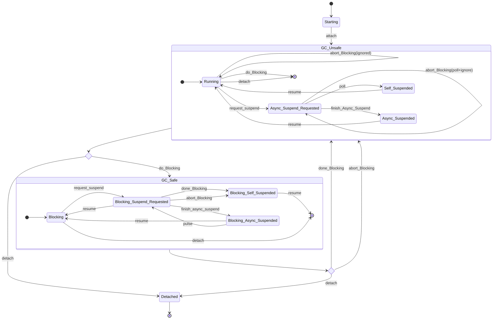
```mermaid
stateDiagram-v2
direction TB
    [*] --> Starting

    Starting --> GC_Unsafe : attach

    state GC_Unsafe_out <<choice>>

    state GC_Unsafe {
        direction LR
        [*] --> Running
        Running --> Running : poll
        Running --> Running : abort_Blocking(ignored)
        Running --> Async_Suspend_Requested : request_suspend
        Async_Suspend_Requested --> Async_Suspend_Requested : do_Blocking(poll)
        Async_Suspend_Requested --> Async_Suspend_Requested : abort_Blocking(poll+ignore)

        Async_Suspend_Requested --> Self_Suspended : poll
        Async_Suspend_Requested --> Async_Suspended : finish_Async_Suspend

        Async_Suspended --> Running : resume
        Self_Suspended --> Running : resume

        Running --> [*] : do_Blocking
        Running --> [*] : detach
    }

    GC_Unsafe --> GC_Unsafe_out
    GC_Unsafe_out --> GC_Safe : do_Blocking
    GC_Unsafe_out --> Detached : detach


    state GC_Safe {
       direction LR
       [*] --> Blocking
        Blocking --> Blocking_Suspend_Requested : request_suspend
        Blocking_Suspend_Requested --> Blocking_Self_Suspended : done_Blocking
        Blocking_Suspend_Requested --> Blocking_Self_Suspended : abort_Blocking
        Blocking_Suspend_Requested --> Blocking_Async_Suspended : finish_async_suspend
        Blocking_Suspend_Requested --> Blocking: resume
        Blocking_Self_Suspended --> [*] : resume
        Blocking_Async_Suspended --> Blocking : resume
        Blocking_Async_Suspended --> Blocking_Suspend_Requested : pulse
        Blocking --> [*] : detach
    }

    state GC_Safe_out <<choice>>

    GC_Safe --> GC_Safe_out
    GC_Safe_out --> GC_Unsafe : done_Blocking
    GC_Safe_out --> GC_Unsafe : abort_Blocking
    GC_Safe_out --> Detached : detach

    Detached --> [*]
```

## Preemptive suspend

A diagram of just the preemptive suspend policy:

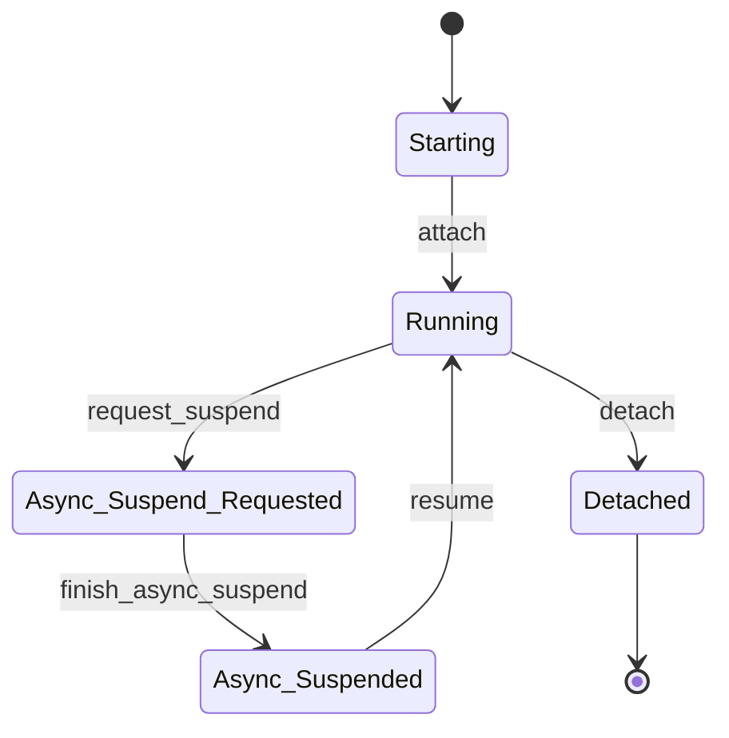
```mermaid
stateDiagram-v2
direction TB
    [*] --> Starting

    Starting --> Running : attach

    Running --> Async_Suspend_Requested : request_suspend

    Async_Suspend_Requested --> Async_Suspended : finish_async_suspend

    Async_Suspended --> Running : resume
    Running --> Detached : detach

    Detached --> [*]
```

In preemptive suspend, there is no concept of GC Safe or GC Unsafe states, and no polling at all.  Instead, the suspend initiator performs a `request_suspend` transition (for example by calling `SuspendThread` on Windows, or by sending a signal on POSIX), and when the thread is no longer running user code, a `finish_Async_Suspend` transition is performed and the suspend initiator is notified.  (On systems with a syscall for thread suspension (Windows and Darwin) the suspend initiator performs the `finish_Async_Suspend` transition after the syscall returns.  On POSIX, the user thread's signal handler performs the transition before the thread blocks on the resume signal.)

When the suspend initiator is ready to resume the stopped threads it performs a `resume` transition and performs the resume operation (signal on POSIX, syscall on Windows and Darwin).

### Sequence diagrams

Initiating a suspend (POSIX)

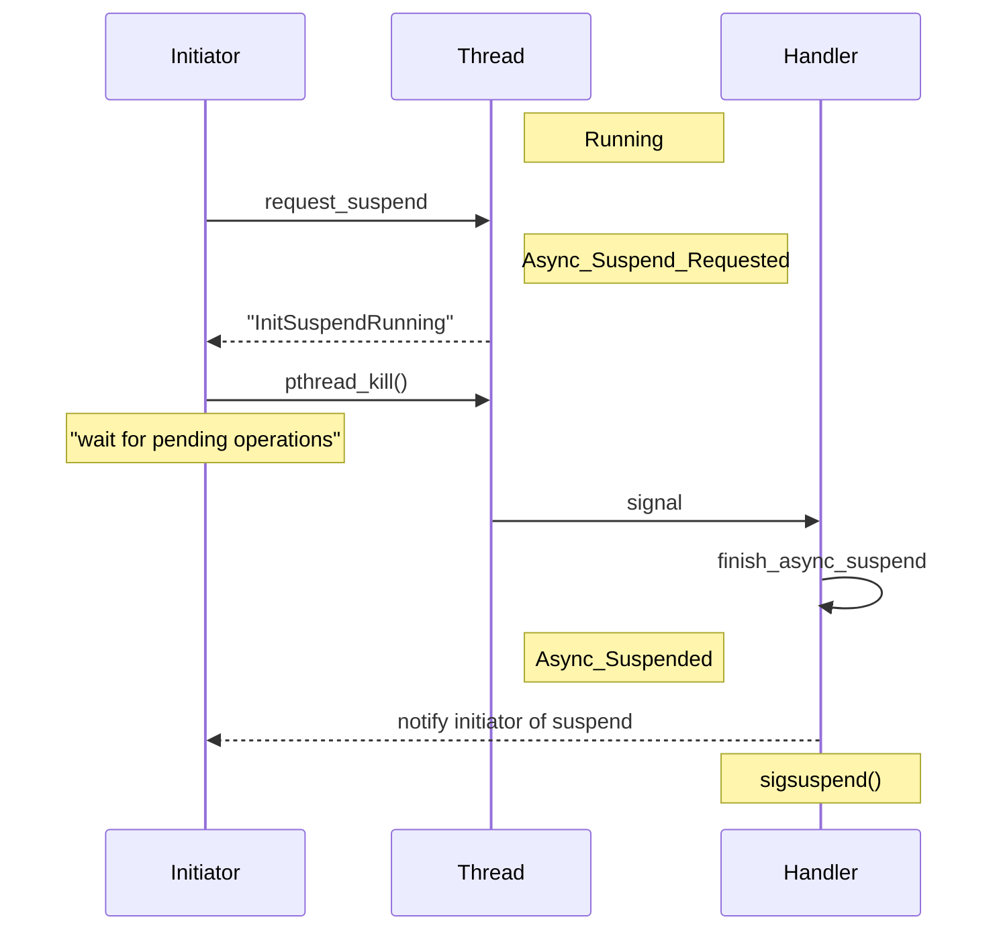
```mermaid
sequenceDiagram
participant Initiator
participant Thread
participant Handler
Note right of Thread: Running
Initiator->>Thread: request_suspend
Note right of Thread: Async_Suspend_Requested
Thread-->>Initiator: "InitSuspendRunning"
Initiator->>Thread: pthread_kill()
Note over Initiator: "wait for pending operations"
Thread->>Handler: signal
Handler->>Handler: finish_async_suspend
Note right of Thread: Async_Suspended
Handler-->>Initiator: notify initiator of suspend
Note over Handler: sigsuspend()
```

Initiating a suspend (Windows)

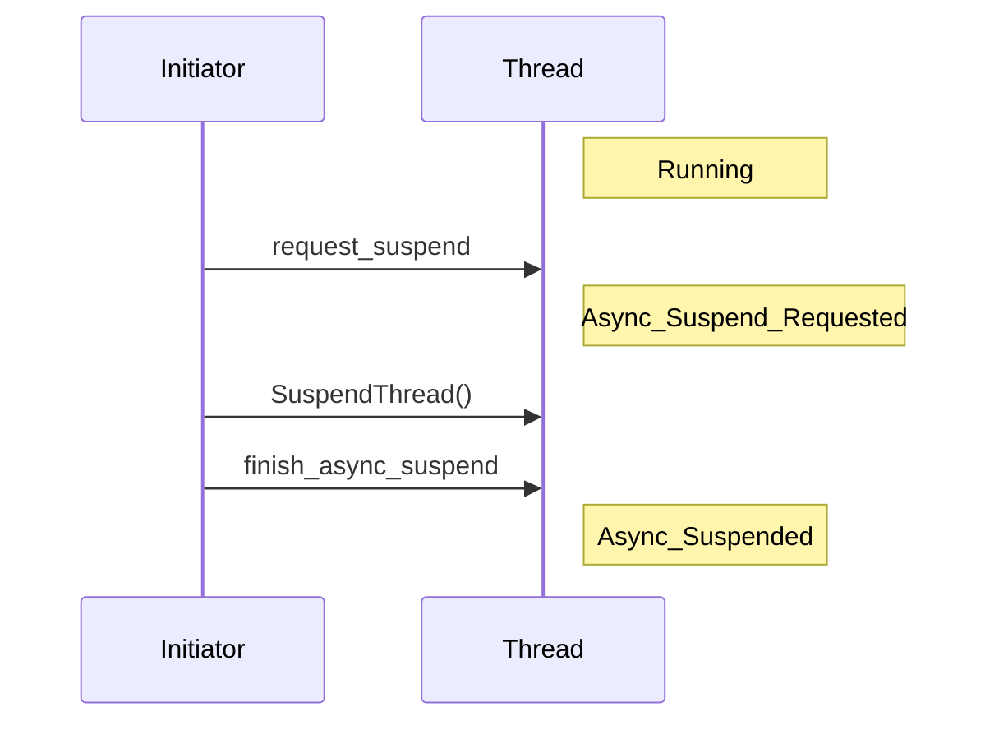
```mermaid
sequenceDiagram
participant Initiator
participant Thread
Note right of Thread: Running
Initiator->>Thread: request_suspend
Note right of Thread: Async_Suspend_Requested
Initiator->>Thread: SuspendThread()
Initiator->>Thread: finish_async_suspend
Note right of Thread: Async_Suspended
```

## Cooperative suspend

A diagram of the cooperative suspend policy:

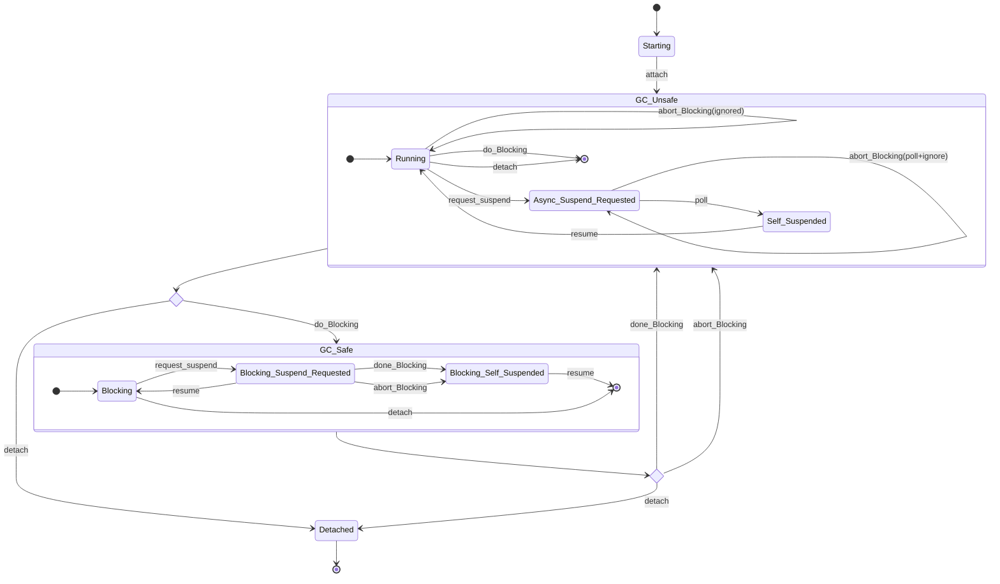
```mermaid
stateDiagram-v2
direction TB
    [*] --> Starting

    Starting --> GC_Unsafe : attach

    state GC_Unsafe_out <<choice>>

    state GC_Unsafe {
        direction LR
        [*] --> Running
        Running --> Running : poll
        Running --> Running : abort_Blocking(ignored)
        Running --> Async_Suspend_Requested : request_suspend
        Async_Suspend_Requested --> Async_Suspend_Requested : do_Blocking(poll)
        Async_Suspend_Requested --> Async_Suspend_Requested : abort_Blocking(poll+ignore)

        Async_Suspend_Requested --> Self_Suspended : poll

        Self_Suspended --> Running : resume

        Running --> [*] : do_Blocking
        Running --> [*] : detach
    }

    GC_Unsafe --> GC_Unsafe_out
    GC_Unsafe_out --> GC_Safe : do_Blocking
    GC_Unsafe_out --> Detached : detach


    state GC_Safe {
       direction LR
       [*] --> Blocking
        Blocking --> Blocking_Suspend_Requested : request_suspend
        Blocking_Suspend_Requested --> Blocking_Self_Suspended : done_Blocking
        Blocking_Suspend_Requested --> Blocking_Self_Suspended : abort_Blocking
        Blocking_Suspend_Requested --> Blocking: resume

        Blocking_Self_Suspended --> [*] : resume
        Blocking --> [*] : detach
    }

    state GC_Safe_out <<choice>>

    GC_Safe --> GC_Safe_out
    GC_Safe_out --> GC_Unsafe : done_Blocking
    GC_Safe_out --> GC_Unsafe : abort_Blocking
    GC_Safe_out --> Detached : detach

    Detached --> [*]
```

In cooperative suspend, the threads in `GC_Safe` states are always running - they are not blocked at all.  As a result, with this suspend policy, GC Safe code must not be able to manipulate runtime state at all: in embedding scenarios, all native runtime API calls have to be properly wrapped in thread state transitions.  Additionally, memory that may contain references into the managed heap must not be accessed by GC Safe code.  In other words, calls like `sleep()` or `read()` that may block are GC Safe, but calls like `mono_object_new()` are not - unless the thread performs a transition to GC Unsafe.

To suspend a thread, the GC initiator performs a `request_suspend` transition and acts on the result.  If the thread was in a `GC_Unsafe` state, the initiator must wait.  If the thread was in `GC_Safe`, the intiator has no more work to do: it assumes the thread is suspended.

If the thread is in `GC_Unsafe` it must periodically perform the `poll` transition.  If it was `Running`, there is nothing to do.  If it was `Async_Suspend_Requested` it moves to the `Self_Suspended` state and notifies the initiator.

Additionally threads must perform *blocking* transitions to notify the runtime of their intention to move between `GC_Safe` and `GC_Unsafe` states.

When a thread wants to move from the `GC_Unsafe` to the `GC_Safe` state, it performs a `do_Blocking` transition.  Entering `GC_Safe` cannot be nested: it is illegal to perform a `do_Blocking` transition from a `GC_Safe` state.  If the thread is `Running` it moves to the `Blocking` state (and keeps running - it is logically blocked from the point of view of the runtime).  If the thread was in the `Async_Suspend_Requested` state, it must perform a `poll` transition and self-suspend and then retry the `do_Blocking` transition after it is resumed.

To return from a `GC_Safe` state to `GC_Unsafe` the thread performs a `done_Blocking` transition.  It is illegal to perform a `done_Blocking` transition in a `GC_Unsafe` state.  If the thread was `Blocking`, it returns to `Running`.  If the thread was in a `Blocking_Suspend_Requested` state, it must self-suspend and the suspend initiator will put it in the `Running` state when the thread is resumed.

There is an additional transition `abort_Blocking` that a thread can perform if it wants to move to a `GC_Unsafe` state, but it is unsure whether it is in GC Safe or GC Unsafe state currently.  This is done, for example, as a wrapper around embedding API calls that may be called both from inside the runtime (assumed to be in `GC_Unsafe`) and from P/Invokes (assumed to be in `GC_Safe`).

If a thread performs an `abort_Blocking` and it was already in a `GC_Unsafe` state (`Running` or `Async_Suspend_Requested`), the state is unchanged and the thread is informed it was already in the desired state. Consequently when the thread is done with the embedding API call, it doesn't need to do anything.

If a thread performs an `abort_Blocking` and it was in `GC_Safe`, it behaves like a `done_Blocking` transition, and either the thread moves to `Running`, or it will move to `Running` after it is resumed.  Consequently, when the thread is done with the embedding API call, it is obligated to do a `do_Blocking` transition to go back to `GC_Safe`.

### Sequence diagrams

Initiating a suspend, thread is GC Unsafe:

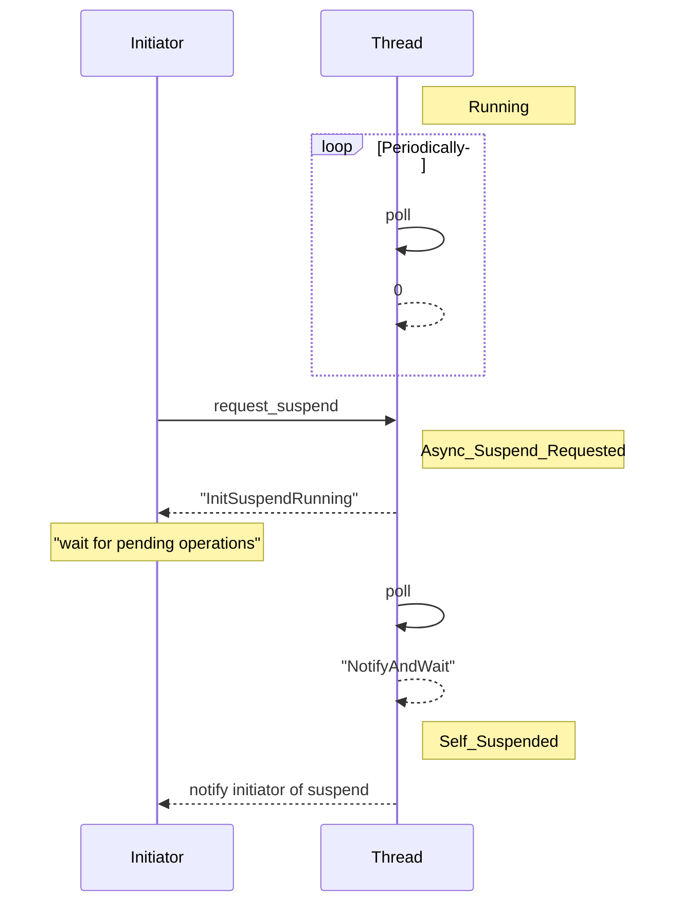
```mermaid
sequenceDiagram
participant Initiator
participant Thread
Note right of Thread: Running
loop Periodically
  Thread->>Thread: poll
  Thread-->>Thread: 0
end
Initiator->>Thread: request_suspend
Note right of Thread: Async_Suspend_Requested
Thread-->>Initiator: "InitSuspendRunning"
Note over Initiator: "wait for pending operations"
Thread->>Thread: poll
Thread-->>Thread: "NotifyAndWait"
Note right of Thread: Self_Suspended
Thread-->>Initiator: notify initiator of suspend
```

Initiating a suspend, thread is in GC Safe:

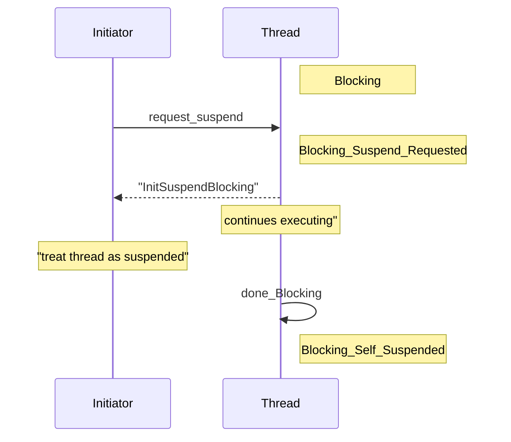
```mermaid
sequenceDiagram
participant Initiator
participant Thread
Note right of Thread: Blocking
Initiator->>Thread: request_suspend
Note right of Thread: Blocking_Suspend_Requested
Thread-->>Initiator: "InitSuspendBlocking"
Note over Thread: continues executing"
Note over Initiator: "treat thread as suspended"
Thread->>Thread: done_Blocking
Note right of Thread: Blocking_Self_Suspended
```

Resuming a GC Safe thread before it self-suspends:

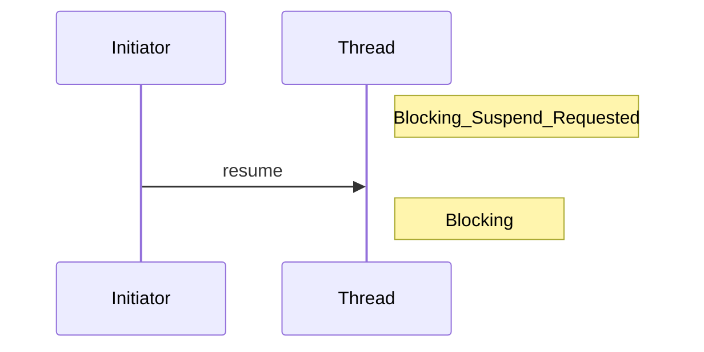
```mermaid
sequenceDiagram
participant Initiator
participant Thread
Note right of Thread: Blocking_Suspend_Requested
Initiator->>Thread: resume
Note right of Thread: Blocking
```

Resuming a GC Safe thread after it self-suspends:
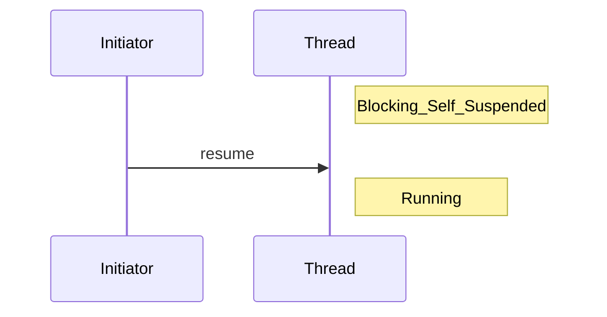
```mermaid
sequenceDiagram
participant Initiator
participant Thread
Note right of Thread: Blocking_Self_Suspended
Initiator->>Thread: resume
Note right of Thread: Running
```

Transitioning from GC Unsafe to GC Safe, if no suspend has been requested:

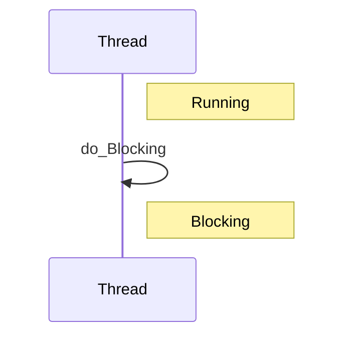
```mermaid
sequenceDiagram
participant Thread
Note right of Thread: Running
Thread->>Thread: do_Blocking
Note right of Thread: Blocking
```

Transitioning from GC Unsafe to GC Safe, if a suspend was requested:
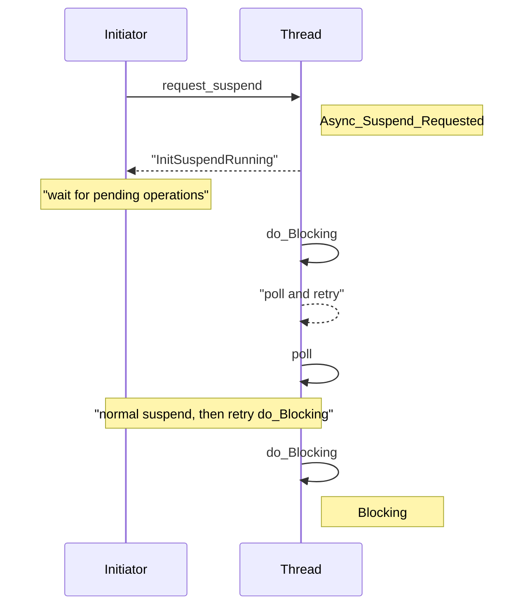
```mermaid
sequenceDiagram
participant Initiator
participant Thread
Initiator->>Thread: request_suspend
Note right of Thread: Async_Suspend_Requested
Thread-->>Initiator: "InitSuspendRunning"
Note over Initiator: "wait for pending operations"
Thread->>Thread: do_Blocking
Thread-->>Thread: "poll and retry"
Thread->>Thread: poll
Note over Thread, Initiator: "normal suspend, then retry do_Blocking"
Thread->>Thread: do_Blocking
Note right of Thread: Blocking
```

## Hybrid suspend

A diagram of the hybrid suspend policy:

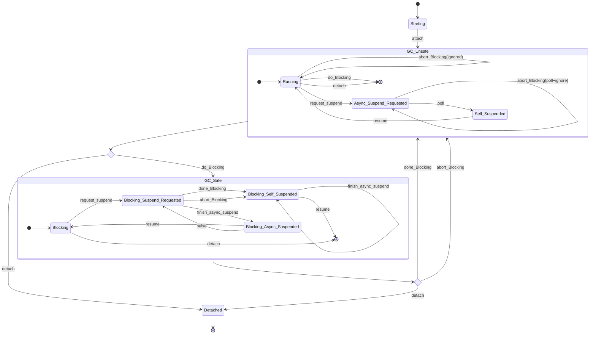
```mermaid
stateDiagram-v2
direction TB
    [*] --> Starting

    Starting --> GC_Unsafe : attach

    state GC_Unsafe_out <<choice>>

    state GC_Unsafe {
        direction LR
        [*] --> Running
        Running --> Running : poll
        Running --> Running : abort_Blocking(ignored)
        Running --> Async_Suspend_Requested : request_suspend
        Async_Suspend_Requested --> Async_Suspend_Requested : do_Blocking(poll)
        Async_Suspend_Requested --> Async_Suspend_Requested : abort_Blocking(poll+ignore)

        Async_Suspend_Requested --> Self_Suspended : poll

        Self_Suspended --> Running : resume

        Running --> [*] : do_Blocking
        Running --> [*] : detach
    }

    GC_Unsafe --> GC_Unsafe_out
    GC_Unsafe_out --> GC_Safe : do_Blocking
    GC_Unsafe_out --> Detached : detach


    state GC_Safe {
       direction LR
       [*] --> Blocking
        Blocking --> Blocking_Suspend_Requested : request_suspend
        Blocking_Suspend_Requested --> Blocking_Self_Suspended : done_Blocking
        Blocking_Suspend_Requested --> Blocking_Self_Suspended : abort_Blocking
        Blocking_Suspend_Requested --> Blocking_Async_Suspended : finish_async_suspend
        Blocking_Self_Suspended --> Blocking_Self_Suspended : finish_async_suspend
        Blocking_Self_Suspended --> [*] : resume
        Blocking_Async_Suspended --> Blocking : resume
        Blocking_Async_Suspended --> Blocking_Suspend_Requested : pulse
        Blocking --> [*] : detach
    }

    state GC_Safe_out <<choice>>

    GC_Safe --> GC_Safe_out
    GC_Safe_out --> GC_Unsafe : done_Blocking
    GC_Safe_out --> GC_Unsafe : abort_Blocking
    GC_Safe_out --> Detached : detach

    Detached --> [*]
```

Hybrid suspend is a combination of cooperative and preemptive suspend.
Threads that are `GC_Unsafe` are suspended cooperatively, while `GC_Safe` threads are preemptively suspended.  This allows threads that are executing critical runtime code to delay suspension until the next polling opportunity.  As a result we can avoid suspending while holding critical runtime locks, allocating memory visible to the GC, or other global state changes.

In hybrid suspend there are several additional states, and an additional `pulse` transition to deal with native threadpool threads (below).

User threads in `GC_Unsafe` periodically perform the `poll` transition, as in cooperative suspend.

User threads in `GC_Safe` states can suspend either by reaching a transition out of `GC_Safe` (ie they attempt a `done_Blocking` or `abort_Blocking` transition), or by being preemptively suspended by the suspend initiator.  As a result there are two possible suspended states: `Blocking_Self_Suspended` (tried to do a `done_Blocking`  or `abort_Blocking` transition) or `Blocking_Async_Suspended` (suspend initiator performed an `finish_async_suspend` transition).

When resuming, if a thread was `Blocking_Self_Suspended` it finishes the `done_Blocking` or `abort_Blocking` transition and goes to a `GC_Unsafe` state.  If it was in `Blocking_Async_Suspended`, then it resumes still in `GC_Safe` and goes back to the `Blocking` state.

### State diagrams

Largely the same as preemptive or cooperative suspend.

One difference is suspending threads in GC Safe is more complicated.  The thread could reach a transitiout out of GC Safe before the initiator has a chance to asynchronously suspend the thread.

Suspending a GC Safe thread using `SuspendThread` on Windows is show below, the posix diagram is similar, except the signal handler performs the finish action and must decide whether the thread is already suspended or not:

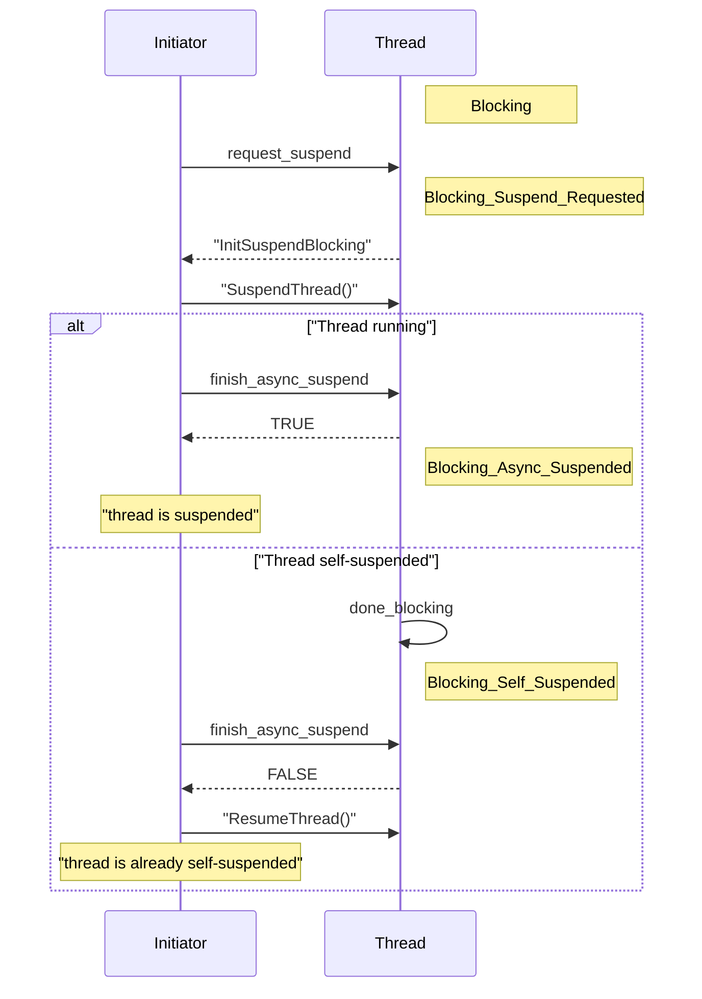
```mermaid
sequenceDiagram
participant Initiator
participant Thread
Note right of Thread: Blocking
Initiator->>Thread: request_suspend
Note right of Thread: Blocking_Suspend_Requested
Thread-->>Initiator: "InitSuspendBlocking"
Initiator->>Thread: "SuspendThread()"
alt "Thread running"
    Initiator->>Thread: finish_async_suspend
    Thread-->>Initiator: TRUE
    Note right of Thread: Blocking_Async_Suspended
    Note over Initiator: "thread is suspended"
else "Thread self-suspended"
    Thread->>Thread: done_blocking
    Note right of Thread: Blocking_Self_Suspended
    Initiator->>Thread: finish_async_suspend
    Thread-->>Initiator: FALSE
    Initiator->>Thread: "ResumeThread()"
    Note over Initiator: "thread is already self-suspended"
end
```

### Two phase suspension in hybrid suspend

There is a race condition that can happen with two user threads and a suspend initiator thread in hybrid suspend.

This happens when there is a system resource that is protected by a lock that is not exposed to the runtime.  (For example on linux, the dynamic linker uses a pthreads mutex in certain critical areas: as a result any function call (which triggers dynamic symbol resolution) can take a lock).

Consider a system lock that is not protected by runtime thread state transitions. (That is, a thread in `GC_Unsafe` state isn't able to attempt a transition to `GC_Safe` before trying to take the lock).

1. Thread A is in a `GC_Safe` state and it wants to take the lock.
2. Thread B is in a `GC_Unsafe` state and it holds the lock.
3. The suspend initiator initiates a suspend.
4. Thread A is preemptively suspended while holding the lock.
5. Thread B attempts to take the lock, because it hasn't reached its polling location yet.
6. There is now deadlock:
    * Thread A is waiting for the suspend initiator to resume it
    * Thread B is waiting for the lock held by Thread A
    * The suspend initiator is waiting for Thread B to self-suspend

The solution is a two phase hybrid suspend:

1. In the first phase, threads are asked to cooperatively suspend.  That is, threads in `GC_Unsafe` are asked to suspend in the usual manner, while threads in `GC_Safe` states get a `request_suspension` transition from the suspend initiator, but this is not followed by the suspend signal or syscall.  If the threads reach a `done_Blocking` or `abort_Blocking` transition, they will self-suspend, otherwise the will keep running in the `Blocking_Suspend_Requested` state.
2. In the second phase, any threads that haven't suspended are preemptively suspended by sending them a signal or syscall and performing the `finish_async_suspension` transition.

### Critical locations and native threadpool threads

As noted in the motivation for hybrid suspend, one of the problems with preemptive suspend is that it may interrupt threads at an inconvenient time.  With hybrid suspend we avoid suspending threads when they're using critical runtime resources, but they can still be in a critical location with respect to OS resources.

One such situation happens with native threadpools (for example GCD on Darwin).  We don't want to suspend threads that the operating system has parked.  (This can happen because the thread is still registered with the runtime because it previously ran managed code, but it is currently not running code on behalf of the runtime).

The suspend initiator can detect that some threads were preemptively suspended in a "critical location".  In this case we resume the threads and try to suspend them again, hoping that they will get to run for some time and reach a more suitable location.

The problem is that with two-phase suspend, once we resume a `GC_Safe` thread, we don't want it to transition to `GC_Unsafe` right away before we have a change to ask it to suspend again.  If that happens, we have to wake up the cooperatively suspended threads, too and repeat the entire two-phase suspend. (If we allow a thread to escape to `GC_Unsafe` while we're in the second phase, it could take a system lock and we get the deadlock described above).

As a result, the new `pulse` transition is used to wake up threads in critical locations.  The transition takes them back to `Blocking_Suspend_Requested`, which means they will get a chance to self-suspend, but if they don't we will preemptively-suspend them once again.


<a id="doc-f05d44f35b9c8840e64a0799"></a>

# dotnet/runtime / docs/design/mono/profiled-aot.md

Upstream: https://github.com/dotnet/runtime/blob/12955c8ab9478124f56f20510a8be0224e2e4e6a/docs/design/mono/profiled-aot.md

Commit: `12955c8ab9478124f56f20510a8be0224e2e4e6a`

Retrieved: 2026-10-01T15:17:27.770409+00:00

Kind: official-document

Raw SHA256: `f9769bc8367c8efc5cadd851152d6c496738b828eadc6ccc4d6998851365715f`

Source text below is untrusted reference content. Acquisition does not verify technical claims.

License status: UPSTREAM_NOTICES_CAPTURED_PER_FILE_REVIEW_REQUIRED. See this repository's captured license files.

---

Profiled Ahead-Of-Time Compilation on Mono
===

# Background

Mobile applications built using .NET typically leverage the Mono runtime to load and execute native machine code. The native machine code is generated from common intermediate language (CIL) assemblies using the Mono compiler with a variety of compilation strategies available including ahead-of-time (AOT) compilation, just-in-time (JIT) compilation, and interpreter. In addition to these strategies, .NET 7 introduced Profiled Ahead-Of-Time Compilation on Mono, a combination of AOT compilation and profile-guided-optimization (PGO) that leverages "profiles" to select which CIL code to AOT rather than an all-or-nothing approach. These profiles are obtained through [tracing](https://github.com/dotnet/runtime/blob/main/docs/design/mono/diagnostics-tracing.md) previous runs of an application, and the resulting trace is analyzed by the [dotnet-pgo tool](https://github.com/dotnet/runtime/blob/main/docs/design/features/dotnet-pgo.md) to generate a profile that tells the Mono AOT Compiler which methods to AOT.

# How it works

The advantages of Profiled AOT stem from its flexibility to AOT select code paths, leaving the rest to be compiled on the fly by the JIT compiler or Mono Interpreter. With an analysis of an application's trace, a record capturing a sequence of events during the application's execution, profiles can be generated to tailor optimizations for each application and environment. For example, profiles may target frequently executed (hot) code paths, minimizing the amount of runtime compilations and reducing application size, which are especially important in environments where full AOT compilation would strain storage space. Moreover, profiles may target startup code to optimize startup performance.

Within .NET, traces can be collected by [diagnostic tooling](https://learn.microsoft.com/dotnet/core/diagnostics/eventpipe#tools-that-use-eventpipe) that use the [EventPipe](https://learn.microsoft.com/dotnet/core/diagnostics/eventpipe) runtime component. [Existing diagnostic tooling only supports `NamedPipes`/`UnixDomainSockets`](https://github.com/dotnet/runtime/blob/main/docs/design/mono/diagnostics-tracing.md), so the [diagnostics tool dotnet-dsrouter](https://learn.microsoft.com/dotnet/core/diagnostics/dotnet-dsrouter) is required to bridge the EventPipe-based diagnostic tooling with .NET applications on mobile platforms and other remote sandboxed environments.

Events collected by EventPipe-based diagnostic tooling are emitted with a [`.nettrace` file format](https://github.com/microsoft/perfview/blob/main/src/TraceEvent/EventPipe/EventPipeFormat.md). Among the [various events supported by Mono runtime](https://github.com/dotnet/runtime/blob/main/src/mono/mono/eventpipe/gen-eventing-event-inc.lst), [method jitting and method loading](https://github.com/dotnet/runtime/blob/096b2499fe6939d635c35edaa607a180eb578fbb/src/mono/mono/eventpipe/gen-eventing-event-inc.lst#L39-L41) are crucial to [inform the Mono AOT Compiler what methods to AOT](https://github.com/dotnet/runtime/blob/6b67caaedfbfeaf7707478e50ccc9e8bc929e591/src/mono/mono/mini/aot-compiler.c#L13818-L13880). To collect a trace containing such events, it is imperative that dotnet-trace is provided either the appropriate [event provider](https://learn.microsoft.com/dotnet/core/diagnostics/well-known-event-providers) with [keyword flags](https://github.com/dotnet/runtime/blob/c59aef7622c9a2499abb1b7d262ed0c90f4b0c7f/src/coreclr/vm/ClrEtwAll.man#L14-L92) through `--providers` or the appropriate list of keywords through `--clrevents`. That way, the [events relevant to the keywords are captured](https://github.com/dotnet/runtime/blob/c59aef7622c9a2499abb1b7d262ed0c90f4b0c7f/src/coreclr/vm/ClrEtwAll.man#L3133). In the example workflows below, `--providers Microsoft-Windows-DotNETRuntime:0x1F000080018:5` is used.

Profiles [ingested by the Mono AOT Compiler](https://github.com/dotnet/runtime/blob/6b67caaedfbfeaf7707478e50ccc9e8bc929e591/src/tasks/AotCompilerTask/MonoAOTCompiler.cs#L174) are generated through .NET runtime's [`dotnet-pgo` tool](https://github.com/dotnet/runtime/blob/main/docs/design/features/dotnet-pgo.md). As such, profiles passed to the Mono AOT Compiler are expected to adhere to the [`.mibc` file format](https://github.com/dotnet/runtime/blob/main/src/coreclr/tools/dotnet-pgo/dotnet-pgo-experiment.md#mibc-file-format). The Mono AOT Compiler [reads `.mibc` profiles](https://github.com/dotnet/runtime/blob/c59aef7622c9a2499abb1b7d262ed0c90f4b0c7f/src/mono/mono/mini/aot-compiler.c#L14085-L14162) to determine [which methods to AOT](https://github.com/dotnet/runtime/blob/6b67caaedfbfeaf7707478e50ccc9e8bc929e591/src/mono/mono/mini/aot-compiler.c#L13818-L13880) when compiling CIL assemblies.

## Mono Profiled AOT Compilation

The Mono AOT Compiler can [directly ingest `.mibc` profiles](https://github.com/dotnet/runtime/pull/70194) to AOT compile methods contained within the profile. As the Mono AOT Compiler already had logic to AOT compile profile methods (from the legacy mono profiler), resolving [`MonoMethod`s](https://github.com/dotnet/runtime/blob/18cb172309570de25a2df8660ec2a6e3d0db610b/src/mono/mono/metadata/class-internals.h#L67) from the `.mibc` profile and [adding them for compilation](https://github.com/dotnet/runtime/blob/18cb172309570de25a2df8660ec2a6e3d0db610b/src/mono/mono/mini/aot-compiler.c#L13842-L13846) was sufficient.

As the [`.mibc` profile](https://github.com/dotnet/runtime/blob/main/src/coreclr/tools/dotnet-pgo/dotnet-pgo-experiment.md#mibc-file-format) is a Portable Executable (PE) file, the Mono AOT Compiler leverages several mono methods to resolve the profile data as `MonoMethod`s by:

1. Opening the `.mibc` profile as a `MonoImage` to load the `AssemblyDictionary` as a `MonoMethod`.
2. Iterating through the `AssemblyDictionary`'s IL instructions to discover tokens corresponding to `mibcGroupMethod`s within the profile.
3. Resolving each `mibcGroupMethod` discovered as a `MonoMethod`.
4. Iterating through the `mibcGroupmethod`'s IL instructions to discover tokens corresponding to method/type tokens within the `mibcGroupMethod`.
5. Resolving `MethodRef` and `MethodSpec` tokens as `MonoMethod`s corresponding to the actual method to be profile AOT'd, and inserting them into the profile methods hash table.

# Example Workflows

## Android -- Running through the [Android Profiled AOT Functional Test](https://github.com/dotnet/runtime/tree/main/src/tests/FunctionalTests/Android/Device_Emulator/AOT_PROFILED)

### Requirements:
- [Prerequisites](https://github.com/dotnet/runtime/blob/main/docs/workflow/testing/libraries/testing-android.md#prerequisites)
- [Building mono and libs](https://github.com/dotnet/runtime/blob/main/docs/workflow/testing/libraries/testing-android.md#building-libs-and-tests-for-android)
- [dotnet-dsrouter](https://learn.microsoft.com/dotnet/core/diagnostics/dotnet-dsrouter)
- [dotnet-trace](https://learn.microsoft.com/dotnet/core/diagnostics/dotnet-trace)

### Tracing (if not using provided .nettrace/.mibc files)
(informational) [Understanding diagnostics_tracing runtime component](https://github.com/dotnet/runtime/blob/main/docs/design/mono/diagnostics-tracing.md)

1. Startup dotnet-dsrouter to bridge device/emulator with diagnostic tooling either in a separate window or launch background instance with a `&` at the end.
```C#
dotnet-dsrouter client-server -tcps 127.0.0.1:9001 -ipcc ~/myport --verbose debug
```

2. Startup dotnet-trace tool to collect a .nettrace in a separate window
```C#
dotnet-trace collect --providers Microsoft-Windows-DotNETRuntime:0x1F000080018:5 --diagnostic-port ~/myport
```

3. Run the Android application enabling `RuntimeComponents` + `DiagnosticPorts` and disabling `NetTraceFilePath` + `ProfiledAOTProfilePaths` in the `.csproj`. These properties are consumed in the Android [build](https://github.com/dotnet/runtime/blob/main/src/mono/msbuild/android/build/AndroidBuild.targets).
```Shell
./dotnet.sh build /t:Test /p:TargetOS=android /p:TargetArchitecture=arm64 /p:Configuration=Debug src/tests/FunctionalTests/Android/Device_Emulator/AOT_PROFILED/Android.Device_Emulator.Aot_Profiled.Test.csproj
```

### Profiled AOT

1. Run the Android application supplying either the default or your own `.nettrace file` in `NetTraceFilePath` and/or `.mibc files` in `ProfiledAOTProfilePaths` and disabling `RuntimeComponents` + `DiagnosticPorts` in the `.csproj`. These properties are consumed in the Android [build](https://github.com/dotnet/runtime/blob/main/src/mono/msbuild/android/build/AndroidBuild.targets).
```Shell
./dotnet.sh build /t:Test /p:TargetOS=android /p:TargetArchitecture=arm64 /p:Configuration=Debug src/tests/FunctionalTests/Android/Device_Emulator/AOT_PROFILED/Android.Device_Emulator.Aot_Profiled.Test.csproj
```


<a id="doc-7f9ff5857d01f0789e9b5dc1"></a>

# dotnet/runtime / docs/design/mono/runtime-ilgen.md

Upstream: https://github.com/dotnet/runtime/blob/12955c8ab9478124f56f20510a8be0224e2e4e6a/docs/design/mono/runtime-ilgen.md

Commit: `12955c8ab9478124f56f20510a8be0224e2e4e6a`

Retrieved: 2026-10-01T15:17:27.770409+00:00

Kind: official-document

Raw SHA256: `fe181ad5ce932a673fa871efbdc4c665095101211237776818eb71b46c56dc3a`

Source text below is untrusted reference content. Acquisition does not verify technical claims.

License status: UPSTREAM_NOTICES_CAPTURED_PER_FILE_REVIEW_REQUIRED. See this repository's captured license files.

---

# IL generation at runtime

## Introduction

The mono runtime makes extensive use of generating IL methods at runtime. These
methods are called 'wrappers' in the runtime code, because some of them 'wrap' other
methods, like a managed-to-native wrapper would wrap the native function being called.
Wrappers have the `MonoMethod.wrapper_type` field set to the type of the wrapper.

## Source code structure

- `wrapper-types.h`: Enumeration of wrapper types
- `marshal*`: Functions for generating wrappers
- `method-builder*`: Low level functions for creating new IL methods/code at runtime

## WrapperInfo

Every wrapper has an associated `WrapperInfo` structure which describes the wrapper.
This can be retrieved using the `mono_marshal_get_wrapper_info ()` function.
Some wrappers have subtypes, these are stored in `WrapperInfo.subtype`.

## Caching wrappers

Wrappers should be unique, i.e. there should be only one instance of every wrapper. This is
achieved by caching wrappers in wrapper type specific hash tables, which are stored in
`MonoMemoryManager.wrapper_caches`.

## Generics and wrappers

Wrappers for generic instances should be created by doing:
instance method -> generic method definition -> generic wrapper -> inflated wrapper

## AOT support

In full-aot mode, the AOT compiler will collect and emit the wrappers needed by the
application at runtime. This involves serializing/deserializing the `WrapperInfo` structure.

## Wrapper types

### Managed-to-native

These wrappers are used to make calls to native code. They are responsible for marshalling
arguments and result values, setting up EH structures etc.

### Native-to-managed

These wrappers are used to call managed methods from native code. When a delegate is passed to
native code, the native code receives a native-to-managed wrapper.

### Delegate-invoke

Used to handle more complicated cases of delegate invocation that the fastpaths in the JIT can't handle.

### Synchronized

Used to wrap synchronized methods. The wrapper does the locking.

### Runtime-invoke

Used to implement `mono_runtime_invoke ()`.

### Dynamic-method

These are not really wrappers, but methods created by user code using the `DynamicMethod` class.

Note that these have no associated `WrapperInfo` structure.

### Alloc

SGEN allocator methods.

### Write-barrier

SGEN write barrier methods.

### Castclass

Used to implement complex casts.

### Stelemref

Used to implement stelem.ref.

### Unbox

Used to unbox the receiver before calling a method.

### Managed-to-managed/other

The rest of the wrappers, distinguished by their subtype.

#### String-ctor

Used to implement string ctors, the first argument is ignored, and a new string is allocated.

#### Element-addr

Used to implement ldelema in multi-dimensional arrays.

#### Generic-array-helper

Used to implement the implicit interfaces on arrays like IList<T> etc. Delegate to helper methods on the Array class.

#### Structure-to-ptr

Used to implement Marshal.StructureToPtr.

#### Ptr-to-structure

Used to implement Marshal.PtrToStructure.


<a id="doc-64d8addb979787e266f9a8ff"></a>

# dotnet/runtime / docs/design/mono/unloadability.md

Upstream: https://github.com/dotnet/runtime/blob/12955c8ab9478124f56f20510a8be0224e2e4e6a/docs/design/mono/unloadability.md

Commit: `12955c8ab9478124f56f20510a8be0224e2e4e6a`

Retrieved: 2026-10-01T15:17:27.770409+00:00

Kind: official-document

Raw SHA256: `ad4f1473c112f746ad774031e41ccb3b8a9d4a49f482bb5b9d5f2a391bb935bc`

Source text below is untrusted reference content. Acquisition does not verify technical claims.

License status: UPSTREAM_NOTICES_CAPTURED_PER_FILE_REVIEW_REQUIRED. See this repository's captured license files.

---


Design
------

The design is based on docs/design/features/unloadability.md.

Memory managers
---------------

Most runtime memory is owned by MonoMemoryManager structures, which are owned by one or more ALCs. For example,
if type T1 is from ALC1, and T2 is from ALC2, then the memory related to the generic instance T1<T2> will
be owned by the memory manager for [ALC1, ALC2]. A memory manager is collectible if one of its ALCs is collectible.

LoaderAllocator objects
-----------------------

Each memory manager has a corresponding LoaderAllocator object. This object is referenced explicitly or
implicitly by every managed object which is related to the memory manager. Until unloading starts,
the memory manager keeps a strong reference to this object.

For objects whose type is from a collectible ALC, the GC maintains an implicit reference by marking
the LoaderAllocator object when the object is marked.

Reflection objects referencing the ALC have an explicit 'keepalive' field which points to the
corresponding LoaderAllocator object.

When the LoaderAllocator object is collected by the GC, it means there are no more managed
references to its memory allocator, so it can be unloaded.

Reflection caches and static variables
--------------------------------------

Reflection objects are kept in caches inside the runtime. These caches keep strong references to the
reflection objects. This doesn't work for collectible ALCs, since the objects keep the LoaderAllocator
object alive. So for collectible ALCs, we use a different kind of hash table whose keys/values are
stored in object[] arrays inside the LoaderAllocator object, and the hash table holds a weak reference
to these arrays. This means that the reflection objects are only kept alive by the LoaderAllocator and
by application code.

Similarly, normal static variables are treated as GC roots so any static variable pointing to an object
inside the ALC would keep the ALC alive. Instead, we store static variables inside arrays in the
LoaderAllocator object. Normal reference type variable are allocated an entry in a pinned object[],
and their address becomes an interior pointer to the pinned array element. For valuetypes, we
allocate a pinned boxed object and the static variable address becomes the address of the unboxed
object.

Unloading process
-----------------

- The app calls AssemblyLoadContext.Unload ()
- The runtime iterates over the memory managers of the ALC. Each ALC holds a strong reference to its
LoaderAllocator object. We change the strong reference to a weak one, allowing the LoaderAllocator
to the collected.
- The app eventually drops all implicit and explicit references to the LoaderAllocator object.
- The finalizer of the LoaderAllocator object calls into the runtime to free the corresponding
memory manager.
- When all memory managers referencing the ALC are freed, the ALC itself is freed.

See the document in the Design section about the LoaderAllocatorScout object.

Remaining work
---------------

- Managed frames
Frames belonging to code in the ALC should keep the ALC alive. This can be implemented by
having all methods allocate a volatile local variable and store a reference to their LoaderAllocator object
into it.
- Thread abort
Although its not part of current .NET APIs, it might be useful to have a way to abort threads executing code
in an ALC, similarly to how domain unloads worked previously.
- Reflection pointers
Icalls which take a assembly/type etc. handle as parameter need to keep the ALC alive, otherwise there will
be subtle races.
- Boehm GC support
- TLS variables
- Enable/disable compiler flag
- Profiling, perf counters, etc. support
- Diagnostics support, i.e. what keeps an ALC alive
- Testing
- Leak detection


<a id="doc-ecd4a6980aa83942afe730a5"></a>

# dotnet/runtime / docs/design/mono/wasm-aot.md

Upstream: https://github.com/dotnet/runtime/blob/12955c8ab9478124f56f20510a8be0224e2e4e6a/docs/design/mono/wasm-aot.md

Commit: `12955c8ab9478124f56f20510a8be0224e2e4e6a`

Retrieved: 2026-10-01T15:17:27.770409+00:00

Kind: official-document

Raw SHA256: `05a16cd17db703fea7f6f5febe208ee39b9726c4e7bff863db42694b8a5b2e7f`

Source text below is untrusted reference content. Acquisition does not verify technical claims.

License status: UPSTREAM_NOTICES_CAPTURED_PER_FILE_REVIEW_REQUIRED. See this repository's captured license files.

---

# WebAssembly AOT code generation

## Basic operation

The LLVM backend of the Mono JIT is used to generate an llvm .bc file for each assembly, then the .bc files are
compiled to webassembly using emscripten, then the resulting wasm files are linked into the final app. The 'bitcode'/'llvmonly'
variant of the LLVM backend is used since webassembly doesn't support inline assembly etc.

## Source code structure

`mini-llvm.c`: The LLVM backend.
`mini-wasm.h/c`: The wasm backend. This is a minimal version of a normal mono JIT backend which only supports llvm.
`llvm-runtime.cpp`: Code to throw/catch C++ exceptions.
`aot-runtime-wasm.c`: Code related to interpreter/native transitions on wasm.
`llvmonly-runtime.c`:  Runtime support for the generated AOT code.

WASM specific code is inside `HOST_WASM/TARGET_WASM` defines.

## GC Support

On wasm, the execution stack is not stored in linear memory, so its not possible to scan it for GC references. However, there
is an additional C stack in linear memory which is managed explicitly by the generated wasm code. This stack is already
scanned by the mono GC as on other platforms.
To make GC references in AOTed methods visible to the GC, every method allocates a gc_pin area in its prolog, and
stores arguments/locals with a reference type into it. This will cause the GC to pin those references so the rest of
the generated code can treat them normally as LLVM values.

## Interpreter support

On wasm, the two supported execution modes are interpreter, or aot+interpreter. This means its always
possible to fall back to the interpreter if needed.
For the AOT -> interpreter case, every call from AOTed code which might end up in the interpreter is
emitted as an indirect call. When the callee is not found, a wrapper function is used which
packages up the arguments into an array and passes control to the interpreter.
For the interpreter -> AOT case, and similar wrapper function is used which receives the
arguments and a return value pointer from the interpreter in an array, and calls the
AOTed code. There is usually one aot->interp and interp->aot wrapper for each signature, with
some sharing. These wrappers are generated by the AOT compiler when the 'interp' aot option
is used.

## Exception handling

On wasm, its not possible to walk the stack so the normal mono exception handling/unwind code
cannot be used as is. Its also hard to map the .NET exception handling concepts like filter clauses
to the llvm concepts. Instead, c++/wasm exceptions are used to implement unwinding, and the
interpreter is used to execute EH code.
When an exception needs to be thrown, we store the exception info in TLS, and throw a dummy C++ exception instead.
Internally, this is implemented by emscripten either by calling into JS, or by using the wasm exception handling
spec.
The c++ exception is caught in the generated AOT code using the relevant llvm catch instructions. Then execution is
transferred to the interpreter. This is done by creating a data structure on the stack containing all the IL level state like
the IL offset and the values of all the IL level variables. The generated code continuously updates this state during
execution. When an exception is caught, this IL state is passed to the interpreter which continues execution from
that point.  This process is called `deopt` in the runtime code.
Exceptions are also caught in various other places like the interpreter-aot boundary.

## Null checks

Since wasm has no signal support, we generate explicit null checks.

## Issues

The generated code is in general much bigger than the code generated on ios etc. Some of the
current issues are described below.

### Function pointers

The runtime needs to be able to do a IL method -> wasm function lookup. To do this, every
AOT image includes a table mapping from a method index to wasm functions. This means that
every generated AOT method has its address taken, which severely limits the interprocedural
optimizations that LLVM can do, since it cannot determine the set of callers for a function.
This means that it cannot remove functions corresponding to unused IL methods, cannot
specialize functions for constant/nonnull arguments, etc.
The dotnet ILLink tool includes some support for adding a [DisablePrivateReflection] attribute to
methods which cannot be called using reflection, and the AOT compiler could use this
to avoid generating function pointers for methods which are not called from outside the
AOT image. This is not enabled right now because the ILLink tool support is not complete.

### Null checks

The explicit null checking code adds a lot of size overhead since null checks are very common.

### Virtual calls

Vtable slots are lazily initialized on the first call, i.e. every virtual call looks like this:
```C
vt_entry = vtable [slot];
if (vt_entry == null)
	vt_entry = init_vt_entry ();
```

### Exception handling

It might be possible to implement EH in the generated code without involving the interpreter. The
current design adds a lot of overhead to methods which contain IL clauses.


<a id="doc-5b1e5f1c1c56e263d0f11720"></a>

# dotnet/runtime / docs/design/mono/web/README.md

Upstream: https://github.com/dotnet/runtime/blob/12955c8ab9478124f56f20510a8be0224e2e4e6a/docs/design/mono/web/README.md

Commit: `12955c8ab9478124f56f20510a8be0224e2e4e6a`

Retrieved: 2026-10-01T15:17:27.770409+00:00

Kind: official-document

Raw SHA256: `f0256901a0a90953e0e093292ff3e1d649c73d6d4aa3c533438ef28b6e41f400`

Source text below is untrusted reference content. Acquisition does not verify technical claims.

License status: UPSTREAM_NOTICES_CAPTURED_PER_FILE_REVIEW_REQUIRED. See this repository's captured license files.

---

This directory contains the original mono runtime documentation from the [mono website](https://github.com/mono/website/tree/gh-pages/docs/advanced/runtime/docs).


<a id="doc-416a0574594558f3134b99ca"></a>

# dotnet/runtime / docs/design/mono/web/aot.md

Upstream: https://github.com/dotnet/runtime/blob/12955c8ab9478124f56f20510a8be0224e2e4e6a/docs/design/mono/web/aot.md

Commit: `12955c8ab9478124f56f20510a8be0224e2e4e6a`

Retrieved: 2026-10-01T15:17:27.770409+00:00

Kind: official-document

Raw SHA256: `e319cd3b782f930f5cf057f21618cc98c78b3b1b869880019c1897a829cbb97e`

Source text below is untrusted reference content. Acquisition does not verify technical claims.

License status: UPSTREAM_NOTICES_CAPTURED_PER_FILE_REVIEW_REQUIRED. See this repository's captured license files.

---

# Ahead of Time Compilation (AOT)

Mono Ahead Of Time Compiler
---------------------------

The Ahead of Time compilation feature in Mono allows Mono to precompile assemblies to minimize JIT time, reduce memory usage at runtime and increase the code sharing across multiple running Mono application.

To precompile an assembly use the following command:

      mono --aot -O=all assembly.exe

The \`--aot' flag instructs Mono to ahead-of-time compile your assembly, while the -O=all flag instructs Mono to use all the available optimizations.

Besides code, the AOT file also contains cached metadata information which allows the runtime to avoid certain computations at runtime, like the computation of generic vtables. This reduces both startup time, and memory usage. It is possible to create an AOT image which contains only this cached information and no code by using the 'metadata-only' option during compilation:

       mono --aot=metadata-only assembly.exe

This works even on platforms where AOT is not normally supported.

The code generated by Ahead-of-Time compiled images is position-independent code. This allows the same precompiled image to be reused across multiple applications without having different copies: this is the same way in which ELF shared libraries work: the code produced can be relocated to any address.

The implementation of Position Independent Code has a performance impact on Ahead-of-Time compiled images but compiler bootstraps are still faster than JIT-compiled images, specially with all the new optimizations provided by the Mono engine.

### The AOT File Format

We use the native object format of the platform. That way it is possible to reuse existing tools like as/ld and the dynamic loader. On ELF platforms, the AOT compiler can generate an ELF .so file directly, on other platforms, it generates an assembly (.s) file which is then assembled and linked by as/ld into a shared library.

The precompiled image is stored in a file next to the original assembly that is precompiled with the native extension for a shared library (on Linux its ".so" to the generated file).

For example: basic.exe -\> basic.exe.so; corlib.dll -\> corlib.dll.so

There is one global symbol in each AOT image named 'mono_aot_file_info'. This points to a MonoAotFileInfo structure which contains pointers to all the AOT data structures. In the latter parts of this document, fields of this structure are referenced using info-\>\<FIELD NAME\>.

Binary data other than code is stored in one giant blob. Data items inside the blob can be found using several tables called 'XXX_offsets', like 'method_info_offsets'. These tables contain offsets into the blob, stored in a compact format using differential encoding plus an index.

### Source file structure

The AOT infrastructure is split into two files, aot-compiler.c and aot-runtime.c. aot-compiler.c contains the AOT compiler which is invoked by --aot, while aot-runtime.c contains the runtime support needed for loading code and other things from the aot files. The file image-writer.c contains the ELF writer/ASM writer code.

### Compilation process

AOT compilation consists of the following stages:

-   collecting the methods to be compiled.
-   compiling them using the JIT.
-   emitting the JITted code and other information
-   emitting the output file either directly, or by executing the system assembler/linker.

### Handling methods

There are two kinds of methods handled by AOT:

-   Normal methods are methods from the METHODDEF table.
-   'Extra' methods are either runtime generated methods (wrappers) or methods of inflated generic classes/inflated generic methods.

Each method is identified by a method index. For normal methods, this is equivalent to its index in the METHOD metadata table. For extra methods, it is an arbitrary number. Compiled code is created by invoking the JIT, requesting it to created AOT code instead of normal code. This is done by the compile_method () function. The output of the JIT is compiled code and a set of patches (relocations). Each relocation specifies an offset inside the compiled code, and a runtime object whose address is accessed at that offset. Patches are described by a MonoJumpInfo structure. From the perspective of the AOT compiler, there are two kinds of patches:

-   calls, which require an entry in the PLT table.
-   everything else, which require an entry in the GOT table.

How patches is handled is described in the next section. After all the method are compiled, they are emitted into the output file into a byte array called 'methods'. Each piece of compiled code is identified by the local symbol .Lm_\<method index\>. While compiled code is emitted, all the locations which have an associated patch are rewritten using a platform specific process so the final generated code will refer to the plt and got entries belonging to the patches. This is done by the emit_and_reloc_code () function. The compiled code array can be accessed using the 'methods' global symbol.

### Handling patches

Before a piece of AOTed code can be used, the GOT entries used by it must be filled out with the addresses of runtime objects. Those objects are identified by MonoJumpInfo structures. These stuctures are saved in a serialized form in the AOT file, so the AOT loader can deconstruct them. The serialization is done by the encode_patch () function, while the deserialization is done by the decode_patch_info () function. Every method has an associated method info blob stored inside the global blob. This contains all the information required to load the method at runtime:

-   the first got entry used by the method.
-   the number of got entries used by the method.
-   the indexes of the got entries used by the method

Each GOT entry is described by a serialized description stored in the global blob. The 'got_info_offsets' table maps got offsets to the offsets of their description.

### The Procedure Linkage Table (PLT)

Our PLT is similar to the elf PLT, it is used to handle calls between methods. If method A needs to call method B, then an entry is allocated in the PLT for method B, and A calls that entry instead of B directly. This is useful because in some cases the runtime needs to do some processing the first time B is called. The processing includes:

-   if B is in another assembly, then it needs to be looked up, then JITted or the corresponding AOT code needs to be found.
-   if B is in the same assembly, but has got slots, then the got slots need to be initialized.

If none of these cases is true, then the PLT is not used, and the call is made directly to the native code of the target method. A PLT entry is usually implemented by a jump through a GOT entry, these entries are initially filled up with the address of a trampoline so the runtime can get control, and after the native code of the called method is created/found, the jump table entry is changed to point to the native code. All PLT entries also embed a integer offset after the jump which indexes into the 'plt_info' table, which stores the information required to find the called method. The PLT is emitted by the emit_plt () function.

### Exception/Debug info

Each compiled method has some additional info generated by the JIT, usable for debugging (IL offset-native offset maps) and exception handling (saved registers, native offsets of try/catch clauses). These are stored in the blob, and the 'ex_info_offsets' table can be used to find them.

### Cached metadata

When the runtime loads a class, it needs to compute a variety of information which is not readily available in the metadata, like the instance size, vtable, whenever the class has a finalizer/type initializer etc. Computing this information requires a lot of time, causes the loading of lots of metadata, and it usually involves the creation of many runtime data structures (MonoMethod/MonoMethodSignature etc), which are long living, and usually persist for the lifetime of the app. To avoid this, we compute the required information at aot compilation time, and save it into the aot image, into an array called 'class_info'. The runtime can query this information using the mono_aot_get_cached_class_info () function, and if the information is available, it can avoid computing it. To speed up mono_class_from_name (), a hash table mapping class names to class indexes is constructed and saved in the AOT file pointed to by the symbol 'class_name_table'.

### Other data

Things saved into the AOT file which are not covered elsewhere:

-   info-\>assembly_guid A copy of the assembly GUID. When loading an AOT image, this GUID must match with the GUID of the assembly for the AOT image to be usable.

-   info-\>version The version of the AOT file format. This is checked against the MONO_AOT_FILE_VERSION constant in mini.h before an AOT image is loaded. The version number must be incremented when an incompatible change is made to the AOT file format.

-   info-\>image_table A list of assemblies referenced by this AOT module.

-   info-\>plt The Program Linkage Table

### LLVM Support

It is possible to use LLVM in AOT mode. This is implemented by compiling methods using LLVM instead of the JIT, saving the resulting LLVM bytecode into an LLVM .bc file, compiling it using LLVM tools into a .s file, then appending our own AOT data structures to that file.

### Full AOT mode

Some platforms like the iphone prohibit JITted code, using technical and/or legal means. This is a significant problem for the mono runtime, since it generates a lot of code dynamically, using either the JIT or more low-level code generation macros. To solve this, the AOT compiler is able to function in full-aot or aot-only mode, where it generates and saves all the necessary code in the aot image, so at runtime, no code needs to be generated. There are two kinds of code which needs to be considered:

-   wrapper methods, that is methods whose IL is generated dynamically by the runtime. They are handled by generating them in the add_wrappers () function, then emitting them as 'extra' methods.
-   trampolines and other small hand generated pieces of code. They are handled in an ad-hoc way in the emit_trampolines () function.

### Emitting assembly/object code

The output emission functionality is in the file image-writer.c. It can either emit assembly code (.s), or it can produce a shared image directly. The latter is only supported on x86/amd64 ELF. The emission of debug information is in the file dwarfwriter.c.

### Performance considerations

Using AOT code is a trade-off which might lead to higher or slower performance, depending on a lot of circumstances. Some of these are:

-   AOT code needs to be loaded from disk before being used, so cold startup of an application using AOT code MIGHT be slower than using JITed code. Warm startup (when the code is already in the machines cache) should be faster. Also, JITing code takes time, and the JIT compiler also need to load additional metadata for the method from the disk, so startup can be faster even in the cold startup case.
-   AOT code is usually compiled with all optimizations turned on, while JITted code is usually compiled with default optimizations, so the generated code in the AOT case could be faster.
-   JITted code can directly access runtime data structures and helper functions, while AOT code needs to go through an indirection (the GOT) to access them, so it will be slower and somewhat bigger as well.
-   When JITting code, the JIT compiler needs to load a lot of metadata about methods and types into memory.
-   JITted code has better locality, meaning that if A method calls B, then the native code for A and B is usually quite close in memory, leading to better cache behavior thus improved performance. In contrast, the native code of methods inside the AOT file is in a somewhat random order.

### Porting

Generated native code needs to reference various runtime structures/functions whose address is only known at run time. JITted code can simple embed the address into the native code, but AOT code needs to do an indirection. This indirection is done through a table called the Global Offset Table (GOT), which is similar to the GOT table in the Elf spec. When the runtime saves the AOT image, it saves some information for each method describing the GOT table entries used by that method. When loading a method from an AOT image, the runtime will fill out the GOT entries needed by the method.

#### Computing the address of the GOT

Methods which need to access the GOT first need to compute its address. On the x86 it is done by code like this:

            call <IP + 5>
            pop ebx
            add <OFFSET TO GOT>, ebx
            <save got addr to a register>

The variable representing the got is stored in cfg-\>got_var. It is allways allocated to a global register to prevent some problems with branches + basic blocks.

#### Referencing GOT entries

Any time the native code needs to access some other runtime structure/function (i.e. any time the backend calls mono_add_patch_info ()), the code pointed by the patch needs to load the value from the got. For example, instead of:

        call <ABSOLUTE ADDR>

it needs to do:

        call *<OFFSET>(<GOT REG>)

Here, the \<OFFSET\> can be 0, it will be fixed up by the AOT compiler.

For more examples on the changes required, see

svn diff -r 37739:38213 mini-x86.c

### Back end functionality

#### OP_AOTCONST

Loading informarion from the GOT tables is done by the OP_AOTCONST opcode. Since the opcode implementation needs to reference the GOT symbol, which is not available during JITting, the backend should emit some placeholder code in mono_arch_output_basic_block (), and emit the real implementation in arch_emit_got_access () in aot-compiler.c.

#### Constants

AOTed code cannot contain literal constants like addresses etc. All occurences of those should be replaced by an OP_AOTCONST.

#### PLT Entries

PLT entries are emitted by arch_emit_plt_entry () in aot-compiler.c. Each PLT entry has a corresponding slot in the GOT. The PLT entry should load this GOT slot, and branch to it, without clobbering any argument registers or the return value. Since the return address is not updated, the AOT code obtains the address of the PLT entry by disassembling the call site which branched to the PLT entry. This is done by the mono_arch_get_call_target () function in tramp-\<ARCH\>.c. The information needed to resolve the target of the PLT entry is in the AOT tables, and an offset into these tables should be emitted as a word after the PLT entry. The mono_arch_get_plt_info_offset () function in tramp-\<ARCH\>.c is responsible for retrieving this offset. After the call is resolved, the GOT slot used by the PLT entry needs to be updated with the new address. This is done by the mono_arch_patch_plt_entry () function in tramp-\<ARCH\>.c.

### Future Work

-   Currently, when an AOT module is loaded, all of its dependent assemblies are also loaded eagerly, and these assemblies need to be exactly the same as the ones loaded when the AOT module was created ('hard binding'). Non-hard binding should be allowed.
-   On x86, the generated code uses call 0, pop REG, add GOTOFFSET, REG to materialize the GOT address. Newer versions of gcc use a separate function to do this, maybe we need to do the same.
-   Currently, we get vtable addresses from the GOT. Another solution would be to store the data from the vtables in the .bss section, so accessing them would involve less indirection.
-   When saving information used to identify classes/methods, we use an add-hoc encoding. An encoding similar to the metadata encoding should be used instead.

[Original version of this document in git](https://github.com/mono/mono/blob/e6d522976e24e572f0e7bc344ae4b8f79f955c6f/docs/aot-compiler.txt)


<a id="doc-43b898c4305820543ed940c9"></a>

# dotnet/runtime / docs/design/mono/web/bitcode.md

Upstream: https://github.com/dotnet/runtime/blob/12955c8ab9478124f56f20510a8be0224e2e4e6a/docs/design/mono/web/bitcode.md

Commit: `12955c8ab9478124f56f20510a8be0224e2e4e6a`

Retrieved: 2026-10-01T15:17:27.770409+00:00

Kind: official-document

Raw SHA256: `2c115629533df8625d31c5507c2b849d8561b35b13bd2cf95fd1cb0df02c0ce4`

Source text below is untrusted reference content. Acquisition does not verify technical claims.

License status: UPSTREAM_NOTICES_CAPTURED_PER_FILE_REVIEW_REQUIRED. See this repository's captured license files.

---

# Bitcode

## Introduction

Bitcode imposes the following major restrictions:

-   No inline assembly/machine code
-   Compilation using stock clang

To enable the runtime to operate in this environment, a new execution mode 'llvmonly' was implemented. In this mode:

-   everything is compiled to llvm bitcode, then compiled to native code using clang.
-   no trampolines, etc. are used.

In the rest of this document, 'normal mode' is used to refer to the JIT/full aot mode previously supported by the runtime.

## Concepts

### Passing extra arguments

The runtime used trampolines to pass extra arguments to some generic shared methods. This is not possible in llvmonly mode. Instead, these arguments are passed normally as an additional argument, and the caller is responsible for passing them. The method address and the possible additional argument are encapsulated together into a function descriptor represented by a MonoFtnDesc structure. These function descriptors are used instead of method addresses anywhere where a callee might require an extra argument. A call using an ftndesc looks like this:

``` c
ftndesc->addr (<normal args>, ftndesc->arg);
```

The 'arg' field might be null, in which case the caller will pass one more argument than the callee requires, but that is not a problem with most calling conventions.

### Lazy initialization

Trampolines were used in many places in the runtime to initialize/load methods/code on demand. Instead, either the caller or the callee needs to check whenever initialization is required, and call into runtime code to do it.

## Details

### Method initialization

AOT methods require the initialization of GOT slots they are using. In normal execution mode, this was accomplished by calling them through PLT entries. The PLT entry would look up the method code, initialize its GOT slots, then transfer control to it. In llvmonly mode, methods initialize themselves. Every AOT module has an 'inited' bit array with one bit for every method. The method code checks this bit in its prolog, and if its 0, calls a runtime function to initialize the method.

In llvmonly mode, no trampolines are created for methods. Instead, the method's code is looked up immediately. This doesn't create lazy initialization problems because the method is initialized lazily, so looking up its code doesn't change managed state, i.e. it doesn't run type cctors etc.

### Looking up methods

In normal mode, AOT images contained a table mapping method indexes to method addresses. This table was emitted using inline assembly. In llvmonly mode, there is a generated llvm function which does this mapping using a switch statement.

### Unbox trampolines

In normal mode, these were emitted using inline assembly. In llvmonly mode, these are emitted as llvm code. With optimizations enabled, llvm can emit the same or very similar code.

### Null checks

Since the target plaform for bitcode doesn't support sigsegv signal handlers, explicit null checks are emitted.

### Normal calls

Calls are made through a GOT slot, or directly, if the callee is in the same assembly, and its corresponding llvm method can be looked up at compile time.

### Virtual calls

Vtable slots contain ftn descriptors. They are initialized to null when the vtable is created, so the calling code has to initialize them on demand. So a virtual calls looks like this:

``` c
if (vtable [slot] == null)
   init_vtable_slot (vtable, slot);
ftndesc = vtable [slot];
<call using ftndesc>
```

### Interface calls

Interface calls are implemented using IMT. The imt entries in the vtable contain an ftndesc. The ftndesc points to a imt thunk. IMT thunks are C functions implemented in the runtime. They receive the imt method, and a table of `<method, ftndesc>` pairs, and return the ftndesc corresponding to the imt method.

The generated code looks like this:

``` c
imt_ftndesc = vtable [imt_slot];
ftndesc = imt_ftndesc->addr (imt_method, imt_ftndesc->arg);
<call using ftndesc>
```

The imt entries are initialized to point to an 'initial imt thunk', which computes the real imt thunk when first called, and replaces the imt entry to point to the real imt thunk. This means that the generated code doesn't need to check whenever the imt entry is initialized.

### Generic virtual calls

These are handled similarly to interface calls.

### Gsharedvt

There are two kinds of gsharedvt methods: ones with a variable signature, and those without one. A variable signature is a signature which includes parameters/return values whose size is not known at compile time. Gsharedvt methods without variable signatures are handler similarly as in normal mode. Methods with variable signatures are handles as follows: all parameters and returned by ref, even the fixed size ones. I.e., for `T foo<T> (int i, T t)`, both 'i' and 't' are passed by ref, and the result is returned by ref using a hidden argument. So the real signature of the gsharedvt version of foo looks like this:

``` c
void foo (ref T_GSHAREDVT vret, ref int i, ref T_GSHAREDVT t, <rgctx arg>);
```

Calls between normal and gsharedvt methods with a variable signature go though gsharedvt in/out wrappers. These are normal runtime wrappers generated by the runtime as IL code. The AOT compiler collects every possible concrete signature from the program, and generates in/out wrappers for them. Wrappers for similar signatures are shared to decrease the number of required wrappers.

A gsharedvt in wrapper for the method above looks like this (T==int):

``` c
int gsharedvt_in_int_int (int i, int t, ftndesc callee)
{
    int res;

    callee->addr (&res, &i, &t, callee->arg);
    return res;
}
```

While a gsharedvt out wrapper for the same instantiation looks like:

``` c
void gsharedvt_out_int_int (ref int vret, ref int i, ref int t, ftndesc callee)
{
    *vret = callee->addr (*i, *t, callee->arg);
}
```

The last argument to the wrappers is an ftndesc for the method which needs to be called.

### Delegates

In normal mode, delegate trampolines and various small invoke trampolines are used to implement delegate creation/invocation efficiently. In llvmonly mode, we fall back to the normal delegate-invoke wrappers. The delegates need to invoke an ftndesc since the target method can require an extra argument. The 'addr' part of the ftndesc is stored in `MonoDelegate.method_ptr`, and the 'arg' part is stored in `MonoDelegate.extra_arg`. The delegate invoke wrapper uses a special IL opcode called `CEE_MONO_CALLI_EXTRA_ARG` to make the call which takes this into account.

If the target method is gsharedvt, we cannot add an gsharedvt in wrapper around it, since the concrete signature required might not exist at compile time if the delegate is only invoked through a gsharedvt delegate-invoke wrapper. To work around this, we set the lowest bit of `MonoDelegate.extra_arg` to indicate this, and the `CALLI_EXTRA_ARG` opcode generates code which checks at runtime to see which calling conv needs to be used.

### Runtime invoke

Runtime invoke is used to dynamically invoke managed methods. It is implemented using runtime-invoke wrappers, which receive an C array of parameter values, and pass it to a method which is called.

For example, the runtime-invoke wrapper for the `foo<int>` method above looks like:

``` c
void runtime_invoke_int_int (gpointer[] params, gpointer addr, gpointer *exc)
{
    try {
         int ret = addr (params [0], params [1]);
         return box(ret, typeof<int>);
    } catch (Exception ex) {
         *exc = ex;
   }
}
```

There is one runtime invoke wrapper for each possible signature, with some sharing. To cut down on the number of wrappers generated, in normal mode, we use a 'dyn-call' opcode which can support a large number of signatures.

In llvmonly mode, we use the gsharedvt out wrappers which are already generated to support gsharedvt to implement runtime invokes. This is useful because the possible set of signatures for gsharedvt out wrappers is limited since all their arguments are pointers. Instead of invoking the method directly from the runtime-invoke wrapper, we invoke the gsharedvt out wrapper. So the call looks like this: runtime-invoke wrapper -> gsharedvt out wrapper -> target method.


<a id="doc-27771081ecbb524346e9f468"></a>

# dotnet/runtime / docs/design/mono/web/coop-suspend.md

Upstream: https://github.com/dotnet/runtime/blob/12955c8ab9478124f56f20510a8be0224e2e4e6a/docs/design/mono/web/coop-suspend.md

Commit: `12955c8ab9478124f56f20510a8be0224e2e4e6a`

Retrieved: 2026-10-01T15:17:27.770409+00:00

Kind: official-document

Raw SHA256: `c99db1918a36a5f6597f6c5dc42607d05aefcb00bea50b31c5f74e4f7cbfc79b`

Source text below is untrusted reference content. Acquisition does not verify technical claims.

License status: UPSTREAM_NOTICES_CAPTURED_PER_FILE_REVIEW_REQUIRED. See this repository's captured license files.

---

# Runtime Cooperative Suspend

## Intro: Preemptive, Cooperative and Hybrid Suspend

The runtime needs to be able to suspend threads to perform all sorts of tasks, the main one being garbage collection.
Those threads need to be suspended from another and historically Mono used signals (or similar APIs) to do it.

The basic problem is that when the runtime needs to stop threads (for example at some steps during GC) there are two general approaches:
* Preemptive - the runtime sends a signal to the thread and the signal handler for the thread puts it to sleep until it gets a resume signal. (or on Windows or Apple OSes, it uses a kernel calls to stop the thread).
   The problem of using signals is that threads are suspended at arbitrary points in time, which requires the suspender
thread to run in the equivalent of signal context - a very very restrictive setup. Not only that, but the fact that
threads could be suspended while holding runtime and libc locks meant that not even basic things like printf were available.
   Also on some platforms (watchOS, WebAssembly) we don't have enough OS facilities to examine the context when a thread is suspended - we can't see the contents of their registers, or their stack, and thus preemptive suspend on those systems wouldn't be useful for GC and other runtime operations that need to examine the state of suspended threads.
* Cooperative - The alternative is to use cooperative suspend, where threads suspend themselves when the runtime requests it. To make
this possible, frequent polling and checkpointing are required. This is a well understood model that goes along what
the industry does.
   With this, as long as the thread is running managed code, it will eventually reach a safepoint and suspend itself.  The advantage is that it will always be in a "nice" place.
   There is more to keep track of in cooperative mode when a thread calls native code - while it's in native it won't have safepoints and it might block for arbitrary amounts of time.  So the runtime marks all the places where a thread goes from managed code ("GC Unsafe" - because it can manipulate managed memory) to native code ("GC Safe" - because it's not supposed to access managed memory).  When the thread is in GC Safe mode instead of trying to suspend it, we just let it run until it tries to come back to GC Unsafe mode.
   The problem with cooperative suspend is that it relies on nice (cooperating) behavior from embedders and from native code - if the native code calls back into Mono suddenly it might be running managed code again when the GC thinks that it is not.  And that can cause problems.   So to use preemptive mode, the native code has to be explicitly annotated with GC transitions - telling the runtime when the thread is switching between GC Safe and GC Unsafe modes.
* Hybrid suspend - a combination of the previous two approaches.  While the thread is in managed code or in the Mono runtime itself, it is in GC Unsafe mode.  In GC Unsafe mode we will try to suspend it cooperatively by expecting the thread to reach a safepoint and suspend itself.   But when the thread calls out to native code we switch it to GC Safe mode and start preemptively suspending it.  That way no matter what kind of native code it is running, we will stop it and it won't be able to invalidate our assumptions by touching managed memory or calling runtime functions.
   Hybrid suspend requires even more bookkeeping (every embedding API function needs to switch from GC Safe mode to GC Unsafe on entry and back on exit), but all the bookkeeping is done by the runtime, not by the user code.
  So hybrid suspend is a good approach because the embedder code doesn't need to be aware of it - it behaves just like preemptive.  But at the same time it is less likely to suspend the thread in a state that is inconvenient for the runtime, unlike preemptive suspend.

## How cooperative and hybrid suspend works

Cooperative suspend limits what a suspender thread can do to simply request that the target thread suspends itself.
The target thread can serve a suspend in two manners, by frequently polling its state or checkpointing its state
at points the runtime loses control of the thread (pinvoke, blocking syscall).

We can split code in 3 categories: managed, runtime native code and foreign native code. This tells how coop suspend happens.

### Managed code

Managed code will check for suspend requests on function prologue, catch handlers and the back-edge of loops. This ensures that
a suspend will be served in a bounded amount of time. Those suspend checks are done at what's referred as safepoints.

This is implemented in mini.c:mono_insert_safepoints. It will add OP_GC_SAFE_POINT ops around the method.
Then each backend will emit machine code for those new ops. [1]

### Foreign native code

This includes pinvokes and arbitrary native code when the runtime is embedded. Foreig code doesn't touch managed objects
so it's safe for the GC to ignore both the stack and the code being executed by those.

Before executing a pinvoke, we save the current thread registers and transition it to the equivalent of the suspended state.
It means the GC can take the saved state as is and ignore that the thread keeps running.

### Runtime native code

This encompasses all runtime code, metatada, utils and mini. Special care must be taken to icalls.
Runtime code is different as it operates on raw object pointers, meaning that the GC must be aware of them.
To do so we handle runtime code just as managed code, except we don't get safepoints automatically inserted for us.

Manual insertion of polling code and checkpointing must be done in the runtime. In addition to that, we must be careful
of how we access managed memory once we save the thread state.

## Current Implementation

The current implementation is a state machine that tells what's the current status of a thread. These are the
states:

* Starting: Initial state of a thread, nothing interesting should happen while in this state.
* Detached: Thread is shuting down, it won't touch managed memory or do any runtime work.
* Running: The thread is running managed or runtime code.  There are no pending suspend requests.
* AsyncSuspendRequested: The thread is running managed or runtime code and another thread requested that the current thread be suspended.
* SelfSuspended: Thread suspended by itself.  This happens if a thread tried to switch to blocking, but there was a pending suspend requested and the thread suspended itself instead.  It will go back to running and the switch to blocking will be retried.
* AsyncSuspended: Thread was async suspended, so it's on a signal handler or thread_suspend was called on it. (This state never happens when running threads are cooperatively suspended)
* Blocking: The current thread is executing code that won't touch managed memory.  There are no pending suspend requests.
* BlockingSuspendRequested: The current thread is executing code that won't touch managed memory, and someone requested it to suspend.  In full cooperative mode, the thread is assumed to still be suspended.
* BlockingSelfSuspended: The current thread finished executing blocking code but there was a pending suspend against it, it's waiting to be resumed.
* BlockingAsyncSuspended: The current thread was executing in blocking code, but it was preemptively suspended.  This is done in "hybrid" suspend mode.  When the thread resumes, it will go back to executing blocking code.


In addition to those states, there are a number of transitions, that are used to move a thread from one state to another.

## mono-threads.c, mono-threads-coop.c, mono-threads-state-machine.c

Thread suspension is modeled with a state machine, which means there are a bunch of transitions. Those
are implemented in mono-threads-state-machine.c. One function per transition. All manipulation of the thread_state variable happens
here. New functions must follow the same template of the existing ones and must include every state either on the switch or on the comments.

mono-threads.c is the portable implementation of the threading infrastructure. Which there are multiple backends that implement target
specific functionality. The amount of ifdefs here should be kept at a minimum.

mono-threads-coop.c is the cooperative backend. It doesn't use any async APIs provided by the OS.

## Adding coop to the runtime

The runtime code must satisfy two properties to work with cooperative suspend, It must suspend in bounded time, by polling and
check pointing before blocking, and it must coordinate with the GC when accessing the managed heap.

We combine those two properties together are they are completementary. Every region of code in the runtime is then classified
in one of 3 kinds, which tells what can and can't be done.

### GC unsafe mode

Under this mode, the GC won't be able to proceed until explicit polling or a transition to GC Safe mode happens.

* Can touch managed memory (read/write).
* Can call GC Unsafe or GC Neutral functions.
* Can pass managed pointers to GC Safe regions/functions through pinning
* Can return managed pointers
* Cannot call foreign native code (embedder callbacks, pinvokes, etc)
* Cannot call into blocking functions/syscalls
* Cannot be detached

## GC safe mode

Under this mode, the GC will assume the thread is suspended and will scan the last saved state.

* Can call into foreign functions.
* Can call into blocking functions/syscalls
* Can call GC Safe or GC Neutral functions
* Can read from pinned managed memory
* Cannot touch managed memory (read/write)
* Cannot be detached

## GC Neutral mode

This mode only signals that the function works under Safe and Unsafe modes. The actual effect on the GC will depend
on the dynamic mode the thread is when the function is executed.

* Can call GC Neutral functions
* Cannot call into foreign functions.
* Cannot call into blocking functions/syscalls
* Cannot read from pinned managed memory
* Cannot touch managed memory (read/write)
* Cannot be detached

There's a special group of functions that are allowed to run detached. All they are allowed to do is
attach, pick a GC mode and call into regular GC functions.

All functions can transition from one mode to the other and then back. The runtime provides macros that
make a region of a function run in a different mode. Those macros are defined in mono-threads-coop.h.

Those macros define a possible transitions between GC safe/unsafe. They are:

### MONO_SUSPEND_CHECK

This polls the current GC state and possibly suspend the thread.
Ok only under GC unsafe mode.

Use it when a huge computation is happening with no explicit blocking happening.

### MONO_PREPARE_BLOCKING / MONO_FINISH_BLOCKING

Creates a C lexical scope. It causes a transition from Unsafe to Safe mode.
Ok only under Unsafe mode.

Great around a syscall that can block for a while (sockets, io).
Managed pointers *cannot* leak into the GC Safe region, as the GC might run while the thread is in this section, and move the referenced object around in the managed heap, leading to an invalid naked object pointer. For example, the following code is broken:

```c
MonoArray *x;
int res;
MONO_PREPARE_BLOCKING
res = read (1, mono_array_addr (x, char, 0), mono_array_length (x), 0); // if a GC run while read is blocked in the OS, the object x might be moved, and x would then point to garbage, or worst, in the middle of another object. And whenever the OS would write into the buffer passed to read, it would override managed memory.
MONO_FINISH_BLOCKING
```

To safely use an object reference in a GC safe section, the object needs to be pinned in the managed heap with a GC handle, and you cannot access any ref field on this object.

### MONO_PREPARE_RESET_BLOCKING / MONO_FINISH_RESET_BLOCKING

Creates a C lexical scope. It causes a transition to Unsafe mode. Resets to the previous mode on exit.
Ok under any mode.

This covers the case where code was expected to be in GC Safe mode but it now needs to be under GC Unsafe.

For example, the first call to a pinvoke will hit a trampoline that needs to move the runtime back into GC Unsafe
mode before going around resolving it. Once the pinvoke is resolved, the previous mode must be restored.

## Managed object handles

Mono coop handles (`MonoObjectHandle`) allow native code to hold a
handle to a managed object.  While currently raw pointers to managed
objects in native code work without problems, they do so only because
we use a conservative technique when the garbage collector is scanning
the native stack: every object that looks like it may be referenced
from the native stack is pinned.

In the future, we want to move away from conservative scanning, and
coop handles give native code a way to coordinate with the GC.

TODO: Document this more

### MONO_PREPARE_GC_CRITICAL_REGION / MONO_FINISH_GC_CRITICAL_REGION

When a thread is in Unsafe mode and uses the coop handles, it may need
to enter a *GC critical region* where it is manipulating the managed
objects in a non-atomic manner and must not be interrupted by the GC.

In a GC critical region:

* The thread *must not* transition from Unsafe to Safe mode.
* The thread *may* use `gc_handle_obj` to get a raw pointer to a managed object from a coop handle.

GC critical regions may be nested (for example, you may enter a GC
critical region and then call a function that again enters a GC
critical region).

#### MONO_REQ_GC_CRITICAL and MONO_REC_GC_NOT_CRITICAL

In checked Mono builds, this pair of macros can be used to assert that
the thread is (respectively, isn't) in a GC critical region.

## Debugging

There are two debug helpers in place. The first is the thread state dump when we fail to suspend in time.
It dumps the thread state of each thread plus a cue card on the beginning to help us parse it.

The second one are the toggles in mono-threads.h for specific logging of threading events. Those are VERY verbose
but do help figure out what's going on.

## Known issues

### Can't handle the embedding API

The current system doesn't take into account the runtime being used embedded. This boils down to a couple of issues.
First, if a native thread calls into managed then keep doing its thing. We might not be leaving the thread in the
appropriate state.

Second, the embedding API allows for raw object access, which is incompatible with coop. We need to figure out how to expose
coop to embedders.

### Thread start/finish still bad

There are a lot of hacks around how we handle threads starting and finishing. If a suspend hits a thread while it's
starting/finishing we fail every now and then.

### Non nested blocking state

An early decision that I made was to disallow nested blocking states. It was forbidden because it's more complicated and
could hide bugs in between the nesting. The downside is that it's hard to cover large blocks of code under a single blocking region.

### Thread attach/detach

This aspect of the runtime is due to some revision. I don't think it goes well with what we need now.

## References

[1] <https://github.com/mono/mono/commit/0e12ff3017d470676e94e561cd0de4ca22230532>


<a id="doc-0aad3cdec6eeaf951a0689c1"></a>

# dotnet/runtime / docs/design/mono/web/exception-handling.md

Upstream: https://github.com/dotnet/runtime/blob/12955c8ab9478124f56f20510a8be0224e2e4e6a/docs/design/mono/web/exception-handling.md

Commit: `12955c8ab9478124f56f20510a8be0224e2e4e6a`

Retrieved: 2026-10-01T15:17:27.770409+00:00

Kind: official-document

Raw SHA256: `e9906b1b3078457d19c8a7ac6fd9162732974a1c8bd801828d4f3c6899600270`

Source text below is untrusted reference content. Acquisition does not verify technical claims.

License status: UPSTREAM_NOTICES_CAPTURED_PER_FILE_REVIEW_REQUIRED. See this repository's captured license files.

---

# Exception Handling

Exception Handling In the Mono Runtime
--------------------------------------

### Introduction

There are many types of exceptions which the runtime needs to handle. These are:

-   exceptions thrown from managed code using the 'throw' or 'rethrow' CIL instructions.

-   exceptions thrown by some IL instructions like InvalidCastException thrown by the 'castclass' CIL instruction.

-   exceptions thrown by runtime code

-   synchronous signals received while in managed code

-   synchronous signals received while in native code

-   asynchronous signals

Since exception handling is very arch dependent, parts of the exception handling code reside in the arch specific exceptions-\<ARCH\>.c files. The architecture independent parts are in mini-exceptions.c. The different exception types listed above are generated in different parts of the runtime, but ultimately, they all end up in the mono_handle_exception () function in mini-exceptions.c.

### Exceptions throw programmatically from managed code

These exceptions are thrown from managed code using 'throw' or 'rethrow' CIL instructions. The JIT compiler will translate them to a call to a helper function called 'mono_arch_throw/rethrow_exception'.

These helper functions do not exist at compile time, they are created dynamically at run time by the code in the exceptions-\<ARCH\>.c files.

They perform various stack manipulation magic, then call a helper function usually named throw_exception (), which does further processing in C code, then calls mono_handle_exception() to do the rest.

### Exceptions thrown implicitly from managed code

These exceptions are thrown by some IL instructions when something goes wrong. When the JIT needs to throw such an exception, it emits a forward conditional branch and remembers its position, along with the exception which needs to be emitted. This is usually done in macros named EMIT_COND_SYSTEM_EXCEPTION in the mini-\<ARCH\>.c files.

After the machine code for the method is emitted, the JIT calls the arch dependent mono_arch_emit_exceptions () function which will add the exception throwing code to the end of the method, and patches up the previous forward branches so they will point to this code.

This has the advantage that the rarely-executed exception throwing code is kept separate from the method body, leading to better icache performance.

The exception throwing code braches to the dynamically generated mono_arch_throw_corlib_exception helper function, which will create the proper exception object, does some stack manipulation, then calls throw_exception ().

### Exceptions thrown by runtime code

These exceptions are usually thrown by the implementations of InternalCalls (icalls). First an appropriate exception object is created with the help of various helper functions in metadata/exception.c, which has a separate helper function for allocating each kind of exception object used by the runtime code. Then the mono_raise_exception () function is called to actually throw the exception. That function never returns.

An example:

       if (something_is_wrong)
          mono_raise_exception (mono_get_exception_index_out_of_range ());

mono_raise_exception () simply passes the exception to the JIT side through an API, where it will be received by the helper created by mono_arch_throw_exception (). From now on, it is treated as an exception thrown from managed code.

### Synchronous signals

For performance reasons, the runtime does not do same checks required by the CLI spec. Instead, it relies on the CPU to do them. The two main checks which are omitted are null-pointer checks, and arithmetic checks. When a null pointer is dereferenced by JITted code, the CPU will notify the kernel through an interrupt, and the kernel will send a SIGSEGV signal to the process. The runtime installs a signal handler for SIGSEGV, which is sigsegv_signal_handler () in mini.c. The signal handler creates the appropriate exception object and calls mono_handle_exception () with it. Arithmetic exceptions like division by zero are handled similarly.

### Synchronous signals in native code

Receiving a signal such as SIGSEGV while in native code means something very bad has happened. Because of this, the runtime will abort after trying to print a managed plus a native stack trace. The logic is in the mono_handle_native_sigsegv () function.

Note that there are two kinds of native code which can be the source of the signal:

-   code inside the runtime
-   code inside a native library loaded by an application, ie. libgtk+

### Stack overflow checking

Stack overflow exceptions need special handling. When a thread overflows its stack, the kernel sends it a normal SIGSEGV signal, but the signal handler tries to execute on the same stack as the thread leading to a further SIGSEGV which will terminate the thread. A solution is to use an alternative signal stack supported by UNIX operating systems through the sigaltstack (2) system call. When a thread starts up, the runtime will install an altstack using the mono_setup_altstack () function in mini-exceptions.c. When a SIGSEGV is received, the signal handler checks whenever the fault address is near the bottom of the threads normal stack. If it is, a StackOverflowException is created instead of a NullPointerException. This exception is handled like any other exception, with some minor differences.

There are two reasons why sigaltstack is disabled by default:

-   The main problem with sigaltstack() is that the stack employed by it is not visible to the GC and it is possible that the GC will miss it.

-   Working sigaltstack support is very much os/kernel/libc dependent, so it is disabled by default.

### Asynchronous signals

Async signals are used by the runtime to notify a thread that it needs to change its state somehow. Currently, it is used for implementing thread abort/suspend/resume.

Handling async signals correctly is a very hard problem, since the receiving thread can be in basically any state upon receipt of the signal. It can execute managed code, native code, it can hold various managed/native locks, or it can be in a process of acquiring them, it can be starting up, shutting down etc. Most of the C APIs used by the runtime are not asynch-signal safe, meaning it is not safe to call them from an async signal handler. In particular, the pthread locking functions are not async-safe, so if a signal handler interrupted code which was in the process of acquiring a lock, and the signal handler tries to acquire a lock, the thread will deadlock.

When receiving an async signal, the signal handler first tries to determine whenever the thread was executing managed code when it was interrupted. If it did, then it is safe to interrupt it, so a ThreadAbortException is constructed and thrown. If the thread was executing native code, then it is generally not safe to interrupt it. In this case, the runtime sets a flag then returns from the signal handler. That flag is checked every time the runtime returns from native code to managed code, and the exception is thrown then. Also, a platform specific mechanism is used to cause the thread to interrupt any blocking operation it might be doing.

The async signal handler is in sigusr1_signal_handler () in mini.c, while the logic which determines whenever an exception is safe to be thrown is in mono_thread_request_interruption ().

### Stack unwinding during exception handling

The execution state of a thread during exception handling is stored in an arch-specific structure called MonoContext. This structure contains the values of all the CPU registers relevant during exception handling, which usually means:

-   IP (instruction pointer)
-   SP (stack pointer)
-   FP (frame pointer)
-   callee saved registers

Callee saved registers are the registers which are required by any procedure to be saved/restored before/after using them. They are usually defined by each platforms ABI (Application Binary Interface). For example, on x86, they are EBX, ESI and EDI.

The code which calls mono_handle_exception () is required to construct the initial MonoContext. How this is done depends on the caller. For exceptions thrown from managed code, the mono_arch_throw_exception helper function saves the values of the required registers and passes them to throw_exception (), which will save them in the MonoContext structure. For exceptions thrown from signal handlers, the MonoContext stucture is initialized from the signal info received from the kernel.

During exception handling, the runtime needs to 'unwind' the stack, i.e. given the state of the thread at a stack frame, construct the state at its callers. Since this is platform specific, it is done by a platform specific function called mono_arch_find_jit_info ().

Two kinds of stack frames need handling:

-   Managed frames are easier. The JIT will store some information about each managed method, like which callee-saved registers it uses. Based on this information, mono_arch_find_jit_info () can find the values of the registers on the thread stack, and restore them. On some platforms, the runtime now uses a generic unwinder based on the [DWARF unwinding interface](http://dwarfstd.org/Dwarf3.pdf). The generic unwinder is in the files unwind.h/unwind.c.

-   Native frames are problematic, since we have no information about how to unwind through them. Some compilers generate unwind information for code, some don't. Also, there is no general purpose library to obtain and decode this unwind information. So the runtime uses a different solution. When managed code needs to call into native code, it does through a managed-\>native wrapper function, which is generated by the JIT. This function is responsible for saving the machine state into a per-thread structure called MonoLMF (Last Managed Frame). These LMF structures are stored on the threads stack, and are linked together using one of their fields. When the unwinder encounters a native frame, it simply pops one entry of the LMF 'stack', and uses it to restore the frame state to the moment before control passed to native code. In effect, all successive native frames are skipped together.

### Problems/future work

#### Raising exceptions from native code

Currently, exceptions are raised by calling mono_raise_exception () in the middle of runtime code. This has two problems:

-   No cleanup is done, ie. if the caller of the function which throws an exception has taken locks, or allocated memory, that is not cleaned up. For this reason, it is only safe to call mono_raise_exception () 'very close' to managed code, ie. in the icall functions themselves.

-   To allow mono_raise_exception () to unwind through native code, we need to save the LMF structures which can add a lot of overhead even in the common case when no exception is thrown. So this is not zero-cost exception handling.

An alternative might be to use a JNI style set-pending-exception API. Runtime code could call mono_set_pending_exception (), then return to its caller with an error indication allowing the caller to clean up. When execution returns to managed code, then managed-\>native wrapper could check whenever there is a pending exception and throw it if necessary. Since we already check for pending thread interruption, this would have no overhead, allowing us to drop the LMF saving/restoring code, or significant parts of it.

### libunwind

There is an OSS project called libunwind which is a standalone stack unwinding library. It is currently in development, but it is used by default by gcc on ia64 for its stack unwinding. The mono runtime also uses it on ia64. It has several advantages in relation to our current unwinding code:

-   it has a platform independent API, i.e. the same unwinding code can be used on multiple platforms.

-   it can generate unwind tables which are correct at every instruction, i.e. can be used for unwinding from async signals.

-   given sufficient unwind info generated by a C compiler, it can unwind through C code.

-   most of its API is async-safe

-   it implements the gcc C++ exception handling API, so in theory it can be used to implement mixed-language exception handling (i.e. C++ exception caught in mono, mono exception caught in C++).

-   it is MIT licensed

The biggest problem with libuwind is its platform support. ia64 support is complete/well tested, while support for other platforms is missing/incomplete.

[http://www.hpl.hp.com/research/linux/libunwind/](http://www.hpl.hp.com/research/linux/libunwind/)

### Architecture specific functions for EH

This section contains documentation for the architecture specific functions which are needed to be implemented by each backend. These functions usually reside in the exceptions-\<ARCH\>.c file.

#### mono_arch_handle_exception ()

Prototype:

``` bash
gboolean
mono_arch_handle_exception (void *ctx, gpointer obj);
```

This function is called by signal handlers. It receives the machine state as passed to the signal handlers in he CTX argument. On unix, this is an uncontext_t structure, It also receives the exception object in OBJ, which might be null. Handling exceptions in signal handlers is problematic for many reasons, so this function should set up CTX so when the signal handler returns, execution continues in another runtime function which does the real work. CTX/OBJ needs to be passed to that function. The former can be passed in TLS, while the later has to be passed in registers/on the stack (by modifying CTX), since TLS storage might not be GC tracked.

[Original version of this document in git.](https://github.com/mono/mono/blob/2279f440996923ac66a6ea85cf101d89615aad69/docs/exception-handling.txt)

#### mono_arch_get_restore_context ()

Prototype:

``` bash
gpointer
mono_arch_get_restore_context (MonoTrampInfo **info, gboolean aot);
```

This function should return a trampoline with the following signature:

``` bash
void restore_context (MonoContext *ctx);
```

The trampoline should set the machine state to the state in CTX, then jump to the PC in CTX. Only a subset of the state needs to be restored, i.e. the callee saved registers/sp/fp.

#### mono_arch_get_call_filter ()

Prototype:

``` bash
gpointer
mono_arch_get_call_filter (MonoTrampInfo **info, gboolean aot)
```

This function should return a trampoline with the following signature:

``` bash
int call_filter (MonoContext *ctx, gpointer addr);
```

This trampoline is used to call finally and filter clauses during exception handling. It should setup a new stack frame, save callee saved registers there, restore the same registers from CTX, then make a call to ADDR, restore the saved registers, and return the result returned by the call as its result. Finally clauses need access to the method state, but they need to make calls etc too, so they execute in a nonstandard stack frame, where FP points to the original FP of the method frame, while SP is normal, i.e. it is below the frame created by call_filter (). This means that call_filter () needs to load FP from CTX, but it shouldn't load SP.


<a id="doc-33bdd18c27f1f40e0db463b8"></a>

# dotnet/runtime / docs/design/mono/web/generic-sharing.md

Upstream: https://github.com/dotnet/runtime/blob/12955c8ab9478124f56f20510a8be0224e2e4e6a/docs/design/mono/web/generic-sharing.md

Commit: `12955c8ab9478124f56f20510a8be0224e2e4e6a`

Retrieved: 2026-10-01T15:17:27.770409+00:00

Kind: official-document

Raw SHA256: `42fdb6ecb6fddd51c3ac3233fe9a052b5632d5750680f83a2bf6b9d3f378851c`

Source text below is untrusted reference content. Acquisition does not verify technical claims.

License status: UPSTREAM_NOTICES_CAPTURED_PER_FILE_REVIEW_REQUIRED. See this repository's captured license files.

---

# Generic Sharing

Source code
----------

The code which implements generic sharing is in `mini-generic-sharing.c`. The architecture specific parts are in `mini-<arch>.c` and `tramp-<arch>.c`.

RGCTX register
--------------

Generic shared code needs access to type information. This information is contained in a RGCTX for non-generic methods and in an MRGCTX for generic methods. It is passed in one of several ways, depending on the type of the called method:

1.  Non-generic non-static methods of reference types have access to the RGCTX via the "this" argument (this-\>vtable-\>rgctx).

2.  Non-generic static methods of reference types and non-generic methods of value types need to be passed a pointer to the caller's class's VTable in the MONO_ARCH_RGCTX_REG register.

3.  Generic methods need to be passed a pointer to the MRGCTX in the `MONO_ARCH_RGCTX_REG` register.

The `MONO_ARCH_RGCTX_REG` must not be clobbered by trampolines.

`MONO_ARCH_RGCTX_REG` is the same as the IMT register on all platforms. The reason for this is that the RGCTX register is used to pass information to a concrete method, while the IMT register is used for indirect calls where
the called method is not known, so the the same call doesn't use both an RGCTX and an IMT register.

This register lifetime starts at the call site that loads it and ends in the callee prologue when it is either discarded or stored into a local variable.

It's better to avoid registers used for argument passing for the RGCTX as it would make the code dealing with calling conventions code a lot harder.

For indirect calls, the caller doesn't know the RGCTX value which needs to be passed to the callee. In this case, an 'rgctx trampoline' is used. These are small trampolines created by `mono_create_static_rgctx_trampoline()`. The caller calls the trampoline, which sets the RGCTX to the required value and jumps to the callee. These trampolines are inserted into the call chain when indirect calls are used (virtual calls, delegates, runtime invoke etc.).

An alternative design would pass the rgctx as a normal parameter, which would avoid the need for an RGCTX register. The problem with this approach is that the caller might not know whenever the callee needs an RGCTX argument
or not. I.e. the callee might be a non-shared method, or even a non-generic method (i.e. `Action<int>` can end up calling a `foo(int)` or a `foo<T> (T)` instantiated with `int`.).

Method prologue
---------------

Generic shared code that have a `RGCTX` receive it in `RGCTX_REG`. There must be a check in mono_arch_emit_prolog for MonoCompile::rgctx_var and if set store it. See mini-x86.c for reference.

Dealing with types
------------------

During JITting and at runtime, the generic parameters used in shared methods are represented by a `MonoGenericParam` with the `gshared_constraint` field pointing to a `MonoType` which identifies the set of types this
generic param is constrained to. If the constraint is `object`, it means the parameter can match all reference types. If its `int`, it can match `int` and all enums whose basetype is `int` etc.

Calling `mini_get_underlying_type()` on the type will return the constraint type. This is used through the JIT to handle generic parameters without needing to special case them, since for example, a generic parameter constrained to be a reference type can be handled the same way as `MONO_TYPE_OBJECT`.

(M)RGCTX lazy fetch trampoline
------------------------------

The purpose of the lazy fetch trampoline is to fetch a slot from an (M)RGCTX which might not be inited, yet. In the latter case, it needs to go make a transition to unmanaged code to fill the slot. This is the layout of a RGCTX:

         +---------------------------------+
         | next | slot 0 | slot 1 | slot 2 |
         +--|------------------------------+
            |
      +-----+
      |  +---------------------------------
      +->| next | slot 3 | slot 4 | slot 5 ....
         +--|------------------------------
            |
      +-----+
      |  +------------------------------------
      +->| next | slot 10 | slot 11 | slot 12 ....
         +--|---------------------------------
            .
            .
            .

For fetching a slot from a RGCTX the trampoline is passed a pointer (as a normal integer argument) to the VTable. From there it has to fetch the pointer to the RGCTX, which might be null. Then it has to traverse the correct number of "next" links, each of which might be NULL. Arriving at the right array it needs to fetch the slot, which might also be NULL. If any of the NULL cases, the trampoline must transition to unmanaged code to potentially setup the RGCTX and fill the slot. Here is pseudo-code for fetching slot 11:

        ; vtable ptr in r1
        ; fetch RGCTX array 0
        r2 = *(r1 + offsetof(MonoVTable, runtime_generic_context))
        if r2 == NULL goto unmanaged
        ; fetch RGCTX array 1
        r2 = *r2
        if r2 == NULL goto unmanaged
        ; fetch RGCTX array 2
        r2 = *r2
        if r2 == NULL goto unmanaged
        ; fetch slot 11
        r2 = *(r2 + 2 * sizeof (gpointer))
        if r2 == NULL goto unmanaged
        return r2
      unmanaged:
        jump unmanaged_fetch_code

The number of slots in the arrays must be obtained from the function `mono_class_rgctx_get_array_size()`.

The MRGCTX case is different in two aspects. First, the trampoline is not passed a pointer to a VTable, but a pointer directly to the MRGCTX, which is guaranteed not to be NULL (any of the next pointers and any of the slots can be NULL, though). Second, the layout of the first array is slightly different, in that the first two slots are occupied by a pointers to the class's VTable and to the method's method_inst. The next pointer is in the third slot and the first actual slot, "slot 0", in the fourth:

         +--------------------------------------------------------+
         | vtable | method_inst | next | slot 0 | slot 1 | slot 2 |
         +-------------------------|------------------------------+
                                   .
                                   .

All other arrays have the same layout as the RGCTX ones, except possibly for their length.

The function to create the trampoline, mono_arch_create_rgctx_lazy_fetch_trampoline(), gets passed an encoded slot number. Use the macro `MONO_RGCTX_SLOT_IS_MRGCTX` to query whether a trampoline for an MRGCTX is needed, as opposed to one for a RGCTX. Use `MONO_RGCTX_SLOT_INDEX` to get the index of the slot (like 2 for "slot 2" as above). The unmanaged fetch code is yet another trampoline created via `mono_arch_create_specific_trampoline()`, of type `MONO_TRAMPOLINE_RGCTX_LAZY_FETCH`. It's given the slot number as the trampoline argument. In addition, the pointer to the VTable/MRGCTX is passed in `MONO_ARCH_VTABLE_REG` (like the VTable to the generic class init trampoline - see above).

The RGCTX fetch trampoline code doesn't return code that must be jumped to, so, like for those trampolines (see above), the generic trampoline code must do a normal return instead.

Getting generics information about a stack frame
------------------------------------------------

If a method is compiled with generic sharing, its `MonoJitInfo` has the `has_generic_jit_info` bit set. In that case, the `mono_jit_info_get_generic_jit_info()` function will return
a `MonoGenericJitInfo` structure.

The `MonoGenericJitInfo` contains information about the location of the this/vtable/MRGCTX variable, if the `has_this` flag is set. If that is the case, there are two possibilities:

1.  `this_in_reg` is set. `this_reg` is the number of the register where the variable is stored.

2.  `this_in_reg` is not set. The variable is stored at offset `this_offset` from the address in the register with number `this_reg`.

The variable can either point to the "this" object, to a vtable or to an MRGCTX:

1.  If the method is a non-generic non-static method of a reference type, the variable points to the "this" object.

2.  If the method is a non-generic static method or a non-generic method of a value type, the variable points to the vtable of the class.

3.  If the method is a generic method, the variable points to the MRGCTX of the method.

Layout of the MRGCTX
--------------------

The MRGCTX is a structure that starts with `MonoMethodRuntimeGenericContext`, which contains a pointer to the vtable of the class and a pointer to the `MonoGenericInst` with the type arguments for the method.

Blog posts about generic code sharing
-------------------------------------

-   [September 2007: Generics Sharing in Mono](http://schani.wordpress.com/2007/09/22/generics-sharing-in-mono/)
-   [October 2007: The Trouble with Shared Generics](http://schani.wordpress.com/2007/10/12/the-trouble-with-shared-generics/)
-   [October 2007: A Quick Generics Sharing Update](http://schani.wordpress.com/2007/10/15/a-quick-generics-sharing-update/)
-   [January 2008: Other Types](http://schani.wordpress.com/2008/01/29/other-types/)
-   [February 2008: Generic Types Are Lazy](http://schani.wordpress.com/2008/02/25/generic-types-are-lazy/)
-   [March 2008: Sharing Static Methods](http://schani.wordpress.com/2008/03/10/sharing-static-methods/)
-   [April 2008: Sharing Everything And Saving Memory](http://schani.wordpress.com/2008/04/22/sharing-everything-and-saving-memory/)
-   [June 2008: Sharing Generic Methods](http://schani.wordpress.com/2008/06/02/sharing-generic-methods/)
-   [June 2008: Another Generic Sharing Update](http://schani.wordpress.com/2008/06/27/another-generic-sharing-update/)


<a id="doc-368ca221e75c083aaa949229"></a>

# dotnet/runtime / docs/design/mono/web/generics.md

Upstream: https://github.com/dotnet/runtime/blob/12955c8ab9478124f56f20510a8be0224e2e4e6a/docs/design/mono/web/generics.md

Commit: `12955c8ab9478124f56f20510a8be0224e2e4e6a`

Retrieved: 2026-10-01T15:17:27.770409+00:00

Kind: official-document

Raw SHA256: `f035d991f18c18bee068de2971d1679dee19b23bac125c17551514d950b7e9fc`

Source text below is untrusted reference content. Acquisition does not verify technical claims.

License status: UPSTREAM_NOTICES_CAPTURED_PER_FILE_REVIEW_REQUIRED. See this repository's captured license files.

---

# Generics

Terminology
-----------

Type/Method instantiation == Type/Method instance == Inflated Type/Method.

Generic Type Definitions
------------------------

These are represented by a normal `MonoClass` structure with the `generic_container` field set. This field points to a `MonoGenericContainer` structure, which stores information about the generic parameters of the generic type.

Generic Type Instantiations
---------------------------

These are represented by a pair of `MonoGenericClass` and `MonoClass` structures. The `generic_class` field in MonoClass is used to link the two together. The reason for the split is to avoid allocating a large MonoClass if not needed.

It would have been better to name `MonoGenericClass` `MonoInflatedClass` or something similar.

Generic Method Definitions
--------------------------

These are represented by a `MonoMethod` structure with the `is_generic` field set to 1.

Generic Method Instantiations
-----------------------------

These are represented by a `MonoMethodInflated` structure, which is an extension of the `MonoMethod` structure. Its `is_inflated` field is set to 1.

One consequence of this design is that a method cannot be a pinvoke method/wrapper/dynamic method and an inflated method at the same time.

MonoGenericContext
------------------

This structure holds information of an instantiation of a set of generic parameters with generic arguments. It is used by both type and method instatiations.

Canonical generic instances
---------------------------

The runtime canonizes generic type/method instances, so for every set of generic arguments, there is only one type/method instance with those arguments. This is using caches in `metadata.c`.

Lifetime of inflated types/methods
----------------------------------

Inflated types and methods depend on the assembly of the generic type/method definition they are inflated from, along with the assemblies of their generic arguments. This is handled using the concept of 'image sets' in metadata.c. Every inflated type/method belongs to an image set, which is a set of MonoImages. When one of the assemblies in an image set is unloaded, all the inflated types/methods belonging to the image set are freed. Memory for inflated types/methods cannot be allocated from mempools, it is allocated from the heap. The `mono_class_alloc/alloc0` functions can be used to allocate memory from the appropriate place.

System.Reflection.Emit
----------------------

Generics support in System.Reflection.Emit (SRE) is very problematic because it is possible to create generic instances of not yet created dynamic types, i.e. if T is a generic TypeBuilder, it is possible to create T\<int\>. The latter is not a TypeBuilder any more, but a normal Type, which presents several problems:

-   this type needs to be kept in sync with the original TypeBuilder, i.e. if methods/fields are added to the TypeBuilder, this should be reflected in the instantiation.
-   this type cannot be used normally until its TypeBuilder is finished, ie. its not possible to create instances of it etc.

These problems are currently handled by a hierarchy of C# classes which inherit from the normal reflection classes:

-   `MonoGenericClass` represents an instantiation of a generic TypeBuilder. MS.NET calls this `TypeBuilderInstantiation`, a much better name.
-   `Method/Field/Event/PropertyOnTypeBuilderInst` represents a method/field etc. of a `MonoGenericClass`.


<a id="doc-3a5faf076563b4c8974862ad"></a>

# dotnet/runtime / docs/design/mono/web/glossary.md

Upstream: https://github.com/dotnet/runtime/blob/12955c8ab9478124f56f20510a8be0224e2e4e6a/docs/design/mono/web/glossary.md

Commit: `12955c8ab9478124f56f20510a8be0224e2e4e6a`

Retrieved: 2026-10-01T15:17:27.770409+00:00

Kind: official-document

Raw SHA256: `776b3a0c8e99ae463e8b552a61541fa3ffe29c295f543a52c4dc5013f0c67e0d`

Source text below is untrusted reference content. Acquisition does not verify technical claims.

License status: UPSTREAM_NOTICES_CAPTURED_PER_FILE_REVIEW_REQUIRED. See this repository's captured license files.

---

# Glossary

This is a glossary of terms/abbreviations used in the runtime source code
-------------------------------------------------------------------------

-   AOT - Ahead of Time Compiler
-   EH - Exception Handling
-   GC - Garbage Collector
-   JIT - Just In Time Compiler
-   Boehm - The Boehm Conservative Garbage Collector
-   trampoline - A function implemented using hand written assembly code. It is usually called from JITted code.
-   SGEN - Mono's own generational garbage collector.
-   SRE - System.Reflection.Emit
-   vt - Valuetype
-   vtype - Valuetype


<a id="doc-25407703f96a4296a439d21a"></a>

# dotnet/runtime / docs/design/mono/web/gsharedvt.md

Upstream: https://github.com/dotnet/runtime/blob/12955c8ab9478124f56f20510a8be0224e2e4e6a/docs/design/mono/web/gsharedvt.md

Commit: `12955c8ab9478124f56f20510a8be0224e2e4e6a`

Retrieved: 2026-10-01T15:17:27.770409+00:00

Kind: official-document

Raw SHA256: `8eda41d0bde22803ee3687a3fff472f6232e4550f57d4a0079adbbcbfe5a213d`

Source text below is untrusted reference content. Acquisition does not verify technical claims.

License status: UPSTREAM_NOTICES_CAPTURED_PER_FILE_REVIEW_REQUIRED. See this repository's captured license files.

---

# Generic sharing for valuetypes

## The problem

In some environments like ios, its not possible to generate native code at runtime. This means that we have to compile all possible methods used by the application at compilation time. For generic methods, this is not always possible, i.e.:

``` c
interface IFace {
    void foo<T> (T t);
}

class Class1 : IFace {
    public virtual void foo<T> (T t) {
      ...
    }
}

IFace o = new Class1 ();
o.foo<int> ();
```

In this particular case, it is very hard to determine at compile time that `Class1:foo<int>` will be needed at runtime. For generic methods instantiated with reference types, the mono runtime supports 'generic sharing'.

This means that we only compile one version of the method, and use it for all instantiations made with reference types, i.e. `Array.Sort<string>` and `Array.Sort<object>` is actually the same native method at runtime. Generating native code for generic shared methods is not very complex since all reference types have the same size: 1 word.

In order to extend generic sharing to valuetypes, we need to solve many problems. Take the following method:

``` c
void swap<T> (T[] a, int i, int j)
{
   var t = a [i];
   a [i] = a [j];
   a [j] = t;
}
```

Here, the size of 'T' is only known at runtime, so we don't know how much stack space to allocate for 't', or how much memory to copy from a \[i\] to t in the first assignment.

For methods which contain their type parameters in their signatures, the situation is even more complex:

``` c
public T return_t<T> (T t) {
    return t;
}
```

Here, the native signature of the method depends on its type parameter. One caller might call this as `return_t<int> (1)`, passing in an int in one register, and expecting the result to be in the return register, while another might call this with a struct, passing it in registers and/or the stack, and expecting the result to be in a memory area whose address was passed in as an extra hidden parameter.

## Basic implementation

### Inside methods

We refer to types which are type variables, or generic instances instantiated with type variables as 'gsharedvt types'. Types whose size depends on type variables are referred as 'variable types'. Since the size of variable types is only known at runtime, we cannot allocate static stack slots for them. Instead, we allocate a stack area for them at runtime using localloc, and dynamically compute their address when needed. The information required for this is stored in a `MonoGSharedVtMethodRuntimeInfo` structure. This structure is stored in an rgctx slot. At the start of the method, the following pseudo code is used to initialize the locals area:

``` c
info_var = rgctx_fetch(<METHOD GSHAREDVT INFO>)
locals_var = localloc (info_var->locals_size)
```

Whenever an address of a variable sized locals is required, its computed using:

``` c
locals_var + info_var->locals_offsets [<local idx>]
```

Local variables are initialized using memset, and copied using memcpy. The size of the locals is fetched from the rgctx. So

``` c
T a = b;
```

is compiled to:

``` c
a_addr = locals_var + info_var->locals_offsets [<a idx>]
b_addr = locals_var + info_var->locals_offsets [<b idx>]
size = rgctx_fetch(<T size>)
memcpy(a_addr, b_addr, size)
```

Methods complied with this type of sharing are called 'gsharedvt' methods.

### Calling gsharedvt methods

GSharedvt methods whose signature includes variable types use a different calling convention where gsharedvt arguments are passed by ref.

``` c
foo(int,int,int,T)
```

is called using:

``` c
foo(inti,int,int,T&)
```

The return value is returned using the same calling convention used to return large structures, i.e. by passing a hidden parameter pointing to a memory area where the method is expected to store the return value.

When a call is made to a generic method from a normal method, the caller uses a signature with concrete types, i.e.: `return_t<int> (1)`. If the callee is also a normal method, then there is no further work needed. However, if the callee is a gsharedvt method, then we have to transition between the signature used by the caller (int (int) in this case), and the signature used by the callee . This process is very low level and architecture specific.

It typically involves reordering values in registers, stack slots etc. It is done by a trampoline called the gsharedvt trampoline. The trampoline receives a pointer to an info structure which describes the calling convention used by the caller and the callee, and the steps needed to transition between the two. The info structure is not passed by the caller, so we use another trampoline to pass the info structure to the trampoline:

So a call goes:

``` c
<caller> -> <gsharedvt arg trampoline> -> <gsharedvt trampoline> -> <callee>
```

The same is true in the reverse case, i.e. when the caller is a gsharedvt method, and the callee is a normal method.

The info structure contains everything need to transfer arguments and make the call, this includes:

-   the callee address.
-   an rgctx to pass to the callee.
-   a mapping for registers and stack slots.
-   whenever this in an 'in' or 'out' case.
-   etc.

As an example, here is what happens for the `return_t<int>` case on ARM:

-   The caller passes in the argument in r0, and expects the return value to be in r0.

-   The callee receives the address of the int value in r1, and it receives the valuetype return address in r0.

Here is the calling sequence:

-   The caller puts the value 1 in r0, then makes the call, which goes to the trampoline code.

-   The trampoline infrastructure detects that the call needs a gsharedvt trampoline. It computes the info structure holding the calling convention information, then creates a gsharedvt arg trampoline for it.

-   The gsharedvt arg trampoline is called, which calls the gsharedvt trampoline, passing the info structure as an argument.

-   The trampoline allocates a new stack frame, along with a 1 word area to hold the return value.

-   It receives the parameter value in r0, saves it into one of its stack slots, and passes the address of the stack slot in r1.

-   It puts the address of the return value into r0.

-   It calls the gsharedvt method.

-   The method copies the memory pointed to by r1 to the memory pointed to by r0, and returns to the trampoline.

-   The trampoline loads the return value from the return value area into r0 and returns to the caller.

-   The caller receives the return value in r0.

For exception handling purposes, we create a wrapper method for the gsharedvt trampoline, so it shows up in stack traces, and the unwind code can unwind through it. There are two kinds of wrappers, 'in' and 'out'. 'in' wrappers handle calls made to gsharedvt methods from callers which use a variable signature, while 'out' wrappers handle calls made to normal methods from callers which use a variable signature. In later parts of this document, we use the term 'wrapper' to mean a gsharedvt arg trampoline.

### Making calls out of gsharedvt methods

#### Normal calls using a non-variable signature

These are handed normally.

#### Direct calls made using a variable signature

These have several problems:

-   The callee might end up being a gsharedvt or a non-gsharedvt method. The former doesn't need a wrapper, the latter does.

-   The wrapper needs to do different things for different instantiations. This means that the call cannot be patched to go to a wrapper, since the wrapper is specific to one instantiation.

To solve these problems, we make an indirect call through an rgctx entry. The rgctx entry resolver code determines what wrapper is needed, and patches the rgctx entry with the address of the wrapper, so later calls made from the gsharedvt method with the same instantiation will go straight to the wrapper.

#### Virtual calls made using a variable signature

Virtual methods have an extra complexity: there is only one vtable entry for a method, and it can be called by both normal and gsharedvt code. To solve this, when a virtual method is compiled as gsharedvt, we put an 'in' wrapper around it, and put the address of this wrapper into the vtable slot, instead of the method code. The virtual call will add an 'out' wrapper, so the call sequence will be:

``` c
<caller> -> <out wrapper> -> <in wrapper> -> <callee>
```

## AOT support

We AOT a gsharedvt version of every generic method, and use it at runtime if the specific instantiation of a method is not found. We also save the gsharedvt trampoline to the mscorlib AOT image, along with a bunch of gsharedvt arg trampolines.

## Implementation details

The gsharedvt version of a method is represented by inflating the method with type parameters, just like in the normal gshared case. To distinguish between the two, we use anon generic parameters whose `gshared_constraint` field is set to point to a valuetype.

Relevant files/functions include:

-   `method-to-ir.c`:
-   `mini-generic-sharing.c`: `instantiate_info ()`: This contains the code which handles calls made from gsharedvt methods through an rgctx entry.
-   `mini-trampolines.c` `mini_add_method_trampolines ()`: This contains the code which handles calls made from normal methods to gsharedvt methods.
-   `mini-<ARCH>-gsharedvt.c`: `mono_arch_get_gsharedvt_call_info ()`: This returns the arch specific info structure passed to the gsharedvt trampoline.
-   `tramp-<ARCH>-gsharedvt.c`: `mono_arch_get_gsharedvt_trampoline ()`: This creates the gsharedvt trampoline. `mono_aot_get_gsharedvt_arg_trampoline ()`: This returns a gsharedvt arg trampoline which calls the gsharedvt trampoline passing in the info structure in an arch specific way.

## Possible future work

-   Optimizations:
    -   Allocate the `info_var` and `locals_var` into registers.
    -   Put more information into the info structure, to avoid rgctx fetch calls.
    -   For calls made between gsharedvt methods, we add both an out and an in wrapper. This needs to be optimized so we only uses one wrapper in more cases, or create a more generalized wrapper, which can function as both an out and an in wrapper at the same time.
-   The AOT complier tries to compile every instantiation which can be used at runtime. This leads to a lot of instantiations which are never used, and take up a lot of space. We might want to avoid generating some of these instantiations and use their gsharedvt versions instead. This is particularly true for methods where using the gsharedvt version might mean very little or no overhead.


<a id="doc-fb13d4985aa59751d24f8b67"></a>

# dotnet/runtime / docs/design/mono/web/linear-ir.md

Upstream: https://github.com/dotnet/runtime/blob/12955c8ab9478124f56f20510a8be0224e2e4e6a/docs/design/mono/web/linear-ir.md

Commit: `12955c8ab9478124f56f20510a8be0224e2e4e6a`

Retrieved: 2026-10-01T15:17:27.770409+00:00

Kind: official-document

Raw SHA256: `f14b8b12d04bbb61d5ab42f9424cce71719a57a40dadc06f6aacfaec307a3461`

Source text below is untrusted reference content. Acquisition does not verify technical claims.

License status: UPSTREAM_NOTICES_CAPTURED_PER_FILE_REVIEW_REQUIRED. See this repository's captured license files.

---

# Linear IR

This document describes Mono's new JIT engine based on a rewrite to use a linear Intermediate Representation instead of the tree-based intermediate representation that was used up to Mono 2.0.

You might also want to check [Mono's Runtime Documentation](/docs/advanced/runtime/docs/).

Intermediate Representation (IR)
--------------------------------

The IR used by the JIT is standard three address code:

OP dreg \<- sreg1 sreg2

Here dreg, sreg1, sreg2 are virtual registers (vregs). OP is an opcode. For example:

    int_add R5 <- R6 R7

### Opcodes

The opcodes used by the JIT are defined in the [mini-ops.h](https://github.com/mono/mono/blob/main/mono/mini/mini-ops.h) file. Each opcode has a value which is a C constant, a name, and some metadata containing information about the opcode like the type of its arguments and its return value. An example:

    MINI_OP(OP_IADD, "int_add", IREG, IREG, IREG)

The opcodes conform to the following naming conventions:

-   CEE\_... opcodes are the original opcodes defined in the IL stream. The first pass of the JIT transforms these opcodes to the corresponding OP\_ opcodes so CEE\_ opcodes do not occur in the intermediate code. Correspondingly, they have no opcode metadata, and are not listed in mini-ops.h.
-   OP_\<XX\> opcodes are either size agnostic, like OP_THROW, or operate on the natural pointer size of the machine, ie. OP_ADD adds two pointer size integers.
-   OP_I\<XXX\> opcodes work on 32 bit integers, ie. vregs of type STACK_I4.
-   OP_L\<XXX\> opcodes work on 64 bit integers, ie. vregs of type STACK_I8.
-   OP_F\<XXX\> opcodes work on 64 bit floats, i.e. vregs of type STACK_R8.
-   OP_V\<XXX\> opcodes work on valuetypes.
-   OP_P\<XXX\> opcodes are macros which map to either OP_I\<XXX\> or OP_L\<XXX\> opcodes depending on whenever the architecture is 32 or 64 bits.

### High/low level IR

\<......\>

### Representation of IR instructions

Each IR instruction is represented by a MonoInst structure. The fields of the structure are used as follows:

-   ins-\>opcode contains the opcode of the instruction. It is always set.

-   ins-\>dreg, ins-\>sreg1, ins-\>sreg2 contain the destination and source vregs of the instruction. If the instruction doesn't have a destination/and our source, the corresponding field is set to -1.

-   ins-\>backend is used for various purposes:
    -   for MonoInst's representing vtype variables, it indicates that the variable is in unmanaged format (used during marshalling)
    -   instructions which operate on a register pair use it for storing the third input register of the instruction.
    -   some opcodes, like X86_LEA use it for storing auxiliary information

-   ins-\>next and ins-\>prev are used for linking the instructions.

-   ins-\>ssa_op -\> not used anymore

-   ins-\>cil_code -\> Points to the IL instructions this ins belongs to. Used for generating native offset-\> IL offset maps for debugging support.

-   ins-\>flags is used for storing various flags

-   ins-\>type and ins-\>klass contain type information for the result of the instruction. These fields are only used during the method_to_ir () pass.

In addition to the fields above, each MonoInst structure contains two pointer sized fields which can be used by the instruction for storing arbitrary data. They can be accessed using a set of inst_\<XXX\> macros.

Some guidelines for their usage are as follows:

-   OP_\<XXX\>_IMM macros store their immediate argument in inst_imm.
-   OP_\<XXX\>_MEMBASE macros store the basereg in inst_basereg (sreg1), and the displacement in inst_offset.
-   OP_STORE\<XXX\>_MEMBASE macros store the basereg in inst_destbasereg (dreg), and the displacement in inst_offset. This has historical reasons since the dreg is not modified by the instruction.

Virtual Registers (Vregs)
-------------------------

All IR instructions work on vregs. A vreg is identified by an index. A vreg also has a type, which is one of the MonoStackType enumeration values. This type is implicit, i.e. it is not stored anywhere. Rather, the type can be deduced from the opcodes which work on the vreg, i.e. the arguments of the OP_IADD opcode are of type STACK_I4.

There are two types of vregs used inside the JIT: Local and Global. They have the following differences:

### Local Vregs (lvreg)

-   are local to a basic block
-   are lightweight: allocating an lvreg is equivalent to increasing a counter, and they don't consume any memory.
-   some optimization passes like local_deadce operate only on local vregs
-   local vregs are assigned to hard registers (hregs) by the local register allocator. They do not participate in liveness analysis, and in global register allocation.
-   they have no address, i.e. it is not possible to take their address
-   they cannot be volatile

### Global Vregs

-   are heavyweight: allocating them is slower, and they consume memory. Each global vreg has an entry in the cfg-\>varinfo and cfg-\>vars arrays.
-   global vregs are either allocated to hard registers during global register allocation, or are allocated to stack slots.
-   they have an address, so it is possible to apply the LDADDR operator to them.
-   The mapping between global vregs and their associated entry in the cfg-\>varinfo array is done by the cfg-\>vreg_to_inst array. There is a macro called get_vreg_to_inst () which indexes into this array. A vreg vr is global if get_vreg_to_inst (cfg, vr) returns non NULL.

### Motivation

The JIT allocates a large number of vregs. Most of these are created during the MSIL-\>IR phase, and represent the contents of the evaluation stack. By treating these vregs specially, we don't need to allocate memory for them, and don't need to include them in expensive optimization passes like liveness analysis. Also, lvregs enable the use of local versions of classic optimization passes, like copy/constant propagation and dead code elimination, which are much faster than their global counterparts, and thus can be included in the default optimization set of a JIT compiler.

### Transitioning between the two states

-   Most vregs start out being local. Others, like the ones representing the arguments and locals of a method, start out being global.
-   Some transformations done by the JIT can break the invariant that an lvreg is local to a basic block. There is a separate pass, mono_handle_global_vregs (), which verifies this invariant and transforms lvregs into global vregs if necessary. This pass also does the opposite transformation, by transforming global vregs used only in one bblock into an lvreg.
-   If an address of a vreg needs to be taken, the vreg is transformed into a global vreg.

JIT Passes
----------

### Method-to-IR

This is the first pass of the JIT, and also the largest. Its job is to convert the IL code of the method to our intermediate representation. Complex opcodes like isinst are decomposed immediately. It also performs verification in parallel. The code is in the function method_to_ir () in method-to-ir.c.

### Decompose-Long-Opts

This pass is responsible for decomposing instructions operating on longs on 32 bit platforms as described in the section 'Handling longs on 32 bit machines'. This pass changes the CFG of the method by introducing new bblocks. It resides in the mono_decompose_long_opts () function in decompose.c.

### Local Copy/Constant Propagation

This pass performs copy and constant propagation on single bblocks. It works by making a linear pass over the instructions inside a basic block, remembering the instruction where each vreg was defined, and using this knowledge to replace references to vregs by their definition if possible. It resides in the mono_local_cprop2 () function in local-propagation.c. This pass can run anytime. Currently, it is executed twice:

-   Just after the method-to-ir pass to clean up the many redundant copies generated during the initial conversion to IR.
-   After the spill-global-vars pass to optimize the loads/stores created by that pass.

### Branch Optimizations

This pass performs a variety of simple branch optimizations. It resides in the optimize_branches () function in mini.c.

This pass runs after local-cprop since it can use the transformations generated in that pass to eliminate conditional branches.

### Handle-Global-Vregs

This pass is responsible for promoting vregs used in more than one basic block into global vregs. It can also do the opposite transformation, i.e. it can denote global vregs used in only one basic block into local ones. It resides in the mono_handle_global_vregs () function in method-to-ir.c.

This pass must be run before passes that need to distinguish between global and local vregs, i.e. local-deadce.

### Local Dead Code Elimination

This pass performs dead code elimination on single basic blocks. The instructions inside a basic block are processed in reverse order, and instructions whose target is a local vreg which is not used later in the bblock are eliminated.

This pass mostly exists to get rid of the instructions made unnecessary by the local-cprop pass.

This pass must be run after the handle-global-vregs pass since it needs to distinguish between global and local vregs.

### Decompose VType Opts

This pass is responsible for decomposing valuetype operations into simpler operations, as described in the section 'Handling valuetypes'. It resides in the mono_decompose_vtype_opts () function in decompose.c.

This pass can be run anytime, but it should be run as late as possible to enable vtype opcodes to be optimized by the local and SSA optimizations.

### SSA Optimizations

These optimizations consists of:

-   transformation of the IR to SSA form
-   optimizations: deadce, copy/constant propagation
-   transformation out of SSA form

### Liveness Analysis

This pass is responsible for calculating the liveness intervals for all global vregs using a classical backward dataflow analysis. It is usually the most expensive pass of the JIT especially for large methods with lots of variables and basic blocks. It resides in the liveness.c file.

### Global Register Allocation

This pass is responsible for allocating some vregs to one of the hard registers available for global register allocation. It uses a linear scan algorithm. It resides in the linear-scan.c file.

### Allocate Vars

This arch-specific function is responsible for allocating all variables (or global vregs) to either a hard reg (as determined during global register allocation) or to a stack location. It depends on the mono_allocate_stack_slots () function to allocate stack slots using a linear scan algorithm.

### Spill Global Vars

This pass is responsible for processing global vregs in the IR. Vregs which are assigned to hard registers are replaced with the given registers. Vregs which are assigned to stack slots are replaced by local vregs and loads/stores are generated between the local vreg and the stack location. In addition, this pass also performs some optimizations to minimalize the number of loads/stores added, and to fold them into the instructions themselves on x86/amd64. It resides in the mono_spill_global_vars () function in method-to-ir.c.

This pass must be run after the allocate_vars () pass.

Handling longs on 32 bit machines
---------------------------------

On 32 bit platforms like x86, the JIT needs to decompose opcodes operating on longs into opcodes operating on ints. This is done as follows:

-   When a vreg of type 'long' is allocated, two consecutive vregs of type 'int' are allocated. These two vregs represent the most significant and less-significant word of the long value.
-   In the decompose-long-opts pass, all opcodes operating on longs are replaced with opcodes operating on the component vregs of the original long vregs. I.e.

<!-- -->

      R11 <- LOR R21 R31
     is replaced with:
      R12 <- IOR R22 R32
      R13 <- IOR R23 R33

-   Some opcodes, like OP_LCALL can't be decomposed so they are retained in the IR. This leads to some complexity since other parts of the JIT has to be prepared to deal with long vregs.

Handling valuetypes
-------------------

Valuetypes are first class citizens in the IR, i.e. there are opcodes operating on valuetypes, there are vtype vregs etc. This is done to allow the local and SSA optimizations to be able to work on valuetypes too, and to simplify other parts of the JIT. The decompose-vtype-opts pass is responsible for decomposing vtype opcodes into simpler ones. One of the most common operations on valuetypes is taking their address. Taking the address of a variable causes it to be ignored by most optimizations, so the JIT tries to avoid it if possible, for example using a VZERO opcode for initialization instead of LDADDR+INITOBJ etc. LDADDR opcodes are generated during the decompose-vtype-opts pass, but that pass is executed after all the other optimizations, so it is no longer a problem. Another complication is the fact the vregs have no type, which means that vtype opcodes have to have their ins-\>klass fields filled in to indicate the type which they operate on.

Porting an existing backend to the new IR
-----------------------------------------

-   Add the following new functions:
    -   mono_arch_emit_call (). Same as mono_arch_call_opcode (), but emits IR for pushing arguments to the stack. All the stuff in mono_arch_emit_this_vret_args () should be done in emit_call () too.
    -   mono_arch_emit_outarg_vt (). Emits IR to push a vtype to the stack
    -   mono_arch_emit_setret (). Emits IR to move its argument to the proper return register
    -   mono_arch_emit_inst_for_method (). Same as mono_arch_get_inst_for_method, but also emits the instructions.

-   Add new opcodes to cpu-\<ARCH\>.md and mono_arch_output_basic_block ():
    -   dummy_use, dummy_store, not_reached
    -   long_bCC and long_cCC opcodes
    -   cond_exc_iCC opcodes
    -   lcompare_imm == op_compare_imm
    -   int_neg == neg
    -   int_not == not
    -   int_convXX == conv.iXX
    -   op_jump_table
    -   long_add == cee_add (on 64 bit platforms)
    -   op_start_handler, op_endfinally, op_endfilter
-   In mono_arch_create_vars, when the result is a valuetype, it needs to create a new variable to represent the hidden argument holding the vtype return address and store this variable into cfg-\>vret_addr.
-   Also, in mono_arch_allocate_vars, when the result is a valuetype, it needs to setup cfg-\>vret_addr instead of cfg-\>ret.

For more info, compare the already converted backends like x86/amd64/ia64 with their original versions in HEAD. For example: [[1]](https://lists.dot.net/pipermail/mono-patches/2006-April/073170.html)

Benchmark results
-----------------

All the benchmarks were run on an amd64 machine in 64 bit mode.

-   pnetmark score:

<!-- -->

        current JIT: 19725
        linear IR: 24970 (25% faster)

-   mini/bench.exe:

<!-- -->

        current JIT: 2.183 secs
        linear IR: 1.972 secs (10% faster)

-   corlib 2.0 compile:

<!-- -->

        current JIT: 9.421 secs
        linear IR: 9.223 secs (2% faster)

-   ziptest.exe from [https://bugzilla.novell.com/show_bug.cgi?id=342190](https://bugzilla.novell.com/show_bug.cgi?id=342190) on the zerofile.bin input file:

<!-- -->

        current JIT: 18.648 secs
        linear IR: 9.934 secs (50% faster)

-   decimal arithmetic benchmark from [https://lists.dot.net/pipermail/mono-devel-list/2008-May/028061.html](https://lists.dot.net/pipermail/mono-devel-list/2008-May/028061.html):

<!-- -->

       current JIT:
         addition 3774.094 ms
         substraction 3644.657 ms
         multiplication 2959.355 ms
         division 61897.441 ms
       linear IR:
         addition 3096.526 ms
         substraction 3065.364 ms
         multiplication 2270.676 ms
         division 60514.169 ms

-   IronPython pystone.py 5000000 iterations:

<!-- -->

       current JIT: 69255.7 pystones/second
       linear IR: 83187.8 pystones/second (20% faster)

 All the code size tests were measured using `mono --stats --compile-all <ASSEMBLY NAME>`

-   corlib 1.0 native code size:

<!-- -->

        current JIT: 2100173 bytes
        linear IR: 1851966 bytes (12% smaller)

-   mcs.exe native code size:

<!-- -->

        current JIT: 1382372 bytes
        linear IR: 1233707 bytes (11% smaller)

-   all 1.0 assemblies combined:

<!-- -->

        current JIT: 15816800 bytes
        linear IR: 12774991 bytes (20% smaller)

Improvements compared to the Mono 1.x and Mono 2.0 JITs
-------------------------------------------------------

-   The old JIT used trees as its internal representation, and the only thing which was easy with trees was code generation, everything else is hard. With the linear IR, most things are easy, and only a few things are hard, like optimizations which transform multiple operations into one, like transforming a load+operation+store into an operation taking a memory operand on x86.

-   Since there is only one IR instead of two, the new JIT is (hopefully) easier to understand and modify.

-   There is an if-conversion pass which can convert simple if-then-else statements to predicated instructions on x86/64, eliminating branches.

-   Due to various changes, the ABCREM pass can eliminate about twice as many array bound checks in corlib as the current JIT. It was also extended to eliminate redundant null checks.

-   Handling of valuetypes is drastically improved, including:
    -   allowing most optimization passes like constant and copy propagation to work on valuetypes.
    -   elimination of redundant initialization code inserted because of the initlocals flag.
    -   elimination of many redundant copies when the result of a call is passed as an argument to another call.
    -   passing and returning small valuetypes in registers on x86/amd64.

-   Due to the elimination of the tree format, it is much easier to generate IR code for complex IL instructions. Some things, like branches, which are almost impossible to generate in the current JIT in the method_to_ir () pass, can be generated easily.

-   The handling of soft-float on ARM is done in a separate pass instead of in a miriad places, hopefully getting rid of bugs in this area.

-   In the old representation the tree to code transformations were easy only if the "expression" to transform was represented as a tree. If, for some reason, the operation was "linearized", using local variables as intermediate results instead of the tree nodes, then the optimization simply did not take place. Or the jit developer had to code twice: once for the tree case and once for the "linear" case.


<a id="doc-929418c0237bb733cc034cf5"></a>

# dotnet/runtime / docs/design/mono/web/llvm-backend.md

Upstream: https://github.com/dotnet/runtime/blob/12955c8ab9478124f56f20510a8be0224e2e4e6a/docs/design/mono/web/llvm-backend.md

Commit: `12955c8ab9478124f56f20510a8be0224e2e4e6a`

Retrieved: 2026-10-01T15:17:27.770409+00:00

Kind: official-document

Raw SHA256: `072a66114c9599b2aab97e4fde8c4773e8ae103dac69f7f7cd15af5cbb96af97`

Source text below is untrusted reference content. Acquisition does not verify technical claims.

License status: UPSTREAM_NOTICES_CAPTURED_PER_FILE_REVIEW_REQUIRED. See this repository's captured license files.

---

# LLVM Backend

Mono includes a backend which compiles methods to native code using LLVM instead of the built in JIT.

Usage
-----

The back end requires the usage of our LLVM fork/branches, see 'The LLVM Mono Branch' section below.

The llvm back end can be enabled by passing `--enable-llvm=yes` or `--with-llvm=<llvm prefix>` to configure.

Platform support
---------------

LLVM is currently supported on x86, amd64, arm and arm64.

Architecture
------------

The backend works as follows:

-   first, normal mono JIT IR is generated from the IL code
-   the IR is transformed to SSA form
-   the IR is converted to the LLVM IR
-   the LLVM IR is compiled by LLVM into native code

LLVM is accessed through the LLVM C binding.

The backend doesn't currently support all IL features, like vararg calls. Methods using such features are compiled using the normal mono JIT. Thus LLVM compiled and JITted code can coexist in the same process.

Sources
-------

The backend is in the files mini-llvm.c and mini-llvm-cpp.cpp. The former contains the bulk of the backend, while the latter contains c++ code which is needed because of deficiencies in the LLVM C binding which the backend uses.

The LLVM Mono Branch
--------------------

We maintain a fork/branch of LLVM with various changes to enable better integration with mono. The repo is at:

[https://github.com/dotnet/llvm-project](https://github.com/dotnet/llvm-project)

The LLVM backend is currently only supported when using this version of LLVM. When using this version, it can compile about 99% of mscorlib methods.

### Changes relative to stock LLVM

The branch currently contains the following changes:

-   additional mono specific calling conventions.
-   support for loads/stores which can fault using LLVM intrinsics.
-   support for saving the stack locations of some variables into the exception handling info emitted by LLVM.
-   support for stores into TLS on x86.
-   the LLVM version string is changed to signal that this is a branch, i.e. it looks like "2.8svn-mono".
-   workarounds to force LLVM to generate direct calls on amd64.
-   support for passing a blockaddress value as a parameter.
-   emission of EH/unwind info in a mono-specific compact format.

The changes consist of about 1.5k lines of code. The majority of this is the EH table emission.

### Branches

-   `release/6.x` and `release/9.x` contain our changes

### Maintaining the repository

The `release/*` branches are maintained by regularly rebasing them on top of upstream. This makes examining our changes easier. To merge changes from upstream to this repo, do:

``` bash
git remote add upstream https://github.com/llvm/llvm-project.git
git fetch upstream
git rebase upstream/<target branch>
<fix conflicts/commit>
git push origin
```

Due to the rapid pace of development, and the frequent reorganization/refactoring of LLVM code, merge conflicts are pretty common, so maintaining our fork is time consuming. A subset of our changes can probably be submitted to upstream LLVM, but it would require some effort to clean them up, document them, etc.

Restrictions
------------

There are a number of constructs that are not supported by the LLVM backend. In those cases the Mono code generation engine will fall back to Mono's default compilation engine.

### Exception Handlers

Nested exception handlers are not supported because of the differences in sematics between mono's exception handling the c++ abi based exception handling used by LLVM.

### Varargs

These are implemented using a special calling convention in mono, i.e. passing a hidden 'signature cookie' argument, and passing all vararg arguments on the stack. LLVM doesn't support this calling convention.

It might be possible to support this using the [LLVM vararg intrinsics](http://llvm.org/docs/LangRef.html#int_varargs).

### save_lmf

Wrapper methods which have method->save_lmf set are not yet supported.

### Calling conventions

Some complicated parameter passing conventions might not be supported on some platforms.

Implementation details
----------------------

### Virtual calls

The problem here is that the trampoline handing virtual calls needs to be able to obtain the vtable address and the offset. This is currently done by an arch specific function named mono_arch_get_vcall_slot_addr (), which works by disassembling the calling code to find out which register contains the vtable address. This doesn't work for LLVM since we can't control the format of the generated code, so disassembly would be very hard. Also, sometimes the code generated by LLVM is such that the vtable address cannot be obtained at all, i.e.:

     mov %rax, <offset>(%rax)
     call %rax

To work around these problems, we use a separate vtable trampoline for each vtable slot index. The trampoline obtains the 'this' argument from the registers/stack, whose location is dicated by the calling convention. The 'this' argument plus the slot index can be used to compute the vtable slot and the called method.

### Interface calls

The problem here is that these calls receive a hidden argument called the IMT argument which is passed in a non-ABI register by the JIT, which cannot be done with LLVM. So we call a trampoline instead, which sets the IMT argument, then makes the virtual call.

### Unwind info

The JIT needs unwind info to unwind through LLVM generated methods. This is solved by obtaining the exception handling info generated by LLVM, then extracting the unwind info from it.

### Exception Handling

Methods with exception clauses are supported, altough there are some corner cases in the class library tests which still fail when ran with LLVM.

LLVM uses the platform specific exception handling abi, which is the c++ ehabi on linux, while we use our home grown exception handling system. To make these two work together, we only use one LLVM EH intrinsic, the llvm.eh.selector intrinsic. This will force LLVM to generate exception handling tables. We decode those tables in mono_unwind_decode_fde () to obtain the addresses of the try-catch clauses, and save those to MonoJitInfo, just as with JIT compiled code. Finally clauses are handled differently than with JITted code. Instead of calling them from mono_handle_exception (), we save the exception handling state in TLS, then branch to them the same way we would branch to a catch handler. the code generated from ENDFINALLY will call mono_resume_unwind (), which will resume exception handling from the information saved in TLS.

LLVM doesn't support implicit exceptions thrown by the execution of instructions. An implicit exception is for example a NullReferenceException that would be raised when you access an invalid memory location, typically in Mono and .NET, an uninitialized pointer.

Implicit exceptions are implemented by adding a bunch of LLVM intrinsics to do loads/stores, and calling them using the LLVM 'invoke' instruction.

Instead of generating DWARF/c++ EHABI exception handling tables, we generate our own tables using a mono specific format, which the mono runtime reads during execution. This has the following advantages:

-   the tables are compact and take up less space.
-   we can generate a lookup table similar to .eh_frame_hdr which is normally generated by the linker, allowing us to support macOS/iOS, since the apple linker doesn't support .eh_frame_hdr.
-   the tables are pointed to by a normal global symbol, instead of residing in a separate segment, whose address cannot be looked up under macOS.

### Generic Sharing

There are two problems here: passing/receiving the hidden rgctx argument passed to some shared methods, and obtaining its value/the value of 'this' during exception handling.

The former is implemented by adding a new mono specific calling convention which passes the 'rgctx' argument in the non-ABI register where mono expects it, i.e. R10 on amd64. The latter is implemented by marking the variables where these are stored with a mono specific LLVM custom metadata, and modifying LLVM to emit the final stack location of these variables into the exception handling info, where the runtime can retrieve it.

AOT Support
-----------

This is implemented by emitting the LLVM IR into a LLVM bytecode file, then using the LLVM llc compiler to compile it, producing a .s file, then we append our normal AOT data structures, plus the code for methods not supported by LLVM to this file.

A runtime which is not configured by --enable-llvm=yes can be made to use LLVM compiled AOT modules by using the --llvm command line argument: mono --llvm hello.exe

Porting the backend to new architectures
----------------------------------------

The following changes has to be made to port the LLVM backend to a new architecture:

-   Define MONO_ARCH_LLVM_SUPPORTED in mini-\<ARCH\>.h.
-   Implement mono_arch_get_llvm_call_info () in mini-\<ARCH\>.h. This function is a variant of the arch specific get_call_info () function, it should return calling convention information for a signature.
-   Define MONO_CONTEXT_SET_LLVM_EXC_REG() in mini-\<ARCH\>.h to the register used to pass the exception object to LLVM compiled landing pads. This is usually defined by the platform ABI.
-   Implement the LLVM exception throwing trampolines in exceptions-\<ARCH\>.c. These trampolines differ from the normal ones because they receive the PC address of the throw site, instead of a displacement from the start of the method. See exceptions-amd64.c for an example.
-   Implement the resume_unwind () trampoline, which is similar to the throw trampolines, but instead of throwing an exception, it should call mono_resume_unwind () with the constructed MonoContext.

LLVM problems
-------------

Here is a list of problems whose solution would probably require changes to LLVM itself. Some of these problems are solved in various ways by changes on the LLVM Mono branch.

-   the llvm.sqrt intrinsic doesn't work with NaNs, even through the underlying C function/machine instruction probably works with them. Worse, an optimization pass transforms sqrt(NaN) to 0.0, changing program behaviour, and masking the problem.
-   there is no fabs intrinsic, instead llc seems to replace calls to functions named 'fabs' with the corresponding assembly, even if they are not the fabs from libm ?
-   There is no way to tell LLVM that a result of a load is constant, i.e. in a loop like this:

<!-- -->

      for (int i = 0; i < arr.Length; ++i)
         arr [i] = 0

The arr.Length load cannot be moved outside the loop, since the store inside the loop can alias it. There is a llvm.invariant.start/end intrinsic, but that seems to be only useful for marking a memory area as invariant inside a basic block, so it cannot be used to mark a load globally invariant.

[http://hlvm.llvm.org/bugs/show_bug.cgi?id=5441](http://hlvm.llvm.org/bugs/show_bug.cgi?id=5441)

-   LLVM has no support for implicit exceptions:

[http://llvm.org/bugs/show_bug.cgi?id=1269](http://llvm.org/bugs/show_bug.cgi?id=1269)

-   LLVM thinks that loads from a NULL address lead to undefined behaviour, while it is quite well defined on most unices (SIGSEGV signal being sent). If an optimization pass determines that the source address of a load is NULL, it changes it to undef/unreachable, changing program behaviour. The only way to work around this seems to be marking all loads as volatile, which probably doesn't help optimizations.
-   There seems to be no way to disable specific optimizations when running 'opt', i.e. do -std-compile-opts except tailcallelim.
-   The x86 JIT seems to generate normal calls as

<!-- -->

      mov reg, imm
      call *reg

This makes it hard/impossible to patch the calling address after the called method has been compiled. \<p\> [http://lists.cs.uiuc.edu/pipermail/llvmdev/2009-December/027999.html](http://lists.cs.uiuc.edu/pipermail/llvmdev/2009-December/027999.html)

-   LLVM Bugs: [[1]](http://llvm.org/bugs/show_bug.cgi?id=6102)

Future Work
-----------

### Array Bounds Check (ABC) elimination

Mono already contains a ABC elimination pass, which is fairly effective at eliminating simple bounds check, i.e. the one in:

for (int i = 0; i \< arr.Length; ++i)

      sum += arr [i];

However, it has problems with "partially redundant" check, i.e. checks which cannot be proven to be reduntant, but they are unlikely to be hit at runtime. With LLVM's extensive analysis and program transformation passes, it might be possible to eliminate these from loops, by changing them to loop-invariant checks and hoisting them out of loops, i.e. changing:

      for (int i = 0; i < len; ++i)
        sum += arr [i];

to:

      if (len < arr.Length) {
          <loop without checks>
      } else {
          <loop with checks>
      }

LLVM has a LoopUnswitch pass which can do something like this for constant expressions, it needs to be extended to handle the ABC checks too. Unfortunately, this cannot be done currently because the arr.Length instruction is converted to a volatile load by mono's LLVM backend, since it can fault if arr is null. This means that the load is not loop invariant, so it cannot be hoisted out of the loop.


<a id="doc-b6fbacc409ea58fbb9844811"></a>

# dotnet/runtime / docs/design/mono/web/memory-management.md

Upstream: https://github.com/dotnet/runtime/blob/12955c8ab9478124f56f20510a8be0224e2e4e6a/docs/design/mono/web/memory-management.md

Commit: `12955c8ab9478124f56f20510a8be0224e2e4e6a`

Retrieved: 2026-10-01T15:17:27.770409+00:00

Kind: official-document

Raw SHA256: `b6403ff9602cea6efb998e928e34ca830c7a3be0f525b07a7dec233654b24f18`

Source text below is untrusted reference content. Acquisition does not verify technical claims.

License status: UPSTREAM_NOTICES_CAPTURED_PER_FILE_REVIEW_REQUIRED. See this repository's captured license files.

---

# Memory Management

Metadata memory management
--------------------------

Most metadata structures have a lifetime which is equal to the MonoImage where they are loaded from. These structures should be allocated from the memory pool of the corresponding MonoImage. The memory pool is protected by the loader lock. Examples of metadata structures in this category:

-   MonoClass
-   MonoMethod
-   MonoType

Memory owned by these structures should be allocated from the image mempool as well. Examples include: klass-\>methods, klass-\>fields, method-\>signature etc.

Generics complicates things. A generic class could have many instantinations where the generic arguments are from different assemblies. Where should we allocate memory for instantinations ? We can allocate from the mempool of the image which contains the generic type definition, but that would mean that the instantinations would remain in memory even after the assemblies containing their type arguments are unloaded, leading to a memory leak. Therefore, we do the following:

-   data structures representing the generic definitions are allocated from the image mempool as usual. These include:

<!-- -->

     * generic class definition (MonoGenericClass->container_class)
     * generic method definitions
     * type parameters (MonoGenericParam)

-   data structures representing inflated classes/images are allocated from the heap. They are owned by an 'image-set' which is the set of all images they depend on. When an image is unloaded, all image-sets it belongs to are freed, causing the data structures owned by the image-sets to be freed too. The structures handled this way include:

<!-- -->

     * MonoGenericClass
     * MonoGenericInst
     * inflated MonoMethods

[Original version of this document in git.](https://github.com/mono/mono/blob/425844619cbce18eaa64205b9007f0c833e4a5c4/docs/memory-management.txt)

Memory management for executable code
-------------------------------------

Executable code is managed using 'code-managers', whose implementation is in utils/mono-codeman.{h,c}. These allow the allocation of memory which is suitable for storing executable code, i.e.:

-   It has the required executable (x) permission.
-   The alignment of the memory blocks allocated from the code manager matches the preferred function alignment of the platform.

Code managers also allow a certain percent of the memory they manage to be reserved for storing things like function thunks.

The runtime contains the following code managers:

-   There is a global code manager declared in mini.c which is used to manage code memory whose lifetime is equal to the lifetime of the runtime. Memory for trampolines is allocated from the global code manager.
-   Every domain has a code manager which is used for allocating memory used by JITted code belonging to that domain.
-   Every 'dynamic' method, i.e. a method whose lifetime is not equal to the runtime or a domain, has its own code manager.


<a id="doc-42b28fabbf30b57e30dabaca"></a>

# dotnet/runtime / docs/design/mono/web/mini-porting.md

Upstream: https://github.com/dotnet/runtime/blob/12955c8ab9478124f56f20510a8be0224e2e4e6a/docs/design/mono/web/mini-porting.md

Commit: `12955c8ab9478124f56f20510a8be0224e2e4e6a`

Retrieved: 2026-10-01T15:17:27.770409+00:00

Kind: official-document

Raw SHA256: `1902487dd8dfdc0487e32877dfaa3a011c600fbd66223614e628f3405777902b`

Source text below is untrusted reference content. Acquisition does not verify technical claims.

License status: UPSTREAM_NOTICES_CAPTURED_PER_FILE_REVIEW_REQUIRED. See this repository's captured license files.

---

# Porting the Engine

## Introduction

This documents describes the process of porting the mono JIT to a new CPU architecture. The new mono JIT has been designed to make porting easier though at the same time enable the port to take full advantage from the new architecture features and instructions. Knowledge of the mini architecture (described in the mini-doc.txt file) is a requirement for understanding this guide, as well as an earlier document about porting the mono interpreter (available on the web site).

There are six main areas that a port needs to implement to have a fully-functional JIT for a given architecture:

-   instruction selection
-   native code emission
-   call conventions and register allocation
-   method trampolines
-   exception handling
-   minor helper methods

To take advantage of some not-so-common processor features (for example conditional execution of instructions as may be found on ARM or ia64), it may be needed to develop an high-level optimization, but doing so is not a requirement for getting the JIT to work.

We'll see in more details each of the steps required, note, though, that a new port may just as well start from a cut and paste of an existing port to a similar architecture (for example from x86 to amd64, or from powerpc to sparc).

The architecture specific code is split from the rest of the JIT, for example the x86 specific code and data is all included in the following files in the distribution:

mini-x86.h mini-x86.c inssel-x86.brg cpu-pentium.md tramp-x86.c exceptions-x86.c

I suggest a similar split for other architectures as well.

Note that this document is still incomplete: some sections are only sketched and some are missing, but the important info to get a port going is already described.

## Architecture-specific instructions and instruction selection

The JIT already provides a set of instructions that can be easily mapped to a great variety of different processor instructions. Sometimes it may be necessary or advisable to add a new instruction that represent more closely an instruction in the architecture. Note that a mini instruction can be used to represent also a short sequence of CPU low-level instructions, but note that each instruction represents the minimum amount of code the instruction scheduler will handle (i.e., the scheduler won't schedule the instructions that compose the low-level sequence as individual instructions, but just the whole sequence, as an indivisible block).

New instructions are created by adding a line in the mini-ops.h file, assigning an opcode and a name. To specify the input and output for the instruction, there are two different places, depending on the context in which the instruction gets used.

If an instruction is used as a low-level CPU instruction, the info is specified in a machine description file. The description file is processed by the genmdesc program to provide a data structure that can be easily used from C code to query the needed info about the instruction.

As an example, let's consider the add instruction for both x86 and ppc:

    x86 version:
        add: dest:i src1:i src2:i len:2 clob:1
    ppc version:
        add: dest:i src1:i src2:i len:4

Note that the instruction takes two input integer registers on both CPU, but on x86 the first source register is clobbered (clob:1) and the length in bytes of the instruction differs.

Note that integer adds and floating point adds use different opcodes, unlike the IL language (64 bit add is done with two instructions on 32 bit architectures, using a add that sets the carry and an add with carry).

A specific CPU port may assign any meaning to the clob field for an instruction since the value will be processed in an arch-specific file anyway.

See the top of the existing cpu-pentium.md file for more info on other fields: the info may or may not be applicable to a different CPU, in this latter case the info can be ignored.

So, one of the first things needed in a port is to write a cpu-$(arch).md machine description file and fill it with the needed info. As a start, only a few instructions can be specified, like the ones required to do simple integer operations. The default rules of the instruction selector will emit the common instructions and so we're ready to go for the next step in porting the JIT.

## Native code emission

Since the first step in porting mono to a new CPU is to port the interpreter, there should be already a file that allows the emission of binary native code in a buffer for the architecture. This file should be placed in the

``` bash
   mono/arch/$(arch)/
```

directory.

The bulk of the code emission happens in the mini-$(arch).c file, in a function called `mono_arch_output_basic_block ()`. This function takes a basic block, walks the list of instructions in the block and emits the binary code for each. Optionally a peephole optimization pass is done on the basic block, but this can be left for later, when the port actually works.

This function is very simple, there is just a big switch on the instruction opcode and in the corresponding case the functions or macros to emit the binary native code are used. Note that in this function the lengths of the instructions are used to determine if the buffer for the code needs enlarging.

To complete the code emission for a method, a few other functions need implementing as well:

``` c
  mono_arch_emit_prolog ()
    mono_arch_emit_epilog ()
    mono_arch_patch_code ()
```

`mono_arch_emit_prolog ()` will emit the code to setup the stack frame for a method, optionally call the callbacks used in profiling and tracing, and move the arguments to their home location (in a caller-save register if the variable was allocated to one, or in a stack location if the argument was passed in a volatile register and wasn't allocated a non-volatile one). caller-save registers used by the function are saved in the prolog as well.

`mono_arch_emit_epilog ()` will emit the code needed to return from the function, optionally calling the profiling or tracing callbacks. At this point the basic blocks or the code that was moved out of the normal flow for the function can be emitted as well (this is usually done to provide better info for the static branch predictor). In the epilog, caller-save registers are restored if they were used.

Note that, to help exception handling and stack unwinding, when there is a transition from managed to unmanaged code, some special processing needs to be done (basically, saving all the registers and setting up the links in the Last Managed Frame structure).

When the epilog has been emitted, the upper level code arranges for the buffer of memory that contains the native code to be copied in an area of executable memory and at this point, instructions that use relative addressing need to be patched to have the right offsets: this work is done by `mono_arch_patch_code ()`.

## Call conventions and register allocation

To account for the differences in the call conventions, a few functions need to be implemented.

`mono_arch_allocate_vars ()` assigns to both arguments and local variables the offset relative to the frame register where they are stored, dead variables are simply discarded. The total amount of stack needed is calculated.

`mono_arch_call_opcode ()` is the function that more closely deals with the call convention on a given system. For each argument to a function call, an instruction is created that actually puts the argument where needed, be it the stack or a specific register. This function can also re-arrange th order of evaluation when multiple arguments are involved if needed (like, on x86 arguments are pushed on the stack in reverse order). The function needs to carefully take into accounts platform specific issues, like how structures are returned as well as the differences in size and/or alignment of managed and corresponding unmanaged structures.

The other chunk of code that needs to deal with the call convention and other specifics of a CPU, is the local register allocator, implemented in a function named `mono_arch_local_regalloc ()`. The local allocator deals with a basic block at a time and basically just allocates registers for temporary values during expression evaluation, spilling and unspilling as necessary.

The local allocator needs to take into account clobbering information, both during simple instructions and during function calls and it needs to deal with other architecture-specific weirdnesses, like instructions that take inputs only in specific registers or output only is some.

Some effort will be put later in moving most of the local register allocator to a common file so that the code can be shared more for similar, risc-like CPUs. The register allocator does a first pass on the instructions in a block, collecting liveness information and in a backward pass on the same list performs the actual register allocation, inserting the instructions needed to spill values, if necessary.

The cross-platform local register allocator is now implemented and it is documented in the jit-regalloc file.

When this part of code is implemented, some testing can be done with the generated code for the new architecture. Most helpful is the use of the --regression command line switch to run the regression tests (basic.cs, for example).

Note that the JIT will try to initialize the runtime, but it may not be able yet to compile and execute complex code: commenting most of the code in the `mini_init()` function in mini.c is needed to let the JIT just compile the regression tests. Also, using multiple -v switches on the command line makes the JIT dump an increasing amount of information during compilation.

Values loaded into registers need to be extended as needed by the ECMA specs:

-   integers smaller than 4 bytes are extended to int32 values
-   32 bit floats are extended to double precision (in particular this means that currently all the floating point operations operate on doubles)

## Method trampolines

To get better startup performance, the JIT actually compiles a method only when needed. To achieve this, when a call to a method is compiled, we actually emit a call to a magic trampoline. The magic trampoline is a function written in assembly that invokes the compiler to compile the given method and jumps to the newly compiled code, ensuring the arguments it received are passed correctly to the actual method.

Before jumping to the new code, though, the magic trampoline takes care of patching the call site so that next time the call will go directly to the method instead of the trampoline. How does this all work?

`mono_arch_create_jit_trampoline ()` creates a small function that just preserves the arguments passed to it and adds an additional argument (the method to compile) before calling the generic trampoline. This small function is called the specific trampoline, because it is method-specific (the method to compile is hard-code in the instruction stream).

The generic trampoline saves all the arguments that could get clobbered and calls a C function that will do two things:

-   actually call the JIT to compile the method
-   identify the calling code so that it can be patched to call directly the actual method

If the 'this' argument to a method is a boxed valuetype that is passed to a method that expects just a pointer to the data, an additional unboxing trampoline will need to be inserted as well.

## Exception handling

Exception handling is likely the most difficult part of the port, as it needs to deal with unwinding (both managed and unmanaged code) and calling catch and filter blocks. It also needs to deal with signals, because mono takes advantage of the MMU in the CPU and of the operation system to handle dereferences of the NULL pointer. Some of the function needed to implement the mechanisms are:

`mono_arch_get_throw_exception ()` returns a function that takes an exception object and invokes an arch-specific function that will enter the exception processing. To do so, all the relevant registers need to be saved and passed on.

`mono_arch_handle_exception ()` this function takes the exception thrown and a context that describes the state of the CPU at the time the exception was thrown. The function needs to implement the exception handling mechanism, so it makes a search for an handler for the exception and if none is found, it follows the unhandled exception path (that can print a trace and exit or just abort the current thread). The difficulty here is to unwind the stack correctly, by restoring the register state at each call site in the call chain, calling finally, filters and handler blocks while doing so.

As part of exception handling a couple of internal calls need to be implemented as well.

`ves_icall_get_frame_info ()` returns info about a specific frame.

`mono_jit_walk_stack ()` walks the stack and calls a callback with info for each frame found.

`ves_icall_get_trace ()` return an array of StackFrame objects.

### Code generation for filter/finally handlers

Filter and finally handlers are called from 2 different locations:

-   from within the method containing the exception clauses
-   from the stack unwinding code

To make this possible we implement them like subroutines, ending with a "return" statement. The subroutine does not save the base pointer, because we need access to the local variables of the enclosing method. Its is possible that instructions inside those handlers modify the stack pointer, thus we save the stack pointer at the start of the handler, and restore it at the end. We have to use a "call" instruction to execute such finally handlers.

The MIR code for filter and finally handlers looks like:

       OP_START_HANDLER
       ...
       OP_END_FINALLY | OP_ENDFILTER(reg)

OP_START_HANDLER: should save the stack pointer somewhere OP_END_FINALLY: restores the stack pointers and returns. OP_ENDFILTER (reg): restores the stack pointers and returns the value in "reg".

### Calling finally/filter handlers

There is a special opcode to call those handler, its called OP_CALL_HANDLER. It simple emits a call instruction.

Its a bit more complex to call handler from outside (in the stack unwinding code), because we have to restore the whole context of the method first. After that we simply emit a call instruction to invoke the handler. Its usually possible to use the same code to call filter and finally handlers (see arch_get_call_filter).

### Calling catch handlers

Catch handlers are always called from the stack unwinding code. Unlike finally clauses or filters, catch handler never return. Instead we simply restore the whole context, and restart execution at the catch handler.

### Passing Exception objects to catch handlers and filters

We use a local variable to store exception objects. The stack unwinding code must store the exception object into this variable before calling catch handler or filter.

## Minor helper methods

A few minor helper methods are referenced from the arch-independent code. Some of them are:

`mono_arch_cpu_optimizations ()` This function returns a mask of optimizations that should be enabled for the current CPU and a mask of optimizations that should be excluded, instead.

`mono_arch_regname ()` Returns the name for a numeric register.

`mono_arch_get_allocatable_int_vars ()` Returns a list of variables that can be allocated to the integer registers in the current architecture.

`mono_arch_get_global_int_regs ()` Returns a list of caller-save registers that can be used to allocate variables in the current method.

`mono_arch_instrument_mem_needs ()`

`mono_arch_instrument_prolog ()`

`mono_arch_instrument_epilog ()` Functions needed to implement the profiling interface.

## Testing the port

The JIT has a set of regression tests in \*.cs files inside the mini directory.

The usual method of testing a port is by compiling these tests on another machine with a working runtime by typing 'make rcheck', then copying TestDriver.dll and \*.exe to the mini directory. The tests can be run by typing:

``` bash
   ./mono --regression <exe file name>
```

The suggested order for working through these tests is the following:

-   basic.exe
-   basic-long.exe
-   basic-float.exe
-   basic-calls.exe
-   objects.exe
-   arrays.exe
-   exceptions.exe
-   iltests.exe
-   generics.exe

## Writing regression tests

Regression tests for the JIT should be written for any bug found in the JIT in one of the \*.cs files in the mini directory. Eventually all the operations of the JIT should be tested (including the ones that get selected only when some specific optimization is enabled).

## Platform specific optimizations

An example of a platform-specific optimization is the peephole optimization: we look at a small window of code at a time and we replace one or more instructions with others that perform better for the given architecture or CPU.

## Function descriptors

Some ABIs, like those for IA64 and PPC64, don't use direct function pointers, but so called function descriptors. A function descriptor is a short data structure which contains at least a pointer to the code of the function and a pointer to a GOT/TOC, which needs to be loaded into a specific register prior to jumping to the function. Global variables and large constants are accessed through that register.

Mono does not need function descriptors for the JITted code, but we need to handle them when calling unmanaged code and we need to create them when passing managed code to unmanaged code.

`mono_create_ftnptr()` creates a function descriptor for a piece of generated code within a specific domain.

`mono_get_addr_from_ftnptr()` returns the pointer to the native code in a function descriptor. Never use this function to generate a jump to a function without loading the GOT/TOC register unless the function descriptor was created by `mono_create_ftnptr()`.

See the sources for IA64 and PPC64 on when to create and when to dereference function descriptors. On PPC64 function descriptors for various generated helper functions (in exceptions-ppc.c and tramp-ppc.c) are generated in front of the code they refer to (see `ppc_create_pre_code_ftnptr()`). On IA64 they are created separately.

## Emulated opcodes

Mini has code for emulating quite a few opcodes, most notably operations on longs, int/float conversions and atomic operations. If an architecture wishes such an opcode to be emulated, mini produces icalls instead of those opcodes. This should only be considered when the operation cannot be implemented efficiently and thus the overhead occured by the icall is not relatively large. Emulation of operations is controlled by #defines in the arch header, but the naming is not consistent. They usually start with `MONO_ARCH_EMULATE_`, `MONO_ARCH_NO_EMULATE_` and `MONO_ARCH_HAVE_`.

## Prolog/Epilog

The method prolog is emitted by the mono_arch_emit_prolog () function. It usually consists of the following parts:

-   Allocate frame: set fp to sp, decrement sp.
-   Save callee saved registers to the frame
-   Initialize the LMF structure
-   Link the LMF structure: This implements the following pseudo code:

<!-- -->

     lmf->lmf_addr = mono_get_lmf_addr ()
     lmf->previous_lmf = *(lmf->lmf_addr)
     *(lmf->lmf_addr)->lmf

-   Compute bb->max_offset for each basic block: This enables mono_jit_output_basic_block () to emit short branches where possible.
-   Store the runtime generic context, see the Generic Sharing section.
-   Store the signature cookie used by vararg methods.
-   Transfer arguments to the location they are allocated to, i.e. load arguments received on the stack to registers if needed, and store arguments received in registers to the stack/callee saved registers if needed.
-   Initialize the various variables used by the soft debugger code.
-   Implement tracing support.

The epilog is emitted by the mono_arch_emit_epilog () function. It usually consists of the following parts:

-   Restore the LMF by doing:

<!-- -->

     *(lmf->lmf_addr) = lmf->previous_lmf.

-   Load returned valuetypes into registers if needed.
-   Implement tracing support.
-   Restore callee saved registers.
-   Pop frame.
-   Return to the caller.

Care must be taken during these steps to avoid clobbering the registers holding the return value of the method.

Callee saved registers are either saved to dedicated stack slots, or they are saved into the LMF. The stack slots where various things are saved are allocated by mono_arch_allocate_vars ().

## Delegate Invocation

A delegate is invoked like this by JITted code:

delegate->invoke_impl (delegate, arg1, arg2, arg3, ...)

Here, 'invoke_impl' originally points to a trampoline which ends up calling the 'mono_delegate_trampoline' C function. This function tries to find an architecture specific optimized implementation by calling 'mono_arch_get_delegate_invoke_impl'.

mono_arch_get_delegate_invoke_impl () should return a small trampoline for invoking the delegate which matches the following pseudo code:

-for instance delegates:

delegate->method_ptr (delegate->target, arg1, arg2, arg3, ...)

-   for static delegates:

delegate->method_ptr (arg1, arg2, arg3, ...)

## Varargs

The vararg calling convention is implemented as follows:

### Caller side

-   The caller passes in a 'signature cookie', which is a hidden argument containing a MonoSignature\*.

<!-- -->

     This argument is passed just before the implicit arguments, i.e. if the callee signature is this:
     foo (string format, ...)

and the callee signature is this:

     foo ("%d %d", 1, 2)

then the real callee signature would look like:

     foo ("%d %d", <signature cookie>, 1, 2)

To simplify things, both the sig cookie and the implicit arguments are always passed on the stack and not in registers. mono_arch_emit_call () is responsible for emitting this argument.

### Callee side

-   mono_arch_allocate_vars () is responsible for allocating a local variable slot where the sig cookie will be saved. cfg->sig_cookie should contain the stack offset of the local variable slot.
-   mono_arch_emit_prolog () is responsible for saving the sig cookie argument into the local variable.
-   The implementation of OP_ARGLIST should load the sig cookie from the local variable, and save it into its dreg, which will point to a local variable of type RuntimeArgumentHandle.
-   The fetching of vararg arguments is implemented by icalls in icalls.c.

tests/vararg.exe contains test cases to exercise this functionality.

## Unwind info

On most platforms, the JIT uses DWARF unwind info to unwind the stack during exception handling. The API and some documentation is in the mini-unwind.h file. The mono_arch_emit_prolog () function is required to emit this information using the macros in mini-unwind.h, and the mono_arch_find_jit_info () function needs to pass it to mono_unwind_frame (). In addition to this, the various trampolines might also have unwind info, which makes stack walks possible when using the gdb integration (XDEBUG).

The task of a stack unwinder is to construct the machine state at the caller of the current stack frame, i.e: - find the return address of the caller - find the values of the various callee saved registers in the caller at the point of the call

The DWARF unwinder is based on the concept of a CFA, or Canonical Frame Address. This is an address of the stack frame which does not change during the execution of the method. By convention, the CFA is equal to the value of the stack pointer prior to the instruction which transferred execution to the current method. So for example, on x86, the value of the CFA on enter to the method is esp+4 because of the pushing of the return address. There are two kinds of unwind directives:

-   those that specify how to compute the CFA at any point in the method using a \<reg>+\<offset>
-   those that specify where a given register is saved in relation to the CFA.

For a typical x86 method prolog, the unwind info might look like this:

``` bash
- <cfa=esp+8>
- <return addr at cfa+0>
push ebp
- <ebp saved at cfa-4>
mov ebp, esp
- <cfa=ebp+8>
```

## Generic Sharing

Generic code sharing is optional. See the document on [generic-sharing](/docs/advanced/runtime/docs/generic-sharing/) for information on how to support it on an architecture.

### MONO_ARCH_RGCTX_REG

The MONO_ARCH_RGCTX_REG define should be set to a hardware register which will be used to pass the 'mrgctx' hidden argument to generic shared methods. It should be a caller saved register which is not used in local register allocation. Also, any code which gets executed between the caller and the callee (i.e. trampolines) needs to avoid clobbering this registers. The easiest solution is to set it to the be the same as MONO_ARCH_IMT_REG, since IMT/generic sharing are never used together during a call. The method prolog must save this register to cfg->rgctx_var.

### Static RGCTX trampolines

These trampolines are created by mono_arch_get_static_rgctx_trampoline (). They are used to call generic shared methods indirectly from code which cannot pass an MRGCTX. They should implement the following pseudo code:

    <mrgctx reg> = mrgctx
    jump <method addr>

### Generic Class Init Trampoline

This one of a kind trampoline is created by mono_arch_create_generic_class_init_trampoline (). They are used to run the .cctor of the vtable passed in as an argument in MONO_ARCH_VTABLE_REG. They should implement the following pseudo code:

    vtable = <vtable reg>
    if (!vtable->initialized)
      <call jit icall "specific_trampoline_generic_class_init">

The generic trampoline code needs to be modified to pass the argument received in MONO_ARCH_VTABLE_REG to the C trampoline function, which is mono_generic_class_init_trampoline ().

### RGCTX Lazy Fetch Trampoline

These trampolines are created by mono_arch_create_rgctx_lazy_fetch_trampoline (). They are used for fetching values out of an MonoRuntimeGenericContext, lazily initializing them as needed.


<a id="doc-5e04f12d95f6fc9641e06fe5"></a>

# dotnet/runtime / docs/design/mono/web/mono-error.md

Upstream: https://github.com/dotnet/runtime/blob/12955c8ab9478124f56f20510a8be0224e2e4e6a/docs/design/mono/web/mono-error.md

Commit: `12955c8ab9478124f56f20510a8be0224e2e4e6a`

Retrieved: 2026-10-01T15:17:27.770409+00:00

Kind: official-document

Raw SHA256: `1d69c474828775ec68ab060d209588ee02823c75c391da3f5da4e96d409b1a72`

Source text below is untrusted reference content. Acquisition does not verify technical claims.

License status: UPSTREAM_NOTICES_CAPTURED_PER_FILE_REVIEW_REQUIRED. See this repository's captured license files.

---

# Error handling and MonoError

## MonoError

MonoError is the latest attempt at cleaning up and sanitizing error handling in the runtime. This document highlights some of the design goals and decisions, the implementation and the migration strategy.

### Design goals

-   Replace the majority of the adhoc error handling subsystems present today in the runtime. Each one is broken in a subtle way, has slightly different semantics and error conversion between them is spot, at best.

-   Map well to the final destination of all runtime errors: managed exceptions. This includes being compatible with .net when it comes to the kind of exception produced by a given error condition.

-   Be explicit, lack any magic. The loader-error setup does control flow happens in the background through a TLS variable, which made it very brittle and error prone.

-   Explicit and multiple error scopes. Make it possible to have multiple error scopes and make them explicit. We need to support nested scopes during type loading, even if reporting is flat.

-   Be as simple as possible. Error handling is the hardest part of the runtime to test so it must be simple. Which means complex error reporting, such as chaining, is out of question.

## Current implementation

The current implementation exists in mono-error.h and mono-error-internals.h. The split is so API users can consume errors, but they are not supported to be able to produce them - such use case has yet to arise.

#### Writing a function that produces errors

``` c
/**
 *
 * @returns NULL on error
 */
void*
my_function (int a, MonoError *error)
{
    if (a <= 0) {//
        mono_error_set_argument (error, "a", "argument a must be bigger than zero, it was %d", a);
        return NULL;
    }
    return malloc (a);
}
```

Important points from the above:

-   Add a "MonoError \*error" argument as the last to your function
-   Call one of the mono_error_set functions based on what managed exception this should produce and the available information
-   Document that a NULL returns means an error

## Writing a function that consumes errors

``` c
void
other_function (void)
{
    ERROR_DECL (error);
    void *res;

    res = my_function (10, error);
    //handling the error:
    //1st option: set the pending exception.  Only safe to do in icalls
    if (mono_error_set_pending_exception (error)) //returns TRUE if an exception was set
        return;

    //2nd option: legacy code that can't handle failures:
    mono_error_assert_ok (error);

    //3rd option (deprecated): raise an exception and write a FIXME note
    //  (implicit cleanup, no-op if there was no error)
    mono_error_raise_exception (error); /* FIXME don't raise here */

    //4th option: ignore
    mono_error_cleanup (error);
}
```

Important points from the above:

-   Use `ERROR_DECL (error)` to declare and initialize a `MonoError *error` variable. (Under the hood, it declares a local `MonoError error_value` using `ERROR_DECL_VALUE (error_value)`. You may use `ERROR_DECL_VALUE (e)` to declare a variable local variable yourself. It's pretty unusual to need to do that, however.)
-   Pass it to the required function and always do something with the result
-   Given we're still transitioning, not all code can handle in the same ways

## Handling the transition

The transition work is not complete and we're doing it piece-by-piece to ensure we don't introduce massive regressions in the runtime. The idea is to move the least amount of code a time to use the new error machinery.

Here are the rules for code conversion:

-   Mono API functions that need to call functions which take a MonoError should assert on failure or cleanup the error as there's no adequate alternative at this point. They **must not** use `mono_error_raise_exception` or `mono_error_set_pending_exception`

-   When possible, change the function signature. If not, add a \_checked variant and add the `MONO_RT_EXTERNAL_ONLY` to the non-checked version if it's in the Mono API. That symbol will prevent the rest of the Mono runtime from calling the non-checked version.

## Advanced technique: using a local error to raise a different exception

Suppose you want to call a function `foo_checked()` but you want to raise a different exception if it fails. In this case, it makes sense to create a local error variable to handle the call to `foo_checked`:

``` c
int
my_function (MonoObject *arg, MonoError *error)
{
    ERROR_DECL (local_error);
    int result = foo_checked (arg, local_error);
    if (!is_ok (local_error)) {
        mono_error_set_execution_engine (error, "Could not successfully call foo_checked, due to: %s", mono_error_get_message (local_error));
        mono_error_cleanup (local_error);
    }
    return result;
```

-   Pass `local_error` to `foo_checked`
-   Check the result and if it wasn't okay, set a different error code on `error` It is common to use `mono_error_get_message` to include the message from the local failure as part of the new exception
-   Cleanup `local_error` to release its resources

## Advanced technique: MonoErrorBoxed and mono_class_set_failure

Normally we store a `MonoError` on the stack. The usual scenario is that managed code calls into the runtime, we perform some operations, and then we either return a result or convert a `MonoError` into a pending exception. So a stack lifetime for a `MonoError` makes sense.

There is one scenario where we need a heap-allocated `MonoError` whose lifetime is tied to a `MonoImage`: the initialization of a managed class. `MonoErrorBoxed` is a thin wrapper around a `MonoError` that identifies a `MonoError` that is allocated in the mempool of a `MonoImage`. It is created using `mono_error_box()` and converted back to an ordinary `MonoError` using `mono_error_unbox()`.

``` c
static int
some_class_init_helper (MonoClass *k)
{
    if (mono_class_has_failure (k))
        return -1; /* Already a failure, don't bother trying to init it */
    ERROR_DECL (local_error);
    int result = foo_checked (k, local_error);
    if (!is_ok (error)) {
      mono_class_set_failure (k, mono_error_box (local_error, k->image));
      mono_error_cleanup (local_error);
    }
    return result;
}
```

-   Check whether the class is already marked as a failure
-   Pass a `local_error` to `foo_checked`
-   Check the result and if it wasn't okay, allocate a boxed `MonoError` in the mempool of the class's image
-   Mark the class that failed with the boxed error
-   Cleanup the `local_error` to release its resources

### Design issues

-   Memory management of the error setting functions is not consistent or clear
-   Use a static initializer in the declaration site instead of mono_error_init?
-   Force an error to always be set or only when there's an exception situation? I.E. mono_class_from_name failing to find the class X finding the class but it failed to load.
-   g_assert (mono_errork_ok (&error)) could be replaced by a macro that uses g_error so we can see the error contents on crashes.


<a id="doc-f49245178be00252f932a58f"></a>

# dotnet/runtime / docs/design/mono/web/other.md

Upstream: https://github.com/dotnet/runtime/blob/12955c8ab9478124f56f20510a8be0224e2e4e6a/docs/design/mono/web/other.md

Commit: `12955c8ab9478124f56f20510a8be0224e2e4e6a`

Retrieved: 2026-10-01T15:17:27.770409+00:00

Kind: official-document

Raw SHA256: `48e33b3bc1ad77929bf4924bb172afd2b99c7538fab04e0e20e48c3a34d8ade1`

Source text below is untrusted reference content. Acquisition does not verify technical claims.

License status: UPSTREAM_NOTICES_CAPTURED_PER_FILE_REVIEW_REQUIRED. See this repository's captured license files.

---

# Other notes

## Faster runtime builds

To speed up runtime builds, use one or more of the following:

-   Turn off optimization by passing CFLAGS=-O0 to configure.
-   Turn off generation of libmono by passing --disable-libraries to configure.
-   Turn off boeh support by passing --disable-boehm to configure.
-   Build in parallel, i.e. using make -j4.
-   Use ccache by passing CC="ccache gcc" CXX="ccache g++" to configure.

## Runtime debugging methods

### Debugging crashes which don't happen inside gdb, or only happen when a test program is ran in a loop

Set the MONO_DEBUG env variable to 'suspend-on-sigsegv'. This causes the runtime native SIGSEGV handler to spin in a loop, so gdb can be attached to the running process.

### Setting native breakpoints in managed methods

Use the --break \<METHOD> command line argument. The JIT will generate a native breakpoint (INT on x86) into the prolog of the given method. Use --break-at-bb \<METHOD> \<bb num> to set a breakpoint at the start of a given basic block.

### Displaying JIT debug output

Use the -v -v -v -v command line argument. Set the MONO_VERBOSE_METHOD env variable to display output for only one method.

### Dumping JIT IR to IGV

Set `MONO_JIT_DUMP_METHOD` to specify a method to dump over network to a running instance of the [IdealGraphVisualizer (IGV)](http://ssw.jku.at/General/Staff/TW/igv.html). An IGV build that is compatible with the implementation in Mono is available for [Mac/Linux/Windows](https://github.com/lewurm/GraalJVMCI8/releases/tag/v0.1) and requires at least JRE 1.7 to run.

On Mac:

``` bash
$ # unpack zip file
$ open idealgraphvisualizer
.
```

For Linux there's `bin/idealgraphvisualizer` and for Windows there's `bin/idealgraphvisualizer.exe`. After starting IGV, it will listen on port 4445 and is ready to receive graphs.

Here an example for dumping the IR of a method:

``` bash
$ cat fib.cs
using System;

public class Fib {

        public static int fib (int n) {
                if (n < 2)
                        return 1;
                return fib(n-2)+fib(n-1);
        }
        public static int Main (string[] args) {
                int repeat = 1;

                if (args.Length == 1)
                        repeat = Convert.ToInt32 (args [0]);

                // Console.WriteLine ("Repeat = " + repeat);

                if (repeat > 32) {
                        Console.WriteLine ("{0}", fib (repeat));
                        return 0;
                }

                for (int i = 0; i < repeat; i++)
                        if (fib (32) != 3524578)
                                return 1;

                return 0;
        }
}
$ csc fib.cs
$ MONO_JIT_DUMP_METHOD=Fib::fib mono fib.exe
cfg_dump: create context for "Fib::fib"
```

now switch to IGV, you should see something like that: [](images/igv-screenshot.png)

you can explore the different compiler passes in the navigation bar on the left side. IGV also has a graph diff feature:

[](/images/igv-diff.png)

### Displaying runtime debug output

Set the MONO_LOG_LEVEL env variable to 'debug'. The log output is useful for diagnosing assembly loading/AOT/pinvoke problems.

### mono_debug_count ()

This is useful for debugging problems where a piece of code is executed many times, and we need to find out which run causes the runtime to misbehave, i.e. which method is miscompiled by the JIT etc. It works by changing

``` bash
do_something ()
```

To:

``` bash
if (mono_debug_count ()) {
  <do something>
}
```

mono_debug_count () is controlled by the COUNT env variable, the first COUNT times it is called, it will return TRUE, after that, it will return FALSE. This allows us to find out exactly which execution of \<do something> causes the problem by running the application while varying the value of COUNT using a binary search.


<a id="doc-9494764a81252724add24f3c"></a>

# dotnet/runtime / docs/design/mono/web/register-allocation.md

Upstream: https://github.com/dotnet/runtime/blob/12955c8ab9478124f56f20510a8be0224e2e4e6a/docs/design/mono/web/register-allocation.md

Commit: `12955c8ab9478124f56f20510a8be0224e2e4e6a`

Retrieved: 2026-10-01T15:17:27.770409+00:00

Kind: official-document

Raw SHA256: `570cbbc9dfde73d6e24ffeb518c462e2dedcc28e79fb76e2f2826bc47f23386f`

Source text below is untrusted reference content. Acquisition does not verify technical claims.

License status: UPSTREAM_NOTICES_CAPTURED_PER_FILE_REVIEW_REQUIRED. See this repository's captured license files.

---

# Register allocation in the Mono JIT

### Global Register Allocation

\<TODO\>

### Local Register Allocation

This section describes the cross-platform local register allocator which is in the file mini-codegen.c.

The input to the allocator is a basic block which contains linear IL, ie. instructions of the form:

      DEST <- SRC1 OP SRC2

where DEST, SRC1, and SRC2 are virtual registers (vregs). The job of the allocator is to assign hard or physical registers (hregs) to each virtual registers so the vreg references in the instructions can be replaced with their assigned hreg, allowing machine code to be generated later.

The allocator needs information about the number and types of arguments of instructions. It takes this information from the machine description files. It also needs arch specific information, like the number and type of the hard registers. It gets this information from arch-specific macros.

Currently, the vregs and hregs are partitioned into two classes: integer and floating point.

The allocator consists of two phases: In the first phase, a forward pass is made over the instructions, collecting liveness information for vregs. In the second phase, a backward pass is made over the instructions, assigning registers. This backward mode of operation makes the allocator somewhat difficult to understand, but leads to better code in most cases.

#### Allocator state

The state of the allocator is stored in two arrays: iassign and isymbolic. iassign maps vregs to hregs, while isymbolic is the opposite. For a vreg, iassign [vreg] can contain the following values:

       -1                      vreg has no assigned hreg

       hreg index (>= 0)            vreg is assigned to the given hreg. This means later instructions (which we have already processed due to the backward direction) expect the value of vreg to be found in hreg.

       spill slot index (< -1)  vreg is spilled to the given spill slot. This means later instructions expect the value of vreg to be found on the stack in the given spill slot. When this vreg is used as a dreg of an instruction, a spill store needs to be generated after the instruction saving its value to the given spill slot.

Also, the allocator keeps track of which hregs are free and which are used. This information is stored in a bitmask called ifree_mask.

There is a similar set of data structures for floating point registers.

#### Spilling

When an allocator needs a free hreg, but all of them are assigned, it needs to free up one of them. It does this by spilling the contents of the vreg which is currently assigned to the selected hreg. Since later instructions expect the vreg to be found in the selected hreg, the allocator emits a spill-load instruction to load the value from the spill slot into the hreg after the currently processed instruction. When the vreg which is spilled is a destination in an instruction, the allocator will emit a spill-store to store the value into the spill slot.

#### Fixed registers

Some architectures, notably x86/amd64 require that the arguments/results of some instructions be assigned to specific hregs. An example is the shift opcodes on x86, where the second argument must be in ECX. The allocator has support for this. It tries to allocate the vreg to the required hreg. If thats not possible, then it will emit compensation code which moves values to the correct registers before/after the instruction.

Fixed registers are mainly used on x86, but they are useful on more regular architectures on well, for example to model that after a call instruction, the return of the call is in a specific register.

A special case of fixed registers is two address architectures, like the x86, where the instructions place their results into their first argument. This is modelled in the allocator by allocating SRC1 and DEST to the same hreg.

#### Global registers

Some variables might already be allocated to hardware registers during the global allocation phase. In this case, SRC1, SRC2 and DEST might already be a hardware register. The allocator needs to do nothing in this case, except when the architecture uses fixed registers, in which case it needs to emit compensation code.

#### Register pairs

64 bit arithmetic on 32 bit machines requires instructions whose arguments are not registers, but register pairs. The allocator has support for this, both for freely allocatable register pairs, and for register pairs which are constrained to specific hregs (EDX:EAX on x86).

#### Floating point stack

The x86 architecture uses a floating point register stack instead of a set of fp registers. The allocator supports this by a post-processing pass which keeps track of the height of the fp stack, and spills/loads values from the stack as necessary.

#### Calls

Calls need special handling for two reasons: first, they will clobber all caller-save registers, meaning their contents will need to be spilled. Also, some architectures pass arguments in registers. The registers used for passing arguments are usually the same as the ones used for local allocation, so the allocator needs to handle them specially. This is done as follows: the MonoInst for the call instruction contains a map mapping vregs which contain the argument values to hregs where the argument needs to be placed,like this (on amd64):

    R33 -> RDI
    R34 -> RSI
    ...

When the allocator processes the call instruction, it allocates the vregs in the map to their associated hregs. So the call instruction is processed as if having a variable number of arguments which fixed register assignments.

An example:

      R33 <- 1
      R34 <- 2
      call

When the call instruction is processed, R33 is assigned to RDI, and R34 is assigned to RSI. Later, when the two assignment instructions are processed, R33 and R34 are already assigned to a hreg, so they are replaced with the associated hreg leading to the following final code:

      RDI <- 1
      RSI <- 1
      call

#### Machine description files

A typical entry in the machine description files looks like this:

shl: dest:i src1:i src2:s clob:1 len:2

The allocator is only interested in the dest,src1,src2 and clob fields. It understands the following values for the dest, src1, src2 fields:

-   i - integer register
-   f - fp register
-   b - base register (same as i, but the instruction does not modify the reg)
-   m - fp register, even if an fp stack is used (no fp stack tracking)

It understands the following values for the clob field:

-   1 - sreg1 needs to be the same as dreg
-   c - instruction clobbers the caller-save registers

Beside these values, an architecture can define additional values (like the 's' in the example). The allocator depends on a set of arch-specific macros to convert these values to information it needs during allocation.

#### Arch specific macros

These macros usually receive a value from the machine description file (like the 's' in the example). The examples below are for x86.

    /*
     * A bitmask selecting the caller-save registers (these are used for local
     * allocation).
     */
    #define MONO_ARCH_CALLEE_REGS X86_CALLEE_REGS

    /*
     * A bitmask selecting the callee-saved registers (these are usually used for
     * global allocation).
     */
    #define MONO_ARCH_CALLEE_SAVED_REGS X86_CALLER_REGS

    /* Same for the floating point registers */
    #define MONO_ARCH_CALLEE_FREGS 0
    #define MONO_ARCH_CALLEE_SAVED_FREGS 0

    /* Whenever the target uses a floating point stack */
    #define MONO_ARCH_USE_FPSTACK TRUE

    /* The size of the floating point stack */
    #define MONO_ARCH_FPSTACK_SIZE 6

    /*
     * Given a descriptor value from the machine description file, return the fixed
     * hard reg corresponding to that value.
     */
    #define MONO_ARCH_INST_FIXED_REG(desc) ((desc == 's') ? X86_ECX : ((desc == 'a') ? X86_EAX : ((desc == 'd') ? X86_EDX : ((desc == 'y') ? X86_EAX : ((desc == 'l') ? X86_EAX : -1)))))

    /*
     * A bitmask selecting the hregs which can be used for allocating sreg2 for
     * a given instruction.
     */
    #define MONO_ARCH_INST_SREG2_MASK(ins) (((ins [MONO_INST_CLOB] == 'a') || (ins [MONO_INST_CLOB] == 'd')) ? (1 << X86_EDX) : 0)

    /*
     * Given a descriptor value, return whenever it denotes a register pair.
     */
    #define MONO_ARCH_INST_IS_REGPAIR(desc) (desc == 'l' || desc == 'L')

    /*
     * Given a descriptor value, and the first register of a regpair, return a
     * bitmask selecting the hregs which can be used for allocating the second
     * register of the regpair.
     */
    #define MONO_ARCH_INST_REGPAIR_REG2(desc,hreg1) (desc == 'l' ? X86_EDX : -1)

[Original version of this document in git.](https://github.com/mono/mono/blob/4b2982c3096e3b17156bf00a062777ed364e3674/docs/jit-regalloc)


<a id="doc-32da193d5f652d3a490dac53"></a>

# dotnet/runtime / docs/design/mono/web/soft-debugger-wire-format.md

Upstream: https://github.com/dotnet/runtime/blob/12955c8ab9478124f56f20510a8be0224e2e4e6a/docs/design/mono/web/soft-debugger-wire-format.md

Commit: `12955c8ab9478124f56f20510a8be0224e2e4e6a`

Retrieved: 2026-10-01T15:17:27.770409+00:00

Kind: official-document

Raw SHA256: `8f58974d590a0542f2c95c41e271cc00d60b7334ed8681ffd9a0ef9e261d2ce9`

Source text below is untrusted reference content. Acquisition does not verify technical claims.

License status: UPSTREAM_NOTICES_CAPTURED_PER_FILE_REVIEW_REQUIRED. See this repository's captured license files.

---

# Soft Debugger Wire Format

## Introduction

The [Mono Soft Debugger](/docs/advanced/runtime/docs/soft-debugger/) (SDB) is a debugger implemented by the Mono runtime. The Mono runtime exposes an interface that debugger clients can use to debug a Mono application. Mono provides a convenience library in the form of the Mono.Debugger.Soft.dll that can be used to communicate with a running Mono process.

The Mono.Debugger.Soft.dll library uses a protocol over sockets to debug applications. The wire protocol is inspired by the [JDWP (Java Debug Wire Protocol)](http://download.oracle.com/javase/1,5.0/docs/guide/jpda/jdwp-spec.html). Familiarity with that specification is a good read.

This document describes the wire protocol used between debugging clients and the Mono runtime.

Where possible, the corresponding protocol detail is linked to a function name and file location in Mono source code. These informations are based on Mono master version at revision *f42ba4a168e7cb9b9486b8a96c53752e4467be8a*.

## Protocol details

### Transport

Mono SDB protocol, just like its Java counterpart, was designed with no specific transport in mind. However, presently the public Mono SDB only has a TCP/IP transport available (under the transport name of `dt_socket`). Other transports can be plugged by modifying this interface.

#### Bootstraping a connection

To boostrap a connection, the client send handshake to the server (see `debugger-agent.c:1034`) in the form of the 13 ASCII characters string "DWP-Handshake" and wait for the server reply which consist of the exact same ASCII character sequence.

### Packets

Just like JDWP, Mono SDB protocol is packet-based with two types of packet: command and reply. All fields in a packet is sent in big-endian format which is transparently handled in Mono source code with corresponding helper encode/decode functions.

Command packet are used by either side (client or server) to request information, act on the execution of the debugged program or to inform of some event. Replies is only sent in response to a command with information on the success/failure of the operation and any extra data depending on the command that triggered it.

Both type of packet contains a header. The header is always 11 bytes long. Their descriptions are given afterwards:

<table border="1">
  <thead>
    <tr>
      <th colspan="12" style="text-align: center">Command packet header</th>
    </tr>
    <tr>
      <th>byte 1</th>
      <th>byte 2</th>
      <th>byte 3</th>
      <th>byte 4</th>
      <th>byte 5</th>
      <th>byte 6</th>
      <th>byte 7</th>
      <th>byte 8</th>
      <th>byte 9</th>
      <th>byte 10</th>
      <th>byte 11</th>
    </tr>
  </thead>
  <tbody>
    <tr>
      <td colspan="4">length</td>
      <td colspan="4">id</td>
      <td>flags</td>
      <td>command set</td>
      <td>command</td>
    </tr>
  </tbody>
</table>

In Mono SDB source code, the command header is decoded in the server thread `debugger_thread` function at `debugger-agent.c:7583`.

<table border="1">
  <thead>
    <tr>
      <th colspan="12" style="text-align: center">Reply packet header</th>
    </tr>
    <tr>
      <th>byte 1</th>
      <th>byte 2</th>
      <th>byte 3</th>
      <th>byte 4</th>
      <th>byte 5</th>
      <th>byte 6</th>
      <th>byte 7</th>
      <th>byte 8</th>
      <th>byte 9</th>
      <th>byte 10</th>
      <th>byte 11</th>
    </tr>
  </thead>
  <tbody>
    <tr>
      <td colspan="4">length</td>
      <td colspan="4">id</td>
      <td>flags</td>
      <td colspan="2">error code</td>
    </tr>
  </tbody>
</table>
In Mono SDB source code, a reply packet is constructed and sent by the `send_reply_packet` function in `debugger-agent:1514`.

#### Packet field details

##### Common fields

length : The total length in byte of the packet including header i.e. this value will be 11 if the packet only consists of header with no other data

id : Uniquely identify sent packet command/reply pair so that they can be asynchronously matched. This is in practise a simple monotonic integer counter. Note that client and server may use the same id value when sending their packets as the uniqueness property is only with respect to a specific source.

flags : At the moment this value is only used with a reply packet in which case its value is set to `0x80`. A command packet should have this value set to 0.

##### Command specific fields

command set : This value allows grouping commands into similar blocks for quicker processing. The different command sets with their values are given below:

| Command set      | Value |
|:-----------------|:------|
| Virtual Machine  | 1     |
| Object reference | 9     |
| String reference | 10    |
| Threads          | 11    |
| Array reference  | 13    |
| Event request    | 15    |
| Stack frame      | 16    |
| AppDomain        | 20    |
| Assembly         | 21    |
| Method           | 22    |
| Type             | 23    |
| Module           | 24    |
| Events           | 64    |

command : Tell what command this packet corresponds to. This value is relative to the previously defined command set so the values are reused across different command sets. Definition of each command is given in a later chapter.

##### Reply specific fields

error code : Define which error occured or if the command was successful. Error code definition is given below:

| Error name                | Value | Mono specific notes                                                        |
|:--------------------------|:------|:---------------------------------------------------------------------------|
| Success                   | 0     |                                                                            |
| Invalid object            | 20    |                                                                            |
| Invalid field ID          | 25    |                                                                            |
| Invalid frame ID          | 30    |                                                                            |
| Not Implemented           | 100   |                                                                            |
| Not Suspended             | 101   |                                                                            |
| Invalid argument          | 102   |                                                                            |
| Unloaded                  | 103   | AppDomain has been unloaded                                                |
| No Invocation             | 104   | Returned when trying to abort a thread which isn't in a runtime invocation |
| Absent information        | 105   | Returned when a requested method debug information isn't available         |
| No seq point at IL Offset | 106   | Returned when a breakpoint couldn't be set                                 |

#### Data type marshalling

| Name    | Size             | Description                                                                                                                                                             |
|:--------|:-----------------|:------------------------------------------------------------------------------------------------------------------------------------------------------------------------|
| byte    | 1 byte           | A byte value                                                                                                                                                            |
| short   | 2 byte           | A UInt16 value                                                                                                                                                          |
| int     | 4 bytes          | A UInt32 value                                                                                                                                                          |
| long    | 8 bytes          | A UInt64 value                                                                                                                                                          |
| id      | 4 bytes          | The same size is used for all IDs (ObjectID, PointerID, TypeId, MethodID, AssemblyID, ModuleID, FieldID, PropertyID, DomainID)                                          |
| string  | At least 4 bytes | A string consists of a leading int value giving the string size followed by *size* bytes of character data. Thus an empty string is simply a 4 bytes integer value of 0 |
| variant | At least 1 byte  | A variant type is a special value which consists of a leading byte giving away the MonoType information of the variant followed directly by its raw value.              |
| boolean | 4 bytes (an int) | Tough not strictly a type, a boolean is represented by an int value whose value is 1 for true and 0 for false.                                                          |

Most of the encoding function for these types are defined as `buffer_add_*` functions starting from `debugger-agent.c:1429`. Their counterpart are of the form `decode_*` starting from `debugger-agent.c:1349`.

A lot command returns or accepts fixed-length list of value. In these case, such a list is always prefixed with an int value giving its length followed by *length* element of the same type (which needs to be inferred from the context). When such a list is used the term "list" will be used. For clarification, an empty list is thus a single int value equals to 0.

#### Various enumeration value definition

For the record, the following C enumerations define the values used for flags, kind, ... parameters in some commands.

``` c
typedef enum {
    EVENT_KIND_VM_START = 0,
    EVENT_KIND_VM_DEATH = 1,
    EVENT_KIND_THREAD_START = 2,
    EVENT_KIND_THREAD_DEATH = 3,
    EVENT_KIND_APPDOMAIN_CREATE = 4,
    EVENT_KIND_APPDOMAIN_UNLOAD = 5,
    EVENT_KIND_METHOD_ENTRY = 6,
    EVENT_KIND_METHOD_EXIT = 7,
    EVENT_KIND_ASSEMBLY_LOAD = 8,
    EVENT_KIND_ASSEMBLY_UNLOAD = 9,
    EVENT_KIND_BREAKPOINT = 10,
    EVENT_KIND_STEP = 11,
    EVENT_KIND_TYPE_LOAD = 12,
    EVENT_KIND_EXCEPTION = 13,
    EVENT_KIND_KEEPALIVE = 14,
    EVENT_KIND_USER_BREAK = 15,
    EVENT_KIND_USER_LOG = 16
} EventKind;
 
typedef enum {
    SUSPEND_POLICY_NONE = 0,
    SUSPEND_POLICY_EVENT_THREAD = 1,
    SUSPEND_POLICY_ALL = 2
} SuspendPolicy;
 
typedef enum {
    MOD_KIND_COUNT = 1,
    MOD_KIND_THREAD_ONLY = 3,
    MOD_KIND_LOCATION_ONLY = 7,
    MOD_KIND_EXCEPTION_ONLY = 8,
    MOD_KIND_STEP = 10,
    MOD_KIND_ASSEMBLY_ONLY = 11,
    MOD_KIND_SOURCE_FILE_ONLY = 12,
    MOD_KIND_TYPE_NAME_ONLY = 13,
    MOD_KIND_NONE = 14
} ModifierKind;
 
typedef enum {
    STEP_DEPTH_INTO = 0,
    STEP_DEPTH_OVER = 1,
    STEP_DEPTH_OUT = 2
} StepDepth;
 
typedef enum {
    STEP_SIZE_MIN = 0,
    STEP_SIZE_LINE = 1
} StepSize;
 
typedef enum {
    TOKEN_TYPE_STRING = 0,
    TOKEN_TYPE_TYPE = 1,
    TOKEN_TYPE_FIELD = 2,
    TOKEN_TYPE_METHOD = 3,
    TOKEN_TYPE_UNKNOWN = 4
} DebuggerTokenType;
 
typedef enum {
    VALUE_TYPE_ID_NULL = 0xf0,
    VALUE_TYPE_ID_TYPE = 0xf1,
    VALUE_TYPE_ID_PARENT_VTYPE = 0xf2
} ValueTypeId;
 
typedef enum {
    FRAME_FLAG_DEBUGGER_INVOKE = 1,

    // Use to allow the debugger to display managed-to-native transitions in stack frames.
    FRAME_FLAG_NATIVE_TRANSITION = 2
} StackFrameFlags;
 
typedef enum {
    INVOKE_FLAG_DISABLE_BREAKPOINTS = 1,
    INVOKE_FLAG_SINGLE_THREADED = 2,

    // Allow for returning the changed value types after an invocation
    INVOKE_FLAG_RETURN_OUT_THIS = 4,

    // Allows the return of modified value types after invocation
    INVOKE_FLAG_RETURN_OUT_ARGS = 8,

    // Performs a virtual method invocation
    INVOKE_FLAG_VIRTUAL = 16
} InvokeFlags;
```

### Command list

Types given in each command comments corresponds to the type described above. When there are additional arguments or multiple values in a command's reply, they are each time described in the order they appear or have to appear in the data part. Not also that there is no kind of separation sequence or added alignement padding between each value.

In all cases, if you ask for a command that doesn't exist, a reply will be sent with an error code of NOT_IMPLEMENTED.

#### Virtual machine commands

| Name                      | Value | Action and type of reply                                                                                                                                                | Additional parameters                                                                                                                                                                                                                                                                                                                                                                          | Possible error code returned                                      |
|:--------------------------|:------|:------------------------------------------------------------------------------------------------------------------------------------------------------------------------|:-----------------------------------------------------------------------------------------------------------------------------------------------------------------------------------------------------------------------------------------------------------------------------------------------------------------------------------------------------------------------------------------------|:------------------------------------------------------------------|
| VERSION                   | 1     | Returns a mono virtual machine version information (string) followed by two int giving respectively the runtime major and minor version                                 | None                                                                                                                                                                                                                                                                                                                                                                                           | None                                                              |
| ALL_THREADS               | 2     | Returns a list of ObjectID each mapping to a System.Threading.Thread instance.                                                                                          | None                                                                                                                                                                                                                                                                                                                                                                                           | None                                                              |
| SUSPEND                   | 3     | Suspend the VM execution and returns an empty reply                                                                                                                     | None                                                                                                                                                                                                                                                                                                                                                                                           | None                                                              |
| RESUME                    | 4     | Resume the VM execution and returns an empty reply                                                                                                                      | None                                                                                                                                                                                                                                                                                                                                                                                           | NOT_SUSPENDED                                                     |
| EXIT                      | 5     | Stop VM and returns an empty reply                                                                                                                                      | Ask for a exit code (int) to be used by the VM when it exits                                                                                                                                                                                                                                                                                                                                   | None                                                              |
| DISPOSE                   | 6     | Clear event requests, resume the VM and disconnect                                                                                                                      | None                                                                                                                                                                                                                                                                                                                                                                                           | None                                                              |
| INVOKE_METHOD             | 7     | Returns a boolean telling if the call was successful followed by an exception object (as a variant) if it was not and by the actual returned value (variant) if it was. | Ask for an ObjectID (id) mapping to a System.Threading.Thread instance, a flags value (int) to pass to the invoke request, the MethodID (id) of the method to invoke, a variant value to be used as *this* (VALUE_TYPE_ID_NULL in case of a valuetype) and a list of variant value representing the parameters of the method.                                                                  | INVALID_OBJECT, NOT_SUSPENDED, INVALID_METHODID, INVALID_ARGUMENT |
| SET_PROTOCOL_VERSION      | 8     | Returns an empty reply                                                                                                                                                  | Ask for two int giving respectively the major and minor version of the procotol to use.                                                                                                                                                                                                                                                                                                        | None                                                              |
| ABORT_INVOKE              | 9     | Abort the invocation and returns an empty reply                                                                                                                         | Ask for an ObjectID (id) mapping to a System.Threading.Thread instance and the id (int) of the command packet that set up the invocation to cancel                                                                                                                                                                                                                                             | INVALID_OBJECT, NO_INVOCATION                                     |
| SET_KEEPALIVE             | 10    | Set up the new keep alive value and returns an empty reply                                                                                                              | Ask for a timeout value (int)                                                                                                                                                                                                                                                                                                                                                                  | None                                                              |
| GET_TYPES_FOR_SOURCE_FILE | 11    | Returns a list of TypeID (id) of class defined inside the supplied file name                                                                                            | Ask for a file name (string) and an ignore case flag (byte) although setting it to something different than 0 isn't currently supported.                                                                                                                                                                                                                                                       | None                                                              |
| GET_TYPES                 | 12    | Returns a list of TypeID (id) of type which corresponds to the provided type name                                                                                       | Ask for type name (string) and a ignore case flag (byte) which acts like a boolean value                                                                                                                                                                                                                                                                                                       | INVALID_ARGUMENT                                                  |
| INVOKE_METHODS            | 13    | Batch invocation of methods                                                                                                                                             | Ask for an ObjectID (id) mapping to a System.Threading.Thread instance, a flags value (int) to pass to the invoke request, the number of methods to invoke (int), and for each method the the MethodID (id) for each method to invoke, a variant value to be used as *this* (VALUE_TYPE_ID_NULL in case of a valuetype) and a list of variant value representing the parameters of the method. | INVALID_OBJECT, NOT_SUSPENDED, INVALID_METHODID, INVALID_ARGUMENT |
| VM_START_BUFFERING        | 14    | Initiates the buffering of reply packets to improve latency. Must be paired with a VM_STOP_BUFFERING command                                                            | None                                                                                                                                                                                                                                                                                                                                                                                           | None                                                              |
| VM_STOP_BUFFERING         | 15    | Ends the block of buffered commands, must come after a call to VM_START_BUFFERING                                                                                       | None                                                                                                                                                                                                                                                                                                                                                                                           | None                                                              |

The main function handling these commands is `vm_commands` and is situated at `debugger-agent.c:5671`

#### Events commands

Events allows the debuggee to act on program execution (stepping) and also to set up things like breakpoints, watchpoints, exception catching, etc.

| Name                          | Value | Type of reply                                        | Additional parameters                                                                                                                                                                             | Possible error code returned                                                                    |
|:------------------------------|:------|:-----------------------------------------------------|:--------------------------------------------------------------------------------------------------------------------------------------------------------------------------------------------------|:------------------------------------------------------------------------------------------------|
| REQUEST_SET                   | 1     | Returns the request id (int)                         | Ask for 3 bytes giving the event kind (EventKind enumeration), suspend policy (SuspendPolicy enumeration) and a list of modifiers which content is context dependent and given in the table below | INVALID_METHODID, INVALID_TYPEID, NO_SEQ_POINT_AT_IL_OFFSET, INVALID_OBJECT, INVALID_ASSEMBLYID |
| REQUEST_CLEAR                 | 2     | Clear the requested event and returns an empty reply | Ask for an event type (byte) and a request id (int)                                                                                                                                               | None                                                                                            |
| REQUEST_CLEAR_ALL_BREAKPOINTS | 3     | Returns an empty reply                               | None                                                                                                                                                                                              | None                                                                                            |

The main function handling these commands is `event_commands` and is situated at `debugger-agent.c:5916`

Each modifier has the first byte describing the modification it's carrying out and corresponding to the values found in the ModifierKind enumeration. The following table list the remaining body depending on the modification value.

| Mod value        | Body                                                                                                                                           |
|:-----------------|:-----------------------------------------------------------------------------------------------------------------------------------------------|
| COUNT            | a MethodID (id)                                                                                                                                |
| LOCATION_ONLY    | a MethodID (id) and a location information (long)                                                                                              |
| STEP             | A thread id, size of the step (int) corresponding to the StepSize enumeration and depth of it (int) corresponding to the StepDepth enumeration |
| THREAD_ONLY      | A thread id                                                                                                                                    |
| EXCEPTION_ONLY   | A TypeID representing a exception type and two byte values setting respectively the caught and uncaught filter                                 |
| ASSEMBLY_ONLY    | A list of AssemblyID (id)                                                                                                                      |
| SOURCE_FILE_ONLY | A list of source file name (string)                                                                                                            |
| TYPE_NAME_ONLY   | A list of type name (string)                                                                                                                   |
| NONE             |                                                                                                                                                |

#### Thread commands

Each command requires at least one ObjectID (of type id) parameter mapping to a thread instance before any additional parameter the command may require.

| Name           | Value | Type of reply                                                                                         | Additional parameters                                                                                 | Possible error code returned |
|:---------------|:------|:------------------------------------------------------------------------------------------------------|:------------------------------------------------------------------------------------------------------|:-----------------------------|
| GET_FRAME_INFO | 1     | Returns a list of quadruplet of frame ID (int), MethodID (id), IL offset (int) and frame flags (byte) | Ask for a start frame (currently other value than 0 aren't supported) as an int and a length as a int | INVALID_OBJECT               |
| GET_NAME       | 2     | Returns the name of the thread as a string                                                            | None                                                                                                  | INVALID_OBJECT               |
| GET_STATE      | 3     | Return the thread state as an int                                                                     | None                                                                                                  | INVALID_OBJECT               |
| GET_INFO       | 4     | Returns a byte value telling if the thread is a threadpool thread (1) or not (0)                      | None                                                                                                  | INVALID_OBJECT               |
| GET_ID         | 5     | Returns the thread id (address of the object) as a long                                               | None                                                                                                  | INVALID_OBJECT               |
| GET_TID        | 6     | Returns the proper thread id (or TID) as a long                                                       | None                                                                                                  | INVALID_OBJECT               |
| SET_IP         | 7     | Set the location where execution will return when this thread is resumed                              | Thread ID (int), Method ID (long), IL offset (long)                                                   | INVALID_ARGUMENT             |

The main function handling these commands is `thread_commands` and is situated at `debugger-agent.c:6991`

#### AppDomains commands

| Name               | Value | Type of reply                                                   | Additional parameters                                                                                                                   | Possible error code returned     |
|:-------------------|:------|:----------------------------------------------------------------|:----------------------------------------------------------------------------------------------------------------------------------------|:---------------------------------|
| GET_ROOT_DOMAIN    | 1     | Returns the DomainID of the root domain                         | None                                                                                                                                    | None                             |
| GET_FRIENDLY_NAME  | 2     | Returns the friendly name as a string of the provided DomainID  | Ask for a DomainID (id)                                                                                                                 | INVALID_DOMAINID                 |
| GET_ASSEMBLIES     | 3     | Returns a list of AssemblyID contained inside this AppDomain    | Ask for a DomainID (id)                                                                                                                 | INVALID_DOMAINID                 |
| GET_ENTRY_ASSEMBLY | 4     | Returns the entry AssemblyID of this domain                     | Ask for a DomainID (id)                                                                                                                 | INVALID_DOMAINID                 |
| CREATE_STRING      | 5     | Returns the ObjectID of the created string                      | Ask for a DomainID (id) where to create the new string and a string typed value to put inside the domain                                | INVALID_DOMAINID                 |
| GET_CORLIB         | 6     | Returns the AssemblyID of the load corlib inside this AppDomain | Ask for a DomainID (id)                                                                                                                 | INVALID_DOMAINID                 |
| CREATE_BOXED_VALUE | 7     | Returns the ObjectID of the boxed value                         | Ask for a DomainID (id), TypeID of the type that is going to be boxed and a variant value which is going to be put into the boxed value | INVALID_DOMAINID, INVALID_TYPEID |

The main function handling these commands is `domain_commands` and is situated at `debugger-agent.c:6104`

#### Assembly commands

Each command requires at least one AssemblyID (of type id) parameter before any additional parameter the command may require.

| Name                | Value | Type of reply                                                                                                                 | Additional parameters                                                                                            | Possible error code returned |
|:--------------------|:------|:------------------------------------------------------------------------------------------------------------------------------|:-----------------------------------------------------------------------------------------------------------------|:-----------------------------|
| GET_LOCATION        | 1     | Returns the filename (string) of image associated to the assembly                                                             | None                                                                                                             | INVALID_ASSEMBLYID           |
| GET_ENTRY_POINT     | 2     | Returns the MethodID (id) of the entry point or a 0 id if there is none (in case of dynamic assembly or library for instance) | None                                                                                                             | INVALID_ASSEMBLYID           |
| GET_MANIFEST_MODULE | 3     | Returns the ModuleID (id) of the assembly                                                                                     | None                                                                                                             | INVALID_ASSEMBLYID           |
| GET_OBJECT          | 4     | Returns the ObjectID of the AssemblyID object instance                                                                        | None                                                                                                             | INVALID_ASSEMBLYID           |
| GET_TYPE            | 5     | Returns the TypeID of the found type or a null id if it wasn't found                                                          | Ask for a type information in form of a string and a byte value to tell if case should be ignored (1) or not (0) | INVALID_ASSEMBLYID           |
| GET_NAME            | 6     | Return the full name of the assembly as a string                                                                              | None                                                                                                             | INVALID_ASSEMBLYID           |

The main function handling these commands is `assembly_commands` and is situated at `debugger-agent.c:6203`

#### Module commands

| Name                | Value | Type of reply                                                                                                   | Additional parameters   | Possible error code returned |
|:--------------------|:------|:----------------------------------------------------------------------------------------------------------------|:------------------------|:-----------------------------|
| CMD_MODULE_GET_INFO | 1     | Returns the following strings: basename of the image, scope name, full name, GUID and the image AssemblyID (id) | Ask for a ModuleID (id) | None                         |

The main function handling these commands is `module_commands` and is situated at `debugger-agent.c:6295`

#### Method commands

Each command requires at least one MethodID (of type id) parameter before any additional parameter the command may require.

| Name                | Value | Type of reply                                                                                                                                                                                                                                                                  | Additional parameters                                                          | Possible error code returned       |
|:--------------------|:------|:-------------------------------------------------------------------------------------------------------------------------------------------------------------------------------------------------------------------------------------------------------------------------------|:-------------------------------------------------------------------------------|:-----------------------------------|
| GET_NAME            | 1     | Returns a string of the method name                                                                                                                                                                                                                                            | None                                                                           | INVALID_METHODID                   |
| GET_DECLARING_TYPE  | 2     | Returns a TypeID of the declaring type for this method                                                                                                                                                                                                                         | None                                                                           | INVALID_METHODID                   |
| GET_DEBUG_INFO      | 3     | Returns the code size of the method (int), source file name (string) and a list of tuple of IL offset (int) and line numbers (int) for the method                                                                                                                              | None                                                                           | INVALID_METHODID                   |
| GET_PARAM_INFO      | 4     | Returns the call convention (int), parameter count (int), generic parameter count (int), TypeID of the returned value (id), *parameter count* TypeID for each parameter type and finally *parameter count* parameter name (string) for each parameter.                         | None                                                                           | INVALID_METHODID                   |
| GET_LOCALS_INFO     | 5     | Returns the number of locals (int) followed by the TypeID (id) for each locals, followed by the name (string) of each locals (empty string if there is none) and finally followed by the scope of each locals which is a tuple of int giving the start address and end offset. | None                                                                           | INVALID_METHODID                   |
| GET_INFO            | 6     | Returns 3 int representing respectively the method flags, implementation flags and token                                                                                                                                                                                       | None                                                                           | INVALID_METHODID                   |
| GET_BODY            | 7     | Returns a list of byte corresponding to the method IL code.                                                                                                                                                                                                                    | None                                                                           | INVALID_METHODID                   |
| RESOLVE_TOKEN       | 8     | Returns a variant value corresponding to the provided token                                                                                                                                                                                                                    | Ask for a token value (int)                                                    | INVALID_METHODID                   |
| GET_CATTRS          | 9     | Returns the custom attributes for the methods                                                                                                                                                                                                                                  | Method ID, attribute-type ID                                                   | INVALID_METHODID,LOADER_ERROR      |
| MAKE_GENERIC_METHOD | 10    | Makes a generic version of the method                                                                                                                                                                                                                                          | Method ID, number of type arguments (int), TypeID for each type argument (int) | INVALID_ARGUMENT, INVALID_METHODID |

The main functions handling these commands are `method_commands` and `method_commands_internal` and are situated at `debugger-agent.c:6968` and `debugger-agent.c:6968` respectively.

#### Type commands

Each command requires at least one TypeID (of type id) parameter before any additional parameter the command may require.

| Name                | Value | Type of reply                                                                                                                                                                                                                                                                                                                                                                       | Additional parameters                                                                                                                                                      | Possible error code returned                    |
|:--------------------|:------|:------------------------------------------------------------------------------------------------------------------------------------------------------------------------------------------------------------------------------------------------------------------------------------------------------------------------------------------------------------------------------------|:---------------------------------------------------------------------------------------------------------------------------------------------------------------------------|:------------------------------------------------|
| GET_INFO            | 1     | Returns the following informations about the type in that order: namespace (string), class name (string), full name (string), AssemblyID (id), ModuleID (id), TypeID (id), TypeID (id) of underlying type (or a 0 id if there is none), type token (int), type rank (byte), type flags (int), underlying byval type (byte) flags (see after table) and a list of nested type TypeID | None                                                                                                                                                                       | INVALID_TYPEID                                  |
| GET_METHODS         | 2     | Returns a list of MethodID corresponding to each of the method of the type                                                                                                                                                                                                                                                                                                          | None                                                                                                                                                                       | INVALID_TYPEID                                  |
| GET_FIELDS          | 3     | Returns list of quadruplet of FieldID (id), field name (string), field TypeID (id), field attributes (int)                                                                                                                                                                                                                                                                          | None                                                                                                                                                                       | INVALID_TYPEID                                  |
| GET_VALUES          | 4     | Returns a number of variant value equals to the number of FieldID that was passed as parameter. If the field had a ThreadStatic attribute applied to it, value fetched are from the current thread point of view.                                                                                                                                                                   | Ask for a list of FieldID representing this type static fields to the the value of. Only static field are supported.                                                       | INVALID_TYPEID, INVALID_FIELDID                 |
| GET_OBJECT          | 5     | Returns an ObjectID corresponding to the type instance                                                                                                                                                                                                                                                                                                                              | None                                                                                                                                                                       | INVALID_TYPEID                                  |
| GET_SOURCE_FILES    | 6     | Returns the same output than GET_SOURCE_FILES_2 except only the basename of each path is returned                                                                                                                                                                                                                                                                                   | None                                                                                                                                                                       | INVALID_TYPEID                                  |
| SET_VALUES          | 7     | Returns an empty response                                                                                                                                                                                                                                                                                                                                                           | Ask for a list of tuple of FieldID and variant value. Only pure static field can be set (i.e. with no extra attribute like ThreadStatic).                                  | INVALID_TYPEID, INVALID_FIELDID                 |
| IS_ASSIGNABLE_FROM  | 8     | Returns a boolean equals to true if the type is assignable from the other provided type, false otherwise                                                                                                                                                                                                                                                                            | Ask for an extra TypeID                                                                                                                                                    | INVALID_TYPEID                                  |
| GET_PROPERTIES      | 9     | Returns a list of quadruplet of FieldID (id), get accessor MethodID (string), set accessor MethodID (id), property attributes (int)                                                                                                                                                                                                                                                 | None                                                                                                                                                                       | INVALID_TYPEID                                  |
| GET_CATTRS          | 10    | Returns a list of custom attribute applied on the type. Custom attribute definition is given below.                                                                                                                                                                                                                                                                                 | Ask for a TypeID of an custom attribute type                                                                                                                               | INVALID_TYPEID                                  |
| GET_FIELD_CATTRS    | 11    | Returns a list of custom attributes of a type's field. Custom attribute definition is given below.                                                                                                                                                                                                                                                                                  | Ask for a FieldID of one the type field and a TypeID of an custom attribute type                                                                                           | INVALID_TYPEID, INVALID_FIELDID                 |
| GET_PROPERTY_CATTRS | 12    | Returns a list of custom attributes of a type's property. Custom attribute definition is given below.                                                                                                                                                                                                                                                                               | Ask for a PropertyID of one the type field and a TypeID of an custom attribute type                                                                                        | INVALID_TYPEID, INVALID_PROPERTYID              |
| GET_SOURCE_FILES_2  | 13    | Returns a list of source file full paths (string) where the type is defined                                                                                                                                                                                                                                                                                                         | None                                                                                                                                                                       | INVALID_TYPEID                                  |
| GET_VALUES_2        | 14    | Returns a number of variant value equals to the number of FieldID that was passed as parameter. If the field had a ThreadStatic attribute applied to it, value fetched are from the thread parameter point of view.                                                                                                                                                                 | Ask for an ObjectID representing a System.Thread instance and a list of FieldID representing this type static fields to the value of. Only static field are supported. | INVALID_OBJECT, INVALID_TYPEID, INVALID_FIELDID |

The main functions handling these commands are `type_commands` and `type_commands_internal` and are situated at `debugger-agent.c:6726` and `debugger-agent.c:6403` respectively.

Byval flags is an indication of the type attribute for a parameter when it's passed by value. A description of these flags follows:

| byte 1            | byte 2              | byte 3          | byte 4            | byte 5 | byte 6 | byte 7 | byte 8 |
|:------------------|:--------------------|:----------------|:------------------|:-------|:-------|:-------|:-------|
| Is a pointer type | Is a primitive type | Is a value type | Is an enumeration | Unused | Unused | Unused | Unused |

Custom attribute definition is as follows: MethodID of the attribute ctor, a list of variant objects representing the typed arguments of the attribute prepended by a length attribute (int) and another list representing named arguments of which elements are either tuple of the constant 0x53 followed by a variant value (in case the named argument is a field) or a triplet of the constant 0x54 followed by a PropertyID followed by a variant value (in case the named argument is a property). In both list case, an empty list is simply one int of value 0.

#### Stackframe commands

Each command requires at least one ObjectID (of type id) parameter mapping to a System.Threading.Thread instance and a FrameID (of type id) before any additional parameter the command may require.

| Name       | Value | Type of reply                                                                                                                                                                        | Additional parameters                                                                             | Possible error code returned                                          |
|:-----------|:------|:-------------------------------------------------------------------------------------------------------------------------------------------------------------------------------------|:--------------------------------------------------------------------------------------------------|:----------------------------------------------------------------------|
| GET_VALUES | 1     | Returns a list of miscelleanous typed values. If the position information was negative, the value corresponds to a parameter and if it was positive to a local variable.             | Ask for a list of position (int) information.                                                     | INVALID_OBJECT, INVALID_FRAMEID, ABSENT_INFORMATION                   |
| GET_THIS   | 2     | Returns the *this* value prepended by a single byte value describing its type, or the special TYPE_ID_NULL (byte) value which is equal to 0xf0 in case there is no *this* parameter. | None                                                                                              | INVALID_OBJECT, INVALID_FRAMEID, ABSENT_INFORMATION                   |
| SET_VALUES | 3     | Returns an empty reply                                                                                                                                                               | Ask for a list of pair of position (int) information and variant whose value is going to be used. | INVALID_OBJECT, INVALID_FRAMEID, ABSENT_INFORMATION, INVALID_ARGUMENT |

The main function handling these commands is `frame_commands` and is situated at `debugger-agent.c:7082`

#### Array commands

Each command requires at least one ObjectID (of type id) parameter mapping to a System.Array instance before any additional parameter the command may require.

| Name       | Value | Type of reply                                                                                                                                                                                                                                                                                                                                    | Additional parameters                                                                                                                                                                                               | Possible error code returned |
|:-----------|:------|:-------------------------------------------------------------------------------------------------------------------------------------------------------------------------------------------------------------------------------------------------------------------------------------------------------------------------------------------------|:--------------------------------------------------------------------------------------------------------------------------------------------------------------------------------------------------------------------|:-----------------------------|
| GET_LENGTH | 1     | Returns an int corresponding to the array rank followed by a set of int pair corresponding respectively to the length and lower bound of each of the array dimensions. In case of a single dimensional zero-based array, the returned data amount to 3 int values with the second being the total length of the array and the third one being 0. | None                                                                                                                                                                                                                | INVALID_OBJECT               |
| GET_VALUES | 2     | Returns a list of *length* elements which individual size in bytes depends on the underlying type of the System.Array instance.                                                                                                                                                                                                                  | Ask for an index (int) and a length (int) to determine the range of value to return                                                                                                                                 | INVALID_OBJECT               |
| SET_VALUES | 3     | Return an empty reply                                                                                                                                                                                                                                                                                                                            | Ask for an index (int) and a length (int) to determine the range of value to set and a *length* number of trailing values whose type and byte size match those of the underlying type of the System.Array instance. | INVALID_OBJECT               |

The main function handling these commands is `vm_commands` and is situated at `debugger-agent.c:5671`

#### String commands

Each command requires at least one ObjectID (of type id) parameter mapping to a System.String instance before any additional parameter the command may require.

| Name       | Value | Type of reply                                                                                                      | Additional parameters                                                                   | Possible error code returned     |
|:-----------|:------|:-------------------------------------------------------------------------------------------------------------------|:----------------------------------------------------------------------------------------|:---------------------------------|
| GET_VALUE  | 1     | Returns a UTF8-encoded string corresponding to the System.String instance with its length prepended as a int value | None                                                                                    | INVALID_OBJECT                   |
| GET_LENGTH | 2     | Returns the length of a UTF8-encoded string corresponding to the System.String instance as an int value            | None                                                                                    | INVALID_OBJECT                   |
| GET_CHARS  | 3     | Returns *length* short values each encoding a character of the string slice                                        | Ask for a start index (long) and a length parameter (long) of the string slice to take. | INVALID_OBJECT, INVALID_ARGUMENT |

The main function handling these commands is `string_commands` and is situated at `debugger-agent.c:7293`

#### Object commands

Each command requires at least one ObjectID (of type id) parameter before any additional parameter the command may require.

| Name         | Value | Type of reply                                                                                                     | Additional parameters                                                             | Possible error code returned              |
|:-------------|:------|:------------------------------------------------------------------------------------------------------------------|:----------------------------------------------------------------------------------|:------------------------------------------|
| GET_TYPE     | 1     | Returns the TypeID as an id                                                                                       | None                                                                              | INVALID_OBJECT                            |
| GET_VALUES   | 2     | Returns *length* values of miscellaneous type and size corresponding to the underlying type of each queried field | Ask for a list of FieldID to fetch value of                                       | INVALID_OBJECT, UNLOADED, INVALID_FIELDID |
| IS_COLLECTED | 3     | Returns an int equals to 1 if the object has been collected by GC, 0 otherwise                                    | None                                                                              | None                                      |
| GET_ADDRESS  | 4     | Returns a long value corresponding to the address where the object is stored in memory                            | None                                                                              | INVALID_OBJECT                            |
| GET_DOMAIN   | 5     | Returns an id corresponding to the DomainID the object is located in                                              | None                                                                              | INVALID_OBJECT                            |
| SET_VALUES   | 6     | Returns an empty reply                                                                                            | Ask for a list of tuple of FieldID (id) and of the value that should be set to it | INVALID_OBJECT, UNLOADED, INVALID_FIELDID |

The main function handling these commands is `object_commands` and is situated at `debugger-agent.c:7318`

#### Composite commands

| Name      | Value | Description                                                              |
|:----------|:------|:-------------------------------------------------------------------------|
| COMPOSITE | 100   | This command is actually part of the event command set and is used for ? |

## Differences with JDWP

-   Handshake ASCII sequence is DWP-Handshake instead of JDWP-Handshake
-   Some new Mono specific command set such as AppDomain, Assembly or Module and removal/renaming of some Java specific set such as InterfaceType, ThreadGroupReference, ClassLoaderReference, etc.
-   Mono SDB protocol has its own specific ID types related to the new command sets.
-   SDB protocol has less error code although some are Mono-specific like "No Invocation", "Absent Informations" and "No seq point at IL offset" codes.


<a id="doc-4a50a2939421eda85a6808bb"></a>

# dotnet/runtime / docs/design/mono/web/soft-debugger.md

Upstream: https://github.com/dotnet/runtime/blob/12955c8ab9478124f56f20510a8be0224e2e4e6a/docs/design/mono/web/soft-debugger.md

Commit: `12955c8ab9478124f56f20510a8be0224e2e4e6a`

Retrieved: 2026-10-01T15:17:27.770409+00:00

Kind: official-document

Raw SHA256: `7daa260f54c90218d43f9cc9c46ec6583ac2973b8e70eeaf71cb4f9f422d538f`

Source text below is untrusted reference content. Acquisition does not verify technical claims.

License status: UPSTREAM_NOTICES_CAPTURED_PER_FILE_REVIEW_REQUIRED. See this repository's captured license files.

---

# Soft-Mode Debugger

The Mono Soft Debugger is a new debugging framework for Mono. Unlike regular debuggers which act as all-knowing and controlling programs that control a separate process, the Mono Soft Debugger is actually a cooperative debugger that is built into the Mono runtime.

Applications communicate with the Mono runtime and request debugging operations to be performed on the target process.

 The Mono Soft Debugger first became available with Mono 2.6 and is primarily used today with [Mono on the iPhone](http://monotouch.net) and is used from the [MonoDevelop IDE](http://monodevelop.com).

Architecture
------------

The following diagram is useful in the discussion of the soft debugger:

[](images/0911030528Mp6F5SHL.png)

The soft debugger lives inside the Mono runtime. Debuggers communicate with this component with a compact protocol over a socket connection. For ease of use the protocol has been encapsulated in the Mono.Debugger.Soft.dll API which different IDEs can use to communicate with the target.

The soft debugger work both with Just-in-Time compiled code, and with [batch compiled code](/docs/advanced/aot/) allowing it to debug both regular Mono applications on a desktop, or applications on devices like the iPhone or the [PlayStation 3](/docs/about-mono/supported-platforms/playstation3/).

### Debugger Agent

The debugger agent is a module inside the mono runtime which offers debugging services to client programs.

### Wire Protocol

Clients communicate with the agent using a wire protocol over a socket transport. Read our [Soft Debugger Wire Protocol](/docs/advanced/runtime/docs/soft-debugger-wire-format/) document for details about the protocol.

The wire protocol is inspired by the [Java Debug Wire Protocol](http://java.sun.com/j2se/1.5.0/docs/guide/jpda/jdwp-spec.html).

### Client library

The client library is a C# assembly which uses the wire protocol to communicate with the debugger agent running inside the mono runtime. It is based on the [Java Debug Interface](http://java.sun.com/j2se/1.5.0/docs/guide/jpda/jdi/). The assembly is named Mono.Debugger.Soft.dll, and its source is in mcs/class/Mono.Debugger.Soft.

Implementation
--------------

### Agent

The source code is in mini/debugger-agent.{h,c}. Unlike the JDWP agent in Java, the debugger agent is tightly integrated with the mono runtime because mono doesn't have a tool interface with similar capabilities as JVMTI in Java.

#### Design

The design for the agent was to choose solutions which were easy to implement, they can be improved later. This means that some things like step out/over can be very slow, the code generated by the JIT when debugging is enabled is larger/slower etc.

#### The debugger thread

The agent starts its own thread which it uses to communicate with clients using the wire protocol.

#### Event handling

On startup, the agent registers callbacks for events using the mono profiler interface. When a callback is called, it searches the list of event requests for a request matching the event type. If one is found, the event is sent to the client using the wire protocol.

#### Suspend/Resume

Suspending/Resuming the runtime is the most complex part of the debugger agent. There are many complications: - threads running managed code/native code/transitioning between the two. - threads starting up/terminating. - multiple suspend/resume operations happening in parallel.

Threads running native code can't be suspended, because they can hold locks which are needed by the debugger and the rest of the runtime to function. So they are left running, and are only suspended when they enter managed code. We save enough state at managed-\>native transitions to be able to produce stack traces and examine the state of stack frames. However, debugger invocations are not supported on threads which are running managed code, so property evaluation is not possible on these threads.

A suspend can be started by a normal runtime thread when it receives an event which asks for the runtime to suspend, or it can be started by the debugger thread in response to a VM.Suspend command. In contrast, a resume can only be started by the debugger thread in response to a VM.Resume command.

Threads running managed code are suspended by turning on single stepping, and suspending the thread when it reaches the single step event handler. Threads running native code are treated as suspended.

A suspend can be started by calling suspend_vm (), which is an async operation. This means that when the client receives an event, the runtime might not be entirely suspended yet, so code which needs the runtime to be suspended like the stack frame processing code needs to call wait_for_suspend (). After starting a suspend, the thread needs to suspend itself by calling suspend_current ().

#### Sequence points

A sequence point is an IL offset where the program can be stopped and its state can be examined. Currently the debugger determines sequence points automatically. A sequence point is placed at the places:

-   IL offsets where the IL stack is empty. This generally corresponds to the end of C# statements.
-   IL offsets which contain the NOP IL instructions. This can be used by a compiler to insert extra sequence points, like between nested calls.
-   IL offsets which have a corresponding line number entry in the .mdb file.

The mdbdump tool in mcs/tools/mdbdump can be used to examine the line number tables inside an .mdb file.

A sequence point is represented by the JIT opcode OP_SEQ_POINT. The JIT backends generate code from this opcode which implements single stepping/breakpoints.

#### Single Stepping

The implementation of single stepping is target specific. On most platforms, it is implemented by allocating a memory page and having the implementation of OP_SEQ_POINT read from that page. Single stepping is then turned on by read-protecting that page, causing the memory read to turn into a SIGSEGV or similar signal. The signal handler needs to determine whenever the signal was caused by access to this page, and if it is, transfer control to the single step handler code in the debugger agent.

Step over/out is implemented by single stepping repeatedly until the condition becomes true (i.e. we reach a different line/parent frame).

#### Breakpoints

Breakpoints are usually implemented similarly to single stepping, by reading from a memory page. OP_SEQ_POINT generates a few nops to act as a placeholder, then the code to read from the trigger page is written to the JITted code when the breakpoint is enabled, and changed back to nops when the breakpoint is disabled.

#### AOT support

AOTed code can be debugged by compiling it with the 'soft-debug' aot option, i.e: mono --debug --aot=soft-debug foo.dll

In the AOT case, the code can'be be patched at runtime, so breakpoints are implemented by reading from per-method table with one entry per sequence point, which is either NULL or points to the breakpoint trigger page.


<a id="doc-b49121bc6c0ffa59d5043add"></a>

# dotnet/runtime / docs/design/mono/web/thread-safety.md

Upstream: https://github.com/dotnet/runtime/blob/12955c8ab9478124f56f20510a8be0224e2e4e6a/docs/design/mono/web/thread-safety.md

Commit: `12955c8ab9478124f56f20510a8be0224e2e4e6a`

Retrieved: 2026-10-01T15:17:27.770409+00:00

Kind: official-document

Raw SHA256: `c44f719fb9ec44a951f0ed8077ee47d5d2303e3bc50fa32e134f78806fd4cc14`

Source text below is untrusted reference content. Acquisition does not verify technical claims.

License status: UPSTREAM_NOTICES_CAPTURED_PER_FILE_REVIEW_REQUIRED. See this repository's captured license files.

---

# Thread Safety/Synchronization

Thread safety of metadata structures
------------------------------------

### Synchronization of read-only data

Read-only data is data which is not modified after creation, like the actual binary metadata in the metadata tables.

There are three kinds of threads with regards to read-only data:

-   readers
-   the creator of the data
-   the destroyer of the data

Most threads are readers.

-   synchronization between readers is not necessary
-   synchronization between the writers is done using locks.
-   synchronization between the readers and the creator is done by not exposing the data to readers before it is fully constructed.
-   synchronization between the readers and the destroyer: TBD.

### Deadlock prevention plan

Hold locks for the shortest time possible. Avoid calling functions inside locks which might obtain global locks (i.e. locks known outside this module).

### Locks

#### Simple locks

There are a lot of global data structures which can be protected by a 'simple' lock. Simple means:

-   the lock protects only this data structure or it only protects the data structures in a given C module. An example would be the appdomains list in domain.c
-   the lock can span many modules, but it still protects access to a single resource or set of resources. An example would be the image lock, which protects all data structures that belong to a given MonoImage.
-   the lock is only held for a short amount of time, and no other lock is acquired inside this simple lock. Thus there is no possibility of deadlock.

Simple locks include, at least, the following :

-   the per-image lock acquired by using mono_image_(un)lock functions.
-   the threads lock acquired by using mono_threads_(un)lock.

#### The loader lock

This locks is held by class loading routines and any global synchronization routines. This is effectively the runtime global lock. Other locks can call code that acquire the loader lock out of order if the current thread already owns it.

#### The domain lock

Each appdomain has a lock which protects the per-domain data structures.

#### The domain jit code hash lock

This per-domain lock protects the JIT'ed code of each domain. Originally we used the domain lock, but it was split to reduce contention.

#### Allocation locks and foreign locks

Mono features a few memory allocation subsystems such as: a lock-free allocator, the GC. Those subsystems are designed so they don't rely on any of the other subsystems in the runtime. This ensures that locking within them is transparent to the rest of the runtime and are not covered here. It's the same rule  when dealing with locking that happens within libc.

### The locking hierarchy

It is useful to model locks by a locking hierarchy, which is a relation between locks, which is reflexive, transitive, and antisymmetric, in other words, a lattice. If a thread wants to acquire a lock B, while already holding A, it can only do it if A \< B. If all threads work this way, then no deadlocks can occur.

Our locking hierarchy so far looks like this (if lock A is above lock B, then A \< B):

        <LOADER LOCK>
            \
           <DOMAIN LOCK>
            \                 \                  \
           <DOMAIN JIT LOCK> <SIMPLE LOCK 1>    <SIMPLE LOCK 2>

For example: if a thread wants to hold a domain jit lock, a domain lock and the loader lock, it must acquire them in the order: loader lock, domain lock, domain jit lock.

### Notes

Some common scenarios:

-   if a function needs to access a data structure, then it should lock it itself, and do not count on its caller locking it. So for example, the image-\>class_cache hash table would be locked by mono_class_get().

-   there are lots of places where a runtime data structure is created and stored in a cache. In these places, care must be taken to avoid multiple threads creating the same runtime structure, for example, two threads might call mono_class_get () with the same class name. There are two choices here:

<!-- -->

        <enter mutex>
        <check that item is created>
        if (created) {
            <leave mutex>
            return item
        }
        <create item>
        <store it in cache>
        <leave mutex>

This is the easiest solution, but it requires holding the lock for the whole time which might create a scalability problem, and could also lead to deadlock.

        <enter mutex>
        <check that item is created>
        <leave mutex>
        if (created) {
            return item
        }
        <create item>
        <enter mutex>
        <check that item is created>
        if (created) {
            /* Another thread already created and stored the same item */
            <free our item>
            <leave mutex>
            return orig item
        }
        else {
            <store item in cache>
            <leave mutex>
            return item
        }

This solution does not present scalability problems, but the created item might be hard to destroy (like a MonoClass). If memory is allocated from a mempool, that memory is leaked, but the leak is very rare and it is bounded.

-   lazy initialization of hashtables etc. is not thread safe

[Original version of this document in git](https://github.com/mono/mono/blob/8f91e420d7fbbab7da758e57160d1d762129f38a/docs/thread-safety.txt)

### The Lock Tracer

Mono now have a lock tracer that allows to record the locking behavior of the runtime during execution and later verify it's correctness.

To enable lock tracer support define LOCK_TRACER in mono/mono/metadata/lock-tracer.h and recompile mono. To enable it at runtime define the MONO_ENABLE_LOCK_TRACER environment variable.

The lock tracer produces a file in the same directory of the application, it's named 'lock.ZZZ' where ZZZ is the pid of the mono process.

After producing such lock file, run the trace decoder that can be found in mono/data/lock-decoder. It currently only works on linux and macOS, it requires binutils to be installed. The decoder will report locking errors specifying the functions that caused it.


<a id="doc-8eaa679e35bc3223f20689c8"></a>

# dotnet/runtime / docs/design/mono/web/trampolines.md

Upstream: https://github.com/dotnet/runtime/blob/12955c8ab9478124f56f20510a8be0224e2e4e6a/docs/design/mono/web/trampolines.md

Commit: `12955c8ab9478124f56f20510a8be0224e2e4e6a`

Retrieved: 2026-10-01T15:17:27.770409+00:00

Kind: official-document

Raw SHA256: `83272ad55e566117ef83d57ab4cfcf11d846f131773262cdcb158948fac6331f`

Source text below is untrusted reference content. Acquisition does not verify technical claims.

License status: UPSTREAM_NOTICES_CAPTURED_PER_FILE_REVIEW_REQUIRED. See this repository's captured license files.

---

# Trampolines

Trampolines are small, hand-written pieces of assembly code used to perform various tasks in the mono runtime. They are generated at runtime using the native code generation macros used by the JIT. They usually have a corresponding C function they can fall back to if they need to perform a more complicated task. They can be viewed as ways to pass control from JITted code back to the runtime.

The common code for all architectures is in mini-trampolines.c, this file contains the trampoline creation functions plus the C functions called by the trampolines. The tramp-\<ARCH\>.c files contain the arch-dependent code which creates the trampolines themselves.

Most, but not all trampolines consist of two parts:

-   a generic part containing most of the code. This is created by the mono_arch_create_trampoline_code () function in tramp-\<ARCH\>.c. Generic trampolines can be large (1kb).
-   a specific part whose job is to call the generic part, passing in a parameter. The parameter to pass and the method by it is passed depends on the type of the trampoline. Specific trampolines are created by the mono_arch_create_specific_trampoline () function in tramp-\<ARCH\>.c. Specific trampolines are small, since the runtime creates lots of them.

The generic part saves the machine state to the stack, and calls one of the trampoline functions in mini-trampolines.c with the state, the call site, and the argument passed by the specific trampoline. After the C function returns, it either returns normally, or branches to the address returned by the C function, depending on the trampoline type.

Trampoline types are given by the MonoTrampolineType enumeration in [mini.h](https://github.com/mono/mono/blob/main/mono/mini/mini.h).

The platform specific code for trampolines is in the file tramp-\<ARCH\>.c for each architecture, while the cross platform code is in mini-trampolines.c. There are two types of functions in mini-trampolines.c:

-   The actual C functions called by the trampolines.
-   Functions to create the different trampolines types.

Trampoline creation functions have the following signature:

``` bash
gpointer
mono_arch_create_foo_trampoline (<args>, MonoTrampInfo **info, gboolean aot)
```

The function should return a pointer to the newly created trampoline, allocating memory from either the global code manager, or from a domain's code manager. If INFO is not NULL, it is set to a pointer to a MonoTrampInfo structure, which contains information about the trampoline, like its name, unwind info, etc. This is used for two purposes:

-   Saving the trampoline info an AOT image in 'full-aot' mode.
-   Saving debug info about the trampoline in XDEBUG mode.

### JIT Trampolines

These trampolines are used to JIT compile a method the first time it is called. When the JIT compiles a call instruction, it doesn't compile the called method right away. Instead, it creates a JIT trampoline, and emits a call instruction referencing the trampoline. When the trampoline is called, it calls mono_magic_trampoline () which compiles the target method, and returns the address of the compiled code to the trampoline which branches to it. This process is somewhat slow, so mono_magic_trampoline () tries to patch the calling JITted code so it calls the compiled code instead of the trampoline from now on. This is done by mono_arch_patch_callsite () in tramp-\<ARCH\>.c.

### Virtual Call Trampolines

There is one virtual call trampoline per vtable slot index. The trampoline uses this index plus the 'this' argument which is passed in a fixed register/stack slots by the managed calling convention to obtain the virtual method which needs to be compiled. It then patches the vtable slot with the address of the newly compiled method.

\<TODO IMT\>

### Jump Trampolines

Jump trampolines are very similar to JIT trampolines, they even use the same mono_magic_trampoline () C function. They are used to implement the LDFTN and the JMP IL opcodes.

### Class Init Trampolines

These trampolines are used to implement the type initialization sematics of the CLI spec. They call the mono_class_init_trampoline () C function which executes the class initializer of the class passed as the trampoline argument, then replaces the code calling the class init trampoline with NOPs so it is not executed anymore.

### Generic Class Init Trampoline

This is similar to the class init trampolines, but is used for initalizing classes which are only known at run-time, in generic-shared code. It receives the class to be initialized in a register instead of from a specific trampoline. This means there is only one instance of this trampoline.

### RGCTX Lazy Fetch Trampolines

These are used for fetching values from a runtime generic context, lazily initializing the values if they do not exist yet. There is one instance of this trampoline for each offset value.

### AOT Trampolines

These are similar to the JIT trampolines but instead of receiving a MonoMethod to compile, they receive an image+token pair. If the method identified by this pair is also AOT compiled, the address of its compiled code can be obtained without loading the metadata for the method.

### AOT PLT Trampolines

These trampolines handle calls made from AOT code though the PLT.

### Delegate Trampolines

These trampolines are used to handle the first call made to the delegate though its Invoke method. They call mono_delegate_trampoline () which creates a specialized calling sequence optimized to the delegate instance before calling it. Further calls will go through to this optimized code sequence.

### Monitor Enter/Exit Trampolines

These trampolines implement the fastpath of Monitor.Enter/Exit on some platforms.

\<TODO REMAINING TRAMPOLINE TYPES\>


<a id="doc-0a08b67e08a572a7d154d1fc"></a>

# dotnet/runtime / docs/design/mono/webcil.md

Upstream: https://github.com/dotnet/runtime/blob/12955c8ab9478124f56f20510a8be0224e2e4e6a/docs/design/mono/webcil.md

Commit: `12955c8ab9478124f56f20510a8be0224e2e4e6a`

Retrieved: 2026-10-01T15:17:27.770409+00:00

Kind: official-document

Raw SHA256: `2526454e087aa03a7e4e0f403211363c61ac7d0c37c00b67ad533502de1f753d`

Source text below is untrusted reference content. Acquisition does not verify technical claims.

License status: UPSTREAM_NOTICES_CAPTURED_PER_FILE_REVIEW_REQUIRED. See this repository's captured license files.

---

# Webcil assembly format

## Version

This described version 0.0, and 1.0 of the Webcil payload format.
This describes versions 0 and 2 of the WebAssembly module Webcil wrapper. Version 1 is retired.

## Motivation

When deploying the .NET runtime to the browser using WebAssembly, we have received some reports from
customers that certain users are unable to use their apps because firewalls and anti-virus software
may prevent browsers from downloading or caching assemblies with a .DLL extension and PE contents.

This document defines a new container format for ECMA-335 assemblies that uses the `.wasm` extension
and uses a new Webcil metadata payload format wrapped in a WebAssembly module.


## Specification

### Webcil WebAssembly module

Webcil consists of a standard [binary WebAssembly version 0 module](https://webassembly.github.io/spec/core/binary/index.html) containing the following WAT module:

``` wat
(module
  (data "\0f\00\00\00") ;; data segment 0: payload size as a 4 byte LE uint32
  (data "webcil Payload\cc")  ;; data segment 1: webcil payload
  (memory (import "webcil" "memory") 1)
  (global (export "webcilVersion") i32 (i32.const 0))
  (func (export "getWebcilSize") (param $destPtr i32) (result)
    local.get $destPtr
    i32.const 0
    i32.const 4
    memory.init 0)
  (func (export "getWebcilPayload") (param $d i32) (param $n i32) (result)
    local.get $d
    i32.const 0
    local.get $n
    memory.init 1))
```

That is, the module imports linear memory 0 and exports:
* a global `i32` `webcilVersion` encoding the version of the WebAssembly wrapper (0 for this form),
* a function `getWebcilSize : i32 -> ()` that writes the size of the Webcil payload to the specified
  address in linear memory as a `u32` (that is: 4 LE bytes).
* a function `getWebcilPayload : i32 i32 -> ()` that writes `$n` bytes of the content of the Webcil
  payload at the spcified address `$d` in linear memory.

The Webcil payload size and payload content are stored in the data section of the WebAssembly module
as passive data segments 0 and 1, respectively.  The module must not contain additional data
segments. The module must store the payload size in data segment 0, and the payload content in data
segment 1.

The payload content in data segment 1 must be aligned on a 4-byte boundary within the web assembly
module.  Additional trailing padding may be added to the data segment 0 content to correctly align
data segment 1's content.

(**Rationale**: With this wrapper it is possible to split the WebAssembly module into a *prefix*
consisting of everything before the data section, the data section, and a *suffix* that consists of
everything after the data section.  The prefix and suffix do not depend on the contents of the
Webcil payload and a tool that generates Webcil files could simply emit the prefix and suffix from
constant data.  The data section is the only variable content between different Webcil-encoded .NET
assemblies)

(**Rationale**: Encoding the payload in the data section in passive data segments with known indices
allows a runtime that does not include a WebAssembly host or a runtime that does not wish to
instantiate the WebAssembly module to extract the payload by traversing the WebAssembly module and
locating the Webcil payload in the data section at segment 1.)

(**Rationale**: The alignment requirement is due to ECMA-335 metadata requiring certain portions of
the physical layout to be 4-byte aligned, for example ECMA-335 Section II.25.4 and II.25.4.5.
Aligning the Webcil content within the wasm module allows tools that directly examine the wasm
module without instantiating it to properly parse the ECMA-335 metadata in the Webcil payload.)

(**Note**: the wrapper may be versioned independently of the payload.)

#### WebAssembly module Webcil wrapper format version 1

Version 1 of the wrapper kept the ReadyToRun payload and function table in passive segments that the
host installed by calling `getWebcilPayload` and `fillWebcilTable`. It is retired and replaced by
version 2; hosts do not load it.

#### WebAssembly module Webcil wrapper format version 2

Version 2 of the WebAssembly module Webcil wrapper is **self-installing**: the engine installs the
payload, and the function table if there is one, at instantiation. CoreCLR uses version 2 for every
Webcil image - IL-only, single-assembly ReadyToRun, composite ReadyToRun, and composite component
forwarding stubs - and a version 1 payload is always wrapped this way. The passive version 0 wrapper
is only produced for version 0 payloads (Mono).

Data segment 0 stays passive and holds the size metadata, so a host can read it before instantiating
the module. If data segment 0 is at least 8 bytes in size and its second 4 bytes are non-zero when
interpreted as a little-endian u32, it encodes two little-endian u32 values: `payloadSize` (first 4
bytes) and `tableSize` (second 4 bytes). Otherwise it encodes only `payloadSize`, and `tableSize` is 0.

The module shall:

* import `memory` and an immutable `i32` global `__memory_base` from the `webcil` module;
* emit the payload as data segment 1, an active segment at `(global.get __memory_base)`;
* export `webcilVersion` with the value 2, and `getWebcilSize`;
* not export `getWebcilPayload` or `fillWebcilTable`. Calling `memory.init` or `table.init` against an
  active segment traps, because an active segment is implicitly dropped once applied.

If `tableSize` is non-zero (a ReadyToRun image), the module shall also import the table as
`__indirect_function_table`, the `__stack_pointer` and `__table_base` globals, and the other runtime
globals and tags its code uses; emit its function table as an active element segment at
`(global.get __table_base)` containing `tableSize` entries; and export `patchWebcilHeader`, which fills
in the `TableBase` field of the installed `WebcilHeader`.

A host loads a version 2 module by reserving a 16-byte-aligned range of `payloadSize` bytes in linear
memory and `tableSize` table slots, instantiating the module with `__memory_base` and `__table_base`
set to the start of those ranges, and then, if `tableSize` is non-zero, calling
`patchWebcilHeader(__memory_base, payloadSize)`. The host must reject any other `webcilVersion`.

``` wat
;; IL-only image.
(module
  (import "webcil" "memory" (memory (;0;) 1))
  (import "webcil" "__memory_base" (global (;0;) i32))
  (global (export "webcilVersion") i32 (i32.const 2))
  (func (export "getWebcilSize") (param $destPtr i32) (result)
    local.get $destPtr
    i32.const 0
    i32.const 4
    memory.init 0)
  (data "\0f\00\00\00") ;; data segment 0: payloadSize - passive, read before instantiation
  (data (global.get 0) "webcil Payload\cc")) ;; data segment 1: Webcil payload, active at __memory_base
```

``` wat
;; ReadyToRun image. The engine applies both segments at instantiation, so only the header's
;; TableBase field is left for the host to trigger.
(module
  (data "\0f\00\00\00\01\00\00\00") ;; data segment 0: payloadSize, tableSize - passive, read before instantiation
  (data (global.get 1) "webcil Payload\cc")  ;; data segment 1: Webcil payload, active at __memory_base
  (import "webcil" "memory" (memory (;0;) 1))
  (import "webcil" "__stack_pointer" (global (;0;) (mut i32)))
  (import "webcil" "__memory_base" (global (;1;) i32))
  (import "webcil" "__table_base" (global (;2;) i32))
  (import "webcil" "__indirect_function_table" (table (;0;) 1 funcref))
  (global (export "webcilVersion") i32 (i32.const 2))
  (func (export "getWebcilSize") (param $destPtr i32) (result)
    local.get $destPtr
    i32.const 0
    i32.const 4
    memory.init 0)
  (func (export "patchWebcilHeader") (param $d i32) (param $n i32) (result)
    local.get 1
    i32.const 32
    i32.ge_s
    if
     local.get 0
     global.get 2
     i32.store offset=28
    end
    )
  (func (param $d i32) (result i32)
    local.get 0)
  (elem (;0;) (global.get 2) func 2)) ;; active at __table_base
```

The module leaves `__memory_base` and `__table_base` as imports, which a host may satisfy in either of
two ways, with different consequences:

- **Supply them at instantiation**, as immutable `WebAssembly.Global` values. The segment offsets stay
  `global.get` of an *imported* global, which is a valid constant expression, so the module needs no
  further processing. The browser host and corerun do this.
- **Define and export them, then link the module into the host** with a merge tool. Merging internalizes
  the globals, and `global.get` of a *defined* global is not a constant expression outside the GC
  proposal - engines disagree here, so the merged module must have its offsets folded to `i32.const`
  before it is portable. The offline WASI pipeline does this.

Neither approach requires rewriting the segments themselves; only the second requires a fold, and that
fold is not free, because the pass that performs it also propagates globals into function bodies.

A host that reserves the composite's table slice at link time can treat `__table_base` as a constant:
reserving the first N slots leaves the composite at base 1 regardless of its size. `__memory_base` is
the address of the host's payload region and has to be read out of the linked host.

The module shall not export its compiled functions. Exports count towards the engine's
effective-type-size limit, so a module carrying a framework-sized function count becomes unloadable
if each function is exported; the element segment, not the export table, is what makes a function
reachable. Function names shall instead be carried in the `name` custom section, which is ignored by
engines, counts towards no limit, and may be stripped when size matters.

A tool that examines a version 2 module without instantiating it can still locate the payload as data
segment 1, after skipping the active segment's offset expression.

(**Rationale**: The size metadata describes the memory and table ranges that the host must reserve
before instantiation. Active segments initialize those ranges; they do not allocate memory or grow
the table. The browser host uses the sizes from the matching boot configuration to reserve these
ranges before instantiation, allowing both IL-only and R2R images to use `instantiateStreaming`
without first buffering or parsing the module. Corerun reads the sizes from data segment 0 of the
local module.)

WebCIL modules are trusted build artifacts, not isolated code. Their segment layout and size
metadata must agree with the compiler output and, for browser loading, the boot configuration.
The loader does not validate that layout before instantiation; a module importing the runtime's
memory can also access that memory from its code. Applications must deploy matching modules and
boot configuration, retaining the resource integrity hashes used by the browser loader.

(**Rationale**: `patchWebcilHeader` writes the `TableBase` field because the runtime reads it from the
mapped image rather than from a Wasm global, and an unwritten field reads as 0, silently shifting
every function index by `tableBase`. Keeping this one step in the module lets the runtime implement
the relocation scheme in its own code, reducing the volume of code needed in each Webcil file.)

(**Rationale**: Requiring an alignment of 16 bytes allows for both efficient memory usage for loading
images into linear memory, as well as for allowing for efficient storage of 128 bit vector constants
within the binary.)

##### WASI host composition

WASI hosts use offline composition rather than instantiating R2R modules at runtime.
The in-tree C# composer unbundles the host component, creates a shim exporting the image and
table bases, merges the host, shim, and composite with `wasm-merge`, folds the globals with
`wasm-opt --simplify-globals`, and replaces the component's core module. Both Binaryen steps
preserve the `name` section with `-g`.

The host exports its reserved buffer address, buffer capacity, and composite table base through
`wasi_r2r_image_base`, `wasi_r2r_image_cap`, and `wasi_r2r_table_base`, and the address and capacity
of a composite name buffer through `wasi_r2r_composite_name_base` and `wasi_r2r_composite_name_cap`.
Before merging, the composer checks that the active payload fits the buffer, that the composite's
file name fits the name buffer, and that the composite's table entries end before
the host's own active element segment. These checks must happen before instantiation: a runtime
check cannot prevent an active segment from overwriting an undersized reservation.

The shim's start function calls `patchWebcilHeader`; the active segments themselves install the
payload and function table. The shim also carries an active segment that writes the composite's
file name, NUL-terminated, into the host's name buffer. Component stubs record the owner by the file
name Crossgen2 wrote, so that name is the single authority: publishing uses the `<entry>.r2r.wasm`
name the ReadyToRun tasks also give browser, and a prebuilt host can be composed with a composite
of any name. The host's external assembly probe serves the recorded name from
the embedded buffer and maps raw per-assembly WebCIL forwarding stubs from `comp/<assembly>.dll`.
An uncomposed host records no name and serves no composite.
The composer extracts those payloads from their self-installing Wasm wrappers at build time.
Placing a composite on disk without composing it into the host does not satisfy this contract.

Publishing sizes the host reservations from the generated app/framework composite.
See [the WASI R2R workflow](../../workflow/building/coreclr/wasi-r2r.md) for usage and diagnostics.

### Webcil payload

The webcil payload contains the ECMA-335 metadata, IL and resources comprising a .NET assembly.

As our starting point we take section II.25.1 "Structure of the
runtime file format" from ECMA-335 6th Edition.

| |
|--------|
| PE Headers |
| CLI Header |
| CLI Data |
| Native Image Sections |
| |


A Webcil file follows a similar structure


| |
|--------|
| Webcil Headers |
| CLI Header |
| CLI Data |
| |

### Webcil Headers

The Webcil headers consist of a Webcil header followed by a sequence of section headers.
(All multi-byte integers are in little endian format).

#### Webcil Header

``` c
struct WebcilHeader {
    uint8_t Id[4]; // 'W' 'b' 'I' 'L'
    // 4 bytes
    uint16_t VersionMajor; // 0 or 1
    uint16_t VersionMinor; // 0
    // 8 bytes
    uint16_t CoffSections;
    uint16_t Reserved0; // 0 OR WebCilSection of relocation table
    // 12 bytes

    uint32_t PeCliHeaderRva;
    uint32_t PeCliHeaderSize;
    // 20 bytes

    uint32_t PeDebugRva;
    uint32_t PeDebugSize;
    // 28 bytes
};
```

The Webcil header starts with the magic characters 'W' 'b' 'I' 'L' followed by the version in major
minor format (must be 0 and 0).  Then a count of the section headers and two reserved bytes.

The next pairs of integers are a subset of the PE Header data directory specifying the RVA and size
of the CLI header, as well as the directory entry for the PE debug directory.

#### Webcil Header (V1.0 Changes)
For Webcil V1, the Reserved0 field may be used to store a 1-based index which corresponds to a
base reloc section.
```
    uint16_t Reserved0; // 0, or 1-based index of .reloc webcil section
```

The header structure has an additional `uint32_t` field called TableBase. The payload is installed
by the version 2 wrapper's active data segment at `__memory_base`; for a ReadyToRun image, the host
must call `patchWebcilHeader` after instantiation to write the `__table_base` value into this field
before the runtime consumes the image.

#### Section header table

Immediately following the Webcil header is a sequence (whose length is given by `CoffSections`
above) of section headers giving their virtual address and virtual size, as well as the offset in
the Webcil payload and the size in the file.  This is a subset of the PE section header that includes
enough information to correctly interpret the RVAs from the webcil header and from the .NET
metadata. Other information (such as the section names) are not included.

``` c
struct SectionHeader {
    uint32_t VirtualSize;
    uint32_t VirtualAddress;
    uint32_t SizeOfRawData;
    uint32_t PointerToRawData;
};
```

(**Note**: the `PointerToRawData` member is an offset from the beginning of the Webcil payload, not from the beginning of the WebAssembly wrapper module.)

#### Sections

The section data starts at the first 16-byte-aligned offset after the end of the
section header table. Any gap between the last section header and the first section's
raw data is filled with zero-valued padding bytes. Each subsequent section likewise
begins at a 16-byte-aligned offset. This alignment guarantees that RVA static fields
(such as those backing `ReadOnlySpan<T>` over types up to `Vector128<T>`) retain
their natural alignment when the payload is loaded into memory at a 16-byte-aligned
base address.

Because PE `SizeOfRawData` is normally a multiple of the PE `FileAlignment` (≥ 512),
the inter-section padding is almost always zero bytes. In the worst case a single
assembly may gain up to ~30 bytes of padding total (header-to-first-section plus
one boundary per additional section).

### Rationale

The intention is to include only the information necessary for the runtime to locate the metadata
root, and to resolve the RVA references in the metadata (for locating data declarations and method IL).

A goal is for the files not to be executable by .NET Framework.

Unlike PE files, mixing native and managed code is not a goal.

Lossless conversion from Webcil back to PE is not intended to be supported.  The format is being
documented in order to support diagnostic tooling and utilities such as decompilers, disassemblers,
file identification utilities, dependency analyzers, etc.

### Special sections

#### Webcil V1 (Base Relocations)
It is possible to specify base relocations in the standard PE base relocation format in Webcil V1.
Valid relocation types
| Relocation type | Value | Supported Wasm bitness | Purpose |
| --- | --- | --- | --- |
| IMAGE_REL_BASED_DIR64 | 10 | 64 bit only | Representing a pointer value of the loaded image in a 64 bit WebAssembly Memory |
| IMAGE_REL_BASED_HIGHLOW | 3 | 32 bit only | Representing a pointer value of the loaded image in a 32 bit WebAssembly Memory |
| IMAGE_REL_BASED_WASM32_TABLE | 12 | All | Representing a "function pointer" for 32 bits, and the minimal size for a function pointer on 64 bit webassembly (table sizes are limited to 32bits of entries even on 64 bit WebAssembly scenarios) |
| IMAGE_REL_BASED_WASM64_TABLE | 13 | All | Representing a "function pointer" for 64 bits scenarios, but available on 32bit platform since its not impractical to implement. |
| IMAGE_REL_BASED_ABSOLUTE | 0 | All | Used to put padding into the relocation block. |

`IMAGE_REL_BASED_WASM{32, 64}_TABLE` relocations represent a "table base offset" fixup; They should be used to indicate places
where function pointer table indices need to be offset after the Webcil payload has been loaded by the runtime. The offset will
be dependent on the state of the table when an implementation's loader loads a Webcil module.

The phyical layout of the section will be series of blocks. Each block must be is 4 byte aligned

``` c
struct IMAGE_BASE_RELOCATION {
    uint32_t VirtualAddress;;
    uint32_t SizeOfBlock;
};
```

| Field name | Meaning |
| --- | --- |
| `VirtualAddress` | RVA into the loaded webcil image |
| `SizeOfBlock` | Size of the block. This includes the size of the `IMAGE_BASE_RELOCATION` structure. |

Each 2 byte word following `IMAGE_BASE_RELOCATION` is decoded as a `uint16_t` where then lower 12 bits
indicate an offset from the `VirtualAddress` of the block, and the high 4 bits represents the relocation type.

## ReadyToRun perfmap offsets

When crossgen2 compiles an assembly to a ReadyToRun Webcil `.wasm` module (`--obj-format:wasm`) with
`--perfmap --perfmap-format-version:1`, it emits a sidecar `<assembly>.ni.r2rmap` text file for native
symbolication — the same artifact produced for PE/ELF/Mach-O R2R images. Only a small debug-directory
entry pointing at the sidecar is embedded in the module; the method table itself is never part of the
`.wasm` file.

Unlike the ECMA-335 metadata, IL and RVA-addressed data — which live in the Webcil *payload* (data
segment 1) — the R2R-compiled method bodies are emitted as **real WebAssembly functions in the module's
Code section**. The perfmap therefore keys each method by its position in that Code section rather than by
a payload RVA.

### Address space

Every method entry in the perfmap is a line of the form `RVA Length Name`, where:

* `RVA` is the byte offset, **from the start of the `.wasm` module**, of the method's function entry in
  the Code section (that is, the entry's LEB128 body-size prefix). It is a file offset into the wasm
  module — not a virtual address and not a Webcil payload RVA.
* `Length` is the size in bytes of that function entry (size prefix plus body).

Code entries are laid out contiguously, so a method's `RVA + Length` is the `RVA` of the next entry in the
Code section. The header pseudo-entries carry the target identity: OS token `8` (`Browser`) or `9`
(`Wasi`), architecture token `7` (`Wasm`), and perfmap format version `1`.

### Computing the offsets

The Code section is rewritten during final module emission: the object writer LEB128-shrinks each function
body's relocations to their minimal encoding, which changes both the entry's size prefix and the position
of every function that follows it. The offset captured when a method is first written is therefore a
*pre-shrink* content offset and does not match the final module layout.

To produce correct addresses the writer:

1. records the file offset at which the Code section's function-body content begins in the final module
   (after the section id byte, the section size prefix, and the function-count prefix), and
2. remaps each method's pre-shrink entry offset — and the offset of its end — to the corresponding
   post-shrink offset, so the reported `RVA` and `Length` reflect the shrunk on-disk layout.

Adding the recorded Code-section file offset to a method's post-shrink entry offset yields the `RVA` written
to the perfmap.

(**Rationale**: keying on the wasm Code-section file offset lets native profilers and tools such as
`dotnet-trace` and PerfView correlate the offsets a WebAssembly engine reports for executing frames with
managed method names — the same role the perfmap plays for native R2R code on other platforms. A payload
RVA would instead point into the metadata image, which is not what executes.)


<a id="doc-cd8e5b2b6a4f24eed177266e"></a>

# dotnet/runtime / docs/design/security/System.Collections.Generic.Dictionary.md

Upstream: https://github.com/dotnet/runtime/blob/12955c8ab9478124f56f20510a8be0224e2e4e6a/docs/design/security/System.Collections.Generic.Dictionary.md

Commit: `12955c8ab9478124f56f20510a8be0224e2e4e6a`

Retrieved: 2026-10-01T15:17:27.770409+00:00

Kind: official-document

Raw SHA256: `55344c5db51dbbc646409e74745b5066539dffd73bd7903de8ab7ba662d15b30`

Source text below is untrusted reference content. Acquisition does not verify technical claims.

License status: UPSTREAM_NOTICES_CAPTURED_PER_FILE_REVIEW_REQUIRED. See this repository's captured license files.

---

# Security design doc for `Dictionary<TKey, TValue>` and `HashSet<T>`

## Summary

To avoid algorithmic complexity attacks, instantiate these types using only the type arguments `Dictionary<string, ...>` and `HashSet<string>`, and only when constructed from inbox `StringComparer` instances (preferably _Ordinal_ and _OrdinalIgnoreCase_) or _null_ as the comparer (see _Appendix B_).

Other generic instantiations - `Dictionary<int, ...>`, `Dictionary<long, ...>`, `Dictionary<Guid, ...>`, `Dictionary<Tuple<...>, ...>` - and their `HashSet<T>` counterparts are not by default guaranteed secure against untrusted input. Callers must construct their own secure comparers (see _Appendix A_).

See the section _Serialization-specific security concerns_ for analysis on using a serializer to rehydrate dictionary instances from an untrusted payload, including a list of requirements placed on the consumer.

## Outline

This document discusses:

- The design philosophy of `Dictionary<...>` and `HashSet<...>`
- Security promises and non-promises made by the types
- Expected usage patterns and data flow through the types
- Considerations when deserializing instances of these types
- Discussion of potential future improvements

## Introduction and scope

The `System.Collections.Generic.Dictionary<TKey, TValue>` and `System.Collections.Generic.HashSet<T>` types are foundational collection types in the .NET ecosystem. The types' widespread use means that there's an implicit assumption on their security guarantees as part of a consumer's own security analysis.

A dictionary fundamentally consumes two types of data:
- An optional comparer, provided at construction; and
- Zero or more key-value pairs, whose keys are used to look up the corresponding value.

A hash set can logically be thought of as a dictionary whose values are always the unity object. Everything mentioned in this document regarding `Dictionary<TKey, TValue>` should be assumed also applicable to `HashSet<T>` unless otherwise stated.

This document _does not_ generally cover other keyed collection types like `SortedDictionary<TKey, TValue>`, `SortedList<TKey, TValue>`, `ConcurrentDictionary<TKey, TValue>`, `HashTable`, `NameValueCollection`, etc. (Though see _Appendix B_.) This document _does not_ cover abstractions like the `IDictionary<TKey, TValue>` interface.

This document covers only .NET Framework 4.x and .NET 6+. Where relevant, differences between runtime behaviors are highlighted.

### Audience

This document is intended for:

- **Maintainers of `Dictionary<TKey, TValue>`**, who need to understand and preserve the dictionary type's security guarantees.
- **Consumers of `Dictionary<TKey, TValue>`**, who depend on these guarantees.
- **Implementers of `IEqualityComparer<T>`**, who need to fulfill the guarantees that the inbox dictionary type expects.

## General security posture

`Dictionary<...>` instances may safely be populated from hostile key inputs only when using one of the safe constructions called out in this document. If the instance is created using any other construction, hostile inputs may trigger security vulnerabilities within the consuming application, most likely resulting in Denial of Service through hash flooding attack.

If the dictionary is misused by application code - though improper multithreaded access, through improperly implemented comparer logic, etc. - its internal state could be corrupted. This will most likely result in Denial of Service, but in extreme circumstances it could subvert an application's normal business logic, potentially resulting in Elevation of Privilege.

Given that dictionaries are often special-cased by serializers, this document contains a section titled _Serialization-specific security concerns_ which lists potential attack vectors of interest both to serialization library authors and consumers of serializers. Certain attacks mentioned there, such as desynced serialization attacks, have been utilized by adversaries to achieve Elevation of Privilege in real-world production services.

### String-keyed dictionaries

If the instance is explicitly typed as `Dictionary<string, ...>` or `HashSet<string>`; and

- no comparer is provided to the ctor; _or_
- an inbox `StringComparer` is provided to the ctor;

then the instance is guaranteed safe against hash flooding attacks. The collection type has logic to detect hash flooding attacks and dynamically switch to a different internal algorithm if necessary. See _Appendix B_ for further discussion.

This logic exists only for dictionaries instantiated with `TKey = string`. Other instantiations, such as `Dictionary<object, ...>` (even if populated with only string keys), are not afforded this protection automatically.

> **Reminder**
>
> This document discusses security considerations beyond simply hash flooding attacks. Those considerations apply to all dictionary instances, including `Dictionary<string, ...>`.

### Non-string-keyed dictionaries

If the instance is a different generic instantiation, such as `Dictionary<object, ...>` or `Dictionary<int, ...>` or `Dictionary<Guid, ...>` or `Dictionary<Tuple<...>, ...>`, no automatic hash flooding protection should be assumed. It may in fact be trivial for an adversary to trigger hash flooding. See _Appendix C_ for an example of hash flooding a `HashSet<int>`.

If these dictionary instances might be exposed to adversarial keys, the code which instantiates the dictionary is responsible for selecting an `IEqualityComparer<T>` which provides appropriate hash flood resistance.

> **Caution**
>
> Implementations of `IEqualityComparer<T>` or `IEquatable<T>` should consult [the `System.HashCode` security design doc](System.HashCode.md) before using that type to implement a hash code routine. That document lists important guarantees and non-guarantees made by the `HashCode` type and has more discussion on what constitutes a good hash code routine.

## Trustworthiness of inputs

The _comparer_ and _capacity_ ctor args are assumed to be trustworthy. See the section _Choice of comparer_ later in this document.

If the keys are adversarial, the dictionary data type is only guaranteed to be well-behaved if the output of `IEqualityComparer<T>.GetHashCode` is resistant to hash flooding. See the earlier section _General security posture_ for more information. Otherwise, the keys are assumed to be non-adversarial.

The values are opaque and _may_ contain adversarial data. The dictionary data type itself will not exhibit undesirable behavior when given adversarial values, but application code should be resilient against receiving such values. See the discussion on `ContainsValue` later in this document.

## Assumptions

### Choice of comparer

The `IEqualityComparer<T>` passed to the ctor is assumed to be trusted. Here, "trusted" means that the selected comparer is fully under caller control and that the caller has chosen a comparer appropriate for the context in which the dictionary will be used. For example, for string-based dictionaries, the instantiating code should know ahead of time what case sensitivity behavior consumers will expect of this dictionary instance, and the creator should pass the appropriate comparer (most likely a `StringComparer`) to the ctor.

If no comparer is provided to the ctor, `EqualityComparer<T>.Default` is assumed.

### Comparer behaviors and algorithmic complexity

Comparers are assumed to follow the general hash code and equality calculation guidance listed in the API docs (see [\[1\]](https://learn.microsoft.com/dotnet/api/system.object.gethashcode), [\[2\]](https://learn.microsoft.com/dotnet/fundamentals/runtime-libraries/system-object-gethashcode)). These calculations must remain stable for any given comparer instance, but they are not required to remain stable across processes (or even across different instances of the same comparer type).

The algorithmic complexity of the comparer's `GetHashCode` method is assumed to be $O(l)$, where $l$ is the logical size of the object passed to the comparer. Similarly, the algortihmic complexity of the `Equals` method is assumed to be $O(l_L + l_R)$, where $l_L$ and $l_R$ are the logical sizes of the left and right objects passed to the comparer. The exact meaning of "logical size" is dependent on the type of the object passed in, but a useful working definition might be the number of bytes required to represent the target object on the wire. For variable-length input strings, this would typically be the length (in bytes) of the string. For POD structures, this would typically be the sum of each field's logical size.

### Uniformity of the comparer's `GetHashCode` distribution

The comparer's `GetHashCode` routine is assumed to provide approximately uniform distribution across the domain of all input keys which will occur in the consuming dictionary instance.

If the keys are adversary-provided, the comparer must defend against hash flooding attacks. .NET dictionaries are bucket-based, which implies the dictionary instance is free to further reduce the computed hash code value. That is, while `GetHashCode` has a 32-bit output and thus a range of 4 billion possible hash code values, the dictionary instance may deterministically map this to a much smaller number, like an integer in the range $[0, 16]$. Practically speaking, this means that with the current dictionary implementation, randomizing comparers are the best defense against hostile input. See _Appendix A_ for further discussion.

### Key immutability

Once inserted into the dictionary, keys must remain immutable. Modifications to the key object which could affect the comparer's hash code or equality computation are illegal. The behavior of the dictionary instance is no longer well-defined should such modifications occur. The dictionary might incorrectly report the existence / non-existence of a key, or it might return the wrong value for a given key, or lookups could enter an infinite loop. This is not intended to be an exhaustive list of all negative behaviors which might be observed.

### Thread safety of dictionaries and comparers

`Dictionary<TKey, TValue>` is not thread safe for mutation (insertion and update) operations. However, it is intended to be thread safe for read (`ContainsKey`, `TryGetValue`, enumeration, etc.) operations. Improper multithreaded modification of a dictionary might result in misbehavior similar to that called out in the _Key immutability_ section above.

This requires that comparer operations also be thread safe. Comparers must expect parallel calls to `GetHashCode` or `Equals` from multiple threads. In practice, it would be odd for a comparer instance to _not_ be thread safe, but patterns like hash code memoization can inadvertently introduce race conditions if not done correctly.

## Usage and complexity guarantees

### Definitions

Let $l$ be the logical size of a key (essentially, the number of bytes required to represent this key's data). When no subscript is provided, as here, the key should be apparent from context.

Let $n$ be the number of entries in the dictionary and $l_i$ be the logical size of key $i$ (where $0 \le i < n$).

Let $l_\mathit{avg}$ be the average length of each key in the dictionary. The product $n \cdot l_\mathit{avg}$ can effectively be thought of as the number of bytes necessary to represent this dictionary (sans values) on the wire. It is also useful to think of this as the "total" size (sans values) of the dictionary.

### Construction

When a _capacity_ argument is provided, the collection type will proactively allocate backing arrays large enough to fit the specified capacity. This is an $O(\text{capacity})$ operation.

The ctor can optionally take an existing collection to clone into the newly created dictionary instance. If such a collection is provided, its elements are inserted one-by-one into the dictionary. See the _Insertion and modification_ section below for further discussion.

### Lookup

> Lookup operations include `ContainsKey`, `TryGetValue`, the indexer getter, and corresponding APIs on `AlternateLookup<TAlternateKey>`. The `HashSet<T>.Contains(T)` method is also a lookup operation.

Looking up a key consists of:

1. Determining the index of the bucket where the item should exist (through `GetHashCode`); _then_
2. For each item in the bucket which has a matching hash code, calling `Equals` on each until one returns _true_.

For the key of interest, the `GetHashCode` call is $O(l)$ complexity. Assuming a well distributed hash code computation, there should be on average one entry per bucket, and the entry's hash code will only match if there's a high likelihood of the key itself matching. If the hash code does not match, the lookup terminates, and only $O(l)$ work was performed. If the dictionary must validate equality, there will be an additional call to `Equals` with identical keys (of logical length $l$), which is complexity $O(l + l)$. This is still $O(l)$ overall complexity, just with a slightly higher constant factor.

If the hash code computation is _not_ well distributed, the dictionary could enter a degenerate case where all entries end up in the same bucket, and every entry is queried before ultimately returning _false_. This results in $n$ calls to `Equals`, totaling $O(n \cdot (l_\mathit{avg} + l))$ complexity. This means every lookup could take an amount of time proportional to the "total" (= $n \cdot l_\mathit{avg}$) size of the dictionary.

Even if the hash codes are unique, it is possible for multiple different hash code values to be tracked by the same bucket. When walking a bucket's entries, the dictionary will avoid calling `Equals` on keys where the hash code values do not match, but it still a linear $O(n)$ operation to walk the entire bucket.  If $n \gg l_\mathit{avg}$, this means that each lookup could take time proportional to the total size of the dictionary.

The dictionary type also has a `ContainsValue` method to determine if any given value exists in the collection. This operation does not use the dictionary's captured comparer at all, nor does it use bucket-based optimization. Rather, it's a linear search through potentially all elements of the dictionary instance, utilizing `EqualityComparer<TValue>.Default` as the comparer.

### Insertion and modification

> Insertion and modification operations include `Add`, `Remove`, the indexer setter, and corresponding APIs on `AlternateLookup<TAlternateKey>`.

Inserting into or modifying the dictionary necessarily involves a lookup operation. If a match exists, it is replaced, or an exception occurs, depending on the caller's desired behavior. Insertion and modification are amortized $O(1)$ operations after the initial lookup, so the lookup operation is the only cost worth considering here.

Insertion and modification are typically performed in batches, so it's worthwhile to consider how these methods behave when called in a loop. Assuming a well distributed hash code computation where lookup is $O(l)$, the total cost to fully populate the dictionary is $O(n \cdot l_\mathit{avg})$, which allows dictionaries to be efficiently rehydrated from wire data. (There is some bookkeeping overhead should the backing arrays need resizing, but adding to these arrays is still amortized $O(1)$, so it can be excluded from analysis.)

If instead the hash code computation is _not_ well distributed, then each lookup could take an amount of time proportional to the total amount of data already in the dictionary. Since each insertion involves $O(n \cdot l_\mathit{avg})$ complexity, and since there are $n$ such insertions, the total worst-case complexity is $O(n^2 \cdot l_\mathit{avg})$. The time necessary to populate the dictionary increases _quadratically_ as the length of the incoming payload increases.

> **Note**
>
> This worst-case analysis demonstrates why it is critical for an application to use only known-safe comparers if the keys could contain adversary-provided data. An $O(n^2)$ complexity algorithm would qualify as a denial of service for most applications.
>
> If it is not practical to use a known-safe comparer, applications can still defend themselves by limiting the maximum size of $n$ or $l_\mathit{avg}$ or both. For example, an application might limit the dictionary to only 100 entries, where each key is no greater than ~1 KB. Some collections - e.g., `Dictionary<byte, ...>` - naturally limit $n$ by virtue of having only a very small domain of possible inputs.

### Enumeration

Enumerating the collection is an $O(n)$ operation. The keys and values are treated as opaque for the purposes of enumeration; no call is made into the comparer. Any operation the app performs over the enumerated data is out of scope of this document.

## Serialization-specific security concerns

### Legacy serialization pattern

Though `Dictionary<TKey, TValue>` is annotated `[Serializable]` for use with the legacy .NET serialization pattern, deserialization of instances using this pattern _is not_ safe when given an adversary-provided serialized payload. Deserialization of malicious instances could cause a DoS attack through crashing the process or triggering an infinite loop, even when using a "safe" serializer.

When deserializing a dictionary instance, always use a deserializer which has first-class support for dictionaries rather than one which utilizes the legacy serialization pattern.

> **Reminder**
>
> The legacy serialization annotations (`[Serializable]` and `ISerializable`) only specify that it is _possible_ to serialize and deserialize a type, not that it is _safe_ to do so.

### Adversary-provided comparer ctor argument

As mentioned earlier, comparer argument to the ctor is assumed to be trusted. The choice of comparer should always be left up to the app code, never to the incoming payload. If the adversary can specify a comparer other than what the app's internal logic expects, they might subvert the app's business logic.

```cs
// The frontend takes a serialized dictionary payload and needs
// to convert that payload to a format that the backend understands,
// like JSON. The frontend also injects UNAUTHENTICATED = true into the
// dictionary so that the backend knows this came from an
// unauthenticated user.
void ForwardRequestToBackend(byte[] serializedPayload)
{
    Dictionary<string, string> dict = Deserialize(serializedPayload);
    dict["UNAUTHENTICATED"] = "true"; // add or replace entry

    string reserialized = System.Text.Json.JsonSerializer.Serialize(dict);
    SendToBackend(reserialized);
}
```

In the above example, the frontend might receive a request containing _"Name" := "Lisa Doe"_, _"Age" := "45"_; and it will send the payload `{ "Name": "Lisa Doe", "Age": "45", "UNAUTHENTICATED": "true" }` to the backend.

Now, assume the adversary instead sends _(comparer) := InvariantCulture_, _"Name" := "Lisa Doe"_, _"Age" := "45"_, _"UNAUTHENTICATED\u200D" := ""_ as the original payload. Since `"UNAUTHENTICATED"` and `"UNAUTHENTICATED\u200D"` are equivalent under an invariant comparer, the "add or replace" line in the sample above will end up reusing the original `"UNAUTHENTICATED\u200D"` slot in the dictionary's data rather than introducing a new `"UNAUTHENTICATED"` slot. What this means is that the payload `{ "Name": "Lisa Doe", "Age": "45", "UNAUTHENTICATED\u200D": "true" }` will get sent to the backend. By subverting the app logic in this manner, the adversary has tricked the frontend into omitting the required `"UNAUTHENTICATED": "true"` marker from the payload, and the backend - not seeing this expected marker - may go down an unexpected code path, potentially treating this payload as having already been authenticated.

> **Note**
>
> Most modern serializers which provide first-class support for dictionaries do not allow the payload to specify a comparer. These serializers fall back to creating dictionaries which wrap the `EqualityComparer<TKey>.Default` default comparer (equivalent to `StringComparer.Ordinal`).

### Adversary-provided capacity ctor argument

The _capacity_ ctor argument is used as an optimization to ask the dictionary instance to eagerly allocate underlying data structures when the caller knows ahead of time how many elements will be added to the collection. If this value is adversary-specified, excessive allocation could cause an OOM, leading to DoS.

Deserializers are advised not to pass a _capacity_ argument, instead allowing the dictionary instance to dynamically resize itself as elements are added. If a deserializer must specify a _capacity_ argument to meet its performance goals, consider one of the following mitigations to avoid DoS attacks.

- Clamp the capacity to a small safe value and allow the dictionary to dynamically grow as items are added. For example, use `Math.Clamp(untrustedValue, 0, 20)` to limit the initial creation to no more than 20 entries. The dictionary will naturally expand if more than 20 entries are added.
- Verify that the incoming payload really does contain as many elements as it says it does. Use caution not to introduce vulnerable backtracking logic into the reader.

### Adversary-provided `TKey` or `TValue`

Since the `Dictionary<TKey, TValue>` type is generic, the adversary may attempt to trick the serializer into creating a dictionary which contains a privileged (or hostile!) `TKey` or `TValue` argument. For example, they may try to trick the serializer into creating a `Dictionary<string, Process>` and use that as a springboard to gain process launch capabilities.

Attack vectors where the adversary can specify type information within the payload are well known throughout the .NET ecosystem (and other ecosystems like Java). The serializer is responsible for defending against these attacks; they are out of scope for this document.

### Desynced deserialization

In a desynced deserialization attack, an adversary crafts a payload which contains ambiguous data, then they send that payload to two different servers (e.g., a frontend and a backend; or a federated authentication server and a relying party). The adversary hopes that the two servers handle the ambiguities differently, and they try to exploit these differences to their advantage.

Consider an adversary who presents this JSON payload to a login handler:

```json
{
    "username": "admin",
    "username": "evil",
    "password": "evil-password"
}
```

The login handler might be backed by two different components - a membership database service and an auth token minting service - perhaps created by different teams. Both services see the exact same JSON payload, since only a single request has been sent to the server. The JSON payload is ambiguous in the sense that the _username_ field occurs multiple times.

If the membership database service disambiguates this via a "last field wins" rule, then the dictionary they deserialize will read: _"username" := "evil"_, _"password" := "evil-password"_. This lookup will succeed, and the service will return OK. Control now passes to the token minting service, which if it follows a "first field wins" policy, will deserialize the same payload and read: _"username" := "admin"_, _"password" := "evil-password"_. The token minting service discards the password (it doesn't care about it), happily mints an auth cookie for the "admin" user, and returns it to the client.

For serializers which special-case dictionaries, the most reliable way to prevent this attack is to avoid ambiguities in the first place. Instead of having a policy like "last field wins" or "first field wins" or "concatenate all occurrences of a given field", consider simply failing the deserialization operation by default. That would prevent the deserializer from being leveraged in a desynced deserialization attack.

> **Tip**
>
> Using the `Dictionary<TKey, TValue>.Add(TKey, TValue)` method instead of the indexer setter will force an exception to be thrown if the same key occurs multiple times in the collection. The `HashSet<T>.Add(T)` method will not throw an exception if the same item is seen multiple times; however, desynced deserialization attacks do not apply to hash sets.

### Null values and Nullable Reference Type (NRT) annotations

While `Dictionary<TKey, TValue>` cannot contain null keys, it _can_ contain null values, assuming _TValue_ is a reference type or a nullable value type. Many serializers do not honor NRT annotations on the target type, and an adversary may hope to trigger a `NullReferenceException` in the app by sending a specially crafted payload containing nulls.

`HashSet<T>` _does_ allow null entries, assuming _T_ is a reference type or a nullable value type. As above, serializers might not honor NRT annotations on the target type.

Consumers should consult the serializer documentation to determine whether the serializer enforces NRT annotations. If not, consumers should author code resilient to null values where they might appear in dictionaries and hash sets.

## Defenses for known-good comparers

Appendix B of this document details that certain instantiations of `Dictionary<string, ...>` and `HashSet<string>` are safe against adversarial keys. These protections were initially offered as part of [CVE-2011-3414](https://learn.microsoft.com/security-updates/SecurityBulletins/2011/ms11-100), and they remain in effect regardless of whether global string hash code randomization is enabled (as in .NET Core 1.0+) or disabled (the default for .NET Framework).

To improve performance, `Dictionary<string, ...>` and `HashSet<string>` instances in .NET Framework and .NET will optimize for non-malicious input and will utilize a non-randomizing hash code calculation routine where possible. To avoid an unbounded $O(n^2)$ work factor, the dictionary internally keeps track of the number of collisions it has observed for any given hash bucket. Once that count reaches a critical threshold (currently 100), the dictionary instance will rehash _all_ existing keys with a collision-resistant hash code routine using a randomly generated seed unique to the dictionary instance.

The per-instance seed is a defense-in-depth mitigation against any side channel which may inadvertently disclose a global / shared seed. There remains a possibility that the dictionary instance itself might have a side channel which discloses the per-instance seed; however, this is unlikely to be a problem in practice since most dictionary instances have an anticipated lifetime of no more than a single web request.

> **Note**
>
> This per-instance seed randomization only applies when the dictionary is constructed with a null _comparer_, `EqualityComparer<string>.Default`, `StringComparer.Ordinal`, or `StringComparer.OrdinalIgnoreCase`. Other inbox `StringComparer` instances (see Appendix B) will still enjoy hash code randomization when used within a dictionary instance, but the implementation may resort to a global seed instead of a per-instance seed. This may be a future opportunity for improvement, but it should not present a significant risk to real-world applications since such comparers are used relatively infrequently.

It might be beneficial for other inbox types like `long` and `Guid` - or even for user-defined types - to participate in this hash code randomization once the necessary collision threshold has been reached. Exposing such functionality may have simplified the response to [CVE-2024-43483](https://github.com/dotnet/announcements/issues/327), [CVE-2014-4072](https://learn.microsoft.com/security-updates/securitybulletins/2014/ms14-053), and [GHSA-7q36-4xx7-xcxf](https://github.com/advisories/GHSA-7q36-4xx7-xcxf), among others. See the "Future improvements and considerations" section of [the `System.HashCode` security design doc](System.HashCode.md) for more information.

## Appendices

### Appendix A - Notes on `GetHashCode` hash flooding

> **Note**
>
> The scope of this document does not encompass the philosophy around writing `GetHashCode` implementations. Nevertheless, because `Dictionary<TKey, TValue>`'s own security does rely on characteristics of the underlying comparer's hash code routine, some discussion is merited here. See also further discussion in [the `System.HashCode` security design document](System.HashCode.md).

The traditional rule for `GetHashCode` is that it should provide a uniform output distribution over the entire domain of possible inputs. This is a very naive rule and might end up doing unintentional harm. Consider the following implementation.

```cs
int GetHashCodeForString(string value)
{
    // Return up to the first 32 bits of the input string as the hash code.
    if (string.IsNullOrEmpty(value)) { return 0; }
    else if (value.Length == 1) { return value[0]; }
    else { return value[1] || (((int)value[0]) << 16); }
}
```

This works great if every possible input string is equally likely; that is, if the domain of inputs is itself uniformly distributed. But this is not reflective of the real world. Strings have technical structure: illegal UTF-16 sequences are not present unless the application has a bug. Strings have linguistic structure: English sentences often begin with articles like "the" or possessives like "my", and [individual letters aren't uniformly distributed across words](https://en.wikipedia.org/wiki/Letter_frequency). Other written languages exhibit similar characteristics. Strings representing HTTP headers often use the `"X-"` prefix. And so on.

Here is another example, computing a 32-bit hash code for a fixed-length 64-bit input:

```cs
int GetHashCodeForUInt64(ulong value)
{
    return (int)value; // just use the lower 32 bits

    // - ALTERNATIVELY -
    // return (int)value ^ (int)(value >> 32); // mix both the upper 32 bits and the lower 32 bits
}
```

Again, this works fine if all input integers are equally likely. Whether this is a valid assumption is scenario-dependent.

What's truly desirable isn't uniform hash code distribution over the domain of all possible inputs. Rather, the desired outcome is uniform hash code distribution over the domain _of realistically likely inputs_. It's possible to find [internal implementations of comparers](https://github.com/dotnet/aspnetcore/blob/206b0aeca39d5eb12e55ce4e35ef4c8b9bc63c86/src/Components/Components/src/Rendering/SimplifiedStringHashComparer.cs#L30-L36) which follow this philosophy, especially since implementers can sometimes get performance gains if they optimize their code for expected inputs.

> **Important**
>
> If the input is provided by an adversary, optimizing hash code calculation only for "realistically likely inputs" might be impractical. Adversaries can generate any set of legal inputs - even inputs which are unrealistic in an app's normal course of operation - in an attempt to take advantage of hash code pigeonholing and trigger a [hash flooding attack](https://en.wikipedia.org/wiki/Collision_attack#Hash_flooding). This is a type of [Denial of Service](https://owasp.org/www-community/attacks/Denial_of_Service) attack and can result in the app becoming unresponsive to legitimate requests.

Merely obscuring the result of `GetHashCode` is not sufficient to prevent hash flooding attacks. Keyed collection data structured like dictionaries often perform arithmetic on the returned hash code value, which presents a new avenue of attack. For example, it's common for a dictionary to reduce the hash code by calculating `<hashCode> MOD <numBuckets>` and using _that_ as the index of the bucket to insert the entry into. If the adversary knows that there are 13 buckets in use, they can try to submit values which have hash codes of $0, 13, 26, 39, \ldots$, since the dictionary will internally treat these all as having the same reduced hash code value. If the comparer instead manipulates the returned hash code value such that the adversary only knows that some input has a hash value of $n$, then they can try to submit inputs which produce the hash values $n, n + 13, n + 26, n + 39, \ldots$, even if they do not know the actual value $n$. This is a higher bar for the adversary to overcome, but it is not impossible.

For a given type $T$, an idealized equality comparer mimics a random oracle $\mathcal{O}(t \in T) \mapsto \mathtt{int32}$. This is obviously not practical, so what most equality comparers do in practice is use a bit of entropy as the secret seed in a reasonably [collision resistant](https://en.wikipedia.org/wiki/Collision_resistance) and [first preimage resistant](https://en.wikipedia.org/wiki/Preimage_attack) keyed hash function. This seed is ideally randomized per collection instance to limit the exposure of the seed through side channels. See the HashCode security design doc for more details.

If the seed is static - even if randomized per app execution - these side channels could theoretically allow the adversary to build a bespoke database of hash outputs and discover information about the seed. How practical this is likely depends both on the data being hashed and on the amount of entropy in the seed. Still, a safer design would be to make the collection instance itself (not the equality comparer) in charge of generating entropy and of rolling that entropy in-place if there's indication of attack.

### Appendix B - Instantiations known safe against hash flooding attacks

> **Important**
>
> By default, consumers must not assume that any generic instantiation other than `Dictionary<string, ...>` provides defenses against hash flood attacks.
>
> For example, `Dictionary<int, ...>` and `Dictionary<long, ...>` and `Dictionary<ValueTuple<...>, ...>` and `Dictionary<Guid, ...>` should not be assumed to be resilient against hash flooding attacks by default.

`Dictionary<string, ...>` instances are secure against hash flooding attacks only when instantiated using one of the following mechanisms:

- Calling a ctor which does not accept a comparer argument
- Passing _null_ for the ctor's comparer argument
- Passing `EqualityComparer<string>.Default` for the ctor's comparer argument
- Passing any inbox `StringComparer` for the ctor's comparer argument

"Inbox" above means one of the static singleton properties hanging off the `StringComparer` type (like _Ordinal_ or _OrdinalIgnoreCase_) or an instance created by the `Create` or `FromComparison` static factory methods. Custom `StringComparer`-derived subclasses are not assumed to provide hash flooding protection.

> **Note**
>
> If accepting adversary-provided strings as keys into a dictionary, developers are advised to pass an ordinal comparer: either no comparer at all (which defaults to `EqualityComparer<string>.Default`); or `EqualityComparer<string>.Default` explicitly; or `StringComparer.Ordinal`; or `StringComparer.OrdinalIgnoreCase`. Use of any other comparer in dictionaries accepting adversary-provided string keys typically indicates a usage error.
>
> Hash flooding protection is a characteristic _of the collection type itself_, not of the `StringComparer` instance being used. For more information, see [the StringComparer security design document](System.StringComparer.md).

The list below is the full list of collection types which have built-in protection from hash flooding attacks as long as they're constructed following the earlier rules (no comparer, or `EqualityComparer<string>.Default`, or an inbox `StringComparer`).

- `System.Collections.Generic.Dictionary<string, ...>`
- `System.Collections.Generic.HashSet<string>`
- `System.Collections.Concurrent.ConcurrentDictionary<string, ...>`
- `System.Collections.Hashtable`
- `System.Collections.Specialized.NameObjectCollectionBase`
  - and inbox subclassed types like `System.Collections.Specialized.NameValueCollection`

> **Reminder**
>
> Only `Dictionary<...>` and `HashSet<...>` are in scope for this security design document. Even though the list above shows that other keyed collection types have built-in protections against hash flooding attacks, no other part of this document should be assumed to apply to types other than `Dictionary<...>` or `HashSet<...>`.

### Appendix C - Demonstration of a hash flood attack

Hash flooding is often thought of in terms of pigeonholing. For example, there are an infinite number of strings but only $2^{32}$ 32-bit integers, so clearly some strings must produce the same hash value. This is trivially seen in a .NET Framework 4.8 application.

```cs
using System;

// all lines below will print '0' in a 32-bit application
Console.WriteLine("\uB5A7\uB5A7\uB5A7\uB5A7".GetHashCode());
Console.WriteLine("\uB1A2\u8BE2\u5678\u1234".GetHashCode());
Console.WriteLine("\u0578\u7134\uAAAA\uBBBB".GetHashCode());
```

However, _non-pigeonholing_ hash code generation can also allow hash flood attacks. Consider the implementation `int int.GetHashCode() => this;`, where an int32 just returns its own value as its hash code. It's obvious that under this implementation, every integer input will produce a unique hash code, so pigeonholing cannot occur. Yet, because of the modulus operation inherent in the dictionary's underlying data structure (see _Appendix A_), it's possible to choose adversarial inputs which will all go to the same bucket, even though the actual hash code values differ.

```cs
using System;
using System.Collections.Generic;
using System.Diagnostics;
using System.Linq;

Console.WriteLine("Count\tTime to add (ms)");
Stopwatch stopwatch = new Stopwatch();
for (int i = 0; i <= 60000; i += 1000)
{
    var set = new HashSet<int>(capacity: i);
    int prime = HashHelpers.GetPrime(i);

    stopwatch.Restart();
    for (int currentValue = 0; set.Count < i; currentValue += prime)
    {
        set.Add(currentValue);
        if (set.Count < i) { set.Add(currentValue | int.MinValue); }
    }

    Console.WriteLine($"{set.Count}\t{stopwatch.ElapsedMilliseconds}");
}

// ref: https://github.com/microsoft/referencesource/blob/4.6.2/mscorlib/system/collections/hashtable.cs#L1655
static class HashHelpers
{
    private static readonly int[] primes = new int[] {
        3, 7, 11, 17, 23, 29, 37, 47, 59, 71, 89, 107, 131, 163, 197, 239, 293, 353, 431, 521, 631, 761, 919,
        1103, 1327, 1597, 1931, 2333, 2801, 3371, 4049, 4861, 5839, 7013, 8419, 10103, 12143, 14591,
        17519, 21023, 25229, 30293, 36353, 43627, 52361, 62851, 75431, 90523, 108631, 130363, 156437,
        187751, 225307, 270371, 324449, 389357, 467237, 560689, 672827, 807403, 968897, 1162687, 1395263,
        1674319, 2009191, 2411033, 2893249, 3471899, 4166287, 4999559, 5999471, 7199369
    };

    public static int GetPrime(int min) => primes.First(prime => prime >= min);
}
```

Plotting the output as a line chart shows the familiar $O(n^2)$ growth typical of hash flood attacks, even for `Dictionary<int, ...>` and `HashSet<int>`.


<a id="doc-8dc9564a2d3c0eda5e7954c0"></a>

# dotnet/runtime / docs/design/security/System.HashCode.md

Upstream: https://github.com/dotnet/runtime/blob/12955c8ab9478124f56f20510a8be0224e2e4e6a/docs/design/security/System.HashCode.md

Commit: `12955c8ab9478124f56f20510a8be0224e2e4e6a`

Retrieved: 2026-10-01T15:17:27.770409+00:00

Kind: official-document

Raw SHA256: `3eb94235fa8f336c21d8f304bb4f15bdfeccf6520ede8ea605859a6adb05662f`

Source text below is untrusted reference content. Acquisition does not verify technical claims.

License status: UPSTREAM_NOTICES_CAPTURED_PER_FILE_REVIEW_REQUIRED. See this repository's captured license files.

---

# Security design doc for `System.HashCode`

## Summary

The `System.HashCode` type is not intended to be secure in the face of adversarial input. The biggest risk exposure for consumers who use the type with adversarial input is Denial of Service via hash flooding.

The type's internal logic treats all input as opaque and thus is intended to be resilient to any form of direct attack. (Though see the section titled _General data flow and security considerations_.) However, the type disclaims any guarantee that the generated hash codes are appropriate for use in contexts which require hash flooding protection.

## Outline

This document discusses:

- The design philosophy of `HashCode`
- Security promises and non-promises made by the type
- Data flow through the type and its expected consumers
- Analysis of the type's current security characteristics
- Discussion of how making security promises would impact the API surface and implementation

## Introduction and scope

The `System.HashCode` type is a utility type for distilling multi-dimensional values (typically, a tuple) into a single 32-bit hash code. The general use case is to facilitate utilizing such types as keys in a dictionary. (See [the `Dictionary<TKey, TValue>` security design doc](System.Collections.Generic.Dictionary.md) for further discussion.)

This document covers the `HashCode` type only as it exists as part of the .NET 6+ shared framework or within the [Microsoft.Bcl.HashCode](https://www.nuget.org/packages/Microsoft.Bcl.HashCode) NuGet package. All other distributions are out of scope of this document. The NuGet package allows installation in downlevel versions of .NET Framework. As of this writing, the latest package version is [v1.1.1](https://www.nuget.org/packages/Microsoft.Bcl.HashCode/1.1.1).

### Audience

This document is intended for:

- **Maintainers of `HashCode`**, who need to understand and preserve the type's design principles.
- **Consumers of `HashCode`**, who depend on these principles.

## General data flow and security considerations

It is useful to think of the `HashCode` type not as an isolated component, but within the context of how a typical developer will consume it. General usage typically involves three steps: generating the data to provide to the hasher, running the hasher logic itself, and consuming the output of the hasher.

### Step 1 - Converting inputs to binary (optional)

The `Add` and `Combine` generic methods allow ingestion of arbitrary data types into the hasher. Since the hasher itself can only work with binary buffers, these methods rely on an intermediate hash code function - typically `object.GetHashCode()` - to convert the input objects into a binary representation.

The safety of allowing arbitrary non-binary inputs depends on the implementation of those types' own hash code functions. If adversarial input is allowed, then those hash code routines should be written with that in mind, including that they terminate in roughly linear time proportional to the size of the input value.

### Step 2 - Internal round functions

If `AddBytes` is called with an existing binary buffer, or once Step 1 above has converted the arbitrary input object into a usable intermediate hash code, the hasher can utilize this raw data in its internal round functions.

This data is consumed opaquely. The contents of the byte buffer (or the values of the arbitrary object intermediate hash codes) will not affect the internal workings of the round functions. The hasher may keep track of the cumulative length of data it has seen, but this uses modular arithmetic and is resilient against integer overflow. The end result is that many of the attacks an adversary might attempt against the hasher object itelf - Denial of Service, buffer overrun, etc. - are not viable.

Through this, `HashCode` makes an explicit security claim that the round and mixing functions are resilient against adversarial input causing misbehavior. The internal workings _will_ successfully produce some 32-bit hash code, though see the Step 3 discussion below.

### Step 3 - Generating and consuming the hash code

Once all data has been ingested, the `ToHashCode` method returns a 32-bit hash code. The hash code computation uses a seeded function, where the seed is chosen randomly at app start. The computation is stable for any set of inputs for the lifetime of the process, but the hash code has no meaning outside the current process. It is not intended that these hash codes be transmitted outside the current process or otherwise persisted.

The most common use of these hash codes is for bucket-based keyed collections to choose a bucket index where this entry will be stored. For non-adversarial inputs, these hash codes are sufficient and will result in a generally uniform selection of bucket. For adversarial inputs, these hash codes might be insufficient, and the adversary could attempt to exploit inefficiencies in the data structure's layout, significantly affecting the collection's performance. This is the crux of a hash flooding attack.

`HashCode` explicitly disclaims that a hash code generated from adversarial input is fit for consumption by the caller.

## Background definitions and assumptions

A **hash code function** is any deterministic function $f : T \to \text{int32}$ which, given inputs $t, t' \in T$, satisfies the clause:

$$
t = t' \implies f(t) = f(t')
$$

(This is a slight oversimplification. See later in this document for further discussion.) Hash code functions ideally have certain desirable properties (see [\[1\]](https://learn.microsoft.com/dotnet/api/system.object.gethashcode), [\[2\]](https://learn.microsoft.com/dotnet/fundamentals/runtime-libraries/system-object-gethashcode)), but the strict definition of a legal hash code function does not require anything beyond satisfying the original constraint above. This means that $f(t) \coloneqq 0$, though not terribly useful, is in fact a legal hash code function for any type $T$ since it trivially satisfies the necessary clause.

To make hash code functions more useful, a desirable property is **non-adversarial collision resistance**. That is, given a hash code function $f$ and two inputs $t, t' \in T \mid t' \neq t'$, it would be beneficial to have $f(t_1) \neq f(t_2)$.

For the Boolean type, where $t \in \text{bool}$, one example might be:

$$
f(t) \coloneqq
\begin{cases}
0 & \mid t = \textit{true} \\
1 & \mid t = \textit{false}
\end{cases}
$$

For the Int32 type, where $t \in \text{int32}$, one example might be:

$$
f(t) \coloneqq t
$$

When the domain of all possible inputs is $> 2^{32}$ elements, the [pigeonhole principle](https://en.wikipedia.org/wiki/Pigeonhole_principle) states that some non-equal inputs will produce identical outputs, resulting in collision. (This assumes the function $f$ will terminate; see section _General data flow and security considerations_.)

> **Note**
>
> The term "non-adversarial collision resistance" is used here to distinguish this concept from collision resistance in true cryptographic hash functions.

When pigeonholing is unavoidable, a desirable property of hash code functions is **uniform distribution**: that all outputs occur with approximately equal probability. Consider this hash code function for $t \in \text{uint64}$.

$$
f(t) \coloneqq
\begin{cases}
t & \mid t < 2^{31} \\
0 & \mid \text{otherwise}
\end{cases}
$$

Since the overwhelming majority of all inputs go down the "otherwise" case (vanishingly few elements from the set of all possible uint64 values actually fit into an int32!), this biases heavily toward a return value of 0. It is a legal but undesirable hash code function. Fortunately, this can be easily modified to restore the desirable distribution property.

$$
f(t) \coloneqq \mathop{bitcast}\_\text{int32} \left( t \mod 2^{32} \right)
$$

In real-world applications, inputs into the hash code function are not randomly chosen from the domain of all possible inputs $T$. Inputs representing numbers or dates may be clustered around a predictable range of values. Inputs representing strings have structure depending on the protocol being implemented or the written language of the end user. This could cause the generated hash codes to be clustered around a central value or to reflect the same pattern as the inputs. Data structures like dictionaries - which consume hash codes and perform modulus operations on the values - may suffer performance impacts due to biased bucket selection.

To mitigate this, it is desirable for hash code functions to implement **avalanching**. Even a single bit change in the input value should affect the output in a substantial manner. Define $H$ to be the Hamming distance function and choose $t, t' \in T$ such that they are minimally different (e.g., if $t, t'$ are strings, then $H(t, t') = 1$). The hash code function $f$ is said to have good avalanching if $H(f(t), f(t')) \approx \text{16 bits}$ for all such pairs $(t, t')$.

Finally, since keyed collection types are expected to invoke hash code functions multiple times per collection instance, **performance** is a key metric. If the input value $t \in T$ has length $l$ (where $l$ can be thought of as the number of bits in the in-memory representation of $t$), the hash code function ideally executes in $O(l)$ time with very few clock cycles per input bit. For example, both [CityHash](https://github.com/google/cityhash) and [HighwayHash](https://github.com/google/highwayhash) advertise a steady state of approx. 4 bytes per cycle over large inputs. If inputs are expected to be small, implementers may wish to optimize for lower latency rather than raw throughput.

## Goals and non-goals

It is a **goal** for the implementation of `HashCode` to have the four desirable qualities mentioned previously: non-adversarial collision resistance, uniform distribution of outputs, good avalanching, and high performance. In this context, acceptable performance is usually a function of business goals rather than something with a fixed value.

It is a **non-goal** for the `HashCode` type to have stable output across unique invocations of an application. .NET reserves the right to change the implementation of this type. This might be in response to changes in usage scenarios, introduction of new algorithms, or newly discovered ways to better achieve the goals laid out here.

To facilitate this, it is a **goal** to make `HashCode`'s output nonpredictable across application invocations. This helps alert developers early that they should not be persisting or transmitting the results of hash code calculations. This should prevent another situation like what occurred during .NET Framework 4.5 development, where the team modified the implementation of `string.GetHashCode()` but had to revert the change before product release because so many applications had persisted these values and were broken by the change.

Finally, even though `HashCode` utilizes randomness, it is a **non-goal** to make the type resilient against adversarial input.

Concretely, in the face of adversarial input:

- **No collision resistance is claimed.** It may be trivial to generate multiple non-equal inputs which all result in the same output hash code, even without knowing the random seed. Similarly, no claim is made that output hash codes will be uniformly distributed over the output space, that the output hash codes are free from predictable patterns, etc.
- **No secrecy of the random seed is claimed.** It may be trivial to generate chosen inputs, observe the resulting hash codes, and deduce the random seed.

## Implementation

The `HashCode` type uses the [**xxHash32**](https://github.com/Cyan4973/xxHash) algorithm, which is a non-cryptographic hash algorithm with a 32-bit seed and a 32-bit digest. All instances of the `HashCode` type use the same seed value, generated randomly at app start. This value is chosen independently of other random seed values in the runtime, such as the global 64-bit seed used in `string.GetHashCode`'s Marvin32 routine.

The xxHash32 repo's README file touts good performance and avalanching. This can be validated through a simple C# program.

```cs
using System.Buffers.Binary;
using System.Numerics;
using System.Security.Cryptography;

const int SAMPLE_SIZE = 50000;
List<int> hammingDistances = new List<int>();

Span<byte> scratch = stackalloc byte[sizeof(uint)];
for (int i = 0; i < SAMPLE_SIZE; i++)
{
    // Create t, t', where t' is t with a single random bit flipped
    RandomNumberGenerator.Fill(scratch);
    uint randomValue = BinaryPrimitives.ReadUInt32LittleEndian(scratch);
    uint withRandomBitFlipped = randomValue ^ (1u << RandomNumberGenerator.GetInt32(32));

    // Compute HashCode hashes over t and t'
    uint hash1 = (uint)HashCode.Combine(randomValue);
    uint hash2 = (uint)HashCode.Combine(withRandomBitFlipped);

    // Compute Hamming distance between them
    int hammingDistance = BitOperations.PopCount(hash1 ^ hash2);
    hammingDistances.Add(hammingDistance);
}

Console.WriteLine($"Sample size: {SAMPLE_SIZE}");
Console.WriteLine($"Average Hamming distance: {hammingDistances.Average():N4}");
```
```txt
Sample size: 50000
Average Hamming distance: 15.9982
```

The output shows that the `HashCode` type achieves very close to the ideal average of 16 bits for each input pair, confirming the high quality of avalanching.

### API design considerations

The API is designed to accept arbitrary-length input buffers, and callers can pass as many of these buffers as desired into a `HashCode` instance over the lifetime of that instance. There is no upper bound to the amount of data that can be hashed.

```cs
HashCode hasher = new HashCode();
hasher.AddBytes([ /* buffer 1 */ ]);
hasher.AddBytes([ /* buffer 2 */ ]);
// ...
int hashCode = hasher.ToHashCode();
```

There is also a generic `Add` method which accepts a typed input and factors it into the current `HashCode` instance. The `Combine` generic static method is an accelerator which performs the equivalent of calling this in a loop, once per input, before finalizing the current hash code value.

Since xxHash32 cannot directly ingest a typed _T_ object into its computation, the `Add` and `Combine` methods call `object.GetHashCode` on their inputs in order to generate intermediate 32-bit hash codes, then these intermediate hash codes are then treated as raw binary data and passed in to xxHash32's core algortihm. This intermediate computation means that any pigeonholing in hash code generation takes place _immediately_, before xxHash32's seeded operation is able to look at the data.

Consider int64's naive hash code calculation, copied below for reference.

```cs
long.GetHashCode() => unchecked((int)((long)m_value)) ^ (int)(m_value >> 32);
```

Because this hash code function has deficiencies in its distribution and avalanching properties, it can produce low quality intermediate hash codes. Passing an int64 value _as a typed int64 value_ to `HashCode` causes it to generate and consume this low quality intermediate value, which negatively impacts the quality of the final results.

```cs
using System;

for (int i = 0; i < 10; i++)
{
    long l = 0x100000001L * i;
    HashCode hasher = new HashCode();
    hasher.Add(l);
    Console.WriteLine($"HashCode of 0x{l:X16} (as long) = 0x{hasher.ToHashCode():X8}");
}
```
```txt
HashCode of 0x0000000000000000 (as long) = 0xDB296EE8
HashCode of 0x0000000100000001 (as long) = 0xDB296EE8
HashCode of 0x0000000200000002 (as long) = 0xDB296EE8
HashCode of 0x0000000300000003 (as long) = 0xDB296EE8
HashCode of 0x0000000400000004 (as long) = 0xDB296EE8
HashCode of 0x0000000500000005 (as long) = 0xDB296EE8
HashCode of 0x0000000600000006 (as long) = 0xDB296EE8
HashCode of 0x0000000700000007 (as long) = 0xDB296EE8
HashCode of 0x0000000800000008 (as long) = 0xDB296EE8
HashCode of 0x0000000900000009 (as long) = 0xDB296EE8
```

Contrast this against the sample which passes the int64 value _as a binary buffer_, avoiding the intermediate hash code computation and allowing a higher quality final result.

```cs
using System;
using System.Buffers.Binary;

Span<byte> scratch = stackalloc byte[sizeof(long)];
for (int i = 0; i < 10; i++)
{
    long l = 0x100000001L * i;
    BinaryPrimitives.WriteInt64LittleEndian(scratch, l);
    HashCode hasher = new HashCode();
    hasher.AddBytes(scratch);
    Console.WriteLine($"HashCode of 0x{l:X16} (as bytes) = 0x{hasher.ToHashCode():X8}");
}
```
```txt
HashCode of 0x0000000000000000 (as bytes) = 0xBA24E81B
HashCode of 0x0000000100000001 (as bytes) = 0x8E49D77E
HashCode of 0x0000000200000002 (as bytes) = 0xD34743FE
HashCode of 0x0000000300000003 (as bytes) = 0x3A4F23B9
HashCode of 0x0000000400000004 (as bytes) = 0x62E7BB3A
HashCode of 0x0000000500000005 (as bytes) = 0xFEE210C3
HashCode of 0x0000000600000006 (as bytes) = 0x9FD896AC
HashCode of 0x0000000700000007 (as bytes) = 0xFA50A66E
HashCode of 0x0000000800000008 (as bytes) = 0x757F14C9
HashCode of 0x0000000900000009 (as bytes) = 0xC52EEBCC
```

> **Caution**
>
> Using `BinaryPrimitives` or `MemoryMarshal` or equivalent in this manner is in general _not_ an acceptable way to get a binary buffer for hashing, except in certain known safe cases. Discussion on this subject is outside the scope of this document.

## Potential for collision and seed recovery

As mentioned earlier, **`HashCode` does not make any claims of collision resistance.** This is easily seen if the inputs $f(t)$ and $f(t')$ are caller-provided. When operating on small inputs, the inner hash routine's `QueueRound` function is called twice in a row (see [\[1\]](https://github.com/dotnet/runtime/blob/v8.0.0/src/libraries/System.Private.CoreLib/src/System/HashCode.cs#L106-L107), [\[2\]](https://github.com/dotnet/runtime/blob/v8.0.0/src/libraries/System.Private.CoreLib/src/System/HashCode.cs#L275-L278)). This means that the intermediate state is

$$
\begin{align*}
h &\coloneqq \left( \left( s + f(t) \cdot P_3 \right) \mathop{rol_{32}} 17 \right) \cdot P_4 & \pmod{2^{32}} \\
h' &\coloneqq \left( \left( h + f(t') \cdot P_3 \right) \mathop{rol_{32}} 17 \right) \cdot P_4 & \pmod{2^{32}}
\end{align*}
$$

Where $s \in_R \text{uint32}$ is a fixed seed unknown to the caller, $t, t' \in T$ are inputs to the inner hash routine, and $P_3 \coloneqq \texttt{0xC2B2AE3D}$ and $P_4 \coloneqq \texttt{0x27D4EB2F}$ are taken from [the `HashCode` sources](https://github.com/dotnet/runtime/blob/v8.0.0/src/libraries/System.Private.CoreLib/src/System/HashCode.cs#L63-L64). All operations below are also performed mod $2^{32}$, but that annotation will be omitted to improve readability.

An interesting property of the $(x) \mathop{rol_N} Z$ construction is that it is partially distributive. That is, there are some cases where $(x + y) \mathop{rol_N} Z = \left( (x) \mathop{rol_N} Z \right) + \left( (y) \mathop{rol_N} Z \right)$. Allowing that $(x) \mathop{rol_N} Z$ is equivalent to $(x) \mathop{ror_N} \left( N - Z \right)$, and allowing $y \coloneqq i \cdot 2^{(N-Z)}$ for $i \in \mathbb{Z}$, this results in

$$
\begin{align*}
\left( x + y \right) \mathop{rol_N} Z &= \left( x + i \cdot 2^{(N-Z)} \right) \mathop{rol_N} Z \\
&= \left( x \right) \mathop{rol_N} Z + \left( i \cdot 2^{(N-Z)} \right) \mathop{rol_N} Z \\
&= \left( x \right) \mathop{rol_N} Z + \left( i \cdot 2^{(N-Z)} \right) \mathop{ror_N} \left( N - Z \right) \\
&= \left( x \right) \mathop{rol_N} Z + i
\end{align*}
$$

Note that these reductions are only legal if $i$ is chosen such that the operation $x + i \cdot 2^{(N-Z)}$ does not integer overflow or underflow. This trivially holds for $i = 0$. One insight is that the sum $x + i \cdot 2^{(N-Z)}$ only ever differs from the value $x$ in the high $Z$ bits. So by setting $i = 1, 2, 3, \ldots$, this effectively treats the high $Z$ bits of $x$ as a counter and increments that counter. This will eventually result in integer overflow, at which point one can try $i = -1, -2, -3, \ldots$, stopping when integer underflow is observed.

For any given $Z$-bit integer, there are $2^Z$ distinct values that can be added to it without resulting in integer overflow / underflow. This means there are $2^Z$ distinct values of $i$ for which the reduction outlined above is legal.

Let $P_3^{-1} \coloneqq \mathtt{0xA89ED915}$ be the [multiplicative inverse](https://en.wikipedia.org/wiki/Modular_multiplicative_inverse) of $P_3$. Choose $t_i, t_i'$ such that

$$
\begin{align*}
f(t_i) &= i \cdot 2^{15} \cdot P_3^{-1} \\
f(t_i') &= i \cdot P_3^{-1} \cdot (-P_4)
\end{align*}
$$

And substitute these into the original calculations for $h$ and $h'$, keeping in mind that there are exactly $2^{17}$ distinct values of $i$ for which the reduction outlined below is legal.

$$
\begin{align*}
h &\coloneqq \left( \left( s + f(t_i) \cdot P_3 \right) \mathop{rol_{32}} 17 \right) \cdot P_4 \\
&\coloneqq \left( \left( s + i \cdot 2^{15} \cdot P_3^{-1} \cdot P_3 \right) \mathop{rol_{32}} 17 \right) \cdot P_4 \\
&\coloneqq \left( \left( s + i \cdot 2^{15} \right) \mathop{rol_{32}} 17 \right) \cdot P_4 \\
&\coloneqq \left( \left( \left( s \right) \mathop{rol_{32}} 17 \right) + \left( \left( i \cdot 2^{15} \right) \mathop{rol_{32}} 17 \right) \right) \cdot P_4 \\
&\coloneqq \left( \left( s \right) \mathop{rol_{32}} 17 \right) \cdot P_4 + \left( \left( i \cdot 2^{15} \right) \mathop{rol_{32}} 17 \right) \cdot P_4 \\
&\coloneqq \left( \left( s \right) \mathop{rol_{32}} 17 \right) \cdot P_4 + \left( \left( i \cdot 2^{15} \right) \mathop{ror_{32}} 15 \right) \cdot P_4 \\
&\coloneqq \left( \left( s \right) \mathop{rol_{32}} 17 \right) \cdot P_4 + i \cdot P_4 \\
h' &\coloneqq \left( \left( h + f(t_i') \cdot P_3 \right) \mathop{rol_{32}} 17 \right) \cdot P_4 \\
&\coloneqq \left( \left( \left( \left( s \right) \mathop{rol_{32}} 17 \right) \cdot P_4 + i \cdot P_4 + i \cdot P_3^{-1} \cdot (-P_4) \cdot P_3 \right) \mathop{rol_{32}} 17 \right) \cdot P_4 \\
&\coloneqq \left( \left( \left( \left( s \right) \mathop{rol_{32}} 17 \right) \cdot P_4 + i \cdot P_4 - i \cdot P_4 \right) \mathop{rol_{32}} 17 \right) \cdot P_4 \\
&\coloneqq \left( \left( \left( \left( s \right) \mathop{rol_{32}} 17 \right) \cdot P_4 \right) \mathop{rol_{32}} 17 \right) \cdot P_4 \\
\end{align*}
$$

The final result is not dependent on the input value $i$, resulting in a collision for all $2^{17}$ values $i$. Furthermore, since the final result is based solely on the starting seed $s$, and since $s$ is only a 32-bit integer, it is possible for somebody who has observed the output to recover the original seed by reversing these operations or through brute force.

A simple C# console application can be written to demonstrate these collisions. The exact output will differ based on the random seed, but the collision is easily observed.

```cs
using System;

// from HashCode sources
const uint Prime3 = 0xC2B2AE3D;
const uint Prime4 = 0x27D4EB2F;

// multiplicative inverse of Prime3 mod 2**32
const uint Prime3Inv = 0xA89ED915;

for (int i = 0; i < 100; i++)
{
    uint a = (uint)i * Prime3Inv << 15;
    uint b = (uint)i * unchecked(Prime3Inv * (uint)(-Prime4));
    Console.WriteLine($"HashCode.Combine(0x{a:X8}, 0x{b:X8}) = 0x{HashCode.Combine(a, b):X8}");
}
```
```txt
HashCode.Combine(0x00000000, 0x00000000) = 0xE1BD6A47
HashCode.Combine(0x6C8A8000, 0x412BDE25) = 0xE1BD6A47
HashCode.Combine(0xD9150000, 0x8257BC4A) = 0xE1BD6A47
HashCode.Combine(0x459F8000, 0xC3839A6F) = 0xE1BD6A47
HashCode.Combine(0xB22A0000, 0x04AF7894) = 0xE1BD6A47
HashCode.Combine(0x1EB48000, 0x45DB56B9) = 0xE1BD6A47
HashCode.Combine(0x8B3F0000, 0x870734DE) = 0xE1BD6A47
HashCode.Combine(0xF7C98000, 0xC8331303) = 0xE1BD6A47
HashCode.Combine(0x64540000, 0x095EF128) = 0xE1BD6A47
HashCode.Combine(0xD0DE8000, 0x4A8ACF4D) = 0xE1BD6A47
...
```

The above analysis was performed under the assumption that the adversary can control the values $f(t_i)$ and $f(t_i')$. This might not be the case. Perhaps the adversary controls $t_i$ and $t_i'$ but the hash code function $f$ is randomized in unpredictable ways. That the specific demonstration in this section falls apart under these conditions should not be taken as evidence that randomizing $f$ is sufficient to mitigate any hash collision attack vector. Remember: **`HashCode` does not make any claims of collision resistance.**

## Future improvements and considerations

### Improving collision resistance through API modifications

The proposal here is a **breaking API change**. The `HashCode.Add` and `HashCode.Combine` methods would be removed, marked obsolete-as-error, or have their functionality severely curtailed.

One might consider improving collision resistance by switching to a stronger function like [SipHash](https://en.wikipedia.org/wiki/SipHash) or [HighwayHash](https://github.com/google/highwayhash), both of which claim collision resistance. Switching to a true keyed cryptographic hash function like HMACSHA256 would also work, but it falls far short of `HashCode`'s performance goals. This is one case where the type is willing to make some compromises in the name of practical performance requirements.

The issue with all of these - including HMACSHA256 - stems from the _API design considerations_ section earlier in this document. The `HashCode.Add` and `HashCode.Combine` generic methods encourage the pattern of passing arbitrary values into the `HashCode` instance, requiring an intermediate hash code calculation. Some overloads even take an `IEqualityComparer<T>` comparer, exposing throught the API signature itself the expectation that this intermediate calculation will be performed. If these hash code functions are themselves subject to simple collisions, there's no algorithm the `HashCode` class can leverage to mitigate this. The issue occurs in the code that runs prior to the hasher's core logic.

If there is a need to add these types into a dictionary safely, there are several options available. [The `Dictionary<TKey, TValue>` security design doc](System.Collections.Generic.Dictionary.md) covers this in more detail, including contemplating changes to the dictionary data structures to improve resiliency.

Assuming there is not an appetite for changing the internal layout of dictionary instances, and assuming the broader ecosystem would benefit from being able to compute collision-resistant digests over a wide collection of types, one might consider addressing this through a series of new interfaces.

```cs
interface IHashable
{
    void WriteTo(Action<ReadOnlySpan<byte>> receiver);
}

interface IHashableProxy<T>
{
    void WriteTo(T value, Action<ReadOnlySpan<byte>> receiver);
}
```

Primitive types, numeric types, `string`, `Guid`, and several other types would implement the base `IHashable` interface. The caller would allocate the buffer and would be responsible for choosing the appropriate collision-resistant algorithm; the types simply write their own binary representations into the buffer. Implementations would be expected to provide the entire contents of their hashable buffer to the receiver over one or more calls. No pre-digest would take place, eliminating the potential for pigeonholing on inputs. Floating-point types would want to special-case NaN and zeroes within their implementations, just as functions like `float.GetHashCode()` [do today](https://github.com/dotnet/runtime/blob/v8.0.0/src/libraries/System.Private.CoreLib/src/System/Single.cs#L327). Classes like `StringComparer` would implement `IHashableProxy<string>` so that they could provide appropriate implementations based on their captured culture and comparison options, just as `StringComparer.GetHashCode(string)`'s overridden methods do today.

Sample implementations for `Guid` and `double` are provided below.

```cs
public readonly struct Guid : IHashable
{
    void IHashable.WriteTo(Action<ReadOnlySpan<byte>> receiver)
    {
        // endianness doesn't matter
        receiver(MemoryMarshal.AsBytes(new ReadOnlySpan<Guid>(ref this)));
    }
}

public readonly struct Double : IHashable
{
    void IHashable.WriteTo(Action<ReadOnlySpan<byte>> receiver)
    {
        // adapted from double.GetHashCode()
        ulong bits = BitConverter.DoubletoUInt64Bits(m_value);
        if (IsNaNOrZero(m_value)) { bits &= PositiveInfinityBits; }
        Span<byte> buffer = stackalloc byte[sizeof(ulong));
        BinaryPrimitives.WriteUInt64(bits, buffer); // endianness doesn't matter
        receiver(buffer);
    }
}
```

This becomes a bit complicated once multi-dimensional values like tuples are involved, as `Tuple<T1, T2>` would only be able to reliably implement `IHashable` if _both_ `T1` _and_ `T2` implement it. Otherwise the tuple's implementation of `IHashable.WriteTo` would need to throw, which is user-hostile because the error is unlikely to be seen until test; or the implementation would need to fall back to `object.GetHashCode()` for the provided inputs, which could reintroduce the problem of poor intermediate hash codes described earlier in this document.

An additional complication with multi-dimensional types like `Tuple<...>` is that it may be necessary to delimit the constituent components. For example, given `Tuple<string, string>`, the implementation would not want to allow trivial collisions via `("abcd", "ef")` and `("ab", "cdef")`. To prevent this, either `Tuple<...>` would need to write an unambiguous delimiter between the two values, or `string` would need to length-prefix its binary representation, or both.

See also the discussion in the next section regarding the consequences of using a static per-app instance seed. Changing the `HashCode` algorithm implementation would not address this issue unless callers pass a dedicated per-context seed. This would necessitate changing most of the static APIs to instance methods. Such a change would certainly have a domino effect, potentially even requiring significant refactoring of callers' code.

### Modifying primitive types' hash codes

If collision resistance is desired, another option would be to modify methods like `int.GetHashCode()`, `Guid.GetHashCode()`, and `long.GetHashCode()` so that they utilize a high quality non-cryptographic hash function directly. One benefit is that it keeps most of the consuming code simple, as consumers would be able to use existing framework APIs. Another benefit is that it truly drives home the concept that hash codes calculations are implementation details and that hash code values have no meaning outside the current application instance.

However, this is not without its drawbacks. This would impact the performance of existing applications, including those for which DoS through hash code collision is not a realistic concern. This performance impact could be substantial. History also suggests that this would be breaking to customers, as changing `string.GetHashCode()` was during .NET Framework 4.5's development. Affecting a wide range of types at once could cause the same compatibility issues to play out on a larger scale.

There is also the risk that this change could be defeated in practice. If the type's `GetHashCode` implementation is changed to depend on a random seed, that seed must remain fixed for the lifetime of the app. (This matches `string.GetHashCode()` in .NET 6+, where the 64-bit Marvin32 seed is chosen at app start and remains static for the life of the app.) The possibility exists that information about the static seed could be disclosed through side channels. Contrast this against `Dictionary<string, ...>` today, where a unique Marvin32 seed is chosen for each dictionary instantiation, limiting the adversary's ability to learn information about the seed.

Finally, this still does not address an issue facing multi-dimensional values. If a tuple consists of large values (e.g., tuples of strings, tuples of tuples), each individual value will first be hashed to a single 32-bit integer, then the final hash code value will be generated off of those intermediate values. This compression of the possible output space is potentially so significant that it could reduce some of the security claims of an otherwise high-quality hash function.

### Ideal hash code function selection

This requires revisiting the definition of a hash code function provided earlier and creating a more accurate definition.

For a given type $T$, define a transitive equality function $E : (T, T) \to \text{bool}$. Any deterministic function $f : T \to \text{int32}$ which satisfies the constraint $E(t, t') = \text{true} \implies f(t) = f(t')$ is a valid hash code function over $T$ following the equality function $E$. Let $F_E$ be the set of all such functions. If a different equality function $E'$ is provided, any given hash code function $f \in F_E$ is not automatically a member of $F_{E'}$ unless it also satisfies the constraint $E'(t, t') = \text{true} \implies f(t) = f(t')$.

In other words, the concept of equality could be contextual and might be divorced from the type's built-in equality operator (`==` or `!=`). There could be many alternate ways to define equality over the type $T$. An alternate string equality function might perform a case-insensitive comparison rather than a pure bitwise comparison. An alternate collection equality function might compare two collections for unordered equality (as sets) rather than ordered equality (as lists). If some equality function over a data type $T$ evaluates two inputs as being equal - and thus producing the same hash code - there is no requirement that some _other_ equality function over the same type $T$ must evaluate those same two inputs as being equal.

Let $\left| T_E \right|$ be the number of distinct values that type $T$ might take as seen by some equality comparer $E$. For example, given an equality comparer `E(short a, short b) => (a == b);`, $\left| \text{int16}\_E \right| = 2^{16}$. For the equality comparer `E'(short a, short b) => (Math.Abs(a) == Math.Abs(b));`, disallowing `short.MinValue`, $\left| \text{int16}\_{E'} \right| = 2^{15}$.

For any given $E$ and $T$, the total number of hash code functions which might exist is:

$$
\left| F_E \right| \coloneqq \left( 2^{32} \right) ^ {\left| T_E \right|}
$$

This value gets very large very quickly. For $T = \text{bool}$ and a simple equality function with distinct elements $\text{bool}\_E = \\{ \textit{true}, \textit{false} \\}$, then $\left| F_{E_\text{bool}} \right| = 2^{64}$. If $T = \text{bool?}$ and $\text{bool?}\_E = \\{ \textit{true}, \textit{false}, \textit{null} \\}$, then $\left| F_{E_\text{bool?}} \right| = 2^{96}$. If $T = \text{uint32}$ and $\text{uint32}\_E = \\{ 0, 1, 2, \ldots, \texttt{uint.MaxValue} \\}$, then $\left| F_{E_\text{uint32}} \right| = 2^{32 \cdot 2^{32}}$.

What makes this model ideal is that if a hash code function $f$ is chosen randomly from this set, it trivially meets all the desirable qualities mentioned in the _Background definitions and assumptions_ section. Because the internal structure of $T$ is not used in the calculation, it's impossible for the generated hash code to inadvertently reflect any patterns in the input values. In fact, given $t_0, t_1, t_2, \ldots, t_n \in T_E$, even if the caller knew the corresponding outputs $f(t_0), f(t_1), f(t_2), \ldots, f(t_{n-1})$, they wouldn't be able to predict the output $f(t_n)$ better than a purely random guess. This implies perfect uniform distribution and perfect avalanching.

> **Note**
>
> In cryptographic parlance, such a function $f$ is a _random oracle_ $\mathcal{O}$. The goal here is not to build a cryptographically secure hash function, but the overall concepts run parallel.

If the function $f$ is chosen randomly, one might ponder the possibility of randomly selecting the degenerate function $f(t) \coloneqq C$ for some constant integer $C$, where all inputs produce the same output. After all, any family $F_E$ trivially contains $2^{32}$ degenerate functions. But even for the tiniest Boolean data type considered above, if $\left| F_{E_\text{bool}} \right| = 2^{64}$, this still makes the odds of randomly choosing some degenerate function $f \in F_{E_\text{bool}}$ only $2^{-32}$. This is not worth worrying about.

### Per-instance randomization of hashers for n-tuples

Assume the existence of a type `RandomizingHashCode<T1, T2, T3, ...>` whose ctor takes equality functions $E_1, E_2, E_3, \ldots$. The ctor selects $f_1 \in_R F_{E_1}, f_2 \in_R F_{E_2}, f_3 \in_R F_{E_3}, \ldots$. Since hash functions $f$ are chosen randomly, $E_i = E_j$ does not imply $f_i = f_j$. That is, even if the ordinal positions $i$ and $j$ utilize the same data type and equality function, the chosen hash function for each ordinal will differ. The ctor also randomly selects a seed appropriate for the outermost mixing algorithm, using a reasonably collision-resistant mixing function. There is an instance method `int Combine(T1 t1, T2 t2, T3 t3, ...)` which invokes the chosen hash functions and runs the intermediate values through the mixer, producing a final 32-bit hash code.

This design allows the possibility of using keyed hash functions for the intermediate hash code calculation over each input. A keyed hash algorithm with key space $S$ can effectively be thought of as defining a family of functions $F'_E$ with $F'_E \subseteq F_E$ and $\left| F'_E \right| = \left| S \right|$. Initializing the algorithm with a seed $s \in_R S$ is the equivalent of choosing $f \in_R F'_E$. For a large enough key space and a quality hash function, this could be a practical way to achieve something close to the $f \in_R F_E$ ideal.

It's evident that for any two unique instantiations of `RandomingHashCode<...>`, they'll produce substantially different and unpredictable results when given the same input values, but any given instantiation will return a stable result for any given input. This makes the randomizing hasher appropriate for use in dictionaries with n-tuple keys, since the hash codes will be self-consistent within any given dictionary instance, and two different dictionary instances needn't share hash codes.

This solves many of the shortcomings in `HashCode` and has potential to make dictionary instances containing n-tuple keys resistant to hash flooding attacks when keys are populated by adversarial input. A full security analysis of such a proposal is outside the scope of this document.

<a id="doc-2d8d40b9ece13d8f6b25af27"></a>

# dotnet/runtime / docs/design/security/System.StringComparer.md

Upstream: https://github.com/dotnet/runtime/blob/12955c8ab9478124f56f20510a8be0224e2e4e6a/docs/design/security/System.StringComparer.md

Commit: `12955c8ab9478124f56f20510a8be0224e2e4e6a`

Retrieved: 2026-10-01T15:17:27.770409+00:00

Kind: official-document

Raw SHA256: `3d65671ef148eca488184675e3e6d71f77b6610a54eddfc57fe74343dd14874e`

Source text below is untrusted reference content. Acquisition does not verify technical claims.

License status: UPSTREAM_NOTICES_CAPTURED_PER_FILE_REVIEW_REQUIRED. See this repository's captured license files.

---

# Security design doc for `System.StringComparer`

## Summary

The _Ordinal_ and _OrdinalIgnoreCase_ properties on `System.StringComparer` are guaranteed safe when provided with adversarial input. These singletons can be safely passed to the `Dictionary<string, ...>` and `HashSet<string>` ctors, and those collection instances will be resilient against hostile input. However, direct use of `StringComparer` instances outside the context of these specific collection types carries special security consideration, especially when data which is dependent on the comparers has been persisted. Developers should be aware of this and should take appropriate defensive measures when consuming the comparer types directly.

## Outline

This document discusses:

- Typical consumption patterns of the `StringComparer` type
- How the type's dependencies impact its security promises
- Security considerations governing usage of each of the comparer's APIs
- Security considerations when combining this type with inbox collection types
- Security considerations when transmitting or persisting processed data
- How modifications to the implementation might impact its security posture

## Introduction and scope

The `System.StringComparer` type is used for determining the sort order of two strings, determining whether two strings are equal, and computing a hash code of a string key for use in a bucketing keyed collection.

Each comparer instance captures specific logic for determining equality and sort order. This logic could be based on the numeric values of individual characters within the string (an "ordinal comparison") or on the rules of a human language (a "linguistic comparison"). Variations might include toggling case sensitivity, ignoring diacritics, treating ligatures as equivalent to their underlying sequence of graphemes, ignoring the character width of katakana, and so on.

This document covers the `StringComparer` type on .NET Framework 4.x and on .NET 6+ for a certain set of supported operating systems. Where relevant, differences between runtime and OSes are highlighted.

Analysis of custom `StringComparer`-derived types beyond those implemented within the runtime are out of scope of this document.

### Audience

This document focuses on security-related aspects of `StringComparer`'s implementation and typical usage by consumers. It supplements the type's [reference documentation](https://learn.microsoft.com/dotnet/api/system.stringcomparer), which covers a broader range of non-security topics.

This document is intended for:

- **Maintainers of `StringComparer`**, who need to understand and preserve the type's behavioral guarantees.
- **Consumers of `StringComparer`**, who depend on these guarantees.

## Assumptions and dependencies

The `StringComparer` type is dependent on `System.Globalization.CultureInfo` and `System.Globalization.CompareInfo` for some of its internal logic. A full security design doc for the globalization types has not been published; however, relevant globalization behaviors are called out in this document where appropriate.

The `CompareInfo` type is itself dependent on [NLS](https://learn.microsoft.com/windows/win32/intl/national-language-support) or [ICU](https://icu.unicode.org/), depending on runtime and operating system. NLS is used by .NET Framework 4.x and can optionally be enabled in .NET 6+ apps on Windows. ICU is used by default on .NET 6+ across all operating systems where it is available.

Environments where `CompareInfo` utilizes neither NLS nor ICU are not covered by this document.

## API usage and security considerations

In this section, given an arbitrary-length UTF-16 / UCS-2 input string $s$, let $\mathit{len}(s)$ represent the length in `char`s of the string.

For equality and comparison methods which take two arguments, let $s_1$ and $s_2$ represent the two input strings to the method.

In this section, the phrase "ordinal comparer" encompasses both _Ordinal_ and _OrdinalIgnoreCase_ comparers. A "linguistic comparer" is any non-ordinal comparer, including culture-agnostic comparers like _InvariantCulture_ and _InvariantCultureIgnoreCase_.

### Comparison (`Compare`) and equality (`Equals`)

#### Ordinal comparers

Ordinal comparison methods are guaranteed to be resilient against adversarial input. Adversarial input cannot cause denial of service, buffer overrun, or any other misbehavior within the equality method itself. If the internal method logic would fail (e.g., the input strings are too long), an exception will be thrown gracefully.

The guaranteed worst-case runtime of comparison is $O\left(\min \left(\mathit{len}(s_1), \mathit{len}(s_2)\right)\right)$. Additionally, if the two input strings first differ at character index $i$ as measured from the start of the string, the guaranteed worst-case runtime of comparison is $O(i)$.

Equality checking _may_ provide further optimizations, such as early-exiting if two input strings are known to be of different lengths. These optimizations are not guaranteed (and in fact cannot be guaranteed for variable-length character sets like UTF-8). Callers must not rely on such optimizations.

For case-insensitive comparisons, the return value of `Compare` and `Equals` are not guaranteed to be consistent across NLS and ICU. For example, `StringComparer.OrdinalIgnoreCase.Equals("\U00010CD4", "\U00010C94")` returns _true_ on recent versions of ICU but _false_ on recent versions of NLS.

Additionally, OS and .NET runtime updates may update the version of NLS or ICU in use. When this happens, strings that previously compared as not equal under a case-insensitive comparer may begin to compare as equal. This can occur if one of the input strings contains a code point which was not assigned in an earlier version of NLS / ICU but which is now assigned after a system or runtime update. For example, since the code points `U+10595` and `U+105BC` were not assigned until Unicode 14.0, when running under ICU mode, the .NET 6 runtime (which embeds the Unicode 13.0 casing tables) would evaluate the statement `StringComparer.OrdinalIgnoreCase.Equals("\U00010595", "\U000105BC")` to be _false_, while the .NET 8 runtime (which embeds the Unicode 15.0 casing tables) would evaluate that same statement to be _true_.

> **Tip**
>
> Applications which rely on case-insensitive equality comparisons for security, such as comparing usernames, should restrict the set of allowed characters to avoid ICU / NLS updates causing conflicts. [UTS \#39](https://www.unicode.org/reports/tr39/) discusses this in more detail.
>
> .NET also provides the [`CompareInfo.IsSortable`](https://learn.microsoft.com/dotnet/api/system.globalization.compareinfo.issortable) method, which can be used to determine whether the input data consists solely of assigned characters known to the version of NLS in use by the runtime. The `IsSortable` method does not have the same semantic on ICU and should not be used to determine whether the underlying ICU library believes that an input consists solely of assigned characters.

Services utilizing components written in a variety of languages or distributed across heterogeneous operating environments should be aware of the possibility of **confusion attacks**. Case-insensitive comparisons in .NET are performed by first converting each input to uppercase, then comparing the converted inputs. In NLS, this is performed by the Win32 [`CompareStringOrdinal`](https://learn.microsoft.com/windows/win32/api/stringapiset/nf-stringapiset-comparestringordinal) API. In ICU, .NET queries the underlying ICU library's casing tables. If running in Invariant globalization mode, .NET queries its own local copy of the ICU casing tables. This allows .NET to mimic legacy `CompareStringOrdinal` behavior when running on ICU.

This means that .NET's view of whether two strings are case-insensitive equal may differ from other languages' view, even when provided with the same inputs. For example, [Java maps strings to uppercase then back to lowercase.](https://docs.oracle.com/en/java/javase/11/docs/api/java.base/java/lang/String.html#equalsIgnoreCase(java.lang.String)) [Go uses Unicode case folding.](https://pkg.go.dev/strings#EqualFold) If an adversary can trick two different subsystems in the same service into disagreeing about whether two strings are case-insensitive equal, they could subvert the service's business logic, perhaps even elevating their own privilege.

Consider for example the input strings `"Administrator"` and `"Adminiſtrator"`. (The latter input string contains `U+017F LATIN SMALL LETTER LONG S`.) A case-insensitive equality comparison between these two strings depends on the programming language being used.

```cs
// .NET Framework and .NET 6+ - prints FALSE
Console.WriteLine(StringComparer.OrdinalIgnoreCase.Equals("Administrator", "Adminiſtrator"));
```
```go
// go - prints TRUE
fmt.Println(strings.EqualFold("Administrator", "Adminiſtrator"))
```
```java
// Java - prints TRUE
System.out.println("Administrator".equalsIgnoreCase("Adminiſtrator"));
```

#### Linguistic comparers

Linguistic comparison methods _are not_ guaranteed to be resilient to adversarial input.

Neither ICU nor NLS publishes guarantees about the behavior of the comparison routines in the face of adversarial input. While the developers of these libraries are responsive to issues like buffer overruns and OOM failures, no published claims are made against algorithmic complexity attacks.

It has been observed in practice that ICU and NLS's linguistic comparers operate in $O\left(\mathit{len}(s_1) + \mathit{len}(s_2)\right)$ time. However, this is not a published guarantee. If the underlying algorithms are subject to backtracking, the complexity could balloon to $O\left(\mathit{len}(s_1) \cdot \mathit{len}(s_2)\right)$ or some other undesirable limit.

Under a linguistic comparer, if the two input strings first differ at character index $i$ as measured from the start of the string, no claim is made that the worst-case runtime of linguistic comparison is $O(i)$. (Unicode Technical Standard \#10 even [mentions how tricky this is](https://www.unicode.org/reports/tr10/tr10-49.html#Incremental_Comparison).)

The result of comparison and equality operations depends on the version of ICU or NLS in use. As OSes improve the quality of their globalization data, the rules governing how equality is determined may change. Applications may see the result of comparison and equality operations change when switching between ICU and NLS, when updating the underlying OS, or when updating the underlying version of ICU. Such changes can be observed even if `CompareInfo.IsSortable` returns _true_ on both input strings.

> **Caution**
>
> Developers _should not_ use linguistic comparers when processing security-sensitive identifiers like form fields and usernames. Ordinal comparers are better suited to this task. See [Best practices for comparing strings in .NET](https://learn.microsoft.com/dotnet/standard/base-types/best-practices-strings) for further discussion.

### Hash code calculation (`StringComparer.GetHashCode`)

#### Ordinal comparers

Ordinal comparers' hash code calculation routines are guaranteed to be resilient against adversarial input. See the comparison section above for a discussion on guarantees.

`StringComparer` explicitly disclaims that a hash code generated from adversarial input is fit for consumption by the caller. Even though the calculation routine itself is resistant to adversarial input, the resulting hash code may have collisions or other patterns which make it unfit for direct consumption.

Some .NET runtimes utilize Marvin32 as an implementation detail in hash code calculation, where the seed is randomly chosen at app startup. Though Marvin32 appears to be a robust algorithm, it would not be appropriate to rely on the algorithm for hash flooding resistance in this context. The inability to roll the seed increases the risk that side channels or disclosure of the hash code outputs to adversaries could provide enough information for them to reconstruct the seed or otherwise generate collisions.

> **Note**
>
> Built-in collection types like `Dictionary<string, ...>` and `HashSet<string>` special-case the caller providing `StringComparer.Ordinal` and `StringComparer.OrdinalIgnoreCase` as the collection ctor's _comparer_ parameter. In these cases, the collection instance uses a special implementation of hash code calculation which is resilient to hash flooding attacks.

The guaranteed complexity of hash code calculation is $O\left(\mathit{len}(s)\right)$. The implementation of the hash code calculation differs between runtimes, and it may even differ between invocations of the same application on the same machine. Hash code values are meaningless outside the application which generates them, and they should not be transmitted outside the application or otherwise persisted.

Different `StringComparer` instances may return different hash code calculations for the same input string. For example, `StringComparer.Ordinal.GetHashCode(s)` and `StringComparer.OrdinalIgnoreCase.GetHashCode(s)` may return different values, even when provided the same input string $s$.

#### Linguistic comparers

Linguistic comparers' hash code calculation methods _are not_ guaranteed to be resilient to adversarial input.

The `GetHashCode` method relies on the ICU and NLS concepts of a "sort key", and neither ICU nor NLS publishes guarantees about the behavior of their sort key calculation routines in the face of adversarial input. While the developers of these libraries are responsive to issues like buffer overruns, no published claims are made against algorithmic complexity attacks.

As with ordinal comparers, hash codes produced by linguistic comparers are not guaranteed stable across application invocations. They should not be transmitted or persisted. Hash codes resulting from adversarial input are not guaranteed fit for direct consumption.

It has been observed in practice that ICU and NLS's sort key calculation routines operate in $O\left(\mathit{len}(s)\right)$ time. However, this is not a published guarantee. If the underlying algorithms are subject to backtracking, the complexity could balloon to $O\left(\mathit{len}(s)^2\right)$.

> **Note**
>
> Built-in collection types like `Dictionary<string, ...>` and `HashSet<string>` special-case built-in linguistic `StringComparer` instances. In these cases, the collection uses a special implementation of hash code calculation which is resilient to hash flooding attacks. However, the custom hash code calculation routine would still be subject to any catastrophic backtracking or other vulnerabilities present in the underlying ICU / NLS sort key production APIs.

## Relationship to other inbox comparers

### `EqualityComparer<string>.Default`

This is the default comparer used by collection types like `Dictionary<string, ...>` and `HashSet<string>` if no explicit comparer has been provided to the collection's ctor.

The comparer returned by `EqualityComparer<string>.Default` is functionally equivalent to `StringComparer.Ordinal`. Both the `Equals` and `GetHashCode` behaviors are as described above under the "ordinal" section.

### `Comparer<string>.Default`

This is the default comparer used by collection types like `SortedDictionary<string, ...>` and `SortedSet<string>` if no explicit comparer has been provided to the collection's ctor. It is also the default comparer used by utility methods like `Array.Sort<string>(string[])`.

The comparer returned by `Comparer<string>.Default` is mostly equivalent to `StringComparer.CurrentCulture`. The `Compare` behavior is as described above under the "linguistic" section.

The key difference between the two is when the current culture object is captured. When the `StringComparer.CurrentCulture` property is queried, the `CultureInfo.CurrentCulture` thread local value is captured immediately, and the returned `StringComparer` instance is locked to that culture object. The returned `StringComparer` instance will continue to utilize the captured culture object even if the active thread's culture changes.

The `Comparer<string>.Default` property getter, on the other hand, returns a special comparer object that is not locked to any specific culture. It instead queries the thread's current culture object on each call to `Compare`.

```cs
using System;
using System.Collections.Generic;
using System.Globalization;

CultureInfo.CurrentCulture = CultureInfo.GetCultureInfo("en-US");
var comparer1 = StringComparer.CurrentCulture;
CultureInfo.CurrentCulture = CultureInfo.GetCultureInfo("fr-FR");
var result1 = comparer1.Compare("string1", "string2"); // uses en-US rules

CultureInfo.CurrentCulture = CultureInfo.GetCultureInfo("en-US");
var comparer2 = Comparer<String>.Default;
CultureInfo.CurrentCulture = CultureInfo.GetCultureInfo("fr-FR");
var result2 = comparer2.Compare("string1", "string2"); // uses fr-FR rules
```

### Security considerations for collection types

Because collection types might use either `EqualityComparer<string>.Default` or `Comparer<string>.Default` when no explicit comparer has been provided, and because these two comparers have different comparison logic, callers should take caution to read the documentation for the collection type they're consuming and confirm that the default behavior is appropriate for their scenario.

This is particularly important when the keys might be provided by an adversary. The adversary might craft keys to force entries to be overwritten within the dictionary rather than added to the dictionary. Overwriting a trusted entry with an adversarial value could subvert the app's logic. The example below shows how two different components in a web application - one using `Dictionary<string, ...>`, the other using `SortedDictionary<string, ...>` - might observe an identical query string yet draw different conclusions about what values are present in the payload. This discrepancy could be leveraged in a confusion attack.

```cs
using System;
using System.Collections.Generic;
using Microsoft.AspNetCore.WebUtilities;

const string QueryString = "?fruit=banana&fruit%e2%80%8d=orange"; // [E2 80 8D] = U+200D ZERO-WIDTH JOINER

// Parse the query string and write the values to a Dictionary<string, ...> with default ctor
var normalDict = new Dictionary<string, string>();
foreach (var kvp in new QueryStringEnumerable(QueryString))
{
    normalDict[kvp.DecodeName().ToString()] = kvp.DecodeValue().ToString();
}
Console.WriteLine($"normalDict['fruit'] = {normalDict["fruit"]}"); // "banana"

// Parse the query string and write the values to a SortedDictionary<string, ...> with default ctor
var sortedDict = new SortedDictionary<string, string>();
foreach (var kvp in new QueryStringEnumerable(QueryString))
{
    sortedDict[kvp.DecodeName().ToString()] = kvp.DecodeValue().ToString();
}
Console.WriteLine($"sortedDict['fruit'] = {sortedDict["fruit"]}"); // "orange"
```

> **Tip**
>
> If unsure as to the collection's default behavior, pass an explicit `StringComparer` object (preferably _Ordinal_ or _OrdinalIgnoreCase_) to the collection's ctor to remove any ambiguity.
>
> Additionally, consider using the collection type's _Add_ method instead of the indexer setter. For most collection types, this will cause an exception to be thrown if the caller attempts to add duplicate entries.

## Security considerations for persisted storage and data transmission

The _API usage and security considerations_ section above discusses how equality or sort comparisons of two strings may differ based on operating system or runtime version. This presents opportunities for adversaries to abuse this behavior.

Consider a web service which accepts an array of strings from the client. The service sorts this array using an _OrdinalIgnoreCase_ or a linguistic comparer, then persists this sorted array to storage. Some other component of the web service loads this entry from the database and - knowing the writer already sorted the data before persisting it - performs an operation which assumes the data is properly sorted.

Since different components within the application might be executing on different runtimes or within different environments, those components might disagree on what "properly sorted" means. If operating over malicious input, this provides a potential opportunity for an adversary to manipulate control flow within the target service.

The example below demonstrates this potential. Assume the application processing the initial request and persisting the sorted data to the database is a .NET Framework 4.x application.

```cs
/* called from .NET Framework 4.x */

using System;
using System.Linq;
using Microsoft.AspNetCore.WebUtilities;

// read a string from the request (hardcoded here for demonstration)
string userInput = "?keywords=target&keywords=tar%C6%84get&keywords=tar%C6%86get&keywords=zulu"; 
var keywords = QueryHelpers.ParseQuery(userInput); // from package Microsoft.AspNetCore.WebUtilities

Array.Sort(keywords); // uses Comparer<string>.Default
WriteToDatabase(keywords); // order: [ "tar\u0184get", "tar\u0186get", "target", "zulu" ]
```

Now assume the application loading from the database is a .NET 8 application running in default ICU mode.

```cs
/* called from .NET 8 */

using System;

// read the previously sorted array from the database (hardcoded here for demonstration)
string[] sortedKeywords = ["tar\u0184get", "tar\u0186get", "target", "zulu"];
Console.WriteLine($"Array.BinarySearch(..., 'target') = {Array.BinarySearch(sortedKeywords, "target")}"); // prints '-1'
```

When the data is persisted to the database, it's sorted according to the rules of the application which performs the database write, _not the rules of the application which performs the database read._ If the adversary knows the reading application utilizes `Array.BinarySearch` in control flow logic, and if they are able to construct a payload which violates the binary search invariants, they might be able to coerce the reading application into invoking a logic branch which should not have executed. In the example above, they can coerce the `BinarySearch` method into [returning a negative value](https://learn.microsoft.com/dotnet/api/system.array.binarysearch), indicating the string `"target"` is not in the input array.

> **Tip**
>
> If data's provenance is potentially adversarial, applications should consider re-validating the well-formedness and structure of the data before operating on it. Even if some other trusted component has independently validated the data, it might not be safe to assume that the trusted component's previous validation perfectly matches the validation assumed by the current component.

## Future improvements and considerations

### Improving hash flooding resistance through API modifications

`StringComparer`'s lack of guarantee regarding the fitness of adversarial-influenced hash codes could make it difficult for developers to create their own secure keyed collection types. This protection logic is currently an implementation detail of `Dictionary<string, ...>` and other inbox collection types.

To facilitate a healthy third-party ecosystem of secure keyed collection types, it may be worthwhile to investigate allowing `StringComparer` creation utilizing per-instance randomization rather than a single global randomization seed. The existing `StringComparer.FromComparison` and `StringComparer.Create` factory methods could easily be changed to support this. However, it would not address that most developers currently use the static singleton properties like _Ordinal_ and _OrdinalIgnoreCase_. This could require refactoring of a significant portion of code throughout the .NET ecosystem.

The _Future improvements and considerations_ section of [the `System.HashCode` security design doc](System.HashCode.md) discusses potential options here in more detail.

<a id="doc-889a13f15ef514d8ade596c4"></a>

# dotnet/runtime / docs/design/security/unix-tmp.md

Upstream: https://github.com/dotnet/runtime/blob/12955c8ab9478124f56f20510a8be0224e2e4e6a/docs/design/security/unix-tmp.md

Commit: `12955c8ab9478124f56f20510a8be0224e2e4e6a`

Retrieved: 2026-10-01T15:17:27.770409+00:00

Kind: official-document

Raw SHA256: `a1f6b79b129018afbcb974736f648472b406e59f336063e5a009148f5a55d803`

Source text below is untrusted reference content. Acquisition does not verify technical claims.

License status: UPSTREAM_NOTICES_CAPTURED_PER_FILE_REVIEW_REQUIRED. See this repository's captured license files.

---


# Unix temporary files

The Unix support for temporary files is different from the Windows model and developers who
are used to Windows may inadvertently create security risk if they use the same practices on Unix.

Most notably, the Windows model for temporary files is that the operating system provides each user with a *unique*, *user-owned* temporary directory.
Moreover, all Windows users, including the service and system users, have designated user folders, including temporary folders.

The Unix model is very different. The temp directory, assuming there is one, is often a global folder (except on macOS).
If possible, prefer a library function like `GetTempPath()` to find the folder. Otherwise,
the `TMPDIR` environment variable is used to store the location of this folder. This variable is
widely used and supported, but it is not mandatory for all Unix implementations. It should be the preferred
mechanism for finding the Unix temporary folder if a library method is not available. It will commonly
point to either the `/tmp` or `/var/tmp` folder. These folders are not used for macOS, so it is not recommended
to use them directly.

Because the temporary directory is often global, any use of the temp directory should be carefully
considered. In general, the best use of the temp directory is for programs which,

1. Will create the temporary file during their process execution
1. Do not depend on predictable temporary file/folder names
1. Will not access the file after the process exits

In these cases, the process can create a file or files with
  1. A pseudorandom name, unlikely to cause collisions
  1. Permissions which restrict all access to owner-only, i.e. 700 for directories, 600 for files

Any other use needs to be carefully audited, particularly if the temporary file is intended for use across
multiple processes. Some considerations:

- **Never** write files with global access permissions
- **Always** verify that the owner of the file is the current user and that the permissions
  only allow write access by the owner when reading existing files
- **Never** rely on having ownership of a particular file name. Any process can write a file with that name,
  creating a denial of service.
  - When creating files, consider likelihood of file name collision and performance impact of attempting
    to create new names, if supported.

 If any of the above conflict with the feature requirements, consider instead writing temporary files to a
 location in the user home folder. Some considerations for this model:

 - There is no automatic cleanup in user folders. Files will remain permanently or require cleanup by the app
 - Some environments do not have user home folders (e.g., systemd). Consider providing an environment variable
   to override the location of the temporary folder, and provide user documentation for this variable.


<a id="doc-30929ad6de186623e8903e65"></a>

# dotnet/runtime / docs/design/specs/Ecma-335-Augments.md

Upstream: https://github.com/dotnet/runtime/blob/12955c8ab9478124f56f20510a8be0224e2e4e6a/docs/design/specs/Ecma-335-Augments.md

Commit: `12955c8ab9478124f56f20510a8be0224e2e4e6a`

Retrieved: 2026-10-01T15:17:27.770409+00:00

Kind: official-document

Raw SHA256: `db464dc75967bb048ed10b1e0f134d1993323045019f5d30fe5a58e2b2947519`

Source text below is untrusted reference content. Acquisition does not verify technical claims.

License status: UPSTREAM_NOTICES_CAPTURED_PER_FILE_REVIEW_REQUIRED. See this repository's captured license files.

---

# ECMA-335 CLI Specification Addendum

This is a list of additions and edits to be made in ECMA-335 specifications. It includes both documentation of new runtime features and issues encountered during development. Some of the issues are definite spec errors while others could be reasoned as Microsoft implementation quirks.

## Changes by feature area

- [Signatures](#signatures)
- [Heap sizes](#heap-sizes)
- [Metadata merging](#metadata-merging)
- [Metadata logical format](#metadata-logical-format)
- [Module Initializer](#module-initializer)
- [Default Interface Methods](#default-interface-methods)
- [Static Interface Methods](#static-interface-methods)
- [Covariant Return Types](#covariant-return-types)
- [Function Pointer Type Identity](#function-pointer-type-identity)
- [Unsigned data conversion with overflow detection](#unsigned-data-conversion-with-overflow-detection)
- [Ref fields support](#ref-fields)
- [ByRefLike types in generics](#byreflike-generics)
- [Rules for IL rewriters](#rules-for-il-rewriters)
- [Checked user-defined operators](#checked-user-defined-operators)
- [Atomic reads and writes](#atomic-reads-and-writes)
- [Backward branch constraints](#backward-branch-constraints)
- [Transient pointers](#transient-pointers)
- [Creating arrays using newobj](#creating-arrays-using-newobj)
- [API documentation](#api-documentation)
- [Debug Interchange Format](#debug-interchange-format)
- [Extended layout](#extended-layout)
- [Implicit argument coercion rules](#implicit-argument-coercion-rules)

## Signatures

There is a general philosophical issue whereby the spec defines the
*syntax* of signatures to exclude errors such as:

* using void outside of return types or pointer element types
* instantiating a generic with a byref type
* having a field of byref type
* etc.

Another approach is to syntactically treat `VOID`, `TYPEDBYREF`,
`BYREF Type`, `CMOD_OPT Type`, `CMOD_REQ Type` as the other `Type`s
and then deal with the cases like those above as semantic errors in their use.
That is closer to how many implementations work. It is also how type syntax
is defined in the grammar for IL, with many of the semantic errors
deferred to peverify and/or runtime checking rather than being checked
during assembly.

The spec is also not entirely consistent in its use of the first
approach. Some errors, such as instantiating a generic with an
unmanaged pointer type, are not excluded from the spec's signature
grammars and diagrams.

Many of the specific issues below arise from the tension between these
two approaches.

### 1. `(CLASS | VALUETYPE)` cannot be followed by TypeSpec in practice

In II.23.2.12 and II.23.2.14, it is implied that the token in
`(CLASS | VALUETYPE) TypeDefOrRefOrSpecEncoded` can be a `TypeSpec`, when in
fact it must be a `TypeDef` or `TypeRef`.

peverify gives the following error:

```
[MD]: Error: Signature has token following ELEMENT_TYPE_CLASS
(_VALUETYPE) that is not a TypeDef or TypeRef
```

An insightful comment in CLR source code notes that this rule prevents
cycles in signatures, but see #2 below.

Related issue:

* https://github.com/dotnet/roslyn/issues/7970

#### Proposed specification change

a) Rename section II.23.2.8 from "TypeDefOrRefOrSpecEncoded" to "TypeDefOrRefEncoded and TypeDefOrRefOrSpecEncoded"

b) Replace

> These items are compact ways to store a TypeDef, TypeRef, or TypeSpec token in a Signature (§II.23.2.12).

with

> TypeDefOrRefEncoded is a compact representation of either TypeDef or TypeRef token in a Signature (§II.23.2.12). TypeDefOrRefOrSpecEncoded is a compact representation of either TypeDef, TypeRef or TypeSpec token in a Signature.

Also correct

> The encoded version of this TypeRef token is made up as follows:

to

> The compact representation of a TypeDef, TypeRef or TypeSpec token is made up as follows:

c) In section II.23.2.12 replace

```ebnf
Type ::=
      ...
      CLASS TypeDefOrRefOrSpecEncoded
      ...
      GENERICINST (CLASS | VALUETYPE) TypeDefOrRefOrSpecEncoded GenArgCount Type*
      ...
      VALUETYPE TypeDefOrRefOrSpecEncoded
      ...
```

with

```ebnf
Type ::=
      ...
      (CLASS | VALUETYPE) TypeDefOrRefEncoded
      GENERICINST (CLASS | VALUETYPE) TypeDefOrRefEncoded GenArgCount Type+
      ...
```

Note also the correction of `Type*` to `Type+`. A generic type instantiation shall have at least one type argument.

d) In section II.23.2.14 replace

```ebnf
TypeSpecBlob ::=
      ...
      GENERICINST (CLASS | VALUETYPE) TypeDefOrRefOrSpecEncoded GenArgCount Type Type*
      ...
```

with

```ebnf
TypeSpecBlob ::=
      ...
      GENERICINST (CLASS | VALUETYPE) TypeDefOrRefEncoded GenArgCount Type+
      ...
```

`Type Type*` is simplified to `Type+`.

#### Rationale of the proposal

1. The proposal removes the possibility of representing the same type via two different encodings. This approach is consistent with II.23.2.16: "Short form signatures" where a short form of a primitive type is preferred over the corresponding long form.

2. Potential TypeSpec recursion is prevented.

3. PEVerify, the CLR runtime and C# compiler prior to VS 2015 report an error when encountering an encoded TypeSpec in the positions described above.

### 2. `(CMOD_OPT | CMOD_REQ) <TypeSpec>` is invalid

In II.23.2.7, it is noted that CMOD_OPT or CMOD_REQD is followed
by a TypeRef or TypeDef metadata token. TypeSpec tokens in this
position should be treated as invalid metadata.

Allowing TypeSpec custom modifier types creates a path for
recursive TypeSpec encodings that are complicated to detect.
Such metadata should be rejected rather than cycle-detected.

Related issues:

* https://github.com/dotnet/roslyn/issues/7971
* https://github.com/dotnet/runtime/issues/4945
* https://github.com/dotnet/runtime/pull/123819#discussion_r2810397721

#### Proposed specification change

In section II.23.2.7, replace

> The CMOD_OPT or CMOD_REQD is followed by a metadata token that indexes a row in the TypeDef
 table or the TypeRef table. However, these tokens are encoded and compressed – see §II.23.2.8
for details

with

> The CMOD_OPT or CMOD_REQD is followed by a metadata token that indexes a row in the TypeDef
table or TypeRef table. However, these tokens are encoded and compressed –
see §II.23.2.8 for details. TypeSpec tokens are not valid in this position; this
restriction prevents custom modifiers from forming recursive TypeSpec encodings.

### 3. Custom modifiers can go in more places than specified

Most notably, II.23.2.14 and II.23.21.12 (`Type` and `TypeSpec` grammars)
are missing custom modifiers for the element type of `ARRAY` and the
type arguments of `GENERICINST`.

Also, `LocalVarSig` as specified does not allow modifiers on
`TYPEDBYREF`, and that seems arbitrary since it is allowed on parameter
and return types.

#### Proposed specification change

a) In section II.23.2.4 FieldSig, replace the diagram with a production rule:

```ebnf
FieldSig ::= FIELD Type
```

b) In section II.23.2.5 PropertySig, replace the diagram with a production rule:

```ebnf
PropertySig ::= PROPERTY HASTHIS? ParamCount RetType Param*
```

Note that this change also allows properties to have BYREF type.

c) In section II.23.2.6 LocalVarSig, replace the diagram with production rules:

```ebnf
LocalVarSig ::=
  LOCAL_SIG Count LocalVarType+

LocalVarType ::=
  Type
  CustomMod* Constraint BYREF? Type
  CustomMod* BYREF Type
  CustomMod* TYPEDBYREF

```

d) In section II.23.2.10 Param, replace the diagram with production rules:

```ebnf
Param ::=
  Type
  CustomMod* BYREF Type
  CustomMod* TYPEDBYREF
```

e) In section II.23.2.11 RetType, replace the diagram with production rules:

```ebnf
RetType ::=
  Type
  CustomMod* BYREF Type
  CustomMod* TYPEDBYREF
  CustomMod* VOID
```

f) In section II.23.2.12 Type, add a production rule to the definition of `Type`:

```ebnf
Type ::= CustomMod* Type

```

g) In sections II.23.2.12 Type and II.23.2.14 TypeSpec replace production rule

```ebnf
PTR CustomMod* Type
```

with

```ebnf
PTR Type
```

and replace production rule

```ebnf
SZARRAY CustomMod* Type
```

with

```ebnf
SZARRAY Type
```

### 4. BYREF can come before custom modifiers

Everywhere `BYREF` appears in the spec's box and pointer diagrams, it
comes after any custom modifiers, but the C++/CLI declaration `const int&`
is emitted as `BYREF CMOD_OPT IsConst I4`, and a call-site using
`CMOD_OPT IsConst BYREF I4` will not match.

Under the interpretation that `BYREF` is just a managed pointer type, it
makes sense that there should be parity between `PTR` and `BYREF` with
respect to modifiers. Consider, `const int*` vs. `int* const` in
C++. The former (pointer to constant int) is `PTR CMOD_OPT IsConst I4`
and the latter (constant pointer to int) is `CMOD_OPT IsConst PTR I4`.
The analogy from `const int*` to `const int&` justifies C++'s
encoding of `BYREF` before `CMOD_OPT` in defiance of the spec.

#### Proposed specification change

Already addressed by changes in proposal #3 above.

### 5. TypeSpecs can encode more than specified

In II.23.2.14, the grammar for a `TypeSpec` blob is a subset of the
`Type` grammar defined in II.23.21.12. However, in practice, it is
possible to have other types than what is listed.

Most notably, the important use of the `constrained.` IL prefix with
type parameters is not representable as specified since `MVAR` and `VAR`
are excluded from II.23.2.14.

More obscurely, the constrained. prefix also works with primitives,
e.g:

```
constrained. int32
callvirt instance string [mscorlib]System.Object::ToString()
```

which opens the door to `TypeSpec`s with I4, I8, etc. signatures.

It then follows that the only productions in `Type` that do not make
sense in `TypeSpec` are `(CLASS | VALUETYPE) TypeDefOrRef` since
`TypeDefOrRef` tokens can be used directly and the indirection through
a `TypeSpec` would serve no purpose.


## Heap sizes

The ECMA-335-II specification isn't clear on the maximum sizes of #String, #Blob and #GUID heaps.

#### Proposed specification change

We propose the limit on #String and #Blob heap size is 2^29 (0.5 GB), that is any index to these heaps fits into 29 bits.

#### Rationale of the proposal

1) 2^29 is the maximum value representable by a compressed integer as defined elsewhere in the spec. Currently the metadata don't encode heap indices anywhere using compressed integers. However the Portable PDB specification uses compressed integers for efficient encoding of heap indices. We could extend the definition of compressed integer to cover all 32 bit integers, but it would be simpler if we could leave it as is.

2) 0.5 GB is a very large heap. Having such a big PE file seems unreasonable and very rare scenario (if it exists at all).

3) Having 3 spare bits available is very beneficial for the implementation. It allows to represent WinRT projected strings, namespaces, etc. in very efficient way. If we had to represent heap indices with all 32 bits it would bloat various structures and increase memory pressure. PE files over 0.5 GB of size are very rare, but the overhead would affect all compilers and tools working with the metadata reader.

## Metadata merging

The mention of metadata merging in § II.10.8 _Global fields and methods_ is a spec bug. The CLI does not merge metadata. Policies of static linkers that merge metadata may vary and do not concern the CLI.

This text should be deleted, and the _metadata merging_ entry should be removed from the index:

> ~~The only noticeable difference is in how definitions of this special class
> are treated when multiple modules are combined together, as is done by a class loader. This process is
> known as _metadata merging_.~~
>
> ~~For an ordinary type, if the metadata merges two definitions of the same type, it simply discards one
> definition on the assumption they are equivalent, and that any anomaly will be discovered when the
> type is used. For the special class that holds global members, however, members are unioned across all
> modules at merge time. If the same name appears to be defined for cross-module use in multiple
> modules then there is an error. In detail:~~
>
> * ~~If no member of the same kind (field or method), name, and signature exists, then
>   add this member to the output class.~~
>
> * ~~If there are duplicates and no more than one has an accessibility other than
>   **compilercontrolled**, then add them all to the output class.~~
>
> * ~~If there are duplicates and two or more have an accessibility other than
>   **compilercontrolled**, an error has occurred.~~

## Metadata logical format

The requirement to sort InterfaceImpl table using the Interface column as a secondary key in § II.22 _Metadata logical format: tables_ is a spec bug. The interface declaration order affects resolution and a requirement to sort it would make it impossible to emit certain sequences of interfaces (e.g. not possible to have an interface list I1, I2, while also having interface list I2, I1 elsewhere in the module).

The text should be deleted:

> Furthermore, ~~the InterfaceImpl table is sorted using the Interface column as a secondary key, and~~ the GenericParam table is sorted using the Number column as a secondary key.

In addition to the TypeDef table having a special ordering constraint, the ExportedTypes table ALSO has the same constraint.

This line should be changed.

> Finally, this TypeDef _and ExportedType_ ~~table has~~ _tables have_ a special ordering constraint: the definition of an enclosing class shall precede the definition of all classes it encloses.

## Module Initializer

All modules may have a module initializer. A module initializer is defined as the type initializer (§ II.10.5.3) of the `<Module>` type (§ II.10.8).

There are no limitations on what code is permitted in a module initializer. Module initializers are permitted to run and call both managed and unmanaged code.

### Module Initialization Guarantees

In addition to the guarantees that apply to all type initializers, the CLI shall provide the following guarantees for module initializers:

1. A module initializer is executed at, or sometime before, first access to any static field or first invocation of any method defined in the module.

2. A module initializer shall run exactly once for any given module unless explicitly called by user code.

3. No method other than those called directly or indirectly from the module initializer will be able to access the types, methods, or data in a module before its initializer completes execution.

## Default Interface Methods

We propose to allow default implementations of interface methods.

Default interface methods is a runtime feature designed to support the [default interface methods](https://github.com/dotnet/csharplang/blob/main/proposals/csharp-8.0/default-interface-methods.md) C# 8.0 language feature.

The major changes are:

* Interfaces are now allowed to have instance methods (both virtual and non-virtual). Previously we only allowed abstract virtual methods.
  * Interfaces obviously still can't have instance fields.
* Interface methods are allowed to MethodImpl other interface methods the interface _requires_ (but we require the `MethodImpl`s to be final to keep things simple) - i.e. an interface is allowed to provide (or override) an implementation of another interface's method

This list of changes to the specification doesn't attempt to be an exhaustive list - there are many places within the spec that mention interfaces being just contracts that don't define implementation. This list should be complete enough to list places where interesting _implementation differences_ happen.

#### Proposed specification change

**Section** "I.8.5.3.2 Accessibility of members and nested types" is extended so that the definition of "referents that support the same type" includes "an exact type and all of the types that inherit from it, or implement it as an interface (either explicitly or implicitly)".

Examples:
`class Base : IFoo {}` / `class Derived : Base {}`: `Base` can access protected members of `IFoo`. `Derived` can also access protected members of `IFoo` because it inherits the interface.
`class Outer : IFoo { class Nested { } }`: `Nested` can access protected members of `IFoo`.
`interface IBar : IFoo { }`: `IBar` can access protected members of `IFoo` (same rules as for classes)

TODO: since we now allow protected/internal members on interfaces, do we need to adjust the existing interface method resolution algorithm to do accessibility checks (can a method in a class that can't access the interface method implement the method)? CoreCLR seems to let us do things like override internal methods from a different assembly so this doesn't seem to be enforced for classes either.

**Section** "I.8.9.5 Class type definition" [Note: the section on type initializers within the spec only seems to apply to object types and value types, not to interfaces, but the CLR has historically supported running .cctors when accessing static members of interfaces and the spec does mention interface type initializers as well. We might want to move the part about type initializers out of the section. End note.] The semantics of when and what triggers the execution of type initialization methods will be updated so that we support the strict semantic of type initializers when executing instance methods on interfaces (strict semantic currently only covers accessing static methods on interfaces):
Bullet 4 "If not marked BeforeFieldInit", item "c" is amended to include instance methods on interfaces, in addition to the existing value types.

**Section** "II.12 Semantics of interfaces" is extended to allow instance methods on interfaces.

**Section** "II.12.1 Implementing interfaces" is extended to say all virtual instance methods defined on an interface must be abstract, be marked with newslot and not have an associated MethodImpl which uses the method as its Impl, or final without newslot and with a MethodImpl that uses the method as its Impl entry.

**Section** "II.12.2 Implementing virtual methods on interfaces" is extended by an additional mechanism to provide interface method implementation - through inheritance of an existing implementation from an implemented interface.

[The general gist of the implementation is that default interface methods (either the slot defining method, or a MethodImpl for the interface method on another interface type) is always used as a fallback - only if the "old rules" didn't find an implementation, we apply the new rules and try to find an implementation on one of the interfaces.]
The algorithm is amended as follows:
* The existing algorithm to build interface table on the open type is left intact up to the last step "If the current class is not abstract and there are any interface methods that still have empty slots (i.e. slots with empty lists) for this class and all classes in its inheritance chain, then the program is invalid.". This is amended to become "If the current class is not abstract and there are any interface methods that still have empty slots (i.e. slots with empty lists) and the slot defining method is not abstract and there is no MethodImpl for the slot within the interfaces of the type's implicit or explicit interfaces, then the program is invalid." [Note: the default interface method resolution is disconnected from the interface table on the open type, as defined by the spec. The purpose of this change is not to fail loading at this stage.]
* The runtime resolution algorithm "When an interface method is invoked" is amended:
  * The original step 4 is moved after the following steps:
    * Create an empty list of candidate implementations of the interface method.
    * If the interface method itself is not abstract, add it to the list.
    * Apply all MethodImpls specified in the list of interfaces implicitly implemented by the runtime class of the instance through which the interface method is invoked and add the methods to the list.
    * Go over the owning types of each of the candidate methods in the list. If the owning type is less concrete than some other type in the list (there is another method in the list whose owning type requires the less concrete type), remove it from the list.
    * If there's more than one method in the list, throw AmbiguousImplementationException
    * If there's exactly one method in the list and the method is not abstract, call that method
    * If there's exactly one method in the list but the method is abstract, throw `EntryPointNotFoundException`.
    * If there's no method in the list and the interface is variant, repeat the above algorithm, looking for a variant match. Return the first variant match provided by a most specific interface.

**Section** "III.2.1 constrained. prefix" the paragraph starting with "This last case can only occur when method was defined on `System.Object`, `System.ValueType`, or `System.Enum`" is extended to also cover default interface method implementation. In the case the interface method implementation is provided by an interface, the implicit boxing becomes _observable_ to the program.

**Section** "III.4.2 callvirt" is extended to allow throwing `AmbiguousImplementationException` if the implementation of the interface method resolves at runtime to more than one default interface method. It's also extended to specify throwing `EntryPointNotFoundException` if the default interface implementation is abstract.

**Section** "III.4.18 ldvirtftn" is extended to allow throwing `AmbiguousImplementationException` if the implementation of the interface method resolves at runtime to more than one default interface method. It's also extended to specify throwing `EntryPointNotFoundException` if the default interface implementation is abstract.

## Static Interface Methods

Follow proposed changes to the ECMA standard pertaining to static interface methods. The quotations and page numbers refer to
version 6 from June 2012 available at:

https://www.ecma-international.org/publications-and-standards/standards/ecma-335/

### I.8.4.4, Virtual Methods

(Add second paragraph)

Static interface methods may be marked as virtual. Valid object types implementing such interfaces may provide implementations
for these methods by means of Method Implementations (II.15.1.4). Polymorphic behavior of calls to these methods is facilitated
by the constrained. call IL instruction where the constrained. prefix specifies the type to use for lookup of the static interface
method.

### II.9.7, Validity of member signatures

(Edit bulleted list under **Generic type definition** at the top of page 134)

* Every instance method and virtual method declaration is valid with respect to S
* Every inherited interface declaration is valid with respect to S
* There are no restrictions on *non-virtual* static members, instance constructors or on the type's
own generic parameter constraints.

### II.9.9, Inheritance and Overriding

(Edit first paragraph by adding the word *virtual* to the parenthesized formulation *for virtual **instance** methods*)

Member inheritance is defined in Partition I, in “Member Inheritance”. (Overriding and hiding are also
defined in that partition, in “Hiding, overriding, and layout”.) This definition is extended, in an obvious
manner, in the presence of generics. Specifically, in order to determine whether a member hides (for
static or instance members) or overrides (for virtual instance methods) a member from a base class or interface,
simply substitute each generic parameter with its generic argument, and compare the resulting member
signatures. [*Example*: The following illustrates this point:

### II.9.11, Constraints on Generic Parameters

(Change first paragraph)

A generic parameter declared on a generic class or generic method can be *constrained* by one or more
types (for encoding, see *GenericParamConstraint* table in paragraph II.22.21) and by one or more special
constraints (paragraph II.10.1.7). Generic parameters can be instantiated only with generic arguments that are
*assignable-to* (paragraph I.8.7.3) (when boxed) and *implements-all-static-interface-methods-of* (**paragraph
reference needed**) each of the declared constraints and that satisfy all specified special constraints.

(Change the last paragraph on page 137)

[*Note*: Constraints on a generic parameter only restrict the types that the generic parameter may
be instantiated with. Verification (see Partition III) requires that a field, property or method that a
generic parameter is known to provide through meeting a constraint, cannot be directly
accessed/called via the generic parameter unless it is first boxed (see Partition III) or the **callvirt**,
**call** or **ldftn** instruction is prefixed with the **constrained.** prefix instruction (see Partition III). *end note*]

### II.10.3 Introducing and overriding virtual methods

(Change first paragraph)

A virtual method of a base type is overridden by providing a direct implementation of the method
(using a method definition, see paragraph II.15.4) and not specifying it to be newslot (paragraph II.15.4.2.3). An existing
method body can also be used to implement a given instance or static virtual declaration using the .override directive
(paragraph II.10.3.2).

### II.10.3.2 The .override directive

(Change first paragraph)

The .override directive specifies that a virtual method shall be implemented (overridden), in this type,
by a virtual instance method with a different name or a non-virtual static method, but with the same signature.
This directive can be used to provide an implementation for a virtual method inherited from a base class, or
a virtual method specified in an interface implemented by this type. The .override directive specifies a Method
Implementation (MethodImpl) in the metadata (§II.15.1.4).

(Change the third and fourth paragraph on page 148, the second and third one below the table)

The first *TypeSpec::MethodName* pair specifies the virtual method that is being overridden, and shall
be either an inherited virtual method or a virtual method on an interface that the current type
implements. The remaining information specifies the virtual instance or non-virtual static method that
provides the implementation.

While the syntax specified here (as well as the actual metadata format (paragraph II.22.27) allows any virtual
method to be used to provide an implementation, a conforming program shall provide a virtual instance
or static method actually implemented directly on the type.

### II.12 Semantics of Interfaces

(Add to the end of the 1st paragraph)

Interfaces may define static virtual methods that get resolved at runtime based on actual types involved.

### II.12.2 Implementing virtual methods on interfaces

(Edit 8th paragraph at page 158, the first unindented one below the bullet list, by
basically clarifying that "public virtual methods" only refer to "public virtual instance methods"):

The VES shall use the following algorithm to determine the appropriate implementation of an
interface's virtual abstract methods on the open form of the class:

* Create an interface table that has an empty list for each virtual method defined by
the interface.

* If the interface is an explicit interface of this class:

  * If the class defines any public virtual instance methods whose name and signature
    match a virtual method on the interface, then add these to the list for that
    method, in type declaration order (see above). [*Note*: For an example where
    the order is relevant, see Case 6 in paragraph 12.2.1. *end Note*]

  * If there are any public virtual instance methods available on this class (directly or inherited)
    having the same name and signature as the interface method, and whose generic type
    parameters do not exactly match any methods in the existing list for that interface
    method for this class or any class in its inheritance chain, then add them (in **type
    declaration order**) to the list for the corresponding methods on the interface.

  * If there are multiple methods with the same name, signature and generic type
    parameters, only the last such method in **method declaration order** is added to the
    list. [Note: For an example of duplicate methods, see Case 4 in paragraph 12.2.1. *end Note*]

  * Apply all MethodImpls that are specified for this class, placing explicitly specified
    virtual methods into the interface list for this method, in place of those inherited or
    chosen by name matching that have identical generic type parameters. If there are
    multiple methods for the same interface method (i.e. with different generic type
    parameters), place them in the list in **type declaration order** of the associated
    interfaces.

  * If the current class is not abstract and there are any interface methods that still have
    empty slots (i.e. slots with empty lists) for this class and all classes in its inheritance
    chain, then the program is invalid.

### II.12.2.1, Interface implementation examples (page 159)

For now I'm inclined to add a completely separate section describing static interface
methods to this paragraph. The existing example is already quite sophisticated and
I think that expanding it even further with static interface methods would make it really
confusing.

(Add at the end of the section before the closing title "End informative text" at the bottom of page 161)

**Static interface method examples**

We use the following interfaces to demonstrate static interface method resolution:

```
interface IFancyTypeName
{
    static string GetFancyTypeName();
}

interface IAddition<T>
{
    static T Zero(); // Neutral element
    static T Add(T a, T b);
}

interface IMultiplicationBy<T, TMultiplier>
{
    static T One(); // Neutral element
    static T Multiply(T a, TMultiplier b);
}

interface IMultiplication<T> : IMultiplicationBy<T, T>
{
}

interface IArithmetic<T> : IAddition<T>, IMultiplication<T>
{
}
```

We demonstrate the basic rules of static interface method resolution on several simple classes
implementing these interfaces:

```
class FancyClass : IFancyTypeName
{
    public static string IFancyTypeName.GetFancyTypeName() { return "I am the fancy class"; }
}

class DerivedFancyClass : FancyClass
{
}

class GenericPair<T> : IArithmetic<GenericPair<T>>, IMultiplicationBy<GenericPair<T>, T>
{
    public T Component1;
    public T Component2;

    public GenericPair(T component1, T component2)
    {
        Component1 = component1;
        Component2 = component2;
    }

    static GenericPair<T> IAddition<GenericPair<T>>.Zero()
    {
        return new GenericPair<T>(0, 0);
    }

    static GenericPair<T> IAddition<GenericPair<T>>.Add(GenericPair<T> a, GenericPair<T> b)
    {
        return new GenericPair<T>(a.Component1 + b.Component1, a.Component2 + b.Component2);
    }

    static GenericPair<T> IMultiplicationBy<GenericPair<T>, GenericPair<T>>.One()
    {
        return new GenericPair<T>(1, 1);
    }

    static GenericPair<T> IMultiplicationBy<GenericPair<T>, GenericPair<T>>.Multiply(GenericPair<T> a, GenericPair<T> b)
    {
        return new GenericPair<T>(a.Component1 * b.Component1, a.Component2 * b.Component2);
    }

    static GenericPair<T> IMultiplicationBy<GenericPair<T>, T>.Multiply(GenericPair<T> a, T b)
    {
        return new GenericPair<T>(a.Component1 * b, a.Component2 * b);
    }
}

class FancyFloatPair : GenericPair<float>, IFancyTypeName
{
    public static string IFancyTypeName.GetFancyTypeName() { return "I am the fancy float pair"; }
}
```

Given these types and their content we can now demonstrate the resolution and behavior of
static interface methods on several simple algorithms:

```
void PrintFancyTypeName<T>()
    where T : IFancyTypeName
{
    Console.WriteLine("My fancy name is: {0}", T.GetFancyTypeName());
}
```

Calling `PrintFancyTypeName<DerivedFancyClass>()` should then output `I am the fancy class`
to the console. Likewise, `PrintFancyTypeName<FancyFloatPair>()` should output `I am the fancy
float pair`. In both cases the actual type parameter of the `PrintFancyTypeName` generic method
implements the `IFancyTypeName` interface and its virtual static method `GetFancyTypeName`.

**Note**: Please note that `DerivedFancyClass` implements the `IFancyTypeName.GetFancyTypeName`
method via its base class `FancyClass`. While implementing the static interface method in a
base class is fine, this design proposal doesn't address implementing static interface methods
in the interfaces themselves or in derived interfaces akin to default interface support.

```
T Power<T>(T t, uint power)
    where T : IMultiplication<T>
{
    T result = T.One();
    T powerOfT = t;

    while (power != 0)
    {
        if ((power & 1) != 0)
        {
            result = T.Multiply(result, powerOfT);
        }
        powerOfT = T.Multiply(powerOfT, powerOfT);
        power >>= 1;
    }

    return result;
}
```

This is an example of polymorphic math where the underlying operators can take arbitrary
form based on the types involved - you can calculate an integral power of a byte or an int,
of a float, a double, a complex number, a quaternion or a matrix without much distinction
with regard to the underlying type, you just need to be able to carry out basic arithmetic
operations.

```
T Exponential<T, TFloat>(T exponent) where
    T : IArithmetic<T>,
    T : IMultiplicationBy<T, TFloat>

{
    T result = T.One();
    T powerOfValue = exponent;
    TFloat inverseFactorial = (TFloat)1.0;
    const int NumberOfTermsInMacLaurinSeries = 6;
    for (int term = 1; term <= NumberOfTermsInMacLaurinSeries; term++)
    {
        result = T.Add(result, (IMultiplicationBy<T, TFloat>)T.Multiply(T.powerOfValue, inverseFactorial));
        inverseFactorial /= term;
        powerOfValue = T.Multiply(powerOfValue, exponent);
    }

    return result;
}
```

Another example of polymorphic maths calculating the exponential using the Taylor series,
usable for calculating the exponential of a matrix.

### II.15.2 Static, Instance and Virtual Methods (page 177)

(Clarify first paragraph)

Static methods are methods that are associated with a type, not with its instances. For
static virtual methods, the particular method to call is determined via a type lookup
based on the `constrained.` IL instruction prefix or on generic type constraints but
the call itself doesn't involve any instance or `this` pointer.

### II.22.26, MethodDef: 0x06

(Edit bulleted section "This contains informative text only" starting at the bottom of page
233):

Remove section *7.b*: ~~Static | Virtual~~

(Add new section 41 after the last section 40:)

* 41. If the owner of this method is not an interface, then if Flags.Static is 1 then Flags.Virtual must be 0.

### II.22.27, MethodImpl: 0x19

(Edit bulleted section "This contains informative text only" at the top of the page 237)

Edit section 7: The method indexed by *MethodBody* shall be non-virtual if the method indexed
by MethodDeclaration is static. Otherwise it shall be virtual.

(Add new section 14 after section 13:)

* 14. If the method indexed by *MethodBody* has the static flag set, the method indexed by *MethodBody* must be indexed via a MethodDef and not a MemberRef. [ERROR]

### III.2.1, constrained. - (prefix) invoke a member on a value of a variable type (page 316)

(Change the section title to:)

III.2.1, constrained. - (prefix) invoke an instance or static method or load method pointer to a variable type

(Change the "Stack transition" section below the initial assembly format table to a table as follows:)

| Prefix and instruction pair                   | Stack Transition
|:----------------------------------------------|:----------------
| constrained. *thisType* callvirt *method*     | ..., ptr, arg1, ... argN -> ..., ptr, arg1, ... argN
| constrained. *implementorType* call *method*  | ..., arg1, ... argN -> ..., arg1, ... argN
| constrained. *implementorType* ldftn *method* | ..., ftn -> ..., ftn

(Replace the first "Description" paragraph below the "Stack Transition" section as follows:)

The `constrained.` prefix is permitted only on a `callvirt`, `call`
or `ldftn` instruction. When followed by the `callvirt` instruction,
the type of *ptr* must be a managed pointer (&) to *thisType*. The constrained prefix is designed
to allow `callvirt` instructions to be made in a uniform way independent of whether
*thisType* is a value type or a reference type.

When followed by the `call` instruction or the `ldftn` instruction,
the method must refer to a virtual static method defined on an interface. The behavior of the
`constrained.` prefix is to change the method that the `call` or `ldftn`
instruction refers to be the method on `implementorType` which implements the
virtual static method (paragraph *II.10.3*).

(Edit the paragraph "Correctness:" second from the bottom of page 316:)

The `constrained.` prefix will be immediately followed by a `ldftn`, `call` or `callvirt`
instruction. *thisType* shall be a valid `typedef`, `typeref`, or `typespec` metadata token.

(Edit the paragraph "Verifiability" at the bottom of page 316:)

For the `callvirt` instruction, the `ptr` argument will be a managed pointer (`&`) to `thisType`.
In addition all the normal verification rules of the `callvirt` instruction apply after the `ptr`
transformation as described above. This is equivalent to requiring that a boxed `thisType` must be
a subclass of the class `method` belongs to.

The `implementorType` must be constrained to implement the interface that is the owning type of
the method. If the `constrained.` prefix is applied to a `call` or `ldftn` instruction,
`method` must be a virtual static method.

### III.3.19, call - call a method (page 342)

(Edit 2nd Description paragraph:)

The metadata token carries sufficient information to determine whether the call is to a static
(non-virtual or virtual) method, an instance method, a virtual instance method, or a global function. In all of
these cases the destination address is determined entirely from the metadata token. (Contrast this with the
`callvirt` instruction for calling virtual instance methods, where the destination address also depends upon
the exact type of the instance reference pushed before the `callvirt`; see below.)

(Edit numbered list in the middle of the page 342):

Bullet 2: It is valid to call a virtual method using `call` (rather than `callvirt`); this indicates that
the method is to be resolved using the class specified by method rather than as
specified dynamically from the object being invoked. This is used, for example, to
compile calls to “methods on `base`” (i.e., the statically known parent class) or to virtual static methods.

## Covariant Return Types

Covariant return methods is a runtime feature designed to support the [covariant return types](https://github.com/dotnet/csharplang/blob/master/proposals/csharp-9.0/covariant-returns.md) and [records](https://github.com/dotnet/csharplang/blob/master/proposals/csharp-9.0/records.md) C# language features implemented in C# 9.0.

This feature allows an overriding method to have a return type that is different than the one on the method it overrides, but compatible with it. The type compatibility rules are defined in ECMA I.8.7.1.

Example:
```
class Base
{
  public virtual object VirtualMethod() { return null; }
}

class Derived : Base
{
  // Note that the VirtualMethod here overrides the VirtualMethod defined on Base even though the
  // return types are not the same. However, the return types are compatible in a covariant fashion.
  public override string VirtualMethod() { return null;}
}
```

Covariant return methods can only be described through MethodImpl records, and are only applicable to methods on non-interface reference types. In addition the covariant override is only applicable for overriding methods also defined on a non-interface reference type.

See [Implementation Design](../features/covariant-return-methods.md) for notes from the implementation in CoreCLR.

Changes to the spec. These changes are relative to the 6th edition (June 2012) of the ECMA-335 specification published by ECMA available at:

https://www.ecma-international.org/publications-and-standards/standards/ecma-335/

### I.8.7.1 Assignment compatibility for signature types

Add a new signature type relation.

"A method signature type T is *covariant-return-compatible-with* with a method signature type U if and only if:
1. The calling conventions of T and U shall match exactly, ignoring the distinction between static and instance methods (i.e., the this parameter, if any, is not treated specially).
2. For each parameter type of P of T, and corresponding type Q of U, P is identical Q.
3. For the return type P of T, and return type Q of U, Q is *compatible-with* P and is a *reference type* OR Q is identical to P.

### II.10.3.2 The .override directive (page 147)

Edit the first paragraph "The .override directive specifies that a virtual method shall be implemented (overridden), in this type, by a virtual method with a different name, but with a *covariant-return-compatible-with* signature (§I.8.7.1). This directive can be used to provide an implementation for a virtual method inherited from a base class, or a virtual method specified in an interface implemented by this type and all other. If not used to provide an implementation for a virtual method inherited from a base class the signature must be identical."

### II.10.3.4 Impact of overrides on derived classes
Add a third bullet
"- If a virtual method is overridden via an .override directive or if a derived class provides an implementation and that virtual method in parent class was overridden with an .override directive where the method body of that second .override directive is decorated with `System.Runtime.CompilerServices.PreserveBaseOverridesAttribute` then the implementation of the virtual method shall be the implementation of the method body of the second .override directive as well. If this results in the implementor of the virtual method in the parent class not having a signature which is *covariant-return-compatible-with* the virtual method in the parent class, the program is not valid.


```
.class A {
  .method newslot virtual RetType VirtualFunction() { ... }
}
.class B extends A {
  .method virtual DerivedRetType VirtualFunction() {
    .custom instance void [System.Runtime]System.Runtime.CompilerServices.PreserveBaseOverridesAttribute::.ctor() = ( 01 00 00 00 )
    .override A.VirtualFunction
    ...
  }
}
.class C extends B {
  .method virtual MoreDerivedRetType VirtualFunction()
  {
    .override A.VirtualFunction
    ...
  }
}
.class D extends C
{
  .method virtual DerivedRetTypeNotDerivedFromMoreDerivedRetType VirtualFunction() {
    .custom instance void [System.Runtime]System.Runtime.CompilerServices.PreserveBaseOverridesAttribute::.ctor() = ( 01 00 00 00 )
    .override A.VirtualFunction
    ...
  }
}
```
For this example, the behavior of calls on objects of various types is presented in the following table:
| Type of object | Method Invocation | Method Called | Notes |
| ---  | --- | --- | --- |
| A | A::VirtualFunction() | A::VirtualFunction | |
| B | A::VirtualFunction() | B::VirtualFunction | |
| B | B::VirtualFunction() | B::VirtualFunction | |
| C | A::VirtualFunction() | C::VirtualFunction | |
| C | B::VirtualFunction() | C::VirtualFunction | |
| C | C::VirtualFunction() | C::VirtualFunction | |
| D | B::VirtualFunction() | ERROR | A program containing type D is not valid, as B::VirtualFunction would be implemented by D::VirtualFunction which is not *covariant-return-compatible-with* (§I.8.7.1) B::VirtualFunction |
"
### II.22.27
Edit rule 12 to specify that "The method signature defined by *MethodBody* shall match those defined by *MethodDeclaration* exactly if *MethodDeclaration* defines a method on an interface or be *covariant-return-compatible-with* (§I.8.7.1) if *MethodDeclaration* represents a method on a class."

## Function Pointer Type Identity

The unmanaged calling convention of the function pointer type no longer contributes to the type identity. For the purposes of type identity, the only important bit is whether the calling convention is managed or unmanaged.

### I.8.7 Assignment compatibility

For the purpose of type compatibility when determining a type from a signature:

iv) ~~Any calling convention~~ _Whether the calling convention is managed or unmanaged_ is considered part of the type.

## Unsigned data conversion with overflow detection

`conv.ovf.<to type>.un` opcode is purposed for converting a value on the stack to an integral value while treating the stack source as unsigned. Ecma does not distinguish signed and unsigned values on the stack so such opcode is needed as a complement for `conv.ovf.<to type>`.
So if the value on the stack is 4-byte size integral created by `Ldc_I4 0xFFFFFFFF` the results of different conversion opcodes will be:

* conv.ovf.i4 -> -1 (0xFFFFFFFF)
* conv.ovf.u4 -> overflow
* conv.ovf.i4.un -> overflow
* conv.ovf.u4.un -> uint.MaxValue (0xFFFFFFFF)

However, the source of these opcodes can be a float value and it was not clear how in such case .un should be treated. The ECMA was saying: "The item on the top of the stack is treated as an unsigned value before the conversion." but there was no definition of "treated" so the result of:

```
ldc.r4 -1
conv.ovf.i4.un
```
was ambiguous, it could treat -1 as 0xFFFFFFFF and return 0xFFFFFFFF or it could throw an overflow exception.

### III.3.19, conv.ovf.to type.un (page 354)
(Edit 1st Description paragraph:)
Convert the value on top of the stack to the type specified in the opcode, and leave that converted
value on the top of the stack. If the value cannot be represented, an exception is thrown.

(Edit 2nd Description paragraph:)

Conversions from floating-point numbers to integral values truncate the number toward zero and used as-is ignoring .un suffix. The integral item
on the top of the stack is reinterpreted as an unsigned value before the conversion.
Note that integer values of less than 4 bytes are extended to int32 (not native int) on the
evaluation stack.

## Ref Fields
To improve the usefulness of ref structs, support for fields which are defined as ByRefs is needed. See [ref fields](https://github.com/dotnet/csharplang/blob/main/proposals/csharp-11.0/low-level-struct-improvements.md#provide-ref-fields-and-scoped) for C# language counterpart. With this set of changes, it becomes possible to have ByRef fields of T, but support for pointers to ByRef fields or ByRefs to ByRefs is not added to the ECMA specification.

ByRef fields can enable converting TypedReference, ArgIterator, and RuntimeArgumentHandle to follow the normal rules of C# ref structs in the future. See [sunset restricted types](https://github.com/dotnet/csharplang/blob/main/proposals/expand-ref.md#sunset-restricted-types) and [dotnet/roslyn#64811](https://github.com/dotnet/roslyn/issues/64811).

Changes to the spec. These changes are relative to the 6th edition (June 2012) of the ECMA-335 specification published by ECMA available at:

https://www.ecma-international.org/publications-and-standards/standards/ecma-335/

### I.8.2.1.1 Managed pointers and related types
- First paragraph. Replace “Managed pointer types are only allowed for local variable (§I.8.6.1.3) and parameter signatures (§I.8.6.1.4); they cannot be used for field signatures (§I.8.6.1.2), as the element type of an array (§I.8.9.1), and boxing a value of managed pointer type is disallowed (§I.8.2.4).” with “Managed pointer types are only allowed for local variable (§I.8.6.1.3), parameter signatures (§I.8.6.1.4), and instance fields of byref-like types; they cannot be used for field signatures(§I.8.6.1.2) of static fields, or of instance fields of types which are not byref-like, as the element type of an array (§I.8.9.1), and boxing a value of managed pointer type is disallowed (§I.8.2.4).”
- Add a new paragraph before the paragraph on the three special types. “Byref-like types are value types which may contain managed pointers, or pointers onto the VES stack. Byref-like types have the same restrictions as byrefs. Value types which are marked with the System.Runtime.CompilerServices.IsByRefLikeAttribute attribute are considered to be byref-like types.”
- Replace “Typed references have the same restrictions as byrefs.” With “Typed references are byref-like types and have the same restrictions as normal byref-like types.”
- Replace “They can be used for local variable and parameter signatures. The use of these types for fields, method return types, the element type of an array, or in boxing is not verifiable (§I.8.8). These two types are referred to as byref-like types.” With “If a function uses these types only for local variable and parameter signatures, then the use of those types is verifiable. Otherwise these types have the same restrictions as normal byref-like types.”

### I.8.6.1.1
- Add to the first paragraph a modified version of the third paragraph of I.8.6.1.3. "The typed reference ~~local variable signature~~ type signature states that the type is a structure which will contain both a managed pointer to a location and a runtime representation of the type that can be stored at that location. A typed reference signature is similar to a byref constraint(§I.8.6.1.2), but while the byref specifies the type as part of the byref constraint (and hence statically as part of the type description), a typed reference provides the type information dynamically."
- Add a second paragraph which is a slight modification of the former fourth paragraph in section I.8.6.1.3. "The typed reference signature is actually represented as a built-in value type, like the integer and floating-point types. In the Base Class Library (see Partition IV Library) the type is known as System.TypedReference and in the assembly language used in Partition II it is designated by the keyword typedref. This type shall only be used for parameters, the type of a field, return values and local variables. It shall not be boxed, nor shall it be used as the type of an element of an array.
- Move CLS Rule 14 to this section.

### I.8.6.1.2
- Move the contents of the byref constraint paragraph from Section I.8.6.1.3 to a bullet point.
“- The byref constraint states that the content of the corresponding location is a managed pointer. A managed pointer can point to a local variable, parameter, field of a compound type, or element of an array. However, when a call crosses a remoting boundary (see §I.12.5) a conforming implementation can use a copy-in/copy-out mechanism instead of a managed pointer. Thus programs shall not rely on the aliasing behavior of true pointers. A managed pointer cannot point to another managed pointer, but a managed pointer can point to a byref-like type.”

### I.8.6.1.3
- Edit the second sentence of the first paragraph. "A local signature specifies the contract on a local variable allocated during the running of a method. A local signature contains a full location signature~~, plus it can specify one additional constraint:~~."
- Remove the rest of this section. Its contents have been moved into sections I.8.6.1.1 and I.8.6.1.2

### I.8.7
- In the section about type compatibility when determining a type from a signature: The byref constraint is to be referenced from section I8.6.1.2 instead of I.8.6.1.3

### I.8.9.2
- Insert at the end of the first paragraph “An unmanaged pointer type cannot point to a managed pointer.”

### II.14.4.2
- Replace the sentence "Managed pointers (&) can point to an instance of a value type, a field of an object, a field of a value type, an element of an array, or the address where an element just past the end of an array would be stored (for pointer indexes into managed arrays)." with  "Managed pointers (&) can point to a local variable, a method argument, a field of an object or a value type, an element of an array, a static field, the address computed by adding the address of a field and the `sizeof` of the type of that field, or the address where an element just past the end of an array would be stored (for pointer indexes into managed arrays)."
- Replace the sentence "Managed pointers cannot be null, and they shall be reported to the garbage collector even if they do not point to managed memory." with "Managed pointers shall be reported to the garbage collector. All managed pointers must point to a location explicitly allocated on either the managed or native heap as described above, or to stack allocated memory, or to null. `NullReferenceException` is thrown if a null managed pointer is dereferenced."

Changes to signatures:
### II.23.2.10
- Remove special case for TYPEDBYREF

### II.23.2.11
- Remove special case for TYPEDBYREF

### II.23.2.12
- Add TYPEDBYREF as a form of Type

### III.1.1.5.2
- Replace "Managed pointers (&) can point to a local variable, a method argument, a field of an object, a field of a value type, an element of an array, a static field, or the address where an element just past the end of an array would be stored (for pointer indexes into managed arrays)." with "Managed pointers (&) can point to a local variable, a method argument, a field of an object, a field of a value type, an element of an array, a static field, the address computed by adding the address of a field and the `sizeof` of the type of that field, or the address where an element just past the end of an array would be stored (for pointer indexes into managed arrays)."
- Remove the sentence "Managed pointers cannot be null."
- Add two bullet points
  - Managed pointers which point at the address just past the end of an object, or the address where an element just past the end of an array would be stored, are permitted but not dereferenceable.
  - Null managed pointers are permitted to be dereferenced resulting in a `NullReferenceException`.

### III.1.7.7 Opt-in restrictions
Add a new section "III.1.7.7 Opt-in restrictions" under section "III.1.7 Restrictions on CIL code sequences":

Applying the custom attribute `System.Runtime.CompilerServices.RefSafetyRulesAttribute` on a module opts the module into further restrictions based on the version value specified in the attribute. These restrictions permit an optimizing compiler to further optimize certain code patterns.

Languages may define more rules based on this attribute, but for the purpose of defining valid IL only the following restrictions must be satisfied.

#### III.1.7.7.1 (Version 11 and above) Escaping `this` from value type instance methods
A pointer value is said to escape when it becomes accessible outside the given scope. A pointer escapes if the pointer itself, or a pointer value derived from it (for example, by applying a field offset), is stored, returned, or otherwise propagated such that code executing outside the given scope can access it.

Valid IL shall ensure that the `this` argument of an instance method on a value type does not escape the method unless at least one of the following conditions holds:
- The method and any method it overrides are annotated with `System.Diagnostics.CodeAnalysis.UnscopedRefAttribute`.
- The value type instance resides in unmanaged memory, stack-allocated storage, or pinned GC heap storage.

This restriction permits an optimizing compiler to eliminate boxing of value types when it is safe to do so.

## <a name="byreflike-generics"></a> ByRefLike types in generics

ByRefLike types, defined in C# with the `ref struct` syntax, represent types that cannot escape to the managed heap and must remain on the stack. It is possible for these types to be used as generic parameters, but in order to improve utility certain affordances are required. See [ref struct Generic Parameters](https://github.com/dotnet/csharplang/blob/main/proposals/csharp-13.0/ref-struct-interfaces.md#ref-struct-generic-parameters) for C# language counterpart.

### II.10.1.7
An additional IL keyword, `byreflike`, is introduced to indicate use of ByRefLike types is permitted. This expands the set of permissible types used by this parameters, but limits the potential instructions that can be used on instances of this generic parameter type.

### II.23.1.7
Update the `SpecialConstraintMask` flag value and description, and add a new flag, `AllowByRefLike`.

| Flag | Value | Description |
| ---  | ----- | ----------- |
| `SpecialConstraintMask` | `0x3C` | These 4 bits contain one of the following values: |
| ... | ... | ... |
| `AllowByRefLike`        | `0x20` | The generic parameter is allowed to be ByRefLike |

### III.2.1
The following case is added as the **third** cases in the "if _thisType_" sequence.

> If _thisType_ is ByRefLike and _thisType_ does not implement _method_ then; a `NotSupportedException` is thrown at the callsite.

The following is added to the paragraph starting with "This last case can only occur when _method_ was defined on `System.Object`, `System.ValueType`, or `System.Enum`".

> The third case can only occur when _method_ was defined on `System.Object` or is a Default Interface Method.

## Rules for IL Rewriters

There are apis such as `System.Runtime.CompilerServices.RuntimeHelpers.CreateSpan<T>(...)` which require that the PE file have a particular structure. In particular, that api requires that the associated RVA of a FieldDef which is used to create a span must be naturally aligned over the data type that `CreateSpan` is instantiated over. There are 2 major concerns.

1. That the RVA be aligned when the PE file is constructed. This may be achieved by whatever means is most convenient for the compiler.
2. That in the presence of IL rewriters that the RVA remains aligned. This section describes metadata which will be processed by IL rewriters in order to maintain the required alignment.

In order to maintain alignment, if the field needs alignment to be preserved, the field must be of a type locally defined within the module which has a Pack (§II.10.7) value of the desired alignment. Unlike other uses of the .pack directive, in this circumstance the .pack specifies a minimum alignment.

## Checked user-defined operators

Section "I.10.3.1 Unary operators" is reworded to include the support for instance form operators:
```diff
- Unary operators take one operand, perform some operation on it, and return the result. They are
- represented as static methods on the class that defines the type of their one operand. Table I.4:
- Unary Operator Names shows the names that are defined.
+ Unary operators take one operand and perform some operation on it. They are exposed on the class
+ that defines the type of their one operand and are represented as either static methods which
+ return the result or as void returning instance methods which take the first operand as the this
+ pointer and which mutates that operand directly. "Table I.4: Unary Operator Names" shows the names
+ that are defined.
```

"Table I.4: Unary Operator Names" is expanded to include a third column, "Method Kind", which indicates whether the operator is represented as an instance or a static method. All existing table entries should have this column set to "static". The following additional entries are added to the table:
> | Name                            | ISO/IEC 14882:20003 C++ Operator Symbol | Method Kind |
> | ------------------------------- | --------------------------------------- | ----------- |
> | *op_CheckedIncrement*           | Similar to `++`<sup>1, 3</sup>          | static      |
> | *op_CheckedDecrement*           | Similar to `--`<sup>1, 3</sup>          | static      |
> | *op_CheckedUnaryNegation*       | `-` (unary)<sup>3</sup>                 | static      |
> | *op_DecrementAssignment*        | Similar to `++`<sup>4</sup>             | instance    |
> | *op_IncrementAssignment*        | Similar to `--`<sup>4</sup>             | instance    |
> | *op_CheckedDecrementAssignment* | Similar to `++`<sup>3, 4</sup>          | instance    |
> | *op_CheckedIncrementAssignment* | Similar to `--`<sup>3, 4</sup>          | instance    |
>
> <sup>3</sup> A checked operator is expected to throw an exception when the result of an operation is too large to represent in the destination type. What does it mean to be too large actually depends on the nature of the destination type. Typically the exception thrown is `System.OverflowException`.
>
> <sup>4</sup> Unlike <sup>1</sup>, these methods increment or decrement their operand directly and so better match the pure C++ point of view.

Section "I.10.3.2 Binary operators" is reworded to include the support for instance form operators:
```diff
- Binary operators take two operands, perform some operation on them, and return a value. They
- are represented as static methods on the class that defines the type of one of their two operands.
- Table I.5: Binary Operator Names shows the names that are defined.
+ Binary operators take two operands and perform some operation on them. They are exposed on the class
+ that defines the type of one of their two operands and are represented as either static methods which
+ return the result or as void returning instance methods which take the first operand as the `this`
+ pointer and which mutates that operand directly. "Table I.5: Binary Operator Names" shows the names
+ that are defined.
```

"Table I.5: Binary Operator Names" is expanded to include a third column, "Method Kind", which indicates whether the operator is represented as an instance or a static method. All existing table entries should have this column set to "static". Table entries where the name column ends with "Assignment" should have this column set to "static or instance". The following additional entries are added to the table:
> | Name                                 | ISO/IEC 14882:20003 C++ Operator Symbol | Method Kind        |
> | ------------------------------------ | --------------------------------------- | ------------------ |
> | *op_CheckedAddition*                 | + (binary)<sup>1</sup>                  | static             |
> | *op_CheckedSubtraction*              | - (binary)<sup>1</sup>                  | static             |
> | *op_CheckedMultiply*                 | \* (binary)<sup>1</sup>                 | static             |
> | *op_CheckedDivision*                 | /<sup>1</sup>                           | static             |
> | *op_CheckedAdditionAssignment*       | +=<sup>1</sup>                          | static or instance |
> | *op_CheckedSubtractionAssignment*    | -=<sup>1</sup>                          | static or instance |
> | *op_CheckedMultiplicationAssignment* | \*=<sup>1</sup>                         | static or instance |
> | *op_CheckedDivisionAssignment*       | /=<sup>1</sup>                          | static or instance |
>
> <sup>1</sup> A checked operator is expected to throw an exception when the result of an operation is too large to represent in the destination type. What does it mean to be too large actually depends on the nature of the destination type. Typically the exception thrown is `System.OverflowException`.

Section "I.10.3.3 Conversion operators" of ECMA-335 adds *op_CheckedExplicit* as the name for a method implementing checked explicit conversion operator.

## Atomic reads and writes

Section "I.12.6.6 Atomic reads and writes" adds clarification that the atomicity guarantees apply to built-in primitive value types and pointers only.

A conforming CLI shall guarantee that read and write access of *built-in primitive value types and pointers* to properly aligned memory locations no larger than the native word size (the size of type native int) is atomic (see §I.12.6.2) when all the write accesses to a location are the same size.

## Backward branch constraints

Section "II.1.7.5 Backward branch constraints" is deleted. These constraints were not enforced by any mainstream .NET runtime and they are not respected by .NET compilers. It means that it is not possible to infer the exact state of the evaluation stack at every instruction with a single forward-pass through the CIL instruction stream.

## Transient pointers

The paragraphs mentioning "transient pointers" in section "I.12.3.2.1 The evaluation stack" are deleted. The transient pointers seemed to be a concept in the very early versions of the spec that was deleted in the final version of the spec and this one place was missed.

Instead, note is added to sections "III.3.39 ldarga" and "III.3.44 ldloca": The arguments / local variables are stored in unmanaged memory. The address of argument / local variable can be converted to unmanaged pointer without explicit pinning.

## Creating arrays using newobj

Note about creating zero-based, one-dimensional arrays in section III.4.21 "newobj – create a new object" is replaced with "All zero-based, one-dimensional arrays *should* be created using newarr, not newobj". Rationale: All arrays have runtime provided constructors. It does not make sense to disallow one specific constructor just because there is more efficient alternative.

## API documentation

API documentation included in partition IV: Profiles and Libraries is superseded by the actively maintained API documentation in https://github.com/dotnet/dotnet-api-docs repo. The documentation is  published at https://learn.microsoft.com/dotnet/api/.

The incorrect description of `System.Array.Initialize` API in section "II.13.2 Initializing value types" is replaced with "The Base Class Library provides the method System.Array.Initialize (see Partition IV) to initialize every element of an array of unboxed value types by calling its parameterless instance constructor."

## Debug Interchange Format

The Debug Interchange Format described in partition V is superseded by the [Portable PDB Format](PortablePdb-Metadata.md).

## Extended Layout

In section I.9.5, the following layout rule is added:

- **extendedlayout**: A class marked `extendedlayout` guides the loader to use a set of rules indicated by the first parameter to a custom attribute of type `System.Runtime.InteropServices.ExtendedLayoutAttribute` on the type. Each of these layouts may have restrictions on valid layouts.

In section II.10.1, `extended` is added as a possible value for `ClassAttr`.

In section II.10.1.2, `extended` is added as a type layout attribute, and the following entry is added in the list of layout attributes:

- **extended**: The CLI shal lay out the files based on the rules indicated by the first parameter to a custom attribute of type `System.Runtime.InteropServices.ExtendedLayoutAttribute` on the type.

In section II.10.7, the following clause is appended:

The **.pack** and **.size** directives are not valid on a type marked with `extended`.

In section II.22.8, the following diffs are applied:

```diff
- The information held in the ClassLayout table depends upon the Flags value for {AutoLayout, SequentialLayout, ExplicitLayout} in the owner class or value type.
- A type has layout if it is marked SequentialLayout or ExplicitLayout.  If any type within an inheritance chain has layout, then so shall all its base classes, up to the one that descends immediately from System.ValueType (if it exists in the type’s hierarchy); otherwise, from System.Object.
+ The information held in the ClassLayout table depends upon the Flags value for {AutoLayout, SequentialLayout, ExplicitLayout, ExtendedLayout} in the owner class or value type.
+ A type has layout if it is marked SequentialLayout or ExplicitLayout or ExtendedLayout.
+ A type with ExtendedLayout must immediately inherit from System.ValueType.
+ If any type within an inheritance chain has layout, then so shall all its base classes, up to the one that descends immediately from System.ValueType (if it exists in the type’s hierarchy); otherwise, from System.Object.
```

```diff
- 3. The Class or ValueType indexed by Parent shall be SequentialLayout or ExplicitLayout (§II.23.1.15). (That is, AutoLayout types shall not own any rows in the ClassLayout table.) [ERROR]
+ 3. The Class or ValueType indexed by Parent shall be SequentialLayout or ExplicitLayout (§II.23.1.15). (That is, AutoLayout and ExtendedLayout types shall not own any rows in the ClassLayout table.) [ERROR]
```

In section II.22.37, the following clause is removed:

b. can set 0 or 1 of `SequentialLayout` and `ExplicitLayout` (if none set, then defaults to `AutoLayout`) [ERROR]

In section II.23.1.15, the following row is added to the table:

|-----|------|------|
| `ExtendedLayout` | 0x00000018 | Layout is supplied by a `System.Runtime.InteropServices.ExtendedLayoutAttribute` custom attribute |

## Implict argument coercion rules

Implicit argument coercion as defined in section III.1.6 does not match with existing practice in CLR runtimes. Notably, implicit argument coercion of an `int32` on the IL evaluation stack to a `native unsigned int` is a sign extending operation, not a zero-extending operation.


<a id="doc-34c8358c0bb94c612b0d6d18"></a>

# dotnet/runtime / docs/design/specs/Memory-model.md

Upstream: https://github.com/dotnet/runtime/blob/12955c8ab9478124f56f20510a8be0224e2e4e6a/docs/design/specs/Memory-model.md

Commit: `12955c8ab9478124f56f20510a8be0224e2e4e6a`

Retrieved: 2026-10-01T15:17:27.770409+00:00

Kind: official-document

Raw SHA256: `96377372af984d341444d87b8692263d1ea0faf68ffe592a1cff1542ef013ef2`

Source text below is untrusted reference content. Acquisition does not verify technical claims.

License status: UPSTREAM_NOTICES_CAPTURED_PER_FILE_REVIEW_REQUIRED. See this repository's captured license files.

---


# .NET memory model

## ECMA 335 vs. .NET memory models
ECMA 335 standard defines a very weak memory model. After two decades the desire to have a flexible model did not result in considerable benefits due to hardware being more strict. On the other hand programming against ECMA model requires extra complexity to handle scenarios that are hard to comprehend and not possible to test.

In the course of multiple releases .NET runtime implementations settled around a memory model that is a practical compromise between what can be implemented efficiently on the current hardware, while staying reasonably approachable by the developers. This document rationalizes the invariants provided and expected by the .NET runtimes in their current implementation with expectation of that being carried to future releases.

## Alignment
When managed by the .NET runtime, variables of built-in primitive types are *properly aligned* according to the data type size. This applies to both heap and stack allocated memory.

1-byte, 2-byte, 4-byte variables are stored at 1-byte, 2-byte, 4-byte boundary, respectively.
8-byte variables are 8-byte aligned on 64 bit platforms.
Native-sized integer types and pointers have alignment that matches their size on the given platform.

The alignment of fields is not guaranteed when `FieldOffsetAttribute` is used to explicitly adjust field offsets.

## Atomic memory accesses
Memory accesses to *properly aligned* data of primitive and Enum types with size with sizes up to the platform pointer size are always atomic. The value that is observed is always a result of complete read and write operations.

Primitive types: bool, char, int8, uint8, int16, uint16, int32, uint32, int64, uint64, float32, float64, native int, native unsigned int.

Values of unmanaged pointers are treated as native integer primitive types. Memory accesses to *properly aligned* values of unmanaged pointers are atomic.

Managed references are always aligned to their size on the given platform and accesses are atomic.

The following methods perform atomic memory accesses regardless of the platform when the location of the variable is managed by the runtime.
- `System.Threading.Interlocked` methods
- `System.Threading.Volatile` methods

**Example:** `Volatile.Read<double>(ref location)` on a 32 bit platform is atomic, while an ordinary read of `location` may not be.

## Unmanaged memory access
As unmanaged pointers can point to any addressable memory, operations with such pointers may violate guarantees provided by the runtime and expose undefined or platform-specific behavior.
**Example:** memory accesses through pointers whose target address is *not properly aligned* to the data access size may be not atomic or cause faults depending on the platform and hardware configuration.

Although rare, unaligned access is a realistic scenario and thus there is some limited support for unaligned memory accesses, such as:
* `unaligned.` IL prefix
* `Unsafe.ReadUnaligned`, `Unsafe.WriteUnaligned` and ` Unsafe.CopyBlockUnaligned` helpers.

These facilities ensure fault-free access to potentially unaligned locations, but do not ensure atomicity.

As of this writing there is no specific support for operating with incoherent memory, device memory or similar. Passing non-ordinary memory to the runtime by the means of pointer operations or native interop results in Undefined Behavior.

## Side-effects and optimizations of memory accesses
.NET runtime assumes that the side-effects of memory reads and writes include only observing and changing values at specified memory locations. This applies to all reads and writes - volatile or not. **This is different from ECMA model.**

As a consequence:
* Speculative writes are not allowed.
* Reads cannot be introduced.
* Unused reads can be elided. (note: if a read can cause a fault it is not "unused")
* Adjacent non-volatile reads from the same location can be coalesced.
* Adjacent non-volatile writes to the same location can be coalesced.

The practical motivations for these rules are:
- We can't allow speculative writes as we consider changing the value to be observable, thus effects of a speculative write may not be possible to undo.
- A read cannot be re-done, since it could fetch a different value and thus introduce a data race that the program did not have.
- Reading from a variable and not observing side-effects of the read is the same as not performing a read, thus unused reads can be removed.
- Coalescing of adjacent ordinary memory accesses to the same location is ok because most programs do not rely on presence of data races thus, unlike introducing, removing data races is ok. Programs that do rely on observing data races shall use `volatile` accesses.

## Thread-local memory accesses
It may be possible for an optimizing compiler to prove that some data is accessible only by a single thread. In such case it is permitted to perform further optimizations such as duplicating or removal of memory accesses.

## Cross-thread access to local variables
-	There is no type-safe mechanism for accessing locations on one thread’s stack from another thread.
-	Accessing managed references located on the stack of a different thread by the means of unsafe code will result in Undefined Behavior.

## Order of memory operations
* **Ordinary memory accesses**
The effects of ordinary reads and writes can be reordered as long as that preserves single-thread consistency. Such reordering can happen both due to code generation strategy of the compiler or due to weak memory ordering in the hardware.

* **Volatile reads** have "acquire semantics" - no read or write that is later in the program order may be speculatively executed ahead of a volatile read.
  Operations with acquire semantics:
     - IL load instructions with `volatile.` prefix when instruction supports such prefix
     - `System.Threading.Volatile.Read`
     - `System.Threading.Thread.VolatileRead`
     - `System.Threading.Volatile.ReadBarrier` (applies to all prior reads)
     - Acquiring a lock (`System.Threading.Monitor.Enter` or entering a synchronized method, applies to all prior reads)

* **Volatile writes** have "release semantics" - the effects of a volatile write will not be observable before effects of all previous, in program order, reads and writes become observable.
  Operations with release semantics:
     - IL store instructions with `volatile.` prefix when such prefix is supported
     - `System.Threading.Volatile.Write`
     - `System.Threading.Thread.VolatileWrite`
     - `System.Threading.Volatile.WriteBarrier` (applies to all following writes)
     - Releasing a lock (`System.Threading.Monitor.Exit` or leaving a synchronized method, applies to all following writes)

* **volatile. initblk** has "release semantics" - the effects of `.volatile initblk` will not be observable earlier than the effects of preceding reads and writes.

* **volatile. cpblk** combines ordering semantics of a volatile read and write with respect to the read and written memory locations.
     - The writes performed by `volatile. cpblk` will not be observable earlier than the effects of preceding reads and writes.
     - No read or write that is later in the program order may be speculatively executed before the reads performed by `volatile. cpblk`
     - `cpblk` may be implemented as a sequence of reads and writes. The granularity and mutual order of such reads and writes is unspecified.

Note that volatile semantics does not by itself imply that operation is atomic or has any effect on how soon the operation is committed to the coherent memory. It only specifies the order of effects when they eventually become observable.

`volatile.` and `unaligned.` IL prefixes can be combined where both are permitted.

It may be possible for an optimizing compiler to prove that some data is accessible only by a single thread. In such case it is permitted to omit volatile semantics when accessing such data.

* **Full-fence operations**
  Full-fence operations have "full-fence semantics" - effects of reads and writes must be observable no later or no earlier than a full-fence operation according to their relative program order.
  Operations with full-fence semantics:
     - `System.Threading.Thread.MemoryBarrier`
     - `System.Threading.Interlocked` methods

## C# `volatile` feature
One common way to introduce volatile memory accesses is by using C# `volatile` language feature. Declaring a field as `volatile` does not have any effect on how .NET runtime treats the field. The decoration works as a hint to the C# compiler itself (and compilers for other .NET languages) to emit reads and writes of such field as  reads and writes with `volatile.` prefix.

## Process-wide barrier
Process-wide barrier has full-fence semantics with an additional guarantee that each thread in the program effectively performs a full fence at arbitrary point synchronized with the process-wide barrier in such a way that effects of writes that precede both barriers are observable by memory operations that follow the barriers.

The actual implementation may vary depending on the platform. For example interrupting the execution of every core in the current process' affinity mask could be a suitable implementation.

## Synchronized methods
Methods decorated with ```MethodImpl(MethodImplOptions.Synchronized)``` attribute have the same memory access semantics as if a lock is acquired at an entrance to the method and released upon leaving the method.

## Data-dependent reads are ordered
Memory ordering honors data dependency. When performing indirect reads from a location derived from a reference, it is guaranteed that reading of the data will not happen ahead of obtaining the reference. This guarantee applies to both managed references and unmanaged pointers.

**Example:** reading a field, will not use a cached value fetched from the location of the field prior obtaining a reference to the instance.
 ```cs
var x = nonlocal.a.b;
var y = nonlocal.a;
var z = y.b;

// cannot have execution order as:

var x = nonlocal.a.b;
var y = nonlocal.a;
var z = x;
```

## Object assignment
Object assignment to a location potentially accessible by other threads is a release with respect to accesses to the instance’s fields/elements and metadata. An optimizing compiler must preserve the order of object assignment and data-dependent memory accesses.

The motivation is to ensure that storing an object reference to shared memory acts as a "committing point" to all modifications that are reachable through the instance reference. It also guarantees that a freshly allocated instance is valid (for example, method table and necessary flags are set) when other threads, including background GC threads are able to access the instance.
The reading thread does not need to perform an acquiring read before accessing the content of an instance since runtime guarantees ordering of data-dependent reads.

The ordering side-effects of reference assignment should not be used for general ordering purposes because:
-	independent non-volatile reference assignments could be reordered by the compiler.
-	an optimizing compiler can omit the release semantics if it can prove that the instance is not shared with other threads.

There was a lot of ambiguity around the guarantees provided by object assignments. Going forward the runtimes will only provide the guarantees described in this document.

_It is believed that compiler optimizations do not violate the ordering guarantees in sections about [data-dependent reads](#data-dependent-reads-are-ordered) and [object assignments](#object-assignment), but further investigations are needed to ensure compliance or to fix possible violations. That is tracked by the following issue:_ https://github.com/dotnet/runtime/issues/79764

## Instance constructors
.NET runtime does not specify any ordering effects to the instance constructors.

## Static constructors
All side-effects of static constructor execution will become observable no later than effects of accessing any member of the type. Other member methods of the type, when invoked, will observe complete results of the type's static constructor execution.

## Hardware considerations
Currently supported implementations of .NET runtime and system libraries make a few expectations about the hardware memory model. These conditions are present on all supported platforms and transparently passed to the user of the runtime. The future supported platforms will likely support these as well because the large body of preexisting software will make it burdensome to break common assumptions.

* Naturally aligned reads and writes with sizes up to the platform pointer size are atomic.
That applies even for locations targeted by overlapping aligned reads and writes of different sizes.
**Example:** a read of a 4-byte aligned int32 variable will yield a value that existed prior to some write or after some write. It will never be a mix of before/after bytes.

*	The memory is cache-coherent and writes to a single location will be seen by all cores in the same order (multicopy atomic).
**Example:** when the same location is updated with values in ascending order (for example, 1,2,3,4,...), no observer will see a descending sequence.

*	It may be possible for a thread to see its own writes before they appear to other cores (store buffer forwarding), as long as the single-thread consistency is not violated.

*	The memory managed by the runtime is ordinary memory (not device register file or the like) and the only side-effects of memory operations are storing and reading of values.

*	It is possible to implement release consistency memory model.
Either the platform defaults to release consistency or stronger (that is, x64 is TSO, which is stronger), or provides means to implement release consistency via fencing operations.

*	It is possible to guarantee ordering of data-dependent reads.
Either the platform honors data dependency by default (all currently supported platforms), or provides means to order data-dependent reads via fencing operations.

## Examples and common patterns
The following examples work correctly on all supported implementations of .NET runtime regardless of the target OS or architecture.

*   Constructing an instance and sharing with another thread is safe and does not require explicit fences.

```cs

static MyClass obj;

// thread #1
void ThreadFunc1()
{
    while (true)
    {
        obj = new MyClass();
    }
}

// thread #2
void ThreadFunc2()
{
    while (true)
    {
        obj = null;
    }
}

// thread #3
void ThreadFunc3()
{
    MyClass localObj = obj;
    if (localObj != null)
    {
        // accessing members of the local object is safe because
        // - reads cannot be introduced, thus localObj cannot be re-read and become null
        // - publishing assignment to obj will not become visible earlier than write operations in the MyClass constructor
        // - indirect accesses via an instance are data-dependent reads, thus we will see results of constructor's writes
        System.Console.WriteLine(localObj.ToString());
    }
}

```

* Singleton (using a lock)

```cs
public class Singleton
{
    private static readonly object _lock = new object();
    private static Singleton _inst;

    private Singleton() { }

    public static Singleton GetInstance()
    {
        if (_inst == null)
        {
            lock (_lock)
            {
                // taking a lock is an acquire, the read of _inst will happen after taking the lock
                // releasing a lock is a release, if another thread assigned _inst, the write will be observed no later than the release of the lock
                // thus if another thread initialized the _inst, the current thread is guaranteed to see that here.

                if (_inst == null)
                {
                    _inst = new Singleton();
                }
            }
        }

        return _inst;
    }
}

```


* Singleton (using an interlocked operation)

```cs
public class Singleton
{
    private static Singleton _inst;

    private Singleton() { }

    public static Singleton GetInstance()
    {
        Singleton localInst = _inst;
        if (localInst == null)
        {
            // unlike the example with the lock, we may construct multiple instances
            // only one will "win" and become a unique singleton object
            Interlocked.CompareExchange(ref _inst, new Singleton(), null);

            // since Interlocked.CompareExchange is a full fence,
            // we cannot possibly read null or some other spurious instance that is not the singleton
            localInst = _inst;
        }

        return localInst;
    }
}
```

* Communicating with another thread by checking a flag

```cs
internal class Program
{
    static bool flag;

    static void Main(string[] args)
    {
        Task.Run(() => flag = true);

        // the repeated read will eventually see that the value of 'flag' has changed,
        // but the read must be Volatile to ensure all reads are not coalesced
        // into one read prior entering the while loop.
        while (!Volatile.Read(ref flag))
        {
        }

        System.Console.WriteLine("done");
    }
}
```


<a id="doc-b7a4c4ba3a20e7b8522261a2"></a>

# dotnet/runtime / docs/design/specs/PE-COFF.md

Upstream: https://github.com/dotnet/runtime/blob/12955c8ab9478124f56f20510a8be0224e2e4e6a/docs/design/specs/PE-COFF.md

Commit: `12955c8ab9478124f56f20510a8be0224e2e4e6a`

Retrieved: 2026-10-01T15:17:27.770409+00:00

Kind: official-document

Raw SHA256: `c31bde121508a14e42338ff2fd9b4b46dd3b9400d2abfeead347273e7d0a3543`

Source text below is untrusted reference content. Acquisition does not verify technical claims.

License status: UPSTREAM_NOTICES_CAPTURED_PER_FILE_REVIEW_REQUIRED. See this repository's captured license files.

---

# PE/COFF Specification Addendum

## Deterministic PE/COFF File

PE/COFF file is _deterministic_ if it is produced by a tool that guarantees that the entire content of the file is based solely on documented inputs given to the tool (such as source files, resource files, compiler options, etc.) rather than ambient environment variables (such as the current time, the operating system, the bitness of the process running the tool, etc.). The content of the file can be reproduced exactly (bit for bit) given the same inputs.

The value of field TimeDateStamp in COFF File Header of a deterministic PE/COFF file does not indicate the date and time when the file was produced and should not be interpreted that way. Instead the value of the field is derived from a hash of the file content. The algorithm used to calculate this value is an implementation detail of the tool that produced the file.

## Debug Directory

Image files contain an optional debug directory that indicates what form of debug information is present and where it is. This directory consists of an array of debug directory entries whose location and size are indicated in the image optional header.

PE/COFF Specification defines the structure of Debug Directory in section 5.1.1. Each entry has a Type and a pointer to data. The format of the data is specific to the Type of the debug entry and not prescribed by the PE/COFF specification. The following paragraphs specify format of data of debug directory entries produced and consumed by CLI (Common Language Infrastructure) compilers, debuggers and other tools.

### CodeView Debug Directory Entry (type 2)

<a name="WindowsCodeViewEntry"></a>*Version Major=0, Minor=0* of the data format:

| Offset | Size | Field          | Description                                                    |
|:-------|:-----|:---------------|----------------------------------------------------------------|
| 0      | 4    | Signature      | 0x52 0x53 0x44 0x53 (ASCII string: "RSDS") |
| 4      | 16   | Guid           | GUID (Globally Unique Identifier) of the associated PDB.
| 20     | 4    | Age            | Iteration of the PDB. The first iteration is 1. The iteration is incremented each time the PDB content is augmented.
| 24     |      | Path           | UTF-8 NUL-terminated path to the associated .pdb file |

Guid and Age are used to match PE/COFF image with the associated PDB.

The associated .pdb file may not exist at the path indicated by Path field. If it doesn't the Path, Guid and Age can be used to find the corresponding PDB file locally or on a symbol server. The exact search algorithm used by tools to locate the PDB depends on the tool and its configuration.

If the containing PE/COFF file is deterministic the Guid field above and DateTimeStamp field of the directory entry are calculated deterministically based solely on the content of the associated .pdb file. Otherwise the value of Guid is random and the value of DateTimeStamp indicates the time and date that the debug data was created.

<a name="PortableCodeViewEntry"></a> *Version Major=any, Minor=0x504d* of the data format has the same structure as above. The Age shall be 1. The format of the .pdb file that this PE/COFF file was built with is Portable PDB. The Major version specified in the entry indicates the version of the Portable PDB format. Together 16B of the Guid concatenated with 4B of the TimeDateStamp field of the entry form a PDB ID that should be used to match the PE/COFF image with the associated PDB (instead of Guid and Age). Matching PDB ID is stored in the #Pdb stream of the .pdb file.

> A matching PDB may be found whose format is different than the format of the PDB the PE/COFF file was built with. This may happen when the original PDB file is [converted](http://github.com/dotnet/symreader-converter) to the other format without updating the PE/COFF file. This scenario is fully supported. A tool looking for the associated PDB shall determine the actual format of the found PDB based on the signature at the start of the PDB file. The tool may use the version in CodeView entry as a hint to prefer the original format over the converted one if both are available.

### Deterministic Debug Directory Entry (type 16)

The entry doesn't have any data associated with it. All fields of the entry, but Type shall be zero.

Presence of this entry indicates that the containing PE/COFF file is deterministic.

### Embedded Portable PDB Debug Directory Entry (type 17)

Declares that debugging information is embedded in the PE file at location specified by PointerToRawData.

*Version Major=any, Minor=0x0100* of the data format:

| Offset | Size           | Field            | Description                                           |
|:-------|:---------------|:-----------------|-------------------------------------------------------|
| 0      | 4              | Signature        | 0x4D 0x50 0x44 0x42                                   |
| 4      | 4              | UncompressedSize | The size of decompressed Portable PDB image           |
| 8      | SizeOfData - 8 | PortablePdbImage | Portable PDB image compressed using Deflate algorithm |


If both CodeView and Embedded Portable PDB entries are present then they shall represent the same data.

> Note: The reader may prefer to read from the file if it exists. This may be more efficient as it avoids in-memory decompression.

> Note: Including both entries enables a tool that does not recognize Embedded Portable PDB entry to locate debug information as long as it is also available in a file specified in CodeView entry. Such file can be created by extracting the embedded Portable PDB image to a separate file.

UncompressedSize shall be greater than 0. Other values are reserved for future use, in case the format of the data changes.

> Note: Some tools and APIs only work with the data blob and don't have access to the Debug Directory Entry itself to determine the version of the data format. To enable these tools to adopt new versions of the data blob the UncompressedSize highest bit shall be used to indicate version change and the new version shall be included in the data blob.

The Major version specified in the entry indicates the version of the Portable PDB format. The Minor version indicates the version of the Embedded Portable PDB data format.

The value of Stamp field in the entry shall be 0.

### PDB Checksum Debug Directory Entry (type 19)

Stores crypto hash of the content of the symbol file the PE/COFF file was built with.

The hash can be used to validate that a given PDB file was built with the PE/COFF file and not altered in any way.

More than one entry can be present, in case multiple PDBs were produced during the build of the PE/COFF file (e.g. private and public symbols).

*Version Major=0x0001, Minor=0x0000* of the entry data format is following:

| Offset        | Size          | Field          | Description                                                             |
|:--------------|:--------------|:---------------|-------------------------------------------------------------------------|
| 0             | AlgNameLength | AlgorithmName  | Zero-terminated UTF8 string. The name of the crypho hash algorithm.     |
| AlgNameLength | ChecksumSize  | Checksum       | Blob. Checksum of the PDB content.                                      |

_AlgorithmName_ is the name of the crypto hash algorithm used to calculate the checksum. The name is case-sensitive.

Supported algorithm names include at least:

| AlgorithmName | ChecksumSize | Description                                                        |
|:--------------|:-------------|:-------------------------------------------------------------------|
| `SHA256`      | 32           | The 256-bit secure hash algorithm. Standard: FIPS 180-2, FIPS 198. |
| `SHA384`      | 48           | The 384-bit secure hash algorithm. Standard: FIPS 180-2, FIPS 198. |
| `SHA512`      | 64           | The 512-bit secure hash algorithm. Standard: FIPS 180-2, FIPS 198. |

#### Portable PDB Checksum

If the symbol format is Portable PDB the checksum is calculated by hashing the entire content of the PDB file with the PDB ID set to 0 (20 zeroed bytes).

When validating that Portable PDB matches the debug directory record check that the checksums match and that the PDB ID match the data in the corresponding [Portable CodeView record](#PortableCodeViewEntry).

> Excluding the PDB ID allows the compiler to calculate a single hash of the PDB file content and use it to generate both deterministic PDB ID and PDB checksum.

#### Windows PDB Checksum

If the symbol format is Windows PDB the checksum is calculated by hashing the entire content of the PDB file with the PDB signature comprising of 16B GUID and 4B timestamp zeroed.

When validating that Windows PDB matches the debug directory record check that the checksums match and that the PDB signature (both GUID and timestamp values) match the data in the corresponding [CodeView record](#WindowsCodeViewEntry).

> Note that when the debugger (or other tool) searches for the PDB only GUID and Age fields are used to match the PDB, but the timestamp of the CodeView debug directory entry does not need to match the timestamp stored in the PDB. Therefore, to verify byte-for-byte identity of the PDB, the timestamp field should also be checked.

### R2R PerfMap Debug Directory Entry (type 21)

Declares that the image has an associated PerfMap file containing a table mapping symbols to offsets for ready to run compilations.

*Version Major=0x0001, Minor=0x0000* of the entry data format is following:

| Offset | Size | Field             | Description                                                           |
|:-------|:-----|:------------------|-----------------------------------------------------------------------|
| 0      | 4    | Magic             | 0x52 0x32 0x52 0x4D (ASCII string: "R2RM")                            |
| 4      | 16   | Signature         | Byte sequence uniquely identifying the associated PerfMap             |
| 20     | 4    | Version           | Version number of the PerfMap. Currently only version 1 is supported. |
| 24     |      | Path              | UTF-8 NUL-terminated path to the associated `.r2rmap` file.           |


<a id="doc-e99ea0b3ca0b16b20ae7ca40"></a>

# dotnet/runtime / docs/design/specs/PortablePdb-Metadata.md

Upstream: https://github.com/dotnet/runtime/blob/12955c8ab9478124f56f20510a8be0224e2e4e6a/docs/design/specs/PortablePdb-Metadata.md

Commit: `12955c8ab9478124f56f20510a8be0224e2e4e6a`

Retrieved: 2026-10-01T15:17:27.770409+00:00

Kind: official-document

Raw SHA256: `9a665fa69840b1e8f20f2f2cb2fd308a990ea3f10e01186cf8302c8d91432ee2`

Source text below is untrusted reference content. Acquisition does not verify technical claims.

License status: UPSTREAM_NOTICES_CAPTURED_PER_FILE_REVIEW_REQUIRED. See this repository's captured license files.

---

# Portable PDB v1.0: Format Specification

## Portable PDB
The Portable PDB (Program Database) format describes an encoding of debugging information produced by compilers of Common Language Infrastructure (CLI) languages and consumed by debuggers and other tools. The format is based on the ECMA-335 Partition II metadata standard. It extends its schema while using the same physical table and stream layouts and encodings. The schema of the debugging metadata is complementary to the ECMA-335 metadata schema, therefore, the debugging metadata can (but doesn’t need to) be stored in the same metadata section of the PE/COFF file as the type system metadata.

## Debugging Metadata Format
### Overview
The format is based on the ECMA-335 Partition II metadata standard. The physical layout of the data is described in the ECMA-335-II Chapter 24 and the Portable PDB debugging metadata format introduces no changes to the fundamental structure.

The ECMA-335-II standard is amended by an addition of the following tables to the “#~” metadata stream:

* [Document](#document-table-0x30)
* [MethodDebugInformation](#methoddebuginformation-table-0x31)
* [LocalScope](#localscope-table-0x32)
* [LocalVariable](#localvariable-table-0x33)
* [LocalConstant](#localconstant-table-0x34)
* [ImportScope](#importscope-table-0x35)
* [StateMachineMethod](#statemachinemethod-table-0x36)
* [CustomDebugInformation](#customdebuginformation-table-0x37)
    * [StateMachineHoistedLocalScopes](#state-machine-hoisted-local-scopes-c--vb-compilers)
    * [DynamicLocalVariables](#dynamic-local-variables-c-compiler)
    * [DefaultNamespace](#default-namespace-vb-compiler)
    * [EditAndContinueLocalSlotMap](#edit-and-continue-local-slot-map-c-and-vb-compilers)
    * [EditAndContinueLambdaAndClosureMap](#edit-and-continue-lambda-and-closure-map-c-and-vb-compilers)
    * [EmbeddedSource](#embedded-source-c-and-vb-compilers)
    * [SourceLink](#source-link-c-and-vb-compilers)
    * [CompilationMetadataReferences](#compilation-metadata-references-c-and-vb-compilers)
    * [CompilationOptions](#compilation-options-c-and-vb-compilers)
    * [TypeDefinitionDocument](#type-definition-document-c-and-vb-compilers)

Debugging metadata tables may be embedded into type system metadata (and part of a PE file), or they may be stored separately in a metadata blob contained in a .pdb file. In the latter case additional information is included that connects the debugging metadata to the type system metadata.

### Standalone debugging metadata

When debugging metadata is generated to a separate data blob "#Pdb" and "#~" streams shall be present. The standalone debugging metadata may also include #Guid, #String and #Blob heaps, which have the same physical layout but are distinct from the corresponding streams of the type system metadata.

#### #Pdb stream

The #Pdb stream has the following structure:

| Offset | Size | Field          | Description                                                    |
|:-------|:-----|:---------------|----------------------------------------------------------------|
| 0      | 20   | PDB id         | A byte sequence uniquely representing the debugging metadata blob content. |
| 20     | 4    | EntryPoint     | Entry point MethodDef token, or 0 if not applicable. The same value as stored in CLI header of the PE file. See ECMA-335-II 15.4.1.2. |
| 24     | 8    | ReferencedTypeSystemTables | Bit vector of referenced type system metadata tables, let n be the number of bits that are 1. |
| 32     | 4*n  | TypeSystemTableRows     | Array of n 4-byte unsigned integers indicating the number of rows for each referenced type system metadata table. |

#### #~ stream

"#~" stream shall only contain debugging information tables defined above.

References to heaps (strings, blobs, guids) are references to heaps of the debugging metadata. The sizes of references to type system tables are determined using the algorithm described in ECMA-335-II Chapter 24.2.6, except their respective row counts are found in _TypeSystemTableRows_ field of the #Pdb stream.

### Document Table: 0x30

The Document table has the following columns:
* _Name_ (Blob heap index of [document name blob](#document-name-blob))
* _HashAlgorithm_ (Guid heap index)
* _Hash_ (Blob heap index)
* _Language_ (Guid heap index)

The table is not required to be sorted.

There shall be no duplicate rows in the _Document_ table, based upon document name.

_Name_ shall not be nil. It can however encode an empty name string.

_Hash_ is the file content hashed using the specified _HashAlgorithm_. It is used to validate that a source file matches the one used by the compiler when compiling the source code.

The values for which field _Language_ has a defined meaning are listed in the following tables along with the corresponding interpretation:

| _Language_ field value               | language     |
|:-------------------------------------|:-------------|
| 3f5162f8-07c6-11d3-9053-00c04fa302a1 | Visual C#    |
| 3a12d0b8-c26c-11d0-b442-00a0244a1dd2 | Visual Basic |
| ab4f38c9-b6e6-43ba-be3b-58080b2ccce3 | Visual F#    |

The values for which _HashAlgorithm_ has defined meaning are listed in the following table along with the corresponding semantics of the _Hash_ value.

| _HashAlgorithm_ field value          | hash field semantics |
|:-------------------------------------|:---------------------|
| ff1816ec-aa5e-4d10-87f7-6f4963833460 | SHA-1 hash           |
| 8829d00f-11b8-4213-878b-770e8597ac16 | SHA-256 hash         |
| d99cfeb1-8c43-444a-8a6c-b61269d2a0bf | SHA-384 hash         |
| ef2d1afc-6550-46d6-b14b-d70afe9a5566 | SHA-512 hash         |

Otherwise, the meaning of _Language_, _HashAlgorithm_ and _Hash_ values is undefined and the reader can interpret them arbitrarily.

#### Document Name Blob

Document name blob is a sequence:

    Blob ::= separator part+

where

* _separator_ is a UTF8 encoded character, or byte 0 to represent an empty separator.
* _part_ is a compressed integer into the #Blob heap, where the part is stored in UTF8 encoding (0 represents an empty string).

The document name is a concatenation of the _parts_ separated by the _separator_.
- - -
**Note** Document names are usually normalized full paths, e.g. "C:\Source\file.cs"  "/home/user/source/file.cs".
The representation is optimized for an efficient deserialization of the name into a UTF8 encoded string while minimizing the overall storage space for document names.
- - -

### MethodDebugInformation Table: 0x31

MethodDebugInformation table is either empty (missing) or has exactly as many rows as MethodDef table and the following column:

* _Document_       (The row id of the single document containing all sequence points of the method, or 0 if the method doesn't have sequence points or spans multiple documents)
* _SequencePoints_ (Blob heap index, 0 if the method doesn’t have sequence points, encoding: [sequence points blob](#sequence-points-blob))

The table is a logical extension of MethodDef table (adding a column to the table) and as such can be indexed by MethodDef row id.

#### Sequence Points Blob
Sequence point is a quintuple of integers and a document reference:

* IL Offset
* Start Line
* Start Column
* End Line
* End Column
* Document

_Hidden sequence point_ is a sequence point whose Start Line = End Line = 0xfeefee and Start Column = End Column = 0.

The values of non-hidden sequence point must satisfy the following constraints

* IL Offset is within range [0, 0x20000000)
* IL Offset of a sequence point is lesser than IL Offset of the subsequent sequence point.
* Start Line is within range [0, 0x20000000) and not equal to 0xfeefee.
* End Line is within range [0, 0x20000000) and not equal to 0xfeefee.
* Start Column is within range [0, 0x10000)
* End Column is within range [0, 0x10000)
* End Line is greater or equal to Start Line.
* If Start Line is equal to End Line then End Column is greater than Start Column.

_Sequence points blob_ has the following structure:

    Blob ::= header SequencePointRecord (SequencePointRecord | document-record)*
    SequencePointRecord ::= sequence-point-record | hidden-sequence-point-record

##### header
| component        | value stored                  | integer representation |
|:-----------------|:------------------------------|:-----------------------|
| _LocalSignature_ | StandAloneSig table row id    | unsigned compressed    |
| _InitialDocument_ (opt)| Document row id         | unsigned compressed            |

_LocalSignature_ stores the row id of the local signature of the method. This information is somewhat redundant since it can be retrieved from the IL stream. However in some scenarios the IL stream is not available or loading it would unnecessary page in memory that might not otherwise be needed.

_InitialDocument_ is only present if the _Document_ field of the _MethodDebugInformation_ table is nil (i.e. the method body spans multiple documents).

##### sequence-point-record
| component      | value stored                                         | integer representation                      |
|:---------------|:-----------------------------------------------------|:--------------------------------------------|
| _δILOffset_    | _ILOffset_ if this is the first sequence point       | unsigned compressed                         |
|                | _ILOffset_ - _Previous_._ILOffset_ otherwise         | unsigned compressed, non-zero               |
| _ΔLines_       | _EndLine_ - _StartLine_                              | unsigned compressed                         |
| _ΔColumns_     | _EndColumn_ - _StartColumn_                          | _ΔLines_ = 0: unsigned compressed, non-zero |
|                |                                                      | _ΔLines_ > 0: signed compressed             |
| _δStartLine_   | _StartLine_ if this is the first non-hidden sequence point   | unsigned compressed |
|                | _StartLine_ - _PreviousNonHidden_._StartLine_ otherwise      | signed compressed |
| _δStartColumn_ | _StartColumn_ if this is the first non-hidden sequence point | unsigned compressed |
|                | _StartColumn_ - _PreviousNonHidden_._StartColumn_ otherwise  | signed compressed   |

##### hidden-sequence-point-record
| component    | value stored                                           | integer representation          |
|:-------------|:-------------------------------------------------------|:--------------------------------|
| _δILOffset_  | _ILOffset_ if this is the first sequence point         | unsigned compressed             |
|              | _ILOffset_ - _Previous_._ILOffset_ otherwise           | unsigned compressed, non-zero   |
| _ΔLine_      | 0                                                      | unsigned compressed             |
| _ΔColumn_	   | 0                                                      | unsigned compressed             |

##### document-record
| component    | value stored                       | integer representation         |
|:-------------|:-----------------------------------|:-------------------------------|
| _δILOffset_  | 0                                  | unsigned compressed            |
| _Document_   | Document row id                    | unsigned compressed            |

Each _SequencePointRecord_ represents a single sequence point. The sequence point inherits the value of _Document_ property from the previous record (_SequencePointRecord_ or _document-record_), from the _Document_ field of the _MethodDebugInformation_ table if it's the first sequence point of a method body that spans a single document, or from _InitialDocument_ if it's the first sequence point of a method body that spans multiple documents. The value of _IL Offset_ is calculated using the value of the previous sequence point (if any) and the value stored in the record.

The values of _Start Line_, _Start Column_, _End Line_ and _End Column_ of a non-hidden sequence point are calculated based upon the values of the previous non-hidden sequence point (if any) and the data stored in the record.

### LocalScope Table: 0x32

The LocalScope table has the following columns:

* _Method_ (MethodDef row id)

* _ImportScope_ (ImportScope row id)

* _VariableList_ (LocalVariable row id)

	An index into the LocalVariable table; it marks the first of a contiguous run of _LocalVariables_ owned by this LocalScope. The run continues to the smaller of:
	* the last row of the _LocalVariable_ table
	* the next run of _LocalVariables_, found by inspecting the _VariableList_ of the next row in this LocalScope table.

* _ConstantList_ (LocalConstant row id)

	An index into the LocalConstant table; it marks the first of a contiguous run of _LocalConstants_ owned by this LocalScope. The run continues to the smaller of:
    * the last row of the _LocalConstant_ table
	* the next run of _LocalConstants_, found by inspecting the _ConstantList_ of the next row in this LocalScope table.

* _StartOffset_ (integer [0..0x80000000), encoding: uint32)

	Starting IL offset of the scope.

* _Length_ (integer (0..0x80000000), encoding: uint32)

    The scope length in bytes.

The table is required to be sorted first by _Method_ in ascending order, then by _StartOffset_ in ascending order, then by _Length_ in descending order.

_StartOffset_ + _Length_ shall be in range (0..0x80000000).

Each scope spans IL instructions in range [_StartOffset_, _StartOffset_ + _Length_).

The first scope of each _Method_ shall span all IL instructions of the _Method_, i.e. _StartOffset_ shall be 0 and _Length_ shall be equal to the size of the IL stream of the _Method_.

_StartOffset_ shall point to the starting byte of an instruction of the _Method_.

_StartOffset_ + _Length_ shall point to the starting byte of an instruction of the _Method_ or be equal to the size of the IL stream of the _Method_.

For each pair of scopes belonging to the same _Method_ the intersection of their respective ranges _R1_ and _R2_ shall be either _R1_ or _R2_ or empty.

### LocalVariable Table: 0x33

The LocalVariable table has the following columns:

* _Attributes_ ([_LocalVariableAttributes_](#LocalVariableAttributes) value, encoding: uint16)
* _Index_ (integer [0..0x10000), encoding: uint16)

	Slot index in the local signature of the containing MethodDef.
* _Name_ (String heap index)

Conceptually, every row in the LocalVariable table is owned by one, and only one, row in the LocalScope table.

There shall be no duplicate rows in the LocalVariable table, based upon owner and _Index_.

There shall be no duplicate rows in the LocalVariable table, based upon owner and _Name_.

##### LocalVariableAttributes
| flag  | value | description |
|:------|:------|:------------|
| DebuggerHidden | 0x0001 | Variable shouldn’t appear in the list of variables displayed by the debugger |

### LocalConstant Table: 0x34

The LocalConstant table has the following columns:

* _Name_ (String heap index)
* _Signature_ (Blob heap index, [LocalConstantSig blob](#localconstantsig-blob))

Conceptually, every row in the LocalConstant table is owned by one, and only one, row in the LocalScope table.

There shall be no duplicate rows in the LocalConstant table, based upon owner and _Name_.

#### LocalConstantSig Blob

The structure of the blob is

    Blob ::= CustomMod* (PrimitiveConstant | EnumConstant | GeneralConstant)

    PrimitiveConstant ::= PrimitiveTypeCode PrimitiveValue
    PrimitiveTypeCode ::= BOOLEAN | CHAR | I1 | U1 | I2 | U2 | I4 | U4 | I8 | U8 | R4 | R8 | STRING

    EnumConstant ::= EnumTypeCode EnumValue EnumType
    EnumTypeCode ::= BOOLEAN | CHAR | I1 | U1 | I2 | U2 | I4 | U4 | I8 | U8
    EnumType ::= TypeDefOrRefOrSpecEncoded

    GeneralConstant ::= (CLASS | VALUETYPE) TypeDefOrRefOrSpecEncoded GeneralValue? |
                        OBJECT

| component                   | description                                                |
|:----------------------------|:-----------------------------------------------------------|
| _PrimitiveTypeCode_         | A 1-byte constant describing the structure of the _PrimitiveValue_. |
| _PrimitiveValue_            | The value of the constant.                                 |
| _EnumTypeCode_              | A 1-byte constant describing the structure of the _EnumValue_. |
| _EnumValue_                 | The underlying value of the enum.                          |
| _CustomMod_                 | Custom modifier as specified in ECMA-335 §II.23.2.7        |
| _TypeDefOrRefOrSpecEncoded_ | TypeDef, TypeRef or TypeSpec encoded as specified in ECMA-335 §II.23.2.8 |

The encoding of the _PrimitiveValue_ and _EnumValue_ is determined based upon the value of _PrimitiveTypeCode_ and _EnumTypeCode_, respectively.

| Type code     | Value                      |
|:--------------|:---------------------------|
| ```BOOLEAN``` | uint8: 0 represents false, 1 represents true |
| ```CHAR```    | uint16                     |
| ```I1```      | int8                       |
| ```U1```      | uint8                      |
| ```I2```      | int16                      |
| ```U2```      | uint16                     |
| ```I4```      | int32                      |
| ```U4```      | uint32                     |
| ```I8```      | int64                      |
| ```U8```      | uint64                     |
| ```R4```      | float32                    |
| ```R8```      | float64                    |
| ```STRING```  | A single byte 0xff (represents a null string reference), or a UTF-16 little-endian encoded string (possibly empty). |

The numeric values of the type codes are defined by ECMA-335 §II.23.1.16.

_EnumType_ must be an enum type as defined in ECMA-335 §II.14.3. The value of _EnumTypeCode_ must match the underlying type of the _EnumType_.

The encoding of the _GeneralValue_ is determined based upon the type expressed by _TypeDefOrRefOrSpecEncoded_ specified in _GeneralConstant_. _GeneralValue_ for special types listed in the table below has to be present and is encoded as specified. If the _GeneralValue_ is not present the value of the constant is the default value of the type. If the type is a reference type the value is a null reference, if the type is a pointer type the value is a null pointer, etc.

| Namespace     | Name     | _GeneralValue_ encoding  |
|:--------------|:---------|:-------------------------|
| System        | Decimal  | sign (highest bit), scale (bits 0..7), low (uint32), mid (uint32), high (uint32) |
| System        | DateTime | int64: ticks             |

### ImportScope Table: 0x35
The ImportScope table has the following columns:

* Parent (ImportScope row id or nil)
* Imports (Blob index, encoding: [Imports blob](#imports-blob))

#### Imports Blob
Imports blob represents all imports declared by an import scope.

Imports blob has the following structure:

	Blob ::= Import*
	Import ::= kind alias? target-assembly? target-namespace? target-type?

| terminal            | value                        | description                          |
|:--------------------|:-----------------------------|:-------------------------------------|
| _kind_              | Compressed unsigned integer  | Import kind.                         |
| _alias_             | Compressed unsigned Blob heap index of a UTF8 string. | A name that can be used to refer to the target within the import scope. |
| _target-assembly_   | Compressed unsigned integer. | Row id of the AssemblyRef table. |
| _target-namespace_  | Compressed unsigned Blob heap index of a UTF8 string. | Fully qualified namespace name or XML namespace name. |
| _target-type_       | Compressed unsigned integer. | TypeDef, TypeRef or TypeSpec encoded as TypeDefOrRefOrSpecEncoded (see section II.23.2.8 of the ECMA-335 Metadata specification). |

| _kind_ | description |
|:-------|:------------|
| 1      | Imports members of _target-namespace_. |
| 2      | Imports members of _target-namespace_ defined in assembly _target-assembly_.|
| 3      | Imports members of _target-type_.|
| 4      | Imports members of XML namespace _target-namespace_ with prefix _alias_.|
| 5      | Imports assembly reference _alias_ defined in an ancestor scope.|
| 6      | Defines an alias for assembly _target-assembly_.|
| 7      | Defines an alias for the _target-namespace_.|
| 8      | Defines an alias for the part of _target-namespace_ defined in assembly _target-assembly_.|
| 9      | Defines an alias for the _target-type_.|

The exact import semantics are language specific.

The blob may be empty. An empty import scope may still be target of custom debug information record.

### StateMachineMethod Table: 0x36

The StateMachineMethod table has the following columns:

* _MoveNextMethod_ (MethodDef row id)
* _KickoffMethod_ (MethodDef row id)

The table associates the kickoff implementation method of an async or an iterator method (the method that initializes and starts the state machine) with the MoveNext method that implements the state transition.

The table is required to be sorted by _MoveNextMethod_ column.

There shall be no duplicate rows in the StateMachineMethod table, based upon _MoveNextMethod_.

There shall be no duplicate rows in the StateMachineMethod table, based upon _KickoffMethod_.

### CustomDebugInformation Table: 0x37
The CustomDebugInformation table has the following columns:

* _Parent_ ([HasCustomDebugInformation](#HasCustomDebugInformation) coded index)
* _Kind_ (Guid heap index)
* _Value_ (Blob heap index)

The table is required to be sorted by _Parent_.

Kind is an id defined by the tool producing the information.

| HasCustomDebugInformation | tag (5 bits)|
|:--------------------------|:------------|
| MethodDef|0|
| Field|1|
| TypeRef|2|
| TypeDef|3|
| Param|4|
| InterfaceImpl|5|
| MemberRef|6|
| Module|7|
| DeclSecurity|8|
| Property|9|
| Event|10|
| StandAloneSig|11|
| ModuleRef|12|
| TypeSpec|13|
| Assembly|14|
| AssemblyRef|15|
| File|16|
| ExportedType|17|
| ManifestResource|18|
| GenericParam|19|
| GenericParamConstraint|20||
| MethodSpec|21|
| Document|22|
| LocalScope|23|
| LocalVariable|24|
| LocalConstant|25|
| ImportScope|26|

#### Language Specific Custom Debug Information Records

The following _Custom Debug Information_ records are currently produced by C#, VB and F# compilers. In future the compilers and other tools may define new records. Once specified they may not change. If a change is needed the owner has to define a new record with a new kind (GUID).

##### State Machine Hoisted Local Scopes (C# & VB compilers)
Parent: MethodDef

Kind: {6DA9A61E-F8C7-4874-BE62-68BC5630DF71}

Scopes of local variables hoisted to state machine fields.

Structure:

    Blob ::= Scope{hoisted-variable-count}
    Scope::= start-offset length

| terminal       | encoding | description|
|:---------------|:---------|:-----------|
| _start-offset_ | uint32   | Start IL offset of the scope, a value in range [0..0x80000000).|
| _length_       | uint32   | Length of the scope span, a value in range (0..0x80000000).    |

Each scope spans IL instructions in range [_start-offset_, _start-offset_ + _length_).

_start-offset_ shall point to the starting byte of an instruction of the MoveNext method of the state machine type.

_start-offset_ + _length_ shall point to the starting byte of an instruction or be equal to the size of the IL stream of the MoveNext method of the state machine type.

##### Dynamic Local Variables (C# compiler)
Parent: LocalVariable or LocalConstant

Kind: {83C563C4-B4F3-47D5-B824-BA5441477EA8}

Structure:

    Blob ::= bit-sequence

A sequence of bits for a local variable or constant whose type contains _dynamic_ type (e.g. ```dynamic```, ```dynamic[]```, ```List<dynamic>``` etc.) that describes which System.Object types encoded in the metadata signature of the local type were specified as _dynamic_ in source code.

Bits of the sequence are grouped by 8. If the sequence length is not a multiple of 8 it is padded by 0 bit to the closest multiple of 8. Each group of 8 bits is encoded as a byte whose least significant bit is the first bit of the group and the highest significant bit is the 8th bit of the group. The sequence is encoded as a sequence of bytes representing these groups. Trailing zero bytes may be omitted.

TODO: Specify the meaning of the bits in the sequence.

##### Default Namespace (VB compiler)
Parent: Module

Kind: {58b2eab6-209f-4e4e-a22c-b2d0f910c782}

Structure:

    Blob ::= namespace

| terminal | encoding | description|
|:---------|:---------|:-----------|
| _namespace_ | UTF8 string | The default namespace for the module/project. |

##### Edit and Continue Local Slot Map (C# and VB compilers)
Parent: MethodDef

Kind: {755F52A8-91C5-45BE-B4B8-209571E552BD}

If _Parent_ is a kickoff method of a state machine (marked in metadata by a custom attribute derived from System.Runtime.CompilerServices.StateMachineAttribute) associates variables hoisted to fields of the state machine type with their syntax offsets. Otherwise, associates slots of the Parent method local signature with their syntax offsets.

Syntax offset is an integer distance from the start of the method body (it may be negative). It is used by the compiler to map the slot to the syntax node that declares the corresponding variable.

The blob has the following structure:

    Blob ::= (has-syntax-offset-baseline syntax-offset-baseline)? SlotId{slot count}
    SlotId ::= has-ordinal kind syntax-offset ordinal?

| terminal | encoding | description |
|:---------|:---------|:------------|
| _has-syntax-offset-baseline_ | 8 bits or none              | 0xff or not present.|
| _syntax-offset-baseline_     | compressed unsigned integer | Negated syntax offset baseline. Only present if the minimal syntax offset stored in the slot map is less than -1. Defaults to -1 if not present.|
| _has-ordinal_                | 1 bit (highest)             | Set iff ordinal is present.|
| _kind_                       | 7 bits (lowest)             | Implementation specific slot kind in range [0, 0x7f).|
| _syntax-offset_              | compressed unsigned integer | The value of syntax-offset + syntax-offset-baseline is the distance of the syntax node that declares the corresponding variable from the start of the method body.|
| _ordinal_                    | compressed unsigned integer | Defines ordering of slots with the same syntax offset.|

The exact algorithm used to calculate syntax offsets and the algorithm that maps slots to syntax nodes is language and implementation specific and may change in future versions of the compiler.

##### Edit and Continue Lambda and Closure Map (C# and VB compilers)
Parent: MethodDef

Kind: {A643004C-0240-496F-A783-30D64F4979DE}

Encodes information used by the compiler when mapping lambdas and closures declared in the Parent method to their implementing methods and types and to the syntax nodes that declare them.

The blob has the following structure:

    Blob ::= method-ordinal syntax-offset-baseline closure-count Closure{closure-count} Lambda*
    Closure ::= syntax-offset
    Lambda ::= syntax-offset closure-ordinal

The number of lambda entries is determined by the size of the blob (the reader shall read lambda records until the end of the blob is reached).

| terminal | encoding | description|
|:---------|:---------|:-----------|
| _method-ordinal_ | compressed unsigned integer | Implementation specific number derived from the source location of Parent method.|
| _syntax-offset-baseline_ | compressed unsigned integer | Negated minimum of syntax offsets stored in the map and -1.|
| _closure-count_ | compressed unsigned integer | The number of closure entries.|
| _syntax-offset_ | compressed unsigned integer | The value of _syntax-offset_ + _syntax-offset-baseline_ is the distance of the syntax node that represents the lambda/closure in the source from the start of the method body.|
| _closure-ordinal_ | compressed unsigned integer | 0 if the lambda doesn’t have a closure. Otherwise, 1-based index into the closure list.|

The exact algorithm used to calculate syntax offsets and the algorithm that maps lambdas/closures to their implementing methods, types and syntax nodes is language and implementation specific and may change in future versions of the compiler.

##### Embedded Source (C# and VB compilers)
Parent: Document

Kind: {0E8A571B-6926-466E-B4AD-8AB04611F5FE}

Embeds the content of the corresponding document in the PDB.

The blob has the following structure:

    Blob ::= format content

| terminal  | encoding         | description  |
|:----------|:-----------------|:-------------|
| _format_  | int32            | Indicates how the content is serialized. 0 = raw bytes, uncompressed. Positive value = compressed by deflate algorithm and value indicates uncompressed size. Negative values reserved for future formats. |
| _content_ | format-specific  | The text of the document in the specified format. The length is implied by the length of the blob minus four bytes for the format. |

##### Source Link (C# and VB compilers)
Parent: Module

Kind: {CC110556-A091-4D38-9FEC-25AB9A351A6A}

The blob stores UTF8 encoded text file in JSON format that includes information on how to locate the content of documents listed in Document table on a source server.

##### Compilation Metadata References (C# and VB compilers)
Parent: Module

Kind: {7E4D4708-096E-4C5C-AEDA-CB10BA6A740D}

Stores information about all metadata references used to compile the module.

The blob has the following structure:

    Blob ::= MetadataReferenceInfo+
    MetadataReferenceInfo ::= file-name aliases flags time-stamp file-size mvid

| terminal   | encoding                                  | description                                               |
|:-----------|:------------------------------------------|:----------------------------------------------------------|
| file-name  | UTF8 NIL-terminated                       | Name of the metadata file (includes an extension).        |
| aliases    | UTF8 NIL-terminated, comma-separated list | List of external aliases for the reference. May be empty. |
| flags      | byte                                      | Flags.                                                    |
| time-stamp | uint32                                    | PE COFF header Timestamp field.                           |
| file-size  | uint32                                    | PE COFF header SizeOfImage field.                         |
| mvid       | GUID (16 bytes)                           | Module Version Id (ModuleDef table field).                |

The meaning of the _flags_ byte:

| flag      | description                                                     |
|:----------|:----------------------------------------------------------------|
| 0b0000001 | The referenced file is an assembly (as opposed to a netmodule). |
| 0b0000010 | Embed interop types.                                            |

The remaining bits are reserved for future use and have currently no meaning.

> The data can be used to find the reference in a file indexing service such as a symbol server.
> For example, the [Simple Symbol Query Protocol](https://github.com/dotnet/symstore/blob/master/docs/specs/Simple_Symbol_Query_Protocol.md) uses a combination of _file-name_, _time-stamp_ and _file-size_ as a [key](https://github.com/dotnet/symstore/blob/master/docs/specs/SSQP_Key_Conventions.md#pe-timestamp-filesize).
> Other services might use the MVID as it uniquely identifies the module.

##### Compilation Options (C# and VB compilers)
Parent: Module

Kind: {B5FEEC05-8CD0-4A83-96DA-466284BB4BD8}

Stores compilation options used to compile the module. Only captures information that is not present elsewhere in the PDB, in the PE headers or metadata of the module.

The blob has the following structure:

    Blob ::= (name value)*

| terminal   | encoding            | description                      |
|:-----------|:--------------------|:---------------------------------|
| name       | UTF8 NIL-terminated | Name of the compilation option.  |
| value      | UTF8 NIL-terminated | Value of the compilation option. |

There shall be no two entries with the same _name_ in the list.

It is recommended, but not required that _name_ is lower-case and uses hyphen (`-`) for separating words.

Common options:

| name               | value format                                                   | description                          |
|:-------------------|:---------------------------------------------------------------|:-------------------------------------|
| `language`         | `CSharp` or `VisualBasic`                                      | Language name.                       |
| `compiler-version` | [SemVer2](https://semver.org/spec/v2.0.0.html) version string  | Version of the compiler used to build the module with _build metadata_ set to commit SHA for officially released compiler. |
| `runtime-version`  | [SemVer2](https://semver.org/spec/v2.0.0.html) version string  | Version of the CLR used to build the module with _build metadata_ set to commit SHA for officially released .NET Core runtime. |

Other options listed in the blob are specific to each compiler. Future versions of the compiler may add additional options.
The order of the options in the list is insignificant.

> The `runtime-version` is significant since the compiler may have used certain functionality from the runtime that impacts the compilation output (e.g. Unicode tables, etc.)

> The purpose of this data is to allow a tool to reconstruct the compilation the module was built from.
> The source files for the compilation are expected to be recovered from the source server using [SourceLink](#source-link-c-and-vb-compilers) and/or from [sources embedded](#embedded-source-c-and-vb-compilers) in the PDB.
> The metadata references for the compilation are expected to be recovered from a file indexing service (e.g. symbol server) using information in [Compilation Metadata References](#compilation-metadata-references-c-and-vb-compilers) record.

##### Type Definition Document (C# and VB compilers)
Parent: TypeDef

Kind: {932E74BC-DBA9-4478-8D46-0F32A7BAB3D3}

Stores document information for type definitions that would otherwise not have document information stored through other means, for example in the [MethodDebugInformation](#methoddebuginformation-table-0x31) table.

The blob has the following structure:

    Blob ::= (document-ordinal)*

| terminal         | encoding                    | description                            |
|:-----------------|:----------------------------|:---------------------------------------|
| document-ordinal | compressed unsigned integer | row id of the Document table. |

> The purpose of this data is to allow a tool navigate to the source of a type definition where there would
> otherwise not be any data available. For example an empty class definition, or an enum, where there are
> no methods to provide the data in the `MethodDebugInformation` table.


<a id="doc-386ad80275a7afcc8421b704"></a>

# dotnet/runtime / docs/design/specs/runtime-async.md

Upstream: https://github.com/dotnet/runtime/blob/12955c8ab9478124f56f20510a8be0224e2e4e6a/docs/design/specs/runtime-async.md

Commit: `12955c8ab9478124f56f20510a8be0224e2e4e6a`

Retrieved: 2026-10-01T15:17:27.770409+00:00

Kind: official-document

Raw SHA256: `c84894387656e1c71e045e09a46f4f2495568252ba6935f6f735a00a4062c31d`

Source text below is untrusted reference content. Acquisition does not verify technical claims.

License status: UPSTREAM_NOTICES_CAPTURED_PER_FILE_REVIEW_REQUIRED. See this repository's captured license files.

---


This document is a draft of changes to ECMA-335 for the "runtime async" feature. When the feature is officially supported, it can be merged into the final ECMA-335 augments document.

# Runtime-async

Async is currently a feature implemented by various .NET languages as a compiler rewrite to support methods that can "yield" control back to their caller at specific "suspension" points. While effective, it's believed that implementation directly in the .NET runtime can provide improvements, especially in performance.

## Spec modifications

These are proposed modifications to the ECMA-335 specification for runtime-async.

### I.8.4.5 Sync and Async Methods

Methods may be either 'sync' or 'async'. Async method definitions are methods attributed with `[MethodImpl(MethodImplOptions.Async)]`.

Applicability of `MethodImplOptions.Async`:
* The `[MethodImpl(MethodImplOptions.Async)]` only has effect when applied to method definitions that return generic or nongeneric variants of Task or ValueTask.
* The `[MethodImpl(MethodImplOptions.Async)]` only has effect when applied to method definitions with CIL implementation.
* Async method definitions are only valid inside async-capable assemblies. An async-capable assembly is one which references a corlib containing an `abstract sealed class RuntimeFeature` with a `public const string` field member named `Async`.
* Combining `MethodImplOptions.Async` with `MethodImplOptions.Synchronized` is invalid.
* Applying `MethodImplOptions.Async` to methods with a `byref` or `ref-like` return value is invalid.
* Applying `MethodImplOptions.Async` to vararg methods is invalid.

_[Note: these rules operate before generic substitution, meaning that a method which only meets requirements after substitution would not be considered as valid.]_

Sync methods are all other methods.

Unlike sync methods, async methods support suspension. Suspension allows async methods to yield control flow back to their caller at certain well-defined suspension points, and resume execution of the remaining method at a later time or location, potentially on another thread. Suspension points are where suspension may occur, but suspension is not required if all Task-like objects are completed.

Async methods also do not have matching return type conventions as sync methods. For sync methods, the stack should contain a value convertible to the stated return type before the `ret` instruction. For async methods, the stack should be empty in the case of `Task` or `ValueTask`, or the type argument in the case of `Task<T>` or `ValueTask<T>`.

Async methods support suspension using one of the following methods:

  ```C#
  namespace System.Runtime.CompilerServices
  {
      public static class AsyncHelpers
      {
          [MethodImpl(MethodImplOptions.Async)]
          public static void AwaitAwaiter<TAwaiter>(TAwaiter awaiter) where TAwaiter : INotifyCompletion;
          [MethodImpl(MethodImplOptions.Async)]
          public static void UnsafeAwaitAwaiter<TAwaiter>(TAwaiter awaiter) where TAwaiter : ICriticalNotifyCompletion;

          [MethodImpl(MethodImplOptions.Async)]
          public static void Await(Task task);
          [MethodImpl(MethodImplOptions.Async)]
          public static void Await(ValueTask task);
          [MethodImpl(MethodImplOptions.Async)]
          public static T Await<T>(Task<T> task);
          [MethodImpl(MethodImplOptions.Async)]
          public static T Await<T>(ValueTask<T> task);

          [MethodImpl(MethodImplOptions.Async)]
          public static void Await(ConfiguredTaskAwaitable configuredAwaitable);
          [MethodImpl(MethodImplOptions.Async)]
          public static void Await(ConfiguredValueTaskAwaitable configuredAwaitable);
          [MethodImpl(MethodImplOptions.Async)]
          public static T Await<T>(ConfiguredTaskAwaitable<T> configuredAwaitable);
          [MethodImpl(MethodImplOptions.Async)]
          public static T Await<T>(ConfiguredValueTaskAwaitable<T> configuredAwaitable);
      }
  }
  ```

These methods are only legal to call inside async methods. The `...AwaitAwaiter` methods will have semantics analogous to the current `AsyncTaskMethodBuilder.AwaitOnCompleted/AwaitUnsafeOnCompleted` methods. After calling either method, it can be presumed that the task or awaiter has completed. The `Await` methods perform suspension like the `...AwaitAwaiter` methods, but are optimized for calling on the return value of a call to an async method. To achieve maximum performance, the IL sequence of two `call` instructions -- one to the async method and immediately one to the `Await` method -- should be preferred.

Local variables used across suspension points are considered "hoisted." That is, only "hoisted" local variables will have their state preserved after returning from a suspension. By-ref variables may not be hoisted across suspension points, and any read of a by-ref variable after a suspension point will produce null. Byref-like structs will also not be hoisted across suspension points and will have their default value after a suspension point.
In the same way, pinning locals may not be "hoisted" across suspension points and will have `null` value after a suspension point.

Async methods have some temporary restrictions with may be lifted later:
* The `tail` prefix is forbidden
* Usage of the `localloc` instruction is forbidden

Other restrictions are likely to be permanent, including
* By-ref locals cannot be hoisted across suspension points
* Suspension points may not appear in a handler block (`catch`, `filter`,
  `finally`, or `fault`). They are permitted in the protected `try` block.
* Only four types will be supported as the return type for "runtime-async" methods: `System.Threading.Task`, `System.Threading.ValueTask`, `System.Threading.Task<T>`, and `System.Threading.ValueTask<T>`


### II.23.1.11 Flags for methods [MethodImplAttributes]

| Flag  | Value | Description |
| ------------- | ------------- | ------------- |
| . . . | . . . | . . . |
|Async |0x2000 |Method is an Async Method.|

The flag is represented in IL by the `async` keyword. Tools like `ilasm` and `ildasm` recognize this flag.


<a id="doc-697a9a7bc50118f325a4045c"></a>

# dotnet/runtime / docs/design/tools/illink/DAM-on-type-and-RUC-interaction.md

Upstream: https://github.com/dotnet/runtime/blob/12955c8ab9478124f56f20510a8be0224e2e4e6a/docs/design/tools/illink/DAM-on-type-and-RUC-interaction.md

Commit: `12955c8ab9478124f56f20510a8be0224e2e4e6a`

Retrieved: 2026-10-01T15:17:27.770409+00:00

Kind: official-document

Raw SHA256: `0c6beced869596e2970ba4b16806a5b2b5e2b176dbb5802884e9736d6866dadb`

Source text below is untrusted reference content. Acquisition does not verify technical claims.

License status: UPSTREAM_NOTICES_CAPTURED_PER_FILE_REVIEW_REQUIRED. See this repository's captured license files.

---

# Interaction of DAM and RUC on type and members

DAM = `DynamicallyAccessedMembers` attribute
RUC = `RequiresUnreferencedCode` attribute

## Existing rules

* RUC on method suppresses warnings from the method's body and attributes.
* RUC on method doesn't suppress warnings about the method usage (call to the method, accessing the method via reflection, ...)
* RUC on type externally behaves as if all static members and constructors have RUC
* RUC on type suppresses warnings as if all methods in the type have RUC on them (so method bodies and attributes)
* RUC on type does NOT suppress warnings about/on nested types in any way

## DAM on type behavior

Annotating type with DAM effectively creates a reflection access to all affected members (depends on the annotation). The behavior in terms of getting a warning or not should be equivalent to accessing the member directly through reflection (`GetMethod` or similar).
Applying "reflection access" on a member can produce additional warnings. Specifically if the member in question has RUC on it (or if itself has DAM annotation somewhere in it, like method parameters for example).

For better warning UX and suppression we decided to generate the warnings with this origin:

* The member itself if the type or one of its base types is annotated with a DAM which accesses the member in question
* The type which adds DAM annotation which accesses a member on a base type (so unlike the above rule, we don't warn on the member, but on the type which added the DAM)

*Note: the reasoning behind this behavior is to warn on the thing which is to blame for the problem. If type derives from annotated type, then the source of the problem is adding a member which will be accessed by such DAM and has issues (like RUC on it). If type adds DAM on itself, but such DAM causes access to a problematic member on base type, then the one to blame is the annotated type.*

## RUC on type and interaction with DAM on type

RUC on type doesn't suppress warnings caused by DAM on type.

```csharp
[DAM(All)]
class AnnotatedBase {}

[RUC]
class DerivedWithRUC : AnnotatedBase
{
    public DerivedWithRUC () {}

    [RUC]
    public void MethodWithRUC() {}

    public void MethodWithDAM([DAM(Fields)] Type type) {}

    private static void StaticMethod() {}
}
```

Following the existing rules, accessing `MethodWithRUC` or `MethodWithDAM` via reflection will generate a warning, regardless of the RUC on type.
Since DAM on type is meant to behave as if accessing the members via reflection, those warnings should not be affected by the RUC on type either.

Note that RUC on type as mentioned above is equivalent to applying RUC to all static members and constructors. So following that logic it means
that the DAM will cause warnings generated by static members and .ctors. So in the above example both `DerivedWithRUC..ctor` and `DerivedWithRUC.StaticMethod`
should generate warning due to the `RUC` on the type.

## RUC on method and interaction with DAM on type

RUC on a method which is made accessible due to DAM on type will generate a warning (the method is "accessed").

```csharp
[DAM(All)]
class AnnotatedBase {}

class Derived : AnnotatedBase
{
    [RUC]
    public void MethodWithRUC() {}

    public void MethodWithDAM([DAM(Fields)] Type type) {}

    [RUC]
    public void MethodWithRUCAndDAM([DAM(Fields)] Type type) {}
}
```

Following the existing rules, accessing `MethodWithRUC` or `MethodWithDAM` via reflection will generate a warning. The same rules also imply that accessing `MethodWithRUCAndDAM` via reflection will also generate a warning (actually two of them).
RUC on method does not affect usage of the method (other than it should generate a warning on the usage).

## RUC or DAM on nested type

```csharp
[DAM(All)]
class AnnotatedBase {}

class Derived : AnnotatedBase
{
    [RUC]
    class NestedWithRUC {}

    [DAM]
    class NestedWithDAM {}
}
```

This is probably an existing hole. Accessing a RUC or DAM type itself via reflection is not problematic on its own (since both annotations should behave as applying to members only). But using such type can be problematic.
Since just asking for the type of a DAM annotated type is considered reflection access to all of the members affected by the DAM, RUC on nested types must be reported if the nested type has any static members or .ctors.

```csharp
void TestMethod(Derived instance)
{
    // This will warn that it's accessing NestedWithRUC..ctor
    Type typeOfDerived = instance.GetType(); // The type value is effectively annotated with All
    Type nestedWithRUC = typeOfDerived.GetNestedType("NestedWithRUC"); // The resulting type value is effectively annotated with All
    Activator.CreateInstance(nestedWithRUC); // No warning - nestedWithRUC has All annotation on it
}
```

DAM on nested type doesn't seem to have a problem mainly because for marking purposes it's not needed (the DAM on the outer type if it applies to the nested type will mark the entire nested type, so DAM on it can't mark more).
Also accessing DAM annotated types themselves is not a problem, and accessing their members is driven by the DAM annotation.

## Conclusion

Personally I'm not a big fan of the fact that RUC on type doesn't suppress the new warnings on the type's members - as a normal user I would expect that to happen. That said, doing so would introduce an "Exception" to the existing rules, which is not ideal either. If we warn more (RUC on type doesn't affect the new warnings), it sort of creates noise, but it's not exactly wrong. And we can change our mind later on (by not warning anymore some day in the future).

In the end the interaction is very simple, the new warnings caused by DAM on type are not affected by RUC in any way (as in, they're never suppressed by RUC).

**Important note:** Suppressing the new warnings is very likely to create unexpected breaks in the app. The DAM annotation on the type is effectively "public" in that anybody can use it. So for example reasoning like "This warning is OK because the one use where the DAM is utilized will not actually access this method." is very problematic, since if there's more than one use of the DAM (either already, or in the future), the trimmer will not generate new warnings. The DAM on type is effectively part of the type's contract, and as such the type should fulfill the contract. And part of such contract is that none of the members referenced by the DAM is dangerous to use in trimmed apps.

## Samples

```csharp
[DAM(All)]
class AnnotatedBase {}

[RUC]
class DerivedWithRUC : AnnotatedBase
{
    // IL2112
    [RUC]
    public void MethodWithRUC() {}

    // IL2114
    public static void MethodWithDAM([DAM] Type type) {}

    // IL2112
    // IL2114
    [RUC]
    public void MethodWithDAMAndRUC([DAM] Type type) {}

    // IL2114
    [DAM]
    public Type FieldWithDAM;

    // IL2112 - we must do this here, since we won't be able to see the RUC anywhere else
    [RUC]
    public class NestedWithRUC {}

    // No warnings - ??? Probably ??? - I think the DAM on the outer type effectively implies DAM(All) on the nested type
    // and thus declaring it explicitly has no effect. But this needs validation specifically for cases where the outer type
    // has DAM(PublicNestedTypes) on it (the new behavior should still imply All on the nested type in such case I think)
    [DAM(Fields)]
    public class NestedWithDAM {}
}

class Derived : AnnotatedBase
{
    // IL2112
    [RUC]
    public void MethodWithRUC() {}

    // IL2114
    public static void MethodWithDAM([DAM] Type type) {}

    // IL2112
    // IL2114
    [RUC]
    public void MethodWithDAMAndRUC([DAM] Type type) {}
}
```


<a id="doc-929e174ac69d8ac9ed46f109"></a>

# dotnet/runtime / docs/design/tools/illink/compiler-generated-code-handling.md

Upstream: https://github.com/dotnet/runtime/blob/12955c8ab9478124f56f20510a8be0224e2e4e6a/docs/design/tools/illink/compiler-generated-code-handling.md

Commit: `12955c8ab9478124f56f20510a8be0224e2e4e6a`

Retrieved: 2026-10-01T15:17:27.770409+00:00

Kind: official-document

Raw SHA256: `150e79b22ee483cf203b81cca684901210de9122c3420c65e659245aee15e2e5`

Source text below is untrusted reference content. Acquisition does not verify technical claims.

License status: UPSTREAM_NOTICES_CAPTURED_PER_FILE_REVIEW_REQUIRED. See this repository's captured license files.

---

# Handling of compiler generated code

Modern compilers provide language features which require lot of fancy code generation by the compiler. Not just pure IL generation, but producing new types, methods and fields. An example is `async`/`await` in C# which turns the body of the method into a separate class which implements a state machine.

Lot of the trimming logic relies on attributes authored by the developer. These provide hints to the trimmer especially around areas which are otherwise problematic, like reflection. For example see [reflection-flow](reflection-flow.md) for an example of such attribute.

## Problem

User authored attributes are not propagated to the compiler generated code. For example (using C# async feature):

```csharp
[RequiresUnreferencedCode ("--MethodRequiresUnreferencedCode--")]
static void MethodRequiresUnreferencedCode () { }

[UnconditionalSuppressMessage ("IL2026", "")]
static async void TestBeforeAwait ()
{
    MethodRequiresUnreferencedCode ();
    await AsyncMethod ();
}
```

This code should not produce any warning, because the `IL2026` is suppressed via an attribute. But currently this will produce the `IL2026` warning from a different method:

```console
ILLink: Trim analysis warning IL2026: SuppressWarningsInAsyncCode.<TestBeforeAwait>d__1.MoveNext(): Using method 'MethodRequiresUnreferencedCode()' which has 'RequiresUnreferencedCodeAttribute' can break functionality when trimming application code.
```

Note that the warning comes from a compiler generated method `MoveNext` on class `<TestBeforeAwait>d__1`. The `UnconditionalSuppressMessage` attribute is not propagated and so from a trimmer perspective this is completely unrelated code and thus the warning is not suppressed.

### Method body attributes

The trimmer currently recognizes two attributes which effectively apply to entire method body:

#### `RequiresUnreferencedCodeAttribute`

The `RequiresUnreferencedCodeAttribute` marks the method as incompatible with trimming and at the same time it suppressed trim analysis warnings from the entire method's body. So for example (using C# iterator feature):

```csharp
[RequiresUnreferencedCode ("Incompatible with trimming")]
static IEnumerable<int> TestBeforeIterator ()
{
    MethodRequiresUnreferencedCode ();
    yield return 1;
}
```

Should not produce a warning.

#### `UnconditionalSuppressMessageAttribute`

The `UnconditionalSuppressMessageAttribute` can target lot of scopes, but the smallest one is a method. It can't target specific statements within a method. It is supposed to suppress a specific warning from the method's body, for example:

```csharp
[UnconditionalSuppressMessage("IL2026", "")]
static async void TestAfterAwait ()
{
    await AsyncMethod ();
    MethodRequiresUnreferencedCode ();
}
```

Should not produce a warning.

### Data flow analysis

The trimmer performs data flow analysis within a single method's body, mostly around track the flow of `System.Type` and related instances to be able to detect recursion usage.

#### `DynamicallyAccessedMembersAttribute`

The `DynamicallyAccessedMembersAttribute` annotates values (local variables, method parameters, ...) of type `System.Type` to hint the trimmer that the type will have its methods accessed dynamically (through reflection). Such annotation doesn't propagate currently. For example:

```csharp
static IEnumerable<int> TestParameter ([DynamicallyAccessedMembers (DynamicallyAccessedMemberTypes.PublicMethods)] Type type)
{
    type.GetMethod ("BeforeIteratorMethod");
    yield return 1;
    type.GetMethod ("AfterIteratorMethod");
}
```

Should not produce any warnings, because the `type` variable is properly annotated.

#### Intrinsic data flow

The trimmer also intrinsically recognizes certain patterns and perform data flow analysis around them. This allows full analysis of certain reflection usage even without annotations. For example, intrinsic handling of the `typeof` keyword:

```csharp
static IEnumerable<int> TestLocalVariable ()
{
    Type type = typeof (TestType);
    type.GetMethod ("BeforeIteratorMethod");
    yield return 1;
    type.GetMethod ("AfterIteratorMethod");
}
```

## Attribute propagation via CompilerLoweringPreserveAttribute

To address the challenges of propagating user-authored attributes to compiler-generated code, .NET 10 introduced a general mechanism: `[CompilerLoweringPreserveAttribute]`. This attribute can be applied to other attribute types to instruct compilers to propagate those attributes to compiler-generated code.

`DynamicallyAccessedMembersAttribute` is now marked with `[CompilerLoweringPreserve]`, so when the compiler generates new fields or type parameters (such as for local functions, iterator/async state machines, or primary constructor parameters), the relevant `DynamicallyAccessedMembers` annotations are automatically applied to the generated members. This allows trimming tools to directly use the annotations present in the generated code, without needing to reverse-engineer the mapping to user code.

### .NET 10 and later

For .NET 10 and later, trimming tools should rely on the compiler to propagate attributes such as `DynamicallyAccessedMembersAttribute` to all relevant compiler-generated code, as indicated by `[CompilerLoweringPreserve]`. No heuristics are needed for these assemblies. This isn't perfect because it's possible for such assemblies to be compiled with new Roslyn versions that could use different lowering strategies, so it's possible that the existing heuristics will break for new releases of a pre-`net10.0` assembly.

To mitigate this there are a few options:

1. Multitarget the library to `net10.0` (so that it is built with the new `CompilerLoweringPreserve` behavior and will avoid the heuristics)
2. Fix the heuristics to work for code produced by new Roslyn versions
3. The trimming tools could detect the presence of a polyfilled `DynamicallyAccessedMembersAttribute` type with `CompilerLoweringPreserve`. When present this would turn off the heuristics for the containing assembly.

Another issue is that .NET 10 libraries might be built with `<GenerateTargetFrameworkAttribute>false</GenerateTargetFrameworkAttribute>`, and the tooling would not be able to detect the TargetFramework. Aside from setting `<GenerateTargetFrameworkAttribute>true</GenerateTargetFrameworkAttribute>`, mitigations 1. and 2. above would also apply to this scenario.

### Compiler dependent behavior

Since the problems are all caused by compiler generated code, the behaviors depend on the specific compiler in use. The main focus of this document is the Roslyn C# compiler right now. Mainly since it's by far the most used compiler for .NET code. That said, we would like to design the solution in such a way that other compilers using similar patterns could also benefit from it.

It is expected that other compilers (for example the F# compiler) might have other patterns which are also problematic for trimmers. These should be eventually added to the document as well, but may require new solutions not discussed in here yet.

## A - Roslyn closure rewrite expected behavior

In order to create a lambda method with captured variables, the Roslyn compiler will generate a closure class which stores the captured values and the lambda method is then generated as a method on that class. Currently compiler doesn't propagate attributes to the generated methods.

### A1 - `RequiresUnreferencedCode` with lambda

```csharp
[RequiresUnreferencedCode ("--TestLambdaWithCapture--")]
static void TestLambdaWithCapture (int p)
{
    Action a = () => MethodRequiresUnreferencedCode (p);
}
```

Trimmer should suppress trim analysis warnings due to `RequiresUnreferencedCode` even inside the lambda. In C# 10 it will be possible to add an attribute onto the lambda directly. The attribute should be propagated only if it's not already there.
**Open question Q1a**: Should method body attributes propagate to lambdas? Maybe we should rely on C# 10 and explicit attributes only.

### A2 - `UnconditionalSuppressMessage` with lambda

```csharp
[UnconditionalSuppressMessage ("IL2026", "")]
static void TestLambdaWithCapture (int p)
{
    Action a = () => MethodRequiresUnreferencedCode (p);
}
```

Trimmer should suppress `IL2026` due to the suppression attribute. In C# 10 it will be possible to add an attribute onto the lambda directly. The attribute should be propagated only if it's not already there.
**Open question Q1a**: Should method body attributes propagate to lambdas? Maybe we should rely on C# 10 and explicit attributes only.

### A3 - Data flow annotations with lambda

```csharp
static void TestParameterInLambda ([DynamicallyAccessedMembers (DynamicallyAccessedMemberTypes.PublicMethods)] Type type)
{
    Action a = () => {
        type.GetMethod ("InLambdaMethod");
    };
}
```

Trimmer should be able to flow the annotation from the parameter into the closure for the lambda and thus avoid warning in this case.

### A4 - Intrinsic data flow with lambda

```csharp
static void TestLocalVariableInLambda ()
{
    Type type = typeof (TestType);
    Action a = () => {
        type.GetMethod ("InLambdaMethod");
    };
}
```

Internal data flow tracking should propagate into lambdas.

### A5 - Generic parameter data flow with lambda

```csharp
static void TestGenericParameterInLambda<[DynamicallyAccessedMembers (DynamicallyAccessedMemberTypes.PublicMethods)] T> ()
{
    Action a = () => {
        typeof (T).GetMethod ("InLocalMethod");
    };
}
```

Annotations should flow with the generic parameter into lambdas.

### A6 - `RequiresUnreferencedCode` with local function

```csharp
[RequiresUnreferencedCode ("--TestLocalFunctionWithNoCapture--")]
static void TestLocalFunctionWithNoCapture ()
{
    LocalFunction ();

    void LocalFunction()
    {
        MethodRequiresUnreferencedCode ();
    }
}
```

The trimmer could propagate the `RequiresUnreferencedCode` to the local function. Unless the function already has that attribute present.
**Question Q1b**: Should method body attributes propagate to local functions? It's possible to add the attribute manually to the local function, so maybe we should simply rely on that.

### A7 - `UnconditionalSuppressMessage` with local function

```csharp
[UnconditionalSuppressMessage ("IL2026", "")]
static void TestLocalFunctionWithNoCapture ()
{
    LocalFunction ();

    void LocalFunction ()
    {
        MethodRequiresUnreferencedCode ();
    }
}
```

Similarly to the A5 case, the trimmer could propagate the warning suppression to the local function. Unless the function already has suppressions.
**Question Q1b**: Should method body attributes propagate to local functions? It's possible to add the attribute manually to the local function, so maybe we should simply rely on that.

### A8 - Data flow annotations with local function

```csharp
static void TestParameterInLocalFunction ([DynamicallyAccessedMembers (DynamicallyAccessedMemberTypes.PublicMethods)] Type type)
{
    LocalFunction ();

    void LocalFunction ()
    {
        type.GetMethod ("InLocalMethod");
    }
}
```

Identical to A3, annotations should propagate into local functions.

### A9 - Intrinsic data flow with local function

```csharp
static void TestLocalVariableInLocalFunction ()
{
    Type type = typeof (TestType);
    LocalFunction ();

    void LocalFunction ()
    {
        type.GetMethod ("InLocalMethod");
    }
}
```

Identical to A4 - Internal data flow tracking should propagate into local functions.

### A10 - Generic parameter data flow with local functions

```csharp
static void TestGenericParameterInLocalFunction<[DynamicallyAccessedMembers (DynamicallyAccessedMemberTypes.PublicMethods)] T> ()
{
    LocalFunction ();

    void LocalFunction ()
    {
        typeof (T).GetMethod ("InLocalMethod");
    }
}
```

Generic parameter annotations should flow into local methods.

## B Roslyn iterator rewrites expected behavior

Specifically the C# compiler will rewrite entire method bodies. Iterators which return enumeration and use `yield return` will rewrite entire method body and move it into a separate class. This has similar problems as closures since it effectively behaves a lot like closure, but has additional challenges due to different syntax.

### B1 - `RequiresUnreferencedCode` with iterator body

```csharp
[RequiresUnreferencedCode ("--TestAfterIterator--")]
static IEnumerable<int> TestAfterIterator ()
{
    yield return 1;
    MethodRequiresUnreferencedCode ();
}
```

The attribute should apply to the entire method body and thus suppress trim analysis warnings. Even if the body is spread by the compiler into different methods.

### B2 - `UnconditionalSuppressMessage` with iterator body

```csharp
[UnconditionalSuppressMessage ("IL2026", "")]
static IEnumerable<int> TestBeforeIterator ()
{
    MethodRequiresUnreferencedCode ();
    yield return 1;
}
```

The attribute should apply to the entire method body and thus suppress trim analysis warnings. Even if the body is spread by the compiler into different methods.

### B3 - Data flow annotations in iterator body

```csharp
static IEnumerable<int> TestParameter ([DynamicallyAccessedMembers (DynamicallyAccessedMemberTypes.PublicMethods)] Type type)
{
    type.GetMethod ("BeforeIteratorMethod");
    yield return 1;
    type.GetMethod ("AfterIteratorMethod");
}
```

The data flow annotation from method parameter should flow through the entire body.

### B4 - Intrinsic data flow in iterator body

```csharp
static IEnumerable<int> TestLocalVariable ()
{
    Type type = typeof (TestType);
    type.GetMethod ("BeforeIteratorMethod");
    yield return 1;
    type.GetMethod ("AfterIteratorMethod");
}
```

The intrinsic annotations should flow through the entire body.

### B5 - Generic parameter data flow in iterator body

```csharp
static IEnumerable<int> TestGenericParameter<[DynamicallyAccessedMembers (DynamicallyAccessedMemberTypes.PublicMethods)] T> ()
{
    typeof (T).GetMethod ("BeforeIteratorMethod");
    yield return 1;
    typeof (T).GetMethod ("AfterIteratorMethod");
}
```

Generic parameter annotations should flow through the entire body.

## C Roslyn async rewrites expected behavior

Similarly to iterators, C# compiler also rewrites method bodies which use `async`/`await`. This has similar problems as closures since it effectively behaves a lot like closure, but has additional challenges due to different syntax.

### C1 - `RequiresUnreferencedCode` with async body

```csharp
[RequiresUnreferencedCode ("--TestAfterAwait--")]
static async void TestAfterAwait ()
{
    await AsyncMethod ();
    MethodRequiresUnreferencedCode ();
}
```

The attribute should apply to the entire method body and thus suppress trim analysis warnings. Even if the body is spread by the compiler into different methods. Very similar to B1.

### C2 - `UnconditionalSuppressMessage` with iterator body

```csharp
[UnconditionalSuppressMessage("IL2026", "")]
static async void TestBeforeAwait()
{
    MethodRequiresUnreferencedCode ();
    await AsyncMethod ();
}
```

The attribute should apply to the entire method body and thus suppress trim analysis warnings. Even if the body is spread by the compiler into different methods. Very similar to B2.

### C3 = Data flow annotations in async body

```csharp
static async void TestParameter ([DynamicallyAccessedMembers(DynamicallyAccessedMemberTypes.PublicMethods)] Type type)
{
    type.GetMethod ("BeforeAsyncMethod");
    await AsyncMethod ();
    type.GetMethod ("AfterAsyncMethod");
}
```

The data flow annotation from method parameter should flow through the entire body. Very similar to B3.

### C4 - Intrinsic data flow in async body

```csharp
static async void TestLocalVariable ()
{
    Type type = typeof  (TestClass);
    type.GetMethod ("BeforeAsyncMethod");
    await AsyncMethod ();
    type.GetMethod ("AfterAsyncMethod");
}
```

The intrinsic annotations should flow through the entire body. Very similar to B4.

### C5 - Generic parameter data flow in async body

```csharp
static async void TestGenericParameter<[DynamicallyAccessedMembers (DynamicallyAccessedMemberTypes.PublicMethods)] T> ()
{
    typeof (T).GetMethod ("BeforeIteratorMethod");
    await AsyncMethod ();
    typeof (T).GetMethod ("AfterIteratorMethod");
}
```

Generic parameter annotations should flow through the entire body. Very similar to B5.

## D Roslyn closure class and method naming behavior

When the Roslyn compiler generates a closure and moves the code in the method into a method on the closure trimming tools should have enough information to provide correct information about the source of a warning (if there's any).

### D1 - Lambda methods

```csharp
static void TestInLambda ()
{
    Action a = () => MethodRequiresUnreferencedCode (); // Warning should point to this line
}
```

Given symbols this should produce a warning pointing to the source file, but should not include the method name which looks like `<>c.<TestInLambda>b__1_0()`. This should produce a warning which looks like:

```console
Source.cs(3,22): Trim analysis warning IL2026: Using method 'MethodRequiresUnreferencedCode()' which has 'RequiresUnreferencedCodeAttribute' can break functionality when trimming application code.
```

Similarly for all other warnings originating from trim analysis.

**Open question Q2a:** Should we try to display a better name for lambdas if there are no symbols available for the assembly?

### D2 - Local functions

```csharp
static void TestInLocalFunction ()
{
    LocalFunction ();

    void LocalFunction()
    {
        MethodRequiresUnreferencedCode (); // Warning should point to this line
    }
}
```

Just like with lambdas, if there are symbols the warning should point to the source location and not include the compiler generated method name which in this case looks something like `Type.<TestInLocalFunction>g__LocalFunction|2_0()`. The produced warning should look like this:

```console
Source.cs(7,9): Using method 'MethodRequiresUnreferencedCode()' which has 'RequiresUnreferencedCodeAttribute' can break functionality when trimming application code.
```

**Open question Q2b:** Should we try to display a better name for local functions if there are no symbols available for the assembly?

### D3 - Iterators

```csharp
static IEnumerable<int> TestIterator ()
{
    MethodRequiresUnreferencedCode (); // Warning should point to this line
    yield return 1;
}
```

In this case as well, the trimmer should report the warning pointing to the source and avoid including the compiler generated name which looks like `<TestIterator>d__3.MoveNext()`. The warning should look like this:

```console
Source.cs(3,5): Using method 'MethodRequiresUnreferencedCode()' which has 'RequiresUnreferencedCodeAttribute' can break functionality when trimming application code.
```

**Open question Q2c:** Should we try to display a better name for iterator methods if there are no symbols available for the assembly?

### D4 - Async

```csharp
static async void TestAsync ()
{
    MethodRequiresUnreferencedCode ();
    await AsyncMethod ();
}
```

Just like in the above cases the warning should point to source and not include the compiler generated name, which looks like `<TestAsync>d__4.MoveNext()`. The warning should look like:

```console
Source.cs(3,5): Using method 'MethodRequiresUnreferencedCode()' which has 'RequiresUnreferencedCodeAttribute' can break functionality when trimming application code.
```

**Open question Q2d:** Should we try to display a better name for async methods if there are no symbols available for the assembly?

## E Reporting user visible names from data flow analysis

Data flow analysis in the trimmer reports warnings which point to sources of data values, for example method parameters, fields and so on. With closure classes generated by the compiler the warning might be in a spot where the immediate value is read from a field on the closure class, but that field is compiler generated. Ideally the warning would point to the actual source of the value for that field which is visible in user code.

### E1 - Lambda methods

```csharp
static void TestWarningInLambda (Type typeParameter)
{
    Action a = () => typeParameter.GetMethod ("InLambdaMethod");
}
```

The above should produce warning blaming `typeParameter` as the source of the unannotated value.

### E2 - Local functions

```csharp
static void TestWarningInLocalFunction<TInput> ()
{
    Action a = () => typeof(TInput).GetMethod ("InLambdaMethod");
}
```

In this case the warning should blame `TInput` as the unannotated value.

### E3 - Iterators

```csharp
static IEnumerable<int> TestWarning(Type typeParameter)
{
    typeParameter.GetMethod ("InIteratorMethod");
    yield return 1;
}
```

This should produce warning blaming `typeParameter`.

### E4 - Async

```csharp
static async void TestWarning<TInput>()
{
    typeof (TInput).GetMethod ("InAsyncMethod");
    await AsyncMethod ();
}
```

And this one should blame `TInput`.

## Recommended solution

The solution needs to solve two problems:

* How to propagate warning suppression and `RequiresUnreferencedCode` suppression from
the user method to all of the compiler generated methods/types which are called by that method.
This is called "suppression propagation" below.
* How to implement data flow analysis across the user method's body and all of the compiler generated
methods, types and fields. This is called "data flow analysis" below.

In both cases the first thing the trimmer needs to figure out is for a given user method
what are all of the compiler generated items which were used to implement that method
in the IL. This can include:

* New types - for example closure types
* New methods - for example methods on the closure types, or methods on the parent type for local functions
* New fields - fields on the closure types
* New generic parameters - closure types and methods may be generic if the user method is generic

To correctly handle warning suppression, the trimmer needs to apply the same warning suppressions
on warnings generated due to all of the compiler generated items as if those were coming
directly from the user method's body.

To correctly handle data flow analysis, the trimmer needs to be able to track values across all of the
compiler generated items as if they implement a single unit. This almost inevitable leads to
cross method data flow analysis. Since that is a very expensive thing to do, being able to confine
it to only the compiler generated code for a given user method is almost necessary. On top of that
the trimmer needs to be able to track values as they traverse local variables, method parameters
and fields on the closure types.

### Long term solution

Detecting which compiler generated items are used by any given user method is currently relatively tricky.
There's no definitive marker in the IL which would let the trimmer confidently determine this information
for all of the above cases. Good long term solution will need the compilers to produce some kind of marker
in the IL so that static analysis tools can reliably detect all of the compiler generated items.

This ask can be described as:
For a given user method, ability to determine all of the items (methods, fields, types, IL code) which were
used by the compiler to generate the functionality of the method into an IL assembly.

This should be things which are directly generated from the user's code. It should NOT include compiler
helpers and other infrastructure which may be needed but is not directly attributable to a user code.

This should be enough to implement solutions for both suppression propagation and data flow analysis.

For `DynamicallyAccessedMembersAttribute`, we have a long-term solution that relies on the
`[CompilerLoweringPreserve]` attribute, which tells Roslyn to propagate `DynamicallyAccessedMembers`
annotations to compiler-generated code.

### Possible short term solution

#### Heuristic based solution

Without compiler provided markers, there's no existing way to 100% reliably implement the required
functionality in the trimmer. That said, it should be possible to implement a reasonably good
approximation. This approximation will necessarily make assumptions about the compilers used
to produce the analyzed code. So for the purposes of a short term solution, Roslyn CSharp compiler
should be treated as first priority (since it's by far the most common compiler to produce analyzed IL).
Second in row should be the FSharp compiler.

It is also much simpler to implement suppression propagation, so that should be done first.

The general idea how to detect compiler generated code for a given user method:

* Ability to detect compiler generated code. Can be done by detecting identifiers which are invalid
in a given language. For CSharp, the compiler uses `<` and `>` characters in the identifiers
of a compiler generated items. In FSharp this role is served by the `@` character.
* Any compiler generated item (as detected per above) referenced from a user method
will be considered to belong to that user method.

Pros:

* Can handle all cases for warning suppressions - async, iterator, lambdas and local functions
* Can work on not just Roslyn generated IL

Cons:

* Heuristic - it may get it wrong in which case the trimmer may report less warnings than it should
* Complex implementation mainly due to issues with reflection accessed code. For example if the closure class
is marked only due to reflection access (for example `DynamicallyAccessedMemberType.All`) and the actual
user method is not marked at all then there's no good way to determine the user method to figure out suppression
context. Again can lead to reporting less warnings.

#### Deterministic partial solution based on attributes

For state machines the Roslyn compiler currently generates `IteratorStateMachineAttribute`, `AsyncStateMachineAttribute` and `AsyncIteratorStateMachineAttribute` attributes onto the "user method" and the attribute points to the generated state machine type.

This can be used to completely deterministically figure out the mapping between state machine code and user methods.

Pros:

* Deterministic and reliable - as long as Roslyn generates these attributes (which is considered internal behavior)
* Relatively simple implementation in the trimmer for suppressions

Cons:

* Partial solution - only works on async and iterator methods, doesn't work on lambdas and local functions

The recommended solution is to use the deterministic approach via attributes. This solution doesn't have the reflection access problem (which is very problematic).
The fact that it doesn't solve lambdas and local functions has a reasonable workaround. Both can be annotated
manually by the developer by adding attributes to them. This introduces a discrepancy between analyzer
and trimmer (as analyzer would not have this problem), but it's acceptable behavior for .NET 6.

<a id="doc-e1dbb74823a3c75dd0e3d1a9"></a>

# dotnet/runtime / docs/design/tools/illink/constant-propagation-and-branch-removal.md

Upstream: https://github.com/dotnet/runtime/blob/12955c8ab9478124f56f20510a8be0224e2e4e6a/docs/design/tools/illink/constant-propagation-and-branch-removal.md

Commit: `12955c8ab9478124f56f20510a8be0224e2e4e6a`

Retrieved: 2026-10-01T15:17:27.770409+00:00

Kind: official-document

Raw SHA256: `77aaf9fb1bacb5e8a44c759b993ddb4b386957f3bca80fb10404e1fc36fa1c74`

Source text below is untrusted reference content. Acquisition does not verify technical claims.

License status: UPSTREAM_NOTICES_CAPTURED_PER_FILE_REVIEW_REQUIRED. See this repository's captured license files.

---

# Constant propagation and unreachable branch removal

ILLink implements optimization which can propagate constant values across methods and based on these constants determine unreachable branches in code and remove those. This means that the code in the removed branch is not scanned for its dependencies which in turn won't be marked and can potentially be trimmed as well.

## Desired behavior

### Constant propagation

Method can return constant value if its code will always return the same value (and it's possible to statically analyze that as a fact), for example:

```csharp
    public bool Is32Bit { get => false; }
```

On 64bit platforms the property is compiled with constant value, and ILLInk can determine this. It's also possible to use substitutions to overwrite method's return value to a constant via the [substitutions XML file](../../../tools/illink/data-formats.md#substitution-format).

If such method is used in another method and it influences its return value, it can mean that the caller method will itself always return the same value. For example:

```csharp
    public int SizeOfIntPtr { 
        get {
            if (Is32Bit)
                return 4;
            else
                return 8;
        }
    }
```

ILLink will be able to determine that the call to `Is32Bit` getter will always return `false` and thus the `SizeOfIntPtr` will in turn always return `8`.

### Unreachable branch removal

If some method's return value is detected as constant, it can be possible to optimize conditions in which the return value is used and potentially even remove entire branches of code. For example:

```csharp
    public void CopyMemory ()
    {
        if (Is32Bit)
        {
            CopyUsingDWords ();
        }
        else
        {
            CopyUsingQWords ();
        }
    }
```

In this case if building for 64bit platform the condition will be evaluated as `false` always, and thus the `true` branch of the `if` can be removed. This will in turn lead to also trimming `CopyUsingDWords` method (assuming it's not used from some other place).

### Explicit non-goals

For now ILLink will not inline any method calls. It's relatively tricky to determine if it's possible without breaking the application and leaving the actual calls in place makes debugging more predictable and easier (it's possible to set a breakpoint into the callee's body and it will be hit always).

## Algorithm

The implementation of this optimization is relatively complex since it's solving a potentially global problem in that results of optimization of one method potentially influence results of all methods which call it and so on. But we need the algorithm to work locally without global view. This is necessary because of lazy loading of assemblies, which means that before and during marking it's not guaranteed that all assemblies were discovered and loaded. At the same time this optimization must be complete before a given method is processed by `MarkStep` since we want to not mark dependencies from removed branches.

### Used data structures

* Dictionary of method -> value for all processed methods. The value of a method can be several things depending on the result of processing it:
  * Sentinel value "Processed but not changed" which means the method has been processed and no optimization was done on it. It's unknown if the method returns a constant value or not (yet, analysis hasn't occurred). If nothing needs to know the return value of the method then this can be a final state.
  * Sentinel value "Processed and is not constant" which means the method has been processed and its return value was not detected as constant. This is a final state.
  * Instruction which represents the constant return value of the method if it was detected as returning constant value. This is a final state.

* Processing stack which stores ordered list of processing node, each node representing a method and additional data about it. The stack is processed by always taking the top of the stack and attempting to process that node. Nodes are always added to the top of the stack and are always removed from the top of the stack. In some cases nodes are "moved", that is a node which is not on the top of the stack is moved to the top of the stack. For this reason the stack is implemented as a linked list (so that it's easy to point to nodes in it as well as moves nodes around).

* Helper structure for method -> stack node fast lookups.

### Processing methods

It starts by placing the requested method on top of the stack and then processing the stack until it's empty (at which point the requested method is guaranteed to be processed).

Processing the stack is a loop where:

* Loop until stack is empty
* The top of the stack is peeked (not actually popped) and the method there is processed
  1. The last attempt version of the method is set to the current version of the stack (for loop detection, see below)
  2. The method's body is scanned and all callees which can be used for constant propagation are detected
      * If the called method is already processed its value is used (if it has one)
        * There's an optimization here where methods are only marked as processed without analyzing for their return value. If such method is encountered here, the return value analyzer will run in-place to determine the value of the method (and the result is stored)
      * If the called method is not yet processed and is not on the stack, it's added to the top of the stack
      * If the called method is not yet processed but it's already on the stack, it's moved to the top of the stack - this makes it efficient since this promotes processing of dependencies before the dependents and thus reduces the number of times the dependents must be re-scanned.
  3. If the scan was not fully done because some callees are not yet processed, give up on this method and loop (pick up the new top of the stack)
  4. If the scan was successful
      * If there were not callees with constant values detected, mark the method as "Processed and unchanged" and remove it from the stack - loop
  5. If the method had any constants detected, run the branch removal logic to remove unused branches
  6. Regardless of branch removal results (even if nothing happened) use the new method body and the detected constants to analyze the method if it returns a constant itself - store the result
  7. Mark the method as processed and remove it from the stack - loop

### Dependency loop detection

The above algorithm could lead to endless loops if there's a recursion between multiple methods. For example code like this:

```csharp
void A () {
    if (Helper ())
        DoSomeWork ();

    return B ();
}

void B () {
    if (Helper ())
        DoSomeWork ();

    return A ();
}
```

In this case when `A`'s body is scanned (step 2 above) it will find a call to `B` and add it for processing and back off. Then `B` is top of the stack so it's scanned, and finds `A` to be on the stack but not yet processed. So it moves it to the top of the stack and backs off. Then `A` is processed... and so on.

To avoid this a versioning scheme is used to detect loops. There's a global version number maintained alongside the stack. Every time a new item is added or removed from the stack the stack version is incremented. This is used to detect "something has changed". Each node on the stack stores the stack version from the last time it was attempted to process that node/method. So in the above sample the flow would be something like:

* Stack `StackVersion = 0`
* `A` is added to the stack - `StackVersion = 1`
* `A` is attempted to be processed - `A.LastAttemptVersion = 1`
* `A` detects dependency on `B` and adds `B` to the top of the stack - `StackVersion = 2`
* `B` is attempted to be processed - `B.LastAttemptVersion = 2`
* `B` detects dependency on `A` and moves `A` to the top of the stack - no version changes - still 2
* `A` is attempted to be processed - `A.LastAttemptVersion = 2`
* `A` detects dependency on `B` and moves `B` to the top of the stack - no version changes - still 2
* `B` is attempted to be processed - at this point `B.LastAttemptVersion == 2` and also `StackVersion == 2`

To detect the loop each time a node is about to be processed its `LastAttemptVersion` is checked against the current stack version. If they're equal it means that nothing changes since last time the node was attempted to be processed. So it's expected that processing it again would produce the same results (that is no results, still has unprocessed dependencies). That's the cases where loop is detected.

### Dependency loop resolution

Once the loop is detected the algorithm has to make some changes to avoid looping forever. This is done by force processing one of the methods in the loop and thus removing it from the stack. To do this:

* The method at the top of stack at point of loop detections is processed
* When scanning its dependencies (step 2) it treats all unprocessed dependencies as "processed with non-constant result"
* This means the scan will always succeed (there won't be any unprocessed dependencies blocking the scan from finishing successfully)
* At this point the method is processed as normal - starting with step 4 above. This means the method will be marked as processed with some result and will be removed from the stack
* Since it will be removed from the stack, the stack version will be incremented - this means that the other methods on the stack will not detect loop again and will try to process again

Since this resolves one of the method in the loop, it should break the loop and he algorithm should be able to move on. If that's not the case, the loop detection will kick in with some higher version again and another method will be force-processed and so on.

### Complex loop cases

The above could still lead to undesirable behavior. In the sample above both `A` and `B` have a dependency on `Helper`. So far this was ignored in the description, but given the algorithm above, `Helper` will not be processed before the loop is detected. It will be added onto the stack, but at the end of scanning either `A` or `B` it will never become the top of the stack (since `A` ends with added `B` to the top, and `B` ends with adding `A` to the top). So it will never be even attempted to be processed. So if `Helper` is constant `false` the method which we force-process (`B` in the above example) will not see it that way and will treat it as non-const. This leads to not removing the call to `DoSomeWork`. This is wrong in the sense that the optimization should remove this call. Especially if `Helper` is driven by a [feature switch](https://github.com/dotnet/designs/blob/main/accepted/2020/feature-switch.md) such behavior is highly undesirable (it's not only a size issue where it keeps more code than necessary, but it could mean generating warnings from the code which should be removed).

To mitigate this the algorithm will do one more step before breaking the loop. If the loop is detected it will go over the stack from top to bottom and it will look for the last node with the current version (so basically the last node which is part of the loop, since all nodes which are part of the loop will end up with the same current version). Once it finds that node (there should be at least one more except the one on top of the stack) it will go over all the nodes from that node to the top of the stack and if it finds a node which doesn't have a current version (meaning it's not part of the loop and was not attempted to be processed recently) it will move it to the top of the stack - no version change.

If any such node is found, normal processing will resume. In the above example this will mean that `Helper` gets to the top of the stack, will be processed and removed from the stack (stack version increments). Now `A` and `B` will be processed again, eventually detecting the loop again. At this point the search for nodes which are not current version will end up empty. Only at that point the loop will be broken by force-processing one of the methods in the loop.

For illustration the flow with `Helper` being considered. A `Main` is added to put another method which illustrates the algorithm better:

* Stack `StackVersion = 0`
* `Main` is added to the stack - `StackVersion = 1`
* `Main` is attempted to be processed - `Main.LastAttemptVersion = 1`
* `A` is added to the stack - `StackVersion = 2`
* `A` is attempted to be processed - `A.LastAttemptVersion = 2`
* `A` detects dependency on `Helper` and adds `Helper` to the top of the stack - `StackVersion = 3`
* `A` detects dependency on `B` and adds `B` to the top of the stack - `StackVersion = 4`
* `B` is attempted to be processed - `B.LastAttemptVersion = 4`
* `B` detects dependency on `Helper` and moves `Helper` to the top of the stack - no version change - still 4
* `B` detects dependency on `A` and moves `A` to the top of the stack - no version changes - still 4
* `A` is attempted to be processed - `A.LastAttemptVersion = 4`
* `A` detects dependency on `Helper` and moves `Helper` to the top of the stack - no version change - still 4
* `A` detects dependency on `B` and moves `B` to the top of the stack - no version changes - still 4
* `B` is attempted to be processed - at this point `B.LastAttemptVersion == 4` and also `StackVersion == 4`

At this point the stack looks like this (top is the first line below) - `StackVersion == 4`:

* `B` - `LastAttemptVersion = 4`
* `Helper` - `LastAttemptVersion = -1` (never attempted to be processed)
* `A` - `LastAttemptVersion = 4`
* `Main` - `LastAttemptVersion = 1`

The algorithm above will go over the stack to find the "oldest" node with version `4` (the current version) - and will find `A`. Then it will go from `A` back to the top searching for nodes with version `!= 4`, it will find `Helper`. It moves `Helper` to the top of the stack. Then normal processing resumes

* `Helper` is processed fully (no dependencies) - removed from the stack - `StackVersion = 5`
* `B` is attempted to be processed - `B.LastAttemptVersion = 5`
* `B` detects dependency on `A` and moves `A` to the top of the stack - no version changes - still 5
* `A` is attempted to be processed - `A.LastAttemptVersion = 5`
* `A` detects dependency on `B` and moves `B` to the top of the stack - no version changes - still 5
* `B` is attempted to be processed - at this point `B.LastAttemptVersion == 5` and also `StackVersion == 5`

A loop is detected again - `StackVersion == 5` - the stack looks like this:

* `B` - `LastAttemptVersion = 5`
* `A` - `LastAttemptVersion = 5`
* `Main` - `LastAttemptVersion = 1`

The scan over the stack won't find any methods to move to the top. So it will break the loop by force-processing `B` and considering its dependency on `A` as non-const. `B` is removed from the stack - `StackVersion = 6`. Processing removes and now `A` will process fully since all of its dependencies are resolved and so on...

## Alternatives and improvements

### Use actual recursion in the analyzer

The processing of methods is recursive in nature since callers needs to know results of processing callees. To avoid actual recursion in the analyzer, the nodes are stored in the processing stack. If the necessary results are not yet known for a given method, the current method is postponed (moves down on the stack) and it will be retried later on. This is potentially expensive. An optimization would be to allow a limited recursion within the analyzer and only rely on the processing stack in cases a recursion limit is reached.

### Avoid scanning of potentially removed branches

Currently the scanning (step 2 above) goes over all instructions in the method's body and will request processing of all called methods. This means that even if the called method is behind a feature check which is disabled, it will still be processed (and all of its dependencies will be processed as well). In the end that branch will be removed and none of those methods will end up being marked. All the processing of those methods will be effectively thrown away.

To improve this behavior we would need to merge the scanning with the constant condition detection and branch removal. Basically steps 2-5 would have to become one. The idea is that the scanning would only request processing for methods which are on the main path through the method or in branches which can't be removed. This would probably mean that scanning would have to give up sooner (currently it always goes over the whole method body requesting processing of all dependencies) which wold likely lead to more frequent re-scanning of the method (to eventually reach the end). The advantage would be the potential to not process methods which are not needed. An experiment would have to be done to measure the numbers to determine if this is actually a beneficial change.


<a id="doc-ee45b8a9b933d658b0eb7e26"></a>

# dotnet/runtime / docs/design/tools/illink/feature-attribute-semantics.md

Upstream: https://github.com/dotnet/runtime/blob/12955c8ab9478124f56f20510a8be0224e2e4e6a/docs/design/tools/illink/feature-attribute-semantics.md

Commit: `12955c8ab9478124f56f20510a8be0224e2e4e6a`

Retrieved: 2026-10-01T15:17:27.770409+00:00

Kind: official-document

Raw SHA256: `b7283995463422c4134f374c3c2995ff3b1730405664ff2290b725e71acfc9ed`

Source text below is untrusted reference content. Acquisition does not verify technical claims.

License status: UPSTREAM_NOTICES_CAPTURED_PER_FILE_REVIEW_REQUIRED. See this repository's captured license files.

---

# Feature attribute semantics

This specification defines the semantics of "feature attributes", in terms of a hypothetical `RequiresFeature` attribute type. The rules described here are designed to be applicable to any attribute that describes a feature or capability of the code or the platform.

## Terminology

There's a history in .NET of using the terms "features" and "capabilities" to describe closely related concepts.

In runtime we often refer to "feature switches", which are toggles that can tell illink and NativeAot to treat specific predefined properties as constants. There are also "runtime features" such as support for new language features like byref fields.

We also often refer to "platform capabilities" such as the ability to run dynamic code, or the ability to create new threads. Sometimes the deployment model may restrict the set of available APIs; in that case we also may refer to "capabilities" (for example the ability to access files on disk, which is not available in single-file apps).

Capabilities will often have associated attributes and/or feature switches. For example, `RequiresDynamicCodeAttribute` is used to annotate code which requires support for running dynamic code, and `RuntimeFeature.IsDynamicCodeSupported` can be used to check for this support and guard access to annotated code. We also have many feature switches for features which depend on the availablility of so-called unreferenced code (that is, code which may be removed by trimming), which is attributed with `RequiresUnreferencedCodeAttribute`.

Feature switch settings may also be determined by explicit configuration (in addition to the choice of target platform or deployment model). For example, the `System.Globalization.Invariant` feature switch can be used to disable support for culture-specific globalization behavior.

This design takes the view that "features" and "capabilities" are essentially the same concept. We use the terminology "features" for these attribute semantics, because it seems to have slightly more general usage. "Features" as used today often includes runtime features which don't have feature switches or attributes, whereas "capabilities" is most often used to refer to capabilities of the platform or deployment model and do usually come with feature switches.

The intention is for this specification to be generally applicable to any feature which would benefit from an attribute used to annotate code that should only be run when a given feature is available. The decision whether to introduce such a feature attribute is of course determined case by case by the feature owners.

## Motivation

Existing attributes like `RequiresUnreferencedCodeAttribute`, `RequiresDynamicCodeAttribute`, and `RequiresAssemblyFilesAttribute` have behavior close to what is described below. The behavior differs slightly between illink and NativeAot in the details, so this is an attempt to specify the semantics as clearly as possible, so that both tools can converge to match this.

The ILLink Roslyn analyzer also produces warnings for these attributes, but doesn't have insight into the compilation strategy used for compiler-generated code. These rules are designed so that the warnings produced by a Roslyn analyzer are matched by the IL analysis, but IL analysis may include additional warnings (specifically for reflection access to compiler-generated code).

There is also the possibility that we will create an attribute-based model which allows users to define their own feature attributes; see this draft for example: https://github.com/dotnet/designs/pull/261. The semantics outlined here could be extended to those attributes if we determine that they are appropriate there.

We would also like to share as much code as possible for this logic between the ILLink, NativeAot, the corresponding analyzers, and possibly future analyzers.

## Goals

- Define the semantics of feature attributes
- Define the access patterns which are allowed and disallowed by these semantics

## Non-goals

- Specify the warning codes or wording of the specific warnings for disallowed access
- Define a model for defining new feature attributes
- Define an attribute-based model for feature switches
- Specify the relationship between feature switches and feature attributes
- Define the interactions between `RequiresUnreferencedCodeAttribute` and `DynamicallyAccessedMembersAttribute`

## RequiresFeatureAttribute

`RequiresFeatureAttribute` may be used on methods, constructors, or classes only.

The use of this attribute establishes a [_feature requirement_](#feature-requirement) for the attributed type or member, which restricts access to the attributed type or member (and in some cases to other related IL) in certain ways. It also establishes a [_feature available_](#feature-available-scope) scope (which includes the attributed member but may also include other related IL) wherein access to members with a _feature requirement_ is allowed.

Access to members with a _feature requirement_ is always allowed from a _feature available_ scope, and never produces feature warnings. The restrictions created by _feature requirement_ only limit access from scopes outside of _feature available_, where certain access patterns produce warnings.

## Feature available scope

The following constructs with a _feature requirement_ are also in a _feature available_ scope:
- Methods
- Constructors (including static constructors)

When a class or struct has a _feature requirement_, the following members are in a _feature available_ scope:
- Methods
- Constructors (including static constructors)
- Fields
- Properties
- Events

Note that the _feature available_ scope for a type does not extend to nested types or to members of base classes or interfaces implemented by the type.

## Feature requirement

### Methods

When `RequiresFeature` is used on a method or constructor (except static constructors), this declares a _feature requirement_ for the method.

`RequiresFeature` on a static constructor is not supported. Note however that static constructors may have a _feature requirement_ due to the declaring type having a _feature requirement_.

### Classes

When `RequiresFeature` is used on a class, this declares a _feature requirement_ for the class.

When a class has a _feature requirement_, this creates a _feature requirement_ for the following members of the class:
  - static methods
  - all constructors (static and instance)
  - static fields
  - static properties
  - static events

Note that this does not create a _feature requirement_ for nested types or for members of base classes or interfaces implemented by the type.
Note also that this may create a _feature requirement_ for fields, properties, and events, which cannot have `RequiresFeature` used on them directly.

### Structs

When a struct has a _feature requirement_, this creates a _feature requirement_ for the following members of the struct:
  - all methods
  - all constructors (static and instance)
  - all fields
  - all properties
  - all events

Note that structs may have _feature requirement_ due to compiler-generated code, even though they can not have `RequiresFeature`.
Note also that this does not create a _feature requirement_ for members of interfaces implemented by the type.

### State machine types

When an iterator or async method is in a _feature available_ scope, the compiler-generated state machine class or type has a _feature requirement_.

### Nested functions

When a method is in a _feature available_ scope, lambdas and local functions declared in the method have a _feature requirement_.

When a lambda or local function is in a _feature available_ scope, lambdas and local functions declared in it have a _feature requirement_.

When a lambda or local function is declared in a method or nested function which is in a _feature available_ scope, then the following compiler-generated type or members have a _feature requirement_:

- The generated closure environment type, if it is unique to the lambda or local function, OR

- The generated method for the lambda or local function, if the compiler does not generate a type for the closure environment, OR

- The generated method and delegate cache field for the lambda or local function, if these are generated into a static closure environment type.

Note that IL analysis tools currently deviate from this specification because the IL does not always contain enough information to reconstruct the original nesting of lambdas and local functions. (For ILLink, lambdas and local functions inherit _feature requirement_ from the enclosing user method, not from an enclosing lambda or local function if one is present.)

## Validation behavior

### RequiresFeature attribute

`RequiresFeature` on a static constructor is disallowed.

`RequiresFeature` on a method that already has a _feature requirement_ due to another attribute is allowed.

`RequiresFeature` on a method that is in a _feature available_ scope is allowed. This establishes a _feature requirement_ for the method even if there was not one previously. (Note: this could be made stricter by warning about redundant `RequiresFeature` on methods that are already in a _feature available_ scope.)

### Virtual methods

- Overriding a method that has a _feature requirement_ with a method outside of a _feature available_ scope is disallowed.
- Overriding a method outside of a _feature available_ scope with a method that has a _feature requirement_ is disallowed.

### Member access

Access to a _feature requirement_ method, constructor, field, property, or event outside of a _feature available_ scope is disallowed.

## Feature checks

Some feature attributes also come with corresponding feature checks that can be evaluated as constant at the time of trimming, with the guarded code removed when a feature is disabled. This effectivtely places the guarded code in a _feature available_ scope for the purposes of this analysis. However, the definition of such feature checks is left unspecified for now.

## Trimming

These semantics have been designed with trimming in mind. When a feature is disabled (by user configuration, or based on limitations of the target platform), trimming an app that will remove most or all of the feature-related code. Specifically, when a feature is disabled and an app has no trim warnings (including suppressed warnings):

- Methods, fields, properties, and events which have a _feature requirement_ for the disabled feature may be removed.

- Methods which are in a _feature available_ scope for the disabled feature, but aren't entirely removed, may have the method body replaced with a throwing instruction sequence.

Thie latter can happen for methods in a type with _feature requirement_ (but that do not themselves have _feature requirement_) that are referenced outside of a _feature available_ scope. The reference to such a method may remain even though the type is never constructed. The callsite would produce a `NullReferenceException` and the method body is unreachable.

## Alternatives

One simplification would be to unify the concepts of _feature requirement_ with _feature available_, and treat both as similar to preprocessor symbols, where _any_ reference to a guarded type or member from an unguarded context is disallowed.

The advantage of the specified model is that it allows some references without warning, giving some extra flexibility and making it easier to migrate existing code. The downside is that it might lead to preserving more code, whereas a simplified model could guarantee that all code related to a disabled feature is removed.

Here is an example of a pattern which does not warn in the current model, but would warn with a simplified model. Assume that the code under `SomeFeatureIsSupported` is removed when the feature is unavailable.

```csharp
class FeatureConsumer {
    static void Run() {
        SomeFeatureProvider? some;
        if (Features.SomeFeatureIsSupported)
            some = new SomeFeatureProvider();
        OtherFeatureProvider other = new();
        Helper(some, other);
    }

    static void Helper(SomeFeatureProvider? some, OtherFeatureProvider other) {
        some?.Use(); // This callsite would warn with the simplified model.
        other.Use();
    }
}

[RequiresSomeFeature]
class SomeFeatureProvider {
    public void Use() {}
}

class OtherFeatureProvider {
    public void Use() {}
}
```

Note that the `SomeFeatureProvider` type and its `Use` method are kept, but the `Use` method will be rewritten to throw.

The simplified model would encourage the above to be rewritten as follows, resulting in the entire type `SomeFeatureProvider` being removed:

```csharp

class FeatureConsumer {
    static void Run() {
        if (Features.SomeFeatureIsSupported) {
            var some = new SomeFeatureProvider();
            some.Use();
        }
        OtherFeatureProvider other = new();
        other.Use();
    }
}
```

Perhaps we could introduce the simplified model as an optional strict mode for people who are interested in rewriting their code for maximal size savings.

<a id="doc-6c24331ba36dd85e3fa1059c"></a>

# dotnet/runtime / docs/design/tools/illink/feature-checks.md

Upstream: https://github.com/dotnet/runtime/blob/12955c8ab9478124f56f20510a8be0224e2e4e6a/docs/design/tools/illink/feature-checks.md

Commit: `12955c8ab9478124f56f20510a8be0224e2e4e6a`

Retrieved: 2026-10-01T15:17:27.770409+00:00

Kind: official-document

Raw SHA256: `28872a24ba8850483226108f50b5bced55527911034fff75f06ea278932edab2`

Source text below is untrusted reference content. Acquisition does not verify technical claims.

License status: UPSTREAM_NOTICES_CAPTURED_PER_FILE_REVIEW_REQUIRED. See this repository's captured license files.

---

# Feature checks

The ILLink Roslyn Analyzer, ILLink, and ILCompiler respect [feature attributes](feature-attribute-semantics.md) which indicates that an API has requirements on various "features" or "capabilities" of the platform or toolchain. Some of the attributes are associated with APIs that serve as checks for the feature in question. This document specifies the kinds of check conditions that are supported by the various tools.

Note that "feature checks" are a subset of [feature switches](https://github.com/dotnet/designs/blob/main/accepted/2020/feature-switch.md). A "feature switch" has a read-only static property. A "feature check" has a read-only static `bool` property that is also associated with one of the "feature attributes". The mechanism that creates this association is not defined here (it is currently implementation-defined by each tool).

## Guarding calls to annotated APIs

This document will refer to a hypothetical feature check `Feature.IsSupported` as a stand-in for `RuntimeFeature.IsDynamicCodeSupported` as well as any other feature checks we add in the future. This check is associated with the attribute `RequiresFeatureAttribute`, a stand-in for `RequiresDynamicCodeAttribute` or the attribute associated with the feature check in question. Assume that there is an API `Feature.Run` annotated with `RequiresFeatureAttribute`:

```csharp
class Feature
{
    public static bool IsSupported => // ...

    [RequiresFeature]
    public static bool Run() {
        // ...
    }
}
```

The return type of `Run` is `bool` for illustration purposes in some of the guard patterns below. Calls to this API are only allowed if made in a guarded context, for example:

```csharp
if (Feature.IsSupported)
    Feature.Run(); // ok

Feature.Run(); // NOT ok, produces warning
```

The ILLink Roslyn Analyzer, ILLink, and ILCompiler understand various sets of such feature checks and attributes. The Roslyn analyzer doesn't warn for a call to a `RequiresFeature`-annotated API in a context that's guarded by a feature check, while ILLink and ILCompiler will entirely remove the branches guarded by a feature check for a disabled feature.

This document is meant to describe the supported usages where the warnings are silenced by all of these tools. We recommend using one of these patterns if you need to write code that guards a call to a feature-annotated API with a call to a feature check.

## Supported boolean expressions

The following boolean expressions may be used to guard a call to a `RequiresFeature`-annotated API in a way understood by all of the trimming tools. They can be used with the control-flow patterns described below.

### Direct check

```csharp
if (Feature.IsSupported)
    Feature.Run();
```

### Negation

```csharp
if (!Feature.IsSupported)
    return;

Feature.Run();
```

### Equality comparison with true/false
```csharp
if (Feature.IsSupported == true)
    Feature.Run();
```

```csharp
if (true == Feature.IsSupported)
    Feature.Run();
```

```csharp
if (Feature.IsSupported == false)
    throw null;

Feature.Run();
```

```csharp
if (false == Feature.IsSupported)
    return;

Feature.Run();
```

### Inequality comparison with true/false

```csharp
if (Feature.IsSupported != true)
    return;
    
Feature.Run();
```

```csharp
if (Feature.IsSupported != false)
    Feature.Run();
```

```csharp
if (true != Feature.IsSupported)
    return;

Feature.Run();
```

```csharp
if (false != Feature.IsSupported)
    Feature.Run();
```

### Pattern match is true/false

```csharp
if (Feature.IsSupported is true)
    Feature.Run();
```

```csharp
if (Feature.IsSupported is false)
    return;

Feature.Run();
```

### Pattern match is not true/false

```csharp
if (Feature.IsSupported is not true)
    return;

Feature.Run();
```

```csharp
if (Feature.IsSupported is not false)
    Feature.Run();
```

## Supported control-flow patterns

Any of the above boolean expressions can be used with the following control-flow patterns to guard a call to an annotated API:

### If/else statement guard
```csharp
if (Feature.IsSupported)
    Feature.Run();
```

```csharp
if (!Feature.IsSupported)
{
    // ...
}
else
{
    Feature.Run();
}
```

```csharp
if (OtherCondition)
{
}
else if (Feature.IsSupported)
{
    Feature.Run();
}
```

### Short-circuiting boolean guard
```csharp
var a = Feature.IsSupported && Feature.Run();
```

```csharp
var a = !Feature.IsSupported || Feature.Run();
```

### Ternary operator guard
```csharp
_ = Feature.IsSupported ? Feature.Run() : true;
```

```csharp
_ = !Feature.IsSupported ? true : Feature.Run();
```

### Early throw

```csharp
if (!Feature.IsSupported)
    throw new Exception ();

Feature.Run();
```

### Early return

```csharp
if (!Feature.IsSupported)
    return;

Featuer.Run ();
```

## Unsupported guard patterns

The following guard patterns are not supported by all of the tools. Using one of these patterns will result in warnings being produced by ILLink or ILCompiler. If you need to use one of these, it is safe to suppress the warning by using `UnconditionalSuppressMessageAttribute` as long as the call to the annotated feature is unreachable at runtime, but it is recommended to use one of the supported guard patterns instead.

### Boolean and/or

The short-circuiting boolean operators create branches in the control-flow graph that don't always look straightforward in IL. Sometimes (in Debug mode) these compile into a multiple branches that compute a temporary local which stores the computed condition and is used for the conditional branch. ILLink/ILCompiler aren't guaranteed to do branch removal based on constant propagation of this temporary value, so the following patterns aren't supported guards:

```csharp
if (Feature.IsSupported && OtherCondition)
    Feature.Run(); // OK in analyzer, may warn in ILLink/ILCompiler
```

```csharp
if (OtherCondition && Feature.IsSupported)
    Feature.Run(); // OK in analyzer, may warn in ILLink/ILCompiler
```

```csharp
if (!Feature.IsSupported || OtherCondition)
    return;

Feature.Run(); // OK in analyzer, may warn in ILLink/ILCompiler
```

```csharp
if (OtherCondition || !Feature.IsSupported)
    return;

Feature.Run(); // OK in analyzer, may warn in ILLink/ILCompiler
```

### DoesNotReturnIfAttribute
`DoesNotReturnIfAttribute` influences the analysis done by the Roslyn analyzer, allowing the use of `Debug.Assert` for example.

```csharp
Debug.Assert (Feature.IsSupported);

Feature.Run(); // OK in analyzer, warns in ILLLink/ILCompiler
```

However, ILLink and ILCompiler don't optimize away branches based on `DoesNotReturnIfAttribute`, because the attribute doesn't have runtime semantics, and an incorrectly-applied attribute could result in the guarded branch being reachable at runtime. Or, in the case of `Debug.Assert`, if the assert is used incorrectly, the guarded code may still be reachable at runtime in `Release` builds.

Here are some more examples. These are not recommended because they are not supported by ILLink/ILCompiler:

```csharp
DoesNotReturnIfFalse (Feature.IsSupported);

Feature.Run(); // OK in analyzer, warns in ILLink/ILCompiler

static void DoesNotReturnIfFalse([DoesNotReturnIf(false)] condition) {
    // ...
}
```

```csharp
DoesNotReturnIfTrue (!Feature.IsSupported);

Feature.Run(); // OK in analyzer, warns in ILLink/ILCompiler

static void DoesNotReturnIfTrue([DoesNotReturnIf(true)] condition) {
    // ...
}
```

### DoesNotReturnAttribute

ILLink and ILCompiler dont't optimize branches away based on `DoesNotReturnAttribute`. This is similar to `DoesNotReturnIfAttribute`.

```csharp
if (!Feature.IsSupported)
    DoesNotReturn ();

Feature.Run(); // OK in analyzer, warns in ILLink/ILCompiler

[DoesNotReturn]
static void DoesNotReturn() {
    // ...
}
```

### Compiler-generated state machines

`async` or iterator methods produce state machines that are not understood by ILLink and ILCompiler, so branch removal may not work in such methods even if the analyzer does not produce warnings. It is recommended to avoid such using feature checks in async or iterator methods. For example:

```csharp
async Task AsyncMethod ()
{
    if (!Feature.IsSupported)
        return;

    await Task.Yield();

    Feature.Run(); // OK in analyzer, may warn in ILLink/ILCompiler
}
```

```csharp
IEnumerable<int> StateFlowsAcrossYield ()
{
    if (!Feature.IsSupported)
        yield break;

    yield return 0;

    Feature.Run(); // OK in analyzer, may warn in ILLink/ILCompiler
}
```


<a id="doc-5924af4a8506c2325a8f6071"></a>

# dotnet/runtime / docs/design/tools/illink/redundant-suppressions.md

Upstream: https://github.com/dotnet/runtime/blob/12955c8ab9478124f56f20510a8be0224e2e4e6a/docs/design/tools/illink/redundant-suppressions.md

Commit: `12955c8ab9478124f56f20510a8be0224e2e4e6a`

Retrieved: 2026-10-01T15:17:27.770409+00:00

Kind: official-document

Raw SHA256: `c622da772a50b0ae968088dc8bf8f56f49ce6a50aa25298a10d2e97734255450`

Source text below is untrusted reference content. Acquisition does not verify technical claims.

License status: UPSTREAM_NOTICES_CAPTURED_PER_FILE_REVIEW_REQUIRED. See this repository's captured license files.

---

# Redundant Warning Suppression Detection

Dynamic reflection patterns pose a serious challenge to trimming capabilities. The tool is able to infer simple reflection patterns; but there are still cases which the tool will not be able to reason about. When the trimming tool fails to recognize a certain pattern, a warning appears informing the user that the trimming process may break the functionality of the app.

There are cases where the developer is confident about the safety of a given pattern, but the trimming tool is unable to reason about it and still produces a warning. The developer may use warning suppression to silence the warning. An example of such pattern may be using methods from a class using reflection.
```csharp
    [DynamicDependency(DynamicallyAccessedMemberTypes.PublicMethods, typeof(NameProvider))]
    public void Test()
    {
        PrintName(typeof(NameProvider));
    }

    [UnconditionalSuppressMessage("trim", "IL2070", Justification = "DynamicDependency attribute will instruct the trimming tool to keep the public methods on NameProvider.")]
    public void PrintName(Type type)
    {
        string name = (string)type.GetMethod("GetName")!.Invoke(null, null)!;
        Console.WriteLine(name);
    }

    private class NameProvider
    {
        public static string GetName() => "NiceName";
        public static string suffix = "no really";
    }
```

## Redundant warnings
The warning suppression could present a challenge to the software development lifecycle. Let us again consider the above example of accessing methods of a private class. We can rewrite the code in such a way, that the trimming tool is able to reason about it. Then, the warning is no longer issued and the suppression becomes redundant. We should remove it.

```csharp
    // Now the DynamicDependencyAttribute can be removed as well as the suppression here
    [UnconditionalSuppressMessage("trim", "IL2070", Justification = "DynamicDependency attribute will instruct the trimming tool to keep the public methods on NameProvider.")]
    public void PrintName([DynamicallyAccessedMembers(DynamicallyAccessedMemberTypes.PublicMethods)] Type type)
    {
        string name = (string)type.GetMethod("GetName")!.Invoke(null, null)!;
        Console.WriteLine(name);
    }
```

If we keep the warning suppression on this trimmer-compatible code, we will end up with a potentially dangerous case. Should we later add some trimmer-incompatible code within the scope of the suppression which triggers the suppressed warning, we will not be informed about it during the trimming process. That is, the warning issued by the trimming tool will be silenced by the suppression we left over and it will not be displayed. This may result in a scenario in which the trimming completes with no warnings, yet errors occur at runtime.

This can be illustrated with the following example. Let us extend the above code to also print the value of `suffix` field.

```csharp
    [UnconditionalSuppressMessage("trim", "IL2070", Justification = "DynamicDependency attribute will instruct the trimming tool to keep the public methods on NameProvider.")]
    public void PrintName([DynamicallyAccessedMembers(DynamicallyAccessedMemberTypes.PublicMethods)] Type type)
    {
        string name = (string)type.GetMethod("GetName")!.Invoke(null, null)!;
        string suffix = (string)type.GetField("suffix")!.GetValue(null)!; // IL2070 - only public methods are guaranteed to be kept
        Console.WriteLine(name);
        Console.WriteLine(suffix);
    }
```

Now the code is again trimmer-incompatible, the `GetField("suffix")` call will trigger a `IL2070` warning. However, as we forgot to remove the suppression silencing the `IL2070` warnings, the warning will be suppressed. We will not be informed about this trimmer-incompatible pattern during trimming.


## Detecting redundant warning suppressions

In order to avoid the above scenario, we would like to have an option to detect and report the warning suppressions which are not tied to any warnings caused by trim-incompatible patterns.

This may be achieved by extending the trimming tool functionality to check which suppression do in fact suppress warnings and reporting those which do not.

Running the tool with the redundant warning suppressions detection enabled will report all of the warning suppressions which do not suppress any warnings. The way to turn it on is TBD.

***NOTE:*** We will only process suppressions produced by the trimming tool, other suppressions will be ignored.
### Example:
Let us again consider the example of the trimmer-compatible code with a redundant warning suppression.

```csharp
    [UnconditionalSuppressMessage("trim", "IL2070", Justification = "DynamicDependency attribute will instruct the trimming tool to keep the public methods on NameProvider.")] // This should be removed
    public void PrintName([DynamicallyAccessedMembers(DynamicallyAccessedMemberTypes.PublicMethods)] Type type)
    {
        string name = (string)type.GetMethod("GetName")!.Invoke(null, null)!;
        Console.WriteLine(name);
    }
```

In order to detect the warning suppression not tied to any trimmer-incompatible pattern we should run the trimming tool with the redundant warning suppressions detection enabled.

The warning should be reported in the output of the command.

```
Trim analysis warning IL2021: Program.PrintName(Type): Unused UnconditionalSuppressMessageAttribute suppressing the IL2070 warning found. Consider removing the unused warning suppression.
```

## Other solutions

The proposed solution operates by extending the functionality of the trimming tool. On one hand, this allows for reusing the existing components leading to a simple implementation, on the other hand this may lead to potential problems. The trimming tool sees only a part of code which is actually used, that means that the solution would not be able to identify the warning suppressions on the code which is trimmed away. Also, the trimming tool may visit parts of the code which were not authored by the developer (e.g. used libraries) and look for the redundant suppressions there. This may cause the output warnings to be noisy and not useful to the developer. Moreover, the dependencies identified by the trimming tool may be different depending on the environment the tool is run in. Hence, the proposed solution may report different redundant suppressions on different environments.

Alternatively, we could make the analyzer do the unused warning suppressions detection. The analyzer operates on a single assembly level but it has a full view of the processed assembly, as opposed to the trimming tools which only sees the code which is actually used within the assembly. Making the solution part of the analyzer, would allow us then to detect the unused warning suppression on assembly level with higher precision. Also, an advantage of such solution would be a shorter feedback loop; we would learn about the redundant suppressions way before we run the publish command. The drawback of this approach is the added complexity. We would not be able to reuse the existing components. What is more, the analyzer has a different view of the code than the trimming tools. We may not be able to identify the same set of trimmer-incompatible patterns using the analyzer as we do using the trimming tools.


<a id="doc-a0628f45a69989f22dd41780"></a>

# dotnet/runtime / docs/design/tools/illink/reflection-flow.md

Upstream: https://github.com/dotnet/runtime/blob/12955c8ab9478124f56f20510a8be0224e2e4e6a/docs/design/tools/illink/reflection-flow.md

Commit: `12955c8ab9478124f56f20510a8be0224e2e4e6a`

Retrieved: 2026-10-01T15:17:27.770409+00:00

Kind: official-document

Raw SHA256: `330093c5b9d56fe91da11ecd2fe7de0d571893e6bac505bbdf861a898888a4ee`

Source text below is untrusted reference content. Acquisition does not verify technical claims.

License status: UPSTREAM_NOTICES_CAPTURED_PER_FILE_REVIEW_REQUIRED. See this repository's captured license files.

---

# Reflection Handling in ILLink

Unconstrained reflection in .NET presents a challenge for discovering parts of .NET apps that are (or are not) used. We had multiple attempts to solve the problem – probably the most complex one was in .NET Native. .NET Native was trying to make arbitrary reflection "just work" by using a combination of:

* cross-method dataflow analysis framework (that could e.g. model the `dynamic` keyword in C#, or reason about cascading reflection patterns like `Type.GetType("Foo").GetMethod("Bar").ReturnType.GetMethod("Baz")`)
* expressive annotation format (RD.XML) that could express things like "keep all properties and constructors on types passed as a parameter to this method, recursively". The idea was that library developers would annotate their libraries and things would "just work" for the user.

Even with the level of investment in .NET Native it wasn't possible to make arbitrary reflection "just work" – before shipping, we had to make a decision to not do any tree-shaking on user assemblies by default because the reflection patterns were often (~20% of the Store app catalog) arbitrary enough that it wasn't possible to describe them in generic ways or detect them. The .NET Native compiler did not warn the user about presence of unrecognized patterns either because we expected there would be too much noise due to the disconnect between RD.XML (that simply described what to keep) and the dataflow analysis (that focused on reflection API usage).

## Trimming-friendly reflection

Note: While this document mostly talks about reflection, this includes reflection-like APIs with impact on the trimming analysis such as `RuntimeHelpers.GetUninitializedObject`, `Marshal.PtrToStructure`, or `RuntimeHelpers.RunClassConstructor`.

In .NET 5, we would like to carve out a _subset_ of reflection patterns that can be made compatible in the presence of ILLink. Since trimming is optional, users do not have to adhere to this subset. They can still use ILLink if they do not adhere to this subset, but we will not provide guarantees that trimming won't change the semantics of their app. Trimming tools will warn if a reflection pattern within the app is not compatible.

To achieve compatibility, we'll logically classify methods into following categories:

* Trimming-friendly: most code will fall into this category. Trimming can be done safely based on information in the static callgraph.
* Potentially unfriendly: call to the method is unsafe if the trimming tool cannot reason about a parameter value (e.g. `Type.GetType` with a type name string that could be unknown)
* Always unfriendly: calls to these methods are never safe in the presence of trimming tools (e.g. `Assembly.ExportedTypes`).

Explicit non-goals of this proposal:

* Provide a mechanism to solve reflection based serializer (and similar patterns)
* Provide a mechanism to solve dependency injection patterns

It is our belief that _trimming-friendly_ serialization and dependency injection would be better solved by source generators.

## Analyzing calls to potentially unfriendly methods

The most interesting category to discuss are the "potentially unfriendly" methods: reasoning about a parameter to a method call requires being able to trace the value of the parameter through the method body. ILLink is currently capable of doing this in a limited way. We'll be expanding this functionality further so that it can cover patterns like:

```csharp
Type t;
if (isNullable)
{
    t = typeof(NullableAccessor);
}
else
{
    t = typeof(ObjectAccessor);
}

// Trimmer should infer we need the default constructor for the 2 types above
Activator.CreateInstance(t);
// Trimmer should infer we need method Foo on the 2 types above
var mi = t.GetMethod("Foo");
// Trimmer should infer we need field Bar on the 2 types above
var fi = t.GetField("Bar");
```

In an ideal world, this would be the extent of the reflection that can be made safe by the trimmer. Such small subset would not be practical because reflection often happens across method bodies. Instead of introducing cross-method dataflow analysis, we'll help the trimming tool reason about reflection happening across method bodies with annotations.

## Cross-method annotations

To document reflection use across methods, we'll introduce a new attribute `DynamicallyAccessedMembersAttribute` that can be attached to method parameters, the method return parameter, fields, and properties (whose type is `System.Type`, or `System.String`). The attribute will provide additional metadata related to trimming-friendliness of the parameter or field.

(When the attribute is applied to a location of type `System.String`, the assumption is that the string represents a fully qualified type name.)

```csharp
public sealed class DynamicallyAccessedMembersAttribute : Attribute
{
    public DynamicallyAccessedMembersAttribute(DynamicallyAccessedMemberTypes memberKinds)
    {
        MemberTypes = memberTypes;
    }

    public DynamicallyAccessedMemberTypes MemberTypes { get; }
}

[Flags]
public enum DynamicallyAccessedMemberTypes
{
    DefaultConstructor = 0x0001,
    PublicConstructors = 0x0002 | DefaultConstructor,
    NonPublicConstructors = 0x0004,
    // ...
}
```

When a method or field is annotated with this attribute, two things will happen:
* The method/field becomes potentially trimming-friendly. the trimming tool will ensure that the values logically written to the annotated location (i.e. passed as a parameter, returned from the method, written to the field) can be statically reasoned about, or a warning will be generated.
* The analysis of the value read from the annotated location will have richer information available and the trimming tool can assume that trimming-unfriendly operations with an otherwise unknown value could still be safe.

Example:

```csharp
class Program
{
    [DynamicallyAccessedMembers(DynamicallyAccessedMemberTypes.PublicMethods)]
    private static readonly Type _otherType;

    static Program()
    {
        // _otherType is marked DynamicallyAccessedMembers - the trimming tool
        // ensures that the value written to this can be statically reasoned about
        // and meets the MemberKinds restriction. So it will keep all methods on Foo.
        _otherType = Type.GetType("Foo, FooAssembly");
    }

    static void Main()
    {
        // SAFE: _otherType was annotated as "some type that has all methods kept"
        _otherType.GetMethod("RandomMethod");
    }
}
```

(The above pattern exists in CoreLib and is currently unfriendly.)

More details discussed in https://github.com/dotnet/runtime/issues/33861.

TODO:  Creating a delegate to a potentially trimming unfriendly method could be solvable. Reflection invoking a potentially trimming unfriendly method is hard. Both out of scope?
TODO: It might be possible to apply similar pattern to generic parameters. The DynamicallyAccessedMembers could be added to the generic parameter declaration and the trimming tool could make sure that when it's "assigned to" the requirements are met.

## Intrinsic recognition of reflection APIs

While it would be possible to annotate reflection primitives with the proposed DynamicallyAccessedMembers attribute, the trimming tool is going to intrinsically recongnize some of the reflection primitives so that it can do a better job at preserving just the pieces that are really needed. For example:

* `Type.GetMethod`
* `Type.GetProperty`
* `Type.GetField`
* `Type.GetMember`
* `Type.GetNestedType`

are going to be special cased so that if the type and name is exactly known at trimming time, only the specific member will be preserved. If the name is not known, all matching members are going to be preserved instead. The trimming tool may look at other parameters to these methods, such as the binding flags and parameter counts to further restrict the set of members preserved.

The special casing will also help in situations such as when the type is not statically known and we only have an annotated value - e.g. calling `GetMethod(...BindingFlags.Public)` on a `System.Type` instance annotated as `DynamicallyAccessedMemberTypes.PublicMethods` should be considered valid.

## Trimming unfriendly annotations

Another annotation will be used to mark methods that are never trimming friendly:

```csharp
public sealed class RequiresUnreferencedCodeAttribute : Attribute
{
    /// <summary>
    /// Initializes a new instance of the <see cref="RequiresUnreferencedCodeAttribute"/> class
    /// with the specified message.
    /// </summary>
    /// <param name="message">
    /// A message that contains information about the usage of unreferenced code.
    /// </param>
    public RequiresUnreferencedCodeAttribute(string message)
    {
        Message = message;
    }

    /// <summary>
    /// Gets a message that contains information about the usage of unreferenced code.
    /// </summary>
    public string Message { get; }

    /// <summary>
    /// Gets or sets an optional URL that contains more information about the method,
    /// why it requires unreferenced code, and what options a consumer has to deal with it.
    /// </summary>
    public string? Url { get; set; }
}
```

All calls to methods annotated with RequiresUnreferencedCode will result in a warning and the trimming tool will not analyze trimming-friendliness within the method body or the parts of the static callgraph that are only reachable through this method.

TODO: Do we care about localization issues connected with the message string? Do we need an enum with possible messages ("this is never friendly", "use different overload", "use different method", etc.) This is probably the same bucket as `ObsoleteAttribute`.

## Escape hatch: Warning supression

We will provide a way to supress reflection flow related warnings within the trimming tools. This is meant to be used in cases where we know that a pattern is safe, but the trimming tool is not smart enough to reason about it.

A good example of such pattern could be caches and maps using System.Type. If the cache only stores values that have a certain annotation, all values read from the cache should be annotated the same way, but trimming tool won't be able to see this though.

```csharp
private Dictionary<Type, Type> _interfaceToImpl;

public void RegisterInterface(Type intface, [DynamicallyAccessedMembers(DynamicallyAccessedMemberTypes.DefaultConstructor)]Type impl)
{
    _interfaceToImpl.Add(intface, impl);
}

[UnconditionalSuppressMessage("ReflectionAnalysis", "IL2006:UnrecognizedReflectionPattern", MessageId = "CreateInstance")]
public object Activate(Type intface)
{
    // This would normally warn because value retrieved from the dictionary is not annotated, but since
    // all values placed into the dictionary were annotated, this is safe.
    return Activator.CreateInstance(_interfaceToImpl[intface]);
}

```

More details discussed in https://github.com/dotnet/runtime/issues/35339.

## Escape hatch: DynamicDependencyAttribute annotation

This is an existing custom attribute (known as `DynamicDependencyAttribute`) understood by the trimming tools. This attribute allows the user to declare the type name, method/field name, and signature (all as a string) of a method or field that the method dynamically depends on.

When the trimming tool sees a method/constructor/field annotated with this attribute as necessary, it also marks the referenced member as necessary. It also suppresses all analysis within the method.
See issue https://github.com/dotnet/runtime/issues/30902 for details.

## Case study: Custom attributes

Custom attributes are going to be analyzed same way as method calls – the act of applying a custom attribute is a method call to the attribute constructor. The act of setting a property is a call to the property setter.

Trimming tools currently special case the `TypeConverterAttribute` to make sure we always keep the default constructor of the type referenced by the attribute. With the proposed annotations, it's possible to express what's necessary without the special casing. It will also make it possible for the consuming code to safely pass the value of `TypeConverterAttribute.ConverterTypeName` to `Type.GetType`/`Activator.CreateInstance`, since the location is annotated as known to keep the type and the default constructor.

```csharp
public sealed class TypeConverterAttribute : Attribute
{
    public TypeConverterAttribute()
    {
        ConverterTypeName = string.Empty;
    }

    public TypeConverterAttribute([DynamicallyAccessedMembers(DynamicallyAccessedMemberTypes.DefaultConstructor)] Type type)
    {
        if (type == null)
        {
            throw new ArgumentNullException(nameof(type));
        }

        // SAFE: assigning AssemblyQualifiedName of a type that is known to have default ctor available
        ConverterTypeName = type.AssemblyQualifiedName!;
    }

    public TypeConverterAttribute([DynamicallyAccessedMembers(DynamicallyAccessedMemberTypes.DefaultConstructor)] string typeName)
    {
        if (typeName == null)
        {
            throw new ArgumentNullException(nameof(typeName));
        }

        // SAFE: assigning a known type name string
        ConverterTypeName = typeName;
    }

    [DynamicallyAccessedMembers(DynamicallyAccessedMemberTypes.DefaultConstructor)]
    public string ConverterTypeName { get; }
}
```


<a id="doc-81cbf3c6b084a7f9eda345e8"></a>

# dotnet/runtime / docs/design/tools/illink/trimmed-assemblies.md

Upstream: https://github.com/dotnet/runtime/blob/12955c8ab9478124f56f20510a8be0224e2e4e6a/docs/design/tools/illink/trimmed-assemblies.md

Commit: `12955c8ab9478124f56f20510a8be0224e2e4e6a`

Retrieved: 2026-10-01T15:17:27.770409+00:00

Kind: official-document

Raw SHA256: `2092538858b51ac2b37eaf2a4d3b92adb063ee9042852f89b15925281cb987ed`

Source text below is untrusted reference content. Acquisition does not verify technical claims.

License status: UPSTREAM_NOTICES_CAPTURED_PER_FILE_REVIEW_REQUIRED. See this repository's captured license files.

---

# Controlling trimmed assemblies

## Background

The SDK publish targets run `ILLink`, which has subtargets that process `ResolvedFileToPublish`. This list gets filtered down to the managed assemblies with `PostProcessAssemblies == true`, which are passed to the IL Linker. Those with `IsTrimmable != true` by default are rooted and linked with the `copy` action, and the rest have the action determined by `TrimMode`.

It is worth reiterating that there are three conditions that influence the behavior:
1. `PostProcessAssemblies` controls whether the IL Linker will see the assembly at all
2. `IsTrimmable` controls whether the IL Linker will tree-shake the assembly (if not, it gets rooted, and gets action `copy`)
3. the action (per-assembly `TrimMode` metadata, or global `TrimMode`) controls the level of tree-shaking

Different SDKs have different defaults for these options. The .NET Core sets `TrimMode` to `copyused`, which does assembly-level trimming, by default, but the Blazor SDK sets it to `link` for more aggressive trimming. Blazor also uses extension points to control which assemblies are trimmed by filtering on the assembly name, and to generate custom "type-granularity" roots for some assemblies.

## .NET Core 3 options

### IsTrimmable metadata

An SDK target runs before the IL Linker to populate an ItemGroup of assemblies passed to the IL Linker. Assemblies in this ItemGroup with metadata `IsTrimmable` set to `true` are trimmed with the default mode. In 3.x, there are no public extension points for developers to set this metadata, but SDK authors can set `IsTrimmable` on `KnownFrameworkReference` and it is applied to all of the assemblies that are part of the framework reference. In 3.x, this was used to enable trimming of netcoreapp assemblies.

## .NET 5 options

### `TrimMode`
To enable aggressive trimming instead of assembly-level trimming, we provide a public property `TrimMode`. Setting this to`link` changes the default behavior from `copyused` to `link` (aggressive trimming) for assemblies that don't have per-assembly `TrimMode`. `TrimMode` can also be set as Item metadata to override the global property per-assembly.

### `PrepareForILLink`
There is a public target `PrepareForILLink` that runs before the `ILLink` target, and provides a convenient place to hook into the pipeline to modify metadata for trimming. SDK components can use this as an extension point via `BeforeTargets` and `AfterTargets`.

The global `TrimMode` may be set any time before `PrepareForILLink` runs, which sets it to a default value if not set previously.

### `ManagedAssemblyToLink`
The `PrepareForILLink` has a dependency that creates the ItemGroup `ManagedAssemblyToLink`, which represents the set of assemblies that will be passed to the IL Linker. Custom targets may modify `IsTrimmable` and `TrimMode` metadata on these assemblies before `PrepareForILLink`, which sets the assembly action based on this metadata, or they may modify the metadata after `PrepareForILLink` has run.

It is not possible to change the items in `ManagedAssemblyToLink`, since this represents the set that needs to be filtered and replaced in the publish output. To change which assemblies are passed to the IL Linker, a different extension point should be used to set `PostProcessAssemblies` metadata.

### Examples

This shows how a developer can turn on aggressive trimming for framework assemblies (which are defined to be `IsTrimmable` by the SDK):

```xml
<PropertyGroup>
  <TrimMode>link</TrimMode>
</PropertyGroup>
```

This shows how Blazor (or a developer) can hook into the build to opt assemblies into different levels of trimming based on the filename:

```xml
<Target Name="PrepareForBlazorILLink"
        BeforeTargets="PrepareForILLink">
  <PropertyGroup>
    <!-- Set the default TrimMode for IsTrimmable assemblies -->
    <TrimMode>link</TrimMode>
  </PropertyGroup>
  <ItemGroup>
    <ManagedAssemblyToLink Condition="'$([System.String]::Copy('%(ManagedAssemblyToLink.Filename)').StartsWith('Microsoft.AspNetCore.'))">
      <!-- Trim these assemblies using the global TrimMode -->
      <IsTrimmable>true</IsTrimmable>
    </ManagedAssemblyToLink>
    <ManagedAssemblyToLink Condition="'$([System.String]::Copy('%(ManagedAssemblyToLink.Filename)').StartsWith('ThirdPartyAssembly.'))">
      <!-- Trim these assemblies with assembly-level trimming. Implies IsTrimmable. -->
      <TrimMode>copyused</TrimMode>
    </ManagedAssemblyToLink>
  </ItemGroup>
</Target>
```

### Other options

.NET 5 introduced a host of additional SDK options that map directly to the underlying illink options. The full list is documented at https://learn.microsoft.com/dotnet/core/deploying/trimming-options.

## .NET 6

### `AssemblyMetadata("IsTrimmable", "True")`

An assembly-level `AssemblyMetadataAttribute` may be placed on an assembly to indicate that it can be trimmed:

```csharp
[assembly: AssemblyMetadata("IsTrimmable", "True")]
```

The behavior is the same as the `IsTrimmable` MSBuild metadata, so that:
- Assemblies with this attribute are trimmed with the global `TrimMode`
- Assemblies without this attribute are rooted, and given the `copy` action

The only understood value is `True` (case-insensitive). Adding `[assembly: AssemblyMetadata("IsTrimmable", "False")]` will have no effect on the IL Linker's behavior, because unattributed assemblies are assumed not to be trimmable by default. We will issue a warning in this case, to discourage misleading use of the attribute.

The attribute survives trimming like other assembly-level attributes do.

If `IsTrimmable` MSBuild metadata is set for an assembly, this overrides the `IsTrimmable` attribute. This allows a developer to opt an assembly into trimming even if it does not have the attribute, or to disable trimming of an assembly that has the attribute.

Instead of using `IsTrimmable` metadata in the SDK to control trimmable assemblies, we will move to a model where all trimmable SDK assemblies are built with `[assembly: AssemblyMetadata("IsTrimmable", "True")]`.

### `TrimmableAssembly`

This ItemGroup contains assembly names that get opted into trimming via `IsTrimmable` metadata. For simple cases, this provides an easier way to enable trimming of additional assemblies, without requiring a custom MSBuild target. It exists purely as a convenience because we expect this to be commonly done as .NET transitions to becoming more trim ready.

```xml
<ItemGroup>
  <TrimmableAssembly Include="MyAssembly" />
</ItemGroup>
```

The above opts `MyAssembly.dll` into trimming. Note that the ItemGroup should contain assembly names without an extension, similar to [`TrimmerRootAssembly`](https://learn.microsoft.com/dotnet/core/deploying/trimming-options#root-assemblies). Before .NET 6 this would have been done with a target:

```xml
<Target Name="ConfigureTrimming"
        BeforeTargets="PrepareForILLink">
  <ItemGroup>
    <ManagedAssemblyToLink Condition="'%(Filename)' == 'MyAssembly'">
      <IsTrimmable>true</IsTrimmable>
    </ManagedAssemblyToLink>
  </ItemGroup>
</Target>
```

## Future evolution

As the .NET ecosystem shifts to support trimming of more libraries, we will be able to rely more on the trim analysis warnings to provide correctness guarantees. Since these guarantees are the same regardless of the `TrimMode`, we expect SDKs to move to more aggressive trimming defaults.

We expect that the .NET SDK will eventually set `TrimMode` to `link` instead of `copyused` as it does today. Long-term, we may even go as far as enabling trimming of all assemblies by default when using ILLink. Existing MSBuild `IsTrimmable` and `TrimMode` metadata will continue to make it possible for the developer to opt in or out of trimming. We could additionally provide further knobs to simplify controlling trimming behavior and opting out of such defaults.

### `TrimAllAssemblies` global opt-in

We could make it it easier to enable trimming for all assemblies with a simple boolean. This would be equivalent to setting `IsTrimmable` to `true` on every assembly that is input to the IL Linker. For example:

```xml
<PropertyGroup>
  <TrimAllAssemblies>true</TrimAllAssemblies>
</PropertyGroup>
```

could be used instead of

```xml
<Target Name="ConfigureTrimming"
        BeforeTargets="PrepareForILLink">
  <ItemGroup>
    <TrimmerRootAssembly Include="$(AssemblyName)" />
    <ManagedAssemblyToLink>
      <IsTrimmable>true</IsTrimmable>
    </ManagedAssemblyToLink>
  </ItemGroup>
</Target>
```

This could be set by default in future SDKs, or it could be set by the developer in SDKs where it is not the default. We prefer not to introduce such a property at the moment, because it makes it too easy to enable this more "dangerous" behavior. We may consider adding this in the future when more of the .NET ecosystem has been made compatible with trimming.

### `AssemblyMetadata("IsTrimmable", "False")`

With more aggressive defaults, it could make sense to support an attribute opt-out via `[assembly: AssemblyMetadata("IsTrimmable", "False")]`. This would provide a way for developers to indicate that their assemblies should not be trimmed.

Its semantics should be the same as setting `IsTrimmable` MSBuild metadata to `false` for the assembly. These semantics currently result in the assembly getting rooted and getting the `copy` action, which keeps all members in the assembly but can still rewrite it to fix references to removed type forwarders.

The attribute opt-out would be useful for a scenario where multiple projects with aggressive trimming (not uncommon in Xamarin.iOS) reference a shared assembly which should not be trimmed. Instead of requiring MSBuild metadata in each referencing project, the attribute could opt the shared assembly out of trimming once and for all.

We would like to avoid a situation where developers overuse the attribute, and we end up with many libraries that can't be trimmed because of it. This would be especially counterproductive for developers interested in aggressive trimming. Its use should be reserved for cases where a library is intrinsically not trimmable - but it's not obvious when this would be the case. Typically, whether a library is safe to trim depends on the context of the application that uses it. We should discourage use of the assembly-level opt-out in cases where one might reasonably use only a part of the assembly.

We may also consider whether the opt-out should instead prevent the IL Linker from rewriting the attributed assembly. A developer might reasonably expect that adding this attribute would prevent modification by the IL Linker. This could be useful as a way to preserve assemblies that have invariants which would be broken by rewriting, or which contain data that would be removed by the IL Linker even with the `copy` action. We would need to decide how to handle removed type forwarders - we could preserve referenced type forwarders, or produce an error if the assembly references a removed type forwarder.

### `NonTrimmableAssembly` opt-out

Similar to `TrimmableAssembly`, we could introduce an ItemGroup to simplify opting out of trimming for an assembly. It would work the same way, setting `IsTrimmable` to `false` on the specified assembly. With the current defaults that don't trim unattributed assemblies, we expect this to be significantly less useful than the `TrimmableAssembly`, but it would be useful to opt out of more aggressive defaults.

We would also need to decide the precedence betwen `TrimmableAssembly` and `NonTrimmableAssembly`, or issue a warning if an assembly is in both ItemGroups.

An alternative to a separate ItemGroup would be to support `IsTrimmable` metadata on the `TrimmableAssembly` ItemGroup, which could be set to `false` to opt out of trimming.

## Alternatives considered

### `IsTrimmable` MSBuild metadata vs ItemGroup vs Property

It is not always obvious from the project file which assemblies will be included in the published application. Some assemblies are shipped as part of a framework reference, and others as OOB packages. Additionally, the SDK has its own configuration knobs that control whether files are eligible for post-processing. The final list is only "known" until the publish targets run, which is why the most flexible way to control the set of trimmed assemblies is during `PrepareForILLink`. Per-item metadata is a natural way to do this in MSBuild, and can be used for example to filter on the filenames in `ManagedAssemblyToLink`.

However, sometimes developers know beforehand that a particular assembly will be a part of the published app. In such cases, it doesn't make sense to require them to write a target, hence the proposal for a simplified opt-in via the `TrimmableAssembly` ItemGroup. This option does not replace `IsTrimmable` metadata, but works on top of it.

We also considered making the simplified option a property instead of an ItemGroup - defining a syntax for the property (for example, semicolon-delimited assembly names), and parsing it into an ItemGroup before applying it as metadata to `ManagedAssemblyToLink`. MSBuild properties have the advantage that they can be passed on the command-line, not just from the project file. However, it's not common practice to use a property to represent multiple entities in MSBuild (`NoWarn` and other warning options are an exception), especially when they relate to files.

If there is a use case for specifying trimmable assemblies on the command-line, we can always add a property as well.

### `AssemblyMetadataAttribute` vs `IsTrimmableAttribute`

We will use `AssemblyMetadataAttribute` to specify `IsTrimmable` on an assembly, instead of introducing a new attribute. The existing attribute seems well-suited for this use case, as it is already similarly used to control servicing for framework assemblies, for example via:

```csharp
[assembly: AssemblyMetadata("Serviceable", "True")]
[assembly: AssemblyMetadata("PreferInbox", "True")]
```

This way there is no need to define a new attribute in the framework, and library authors targeting previous versions of .NET will not need to inject the attribute definition into their own assemblies.

### `IsTrimmable` attribute vs `DefaultTrimMode` attribute

We considered allowing the assembly-level attribute to specify the IL Linker "action" to take, instead of making it a simple opt-in. This is a more flexible option, which would allow library authors to precisely control the default trimming behavior for their libraries. However, we prefer a simple `IsTrimmable` opt-in because this:
- Simplifies the IL Linker configuration options (it is already possible to specify the action from MSBuild)
- Handles the common scenario of enabling trimming by default for an assembly that is trimming friendly
- Avoids baking knowledge of the IL Linker "actions" into assembly metadata

We also anticipate that the SDK may in the future move to using `<TrimMode>link</TrimMode>` by default (like in Blazor today), deprecating `TrimMode` as a configuration knob.

### `IsTrimmable` attribute vs metadata priority

The `IsTrimmable` MSBuild metadata takes precedence over `IsTrimmable` `AssemblyMetadataAttribute`. We also considered allowing the attribute to override the metadata set in MSBuild, so that newer versions of an assembly can override default settings in the SDK. For example, if we ship with SDK defaults that set `IsTrimmable` MSBuild metadata on an assembly, this would allow a future version of the assembly to opt out of trimming. However, we are intending the MSBuild metadata to be used by developers to override defaults, and we will move away from setting this by default in the SDK, using attributes instead.
## Notes on the .NET 5 options

### `IsTrimmable` vs `TrimMode`

`IsTrimmable` exists in addition to `TrimMode` so that there can be a global default for assemblies without a per-assembly `TrimMode`. This lets the global property be used to set the mode for all `IsTrimmable` assemblies, and it lets individual assemblies be opted into trimming using the default mode set by the SDK for the target form factor.

### Naming of `TrimMode` values

We have considered a few naming conventions for the `TrimMode` values:
- `Conservative`/`Aggressive` - avoids complex terminology and would be easy to use for app developers without requiring an understanding of the IL Linker, and might let us change optimization levels in the future, but hides details from developers who are interested in the underlying behavior
- `TrimAssembly`/`TrimMembers` - describes what the IL Linker is doing in each mode, but is incomplete because it doesn't mention the various optimizations that are turned on
- `copyused`/`link` - maps directly to the underlying terminology used in the IL Linker, letting developers who understand the IL Linker make informed decisions, but requires more understanding of the IL Linker

We chose to stay with the `copyused`/`link` terminology that is used by the tool itself. `IsTrimmable` allows opting into or out of trimming without referencing this terminology. If we add higher-level options to the IL Linker in the future, we could expose those as new `TrimMode` values, or aliases for existing values.

### `Build` vs `Publish`

The public properties and targets exposed in this design do not require modifying `ResolvedFileToPublish` or other MSBuild entities that are related to publish, leaving some room for us to potentially reuse targets if we ever need to run the IL Linker during build instead of publish.


<a id="doc-5eb7fd9d12c4e47b7475a17e"></a>

# dotnet/runtime / docs/infra/automation.md

Upstream: https://github.com/dotnet/runtime/blob/12955c8ab9478124f56f20510a8be0224e2e4e6a/docs/infra/automation.md

Commit: `12955c8ab9478124f56f20510a8be0224e2e4e6a`

Retrieved: 2026-10-01T15:17:27.770409+00:00

Kind: official-document

Raw SHA256: `1fbf1996962c92bc2caff5b140935a869b78cb25844ad2342253e30ffe759521`

Source text below is untrusted reference content. Acquisition does not verify technical claims.

License status: UPSTREAM_NOTICES_CAPTURED_PER_FILE_REVIEW_REQUIRED. See this repository's captured license files.

---

## Automation

### Policy Service Bot

This repository uses the Policy Service bot to automate issue and pull request management. All automation rules are defined in the [`.github/policies`](../../.github/policies) folder.

#### Notifications

You are welcome to enable notifications for yourself for one or more areas. You will be tagged whenever there are new issues and PR's in the area. You do not need to have commit access for this. To add or remove notifications for yourself, please offer a PR that edits the "mentionees" value for that area in the policy YAML file.


<a id="doc-ea1759562c0eb4fe1079c4f1"></a>

# dotnet/runtime / docs/infra/test-configurations.md

Upstream: https://github.com/dotnet/runtime/blob/12955c8ab9478124f56f20510a8be0224e2e4e6a/docs/infra/test-configurations.md

Commit: `12955c8ab9478124f56f20510a8be0224e2e4e6a`

Retrieved: 2026-10-01T15:17:27.770409+00:00

Kind: official-document

Raw SHA256: `2e92dba92044e05a8b89cd0f86006b5533fb3d6df967d14ecf9b38f03e3b861d`

Source text below is untrusted reference content. Acquisition does not verify technical claims.

License status: UPSTREAM_NOTICES_CAPTURED_PER_FILE_REVIEW_REQUIRED. See this repository's captured license files.

---


# Test Configurations

This document lists the configurations (platforms and settings) that we expect the various runtime components to be tested in, and how often changes are tested.

## In pull requests

These configurations are tested in every pull request.

### CLR Tests

- Windows 11 Client
  - x86 checked
  - x64 checked
  - arm64 checked
- Ubuntu 18.04 Open
  - x64 checked
  - arm64 checked
  - arm32 checked

### Mono Tests

### Libraries Tests

### Installer Tests

All builds are

- Windows 10 x64 Client VS2019
  - x64 Release
  - x86 Release
  - arm64 Release
- Ubuntu 18.04 x64
  - Linux x64 Release
  - Linux arm64 Release
  - Linux arm64 musl Release
  - Linux arm32 Release
  - Linux arm32 musl Release
  - FreeBSD x64 (build only)
- macOS 11.6.4 x64
  - x64 Release
  - arm64 Release

## Rolling Builds


<a id="doc-2de3674002d07a863e5c1d95"></a>

# dotnet/runtime / docs/issue-cleanup.md

Upstream: https://github.com/dotnet/runtime/blob/12955c8ab9478124f56f20510a8be0224e2e4e6a/docs/issue-cleanup.md

Commit: `12955c8ab9478124f56f20510a8be0224e2e4e6a`

Retrieved: 2026-10-01T15:17:27.770409+00:00

Kind: official-document

Raw SHA256: `ad53bbd3e0133502bcf1048b47c8ba804124b45241ba78ea676254b5b52334cc`

Source text below is untrusted reference content. Acquisition does not verify technical claims.

License status: UPSTREAM_NOTICES_CAPTURED_PER_FILE_REVIEW_REQUIRED. See this repository's captured license files.

---

## Automated Issue Cleanup

dotnet/runtime is very popular repository, with tens of issues being filed by the community every day. While we generally do try to respond to and resolve issues as quickly as possible, it is still likely that some issues can be left to stagnate in the backlog. Currently, dotnet/runtime contains hundreds of issues that have not seen any activity in over three years.

In our attempt to create leaner and more focused backlogs, we have implemented automation that identifies stale issues and marks them for closure. This uses a two-phase process: stale issues are [given a notification](https://github.com/dotnet/runtime/issues/7780#issuecomment-1093721931) and marked with the [`backlog-cleanup-candidate`](https://github.com/dotnet/runtime/labels/backlog-cleanup-candidate) label; if this prompts any feedback [the process is undone](https://github.com/dotnet/runtime/issues/7780#event-6400706926), otherwise it gets [closed if no further activity occurs within 14 days](https://github.com/dotnet/runtime/issues/8050#issuecomment-1137995415).

This approach is intended to trigger re-evaluation of older issues both by maintainers and by the community: an issue could get reprioritized or it could be closed as already resolved or obsolete.


<a id="doc-a1a9c9262c0af6785d56622c"></a>

# dotnet/runtime / docs/issue-mappings/README.md

Upstream: https://github.com/dotnet/runtime/blob/12955c8ab9478124f56f20510a8be0224e2e4e6a/docs/issue-mappings/README.md

Commit: `12955c8ab9478124f56f20510a8be0224e2e4e6a`

Retrieved: 2026-10-01T15:17:27.770409+00:00

Kind: official-document

Raw SHA256: `06ee022adabb8860e8cd81b50762ba2825aa1c2bf9e95c8bea268f2bfd4f0e59`

Source text below is untrusted reference content. Acquisition does not verify technical claims.

License status: UPSTREAM_NOTICES_CAPTURED_PER_FILE_REVIEW_REQUIRED. See this repository's captured license files.

---

Many of the issues in this repo were originally created in the dotnet/coreclr, dotnet/corefx, and dotnet/core-setup repos, then migrated here to the dotnet/runtime repo.

In this process their ID numbers inevitably changed. If you have the old ID number, you can find the new ID number by simply navigating to the old URL: your browser will be redirected to the new URL.

For example, https://github.com/dotnet/coreclr/issues/25 redirects to https://github.com/dotnet/runtime/issues/3858.

In some circumstances you may have the new URL and want the old one. For example, if you are looking at a migrated issue and wish to search your email or chat logs for a discussion that referred to the old URL. In that case, you can use these mapping files to look up the old ID and find the old URL.


<a id="doc-16210528de12419fc1ff7eb2"></a>

# dotnet/runtime / docs/issue-mappings/core-setup.mapping.txt

Upstream: https://github.com/dotnet/runtime/blob/12955c8ab9478124f56f20510a8be0224e2e4e6a/docs/issue-mappings/core-setup.mapping.txt

Commit: `12955c8ab9478124f56f20510a8be0224e2e4e6a`

Retrieved: 2026-10-01T15:17:27.770409+00:00

Kind: official-document

Raw SHA256: `1b9cd0fb150c6b73a28e1a12f18ff12461fefaae3774f8d98b66c89880512149`

Source text below is untrusted reference content. Acquisition does not verify technical claims.

License status: UPSTREAM_NOTICES_CAPTURED_PER_FILE_REVIEW_REQUIRED. See this repository's captured license files.

---

https://github.com/dotnet/core-setup/issues/XXXX  --->  https://github.com/dotnet/runtime/issues/YYYY
18  --->  2412
20  --->  2413
23  --->  2414
25  --->  2415
26  --->  2416
27  --->  2417
33  --->  2418
34  --->  2419
37  --->  2420
40  --->  2421
41  --->  2422
42  --->  2423
71  --->  2424
72  --->  2425
80  --->  2426
84  --->  2427
89  --->  2428
94  --->  2429
102  --->  2430
108  --->  2431
110  --->  2432
118  --->  2433
119  --->  2434
121  --->  2435
150  --->  2436
154  --->  2437
158  --->  2438
161  --->  2439
165  --->  2440
167  --->  2441
169  --->  2442
172  --->  2443
174  --->  2444
176  --->  2445
177  --->  2446
181  --->  2447
183  --->  2448
185  --->  2449
186  --->  2450
189  --->  2451
191  --->  2452
193  --->  2453
194  --->  2454
196  --->  2455
198  --->  2456
200  --->  2457
204  --->  2458
211  --->  2459
215  --->  2460
216  --->  2461
217  --->  2462
223  --->  2463
225  --->  2464
228  --->  2465
229  --->  2466
230  --->  2467
233  --->  2468
234  --->  2469
238  --->  2470
253  --->  2471
256  --->  2472
259  --->  2473
274  --->  2475
275  --->  2476
276  --->  2477
279  --->  2478
283  --->  2479
298  --->  2480
300  --->  2481
306  --->  2482
325  --->  2483
327  --->  2484
347  --->  2485
361  --->  2486
364  --->  2487
378  --->  2488
385  --->  2489
390  --->  2490
392  --->  2491
400  --->  2492
402  --->  2493
409  --->  2494
421  --->  2495
422  --->  2496
423  --->  2497
432  --->  2498
436  --->  2499
438  --->  2500
444  --->  2501
455  --->  2502
456  --->  2503
458  --->  2504
459  --->  2505
461  --->  2506
467  --->  2507
472  --->  2508
499  --->  2509
510  --->  2510
514  --->  2511
515  --->  2512
538  --->  2513
544  --->  2514
545  --->  2515
565  --->  2516
570  --->  2517
572  --->  2518
579  --->  2519
595  --->  2520
617  --->  2521
618  --->  2522
619  --->  2523
620  --->  2524
622  --->  2525
623  --->  2526
624  --->  2527
625  --->  2528
626  --->  2529
627  --->  2530
628  --->  2531
634  --->  2532
635  --->  2533
636  --->  2534
637  --->  2535
638  --->  2536
650  --->  2537
651  --->  2538
675  --->  2539
676  --->  2540
679  --->  2541
680  --->  2542
685  --->  2543
695  --->  2544
715  --->  2545
721  --->  2546
723  --->  2547
725  --->  2548
729  --->  2550
734  --->  2551
736  --->  2552
753  --->  2553
764  --->  2554
789  --->  2555
790  --->  2556
801  --->  2557
811  --->  2558
813  --->  2559
847  --->  2560
849  --->  2561
934  --->  2562
949  --->  2563
1017  --->  2564
1021  --->  2565
1030  --->  2566
1121  --->  2567
1126  --->  2568
1183  --->  2569
1192  --->  2570
1217  --->  2571
1219  --->  2572
1221  --->  2573
1229  --->  2574
1230  --->  2575
1231  --->  2576
1267  --->  2577
1285  --->  2578
1288  --->  2579
1322  --->  2580
1378  --->  2581
1386  --->  2582
1400  --->  2583
1408  --->  2584
1411  --->  2585
1432  --->  2586
1454  --->  2587
1461  --->  2588
1484  --->  2589
1489  --->  2590
1490  --->  2591
1503  --->  2592
1504  --->  2593
1507  --->  2594
1519  --->  2595
1530  --->  2401
1532  --->  2596
1548  --->  2597
1550  --->  2598
1551  --->  2599
1553  --->  2600
1555  --->  2601
1557  --->  2602
1559  --->  2603
1561  --->  2604
1562  --->  2605
1564  --->  2606
1565  --->  2607
1566  --->  2608
1570  --->  2609
1573  --->  2610
1574  --->  2611
1575  --->  2612
1578  --->  2613
1581  --->  2614
1589  --->  2615
1590  --->  2616
1591  --->  2617
1593  --->  2618
1596  --->  2619
1597  --->  2620
1598  --->  2621
1599  --->  2622
1605  --->  2623
1607  --->  2624
1609  --->  2625
1614  --->  2626
1620  --->  2627
1622  --->  2628
1632  --->  2629
1636  --->  2630
1638  --->  2631
1645  --->  2632
1646  --->  2633
1651  --->  2044
1653  --->  2634
1664  --->  2635
1673  --->  2636
1674  --->  2637
1707  --->  2638
1719  --->  2639
1721  --->  2640
1722  --->  2641
1725  --->  2642
1739  --->  2643
1740  --->  2644
1741  --->  2645
1749  --->  2646
1755  --->  2647
1756  --->  2648
1757  --->  2649
1758  --->  2650
1760  --->  2651
1762  --->  2652
1801  --->  2653
1805  --->  2654
1810  --->  2655
1816  --->  2656
1824  --->  2657
1825  --->  2658
1832  --->  2659
1835  --->  2660
1840  --->  2661
1842  --->  2662
1846  --->  2663
1848  --->  2664
1856  --->  2665
1868  --->  2666
1871  --->  2667
1884  --->  2668
1886  --->  2669
1903  --->  2670
1908  --->  2671
1913  --->  2672
1926  --->  2673
1931  --->  2674
1947  --->  2675
1950  --->  2676
1960  --->  2677
1961  --->  2678
1964  --->  2679
1973  --->  2680
1974  --->  2681
1975  --->  2682
1977  --->  2683
1984  --->  2684
1987  --->  2685
1993  --->  2686
1994  --->  2687
2007  --->  2688
2014  --->  2689
2016  --->  2690
2025  --->  2691
2031  --->  2692
2033  --->  2693
2050  --->  2694
2054  --->  2695
2070  --->  2696
2076  --->  2697
2081  --->  2698
2082  --->  2699
2096  --->  2700
2113  --->  2701
2117  --->  2702
2127  --->  2703
2130  --->  2704
2136  --->  2705
2144  --->  2706
2155  --->  2707
2156  --->  2708
2157  --->  2709
2161  --->  2710
2169  --->  2711
2176  --->  2712
2188  --->  2713
2189  --->  2714
2190  --->  2715
2191  --->  2716
2192  --->  2717
2193  --->  2718
2194  --->  2719
2195  --->  2720
2196  --->  2721
2197  --->  2722
2198  --->  2723
2199  --->  2724
2200  --->  2725
2201  --->  2726
2208  --->  2727
2210  --->  2728
2214  --->  2729
2216  --->  2730
2222  --->  2731
2223  --->  2732
2224  --->  2733
2225  --->  2734
2228  --->  2735
2230  --->  2736
2231  --->  2737
2232  --->  2738
2233  --->  2739
2238  --->  2740
2245  --->  2741
2246  --->  2742
2247  --->  2743
2252  --->  2744
2257  --->  2745
2260  --->  2746
2261  --->  2747
2262  --->  2748
2263  --->  2749
2265  --->  2750
2266  --->  2751
2267  --->  2752
2268  --->  2753
2270  --->  2754
2273  --->  2755
2279  --->  2756
2280  --->  2757
2281  --->  2758
2283  --->  2759
2284  --->  2760
2294  --->  2761
2301  --->  2762
2302  --->  2763
2303  --->  2764
2306  --->  2765
2307  --->  2766
2313  --->  2767
2319  --->  2768
2322  --->  2769
2327  --->  2770
2334  --->  2771
2335  --->  2772
2336  --->  2773
2338  --->  2774
2339  --->  2775
2341  --->  2776
2344  --->  2777
2347  --->  2778
2349  --->  2779
2358  --->  2780
2360  --->  2781
2376  --->  2782
2377  --->  2783
2380  --->  2784
2398  --->  2785
2405  --->  2786
2407  --->  2787
2412  --->  2788
2413  --->  2789
2432  --->  2790
2435  --->  2791
2437  --->  2792
2438  --->  2793
2443  --->  2794
2449  --->  2795
2451  --->  2796
2473  --->  2797
2491  --->  2798
2496  --->  2799
2497  --->  2800
2502  --->  2801
2506  --->  2802
2512  --->  2803
2513  --->  2804
2516  --->  2805
2519  --->  2806
2523  --->  2807
2531  --->  2808
2533  --->  2809
2559  --->  2810
2562  --->  2811
2563  --->  2812
2570  --->  2813
2586  --->  2814
2588  --->  2815
2597  --->  2816
2601  --->  2817
2606  --->  2818
2611  --->  2819
2613  --->  2820
2617  --->  2821
2624  --->  2822
2647  --->  2823
2649  --->  2824
2655  --->  2825
2657  --->  2826
2658  --->  2827
2661  --->  2828
2663  --->  2829
2682  --->  2830
2690  --->  2831
2697  --->  2832
2707  --->  2833
2709  --->  2834
2715  --->  2835
2716  --->  2836
2719  --->  2837
2743  --->  2838
2759  --->  2839
2765  --->  2840
2768  --->  2841
2794  --->  2842
2806  --->  2843
2808  --->  2844
2811  --->  2845
2817  --->  2846
2819  --->  2847
2820  --->  2848
2828  --->  2849
2845  --->  2850
2852  --->  2851
2855  --->  2852
2862  --->  2853
2868  --->  2854
2875  --->  2855
2876  --->  2856
2892  --->  2857
2897  --->  2858
2898  --->  2859
2943  --->  2860
2947  --->  2861
2954  --->  2862
2962  --->  2863
2963  --->  2864
2969  --->  2865
2981  --->  2866
2983  --->  2867
2986  --->  2868
2990  --->  2869
3008  --->  2870
3012  --->  2871
3013  --->  2872
3014  --->  2873
3015  --->  2874
3023  --->  2875
3030  --->  2876
3044  --->  2877
3049  --->  2878
3054  --->  2879
3061  --->  2880
3067  --->  2881
3072  --->  2882
3073  --->  2883
3077  --->  2884
3078  --->  2885
3079  --->  2886
3081  --->  2887
3085  --->  2888
3092  --->  2889
3094  --->  2890
3095  --->  2891
3100  --->  2892
3107  --->  2893
3111  --->  2894
3117  --->  2895
3122  --->  2896
3123  --->  2897
3126  --->  2898
3127  --->  2899
3128  --->  2900
3131  --->  2901
3133  --->  2902
3138  --->  2903
3150  --->  2904
3153  --->  2905
3155  --->  2906
3174  --->  2907
3175  --->  2908
3176  --->  2909
3177  --->  2910
3185  --->  2911
3189  --->  2912
3190  --->  2913
3192  --->  2914
3193  --->  2915
3213  --->  2916
3220  --->  2917
3226  --->  2918
3227  --->  2919
3232  --->  2920
3233  --->  2921
3243  --->  2922
3260  --->  2923
3264  --->  2924
3265  --->  2925
3269  --->  2926
3275  --->  2927
3276  --->  2928
3278  --->  2929
3279  --->  2930
3280  --->  2931
3281  --->  2932
3297  --->  2933
3301  --->  2934
3303  --->  2935
3308  --->  2936
3311  --->  2937
3314  --->  2938
3315  --->  2939
3323  --->  2940
3325  --->  2941
3332  --->  2942
3333  --->  2943
3344  --->  2944
3354  --->  2945
3358  --->  2946
3360  --->  2947
3361  --->  2948
3362  --->  2949
3369  --->  2950
3373  --->  2951
3377  --->  2952
3381  --->  2953
3391  --->  2954
3396  --->  2955
3397  --->  2956
3399  --->  2957
3400  --->  2958
3407  --->  2959
3410  --->  2960
3418  --->  2961
3427  --->  2962
3428  --->  2963
3429  --->  2964
3430  --->  2965
3446  --->  2967
3447  --->  2968
3455  --->  2969
3457  --->  2970
3458  --->  2971
3461  --->  2972
3462  --->  2973
3468  --->  2974
3469  --->  2975
3470  --->  2976
3474  --->  2977
3476  --->  2978
3489  --->  2979
3490  --->  2980
3494  --->  2981
3499  --->  2982
3502  --->  2983
3503  --->  2984
3506  --->  2985
3507  --->  2986
3510  --->  2987
3511  --->  2988
3516  --->  2989
3521  --->  2990
3527  --->  2991
3528  --->  2992
3531  --->  2993
3546  --->  2994
3548  --->  2995
3556  --->  2996
3561  --->  2997
3566  --->  2998
3577  --->  2999
3579  --->  3000
3580  --->  3001
3584  --->  3002
3592  --->  3003
3593  --->  3004
3597  --->  3005
3598  --->  3006
3603  --->  3007
3606  --->  3008
3607  --->  3010
3609  --->  3011
3610  --->  3012
3613  --->  3013
3614  --->  3014
3615  --->  3015
3623  --->  3016
3625  --->  3017
3626  --->  3018
3627  --->  3019
3628  --->  3020
3629  --->  3021
3630  --->  3022
3631  --->  3023
3632  --->  3024
3633  --->  3025
3634  --->  3026
3636  --->  3027
3638  --->  3028
3642  --->  3029
3647  --->  3030
3649  --->  3031
3663  --->  3032
3668  --->  3033
3671  --->  3034
3673  --->  3035
3680  --->  3037
3684  --->  3038
3690  --->  3039
3693  --->  3040
3701  --->  3041
3702  --->  3042
3703  --->  3043
3706  --->  3044
3709  --->  3045
3712  --->  3046
3718  --->  3047
3720  --->  3048
3723  --->  3049
3726  --->  3050
3734  --->  3051
3742  --->  3052
3751  --->  3053
3754  --->  3054
3756  --->  3055
3757  --->  3056
3758  --->  3057
3762  --->  3058
3764  --->  3059
3765  --->  3060
3768  --->  3061
3770  --->  3062
3773  --->  3063
3777  --->  3064
3791  --->  3065
3792  --->  3066
3793  --->  3067
3799  --->  3068
3802  --->  3069
3805  --->  3070
3807  --->  3071
3814  --->  3072
3815  --->  3073
3816  --->  3074
3817  --->  3075
3818  --->  3076
3819  --->  3077
3822  --->  3078
3823  --->  3079
3830  --->  3080
3837  --->  3081
3839  --->  3082
3841  --->  3083
3843  --->  1466
3845  --->  3084
3850  --->  3085
3852  --->  3086
3856  --->  3087
3875  --->  3088
3877  --->  3089
3881  --->  3090
3884  --->  3091
3885  --->  3092
3889  --->  3093
3890  --->  3094
3896  --->  3095
3902  --->  3096
3907  --->  3097
3910  --->  3098
3911  --->  3099
3930  --->  3100
3931  --->  3101
3940  --->  3102
3944  --->  3103
3945  --->  3104
3949  --->  3105
3951  --->  3106
3953  --->  3107
3965  --->  3108
3972  --->  3109
3976  --->  3110
3977  --->  3111
3980  --->  3112
3987  --->  3113
3997  --->  3114
3998  --->  3115
3999  --->  3116
4000  --->  3117
4001  --->  3118
4003  --->  3119
4007  --->  3120
4008  --->  3121
4009  --->  3122
4011  --->  3123
4016  --->  3124
4022  --->  3125
4026  --->  3126
4027  --->  3127
4030  --->  3128
4034  --->  3129
4037  --->  3130
4038  --->  3131
4039  --->  3132
4045  --->  3133
4047  --->  3134
4049  --->  3135
4052  --->  3136
4053  --->  3137
4054  --->  3138
4055  --->  3139
4058  --->  3140
4068  --->  3141
4071  --->  3142
4078  --->  3143
4080  --->  3144
4081  --->  3145
4082  --->  3146
4083  --->  3147
4088  --->  3148
4097  --->  3149
4098  --->  3150
4099  --->  3151
4100  --->  3152
4101  --->  3153
4102  --->  3154
4109  --->  3155
4112  --->  3156
4113  --->  3157
4125  --->  3158
4126  --->  3159
4130  --->  3160
4134  --->  3161
4139  --->  3162
4141  --->  3163
4143  --->  3164
4144  --->  3165
4146  --->  3166
4148  --->  3167
4149  --->  3168
4152  --->  3169
4153  --->  3170
4154  --->  3171
4158  --->  3172
4159  --->  3173
4161  --->  3174
4169  --->  3175
4173  --->  3176
4175  --->  3177
4177  --->  3178
4178  --->  3179
4179  --->  3180
4181  --->  3181
4183  --->  3182
4185  --->  3183
4186  --->  3184
4187  --->  3185
4188  --->  3186
4192  --->  3187
4193  --->  3188
4194  --->  3189
4195  --->  3190
4197  --->  3191
4200  --->  3192
4201  --->  3193
4202  --->  3194
4207  --->  3195
4208  --->  3196
4209  --->  3197
4216  --->  3198
4217  --->  3199
4224  --->  3200
4228  --->  3201
4229  --->  3202
4230  --->  3203
4232  --->  3204
4233  --->  3205
4236  --->  3206
4245  --->  3207
4247  --->  3208
4248  --->  3209
4249  --->  3210
4256  --->  3211
4262  --->  3212
4289  --->  3213
4291  --->  3214
4293  --->  3215
4294  --->  3216
4295  --->  3217
4296  --->  3218
4298  --->  3219
4299  --->  3220
4303  --->  3221
4304  --->  3222
4308  --->  3223
4309  --->  3224
4311  --->  3225
4312  --->  3226
4313  --->  3227
4314  --->  3228
4315  --->  3229
4317  --->  3230
4318  --->  3231
4319  --->  3232
4320  --->  3233
4322  --->  3234
4324  --->  3235
4326  --->  3236
4328  --->  3237
4330  --->  3238
4334  --->  3239
4343  --->  3240
4344  --->  3241
4350  --->  3242
4352  --->  3243
4361  --->  3244
4362  --->  3245
4365  --->  3246
4366  --->  3247
4368  --->  3248
4370  --->  3249
4372  --->  3250
4375  --->  3251
4376  --->  3252
4378  --->  3253
4379  --->  3254
4384  --->  3255
4386  --->  3256
4388  --->  3257
4390  --->  3258
4391  --->  3259
4408  --->  3260
4413  --->  3261
4417  --->  3262
4419  --->  3263
4422  --->  3264
4425  --->  3265
4426  --->  3266
4427  --->  3267
4428  --->  3268
4435  --->  3269
4446  --->  3270
4453  --->  3271
4455  --->  3272
4459  --->  3273
4460  --->  3274
4472  --->  3275
4473  --->  3276
4475  --->  3277
4481  --->  3278
4484  --->  3279
4492  --->  3280
4494  --->  3281
4496  --->  3282
4497  --->  3283
4506  --->  3284
4511  --->  3285
4512  --->  3286
4517  --->  3287
4525  --->  3288
4529  --->  3289
4530  --->  3290
4533  --->  3291
4537  --->  3292
4541  --->  3293
4543  --->  3294
4556  --->  3295
4558  --->  3296
4559  --->  3297
4560  --->  3298
4561  --->  3299
4565  --->  3300
4573  --->  3301
4578  --->  3302
4579  --->  3303
4587  --->  3304
4593  --->  3305
4596  --->  3306
4622  --->  3307
4636  --->  3308
4637  --->  3309
4638  --->  3310
4639  --->  3311
4640  --->  3312
4641  --->  3313
4642  --->  3314
4646  --->  3315
4649  --->  3316
4654  --->  3317
4657  --->  3318
4664  --->  3319
4697  --->  3320
4698  --->  3321
4703  --->  3322
4707  --->  3323
4709  --->  3324
4710  --->  3325
4716  --->  3326
4722  --->  3327
4724  --->  3328
4725  --->  3329
4727  --->  3330
4729  --->  3331
4730  --->  3332
4731  --->  3333
4732  --->  3334
4742  --->  3335
4744  --->  3336
4745  --->  3337
4747  --->  3338
4752  --->  3339
4755  --->  3340
4768  --->  3341
4769  --->  3342
4770  --->  3343
4771  --->  3344
4772  --->  3345
4773  --->  3346
4774  --->  3347
4775  --->  3348
4776  --->  3349
4777  --->  3350
4778  --->  3351
4779  --->  3352
4780  --->  3353
4781  --->  3354
4782  --->  3355
4783  --->  3356
4784  --->  3357
4785  --->  3358
4786  --->  3359
4787  --->  3360
4788  --->  3361
4789  --->  3362
4795  --->  3363
4797  --->  3364
4802  --->  3365
4809  --->  3366
4810  --->  3367
4811  --->  3368
4814  --->  3369
4819  --->  3370
4823  --->  3371
4828  --->  3372
4830  --->  3373
4833  --->  3374
4836  --->  3375
4840  --->  3376
4843  --->  3377
4849  --->  3378
4854  --->  3379
4858  --->  3380
4859  --->  3381
4865  --->  3382
4866  --->  3383
4868  --->  3384
4873  --->  3385
4879  --->  3386
4880  --->  3387
4884  --->  3388
4890  --->  3389
4894  --->  3390
4900  --->  3391
4903  --->  3392
4904  --->  3393
4915  --->  3394
4921  --->  3395
4923  --->  3396
4935  --->  3397
4937  --->  3398
4943  --->  3399
4944  --->  3400
4945  --->  3401
4947  --->  3402
4949  --->  3403
4951  --->  3404
4952  --->  3405
4957  --->  3406
4958  --->  3407
4962  --->  3408
4963  --->  3409
4969  --->  3410
4973  --->  3411
4975  --->  3412
4978  --->  3413
4986  --->  3414
4987  --->  3415
4997  --->  3416
5002  --->  3417
5019  --->  3418
5020  --->  3419
5021  --->  3420
5028  --->  3421
5034  --->  3422
5040  --->  3423
5044  --->  3424
5045  --->  3425
5047  --->  3426
5048  --->  3427
5051  --->  3428
5052  --->  3429
5053  --->  3430
5056  --->  3431
5058  --->  3432
5061  --->  3433
5062  --->  3434
5064  --->  3435
5066  --->  3436
5067  --->  3437
5068  --->  3438
5073  --->  3439
5074  --->  3440
5076  --->  3441
5082  --->  3442
5083  --->  3443
5099  --->  3444
5101  --->  3445
5102  --->  3446
5105  --->  3447
5106  --->  3448
5107  --->  3449
5108  --->  3450
5112  --->  3451
5113  --->  3452
5120  --->  3453
5130  --->  3454
5132  --->  3455
5135  --->  3456
5174  --->  3457
5175  --->  3458
5176  --->  3459
5179  --->  3460
5180  --->  3461
5181  --->  3462
5182  --->  3463
5186  --->  3464
5197  --->  3465
5199  --->  3466
5201  --->  3467
5205  --->  3468
5206  --->  3469
5213  --->  3470
5219  --->  3471
5221  --->  3472
5224  --->  3473
5225  --->  3474
5226  --->  3475
5234  --->  3476
5235  --->  3477
5244  --->  3478
5253  --->  3479
5254  --->  3480
5262  --->  3481
5297  --->  3482
5303  --->  3483
5317  --->  3484
5320  --->  3485
5323  --->  3486
5329  --->  3487
5337  --->  3488
5341  --->  3489
5366  --->  3490
5368  --->  3491
5379  --->  3492
5396  --->  3493
5399  --->  3494
5427  --->  3495
5435  --->  3496
5441  --->  3497
5446  --->  3498
5447  --->  3499
5449  --->  3500
5454  --->  3501
5456  --->  3502
5458  --->  3503
5481  --->  3504
5483  --->  3506
5485  --->  3507
5487  --->  3508
5489  --->  3509
5490  --->  3510
5494  --->  3511
5511  --->  3512
5518  --->  3513
5529  --->  3514
5530  --->  3515
5551  --->  3516
5553  --->  3517
5556  --->  3518
5562  --->  3519
5572  --->  3520
5580  --->  3521
5588  --->  3522
5628  --->  3523
5643  --->  3524
5645  --->  3525
5661  --->  3526
5662  --->  3527
5663  --->  3528
5665  --->  3529
5666  --->  3530
5675  --->  3531
5694  --->  3532
5716  --->  3533
5728  --->  3534
5731  --->  3535
5732  --->  3536
5739  --->  3537
5750  --->  3538
5753  --->  3539
5759  --->  3540
5780  --->  3541
5790  --->  3542
5800  --->  3543
5812  --->  3544
5813  --->  3545
5817  --->  3546
5820  --->  3547
5832  --->  3548
5852  --->  3549
5870  --->  3550
5872  --->  3551
5874  --->  3552
5903  --->  3553
5932  --->  3554
5940  --->  3555
5941  --->  3556
5946  --->  3557
5969  --->  3558
5975  --->  3559
5996  --->  3560
6050  --->  3561
6051  --->  3562
6084  --->  3563
6100  --->  3564
6114  --->  3565
6116  --->  3566
6117  --->  3567
6175  --->  3568
6189  --->  3569
6197  --->  3570
6199  --->  3571
6210  --->  3572
6212  --->  3573
6222  --->  3574
6236  --->  3575
6262  --->  3576
6269  --->  3577
6286  --->  3578
6337  --->  3579
6338  --->  3580
6341  --->  3581
6345  --->  3582
6354  --->  3583
6355  --->  3585
6361  --->  3586
6370  --->  3587
6380  --->  3588
6381  --->  3589
6384  --->  3590
6388  --->  3591
6396  --->  3592
6409  --->  3593
6412  --->  3594
6420  --->  3595
6436  --->  3596
6507  --->  3597
6508  --->  3598
6509  --->  3599
6511  --->  3600
6516  --->  3601
6518  --->  3602
6521  --->  3603
6532  --->  3604
6550  --->  3605
6552  --->  3606
6587  --->  3607
6588  --->  3608
6589  --->  3609
6591  --->  3610
6592  --->  3611
6593  --->  3612
6594  --->  3613
6595  --->  3614
6607  --->  3615
6610  --->  3616
6635  --->  3617
6651  --->  3618
6662  --->  3619
6669  --->  3620
6678  --->  3621
6679  --->  3622
6687  --->  3623
6688  --->  3624
6694  --->  3625
6696  --->  3626
6711  --->  3627
6713  --->  3628
6727  --->  3629
6728  --->  3630
6730  --->  3631
6762  --->  3632
6764  --->  3633
6768  --->  3634
6782  --->  3635
6786  --->  3636
6793  --->  3637
6810  --->  3638
6813  --->  3639
6825  --->  3640
6826  --->  3641
6832  --->  3642
6838  --->  3643
6839  --->  3644
6858  --->  3645
6865  --->  3646
6877  --->  3647
6881  --->  3648
6883  --->  3649
6893  --->  3650
6901  --->  3651
6908  --->  3652
6912  --->  3653
6914  --->  3654
6922  --->  3655
6934  --->  3656
6938  --->  1382
6942  --->  3657
6958  --->  3658
6960  --->  3659
6961  --->  3660
6966  --->  3661
6970  --->  3662
6972  --->  3663
6991  --->  3664
7018  --->  3665
7031  --->  3666
7039  --->  3667
7046  --->  3668
7062  --->  3669
7063  --->  3670
7065  --->  3671
7070  --->  3672
7112  --->  3673
7114  --->  3674
7118  --->  3675
7123  --->  3676
7128  --->  3677
7137  --->  3678
7147  --->  3679
7148  --->  3680
7149  --->  3681
7150  --->  3682
7173  --->  3683
7212  --->  3684
7218  --->  3685
7234  --->  3686
7250  --->  3687
7253  --->  3688
7254  --->  3689
7269  --->  3690
7274  --->  3691
7290  --->  3692
7317  --->  3693
7327  --->  3694
7340  --->  3695
7343  --->  3696
7344  --->  3697
7348  --->  3698
7368  --->  3699
7377  --->  3700
7396  --->  3701
7412  --->  3702
7470  --->  3703
7491  --->  3704
7516  --->  3705
7531  --->  3706
7532  --->  3707
7534  --->  3708
7539  --->  3709
7546  --->  3710
7550  --->  3711
7557  --->  3712
7567  --->  3713
7572  --->  3714
7575  --->  3715
7585  --->  3716
7597  --->  3717
7609  --->  3718
7610  --->  3719
7629  --->  3720
7635  --->  3721
7651  --->  3722
7653  --->  3723
7659  --->  3724
7691  --->  3725
7693  --->  3726
7694  --->  3727
7698  --->  3728
7700  --->  3729
7728  --->  3730
7730  --->  3731
7732  --->  3732
7737  --->  3733
7738  --->  3734
7746  --->  3735
7763  --->  3736
7772  --->  3737
7778  --->  3738
7794  --->  3739
7800  --->  3740
7809  --->  3741
7817  --->  3742
7818  --->  3743
7819  --->  3744
7825  --->  3745
7846  --->  3746
7848  --->  3747
7849  --->  3748
7851  --->  3749
7860  --->  831
7870  --->  3750
7872  --->  3751
7913  --->  3752
7933  --->  3753
7940  --->  3754
7954  --->  3755
8024  --->  3756
8030  --->  3757
8100  --->  3758
8112  --->  3759
8125  --->  30813
8170  --->  3760
8222  --->  3761
8233  --->  3762
8235  --->  1375
8244  --->  3763
8252  --->  3764
8254  --->  3765
8275  --->  3766
8276  --->  3767
8277  --->  3768
8278  --->  3769
8285  --->  3770
8297  --->  3771
8298  --->  3772
8299  --->  3773
8305  --->  3774
8306  --->  3775
8307  --->  3776
8310  --->  3777
8314  --->  3778
8347  --->  3779
8354  --->  3780
8356  --->  3781
8363  --->  3782
8368  --->  3783
8379  --->  3784
8398  --->  3785
8404  --->  3786
8422  --->  3787
8424  --->  3788
8427  --->  3789
8438  --->  3790
8461  --->  3791
8466  --->  3792
8488  --->  3793
8490  --->  3794
8495  --->  3795
8496  --->  3796
8498  --->  3797
8504  --->  3798
8505  --->  3799
8507  --->  3800
8511  --->  3801
8514  --->  3802
8521  --->  3803
8522  --->  3804
8525  --->  3805
8529  --->  3806
8538  --->  3807
8539  --->  2402
8546  --->  3808
8559  --->  3809
8570  --->  3810
8573  --->  3811
8588  --->  3812
8589  --->  3813
8597  --->  3814
8601  --->  3815
8620  --->  3816
8626  --->  3817
8643  --->  2320
8669  --->  2400
8681  --->  3818
8682  --->  3819
8683  --->  3820
8686  --->  906
8691  --->  3821
8692  --->  3822
8694  --->  3823
8698  --->  3824
8703  --->  3825
8734  --->  3826
8735  --->  3827
8763  --->  3828
8764  --->  3829
8766  --->  3830
8774  --->  3831
8776  --->  3832
8779  --->  3833
8805  --->  3834
8829  --->  3835
8830  --->  3836
8832  --->  3837
8850  --->  3838
8852  --->  3839
8853  --->  1362
8860  --->  3840
8861  --->  3841
8862  --->  3842
8863  --->  3843
8865  --->  3844
8871  --->  3845
8882  --->  3846
8901  --->  3847
8902  --->  3848
8903  --->  3849
8913  --->  641
8926  --->  640
8927  --->  639
8932  --->  3850
8933  --->  3851
8938  --->  638
8941  --->  3852
8942  --->  3853
8944  --->  1325
8951  --->  3854
8986  --->  2000


<a id="doc-f198582d7938bc2b90613b72"></a>

# dotnet/runtime / docs/issue-mappings/coreclr.mapping.txt

Upstream: https://github.com/dotnet/runtime/blob/12955c8ab9478124f56f20510a8be0224e2e4e6a/docs/issue-mappings/coreclr.mapping.txt

Commit: `12955c8ab9478124f56f20510a8be0224e2e4e6a`

Retrieved: 2026-10-01T15:17:27.770409+00:00

Kind: official-document

Raw SHA256: `060c0b7e35db6f0750f49830cfda3aa6d6e89f128940c489004547caf9eae269`

Source text below is untrusted reference content. Acquisition does not verify technical claims.

License status: UPSTREAM_NOTICES_CAPTURED_PER_FILE_REVIEW_REQUIRED. See this repository's captured license files.

---

https://github.com/dotnet/coreclr/issues/XXXX  --->   https://github.com/dotnet/runtime/issues/YYYY
25  --->  3858
26  --->  3859
28  --->  3860
29  --->  3861
30  --->  3862
31  --->  3863
33  --->  3864
34  --->  3865
37  --->  3866
39  --->  3867
40  --->  3868
43  --->  3869
44  --->  3870
45  --->  3871
47  --->  3872
49  --->  3873
51  --->  3874
52  --->  3875
54  --->  3876
55  --->  3877
57  --->  3878
59  --->  3879
60  --->  3880
61  --->  3881
65  --->  3882
68  --->  3883
70  --->  3884
72  --->  3885
73  --->  3886
74  --->  3887
76  --->  3888
77  --->  3889
78  --->  3890
79  --->  3891
83  --->  3892
84  --->  3893
85  --->  3894
87  --->  3895
88  --->  3896
90  --->  3897
91  --->  3898
92  --->  3899
94  --->  3900
95  --->  3901
98  --->  3902
99  --->  3903
101  --->  3904
102  --->  3905
103  --->  3906
106  --->  3907
110  --->  3908
111  --->  3909
113  --->  3910
114  --->  3911
116  --->  3912
120  --->  3913
121  --->  3914
122  --->  3915
123  --->  3916
128  --->  3917
131  --->  3918
132  --->  3919
133  --->  3920
135  --->  3921
139  --->  3922
141  --->  3923
143  --->  3924
145  --->  3925
147  --->  3926
148  --->  3927
154  --->  3928
156  --->  3929
157  --->  3930
158  --->  3931
159  --->  3932
161  --->  3933
164  --->  3934
165  --->  3935
168  --->  3936
169  --->  3937
170  --->  3938
171  --->  3939
174  --->  3940
176  --->  3941
177  --->  3942
178  --->  3943
181  --->  3944
182  --->  3945
192  --->  3946
193  --->  3947
194  --->  3948
195  --->  3949
196  --->  3950
197  --->  3951
198  --->  3952
199  --->  3953
200  --->  3954
201  --->  2410
202  --->  3955
203  --->  3956
204  --->  3957
206  --->  3958
208  --->  3959
209  --->  3960
210  --->  3961
214  --->  3962
216  --->  3963
218  --->  3964
222  --->  3965
225  --->  3966
227  --->  3967
232  --->  3968
240  --->  3969
243  --->  3970
247  --->  3971
250  --->  3972
253  --->  3973
263  --->  3974
270  --->  3975
273  --->  3976
275  --->  3977
276  --->  3978
280  --->  3979
281  --->  3980
285  --->  3981
286  --->  3982
288  --->  3983
291  --->  3984
293  --->  3985
295  --->  3986
296  --->  3987
297  --->  3988
298  --->  3989
299  --->  3990
301  --->  3991
303  --->  3992
305  --->  3993
306  --->  3994
307  --->  3995
311  --->  3996
315  --->  3997
318  --->  3998
324  --->  3999
327  --->  4000
328  --->  4001
329  --->  4002
333  --->  4003
344  --->  4004
345  --->  4005
349  --->  4006
350  --->  4007
352  --->  4008
353  --->  4009
355  --->  4010
359  --->  4011
360  --->  4012
366  --->  4013
371  --->  4014
374  --->  4015
375  --->  4016
377  --->  4017
385  --->  4018
387  --->  4019
390  --->  4020
393  --->  4021
401  --->  4022
405  --->  4023
408  --->  4024
410  --->  4025
412  --->  4026
420  --->  4027
422  --->  4028
430  --->  4029
431  --->  4030
442  --->  4031
444  --->  4032
445  --->  4033
446  --->  4034
447  --->  4035
450  --->  4036
452  --->  4037
454  --->  4038
455  --->  4039
456  --->  4040
457  --->  4041
458  --->  4042
461  --->  4043
462  --->  4044
463  --->  4045
467  --->  4046
471  --->  4047
474  --->  4048
475  --->  4049
477  --->  4050
478  --->  4051
479  --->  4052
480  --->  4053
481  --->  4054
487  --->  4055
488  --->  4056
489  --->  4057
497  --->  4058
501  --->  4059
502  --->  4060
503  --->  4061
504  --->  4062
505  --->  4063
506  --->  4064
510  --->  4065
512  --->  4066
513  --->  4067
523  --->  4068
536  --->  4069
541  --->  4070
542  --->  4071
545  --->  4072
547  --->  4073
549  --->  4074
552  --->  4075
555  --->  4076
559  --->  4077
560  --->  4078
565  --->  4079
566  --->  4080
568  --->  4081
571  --->  4082
583  --->  4083
588  --->  4084
592  --->  4085
594  --->  4086
598  --->  4087
601  --->  4088
602  --->  4089
603  --->  4090
609  --->  4091
610  --->  4092
611  --->  4093
615  --->  4094
623  --->  4095
625  --->  4096
626  --->  4097
629  --->  4098
630  --->  4099
631  --->  4100
632  --->  4101
633  --->  4102
635  --->  4103
636  --->  4104
638  --->  4105
639  --->  4106
641  --->  4107
642  --->  4108
644  --->  4109
645  --->  4110
648  --->  4111
650  --->  4112
652  --->  4113
657  --->  4114
658  --->  4115
659  --->  4116
661  --->  4122
665  --->  4123
667  --->  4124
673  --->  4125
677  --->  4126
678  --->  4127
679  --->  4128
680  --->  4129
681  --->  4130
682  --->  4131
689  --->  4132
693  --->  4133
698  --->  4134
708  --->  4135
709  --->  4136
711  --->  4137
717  --->  4138
720  --->  4139
728  --->  4140
731  --->  4141
732  --->  4142
735  --->  4143
739  --->  4144
740  --->  4145
741  --->  4146
743  --->  4147
744  --->  4148
747  --->  4149
748  --->  4150
749  --->  4151
751  --->  4152
755  --->  4153
756  --->  4154
757  --->  4155
758  --->  4156
760  --->  4157
761  --->  4158
762  --->  4159
763  --->  4160
764  --->  4161
767  --->  4162
770  --->  4163
772  --->  4164
777  --->  4165
778  --->  4166
779  --->  4167
792  --->  4168
793  --->  4169
797  --->  4170
799  --->  4171
801  --->  4172
803  --->  4173
808  --->  4174
810  --->  4175
814  --->  4176
816  --->  4177
818  --->  4178
820  --->  4179
821  --->  4180
824  --->  4181
828  --->  4182
832  --->  4183
834  --->  4184
841  --->  4185
842  --->  4186
846  --->  4187
851  --->  4188
854  --->  4189
862  --->  4190
866  --->  4191
869  --->  4192
872  --->  4193
873  --->  4194
877  --->  4195
882  --->  4196
884  --->  4197
886  --->  4198
889  --->  4199
890  --->  4200
891  --->  4201
892  --->  4202
898  --->  4203
901  --->  4204
907  --->  4205
909  --->  4206
914  --->  4207
915  --->  4208
916  --->  4209
917  --->  4210
918  --->  4211
919  --->  4212
925  --->  4213
926  --->  4214
927  --->  4215
930  --->  4216
931  --->  4217
933  --->  4218
934  --->  4219
935  --->  4220
937  --->  4221
938  --->  4222
939  --->  4223
940  --->  4224
943  --->  4225
947  --->  4226
948  --->  4227
950  --->  4228
952  --->  4229
953  --->  4230
954  --->  4231
959  --->  4232
963  --->  4233
969  --->  4234
970  --->  4235
971  --->  4236
972  --->  4237
973  --->  4238
974  --->  4239
976  --->  4240
977  --->  4241
978  --->  4242
983  --->  4243
984  --->  4244
987  --->  4245
989  --->  4246
990  --->  4247
991  --->  4248
993  --->  4249
995  --->  4250
1000  --->  4251
1002  --->  4252
1003  --->  4253
1005  --->  4254
1010  --->  4255
1011  --->  4256
1012  --->  4257
1015  --->  4258
1016  --->  4259
1017  --->  4260
1018  --->  4261
1019  --->  4262
1026  --->  4263
1027  --->  4264
1031  --->  4265
1032  --->  4266
1033  --->  4267
1034  --->  4268
1035  --->  4269
1036  --->  4270
1037  --->  4271
1038  --->  4272
1039  --->  4273
1040  --->  4274
1043  --->  4275
1044  --->  4276
1053  --->  4277
1058  --->  4278
1060  --->  4279
1062  --->  4280
1063  --->  4281
1070  --->  4282
1072  --->  4283
1076  --->  4284
1077  --->  4285
1078  --->  4286
1079  --->  4287
1082  --->  4288
1083  --->  4289
1086  --->  4290
1089  --->  4291
1091  --->  4292
1093  --->  4293
1094  --->  4294
1096  --->  4295
1097  --->  4296
1098  --->  4297
1099  --->  4298
1102  --->  4299
1104  --->  4300
1110  --->  4301
1113  --->  4302
1119  --->  4303
1122  --->  4304
1128  --->  4305
1131  --->  4306
1132  --->  4307
1133  --->  4308
1135  --->  4309
1138  --->  4310
1139  --->  4311
1145  --->  4312
1146  --->  4313
1147  --->  4314
1148  --->  4315
1150  --->  4316
1151  --->  4317
1152  --->  4318
1154  --->  4319
1155  --->  4320
1157  --->  4321
1160  --->  4322
1161  --->  4323
1162  --->  4324
1163  --->  4325
1164  --->  4326
1165  --->  4327
1166  --->  4328
1167  --->  4329
1170  --->  4330
1171  --->  4331
1172  --->  4332
1173  --->  4333
1176  --->  4334
1177  --->  4335
1178  --->  4336
1181  --->  4337
1182  --->  4338
1183  --->  4339
1184  --->  4340
1186  --->  4341
1187  --->  4342
1190  --->  4343
1191  --->  4344
1192  --->  4345
1193  --->  4346
1197  --->  4347
1198  --->  4348
1201  --->  4349
1203  --->  4350
1204  --->  4351
1206  --->  4352
1207  --->  4353
1208  --->  4354
1212  --->  4355
1213  --->  4356
1214  --->  4357
1218  --->  4358
1220  --->  4359
1221  --->  4360
1223  --->  4361
1224  --->  4362
1226  --->  4363
1228  --->  4364
1232  --->  4365
1233  --->  4366
1234  --->  4367
1235  --->  4368
1236  --->  4369
1237  --->  4370
1240  --->  4371
1244  --->  4372
1253  --->  4373
1256  --->  4374
1259  --->  4375
1260  --->  4376
1264  --->  4377
1265  --->  4378
1267  --->  4379
1268  --->  4380
1270  --->  4381
1271  --->  4382
1272  --->  4383
1279  --->  4384
1281  --->  4385
1282  --->  4386
1284  --->  4387
1287  --->  4388
1290  --->  4389
1294  --->  4390
1296  --->  4391
1297  --->  4392
1299  --->  4393
1300  --->  4394
1303  --->  4395
1304  --->  4396
1305  --->  4397
1306  --->  4398
1307  --->  4399
1308  --->  4400
1310  --->  4401
1311  --->  4402
1312  --->  4403
1313  --->  4404
1315  --->  4405
1316  --->  4406
1318  --->  4407
1321  --->  4408
1322  --->  4409
1323  --->  4410
1328  --->  4411
1335  --->  4412
1340  --->  4413
1341  --->  4414
1344  --->  4415
1345  --->  4416
1350  --->  4417
1351  --->  4418
1356  --->  4419
1358  --->  4420
1359  --->  4421
1360  --->  4422
1361  --->  4423
1367  --->  4424
1368  --->  4425
1373  --->  4426
1374  --->  4427
1376  --->  4428
1379  --->  4429
1386  --->  4430
1389  --->  4431
1396  --->  4432
1401  --->  4433
1402  --->  4434
1404  --->  4435
1407  --->  4436
1408  --->  4437
1411  --->  4438
1414  --->  4439
1417  --->  4440
1419  --->  4441
1420  --->  4442
1421  --->  4443
1425  --->  4444
1426  --->  4445
1427  --->  4446
1438  --->  4447
1440  --->  4448
1441  --->  4449
1443  --->  4450
1444  --->  4451
1447  --->  4452
1448  --->  4453
1453  --->  4454
1454  --->  4455
1456  --->  4456
1457  --->  4457
1459  --->  20268
1461  --->  4458
1462  --->  4459
1463  --->  4460
1466  --->  4461
1468  --->  4462
1473  --->  4463
1474  --->  4464
1475  --->  4465
1476  --->  4466
1477  --->  4467
1478  --->  4468
1480  --->  4469
1482  --->  4470
1485  --->  4471
1487  --->  4472
1494  --->  4473
1502  --->  4474
1504  --->  4475
1505  --->  4476
1506  --->  4477
1508  --->  4478
1510  --->  4479
1513  --->  4480
1519  --->  4481
1521  --->  4482
1526  --->  4483
1527  --->  4484
1528  --->  4485
1529  --->  4486
1530  --->  4487
1531  --->  4488
1532  --->  4489
1534  --->  4490
1535  --->  4491
1541  --->  4492
1545  --->  4493
1548  --->  4494
1549  --->  4495
1550  --->  4496
1551  --->  4497
1556  --->  4498
1558  --->  4499
1561  --->  4500
1563  --->  4501
1570  --->  4502
1571  --->  4503
1576  --->  4504
1579  --->  4505
1590  --->  4506
1591  --->  4507
1592  --->  4508
1594  --->  4509
1595  --->  4510
1597  --->  4511
1599  --->  4512
1602  --->  4513
1605  --->  4514
1606  --->  4515
1607  --->  4516
1611  --->  4517
1615  --->  4518
1619  --->  4519
1622  --->  4520
1633  --->  4521
1634  --->  4522
1635  --->  4523
1636  --->  4524
1637  --->  4525
1639  --->  4526
1640  --->  4527
1641  --->  4528
1642  --->  4529
1643  --->  4530
1647  --->  4531
1648  --->  4532
1649  --->  4533
1652  --->  4534
1655  --->  4535
1659  --->  4536
1660  --->  4537
1664  --->  4538
1667  --->  4539
1673  --->  4540
1674  --->  4541
1676  --->  4542
1678  --->  4543
1679  --->  4544
1680  --->  4545
1682  --->  4546
1685  --->  4547
1686  --->  4548
1691  --->  4549
1698  --->  4550
1700  --->  4551
1703  --->  4552
1707  --->  4553
1708  --->  4554
1709  --->  4555
1712  --->  4556
1713  --->  4557
1714  --->  4558
1716  --->  4559
1717  --->  4560
1728  --->  4561
1729  --->  4562
1731  --->  4563
1732  --->  4564
1734  --->  4565
1736  --->  4566
1740  --->  4567
1741  --->  4568
1742  --->  4569
1743  --->  4570
1748  --->  4571
1750  --->  4572
1752  --->  4573
1754  --->  4574
1757  --->  4575
1760  --->  4576
1764  --->  4577
1765  --->  4578
1767  --->  4579
1771  --->  4580
1774  --->  4581
1776  --->  4582
1782  --->  4583
1784  --->  4584
1787  --->  4585
1791  --->  4586
1792  --->  4587
1794  --->  4588
1795  --->  4589
1796  --->  4590
1798  --->  4591
1799  --->  4592
1801  --->  4593
1807  --->  4594
1810  --->  4595
1814  --->  4596
1823  --->  4597
1825  --->  4598
1826  --->  4599
1831  --->  4600
1835  --->  4601
1836  --->  4602
1837  --->  4603
1838  --->  4604
1842  --->  4605
1843  --->  4606
1844  --->  4607
1845  --->  4608
1846  --->  4609
1847  --->  4610
1853  --->  4611
1855  --->  4612
1856  --->  4613
1859  --->  4614
1860  --->  4615
1863  --->  4616
1865  --->  4617
1870  --->  4618
1871  --->  4619
1872  --->  4620
1874  --->  4621
1877  --->  4622
1881  --->  4623
1884  --->  4624
1885  --->  4625
1889  --->  4626
1890  --->  4627
1895  --->  4628
1902  --->  4629
1913  --->  4630
1919  --->  4631
1923  --->  4632
1934  --->  4633
1935  --->  4634
1937  --->  4635
1941  --->  4636
1943  --->  4637
1950  --->  4638
1951  --->  4639
1952  --->  4640
1953  --->  4641
1954  --->  4642
1955  --->  4643
1957  --->  4644
1962  --->  4645
1964  --->  4646
1966  --->  4647
1969  --->  4648
1973  --->  4649
1974  --->  4650
1977  --->  4651
1986  --->  4652
1991  --->  4653
1992  --->  4654
1993  --->  4655
1995  --->  4656
1996  --->  4657
1997  --->  4658
2003  --->  4659
2004  --->  4660
2005  --->  4661
2007  --->  4662
2014  --->  4663
2021  --->  4664
2022  --->  4665
2029  --->  4666
2035  --->  4667
2036  --->  4668
2037  --->  4669
2038  --->  4670
2040  --->  4671
2044  --->  4672
2051  --->  4673
2053  --->  4674
2054  --->  4675
2058  --->  4676
2059  --->  4677
2072  --->  4678
2075  --->  4679
2076  --->  4680
2080  --->  4681
2083  --->  4682
2085  --->  4683
2086  --->  4684
2089  --->  4685
2090  --->  4686
2093  --->  4687
2095  --->  4688
2099  --->  4689
2101  --->  4690
2103  --->  4691
2105  --->  4692
2106  --->  4693
2113  --->  4694
2115  --->  4695
2118  --->  4696
2119  --->  4697
2124  --->  4698
2126  --->  4699
2128  --->  4700
2131  --->  4701
2135  --->  4702
2137  --->  4703
2139  --->  4704
2140  --->  4705
2143  --->  4706
2144  --->  4707
2145  --->  4708
2146  --->  4710
2150  --->  4711
2153  --->  4712
2155  --->  4713
2157  --->  4714
2158  --->  4715
2159  --->  4716
2163  --->  4717
2165  --->  4718
2172  --->  4719
2173  --->  4720
2174  --->  4721
2175  --->  4722
2176  --->  4723
2179  --->  4724
2181  --->  4725
2183  --->  4726
2184  --->  4727
2185  --->  4728
2188  --->  4729
2189  --->  4730
2191  --->  4731
2193  --->  13625
2197  --->  4732
2200  --->  4733
2215  --->  4734
2217  --->  4735
2218  --->  4736
2221  --->  4737
2222  --->  4738
2223  --->  4739
2224  --->  4740
2233  --->  4741
2234  --->  4742
2235  --->  4743
2236  --->  4744
2237  --->  4745
2238  --->  4746
2240  --->  4747
2242  --->  4748
2245  --->  4749
2250  --->  4750
2251  --->  4751
2252  --->  4752
2255  --->  4753
2256  --->  4754
2257  --->  4755
2263  --->  4756
2265  --->  4757
2266  --->  4758
2273  --->  4759
2274  --->  4760
2279  --->  4761
2285  --->  4762
2286  --->  4763
2289  --->  4764
2290  --->  4765
2291  --->  4766
2294  --->  4767
2295  --->  4768
2296  --->  4769
2297  --->  4770
2298  --->  4771
2299  --->  4772
2300  --->  4773
2301  --->  4774
2304  --->  4775
2305  --->  4776
2306  --->  4777
2307  --->  4778
2309  --->  4779
2311  --->  4780
2314  --->  4781
2315  --->  4782
2317  --->  4783
2322  --->  4784
2325  --->  4785
2326  --->  4786
2328  --->  4787
2329  --->  4788
2330  --->  4789
2331  --->  4790
2332  --->  4791
2333  --->  4792
2334  --->  4793
2336  --->  4794
2338  --->  4795
2345  --->  4796
2348  --->  4797
2349  --->  4798
2350  --->  4799
2352  --->  4800
2353  --->  4801
2355  --->  4802
2357  --->  4803
2359  --->  4804
2362  --->  4805
2366  --->  4806
2373  --->  4807
2374  --->  4808
2379  --->  4809
2380  --->  4810
2383  --->  4811
2384  --->  4812
2385  --->  4813
2387  --->  4814
2388  --->  4815
2389  --->  4816
2396  --->  4817
2397  --->  4818
2398  --->  4819
2399  --->  4820
2401  --->  4821
2402  --->  4822
2403  --->  4823
2404  --->  4824
2405  --->  4825
2406  --->  4826
2407  --->  4827
2408  --->  4828
2409  --->  4829
2410  --->  4830
2411  --->  4831
2412  --->  4832
2413  --->  4833
2414  --->  4834
2415  --->  4835
2416  --->  4836
2417  --->  4837
2418  --->  4838
2419  --->  4839
2420  --->  4840
2421  --->  4841
2422  --->  4842
2423  --->  4843
2426  --->  4844
2427  --->  4845
2429  --->  4846
2430  --->  4847
2432  --->  4848
2433  --->  4849
2434  --->  4850
2435  --->  4851
2441  --->  4852
2442  --->  4853
2443  --->  4854
2444  --->  4855
2445  --->  4856
2448  --->  4857
2449  --->  4858
2450  --->  4859
2451  --->  4860
2452  --->  4861
2454  --->  4862
2457  --->  4863
2458  --->  4864
2460  --->  4865
2466  --->  4866
2467  --->  4867
2470  --->  4868
2472  --->  4869
2473  --->  4870
2478  --->  4871
2480  --->  4872
2481  --->  4873
2482  --->  4874
2483  --->  4875
2484  --->  4876
2486  --->  4877
2489  --->  4878
2499  --->  4879
2500  --->  4880
2501  --->  4881
2502  --->  4882
2508  --->  4883
2509  --->  4884
2510  --->  4885
2511  --->  4886
2514  --->  4887
2515  --->  4888
2519  --->  4889
2524  --->  4890
2525  --->  4891
2526  --->  4892
2527  --->  4893
2531  --->  4894
2532  --->  4895
2534  --->  4896
2535  --->  4897
2536  --->  4898
2537  --->  4899
2538  --->  4900
2539  --->  4901
2547  --->  4902
2551  --->  4903
2553  --->  4904
2554  --->  4905
2555  --->  4906
2556  --->  4907
2565  --->  4908
2575  --->  4909
2576  --->  4910
2577  --->  4911
2578  --->  4912
2579  --->  4913
2580  --->  4914
2583  --->  4915
2584  --->  4916
2585  --->  4917
2589  --->  4918
2590  --->  4919
2591  --->  4920
2594  --->  4921
2596  --->  4922
2597  --->  4923
2600  --->  4924
2605  --->  4925
2606  --->  4926
2610  --->  4927
2615  --->  4928
2634  --->  4929
2638  --->  4930
2643  --->  4931
2644  --->  4932
2650  --->  4933
2651  --->  4934
2652  --->  4935
2653  --->  4936
2655  --->  4937
2656  --->  4938
2658  --->  4939
2663  --->  4940
2666  --->  4941
2671  --->  4942
2672  --->  4943
2673  --->  4944
2674  --->  4945
2679  --->  4946
2680  --->  4947
2681  --->  4948
2683  --->  4949
2688  --->  4950
2690  --->  4951
2698  --->  4952
2699  --->  4953
2700  --->  4954
2701  --->  4955
2704  --->  4956
2708  --->  4957
2710  --->  4958
2711  --->  4959
2712  --->  4960
2713  --->  4961
2714  --->  4962
2715  --->  4963
2717  --->  4964
2721  --->  4965
2725  --->  4966
2727  --->  4967
2728  --->  4968
2730  --->  4969
2731  --->  4970
2734  --->  4971
2736  --->  4972
2744  --->  4973
2749  --->  4974
2754  --->  4975
2757  --->  4976
2759  --->  4977
2761  --->  4978
2763  --->  4979
2764  --->  4980
2765  --->  4981
2767  --->  4982
2768  --->  4983
2769  --->  4984
2770  --->  4985
2771  --->  4986
2773  --->  4987
2785  --->  4988
2790  --->  4989
2796  --->  4990
2798  --->  4991
2801  --->  4992
2805  --->  4993
2810  --->  4994
2812  --->  4995
2813  --->  4996
2816  --->  4997
2823  --->  4998
2831  --->  4999
2834  --->  5000
2835  --->  5001
2840  --->  5002
2842  --->  5003
2844  --->  5004
2847  --->  5005
2848  --->  5006
2849  --->  5007
2850  --->  5008
2854  --->  5009
2856  --->  5010
2858  --->  5011
2870  --->  5012
2872  --->  5013
2874  --->  5014
2876  --->  5015
2877  --->  5016
2881  --->  5017
2886  --->  5018
2892  --->  5019
2895  --->  5020
2896  --->  5021
2897  --->  5022
2907  --->  5023
2908  --->  5024
2909  --->  5025
2910  --->  5026
2915  --->  5027
2920  --->  5028
2921  --->  5029
2925  --->  5030
2926  --->  5031
2927  --->  5032
2932  --->  5033
2937  --->  5034
2942  --->  5035
2944  --->  5036
2947  --->  5037
2952  --->  5038
2957  --->  5039
2959  --->  5040
2963  --->  5041
2964  --->  5042
2965  --->  5043
2966  --->  5044
2967  --->  5045
2968  --->  5046
2969  --->  5047
2970  --->  5048
2975  --->  5049
2980  --->  5050
2982  --->  5051
2985  --->  5052
2987  --->  5053
2988  --->  5054
2989  --->  5055
2990  --->  5056
2991  --->  5057
2993  --->  5058
2999  --->  5059
3002  --->  5060
3007  --->  5061
3013  --->  5062
3014  --->  5063
3015  --->  5064
3019  --->  5065
3020  --->  5066
3022  --->  5067
3025  --->  5068
3028  --->  5069
3029  --->  5070
3032  --->  5071
3034  --->  5073
3037  --->  5074
3040  --->  5075
3047  --->  5076
3049  --->  5077
3054  --->  5078
3057  --->  5079
3058  --->  5080
3064  --->  5081
3065  --->  5082
3068  --->  5083
3069  --->  5084
3077  --->  5085
3078  --->  5086
3079  --->  5087
3080  --->  5088
3085  --->  5089
3089  --->  5090
3090  --->  5091
3092  --->  5092
3098  --->  5093
3101  --->  5094
3103  --->  5095
3104  --->  5096
3105  --->  5097
3109  --->  5098
3111  --->  5099
3116  --->  5100
3123  --->  5101
3125  --->  5102
3128  --->  5103
3129  --->  5104
3130  --->  5105
3131  --->  5106
3133  --->  5107
3134  --->  5108
3141  --->  5109
3142  --->  5110
3143  --->  5111
3144  --->  5112
3147  --->  5113
3151  --->  5114
3152  --->  5115
3154  --->  5116
3155  --->  5117
3164  --->  5118
3165  --->  5119
3168  --->  5120
3169  --->  5121
3174  --->  5122
3178  --->  5123
3180  --->  5124
3182  --->  5125
3184  --->  5126
3186  --->  5127
3190  --->  5128
3194  --->  5129
3199  --->  5130
3202  --->  5131
3204  --->  5132
3206  --->  5133
3207  --->  5134
3208  --->  5135
3209  --->  5136
3210  --->  5137
3216  --->  5138
3217  --->  5139
3223  --->  5140
3225  --->  5141
3226  --->  5142
3227  --->  5143
3234  --->  5144
3235  --->  5145
3239  --->  5146
3245  --->  5147
3246  --->  5148
3249  --->  5149
3251  --->  5150
3258  --->  5151
3263  --->  5152
3271  --->  5153
3272  --->  5154
3276  --->  5155
3281  --->  5156
3283  --->  5157
3287  --->  5158
3291  --->  5159
3292  --->  5160
3297  --->  5161
3299  --->  5162
3305  --->  5163
3306  --->  5164
3309  --->  5165
3311  --->  5166
3312  --->  5167
3313  --->  5168
3317  --->  5169
3318  --->  5170
3320  --->  5171
3321  --->  5172
3322  --->  5173
3323  --->  5174
3324  --->  5175
3325  --->  5176
3326  --->  5177
3330  --->  5178
3332  --->  5179
3338  --->  5180
3342  --->  31478
3347  --->  5181
3349  --->  5182
3352  --->  5183
3355  --->  5184
3360  --->  5185
3366  --->  5186
3367  --->  5187
3368  --->  5188
3369  --->  5189
3371  --->  5190
3372  --->  5191
3373  --->  5192
3377  --->  5193
3379  --->  5194
3380  --->  5195
3382  --->  5196
3384  --->  5197
3386  --->  5198
3391  --->  5199
3392  --->  5200
3396  --->  5201
3408  --->  5202
3412  --->  5203
3413  --->  5204
3414  --->  5205
3416  --->  5206
3417  --->  5207
3419  --->  5208
3420  --->  5209
3421  --->  5210
3422  --->  5211
3426  --->  5212
3439  --->  5213
3442  --->  5214
3443  --->  5215
3449  --->  5216
3450  --->  5217
3451  --->  5218
3453  --->  5219
3454  --->  5220
3455  --->  5221
3461  --->  5222
3462  --->  5223
3463  --->  5224
3465  --->  5225
3474  --->  5226
3475  --->  5227
3480  --->  5228
3481  --->  5229
3482  --->  5230
3485  --->  5231
3486  --->  5232
3487  --->  5233
3490  --->  5234
3493  --->  5235
3501  --->  5236
3504  --->  5237
3506  --->  5238
3510  --->  5239
3514  --->  5240
3515  --->  5241
3516  --->  5242
3517  --->  5243
3520  --->  5244
3524  --->  5245
3526  --->  5246
3527  --->  5247
3529  --->  5248
3531  --->  5249
3532  --->  5250
3534  --->  5251
3539  --->  5252
3540  --->  5253
3541  --->  5254
3542  --->  5255
3544  --->  5256
3545  --->  5257
3546  --->  5258
3547  --->  5259
3549  --->  5260
3550  --->  5261
3551  --->  5262
3552  --->  5263
3554  --->  5264
3557  --->  5265
3559  --->  5266
3560  --->  5267
3561  --->  5268
3565  --->  5269
3566  --->  5270
3569  --->  5271
3570  --->  5272
3571  --->  5273
3572  --->  5274
3578  --->  5275
3579  --->  5276
3580  --->  5277
3581  --->  5278
3582  --->  5279
3583  --->  5280
3584  --->  5281
3585  --->  5282
3586  --->  5283
3591  --->  5284
3593  --->  5285
3596  --->  5286
3597  --->  5287
3600  --->  5288
3601  --->  5289
3604  --->  5290
3605  --->  5291
3606  --->  5292
3607  --->  5293
3608  --->  5294
3609  --->  5295
3610  --->  5296
3611  --->  5297
3612  --->  5298
3613  --->  5299
3614  --->  5300
3615  --->  5301
3616  --->  5302
3617  --->  5303
3618  --->  5304
3619  --->  5305
3620  --->  5306
3622  --->  5307
3623  --->  5308
3627  --->  5309
3633  --->  5310
3635  --->  5311
3636  --->  5312
3643  --->  5313
3646  --->  5314
3648  --->  5315
3649  --->  5316
3651  --->  5317
3657  --->  5318
3660  --->  5319
3661  --->  5320
3663  --->  5321
3664  --->  5322
3665  --->  5323
3666  --->  5324
3667  --->  5325
3668  --->  5326
3669  --->  5327
3676  --->  5328
3681  --->  5329
3684  --->  5330
3686  --->  5331
3688  --->  5332
3689  --->  5333
3690  --->  5334
3691  --->  5335
3693  --->  5336
3701  --->  5337
3703  --->  5338
3704  --->  5339
3707  --->  5340
3708  --->  5341
3709  --->  5342
3710  --->  5343
3712  --->  5344
3713  --->  5345
3714  --->  5346
3715  --->  5347
3716  --->  5348
3717  --->  5349
3718  --->  5350
3721  --->  5351
3722  --->  5352
3723  --->  5353
3724  --->  5354
3726  --->  5355
3727  --->  5356
3728  --->  5357
3730  --->  5358
3731  --->  5359
3732  --->  5360
3733  --->  5361
3734  --->  5362
3738  --->  5363
3746  --->  5364
3747  --->  5365
3748  --->  5366
3750  --->  5367
3753  --->  5368
3754  --->  5369
3756  --->  5370
3759  --->  5371
3760  --->  5372
3763  --->  5373
3764  --->  5374
3765  --->  5375
3766  --->  5376
3767  --->  5377
3768  --->  5378
3769  --->  5379
3772  --->  5380
3775  --->  5381
3776  --->  5382
3778  --->  5383
3784  --->  5384
3785  --->  5385
3787  --->  5386
3788  --->  5387
3789  --->  5388
3792  --->  5389
3795  --->  5390
3800  --->  5391
3802  --->  5392
3804  --->  5393
3805  --->  5394
3806  --->  5395
3811  --->  5396
3816  --->  5397
3817  --->  5398
3818  --->  5399
3819  --->  5400
3820  --->  5401
3821  --->  5402
3822  --->  5403
3823  --->  5404
3824  --->  5405
3825  --->  5406
3826  --->  5407
3827  --->  5408
3828  --->  5409
3829  --->  5410
3832  --->  5411
3834  --->  5412
3835  --->  5413
3836  --->  5414
3837  --->  5415
3839  --->  5416
3842  --->  5417
3844  --->  5418
3848  --->  5419
3850  --->  5420
3856  --->  5421
3857  --->  5422
3859  --->  5423
3860  --->  5424
3861  --->  5425
3878  --->  5426
3884  --->  5427
3886  --->  5428
3894  --->  5429
3898  --->  5430
3903  --->  5431
3906  --->  5432
3910  --->  5433
3912  --->  5434
3916  --->  5435
3918  --->  5436
3922  --->  5437
3925  --->  5438
3926  --->  5439
3927  --->  5440
3937  --->  5441
3938  --->  5442
3939  --->  5443
3940  --->  5444
3945  --->  5445
3947  --->  5446
3948  --->  5447
3951  --->  5448
3952  --->  5449
3956  --->  5450
3957  --->  5451
3964  --->  5452
3968  --->  5453
3969  --->  5454
3970  --->  5455
3971  --->  5456
3972  --->  5457
3973  --->  5458
3975  --->  5459
3977  --->  5460
3978  --->  5461
3979  --->  5462
3986  --->  5463
3987  --->  5464
3988  --->  5465
3991  --->  5466
4011  --->  5467
4013  --->  5468
4022  --->  5469
4025  --->  5470
4026  --->  5471
4027  --->  5472
4028  --->  5473
4032  --->  5474
4040  --->  5475
4044  --->  5476
4046  --->  5477
4048  --->  5478
4049  --->  5479
4055  --->  5480
4059  --->  5481
4062  --->  5482
4064  --->  5483
4066  --->  5484
4067  --->  5485
4070  --->  5486
4073  --->  5487
4075  --->  5488
4076  --->  5489
4082  --->  5490
4083  --->  5491
4087  --->  5492
4088  --->  5493
4090  --->  5494
4091  --->  5495
4093  --->  5496
4094  --->  5497
4098  --->  5498
4104  --->  5499
4105  --->  5500
4107  --->  5501
4108  --->  5502
4109  --->  5503
4114  --->  5504
4115  --->  5505
4118  --->  5506
4121  --->  5507
4122  --->  5508
4124  --->  5509
4126  --->  5510
4127  --->  5511
4128  --->  5512
4129  --->  5513
4130  --->  5514
4132  --->  5515
4133  --->  5516
4138  --->  5517
4142  --->  5518
4143  --->  5519
4145  --->  5520
4147  --->  5521
4150  --->  5522
4156  --->  5524
4166  --->  5525
4167  --->  5526
4168  --->  5527
4169  --->  5528
4170  --->  5529
4171  --->  5530
4172  --->  5531
4173  --->  5533
4174  --->  5534
4175  --->  5535
4176  --->  5536
4177  --->  5537
4178  --->  5538
4179  --->  5539
4180  --->  5540
4181  --->  5541
4182  --->  5542
4183  --->  5543
4184  --->  5544
4185  --->  5545
4186  --->  5546
4188  --->  5547
4189  --->  5548
4190  --->  5549
4191  --->  5550
4192  --->  5551
4193  --->  5552
4194  --->  5553
4195  --->  5554
4196  --->  5555
4197  --->  5556
4200  --->  5557
4201  --->  5558
4204  --->  5559
4208  --->  5560
4209  --->  5561
4210  --->  5562
4211  --->  5563
4212  --->  5564
4213  --->  5565
4214  --->  5566
4215  --->  5567
4216  --->  5568
4217  --->  5569
4219  --->  5570
4220  --->  5571
4222  --->  5572
4223  --->  5573
4224  --->  5574
4225  --->  5575
4226  --->  5576
4227  --->  5577
4228  --->  5578
4229  --->  5579
4230  --->  5580
4231  --->  5581
4232  --->  5582
4233  --->  5583
4234  --->  5584
4235  --->  5585
4236  --->  5586
4237  --->  5587
4238  --->  5588
4241  --->  5589
4244  --->  5590
4251  --->  5591
4252  --->  5593
4254  --->  5594
4259  --->  5595
4262  --->  5596
4263  --->  5597
4264  --->  5598
4265  --->  5599
4267  --->  5600
4270  --->  5601
4271  --->  5602
4276  --->  5603
4284  --->  5604
4285  --->  5605
4286  --->  5606
4288  --->  5607
4298  --->  5608
4299  --->  5609
4301  --->  5610
4306  --->  5611
4307  --->  5612
4311  --->  5613
4315  --->  5614
4316  --->  5615
4318  --->  5616
4321  --->  5617
4328  --->  5618
4329  --->  5619
4331  --->  5620
4332  --->  5621
4333  --->  5622
4334  --->  5623
4336  --->  5624
4344  --->  5625
4345  --->  5626
4350  --->  5627
4351  --->  5628
4354  --->  5629
4356  --->  5630
4358  --->  5631
4362  --->  5632
4365  --->  5633
4366  --->  5634
4367  --->  5635
4379  --->  5636
4380  --->  5637
4382  --->  5638
4395  --->  5639
4400  --->  5640
4402  --->  5641
4403  --->  5642
4404  --->  5643
4407  --->  5644
4408  --->  5645
4409  --->  5646
4410  --->  5647
4411  --->  5648
4412  --->  5649
4413  --->  5650
4417  --->  5651
4420  --->  5652
4421  --->  5653
4422  --->  5654
4424  --->  5655
4428  --->  5656
4430  --->  5657
4431  --->  5658
4432  --->  5659
4435  --->  5660
4436  --->  5661
4437  --->  5662
4438  --->  5663
4440  --->  5664
4441  --->  5665
4445  --->  5666
4446  --->  5667
4452  --->  5668
4465  --->  5669
4474  --->  5670
4475  --->  5671
4476  --->  5672
4477  --->  5673
4479  --->  5674
4494  --->  5675
4496  --->  5676
4497  --->  5677
4499  --->  5678
4500  --->  5679
4505  --->  5680
4506  --->  5681
4507  --->  5682
4508  --->  5683
4509  --->  5684
4510  --->  5685
4511  --->  5686
4513  --->  5687
4514  --->  5688
4521  --->  5689
4529  --->  5690
4531  --->  5691
4534  --->  5692
4536  --->  5693
4538  --->  5694
4545  --->  5695
4546  --->  5696
4547  --->  5697
4548  --->  5698
4549  --->  5699
4550  --->  5700
4552  --->  5701
4555  --->  5702
4558  --->  5703
4568  --->  5704
4569  --->  5705
4570  --->  5706
4571  --->  5707
4575  --->  5708
4579  --->  5709
4582  --->  5710
4583  --->  5711
4584  --->  5712
4589  --->  5713
4590  --->  5714
4593  --->  5715
4596  --->  5716
4600  --->  5717
4603  --->  5718
4605  --->  5719
4607  --->  5720
4615  --->  5721
4617  --->  5722
4619  --->  5723
4623  --->  5724
4628  --->  5725
4629  --->  5726
4630  --->  5727
4631  --->  5728
4634  --->  5729
4635  --->  5730
4638  --->  5731
4639  --->  5732
4642  --->  5733
4647  --->  5734
4648  --->  5735
4649  --->  5736
4650  --->  5737
4651  --->  5738
4657  --->  5739
4659  --->  5740
4660  --->  5741
4661  --->  5742
4663  --->  5743
4664  --->  5744
4665  --->  5745
4666  --->  5746
4667  --->  5747
4668  --->  5748
4669  --->  5749
4671  --->  5750
4672  --->  5751
4674  --->  5752
4678  --->  5753
4681  --->  5754
4682  --->  5755
4683  --->  5756
4700  --->  5757
4703  --->  5758
4706  --->  5759
4708  --->  5760
4711  --->  5761
4712  --->  5762
4714  --->  5763
4716  --->  5764
4717  --->  5765
4720  --->  5766
4722  --->  5767
4724  --->  5768
4725  --->  5769
4730  --->  5770
4733  --->  5771
4734  --->  5772
4737  --->  5773
4739  --->  5774
4741  --->  5775
4743  --->  5776
4745  --->  5777
4746  --->  5778
4748  --->  5779
4749  --->  5780
4750  --->  5781
4751  --->  5782
4752  --->  5783
4756  --->  5784
4766  --->  5785
4769  --->  5786
4775  --->  5787
4777  --->  5788
4779  --->  5789
4781  --->  5790
4784  --->  5791
4785  --->  5792
4788  --->  5793
4794  --->  5794
4796  --->  5795
4798  --->  5796
4799  --->  5797
4801  --->  5798
4802  --->  5799
4805  --->  5800
4817  --->  5801
4823  --->  5802
4824  --->  5803
4825  --->  5804
4827  --->  5805
4832  --->  5806
4835  --->  5807
4840  --->  5808
4844  --->  5809
4849  --->  5810
4850  --->  5811
4851  --->  5812
4853  --->  5813
4854  --->  5814
4855  --->  5815
4856  --->  5816
4859  --->  5817
4860  --->  5818
4861  --->  5819
4869  --->  5820
4871  --->  5821
4873  --->  5822
4875  --->  5823
4876  --->  5824
4877  --->  5825
4879  --->  5826
4880  --->  5827
4885  --->  5828
4892  --->  5829
4893  --->  5830
4897  --->  5831
4906  --->  5832
4908  --->  5833
4910  --->  5834
4912  --->  5835
4913  --->  5836
4914  --->  5837
4924  --->  5838
4925  --->  5839
4929  --->  5840
4934  --->  5841
4935  --->  5842
4936  --->  5843
4937  --->  5844
4938  --->  5845
4939  --->  5846
4940  --->  5847
4943  --->  5848
4944  --->  5849
4946  --->  5850
4947  --->  5851
4948  --->  5852
4949  --->  5853
4950  --->  5854
4951  --->  5855
4960  --->  5856
4971  --->  5857
4980  --->  5858
4981  --->  5859
4987  --->  5860
4989  --->  5861
4992  --->  5862
5000  --->  5863
5006  --->  5864
5009  --->  5865
5012  --->  5866
5017  --->  5867
5018  --->  5868
5025  --->  5869
5029  --->  5870
5033  --->  5871
5035  --->  5872
5037  --->  5873
5038  --->  5874
5040  --->  5875
5043  --->  5876
5046  --->  5877
5047  --->  5878
5053  --->  5879
5056  --->  5880
5058  --->  5881
5060  --->  5882
5061  --->  5883
5063  --->  5884
5064  --->  5885
5065  --->  5886
5071  --->  5887
5081  --->  5888
5082  --->  5889
5083  --->  5890
5088  --->  5891
5089  --->  5892
5090  --->  5893
5094  --->  5894
5095  --->  5895
5097  --->  5896
5113  --->  5897
5116  --->  5898
5117  --->  5899
5119  --->  5900
5120  --->  5901
5128  --->  5902
5130  --->  5903
5134  --->  5904
5135  --->  5905
5137  --->  5906
5138  --->  5907
5141  --->  5908
5147  --->  5909
5149  --->  5910
5152  --->  5911
5155  --->  5912
5157  --->  5913
5160  --->  5914
5162  --->  5915
5163  --->  5916
5164  --->  5917
5165  --->  5918
5166  --->  5919
5168  --->  5920
5169  --->  5921
5172  --->  5922
5174  --->  5923
5176  --->  5924
5177  --->  5925
5181  --->  5926
5185  --->  5927
5188  --->  5928
5193  --->  5929
5194  --->  5930
5195  --->  5931
5198  --->  5932
5200  --->  5933
5201  --->  5934
5202  --->  5935
5213  --->  5936
5222  --->  5937
5223  --->  5938
5226  --->  5939
5229  --->  5940
5232  --->  5941
5241  --->  5942
5242  --->  5943
5243  --->  5944
5245  --->  5945
5246  --->  5946
5250  --->  5947
5258  --->  5948
5259  --->  5949
5264  --->  5950
5268  --->  5951
5273  --->  5952
5274  --->  5953
5275  --->  5954
5278  --->  5955
5282  --->  5956
5284  --->  5957
5285  --->  5958
5286  --->  5959
5291  --->  5960
5292  --->  5961
5303  --->  5962
5310  --->  5963
5311  --->  5964
5314  --->  5965
5316  --->  5966
5318  --->  5967
5319  --->  5968
5321  --->  5969
5324  --->  5970
5325  --->  5971
5326  --->  5972
5329  --->  5973
5330  --->  5974
5333  --->  5975
5336  --->  5976
5337  --->  5977
5338  --->  5978
5341  --->  5979
5343  --->  5980
5346  --->  5981
5354  --->  5982
5357  --->  5983
5358  --->  5984
5364  --->  5985
5366  --->  5986
5367  --->  5987
5368  --->  5988
5369  --->  5989
5371  --->  5990
5377  --->  5991
5385  --->  5992
5391  --->  5993
5393  --->  5994
5397  --->  5995
5403  --->  5996
5405  --->  5997
5407  --->  5998
5408  --->  5999
5413  --->  6000
5416  --->  6001
5419  --->  6002
5420  --->  6003
5424  --->  6004
5427  --->  6005
5428  --->  6006
5430  --->  6007
5437  --->  6008
5438  --->  6009
5441  --->  6010
5449  --->  6011
5450  --->  6012
5451  --->  6013
5456  --->  6014
5457  --->  6015
5463  --->  6016
5464  --->  6017
5466  --->  6018
5467  --->  6019
5479  --->  6020
5484  --->  6021
5488  --->  6022
5490  --->  6023
5496  --->  6024
5497  --->  6025
5500  --->  6026
5501  --->  6027
5502  --->  6028
5505  --->  6029
5506  --->  6030
5508  --->  6031
5509  --->  6032
5510  --->  6033
5514  --->  6034
5515  --->  6036
5516  --->  6037
5517  --->  6038
5518  --->  6039
5519  --->  6040
5526  --->  6041
5527  --->  6042
5530  --->  6043
5535  --->  6044
5536  --->  6045
5537  --->  6046
5541  --->  6047
5542  --->  6048
5546  --->  6049
5549  --->  6050
5551  --->  6051
5552  --->  6052
5555  --->  6053
5556  --->  6054
5557  --->  6055
5558  --->  6056
5559  --->  6057
5560  --->  6058
5561  --->  6059
5562  --->  6060
5563  --->  6061
5567  --->  6062
5569  --->  6063
5572  --->  6064
5583  --->  6065
5592  --->  6066
5594  --->  6067
5595  --->  6068
5600  --->  6069
5602  --->  6070
5603  --->  6071
5608  --->  6072
5610  --->  6073
5612  --->  6074
5613  --->  6075
5615  --->  6076
5616  --->  6077
5617  --->  6078
5620  --->  6079
5626  --->  6080
5628  --->  6081
5629  --->  6082
5631  --->  6083
5632  --->  6084
5634  --->  6085
5635  --->  6086
5638  --->  6087
5639  --->  6088
5640  --->  6089
5641  --->  6090
5642  --->  6091
5643  --->  6092
5644  --->  6093
5645  --->  6094
5646  --->  6095
5647  --->  6096
5659  --->  6097
5660  --->  6098
5664  --->  6099
5665  --->  6100
5668  --->  6101
5669  --->  6103
5672  --->  6104
5674  --->  6105
5675  --->  6106
5677  --->  6107
5686  --->  6108
5687  --->  6109
5689  --->  6110
5696  --->  6111
5698  --->  6112
5699  --->  6113
5705  --->  6114
5706  --->  6115
5709  --->  6116
5710  --->  6117
5712  --->  6118
5714  --->  6119
5716  --->  6120
5717  --->  6121
5719  --->  6122
5720  --->  6123
5721  --->  6124
5734  --->  6125
5735  --->  6126
5736  --->  6127
5739  --->  6128
5741  --->  6129
5748  --->  6130
5751  --->  6131
5752  --->  6132
5759  --->  6133
5760  --->  6134
5761  --->  6135
5763  --->  6136
5769  --->  6137
5772  --->  6138
5778  --->  6139
5779  --->  6140
5780  --->  6141
5782  --->  6142
5783  --->  6143
5784  --->  6144
5790  --->  6145
5795  --->  6146
5796  --->  6147
5801  --->  6148
5806  --->  6149
5809  --->  6150
5811  --->  6151
5812  --->  6152
5817  --->  6153
5818  --->  6154
5823  --->  6155
5825  --->  6156
5826  --->  6157
5828  --->  6158
5829  --->  6159
5832  --->  6160
5833  --->  6161
5834  --->  6162
5837  --->  6163
5838  --->  6164
5844  --->  6165
5845  --->  6166
5848  --->  6167
5851  --->  6168
5853  --->  6169
5855  --->  6170
5857  --->  6171
5860  --->  6172
5866  --->  6173
5867  --->  6174
5869  --->  6175
5870  --->  6176
5872  --->  6177
5877  --->  6178
5878  --->  6179
5880  --->  6180
5881  --->  6181
5883  --->  6182
5906  --->  6183
5910  --->  6184
5917  --->  6185
5918  --->  6186
5920  --->  6187
5922  --->  6188
5927  --->  6189
5928  --->  6190
5930  --->  6191
5947  --->  6192
5949  --->  6193
5951  --->  6194
5953  --->  6195
5954  --->  6196
5955  --->  6197
5956  --->  6198
5957  --->  6199
5965  --->  6200
5967  --->  6201
5969  --->  6202
5974  --->  6203
5975  --->  6204
5976  --->  6205
5982  --->  6206
5989  --->  6207
5994  --->  6208
5995  --->  6209
5996  --->  6210
5999  --->  6211
6001  --->  6212
6004  --->  6213
6008  --->  6214
6011  --->  6216
6012  --->  6217
6013  --->  6218
6014  --->  6219
6016  --->  6220
6018  --->  6221
6020  --->  6222
6022  --->  6223
6023  --->  6224
6024  --->  6225
6026  --->  6226
6028  --->  6227
6029  --->  6228
6034  --->  6229
6051  --->  6230
6052  --->  6231
6055  --->  6232
6056  --->  6233
6057  --->  6234
6058  --->  6235
6059  --->  6236
6060  --->  6237
6061  --->  6238
6062  --->  6239
6063  --->  6240
6064  --->  6241
6065  --->  6242
6066  --->  6243
6067  --->  6244
6068  --->  6245
6074  --->  6246
6085  --->  6247
6087  --->  6248
6095  --->  6249
6097  --->  6250
6107  --->  6251
6110  --->  6252
6111  --->  6253
6115  --->  6254
6116  --->  6255
6118  --->  6256
6121  --->  6257
6122  --->  6258
6123  --->  6259
6126  --->  6260
6127  --->  6261
6128  --->  6262
6129  --->  6263
6131  --->  6264
6132  --->  6265
6136  --->  6266
6138  --->  6267
6140  --->  6268
6143  --->  6269
6144  --->  6270
6155  --->  6271
6160  --->  6272
6162  --->  6273
6165  --->  6274
6166  --->  6275
6167  --->  6276
6168  --->  6277
6169  --->  6278
6171  --->  6279
6172  --->  6280
6174  --->  6281
6178  --->  6282
6179  --->  6283
6180  --->  6284
6181  --->  6285
6184  --->  6286
6185  --->  6287
6186  --->  6288
6187  --->  6289
6191  --->  6290
6196  --->  6291
6203  --->  6292
6206  --->  6293
6209  --->  6294
6211  --->  6295
6214  --->  6296
6217  --->  6297
6218  --->  6298
6222  --->  6299
6223  --->  6300
6228  --->  6301
6231  --->  6302
6232  --->  6303
6233  --->  6304
6234  --->  6305
6236  --->  6306
6237  --->  6307
6238  --->  6308
6239  --->  6309
6248  --->  6310
6250  --->  6311
6252  --->  6312
6259  --->  6313
6260  --->  6314
6261  --->  6315
6264  --->  6316
6265  --->  6317
6266  --->  6318
6268  --->  6319
6269  --->  6320
6271  --->  6321
6272  --->  6322
6273  --->  6323
6275  --->  6324
6279  --->  6325
6280  --->  6326
6282  --->  6327
6283  --->  6328
6284  --->  6329
6286  --->  6330
6288  --->  6331
6289  --->  6332
6292  --->  6333
6298  --->  6334
6301  --->  6335
6303  --->  6336
6308  --->  6337
6309  --->  6338
6312  --->  6339
6317  --->  6340
6318  --->  6341
6319  --->  6342
6320  --->  6343
6321  --->  6344
6329  --->  6345
6333  --->  6346
6334  --->  6347
6341  --->  6348
6343  --->  6349
6345  --->  6350
6347  --->  6351
6349  --->  6352
6350  --->  6353
6351  --->  6354
6352  --->  6355
6355  --->  6356
6356  --->  6357
6361  --->  6358
6363  --->  6359
6364  --->  6360
6368  --->  6361
6370  --->  6362
6378  --->  6363
6380  --->  6364
6381  --->  6365
6382  --->  6366
6387  --->  6367
6388  --->  6368
6390  --->  6369
6391  --->  6370
6392  --->  6371
6397  --->  6372
6408  --->  6373
6409  --->  6374
6411  --->  6375
6413  --->  6376
6421  --->  6377
6427  --->  6378
6439  --->  6379
6446  --->  6380
6451  --->  6381
6452  --->  6382
6454  --->  6383
6458  --->  6384
6459  --->  6385
6460  --->  6386
6465  --->  6387
6469  --->  6388
6470  --->  6389
6474  --->  6390
6475  --->  6391
6476  --->  6392
6482  --->  6393
6483  --->  6394
6492  --->  6395
6494  --->  6396
6501  --->  6397
6503  --->  6398
6504  --->  6399
6505  --->  6400
6507  --->  6401
6510  --->  6402
6513  --->  6403
6514  --->  6404
6517  --->  6405
6518  --->  6406
6520  --->  6407
6524  --->  6408
6525  --->  6409
6527  --->  6410
6528  --->  6411
6530  --->  6412
6531  --->  6413
6532  --->  6414
6536  --->  6415
6537  --->  6416
6539  --->  6417
6540  --->  6418
6541  --->  6419
6543  --->  6420
6544  --->  6421
6545  --->  6422
6549  --->  6423
6550  --->  6424
6553  --->  6425
6554  --->  6426
6555  --->  6427
6559  --->  6428
6563  --->  6429
6567  --->  6430
6568  --->  6431
6569  --->  6432
6570  --->  6433
6573  --->  6434
6574  --->  6435
6575  --->  6436
6580  --->  6437
6581  --->  6438
6583  --->  6439
6585  --->  6440
6588  --->  6441
6590  --->  6442
6591  --->  6443
6599  --->  6444
6600  --->  6445
6602  --->  6446
6604  --->  6447
6605  --->  6448
6607  --->  6449
6610  --->  6450
6615  --->  6451
6622  --->  6452
6623  --->  6453
6624  --->  6454
6625  --->  6455
6626  --->  6456
6632  --->  6457
6635  --->  6458
6640  --->  6459
6642  --->  6460
6644  --->  6461
6649  --->  6462
6650  --->  6463
6661  --->  6464
6667  --->  6465
6669  --->  6466
6670  --->  6467
6672  --->  6468
6675  --->  6469
6676  --->  6470
6677  --->  6471
6680  --->  6472
6681  --->  6473
6684  --->  6474
6688  --->  6475
6692  --->  6476
6695  --->  6477
6697  --->  6478
6698  --->  6479
6707  --->  6480
6710  --->  6481
6713  --->  6482
6714  --->  6483
6715  --->  6484
6716  --->  6485
6717  --->  6486
6718  --->  6487
6719  --->  6488
6720  --->  6489
6725  --->  6490
6727  --->  6491
6730  --->  6492
6732  --->  6493
6733  --->  6494
6734  --->  6495
6735  --->  6496
6736  --->  6497
6737  --->  6498
6738  --->  6499
6739  --->  6500
6744  --->  6501
6746  --->  6502
6750  --->  6503
6752  --->  6504
6755  --->  6505
6757  --->  6506
6758  --->  6507
6759  --->  6508
6760  --->  6509
6768  --->  6510
6771  --->  6511
6777  --->  6512
6778  --->  6513
6779  --->  6514
6784  --->  6515
6785  --->  6516
6787  --->  6517
6790  --->  6518
6792  --->  6519
6794  --->  6520
6795  --->  6521
6798  --->  6522
6802  --->  6523
6803  --->  6524
6804  --->  6525
6809  --->  6526
6814  --->  6527
6825  --->  6528
6826  --->  6529
6830  --->  6530
6834  --->  6531
6835  --->  6532
6838  --->  6533
6839  --->  6534
6841  --->  6535
6843  --->  6536
6844  --->  6537
6853  --->  6538
6854  --->  6539
6856  --->  6540
6857  --->  6541
6860  --->  6542
6862  --->  6543
6874  --->  6544
6875  --->  6545
6876  --->  6546
6877  --->  6547
6881  --->  6548
6884  --->  6549
6886  --->  6550
6893  --->  6551
6900  --->  6552
6901  --->  6553
6902  --->  6554
6904  --->  6555
6906  --->  6556
6912  --->  6557
6915  --->  6558
6916  --->  6559
6918  --->  6560
6920  --->  6561
6924  --->  6562
6925  --->  6563
6927  --->  6564
6930  --->  6565
6931  --->  6566
6934  --->  6567
6935  --->  6568
6936  --->  6569
6939  --->  6570
6940  --->  6571
6942  --->  6572
6950  --->  6573
6955  --->  6574
6957  --->  6575
6965  --->  6576
6977  --->  6577
6981  --->  6578
6982  --->  6579
6998  --->  6580
6999  --->  6581
7002  --->  6582
7003  --->  6583
7005  --->  6584
7008  --->  6585
7017  --->  6586
7030  --->  6587
7033  --->  6588
7034  --->  6589
7035  --->  6590
7036  --->  6591
7038  --->  6592
7039  --->  6593
7040  --->  6594
7042  --->  6595
7043  --->  6596
7044  --->  6597
7046  --->  6598
7047  --->  6599
7051  --->  6600
7053  --->  6601
7054  --->  6602
7055  --->  6603
7056  --->  6604
7057  --->  6605
7060  --->  6606
7061  --->  6607
7069  --->  6608
7072  --->  6609
7074  --->  6610
7078  --->  6611
7083  --->  6612
7086  --->  6613
7087  --->  6614
7088  --->  6615
7089  --->  6616
7090  --->  6617
7091  --->  6618
7092  --->  6619
7093  --->  6620
7094  --->  6621
7095  --->  6622
7097  --->  6623
7100  --->  6624
7103  --->  6625
7110  --->  6626
7113  --->  6627
7115  --->  6628
7124  --->  6629
7127  --->  6630
7128  --->  6631
7134  --->  6632
7135  --->  6633
7138  --->  6634
7141  --->  6635
7143  --->  6636
7144  --->  6637
7146  --->  6638
7147  --->  6639
7150  --->  6640
7151  --->  6641
7154  --->  6642
7160  --->  6643
7161  --->  6644
7163  --->  6645
7167  --->  6646
7168  --->  6647
7171  --->  6648
7173  --->  6649
7184  --->  6650
7186  --->  6651
7190  --->  6652
7192  --->  6653
7195  --->  6654
7196  --->  6655
7197  --->  6656
7200  --->  6657
7203  --->  6658
7205  --->  6659
7210  --->  6660
7211  --->  6661
7215  --->  6662
7216  --->  6663
7217  --->  6664
7218  --->  6665
7219  --->  6666
7223  --->  6667
7224  --->  6668
7225  --->  6669
7226  --->  6670
7227  --->  6671
7228  --->  6672
7229  --->  6673
7230  --->  6674
7231  --->  6675
7234  --->  6676
7235  --->  6677
7236  --->  6678
7239  --->  6679
7240  --->  6680
7243  --->  6681
7245  --->  6682
7247  --->  6683
7248  --->  6684
7251  --->  6685
7253  --->  6686
7254  --->  6687
7255  --->  6688
7256  --->  6689
7257  --->  6690
7259  --->  6691
7260  --->  6692
7263  --->  6693
7264  --->  6694
7266  --->  6695
7270  --->  6696
7272  --->  6697
7274  --->  6698
7275  --->  6699
7277  --->  6700
7282  --->  6701
7283  --->  6702
7290  --->  6703
7300  --->  6704
7301  --->  6705
7305  --->  6706
7313  --->  6707
7316  --->  6708
7321  --->  6709
7331  --->  6710
7333  --->  6711
7334  --->  6712
7343  --->  6713
7345  --->  6714
7346  --->  6715
7350  --->  6716
7351  --->  6717
7355  --->  6718
7358  --->  6719
7363  --->  6720
7369  --->  6721
7370  --->  6722
7371  --->  6723
7375  --->  6724
7376  --->  6725
7380  --->  6726
7381  --->  6727
7382  --->  6728
7386  --->  6729
7387  --->  6730
7389  --->  6731
7391  --->  6732
7394  --->  6733
7396  --->  6734
7398  --->  6735
7401  --->  6736
7408  --->  6737
7412  --->  6738
7413  --->  6739
7415  --->  6740
7421  --->  6741
7422  --->  6742
7424  --->  6743
7426  --->  6744
7434  --->  6745
7435  --->  6746
7442  --->  6747
7443  --->  6748
7447  --->  6749
7452  --->  6750
7453  --->  6751
7454  --->  6752
7455  --->  6753
7456  --->  6754
7457  --->  6755
7458  --->  6756
7459  --->  6757
7460  --->  6758
7461  --->  6759
7463  --->  6760
7465  --->  6761
7470  --->  6762
7478  --->  6763
7479  --->  6764
7480  --->  6765
7483  --->  6766
7487  --->  6767
7488  --->  6768
7489  --->  6769
7491  --->  6770
7493  --->  6771
7496  --->  6772
7497  --->  6773
7499  --->  6774
7508  --->  6775
7519  --->  6776
7525  --->  6777
7526  --->  6778
7527  --->  6779
7529  --->  6780
7535  --->  6781
7541  --->  6782
7542  --->  6783
7545  --->  6784
7546  --->  6785
7547  --->  6786
7548  --->  6787
7549  --->  6788
7550  --->  6789
7551  --->  6790
7556  --->  6791
7559  --->  6792
7564  --->  6793
7566  --->  6794
7567  --->  6795
7569  --->  6796
7572  --->  6797
7573  --->  6798
7577  --->  6799
7581  --->  6800
7592  --->  6801
7597  --->  6802
7598  --->  6803
7599  --->  6804
7607  --->  6805
7609  --->  6806
7613  --->  6807
7614  --->  6808
7618  --->  6809
7624  --->  6810
7625  --->  6811
7626  --->  6812
7635  --->  6813
7636  --->  6814
7641  --->  6815
7643  --->  6816
7645  --->  6817
7646  --->  6818
7649  --->  6819
7651  --->  6820
7653  --->  6821
7655  --->  6822
7660  --->  6823
7664  --->  6824
7665  --->  6825
7666  --->  6826
7669  --->  6827
7670  --->  6828
7671  --->  6829
7674  --->  6830
7678  --->  6831
7679  --->  6832
7680  --->  6833
7685  --->  6834
7687  --->  6835
7689  --->  6836
7690  --->  6837
7691  --->  6838
7692  --->  6839
7693  --->  6840
7694  --->  6841
7695  --->  6842
7696  --->  6843
7697  --->  6844
7702  --->  6845
7703  --->  6846
7704  --->  6847
7705  --->  6848
7707  --->  6849
7710  --->  6850
7711  --->  6851
7722  --->  6852
7723  --->  6853
7728  --->  6854
7729  --->  6855
7731  --->  6856
7738  --->  6857
7740  --->  6858
7744  --->  6859
7747  --->  6860
7750  --->  6861
7752  --->  6862
7753  --->  6863
7757  --->  6865
7761  --->  6866
7762  --->  6867
7763  --->  6868
7765  --->  6869
7767  --->  6870
7771  --->  6871
7774  --->  6872
7780  --->  6873
7785  --->  6874
7792  --->  6875
7793  --->  6876
7797  --->  6877
7801  --->  6878
7807  --->  6879
7812  --->  6880
7815  --->  6881
7822  --->  6882
7824  --->  6883
7825  --->  6884
7829  --->  6885
7830  --->  6886
7831  --->  6887
7833  --->  6888
7834  --->  6889
7841  --->  6890
7843  --->  6891
7844  --->  6892
7845  --->  6893
7846  --->  6894
7859  --->  6895
7860  --->  6896
7861  --->  6897
7862  --->  6898
7863  --->  6899
7868  --->  6900
7871  --->  6901
7877  --->  6902
7878  --->  6903
7879  --->  6904
7880  --->  6905
7881  --->  6906
7892  --->  6907
7893  --->  6908
7894  --->  6909
7896  --->  6910
7899  --->  6911
7902  --->  6912
7903  --->  6913
7906  --->  6914
7907  --->  6915
7914  --->  6916
7916  --->  6917
7919  --->  6918
7932  --->  6919
7941  --->  6920
7952  --->  6921
7954  --->  6922
7955  --->  6923
7957  --->  6924
7960  --->  6925
7961  --->  6926
7962  --->  6927
7963  --->  6929
7969  --->  6930
7977  --->  6931
7984  --->  6932
7986  --->  6933
7987  --->  6934
7992  --->  6935
7994  --->  6936
8000  --->  6937
8002  --->  6938
8005  --->  6939
8013  --->  6940
8016  --->  6941
8027  --->  6942
8030  --->  6943
8034  --->  6944
8045  --->  6945
8050  --->  6946
8053  --->  6947
8054  --->  6948
8059  --->  6949
8061  --->  6950
8065  --->  6951
8066  --->  6952
8067  --->  6953
8071  --->  6954
8077  --->  6955
8079  --->  6956
8082  --->  6957
8084  --->  6958
8089  --->  6959
8091  --->  6960
8092  --->  6961
8093  --->  6962
8094  --->  6963
8095  --->  6964
8102  --->  6965
8103  --->  6966
8104  --->  6967
8105  --->  6968
8112  --->  6969
8116  --->  6970
8117  --->  6971
8118  --->  6972
8119  --->  6973
8126  --->  6974
8130  --->  6975
8133  --->  6976
8139  --->  6977
8141  --->  6978
8143  --->  6979
8148  --->  6980
8150  --->  6981
8152  --->  6982
8153  --->  6983
8154  --->  6984
8155  --->  6985
8156  --->  6986
8157  --->  6987
8158  --->  6988
8159  --->  6989
8160  --->  6990
8161  --->  6991
8163  --->  6992
8165  --->  6993
8167  --->  6994
8168  --->  6995
8169  --->  6996
8170  --->  6997
8171  --->  6998
8172  --->  6999
8173  --->  7000
8175  --->  7001
8177  --->  7002
8179  --->  7003
8181  --->  7004
8186  --->  7005
8188  --->  7006
8189  --->  7007
8190  --->  7008
8192  --->  7009
8193  --->  7010
8200  --->  7011
8201  --->  7012
8203  --->  7013
8204  --->  7014
8214  --->  7015
8217  --->  7016
8220  --->  7017
8221  --->  7018
8222  --->  7019
8223  --->  7020
8224  --->  7021
8225  --->  7022
8226  --->  7023
8228  --->  7024
8231  --->  7025
8232  --->  7026
8234  --->  7027
8236  --->  7028
8237  --->  7029
8238  --->  7030
8239  --->  7031
8243  --->  7032
8248  --->  7033
8255  --->  7034
8258  --->  7035
8261  --->  7036
8266  --->  7037
8267  --->  7038
8268  --->  7039
8277  --->  7040
8278  --->  7041
8279  --->  7042
8280  --->  7043
8285  --->  7044
8286  --->  7045
8287  --->  7046
8288  --->  7047
8289  --->  7048
8290  --->  7049
8300  --->  7050
8302  --->  7051
8304  --->  7052
8313  --->  7053
8316  --->  7054
8317  --->  7055
8321  --->  7056
8322  --->  7057
8323  --->  7058
8326  --->  7059
8328  --->  7060
8331  --->  7061
8341  --->  7062
8342  --->  7063
8348  --->  7064
8352  --->  7065
8353  --->  7066
8356  --->  7067
8358  --->  7068
8359  --->  7069
8360  --->  7070
8362  --->  7071
8363  --->  7072
8369  --->  7073
8383  --->  7074
8398  --->  7075
8403  --->  7076
8416  --->  7077
8418  --->  7078
8423  --->  7079
8436  --->  7080
8439  --->  7081
8440  --->  7082
8441  --->  7083
8457  --->  7084
8458  --->  7085
8459  --->  7086
8460  --->  7087
8462  --->  7088
8465  --->  7089
8469  --->  7090
8474  --->  7091
8477  --->  7092
8478  --->  7093
8480  --->  7094
8481  --->  7095
8487  --->  7096
8493  --->  7097
8495  --->  7098
8496  --->  7099
8501  --->  7100
8506  --->  7101
8516  --->  7102
8517  --->  7103
8518  --->  7104
8519  --->  7105
8521  --->  7106
8525  --->  7107
8533  --->  7108
8534  --->  7109
8535  --->  7110
8536  --->  7111
8538  --->  7112
8542  --->  7113
8548  --->  7114
8549  --->  7115
8550  --->  7116
8553  --->  7117
8554  --->  7118
8558  --->  7119
8565  --->  7120
8577  --->  7121
8586  --->  7122
8590  --->  7123
8595  --->  7124
8597  --->  7125
8599  --->  7126
8602  --->  7127
8606  --->  7128
8612  --->  7129
8616  --->  7130
8618  --->  7131
8622  --->  7132
8625  --->  7133
8626  --->  7134
8631  --->  7135
8634  --->  7136
8635  --->  7137
8639  --->  7138
8643  --->  7139
8647  --->  7140
8648  --->  7141
8654  --->  7142
8658  --->  7143
8660  --->  7144
8661  --->  7145
8663  --->  7146
8665  --->  7147
8669  --->  7148
8671  --->  7149
8679  --->  7150
8683  --->  7151
8684  --->  7152
8685  --->  7153
8689  --->  7154
8691  --->  7155
8694  --->  7156
8700  --->  7157
8702  --->  7158
8705  --->  7159
8708  --->  7160
8717  --->  7161
8718  --->  7162
8721  --->  7163
8726  --->  7164
8730  --->  7165
8732  --->  7166
8733  --->  7167
8735  --->  7168
8736  --->  7169
8742  --->  7170
8746  --->  7171
8748  --->  7172
8749  --->  7173
8752  --->  7174
8756  --->  7175
8758  --->  7176
8760  --->  7177
8761  --->  7178
8762  --->  7179
8763  --->  7180
8764  --->  7181
8770  --->  7182
8772  --->  7183
8775  --->  7184
8776  --->  7185
8779  --->  7186
8782  --->  7187
8790  --->  7188
8792  --->  7189
8794  --->  7190
8795  --->  7191
8797  --->  7192
8801  --->  7193
8812  --->  7194
8815  --->  7195
8816  --->  7196
8817  --->  7197
8819  --->  7198
8824  --->  7199
8828  --->  7200
8837  --->  7201
8838  --->  7202
8839  --->  7203
8844  --->  7204
8845  --->  7205
8847  --->  7206
8857  --->  7207
8860  --->  7208
8872  --->  7209
8873  --->  7210
8877  --->  7211
8878  --->  7212
8883  --->  7213
8884  --->  7214
8885  --->  7215
8887  --->  7216
8891  --->  7217
8893  --->  7218
8894  --->  7219
8895  --->  7220
8896  --->  7221
8898  --->  7222
8902  --->  7223
8903  --->  7224
8906  --->  7225
8919  --->  7226
8920  --->  7227
8921  --->  7228
8922  --->  7229
8924  --->  7230
8927  --->  7231
8932  --->  7232
8937  --->  7233
8943  --->  7234
8945  --->  7235
8948  --->  7236
8958  --->  7237
8959  --->  7238
8960  --->  7239
8965  --->  7240
8966  --->  7241
8967  --->  7242
8974  --->  7243
8980  --->  7244
8983  --->  7245
8988  --->  7246
8989  --->  7247
8990  --->  7248
8995  --->  7249
8999  --->  7250
9003  --->  7251
9007  --->  7252
9011  --->  7253
9014  --->  7254
9015  --->  7255
9016  --->  7256
9017  --->  7257
9018  --->  7258
9019  --->  7259
9026  --->  7260
9030  --->  7261
9031  --->  7262
9032  --->  7263
9033  --->  7264
9036  --->  7265
9037  --->  7266
9038  --->  7267
9039  --->  7268
9040  --->  7269
9041  --->  7270
9042  --->  7271
9045  --->  7272
9047  --->  7273
9051  --->  7274
9053  --->  7275
9055  --->  7276
9057  --->  7277
9064  --->  7278
9066  --->  7279
9067  --->  7280
9068  --->  7281
9069  --->  7282
9080  --->  7283
9087  --->  7284
9088  --->  7285
9089  --->  7286
9093  --->  7287
9094  --->  7288
9097  --->  7289
9098  --->  7290
9105  --->  7291
9107  --->  7292
9108  --->  7293
9109  --->  7294
9110  --->  7295
9118  --->  7296
9128  --->  7297
9144  --->  7298
9145  --->  7299
9146  --->  7300
9147  --->  7301
9148  --->  7302
9158  --->  7303
9159  --->  7304
9161  --->  7305
9166  --->  7306
9167  --->  7307
9168  --->  7308
9176  --->  7309
9177  --->  7310
9178  --->  7311
9179  --->  7312
9180  --->  7313
9185  --->  7314
9193  --->  7315
9201  --->  7316
9204  --->  7317
9208  --->  7318
9210  --->  7319
9214  --->  7320
9215  --->  7321
9218  --->  7322
9219  --->  7323
9220  --->  7324
9221  --->  7325
9223  --->  7326
9225  --->  7327
9226  --->  7328
9227  --->  7329
9237  --->  7330
9250  --->  7331
9253  --->  7332
9257  --->  7333
9260  --->  7334
9265  --->  7335
9272  --->  7336
9273  --->  7337
9277  --->  7338
9282  --->  7339
9285  --->  7340
9287  --->  7341
9288  --->  7342
9289  --->  7343
9292  --->  7344
9301  --->  7345
9306  --->  7346
9308  --->  7347
9309  --->  7348
9311  --->  7349
9312  --->  7350
9314  --->  7351
9317  --->  7352
9321  --->  7353
9332  --->  7354
9333  --->  7355
9334  --->  7356
9344  --->  7357
9345  --->  7358
9349  --->  7359
9353  --->  7360
9357  --->  7361
9362  --->  7362
9370  --->  7363
9373  --->  7364
9374  --->  7365
9378  --->  7366
9388  --->  7367
9393  --->  7368
9397  --->  7369
9401  --->  7370
9414  --->  7371
9419  --->  7372
9422  --->  7373
9435  --->  7374
9439  --->  7375
9440  --->  7376
9442  --->  7377
9447  --->  7378
9449  --->  7379
9452  --->  7380
9453  --->  7381
9457  --->  7382
9458  --->  7383
9459  --->  7384
9460  --->  7385
9461  --->  7386
9462  --->  7387
9464  --->  7388
9465  --->  7389
9466  --->  7390
9467  --->  7391
9468  --->  7392
9469  --->  7393
9474  --->  7394
9477  --->  7395
9480  --->  7396
9481  --->  7397
9484  --->  7398
9486  --->  7399
9488  --->  7400
9492  --->  7401
9494  --->  7402
9503  --->  7403
9517  --->  7404
9518  --->  7405
9520  --->  7406
9521  --->  7407
9526  --->  7408
9527  --->  7409
9528  --->  7410
9529  --->  7411
9530  --->  7412
9531  --->  7413
9532  --->  7414
9533  --->  7415
9534  --->  7416
9535  --->  7417
9536  --->  7418
9538  --->  7419
9545  --->  7420
9547  --->  7421
9550  --->  7422
9552  --->  7423
9553  --->  7424
9554  --->  7425
9555  --->  7426
9556  --->  7427
9558  --->  7428
9559  --->  7429
9565  --->  7430
9568  --->  7431
9569  --->  7432
9570  --->  7433
9576  --->  7434
9577  --->  7435
9578  --->  7436
9581  --->  7437
9585  --->  7438
9591  --->  7439
9592  --->  7440
9594  --->  7441
9595  --->  7442
9596  --->  7443
9597  --->  7444
9604  --->  7445
9606  --->  7446
9612  --->  7447
9614  --->  7448
9616  --->  7449
9617  --->  7450
9623  --->  7451
9624  --->  7452
9626  --->  7453
9630  --->  7454
9631  --->  7455
9632  --->  7456
9633  --->  7457
9635  --->  7458
9638  --->  7459
9641  --->  7460
9647  --->  7461
9648  --->  7462
9651  --->  7463
9659  --->  7464
9662  --->  7465
9668  --->  7466
9673  --->  7467
9674  --->  7468
9675  --->  7469
9680  --->  7470
9687  --->  7471
9689  --->  7472
9691  --->  7473
9692  --->  7474
9694  --->  7475
9696  --->  7476
9698  --->  7477
9699  --->  7478
9700  --->  7479
9701  --->  7480
9705  --->  7481
9706  --->  7482
9707  --->  7483
9709  --->  7484
9711  --->  7485
9715  --->  7486
9719  --->  7487
9722  --->  7488
9730  --->  7489
9733  --->  7490
9734  --->  7491
9735  --->  7492
9739  --->  7493
9740  --->  7494
9745  --->  7495
9746  --->  7496
9747  --->  7497
9750  --->  7498
9751  --->  7499
9757  --->  7500
9760  --->  7501
9761  --->  7502
9762  --->  7503
9764  --->  7504
9765  --->  7505
9776  --->  7506
9780  --->  7507
9793  --->  7508
9805  --->  7509
9806  --->  7510
9807  --->  7511
9818  --->  7512
9822  --->  7513
9826  --->  7514
9827  --->  7515
9832  --->  7516
9839  --->  7517
9847  --->  7518
9848  --->  7519
9850  --->  7520
9851  --->  7521
9854  --->  7522
9856  --->  7523
9858  --->  7524
9860  --->  7525
9872  --->  7526
9875  --->  7527
9879  --->  7528
9880  --->  7529
9881  --->  7530
9884  --->  7531
9885  --->  7532
9888  --->  7533
9891  --->  7534
9898  --->  7535
9901  --->  7536
9902  --->  7537
9903  --->  7538
9904  --->  7539
9905  --->  7540
9908  --->  7541
9910  --->  7542
9912  --->  7543
9913  --->  7544
9914  --->  7545
9918  --->  7546
9919  --->  7547
9932  --->  7548
9935  --->  7549
9936  --->  7550
9937  --->  7551
9938  --->  7552
9939  --->  7553
9944  --->  7554
9945  --->  7555
9946  --->  7556
9948  --->  7557
9953  --->  7558
9958  --->  7559
9960  --->  7560
9963  --->  7561
9967  --->  7562
9968  --->  7563
9969  --->  7564
9970  --->  7565
9976  --->  7566
9981  --->  7567
9983  --->  7568
9984  --->  7569
10001  --->  7570
10003  --->  7571
10004  --->  7572
10007  --->  7573
10012  --->  7574
10015  --->  7575
10019  --->  7576
10022  --->  7577
10025  --->  7578
10027  --->  7579
10031  --->  7580
10033  --->  7581
10035  --->  7582
10037  --->  7583
10042  --->  7584
10046  --->  7585
10047  --->  7586
10048  --->  7587
10049  --->  7588
10050  --->  7589
10051  --->  7590
10052  --->  7591
10056  --->  7592
10059  --->  7593
10062  --->  7594
10069  --->  7595
10070  --->  7596
10076  --->  7597
10077  --->  7598
10080  --->  7599
10082  --->  7600
10088  --->  7601
10089  --->  7602
10091  --->  7603
10093  --->  7604
10094  --->  7605
10097  --->  7606
10098  --->  7607
10099  --->  7608
10100  --->  7609
10102  --->  7610
10106  --->  7611
10107  --->  7612
10108  --->  7613
10109  --->  7614
10111  --->  7615
10115  --->  7616
10122  --->  7617
10123  --->  7618
10127  --->  7619
10131  --->  7620
10133  --->  7621
10135  --->  7622
10137  --->  7623
10139  --->  7624
10141  --->  7625
10148  --->  7626
10161  --->  7627
10165  --->  7628
10170  --->  7629
10181  --->  7630
10183  --->  7631
10185  --->  7632
10187  --->  7633
10191  --->  7634
10197  --->  7635
10199  --->  7636
10204  --->  7637
10207  --->  7638
10209  --->  7639
10222  --->  7640
10225  --->  7641
10233  --->  7642
10234  --->  7643
10247  --->  7644
10252  --->  7645
10258  --->  7646
10261  --->  7647
10265  --->  7648
10276  --->  7649
10279  --->  7650
10282  --->  7651
10285  --->  7652
10287  --->  7653
10288  --->  7654
10289  --->  7655
10290  --->  7656
10292  --->  7657
10293  --->  7658
10294  --->  7659
10297  --->  7660
10298  --->  7661
10299  --->  7662
10300  --->  7663
10305  --->  7664
10308  --->  7665
10311  --->  7666
10312  --->  7667
10314  --->  7668
10316  --->  7669
10318  --->  7670
10320  --->  7671
10324  --->  7672
10329  --->  7673
10333  --->  7674
10334  --->  7675
10337  --->  7676
10338  --->  7677
10344  --->  7678
10347  --->  7679
10349  --->  7680
10351  --->  7681
10353  --->  7682
10356  --->  7683
10358  --->  7684
10359  --->  7685
10360  --->  7686
10361  --->  7687
10362  --->  7688
10368  --->  7689
10369  --->  7690
10373  --->  7691
10377  --->  7692
10379  --->  7693
10380  --->  7694
10382  --->  7695
10385  --->  7696
10386  --->  7697
10388  --->  7698
10389  --->  7699
10390  --->  7700
10392  --->  7701
10393  --->  7702
10396  --->  7703
10403  --->  7704
10405  --->  7705
10418  --->  7706
10419  --->  7707
10420  --->  7708
10421  --->  7709
10422  --->  7710
10423  --->  7711
10424  --->  7712
10425  --->  7713
10427  --->  7714
10441  --->  7715
10442  --->  7716
10443  --->  7717
10447  --->  7718
10448  --->  7719
10449  --->  7720
10452  --->  7721
10454  --->  7722
10456  --->  7723
10458  --->  7724
10461  --->  7725
10464  --->  7726
10474  --->  7727
10481  --->  7728
10487  --->  7729
10492  --->  7730
10494  --->  7731
10495  --->  7732
10500  --->  7733
10504  --->  7734
10508  --->  7735
10514  --->  7736
10520  --->  7737
10521  --->  7738
10523  --->  7739
10524  --->  7740
10526  --->  7741
10528  --->  7742
10529  --->  7743
10531  --->  7744
10543  --->  7745
10545  --->  7746
10549  --->  7747
10555  --->  7748
10556  --->  7749
10557  --->  7750
10560  --->  7751
10561  --->  7752
10563  --->  7753
10568  --->  7754
10570  --->  7755
10585  --->  7756
10586  --->  7757
10590  --->  7758
10595  --->  7759
10597  --->  7760
10599  --->  7761
10600  --->  7762
10603  --->  7763
10605  --->  7764
10607  --->  7765
10608  --->  7766
10612  --->  7767
10616  --->  7768
10618  --->  7769
10620  --->  7770
10621  --->  7771
10622  --->  7772
10623  --->  7773
10624  --->  7774
10630  --->  7775
10635  --->  7776
10636  --->  7777
10642  --->  7778
10643  --->  7779
10644  --->  7780
10646  --->  7781
10647  --->  7782
10651  --->  7783
10654  --->  7784
10657  --->  7785
10658  --->  7786
10659  --->  7787
10660  --->  7788
10661  --->  7789
10665  --->  7790
10666  --->  7791
10673  --->  7792
10675  --->  7793
10677  --->  7794
10680  --->  7795
10684  --->  7796
10687  --->  7797
10690  --->  7798
10693  --->  7799
10694  --->  7800
10701  --->  7801
10703  --->  7802
10705  --->  7803
10707  --->  7804
10708  --->  7805
10709  --->  7806
10710  --->  7807
10712  --->  7808
10713  --->  7809
10714  --->  7810
10716  --->  7811
10717  --->  7812
10722  --->  7813
10729  --->  7814
10731  --->  7815
10732  --->  7816
10733  --->  7817
10734  --->  7818
10735  --->  7819
10737  --->  7820
10751  --->  7821
10753  --->  7822
10762  --->  7823
10763  --->  7824
10765  --->  7825
10766  --->  7826
10767  --->  7827
10769  --->  7828
10770  --->  7829
10774  --->  7830
10780  --->  7831
10785  --->  7832
10790  --->  7833
10792  --->  7834
10793  --->  7835
10796  --->  7836
10800  --->  7837
10802  --->  7838
10803  --->  7839
10809  --->  7840
10822  --->  7841
10826  --->  7842
10832  --->  7843
10836  --->  7844
10843  --->  7845
10845  --->  7846
10847  --->  7847
10848  --->  7848
10849  --->  7849
10854  --->  7850
10857  --->  7851
10858  --->  7852
10868  --->  7853
10870  --->  7854
10872  --->  7855
10873  --->  7856
10874  --->  7857
10883  --->  7858
10890  --->  7859
10895  --->  7860
10897  --->  7861
10898  --->  7862
10900  --->  7863
10915  --->  7864
10918  --->  7865
10920  --->  7866
10928  --->  7867
10931  --->  7868
10934  --->  7869
10940  --->  7870
10942  --->  7871
10944  --->  7872
10954  --->  7873
10960  --->  7874
10968  --->  7875
10970  --->  7876
10971  --->  7877
10974  --->  7878
10978  --->  7879
10980  --->  7880
10982  --->  7881
10984  --->  7882
10986  --->  7883
10991  --->  7884
10994  --->  7885
10997  --->  7886
10998  --->  7887
10999  --->  7888
11000  --->  7889
11002  --->  7890
11005  --->  7891
11006  --->  7892
11009  --->  7893
11012  --->  7894
11017  --->  7895
11018  --->  7896
11030  --->  7897
11041  --->  7898
11043  --->  7899
11048  --->  7900
11057  --->  7901
11058  --->  7902
11060  --->  7903
11061  --->  7904
11069  --->  7905
11076  --->  7906
11078  --->  7907
11079  --->  7908
11082  --->  7909
11084  --->  7910
11088  --->  7911
11089  --->  7912
11090  --->  7913
11094  --->  7914
11101  --->  7915
11102  --->  7916
11105  --->  7917
11106  --->  7918
11111  --->  7919
11112  --->  7920
11113  --->  7921
11114  --->  7922
11119  --->  7923
11121  --->  7924
11122  --->  7925
11123  --->  7926
11126  --->  7927
11128  --->  7928
11137  --->  7929
11139  --->  7930
11141  --->  7931
11142  --->  7932
11150  --->  7933
11154  --->  7934
11156  --->  7935
11159  --->  7936
11162  --->  7937
11168  --->  7938
11170  --->  7939
11171  --->  7940
11173  --->  7941
11174  --->  7942
11175  --->  7943
11177  --->  7944
11179  --->  7945
11181  --->  7946
11184  --->  7947
11189  --->  7948
11199  --->  7949
11200  --->  7950
11201  --->  7951
11211  --->  7952
11223  --->  7953
11225  --->  7954
11228  --->  7955
11232  --->  7956
11236  --->  7957
11241  --->  7958
11246  --->  7959
11248  --->  7960
11256  --->  7961
11263  --->  7962
11265  --->  7963
11270  --->  7964
11273  --->  7965
11274  --->  7966
11276  --->  7967
11279  --->  7968
11282  --->  7969
11284  --->  7970
11286  --->  7971
11288  --->  7972
11292  --->  7973
11293  --->  7974
11298  --->  7975
11299  --->  7976
11301  --->  7977
11302  --->  7978
11305  --->  7979
11306  --->  7980
11308  --->  7981
11311  --->  7982
11313  --->  7983
11318  --->  7984
11319  --->  7985
11321  --->  7986
11324  --->  7987
11330  --->  7988
11332  --->  7989
11334  --->  7990
11338  --->  7991
11339  --->  7992
11343  --->  7993
11344  --->  7994
11348  --->  7995
11349  --->  7996
11352  --->  7997
11353  --->  7998
11356  --->  7999
11357  --->  8000
11363  --->  8001
11365  --->  8002
11371  --->  8003
11373  --->  8004
11374  --->  8005
11378  --->  8006
11381  --->  8007
11383  --->  8008
11386  --->  8009
11389  --->  8010
11390  --->  8011
11391  --->  8012
11396  --->  8013
11402  --->  8014
11404  --->  8015
11407  --->  8016
11408  --->  8017
11417  --->  8018
11424  --->  8019
11432  --->  8020
11434  --->  8021
11438  --->  8022
11440  --->  8023
11442  --->  8024
11446  --->  8025
11447  --->  8026
11450  --->  8027
11452  --->  8028
11453  --->  8029
11458  --->  8030
11460  --->  8031
11461  --->  8032
11463  --->  8033
11469  --->  8034
11471  --->  8035
11472  --->  8036
11473  --->  8037
11474  --->  8038
11475  --->  8039
11476  --->  8040
11487  --->  8041
11490  --->  8042
11491  --->  8043
11494  --->  8044
11498  --->  8045
11499  --->  8046
11501  --->  8047
11502  --->  8048
11503  --->  8049
11504  --->  8050
11508  --->  8051
11509  --->  8052
11510  --->  8053
11511  --->  8054
11512  --->  8055
11513  --->  8056
11514  --->  8057
11515  --->  8058
11516  --->  8059
11517  --->  8060
11518  --->  8061
11519  --->  8062
11520  --->  8063
11524  --->  8064
11525  --->  8065
11533  --->  8066
11534  --->  8067
11537  --->  8068
11539  --->  8069
11540  --->  8070
11543  --->  8071
11545  --->  8072
11548  --->  8073
11550  --->  8074
11551  --->  8075
11552  --->  8076
11553  --->  8077
11554  --->  8078
11555  --->  8079
11556  --->  8080
11557  --->  8081
11559  --->  8082
11560  --->  8083
11561  --->  8084
11562  --->  8085
11563  --->  8086
11564  --->  8087
11565  --->  8088
11566  --->  8089
11567  --->  8090
11572  --->  8091
11574  --->  8092
11576  --->  8093
11578  --->  8094
11580  --->  8095
11581  --->  8096
11585  --->  8097
11586  --->  8098
11588  --->  8099
11590  --->  8100
11592  --->  8101
11599  --->  8102
11601  --->  8103
11603  --->  8104
11604  --->  8105
11605  --->  8106
11606  --->  8107
11607  --->  8108
11608  --->  8109
11609  --->  8110
11611  --->  8111
11614  --->  8112
11615  --->  8113
11619  --->  8114
11621  --->  8115
11632  --->  8116
11633  --->  8117
11634  --->  8118
11640  --->  8119
11642  --->  8120
11646  --->  8121
11647  --->  8122
11648  --->  8123
11652  --->  8124
11653  --->  8125
11654  --->  8126
11655  --->  8127
11656  --->  8128
11657  --->  8129
11659  --->  8130
11661  --->  8131
11663  --->  8132
11664  --->  8133
11665  --->  8134
11678  --->  8135
11679  --->  8136
11681  --->  8137
11682  --->  8138
11683  --->  8139
11686  --->  8140
11687  --->  8141
11689  --->  8142
11691  --->  8143
11692  --->  8144
11695  --->  8145
11702  --->  8146
11704  --->  8147
11707  --->  8148
11712  --->  8149
11715  --->  8150
11716  --->  8151
11717  --->  8152
11723  --->  8153
11725  --->  8154
11729  --->  8155
11733  --->  8156
11734  --->  8157
11737  --->  8158
11754  --->  8159
11755  --->  8160
11756  --->  8161
11758  --->  8162
11760  --->  8163
11761  --->  8164
11763  --->  8165
11764  --->  8166
11766  --->  8167
11768  --->  8168
11769  --->  8169
11771  --->  8170
11773  --->  8171
11779  --->  8172
11781  --->  8173
11782  --->  8174
11783  --->  8175
11784  --->  8176
11785  --->  8177
11789  --->  8178
11796  --->  8179
11799  --->  8180
11800  --->  8181
11804  --->  8182
11805  --->  8183
11808  --->  8184
11814  --->  8185
11816  --->  8186
11817  --->  8187
11820  --->  8188
11822  --->  8189
11824  --->  8190
11826  --->  8191
11827  --->  8192
11828  --->  8193
11830  --->  8194
11831  --->  8195
11833  --->  8196
11835  --->  8197
11836  --->  8198
11837  --->  8199
11838  --->  8200
11839  --->  8201
11840  --->  8202
11841  --->  8203
11842  --->  8204
11843  --->  8205
11844  --->  8206
11846  --->  8207
11847  --->  8208
11848  --->  8209
11849  --->  8210
11850  --->  8211
11851  --->  8212
11852  --->  8213
11856  --->  8214
11857  --->  8215
11861  --->  8216
11862  --->  8217
11866  --->  8218
11868  --->  8219
11869  --->  8220
11870  --->  8221
11874  --->  8222
11877  --->  8223
11879  --->  8224
11881  --->  8225
11885  --->  8226
11888  --->  8227
11890  --->  8228
11896  --->  8229
11906  --->  8230
11908  --->  8231
11914  --->  8232
11918  --->  8233
11921  --->  8234
11927  --->  8235
11928  --->  8236
11929  --->  8237
11931  --->  8238
11933  --->  8239
11934  --->  8240
11936  --->  8241
11939  --->  8242
11948  --->  8243
11952  --->  8244
11954  --->  8245
11958  --->  8246
11960  --->  8247
11961  --->  8248
11964  --->  8249
11965  --->  8250
11969  --->  8251
11970  --->  8252
11971  --->  8253
11976  --->  8254
11979  --->  8255
11981  --->  8256
11982  --->  8257
11983  --->  8258
11989  --->  8259
11991  --->  8260
11992  --->  8261
11993  --->  8262
11997  --->  8263
12007  --->  8264
12008  --->  8265
12009  --->  8266
12014  --->  8267
12015  --->  8268
12018  --->  8269
12028  --->  8270
12029  --->  8271
12031  --->  8272
12035  --->  8273
12037  --->  8274
12043  --->  8275
12048  --->  8276
12061  --->  8277
12062  --->  8278
12070  --->  8279
12073  --->  8280
12074  --->  8281
12075  --->  8282
12076  --->  8283
12077  --->  8284
12078  --->  8285
12080  --->  8286
12081  --->  8287
12086  --->  8288
12090  --->  8289
12093  --->  8290
12094  --->  8291
12098  --->  8292
12099  --->  8293
12101  --->  8294
12103  --->  8295
12110  --->  8296
12111  --->  8297
12112  --->  8298
12118  --->  8299
12120  --->  8300
12121  --->  8301
12126  --->  8302
12127  --->  8303
12128  --->  8304
12129  --->  8305
12131  --->  8306
12134  --->  8307
12135  --->  8308
12137  --->  8309
12141  --->  8310
12143  --->  8311
12146  --->  8312
12147  --->  8313
12149  --->  8314
12151  --->  8315
12152  --->  8316
12153  --->  8317
12154  --->  8318
12159  --->  8319
12166  --->  8320
12169  --->  8321
12170  --->  8322
12171  --->  8323
12174  --->  8324
12176  --->  8325
12178  --->  8326
12182  --->  8327
12183  --->  8328
12190  --->  8329
12192  --->  8330
12197  --->  8331
12199  --->  8332
12202  --->  8333
12204  --->  8334
12205  --->  8335
12207  --->  8336
12211  --->  8337
12217  --->  8338
12218  --->  8339
12219  --->  8340
12224  --->  8341
12230  --->  8342
12233  --->  8343
12246  --->  8344
12247  --->  8345
12252  --->  8346
12261  --->  8347
12262  --->  8348
12264  --->  8349
12266  --->  8350
12268  --->  8351
12271  --->  8352
12275  --->  8353
12276  --->  8354
12283  --->  8355
12286  --->  8356
12289  --->  8357
12290  --->  8358
12293  --->  8359
12301  --->  8360
12302  --->  8361
12303  --->  8362
12306  --->  8363
12308  --->  8364
12312  --->  8365
12315  --->  8366
12317  --->  8367
12327  --->  8368
12332  --->  8369
12336  --->  8370
12337  --->  8371
12340  --->  8372
12341  --->  8373
12347  --->  8374
12354  --->  8375
12355  --->  8376
12357  --->  8377
12361  --->  8378
12370  --->  8379
12383  --->  8380
12386  --->  8381
12388  --->  8382
12391  --->  8383
12392  --->  8384
12393  --->  8385
12394  --->  8386
12398  --->  8387
12407  --->  8388
12410  --->  8389
12415  --->  8390
12421  --->  8391
12426  --->  8392
12438  --->  8393
12442  --->  8394
12443  --->  8395
12444  --->  8396
12445  --->  8397
12446  --->  8398
12447  --->  8399
12448  --->  8400
12449  --->  8401
12451  --->  8402
12454  --->  8403
12455  --->  8404
12459  --->  8405
12461  --->  8406
12462  --->  8407
12463  --->  8408
12464  --->  8409
12465  --->  8410
12466  --->  8411
12467  --->  8412
12468  --->  8413
12469  --->  8414
12470  --->  8415
12471  --->  8416
12472  --->  8417
12477  --->  8418
12479  --->  8419
12480  --->  8420
12488  --->  8421
12490  --->  8422
12491  --->  8423
12492  --->  8424
12493  --->  8425
12494  --->  8426
12495  --->  8427
12499  --->  8428
12503  --->  8429
12506  --->  8430
12507  --->  8431
12508  --->  8432
12509  --->  8433
12510  --->  8434
12511  --->  8435
12512  --->  8436
12513  --->  8437
12514  --->  8438
12515  --->  8439
12516  --->  8440
12517  --->  8441
12518  --->  8442
12519  --->  8443
12520  --->  8444
12521  --->  8445
12522  --->  8446
12523  --->  8447
12524  --->  8448
12529  --->  8449
12545  --->  8450
12546  --->  8451
12547  --->  8452
12548  --->  8453
12549  --->  8454
12560  --->  8455
12565  --->  8456
12567  --->  8457
12571  --->  8458
12574  --->  8459
12582  --->  8460
12586  --->  8461
12591  --->  8462
12592  --->  8463
12594  --->  8464
12595  --->  8465
12596  --->  8466
12598  --->  8467
12599  --->  8468
12600  --->  8469
12601  --->  8470
12602  --->  8471
12605  --->  8472
12609  --->  8473
12610  --->  8474
12611  --->  8475
12612  --->  8476
12613  --->  8477
12614  --->  8478
12615  --->  8479
12616  --->  8480
12617  --->  8481
12622  --->  8482
12626  --->  8483
12627  --->  8484
12630  --->  8485
12631  --->  8486
12638  --->  8487
12639  --->  8488
12640  --->  8489
12641  --->  8490
12643  --->  8491
12644  --->  8492
12645  --->  8493
12648  --->  8494
12656  --->  8495
12657  --->  8496
12659  --->  8497
12660  --->  8498
12661  --->  8499
12663  --->  8501
12664  --->  8502
12668  --->  8503
12671  --->  8504
12672  --->  8505
12684  --->  8506
12685  --->  8507
12686  --->  8508
12691  --->  8509
12700  --->  8510
12702  --->  8511
12703  --->  8512
12704  --->  8513
12705  --->  8514
12706  --->  8515
12707  --->  8516
12709  --->  8517
12711  --->  8518
12713  --->  8519
12719  --->  8520
12720  --->  8521
12724  --->  8522
12725  --->  8523
12726  --->  8524
12733  --->  8525
12734  --->  8526
12736  --->  8527
12737  --->  8528
12738  --->  8529
12739  --->  8530
12740  --->  8531
12744  --->  8532
12745  --->  8533
12757  --->  8534
12759  --->  8535
12761  --->  8536
12764  --->  8537
12765  --->  8538
12780  --->  8539
12782  --->  8540
12790  --->  8541
12799  --->  8542
12805  --->  8543
12808  --->  8544
12809  --->  8545
12810  --->  8546
12812  --->  8547
12818  --->  8548
12820  --->  8549
12821  --->  8550
12823  --->  8551
12824  --->  8552
12826  --->  8553
12827  --->  8554
12829  --->  8555
12834  --->  8556
12835  --->  8557
12836  --->  8558
12837  --->  8559
12846  --->  8560
12847  --->  8561
12848  --->  8562
12849  --->  8563
12850  --->  8564
12851  --->  8565
12853  --->  8566
12855  --->  8567
12859  --->  8568
12860  --->  8569
12863  --->  8570
12865  --->  8571
12867  --->  8572
12868  --->  8573
12869  --->  8574
12873  --->  8575
12877  --->  8576
12880  --->  8577
12886  --->  8578
12893  --->  8579
12895  --->  8580
12898  --->  8581
12902  --->  8582
12903  --->  8583
12904  --->  8584
12906  --->  8585
12907  --->  8586
12908  --->  8587
12909  --->  8588
12910  --->  8589
12911  --->  8590
12912  --->  8591
12913  --->  8592
12914  --->  8593
12915  --->  8594
12917  --->  8595
12918  --->  8596
12919  --->  8597
12920  --->  8598
12921  --->  8599
12922  --->  8600
12923  --->  8601
12927  --->  8602
12935  --->  8603
12937  --->  8604
12940  --->  8605
12949  --->  8606
12950  --->  8607
12953  --->  8608
12957  --->  8609
12958  --->  8610
12969  --->  8611
12970  --->  8612
12971  --->  8613
12972  --->  8614
12978  --->  8615
12982  --->  8616
12983  --->  8617
12987  --->  8618
12988  --->  8619
12989  --->  8620
12990  --->  8621
12992  --->  8622
12993  --->  8623
12994  --->  8624
12997  --->  8625
13000  --->  8626
13006  --->  8627
13008  --->  8628
13009  --->  8629
13015  --->  8630
13019  --->  8631
13020  --->  8632
13021  --->  8633
13024  --->  8634
13025  --->  8635
13037  --->  8636
13046  --->  8637
13048  --->  8638
13049  --->  8639
13051  --->  8640
13053  --->  8641
13056  --->  8642
13057  --->  8643
13059  --->  8644
13081  --->  8645
13083  --->  8646
13084  --->  8647
13085  --->  8648
13086  --->  8649
13090  --->  8650
13092  --->  8651
13093  --->  8652
13097  --->  8653
13099  --->  8654
13106  --->  8655
13112  --->  8656
13115  --->  8657
13117  --->  8658
13118  --->  8659
13120  --->  8660
13121  --->  8661
13124  --->  8662
13129  --->  8663
13135  --->  8664
13136  --->  8665
13139  --->  8666
13146  --->  8667
13150  --->  8668
13153  --->  8669
13156  --->  8670
13160  --->  8671
13161  --->  8672
13162  --->  8673
13165  --->  8674
13168  --->  8675
13170  --->  8676
13173  --->  8677
13183  --->  8678
13184  --->  8679
13187  --->  8680
13192  --->  8681
13193  --->  8682
13194  --->  8683
13195  --->  8684
13199  --->  8685
13200  --->  8686
13201  --->  8687
13202  --->  8688
13203  --->  8689
13204  --->  8690
13205  --->  8691
13206  --->  8692
13207  --->  8693
13209  --->  8694
13210  --->  8695
13212  --->  8696
13213  --->  8697
13220  --->  8698
13223  --->  8699
13224  --->  8700
13225  --->  8701
13226  --->  8702
13230  --->  8703
13231  --->  8704
13235  --->  8705
13237  --->  8706
13238  --->  8707
13247  --->  8708
13253  --->  8709
13254  --->  8710
13256  --->  8711
13267  --->  8712
13272  --->  8713
13277  --->  8714
13280  --->  8715
13281  --->  8716
13282  --->  8717
13292  --->  8718
13293  --->  8719
13295  --->  8720
13311  --->  8721
13312  --->  8722
13313  --->  8723
13317  --->  8724
13326  --->  8725
13329  --->  8726
13331  --->  8727
13339  --->  8728
13340  --->  8729
13341  --->  8730
13344  --->  8731
13345  --->  8732
13348  --->  8733
13357  --->  8734
13358  --->  8735
13363  --->  8736
13367  --->  8737
13369  --->  8738
13380  --->  8739
13381  --->  8740
13383  --->  8741
13385  --->  8742
13387  --->  8743
13388  --->  8744
13393  --->  8745
13395  --->  8746
13398  --->  8747
13399  --->  8748
13404  --->  8749
13405  --->  8750
13407  --->  8751
13418  --->  8752
13420  --->  8753
13421  --->  8754
13422  --->  8755
13423  --->  8756
13425  --->  8757
13427  --->  8758
13428  --->  8759
13435  --->  8760
13443  --->  8761
13449  --->  8762
13451  --->  8763
13452  --->  8764
13453  --->  8765
13454  --->  8766
13457  --->  8767
13458  --->  8768
13460  --->  8769
13466  --->  8770
13471  --->  8771
13474  --->  8772
13476  --->  8773
13478  --->  8774
13479  --->  8775
13486  --->  8776
13489  --->  8777
13490  --->  8778
13494  --->  8779
13498  --->  8780
13499  --->  8781
13500  --->  8782
13501  --->  8783
13503  --->  8784
13507  --->  8785
13508  --->  8786
13514  --->  8787
13516  --->  8788
13518  --->  8789
13520  --->  8790
13537  --->  8791
13542  --->  8792
13544  --->  8793
13545  --->  8794
13549  --->  8795
13551  --->  8796
13555  --->  8797
13560  --->  8798
13562  --->  8799
13563  --->  8800
13564  --->  8801
13565  --->  8802
13568  --->  8803
13569  --->  8804
13571  --->  8805
13589  --->  8806
13590  --->  8807
13591  --->  8808
13592  --->  8809
13593  --->  8810
13594  --->  8811
13601  --->  8812
13603  --->  8813
13604  --->  8814
13612  --->  8815
13615  --->  8816
13618  --->  8817
13622  --->  8818
13623  --->  8819
13629  --->  8820
13630  --->  8821
13632  --->  8822
13642  --->  8823
13644  --->  8824
13651  --->  8825
13653  --->  8826
13655  --->  8827
13662  --->  8828
13667  --->  8829
13671  --->  8830
13675  --->  8831
13676  --->  8832
13686  --->  8833
13688  --->  8834
13689  --->  8835
13697  --->  8836
13699  --->  8837
13702  --->  8838
13706  --->  8839
13714  --->  8840
13716  --->  8841
13721  --->  8842
13726  --->  8843
13730  --->  8844
13731  --->  8845
13735  --->  8846
13736  --->  8847
13737  --->  8848
13738  --->  8849
13739  --->  8850
13740  --->  8851
13746  --->  8852
13750  --->  8853
13751  --->  8854
13752  --->  8855
13758  --->  8856
13760  --->  8857
13761  --->  8858
13762  --->  8859
13764  --->  8860
13765  --->  8861
13768  --->  8862
13770  --->  8863
13771  --->  8864
13772  --->  8865
13775  --->  8866
13776  --->  8867
13778  --->  8868
13779  --->  8869
13784  --->  8870
13787  --->  8871
13788  --->  8872
13789  --->  8873
13790  --->  8874
13796  --->  8875
13798  --->  8876
13801  --->  8877
13804  --->  8878
13807  --->  8879
13809  --->  8880
13810  --->  8881
13813  --->  8882
13814  --->  8883
13818  --->  8884
13820  --->  8885
13822  --->  8886
13823  --->  8887
13825  --->  8888
13826  --->  8889
13827  --->  8890
13828  --->  8891
13830  --->  8892
13834  --->  8893
13836  --->  8894
13840  --->  8895
13843  --->  8896
13844  --->  8897
13848  --->  8898
13860  --->  8899
13861  --->  8900
13862  --->  8901
13864  --->  8902
13866  --->  8903
13867  --->  8904
13873  --->  8905
13881  --->  8906
13882  --->  8907
13889  --->  8908
13900  --->  8909
13905  --->  8910
13908  --->  8911
13910  --->  8912
13914  --->  8913
13915  --->  8914
13917  --->  8915
13919  --->  8916
13930  --->  8917
13935  --->  8918
13936  --->  8919
13937  --->  8920
13942  --->  8921
13946  --->  8922
13947  --->  8923
13949  --->  8924
13951  --->  8925
13952  --->  8926
13968  --->  8927
13969  --->  8928
13970  --->  8929
13975  --->  8930
13978  --->  8931
13979  --->  8932
13980  --->  8933
13981  --->  8934
13982  --->  8935
13983  --->  8936
13984  --->  8937
13985  --->  8938
13986  --->  8939
13989  --->  8940
13992  --->  8941
13993  --->  8942
13996  --->  8943
13997  --->  8944
14007  --->  8945
14008  --->  8946
14010  --->  8947
14011  --->  8948
14012  --->  8949
14014  --->  8950
14017  --->  8951
14019  --->  8952
14022  --->  8953
14028  --->  8954
14031  --->  8955
14033  --->  8956
14034  --->  8957
14035  --->  8958
14037  --->  8959
14038  --->  8960
14040  --->  8961
14042  --->  8962
14045  --->  8963
14060  --->  8964
14064  --->  8965
14065  --->  8966
14066  --->  8967
14067  --->  8968
14074  --->  8969
14076  --->  8970
14077  --->  8971
14082  --->  8972
14084  --->  8973
14091  --->  8974
14092  --->  8975
14093  --->  8976
14097  --->  8977
14098  --->  8978
14100  --->  8979
14103  --->  8980
14104  --->  8981
14106  --->  8982
14110  --->  8983
14111  --->  8984
14112  --->  8985
14113  --->  8986
14114  --->  8987
14115  --->  8988
14116  --->  8989
14122  --->  8990
14124  --->  8991
14128  --->  8992
14134  --->  8993
14144  --->  8994
14148  --->  8995
14149  --->  8996
14150  --->  8997
14151  --->  8998
14152  --->  8999
14154  --->  9000
14155  --->  9001
14157  --->  9002
14161  --->  9003
14162  --->  9004
14163  --->  9005
14165  --->  9006
14166  --->  9007
14167  --->  9008
14168  --->  9009
14174  --->  9010
14175  --->  9011
14177  --->  9012
14186  --->  9013
14187  --->  9014
14191  --->  9015
14196  --->  9016
14198  --->  9017
14199  --->  9018
14200  --->  9019
14205  --->  9020
14206  --->  9021
14208  --->  9022
14210  --->  9023
14211  --->  9024
14212  --->  9025
14213  --->  9026
14222  --->  9027
14223  --->  9028
14236  --->  9029
14237  --->  9030
14238  --->  9031
14239  --->  9032
14245  --->  9033
14249  --->  9034
14250  --->  9035
14251  --->  9036
14256  --->  9037
14257  --->  9038
14263  --->  9039
14264  --->  9040
14271  --->  9041
14275  --->  9042
14276  --->  9043
14278  --->  9044
14279  --->  9045
14280  --->  9046
14285  --->  9047
14289  --->  9048
14291  --->  9049
14297  --->  9050
14299  --->  9051
14300  --->  9052
14301  --->  9053
14303  --->  9054
14304  --->  9055
14305  --->  9056
14308  --->  9057
14320  --->  9058
14321  --->  9059
14327  --->  9060
14332  --->  9061
14335  --->  9062
14336  --->  9063
14339  --->  9064
14344  --->  9065
14345  --->  9066
14346  --->  9067
14348  --->  9068
14354  --->  9069
14355  --->  9070
14357  --->  9071
14360  --->  9072
14361  --->  9073
14362  --->  9074
14363  --->  9075
14366  --->  9076
14367  --->  9077
14368  --->  9078
14371  --->  9079
14372  --->  9080
14373  --->  9081
14374  --->  9082
14375  --->  9083
14376  --->  9084
14377  --->  9085
14379  --->  9086
14383  --->  9087
14387  --->  9088
14388  --->  9089
14391  --->  9090
14400  --->  9091
14402  --->  9092
14406  --->  9093
14410  --->  9094
14414  --->  9095
14416  --->  9096
14417  --->  9097
14418  --->  9098
14421  --->  9099
14423  --->  9100
14426  --->  9101
14427  --->  9102
14428  --->  9103
14431  --->  9104
14434  --->  9105
14441  --->  9106
14444  --->  9107
14446  --->  9108
14453  --->  9109
14454  --->  9110
14455  --->  9111
14458  --->  9112
14460  --->  9113
14462  --->  9114
14463  --->  9115
14464  --->  9116
14471  --->  9117
14472  --->  9118
14473  --->  9119
14474  --->  9120
14477  --->  9121
14478  --->  9122
14482  --->  9123
14483  --->  9124
14485  --->  9125
14486  --->  9126
14487  --->  9127
14490  --->  9128
14491  --->  9129
14492  --->  9130
14508  --->  9131
14512  --->  9132
14514  --->  9133
14517  --->  9134
14523  --->  9135
14524  --->  9136
14525  --->  9137
14526  --->  9138
14532  --->  9139
14539  --->  9140
14540  --->  9141
14542  --->  9142
14543  --->  9143
14544  --->  9144
14546  --->  9145
14548  --->  9146
14549  --->  9147
14550  --->  9148
14551  --->  9149
14552  --->  9150
14556  --->  9151
14557  --->  9152
14561  --->  9153
14562  --->  9154
14563  --->  9155
14567  --->  9156
14568  --->  9157
14571  --->  9158
14574  --->  9159
14579  --->  9160
14581  --->  9161
14583  --->  9162
14585  --->  9163
14591  --->  9164
14592  --->  9165
14593  --->  9166
14594  --->  9167
14596  --->  9168
14599  --->  9169
14605  --->  9170
14607  --->  9171
14611  --->  9172
14613  --->  9173
14615  --->  9174
14617  --->  9175
14618  --->  9176
14624  --->  9177
14626  --->  9178
14659  --->  9179
14665  --->  9180
14666  --->  9181
14672  --->  9182
14675  --->  9183
14680  --->  9184
14681  --->  9185
14682  --->  9186
14686  --->  9187
14687  --->  9188
14688  --->  9189
14689  --->  9190
14690  --->  9191
14701  --->  9192
14707  --->  9193
14711  --->  9194
14720  --->  9195
14724  --->  9196
14728  --->  9197
14732  --->  9198
14738  --->  9199
14740  --->  9200
14742  --->  9201
14746  --->  9202
14757  --->  9203
14763  --->  9204
14770  --->  9205
14771  --->  9206
14773  --->  9207
14780  --->  9208
14783  --->  9209
14784  --->  9210
14786  --->  9211
14793  --->  9212
14794  --->  9213
14798  --->  9214
14800  --->  9215
14806  --->  9216
14810  --->  9217
14818  --->  9218
14819  --->  9219
14830  --->  9220
14831  --->  9221
14842  --->  9222
14843  --->  9223
14846  --->  9224
14856  --->  9225
14860  --->  9226
14862  --->  9227
14866  --->  9228
14867  --->  9229
14869  --->  9230
14870  --->  9231
14876  --->  9232
14878  --->  9233
14884  --->  9234
14886  --->  9235
14889  --->  9236
14890  --->  9237
14895  --->  9238
14909  --->  9239
14910  --->  9240
14915  --->  9241
14916  --->  9242
14917  --->  9243
14923  --->  9244
14926  --->  9245
14927  --->  9246
14930  --->  9247
14932  --->  9248
14947  --->  9249
14950  --->  9250
14955  --->  9251
14956  --->  9252
14957  --->  9253
14960  --->  9254
14968  --->  9255
14972  --->  9256
14977  --->  9257
14980  --->  9258
14985  --->  9259
14989  --->  9260
14991  --->  9261
14993  --->  9262
14994  --->  9263
14995  --->  9264
14996  --->  9265
14997  --->  9266
15001  --->  9267
15004  --->  9268
15005  --->  9269
15016  --->  9270
15019  --->  9271
15021  --->  9272
15027  --->  9273
15033  --->  9274
15035  --->  9275
15036  --->  9276
15037  --->  9277
15056  --->  9278
15057  --->  9279
15059  --->  9280
15061  --->  9281
15062  --->  9282
15072  --->  9283
15073  --->  9284
15074  --->  9285
15076  --->  9286
15077  --->  9287
15078  --->  9288
15089  --->  9289
15095  --->  9290
15096  --->  9291
15098  --->  9292
15108  --->  9293
15111  --->  9294
15118  --->  9295
15119  --->  9296
15122  --->  9297
15123  --->  9298
15124  --->  9299
15125  --->  9300
15126  --->  9301
15127  --->  9302
15128  --->  9303
15130  --->  9304
15136  --->  9305
15139  --->  9306
15143  --->  9307
15148  --->  9308
15150  --->  9309
15152  --->  9310
15153  --->  9311
15154  --->  9312
15155  --->  9313
15156  --->  9314
15159  --->  9315
15163  --->  9316
15165  --->  9317
15169  --->  9318
15171  --->  9319
15175  --->  9320
15183  --->  9321
15186  --->  9322
15189  --->  9323
15194  --->  9324
15197  --->  9325
15203  --->  9326
15205  --->  9327
15207  --->  9328
15216  --->  9329
15224  --->  9330
15227  --->  9331
15228  --->  9332
15232  --->  9333
15237  --->  9334
15241  --->  9335
15243  --->  9336
15245  --->  9337
15249  --->  9338
15251  --->  9339
15254  --->  9340
15256  --->  9341
15259  --->  9342
15264  --->  9343
15265  --->  9344
15271  --->  9345
15273  --->  9346
15280  --->  9347
15283  --->  9348
15284  --->  9349
15286  --->  9350
15287  --->  9351
15289  --->  9352
15291  --->  9353
15293  --->  9354
15299  --->  9355
15302  --->  9356
15303  --->  9357
15304  --->  9358
15306  --->  9359
15307  --->  9360
15308  --->  9361
15309  --->  9362
15310  --->  9363
15316  --->  9364
15318  --->  9365
15319  --->  9366
15320  --->  9367
15325  --->  9368
15328  --->  9369
15330  --->  9370
15331  --->  9371
15333  --->  9372
15334  --->  9374
15335  --->  9375
15347  --->  9376
15352  --->  9377
15353  --->  9378
15355  --->  9379
15357  --->  9380
15359  --->  9381
15364  --->  9382
15367  --->  9383
15368  --->  9384
15374  --->  9385
15375  --->  9386
15376  --->  9387
15377  --->  9388
15378  --->  9389
15379  --->  9390
15381  --->  9391
15384  --->  9392
15389  --->  9393
15392  --->  9394
15394  --->  9395
15397  --->  9396
15403  --->  9397
15405  --->  9398
15408  --->  9399
15409  --->  9400
15412  --->  9401
15414  --->  9402
15415  --->  9403
15421  --->  9404
15422  --->  9405
15423  --->  9406
15426  --->  9407
15427  --->  9408
15430  --->  9409
15432  --->  9410
15436  --->  9411
15440  --->  9412
15442  --->  9413
15451  --->  9414
15457  --->  9415
15458  --->  9416
15463  --->  9417
15465  --->  9418
15466  --->  9419
15467  --->  9420
15472  --->  9421
15476  --->  9422
15488  --->  9423
15490  --->  9424
15491  --->  9425
15492  --->  9426
15493  --->  9427
15494  --->  9428
15495  --->  9429
15503  --->  9430
15506  --->  9431
15507  --->  9432
15508  --->  9433
15509  --->  9434
15515  --->  9435
15519  --->  9436
15522  --->  9437
15526  --->  9438
15537  --->  9439
15539  --->  9440
15540  --->  9441
15542  --->  9442
15543  --->  9443
15544  --->  9444
15545  --->  9445
15551  --->  9446
15552  --->  9447
15559  --->  9448
15561  --->  9449
15564  --->  9450
15566  --->  9451
15569  --->  9452
15572  --->  9453
15576  --->  9454
15577  --->  9455
15578  --->  9456
15587  --->  9457
15589  --->  9458
15591  --->  9459
15592  --->  9460
15606  --->  9461
15607  --->  9462
15613  --->  9463
15618  --->  9464
15619  --->  9465
15623  --->  9466
15625  --->  9467
15626  --->  9468
15631  --->  9469
15632  --->  9470
15633  --->  9471
15638  --->  9472
15641  --->  9473
15644  --->  9474
15645  --->  9475
15646  --->  9476
15647  --->  9477
15648  --->  9478
15649  --->  9479
15650  --->  9480
15656  --->  9481
15662  --->  9482
15664  --->  9483
15669  --->  9484
15670  --->  9485
15671  --->  9486
15674  --->  9487
15675  --->  9488
15679  --->  9489
15681  --->  9490
15682  --->  9491
15683  --->  9492
15687  --->  9493
15693  --->  9494
15694  --->  9495
15695  --->  9496
15697  --->  9497
15700  --->  9498
15701  --->  9499
15709  --->  9500
15710  --->  9501
15718  --->  9502
15719  --->  9503
15720  --->  9504
15723  --->  9505
15730  --->  9506
15731  --->  9507
15733  --->  9508
15750  --->  9509
15751  --->  9510
15753  --->  9511
15755  --->  9512
15769  --->  9513
15770  --->  9514
15776  --->  9515
15778  --->  9516
15779  --->  9517
15780  --->  9518
15782  --->  9519
15783  --->  9520
15790  --->  9521
15795  --->  9522
15796  --->  9523
15797  --->  9524
15803  --->  9525
15806  --->  9526
15808  --->  9527
15810  --->  9528
15812  --->  9529
15818  --->  9530
15825  --->  9531
15826  --->  9532
15827  --->  9533
15828  --->  9534
15829  --->  9535
15830  --->  9536
15834  --->  9537
15838  --->  9538
15839  --->  9539
15840  --->  9540
15842  --->  9541
15843  --->  9542
15844  --->  9543
15845  --->  9544
15847  --->  9545
15848  --->  9546
15849  --->  9547
15851  --->  9548
15852  --->  9549
15854  --->  9550
15857  --->  9551
15861  --->  9552
15863  --->  9553
15864  --->  9554
15865  --->  9555
15866  --->  9556
15867  --->  9557
15874  --->  9558
15879  --->  9559
15883  --->  9560
15886  --->  9561
15888  --->  9562
15890  --->  9563
15892  --->  9564
15896  --->  9565
15899  --->  9566
15906  --->  9567
15908  --->  9568
15914  --->  9569
15918  --->  9570
15919  --->  9571
15922  --->  9572
15924  --->  9573
15931  --->  9574
15932  --->  9575
15934  --->  9576
15937  --->  9577
15943  --->  9578
15954  --->  9579
15960  --->  9580
15962  --->  9581
15963  --->  9582
15964  --->  9583
15965  --->  9584
15969  --->  9585
15971  --->  9586
15974  --->  9587
15977  --->  9588
15981  --->  9589
15982  --->  9590
15989  --->  9591
15997  --->  9592
16001  --->  9593
16004  --->  9594
16012  --->  9595
16013  --->  9596
16014  --->  9597
16016  --->  9598
16021  --->  9599
16022  --->  9600
16023  --->  9601
16024  --->  9602
16030  --->  9603
16033  --->  9604
16037  --->  9605
16038  --->  9606
16041  --->  9607
16042  --->  9608
16043  --->  9609
16044  --->  9610
16050  --->  9611
16051  --->  9612
16052  --->  9613
16053  --->  9614
16061  --->  9615
16062  --->  9616
16063  --->  9617
16064  --->  9618
16065  --->  9619
16068  --->  9620
16071  --->  9621
16072  --->  9622
16079  --->  9623
16080  --->  9624
16082  --->  9625
16088  --->  9626
16094  --->  9627
16104  --->  9628
16105  --->  9629
16106  --->  9630
16113  --->  9631
16119  --->  9632
16122  --->  9633
16123  --->  9634
16126  --->  9635
16132  --->  9636
16134  --->  9637
16135  --->  9638
16137  --->  9639
16139  --->  9640
16144  --->  9641
16145  --->  9642
16148  --->  9643
16153  --->  9644
16154  --->  9645
16158  --->  9646
16159  --->  9647
16162  --->  9648
16175  --->  9649
16176  --->  9650
16177  --->  9651
16188  --->  9652
16193  --->  9653
16194  --->  9654
16195  --->  9655
16196  --->  9656
16197  --->  9657
16198  --->  9658
16201  --->  9659
16202  --->  9660
16203  --->  9661
16204  --->  9662
16207  --->  9663
16208  --->  9664
16209  --->  9665
16210  --->  9666
16211  --->  9667
16212  --->  9668
16215  --->  9669
16216  --->  9670
16222  --->  9671
16224  --->  9672
16229  --->  9673
16234  --->  9674
16236  --->  9675
16238  --->  9676
16242  --->  9677
16244  --->  9678
16246  --->  9679
16254  --->  9680
16258  --->  9681
16266  --->  9682
16270  --->  9683
16272  --->  9684
16274  --->  9685
16275  --->  9686
16277  --->  9687
16280  --->  9688
16282  --->  9689
16285  --->  9690
16286  --->  9691
16289  --->  9692
16290  --->  9693
16293  --->  9694
16294  --->  9695
16295  --->  9696
16296  --->  9697
16298  --->  9698
16299  --->  9699
16307  --->  9700
16312  --->  9701
16315  --->  9702
16322  --->  9703
16326  --->  9704
16329  --->  9705
16330  --->  9706
16331  --->  9707
16333  --->  9708
16336  --->  9709
16338  --->  9710
16342  --->  9711
16343  --->  9712
16348  --->  9713
16349  --->  9714
16350  --->  9715
16354  --->  9716
16355  --->  9717
16356  --->  9718
16357  --->  9719
16358  --->  9720
16359  --->  9721
16360  --->  9722
16362  --->  9723
16363  --->  9724
16366  --->  9725
16368  --->  9726
16369  --->  9727
16370  --->  9728
16371  --->  9729
16374  --->  9730
16375  --->  9731
16376  --->  9732
16377  --->  9733
16385  --->  9734
16387  --->  9735
16388  --->  9736
16389  --->  9737
16397  --->  9738
16399  --->  9739
16400  --->  9740
16401  --->  9741
16402  --->  9742
16411  --->  9743
16421  --->  9744
16424  --->  9745
16427  --->  9746
16438  --->  9747
16441  --->  9748
16442  --->  9749
16443  --->  9750
16446  --->  9751
16449  --->  9752
16450  --->  9753
16453  --->  9754
16454  --->  9755
16456  --->  9756
16458  --->  9757
16460  --->  9758
16462  --->  9759
16463  --->  9760
16465  --->  9761
16469  --->  9762
16470  --->  9763
16471  --->  9764
16472  --->  9765
16474  --->  9766
16476  --->  9767
16477  --->  9768
16480  --->  9769
16482  --->  9770
16486  --->  9771
16487  --->  9772
16488  --->  9773
16489  --->  9774
16490  --->  9775
16491  --->  9776
16493  --->  9777
16497  --->  9778
16502  --->  9779
16503  --->  9780
16504  --->  9781
16506  --->  9782
16508  --->  9783
16509  --->  9784
16510  --->  9785
16513  --->  9786
16515  --->  9787
16519  --->  9788
16523  --->  9789
16526  --->  9790
16527  --->  9791
16528  --->  9792
16530  --->  9793
16536  --->  9794
16537  --->  9795
16539  --->  9796
16540  --->  9797
16541  --->  9798
16542  --->  9799
16543  --->  9800
16544  --->  9801
16545  --->  9802
16547  --->  9803
16559  --->  9804
16564  --->  9805
16565  --->  9806
16566  --->  9807
16568  --->  9808
16569  --->  9809
16573  --->  9810
16575  --->  9811
16578  --->  9812
16579  --->  9813
16580  --->  9814
16581  --->  9815
16582  --->  9816
16583  --->  9817
16584  --->  9818
16585  --->  9819
16586  --->  9820
16587  --->  9821
16589  --->  9822
16594  --->  9823
16600  --->  9824
16601  --->  9825
16602  --->  9826
16603  --->  9827
16604  --->  9828
16605  --->  9829
16606  --->  9830
16608  --->  9831
16609  --->  9832
16610  --->  9833
16611  --->  9834
16612  --->  9835
16613  --->  9836
16614  --->  9837
16615  --->  9838
16619  --->  9839
16620  --->  9840
16621  --->  9841
16623  --->  9842
16624  --->  9843
16625  --->  9844
16626  --->  9845
16627  --->  9846
16628  --->  9847
16632  --->  9848
16633  --->  9849
16642  --->  9850
16644  --->  9851
16652  --->  9852
16653  --->  9853
16656  --->  9854
16664  --->  9855
16665  --->  9856
16673  --->  9857
16675  --->  9858
16679  --->  9859
16682  --->  9860
16686  --->  9861
16695  --->  9862
16696  --->  9863
16708  --->  9864
16710  --->  9865
16712  --->  9866
16713  --->  9867
16714  --->  9868
16722  --->  9869
16723  --->  9870
16734  --->  9871
16735  --->  9872
16738  --->  9873
16744  --->  9874
16745  --->  9875
16751  --->  9876
16757  --->  9877
16763  --->  9878
16769  --->  9879
16774  --->  9880
16775  --->  9881
16776  --->  9882
16783  --->  9883
16786  --->  9884
16787  --->  9885
16796  --->  9886
16800  --->  9887
16801  --->  9888
16802  --->  9889
16803  --->  9890
16804  --->  9891
16806  --->  9892
16807  --->  9893
16811  --->  9894
16814  --->  9895
16819  --->  9896
16825  --->  9897
16826  --->  9898
16827  --->  9899
16833  --->  9900
16838  --->  9901
16840  --->  9902
16843  --->  9903
16844  --->  9904
16848  --->  9905
16850  --->  9906
16852  --->  9907
16854  --->  9908
16857  --->  9909
16862  --->  9910
16864  --->  9911
16873  --->  9912
16880  --->  9913
16881  --->  9914
16886  --->  9915
16887  --->  9916
16889  --->  9917
16890  --->  9918
16891  --->  9919
16892  --->  9920
16893  --->  9921
16898  --->  9922
16900  --->  9923
16906  --->  852
16908  --->  9924
16911  --->  9925
16912  --->  9926
16920  --->  9927
16922  --->  9928
16925  --->  9929
16931  --->  9930
16932  --->  9931
16933  --->  9932
16938  --->  9933
16940  --->  9934
16944  --->  9935
16950  --->  9936
16951  --->  9937
16958  --->  9938
16960  --->  9939
16961  --->  9940
16963  --->  9941
16964  --->  9942
16965  --->  9943
16971  --->  9944
16977  --->  9945
16979  --->  9946
16982  --->  9947
16985  --->  9948
16987  --->  9949
16989  --->  9950
16990  --->  9951
16995  --->  9952
16996  --->  9953
17007  --->  9954
17008  --->  9955
17013  --->  9956
17014  --->  9957
17015  --->  9958
17016  --->  9959
17020  --->  9960
17023  --->  9961
17024  --->  9962
17026  --->  9963
17027  --->  9964
17028  --->  9965
17031  --->  9966
17032  --->  9967
17037  --->  9968
17043  --->  9969
17044  --->  9970
17045  --->  9971
17047  --->  9972
17051  --->  9973
17058  --->  9974
17060  --->  9975
17063  --->  9976
17065  --->  9977
17069  --->  9978
17070  --->  9979
17071  --->  9980
17073  --->  9981
17075  --->  9982
17084  --->  9983
17089  --->  9984
17093  --->  9985
17095  --->  9986
17098  --->  9987
17099  --->  9988
17108  --->  9989
17109  --->  9990
17111  --->  9991
17116  --->  9992
17117  --->  9993
17118  --->  9994
17120  --->  9995
17121  --->  9996
17124  --->  9997
17125  --->  9998
17127  --->  9999
17128  --->  10000
17129  --->  10001
17130  --->  10002
17138  --->  10003
17140  --->  10004
17145  --->  10005
17149  --->  10006
17150  --->  10007
17153  --->  10008
17156  --->  10009
17163  --->  10010
17166  --->  10011
17167  --->  10012
17168  --->  10013
17169  --->  10014
17170  --->  10015
17171  --->  10016
17173  --->  10017
17174  --->  10018
17175  --->  10019
17176  --->  10020
17178  --->  10021
17179  --->  10022
17188  --->  10023
17191  --->  10024
17192  --->  10025
17197  --->  10026
17199  --->  10027
17205  --->  10028
17207  --->  10029
17210  --->  10030
17223  --->  10031
17224  --->  10032
17225  --->  10033
17227  --->  10034
17228  --->  10035
17230  --->  10036
17238  --->  10037
17241  --->  10038
17242  --->  10039
17243  --->  10040
17249  --->  10041
17253  --->  10042
17254  --->  10043
17256  --->  10044
17257  --->  10045
17259  --->  10046
17261  --->  10047
17270  --->  10048
17272  --->  10049
17273  --->  10050
17278  --->  10051
17282  --->  10052
17289  --->  10053
17290  --->  10054
17294  --->  10055
17295  --->  10056
17296  --->  10057
17305  --->  10058
17310  --->  10059
17312  --->  10060
17320  --->  10061
17321  --->  10062
17324  --->  10063
17325  --->  10064
17337  --->  10065
17343  --->  10066
17345  --->  10067
17348  --->  10068
17349  --->  10069
17355  --->  10070
17356  --->  10071
17361  --->  10072
17362  --->  10073
17366  --->  10074
17373  --->  10075
17378  --->  10076
17379  --->  10077
17387  --->  10078
17389  --->  10079
17393  --->  10080
17394  --->  10081
17395  --->  10082
17396  --->  10083
17397  --->  10084
17398  --->  10085
17403  --->  10086
17404  --->  10087
17406  --->  10088
17410  --->  10089
17411  --->  10090
17413  --->  10091
17414  --->  10092
17415  --->  10093
17419  --->  10094
17423  --->  10095
17425  --->  10096
17427  --->  10097
17428  --->  10098
17434  --->  10099
17435  --->  10100
17438  --->  10101
17446  --->  10102
17448  --->  10103
17449  --->  10104
17459  --->  10105
17460  --->  10106
17461  --->  10107
17462  --->  10108
17465  --->  10109
17467  --->  10110
17468  --->  10111
17469  --->  10112
17470  --->  10113
17473  --->  10114
17474  --->  10115
17475  --->  10116
17478  --->  10117
17480  --->  10118
17481  --->  10119
17484  --->  10120
17486  --->  10121
17487  --->  10122
17488  --->  10123
17490  --->  10124
17493  --->  10125
17494  --->  10126
17495  --->  10127
17499  --->  10128
17503  --->  10129
17510  --->  10130
17517  --->  10131
17519  --->  10132
17525  --->  10133
17527  --->  10134
17529  --->  10135
17534  --->  10136
17541  --->  10137
17544  --->  10138
17545  --->  10139
17547  --->  10140
17548  --->  10141
17550  --->  10142
17552  --->  10143
17553  --->  10144
17554  --->  10145
17557  --->  10146
17558  --->  10147
17563  --->  10148
17564  --->  10149
17565  --->  10150
17566  --->  10151
17568  --->  10152
17570  --->  10153
17571  --->  10154
17572  --->  10155
17573  --->  10156
17574  --->  10157
17576  --->  10158
17582  --->  10159
17583  --->  10160
17584  --->  10161
17585  --->  10162
17587  --->  10163
17588  --->  10164
17591  --->  10165
17598  --->  10166
17600  --->  10167
17603  --->  10168
17604  --->  10169
17605  --->  10170
17609  --->  10171
17610  --->  10172
17611  --->  10173
17612  --->  10174
17619  --->  10175
17626  --->  10176
17628  --->  10177
17629  --->  10178
17630  --->  10179
17631  --->  10180
17632  --->  10181
17634  --->  10182
17640  --->  10183
17645  --->  10184
17646  --->  10185
17647  --->  10186
17649  --->  10187
17650  --->  10188
17651  --->  10189
17653  --->  10190
17654  --->  10191
17661  --->  10192
17666  --->  10193
17669  --->  10194
17670  --->  10195
17674  --->  10196
17676  --->  10197
17679  --->  10198
17681  --->  10199
17684  --->  10200
17686  --->  10201
17687  --->  10202
17689  --->  10203
17690  --->  10204
17692  --->  10205
17693  --->  10206
17695  --->  10207
17698  --->  10208
17701  --->  10209
17702  --->  10210
17703  --->  10211
17704  --->  10212
17706  --->  10213
17715  --->  10214
17716  --->  10215
17726  --->  10216
17731  --->  10217
17735  --->  10218
17736  --->  10219
17738  --->  10220
17739  --->  10221
17740  --->  10222
17741  --->  10223
17744  --->  10224
17750  --->  10225
17751  --->  10226
17753  --->  10227
17754  --->  10228
17755  --->  10229
17756  --->  10230
17758  --->  10231
17760  --->  10232
17761  --->  10233
17768  --->  10234
17770  --->  10235
17771  --->  10236
17772  --->  10237
17774  --->  10238
17777  --->  10239
17778  --->  10240
17782  --->  10241
17783  --->  10242
17787  --->  10243
17789  --->  10244
17790  --->  10245
17794  --->  10246
17795  --->  10247
17796  --->  10248
17797  --->  10249
17798  --->  10250
17799  --->  10251
17801  --->  10252
17805  --->  10253
17809  --->  10254
17810  --->  10255
17812  --->  10256
17815  --->  10257
17816  --->  10258
17817  --->  10259
17818  --->  10260
17822  --->  10261
17823  --->  10262
17824  --->  10263
17825  --->  10264
17827  --->  10265
17828  --->  10266
17835  --->  10267
17838  --->  10268
17841  --->  10269
17850  --->  10270
17851  --->  10271
17858  --->  10272
17861  --->  10273
17862  --->  10274
17864  --->  10275
17869  --->  10276
17870  --->  10277
17871  --->  10278
17880  --->  10279
17882  --->  10280
17884  --->  10281
17886  --->  10282
17893  --->  10283
17895  --->  10284
17896  --->  10285
17897  --->  10286
17898  --->  10287
17899  --->  10288
17900  --->  10289
17901  --->  10290
17902  --->  10291
17903  --->  10292
17904  --->  10293
17905  --->  10294
17906  --->  10295
17907  --->  10296
17909  --->  10297
17924  --->  10298
17929  --->  10299
17931  --->  10300
17932  --->  10301
17933  --->  10302
17935  --->  10303
17943  --->  10304
17944  --->  10305
17946  --->  10306
17949  --->  10307
17950  --->  10308
17951  --->  10309
17952  --->  10310
17955  --->  10311
17957  --->  10312
17958  --->  10313
17959  --->  10314
17963  --->  10315
17966  --->  10316
17967  --->  10317
17968  --->  10318
17969  --->  10319
17976  --->  10320
17979  --->  10321
17980  --->  10322
17981  --->  10323
17983  --->  10324
17984  --->  10325
17986  --->  10327
17992  --->  10328
17999  --->  10329
18001  --->  10330
18004  --->  10331
18005  --->  10332
18013  --->  10333
18017  --->  10334
18019  --->  10335
18020  --->  10336
18022  --->  10337
18023  --->  10338
18026  --->  10339
18030  --->  10340
18033  --->  10341
18034  --->  10342
18037  --->  10343
18039  --->  10344
18040  --->  10345
18041  --->  10346
18042  --->  10347
18043  --->  10348
18044  --->  851
18045  --->  10349
18047  --->  10350
18048  --->  10351
18052  --->  10352
18054  --->  10353
18056  --->  10354
18067  --->  10355
18068  --->  10356
18069  --->  10357
18070  --->  10358
18071  --->  10359
18076  --->  10360
18081  --->  10361
18083  --->  10362
18084  --->  10363
18088  --->  10364
18091  --->  10365
18094  --->  10366
18095  --->  10367
18097  --->  10368
18100  --->  10369
18104  --->  10370
18106  --->  10371
18110  --->  10372
18111  --->  10373
18113  --->  10374
18114  --->  10375
18117  --->  10376
18119  --->  10377
18123  --->  10378
18128  --->  10379
18131  --->  10380
18133  --->  10381
18137  --->  10382
18143  --->  10383
18144  --->  10384
18145  --->  10385
18146  --->  10386
18147  --->  10387
18148  --->  10388
18149  --->  10389
18150  --->  10390
18151  --->  10391
18152  --->  10392
18153  --->  10393
18155  --->  10394
18156  --->  10395
18157  --->  10396
18162  --->  10397
18164  --->  10398
18165  --->  10399
18166  --->  10400
18167  --->  10401
18168  --->  10402
18169  --->  10403
18170  --->  10404
18172  --->  10405
18174  --->  10406
18175  --->  10407
18176  --->  10408
18177  --->  10409
18178  --->  10410
18179  --->  10411
18181  --->  10412
18182  --->  10413
18185  --->  10414
18187  --->  10415
18190  --->  10416
18192  --->  10417
18196  --->  10418
18197  --->  10419
18198  --->  10420
18201  --->  10421
18202  --->  10422
18208  --->  10423
18211  --->  10424
18212  --->  10425
18215  --->  10426
18218  --->  10427
18225  --->  10428
18226  --->  10429
18228  --->  10430
18229  --->  10431
18232  --->  10432
18235  --->  10433
18237  --->  10434
18238  --->  10435
18244  --->  10436
18249  --->  10437
18252  --->  10438
18256  --->  10439
18259  --->  10440
18269  --->  10441
18270  --->  10442
18273  --->  10443
18277  --->  10444
18278  --->  10445
18280  --->  10446
18284  --->  10447
18285  --->  10448
18286  --->  10449
18291  --->  10450
18295  --->  10451
18299  --->  10452
18300  --->  10453
18307  --->  10454
18314  --->  10455
18315  --->  10456
18319  --->  10457
18321  --->  10458
18323  --->  10459
18324  --->  10460
18327  --->  10461
18330  --->  10462
18331  --->  10463
18332  --->  10464
18338  --->  10465
18339  --->  10466
18341  --->  10467
18342  --->  10468
18353  --->  10469
18361  --->  10470
18362  --->  10471
18367  --->  10472
18368  --->  10473
18369  --->  10474
18370  --->  10475
18371  --->  10476
18375  --->  10477
18377  --->  10478
18381  --->  10479
18386  --->  10480
18389  --->  10481
18396  --->  10482
18399  --->  10483
18400  --->  10484
18401  --->  10485
18405  --->  10486
18406  --->  10487
18407  --->  10488
18408  --->  10489
18410  --->  10490
18413  --->  10491
18420  --->  10492
18428  --->  10493
18430  --->  10494
18431  --->  10495
18434  --->  10496
18436  --->  10497
18437  --->  10498
18439  --->  10499
18440  --->  10500
18441  --->  10501
18443  --->  10502
18445  --->  10503
18446  --->  10504
18447  --->  10505
18448  --->  10506
18449  --->  10507
18450  --->  10508
18452  --->  10509
18453  --->  10510
18454  --->  10511
18459  --->  10512
18463  --->  10513
18464  --->  10514
18465  --->  10515
18466  --->  10516
18467  --->  10517
18478  --->  10518
18481  --->  10519
18482  --->  10520
18484  --->  10521
18485  --->  10522
18486  --->  10523
18488  --->  10524
18490  --->  10525
18491  --->  10526
18497  --->  10527
18498  --->  10528
18501  --->  10529
18521  --->  10530
18522  --->  10531
18525  --->  10532
18532  --->  10533
18533  --->  10534
18536  --->  10535
18537  --->  10536
18538  --->  10537
18539  --->  10538
18541  --->  10539
18542  --->  10540
18543  --->  10541
18544  --->  10542
18545  --->  10543
18547  --->  10544
18549  --->  10545
18553  --->  10546
18560  --->  10547
18562  --->  10548
18564  --->  10549
18565  --->  10550
18566  --->  10551
18575  --->  10552
18577  --->  10553
18579  --->  10555
18580  --->  10556
18594  --->  10557
18599  --->  10558
18602  --->  10559
18603  --->  10560
18607  --->  10561
18617  --->  10562
18618  --->  10563
18619  --->  10564
18630  --->  10565
18632  --->  10566
18633  --->  10567
18634  --->  10568
18635  --->  10569
18637  --->  10570
18639  --->  10571
18640  --->  10572
18641  --->  10573
18642  --->  10574
18643  --->  10575
18646  --->  10576
18647  --->  10577
18648  --->  10578
18654  --->  10579
18655  --->  10580
18656  --->  10581
18658  --->  10582
18659  --->  10583
18660  --->  10584
18661  --->  10585
18669  --->  10586
18672  --->  10587
18673  --->  10588
18674  --->  10589
18675  --->  10590
18678  --->  10591
18679  --->  10592
18680  --->  10593
18682  --->  10594
18683  --->  10595
18688  --->  10596
18690  --->  10597
18692  --->  10598
18699  --->  10599
18700  --->  10600
18701  --->  10601
18702  --->  10602
18703  --->  10603
18704  --->  10604
18705  --->  10605
18709  --->  10606
18710  --->  10607
18712  --->  10608
18717  --->  10609
18719  --->  10610
18723  --->  10611
18727  --->  10612
18732  --->  10613
18739  --->  10614
18741  --->  10615
18743  --->  10616
18744  --->  10617
18746  --->  10618
18748  --->  10619
18752  --->  10620
18754  --->  10621
18755  --->  10622
18756  --->  10623
18758  --->  10624
18759  --->  10625
18765  --->  10626
18767  --->  10627
18770  --->  10628
18772  --->  10629
18777  --->  10630
18779  --->  10631
18780  --->  10632
18781  --->  10633
18786  --->  10634
18787  --->  10635
18788  --->  10636
18789  --->  10637
18790  --->  10638
18802  --->  10639
18815  --->  10640
18822  --->  10641
18823  --->  10642
18824  --->  10643
18827  --->  10644
18829  --->  10645
18831  --->  10646
18836  --->  10647
18840  --->  10648
18842  --->  10649
18846  --->  10650
18847  --->  10651
18850  --->  10652
18852  --->  10653
18855  --->  10654
18856  --->  10655
18857  --->  10656
18858  --->  10657
18863  --->  10658
18865  --->  10659
18867  --->  10660
18869  --->  10661
18872  --->  10662
18875  --->  10663
18877  --->  10664
18884  --->  10665
18885  --->  10666
18886  --->  10667
18889  --->  10668
18892  --->  10669
18893  --->  10670
18894  --->  10671
18895  --->  10672
18898  --->  10673
18903  --->  10674
18905  --->  10675
18906  --->  10676
18907  --->  10677
18908  --->  10678
18910  --->  10679
18912  --->  10680
18913  --->  10681
18914  --->  10682
18920  --->  10683
18925  --->  10684
18926  --->  10685
18934  --->  10686
18937  --->  10687
18939  --->  10688
18940  --->  10689
18943  --->  10690
18944  --->  10691
18945  --->  10692
18949  --->  10693
18954  --->  10694
18957  --->  10695
18958  --->  10696
18959  --->  10697
18960  --->  10698
18963  --->  10699
18966  --->  10700
18968  --->  10701
18969  --->  10702
18971  --->  10703
18973  --->  10704
18974  --->  10705
18977  --->  10706
18984  --->  10707
18986  --->  10708
18987  --->  10709
18988  --->  10710
18989  --->  10711
18991  --->  10712
18993  --->  10713
18997  --->  10714
19000  --->  10715
19001  --->  10716
19003  --->  10717
19007  --->  10718
19008  --->  10719
19009  --->  10720
19010  --->  10721
19011  --->  10722
19017  --->  10723
19018  --->  10724
19020  --->  10725
19022  --->  10726
19023  --->  10727
19025  --->  10728
19026  --->  10729
19027  --->  10730
19029  --->  10731
19030  --->  10732
19034  --->  10733
19036  --->  10734
19037  --->  10735
19038  --->  10736
19048  --->  10737
19056  --->  10738
19060  --->  10739
19061  --->  10740
19071  --->  10741
19074  --->  10742
19075  --->  10743
19076  --->  10744
19078  --->  10745
19080  --->  10746
19081  --->  10747
19082  --->  10748
19084  --->  10749
19085  --->  10750
19086  --->  10751
19088  --->  10752
19089  --->  10753
19090  --->  10754
19091  --->  10755
19093  --->  10756
19108  --->  10757
19110  --->  10758
19112  --->  10759
19116  --->  10760
19117  --->  10761
19118  --->  10762
19119  --->  10763
19120  --->  10764
19124  --->  10765
19127  --->  10766
19129  --->  10767
19131  --->  10768
19132  --->  10769
19133  --->  10770
19134  --->  10771
19138  --->  10772
19139  --->  10773
19140  --->  10774
19142  --->  10775
19147  --->  10776
19148  --->  10777
19149  --->  10778
19159  --->  10779
19160  --->  10780
19161  --->  10781
19164  --->  10782
19166  --->  10783
19167  --->  10784
19171  --->  10785
19174  --->  10786
19175  --->  10787
19178  --->  10788
19179  --->  10789
19182  --->  10790
19183  --->  10791
19185  --->  10792
19190  --->  10793
19192  --->  10794
19194  --->  10795
19197  --->  10796
19199  --->  10797
19203  --->  10798
19204  --->  10799
19209  --->  10800
19211  --->  10801
19214  --->  10802
19215  --->  10803
19216  --->  10804
19217  --->  10805
19218  --->  10806
19220  --->  10807
19221  --->  10808
19222  --->  10809
19225  --->  10810
19229  --->  10811
19231  --->  10812
19243  --->  10813
19245  --->  10814
19246  --->  10815
19248  --->  10816
19250  --->  10817
19253  --->  10818
19255  --->  10819
19256  --->  10820
19257  --->  10821
19267  --->  10822
19268  --->  10823
19271  --->  10824
19272  --->  10825
19273  --->  10826
19277  --->  10827
19279  --->  10828
19280  --->  10829
19283  --->  10830
19285  --->  10831
19286  --->  10832
19288  --->  10833
19289  --->  10834
19292  --->  10835
19293  --->  10836
19295  --->  10837
19299  --->  10838
19300  --->  10839
19302  --->  10840
19305  --->  10841
19307  --->  10842
19308  --->  10843
19317  --->  10844
19322  --->  10845
19337  --->  10846
19339  --->  10847
19340  --->  10848
19346  --->  10849
19347  --->  10850
19353  --->  10851
19355  --->  10852
19357  --->  10853
19358  --->  10854
19360  --->  10855
19361  --->  10856
19368  --->  10857
19370  --->  10858
19374  --->  10859
19376  --->  10860
19381  --->  10861
19386  --->  10862
19397  --->  10863
19400  --->  10864
19402  --->  10865
19403  --->  10866
19404  --->  10867
19405  --->  10868
19406  --->  10869
19407  --->  10870
19408  --->  10871
19411  --->  10872
19412  --->  10873
19413  --->  10874
19415  --->  10875
19416  --->  10876
19417  --->  10877
19424  --->  10878
19425  --->  10879
19426  --->  10880
19428  --->  10881
19432  --->  10882
19435  --->  10883
19437  --->  10884
19438  --->  10885
19439  --->  10886
19440  --->  10887
19441  --->  10888
19443  --->  10889
19444  --->  10890
19447  --->  10891
19448  --->  10892
19450  --->  10893
19454  --->  10894
19457  --->  10895
19460  --->  10896
19462  --->  10897
19464  --->  10898
19467  --->  10899
19468  --->  10900
19474  --->  10901
19478  --->  10902
19480  --->  10903
19481  --->  10904
19483  --->  10905
19492  --->  10906
19498  --->  10907
19499  --->  10908
19502  --->  10909
19506  --->  10910
19511  --->  10911
19515  --->  10912
19517  --->  10913
19519  --->  10914
19521  --->  10915
19522  --->  10916
19529  --->  10917
19537  --->  10918
19538  --->  10919
19540  --->  10920
19547  --->  10921
19549  --->  10922
19550  --->  10923
19555  --->  10924
19558  --->  10925
19562  --->  10926
19563  --->  10927
19564  --->  10928
19566  --->  10929
19568  --->  10930
19569  --->  10931
19574  --->  10932
19578  --->  10933
19579  --->  10934
19583  --->  10935
19587  --->  10936
19591  --->  10937
19592  --->  10938
19596  --->  10939
19597  --->  10940
19599  --->  10941
19600  --->  10942
19601  --->  10943
19609  --->  10944
19611  --->  10945
19614  --->  10946
19615  --->  10947
19616  --->  10948
19617  --->  10949
19620  --->  10950
19622  --->  10951
19624  --->  10952
19625  --->  10953
19626  --->  10954
19627  --->  10955
19628  --->  10956
19629  --->  10957
19632  --->  10958
19637  --->  10959
19641  --->  10960
19642  --->  10961
19648  --->  10962
19649  --->  10963
19651  --->  10964
19654  --->  10965
19657  --->  10966
19661  --->  10967
19668  --->  10968
19669  --->  10969
19671  --->  10970
19672  --->  10971
19674  --->  10972
19676  --->  10973
19679  --->  10974
19680  --->  10975
19682  --->  10976
19683  --->  10977
19684  --->  10978
19685  --->  10979
19686  --->  10980
19688  --->  10981
19689  --->  10982
19690  --->  10983
19694  --->  10984
19696  --->  10985
19698  --->  10986
19699  --->  10987
19704  --->  10988
19705  --->  10989
19706  --->  10990
19710  --->  10991
19711  --->  10992
19714  --->  10993
19715  --->  10994
19721  --->  10995
19722  --->  10996
19724  --->  10997
19731  --->  10998
19732  --->  10999
19733  --->  11000
19734  --->  11001
19735  --->  11002
19739  --->  11003
19741  --->  11004
19746  --->  11005
19751  --->  11006
19752  --->  11007
19754  --->  11008
19757  --->  11009
19758  --->  11010
19759  --->  11011
19762  --->  11012
19764  --->  11013
19765  --->  11014
19767  --->  11015
19769  --->  11016
19786  --->  11017
19787  --->  11018
19791  --->  11019
19795  --->  11020
19796  --->  11021
19797  --->  11022
19799  --->  11023
19802  --->  11024
19805  --->  11025
19806  --->  11026
19807  --->  11027
19809  --->  11028
19810  --->  11029
19814  --->  11030
19816  --->  11031
19817  --->  11032
19821  --->  11033
19825  --->  11034
19828  --->  11035
19829  --->  11036
19832  --->  11037
19834  --->  11038
19836  --->  11039
19837  --->  11040
19839  --->  11041
19843  --->  11042
19846  --->  11043
19847  --->  11044
19850  --->  11045
19851  --->  11046
19852  --->  11047
19853  --->  11048
19854  --->  11049
19856  --->  11050
19859  --->  11051
19860  --->  11052
19862  --->  11053
19865  --->  11054
19871  --->  11055
19873  --->  11056
19875  --->  11057
19876  --->  11058
19877  --->  11059
19880  --->  11060
19882  --->  11061
19888  --->  11062
19890  --->  11063
19893  --->  11064
19894  --->  11065
19896  --->  11066
19902  --->  11067
19906  --->  11068
19907  --->  11069
19908  --->  11070
19910  --->  11071
19912  --->  11072
19915  --->  11073
19916  --->  11074
19919  --->  11075
19920  --->  11076
19922  --->  11077
19923  --->  11078
19924  --->  11079
19925  --->  11080
19931  --->  11081
19932  --->  11082
19936  --->  11083
19937  --->  11084
19938  --->  11085
19940  --->  11086
19952  --->  11087
19953  --->  11088
19954  --->  11089
19965  --->  11090
19966  --->  11091
19969  --->  11092
19971  --->  11093
19982  --->  11094
19983  --->  11095
19984  --->  11096
19985  --->  11097
19986  --->  11098
19987  --->  11099
19989  --->  11100
19997  --->  11101
20001  --->  11102
20003  --->  11103
20004  --->  11104
20012  --->  11105
20015  --->  11106
20016  --->  11107
20022  --->  11108
20023  --->  11109
20024  --->  11110
20025  --->  11111
20026  --->  11112
20029  --->  11113
20031  --->  11114
20032  --->  11115
20034  --->  11116
20039  --->  11117
20040  --->  11119
20041  --->  11120
20046  --->  11121
20057  --->  11122
20060  --->  11123
20062  --->  11124
20063  --->  11125
20066  --->  11126
20074  --->  11127
20075  --->  11128
20076  --->  11129
20077  --->  11130
20086  --->  11131
20087  --->  11132
20088  --->  11133
20089  --->  11134
20092  --->  11135
20102  --->  11136
20103  --->  11137
20106  --->  11138
20110  --->  11139
20112  --->  11140
20114  --->  11141
20122  --->  11142
20123  --->  11143
20128  --->  11144
20131  --->  11145
20138  --->  11146
20140  --->  11147
20149  --->  11148
20150  --->  11149
20154  --->  11150
20155  --->  11151
20156  --->  11152
20161  --->  11153
20162  --->  11154
20164  --->  11155
20165  --->  11156
20166  --->  11157
20168  --->  11158
20169  --->  11159
20170  --->  11160
20171  --->  11161
20174  --->  11162
20176  --->  11163
20177  --->  11164
20178  --->  11165
20179  --->  11166
20182  --->  11167
20185  --->  11168
20195  --->  11169
20197  --->  11170
20200  --->  11171
20205  --->  11172
20208  --->  11173
20209  --->  11174
20211  --->  11175
20212  --->  11176
20215  --->  11177
20217  --->  11178
20220  --->  11179
20222  --->  11180
20223  --->  11181
20224  --->  11182
20225  --->  11183
20226  --->  11184
20229  --->  11185
20232  --->  11186
20234  --->  11187
20236  --->  11188
20244  --->  11189
20245  --->  11190
20246  --->  11191
20253  --->  11192
20260  --->  11193
20261  --->  11194
20262  --->  11195
20269  --->  11196
20273  --->  11197
20279  --->  11198
20281  --->  11199
20282  --->  965
20284  --->  11200
20287  --->  11201
20295  --->  11202
20296  --->  11203
20299  --->  11204
20300  --->  11205
20307  --->  11206
20312  --->  11207
20313  --->  11208
20314  --->  11209
20317  --->  11210
20319  --->  11211
20320  --->  11212
20322  --->  11213
20323  --->  11214
20324  --->  11215
20328  --->  11216
20329  --->  11217
20330  --->  11218
20339  --->  11219
20340  --->  11220
20352  --->  11221
20353  --->  11222
20354  --->  11223
20355  --->  11224
20358  --->  11225
20369  --->  11226
20372  --->  11227
20373  --->  11228
20379  --->  11229
20388  --->  11230
20389  --->  11231
20392  --->  11232
20397  --->  11233
20401  --->  11234
20405  --->  11235
20413  --->  11236
20414  --->  11237
20416  --->  11238
20421  --->  11239
20424  --->  11240
20426  --->  11241
20427  --->  11242
20434  --->  11243
20435  --->  11244
20437  --->  11245
20439  --->  11246
20449  --->  11247
20452  --->  11248
20454  --->  11249
20456  --->  11250
20457  --->  11251
20460  --->  11252
20461  --->  11253
20462  --->  11254
20465  --->  11255
20468  --->  11256
20473  --->  11257
20474  --->  11258
20478  --->  825
20479  --->  11259
20480  --->  11260
20482  --->  11261
20484  --->  11262
20486  --->  11263
20487  --->  11264
20488  --->  11265
20489  --->  11266
20492  --->  11267
20493  --->  11268
20494  --->  11269
20498  --->  11270
20499  --->  11271
20504  --->  11272
20505  --->  11273
20507  --->  11274
20510  --->  11275
20514  --->  11276
20515  --->  11277
20516  --->  11278
20517  --->  11279
20518  --->  11280
20519  --->  11281
20520  --->  11282
20521  --->  11283
20522  --->  11284
20523  --->  11285
20524  --->  11286
20526  --->  11287
20531  --->  11288
20533  --->  11289
20534  --->  11290
20536  --->  11291
20538  --->  11292
20539  --->  11293
20540  --->  11294
20541  --->  11295
20542  --->  11296
20543  --->  11297
20544  --->  11298
20549  --->  11299
20550  --->  11300
20555  --->  11301
20556  --->  11302
20557  --->  11303
20561  --->  11304
20562  --->  11305
20563  --->  11306
20564  --->  11307
20565  --->  11308
20566  --->  11309
20568  --->  11310
20571  --->  11311
20580  --->  11312
20582  --->  11313
20583  --->  11314
20585  --->  11315
20586  --->  11316
20590  --->  11317
20592  --->  11318
20593  --->  11319
20594  --->  11320
20595  --->  11321
20596  --->  11322
20597  --->  11323
20598  --->  11324
20599  --->  11325
20600  --->  11326
20601  --->  11327
20602  --->  11328
20603  --->  11329
20605  --->  11330
20606  --->  11331
20607  --->  11332
20608  --->  11333
20610  --->  11334
20616  --->  11335
20620  --->  11336
20624  --->  11337
20625  --->  11338
20626  --->  11339
20627  --->  11340
20629  --->  11341
20630  --->  11342
20631  --->  11343
20632  --->  11344
20636  --->  11345
20642  --->  11346
20647  --->  11347
20651  --->  11348
20656  --->  11349
20657  --->  11350
20663  --->  11351
20664  --->  11352
20666  --->  11353
20668  --->  11354
20669  --->  11355
20671  --->  11356
20672  --->  11357
20677  --->  11358
20678  --->  11359
20682  --->  11360
20684  --->  11361
20688  --->  11362
20689  --->  11363
20690  --->  11364
20691  --->  11365
20694  --->  11366
20700  --->  11367
20702  --->  11368
20705  --->  11369
20706  --->  11370
20708  --->  11371
20714  --->  11372
20715  --->  11373
20716  --->  11374
20717  --->  11375
20718  --->  11376
20719  --->  11377
20721  --->  11378
20722  --->  11379
20726  --->  11380
20732  --->  11381
20737  --->  11382
20739  --->  11383
20744  --->  11384
20747  --->  11385
20751  --->  11386
20754  --->  11387
20757  --->  11388
20761  --->  11389
20763  --->  11390
20765  --->  11391
20766  --->  11392
20767  --->  11393
20776  --->  11394
20777  --->  11395
20778  --->  11396
20784  --->  11397
20786  --->  11398
20791  --->  11399
20794  --->  11400
20797  --->  11401
20798  --->  11402
20799  --->  11403
20800  --->  11404
20801  --->  11405
20802  --->  11406
20803  --->  11407
20804  --->  27815
20806  --->  11408
20811  --->  11409
20813  --->  11410
20816  --->  11411
20819  --->  11412
20820  --->  11413
20821  --->  11414
20823  --->  11415
20826  --->  11416
20829  --->  11417
20831  --->  11418
20833  --->  11419
20835  --->  11420
20837  --->  11421
20849  --->  11422
20850  --->  11423
20858  --->  11424
20860  --->  11425
20862  --->  11426
20881  --->  11427
20894  --->  11428
20902  --->  11429
20904  --->  11430
20905  --->  11431
20909  --->  11432
20911  --->  3516
20913  --->  11433
20915  --->  11434
20917  --->  11435
20922  --->  11436
20924  --->  11437
20926  --->  11438
20928  --->  11439
20930  --->  11440
20931  --->  11441
20933  --->  11442
20937  --->  11443
20938  --->  11444
20939  --->  11445
20941  --->  11446
20942  --->  11447
20943  --->  11448
20944  --->  11449
20946  --->  11450
20948  --->  11451
20951  --->  11452
20952  --->  11453
20955  --->  11454
20957  --->  11455
20958  --->  11456
20965  --->  11457
20966  --->  11458
20970  --->  11459
20972  --->  11460
20973  --->  11461
20977  --->  11462
20979  --->  11463
20984  --->  11464
20986  --->  11465
20988  --->  11466
20989  --->  11467
20990  --->  11468
20991  --->  11469
20992  --->  11470
20996  --->  11471
20999  --->  11472
21001  --->  11473
21003  --->  11474
21006  --->  11475
21009  --->  11476
21011  --->  11477
21014  --->  11478
21022  --->  11479
21025  --->  11480
21027  --->  11481
21028  --->  11482
21032  --->  11483
21033  --->  11484
21042  --->  11485
21043  --->  11486
21044  --->  11487
21046  --->  11488
21047  --->  11489
21049  --->  11490
21050  --->  11491
21051  --->  11492
21055  --->  11493
21057  --->  11494
21061  --->  11495
21062  --->  11496
21064  --->  11497
21065  --->  11498
21066  --->  11499
21069  --->  11500
21070  --->  11501
21075  --->  11502
21078  --->  11503
21079  --->  11504
21080  --->  11505
21085  --->  11506
21088  --->  11507
21089  --->  11508
21090  --->  11509
21092  --->  27960
21095  --->  11510
21096  --->  11511
21100  --->  11512
21105  --->  11513
21107  --->  11514
21108  --->  11515
21110  --->  11516
21112  --->  11517
21113  --->  2408
21114  --->  11518
21115  --->  11519
21117  --->  11520
21124  --->  11521
21126  --->  11522
21130  --->  11523
21132  --->  11524
21133  --->  11525
21134  --->  11526
21139  --->  11527
21143  --->  11528
21144  --->  11529
21145  --->  11530
21152  --->  11531
21153  --->  11532
21154  --->  11533
21161  --->  11534
21167  --->  11535
21168  --->  11536
21172  --->  11537
21173  --->  11538
21174  --->  11539
21176  --->  11540
21182  --->  11541
21183  --->  11542
21185  --->  11543
21186  --->  11544
21187  --->  11545
21190  --->  11546
21191  --->  11547
21195  --->  11548
21199  --->  11549
21200  --->  11550
21208  --->  11551
21209  --->  11552
21210  --->  11553
21212  --->  11554
21213  --->  11555
21221  --->  11556
21223  --->  11557
21224  --->  11558
21231  --->  11559
21235  --->  11560
21236  --->  11561
21240  --->  11562
21241  --->  11563
21243  --->  11564
21244  --->  11565
21246  --->  11566
21247  --->  11567
21253  --->  11568
21257  --->  11569
21266  --->  11570
21268  --->  11571
21269  --->  11572
21271  --->  11573
21272  --->  11574
21273  --->  11575
21276  --->  11576
21277  --->  11577
21279  --->  11578
21282  --->  11579
21283  --->  11580
21288  --->  11581
21295  --->  11582
21296  --->  11583
21297  --->  11584
21298  --->  11585
21299  --->  11586
21301  --->  11587
21302  --->  28033
21303  --->  11588
21305  --->  11589
21306  --->  11590
21307  --->  11591
21308  --->  11592
21323  --->  11593
21330  --->  11595
21333  --->  11596
21334  --->  11597
21335  --->  11598
21339  --->  11599
21341  --->  11600
21347  --->  11601
21348  --->  11602
21349  --->  11603
21354  --->  11604
21357  --->  11605
21363  --->  11606
21370  --->  11607
21373  --->  11608
21375  --->  11609
21376  --->  11610
21377  --->  11611
21379  --->  11612
21380  --->  11613
21381  --->  11614
21382  --->  11615
21383  --->  11616
21385  --->  11617
21392  --->  11618
21398  --->  11619
21399  --->  11620
21402  --->  11621
21404  --->  11622
21408  --->  11623
21413  --->  11624
21422  --->  11625
21424  --->  11626
21427  --->  11627
21433  --->  11628
21434  --->  11629
21440  --->  11630
21441  --->  11631
21444  --->  11632
21445  --->  11633
21450  --->  11634
21454  --->  11635
21455  --->  11636
21456  --->  11637
21461  --->  11638
21464  --->  11639
21465  --->  11640
21466  --->  11641
21472  --->  11642
21473  --->  11643
21483  --->  11644
21484  --->  11645
21485  --->  11646
21486  --->  11647
21489  --->  11648
21490  --->  11649
21491  --->  11650
21494  --->  11651
21495  --->  11652
21500  --->  11653
21504  --->  11654
21506  --->  11655
21510  --->  11656
21514  --->  11657
21516  --->  11658
21517  --->  11659
21519  --->  11660
21521  --->  11661
21522  --->  11662
21524  --->  11663
21530  --->  11664
21531  --->  11665
21538  --->  28206
21542  --->  11666
21544  --->  11667
21546  --->  11668
21548  --->  11669
21550  --->  11670
21552  --->  11671
21559  --->  11672
21563  --->  11673
21576  --->  11674
21577  --->  11675
21578  --->  11676
21579  --->  11677
21581  --->  11678
21582  --->  11679
21583  --->  11680
21584  --->  11681
21585  --->  11682
21593  --->  11683
21594  --->  11684
21595  --->  11685
21596  --->  11686
21597  --->  11687
21599  --->  11688
21603  --->  11689
21609  --->  11690
21610  --->  11691
21611  --->  11692
21612  --->  11693
21616  --->  11694
21625  --->  11695
21626  --->  11696
21627  --->  11697
21629  --->  11698
21630  --->  11699
21631  --->  11700
21635  --->  11701
21644  --->  11702
21648  --->  11703
21651  --->  11704
21660  --->  11705
21662  --->  11706
21664  --->  11707
21665  --->  11708
21666  --->  11709
21667  --->  11710
21668  --->  11711
21670  --->  28264
21673  --->  11712
21676  --->  11713
21677  --->  11714
21680  --->  11715
21684  --->  11716
21685  --->  11717
21688  --->  11718
21690  --->  11719
21692  --->  11720
21693  --->  11721
21696  --->  11722
21698  --->  11723
21701  --->  11724
21708  --->  11725
21723  --->  11726
21731  --->  11727
21739  --->  11728
21740  --->  11729
21742  --->  11730
21743  --->  11731
21744  --->  11732
21746  --->  28308
21750  --->  11733
21761  --->  11734
21762  --->  11735
21772  --->  11736
21773  --->  11737
21775  --->  11738
21778  --->  11739
21780  --->  11740
21784  --->  11741
21790  --->  11742
21791  --->  11743
21794  --->  11744
21796  --->  11745
21798  --->  11746
21799  --->  11747
21801  --->  11748
21802  --->  11749
21807  --->  11750
21810  --->  11751
21823  --->  11752
21827  --->  11753
21834  --->  11754
21839  --->  11755
21840  --->  11756
21841  --->  11757
21842  --->  11758
21843  --->  11759
21844  --->  11760
21845  --->  11761
21846  --->  11762
21849  --->  11763
21854  --->  11764
21855  --->  11765
21856  --->  11766
21862  --->  11767
21863  --->  11768
21865  --->  11769
21870  --->  11770
21871  --->  11771
21873  --->  11772
21874  --->  11773
21879  --->  11774
21881  --->  11775
21883  --->  11776
21885  --->  11777
21890  --->  11778
21892  --->  11779
21897  --->  11780
21898  --->  11781
21899  --->  11782
21903  --->  11783
21904  --->  11784
21906  --->  11785
21907  --->  11786
21910  --->  11787
21921  --->  11788
21923  --->  11789
21932  --->  11790
21935  --->  11791
21938  --->  11792
21941  --->  11793
21942  --->  11794
21946  --->  11795
21949  --->  11796
21951  --->  11797
21952  --->  11798
21953  --->  11799
21958  --->  11800
21964  --->  11801
21969  --->  11802
21970  --->  11803
21971  --->  11804
21972  --->  11805
21973  --->  11806
21974  --->  11807
21975  --->  11808
21976  --->  11809
21977  --->  11810
21985  --->  11811
21990  --->  11812
21994  --->  11813
21995  --->  11814
22000  --->  11815
22001  --->  11816
22004  --->  11817
22005  --->  11818
22009  --->  11819
22010  --->  11820
22014  --->  28438
22015  --->  11821
22016  --->  11822
22020  --->  11823
22021  --->  11824
22024  --->  11825
22026  --->  11826
22027  --->  11827
22028  --->  11828
22029  --->  11829
22031  --->  11830
22033  --->  11831
22045  --->  11832
22046  --->  11833
22055  --->  11834
22056  --->  11835
22057  --->  11836
22058  --->  11837
22059  --->  11838
22063  --->  11839
22066  --->  11840
22069  --->  11841
22073  --->  11842
22074  --->  11843
22075  --->  11844
22076  --->  11845
22077  --->  11846
22078  --->  11847
22079  --->  11848
22082  --->  11849
22086  --->  11850
22087  --->  11851
22090  --->  11852
22092  --->  11853
22093  --->  11854
22094  --->  11855
22095  --->  11856
22098  --->  11857
22103  --->  11858
22107  --->  11859
22108  --->  11860
22109  --->  11861
22110  --->  11862
22113  --->  11863
22114  --->  11864
22121  --->  11865
22123  --->  11866
22124  --->  11867
22125  --->  11868
22128  --->  11869
22130  --->  11870
22132  --->  11871
22134  --->  11872
22137  --->  11873
22139  --->  11874
22140  --->  11875
22142  --->  11876
22150  --->  11877
22151  --->  11878
22159  --->  11879
22163  --->  11880
22165  --->  11881
22169  --->  11882
22170  --->  11883
22174  --->  11884
22176  --->  11885
22177  --->  28496
22179  --->  11886
22190  --->  11887
22199  --->  11888
22200  --->  11889
22201  --->  11890
22208  --->  11891
22209  --->  11892
22210  --->  11893
22212  --->  11894
22213  --->  11895
22215  --->  11896
22217  --->  11897
22219  --->  11898
22224  --->  11899
22226  --->  11900
22227  --->  11901
22232  --->  11902
22235  --->  11903
22239  --->  11904
22240  --->  11905
22242  --->  11906
22244  --->  11907
22245  --->  11908
22246  --->  11909
22247  --->  11910
22248  --->  11911
22250  --->  11912
22253  --->  11913
22256  --->  11914
22259  --->  11915
22260  --->  11916
22262  --->  11917
22264  --->  11918
22265  --->  11919
22267  --->  11920
22268  --->  11921
22269  --->  11922
22270  --->  11923
22271  --->  11924
22276  --->  11925
22278  --->  11926
22282  --->  28562
22284  --->  11927
22286  --->  11928
22287  --->  11929
22288  --->  11930
22293  --->  11931
22299  --->  11932
22302  --->  11933
22303  --->  11934
22306  --->  11935
22308  --->  11936
22314  --->  11937
22315  --->  11938
22316  --->  11939
22319  --->  11940
22320  --->  11941
22323  --->  11942
22324  --->  11943
22326  --->  11944
22330  --->  11945
22337  --->  11946
22339  --->  11947
22341  --->  11948
22342  --->  11949
22343  --->  11950
22344  --->  11951
22345  --->  11952
22348  --->  11953
22361  --->  11954
22365  --->  11955
22366  --->  11956
22367  --->  11957
22368  --->  11958
22374  --->  11959
22379  --->  11960
22382  --->  11961
22384  --->  11962
22385  --->  11963
22386  --->  11964
22388  --->  11965
22391  --->  11966
22393  --->  11967
22394  --->  11968
22398  --->  11969
22399  --->  11970
22400  --->  11971
22401  --->  11972
22402  --->  11973
22404  --->  11974
22405  --->  11975
22407  --->  11976
22409  --->  11977
22410  --->  11978
22413  --->  11979
22414  --->  11980
22419  --->  11981
22422  --->  11982
22423  --->  11983
22424  --->  11984
22426  --->  11985
22430  --->  11986
22436  --->  11987
22440  --->  11988
22441  --->  11989
22442  --->  11990
22443  --->  11991
22445  --->  11992
22446  --->  11993
22448  --->  11994
22449  --->  11995
22457  --->  11996
22458  --->  11997
22459  --->  11998
22461  --->  28637
22463  --->  11999
22467  --->  12000
22473  --->  12001
22476  --->  12002
22478  --->  12003
22482  --->  12004
22484  --->  12005
22486  --->  12006
22502  --->  12007
22508  --->  12008
22509  --->  12009
22510  --->  12010
22511  --->  12011
22512  --->  12012
22513  --->  12013
22514  --->  12014
22517  --->  12015
22521  --->  12016
22526  --->  12017
22529  --->  12018
22537  --->  12019
22538  --->  12020
22545  --->  12021
22547  --->  12022
22549  --->  12023
22553  --->  12024
22554  --->  12025
22555  --->  12026
22556  --->  12027
22561  --->  12028
22562  --->  12029
22566  --->  12030
22569  --->  12031
22571  --->  12032
22583  --->  12033
22585  --->  12034
22587  --->  12035
22588  --->  12036
22592  --->  12037
22597  --->  12038
22598  --->  12039
22600  --->  12040
22601  --->  12041
22614  --->  12042
22615  --->  12043
22616  --->  12044
22620  --->  12045
22624  --->  12046
22627  --->  12047
22629  --->  12048
22631  --->  12049
22640  --->  12050
22641  --->  12051
22642  --->  12052
22644  --->  12053
22646  --->  12054
22651  --->  12055
22653  --->  12056
22654  --->  12057
22655  --->  12058
22658  --->  12059
22661  --->  12060
22663  --->  12061
22667  --->  12062
22671  --->  12063
22673  --->  12064
22674  --->  12065
22675  --->  12066
22676  --->  12067
22677  --->  12068
22684  --->  12069
22690  --->  12070
22694  --->  12071
22698  --->  12072
22700  --->  12073
22709  --->  12074
22710  --->  12075
22719  --->  12076
22722  --->  12077
22724  --->  12078
22726  --->  12079
22727  --->  12080
22728  --->  12081
22729  --->  12082
22739  --->  12083
22740  --->  12084
22745  --->  12085
22747  --->  12086
22748  --->  12087
22749  --->  12088
22750  --->  12089
22757  --->  12090
22758  --->  12091
22762  --->  12092
22763  --->  12093
22764  --->  12094
22765  --->  12095
22766  --->  12096
22767  --->  12097
22768  --->  12098
22772  --->  12099
22777  --->  12100
22778  --->  12101
22780  --->  12102
22783  --->  12103
22784  --->  12104
22787  --->  12105
22790  --->  12106
22792  --->  12107
22797  --->  12108
22812  --->  12109
22813  --->  12110
22814  --->  12111
22815  --->  12112
22820  --->  12113
22823  --->  12114
22824  --->  12115
22826  --->  12116
22827  --->  12117
22828  --->  12118
22833  --->  12119
22836  --->  12120
22837  --->  12121
22838  --->  12122
22842  --->  12123
22844  --->  12124
22845  --->  12125
22847  --->  12126
22849  --->  12127
22850  --->  12128
22851  --->  12129
22855  --->  12130
22858  --->  12131
22862  --->  12132
22863  --->  12133
22868  --->  12134
22873  --->  12135
22874  --->  12136
22888  --->  12137
22891  --->  12138
22893  --->  12139
22897  --->  12140
22898  --->  12141
22900  --->  12142
22902  --->  12143
22904  --->  12144
22907  --->  12145
22908  --->  12146
22909  --->  12147
22911  --->  12148
22916  --->  12149
22919  --->  12150
22920  --->  12151
22933  --->  12152
22936  --->  12153
22939  --->  12154
22940  --->  12155
22945  --->  12156
22946  --->  12157
22947  --->  12158
22951  --->  12159
22957  --->  12160
22961  --->  12161
22962  --->  12162
22964  --->  12163
22971  --->  12164
22974  --->  12165
22975  --->  12166
22986  --->  12167
22987  --->  12168
22988  --->  12169
22989  --->  12170
22990  --->  12171
22991  --->  12172
22995  --->  12173
22996  --->  12174
22998  --->  12175
23000  --->  12176
23001  --->  12177
23006  --->  12178
23008  --->  12179
23009  --->  12180
23011  --->  12181
23016  --->  12182
23020  --->  12183
23024  --->  12184
23027  --->  12185
23034  --->  12186
23037  --->  12187
23039  --->  12188
23040  --->  12189
23042  --->  12190
23045  --->  12191
23049  --->  12192
23050  --->  12193
23055  --->  12194
23059  --->  12195
23060  --->  12196
23064  --->  12197
23065  --->  12198
23066  --->  12199
23069  --->  12200
23071  --->  12201
23081  --->  12202
23083  --->  12203
23087  --->  12204
23089  --->  12205
23096  --->  12206
23097  --->  12207
23102  --->  12208
23103  --->  12209
23107  --->  12210
23112  --->  12211
23115  --->  12212
23118  --->  12213
23122  --->  12214
23123  --->  12215
23124  --->  12216
23126  --->  12217
23127  --->  12218
23129  --->  12219
23131  --->  12220
23132  --->  12221
23136  --->  12222
23139  --->  12223
23144  --->  12224
23147  --->  12225
23150  --->  12226
23151  --->  12227
23158  --->  12228
23159  --->  12229
23167  --->  12230
23168  --->  12231
23171  --->  12232
23172  --->  12233
23176  --->  12234
23181  --->  12235
23184  --->  12236
23189  --->  12237
23190  --->  12238
23191  --->  12239
23192  --->  12240
23194  --->  12241
23196  --->  12242
23197  --->  12243
23198  --->  12244
23199  --->  12245
23201  --->  12246
23207  --->  12247
23208  --->  12248
23211  --->  12249
23213  --->  12250
23214  --->  12251
23217  --->  12252
23218  --->  3503
23221  --->  12253
23222  --->  12254
23223  --->  12255
23224  --->  12256
23228  --->  12257
23230  --->  12258
23235  --->  12259
23241  --->  12260
23242  --->  12261
23248  --->  12262
23252  --->  12263
23253  --->  12264
23254  --->  12265
23262  --->  12266
23265  --->  12267
23268  --->  12268
23273  --->  12269
23274  --->  12270
23277  --->  12271
23278  --->  12272
23279  --->  12273
23280  --->  12274
23281  --->  12275
23283  --->  28983
23284  --->  12276
23285  --->  12277
23293  --->  12278
23296  --->  12279
23299  --->  12280
23304  --->  12281
23305  --->  12282
23309  --->  12283
23310  --->  12284
23312  --->  12285
23315  --->  12286
23316  --->  12287
23317  --->  12288
23319  --->  12289
23322  --->  12290
23324  --->  12291
23330  --->  12292
23337  --->  12293
23338  --->  12294
23340  --->  12295
23342  --->  12296
23343  --->  12297
23355  --->  12298
23358  --->  12299
23359  --->  12300
23362  --->  12301
23364  --->  12302
23365  --->  12303
23370  --->  12304
23375  --->  12305
23376  --->  12306
23378  --->  12307
23380  --->  12308
23382  --->  12309
23383  --->  12310
23386  --->  12311
23392  --->  12312
23393  --->  12313
23394  --->  12314
23395  --->  12315
23397  --->  12316
23400  --->  12317
23403  --->  12318
23404  --->  12319
23408  --->  12320
23409  --->  12321
23411  --->  12322
23412  --->  12323
23414  --->  12324
23417  --->  12325
23424  --->  12326
23425  --->  12327
23426  --->  12328
23427  --->  12329
23429  --->  12330
23431  --->  3517
23432  --->  12331
23437  --->  12332
23438  --->  12333
23439  --->  12334
23441  --->  12335
23442  --->  12336
23444  --->  12337
23445  --->  12338
23447  --->  12339
23452  --->  12340
23453  --->  12341
23456  --->  29105
23457  --->  12342
23464  --->  12343
23465  --->  12344
23467  --->  12345
23473  --->  12346
23474  --->  12347
23475  --->  12348
23477  --->  12349
23482  --->  12350
23484  --->  12351
23485  --->  12352
23496  --->  12353
23497  --->  12354
23500  --->  12355
23504  --->  12356
23507  --->  12357
23508  --->  12358
23509  --->  12359
23516  --->  12360
23520  --->  12361
23525  --->  12362
23527  --->  12363
23528  --->  12364
23530  --->  12365
23534  --->  12366
23538  --->  12367
23541  --->  12368
23542  --->  12369
23543  --->  12370
23544  --->  12371
23545  --->  12372
23546  --->  12373
23562  --->  12374
23563  --->  12375
23564  --->  12376
23567  --->  12377
23569  --->  12378
23573  --->  12379
23575  --->  12380
23577  --->  12381
23580  --->  12382
23582  --->  12383
23583  --->  12384
23596  --->  12385
23606  --->  12386
23607  --->  12387
23608  --->  12388
23612  --->  12389
23620  --->  12390
23621  --->  12391
23624  --->  12392
23640  --->  12393
23643  --->  12394
23644  --->  12395
23645  --->  12396
23646  --->  12397
23647  --->  12398
23648  --->  12399
23649  --->  12400
23650  --->  12401
23666  --->  12402
23669  --->  12403
23672  --->  12404
23681  --->  12405
23682  --->  12406
23683  --->  12407
23684  --->  12408
23685  --->  12409
23689  --->  12410
23693  --->  12411
23694  --->  12412
23701  --->  12413
23707  --->  12414
23711  --->  12415
23712  --->  12416
23713  --->  12417
23716  --->  12418
23720  --->  12419
23722  --->  12420
23723  --->  12421
23724  --->  12422
23727  --->  12423
23730  --->  12424
23736  --->  12425
23741  --->  12426
23749  --->  12427
23754  --->  12428
23756  --->  12429
23757  --->  12430
23760  --->  12431
23761  --->  12432
23766  --->  12433
23773  --->  12434
23780  --->  12435
23790  --->  12436
23791  --->  12437
23792  --->  12438
23794  --->  12439
23795  --->  12440
23796  --->  12441
23802  --->  12442
23803  --->  12443
23804  --->  12444
23805  --->  12445
23806  --->  12446
23807  --->  12447
23811  --->  12448
23815  --->  12449
23820  --->  12450
23821  --->  12451
23823  --->  29210
23831  --->  12452
23832  --->  12453
23837  --->  12454
23840  --->  12455
23842  --->  12456
23845  --->  12457
23846  --->  12458
23847  --->  12459
23860  --->  12460
23861  --->  12461
23862  --->  12462
23864  --->  12463
23866  --->  12464
23868  --->  12465
23872  --->  12466
23873  --->  12467
23882  --->  12468
23883  --->  12469
23885  --->  12470
23892  --->  12471
23903  --->  12472
23904  --->  12473
23905  --->  12474
23909  --->  12475
23915  --->  12476
23918  --->  12477
23919  --->  12478
23920  --->  12479
23929  --->  12480
23939  --->  12481
23941  --->  12482
23943  --->  12483
23949  --->  12484
23950  --->  12485
23951  --->  12486
23952  --->  12487
23954  --->  12488
23960  --->  12489
23963  --->  12490
23968  --->  12491
23969  --->  12492
23975  --->  12493
23986  --->  12494
23992  --->  12495
24008  --->  12496
24019  --->  12497
24021  --->  12498
24022  --->  12499
24023  --->  12500
24024  --->  12501
24025  --->  12502
24026  --->  12503
24028  --->  12504
24033  --->  12505
24035  --->  12506
24038  --->  12507
24040  --->  12508
24046  --->  12509
24050  --->  12510
24051  --->  12511
24053  --->  12512
24055  --->  12513
24061  --->  12514
24064  --->  12515
24073  --->  12516
24077  --->  12517
24078  --->  12518
24083  --->  12519
24084  --->  12520
24086  --->  12521
24087  --->  12522
24089  --->  12523
24092  --->  12524
24093  --->  12525
24097  --->  12526
24104  --->  12527
24106  --->  12528
24107  --->  12529
24108  --->  12530
24109  --->  12531
24111  --->  12532
24112  --->  12533
24114  --->  12534
24117  --->  29317
24122  --->  12535
24125  --->  12536
24128  --->  12537
24130  --->  12538
24132  --->  12539
24134  --->  12540
24135  --->  12541
24136  --->  12542
24140  --->  12543
24144  --->  12544
24146  --->  12545
24151  --->  12546
24153  --->  12547
24155  --->  12548
24158  --->  12549
24159  --->  12550
24161  --->  12551
24164  --->  12552
24165  --->  12553
24166  --->  12554
24167  --->  12555
24170  --->  12556
24171  --->  29345
24172  --->  12557
24173  --->  12558
24175  --->  12559
24179  --->  12560
24180  --->  12561
24181  --->  12562
24183  --->  12563
24184  --->  12564
24185  --->  12565
24187  --->  12566
24188  --->  12567
24189  --->  12568
24207  --->  12569
24208  --->  12570
24209  --->  12571
24211  --->  12572
24212  --->  12573
24216  --->  12574
24217  --->  12575
24220  --->  12576
24223  --->  12577
24224  --->  12578
24228  --->  12579
24231  --->  12580
24234  --->  12581
24236  --->  12582
24237  --->  29396
24238  --->  12583
24240  --->  12584
24241  --->  12585
24243  --->  12586
24246  --->  12587
24247  --->  12588
24249  --->  12589
24253  --->  12590
24260  --->  12591
24263  --->  12592
24264  --->  12593
24265  --->  12594
24266  --->  12595
24268  --->  12596
24269  --->  12597
24274  --->  12598
24275  --->  12599
24278  --->  12600
24287  --->  12601
24290  --->  12602
24296  --->  12603
24297  --->  12604
24298  --->  12605
24300  --->  12606
24301  --->  12607
24305  --->  12608
24309  --->  12609
24310  --->  12610
24318  --->  12611
24319  --->  12612
24323  --->  12613
24324  --->  12614
24330  --->  2411
24336  --->  12615
24338  --->  12616
24344  --->  12617
24346  --->  12618
24350  --->  12619
24354  --->  12620
24355  --->  12621
24358  --->  12622
24368  --->  12623
24372  --->  12624
24380  --->  12625
24385  --->  12626
24394  --->  12627
24395  --->  12628
24397  --->  12629
24398  --->  12630
24399  --->  12631
24402  --->  12632
24407  --->  12633
24408  --->  12634
24409  --->  12635
24410  --->  12636
24412  --->  12637
24413  --->  12638
24414  --->  12639
24416  --->  12640
24418  --->  12641
24423  --->  12642
24424  --->  12643
24425  --->  12644
24435  --->  12645
24436  --->  12646
24438  --->  12647
24439  --->  12648
24440  --->  12649
24441  --->  12650
24442  --->  12651
24445  --->  12652
24446  --->  12653
24448  --->  12654
24453  --->  12655
24454  --->  12656
24458  --->  12657
24459  --->  12658
24464  --->  12659
24465  --->  12660
24468  --->  12661
24469  --->  12662
24470  --->  12663
24471  --->  12664
24472  --->  12665
24476  --->  12666
24480  --->  12667
24483  --->  12668
24487  --->  12669
24489  --->  12670
24490  --->  12671
24491  --->  12672
24492  --->  12673
24499  --->  12674
24500  --->  12675
24501  --->  12676
24502  --->  12677
24506  --->  12678
24509  --->  12679
24510  --->  12680
24514  --->  12681
24515  --->  12682
24517  --->  12683
24518  --->  12684
24527  --->  12685
24538  --->  12686
24543  --->  12687
24545  --->  12688
24546  --->  12689
24548  --->  12690
24549  --->  12691
24564  --->  12692
24565  --->  12693
24566  --->  12694
24567  --->  12695
24568  --->  12696
24571  --->  12697
24573  --->  12698
24580  --->  12699
24583  --->  12700
24599  --->  12701
24601  --->  12702
24602  --->  12703
24606  --->  29571
24615  --->  12704
24622  --->  12705
24626  --->  12706
24627  --->  12707
24629  --->  12708
24633  --->  12709
24634  --->  12710
24643  --->  12711
24648  --->  12712
24651  --->  12713
24654  --->  12714
24657  --->  12716
24658  --->  12717
24659  --->  12718
24660  --->  12719
24661  --->  12720
24663  --->  12721
24668  --->  29631
24676  --->  12722
24677  --->  12723
24680  --->  12724
24682  --->  12725
24683  --->  12726
24686  --->  12727
24691  --->  12728
24692  --->  12729
24694  --->  12730
24701  --->  12731
24705  --->  12732
24710  --->  12733
24711  --->  12734
24712  --->  12735
24713  --->  12736
24714  --->  12737
24716  --->  12738
24720  --->  12739
24724  --->  12740
24727  --->  12741
24728  --->  12742
24742  --->  12743
24748  --->  12744
24751  --->  12745
24753  --->  12746
24757  --->  12747
24766  --->  12748
24772  --->  12749
24773  --->  12750
24778  --->  12751
24779  --->  12752
24784  --->  12753
24786  --->  12754
24787  --->  12755
24789  --->  12756
24791  --->  12757
24794  --->  12758
24799  --->  12759
24803  --->  12760
24806  --->  12761
24807  --->  12762
24813  --->  12763
24816  --->  12764
24820  --->  12765
24821  --->  12766
24824  --->  12767
24828  --->  12768
24835  --->  12769
24836  --->  12770
24837  --->  12771
24839  --->  12772
24846  --->  12773
24849  --->  12774
24850  --->  12775
24851  --->  12776
24852  --->  12777
24859  --->  12778
24866  --->  12779
24867  --->  12780
24873  --->  12781
24877  --->  12782
24879  --->  12783
24885  --->  12784
24888  --->  12785
24900  --->  12786
24903  --->  12787
24907  --->  12788
24908  --->  12789
24911  --->  12790
24912  --->  12791
24914  --->  12792
24916  --->  12793
24919  --->  12794
24920  --->  12795
24921  --->  12796
24922  --->  12797
24923  --->  12798
24925  --->  12799
24926  --->  12800
24933  --->  12801
24934  --->  12802
24940  --->  12803
24943  --->  12804
24946  --->  29765
24947  --->  12805
24948  --->  12806
24953  --->  12807
24956  --->  12808
24963  --->  12809
24966  --->  12810
24974  --->  12811
24975  --->  12812
24976  --->  12813
24977  --->  12814
24985  --->  12815
24994  --->  12816
24996  --->  12817
24997  --->  12818
24999  --->  12819
25000  --->  12820
25001  --->  12821
25002  --->  12822
25008  --->  12823
25009  --->  12824
25010  --->  12825
25013  --->  12826
25014  --->  12827
25015  --->  12828
25016  --->  12829
25018  --->  12830
25020  --->  12831
25026  --->  12832
25027  --->  12833
25030  --->  12834
25039  --->  12835
25041  --->  12836
25046  --->  12837
25048  --->  12838
25049  --->  12839
25050  --->  12840
25052  --->  12841
25057  --->  12842
25058  --->  12843
25060  --->  12844
25063  --->  12845
25067  --->  12846
25068  --->  12847
25069  --->  12848
25070  --->  12849
25071  --->  12850
25072  --->  12851
25080  --->  12852
25081  --->  12853
25082  --->  12854
25083  --->  12855
25086  --->  12856
25090  --->  12857
25091  --->  12858
25094  --->  12859
25095  --->  12860
25098  --->  12861
25099  --->  12862
25100  --->  12863
25103  --->  12864
25107  --->  12865
25108  --->  12866
25109  --->  12867
25110  --->  12868
25116  --->  12869
25118  --->  12870
25123  --->  12871
25124  --->  12872
25127  --->  12873
25131  --->  12874
25132  --->  12875
25133  --->  12876
25134  --->  12877
25142  --->  12878
25143  --->  12879
25146  --->  12880
25148  --->  12881
25149  --->  12882
25152  --->  12883
25153  --->  12884
25156  --->  12886
25157  --->  12887
25163  --->  12888
25164  --->  12889
25165  --->  12890
25166  --->  12891
25167  --->  12892
25175  --->  12893
25178  --->  12894
25182  --->  12895
25189  --->  12896
25190  --->  12897
25191  --->  30071
25192  --->  12898
25193  --->  12899
25194  --->  12900
25195  --->  12901
25203  --->  12902
25211  --->  12903
25217  --->  12904
25225  --->  12905
25226  --->  12906
25228  --->  12907
25229  --->  12908
25231  --->  12909
25232  --->  12910
25233  --->  12911
25237  --->  12912
25238  --->  12913
25239  --->  12914
25241  --->  12915
25242  --->  12916
25243  --->  12917
25244  --->  12918
25245  --->  12919
25246  --->  12920
25248  --->  12921
25250  --->  12922
25252  --->  12923
25256  --->  12924
25258  --->  12925
25262  --->  12926
25263  --->  30015
25269  --->  12927
25271  --->  12928
25272  --->  12929
25273  --->  12930
25274  --->  12931
25275  --->  12932
25279  --->  12933
25283  --->  12934
25286  --->  12935
25287  --->  12936
25288  --->  12937
25289  --->  12938
25290  --->  12939
25296  --->  12940
25298  --->  12941
25300  --->  12942
25301  --->  12943
25309  --->  12944
25312  --->  12945
25313  --->  12946
25315  --->  12947
25319  --->  12948
25322  --->  12949
25324  --->  12950
25334  --->  12951
25340  --->  30034
25342  --->  12952
25345  --->  12953
25346  --->  12954
25355  --->  29999
25360  --->  12955
25367  --->  12956
25370  --->  12957
25372  --->  12958
25375  --->  12959
25376  --->  12960
25383  --->  12961
25388  --->  12962
25394  --->  12963
25396  --->  12964
25405  --->  12965
25406  --->  12966
25410  --->  12967
25411  --->  12968
25412  --->  12969
25413  --->  12970
25414  --->  12971
25415  --->  12972
25416  --->  12973
25417  --->  12974
25418  --->  12975
25421  --->  12976
25422  --->  12977
25427  --->  12978
25428  --->  12979
25430  --->  12980
25431  --->  12981
25432  --->  12982
25433  --->  12983
25434  --->  12984
25435  --->  12985
25440  --->  12986
25447  --->  12987
25448  --->  12988
25449  --->  12989
25461  --->  12990
25463  --->  12991
25467  --->  12992
25468  --->  12993
25470  --->  12994
25474  --->  12995
25475  --->  12996
25478  --->  12997
25480  --->  12998
25481  --->  12999
25483  --->  13000
25484  --->  13001
25485  --->  13002
25486  --->  13003
25487  --->  13004
25488  --->  13005
25492  --->  13006
25494  --->  3664
25499  --->  13007
25502  --->  13008
25505  --->  13009
25506  --->  13010
25509  --->  13011
25510  --->  13012
25511  --->  13013
25515  --->  13014
25516  --->  13015
25519  --->  13016
25521  --->  13017
25522  --->  13018
25524  --->  13019
25527  --->  13020
25528  --->  13021
25529  --->  13022
25532  --->  13023
25534  --->  13024
25542  --->  13025
25550  --->  13026
25552  --->  853
25553  --->  13027
25554  --->  13028
25556  --->  30156
25557  --->  13029
25559  --->  13030
25561  --->  13031
25567  --->  13032
25568  --->  13033
25571  --->  13034
25575  --->  13035
25580  --->  13036
25581  --->  13037
25585  --->  30184
25586  --->  13038
25587  --->  13039
25588  --->  13040
25589  --->  13041
25590  --->  13042
25595  --->  770
25599  --->  13043
25600  --->  13044
25603  --->  13045
25605  --->  13046
25607  --->  13047
25609  --->  13048
25610  --->  13049
25619  --->  13050
25623  --->  13051
25625  --->  13052
25629  --->  13053
25630  --->  13054
25632  --->  13055
25634  --->  13056
25635  --->  13057
25641  --->  13058
25642  --->  13059
25643  --->  13060
25644  --->  13061
25645  --->  13062
25646  --->  13063
25647  --->  13064
25648  --->  13065
25651  --->  13066
25652  --->  13067
25676  --->  13068
25680  --->  13069
25681  --->  13070
25682  --->  13071
25683  --->  13072
25684  --->  13073
25689  --->  13074
25690  --->  13075
25694  --->  13076
25697  --->  13077
25698  --->  13078
25701  --->  13079
25703  --->  13080
25705  --->  13081
25706  --->  13082
25707  --->  13083
25709  --->  13084
25713  --->  13085
25714  --->  13086
25718  --->  13087
25722  --->  13088
25723  --->  13089
25726  --->  13090
25728  --->  13091
25730  --->  13092
25731  --->  13093
25732  --->  13094
25733  --->  13095
25735  --->  13096
25738  --->  13097
25740  --->  13098
25753  --->  13099
25754  --->  13100
25755  --->  13101
25756  --->  13102
25758  --->  13103
25762  --->  13104
25767  --->  13105
25769  --->  13106
25774  --->  13107
25778  --->  13108
25785  --->  13109
25787  --->  13110
25789  --->  13111
25798  --->  13112
25805  --->  13113
25809  --->  13114
25810  --->  13115
25811  --->  13116
25812  --->  13117
25813  --->  13118
25814  --->  13119
25815  --->  13120
25818  --->  13121
25819  --->  13122
25820  --->  13123
25821  --->  854
25823  --->  13124
25824  --->  13125
25825  --->  13126
25826  --->  13127
25827  --->  13128
25829  --->  13129
25834  --->  13130
25835  --->  13131
25836  --->  13132
25837  --->  13133
25838  --->  13134
25840  --->  13135
25841  --->  13136
25842  --->  13137
25843  --->  30367
25846  --->  13138
25847  --->  13139
25849  --->  13140
25850  --->  13141
25851  --->  13142
25852  --->  13143
25857  --->  13144
25859  --->  13145
25861  --->  30357
25865  --->  13146
25870  --->  13147
25871  --->  13148
25872  --->  13149
25873  --->  13150
25874  --->  13151
25875  --->  13152
25876  --->  13153
25877  --->  13154
25881  --->  13155
25882  --->  13156
25884  --->  13157
25889  --->  13158
25894  --->  13159
25897  --->  13160
25899  --->  13161
25903  --->  13162
25904  --->  13163
25907  --->  13164
25916  --->  13165
25917  --->  13166
25918  --->  13167
25920  --->  13168
25921  --->  13169
25922  --->  13170
25923  --->  13171
25924  --->  13172
25929  --->  13173
25931  --->  13174
25933  --->  13175
25934  --->  13176
25935  --->  13177
25938  --->  13178
25943  --->  13179
25944  --->  13180
25945  --->  13181
25946  --->  13182
25947  --->  13183
25949  --->  13184
25950  --->  13185
25952  --->  13186
25959  --->  13187
25960  --->  13188
25961  --->  13189
25964  --->  13190
25965  --->  13191
25966  --->  13192
25967  --->  13193
25968  --->  13194
25969  --->  13195
25971  --->  13196
25973  --->  13197
25974  --->  13198
25982  --->  13199
25983  --->  13200
25985  --->  13201
25990  --->  13202
25993  --->  13203
26001  --->  13204
26002  --->  13205
26003  --->  13206
26008  --->  13207
26010  --->  13208
26011  --->  13209
26012  --->  13210
26013  --->  13211
26014  --->  13212
26016  --->  13213
26022  --->  13214
26025  --->  13215
26026  --->  13216
26028  --->  13217
26034  --->  13218
26038  --->  13219
26039  --->  13220
26049  --->  13221
26050  --->  13222
26051  --->  13223
26053  --->  13224
26054  --->  13225
26055  --->  13226
26057  --->  13227
26059  --->  13228
26061  --->  13229
26062  --->  13289
26063  --->  13230
26075  --->  13231
26077  --->  13232
26078  --->  13233
26081  --->  13234
26084  --->  13235
26088  --->  13236
26093  --->  13237
26095  --->  13238
26101  --->  13239
26103  --->  13240
26105  --->  13241
26110  --->  13242
26117  --->  13243
26121  --->  13244
26122  --->  13245
26123  --->  13246
26124  --->  13247
26125  --->  13248
26126  --->  13249
26131  --->  13250
26139  --->  13251
26146  --->  13252
26147  --->  13253
26162  --->  13254
26163  --->  13255
26173  --->  13256
26175  --->  13257
26181  --->  13258
26182  --->  13259
26184  --->  13260
26187  --->  13261
26189  --->  30647
26196  --->  13262
26201  --->  13263
26207  --->  13264
26213  --->  13265
26223  --->  13266
26231  --->  13267
26232  --->  13268
26239  --->  13269
26240  --->  13270
26241  --->  13271
26242  --->  13272
26243  --->  13273
26245  --->  13274
26246  --->  13275
26249  --->  13276
26252  --->  13277
26254  --->  13278
26257  --->  13279
26265  --->  13280
26267  --->  13281
26269  --->  13282
26271  --->  13283
26281  --->  13284
26286  --->  13285
26293  --->  13286
26294  --->  13287
26296  --->  13288
26297  --->  13289
26301  --->  13290
26303  --->  13291
26304  --->  13292
26307  --->  13293
26308  --->  13294
26309  --->  13295
26311  --->  13296
26312  --->  13297
26313  --->  13298
26315  --->  13299
26319  --->  13300
26320  --->  13301
26326  --->  13302
26330  --->  13303
26332  --->  13304
26333  --->  13305
26335  --->  13306
26337  --->  13307
26339  --->  13308
26344  --->  13309
26345  --->  13310
26355  --->  13311
26358  --->  13312
26365  --->  13313
26367  --->  13314
26368  --->  13315
26370  --->  13316
26371  --->  13317
26374  --->  13318
26375  --->  13319
26376  --->  13320
26377  --->  13321
26378  --->  13322
26386  --->  13323
26400  --->  13324
26401  --->  13325
26408  --->  13326
26415  --->  13327
26417  --->  13328
26419  --->  13329
26420  --->  13330
26424  --->  13331
26425  --->  13332
26426  --->  13333
26427  --->  13334
26431  --->  13335
26434  --->  13336
26435  --->  13337
26436  --->  30715
26437  --->  13338
26438  --->  13339
26440  --->  13340
26441  --->  13341
26444  --->  13342
26459  --->  13343
26461  --->  13344
26465  --->  13345
26468  --->  13346
26469  --->  13347
26471  --->  13348
26472  --->  13349
26474  --->  13350
26476  --->  13351
26479  --->  13352
26482  --->  13353
26483  --->  13354
26491  --->  13355
26493  --->  13356
26497  --->  13357
26498  --->  13358
26505  --->  30759
26520  --->  13359
26534  --->  13360
26535  --->  13361
26537  --->  13362
26538  --->  13363
26539  --->  13364
26540  --->  13365
26550  --->  13366
26554  --->  13367
26555  --->  13368
26556  --->  13369
26566  --->  13370
26568  --->  13371
26569  --->  1342
26571  --->  13372
26576  --->  13373
26577  --->  13374
26578  --->  13375
26579  --->  13376
26582  --->  13377
26585  --->  13378
26590  --->  13379
26591  --->  13380
26592  --->  13381
26608  --->  13382
26609  --->  13383
26611  --->  30861
26623  --->  13384
26624  --->  13385
26625  --->  13386
26626  --->  13387
26627  --->  13388
26628  --->  13389
26629  --->  13390
26630  --->  13391
26631  --->  13392
26632  --->  13393
26633  --->  13394
26634  --->  13395
26635  --->  13396
26636  --->  13397
26638  --->  13398
26645  --->  13399
26647  --->  13400
26648  --->  13401
26658  --->  13402
26659  --->  13403
26660  --->  13404
26661  --->  13405
26665  --->  13406
26671  --->  13407
26672  --->  13408
26673  --->  13409
26674  --->  13410
26685  --->  13411
26686  --->  13412
26687  --->  13413
26694  --->  13414
26696  --->  13415
26702  --->  13416
26710  --->  13417
26712  --->  30873
26713  --->  13418
26723  --->  13419
26724  --->  13420
26725  --->  13421
26726  --->  13422
26729  --->  13423
26730  --->  13424
26731  --->  13425
26733  --->  13426
26735  --->  13427
26736  --->  13428
26745  --->  13429
26749  --->  13430
26751  --->  13431
26752  --->  13432
26753  --->  13433
26758  --->  13434
26760  --->  13435
26761  --->  13436
26771  --->  13437
26775  --->  13438
26783  --->  13439
26786  --->  13440
26788  --->  13441
26790  --->  13442
26791  --->  13443
26795  --->  13444
26796  --->  13445
26799  --->  13446
26811  --->  13447
26812  --->  3775
26816  --->  13448
26822  --->  13449
26824  --->  13450
26825  --->  13451
26826  --->  13452
26827  --->  13453
26828  --->  13454
26829  --->  13455
26830  --->  13456
26831  --->  13457
26832  --->  13458
26833  --->  13459
26838  --->  13460
26841  --->  13461
26842  --->  13462
26844  --->  13463
26845  --->  13464
26846  --->  13465
26847  --->  13466
26849  --->  13467
26851  --->  13468
26852  --->  13469
26857  --->  1388
26859  --->  13470
26861  --->  13471
26864  --->  13472
26865  --->  13473
26870  --->  13474
26873  --->  13475
26874  --->  13476
26877  --->  13477
26878  --->  13478
26879  --->  13479
26880  --->  13480
26881  --->  13481
26882  --->  13482
26883  --->  13483
26890  --->  13484
26894  --->  13485
26896  --->  13486
26901  --->  13487
26902  --->  13488
26907  --->  13489
26909  --->  13490
26917  --->  13491
26919  --->  13492
26921  --->  13493
26924  --->  13494
26925  --->  13495
26928  --->  13496
26929  --->  13497
26931  --->  13498
26932  --->  3783
26935  --->  13499
26939  --->  13500
26941  --->  13501
26942  --->  13502
26945  --->  13503
26946  --->  13504
26947  --->  13505
26949  --->  13506
26951  --->  13507
26955  --->  13508
26964  --->  13509
26970  --->  13510
26972  --->  13511
26973  --->  13512
26974  --->  13513
26976  --->  13514
26988  --->  13515
26989  --->  13516
26990  --->  13517
26995  --->  13518
26996  --->  13519
26998  --->  13520
26999  --->  13521
27000  --->  13522
27002  --->  13523
27008  --->  13524
27015  --->  13525
27016  --->  13526
27018  --->  13527
27021  --->  13528
27024  --->  13529
27027  --->  13530
27033  --->  13531
27039  --->  13532
27040  --->  13533
27047  --->  13534
27051  --->  13535
27057  --->  13536
27061  --->  13537
27064  --->  13538
27065  --->  13539
27066  --->  13540
27070  --->  13541
27071  --->  13542
27072  --->  13543
27076  --->  13544
27081  --->  13545
27082  --->  13546
27083  --->  31098
27085  --->  13547
27091  --->  31115
27092  --->  13548
27094  --->  13549
27096  --->  13550
27098  --->  13551
27101  --->  13552
27105  --->  13553
27106  --->  13554
27107  --->  13555
27110  --->  31140
27111  --->  13556
27112  --->  13557
27116  --->  13558
27118  --->  13559
27124  --->  13560
27125  --->  13561
27126  --->  13562
27128  --->  13563
27129  --->  13564
27131  --->  13565
27132  --->  13566
27133  --->  13567
27134  --->  13568
27135  --->  13569
27139  --->  13570
27142  --->  13571
27143  --->  13572
27148  --->  13573
27150  --->  13574
27152  --->  13575
27154  --->  13576
27155  --->  13577
27168  --->  13578
27169  --->  13579
27174  --->  13580
27185  --->  13581
27186  --->  13582
27187  --->  13583
27188  --->  13584
27191  --->  13585
27199  --->  13586
27200  --->  13587
27202  --->  13588
27203  --->  13589
27205  --->  13590
27206  --->  13591
27211  --->  13592
27224  --->  31288
27225  --->  13593
27226  --->  13594
27231  --->  702
27232  --->  13595
27236  --->  13596
27237  --->  13597
27247  --->  13598
27251  --->  13599
27252  --->  13600
27253  --->  13601
27258  --->  13602
27269  --->  13603
27270  --->  31325
27275  --->  13604
27279  --->  13605
27287  --->  13606
27289  --->  13607
27290  --->  13608
27303  --->  13609
27305  --->  13610
27326  --->  13611
27327  --->  13612
27328  --->  13613
27331  --->  13614
27332  --->  13615
27334  --->  13616
27335  --->  13617
27345  --->  13618
27353  --->  13619
27357  --->  13620
27360  --->  13621
27362  --->  13622
27371  --->  13623
27374  --->  13624
27379  --->  13625
27380  --->  13625
27386  --->  13626
27387  --->  13627
27392  --->  13628
27395  --->  13629
27396  --->  31272
27399  --->  13630
27400  --->  13631
27402  --->  13632
27403  --->  13633
27404  --->  13634
27405  --->  13635
27407  --->  13636
27408  --->  13637
27411  --->  13638
27412  --->  13639
27416  --->  13640
27418  --->  13641
27428  --->  13642
27429  --->  13643
27433  --->  13644
27434  --->  13645
27435  --->  13646
27442  --->  13647
27446  --->  13648
27447  --->  13649
27453  --->  13650
27458  --->  13651
27461  --->  13652
27463  --->  13653
27465  --->  13654
27468  --->  13655
27472  --->  13656
27478  --->  13657
27486  --->  13658
27490  --->  13659
27491  --->  13660
27492  --->  13661
27493  --->  31319
27494  --->  13662
27495  --->  13663
27496  --->  13664
27497  --->  13665
27498  --->  13666
27499  --->  13667
27503  --->  13668
27504  --->  13669
27508  --->  13670
27510  --->  13671
27511  --->  13672
27518  --->  13673
27519  --->  13674
27524  --->  13675
27525  --->  13676
27528  --->  13677
27529  --->  1002
27530  --->  13678
27531  --->  13679
27538  --->  13680
27539  --->  13681
27541  --->  13682
27544  --->  13683
27545  --->  13684
27546  --->  13685
27547  --->  13686
27548  --->  13687
27549  --->  13688
27550  --->  13689
27551  --->  13690
27556  --->  13691
27557  --->  13692
27559  --->  13693
27560  --->  13694
27564  --->  13695
27569  --->  13696
27570  --->  13697
27573  --->  13698
27575  --->  13699
27586  --->  13700
27590  --->  13701
27593  --->  13702
27595  --->  13703
27596  --->  13704
27599  --->  13705
27602  --->  13706
27604  --->  13707
27608  --->  13708
27609  --->  31366
27610  --->  13709
27611  --->  13710
27617  --->  13711
27619  --->  13712
27622  --->  13713
27630  --->  13714
27650  --->  13715
27652  --->  13716
27653  --->  13717
27655  --->  13718
27656  --->  13719
27657  --->  13720
27658  --->  13721
27659  --->  13722
27664  --->  13723
27665  --->  13724
27666  --->  13725
27671  --->  13726
27675  --->  13727
27677  --->  13728
27678  --->  13729
27683  --->  13730
27686  --->  13731
27687  --->  13732
27689  --->  13733
27691  --->  13734
27692  --->  13735
27693  --->  13736
27694  --->  13737
27695  --->  13738
27696  --->  13739
27699  --->  13740
27710  --->  13741
27711  --->  13742
27712  --->  13743
27713  --->  31416
27714  --->  13744
27715  --->  13745
27722  --->  13746
27723  --->  13747
27725  --->  13748
27728  --->  31422
27734  --->  13749
27739  --->  13750
27745  --->  13751
27747  --->  13752
27749  --->  13753
27750  --->  13754
27752  --->  13755
27754  --->  13756
27757  --->  13757
27760  --->  13758
27761  --->  13759
27762  --->  13760
27763  --->  13761
27764  --->  13762
27765  --->  13763
27769  --->  13764
27770  --->  13765
27772  --->  13766
27780  --->  13767
27781  --->  13768
27782  --->  13769
27784  --->  13770
27785  --->  13771
27800  --->  13772
27803  --->  13773
27804  --->  13774
27805  --->  13775
27808  --->  13776
27809  --->  13777
27810  --->  13778
27812  --->  13779
27813  --->  13780
27814  --->  13781
27821  --->  13782
27828  --->  13783
27829  --->  13784
27830  --->  13785
27831  --->  13786
27838  --->  13787
27844  --->  13788
27845  --->  13789
27847  --->  13790
27848  --->  13791
27860  --->  13792
27864  --->  13793
27877  --->  13794
27878  --->  13795
27882  --->  13796
27883  --->  31501
27884  --->  13797
27886  --->  13798
27888  --->  13799
27891  --->  13800
27892  --->  13801
27893  --->  13802
27894  --->  13803
27895  --->  13804
27897  --->  13805
27898  --->  13806
27901  --->  13807
27902  --->  13808
27903  --->  13809
27904  --->  2409
27908  --->  13810
27909  --->  13811
27912  --->  13812
27913  --->  13813
27917  --->  13814
27918  --->  13815
27919  --->  13816
27923  --->  13817
27924  --->  13818
27929  --->  13819
27930  --->  13820
27931  --->  13821
27932  --->  13822
27934  --->  13823
27935  --->  13824
27937  --->  13826
27939  --->  13827
27940  --->  13828
27941  --->  13829
27943  --->  13830
27944  --->  302
27945  --->  13831
27951  --->  2407
27953  --->  13832
27955  --->  13833
27960  --->  13834
27961  --->  13835
27962  --->  13836
27966  --->  13837
27968  --->  13838
27970  --->  13839
27974  --->  13840
27976  --->  13841
27977  --->  13842
27978  --->  13843
27980  --->  13844
27982  --->  13845
27987  --->  13846
27988  --->  13847
27989  --->  1791
27991  --->  1792
27992  --->  13848
28005  --->  13849


<a id="doc-5621b02f74a5e57f89e09e17"></a>

# dotnet/runtime / docs/issue-mappings/corefx.mapping.txt

Upstream: https://github.com/dotnet/runtime/blob/12955c8ab9478124f56f20510a8be0224e2e4e6a/docs/issue-mappings/corefx.mapping.txt

Commit: `12955c8ab9478124f56f20510a8be0224e2e4e6a`

Retrieved: 2026-10-01T15:17:27.770409+00:00

Kind: official-document

Raw SHA256: `a5e903957f6e3504b225a9a187454f0f0e12e4c49914256421390f4551c8e494`

Source text below is untrusted reference content. Acquisition does not verify technical claims.

License status: UPSTREAM_NOTICES_CAPTURED_PER_FILE_REVIEW_REQUIRED. See this repository's captured license files.

---

https://github.com/dotnet/corefx/issues/XXXX  --->   https://github.com/dotnet/runtime/issues/YYYY
17  --->  13850
18  --->  13851
20  --->  13852
22  --->  13853
26  --->  13854
35  --->  13855
36  --->  13856
41  --->  13857
43  --->  13858
44  --->  13859
48  --->  13860
49  --->  13861
52  --->  13862
54  --->  13863
57  --->  13864
58  --->  13865
60  --->  13866
62  --->  13867
63  --->  13868
69  --->  13869
70  --->  13870
71  --->  13871
72  --->  13872
77  --->  13873
82  --->  13874
83  --->  13875
84  --->  13876
85  --->  13877
89  --->  13878
94  --->  13879
96  --->  13880
99  --->  13881
102  --->  13882
103  --->  13883
105  --->  13884
108  --->  13885
114  --->  13886
116  --->  13887
117  --->  13888
118  --->  13889
119  --->  13890
126  --->  13891
128  --->  13892
129  --->  13893
130  --->  13894
136  --->  13895
137  --->  13896
142  --->  2405
144  --->  13897
149  --->  13898
157  --->  13899
158  --->  13900
159  --->  13901
161  --->  13902
163  --->  13903
165  --->  13904
171  --->  13905
176  --->  13906
187  --->  13907
191  --->  13908
193  --->  13909
195  --->  13910
201  --->  13911
202  --->  13912
206  --->  13913
208  --->  13914
211  --->  13915
214  --->  13916
218  --->  13917
219  --->  13918
222  --->  13919
228  --->  13920
230  --->  13921
234  --->  13922
235  --->  13923
240  --->  13924
243  --->  13925
247  --->  13926
249  --->  13927
257  --->  13928
258  --->  13929
260  --->  13930
262  --->  13931
264  --->  13932
271  --->  13933
281  --->  13934
283  --->  13935
284  --->  13936
287  --->  13937
294  --->  13938
299  --->  13939
300  --->  13940
302  --->  13941
304  --->  13942
306  --->  13943
307  --->  13944
311  --->  13945
312  --->  13946
313  --->  13947
315  --->  13948
318  --->  13949
320  --->  13950
322  --->  13951
323  --->  13952
326  --->  13953
327  --->  13954
329  --->  13955
334  --->  13956
335  --->  13957
340  --->  13958
343  --->  13959
344  --->  13960
345  --->  13961
352  --->  13962
361  --->  13963
367  --->  13964
370  --->  13965
371  --->  13966
373  --->  13967
376  --->  13968
377  --->  13969
381  --->  13970
382  --->  13971
383  --->  13972
384  --->  13973
386  --->  13974
387  --->  13975
391  --->  13976
392  --->  13977
394  --->  13978
395  --->  13979
400  --->  13980
405  --->  13981
409  --->  13982
415  --->  13983
423  --->  13984
424  --->  13985
428  --->  13986
430  --->  13987
439  --->  13988
449  --->  13989
450  --->  13990
451  --->  13991
455  --->  13992
461  --->  13993
467  --->  13994
470  --->  13995
473  --->  13996
478  --->  13997
483  --->  13998
489  --->  13999
490  --->  14000
492  --->  14001
493  --->  14002
494  --->  14003
495  --->  14004
496  --->  14005
497  --->  14006
498  --->  14007
503  --->  14008
507  --->  14009
509  --->  14010
511  --->  14011
514  --->  14012
516  --->  14013
519  --->  14014
522  --->  14015
525  --->  14016
526  --->  14017
528  --->  14018
529  --->  14019
530  --->  14020
534  --->  14021
535  --->  14022
536  --->  14023
538  --->  14024
541  --->  14025
542  --->  14026
549  --->  14027
553  --->  14028
560  --->  14029
564  --->  14030
566  --->  14031
574  --->  14032
579  --->  14033
580  --->  14034
584  --->  14035
587  --->  14036
588  --->  14037
592  --->  14038
594  --->  14039
597  --->  14040
600  --->  14041
606  --->  14042
610  --->  14043
612  --->  14044
614  --->  14045
615  --->  14046
616  --->  14047
617  --->  14048
619  --->  14049
621  --->  14050
625  --->  14051
626  --->  14052
628  --->  14053
632  --->  14054
633  --->  14055
636  --->  14056
637  --->  14057
638  --->  14058
641  --->  14059
642  --->  14060
644  --->  14061
645  --->  14062
646  --->  14063
647  --->  14064
649  --->  14065
652  --->  14066
653  --->  14067
655  --->  14068
657  --->  14069
659  --->  14070
661  --->  14071
663  --->  14072
666  --->  14073
668  --->  14074
670  --->  14075
674  --->  14076
678  --->  14077
679  --->  14078
682  --->  14079
683  --->  14080
684  --->  14081
686  --->  14082
692  --->  14083
693  --->  14084
694  --->  14085
696  --->  14086
697  --->  14087
699  --->  14088
700  --->  14089
701  --->  14090
702  --->  14091
703  --->  14092
704  --->  14093
705  --->  14094
706  --->  14095
707  --->  14096
708  --->  14097
709  --->  14098
715  --->  14099
717  --->  14100
721  --->  14101
722  --->  14102
723  --->  14103
728  --->  14104
729  --->  14105
733  --->  14106
735  --->  14107
737  --->  14108
738  --->  14109
743  --->  14110
744  --->  14111
745  --->  14112
746  --->  14113
748  --->  14114
751  --->  14115
753  --->  14116
754  --->  14117
756  --->  14118
758  --->  14119
761  --->  14120
764  --->  14121
770  --->  14122
779  --->  14123
780  --->  14124
790  --->  14125
794  --->  14126
804  --->  14127
805  --->  14128
806  --->  14129
807  --->  14130
809  --->  14131
810  --->  14132
811  --->  14133
812  --->  14134
814  --->  14135
815  --->  14136
816  --->  14137
817  --->  14138
820  --->  14139
821  --->  14140
822  --->  14141
823  --->  14142
824  --->  14143
825  --->  14144
826  --->  14145
827  --->  14146
828  --->  14147
829  --->  14148
830  --->  14149
831  --->  14150
832  --->  14151
833  --->  14152
834  --->  14153
835  --->  14154
836  --->  14155
837  --->  14156
838  --->  14157
839  --->  14158
840  --->  14159
841  --->  14160
842  --->  14161
843  --->  14162
844  --->  14163
845  --->  14164
846  --->  14165
847  --->  14166
848  --->  14167
849  --->  14168
850  --->  14169
851  --->  14170
852  --->  14171
853  --->  14172
854  --->  14173
855  --->  14174
856  --->  14175
857  --->  14176
858  --->  14177
859  --->  14178
860  --->  14179
861  --->  14180
862  --->  14181
863  --->  14182
864  --->  14183
865  --->  14184
866  --->  14185
867  --->  14186
868  --->  14187
869  --->  14188
870  --->  14189
871  --->  14190
872  --->  14191
873  --->  14192
874  --->  14193
875  --->  14194
877  --->  14195
879  --->  14196
880  --->  14197
881  --->  14198
882  --->  14199
883  --->  14200
884  --->  14201
885  --->  14202
886  --->  14203
887  --->  14204
888  --->  14205
889  --->  14206
890  --->  14207
891  --->  14208
892  --->  14209
893  --->  14210
894  --->  14211
895  --->  14212
896  --->  14213
897  --->  14214
898  --->  14215
899  --->  14216
900  --->  14217
901  --->  14218
902  --->  14219
903  --->  14220
904  --->  14221
905  --->  14222
906  --->  14223
907  --->  14224
908  --->  14225
909  --->  14226
910  --->  14227
911  --->  14228
914  --->  14229
915  --->  14230
918  --->  14231
919  --->  14232
920  --->  14233
921  --->  14234
922  --->  14235
923  --->  14236
924  --->  14237
925  --->  14238
926  --->  14239
927  --->  14240
928  --->  14241
929  --->  14242
930  --->  14243
931  --->  14244
932  --->  14245
933  --->  14246
934  --->  14247
935  --->  14248
936  --->  14249
937  --->  14250
938  --->  14251
942  --->  14252
947  --->  14253
948  --->  14254
949  --->  14255
950  --->  14256
956  --->  14257
957  --->  14258
959  --->  14259
962  --->  14260
963  --->  14261
964  --->  14262
965  --->  14263
966  --->  14264
967  --->  14265
968  --->  14266
970  --->  14267
973  --->  14268
975  --->  14269
976  --->  14270
977  --->  14271
978  --->  14272
980  --->  14273
982  --->  14274
984  --->  14275
987  --->  14276
988  --->  14277
990  --->  14278
991  --->  14279
992  --->  14280
993  --->  14281
996  --->  14282
998  --->  14283
999  --->  14284
1000  --->  14285
1001  --->  14286
1002  --->  14287
1006  --->  14288
1008  --->  14289
1009  --->  14290
1010  --->  14291
1011  --->  14292
1016  --->  14293
1017  --->  14294
1019  --->  14295
1021  --->  14296
1022  --->  14297
1030  --->  14298
1032  --->  14299
1034  --->  14300
1037  --->  14301
1039  --->  14302
1041  --->  14303
1043  --->  14305
1044  --->  14306
1045  --->  14307
1050  --->  14308
1051  --->  14309
1053  --->  14310
1054  --->  14311
1057  --->  14312
1058  --->  14313
1061  --->  14314
1063  --->  14315
1066  --->  14316
1070  --->  14317
1079  --->  14318
1081  --->  14319
1085  --->  14320
1086  --->  14321
1089  --->  14322
1090  --->  14323
1091  --->  14324
1093  --->  14325
1097  --->  14326
1098  --->  14327
1099  --->  14328
1100  --->  14329
1103  --->  14330
1105  --->  14331
1106  --->  14332
1107  --->  14333
1110  --->  14334
1115  --->  14335
1118  --->  14336
1120  --->  14337
1121  --->  14338
1122  --->  14339
1124  --->  14340
1127  --->  14341
1129  --->  14342
1132  --->  14343
1136  --->  14344
1139  --->  14345
1140  --->  14346
1142  --->  14347
1143  --->  14348
1146  --->  14349
1147  --->  14350
1148  --->  14351
1149  --->  14352
1151  --->  14353
1153  --->  14354
1155  --->  14355
1156  --->  14356
1157  --->  14357
1158  --->  14358
1159  --->  14359
1160  --->  14360
1165  --->  14361
1168  --->  14362
1170  --->  14363
1174  --->  14364
1181  --->  14365
1182  --->  14366
1188  --->  14367
1191  --->  14368
1196  --->  14369
1198  --->  14370
1199  --->  14371
1205  --->  14372
1208  --->  14373
1211  --->  14374
1216  --->  14375
1218  --->  14376
1220  --->  14377
1221  --->  14378
1222  --->  14379
1223  --->  14380
1230  --->  14382
1238  --->  14383
1240  --->  14384
1243  --->  14385
1244  --->  14386
1247  --->  14387
1254  --->  14388
1255  --->  14389
1256  --->  14390
1257  --->  14391
1263  --->  14392
1267  --->  14393
1271  --->  14394
1272  --->  14395
1275  --->  14396
1277  --->  14397
1281  --->  14398
1286  --->  14399
1290  --->  14400
1291  --->  14401
1293  --->  14402
1298  --->  14403
1303  --->  14404
1305  --->  14405
1306  --->  14406
1307  --->  14407
1308  --->  14408
1313  --->  14409
1314  --->  14410
1316  --->  14411
1318  --->  14412
1320  --->  14413
1326  --->  14414
1329  --->  14415
1330  --->  14416
1331  --->  14417
1332  --->  14418
1333  --->  14419
1334  --->  14420
1336  --->  14421
1339  --->  14422
1342  --->  14423
1345  --->  14424
1346  --->  14425
1347  --->  14426
1348  --->  14427
1355  --->  14428
1358  --->  14429
1360  --->  14430
1363  --->  14431
1367  --->  14432
1368  --->  14433
1370  --->  14434
1373  --->  14435
1375  --->  14436
1378  --->  14437
1387  --->  14438
1390  --->  14439
1391  --->  14440
1395  --->  14441
1407  --->  14442
1408  --->  14443
1412  --->  14444
1414  --->  14445
1415  --->  14446
1420  --->  14447
1422  --->  14448
1427  --->  14449
1429  --->  14450
1432  --->  14451
1434  --->  14452
1438  --->  14453
1440  --->  14454
1445  --->  14455
1448  --->  14456
1450  --->  14457
1459  --->  14458
1460  --->  14459
1461  --->  14460
1462  --->  14461
1463  --->  14462
1465  --->  14463
1471  --->  14464
1474  --->  14465
1476  --->  14466
1477  --->  14467
1479  --->  14468
1480  --->  14469
1485  --->  14470
1487  --->  14471
1490  --->  14472
1491  --->  14473
1497  --->  14474
1499  --->  14475
1501  --->  14476
1502  --->  14477
1504  --->  14478
1508  --->  14479
1509  --->  14480
1511  --->  14481
1512  --->  14482
1513  --->  14483
1514  --->  14484
1515  --->  14485
1520  --->  14486
1525  --->  14487
1526  --->  14488
1527  --->  14489
1528  --->  14490
1530  --->  14491
1531  --->  14492
1533  --->  14493
1534  --->  14494
1535  --->  14495
1538  --->  14496
1544  --->  14497
1545  --->  14498
1547  --->  14499
1553  --->  14500
1556  --->  14501
1561  --->  14502
1563  --->  14503
1565  --->  14504
1571  --->  14505
1575  --->  14506
1576  --->  14507
1577  --->  14508
1582  --->  14509
1583  --->  14510
1585  --->  14511
1588  --->  14512
1590  --->  14513
1591  --->  14514
1593  --->  14515
1595  --->  2404
1596  --->  14516
1597  --->  14517
1598  --->  14518
1603  --->  14519
1604  --->  14520
1605  --->  14521
1608  --->  14522
1609  --->  14523
1610  --->  14524
1611  --->  14525
1612  --->  14526
1613  --->  14527
1614  --->  14528
1615  --->  14529
1616  --->  14530
1617  --->  14531
1621  --->  14532
1622  --->  14533
1623  --->  14534
1624  --->  14535
1625  --->  14536
1626  --->  14537
1627  --->  14538
1628  --->  14539
1633  --->  14540
1634  --->  14541
1635  --->  14542
1640  --->  14543
1641  --->  14544
1642  --->  14545
1645  --->  14546
1647  --->  14547
1650  --->  14548
1651  --->  14549
1652  --->  14550
1653  --->  14551
1655  --->  14552
1656  --->  14553
1657  --->  14554
1661  --->  14555
1664  --->  14556
1665  --->  14557
1669  --->  14558
1670  --->  14559
1672  --->  14560
1677  --->  14561
1678  --->  14562
1681  --->  14563
1683  --->  14564
1685  --->  14565
1687  --->  14566
1689  --->  14567
1690  --->  14568
1691  --->  14569
1696  --->  14570
1701  --->  14571
1706  --->  14572
1710  --->  14573
1711  --->  14574
1712  --->  14575
1723  --->  14576
1724  --->  14577
1725  --->  14578
1726  --->  14579
1727  --->  14580
1728  --->  14581
1729  --->  14582
1730  --->  14583
1731  --->  14584
1733  --->  14585
1734  --->  14586
1738  --->  14587
1739  --->  14588
1742  --->  14589
1745  --->  14590
1748  --->  14591
1751  --->  14592
1753  --->  14593
1755  --->  14594
1761  --->  14595
1762  --->  14596
1763  --->  14597
1764  --->  14598
1765  --->  14599
1766  --->  14600
1768  --->  14601
1772  --->  14602
1774  --->  14603
1775  --->  14604
1776  --->  14605
1781  --->  14606
1784  --->  14607
1787  --->  14608
1790  --->  14609
1791  --->  14610
1793  --->  14611
1794  --->  14612
1797  --->  14613
1805  --->  14614
1806  --->  14615
1807  --->  14616
1808  --->  14617
1812  --->  14618
1813  --->  14619
1815  --->  14620
1817  --->  14621
1820  --->  14622
1825  --->  14623
1827  --->  14624
1828  --->  14625
1831  --->  14626
1836  --->  14627
1838  --->  14628
1840  --->  14629
1841  --->  14630
1844  --->  14631
1848  --->  14632
1849  --->  14633
1853  --->  14634
1854  --->  14635
1856  --->  14636
1861  --->  14637
1863  --->  14638
1866  --->  14639
1872  --->  14640
1873  --->  14641
1874  --->  14642
1877  --->  14643
1878  --->  14644
1880  --->  14645
1883  --->  14646
1887  --->  14647
1888  --->  14648
1891  --->  14649
1892  --->  14650
1894  --->  14651
1896  --->  14652
1897  --->  14653
1899  --->  14654
1900  --->  14655
1903  --->  14656
1904  --->  14657
1906  --->  14658
1907  --->  14659
1914  --->  14660
1915  --->  14661
1920  --->  14662
1921  --->  14663
1922  --->  14664
1925  --->  14665
1926  --->  14666
1927  --->  14667
1929  --->  14668
1930  --->  14669
1931  --->  14670
1932  --->  14671
1934  --->  14672
1935  --->  14673
1936  --->  14674
1937  --->  14675
1942  --->  14676
1943  --->  14677
1945  --->  14678
1953  --->  14679
1956  --->  14680
1958  --->  14681
1961  --->  14682
1963  --->  14683
1964  --->  14684
1965  --->  14685
1967  --->  14686
1968  --->  14687
1972  --->  14688
1973  --->  2293
1977  --->  14689
1981  --->  14690
1983  --->  14691
1984  --->  14692
1985  --->  14693
1986  --->  14694
1991  --->  14695
1993  --->  14696
1994  --->  14697
1995  --->  14698
1996  --->  14699
2002  --->  14700
2003  --->  14701
2008  --->  14702
2009  --->  14703
2010  --->  14704
2011  --->  14705
2020  --->  14706
2022  --->  14707
2024  --->  14708
2025  --->  14709
2028  --->  14710
2029  --->  14711
2034  --->  14712
2035  --->  14713
2036  --->  14714
2042  --->  14715
2046  --->  14716
2050  --->  14717
2056  --->  14718
2057  --->  14719
2059  --->  14720
2061  --->  14721
2062  --->  14722
2064  --->  14723
2065  --->  14724
2070  --->  14725
2072  --->  14726
2073  --->  14727
2075  --->  14728
2076  --->  14729
2077  --->  14730
2079  --->  14731
2084  --->  14732
2088  --->  14733
2089  --->  14734
2093  --->  14735
2101  --->  14736
2102  --->  14737
2103  --->  14738
2104  --->  14739
2105  --->  14740
2106  --->  14741
2108  --->  14742
2114  --->  14743
2116  --->  14744
2117  --->  14745
2119  --->  14746
2124  --->  14747
2127  --->  14748
2131  --->  14749
2134  --->  14750
2135  --->  14751
2137  --->  14752
2146  --->  14753
2150  --->  14754
2152  --->  14755
2155  --->  14756
2157  --->  14757
2159  --->  14758
2161  --->  14759
2163  --->  14760
2165  --->  14761
2167  --->  14762
2168  --->  14763
2171  --->  14764
2172  --->  14765
2173  --->  14766
2174  --->  14767
2177  --->  14768
2183  --->  14769
2184  --->  14770
2189  --->  14771
2190  --->  14772
2195  --->  14773
2199  --->  14774
2203  --->  14775
2204  --->  14776
2205  --->  14777
2206  --->  14778
2207  --->  14779
2208  --->  14780
2209  --->  14781
2210  --->  14782
2211  --->  14783
2214  --->  14784
2217  --->  14785
2221  --->  14786
2223  --->  14787
2227  --->  14788
2228  --->  14789
2229  --->  14790
2236  --->  14791
2238  --->  14792
2239  --->  14793
2241  --->  14794
2243  --->  14795
2244  --->  14796
2246  --->  14797
2249  --->  14798
2251  --->  14799
2252  --->  14800
2253  --->  14801
2254  --->  14802
2255  --->  14803
2257  --->  14804
2258  --->  14805
2261  --->  14806
2266  --->  14807
2271  --->  14808
2273  --->  14809
2274  --->  14810
2275  --->  14811
2276  --->  14812
2278  --->  14813
2279  --->  14814
2280  --->  14815
2285  --->  14816
2286  --->  14817
2287  --->  14818
2295  --->  14819
2301  --->  14820
2302  --->  14821
2304  --->  14822
2312  --->  14823
2314  --->  14824
2315  --->  14825
2316  --->  14826
2317  --->  14827
2320  --->  14828
2321  --->  14829
2323  --->  14830
2324  --->  14831
2327  --->  14832
2329  --->  14833
2331  --->  14834
2335  --->  14835
2336  --->  14836
2337  --->  14837
2338  --->  14838
2339  --->  14839
2342  --->  14840
2345  --->  14841
2349  --->  14842
2352  --->  14843
2353  --->  14844
2355  --->  14845
2357  --->  14846
2359  --->  14847
2363  --->  14848
2368  --->  14849
2369  --->  14850
2370  --->  14851
2375  --->  14852
2376  --->  14853
2378  --->  14854
2379  --->  14855
2383  --->  14856
2384  --->  14857
2385  --->  14858
2391  --->  14859
2392  --->  14860
2393  --->  14861
2394  --->  14862
2395  --->  14863
2396  --->  14864
2398  --->  14865
2399  --->  14866
2400  --->  14867
2402  --->  14868
2403  --->  14869
2406  --->  14870
2409  --->  14871
2411  --->  14872
2413  --->  14873
2414  --->  14874
2416  --->  14875
2427  --->  14876
2435  --->  14877
2441  --->  14878
2444  --->  14879
2448  --->  14880
2449  --->  14881
2454  --->  14882
2458  --->  14883
2459  --->  14884
2460  --->  14885
2461  --->  14886
2465  --->  14887
2471  --->  14888
2474  --->  14889
2479  --->  14890
2480  --->  14891
2481  --->  14892
2482  --->  14893
2483  --->  14894
2484  --->  14895
2485  --->  14896
2486  --->  14897
2487  --->  14898
2488  --->  14899
2489  --->  14900
2490  --->  14901
2492  --->  14902
2497  --->  14903
2498  --->  14904
2499  --->  14905
2500  --->  14906
2501  --->  14907
2502  --->  14908
2503  --->  14909
2504  --->  14910
2505  --->  14911
2506  --->  14912
2507  --->  14913
2508  --->  14914
2509  --->  14915
2516  --->  14916
2517  --->  14917
2519  --->  14918
2520  --->  14919
2521  --->  14920
2522  --->  14921
2523  --->  14922
2525  --->  14923
2526  --->  14924
2527  --->  14925
2528  --->  14926
2535  --->  14927
2537  --->  14928
2538  --->  14929
2539  --->  14930
2542  --->  14931
2544  --->  14932
2545  --->  14933
2546  --->  14934
2549  --->  14935
2555  --->  14936
2556  --->  14937
2562  --->  14938
2563  --->  14939
2565  --->  14940
2569  --->  14941
2570  --->  14942
2571  --->  14943
2573  --->  14944
2575  --->  14945
2576  --->  14946
2578  --->  14947
2579  --->  14948
2580  --->  14949
2581  --->  14950
2582  --->  14951
2583  --->  14952
2584  --->  14953
2586  --->  14954
2593  --->  14955
2599  --->  14956
2600  --->  14957
2601  --->  14958
2602  --->  14959
2603  --->  14960
2604  --->  14961
2605  --->  14962
2607  --->  14963
2610  --->  14964
2613  --->  14965
2618  --->  14966
2619  --->  14967
2626  --->  14968
2627  --->  14969
2632  --->  14970
2634  --->  14971
2635  --->  14972
2636  --->  14973
2640  --->  14974
2645  --->  14975
2647  --->  14976
2648  --->  14977
2652  --->  14978
2653  --->  14979
2659  --->  14980
2660  --->  14981
2667  --->  14982
2670  --->  14983
2672  --->  14984
2679  --->  14985
2684  --->  14986
2686  --->  14987
2688  --->  14988
2699  --->  14989
2703  --->  14990
2704  --->  14991
2714  --->  14992
2715  --->  14993
2717  --->  14994
2722  --->  14995
2723  --->  14996
2724  --->  14997
2727  --->  14998
2731  --->  14999
2732  --->  15000
2736  --->  15001
2740  --->  15002
2741  --->  15003
2743  --->  15004
2745  --->  15005
2746  --->  15006
2748  --->  15007
2750  --->  15008
2751  --->  15009
2756  --->  15010
2757  --->  15011
2760  --->  15012
2761  --->  15013
2762  --->  15014
2764  --->  15015
2765  --->  15016
2768  --->  15017
2769  --->  15018
2770  --->  15019
2772  --->  15020
2773  --->  15021
2774  --->  15022
2777  --->  15023
2778  --->  15024
2779  --->  15025
2782  --->  15026
2787  --->  15027
2788  --->  15028
2791  --->  15029
2793  --->  15030
2797  --->  15031
2799  --->  15032
2800  --->  15033
2801  --->  15034
2804  --->  15035
2807  --->  15036
2808  --->  15037
2812  --->  15038
2813  --->  15039
2816  --->  15040
2817  --->  15041
2818  --->  15042
2819  --->  15043
2820  --->  15044
2821  --->  15045
2836  --->  15046
2837  --->  15047
2843  --->  15048
2844  --->  15049
2848  --->  15050
2849  --->  15051
2851  --->  15052
2852  --->  15053
2857  --->  15054
2858  --->  15055
2860  --->  15056
2865  --->  15057
2869  --->  15058
2877  --->  15059
2879  --->  15060
2881  --->  15061
2882  --->  15062
2885  --->  15063
2886  --->  15064
2888  --->  15065
2891  --->  15066
2893  --->  15067
2894  --->  15068
2895  --->  15069
2897  --->  15070
2898  --->  15071
2904  --->  15072
2910  --->  15073
2913  --->  15074
2914  --->  15075
2926  --->  15076
2928  --->  15077
2930  --->  15078
2934  --->  15079
2935  --->  15080
2936  --->  15081
2937  --->  15082
2938  --->  15083
2942  --->  15084
2947  --->  15085
2949  --->  15086
2953  --->  15087
2961  --->  15088
2962  --->  15089
2963  --->  15090
2965  --->  15091
2968  --->  15092
2982  --->  15093
2984  --->  15094
2988  --->  15095
2991  --->  15096
2995  --->  15097
2996  --->  15098
3000  --->  15099
3003  --->  15100
3007  --->  15101
3008  --->  15102
3009  --->  15103
3011  --->  15104
3012  --->  15105
3014  --->  15106
3015  --->  15107
3016  --->  15108
3018  --->  15109
3025  --->  15110
3028  --->  15111
3032  --->  15112
3034  --->  15113
3035  --->  15114
3037  --->  15115
3039  --->  15116
3040  --->  15117
3043  --->  15118
3045  --->  15119
3049  --->  15120
3051  --->  15121
3054  --->  15122
3055  --->  15123
3056  --->  15124
3061  --->  15125
3062  --->  15126
3063  --->  15127
3065  --->  15128
3066  --->  15129
3067  --->  15130
3070  --->  15131
3072  --->  15132
3075  --->  15133
3077  --->  15134
3089  --->  15135
3093  --->  15136
3099  --->  15137
3103  --->  15138
3106  --->  15139
3107  --->  15140
3114  --->  15141
3116  --->  15142
3124  --->  15143
3125  --->  15144
3126  --->  15145
3128  --->  15146
3133  --->  15147
3134  --->  15148
3135  --->  15149
3136  --->  15150
3137  --->  15151
3140  --->  15152
3141  --->  15153
3144  --->  15154
3147  --->  15155
3149  --->  15156
3150  --->  15157
3151  --->  15158
3153  --->  15159
3154  --->  15160
3155  --->  15161
3156  --->  15162
3162  --->  15163
3163  --->  15164
3164  --->  15165
3165  --->  15166
3166  --->  15167
3168  --->  15168
3172  --->  15169
3173  --->  15170
3179  --->  15171
3180  --->  15172
3183  --->  15173
3184  --->  15174
3185  --->  15175
3186  --->  15176
3187  --->  15177
3188  --->  15178
3189  --->  15179
3190  --->  15180
3192  --->  15181
3196  --->  15182
3197  --->  15183
3202  --->  15184
3205  --->  15185
3206  --->  15186
3207  --->  15187
3211  --->  15188
3213  --->  15189
3215  --->  15190
3217  --->  15191
3218  --->  15192
3220  --->  15193
3223  --->  15194
3224  --->  15195
3225  --->  15196
3226  --->  15197
3232  --->  15198
3233  --->  15199
3237  --->  15200
3242  --->  15201
3243  --->  15202
3244  --->  15203
3245  --->  15204
3247  --->  15205
3248  --->  15206
3249  --->  15207
3253  --->  1540
3256  --->  15208
3258  --->  15209
3260  --->  15210
3262  --->  15211
3266  --->  15212
3268  --->  15213
3269  --->  15214
3270  --->  15215
3272  --->  15216
3275  --->  15217
3277  --->  15218
3281  --->  15219
3282  --->  15220
3284  --->  15221
3285  --->  15222
3287  --->  15223
3289  --->  15224
3290  --->  15225
3292  --->  15226
3293  --->  15227
3294  --->  15228
3297  --->  15229
3301  --->  15230
3302  --->  15231
3308  --->  15232
3310  --->  15233
3311  --->  15234
3312  --->  15235
3316  --->  15236
3318  --->  15237
3319  --->  15238
3320  --->  15239
3321  --->  15240
3322  --->  15241
3324  --->  15242
3332  --->  15243
3334  --->  15244
3336  --->  15245
3337  --->  15246
3343  --->  15247
3349  --->  15248
3357  --->  15249
3362  --->  15250
3364  --->  15251
3374  --->  15252
3378  --->  15253
3382  --->  15254
3383  --->  15255
3384  --->  15256
3388  --->  15257
3389  --->  15258
3390  --->  15259
3391  --->  15260
3392  --->  15261
3393  --->  15262
3394  --->  15263
3397  --->  15264
3406  --->  15265
3418  --->  15266
3419  --->  15267
3421  --->  15268
3423  --->  15269
3431  --->  15270
3439  --->  15271
3441  --->  15272
3444  --->  15273
3445  --->  15274
3446  --->  15275
3447  --->  15276
3454  --->  15277
3460  --->  15278
3461  --->  15279
3464  --->  15280
3465  --->  15281
3467  --->  15282
3468  --->  15283
3473  --->  15284
3474  --->  15285
3475  --->  15286
3476  --->  15287
3480  --->  15288
3481  --->  15289
3482  --->  15290
3483  --->  15291
3484  --->  15292
3489  --->  15293
3494  --->  15294
3495  --->  15295
3496  --->  15296
3497  --->  15297
3501  --->  15298
3502  --->  15299
3504  --->  15300
3505  --->  15301
3506  --->  15302
3512  --->  15303
3515  --->  15304
3518  --->  15305
3520  --->  15306
3529  --->  15307
3530  --->  15308
3532  --->  15309
3533  --->  15310
3534  --->  15311
3535  --->  15312
3537  --->  15313
3538  --->  15314
3542  --->  15315
3543  --->  15316
3544  --->  15317
3546  --->  15318
3550  --->  15319
3555  --->  15320
3556  --->  15321
3557  --->  15322
3558  --->  15323
3559  --->  15324
3562  --->  15325
3563  --->  15326
3565  --->  15327
3566  --->  15328
3568  --->  15329
3569  --->  15330
3570  --->  15331
3571  --->  15332
3572  --->  15333
3573  --->  15334
3574  --->  15335
3576  --->  15336
3577  --->  15337
3580  --->  15338
3581  --->  15339
3583  --->  15340
3588  --->  15341
3590  --->  15342
3591  --->  15343
3592  --->  15344
3596  --->  15345
3603  --->  15346
3607  --->  15347
3609  --->  15348
3610  --->  15349
3616  --->  15350
3620  --->  15351
3621  --->  15352
3622  --->  15353
3623  --->  15354
3624  --->  15355
3625  --->  15356
3629  --->  15357
3630  --->  15358
3633  --->  15359
3634  --->  15360
3635  --->  15361
3636  --->  15362
3641  --->  15363
3642  --->  15364
3646  --->  15365
3656  --->  15366
3657  --->  15367
3658  --->  15368
3661  --->  15369
3667  --->  15370
3669  --->  15371
3672  --->  15372
3674  --->  15373
3682  --->  15374
3688  --->  15375
3689  --->  15376
3690  --->  15377
3691  --->  15378
3693  --->  15379
3695  --->  15380
3697  --->  15381
3698  --->  15382
3699  --->  15383
3701  --->  15384
3705  --->  15385
3708  --->  15386
3709  --->  15387
3711  --->  15388
3712  --->  15389
3715  --->  15390
3716  --->  15391
3717  --->  15392
3718  --->  15393
3725  --->  15394
3726  --->  15395
3729  --->  15396
3737  --->  15397
3739  --->  15398
3740  --->  15399
3741  --->  15400
3744  --->  15401
3748  --->  15402
3749  --->  15403
3750  --->  15404
3753  --->  15405
3758  --->  15406
3760  --->  15407
3766  --->  15408
3769  --->  15409
3771  --->  15410
3772  --->  15411
3777  --->  15412
3778  --->  15413
3779  --->  15414
3780  --->  15415
3784  --->  15416
3785  --->  15417
3787  --->  15418
3788  --->  15419
3789  --->  15420
3790  --->  15421
3793  --->  15422
3797  --->  15423
3799  --->  15424
3802  --->  15425
3810  --->  15426
3811  --->  15427
3813  --->  15428
3814  --->  15429
3815  --->  15430
3816  --->  15431
3818  --->  15432
3819  --->  15433
3823  --->  15434
3826  --->  15435
3831  --->  15436
3832  --->  15437
3833  --->  15438
3834  --->  15439
3836  --->  15440
3838  --->  15441
3839  --->  15442
3840  --->  15443
3841  --->  15444
3843  --->  15445
3844  --->  15446
3845  --->  15447
3849  --->  15448
3850  --->  15449
3858  --->  15450
3862  --->  15451
3863  --->  15452
3865  --->  15453
3866  --->  15454
3872  --->  15455
3873  --->  15456
3881  --->  15457
3882  --->  15458
3883  --->  15459
3888  --->  15460
3889  --->  15461
3891  --->  15462
3892  --->  15463
3893  --->  15464
3894  --->  15465
3895  --->  15466
3897  --->  15467
3906  --->  15468
3908  --->  15469
3909  --->  15470
3913  --->  15471
3915  --->  15472
3918  --->  15473
3924  --->  15474
3927  --->  15475
3930  --->  15476
3934  --->  15477
3935  --->  15478
3936  --->  15479
3942  --->  15480
3948  --->  15481
3952  --->  15482
3954  --->  15483
3956  --->  15484
3957  --->  15485
3958  --->  15486
3963  --->  15487
3967  --->  15488
3968  --->  15489
3969  --->  15490
3972  --->  15491
3973  --->  15492
3974  --->  15493
3975  --->  15494
3982  --->  15495
3986  --->  15496
3993  --->  15497
3995  --->  15498
4002  --->  15499
4003  --->  15500
4004  --->  15501
4005  --->  15502
4006  --->  15503
4007  --->  15504
4008  --->  15505
4009  --->  15506
4014  --->  15507
4018  --->  15508
4019  --->  15509
4020  --->  15510
4021  --->  15511
4022  --->  15512
4027  --->  15513
4030  --->  15514
4031  --->  15515
4033  --->  15516
4037  --->  15517
4040  --->  15518
4044  --->  15519
4045  --->  15520
4046  --->  15521
4047  --->  15522
4048  --->  15523
4049  --->  15524
4052  --->  15525
4054  --->  15526
4055  --->  15527
4056  --->  15528
4057  --->  15529
4058  --->  15530
4059  --->  15531
4060  --->  15532
4062  --->  15533
4063  --->  15534
4064  --->  15535
4065  --->  15536
4068  --->  15537
4071  --->  15538
4072  --->  15539
4074  --->  15540
4076  --->  15541
4077  --->  15542
4083  --->  15543
4085  --->  15544
4091  --->  15545
4093  --->  15546
4100  --->  15547
4101  --->  15548
4104  --->  15549
4106  --->  15550
4108  --->  15551
4110  --->  15552
4112  --->  15553
4120  --->  15554
4123  --->  15555
4125  --->  15556
4128  --->  15557
4129  --->  15558
4132  --->  15559
4134  --->  15560
4135  --->  15561
4137  --->  15562
4138  --->  15563
4142  --->  15564
4143  --->  15565
4146  --->  15566
4148  --->  15567
4149  --->  15568
4150  --->  15569
4152  --->  15570
4161  --->  15571
4171  --->  15572
4172  --->  15573
4173  --->  15574
4174  --->  15575
4177  --->  15576
4187  --->  15577
4190  --->  15578
4191  --->  15579
4196  --->  15580
4198  --->  15581
4200  --->  15582
4204  --->  15583
4208  --->  15584
4213  --->  15585
4217  --->  15586
4219  --->  15587
4222  --->  15588
4223  --->  15589
4224  --->  15590
4227  --->  15591
4230  --->  15592
4231  --->  15593
4233  --->  15594
4234  --->  15595
4243  --->  15596
4244  --->  15597
4251  --->  15598
4259  --->  15599
4261  --->  15600
4273  --->  15601
4274  --->  15602
4278  --->  15603
4279  --->  15604
4282  --->  15605
4283  --->  15606
4284  --->  15607
4288  --->  15608
4289  --->  15609
4296  --->  15610
4298  --->  15611
4299  --->  15612
4301  --->  15613
4303  --->  15614
4305  --->  15615
4306  --->  15616
4308  --->  15617
4314  --->  15618
4316  --->  15619
4317  --->  15620
4318  --->  15621
4323  --->  15622
4324  --->  15623
4325  --->  15624
4335  --->  15625
4336  --->  15626
4337  --->  15627
4338  --->  15628
4339  --->  15629
4341  --->  15630
4343  --->  15631
4345  --->  15632
4346  --->  15633
4354  --->  15634
4355  --->  15635
4357  --->  15636
4361  --->  15637
4363  --->  15638
4364  --->  15639
4365  --->  15640
4367  --->  15641
4368  --->  15642
4371  --->  15643
4373  --->  15644
4375  --->  15645
4376  --->  15646
4377  --->  15647
4378  --->  15648
4379  --->  15649
4382  --->  15650
4384  --->  15651
4385  --->  15652
4388  --->  15653
4391  --->  15654
4396  --->  15655
4397  --->  15656
4399  --->  15657
4400  --->  15658
4405  --->  15659
4406  --->  15660
4409  --->  15661
4410  --->  15662
4411  --->  15663
4415  --->  15664
4420  --->  15665
4423  --->  15666
4425  --->  15667
4428  --->  15668
4429  --->  15669
4431  --->  15670
4432  --->  15671
4434  --->  15672
4438  --->  15673
4439  --->  15674
4441  --->  15675
4442  --->  15676
4443  --->  15677
4445  --->  15678
4446  --->  15679
4448  --->  15680
4450  --->  15681
4451  --->  15682
4453  --->  15683
4454  --->  15684
4455  --->  15685
4457  --->  15686
4458  --->  15687
4462  --->  15688
4463  --->  15689
4465  --->  15690
4466  --->  15691
4467  --->  15692
4468  --->  15693
4473  --->  15694
4474  --->  15695
4475  --->  15696
4476  --->  15697
4477  --->  15698
4479  --->  15699
4480  --->  15700
4481  --->  15701
4487  --->  15702
4489  --->  15703
4491  --->  15704
4497  --->  15705
4500  --->  15706
4501  --->  15707
4502  --->  15708
4503  --->  15709
4504  --->  15710
4507  --->  15711
4508  --->  15712
4510  --->  15713
4511  --->  15714
4512  --->  15715
4529  --->  15716
4530  --->  15717
4531  --->  15718
4533  --->  15719
4535  --->  15720
4537  --->  15721
4540  --->  15722
4543  --->  15723
4544  --->  15724
4547  --->  15725
4553  --->  15726
4555  --->  15727
4561  --->  15728
4563  --->  15729
4564  --->  15730
4569  --->  15731
4571  --->  15732
4572  --->  15733
4574  --->  15734
4577  --->  15735
4578  --->  15736
4579  --->  15737
4581  --->  15738
4582  --->  15739
4586  --->  15740
4587  --->  15741
4588  --->  15742
4590  --->  15743
4591  --->  15744
4593  --->  15745
4595  --->  15746
4596  --->  15747
4597  --->  15748
4599  --->  15749
4602  --->  15750
4603  --->  15751
4605  --->  15752
4606  --->  15753
4608  --->  15754
4609  --->  15755
4610  --->  15756
4611  --->  15757
4614  --->  15758
4616  --->  15759
4621  --->  15760
4622  --->  15761
4628  --->  15762
4631  --->  15763
4632  --->  15764
4636  --->  15765
4637  --->  15766
4638  --->  15767
4641  --->  15768
4642  --->  15769
4646  --->  15770
4647  --->  15771
4648  --->  15772
4649  --->  15773
4650  --->  15774
4651  --->  15775
4653  --->  15776
4654  --->  15777
4656  --->  15778
4657  --->  15779
4658  --->  15780
4659  --->  15781
4661  --->  15782
4663  --->  15783
4665  --->  15784
4667  --->  15785
4668  --->  15786
4669  --->  15787
4670  --->  15788
4671  --->  15789
4672  --->  15790
4673  --->  15791
4676  --->  15792
4681  --->  15793
4682  --->  15794
4686  --->  15795
4688  --->  15796
4689  --->  15797
4690  --->  15798
4691  --->  15799
4693  --->  15800
4694  --->  15801
4695  --->  15802
4696  --->  15803
4697  --->  15804
4698  --->  15805
4699  --->  15806
4702  --->  15807
4706  --->  15808
4708  --->  15809
4714  --->  15810
4718  --->  15811
4720  --->  15812
4721  --->  15813
4722  --->  15814
4724  --->  15815
4726  --->  15816
4727  --->  15817
4728  --->  15818
4732  --->  15819
4733  --->  15820
4737  --->  15821
4738  --->  15822
4739  --->  15823
4741  --->  15824
4742  --->  15825
4750  --->  15826
4751  --->  15827
4754  --->  15828
4760  --->  15829
4762  --->  15830
4767  --->  15831
4771  --->  15832
4774  --->  15833
4776  --->  15834
4777  --->  15835
4779  --->  15836
4782  --->  15837
4784  --->  15838
4786  --->  15839
4792  --->  15840
4793  --->  15841
4794  --->  15842
4795  --->  15843
4797  --->  15844
4798  --->  15845
4801  --->  15846
4802  --->  15847
4803  --->  15848
4804  --->  15849
4805  --->  15850
4807  --->  15851
4813  --->  15852
4817  --->  15853
4818  --->  15854
4820  --->  15855
4822  --->  15856
4823  --->  15857
4824  --->  15858
4825  --->  15859
4829  --->  15860
4830  --->  15861
4831  --->  15862
4833  --->  15863
4834  --->  15864
4836  --->  15865
4839  --->  15866
4845  --->  15867
4847  --->  15868
4850  --->  15869
4854  --->  15870
4855  --->  15871
4856  --->  15872
4864  --->  15873
4865  --->  15874
4866  --->  15875
4867  --->  15876
4870  --->  15877
4871  --->  15878
4872  --->  15879
4873  --->  15880
4875  --->  15881
4877  --->  15882
4880  --->  15883
4881  --->  15884
4882  --->  15885
4883  --->  15886
4884  --->  15887
4887  --->  15888
4890  --->  15889
4891  --->  15890
4895  --->  15891
4896  --->  15892
4897  --->  15893
4899  --->  15894
4900  --->  15895
4901  --->  15896
4907  --->  15897
4909  --->  15898
4911  --->  15899
4916  --->  15900
4919  --->  15901
4920  --->  15902
4923  --->  15903
4925  --->  15904
4927  --->  15905
4928  --->  15906
4931  --->  15907
4934  --->  15908
4935  --->  15909
4937  --->  15910
4940  --->  15911
4941  --->  15912
4942  --->  15913
4944  --->  15914
4945  --->  15915
4949  --->  15916
4950  --->  15917
4953  --->  15918
4954  --->  15919
4956  --->  15920
4960  --->  15921
4961  --->  15922
4963  --->  15923
4964  --->  15924
4965  --->  15925
4968  --->  15926
4969  --->  15927
4970  --->  15928
4971  --->  15929
4974  --->  15930
4976  --->  15931
4979  --->  15932
4980  --->  15933
4981  --->  15934
4984  --->  15935
4986  --->  15936
4989  --->  15937
4991  --->  15938
4992  --->  15939
4994  --->  15940
4997  --->  15941
4998  --->  15942
5002  --->  15943
5003  --->  15944
5008  --->  15945
5011  --->  15946
5014  --->  15947
5015  --->  15948
5016  --->  15949
5017  --->  15950
5021  --->  15951
5022  --->  15952
5024  --->  15953
5025  --->  15954
5031  --->  15955
5036  --->  15956
5037  --->  15957
5038  --->  15958
5039  --->  15959
5040  --->  15960
5041  --->  15961
5042  --->  15962
5044  --->  15963
5045  --->  15964
5050  --->  15965
5054  --->  15966
5055  --->  15967
5058  --->  15968
5060  --->  15969
5064  --->  15970
5065  --->  15971
5066  --->  15972
5067  --->  15973
5068  --->  15974
5072  --->  15975
5073  --->  15976
5074  --->  15977
5077  --->  15978
5078  --->  15979
5079  --->  15980
5082  --->  15981
5086  --->  15982
5088  --->  15983
5089  --->  15984
5096  --->  15985
5097  --->  15986
5102  --->  15987
5104  --->  15988
5105  --->  15989
5106  --->  15990
5109  --->  15991
5116  --->  15992
5118  --->  15993
5120  --->  15994
5126  --->  15995
5127  --->  15996
5130  --->  15997
5134  --->  15998
5137  --->  15999
5140  --->  16000
5141  --->  16001
5144  --->  16002
5149  --->  16003
5152  --->  16004
5153  --->  16005
5154  --->  16006
5157  --->  16007
5159  --->  16008
5160  --->  16009
5162  --->  16010
5164  --->  16011
5165  --->  16012
5167  --->  16013
5168  --->  16014
5173  --->  16015
5178  --->  16016
5182  --->  16017
5183  --->  16018
5185  --->  16019
5187  --->  16020
5188  --->  16021
5189  --->  16022
5190  --->  16023
5199  --->  16024
5200  --->  16025
5202  --->  16026
5204  --->  16027
5205  --->  16028
5206  --->  16029
5209  --->  16030
5211  --->  16031
5212  --->  16032
5216  --->  16033
5217  --->  16034
5221  --->  16035
5222  --->  16036
5230  --->  16037
5233  --->  16038
5234  --->  16039
5235  --->  16040
5236  --->  16041
5241  --->  16042
5244  --->  16043
5246  --->  16044
5247  --->  16045
5248  --->  16046
5251  --->  16047
5252  --->  16048
5253  --->  16049
5255  --->  16050
5256  --->  16051
5258  --->  16052
5260  --->  16053
5265  --->  16054
5266  --->  16055
5267  --->  16056
5271  --->  16057
5272  --->  16058
5281  --->  16059
5283  --->  16060
5284  --->  16061
5286  --->  16062
5289  --->  16063
5291  --->  16064
5293  --->  16065
5295  --->  16066
5296  --->  16067
5297  --->  16068
5299  --->  16069
5303  --->  16070
5306  --->  16071
5308  --->  16072
5311  --->  16073
5314  --->  16074
5315  --->  16075
5317  --->  16076
5320  --->  16077
5325  --->  16078
5326  --->  16079
5330  --->  16080
5331  --->  16081
5332  --->  16082
5333  --->  16083
5334  --->  16084
5335  --->  16085
5337  --->  16086
5338  --->  16087
5339  --->  16088
5340  --->  16089
5348  --->  16090
5349  --->  16091
5352  --->  16092
5359  --->  16093
5360  --->  16094
5364  --->  16095
5367  --->  16096
5370  --->  16097
5377  --->  16098
5378  --->  16099
5380  --->  16100
5381  --->  16101
5383  --->  16102
5385  --->  16103
5389  --->  16104
5397  --->  16105
5401  --->  16106
5406  --->  16107
5407  --->  16108
5410  --->  16109
5411  --->  16110
5412  --->  16111
5414  --->  16112
5415  --->  16113
5416  --->  16114
5418  --->  16115
5420  --->  16116
5422  --->  16117
5423  --->  16118
5424  --->  16119
5426  --->  16120
5430  --->  16121
5432  --->  16122
5434  --->  16123
5436  --->  16124
5439  --->  16125
5443  --->  16126
5444  --->  16127
5446  --->  16128
5447  --->  16129
5449  --->  16130
5450  --->  16131
5451  --->  16132
5452  --->  16133
5453  --->  16134
5456  --->  16135
5459  --->  16136
5460  --->  16137
5462  --->  16138
5463  --->  16139
5467  --->  16140
5469  --->  16141
5471  --->  16142
5474  --->  16143
5476  --->  16144
5479  --->  16145
5482  --->  16146
5484  --->  16147
5485  --->  16148
5487  --->  16149
5488  --->  16150
5489  --->  16151
5493  --->  16152
5495  --->  16153
5498  --->  16154
5501  --->  16155
5503  --->  16156
5507  --->  16157
5508  --->  16158
5511  --->  16159
5516  --->  16160
5521  --->  16161
5523  --->  16162
5525  --->  16163
5530  --->  16164
5531  --->  16165
5536  --->  16166
5538  --->  16167
5540  --->  16168
5545  --->  16169
5546  --->  16170
5549  --->  16171
5552  --->  16172
5555  --->  16173
5556  --->  16174
5557  --->  16175
5558  --->  16176
5560  --->  16177
5565  --->  16178
5566  --->  16179
5567  --->  16180
5572  --->  16181
5574  --->  16182
5575  --->  16183
5582  --->  16184
5584  --->  16185
5585  --->  16186
5591  --->  16187
5593  --->  16188
5598  --->  16189
5601  --->  16190
5606  --->  16191
5607  --->  16192
5610  --->  16193
5611  --->  16194
5617  --->  16195
5620  --->  16196
5625  --->  16197
5627  --->  16198
5628  --->  16199
5630  --->  16200
5634  --->  16201
5638  --->  16202
5645  --->  16203
5647  --->  16204
5653  --->  16205
5654  --->  16206
5657  --->  16207
5660  --->  16208
5662  --->  16209
5663  --->  16210
5667  --->  16211
5668  --->  16212
5681  --->  1541
5685  --->  16213
5689  --->  16214
5694  --->  16215
5700  --->  16216
5701  --->  16217
5704  --->  16218
5705  --->  16219
5706  --->  16220
5707  --->  16221
5708  --->  16222
5715  --->  16223
5716  --->  16224
5727  --->  16225
5730  --->  16226
5732  --->  16227
5733  --->  16228
5737  --->  16229
5739  --->  16230
5740  --->  16231
5741  --->  16232
5743  --->  16233
5744  --->  16234
5745  --->  16235
5749  --->  16236
5750  --->  16237
5754  --->  16238
5755  --->  16239
5756  --->  16240
5757  --->  16241
5763  --->  16242
5766  --->  16243
5768  --->  16244
5769  --->  16245
5771  --->  16246
5780  --->  16247
5782  --->  16248
5789  --->  16249
5793  --->  16250
5796  --->  16251
5800  --->  16252
5805  --->  16253
5806  --->  16254
5811  --->  16255
5813  --->  16256
5819  --->  16257
5821  --->  16258
5822  --->  16259
5825  --->  16260
5826  --->  16261
5828  --->  16262
5829  --->  16263
5831  --->  16264
5832  --->  16265
5838  --->  16266
5840  --->  16267
5841  --->  16268
5842  --->  16269
5843  --->  16270
5844  --->  16271
5847  --->  16272
5848  --->  16273
5849  --->  16274
5853  --->  16275
5854  --->  16276
5858  --->  16277
5859  --->  16278
5860  --->  16279
5861  --->  16280
5864  --->  16281
5865  --->  16282
5868  --->  16283
5871  --->  16284
5873  --->  16285
5874  --->  16286
5875  --->  16287
5884  --->  16288
5886  --->  16289
5888  --->  16290
5889  --->  16291
5890  --->  16292
5894  --->  16293
5895  --->  16294
5896  --->  16295
5898  --->  16296
5899  --->  16297
5900  --->  16298
5901  --->  16299
5902  --->  16300
5903  --->  16301
5908  --->  16302
5910  --->  16303
5912  --->  16304
5915  --->  16305
5920  --->  16306
5921  --->  16307
5925  --->  16308
5927  --->  16309
5930  --->  16310
5939  --->  16311
5940  --->  16312
5941  --->  16313
5942  --->  16314
5943  --->  16315
5945  --->  16316
5946  --->  16317
5949  --->  16318
5950  --->  16319
5951  --->  16320
5952  --->  16321
5955  --->  16322
5960  --->  16323
5963  --->  16324
5964  --->  16325
5965  --->  16326
5967  --->  16327
5969  --->  16328
5970  --->  16329
5976  --->  16330
5980  --->  16331
5982  --->  16332
5986  --->  16333
5987  --->  16334
5990  --->  16335
5991  --->  16336
5993  --->  16337
5998  --->  16338
5999  --->  16339
6006  --->  16340
6007  --->  16341
6008  --->  16342
6009  --->  16343
6010  --->  16344
6011  --->  16345
6017  --->  16346
6022  --->  16347
6024  --->  16348
6026  --->  16349
6029  --->  16350
6035  --->  16351
6036  --->  16352
6037  --->  16353
6039  --->  16354
6045  --->  16355
6046  --->  16356
6059  --->  16357
6063  --->  16358
6069  --->  16359
6070  --->  16360
6072  --->  16361
6073  --->  16362
6076  --->  16363
6078  --->  16364
6079  --->  16365
6083  --->  16366
6085  --->  16367
6086  --->  16368
6090  --->  16369
6091  --->  16370
6092  --->  16371
6104  --->  16372
6105  --->  16373
6107  --->  16374
6109  --->  16375
6110  --->  16376
6112  --->  16377
6114  --->  16378
6115  --->  16379
6116  --->  16380
6122  --->  16381
6123  --->  16382
6124  --->  16383
6128  --->  16384
6132  --->  16385
6134  --->  16386
6136  --->  16387
6142  --->  16388
6149  --->  16389
6150  --->  16390
6153  --->  16391
6154  --->  16392
6161  --->  16393
6162  --->  16394
6167  --->  16395
6169  --->  16396
6170  --->  16397
6172  --->  16398
6173  --->  16399
6177  --->  16400
6180  --->  16401
6185  --->  16402
6187  --->  16403
6188  --->  16404
6191  --->  16405
6195  --->  16406
6196  --->  16407
6199  --->  16408
6204  --->  16409
6205  --->  16410
6210  --->  16411
6211  --->  16412
6218  --->  16413
6220  --->  16414
6223  --->  16415
6224  --->  16416
6226  --->  16417
6230  --->  16418
6231  --->  16419
6235  --->  16420
6239  --->  16421
6240  --->  16422
6241  --->  16423
6242  --->  16424
6251  --->  16425
6255  --->  16426
6258  --->  16427
6266  --->  16428
6268  --->  16429
6276  --->  16430
6279  --->  16431
6283  --->  16432
6286  --->  16433
6302  --->  16434
6306  --->  16435
6309  --->  16436
6311  --->  16437
6312  --->  16438
6313  --->  16439
6314  --->  16440
6315  --->  16441
6316  --->  16442
6318  --->  16443
6321  --->  16444
6326  --->  16445
6329  --->  16446
6331  --->  16447
6333  --->  16448
6338  --->  16449
6344  --->  16450
6351  --->  16451
6353  --->  16452
6355  --->  16453
6361  --->  16454
6371  --->  16455
6373  --->  16456
6374  --->  16457
6375  --->  16458
6377  --->  16459
6378  --->  16460
6381  --->  16461
6382  --->  16462
6383  --->  16463
6384  --->  16464
6388  --->  16465
6393  --->  16466
6397  --->  16467
6398  --->  16468
6399  --->  16469
6402  --->  16470
6405  --->  16471
6406  --->  16472
6408  --->  16473
6410  --->  16474
6414  --->  16475
6415  --->  16476
6416  --->  16477
6417  --->  16478
6418  --->  16479
6419  --->  16480
6420  --->  16481
6421  --->  16482
6422  --->  16483
6423  --->  16484
6424  --->  16485
6425  --->  16486
6426  --->  16487
6427  --->  16488
6428  --->  16489
6429  --->  16490
6430  --->  16491
6431  --->  16492
6432  --->  16493
6433  --->  16494
6434  --->  16495
6435  --->  16496
6436  --->  16497
6437  --->  16498
6438  --->  16499
6439  --->  16500
6440  --->  16501
6441  --->  16502
6442  --->  16503
6443  --->  16504
6444  --->  16505
6445  --->  16506
6446  --->  16507
6447  --->  16508
6448  --->  16509
6449  --->  16510
6450  --->  16511
6451  --->  16512
6452  --->  16513
6453  --->  16514
6454  --->  16515
6455  --->  16516
6456  --->  16517
6457  --->  16518
6458  --->  16519
6459  --->  16520
6460  --->  16521
6461  --->  16522
6462  --->  16523
6463  --->  16524
6464  --->  16525
6465  --->  16526
6466  --->  16527
6467  --->  16528
6468  --->  16529
6471  --->  16530
6472  --->  16531
6476  --->  16532
6477  --->  16533
6479  --->  16534
6485  --->  16535
6486  --->  16536
6487  --->  16537
6489  --->  16538
6493  --->  16539
6494  --->  16540
6495  --->  16541
6501  --->  16542
6506  --->  16543
6513  --->  16544
6516  --->  16545
6517  --->  16546
6518  --->  16547
6529  --->  16548
6530  --->  16549
6531  --->  16550
6533  --->  16551
6534  --->  16552
6535  --->  16553
6541  --->  16554
6542  --->  16555
6546  --->  16556
6548  --->  16557
6550  --->  16558
6555  --->  16559
6556  --->  16560
6561  --->  16561
6562  --->  16562
6564  --->  16563
6571  --->  16564
6573  --->  16565
6574  --->  16566
6578  --->  16567
6579  --->  16568
6580  --->  16569
6589  --->  16570
6592  --->  16571
6595  --->  16572
6598  --->  16573
6602  --->  16574
6603  --->  16575
6606  --->  16576
6614  --->  16577
6615  --->  16578
6617  --->  16579
6618  --->  16580
6621  --->  16581
6622  --->  16582
6623  --->  16583
6624  --->  16584
6625  --->  16585
6626  --->  16586
6627  --->  16587
6628  --->  16588
6629  --->  16589
6642  --->  16590
6644  --->  16591
6645  --->  16592
6646  --->  16593
6652  --->  16594
6653  --->  16595
6654  --->  16596
6661  --->  16597
6663  --->  16598
6668  --->  16599
6673  --->  16600
6675  --->  16601
6676  --->  16602
6677  --->  16603
6681  --->  16604
6682  --->  16605
6684  --->  16606
6685  --->  16607
6688  --->  16608
6689  --->  16609
6691  --->  16610
6692  --->  16611
6693  --->  16612
6695  --->  16613
6701  --->  16614
6702  --->  16615
6704  --->  16616
6705  --->  16617
6706  --->  16618
6707  --->  16619
6709  --->  16620
6710  --->  16621
6712  --->  16622
6715  --->  16623
6718  --->  16624
6720  --->  16625
6721  --->  16626
6722  --->  16627
6725  --->  16628
6726  --->  16629
6728  --->  16630
6729  --->  16631
6732  --->  16632
6734  --->  16633
6737  --->  16634
6740  --->  16635
6741  --->  16636
6742  --->  16637
6743  --->  16638
6746  --->  16639
6751  --->  16640
6752  --->  16641
6753  --->  16642
6755  --->  16643
6756  --->  16644
6759  --->  16645
6760  --->  16646
6761  --->  16647
6767  --->  16648
6770  --->  16649
6771  --->  16650
6774  --->  16651
6775  --->  16652
6778  --->  16653
6781  --->  16654
6782  --->  16655
6783  --->  16656
6786  --->  16657
6791  --->  16658
6795  --->  16659
6796  --->  16660
6798  --->  16661
6801  --->  16662
6802  --->  16663
6803  --->  16664
6806  --->  16665
6807  --->  16666
6809  --->  16667
6813  --->  16668
6819  --->  16669
6820  --->  16670
6824  --->  16671
6826  --->  16672
6827  --->  16673
6828  --->  16674
6830  --->  16675
6831  --->  16676
6832  --->  16677
6834  --->  16678
6842  --->  16679
6848  --->  16680
6849  --->  16681
6850  --->  16682
6857  --->  16683
6863  --->  16684
6866  --->  16685
6868  --->  16686
6869  --->  16687
6871  --->  16688
6872  --->  16689
6877  --->  16690
6883  --->  16691
6889  --->  16692
6891  --->  16693
6892  --->  16694
6893  --->  16695
6896  --->  16696
6897  --->  16697
6899  --->  16698
6901  --->  16699
6903  --->  16700
6908  --->  16701
6911  --->  16702
6912  --->  16703
6913  --->  16704
6915  --->  16705
6917  --->  16706
6918  --->  16707
6920  --->  16708
6921  --->  16709
6922  --->  16710
6923  --->  16711
6924  --->  16712
6928  --->  16713
6929  --->  16714
6930  --->  16715
6931  --->  16716
6932  --->  16717
6934  --->  16718
6935  --->  16719
6936  --->  16720
6937  --->  16721
6938  --->  16722
6939  --->  16723
6942  --->  16724
6945  --->  16725
6946  --->  16726
6947  --->  16727
6948  --->  16728
6950  --->  16729
6953  --->  16730
6956  --->  16731
6960  --->  16732
6973  --->  16733
6976  --->  16734
6980  --->  16735
6994  --->  16736
6997  --->  16737
6998  --->  16738
6999  --->  16739
7001  --->  16740
7002  --->  16741
7010  --->  16742
7011  --->  16743
7012  --->  16744
7019  --->  16745
7021  --->  16746
7024  --->  16747
7026  --->  16748
7028  --->  16749
7031  --->  16750
7032  --->  16751
7035  --->  16752
7036  --->  16753
7037  --->  16754
7038  --->  16755
7039  --->  16756
7040  --->  16757
7043  --->  16758
7047  --->  16759
7051  --->  16760
7058  --->  16761
7061  --->  16762
7062  --->  16763
7063  --->  16764
7064  --->  16765
7072  --->  16766
7077  --->  16767
7079  --->  16768
7080  --->  16769
7081  --->  16770
7082  --->  16771
7083  --->  16772
7084  --->  16773
7085  --->  16774
7086  --->  16775
7087  --->  16776
7090  --->  16777
7091  --->  16778
7096  --->  16779
7098  --->  16780
7104  --->  16781
7105  --->  16782
7114  --->  16783
7125  --->  16784
7126  --->  16785
7127  --->  16786
7129  --->  16787
7130  --->  16788
7140  --->  16789
7141  --->  16790
7146  --->  16791
7148  --->  16792
7150  --->  16793
7151  --->  16794
7154  --->  16795
7155  --->  16796
7161  --->  16797
7166  --->  16798
7169  --->  16799
7172  --->  16800
7173  --->  16801
7175  --->  16802
7177  --->  16803
7180  --->  16804
7187  --->  16805
7191  --->  16806
7192  --->  16807
7193  --->  16808
7197  --->  16809
7198  --->  16810
7201  --->  16811
7204  --->  16812
7205  --->  16813
7206  --->  16814
7208  --->  16815
7214  --->  16816
7217  --->  16817
7221  --->  16818
7224  --->  16819
7230  --->  16820
7234  --->  16821
7239  --->  16822
7244  --->  16823
7248  --->  16824
7250  --->  16825
7252  --->  16826
7254  --->  16827
7261  --->  16828
7264  --->  16829
7267  --->  16830
7270  --->  16831
7274  --->  16832
7276  --->  16833
7280  --->  16834
7281  --->  16835
7290  --->  16836
7294  --->  16837
7295  --->  16838
7298  --->  16839
7299  --->  16840
7304  --->  16841
7325  --->  16842
7329  --->  16843
7335  --->  16844
7339  --->  16845
7340  --->  16846
7342  --->  16847
7343  --->  16848
7347  --->  16849
7351  --->  16850
7352  --->  16851
7357  --->  16852
7358  --->  16853
7359  --->  16854
7360  --->  16855
7362  --->  16856
7364  --->  16857
7367  --->  16858
7369  --->  16859
7375  --->  16860
7377  --->  16861
7380  --->  16862
7383  --->  16863
7384  --->  16864
7387  --->  16865
7390  --->  16866
7391  --->  16867
7397  --->  16868
7403  --->  16869
7409  --->  16870
7410  --->  16871
7416  --->  16872
7417  --->  16873
7424  --->  16874
7433  --->  16875
7434  --->  16876
7435  --->  16877
7436  --->  16878
7437  --->  16879
7439  --->  16880
7440  --->  16881
7443  --->  16882
7444  --->  16883
7445  --->  16884
7447  --->  16885
7448  --->  16886
7449  --->  16887
7455  --->  16888
7457  --->  16889
7458  --->  16890
7459  --->  16891
7465  --->  16892
7466  --->  16893
7472  --->  16894
7473  --->  16895
7480  --->  16896
7481  --->  16897
7484  --->  16898
7496  --->  16899
7499  --->  16900
7501  --->  16901
7505  --->  16902
7514  --->  16903
7517  --->  16904
7518  --->  16905
7520  --->  16906
7522  --->  16907
7527  --->  16908
7528  --->  16909
7538  --->  16910
7543  --->  16911
7545  --->  16912
7547  --->  16913
7548  --->  16914
7550  --->  16915
7551  --->  16916
7552  --->  16917
7554  --->  16918
7556  --->  16919
7557  --->  16920
7561  --->  16921
7569  --->  16922
7570  --->  16923
7576  --->  16924
7577  --->  16925
7578  --->  16926
7579  --->  16927
7580  --->  16928
7582  --->  16929
7584  --->  16930
7585  --->  16931
7592  --->  16932
7593  --->  16933
7594  --->  16934
7596  --->  16935
7597  --->  16936
7599  --->  16937
7605  --->  16938
7612  --->  16939
7622  --->  16940
7623  --->  16941
7630  --->  16942
7632  --->  16943
7634  --->  16944
7635  --->  16945
7637  --->  16946
7640  --->  16947
7649  --->  16948
7652  --->  16949
7656  --->  16950
7657  --->  16951
7658  --->  16952
7660  --->  16953
7662  --->  16954
7666  --->  16955
7673  --->  16956
7680  --->  16957
7683  --->  16958
7685  --->  16959
7688  --->  16960
7695  --->  16961
7697  --->  16962
7699  --->  16963
7700  --->  16964
7702  --->  16965
7705  --->  16966
7706  --->  16967
7707  --->  16968
7713  --->  16969
7719  --->  16970
7727  --->  16971
7731  --->  16972
7732  --->  16973
7733  --->  16974
7734  --->  16975
7735  --->  16976
7736  --->  16977
7737  --->  16978
7742  --->  16979
7744  --->  16980
7745  --->  16981
7748  --->  16982
7750  --->  16983
7751  --->  16984
7754  --->  16985
7755  --->  16986
7757  --->  16987
7758  --->  16988
7768  --->  16989
7778  --->  16990
7779  --->  16991
7781  --->  16992
7783  --->  16993
7787  --->  16994
7791  --->  16995
7792  --->  16996
7793  --->  16997
7798  --->  16998
7799  --->  16999
7804  --->  17000
7805  --->  17001
7806  --->  17002
7807  --->  17003
7810  --->  17004
7812  --->  17005
7814  --->  17006
7816  --->  17007
7818  --->  17008
7820  --->  17009
7821  --->  17010
7824  --->  17011
7825  --->  17012
7827  --->  17013
7830  --->  17014
7833  --->  17015
7835  --->  17016
7836  --->  17017
7837  --->  17018
7838  --->  17019
7839  --->  17020
7847  --->  17021
7849  --->  17022
7850  --->  17023
7851  --->  17024
7852  --->  17025
7853  --->  17026
7854  --->  17027
7855  --->  17028
7856  --->  17029
7858  --->  17030
7859  --->  17031
7860  --->  17032
7861  --->  17033
7862  --->  17034
7863  --->  17035
7864  --->  17036
7869  --->  17037
7870  --->  17038
7873  --->  17039
7874  --->  17040
7875  --->  17041
7877  --->  17042
7878  --->  17043
7879  --->  17044
7881  --->  17045
7883  --->  17046
7884  --->  17047
7885  --->  17048
7889  --->  17049
7890  --->  17050
7893  --->  17051
7895  --->  17052
7896  --->  17053
7899  --->  17054
7901  --->  17055
7902  --->  17056
7904  --->  17057
7905  --->  17058
7906  --->  17059
7908  --->  17060
7910  --->  17061
7912  --->  17062
7913  --->  17063
7917  --->  17064
7920  --->  17065
7921  --->  17066
7926  --->  17067
7927  --->  17068
7930  --->  17069
7932  --->  17070
7933  --->  17071
7935  --->  17072
7938  --->  17073
7939  --->  17074
7942  --->  17075
7948  --->  17076
7952  --->  17077
7953  --->  17078
7959  --->  17079
7961  --->  17080
7962  --->  17081
7973  --->  17082
7975  --->  17083
7980  --->  17084
7983  --->  17085
7986  --->  17086
7991  --->  17087
7996  --->  17088
8000  --->  17089
8001  --->  17090
8004  --->  17091
8007  --->  17092
8012  --->  17093
8023  --->  17094
8024  --->  17095
8027  --->  17096
8028  --->  17097
8029  --->  17098
8032  --->  17099
8034  --->  17100
8036  --->  17101
8038  --->  17102
8039  --->  17103
8041  --->  17104
8042  --->  17105
8043  --->  17106
8048  --->  17107
8050  --->  17108
8053  --->  17109
8054  --->  17110
8059  --->  17111
8061  --->  17112
8064  --->  17113
8066  --->  17114
8067  --->  17115
8068  --->  17116
8070  --->  17117
8074  --->  17118
8077  --->  17119
8079  --->  17120
8081  --->  17121
8084  --->  17122
8086  --->  17123
8090  --->  17124
8091  --->  17125
8099  --->  17126
8101  --->  17127
8104  --->  17128
8108  --->  17129
8110  --->  17130
8112  --->  17131
8113  --->  17132
8114  --->  17133
8115  --->  17134
8117  --->  17135
8119  --->  17136
8120  --->  17137
8121  --->  17138
8123  --->  17139
8124  --->  17140
8126  --->  17141
8130  --->  17142
8132  --->  17143
8133  --->  17144
8136  --->  17145
8139  --->  17146
8141  --->  17147
8142  --->  17148
8145  --->  17149
8146  --->  17150
8154  --->  17151
8158  --->  17152
8162  --->  17153
8165  --->  17154
8166  --->  17155
8171  --->  17156
8173  --->  17157
8174  --->  17158
8176  --->  17159
8180  --->  17160
8181  --->  17161
8182  --->  17162
8183  --->  17163
8184  --->  17164
8185  --->  17165
8186  --->  17166
8187  --->  17167
8188  --->  17168
8189  --->  17169
8190  --->  17170
8193  --->  17171
8195  --->  17172
8200  --->  17173
8201  --->  17174
8211  --->  17175
8213  --->  17176
8214  --->  17177
8216  --->  17178
8219  --->  17179
8220  --->  17180
8221  --->  17181
8223  --->  17182
8226  --->  17183
8228  --->  17184
8230  --->  17185
8234  --->  17186
8235  --->  17187
8237  --->  17188
8238  --->  1412
8239  --->  17189
8242  --->  17190
8258  --->  17191
8259  --->  17192
8260  --->  17193
8262  --->  17194
8263  --->  17195
8264  --->  17196
8274  --->  17197
8280  --->  17198
8288  --->  17199
8291  --->  17200
8297  --->  17201
8307  --->  17202
8311  --->  17203
8315  --->  17204
8320  --->  17205
8324  --->  17206
8330  --->  17207
8336  --->  17208
8337  --->  17209
8341  --->  17210
8346  --->  17211
8348  --->  17212
8353  --->  17213
8355  --->  17214
8356  --->  17215
8358  --->  17216
8359  --->  17217
8360  --->  17218
8361  --->  17219
8362  --->  17220
8366  --->  17221
8367  --->  17222
8369  --->  17223
8371  --->  17224
8376  --->  17225
8379  --->  17226
8380  --->  17227
8381  --->  17228
8382  --->  17229
8385  --->  17230
8386  --->  17231
8389  --->  17232
8390  --->  17233
8392  --->  17234
8393  --->  17235
8396  --->  17236
8398  --->  17237
8404  --->  17238
8410  --->  17239
8414  --->  17240
8422  --->  17241
8423  --->  17242
8425  --->  17243
8426  --->  17244
8429  --->  17245
8430  --->  17246
8435  --->  17247
8436  --->  17248
8437  --->  17249
8439  --->  17250
8440  --->  17251
8444  --->  17252
8449  --->  17253
8450  --->  17254
8453  --->  17255
8454  --->  17256
8455  --->  17257
8457  --->  17258
8458  --->  17259
8464  --->  17260
8472  --->  17261
8475  --->  17262
8478  --->  17263
8479  --->  17264
8482  --->  17265
8487  --->  17266
8489  --->  17267
8490  --->  17268
8491  --->  17269
8495  --->  17270
8496  --->  17271
8501  --->  17272
8504  --->  17273
8507  --->  17274
8509  --->  17275
8510  --->  17276
8511  --->  17277
8514  --->  17278
8515  --->  17279
8516  --->  17280
8517  --->  17281
8519  --->  17282
8523  --->  17283
8524  --->  17284
8526  --->  17285
8533  --->  17286
8538  --->  17287
8540  --->  17288
8541  --->  17289
8547  --->  17290
8552  --->  17291
8557  --->  17292
8560  --->  17293
8561  --->  17294
8563  --->  17295
8567  --->  17296
8569  --->  17297
8576  --->  17298
8577  --->  17299
8578  --->  17300
8579  --->  17301
8581  --->  17302
8584  --->  17303
8585  --->  17304
8592  --->  17305
8597  --->  17306
8598  --->  17307
8601  --->  17308
8606  --->  17309
8608  --->  17310
8610  --->  17311
8614  --->  17312
8617  --->  17313
8622  --->  17314
8627  --->  17315
8632  --->  17316
8633  --->  17317
8634  --->  17318
8636  --->  17319
8638  --->  17320
8641  --->  17321
8643  --->  17322
8647  --->  1391
8648  --->  17323
8649  --->  17324
8650  --->  17325
8651  --->  17326
8654  --->  17327
8655  --->  17328
8657  --->  17329
8661  --->  17330
8662  --->  17331
8663  --->  17332
8665  --->  17333
8668  --->  17334
8671  --->  17335
8673  --->  17336
8675  --->  17337
8677  --->  17338
8679  --->  17339
8681  --->  17340
8683  --->  17341
8684  --->  17342
8686  --->  17343
8688  --->  17344
8692  --->  17345
8694  --->  17346
8699  --->  17347
8701  --->  17348
8703  --->  17349
8708  --->  17350
8711  --->  17351
8712  --->  17352
8713  --->  17353
8714  --->  17354
8715  --->  17355
8716  --->  17356
8717  --->  17357
8718  --->  17358
8719  --->  17359
8721  --->  17360
8727  --->  17361
8735  --->  17362
8736  --->  17363
8744  --->  17364
8745  --->  17365
8749  --->  17366
8752  --->  17367
8753  --->  17368
8754  --->  17369
8755  --->  17370
8758  --->  17371
8761  --->  17372
8763  --->  17373
8768  --->  17374
8771  --->  17375
8773  --->  17376
8774  --->  17377
8779  --->  17378
8783  --->  17379
8787  --->  17380
8797  --->  17381
8798  --->  17382
8801  --->  17383
8803  --->  17384
8806  --->  17385
8808  --->  17386
8809  --->  17387
8810  --->  17388
8811  --->  17389
8813  --->  17390
8815  --->  17391
8819  --->  17392
8821  --->  17393
8822  --->  17394
8825  --->  17395
8828  --->  17396
8835  --->  17397
8836  --->  17398
8839  --->  17399
8841  --->  17400
8843  --->  17401
8844  --->  17402
8845  --->  17403
8848  --->  17404
8849  --->  17405
8855  --->  17406
8857  --->  17407
8860  --->  17408
8864  --->  17409
8866  --->  17410
8867  --->  17411
8868  --->  17412
8869  --->  17413
8877  --->  17414
8880  --->  17415
8882  --->  17416
8890  --->  17417
8895  --->  17418
8896  --->  17420
8899  --->  17421
8901  --->  17422
8907  --->  17423
8908  --->  17424
8910  --->  17425
8912  --->  17426
8913  --->  17427
8916  --->  17428
8917  --->  17429
8920  --->  17430
8924  --->  17431
8926  --->  17432
8927  --->  17433
8928  --->  17434
8931  --->  17435
8941  --->  17436
8944  --->  17437
8945  --->  17438
8947  --->  17439
8948  --->  17440
8949  --->  17441
8950  --->  17442
8951  --->  17443
8952  --->  17444
8954  --->  17445
8955  --->  17446
8957  --->  17447
8958  --->  17448
8960  --->  17449
8962  --->  17450
8963  --->  17451
8965  --->  17452
8967  --->  17453
8968  --->  17454
8971  --->  17455
8973  --->  17456
8974  --->  17457
8979  --->  17458
8981  --->  17459
8983  --->  17460
8984  --->  17461
8985  --->  17462
8991  --->  17463
8992  --->  17464
8995  --->  17465
9003  --->  17466
9006  --->  17467
9008  --->  17468
9009  --->  17469
9011  --->  17470
9012  --->  17471
9017  --->  17472
9018  --->  17473
9019  --->  17474
9023  --->  17475
9027  --->  17476
9039  --->  17477
9040  --->  17478
9044  --->  17479
9045  --->  17480
9046  --->  17481
9048  --->  17482
9049  --->  17483
9053  --->  17484
9058  --->  17485
9060  --->  17486
9061  --->  17487
9063  --->  17488
9066  --->  17489
9068  --->  17490
9070  --->  17491
9071  --->  17492
9072  --->  17493
9075  --->  17494
9076  --->  17495
9083  --->  17496
9085  --->  17497
9087  --->  17498
9088  --->  17499
9091  --->  17500
9092  --->  17501
9094  --->  17502
9108  --->  17503
9114  --->  17504
9116  --->  17505
9118  --->  17506
9122  --->  17507
9124  --->  17508
9127  --->  17509
9130  --->  17510
9142  --->  17511
9143  --->  17512
9145  --->  17513
9155  --->  17514
9156  --->  17515
9158  --->  17516
9160  --->  17517
9162  --->  17518
9166  --->  17519
9167  --->  17520
9168  --->  17521
9170  --->  17522
9171  --->  17523
9180  --->  17524
9182  --->  17525
9184  --->  17526
9187  --->  17527
9189  --->  17528
9192  --->  17529
9197  --->  17530
9198  --->  17531
9201  --->  17532
9202  --->  17533
9204  --->  17534
9207  --->  17535
9212  --->  17536
9213  --->  17537
9220  --->  17538
9222  --->  17539
9225  --->  17540
9227  --->  17541
9228  --->  17542
9231  --->  17543
9232  --->  17544
9234  --->  17545
9235  --->  17546
9237  --->  17547
9240  --->  17548
9242  --->  17549
9244  --->  17550
9246  --->  17551
9247  --->  17552
9248  --->  17553
9249  --->  17554
9252  --->  17555
9252  --->  17555
9253  --->  17556
9257  --->  17557
9259  --->  17558
9263  --->  17559
9265  --->  17560
9267  --->  17561
9268  --->  17562
9270  --->  17563
9271  --->  17564
9272  --->  17565
9274  --->  17566
9276  --->  17567
9278  --->  17568
9290  --->  17569
9293  --->  17570
9294  --->  17571
9296  --->  17572
9300  --->  17573
9303  --->  17574
9304  --->  17575
9315  --->  17576
9320  --->  17577
9325  --->  17578
9327  --->  17579
9328  --->  17580
9329  --->  17581
9331  --->  17582
9337  --->  17583
9339  --->  17584
9342  --->  17585
9347  --->  17586
9350  --->  17587
9353  --->  17588
9357  --->  17589
9369  --->  17590
9370  --->  17591
9376  --->  17592
9379  --->  17593
9383  --->  17594
9389  --->  17595
9392  --->  17596
9394  --->  17597
9397  --->  17598
9400  --->  17599
9401  --->  17600
9402  --->  17601
9407  --->  17602
9408  --->  17603
9409  --->  17604
9410  --->  17605
9413  --->  17606
9416  --->  17607
9417  --->  17608
9418  --->  17609
9420  --->  17610
9423  --->  17611
9424  --->  17612
9425  --->  17613
9426  --->  17614
9427  --->  17615
9428  --->  17616
9433  --->  17617
9438  --->  17618
9439  --->  17619
9440  --->  17620
9442  --->  17621
9444  --->  17622
9445  --->  17623
9449  --->  17624
9451  --->  17625
9462  --->  17626
9463  --->  17627
9464  --->  17628
9465  --->  17629
9472  --->  17630
9478  --->  17631
9480  --->  17632
9481  --->  17633
9482  --->  17634
9483  --->  17635
9484  --->  17636
9485  --->  17637
9486  --->  17638
9487  --->  17639
9489  --->  17640
9491  --->  17641
9492  --->  17642
9500  --->  17643
9503  --->  17644
9514  --->  17645
9516  --->  17646
9518  --->  17647
9521  --->  17648
9533  --->  17649
9535  --->  17650
9538  --->  17651
9539  --->  17652
9541  --->  17653
9543  --->  17654
9545  --->  17655
9549  --->  17656
9550  --->  17657
9551  --->  17658
9552  --->  17659
9553  --->  17660
9554  --->  17661
9556  --->  17662
9558  --->  17663
9559  --->  17664
9562  --->  17665
9570  --->  17666
9572  --->  17667
9574  --->  17668
9578  --->  17669
9581  --->  17670
9582  --->  17671
9583  --->  17672
9596  --->  17673
9600  --->  17674
9604  --->  17675
9605  --->  17676
9608  --->  17677
9611  --->  17678
9620  --->  17679
9621  --->  17680
9623  --->  17681
9626  --->  17682
9627  --->  17683
9628  --->  17684
9629  --->  17685
9630  --->  17686
9631  --->  17687
9632  --->  17688
9634  --->  17689
9635  --->  17690
9636  --->  17691
9637  --->  17692
9641  --->  17693
9643  --->  17694
9644  --->  17695
9649  --->  17696
9650  --->  17697
9651  --->  17698
9652  --->  17699
9657  --->  1542
9658  --->  17700
9664  --->  17701
9669  --->  17702
9670  --->  17703
9672  --->  17704
9673  --->  17705
9675  --->  17706
9678  --->  17707
9680  --->  17708
9688  --->  17709
9697  --->  17710
9698  --->  17711
9699  --->  17712
9703  --->  17713
9704  --->  17714
9706  --->  17715
9709  --->  17716
9710  --->  17717
9711  --->  17718
9719  --->  17719
9722  --->  17720
9724  --->  17721
9725  --->  17722
9728  --->  17723
9729  --->  17724
9730  --->  17725
9735  --->  17726
9743  --->  17727
9747  --->  17728
9748  --->  17729
9750  --->  17730
9751  --->  17731
9754  --->  17732
9756  --->  17733
9757  --->  17734
9761  --->  17735
9762  --->  17736
9764  --->  17737
9766  --->  17738
9767  --->  17739
9768  --->  17740
9769  --->  17741
9777  --->  17742
9780  --->  17743
9785  --->  17744
9788  --->  17745
9789  --->  17746
9792  --->  17747
9795  --->  17748
9796  --->  17749
9798  --->  17750
9800  --->  17751
9801  --->  17752
9802  --->  17753
9805  --->  17754
9807  --->  17755
9809  --->  17756
9812  --->  17757
9817  --->  17758
9820  --->  17759
9824  --->  17760
9826  --->  17761
9832  --->  17762
9833  --->  17763
9835  --->  17764
9838  --->  17765
9839  --->  17766
9840  --->  17767
9842  --->  17768
9843  --->  17769
9846  --->  17770
9848  --->  17771
9854  --->  17772
9855  --->  17773
9859  --->  17774
9865  --->  17775
9867  --->  17776
9868  --->  17777
9870  --->  17778
9871  --->  17779
9872  --->  17780
9873  --->  17781
9875  --->  17782
9876  --->  17783
9877  --->  17784
9882  --->  17785
9884  --->  17786
9885  --->  17787
9887  --->  17788
9889  --->  17789
9890  --->  17790
9892  --->  17791
9893  --->  17792
9894  --->  17793
9908  --->  17794
9910  --->  17795
9911  --->  17796
9913  --->  17797
9915  --->  17798
9917  --->  17799
9920  --->  17800
9924  --->  17801
9925  --->  17802
9928  --->  17803
9932  --->  17804
9933  --->  17805
9938  --->  17806
9946  --->  17807
9949  --->  17808
9952  --->  17809
9958  --->  17810
9966  --->  17811
9973  --->  17812
9975  --->  17813
9979  --->  17814
9981  --->  17815
9982  --->  17816
9983  --->  17817
9984  --->  17818
9985  --->  17819
9986  --->  17820
9988  --->  17821
9989  --->  17822
9990  --->  17823
9991  --->  17824
9992  --->  17825
9994  --->  17826
9995  --->  17827
9996  --->  17828
9997  --->  17829
9998  --->  17830
9999  --->  17831
10000  --->  17832
10002  --->  17833
10010  --->  17834
10011  --->  17835
10012  --->  17836
10013  --->  17837
10014  --->  17838
10023  --->  17839
10024  --->  17840
10028  --->  17841
10031  --->  17842
10032  --->  17843
10040  --->  17844
10041  --->  17845
10046  --->  17846
10047  --->  17847
10051  --->  17848
10054  --->  17849
10057  --->  17850
10061  --->  17851
10062  --->  17852
10063  --->  17853
10065  --->  17854
10066  --->  17855
10073  --->  17856
10074  --->  17857
10075  --->  17858
10076  --->  17859
10082  --->  17860
10084  --->  17861
10085  --->  17862
10087  --->  17863
10090  --->  17864
10093  --->  17865
10099  --->  17866
10107  --->  17867
10110  --->  17868
10113  --->  17869
10114  --->  17870
10116  --->  17871
10117  --->  17872
10120  --->  17873
10122  --->  17874
10123  --->  17875
10124  --->  17876
10127  --->  17877
10133  --->  17878
10137  --->  17879
10138  --->  17880
10139  --->  17881
10140  --->  17882
10146  --->  17883
10148  --->  17884
10149  --->  17885
10150  --->  17886
10152  --->  17887
10154  --->  17888
10155  --->  17889
10156  --->  17890
10157  --->  17891
10166  --->  17892
10169  --->  17893
10172  --->  17894
10177  --->  17895
10194  --->  17896
10195  --->  17897
10196  --->  17898
10197  --->  17899
10198  --->  17900
10200  --->  17901
10202  --->  17902
10206  --->  17903
10207  --->  17904
10210  --->  17905
10211  --->  17906
10213  --->  17907
10215  --->  17908
10216  --->  17909
10217  --->  17910
10218  --->  17911
10223  --->  17912
10226  --->  17913
10230  --->  17914
10261  --->  17915
10273  --->  17916
10277  --->  17917
10289  --->  17918
10290  --->  17919
10295  --->  17920
10298  --->  17921
10305  --->  17922
10310  --->  17923
10311  --->  17924
10314  --->  17925
10322  --->  17926
10325  --->  17927
10326  --->  17928
10327  --->  17929
10330  --->  17930
10334  --->  17931
10335  --->  17932
10338  --->  17933
10344  --->  17934
10345  --->  17935
10346  --->  17936
10353  --->  17937
10361  --->  17938
10365  --->  17939
10366  --->  17940
10368  --->  17941
10373  --->  17942
10374  --->  17943
10375  --->  17944
10376  --->  17945
10382  --->  17946
10395  --->  17947
10396  --->  17948
10397  --->  17949
10398  --->  17950
10399  --->  17951
10400  --->  17952
10409  --->  17953
10416  --->  17954
10421  --->  17955
10422  --->  17956
10426  --->  17957
10427  --->  17958
10428  --->  17959
10430  --->  17960
10431  --->  17961
10437  --->  17962
10439  --->  17963
10441  --->  17964
10443  --->  17965
10445  --->  17966
10449  --->  17967
10451  --->  17968
10454  --->  17969
10455  --->  17970
10457  --->  17971
10466  --->  17972
10470  --->  17973
10478  --->  17974
10481  --->  17975
10484  --->  17976
10487  --->  17977
10488  --->  17978
10490  --->  17979
10491  --->  17980
10493  --->  17981
10497  --->  17982
10498  --->  17983
10499  --->  17984
10500  --->  17985
10501  --->  17986
10502  --->  17987
10503  --->  17988
10504  --->  17989
10505  --->  17990
10506  --->  17991
10507  --->  17992
10508  --->  17993
10511  --->  17994
10513  --->  17995
10515  --->  17996
10516  --->  17997
10518  --->  17998
10519  --->  17999
10520  --->  18000
10521  --->  18001
10523  --->  18002
10524  --->  18003
10525  --->  18004
10526  --->  18005
10527  --->  18006
10528  --->  18007
10530  --->  18008
10533  --->  18009
10534  --->  18010
10535  --->  18011
10544  --->  18012
10546  --->  18013
10547  --->  18014
10549  --->  18015
10550  --->  18016
10555  --->  18017
10556  --->  18018
10561  --->  18019
10563  --->  18020
10566  --->  18021
10567  --->  18022
10570  --->  18023
10572  --->  18024
10573  --->  18025
10574  --->  18026
10575  --->  18027
10576  --->  18028
10577  --->  18029
10578  --->  18030
10579  --->  18031
10580  --->  18032
10581  --->  18033
10583  --->  18034
10586  --->  1402
10587  --->  1401
10588  --->  1400
10589  --->  1399
10590  --->  1398
10591  --->  18035
10592  --->  18036
10593  --->  18037
10595  --->  18038
10597  --->  18039
10600  --->  18040
10603  --->  18041
10606  --->  18042
10610  --->  18043
10618  --->  18044
10621  --->  18045
10626  --->  18046
10627  --->  18047
10632  --->  909
10633  --->  18048
10641  --->  18049
10649  --->  18050
10654  --->  18051
10656  --->  18052
10657  --->  18053
10666  --->  18054
10671  --->  18055
10675  --->  18056
10676  --->  18057
10678  --->  18058
10685  --->  18059
10686  --->  18060
10687  --->  18061
10688  --->  18062
10692  --->  18063
10694  --->  18064
10695  --->  18065
10698  --->  18066
10700  --->  18067
10702  --->  18068
10706  --->  18069
10709  --->  18070
10712  --->  18071
10713  --->  18072
10714  --->  18073
10719  --->  18074
10720  --->  18075
10721  --->  18076
10722  --->  18077
10726  --->  18078
10727  --->  18079
10732  --->  18080
10736  --->  18081
10737  --->  18082
10739  --->  18083
10744  --->  18084
10747  --->  18085
10749  --->  18086
10752  --->  18087
10760  --->  18088
10764  --->  18089
10769  --->  18090
10772  --->  18091
10773  --->  18092
10774  --->  18093
10775  --->  18094
10776  --->  18095
10777  --->  18096
10778  --->  18097
10779  --->  18098
10780  --->  18099
10781  --->  18100
10782  --->  18101
10783  --->  18102
10784  --->  18103
10785  --->  18104
10786  --->  18105
10787  --->  18106
10796  --->  18107
10797  --->  18108
10799  --->  18109
10800  --->  18110
10801  --->  18111
10804  --->  18112
10809  --->  18113
10813  --->  18114
10814  --->  18115
10815  --->  18116
10816  --->  18117
10817  --->  18118
10818  --->  18119
10819  --->  18120
10820  --->  18121
10821  --->  18122
10822  --->  18123
10823  --->  18124
10824  --->  18125
10825  --->  18126
10826  --->  18127
10827  --->  18128
10828  --->  18129
10829  --->  18130
10830  --->  18131
10831  --->  18132
10832  --->  18133
10833  --->  18134
10834  --->  18135
10835  --->  18136
10836  --->  18137
10837  --->  18138
10838  --->  18139
10839  --->  18140
10840  --->  18141
10842  --->  18142
10843  --->  18143
10844  --->  18144
10845  --->  18145
10846  --->  18146
10847  --->  18147
10848  --->  18148
10849  --->  18149
10850  --->  18150
10851  --->  29566
10852  --->  18151
10854  --->  18152
10856  --->  18153
10858  --->  18154
10859  --->  18155
10860  --->  18156
10872  --->  18157
10873  --->  18158
10875  --->  18159
10876  --->  18160
10877  --->  18161
10878  --->  18162
10879  --->  18163
10880  --->  18164
10881  --->  18165
10883  --->  18166
10884  --->  18167
10885  --->  18168
10886  --->  18169
10887  --->  18170
10888  --->  18171
10889  --->  18172
10890  --->  18173
10891  --->  18174
10892  --->  18175
10893  --->  18176
10894  --->  18177
10895  --->  18178
10896  --->  18179
10897  --->  18180
10898  --->  18181
10899  --->  18182
10900  --->  18183
10901  --->  18184
10902  --->  18185
10903  --->  18186
10904  --->  18187
10905  --->  18188
10906  --->  18189
10908  --->  18190
10909  --->  18191
10910  --->  18192
10911  --->  18193
10912  --->  18194
10913  --->  18195
10914  --->  18196
10915  --->  18197
10916  --->  18198
10917  --->  18199
10919  --->  18200
10920  --->  18201
10921  --->  18202
10923  --->  18203
10925  --->  18204
10931  --->  18205
10933  --->  18206
10934  --->  18207
10935  --->  18208
10936  --->  18209
10943  --->  18210
10944  --->  18211
10947  --->  18212
10949  --->  18213
10950  --->  18214
10951  --->  18215
10954  --->  18216
10958  --->  18217
10961  --->  18218
10962  --->  18219
10963  --->  18220
10967  --->  18221
10969  --->  18222
10973  --->  18223
10974  --->  18224
10975  --->  18225
10980  --->  18226
10981  --->  18227
10984  --->  18228
10985  --->  18229
10987  --->  18230
10989  --->  18231
10990  --->  18232
10994  --->  18233
10998  --->  18234
11002  --->  18235
11005  --->  18236
11009  --->  18237
11010  --->  18238
11013  --->  18239
11016  --->  18240
11023  --->  18241
11025  --->  18242
11029  --->  18243
11030  --->  18244
11033  --->  18245
11035  --->  18246
11036  --->  18247
11037  --->  18248
11038  --->  18249
11039  --->  18250
11042  --->  18251
11044  --->  18252
11045  --->  18253
11046  --->  18254
11048  --->  18255
11050  --->  18256
11055  --->  1407
11056  --->  18257
11057  --->  18258
11058  --->  18259
11062  --->  18260
11063  --->  18261
11067  --->  18262
11071  --->  18263
11072  --->  18264
11073  --->  18265
11075  --->  18266
11082  --->  18267
11083  --->  18268
11084  --->  18269
11085  --->  18270
11087  --->  18271
11088  --->  18272
11089  --->  18273
11090  --->  18274
11093  --->  18275
11094  --->  18276
11096  --->  18277
11097  --->  18278
11098  --->  18279
11100  --->  18280
11103  --->  18281
11105  --->  18282
11107  --->  18283
11109  --->  18284
11110  --->  18285
11111  --->  18286
11112  --->  18287
11113  --->  18288
11114  --->  18289
11115  --->  18290
11116  --->  18291
11117  --->  18292
11118  --->  18293
11120  --->  18294
11121  --->  18295
11122  --->  18296
11123  --->  18297
11124  --->  18298
11125  --->  18299
11126  --->  18300
11127  --->  18301
11128  --->  18302
11129  --->  18303
11132  --->  18304
11135  --->  18305
11141  --->  18306
11142  --->  18307
11144  --->  18308
11146  --->  18309
11151  --->  18310
11154  --->  18311
11155  --->  18312
11156  --->  18313
11157  --->  18314
11160  --->  18315
11161  --->  18316
11163  --->  18317
11165  --->  18318
11169  --->  18319
11170  --->  18320
11173  --->  18321
11174  --->  18322
11175  --->  18323
11177  --->  18324
11182  --->  18325
11183  --->  18326
11184  --->  18327
11186  --->  18328
11188  --->  18329
11189  --->  18330
11195  --->  18331
11196  --->  18332
11199  --->  18333
11203  --->  18334
11204  --->  18335
11206  --->  18336
11207  --->  18337
11211  --->  18338
11212  --->  18339
11213  --->  18340
11216  --->  18341
11217  --->  18342
11218  --->  18343
11220  --->  18344
11221  --->  18345
11222  --->  18346
11223  --->  18347
11224  --->  18348
11225  --->  18349
11228  --->  18350
11231  --->  18351
11232  --->  18352
11241  --->  18353
11243  --->  18354
11244  --->  18355
11254  --->  18356
11255  --->  18357
11257  --->  18358
11260  --->  18359
11262  --->  18360
11263  --->  18361
11266  --->  18362
11268  --->  18363
11270  --->  18364
11271  --->  18365
11274  --->  18366
11277  --->  18367
11278  --->  18368
11279  --->  18369
11281  --->  18370
11282  --->  18371
11283  --->  18372
11284  --->  18373
11286  --->  18374
11288  --->  18375
11291  --->  18376
11292  --->  18377
11295  --->  18378
11296  --->  18379
11297  --->  18380
11299  --->  18381
11301  --->  18382
11303  --->  18383
11306  --->  18384
11307  --->  18385
11309  --->  18386
11313  --->  18387
11315  --->  18388
11317  --->  18389
11319  --->  18390
11320  --->  18391
11321  --->  18392
11323  --->  18393
11324  --->  18394
11325  --->  18395
11327  --->  18396
11328  --->  18397
11331  --->  18398
11332  --->  18399
11333  --->  18400
11335  --->  18401
11339  --->  18402
11342  --->  18403
11343  --->  18404
11344  --->  18405
11345  --->  18406
11360  --->  18407
11361  --->  18408
11364  --->  18409
11367  --->  18410
11368  --->  18411
11371  --->  18412
11373  --->  18413
11374  --->  18414
11381  --->  18415
11388  --->  18416
11390  --->  18417
11391  --->  18418
11392  --->  18419
11399  --->  18420
11400  --->  18421
11401  --->  18422
11406  --->  18423
11408  --->  18424
11409  --->  18425
11411  --->  18426
11412  --->  18427
11414  --->  18428
11415  --->  18429
11421  --->  18430
11426  --->  18431
11429  --->  18432
11437  --->  18433
11440  --->  18434
11441  --->  18435
11444  --->  18436
11445  --->  18437
11450  --->  18438
11451  --->  18439
11452  --->  18440
11453  --->  18441
11454  --->  18442
11455  --->  18443
11456  --->  18444
11457  --->  18445
11459  --->  18446
11460  --->  18447
11462  --->  18448
11463  --->  18449
11464  --->  18450
11465  --->  18451
11467  --->  18452
11468  --->  18453
11469  --->  18454
11471  --->  18455
11473  --->  18456
11477  --->  18457
11494  --->  18458
11495  --->  18459
11497  --->  18460
11499  --->  18461
11503  --->  18462
11504  --->  18463
11516  --->  18464
11520  --->  18465
11521  --->  18466
11528  --->  18467
11529  --->  18468
11531  --->  18469
11532  --->  18470
11537  --->  18471
11539  --->  18472
11541  --->  18473
11542  --->  18474
11543  --->  18475
11545  --->  18476
11548  --->  18477
11549  --->  18478
11551  --->  18479
11554  --->  18480
11555  --->  18481
11556  --->  18482
11564  --->  18483
11565  --->  18484
11566  --->  18485
11568  --->  18486
11570  --->  18487
11571  --->  18488
11572  --->  18489
11573  --->  18490
11575  --->  18491
11578  --->  18492
11579  --->  18493
11580  --->  18494
11583  --->  18495
11584  --->  18496
11588  --->  18497
11590  --->  18498
11596  --->  18499
11598  --->  18500
11599  --->  18501
11601  --->  18502
11604  --->  18503
11605  --->  18504
11606  --->  18505
11608  --->  18506
11609  --->  18507
11611  --->  18508
11612  --->  18509
11613  --->  18510
11614  --->  18511
11615  --->  18512
11616  --->  18513
11617  --->  18514
11619  --->  18515
11622  --->  18516
11623  --->  18517
11624  --->  18518
11631  --->  18519
11632  --->  18520
11633  --->  18521
11634  --->  18522
11635  --->  18523
11636  --->  18524
11637  --->  18525
11638  --->  18526
11639  --->  18527
11643  --->  18528
11646  --->  18529
11647  --->  18530
11650  --->  18531
11655  --->  18532
11656  --->  18533
11657  --->  18534
11658  --->  18535
11660  --->  18536
11661  --->  18537
11665  --->  18538
11667  --->  18539
11668  --->  1543
11669  --->  1544
11670  --->  18540
11672  --->  18541
11674  --->  18542
11680  --->  18543
11682  --->  18544
11683  --->  18545
11685  --->  18546
11686  --->  18547
11687  --->  18548
11692  --->  18549
11693  --->  18550
11697  --->  18551
11702  --->  18552
11703  --->  18553
11704  --->  18554
11705  --->  18555
11707  --->  18556
11708  --->  18557
11712  --->  18558
11715  --->  18559
11718  --->  18560
11723  --->  18561
11724  --->  18562
11726  --->  18563
11727  --->  18564
11728  --->  18565
11729  --->  18566
11730  --->  18567
11734  --->  18568
11735  --->  18569
11736  --->  18570
11737  --->  18571
11738  --->  18572
11739  --->  18573
11740  --->  18574
11742  --->  18575
11743  --->  18576
11747  --->  18577
11757  --->  18578
11762  --->  18579
11764  --->  18580
11766  --->  18581
11768  --->  18582
11769  --->  18583
11770  --->  18584
11771  --->  18585
11772  --->  18586
11774  --->  18587
11780  --->  18588
11787  --->  18589
11788  --->  18590
11789  --->  18591
11790  --->  18592
11791  --->  18593
11792  --->  18594
11793  --->  18595
11794  --->  18596
11795  --->  18597
11796  --->  18598
11797  --->  18599
11802  --->  18600
11803  --->  18601
11805  --->  18602
11806  --->  18603
11807  --->  18604
11808  --->  18605
11809  --->  18606
11810  --->  18607
11811  --->  18608
11812  --->  18609
11815  --->  18610
11820  --->  18611
11825  --->  18612
11826  --->  18613
11836  --->  18614
11837  --->  18615
11839  --->  18616
11840  --->  18617
11842  --->  18618
11843  --->  18619
11844  --->  18620
11846  --->  18621
11851  --->  18622
11853  --->  18623
11856  --->  18624
11857  --->  18625
11858  --->  18626
11861  --->  18627
11862  --->  18628
11866  --->  18629
11869  --->  18630
11870  --->  18631
11873  --->  18632
11874  --->  18633
11875  --->  18634
11878  --->  18635
11881  --->  18636
11882  --->  18637
11883  --->  18638
11884  --->  18639
11885  --->  18640
11887  --->  18641
11888  --->  18642
11893  --->  18643
11897  --->  18644
11898  --->  18645
11904  --->  18646
11907  --->  18647
11908  --->  18648
11910  --->  18649
11916  --->  18650
11917  --->  18651
11918  --->  18652
11919  --->  18653
11926  --->  18654
11934  --->  18655
11935  --->  18656
11936  --->  18657
11943  --->  18658
11949  --->  18659
11952  --->  1397
11953  --->  18660
11954  --->  18661
11958  --->  18662
11960  --->  18663
11965  --->  18664
11967  --->  18665
11971  --->  18666
11973  --->  18667
11976  --->  18668
11978  --->  18669
11979  --->  18670
11980  --->  18671
11987  --->  18672
11990  --->  18673
11991  --->  18674
11992  --->  18675
11994  --->  18676
11995  --->  18677
12000  --->  18678
12001  --->  18679
12002  --->  18680
12005  --->  18681
12007  --->  18682
12011  --->  18683
12012  --->  18684
12013  --->  18685
12015  --->  18686
12023  --->  18687
12024  --->  18688
12025  --->  18689
12028  --->  18690
12029  --->  18691
12032  --->  18692
12033  --->  18693
12034  --->  18694
12037  --->  18695
12038  --->  18696
12039  --->  18697
12048  --->  18698
12050  --->  18699
12051  --->  18700
12052  --->  18701
12053  --->  18702
12055  --->  18703
12058  --->  18704
12060  --->  18705
12064  --->  18706
12066  --->  1545
12067  --->  18707
12068  --->  18708
12070  --->  18709
12074  --->  18710
12075  --->  18711
12078  --->  18712
12079  --->  18713
12083  --->  18714
12084  --->  18715
12085  --->  18716
12088  --->  18717
12093  --->  18718
12096  --->  18719
12102  --->  18720
12103  --->  18721
12107  --->  18722
12114  --->  18723
12115  --->  18724
12122  --->  18725
12124  --->  18726
12125  --->  18727
12126  --->  18728
12127  --->  18729
12128  --->  18730
12129  --->  18731
12130  --->  18732
12131  --->  18733
12132  --->  18734
12133  --->  18735
12134  --->  18736
12135  --->  18737
12136  --->  18738
12137  --->  18739
12138  --->  18740
12139  --->  18741
12140  --->  18742
12141  --->  18743
12142  --->  18744
12143  --->  18745
12144  --->  18746
12145  --->  18747
12146  --->  18748
12147  --->  18749
12148  --->  18750
12150  --->  18751
12154  --->  18752
12156  --->  18753
12160  --->  18754
12162  --->  18755
12167  --->  18756
12168  --->  18757
12169  --->  18758
12170  --->  18759
12171  --->  18760
12172  --->  18761
12173  --->  18762
12174  --->  18763
12175  --->  18764
12176  --->  18765
12177  --->  18766
12179  --->  18767
12180  --->  18768
12182  --->  18769
12184  --->  18770
12190  --->  18771
12192  --->  18772
12195  --->  18773
12196  --->  18774
12197  --->  18775
12198  --->  18776
12199  --->  18777
12203  --->  18778
12204  --->  18779
12205  --->  18780
12207  --->  18781
12209  --->  18782
12211  --->  18783
12212  --->  18784
12213  --->  18785
12214  --->  18786
12215  --->  18787
12217  --->  18788
12219  --->  18789
12221  --->  18790
12222  --->  18791
12223  --->  18792
12224  --->  18793
12228  --->  18794
12233  --->  18795
12234  --->  18796
12235  --->  18797
12236  --->  18798
12239  --->  18799
12242  --->  18800
12243  --->  18801
12245  --->  18802
12247  --->  18803
12251  --->  18804
12252  --->  18805
12254  --->  18806
12255  --->  18807
12257  --->  18808
12258  --->  18809
12259  --->  18810
12260  --->  18811
12270  --->  18812
12272  --->  18813
12273  --->  18814
12275  --->  18815
12276  --->  18816
12278  --->  18817
12281  --->  18818
12282  --->  18819
12283  --->  18820
12286  --->  18821
12288  --->  18822
12289  --->  18823
12290  --->  18824
12292  --->  18825
12294  --->  18826
12295  --->  18827
12296  --->  18828
12298  --->  18829
12302  --->  18830
12304  --->  18831
12307  --->  18832
12309  --->  18833
12313  --->  18834
12315  --->  18835
12316  --->  18836
12319  --->  18837
12320  --->  18838
12323  --->  18839
12325  --->  18840
12327  --->  18841
12329  --->  18842
12331  --->  18843
12336  --->  802
12338  --->  18844
12341  --->  18845
12349  --->  18846
12350  --->  18847
12352  --->  18848
12356  --->  18849
12362  --->  18850
12363  --->  18851
12364  --->  18852
12365  --->  18853
12366  --->  18854
12367  --->  18855
12368  --->  18856
12369  --->  18857
12372  --->  18858
12380  --->  18859
12381  --->  18860
12384  --->  18861
12386  --->  18862
12388  --->  18863
12396  --->  18864
12398  --->  18865
12399  --->  18866
12400  --->  18867
12401  --->  18868
12402  --->  18869
12403  --->  18870
12405  --->  18871
12408  --->  18872
12412  --->  18873
12421  --->  18874
12423  --->  18875
12425  --->  18876
12427  --->  18877
12431  --->  18878
12435  --->  18879
12441  --->  18880
12442  --->  18881
12445  --->  18882
12447  --->  18883
12449  --->  18884
12450  --->  18885
12452  --->  18886
12456  --->  18887
12459  --->  18888
12460  --->  18889
12461  --->  18890
12462  --->  18891
12463  --->  18892
12464  --->  18893
12465  --->  18894
12467  --->  18895
12469  --->  18896
12472  --->  18897
12477  --->  18898
12483  --->  18899
12492  --->  18900
12494  --->  18901
12496  --->  18902
12501  --->  18903
12503  --->  18904
12505  --->  18905
12506  --->  18906
12509  --->  18907
12510  --->  18908
12512  --->  18909
12513  --->  18910
12517  --->  18911
12518  --->  18912
12519  --->  18913
12525  --->  18914
12526  --->  18915
12529  --->  18916
12531  --->  18917
12534  --->  18918
12535  --->  18919
12536  --->  18920
12537  --->  18921
12538  --->  18922
12539  --->  18923
12542  --->  18924
12545  --->  18925
12546  --->  18926
12547  --->  18927
12549  --->  18928
12550  --->  18929
12556  --->  18930
12560  --->  18931
12565  --->  18932
12580  --->  18933
12581  --->  18934
12584  --->  18935
12590  --->  18936
12591  --->  18937
12592  --->  18938
12593  --->  18939
12601  --->  18940
12606  --->  18941
12608  --->  18942
12615  --->  18943
12618  --->  18944
12623  --->  18945
12625  --->  18946
12626  --->  18947
12627  --->  18948
12628  --->  2092
12629  --->  18949
12632  --->  18950
12633  --->  18951
12635  --->  18952
12637  --->  18953
12638  --->  18954
12639  --->  18955
12640  --->  18956
12641  --->  18957
12643  --->  18958
12644  --->  18959
12646  --->  18960
12652  --->  18961
12655  --->  18962
12659  --->  18963
12660  --->  18964
12661  --->  18965
12662  --->  18966
12669  --->  18967
12670  --->  18968
12672  --->  18969
12673  --->  18970
12674  --->  18971
12678  --->  18972
12681  --->  18973
12683  --->  18974
12685  --->  18975
12686  --->  18976
12692  --->  18977
12696  --->  18978
12702  --->  18979
12704  --->  18980
12706  --->  18981
12713  --->  18982
12715  --->  18983
12716  --->  18984
12722  --->  18985
12723  --->  18986
12724  --->  18987
12725  --->  18988
12726  --->  18989
12730  --->  18990
12731  --->  18991
12735  --->  18992
12737  --->  18993
12738  --->  18994
12740  --->  18995
12746  --->  18996
12747  --->  18997
12748  --->  18998
12751  --->  18999
12753  --->  19000
12755  --->  19001
12758  --->  19002
12759  --->  19003
12761  --->  19004
12764  --->  19005
12767  --->  19006
12772  --->  19007
12774  --->  19008
12778  --->  19009
12780  --->  19010
12788  --->  19011
12789  --->  19012
12793  --->  19013
12794  --->  19014
12795  --->  19015
12796  --->  19016
12797  --->  19017
12798  --->  19018
12799  --->  19019
12808  --->  19020
12810  --->  19021
12811  --->  19022
12812  --->  19023
12815  --->  19024
12816  --->  19025
12817  --->  19026
12818  --->  19027
12821  --->  19028
12828  --->  19029
12833  --->  19030
12834  --->  19031
12837  --->  19032
12838  --->  19033
12840  --->  19034
12850  --->  19035
12855  --->  19036
12858  --->  19037
12860  --->  19038
12861  --->  19039
12864  --->  19040
12868  --->  19041
12871  --->  19042
12878  --->  19043
12886  --->  19044
12887  --->  19045
12891  --->  19046
12892  --->  19047
12893  --->  19048
12894  --->  19049
12901  --->  19050
12902  --->  19051
12903  --->  19052
12904  --->  19053
12908  --->  19054
12912  --->  19055
12913  --->  19056
12915  --->  19057
12921  --->  19058
12926  --->  19059
12927  --->  19060
12932  --->  19061
12934  --->  19062
12937  --->  19063
12939  --->  19064
12940  --->  19065
12941  --->  19066
12942  --->  19067
12943  --->  19068
12944  --->  19069
12947  --->  19070
12948  --->  19071
12949  --->  19072
12950  --->  19073
12953  --->  19074
12954  --->  19075
12955  --->  19076
12956  --->  19077
12959  --->  19078
12962  --->  19079
12966  --->  19080
12969  --->  19081
12976  --->  19082
12979  --->  19083
12983  --->  19084
12987  --->  19085
12991  --->  19086
12993  --->  19087
12994  --->  19088
12998  --->  19089
13001  --->  19090
13003  --->  19091
13004  --->  19092
13005  --->  19093
13007  --->  19094
13008  --->  19095
13020  --->  19096
13025  --->  19097
13028  --->  19098
13032  --->  19099
13033  --->  19100
13034  --->  19101
13035  --->  19102
13036  --->  19103
13041  --->  19104
13047  --->  19105
13048  --->  19106
13050  --->  19107
13052  --->  19108
13054  --->  19109
13057  --->  19110
13062  --->  19111
13063  --->  19112
13064  --->  19113
13070  --->  19114
13071  --->  19115
13073  --->  19116
13077  --->  19117
13079  --->  19118
13085  --->  19119
13094  --->  19120
13098  --->  19121
13099  --->  19122
13100  --->  19123
13101  --->  19124
13102  --->  19125
13103  --->  19126
13104  --->  19127
13105  --->  19128
13106  --->  19129
13107  --->  19130
13108  --->  19131
13110  --->  19132
13114  --->  19133
13115  --->  19134
13116  --->  19135
13121  --->  19136
13124  --->  19137
13127  --->  19138
13130  --->  19139
13135  --->  19140
13137  --->  19141
13146  --->  19142
13154  --->  19143
13156  --->  19144
13159  --->  19145
13169  --->  19146
13170  --->  19147
13171  --->  19148
13172  --->  19149
13173  --->  19150
13175  --->  19151
13176  --->  19152
13177  --->  19153
13179  --->  19154
13187  --->  19155
13188  --->  19156
13190  --->  19157
13191  --->  19158
13201  --->  19159
13202  --->  19160
13207  --->  1546
13210  --->  19161
13213  --->  19162
13214  --->  19163
13215  --->  19164
13216  --->  19165
13218  --->  19166
13220  --->  19167
13221  --->  19168
13230  --->  19169
13236  --->  19170
13238  --->  19171
13241  --->  19172
13242  --->  19173
13243  --->  19174
13244  --->  19175
13245  --->  19176
13246  --->  19177
13247  --->  19179
13248  --->  19180
13249  --->  19181
13250  --->  19182
13251  --->  19183
13252  --->  19184
13253  --->  19185
13254  --->  19186
13255  --->  19187
13256  --->  19188
13257  --->  19189
13258  --->  19190
13259  --->  19191
13260  --->  19192
13261  --->  19193
13262  --->  19194
13263  --->  19195
13265  --->  19196
13267  --->  19197
13268  --->  19198
13269  --->  19199
13270  --->  19200
13280  --->  19201
13281  --->  19202
13283  --->  19203
13284  --->  19204
13286  --->  19205
13289  --->  19206
13291  --->  19207
13293  --->  19208
13294  --->  19209
13295  --->  19210
13296  --->  19211
13297  --->  19212
13298  --->  19213
13299  --->  19214
13300  --->  19215
13301  --->  19216
13302  --->  19217
13303  --->  19218
13304  --->  19219
13305  --->  19220
13308  --->  19221
13309  --->  19222
13310  --->  19223
13311  --->  19224
13322  --->  19225
13323  --->  19226
13329  --->  19227
13331  --->  19228
13332  --->  19229
13337  --->  19230
13338  --->  19231
13339  --->  19232
13340  --->  19233
13342  --->  19234
13343  --->  19235
13345  --->  19236
13346  --->  19238
13347  --->  19239
13348  --->  19240
13349  --->  19241
13351  --->  19242
13355  --->  19243
13356  --->  19244
13360  --->  19245
13361  --->  19246
13364  --->  19247
13365  --->  19248
13367  --->  19249
13368  --->  19250
13369  --->  19251
13372  --->  19252
13374  --->  19253
13375  --->  19254
13381  --->  19255
13383  --->  19256
13385  --->  19257
13388  --->  19258
13394  --->  19259
13395  --->  19260
13401  --->  19261
13402  --->  19262
13407  --->  19263
13409  --->  19264
13410  --->  19265
13416  --->  19266
13417  --->  19267
13418  --->  19268
13419  --->  19269
13421  --->  19270
13422  --->  19271
13423  --->  19272
13426  --->  19273
13427  --->  19274
13429  --->  19275
13439  --->  19276
13447  --->  19277
13448  --->  19278
13450  --->  19279
13452  --->  19280
13453  --->  19281
13454  --->  19282
13455  --->  19283
13456  --->  19284
13457  --->  19285
13458  --->  19286
13462  --->  19287
13464  --->  19288
13465  --->  19289
13469  --->  19290
13470  --->  19291
13471  --->  19292
13474  --->  19293
13478  --->  19294
13480  --->  19295
13481  --->  19296
13482  --->  19297
13483  --->  19298
13484  --->  19299
13486  --->  19300
13487  --->  19301
13488  --->  19302
13489  --->  19303
13490  --->  19304
13491  --->  19305
13493  --->  19306
13500  --->  19307
13501  --->  19308
13504  --->  19309
13505  --->  19310
13510  --->  19311
13516  --->  19312
13519  --->  19313
13520  --->  19314
13522  --->  19315
13523  --->  19316
13526  --->  19317
13532  --->  19318
13535  --->  19319
13537  --->  19320
13538  --->  19321
13539  --->  19322
13541  --->  19323
13544  --->  19324
13550  --->  19325
13551  --->  19326
13555  --->  19327
13556  --->  19328
13558  --->  19329
13559  --->  19330
13566  --->  19331
13568  --->  19332
13570  --->  19333
13571  --->  19334
13583  --->  19335
13584  --->  19336
13586  --->  19337
13588  --->  19338
13589  --->  19339
13592  --->  19340
13593  --->  19341
13598  --->  19342
13599  --->  19343
13601  --->  19344
13602  --->  19345
13604  --->  19346
13606  --->  19347
13607  --->  19348
13609  --->  19349
13610  --->  19350
13613  --->  19351
13618  --->  19352
13619  --->  19353
13622  --->  19354
13624  --->  19355
13626  --->  19356
13630  --->  19357
13633  --->  19358
13635  --->  19359
13636  --->  19360
13637  --->  19361
13639  --->  19362
13640  --->  19363
13647  --->  19364
13649  --->  19365
13660  --->  19366
13663  --->  19367
13670  --->  19368
13672  --->  19369
13675  --->  19370
13677  --->  19371
13680  --->  19372
13681  --->  19373
13683  --->  19374
13687  --->  19375
13688  --->  19376
13689  --->  19377
13691  --->  19378
13692  --->  19379
13694  --->  19380
13695  --->  19381
13696  --->  19382
13699  --->  19383
13700  --->  19384
13703  --->  19385
13705  --->  19386
13706  --->  19387
13708  --->  19388
13710  --->  19389
13717  --->  19390
13721  --->  19391
13727  --->  19392
13735  --->  19393
13738  --->  19394
13739  --->  19395
13741  --->  19396
13746  --->  19397
13748  --->  19398
13749  --->  19399
13752  --->  19400
13753  --->  19401
13757  --->  19402
13766  --->  19403
13768  --->  19404
13773  --->  19405
13774  --->  19406
13778  --->  19407
13783  --->  19408
13784  --->  19409
13794  --->  19410
13795  --->  19411
13799  --->  19412
13800  --->  19413
13804  --->  19414
13806  --->  19415
13807  --->  19416
13808  --->  19417
13809  --->  19418
13813  --->  19419
13814  --->  19420
13816  --->  19421
13822  --->  19422
13824  --->  19423
13827  --->  19424
13831  --->  19425
13832  --->  19426
13833  --->  19427
13834  --->  19428
13837  --->  19429
13840  --->  19430
13842  --->  19431
13849  --->  19432
13850  --->  19433
13856  --->  19434
13864  --->  19435
13868  --->  19436
13869  --->  19437
13871  --->  19438
13872  --->  19439
13881  --->  19440
13882  --->  19441
13884  --->  19442
13890  --->  19443
13892  --->  19444
13893  --->  19445
13894  --->  19446
13897  --->  19447
13899  --->  19448
13900  --->  19449
13901  --->  19450
13903  --->  19451
13906  --->  19452
13907  --->  19453
13909  --->  19454
13910  --->  19455
13911  --->  19456
13914  --->  19457
13915  --->  19458
13919  --->  19459
13922  --->  19460
13924  --->  19461
13926  --->  19462
13931  --->  19463
13934  --->  19464
13936  --->  19465
13937  --->  19466
13938  --->  19467
13939  --->  19468
13940  --->  19469
13946  --->  19470
13951  --->  19471
13960  --->  19472
13964  --->  19473
13966  --->  19474
13967  --->  19475
13970  --->  19476
13972  --->  19477
13977  --->  19478
13979  --->  19479
13994  --->  19480
14008  --->  19481
14012  --->  19482
14017  --->  19483
14021  --->  19484
14022  --->  19485
14028  --->  19486
14032  --->  19487
14033  --->  19488
14036  --->  19489
14037  --->  19490
14038  --->  19491
14041  --->  862
14046  --->  19492
14047  --->  19493
14048  --->  19494
14049  --->  19495
14050  --->  19496
14051  --->  19497
14053  --->  19498
14059  --->  19499
14064  --->  19500
14068  --->  19501
14070  --->  19502
14071  --->  19503
14077  --->  19504
14078  --->  19505
14085  --->  19506
14088  --->  19507
14089  --->  19508
14090  --->  19509
14093  --->  19510
14095  --->  19511
14101  --->  19512
14102  --->  19513
14103  --->  19514
14105  --->  19515
14106  --->  19516
14107  --->  19517
14108  --->  19518
14110  --->  19519
14117  --->  19520
14118  --->  19521
14119  --->  19522
14127  --->  19523
14131  --->  19524
14135  --->  19525
14137  --->  19526
14140  --->  19527
14144  --->  19528
14146  --->  19529
14147  --->  19530
14148  --->  19531
14151  --->  19532
14152  --->  19533
14155  --->  19534
14157  --->  19535
14159  --->  19536
14160  --->  19537
14162  --->  19538
14164  --->  19539
14165  --->  19540
14166  --->  19541
14169  --->  19542
14170  --->  19543
14173  --->  19544
14177  --->  19545
14178  --->  19546
14181  --->  19547
14182  --->  19548
14183  --->  19549
14189  --->  19550
14193  --->  19551
14197  --->  19552
14198  --->  19553
14200  --->  19554
14202  --->  19555
14203  --->  19556
14207  --->  19557
14209  --->  19558
14211  --->  19559
14212  --->  19560
14215  --->  19561
14219  --->  19562
14220  --->  19563
14228  --->  19564
14230  --->  19565
14234  --->  19566
14235  --->  19567
14237  --->  19568
14238  --->  19569
14242  --->  19570
14244  --->  19571
14252  --->  19572
14253  --->  19573
14255  --->  19574
14259  --->  19575
14260  --->  19576
14263  --->  19577
14273  --->  19578
14275  --->  19579
14283  --->  19580
14284  --->  19581
14286  --->  19582
14288  --->  19583
14291  --->  19584
14296  --->  19585
14298  --->  19586
14299  --->  19587
14300  --->  19588
14303  --->  19589
14305  --->  19590
14307  --->  19591
14308  --->  19592
14310  --->  19593
14311  --->  19594
14313  --->  19595
14319  --->  19596
14320  --->  19597
14321  --->  19598
14322  --->  19599
14323  --->  19600
14324  --->  19601
14325  --->  19602
14327  --->  19603
14329  --->  19604
14331  --->  19605
14332  --->  19606
14333  --->  19607
14334  --->  19608
14336  --->  19609
14337  --->  19610
14338  --->  19611
14340  --->  19612
14341  --->  19614
14344  --->  19615
14345  --->  19616
14349  --->  19617
14350  --->  19618
14351  --->  19619
14352  --->  19620
14354  --->  19621
14356  --->  19622
14359  --->  19623
14365  --->  19624
14368  --->  19625
14369  --->  19626
14374  --->  19627
14375  --->  19628
14376  --->  19629
14378  --->  19630
14382  --->  19631
14387  --->  19632
14390  --->  19633
14391  --->  19634
14398  --->  19635
14399  --->  19636
14403  --->  19637
14404  --->  19638
14406  --->  19639
14409  --->  19640
14410  --->  19641
14412  --->  19642
14415  --->  19643
14416  --->  19644
14417  --->  19645
14419  --->  19646
14423  --->  19647
14430  --->  19648
14432  --->  19649
14433  --->  19650
14437  --->  19651
14439  --->  19652
14442  --->  19654
14443  --->  19655
14445  --->  19656
14447  --->  19657
14454  --->  19658
14455  --->  19659
14456  --->  19660
14457  --->  19661
14466  --->  19662
14467  --->  19663
14468  --->  19664
14469  --->  19665
14473  --->  19666
14480  --->  19667
14484  --->  19668
14485  --->  19669
14486  --->  19670
14488  --->  19671
14492  --->  19672
14495  --->  19673
14496  --->  19674
14499  --->  19675
14501  --->  19676
14502  --->  19677
14503  --->  19678
14504  --->  19679
14505  --->  19680
14507  --->  19681
14510  --->  19682
14511  --->  19683
14512  --->  19684
14513  --->  19685
14518  --->  19686
14519  --->  19687
14520  --->  19688
14527  --->  19689
14528  --->  19690
14529  --->  19691
14530  --->  19692
14533  --->  19693
14536  --->  19694
14538  --->  19695
14540  --->  19696
14541  --->  19697
14542  --->  19698
14543  --->  19699
14553  --->  19700
14554  --->  19701
14555  --->  19702
14560  --->  19703
14561  --->  19704
14563  --->  19705
14565  --->  19706
14566  --->  19707
14567  --->  19708
14570  --->  19709
14571  --->  19710
14572  --->  19711
14573  --->  19712
14574  --->  19713
14576  --->  19714
14577  --->  19715
14580  --->  19716
14581  --->  19717
14582  --->  19718
14583  --->  19719
14584  --->  19720
14587  --->  19721
14588  --->  19722
14589  --->  19723
14590  --->  19724
14591  --->  19725
14592  --->  19726
14593  --->  19727
14594  --->  19728
14595  --->  19729
14600  --->  19730
14601  --->  19731
14606  --->  19732
14612  --->  19733
14614  --->  19734
14615  --->  19735
14620  --->  19736
14625  --->  19737
14627  --->  19738
14636  --->  19739
14638  --->  19740
14640  --->  19741
14651  --->  1414
14653  --->  19742
14669  --->  19743
14671  --->  19744
14673  --->  19745
14674  --->  19746
14680  --->  19747
14681  --->  19748
14682  --->  19749
14684  --->  19750
14690  --->  19751
14691  --->  19752
14693  --->  1396
14695  --->  19753
14696  --->  19754
14698  --->  19755
14700  --->  19756
14701  --->  19757
14702  --->  19758
14703  --->  19759
14705  --->  19760
14708  --->  19761
14715  --->  19762
14717  --->  19763
14721  --->  19764
14724  --->  19765
14725  --->  19766
14728  --->  19767
14729  --->  19768
14730  --->  19769
14735  --->  19770
14736  --->  19771
14740  --->  19772
14742  --->  19773
14745  --->  19774
14747  --->  19775
14748  --->  19776
14749  --->  19777
14750  --->  19778
14752  --->  19779
14754  --->  19780
14756  --->  19781
14757  --->  19782
14758  --->  19783
14760  --->  19784
14762  --->  19785
14767  --->  19786
14772  --->  19787
14775  --->  19788
14779  --->  19789
14780  --->  19790
14781  --->  19791
14790  --->  19792
14791  --->  19793
14797  --->  19794
14799  --->  19795
14802  --->  19796
14804  --->  19797
14814  --->  19798
14815  --->  19799
14818  --->  19800
14820  --->  19801
14824  --->  19802
14833  --->  19803
14837  --->  19804
14838  --->  19805
14839  --->  19806
14842  --->  19807
14846  --->  19808
14849  --->  19809
14850  --->  19810
14853  --->  19811
14855  --->  19812
14856  --->  19813
14865  --->  19814
14868  --->  19815
14869  --->  19816
14874  --->  19817
14875  --->  19818
14879  --->  19819
14885  --->  19820
14888  --->  19821
14891  --->  19822
14894  --->  19823
14896  --->  19824
14897  --->  19825
14900  --->  19826
14903  --->  19827
14904  --->  19828
14908  --->  19829
14911  --->  19830
14917  --->  19831
14918  --->  19832
14924  --->  19833
14934  --->  19834
14935  --->  19835
14940  --->  19836
14946  --->  19837
14950  --->  19838
14954  --->  19839
14961  --->  19840
14966  --->  19841
14967  --->  19842
14976  --->  19843
14978  --->  19844
14983  --->  19845
14984  --->  19846
14986  --->  19847
14987  --->  19848
14989  --->  19849
14990  --->  19850
14991  --->  19851
14992  --->  19852
14993  --->  19853
14994  --->  19854
14995  --->  19855
14998  --->  19856
15002  --->  19857
15011  --->  19858
15012  --->  19859
15017  --->  19860
15018  --->  19861
15022  --->  19862
15023  --->  19863
15027  --->  19864
15028  --->  19865
15031  --->  19866
15033  --->  19867
15040  --->  19868
15041  --->  19869
15045  --->  19870
15046  --->  19871
15047  --->  19872
15049  --->  19873
15051  --->  19874
15065  --->  19875
15066  --->  19876
15069  --->  19877
15075  --->  19878
15076  --->  19879
15083  --->  19880
15089  --->  19881
15092  --->  19882
15096  --->  19883
15098  --->  19884
15099  --->  19885
15101  --->  19886
15106  --->  19887
15109  --->  19888
15110  --->  19889
15111  --->  19890
15112  --->  19891
15114  --->  19892
15116  --->  19893
15117  --->  19894
15118  --->  19895
15120  --->  19896
15121  --->  19897
15122  --->  19898
15125  --->  19899
15126  --->  19900
15127  --->  19901
15131  --->  19902
15135  --->  19903
15136  --->  19904
15140  --->  19905
15143  --->  19906
15145  --->  19907
15148  --->  19908
15150  --->  19909
15151  --->  19910
15152  --->  19911
15154  --->  19912
15156  --->  19913
15157  --->  19914
15158  --->  19915
15160  --->  19916
15166  --->  19917
15167  --->  19918
15168  --->  19919
15173  --->  19920
15175  --->  19921
15176  --->  19922
15184  --->  19923
15185  --->  19924
15191  --->  19925
15194  --->  19926
15201  --->  19927
15202  --->  19928
15206  --->  19929
15208  --->  19930
15209  --->  19931
15215  --->  19932
15217  --->  19933
15219  --->  19934
15220  --->  19935
15224  --->  19936
15226  --->  19937
15227  --->  19938
15229  --->  19939
15234  --->  19940
15242  --->  19941
15243  --->  19942
15245  --->  19943
15252  --->  19944
15253  --->  19945
15254  --->  19946
15255  --->  19947
15259  --->  19948
15269  --->  19949
15274  --->  19950
15275  --->  19951
15277  --->  19952
15278  --->  19953
15279  --->  19954
15280  --->  19955
15284  --->  19956
15288  --->  19957
15289  --->  19958
15290  --->  19959
15298  --->  19960
15301  --->  19961
15303  --->  19962
15305  --->  19963
15309  --->  19964
15320  --->  19965
15322  --->  19966
15323  --->  19967
15328  --->  19968
15329  --->  19969
15330  --->  19970
15331  --->  19971
15332  --->  19972
15333  --->  19973
15337  --->  19974
15339  --->  19975
15348  --->  19976
15355  --->  19977
15356  --->  19978
15362  --->  19979
15374  --->  19980
15378  --->  19981
15380  --->  19982
15383  --->  19983
15387  --->  19984
15388  --->  19985
15390  --->  19986
15393  --->  19987
15395  --->  19988
15401  --->  19989
15403  --->  19990
15404  --->  19991
15407  --->  19992
15408  --->  19993
15410  --->  19994
15411  --->  19995
15413  --->  19996
15414  --->  19997
15419  --->  19998
15420  --->  19999
15421  --->  20000
15423  --->  20001
15427  --->  20002
15429  --->  20003
15430  --->  20004
15436  --->  20005
15443  --->  20006
15445  --->  20007
15453  --->  20008
15455  --->  20010
15457  --->  20011
15459  --->  20012
15460  --->  20013
15464  --->  20014
15467  --->  20015
15469  --->  20016
15471  --->  20017
15472  --->  20018
15473  --->  20019
15474  --->  20020
15475  --->  20021
15482  --->  20022
15486  --->  20023
15487  --->  20024
15490  --->  20025
15502  --->  20026
15503  --->  20027
15511  --->  20028
15513  --->  20029
15515  --->  20030
15516  --->  20031
15519  --->  20032
15521  --->  20033
15523  --->  20034
15525  --->  20035
15533  --->  20036
15542  --->  20037
15549  --->  20038
15550  --->  20039
15554  --->  20040
15555  --->  20041
15560  --->  20042
15566  --->  20043
15570  --->  20044
15573  --->  20045
15579  --->  20046
15581  --->  20047
15589  --->  20048
15591  --->  20049
15599  --->  1547
15609  --->  20050
15611  --->  20051
15612  --->  20052
15613  --->  20053
15615  --->  20054
15622  --->  20055
15623  --->  20056
15630  --->  20057
15633  --->  20058
15635  --->  20059
15640  --->  20060
15656  --->  20061
15660  --->  20062
15661  --->  20063
15663  --->  20064
15667  --->  20065
15673  --->  20066
15680  --->  20067
15682  --->  20068
15686  --->  20069
15687  --->  20070
15688  --->  20071
15689  --->  20072
15691  --->  20073
15693  --->  20074
15702  --->  20075
15703  --->  20076
15707  --->  20077
15708  --->  20078
15709  --->  20079
15713  --->  20080
15716  --->  20081
15717  --->  20082
15719  --->  20083
15731  --->  20084
15735  --->  20085
15736  --->  20086
15739  --->  20087
15740  --->  20088
15741  --->  20089
15744  --->  20090
15752  --->  20091
15758  --->  20092
15761  --->  20093
15763  --->  20094
15771  --->  20095
15773  --->  20096
15776  --->  20097
15785  --->  20098
15790  --->  20099
15793  --->  20100
15806  --->  20101
15808  --->  20102
15809  --->  20103
15810  --->  20104
15814  --->  20105
15817  --->  20106
15818  --->  20107
15823  --->  20108
15825  --->  20109
15826  --->  20110
15827  --->  20111
15829  --->  20112
15830  --->  20113
15831  --->  20114
15833  --->  20115
15837  --->  20116
15839  --->  20117
15842  --->  20118
15844  --->  20119
15845  --->  20120
15847  --->  20121
15849  --->  20122
15850  --->  20123
15852  --->  20124
15859  --->  20125
15865  --->  20126
15870  --->  20127
15871  --->  20128
15884  --->  20129
15891  --->  20130
15892  --->  20131
15895  --->  20132
15897  --->  20133
15902  --->  20134
15913  --->  20135
15914  --->  20136
15921  --->  20137
15926  --->  20138
15927  --->  20139
15930  --->  20140
15931  --->  20141
15936  --->  963
15937  --->  20142
15942  --->  20143
15949  --->  20144
15954  --->  20145
15955  --->  20146
15957  --->  20147
15960  --->  20148
15961  --->  20149
15966  --->  20150
15968  --->  20151
15972  --->  20152
15974  --->  20153
15981  --->  20154
15982  --->  20155
15984  --->  20156
15986  --->  20157
15989  --->  20158
15990  --->  20159
15991  --->  20160
16002  --->  20161
16004  --->  20162
16005  --->  20163
16006  --->  20164
16007  --->  20165
16010  --->  20166
16011  --->  20167
16013  --->  20168
16022  --->  20169
16024  --->  20170
16025  --->  20171
16028  --->  20172
16029  --->  20173
16033  --->  20174
16036  --->  20175
16038  --->  20176
16040  --->  20177
16041  --->  20178
16042  --->  20179
16043  --->  20180
16044  --->  20181
16046  --->  20182
16047  --->  20183
16050  --->  20184
16055  --->  20185
16060  --->  20186
16067  --->  20187
16068  --->  20188
16074  --->  20189
16076  --->  20190
16081  --->  20191
16082  --->  20192
16084  --->  20193
16086  --->  20194
16094  --->  20195
16097  --->  20196
16098  --->  20197
16099  --->  20198
16100  --->  20199
16101  --->  20200
16105  --->  20201
16107  --->  20202
16108  --->  20203
16109  --->  20204
16111  --->  20205
16116  --->  20206
16121  --->  20207
16123  --->  20208
16125  --->  20209
16126  --->  20210
16128  --->  20211
16129  --->  20212
16133  --->  20213
16138  --->  20214
16146  --->  20215
16147  --->  20216
16148  --->  20217
16152  --->  20218
16155  --->  20219
16156  --->  20220
16161  --->  20221
16162  --->  20222
16165  --->  20223
16172  --->  20224
16174  --->  20225
16175  --->  20226
16177  --->  20227
16178  --->  20228
16179  --->  20229
16180  --->  20230
16181  --->  20231
16184  --->  20232
16185  --->  20233
16187  --->  20234
16195  --->  20235
16200  --->  20236
16201  --->  20237
16202  --->  20238
16206  --->  20239
16209  --->  20240
16213  --->  20241
16217  --->  12248
16221  --->  20242
16223  --->  20243
16225  --->  20244
16227  --->  20245
16229  --->  20246
16235  --->  20247
16236  --->  20248
16238  --->  20249
16240  --->  20250
16242  --->  20251
16248  --->  20252
16254  --->  20253
16255  --->  20254
16256  --->  20255
16257  --->  20256
16258  --->  20257
16259  --->  20258
16260  --->  20259
16261  --->  20260
16263  --->  20261
16265  --->  20262
16270  --->  20263
16272  --->  20264
16274  --->  20265
16275  --->  20266
16279  --->  20267
16283  --->  20269
16287  --->  20270
16289  --->  20271
16290  --->  20272
16291  --->  20273
16293  --->  20274
16296  --->  20275
16298  --->  20276
16301  --->  20277
16305  --->  20278
16306  --->  20279
16308  --->  20280
16310  --->  20281
16315  --->  20282
16316  --->  20283
16322  --->  20284
16334  --->  20285
16335  --->  20286
16336  --->  20288
16337  --->  20289
16338  --->  20290
16340  --->  20291
16346  --->  20292
16347  --->  20293
16348  --->  20294
16352  --->  20295
16353  --->  20296
16354  --->  20297
16358  --->  20298
16359  --->  20299
16362  --->  20300
16363  --->  20301
16364  --->  20302
16371  --->  20303
16374  --->  20304
16375  --->  1476
16379  --->  20305
16383  --->  20306
16396  --->  20307
16399  --->  20308
16400  --->  20309
16401  --->  20310
16402  --->  20311
16403  --->  20312
16404  --->  20313
16405  --->  20314
16409  --->  20315
16415  --->  20316
16417  --->  20317
16419  --->  20318
16421  --->  20319
16422  --->  20320
16427  --->  20321
16428  --->  20322
16430  --->  20323
16432  --->  20324
16433  --->  20325
16439  --->  20326
16441  --->  20327
16448  --->  20328
16452  --->  20329
16458  --->  20330
16462  --->  20331
16463  --->  20332
16464  --->  20333
16467  --->  20334
16468  --->  20335
16469  --->  20336
16476  --->  20337
16479  --->  20338
16481  --->  20339
16482  --->  20340
16483  --->  20341
16485  --->  20342
16486  --->  20343
16488  --->  20344
16489  --->  20345
16490  --->  20346
16491  --->  20347
16492  --->  20348
16493  --->  20349
16498  --->  20350
16500  --->  20351
16508  --->  20352
16510  --->  20353
16511  --->  20354
16513  --->  20355
16516  --->  20356
16518  --->  20357
16520  --->  20358
16525  --->  20359
16526  --->  20360
16528  --->  20361
16529  --->  20362
16530  --->  20363
16531  --->  20364
16532  --->  20365
16533  --->  20366
16534  --->  20367
16539  --->  20368
16540  --->  20369
16542  --->  20370
16555  --->  20371
16558  --->  20372
16560  --->  20373
16563  --->  20374
16565  --->  20375
16566  --->  20376
16567  --->  20377
16571  --->  20378
16572  --->  20379
16584  --->  20380
16585  --->  20381
16586  --->  20382
16590  --->  20383
16593  --->  20384
16594  --->  20385
16596  --->  20386
16598  --->  20387
16599  --->  20388
16601  --->  20389
16602  --->  20390
16606  --->  20391
16610  --->  20392
16611  --->  20393
16613  --->  20394
16616  --->  20395
16619  --->  20396
16621  --->  20397
16622  --->  20398
16626  --->  20399
16629  --->  20400
16635  --->  20401
16636  --->  20402
16637  --->  20403
16638  --->  20404
16640  --->  20405
16643  --->  20406
16644  --->  20407
16645  --->  20408
16646  --->  20409
16647  --->  20410
16649  --->  20411
16650  --->  20412
16651  --->  20413
16653  --->  20414
16654  --->  20415
16655  --->  20416
16658  --->  20417
16660  --->  20418
16661  --->  20419
16662  --->  20420
16664  --->  20421
16665  --->  20422
16669  --->  20423
16670  --->  20424
16673  --->  20425
16674  --->  20426
16675  --->  20427
16680  --->  20428
16683  --->  1415
16685  --->  20429
16686  --->  20430
16687  --->  20431
16688  --->  20432
16689  --->  20433
16690  --->  20434
16691  --->  20435
16692  --->  20436
16693  --->  20437
16694  --->  20438
16695  --->  20439
16696  --->  20440
16697  --->  20441
16698  --->  20442
16699  --->  20443
16700  --->  20444
16701  --->  20445
16702  --->  20446
16703  --->  20447
16705  --->  20448
16708  --->  20449
16709  --->  20450
16713  --->  20451
16715  --->  20452
16716  --->  20453
16721  --->  20454
16724  --->  20455
16727  --->  20456
16730  --->  20457
16739  --->  20458
16741  --->  20459
16742  --->  20460
16743  --->  20461
16744  --->  20462
16745  --->  20463
16747  --->  20464
16748  --->  20465
16749  --->  20466
16750  --->  20467
16751  --->  20468
16752  --->  20469
16753  --->  20470
16754  --->  20471
16755  --->  20472
16757  --->  20473
16760  --->  20474
16761  --->  20475
16762  --->  20476
16764  --->  20477
16765  --->  20478
16766  --->  20479
16767  --->  20480
16768  --->  20481
16769  --->  20482
16770  --->  20483
16772  --->  20484
16778  --->  20485
16779  --->  20486
16780  --->  20487
16781  --->  20488
16782  --->  20489
16783  --->  20490
16784  --->  20491
16785  --->  20492
16786  --->  20493
16788  --->  20494
16789  --->  20495
16790  --->  20496
16795  --->  20497
16796  --->  20498
16798  --->  20499
16799  --->  20500
16804  --->  20501
16805  --->  20502
16813  --->  20503
16818  --->  20504
16823  --->  20505
16825  --->  20506
16829  --->  20508
16833  --->  20509
16835  --->  20510
16836  --->  20511
16839  --->  20512
16840  --->  20513
16841  --->  20514
16842  --->  20515
16843  --->  20516
16850  --->  20517
16856  --->  20518
16857  --->  20519
16859  --->  20520
16860  --->  20521
16864  --->  20522
16871  --->  20523
16872  --->  20524
16878  --->  20525
16879  --->  20526
16881  --->  20527
16886  --->  20528
16888  --->  20529
16890  --->  20530
16892  --->  20531
16896  --->  20532
16897  --->  20533
16900  --->  20534
16910  --->  20535
16912  --->  20536
16913  --->  20537
16914  --->  20538
16916  --->  20539
16918  --->  20540
16919  --->  20541
16923  --->  20542
16924  --->  20543
16925  --->  20544
16926  --->  20545
16928  --->  20546
16934  --->  20547
16940  --->  20548
16944  --->  20549
16945  --->  1712
16946  --->  20550
16947  --->  20551
16948  --->  20552
16949  --->  20553
16953  --->  20554
16956  --->  20555
16958  --->  20556
16960  --->  20557
16961  --->  20558
16962  --->  20559
16967  --->  20560
16968  --->  20561
16970  --->  20562
16972  --->  20563
16973  --->  20564
16974  --->  20565
16981  --->  20566
16985  --->  20567
16988  --->  20568
16991  --->  20569
16992  --->  20570
16993  --->  20571
16994  --->  20572
16995  --->  20573
16997  --->  20574
17001  --->  20575
17002  --->  20576
17008  --->  20577
17010  --->  20578
17014  --->  20579
17015  --->  20580
17018  --->  20581
17021  --->  20582
17024  --->  20583
17026  --->  20584
17027  --->  20585
17028  --->  20586
17030  --->  20587
17032  --->  20588
17034  --->  20589
17036  --->  20590
17037  --->  20591
17039  --->  20592
17043  --->  20593
17044  --->  20594
17045  --->  20595
17047  --->  20596
17048  --->  20597
17051  --->  20598
17052  --->  20599
17055  --->  20600
17056  --->  20601
17058  --->  20602
17067  --->  20603
17068  --->  20604
17071  --->  20605
17072  --->  20606
17075  --->  20607
17078  --->  20608
17080  --->  20609
17083  --->  20610
17086  --->  20611
17088  --->  20612
17089  --->  20613
17093  --->  20614
17094  --->  20615
17099  --->  20616
17103  --->  20617
17104  --->  20618
17106  --->  20619
17107  --->  20620
17108  --->  20621
17112  --->  20622
17116  --->  20623
17117  --->  20624
17118  --->  20625
17120  --->  20626
17123  --->  20627
17127  --->  20628
17128  --->  20629
17129  --->  20630
17130  --->  20631
17131  --->  20632
17133  --->  20633
17134  --->  20634
17135  --->  20635
17136  --->  20636
17138  --->  20637
17139  --->  20638
17144  --->  20639
17147  --->  20640
17149  --->  20641
17153  --->  20642
17154  --->  20643
17160  --->  20644
17162  --->  20645
17163  --->  20646
17164  --->  20647
17166  --->  20648
17174  --->  20649
17175  --->  20650
17177  --->  20651
17179  --->  20652
17180  --->  20653
17184  --->  20654
17187  --->  20655
17188  --->  20656
17190  --->  20657
17193  --->  20658
17194  --->  20659
17198  --->  20660
17199  --->  20661
17202  --->  20662
17209  --->  1483
17211  --->  20663
17213  --->  20664
17214  --->  20665
17216  --->  20666
17218  --->  20667
17220  --->  20668
17222  --->  20669
17225  --->  20670
17226  --->  20671
17227  --->  20672
17232  --->  20673
17233  --->  20674
17234  --->  20675
17235  --->  20676
17236  --->  20677
17242  --->  20678
17256  --->  20679
17260  --->  20680
17267  --->  20681
17272  --->  20682
17273  --->  20683
17275  --->  20684
17278  --->  20685
17281  --->  20686
17282  --->  20687
17283  --->  20688
17286  --->  20689
17292  --->  20690
17299  --->  20691
17300  --->  20692
17301  --->  20693
17302  --->  20694
17304  --->  20695
17305  --->  20696
17306  --->  20697
17308  --->  20698
17309  --->  20699
17316  --->  20700
17317  --->  20701
17318  --->  20702
17324  --->  20703
17325  --->  20704
17327  --->  20705
17328  --->  20706
17330  --->  20707
17335  --->  20708
17337  --->  20709
17339  --->  20710
17342  --->  1548
17345  --->  20711
17346  --->  20712
17349  --->  20713
17353  --->  20714
17356  --->  20715
17362  --->  20716
17365  --->  20717
17366  --->  20718
17368  --->  20719
17373  --->  20720
17376  --->  20721
17377  --->  20722
17378  --->  20723
17379  --->  20724
17382  --->  20725
17390  --->  20726
17391  --->  20727
17396  --->  20728
17401  --->  20729
17403  --->  20730
17405  --->  20731
17408  --->  20732
17410  --->  20733
17412  --->  20734
17413  --->  20735
17414  --->  20736
17420  --->  20737
17421  --->  20738
17422  --->  20739
17426  --->  20740
17427  --->  20741
17430  --->  20742
17433  --->  20743
17434  --->  20744
17437  --->  20745
17438  --->  20746
17439  --->  20747
17443  --->  20748
17447  --->  20749
17449  --->  20750
17450  --->  20751
17452  --->  20752
17453  --->  20753
17454  --->  20754
17458  --->  20755
17459  --->  20756
17462  --->  20757
17464  --->  20758
17468  --->  20759
17470  --->  20760
17478  --->  20761
17479  --->  20762
17480  --->  20763
17481  --->  20764
17482  --->  20765
17483  --->  20766
17486  --->  20767
17487  --->  20768
17490  --->  20769
17492  --->  20770
17494  --->  20771
17495  --->  20772
17496  --->  20773
17497  --->  20774
17499  --->  20775
17518  --->  20776
17522  --->  20777
17523  --->  20778
17524  --->  20779
17528  --->  20780
17533  --->  20781
17534  --->  20782
17536  --->  20783
17537  --->  20784
17538  --->  20785
17542  --->  20786
17545  --->  20787
17550  --->  20788
17555  --->  20789
17557  --->  20790
17558  --->  20791
17559  --->  20792
17564  --->  20793
17569  --->  20794
17575  --->  20795
17576  --->  20796
17579  --->  20797
17580  --->  20798
17581  --->  20799
17582  --->  20800
17583  --->  20801
17589  --->  20802
17591  --->  20803
17593  --->  20804
17601  --->  20805
17611  --->  20806
17614  --->  20807
17616  --->  20808
17619  --->  20809
17621  --->  20810
17627  --->  20811
17629  --->  20812
17631  --->  20813
17633  --->  20814
17636  --->  20815
17639  --->  20816
17643  --->  20817
17647  --->  20818
17659  --->  20819
17660  --->  20820
17661  --->  20821
17667  --->  20822
17668  --->  20823
17670  --->  20824
17675  --->  20825
17681  --->  20826
17688  --->  20827
17690  --->  20828
17691  --->  20829
17693  --->  20830
17696  --->  20831
17708  --->  20832
17710  --->  20833
17711  --->  20834
17713  --->  20835
17718  --->  20836
17721  --->  20837
17722  --->  20838
17723  --->  20839
17724  --->  20840
17725  --->  20841
17726  --->  20842
17727  --->  20843
17728  --->  20844
17730  --->  20845
17738  --->  20846
17741  --->  20847
17745  --->  20848
17746  --->  20849
17749  --->  20850
17752  --->  20851
17762  --->  20852
17763  --->  20853
17764  --->  20854
17773  --->  20855
17774  --->  20856
17789  --->  20857
17791  --->  20858
17793  --->  20859
17795  --->  20860
17797  --->  20861
17801  --->  20862
17802  --->  20863
17808  --->  20864
17809  --->  20865
17811  --->  20866
17812  --->  20867
17817  --->  20868
17819  --->  20869
17820  --->  20870
17833  --->  20871
17839  --->  20872
17842  --->  20873
17843  --->  20874
17844  --->  20875
17852  --->  20876
17856  --->  20877
17857  --->  20878
17858  --->  20879
17866  --->  20880
17870  --->  20881
17871  --->  20882
17872  --->  20883
17873  --->  20884
17878  --->  20885
17882  --->  20886
17892  --->  20887
17905  --->  20888
17910  --->  20889
17914  --->  20890
17916  --->  20891
17917  --->  20892
17918  --->  20893
17920  --->  20894
17921  --->  20895
17922  --->  20896
17923  --->  20897
17924  --->  20898
17925  --->  20899
17926  --->  20900
17927  --->  20901
17928  --->  20902
17929  --->  20903
17930  --->  20904
17932  --->  20905
17933  --->  20906
17934  --->  20907
17935  --->  20908
17943  --->  20909
17950  --->  20910
17955  --->  20911
17956  --->  1482
17957  --->  20912
17960  --->  20913
17961  --->  20914
17964  --->  20915
17966  --->  20916
17968  --->  20917
17976  --->  20918
17977  --->  20919
17978  --->  20920
17980  --->  20921
17981  --->  20922
17982  --->  20923
17983  --->  20924
17984  --->  20925
17985  --->  20926
17986  --->  20927
17987  --->  20928
17988  --->  20929
17989  --->  20930
17990  --->  20931
17992  --->  20932
17993  --->  20933
17994  --->  20934
17995  --->  20935
17996  --->  20936
18000  --->  20937
18002  --->  20938
18006  --->  20939
18009  --->  20940
18012  --->  20941
18013  --->  20942
18015  --->  20943
18016  --->  20944
18017  --->  20945
18019  --->  20946
18023  --->  20947
18029  --->  20948
18036  --->  20949
18048  --->  20950
18049  --->  20951
18050  --->  20952
18051  --->  20953
18052  --->  20954
18053  --->  20955
18054  --->  20956
18055  --->  20957
18056  --->  20958
18057  --->  20959
18058  --->  20960
18059  --->  20961
18060  --->  20962
18062  --->  20963
18063  --->  20964
18064  --->  20965
18065  --->  20966
18068  --->  20967
18069  --->  20968
18070  --->  20969
18071  --->  20970
18072  --->  20971
18073  --->  20972
18074  --->  20973
18075  --->  20974
18076  --->  20975
18077  --->  20976
18078  --->  20977
18079  --->  20978
18083  --->  20979
18087  --->  20980
18088  --->  20981
18090  --->  20982
18095  --->  20983
18098  --->  20984
18099  --->  20986
18103  --->  20987
18104  --->  20988
18106  --->  20989
18107  --->  20990
18112  --->  20991
18114  --->  20992
18116  --->  20993
18118  --->  20994
18121  --->  20995
18125  --->  20996
18128  --->  20997
18129  --->  20998
18130  --->  20999
18133  --->  21000
18139  --->  21001
18140  --->  21002
18141  --->  21003
18142  --->  21004
18143  --->  21005
18145  --->  21006
18146  --->  21007
18147  --->  21008
18148  --->  21009
18149  --->  21010
18150  --->  21011
18151  --->  21012
18152  --->  21013
18159  --->  21014
18160  --->  21015
18164  --->  21016
18168  --->  21017
18172  --->  21018
18173  --->  21019
18178  --->  21020
18187  --->  21021
18188  --->  21022
18190  --->  21023
18192  --->  21024
18193  --->  21025
18194  --->  21026
18195  --->  21027
18196  --->  21028
18197  --->  21029
18198  --->  21030
18199  --->  21031
18201  --->  21032
18202  --->  21033
18203  --->  21034
18204  --->  21035
18205  --->  21036
18207  --->  21037
18208  --->  21038
18210  --->  21039
18211  --->  21040
18212  --->  21041
18217  --->  21042
18219  --->  21043
18220  --->  21044
18225  --->  21045
18226  --->  21046
18237  --->  21047
18242  --->  21048
18245  --->  21049
18247  --->  21050
18248  --->  21051
18249  --->  21052
18253  --->  21053
18255  --->  21054
18257  --->  21055
18260  --->  21056
18261  --->  21057
18262  --->  21058
18263  --->  21059
18264  --->  21060
18265  --->  21061
18266  --->  21062
18268  --->  21063
18269  --->  21064
18270  --->  21065
18271  --->  21066
18272  --->  21067
18273  --->  21068
18274  --->  21069
18279  --->  21070
18283  --->  21071
18284  --->  21073
18290  --->  21074
18292  --->  21075
18293  --->  21076
18296  --->  21077
18302  --->  21078
18304  --->  21079
18305  --->  21080
18308  --->  21081
18310  --->  21082
18311  --->  21083
18312  --->  21084
18313  --->  21085
18314  --->  21086
18315  --->  21087
18316  --->  21088
18317  --->  21089
18318  --->  21090
18321  --->  21091
18324  --->  21092
18328  --->  21093
18334  --->  21094
18338  --->  21095
18347  --->  21096
18352  --->  21097
18354  --->  21098
18357  --->  21099
18360  --->  21100
18361  --->  21101
18369  --->  21102
18373  --->  21103
18376  --->  21104
18381  --->  21105
18387  --->  21106
18389  --->  21107
18390  --->  21108
18391  --->  21110
18392  --->  21111
18394  --->  21112
18400  --->  21113
18401  --->  21114
18405  --->  21115
18406  --->  21116
18408  --->  21117
18409  --->  21118
18416  --->  21119
18418  --->  21120
18420  --->  21121
18424  --->  21122
18429  --->  21123
18431  --->  21124
18432  --->  21125
18436  --->  21126
18437  --->  21127
18444  --->  21128
18445  --->  21129
18448  --->  21130
18449  --->  21131
18452  --->  21132
18454  --->  21133
18458  --->  21134
18459  --->  21135
18461  --->  21136
18462  --->  21137
18463  --->  21138
18464  --->  21139
18465  --->  21140
18469  --->  21141
18470  --->  21142
18471  --->  21143
18472  --->  21144
18473  --->  21145
18474  --->  21146
18475  --->  21147
18476  --->  21148
18477  --->  21149
18478  --->  21150
18479  --->  21151
18480  --->  21152
18481  --->  21153
18482  --->  21154
18483  --->  21155
18485  --->  21156
18486  --->  21157
18490  --->  21158
18493  --->  21159
18497  --->  21160
18506  --->  21161
18509  --->  21162
18512  --->  21163
18516  --->  21164
18518  --->  21165
18520  --->  21166
18521  --->  21167
18528  --->  21168
18530  --->  21169
18538  --->  21170
18539  --->  21171
18540  --->  21172
18542  --->  21173
18543  --->  21174
18544  --->  21175
18545  --->  21176
18546  --->  21177
18547  --->  21178
18548  --->  21179
18549  --->  21181
18550  --->  21182
18551  --->  21183
18552  --->  21184
18559  --->  21185
18560  --->  21186
18567  --->  21187
18568  --->  1481
18569  --->  21188
18572  --->  21189
18578  --->  21190
18580  --->  21191
18581  --->  21192
18584  --->  21193
18589  --->  21194
18590  --->  21195
18594  --->  21196
18595  --->  21197
18596  --->  21198
18597  --->  21199
18598  --->  21200
18599  --->  21201
18600  --->  21202
18601  --->  21203
18602  --->  21204
18603  --->  21205
18604  --->  21206
18606  --->  21207
18608  --->  21208
18614  --->  21209
18623  --->  21210
18626  --->  21211
18630  --->  21212
18632  --->  21213
18646  --->  21214
18649  --->  21215
18652  --->  21216
18653  --->  21217
18654  --->  21218
18655  --->  21219
18656  --->  21220
18657  --->  21221
18659  --->  21222
18660  --->  21223
18661  --->  21224
18664  --->  21225
18666  --->  21226
18668  --->  21227
18670  --->  21228
18671  --->  21229
18674  --->  21230
18676  --->  21231
18677  --->  21232
18680  --->  21233
18682  --->  21234
18683  --->  21235
18690  --->  21236
18693  --->  21237
18697  --->  21238
18704  --->  21239
18705  --->  21240
18706  --->  21241
18707  --->  21242
18708  --->  21243
18709  --->  21244
18710  --->  21245
18711  --->  21246
18712  --->  21247
18713  --->  21248
18715  --->  21249
18716  --->  21250
18717  --->  21251
18718  --->  21252
18719  --->  21253
18720  --->  21254
18721  --->  21255
18723  --->  21256
18724  --->  21257
18726  --->  21258
18733  --->  21259
18735  --->  21260
18736  --->  21261
18745  --->  21262
18747  --->  21263
18749  --->  21264
18750  --->  21265
18752  --->  21266
18753  --->  21267
18754  --->  21268
18755  --->  21269
18756  --->  21270
18759  --->  21271
18760  --->  21272
18762  --->  21273
18763  --->  21274
18765  --->  21275
18775  --->  21276
18776  --->  21277
18780  --->  21278
18782  --->  21279
18784  --->  21280
18786  --->  21281
18787  --->  21282
18788  --->  21283
18789  --->  21284
18790  --->  21285
18791  --->  21286
18794  --->  21287
18797  --->  21288
18798  --->  21289
18799  --->  21290
18800  --->  21291
18802  --->  21292
18803  --->  21293
18805  --->  21294
18806  --->  21295
18807  --->  21296
18808  --->  21297
18809  --->  21298
18810  --->  21299
18811  --->  21300
18812  --->  21301
18813  --->  21302
18814  --->  21303
18815  --->  21304
18816  --->  21305
18817  --->  21306
18818  --->  21307
18819  --->  21308
18820  --->  21309
18821  --->  21310
18822  --->  21311
18823  --->  21312
18825  --->  21313
18826  --->  21314
18827  --->  21315
18828  --->  21316
18829  --->  21317
18830  --->  21318
18831  --->  21319
18832  --->  21320
18834  --->  21321
18835  --->  21322
18836  --->  21323
18845  --->  21324
18846  --->  21325
18847  --->  21326
18848  --->  21327
18849  --->  21328
18850  --->  21329
18851  --->  21330
18853  --->  21331
18854  --->  21332
18858  --->  21333
18862  --->  21334
18863  --->  21335
18864  --->  21336
18869  --->  21337
18870  --->  21338
18873  --->  21339
18877  --->  21340
18882  --->  21341
18883  --->  21342
18885  --->  21343
18888  --->  21344
18890  --->  21345
18892  --->  21346
18893  --->  21347
18894  --->  21348
18896  --->  21349
18898  --->  21350
18899  --->  21351
18900  --->  21352
18902  --->  21353
18903  --->  21354
18905  --->  21355
18906  --->  21356
18907  --->  21357
18908  --->  21358
18909  --->  21359
18910  --->  21360
18918  --->  21361
18922  --->  21362
18924  --->  21363
18931  --->  21364
18932  --->  21365
18936  --->  21366
18938  --->  21367
18940  --->  21368
18942  --->  21369
18946  --->  21370
18949  --->  21371
18954  --->  21372
18964  --->  21373
18966  --->  21374
18969  --->  21375
18970  --->  21376
18971  --->  21377
18972  --->  21378
18973  --->  21379
18974  --->  21380
18975  --->  21381
18976  --->  21382
18978  --->  21383
18982  --->  21384
18984  --->  21385
18989  --->  21386
18993  --->  21387
18994  --->  21388
18997  --->  21389
19001  --->  21390
19003  --->  21391
19016  --->  21392
19023  --->  21393
19028  --->  21394
19031  --->  21395
19032  --->  21396
19033  --->  21397
19036  --->  21398
19037  --->  21399
19038  --->  21400
19039  --->  21401
19040  --->  21402
19041  --->  21403
19042  --->  21404
19044  --->  21405
19052  --->  21406
19056  --->  21407
19057  --->  21408
19058  --->  21409
19062  --->  21410
19067  --->  21411
19071  --->  21412
19076  --->  21413
19077  --->  21414
19079  --->  21415
19080  --->  21416
19081  --->  21417
19083  --->  21418
19086  --->  21419
19090  --->  21420
19091  --->  21421
19092  --->  21422
19093  --->  21423
19094  --->  21424
19095  --->  21425
19096  --->  21426
19098  --->  21427
19101  --->  21428
19104  --->  21429
19110  --->  21430
19115  --->  21431
19116  --->  21432
19119  --->  21433
19129  --->  21434
19139  --->  21435
19152  --->  21436
19154  --->  21437
19156  --->  21438
19162  --->  21439
19166  --->  21440
19167  --->  21441
19168  --->  21442
19175  --->  21443
19179  --->  21444
19180  --->  21445
19183  --->  21446
19185  --->  21447
19188  --->  21448
19191  --->  21449
19194  --->  21450
19198  --->  21451
19200  --->  21452
19202  --->  21453
19204  --->  21454
19210  --->  21455
19211  --->  21456
19212  --->  21457
19213  --->  21458
19218  --->  21459
19220  --->  21460
19221  --->  21461
19222  --->  21462
19223  --->  21463
19225  --->  21464
19226  --->  21465
19227  --->  21466
19230  --->  21467
19231  --->  21468
19235  --->  21469
19236  --->  21470
19238  --->  21471
19239  --->  21472
20751  --->  22155
20753  --->  22156
20755  --->  22157
20757  --->  22158
20764  --->  22159
20765  --->  22160
20766  --->  22161
20768  --->  22162
20769  --->  22163
20772  --->  22164
20773  --->  22165
20775  --->  22166
20776  --->  22167
20779  --->  22168
20780  --->  22169
20781  --->  22170
20782  --->  22171
20787  --->  22172
20788  --->  22173
20794  --->  22174
20795  --->  22175
20797  --->  22176
20799  --->  22177
20803  --->  22178
20804  --->  22179
20805  --->  22180
20808  --->  22181
20809  --->  22182
20810  --->  22183
20812  --->  22184
20814  --->  22185
20816  --->  22186
20817  --->  22187
20818  --->  22188
20825  --->  22189
20827  --->  22190
20832  --->  22191
20834  --->  22192
20835  --->  22193
20837  --->  22194
20840  --->  22195
20841  --->  22196
20845  --->  22197
20846  --->  22198
20849  --->  22199
20850  --->  22200
20851  --->  22201
20852  --->  22202
20853  --->  22203
20854  --->  22204
20855  --->  22205
20856  --->  22206
20857  --->  22207
20858  --->  22208
20859  --->  22209
20860  --->  22210
20861  --->  22211
20862  --->  22212
20865  --->  22213
20866  --->  22214
20869  --->  22215
20871  --->  22216
20874  --->  22217
20875  --->  22218
20876  --->  22219
20880  --->  22220
20884  --->  22221
20888  --->  22222
20892  --->  22223
20893  --->  22225
20897  --->  22226
20899  --->  22227
20902  --->  22228
20903  --->  22229
20910  --->  22230
20911  --->  22231
20916  --->  22232
20917  --->  22233
20918  --->  22234
20919  --->  22235
20920  --->  22236
20921  --->  22237
20922  --->  22238
20923  --->  22239
20924  --->  22240
20925  --->  22241
20926  --->  22242
20932  --->  22243
20940  --->  22244
20942  --->  22245
20944  --->  22246
20948  --->  22247
20951  --->  22248
20954  --->  22249
20955  --->  22250
20965  --->  22251
20966  --->  22252
20967  --->  22253
20969  --->  22254
20970  --->  22255
20972  --->  22256
20973  --->  22257
20974  --->  22258
20975  --->  22259
20976  --->  22260
20977  --->  22261
20978  --->  22262
20979  --->  22263
20980  --->  22264
20981  --->  22265
20982  --->  22266
20985  --->  22267
20990  --->  22268
20994  --->  22269
20997  --->  22270
20998  --->  22271
21000  --->  22272
21004  --->  22273
21008  --->  22274
21011  --->  22275
21017  --->  22276
21018  --->  22277
21022  --->  22278
21023  --->  22279
21024  --->  22280
21025  --->  22281
21026  --->  22282
21027  --->  22283
21030  --->  22284
21034  --->  22285
21035  --->  22286
21037  --->  22287
21038  --->  22288
21042  --->  22289
21045  --->  22290
21047  --->  22291
21052  --->  22292
21053  --->  22293
21055  --->  22294
21057  --->  22295
21060  --->  22296
21062  --->  22297
21066  --->  22298
21075  --->  22299
21076  --->  22300
21078  --->  22301
21079  --->  22302
21081  --->  22303
21088  --->  22304
21091  --->  22305
21092  --->  22306
21093  --->  22307
21095  --->  22308
21096  --->  22309
21097  --->  22310
21102  --->  22311
21103  --->  22312
21105  --->  22313
21106  --->  22314
21109  --->  22315
21111  --->  22316
21112  --->  22317
21116  --->  22318
21119  --->  22319
21122  --->  22320
21123  --->  22321
21127  --->  22322
21128  --->  22323
21129  --->  22324
21131  --->  22325
21135  --->  22326
21141  --->  22327
21143  --->  22328
21146  --->  22329
21147  --->  22330
21148  --->  22331
21151  --->  22332
21154  --->  22333
21156  --->  22334
21158  --->  22335
21160  --->  22336
21166  --->  22337
21168  --->  22338
21172  --->  22339
21181  --->  22340
21186  --->  22341
21187  --->  22342
21188  --->  22343
21190  --->  22344
21193  --->  22345
21195  --->  22346
21197  --->  22347
21198  --->  22348
21201  --->  22349
21202  --->  1487
21203  --->  22350
21204  --->  22351
21206  --->  22352
21208  --->  22353
21209  --->  22354
21210  --->  22355
21212  --->  22356
21213  --->  22357
21214  --->  22358
21215  --->  22359
21216  --->  22360
21217  --->  22361
21218  --->  22362
21219  --->  22363
21225  --->  22364
21226  --->  22365
21227  --->  22366
21231  --->  22367
21233  --->  22368
21237  --->  22369
21240  --->  22370
21248  --->  22371
21250  --->  22372
21252  --->  22373
21253  --->  22374
21258  --->  22375
21259  --->  22376
21260  --->  22377
21261  --->  22378
21267  --->  22379
21270  --->  22380
21271  --->  22381
21273  --->  22382
21274  --->  22383
21275  --->  22384
21276  --->  22385
21279  --->  22386
21281  --->  22387
21282  --->  22389
21285  --->  22390
21288  --->  22391
21292  --->  22392
21294  --->  22393
21296  --->  22394
21297  --->  22395
21299  --->  22396
21301  --->  22397
21302  --->  22398
21303  --->  22399
21304  --->  22400
21305  --->  22401
21306  --->  22402
21310  --->  22403
21314  --->  22404
21319  --->  22405
21323  --->  22406
21327  --->  22407
21330  --->  22408
21332  --->  22409
21335  --->  22410
21338  --->  22411
21343  --->  22412
21344  --->  22413
21345  --->  22414
21346  --->  22415
21347  --->  22416
21348  --->  22417
21350  --->  22418
21351  --->  22419
21353  --->  22420
21356  --->  22421
21358  --->  22422
21359  --->  22423
21360  --->  22424
21371  --->  22425
21377  --->  22426
21379  --->  22427
21380  --->  22428
21384  --->  22429
21386  --->  22430
21391  --->  22431
21392  --->  22432
21393  --->  22433
21395  --->  22434
21398  --->  22435
21401  --->  22436
21404  --->  22437
21406  --->  22438
21409  --->  22439
21410  --->  22440
21413  --->  22441
21414  --->  22442
21415  --->  22443
21416  --->  22444
21420  --->  22445
21421  --->  22446
21422  --->  22447
21424  --->  22448
21425  --->  22449
21426  --->  22450
21427  --->  22451
21429  --->  22452
21430  --->  22453
21431  --->  22454
21432  --->  22455
21433  --->  22456
21434  --->  22457
21435  --->  22458
21436  --->  22459
21437  --->  22460
21438  --->  22461
21439  --->  22462
21440  --->  22463
21441  --->  22464
21442  --->  22465
21443  --->  22466
21444  --->  22467
21445  --->  22468
21451  --->  22469
21452  --->  22470
21459  --->  22471
21472  --->  22472
21474  --->  22473
21481  --->  22474
21483  --->  22475
21489  --->  22476
21496  --->  22477
21503  --->  22478
21508  --->  22479
21509  --->  22480
21510  --->  22481
21515  --->  22482
21520  --->  22483
21525  --->  22484
21526  --->  22485
21530  --->  22486
21533  --->  22487
21534  --->  22488
21537  --->  22489
21539  --->  22490
21541  --->  22491
21542  --->  22492
21545  --->  22493
21547  --->  22494
21548  --->  22495
21549  --->  22496
21550  --->  22497
21553  --->  22498
21554  --->  22499
21555  --->  22500
21556  --->  22501
21557  --->  22502
21558  --->  22503
21559  --->  22504
21568  --->  22505
21570  --->  22506
21577  --->  22507
21585  --->  22508
21591  --->  22509
21597  --->  22510
21598  --->  22511
21602  --->  22512
21605  --->  22513
21609  --->  22514
21610  --->  22515
21612  --->  22516
21613  --->  22517
21614  --->  22518
21615  --->  22519
21622  --->  22520
21624  --->  22521
21626  --->  22522
21627  --->  22523
21628  --->  22524
21629  --->  22525
21640  --->  22526
21642  --->  22527
21643  --->  22528
21645  --->  22529
21649  --->  22530
21651  --->  22531
21655  --->  22532
21656  --->  22533
21657  --->  22534
21660  --->  22535
21661  --->  22536
21663  --->  22537
21664  --->  22538
21667  --->  22539
21676  --->  22540
21680  --->  22541
21682  --->  22542
21687  --->  22543
21689  --->  22544
21692  --->  22545
21693  --->  22546
21694  --->  22547
21695  --->  22548
21696  --->  22549
21698  --->  22550
21699  --->  22551
21701  --->  22552
21702  --->  22553
21703  --->  22554
21704  --->  22555
21706  --->  22556
21709  --->  22557
21714  --->  22558
21715  --->  22559
21716  --->  22560
21718  --->  22561
21720  --->  22562
21722  --->  22563
21724  --->  22564
21726  --->  22565
21727  --->  22566
21728  --->  22567
21729  --->  22568
21731  --->  22569
21738  --->  22570
21741  --->  22571
21744  --->  22572
21747  --->  22573
21753  --->  22574
21754  --->  22575
21757  --->  22576
21759  --->  22577
21761  --->  22578
21763  --->  22579
21766  --->  22580
21767  --->  22581
21775  --->  22582
21776  --->  22583
21777  --->  22584
21778  --->  22585
21781  --->  22586
21786  --->  22587
21788  --->  22588
21790  --->  22589
21791  --->  22590
21793  --->  22591
21796  --->  22592
21803  --->  22593
21804  --->  22594
21807  --->  22595
21809  --->  22596
21810  --->  22597
21811  --->  22598
21813  --->  22599
21815  --->  22600
21817  --->  22601
21818  --->  22602
21820  --->  22603
21821  --->  22604
21823  --->  22605
21824  --->  22606
21825  --->  22607
21829  --->  22608
21832  --->  22609
21833  --->  22610
21834  --->  22611
21835  --->  22612
21842  --->  22613
21845  --->  22614
21850  --->  22615
21851  --->  22616
21852  --->  22617
21853  --->  22618
21854  --->  22619
21855  --->  22620
21857  --->  22621
21865  --->  22622
21867  --->  22623
21870  --->  22624
21875  --->  22625
21876  --->  22626
21880  --->  22627
21881  --->  22628
21886  --->  22629
21890  --->  22630
21891  --->  22631
21892  --->  22632
21895  --->  22633
21898  --->  22634
21899  --->  22635
21902  --->  22636
21903  --->  22637
21904  --->  22638
21914  --->  22639
21917  --->  22640
21918  --->  22641
21920  --->  22642
21921  --->  22643
21922  --->  22644
21923  --->  22645
21924  --->  22646
21925  --->  22647
21926  --->  22648
21927  --->  22649
21929  --->  22650
21931  --->  22651
21932  --->  22652
21933  --->  22653
21934  --->  22654
21941  --->  22655
21942  --->  22656
21945  --->  22657
21946  --->  22658
21949  --->  22659
21950  --->  22660
21953  --->  22661
21954  --->  22662
21961  --->  22663
21963  --->  22664
21967  --->  22665
21971  --->  22666
21973  --->  22667
21974  --->  22668
21975  --->  22669
21976  --->  22670
21982  --->  12430
21983  --->  22671
21986  --->  22672
21991  --->  22673
21993  --->  22674
21995  --->  22675
21999  --->  22676
22011  --->  22677
22014  --->  22678
22016  --->  22679
22019  --->  22680
22021  --->  22681
22026  --->  22682
22030  --->  22683
22032  --->  22684
22038  --->  22685
22040  --->  22686
22042  --->  22687
22045  --->  22688
22048  --->  22689
22049  --->  22690
22050  --->  22691
22053  --->  22692
22054  --->  22693
22055  --->  22694
22056  --->  22695
22057  --->  22696
22063  --->  22697
22066  --->  22698
22068  --->  22699
22076  --->  22700
22077  --->  22701
22078  --->  22702
22079  --->  22703
22080  --->  22704
22081  --->  22705
22082  --->  22706
22083  --->  22707
22084  --->  22708
22085  --->  22709
22087  --->  22710
22088  --->  22711
22089  --->  22712
22090  --->  22713
22091  --->  22714
22092  --->  22715
22093  --->  22716
22094  --->  22717
22098  --->  22718
22099  --->  22719
22101  --->  22720
22103  --->  22721
22104  --->  22722
22110  --->  22723
22113  --->  22724
22128  --->  22725
22133  --->  22726
22134  --->  22727
22135  --->  22728
22137  --->  22729
22139  --->  22730
22141  --->  22731
22142  --->  22732
22145  --->  22733
22152  --->  22734
22158  --->  22735
22159  --->  22736
22161  --->  22737
22163  --->  22738
22164  --->  22739
22168  --->  22740
22171  --->  22741
22172  --->  22742
22174  --->  22743
22177  --->  22744
22184  --->  22745
22187  --->  22746
22191  --->  22747
22192  --->  22748
22195  --->  22749
22196  --->  22750
22203  --->  22751
22204  --->  22752
22205  --->  22753
22206  --->  22754
22208  --->  22755
22210  --->  22756
22211  --->  22757
22215  --->  22758
22222  --->  22759
22229  --->  22760
22233  --->  22761
22236  --->  22762
22244  --->  22763
22245  --->  22764
22251  --->  22765
22252  --->  22766
22253  --->  22767
22254  --->  22768
22256  --->  22769
22257  --->  1404
22264  --->  22770
22266  --->  22771
22268  --->  22772
22269  --->  22773
22271  --->  22774
22276  --->  22775
22280  --->  22776
22284  --->  22777
22292  --->  22778
22293  --->  22779
22294  --->  22780
22299  --->  22781
22300  --->  22782
22302  --->  22783
22309  --->  22784
22316  --->  22785
22318  --->  22787
22321  --->  22788
22324  --->  22789
22328  --->  22790
22331  --->  22791
22332  --->  22792
22335  --->  22793
22339  --->  22794
22343  --->  22795
22345  --->  22796
22347  --->  22797
22348  --->  22798
22350  --->  22799
22351  --->  22800
22353  --->  22801
22354  --->  22802
22355  --->  22803
22356  --->  22804
22358  --->  22805
22360  --->  22806
22362  --->  22807
22364  --->  22808
22365  --->  22809
22367  --->  22810
22369  --->  22811
22373  --->  22813
22375  --->  22814
22376  --->  22815
22377  --->  22816
22378  --->  22817
22379  --->  22818
22380  --->  22819
22381  --->  22820
22384  --->  22821
22385  --->  22822
22386  --->  22823
22387  --->  22824
22388  --->  22825
22389  --->  22826
22390  --->  22827
22391  --->  22828
22392  --->  22829
22394  --->  22830
22395  --->  22831
22396  --->  22832
22397  --->  22833
22398  --->  22834
22399  --->  22835
22401  --->  22836
22403  --->  22837
22404  --->  22838
22405  --->  22839
22406  --->  22840
22408  --->  22841
22409  --->  22842
22410  --->  22843
22411  --->  22844
22412  --->  22845
22415  --->  22846
22416  --->  22847
22417  --->  22848
22425  --->  22849
22427  --->  22850
22428  --->  22851
22429  --->  22852
22430  --->  22853
22431  --->  22854
22434  --->  22855
22437  --->  22856
22440  --->  22857
22443  --->  22858
22444  --->  22859
22452  --->  22860
22453  --->  22861
22458  --->  22862
22463  --->  22863
22464  --->  22864
22468  --->  22865
22469  --->  22866
22470  --->  22868
22472  --->  22869
22475  --->  22870
22479  --->  22871
22480  --->  22872
22482  --->  22873
22484  --->  22874
22485  --->  22875
22488  --->  22876
22492  --->  22877
22493  --->  22878
22496  --->  22879
22500  --->  22880
22502  --->  22881
22503  --->  22882
22506  --->  22883
22508  --->  22884
22509  --->  22885
22510  --->  22886
22515  --->  22887
22520  --->  22888
22527  --->  22889
22528  --->  22890
22534  --->  22891
22535  --->  22892
22536  --->  22893
22542  --->  22894
22543  --->  22895
22544  --->  22896
22545  --->  22897
22551  --->  22898
22555  --->  22899
22560  --->  22900
22564  --->  22901
22565  --->  22902
22569  --->  22903
22576  --->  22904
22577  --->  22905
22578  --->  22906
22582  --->  22907
22583  --->  22908
22586  --->  22909
22587  --->  22910
22589  --->  22911
22591  --->  22912
22593  --->  22913
22597  --->  22914
22598  --->  22915
22599  --->  22916
22601  --->  22917
22607  --->  22918
22608  --->  22919
22610  --->  22920
22611  --->  22921
22612  --->  22922
22613  --->  22923
22614  --->  22924
22615  --->  22925
22616  --->  22926
22620  --->  22927
22625  --->  22928
22626  --->  22929
22627  --->  22930
22629  --->  22931
22630  --->  22932
22631  --->  22933
22632  --->  22934
22634  --->  22935
22635  --->  22936
22637  --->  22937
22638  --->  22938
22640  --->  22939
22642  --->  22940
22644  --->  22941
22646  --->  22942
22647  --->  22943
22650  --->  22944
22655  --->  22945
22656  --->  22946
22658  --->  22947
22660  --->  22948
22661  --->  22949
22663  --->  22950
22670  --->  22951
22674  --->  22952
22677  --->  22953
22681  --->  22954
22688  --->  22955
22690  --->  22956
22691  --->  22957
22695  --->  22958
22697  --->  22959
22700  --->  22960
22705  --->  22961
22707  --->  22962
22711  --->  22963
22713  --->  22964
22719  --->  22965
22721  --->  22966
22723  --->  22967
22725  --->  22968
22735  --->  22969
22741  --->  22970
22744  --->  22971
22745  --->  22972
22746  --->  22973
22747  --->  22974
22755  --->  22975
22764  --->  22976
22765  --->  22978
22767  --->  22979
22771  --->  22980
22773  --->  22981
22775  --->  22982
22776  --->  22983
22777  --->  22984
22778  --->  22985
22779  --->  22986
22780  --->  22987
22786  --->  22988
22789  --->  22989
22790  --->  22990
22791  --->  22992
22796  --->  22993
22801  --->  22994
22803  --->  22995
22806  --->  22996
22807  --->  22997
22808  --->  22998
22809  --->  22999
22811  --->  23000
22812  --->  23001
22813  --->  23002
22814  --->  23003
22818  --->  23004
22819  --->  23005
22820  --->  23006
22826  --->  23007
22831  --->  23008
22837  --->  23009
22843  --->  23010
22844  --->  23011
22845  --->  23012
22847  --->  23013
22848  --->  23014
22849  --->  23015
22850  --->  23016
22851  --->  23017
22853  --->  23018
22854  --->  23019
22855  --->  23020
22857  --->  23021
22865  --->  23022
22866  --->  23023
22870  --->  23024
22871  --->  23025
22876  --->  23026
22877  --->  23027
22879  --->  23028
22880  --->  23029
22882  --->  23030
22885  --->  23031
22890  --->  23032
22891  --->  23033
22900  --->  23034
22901  --->  23035
22902  --->  23036
22903  --->  23037
22904  --->  23038
22909  --->  23039
22910  --->  23040
22911  --->  23041
22915  --->  23042
22917  --->  23043
22922  --->  23044
22923  --->  23045
22924  --->  23046
22925  --->  23047
22929  --->  23048
22931  --->  23049
22932  --->  23050
22933  --->  23051
22934  --->  23052
22935  --->  23053
22936  --->  23054
22937  --->  23055
22938  --->  23056
22940  --->  23057
22949  --->  23058
22952  --->  23059
22953  --->  23060
22956  --->  23061
22957  --->  23062
22959  --->  23063
22964  --->  23064
22965  --->  23065
22966  --->  23066
22968  --->  23067
22972  --->  23068
22974  --->  23069
22979  --->  23070
22986  --->  23071
22991  --->  23072
22992  --->  23073
22996  --->  23074
22997  --->  23075
23000  --->  23076
23001  --->  23077
23002  --->  23078
23003  --->  23079
23005  --->  23080
23006  --->  23081
23007  --->  23082
23009  --->  23083
23012  --->  23084
23014  --->  23085
23019  --->  23086
23020  --->  23087
23022  --->  23088
23023  --->  23089
23024  --->  23090
23027  --->  23091
23033  --->  23092
23037  --->  23093
23038  --->  23094
23039  --->  23095
23040  --->  23096
23051  --->  23097
23054  --->  23098
23056  --->  23099
23057  --->  23100
23063  --->  23101
23066  --->  23102
23068  --->  23103
23072  --->  23104
23073  --->  23105
23074  --->  23106
23077  --->  23107
23080  --->  23108
23085  --->  23109
23086  --->  23110
23095  --->  23111
23096  --->  23112
23097  --->  23113
23098  --->  23114
23099  --->  23115
23100  --->  23116
23102  --->  23117
23108  --->  23118
23116  --->  23119
23119  --->  23120
23121  --->  23121
23122  --->  23122
23123  --->  23123
23125  --->  23124
23127  --->  23125
23128  --->  23126
23129  --->  23127
23130  --->  23128
23131  --->  23129
23132  --->  23130
23134  --->  23131
23135  --->  23132
23136  --->  23133
23137  --->  23134
23138  --->  23135
23139  --->  23136
23140  --->  23137
23141  --->  23138
23142  --->  23139
23143  --->  23140
23144  --->  23141
23145  --->  23142
23146  --->  23143
23147  --->  23144
23148  --->  23145
23149  --->  23146
23150  --->  23147
23151  --->  23148
23152  --->  23149
23153  --->  23150
23154  --->  23151
23156  --->  23152
23159  --->  23153
23165  --->  23154
23166  --->  23155
23169  --->  23156
23177  --->  23157
23178  --->  23158
23193  --->  23159
23197  --->  23160
23201  --->  23161
23202  --->  23162
23204  --->  23163
23206  --->  23164
23207  --->  23165
23208  --->  23166
23209  --->  23167
23211  --->  23168
23213  --->  23169
23217  --->  23170
23220  --->  23171
23221  --->  23172
23227  --->  23173
23229  --->  23174
23230  --->  23175
23231  --->  23176
23233  --->  23177
23234  --->  23178
23240  --->  23179
23244  --->  23180
23245  --->  23181
23246  --->  23182
23250  --->  23183
23255  --->  23184
23260  --->  23185
23262  --->  23186
23264  --->  23187
23270  --->  23188
23273  --->  23189
23279  --->  23190
23280  --->  23191
23282  --->  23192
23283  --->  23193
23291  --->  23194
23294  --->  23195
23296  --->  23196
23297  --->  23197
23298  --->  23198
23299  --->  23199
23300  --->  23200
23304  --->  23201
23305  --->  23202
23306  --->  23203
23307  --->  23204
23308  --->  23205
23311  --->  23206
23312  --->  23207
23313  --->  23208
23317  --->  23209
23319  --->  23210
23320  --->  23211
23322  --->  23212
23327  --->  23213
23328  --->  23214
23330  --->  23215
23331  --->  23216
23332  --->  23217
23334  --->  23218
23336  --->  23219
23340  --->  23220
23341  --->  23221
23343  --->  23222
23344  --->  23223
23347  --->  23224
23351  --->  23225
23353  --->  23226
23354  --->  23227
23355  --->  23228
23358  --->  23229
23360  --->  23230
23362  --->  23231
23363  --->  23232
23364  --->  23233
23372  --->  23234
23373  --->  23235
23374  --->  23236
23375  --->  23237
23376  --->  23238
23377  --->  23239
23379  --->  23240
23381  --->  23241
23382  --->  23242
23383  --->  23243
23385  --->  23244
23386  --->  23245
23387  --->  23246
23388  --->  23247
23389  --->  23248
23390  --->  23249
23393  --->  23250
23394  --->  23251
23395  --->  23252
23398  --->  23253
23399  --->  23254
23401  --->  23255
23404  --->  23256
23405  --->  23257
23406  --->  23258
23407  --->  23259
23411  --->  23260
23415  --->  23261
23416  --->  23262
23419  --->  23263
23422  --->  23264
23423  --->  23265
23425  --->  23266
23426  --->  23267
23427  --->  23268
23428  --->  23269
23429  --->  23270
23430  --->  23271
23431  --->  23272
23432  --->  23273
23433  --->  23274
23434  --->  23275
23435  --->  23276
23436  --->  23277
23438  --->  23278
23439  --->  23279
23440  --->  1551
23441  --->  23280
23443  --->  23281
23444  --->  23282
23448  --->  23283
23449  --->  23284
23455  --->  23285
23456  --->  23286
23460  --->  23287
23461  --->  23288
23463  --->  23289
23464  --->  23290
23468  --->  23291
23469  --->  23292
23470  --->  23293
23471  --->  23294
23473  --->  23295
23476  --->  23296
23483  --->  23297
23484  --->  23298
23485  --->  23299
23487  --->  23300
23496  --->  23301
23498  --->  23302
23499  --->  23303
23500  --->  23304
23501  --->  23305
23502  --->  23306
23503  --->  23307
23504  --->  23308
23505  --->  23309
23506  --->  23310
23515  --->  23311
23516  --->  23312
23517  --->  23313
23518  --->  23314
23519  --->  23315
23520  --->  23316
23524  --->  23317
23533  --->  23318
23534  --->  23319
23535  --->  23320
23542  --->  23321
23544  --->  23322
23545  --->  23323
23546  --->  23324
23547  --->  23325
23548  --->  23326
23549  --->  23327
23551  --->  23328
23556  --->  23329
23560  --->  23330
23561  --->  23331
23568  --->  23332
23570  --->  23333
23573  --->  23334
23574  --->  23335
23575  --->  23336
23578  --->  23337
23579  --->  23338
23582  --->  23339
23583  --->  23340
23584  --->  23341
23585  --->  23342
23586  --->  23343
23587  --->  23344
23588  --->  23345
23590  --->  23346
23592  --->  23347
23595  --->  23348
23597  --->  23349
23598  --->  23350
23599  --->  23351
23600  --->  23352
23602  --->  23353
23604  --->  23354
23605  --->  23355
23607  --->  23356
23608  --->  23357
23609  --->  23358
23614  --->  23359
23616  --->  23360
23618  --->  23361
23626  --->  23362
23627  --->  23363
23628  --->  23364
23629  --->  23365
23630  --->  23366
23631  --->  23367
23639  --->  23368
23641  --->  23369
23642  --->  23370
23643  --->  23371
23645  --->  23372
23646  --->  23373
23647  --->  23374
23650  --->  23375
23654  --->  23376
23656  --->  23377
23657  --->  23378
23660  --->  23379
23661  --->  23380
23665  --->  23381
23667  --->  23382
23671  --->  23383
23672  --->  23384
23676  --->  23385
23677  --->  23386
23678  --->  23387
23679  --->  23388
23680  --->  23389
23681  --->  23390
23686  --->  23391
23688  --->  23392
23689  --->  23393
23690  --->  23394
23691  --->  23395
23699  --->  23396
23700  --->  23397
23702  --->  23398
23703  --->  23399
23704  --->  23400
23706  --->  23401
23707  --->  23402
23708  --->  23403
23710  --->  23404
23716  --->  23405
23717  --->  23406
23725  --->  23407
23726  --->  23408
23731  --->  23409
23733  --->  23410
23734  --->  23411
23737  --->  23412
23738  --->  23413
23739  --->  23414
23741  --->  23415
23742  --->  23416
23743  --->  23417
23745  --->  23418
23748  --->  23419
23749  --->  23420
23756  --->  23421
23759  --->  23422
23760  --->  23423
23762  --->  23424
23763  --->  23425
23764  --->  23426
23765  --->  23427
23766  --->  23428
23767  --->  23429
23768  --->  23430
23769  --->  23431
23770  --->  23432
23771  --->  1477
23774  --->  23433
23777  --->  23434
23778  --->  23435
23779  --->  23436
23780  --->  23437
23782  --->  23438
23783  --->  23439
23785  --->  23440
23788  --->  23441
23789  --->  23442
23790  --->  23443
23792  --->  23444
23795  --->  23445
23796  --->  23446
23799  --->  23447
23800  --->  23448
23804  --->  23449
23806  --->  23450
23807  --->  23451
23809  --->  23452
23810  --->  23453
23811  --->  23454
23812  --->  23455
23815  --->  23456
23822  --->  23457
23824  --->  23458
23825  --->  23459
23827  --->  23460
23828  --->  23461
23830  --->  23462
23833  --->  23463
23835  --->  23464
23837  --->  23465
23843  --->  23466
23844  --->  23467
23845  --->  23468
23846  --->  23469
23847  --->  23470
23848  --->  23471
23850  --->  23472
23852  --->  23473
23853  --->  23474
23854  --->  23475
23855  --->  23476
23856  --->  23477
23857  --->  23478
23859  --->  23479
23862  --->  23480
23863  --->  23481
23864  --->  23482
23870  --->  23483
23871  --->  23484
23873  --->  23485
23874  --->  23486
23875  --->  23487
23876  --->  23488
23877  --->  23489
23878  --->  23490
23879  --->  23491
23881  --->  23492
23883  --->  23493
23884  --->  23494
23886  --->  23495
23887  --->  23496
23889  --->  23497
23898  --->  23498
23899  --->  23499
23906  --->  23500
23907  --->  23501
23912  --->  23502
23913  --->  23503
23916  --->  23504
23917  --->  23505
23919  --->  23506
23922  --->  23507
23923  --->  23508
23925  --->  23509
23927  --->  23510
23928  --->  23511
23929  --->  23512
23937  --->  23513
23938  --->  23514
23943  --->  23515
23948  --->  23516
23952  --->  23517
23953  --->  23518
23954  --->  23519
23960  --->  23520
23968  --->  23521
23969  --->  23522
23970  --->  23523
23971  --->  23524
23972  --->  23525
23974  --->  23526
23981  --->  23527
23985  --->  23528
23988  --->  23529
23989  --->  23530
23990  --->  23531
23992  --->  23532
23994  --->  23533
23996  --->  23534
23997  --->  23535
23999  --->  23536
24000  --->  23537
24001  --->  23538
24002  --->  23539
24004  --->  23540
24008  --->  23541
24012  --->  23542
24013  --->  23543
24018  --->  23544
24022  --->  23545
24026  --->  23546
24028  --->  23547
24029  --->  23548
24031  --->  23549
24033  --->  23550
24036  --->  23551
24038  --->  23552
24039  --->  23553
24040  --->  23554
24041  --->  23555
24043  --->  23556
24046  --->  23557
24048  --->  23558
24049  --->  23559
24057  --->  23560
24062  --->  23561
24063  --->  23562
24064  --->  23563
24065  --->  23564
24066  --->  23565
24067  --->  23566
24068  --->  23567
24070  --->  23568
24072  --->  23569
24073  --->  23570
24074  --->  23571
24081  --->  23572
24083  --->  23573
24085  --->  23574
24089  --->  23575
24090  --->  23576
24092  --->  23577
24093  --->  23578
24095  --->  23579
24103  --->  23580
24104  --->  23581
24105  --->  23582
24108  --->  23583
24110  --->  23584
24112  --->  23585
24114  --->  23586
24115  --->  23587
24117  --->  23588
24118  --->  23589
24120  --->  23590
24124  --->  23591
24126  --->  23592
24133  --->  23593
24135  --->  23594
24136  --->  23595
24137  --->  23596
24138  --->  23597
24139  --->  23598
24142  --->  23599
24143  --->  23600
24144  --->  23601
24145  --->  23602
24148  --->  23603
24153  --->  23604
24156  --->  23605
24159  --->  23606
24160  --->  23607
24161  --->  23608
24162  --->  23609
24165  --->  23610
24167  --->  23611
24169  --->  23612
24174  --->  23613
24175  --->  23614
24179  --->  23615
24180  --->  23616
24182  --->  23617
24185  --->  23618
24186  --->  23619
24189  --->  23620
24190  --->  23621
24191  --->  23622
24192  --->  23623
24193  --->  23624
24196  --->  23625
24200  --->  23626
24205  --->  23627
24206  --->  23628
24209  --->  23629
24210  --->  23630
24211  --->  23631
24213  --->  23632
24217  --->  23633
24220  --->  23634
24225  --->  23635
24226  --->  23636
24227  --->  23637
24228  --->  23638
24229  --->  23639
24232  --->  23640
24233  --->  23641
24240  --->  23642
24242  --->  23643
24246  --->  23644
24249  --->  23645
24250  --->  23646
24251  --->  23647
24253  --->  23648
24254  --->  23649
24255  --->  23650
24256  --->  23651
24257  --->  23652
24259  --->  23653
24264  --->  23654
24265  --->  23655
24268  --->  23656
24271  --->  23657
24272  --->  23658
24273  --->  23659
24274  --->  23660
24275  --->  23661
24276  --->  23662
24277  --->  23663
24278  --->  23664
24280  --->  23665
24281  --->  23666
24282  --->  23667
24292  --->  23668
24293  --->  23669
24296  --->  23670
24298  --->  23671
24299  --->  23672
24303  --->  23673
24304  --->  23674
24308  --->  23675
24309  --->  23676
24312  --->  23677
24317  --->  23678
24318  --->  23679
24320  --->  23680
24327  --->  23681
24332  --->  23682
24333  --->  23683
24334  --->  23684
24336  --->  23685
24337  --->  23686
24339  --->  23687
24343  --->  23688
24346  --->  23689
24353  --->  23690
24354  --->  23691
24355  --->  1488
24356  --->  23692
24357  --->  23693
24358  --->  23694
24359  --->  23695
24360  --->  23696
24361  --->  23697
24363  --->  23698
24364  --->  23699
24365  --->  23700
24366  --->  23701
24368  --->  23702
24370  --->  23703
24371  --->  23704
24372  --->  23705
24373  --->  23706
24374  --->  23707
24375  --->  23708
24376  --->  23709
24377  --->  23710
24379  --->  23711
24380  --->  23712
24384  --->  23713
24386  --->  23714
24387  --->  23715
24390  --->  23716
24394  --->  23717
24395  --->  23718
24399  --->  23719
24402  --->  23720
24403  --->  23721
24404  --->  23722
24407  --->  23723
24408  --->  23724
24409  --->  23725
24410  --->  23726
24416  --->  23727
24417  --->  23728
24420  --->  23729
24421  --->  23730
24422  --->  23731
24424  --->  23732
24425  --->  23733
24426  --->  23734
24429  --->  23735
24430  --->  23736
24435  --->  23737
24439  --->  23738
24440  --->  23739
24441  --->  23740
24442  --->  23741
24443  --->  23742
24444  --->  23743
24445  --->  23744
24446  --->  23745
24447  --->  23746
24449  --->  23747
24452  --->  23748
24454  --->  23749
24457  --->  23750
24462  --->  23751
24466  --->  23752
24468  --->  23753
24472  --->  23754
24473  --->  23755
24475  --->  23756
24477  --->  23757
24478  --->  23758
24480  --->  23759
24481  --->  23760
24482  --->  23761
24483  --->  23762
24484  --->  23763
24485  --->  23764
24486  --->  23765
24487  --->  23766
24488  --->  23767
24495  --->  23768
24496  --->  23769
24499  --->  23770
24501  --->  23771
24502  --->  23772
24504  --->  23773
24505  --->  23774
24507  --->  23775
24508  --->  23776
24509  --->  23777
24510  --->  23778
24514  --->  23779
24516  --->  23780
24517  --->  23781
24522  --->  23782
24524  --->  23783
24525  --->  23784
24537  --->  23785
24538  --->  23786
24539  --->  23787
24540  --->  23788
24541  --->  23789
24542  --->  23790
24543  --->  23791
24547  --->  23792
24548  --->  23793
24550  --->  23794
24551  --->  23795
24552  --->  23796
24553  --->  23797
24554  --->  23798
24555  --->  23799
24557  --->  23801
24559  --->  23802
24562  --->  23803
24563  --->  23804
24564  --->  23805
24566  --->  23806
24567  --->  23807
24568  --->  23808
24571  --->  23809
24572  --->  23810
24574  --->  23811
24575  --->  23812
24577  --->  23813
24580  --->  23814
24582  --->  23815
24585  --->  23816
24587  --->  23817
24588  --->  23818
24591  --->  23819
24593  --->  23820
24594  --->  23821
24597  --->  23822
24598  --->  23823
24599  --->  23824
24600  --->  23825
24601  --->  23826
24602  --->  23827
24603  --->  23828
24604  --->  23829
24606  --->  23830
24607  --->  23831
24608  --->  23832
24610  --->  23833
24614  --->  23834
24617  --->  23835
24618  --->  23836
24627  --->  23837
24628  --->  23838
24630  --->  23839
24634  --->  23840
24635  --->  23841
24637  --->  23842
24638  --->  23843
24641  --->  23844
24646  --->  23845
24648  --->  23846
24650  --->  23847
24652  --->  23848
24653  --->  23849
24654  --->  23850
24657  --->  23851
24658  --->  23852
24660  --->  23853
24661  --->  23854
24662  --->  23855
24663  --->  23856
24665  --->  23857
24666  --->  23858
24667  --->  23859
24668  --->  23860
24669  --->  23861
24670  --->  23862
24672  --->  23863
24675  --->  23864
24677  --->  23865
24678  --->  23866
24679  --->  23867
24680  --->  23868
24681  --->  23869
24683  --->  23870
24685  --->  23871
24688  --->  23872
24690  --->  23873
24694  --->  23874
24698  --->  23875
24703  --->  23876
24704  --->  23877
24705  --->  23878
24707  --->  23879
24709  --->  23880
24712  --->  23881
24713  --->  23882
24715  --->  23883
24716  --->  23884
24718  --->  23885
24721  --->  23886
24722  --->  23887
24726  --->  23888
24728  --->  23889
24738  --->  23890
24739  --->  23891
24740  --->  23892
24741  --->  23893
24742  --->  23894
24746  --->  23895
24747  --->  23896
24748  --->  23897
24750  --->  23898
24753  --->  23899
24754  --->  23900
24755  --->  23901
24759  --->  23902
24761  --->  23903
24763  --->  23904
24766  --->  23905
24767  --->  23906
24768  --->  23907
24769  --->  23908
24770  --->  23909
24773  --->  23910
24774  --->  23911
24775  --->  23912
24776  --->  23913
24778  --->  23914
24786  --->  23915
24787  --->  23916
24788  --->  23917
24790  --->  23918
24794  --->  23919
24795  --->  23920
24796  --->  23921
24797  --->  23922
24802  --->  23923
24804  --->  23924
24805  --->  23925
24806  --->  23926
24807  --->  23927
24817  --->  23928
24818  --->  23929
24819  --->  23930
24821  --->  23931
24822  --->  23932
24823  --->  23933
24824  --->  23934
24825  --->  23935
24826  --->  23936
24829  --->  23937
24832  --->  23938
24835  --->  23939
24837  --->  23940
24839  --->  23941
24840  --->  23942
24842  --->  23943
24843  --->  23944
24847  --->  23945
24848  --->  23946
24850  --->  23947
24852  --->  23948
24853  --->  23949
24854  --->  23950
24856  --->  23951
24858  --->  23952
24860  --->  23953
24861  --->  23954
24862  --->  23955
24865  --->  23956
24866  --->  23957
24869  --->  23958
24871  --->  23959
24874  --->  23960
24875  --->  23961
24877  --->  23962
24880  --->  23963
24886  --->  23964
24891  --->  23965
24892  --->  23966
24894  --->  23967
24895  --->  1489
24897  --->  23968
24900  --->  23969
24901  --->  23970
24902  --->  23971
24903  --->  23972
24907  --->  23973
24909  --->  23974
24910  --->  23975
24912  --->  23976
24913  --->  23977
24914  --->  23978
24915  --->  23979
24916  --->  23980
24918  --->  23981
24919  --->  23982
24920  --->  23983
24928  --->  23984
24931  --->  23985
24938  --->  23986
24940  --->  23987
24941  --->  23988
24942  --->  23989
24943  --->  23990
24946  --->  23991
24947  --->  23992
24948  --->  23993
24949  --->  23994
24950  --->  23995
24951  --->  23996
24952  --->  23997
24953  --->  23998
24954  --->  23999
24960  --->  24000
24961  --->  24001
24963  --->  24002
24968  --->  24003
24969  --->  24004
24970  --->  24005
24971  --->  24006
24973  --->  24007
24974  --->  24008
24977  --->  24009
24978  --->  24010
24981  --->  24011
24985  --->  24012
24986  --->  24013
24987  --->  24014
24990  --->  24015
24993  --->  24016
24994  --->  24017
24998  --->  24018
25002  --->  24019
25005  --->  24020
25008  --->  24021
25011  --->  24022
25012  --->  24023
25015  --->  24024
25016  --->  24025
25018  --->  24026
25019  --->  24027
25020  --->  24028
25021  --->  24029
25022  --->  24030
25023  --->  24031
25024  --->  24032
25025  --->  24033
25026  --->  24034
25027  --->  24035
25029  --->  24036
25033  --->  24037
25034  --->  24038
25036  --->  801
25037  --->  24039
25039  --->  24040
25040  --->  24041
25043  --->  24042
25046  --->  24043
25050  --->  24044
25053  --->  24045
25056  --->  24046
25058  --->  24047
25060  --->  24048
25062  --->  24049
25063  --->  24050
25064  --->  24051
25066  --->  24052
25067  --->  24053
25069  --->  24054
25070  --->  24055
25072  --->  24056
25077  --->  24057
25079  --->  24058
25080  --->  24059
25081  --->  24060
25082  --->  24061
25083  --->  24062
25084  --->  24063
25085  --->  24064
25088  --->  24065
25089  --->  24066
25093  --->  24067
25094  --->  24068
25099  --->  24069
25102  --->  24070
25105  --->  24071
25107  --->  24072
25110  --->  24073
25111  --->  24074
25114  --->  24075
25115  --->  24076
25116  --->  24078
25117  --->  24079
25121  --->  24080
25122  --->  24081
25123  --->  24082
25127  --->  24083
25128  --->  24084
25129  --->  24085
25133  --->  24086
25135  --->  24087
25145  --->  24088
25148  --->  24089
25149  --->  24090
25150  --->  24091
25153  --->  24092
25154  --->  24093
25156  --->  24094
25157  --->  24095
25159  --->  24096
25161  --->  24097
25162  --->  24098
25163  --->  24099
25168  --->  24100
25171  --->  24102
25172  --->  24103
25176  --->  24104
25177  --->  24105
25180  --->  24106
25182  --->  24107
25184  --->  24108
25188  --->  24109
25189  --->  24110
25190  --->  24111
25193  --->  24112
25194  --->  24113
25201  --->  24114
25205  --->  24115
25206  --->  24116
25210  --->  24117
25212  --->  24118
25213  --->  24119
25220  --->  24120
25222  --->  24121
25223  --->  24122
25224  --->  24123
25225  --->  24124
25228  --->  24125
25229  --->  24126
25230  --->  24127
25232  --->  24128
25234  --->  24129
25236  --->  24130
25240  --->  24131
25242  --->  24132
25245  --->  24133
25248  --->  24134
25249  --->  24135
25251  --->  24136
25252  --->  24137
25253  --->  24138
25254  --->  24139
25255  --->  24140
25258  --->  24141
25259  --->  24142
25260  --->  24143
25263  --->  24144
25264  --->  24145
25267  --->  24146
25268  --->  24147
25269  --->  24148
25273  --->  24149
25287  --->  24150
25289  --->  24151
25290  --->  1478
25291  --->  24152
25293  --->  24153
25294  --->  24154
25295  --->  907
25298  --->  24155
25299  --->  24156
25301  --->  24157
25302  --->  24158
25303  --->  24159
25306  --->  24160
25310  --->  24161
25311  --->  24162
25313  --->  24163
25320  --->  24164
25328  --->  24165
25330  --->  24166
25333  --->  24167
25334  --->  24168
25335  --->  24169
25336  --->  24170
25337  --->  24171
25338  --->  24172
25340  --->  24173
25344  --->  24174
25346  --->  24175
25349  --->  24176
25354  --->  24177
25355  --->  24178
25359  --->  24179
25363  --->  24180
25364  --->  24181
25367  --->  24182
25369  --->  24183
25371  --->  24184
25372  --->  24185
25373  --->  24186
25374  --->  24187
25375  --->  24188
25376  --->  24189
25378  --->  24190
25379  --->  24191
25380  --->  24192
25381  --->  24193
25382  --->  24194
25383  --->  24195
25384  --->  799
25385  --->  24196
25386  --->  24197
25387  --->  24198
25393  --->  24199
25396  --->  24200
25400  --->  24201
25403  --->  24202
25404  --->  24203
25405  --->  24204
25408  --->  24205
25409  --->  24206
25412  --->  24207
25413  --->  24208
25415  --->  24209
25419  --->  24210
25425  --->  24211
25427  --->  24212
25428  --->  24213
25429  --->  24214
25432  --->  24215
25434  --->  24216
25439  --->  24217
25440  --->  24218
25441  --->  24219
25442  --->  24220
25443  --->  24221
25449  --->  24222
25450  --->  24223
25452  --->  24224
25453  --->  24225
25456  --->  24226
25459  --->  24227
25461  --->  24228
25463  --->  24229
25467  --->  24230
25469  --->  24231
25470  --->  24232
25477  --->  24233
25480  --->  24234
25483  --->  24235
25489  --->  24236
25495  --->  24237
25496  --->  24238
25497  --->  24239
25498  --->  24240
25499  --->  24241
25500  --->  24242
25503  --->  24243
25505  --->  24244
25506  --->  24245
25507  --->  24246
25512  --->  24247
25513  --->  24248
25515  --->  24249
25516  --->  24250
25517  --->  24251
25519  --->  24252
25520  --->  24253
25521  --->  24254
25525  --->  24255
25526  --->  24256
25527  --->  24257
25529  --->  24258
25530  --->  24259
25531  --->  24260
25533  --->  24261
25535  --->  24262
25536  --->  24263
25539  --->  24264
25541  --->  24265
25548  --->  24266
25550  --->  24267
25554  --->  24268
25555  --->  24269
25561  --->  24270
25569  --->  24271
25570  --->  24272
25572  --->  24273
25574  --->  919
25575  --->  24274
25580  --->  24275
25581  --->  24276
25582  --->  24277
25585  --->  24278
25588  --->  24279
25591  --->  24280
25595  --->  24281
25596  --->  24282
25597  --->  24283
25598  --->  24284
25599  --->  24285
25600  --->  24286
25601  --->  24287
25602  --->  24288
25603  --->  24289
25605  --->  24290
25607  --->  24291
25608  --->  24292
25609  --->  24293
25610  --->  24294
25613  --->  24295
25614  --->  24296
25615  --->  24297
25616  --->  24298
25617  --->  24299
25619  --->  24300
25620  --->  24301
25629  --->  24302
25631  --->  24303
25632  --->  24304
25633  --->  24305
25634  --->  24306
25635  --->  24307
25636  --->  24308
25638  --->  24309
25639  --->  24310
25640  --->  24311
25647  --->  24312
25648  --->  24313
25650  --->  24314
25651  --->  24315
25652  --->  24316
25653  --->  24317
25654  --->  24318
25655  --->  24319
25657  --->  24320
25659  --->  24321
25660  --->  24322
25661  --->  24323
25662  --->  24324
25663  --->  24325
25664  --->  24326
25665  --->  24327
25666  --->  24328
25669  --->  24329
25671  --->  24330
25672  --->  24331
25673  --->  24332
25674  --->  24333
25675  --->  24334
25676  --->  24335
25677  --->  24336
25682  --->  24337
25684  --->  24338
25690  --->  24339
25699  --->  24340
25701  --->  24341
25702  --->  936
25704  --->  24342
25705  --->  24343
25706  --->  24344
25707  --->  24345
25712  --->  24346
25717  --->  24347
25718  --->  24348
25719  --->  24349
25720  --->  24350
25721  --->  24351
25722  --->  24352
25723  --->  24353
25725  --->  24354
25726  --->  24355
25727  --->  24356
25729  --->  24357
25730  --->  24358
25731  --->  1490
25732  --->  24359
25733  --->  24360
25734  --->  24361
25739  --->  24362
25741  --->  24363
25742  --->  24364
25745  --->  24365
25746  --->  24366
27386  --->  25157
27390  --->  25158
27391  --->  25159
27392  --->  25160
27393  --->  25161
27396  --->  25162
27400  --->  25163
27401  --->  25164
27402  --->  25165
27403  --->  25166
27405  --->  25167
27406  --->  25168
27409  --->  25169
27412  --->  25170
27416  --->  25171
27417  --->  25172
27418  --->  25173
27422  --->  25174
27426  --->  25175
27431  --->  25176
27433  --->  25177
27434  --->  25178
27435  --->  25179
27440  --->  25180
27442  --->  25181
27445  --->  25182
27446  --->  25183
27447  --->  25184
27448  --->  25185
27450  --->  25186
27451  --->  25187
27453  --->  2364
27456  --->  25188
27458  --->  25189
27459  --->  25190
27460  --->  25191
27462  --->  25192
27464  --->  25193
27465  --->  25194
27466  --->  25195
27467  --->  25196
27468  --->  25197
27469  --->  25198
27471  --->  25199
27477  --->  25200
27481  --->  25201
27482  --->  25202
27483  --->  25203
27484  --->  25204
27485  --->  25205
27486  --->  25206
27487  --->  25207
27488  --->  25208
27492  --->  25209
27495  --->  25210
27496  --->  25211
27498  --->  25212
27500  --->  25213
27503  --->  25214
27504  --->  25215
27505  --->  25216
27506  --->  25217
27508  --->  25218
27510  --->  25219
27512  --->  25220
27513  --->  25221
27516  --->  25222
27517  --->  25223
27518  --->  25224
27519  --->  25225
27520  --->  25226
27521  --->  25227
27526  --->  25228
27527  --->  25229
27528  --->  25230
27529  --->  25231
27534  --->  25232
27537  --->  25233
27542  --->  25234
27543  --->  25235
27544  --->  25236
27546  --->  25237
27547  --->  25238
27548  --->  25239
27549  --->  25240
27550  --->  25241
27552  --->  25242
27554  --->  25243
27560  --->  25244
27561  --->  25245
27564  --->  25246
27565  --->  25247
27566  --->  25248
27571  --->  25249
27574  --->  25250
27577  --->  25251
27578  --->  25252
27580  --->  25253
27587  --->  25254
27588  --->  25255
27590  --->  25256
27592  --->  25257
27593  --->  25258
27594  --->  25259
27597  --->  25260
27603  --->  25261
27604  --->  25262
27605  --->  25263
27606  --->  25264
27607  --->  25265
27610  --->  25266
27611  --->  25267
27612  --->  25268
27613  --->  25269
27618  --->  25270
27619  --->  25271
27625  --->  25272
27626  --->  25273
27629  --->  25274
27636  --->  25275
27638  --->  25276
27639  --->  25277
27641  --->  25278
27642  --->  25279
27643  --->  863
27646  --->  25280
27647  --->  25281
27648  --->  25282
27649  --->  25283
27652  --->  25284
27653  --->  25285
27655  --->  25286
27659  --->  25287
27660  --->  25288
27662  --->  25289
27664  --->  25290
27672  --->  25291
27674  --->  25292
27675  --->  25293
27677  --->  25294
27679  --->  25295
27680  --->  25296
27682  --->  25297
27684  --->  25298
27685  --->  25299
27686  --->  25300
27688  --->  25301
27689  --->  25302
27702  --->  25303
27705  --->  25304
27707  --->  25305
27712  --->  25306
27714  --->  25307
27716  --->  25308
27717  --->  25309
27718  --->  25310
27719  --->  25311
27721  --->  25312
27723  --->  25313
27724  --->  25314
27730  --->  25315
27731  --->  25316
27732  --->  25317
27740  --->  25318
27741  --->  25319
27745  --->  25320
27746  --->  25321
27747  --->  25322
27750  --->  25323
27754  --->  25324
27761  --->  25325
27764  --->  25326
27765  --->  25327
27768  --->  25328
27769  --->  25329
27770  --->  25330
27771  --->  25331
27773  --->  25332
27774  --->  25333
27776  --->  25334
27778  --->  25335
27779  --->  25336
27783  --->  25337
27784  --->  25338
27786  --->  25339
27792  --->  25340
27800  --->  25341
27802  --->  25342
27808  --->  25343
27811  --->  25344
27812  --->  25345
27813  --->  25346
27814  --->  25347
27816  --->  25348
27817  --->  25349
27818  --->  25350
27820  --->  25351
27823  --->  25352
27824  --->  25353
27834  --->  25354
27835  --->  25355
27840  --->  25356
27841  --->  25357
27845  --->  25358
27846  --->  1491
27847  --->  25359
27848  --->  25360
27849  --->  25361
27854  --->  25362
27855  --->  25363
27861  --->  25364
27868  --->  25365
27870  --->  25366
27871  --->  25367
27872  --->  25368
27875  --->  25369
27876  --->  25370
27877  --->  25371
27878  --->  25372
27880  --->  25373
27884  --->  25374
27885  --->  25375
27887  --->  25376
27889  --->  25377
27891  --->  25378
27892  --->  25379
27893  --->  25380
27896  --->  25381
27901  --->  25382
27904  --->  25383
27906  --->  25384
27907  --->  25385
27908  --->  25387
27909  --->  25388
27911  --->  25389
27912  --->  25390
27922  --->  25391
27929  --->  25392
27933  --->  25393
27935  --->  25394
27936  --->  25395
27938  --->  25396
27942  --->  25397
27946  --->  25398
27947  --->  25399
27948  --->  25400
27949  --->  25401
27951  --->  25402
27952  --->  25403
27953  --->  25404
27961  --->  25405
27962  --->  25406
27963  --->  25407
27964  --->  25408
27965  --->  25409
27966  --->  25410
27965  --->  25409
27966  --->  25410
27969  --->  25411
27970  --->  25412
27971  --->  25413
27972  --->  25414
27973  --->  25415
27974  --->  25416
27976  --->  25417
27977  --->  25418
27978  --->  25419
27979  --->  1492
27980  --->  25420
27981  --->  25421
27982  --->  25422
27983  --->  1393
27985  --->  25423
27990  --->  25424
27992  --->  25425
27995  --->  25426
27996  --->  25427
28001  --->  25428
28002  --->  25429
28007  --->  25430
28009  --->  25431
28010  --->  25432
28012  --->  25433
28013  --->  25434
28015  --->  25435
28020  --->  25436
28021  --->  25437
28024  --->  25438
28025  --->  25439
28027  --->  25440
28030  --->  25441
28033  --->  25442
28035  --->  25443
28040  --->  25444
28043  --->  25445
28044  --->  25446
28045  --->  25447
28046  --->  25448
28049  --->  25449
28050  --->  25450
28051  --->  25451
28052  --->  25452
28053  --->  25453
28055  --->  25454
28056  --->  25455
28058  --->  25456
28060  --->  25457
28061  --->  25458
28062  --->  25459
28063  --->  25460
28064  --->  25461
28065  --->  25462
28066  --->  25463
28067  --->  25464
28069  --->  25465
28082  --->  25466
28083  --->  25467
28085  --->  25468
28087  --->  25469
28091  --->  25470
28093  --->  25471
28096  --->  25472
28097  --->  25473
28099  --->  25474
28100  --->  25475
28100  --->  25475
28107  --->  25476
28113  --->  25477
28116  --->  25478
28118  --->  25479
28119  --->  25480
28122  --->  25481
28123  --->  25482
28131  --->  864
28132  --->  25483
28133  --->  25484
28135  --->  25485
28136  --->  25486
28137  --->  25487
28138  --->  25488
28139  --->  25489
28140  --->  25490
28145  --->  25491
28149  --->  25492
28152  --->  25493
28156  --->  25494
28157  --->  25495
28159  --->  25496
28169  --->  25497
28170  --->  25498
28172  --->  25499
28178  --->  25500
28180  --->  25501
28182  --->  25502
28188  --->  25503
28189  --->  25504
28190  --->  25505
28191  --->  25506
28192  --->  25507
28195  --->  25508
28198  --->  25509
28199  --->  25510
28200  --->  25511
28201  --->  25512
28202  --->  25513
28203  --->  25514
28204  --->  25515
28205  --->  25516
28206  --->  25517
28207  --->  25518
28208  --->  25519
28209  --->  25520
28219  --->  25521
28221  --->  25522
28223  --->  25523
28227  --->  25524
28230  --->  25525
28236  --->  25526
28238  --->  25527
28240  --->  25528
28241  --->  25529
28246  --->  25530
28247  --->  25531
28249  --->  25532
28251  --->  25533
28252  --->  25534
28255  --->  25535
28256  --->  25536
28257  --->  25537
28258  --->  25538
28265  --->  25539
28267  --->  25540
28270  --->  25541
28271  --->  25542
28274  --->  25543
28275  --->  25544
28281  --->  25545
28282  --->  25546
28283  --->  25547
28285  --->  25548
28299  --->  25549
28301  --->  25550
28302  --->  25551
28303  --->  25552
28304  --->  25553
28305  --->  25554
28306  --->  25555
28309  --->  25556
28310  --->  25557
28311  --->  25558
28314  --->  25559
28319  --->  25560
28321  --->  25561
28326  --->  25562
28328  --->  25563
28333  --->  25564
28335  --->  25565
28336  --->  25566
28337  --->  25567
28338  --->  25568
28341  --->  25569
28342  --->  25570
28343  --->  25571
28344  --->  25572
28352  --->  25573
28353  --->  25574
28354  --->  25575
28355  --->  25576
28356  --->  25577
28358  --->  25578
28359  --->  25579
28360  --->  25580
28363  --->  25581
28365  --->  25582
28366  --->  25583
28370  --->  25584
28371  --->  25585
28378  --->  25586
28379  --->  25587
28382  --->  25588
28390  --->  25589
28392  --->  25590
28393  --->  25591
28398  --->  25592
28400  --->  25593
28402  --->  25594
28403  --->  25595
28406  --->  25596
28409  --->  25597
28410  --->  25598
28411  --->  25599
28414  --->  25600
28416  --->  25601
28418  --->  25602
28419  --->  25603
28420  --->  25604
28423  --->  25605
28424  --->  25606
28430  --->  25607
28433  --->  25608
28435  --->  25609
28436  --->  25610
28437  --->  25611
28438  --->  25612
28445  --->  25613
28447  --->  25614
28448  --->  25615
28449  --->  25616
28450  --->  25617
28452  --->  25618
28453  --->  25619
28454  --->  25620
28456  --->  25621
28457  --->  25622
28466  --->  25623
28468  --->  25624
28470  --->  25625
28473  --->  25626
28479  --->  25627
28482  --->  25628
28485  --->  25629
28486  --->  25630
28488  --->  25631
28491  --->  25632
28492  --->  25633
28496  --->  25634
28497  --->  25635
28499  --->  25636
28501  --->  25637
28502  --->  25638
28504  --->  25639
28508  --->  25640
28509  --->  25641
28511  --->  25642
28521  --->  25643
28522  --->  25644
28523  --->  25645
28530  --->  25646
28537  --->  25647
28538  --->  25648
28539  --->  25649
28542  --->  25650
28543  --->  25651
28544  --->  25652
28545  --->  25653
28546  --->  25654
28548  --->  25655
28549  --->  25656
28551  --->  25657
28553  --->  25658
28554  --->  25659
28556  --->  25660
28557  --->  25661
28558  --->  25662
28559  --->  25663
28566  --->  25664
28574  --->  25665
28580  --->  25666
28584  --->  25667
28585  --->  25668
28590  --->  25669
28591  --->  25670
28594  --->  25671
28597  --->  25672
28602  --->  25673
28603  --->  25674
28605  --->  25675
28606  --->  25676
28609  --->  25677
28611  --->  25678
28612  --->  25679
28614  --->  25680
28620  --->  25681
28625  --->  25682
28630  --->  25683
28631  --->  25684
28641  --->  25685
28642  --->  25686
28648  --->  25688
28651  --->  25689
28652  --->  25690
28655  --->  25691
28657  --->  25692
28658  --->  25693
28662  --->  25694
28667  --->  25695
28668  --->  25696
28680  --->  25697
28682  --->  25698
28683  --->  25699
28686  --->  25700
28689  --->  25701
28693  --->  25702
28694  --->  25703
28695  --->  25704
28696  --->  25705
28697  --->  25706
28700  --->  25707
28703  --->  25708
28707  --->  25709
28708  --->  25710
28709  --->  25711
28711  --->  25712
28713  --->  25713
28714  --->  25714
28716  --->  25715
28719  --->  25716
28721  --->  25717
28722  --->  25718
28724  --->  25719
28727  --->  25720
28729  --->  25721
28733  --->  25722
28743  --->  25723
28746  --->  25724
28747  --->  25725
28749  --->  25726
28750  --->  25727
28751  --->  25728
28752  --->  25729
28755  --->  25730
28756  --->  25731
28757  --->  25732
28758  --->  25733
28759  --->  25734
28761  --->  25736
28763  --->  25737
28764  --->  25738
28769  --->  25739
28772  --->  25740
28773  --->  25741
28774  --->  25742
28775  --->  25743
28777  --->  25744
28780  --->  25745
28781  --->  25746
28782  --->  25747
28784  --->  25748
28787  --->  25749
28790  --->  25750
28791  --->  25751
28793  --->  25752
28796  --->  25753
28798  --->  25754
28799  --->  25755
28801  --->  25756
28802  --->  25757
28803  --->  25758
28804  --->  25759
28805  --->  25760
28807  --->  25761
28808  --->  25762
28810  --->  25763
28813  --->  25764
28816  --->  25765
28819  --->  25766
28825  --->  25767
28830  --->  25768
28831  --->  25769
28833  --->  25770
28834  --->  25771
28841  --->  25772
28846  --->  25773
28847  --->  25774
28848  --->  25775
28850  --->  25776
28853  --->  25777
28856  --->  25778
28858  --->  25779
28860  --->  25780
28861  --->  25781
28863  --->  25782
28864  --->  25783
28868  --->  25784
28870  --->  25785
28878  --->  25786
28879  --->  25787
28881  --->  25788
28882  --->  25789
28884  --->  25790
28886  --->  25791
28890  --->  25792
28892  --->  25793
28897  --->  25794
28898  --->  25795
28899  --->  25796
28901  --->  25797
28903  --->  25798
28909  --->  25799
28911  --->  25800
28912  --->  25801
28913  --->  25802
28914  --->  25803
28915  --->  25804
28917  --->  25805
28920  --->  25806
28921  --->  25807
28922  --->  25808
28923  --->  25809
28924  --->  25810
28925  --->  25811
28929  --->  25812
28930  --->  25813
28932  --->  25814
28933  --->  25815
28934  --->  927
28935  --->  25816
28938  --->  25817
28941  --->  25818
28944  --->  25819
28948  --->  25820
28950  --->  25821
28951  --->  25822
28953  --->  25823
28954  --->  25824
28959  --->  25825
28960  --->  25826
28961  --->  25827
28963  --->  25828
28968  --->  25829
28969  --->  25830
28974  --->  25831
28978  --->  25832
28979  --->  25833
28984  --->  25834
28985  --->  25835
28986  --->  25836
29001  --->  25837
29005  --->  25838
29007  --->  25839
29011  --->  25840
29014  --->  25841
29015  --->  25842
29016  --->  25843
29017  --->  25844
29018  --->  25845
29019  --->  25846
29021  --->  25847
29022  --->  25848
29024  --->  25849
29026  --->  25850
29027  --->  25851
29028  --->  25852
29029  --->  25853
29032  --->  25854
29034  --->  25855
29035  --->  25856
29036  --->  25857
29037  --->  25858
29040  --->  25859
29045  --->  25860
29047  --->  25861
29048  --->  25862
29049  --->  25863
29052  --->  25864
29055  --->  25865
29056  --->  25866
29057  --->  25867
29059  --->  25868
29060  --->  25869
29061  --->  25870
29063  --->  25871
29064  --->  25872
29065  --->  25873
29066  --->  25874
29067  --->  25875
29068  --->  25876
29069  --->  25877
29073  --->  25878
29074  --->  25879
29075  --->  25880
29080  --->  25881
29084  --->  25882
29085  --->  25883
29086  --->  25884
29087  --->  25885
29089  --->  25886
29090  --->  25887
29094  --->  25888
29095  --->  25889
29101  --->  25890
29102  --->  25891
29108  --->  25892
29110  --->  25893
29113  --->  25894
29116  --->  25895
29118  --->  25896
29119  --->  25897
29120  --->  25898
29122  --->  25899
29123  --->  25900
29124  --->  25901
29125  --->  25902
29126  --->  25903
29127  --->  25904
29129  --->  25905
29134  --->  25906
29140  --->  25907
29141  --->  25908
29143  --->  25909
29144  --->  25910
29149  --->  25911
29150  --->  25912
29156  --->  25913
29157  --->  25914
29158  --->  25915
29161  --->  25916
29162  --->  25917
29163  --->  25918
29164  --->  25919
29166  --->  25920
29169  --->  25921
29170  --->  25922
29172  --->  25923
29173  --->  25924
29174  --->  25925
29175  --->  25926
29176  --->  25927
29180  --->  25928
29187  --->  25929
29188  --->  25930
29190  --->  25931
29191  --->  25932
29192  --->  25933
29193  --->  25934
29196  --->  25935
29207  --->  25936
29210  --->  25937
29211  --->  25938
29212  --->  25939
29218  --->  998
29220  --->  25940
29221  --->  25941
29223  --->  25942
29224  --->  25943
29226  --->  25944
29232  --->  25945
29235  --->  25946
29236  --->  25947
29239  --->  25948
29242  --->  25949
29243  --->  25950
29244  --->  25951
29245  --->  25952
29247  --->  25953
29248  --->  25954
29249  --->  25955
29250  --->  25956
29253  --->  25957
29254  --->  25958
29258  --->  25959
29260  --->  25960
29264  --->  25961
29265  --->  25962
29266  --->  25963
29269  --->  25964
29270  --->  25965
29271  --->  25966
29273  --->  25967
29274  --->  25968
29275  --->  25969
29276  --->  25970
29277  --->  25971
29278  --->  25972
29279  --->  25973
29285  --->  25974
29288  --->  25975
29290  --->  25976
29292  --->  25977
29293  --->  25978
29294  --->  25979
29298  --->  25980
29301  --->  25981
29308  --->  25982
29310  --->  25983
29313  --->  25984
29314  --->  25985
29318  --->  25986
29320  --->  25987
29322  --->  25988
29323  --->  25989
29325  --->  25990
29327  --->  25991
29329  --->  25992
29330  --->  25993
29331  --->  25994
29335  --->  25995
29340  --->  25996
29341  --->  25997
29342  --->  25998
29343  --->  25999
29345  --->  26000
29346  --->  26001
29349  --->  26002
29354  --->  26003
29360  --->  26004
29362  --->  26005
29364  --->  26006
29365  --->  26007
29368  --->  26008
29369  --->  26009
29370  --->  26010
29371  --->  26011
29373  --->  26012
29375  --->  26013
29376  --->  26014
29377  --->  26015
29379  --->  26016
29380  --->  26017
29381  --->  26018
29382  --->  26019
29383  --->  26020
29384  --->  26021
29386  --->  26022
29390  --->  26023
29391  --->  26024
29395  --->  26025
29396  --->  26026
29397  --->  26027
29399  --->  26028
29400  --->  26029
29403  --->  26030
29404  --->  26031
29405  --->  26032
29406  --->  26033
29410  --->  26034
29412  --->  26035
29414  --->  26036
29417  --->  26037
29421  --->  26038
29425  --->  26039
29426  --->  26040
29427  --->  26041
29430  --->  26042
29431  --->  26043
29437  --->  26044
29448  --->  26045
29449  --->  26046
29450  --->  26047
29452  --->  26048
29453  --->  26049
29454  --->  26050
29458  --->  26051
29459  --->  26052
29461  --->  26053
29462  --->  26054
29463  --->  26055
29472  --->  26056
29474  --->  26057
29476  --->  26058
29477  --->  26059
29478  --->  26060
29479  --->  26061
29481  --->  26062
29482  --->  26063
29483  --->  26064
29487  --->  26065
29488  --->  26066
29490  --->  26067
29494  --->  26068
29495  --->  26069
29498  --->  26070
29499  --->  26071
29500  --->  26072
29503  --->  26073
29504  --->  26074
29505  --->  26075
29506  --->  26076
29507  --->  26077
29510  --->  26078
29517  --->  26079
29523  --->  26080
29524  --->  26081
29525  --->  26082
29526  --->  26083
29531  --->  26084
29534  --->  26085
29535  --->  26086
29537  --->  26087
29538  --->  26088
29540  --->  26089
29541  --->  26090
29542  --->  26091
29544  --->  26092
29546  --->  26093
29547  --->  26094
29549  --->  31594
29551  --->  26095
29554  --->  26096
29555  --->  26097
29557  --->  26098
29558  --->  26099
29560  --->  26100
29562  --->  26101
29563  --->  26102
29564  --->  26103
29566  --->  26104
29567  --->  26105
29568  --->  26106
29569  --->  26107
29570  --->  26108
29574  --->  26109
29575  --->  26110
29577  --->  26111
29578  --->  26112
29580  --->  26113
29581  --->  26114
29582  --->  26115
29583  --->  26116
29585  --->  26117
29589  --->  26118
29590  --->  26119
29593  --->  26120
29595  --->  26121
29596  --->  26122
29597  --->  26123
29598  --->  26124
29600  --->  26125
29607  --->  26126
29608  --->  26127
29609  --->  26128
29610  --->  26129
29613  --->  26130
29622  --->  26131
29623  --->  26132
29629  --->  26133
29634  --->  26134
29637  --->  26135
29644  --->  26136
29645  --->  26137
29648  --->  26138
29649  --->  26139
29650  --->  26140
29651  --->  26141
29652  --->  26142
29653  --->  26143
29654  --->  26144
29656  --->  26145
29659  --->  26146
29660  --->  26147
29661  --->  26148
29664  --->  26149
29668  --->  26150
29669  --->  26151
29674  --->  26152
29679  --->  26153
29680  --->  26154
29683  --->  26155
29685  --->  26156
29686  --->  26157
29687  --->  26158
29688  --->  26159
29689  --->  26160
29691  --->  26161
29694  --->  26162
29696  --->  26163
29698  --->  26164
29699  --->  26165
29700  --->  26166
29703  --->  26167
29704  --->  26168
29706  --->  26169
29707  --->  26170
29708  --->  26171
29710  --->  26172
29711  --->  26173
29712  --->  26174
29714  --->  26175
29715  --->  26176
29716  --->  26177
29717  --->  26178
29718  --->  26179
29722  --->  26180
29723  --->  26181
29725  --->  26182
29728  --->  26183
29730  --->  26184
29735  --->  26185
29736  --->  26186
29737  --->  26187
29740  --->  26188
29742  --->  26189
29744  --->  26190
29745  --->  26191
29746  --->  26192
29747  --->  26193
29748  --->  26194
29752  --->  26195
29753  --->  26196
29754  --->  26197
29755  --->  26198
29756  --->  26199
29757  --->  26200
29759  --->  26201
29760  --->  26202
29761  --->  26203
29762  --->  26204
29764  --->  26205
29768  --->  26206
29770  --->  26207
29771  --->  26208
29772  --->  26209
29773  --->  26210
29776  --->  26211
29778  --->  26212
29779  --->  26213
29780  --->  26214
29781  --->  26215
29782  --->  26216
29783  --->  26217
29784  --->  26218
29785  --->  26219
29788  --->  26220
29791  --->  26221
29796  --->  26222
29799  --->  26223
29802  --->  26224
29804  --->  26225
29806  --->  26226
29807  --->  26227
29808  --->  26228
29811  --->  26229
29812  --->  26230
29815  --->  26231
29817  --->  26232
29820  --->  26233
29821  --->  26234
29823  --->  26235
29824  --->  26236
29825  --->  26237
29827  --->  26238
29828  --->  26239
29834  --->  26240
29841  --->  26241
29842  --->  26242
29844  --->  26243
29847  --->  26244
29848  --->  26245
29854  --->  26246
29858  --->  26247
29861  --->  26248
29862  --->  1479
29863  --->  26249
29865  --->  26250
29866  --->  26251
29868  --->  26252
29869  --->  26253
29870  --->  26254
29871  --->  26255
29872  --->  26256
29873  --->  26257
29874  --->  26258
29878  --->  26259
29881  --->  26260
29886  --->  26261
29887  --->  26262
29888  --->  26263
29890  --->  26264
29891  --->  26265
29892  --->  26266
29894  --->  26267
29898  --->  26268
29899  --->  26269
29900  --->  26270
29902  --->  26271
29905  --->  26272
29906  --->  26273
29907  --->  26274
29909  --->  26275
29910  --->  26276
29911  --->  26277
29912  --->  26278
29913  --->  26279
29914  --->  26280
29915  --->  26281
29916  --->  26282
29917  --->  798
29920  --->  26283
29921  --->  26284
29927  --->  26285
29929  --->  26286
29932  --->  26287
29934  --->  26288
29937  --->  26289
29938  --->  26290
29939  --->  26291
29940  --->  26292
29941  --->  26293
29942  --->  26294
29945  --->  26295
29946  --->  26296
29947  --->  26297
29951  --->  1493
29952  --->  26298
29953  --->  26299
29956  --->  26300
29957  --->  26301
29958  --->  26302
29959  --->  26303
29960  --->  26304
29962  --->  26305
29966  --->  26306
29969  --->  26307
29972  --->  26308
29974  --->  26309
29975  --->  26310
29976  --->  26311
29977  --->  26312
29978  --->  26313
29979  --->  26314
29980  --->  26315
29981  --->  26316
29982  --->  26317
29983  --->  26318
29984  --->  26319
29985  --->  26320
29990  --->  26321
29994  --->  26322
29996  --->  26323
29997  --->  26324
29999  --->  26325
30003  --->  26326
30004  --->  26327
30006  --->  26328
30009  --->  26329
30010  --->  26330
30011  --->  26331
30013  --->  26332
30016  --->  26333
30017  --->  26334
30018  --->  26335
30023  --->  26336
30028  --->  26337
30029  --->  26338
30030  --->  26339
30032  --->  26340
30038  --->  26341
30039  --->  26342
30040  --->  26343
30043  --->  26344
30044  --->  26345
30047  --->  26346
30048  --->  26347
30049  --->  26348
30050  --->  26349
30051  --->  26350
30052  --->  26351
30054  --->  26352
30056  --->  26353
30057  --->  26354
30059  --->  26355
30060  --->  26356
30061  --->  26357
30063  --->  26358
30068  --->  26359
30073  --->  26360
30074  --->  26361
30084  --->  26362
30086  --->  26363
30087  --->  26364
30091  --->  26365
30093  --->  26366
30094  --->  26367
30095  --->  26368
30096  --->  26369
30106  --->  26370
30109  --->  26371
30111  --->  26372
30113  --->  26373
30114  --->  26374
30120  --->  26375
30121  --->  26376
30123  --->  26377
30126  --->  26378
30127  --->  26379
30131  --->  26380
30133  --->  26381
30139  --->  26382
30140  --->  26383
30141  --->  26384
30143  --->  26385
30144  --->  26386
30146  --->  26387
30147  --->  26388
30148  --->  26389
30150  --->  26390
30156  --->  26391
30158  --->  26392
30162  --->  26393
30163  --->  26394
30164  --->  26395
30165  --->  26396
30166  --->  26397
30168  --->  26398
30169  --->  26399
30170  --->  26400
30171  --->  26401
30173  --->  26402
30174  --->  26403
30175  --->  26404
30177  --->  26405
30180  --->  26406
30181  --->  26407
30183  --->  26408
30184  --->  26409
30185  --->  26410
30187  --->  26411
30188  --->  26412
30190  --->  26413
30191  --->  26414
30193  --->  26415
30195  --->  930
30197  --->  26416
30199  --->  26417
30203  --->  26418
30207  --->  26419
30208  --->  26420
30209  --->  26421
30210  --->  26422
30211  --->  26423
30213  --->  26424
30214  --->  26425
30219  --->  26426
30222  --->  26427
30223  --->  26428
30230  --->  26429
30231  --->  26430
30234  --->  26431
30236  --->  26432
30246  --->  26433
30247  --->  26434
30249  --->  26435
30252  --->  26436
30253  --->  26437
30255  --->  26438
30257  --->  26439
30261  --->  26440
30262  --->  26441
30263  --->  26442
30264  --->  26443
30266  --->  26444
30267  --->  26445
30275  --->  26446
30276  --->  26447
30283  --->  26448
30284  --->  26449
30287  --->  26450
30311  --->  26451
30313  --->  26452
30314  --->  26453
30315  --->  26454
30317  --->  26455
30319  --->  26456
30320  --->  26457
30321  --->  26458
30323  --->  26459
30326  --->  26460
30327  --->  26461
30330  --->  26462
30331  --->  26463
30332  --->  26464
30333  --->  26465
30334  --->  26466
30335  --->  26467
30336  --->  26468
30337  --->  26469
30340  --->  26470
30341  --->  26471
30343  --->  26472
30345  --->  26473
30348  --->  26474
30349  --->  26475
30350  --->  26476
30351  --->  26477
30352  --->  26478
30353  --->  26479
30354  --->  26480
30355  --->  26481
30356  --->  26482
30357  --->  26483
30359  --->  26484
30360  --->  26485
30363  --->  26486
30368  --->  26487
30369  --->  26488
30373  --->  957
30375  --->  26489
30380  --->  26490
30382  --->  26491
30383  --->  26492
30385  --->  26493
30388  --->  26494
30389  --->  26495
30391  --->  26496
30393  --->  26497
30399  --->  26498
30403  --->  26499
30406  --->  26500
30413  --->  26501
30414  --->  26502
30415  --->  26503
30416  --->  26504
30417  --->  26505
30418  --->  26506
30419  --->  26507
30420  --->  26508
30422  --->  26509
30423  --->  26510
30424  --->  1552
30426  --->  26511
30435  --->  26512
30436  --->  26513
30443  --->  26514
30444  --->  26515
30445  --->  26516
30449  --->  26517
30453  --->  26518
30454  --->  26519
30455  --->  26520
30456  --->  26521
30458  --->  26522
30461  --->  26523
30466  --->  26524
30471  --->  26525
30473  --->  26526
30475  --->  26527
30477  --->  26528
30479  --->  26529
30482  --->  26530
30483  --->  26531
30484  --->  26532
30486  --->  26533
30492  --->  26534
30500  --->  26535
30502  --->  26536
30503  --->  933
30504  --->  26537
30505  --->  26538
30506  --->  26539
30507  --->  26540
30513  --->  26541
30517  --->  26542
30518  --->  26543
30523  --->  26544
30527  --->  26545
30538  --->  26546
30540  --->  26547
30542  --->  26548
30543  --->  26549
30544  --->  26550
30545  --->  26551
30546  --->  26552
30547  --->  26553
30552  --->  26554
30558  --->  26555
30559  --->  26556
30561  --->  26557
30573  --->  26558
30575  --->  26559
30576  --->  26560
30577  --->  26561
30578  --->  26562
30580  --->  26563
30581  --->  26564
30582  --->  26565
30584  --->  26566
30586  --->  26567
30587  --->  26568
30589  --->  26569
30592  --->  26570
30593  --->  26571
30594  --->  26572
30595  --->  26573
30596  --->  26574
30597  --->  26575
30599  --->  26576
30600  --->  26577
30601  --->  26578
30602  --->  26579
30604  --->  26580
30605  --->  26581
30606  --->  26582
30608  --->  26583
30610  --->  26584
30611  --->  26585
30612  --->  26586
30613  --->  26587
30616  --->  26588
30618  --->  26589
30623  --->  26590
30624  --->  26591
30626  --->  26592
30627  --->  26593
30629  --->  26594
30631  --->  26595
30635  --->  26596
30637  --->  26597
30638  --->  26598
30641  --->  26599
30642  --->  26600
30643  --->  26601
30644  --->  26602
30645  --->  26603
30648  --->  26604
30649  --->  26605
30650  --->  26606
30651  --->  26607
30652  --->  26608
30653  --->  1504
30654  --->  26609
30655  --->  26610
30657  --->  26611
30658  --->  26612
30659  --->  26613
30665  --->  26614
30666  --->  26615
30668  --->  26616
30669  --->  26617
30670  --->  26618
30671  --->  26619
30677  --->  26620
30678  --->  26621
30679  --->  26622
30681  --->  26623
30683  --->  26624
30685  --->  26625
30686  --->  26626
30687  --->  26627
30689  --->  26628
30691  --->  26629
30693  --->  26630
30696  --->  26631
30697  --->  26632
30698  --->  26633
30701  --->  2162
30706  --->  26634
30708  --->  26635
30709  --->  26636
30711  --->  26637
30713  --->  26638
30714  --->  26639
30718  --->  26640
30720  --->  26641
30723  --->  26642
30728  --->  26643
30729  --->  26644
30730  --->  26645
30732  --->  26646
30733  --->  26647
30734  --->  26648
30738  --->  26649
30742  --->  26650
30746  --->  26651
30747  --->  26652
30748  --->  26653
30749  --->  26654
30750  --->  26655
30752  --->  26656
30753  --->  26657
30754  --->  26658
30755  --->  26659
30756  --->  26660
30758  --->  26661
30760  --->  26662
30771  --->  26663
30772  --->  26664
30774  --->  26665
30775  --->  26666
30776  --->  26667
30777  --->  26668
30779  --->  26669
30780  --->  26670
30781  --->  26671
30783  --->  26672
30784  --->  26673
30787  --->  26674
30790  --->  26675
30791  --->  26676
30792  --->  26677
30793  --->  26678
30795  --->  26679
30799  --->  26680
30801  --->  26681
30802  --->  26682
30804  --->  26683
30805  --->  26684
30810  --->  26685
30811  --->  26686
30812  --->  26687
30816  --->  26688
30819  --->  26689
30820  --->  26690
30821  --->  26691
30822  --->  26692
30823  --->  26693
30826  --->  26694
30828  --->  26695
30829  --->  26696
30830  --->  26697
30834  --->  26698
30842  --->  26699
30843  --->  26700
30845  --->  26701
30846  --->  26702
30847  --->  26703
30848  --->  26704
30849  --->  26705
30852  --->  26706
30855  --->  26707
30858  --->  26708
30859  --->  26709
30861  --->  26710
30862  --->  26711
30864  --->  26712
30865  --->  26713
30866  --->  26714
30867  --->  26715
30873  --->  26716
30876  --->  26717
30877  --->  26718
30878  --->  26719
30879  --->  26720
30887  --->  26721
30891  --->  26722
30892  --->  26723
30893  --->  26724
30894  --->  26725
30899  --->  26726
30904  --->  26727
30905  --->  26728
30906  --->  26729
30909  --->  26730
30910  --->  26731
30913  --->  26732
30914  --->  26733
30915  --->  26734
30916  --->  26735
30924  --->  26736
30925  --->  26737
30926  --->  26738
30927  --->  26739
30930  --->  26740
30933  --->  26741
30934  --->  26742
30936  --->  26743
30938  --->  26744
30939  --->  26745
30940  --->  26746
30941  --->  26747
30942  --->  26748
30945  --->  26749
30946  --->  26750
30948  --->  26751
30951  --->  26752
30952  --->  26753
30953  --->  26754
30955  --->  26755
30958  --->  26756
30959  --->  26757
30960  --->  26758
30961  --->  26759
30962  --->  26760
30963  --->  26761
30964  --->  26762
30968  --->  26763
30971  --->  26764
30974  --->  26765
30978  --->  26766
30979  --->  26767
30983  --->  26768
30984  --->  26769
30985  --->  26770
30986  --->  26771
30987  --->  26772
30988  --->  26773
30989  --->  26774
30990  --->  26775
30991  --->  26776
30992  --->  26777
30993  --->  26778
30994  --->  26779
31002  --->  26780
31003  --->  26781
31005  --->  26782
31006  --->  26783
31007  --->  26784
31011  --->  26785
31012  --->  26786
31014  --->  26787
31015  --->  26788
31017  --->  26789
31018  --->  26790
31019  --->  26791
31020  --->  26792
31022  --->  26793
31024  --->  26794
31026  --->  26795
31028  --->  26796
31030  --->  26797
31032  --->  26798
31034  --->  26799
31036  --->  26800
31037  --->  26801
31038  --->  26802
31041  --->  26803
31042  --->  26804
31047  --->  26805
31049  --->  26806
31050  --->  26807
31051  --->  26808
31052  --->  26809
31053  --->  26810
31056  --->  26811
31061  --->  26812
31064  --->  26813
31066  --->  26814
31068  --->  26815
31069  --->  26816
31073  --->  26817
31074  --->  26818
31076  --->  26819
31077  --->  26820
31078  --->  26821
31079  --->  26822
31081  --->  26823
31082  --->  26824
31087  --->  26825
31088  --->  26826
31090  --->  26827
31091  --->  26828
31093  --->  26829
31094  --->  26830
31095  --->  26831
31098  --->  26832
31099  --->  26833
31101  --->  26835
31102  --->  26836
31103  --->  26837
31104  --->  26838
31105  --->  26839
31107  --->  26840
31112  --->  26841
31116  --->  26842
31117  --->  26843
31119  --->  26844
31120  --->  925
31121  --->  26845
31122  --->  26846
31124  --->  26847
31126  --->  26848
31135  --->  26849
31138  --->  26850
31143  --->  26851
31144  --->  26852
31145  --->  26853
31146  --->  26854
31147  --->  26855
31154  --->  26856
31155  --->  26857
31156  --->  26858
31159  --->  26859
31172  --->  26860
31173  --->  26861
31176  --->  26862
31177  --->  26863
31178  --->  26864
31180  --->  26865
31181  --->  26866
31182  --->  26867
31186  --->  26868
31190  --->  26869
31191  --->  26870
31193  --->  26871
31195  --->  26872
31200  --->  26873
31201  --->  26874
31203  --->  26875
31206  --->  923
31207  --->  26876
31208  --->  26877
31213  --->  26878
31214  --->  26879
31217  --->  26880
31220  --->  26881
31221  --->  26882
31224  --->  26883
31226  --->  26884
31227  --->  26885
31233  --->  26886
31237  --->  26887
31238  --->  26888
31239  --->  26889
31241  --->  26890
31242  --->  26891
31246  --->  26892
31247  --->  26893
31248  --->  26894
31249  --->  26895
31253  --->  26896
31255  --->  26897
31257  --->  26898
31258  --->  26899
31259  --->  26900
31262  --->  26901
31263  --->  26902
31264  --->  26903
31265  --->  26904
31270  --->  26905
31271  --->  26906
31274  --->  26907
31275  --->  26908
31276  --->  26909
31277  --->  26910
31278  --->  26911
31279  --->  26912
31281  --->  26913
31282  --->  26914
31288  --->  26915
31291  --->  26916
31294  --->  26917
31295  --->  26918
31296  --->  26919
31297  --->  26920
31298  --->  26921
31299  --->  1587
31300  --->  26922
31301  --->  26923
31302  --->  26924
31304  --->  26925
31305  --->  26926
31306  --->  26927
31307  --->  26928
31308  --->  1590
31309  --->  1505
31310  --->  26929
31312  --->  26930
31313  --->  26931
31315  --->  26932
31316  --->  26933
31319  --->  26934
31321  --->  26935
31322  --->  26936
31323  --->  26937
31326  --->  26938
31328  --->  26939
31330  --->  26940
31335  --->  26941
31336  --->  26942
31338  --->  26943
31340  --->  26944
31348  --->  26945
31349  --->  26946
31350  --->  26947
31351  --->  26948
31352  --->  26949
31353  --->  26950
31354  --->  26951
31357  --->  26952
31358  --->  26953
31359  --->  26954
31362  --->  26955
31363  --->  26956
31368  --->  26957
31369  --->  26958
31370  --->  26959
31371  --->  26960
31376  --->  26962
31377  --->  26963
31379  --->  26964
31380  --->  26965
31381  --->  26966
31383  --->  26967
31388  --->  26968
31390  --->  26969
31391  --->  26970
31393  --->  26971
31394  --->  26972
31395  --->  26973
31401  --->  26974
31403  --->  26975
31405  --->  26976
31407  --->  26977
31410  --->  26978
31412  --->  26979
31413  --->  26981
31414  --->  26982
31415  --->  26983
31416  --->  26984
31417  --->  26985
31418  --->  26986
31419  --->  26987
31420  --->  26988
31422  --->  26989
31423  --->  26990
31424  --->  26991
31425  --->  956
31426  --->  26992
31427  --->  26993
31428  --->  26994
31429  --->  26995
31433  --->  26996
31435  --->  26997
31441  --->  26998
31443  --->  26999
31445  --->  27000
31447  --->  27001
31448  --->  27002
31449  --->  27003
31453  --->  27004
31456  --->  27005
31459  --->  27006
31460  --->  27007
31463  --->  27008
31468  --->  27009
31469  --->  27010
31471  --->  27011
31475  --->  27012
31476  --->  27013
31477  --->  27014
31480  --->  27015
31482  --->  27016
31483  --->  27017
31484  --->  27018
31485  --->  27019
31487  --->  27020
31488  --->  27021
31489  --->  27022
31492  --->  27023
31493  --->  27024
31496  --->  27025
31499  --->  27026
31503  --->  27027
31504  --->  27028
31505  --->  27029
31507  --->  27030
31511  --->  27031
31514  --->  27032
31516  --->  27033
31517  --->  27034
31519  --->  27035
31520  --->  27036
31524  --->  27037
31525  --->  27038
31526  --->  27039
31531  --->  27040
31532  --->  27041
31534  --->  27042
31536  --->  27043
31542  --->  27044
31544  --->  27045
31547  --->  27046
31557  --->  27047
31559  --->  27048
31560  --->  27049
31561  --->  27050
31562  --->  27051
31563  --->  27052
31570  --->  27053
31575  --->  27054
31576  --->  27055
31583  --->  27056
31586  --->  27057
31587  --->  27058
31595  --->  27059
31596  --->  27060
31597  --->  27061
31598  --->  27062
31599  --->  27063
31605  --->  27064
31606  --->  27065
31608  --->  27066
31609  --->  27067
31610  --->  27068
31611  --->  27069
31612  --->  27070
31614  --->  27071
31617  --->  27072
31619  --->  27073
31622  --->  27074
31623  --->  27075
31625  --->  27076
31626  --->  27077
31628  --->  27078
31633  --->  27079
31634  --->  27080
31635  --->  27081
31638  --->  27082
31639  --->  27083
31640  --->  27084
31643  --->  27085
31645  --->  27086
31646  --->  27087
31647  --->  27088
31648  --->  27089
31650  --->  27090
31651  --->  27091
31652  --->  27092
31655  --->  27093
31658  --->  27094
31659  --->  27095
31662  --->  27096
31664  --->  27097
31665  --->  27098
31671  --->  27099
31672  --->  27100
31673  --->  27101
31674  --->  27102
31675  --->  27103
31676  --->  27104
31677  --->  27105
31687  --->  27106
31690  --->  27107
31692  --->  27108
31695  --->  27109
31696  --->  27110
31699  --->  27111
31704  --->  27112
31709  --->  27113
31712  --->  27114
31713  --->  27115
31717  --->  27116
31718  --->  27117
31720  --->  1406
31721  --->  1411
31722  --->  27118
31723  --->  27119
31724  --->  27120
31726  --->  27121
31728  --->  27122
31731  --->  27123
31732  --->  27124
31733  --->  27125
31734  --->  27126
31735  --->  27127
31740  --->  27128
31743  --->  27129
31746  --->  27130
31748  --->  27131
31749  --->  27132
31751  --->  1506
31757  --->  27133
31760  --->  27134
31761  --->  27135
31762  --->  27136
31764  --->  27137
31766  --->  27138
31769  --->  27139
31772  --->  27140
31776  --->  27141
31777  --->  27142
31784  --->  27143
31785  --->  27144
31786  --->  27145
31787  --->  27146
31792  --->  27147
31793  --->  27148
31795  --->  27149
31796  --->  27150
31797  --->  27151
31798  --->  27152
31799  --->  27153
31802  --->  27154
31803  --->  27155
31804  --->  27156
31805  --->  27157
31807  --->  27158
31808  --->  27159
31809  --->  27160
31812  --->  27161
31813  --->  27162
31814  --->  27163
31820  --->  27164
31823  --->  27165
31825  --->  27166
31833  --->  27167
31834  --->  27168
31836  --->  27169
31837  --->  27170
31840  --->  27171
31841  --->  27172
31842  --->  27173
31847  --->  27174
31851  --->  27175
31858  --->  27176
31859  --->  27177
31860  --->  27178
31862  --->  27179
31863  --->  27180
31866  --->  27181
31867  --->  27182
31868  --->  27183
31870  --->  27184
31872  --->  27185
31873  --->  27186
31874  --->  27187
31875  --->  27188
31877  --->  27189
31878  --->  27190
31879  --->  27191
31880  --->  27192
31881  --->  27193
31882  --->  27194
31884  --->  27195
31886  --->  27196
31889  --->  27197
31893  --->  27198
31894  --->  27199
31895  --->  27200
31898  --->  27201
31899  --->  27202
31900  --->  27203
31901  --->  27204
31902  --->  27205
31903  --->  27206
31906  --->  27207
31907  --->  27208
31908  --->  27209
31909  --->  27210
31910  --->  27211
31911  --->  27212
31912  --->  27213
31913  --->  27214
31914  --->  27215
31915  --->  27216
31917  --->  27217
31918  --->  27218
31924  --->  27219
31925  --->  27220
31927  --->  27221
31928  --->  27222
31929  --->  27223
31931  --->  27224
31933  --->  27225
31934  --->  924
31935  --->  27226
31939  --->  27227
31941  --->  27228
31942  --->  27229
31943  --->  27230
31949  --->  27231
31951  --->  27232
31953  --->  27233
31954  --->  27234
31956  --->  27235
31962  --->  27236
31965  --->  27237
31968  --->  27238
31969  --->  27239
31970  --->  27240
31971  --->  27241
31972  --->  27242
31973  --->  27243
31977  --->  27244
31978  --->  27245
31979  --->  27246
31983  --->  27247
31984  --->  27248
31985  --->  27249
31987  --->  27250
31990  --->  27251
31995  --->  27252
31996  --->  27253
31997  --->  27254
31999  --->  27255
32000  --->  27256
32003  --->  27257
32004  --->  27258
32005  --->  27259
32007  --->  27260
32008  --->  27261
32009  --->  27262
32010  --->  27263
32011  --->  27264
32012  --->  27265
32013  --->  27266
32015  --->  27267
32017  --->  27268
32018  --->  27269
32019  --->  27270
32021  --->  27271
32024  --->  27272
32025  --->  27273
32027  --->  27274
32029  --->  27275
32036  --->  27276
32037  --->  27277
32038  --->  27278
32051  --->  27279
32053  --->  27280
32054  --->  27281
32055  --->  27282
32057  --->  27283
32062  --->  27284
32063  --->  27285
32064  --->  27286
32065  --->  27287
32067  --->  27288
32068  --->  27289
32070  --->  27290
32073  --->  27291
32075  --->  27292
32076  --->  27293
32077  --->  27294
32078  --->  27295
32079  --->  27296
32080  --->  27297
32081  --->  27298
32082  --->  27299
32083  --->  27300
32084  --->  27301
32086  --->  27302
32088  --->  27303
32089  --->  27304
32090  --->  27305
32092  --->  27306
32095  --->  931
32098  --->  27307
32099  --->  27308
32100  --->  27310
32101  --->  27311
32103  --->  27312
32105  --->  27313
32110  --->  27314
32114  --->  27315
32115  --->  27316
32117  --->  27317
32118  --->  27318
32119  --->  27319
32126  --->  27320
32130  --->  27321
32134  --->  27322
32135  --->  27323
32136  --->  27324
32139  --->  27325
32142  --->  27326
32143  --->  27327
32144  --->  27328
32145  --->  27329
32147  --->  27330
32152  --->  27331
32155  --->  27332
32157  --->  27333
32158  --->  27334
32159  --->  27335
32162  --->  27336
32163  --->  27337
32164  --->  27338
32167  --->  27339
32171  --->  27340
32174  --->  27341
32175  --->  27342
32178  --->  27343
32180  --->  27344
32184  --->  27345
32185  --->  27346
32187  --->  27347
32188  --->  27348
32197  --->  27349
32198  --->  27350
32199  --->  27351
32201  --->  27352
32204  --->  27353
32206  --->  27354
32207  --->  27355
32208  --->  27356
32215  --->  27357
32217  --->  27358
32218  --->  27359
32219  --->  27360
32221  --->  27361
32224  --->  27362
32225  --->  27363
32227  --->  27364
32228  --->  27365
32231  --->  27366
32232  --->  27367
32233  --->  27368
32234  --->  27369
32235  --->  27370
32236  --->  27371
32237  --->  27372
32238  --->  27373
32239  --->  27374
32246  --->  27375
32250  --->  27376
32251  --->  27377
32253  --->  27378
32255  --->  27379
32256  --->  27380
32262  --->  27381
32269  --->  27382
32270  --->  27383
32271  --->  27384
32272  --->  27385
32273  --->  27386
32276  --->  27387
32277  --->  27388
32278  --->  27389
32279  --->  27390
32280  --->  27391
32282  --->  27392
32285  --->  27393
32287  --->  27394
32291  --->  27395
32295  --->  27396
32296  --->  27397
32300  --->  27398
32301  --->  27399
32303  --->  27400
32305  --->  27401
32307  --->  27403
32308  --->  27404
32309  --->  27405
32310  --->  27406
32312  --->  27407
32313  --->  27408
32316  --->  27409
32319  --->  27410
32321  --->  27411
32323  --->  27412
32325  --->  27413
32327  --->  27414
32328  --->  27415
32330  --->  27416
32331  --->  27417
32334  --->  27418
32335  --->  27419
32336  --->  27420
32337  --->  27421
32340  --->  27422
32343  --->  27423
32345  --->  27424
32346  --->  27425
32347  --->  27426
32348  --->  27427
32349  --->  27428
32354  --->  27429
32355  --->  27430
32357  --->  27431
32364  --->  27432
32365  --->  27433
32367  --->  27434
32371  --->  27435
32375  --->  994
32376  --->  27436
32378  --->  27437
32382  --->  27438
32385  --->  27439
32386  --->  27440
32387  --->  27441
32391  --->  27442
32396  --->  27443
32397  --->  27444
32400  --->  27445
32406  --->  27446
32408  --->  27447
32409  --->  27448
32412  --->  27449
32413  --->  27450
32414  --->  27451
32415  --->  27452
32417  --->  27453
32420  --->  27454
32421  --->  27455
32423  --->  27456
32425  --->  27457
32426  --->  27458
32427  --->  27459
32428  --->  27460
32430  --->  27461
32438  --->  27462
32442  --->  27463
32445  --->  27464
32448  --->  27465
32449  --->  27466
32450  --->  27467
32452  --->  27468
32454  --->  27469
32457  --->  27470
32461  --->  27471
32464  --->  27472
32465  --->  27473
32467  --->  27474
32473  --->  27475
32474  --->  27476
32475  --->  27477
32476  --->  27478
32478  --->  27479
32479  --->  27480
32480  --->  27481
32481  --->  27482
32485  --->  27483
32493  --->  27484
32494  --->  27485
32497  --->  27486
32501  --->  27487
32502  --->  27488
32503  --->  27489
32507  --->  27490
32510  --->  27491
32511  --->  27492
32514  --->  27493
32515  --->  27494
32516  --->  27495
32519  --->  27496
32520  --->  27497
32521  --->  27498
32523  --->  27499
32526  --->  27500
32528  --->  27501
32529  --->  27502
32534  --->  27503
32536  --->  27504
32539  --->  27505
32544  --->  27506
32547  --->  27507
32550  --->  27508
32551  --->  27509
32552  --->  27510
32553  --->  27511
32554  --->  27512
32560  --->  27513
32561  --->  27514
32563  --->  27515
32569  --->  27516
32570  --->  27517
32575  --->  27518
32576  --->  27519
32582  --->  937
32583  --->  27520
32587  --->  27521
32588  --->  27522
32589  --->  27523
32593  --->  27524
32594  --->  27525
32595  --->  27526
32598  --->  27527
32600  --->  27528
32602  --->  27529
32603  --->  27530
32606  --->  27531
32608  --->  27532
32610  --->  27533
32611  --->  27534
32612  --->  27535
32615  --->  916
32616  --->  27536
32619  --->  27537
32624  --->  27538
32628  --->  27539
32630  --->  27541
32631  --->  27542
32635  --->  27543
32636  --->  27544
32638  --->  27545
32639  --->  27546
32640  --->  27547
32641  --->  27548
32642  --->  27549
32643  --->  27550
32644  --->  27551
32645  --->  27552
32647  --->  27553
32650  --->  27554
32656  --->  27555
32657  --->  27556
32658  --->  27557
32664  --->  27558
32665  --->  27559
32672  --->  27560
32674  --->  27561
32678  --->  27562
32679  --->  27563
32681  --->  27564
32684  --->  27565
32685  --->  27566
32686  --->  27567
32687  --->  27568
32688  --->  27569
32689  --->  27570
32691  --->  27571
32694  --->  27572
32695  --->  27573
32699  --->  27574
32703  --->  27575
32706  --->  27576
32707  --->  27577
32708  --->  27578
32710  --->  27579
32711  --->  27580
32713  --->  27581
32716  --->  27582
32718  --->  27583
32721  --->  27584
32727  --->  27585
32728  --->  27586
32730  --->  27587
32733  --->  27588
32735  --->  27589
32736  --->  27590
32739  --->  27591
32740  --->  27592
32742  --->  27593
32745  --->  27594
32748  --->  12181
32749  --->  27595
32750  --->  27596
32751  --->  27597
32753  --->  27598
32756  --->  27599
32757  --->  27600
32758  --->  27601
32760  --->  27602
32762  --->  27603
32763  --->  27604
32764  --->  27605
32765  --->  27606
32767  --->  27607
32768  --->  27608
32769  --->  27609
32770  --->  27610
32771  --->  27611
32773  --->  27612
32774  --->  27613
32775  --->  27614
32780  --->  27615
32781  --->  27616
32782  --->  27617
32785  --->  27618
32787  --->  27619
32788  --->  27620
32790  --->  935
32796  --->  27621
32797  --->  27622
32800  --->  27623
32801  --->  27624
32802  --->  27625
32805  --->  27626
32806  --->  27627
32807  --->  27628
32808  --->  27629
32809  --->  1507
32812  --->  27630
32813  --->  27631
32815  --->  27632
32817  --->  27633
32819  --->  27634
32822  --->  27635
32825  --->  27636
32826  --->  27637
32827  --->  27638
32829  --->  27639
32831  --->  27640
32832  --->  27641
32834  --->  27642
32837  --->  27643
32839  --->  27644
32847  --->  27645
32849  --->  27646
32850  --->  27647
32857  --->  27648
32861  --->  27649
32862  --->  27650
32863  --->  27651
32864  --->  27652
32865  --->  27653
32866  --->  27654
32868  --->  27655
32870  --->  27656
32874  --->  27657
32875  --->  27658
32876  --->  27659
32877  --->  27660
32878  --->  27661
32879  --->  27662
32882  --->  27663
32883  --->  27664
32885  --->  27665
32888  --->  27666
32889  --->  27667
32894  --->  27668
32897  --->  27669
32898  --->  27670
32902  --->  27671
32905  --->  27672
32907  --->  27673
32909  --->  27674
32910  --->  27675
32913  --->  27676
32914  --->  27677
32915  --->  27678
32918  --->  27679
32924  --->  27680
32926  --->  27681
32928  --->  27682
32931  --->  27683
32932  --->  27684
32933  --->  27685
32935  --->  27686
32939  --->  27687
32941  --->  27688
32942  --->  27689
32943  --->  27690
32944  --->  27691
32946  --->  27692
32948  --->  27693
32950  --->  27694
32951  --->  27695
32955  --->  27696
32959  --->  27697
32960  --->  27698
32961  --->  27699
32970  --->  27700
32971  --->  27701
32974  --->  27702
32976  --->  27703
32977  --->  27704
32978  --->  27705
32979  --->  27706
32980  --->  27707
32982  --->  27708
32983  --->  27709
32984  --->  27710
32985  --->  27711
32986  --->  27712
32987  --->  27713
32988  --->  27714
32990  --->  27715
32999  --->  27716
33001  --->  27717
33002  --->  27718
33004  --->  27719
33005  --->  27720
33006  --->  27721
33007  --->  27722
33008  --->  27723
33009  --->  27724
33010  --->  27725
33013  --->  27726
33016  --->  27727
33018  --->  27728
33026  --->  27729
33029  --->  27730
33030  --->  27731
33033  --->  27732
33034  --->  27733
33037  --->  27734
33038  --->  27735
33042  --->  27736
33043  --->  27737
33047  --->  27738
33049  --->  27739
33053  --->  27740
33058  --->  27741
33060  --->  27742
33064  --->  27743
33069  --->  27744
33071  --->  27745
33074  --->  27746
33081  --->  27747
33084  --->  27748
33087  --->  27749
33088  --->  27750
33089  --->  27751
33091  --->  27752
33094  --->  27753
33096  --->  27754
33098  --->  27755
33106  --->  27756
33107  --->  27757
33109  --->  1500
33110  --->  27758
33111  --->  27759
33112  --->  27760
33115  --->  27761
33117  --->  27762
33120  --->  27763
33122  --->  27764
33123  --->  27765
33126  --->  27766
33127  --->  27767
33129  --->  27768
33130  --->  27769
33131  --->  27770
33141  --->  27771
33144  --->  27772
33146  --->  27773
33148  --->  27774
33149  --->  27775
33150  --->  27776
33151  --->  27777
33154  --->  27778
33157  --->  27779
33158  --->  27780
33159  --->  27781
33160  --->  27782
33161  --->  27783
33162  --->  27784
33163  --->  27785
33164  --->  27786
33165  --->  27787
33168  --->  27788
33169  --->  27789
33170  --->  27790
33172  --->  27791
33179  --->  27792
33182  --->  27793
33183  --->  27794
33188  --->  27795
33199  --->  27796
33202  --->  27797
33211  --->  27798
33213  --->  27799
33214  --->  27800
33219  --->  27801
33222  --->  27802
33228  --->  27803
33231  --->  27804
33232  --->  27805
33233  --->  27806
33234  --->  27807
33236  --->  27808
33237  --->  27809
33238  --->  27810
33239  --->  27811
33240  --->  27812
33241  --->  27813
33242  --->  27814
33243  --->  27815
33246  --->  27816
33249  --->  27817
33250  --->  27818
33251  --->  27819
33252  --->  27820
33257  --->  27821
33264  --->  27822
33266  --->  27823
33269  --->  27824
33270  --->  27825
33273  --->  27826
33275  --->  27827
33276  --->  27828
33277  --->  27829
33278  --->  27830
33279  --->  27831
33284  --->  27832
33285  --->  27833
33291  --->  27834
33292  --->  27835
33293  --->  27836
33294  --->  27837
33295  --->  27838
33296  --->  27839
33298  --->  27840
33299  --->  27841
33303  --->  27842
33304  --->  27843
33305  --->  27844
33311  --->  27845
33313  --->  27846
33315  --->  27847
33317  --->  1417
33319  --->  27848
33320  --->  27849
33321  --->  27850
33322  --->  27851
33323  --->  27852
33328  --->  27853
33329  --->  27854
33331  --->  27855
33332  --->  27856
33336  --->  27857
33338  --->  27858
33339  --->  27859
33342  --->  27860
33346  --->  27861
33347  --->  27862
33350  --->  27863
33360  --->  27864
33363  --->  27865
33364  --->  27866
33365  --->  27867
33368  --->  27868
33372  --->  27869
33373  --->  27870
33374  --->  27871
33375  --->  27872
33376  --->  27873
33380  --->  27874
33389  --->  27875
33390  --->  27876
33392  --->  27877
33396  --->  27878
33398  --->  27879
33399  --->  27880
33401  --->  27881
33403  --->  27882
33406  --->  27883
33407  --->  27884
33408  --->  27885
33409  --->  27886
33419  --->  27887
33430  --->  27888
33431  --->  27889
33434  --->  27890
33437  --->  27891
33440  --->  27892
33441  --->  27893
33442  --->  27894
33448  --->  27895
33453  --->  27896
33454  --->  27897
33456  --->  27898
33457  --->  27899
33458  --->  1561
33459  --->  27900
33461  --->  27901
33464  --->  968
33465  --->  27902
33470  --->  27903
33480  --->  27904
33482  --->  27905
33483  --->  27906
33485  --->  27907
33486  --->  27908
33487  --->  27909
33488  --->  27910
33490  --->  27911
33492  --->  27912
33500  --->  27913
33501  --->  27914
33502  --->  27915
33506  --->  27916
33507  --->  27917
33508  --->  27918
33509  --->  27919
33511  --->  27920
33513  --->  27921
33514  --->  27922
33518  --->  27923
33523  --->  27924
33524  --->  27925
33526  --->  27926
33528  --->  27927
33530  --->  27928
33534  --->  27929
33535  --->  27930
33538  --->  27931
33540  --->  27932
33541  --->  27933
33542  --->  27934
33543  --->  27935
33546  --->  27936
33550  --->  27937
33552  --->  27938
33553  --->  27939
33557  --->  1061
33558  --->  27940
33560  --->  27941
33561  --->  27942
33563  --->  27943
33566  --->  954
33572  --->  27944
33573  --->  27945
33574  --->  27946
33577  --->  27947
33582  --->  27948
33584  --->  27949
33585  --->  27950
33587  --->  27951
33590  --->  27952
33594  --->  27953
33595  --->  27954
33596  --->  27955
33601  --->  27956
33602  --->  27957
33603  --->  27958
33604  --->  27959
33609  --->  27960
33612  --->  27961
33613  --->  27962
33614  --->  27963
33615  --->  27964
33616  --->  12190
33618  --->  27965
33620  --->  27966
33622  --->  27967
33623  --->  27968
33625  --->  27969
33627  --->  27970
33628  --->  27971
33629  --->  27972
33631  --->  27973
33638  --->  27974
33643  --->  27975
33644  --->  27976
33648  --->  27977
33651  --->  27978
33653  --->  27979
33655  --->  27980
33663  --->  27981
33666  --->  27982
33671  --->  27983
33673  --->  27984
33674  --->  27985
33676  --->  27986
33677  --->  27987
33682  --->  27988
33683  --->  27989
33684  --->  27990
33686  --->  27991
33689  --->  27992
33691  --->  27993
33692  --->  27994
33693  --->  917
33696  --->  27995
33699  --->  27996
33701  --->  27997
33702  --->  27998
33703  --->  27999
33704  --->  28000
33706  --->  28001
33710  --->  28002
33711  --->  28003
33712  --->  28004
33714  --->  28005
33715  --->  28006
33716  --->  28007
33717  --->  28008
33719  --->  28009
33720  --->  28010
33724  --->  28011
33727  --->  28012
33728  --->  28013
33729  --->  28014
33731  --->  28015
33732  --->  28016
33733  --->  28017
33735  --->  28018
33736  --->  28019
33740  --->  28020
33742  --->  28021
33743  --->  28022
33744  --->  28023
33745  --->  28024
33746  --->  28025
33750  --->  28026
33753  --->  28027
33761  --->  28028
33762  --->  28029
33765  --->  28030
33767  --->  28031
33768  --->  28032
33769  --->  28033
33770  --->  28034
33774  --->  28035
33776  --->  28036
33786  --->  28037
33789  --->  28038
33791  --->  28039
33794  --->  28040
33795  --->  28041
33797  --->  28042
33798  --->  28043
33799  --->  28044
33800  --->  28045
33806  --->  28046
33807  --->  28047
33809  --->  28048
33813  --->  28049
33822  --->  28050
33823  --->  28051
33828  --->  28052
33829  --->  28053
33830  --->  28054
33831  --->  28055
33832  --->  28056
33833  --->  28057
33834  --->  28058
33836  --->  28059
33837  --->  28060
33838  --->  28061
33839  --->  28062
33841  --->  28063
33844  --->  28064
33845  --->  28065
33846  --->  28066
33847  --->  28067
33848  --->  28068
33849  --->  28069
33850  --->  28070
33853  --->  28071
33855  --->  28072
33857  --->  28073
33858  --->  28074
33859  --->  28075
33861  --->  28076
33862  --->  28077
33866  --->  28078
33870  --->  28079
33872  --->  28080
33873  --->  28081
33874  --->  28082
33875  --->  28083
33877  --->  28084
33879  --->  28085
33880  --->  28086
33882  --->  28087
33883  --->  28088
33884  --->  28089
33885  --->  28090
33886  --->  28091
33887  --->  28092
33888  --->  28093
33889  --->  28094
33890  --->  28095
33891  --->  28096
33893  --->  28097
33894  --->  28098
33895  --->  28099
33896  --->  28100
33897  --->  28101
33898  --->  28102
33902  --->  28103
33904  --->  28104
33909  --->  28105
33910  --->  28106
33919  --->  28107
33922  --->  28108
33927  --->  28109
33931  --->  28110
33934  --->  28111
33937  --->  28112
33938  --->  28113
33940  --->  28114
33941  --->  28115
33942  --->  28116
33943  --->  28117
33944  --->  28118
33945  --->  28119
33946  --->  28120
33949  --->  28121
33950  --->  28122
33951  --->  28123
33953  --->  28124
33957  --->  28125
33958  --->  964
33959  --->  28126
33961  --->  28127
33964  --->  28128
33965  --->  28129
33966  --->  28130
33967  --->  28131
33968  --->  28132
33972  --->  28133
33976  --->  28134
33978  --->  28135
33981  --->  948
33982  --->  28136
33983  --->  28137
33984  --->  28138
33985  --->  28139
33986  --->  28140
33987  --->  28141
33991  --->  28142
33993  --->  28143
33994  --->  28144
33996  --->  28145
33997  --->  28146
33998  --->  28147
33999  --->  28148
34000  --->  28149
34002  --->  28150
34004  --->  28151
34005  --->  28152
34007  --->  1557
34008  --->  28153
34011  --->  28154
34012  --->  28155
34014  --->  28156
34015  --->  28157
34017  --->  28158
34018  --->  28159
34019  --->  28160
34022  --->  28161
34024  --->  28162
34025  --->  28163
34026  --->  28164
34027  --->  28165
34028  --->  28166
34029  --->  28167
34030  --->  28168
34031  --->  28169
34032  --->  28170
34033  --->  28171
34034  --->  28172
34036  --->  28173
34037  --->  28174
34038  --->  28175
34039  --->  28176
34042  --->  28177
34045  --->  28178
34046  --->  28179
34050  --->  28180
34051  --->  28181
34052  --->  28182
34055  --->  28183
34059  --->  28184
34060  --->  28185
34061  --->  28186
34063  --->  922
34064  --->  28187
34065  --->  28188
34066  --->  28189
34067  --->  28190
34068  --->  28191
34070  --->  28192
34071  --->  28193
34073  --->  28194
34074  --->  28195
34075  --->  28196
34076  --->  28197
34077  --->  28198
34079  --->  28199
34080  --->  28200
34081  --->  28201
34083  --->  28202
34093  --->  28203
34094  --->  28204
34095  --->  28205
34096  --->  28206
34097  --->  28207
34098  --->  28208
34099  --->  28209
34100  --->  28210
34101  --->  28211
34102  --->  28212
34103  --->  28213
34106  --->  28214
34108  --->  28215
34109  --->  28216
34113  --->  1421
34115  --->  28217
34118  --->  28218
34120  --->  28219
34122  --->  28220
34124  --->  28221
34125  --->  28222
34126  --->  28223
34127  --->  28224
34130  --->  11684
34136  --->  28225
34139  --->  28226
34141  --->  28227
34142  --->  28228
34143  --->  28229
34144  --->  28230
34146  --->  28231
34149  --->  28232
34151  --->  28233
34156  --->  28234
34157  --->  28235
34160  --->  28236
34161  --->  28237
34164  --->  28238
34166  --->  28239
34173  --->  28240
34176  --->  28241
34177  --->  28242
34178  --->  28243
34179  --->  28244
34180  --->  28245
34182  --->  28246
34183  --->  28247
34190  --->  28248
34192  --->  28249
34193  --->  28250
34200  --->  28251
34202  --->  28252
34204  --->  28253
34205  --->  28254
34206  --->  28255
34210  --->  28256
34211  --->  28257
34219  --->  28258
34220  --->  28259
34221  --->  926
34223  --->  28260
34225  --->  28261
34227  --->  28262
34228  --->  28263
34233  --->  1946
34236  --->  11912
34237  --->  28264
34239  --->  28265
34240  --->  28266
34242  --->  28267
34243  --->  28268
34244  --->  28269
34248  --->  28270
34251  --->  28271
34252  --->  28272
34253  --->  28273
34254  --->  28274
34255  --->  28275
34256  --->  28276
34257  --->  28277
34258  --->  28278
34259  --->  28279
34263  --->  28280
34264  --->  28281
34265  --->  28282
34266  --->  28283
34270  --->  28284
34273  --->  28285
34276  --->  28286
34277  --->  28287
34278  --->  28288
34281  --->  28289
34283  --->  28290
34287  --->  28291
34290  --->  28292
34293  --->  28293
34294  --->  28294
34295  --->  28295
34297  --->  28296
34299  --->  28297
34302  --->  28298
34308  --->  28299
34309  --->  28300
34310  --->  28301
34314  --->  28302
34316  --->  28303
34318  --->  28304
34320  --->  28305
34325  --->  28306
34326  --->  28307
34327  --->  28308
34329  --->  28309
34330  --->  28310
34334  --->  28311
34338  --->  945
34340  --->  28312
34343  --->  28313
34349  --->  28314
34350  --->  28315
34355  --->  28316
34358  --->  28317
34359  --->  28318
34361  --->  28319
34363  --->  28320
34364  --->  28321
34366  --->  28322
34368  --->  28323
34369  --->  28324
34372  --->  28325
34376  --->  28326
34377  --->  28327
34392  --->  28328
34395  --->  28329
34397  --->  28330
34398  --->  28331
34400  --->  28332
34407  --->  28333
34413  --->  28334
34414  --->  28335
34417  --->  28336
34419  --->  28337
34422  --->  28338
34423  --->  28339
34424  --->  28340
34426  --->  28341
34427  --->  28342
34428  --->  28343
34430  --->  28344
34434  --->  28345
34437  --->  28346
34444  --->  28347
34447  --->  28348
34452  --->  28349
34454  --->  28350
34455  --->  28351
34459  --->  28352
34460  --->  1583
34461  --->  28353
34462  --->  28354
34463  --->  28355
34465  --->  28356
34466  --->  28357
34472  --->  28358
34473  --->  28359
34478  --->  28360
34479  --->  28361
34486  --->  28362
34487  --->  28363
34488  --->  28364
34489  --->  28365
34490  --->  28366
34492  --->  28367
34493  --->  28368
34498  --->  28369
34499  --->  28370
34501  --->  28371
34502  --->  28372
34503  --->  28373
34505  --->  28374
34506  --->  28375
34509  --->  28376
34510  --->  28377
34511  --->  28378
34512  --->  28379
34513  --->  28380
34514  --->  28381
34515  --->  28382
34516  --->  28383
34517  --->  28384
34518  --->  28385
34519  --->  28386
34520  --->  28387
34521  --->  28388
34522  --->  28389
34523  --->  28390
34524  --->  28391
34525  --->  28392
34526  --->  28393
34527  --->  28394
34530  --->  28395
34534  --->  28396
34535  --->  28397
34536  --->  28398
34537  --->  3407
34540  --->  28399
34542  --->  28400
34543  --->  28401
34544  --->  28402
34547  --->  28403
34550  --->  28404
34551  --->  28405
34555  --->  28406
34562  --->  28407
34568  --->  28408
34570  --->  28409
34572  --->  28410
34574  --->  28411
34576  --->  28412
34577  --->  28413
34578  --->  28414
34579  --->  28415
34580  --->  28416
34582  --->  28417
34584  --->  28418
34586  --->  28419
34588  --->  28420
34590  --->  28421
34591  --->  28422
34592  --->  28423
34599  --->  28424
34600  --->  28425
34602  --->  28426
34605  --->  28427
34606  --->  28428
34608  --->  28429
34613  --->  28430
34615  --->  28431
34616  --->  28432
34618  --->  28433
34619  --->  28434
34620  --->  28435
34623  --->  28436
34625  --->  28437
34628  --->  28438
34631  --->  28439
34632  --->  28440
34633  --->  28441
34635  --->  28442
34638  --->  28443
34640  --->  28444
34648  --->  28445
34659  --->  28446
34662  --->  28447
34663  --->  28448
34666  --->  28449
34670  --->  28450
34671  --->  28451
34672  --->  28452
34675  --->  28453
34676  --->  28454
34681  --->  28455
34683  --->  28456
34687  --->  28457
34689  --->  28458
34690  --->  28459
34697  --->  28460
34699  --->  28461
34706  --->  28462
34717  --->  28463
34718  --->  28464
34719  --->  28465
34721  --->  28466
34722  --->  28467
34723  --->  28468
34728  --->  28469
34730  --->  28470
34731  --->  28471
34739  --->  28472
34740  --->  28473
34744  --->  28474
34745  --->  28475
34746  --->  28476
34750  --->  28477
34752  --->  953
34754  --->  28478
34761  --->  28479
34765  --->  28480
34766  --->  28481
34768  --->  28482
34770  --->  28483
34771  --->  28484
34773  --->  28485
34775  --->  28486
34777  --->  28487
34778  --->  28488
34779  --->  28489
34781  --->  28490
34791  --->  28491
34793  --->  28492
34794  --->  28493
34799  --->  28494
34800  --->  28495
34801  --->  28496
34803  --->  28497
34804  --->  28498
34807  --->  28499
34808  --->  28500
34809  --->  28501
34810  --->  28502
34816  --->  28503
34822  --->  28504
34823  --->  28505
34824  --->  1428
34825  --->  28506
34826  --->  28507
34828  --->  28508
34830  --->  28509
34831  --->  28510
34833  --->  28511
34835  --->  28512
34837  --->  28513
34839  --->  28514
34840  --->  28515
34841  --->  28516
34845  --->  28517
34847  --->  28518
34849  --->  28519
34851  --->  28520
34852  --->  28521
34853  --->  28522
34855  --->  28523
34857  --->  28524
34863  --->  28525
34864  --->  28526
34867  --->  28527
34868  --->  912
34875  --->  28528
34876  --->  28529
34877  --->  28530
34878  --->  28531
34879  --->  28532
34881  --->  28533
34882  --->  28534
34885  --->  28535
34886  --->  960
34887  --->  28536
34892  --->  28537
34894  --->  28538
34895  --->  28539
34897  --->  28540
34899  --->  28541
34902  --->  28542
34904  --->  28543
34905  --->  2359
34906  --->  28544
34909  --->  28545
34910  --->  28546
34912  --->  28547
34918  --->  28548
34919  --->  28549
34920  --->  28550
34921  --->  28551
34922  --->  28552
34924  --->  28553
34925  --->  28554
34926  --->  28555
34927  --->  28556
34929  --->  28557
34932  --->  1416
34933  --->  28558
34935  --->  28559
34937  --->  28560
34938  --->  28561
34941  --->  28562
34942  --->  28563
34949  --->  28564
34953  --->  28565
34955  --->  28566
34957  --->  961
34958  --->  28567
34959  --->  28568
34963  --->  28569
34966  --->  28570
34969  --->  28571
34970  --->  28572
34972  --->  28573
34974  --->  28574
34976  --->  28575
34980  --->  28576
34982  --->  28577
34983  --->  28578
34984  --->  28579
34988  --->  28580
34989  --->  28581
34990  --->  28582
34991  --->  28583
34992  --->  28584
34993  --->  28585
34995  --->  28586
34996  --->  28587
34997  --->  28588
35001  --->  28589
35002  --->  28590
35006  --->  28591
35007  --->  28592
35009  --->  28593
35010  --->  28594
35011  --->  28595
35012  --->  28596
35021  --->  28597
35022  --->  28598
35026  --->  28599
35027  --->  28600
35030  --->  28601
35032  --->  28602
35034  --->  28603
35035  --->  28604
35037  --->  28605
35040  --->  28606
35041  --->  28607
35050  --->  28608
35053  --->  28609
35054  --->  28610
35063  --->  28611
35066  --->  28612
35068  --->  28613
35072  --->  28614
35073  --->  28615
35074  --->  28616
35075  --->  918
35084  --->  28617
35086  --->  28618
35088  --->  28619
35090  --->  28620
35095  --->  28621
35096  --->  28622
35099  --->  28623
35103  --->  28624
35111  --->  28625
35114  --->  28626
35117  --->  28627
35120  --->  28628
35121  --->  28629
35127  --->  28630
35128  --->  1408
35129  --->  28631
35130  --->  28632
35135  --->  28633
35137  --->  28634
35138  --->  28635
35143  --->  28636
35145  --->  28637
35146  --->  28638
35147  --->  28639
35151  --->  28640
35152  --->  28641
35153  --->  28642
35156  --->  28643
35157  --->  942
35159  --->  28644
35160  --->  28645
35163  --->  28646
35164  --->  28647
35165  --->  28648
35167  --->  28649
35169  --->  28650
35173  --->  28651
35176  --->  28652
35178  --->  28653
35180  --->  28654
35181  --->  28655
35182  --->  28656
35189  --->  28657
35191  --->  28658
35195  --->  1582
35203  --->  1409
35204  --->  1410
35205  --->  28659
35219  --->  28660
35220  --->  28661
35222  --->  28662
35224  --->  28663
35229  --->  28664
35230  --->  28665
35231  --->  28666
35233  --->  28667
35239  --->  28668
35244  --->  28669
35252  --->  28670
35254  --->  28671
35257  --->  28672
35263  --->  28673
35265  --->  28674
35266  --->  28675
35268  --->  28676
35283  --->  28677
35288  --->  28678
35290  --->  28679
35294  --->  28680
35302  --->  28681
35303  --->  28682
35307  --->  28683
35309  --->  28684
35313  --->  28685
35319  --->  28686
35328  --->  28687
35329  --->  28688
35330  --->  28689
35332  --->  28690
35333  --->  28691
35336  --->  28692
35341  --->  28693
35342  --->  28694
35343  --->  28695
35350  --->  28696
35351  --->  28697
35352  --->  28698
35358  --->  28699
35360  --->  28700
35361  --->  28701
35368  --->  28702
35369  --->  28703
35370  --->  28704
35371  --->  28705
35375  --->  28706
35376  --->  28707
35380  --->  28708
35381  --->  28709
35382  --->  28710
35384  --->  28711
35385  --->  28712
35386  --->  1563
35387  --->  1576
35388  --->  28713
35390  --->  28714
35391  --->  28715
35392  --->  28716
35393  --->  28717
35396  --->  28718
35400  --->  28719
35403  --->  28720
35404  --->  28721
35409  --->  28722
35410  --->  28723
35414  --->  28724
35419  --->  28725
35420  --->  28726
35421  --->  28727
35422  --->  28728
35424  --->  28729
35425  --->  28730
35434  --->  28731
35435  --->  28732
35437  --->  28733
35441  --->  28734
35443  --->  28735
35445  --->  28736
35447  --->  28737
35449  --->  28738
35451  --->  28739
35454  --->  28740
35456  --->  28741
35466  --->  28742
35470  --->  28743
35478  --->  28744
35479  --->  28745
35480  --->  28746
35483  --->  28747
35487  --->  28748
35490  --->  28749
35491  --->  28750
35493  --->  28751
35495  --->  28752
35498  --->  28753
35499  --->  28754
35500  --->  28755
35504  --->  28756
35505  --->  28757
35508  --->  28758
35513  --->  28759
35514  --->  28760
35515  --->  28761
35519  --->  944
35520  --->  28762
35521  --->  28763
35527  --->  28764
35528  --->  28765
35530  --->  28767
35535  --->  28768
35536  --->  28769
35537  --->  28770
35538  --->  28771
35539  --->  28772
35544  --->  28773
35547  --->  28774
35550  --->  28775
35552  --->  28776
35555  --->  28777
35556  --->  28778
35558  --->  28779
35559  --->  28780
35560  --->  28781
35561  --->  28782
35562  --->  28783
35563  --->  28784
35564  --->  28785
35566  --->  28786
35569  --->  28787
35573  --->  28788
35580  --->  28789
35582  --->  28790
35583  --->  28791
35585  --->  28792
35591  --->  28793
35592  --->  28794
35594  --->  28795
35599  --->  28796
35601  --->  28797
35608  --->  28798
35610  --->  28799
35611  --->  28800
35613  --->  28801
35614  --->  28802
35616  --->  28803
35617  --->  28804
35618  --->  28805
35619  --->  28806
35620  --->  28807
35622  --->  28808
35629  --->  28809
35630  --->  28810
35635  --->  28811
35638  --->  28812
35640  --->  28813
35642  --->  28814
35643  --->  28815
35644  --->  28816
35646  --->  28817
35647  --->  28818
35648  --->  28820
35649  --->  28821
35651  --->  28822
35652  --->  28823
35653  --->  28824
35654  --->  28825
35656  --->  28826
35661  --->  28827
35662  --->  28828
35663  --->  28829
35664  --->  28830
35665  --->  28831
35666  --->  28832
35668  --->  28833
35669  --->  28834
35676  --->  28835
35679  --->  28836
35681  --->  28837
35685  --->  28838
35691  --->  1394
35693  --->  28839
35694  --->  28840
35697  --->  28841
35698  --->  28842
35700  --->  28843
35702  --->  28844
35703  --->  28845
35707  --->  28846
35708  --->  28847
35710  --->  28848
35716  --->  28849
35717  --->  962
35719  --->  28850
35722  --->  28851
35724  --->  28852
35727  --->  28853
35730  --->  28854
35732  --->  28855
35738  --->  28856
35742  --->  28857
35743  --->  28858
35744  --->  28859
35746  --->  28860
35748  --->  28861
35751  --->  28862
35753  --->  28863
35755  --->  28864
35758  --->  28865
35761  --->  28866
35765  --->  28867
35768  --->  28868
35769  --->  28869
35771  --->  28870
35774  --->  28871
35780  --->  28872
35782  --->  28873
35783  --->  28874
35784  --->  28876
35785  --->  28877
35791  --->  2365
35792  --->  28878
35793  --->  28879
35797  --->  28880
35799  --->  28881
35806  --->  28882
35807  --->  28883
35808  --->  28884
35814  --->  28885
35815  --->  28886
35818  --->  28887
35821  --->  28888
35824  --->  28889
35830  --->  28890
35838  --->  28891
35839  --->  28892
35841  --->  28893
35843  --->  28894
35845  --->  28895
35847  --->  28896
35855  --->  28897
35857  --->  28898
35861  --->  938
35862  --->  28899
35864  --->  28900
35866  --->  28901
35869  --->  28902
35873  --->  28903
35877  --->  28904
35878  --->  28905
35881  --->  28906
35886  --->  28907
35888  --->  28908
35889  --->  28909
35890  --->  28910
35892  --->  28911
35893  --->  28912
35895  --->  28913
35897  --->  28914
35898  --->  28915
35902  --->  28916
35907  --->  28917
35909  --->  28918
35924  --->  28919
35928  --->  28920
35929  --->  28921
35933  --->  28922
35935  --->  28923
35938  --->  28924
35940  --->  28925
35941  --->  28926
35942  --->  28927
35943  --->  28928
35950  --->  28929
35951  --->  28930
35953  --->  28931
35956  --->  28932
35961  --->  28933
35962  --->  28934
35963  --->  28935
35965  --->  28936
35967  --->  28937
35969  --->  28938
35972  --->  28939
35973  --->  28940
35974  --->  28941
35976  --->  28942
35977  --->  28943
35981  --->  28944
35986  --->  28945
35987  --->  28946
35988  --->  28947
35993  --->  28948
35998  --->  28949
36001  --->  28950
36003  --->  28951
36005  --->  28952
36010  --->  28953
36011  --->  28954
36013  --->  28955
36014  --->  28956
36016  --->  28957
36023  --->  28958
36024  --->  28959
36025  --->  28960
36026  --->  28961
36028  --->  28962
36029  --->  28963
36030  --->  28964
36034  --->  28965
36036  --->  28966
36039  --->  28967
36040  --->  28968
36041  --->  28969
36046  --->  28970
36050  --->  28971
36053  --->  28972
36057  --->  28973
36058  --->  28974
36062  --->  28975
36063  --->  28976
36066  --->  28977
36068  --->  28978
36069  --->  28979
36070  --->  28980
36072  --->  28981
36074  --->  28982
36075  --->  28983
36076  --->  28984
36077  --->  28985
36078  --->  28986
36079  --->  28987
36080  --->  28988
36083  --->  28989
36086  --->  28990
36087  --->  28991
36088  --->  28992
36095  --->  28993
36101  --->  28994
36102  --->  28995
36109  --->  28996
36113  --->  950
36118  --->  28997
36119  --->  28998
36124  --->  28999
36125  --->  29000
36129  --->  29001
36132  --->  29002
36133  --->  29003
36135  --->  29004
36140  --->  29005
36141  --->  29006
36147  --->  29007
36148  --->  29008
36149  --->  29009
36151  --->  29010
36152  --->  29011
36153  --->  29012
36154  --->  29013
36155  --->  29014
36156  --->  29015
36157  --->  29016
36163  --->  29017
36166  --->  29018
36167  --->  29019
36168  --->  29020
36169  --->  29021
36173  --->  29022
36174  --->  29023
36175  --->  800
36176  --->  29024
36178  --->  29025
36182  --->  29026
36185  --->  12368
36186  --->  29027
36187  --->  29028
36188  --->  29029
36189  --->  29030
36190  --->  29031
36193  --->  29032
36195  --->  29033
36197  --->  29034
36198  --->  1530
36202  --->  29035
36217  --->  1553
36219  --->  29036
36220  --->  29037
36221  --->  29038
36222  --->  29039
36226  --->  29040
36235  --->  29041
36236  --->  29042
36237  --->  29043
36238  --->  29044
36240  --->  29045
36243  --->  29046
36244  --->  29047
36247  --->  29048
36248  --->  29049
36249  --->  29050
36250  --->  29051
36251  --->  29052
36318  --->  29053
36324  --->  29054
36330  --->  29055
36331  --->  29056
36334  --->  29057
36335  --->  29058
36338  --->  29059
36339  --->  29060
36343  --->  29061
36348  --->  1549
36349  --->  29062
36351  --->  29063
36355  --->  29064
36359  --->  29065
36360  --->  29066
36364  --->  29067
36366  --->  29068
36368  --->  29069
36370  --->  29070
36374  --->  12343
36379  --->  952
36382  --->  29071
36384  --->  29072
36386  --->  29073
36388  --->  29074
36391  --->  29075
36393  --->  29076
36394  --->  29077
36395  --->  29078
36396  --->  29079
36397  --->  29080
36401  --->  29081
36403  --->  29082
36404  --->  29083
36405  --->  29084
36406  --->  29085
36407  --->  29086
36408  --->  29087
36411  --->  947
36412  --->  29088
36413  --->  29089
36414  --->  29090
36415  --->  29091
36416  --->  29092
36417  --->  29093
36422  --->  29094
36423  --->  29095
36424  --->  29096
36425  --->  29097
36426  --->  29098
36427  --->  29099
36428  --->  29100
36430  --->  29101
36433  --->  29102
36438  --->  914
36439  --->  29103
36446  --->  29104
36448  --->  29105
36449  --->  1442
36451  --->  29106
36452  --->  29107
36453  --->  29108
36454  --->  29109
36459  --->  29110
36460  --->  29111
36461  --->  29112
36462  --->  29113
36463  --->  29114
36467  --->  29115
36473  --->  12374
36474  --->  29116
36475  --->  29117
36476  --->  29118
36483  --->  29119
36484  --->  29120
36488  --->  29121
36491  --->  29122
36494  --->  29123
36495  --->  29124
36498  --->  29125
36499  --->  29126
36505  --->  876
36508  --->  29127
36509  --->  29128
36510  --->  29129
36511  --->  29130
36514  --->  29131
36515  --->  29132
36517  --->  29133
36519  --->  29134
36520  --->  12390
36521  --->  29135
36524  --->  29136
36525  --->  29137
36526  --->  29138
36529  --->  29139
36530  --->  29140
36531  --->  29141
36532  --->  29142
36538  --->  29143
36542  --->  29144
36543  --->  1392
36545  --->  29145
36547  --->  29146
36553  --->  29147
36554  --->  29148
36555  --->  29149
36556  --->  12409
36561  --->  29150
36562  --->  29151
36563  --->  29152
36567  --->  29153
36568  --->  29154
36570  --->  29155
36577  --->  29156
36579  --->  29157
36582  --->  29158
36586  --->  1718
36591  --->  29159
36592  --->  29160
36593  --->  12422
36594  --->  29161
36598  --->  29162
36605  --->  29163
36606  --->  29164
36607  --->  29165
36609  --->  29166
36610  --->  29167
36611  --->  29168
36613  --->  996
36617  --->  29169
36618  --->  29170
36622  --->  29171
36623  --->  627
36625  --->  29172
36628  --->  29173
36629  --->  29174
36630  --->  29175
36631  --->  29176
36639  --->  29177
36640  --->  1562
36641  --->  29178
36642  --->  29179
36643  --->  29180
36647  --->  29181
36649  --->  29182
36650  --->  29183
36651  --->  29184
36652  --->  29185
36659  --->  29186
36665  --->  29187
36666  --->  29188
36675  --->  29189
36677  --->  29190
36679  --->  29191
36680  --->  29192
36682  --->  29193
36683  --->  29194
36686  --->  29195
36687  --->  29196
36688  --->  29197
36691  --->  29198
36692  --->  29199
36704  --->  29200
36705  --->  29201
36706  --->  1554
36707  --->  29202
36709  --->  29203
36713  --->  29204
36714  --->  29205
36715  --->  29206
36716  --->  29207
36717  --->  29208
36719  --->  29209
36720  --->  29210
36722  --->  29211
36723  --->  29212
36724  --->  29213
36730  --->  29214
36732  --->  29215
36733  --->  29216
36737  --->  29217
36741  --->  29218
36743  --->  29219
36744  --->  29220
36746  --->  29221
36749  --->  29222
36754  --->  29223
36758  --->  29224
36761  --->  29225
36768  --->  29226
36771  --->  29227
36778  --->  29228
36779  --->  29229
36781  --->  29230
36782  --->  29231
36783  --->  29232
36789  --->  29233
36790  --->  29234
36792  --->  29235
36793  --->  29236
36794  --->  29237
36798  --->  29238
36800  --->  29239
36802  --->  29240
36804  --->  29241
36809  --->  29242
36817  --->  29243
36818  --->  29244
36819  --->  29245
36820  --->  29246
36821  --->  29247
36824  --->  29248
36835  --->  29249
36836  --->  29250
36841  --->  29251
36842  --->  29252
36846  --->  29253
36849  --->  29254
36855  --->  29255
36858  --->  29256
36860  --->  29257
36861  --->  29258
36870  --->  29259
36871  --->  29260
36872  --->  29261
36874  --->  29262
36881  --->  29263
36882  --->  29264
36885  --->  29265
36887  --->  29266
36889  --->  29267
36892  --->  29268
36893  --->  29269
36896  --->  29270
36897  --->  29271
36899  --->  29272
36900  --->  12497
36901  --->  29273
36902  --->  29274
36910  --->  29275
36914  --->  29276
36916  --->  29277
36918  --->  29278
36925  --->  29279
36929  --->  29280
36931  --->  29281
36932  --->  29282
36939  --->  29283
36941  --->  29284
36942  --->  29285
36947  --->  29286
36948  --->  29287
36949  --->  29288
36952  --->  29289
36953  --->  29290
36954  --->  29291
36955  --->  29292
36958  --->  29293
36963  --->  29294
36966  --->  29295
36967  --->  29296
36969  --->  29297
36973  --->  29298
36974  --->  29299
36977  --->  29300
36979  --->  29301
36980  --->  29302
36982  --->  1643
36983  --->  29303
36986  --->  29304
36987  --->  29305
36991  --->  29306
36992  --->  29307
36999  --->  29308
37000  --->  29309
37006  --->  29310
37008  --->  29311
37012  --->  29312
37015  --->  29313
37016  --->  29314
37019  --->  29315
37025  --->  29316
37026  --->  29317
37030  --->  29318
37031  --->  29319
37034  --->  29320
37035  --->  29321
37036  --->  29322
37037  --->  29323
37040  --->  1558
37041  --->  29324
37042  --->  29325
37043  --->  29326
37044  --->  29327
37046  --->  29328
37053  --->  29329
37054  --->  29330
37055  --->  29331
37056  --->  29332
37060  --->  29333
37063  --->  29334
37066  --->  29335
37072  --->  29336
37077  --->  29337
37078  --->  29338
37082  --->  29339
37083  --->  29340
37084  --->  29341
37091  --->  29342
37095  --->  29343
37098  --->  29344
37100  --->  29345
37104  --->  29346
37111  --->  29347
37112  --->  29348
37114  --->  29349
37118  --->  921
37119  --->  29350
37120  --->  29351
37122  --->  865
37126  --->  29352
37127  --->  29353
37133  --->  29354
37134  --->  29355
37135  --->  29356
37147  --->  29357
37149  --->  29358
37154  --->  29359
37156  --->  29360
37161  --->  12587
37166  --->  29361
37169  --->  29362
37170  --->  29363
37171  --->  29364
37173  --->  29365
37174  --->  29366
37175  --->  29367
37177  --->  29368
37183  --->  29369
37185  --->  29370
37187  --->  29371
37188  --->  29372
37190  --->  29373
37192  --->  29374
37198  --->  29375
37199  --->  29376
37203  --->  29377
37204  --->  29378
37205  --->  29379
37207  --->  29380
37209  --->  29381
37210  --->  29382
37211  --->  29383
37212  --->  29384
37214  --->  29385
37215  --->  29386
37220  --->  29387
37221  --->  29388
37224  --->  29389
37226  --->  29390
37227  --->  29391
37228  --->  29392
37230  --->  29393
37231  --->  29394
37232  --->  29395
37239  --->  29396
37240  --->  29397
37245  --->  29398
37246  --->  29399
37249  --->  29400
37250  --->  29401
37255  --->  29402
37258  --->  29403
37260  --->  29404
37261  --->  29405
37262  --->  29406
37272  --->  29407
37276  --->  29408
37282  --->  29409
37293  --->  29410
37295  --->  29411
37304  --->  2411
37305  --->  29412
37313  --->  29413
37317  --->  29414
37321  --->  29415
37322  --->  29416
37325  --->  29417
37335  --->  29418
37336  --->  29419
37341  --->  29420
37343  --->  29421
37348  --->  29422
37351  --->  29423
37352  --->  29424
37353  --->  29425
37354  --->  29426
37357  --->  29427
37362  --->  29428
37364  --->  29429
37365  --->  29430
37366  --->  29431
37370  --->  29432
37372  --->  29433
37378  --->  29434
37380  --->  29435
37381  --->  29436
37385  --->  29437
37386  --->  29438
37389  --->  29439
37394  --->  29440
37396  --->  29441
37397  --->  29442
37399  --->  29443
37400  --->  1422
37402  --->  29444
37404  --->  29445
37411  --->  29446
37412  --->  29568
37415  --->  29447
37422  --->  29448
37423  --->  29449
37425  --->  29450
37429  --->  29451
37430  --->  29452
37431  --->  29453
37432  --->  29454
37434  --->  29455
37435  --->  29456
37444  --->  29457
37445  --->  29458
37446  --->  29459
37447  --->  29460
37452  --->  29461
37453  --->  29462
37455  --->  29463
37457  --->  29464
37467  --->  29465
37471  --->  29466
37483  --->  29467
37485  --->  29468
37488  --->  29469
37493  --->  29470
37496  --->  29471
37500  --->  29472
37502  --->  29473
37503  --->  29474
37504  --->  29475
37506  --->  29476
37510  --->  29477
37511  --->  29478
37515  --->  29479
37516  --->  29480
37517  --->  29481
37520  --->  29482
37522  --->  29483
37524  --->  29484
37526  --->  29485
37527  --->  29486
37528  --->  29487
37534  --->  29488
37536  --->  29489
37537  --->  29490
37538  --->  29491
37545  --->  29492
37552  --->  29493
37557  --->  29494
37558  --->  29495
37559  --->  29496
37561  --->  29497
37562  --->  29498
37563  --->  29499
37564  --->  29500
37565  --->  29501
37566  --->  29502
37567  --->  29503
37569  --->  29504
37573  --->  29505
37577  --->  29506
37579  --->  29507
37580  --->  29508
37582  --->  29509
37587  --->  29510
37588  --->  29511
37589  --->  29512
37590  --->  29513
37594  --->  29514
37595  --->  29515
37597  --->  29516
37598  --->  29517
37599  --->  29518
37602  --->  29519
37606  --->  29520
37607  --->  29521
37608  --->  29522
37609  --->  29523
37610  --->  29524
37612  --->  29525
37613  --->  29526
37614  --->  29527
37615  --->  29528
37617  --->  29529
37618  --->  29530
37620  --->  29531
37621  --->  29532
37622  --->  29533
37623  --->  29534
37624  --->  29535
37625  --->  29536
37626  --->  29537
37627  --->  29538
37628  --->  29539
37629  --->  29540
37630  --->  29541
37633  --->  29542
37634  --->  29543
37639  --->  29544
37642  --->  29545
37643  --->  29546
37644  --->  29547
37645  --->  29548
37646  --->  29549
37649  --->  29550
37650  --->  29551
37651  --->  29552
37653  --->  29553
37662  --->  29554
37664  --->  29555
37665  --->  29556
37666  --->  29557
37671  --->  29558
37672  --->  29559
37673  --->  29560
37674  --->  29561
37679  --->  29562
37680  --->  29563
37689  --->  29564
37691  --->  29565
37692  --->  29566
37694  --->  29567
37695  --->  29568
37701  --->  29569
37702  --->  29570
37707  --->  29571
37708  --->  29572
37709  --->  29573
37711  --->  29574
37720  --->  29575
37722  --->  29576
37725  --->  29577
37726  --->  29578
37727  --->  29579
37729  --->  29580
37735  --->  29581
37738  --->  29582
37739  --->  29583
37740  --->  29584
37742  --->  29585
37743  --->  29586
37747  --->  29587
37748  --->  29588
37749  --->  29589
37751  --->  29590
37752  --->  29591
37753  --->  29592
37755  --->  29593
37764  --->  29594
37765  --->  29595
37768  --->  29596
37770  --->  29597
37775  --->  490
37776  --->  29598
37780  --->  29599
37786  --->  29600
37787  --->  29601
37794  --->  29602
37795  --->  29603
37796  --->  29604
37801  --->  29605
37802  --->  29606
37803  --->  29607
37806  --->  29608
37807  --->  29609
37808  --->  29610
37815  --->  29611
37816  --->  29612
37817  --->  29613
37822  --->  29614
37823  --->  29615
37824  --->  29616
37826  --->  29617
37828  --->  29618
37830  --->  29619
37839  --->  29620
37841  --->  29621
37842  --->  29622
37843  --->  29623
37844  --->  29624
37846  --->  29625
37849  --->  29626
37861  --->  29627
37865  --->  29628
37868  --->  29629
37870  --->  29630
37873  --->  29631
37880  --->  29632
37882  --->  29633
37884  --->  29634
37885  --->  29635
37886  --->  29636
37892  --->  29637
37893  --->  29638
37896  --->  29639
37897  --->  29640
37898  --->  29641
37899  --->  29642
37903  --->  29643
37904  --->  29644
37907  --->  29645
37908  --->  29646
37915  --->  29647
37916  --->  29648
37918  --->  29649
37922  --->  29650
37923  --->  29651
37924  --->  29652
37927  --->  29653
37929  --->  29654
37930  --->  1555
37931  --->  29655
37935  --->  29656
37936  --->  29657
37940  --->  29658
37942  --->  29659
37943  --->  29660
37946  --->  29661
37948  --->  29662
37949  --->  29663
37955  --->  29664
37956  --->  29665
37957  --->  29666
37958  --->  29667
37959  --->  29668
37962  --->  29669
37965  --->  29670
37966  --->  29671
37967  --->  29672
37968  --->  29673
37969  --->  29674
37970  --->  29675
37971  --->  29676
37978  --->  29677
37982  --->  29678
37983  --->  29679
37984  --->  29680
37985  --->  29681
37989  --->  1429
37992  --->  29682
37994  --->  29683
37997  --->  29684
37998  --->  29685
38000  --->  29686
38001  --->  29687
38002  --->  29688
38006  --->  29689
38007  --->  29690
38008  --->  29691
38011  --->  29692
38014  --->  29693
38015  --->  29694
38022  --->  29695
38027  --->  29696
38028  --->  29697
38031  --->  29698
38033  --->  29699
38034  --->  29700
38035  --->  29701
38043  --->  29702
38046  --->  29703
38047  --->  29704
38049  --->  29705
38050  --->  29706
38052  --->  29707
38053  --->  29708
38059  --->  29709
38064  --->  29710
38065  --->  29711
38066  --->  29712
38071  --->  29713
38073  --->  29714
38074  --->  29715
38075  --->  29716
38078  --->  29717
38080  --->  29718
38082  --->  29719
38084  --->  29720
38085  --->  29721
38086  --->  29722
38087  --->  29723
38092  --->  29724
38093  --->  29725
38094  --->  29726
38105  --->  29727
38109  --->  29728
38110  --->  29729
38114  --->  29730
38117  --->  12801
38122  --->  29731
38130  --->  29732
38131  --->  29733
38132  --->  29734
38141  --->  29735
38143  --->  29736
38144  --->  29737
38148  --->  29738
38149  --->  29739
38154  --->  29740
38156  --->  29741
38157  --->  29742
38163  --->  29743
38164  --->  29744
38165  --->  29745
38168  --->  29746
38169  --->  29747
38173  --->  29748
38174  --->  29749
38176  --->  29750
38177  --->  29751
38178  --->  29752
38180  --->  29753
38181  --->  29754
38184  --->  29755
38188  --->  29756
38191  --->  29757
38192  --->  29758
38194  --->  29759
38195  --->  29760
38197  --->  29761
38198  --->  29762
38199  --->  29763
38206  --->  29764
38208  --->  29765
38212  --->  29766
38215  --->  29767
38216  --->  29768
38219  --->  29769
38221  --->  29770
38227  --->  29771
38229  --->  29772
38230  --->  29773
38238  --->  29774
38241  --->  29775
38242  --->  29776
38243  --->  29777
38245  --->  29778
38247  --->  29779
38248  --->  29780
38249  --->  29781
38252  --->  29782
38253  --->  29783
38259  --->  29784
38260  --->  29785
38263  --->  29787
38267  --->  29788
38268  --->  29789
38276  --->  29790
38277  --->  29791
38278  --->  29792
38279  --->  29793
38285  --->  29794
38289  --->  29795
38292  --->  29796
38293  --->  29797
38294  --->  29798
38295  --->  29799
38297  --->  29800
38301  --->  29801
38302  --->  29802
38303  --->  29803
38311  --->  29804
38315  --->  29805
38316  --->  29806
38329  --->  29807
38332  --->  29808
38334  --->  29809
38342  --->  29810
38346  --->  29811
38348  --->  29812
38349  --->  29813
38353  --->  29814
38354  --->  1564
38355  --->  29815
38359  --->  29816
38361  --->  29817
38362  --->  29818
38363  --->  29819
38364  --->  29820
38370  --->  29821
38372  --->  29822
38374  --->  29823
38385  --->  29824
38387  --->  29825
38391  --->  29826
38392  --->  29827
38394  --->  29828
38395  --->  29829
38399  --->  29830
38400  --->  29831
38402  --->  29832
38407  --->  29833
38408  --->  29834
38412  --->  29835
38414  --->  29836
38415  --->  995
38416  --->  29837
38418  --->  29838
38421  --->  29839
38422  --->  29840
38425  --->  29841
38426  --->  29842
38435  --->  29843
38436  --->  29844
38437  --->  29845
38440  --->  29846
38441  --->  29847
38442  --->  29848
38443  --->  29849
38444  --->  29850
38445  --->  29851
38455  --->  29852
38457  --->  29853
38460  --->  29854
38467  --->  29855
38472  --->  1423
38480  --->  12872
38481  --->  29856
38483  --->  29857
38485  --->  29858
38486  --->  29859
38490  --->  29860
38492  --->  29861
38494  --->  29862
38495  --->  29863
38497  --->  29864
38498  --->  29865
38500  --->  29866
38507  --->  29867
38508  --->  29868
38510  --->  29869
38521  --->  29870
38522  --->  29871
38523  --->  1570
38526  --->  29872
38528  --->  29873
38533  --->  29874
38534  --->  29875
38535  --->  29876
38536  --->  29877
38540  --->  29878
38543  --->  29879
38545  --->  29880
38546  --->  29881
38547  --->  29882
38548  --->  29883
38550  --->  29884
38552  --->  29885
38553  --->  29886
38555  --->  29887
38557  --->  29888
38558  --->  29889
38559  --->  1511
38563  --->  29890
38564  --->  29891
38565  --->  29893
38568  --->  29894
38569  --->  29895
38570  --->  29896
38571  --->  29897
38575  --->  29898
38576  --->  29899
38579  --->  29900
38580  --->  29901
38581  --->  29902
38582  --->  29903
38583  --->  29904
38585  --->  29905
38586  --->  29906
38587  --->  29907
38588  --->  29908
38589  --->  29909
38590  --->  29910
38591  --->  29911
38592  --->  29912
38594  --->  29913
38595  --->  29914
38596  --->  29915
38602  --->  29916
38606  --->  29917
38608  --->  29918
38609  --->  29919
38612  --->  29920
38615  --->  29921
38616  --->  29922
38618  --->  29923
38620  --->  29924
38624  --->  29925
38626  --->  29926
38630  --->  29927
38632  --->  29928
38633  --->  29929
38634  --->  29930
38640  --->  29931
38641  --->  29932
38643  --->  29933
38646  --->  29935
38647  --->  29936
38650  --->  29937
38652  --->  29938
38658  --->  29939
38659  --->  29940
38661  --->  29941
38663  --->  29942
38666  --->  29943
38667  --->  29944
38668  --->  29945
38669  --->  29946
38670  --->  29947
38671  --->  29948
38673  --->  29949
38675  --->  12924
38677  --->  29950
38682  --->  29951
38684  --->  29952
38688  --->  29953
38689  --->  29954
38695  --->  29955
38708  --->  29956
38710  --->  29957
38711  --->  29958
38712  --->  29959
38713  --->  29960
38714  --->  29961
38715  --->  29962
38716  --->  29963
38717  --->  29964
38726  --->  29965
38729  --->  29966
38734  --->  29967
38735  --->  29968
38737  --->  29969
38738  --->  29970
38745  --->  29971
38748  --->  29972
38750  --->  29973
38751  --->  29974
38758  --->  29975
38759  --->  1501
38760  --->  29976
38761  --->  29977
38762  --->  29978
38763  --->  29979
38765  --->  29980
38767  --->  29981
38768  --->  29982
38769  --->  29983
38770  --->  29984
38785  --->  29985
38788  --->  29986
38791  --->  29987
38798  --->  29988
38799  --->  29989
38801  --->  29990
38802  --->  29991
38803  --->  29992
38806  --->  29993
38814  --->  29994
38815  --->  29995
38818  --->  29996
38820  --->  29997
38821  --->  29998
38822  --->  29999
38824  --->  30000
38825  --->  30001
38827  --->  30002
38833  --->  30003
38834  --->  30004
38835  --->  30005
38836  --->  30006
38837  --->  30007
38840  --->  30008
38841  --->  30009
38843  --->  30010
38846  --->  30011
38848  --->  30012
38849  --->  30013
38851  --->  30014
38852  --->  30015
38853  --->  30016
38858  --->  30017
38859  --->  30018
38861  --->  30019
38862  --->  30020
38863  --->  30021
38871  --->  30022
38872  --->  30023
38875  --->  30024
38878  --->  779
38882  --->  30025
38886  --->  30026
38888  --->  30027
38891  --->  30028
38894  --->  30029
38895  --->  30030
38896  --->  30031
38898  --->  30032
38900  --->  30033
38901  --->  30034
38903  --->  30035
38904  --->  30036
38907  --->  30037
38911  --->  30038
38913  --->  30039
38914  --->  30040
38915  --->  30041
38916  --->  30042
38917  --->  30043
38919  --->  30044
38920  --->  30045
38922  --->  30046
38927  --->  30047
38931  --->  30048
38939  --->  30049
38941  --->  30050
38944  --->  30051
38948  --->  30052
38951  --->  30053
38958  --->  30054
38960  --->  30055
38966  --->  30056
38968  --->  30057
38974  --->  30058
38979  --->  30059
38984  --->  30060
38985  --->  30061
38986  --->  30062
38987  --->  30063
38988  --->  30064
38989  --->  30065
38990  --->  30066
38992  --->  30067
38997  --->  30068
38998  --->  30069
38999  --->  30070
39004  --->  30071
39005  --->  30072
39006  --->  30073
39007  --->  30074
39009  --->  30075
39010  --->  30076
39013  --->  30077
39014  --->  30078
39016  --->  30079
39018  --->  30080
39023  --->  30081
39024  --->  30082
39031  --->  30083
39037  --->  30084
39041  --->  30085
39044  --->  30086
39046  --->  30087
39048  --->  30088
39049  --->  1591
39053  --->  30089
39057  --->  30090
39058  --->  13009
39059  --->  30091
39060  --->  30092
39063  --->  30093
39065  --->  30094
39067  --->  30095
39068  --->  30096
39069  --->  30097
39075  --->  30098
39081  --->  30099
39082  --->  30100
39084  --->  30101
39086  --->  30102
39089  --->  30103
39093  --->  30104
39104  --->  30106
39105  --->  1395
39106  --->  30107
39108  --->  30108
39114  --->  30109
39118  --->  30110
39119  --->  13025
39121  --->  30111
39129  --->  30112
39130  --->  30113
39133  --->  30114
39136  --->  30115
39139  --->  30116
39140  --->  30117
39143  --->  1581
39144  --->  30118
39148  --->  30119
39152  --->  30120
39153  --->  949
39155  --->  30122
39156  --->  30123
39159  --->  30124
39161  --->  1502
39162  --->  1503
39163  --->  1494
39164  --->  30125
39165  --->  1496
39166  --->  1497
39167  --->  1498
39168  --->  30126
39169  --->  30127
39170  --->  30128
39171  --->  30129
39172  --->  30130
39175  --->  30131
39177  --->  30132
39178  --->  30133
39181  --->  30134
39185  --->  30135
39190  --->  30136
39192  --->  30137
39198  --->  30138
39199  --->  30139
39201  --->  30140
39204  --->  30141
39207  --->  30142
39208  --->  30143
39211  --->  30144
39214  --->  30145
39216  --->  30146
39218  --->  30147
39221  --->  30148
39223  --->  30149
39224  --->  30150
39225  --->  30151
39226  --->  30152
39227  --->  30153
39229  --->  30154
39230  --->  30155
39231  --->  30156
39232  --->  30157
39233  --->  30158
39234  --->  30159
39237  --->  30160
39239  --->  30161
39240  --->  1577
39241  --->  30162
39245  --->  30163
39246  --->  30164
39247  --->  30165
39248  --->  30166
39256  --->  30167
39257  --->  30168
39258  --->  30169
39259  --->  30170
39260  --->  30171
39265  --->  30173
39266  --->  30174
39268  --->  30175
39269  --->  30176
39271  --->  30177
39274  --->  30178
39276  --->  30179
39277  --->  30180
39278  --->  30181
39288  --->  30182
39289  --->  30183
39290  --->  30184
39293  --->  30185
39294  --->  30186
39295  --->  30187
39296  --->  30188
39298  --->  1499
39304  --->  30189
39307  --->  30190
39308  --->  30191
39310  --->  30192
39313  --->  30193
39314  --->  30194
39316  --->  30195
39317  --->  30196
39320  --->  30197
39322  --->  30198
39324  --->  30199
39325  --->  30200
39326  --->  30201
39334  --->  13051
39336  --->  30202
39337  --->  30203
39339  --->  30204
39345  --->  30205
39348  --->  30206
39354  --->  30207
39355  --->  30208
39360  --->  30209
39362  --->  30210
39363  --->  30211
39364  --->  30212
39366  --->  30213
39370  --->  30214
39372  --->  30215
39373  --->  30216
39374  --->  30217
39377  --->  30218
39378  --->  30219
39380  --->  30220
39381  --->  30221
39382  --->  30222
39385  --->  30223
39386  --->  30224
39389  --->  30225
39393  --->  30226
39394  --->  30227
39397  --->  30228
39401  --->  30229
39404  --->  30230
39405  --->  30231
39408  --->  30232
39410  --->  30233
39413  --->  30234
39416  --->  30235
39420  --->  30236
39422  --->  30237
39427  --->  30238
39431  --->  30239
39433  --->  30240
39434  --->  30241
39435  --->  30242
39439  --->  30243
39441  --->  2017
39445  --->  30244
39451  --->  30245
39457  --->  30246
39458  --->  30247
39459  --->  30248
39460  --->  30249
39461  --->  30250
39464  --->  30251
39466  --->  30252
39467  --->  30253
39470  --->  30254
39473  --->  30255
39475  --->  30256
39476  --->  30257
39477  --->  30258
39478  --->  30259
39483  --->  30260
39484  --->  13080
39486  --->  30261
39489  --->  997
39492  --->  30262
39497  --->  30263
39500  --->  30264
39502  --->  30265
39505  --->  30266
39509  --->  30267
39511  --->  30268
39512  --->  30269
39514  --->  30270
39515  --->  30271
39518  --->  30272
39519  --->  30273
39523  --->  30274
39525  --->  30275
39527  --->  30276
39529  --->  30277
39533  --->  30278
39534  --->  30279
39536  --->  30280
39537  --->  30281
39538  --->  13091
39539  --->  13092
39542  --->  30282
39544  --->  30283
39545  --->  1580
39552  --->  30284
39554  --->  30285
39555  --->  30286
39564  --->  782
39565  --->  30287
39566  --->  30288
39569  --->  30289
39570  --->  30290
39575  --->  13101
39580  --->  30291
39581  --->  30292
39582  --->  30293
39583  --->  30294
39586  --->  30295
39592  --->  30296
39593  --->  30297
39595  --->  30298
39601  --->  30299
39602  --->  30300
39603  --->  30301
39611  --->  30302
39614  --->  30303
39615  --->  30304
39616  --->  30305
39617  --->  920
39618  --->  30306
39621  --->  30307
39622  --->  30308
39623  --->  30309
39624  --->  30310
39626  --->  30311
39627  --->  30312
39628  --->  30313
39629  --->  30314
39630  --->  30315
39631  --->  30316
39634  --->  30317
39639  --->  30318
39640  --->  30319
39641  --->  30320
39642  --->  30321
39645  --->  30322
39648  --->  30323
39649  --->  30324
39650  --->  30325
39652  --->  30326
39654  --->  30327
39655  --->  30328
39656  --->  30329
39657  --->  30330
39658  --->  30331
39659  --->  30332
39663  --->  30333
39666  --->  30334
39670  --->  30335
39672  --->  30336
39673  --->  30337
39675  --->  30338
39676  --->  30339
39677  --->  30340
39679  --->  30341
39683  --->  1508
39689  --->  30342
39691  --->  30343
39694  --->  30344
39697  --->  30345
39701  --->  30346
39702  --->  30347
39711  --->  1484
39712  --->  30348
39713  --->  30349
39715  --->  30350
39716  --->  30351
39717  --->  30352
39718  --->  30353
39721  --->  30354
39723  --->  30355
39729  --->  30356
39732  --->  30357
39733  --->  30358
39735  --->  30359
39736  --->  30360
39741  --->  30361
39746  --->  30362
39749  --->  30363
39755  --->  30364
39756  --->  30365
39760  --->  30366
39761  --->  30367
39762  --->  30368
39763  --->  13154
39767  --->  30369
39768  --->  30370
39769  --->  30371
39770  --->  30372
39776  --->  30373
39780  --->  30374
39787  --->  30375
39791  --->  30376
39792  --->  30377
39793  --->  30378
39794  --->  30379
39797  --->  30380
39798  --->  30381
39799  --->  30382
39800  --->  30383
39801  --->  30384
39802  --->  30385
39803  --->  30386
39807  --->  30387
39808  --->  30388
39809  --->  30389
39810  --->  30390
39814  --->  30391
39816  --->  30392
39819  --->  30393
39823  --->  30394
39824  --->  30395
39826  --->  30396
39828  --->  30397
39831  --->  30398
39832  --->  30399
39835  --->  30400
39837  --->  30401
39839  --->  30402
39840  --->  30403
39841  --->  30404
39843  --->  30405
39844  --->  13168
39845  --->  30406
39851  --->  30407
39852  --->  30408
39854  --->  30409
39856  --->  30410
39859  --->  30411
39862  --->  30412
39873  --->  30413
39876  --->  30414
39881  --->  30415
39883  --->  30416
39886  --->  30417
39887  --->  30418
39888  --->  30419
39890  --->  30420
39891  --->  30421
39892  --->  30422
39897  --->  30423
39898  --->  30424
39903  --->  30425
39904  --->  30426
39905  --->  30427
39906  --->  30428
39908  --->  30429
39909  --->  30430
39911  --->  30431
39914  --->  30432
39918  --->  30433
39919  --->  30434
39920  --->  30435
39922  --->  30436
39923  --->  1556
39924  --->  30437
39925  --->  30438
39927  --->  30439
39929  --->  30440
39930  --->  30441
39931  --->  30442
39934  --->  30443
39935  --->  30444
39939  --->  30445
39944  --->  30446
39946  --->  30447
39948  --->  30448
39949  --->  30449
39951  --->  30450
39952  --->  30451
39953  --->  30452
39955  --->  30453
39957  --->  30454
39959  --->  30455
39961  --->  30456
39962  --->  30457
39964  --->  30458
39966  --->  30459
39967  --->  30460
39970  --->  30461
39974  --->  30462
39975  --->  30463
39977  --->  30464
39980  --->  30465
39982  --->  30466
39983  --->  30467
39987  --->  30468
39988  --->  30469
39989  --->  30470
39994  --->  30471
39998  --->  30472
39999  --->  30473
40000  --->  30474
40004  --->  30475
40009  --->  30476
40011  --->  30477
40012  --->  30478
40013  --->  30479
40014  --->  30480
40015  --->  30481
40016  --->  30482
40017  --->  30483
40018  --->  30484
40022  --->  30485
40026  --->  30486
40027  --->  30487
40029  --->  943
40030  --->  30488
40031  --->  30489
40032  --->  30490
40034  --->  30491
40037  --->  30492
40039  --->  30493
40041  --->  30494
40044  --->  30495
40045  --->  30496
40046  --->  30497
40048  --->  30498
40050  --->  30499
40051  --->  30500
40052  --->  30501
40053  --->  30502
40054  --->  30503
40060  --->  30504
40062  --->  30505
40067  --->  30506
40068  --->  30507
40069  --->  30508
40073  --->  30509
40074  --->  30510
40081  --->  30511
40084  --->  30512
40087  --->  30513
40094  --->  30514
40095  --->  30515
40097  --->  30516
40100  --->  30517
40101  --->  30518
40102  --->  30519
40110  --->  30520
40115  --->  30521
40116  --->  30522
40118  --->  30523
40120  --->  30524
40130  --->  30525
40133  --->  30526
40134  --->  30527
40137  --->  30528
40145  --->  30529
40150  --->  30530
40152  --->  30531
40156  --->  30532
40161  --->  30533
40162  --->  30534
40166  --->  30535
40167  --->  30536
40168  --->  30537
40169  --->  30538
40170  --->  30539
40172  --->  30540
40173  --->  30541
40175  --->  30542
40182  --->  30543
40185  --->  30544
40186  --->  30545
40187  --->  30546
40188  --->  30547
40192  --->  30548
40193  --->  30549
40194  --->  30550
40195  --->  30551
40196  --->  30552
40201  --->  30553
40204  --->  30554
40207  --->  30555
40208  --->  30556
40209  --->  30557
40213  --->  30558
40216  --->  30559
40217  --->  30560
40218  --->  30561
40219  --->  30562
40220  --->  30563
40221  --->  30564
40222  --->  1567
40224  --->  30565
40226  --->  30566
40229  --->  30567
40231  --->  30568
40233  --->  30569
40234  --->  30570
40237  --->  30571
40241  --->  30572
40245  --->  30573
40250  --->  30574
40252  --->  30575
40256  --->  30576
40260  --->  30577
40262  --->  30578
40263  --->  30579
40266  --->  1418
40267  --->  30580
40269  --->  30581
40272  --->  13252
40273  --->  30582
40282  --->  30583
40286  --->  30584
40296  --->  30585
40297  --->  30586
40300  --->  30587
40301  --->  30588
40302  --->  30589
40304  --->  30590
40305  --->  30591
40306  --->  30592
40312  --->  30593
40315  --->  30594
40330  --->  30595
40333  --->  30596
40347  --->  30597
40348  --->  30598
40350  --->  1405
40351  --->  30599
40353  --->  13260
40367  --->  30600
40368  --->  30601
40370  --->  30602
40373  --->  30603
40374  --->  30604
40376  --->  30605
40378  --->  30606
40384  --->  30607
40385  --->  30608
40389  --->  30609
40390  --->  30610
40391  --->  30611
40393  --->  30612
40396  --->  30613
40398  --->  30614
40399  --->  30615
40400  --->  30616
40403  --->  30617
40404  --->  30618
40405  --->  30619
40406  --->  30620
40409  --->  30621
40410  --->  30622
40412  --->  30623
40416  --->  30624
40417  --->  30625
40421  --->  30626
40428  --->  30627
40434  --->  30628
40437  --->  30629
40444  --->  30630
40445  --->  30631
40447  --->  30632
40449  --->  30633
40450  --->  30634
40451  --->  30635
40452  --->  30636
40455  --->  30637
40456  --->  30638
40459  --->  30639
40461  --->  30640
40471  --->  30641
40472  --->  13289
40473  --->  30642
40474  --->  30643
40475  --->  30644
40476  --->  30645
40479  --->  30646
40480  --->  30647
40482  --->  1572
40484  --->  30648
40485  --->  30649
40489  --->  30650
40491  --->  30651
40496  --->  30652
40497  --->  30653
40498  --->  30654
40499  --->  30655
40500  --->  30656
40502  --->  30657
40503  --->  30658
40504  --->  30659
40506  --->  30660
40508  --->  30661
40513  --->  30662
40514  --->  1509
40523  --->  30663
40531  --->  30664
40532  --->  30665
40533  --->  30666
40538  --->  30667
40539  --->  30668
40544  --->  30669
40557  --->  30670
40558  --->  30671
40560  --->  30672
40561  --->  30673
40562  --->  13316
40565  --->  30674
40566  --->  30675
40571  --->  30676
40575  --->  30677
40576  --->  30678
40578  --->  30679
40586  --->  30680
40587  --->  30681
40588  --->  30682
40593  --->  30683
40594  --->  30684
40596  --->  30685
40597  --->  30686
40600  --->  30687
40602  --->  30688
40603  --->  1573
40604  --->  1510
40606  --->  30689
40607  --->  30690
40608  --->  30691
40609  --->  30692
40610  --->  30693
40612  --->  30694
40615  --->  30695
40618  --->  30696
40620  --->  30697
40621  --->  30698
40623  --->  2339
40625  --->  30699
40626  --->  30700
40632  --->  30701
40636  --->  30702
40641  --->  30703
40642  --->  30704
40645  --->  30705
40646  --->  30706
40648  --->  30707
40649  --->  30708
40656  --->  30709
40657  --->  30710
40659  --->  30711
40660  --->  30712
40663  --->  1586
40664  --->  30713
40666  --->  30714
40672  --->  30715
40674  --->  30716
40675  --->  30717
40676  --->  30718
40679  --->  30719
40683  --->  30720
40686  --->  30721
40690  --->  30722
40693  --->  30723
40697  --->  30724
40698  --->  30725
40700  --->  30726
40702  --->  30727
40704  --->  30728
40706  --->  30729
40707  --->  30730
40710  --->  30731
40711  --->  30732
40712  --->  30733
40721  --->  13344
40722  --->  30734
40725  --->  30735
40730  --->  1390
40731  --->  30736
40734  --->  30737
40736  --->  30738
40737  --->  30739
40739  --->  30740
40740  --->  30741
40744  --->  30742
40745  --->  30743
40750  --->  30744
40751  --->  30745
40753  --->  30872
40755  --->  30746
40756  --->  30747
40759  --->  30748
40765  --->  30749
40770  --->  30750
40771  --->  30751
40773  --->  30752
40776  --->  30753
40779  --->  30754
40795  --->  30755
40798  --->  30756
40799  --->  30757
40803  --->  30758
40805  --->  30759
40809  --->  30760
40811  --->  30761
40812  --->  30762
40813  --->  30763
40814  --->  30764
40826  --->  30765
40827  --->  30766
40830  --->  30767
40834  --->  30768
40842  --->  30769
40843  --->  30770
40845  --->  30771
40846  --->  30772
40848  --->  30773
40850  --->  30774
40853  --->  30775
40857  --->  30776
40865  --->  30777
40870  --->  30778
40871  --->  30779
40877  --->  30780
40878  --->  30781
40881  --->  30782
40885  --->  30783
40888  --->  30784
40890  --->  30785
40892  --->  30786
40893  --->  30787
40897  --->  30788
40898  --->  30789
40899  --->  30790
40904  --->  30791
40905  --->  30792
40909  --->  30793
40920  --->  30794
40922  --->  30795
40925  --->  30796
40933  --->  30797
40934  --->  30798
40936  --->  30799
40941  --->  30800
40947  --->  30801
40948  --->  30802
40949  --->  30803
40952  --->  30804
40953  --->  30805
40955  --->  30806
40962  --->  30807
40964  --->  30808
40966  --->  30809
40967  --->  30810
40968  --->  30811
40973  --->  30812
40978  --->  30813
40979  --->  30814
40981  --->  30815
40982  --->  30816
40988  --->  30817
40993  --->  30818
40995  --->  30819
41002  --->  30820
41005  --->  30821
41009  --->  30822
41015  --->  1571
41019  --->  30823
41026  --->  30824
41027  --->  30825
41029  --->  30826
41031  --->  30827
41032  --->  30828
41033  --->  30829
41034  --->  30830
41037  --->  30831
41038  --->  30832
41039  --->  30833
41043  --->  3761
41044  --->  30834
41047  --->  30835
41049  --->  30836
41050  --->  30837
41057  --->  30838
41059  --->  30839
41060  --->  30840
41064  --->  30841
41068  --->  30842
41070  --->  30843
41072  --->  30844
41077  --->  30845
41080  --->  30846
41085  --->  30847
41086  --->  13416
41091  --->  30848
41093  --->  30849
41094  --->  1382
41095  --->  30850
41096  --->  30851
41097  --->  30852
41100  --->  30853
41102  --->  30854
41105  --->  30855
41107  --->  30856
41108  --->  30857
41112  --->  30858
41113  --->  30859
41115  --->  30860
41116  --->  30861
41117  --->  30862
41125  --->  30863
41127  --->  30864
41129  --->  30865
41130  --->  30866
41131  --->  30867
41132  --->  30868
41133  --->  30869
41139  --->  30870
41140  --->  30871
41141  --->  30872
41144  --->  30873
41145  --->  30874
41148  --->  30875
41150  --->  30876
41151  --->  30877
41152  --->  30878
41156  --->  30879
41158  --->  30880
41159  --->  30881
41166  --->  30882
41167  --->  30883
41168  --->  30884
41171  --->  30885
41172  --->  30886
41174  --->  30887
41175  --->  30888
41176  --->  30889
41179  --->  30890
41181  --->  30891
41182  --->  30892
41183  --->  30893
41186  --->  30894
41189  --->  30895
41192  --->  30896
41194  --->  30897
41196  --->  30898
41198  --->  30899
41199  --->  30900
41200  --->  30901
41201  --->  30902
41203  --->  30903
41204  --->  30904
41205  --->  30905
41206  --->  30906
41207  --->  30907
41208  --->  1589
41209  --->  1588
41212  --->  1592
41213  --->  30908
41214  --->  30909
41215  --->  30910
41219  --->  30911
41220  --->  1413
41221  --->  1578
41223  --->  30912
41225  --->  30913
41226  --->  30914
41228  --->  30915
41234  --->  30916
41240  --->  30917
41242  --->  30918
41243  --->  13447
41244  --->  30919
41247  --->  30920
41248  --->  30921
41253  --->  30922
41254  --->  30923
41256  --->  30924
41257  --->  30925
41258  --->  30926
41260  --->  30927
41262  --->  30928
41264  --->  30929
41266  --->  30930
41267  --->  13463
41268  --->  30931
41275  --->  30932
41276  --->  13471
41278  --->  30933
41281  --->  30934
41282  --->  1574
41283  --->  30935
41284  --->  30936
41286  --->  1388
41287  --->  30937
41288  --->  30938
41290  --->  30939
41291  --->  30940
41292  --->  30941
41296  --->  30942
41297  --->  13474
41298  --->  30943
41299  --->  30944
41304  --->  30945
41305  --->  30946
41307  --->  30947
41308  --->  30948
41309  --->  1197
41310  --->  30949
41313  --->  30950
41315  --->  30951
41319  --->  30952
41320  --->  30953
41321  --->  30954
41324  --->  30955
41325  --->  30956
41326  --->  30957
41329  --->  30958
41332  --->  30959
41333  --->  30960
41334  --->  30961
41335  --->  30962
41337  --->  30963
41338  --->  30964
41339  --->  30965
41344  --->  30966
41345  --->  30967
41346  --->  30968
41347  --->  30969
41348  --->  1565
41349  --->  30970
41351  --->  30971
41356  --->  30972
41357  --->  2356
41358  --->  1569
41359  --->  30973
41361  --->  30974
41362  --->  30975
41366  --->  30976
41368  --->  30977
41369  --->  30978
41371  --->  30979
41374  --->  30980
41378  --->  30981
41379  --->  30982
41380  --->  30983
41381  --->  30984
41382  --->  30985
41383  --->  30986
41384  --->  30987
41385  --->  30988
41388  --->  30989
41390  --->  30990
41391  --->  30991
41393  --->  30992
41396  --->  30993
41398  --->  1568
41399  --->  30994
41401  --->  1559
41402  --->  30995
41403  --->  30996
41404  --->  30997
41405  --->  30998
41406  --->  30999
41408  --->  31000
41409  --->  31001
41410  --->  31002
41412  --->  31003
41420  --->  31004
41421  --->  31005
41422  --->  3783
41423  --->  31006
41425  --->  31007
41426  --->  31008
41427  --->  31009
41428  --->  31010
41429  --->  31011
41430  --->  31012
41431  --->  31013
41432  --->  31014
41433  --->  31015
41434  --->  31016
41435  --->  31017
41436  --->  31018
41437  --->  31019
41438  --->  31020
41439  --->  31021
41440  --->  31022
41441  --->  31023
41442  --->  31024
41443  --->  31025
41444  --->  31026
41445  --->  31027
41456  --->  1566
41458  --->  31028
41459  --->  31029
41460  --->  31030
41465  --->  31031
41466  --->  31032
41468  --->  31033
41472  --->  31034
41474  --->  31035
41475  --->  31036
41481  --->  31037
41485  --->  1579
41487  --->  31038
41488  --->  31039
41489  --->  31040
41491  --->  31041
41497  --->  31042
41498  --->  31043
41500  --->  31044
41501  --->  31045
41503  --->  31046
41505  --->  31047
41507  --->  31048
41508  --->  31049
41509  --->  31050
41510  --->  31051
41512  --->  31052
41515  --->  31053
41516  --->  31054
41517  --->  31055
41518  --->  31056
41519  --->  31057
41520  --->  31058
41525  --->  31059
41526  --->  31060
41527  --->  31061
41528  --->  31062
41529  --->  31063
41530  --->  31064
41532  --->  31065
41534  --->  31066
41536  --->  31067
41537  --->  31068
41539  --->  31069
41541  --->  1420
41544  --->  31070
41545  --->  31071
41546  --->  31072
41551  --->  31073
41558  --->  31074
41560  --->  31075
41563  --->  31076
41570  --->  31077
41573  --->  31078
41574  --->  31079
41575  --->  31080
41578  --->  31081
41582  --->  31082
41583  --->  31083
41586  --->  31084
41587  --->  1425
41588  --->  31085
41590  --->  1575
41591  --->  31086
41592  --->  31087
41595  --->  31088
41598  --->  31089
41599  --->  31090
41602  --->  31091
41608  --->  13544
41610  --->  31092
41611  --->  31093
41612  --->  31094
41614  --->  31095
41618  --->  31096
41619  --->  13563
41621  --->  988
41622  --->  31097
41628  --->  31098
41629  --->  31099
41630  --->  31100
41633  --->  31101
41635  --->  31102
41638  --->  31103
41642  --->  31104
41644  --->  31105
41645  --->  31106
41646  --->  31107
41649  --->  31108
41650  --->  31109
41652  --->  31110
41654  --->  941
41655  --->  31111
41657  --->  31112
41658  --->  31113
41662  --->  31114
41663  --->  826
41664  --->  31115
41667  --->  31116
41668  --->  31117
41669  --->  31118
41672  --->  13552
41673  --->  31119
41675  --->  31120
41676  --->  31121
41677  --->  31122
41679  --->  31123
41680  --->  31124
41685  --->  31125
41687  --->  31126
41695  --->  31127
41697  --->  31128
41698  --->  31129
41699  --->  31130
41700  --->  31131
41701  --->  31132
41702  --->  31133
41704  --->  31134
41706  --->  31135
41709  --->  31136
41710  --->  31137
41711  --->  31138
41713  --->  31139
41714  --->  31140
41719  --->  31141
41720  --->  31142
41722  --->  31143
41727  --->  31144
41728  --->  31145
41729  --->  31146
41732  --->  31147
41733  --->  31148
41734  --->  31149
41738  --->  31150
41739  --->  31151
41740  --->  31152
41743  --->  31153
41747  --->  31154
41748  --->  31155
41751  --->  31156
41755  --->  31157
41756  --->  31158
41757  --->  31159
41758  --->  31160
41762  --->  31161
41769  --->  31162
41770  --->  31163
41773  --->  31164
41775  --->  31165
41778  --->  861
41779  --->  31166
41780  --->  31167
41781  --->  31168
41782  --->  31169
41783  --->  31170
41784  --->  31171
41785  --->  31172
41786  --->  928
41787  --->  1584
41790  --->  31173
41792  --->  31174
41811  --->  31175
41813  --->  31176
41814  --->  31177
41815  --->  31178
41816  --->  31179
41817  --->  31180
41818  --->  31181
41819  --->  31182
41821  --->  31183
41822  --->  31184
41823  --->  31185
41825  --->  31186
41826  --->  31187
41828  --->  31188
41830  --->  31189
41836  --->  31190
41837  --->  31191
41839  --->  31192
41840  --->  31193
41841  --->  31194
41846  --->  31195
41847  --->  31196
41849  --->  31197
41852  --->  31198
41853  --->  31199
41857  --->  31200
41859  --->  13603
41860  --->  31201
41862  --->  31202
41863  --->  31203
41864  --->  31204
41875  --->  31205
41879  --->  31206
41881  --->  31207
41883  --->  31208
41884  --->  31209
41886  --->  31210
41887  --->  31211
41895  --->  31212
41897  --->  31213
41898  --->  31214
41899  --->  31215
41900  --->  31216
41901  --->  31217
41902  --->  31218
41905  --->  13610
41907  --->  31219
41911  --->  31220
41913  --->  31221
41915  --->  31222
41916  --->  31223
41917  --->  31224
41921  --->  31225
41922  --->  31226
41923  --->  31227
41928  --->  31228
41929  --->  31229
41930  --->  31230
41931  --->  31231
41932  --->  31232
41934  --->  31233
41935  --->  2353
41936  --->  31234
41938  --->  31235
41939  --->  31236
41946  --->  31237
41950  --->  31238
41952  --->  31239
41953  --->  1475
41954  --->  31240
41955  --->  31241
41959  --->  31242
41961  --->  31243
41965  --->  31244
41968  --->  31245
41969  --->  31246
41972  --->  31247
41973  --->  31248
41974  --->  31249
41978  --->  31250
41979  --->  31251
41981  --->  31252
41983  --->  31253
41986  --->  31254
41996  --->  31255
41999  --->  31256
42001  --->  31257
42003  --->  31258
42004  --->  939
42012  --->  13625
42013  --->  13625
42024  --->  31259
42028  --->  31260
42029  --->  31261
42032  --->  31262
42034  --->  31263
42037  --->  31264
42040  --->  31265
42043  --->  31266
42044  --->  31267
42047  --->  31268
42048  --->  31269
42049  --->  31270
42051  --->  13629
42052  --->  31271
42054  --->  31272
42055  --->  31273
42056  --->  31274
42058  --->  31275
42060  --->  2352
42061  --->  31276
42062  --->  31277
42065  --->  31278
42067  --->  31279
42074  --->  31280
42077  --->  31281
42078  --->  31282
42079  --->  31283
42083  --->  31284
42084  --->  31285
42085  --->  31286
42086  --->  31287
42087  --->  13793
42091  --->  31288
42092  --->  31289
42093  --->  31290
42096  --->  31291
42101  --->  31292
42105  --->  31293
42106  --->  31294
42107  --->  31295
42108  --->  31296
42109  --->  31297
42111  --->  31298
42112  --->  31299
42113  --->  31300
42114  --->  31301
42120  --->  31302
42123  --->  31303
42130  --->  1560
42131  --->  31304
42133  --->  31305
42136  --->  31306
42138  --->  31307
42141  --->  31308
42143  --->  31309
42145  --->  31310
42147  --->  31311
42149  --->  31312
42153  --->  31313
42154  --->  31314
42155  --->  31315
42160  --->  31316
42161  --->  31317
42164  --->  31318
42167  --->  31319
42168  --->  31320
42170  --->  31321
42172  --->  31322
42173  --->  31323
42176  --->  31324
42178  --->  31325
42179  --->  31326
42180  --->  31327
42181  --->  31328
42185  --->  31329
42191  --->  31330
42192  --->  31331
42193  --->  1002
42194  --->  31332
42196  --->  31333
42197  --->  31334
42199  --->  31335
42200  --->  1585
42201  --->  31336
42205  --->  31337
42207  --->  31338
42208  --->  31339
42211  --->  31340
42212  --->  31341
42216  --->  866
42217  --->  31342
42218  --->  31343
42219  --->  31344
42220  --->  31345
42221  --->  31346
42231  --->  2350
42234  --->  31347
42236  --->  31348
42237  --->  31349
42238  --->  31350
42245  --->  31351
42246  --->  31352
42250  --->  31353
42251  --->  31354
42252  --->  31355
42253  --->  31356
42255  --->  31357
42264  --->  31358
42269  --->  31359
42272  --->  1424
42275  --->  31360
42276  --->  13701
42280  --->  31361
42283  --->  31362
42285  --->  31363
42287  --->  31364
42292  --->  31365
42293  --->  31366
42294  --->  31367
42299  --->  31368
42301  --->  31369
42303  --->  31370
42304  --->  31371
42305  --->  31372
42307  --->  31373
42309  --->  31374
42310  --->  31375
42315  --->  31376
42318  --->  31377
42319  --->  31378
42321  --->  31379
42323  --->  31380
42334  --->  31381
42339  --->  31382
42341  --->  1419
42344  --->  31383
42345  --->  31384
42347  --->  31385
42348  --->  31386
42349  --->  31387
42350  --->  31388
42352  --->  31389
42357  --->  13723
42366  --->  31390
42368  --->  31391
42369  --->  31392
42371  --->  31393
42372  --->  2406
42374  --->  31394
42375  --->  31395
42378  --->  31396
42379  --->  31397
42380  --->  31398
42383  --->  31399
42384  --->  31400
42386  --->  31401
42389  --->  13740
42393  --->  31402
42396  --->  31403
42399  --->  31404
42401  --->  31405
42402  --->  31406
42406  --->  31407
42410  --->  31408
42413  --->  31409
42416  --->  31410
42419  --->  31411
42421  --->  31412
42422  --->  31413
42423  --->  31414
42424  --->  31415
42429  --->  31416
42431  --->  31417
42435  --->  31418
42436  --->  31419
42437  --->  31420
42438  --->  31421
42441  --->  31422
42445  --->  31423
42446  --->  31424
42447  --->  31425
42448  --->  31426
42449  --->  31427
42450  --->  31428
42455  --->  31429
42459  --->  31430
42460  --->  31431
42461  --->  31432
42466  --->  31433
42469  --->  31434
42470  --->  31435
42471  --->  31436
42473  --->  31437
42474  --->  31438
42476  --->  31439
42477  --->  31440
42478  --->  31441
42479  --->  31442
42481  --->  31443
42483  --->  31444
42487  --->  31445
42492  --->  31446
42494  --->  31447
42495  --->  31448
42498  --->  31449
42499  --->  31450
42500  --->  31451
42503  --->  31452
42504  --->  31453
42505  --->  31454
42507  --->  31455
42510  --->  31456
42515  --->  31457
42520  --->  31458
42523  --->  31459
42524  --->  31460
42525  --->  31461
42528  --->  31462
42530  --->  31463
42533  --->  31464
42535  --->  31465
42539  --->  31466
42541  --->  31467
42543  --->  31468
42544  --->  31469
42545  --->  31470
42550  --->  31471
42552  --->  31472
42553  --->  31473
42555  --->  31474
42556  --->  31475
42558  --->  31476
42559  --->  31477
42562  --->  31478
42564  --->  31479
42570  --->  31480
42571  --->  31481
42572  --->  31482
42576  --->  31483
42578  --->  31484
42579  --->  31485
42581  --->  31486
42582  --->  31487
42583  --->  31488
42584  --->  31489
42585  --->  31490
42586  --->  31491
42589  --->  31492
42590  --->  31493
42591  --->  31494
42592  --->  31495
42595  --->  31496
42596  --->  31497
42598  --->  31498
42599  --->  31499
42600  --->  31500
42602  --->  31501
42607  --->  31502
42608  --->  31503
42609  --->  31504
42612  --->  31505
42616  --->  31506
42620  --->  31507
42621  --->  31508
42622  --->  31509
42623  --->  31510
42625  --->  31511
42626  --->  31512
42627  --->  31513
42628  --->  31514
42629  --->  31515
42630  --->  31516
42631  --->  31517
42633  --->  31518
42634  --->  31519
42635  --->  31520
42636  --->  31521
42637  --->  31522
42638  --->  31523
42643  --->  31524
42645  --->  31525
42646  --->  31526
42647  --->  31527
42648  --->  31528
42649  --->  31529
42650  --->  31530
42651  --->  31531
42652  --->  31532
42655  --->  31533
42659  --->  31534
42660  --->  31535
42661  --->  31536
42662  --->  31537
42665  --->  31538
42668  --->  31539
42669  --->  31540
42670  --->  31541
42672  --->  31542
42674  --->  31543
42675  --->  31544
42676  --->  31545
42677  --->  31546
42678  --->  498
42680  --->  31547
42683  --->  227
42684  --->  31548
42686  --->  31549
42687  --->  31550
42688  --->  31551
42692  --->  31552
42693  --->  31553
42695  --->  31554
42696  --->  31555
42697  --->  31556
42699  --->  31557
42700  --->  31558
42701  --->  31559
42702  --->  31560
42704  --->  31561
42705  --->  31562
42707  --->  31563
42708  --->  31564
42709  --->  31565
42710  --->  735
42711  --->  31566
42712  --->  31567
42716  --->  31568
42717  --->  31569
42718  --->  31570
42719  --->  31571
42720  --->  31572
42729  --->  31573
42730  --->  325
42733  --->  31574
42734  --->  733
42736  --->  31575
42737  --->  31576
42738  --->  31577
42739  --->  399
42740  --->  372
42742  --->  371
42746  --->  31578
42748  --->  31579
42749  --->  31580
42750  --->  31581
42751  --->  31582
42752  --->  31583
42755  --->  31584
42756  --->  577
42759  --->  2403
42761  --->  732
42763  --->  730
42764  --->  731
42765  --->  1383
42766  --->  31585
42767  --->  31586
42769  --->  804
42770  --->  31587
42771  --->  772
42773  --->  805
42774  --->  867
42775  --->  31588
42777  --->  31589
42778  --->  31590
42779  --->  31591
42780  --->  31592
42781  --->  31593
42782  --->  31594
42783  --->  31595
42785  --->  1040
42786  --->  1039
42787  --->  31596
42788  --->  1132
42789  --->  1139
42790  --->  31597
42791  --->  1174
42792  --->  31598
42793  --->  1341
42794  --->  1239
42795  --->  31599
42797  --->  1366
42798  --->  1340
42802  --->  31600
42804  --->  1384
42806  --->  31601
42808  --->  31602
42811  --->  31603
42812  --->  31604
42813  --->  1689
42814  --->  31605
42815  --->  31606
42816  --->  31607
42817  --->  1733
42819  --->  31608
42825  --->  31609
42826  --->  1766
42833  --->  1812
42836  --->  1925
42839  --->  2117
42840  --->  2155
42841  --->  2174
42842  --->  2241
42844  --->  31610
42846  --->  31611


<a id="doc-66d8b0f843fd015f9d4e51f6"></a>

# dotnet/runtime / docs/issues-pr-management.md

Upstream: https://github.com/dotnet/runtime/blob/12955c8ab9478124f56f20510a8be0224e2e4e6a/docs/issues-pr-management.md

Commit: `12955c8ab9478124f56f20510a8be0224e2e4e6a`

Retrieved: 2026-10-01T15:17:27.770409+00:00

Kind: official-document

Raw SHA256: `190a40ac53347c44edcc1569039951597bf8fbb71ab3d7d283542fa62cba6fec`

Source text below is untrusted reference content. Acquisition does not verify technical claims.

License status: UPSTREAM_NOTICES_CAPTURED_PER_FILE_REVIEW_REQUIRED. See this repository's captured license files.

---

# Issue and Pull Request Management
The purpose of this document is to help establish norms and best practices for dotnet/runtime.
# Principles
Here are a guiding set of principles of how to successfully combine the communities and teams which work together in dotnet/runtime.
- Retain a 'one community/team' feel for dotnet/runtime
- Leverage automation to label incoming/inflight to enable accountability
- `area-*` labels should align with a specific community/team for accountability
- Within an `area-*` there is leeway for community/team specific practices
# Details
dotnet/runtime issues and pull requests are a shared resource. In alignment with the Principles the goal is to find a set of norms and best practices which enable a successful community within dotnet/runtime, understand what is expected, act as 'one community/team', and provide leeway at the area level.

Here are a few of the most salient components of working well together, and the FAQ has much more detail.
## Common policies:
- All incoming issues and pull requests are automatically labeled with an `area-*` label. The bot also assigns the `untriaged` label to issues (not pull requests), once they get created.
- All issues and pull requests should have exactly 1 `area-*` label.
- Issues are considered triaged when the `untriaged` label has been removed. There is a `needs further triage` label that can be used to tag issues that need another look later.
- When issues have `area-*` labels switched, the `untriaged` label must be added. This prevents issues being lost in a `triaged` state when they have not actually been triaged by the area owner. In the future, a bot may automatically ensure this happens.
- The central repository owner is accountable for triaging issues and pull requests without `area-*` labels.  This occurs when automation is not able to determine the appropriate area.
- Any area-* label that has overlap with merged technologies is appended with the src/subfolder name: eg. `area-Infrastructure` also has an `area-Infrastructure-libraries`, `area-Infrastructure-coreclr`, and `area-Infrastructure-installer`.
- Labels/Milestones – all `area-*` labels are shared, if you are updating/adding keep everyone in dotnet/runtime in mind.  All labels and milestones are shared, be a conscientious citizen when updating/adding.
- We lock closed issues and pull requests after 30 days of inactivity. The reason for this is that it is easy for us to overlook new comments on closed issues and PR's. Instead we encourage folks to create a new issue.

## Scenarios where area owners will be asked to manage their issues and pull requests:
- All issues with the `untriaged` label are considered untriaged and close to product release, teams will be asked to triage them. If they wish to tag them for a closer look later, they can use `needs further triage`.
- During a release endgame and for servicing, issues and pull requests targeting a particular release will be asked to have a milestone set.
# FAQ
## What designates a 'triaged' issue?
By default, all incoming issues will be labeled with an `untriaged` label.  All issues with this label require action from the area owner to triage.  At certain times in the release, area owners may be asked to triage their issues.  Triaging an issue may be as simple as removing the `untriaged` label, but for most communities/teams this means assigning an appropriate milestone where the issue is intended to be addressed.

As an aside, all incoming are also expected to be marked with an `area-*` label.  Any issue that fails to receive an `area-*` is also considered untriaged.

As a best practice, as issues move from one area to another the `untriaged` label should be added to the issue to indicate that it needs to be reconsidered within the new context.
## How are milestones handled?
Marking issues with milestones is necessary during release endgame and servicing.  As the release enters an issue burndown, the repository owner may ask area owners to mark issues that should be considered for the current release.

Pull requests for servicing should add the appropriate `major.minor.x` milestone (eg. `3.0.x`).  Once a specific servicing version is determined, the specific milestone will be added to the pull request (eg. `3.0.2`).

It is generally acceptable to have issues without milestones, though this is left to the area owners to decide.  Said another way, not having a milestone does not mean that it is not triaged, see comment above.

Prefer 3 element milestone names eg `3.0.0` not `3.0` to be consistent with other repos. This helps with reporting.
## How do you request a review for an issue/pull request if only 1 `area-*` label is applied?
Labeling issues with more than 1 `area-*` label has been used to bring attention to the issue or pull request from multiple teams.  In order to ensure accountability we strive to only have 1 `area-*` label per issue and pull request.  In the event you need to bring the issue or pull request to multiple teams attention, please add them for review as opposed to adding their `area-*` label.
## How do notifications work in dotnet/runtime?
The default github notification system is used for watching and tracking issue changes. We also have a bot that sends notifications when an `area-*` label is applied. It does not automatically notify area owners; not everyone wants these notifications. Instead if you want these notification, see instructions in [area-owners.md](area-owners.md). It is not necessary to have committer rights to get them.
## How are pull requests marked with labels and milestones?
Given the scope of dotnet/runtime, all pull requests are automatically assigned an `area-*` label.  In addition, some pull requests may have milestones applied according to release endgame and servicing requirements.
## How do you do ongoing management for your repo?
One team manager (M2) (perhaps rotating) has accountability to ensuring the following global health activities area accounted for:
- Triaging incoming and assigning area-* labels to those that were not able to do automatically
- Common infrastructure tracking
- Service Level Agreement tracking for responsiveness and a healthy repo
- Release issue burn down

Area level owners will then manage their own pull requests and issues as they see fit.
## What other issue automation is available?
There is a `needs author feedback` label you can apply to an issue when it is not actionable without more information from the author. When this label is applied, if there is no subsequent comment from the author within 14 days, a bot adds the `no recent activity` label and a note. After a further 7 days without comment from the author the bot closes the issue or PR. If during any of this time there’s a comment from anyone, `no recent activity` is cleared. If there is a comment from the author, `needs author feedback` is also cleared and `needs further triage` is applied so we see it.
## How are labels managed?
There are few access controls, so in general everyone has access - be a good global citizen. It is possible to have too many labels. Consider whether a new label could be confusing: for example, a new `P1` label would be confusing given we already have priority labels. When in doubt ask the team manager that is responsible.
## What is dotnet/runtime's branch policy?
General guidance is to rarely create a direct branch within the repository and instead fork and create a branch.  If any branch is created temporarily, it should be deleted as soon as the associated pull request is merged or closed.  Any non-release branch is subject to deletion at any time.

Branches are made for servicing releases and are managed centrally.  Merging into these branches is monitored and managed centrally.

The repositories in dotnet/runtime represent the bottom of the stack for .NET Core.  As such, these repositories often lock down before the rest of .NET Core at the end of a release.  The general policy is that all code within dotnet/runtime will align in their lockdown dates and policies.
## What is dotnet/runtime's mirror policy?
No specific policy.  But please use common sense if the mirror will have any potential impact on the broader community.
## What is dotnet/runtime's project boards and ZenHub policy?
The portion of ZenHub that are shared across the entire repository is the names of the pipelines (eg. the column names).  As adding and editing these pipelines, it is best to communicate the broadly and build consensus.
## What is dotnet/runtime's policy on Wikis?
Wikis will be disabled for this repository.


<a id="doc-a4d31955c9a67bf058a821f7"></a>

# dotnet/runtime / docs/project/analyzers.md

Upstream: https://github.com/dotnet/runtime/blob/12955c8ab9478124f56f20510a8be0224e2e4e6a/docs/project/analyzers.md

Commit: `12955c8ab9478124f56f20510a8be0224e2e4e6a`

Retrieved: 2026-10-01T15:17:27.770409+00:00

Kind: official-document

Raw SHA256: `08cd9f7c8e5663bddb948d972eb5dd5cb10d05dfb0c5b2cd1ef8ad59d3d331c4`

Source text below is untrusted reference content. Acquisition does not verify technical claims.

License status: UPSTREAM_NOTICES_CAPTURED_PER_FILE_REVIEW_REQUIRED. See this repository's captured license files.

---

## Enabling analyzers and other analysis tools

By default, code analyzers and ILLink trimming analysis are **disabled** during local and PR product builds to improve build performance. They remain required merge gates in CI, and official product builds continue to run ILLink trimming validation. To enable them locally, pass the corresponding MSBuild properties on the command line or set them in your environment.

### Analyzers

To run all Roslyn code analyzers (style, correctness, performance, etc.) during the build:

```bash
./build.sh libs -c Release /p:RunAnalyzersInBuild=true
```

This enables the analyzer packages declared in [`eng/Analyzers.targets`](../../eng/Analyzers.targets) (including `Microsoft.CodeAnalysis.NetAnalyzers`, `StyleCop.Analyzers`, and others) and applies the rule severities from the [`eng/CodeAnalysis.src.globalconfig`](../../eng/CodeAnalysis.src.globalconfig) and [`eng/CodeAnalysis.test.globalconfig`](../../eng/CodeAnalysis.test.globalconfig) files.

You can also enable analyzers for a single project build:

```bash
dotnet build /p:RunAnalyzersInBuild=true
```

### ILLink trimming

To run ILLink trimming analysis during the build:

```bash
./build.sh libs -c Release /p:RunILLinkInBuild=true
```

### Enabling both checks

To enable both checks:

```bash
./build.sh libs -c Release /p:RunAnalyzersInBuild=true /p:RunILLinkInBuild=true
```

These features run in dedicated jobs in the global-build CI pipeline for relevant PRs, keeping them as merge gates without adding them to every product build.

> **Note:** Reference assembly projects and source-build always have analyzers disabled regardless of these settings.

## Adding new analyzers to the build

This repo relies on [.NET Compiler Platform analyzers](https://learn.microsoft.com/visualstudio/code-quality/roslyn-analyzers-overview) to help validate the correctness, performance, and maintainability of the code. Several existing analyzer packages are wired into the build, but it is easy to augment the utilized packages in order to experiment with additional analyzers.

To add an analyzer package to the build:
1. Select a package you want to employ, for example https://www.nuget.org/packages/SonarAnalyzer.CSharp/.  This analyzer package's name is `SonarAnalyzer.CSharp` and the latest version as of this edit is `8.50.0.58025`.
2. Add a `PackageReference` entry to <https://github.com/dotnet/runtime/blob/main/eng/Analyzers.targets>, e.g.
    ```XML
    <PackageReference Include="SonarAnalyzer.CSharp" Version="8.50.0.58025" PrivateAssets="all" />
    ```
3. After that point, all builds will employ all rules in that analyzer package that are enabled by default.  You can change the severity for rules by adding entries to the globalconfig files [CodeAnalysis.src.globalconfig](https://github.com/dotnet/runtime/blob/main/eng/CodeAnalysis.src.globalconfig) or [CodeAnalysis.test.globalconfig](https://github.com/dotnet/runtime/blob/main/eng/CodeAnalysis.test.globalconfig).

The build system in this repo defaults to treating all warnings as errors. It can be helpful when enabling a new rule to temporarily allow warnings to be warnings rather than errors, while you proceed to fix all of them across the repo. Instead of building from the root of the repo with:
```
build.cmd
```
(or `./build.sh` on Unix), warnings-as-errors can be disabled with:
```
build.cmd -warnAsError 0
```


<a id="doc-9033c9ff005be4ccc7547101"></a>

# dotnet/runtime / docs/project/api-review-process.md

Upstream: https://github.com/dotnet/runtime/blob/12955c8ab9478124f56f20510a8be0224e2e4e6a/docs/project/api-review-process.md

Commit: `12955c8ab9478124f56f20510a8be0224e2e4e6a`

Retrieved: 2026-10-01T15:17:27.770409+00:00

Kind: official-document

Raw SHA256: `f7d21116e3ebf92dff12e423e0efb39c9c2afafe893669b5db69a9f310c5589c`

Source text below is untrusted reference content. Acquisition does not verify technical claims.

License status: UPSTREAM_NOTICES_CAPTURED_PER_FILE_REVIEW_REQUIRED. See this repository's captured license files.

---

# API Review Process

.NET has a long standing history of taking API usability extremely seriously. Thus, we generally review every single API that is added to the product. This page discusses how we conduct design reviews for components that are open sourced.

## Which APIs should be reviewed?

We review all publicly exposed API proposed to be added to the product components that are built out of this repo. Those are in both the `System.*` and `Microsoft.*` namespaces. In some cases, we also review APIs that are added to other components outside of this repo. We mostly do this for high impact APIs, such as Roslyn, and when both the owner of the technology and we feel there is win-win for both sides if we review the APIs. However, we can't scale to review all APIs being added to the .NET ecosystem.

## Process

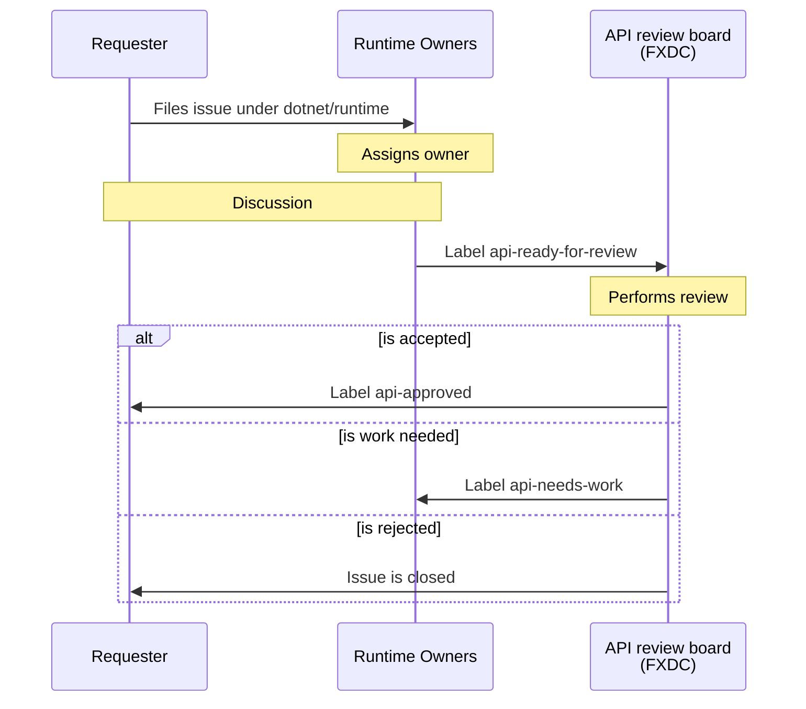
```mermaid
sequenceDiagram
    participant R as Requester
    participant O as Runtime Owners
    participant F as API review board <br> (FXDC)
    R ->> O: Files issue under dotnet/runtime
    note over O: Assigns owner
    
    note over R, O: Discussion

    O ->> F: Label api-ready-for-review
    
    note over F: Performs review

    alt is accepted
        F ->> R: Label api-approved
    else is work needed
        F ->> O: Label api-needs-work
    else is rejected
        F ->> R: Issue is closed
    end
```

## Steps

1. **Requester files an issue**. The issue description should contain a speclet that represents a sketch of the new APIs, including samples on how the APIs are being used. The goal isn't to get a complete API list, but a good handle on how the new APIs would roughly look like and in what scenarios they are being used. Please use [this template](https://github.com/dotnet/runtime/issues/new?assignees=&labels=api-suggestion&template=02_api_proposal.yml&title=%5BAPI+Proposal%5D%3A+). The issue should have the label `api-suggestion`. Here is [a good example](https://github.com/dotnet/runtime/issues/38344) of an issue following that template.

2. **We assign an owner**. We'll assign a dedicated owner from our side that
sponsors the issue. This is usually [the area owner](issue-guide.md#areas) for which the API proposal or design change request was filed for.

3. **Discussion**. The goal of the discussion is to help the assignee to make a
decision whether we want to pursue the proposal or not. In this phase, the goal
isn't necessarily to perform an in-depth review; rather, we want to make sure
that the proposal is actionable, i.e. has a concrete design, a sketch of the
APIs and some code samples that show how it should be used. If changes are necessary, the owner will set the label `api-needs-work`. To make the changes, the requester should edit the top-most issue description. This allows folks joining later to understand the most recent proposal. To avoid confusion, the requester can maintain a tiny change log, like a bolded "Updates:" followed by a bullet point list of the updates that were being made. When the feedback is addressed, the requester should notify the owner to re-review the changes.

4. **Owner makes decision**. When the owner believes enough information is available to make a decision, they will update the issue accordingly:

    * **Mark for review**. If the owner believes the proposal is actionable, they will label the issue with `api-ready-for-review`. [Here is a good example](https://github.com/dotnet/runtime/issues/15725) of a strong API proposal.
    * **Close as not actionable**. In case the issue didn't get enough traction to be distilled into a concrete proposal, the owner will close the issue.
    * **Close as won't fix as proposed**. Sometimes, the issue that is raised is a good one but the owner thinks the concrete proposal is not the right way to tackle the problem. In most cases, the owner will try to steer the discussion in a direction that results in a design that we believe is appropriate. However, for some proposals the problem is at the heart of the design which can't easily be changed without starting a new proposal. In those cases, the owner will close the issue and explain the issue the design has.
    * **Close as won't fix**. Similarly, if proposal is taking the product in a direction we simply don't want to go, the issue might also get closed. In that case, the problem isn't the proposed design but in the issue itself.

5. **API gets reviewed**. The group conducting the review is called *FXDC*, which stands for *framework design core*. In the review, we'll take notes and provide feedback. Reviews are streamed live on [YouTube](https://www.youtube.com/@NETFoundation/streams). After the review, we'll publish the notes in the [API Review repository](https://github.com/dotnet/apireviews) and at the end of the relevant issue. A good example is the [review of immutable collections](https://github.com/dotnet/apireviews/tree/main/2015/01-07-immutable). Multiple outcomes are possible:

    * **Approved**. In this case the label `api-ready-for-review` is replaced
    with `api-approved`.
    * **Needs work**. In case we believe the proposal isn't ready yet, we'll
    replace the label `api-ready-for-review` with `api-needs-work`.
    * **Rejected**. In case we believe the proposal isn't a direction we want to go after, we simply write a comment and close the issue.

## Review schedule

 There are three methods to get an API review:

* **Get into the backlog**. Generally speaking, filing an issue in `dotnet/runtime` and applying the label `api-ready-for-review` on it will make your issue show up during API reviews. The downside is that we generally walk the backlog oldest-newest, so your issue might not be looked at for a while. Progress of issues can be tracked via https://aka.ms/ready-for-api-review.
* **Fast track**. If you need to bypass the backlog apply both `api-ready-for-review` and `blocking`. All blocking issues are looked at before we walk the backlog.
* **Dedicated review**. This only applies to area owners. If an issue you are the area owner for needs an hour or longer, send an email to FXDC and we book dedicated time. Rule of thumb: if the API proposal has more than a dozen APIs and/or the APIs have complex policy, then you need 60 min or more. When in doubt, send mail to FXDC.

API Review meetings typically occur once per week, on Tuesdays from 10am to 12pm Pacific Time. The schedule is available at https://apireview.net/schedule.

## Pull requests

Pull requests against **dotnet/runtime** shouldn't be submitted before getting approval. Also, we don't want to get work in progress (WIP) PR's. The reason being that we want to reduce the number pending PRs so that we can focus on the work the community expects we take action on.

If you want to collaborate with other people on the design, feel free to perform the work in a branch in your own fork. If you want to track your TODOs in the description of a PR, you can always submit a PR against your own fork. Also, feel free to advertise your PR by linking it from the issue you filed against **dotnet/runtime** in the first step above.

## API Design Guidelines

The .NET design guidelines are captured in the famous book [Framework Design Guidelines][FDG] by Krzysztof Cwalina, Jeremy Barton and Brad Abrams.

A digest with the most important guidelines are available in our [documentation](../coding-guidelines/framework-design-guidelines-digest.md). Long term, we'd like to publish the individual guidelines in standalone repo on which we can also accept PRs and -- more importantly for API reviews -- link to.

[FDG]: https://amazon.com/dp/0135896460

## API Review Notes

The API review notes are being published in [API Review repository](https://github.com/dotnet/apireviews).


<a id="doc-7d578d177f1df8f8c3509bf5"></a>

# dotnet/runtime / docs/project/branching-guide.md

Upstream: https://github.com/dotnet/runtime/blob/12955c8ab9478124f56f20510a8be0224e2e4e6a/docs/project/branching-guide.md

Commit: `12955c8ab9478124f56f20510a8be0224e2e4e6a`

Retrieved: 2026-10-01T15:17:27.770409+00:00

Kind: official-document

Raw SHA256: `1922d9e032d4f5ab4f824df781ae56f2190ce580494a7bd50d1f9c399f2d9a1e`

Source text below is untrusted reference content. Acquisition does not verify technical claims.

License status: UPSTREAM_NOTICES_CAPTURED_PER_FILE_REVIEW_REQUIRED. See this repository's captured license files.

---

Branching Guide
===============

We will have the following branches in the runtime repository:

* **main**
 * Where most development happens
 * Submit your PRs here unless you are adding API to a type that exists in the full .NET Framework

* **release/[name]**
 * Release branches snapped from main.
 * Do not submit pull requests to these branches
 * Fixes here do not flow to follow-up releases
 * Generally, fixes after a snap needing to make it in to a release will go in to main and get cherry-picked to the release branch.

* **dev/[name]**
 * Features (aka topics) under active development by more than one developer.
 * Submit PRs here only if you've made prior arrangements to work on something in one of these branches.
 * It is up to the developers creating these branches to decide what level of review is required
 * These features will only ship if they are successfully pulled to main or future via the standard PR and API review process.


<a id="doc-b6abd9bc0f042f6f210b4bb1"></a>

# dotnet/runtime / docs/project/breaking-change-process.md

Upstream: https://github.com/dotnet/runtime/blob/12955c8ab9478124f56f20510a8be0224e2e4e6a/docs/project/breaking-change-process.md

Commit: `12955c8ab9478124f56f20510a8be0224e2e4e6a`

Retrieved: 2026-10-01T15:17:27.770409+00:00

Kind: official-document

Raw SHA256: `ea95437572dc317c490398c0e34f542ec8b9e4520ebcd9c6e22767c21be40643`

Source text below is untrusted reference content. Acquisition does not verify technical claims.

License status: UPSTREAM_NOTICES_CAPTURED_PER_FILE_REVIEW_REQUIRED. See this repository's captured license files.

---

# Breaking change process

Breaking changes make it difficult for people to adopt new versions of .NET. We strive to avoid making them. In the rare case when a breaking change is unavoidable or the best option when all factors are considered, you should follow the process outlined in this document. The intent of the process is to get feedback. This might result in previously unseen opportunities to achieve your goals without breaks, clever ways to limit breaks to more niche scenarios, and (most importantly) better understand the scope of impact to .NET users.

This process does not result in approval or denial of a breaking change request. It results in feedback, which might be varied or uniform. In the best case, the feedback is a call to action to you, that provides a direction on how you should proceed. The people that are responsible for reviewing your PR are expected to use the information collected by this process as part of their determination of whether your change is appropriate to merge.

You should start this process as soon as possible, preferably before any code is written, in the design phase. This isn't always possible, since the change in behavior might not be discovered until you're almost done building a feature. In the case of a significant breaking change, you should provide reviewers with a design document so that they can understand the broader scope, goals and constraints of your change.

There are people on the team that can help you work through a breaking change, if you want to engage with them before starting this more formal process. They are part of the [dotnet/compat team](https://github.com/orgs/dotnet/teams/compat) . Feel free to @mention them on issues to start a dialogue.

## Process

1. Create or link to an issue that describes the breaking change, including the following information:
   * Mark with the [breaking-change](https://github.com/dotnet/runtime/labels/breaking-change) label
   * Goals and motivation for the change
   * Pre-change behavior
   * Post-change behavior
   * Versions of the product this change affects
   * Errors or other behavior you can expect when running old code that breaks
   * Workarounds and mitigations, including [AppContext switches](https://learn.microsoft.com/dotnet/api/system.appcontext)
   * Link to the issue for the feature or bug fix that the breaking change is associated with.
   * Reference this issue from associated PRs.
2. Share your issue with whomever you see as stakeholders
   * Please @mention [dotnet/compat team](https://github.com/orgs/dotnet/teams/compat) team
   * Engage with people commenting on the issue, with the goal of deriving the most feedback on your proposed breaking change
   * This may involve significant explanation on your part. A well-written design doc can ease the burden here.
3. Mark associated PRs with the [breaking-change](https://github.com/dotnet/runtime/labels/breaking-change) label, and link to your breaking change issue.
4. Once the PR is merged, create a [docs issue](https://github.com/dotnet/docs/issues/new?template=dotnet-breaking-change.md).
   * Clarify which .NET preview the break will be first released in.
5. Breaking change issues can be closed at any time after the PR is merged. Best practice is waiting until the change has been released in a public preview.

Notes:

* We add quirk switches to .NET Core re-actively, only once we get feedback that they are really needed for something important. We do not add them proactively like in .NET Framework just because they might be needed in theory.
* In terms of product versions that the change affects, consider both .NET Core and .NET Framework (see: [.NET Framework compatibility mode](https://learn.microsoft.com/dotnet/standard/net-standard#net-framework-compatibility-mode)). Consider source and binary compatibility.

## Examples

The following are good examples of breaking change issues

* https://github.com/dotnet/runtime/issues/28788
* https://github.com/dotnet/runtime/issues/37672

## Resources

There are additional documents that you should consult about breaking changes:

* [Breaking changes](https://github.com/dotnet/runtime/blob/main/docs/coding-guidelines/breaking-changes.md)
* [Breaking change definitions](https://github.com/dotnet/runtime/blob/main/docs/coding-guidelines/breaking-change-definitions.md)
* [Breaking change rules](https://github.com/dotnet/runtime/blob/main/docs/coding-guidelines/breaking-change-rules.md)


<a id="doc-995deae55bfe0098bf88c57f"></a>

# dotnet/runtime / docs/project/copyright.md

Upstream: https://github.com/dotnet/runtime/blob/12955c8ab9478124f56f20510a8be0224e2e4e6a/docs/project/copyright.md

Commit: `12955c8ab9478124f56f20510a8be0224e2e4e6a`

Retrieved: 2026-10-01T15:17:27.770409+00:00

Kind: license

Raw SHA256: `7d59c58eb65bf2e36b5fc85951d82ffa48f2f7b7fcc2ecea7a3c615e4851b373`

Source text below is untrusted reference content. Acquisition does not verify technical claims.

License status: UPSTREAM_NOTICES_CAPTURED_PER_FILE_REVIEW_REQUIRED. See this repository's captured license files.

---

````text
# Copyright

.NET is a member project of the [.NET Foundation](http://www.dotnetfoundation.org/).

Source copyright is held by ".NET Foundation and Contributors", while binary distributions (and associated copyright) are provided by a variety of parties.

## Source License

The .NET project primarily uses the [MIT License](https://opensource.org/licenses/MIT) for code and [Creative Commons licenses](https://creativecommons.org/) for non-code assets, like [documentation](https://github.com/dotnet/docs/), [swag](https://github.com/dotnet/swag), and [brand](https://github.com/dotnet/brand) content.

We use the following approach for code contributions:

- New code is licensed as MIT, per [repo license](/LICENSE.TXT) and via [file headers](/src/libraries/System.Private.CoreLib/src/System/Collections/Generic/List.cs).
- Contributions (like ports) can be based on existing code or algorithms that are licensed with a permissive [OSI-approved licenses](https://opensource.org/licenses) (for example, [MIT](https://opensource.org/licenses/MIT), [Apache 2](https://opensource.org/licenses/Apache-2.0), and [BSD](https://opensource.org/licenses/BSD-3-Clause)) and should be ackowledged in the [repo THIRD-PARTY-NOTICE](/THIRD-PARTY-NOTICES.TXT) file.
- Non-product contributions (like tests) can be based on existing code or algorithms that are licensed with any OSI-approved license (including [GPL](https://opensource.org/licenses/GPL-2.0)) and should be acknowleged in a local THIRD-PARTY-NOTICE file (for example, [SciMark/THIRD-PARTY-NOTICES](/src/tests/JIT/Performance/CodeQuality/SciMark/THIRD-PARTY-NOTICES)).
- We will typically reject the use of product code licensed with [Creative Commons](https://creativecommons.org/) or [public domain licenses](https://en.wikipedia.org/wiki/Public-domain-equivalent_license) given their lack of universal acceptance.
- The [.NET Foundation Contribution License Agreement (CLA)](https://cla.dotnetfoundation.org) is used to license contributions from contributors.

More mechanical guidance is provided in [CONTRIBUTING.md](../../CONTRIBUTING.md#copying-files-from-other-projects).

References:

- https://opensource.org/faq#cc-zero
- https://opensource.org/faq#public-domain
- https://opensource.stackexchange.com/questions/1717/why-is-cc-by-sa-discouraged-for-code
- https://gitlab.com/fedora/legal/fedora-license-data/-/issues/104
- https://gitlab.com/fedora/legal/fedora-license-data/-/blob/11a7b58ea6d92e1ae06d7d9e44e4a2f2257b687e/data/CC0-1.0.toml#L11

## Binary License

Microsoft distributes binary builds of .NET per the following description. Distributions from other parties may differ.

- Binary archives, installers, packages, and containers are licensed as MIT (same as the [.NET source license](https://github.com/dotnet/core/blob/master/LICENSE.TXT)).
- Windows-based distributions include closed-source assets, per [License information for .NET on Windows](https://github.com/dotnet/core/blob/main/license-information-windows.md)

## Patents

Microsoft has issued a [Patent Promise for .NET Libraries and Runtime Components](/PATENTS.TXT).

````


<a id="doc-5a3f62e12b03c154b846dccf"></a>

# dotnet/runtime / docs/project/dogfooding.md

Upstream: https://github.com/dotnet/runtime/blob/12955c8ab9478124f56f20510a8be0224e2e4e6a/docs/project/dogfooding.md

Commit: `12955c8ab9478124f56f20510a8be0224e2e4e6a`

Retrieved: 2026-10-01T15:17:27.770409+00:00

Kind: official-document

Raw SHA256: `7297c8eee602afded81b1a0c84be1191fc7041c600d02617fcc500cda62c7ccb`

Source text below is untrusted reference content. Acquisition does not verify technical claims.

License status: UPSTREAM_NOTICES_CAPTURED_PER_FILE_REVIEW_REQUIRED. See this repository's captured license files.

---

# Dogfooding daily builds of .NET

This document provides the steps necessary to consume a latest development build of .NET runtime and SDK.
Example below is for 11.0.

## Obtaining daily builds of NuGet packages

If you are only looking to get fixes for an individual NuGet package, and don't need a preview version of the entire runtime, you can add the development package feed to your `NuGet.config` file.  The easiest way to do this is by using the dotnet CLI:

**(Recommended)** Create a local NuGet.Config file for your solution, if don't already have one.  Using a local NuGet.Config file will enable the development feed as a package source for projects in the current directory only.
```
dotnet new nugetconfig
```

Next, add the package source to NuGet.Config with the [dotnet nuget add source](https://learn.microsoft.com/dotnet/core/tools/dotnet-nuget-add-source) command:
```
dotnet nuget add source -n dotnet11 https://dnceng.pkgs.visualstudio.com/public/_packaging/dotnet11/nuget/v3/index.json
```

Then, you will be able to add the latest prerelease version of the desired package to your project.

**Example:** To add version 11.0-alpha.1.24556.8 of the System.Data.OleDb package, use the [dotnet add package](https://learn.microsoft.com/dotnet/core/tools/dotnet-add-package) command:
```
dotnet add package System.Data.OleDb -v 11.0-alpha.1.24556.8
```

To use daily builds of the entire runtime, follow the steps given in the rest of this document instead.

## Configuring upstream feeds in ADO

If you're using private Azure DevOps feeds for your projects, you might need to add the preview feed through the Azure-specific feed URI format, which is `azure-feed://organization/optionalProject/feed@view`. In this case, you can add the .NET development package feed as follows:

```
azure-feed://dnceng/public/dotnet11@Local
```

## Install prerequisites

1. Acquire the latest development .NET SDK by downloading and extracting a zip/tarball or using an installer from the [latest builds table in dotnet/sdk](https://github.com/dotnet/sdk#installing-the-sdk) (for example, https://aka.ms/dotnet/11.0/daily/dotnet-sdk-win-x64.zip).

2. If you are using a local copy of the dotnet CLI, take care that when you type `dotnet` you do not inadvertently pick up a different copy that you may have in your path. On Windows, for example, if you use a Command Prompt, a global copy may be in the path, so use the fully qualified path to your local `dotnet` (e.g. `C:\dotnet\dotnet.exe`). If you receive an error "error NETSDK1045:  The current .NET SDK does not support targeting .NET 11.0." then you may be executing an older `dotnet`.

After setting up dotnet you can verify you are using the current preview version by executing `dotnet --info`. Here is an example output:
```
>dotnet --info
.NET SDK:
 Version:   11.0.100-alpha.1.24556.7
 Commit:    fc127ac5a4

Runtime Environment:
 OS Name:     Windows
 OS Version:  10.0.22616
 OS Platform: Windows
 RID:         win-x64
 Base Path:   C:\Program Files\dotnet\sdk\11.0.100-alpha.1.24556.7\

global.json file:
  Not found

Host:
  Version:      11.0.0-alpha.1.24556.3
  Architecture: x64
  Commit:       47d9c43ab1

.NET SDKs installed:
  11.0.100-alpha.1.24556.7 [C:\Program Files\dotnet\sdk]

.NET runtimes installed:
  Microsoft.NETCore.App 11.0.0-alpha.1.24556.7 [C:\Program Files\dotnet\shared\Microsoft.NETCore.App]

Download .NET:
  https://aka.ms/dotnet-download

Learn about .NET Runtimes and SDKs:
  https://aka.ms/dotnet/runtimes-sdk-info

```

3. Our daily builds are uploaded to development feed, not NuGet - so ensure the development feed is in your nuget configuration in case you need other packages that aren't included in the download. For example, on Windows you could edit `%userprofile%\appdata\roaming\nuget\nuget.config` or on Linux edit `~/.nuget/NuGet/NuGet.Config` to add these lines:
```xml
<packageSources>
    <add key="dotnet11" value="https://dnceng.pkgs.visualstudio.com/public/_packaging/dotnet11/nuget/v3/index.json" />
    ...
</packageSources>
```
(Documentation for configuring feeds is [here](https://learn.microsoft.com/nuget/consume-packages/configuring-nuget-behavior).)

## Setup the project

1. Create a new project
    - Create a new folder for your app and change to that folder
    - Create project file by running `dotnet new console`

2. Restore packages so that you're ready to play:

```
$ dotnet restore
```

## Consume the new build

```
$ dotnet run
```

Rinse and repeat!

## Advanced Scenario - Using a daily build of Microsoft.NETCore.App

When using the above instructions, your application will run against the same
.NET runtime that comes with the SDK. That works fine to get up and
running quickly. However, there are times when you need to use a daily build
of Microsoft.NETCore.App which hasn't made its way into the SDK yet. To enable
this, there are two options you can take.

### Option 1: Framework-dependent

This is the default case for applications - running against an installed .NET runtime.

1. You still need to install the prerequisite .NET SDK from above.
2. Optionally, install the specific .NET runtime you require globally or download get the latest one available from the [daily build table](#daily-builds-table)
3. Modify your .csproj to reference the daily build of Microsoft.NETCore.App

```XML
  <PropertyGroup>
    <OutputType>Exe</OutputType>
    <!-- Ensure that the target framework is correct e.g. 'net11.0' -->
    <TargetFramework>net11.0</TargetFramework>
    <!-- modify version in this line with one reported by `dotnet --info` under ".NET runtimes installed" -> Microsoft.NETCore.App -->
    <RuntimeFrameworkVersion>11.0.0-alpha.1.24556.3</RuntimeFrameworkVersion>
  </PropertyGroup>
```

```
$ dotnet restore
$ dotnet run
```

### Option 2: Self-contained

In this case, the .NET runtime will be published along with your application.

1. You still need to install the prerequisite .NET SDK from above.
2. Modify your .csproj to reference the daily build of Microsoft.NETCore.App *and*
make it self-contained by adding a RuntimeIdentifier (RID).

```XML
  <PropertyGroup>
    <OutputType>Exe</OutputType>
    <!-- Ensure that the target framework is correct e.g. 'net11.0' -->
    <TargetFramework>net11.0</TargetFramework>
    <!-- modify build in this line with version reported by `dotnet --info` as above under ".NET runtimes installed" -> Microsoft.NETCore.App -->
    <!-- moreover, this can be any valid Microsoft.NETCore.App package version from https://pkgs.dev.azure.com/dnceng/public/_packaging/dotnet11/nuget/v3/index.json -->
    <RuntimeFrameworkVersion>11.0.0-alpha.1.24556.3</RuntimeFrameworkVersion>
    <RuntimeIdentifier>win-x64</RuntimeIdentifier> <!-- RID to make it self-contained -->
  </PropertyGroup>
```

```
$ dotnet restore
$ dotnet publish
$ bin\Debug\net11.0\win-x64\publish\App.exe
```


<a id="doc-b335ec02f29d4581af1a5261"></a>

# dotnet/runtime / docs/project/dotnet-filenames.md

Upstream: https://github.com/dotnet/runtime/blob/12955c8ab9478124f56f20510a8be0224e2e4e6a/docs/project/dotnet-filenames.md

Commit: `12955c8ab9478124f56f20510a8be0224e2e4e6a`

Retrieved: 2026-10-01T15:17:27.770409+00:00

Kind: official-document

Raw SHA256: `8a78212da5efdbf01f62fa5836b8c1f5a870f2314f9a2867edb0c1f02cefffa9`

Source text below is untrusted reference content. Acquisition does not verify technical claims.

License status: UPSTREAM_NOTICES_CAPTURED_PER_FILE_REVIEW_REQUIRED. See this repository's captured license files.

---

.NET Filename Encyclopedia
===

.NET has had many mysterious filenames over time. This document defines their purpose.

- coreclr.dll: The implementation of CoreCLR.
- clr.dll: The implementation of the .NET Framework CLR since the .NET Framework 4.
- mscorwks.dll: The .NET Framework CLR implementation up until version 2/3.5. It was called "wks" (pronounced "works") because it originally contained the client or "workstation" GC. Up until the .NET Framework 2, there was another variant of the CLR that contained the "server" GC, called mscorsvr.dll. In the .NET Framework 2 release, the workstation and server GC were merged together in a single implementation, in mscorwks.dll, while mscorsvr.dll was deprecated.
- mscorsvr.dll: See mscorwks.dll.
- mscordacwks: A variant of mscorwks.dll (for the .NET Framework CLR), used only/primarily while debugging. It contains the "DAC" version of the VM implementation.
- mscordaccore.dll: A variant of coreclr.dll (for .NET Core), used only/primarily while debugging. It contains the "DAC" version of the VM implementation.


<a id="doc-a145aadb055b0fedb86f86ae"></a>

# dotnet/runtime / docs/project/dotnet-standards.md

Upstream: https://github.com/dotnet/runtime/blob/12955c8ab9478124f56f20510a8be0224e2e4e6a/docs/project/dotnet-standards.md

Commit: `12955c8ab9478124f56f20510a8be0224e2e4e6a`

Retrieved: 2026-10-01T15:17:27.770409+00:00

Kind: official-document

Raw SHA256: `e1212e65f01d68aec0def92afda92af5999289f5daa158d8842a498f2f9da810`

Source text below is untrusted reference content. Acquisition does not verify technical claims.

License status: UPSTREAM_NOTICES_CAPTURED_PER_FILE_REVIEW_REQUIRED. See this repository's captured license files.

---

.NET Standards
==============

There was a very early realization by the founders of .NET that they were creating a new programming technology that had broad applicability across operating systems and CPU types and that advanced the state of the art of late 1990s (when the .NET project started at Microsoft) programming language implementation techniques. This led to considering and then pursuing standardization as an important pillar of establishing .NET in the industry.

The key addition to the state of the art was support for multiple programming languages with a single language runtime, hence the name _Common Language Runtime_. There were many other smaller additions, such as value types, a simple exception model and attributes. Generics and language integrated query were later added to that list.

Looking back, standardization was quite effective, leading to .NET having a strong presence on iOS and Android, with the Unity and Xamarin offerings, both of which use the Mono runtime. The same may end up being true for .NET on Linux.

The various .NET standards have been made meaningful by the collaboration of multiple companies and industry experts that have served on the working groups that have defined the standards. In addition (and most importantly), the .NET standards have been implemented by multiple commercial (ex: Unity IL2CPP, .NET Native) and open source (ex: Mono) implementors. The presence of multiple implementations proves the point of standardization.

ECMA 334 - C#
=============

The C# language was standardized as [ECMA 334](https://www.ecma-international.org/publications-and-standards/standards/ecma-334) in 2002 and approved as [ISO/IEC 23270](http://www.iso.org/iso/home/store/catalogue_ics/catalogue_detail_ics.htm?csnumber=42926) in 2003.

**ECMA 334 Resources**

- [ECMA 334 Standard Overview](https://www.ecma-international.org/publications-and-standards/standards/ecma-334)
- [ECMA 334 Standard (PDF)](https://www.ecma-international.org/wp-content/uploads/ECMA-334_6th_edition_june_2022.pdf)

ECMA 335 - CLI
==============

[Common Language Infrastructure](http://en.wikipedia.org/wiki/Common_Language_Infrastructure) - the formalized basis of .NET -- was standardized as [ECMA 335](https://www.ecma-international.org/publications-and-standards/standards/ecma-335) in 2001 and approved as [ISO/IEC 23271](http://www.iso.org/iso/home/store/catalogue_ics/catalogue_detail_ics.htm?csnumber=58046) in 2003. The  standards have been since updated, to reflect changes in .NET, such as generics.

**ECMA 335 Resources**

- [ECMA 335 Standard Overview](https://www.ecma-international.org/publications-and-standards/standards/ecma-335)
- [ECMA 335 Standard (PDF)](https://www.ecma-international.org/wp-content/uploads/ECMA-335_6th_edition_june_2012.pdf)
- [Wikipedia entry on CLI](http://en.wikipedia.org/wiki/Common_Language_Infrastructure)
- [ECMA 335 Addendum](../design/specs/Ecma-335-Augments.md)

**ECMA 335 Partitions with added Microsoft Specific Implementation Notes**

- [Partition I: Concepts and Architecture](https://download.microsoft.com/download/7/3/3/733AD403-90B2-4064-A81E-01035A7FE13C/MS%20Partition%20I.pdf)
- [Partition II: Meta Data Definition and Semantics](https://download.microsoft.com/download/7/3/3/733AD403-90B2-4064-A81E-01035A7FE13C/MS%20Partition%20II.pdf)
- [Partition III: CIL Instruction Set](https://download.microsoft.com/download/7/3/3/733AD403-90B2-4064-A81E-01035A7FE13C/MS%20Partition%20III.pdf)
- [Partition IV: Profiles and Libraries](https://download.microsoft.com/download/7/3/3/733AD403-90B2-4064-A81E-01035A7FE13C/MS%20Partition%20IV.pdf)
- [Partition V: Debug Interchange Format](https://download.microsoft.com/download/7/3/3/733AD403-90B2-4064-A81E-01035A7FE13C/MS%20Partition%20V.pdf)
- [Partition VI: Annexes](https://download.microsoft.com/download/7/3/3/733AD403-90B2-4064-A81E-01035A7FE13C/MS%20Partition%20VI.pdf)

**ECMA Technical Report 084: Information Derived from Partition IV XML File**

- [ECMA TR/84 Report (PDF)](https://www.ecma-international.org/wp-content/uploads/ECMA_TR-84_6th_edition_june_2012.pdf)
- [ECMA TR/84 Tools and Source Code](https://www.ecma-international.org/wp-content/uploads/ecma-tr-84-6th_edition_files.zip)

ECMA 372 - C++/CLI
==================

The C++/CLI language was standardized as [ECMA 372](http://www.ecma-international.org/publications/standards/Ecma-372.htm) in 2005.

ECMA 372 is supported by the .NET Framework, but not .NET Core.

**ECMA 372 Resources**

- [ECMA 372 Standard Overview](https://www.ecma-international.org/publications-and-standards/standards/ecma-372)
- [ECMA 372 Standard (PDF)](https://www.ecma-international.org/wp-content/uploads/ECMA-372_1st_edition_december_2005.pdf)

Shared Source CLI (SSCLI)
=========================

[Shared Source CLI](http://en.wikipedia.org/wiki/Shared_Source_Common_Language_Infrastructure) or "Rotor" was a working implementation for the ECMA-334 (C#) and ECMA-335 (Common Language Infrastructure, or CLI) standards. It was released under a shared source license in 2002, primarily to encourage academic research focused on .NET and to demonstrate viability of .NET on diverse platforms. It was last released in 2006, to align with the .NET Framework 2 release. It is no longer relevant, given that [CoreCLR](https://github.com/dotnet/coreclr) has been released as open source on GitHub.

**SSCLI Resources**

- [Wikipedia entry on SSCLI](http://en.wikipedia.org/wiki/Shared_Source_Common_Language_Infrastructure)
- [The Microsoft Shared Source CLI Implementation](https://msdn.microsoft.com/library/ms973879.aspx)
- [Shared Source Common Language Infrastructure 2.0 Release ](http://www.microsoft.com/en-us/download/details.aspx?id=4917)
- [Shared Source CLI 2.0 Infrastructure 2.0 Release - 3rd party provided on GitHub](https://github.com/gbarnett/shared-source-cli-2.0)


<a id="doc-31702fcb87ce7b964b51468b"></a>

# dotnet/runtime / docs/project/garbage-collector-guidelines.md

Upstream: https://github.com/dotnet/runtime/blob/12955c8ab9478124f56f20510a8be0224e2e4e6a/docs/project/garbage-collector-guidelines.md

Commit: `12955c8ab9478124f56f20510a8be0224e2e4e6a`

Retrieved: 2026-10-01T15:17:27.770409+00:00

Kind: official-document

Raw SHA256: `70ddced022dbcedc25989e4e8c3d3ef40eba3052c09d42fcbf133d1e1db4037a`

Source text below is untrusted reference content. Acquisition does not verify technical claims.

License status: UPSTREAM_NOTICES_CAPTURED_PER_FILE_REVIEW_REQUIRED. See this repository's captured license files.

---

Garbage Collector Requirements
==============================

The garbage collector is an integral part of the .NET runtime.  Changes to the .NET runtime can have significant effects on program correctness and performance.  As such, GC has strong implementation and testing requirements.

We strongly recommend that if you want to make a change to GC, that you share your proposal prior to implementation.  This will ensure that if there are any questions or concerns, that they are addressed before significant work is done.

# Requirements by Sub-Component #

## Core GC ##
The native implementation of the GC - including the GCHeap and gc_heap classes.

**Required Testing:** (Instructions for running tests are below)

- **gc_heap class:** Changes to gc_heap requires a 48 hour stress run on a debug build.  This helps to ensure correctness of the change given that the GC runs in many different configurations and interacts with many other sub-systems within the runtime.  For some simple changes a stress run may not be required.  If you believe your change does not manipulate the heap itself, mention this in your pull request and we can tell you if stress is required or not.
- **GCHeap class:**  GCHeap changes generally do not require stress runs, but do require functional testing of the affected code.
- **Performance changes:** Performance specific changes require a performance test run.

## Managed APIs ##
Managed APIs in System.GC and System.Runtime.GCSettings.  These APIs allow an application developer to view and modify GC options.

Required Testing: Validation of the behavior of the affected APIs.

# Instructions for Testing #

## Stress Testing ##
Stress testing must run for at least **48 hours** against a debug build.

Stress testing for checked and release builds can be run locally. Please following the instructions described in [gc-stress-run-readme.md](https://github.com/dotnet/runtime/blob/main/docs/workflow/testing/coreclr/gc-stress-run-readme.md). You can also request it on pull requests with The .NET CI infrastructure with the trigger phrase:

```
@dotnet_bot test <platform> <flavor> gc_reliability_framework
```

This will run the stress framework for the default amount of time (15 hours) on the given platform and build flavor.

## Functional Testing ##
A functional test run executes the same code as a stress run, but only runs for 30 minutes.

The "Long GC" tests are a series of GC tests whose running time is too long or memory usage is too high to run with
the rest of the Priority 0 unit tests. The "Standalone GC" build mode builds and runs the GC in a semi-standalone manner
(see https://github.com/dotnet/coreclr/projects/3).

You may also wish to run the GC Simulator tests. They may take up to 24 hours to complete and are known to sometimes fail on Ubuntu
due to poor interactions with the Linux OOM killer. However, they have proven to be quite useful in finding bugs in the past:

```
@dotnet_bot test windows Release gcsimulator
@dotnet_bot test Ubuntu Release gcsimulator
@dotnet_bot test OSX10.12 Release gcsimulator
```

## Performance Testing ##
Performance tests can be run using the GC Benchmarking Infrastructure hosted within the [benchmarks section](https://github.com/dotnet/performance/tree/master/src/benchmarks/gc) of the _performance_ repo. This tool allows you to run the tests capturing traces through PerfView, and later analyze such traces for detailed results on GC's, heaps, and related behaviors. These tests also allow you to directly compare behaviors and metrics between different .NET builds and machines.

The _README.md_ located at the link mentioned above contains detailed instructions on how to setup and use the tool. Additionally, there is a _docs_ section with all the information to perform further analysis on the traces.


<a id="doc-04adba06c610a2521627fb97"></a>

# dotnet/runtime / docs/project/glossary.md

Upstream: https://github.com/dotnet/runtime/blob/12955c8ab9478124f56f20510a8be0224e2e4e6a/docs/project/glossary.md

Commit: `12955c8ab9478124f56f20510a8be0224e2e4e6a`

Retrieved: 2026-10-01T15:17:27.770409+00:00

Kind: official-document

Raw SHA256: `71fb11b08f7a6361606456136b2e68a3d784c35ff79479f5c05324845f90c2ca`

Source text below is untrusted reference content. Acquisition does not verify technical claims.

License status: UPSTREAM_NOTICES_CAPTURED_PER_FILE_REVIEW_REQUIRED. See this repository's captured license files.

---

# Glossary

Over the years, we've accumulated quite a few terms, platforms, and components
that can make it hard for folks (including us) to understand what we're
referring to. This document has a list that will help to qualify what we mean by
what.

This will also list some aliases. As you'll see the aliases aren't always
correct -- they are merely listed to help you find the better and less confusing
terminology.

| Term  | Description |
| ----- | ------------- |
| AOT | Ahead-of-time compiler. Converts the MSIL bytecode to native machine code for a specific target CPU architecture. |
| BBT | Microsoft internal early version of C/C++ PGO. See https://www.microsoft.com/windows/cse/bit_projects.mspx. |
| BOTR | Book Of The Runtime. |
| BCL | Base Class Library. A set of `System.*` (and to a limited extent `Microsoft.*`) libraries that make up the lower layer of the .NET library stack. See CoreFX. |
| CDAC | Codename for [Data Contracts](https://github.com/dotnet/runtime/blob/main/docs/design/datacontracts/datacontracts_design.md) |
| CIL | Common Intermediate Language. Equivalent to IL, also equivalent to [MSIL](https://learn.microsoft.com/dotnet/standard/managed-execution-process#compiling-to-msil). |
| CLI | Command Line Interface, or Common Language Infastructure. |
| CLR | [Common Language Runtime](https://learn.microsoft.com/dotnet/standard/clr). |
| COMPlus | An early name for the .NET platform, back when it was envisioned as a successor to the COM platform (hence, "COM+"). Used in various places in the CLR infrastructure, most prominently as a common prefix for the names of internal configuration settings. Note that this is different from the product that eventually ended up being named [COM+](https://msdn.microsoft.com/library/windows/desktop/ms685978.aspx). |
| COR | [Common Object Runtime](http://www.danielmoth.com/Blog/mscorlibdll.aspx). The name of .NET before it was named .NET. |
| CoreFX | Core Framework. Original project name for open source and cross-platform version of [.NET runtime libraries](https://github.com/dotnet/runtime/tree/main/src/libraries). Where we want to distinguish the foundational .NET libraries - those in the dotnet/runtime repo - instead of CoreFX or BCL we call them the core libraries. |
| DAC | Data Access Component. An abstraction layer over the internal structures in the runtime. |
| EE | [Execution Engine](https://learn.microsoft.com/dotnet/standard/managed-execution-process#running_code). |
| GC | [Garbage Collector](https://github.com/dotnet/runtime/blob/main/docs/design/coreclr/botr/garbage-collection.md). |
| IBC | Instrumented Block Counts - used as extension (`*.ibc`) for old PGO files. |
| IJW | "It Just Works" - Codename for [C++/CLI](https://learn.microsoft.com/cpp/dotnet/dotnet-programming-with-cpp-cli-visual-cpp) managed/native interop |
| IPC | Inter-Process Communication. |
| IL | Intermediate Language. Equivalent to CIL, also equivalent to [MSIL](https://learn.microsoft.com/dotnet/standard/managed-execution-process#compiling-to-msil). |
| JIT | [Just-in-Time](https://github.com/dotnet/runtime/blob/main/docs/design/coreclr/jit/ryujit-overview.md) compiler. RyuJIT is the code name for the next generation Just-in-Time(aka "JIT") for the .NET runtime. |
| LCG | Lightweight Code Generation. An early name for [dynamic methods](https://github.com/dotnet/runtime/blob/main/src/libraries/System.Private.CoreLib/src/System/Reflection/Emit/DynamicMethod.cs). |
| MD | MetaData. |
| MDA | Managed Debugging Assistant - see [details](https://learn.microsoft.com/dotnet/framework/debug-trace-profile/diagnosing-errors-with-managed-debugging-assistants) (Note: Not in .NET Core, equivalent diagnostic functionality is made available on a case-by-case basis, e.g. [#9418](https://github.com/dotnet/runtime/issues/9418)) |
| MIBC | Managed Instrumented Block Counts - used as extension (`*.mibc`) for managed PGO files. |
| MSIL | [Microsoft Intermediate Language](https://learn.microsoft.com/dotnet/standard/managed-execution-process#compiling-to-msil).Common Intermediate Language. Equivalent to IL, also equivalent to CIL. |
| NGen | Native Image Generator. |
| NYI | Not Yet Implemented. |
| PAL | [Platform Adaptation Layer](http://archive.oreilly.com/pub/a/dotnet/2002/03/04/rotor.html). Provides an abstraction layer between the runtime and the operating system. |
| PE | Portable Executable. |
| PGO | Profile Guided Optimization - see [details](https://blogs.msdn.microsoft.com/vcblog/2008/11/12/pogo/). |
| POGO | Profile Guided Optimization - see [details](https://blogs.msdn.microsoft.com/vcblog/2008/11/12/pogo/). |
| ProjectN | Codename for the first version of [.NET Native for UWP](https://msdn.microsoft.com/vstudio/dotnetnative.aspx). |
| R2R | Ready-to-Run. A flavor of native images - command line switch of [crossgen](../workflow/building/coreclr/crossgen.md). |
| Redhawk | Codename for experimental minimal managed code runtime that evolved into [CoreRT](https://github.com/dotnet/corert/). |
| SDK | Software Development Kit. The [.NET SDK](https://learn.microsoft.com/dotnet/core/sdk) contains the .NET CLI, .NET libraries and runtime, and the dotnet driver. |
| SEH | [Structured Exception Handling](https://learn.microsoft.com/windows/win32/debug/structured-exception-handling). Unified mechanism for handling hardware and software exceptions on Windows. |
| SOS | [Son of Strike](https://learn.microsoft.com/dotnet/framework/tools/sos-dll-sos-debugging-extension). The debugging extension for DbgEng based debuggers. Uses the DAC as an abstraction layer for its operation. The obscure name derives from the original nickname for the CLR team at Microsoft: "Lightning". The team built a debugging tool humorously named "Strike", and a subset of that dubbed "Son of Strike". |
| SPCL | `System.Private.CoreLib` - the lowest managed assembly in the libraries stack that contains `System.Object`, `String`, etc. |
| SuperPMI | JIT component test framework (super fast JIT testing - it mocks/replays EE in EE-JIT interface) - see [SuperPMI details](https://github.com/dotnet/runtime/blob/main/src/coreclr/tools/superpmi/readme.md). |
| SVR | The CLR used to be built as two variants, with one called "mscorsvr.dll", to mean the "server" version. In particular, it contained the server GC implementation, which was intended for multi-threaded apps capable of taking advantage of multiple processors. In the .NET Framework 2 release, the two variants were merged into "mscorwks.dll". The WKS version was the default, however the SVR version remained available. |
| TFM | [Target Framework Moniker](https://learn.microsoft.com/dotnet/standard/frameworks) such as `net8.0` or `netstandard2.0`. |
| TPA | Trusted Platform Assemblies used to be a special set of assemblies that comprised the platform assemblies, when it was originally designed. As of today, it is simply the set of assemblies known to constitute the application. |
| URT | Universal Runtime. Ancient name for what ended up being .NET, is used in the WinError facility name FACILITY_URT. |
| UTC | [Universal Tuple Compiler](https://blogs.msdn.microsoft.com/vcblog/2013/06/12/optimizing-c-code-overview/). The Microsoft C++ optimizer back-end that starts by converting the information from the FrontEnd into tuples – a binary stream of instructions. |
| UWP | [Universal Windows Platform (UWP)](https://learn.microsoft.com/windows/uwp/get-started/universal-application-platform-guide) is a platform-homogeneous application architecture available on every device that runs Windows 10. |
| VSD | [Virtual Stub Dispatch](../design/coreclr/botr/virtual-stub-dispatch.md). Technique of using stubs for virtual method invocations instead of the traditional virtual method table. |
| VM | Virtual machine. |
| WKS | The CLR used to be built as two variants, with one called "mscorwks.dll", to mean the "workstation" version. In particular, it contained the client GC implementation, which was intended for single-threaded apps, independent of how many processors were on the machine. In the .NET Framework 2 release, the two variants were merged into "mscorwks.dll". The WKS version was the default, however the SVR version remained available. |
| ZAP | Original code name for NGen. |

## Terms

In this document, the following terms are used:

* **IL**. Intermediate language. Higher level .NET languages, such as C#,
  compile down to a hardware agnostic instruction set, which is called
  Intermediate Language (IL). IL is sometimes referred to as MSIL (Microsoft IL)
  or CIL (Common IL).

* **GC**. Garbage collector. Garbage collection is an implementation of
  automatic memory management. .NET Framework and .NET Core currently uses a
  generational garbage collector, i.e. it groups objects into generations to
  limit the number of nodes it has to walk for determining which objects are
  alive. This speeds up collection times.

* **JIT**. Just in time compiler. This technology compiles IL to machine code
  that the processor understands. It's called JIT because compilation happens on
  demand and is performed on the same machine the code needs to run on. Since
  JIT compilation occurs during execution of the application, compile time is
  part of the run time. Thus, JIT compilers have to trade spending more time
  optimizing code with the savings the resulting code can produce. But a JIT
  knows the actual hardware and can free developers from having to ship
  different implementations. For instance, our vector library relies on the JIT
  to use the highest available SIMD instruction set.

* **CLI**. Command Line Interface --or-- Common Language Infastructure.
  * Command Line Interface: A tool that has no graphical interface and is
    intended to be used completely from a console/terminal. Also is commonly
    used as shorthand for the [.NET tooling][dotnet-tooling].
  * Common Language Infastructure: The [open specification][ECMA-355] that defines
    IL, how to store IL as binary (assemblies), and how the runtime works. AKA:
    [ECMA-355][ECMA-355].

* **CLR**. Common Language Runtime: The runtime/environment that .NET code
  executes in. It is also commonly used to refer to the Microsoft .NET Framework
  Windows-only implementation.

## .NET Runtimes

### .NET Core / .NET

.NET Core has been the name for the open source, cross-platform stack that
ASP.NET Core and UWP applications are built on. For more details,
read [Introducing .NET Core][introducing-net-core].

.NET Core has become future of the platform, and we refer to it just as .NET today.
For more details, read [Introducing .NET 5][introducing-net-5].

### .NET Framework

**Also referred to as**: Desktop, full framework

.NET Framework was the very first .NET runtime. It first shipped in 2002, and it has been
updated on a regular basis since then.

The .NET Framework was designed to run on Windows only. Some versions of the
.NET Framework come pre-installed with Windows, some require to be installed.
However, in both cases the .NET Framework is a system-wide component.

### Rotor

**Also referred to as**: Shared Source Common Language Infrastructure (SSCLI)

Pretty much at the same time the .NET Framework was released, Microsoft also
published Rotor, which is the source code for an implementation of ECMA 335
(Common Language Infrastructure), which is the specification behind .NET.

While parts of the source were identical with the .NET Framework, many pieces
had prototypical implementations instead: the purpose of Rotor wasn't to provide
a production ready .NET implementation but to provide a platform for research,
academia, and validation that the ECMA 335 specification itself can be
implemented.

It's also worth pointing out that the source code of Rotor was not released
under an open source license (i.e. not approved by OSI) and has not been
officially updated since .NET Framework 2.0.

### Mono

[Mono][mono] is an open source alternative to the .NET Framework. Mono started around
the same time the .NET Framework was first released. Since Microsoft didn't
release Rotor as open source, Mono was forced to start from scratch and was thus
a complete re-implementation of the .NET Framework with no shared code.

Today, the [Mono VM](https://github.com/dotnet/runtime/tree/main/src/mono) is part
of the unified .NET platform. It is optimized for mobile (e.g. Xamarin) and browser (e.g. Blazor) scenarios.

"C# powered by Mono" has been scripting engine of choice for a number of game engines.
Unity - the world's most popular game engine - is scripted by C#, powered by a customized Mono runtime.

### CoreCLR

Originally, CoreCLR was the runtime of Silverlight and was designed to run on multiple
platforms, specifically Windows and OS X.

Today, the [CoreCLR runtime](https://github.com/dotnet/runtime/tree/main/src/coreclr)
is part of unified .NET platform. It is optimized for cloud (e.g. ASP.NET) and
desktop (e.g. WinForms, WPF) scenarios.

## Ahead-Of-Time Compilation (AOT)

Most flavors of .NET runtime come with at least partial AOT compilation. A variety of AOT technologies
with unique characteristics were developed for .NET runtimes over the years.

### ReadyToRun

**Also referred to as**: R2R

[ReadyToRun](../design/coreclr/botr/readytorun-overview.md)
is a file format used by the CoreCLR runtime to store AOT compiled code. `crossgen` is the AOT compiler that
produces binaries in the ReadyToRun file format.

### NGen

[NGen](https://learn.microsoft.com/dotnet/framework/tools/ngen-exe-native-image-generator)
is AOT technology included in .NET Framework. It usually compiles code at install time on the machine where
the code will be executed.

### Full AOT

[Full AOT](https://learn.microsoft.com/xamarin/ios/internals/architecture) is used
by Mono runtime in environments that prohibit fallback to JIT.

### Hybrid AOT

[Hybrid AOT](https://learn.microsoft.com/xamarin/mac/internals/aot#hybrid-aot) is used
by Mono runtime in environments that allow fallback to JIT or need IL interpreter.

### Native AOT

[Native AOT](https://github.com/dotnet/designs/blob/main/accepted/2020/form-factors.md#native-aot-form-factors) is
a .NET runtime form factor with key performance characteristics (startup time, binary size and steady state throughput and predictability)
competitive with statically compiled languages.

## Frameworks

### Language-Integrated Query

**Also referred to as**: LINQ

Introduced in .NET Framework 3.5, Language-Integrated Query's (LINQ) goal to
make data processing easier. LINQ is primarily a collection of methods that
extend `IEnumerable` and `IEnumerable<T>`. LINQ is intended to be used with
extension methods and Lambda functions (added in C# 3.0 and VB 9.0 at the same
time as .NET Framework 3.5 was released) allowing for a function style of
programming.

A simple example of LINQ is

```csharp
var odds = source.Where(obj => obj.Id == 1).ToArray();
```

#### IQueryable&lt;T&gt; and Expressions

One of the big advantages of using LINQ over more common data processing
patterns is that the function given to the LINQ function can be converted to an
expression and then executed in some other form, like SQL or on another machine
across the network. An expression is a in-memory representation of some logic to
follow.

For example, in the above sample `source` could actually be a database
connection and the function call `Where(obj => obj.Id == 1)` would be converted
to a SQL WHERE clause: `WHERE ID = 1`, and then executed on the SQL server.

#### Parallel LINQ

**Also referred to as**: PLINQ

Also introduced in .NET Framework 3.5 Parallel LINQ. Parallel LINQ has a subset
of the methods the LINQ does but may execute the iterations on different threads
in any order. Generally to use Parallel LINQ you would just call the
`AsParallel()` method on a collection implementing `IEnumerable`. And if at any
point you wanted to return to "normal LINQ you can just call `AsSequential()`.

### Dynamic Language Runtime

**Also referred to as**: DLR

Introduced in .NET Framework 4.0, Dynamic Language Runtime's (DLR) goal is to
develop dynamic languages to run on the .NET Framework and to add dynamic
features to statically typed languages, primarily C# 4.0.
[Its features][dlr-architecture] include expression trees, call site caching,
and dynamic object interoperability.

[Microsoft has Open Sourced the Dynamic Language Runtime][dlr-source], along
with two examples of languages developed by using it:
[IronPython](https://github.com/IronLanguages/ironpython2)
and [IronRuby](https://github.com/IronLanguages/ironruby).

### Windows Forms

**Also referred to as**: WinForms

Windows Forms is an API provided by the .NET Framework (mostly in the
`System.Windows.Forms` namespace) for creating desktop applications. Windows
Forms provides an event-driven model for application development on top of the
native loop-driven Win32 model. Mono [has an implementation][mono-winforms] of
Windows Forms, though it is not complete, since some parts of Windows Forms are
tied to the Windows platform.

[Microsoft has Open Sourced Windows Forms][ui-oss]. This
included moving the code to [GitHub under the stewardship of the .NET
Foundation][WinForms] and enabling support for running Windows Forms on .NET
Core (Windows Only).

### Windows Presentation Foundation

**Also referred to as**: WPF, Avalon

Introduced in .NET Framework 3.0, Windows Presentation Foundation (WPF) was a
new API for creating desktop applications. Like Windows Forms, WPF is
event-driven. However, instead of using GDI/GDI+ for drawing applications, WPF
used DirectX. Using DirectX allowed WPF applications to use the GPU for
rendering, freeing the CPU for other tasks. WPF also introduced XAML, an
XML-based language which allows a declarative way to describe user interfaces
and data binding to models (XAML is used by Silverlight, UWP, and Xamarin as
well).

[Microsoft has Open Sourced WPF][ui-oss]. This included
moving the code to [GitHub under the stewardship of the .NET Foundation][Wpf]
and enabling support for running WPF on .NET Core (Windows Only).

## Engineering system

* **Helix**. It's a massively-parallel, general-purpose job processing and
  result aggregation system running in the cloud. The work items that we
  send to Helix are [xunit][xunit] tests. Test results are shown through the
  [*Mission Control* reporting site][mc.dot.net]; to go to the test results in a
  PR from Azure DevOps, you can click on the *Send to Helix* step in the build,
  and the logs will have the URL.


[introducing-net-core]: https://devblogs.microsoft.com/dotnet/introducing-net-core/
[introducing-net-5]: https://devblogs.microsoft.com/dotnet/introducing-net-5/
[mono]: http://github.com/mono/mono
[referencesource]: https://github.com/microsoft/referencesource
[mono-supported-platforms]: http://www.mono-project.com/docs/about-mono/supported-platforms/
[mono-winforms]: http://www.mono-project.com/docs/gui/winforms/
[xunit]: https://github.com/xunit
[mc.dot.net]: https://mc.dot.net/
[ECMA-355]: https://www.ecma-international.org/publications-and-standards/standards/ecma-335
[dotnet-tooling]: https://learn.microsoft.com/dotnet/core/tools/
[dlr-architecture]: https://learn.microsoft.com/dotnet/framework/reflection-and-codedom/dynamic-language-runtime-overview#dlr-architecture
[dlr-source]: https://github.com/IronLanguages/dlr
[WinForms]: https://github.com/dotnet/winforms
[Wpf]: https://github.com/dotnet/wpf
[ui-oss]: https://devblogs.microsoft.com/dotnet/announcing-net-core-3-preview-1-and-open-sourcing-windows-desktop-frameworks/


<a id="doc-bbd574761032c7f56baff891"></a>

# dotnet/runtime / docs/project/issue-guide.md

Upstream: https://github.com/dotnet/runtime/blob/12955c8ab9478124f56f20510a8be0224e2e4e6a/docs/project/issue-guide.md

Commit: `12955c8ab9478124f56f20510a8be0224e2e4e6a`

Retrieved: 2026-10-01T15:17:27.770409+00:00

Kind: official-document

Raw SHA256: `1ca590ecf5981668dcf8134aecb9b33d4759bcd11bbbd7afc27125d293e4659d`

Source text below is untrusted reference content. Acquisition does not verify technical claims.

License status: UPSTREAM_NOTICES_CAPTURED_PER_FILE_REVIEW_REQUIRED. See this repository's captured license files.

---

Issue Guide
===========

This page outlines how the team thinks about and handles issues in this repo.  For us, issues on GitHub represent actionable work that should be done at some future point.  It may be as simple as a small product or test bug or as large as the work tracking the design of a new feature.  However, it should be work that falls under the charter of the team.  We will keep issues open even if the team internally has no plans to address them in an upcoming release, as long as we consider the issue to fall under our purview and something we would potentially take a change for.

### When we close issues
As noted above, we don't close issues just because we don't plan to address them in an upcoming release.  So why do we close issues?  There are few major reasons:

1. Issues unrelated to code in this repo.  When possible, we'll try to find a better home for the issue and point you to it.
2. Cross cutting work better suited for another team.  Sometimes the line between the framework, languages and runtime blurs.  For some issues, we may feel that the work is better suited for the runtime team, language team or other partner.  In these cases, we'll close the issue and open it with the partner team.  If they end up not deciding to take on the issue, we can reconsider it here.
3. Nebulous and Large open issues.  Large open issues are sometimes better suited for [User Voice](http://visualstudio.uservoice.com/forums/121579-visual-studio/category/31481--net), especially when the work will cross the boundaries of the framework, language and runtime.  A good example of this is the SIMD support we recently added to the core libraries.  This started as a [User Voice request](https://visualstudio.uservoice.com/forums/121579-visual-studio-2015/suggestions/2212443-c-and-simd), and eventually turned into work for both the core libraries and runtime.

Sometimes after debate, we'll decide an issue isn't a good fit for the .NET runtime codebase.  In that case, we'll also close it.  Because of this, we ask that you don't start working on an issue until it's tagged with [help wanted](https://github.com/dotnet/runtime/labels/help%20wanted) or [api-approved](https://github.com/dotnet/runtime/labels/api-approved).  Both you and the team will be unhappy if you spend time and effort working on a change we'll ultimately be unable to take. We try to avoid that.

### Labels
We use GitHub [labels](https://github.com/dotnet/runtime/labels) on our issues in order to classify them.  We have the following categories per issue:
* **Area**: These area-&#42; labels (e.g. [area-System.Collections](https://github.com/dotnet/runtime/labels/area-System.Collections)) call out the assembly or assemblies the issue applies to. In addition to labels per assembly, we have a few other area labels: [area-Infrastructure](https://github.com/dotnet/runtime/labels/area-Infrastructure), for issues that relate to our build or test infrastructure, and [area-Meta](https://github.com/dotnet/runtime/labels/area-Meta) for issues that deal with the repository itself, the direction of the .NET Core Platform, our processes, etc. See [full list of areas](#areas).
* **Issue Type**: These labels classify the type of issue.  We use the following types:
  * [bug](https://github.com/dotnet/runtime/labels/bug): Bugs in an assembly.
  * api-&#42; ([api-approved](https://github.com/dotnet/runtime/labels/api-approved), [api-needs-work](https://github.com/dotnet/runtime/labels/api-needs-work), [api-ready-for-review](https://github.com/dotnet/runtime/labels/api-ready-for-review)): Issues which would add APIs to an assembly (see [API Review process](api-review-process.md) for details).
  * [enhancement](https://github.com/dotnet/runtime/labels/enhancement): Improvements to an assembly which do not add new APIs (e.g. performance improvements, code cleanup).
  * [test bug](https://github.com/dotnet/runtime/labels/test%20bug): Bugs in the tests for a specific assembly.
  * [test enhancement](https://github.com/dotnet/runtime/labels/test%20enhancement): Improvements in the tests for a specific assembly (e.g. improving test coverage).
  * [documentation](https://github.com/dotnet/runtime/labels/documentation): Issues related to documentation (e.g. incorrect documentation, enhancement requests).
  * [question](https://github.com/dotnet/runtime/labels/question): Questions about the product, source code, etc.
* **Other**:
  * [easy](https://github.com/dotnet/runtime/issues?utf8=%E2%9C%93&q=is%3Aissue%20is%3Aopen%20label%3Aeasy%20no%3Aassignee) - Good for starting contributors.
  * [help wanted](https://github.com/dotnet/runtime/labels/help%20wanted): Small sections of work which we believe are well scoped.  These sorts of issues are a good place to start if you are new.  Anyone is free to work on these issues.
  * [needs more info](https://github.com/dotnet/runtime/labels/needs%20more%20info): Issues which need more information to be actionable.  Usually this will be because we can't reproduce a reported bug.  We'll close these issues after a little bit if we haven't gotten actionable information, but we welcome folks who have acquired more information to reopen the issue.
 * [wishlist](https://github.com/dotnet/runtime/issues?q=is%3Aissue+is%3Aopen+label%3Awishlist) - Issues on top of our backlog we won't likely get to. Warning: Might not be easy.

In addition to the above, we have a handful of other labels we use to help classify our issues.  Some of these tag cross cutting concerns (e.g. [tenet-performance](https://github.com/dotnet/runtime/labels/tenet-performance)), whereas others are used to help us track additional work needed before closing an issue (e.g. [api-needs-exposed](https://github.com/dotnet/runtime/labels/api-needs-exposed)).

### Milestones
We use [milestones](https://github.com/dotnet/runtime/milestones) to prioritize work for each upcoming release to NuGet.org.

### Assignee
We assign each issue to assignee, when the assignee is ready to pick up the work and start working on it.  If the issue is not assigned to anyone and you want to pick it up, please say so - we will assign the issue to you.  If the issue is already assigned to someone, please coordinate with the assignee before you start working on it.

### Areas
Areas are tracked by labels area-&#42; (e.g. area-System.Collections). Each area typically corresponds to one or more contract assemblies. To view owners for each area in this repository check out the [area-owners.md](https://github.com/dotnet/runtime/blob/main/docs/area-owners.md) page.

### Community Partner Experts

| Area        | Owners / experts | Description |
|-------------|------------------|-------------|
| Tizen | [@gbalykov](https://github.com/gbalykov) [@t-mustafin](https://github.com/t-mustafin) | For issues around Tizen CI and build issues |

### Triage rules - simplified

1. Each issue has exactly one **area-&#42;** label
1. Issue has no **Assignee**, unless someone is working on the issue at the moment
1. Use **help wanted** as much as possible, ideally notes about next steps / complexity of the issue / acceptance criteria
1. Set milestone to **Future**, unless you can 95%-commit you can fund the issue in specific milestone
1. Each issue has exactly one "*issue type*" label (**bug**, **enhancement**, **api-needs-work**, **test bug**, **test enhancement**, **question**, **documentation**, etc.)
1. Don't be afraid to say no, or close issues - just explain why and be polite
1. Don't be afraid to be wrong - just be flexible when new information appears

Feel free to use other labels if it helps your triage efforts (e.g. **needs more info**, **Design Discussion**, **blocked**, **blocking-partner**, **tenet-performance**, **tenet-compatibility**, **os-linux**/**os-windows**/**os-mac-os-x**/**os-unsupported**, **os-windows-uwp**/**os-windows-wsl**, **arch-arm32**/**arch-arm64**)

#### Motivation for triage rules

1. Each issue has exactly one **area-\*** label
    * Motivation: Issues with multiple areas have loose responsibility (everyone blames the other side) and issues are double counted in reports.
1. Issue has no **Assignee**, unless someone is working on the issue at the moment
    * Motivation: Observation is that contributors are less likely to grab assigned issues, no matter what the repo rules say.
1. Use **help wanted** as much as possible, ideally with a quick note about next steps / complexity of the issue
    * Note: Per http://up-for-grabs.net, such issues should be no longer than few nights' worth of work. They should be actionable (i.e. no mysterious CI failures or UWP issues that can't be tested in the open).
1. Set milestone to **Future**, unless you can 95%-commit you can fund the issue in specific milestone
    * Motivation: Helps communicate desire/timeline to community. Can spark further priority/impact discussion.
1. Each issue has exactly one "*issue type*" label (**bug**, **enhancement**, **api-needs-work**, **test bug**, **test enhancement**, **question**, **documentation**, etc.)
    * Don't be afraid to be wrong when deciding 'bug' vs. 'test bug' (flip a coin if you must). The most useful values for tracking are 'api-&#42;' vs. 'enhancement', 'question', and 'documentation'.
    * Note: The **api-\*** labels are important for tracking API approvals, the other *issue type* labels are in practice optional.
1. Don't be afraid to say no, or close issues - just explain why and be polite
1. Don't be afraid to be wrong - just be flexible when new information appears

#### PR rules

1. Each PR has exactly one **area-\*** label
    * Movitation: Area owners will get email notification about new issue in their area.
1. PR has **Assignee** set to author of the PR, if it is engineer that does not work in this repo, then area owners are co-assignees
    * Motivation #1: Area owners are responsible to do code reviews for PRs from external contributors. Committers know how to get code reviews from others.
    * Motivation #2: Assignees will get notifications for anything happening on the PR.
1. [Optional] Set milestone according to the branch the PR is against (main = 6.0, release/5.0 = 5.0)
    * Motivation: Easier to track and audit where which fix ended up and if it needs to be ported into another branch (hence reflecting branch the specific PR ended up and not the abstract issue).
    * Note: This is easily done after merge via simple queries & bulk-edits, you don't have to do this one.
1. Any other labels on PRs are superfluous and not needed (exceptions: **blocked**, **NO MERGE**)
    * Motivation: All the important info (*issue type* label, api approval label, OS label, etc.) is already captured on the associated issue.
1. Push PRs forward, don't let them go stale (response every 5+ days, ideally no PRs older than 2 weeks)
1. Stuck or long-term blocked PRs (e.g. due to missing API approval, etc.) should be closed and reopened once they are unstuck
    * Motivation: Keep only active PRs. WIP (work-in-progress) PRs should be rare and should not become stale (2+ weeks old). If a PR is stale and there is not immediate path forward, consider closing the PR until it is unblocked/unstuck.
1. PR should be linked to related issue, use [auto-closing](https://help.github.com/articles/closing-issues-via-commit-messages/) (add "Fixes #12345" into your PR description)


<a id="doc-507f72306972060acf8aa130"></a>

# dotnet/runtime / docs/project/jit-testing.md

Upstream: https://github.com/dotnet/runtime/blob/12955c8ab9478124f56f20510a8be0224e2e4e6a/docs/project/jit-testing.md

Commit: `12955c8ab9478124f56f20510a8be0224e2e4e6a`

Retrieved: 2026-10-01T15:17:27.770409+00:00

Kind: official-document

Raw SHA256: `facb23357b7ac570fc1863fa5f7c12ee84a9119b49c2e2be9c4b90f09f1096f0`

Source text below is untrusted reference content. Acquisition does not verify technical claims.

License status: UPSTREAM_NOTICES_CAPTURED_PER_FILE_REVIEW_REQUIRED. See this repository's captured license files.

---

# JIT Testing

We would like to ensure that the CoreCLR contains sufficient test collateral
and tooling to enable high-quality contributions to RyuJit or LLILC's JIT.

JIT testing is somewhat specialized and can't rely solely on the general
framework tests or end to end application tests.

This document describes some of the work needed to bring JIT existing tests and
technology into the CoreCLR, and touches on some areas as that open for
innovation.

We expect to evolve this document into a road map for the overall JIT testing
effort, and to spawn a set of issues in the CoreCLR and LLILC repos for
implementing the needed capabilities.

## Requirements and Assumptions

1. It must be easy to add new tests.
2. Tests must execute with high throughput. We anticipate needing to run
thousands of tests to provide baseline level testing for JIT changes.
3. Tests should generally run on all supported/future chip architectures and
all OS platforms.
4. Tests must be partitionable so CI latency is tolerable (test latency goal
TBD).
5. Tests in CI can be run on private changes (currently tied to PRs; this may
be sufficient).
6. Test strategy harmonious with other .NET repo test strategies.
7. Test harness behaves reasonably on test failure. Easy to get at repro steps
for subsequent debugging.
8. Tests must allow fine-grained inspection of JIT outputs, for instance
comparing the generated code versus a baseline JIT.
9. Tests must support collection of various quantitative measurements, eg time
spent in the JIT, memory used by the JIT, etc.
10. For now, JIT test assets belong in the CoreCLR repo.
11. JIT tests use the same basic test xunit harness as existing CoreCLR tests.
12. JIT special-needs testing will rely on extensions/hooks. Examples below.

## Tasks

Below are some broad task areas that we should consider as part of this plan.
It seems sensible for Microsoft to focus on opening up the JIT self-host
(aka JITSH) tests first. A few other tasks are also Microsoft specific and are
marked with (MS) below.

Other than that the priority, task list, and possibly assignments are open to
discussion.

### (MS) Bring up equivalent of the JITSH tests

JITSH is a set of roughly 8000 tests that have been traditionally used by
Microsoft JIT developers as the frontline JIT test suite.

We'll need to subset these tests for various reasons:

1. Some have shallow desktop CLR dependence (e.g. missing cases in string
formatting).
2. Some have deep desktop CLR dependence (testing a desktop CLR feature that
is not present in CoreCLR).
3. Some require tools not yet available in CoreCLR (ilasm in particular).
4. Some test windows features and won't be relevant to other OS platforms.
5. Some tests may not be able to be freely redistributed.

We have done an internal inventory and identified roughly 1000 tests that
should be straightforward to port into CoreCLR, and have already started in on
moving these.

### Test script capabilities

We need to ensure that the CoreCLR repo contains a suitably
hookable test script. Core testing is driven by xunit but there's typically a
wrapper around this (run.cmd today) to facilitate test execution.

The proposal is to implement platform-neutral variant of run.cmd that
contains all the existing functionality plus some additional capabilities for
JIT testing. Initially this will mean:

1. Ability to execute tests with a JIT specified by the user (either as alt
JIT or as the only JIT)
2. Ability to pass options through to the JIT (eg for dumping assembly or IR)
or to the CoreCLR (eg to disable use of ngen images).

### Cache prebuilt test assets

In general we want JIT tests to be built from sources. But given the volume
of tests it can take a significant amount of time to compile those sources into
assemblies. This in turn slows down the ability to test the JIT.

Given the volume of tests, we might reach a point where the default CoreCLR
build does not build all the tests.

So it would be good if there was a regularly scheduled build of CoreCLR that
would prebuild a matching set of tests and make them available.

### Round out JITSH suite, filling in missing pieces

We need some way to run ILASM. Some suggestions here are to port the existing
ILASM or find some equivalent we could run instead. We could also prebuild
IL based tests and deploy as a package. Around 2400 JITSH tests are blocked by
this.

There are also some VB tests which presumably can be brought over now that VB
projects can build.

Native/interop tests may or may not require platform-specific adaption.

### (MS) Port the devBVT tests.

devBVT is a broader part of CLR SelfHost that is useful for second-tier testing.
Not yet clear what porting this entails.

### Leverage peer repo test suites.

We should be able to directly leverage tests provided in peer repo suites, once
they can run on top of CoreCLR. In particular libraries and Roslyn test cases
could be good initial targets.

Note LLILC is currently working through the remaining issues that prevent it
from being able to compile all of Roslyn. See the "needed for Roslyn" tags
on the open LLILC issues.

### Look for other CoreCLR hosted projects.

Similar to the above, as other projects are able to host on CoreCLR we can
potentially use their tests for JIT testing.

### Porting of existing suites/tools over to our repos.

Tools developed to test JVM Jits might be interesting to port over to .Net.
Suggestions for best practices or effective techniques are welcome.

### Bring up quantitative measurements.

For Jit testing we'll need various quantitative assessments of Jit behavior:

1. Time spent jitting
2. Speed of jitted code
3. Size of jitted code
4. Memory utilization by the jit (+ leak detection)
5. Debug info fidelity
6. Coverage ?

There will likely be work going on elsewhere to address some of these same
measurement capabilities, so we should make sure to keep it all in sync.

### Bring up alternate codegen capabilities.

For LLILC, implementing support for crossgen would provide the ability to drive
lots of IL through the JIT. There is enough similarity between the JIT and
crossgen paths that this would likely surface issues in both.

Alternatively one can imagine simple test drivers that load up assemblies and
use reflection to enumerate methods and asks for method bodies to force the JIT
to generate code for all the methods.

### Bring up stress testing

The value of existing test assets can be leveraged through various stress
testing modes. These modes use non-standard code generation or runtime
mechanisms to try an flush out bugs.

1. GC stress. Here the runtime will GC with much higher frequency in an attempt
to maximize the dependence on the GC info reported by the JIT.
2. Internal modes in the JIT to try and flush out bugs, eg randomized inlining,
register allocation stress, volatile stress, randomized block layout, etc.

### Bring up custom testing frameworks and tools.

We should invest in things like random program or IL generation tools.


<a id="doc-a15dd9f7cefdcca5f2996aff"></a>

# dotnet/runtime / docs/project/library-servicing.md

Upstream: https://github.com/dotnet/runtime/blob/12955c8ab9478124f56f20510a8be0224e2e4e6a/docs/project/library-servicing.md

Commit: `12955c8ab9478124f56f20510a8be0224e2e4e6a`

Retrieved: 2026-10-01T15:17:27.770409+00:00

Kind: official-document

Raw SHA256: `d6afe95105c72162ee6eb9bb1880ce3d629fdfc0af15ec367c62fb9590a75081`

Source text below is untrusted reference content. Acquisition does not verify technical claims.

License status: UPSTREAM_NOTICES_CAPTURED_PER_FILE_REVIEW_REQUIRED. See this repository's captured license files.

---

# How to service a library

This document provides the steps that need to be followed after modifying a library in a servicing branch.

Servicing branches represent shipped versions of .NET. The branch naming convention varies by version:

- **For .NET 8 and .NET 9**: Branch names use the format `release/X.0-staging`. Examples:
  - `release/9.0-staging`
  - `release/8.0-staging`

- **For .NET 10+**: Branch names use the format `release/X.0` (no `-staging` suffix). Examples:
  - `release/10.0`
  - `release/11.0`

IMPORTANT: Starting with .NET 9, you no longer need to edit a NuGet package's csproj to enable building and bump the version.
Keep in mind that we still need package authoring in .NET 8 and older versions.

## Test your changes

Develop and test your change as normal.  For packages, you may want to test them outside the repo infrastructure. To do so, execute the following steps:

1. From a clean copy of your branch, run `build.cmd/sh libs -pack`

2. Check in `artifacts\bin\packages\Debug` for the existence of your package, with the appropriate package version.

3. Try installing the built package in a test application, testing that your changes to the library are present & working as expected.
   To install your package add your local packages folder as a feed source in VS or your nuget.config and then add a PackageReference to the specific version of the package you built then try using the APIs.

## Approval Process

All the servicing change must go through an approval process. You have two ways to submit your PR:

- By manually creating your PR using [this template](https://raw.githubusercontent.com/dotnet/runtime/main/.github/PULL_REQUEST_TEMPLATE/servicing_pull_request_template.md).
- Or by asking the bot to automatically create the servicing PR for you using a merged `main` PR as source. This method requires typing an AzDO backport command as a comment of your merged PR. The format depends on the target version:

  For .NET 8 and .NET 9 (use `-staging` suffix):
  - `/backport to release/9.0-staging`
  - `/backport to release/8.0-staging`

  For .NET 10+ (no `-staging` suffix):
  - `/backport to release/10.0`
  - `/backport to release/11.0`

For all cases, you must:

- Fill out the template of the PR description.
- Bring it to the attention of the [engineering lead responsible for the area](/docs/area-owners.md).
- If the fix is a product change, the area owner will:
  - Add the `Servicing-consider` label.
  - Ask the area owner to champion your PR in the .NET Tactics meeting to request merge approval.
  - If the change is approved, they will replace the `Servicing-consider` label by `Servicing-approved` and sign-off the PR.
- If the fix is a test-only or infra-only change, the area owner will:
  - Review the PR and sign-off if they approve it.
  - Add the `Servicing-approved` label.

The area owner can then merge the PR once the CI looks good (it's either green or the failures are investigated and determined to be unrelated to the PR).

**Note**: Applying the `Servicing-approved` label ensures the `check-service-labels` CI job passes, which is a mandatory requirement for merging a PR in a servicing branch.


<a id="doc-8d87225f2cecb5a1718f67b0"></a>

# dotnet/runtime / docs/project/licensing-assets.md

Upstream: https://github.com/dotnet/runtime/blob/12955c8ab9478124f56f20510a8be0224e2e4e6a/docs/project/licensing-assets.md

Commit: `12955c8ab9478124f56f20510a8be0224e2e4e6a`

Retrieved: 2026-10-01T15:17:27.770409+00:00

Kind: official-document

Raw SHA256: `85b8dd253a396ef80785395fb4f6b0321dc2754a89ec6d7d0182c8c7127887d8`

Source text below is untrusted reference content. Acquisition does not verify technical claims.

License status: UPSTREAM_NOTICES_CAPTURED_PER_FILE_REVIEW_REQUIRED. See this repository's captured license files.

---

# .NET Asset Licensing Model

> The above copyright notice and this permission notice shall be included in all copies or substantial portions of the Software.

The [MIT](https://github.com/dotnet/core/blob/main/LICENSE.TXT) license and others like it have a provision that distributions of software should include the license. This is the model we should be following.

Each .NET binary distribution must carry:

- Its license
- Third party notice

Binary distributions include: compressed archives, runtime packs, installers, container images, packages, and anything else where we deliver "substantial portions of the Software".

Note: Distributions must contain and display the correct license. For example, the [Microsoft.NETCore.App.Runtime.win-x64](https://www.nuget.org/packages/Microsoft.NETCore.App.Runtime.win-x64/) runtime pack must contain the correct license and the correct license metadata, displayed in the NuGet gallery. Installers have a similar model with license UI.

## Product distributions

For product distributions, the following licenses should be used.

- On Linux and macOS, the license should be the [.NET MIT license](https://github.com/dotnet/core/blob/main/LICENSE.TXT).
- On Windows, the license should be the [.NET Library License](https://dotnet.microsoft.com/dotnet_library_license.htm) per [Windows license information](https://github.com/dotnet/core/blob/main/license-information-windows.md).

Product distributions include [downloadable assets](https://dotnet.microsoft.com/en-us/download/dotnet/8.0) and NuGet runtime packs.

## Package distributions

Library packages, like [System.Text.Json](https://www.nuget.org/packages/System.Text.Json), should use the .NET MIT license.

"Packages" do not include runtime packs.


<a id="doc-38da75a1e3f875fb9d1a2f71"></a>

# dotnet/runtime / docs/project/linux-build-methodology.md

Upstream: https://github.com/dotnet/runtime/blob/12955c8ab9478124f56f20510a8be0224e2e4e6a/docs/project/linux-build-methodology.md

Commit: `12955c8ab9478124f56f20510a8be0224e2e4e6a`

Retrieved: 2026-10-01T15:17:27.770409+00:00

Kind: official-document

Raw SHA256: `9c42677d5850cef38522631fc6692a85a3b6711c5254cec07bb1f29f99944a45`

Source text below is untrusted reference content. Acquisition does not verify technical claims.

License status: UPSTREAM_NOTICES_CAPTURED_PER_FILE_REVIEW_REQUIRED. See this repository's captured license files.

---

# .NET Linux build methodology

Starting with .NET 8, the builds of .NET for Linux have adopted an architecture designed to allow us to build the product following best practices related to security, while maintaining compatibility with a broad set of Linux distributions and versions.

## Goals

- Security: Build using recent tools in a secure, supported environment

  We would like to use recent versions of build tools such as LLVM and CMake, with the latest features, performance optimizations, bug fixes, and security patches. We also want to build in an environment where the provenance of our dependencies meets secure supply chain standards, and allows quick patching of our dependencies.

- Compatibility: Target reasonably old Linux distributions to maximize compatibility

  At the same time, we want the .NET product to be widely compatible with older Linux distributions. While each .NET release is typically only supported on a specific set of Linux distributions, we also want to enable customers to run .NET apps on older releases, releases in extended support, or on distributions other than those we support.

## Broad Linux targeting

The most important aspect of compatibility across Linux distributions is the version of the C library, which is shipped as part of each Linux distribution and dynamically linked. In general there are two technical solutions that allow targeting old versions:

1. Build on an old distribution

   The Python ecosystem's [manylinux](https://github.com/pypa/manylinux) project uses this approach. They provide docker images that use Linux distributions based on specific versions of glibc or musl libc, and come with a standardized set of build tools from that distribution preinstalled.

   The [Red Hat Developer Toolset](https://docs.redhat.com/en/documentation/red_hat_developer_toolset/12/html/user_guide/chap-Red_Hat_Developer_Toolset#sect-Red_Hat_Developer_Toolset-About) also takes this approach. It provides backports of more recent compiler toolchains to older Linux distributions, allowing these distributions to target the distribution-provided C library using newer compilers.

2. Build on a new distribution, targeting an old C library

   The tensorflow project uses this approach. The tensorflow [build](https://github.com/tensorflow/tensorflow/blame/7c58e6d06fd16415bef73ba90ef1b012ad419d3e/tensorflow/tools/ci_build/devtoolset/build_devtoolset.sh#L47-L70) sets up a build environment that points to an old glibc obtained from the target Linux distribution, rather than the glibc included in the distribution performing the build. They construct the build's target environment from a combination of downloaded binaries, patches to header files, and symlinks for header files that point back to header files from the host environment.

We needed an approach that let us target an older C library, while running our builds on a supported Linux distributions, so a structured variation of the second approach was a natural fit. We construct a target build environment by installing the target Linux packages using a package manager, rather than downloading/copying binaries and managing symlinks.

## History

Before .NET 8, we used CentOS 7 to build the Linux x64 product. CentOS 7 uses glibc 2.17, which was sufficiently low to allow us to meet our compatibility goals at the time. In the .NET 8 timeframe, CentOS 7 went out of support. Similarly, we used to build on Alpine 3.13 which was already out of support by the time .NET 8 was released, so we needed a new approach.

For x86, arm, and arm64 glibc builds, we have long used cross-compilation, letting us build the product on an x64 machine. However, we didn't take full advantage of the separation this can offer between the versions of the host and target. For example, in .NET 6, our arm and arm64 builds both ran on and targeted Ubuntu 16.04 with glibc 2.23.

## Sysroot setup

The key technical ingredient that enables building on a recent Linux, while targeting older libc, is cross-compilation. This works by laying out a set of directories with the targeted versions of libc and other libraries and header files, and passing these as search paths to the compiler. Both the GNU and LLVM toolchains have options to support this.

Our builds set up a sysroot, which is a directory containing the target header files and libraries, in a layout matching the root filesystem of an installation of the target Linux distribution. This simplifies the compiler options required for cross-compilation, allowing us to specify a single path to the sysroot instead of managing search paths for individual libraries.

We already had tooling in place to build a sysroot for cross-architecture compilation:

- Debootstrap is used to perform a minimal install of the target Linux distribution, for glibc-based distributions. It obtains target libraries from the Ubuntu package repositories for the targeted release.

- APK (Alpine Package Keeper), the Alpine Linux package manager, is used to install packages from the Alpine repositories into a target directory.

We continued using this tooling, and extended its use to x64 builds which were not previously using cross-compilation, unifying the way we build across all architectures. This lets us target versions of Ubuntu and Alpine with sufficiently old glibc and musl libc. We typically select the oldest libc versions that will remain in extended support throughout the life of a given .NET version.

## Host toolchain setup

Our build images are based on the latest release of [Azure Linux](https://github.com/microsoft/azurelinux), where we have full control over the supply chain of our build tools, without sacrificing compatibility. We strive to use the latest versions of our toolchain components, installing them from the Azure Linux package sources where available, or building them from source where we need more control.

Tools that we install as Azure Linux packages include CMake, debootstrap, and header files needed to build the crosscomponents (tools designed to run on the build host but produce code for the target, like the crossgen compiler used to produce ready-to-run code for the framework libraries).

We build the LLVM toolchain from the upstream [source](https://github.com/llvm/llvm-project), giving us full control over the toolchain configuration. Currently we configure the toolchain to use statically linked low-level C library helpers (crtbegin and crtend) from the target Linux, and dynamically linked libstdc++ from the target Linux. Building from source gives us the option to statically link LLVM's C library helpers (compiler-rt builtins) or libc++ in the future.

Building .NET with PGO instrumentation or sanitizer support requires some LLVM components, matching the host LLVM, to be present in the sysroot. After we have built a working LLVM cross-compiler toolchain, we use it to build these components (compiler-rt.profile, and sanitizer runtimes) for the target, and lay these out in a location that will be discovered by the toolchain when building .NET for that target.

## Security-related servicing

The construction of the sysroot and the host toolchain makes it possible to service the dependencies that we ship as part of .NET, and leaves us with ways to further reduce servicing risk in the future. Most of the dependencies that contribute to the product come from recent upstream sources or Microsoft-owned package feeds:

- Azure Linux packages installed on the host are serviced by Microsoft, so we just need to update these to get the latest fixes.
- The LLVM components can be patched because they are built from source.

Our intent is to reduce and remove cases where code from the package sources used to construct the sysroot contributes to the final build. The following analysis describes how we could service the sysroot in the current setup, as well as opportunities to further reduce the surface area we rely on:

- C standard library

  We build against the C library from the sysroot's libc. The implementation is dynamically linked, so the impact of the shared object is limited to the library name and symbol versions, but it does not contribute code to the product. The header files can be patched in the sysroot if needed. The low-level C library helpers are statically linked into the product. The amount of code that these contribute is small. In the event we need to service these, we would need to start building them from source with our patches applied, and copy them into the sysroot.

  To reduce this servicing risk, we could explore using LLVM's low-level C library helpers (compiler-rt builtins) as an alternative.

- C++ standard library

  We build against the C++ standard library from the sysroot's installation of libstdc++. The implementation is dynamically linked so does not contribute code to the product. The C++ standard library headers are more likely to contribute code than the C headers because they include standard library templates. Our coding guidelines [recommend](https://github.com/dotnet/runtime/blob/main/docs/coding-guidelines/clr-code-guide.md#-2114-limit-usage-of-standard-template-types-in-shipping-executables) limiting usage of standard template types for this reason. The header files can be patched in the sysroot if necessary.

  To reduce this servicing risk, we could statically link in LLVM's libc++ as an alternative. Initial [exploration](https://github.com/dotnet/runtime/pull/102279) of this approach looks promising.

- Header files for runtime dependencies

  We build using header files for runtime dependencies, including openssl, icu, and the Linux kernel, that are taken from the target distribution. The actual implementation of the shared libraries will be dynamically loaded (not dynamically linked), and do not contribute to the shipping product. The header files could be patched after creating the sysroot if needed.

We've reduced the amount of code we statically link to minimize the risk of vulnerabilities in our shipped code. We believe this will result in most vulnerabilities being naturally patched by users in their environment, when they take updates to dynamically linked dependencies such as glibc.

## Docker image composition

All of our recent build images are based on Azure Linux, defined at https://github.com/dotnet/dotnet-buildtools-prereqs-docker/tree/main/src/azurelinux. We use an intermediate image (`crossdeps-builder`) to install dependencies only needed to build LLVM and set up the rootfs. This image also builds LLVM from source.

The `crossdeps-llvm` image contains the source-built LLVM taken from `crossdeps-builder`, and also includes the .NET runtime build dependencies from its base image, `crossdeps`.

The per-architecture/libc images are based on `crossdeps-llvm`. Each of these images is built by creating a target sysroot (using tools from `crossdeps-builder`, and copying the sysroot into the final image).

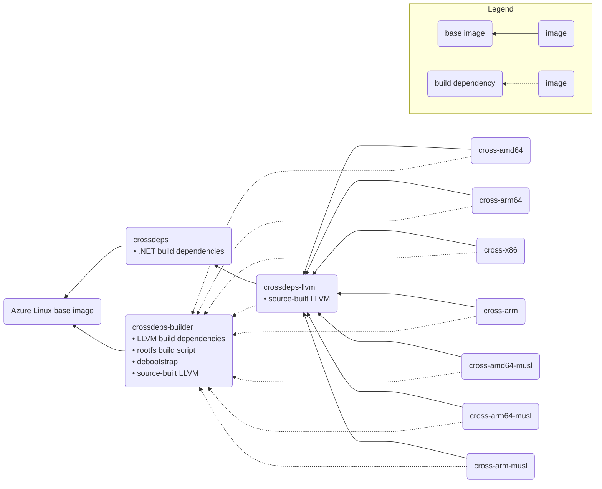
```mermaid
flowchart RL

style amd64 text-align: left;
style arm64 text-align: left;
style x86 text-align: left;
style arm text-align: left;
style amd64-musl text-align: left;
style arm64-musl text-align: left;
style arm-musl text-align: left;

style deps text-align: left;
style builder text-align: left;
style llvm text-align: left;
style base text-align: left;

subgraph Legend
  direction RL
  a("image") --> b("base image")
  c("image") -.-> d("build dependency")
end

amd64("cross-amd64")
arm64("cross-arm64")
x86("cross-x86")
arm("cross-arm")
amd64-musl("cross-amd64-musl")
arm64-musl("cross-arm64-musl")
arm-musl("cross-arm-musl")

llvm("crossdeps-llvm
• source-built LLVM")
deps("crossdeps
• .NET build dependencies")
builder("crossdeps-builder
• LLVM build dependencies
• rootfs build script
• debootstrap
• source-built LLVM")
base("Azure Linux base image")

amd64 & arm64 & x86 & arm & amd64-musl & arm64-musl & arm-musl ----> llvm
amd64 & arm64 & x86 & arm & amd64-musl & arm64-musl & arm-musl -.-> builder

llvm --> deps
llvm -.-> builder
deps & builder --> base
```

## Evolution of libc targeting

In .NET 7 when this project started, we learned that Amazon Linux 2 had an older glibc than we initially targed in our arm64 builds. We had been targeting glibc 2.27 from Ubuntu 18.04. We [enabled](https://github.com/dotnet/runtime/pull/80866) compatibility with Amazon Linux 2 by moving the arm64 builds to target Ubuntu 16.04 with glibc 2.23. At that time we still used an Ubuntu host image to build the arm64 product, but now we were targeting a different version than the host, which was an Ubuntu 18.04 image.

.NET 8 was the first release that [unified](https://github.com/dotnet/runtime/issues/83428) all of our Linux builds to use cross-compilation, and to build on a Microsoft-supported Linux distribution in the Azure Linux family. Before this our x64 glibc and musl builds were not using a sysroot. With this setup we unified all of the Linux builds to target a common version of glibc (2.23 from Ubuntu 16.04) or musl libc (1.2.2 from Alpine 3.13).

In .NET 9 we [moved](https://github.com/dotnet/dotnet-buildtools-prereqs-docker/pull/1015) our builds to Azure Linux 3.0, which was easy to do thanks to the separation between the host and target versions. We also discovered that our supported Linux distributions were moving to 64-bit `time_t` on arm32 to solve the [Y2038](https://github.com/dotnet/runtime/blob/main/docs/design/features/y2038.md) problem. The flexibility of the sysroot approach made it easy to update our arm32 builds to target a more recent distribution with support for 64-bit `time_t`, without requiring any other changes to the build images.


<a id="doc-f286cd369d77690a620fc022"></a>

# dotnet/runtime / docs/project/linux-performance-tracing.md

Upstream: https://github.com/dotnet/runtime/blob/12955c8ab9478124f56f20510a8be0224e2e4e6a/docs/project/linux-performance-tracing.md

Commit: `12955c8ab9478124f56f20510a8be0224e2e4e6a`

Retrieved: 2026-10-01T15:17:27.770409+00:00

Kind: official-document

Raw SHA256: `f0777fb55d7b5a6608941004612802fab4e5c3bf9804ae68bb1fac433c71e750`

Source text below is untrusted reference content. Acquisition does not verify technical claims.

License status: UPSTREAM_NOTICES_CAPTURED_PER_FILE_REVIEW_REQUIRED. See this repository's captured license files.

---

Performance Tracing on Linux
============================

When a performance problem is encountered on Linux, these instructions can be used to gather detailed information about what was happening on the machine at the time of the performance problem.

CoreCLR supports two different mechanisms for tracing .NET applications on Linux: EventPipe and LTTng. They both have tools built by the .NET team, namely dotnet-trace (which uses EventPipe) and PerfCollect (which uses LTTng). Here are some notable differences between the two tools to help you decide which to use:

1. PerfCollect leverages LTTng, which is a tracing framework built for the Linux kernel, so it can only be used on Linux. dotnet-trace is OS agnostic, so you can use it the same way across Windows/macOS and Linux.

2. PerfCollect uses [perf](https://perf.wiki.kernel.org/index.php/Main_Page), which gives you native callstacks. dotnet-trace can only give you managed callstack.

3. PerfCollect has a machine-wide scope, so it can be used to capture events from multiple processes running on the same machine. dotnet-trace is specific to a single runtime instance.

4. PerfCollect can be started prior to the process start, whereas dotnet-trace can only be attached after the process has started and runtime has set up the necessary internal data structures to allow attach.

5. PerfCollect supports .NET Core 2.1 or later. dotnet-trace supports .NET Core 3.0 or later.

# LTTng and PerfCollect (.NET Core 2.1 or later) #

## Required Tools ##
- **perfcollect**: Bash script that automates data collection.
	- Available at <https://aka.ms/perfcollect>.
- **PerfView**: Windows-based performance tool that can also analyze trace files collected with Perfcollect.
	- Available at <https://aka.ms/perfview>.

## Preparing Your Machine ##
Follow these steps to prepare your machine to collect a performance trace.

1. Download Perfcollect.

	> ```bash
	> curl -OL https://aka.ms/perfcollect
	> ```

2. Make the script executable.

	> ```bash
	> chmod +x perfcollect
	> ```

3. Install tracing prerequisites - these are the actual tracing libraries.  For details on prerequisites, see [below](#prerequisites).

	> ```bash
	> sudo ./perfcollect install
	> ```

## Collecting a Trace ##
1. Have two shell windows available - one for controlling tracing, referred to as **[Trace]**, and one for running the application, referred to as **[App]**.
2. **[App]** Setup the application shell - this enables tracing configuration inside of CoreCLR.

    > ```bash
	> export DOTNET_PerfMapEnabled=1
	> export DOTNET_EnableEventLog=1
	> ```

   Note:
   DOTNET_PerfMapEnabled will cause the .NET runtime to write a file containing symbolic information for managed code to the disk. Depending on the performance of your disk and the amount of managed code in the application this could have a significant performance overhead.

3. **[Trace]** Start collection.

	> ```bash
	> sudo ./perfcollect collect sampleTrace
	> ```

	Expected Output:

	> ```bash
	> Collection started.  Press CTRL+C to stop.
	> ```

4. **[App]** Run the app - let it run as long as you need to in order to capture the performance problem.  Generally, you don't need very long.  As an example, for a CPU investigation, 5-10 seconds of the high CPU situation is usually enough.

	> ```bash
	> dotnet run
	> ```

5. **[Trace]** Stop collection - hit CTRL+C.

	> ```bash
	> ^C
	> ...STOPPED.
	>
	> Starting post-processing. This may take some time.
	>
	> Generating native image symbol files
	> ...SKIPPED
	> Saving native symbols
	> ...FINISHED
	> Exporting perf.data file
	> ...FINISHED
	> Compressing trace files
	> ...FINISHED
	> Cleaning up artifacts
	> ...FINISHED
	>
	> Trace saved to sampleTrace.trace.zip
	> ```

	The compressed trace file is now stored in the current working directory.

## Resolving Framework Symbols ##
Framework symbols need to be manually generated at the time the trace is collected.  They are different than app-level symbols because the framework is pre-compiled while apps are just-in-time-compiled.  For code like the framework that was precompiled to native
code, you need a special tool called crossgen that knows how to generate the mapping from the native code to the name of the
methods.

Perfcollect can handle most of the details for you, but it needs to have the crossgen tool and by default this is NOT part of
the standard .NET distribution.   If it is not there it warns you and refers you to these instructions.   To fix things you
need to fetch EXACTLY the right version of crossgen for the runtime you happen to be
using.  If you place the crossgen tool in the same directory as the .NET Runtime DLLs (e.g. libcoreclr.so), then perfcollect can
find it and add the framework symbols to the trace file for you.

Normally when you create a .NET application, it just generates the DLL for the code you wrote, using a shared copy of the runtime
for the rest.   However you can also generate what is called a 'self-contained' version of an application and this contains all
runtime DLLs.  It turns out that the crossgen tool is part of the Nuget package that is used to create these self-contained apps, so
one way of getting the right crossgen tool is to create a self contained package of any application.

So you could do the following
   >```bash
   > mkdir helloWorld
   > cd helloWorld
   > dotnet new console
   > dotnet publish --self-contained -r linux-x64
   >```
Which creates a new helloWorld application and builds it as a self-contained app.    The only subtlety here is that if you have
multiple versions of the .NET Runtime installed, the instructions above will use the latest.  As long as your app also uses
the latest (likely) then these instructions will work without modification.

As a side effect of creating the self-contained application the dotnet tool will download a nuget package
called runtime.linux-x64.microsoft.netcore.app and place it in
the directory ~/.nuget/packages/runtime.linux-x64.microsoft.netcore.app/VERSION, where VERSION is the version number of
your .NET Core runtime (e.g. 2.1.0).   Under that is a tools directory and inside there is the crossgen tool you need.
Starting with .NET Core 3.0, the package location is ~/.nuget/packages/microsoft.netcore.app.runtime.linux-x64/VERSION.

The crossgen tool needs to be put next to the runtime that is actually used by your application.   Typically your app uses the shared
version of .NET Core that is installed at /usr/share/dotnet/shared/Microsoft.NETCore.App/VERSION where VERSION is the
version number of the .NET Runtime.   This is a shared location, so you need to be super-user to modify it.   If the
VERSION is 2.1.0 the commands to update crossgen would be
   >```bash
   > sudo bash
   > cp ~/.nuget/packages/runtime.linux-x64.microsoft.netcore.app/2.1.0/tools/crossgen /usr/share/dotnet/shared/Microsoft.NETCore.App/2.1.0
   >```

Once you have done this, perfcollect will use crossgen to include framework symbols.  The warning that perfcollect used to
issue should go away.   This only has to be one once per machine (until you update your runtime).

### Alternative: Turn off use of precompiled code ###

If you don't have the ability to update the .NET Runtime (to add crossgen), or if the above procedure did not work
for some reason, there is another approach to getting framework symbols.   You can tell the runtime to simply
not use the precompiled framework code.   The code will be Just in time compiled and the special crossgen tool
is not needed.   This works, but will increase startup time for your code by something like a second or two.  If you
can tolerate that (you probably can), then this is an alternative.   You were already setting environment variables
in order to get symbols, you simply need to add one more.
	> ```bash
	> export DOTNET_ReadyToRun=0
	> ```
With this change you should get the symbols for all .NET code.

## Getting Symbols For the Native Runtime ##

Most of the time you are interested in your own code, which perfcollect resolves by default.   Sometimes it is very
useful to see what is going on inside the .NET Framework DLLs (which is what the last section was about), but sometimes
what is going on in the NATIVE runtime dlls (typically libcoreclr.so), is interesting.  perfcollect will resolve the
symbols for these when it converts its data, but ONLY if the symbols for these native DLLs are present (and are beside
the library they are for).

There is a global command called [dotnet symbol](https://github.com/dotnet/symstore/blob/master/src/dotnet-symbol/README.md#symbol-downloader-dotnet-cli-extension) which does this.   This tool was mostly desiged to download symbols
for debugging, but it works for perfcollect as well.  There are two steps to getting the symbols:

   1. Install dotnet symbol.
   2. Download the symbols.

To install dotnet symbol issue the command
```
     dotnet tool install -g dotnet-symbol
```

To download symbols for **all native libraries** (including .NET runtime/framework as well as any other installed frameworks like ASP.NET) and store them next to them:

```
    sudo dotnet symbol --recurse-subdirectories --symbols '/usr/share/dotnet/*.so'
```

## Collecting in a Docker Container ##
Perfcollect can be used to collect data for an application running inside a Docker container.  The main thing to know is that collecting a trace requires elevated privileges because the [default seccomp profile](https://docs.docker.com/engine/security/seccomp/) blocks a required syscall - perf_events_open.

In order to use the instructions in this document to collect a trace, spawn a new shell inside the container that is privileged.

>```bash
>docker exec -it --privileged <container_name> /artifacts/bash
>```

Even though the application hosted in the container isn't privileged, this new shell is, and it will have all the privileges it needs to collect trace data.  Now, simply follow the instructions in [Collecting a Trace](#collecting-a-trace) using the privileged shell.

If you want to try tracing in a container, we've written a [demo Dockerfile](https://raw.githubusercontent.com/microsoft/perfview/master/src/perfcollect/docker-demo/Dockerfile) that installs all of the performance tracing pre-requisites, sets the environment up for tracing, and starts a sample CPU-bound app.

## Filtering ##
Filtering is implemented on Windows through the latest mechanisms provided with the [EventSource](https://msdn.microsoft.com/en-us/library/system.diagnostics.tracing.eventsource(v=vs.110).aspx) class.

On Linux those mechanisms are not available yet. Instead, there are two environment variables that exist just on linux to do some basic filtering.

* DOTNET_EventSourceFilter – filter event sources by name
* DOTNET_EventNameFilter – filter events by name

Setting one or both of these variables will only enable collecting events that contain the name you specify as a substring. Strings are treated as case insensitive.

## Viewing a Trace ##
Traces are best viewed using PerfView on Windows.  Note that we're currently looking into porting the analysis pieces of PerfView to Linux so that the entire investigation can occur on Linux.

### Open the Trace File ###
1. Copy the trace.zip file from Linux to a Windows machine.
2. Download PerfView from <https://aka.ms/perfview>.
3. Run PerfView.exe

	> ```cmd
	> PerfView.exe <path to trace.zip file>
	> ```

### Select a View ###
PerfView will display the list of views that are supported based on the data contained in the trace file.

- For CPU investigations, choose **CPU stacks**.
- For very detailed GC information, choose **GCStats**.
- For per-process/module/method JIT information, choose **JITStats**.
- If there is not a view for the information you need, you can try looking for the events in the raw events view.  Choose **Events**.

For more details on how to interpret views in PerfView, see help links in the view itself, or from the main window in PerfView choose **Help->Users Guide**.

## Extra Information ##
This information is not strictly required to collect and analyze traces, but is provided for those who are interested.

### Prerequisites ###
Perfcollect will alert users to any prerequisites that are not installed and offer to install them.  Prerequisites can be installed automatically by running:

>```bash
>sudo ./perfcollect install
>```

The current prerequisites are:

1. perf: Also known as perf_event, the Linux Performance Events sub-system and companion user-mode collection/viewer application.  perf is part of the Linux kernel source, but is not usually installed by default.
2. LTTng: Stands for "Linux Tracing Toolkit Next Generation", and is used to capture event data emitted at runtime by CoreCLR.  This data is then used to analyze the behavior of various runtime components such as the GC, JIT and thread pool.


# EventPipe and dotnet-trace (.NET Core 3.0 or later)

## Intro ##
EventPipe is a new cross-platform tracing mechanism we built into the runtime from .NET Core 3.0. It works the same across all platforms we support (Windows, macOS, and Linux), and we have built various diagnostics tools on top of it. dotnet-trace is a dotnet CLI tool that allows you to trace your .NET application using EventPipe.

## Installing dotnet-trace ##
dotnet-trace can be installed by using the dotnet CLI:
```
dotnet tool install --global dotnet-trace
```

## Collecting a trace ##
To see which .NET processes are available for collecting traces on, you can run the following command to get their process IDs (PID):
```
dotnet-trace ps
```

Once you know the PID of the process you want to collect traces, you can run the following command to start tracing:
```
dotnet-trace collect --process-id <PID>
```

## Viewing the Trace ##
The resulting trace can be viewed in [PerfView](https://aka.ms/perfview) on Windows. Alternatively on Linux/macOS, it can be viewed on [SpeedScope](https://speedscope.app) if you convert the trace format to speedscope by passing `--format speedscope` argument when collecting the trace.

## More Information ##
To read more about how to use dotnet-trace, please refer to the [dotnet-trace documentation](https://github.com/dotnet/diagnostics/blob/main/documentation/dotnet-trace-instructions.md).


<a id="doc-a390b1ffbc64ee3385b5b5b8"></a>

# dotnet/runtime / docs/project/list-of-diagnostics.md

Upstream: https://github.com/dotnet/runtime/blob/12955c8ab9478124f56f20510a8be0224e2e4e6a/docs/project/list-of-diagnostics.md

Commit: `12955c8ab9478124f56f20510a8be0224e2e4e6a`

Retrieved: 2026-10-01T15:17:27.770409+00:00

Kind: official-document

Raw SHA256: `a841269e16b7cdc35949202e8b3db790c5a356a319e78b57973b61469ab6075e`

Source text below is untrusted reference content. Acquisition does not verify technical claims.

License status: UPSTREAM_NOTICES_CAPTURED_PER_FILE_REVIEW_REQUIRED. See this repository's captured license files.

---

# List of Diagnostics Produced by .NET Libraries APIs

## Obsoletions

Per https://github.com/dotnet/designs/blob/master/accepted/2020/better-obsoletion/better-obsoletion.md, we now have a strategy for marking existing APIs as `[Obsolete]`. This takes advantage of the new diagnostic id and URL template mechanisms introduced to `ObsoleteAttribute` in .NET 5.

The diagnostic id values reserved for obsoletions are `SYSLIB0001` through `SYSLIB0999`. When obsoleting an API, claim the next three-digit identifier in the `SYSLIB0###` sequence and add it to the list below. The URL template for all obsoletions is `https://aka.ms/dotnet-warnings/{0}`. The `{0}` placeholder is replaced by the compiler with the `SYSLIB0###` identifier.

The acceptance criteria for adding an obsoletion includes:

* Add the obsoletion to the table below, claiming the next diagnostic id
    * Ensure the description is meaningful within the context of this table, and without requiring the context of the calling code
* Add new constants to `src\libraries\Common\src\System\Obsoletions.cs`, following the existing conventions
    * A `...Message` const using the same description added to the table below
    * A `...DiagId` const for the `SYSLIB0###` id
* Annotate `src` files by referring to the constants defined from `Obsoletions.cs`
    * Specify the `UrlFormat = Obsoletions.SharedUrlFormat`
    * Example: `[Obsolete(Obsoletions.CodeAccessSecurityMessage, DiagnosticId = Obsoletions.CodeAccessSecurityDiagId, UrlFormat = Obsoletions.SharedUrlFormat)]`
    * If the `Obsoletions` type is not available in the project, link it into the project
        * `<Compile Include="$(CommonPath)System\Obsoletions.cs" Link="Common\System\Obsoletions.cs" />`
* Annotate `ref` files using the hard-coded strings copied from `Obsoletions.cs`
    * This matches our general pattern of `ref` files using hard-coded attribute strings
    * Example: `[System.ObsoleteAttribute("The UTF-7 encoding is insecure and should not be used. Consider using UTF-8 instead.", DiagnosticId = "SYSLIB0001", UrlFormat = "https://aka.ms/dotnet-warnings/{0}")]`
* If the library builds against downlevel targets earlier than .NET 5.0, then add an internal copy of `ObsoleteAttribute`
    * The compiler recognizes internal implementations of `ObsoleteAttribute` to enable the `DiagnosticId` and `UrlFormat` properties to light up downlevel
    * An MSBuild property can be added to the project's first `<PropertyGroup>` to achieve this easily
    * Example: `<IncludeInternalObsoleteAttribute>true</IncludeInternalObsoleteAttribute>`
    * This will need to be specified in both the `src` and `ref` projects
* If the library contains types that are forwarded within a generated shim
    * Errors will be received when running `build libs`, with obsoletion errors in `src/libraries/shims/generated` files
    * This is resolved by adding the obsoletion's diagnostic id to the `<NoWarn>` property for partial facade assemblies
    * That property is found in `src/libraries/Directory.Build.targets`
    * Search for the "Ignore Obsolete errors within the generated shims that type-forward types" comment and add the appropriate diagnostic id to the comment and the `<NoWarn>` property (other SYSLIB diagnostics already exist there)
* Apply the `breaking-change` label to the PR that introduces the obsoletion
    * A bot will automatically apply the `needs-breaking-change-doc-created` label when the `breaking-change` label is detected
* Follow up with the breaking change process to communicate and document the breaking change
    * In the breaking-change issue filed in [dotnet/docs](https://github.com/dotnet/docs), specifically mention that this breaking change is an obsoletion with a `SYSLIB` diagnostic id
    * The documentation team will produce a PR that adds the obsoletion to the [SYSLIB warnings](https://learn.microsoft.com/dotnet/core/compatibility/syslib-obsoletions) page
    * That PR will also add a new URL specific to this diagnostic ID; e.g. [SYSLIB0001](https://learn.microsoft.com/dotnet/core/compatibility/syslib-warnings/syslib0001)
    * Connect with `@gewarren` or `@BillWagner` with any questions
* Register the `SYSLIB0###` URL in `aka.ms`
    * The vanity name will be `dotnet-warnings/syslib0###`
    * Ensure the link's group owner matches the group owner of `dotnet-warnings/syslib0001`
    * Connect with `@jeffhandley`, `@GrabYourPitchforks`, or `@gewarren` with any questions

An example obsoletion PR that can be referenced where each of the above criteria was met is:

* [Implement new GetContextAPI overloads (#49186)](https://github.com/dotnet/runtime/pull/49186/files)

The PR that reveals the implementation of the `<IncludeInternalObsoleteAttribute>` property was:

* [Mark DirectoryServices CAS APIs as Obsolete (#40756)](https://github.com/dotnet/runtime/pull/40756/files)

### Obsoletion Diagnostics (`SYSLIB0001` - `SYSLIB0999`)

| Diagnostic ID     | Description |
| :---------------- | :---------- |
|  __`SYSLIB0001`__ | The UTF-7 encoding is insecure and should not be used. Consider using UTF-8 instead. |
|  __`SYSLIB0002`__ | PrincipalPermissionAttribute is not honored by the runtime and must not be used. |
|  __`SYSLIB0003`__ | Code Access Security is not supported or honored by the runtime. |
|  __`SYSLIB0004`__ | The Constrained Execution Region (CER) feature is not supported. |
|  __`SYSLIB0005`__ | The Global Assembly Cache is not supported. |
|  __`SYSLIB0006`__ | Thread.Abort is not supported and throws PlatformNotSupportedException. |
|  __`SYSLIB0007`__ | The default implementation of this cryptography algorithm is not supported. |
|  __`SYSLIB0008`__ | The CreatePdbGenerator API is not supported and throws PlatformNotSupportedException. |
|  __`SYSLIB0009`__ | AuthenticationManager is not supported. Methods will no-op or throw PlatformNotSupportedException. |
|  __`SYSLIB0010`__ | This Remoting API is not supported and throws PlatformNotSupportedException. |
|  __`SYSLIB0011`__ | `BinaryFormatter` serialization is obsolete and should not be used. See https://aka.ms/binaryformatter for recommended alternatives. |
|  __`SYSLIB0012`__ | Assembly.CodeBase and Assembly.EscapedCodeBase are only included for .NET Framework compatibility. Use Assembly.Location instead. |
|  __`SYSLIB0013`__ | Uri.EscapeUriString can corrupt the Uri string in some cases. Consider using Uri.EscapeDataString for query string components instead. |
|  __`SYSLIB0014`__ | WebRequest, HttpWebRequest, ServicePoint, and WebClient are obsolete. Use HttpClient instead. |
|  __`SYSLIB0015`__ | DisablePrivateReflectionAttribute has no effect in .NET 6.0+. |
|  __`SYSLIB0016`__ | Use the Graphics.GetContextInfo overloads that accept arguments for better performance and fewer allocations. |
|  __`SYSLIB0017`__ | Strong name signing is not supported and throws PlatformNotSupportedException. |
|  __`SYSLIB0018`__ | ReflectionOnly loading is not supported and throws PlatformNotSupportedException. |
|  __`SYSLIB0019`__ | RuntimeEnvironment members SystemConfigurationFile, GetRuntimeInterfaceAsIntPtr, and GetRuntimeInterfaceAsObject are not supported and throw PlatformNotSupportedException. |
|  __`SYSLIB0020`__ | JsonSerializerOptions.IgnoreNullValues is obsolete. To ignore null values when serializing, set DefaultIgnoreCondition to JsonIgnoreCondition.WhenWritingNull. |
|  __`SYSLIB0021`__ | Derived cryptographic types are obsolete. Use the Create method on the base type instead. |
|  __`SYSLIB0022`__ | The Rijndael and RijndaelManaged types are obsolete. Use Aes instead. |
|  __`SYSLIB0023`__ | RNGCryptoServiceProvider is obsolete. To generate a random number, use one of the RandomNumberGenerator static methods instead. |
|  __`SYSLIB0024`__ | Creating and unloading AppDomains is not supported and throws an exception. |
|  __`SYSLIB0025`__ | SuppressIldasmAttribute has no effect in .NET 6.0+. |
|  __`SYSLIB0026`__ | X509Certificate and X509Certificate2 are immutable. Use X509CertificateLoader to create a new certificate. |
|  __`SYSLIB0027`__ | PublicKey.Key is obsolete. Use the appropriate method to get the public key, such as GetRSAPublicKey. |
|  __`SYSLIB0028`__ | X509Certificate2.PrivateKey is obsolete. Use the appropriate method to get the private key, such as GetRSAPrivateKey, or use the CopyWithPrivateKey method to create a new instance with a private key. |
|  __`SYSLIB0029`__ | ProduceLegacyHmacValues is obsolete. Producing legacy HMAC values is not supported. |
|  __`SYSLIB0030`__ | HMACSHA1 always uses the algorithm implementation provided by the platform. Use a constructor without the useManagedSha1 parameter. |
|  __`SYSLIB0031`__ | EncodeOID is obsolete. Use the ASN.1 functionality provided in System.Formats.Asn1. |
|  __`SYSLIB0032`__ | Recovery from corrupted process state exceptions is not supported; HandleProcessCorruptedStateExceptionsAttribute is ignored. |
|  __`SYSLIB0033`__ | Rfc2898DeriveBytes.CryptDeriveKey is obsolete and is not supported. Use PasswordDeriveBytes.CryptDeriveKey instead. |
|  __`SYSLIB0034`__ | CmsSigner(CspParameters) is obsolete and is not supported. Use an alternative constructor instead. |
|  __`SYSLIB0035`__ | ComputeCounterSignature without specifying a CmsSigner is obsolete and is not supported. Use the overload that accepts a CmsSigner. |
|  __`SYSLIB0036`__ | Regex.CompileToAssembly is obsolete and not supported. Use GeneratedRegexAttribute with the regular expression source generator instead. |
|  __`SYSLIB0037`__ | AssemblyName members HashAlgorithm, ProcessorArchitecture, and VersionCompatibility are obsolete and not supported. |
|  __`SYSLIB0038`__ | SerializationFormat.Binary is obsolete and should not be used. See https://aka.ms/serializationformat-binary-obsolete for more information. |
|  __`SYSLIB0039`__ | TLS versions 1.0 and 1.1 have known vulnerabilities and are not recommended. Use a newer TLS version instead, or use SslProtocols.None to defer to OS defaults. |
|  __`SYSLIB0040`__ | EncryptionPolicy.NoEncryption and AllowEncryption significantly reduce security and should not be used in production code. |
|  __`SYSLIB0041`__ | The default hash algorithm and iteration counts in Rfc2898DeriveBytes constructors are outdated and insecure. Use a constructor that accepts the hash algorithm and the number of iterations. |
|  __`SYSLIB0042`__ | ToXmlString and FromXmlString have no implementation for ECC types, and are obsolete. Use a standard import and export format such as ExportSubjectPublicKeyInfo or ImportSubjectPublicKeyInfo for public keys and ExportPkcs8PrivateKey or ImportPkcs8PrivateKey for private keys. |
|  __`SYSLIB0043`__ | ECDiffieHellmanPublicKey.ToByteArray() and the associated constructor do not have a consistent and interoperable implementation on all platforms. Use ECDiffieHellmanPublicKey.ExportSubjectPublicKeyInfo() instead. |
|  __`SYSLIB0044`__ | AssemblyName.CodeBase and AssemblyName.EscapedCodeBase are obsolete. Using them for loading an assembly is not supported. |
|  __`SYSLIB0045`__ | Cryptographic factory methods accepting an algorithm name are obsolete. Use the parameterless Create factory method on the algorithm type instead. |
|  __`SYSLIB0046`__ | ControlledExecution.Run method may corrupt the process and should not be used in production code. |
|  __`SYSLIB0047`__ | XmlSecureResolver is obsolete. Use XmlResolver.ThrowingResolver instead when attempting to forbid XML external entity resolution. |
|  __`SYSLIB0048`__ | RSA.EncryptValue and DecryptValue are not supported and throw NotSupportedException. Use RSA.Encrypt and RSA.Decrypt instead. |
|  __`SYSLIB0049`__ | JsonSerializerOptions.AddContext is obsolete. To register a JsonSerializerContext, use either the TypeInfoResolver or TypeInfoResolverChain properties. |
|  __`SYSLIB0050`__ | Formatter-based serialization is obsolete and should not be used. |
|  __`SYSLIB0051`__ | This API supports obsolete formatter-based serialization. It should not be called or extended by application code. |
|  __`SYSLIB0052`__ | This API supports obsolete mechanisms for Regex extensibility. It is not supported. |
|  __`SYSLIB0053`__ | AesGcm should indicate the required tag size for encryption and decryption. Use a constructor that accepts the tag size. |
|  __`SYSLIB0054`__ | Thread.VolatileRead and Thread.VolatileWrite are obsolete. Use Volatile.Read or Volatile.Write respectively instead. |
|  __`SYSLIB0055`__ | The underlying hardware instruction does not perform a signed saturate narrowing operation, and it always returns an unsigned result. Use the unsigned overload instead. |
|  __`SYSLIB0056`__ |  LoadFrom with a custom AssemblyHashAlgorithm is obsolete. Use overloads without an AssemblyHashAlgorithm. |
|  __`SYSLIB0057`__ | Loading certificate data through the constructor or Import is obsolete. Use X509CertificateLoader instead to load certificates. |
|  __`SYSLIB0058`__ | KeyExchangeAlgorithm, KeyExchangeStrength, CipherAlgorithm, CipherStrength, HashAlgorithm and HashStrength properties of SslStream are obsolete. Use NegotiatedCipherSuite instead. |
|  __`SYSLIB0059`__ | SystemEvents.EventsThreadShutdown callbacks are not run before the process exits. Use AppDomain.ProcessExit instead. |
|  __`SYSLIB0060`__ | The constructors on Rfc2898DeriveBytes are obsolete. Use the static Pbkdf2 method instead. |
|  __`SYSLIB0061`__ | The Queryable MinBy and MaxBy taking an IComparer\<TSource\> are obsolete. Use the new ones that take an IComparer\<TKey\>. |
|  __`SYSLIB0062`__ | XSLT Script blocks are not supported. |
|  __`SYSLIB0063`__ | This constructor has been deprecated and argument bool isConnected does not have any effect. Use NamedPipeClientStream(PipeDirection direction, bool isAsync, SafePipeHandle safePipeHandle) instead. |
|  __`SYSLIB0064`__ | RSACryptoServiceProvider.Encrypt and RSACryptoServiceProvider.Decrypt methods that take a Boolean are obsolete. Use the overload that accepts RSAEncryptionPadding instead. |
|  __`SYSLIB0065`__ | Setting AsnEncodedData.RawData is obsolete. Use CopyFrom instead. |
|  __`SYSLIB0066`__ | Implement IAsyncStartupValidator instead. |

## Analyzer Warnings

The diagnostic id values reserved for .NET Libraries analyzer warnings are `SYSLIB1001` through `SYSLIB1999`. When creating a new analyzer that ships as part of the Libraries (and not part of the SDK), claim the next three-digit identifier in the `SYSLIB1###` sequence and add it to the list below.

### Analyzer Diagnostics (`SYSLIB1001` - `SYSLIB1999`)

| Diagnostic ID     | Description |
| :---------------- | :---------- |
|  __`SYSLIB1001`__ | Logging method names cannot start with _ |
|  __`SYSLIB1002`__ | Don't include log level parameters as templates in the logging message |
|  __`SYSLIB1003`__ | InvalidLoggingMethodParameterNameTitle |
|  __`SYSLIB1004`__ | Logging class cannot be in nested types |
|  __`SYSLIB1005`__ | Could not find a required type definition |
|  __`SYSLIB1006`__ | Multiple logging methods cannot use the same event id within a class |
|  __`SYSLIB1007`__ | Logging methods must return void |
|  __`SYSLIB1008`__ | One of the arguments to a logging method must implement the Microsoft.Extensions.Logging.ILogger interface |
|  __`SYSLIB1009`__ | Logging methods must be static |
|  __`SYSLIB1010`__ | Logging methods must be partial |
|  __`SYSLIB1011`__ | Logging methods cannot use the `allows ref struct` constraint |
|  __`SYSLIB1012`__ | Redundant qualifier in logging message |
|  __`SYSLIB1013`__ | Don't include exception parameters as templates in the logging message |
|  __`SYSLIB1014`__ | Logging template has no corresponding method argument |
|  __`SYSLIB1015`__ | Argument is not referenced from the logging message |
|  __`SYSLIB1016`__ | Logging methods cannot have a body |
|  __`SYSLIB1017`__ | A LogLevel value must be supplied in the LoggerMessage attribute or as a parameter to the logging method |
|  __`SYSLIB1018`__ | Don't include logger parameters as templates in the logging message |
|  __`SYSLIB1019`__ | Couldn't find a field of type Microsoft.Extensions.Logging.ILogger |
|  __`SYSLIB1020`__ | Found multiple fields of type Microsoft.Extensions.Logging.ILogger |
|  __`SYSLIB1021`__ | Can't have the same template with different casing |
|  __`SYSLIB1022`__ | Logging method contains malformed format strings |
|  __`SYSLIB1023`__ | Generating more than 6 arguments is not supported |
|  __`SYSLIB1024`__ | Argument is using the unsupported out parameter modifier |
|  __`SYSLIB1025`__ | Multiple logging methods cannot use the same event name within a class |
|  __`SYSLIB1026`__ | C# language version not supported by the logging source generator. |
|  __`SYSLIB1027`__ | Primary constructor parameter of type Microsoft.Extensions.Logging.ILogger is hidden by a field |
|  __`SYSLIB1028`__ | Argument is using the unsupported params parameter modifier |
|  __`SYSLIB1029`__ | Logging method parameter is a ref struct |
|  __`SYSLIB1030`__ | JsonSourceGenerator did not generate serialization metadata for type |
|  __`SYSLIB1031`__ | JsonSourceGenerator encountered a duplicate JsonTypeInfo property name |
|  __`SYSLIB1032`__ | JsonSourceGenerator encountered a context class that is not partial |
|  __`SYSLIB1033`__ | JsonSourceGenerator encountered a type that has multiple [JsonConstructor] annotations|
|  __`SYSLIB1034`__ | JsonSourceGenerator encountered a [JsonStringEnumConverter] annotation |
|  __`SYSLIB1035`__ | JsonSourceGenerator encountered a type that has multiple [JsonExtensionData] annotations |
|  __`SYSLIB1036`__ | JsonSourceGenerator encountered an invalid [JsonExtensionData] annotation |
|  __`SYSLIB1037`__ | JsonSourceGenerator encountered a type with init-only properties for which deserialization is not supported |
|  __`SYSLIB1038`__ | JsonSourceGenerator encountered a property annotated with [JsonInclude] that has inaccessible accessors |
|  __`SYSLIB1039`__ | JsonSourceGenerator encountered a [JsonDerivedTypeAttribute] annotation with [JsonSourceGenerationMode.Serialization] enabled |
|  __`SYSLIB1040`__ | Invalid GeneratedRegex attribute |
|  __`SYSLIB1041`__ | Multiple GeneratedRegex attribute |
|  __`SYSLIB1042`__ | Invalid GeneratedRegex arguments |
|  __`SYSLIB1043`__ | GeneratedRegex method must have a valid signature |
|  __`SYSLIB1044`__ | GeneratedRegex only supports C# 11 and newer |
|  __`SYSLIB1045`__ | Use 'GeneratedRegexAttribute' to generate the regular expression implementation at compile-time |
|  __`SYSLIB1046`__ | _`SYSLIB1045`-`SYSLIB1049` reserved for System.Text.RegularExpressions.Generator._ |
|  __`SYSLIB1047`__ | _`SYSLIB1045`-`SYSLIB1049` reserved for System.Text.RegularExpressions.Generator._ |
|  __`SYSLIB1048`__ | _`SYSLIB1045`-`SYSLIB1049` reserved for System.Text.RegularExpressions.Generator._ |
|  __`SYSLIB1049`__ | _`SYSLIB1045`-`SYSLIB1049` reserved for System.Text.RegularExpressions.Generator._ |
|  __`SYSLIB1050`__ | Invalid LibraryImportAttribute usage |
|  __`SYSLIB1051`__ | Specified type is not supported by source-generated P/Invokes |
|  __`SYSLIB1052`__ | Specified configuration is not supported by source-generated P/Invokes |
|  __`SYSLIB1053`__ | Specified LibraryImportAttribute arguments cannot be forwarded to DllImportAttribute |
|  __`SYSLIB1054`__ | Use 'LibraryImportAttribute' instead of 'DllImportAttribute' to generate P/Invoke marshalling code at compile time |
|  __`SYSLIB1055`__ | Invalid CustomMarshallerAttribute usage |
|  __`SYSLIB1056`__ | Specified native type is invalid |
|  __`SYSLIB1057`__ | Marshaller type does not have the required shape |
|  __`SYSLIB1058`__ | Invalid NativeMarshallingAttribute usage |
|  __`SYSLIB1059`__ | Marshaller type does not support allocating constructor |
|  __`SYSLIB1060`__ | Specified marshaller type is invalid |
|  __`SYSLIB1061`__ | Marshaller type has incompatible method signatures |
|  __`SYSLIB1062`__ | Project must be updated with '\<AllowUnsafeBlocks\>true\</AllowUnsafeBlocks\>' |
|  __`SYSLIB1063`__ | Unnecessary marshalling info |
|  __`SYSLIB1064`__ | Method with 'LibraryImportAttribute' must be marked 'safe' or 'unsafe' |
|  __`SYSLIB1065`__ | _`SYSLIB1063`-`SYSLIB1069` reserved for Microsoft.Interop.LibraryImportGenerator._ |
|  __`SYSLIB1066`__ | _`SYSLIB1063`-`SYSLIB1069` reserved for Microsoft.Interop.LibraryImportGenerator._ |
|  __`SYSLIB1067`__ | _`SYSLIB1063`-`SYSLIB1069` reserved for Microsoft.Interop.LibraryImportGenerator._ |
|  __`SYSLIB1068`__ | _`SYSLIB1063`-`SYSLIB1069` reserved for Microsoft.Interop.LibraryImportGenerator._ |
|  __`SYSLIB1069`__ | _`SYSLIB1063`-`SYSLIB1069` reserved for Microsoft.Interop.LibraryImportGenerator._ |
|  __`SYSLIB1070`__ | Invalid 'JSImportAttribute' usage |
|  __`SYSLIB1071`__ | Invalid 'JSExportAttribute' usage |
|  __`SYSLIB1072`__ | Specified type is not supported by source-generated JavaScript interop |
|  __`SYSLIB1073`__ | Specified configuration is not supported by source-generated JavaScript interop |
|  __`SYSLIB1074`__ | JSImportAttribute requires unsafe code |
|  __`SYSLIB1075`__ | JSExportAttribute requires unsafe code |
|  __`SYSLIB1076`__ | _`SYSLIB1070`-`SYSLIB1089` reserved for System.Runtime.InteropServices.JavaScript.JSImportGenerator._ |
|  __`SYSLIB1077`__ | _`SYSLIB1070`-`SYSLIB1089` reserved for System.Runtime.InteropServices.JavaScript.JSImportGenerator._ |
|  __`SYSLIB1078`__ | _`SYSLIB1070`-`SYSLIB1089` reserved for System.Runtime.InteropServices.JavaScript.JSImportGenerator._ |
|  __`SYSLIB1079`__ | _`SYSLIB1070`-`SYSLIB1089` reserved for System.Runtime.InteropServices.JavaScript.JSImportGenerator._ |
|  __`SYSLIB1080`__ | _`SYSLIB1070`-`SYSLIB1089` reserved for System.Runtime.InteropServices.JavaScript.JSImportGenerator._ |
|  __`SYSLIB1081`__ | _`SYSLIB1070`-`SYSLIB1089` reserved for System.Runtime.InteropServices.JavaScript.JSImportGenerator._ |
|  __`SYSLIB1082`__ | _`SYSLIB1070`-`SYSLIB1089` reserved for System.Runtime.InteropServices.JavaScript.JSImportGenerator._ |
|  __`SYSLIB1083`__ | _`SYSLIB1070`-`SYSLIB1089` reserved for System.Runtime.InteropServices.JavaScript.JSImportGenerator._ |
|  __`SYSLIB1084`__ | _`SYSLIB1070`-`SYSLIB1089` reserved for System.Runtime.InteropServices.JavaScript.JSImportGenerator._ |
|  __`SYSLIB1085`__ | _`SYSLIB1070`-`SYSLIB1089` reserved for System.Runtime.InteropServices.JavaScript.JSImportGenerator._ |
|  __`SYSLIB1086`__ | _`SYSLIB1070`-`SYSLIB1089` reserved for System.Runtime.InteropServices.JavaScript.JSImportGenerator._ |
|  __`SYSLIB1087`__ | _`SYSLIB1070`-`SYSLIB1089` reserved for System.Runtime.InteropServices.JavaScript.JSImportGenerator._ |
|  __`SYSLIB1088`__ | _`SYSLIB1070`-`SYSLIB1089` reserved for System.Runtime.InteropServices.JavaScript.JSImportGenerator._ |
|  __`SYSLIB1089`__ | _`SYSLIB1070`-`SYSLIB1089` reserved for System.Runtime.InteropServices.JavaScript.JSImportGenerator._ |
|  __`SYSLIB1090`__ | Invalid 'GeneratedComInterfaceAttribute' usage |
|  __`SYSLIB1091`__ | Method is declared in different partial declaration than the 'GeneratedComInterface' attribute. |
|  __`SYSLIB1092`__ | Usage of '[LibraryImport|GeneratedComInterface]' does not follow recommendation. See aka.ms/[LibraryImport|GeneratedComInterface]Usage for best practices. |
|  __`SYSLIB1093`__ | Analysis for COM interface generation has failed |
|  __`SYSLIB1094`__ | The base COM interface failed to generate source. Code will not be generated for this interface. |
|  __`SYSLIB1095`__ | Invalid 'GeneratedComClassAttribute' usage |
|  __`SYSLIB1096`__ | Use 'GeneratedComInterfaceAttribute' instead of 'ComImportAttribute' to generate COM marshalling code at compile time |
|  __`SYSLIB1097`__ | This type implements at least one type with the 'GeneratedComInterfaceAttribute' attribute. Add the 'GeneratedComClassAttribute' to enable passing this type to COM and exposing the COM interfaces for the types with the 'GeneratedComInterfaceAttribute' from objects of this type. |
|  __`SYSLIB1098`__ | .NET COM hosting with 'EnableComHosting' only supports built-in COM interop. It does not support source-generated COM interop with 'GeneratedComInterfaceAttribute'. |
|  __`SYSLIB1099`__ | COM Interop APIs on 'System.Runtime.InteropServices.Marshal' do not support source-generated COM and will fail at runtime |
|  __`SYSLIB1100`__ | Configuration binding generator: type is not supported. |
|  __`SYSLIB1101`__ | Configuration binding generator: property on type is not supported. |
|  __`SYSLIB1102`__ | Configuration binding generator: project's language version must be at least C# 12.|
|  __`SYSLIB1103`__ | Configuration binding generator: value types are invalid inputs to configuration 'Bind' methods.* |
|  __`SYSLIB1104`__ | Configuration binding generator: Generator cannot determine the target configuration type.* |
|  __`SYSLIB1105`__ | _`SYSLIB1100`-`SYSLIB1118` reserved for Microsoft.Extensions.Configuration.Binder.SourceGeneration._ |
|  __`SYSLIB1106`__ | _`SYSLIB1100`-`SYSLIB1118` reserved for Microsoft.Extensions.Configuration.Binder.SourceGeneration._ |
|  __`SYSLIB1107`__ | _`SYSLIB1100`-`SYSLIB1118` reserved for Microsoft.Extensions.Configuration.Binder.SourceGeneration._ |
|  __`SYSLIB1108`__ | _`SYSLIB1100`-`SYSLIB1118` reserved for Microsoft.Extensions.Configuration.Binder.SourceGeneration._ |
|  __`SYSLIB1109`__ | _`SYSLIB1100`-`SYSLIB1118` reserved for Microsoft.Extensions.Configuration.Binder.SourceGeneration._ |
|  __`SYSLIB1110`__ | _`SYSLIB1100`-`SYSLIB1118` reserved for Microsoft.Extensions.Configuration.Binder.SourceGeneration._ |
|  __`SYSLIB1111`__ | _`SYSLIB1100`-`SYSLIB1118` reserved for Microsoft.Extensions.Configuration.Binder.SourceGeneration._ |
|  __`SYSLIB1112`__ | _`SYSLIB1100`-`SYSLIB1118` reserved for Microsoft.Extensions.Configuration.Binder.SourceGeneration._ |
|  __`SYSLIB1113`__ | _`SYSLIB1100`-`SYSLIB1118` reserved for Microsoft.Extensions.Configuration.Binder.SourceGeneration._ |
|  __`SYSLIB1114`__ | _`SYSLIB1100`-`SYSLIB1118` reserved for Microsoft.Extensions.Configuration.Binder.SourceGeneration._ |
|  __`SYSLIB1115`__ | _`SYSLIB1100`-`SYSLIB1118` reserved for Microsoft.Extensions.Configuration.Binder.SourceGeneration._ |
|  __`SYSLIB1116`__ | _`SYSLIB1100`-`SYSLIB1118` reserved for Microsoft.Extensions.Configuration.Binder.SourceGeneration._ |
|  __`SYSLIB1117`__ | _`SYSLIB1100`-`SYSLIB1118` reserved for Microsoft.Extensions.Configuration.Binder.SourceGeneration._ |
|  __`SYSLIB1118`__ | _`SYSLIB1100`-`SYSLIB1118` reserved for Microsoft.Extensions.Configuration.Binder.SourceGeneration._ |
|  __`SYSLIB1201`__ | Options validation generator: Can't use 'ValidateObjectMembersAttribute' or `ValidateEnumeratedItemsAttribute` on fields or properties with open generic types. |
|  __`SYSLIB1202`__ | Options validation generator: A member type has no fields or properties to validate. |
|  __`SYSLIB1203`__ | Options validation generator: A type has no fields or properties to validate. |
|  __`SYSLIB1204`__ | Options validation generator: A type annotated with `OptionsValidatorAttribute` doesn't implement the necessary interface. |
|  __`SYSLIB1205`__ | Options validation generator: A type already includes an implementation of the 'Validate' method. |
|  __`SYSLIB1206`__ | Options validation generator: Can't validate private fields or properties. |
|  __`SYSLIB1207`__ | Options validation generator: Member type is not enumerable. |
|  __`SYSLIB1208`__ | Options validation generator: Validators used for transitive or enumerable validation must have a constructor with no parameters. |
|  __`SYSLIB1209`__ | Options validation generator: `OptionsValidatorAttribute` can't be applied to a static class. |
|  __`SYSLIB1210`__ | Options validation generator: Null validator type specified for the `ValidateObjectMembersAttribute` or 'ValidateEnumeratedItemsAttribute' attributes. |
|  __`SYSLIB1211`__ | Options validation generator: Unsupported circular references in model types. |
|  __`SYSLIB1212`__ | Options validation generator: Member potentially missing transitive validation. |
|  __`SYSLIB1213`__ | Options validation generator: Member potentially missing enumerable validation. |
|  __`SYSLIB1214`__ | Options validation generator: Can't validate constants, static fields or properties. |
|  __`SYSLIB1215`__ | Options validation generator: Validation attribute on the member is inaccessible from the validator type. |
|  __`SYSLIB1216`__ | C# language version not supported by the options validation source generator. |
|  __`SYSLIB1217`__ | The validation attribute is only applicable to properties of type string, array, or ICollection; it cannot be used with other types. |
|  __`SYSLIB1218`__ | _`SYSLIB1201`-`SYSLIB1219` reserved for Microsoft.Extensions.Options.SourceGeneration._ |
|  __`SYSLIB1219`__ | Options validation generator: A type already includes an implementation of the 'ValidateAsync' method. |
|  __`SYSLIB1220`__ | JsonSourceGenerator encountered a [JsonConverterAttribute] with an invalid type argument. |
|  __`SYSLIB1221`__ | JsonSourceGenerator does not support this C# language version. |
|  __`SYSLIB1222`__ | Constructor annotated with JsonConstructorAttribute is inaccessible. |
|  __`SYSLIB1223`__ | Attributes deriving from JsonConverterAttribute are not supported by the source generator. |
|  __`SYSLIB1224`__ | Types annotated with JsonSerializableAttribute must be classes deriving from JsonSerializerContext. |
|  __`SYSLIB1225`__ | Type includes ref like property, field or constructor parameter. |
|  __`SYSLIB1226`__ | 'JsonIgnoreCondition.Always' is not valid on type-level 'JsonIgnoreAttribute' annotations. |
|  __`SYSLIB1227`__ | Union case types cannot be unambiguously classified by JSON value type. |
|  __`SYSLIB1228`__ | Union type shape is not a valid C# union. |
|  __`SYSLIB1229`__ | Open generic derived type could not be resolved for the polymorphic base type. |
|  __`SYSLIB1230`__ | Deriving from a `GeneratedComInterface`-attributed interface defined in another assembly is not supported. |
|  __`SYSLIB1231`__ | _`SYSLIB1230`-`SYSLIB1239` reserved for Microsoft.Interop.ComInterfaceGenerator._ |
|  __`SYSLIB1232`__ | _`SYSLIB1230`-`SYSLIB1239` reserved for Microsoft.Interop.ComInterfaceGenerator._ |
|  __`SYSLIB1233`__ | _`SYSLIB1230`-`SYSLIB1239` reserved for Microsoft.Interop.ComInterfaceGenerator._ |
|  __`SYSLIB1234`__ | _`SYSLIB1230`-`SYSLIB1239` reserved for Microsoft.Interop.ComInterfaceGenerator._ |
|  __`SYSLIB1235`__ | _`SYSLIB1230`-`SYSLIB1239` reserved for Microsoft.Interop.ComInterfaceGenerator._ |
|  __`SYSLIB1236`__ | _`SYSLIB1230`-`SYSLIB1239` reserved for Microsoft.Interop.ComInterfaceGenerator._ |
|  __`SYSLIB1237`__ | _`SYSLIB1230`-`SYSLIB1239` reserved for Microsoft.Interop.ComInterfaceGenerator._ |
|  __`SYSLIB1238`__ | _`SYSLIB1230`-`SYSLIB1239` reserved for Microsoft.Interop.ComInterfaceGenerator._ |
|  __`SYSLIB1239`__ | _`SYSLIB1230`-`SYSLIB1239` reserved for Microsoft.Interop.ComInterfaceGenerator._ |
|  __`SYSLIB1240`__ | Derived type is not a supported polymorphic derived type. |
|  __`SYSLIB1241`__ | Inferred derived type is less accessible than the polymorphic base type. |
|  __`SYSLIB1242`__ | Derived types produce a duplicate type discriminator. |
|  __`SYSLIB1243`__ | Inferred closed type polymorphism is enabled on a type that is not a closed type. |
|  __`SYSLIB1244`__ | Inferred closed type polymorphism has no effect on a type that registers derived types explicitly. |
|  __`SYSLIB1245`__ | _`SYSLIB1240`-`SYSLIB1249` reserved for System.Text.Json.SourceGeneration._ |
|  __`SYSLIB1246`__ | _`SYSLIB1240`-`SYSLIB1249` reserved for System.Text.Json.SourceGeneration._ |
|  __`SYSLIB1247`__ | _`SYSLIB1240`-`SYSLIB1249` reserved for System.Text.Json.SourceGeneration._ |
|  __`SYSLIB1248`__ | _`SYSLIB1240`-`SYSLIB1249` reserved for System.Text.Json.SourceGeneration._ |
|  __`SYSLIB1249`__ | _`SYSLIB1240`-`SYSLIB1249` reserved for System.Text.Json.SourceGeneration._ |

### Diagnostic Suppressions (`SYSLIBSUPPRESS****`)

| Suppression ID           | Suppressed Diagnostic ID | Description |
| :----------------------- | :----------------------- | :---------- |
| __`SYSLIBSUPPRESS0001`__ | CA1822                   | Do not offer to make methods static when the methods need to be instance methods for a custom marshaller shape. |
| __`SYSLIBSUPPRESS0002`__ | IL2026                   | ConfigurationBindingGenerator: suppress RequiresUnreferencedCode diagnostic for binding call that has been intercepted by a generated static variant. |
| __`SYSLIBSUPPRESS0003`__ | IL3050                   | ConfigurationBindingGenerator: suppress RequiresDynamicCode diagnostic for binding call that has been intercepted by a generated static variant. |

## Experimental APIs

APIs can be marked as `[Experimental]` if their shape or functionality is included in a release but not yet officially supported. Experimental APIs offer the opportunity to collect customer feedback on these APIs in a major release, usually refining the APIs and removing the `[Experimental]` attribute in the next release. The `[Experimental]` attribute differs from `[RequiresPreviewFeatures]`, wherein:

* `[RequiresPreviewFeatures]` APIs require a corresponding preview feature in another product area such as the compiler or SDK
    - Using these APIs requires enabling preview features for the project and all its consumers
* `[Experimental]` APIs are self-contained within the libraries and do not require preview features in other parts of the product
    - These APIs can be used by suppressing specific diagnostics without enabling preview features for the project

See [Preview APIs - .NET | Microsoft Learn](https://learn.microsoft.com/dotnet/fundamentals/apicompat/preview-apis) for more information.

### Experimental Diagnostics (`SYSLIB5001` - `SYSLIB5999`)

The diagnostic id values reserved for experimental APIs are `SYSLIB5001` through `SYSLIB5999`. When marking an API as `[Experimental]`, claim the next three-digit identifier in the `SYSLIB5###` sequence and add it to the list below. The URL template for all experimental APIs is `https://aka.ms/dotnet-warnings/{0}`. The `{0}` placeholder is replaced by the compiler with the `SYSLIB5###` identifier.

Diagnostic id values for experimental APIs must not be recycled, as that could silently opt customers into new experimental APIs where they had previously suppressed the ID for a previous usage of the value.

| Diagnostic ID     | Introduced | Removed | Description |
| :---------------- | ---------: | ------: | :---------- |
|  __`SYSLIB5001`__ |     .NET 9 | .NET 10 | `Tensor<T>` and related APIs in System.Numerics.Tensors are experimental |
|  __`SYSLIB5002`__ |     .NET 9 |     TBD | `SystemColors` alternate colors are experimental |
|  __`SYSLIB5003`__ |     .NET 9 |     TBD | `System.Runtime.Intrinsics.Arm.Sve` is experimental |
|  __`SYSLIB5004`__ |     .NET 9 |     TBD | `X86Base.DivRem` is experimental since performance is not as optimized as `T.DivRem` |
|  __`SYSLIB5005`__ |     .NET 9 | .NET 10 | `System.Formats.Nrbf` is experimental |
|  __`SYSLIB5006`__ |    .NET 10 |     TBD | Types for Post-Quantum Cryptography (PQC) are experimental. |
|  __`SYSLIB5007`__ |    .NET 11 |     TBD | Low-level TLS engine types (`TlsContext`, `TlsSession`) in `System.Net.Security` are experimental. |
|  __`SYSLIB5008`__ |    .NET 11 |     TBD | `SocketsHttpHandler` connection eviction control and `HttpRequestMessage.ConnectionId` APIs are experimental. |
|  __`SYSLIB5009`__ |    .NET 11 |     TBD | Types for HPKE (Hybrid Public Key Encryption) are experimental. |


<a id="doc-c955e8999f0a0c41e04149cc"></a>

# dotnet/runtime / docs/project/os-onboarding.md

Upstream: https://github.com/dotnet/runtime/blob/12955c8ab9478124f56f20510a8be0224e2e4e6a/docs/project/os-onboarding.md

Commit: `12955c8ab9478124f56f20510a8be0224e2e4e6a`

Retrieved: 2026-10-01T15:17:27.770409+00:00

Kind: official-document

Raw SHA256: `a372fb3a71085ffbef7e9cde98b7ca9244bf1fb054c2653b89a9ca74884bf059`

Source text below is untrusted reference content. Acquisition does not verify technical claims.

License status: UPSTREAM_NOTICES_CAPTURED_PER_FILE_REVIEW_REQUIRED. See this repository's captured license files.

---

# Onboarding Guide for New Operating System Versions

Adding support for new operating systems versions is a frequent need. This guide describes how we do that, including the policies we use.

> Being _active_ in `main` enables being _lazy_ in `release/`.

This witticism is the underlying philosophy of our approach. By actively maintaining OS versions in our active coding branch, we get the double benefit of bleeding-edge coverage and (in many cases) can avoid EOL remediation cost in `release/` branches. Spending time on avoidable work is a failure of planning.

> Users are best served when we act _quickly_ not _exhaustively_.

This double meaning is instructing us to be boldly pragmatic. Each new OS release brings a certain risk of breakage. The risk is far from uniform across the various repos and components that we maintain. Users are best served when we've developed 80% confidence and to leave the remaining (potential) 20% to bug reports. Exhaustive testing serves no one. We've also found that our users do a great job finding corner cases and enthusiastically participate in the process by opening issues in the appropriate repo.

Continuing with the idea of pragmatism, if you only read this far, you've got the basic idea. The rest of the doc describes more context and mechanics.

References:

- [New Operating System Version Onboarding Guide](https://github.com/dotnet/dnceng/blob/main/Documentation/ProjectDocs/OS%20Onboarding/Guidance.md)
- [.NET OS Support Tracking](https://github.com/dotnet/core/issues/9638)

## Context

In most cases, we find that new OS versions _may_  uncover problems in dotnet/runtime, but don't affect up-stack components or apps once resolved. A key design point of our runtime is to be a quite complete cross-platform and -architecture abstraction, so resolving OS compatibility breaks for higher-level code is an enduring intent.

Nearly all the APIs that touch native code (networking, cryptography) and deal with standard formats (time zones, ASN.1) are in dotnet/runtime. In many cases, we only see test breaks when we onboard a new OS, often from code that tests edge cases.

## Approach

Our rule is that we declare support (for all [supported .NET releases](https://github.com/dotnet/core/blob/main/releases.md)) for a new OS version after it is validated in dotnet/runtime `main`. We will only hold support on additional testing in special cases (which are uncommon).

We aim to have "day of" support for about half the OSes we support, including Azure Linux, Ubuntu LTS, and Windows. This means we need to perform ahead-of-time signoff on [non-final builds](https://github.com/dotnet/runtime/pull/111768#issuecomment-2617229139).

Our testing philosophy is based on perceived risk and past experience. The effective test matrix is huge, the product of OSes \* supported versions \* architectures.  We try to make smart choices to **skip testing most of the matrix** while retaining much of the **practical coverage**. We also know where we tend to get bitten most when we don't pay sufficient attention. For example, our bug risk across Linux, macOS, and Windows is not uniform.

We  use pragmatism and efficiency to drive our decision making. All things being equal, we'll choose the lowest cost approach.

## Testing

Testing is the bread and butter of OS onboarding, particularly for a mature runtime like ours. New OS support always needs some form of test enablement.

Linux, Wasm, and some Windows testing is done in container images. This approach enables us to test many and regularly changing OS versions in a fixed/limited VM environment. The container image creation/update process is self-service (discussed later).

We use VMs (Linux and Windows) and raw metal hardware (Android and Apple) in cases where containers are not practical or where direct testing is desired. This is the primary model for Apple and Windows OSes. The VMs and mobile/Apple hardware are relatively slow to change and require support from dnceng (discussed later).

### Adding coverage

New OS coverage should be added/tested first in `main`. If changes are required, we should prove them out first in `main` before committing to shipping them in a servicing release, if necessary.

There are multiple reasons to add a new OS reference in a release branch:

- Known product (as opposed to test) breaks that require validation and regression testing.
- Past experience suggests that coverage is required to protect against risk.
- OS version is or [will soon go EOL](https://github.com/dotnet/runtime/issues/111818#issuecomment-2613642202) and should be replaced by a newer version.

For example, we frequently need to backport Alpine updates to release branches to avoid EOL references but less commonly for Ubuntu, given the vast difference in support length.

A good strategy is to keep `main` at the bleeding edge of new OS versions. That way those references have a decent chance of never needing remediation once they end up in release branches.

### Updating or removing coverage

We will often replace an older OS version with a new one, when it comes available. This approach is an effective strategy of maintaining the same level of coverage and of remediating EOL OSes ahead of time. For the most part, we don't need to care about a specific version. We just want coverage for the OS, like Alpine.

We should remediate any EOL OS references in our codebase. They don't serve any benefit and come with some risk. They are also likely to result in compliance tickets (that come with a deadline) that we want to avoid.

In the case that a .NET version will be EOL in <6 (and certainly <3) months, new coverage can typically be skipped. We may even be able to skip remediating EOL OS references. We often opt to stop updating [supported OSes](https://github.com/dotnet/core/blob/main/os-lifecycle-policy.md) late in support period for related reasons. A lazy approach is often the best approach late in the game. Don't upset what's working.

## Building

Our [build methodology](https://github.com/dotnet/runtime/blob/main/docs/project/linux-build-methodology.md) is oriented around cross-compiling, enabling us to target an old OS version and run on newer ones. It is uncommon for us to need to make changes to the build to address new OS versions, however, there are [rare cases where we need to make adjustments](https://github.com/dotnet/runtime/issues/101944).

We use both containers and VMs for building, depending on the OS. If we test in a container, we likely build in a container. Same for VMs.

Our primary concern is ensuring that we are using [supported operating systems and tools for our build](https://github.com/dotnet/runtime/tree/main/docs/workflow/requirements).

Our Linux build containers are based on Azure Linux. We [typically need to update them](https://github.com/dotnet/runtime/issues/112191) with a new version of Azure Linux once per release. We do not update the toolset, however. That's fixed, per release.

For Apple, we likely need to make an adjustment at each macOS or iOS release to account for an Xcode version no longer being supported.

## Environments

We rely on a set of standard environments for building and testing. These environments are managed with a "config as code" paradigm in our source code. This approach delivers CI reliability -- which we greatly value -- but also comes with the tedious cost of needing to regularly update various reference strings in several files. Updating version strings almost always requires sorting through build breaks, which is a reminder of why we value our approach.

We may use multiple environments for building and testing a given OS.

### Containers

New container images need to be created for each new OS version in the [dotnet/dotnet-buildtools-prereqs-docker](https://github.com/dotnet/dotnet-buildtools-prereqs-docker) repo. These are used for building and testing Android, Linux, Wasm, and Windows OSes/targets.

The repo is self-service and largely self-explanatory. One typically creates a new image using the pattern demonstrated by the previous version. Look at commits and [blame](https://github.com/dotnet/dotnet-buildtools-prereqs-docker/blame/776324ff16d38e22fd9f06c9842ec338a4b98489/src/alpine/3.20/helix/Dockerfile) to find people who are best suited to help.

Installing/building the Helix client can be quite involved, particularly for Arm platforms. Don't struggle with that. Just ask for help.

Container images are referenced in our pipeline files:

- [eng/pipelines/coreclr/templates/helix-queues-setup.yml](https://github.com/dotnet/runtime/blob/main/eng/pipelines/coreclr/templates/helix-queues-setup.yml)
- [eng/pipelines/installer/helix-queues-setup.yml](https://github.com/dotnet/runtime/blob/main/eng/pipelines/installer/helix-queues-setup.yml)
- [eng/pipelines/libraries/helix-queues-setup.yml](https://github.com/dotnet/runtime/blob/main/eng/pipelines/libraries/helix-queues-setup.yml)
- [eng/pipelines/common/templates/pipeline-with-resources.yml](https://github.com/dotnet/runtime/blob/main/eng/pipelines/common/templates/pipeline-with-resources.yml)

Notes:

- The first two links are for testing and the last for building.
- The links are for the `main` branch. Release branches should have the same layout.

Example PRs:

- [dotnet/runtime #111768](https://github.com/dotnet/runtime/pull/111768)
- [dotnet/runtime #111504](https://github.com/dotnet/runtime/pull/111504)
- [dotnet/runtime #110492](https://github.com/dotnet/runtime/pull/110492)
- [dotnet/dotnet-buildtools-prereqs-docker #1282](https://github.com/dotnet/dotnet-buildtools-prereqs-docker/pull/1282)
- [dotnet/dotnet-buildtools-prereqs-docker #1314](https://github.com/dotnet/dotnet-buildtools-prereqs-docker/pull/1314)

### VMs

VMs and raw metal environments are used for Android, Apple, Linux, and Windows OSes. They need to be [requested from dnceng](https://github.com/dotnet/dnceng/issues/4307). The turnaround can be long so put in your request before you need it.

- Android: Raw metal hosts for some forms of Android testing.
- Apple: Raw metal hosts for all forms of Apple testing.
- Linux: All Linux VMs are moving to Azure Linux as a container host.
- Windows: Windows Client and Server VMs

### Other

Other environments have their own process.

- [Android](../workflow/testing/libraries/testing-android.md#upgrading-the-android-ndk-version-in-ci-pipelines)

- [Browser Wasm](https://github.com/dotnet/runtime/pull/112066)

## Porting

[Porting .NET to a new operating system or architecture](../design/coreclr/botr/guide-for-porting.md) is a related task. The same patterns likely apply, but the overall task is much larger in scope.


<a id="doc-edb92351a51c5a03649f9e5d"></a>

# dotnet/runtime / docs/project/performance-guidelines.md

Upstream: https://github.com/dotnet/runtime/blob/12955c8ab9478124f56f20510a8be0224e2e4e6a/docs/project/performance-guidelines.md

Commit: `12955c8ab9478124f56f20510a8be0224e2e4e6a`

Retrieved: 2026-10-01T15:17:27.770409+00:00

Kind: official-document

Raw SHA256: `cd4f0dff0a179194b9503fba832945c13fcfd1350e0ec4797bc623c7d7d9857a`

Source text below is untrusted reference content. Acquisition does not verify technical claims.

License status: UPSTREAM_NOTICES_CAPTURED_PER_FILE_REVIEW_REQUIRED. See this repository's captured license files.

---

Performance Requirements
========================

The .NET runtime supports a wide variety of high performance applications.  As such, performance is a key design element for every change.  This guidance is designed to share how we collect data and analyze the performance of the runtime.

You may also want to read about [performance coding guidelines](../coding-guidelines/performance-guidelines.md).

# Design Phase #
Make sure to address performance during the design phase of any change.  It is much easier to tweak a design to fit performance goals and requirements before implementation has started.

Here are some guidelines about how to think about performance during design:

- **DO** consider the performance of your change across a **wide variety of scenarios**.  While one scenario may benefit, others may not or may even regress.  Performance changes that penalize many scenarios for the benefit of one scenario are likely to be rejected unless the scenario is sufficiently important.
- **DO** ensure that any additional complexity, such as caches or tricky logic have a compelling reason for inclusion.
- **DO** ensure that performance fixes are **pay for play**.  This means that in general, whoever pays the cost of the fix also gets the benefit.  If scenarios or APIs pay for something that they never use or don't get benefit from, then this is essentially a performance regression.
- **DO** share your justification for any performance fixes in your pull request so that reviewers understand the trade-off that is being made.

# Cache Considerations #
A few guidelines to consider if you're planning to add a cache.  In addition to their upsides, they also come with downsides:

- Caches are generally additional complexity.  Thus there needs to be a **compelling** scenario when adding one.
- Caches need to be **pay for play**.  If there are scenarios that pay the cost but don't benefit, then the cache likely belongs at a different level of abstraction.
- Prior to adding a cache, analysis of size and lifetime needs to be completed.  Things to consider are whether the cache is unbounded in one or more scenarios, whether the lifetime of the cache is much longer than the times when it is useful and whether or not the cache needs any hints in order to be efficient.  If any of these considerations are true, likely the cache should be at a different level of abstraction.

# Prototyping #
If you need to convince yourself that the performance characteristics of a design are acceptable, consider writing a prototype.  The prototype should be just enough to be able to run a scenario that meets the scale requirements.  You can then capture a performance trace and analyze the results.

# Creating a Microbenchmark #
A microbenchmark is an application that executes a specific codepath multiple times with the intention of monitoring that codepath's performance.  The application usually runs many iterations of the code in question using a fine granularity timer, and then divides the total execution time by the number of iterations to determine the average execution time.  You may find times where you'd like to understand the performance of a small piece of code, and in some cases a microbenchmark is the right way to do this.

- **DO** use a microbenchmark when you have an isolated piece of code whose performance you want to analyze.
- **DO NOT** use a microbenchmark for code that has non-deterministic dependences (e.g. network calls, file I/O etc.)
- **DO** run all performance testing against retail optimized builds.
- **DO** run many iterations of the code in question to filter out noise.
- **DO** minimize the effects of other applications on the performance of the microbenchmark by closing as many unnecessary applications as possible.

The microbenchmarks used to test the performance of all .NET Runtimes live in [dotnet/performance repository](https://github.com/dotnet/performance/tree/master/src/benchmarks/micro). The benchmarking workflow is described [here](https://github.com/dotnet/performance/blob/master/docs/benchmarking-workflow-dotnet-runtime.md).

# Profiling and Performance Tracing #
Measuring performance is an important part of ensuring that changes do not regress the performance of a feature or scenario.

Using a profiler allows you to run an existing workload without adding tracing statements or otherwise modifying it, and at the same time, get rich information on how the workload performs.

The profiling workflow is described [here](https://github.com/dotnet/performance/blob/master/docs/profiling-workflow-dotnet-runtime.md).

# Additional Help #
If you have questions, run into any issues, or would like help with any performance related topics, please feel free to post a question.  Someone from the .NET performance team will be happy to help.


<a id="doc-fc5bab4a8b734ea8f5f264ec"></a>

# dotnet/runtime / docs/project/profiling-api-status.md

Upstream: https://github.com/dotnet/runtime/blob/12955c8ab9478124f56f20510a8be0224e2e4e6a/docs/project/profiling-api-status.md

Commit: `12955c8ab9478124f56f20510a8be0224e2e4e6a`

Retrieved: 2026-10-01T15:17:27.770409+00:00

Kind: official-document

Raw SHA256: `1422e798b384b0d6c4e0ce3fb5f97011b261173a2c3cb670bf1a9fd18892ef17`

Source text below is untrusted reference content. Acquisition does not verify technical claims.

License status: UPSTREAM_NOTICES_CAPTURED_PER_FILE_REVIEW_REQUIRED. See this repository's captured license files.

---

# Status of CoreCLR Profiler APIs

Below is a table of the version of CoreCLR that profiler support and testing was completed. Profiling may work prior to these versions, but there may be bugs and missing features.

|       | Windows | Linux | OSX |
| ----- | ------- | ----- | --- |
| x64   | 2.1     | 2.1   | 3.1 |
| x86   | 2.1     | N/A   | N/A |
| arm32 | 3.1     | 3.1   | N/A |
| arm64 | 3.1     | 3.1   | TBA |

## Known issues

### DoStackSnapshot

The implementation of this API was making some questionable assumptions about Windows OS API behavior in order to walk callstacks asynchronously. When operating in this async mode we aren't yet confident we can produce reasonable implementations for other platforms. Our understanding is that most users of this API are attempting to do sample based profiling. If so we think it may be easier to offer a runtime provided event stream of sample callstacks to accomplish the same scenario without needing the API, but we also haven't heard any demand for it. Feedback welcome!

### Any issues we missed?

Please let us know and we will get it addressed. Thanks!


<a id="doc-d84371848d7e986c84622946"></a>

# dotnet/runtime / docs/project/public-signing.md

Upstream: https://github.com/dotnet/runtime/blob/12955c8ab9478124f56f20510a8be0224e2e4e6a/docs/project/public-signing.md

Commit: `12955c8ab9478124f56f20510a8be0224e2e4e6a`

Retrieved: 2026-10-01T15:17:27.770409+00:00

Kind: official-document

Raw SHA256: `d718fd97378ab2a6f928e62d3d398565fc16c731e3506c241953393d9051defe`

Source text below is untrusted reference content. Acquisition does not verify technical claims.

License status: UPSTREAM_NOTICES_CAPTURED_PER_FILE_REVIEW_REQUIRED. See this repository's captured license files.

---

Public Signing
===================

For reasons listed over on [Strong Naming](strong-name-signing.md), all .NET Core assemblies are strong-named.

To enable you to build assemblies that have a matching identity to what Microsoft would build, we leverage a new signing mechanism called _Public Signing_. This lets you clone the dotnet/runtime repository, build and then drop the resulting assembly in your application with zero changes to consuming libraries. By default, all .NET Core projects build using public signing.

Public signing is very similar to [delay signing](http://msdn.microsoft.com/en-us/library/t07a3dye(v=vs.110).aspx) but without the need to add skip verification entries to your machine. This allows you to load the assembly in most contexts, or more precisely in any context that doesn't require validating the strong-name signature.

When running on the full .NET Framework we only support using public signed assemblies for debugging and testing purposes. Microsoft does not guarantee that you can successfully load public signed assemblies in all scenarios that are required for production use. For list of known scenarios where public signing does not work when running on .NET Framework, see below.

However, in the context of .NET Core, Microsoft supports using public signed assemblies for production uses. Make note, however, that while ability to load public signed binaries is supported on these platforms, the API and contents of the assembly itself is unsupported (due to it being privately built).

Known issues when debugging and testing public signed assemblies on .NET Framework:

- You will not be able to install the assembly to the [Global Assembly Cache (GAC)](https://learn.microsoft.com/dotnet/framework/app-domains/gac)
- You will not be able to load the assembly in an AppDomain where shadow copying is turned on.
- You will not be able to load the assembly in a partially trusted AppDomain
- You will not be able to generate the native image for the assembly using [NGen tool](https://learn.microsoft.com/dotnet/framework/tools/ngen-exe-native-image-generator)
- You will not be able to pre-compile ASP.NET applications
- You may not be able to load the assembly if the `app.config` file specifies `<configuration>`/`<runtime>`/`<NetFx40_LegacySecurityPolicy enabled="true" />`

The `corflags.exe` tool that ships with the .NET Framework SDK can show whether a binary is delay-signed or strong-named. For a delay-signed assembly it may show:

```
CorFlags  : 0x20003
```

For a strong-named assembly it can show:

```
CorFlags  : 0x2000b
```

The bit that is flipped is 0x8. If the bit is set, the assembly is strong-named. Additionally, the `sn.exe -vf` tool can show the same information. It will output `<assembly> is a delay-signed or test-signed assembly` or `Failed to verify assembly -- Strong name validation failed.` for a public-signed binary.

# MSBuild and Compiler Tooling Support

Starting with Visual Studio 2015 Update 2, the C# and VB compilers support the new `/publicsign` command-line argument. You can also pass it to the compiler from your MSBuild project by setting the `<PublicSign>True</PublicSign>` MSBuild property to true. Note that you have to set `<DelaySign>False</DelaySign>` otherwise you will get an error that DelaySign and PublicSign can't be both specified at the same time.

# Legacy FakeSign tool

If you're not able to use Visual Studio 2015 Update 2 or later, the [FakeSign package on NuGet](https://www.nuget.org/packages/fakesign) contains the `FakeSign.exe` tool that can flip the bit on or off.


<a id="doc-a7fbad360487f772dbf6b528"></a>

# dotnet/runtime / docs/project/repo-organization.md

Upstream: https://github.com/dotnet/runtime/blob/12955c8ab9478124f56f20510a8be0224e2e4e6a/docs/project/repo-organization.md

Commit: `12955c8ab9478124f56f20510a8be0224e2e4e6a`

Retrieved: 2026-10-01T15:17:27.770409+00:00

Kind: official-document

Raw SHA256: `66436e308d372032ce507d03c5c9923e7359010072554275f35fdd1252b9e02f`

Source text below is untrusted reference content. Acquisition does not verify technical claims.

License status: UPSTREAM_NOTICES_CAPTURED_PER_FILE_REVIEW_REQUIRED. See this repository's captured license files.

---

Repo Organization
=================

Tests for a project are kept under the `tests` folder, which is a peer of the `src` folder.  If you need to have multiple test projects for a component, structure them in sub folders.

For example, lay things out like this:

```
tests\
    test_project_1\
        test_1.cs
        test_2.cs
        test_project_1.csproj
    test_project_2\
        test_1.cs
        test_2.cs
        test_project_2.csproj
```

Not like this:

```
tests\
    test_project_1.csproj
    test_project_2.csproj
    test_folder_1\
        test_1.cs
        test_2.cs
    test_folder_2\
        test_1.cs
        test_2.cs
```


<a id="doc-f51ef49c2ea5dd9ebe4a6a09"></a>

# dotnet/runtime / docs/project/strong-name-signing.md

Upstream: https://github.com/dotnet/runtime/blob/12955c8ab9478124f56f20510a8be0224e2e4e6a/docs/project/strong-name-signing.md

Commit: `12955c8ab9478124f56f20510a8be0224e2e4e6a`

Retrieved: 2026-10-01T15:17:27.770409+00:00

Kind: official-document

Raw SHA256: `d9f96ed35e09eaf6c042af5691f35cef30d34ccf5314564ce0113d25ddfeb690`

Source text below is untrusted reference content. Acquisition does not verify technical claims.

License status: UPSTREAM_NOTICES_CAPTURED_PER_FILE_REVIEW_REQUIRED. See this repository's captured license files.

---

Strong Name Signing
===================

All .NET Core assemblies are [strong-named](https://learn.microsoft.com/dotnet/framework/app-domains/strong-named-assemblies). We do this for two reasons:

1. _Compatibility_. We want to maintain type identity with previous versions of our assemblies that have shipped across various versions of our platforms. Removing a strong-name from an assembly is a breaking change, and would break the ability to consume and run libraries built against the previous identities.

2. _Serviceability_. When running on .NET Framework some of .NET Core assemblies ship locally ("app-local") with the application, this is in contrast to other framework assemblies that are placed in the [GAC](https://learn.microsoft.com/dotnet/framework/app-domains/gac). To be able to service these libraries for critical security updates, we make use of the [app-local servicing](https://blogs.msdn.microsoft.com/dotnet/2014/01/22/net-4-5-1-supports-microsoft-security-updates-for-net-nuget-libraries/) feature which requires that assemblies have strong-names.

##  FAQ

### 1. Microsoft strong-names their assemblies, should I?
For the most part, the majority of applications do not need strong-names. Strong-names are left over from previous eras of .NET where [sandboxing](https://en.wikipedia.org/wiki/Sandbox_(computer_security)) needed to differentiate between code that was trusted, versus code that was untrusted. However in recent years, sandboxing via AppDomains, especially to [isolate ASP.NET web applications](https://support.microsoft.com/en-us/help/2698981/asp-net-partial-trust-does-not-guarantee-application-isolation), is no longer guaranteed and is not recommended.

However, strong-names are still required in applications in some rare situations, most of which are called out on this page: [Strong-Named Assemblies](https://learn.microsoft.com/dotnet/framework/app-domains/strong-named-assemblies).

Because of the viral nature of strong-naming, it is recommended that publicly published .NET libraries are strong-named. Not strong-naming a .NET library excludes anyone who does need to strong-name their application or library from using it. Read more about .NET libraries and strong-naming in the [.NET Library Guidance](https://learn.microsoft.com/dotnet/standard/library-guidance/strong-naming).

### 2. I really, _really_ need to strong-name, what kinds of issues will I run into?
There are three major problems that developers run into after strong naming their assemblies:

1. _Binding Policy_. When developers talk about strong-names, they are usually conflating it with the strict binding policy of the .NET Framework that kicks in _when_ you strong-name. This binding policy is problematic because it forces, by default, an exact match between reference and version, and requires developers to author complex [binding redirects](https://learn.microsoft.com/dotnet/framework/configure-apps/file-schema/runtime/bindingredirect-element) when they don't. In recent versions of Visual Studio, however, we've added [Automatic Binding Redirection](https://learn.microsoft.com/dotnet/framework/configure-apps/how-to-enable-and-disable-automatic-binding-redirection) as an attempt to reduce pain of this policy on developers. On top of this, all newer platforms, including _Silverlight_, _WinRT-based platforms_ (Phone and Store), _.NET Native_ and _ASP.NET 5_ this policy has been loosened, allowing later versions of an assembly to satisfy earlier references, thereby completely removing the need to ever write binding redirects on those platforms.

2. _Virality_. Once you've strong-named an assembly, you can only statically reference other strong-named assemblies.

3. _No drop-in replacement_. This is a problem for open source libraries where the strong-name private key is not checked into the repository. This means that developers are unable to build to their own version of the library and then use it as a drop-in replacement without recompiling _all_ consuming libraries up stack to pick up the new identity. This is extremely problematic for libraries, such as Json.NET, which have large incoming dependencies. Firstly, we would recommend that these open source projects check-in their private key (remember, [strong-names are used for identity, and not for security](https://learn.microsoft.com/dotnet/framework/app-domains/strong-named-assemblies)). Failing that, however, we've introduced a new concept called [Public Signing](public-signing.md) that enables developers to build drop-in replacements without needing access to the strong-name private key. This is the mechanism that .NET Core libraries use by default.


<a id="doc-6b582fee6882e632b1bc6b8f"></a>

# dotnet/runtime / docs/project/updating-jitinterface.md

Upstream: https://github.com/dotnet/runtime/blob/12955c8ab9478124f56f20510a8be0224e2e4e6a/docs/project/updating-jitinterface.md

Commit: `12955c8ab9478124f56f20510a8be0224e2e4e6a`

Retrieved: 2026-10-01T15:17:27.770409+00:00

Kind: official-document

Raw SHA256: `6328dff878734ed4c8e76140bc54a2a9db2a7362ba973aa803396b15e9f2d105`

Source text below is untrusted reference content. Acquisition does not verify technical claims.

License status: UPSTREAM_NOTICES_CAPTURED_PER_FILE_REVIEW_REQUIRED. See this repository's captured license files.

---

# Updating JitInterface

JitInterface is the binary interface that is used to communicate with the JIT. The bulk of the interface consists of the ICorStaticInfo and ICorDynamicInfo interfaces and enums/structs used by those interfaces.

The JitInterface serves two purposes:
* Standardizes the interface between the runtime and the JIT (potentially allowing mixing and matching JITs and runtimes)
* Allows the JIT to be used elsewhere (outside of the runtime)

There are several components that consume the JIT outside of the runtime. Since those components don't consume the JIT using the header, changes to the JIT have to be ported manually.

The JitInterface is versioned by a GUID. Any change to JitInterface is required to update the JitInterface GUID located in jiteeversionguid.h (look for `JITEEVersionIdentifier`). Not doing so has consequences that are sometimes hard to debug.

## Adding a new JIT-VM API manually

It's a good idea to choose an existing API that is similar to the one you want to add and use it as a template. The following steps are required to add a new JIT-VM API:

1) Start from adding a new entry in the `ThunkInput.txt` file. This file is used to generate the JIT-VM interface and is located in `src/coreclr/tools/Common/JitInterface/ThunkGenerator/`. For complex types, you may need to also configure type mapping in the beginning of the file.
2) Invoke the `gen.sh` script (or `gen.bat` on Windows) to update the auto-generated files `*_generated.*` and update the JIT-EE guid.
3) Open `src/coreclr/inc/corinfo.h` and add the new API in `ICorStaticInfo`
4) Open `src/coreclr/tools/Common/JitInterface/CorInfoImpl.cs` and add the new API in `CorInfoImpl` class. If the implementation is not shared for NativeAOT and R2R, use `CorInfoImpl.RyuJit.cs` and `CorInfoImpl.ReadyToRun.cs` to implement the API.
5) Open `src/coreclr/vm/jitinterface.cpp` and add the CoreCLR-specific implementation
6) Open `lwmlist.h` and add a definition of "input-args" - "output-args" map. Either use the generic `DLD`-like structs or create new ones in `agnostic.h`
7) Open `src/coreclr/tools/superpmi/superpmi-shared/methodcontext.h` and add the necessary recording, dumping, and replaying methods for the new API and then implement them in `methodcontext.cpp`
8) Update `enum mcPackets` in `src/coreclr/tools/superpmi/superpmi-shared/methodcontext.h` to include an entry for the new API and bump the max value of the enum
9) Use the `rec*` and `rep*` methods in `src/coreclr/tools/superpmi/superpmi/icorjitinfo.cpp` and `src/coreclr/tools/superpmi/superpmi-shim-collector/icorjitinfo.cpp` accordingly

## Adding a new JIT-VM API through an agent

[add-new-jit-ee-api.prompt.md](../../.github/prompts/add-new-jit-ee-api.prompt.md) contains a prompt that can be used to add a new JIT-VM API through an agent. Example usage in VSCode:
* Open the Copilot Chat Window
* Type "/add-new-jit-ee-api.prompt" and either hit enter and follow the instructions or provide the API signature directly. Gpt-4.1 and Claude Sonnet 4 or 3.7 are recommended for this task.


<a id="doc-2da03c4e16ceb2bb5892dc60"></a>

# dotnet/runtime / docs/project/versioning.md

Upstream: https://github.com/dotnet/runtime/blob/12955c8ab9478124f56f20510a8be0224e2e4e6a/docs/project/versioning.md

Commit: `12955c8ab9478124f56f20510a8be0224e2e4e6a`

Retrieved: 2026-10-01T15:17:27.770409+00:00

Kind: official-document

Raw SHA256: `38d2ff616577f25f22b9d25c3f34dcedbac0340056ae91d813a430a2b4259808`

Source text below is untrusted reference content. Acquisition does not verify technical claims.

License status: UPSTREAM_NOTICES_CAPTURED_PER_FILE_REVIEW_REQUIRED. See this repository's captured license files.

---

Package and File Versioning
===========================

We have now added package versioning and assembly file versioning when building the repo. This versioning works in both Windows and non-Windows platforms. Also, this versioning applies for both the managed and native libraries we produce. We had a few constraints to take into account, for example:
- Version needed to be higher than the versions that we have already shipped.
- There needs to be an ability to have multiple versions per day.
- Versions need to be always increasing.
- Version needs to be lower than 65535(unsigned short int max) since the version is used as assembly file version which has that constraint.
- Version needs to be reproducible.
- (Nice to have) We shouldn't have the need to check in a file containing the version or revision number.

Taking into account all these constraints we came up with the new versioning. The version is calculated per build by [a targets file that lives in buildtools](https://github.com/dotnet/buildtools/blob/master/src/Microsoft.DotNet.Build.Tasks/PackageFiles/versioning.targets), and depending on what we are building(native/managed, Windows/non-Windows) it will generate versioning assets that will be used during the build to be able to produce build output with the right versions.

How is the version calculated
=============================

The version is composed by two parts; the build number major and the build number minor. An example looks something like 00001.01, where the first five digits represent the build number major, and the two last digits after the dot represent the build number minor.

Calculating BuildNumberMajor
----------------------------

The BuildNumberMajor is represented by 5 digits, and is determined by calculating the time that has happened between the latest commit's date(SeedDate) and a VersionComparisonDate that gets passed in. In the case where VersionComparisonDate is not passed in, we will use April 1st 1996 as default. The reason why we use this specific date, is to ensure that the version produced by SeedDate is higher than the already shipped versions of the same library. The first portion of the BuildNumberMajor (first 3 digits) represent the number of month(s) since the VersionComparisonDate. The second portion of the BuildNumberMajor (last 2 digits) represent the day of the month of SeedDate. This part of the version is reproducible.

Calculating BuildNumberMinor
----------------------------

The BuildNumberMinor represent the build # of the day this version is. This number increases by 1, and it starts in 01. Given that there is no way for a dev machine to know how many builds have happened that day, this number is calculated by our VSO official builds and needs to be passed in. Since dev builds usually don't have a BuildNumberMinor (unless it's passed in manually), they will always have a BuildNumberMinor=0. For example, a Official build version would look something like `00001.01` while a dev build version will look like `00001.0`

Packages Version
----------------

In the case of packages, there is one small difference compared to the assembly file version, which is the separator of BuildNumberMajor and BuildNumberMinor. As noted above, for assembly file version we use a dot `.` to separate these two numbers, but for packages we use a dash `-`. This is due to the different requirements that package names and file versions have. For example, the package version of file 'mylibrary.dll - version 00001.01' would be `mylibrary.1.0.0-prerelease-00001-01.nupkg`

How does the Official Build workflow works
------------------------------------------

Our Official Builds are a little different than the regular dev flow, and that is because Official Builds need the ability to not only force a specific BuildNumberMinor, but also a BuildNumberMajor. The way they do it, is by passing in the parameter `OfficialBuildId` which specifies the SeedDate that should be used and the revision of the build. For example, the following invocation: `build.cmd -OfficialBuildId=20160523.99` will use May 23 2016 as the SeedDate to generate the version, and it will set '99' as the BuildNumberMinor. With this functionality, our OfficialBuilds are able to have an orchestrator that triggers different builds and force all of them to have the same version.

Getting the version of a native binary in non-Windows platforms
========================================================

When trying to get a version of a native binary in non-Windows, there are two ways to do it:
- Using the Linux tool `sccs what(1)` by installing the tool (if it doesn't come by default with the OS) and then running something like `what myNativeNonWindowsBinary.so`. For more information on the tool, [click here](https://www.ibm.com/support/knowledgecenter/ssw_aix_72/com.ibm.aix.cmds6/what.htm)
- The other way to do it if you don't want to install additional tools, is by using `strings+grep`, and the way to do it is by running `strings myNativeNonWindowsBinary.so | grep "@(#)"`

How to force a dev build to produce a specific version
======================================================

If you need to manually specify the version you want to produce your build output with, you can accomplish this by running the following from the root of the repo:
- `build.cmd /p:BuildNumberMajor=00001 /p:BuildNumberMinor=01` in Windows
- `build.sh  /p:BuildNumberMajor=00001 /p:BuildNumberMinor=01` in non-Windows

Where is the version being consumed
===================================

The version we produce by our calculations is mainly used in two places:
- As the [Assembly File Version](https://msdn.microsoft.com/en-us/library/51ket42z(v=vs.110).aspx)
- As the packages version number

To get more information on where are we doing the calculations for the versioning, you can [click here](https://github.com/dotnet/buildtools/blob/master/src/Microsoft.DotNet.Build.Tasks/PackageFiles/versioning.targets) to find the targets file where we create the versioning assets, and [here](https://github.com/dotnet/buildtools/blob/master/src/Microsoft.DotNet.Build.Tasks/GenerateCurrentVersion.cs) to see the code on where we calculate BuildNumberMajor and BuildNumberMinor.


<a id="doc-5a02aee7147b43ffec0f9623"></a>

# dotnet/runtime / docs/project/writing-tests.md

Upstream: https://github.com/dotnet/runtime/blob/12955c8ab9478124f56f20510a8be0224e2e4e6a/docs/project/writing-tests.md

Commit: `12955c8ab9478124f56f20510a8be0224e2e4e6a`

Retrieved: 2026-10-01T15:17:27.770409+00:00

Kind: official-document

Raw SHA256: `9c03063d95ff29b0b98b57d159419a1192fc2aae456b8639c2053614485bf8a1`

Source text below is untrusted reference content. Acquisition does not verify technical claims.

License status: UPSTREAM_NOTICES_CAPTURED_PER_FILE_REVIEW_REQUIRED. See this repository's captured license files.

---

This document provides an overview of paradigm we are using in our tests.

# RemoteExecutor
In a variety of situations, it's useful to run some code in another process.  Some examples:
- Being able to test things that require environment changes, e.g. how environment variables impact the app
- Being able to isolate changes to statics so that they don't affect concurrently or subsequently running tests, and to do so without needing to serialize all tests in the process
- Being able to verify that things that should crash do crash
- Being able to verify that things don't depend on state that's been configured previously, e.g. that some code you're calling doesn't require that some previous related code ran (e.g. that you can deserialize some state without it having previously been serialized in the same process)
- Being able to test cross-process support for various things, e.g. cross-process synchronization, cross-process memory-mapped files, that file locking works correctly cross-process, cross-process communication via stdin/stdout/stderr, etc.

To achieve, this we use `RemoteExecutor.Invoke` which is defined in `Microsoft.DotNet.RemoteExecutor`. It passes information about a static method to be executed and the arguments to be passed to it out to a spawned process that invokes the method.  Lambdas / anonymous methods may be used, but they must not close over any state (including `this`); accidentally closing over state will likely result in strange errors. For additional information see https://github.com/dotnet/arcade/tree/master/src/Microsoft.DotNet.RemoteExecutor/ and https://xunit.github.io/docs/running-tests-in-parallel.html

Example (skipping additional usings):
```cs
using System.Diagnostics;
using Microsoft.DotNet.RemoteExecutor;

public class HttpWebRequestTest
{
    [ConditionalFact(typeof(RemoteExecutor), nameof(RemoteExecutor.IsSupported))]
    public void DefaultMaximumResponseHeadersLength_SetAndGetLength_ValuesMatch()
    {
        RemoteExecutor.Invoke(() =>
        {
            const int NewDefaultMaximumResponseHeadersLength = 255;
            HttpWebRequest.DefaultMaximumResponseHeadersLength = NewDefaultMaximumResponseHeadersLength;
            Assert.Equal(NewDefaultMaximumResponseHeadersLength, HttpWebRequest.DefaultMaximumResponseHeadersLength);

            return RemoteExecutor.SuccessExitCode;
        }).Dispose();
    }
}
```

 # LoopbackServer
When writing network related tests we try to avoid running tests against a remote endpoint if possible. We provide simple APIs to create a LoopbackServer and send responses. A high number of scenarios can be tested with it. For additional information see https://github.com/dotnet/runtime/blob/main/src/libraries/Common/tests/System/Net/Http/LoopbackServer.cs

Example (skipping additional usings and class scoping):
```cs
using System.Net.Test.Common;

[Fact]
public async Task Headers_SetAfterRequestSubmitted_ThrowsInvalidOperationException()
{
    await LoopbackServer.CreateServerAsync(async (server, uri) =>
    {
        HttpWebRequest request = WebRequest.CreateHttp(uri);
        Task<WebResponse> getResponse = request.GetResponseAsync();
        await LoopbackServer.ReadRequestAndSendResponseAsync(server);
        using (WebResponse response = await getResponse)
        {
            Assert.Throws<InvalidOperationException>(() => request.AutomaticDecompression = DecompressionMethods.Deflate);
        }
    });
}
```

# OuterLoop
This one is fairly simple but often used incorrectly. When running tests which depend on outside influences like e.g. Hardware (Internet, SerialPort, ...) and you can't mitigate these dependencies, you might consider using the `[OuterLoop]` attribute for your test.
With this attribute, tests are executed in a dedicated CI loop and won't break the default CI loops which get created when you submit a PR.
To run OuterLoop tests locally you need to set the msbuild property "OuterLoop" to true: `/p:OuterLoop=true`.
To run OuterLoop tests in CI you need to mention dotnet-bot and identify the tests you want to run. See `@dotnet-bot help` for the exact loop names.

This doesn't mean that you should mark every test which executes against a remote endpoint as OuterLoop. See below.

# Relay Server
For network related tests which needs to contact a remote endpoint instead of a LoopbackServer, you can use our Relay Servers. We invest in Infrastructure to provide these "safe" remote endpoints.
For more information see https://github.com/dotnet/runtime/blob/main/src/libraries/Common/tests/System/Net/Configuration.Http.cs

Example:
```cs
public static readonly object[][] EchoServers = System.Net.Test.Common.Configuration.Http.EchoServers;

[Theory, MemberData(nameof(EchoServers))]
public async Task ContentLength_Get_ExpectSameAsGetResponseStream(Uri remoteServer)
{
    HttpWebRequest request = WebRequest.CreateHttp(remoteServer);
    ...
}
```

# Temp Directory
To support our tests running on as many target frameworks as possible, we need to be cautious when it comes to system resource access. The best example is trying to access a file outside of an AppContainer (UWP). We should depend on APIs which are specifically designed for these scenarios to work, e.g. TempDirectory. If a test case needs to store data on the FileSystem, consider using TempDirectory and TempFile APIs.

Example (skipping additional usings and class scoping):
```cs
using System.IO;

[Fact]
public void FileSystemWatcher_File_Changed_LastWrite()
{
    using (var testDirectory = new TempDirectory())
    using (var file = new TempFile(Path.Combine(testDirectory.Path, "file")))
    {
        Directory.SetLastWriteTime(file.Path, DateTime.Now + TimeSpan.FromSeconds(10));
        ...
    }
}
```


<a id="doc-9513b9980e72209559a0bdba"></a>

# dotnet/runtime / docs/tools/illink/README.md

Upstream: https://github.com/dotnet/runtime/blob/12955c8ab9478124f56f20510a8be0224e2e4e6a/docs/tools/illink/README.md

Commit: `12955c8ab9478124f56f20510a8be0224e2e4e6a`

Retrieved: 2026-10-01T15:17:27.770409+00:00

Kind: official-document

Raw SHA256: `4ad814c34bf448b546b23b21d92a29b6773060029eb337effd8eb277c300e774`

Source text below is untrusted reference content. Acquisition does not verify technical claims.

License status: UPSTREAM_NOTICES_CAPTURED_PER_FILE_REVIEW_REQUIRED. See this repository's captured license files.

---

# Documentation Index

This folder includes several documents that explain both high-level and low-level concepts about the IL trimmer and related tools.

## Official Docs
View the official trimming docs at [learn.microsoft.com](https://learn.microsoft.com/dotnet/core/deploying/trimming/trim-self-contained)

## Usage Docs
- [MSBuild Integration](illink-tasks.md)
- [Available Command Line Options](illink-options.md)
- [Error and Warning Codes](error-codes.md)
- [Data Formats](data-formats.md)
- [Authoring Custom Steps](custom-steps.md)

## Design Docs
- [Reflection Handling](../../design/tools/illink/reflection-flow.md)


<a id="doc-b0fc58821de9b2a5c9f62dbf"></a>

# dotnet/runtime / docs/tools/illink/custom-steps.md

Upstream: https://github.com/dotnet/runtime/blob/12955c8ab9478124f56f20510a8be0224e2e4e6a/docs/tools/illink/custom-steps.md

Commit: `12955c8ab9478124f56f20510a8be0224e2e4e6a`

Retrieved: 2026-10-01T15:17:27.770409+00:00

Kind: official-document

Raw SHA256: `05507210808e8c867863d26100a6feeb39e59ee6831bbe3db4be7565ead6d0aa`

Source text below is untrusted reference content. Acquisition does not verify technical claims.

License status: UPSTREAM_NOTICES_CAPTURED_PER_FILE_REVIEW_REQUIRED. See this repository's captured license files.

---

# Authoring Custom IL trimmer Steps

The IL trimmer behaviour can be altered not only using existing options but also by
adding custom steps to the processing pipeline. This advanced technique is not necessary
for most scenarious but can be used by additional framework or SDKs which need very
custom behaviour or have other special requirements for the processing.

## Building

Custom steps can be registered to the trimmer as ordinary .NET dlls which implement the
required `Mono.Linker.Steps.IStep` interface. There is also more convenient base class
called `Mono.Linker.Steps.BaseStep` which implements the interface and exposes more
functionality.

To create such project you create a library project and add package reference to
`Microsoft.NET.ILLink` package.

Such library then need to be registered with the trimmer using `--custom-step` option or
using `_TrimmerCustomSteps` msbuild `ItemGroup`.

## Custom Step Example

A simple example below demonstrates how to create a trivial custom step which only reads
 custom data and outputs them to the log.

```csharp
using System;

using Mono.Linker;
using Mono.Linker.Steps;

namespace MyLinkerExtension
{
	public class FooStep : IStep
	{
		public void Process (LinkContext context)
		{
			if (context.TryGetCustomData ("TestKey", out var value))
				context.LogMessage ($"Custom step with custom data of {value}");
		}
	}
}
```

### Consuming External Data

When building a custom step which needs interaction with external values (for example for the custom step
configuration), there is an option `--custom-data` which allows passing the data to the trimmer. The data are
stored inside a trimmer context and can be obtained in the custom step using `context.TryGetCustomData` method.

### Reporting Custom Errors and Warnings

The common operation in the custom steps is to run additional checks on the IL to verify it meets
required constraints. The outcome of such operation is then usually some indication to the end user about
the incompatible code. This can be done by reporting the error or warning message using `context.LogMessage`
method. It's good practice to use error or warning code which does not conflict with existing codes as
listed [here](error-codes.md).


<a id="doc-5689dc9d19580ca2432bd3ac"></a>

# dotnet/runtime / docs/tools/illink/data-formats.md

Upstream: https://github.com/dotnet/runtime/blob/12955c8ab9478124f56f20510a8be0224e2e4e6a/docs/tools/illink/data-formats.md

Commit: `12955c8ab9478124f56f20510a8be0224e2e4e6a`

Retrieved: 2026-10-01T15:17:27.770409+00:00

Kind: official-document

Raw SHA256: `5e6dc5ddacaae4ec778f09725fb21096c19e5a7aeb928d1a97cf7eba0477ee0e`

Source text below is untrusted reference content. Acquisition does not verify technical claims.

License status: UPSTREAM_NOTICES_CAPTURED_PER_FILE_REVIEW_REQUIRED. See this repository's captured license files.

---

# Data Formats

## Input Data Formats

ILLink uses several data formats to control or influence the trimming process. The data formats are not versioned but are backward compatible.

- [Descriptors](#descriptor-format)
- [Substitutions](#substitution-format)
- [Custom Attributes Annotations](#custom-attributes-annotations-format)

## Output Data Formats

- [Dependencies Trace](#dependencies-trace-format)

# Format Details

## Descriptor Format

Descriptors are used to direct the trimmer to always keep some items in the assembly, regardless of if the trimmer can find any references to them.

Descriptor XML can be embedded in an assembly. In that case it must be stored as an embedded resource with logical name `ILLink.Descriptors.xml`. To achieve this when building an assembly use this in the project file to include the XML:

```xml
  <ItemGroup>
    <EmbeddedResource Include="ILLink.Descriptors.xml">
      <LogicalName>ILLink.Descriptors.xml</LogicalName>
    </EmbeddedResource>
  </ItemGroup>
```

Embedded descriptors only take effect if the containing assembly is included in the trimmer output, so if something from that assembly is marked to be kept.

Descriptor XML can also be passed to the trimmer on the command via the [`-x` parameter](illink-options.md#trimming-from-an-xml-descriptor).

### XML Examples

### Preserve entire assembly

```xml
<linker>
  <assembly fullname="AssemblyA" preserve="all" />

  <!-- No "preserve" attribute and no types specified means preserve all -->
  <assembly fullname="AssemblyB"/> 
</linker>
```

### Preserve assembly using fully qualified name

```xml
<linker>
  <assembly fullname="Assembly, Version=0.0.0.0, Culture=neutral, PublicKeyToken=null">
    <type fullname="Assembly.Foo" preserve="all" />
  </assembly>
</linker>
```

### Preserve a type

The `required` attribute specifies that if the type is not marked, during the mark operation, it will not be trimmed. Both `required` and `preserve` can be combined together.

```xml
<linker>
  <assembly fullname="Assembly">
    <type fullname="Assembly.A" preserve="all" />
    
    <!-- No "preserve" attribute and no members specified means preserve all members -->
    <type fullname="Assembly.B" /> 
    
    <!-- Preserve the type declaration only -->
    <type fullname="Assembly.C" preserve="nothing" /> 

    <!-- Preserve a nested type -->
    <type fullname="Assembly.D/Nested" preserve="all" />

    <!-- Preserve all types with the prefix in their name -->
    <type fullname="Assembly.Prefix*" />

    <!-- Preserve the type if the type is used. If the type is not used it will be removed -->
    <type fullname="Assembly.E" required="false" />

    <!-- Type with generics in the signature -->
    <type fullname="Assembly.G`1" />
  </assembly>
</linker>
```

### Preserve all methods or all fields on a type

```xml
<linker>
  <assembly fullname="Assembly">
    
    <!-- Preserve all fields on a type -->
    <type fullname="Assembly.A" preserve="fields" />
    
    <!-- Preserve all methods on a type -->
    <type fullname="Assembly.B" preserve="methods" /> 
  </assembly>
</linker>
```

### Preserve more than one type within an assembly

```xml
<linker>
  <assembly fullname="Assembly">
    
    <!-- Preserves all types who's fully qualified type name matches the regular expression -->
    <type fullname="Assembly.Namespace*" />
    
    <!-- Preserve all types within the specified namespace -->
    <namespace fullname="Assembly.Namespace" /> 
  </assembly>
</linker>
```

### Preserve only selected fields on a type

```xml
<linker>
  <assembly fullname="Assembly">
    <type fullname="Assembly.A">
      <field signature="System.Int32 field1" />
      
      <!-- Field by name rather than signature -->
      <field name="field2" />

      <!-- Field with generics in the signature -->
      <field signature="System.Collections.Generic.List`1&lt;System.Int32&gt; field3" />
      <field signature="System.Collections.Generic.List`1&lt;T&gt; field4" />
    </type>
  </assembly>
</linker>
```

### Preserve only selected methods on a type

```xml
<linker>
  <assembly fullname="Assembly">
    <type fullname="Assembly.A">
      <method signature="System.Void Method1()" />
      <method signature="System.Void Method2(System.Int32,System.String)" />

      <!-- Method with generics in the signature -->
      <method signature="System.Void Method1(System.Collections.Generic.List`1&lt;System.Int32&gt;)" />

      <!-- Preserve a method by name rather than signature -->
      <method name="Method3" />

       <!-- Preserve the method if the type is used. If the type is not used it will be removed -->
      <method signature="System.Void Method4()" required="false" />
    </type>
  </assembly>
</linker>
```

### Preserve only selected properties on type

```xml
<linker>
  <assembly fullname="Assembly">
    <type fullname="Assembly.A">      
      <!-- Preserve the property, its backing field (if present), getter, and setter methods -->    
      <property signature="System.Int32 Property1" />

      <property signature="System.Int32 Property2" accessors="all" />
     
      <!-- Preserve the property, its backing field (if present), and getter method -->
      <property signature="System.Int32 Property3" accessors="get" />
      
      <!--Preserve a property, it's backing field (if present), and setter method -->
      <property signature="System.Int32 Property4" accessors="set" /> 

      <!-- Preserve a property by name rather than signature -->
      <property name="Property5" />

       <!-- Preserve the property if the type is used. If the type is not used it will be removed -->
      <property signature="System.Int32 Property6" required="false" />
    </type>
  </assembly>
</linker>
```

### Preserve only selected events on a type

```xml
<linker>
  <assembly fullname="Assembly">
    <type fullname="Assembly.A">
      <!-- Preserve the event, it's backing field (if present), add, and remove methods -->
      <event signature="System.EventHandler Event1" />

      <!-- Preserve an event by name rather than signature -->
      <event name="Event2" />

      <!-- Preserve an event with generics in the signature-->
      <event signature="System.EventHandler`1&lt;System.EventArgs&gt; Event3" />

       <!-- Preserve the event if the type is used. If the type is not used it will be removed -->
      <event signature="System.EventHandler Event2" required="false" />
    </type>
  </assembly>
</linker>
```

## Substitution Format

Substitutions direct the trimmer to replace specific method's body with either a throw or return constant statements.

Substitutions have effect only on assemblies which are trimmed with assembly action `link`, any other assembly will not be affected. That said it is possible to have a `copy` assembly with the substitution on a method in it, and then a separate `link` assembly which calls such method. The `link` assembly will see the constant value of the method after the substitution and potentially remove unused branches and such.

Substitutions XML can be embedded in an assembly by including it as an embedded resource with logical name `ILLink.Substitutions.xml`. To include an XML file in an assembly this way, use this in the project file:

```xml
  <ItemGroup>
    <EmbeddedResource Include="ILLink.Substitutions.xml">
      <LogicalName>ILLink.Substitutions.xml</LogicalName>
    </EmbeddedResource>
  </ItemGroup>
```

Embedded substitutions only take effect if the containing assembly is included in the trimmer output. Embedded substitutions should only address methods from the containing assembly.

Substitutions XML can be specified on the command line via the [`--substitutions` parameter](illink-options.md#using-custom-substitutions). Using substitutions with `ipconstprop` optimization (enabled by default) can help reduce output size as any dependencies under conditional logic which will be evaluated as unreachable will be removed.

### Substitute method body with a constant

The `value` attribute is optional and only required when the method should be hardcoded to return a non-default value and the return type is not `void`.

```xml
<linker>
  <assembly fullname="Assembly">
    <type fullname="Assembly.A">
      <method signature="System.String TestMethod()" body="stub" value="abcd" />
    </type>
  </assembly>
</linker>
```

### Remove method

Entire method body is replaces with `throw` instruction when method is referenced.

```xml
<linker>
  <assembly fullname="Assembly">
    <type fullname="Assembly.A">
      <method signature="System.String TestMethod()" body="remove" />
    </type>
  </assembly>
</linker>
```

### Remove embedded resources

```xml
<linker>
  <assembly fullname="Assembly">
    <resource name="Resource" action="remove" />
  </assembly>
</linker>
```

### Conditional substitutions and descriptors

The `feature` and `featurevalue` attributes are optional, but must be used together when used.
They can be applied to any element to specify conditions under which the contained substitutions or descriptors
are applied, based on feature settings passed via `--feature FeatureName bool`

```xml
<linker>
  <assembly fullname="Assembly">
    <!-- This substitution will apply only if "EnableOptionalFeature" is set to "false" -->
    <type fullname="Assembly.A" feature="EnableOptionalFeature" featurevalue="false">
      <method signature="System.String TestMethod()" body="stub" />
    </type>
  </assembly>
</linker>
```

`featuredefault="true"` can be used to indicate that this `featurevalue` is the default value for `feature`,
causing the contained substitutions or descriptors to be applied even when the feature setting is not passed to the trimmer.
Note that this will only have an effect where it is applied - the default value is not remembered or reused for other elements.

```xml
<linker>
  <assembly fullname="Assembly">
    <!-- This method will be preserved if "EnableDefaultFeature" is "true" or unspecified -->
    <type fullname="Assembly.A" feature="EnableDefaultFeature" featurevalue="true" featuredefault="true">
      <method signature="System.String TestMethod()" />
    </type>
    <!-- This method will only be preserved if "EnableDefaultFeature" is "true", not if it is unspecified-->
    <type fullname="Assembly.A" feature="EnableDefaultFeature" featurevalue="true">
      <method signature="System.String TestMethod2()" />
    </type>
  </assembly>
</linker>
```

## Custom Attributes Annotations Format

Attribute annotations direct the trimmer to behave as if the specified item has the specified attribute.

Attribute annotations can only be used to add attributes which have effect on trimmer behavior, all other attributes will be ignored. Attributes added via attribute annotations only influence trimmer behavior, they are never added to the output assembly.

Attribute annotation XML can be embedded in an assembly by including it as an embedded resource with logical name `ILLink.LinkAttributes.xml`. To include an XML file in an assembly this way, use this in the project file:

```xml
  <ItemGroup>
    <EmbeddedResource Include="ILLink.LinkAttributes.xml">
      <LogicalName>ILLink.LinkAttributes.xml</LogicalName>
    </EmbeddedResource>
  </ItemGroup>
```

Embedded attribute annotations should only address methods from the containing assembly. Whereas attribute annotations specified on the command line via the [`--link-attributes` parameter](illink-options.md#supplementary-custom-attributes) can alter types and members in any assembly.

The attribute element requires 'fullname' attribute without it trimmer will generate a warning and skip the attribute. Optionally you can use the 'assembly' attribute to point to certain assembly to look
for the attribute, if not specified the trimmer will look up the attribute in any loaded assembly.

Inside an attribute element in the xml you can further define argument, field and property elements used as an input for the attribute. An attribute can have several arguments, several fields or several properties. When writing custom attribute with multiple arguments you need to write the xml elements in an order-dependent form. That is, the first xml argument element corresponds to the first custom attribute argument, second xml argument element correspond to the second custom attribute argument and so on. When argument type is not specified it's considered to be of `string` type. Any other custom attribute value has to have its type specified for trimmer to find the correct constructor overload.

```xml
<attribute fullname="SomeCustomAttribute" assembly="AssemblyName">
  <argument>StringValue</argument>
  <argument type="System.Int32">-45</argument>
  <argument type="System.DayOfWeek">Sunday</argument>
  <field name="fieldName">StringValue</field>
  <property name="propertyName" type="System.Byte">200</property>
</attribute>
```

### Custom attribute on assembly

```xml
<linker>
  <assembly fullname="Assembly">
    <attribute fullname="CustomAttributeName" assembly="AssemblyName">
      <argument>Argument</argument>
    </attribute>
  </assembly>
</linker>
```

### Custom attribute on type

This allows to add a custom attribute to a class, interface, delegate, struct or enum.

```xml
<linker>
  <assembly fullname="Assembly">
    <type fullname="Assembly.A">
      <attribute fullname="CustomAttributeName" assembly="AssemblyName">
        <argument>Argument</argument>
      </attribute>
    </type>
  </assembly>
</linker>
```

### Custom attribute on type field

```xml
<linker>
  <assembly fullname="Assembly">
    <type fullname="Assembly.A">
      <field name="MyTypeField">
        <attribute fullname="System.Diagnostics.CodeAnalysis.DynamicallyAccessedMembersAttribute" assembly="System.Runtime">
          <argument type="System.Diagnostics.CodeAnalysis.DynamicallyAccessedMemberTypes">DefaultConstructor</argument>
        </attribute>
      </field>
    </type>
  </assembly>
</linker>
```

### Custom attribute on property

```xml
<linker>
  <assembly fullname="Assembly">
    <type fullname="Assembly.A">
      <property name="MyTypeProperty">
        <attribute fullname="System.Diagnostics.CodeAnalysis.DynamicallyAccessedMembersAttribute" assembly="System.Runtime">
          <argument type="System.Diagnostics.CodeAnalysis.DynamicallyAccessedMemberTypes">DefaultConstructor</argument>
        </attribute>
      </property>
    </type>
  </assembly>
</linker>
```

### Custom attribute on event

```xml
<linker>
  <assembly fullname="Assembly">
    <type fullname="Assembly.A">
      <event name="MyTypeEvent">
        <attribute fullname="CustomAttribute" assembly="AssemblyName">
          <argument>ArgumentValue</argument>
        </attribute>
      </event>
    </type>
  </assembly>
</linker>
```

### Custom attribute on method parameter

```xml
<linker>
  <assembly fullname="Assembly">
    <type fullname="Assembly.A">
      <method signature="System.Void Method1(System.Type)">
        <parameter name="typeParameter">
          <attribute fullname="System.Diagnostics.CodeAnalysis.DynamicallyAccessedMembersAttribute" assembly="System.Runtime">
            <argument type="System.Diagnostics.CodeAnalysis.DynamicallyAccessedMemberTypes">DefaultConstructor</argument>
          </attribute>
        </parameter>
      </method>
      <method signature="System.Type Method2()">
        <return>
          <attribute fullname="System.Diagnostics.CodeAnalysis.DynamicallyAccessedMembersAttribute" assembly="System.Runtime">
            <argument type="System.Diagnostics.CodeAnalysis.DynamicallyAccessedMemberTypes">PublicConstructors</argument>
          </attribute>
        </return>
      </method>
      <method signature="Method3&lt;T&gt;(T)">
        <parameter name="genericParameter">
          <attribute fullname="System.Diagnostics.CodeAnalysis.DynamicallyAccessedMembersAttribute" assembly="System.Runtime">
            <argument type="System.Diagnostics.CodeAnalysis.DynamicallyAccessedMemberTypes">DefaultConstructor</argument>
          </attribute>
        </parameter>
      </method>
    </type>
  </assembly>
</linker>
```

### Custom attribute in multiple method parameters

```xml
<linker>
  <assembly fullname="Assembly">
    <type fullname="Assembly.A">
      <method signature="System.Void Method1(System.Type, System.Type, System.Type)">
        <parameter name="typeParameter1">
          <attribute fullname="System.Diagnostics.CodeAnalysis.DynamicallyAccessedMembersAttribute" assembly="System.Runtime">
            <argument type="System.Diagnostics.CodeAnalysis.DynamicallyAccessedMemberTypes">DefaultConstructor</argument>
          </attribute>
        </parameter>
        <parameter name="typeParameter2">
          <attribute fullname="System.Diagnostics.CodeAnalysis.DynamicallyAccessedMembersAttribute" assembly="System.Runtime">
            <argument type="System.Diagnostics.CodeAnalysis.DynamicallyAccessedMemberTypes">DefaultConstructor</argument>
          </attribute>
        </parameter>
        <parameter name="typeParameter3">
          <attribute fullname="System.Diagnostics.CodeAnalysis.DynamicallyAccessedMembersAttribute" assembly="System.Runtime">
            <argument type="System.Diagnostics.CodeAnalysis.DynamicallyAccessedMemberTypes">PublicConstructors</argument>
          </attribute>
        </parameter>
      </method>
    </type>
  </assembly>
</linker>
```

### Custom attribute on nested type

```xml
<linker>
  <assembly fullname="Assembly">
    <type fullname="Assembly.A">
      <type name="NestedType">
        <property name="MyTypeField">
          <attribute fullname="System.Diagnostics.CodeAnalysis.DynamicallyAccessedMembersAttribute" assembly="System.Runtime">
            <argument type="System.Diagnostics.CodeAnalysis.DynamicallyAccessedMemberTypes">DefaultConstructor</argument>
          </attribute>
        </property>
      </type>
    </type>
  </assembly>
</linker>
```

### Custom attribute on type in all assemblies

```xml
<linker>
  <assembly fullname="*">
    <type fullname="Namespace.SpecialAttribute">
      <attribute fullname="System.Diagnostics.CodeAnalysis.DynamicallyAccessedMembersAttribute" assembly="System.Runtime">
        <argument type="System.Diagnostics.CodeAnalysis.DynamicallyAccessedMemberTypes">DefaultConstructor</argument>
      </attribute>
    </type>
  </assembly>
</linker>
```

### Conditional custom attributes

The `feature` and `featurevalue` attributes are optional, but must be used together when used.
They can be applied to any element to specify conditions under which the contained custom
attributes are applied.

```xml
<linker>
  <assembly fullname="Assembly">
    <!-- The attribute will apply only if "EnableOptionalFeature" is set to "false" -->
    <type fullname="Assembly.A" feature="EnableOptionalFeature" featurevalue="false">
      <method signature="System.String TestMethod()">
        <return>
          <attribute fullname="System.Diagnostics.CodeAnalysis.DynamicallyAccessedMembersAttribute" assembly="System.Runtime">
            <argument type="System.Diagnostics.CodeAnalysis.DynamicallyAccessedMemberTypes">PublicConstructors</argument>
          </attribute>
        </return>
      </method>
    </type>
  </assembly>
</linker>
```

### Custom attributes with feature

```xml
<attribute fullname="SomecustomAttribute" feature="EnableOptionalFeature" featurevalue="false"/>
```

### Removing custom attributes

Any custom attribute can be annotated with a special custom attribute which can be used to specify
that all instances of the attribute can be removed by the trimmer. To do this use `internal="RemoveAttributeInstances"`
instead of specifying `fullname` in the attribute as described in the following example:

```xml
<linker>
  <assembly fullname="*">
    <type fullname="System.Runtime.CompilerServices.NullableAttribute">
      <attribute internal="RemoveAttributeInstances" feature="EnableOptionalFeature" featurevalue="false" />
    </type>
  </assembly>
</linker>
```

In some cases, it's useful to remove only specific usage of the attribute. This can be achieved by specifying the value
or values of the arguments to match. In the example below only `System.Reflection.AssemblyMetadataAttribute` custom attributes
with the first argument equal to `RemovableValue` will be removed.

```xml
<linker>
  <assembly fullname="*">
    <type fullname="System.Reflection.AssemblyMetadataAttribute">
      <attribute internal="RemoveAttributeInstances">
        <argument type="System.Object">
          <argument>RemovableValue</argument>
        </argument>
      </attribute>
    </type>
  </assembly>
</linker>
```

Notice that a descriptor file containing the custom attribute type overrides this behavior. In case the
custom attribute type is being referenced in a descriptor file and in the attribute annotations file
for removal, the custom attribute will not be removed.

## Dependencies Trace Format

This is the format of data used to capture trimmer logic about why
members, types, and other metadata elements were marked by the trimmer
as required and persisted in the trimmed output. The format includes edges
of the graph for every dependency which was tracked by the trimmer.


<a id="doc-d989e4b521d6a0e88997e328"></a>

# dotnet/runtime / docs/tools/illink/error-codes.md

Upstream: https://github.com/dotnet/runtime/blob/12955c8ab9478124f56f20510a8be0224e2e4e6a/docs/tools/illink/error-codes.md

Commit: `12955c8ab9478124f56f20510a8be0224e2e4e6a`

Retrieved: 2026-10-01T15:17:27.770409+00:00

Kind: official-document

Raw SHA256: `828c2d15532c1520e39fb4de16759261494bd1715c0b27876e1d8a73a2678861`

Source text below is untrusted reference content. Acquisition does not verify technical claims.

License status: UPSTREAM_NOTICES_CAPTURED_PER_FILE_REVIEW_REQUIRED. See this repository's captured license files.

---

# ILLink Errors and Warnings

Every error and warning has an assigned unique error code for easier
identification. The known codes are in the range 1000 to 6000. Custom
steps should avoid using this range not to collide with existing or future
error and warning codes.

For versioned warnings, the warning version is indicated in parentheses following
the error code. For example:

#### `ILXXXX` (version): Message
- Description of the error code including more details.

## Error Codes

#### `IL1001`: Failed to process 'XML document location'. Feature 'feature' does not specify a "featurevalue" attribute

- The substitution or descriptor in 'XML document location' with feature value 'feature' does not use the `featurevalue` attribute. These attributes have to be used together.

#### `IL1002`: Failed to process 'XML document location'. Unsupported non-boolean feature definition 'feature'

- The substitution or descriptor in 'XML document location' with feature value 'feature' sets the attribute `featurevalue` to a non-boolean value. Only boolean values are supported for this attribute.

#### `IL1003`: Error processing 'XML document name': 'XmlException'

- There was an error processing a resource descriptor, embedded resource descriptor or external substitution XML (`ILLink.Substitutions.xml`). The most likely reason for this is that the descriptor file has syntactical errors.

#### `IL1005`: Error processing method 'method' in assembly 'assembly'

- There was an error processing method 'method'. An exception with more details is printed.

#### `IL1006`: Cannot stub constructor on 'type' when base type does not have default constructor

- There was an error trying to create a new instance of type 'type'. Its constructor was marked for substitution in a substitution XML, but the base type of 'type' doesn't have a default constructor. Constructors of derived types marked for substitution require to have a default constructor in its base type.

#### `IL1007`: Missing predefined 'type' type

#### `IL1008`: Could not find constructor on 'type'

#### `IL1009`: Assembly reference 'name' could not be resolved

- There was an error resolving assembly 'name'. Consider adding missing reference to your project or pass `--skip-unresolved` option if you are sure the dependencies don't need to be analyzed.

#### `IL1010`: Assembly 'assembly' cannot be loaded due to failure in processing 'reference' reference

- The assembly 'assembly' could not be loaded due to an error processing the reference assembly 'reference'. An exception with more details is printed.

#### `IL1011`: Failed to write 'output'

- There was an error writing the linked assembly 'output'. An exception with more details is printed.

#### `IL1012`: IL Linker has encountered an unexpected error. Please report the issue at https://aka.ms/report-illink

- There was an unexpected error while trimming. An exception with more details is printed to the MSBuild log. Please share this stack trace with the IL Linker team to further investigate the cause and possible solution.

#### `IL1013`: Error processing 'XML document location': 'XmlException'

- There was an error processing 'XML document location' xml file. The most likely reason for this is that the XML file has syntactical errors.

#### `IL1014`: Failed to process 'XML document location`. Unsupported value for featuredefault attribute

- Element in 'XML document location' contains a 'featuredefault' attribute with an invalid value. This attribute only supports the true value, to indicate that this is the default behavior for a feature when a value is not given.

#### `IL1015`: Unrecognized command-line option: 'option'

- The IL Linker was passed a string that was not a IL Linker option.

#### `IL1016`: Invalid warning version 'version'

- The value given for the --warn argument was not a valid warning version. Valid versions include integers in the range 0-9999, though not all of these map to distinct warning waves.

#### `IL1017`: Invalid value 'value' for '--generate-warning-suppressions' option

- Invalid value 'value' was used for command-line option '--generate-warning-suppressions'; must be 'cs' or 'xml'.

#### `IL1018`: Missing argument for '{optionName}' option

- The command-line option 'optionName' was specified but no argument was given.

#### `IL1019`: Value used with '--custom-data' has to be in the KEY=VALUE format

- The command-line option --custom-data receives a key-value pair using the format KEY=VALUE.

#### `IL1020`: No files to link were specified. Use one of '{resolvers}' options

#### `IL1021`: Options '--new-mvid' and '--deterministic' cannot be used at the same time

#### `IL1022`: The assembly '{arg}' specified for '--custom-step' option could not be found

#### `IL1023`: The path to the assembly '{arg}' specified for '--custom-step' must be fully qualified

#### `IL1024`: Invalid value '{arg}' specified for '--custom-step' option

- There was an error in the format of the custom step 'arg' given.

#### `IL1025`: Expected '+' or '-' to control new step insertion

- A custom step that is inserted relative to an existing step in the pipeline must specify whether to be added before (-) or after (+) the step it's relative to.

#### `IL1026`: Pipeline step '{name}' could not be found

- A custom step was specified for insertion relative to a non existent step 'name'.

#### `IL1027`: Custom step '{type}' could not be found

- The custom step 'type' could not be found in the given assembly.

#### `IL1028`: Custom step '{type}' is incompatible with this ILLink version

#### `IL1029`: Invalid optimization value '{text}'

- The optimization 'text' is invalid. Optimization values can either be 'beforefieldinit', 'overrideremoval', 'unreachablebodies', 'unusedinterfaces', 'ipconstprop', or 'sealer'.

#### `IL1030`: Invalid argument for '{token}' option

#### `IL1031`: Invalid assembly action '{action}'

#### `IL1032`: Root assembly '{assemblyFile}' could not be found

#### `IL1033`: XML descriptor file '{xmlFile}' could not be found

#### `IL1034`: Root assembly '{name}' does not have entry point

#### `IL1035`: Root assembly '{name}' cannot use action '{action}'

#### `IL1036`: Invalid assembly name '{assemblyName}'

#### `IL1037`: Invalid assembly root mode '{mode}'

#### `IL1038`: Exported type '{type.Name}' cannot be resolved

#### `IL1039`: Reference assembly '{assemblyPath}' could not be loaded

- A reference assembly input passed via -reference could not be loaded.

#### `IL1040`: Failed to resolve {name}

- Metadata element 'name' cannot be resolved. This usually means there is a version mismatch between dependencies.

#### `IL1041`: The type '{typeName}' used with attribute value 'value' could not be found

- The type name used to define custom attribute value could not be resolved. This can mean the assembly reference is missing or that the type does not exist.

#### `IL1042`: Cannot convert value '{value}' to type '{typeName}'

- The 'value' specified for the custom attribute value cannot be converted to specified argument type 'typeName'.

#### `IL1043`: Custom attribute argument for 'type' type requires nested 'argument' node

- The syntax for custom attribute value for 'type' requires to also specify the underlying attribute type.

#### `IL1044`: Could not resolve custom attribute type value '{value}'

- The 'value' specified for the custom attribute of `System.Type` type could not be resolved.

#### `IL1045`: Unexpected attribute argument type 'type'

- The type name used with attribute type is not one of the supported types.

#### `IL1046`: Invalid metadata '{name}' option

----
## Warning Codes

#### `IL2001`: Type 'type' has no fields to preserve

- The XML descriptor preserves fields on type 'type', but this type has no fields.
  ```XML
  <linker>
    <assembly fullname="test">
      <type fullname="TestType" preserve="fields" />
    </assembly>
  </linker>
  ```
  ```C#
  // IL2001: Type 'TestType' has no fields to preserve
  class TestType
  {
      void OnlyMethod() {}
  }
  ```


#### `IL2002`: Type 'type' has no methods to preserve

- The XML descriptor preserves methods on type 'type', but this type has no methods.

  ```XML
  <linker>
    <assembly fullname="test">
      <type fullname="TestType" preserve="methods" />
    </assembly>
  </linker>
  ```
  ```C#
  // IL2001: Type 'TestType' has no methods to preserve
  struct TestType
  {
      public int Number;
  }
  ```

#### `IL2003`: Could not resolve dependency assembly 'assembly name' specified in a 'PreserveDependency' attribute

- The assembly 'assembly' in `PreserveDependency` attribute could not be resolved.

  ```C#
  // IL2003: Could not resolve dependency assembly 'NonExistentAssembly' specified in a 'PreserveDependency' attribute
  [PreserveDependency("MyMethod", "MyType", "NonExistentAssembly")]
  void TestMethod()
  {
  }
  ```

#### `IL2004`: Could not resolve dependency type 'type' specified in a 'PreserveDependency' attribute

- The type 'type' in `PreserveDependency` attribute could not be resolved.

  ```C#
  // IL2004: Could not resolve dependency type 'NonExistentType' specified in a 'PreserveDependency' attribute
  [PreserveDependency("MyMethod", "NonExistentType", "MyAssembly")]
  void TestMethod()
  {
  }
  ```

#### `IL2005`: Could not resolve dependency member 'member' declared in type 'type' specified in a 'PreserveDependency' attribute

- The member 'member' in `PreserveDependency` attribute could not be resolved.

  ```C#
  // IL2005: Could not resolve dependency member 'NonExistentMethod' declared on type 'MyType' specified in a 'PreserveDependency' attribute
  [PreserveDependency("NonExistentMethod", "MyType", "MyAssembly")]
  void TestMethod()
  {
  }
  ```

#### `IL2007`: Could not resolve assembly 'assembly'

- The assembly 'assembly' in the XML could not be resolved.

  ```XML
  <!-- IL2007: Could not resolve assembly 'NonExistentAssembly' -->
  <linker>
    <assembly fullname="NonExistentAssembly" />
  </linker>
  ```

#### `IL2008`: Could not resolve type 'type'

- The type 'type' in the XML could not be resolved.

  ```XML
  <!-- IL2008: Could not resolve type 'NonExistentType' -->
  <linker>
    <assembly fullname="MyAssembly">
      <type fullname="NonExistentType" />
    </assembly>
  </linker>
  ```

#### `IL2009`: Could not find method 'method' on type 'type'

- The 'XML document location' defined a method 'method' on type 'type', but the method was not found.

  ```XML
  <!-- IL2009: Could not find method 'NonExistentMethod' on type 'MyType' -->
  <linker>
    <assembly fullname="MyAssembly">
      <type fullname="MyType">
        <method name="NonExistentMethod" />
      </type>
    </assembly>
  </linker>
  ```

#### `IL2010`: Invalid value for 'signature' stub

- The value used in the substitution XML for method 'signature' does not represent a value of a built-in type, or does not match the return type of the method.

  ```XML
  <!-- IL2010: Invalid value for 'MyType.MyMethodReturningInt()' stub -->
  <linker>
    <assembly fullname="MyAssembly">
      <type fullname="MyType">
        <method name="MyMethodReturningInt" body="stub" value="NonNumber" />
      </type>
    </assembly>
  </linker>
  ```

#### `IL2011`: Unknown body modification 'action' for 'signature'

- The value 'action' of the body attribute used in the substitution XML is invalid (the only supported options are `remove` and `stub`).

  ```XML
  <!-- IL2010: Unknown body modification 'nonaction' for 'MyType.MyMethod()' -->
  <linker>
    <assembly fullname="MyAssembly">
      <type fullname="MyType">
        <method name="MyMethod" body="nonaction" value="NonNumber" />
      </type>
    </assembly>
  </linker>
  ```

#### `IL2012`: Could not find field 'field' on type 'type'

- The 'XML document location' defined a field 'field' on type 'type', but the field was not found.

  ```XML
  <!-- IL2012: Could not find field 'NonExistentField' on type 'MyType' -->
  <linker>
    <assembly fullname="MyAssembly">
      <type fullname="MyType">
        <field name="NonExistentField" />
      </type>
    </assembly>
  </linker>
  ```

#### `IL2013`: Substituted field 'field' needs to be static field

- The substituted field 'field' was non-static or constant. Only static non-constant fields are supported.

  ```XML
  <!-- IL2013: Substituted field 'MyType.InstanceField' needs to be static field -->
  <linker>
    <assembly fullname="MyAssembly">
      <type fullname="MyType">
        <field name="InstanceField" value="5" />
      </type>
    </assembly>
  </linker>
  ```

#### `IL2014`: Missing 'value' attribute for field 'field'

- A field was specified for substitution but no value to be substituted was given.

  ```XML
  <!-- IL2014: Missing 'value' attribute for field 'MyType.MyField' -->
  <linker>
    <assembly fullname="MyAssembly">
      <type fullname="MyType">
        <field name="MyField" />
      </type>
    </assembly>
  </linker>
  ```

#### `IL2015`: Invalid value 'value' for 'field'

- The value 'value' used in the substitution XML for field 'field' is not a built-in type, or does not match the type of 'field'.

  ```XML
  <!-- IL2015: Invalid value 'NonNumber' for 'MyType.IntField' -->
  <linker>
    <assembly fullname="MyAssembly">
      <type fullname="MyType">
        <field name="IntField" value="NonNumber" />
      </type>
    </assembly>
  </linker>
  ```

#### `IL2016`: Could not find event 'event' on type 'type'

- The 'XML document location' defined a event 'event' on type 'type', but the event was not found.

  ```XML
  <!-- IL2016: Could not find event 'NonExistentEvent' on type 'MyType' -->
  <linker>
    <assembly fullname="MyAssembly">
      <type fullname="MyType">
        <event name="NonExistentEvent" />
      </type>
    </assembly>
  </linker>
  ```

#### `IL2017`: Could not find property 'property' on type 'type'

- The 'XML document location' defined a property 'property' on type 'type', but the property was not found.

  ```XML
  <!-- IL2017: Could not find property 'NonExistentProperty' on type 'MyType' -->
  <linker>
    <assembly fullname="MyAssembly">
      <type fullname="MyType">
        <property name="NonExistentProperty" />
      </type>
    </assembly>
  </linker>
  ```

#### `IL2018`: Could not find the get accessor of property 'property' on type 'type'

- The 'XML document location' defined the get accessor of property 'property' on type 'type', but the accessor was not found.

  ```XML
  <!-- IL2018: Could not find the get accessor of property 'SetOnlyProperty' on type 'MyType' -->
  <linker>
    <assembly fullname="MyAssembly">
      <type fullname="MyType">
        <property signature="System.Boolean SetOnlyProperty" accessors="get" />
      </type>
    </assembly>
  </linker>
  ```

#### `IL2019`: Could not find the set accessor of property 'property' on type 'type'

- The 'XML document location' defined the set accessor of property 'property' on type 'type', but the accessor was not found.

  ```XML
  <!-- IL2019: Could not find the set accessor of property 'GetOnlyProperty' on type 'MyType' -->
  <linker>
    <assembly fullname="MyAssembly">
      <type fullname="MyType">
        <property signature="System.Boolean GetOnlyProperty" accessors="set" />
      </type>
    </assembly>
  </linker>
  ```

#### `IL2022`: Could not find matching constructor for custom attribute 'attribute-type' arguments

- The XML attribute arguments for attribute type 'attribute-type' use values or types which don't match to any constructor on 'attribute-type'

  ```XML
  <!-- IL2022: Could not find matching constructor for custom attribute 'attribute-type' arguments -->
  <linker>
    <assembly fullname="MyAssembly">
      <type fullname="MyType">
        <attribute fullname="AttributeWithNoParametersAttribute">
          <argument>ExtraArgumentValue</argument>
        </attribute>
      </type>
    </assembly>
  </linker>
  ```

#### `IL2023`: There is more than one 'return' child element specified for method 'method'

- Method 'method' has more than one `return` element specified. There can only be one `return` element to specify attribute on the return parameter of the method.

  ```XML
  <!-- IL2023: There is more than one 'return' child element specified for method 'method' -->
  <linker>
    <assembly fullname="MyAssembly">
      <type fullname="MyType">
        <method name="MyMethod">
          <return>
            <attribute fullname="FirstAttribute"/>
          </return>
          <return>
            <attribute fullname="SecondAttribute"/>
          </return>
        </method>
      </type>
    </assembly>
  </linker>
  ```

#### `IL2024`: More than one value specified for parameter 'parameter' of method 'method'

- Method 'method' has more than one `parameter` element for parameter 'parameter'. There can only be one value specified for each parameter.

  ```XML
  <!-- IL2024: More than one value specified for parameter 'parameter' of method 'method' -->
  <linker>
    <assembly fullname="MyAssembly">
      <type fullname="MyType">
        <method name="MyMethod">
          <parameter name="methodParameter">
            <attribute fullname="FirstAttribute"/>
          </parameter>
          <parameter name="methodParameter">
            <attribute fullname="SecondAttribute"/>
          </parameter>
        </method>
      </type>
    </assembly>
  </linker>
  ```

#### `IL2025`: Duplicate preserve of 'member'

- The XML descriptor marks for preservation the member or type 'member' more than once.

  ```XML
  <!-- IL2024: More than one value specified for parameter 'parameter' of method 'method' -->
  <linker>
    <assembly fullname="MyAssembly">
      <type fullname="MyType">
        <method name="MyMethod"/>
        <method name="MyMethod"/>
      </type>
    </assembly>
  </linker>
  ```

#### `IL2026` Trim analysis: Using member 'method' which has 'RequiresUnreferencedCodeAttribute' can break functionality when trimming application code. [message]. [url]

- The linker found a call to a member which is annotated with `RequiresUnreferencedCodeAttribute` which can break functionality of a trimmed application.

  ```C#
  [RequiresUnreferencedCode("Use 'MethodFriendlyToTrimming' instead", Url="http://help/unreferencedcode")]
  void MethodWithUnreferencedCodeUsage()
  {
  }

  void TestMethod()
  {
      // IL2026: Using member 'MethodWithUnreferencedCodeUsage' which has 'RequiresUnreferencedCodeAttribute' 
      // can break functionality when trimming application code. Use 'MethodFriendlyToTrimming' instead. http://help/unreferencedcode
      MethodWithUnreferencedCodeUsage();
  }
  ```

#### `IL2027`: Attribute 'attribute' should only be used once on 'member'.

- The trimming tool found multiple instances of attribute 'attribute' on 'member'. This attribute is only allowed to have one instance, it will only use the fist instance and ignore the rest.

  ```C#
  // Note: C# won't allow this because RequiresUnreferencedCodeAttribute only allows one instantiation,
  // but it's a good demonstration (it's possible to get to this state using LinkAttributes.xml)

  // IL2027: Attribute 'RequiresUnreferencedCodeAttribute' should only be used once on 'MethodWithUnreferencedCodeUsage()'.
  [RequiresUnreferencedCode("Use A instead")]
  [RequiresUnreferencedCode("Use B instead")]
  void MethodWithUnreferencedCodeUsage()
  {
  }
  ```

#### `IL2028`: Attribute 'attribute' doesn't have the required number of parameters specified

- The trimmer found an instance of attribute 'attribute' on 'method' but it lacks a required constructor parameter or it has more parameters than accepted. The trimmer will ignore this attribute.
This is technically possible if a custom assembly defines for example the `RequiresUnreferencedCodeAttribute` type with parameterless constructor and uses it. ILLink will recognize the attribute since it only does a namespace and type name match, but it expects it to have exactly one parameter in its constructor.

#### `IL2029`: 'attribute' element does not contain required attribute 'fullname' or it's empty

- An 'attribute' element must have an attribute 'fullname' with a non-empty value

  ```XML
  <!-- IL2029: 'attribute' element does not contain required attribute 'fullname' or it's empty -->
  <linker>
    <assembly fullname="MyAssembly">
      <attribute/>
    </assembly>
  </linker>
  ```

#### `IL2030`: Could not resolve assembly 'assembly' for attribute 'attribute'

- The assembly name 'assembly' specified for attribute with full name 'attribute' could not be resolved

  ```XML
  <!-- IL2030: Could not resolve assembly 'NonExistentAssembly' for attribute 'MyAttribute' -->
  <linker>
    <assembly fullname="MyAssembly">
      <attribute fullname="MyAttribute" assembly="NonExistentAssembly"/>
    </assembly>
  </linker>
  ```

#### `IL2031`: Attribute type 'attribute type' could not be found

- The described 'attribute type' could not be found in the assemblies

  ```XML
  <!-- IL2031: Attribute type 'NonExistentTypeAttribute' could not be found -->
  <linker>
    <assembly fullname="MyAssembly">
      <attribute fullname="NonExistentTypeAttribute"/>
    </assembly>
  </linker>
  ```

#### `IL2032`: Trim analysis: Unrecognized value passed to the parameter 'parameter' of method 'CreateInstance'. It's not possible to guarantee the availability of the target type.

- The value passed as the assembly name or type name to the `CreateInstance` method can't be statically analyzed, ILLink can't make sure that the type is available.

  ``` C#
  void TestMethod(string assemblyName, string typeName)
  {
      // IL2032 Trim analysis: Unrecognized value passed to the parameter 'typeName' of method 'System.Activator.CreateInstance(string, string)'. It's not possible to guarantee the availability of the target type.
      Activator.CreateInstance("MyAssembly", typeName);

      // IL2032 Trim analysis: Unrecognized value passed to the parameter 'assemblyName' of method 'System.Activator.CreateInstance(string, string)'. It's not possible to guarantee the availability of the target type.
      Activator.CreateInstance(assemblyName, "MyType");
  }
  ```

#### `IL2033`: 'PreserveDependencyAttribute' is deprecated. Use 'DynamicDependencyAttribute' instead.

- `PreserveDependencyAttribute` was an internal attribute that was never officially supported. Instead, use the similar `DynamicDependencyAttribute`.

  ```C#
  // IL2033: 'PreserveDependencyAttribute' is deprecated. Use 'DynamicDependencyAttribute' instead.
  [PreserveDependency("OtherMethod")]
  public void TestMethod()
  {
  }
  ```

#### `IL2034`: The 'DynamicDependencyAttribute' could not be analyzed

- The input contains an invalid use of `DynamicDependencyAttribute`. Ensure that you are using one of the officially supported constructors.
This is technically possible if a custom assembly defines `DynamicDependencyAttribute` with a different constructor than the one the ILLink recognizes. ILLink will recognize the attribute since it only does a namespace and type name match, but the actual instantiation was not recognized.

#### `IL2035`: Unresolved assembly 'assemblyName' in 'DynamicDependencyAttribute'

- The assembly string 'assemblyName' given in a `DynamicDependencyAttribute` constructor could not be resolved. Ensure that the argument specifies a valid assembly name, and that the assembly is available to the trimming tool.

  ```C#
  // IL2035: Unresolved assembly 'NonExistentAssembly' in 'DynamicDependencyAttribute'
  [DynamicDependency("Method", "Type", "NonExistentAssembly")]
  public void TestMethod()
  {
  }
  ```

#### `IL2036`: Unresolved type 'typeName' in 'DynamicDependencyAttribute'

- The type in a `DynamicDependencyAttribute` constructor could not be resolved. Ensure that the argument specifies a valid type name or type reference, that the type exists in the specified assembly, and that the assembly is available to the trimming tool.

  ```C#
  // IL2036: Unresolved type 'NonExistentType' in 'DynamicDependencyAttribute'
  [DynamicDependency("Method", "NonExistentType", "MyAssembly")]
  public void TestMethod()
  {
  }
  ```

#### `IL2037`: No members were resolved for 'memberSignature/memberTypes'.

- The member signature or `DynamicallyAccessedMemberTypes` in a `DynamicDependencyAttribute` constructor did not resolve to any members on the type. If you are using a signature, ensure that it refers to an existing member, and that it uses the format defined at https://github.com/dotnet/csharplang/blob/master/spec/documentation-comments.md#id-string-format. If using `DynamicallyAccessedMemberTypes`, ensure that the type contains members of the specified member types.

  ```C#
  // IL2036: No members were resolved for 'NonExistingMethod'.
  [DynamicDependency("NonExistingMethod", "MyType", "MyAssembly")]
  public void TestMethod()
  {
  }
  ```

#### `IL2038`: Missing 'name' attribute for resource.

- The `resource` element in a substitution file did not have a `name` attribute. Add a `name` attribute with the name of the resource to remove.

  ```XML
  <!-- IL2038: Missing 'name' attribute for resource. -->
  <linker>
    <assembly fullname="MyAssembly">
      <resource />
    </assembly>
  </linker>
  ```

#### `IL2039`: Invalid value 'value' for attribute 'action' for resource 'resource'.

- The resource element in a substitution file did not have a valid 'action' attribute. Add an 'action' attribute to this element, with value 'remove' to tell the linker to remove this resource.

  ```XML
  <!-- IL2039: Invalid value 'NonExistentAction' for attribute 'action' for resource 'MyResource'. -->
  <linker>
    <assembly fullname="MyAssembly">
      <resource name="MyResource" action="NonExistentAction"/>
    </assembly>
  </linker>
  ```

#### `IL2040`: Could not find embedded resource 'resource' to remove in assembly 'assembly'.

- The resource name in a substitution file could not be found in the specified assembly. Ensure that the resource name matches the name of an embedded resource in the assembly.

  ```XML
  <!-- IL2040: Could not find embedded resource 'NonExistentResource' to remove in assembly 'MyAssembly'. -->
  <linker>
    <assembly fullname="MyAssembly">
      <resource name="NonExistentResource" action="remove"/>
    </assembly>
  </linker>
  ```

#### `IL2041` Trim analysis: The 'DynamicallyAccessedMembersAttribute' is not allowed on methods. It is allowed on method return value or method parameters though.

- `DynamicallyAccessedMembersAttribute` was put directly on the method itself. This is only allowed for instance methods on System.Type and similar classes. Usually this means the attribute should be placed on the return value of the method or one of the method parameters.

  ```C#
  // IL2041: The 'DynamicallyAccessedMembersAttribute' is not allowed on methods. It is allowed on method return value or method parameters though.
  [DynamicallyAccessedMembers(DynamicallyAccessedMemberType.PublicMethods)]

  // Instead if it is meant for the return value it should be done like this:
  [return: DynamicallyAccessedMembers(DynamicallyAccessedMemberType.PublicMethods)]
  public Type GetInterestingType()
  {
    // ...
  }
  ```

#### `IL2042` Trim analysis: Could not find a unique backing field for property 'property' to propagate 'DynamicallyAccessedMembersAttribute'

- The property 'property' has `DynamicallyAccessedMembersAttribute` on it, but the trimming tool could not determine the backing field for the property to propagate the attribute to the field.

  ```C#
  // IL2042: Could not find a unique backing field for property 'MyProperty' to propagate 'DynamicallyAccessedMembersAttribute'
  [DynamicallyAccessedMembers(DynamicallyAccessedMemberType.PublicMethods)]
  public Type MyProperty
  {
    get { return GetTheValue(); }
    set { }
  }

  // To fix this annotate the accessors manually:
  public Type MyProperty
  {
    [return: DynamicallyAccessedMembers(DynamicallyAccessedMemberType.PublicMethods)] 
    get { return GetTheValue(); }

    [param: DynamicallyAccessedMembers(DynamicallyAccessedMemberType.PublicMethods)]
    set { }
  }
  ```

#### `IL2043` Trim analysis: 'DynamicallyAccessedMembersAttribute' on property 'property' conflicts with the same attribute on its accessor 'method'.

- Propagating `DynamicallyAccessedMembersAttribute` from property 'property' to its accessor 'method' found that the accessor already has such an attribute. The existing attribute will be used.

  ```C#
  // IL2043: 'DynamicallyAccessedMembersAttribute' on property 'MyProperty' conflicts with the same attribute on its accessor 'get_MyProperty'.
  [DynamicallyAccessedMembers(DynamicallyAccessedMemberType.PublicMethods)]
  public Type MyProperty
  {
    [return: DynamicallyAccessedMembers(DynamicallyAccessedMemberType.PublicFields)]
    get { return GetTheValue(); }
  }
  ```

#### `IL2044`: Could not find any type in namespace 'namespace'

- The XML descriptor specifies a namespace 'namespace' but there are no types found in such namespace. This typically means that the namespace is misspelled.

  ```XML
  <!-- IL2044: Could not find any type in namespace 'NonExistentNamespace' -->
  <linker>
    <assembly fullname="MyAssembly">
      <namespace fullname="NonExistentNamespace" />
    </assembly>
  </linker>
  ```

#### `IL2045` Trim analysis: Attribute 'type' is being referenced in code but the linker was instructed to remove all instances of this attribute. If the attribute instances are necessary make sure to either remove the linker attribute XML portion which removes the attribute instances, or override the removal by using the linker XML descriptor to keep the attribute type (which in turn keeps all of its instances).

- Attribute 'type' is being referenced in the code but the attribute instances have been removed using the 'RemoveAttributeInstances' internal attribute inside the LinkAttributes XML.

  ```XML
  <linker>
    <assembly fullname="MyAssembly">
      <type fullname="MyAttribute">
        <attribute internal="RemoveAttributeInstances"/>
      </type>
    </assembly>
  </linker>
  ```

  ```C#
  // This attribute instance will be removed
  [MyAttribute]
  class MyType
  {
  }

  public void TestMethod()
  {
    // IL2045 for 'MyAttribute' reference
    typeof(MyType).GetCustomAttributes(typeof(MyAttribute), false);
  }
  ```

#### `IL2046`: Trim analysis: Member 'member' with 'RequiresUnreferencedCodeAttribute' has a member 'member' without 'RequiresUnreferencedCodeAttribute'. For all interfaces and overrides the implementation attribute must match the definition attribute.

- For all interfaces and overrides the implementation 'RequiresUnreferencedCodeAttribute' must match the definition 'RequiresUnreferecedCodeAttribute', either all the members contain the attribute o none of them.

  Here is a list of posible scenarios where the warning can be generated:

  A base member has the attribute but the derived member does not have the attribute
  ```C#
  public class Base
  {
    [RequiresUnreferencedCode("Message")]
    public virtual void TestMethod() {}
  }

  public class Derived : Base
  {
    // IL2046: Base member 'Base.TestMethod' with 'RequiresUnreferencedCodeAttribute' has a derived member 'Derived.TestMethod()' without 'RequiresUnreferencedCodeAttribute'. For all interfaces and overrides the implementation attribute must match the definition attribute.
    public override void TestMethod() {}
  }
  ```
  A derived member has the attribute but the overridden base member does not have the attribute
  ```C#
  public class Base
  {
    public virtual void TestMethod() {}
  }

  public class Derived : Base
  {
    // IL2046: Member 'Derived.TestMethod()' with 'RequiresUnreferencedCodeAttribute' overrides base member 'Base.TestMethod()' without 'RequiresUnreferencedCodeAttribute'. For all interfaces and overrides the implementation attribute must match the definition attribute.
    [RequireUnreferencedCode("Message")]
    public override void TestMethod() {}
  }
  ```
  An interface member has the attribute but it's implementation does not have the attribute
  ```C#
  interface IRUC
  {
    [RequiresUnreferencedCode("Message")]
    void TestMethod();
  }

  class Implementation : IRUC
  {
    // IL2046: Interface member 'IRUC.TestMethod()' with 'RequiresUnreferencedCodeAttribute' has an implementation member 'Implementation.TestMethod()' without 'RequiresUnreferencedCodeAttribute'. For all interfaces and overrides the implementation attribute must match the definition attribute.
    public void TestMethod () { }
  }
  ```
  An implementation member has the attribute but the interface that implementes does not have the attribute

  ```C#
  interface IRUC
  {
    void TestMethod();
  }

  class Implementation : IRUC
  {
    [RequiresUnreferencedCode("Message")]
    // IL2046: Member 'Implementation.TestMethod()' with 'RequiresUnreferencedCodeAttribute' implements interface member 'IRUC.TestMethod()' without 'RequiresUnreferencedCodeAttribute'. For all interfaces and overrides the implementation attribute must match the definition attribute.
    public void TestMethod () { }
  }
  ```

#### `IL2048`: Internal attribute 'RemoveAttributeInstances' can only be used on a type, but is being used on 'member'

- Internal attribute 'RemoveAttributeInstances' is a special attribute that should only be used on custom attribute types and is being used on 'member'.

  ```XML
  <!-- IL2048: Internal attribute 'RemoveAttributeInstances' can only be used on a type, but is being used on 'MyMethod' -->
  <linker>
    <assembly fullname="MyAssembly">
      <type fullname="MyType">
        <method name="MyMethod">
          <attribute internal="RemoveAttributeInstances" />
        </method>
      </type>
    </assembly>
  </linker>
  ```

#### `IL2049`: Unrecognized internal attribute 'attribute'

- The internal attribute name 'attribute' being used in the xml is not supported by the linker, check the spelling and the supported internal attributes.

  ```XML
  <!-- IL2049: Unrecognized internal attribute 'InvalidInternalAttributeName' -->
  <linker>
    <assembly fullname="MyAssembly">
      <type fullname="MyType">
        <method name="MyMethod">
          <attribute internal="InvalidInternalAttributeName" />
        </method>
      </type>
    </assembly>
  </linker>
  ```

#### `IL2050`: Trim analysis: Correctness of COM interop cannot be guaranteed

- P/invoke method 'method' declares a parameter with COM marshalling. Correctness of COM interop cannot be guaranteed after trimming. Interfaces and interface members might be removed.

#### `IL2051`: Property element does not contain attribute 'name'

- An attribute element declares a property but this does not specify its name or is empty.

  ```XML
  <!-- IL2051: Property element does not contain attribute 'name' -->
  <linker>
    <assembly fullname="MyAssembly">
      <type fullname="MyType">
        <attribute fullname="MyAttribute">
          <property>UnspecifiedPropertyName</property>
        </attribute>
      </type>
    </assembly>
  </linker>
  ```

#### `IL2052`: Property 'propertyName' could not be found

- An attribute element has property 'propertyName' but this could not be found.

  ```XML
  <!-- IL2052: Property 'NonExistentPropertyName' could not be found -->
  <linker>
    <assembly fullname="MyAssembly">
      <type fullname="MyType">
        <attribute fullname="MyAttribute">
          <property name="NonExistentPropertyName">SomeValue</property>
        </attribute>
      </type>
    </assembly>
  </linker>
  ```

#### `IL2053`: Invalid value 'propertyValue' for property 'propertyName'

- The value 'propertyValue' used in a custom attribute annotation does not match the type of the attribute's property 'propertyName'.

  ```XML
  <!-- IL2053: Invalid value 'StringValue' for property 'IntProperty' -->
  <linker>
    <assembly fullname="MyAssembly">
      <type fullname="MyType">
        <attribute fullname="MyAttribute">
          <property name="IntProperty">StringValue</property>
        </attribute>
      </type>
    </assembly>
  </linker>
  ```

#### `IL2054`: Invalid argument value 'argumentValue' for parameter of type 'parameterType' of attribute 'attribute'

- The value 'argumentValue' used in a custom attribute annotation does not match the type of one of the attribute's constructor arguments. The arguments used for a custom attribute annotation should be declared in the same order the constructor uses.

  ```XML
  <!-- IL2054: Invalid argument value 'NonExistentEnumValue' for parameter of type 'MyEnumType' of attribute 'AttributeWithEnumParameterAttribute' -->
  <linker>
    <assembly fullname="MyAssembly">
      <type fullname="MyType">
        <attribute fullname="AttributeWithEnumParameterAttribute">
          <argument>NonExistentEnumValue</argument>
        </attribute>
      </type>
    </assembly>
  </linker>
  ```

#### `IL2055`: Trim analysis: Call to 'System.Type.MakeGenericType' can not be statically analyzed. It's not possible to guarantee the availability of requirements of the generic type.

- This can be either that the type on which the `MakeGenericType` is called can't be statically determined, or that the type parameters to be used for generic arguments can't be statically determined. If the open generic type has `DynamicallyAccessedMembersAttribute` on any of its generic parameters, ILLink currently can't validate that the requirements are fulfilled by the calling method.

  ``` C#
  class Lazy<[DynamicallyAccessedMembers(DynamicallyAccessedMemberType.PublicParameterlessConstructor)] T> 
  {
      // ...
  }
  
  void TestMethod(Type unknownType)
  {
      // IL2055 Trim analysis: Call to `System.Type.MakeGenericType(Type[])` can not be statically analyzed. It's not possible to guarantee the availability of requirements of the generic type.
      typeof(Lazy<>).MakeGenericType(new Type[] { typeof(TestType) });

      // IL2055 Trim analysis: Call to `System.Type.MakeGenericType(Type[])` can not be statically analyzed. It's not possible to guarantee the availability of requirements of the generic type.
      unknownType.MakeGenericType(new Type[] { typeof(TestType) });
  }
  ```

#### `IL2056`: Trim analysis: 'DynamicallyAccessedMemberAttribute' on property 'property' conflicts with the same attribute on its backing field 'field'.

- Propagating `DynamicallyAccessedMembersAttribute` from property 'property' to its backing field 'field' found that the field already has such an attribute. The existing attribute will be used.
  Since ILLink will only propagate to a compiler generated backing field this warning should basically never happen. The one known way requires the user code to explicitly specify the `CompilerGeneratedAttribute` on the field to get ILLink to treat it as the compiler generated backing field.

#### `IL2057`: Trim analysis: Unrecognized value passed to the parameter 'typeName' of method 'System.Type.GetType(Type typeName)'. It's not possible to guarantee the availability of the target type.

- If the type name passed to the `System.Type.GetType` is statically known ILLink can make sure it's preserved and the application code will work after trimming. But if the type name is unknown, it could point to a type which ILLink will not see being used anywhere else and would remove it from the application, potentially breaking the application.

  ``` C#
  void TestMethod()
  {
      string typeName = ReadName();

      // IL2057 Trim analysis: Unrecognized value passed to the parameter 'typeName' of method 'System.Type.GetType(Type typeName)'
      Type.GetType(typeName);
  }
  ```

#### `IL2058`: Trim analysis: Parameters passed to method 'Assembly.CreateInstance' cannot be analyzed. Consider using methods 'System.Type.GetType' and `System.Activator.CreateInstance` instead.

- ILLink currently doesn't analyze assembly instances and thus it doesn't know on which assembly the `Assembly.CreateInstance` was called. ILLink has support for `Type.GetType` instead, for cases where the parameter is a string literal. The result of which can be passed to `Activator.CreateInstance` to create an instance of the type.

  ``` C#
  void TestMethod()
  {
      // IL2058 Trim analysis: Parameters passed to method 'Assembly.CreateInstance(string)' cannot be analyzed. Consider using methods 'System.Type.GetType' and `System.Activator.CreateInstance` instead.
      AssemblyLoadContext.Default.Assemblies.First(a => a.Name == "MyAssembly").CreateInstance("MyType");

      // This can be replaced by
      Activator.CreateInstance(Type.GetType("MyType, MyAssembly"));
  }
  ```

#### `IL2059`: Trim analysis: Unrecognized value passed to the parameter 'type' of method 'System.Runtime.CompilerServices.RuntimeHelpers.RunClassConstructor'. It's not possible to guarantee the availability of the target static constructor.

- If the type passed to the `RunClassConstructor` is not statically known, ILLink can't make sure that its static constructor is available.

  ``` C#
  void TestMethod(Type type)
  {
      // IL2059 Trim analysis: Unrecognized value passed to the parameter 'type' of method 'System.Runtime.CompilerServices.RuntimeHelpers.RunClassConstructor(RuntimeTypeHandle type)'. 
      // It's not possible to guarantee the availability of the target static constructor.
      RuntimeHelpers.RunClassConstructor(type.TypeHandle);
  }
  ```

#### `IL2060`: Trim analysis: Call to 'System.Reflection.MethodInfo.MakeGenericMethod' can not be statically analyzed. It's not possible to guarantee the availability of requirements of the generic method

- This can be either that the method on which the `MakeGenericMethod` is called can't be statically determined, or that the type parameters to be used for generic arguments can't be statically determined. If the open generic method has `DynamicallyAccessedMembersAttribute` on any of its generic parameters, ILLink currently can't validate that the requirements are fulfilled by the calling method.

``` C#
class Test
{
  public static void TestGenericMethod<[DynamicallyAccessedMembers(DynamicallyAccessedMemberTypes.PublicProperties)] T>()
  {
  }
  
  void TestMethod(Type unknownType)
  {
    // IL2060 Trim analysis: Call to 'System.Reflection.MethodInfo.MakeGenericMethod' can not be statically analyzed. It's not possible to guarantee the availability of requirements of the generic method
    typeof(Test).GetMethod("TestGenericMethod").MakeGenericMethod(new Type[] { typeof(TestType) });

    // IL2060 Trim analysis: Call to 'System.Reflection.MethodInfo.MakeGenericMethod' can not be statically analyzed. It's not possible to guarantee the availability of requirements of the generic method
    unknownMethod.MakeGenericMethod(new Type[] { typeof(TestType) });
  }
}
```

#### `IL2061`: Trim analysis: The assembly name 'assembly name' passed to method 'method' references assembly which is not available.

- Calling `CreateInstance` with assembly name 'assembly name' which can't be resolved.

  ``` C#
  void TestMethod()
  {
      // IL2061 Trim analysis: The assembly name 'NonExistentAssembly' passed to method 'System.Activator.CreateInstance(string, string)' references assembly which is not available.
      Activator.CreateInstance("NonExistentAssembly", "MyType");
  }
  ```

#### `IL2062` Trim analysis: Value passed to parameter 'parameter' of method 'method' can not be statically determined and may not meet 'DynamicallyAccessedMembersAttribute' requirements.

- The parameter 'parameter' of method 'method' has a `DynamicallyAccessedMembersAttribute`, but the value passed to it can not be statically analyzed. ILLink can't make sure that the requirements declared by the `DynamicallyAccessedMembersAttribute` are met by the argument value.

  ``` C#
  void NeedsPublicConstructors([DynamicallyAccessedMembers(DynamicallyAccessedMemberTypes.PublicConstructors)] Type type)
  {
      // ...
  }

  void TestMethod(Type[] types)
  {
      // IL2062: Value passed to parameter 'type' of method 'NeedsPublicConstructors' can not be statically determined and may not meet 'DynamicallyAccessedMembersAttribute' requirements.
      NeedsPublicConstructors(types[1]);
  }
  ```

#### `IL2063`: Trim analysis: Value returned from method 'method' can not be statically determined and may not meet 'DynamicallyAccessedMembersAttribute' requirements.

- The return value of method 'method' has a `DynamicallyAccessedMembersAttribute`, but the value returned from the method can not be statically analyzed. ILLink can't make sure that the requirements declared by the `DynamicallyAccessedMembersAttribute` are met by the returned value.

  ``` C#
  [return: DynamicallyAccessedMembers(DynamicallyAccessedMemberTypes.PublicConstructors)]
  Type TestMethod(Type[] types)
  {
      // IL2063 Trim analysis: Value returned from method 'TestMethod' can not be statically determined and may not meet 'DynamicallyAccessedMembersAttribute' requirements.
      NeedsPublicConstructors(types[1]);
  }
  ```

#### `IL2064`: Trim analysis: Value assigned to field 'field' can not be statically determined and may not meet 'DynamicallyAccessedMembersAttribute' requirements.

- The field 'field' has a `DynamicallyAccessedMembersAttribute`, but the value assigned to it can not be statically analyzed. ILLink can't make sure that the requirements declared by the `DynamicallyAccessedMembersAttribute` are met by the assigned value.

  ``` C#
  [DynamicallyAccessedMembers(DynamicallyAccessedMemberTypes.PublicConstructors)]
  Type _typeField;

  void TestMethod(Type[] types)
  {
      // IL2064 Trim analysis: Value assigned to field '_typeField' can not be statically determined and may not meet 'DynamicallyAccessedMembersAttribute' requirements.
      _typeField = _types[1];
  }
  ```

#### `IL2065`: Trim analysis: Value passed to implicit 'this' parameter of method 'method' can not be statically determined and may not meet 'DynamicallyAccessedMembersAttribute' requirements.

- The method 'method' has a `DynamicallyAccessedMembersAttribute` (which applies to the implicit 'this' parameter), but the value used for the 'this' parameter can not be statically analyzed. ILLink can't make sure that the requirements declared by the `DynamicallyAccessedMembersAttribute` are met by the 'this' value.

  ``` C#
  void TestMethod(Type[] types)
  {
      // IL2065 Trim analysis: Value passed to implicit 'this' parameter of method 'Type.GetMethods()' can not be statically determined and may not meet 'DynamicallyAccessedMembersAttribute' requirements.
      _types[1].GetMethods (); // Type.GetMethods has [DynamicallyAccessedMembers(DynamicallyAccessedMemberTypes.PublicMethods)] attribute
  }
  ```

#### `IL2066`: Trim analysis: Type passed to generic parameter 'parameter' of 'type or method' can not be statically determined and may not meet 'DynamicallyAccessedMembersAttribute' requirements.

- The generic parameter 'parameter' of 'type or method' has a `DynamicallyAccessedMembersAttribute`, but the value used for it can not be statically analyzed. ILLink can't make sure that the requirements declared by the `DynamicallyAccessedMembersAttribute` are met by the value.

*Note: this warning can't be currently produced as there's no pure IL way to pass unknown value to a generic parameter. Once ILLInk supports full analysis of arguments for `MakeGenericType`/`MakeGenericMethod` this warnings would become active.*

#### `IL2067`: Trim analysis: 'target parameter' argument does not satisfy 'DynamicallyAccessedMembersAttribute' in call to 'target method'. The parameter 'source parameter' of method 'source method' does not have matching annotations. The source value must declare at least the same requirements as those declared on the target location it is assigned to.

- The target location declares some requirements on the type value via its `DynamicallyAccessedMembersAttribute`. Those requirements must be met by those declared on the source value also via the `DynamicallyAccessedMembersAttribute`. The source value can declare more requirements than the source if necessary.

  ```C#
  void NeedsPublicConstructors([DynamicallyAccessedMembers(DynamicallyAccessedMemberTypes.PublicConstructors)] Type type)
  {
      // ...
  }

  void TestMethod(Type type)
  {
      // IL2067 Trim analysis: 'target parameter' argument does not satisfy 'DynamicallyAccessedMembersAttribute' in call to 'target method'. The parameter 'source parameter' of method 'source method' does not have matching annotations. The source value must declare at least the same requirements as those declared on the target location it is assigned to.
      NeedsPublicConstructors(type);
  }
  ```

#### `IL2068`: Trim analysis: 'target method' method return value does not satisfy 'DynamicallyAccessedMembersAttribute' requirements. The parameter 'source parameter' of method 'source method' does not have matching annotations. The source value must declare at least the same requirements as those declared on the target location it is assigned to.

- The target location declares some requirements on the type value via its `DynamicallyAccessedMembersAttribute`. Those requirements must be met by those declared on the source value also via the `DynamicallyAccessedMembersAttribute`. The source value can declare more requirements than the source if necessary.

  ```C#
  [return: DynamicallyAccessedMembers(DynamicallyAccessedMemberTypes.PublicConstructors)]
  Type TestMethod(Type type)
  {
      // IL2068 Trim analysis: 'target method' method return value does not satisfy 'DynamicallyAccessedMembersAttribute' requirements. The parameter 'source parameter' of method 'source method' does not have matching annotations. The source value must declare at least the same requirements as those declared on the target location it is assigned to.
      return type;
  }
  ```

#### `IL2069`: Trim analysis: value stored in field 'target field' does not satisfy 'DynamicallyAccessedMembersAttribute' requirements. The parameter 'source parameter' of method 'source method' does not have matching annotations. The source value must declare at least the same requirements as those declared on the target location it is assigned to.

- The target location declares some requirements on the type value via its `DynamicallyAccessedMembersAttribute`. Those requirements must be met by those declared on the source value also via the `DynamicallyAccessedMembersAttribute`. The source value can declare more requirements than the source if necessary.

  ```C#
  [DynamicallyAccessedMembers(DynamicallyAccessedMemberTypes.PublicConstructors)]
  Type _typeField;

  void TestMethod(Type type)
  {
      // IL2069 Trim analysis: value stored in field 'target field' does not satisfy 'DynamicallyAccessedMembersAttribute' requirements. The parameter 'source parameter' of method 'source method' does not have matching annotations. The source value must declare at least the same requirements as those declared on the target location it is assigned to.
      _typeField = type;
  }
  ```

#### `IL2070`: Trim analysis: 'this' argument does not satisfy 'DynamicallyAccessedMembersAttribute' in call to 'target method'. The parameter 'source parameter' of method 'source method' does not have matching annotations. The source value must declare at least the same requirements as those declared on the target location it is assigned to.

- The target location declares some requirements on the type value via its `DynamicallyAccessedMembersAttribute`. Those requirements must be met by those declared on the source value also via the `DynamicallyAccessedMembersAttribute`. The source value can declare more requirements than the source if necessary.

  ```C#
  void TestMethod(Type type)
  {
      // IL2070 Trim analysis: 'this' argument does not satisfy 'DynamicallyAccessedMembersAttribute' in call to 'target method'. The parameter 'source parameter' of method 'source method' does not have matching annotations. The source value must declare at least the same requirements as those declared on the target location it is assigned to.
  }
  ```

#### `IL2071`: Trim analysis: 'target generic parameter' generic argument does not satisfy 'DynamicallyAccessedMembersAttribute' in 'target method or type'. The parameter 'source parameter' of method 'source method' does not have matching annotations. The source value must declare at least the same requirements as those declared on the target location it is assigned to.

- Currently this is never generated, once ILLink supports full analysis of MakeGenericType/MakeGenericMethod this will be used

#### `IL2072`: Trim analysis: 'target parameter' argument does not satisfy 'DynamicallyAccessedMembersAttribute' in call to 'target method'. The return value of method 'source method' does not have matching annotations. The source value must declare at least the same requirements as those declared on the target location it is assigned to.

- The target location declares some requirements on the type value via its `DynamicallyAccessedMembersAttribute`. Those requirements must be met by those declared on the source value also via the `DynamicallyAccessedMembersAttribute`. The source value can declare more requirements than the source if necessary.

  ```C#
  Type GetCustomType() { return typeof(CustomType); }

  void NeedsPublicConstructors([DynamicallyAccessedMembers(DynamicallyAccessedMemberTypes.PublicConstructors)] Type type)
  {
      // ...
  }

  void TestMethod()
  {
      // IL2072 Trim analysis: 'target parameter' argument does not satisfy 'DynamicallyAccessedMembersAttribute' in call to 'target method'. The return value of method 'source method' does not have matching annotations. The source value must declare at least the same requirements as those declared on the target location it is assigned to.
      NeedsPublicConstructors(GetCustomType());
  }
  ```

#### `IL2073`: Trim analysis: 'target method' method return value does not satisfy 'DynamicallyAccessedMembersAttribute' requirements. The return value of method 'source method' does not have matching annotations. The source value must declare at least the same requirements as those declared on the target location it is assigned to.

- The target location declares some requirements on the type value via its `DynamicallyAccessedMembersAttribute`. Those requirements must be met by those declared on the source value also via the `DynamicallyAccessedMembersAttribute`. The source value can declare more requirements than the source if necessary.

  ```C#
  Type GetCustomType() { return typeof(CustomType); }

  [return: DynamicallyAccessedMembers(DynamicallyAccessedMemberTypes.PublicConstructors)]
  Type TestMethod()
  {
      // IL2073 Trim analysis: 'target method' method return value does not satisfy 'DynamicallyAccessedMembersAttribute' requirements. The return value of method 'source method' does not have matching annotations. The source value must declare at least the same requirements as those declared on the target location it is assigned to.
      return GetCustomType();
  }
  ```

#### `IL2074`: Trim analysis: value stored in field 'target field' does not satisfy 'DynamicallyAccessedMembersAttribute' requirements. The return value of method 'source method' does not have matching annotations. The source value must declare at least the same requirements as those declared on the target location it is assigned to.

- The target location declares some requirements on the type value via its `DynamicallyAccessedMembersAttribute`. Those requirements must be met by those declared on the source value also via the `DynamicallyAccessedMembersAttribute`. The source value can declare more requirements than the source if necessary.

  ```C#
  Type GetCustomType() { return typeof(CustomType); }

  [DynamicallyAccessedMembers(DynamicallyAccessedMemberTypes.PublicConstructors)]
  Type _typeField;

  void TestMethod()
  {
      // IL2074 Trim analysis: value stored in field 'target field' does not satisfy 'DynamicallyAccessedMembersAttribute' requirements. The return value of method 'source method' does not have matching annotations. The source value must declare at least the same requirements as those declared on the target location it is assigned to.
      _typeField = GetCustomType();
  }
  ```

#### `IL2075`: Trim analysis: 'this' argument does not satisfy 'DynamicallyAccessedMembersAttribute' in call to 'target method'. The return value of method 'source method' does not have matching annotations. The source value must declare at least the same requirements as those declared on the target location it is assigned to.

- The target location declares some requirements on the type value via its `DynamicallyAccessedMembersAttribute`. Those requirements must be met by those declared on the source value also via the `DynamicallyAccessedMembersAttribute`. The source value can declare more requirements than the source if necessary.

  ```C#
  Type GetCustomType() { return typeof(CustomType); }

  void TestMethod()
  {
      // IL2075 Trim analysis: 'this' argument does not satisfy 'DynamicallyAccessedMembersAttribute' in call to 'target method'. The return value of method 'source method' does not have matching annotations. The source value must declare at least the same requirements as those declared on the target location it is assigned to.
      GetCustomType().GetMethods(); // Type.GetMethods is annotated with DynamicallyAccessedMemberTypes.PublicMethods
  }
  ```

#### `IL2076`: Trim analysis: 'target generic parameter' generic argument does not satisfy 'DynamicallyAccessedMembersAttribute' in 'target method or type'. The return value of method 'source method' does not have matching annotations. The source value must declare at least the same requirements as those declared on the target location it is assigned to.

- Currently this is never generated, once ILLink supports full analysis of MakeGenericType/MakeGenericMethod this will be used

#### `IL2077`: Trim analysis: 'target parameter' argument does not satisfy 'DynamicallyAccessedMembersAttribute' in call to 'target method'. The field 'source field' does not have matching annotations. The source value must declare at least the same requirements as those declared on the target location it is assigned to.

- The target location declares some requirements on the type value via its `DynamicallyAccessedMembersAttribute`. Those requirements must be met by those declared on the source value also via the `DynamicallyAccessedMembersAttribute`. The source value can declare more requirements than the source if necessary.

  ```C#
  void NeedsPublicConstructors([DynamicallyAccessedMembers(DynamicallyAccessedMemberTypes.PublicConstructors)] Type type)
  {
      // ...
  }

  Type _typeField;

  void TestMethod()
  {
      // IL2075 Trim analysis: 'target parameter' argument does not satisfy 'DynamicallyAccessedMembersAttribute' in call to 'target method'. The field 'source field' does not have matching annotations. The source value must declare at least the same requirements as those declared on the target location it is assigned to.
      NeedsPublicConstructors(_typeField);
  }
  ```

#### `IL2078`: Trim analysis: 'target method' method return value does not satisfy 'DynamicallyAccessedMembersAttribute' requirements. The field 'source field' does not have matching annotations. The source value must declare at least the same requirements as those declared on the target location it is assigned to.

- The target location declares some requirements on the type value via its `DynamicallyAccessedMembersAttribute`. Those requirements must be met by those declared on the source value also via the `DynamicallyAccessedMembersAttribute`. The source value can declare more requirements than the source if necessary.

  ```C#
  Type _typeField;

  [return: DynamicallyAccessedMembers(DynamicallyAccessedMemberTypes.PublicConstructors)]
  Type TestMethod()
  {
      // IL2076 Trim analysis: 'TestMethod' method return value does not satisfy 'DynamicallyAccessedMembersAttribute' requirements. The field '_typeField' does not have matching annotations. The source value must declare at least the same requirements as those declared on the target location it is assigned to.
      return _typeField;
  }
  ```

#### `IL2079`: Trim analysis: value stored in field 'target field' does not satisfy 'DynamicallyAccessedMembersAttribute' requirements. The field 'source field' does not have matching annotations. The source value must declare at least the same requirements as those declared on the target location it is assigned to.

- The target location declares some requirements on the type value via its `DynamicallyAccessedMembersAttribute`. Those requirements must be met by those declared on the source value also via the `DynamicallyAccessedMembersAttribute`. The source value can declare more requirements than the source if necessary.

  ```C#
  Type _typeField;

  [DynamicallyAccessedMembers(DynamicallyAccessedMemberTypes.PublicConstructors)]
  Type _typeFieldWithRequirements;

  void TestMethod()
  {
      // IL2077 Trim analysis: value stored in field 'target field' does not satisfy 'DynamicallyAccessedMembersAttribute' requirements. The field 'source field' does not have matching annotations. The source value must declare at least the same requirements as those declared on the target location it is assigned to.
      _typeFieldWithRequirements = _typeField;
  }
  ```

#### `IL2080`: Trim analysis: 'this' argument does not satisfy 'DynamicallyAccessedMembersAttribute' in call to 'target method'. The field 'source field' does not have matching annotations. The source value must declare at least the same requirements as those declared on the target location it is assigned to.

- The target location declares some requirements on the type value via its `DynamicallyAccessedMembersAttribute`. Those requirements must be met by those declared on the source value also via the `DynamicallyAccessedMembersAttribute`. The source value can declare more requirements than the source if necessary.

  ```C#
  Type _typeField;

  void TestMethod()
  {
      // IL2078 Trim analysis: 'this' argument does not satisfy 'DynamicallyAccessedMembersAttribute' in call to 'target method'. The field 'source field' does not have matching annotations. The source value must declare at least the same requirements as those declared on the target location it is assigned to.
  }
  ```

#### `IL2081`: Trim analysis: 'target generic parameter' generic argument does not satisfy 'DynamicallyAccessedMembersAttribute' in 'target method or type'. The field 'source field' does not have matching annotations. The source value must declare at least the same requirements as those declared on the target location it is assigned to.

- Currently this is never generated, once ILLink supports full analysis of MakeGenericType/MakeGenericMethod this will be used

#### `IL2082`: Trim analysis: 'target parameter' argument does not satisfy 'DynamicallyAccessedMembersAttribute' in call to 'target method'. The implicit 'this' argument of method 'source method' does not have matching annotations. The source value must declare at least the same requirements as those declared on the target location it is assigned to.

- The target location declares some requirements on the type value via its `DynamicallyAccessedMembersAttribute`. Those requirements must be met by those declared on the source value also via the `DynamicallyAccessedMembersAttribute`. The source value can declare more requirements than the source if necessary.

  ```C#
  void NeedsPublicConstructors([DynamicallyAccessedMembers(DynamicallyAccessedMemberTypes.PublicConstructors)] Type type)
  {
      // ...
  }

  // This can only happen within methods of System.Type type (or derived types). Assume the below method is declared on System.Type
  void TestMethod()
  {
      // IL2082 Trim analysis: 'target parameter' argument does not satisfy 'DynamicallyAccessedMembersAttribute' in call to 'target method'. The implicit 'this' argument of method 'source method' does not have matching annotations. The source value must declare at least the same requirements as those declared on the target location it is assigned to.
      NeedsPublicConstructors(this);
  }
  ```

#### `IL2083`: Trim analysis: 'target method' method return value does not satisfy 'DynamicallyAccessedMembersAttribute' requirements. The implicit 'this' argument of method 'source method' does not have matching annotations. The source value must declare at least the same requirements as those declared on the target location it is assigned to.

- The target location declares some requirements on the type value via its `DynamicallyAccessedMembersAttribute`. Those requirements must be met by those declared on the source value also via the `DynamicallyAccessedMembersAttribute`. The source value can declare more requirements than the source if necessary.

  ```C#
  // This can only happen within methods of System.Type type (or derived types). Assume the below method is declared on System.Type
  [return: DynamicallyAccessedMembers(DynamicallyAccessedMemberTypes.PublicConstructors)]
  Type TestMethod()
  {
      // IL2083 Trim analysis: 'target method' method return value does not satisfy 'DynamicallyAccessedMembersAttribute' requirements. The implicit 'this' argument of method 'source method' does not have matching annotations. The source value must declare at least the same requirements as those declared on the target location it is assigned to.
      return this;
  }
  ```

#### `IL2084`: Trim analysis: value stored in field 'target field' does not satisfy 'DynamicallyAccessedMembersAttribute' requirements. The implicit 'this' argument of method 'source method' does not have matching annotations. The source value must declare at least the same requirements as those declared on the target location it is assigned to.

- The target location declares some requirements on the type value via its `DynamicallyAccessedMembersAttribute`. Those requirements must be met by those declared on the source value also via the `DynamicallyAccessedMembersAttribute`. The source value can declare more requirements than the source if necessary.

  ```C#
  [DynamicallyAccessedMembers(DynamicallyAccessedMemberTypes.PublicConstructors)]
  Type _typeFieldWithRequirements;

  // This can only happen within methods of System.Type type (or derived types). Assume the below method is declared on System.Type
  void TestMethod()
  {
      // IL2084 Trim analysis: value stored in field 'target field' does not satisfy 'DynamicallyAccessedMembersAttribute' requirements. The implicit 'this' argument of method 'source method' does not have matching annotations. The source value must declare at least the same requirements as those declared on the target location it is assigned to.
      _typeFieldWithRequirements = this;
  }
  ```

#### `IL2085`: Trim analysis: 'this' argument does not satisfy 'DynamicallyAccessedMembersAttribute' in call to 'target method'. The implicit 'this' argument of method 'source method' does not have matching annotations. The source value must declare at least the same requirements as those declared on the target location it is assigned to.

- The target location declares some requirements on the type value via its `DynamicallyAccessedMembersAttribute`. Those requirements must be met by those declared on the source value also via the `DynamicallyAccessedMembersAttribute`. The source value can declare more requirements than the source if necessary.

  ```C#
  // This can only happen within methods of System.Type type (or derived types). Assume the below method is declared on System.Type
  void TestMethod()
  {
      // IL2085 Trim analysis: 'this' argument does not satisfy 'DynamicallyAccessedMembersAttribute' in call to 'target method'. The implicit 'this' argument of method 'source method' does not have matching annotations. The source value must declare at least the same requirements as those declared on the target location it is assigned to.
      this.GetMethods(); // Type.GetMethods is annotated with DynamicallyAccessedMemberTypes.PublicMethods
  }
  ```

#### `IL2086`: Trim analysis: 'target generic parameter' generic argument does not satisfy 'DynamicallyAccessedMembersAttribute' in 'target method or type'. The implicit 'this' argument of method 'source method' does not have matching annotations. The source value must declare at least the same requirements as those declared on the target location it is assigned to.

- Currently this is never generated, once ILLink supports full analysis of MakeGenericType/MakeGenericMethod this will be used


#### `IL2087`: Trim analysis: 'target parameter' argument does not satisfy 'DynamicallyAccessedMembersAttribute' in call to 'target method'. The generic parameter 'source generic parameter' of 'source method or type' does not have matching annotations. The source value must declare at least the same requirements as those declared on the target location it is assigned to.

- The target location declares some requirements on the type value via its `DynamicallyAccessedMembersAttribute`. Those requirements must be met by those declared on the source value also via the `DynamicallyAccessedMembersAttribute`. The source value can declare more requirements than the source if necessary.

  ```C#
  void NeedsPublicConstructors([DynamicallyAccessedMembers(DynamicallyAccessedMemberTypes.PublicConstructors)] Type type)
  {
      // ...
  }

  void TestMethod<TSource>()
  {
      // IL2087 Trim analysis: 'target parameter' argument does not satisfy 'DynamicallyAccessedMembersAttribute' in call to 'target method'. The generic parameter 'source generic parameter' of 'source method or type' does not have matching annotations. The source value must declare at least the same requirements as those declared on the target location it is assigned to.
      NeedsPublicConstructors(typeof(TSource));
  }
  ```

#### `IL2088`: Trim analysis: 'target method' method return value does not satisfy 'DynamicallyAccessedMembersAttribute' requirements. The generic parameter 'source generic parameter' of 'source method or type' does not have matching annotations. The source value must declare at least the same requirements as those declared on the target location it is assigned to.

- The target location declares some requirements on the type value via its `DynamicallyAccessedMembersAttribute`. Those requirements must be met by those declared on the source value also via the `DynamicallyAccessedMembersAttribute`. The source value can declare more requirements than the source if necessary.

  ```C#
  [return: DynamicallyAccessedMembers(DynamicallyAccessedMemberTypes.PublicConstructors)]
  Type TestMethod<TSource>()
  {
      // IL2088 Trim analysis: 'target method' method return value does not satisfy 'DynamicallyAccessedMembersAttribute' requirements. The generic parameter 'source generic parameter' of 'source method or type' does not have matching annotations. The source value must declare at least the same requirements as those declared on the target location it is assigned to.
      return typeof(TSource);
  }
  ```

#### `IL2089`: Trim analysis: value stored in field 'target field' does not satisfy 'DynamicallyAccessedMembersAttribute' requirements. The generic parameter 'source generic parameter' of 'source method or type' does not have matching annotations. The source value must declare at least the same requirements as those declared on the target location it is assigned to.

- The target location declares some requirements on the type value via its `DynamicallyAccessedMembersAttribute`. Those requirements must be met by those declared on the source value also via the `DynamicallyAccessedMembersAttribute`. The source value can declare more requirements than the source if necessary.

  ```C#
  [DynamicallyAccessedMembers(DynamicallyAccessedMemberTypes.PublicConstructors)]
  Type _typeFieldWithRequirements;

  void TestMethod<TSource>()
  {
      // IL2089 Trim analysis: value stored in field 'target field' does not satisfy 'DynamicallyAccessedMembersAttribute' requirements. The generic parameter 'source generic parameter' of 'source method or type' does not have matching annotations. The source value must declare at least the same requirements as those declared on the target location it is assigned to.
      _typeFieldWithRequirements = typeof(TSource);
  }
  ```

#### `IL2090`: Trim analysis: 'this' argument does not satisfy 'DynamicallyAccessedMembersAttribute' in call to 'target method'. The generic parameter 'source generic parameter' of 'source method or type' does not have matching annotations. The source value must declare at least the same requirements as those declared on the target location it is assigned to.

- The target location declares some requirements on the type value via its `DynamicallyAccessedMembersAttribute`. Those requirements must be met by those declared on the source value also via the `DynamicallyAccessedMembersAttribute`. The source value can declare more requirements than the source if necessary.

  ```C#
  void TestMethod<TSource>()
  {
      // IL2090 Trim analysis: 'this' argument does not satisfy 'DynamicallyAccessedMembersAttribute' in call to 'target method'. The generic parameter 'source generic parameter' of 'source method or type' does not have matching annotations. The source value must declare at least the same requirements as those declared on the target location it is assigned to.
      typeof(TSource).GetMethods(); // Type.GetMethods is annotated with DynamicallyAccessedMemberTypes.PublicMethods
  }
  ```

#### `IL2091`: Trim analysis: 'target generic parameter' generic argument does not satisfy 'DynamicallyAccessedMembersAttribute' in 'target method or type'. The generic parameter 'source target parameter' of 'source method or type' does not have matching annotations. The source value must declare at least the same requirements as those declared on the target location it is assigned to.

- The target location declares some requirements on the type value via its `DynamicallyAccessedMembersAttribute`. Those requirements must be met by those declared on the source value also via the `DynamicallyAccessedMembersAttribute`. The source value can declare more requirements than the source if necessary.

  ```C#
  void NeedsPublicConstructors<[DynamicallyAccessedMembers(DynamicallyAccessedMemberTypes.PublicConstructors)] TTarget>()
  {
      // ...
  }

  void TestMethod<TSource>()
  {
      // IL2091 Trim analysis: 'target generic parameter' generic argument does not satisfy 'DynamicallyAccessedMembersAttribute' in 'target method or type'. The generic parameter 'source target parameter' of 'source method or type' does not have matching annotations. The source value must declare at least the same requirements as those declared on the target location it is assigned to.
      NeedsPublicConstructors<TSource>();
  }
  ```

#### `IL2092`: Trim analysis: 'DynamicallyAccessedMemberTypes' in 'DynamicallyAccessedMembersAttribute' on the parameter 'parameter' of method 'method' don't match overridden parameter 'parameter' of method 'base method'. All overridden members must have the same 'DynamicallyAccessedMembersAttribute' usage.

- All overrides of a virtual method including the base method must have the same `DynamicallyAccessedMemberAttribute` usage on all it's components (return value, parameters and generic parameters).

  ```C#
  public class Base
  {
    public virtual void TestMethod([DynamicallyAccessedMembers(DynamicallyAccessedMemberTypes.PublicMethods)] Type type) {}
  }

  public class Derived : Base
  {
    // IL2092: 'DynamicallyAccessedMemberTypes' in 'DynamicallyAccessedMembersAttribute' on the parameter 'type' of method 'Derived.TestMethod' don't match overridden parameter 'type' of method 'Base.TestMethod'. All overridden members must have the same 'DynamicallyAccessedMembersAttribute' usage.
    public override void TestMethod([DynamicallyAccessedMembers(DynamicallyAccessedMemberTypes.PublicFields)] Type type) {}
  }
  ```

#### `IL2093`: Trim analysis: 'DynamicallyAccessedMemberTypes' in 'DynamicallyAccessedMembersAttribute' on the return value of method 'method' don't match overridden return value of method 'base method'. All overridden members must have the same 'DynamicallyAccessedMembersAttribute' usage.

- All overrides of a virtual method including the base method must have the same `DynamicallyAccessedMemberAttribute` usage on all it's components (return value, parameters and generic parameters).

  ```C#
  public class Base
  {
    [return: DynamicallyAccessedMembers(DynamicallyAccessedMemberTypes.PublicMethods)]
    public virtual Type TestMethod() {}
  }

  public class Derived : Base
  {
    // IL2093: 'DynamicallyAccessedMemberTypes' in 'DynamicallyAccessedMembersAttribute' on the return value of method 'Derived.TestMethod' don't match overridden return value of method 'Base.TestMethod'. All overridden members must have the same 'DynamicallyAccessedMembersAttribute' usage.
    [return: DynamicallyAccessedMembers(DynamicallyAccessedMemberTypes.PublicFields)]
    public override Type TestMethod() {}
  }
  ```

#### `IL2094`: Trim analysis: 'DynamicallyAccessedMemberTypes' in 'DynamicallyAccessedMembersAttribute' on the implicit 'this' parameter of method 'method' don't match overridden implicit 'this' parameter of method 'base method'. All overridden members must have the same 'DynamicallyAccessedMembersAttribute' usage.

- All overrides of a virtual method including the base method must have the same `DynamicallyAccessedMemberAttribute` usage on all it's components (return value, parameters and generic parameters).

  ```C#
  // This only works on methods in System.Type and derived classes - this is just an example
  public class Type
  {
    [DynamicallyAccessedMembers(DynamicallyAccessedMemberTypes.PublicMethods)]
    public virtual void TestMethod() {}
  }

  public class DerivedType : Type
  {
    // IL2094: 'DynamicallyAccessedMemberTypes' in 'DynamicallyAccessedMembersAttribute' on the implicit 'this' parameter of method 'DerivedType.TestMethod' don't match overridden implicit 'this' parameter of method 'Type.TestMethod'. All overridden members must have the same 'DynamicallyAccessedMembersAttribute' usage.
    [DynamicallyAccessedMembers(DynamicallyAccessedMemberTypes.PublicFields)]
    public override void TestMethod() {}
  }
  ```

#### `IL2095`: Trim analysis: 'DynamicallyAccessedMemberTypes' in 'DynamicallyAccessedMembersAttribute' on the generic parameter 'generic parameter' of 'method' don't match overridden generic parameter 'generic parameter' of 'base method'. All overridden members must have the same 'DynamicallyAccessedMembersAttribute' usage.

- All overrides of a virtual method including the base method must have the same `DynamicallyAccessedMemberAttribute` usage on all it's components (return value, parameters and generic parameters).

  ```C#
  public class Base
  {
    public virtual void TestMethod<[DynamicallyAccessedMembers(DynamicallyAccessedMemberTypes.PublicMethods)] T>() {}
  }

  public class Derived : Base
  {
    // IL2095: 'DynamicallyAccessedMemberTypes' in 'DynamicallyAccessedMembersAttribute' on the generic parameter 'T' of method 'Derived.TestMethod<T>' don't match overridden generic parameter 'T' of method 'Base.TestMethod<T>'. All overridden members must have the same 'DynamicallyAccessedMembersAttribute' usage.
    public override void TestMethod<[DynamicallyAccessedMembers(DynamicallyAccessedMemberTypes.PublicFields)] T>() {}
  }
  ```

#### `IL2096`: Trim analysis: Call to 'Type.GetType method' can perform case insensitive lookup of the type, currently ILLink can not guarantee presence of all the matching types"

- Specifying a case-insensitive search on an overload of `System.Type.GetType` is not supported by ILLink. Specify false to perform a case-sensitive search or use an overload that does not use a ignoreCase bolean.

  ``` C#
  void TestMethod()
  {
      // IL2096 Trim analysis: Call to 'System.Type.GetType(String,Boolean,Boolean)' can perform case insensitive lookup of the type, currently ILLink can not guarantee presence of all the matching types
      Type.GetType ("typeName", false, true);
  }
  ```

#### `IL2097`: Trim analysis: Field 'field' has 'DynamicallyAccessedMembersAttribute', but that attribute can only be applied to fields of type 'System.Type' or 'System.String'

- `DynamicallyAccessedMembersAttribute` is only applicable to items of type `System.Type` or `System.String` (or derived), on all other types the attribute will be ignored. Using the attribute on any other type is likely incorrect and unintentional.

  ```C#
  // IL2097: Field '_valueField' has 'DynamicallyAccessedMembersAttribute', but that attribute can only be applied to fields of type 'System.Type' or 'System.String'
  [DynamicallyAccessedMembers(DynamicallyAccessedMemberTypes.PublicMethods)]
  object _valueField;
  ```

#### `IL2098`: Trim analysis: Parameter 'parameter' of method 'method' has 'DynamicallyAccessedMembersAttribute', but that attribute can only be applied to parameters of type 'System.Type' or 'System.String'

- `DynamicallyAccessedMembersAttribute` is only applicable to items of type `System.Type` or `System.String` (or derived), on all other types the attribute will be ignored. Using the attribute on any other type is likely incorrect and unintentional.

  ```C#
  // IL2098: Parameter 'param' of method 'TestMethod' has 'DynamicallyAccessedMembersAttribute', but that attribute can only be applied to parameters of type 'System.Type' or 'System.String'
  void TestMethod([DynamicallyAccessedMembers(DynamicallyAccessedMemberTypes.PublicMethods)] object param)
  {
    // param.GetType()....
  }
  ```

#### `IL2099`: Trim analysis: Property 'property' has 'DynamicallyAccessedMembersAttribute', but that attribute can only be applied to properties of type 'System.Type' or 'System.String'

- `DynamicallyAccessedMembersAttribute` is only applicable to items of type `System.Type` or `System.String` (or derived), on all other types the attribute will be ignored. Using the attribute on any other type is likely incorrect and unintentional.

  ```C#
  // IL2099: Parameter 'param' of method 'TestMethod' has 'DynamicallyAccessedMembersAttribute', but that attribute can only be applied to properties of type 'System.Type' or 'System.String'
  [DynamicallyAccessedMembers(DynamicallyAccessedMemberTypes.PublicMethods)]
  object TestProperty { get; set; }
  ```

#### `IL2100`: XML contains unsupported wildcard for assembly "fullname" attribute

- A wildcard "fullname" for an assembly in XML is only valid for link attribute XML on the command-line, not for descriptor or substitution XML or for embedded attribute XML. Specify a specific assembly name instead.

  ```XML
  <!-- IL2100: XML contains unsupported wildcard for assembly "fullname" attribute -->
  <linker>
    <assembly fullname="*">
      <type fullname="MyType" />
    </assembly>
  </linker>
  ```

#### `IL2101`: Embedded XML in assembly 'assembly' contains assembly "fullname" attribute for another assembly 'assembly'

- Embedded attribute or substitution XML may only contain elements that apply to the containing assembly. Attempting to modify another assembly will not have any effect.

  ```XML
  <!-- IL2101: Embedded XML in assembly 'ContainingAssembly' contains assembly "fullname" attribute for another assembly 'OtherAssembly' -->
  <linker>
    <assembly fullname="OtherAssembly">
      <type fullname="MyType" />
    </assembly>
  </linker>
  ```

#### `IL2102`: Invalid AssemblyMetadata("IsTrimmable", ...) attribute in assembly 'assembly'. Value must be "True"

- AssemblyMetadataAttribute may be used at the assembly level to turn on trimming for the assembly. The only supported value is "True", but the attribute contained an unsupported value.

  ``` C#
  // IL2102: Invalid AssemblyMetadata("IsTrimmable", "False") attribute in assembly 'assembly'. Value must be "True"
  [assembly: AssemblyMetadata("IsTrimmable", "False")] 
  ```

#### `IL2103`: Trim analysis: Value passed to the 'propertyAccessor' parameter of method 'System.Linq.Expressions.Expression.Property(Expression, MethodInfo)' cannot be statically determined as a property accessor

- The value passed to the `propertyAccessor` parameter of `Expression.Property(expression, propertyAccessor)` was not recognized as a property accessor method. Trimmer can't guarantee the presence of the property.

  ```C#
  void TestMethod(MethodInfo methodInfo)
  {
    // IL2103: Value passed to the 'propertyAccessor' parameter of method 'System.Linq.Expressions.Expression.Property(Expression, MethodInfo)' cannot be statically determined as a property accessor.
    Expression.Property(null, methodInfo);
  }
  ```

#### `IL2104`: Assembly 'assembly' produced trim warnings. For more information see https://aka.ms/dotnet-illink/libraries

- The assembly 'assembly' produced trim analysis warnings in the context of the app. This means the assembly has not been fully annotated for trimming. Consider contacting the library author to request they add trim annotations to the library. To see detailed warnings for this assembly, turn off grouped warnings by passing either `--singlewarn-` to show detailed warnings for all assemblies, or `--singlewarn- "assembly"` to show detailed warnings for that assembly. https://aka.ms/dotnet-illink/libraries has more information on annotating libraries for trimming.

#### `IL2105`: Type 'type' was not found in the caller assembly nor in the base library. Type name strings used for dynamically accessing a type should be assembly qualified.

- Type name strings representing dynamically accessed types must be assembly qualified, otherwise trimmer will first search for the type name in the caller's assembly and then in System.Private.CoreLib.
  If the trimmer fails to resolve the type name, null will be returned.

  ```C#
  void TestInvalidTypeName()
  {
      RequirePublicMethodOnAType("Foo.Unqualified.TypeName");
  }
  void RequirePublicMethodOnAType(
      [DynamicallyAccessedMembers(DynamicallyAccessedMemberTypes.PublicMethods)]
      string typeName)
  {
  }
  ```

#### `IL2106`: Trim analysis: Return type of method 'method' has 'DynamicallyAccessedMembersAttribute', but that attribute can only be applied to properties of type 'System.Type' or 'System.String'

- `DynamicallyAccessedMembersAttribute` is only applicable to items of type `System.Type` or `System.String` (or derived), on all other types the attribute will be ignored. Using the attribute on any other type is likely incorrect and unintentional.

  ```C#
  // IL2106: Return type of method 'TestMethod' has 'DynamicallyAccessedMembersAttribute', but that attribute can only be applied to properties of type 'System.Type' or 'System.String'
  [DynamicallyAccessedMembers(DynamicallyAccessedMemberTypes.PublicMethods)] object TestMethod()
  {
      return typeof(TestType);
  }
  ```

#### `IL2107`: Trim analysis: Methods 'method1' and 'method2' are both associated with state machine type 'type'. This is currently unsupported and may lead to incorrectly reported warnings.

- Trimmer currently can't correctly handle if the same compiler generated state machine type is associated (via the state machine attributes) with two different methods.
  Since the trimmer currently derives warning suppressions from the method which produced the state machine and currently doesn't support reprocessing the same method/type more than once.

  Only a meta-sample:

  ```C#
  class <compiler_generated_state_machine>_type {
      void MoveNext()
      {
          // This should normally produce IL2026
          CallSomethingWhichRequiresUnreferencedCode ();
      }
  }

  [RequiresUnreferencedCode ("")] // This should suppress all warnings from the method
  [IteratorStateMachine(typeof(<compiler_generated_state_machine>_type))]
  IEnumerable<int> UserDefinedMethod()
  {
      // Uses the state machine type
      // The IL2026 from the state machine should be suppressed in this case
  }

  // IL2107: Methods 'UserDefinedMethod' and 'SecondUserDefinedMethod' are both associated with state machine type '<compiler_generated_state_machine>_type'.
  [IteratorStateMachine(typeof(<compiler_generated_state_machine>_type))]
  IEnumerable<int> SecondUserDefinedMethod()
  {
      // Uses the state machine type
      // The IL2026 from the state should be reported in this case
  }
  ```

#### `IL2108`: Invalid scope 'scope' used in 'UnconditionalSuppressMessageAttribute' on module 'module' with target 'target'.

The only scopes supported on global unconditional suppressions are 'module', 'type' and 'member'. If the scope and target arguments are null or missing on a global suppression,
it is assumed that the suppression is put on the module. Global unconditional suppressions using invalid scopes are ignored.

```C#
// IL2108: Invalid scope 'method' used in 'UnconditionalSuppressMessageAttribute' on module 'Warning' with target 'MyTarget'.
[module: UnconditionalSuppressMessage ("Test suppression with invalid scope", "IL2026", Scope = "method", Target = "MyTarget")]

class Warning
{
   static void Main(string[] args)
   {
      Foo();
   }

   [RequiresUnreferencedCode("Warn when Foo() is called")]
   static void Foo()
   {
   }
}
```

#### `IL2109` Trim analysis: Type 'type' derives from 'BaseType' which has 'RequiresUnreferencedCodeAttribute'. [message]. [url]

- A type is being referenced in code, and this type derives from a base type with 'RequiresUnreferencedCodeAttribute' which can break functionality of a trimmed application.
  Types that derive from a base class with 'RequiresUnreferencedCodeAttribute' need to explicitly use the 'RequiresUnreferencedCodeAttribute' or suppress this warning

  ```C#
  [RequiresUnreferencedCode("Using any of the members inside this class is trim unsafe", Url="http://help/unreferencedcode")]
  public class UnsafeClass {
     public UnsafeClass () {}
     public static void UnsafeMethod();
  }

  // IL2109: Type 'Derived' derives from 'UnsafeClass' which has 'RequiresUnreferencedCodeAttribute'. Using any of the members inside this class is trim unsafe. http://help/unreferencedcode
  class Derived : UnsafeClass {}
  ```

#### `IL2110`: Trim analysis: Field 'field' with 'DynamicallyAccessedMembersAttribute' is accessed via reflection. Trimmer can't guarantee availability of the requirements of the field.

- Trimmer currently can't guarantee that all requirements of the `DynamicallyAccessedMembersAttribute` are fulfilled if the field is accessed via reflection.

```C#
[DynamicallyAccessedMembers(DynamicallyAccessedMemeberTypes.PublicMethods)]
Type _field;

void TestMethod()
{
    // IL2110: Field '_field' with 'DynamicallyAccessedMembersAttribute' is accessed via reflection. Trimmer can't guarantee availability of the requirements of the field.
    typeof(Test).GetField("_field");
}
```

#### `IL2111`: Trim analysis: Method 'method' with parameters or return value with `DynamicallyAccessedMembersAttribute` is accessed via reflection. Trimmer can't guarantee availability of the requirements of the method.

- Trimmer currently can't guarantee that all requirements of the `DynamicallyAccessedMembersAttribute` are fulfilled if the method is accessed via reflection.

```C#
void MethodWithRequirements([DynamicallyAccessedMembers(DynamicallyAccessedMemeberTypes.PublicMethods)] Type type)
{
}

void TestMethod()
{
    // IL2111: Method 'MethodWithRequirements' with parameters or return value with `DynamicallyAccessedMembersAttribute` is accessed via reflection. Trimmer can't guarantee availability of the requirements of the method.
    typeof(Test).GetMethod("MethodWithRequirements");
}
```

#### `IL2112` Trim analysis: 'DynamicallyAccessedMembersAttribute' on 'type' or one of its base types references 'member' which requires unreferenced code. [message]. [url]

- A type is annotated with `DynamicallyAccessedMembersAttribute` indicating that the type may dynamically access some members declared on the type or its derived types. This instructs the trimmer to keep the specified members, but one of them is annotated with `RequiresUnreferencedCodeAttribute` which can break functionality when trimming. The `DynamicallyAccessedMembersAttribute` annotation may be directly on the type, or implied by an annotation on one of its base or interface types. This warning originates from the member with `RequiresUnreferencedCodeAttribute`.

  ```C#
  [DynamicallyAccessedMembers(DynamicallyAccessedMemberTypes.PublicMethods)]
  public class AnnotatedType {
      // Trim analysis warning IL2112: AnnotatedType.Method(): 'DynamicallyAccessedMembersAttribute' on 'AnnotatedType' or one of its
      // base types references 'AnnotatedType.Method()' which requires unreferenced code. Using this member is trim unsafe.
      [RequiresUnreferencedCode("Using this member is trim unsafe")]
      public static void Method() { }
  }
  ```

#### `IL2113` Trim analysis: 'DynamicallyAccessedMembersAttribute' on 'type' or one of its base types references 'member' which requires unreferenced code. [message]. [url]

- A type is annotated with `DynamicallyAccessedMembersAttribute` indicating that the type may dynamically access some members declared on the type or its derived types. This instructs the trimmer to keep the specified members, but a member of one of the base or interface types is annotated with `RequiresUnreferencedCodeAttribute` which can break functionality when trimming. The `DynamicallyAccessedMembersAttribute` annotation may be directly on the type, or implied by an annotation on one of its base or interface types. This warning originates from the type which has `DynamicallyAccessedMembersAttribute` requirements.

  ```C#
  public class BaseType {
      [RequiresUnreferencedCode("Using this member is trim unsafe")]
      public static void Method() { }
  }

  // Trim analysis warning IL2113: AnnotatedType: 'DynamicallyAccessedMembersAttribute' on 'AnnotatedType' or one of its
  // base types references 'BaseType.Method()' which requires unreferenced code. Using this member is trim unsafe.
  [DynamicallyAccessedMembers(DynamicallyAccessedMemberTypes.PublicMethods)]
  public class AnnotatedType : BaseType {
  }
  ```

#### `IL2114 ` Trim analysis: 'DynamicallyAccessedMembersAttribute' on 'type' or one of its base types references 'member' which has 'DynamicallyAccessedMembersAttribute' requirements.

- A type is annotated with `DynamicallyAccessedMembersAttribute` indicating that the type may dynamically access some members declared on the type or its derived types. This instructs the trimmer to keep the specified members, but one of them is annotated with `DynamicallyAccessedMembersAttribute` which can not be statically verified. The `DynamicallyAccessedMembersAttribute` annotation may be directly on the type, or implied by an annotation on one of its base or interface types. This warning originates from the member with `DynamicallyAccessedMembersAttribute` requirements.

  ```C#
  [DynamicallyAccessedMembers(DynamicallyAccessedMemberTypes.PublicFields)]
  public class AnnotatedType {
      // Trim analysis warning IL2114: System.Type AnnotatedType::Field: 'DynamicallyAccessedMembersAttribute' on 'AnnotatedType' or one of its
      // base types references 'System.Type AnnotatedType::Field' which has 'DynamicallyAccessedMembersAttribute' requirements .
      [DynamicallyAccessedMembers(DynamicallyAccessedMemberTypes.PublicProperties)]
      public static Type Field;
  }
  ```

#### `IL2115` Trim analysis: 'DynamicallyAccessedMembersAttribute' on 'type' or one of its base types references 'member' which has 'DynamicallyAccessedMembersAttribute' requirements.

- A type is annotated with `DynamicallyAccessedMembersAttribute` indicating that the type may dynamically access some members declared on the type or its derived types. This instructs the trimmer to keep the specified members, but a member of one of the base or interface types is annotated with `DynamicallyAccessedMembersAttribute` which can not be statically verified. The `DynamicallyAccessedMembersAttribute` annotation may be directly on the type, or implied by an annotation on one of its base or interface types. This warning originates from the type which has `DynamicallyAccessedMembersAttribute` requirements.

  ```C#
  public class BaseType {
      [DynamicallyAccessedMembers(DynamicallyAccessedMemberTypes.PublicProperties)]
      public static Type Field;
  }

  // Trim analysis warning IL2115: AnnotatedType: 'DynamicallyAccessedMembersAttribute' on 'AnnotatedType' or one of its
  // base types references 'System.Type BaseType::Field' which has 'DynamicallyAccessedMembersAttribute' requirements .
  [DynamicallyAccessedMembers(DynamicallyAccessedMemberTypes.PublicFields)]
  public class AnnotatedType : BaseType {
  }
  ```

#### `IL2116` Trim analysis: 'RequiresUnreferencedCodeAttribute' cannot be placed directly on static constructor 'static constructor', consider placing 'RequiresUnreferencedCodeAttribute' on the type declaration instead.

- The use of 'RequiresUnreferencedCodeAttribute' on static constructors is disallowed since is a method not callable by the user, is only called by the runtime. Placing the attribute directly on the static constructor will have no effect, instead use 'RequiresUnreferencedCodeAttribute' on the type which will handle warning and silencing from the static constructor.

  ```C#
  public class MyClass {
      // Trim analysis warning IL2115: 'RequiresUnreferencedCodeAttribute' cannot be placed directly on static constructor 'MyClass..cctor()', consider placing 'RequiresUnreferencedCodeAttribute' on the type declaration instead.
      [RequiresUnreferencedCode("Dangerous")]
      static MyClass () { }
  }
  ```

#### `IL2117`: Trim analysis: Methods 'method1' and 'method2' are both associated with lambda or local function 'method'. This is currently unsupported and may lead to incorrectly reported warnings.

- Trimmer currently can't correctly handle if the same compiler generated lambda or local function is associated with two different methods. We don't know of any C# patterns which would cause this problem, but it is possible to write code like this in IL.

  Only a meta-sample:

  ```C#
  [RequiresUnreferencedCode ("")] // This should suppress all warnings from the method
  void UserDefinedMethod()
  {
      // Uses the compiler-generated local function method
      // The IL2026 from the local function should be suppressed in this case
  }

  // IL2107: Methods 'UserDefinedMethod' and 'SecondUserDefinedMethod' are both associated with state machine type '<compiler_generated_state_machine>_type'.
  [RequiresUnreferencedCode ("")] // This should suppress all warnings from the method
  void SecondUserDefinedMethod()
  {
      // Uses the compiler-generated local function method
      // The IL2026 from the local function should be suppressed in this case
  }

  internal static void <UserDefinedMethod>g__LocalFunction|0_0()
  {
      // Compiler-generated method emitted for a local function.
      // This should only ever be called from one user-defined method.
  }

  ```

#### `IL2121`: Unused 'UnconditionalSuppressMessageAttribute' for warning 'warning'. Consider removing the unused warning suppression.

- The 'UnconditionalSuppressMessageAttribute' did not suppress any warning 'warning' caused by trimmer-incompatible patterns. Consider removing the attribute.

  ```C#
  // Trim analysis warning IL2121: TestMethod(): Unused 'UnconditionalSuppressMessageAttribute' for warning 'IL2070'. Consider removing the unused warning suppression.
  [UnconditionalSuppressMessage("trim", "IL2070")]
  void TestMethod()
  {
      Console.WriteLine("test");
  }
  ```

#### `IL2122`: Type 'typeName' is not assembly qualified. Type name strings used for dynamically accessing a type should be assembly qualified.

- The type name string passed to a location with `DynamicallyAccessedMembers` requirements was not assembly-qualified, so the trimmer cannot guarantee that the type is preserved. Consider using an assembly-qualified name instead.

  ```C#
  // warning IL2122: Type 'MyClass' is not assembly qualified. Type name strings used for dynamically accessing a type should be assembly qualified.
  GetTypeWrapper("MyClass");

  class MyClass { }

  // May be defined in another assembly, so at runtime Type.GetType will look in that assembly for "MyClass".
  void GetTypeWrapper([DynamicallyAccessedMembers(DynamicallyAccessedMemberTypes.PublicParameterlessConstructor)] string typeName)
  {
      var type = Type.GetType(typeName);
  }
  ```

## Single-File Warning Codes

#### `IL3000`: 'member' always returns an empty string for assemblies embedded in a single-file app. If the path to the app directory is needed, consider calling 'System.AppContext.BaseDirectory'

- Calls to 'System.Reflection.Assembly.Location', 'System.Reflection.AssemblyName.CodeBase' and 'System.Reflection.AssemblyName.EscapedCodeBase' return an empty string for assemblies embedded in a single-file app. If the path to the app directory is needed, consider calling 'System.AppContext.BaseDirectory'

  ``` C#
  void TestMethod()
  {
      var a = Assembly.GetExecutingAssembly();
      // IL3000: 'System.Reflection.Assembly.Location' always returns an empty string for assemblies embedded in a single-file app. If the path to the app directory is needed, consider calling 'System.AppContext.BaseDirectory'.
      _ = a.Location;
  }
  ```

#### `IL3001`: Assemblies embedded in a single-file app cannot have additional files in the manifest.

- Calls to 'Assembly.GetFile(s)' methods for assemblies embedded inside the single-file bundle always throws an exception. Consider using embedded resources and the 'Assembly.GetManifestResourceStream' method.

  ``` C#
  void TestMethod()
  {
      var a = Assembly.GetExecutingAssembly();
      // IL3001: Assemblies embedded in a single-file app cannot have additional files in the manifest.
      _ = a.GetFiles();
  }
  ```

#### `IL3002`: Using member 'member' which has 'RequiresAssemblyFilesAttribute' can break functionality when embedded in a single-file app. [message]. [url]

- Found a call to a member annotated with 'RequiresAssemblyFilesAttribute' which can break functionality of a single-file application.

  ```C#
  [RequiresAssemblyFiles(Message="Use 'MethodFriendlyToSingleFile' instead", Url="http://help/assemblyfiles")]
  void MethodWithAssemblyFilesUsage()
  {
  }

  void TestMethod()
  {
      // IL3002: Using member 'MethodWithAssemblyFilesUsage' which has 'RequiresAssemblyFilesAttribute'
      // can break functionality when embedded in a single-file app. Use 'MethodFriendlyToSingleFile' instead. http://help/assemblyfiles
      MethodWithAssemblyFilesUsage();
  }
  ```

#### `IL3003`: Member 'member' with 'RequiresAssemblyFilesAttribute' has a member 'member' without 'RequiresAssemblyFilesAttribute'. For all interfaces and overrides the implementation attribute must match the definition attribute.

- For all interfaces and overrides the implementation 'RequiresAssemblyFilesAttribute' must match the definition 'RequiresAssemblyFilesAttribute', either all the members contain the attribute o none of them.

  Here is a list of posible scenarios where the warning can be generated:

  A base member has the attribute but the derived member does not have the attribute
  ```C#
  public class Base
  {
    [RequiresAssemblyFiles]
    public virtual void TestMethod() {}
  }

  public class Derived : Base
  {
    // IL3003: Base member 'Base.TestMethod' with 'RequiresAssemblyFilesAttribute' has a derived member 'Derived.TestMethod()' without 'RequiresAssemblyFilesAttribute'. For all interfaces and overrides the implementation attribute must match the definition attribute.
    public override void TestMethod() {}
  }
  ```
  A derived member has the attribute but the overridden base member does not have the attribute
  ```C#
  public class Base
  {
    public virtual void TestMethod() {}
  }

  public class Derived : Base
  {
    // IL3003: Member 'Derived.TestMethod()' with 'RequiresAssemblyFilesAttribute' overrides base member 'Base.TestMethod()' without 'RequiresAssemblyFilesAttribute'. For all interfaces and overrides the implementation attribute must match the definition attribute.
    [RequiresAssemblyFiles]
    public override void TestMethod() {}
  }
  ```
  An interface member has the attribute but it's implementation does not have the attribute
  ```C#
  interface IRAF
  {
    [RequiresAssemblyFiles]
    void TestMethod();
  }

  class Implementation : IRAF
  {
    // IL3003: Interface member 'IRAF.TestMethod()' with 'RequiresAssemblyFilesAttribute' has an implementation member 'Implementation.TestMethod()' without 'RequiresAssemblyFilesAttribute'. For all interfaces and overrides the implementation attribute must match the definition attribute.
    public void TestMethod () { }
  }
  ```
  An implementation member has the attribute but the interface that implementes does not have the attribute

  ```C#
  interface IRAF
  {
    void TestMethod();
  }

  class Implementation : IRAF
  {
    [RequiresAssemblyFiles]
    // IL3003: Member 'Implementation.TestMethod()' with 'RequiresAssemblyFilesAttribute' implements interface member 'IRAF.TestMethod()' without 'RequiresAssemblyFilesAttribute'. For all interfaces and overrides the implementation attribute must match the definition attribute.
    public void TestMethod () { }
  }
  ```

<a id="doc-e6fcc2e4e7d0760497c40ddf"></a>

# dotnet/runtime / docs/tools/illink/illink-options.md

Upstream: https://github.com/dotnet/runtime/blob/12955c8ab9478124f56f20510a8be0224e2e4e6a/docs/tools/illink/illink-options.md

Commit: `12955c8ab9478124f56f20510a8be0224e2e4e6a`

Retrieved: 2026-10-01T15:17:27.770409+00:00

Kind: official-document

Raw SHA256: `4c3cfed1ebadae0863ce499390289dc6ec4901f9b7ad657cc56158557ce84c99`

Source text below is untrusted reference content. Acquisition does not verify technical claims.

License status: UPSTREAM_NOTICES_CAPTURED_PER_FILE_REVIEW_REQUIRED. See this repository's captured license files.

---

# Available Command Line Options

## `illink` tool

The `illink` is IL linker version shipping with .NET Core or .NET 5 platforms. It's bundled with
the .NET SDK and most of the options are accessible using msbuild properties but any option
can also be passed using `_ExtraTrimmerArgs` property.

### Trimming from the root assembly

The command:

`illink -a Program.dll`

will use the assembly `Program.dll` as root ILLink input. That means that the ILLink will
start with the main entry point method of `Program.dll` (typically the `Main` method) and
process all its dependencies to determine what is necessary for this assembly to run.

It's possible to use multiple input files and ILLink will use them all as multiple sources.
When a library is used instead of executable ILLink will root and mark all members instead of
assembly entry point. This rooting behaviour can be customized by passing additional option
which can use one of following values.

- `all` - Keep all members in root assembly. This is equivalent to using `copy` link action
for the assembly.
- `default` - Use entry point for applications and all members for libraries
- `entrypoint` - Use assembly entry point as the only root in the assembly. This option is useful
for multi entry-point libraries bundles.
- `library` - All visible members and metadata are retained. This useful mode for trimming a library before publishing.
- `visible` - Keep all members and types visible outside of the assembly. All internals members
are also rooted when assembly contains InternalsVisibleToAttribute.

You can retain all public members of `Program.dll` application even if they are not
referenced by any dependency by calling ILLink like

`illink -a Program.dll visible`

### Trimming from an [XML descriptor](data-formats.md#descriptor-format)

The command:

`illink -x desc.xml`

will use the XML descriptor as a source. That means that ILLink will
use this file to decide what to link in a set of assemblies. The format of the
descriptors is described in [data-formats document](data-formats.md).

### Actions on the assemblies

You can specify what the ILLink should do exactly per assembly.

ILLink can do the following things on all or individual assemblies

- `skip` - skip them, and do nothing with them
- `copy` - copy them to the output directory
- `copyused` - copy used assemblies to the output directory
- `link` - trim them to reduce their size
- `delete`- remove them from the output
- `save` - save them in memory without trimming

You can specify an action per assembly using `--action` option like this:

`illink --action link Foo`

or

`illink --action skip System.Windows.Forms`

Or you can specify what to do for the trimmed assemblies.

A trimmable assembly is any assembly that includes the attribute `System.Reflection.AssemblyMetadata("IsTrimmable", "True")`.

You can specify what action to do on the trimmed assemblies with the option:

`--trim-mode skip|copy|copyused|link`

You can specify what action to do on assemblies without such an attribute with the option:

`--action copy|link`

### The output directory

By default, ILLink will create an `output` directory in the current
directory where it will store the processed files, to avoid overwritting input
assemblies. You can change the output directory with the option:

`-out PATH`

If you specify the output directory `.`, please ensure that you won't write over
important assemblies of yours.

### Specifying assembly lookup paths

By default, ILLink will first look for assemblies in the directories `.`
and `bin`. You can specify additional locations where assemblies will be searched
for by using `-d PATH` option.

Example:

`illink -d ../../libs -a Program.dll`

### Excluding framework features

One of the ways to reduce core assembly sizes is by removing framework capabilities. This
is usually something that the developer decides about as it alters the program behaviour
therefore the decision whether the size saving is worth it is left to the developer.

Each feature can be controlled independently using `--feature NAME value` option.

The list of available feature names is framework-dependent and can vary between different
framework versions.

The list of controllable features for .NET Core is available at https://learn.microsoft.com/dotnet/core/run-time-config/.

### Using custom substitutions

An option called `--substitutions FILE` allows external customization of any
method or field for assemblies which are linked. The syntax used is fully described
in [data-formats document](data-formats.md#substitution-format). Using substitutions
with `ipconstprop` optimization (enabled by default) can help reduce output
size as any dependencies under conditional logic which will be evaluated as
unreachable will be removed.

### Adding custom ILLink steps

You can write [custom steps](custom-steps.md) for ILLink and instruct
ILLink to add them into its existing pipeline. To tell ILLink where this assembly is
located, you have to append its full path after a comma which separates the custom
 step's name from the custom assembly's path

`--custom-step [custom step],[custom assembly]`

You can now ask ILLink to add the custom step at the end of the pipeline:

`illink --custom-step Foo.FooStep,D:\Bar\Foo.dll`

Or you can ask ILLink to add it after a specific step:

`illink --custom-step +MarkStep:Foo.FooStep,D:\Bar\Foo.dll -a Program.dll`

Or before a specific step:

`illink --custom-step -MarkStep:Foo.FooStep,D:\Bar\Foo.dll -a Program.dll`

### Passing data to custom steps

For advanced custom steps which need interaction with external values there is a
`--custom-data KEY=VALUE` option. Each key can have a simple value assigned which means
if you need to store multiple values for the same key, you should use custom separators for the
values and pass them as one key-value pair.

### Supplementary [custom attributes](data-formats.md#custom-attributes-annotations-format)

Much of the trimmer behaviour is controlled by the custom attributes but they are not always
present in the input assemblies. The attributes can be applied to any existing metadata using
`--link-attributes FILE` option.

Alternatively, the trimmer recognizes the embedded XML resource 'ILLink.LinkAttributes.xml' as a
special resource to alter the custom attributes applied.

### Ignoring embedded XML control files

The trimmer recognizes embedded XML resources based on name as special ones which can
alter the trimming behaviour. The behaviour can be suppressed if necessary by using
control options listed below.

| File Format | Resource Name  |  Control Option  |
|---|---|---|
| Descriptor  | ILLink.Descriptors.xml  |   --ignore-descriptors |
| Substition  | ILLink.Substitutions.xml  |  --ignore-substitutions |
| LinkAttributes  | ILLink.LinkAttributes.xml    |  --ignore-link-attributes |

### Treat warnings as errors

The `--warnasserror` (or `--warnaserror+`) option will make the trimmer report any warning
messages as error messages instead. By default, the trimmer behaves as if the `--warnaserror-`
option was used, which causes the trimmer to report warnings as usual.

Optionally, you may specify a list of warnings that you'd like to be treated as errors. These
warnings have to be prepended with `IL` and must be separated by either a comma or semicolon.

### Turning off warnings

The `--nowarn` option prevents the trimmer from displaying one or more trimmer warnings by
specifying its warning codes. All warning codes must be prepended with `IL` and multiple
warnings should be separated with a comma or semicolon.

### Control warning versions

The `--warn VERSION` option prevents the trimmer from displaying warnings newer than the specified
version. Valid versions are in the range 0-9999, where 9999 will display all current and future
warnings.

### Emit single warnings per assembly

The `--singlewarn` (or `--singlewarn+`) option will show at most one trim analysis warning per
assembly which represents all of the warnings produced by code in the assembly. The default is to show all trim analysis warnings.

You may also pass `--singlewarn Assembly` (or `--singlewarn- Assembly`) to control this behavior for a particular assembly.

### Generating warning suppressions

For each of the linked assemblies that triggered any warnings during trimming, the
`--generate-warning-suppressions [cs | xml]` option will generate a file containing a list
with the necessary attributes to suppress these. The generated files can either be C# source
files or XML files in a [format](data-formats.md#custom-attributes-annotations-format) that is supported by the trimmer,
the emitted format depends upon the argument that is passed to this option (`cs` or `xml`.)
The attributes contained in these files are assembly-level attributes of type `UnconditionalSuppressMessage`
specifying the required `Scope` and `Target` properties for each of the warnings seen. The
generated files are saved in the output directory and named `<AssemblyName>.WarningSuppressions.<extension>`.

### Detailed dependencies tracing

For tracking why trimmer kept specific metadata you can use `--dump-dependencies` option
which by default writes detailed information into a compressed file called `linker-dependencies.xml.gz`
inside output directory. The default output filename can be changed with `--dependencies-file`
option.

The format of the data is XML and it's intentionally human-readable but due
to a large amount of data, it's recommended to use tools which can analyze the data.

## monolinker specific options

### The i18n Assemblies

Mono has a few assemblies which contains everything region specific:

    I18N.CJK.dll
    I18N.MidEast.dll
    I18N.Other.dll
    I18N.Rare.dll
    I18N.West.dll

By default, they will all be copied to the output directory. But you can
specify which one you want using the command:

`illink -l choice`

Where choice can either be: none, all, cjk, mideast, other, rare or west. You can
combine the values with a comma.

Example:

`illink -a assembly -l mideast,cjk`

### Trimming from an API info file

The command:

`illink -i assembly.info`

will use a file produced by `mono-api-info` as a source. The trimmer will use
this file to link only what is necessary to match the public API defined in
the info file.


<a id="doc-9f464f52d430cc83a30bf93c"></a>

# dotnet/runtime / docs/tools/illink/illink-tasks.md

Upstream: https://github.com/dotnet/runtime/blob/12955c8ab9478124f56f20510a8be0224e2e4e6a/docs/tools/illink/illink-tasks.md

Commit: `12955c8ab9478124f56f20510a8be0224e2e4e6a`

Retrieved: 2026-10-01T15:17:27.770409+00:00

Kind: official-document

Raw SHA256: `2f9d4d0c025a94ba1c0cf9c7cd361847b20983a4e85e59bda0c4db7dd42edc1d`

Source text below is untrusted reference content. Acquisition does not verify technical claims.

License status: UPSTREAM_NOTICES_CAPTURED_PER_FILE_REVIEW_REQUIRED. See this repository's captured license files.

---

# ILLink.Tasks

## Terminology

Trimming allows a developer to reduce the final size of the application by removing unused managed code (IL) and other assets. Any publicly visible MSBuild property or item group name should use the term "trim" to refer to this capability.

The trimming process exposed to MSBuild via the ILLink.Tasks assembly which calls into ILLink tool to perform the actual trimming. The ILLink tool produces the trimmed output and can issue its own [warnings and errors](error-codes.md). All of them use `ILLink` prefix and unique code for easier identification.

*Note: This is similar to Compiler/csc: the capability is "compilation" and the related MSBuild/SDK integration uses "compile" as the term. The actual tool is csc and the errors/warnings coming from it are prefixed with CSC/CS.*

## Usage

To enable ILLink set `PublishTrimmed` property to `true` in your project and publish your app as self-contained.

```
dotnet publish -r <rid> -c Release -p:PublishTrimmed=true
```

alternatively you can edit your .csproj file to include

```xml
  <PropertyGroup>
    <PublishTrimmed>true</PublishTrimmed>
  </PropertyGroup>
```

The output will include only necessary code to run your application. The framework libraries size will be reduced noticeably.

## ILLink Task Properties

### ExtraArgs

Additional [options](illink-options.md) passed to ILLink.

### OutputDirectory

The directory in which to place processed assemblies.

### ReferenceAssemblyPaths

Assembly files with paths to assemblies needed as references.

### RootAssemblyNames

The names of the assemblies to root. This should contain assembly names without an extension, not file names or
paths.

### RootDescriptorFiles

A list of XML [descriptors](data-formats.md#descriptor-format) files specifying trimmer roots at a granular level.

## ILLink Task Customization

The trimmer can be invoked as an MSBuild task, `ILLink`. We recommend not using the task directly, because the SDK has built-in logic that handles computing the right set of reference assemblies as inputs, incremental trimming, and similar logic. If you would like to use the [advanced options](illink-options.md), you can invoke the msbuild task directly and pass any extra arguments like this:

```xml
<ILLink AssemblyPaths="@(AssemblyFilesToLink)"
        RootAssemblyNames="@(LinkerRootAssemblies)"
        RootDescriptorFiles="@(LinkerRootDescriptors)"
        OutputDirectory="output"
        ExtraArgs="-t --trim-mode link" />
```

## Default Trimming Behavior

The default in the .NET Core SDK is to trim framework assemblies only, in a conservative assembly-level mode (`copyused` action). Third-party libraries and the app will be analyzed but not trimmed. Other SDKs may modify these defaults.

## Customizing Trimming Behavior

`TrimMode` can be used to set the trimming behavior for framework assemblies. Additional assemblies can be given
metadata `IsTrimmable` and they will also be trimmed using this mode, or they can have per-assembly `TrimMode` which
takes precedence over the global `TrimMode`.

## Reflection

Note: this section is out-of-date. New versions of the trimmer can understand some of these reflection patterns.

Applications or frameworks (including ASP<span />.NET Core and WPF) that use reflection or related dynamic features will often break when trimmed, because the trimmer does not know about this dynamic behavior, and can not determine in general which framework types will be required for reflection at runtime. To trim such apps, you will need to tell the trimmer about any types needed by reflection in your code, and in packages or frameworks that you depend on. Be sure to test your apps after trimming.

If your app or its dependencies use reflection, you may need to tell the trimmer to keep reflection targets explicitly. For example, dependency injection in ASP<span />.NET Core apps will activate
types depending on what is present at runtime, and therefore may fail
if the trimmer has removed assemblies that would otherwise be
present. Similarly, WPF apps may call into framework code depending on
the features used. If you know beforehand what your app will require
at runtime, you can tell the trimmer about this in a few ways.

For example, an app may reflect over `System.IO.File`:
```csharp
Type file = System.Type.GetType("System.IO.File,System.IO.FileSystem");
```

To ensure that this works:

- You can include a direct reference to the required type in your code
  somewhere, for example by using `typeof(System.IO.File)`.

- You can tell the trimmer to explicitly keep an assembly by adding it
  to your csproj (use the assembly name *without* extension):

  ```xml
  <ItemGroup>
    <TrimmerRootAssembly Include="System.IO.FileSystem" />
  </ItemGroup>
  ```

- You can give the trimmer a more specific list of types or members to
  include using an xml [descriptor](data-formats.md#descriptor-format) file

  `.csproj`:
  ```xml
  <ItemGroup>
    <TrimmerRootDescriptor Include="TrimmerRoots.xml" />
  </ItemGroup>
  ```

  `TrimmerRoots.xml`:
  ```xml
  <linker>
    <assembly fullname="System.IO.FileSystem">
      <type fullname="System.IO.File" />
    </assembly>
  </linker>
  ```

## Caveats

Sometimes an application may include multiple versions of the same
assembly. This may happen when portable apps include platform-specific
managed code, which gets placed in the `runtimes` directory of the
publish output. In such cases, the trimmer will pick one of the
duplicate assemblies to analyze. This means that dependencies of the
un-analyzed duplicates may not be included in the application, so you
may need to root such dependencies manually.


<a id="doc-e1d727b6eaba1f584699c3b4"></a>

# dotnet/runtime / docs/tools/illink/methods-kept-by-interface.md

Upstream: https://github.com/dotnet/runtime/blob/12955c8ab9478124f56f20510a8be0224e2e4e6a/docs/tools/illink/methods-kept-by-interface.md

Commit: `12955c8ab9478124f56f20510a8be0224e2e4e6a`

Retrieved: 2026-10-01T15:17:27.770409+00:00

Kind: official-document

Raw SHA256: `4ad3d5f1e071059cdd1afd9ba4f3fccf264f54c420cb9b5ca6f3f90dc9ee8d08`

Source text below is untrusted reference content. Acquisition does not verify technical claims.

License status: UPSTREAM_NOTICES_CAPTURED_PER_FILE_REVIEW_REQUIRED. See this repository's captured license files.

---

# Interface Implementation Methods Marking
#### (Does this method need to be kept due to the interface method it overrides)

The following behavior is expected for interface methods. This logic could be used to begin marking and sweeping the `.Override` of a method since if the method isn't a dependency due to the interface/base type, we should be able to remove the methodImpl. Right now, the methodImpl is always kept if both the interface method and overriding method is kept, but that isn't always necessary.

Whether or not a method implementing an interface method is required due to the _interface_ is affected by the following cases / possibilities (the method could still be kept for other reasons):
- Base method is abstract or has a default implementation (`abstract` vs `virtual` in C#)
- Method is Instance or Static
- Implementing type is relevant to variant casting or not
  - Relevant to variant casting means the type token appears, the type is passed as a type argument or array type, or is reflected over.
- Base method is marked as used or not
- Base method is from preserved scope or not
- Implementing type is marked as instantiated or not
- Interface Implementation is marked or not

Note that in library mode, interface methods that can be accessed by COM or native code are marked by the ILLink.

### If the interface implementation is not marked, do not mark the implementation method
A type that doesn't implement the interface isn't required to have methods that implement the interface. However, a base type may have a public method that implements an interface on a derived type. If the interface implementation on the derived type is marked, then the method may be needed and we should go onto the next step.

Cases left (bold means we know it is only one of the possible options now):
- Base method is abstract or has a default implementation
- Method is Instance or Static
- Implementing type is relevant to variant casting or not
- Base method is marked as used or not
- Base method from preserved scope or not
- Implementing type is marked as instantiated or not
- __Interface Implementation is marked__

### If the interface method is not marked and the interface doesn't come from a preserved scope, do not mark the implementation method
Unmarked interface methods from `link` assemblies will be removed so the implementing method does not need to be kept.

Cases left:
- Base method is abstract or has a default implementation
- Method is Instance or Static
- Implementing type is relevant to variant casting or not
- ~~Base method is marked as used or not~~
- ~~Base method from preserved scope or not~~
- _Base method is either marked as used or from preserved scope (combine above)_
- Implementing type is marked as instantiated or not
- __Interface Implementation is marked__

### If the interface method is abstract, mark the implementation method
The method is needed for valid IL.

Cases left:
- __Base method has a default implementation__
- Method is Instance or Static
- Implementing type is relevant to variant casting or not
- Base method is marked as used or from preserved scope
- Implementing type is marked as instantiated or not
- __Interface Implementation is marked__

### If the method is an instance method then mark the implementation method if the type is instantiated (or instantiable in library mode) and do not mark the implementation otherwise.
An application can call the instance interface method if and only if the type is instantiated.

Cases left:
- __Base method has a default implementation__
- __Method is Static__
- Implementing type is relevant to variant casting or not
- Base method is marked as used or from preserved scope
- Implementing type is marked as instantiated or not
- __Interface Implementation is marked__

The use of static methods is not related to whether or not a type is instantiated or not.

Cases left:
- __Base method has a default implementation__
- __Method is Static__
- Implementing type is relevant to variant casting or not
- Base method is marked as used or from preserved scope
- __Interface Implementation is marked__

### If the implementing type is relevant to variant casting, mark the implementation method.
A static method may only be called through a constrained call if the type is relevant to variant casting.

Cases left:
- __Base method has a default implementation__
- __Method is Static__
- __Implementing type is not relevant to variant casting__
- Base method is marked as used or from preserved scope
- __Interface Implementation is marked__

### If the interface method is in a preserved scope, mark the implementation method.
We assume the implementing type could be relevant to variant casting in the preserved scope assembly and could be called, so we will keep the method.

### Otherwise, do not mark the implementing method


Summary:

if __Interface Implementation is not marked__ then do not mark the implementation method.

else if __Base method is marked as not used__ AND __Interface is not from preserved scope__ do not mark the implementation method

else if __Base method does not have a default implementation__ then mark the implementation method

else if __Implementation method is an instance method__ AND __Implementing type is instantiated__ then mark the implementation method

else if __Implementation method is an instance method__ AND __Implementing type is not instantiated__ then do not mark the implementation method

else if __Method is Static__ AND __Implementing type is relevant to variant casting__ then mark the implementation method

else if __Method is Static__ AND __Interface method is from a preserved scope__ then mark the implementation method

else do not mark the implementation method


<a id="doc-6658c5e3e97febe0599f9130"></a>

# dotnet/runtime / docs/tools/illink/optimizations.md

Upstream: https://github.com/dotnet/runtime/blob/12955c8ab9478124f56f20510a8be0224e2e4e6a/docs/tools/illink/optimizations.md

Commit: `12955c8ab9478124f56f20510a8be0224e2e4e6a`

Retrieved: 2026-10-01T15:17:27.770409+00:00

Kind: official-document

Raw SHA256: `ed969c28e925e4def3c97642be72bee0228f31782af8ce5857f96a39bf783c22`

Source text below is untrusted reference content. Acquisition does not verify technical claims.

License status: UPSTREAM_NOTICES_CAPTURED_PER_FILE_REVIEW_REQUIRED. See this repository's captured license files.

---

# Optimizations definitions

## `unusedinterfaces` optimization

The `unusedinterfaces` optimization controls whether or not trimming may remove the `interfaceimpl` annotation which denotes whether a class implements an interface. When the optimization is off, the ILLink tool will not remove the annotations regardless of the visibility of the interface (even private interface implementations will be kept). However, unused methods from interfaces may still be removed, as well as `.override` directives from methods that implement an interface method. When the optimization is on and the ILLink tool can provably determine that an interface will not be used on a type, the annotation will be removed. In order to know whether it is safe to remove an interface implementation, it is necessary to have a "global" view of the code. In other words, if an assembly is passed without selecting `link` for the `action` option for ILLink, all classes that implement interfaces from that assembly will keep those interface implementation annotations. For example, if you implement `System.IFormattable` from the `System.Runtime` assembly, but pass the assembly with `--action copy System.Runtime`, the interface implementation will be kept even if your code doesn't use it.


<a id="doc-e54b72702f670e3c77320758"></a>

# dotnet/runtime / docs/tools/illink/serialization.md

Upstream: https://github.com/dotnet/runtime/blob/12955c8ab9478124f56f20510a8be0224e2e4e6a/docs/tools/illink/serialization.md

Commit: `12955c8ab9478124f56f20510a8be0224e2e4e6a`

Retrieved: 2026-10-01T15:17:27.770409+00:00

Kind: official-document

Raw SHA256: `46a4eb87b594fe67981380b30b5c795d17c8b953bd519b703eab842a22b63ac9`

Source text below is untrusted reference content. Acquisition does not verify technical claims.

License status: UPSTREAM_NOTICES_CAPTURED_PER_FILE_REVIEW_REQUIRED. See this repository's captured license files.

---

# Serialization

Trimming tools cannot analyze the patterns typically used by reflection-based serializers. Such serializers should be annotated with `RequiresUnreferencedCodeAttribute`, and using them in a trimmed app will likely not work (or will work unpredictably). Trimming tools will produce static analysis [warnings](https://learn.microsoft.com/dotnet/core/deploying/trimming-options#analysis-warnings) for these patterns.

If possible, avoid using reflection-based serializers with trimming, and prefer solutions based on source generators where the serialized types and all required members are statically referenced.

As a last resort, trimming tools does have limited heuristics that can be enabled to keep _some_ of the types and members required for serialization, but this provides no correctness guarantees; apps which use reflection-based serializers are still considered "broken" as far as the static analysis can tell, and it is up to you to make sure that the app works as intended.

Serialization discovery is disabled by default, and can be enabled by passing `--enable-serialization-discovery`.

## History

Trimming tools have historically been used for Xamarin scenarios that use reflection-based serializers like XmlSerializer, since before the introduction of the trim analysis warnings. There were limited heuristics to satisfy some simple uses of serializers. To provide backwards compatibility for such scenarios, trimming tools have built-in heuristics that makes some simple cases "just work", albeit in an opaque and unpredictable way.

Consider disabling this behavior if possible, but it may be necessary when using legacy serializers that don't provide source generators or a similar solution that is statically analyzable. The following is a description of the heuristics for anyone who is unfortunate enough to have to rely on this behavior.

## Heuristics

There are four parts to the heuristics:
- Activation: which conditions cause the discovered roots and their recursive types to be kept
- Root discovery: logic to discover types and members are entry points to serialization
- Type graph: recursive logic to build a set of types to consider for serialization, starting from the roots
- Preservation logic: what the trimming tools do with the discovered types

## Activation

The heuristics will keep detected serialized types only when it sees that the app has a call to a serializer constructor:

- `DataContractSerializer` or `DataContractJsonSerializer` ctors will cause types attributed with DataContractSerializer attributes and their type graph to be preserved
- `XmlSerializer` ctor will cause types attributed with XmlSerializer attributes and their type graph to be preserved

Even if the app contains attributed types for serialization, they will not be kept unless the serializer-specific construcrtor is called. Note that the preservation logic for a given serializer will be activated for all discovered types for that serializer, even if the constructor call doesn't actually serialize those types. For example:

```csharp
new XmlSerializer (typeof (Foo));
var t = typeof (Bar);

class Foo
{
    int removedField;
}

[XmlRoot]
class Bar
{
    int keptField;
}
```

Here, the call to the `XmlSerializer` ctor activates the serialization logic, causing `Bar` to be considered a root even though it is not the type being serialized (and `Foo` will not be considered a serializer root).

## Root discovery

The heuristics will discover types and members that satisfy _all_ of the following criteria:

- The type, or the declaring type of the member, is used

  There must be a statically discoverable reference to the type. In other words, if running trimming tools without the serialization heuristics removes a given type, then the heuristics will not discover it or any of its members as a serialization root.

- The type or member is attributed with a serializer-specific attribute.

  See the sections below about the attributes you can use for each serializer. The attribute must be present on the root type or member, including fields/properties/methods/events, public or private, though the serializers may not define attributes that can be placed on all member kinds.

Note that passing a type directly to a serializer constructor is _not_ enough to keep it. We do not use dataflow to discover types. For example:

```csharp
new XmlSerializer (typeof (RootType)); // Will not consider RootType as one of the root types
```

This pattern will not consider the type passed into the constructor as a root type, even though it is statically analyzable in theory.

### XMLSerializer attributes

On any member supported by the attribute:
- Any attribute named `Xml*Attribute` in the `System.Xml.Serialization` namespace
  - _except_ `XmlIgnoreAttribute`

### DataContractSerializer attributes

On types:
- `System.Runtime.Serialization.DataContractAttribute`

On properties, fields, or events:
- `System.Runtime.Serialization.DataMemberAttribute`

## Type graph

The heuristics will consider the following types based on the discovered roots:

- The root type itself
- The declaring type of a root member
- The property or field type of a root property or field

Starting with these types, the heuristics will recursively discover a set of types considered for serialization:

- Base types
  - including generic argument types
- Types of public instance properties defined on the type
  - a property is considered public if it has a public getter or setter
  - including public properties of the base type
  - including generic argument types
- Types of public instance fields defined on the type
  - including public fields of the base type
  - including generic argument types

Note that the types of implemented interfaces are not necessarily discovered.

## Preservation logic

For each discovered type (including root types and the recursive type graph), if the corresponding serializer is active, trimming tools will mark the type and the following members:

- Public instance properties
  - including public or private getters and setters for such properties
- Public instance fields
- Public parameterless instance constructors

Note that in general, private members and static members are not preserved, nor are methods or events (other than the mentioned constructor).

In addition, trimming tools mark:
- Any discovered root members (from the attribute-based root discovery)
  - including private members
  - including static members
  - including fields/properties/methods/events

## What doesn't work

Most features of reflection-based serializers will not work even with these heuristics. The following is an incomplete list of scenarios which will not work, unless the involved types are attributed as described above:

- Serializing/deserializing types which are not attributed and don't have attributed members
- Passing `typeof(MyType)` (directly or indirectly) into serializer constructors or methods
- "Known type" mechanisms, such as:
  - [`KnownTypeAttribute`](https://learn.microsoft.com/dotnet/api/system.runtime.serialization.knowntypeattribute?view=net-5.0)
  - [`DataContractSerializer.KnownTypes`](https://learn.microsoft.com/dotnet/api/system.runtime.serialization.datacontractserializer.knowntypes?view=net-5.0)
  - `extraTypes` argument of the [`XmlSerializer ctor`](https://learn.microsoft.com/dotnet/api/system.xml.serialization.xmlserializer.-ctor?view=net-5.0#System_Xml_Serialization_XmlSerializer__ctor_System_Type_System_Type___)
- Serializing types which implement special interfaces
  - [`ISerializable`](https://learn.microsoft.com/dotnet/api/system.runtime.serialization.iserializable?view=net-5.0)
  - [`IXmlSerializable`](https://learn.microsoft.com/dotnet/api/system.xml.serialization.ixmlserializable?view=net-5.0)
- Serializer-specific handling of collection types
  - Types which implement [`ICollection`](https://learn.microsoft.com/dotnet/standard/serialization/examples-of-xml-serialization#serializing-a-class-that-implements-the-icollection-interface)
  - Deserializing [`collection interfaces`](https://learn.microsoft.com/dotnet/framework/wcf/feature-details/collection-types-in-data-contracts#using-collection-interface-types-and-read-only-collections) into serializer-specific default types


<a id="doc-2e3c52257fd29a88d0bb291d"></a>

# dotnet/runtime / docs/workflow/Codespaces.md

Upstream: https://github.com/dotnet/runtime/blob/12955c8ab9478124f56f20510a8be0224e2e4e6a/docs/workflow/Codespaces.md

Commit: `12955c8ab9478124f56f20510a8be0224e2e4e6a`

Retrieved: 2026-10-01T15:17:27.770409+00:00

Kind: official-document

Raw SHA256: `52a00ebf33eb2ce9730d58ecfb24413bd86ee4df4524c09418845d1a56968f88`

Source text below is untrusted reference content. Acquisition does not verify technical claims.

License status: UPSTREAM_NOTICES_CAPTURED_PER_FILE_REVIEW_REQUIRED. See this repository's captured license files.

---

# Using Codespaces

* [Create a Codespace](#create-a-codespace)
* [Updating dotnet/runtime's Codespaces Configuration](#updating-dotnetruntimes-codespaces-configuration)
* [Testing out your Changes](#testing-out-your-changes)

Codespaces allows you to develop in a Docker container running in the cloud. You can use an in-browser version of VS Code or the full VS Code application with the [GitHub Codespaces VS Code Extension](https://marketplace.visualstudio.com/items?itemName=GitHub.codespaces). This means you don't need to install any prerequisites on your current machine in order to develop in _dotnet/runtime_.

## Create a Codespace

The _dotnet/runtime_ repo runs a nightly GitHub Action to build the latest code in it. This allows you to immediately start developing and testing after creating a Codespace without having to build the whole repo. When the machine is created, it will have built the repo using the code as of 6 AM UTC of that morning.

1. From this [repository's root](https://github.com/dotnet/runtime), Click the _<> Code_ button and then click _Codespaces_ tab.

2. At the top right of the _Codespaces_ tab, select ... and click _+ New with options_


3. Select which Dev container configuration you want to use.


* For `libraries` work, pick `.devcontainer/libraries/devcontainer.json`.
* For `WASM` work, pick `.devcontainer/wasm/devcontainer.json`.

4. Select the Machine type. For `dotnet/runtime`, it is recommended to select at least a `4-core` machine. You can also verify that a `Prebuild` is ready.


_If these instructions are out of date, see <https://docs.github.com/codespaces/developing-in-codespaces/creating-a-codespace#creating-a-codespace> for instructions on how to create a new Codespace._

## Updating dotnet/runtime's Codespaces Configuration

The Codespaces configuration is spread across the following places:

1. The [.devcontainer](/.devcontainer) folder contains subfolders for each development scenario:
    * _Libraries_: Used by developers working in `src/libraries`.
    * _Wasm_: Used by developers working on the _browser-wasm_ workload.
    * _Scripts_: Contains any scripts that are executed during the creation of the codespace. This has the build command that builds the entire repo for prebuilds.
2. Each development scenario folder contains the following files:
    * The `devcontainer.json` file that configures the codespace and has VS Code / Environment settings.
    * The _Dockerfile_ used to create the Docker image
3. The GitHub Action can be configured by following the instructions at <https://docs.github.com/codespaces/prebuilding-your-codespaces/configuring-prebuilds>.

To test out changes to the `.devcontainer` files, you can follow the process in the [Applying Changes to your Configuration](https://docs.github.com/codespaces/customizing-your-codespace/configuring-codespaces-for-your-project#applying-changes-to-your-configuration) docs. This allows you to rebuild the Codespace privately before creating a PR.

## Testing out your Changes

To test out your changes you can run the [Codespaces Prebuilds Action](https://github.com/dotnet/runtime/actions/workflows/codespaces/create_codespaces_prebuilds) in your fork against a branch with your changes.


<a id="doc-0996c040618362234a8f7371"></a>

# dotnet/runtime / docs/workflow/README.md

Upstream: https://github.com/dotnet/runtime/blob/12955c8ab9478124f56f20510a8be0224e2e4e6a/docs/workflow/README.md

Commit: `12955c8ab9478124f56f20510a8be0224e2e4e6a`

Retrieved: 2026-10-01T15:17:27.770409+00:00

Kind: official-document

Raw SHA256: `5c53db21ac63e60b2ba9143c5fadc20f047347247534ce89c686beeb0ac83e7d`

Source text below is untrusted reference content. Acquisition does not verify technical claims.

License status: UPSTREAM_NOTICES_CAPTURED_PER_FILE_REVIEW_REQUIRED. See this repository's captured license files.

---

# Workflow Guide

- [Introduction](#introduction)
- [Important Concepts to Understand](#important-concepts-to-understand)
  - [Build Configurations](#build-configurations)
- [Building the Repo](#building-the-repo)
  - [General Overview](#general-overview)
  - [Get Started on your Platform and Components](#get-started-on-your-platform-and-components)
  - [General Recommendations](#general-recommendations)
- [Testing the Repo](#testing-the-repo)
  - [Performance Analysis](#performance-analysis)
- [Warnings as Errors](#warnings-as-errors)
- [Submitting a PR](#submitting-a-pr)
- [Triaging Errors in CI](#triaging-errors-in-ci)

## Introduction

The runtime repo can be worked with on Windows, Linux, macOS, and FreeBSD. Each platform has its own specific requirements to work properly, and not all architectures are supported for dev work. That said, the builds can target a wider range of platforms beyond the ones mentioned earlier. You can see it as there are always two platforms at play whenever you are working with builds in the runtime repo:

For WebAssembly-specific development workflows, see [WebAssembly Documentation](wasm-documentation.md).

- **The Build Platform:** This is the platform of the machine where you cloned the runtime repo and therefore where all your build tools are running on. The following table shows the OS and architecture combinations that we currently support, as well as links to each OS's requirements doc. If you are using WSL directly (i.e. not Docker), then follow the Linux requirements doc.

| Chip  | Windows  | Linux    | macOS    | FreeBSD  |
| :---: | :------: | :------: | :------: | :------: |
| x64   | &#x2714; | &#x2714; | &#x2714; | &#x2714; |
| x86   | &#x2714; |          |          |          |
| Arm32 |          | &#x2714; |          |          |
| Arm64 | &#x2714; | &#x2714; | &#x2714; |          |
|       | [Requirements](requirements/windows-requirements.md) | [Requirements](requirements/linux-requirements.md) | [Requirements](requirements/macos-requirements.md) | [Requirements](requirements/freebsd-requirements.md)

- **The Target Platform:** This is the platform you are building the artifacts for, i.e. the platform you intend to run your builds on.

The *Build Platform* and the *Target Platform* can be either the same as or different from each other. The former scenario is straightforward, as you will likely be doing all the work on the same machine. In the latter scenario, the process is called *cross-compiling*. There are certain workflows that require you to follow this process, as it is not possible to build the repo directly on those platforms (e.g., Web Assembly (WASM), Browser, Mobiles). The full instructions on how to work with this are detailed in the building docs later on.

Additionally, keep in mind that cloning the full history of this repo takes roughly 400-500 MB of network transfer, inflating to a repository that can consume somewhere between 1 to 1.5 GB. A build of the repo can take somewhere between 10 and 20 GB of space for a single OS and Platform configuration depending on the portions of the product built. This might increase over time, so consider this to be a minimum bar for working with this codebase.

The runtime repo consists of three major components:

- The Runtimes (CoreCLR and Mono)
- The Libraries
- The Hosts and Installers

You can run your builds from a regular terminal, from the root of the repository. Sudo and administrator privileges are not needed for this.

- For instructions on how to edit code and make changes, see [Editing and Debugging](/docs/workflow/editing-and-debugging.md).
- For instructions on how to debug CoreCLR, see [Debugging CoreCLR](/docs/workflow/debugging/coreclr/debugging-runtime.md).
- For instructions on using GitHub Codespaces, see [Codespaces](/docs/workflow/Codespaces.md).

## Important Concepts to Understand

The following sections describe some important terminology to keep in mind while working with runtime repo builds. For more information, and a complete list of acronyms and their meanings, check out the glossary [over here](/docs/project/glossary.md).

### Build Configurations

To work with the runtime repo, there are three supported configurations (one is *CoreCLR* exclusive) that define how your build will behave:

- **Debug**: Non-optimized code. Asserts are enabled. This configuration runs the slowest. As its name suggests, it provides the best experience for debugging the product.
- **Checked** *(CoreCLR runtime exclusive)*: Optimized code. Asserts are enabled.
- **Release**: Optimized code. Asserts are disabled. Runs at the best speed, and is most suitable for performance profiling. This will impact the debugging experience however, due to compiler optimizations that make understanding what the debugger shows difficult, relative to the source code.

### Build Components

- **Runtime**: The execution engine for managed code. There are two different implementations, both written in C or C++:
  - *CoreCLR*: The comprehensive execution engine originally born from .NET Framework. Its source code lives under the [src/coreclr](/src/coreclr) subtree.
  - *Mono*: A slimmer runtime than CoreCLR, originally born open-source to bring .NET and C# support to non-Windows platforms. Due to its lightweight nature, it is less affected in terms of speed when working with the *Debug* configuration. Its source code lives under the [src/mono](/src/mono) subtree.

- **CoreLib** *(also known as System.Private.CoreLib)*: The lowest level managed library. It is directly related to the runtime, which means it must be built in the matching configuration (e.g. Building a *Debug* runtime means *CoreLib* must also be in *Debug*). The `clr` subset includes both, the *Runtime* and the *CoreLib* components, so you usually don't have to worry about that. There are, however, some special cases where you might need to build the components separately. The runtime agnostic code for this library can be found at [src/libraries/System.Private.CoreLib/src](/src/libraries/System.Private.CoreLib/src/README.md).

- **Libraries**: The bulk of dll's providing the rest of the functionality to the runtime. The libraries can be built in their own configuration, regardless of which one the runtime is using. Their source code lives under the [src/libraries](/src/libraries) subtree.

## Building the Repo

The main script that will be in charge of most of the building you might want to do is the `build.sh`, or `build.cmd` on Windows, located at the root of the repo. This script receives as arguments the subset(s) you might want to build, as well as multiple parameters to configure your build, such as the configuration, target operating system, target architecture, and so on.

**NOTE:** If you plan on using Docker to work on the runtime repo, read [this doc](/docs/workflow/using-docker.md) first. It explains how to set up, as well as the images and containers to prepare you to follow the building and testing instructions in the next sections.

### General Overview

Running the script (`build.sh`/`build.cmd`) with no arguments will build the whole repo in *Debug* configuration, for the OS and architecture of your machine. A typical dev workflow only one or two components at a time, so it is more efficient to just build those. This is done by means of the `-subset` flag. For example, for CoreCLR, it would be:

```bash
./build.sh -subset clr
```

The main subset values are:

- `Clr`: The full CoreCLR runtime, which consists of the runtime itself and the CoreLib components.
- `Libs`: All the libraries components, excluding their tests. This includes the libraries' native parts, refs, source assemblies, and their packages and test infrastructure.
- `Packs`: The shared framework packs, archives, bundles, installers, and the framework pack tests.
- `Host`: The .NET hosts, packages, hosting libraries, and their tests.
- `Mono`: The Mono runtime and its CoreLib.

Some subsets are subsequently divided into smaller pieces, giving you more flexibility as to what to build/rebuild depending on what you're working on. For a full list of all the supported subsets, run the build script, passing `help` as the argument to the `subset` flag.

It is also possible to build more than one subset under the same command-line. In order to do this, you have to link them together with a `+` sign in the value you're passing to `-subset`. For example, to build both, CoreCLR and Libraries in Release configuration, the command-line would look like this:

```bash
./build.sh -subset clr+libs -configuration Release
```

If you require to use different configurations for different subsets, there are some specific flags you can use:

- `-runtimeConfiguration (-rc)`: The CoreCLR build configuration
- `-librariesConfiguration (-lc)`: The Libraries build configuration
- `-hostConfiguration (-hc)`: The Host build configuration

The behavior of the script is that the general configuration flag `-c` affects all subsets that have not been qualified with a more specific flag, as well as the subsets that don't have a specific flag supported, like `packs`. For example, the following command-line would build the libraries in *Release* mode and the runtime in *Debug* mode:

```bash
./build.sh -subset clr+libs -configuration Release -runtimeConfiguration Debug
```

In this example, the `-lc` flag was not specified, so `-c` qualifies `libs`. In the first example, only `-c` was passed, so it qualifies both, `clr` and `libs`.

As an extra note here, if your first argument to the build script are the subsets, you can omit the `-subset` flag altogether. Additionally, several of the supported flags also include a shorthand version (e.g. `-c` for `-configuration`). Run the script with `-h` or `-help` to get an extensive overview on all the supported flags to customize your build, including their shorthand forms, as well as a wider variety of examples.

**NOTE:** On non-Windows systems, the longhand versions of the flags can be passed with either single `-` or double `--` dashes.

### Get Started on your Platform and Components

Now that you've got the general idea on how to get started, it is important to mention that, while the procedure is very similar among platforms and subsets, each component has its own technicalities and details, as explained in their own specific docs:

**Component Specifics:**

- [CoreCLR](/docs/workflow/building/coreclr/README.md)
- [Libraries](/docs/workflow/building/libraries/README.md)
- [Mono](/docs/workflow/building/mono/README.md)

**NOTE:** *NativeAOT* is part of CoreCLR, but it has its own specifics when it comes to building. We have a separate doc dedicated to it [over here](/docs/workflow/building/coreclr/nativeaot.md).

### General Recommendations

- If you're working with the runtimes, then the usual recommendation is to build everything in *Debug* mode. That said, if you know you won't be debugging the libraries source code but will need them (e.g. for a *Core_Root* build), then building the libraries on *Release* instead will provide a more productive experience.
- The counterpart to the previous point: When you are working in libraries. In this case, it is recommended to build the runtime on *Release* and the libraries on *Debug*.
- If you're working on *CoreLib*, then you probably want to try to get the job done with a *Release* runtime, and fall back to *Debug* if you need to.

## Testing the Repo

Building the components of the repo is just part of the experience. The runtime repo also includes vast test suites you can run to ensure your changes work properly as expected and don't inadvertently break something else. Each component has its own methodologies to run their tests, which are explained in their own specific docs:

- [CoreCLR](/docs/workflow/testing/coreclr/testing.md)
  - [NativeAOT](/docs/workflow/building/coreclr/nativeaot.md#running-tests)
- [Libraries](/docs/workflow/testing/libraries/testing.md)
- [Mono](/docs/workflow/testing/mono/testing.md)

### Performance Analysis

Fixing bugs and adding new features aren't the only things to work on in the runtime repo. We also have to ensure performance is kept as optimal as can be, and that is done through benchmarking and profiling. If you're interested in conducting these kinds of analysis, the following links will show you the usual workflow you can follow:

* [Benchmarking Workflow for dotnet/runtime repository](https://github.com/dotnet/performance/blob/master/docs/benchmarking-workflow-dotnet-runtime.md)
* [Profiling Workflow for dotnet/runtime repository](https://github.com/dotnet/performance/blob/master/docs/profiling-workflow-dotnet-runtime.md)

## Warnings as Errors

The repo build treats warnings as errors, including many code-style warnings. Dealing with warnings when you're in the middle of making changes can be annoying (e.g. unused variable that you plan to use later). To disable treating warnings as errors, set the `TreatWarningsAsErrors` environment variable to `false` before building. This variable will be respected by both the `build.sh`/`build.cmd` root build scripts and builds done with `dotnet build` or Visual Studio. Some people may prefer setting this environment variable globally in their machine settings.

## Submitting a PR

Before submitting a PR, make sure to review the [contribution guidelines](/CONTRIBUTING.md). After you get familiarized with them, please read the [PR guide](/docs/workflow/ci/pr-guide.md) to find more information about tips and conventions around creating a PR, getting it reviewed, and understanding the CI results.

## Triaging Errors in CI

Given the size of the runtime repository, flaky tests are expected to some degree. There are a few mechanisms we use to help with the discoverability of widely impacting issues. We also have a regular procedure that ensures issues get properly tracked and prioritized. You can find more information on [triaging failures in CI](/docs/workflow/ci/failure-analysis.md).


<a id="doc-5d02369527a6156a7acee1e8"></a>

# dotnet/runtime / docs/workflow/building/coreclr/README.md

Upstream: https://github.com/dotnet/runtime/blob/12955c8ab9478124f56f20510a8be0224e2e4e6a/docs/workflow/building/coreclr/README.md

Commit: `12955c8ab9478124f56f20510a8be0224e2e4e6a`

Retrieved: 2026-10-01T15:17:27.770409+00:00

Kind: official-document

Raw SHA256: `476e7bfdd2f46dd6480956acb1b86081f749b304f057327579b55859cb948aa1`

Source text below is untrusted reference content. Acquisition does not verify technical claims.

License status: UPSTREAM_NOTICES_CAPTURED_PER_FILE_REVIEW_REQUIRED. See this repository's captured license files.

---

# Building CoreCLR Guide

- [The Basics](#the-basics)
  - [Build Results](#build-results)
  - [What to do with the Build](#what-to-do-with-the-build)
    - [The Core_Root for Testing Your Build](#the-core\_root-for-testing-your-build)
    - [The Dev Shipping Packs](#the-dev-shipping-packs)
  - [Cross Compilation](#cross-compilation)
- [Other Features](#other-features)
  - [Build Drivers](#build-drivers)
  - [Extra Flags](#extra-flags)
  - [Native ARM64 Building on Windows](#native-arm64-building-on-windows)
  - [Debugging Information for macOS](#debugging-information-for-macos)
  - [Native Sanitizers](#native-sanitizers)

Firstly, make sure you've prepared your environment and installed all the requirements for your platform. If not, follow this [link](/docs/workflow/README.md#introduction) for the corresponding instructions.

## The Basics

As explained in the main workflow [*README*](/docs/workflow/README.md), you can build the CoreCLR runtime by passing `-subset clr` as argument to the repo's main `build.sh`/`build.cmd` script:

```bash
./build.sh -subset clr <other args go here>
```

By default, the script builds the _clr_ in *Debug* configuration, which doesn't have any optimizations and has all assertions enabled. If you're aiming to run performance benchmarks, make sure you select the *Release* version with `-configuration Release`, as that one generates the most optimized code. On the other hand, if your goal is to run tests, then you can take the most advantage from CoreCLR's exclusive *Checked* configuration. This one retains the assertions but has the native compiler optimizations enabled, thus making it run faster than *Debug*. This is the usual mode used for running tests in the CI pipelines.

### Build Results

Once the `clr` build completes, the main generated artifacts are placed in `artifacts/bin/coreclr/<OS>.<Architecture>.<Configuration>`. For example, for a Linux x64 Release build, the output path would be `artifacts/bin/coreclr/linux.x64.Release`. Here, you will find a number of different binaries, of which the most important are the following:

- `corerun`: The command-line host executable. This program loads and starts the CoreCLR runtime and receives the managed program you want to run as argument (e.g. `./corerun program.dll`). On Windows, it is called `corerun.exe`.
- `coreclr`: The CoreCLR runtime itself. On Windows, it's called `coreclr.dll`, on macOS it is `libcoreclr.dylib`, and on Linux it is `libcoreclr.so`.
- `System.Private.CoreLib.dll`: The core managed library, containing the definitions of `Object` and the base functionality.

All the generated logs are placed in under `artifacts/log`, and all the intermediate output the build uses is placed in the `artifacts/obj/coreclr` directory.

### What to do with the Build

*CoreCLR* is one of the most important components of the runtime repo, as it is one of the main engines of the .NET product. That said, while you can test and use it on its own, it is easiest to do this when used in conjunction with the *Libraries* subset. When you build both subsets, you can get access to the *Core_Root*. This includes all the libraries and the Clr, alongside other tools like *Crossgen2*, *R2RDump*, and the *ILC* compiler, and the main command-line host executable `corerun`, all bundled together. The *Core_Root* is one of the most reliable ways of testing changes to the runtime, running external apps with your build, and it is the way Clr tests are run in the CI pipelines.

#### The Core_Root for Testing Your Build

As described in the [workflow README](/docs/workflow/README.md#building-the-repo), you can build multiple subsets by concatenating them with a `+` sign in the `-subset` argument. To prepare to build the *Core_Root*, we need to build the libraries and CoreCLR. Thus, the `-subset` argument would be `clr+libs`. Usually, the recommended workflow is to build the clr in *Debug* configuration and the libraries in *Release*:

```bash
./build.sh -subset clr+libs -runtimeConfiguration Debug -librariesConfiguration Release
```

Once you have both subsets built, you can generate the *Core_Root*, which as mentioned above, is the most flexible way of testing your changes. You can generate the *Core_Root* by running the following command, assuming a *Checked* clr build on an x64 machine:

```bash
./src/tests/build.sh -arch x64 -checked -generatelayoutonly
```

Since this is more related to testing, you can find the full details and instructions in the CoreCLR testing doc [over here](/docs/workflow/testing/coreclr/testing.md).

**WARNING:** When building CoreCLR, the `apphost` will also get constructed as part of the build. However, `apphost` belongs to the `host` subset. This means that if you only pass the `runtimeConfiguration` and/or the `librariesConfiguration` flag to your builds, then the `apphost` will get built in `Debug`. This will result in issues when trying to build the tests. Because of this, it is highly recommended to always also include the `-c` or `-hc` flags when building `clr` to ensure all of its related components are constructed in the same configuration.

#### The Dev Shipping Packs

It is also possible to generate the full runtime NuGet packages and installer that you can use to test in a more production-esque scenario. To generate these shipping artifacts, you have to build the `clr`, `libs`, `host`, and `packs` subsets:

```bash
./build.sh -subset clr+libs+host+packs -configuration Release
```

The shipping artifacts are placed in the `artifacts/packages/<Configuration>/Shipping` directory. Here, you will find several NuGet packages, as well as their respective symbols packages, generated from your build. More importantly, you will find a zipped archive with the full contents of the runtime, organized in the same layout as they are in the official dotnet installations. This archive includes the following files:

- `host/fxr/<net-version>-dev/hostfxr` (`hostfxr` is named differently depending on the platform: `hostfxr.dll` on Windows, `libhostfxr.dylib` on macOS, and `libhostfxr.so` on Linux)
- `shared/Microsoft.NETCore.App/<net-version>-dev/*` (The `*` here refers to all the libraries dll's, as well as all the binaries necessary for the runtime to function)
- `dotnet (dotnet.exe on Windows)` (The main `dotnet` executable you usually use to run your apps)

Note that this package only includes the runtime, therefore you will only be able to run apps but not build them. For that, you would need the full SDK.

**NOTE:** On Windows, this will also include `.exe` and `.msi` installers, which you can use in case you want to test your build machine-wide. This is the closest you can get to an official build installation.

For a full guide on using the shipping packages for testing checkout the doc we have dedicated to it [over here](/docs/workflow/testing/using-dev-shipping-packages.md).

### Cross Compilation

Using an x64 machine, it is possible to generate builds for other architectures. Not all architectures are supported for cross-compilation however, and it's also dependent on the OS you are using to build and target. Refer to the table below for the compatibility matrix.

| Operating System | To x86   | To Arm32 | To Arm64 |
| :--------------: | :------: | :------: | :------: |
| Windows          | &#x2714; |          | &#x2714; |
| macOS            |          |          | &#x2714; |
| Linux            |          | &#x2714; | &#x2714; |

**NOTE:** On macOS, it is also possible to cross-compile from ARM64 to x64 using an Apple Silicon Mac.

Detailed instructions on how to do cross-compilation can be found in the cross-building doc [over here](/docs/workflow/building/coreclr/cross-building.md).

### Platform-Specific Guides

For specialized platforms, detailed instructions are available in the following guides:

- **WebAssembly:** [Building CoreCLR for WebAssembly](/docs/workflow/building/coreclr/wasm.md) - Experimental support for building, running, and debugging CoreCLR on WebAssembly.
- **WASI ReadyToRun:** [Publishing composite R2R images](wasi-r2r.md) - Experimental CoreCLR-WASI composition workflow.

## Other Features

### Build Drivers

By default, the CoreCLR build uses *Ninja* as the native build driver on Windows, and *Make* on non-Windows platforms. You can override this behavior by passing the appropriate flags to the build script:

To use Visual Studio's *MSBuild* instead of *Ninja* on Windows:

```cmd
./build.cmd -subset clr -msbuild
```

It is recommended to use *Ninja* on Windows, as it uses the build machine's resources more efficiently in comparison to Visual Studio's *MSBuild*.

To use *Ninja* instead of *Make* on non-Windows:

```bash
./build.sh -subset clr -ninja
```

### Extra Flags

You can also pass some extra compiler/linker flags to the CoreCLR build. Set the `EXTRA_CFLAGS`, `EXTRA_CXXFLAGS`, and `EXTRA_LDFLAGS` as you see fit for this purpose. The build script will consume them and then set the environment variables that will ultimately affect your build (i.e. those same ones without the `EXTRA_` prefix). Don't set the final ones directly yourself, as that is known to lead to potential failures in configure-time tests.

### Native ARM64 Building on Windows

Currently, the runtime repo supports building CoreCLR directly on Windows ARM64 without the need to cross-compile, albeit it is still in an experimental phase. To do this, you need to install the ARM64 build tools and Windows SDK for Visual Studio, in addition to all the requirements outlined in the [Windows Requirements doc](/docs/workflow/requirements/windows-requirements.md).

Once those requirements are fulfilled, you have to tell the build script to compile for Arm64 using *MSBuild*. *Ninja* is not yet supported on Arm64 platforms:

```cmd
./build.cmd -subset clr -arch arm64 -msbuild
```

While this is functional at the time of writing this doc, it is still recommended to cross-compile from an x64 machine, as that's the most stable and tested method.

### Debugging Information for macOS

When building on macOS, the build process puts native component symbol and debugging information into `.dwarf` files, one for each built binary. This is not the native format used by macOS, and debuggers like LLDB can't automatically find them. The format macOS uses is `.dSYM` bundles. To generate them and get a better inner-loop developer experience (e.g. have the LLDB debugger automatically find program symbols and display source code lines, etc.), make sure to enable the `DCLR_CMAKE_APPLE_DYSM` flag when calling the build script:

```bash
./build.sh -subset clr -cmakeargs "-DCLR_CMAKE_APPLE_DYSM=TRUE"
```

**NOTE:** Converting the entire build process to build and package `.dSYM` bundles on macOS by default is on the table and tracked by issue #92911 [over here](https://github.com/dotnet/runtime/issues/92911).

### Native Sanitizers

CoreCLR is also in the process of supporting the use of native sanitizers during the build to help catch memory safety issues. To apply them, add the `-fsanitize` flag followed by the name of the sanitizer as argument. As of now, these are the supported sanitizers with plans of adding more in the future:

- Sanitizer Name: `AddressSanitizer`

  Argument to `-fsanitize`: `address`

| Platform | Support Status          |
| :------: | :---------------------: |
| Windows  | Regularly Tested on x64 |
| macOS    | Regularly Tested on x64 |
| Linux    | Regularly Tested on x64 |

And to use it, the command would look as follows:

```bash
./build.sh -subset clr -fsanitize address
```


<a id="doc-ff61f8805bbbe089233fe6b6"></a>

# dotnet/runtime / docs/workflow/building/coreclr/android.md

Upstream: https://github.com/dotnet/runtime/blob/12955c8ab9478124f56f20510a8be0224e2e4e6a/docs/workflow/building/coreclr/android.md

Commit: `12955c8ab9478124f56f20510a8be0224e2e4e6a`

Retrieved: 2026-10-01T15:17:27.770409+00:00

Kind: official-document

Raw SHA256: `e151786a3c0ffb023d68275f9241f30036f0864c933ef9f0f8a03d8659e0b060`

Source text below is untrusted reference content. Acquisition does not verify technical claims.

License status: UPSTREAM_NOTICES_CAPTURED_PER_FILE_REVIEW_REQUIRED. See this repository's captured license files.

---

# CoreCLR on Android

This documentation outlines developer workflows for CoreCLR on Android platforms.

## Table of Contents

- [Prerequisite](#prerequisite)
- [Building CoreCLR for Android](#building-coreclr-for-android)
  - [MacOS and Linux](#macos-and-linux)
    - [Requirements](#requirements)
    - [Building the runtime, libraries and tools](#building-the-runtime-libraries-and-tools)
  - [Windows + WSL2](#windows--wsl2)
    - [Windows requirements](#windows-requirements)
    - [WSL requirements](#wsl-requirements)
    - [Building the runtime, libraries and tools](#building-the-runtime-libraries-and-tools-1)
- [Building and running a sample app](#building-and-running-a-sample-app)
  - [Building HelloAndroid sample](#building-helloandroid-sample)
  - [Running HelloAndroid sample on an emulator](#running-helloandroid-sample-on-an-emulator)
    - [WSL2](#wsl2)
- [Building and running tests on an emulator](#building-and-running-tests-on-an-emulator)
- [Debugging the runtime and the sample app](#debugging-the-runtime-and-the-sample-app)
  - [Steps](#steps)
- [See also](#see-also)
- [Troubleshooting](#troubleshooting)
  - [Android samples or functional tests fail to build](#android-samples-or-functional-tests-fail-to-build)
    - [java.lang.NullPointerException: Cannot invoke String.length()](#javalangnullpointerexception-cannot-invoke-stringlength)

## Building CoreCLR for Android

Supported host systems for building CoreCLR for Android:
- [MacOS](./android.md#macos-and-linux) ✔
- [Linux](./android.md#macos-and-linux) ✔
- [Windows](./android.md#windows) ❌ (only through WSL)

Supported target architectures:
- x86 ❌
- x64 ✔
- arm ❌
- arm64 ✔

### MacOS and Linux

#### Prerequisites

- Download and install [OpenJDK 23](https://openjdk.org/projects/jdk/23/)
- Download and install [Android Studio](https://developer.android.com/studio/install) and the following:
  - Android SDK (minimum supported API level is 24)
  - Android NDK r27c

> [!NOTE]
> Prerequisites can also be downloaded and installed manually:
> - An automated script as described in [Testing Libraries on Android](../../testing/libraries/testing-android.md#using-a-terminal)
> - Downloading the archives:
>   - Android SDK - Download [command-line tools](https://developer.android.com/studio#command-line-tools-only) and use `sdkmanager` to download the SDK.
>   - Android NDK - Download [NDK](https://developer.android.com/ndk/downloads)

Set the following environment variables:
  - `export ANDROID_SDK_ROOT=<full-path-to-android-sdk>`
  - `export ANDROID_NDK_ROOT=<full-path-to-android-ndk>`

#### Building the runtime, libraries and tools

To build CoreCLR runtime, libraries and tools for local development, run the following command from `<repo-root>`:

```
./build.sh clr.runtime+clr.alljits+clr.corelib+clr.nativecorelib+clr.tools+clr.packages+libs -os android -arch <x64|arm64> -c <Debug|Release>
```

To build CoreCLR runtime NuGet packages, run the following command from `<repo-root>`:

```
./build.sh clr.runtime+clr.alljits+clr.corelib+clr.nativecorelib+clr.tools+clr.packages+libs+host+packs -os android -arch <x64|arm64> -c <Debug|Release>
```

> [!NOTE]
> The runtime packages will be located at: `<repo-root>/artifacts/packages/<configuration>/Shipping/`

> [!NOTE]
> The static CoreCLR runtime for static linking (`libcoreclr_static.a`) is available in inner build artifacts but is not yet shipped in NuGet packages.

### Windows + WSL2

Building on Windows is not directly supported yet. However it is possible to use WSL2 for this purpose.

#### Windows prerequisites

- Download and install [Android Studio](https://developer.android.com/studio/install)
- Enable [long paths](../../requirements/windows-requirements.md#enable-long-paths)

#### WSL prerequisites

1. Follow [linux-requirements.md](../../requirements/linux-requirements.md).
2. Install OpenJDK, Android SDK and Android NDK in as described in [Linux prerequisites](#prerequisites). There is a convenient automated script, but it can also be done manually by downloading the archives or using Android Studio.
- In case of Android Studio:
    - Make sure WSL is updated: from Windows host, `wsl --update`
    - [Enabled systemd](https://devblogs.microsoft.com/commandline/systemd-support-is-now-available-in-wsl/#set-the-systemd-flag-set-in-your-wsl-distro-settings)
    - `sudo snap install android-studio --classic`
- For Ubuntu, OpenJDK 21 is sufficient:

```
apt install openjdk-21-jdk
```

3. Set the following environment variables:
    - `export ANDROID_SDK_ROOT=<full-path-to-android-sdk>`
    - `export ANDROID_NDK_ROOT=<full-path-to-android-ndk>`

#### Building the runtime, libraries and tools

To build CoreCLR runtime, libraries and tools, run the following command from `<repo-root>`:

```
./build.sh clr.runtime+clr.alljits+clr.corelib+clr.nativecorelib+clr.tools+clr.packages+libs -os android -arch <x64|arm64> -c <Debug|Release>
```

## Building and running a sample app

To demonstrate building and running an Android application with CoreCLR, we will use the [HelloAndroid sample app](../../../../src/mono/sample/Android/AndroidSampleApp.csproj).

A prerequisite for building and running samples locally is to have CoreCLR successfully built for desired Android platform.

### Building HelloAndroid sample

To build `HelloAndroid`, run the following command from `<repo_root>`:

```
make BUILD_CONFIG=<Debug|Release> TARGET_ARCH=<x64|arm64> RUNTIME_FLAVOR=CoreCLR DEPLOY_AND_RUN=false run -C src/mono/sample/Android
```

On successful execution, the command will output the `HelloAndroid.apk` at:
```
<repo-root>artifacts/bin/AndroidSampleApp/<x64|arm64>/<Debug|Release>/android-<x64|arm64>/Bundle/bin/HelloAndroid.apk
```

### Running HelloAndroid sample on an emulator

To run the sample on an emulator, the emulator first needs to be up and running.

Creating an emulator (ADV - Android Virtual Device) can be achieved through [Android Studio - Device Manager](https://developer.android.com/studio/run/managing-avds).

After its creation, the emulator needs to be booted up and running, so that we can run the `HelloAndroid` sample on it via:
```
make BUILD_CONFIG=<Debug|Release> TARGET_ARCH=<x64|arm64> RUNTIME_FLAVOR=CoreCLR DEPLOY_AND_RUN=true run -C src/mono/sample/Android
```


> [!NOTE]
> Emulators can be also started from the terminal via:
> ```
> $ANDROID_SDK_ROOT/emulator/emulator -avd <emulator-name>
> ```

#### WSL2

The app can be run on an emulator running on the Windows host.
1. Install Android Studio on the Windows host (same versions as in [prerequisites](#prerequisite))
2. In Windows, create and start an emulator
3. In WSL, swap the `adb` from the Android SDK in WSL2 with that from Windows
    - `mv $ANDROID_SDK_ROOT/platform-tools/adb $ANDROID_SDK_ROOT/platform-tools/adb-orig`
    - `ln -s /mnt/<path-to-sdk-on-host>/platform-tools/adb.exe $ANDROID_SDK_ROOT/platform-tools/adb`
    - On Windows host, you can find the SDK location in Android Studio's SDK Manager.
4. In WSL, Make xharness use the `adb` corresponding to the Windows host:
    - `export ADB_EXE_PATH=$ANDROID_SDK_ROOT/platform-tools/adb`
5. In WSL, run the `make` command as [above](#running-helloandroid-sample-on-an-emulator)

## Building and running tests on an emulator

To demonstrate building and running tests on CoreCLR Android, we will use the [Android.Device_Emulator.JIT.Test](../../../../src/tests/FunctionalTests/Android/Device_Emulator/JIT/Android.Device_Emulator.JIT.Test.csproj) test project.

To build and run the test on Android with CoreCLR, run the following command from `<repo_root>`:

```
./dotnet.sh build -c <Debug|Release> src/tests/FunctionalTests/Android/Device_Emulator/JIT/Android.Device_Emulator.JIT.Test.csproj /p:TargetOS=android /p:TargetArchitecture=<x64|arm64> /t:Test /p:RuntimeFlavor=coreclr
```

> [!NOTE]
> Similarly to the `HelloAndroid` sample, the emulator needs to be up and running.

## Debugging the runtime and the sample app

Managed debugging is currently not supported, but we can debug:
- Java portion of the sample app
- Native code for the CoreCLR host and the runtime it self

This can be achieved in `Android Studio` via `Profile or Debug APK`.

### Steps

1. Build the runtime and `HelloAndroid` sample app in `Debug` configuration targeting `arm64` target architecture.
2. Rename the debug symbols file of the runtime library from `libcoreclr.so.dbg` into `libcoreclr.so.so`, the file is located at: `<repo_root>/artifacts/bin/AndroidSampleApp/arm64/Debug/android-arm64/publish/libcoreclr.so.dbg`
3. Open Android Studio and select `Profile or Debug APK` project.
4. Find and select the desired `.apk` file (example: `<repo_root>/artifacts/bin/AndroidSampleApp/arm64/Debug/android-arm64/Bundle/bin/HelloAndroid.apk`)
5. In the project pane, expand `HelloAndroid->cpp->libcoreclr` and double-click `libcoreclr.so`

6. From the `Debug Symbols` pane on the right, select `Add`
7. Navigate to the renamed file from step 2. and select it `<repo_root>/artifacts/bin/AndroidSampleApp/arm64/Debug/android-arm64/publish/libcoreclr.so.so`
8. Once loaded it will show all the source files under `HelloAndroid->cpp->libcoreclr`

9. Find the `exports.cpp` and set a breakpoint in `coreclr_initialize` function and launch the debug session


> [!NOTE]
> Steps 5) through 8) can be omitted if the runtime is built without stripping debug symbols to a separate file (e.g., `libcoreclr.so.dbg`).
> This can be achieved by including `-keepnativesymbols` option when building the runtime, e.g.,:
> ```
> ./build.sh clr.runtime+clr.alljits+clr.corelib+clr.nativecorelib+clr.tools+clr.packages+libs -os android -arch <x64|arm64> -c Debug -keepnativesymbols
> ```

## See also

Similar instructions for debugging Android apps with Mono runtime can be found [here](../../debugging/mono/android-debugging.md).

## Troubleshooting

### Android samples or functional tests fail to build

#### java.lang.NullPointerException: Cannot invoke String.length()

If multiple JDKs are installed on your system, you may encounter the following error:

```
`src/mono/msbuild/android/build/AndroidBuild.targets(237,5): error MSB4018: java.lang.NullPointerException: Cannot invoke String.length() because <parameter1> is null
```

when building the Android samples or functional tests.

To resolve this:
1. Remove older JDK versions
2. Install [OpenJDK 23](https://openjdk.org/projects/jdk/23/)
3. Make sure OpenJDK 23 binaries are added to the path.
  - On Unix system this can be verifed via:
  ```
  $> java -version
  openjdk version "23.0.1" 2024-10-15
  OpenJDK Runtime Environment Homebrew (build 23.0.1)
  OpenJDK 64-Bit Server VM Homebrew (build 23.0.1, mixed mode, sharing)
  ```


<a id="doc-a6f2ef85aaf1e9fe4f8bd569"></a>

# dotnet/runtime / docs/workflow/building/coreclr/cross-building.md

Upstream: https://github.com/dotnet/runtime/blob/12955c8ab9478124f56f20510a8be0224e2e4e6a/docs/workflow/building/coreclr/cross-building.md

Commit: `12955c8ab9478124f56f20510a8be0224e2e4e6a`

Retrieved: 2026-10-01T15:17:27.770409+00:00

Kind: official-document

Raw SHA256: `f5eff13e1d86fed69ba1416f9a3b9066c4b456bc56694d304da17fc67dfe43e7`

Source text below is untrusted reference content. Acquisition does not verify technical claims.

License status: UPSTREAM_NOTICES_CAPTURED_PER_FILE_REVIEW_REQUIRED. See this repository's captured license files.

---

# Cross-Building for Different Architectures and Operating Systems

* [Windows Cross-Building](#windows-cross-building)
  * [Cross-Compiling for ARM64 on Windows](#cross-compiling-for-arm64-on-windows)
  * [Cross-Compiling for x86 on Windows](#cross-compiling-for-x86-on-windows)
* [macOS Cross-Building](#macos-cross-building)
* [Linux Cross-Building](#linux-cross-building)
  * [Generating the ROOTFS](#generating-the-rootfs)
    * [ROOTFS for FreeBSD](#rootfs-for-freebsd)
  * [Cross-Compiling CoreCLR](#cross-compiling-coreclr)
    * [CoreCLR for FreeBSD](#coreclr-for-freebsd)
    * [Cross-Compiling CoreCLR for other VFP Configurations](#cross-compiling-coreclr-for-other-vfp-configurations)
  * [Building the Cross-Targeting Tools](#building-the-cross-targeting-tools)
* [Cross-Building using Docker](#cross-building-using-docker)
  * [Cross-Compiling for ARM32 and ARM64 with Docker](#cross-compiling-for-arm32-and-arm64-with-docker)
  * [Cross-Compiling for FreeBSD with Docker](#cross-compiling-for-freebsd-with-docker)
  * [Building CoreCLR with Bootstrapping](#building-coreclr-with-bootstrapping)
  * [Building Tests with Bootstrapping](#building-tests-with-bootstrapping)

This guide will go more in-depth on how to do cross-building across multiple operating systems and architectures. It's worth mentioning this is not an any-to-any scenario. Only the combinations explained here are possible/supported. If/When any other combinations get supported/discovered, this document will get updated accordingly.

## Windows Cross-Building

This section will go over cross-compiling on Windows. Currently, Windows allows you to cross-compile from x64 to basically any other architecture.

### Cross-Compiling for ARM64 on Windows

To do cross-compilation for ARM64 on Windows, first make sure you have the appropriate tools and Windows SDK installed. This is described in detail in the [Windows requirements doc](/docs/workflow/requirements/windows-requirements.md#visual-studio).

Once you have all the required dependencies, it is a straightforward process. Windows knows how to cross-build behind curtains, so all you have to do is specify which architecture you want to build for:

```cmd
.\build.cmd -s clr -c Release -arch arm64
```

### Cross-Compiling for x86 on Windows

Building for x86 doesn't require any additional software installed or configured, since all the x64 build tools also have the capability of building for x86. Just specify it when calling the build script:

```cmd
.\build.cmd -s clr -c Release -arch x86
```

## macOS Cross-Building

This section will go over cross-compiling on macOS. Currently, macOS allows you to cross-compile between x64 and ARM64.

Similarly to targeting Windows x86, the native tooling you installed back in the [macOS requirements doc](/docs/workflow/requirements/macos-requirements.md) has the capabilities to effectuate the cross-compilation. You have simply to pass the `-cross` flag, along with the designated architecture. For example, for an arm64 build on an Intel x64 Mac:

```bash
./build.sh -s clr -c Release --cross -a arm64
```

## Linux Cross-Building

This section will go over cross-compiling on Linux. Currently, Linux allows you to cross-compile from x64 to ARM32 and ARM64, as well as to other Unix-based operating systems, like FreeBSD and Alpine.

### Generating the ROOTFS

Before you can attempt to do any Linux cross-building, you will need to generate the _ROOTFS_ corresponding to the platform you want to target. The script located in `eng/common/cross/build-rootfs.sh` is in charge of effectuating this task. Note that this script must be run with `sudo`, as it needs to make some symlinks to the system that would not be allowed otherwise.

For example, let's try generating a _ROOTFS_ targeting Ubuntu 18 (Bionic) for ARM64:

```bash
sudo ./eng/common/cross/build-rootfs.sh arm64 bionic
```

The _rootfs_ binaries will be placed in `.tools/rootfs/<arch>`. So, for this example, it would be `.tools/rootfs/arm64`. Note that the Linux codename argument is optional, and if you omit it, the script will pick its default one.

It is also possible to have `build-rootfs.sh` generate its output elsewhere. For that, you have to set the environment variable `ROOTFS_DIR` to the path where you want your _rootfs_ binaries to be placed in.

#### ROOTFS for FreeBSD

Generating the _ROOTFS_ for FreeBSD cross-compiling is virtually the same as for other Linux distributions in other architectures. The only difference is you have to specify it so. For example, for an x64 cross-compilation for FreeBSD 13:

```bash
sudo ./eng/common/cross/build-rootfs.sh x64 freebsd13
```

### Cross-Compiling CoreCLR

Once you have your _ROOTFS_ generated, make sure to set the environment variable `ROOTFS_DIR` to where your binaries are located if you didn't do so in the previous step. Then, build normally and pass the `--cross` flag to the build script:

```bash
export ROOTFS_DIR=/path/to/runtime/.tools/rootfs/arm64
./build.sh --subset clr --configuration Release --arch arm64 --cross
```

Like with any other build, you'll find the built binaries at `artifacts/bin/coreclr/Linux.<arch>.<configuration>`. For our example, it would be `artifacts/bin/coreclr/Linux.arm64.Release`.

#### CoreCLR for FreeBSD

Very similarly to generating the _ROOTFS_, cross-building for FreeBSD follows the same process as for other architectures, which is described above. The only difference is that, in addition to the `--cross` flag, you also have to specify it is for FreeBSD by means of the `--os` flag:

```bash
export ROOTFS_DIR=/path/to/runtime/.tools/rootfs/x64
./build.sh --subset clr --configuration Release --cross --os freebsd
```

#### Cross-Compiling CoreCLR for other VFP Configurations

The default ARM compilation configuration for CoreCLR is armv7-a with thumb-2 instruction set, and VFPv3 floating point with 32 64-bit FPU registers.

CoreCLR JIT requires 16 64-bit or 32 32-bit FPU registers.

A set of FPU configuration options have been provided in the build scripts to accommodate different CPU types. These FPU configuration options are:

* _CLR\_ARM\_FPU\_TYPE_: Translates to a value given to the `-mfpu` compiler option. Please refer to your compiler documentation for possible options.
* _CLR\_ARM\_FPU\_CAPABILITY_: Used by the PAL code to decide which FPU registers should be saved and restored during context switches (the supported options are 0x3 and 0x7):
  * Bit 0 unused always set to 1.
  * Bit 1 corresponds to 16 64-bit FPU registers.
  * Bit 2 corresponds to 32 64-bit FPU registers.

For example, if you wanted to support armv7 CPU with VFPv3-d16, you'd use the following compile options:

```bash
./build.sh --subset clr --configuration Release --cross --arch arm --cmakeargs "-DCLR_ARM_FPU_CAPABILITY=0x3" --cmakeargs "-DCLR_ARM_FPU_TYPE=vfpv3-d16"
```

### Building the Cross-Targeting Tools

Certain parts of the build process need some native components that are built for the current machine architecture, regardless of whichever you are targeting. These tools are referred to as cross-targeting tools or "cross tools". There are two categories of these tools today:

* Crossgen2 JIT Tools
* Diagnostic Libraries

The Crossgen2 JIT tools are used to run Crossgen2 on libraries built during the current build, such as during the `clr.nativecorelib` stage. Under normal circumstances, you should have no need to worry about this, since these tools are automatically built when using the `.\build.cmd` or `./build.sh` scripts at the root of the repo to build any of the CoreCLR native files.

However, you might find yourself needing to (re)build them because either you made changes to them, or you built CoreCLR in a different way using `build-runtime.sh` instead of the usual default script at the root of the repo. To build these tools, you need to run the `src/coreclr/build-runtime.sh` script, and pass the `-hostarch` flag with the architecture of the host machine, alongside the `-component crosscomponents` flag to specify that you only want to build the cross-targeting tools. Retaking our previous example of building for ARM64 using an x64 Linux machine:

```bash
./src/coreclr/build-runtime.sh -arch arm64 -hostarch x64 -component crosscomponents -cmakeargs "-DCLR_CROSS_COMPONENTS_BUILD=1"
```

The output of running this command is placed in `artifacts/bin/coreclr/linux.<target_arch>.<configuration>/<host_arch>`. For our example, it would be `artifacts/bin/coreclr/linux.arm64.Release/x64`.

On Windows, you can build these cross-targeting diagnostic libraries with the `linuxdac` and `alpinedac` subsets from the root `build.cmd` script. That said, you can also use the `build-runtime.cmd` script, like with Linux. These builds also require you to pass the `-os` flag to specify the target OS. For example:

```cmd
.\src\coreclr\build-runtime.cmd -arch arm64 -hostarch x64 -os linux -component crosscomponents -cmakeargs "-DCLR_CROSS_COMPONENTS_BUILD=1"
```

If you're building the cross-components in powershell, you'll need to wrap `"-DCLR_CROSS_COMPONENTS_BUILD=1"` with single quotes (`'`) to ensure things are escaped correctly for CMD.

## Cross-Building using Docker

When it comes to building, Docker offers the most flexibility when it comes to targeting different Linux platforms and other similar Unix-based ones, like FreeBSD. This is thanks to the multiple existing Docker images already configured for doing such cross-platform building, and Docker's ease of use of running out of the box on Windows machines with [WSL](https://learn.microsoft.com/windows/wsl/about) enabled, installed, and up and running, as well as Linux machines.

### Cross-Compiling for ARM32 and ARM64 with Docker

As mentioned in the [Linux Cross-Building section](#linux-cross-building), the `ROOTFS_DIR` environment variable has to be set to the _crossrootfs_ location. The prereqs Docker images already have _crossrootfs_ built, so you only need to specify it when creating the Docker container by means of the `-e` flag. These locations are specified in the [Docker Images table](/docs/workflow/using-docker.md#the-official-runtime-docker-images).

In addition, you also have to specify the `--cross` flag with the target architecture. For example, the following command would create a container to build CoreCLR for Linux ARM64:

```bash
docker run --rm \
  -v <RUNTIME_REPO_PATH>:/runtime \
  -w /runtime \
  -e ROOTFS_DIR=/crossrootfs/arm64 \
  mcr.microsoft.com/dotnet-buildtools/prereqs:azurelinux-4.0-net11.0-cross-arm64 \
  ./build.sh --subset clr --cross --arch arm64
```

### Cross-Compiling for FreeBSD with Docker

Using Docker to cross-build for FreeBSD is very similar to any other Docker Linux build. You only need to use the appropriate image and pass `--os` as well to specify this is not an architecture(-only) build. For example, to make a FreeBSD x64 build:

```bash
docker run --rm \
  -v <RUNTIME_REPO_PATH>:/runtime \
  -w /runtime \
  -e ROOTFS_DIR=/crossrootfs/x64 \
  mcr.microsoft.com/dotnet-buildtools/prereqs:azurelinux-4.0-net11.0-cross-freebsd-14-amd64 \
  ./build.sh --subset clr --cross --os freebsd
```

### Building CoreCLR with Bootstrapping

CoreCLR builds a few tools, including NativeAOT compiler itself, using NativeAOT (or single file where NativeAOT is not supported). The build defaults to using a "Last Known Good" version of NativeAOT to build the tools. This "Last Known Good" version comes from the .NET SDK referenced in the global.json file. This default was chosen for a good local build experience of most repo contributors. Building with live NativeAOT version would make the local build longer and it would make debugging local changes that impact NativeAOT compiler complicated.

The runtime's build scripts provide an additional set of options to build with the live NativeAOT version instead of the "Last Known Good" version. This is useful for testing changes to NativeAOT or the tools that are built with it, and is required for building those tools for target platforms that are not known to the "Last Known Good" version of NativeAOT, such as FreeBSD, community architectures, or non-portable builds of .NET. This is not yet implemented for Windows.

To build the bootstrap subset of the runtime repo, you can build the `bootstrap` subset. To use the bootstrap components in the runtime repo build, you can pass the `--use-bootstrap` argument to the build script. This will use the bootstrap components instead of the "Last Known Good" version of NativeAOT.

For simplicity, a `--bootstrap` option is also provided. This option will build the `bootstrap` subset, clean up the artifacts directory, and then build the runtime repo with the `--use-bootstrap` option. This is useful for building the runtime repo with the live NativeAOT version without having to run two separate commands.

The `--bootstrap` option is automatically specified when building the runtime repo for .NET Source Build, as the vast majority of Source Build scenarios use non-portable RIDs.

### Building Tests with Bootstrapping

For community-supported platforms where Microsoft does not publish targeting/runtime/apphost packs (e.g. FreeBSD, illumos, Haiku, linux-riscv64, linux-loongarch64, linux-ppc64le), the test builds need to consume the locally-built bootstrap artifacts instead of trying to download packs from NuGet. Both CoreCLR runtime tests and libraries tests support this via the `--use-bootstrap` flag.

The steps below use FreeBSD ARM64 as an example. The same flow applies to any other community-supported target by swapping `--os`/`--arch` and the docker image.

#### Building in the Container

Start the cross-build container:

```bash
docker run --rm -it \
  -v $(pwd):/runtime \
  -w /runtime \
  -e ROOTFS_DIR=/crossrootfs/arm64 \
  mcr.microsoft.com/dotnet-buildtools/prereqs:azurelinux-4.0-net11.0-cross-freebsd-14-arm64 \
  bash
```

Inside the container, set the target and build the product, then the tests:

```bash
os=freebsd
arch=arm64

# Initial product build (also produces the bootstrap subset).
./build.sh clr+libs --cross --arch $arch --os $os --bootstrap

# Subsequent rebuilds (e.g. after editing code) reuse the existing bootstrap.
./build.sh clr+libs --cross --arch $arch --os $os --use-bootstrap

# CoreCLR runtime tests.
src/tests/build.sh --cross --arch $arch --os $os -p:LibrariesConfiguration=Debug --use-bootstrap

# Libraries tests (produces zipped per-library test archives under artifacts/helix/tests/).
./build.sh libs.tests --cross --arch $arch --os $os --use-bootstrap -p:ArchiveTests=true

# A single library's test project can also be built and archived on its own.
# The resulting zip lands under artifacts/helix/tests/.
./dotnet.sh build src/libraries/System.Formats.Nrbf/tests -p:CrossBuild=true -p:UseBootstrap=true -p:ArchiveTests=true -p:TargetOS=$os -p:TargetArchitecture=$arch
```

Without `--use-bootstrap`, restore would fail with `NU1102` errors because the apphost/runtime/targeting packs for `freebsd-arm64` are not published to NuGet feeds.

#### Running CoreCLR Runtime Tests on the Target

From the host machine, pack and upload `artifacts/tests/coreclr/<os>.<arch>.Debug` to the target:

```bash
tar -czf coreclr-tests-freebsd-arm64-Debug.tar.gz artifacts/tests/coreclr/freebsd.arm64.Debug
scp coreclr-tests-freebsd-arm64-Debug.tar.gz $TargetMachine:/tmp
```

On the target machine, extract and run a test. For example, the interpreter tests:

```bash
ssh $TargetMachine

mkdir coreclr-tests && cd $_
tar -xzf /tmp/coreclr-tests-freebsd-arm64-Debug.tar.gz

CORE_ROOT=$(pwd)/artifacts/tests/coreclr/freebsd.arm64.Debug/Tests/Core_Root \
  DOTNET_TieredCompilation=0 \
  artifacts/tests/coreclr/freebsd.arm64.Debug/JIT/Interpreter/InterpreterTester/InterpreterTester.sh
```

Exit code `100` means pass; any other value means fail.

#### Running Libraries Tests on the Target

Libraries tests need the test host (`artifacts/bin/testhost/...`) plus the per-library test archive. From the host machine:

```bash
# Pack and upload the test host.
tar -czf testhost_net11.0-freebsd-Debug-arm64.tar.gz artifacts/bin/testhost/net11.0-freebsd-Debug-arm64
scp testhost_net11.0-freebsd-Debug-arm64.tar.gz $TargetMachine:/tmp

# Copy a specific test's archive (paths and names vary; this example uses System.Text.RegularExpressions).
scp artifacts/helix/tests/freebsd.AnyCPU.Debug/System.Text.RegularExpressions.Unit.Tests.zip $TargetMachine:/tmp
```

On the target machine:

```bash
ssh $TargetMachine

mkdir testhost
tar -xzf /tmp/testhost_net11.0-freebsd-Debug-arm64.tar.gz -C testhost

mkdir regex-tests && cd $_
unzip /tmp/System.Text.RegularExpressions.Unit.Tests.zip

./RunTests.sh --runtime-path ~/testhost/artifacts/bin/testhost/net11.0-freebsd-Debug-arm64
```

#### Notes

* `--bootstrap` works on any platform; on community-supported platforms it is the only way to build the tests because the targeting/runtime/apphost packs are not published to NuGet feeds.
* If restore still fails after passing the flag, double-check that the `bootstrap` subset built successfully and produced `artifacts/bootstrap/`.


<a id="doc-e98f45de0ca3d2ef12c2611f"></a>

# dotnet/runtime / docs/workflow/building/coreclr/freebsd-instructions.md

Upstream: https://github.com/dotnet/runtime/blob/12955c8ab9478124f56f20510a8be0224e2e4e6a/docs/workflow/building/coreclr/freebsd-instructions.md

Commit: `12955c8ab9478124f56f20510a8be0224e2e4e6a`

Retrieved: 2026-10-01T15:17:27.770409+00:00

Kind: official-document

Raw SHA256: `fe71529440036e0492a07b87c0f23ca5957bc942c0f97ccbc86228dc6dca2b18`

Source text below is untrusted reference content. Acquisition does not verify technical claims.

License status: UPSTREAM_NOTICES_CAPTURED_PER_FILE_REVIEW_REQUIRED. See this repository's captured license files.

---

# Build CoreCLR on FreeBSD

* [Build using Docker](#build-using-docker)
* [Build using cross-compilation on Linux](#build-using-cross-compilation-on-linux)
* [Build directly on FreeBSD](#build-directly-on-freebsd)
* [Old Documentation](#old-documentation)
  * [Environment](#environment)
    * [Toolchain Setup](#toolchain-setup)
  * [Debugging CoreCLR (Optional)](#debugging-coreclr-optional)
  * [Git Setup](#git-setup)
  * [Build the Runtime](#build-the-runtime)
  * [Build the Framework Native Components](#build-the-framework-native-components)
  * [Build the Framework Managed Components](#build-the-framework-managed-components)
  * [Download Dependencies](#download-dependencies)
  * [Install Mono](#install-mono)
  * [Download the NuGet Client](#download-the-nuget-client)
  * [Download NuGet Packages](#download-nuget-packages)
  * [Compile an App](#compile-an-app)
  * [Run your App](#run-your-app)
  * [Run the test suite](#run-the-test-suite)
  * [Note on Clang/LLVM versions](#note-on-clangllvm-versions)

This guide will walk you through building CoreCLR on FreeBSD.

As mentioned in the [FreeBSD requirements doc](/docs/workflow/requirements/freebsd-requirements.md), there are three ways to go on about to build CoreCLR for FreeBSD:

* Build using Docker
* Build using cross-compilation on your own Linux environment
* Build directly on FreeBSD

## Build using Docker

Building for FreeBSD with Docker follows a very similar workflow to using Docker for Linux. Since this is also a cross-building scenario, the instructions are found in the [Docker section of the cross-building doc](/docs/workflow/building/coreclr/cross-building.md#cross-compiling-for-freebsd-with-docker).

## Build using cross-compilation on Linux

Ensure you have all of the prerequisites installed from the [Linux Requirements](/docs/workflow/requirements/linux-requirements.md), and the additional ones listed in the [FreeBSD Requirements](/docs/workflow/requirements/freebsd-requirements.md#linux-environment).

Once that is done, refer to the [Linux section of the cross-building doc](/docs/workflow/building/coreclr/cross-building.md#linux-cross-building). There are detailed instructions on how to cross-compile using your Linux environment, including a section dedicated to FreeBSD building.

You'll also need to use the `--bootstrap` option as documented in the [cross-building doc](/docs/workflow/building/coreclr/cross-building.md#building-coreclr-with-bootstrapping) to build the cross-compilation toolchain.

## Build directly on FreeBSD

Ensure you have all of the prerequisites installed from the [FreeBSD Requirements](/docs/workflow/requirements/freebsd-requirements.md).

Instructions for building directly on FreeBSD coming soon!

Meanwhile, here are the old instructions.

## Old Documentation

These instructions were written quite a while ago, and they may or may not work today. Updated instructions coming soon.

### Environment

These instructions assume you use the binary package tool `pkg` (analog to `apt-get` or `yum` on Linux) to install the environment. Compiling the dependencies from source using the ports tree might work too, but is untested.

Minimum RAM required to build is 1GB. The build is known to fail on 512 MB VMs ([Issue 4069](https://github.com/dotnet/runtime/issues/4069)).

#### Toolchain Setup

Install the following packages for the toolchain:

- bash
- cmake
- llvm37 (includes LLVM 3.7, Clang 3.7 and LLDB 3.7)
- libunwind
- gettext
- icu
- ninja (optional)
- lttng-ust
- python27

To install the packages you need:

```sh
janhenke@freebsd-frankfurt:~ % sudo pkg install bash cmake libunwind gettext llvm37 icu
```

The command above will install Clang and LLVM 3.7. For information on building CoreCLR with other versions, see section on [Clang/LLVM versions](#note-on-clangllvm-versions).

### Debugging CoreCLR (Optional)

Note: This step is not required to build CoreCLR itself. If you intend on hacking or debugging the CoreCLR source code, you need to follow these steps. You must follow these steps *before* starting the build itself.

In order to debug CoreCLR you will also need to install [LLDB](http://lldb.llvm.org/), the LLVM debugger.

To build with clang 3.7 from coreclr project root:

```sh
LLDB_LIB_DIR=/usr/local/llvm37/lib LLDB_INCLUDE_DIR=/usr/local/llvm37/include ./build.sh clang3.7 debug
```

Run tests:

```sh
./src/pal/tests/palsuite/runpaltests.sh $PWD/artifacts/obj/FreeBSD.x64.Debug $PWD/artifacts/paltestout
```

### Git Setup

This guide assumes that you've cloned the corefx and coreclr repositories into `~/git/corefx` and `~/git/coreclr` on your FreeBSD machine and the corefx and coreclr repositories into `D:\git\corefx` and `D:\git\coreclr` on Windows. If your setup is different, you'll need to pay careful attention to the commands you run. In this guide, I'll always show what directory I'm in on both the FreeBSD and Windows machine.

### Build the Runtime

To build the runtime on FreeBSD, run build.sh from the root of the coreclr repository:

```sh
janhenke@freebsd-frankfurt:~/git/coreclr % ./build.sh
```

Note: FreeBSD 10.1-RELEASE system's Clang/LLVM is 3.4, the minimum version to compile CoreCLR runtime is 3.5. See [Note on Clang/LLVM versions](#note-on-clangllvm-versions).

If the build fails with errors about resolving LLVM-components, the default Clang-version assumed (3.5) may not be appropriate for your system.
Override it using the following syntax. In this example LLVM 3.6 is used:

```sh
janhenke@freebsd-frankfurt:~/git/coreclr % ./build.sh clang3.6
```


After the build is completed, there should some files placed in `artifacts/Product/FreeBSD.x64.Debug`.  The ones we are interested in are:

* `corerun`: The command line host.  This program loads and starts the CoreCLR runtime and passes the managed program you want to run to it.
* `libcoreclr.so`: The CoreCLR runtime itself.
* `libcoreclrpal.so`: The platform abstraction library for the CoreCLR runtime. This library is temporary and the functionality will be merged back into `libcoreclr.so`

In order to keep everything tidy, let's create a new directory for the runtime and copy the runtime and corerun into it.

```sh
janhenke@freebsd-frankfurt:~/git/coreclr % mkdir -p ~/coreclr-demo/runtime
janhenke@freebsd-frankfurt:~/git/coreclr % cp artifacts/Product/FreeBSD.x64.Debug/corerun ~/coreclr-demo/runtime
janhenke@freebsd-frankfurt:~/git/coreclr % cp artifacts/Product/FreeBSD.x64.Debug/libcoreclr*.so ~/coreclr-demo/runtime
```

### Build the Framework Native Components

```sh
janhenke@freebsd-frankfurt:~/git/corefx$ ./build-native.sh
janhenke@freebsd-frankfurt:~/git/corefx$ cp artifacts/FreeBSD.x64.Debug/Native/*.so ~/coreclr-demo/runtime
```

### Build the Framework Managed Components

We don't _yet_ have support for building managed code on FreeBSD, so you'll need a Windows machine with clones of both the CoreCLR and CoreFX projects.

You will build `System.Private.CoreLib.dll` out of the coreclr repository and the rest of the framework that out of the corefx repository.  For System.Private.CoreLib (from a regular command prompt window) run:

```
D:\git\coreclr> build.cmd freebsdmscorlib
```

The output is placed in `bin\Product\FreeBSD.x64.Debug\System.Private.CoreLib.dll`.  You'll want to copy this to the runtime folder on your FreeBSD machine. (e.g. `~/coreclr-demo/runtime`)

For the rest of the framework, you need to pass some special parameters to build.cmd when building out of the CoreFX repository.

```
D:\git\corefx> build-managed.cmd -os=Linux -target-os=Linux -SkipTests
```

Note: We are using the Linux build currently, as CoreFX does not yet know about FreeBSD.

It's also possible to add `/t:rebuild` to the build.cmd to force it to delete the previously built assemblies.

For the purposes of Hello World, you need to copy over both `bin\Linux.AnyCPU.Debug\System.Console\System.Console.dll` and `bin\Linux.AnyCPU.Debug\System.Diagnostics.Debug\System.Diagnostics.Debug.dll`  into the runtime folder on FreeBSD. (e.g `~/coreclr-demo/runtime`).

After you've done these steps, the runtime directory on FreeBSD should look like this:

```
janhenke@freebsd-frankfurt:~/git/coreclr % ls ~/coreclr-demo/runtime/
System.Console.dll  System.Diagnostics.Debug.dll  corerun  libcoreclr.so  libcoreclrpal.so  System.Private.CoreLib.dll
```

### Download Dependencies

The rest of the assemblies you need to run are presently just facades that point to System.Private.CoreLib.  We can pull these dependencies down via NuGet (which currently requires Mono).

Create a folder for the packages:

```sh
janhenke@freebsd-frankfurt:~/git/coreclr % mkdir ~/coreclr-demo/packages
janhenke@freebsd-frankfurt:~/git/coreclr % cd ~/coreclr-demo/packages
```

### Install Mono

If you don't already have Mono installed on your system, use the pkg tool again:

```sh
janhenke@freebsd-frankfurt:~/coreclr-demo/packages % sudo pkg install mono
```

### Download the NuGet Client

Grab NuGet (if you don't have it already)

```sh
janhenke@freebsd-frankfurt:~/coreclr-demo/packages % curl -L -O https://nuget.org/nuget.exe
```
### Download NuGet Packages

With Mono and NuGet in hand, you can use NuGet to get the required dependencies.

Make a `packages.config` file with the following text. These are the required dependencies of this particular app. Different apps will have different dependencies and require a different `packages.config` - see [Issue #4053](https://github.com/dotnet/runtime/issues/4053).

```xml
<?xml version="1.0" encoding="utf-8"?>
<packages>
  <package id="System.Console" version="4.0.0-beta-22703" />
  <package id="System.Diagnostics.Contracts" version="4.0.0-beta-22703" />
  <package id="System.Diagnostics.Debug" version="4.0.10-beta-22703" />
  <package id="System.Diagnostics.Tools" version="4.0.0-beta-22703" />
  <package id="System.Globalization" version="4.0.10-beta-22703" />
  <package id="System.IO" version="4.0.10-beta-22703" />
  <package id="System.IO.FileSystem.Primitives" version="4.0.0-beta-22703" />
  <package id="System.Reflection" version="4.0.10-beta-22703" />
  <package id="System.Resources.ResourceManager" version="4.0.0-beta-22703" />
  <package id="System.Runtime" version="4.0.20-beta-22703" />
  <package id="System.Runtime.Extensions" version="4.0.10-beta-22703" />
  <package id="System.Runtime.Handles" version="4.0.0-beta-22703" />
  <package id="System.Runtime.InteropServices" version="4.0.20-beta-22703" />
  <package id="System.Text.Encoding" version="4.0.10-beta-22703" />
  <package id="System.Text.Encoding.Extensions" version="4.0.10-beta-22703" />
  <package id="System.Threading" version="4.0.10-beta-22703" />
  <package id="System.Threading.Tasks" version="4.0.10-beta-22703" />
</packages>

```

And restore your packages.config file:

```sh
janhenke@freebsd-frankfurt:~/coreclr-demo/packages % mono nuget.exe restore -Source https://www.myget.org/F/dotnet-corefx/ -PackagesDirectory .
```

NOTE: This assumes you already installed the default CA certs. If you have problems downloading the packages please see [Issue #4089](https://github.com/dotnet/runtime/issues/4089#issuecomment-88203778). The command for FreeBSD is:

```sh
janhenke@freebsd-frankfurt:~/coreclr-demo/packages % mozroots --import --sync
```

Finally, you need to copy over the assemblies to the runtime folder.  You don't want to copy over System.Console.dll or System.Diagnostics.Debug however, since the version from NuGet is the Windows version.  The easiest way to do this is with a little find magic:

```sh
janhenke@freebsd-frankfurt:~/coreclr-demo/packages % find . -wholename '*/aspnetcore50/*.dll' -exec cp -n {} ~/coreclr-demo/runtime \;
```

### Compile an App

Now you need a Hello World application to run.  You can write your own, if you'd like.  Personally, I'm partial to the one on corefxlab which will draw Tux for us.

```sh
janhenke@freebsd-frankfurt:~/coreclr-demo/packages % cd ~/coreclr-demo/runtime
janhenke@freebsd-frankfurt:~/coreclr-demo/runtime % curl -O https://raw.githubusercontent.com/dotnet/corefxlab/master/demos/CoreClrConsoleApplications/HelloWorld/HelloWorld.cs
```

Then you just need to build it, with `mcs`, the Mono C# compiler. FYI: The Roslyn C# compiler will soon be available on FreeBSD.  Because you need to compile the app against the .NET Core surface area, you need to pass references to the contract assemblies you restored using NuGet:

```sh
janhenke@freebsd-frankfurt:~/coreclr-demo/runtime % mcs /nostdlib /noconfig /r:../packages/System.Console.4.0.0-beta-22703/lib/contract/System.Console.dll /r:../packages/System.Runtime.4.0.20-beta-22703/lib/contract/System.Runtime.dll HelloWorld.cs
```

### Run your App

You're ready to run Hello World!  To do that, run corerun, passing the path to the managed exe, plus any arguments.  The HelloWorld from corefxlab will print a daemon if you pass "freebsd" as an argument, so:

```sh
janhenke@freebsd-frankfurt:~/coreclr-demo/runtime % ./corerun HelloWorld.exe freebsd
```

If all works, you should be greeted by a friendly daemon you know well.

Over time, this process will get easier. We will remove the dependency on having to compile managed code on Windows. For example, we are working to get our NuGet packages to include both the Windows and FreeBSD versions of an assembly, so you can simply nuget restore the dependencies.

A sample that builds Hello World on FreeBSD using the correct references but via XBuild or MonoDevelop would be great! Some of our processes (e.g. the System.Private.CoreLib build) rely on Windows-specific tools, but we want to figure out how to solve these problems for FreeBSD as well. There's still a lot of work ahead, so if you're interested in helping, we're ready for you!


### Run the test suite

If you've made changes to the CoreCLR PAL code, you might want to run the PAL tests directly to validate your changes.
This can be done after a clean build, without any other dependencies.

From the coreclr project directory:

```sh
janhenke@freebsd-frankfurt:~/coreclr % ./src/pal/tests/palsuite/runpaltests.sh  ~/coreclr/artifacts/obj/FreeBSD.x64.Debug ~/coreclr/artifacts/paltestout
```

This should run all the tests associated with the PAL.

### Note on Clang/LLVM versions

The minimum version to build CoreCLR is Clang 3.5 or above.

FreeBSD 10.X releases ship with Clang 3.4.

If you intend on building CoreCLR with LLDB debug support, pick llvm37 or llvm-devel.

To install clang 3.5: `sudo pkg install clang35`

To install clang 3.6: `sudo pkg install clang36`

To install clang 3.7: `sudo pkg install llvm37`

To install clang development snapshot: `sudo pkg install llvm-devel`

clang35 and clang36 download llvm35 and llvm36 packages as a dependency.

llvm37 and llvm-devel include clang and lldb. Since clang is included with llvm 3.7 and onward, there is no clang37 package.

After you have installed your desired version of LLVM you will need to specify the version to the build.sh script.

For example, if you chose to install llvm37 you would add the clangX.X to your build command as follows.
```sh
janhenke@freebsd-frankfurt:~/git/coreclr % ./build.sh clang3.7
```


<a id="doc-edf803689e34631f88a019c7"></a>

# dotnet/runtime / docs/workflow/building/coreclr/ios.md

Upstream: https://github.com/dotnet/runtime/blob/12955c8ab9478124f56f20510a8be0224e2e4e6a/docs/workflow/building/coreclr/ios.md

Commit: `12955c8ab9478124f56f20510a8be0224e2e4e6a`

Retrieved: 2026-10-01T15:17:27.770409+00:00

Kind: official-document

Raw SHA256: `e6a427a80ae472ddcb8dd3a0e91322aa109f491f2ed013655bbe5ab963c1da3b`

Source text below is untrusted reference content. Acquisition does not verify technical claims.

License status: UPSTREAM_NOTICES_CAPTURED_PER_FILE_REVIEW_REQUIRED. See this repository's captured license files.

---

# CoreCLR on iOS/tvOS

This documentation outlines developer workflows for CoreCLR on iOS/tvOS platforms.

## Table of Contents

- [Building CoreCLR for iOS/tvOS](#building-coreclr-for-iostvos)
  - [macOS](#macos)
    - [Prerequisites](#prerequisites)
    - [Building the runtime, libraries and tools](#building-the-runtime-libraries-and-tools)
- [Building and running a sample app](#building-and-running-a-sample-app)
  - [Building HelloiOS sample](#building-helloios-sample)
  - [Running HelloiOS sample](#running-helloios-sample)
- [Building and running tests](#building-and-running-tests)
- [Debugging the runtime and the sample app](#debugging-the-runtime-and-the-sample-app)
  - [Steps](#steps)
- [See also](#see-also)
- [Troubleshooting](#troubleshooting)

## Building CoreCLR for iOS/tvOS

Supported host systems for building CoreCLR for iOS/tvOS:
- [macOS](#macos) ✔

Supported target platforms:
- iOS Simulator ✔
- tvOS Simulator ✔
- Mac Catalyst ✔
- iOS Device ✔
- tvOS Device ✔

Supported target architectures:
- x64 ✔
- arm64 ✔

Supported execution modes:
- Interpreter ✔
- ReadyToRun (R2R) ✔

### macOS

#### Prerequisites

- macOS with Xcode installed
- iPhone SDK enabled in Xcode installation
- Build requirements are the same as for building native CoreCLR on macOS
- Xcode command line tools installed:
  ```bash
  xcode-select --install
  ```

> [!NOTE]
> Make sure you have accepted the Xcode license agreement:
> ```bash
> sudo xcodebuild -license accept
> ```

#### Building the runtime, libraries and tools

To build CoreCLR runtime, libraries and tools, run the following command from `<repo-root>`:

```bash
./build.sh clr+clr.runtime+libs+packs -os <ios|iossimulator|tvos|tvossimulator|maccatalyst> -arch arm64 -cross -c <Release|Debug>
```

> [!NOTE]
> The runtime packages will be located at: `<repo-root>/artifacts/packages/<configuration>/Shipping/`

## Building and running a sample app

To demonstrate building and running an iOS application with CoreCLR, we will use the [HelloiOS sample app](../../../../src/mono/sample/iOS/Program.csproj).

A prerequisite for building and running samples locally is to have CoreCLR successfully built for the desired iOS platform.

### Building HelloiOS sample

To build `HelloiOS`, run the following command from `<repo-root>`:

```bash
./dotnet.sh build src/mono/sample/iOS/Program.csproj -c <Release|Debug> /p:TargetOS=<ios|iossimulator|tvossimulator|maccatalyst> /p:TargetArchitecture=arm64 /p:UseMonoRuntime=false
```

On successful execution, the command will output the iOS app bundle.

### Running HelloiOS sample

To run the sample, run the following command from `<repo-root>`:

```bash
./dotnet.sh publish src/mono/sample/iOS/Program.csproj -c <Release|Debug> /p:TargetOS=<ios|iossimulator|tvossimulator|maccatalyst> /p:TargetArchitecture=arm64 /p:DeployAndRun=true /p:UseMonoRuntime=false
```

The command also produces an Xcode project that can be opened for debugging:

```bash
open ./src/mono/sample/iOS/bin/<ios|iossimulator|tvossimulator|maccatalyst>-arm64/Bundle/HelloiOS/HelloiOS.xcodeproj
```

> [!NOTE]
> Make sure you have a simulator available. You can list available simulators with:
> ```bash
> xcrun simctl list devices
> ```

## Building and running tests

To build the runtime tests for iOS with CoreCLR, run the following command from `<repo-root>`:

```bash
./src/tests/build.sh -os <ios|iossimulator|tvossimulator|maccatalyst> -arch arm64 <Release|Debug> -p:UseMonoRuntime=false
```

## Debugging the runtime and the sample app

Native debugging is supported through Xcode. You can debug both the managed portion of the sample app and the native CoreCLR runtime.

### Steps

1. Build the runtime and `HelloiOS` sample app.
2. Open the generated Xcode project:
   ```bash
   open ./src/mono/sample/iOS/bin/<target>/Bundle/HelloiOS/HelloiOS.xcodeproj
   ```
3. In Xcode, set breakpoints in the native CoreCLR code or managed code as needed.
4. Run the app in the iOS Simulator from Xcode to start debugging.
5. Use Xcode's debugging tools to inspect variables, call stacks, and step through code.

> [!NOTE]
> For debugging native CoreCLR code, you may need to build with debug symbols.

## See also

- [Building CoreCLR on macOS](README.md)


<a id="doc-95c7fc3099f2a4f95cd78e2a"></a>

# dotnet/runtime / docs/workflow/building/coreclr/nativeaot.md

Upstream: https://github.com/dotnet/runtime/blob/12955c8ab9478124f56f20510a8be0224e2e4e6a/docs/workflow/building/coreclr/nativeaot.md

Commit: `12955c8ab9478124f56f20510a8be0224e2e4e6a`

Retrieved: 2026-10-01T15:17:27.770409+00:00

Kind: official-document

Raw SHA256: `b092fad294a43fdd187aa67d711febbfb81a37b06408b8a8f20fb5578fcd209e`

Source text below is untrusted reference content. Acquisition does not verify technical claims.

License status: UPSTREAM_NOTICES_CAPTURED_PER_FILE_REVIEW_REQUIRED. See this repository's captured license files.

---

# Native AOT Developer Workflow

* [Building](#building)
  * [Using built binaries](#using-built-binaries)
  * [Building packages](#building-packages)
* [High Level Overview](#high-level-overview)
* [Visual Studio Solutions](#visual-studio-solutions)
* [Convenience Visual Studio "repro" project](#convenience-visual-studio-repro-project)
* [Running tests](#running-tests)
  * [Running library tests](#running-library-tests)
* [Design Documentation](#design-documentation)
* [Further Reading](#further-reading)

The Native AOT toolchain can be currently built for Linux (x64/arm32/arm64), macOS (x64/arm64) and Windows (x86/x64/arm64).

## Building

1. [Install pre-requisites](/docs/workflow/README.md#build-requirements)
1. Run `build[.cmd|.sh] clr.aot+libs -rc [Debug|Checked|Release] -lc Release` from the repo root to build binaries for local development. This will build individual components, but not the NuGet packages and builds much faster. The `-rc` parameters specifies build configuration of the runtime, AOT compiler, and corelib, `-lc` specifies the configuration of the rest of BCL libraries. The repo and test infra generally assumes BCL libraries are compiled as Release and you're unlikely to need Debug.

Once you build the repo, you can use the produced binaries in one of four ways specified below ("Using built binaries", "Building packages", "Convenience Visual Studio "repro" project", "Running tests").

The native AOT compiler is a cross-compiler, however the default clr.aot subset passed to build[.cmd|.sh] will only build a flavor that can target the architecture of ILC itself. To build other codegen backends and enable crossbuilding, replace `clr.aot` with `clr.aot+clr.alljits` in the build script invocation.

### Using built binaries

In this workflow, you have a project file that you want to `dotnet publish`, but you want to use your own build of the compiler/runtime/framework. You need to be using a daily build of the .NET SDK downloaded from the dotnet/sdk repo. It's typically enough to just download the daily build ZIP file, unpack it, and make sure the unpacked directory is the first thing in your PATH. Don't forget to add a NuGet.config as specified by the dotnet/sdk repo- you'll hit restore issues otherwise.

The native AOT MSBuild targets allow overriding the paths to compiler/runtime/framework with the compiler/runtime/framework you just built. This requires that the SDK you're using is not too far from the runtime repo you just built. They sometimes get out of sync, if that happens you need to use the "Building packages" workflow below (you'll see issues such as missing members/types in assemblies, incorrect command line arguments passed to the compiler, and linking failures).

The paths to major components can be overridden using `IlcToolsPath`, `IlcSdkPath`, `IlcFrameworkPath`, `IlcFrameworkNativePath` and `IlcMibcPath` properties for `dotnet publish`. For example, `/p:IlcToolsPath=<repo root>\artifacts\bin\coreclr\windows.x64.Debug\ilc` can be used to override the compiler with a local debug build for troubleshooting or quick iterations.

### Building packages

Run `build[.cmd|.sh] -c Release` from the repo root to build the NativeAOT toolchain packages. The build will place the toolchain packages at `artifacts\packages\Release\Shipping`. To publish your project using these packages:

* Add the package directory to your `nuget.config` file. For example, add `<add key="local" value="C:\runtime\artifacts\packages\Release\Shipping" />`
* Run `dotnet add package Microsoft.DotNet.ILCompiler -v 11.0.0-dev` to add the local package reference to your project.
* Run `dotnet publish --packages pkg -r [win-x64|linux-x64|osx-64] -c [Debug|Release]` to publish your project. `--packages pkg` option restores the package into a local directory that is easy to cleanup once you are done. It avoids polluting the global nuget cache with your locally built dev package.

## High Level Overview

Native AOT is a stripped down version of the CoreCLR runtime specialized for ahead of time compilation, with an accompanying ahead of time compiler.

The main components of the toolchain are:

* The AOT compiler (ILC/ILCompiler) built on a shared codebase with crossgen2 (src/coreclr/tools/aot). Where crossgen2 generates ReadyToRun modules that contain code and data structures for the CoreCLR runtime, ILC generates code and self-describing datastructures for a stripped down version of CoreCLR into object files. The object files use platform specific file formats (COFF with CodeView on Windows, ELF with DWARF on Linux, and Mach-O with DWARF on macOS).
* The stripped down CoreCLR runtime (NativeAOT specific files in src/coreclr/nativeaot/Runtime, the rest included from the src/coreclr). The stripped down runtime is built into a static library that is linked with object file generated by the AOT compiler using a platform-specific linker (link.exe on Windows, ld on Linux/macOS) to form a standalone executable.
* The bootstrapper library (src/coreclr/nativeaot/Bootstrap). This is a small native library that contains the actual native `main()` entrypoint and bootstraps the runtime and dispatches to managed code. Two flavors of the bootstrapper are built - one for executables, and another for dynamic libraries.
* The core libraries (src/coreclr/nativeaot): System.Private.CoreLib (corelib), System.Private.Reflection.* (the implementation of reflection), System.Private.TypeLoader (ability to load new types that were not generated statically).
* The dotnet integration (src/coreclr/nativeaot/BuildIntegration). This is a set of .targets/.props files that hook into `dotnet publish` to run the AOT compiler and execute the platform linker.

The AOT compiler typically takes the app, core libraries, and framework libraries as input. It then compiles the whole program into a single object file. Then the object file is linked to form a runnable executable. The executable is standalone (doesn't require a runtime), modulo any managed DllImports.

The executable looks like a native executable, in the sense that it can be debugged with native debuggers and have full-fidelity access to locals, and stepping information.

The compiler also has a mode where each managed assembly can be compiled into a separate object file. The object files are later linked into a single executable using the platform linker. This mode is mostly used in testing (it's faster to compile this way because we don't need to recompiling the same code from e.g. CoreLib). It's not a shipping configuration and has many problems (requires exactly matching compilation settings, forfeits many optimizations, and has trouble around cross-module generic virtual method implementations).

## Visual Studio Solutions

The repository has a number of Visual Studio Solutions files (`*.slnx`) that are useful for editing parts of the repository. Build the repo from command line first before building using the solution files. Remember to select the appropriate configuration that you built. By default, `build.cmd` builds Debug x64 and so `Debug` and `x64` must be selected in the solution build configuration drop downs.

Solutions related to this:

* `src\coreclr\nativeaot\nativeaot.slnx`. This solution is for the runtime libraries.
* `src\coreclr\tools\aot\ilc.slnx`. This solution is for the compiler.

Typical workflow for working on the compiler:

* Open `ilc.slnx` in Visual Studio
* Set "ILCompiler" project in solution explorer as your startup project
* Set Working directory in the project Debug options to your test project directory, e.g. `C:\test`
* Set Application arguments in the project Debug options to the response file that was generated by regular native aot publishing of your test project, e.g. `@obj\Release\net8.0\win-x64\native\HelloWorld.ilc.rsp`
* Build & run using **F5**

NOTE: this requires that you globally install the same .NET SDK version as the one that is used to build the repo. You can avoid this requirement by launching Visual Studio through the build.cmd script at the root of the repo. `build.cmd -vs src\coreclr\tools\aot\ilc.slnx` opens the ILC solution, `build.cmd -vs nativeaot` opens the native AOT solution.

## Convenience Visual Studio "repro" project

Typical native AOT runtime developer scenario workflow is to native AOT compile a short piece of C# and run it. The repo contains helper projects that make debugging the AOT compiler and the runtime easier.

The workflow looks like this:

* Build the repo using the Building instructions above
* Open the ilc.slnx solution described above. This solution contains the compiler, but also an unrelated project named "repro". This repro project is a small Hello World. You can place any piece of C# you would like to compile in it. Building the project will compile the source code into IL, but also generate a response file that is suitable to pass to the AOT compiler.
* Make sure you set the solution configuration in VS to the configuration you just built (e.g. x64 Debug).
* In the ILCompiler project properties, on the Debug tab, set the "Application arguments" to `@$(ArtifactsBinDir)repro\$(TargetArchitecture)\$(Configuration)\compile-with-Release-libs.rsp`. The `@` at the front of the argument indicates that this is the path to the response file generated when "repro" was built. Adjust the "compile-with-Release-libs" part to "compile-with-Debug-libs" depending on how you built the libraries (the `-lc` argument to `build.cmd`). Visual Studio will expand the path to something like `@C:\runtime\artifacts\bin\repro\x64\Debug\compile-with-Release-libs.rsp`. Optionally, you can add `--parallelism:1` after the rsp file to make the compiler single-threaded since it's multithreaded by default, which can make debugging complicated.
* Build & run ILCompiler using **F5**. This will compile the repro project into an `.obj` file. You can debug the compiler and set breakpoints in it at this point.
* The last step is linking the object file into an executable so that we can launch the result of the AOT compilation.
* Open the src\coreclr\tools\aot\ILCompiler\reproNative\reproNative.vcxproj project in Visual Studio. This project is configured to pick up the `.obj` file we just compiled and link it with the rest of the runtime.
* Set the solution configuration to the tuple you've been using so far (e.g. x64 Debug)
* Build & run using **F5**. This will run the platform linker to link the obj file with the runtime and launch it. At this point you can debug the runtime and the various System.Private libraries.

## Running tests

If you haven't built the tests yet, run `src\tests\build.cmd nativeaot [Debug|Release] tree nativeaot` on Windows, or `src/tests/build.sh -nativeaot [Debug|Release] -tree:nativeaot` on Linux. This will build the smoke tests only - they usually suffice to ensure the runtime and compiler is in a workable shape. To build all Pri-0 tests, drop the `tree nativeaot` parameter. The `Debug`/`Release` parameter should match the build configuration you used to build the runtime.

To run all the tests that got built, run `src\tests\run.cmd runnativeaottests [Debug|Release]` on Windows, or `src/tests/run.sh --runnativeaottests [Debug|Release]` on Linux. The `Debug`/`Release` flag should match the flag that was passed to `build.cmd` in the previous step.

To build an individual test, follow the instructions for compiling an individual test project located in [Building an Individual Test](/docs/workflow/testing/coreclr/testing.md#building-an-individual-test) with these additional arguments:

 * For the build `build[.cmd|.sh]` script, add the `nativeaot`/`-nativeaot` command line parameter such as `.\src\tests\build.cmd nativeaot test ...` or `./src/tests/build.sh -nativeaot test ...`
 * For the `dotnet build` workflow, add `-t:BuildNativeAot -p:TestBuildMode=nativeaot`

To run an individual test (after it was built), navigate to the `artifacts\tests\coreclr\[windows|linux|osx[.x64.[Debug|Release]\$path_to_test` directory. `$path_to_test` matches the subtree of `src\tests`. You should see a `[.cmd|.sh]` file there. This file is a script that will compile and launch the individual test for you. Before invoking the script, set the following environment variables:

* CORE_ROOT=$repo_root\artifacts\tests\coreclr\[windows|linux|osx].x64.[Debug|Release]\Tests\Core_Root
* CLRCustomTestLauncher=$repo_root\src\tests\Common\scripts\nativeaottest[.cmd|.sh]

`$repo_root` is the root of your clone of the repo.

Sometimes it's handy to be able to rebuild the managed test manually or run the compilation under a debugger. A response file that was used to invoke the ahead of time compiler can be found in `$repo_root\artifacts\tests\coreclr\obj\[windows|linux|osx].x64.[Debug|Release]\Managed`.

For more advanced scenarios, look for at [Building the Tests](/docs/workflow/testing/coreclr/testing.md#building-the-tests) and [Building the Core_Root](../../testing/coreclr/testing.md#building-the-coreroot)

### Running library tests

Build library tests by passing the `libs.tests` subset together with the `/p:TestNativeAot=true` to build the libraries, i.e. `clr.aot+libs+libs.tests /p:TestNativeAot=true` together with the full arguments as specified [above](#building). Then, to run a specific library, go to the tests directory of the library and run the usual command to run tests for the library (see [Running tests for a single library](/docs/workflow/testing/libraries/testing.md#running-tests-for-a-single-library)) but add the `/p:TestNativeAot=true` and the build configuration that was used, i.e. `dotnet.cmd build /t:Test /p:TestNativeAot=true -c Release`.

## Design Documentation

* [ILC Compiler Architecture](/docs/design/coreclr/botr/ilc-architecture.md)
* [Managed Type System](/docs/design/coreclr/botr/managed-type-system.md)

## Native Sanitizers

Using native sanitizers with NativeAOT requires additional care compared to using them with CoreCLR. In addition to passing the `-fsanitize` flag to the command that builds NativeAOT, you must also pass the `EnableNativeSanitizers` MSBuild property to any commands that build projects with a sanitized NativeAOT build to ensure that any sanitizer runtimes are correctly linked with the project.

## Further Reading

If you want to know more about working with _NativeAOT_ in general, you can check out their [more in-depth docs](/src/coreclr/nativeaot/docs/README.md) in the `src/coreclr/nativeaot` subtree.


<a id="doc-1df5a7978024d2d81f0a44ae"></a>

# dotnet/runtime / docs/workflow/building/coreclr/wasi-r2r.md

Upstream: https://github.com/dotnet/runtime/blob/12955c8ab9478124f56f20510a8be0224e2e4e6a/docs/workflow/building/coreclr/wasi-r2r.md

Commit: `12955c8ab9478124f56f20510a8be0224e2e4e6a`

Retrieved: 2026-10-01T15:17:27.770409+00:00

Kind: official-document

Raw SHA256: `31c65320fbf72c385dadbfe6c90e0b4bf62be4fa855efab2c06bea4d2a85e4ff`

Source text below is untrusted reference content. Acquisition does not verify technical claims.

License status: UPSTREAM_NOTICES_CAPTURED_PER_FILE_REVIEW_REQUIRED. See this repository's captured license files.

---

# CoreCLR-WASI composite ReadyToRun

This is an experimental in-tree publishing workflow. The shipping WASI SDK
does not yet select the CoreCLR app builder.

WASI requires the compiled composite to be composed into the host component before execution.
Copying the composite beside an unmodified host is not sufficient. Composition is
implemented by the in-tree `ComposeWasiReadyToRun` MSBuild task.
The [WebCIL design document](../../../design/mono/webcil.md#wasi-host-composition) describes
the image layout and host contract.

## Prerequisites

Build prerequisites are described in the [CoreCLR build guide](README.md).
Composition additionally requires `wasm-tools` and Binaryen's `wasm-merge` and `wasm-opt`.
Running the result requires wasmtime with WebAssembly exception support.
In-tree publishing acquires pinned tool versions into the shared wasm tool cache through
`eng/AcquireWasiR2RTools.targets`.

Framework-sized composites can require several GiB of memory during composition. Allow for the
host and composite working sets when sizing build containers.

## Publishing

Build the runtime, libraries, and packs, then publish an in-tree WASI project:

```bash
./build.sh -s clr+libs+packs -os wasi -arch wasm -c Release
./dotnet.sh publish <project> -c Release -p:TargetOS=wasi \
  -p:RuntimeFlavor=CoreCLR -p:PublishReadyToRun=true
```

The app builder enables composite R2R, compiles the app/framework closure, sizes the host's image
buffer and table reservation, links the host, and invokes the composer. As on browser, the
ReadyToRun tasks name the composite `<entry>.r2r.wasm` after the app's main assembly. The composer
records that file name in the host, so the host answers only to the name the component stubs
carry. It deploys the composed host and the per-assembly stubs under the app bundle's `managed/`
directory.
Non-composite R2R and `WasmSingleFileBundle` are not supported by this path.

## Composer diagnostics

The build targets generate Crossgen2 response files; a hand-maintained response-file template
is not required. The host supplies the image and table bases, and the C# composer rejects an
undersized buffer, overlapping table reservation, or a non-self-installing composite.

A valid composed module and a successful run alone do not prove R2R was used. Enable the guest's
`DOTNET_ReadyToRunLogFile` and look for `Ready to Run initialized successfully` for the app
assemblies. This confirms image loading; proving a particular method executes compiled code
requires a breakpoint or trace in that method's wasm body.


<a id="doc-377d588ae3caab1e0407710d"></a>

# dotnet/runtime / docs/workflow/building/coreclr/wasm.md

Upstream: https://github.com/dotnet/runtime/blob/12955c8ab9478124f56f20510a8be0224e2e4e6a/docs/workflow/building/coreclr/wasm.md

Commit: `12955c8ab9478124f56f20510a8be0224e2e4e6a`

Retrieved: 2026-10-01T15:17:27.770409+00:00

Kind: official-document

Raw SHA256: `516e584191bcf2136210caff971006addbe938280425cb6663c74f1ff96959d6`

Source text below is untrusted reference content. Acquisition does not verify technical claims.

License status: UPSTREAM_NOTICES_CAPTURED_PER_FILE_REVIEW_REQUIRED. See this repository's captured license files.

---

# Building CoreCLR for WebAssembly

This guide provides instructions for building, running, and debugging CoreCLR on WebAssembly (WASM). This is experimental support and is currently under active development.

## Table of Contents

- [Prerequisites](#prerequisites)
- [Building CoreCLR for WebAssembly](#building-coreclr-for-webassembly)
- [Testing the Runtime](#testing-the-runtime)
- [Debugging](#debugging)
  - [Chrome DevTools with DWARF Support](#chrome-devtools-with-dwarf-support)
  - [VS Code WebAssembly Debugging](#vs-code-webassembly-debugging)

## Prerequisites

Make sure you've prepared your environment and installed all the requirements for your platform. If not, follow this [link](/docs/workflow/README.md#introduction) for the corresponding instructions.

## Building CoreCLR for WebAssembly

To build the CoreCLR runtime for WebAssembly, use the following command from the repository root:

**Linux/macOS:**
```bash
./build.sh -os browser -c Debug -subset clr+libs
```

**Windows:**
```cmd
.\build.cmd -os browser -c Debug -subset clr+libs
```

This command will:
- Install the Emscripten SDK (emsdk) automatically, into a shared cache under the main checkout
- Build the CoreCLR runtime for WebAssembly
- Build the required libraries

**Note:** The first build may take longer as it downloads and sets up the Emscripten toolchain.

## Testing the Runtime

### Browser Testing (Recommended)

To enable the browser workflow, edit `src/coreclr/hosts/corerun/CMakeLists.txt` and set the `CORERUN_IN_BROWSER` variable to 1.

You will also need to ensure the `WASM_PRELOAD_DIR` (see `src/coreclr/hosts/corerun/CMakeLists.txt`) is populated during a build of `corerun` so the virtual file system is created. This will require the copying of the libraries (see Console Testing details below) and `HelloWorld.dll` into `./artifacts/bin/coreclr/browser.wasm.Debug/IL` and then the corerun project will then need to be rebuilt.

If you don't have `dotnet-serve` installed, you can install it as a global .NET tool with:

```bash
dotnet tool install --global dotnet-serve
```

**Linux/macOS:**
```bash
dotnet-serve --directory "artifacts/bin/coreclr/browser.wasm.Debug"
```

**Windows:**
```cmd
dotnet-serve --directory "artifacts\bin\coreclr\browser.wasm.Debug"
```

This will start a local HTTP server and you can open the provided URL in your browser. The entry point is the corerun.html file. If you don't see corerun.html, you didn't set the `CORERUN_IN_BROWSER` variable when building the `clr` subset.

### Console Testing

You can also run the runtime directly in Node.js:
In script below please replace `/path/to/runtime/` by a **absolute unix path** to the actual runtime repo (even on Windows).

```bash
cp ./artifacts/bin/microsoft.netcore.app.runtime.browser-wasm/Debug/runtimes/browser-wasm/lib/net11.0/*.dll ./artifacts/bin/coreclr/browser.wasm.Debug/IL
cp helloworld.dll ./artifacts/bin/coreclr/browser.wasm.Debug/IL
cd ./artifacts/bin/coreclr/browser.wasm.Debug/
node --experimental-wasm-exnref ./corerun.js -c /path/to/runtime/artifacts/bin/coreclr/browser.wasm.Debug/IL /path/to/runtime/artifacts/bin/coreclr/browser.wasm.Debug/IL/helloworld.dll
```

### Console Testing with corehost

You can also run the corehost directly in Node.js:

```bash
cp ./artifacts/bin/microsoft.netcore.app.runtime.browser-wasm/Debug/runtimes/browser-wasm/lib/net11.0/*.dll ./artifacts/bin/coreclr/browser.wasm.Debug/corehost
cp helloworld.dll ./artifacts/bin/coreclr/browser.wasm.Debug/corehost
cd ./artifacts/bin/coreclr/browser.wasm.Debug/corehost
node --experimental-wasm-exnref ./main.mjs
```

## Debugging

### Chrome DevTools with DWARF Support

For debugging CoreCLR WebAssembly code, the recommended approach is using Chrome browser with the **C/C++ DevTools Support (DWARF)** extension:

1. **Install the Chrome extension:**
   - [C/C++ DevTools Support (DWARF)](https://goo.gle/wasm-debugging-extension)

2. **Open Chrome DevTools** (F12) while running your WebAssembly application

3. **Set breakpoints** in the Sources tab:
   - Navigate to the WebAssembly modules
   - You can step through C code, set breakpoints, and inspect WebAssembly linear memory
   - The extension provides source-level debugging with DWARF debug information

**Note:** The debugging experience is not perfect but works most of the time. You can step through C code, set breakpoints, and inspect the WebAssembly linear memory.

### VS Code WebAssembly Debugging

VS Code, through Node.js, provides a good debugging option for WebAssembly CoreCLR:

1. **Install the VS Code extension (Optional):**
   - [WebAssembly Dwarf Debugging](https://marketplace.visualstudio.com/items?itemName=ms-vscode.wasm-dwarf-debugging)

2. **Create a launch.json configuration:**

In config below please replace `/path/to/runtime/` by a **absolute unix path** to the actual runtime repo (even on Windows).

   ```json
    {
        "version": "0.2.0",
        "configurations": [
            {
                "type": "node",
                "request": "launch",
                "name": "corerun",
                "skipFiles": [
                    "<node_internals>/**"
                ],
                "outputCapture": "std",
                "program": "corerun.js",
                "env": {
                    "CORE_ROOT":"/path/to/runtime/artifacts/bin/coreclr/browser.wasm.Debug/IL/"
                },
                "runtimeArgs": [
                    "--stack-trace-limit=1000"
                ],
                "args": [
                    "/path/to/runtime/artifacts/bin/coreclr/browser.wasm.Debug/IL/helloworld.dll"
                ],
                "cwd": "${workspaceFolder}/artifacts/bin/coreclr/browser.wasm.Debug/"
            },
            {
                "name": "browserhost",
                "type": "node",
                "request": "launch",
                "skipFiles": [
                    "<node_internals>/**"
                ],
                "runtimeArgs": [
                    "--stack-trace-limit=10000"
                ],
                "args": [
                    "HelloWorld.dll"
                ],
                "outputCapture": "std",
                "cwd": "${workspaceFolder}/artifacts/bin/coreclr/browser.wasm.Debug/corehost",
                "program": "main.mjs",
            }
        ]
    }
   ```

Note that for `corerun` path in the `args` and `CORE_ROOT` need to be **absolute path** on your host file system in **unix format** (even on Windows).

3. **Copy managed DLLs** `System.Runtime.dll` and `helloworld.dll` into `artifacts/bin/coreclr/browser.wasm.Debug/IL/`.

4. **Set breakpoints** in `corerun.js` in one of the `put_char` functions (the `stdout`/`stderr` implementation)

5. **Start debugging** and step through the WebAssembly code using the call stack

This approach allows you to debug the JavaScript host and step into WebAssembly code or into the C/C++ code if the Dwarf Debugging extension was installed.

6. to display `WCHAR *` strings in debugger watch window, cast it to `char16_t*` like `(char16_t*)pLoaderModule->m_fileName`


<a id="doc-9832c2fa9eca8bea148a98e6"></a>

# dotnet/runtime / docs/workflow/building/libraries/README.md

Upstream: https://github.com/dotnet/runtime/blob/12955c8ab9478124f56f20510a8be0224e2e4e6a/docs/workflow/building/libraries/README.md

Commit: `12955c8ab9478124f56f20510a8be0224e2e4e6a`

Retrieved: 2026-10-01T15:17:27.770409+00:00

Kind: official-document

Raw SHA256: `52e20916e194b92248ba072ffcb1c19e8549dfe7248b77caebf6e57fc7a33304`

Source text below is untrusted reference content. Acquisition does not verify technical claims.

License status: UPSTREAM_NOTICES_CAPTURED_PER_FILE_REVIEW_REQUIRED. See this repository's captured license files.

---

# Build

## Quick Start

Here is one example of a daily workflow for a developer working mainly on the libraries, in this case using Windows:

```cmd
:: From root:
git clean -xdf
git pull upstream main & git push origin main
:: Build Debug libraries on top of Release runtime:
build.cmd clr+libs -rc Release
:: Performing the above is usually only needed once in a day, or when you pull down significant new changes.

:: If you use Visual Studio, you might open System.Collections.Concurrent.slnx here.
build.cmd -vs System.Collections.Concurrent

:: Switch to working on a given library (System.Collections.Concurrent in this case)
cd src\libraries\System.Collections.Concurrent

:: Change to test directory
cd tests

:: Then inner loop build / test
:: (If using Visual Studio, you might run tests inside it instead)
pushd ..\src & dotnet build & popd & dotnet build /t:test
```

Instructions for Unix-like operating systems are essentially the same:

```bash
#!/usr/bin/env bash

# From root:
git clean -xdf
git pull upstream main; git push origin main
# Build Debug libraries on top of Release runtime:
./build.sh clr+libs -rc Release
# Performing the above is usually only needed once in a day, or when you pull down significant new changes.

# Switch to working on a given library (System.Collections.Concurrent in this case)
cd src/libraries/System.Collections.Concurrent

# Change to test directory
cd tests

# Then inner loop build / test:
pushd ../src; dotnet build; popd; dotnet build /t:test
```

The steps above may be all you need to know to make a change. Want more details about what this means? Read on.

## Building everything

This document explains how to work on libraries. In order to work on library projects or run library tests it is necessary to have built the runtime to give the libraries something to run on. You should normally build CoreCLR runtime in release configuration and libraries in debug configuration. If you haven't already done so, please read [this document](../../README.md#Configurations) to understand configurations.

These example commands will build a release CoreCLR (and CoreLib), debug libraries, and debug installer:

For Linux:
```bash
./build.sh -rc Release
```

For Windows:
```cmd
./build.cmd -rc Release
```

Detailed information about building and testing runtimes and the libraries is in the documents linked below.

### More details if you need them

The above commands will give you libraries in "debug" configuration (the default) using a runtime in "release" configuration which hopefully you built earlier.

The libraries build has two logical components, the native build which produces the "shims" (which provide a stable interface between the OS and managed code) and the managed build which produces the MSIL code and NuGet packages that make up Libraries. The commands above will build both.

The build settings (BuildTargetFramework, TargetOS, Configuration, Architecture) are generally defaulted based on where you are building (i.e. which OS or which architecture) but we have a few shortcuts for the individual properties that can be passed to the build scripts:

- `-framework|-f` identifies the target framework for the build. Possible values include `net11.0` (currently the latest .NET version) or `net481` (the latest .NET Framework version). (msbuild property `BuildTargetFramework`)
- `-os` identifies the OS for the build. It defaults to the OS you are running on but possible values include `windows`, `unix`, `linux`, or `osx`. (msbuild property `TargetOS`)
- `-configuration|-c Debug|Release` controls the optimization level the compilers use for the build. It defaults to `Debug`. (msbuild property `Configuration`)
- `-arch` identifies the architecture for the build. It defaults to `x64` but possible values include `x64`, `x86`, `arm`, or `arm64`. (msbuild property `TargetArchitecture`)

For more details on the build settings see [project-guidelines](../../../coding-guidelines/project-guidelines.md#build-pivots).

If you invoke the `build` script without any actions, the default action chain `-restore -build` is executed.

By default the `build` script only builds the product libraries and none of the tests. If you want to include tests, you want to add the subset `libs.tests`. If you want to run the tests you want to use the `-test` action instead of the `-build`, e.g. `build.cmd/sh libs.tests -test`. To specify just the libraries, use `libs`.

**Examples**
- Building in release mode for platform x64 (restore and build are implicit here as no actions are passed in)
```bash
./build.sh libs -c Release -arch x64
```

- Building the src assemblies and build and run tests (running all tests takes a considerable amount of time!)
```bash
./build.sh libs -test
```

- Clean the entire artifacts folder
```bash
./build.sh -clean
```

For Windows, replace `./build.sh` with `build.cmd`.

### Building the native components with native sanitizers

The libraries native components can be built with native sanitizers like AddressSanitizer to help catch memory safety issues. To build the project with native sanitizers, add the `-fsanitize` argument to the build script like the following:

```bash
build.sh -s libs -fsanitize address
```

When building the repo with any native sanitizers, you should build all native components in the repo with the same set of sanitizers.

### How to build native components only

The libraries build contains some native code. This includes shims over libc, openssl, gssapi, and zlib. The build system uses CMake to generate Makefiles using clang. The build also uses git for generating some version information.

**Examples**

- Building in debug mode for platform x64
```bash
./src/native/libs/build-native.sh debug x64
```

- Building and updating the binplace (for e.g. the testhost), which is needed when iterating on native components
```bash
dotnet.sh build src/native/libs/build-native.proj
```

- The following example shows how you would do an arm cross-compile build
```bash
./src/native/libs/build-native.sh debug arm cross verbose
```

For Windows, replace `build-native.sh` with `build-native.cmd`.

## Building individual libraries

Similar to building the entire repo with `build.cmd` or `build.sh` in the root you can build projects based on our directory structure by passing in the directory. We also support shortcuts for libraries so you can omit the root `src` folder from the path. When given a directory we will build all projects that we find recursively under that directory. Some examples may help here.

**Examples**

- Build all projects for a given library (e.g.: System.Collections) including running the tests

```bash
 ./build.sh -projects src/libraries/*/System.Collections.slnx
```

- Build just the tests for a library project
```bash
 ./build.sh -projects src/libraries/System.Collections/tests/*.csproj
```

- All the options listed above like framework and configuration are also supported (note they must be after the directory)
```bash
 ./build.sh -projects src/libraries/*/System.Collections.slnx -f net472 -c Release
```

As `dotnet build` works on both Unix and Windows and calls the restore target implicitly, we will use it throughout this guide.

Under the `src` directory is a set of directories, each of which represents a particular assembly in Libraries. See Library Project Guidelines section under [project-guidelines](../../../coding-guidelines/project-guidelines.md) for more details about the structure.

For example the `src\libraries\System.Diagnostics.DiagnosticSource` directory holds the source code for the System.Diagnostics.DiagnosticSource.dll assembly.

You can build the DLL for System.Diagnostics.DiagnosticSource.dll by going to the `src\libraries\System.Diagnostics.DiagnosticsSource\src` directory and typing `dotnet build`. The DLL ends up in `artifacts\bin\System.Diagnostics.DiagnosticSource` as well as `artifacts\bin\runtime\[$(BuildTargetFramework)-$(TargetOS)-$(Configuration)-$(TargetArchitecture)]`.

You can build the tests for System.Diagnostics.DiagnosticSource.dll by going to
`src\libraries\System.Diagnostics.DiagnosticSource\tests` and typing `dotnet build`.

Some libraries might also have a `ref` and/or a `pkg` directory and you can build them in a similar way by typing `dotnet build` in that directory.

For libraries that have multiple target frameworks the target frameworks will be listed in the `<TargetFrameworks>` property group. When building the csproj for a BuildTargetFramework the most compatible target framework in the list will be chosen and set for the build. For more information about `TargetFrameworks` see [project-guidelines](../../../coding-guidelines/project-guidelines.md).

**Examples**

- Build project for Linux
```bash
dotnet build System.Net.NetworkInformation.csproj /p:TargetOS=linux
```

- Build Release version of library
```bash
dotnet build -c Release System.Net.NetworkInformation.csproj
```

### Iterating on System.Private.CoreLib changes
When changing `System.Private.CoreLib` after a full build, in order to test against those changes, you will need an updated `System.Private.CoreLib` in the testhost. In order to achieve that, you can build the `libs.pretest` subset which does testhost setup including copying over `System.Private.CoreLib`.

After doing a build of the runtime:

```cmd
build.cmd clr -rc Release
```

You can iterate on `System.Private.CoreLib` by running:

```cmd
build.cmd clr.corelib+clr.nativecorelib+libs.pretest -rc Release
```

When this `System.Private.CoreLib` will be built in Release mode, then it will be crossgen'd and we will update the testhost to the latest version of corelib.

You can use the same workflow for mono runtime by using `mono.corelib+libs.pretest` subsets.

### Building for Mono
By default the libraries will attempt to build using the CoreCLR version of `System.Private.CoreLib.dll`. In order to build against the Mono version you need to use the `/p:RuntimeFlavor=Mono` argument.

```cmd
.\build.cmd libs /p:RuntimeFlavor=Mono
```

### Building all for other OSes

By default, building from the root will only build the libraries for the OS you are running on. One can
build for another OS by specifying `./build.sh libs -os [value]`.

Note that you cannot generally build native components for another OS but you can for managed components so if you need to do that you can do it at the individual project level or build all via passing `/p:BuildNative=false`.

### Building in Release or Debug

By default, building from the root or within a project will build the libraries in Debug mode.
One can build in Debug or Release mode from the root by doing `./build.sh libs -c Release` or `./build.sh libs`.

### Building other Architectures

One can build 32- or 64-bit binaries or for any architecture by specifying in the root `./build.sh libs -arch [value]` or in a project `/p:TargetArchitecture=[value]` after the `dotnet build` command.

### Building with static analysis and ILLink validation

By default, code analyzers and ILLink trimming are disabled during local and PR product builds to improve build performance. They remain required merge gates in CI, and official product builds continue to run ILLink trimming validation. To enable these features locally, pass the following properties:

- **Analyzers**: To run code analyzers during the build, use `/p:RunAnalyzersInBuild=true`:
  ```bash
  ./build.sh libs -c Release /p:RunAnalyzersInBuild=true
  ```

- **ILLink Trimming**: To run ILLink trimming during the build, use `/p:RunILLinkInBuild=true`:
  ```bash
  ./build.sh libs -c Release /p:RunILLinkInBuild=true
  ```

- **Both**: To enable both analyzers and trimming:
  ```bash
  ./build.sh libs -c Release /p:RunAnalyzersInBuild=true /p:RunILLinkInBuild=true
  ```

These features run in dedicated jobs in the global-build CI pipeline for relevant PRs, keeping them as merge gates without adding them to every product build.

## Working in Visual Studio

If you are working on Windows, and use Visual Studio, you can open individual libraries projects into it. From within Visual Studio you can then build, debug, and run tests.

## Debugging

Starting with Visual Studio 2022 version 17.5, Visual Studio will validate that the debugging libraries that shipped with the .NET Runtime are correctly signed before loading them. See https://aka.ms/vs/unsigned-dotnet-debugger-lib for more information.

## Running tests

For more details about running tests inside Visual Studio, [go here](../../testing/visualstudio.md).

For more about running tests, read the [running tests](../../testing/libraries/testing.md) document.

## Build packages
To build a library's package, simply invoke `dotnet pack` on the src project after you successfully built the .NETCoreApp vertical from root:

```cmd
build libs
dotnet.cmd pack src\libraries\System.Text.Json\src\
```

Same as for `dotnet build` or `dotnet publish`, you can specify the desired configuration via the `-c` flag:

```cmd
dotnet.cmd pack src\libraries\System.Text.Json\src\ -c Release
```

## APICompat

If changes to the library include any API incompatibilities, calling `dotnet build` or `dotnet pack` may result in API compatibility errors.

In rare cases where these are expected (e.g. updating APIs previously shipped only in preview or as experimental), the errors may be suppressed. This can be done by following the directions in the error to invoke `dotnet build` (if the project isn't packable) or `dotnet pack` (if the project is packable) with an additional `/p:ApiCompatGenerateSuppressionFile=true` argument.

**Note:** If you are simply adding new APIs, you should not suppress API compatibility errors. Instead, make sure you have updated [the reference source](../../../coding-guidelines/updating-ref-source.md) for the library.

See https://learn.microsoft.com/dotnet/fundamentals/apicompat/overview for more details.


<a id="doc-9b6a85e7634a84bf3630db5d"></a>

# dotnet/runtime / docs/workflow/building/libraries/code-coverage.md

Upstream: https://github.com/dotnet/runtime/blob/12955c8ab9478124f56f20510a8be0224e2e4e6a/docs/workflow/building/libraries/code-coverage.md

Commit: `12955c8ab9478124f56f20510a8be0224e2e4e6a`

Retrieved: 2026-10-01T15:17:27.770409+00:00

Kind: official-document

Raw SHA256: `3bad67c600700410c416d1f7058240239f80f3a43f17d03aa79f185c06ce275f`

Source text below is untrusted reference content. Acquisition does not verify technical claims.

License status: UPSTREAM_NOTICES_CAPTURED_PER_FILE_REVIEW_REQUIRED. See this repository's captured license files.

---

Code Coverage
=============

"Code coverage" is a measure that indicates how much of our library code is exercised by our test suites. We measure code coverage using the [Coverlet](https://github.com/tonerdo/coverlet) global tool and use [ReportGenerator](https://github.com/danielpalme/ReportGenerator) to visualize that data. Daily/regular reports are currently not available.

This report shows each library currently being tested with code coverage and provides statistics around the quality of the code coverage for the library.  It also provides a line-by-line breakdown of what lines are being covered and what lines are not.

## Goals

The code coverage report provides a percentage value per library of the number of source lines exercised by the tests.  There is no hard and fast percentage that must be obtained per library, as every library is unique and comes with its own set of intricacies and constraints.  While in some cases it's possible and reasonable to achieve 100% code coverage, this is rare.  There are many valid reasons certain pieces of code won't be exercised in tests, e.g.:
- A code file is compiled into multiple projects, and only some of the code is used in each project.
- Code exists to handle rare race conditions too costly to simulate in normal conditions.
- Code exists to handle particular machine/OS configurations that are not used during code coverage runs.

Etc.  What's important is that the right set of tests exist to ensure that the code is behaving properly and that regressions in functionality can be caught quickly, and code coverage metrics are a way to help guide us to that end.

Our default, somewhat-arbitrary initial goal for a library is 90% code coverage.  That doesn't mean we're done with testing once a library hits 90%, nor does it mean we must keep going with a library until it hits 90%.  We use this metric and the associated coverage information to help guide us towards the ideal for a given library.

(Note that we do not want to arbitrarily inflate our code coverage numbers.  Tests must provide value in and of themselves and should not simply be written in a haphazard manner meant to execute more lines of code without providing real value.)

## Issues

Issues are opened for a library when a cursory examination of its code coverage reveal that there are likely still some meaningful gaps that need to be addressed.  We welcome contributions to our test suites to help address these gaps and close these issues.  Many of these issues are marked as [help wanted](https://github.com/dotnet/runtime/labels/help%20wanted).

An issue need not be addressed in its entirety. We happily accept contributions that improve our tests and work towards improving code coverage numbers even if they only incrementally improve the situation.

## Local Code Coverage Runs

You can perform code coverage runs for the entire repository locally by adding the `coverage` switch (assuming that  source and test assemblies are already built):

    build libs.tests -test -coverage

This runs the tests and generates the full code coverage report. The resulting index.htm file providing the results of the run should be available at:

    artifacts\coverage\index.htm

You can also build and test with code coverage for a particular test project rather than for the whole repo with the `/p:Coverage=true` property:

    dotnet build /t:Test /p:Coverage=true

By default, coverage is only provided for the library being tested.  However, if you want coverage data also gathered for the tests themselves, you can add `/p:CoverageIncludeTests=true`:

    dotnet build /t:test /p:Coverage=true /p:CoverageIncludeTests=true

The results for this one library will then be available in this index.htm file, where $(OutDir) is the directory where the binaries were generated.

    $(OutDir)\report\index.htm

For example, to build, test, and get code coverage results for the System.Diagnostics.Debug library, from the root of the repo one can do:

    dotnet build src\libraries\System.Diagnostics.Debug\tests /t:Test /p:Coverage=true

And then once the run completes:

    $(OutDir)\report\index.htm

## Code coverage with System.Private.CoreLib code

Some of the libraries for which contracts and tests live in libraries are actually fully or partially implemented in the core runtime library, e.g. the implementation that backs the System.Runtime contract is in System.Private.CoreLib.dll. Test projects for code that lives, fully or partially, in System.Private.CoreLib, should have the property `TestRuntime` set to `true` in order to obtain proper code coverage reports.

If the test project does not set the property `TestRuntime` to `true` and you want to collect code coverage that includes types in System.Private.CoreLib.dll add `/p:TestRuntime=true` to the coverage build command listed above.


<a id="doc-e712e4c630e8426f29cb2df1"></a>

# dotnet/runtime / docs/workflow/building/libraries/cross-building.md

Upstream: https://github.com/dotnet/runtime/blob/12955c8ab9478124f56f20510a8be0224e2e4e6a/docs/workflow/building/libraries/cross-building.md

Commit: `12955c8ab9478124f56f20510a8be0224e2e4e6a`

Retrieved: 2026-10-01T15:17:27.770409+00:00

Kind: official-document

Raw SHA256: `dff7677c08609a5abf139c93324a38705d610f321344187bcd96edda9398c8ac`

Source text below is untrusted reference content. Acquisition does not verify technical claims.

License status: UPSTREAM_NOTICES_CAPTURED_PER_FILE_REVIEW_REQUIRED. See this repository's captured license files.

---

Cross compile native runtime libraries on Linux
==================================

It is possible to build libraries on Linux for arm, armel, arm64 or other architectures by cross compiling. It is very similar to the cross compilation procedure of CoreCLR.

Requirements
------------

You need a Debian based host, and the following packages need to be installed:

    $ sudo apt-get install qemu qemu-user-static binfmt-support debootstrap

In addition, to cross compile libraries, the binutils for the target are required. So for arm you need:

    $ sudo apt-get install binutils-arm-linux-gnueabihf

for armel:

    $ sudo apt-get install binutils-arm-linux-gnueabi

and for arm64 you need:

    $ sudo apt-get install binutils-aarch64-linux-gnu

and similar ones for other architectures.

Generate the rootfs
---------------------
The `eng/common/cross/build-rootfs.sh` script can be used to download the files needed for cross compilation. It can generate rootfs for different operating systems and architectures, see `eng/common/cross/build-rootfs.sh --help` for more details.

The `build-rootfs.sh` script might need to be launched as root, as it has to make some symlinks to the system. By default it generates the rootfs in `.tools/rootfs/<BuildArch>`, however this can be changed by setting the `ROOTFS_DIR` environment variable or by using `--rootfsdir`.

For example, to generate an arm Ubuntu 18.04 rootfs:

    $ ./eng/common/cross/build-rootfs.sh arm bionic

And to generate the rootfs elsewhere:

    $ ./build-rootfs.sh arm bionic --rootfsdir /mnt/rootfs/arm


Compile native runtime libraries
---------------------------------

To build native runtime libraries for arm:

    $ ROOTFS_DIR=`pwd`/.tools/rootfs/arm ./build.sh libs.native --cross --arch arm --librariesConfiguration Release

Build artifacts can be found in `artifacts/bin/native/net11.0-<TargetOS>-<BuildArch>-<BuildType>/`:

    $ ls artifacts/bin/native/net11.0-Linux-Release-arm/*
    artifacts/bin/native/net11.0-Linux-Release-arm/libSystem.Globalization.Native.a
    artifacts/bin/native/net11.0-Linux-Release-arm/libSystem.Globalization.Native.so
    artifacts/bin/native/net11.0-Linux-Release-arm/libSystem.Globalization.Native.so.dbg
    artifacts/bin/native/net11.0-Linux-Release-arm/libSystem.IO.Compression.Native.a
    artifacts/bin/native/net11.0-Linux-Release-arm/libSystem.IO.Compression.Native.so
    artifacts/bin/native/net11.0-Linux-Release-arm/libSystem.IO.Compression.Native.so.dbg
    artifacts/bin/native/net11.0-Linux-Release-arm/libSystem.IO.Ports.Native.a
    artifacts/bin/native/net11.0-Linux-Release-arm/libSystem.IO.Ports.Native.so
    artifacts/bin/native/net11.0-Linux-Release-arm/libSystem.IO.Ports.Native.so.dbg
    artifacts/bin/native/net11.0-Linux-Release-arm/libSystem.Native.a
    artifacts/bin/native/net11.0-Linux-Release-arm/libSystem.Native.so
    artifacts/bin/native/net11.0-Linux-Release-arm/libSystem.Native.so.dbg
    artifacts/bin/native/net11.0-Linux-Release-arm/libSystem.Net.Security.Native.a
    artifacts/bin/native/net11.0-Linux-Release-arm/libSystem.Net.Security.Native.so
    artifacts/bin/native/net11.0-Linux-Release-arm/libSystem.Net.Security.Native.so.dbg
    artifacts/bin/native/net11.0-Linux-Release-arm/libSystem.Security.Cryptography.Native.OpenSsl.a
    artifacts/bin/native/net11.0-Linux-Release-arm/libSystem.Security.Cryptography.Native.OpenSsl.so
    artifacts/bin/native/net11.0-Linux-Release-arm/libSystem.Security.Cryptography.Native.OpenSsl.so.dbg

    $ file artifacts/bin/native/net11.0-linux-release-arm/libSystem.Native.so
    artifacts/bin/native/net11.0-linux-release-arm/libSystem.Native.so: ELF 32-bit LSB shared object, ARM, EABI5 version 1 (SYSV), dynamically linked, BuildID[sha1]=5f6f6f9c4012dffed133624867adf32ac2af130d, stripped


Compile managed runtime libraries on Linux
============================
The managed components of libraries are architecture-independent and, thus, do not require a special build for arm, armel, arm64 or other architectures (this is true if ILLinker trimming is disabled with `/p:ILLinkTrimAssembly=false`).

Many of the managed binaries are also OS-independent, e.g. System.Linq.dll, while some are OS-specific, e.g. System.IO.FileSystem.dll, with different builds for Windows and Linux.

Build of managed runtime libraries requires presence of built native runtime libraries.

To build managed runtime libraries for arm (architecture-dependent, can't be used on other architectures):

    $ ./build.sh libs.sfx --arch arm --librariesConfiguration Release

Note that by default ILLinker trimming is enabled and libraries built above for arm can't be used on other arches. To build architecture-independent managed runtime libraries for arm:

    $ ./build.sh libs.sfx --arch arm --librariesConfiguration Release /p:ILLinkTrimAssembly=false

Build artifacts can be found in `artifacts/bin/microsoft.netcore.app.runtime.<TargetOS>-<BuildArch>/<BuildType>/runtimes/<TargetOS>-<BuildArch>/lib/net11.0/`. For more details on the build configurations see [project-guidelines](/docs/coding-guidelines/project-guidelines.md).

Both native and managed runtime libraries can be built at the same time with:

    $ ROOTFS_DIR=`pwd`/.tools/rootfs/arm ./build.sh --cross --arch arm --librariesConfiguration Release --subset libs.native+libs.sfx


<a id="doc-94907ef8cf92bcc8c9e47668"></a>

# dotnet/runtime / docs/workflow/building/libraries/webassembly-instructions.md

Upstream: https://github.com/dotnet/runtime/blob/12955c8ab9478124f56f20510a8be0224e2e4e6a/docs/workflow/building/libraries/webassembly-instructions.md

Commit: `12955c8ab9478124f56f20510a8be0224e2e4e6a`

Retrieved: 2026-10-01T15:17:27.770409+00:00

Kind: official-document

Raw SHA256: `683baa26a4ca3d345cbf4c5d2db8177e148058c5268829f454212250b78aa513`

Source text below is untrusted reference content. Acquisition does not verify technical claims.

License status: UPSTREAM_NOTICES_CAPTURED_PER_FILE_REVIEW_REQUIRED. See this repository's captured license files.

---

# Build libraries for WebAssembly

## Prerequisites

If you haven't already done so, please read [this document](../../README.md#Build_Requirements) to understand the build requirements for your operating system.

## Wasm tool provisioning

The external tools that the WebAssembly build and test workflows need — the Emscripten SDK, the
WASI SDK, wasmtime, Chrome, chromedriver, Firefox, geckodriver, and V8 — are downloaded on demand
into a shared cache under the repository's main checkout:

```
<main checkout>/.dotnet/wasm-tools/<tool>/<version>-<host rid>/            # the tool
<main checkout>/.dotnet/wasm-tools/<tool>/<version>-<host rid>.complete    # written once usable
```

Because the version is part of the path:

- Bumping a version provisions a new entry instead of silently reusing a stale one.
- Switching between branches that pin different versions reuses both, with no re-download.

The cache is anchored at the **main checkout** (not the individual working directory), so all git
worktrees of the same clone share a single copy — no per-worktree re-download — while the cache is
still deleted when you delete the repo. It also lives outside `artifacts/`, so it survives `clean`.
Set `DOTNET_WASM_TOOL_CACHE_DIR` to relocate it (for example to a user-global `~/.dotnet/wasm-tools`
shared across unrelated clones, or a CI agent cache). Setting `EMSDK_PATH` or `WASI_SDK_PATH`
continues to take precedence over the cache for the corresponding SDK. (`WASMTIME_PATH` is *not*
honored: pointing the build at a local wasmtime is currently disabled, see
[#101528](https://github.com/dotnet/runtime/issues/101528).)

Versions are pinned in `src/mono/browser/emscripten-version.txt`, `eng/wasm/wasi-sdk-version.txt`,
`src/mono/wasi/wasmtime-version.txt` and `eng/testing/BrowserVersions.props`.

To provision emscripten without building anything else:

```bash
./build.sh -s provision.emsdk -os browser
```

To remove cache entries that the current checkout no longer references:

```bash
./build.sh -s clean.wasmtools
```

Add `/p:PruneAllWasmTools=true` to remove the cache entirely.

## Building

At this time no other build dependencies are necessary to start building for WebAssembly. Emscripten will be downloaded and installed automatically in the build process. To read how to build on specific platforms, see [Building](../../../../src/mono/browser/README.md#building).

This document explains how to work on the runtime or libraries. If you haven't already done so, please read [this document](../../README.md#Configurations) to understand configurations.

When rebuilding with `build.sh` after a code change, you need to ensure that the `mono.wasmruntime` and `libs.pretest` subsets are included even for a Mono-only change or this directory will not be updated (details below).

### Note: do not mix runtime and library configurations

At this time, it is not possible to specify different configurations for the runtime and libraries. That is mixing a Release `-runtimeConfiguration` with a Debug `-libraryConfiguration` (or `-configuration`), or vice versa will not work. The same applies to single and multithreaded configurations.

Please only use the `-configuration` option with `Debug` or `Release`, and do not specify a `-runtimeConfiguration` and `-libraryConfiguration`.

This is tracked in https://github.com/dotnet/runtime/issues/42553


## Building Mono's System.Private.CoreLib or runtime

If you are working on core parts of Mono you will probably need to build the Mono runtime and [System.Private.CoreLib](../../../design/coreclr/botr/corelib.md) which can be built with the following:

```bash
./build.sh mono -os browser -c Debug|Release
```

To build just System.Private.CoreLib without the Mono runtime you can use the `Mono.CoreLib` subset:

```bash
./build.sh mono.corelib -os browser -c Debug|Release
```

To build just the Mono runtime without System.Private.CoreLib use the `Mono.Runtime` subset:

```bash
./build.sh mono.runtime -os browser -c Debug|Release
```

Building both Mono/System.Private.CoreLib and the managed libraries:

```bash
./build.sh mono+libs -os browser -c Debug|Release
```

## Building the WebAssembly runtime files

The WebAssembly implementation files are built after the libraries source build and made available in the artifacts folder. If you are working on the code base and need to compile just these modules then building the `Mono.WasmRuntime` subset will allow one to do that:

```bash
./build.sh mono.wasmruntime -os browser -c Debug|Release
```

## Updating in-tree runtime pack

If you don't run the full `Libs` subset then you can use the `Libs.PreTest` subset to copy updated runtime/corelib binaries to the runtime pack which is used for running tests:

```bash
./build.sh libs.pretest -os browser -c Debug|Release
```

## Building libraries native components only

The libraries build contains some native code. This includes shims over libc, openssl, gssapi, and zlib. The build system uses CMake to generate Makefiles using clang. The build also uses git for generating some version information.

```bash
./build.sh libs.native -os browser -c Debug|Release
```

## Building individual libraries

Individual projects and libraries can be build by specifying the build configuration.

**Examples**

- Build all projects for a given library (e.g.: System.Net.Http) including the tests

```bash
./build.sh -os browser -c Release --projects <full-repository-path>/src/libraries/System.Net.Http/System.Net.Http.slnx
```

- Build only the source project of a given library (e.g.: System.Net.Http)

```bash
 ./build.sh -os browser -c Release --projects <full-repository-path>/src/libraries/System.Net.Http/src/System.Net.Http.csproj
```

More information and examples can be found in the [libraries](./README.md#building-individual-libraries) document.

## Notes

A `Debug` build sets the following environment variables by default:

- debugging and logging which will log garbage collection information to the console.

```
MONO_LOG_LEVEL=debug
MONO_LOG_MASK=gc
```

  #### Example:
```
L: GC_MAJOR_SWEEP: major size: 752K in use: 39K
L: GC_MAJOR: (user request) time 3.00ms, stw 3.00ms los size: 0K in use: 0K
```

- Redirects the `System.Diagnostics.Debug` output to `stderr` which will show up on the console.

```
    // Setting this env var allows Diagnostic.Debug to write to stderr.  In a browser environment this
    // output will be sent to the console.  Right now this is the only way to emit debug logging from
    // corlib assemblies.
    monoeg_g_setenv ("DOTNET_DebugWriteToStdErr", "1", 0);
```

## Updating Emscripten version in Docker image

First update the Emscripten version in the current WebAssembly image definition in
[dotnet-buildtools-prereqs-docker](https://github.com/dotnet/dotnet-buildtools-prereqs-docker/tree/main/src/azurelinux).
The active WebAssembly images are tracked in the
[Azure Linux manifest](https://github.com/dotnet/dotnet-buildtools-prereqs-docker/blob/main/src/azurelinux/manifest.json).

Submit a PR with the Dockerfile change and wait for the image publishing flow to complete.
Once the image is published, find the new tag in the corresponding
[image-info file](https://github.com/dotnet/versions/blob/main/build-info/docker/image-info.dotnet-dotnet-buildtools-prereqs-docker-main.json)
in `dotnet/versions`.

Then update the WebAssembly image references in this repo:

- [eng/pipelines/helix-platforms.yml](https://github.com/dotnet/runtime/blob/main/eng/pipelines/helix-platforms.yml)
- [eng/pipelines/libraries/helix-queues-setup.yml](https://github.com/dotnet/runtime/blob/main/eng/pipelines/libraries/helix-queues-setup.yml)

Open a PR with the updated image references.

# Test libraries

You can read about running library tests in [Libraries tests](../../../../src/mono/browser/README.md#libraries-tests).


<a id="doc-abc00b646726b5f876a610b1"></a>

# dotnet/runtime / docs/workflow/building/mono/README.md

Upstream: https://github.com/dotnet/runtime/blob/12955c8ab9478124f56f20510a8be0224e2e4e6a/docs/workflow/building/mono/README.md

Commit: `12955c8ab9478124f56f20510a8be0224e2e4e6a`

Retrieved: 2026-10-01T15:17:27.770409+00:00

Kind: official-document

Raw SHA256: `39a41a3b1eb59eeba19564a0b91d82504124554a56201e2f4dc0fa8d95e06b7a`

Source text below is untrusted reference content. Acquisition does not verify technical claims.

License status: UPSTREAM_NOTICES_CAPTURED_PER_FILE_REVIEW_REQUIRED. See this repository's captured license files.

---

# Building Mono

## Build Requirements

| Windows  | Linux    | macOS    | FreeBSD  |
| :------: | :------: | :------: | :------: |
| [Requirements](../../requirements/windows-requirements.md) | [Requirements](../../requirements/linux-requirements.md) | [Requirements](../../requirements/macos-requirements.md) |

Before proceeding further, please click on the link above that matches your machine and ensure you have installed all the prerequisites for the build to work.

## Concept

To build a complete runtime environment, you need to build both the Mono runtime and libraries.  At the repo root, simply execute:

```bash
./build.sh mono+libs
```
or on Windows,
```cmd
build.cmd mono+libs
```
Note that the debug configuration is the default option. It generates a 'debug' output and that includes asserts, fewer code optimizations, and is easier for debugging. If you want to make performance measurements, or just want tests to execute more quickly, you can also build the 'release' version which does not have these checks by adding the flag `-configuration release` (or `-c release`).


Once you've built the complete runtime and assuming you want to work with just mono, you want to use the following command:

```bash
./build.sh mono
```
or on Windows,
```cmd
build.cmd mono
```
When the build completes, product binaries will be dropped in the `artifacts\bin\mono\<OS>.<arch>.<flavor>` folder.

If you need to run library tests or run HelloWorld sample with your change to mono, you want to build mono with this command instead:

```bash
./build.sh mono+libs.pretest
```
or on Windows,
```cmd
build.cmd mono+libs.pretest
```

If you want to skip restoring nuget packages, when only making change to mono, you want to use this command:
```bash
./build.sh mono --build
```
or on Windows,
```cmd
build.cmd mono --build
```

### Useful Build Arguments
Here are a list of build arguments that may be of use:

`/p:MonoEnableLLVM=true` - Builds mono w/ LLVM

`/p:MonoEnableLLVM=true /p:MonoLLVMDir=path/to/llvm` - Builds mono w/ LLVM from a custom path

`/p:MonoEnableLLVM=true /p:MonoLLVMDir=path/to/llvm /p:MonoLLVMUseCxx11Abi=true` - Builds mono w/ LLVM
from a custom path (and that LLVM was built with C++11 ABI)

For `build.sh`

`/p:DisableCrossgen=true` - Skips building the installer if you don't need it (builds faster)

`/p:KeepNativeSymbols=true` - Keep the symbols in the binary instead of stripping them out to a separate file. This helps with debugging Mono with lldb.

The build has a number of options that you can learn about using build -?.

### WebAssembly

See the instructions for [Building WebAssembly](../../../../src/mono/browser/README.md).

### Android

See the instructions for [Testing Android](../../testing/libraries/testing-android.md)

### iOS

See the instructions for [Testing iOS](../../testing/libraries/testing-apple.md)

## Packages

To generate nuget packages:

```bash
./build.sh packs -runtimeFlavor mono (with optional release configuration)
```
or on Windows,
```cmd
build.cmd packs -runtimeFlavor mono (with optional release configuration)
```

The following packages will be created under `artifacts\packages\<configuration>\Shipping`:

- `Microsoft.NETCore.Runtime.Mono.<version>-dev.<number>.1.nupkg`
- `runtime.<OS>.Microsoft.NETCore.Runtime.Mono.<version>-dev.<number>.1.nupkg`
- `transport.Microsoft.NETCore.Runtime.Mono.<version>-dev.<number>.1.nupkg`
- `transport.runtime.<OS>.Microsoft.NETCore.Runtime.Mono.<version>-dev.<number>.1.nupkg`

## To get started with "Hello World"

Try the sample at `src/mono/sample/HelloWorld`.
To run this sample, from the above folder
```cd ../..
make run
```

## Important Notes

Test binaries are not yet available for mono.

The build places logs in `artifacts\log` and these are useful when the build fails.

The build places all of its output in the `artifacts\obj\mono` directory, so if you remove that directory you can force a
full rebuild.


<a id="doc-a7a1fe1773aeaf2460cab1ef"></a>

# dotnet/runtime / docs/workflow/ci/coreclr-ci-health.md

Upstream: https://github.com/dotnet/runtime/blob/12955c8ab9478124f56f20510a8be0224e2e4e6a/docs/workflow/ci/coreclr-ci-health.md

Commit: `12955c8ab9478124f56f20510a8be0224e2e4e6a`

Retrieved: 2026-10-01T15:17:27.770409+00:00

Kind: official-document

Raw SHA256: `ae5a9f4dde8d0c29b433b78d6d1cbf4c19ffad9e9ebb9b0e89343beae00de94c`

Source text below is untrusted reference content. Acquisition does not verify technical claims.

License status: UPSTREAM_NOTICES_CAPTURED_PER_FILE_REVIEW_REQUIRED. See this repository's captured license files.

---

# CI Health and Investigation

`dotnet/runtime` runs testing across many different architectures and operating systems. The breadth of testing that happens lends itself to a complex system which is susceptible to different points of failure.

Note that this document focuses on coreclr testing in `dotnet/runtime`.

## TOC

1. [Terminology](#Terminology)
2. [CI Overview](#CI-Overview)
3. [Analytics](#Analytics)
4. [Resources](#Resources)

#### Terminology

In order to follow some of the terminology used, there is an expected familiarity of Azure DevOps required. For an in depth guide with Azure DevOps pipeline definitions, please see: https://learn.microsoft.com/azure/devops/pipelines/yaml-schema?view=azure-devops&tabs=schema.

The most common terminology and most important are the different containers work happens in.

`pipeline`: This is the largest unit of work. A pipeline contains many or no stages, jobs, and steps

`Stage`: A stage is a collection of jobs. By default, stages do not run in parallel.

`Job`: Jobs are the smallest unit of work which happen on a unique machine. Jobs by default run in parallel, but may be set to depend on another job. **Every job executes its work on a unique machine**.

`Steps`: Steps are the smallest unit of work, they generally correspond to one command that will happen in a job. Normally a job contains steps, which execute serially.

## CI Overview

Coreclr has many different pipelines. These exist to test stress configurations of the runtime and JIT. The two non-stress related pipelines are [runtime-coreclr](https://dev.azure.com/dnceng/public/_build?definitionId=649), and [runtime-coreclr outerloop](https://dev.azure.com/dnceng/public/_build?definitionId=655).

#### **Inner Loop**

Our innerloop CI runs on each PR where `src/coreclr/*` is modified. The build definition that is run is [runtime-coreclr](https://dev.azure.com/dnceng/public/_build?definitionId=649). Currently this is defined to run the following builds and tests. Note that each row in the column runs on one build machine, and if there are tests runs, they scale to many test machines in Helix. For each test run we currently run with TieredCompilation and TieredCompilation off. Therefore if we have 2,000 innerloop tests we will run 4,000 tests total for that architecture/os. If we also run R2R testing for the platform, it is another 2,000 innerloop tests that run by running crossgen on the test, then invoking the R2R compiled executable. In the table the Test Count is an aggregate of all tests run for the platform.

*Note*

The **Build Tests** column is important to call out as one of the most important long running jobs. If there is
a "Shared" comment it signifies that our tests are built on OSX in ~15 minutes instead of the platform they run on and share the managed components with every other shared test platform. If "Shared" is missing, the platform takes ~25 minutes and happens in parallel with other platforms.

*Special Jobs*

`Formatting Linux x64` and `Formatting Windows x64` are special jobs which run clang-tidy of `src/coreclr/jit/*`. If there is a failure, there is a patch file that is created that can be applied to fix the source formatting.

| OS      | Architecture | Build Type | Product Build | Build Tests | Run coreclr Tests | Test Count | R2R   |
| --      | ------------ | ---------- | ------------- | ----------- | ----------------- | ---------- | ----- |
| Windows | x64          | Debug      | - [x]         | - [ ]       | - [ ]             | 0          | - [ ] |
| Windows | x86          | Debug      | - [x]         | - [ ]       | - [ ]             | 0          | - [ ] |
| Windows | x64          | Checked    | - [x]         | - [x]       | - [x]             | 6k         | - [x] |
| Windows | x86          | Checked    | - [x]         | - [x]       | - [x]             | 6k         | - [x] |
| Windows | arm          | Checked    | - [x]         | - [x]       | - [x]             | 4k         | - [ ] |
| Windows | arm64        | Checked    | - [x]         | - [x]       | - [ ]             | 0          | - [ ] |
| Windows | x64          | Release    | - [x]         | - [ ]       | - [ ]             | 0          | - [ ] |
| Windows | arm          | Release    | - [x]         | - [x]       | - [ ]             | 0          | - [ ] |
| Windows | arm64        | Release    | - [x]         | - [x]       | - [ ]             | 0          | - [ ] |
| Linux   | arm          | Checked    | - [x]         | - [x]       | - [x]             | 4k         | - [ ] |
| Linux   | arm64        | Checked    | - [x]         | - [x]       | - [x]             | 4k         | - [ ] |
| Linux   | x64_musl     | Checked    | - [x]         |   Shared    | - [x]             | 4k         | - [ ] |
| Linux   | x64          | Checked    | - [x]         |   Shared    | - [x]             | 6k         | - [x] |
| OSX     | x64          | Checked    | - [x]         |   Shared    | - [x]             | 6k         | - [x] |
| Linux   | x64_musl     | Release    | - [x]         | - [ ]       | - [ ]             | 0          | - [ ] |
| Linux   | x64_rhel     | Release    | - [x]         | - [ ]       | - [ ]             | 0          | - [ ] |
| OSX     | x64          | Release    | - [x]         | - [ ]       | - [ ]             | 0          | - [ ] |

#### **Outerloop Loop**

| OS      | Architecture | Build Type | Product Build | Build Tests | Run coreclr Tests | Test Count | R2R   |
| --      | ------------ | ---------- | ------------- | ----------- | ----------------- | ---------- | ----- |
| Windows | arm          | Debug      | - [x]         | - [ ]       | - [ ]             | 0          | - [ ] |
| Windows | arm64        | Debug      | - [x]         | - [ ]       | - [ ]             | 0          | - [ ] |
| Linux   | musl_x64     | Debug      | - [x]         | - [ ]       | - [ ]             | 0          | - [ ] |
| Linux   | musl_arm64   | Debug      | - [x]         | - [ ]       | - [ ]             | 0          | - [ ] |
| OSX     | x64          | Debug      | - [x]         | - [ ]       | - [ ]             | 0          | - [ ] |
| Linux   | x64          | Debug      | - [x]         | - [ ]       | - [ ]             | 0          | - [ ] |
| Windows | x64          | Checked    | - [x]         | - [x]       | - [x]             | 30k        | - [x] |
| Windows | x86          | Checked    | - [x]         | - [x]       | - [x]             | 30k        | - [x] |
| Windows | arm          | Checked    | - [x]         | - [x]       | - [x]             | 0          | - [ ] |
| Windows | arm64        | Checked    | - [x]         | - [x]       | - [ ]             | 0          | - [ ] |
| Linux   | arm          | Checked    | - [x]         | - [x]       | - [x]             | 20k        | - [ ] |
| Linux   | arm64        | Checked    | - [x]         | - [x]       | - [x]             | 30k        | - [x] |
| Linux   | musl_x64     | Checked    | - [x]         |   Shared    | - [x]             | 30k        | - [x] |
| Linux   | musl_arm64   | Checked    | - [x]         | - [x]       | - [x]             | 30k        | - [x] |
| Linux   | x64_rhel     | Checked    | - [x]         | - [x]       | - [x]             | 0          | - [ ] |
| Linux   | x64          | Checked    | - [x]         |   Shared    | - [x]             | 30k        | - [x] |
| OSX     | x64          | Checked    | - [x]         |   Shared    | - [x]             | 30k        | - [x] |
| Linux   | arm          | Release    | - [x]         | - [ ]       | - [ ]             | 0          | - [ ] |
| Linux   | arm64        | Release    | - [x]         | - [ ]       | - [ ]             | 0          | - [ ] |
| Linux   | x64          | Release    | - [x]         | - [ ]       | - [ ]             | 0          | - [ ] |
| OSX     | x64          | Release    | - [x]         | - [ ]       | - [ ]             | 0          | - [ ] |
| Windows | x86          | Release    | - [x]         | - [ ]       | - [ ]             | 0          | - [ ] |

## Analytics

Azure Dev ops gives per pipeline analysis of pass rates. The unfortunate problem about how metrics are measured is the entire pipeline has to complete with a success. If there is a single failure, then the entire pipeline will be marked as a failure and analytics will track a failure.

Coreclr's pipeline is complex in that it runs on a distributed system between 50 and 100 machines. This distributed nature makes the end to end success of the pipeline very vulnerable to machine issues.

Azure Dev Ops provides analytics which can help bucket failures into categories. This bucketing requires logging in our build and test steps to be correctly reported.

In order to view the analytics of the pipeline navigate to [runtime-coreclr](https://dev.azure.com/dnceng/public/_build?definitionId=649) and click the [analytics tab](https://dev.azure.com/dnceng/public/_build?definitionId=649&view=ms.vss-pipelineanalytics-web.new-build-definition-pipeline-analytics-view-cardmetrics). There are three different tabs all useful for different reasons.

**Pipeline Pass Rate**

This is tracking the pipeline pass rate generally over two weeks. This view is not very useful for [runtime-coreclr](https://dev.azure.com/dnceng/public/_build?definitionId=649) as the PR pipeline is expected to break during PR validation. Therefore, it is generally recommended to view [runtime-coreclr outerloop](https://dev.azure.com/dnceng/public/_build?definitionId=655) to get a better idea of what the overall success rate is for [runtime-coreclr](https://dev.azure.com/dnceng/public/_build?definitionId=228). Note that this is not exactly a fair comparison as we run signicantly more tests in [runtime-outerloop](https://dev.azure.com/dnceng/public/_build?definitionId=655) across more platforms. It is however, a good proxy to see the overall CI health.

Opening the [runtime-outerloop Pipeline Pass Rate](https://dev.azure.com/dnceng/public/_pipeline/analytics/stageawareoutcome?definitionId=655&contextType=build) there is a presentation of a line graph of the end to end success rate for the pipeline over time.

The **Failure Trend** graph attempts to show what is failing in bar graph and give a small insight into what is generally failing.

The **Failed Runs** graph is the most interesting for finding specific issues. As of writing the `Top 10 failing tasks` are:

*Note* that any one of these buckets can include random one off infrastructure failures or systematic Azure Dev Ops failures. For example the build bucket can include issues like:

>  fips.c(143): OpenSSL internal error

**Failure Buckets**

1. Default\Send tests to Helix
    - This set can be one of two problems. Either we have tests that failed or Helix has failed with some infrastructure issue.
2. Default\Build product
    - Build related failures
3. Default\Build managed test components
    - Build failures while building the managed components of our tests
4. Default\Initialize containers
    - This is an Azure DevOps infrastructure issue. It manifests while setting up the docker container and fails to start the environment correctly.
5. Send Helix End Telemetry
    - This is a Helix infrastructure issue
6. Default\Build native test components
    - This is a failure in the native test build. Generally this is an Azure Dev Ops issue because we do little work inside this step.
7. Default\Download product build
    - Generally this is an Azure Dev Ops issue because we do little work inside this step.
8. Default\Unsize GIT Repository
    - Generally this is an Azure Dev Ops issue because we do little work inside this step.
9. Default\Component Detection
    - This is an Azure DevOps issue

Below each of these buckets are tabs which show individual runs which can be drilled through to find specific instances of each failure.

**Test Pass rate**

This drill through is extremely useful for finding individual flakey tests. Coreclr works to keep tests 100% reliable. Tests which appear on this list should be disabled **and** fixed. As even a small amount of unreliability in the tests will equate to a significant percentage of pipeline failure.

Clicking on an individual test will show its pass/failures for every run. **Looking back through this history is useful for finding a change that may have caused a test to become flakey.**

**Pipeline Duration**

This tracks the overall end to end run time of a pipeline. This graph is useful for looking at machine utilization on a daily cadence. Coreclr has a generous timeout, which generally means that when our pipeline time goes up significantly, we have hit machine load, either with the build or tests.

## Resources

**Kusto**

[Kusto](https://dataexplorer.azure.com/clusters/engsrvprod/databases/engineeringdata) is a hot data storage we have access to, to help query information from several different locations. There are many uses for Helix, but it involves heavy use of query language. For example below is a query which graphs machine utilization by day.

Specifically the query is useful for finding out whether a specific Helix Queue (a group of machines) is overloaded or not. This is useful for diagnosing arm hardware issues, because we have a fixed amount that is easily overloaded.

```
WorkItems
| where QueueName == "ubuntu.1804.armarch.open"
| extend DaysAgo = datetime_diff('Day', now(), Queued)
| extend QueueTimeInSeconds = datetime_diff('Second', Started, Queued)
| extend RunTimeInSeconds = datetime_diff('Second', Finished, Started)
| summarize percentile(QueueTimeInSeconds, 90), percentile(RunTimeInSeconds, 90), count() by DaysAgo
| sort by DaysAgo asc
| render columnchart
```


<a id="doc-f3228f59de272cf6d5fa45f9"></a>

# dotnet/runtime / docs/workflow/ci/disabling-tests.md

Upstream: https://github.com/dotnet/runtime/blob/12955c8ab9478124f56f20510a8be0224e2e4e6a/docs/workflow/ci/disabling-tests.md

Commit: `12955c8ab9478124f56f20510a8be0224e2e4e6a`

Retrieved: 2026-10-01T15:17:27.770409+00:00

Kind: official-document

Raw SHA256: `fe5087e9cda252877dba64f3eb16250da9a8da98ad68507d6964877db9786466`

Source text below is untrusted reference content. Acquisition does not verify technical claims.

License status: UPSTREAM_NOTICES_CAPTURED_PER_FILE_REVIEW_REQUIRED. See this repository's captured license files.

---

# Disabling tests

This document describes how to disable a test from running in the continuous integration (CI) test system.

## Why disable tests?

Tests are either disabled permanently or temporarily:
- Permanently: the test is never expected to run in a certain configuration, due to the design of the test or product.
- Temporarily: the test is failing, and needs to be disabled so a test run isn't continuously made "noisy" by the
existence of a failing test in the results. These tests are expected to be re-enabled when a bug is fixed or
feature is implemented.

## Runtime or libraries?

There are two main sets of tests in the repo: runtime tests in the src/tests tree, and libraries tests which
are spread amongst the libraries in the src/libraries tree. (There are also PAL tests in src/coreclr/pal/tests, which
are ignored here.)

The two types have similar mechanisms for disabling, but the runtime tests have more options given how they build and execute.

## Test configuration

You need to determine under which configuration you wish to disable the test:
- For all configurations
- For just one processor architecture (x86, x64, arm32, arm64)
- For just one runtime (coreclr, mono) or mono runtime variant (monointerpreter, llvmaot, llvmfullaot)
- For just one operating system (Windows, Linux, macOS, Android, iOS)
- For a particular run type:
   - GCStress
   - JIT stress (any type)
   - ildasm/ilasm round-trip testing
   - ReadyToRun testing

Generally, you should disable a test under the most specific condition that is causing the test failure.
Thus, if the test only fails on arm64, don't disable it for all architectures. If the test only fails
on macOS, don't disable it for Windows or Linux.

If it is unclear the full set configurations where the test is failing, it is sometimes necessary and
expedient to disable the test more broadly than possibly required.

## Disabling runtime tests (src/tests)


### Disabling runtime tests (src/tests) with xunit attributes

The runtime tests use an XUnit-based model for test execution. There are [a number of attributes provided for filtering](../testing/libraries/filtering-tests.md)
based on different test modes. Here are some examples of attributes that can be applied to tests to prevent them from running in certain configurations:

- Prevent a test from running on Mono: `[SkipOnMono]`
- Prevent a test from running on CoreCLR: `[SkipOnCoreClr]`
- Prevent a test from running on NativeAOT: `[ConditionalFact("", typeof(TestLibrary.Utilities), nameof(Utilities.IsNotNativeAot))]` instead of `[Fact]`
- Prevent a test from running under GCStress: `[SkipOnCoreClr("Reason", RuntimeTestModes.AnyGCStress)]`
- Prevent a test from running under HeapVerify: `[SkipOnCoreClr("Reason", RuntimeTestModes.HeapVerify)]`
- Prevent a test from running under JIT stress modes: `[SkipOnCoreClr("Reason", RuntimeTestModes.AnyJitStress)]`

Additionally, the `ConditionalFact`, `ConditionalTheory`, `PlatformSpecific`, and `ActiveIssue` attributes are available for usage to disable or enable tests only on specific platforms or configurations.

Some test modes are processed at the assembly level. For these tests, you should mark the tests as `<RequiresProcessIsolation>true</RequiresProcessIsolation>` and set one of the attributes in the following section.

### Disabling runtime tests (src/tests) with CLRTestTargetUnsupported

Generally, tests should be diabled via xunit attributes unless it is not possible to do so. There are a few scenarios where this might occur, all in cases where the test project is marked with `<RequiresProcessIsolation>true</RequiresProcessIsolation>`:

- A test may have an explicit `Main` method and not use the `XUnitWrapperGenerator`. In this case, the XUnit attributes will not apply.
- A test may be written in a non-C# language (generally IL) and be required to have `<RequiresProcessIsolation>true</RequiresProcessIsolation>` for another reason. In this case, there is no generator.

In this case, the test should be disabled by setting the `CLRTestTargetUnsupported` property in its project file with a relevant condition and a comment with the issue link or reason.

### Disabling runtime tests (src/tests) with test configuration properties

Some test configurations must be disabled by editing the `.csproj` or `.ilproj` file for the test,
and inserting a property in a `<PropertyGroup>`, as follows:

- Prevent a test from running when testing unloadability: add `<UnloadabilityIncompatible>true</UnloadabilityIncompatible>`
- Prevent a test from running when testing ildasm/ilasm round-tripping: add `<IlasmRoundTripIncompatible>true</IlasmRoundTripIncompatible>`. This also disables managed ilasm round-tripping.
  - Shared-library projects do not need process isolation for this property; merged runners skip their marked assemblies individually.
- Prevent a test from running only when testing round-tripping with managed ilasm: add `<ManagedIlasmRoundTripIncompatible>true</ManagedIlasmRoundTripIncompatible>`
  - These are temporary workarounds for bugs that must be fixed before we can ship managed ilasm.
  - Shared-library projects do not need process isolation for this property; merged runners skip their marked assemblies individually.
- Prevent a test assembly from being passed to the Mono AOT compiler: add `<MonoAotIncompatible>true</MonoAotIncompatible>`
- Prevent a test from being passed to CrossGen2: add `<CrossGenTest>false</CrossGenTest>`
- Prevent a test from running in ReadyToRun (R2R) test legs: add `<R2RIncompatible>true</R2RIncompatible>`
- Prevent a test from being passed to the NativeAOT ILCompiler and run under NativeAOT: add `<NativeAotIncompatible>true</NativeAotIncompatible>`

When one of the following settings is already required for a given test, the following settings can also be set in the project file instead of via XUnit attributes. They should not be the only reason a test is marked as `<RequiresProcessIsolation>true</RequiresProcessIsolation>`, however.

- Prevent a test from running under GCStress: add `<GCStressIncompatible>true</GCStressIncompatible>`
- Prevent a test from running running under JIT stress modes: add `<JitOptimizationSensitive>true</JitOptimizationSensitive>`

Note that these properties can be conditional, e.g.:
```
<GCStressIncompatible Condition="'$(TargetArchitecture)' == 'arm64' and '$(TargetOS)' == 'osx'">true</GCStressIncompatible>
```

(REVIEW: I'm not clear which conditions are allowed, and respected.)

More information about writing/adding tests to src/tests can be found [here](../testing/coreclr/test-configuration.md).

## Disabling libraries tests (src/libraries)

Information on disabling libraries tests is found [here](../testing/libraries/filtering-tests.md).

In particular, look at `ActiveIssueAttribute`, `SkipOnCoreClrAttribute`, and `SkipOnMonoAttribute`.


<a id="doc-2d7f78a32b86d46d2f6909e4"></a>

# dotnet/runtime / docs/workflow/ci/failure-analysis.md

Upstream: https://github.com/dotnet/runtime/blob/12955c8ab9478124f56f20510a8be0224e2e4e6a/docs/workflow/ci/failure-analysis.md

Commit: `12955c8ab9478124f56f20510a8be0224e2e4e6a`

Retrieved: 2026-10-01T15:17:27.770409+00:00

Kind: official-document

Raw SHA256: `80377f222cab1fe330c7041f698600d49e00e697ff4eaaa0acba483d3ccbfd28`

Source text below is untrusted reference content. Acquisition does not verify technical claims.

License status: UPSTREAM_NOTICES_CAPTURED_PER_FILE_REVIEW_REQUIRED. See this repository's captured license files.

---

# Analyzing Failures with Build Analysis and Known Issues

* [Triaging errors seen in CI](#triaging-errors-seen-in-ci)
  * [Option 1: You have a defect in your PR](#option-1-you-have-a-defect-in-your-pr)
  * [Option 2: There is a flaky test that is not related to your PR](#option-2-there-is-a-flaky-test-that-is-not-related-to-your-pr)
  * [Option 3: The state of the main branch HEAD is bad.](#option-3-the-state-of-the-main-branch-head-is-bad)
  * [Additional information:](#additional-information)
* [What to do if you determine the failure is unrelated](#what-to-do-if-you-determine-the-failure-is-unrelated)
  * [Examples of Build Analysis](#examples-of-build-analysis)
    * [Good usage examples](#good-usage-examples)
    * [Bad usage examples](#bad-usage-examples)

## Triaging errors seen in CI

## Summary

**Passing Build Analysis is required to merge into the runtime repo**.

To resolve failures, do the following, in order:

1. Fix the problem if your PR is the cause.
2. For all failures not in the "Known test errors" section, [try to file a Known Build Error issue](#what-to-do-if-you-determine-the-failure-is-unrelated).
3. If all else fails, perform a [manual bypass](#bypassing-build-analysis).


## Details

In case of failure, any PR on the runtime will have a failed GitHub check - PR Build Analysis - which has a summary of all failures, including a list of matching  known issues as well as any regressions introduced to the build or the tests. This tab should be your first stop for analyzing the PR failures.


This check tries to bubble as much useful information about all failures for any given PR and the pipelines it runs. It tracks both build and test failures and provides quick links to the build/test legs, the logs, and other supplemental information that `Azure DevOps` may provide. The idea is to minimize the number of links to follow and tries to surface well known issues that have already been previously identified. It also adds a link to the `Helix Artifacts` tab of a failed test, as it often contains more detailed logs of the execution or a dump that's been collected at fault time.

Validation may fail for several reasons, and for each one we have a different recommended action:

### Option 1: You have a defect in your PR

* Simply push the fix to your PR branch, and validation will start over.

### Option 2: There is a flaky test that is not related to your PR

* Your assumption should be that a failed test indicates a problem in your PR. (If we don't operate this way, chaos ensues.) However, there are often subtle regressions and flaky bugs that might have slipped into the target branch.
  * Reruns might help, but we tend to be conservative with them as they tend to spike our resource usage. Opt to use them only if there are no known issue that can be correlated to the failures and it's not clear if the errors could be correlated. Try to rerun only the particular legs if possible, by navigating to the GitHub Checks tab and clicking on `Re-run failed checks`.
  * There's the possibility someone else has already investigated the issue. In such case, the build analysis tab should report the issue like so:
    
    There's no additional work required here - the bug is getting tracked and appropriate data is being collected.
  * If the error is not getting reported as a known issue and you believe it's unrelated, see the [unrelated failure](#what-to-do-if-you-determine-the-failure-is-unrelated) section for next steps.

### Option 3: The state of the main branch HEAD is bad.

* This is the very rare case where there was a build break in main, and you got unlucky. Hopefully the break has been fixed, and you want CI to rebase your change and rerun validation.
* To rebase and rerun all validation:
  * Add a comment `/azp run runtime`
  * Or, click on "re-run all checks" in the GitHub Checks tab
  * Or, simply close and reopen the PR.
  * Or, amend your commit with `--amend --no-edit` and force push to your branch.

### Additional information:
  * If the license/cla check fails to register a response, the check can be rerun by submitting a `@dotnet-policy-service rerun` comment to the PR.
  * Reach out to the infrastructure team for assistance on [Teams channel](https://teams.microsoft.com/l/channel/19%3ab27b36ecd10a46398da76b02f0411de7%40thread.skype/Infrastructure?groupId=014ca51d-be57-47fa-9628-a15efcc3c376&tenantId=72f988bf-86f1-41af-91ab-2d7cd011db47) (for corpnet users) or on [Discord](https://aka.ms/dotnet-discord) #runtime channel in other cases.

## What to do if you determine the failure is unrelated

An issue that has not been reported before will look like this in the `Build Analysis` check tab:


You can use the console log, any potential attached dumps in the artifacts section, or any other piece of information printed to help you decide if it's a regression caused by the change. Similarly, for runtime tests we will try to print the crashing stacks to aid in the investigation.

If you have considered all the diagnostic artifacts and determined the failure is definitely not caused by changes in your PR, please do this:

1. Identify a string from the logs that uniquely identifies the issue at hand. A good example of this the string `The system cannot open the device or file specified. : 'NuGet-Migrations'` for issue https://github.com/dotnet/runtime/issues/80619.
2. On the test failure in the tab you can select `Report repository issue`. This will prepopulate an issue with the appropriate tags and with a body similar to:
    ````
    Build Information
    Build: https://dev.azure.com/dnceng-public/cbb18261-c48f-4abb-8651-8cdcb5474649/_build/results?buildId=242380
    Build error leg or test failing: Build / linux-arm64 Release AllSubsets_Mono_Minijit_RuntimeTests minijit / Build Tests
    Pull request: https://github.com/dotnet/runtime/pull/84716
    <!-- Error message template  -->
    ## Error Message
    Fill the error message using [known issues guidance](https://github.com/dotnet/arcade/blob/main/Documentation/Projects/Build%20Analysis/KnownIssues.md#how-to-fill-out-a-known-issue-error-section).

    ```json
    {
        "ErrorMessage": "",
        "BuildRetry": false,
        "ErrorPattern": "",
        "ExcludeConsoleLog": false
    }
    ```
    ````
    It already contains most of the essential information, but *it is very important that you fill out the json blob*.

    - You can now use the [Build Analysis Known Issue Helper](https://helix.dot.net/BuildAnalysis/CreateKnownIssues) to create an issue. It assists in adding the right set of labels, fill the necessary paths in the json blob, and it will validate that it matches the text presented for the issue found in the logs.
    - You can add into the `ErrorMessage` field the string that you found uniquely identifies the issue. In case you need to use a regex, use the `ErrorPattern` field instead. This is a limited to a single-line, non-backtracking regex as described [here](https://github.com/dotnet/arcade/blob/main/Documentation/Projects/Build%20Analysis/KnownIssues.md#regex-matching). This regex also needs to be appropriately escaped. Check the [arcade known issues](https://github.com/dotnet/arcade/blob/main/Documentation/Projects/Build%20Analysis/KnownIssues.md#filling-out-known-issues-json-blob) documentation for a good guide on proper regex and JSON escaping.
    - The field `ExcludeConsoleLog` describes if the execution logs should be considered on top of the individual test results. **For most cases, this should be set to `true` as the failure will happen within a single test**. Setting it to `false` will mean all failures within an xUnit set of tests will also get attributed to this particular error, since there's one log describing all the problems. Due to limitations in Known Issues around rate limiting and xUnit resiliency, setting `ExcludeConsoleLog=false` is necessary in two scenarios:
      + Nested tests as reported to Azure DevOps. Essentially this means theory failures, which look like this when reported in Azure DevOps: .
        Adding support for this requires too many API calls, so using the console log here is necessary.
      + Native crashes in libraries also require using the console log. This is needed as the crash corrupts the test results to be reported to Azure DevOps, so only the console logs are left.
    - Optionally you can add specifics as needed like leg, configuration parameters, available dump links.

Once the issue is open, feel free to rerun the `Build Analysis` check and the issue should be recognized as known if all was filed correctly and you are ready to merge once all unrelated issues are marked as known. However, there are some known limitations to the system as previously described. Additionally, the system only looks at the error message the stacktrace fields of an Azure DevOps test result, and the console log in the helix queue.

The `Build Analysis` requests are sent to a queue. In certain scenarios, this queue can have many items to process and it can take a while for the status to be updated. If you do not see the status getting updated, be patient and wait at least 10 minutes before investigating further.

If rerunning the check doesn't pick up the known issue and you feel it should, feel free to tag  @dotnet/runtime-infrastructure to request infrastructure team for help.

After you do this, if the failure is occurring frequently as per the data captured in the recently opened issue, please disable the failing test(s) with the corresponding tracking issue link in a follow-up Pull Request.

* Update the tracking issue with the `disabled-test` label and remove the blocking tags.
* Add a [`[ActiveIssue(link)]`](https://github.com/dotnet/arcade/blob/master/src/Microsoft.DotNet.XUnitExtensions/src/Attributes/ActiveIssueAttribute.cs) attribute on the test method. You can narrow the disabling down to runtime variant, flavor, and platform. For an example see [File_AppendAllLinesAsync_Encoded](https://github.com/dotnet/runtime/blob/cf49643711ad8aa4685a8054286c1348cef6e1d8/src/libraries/System.IO.FileSystem/tests/File/AppendAsync.cs#L74)
* For runtime tests found under `src/tests` that cannot use `[ActiveIssue]` attributes, set the `CLRTestTargetUnsupported` property conditionally for the scenario that fails..

There are plenty of intermittent failures that won't manifest again on a retry. Therefore these steps should be followed for every iteration of the PR build, e.g. before retrying/rebuilding.

### Bypassing build analysis

To unconditionally bypass the build analysis check (turn it green), you can add a comment to your PR with the following text:

```
/ba-g <reason>
```

The reasons are captured by telemetry and regularly analyzed to allow us to find most impactful opportunities for improvement. Use descriptive wording that highlights the issue. Avoid using non-specific justifications like "unrelated issues".

The `Build Analysis` requests are sent to a queue. In certain scenarios, this queue can have many items to process and it can take a while for the status to be updated. If you do not see the status getting updated, be patient and wait at least 10 minutes before investigating further.

While most failures can be matched via known issues, a few failure modes cannot be matched currently and it is valid to suppress them manually. Suggested wording to use in these situations (this list is not exhaustive, wording after `/ba-g` is an arbitrary justification string):

- `/ba-g deadletter` - Helix infrastructure failed with "This is a helix work item crash with status: DeadLetter." error message. Validate that the coverage provided by the dead-lettered leg is not relevant to the PR first. Rerun the leg instead if the coverage is relevant.
- `/ba-g missing logs` - Logs are completely missing.
- `/ba-g insufficient info in logs` - No good unique pattern in the logs to open a known issue.
- `/ba-g recently fixed known issue #<Known Issue number>` - The fix for the known issue had already been merged, but the CI run was triggered beforehand.
- `/ba-g all known issues already filed #<Known Issue number 1>, #<Known Issue number 2>, ...` - All failures have known issues filed, but the build analysis is not turning green for some reason.

On release branches, Build Analysis does not automatically turn green, even for known issues. Authors are required to use `/ba-g <reason>` to manually inspect the build analysis results and update its status as appropriate.
For more information, see https://github.com/dotnet/arcade/blob/main/Documentation/Projects/Build%20Analysis/EscapeMechanismforBuildAnalysis.md

### Examples of Build Analysis

#### Good usage examples

- Sufficiently specific strings. Ex: issue https://github.com/dotnet/runtime/issues/80619

```json
{
  "ErrorPattern": "The system cannot open the device or file specified. : (&#39;|')NuGet-Migrations(&#39;|')",
  "BuildRetry": false,
  "ExcludeConsoleLog": false
}
```

This is a case where the issue is tied to the machine the workitem falls on. Everything would fail in that test group, so `ExcludeConsoleLog` isn't harmful and the string is specific to the issue. The proper usage of this provides useful insight such as an accurate count of the impact of the issue without blocking other devs:


#### Bad usage examples

- Overly generic short strings. For example "dlbigleakthd", just refering to the test name is likely to match the build log in case there's a build failure, since the log will list the file getting built. In that case a better thing is to use the name of the scripts (sh/cmd) or part of the dump that caused the crash.


<a id="doc-528919ff6867e325bc7750e5"></a>

# dotnet/runtime / docs/workflow/ci/pipelines-overview.md

Upstream: https://github.com/dotnet/runtime/blob/12955c8ab9478124f56f20510a8be0224e2e4e6a/docs/workflow/ci/pipelines-overview.md

Commit: `12955c8ab9478124f56f20510a8be0224e2e4e6a`

Retrieved: 2026-10-01T15:17:27.770409+00:00

Kind: official-document

Raw SHA256: `7a2cce21d0c08794cd8603643725c5fab189eada3ec1589ad1280f6d7fd7949b`

Source text below is untrusted reference content. Acquisition does not verify technical claims.

License status: UPSTREAM_NOTICES_CAPTURED_PER_FILE_REVIEW_REQUIRED. See this repository's captured license files.

---

# Pipelines overview - Architecture and different available pipelines

* [Pipelines used in dotnet/runtime](#pipelines-used-in-dotnetruntime)
  * [Runtime pipeline](#runtime-pipeline)
  * [Runtime-dev-inner loop pipeline](#runtime-dev-inner-loop-pipeline)
  * [Dotnet-linker-tests](#dotnet-linker-tests)
  * [Runtime-extra-platforms](#runtime-extra-platforms)
  * [Outer loop pipelines](#outer-loop-pipelines)
* [Running of different runtime-level tests and their orchestration in Helix](#running-of-different-runtime-level-tests-and-their-orchestration-in-helix)
  * [Legacy tests](#legacy-tests)
  * [SourceGen Orchestrated tests](#sourcegen-orchestrated-tests)

The runtime repository counts with a large number of validation pipelines to help assess product quality across different scenarios. Some of them run automatically, and some run per request to accommodate hardware availability and other resource constraints. However, the overall orchestration remains largely the same.

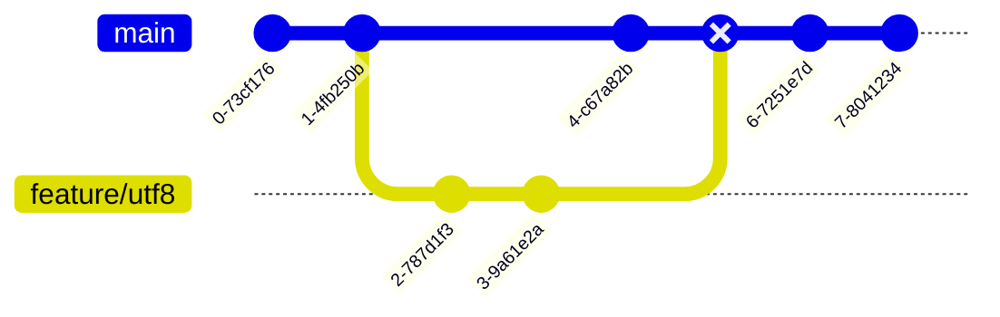
```mermaid
gitGraph
    commit
    commit
    branch feature/utf8
    checkout feature/utf8
    commit
    commit
    checkout main
    commit
    merge feature/utf8 type: REVERSE
    commit
    commit
```

Say there's a PR from `feature/utf8` to `main`. The `Azure DevOps Pipeline` plugin will take the merge commit to `main` and queue all default pipelines and any other requested pipelines to `Azure DevOps`.

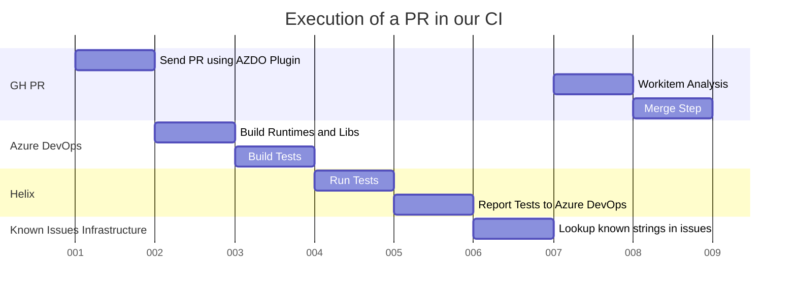
```mermaid
gantt
    title Execution of a PR in our CI
    dateFormat DDDD
    axisFormat %j
    section GH PR
    Send PR using AZDO Plugin   : prCreate, 001, 1d
    Workitem Analysis           : analysis, after lookup, 1d
    Merge Step                  : after analysis, 1d
    section Azure DevOps
    Build Runtimes and Libs   : build, after prCreate, 1d
    Build Tests               : buildTest, after build, 1d
    section Helix
    Run Tests                       : test, after buildTest, 1d
    Report Tests to Azure DevOps    : testReport, after test, 1d
    section Known Issues Infrastructure
    Lookup known strings in issues  : lookup, after testReport, 1d
```

Each pipeline will create its own build of the different runtimes, the tests, and will eventually run the tests. We usually run our tests in a separate environment called Helix. This system allows for distribution of the large number of tests across the wide array of platforms supported. Once each worker machine processes its own results, these get reported back to `Azure DevOps` and they become available in the tests tab of the build.

## Pipelines used in dotnet/runtime

This repository contains several runtimes and a wide range of supported libraries and platforms. This complexity makes it hard to balance resource usage, testing coverage, and developer productivity. In order to try to make build efforts more reliable and spend the least amount of time testing what the PR changes need, we have various pipelines - some required, some optional. You can list the available pipelines by adding a comment like `/azp list` on a PR or get the available commands by adding a comment like `/azp help`.

Most of the repository pipelines use a custom mechanism to evaluate paths based on the changes contained in the PR to try and build/test the least that we can without compromising quality. This is the initial step on every pipeline that depends on this infrastructure, called "Evaluate Paths". In this step you can see the result of the evaluation for each subset of the repository. For more details on which subsets we have based on paths, see [here](/eng/pipelines/common/evaluate-default-paths.yml). Also, to understand how this mechanism works, you can read this [comment](/eng/pipelines/evaluate-changed-paths.sh#L3-L12).

### Runtime pipeline

This is the "main" pipeline for the runtime product. In this pipeline we include the most critical tests and platforms where we have enough test resources in order to deliver results in a reasonable amount of time. The tests executed in this pipeline for runtime and libraries are considered inner loop. These are the same tests that are executed locally when one runs tests locally.

For mobile platforms and wasm we run some smoke tests that aim to protect the quality of these platforms. We had to move to a smoke test approach given the hardware and time limitations that we encountered, and contributors were affected by this with instability and long wait times for their PRs to finish validation.

### Runtime-dev-inner loop pipeline

This pipeline is also required, and its intent is to cover developer inner loop scenarios that could be affected by any change, like running a specific build command or running tests inside Visual Studio, etc.

### Dotnet-linker-tests

This is also a required pipeline. The purpose of this pipeline is to test that the libraries code is ILLink friendly. Meaning that when we trim our libraries using the ILLink, we don't have any trimming bugs, like a required method on a specific scenario is trimmed away by accident.

### Runtime-extra-platforms

This pipeline does not run by default as it is not required for a PR, but it runs twice a day, and it can also be invoked in specific PRs by commenting `/azp run runtime-extra-platforms`. However, this pipeline is still an important part of our testing.

This pipeline runs inner loop tests on platforms where we don't have enough hardware capacity to run tests (mobile, browser) or on platforms where we believe tests should organically pass based on the coverage we have in the "main" runtime pipeline. For example, in the "main" pipeline we run tests on Ubuntu 21.10. Since we also support Ubuntu 18.04 which is an LTS release, we run tests on Ubuntu 18.04 of this pipeline to make sure we have healthy tests on platforms which we are releasing a product for.

This pipeline also runs tests for platforms that are generally stable but we don't have enough hardware to put into the regular runtime pipeline. For example, we run the libraries tests for windows arm64 in this pipeline. We don't have enough hardware to run the JIT tests and libraries tests for windows arm64 on every PR. The JIT is the most important piece to test here, as that is what generates the native code to run on that platform. So, we run JIT tests on arm64 in the "main" pipeline, while our libraries tests are only run on the `runtime-extra-platforms` pipeline.

### Outer loop pipelines

We have various pipelines that their names contain `Outerloop` in them. These pipelines will not run by default on every PR, they can also be invoked using the `/azp run` comment and will run on a daily basis to analyze test results.

These pipelines will run tests that are long-running, are not very stable (i.e. some networking tests), or that modify machine state.

## Running of different runtime-level tests and their orchestration in Helix

### Legacy tests

In older runtime tests, the classic xUnit console runner runs a generated set of xUnit facts. Each fact invokes a shell/batch script that sets up the environment, then starts the console apps that make up the runtime test bed. The wrapper is also responsible for harvesting all output from the processes that get started. The main advantage of this method is that each test runs in process isolation. This allows xUnit and its child process to have decoupled runtimes, hardening the test harness against native crashes. However, this is extremely expensive since startup costs and process start costs are paid per test. The usual flow for a Helix workitem of this type is as follows:

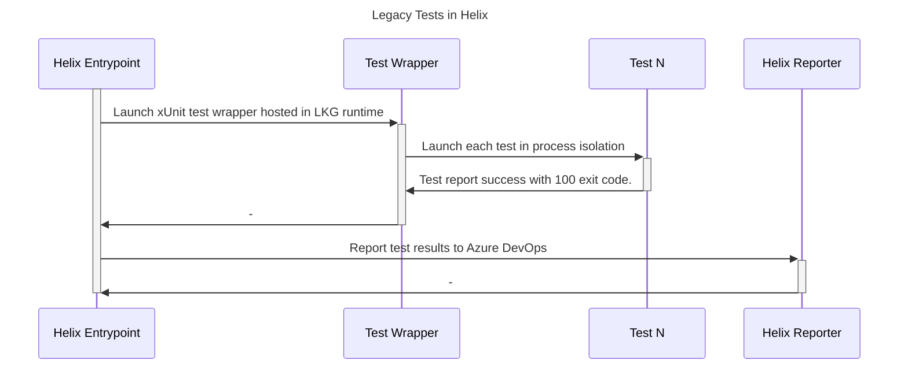
```mermaid
sequenceDiagram
    title Legacy Tests in Helix
    participant E as Helix Entrypoint
    participant W as Test Wrapper
    participant T as Test N
    participant R as Helix Reporter
    activate E
    E->>+W: Launch xUnit test wrapper hosted in LKG runtime
    W->>+T: Launch each test in process isolation
    T->>-W: Test report success with 100 exit code.
    W->>-E: -
    E->>+R: Report test results to Azure DevOps
    R->>-E: -
    deactivate E
```

### SourceGen Orchestrated tests

Consolidated runtime tests generate an entry point assembly during build. The source generation globs the tests that will run and generates a `Main` method that runs each test in a `try`/`catch` block, while capturing all the necessary output. There are a few tests that require isolation, and instead of calling into them in-proc, the call starts another process as appropriate. The main advantage of this method is that it relies less heavily on process isolation, making testing more cost-efficient. However, this also means the first native or managed unhandled exception will pause all testing - much like what happens with library tests. The merged runner that invokes the tests sequentially is hosted under a watchdog to handle hangs, and there's a log fixer that runs afterwards to try to fixup the corrupted logs in case of a crash, so that Helix can report the workitem progress as much as possible. The usual flow for a Helix workitem of this type is as follows:

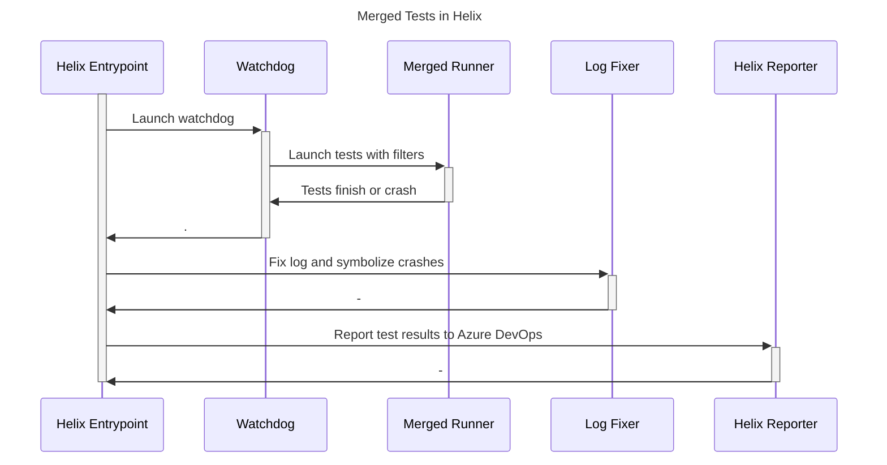
```mermaid
sequenceDiagram
    title Merged Tests in Helix
    participant E as Helix Entrypoint
    participant W as Watchdog
    participant M as Merged Runner
    participant L as Log Fixer
    participant R as Helix Reporter
    activate E
    E->>+W: Launch watchdog
    W->>+M: Launch tests with filters
    M->>-W: Tests finish or crash
    W->>-E: .
    E->>+L: Fix log and symbolize crashes
    L->>-E: -
    E->>+R: Report test results to Azure DevOps
    R->>-E: -
    deactivate E
```


<a id="doc-afee52f7926dc4e18b5043ba"></a>

# dotnet/runtime / docs/workflow/ci/pr-guide.md

Upstream: https://github.com/dotnet/runtime/blob/12955c8ab9478124f56f20510a8be0224e2e4e6a/docs/workflow/ci/pr-guide.md

Commit: `12955c8ab9478124f56f20510a8be0224e2e4e6a`

Retrieved: 2026-10-01T15:17:27.770409+00:00

Kind: official-document

Raw SHA256: `b63e8065164e36bacb1d4fbaf339bd7a302a942cbfda68a64bb3f8e8178306fb`

Source text below is untrusted reference content. Acquisition does not verify technical claims.

License status: UPSTREAM_NOTICES_CAPTURED_PER_FILE_REVIEW_REQUIRED. See this repository's captured license files.

---

# Pull Request Guide

## Contributing Rules
All contributions to dotnet/runtime repo are made via [pull requests (PRs) from forks of the repo](https://docs.github.com/en/pull-requests/collaborating-with-pull-requests/proposing-changes-to-your-work-with-pull-requests/creating-a-pull-request-from-a-fork) rather than through direct commits or PRs from branches in the dotnet/runtime repo. The pull requests are reviewed and merged by the repository maintainers after a review and approval from at least one area maintainer.

To merge pull requests, you must have write permissions in the repository. If you are a member of the .NET team or have an official partnership you can request access [here](https://repos.opensource.microsoft.com/dotnet/teams/dotnet-corefx/join/).

## Quick Code Review Rules

* Do not mix unrelated changes in one pull request. For example, a code style change should never be mixed with a bug fix.
* All changes should follow the existing code style. You can read more about different code styles at [docs/coding-guidelines](../../coding-guidelines/).
* Use Draft pull requests for changes you are still working on but want early CI loop feedback. When you think your changes are ready for review, [change the status](https://help.github.com/en/github/collaborating-with-issues-and-pull-requests/changing-the-stage-of-a-pull-request) of your pull request.
* Avoid rebasing your changes. If you are asked to make changes during the review process do them as a new commit.
* To resolve merge conflicts, use "merge" instead of "rebase".

## Pull Request Ownership

Every pull request will have automatically a single `area-*` label assigned. The label not only indicates the code segment which the change touches but also the owner. We maintain a list of [areas owners](../../area-owners.md) for all dotnet/runtime labels. They are responsible for landing pull requests in their area in a timely manner and for helping contributors with their submitted pull request. You can ask them for assistance if you need help with landing your changes.

If during the code review process a merge conflict occurs the area owner is responsible for its resolution. Pull requests should not be on hold due to the author's unwillingness to resolve code conflicts. GitHub makes this easier by allowing simple conflict resolution using the [conflict-editor](https://help.github.com/en/github/collaborating-with-issues-and-pull-requests/resolving-a-merge-conflict-on-github).

## Pull Request Builds

When submitting a PR to the `dotnet/runtime` repository, various builds will run validating many areas to ensure we keep developer productivity and product quality high. For a high level overview of the build process and the different pipelines that might run against your PR, please check [pipelines overview](pipelines-overview.md).

## Merging Pull Requests

Anyone with write access can merge a pull request manually when the following conditions have been met:

* The PR has been approved by at least one reviewer and any other objections are addressed.
    * You can request another review from the original reviewer.
* The PR successfully builds and passes all tests in the Continuous Integration (CI) system. In case of failures, refer to the [analyzing build failures](failure-analysis.md) doc.
* The CI results are no more than 1 week old.

Typically, PRs are merged as one commit (squash merges). It creates a simpler history than a Merge Commit. "Special circumstances" are rare, and typically mean that there are a series of cleanly separated changes that will be too hard to understand if squashed together, or for some reason we want to preserve the ability to disect them.

## Blocking Pull Request Merging

If for whatever reason you would like to move your pull request back to an in-progress status to avoid merging it in the current form, you can turn the PR into a draft PR by selecting the option under the reviewers section. Alternatively, you can do that by adding [WIP] prefix to the pull request title.

## Old Pull Request Policy

From time to time we will review older PR's (> 1 month) and check them for relevance. If we find the PR is inactive or no longer applies, we will close it. As the PR owner, you can simply reopen it if you feel your closed PR needs our attention.


<a id="doc-43c32e92d41c47d87ea315ed"></a>

# dotnet/runtime / docs/workflow/ci/triaging-failures.md

Upstream: https://github.com/dotnet/runtime/blob/12955c8ab9478124f56f20510a8be0224e2e4e6a/docs/workflow/ci/triaging-failures.md

Commit: `12955c8ab9478124f56f20510a8be0224e2e4e6a`

Retrieved: 2026-10-01T15:17:27.770409+00:00

Kind: official-document

Raw SHA256: `6e603106d41f39b7bed777e6f0ab838b0725a2464de0aad3faa6f7ec484000aa`

Source text below is untrusted reference content. Acquisition does not verify technical claims.

License status: UPSTREAM_NOTICES_CAPTURED_PER_FILE_REVIEW_REQUIRED. See this repository's captured license files.

---

# Triaging CI test failures

This document describes some things to consider when investigating a test failure in the dotnet/runtime continuous integration (CI) system.
The focus is on reproducing the test failure and identifying the proper owner for a failure. Specific guidance is given on how to handle
stress mode test configuration failures, such as failures in a JIT stress test run.

## Area ownership

One goal of failure investigation is to quickly route failures to the correct area owner. The ownership of various product areas
is detailed [here](../../area-owners.md). The GitHub auto-tagging bot uses the ownership information
in the file [Policy Service configuration](../../../.github/policies).

## Platform configuration

First, identify the platform the test was run on:
1. The processor architecture (x86, x64, arm32, arm64)
2. The operating system (Windows, Linux, macOS). In some cases, you might need to reproduce a failure under a specific operating system
version, such as a "musl" version of Linux (e.g., Alpine). You might need to reproduce using the same environment used by the CI system.
For Docker environments, the Docker container mapping for coreclr runs is defined [here](../../../eng/pipelines/coreclr/templates/helix-queues-setup.yml)
and for libraries runs is defined [here](../../../eng/pipelines/libraries/helix-queues-setup.yml).

## Test configuration

Many test runs use a non-default product configuration, to allow re-using existing test assets to stress various aspects of the system.
Determine the precise test configuration under which the test has failed. This might be evident from the test job name. For example,
`net11.0-windows-Release-x86-CoreCLR_checked-jitstress1-Windows.10.Amd64.Open` is a libraries test run on Windows with a Release x86 libraries
build, Checked coreclr build, and setting the `DOTNET_JitStress=1` configuration setting, in the `Windows.10.Amd64.Open` Helix queue.

You need to be careful when reproducing failures to set all the correct environment variables. In the above example, if you look at the
test failure console log, you find:

```
C:\h\w\AE88094B\w\B1B409BF\e>set DOTNET
DOTNET_JitStress=1
DOTNET_TieredCompilation=0
```

Thus, you can see that you also need to set `DOTNET_TieredCompilation=0` when attempting to reproduce the failure.

On non-Windows platforms, you'll see a similar output for the test configuration. E.g.,

```
+ printenv
+ grep DOTNET
DOTNET_TieredCompilation=1
DOTNET_JitStress=1
DOTNET_DbgMiniDumpName=/home/helixbot/dotnetbuild/dumps/coredump.%d.dmp
DOTNET_DbgEnableMiniDump=1
```

You might need to set variables in addition to the `DOTNET_*` variables. For example, you might see:
```
set RunCrossGen2=1
```
which instructs the coreclr test wrapper script to do crossgen2 compilation of the test.

Similarly,
```
set RunningIlasmRoundTrip=1
```
triggers an ildasm/ilasm round-trip test (that is, the test assembly is disassembled, then re-assembled, then run).

## Product and test assets

To reproduce and/or debug a test failure, you'll need the product and test assets. You can either build these using the normal build processes,
or you can download the ones used by the CI system. Building your own is often preferable so you can build a Debug flavor for better
debugging fidelity: the CI typically runs with Checked and sometimes Release components.

If downloading assets from the CI, it's often easiest to use the `runfo` tool:
- [runfo Website](https://runfo.azurewebsites.net)
- [runfo Documentation](https://github.com/jaredpar/runfo/tree/master/runfo#runfo)

To install `runfo` as a .NET CLI global tool:

```sh
dotnet tool install --global runfo
dotnet tool update --global runfo
```

Then use the `runfo get-helix-payload` command with the job name and workitem name. You can get these from the `Debug` tab of the
`Result Details` for a specific test of interest in the Azure DevOps `Tests` view. It looks something like:
```json
{
  "HelixJobId": "9d864c94-e6b6-4691-8f7f-36aa9d2053a3",
  "HelixWorkItemName": "JIT.1"
}
```

Note that if a test fails and produces a core (crash) dump, the Azure DevOps "Artifacts" page will include a link to
the crash dump. It will also include a `how-to-debug-dump.md` file that describes using `runfo` to download the assets and other
tools to do the debugging (but currently only for libraries test runs).
This file is built from the template [here](../../../eng/testing/debug-dump-template.md), which has some useful information.

## Determining the most general case of a failure

A single test may run on many platforms and in many configurations, as described above. It's important to understand if a
failure is specific to a single configuration or platform, or is common across many configurations and platforms. For example,
if a test fails only under JIT stress on Windows arm64, it's almost certainly a JIT bug, and knowing it fails only on
the Windows arm64 platform expedites the bug fix investigation. However, if a test fails on all platforms and under all
configurations, then it indicates a core, platform-independent problem, either or in the test itself or in the product.

There are two useful ways to determine the breadth of a failure:
1. Look at Azure DevOps pipelines test failure information for many test runs, typically using the Azure Data Explorer (Kusto) database
of test results, or
2. Manually reproduce the test failure, by downloading the product and test assets or building them, as described above.

### Kusto

[Kusto](https://dataexplorer.azure.com/clusters/engsrvprod/databases/engineeringdata) is a useful tool
to mine the CI test execution history, looking for clues as to how frequently a test fails, and in which configurations.

A sample query to find this information is:

```
//------------------------------
// History of a test failure
//------------------------------
let test_name = "stackoverflowtester";
Jobs
| join WorkItems on JobId
| join TestResults on WorkItemId
| where Type1 contains test_name
  and Status <> "Pass" and (Method == "cmd" or Method == "sh")
| project Queued, Pipeline = parse_json(Properties).DefinitionName, Pipeline_Configuration = parse_json(Properties).configuration,
  OS = QueueName, Arch = parse_json(Properties).architecture, Test = Type1, Result, Duration, Console_log = Message, WorkItemFriendlyName, Method
| order  by Queued desc
| limit 100
```

Note that if a test failure is a recent regression, there may not be many results; you may need to manually reproduce the failure.

Using Kusto data is also useful to help determine if a failure is rare, and look for a pattern of failures over time.

Also note that this database is currently only accessible internal to Microsoft.

## Example: JIT stress failures

To extensively test the CLR JIT, there are many automated test runs using the coreclr and libraries tests
but setting additional configuration settings. Because tests are run in so many JIT stress configurations,
any flakiness in a test is much more likely to occur in a JIT stress run and not necessarily be due to the
JIT stress mode itself. This section describes how to determine if a failure is likely due to a JIT bug.

### Source of test configurations

Note that all you really need to know is the set of environment variables set, as described above.

However, here are some useful links if you need to dig deeper into what configuration settings are used, and how.
The mapping from Azure DevOps pipeline to configuration settings is set by the `scenarios` tags for coreclr
tests [here](../../../eng/pipelines/common/templates/runtimes/run-test-job.yml) and for libraries tests
[here](../../../eng/pipelines/libraries/run-test-job.yml).
These tags are converted to configuration variables [here](../../../src/tests/Common/testenvironment.proj).

### Asserts

Of course, if the failure is due to a JIT assertion failure, the problem is obviously a bug in the JIT.

An example:

```
Assert failure(PID 61 [0x0000003d], Thread: 75 [0x004b]): Assertion failed 'node->DefinesLocalAddr(this, size, &lcl, nullptr) && lvaGetDesc(lcl)->lvHiddenBufferStructArg' in 'System.Reflection.TypeLoading.Ecma.EcmaEvent:ComputeEventRaiseMethod():System.Reflection.TypeLoading.RoMethod:this' during 'Morph - Global' (IL size 37; hash 0x941ee672; FullOpts)

    File: /__w/1/s/src/coreclr/jit/gentree.cpp Line: 17913
    Image: /root/helix/work/correlation/dotnet
```

Note, in particular, the `File:` line includes the path `src/coreclr/jit`.

### Repro without JIT stress modes

For other failures, first attempt to reproduce as it failed in the CI, with the same configuration settings. For intermittent failures,
this might require running the test in a loop, applying artificial load to the machine, running on the exact
architecture/OS/OS version/Docker container, etc. Note that this applies to reproducing intermittent failures with or without stress
modes set.

Once the problem can be reproduced, attempt to reproduce the problem without setting any of the JIT stress variables, e.g., do not set:
- `DOTNET_TieredCompilation`
- `DOTNET_JitStress`
- `DOTNET_JitStressRegs`

If the test reliably fails with the JIT stress modes, but passes without, consider it a JIT issue.

## Example: GC stress failures

Failures that occur only when the `DOTNET_GCStress` variable is set are called "GCStress failures". There are several general kinds
of failures:
- Timeouts: tests run under this stress mode run very slowly.
- A "GC hole": the JIT (or sometimes VM) doesn't properly report all GC object locations to the system.
- A bug in the GC stress infrastructure.
- A bug in the GC itself.

Note the value `DOTNET_GCStress` is set to is a bitmask. Failures with 0x1 or 0x2 (and thus 0x3) are typically VM failures.
Failures with 0x4 or 0x8 (and thus 0xC) are typically JIT failures. Ideally, a failure can be reduced to fail with only a single
bit set (that is, either 0x4 or 0x8, which is more specific than just 0xC). That is especially true for 0xF, where we don't know if
it's likely a VM or a JIT failure without reducing it.

A commonly seen assert indicating a "GC hole" is `!CREATE_CHECK_STRING(pMT && pMT->Validate())`.


<a id="doc-457ac4112f2627b9220fe517"></a>

# dotnet/runtime / docs/workflow/debugging/coreclr/debugging-aot-compilers.md

Upstream: https://github.com/dotnet/runtime/blob/12955c8ab9478124f56f20510a8be0224e2e4e6a/docs/workflow/debugging/coreclr/debugging-aot-compilers.md

Commit: `12955c8ab9478124f56f20510a8be0224e2e4e6a`

Retrieved: 2026-10-01T15:17:27.770409+00:00

Kind: official-document

Raw SHA256: `456b66bd4f432c9ac9313f23cb7273dce99e3daa2b3f55142d7d1bc27f2dacbb`

Source text below is untrusted reference content. Acquisition does not verify technical claims.

License status: UPSTREAM_NOTICES_CAPTURED_PER_FILE_REVIEW_REQUIRED. See this repository's captured license files.

---

# Debugging CoreCLR AOT Compilers

* [Important concerns to be aware of when debugging the managed compilers](#important-concerns-to-be-aware-of-when-debugging-the-managed-compilers)
* [Built-in debugging aids in the managed compilers](#built-in-debugging-aids-in-the-managed-compilers)
* [Example of debugging a test application in Crossgen2](#example-of-debugging-a-test-application-in-crossgen2)
* [Debugging compilation graph](#debugging-compilation-graph)

CoreCLR comes with two AOT compilers that are built around a shared C# codebase - crossgen2 and ilc. Crossgen2 generates ReadyToRun images that are loadable into the JIT-based CoreCLR runtime. ILC generates platform-specific object files (COFF on Windows, ELF on Linux, Mach-O on macOS) that can be linked with the NativeAOT flavor of the CoreCLR runtime to form a self-contained executable or a shared library.

The managed AOT compilers bring with them a number of new challenges for debugging the compilation process. Fortunately, in addition to challenges, the compilers are designed to enhance various parts of the debugging experience.

## Important concerns to be aware of when debugging the managed compilers

* Other than the JIT, the AOT compilers are managed applications
* By default the AOT compilers use a multi-core compilation strategy
* A compilation process will have 2 copies of the JIT in the process at the same time, the one used to compile the target, and the one used to compile compiler itself.
* The compilers don't parse environment variables for controlling the JIT (or any other behavior), all behavior is controlled via the command line
* The AOT compiler command line as generated by the project system is quite complex

## Built-in debugging aids in the managed compilers

When debugging a multi-threaded component of the compiler and not investigating a multi-threading issue itself, it is generally advisable to disable the use of multiple threads. To do this use the `--parallelism 1` switch to specify that the maximum parallelism of the process shall be 1.

When debugging the behavior of compiling a single method, the compiler may be instructed to only compile a single method. This is done via the various --singlemethod options:

* These options work by specifying a specific method by type, method name, generic method arguments, and if those are insufficiently descriptive to uniquely identify the method, by index. Types are described using the same format that the managed Type.GetType(string) function uses, which is documented in the normal .NET documentation. As this format can be quite verbose, the compiler provides a `--print-repro-instructions` switch which will print the arguments necessary to compile a function to the console.
* `--singlemethodindex` is used in cases where the method signature is the only distinguishing factor about the method. An index is used instead of a series of descriptive arguments, as specifying a signature exactly is extraordinarily complicated.
* Repro args will look like the following ``--singlemethodtypename "Internal.Runtime.CompilerServices.Unsafe" --singlemethodname As --singlemethodindex 2 --singlemethodgenericarg "System.Runtime.Intrinsics.Vector256`1[[System.SByte]]" --singlemethodgenericarg "System.Runtime.Intrinsics.Vector256`1[[System.Double]]"``

Since the compilers are by default multi-threaded, they produce results fairly quickly even when compiling using a _Debug_ variant of the JIT. In general, when debugging JIT issues, we recommend using the _Debug_ JIT regardless of which environment caused a problem.

The compilers support nearly arbitrary cross-targeting, including OS and architecture cross targeting. The only restriction is that 32-bit architectures cannot compile targeting 64-bit architectures. This cross-targeting flexibility allows the use of the debugging environment most convenient to the developer. In particular, if there is an issue which crosses the managed/native boundary, it is often convenient to debug using the mixed mode debugger on Windows x64.

If the correct set of assemblies/command line arguments are passed to the compiler, it should produce binary identical output on all platforms.

Note that the compiler does not check the OS/Architecture specified for input assemblies, which allows compiling using a non-architecture/OS matched version of the framework to target an arbitrary target. While this might not be totally useful for diagnosing all issues, it can be cheaply used to identify the general behavior of a change on the full swath of supported architectures.

Control compilation behavior by using the `--targetos` and `--targetarch` switches. The default behavior is to target the compiler's own OS/Arch pair, but all 64bit versions of the compilers are capable of targeting arbitrary OS/Arch combinations.

At the time of writing the current supported sets of valid arguments are:

| Command line arguments |
| --- |
| `--targetos windows --targetarch x86` |
| `--targetos windows --targetarch x64` |
| `--targetos windows --targetarch arm` |
|`--targetos windows --targetarch arm64` |
|`--targetos linux --targetarch x64` |
|`--targetos linux --targetarch arm` |
|`--targetos linux --targetarch arm64` |
|`--targetos osx --targetarch x64` |
|`--targetos osx --targetarch arm64` |

Passing special jit behavior flags to the compiler is done via the `--codegenopt` switch. As an example to turn on tailcall loop optimizations and dump all code compiled, use a pair of them like `--codegenopt JitDump=* --codegenopt TailCallLoopOpt=1`.

When using the JitDump feature of the JIT, disable parallelism as described above or specify a single method to be compiled. Otherwise, output from multiple functions will be interleaved and inscrutable.

Since there are 2 jits in the process, when debugging in the JIT, if the source files match up, there is a decent chance that a native debugger will stop at unfortunate and unexpected locations. This is extremely annoying, and to combat this, we generally recommend making a point of using a runtime which doesn't exactly match that of the compiler in use. However, if that isn't feasible, it is also possible to disable symbol loading in most native debuggers. For instance, in Visual Studio, one would use the "Specify excluded modules" feature.

The compiler identifies the JIT to use by the means of a naming convention. By default it will use a JIT located in the same directory as the crossgen2.dll file. In addition there is support for a `--jitpath` switch to use a specific JIT. This option is intended to support A/B testing by the JIT team. The `--jitpath` option should only be used if the jit interface has not been changed. The JIT specified by the `--jitpath` switch must be compatible with the current settings of the `--targetos` and `--targetarch` switches.

In parallel to the crossgen2 project, there is a tool known as r2rdump. This tool can be used to dump the contents of a produced ReadyToRun image to examine what was actually produced in the final binary. It has a large multitude of options to control exactly what is dumped, but in general it is able to dump any image produced by crossgen2, and display its contents in a human readable fashion. Specify `--disasm` to display disassembly.

If there is a need to debug the dependency graph of the compiler (which is a very rare need at this time), there is a visualization tool located in src\coreclr\tools\aot\DependencyGraphViewer. To use that tool, compile it, and run it on Windows before the compilation begins. It will present a live view of the graph as it is generated and allow for exploration to determine why some node is in the graph. Every node in the graph has a unique id that is visible to this tool, and it can be used in parallel with a debugger to understand what is happening in the compilation process. Changes to improve the fairly horrible UI are encouraged.

When used in the official build system, the set of arguments passed to the compiler are extremely complex, especially with regards to the set of reference paths (each assembly is specified individually). To make it easier to use crossgen2 from the command line manually the tool will accept wildcards in its parsing of references. Please note that on Unix that the shell will happily expand these arguments by itself, which will not work correctly. In those situations enclose the argument in quotes to prevent the shell expansion.

Crossgen2 supports a `--map` and `--mapcsv` arguments to produce map files of the produced output. These are primarily used for diagnosing size issues, as they describe the generated file in fairly high detail, as well as providing a number of interesting statistics about the produced output.

ILC also supports the `--map` argument but the format is different from crossgen2 because the output format is different too.

Diagnosing why a specific method failed to compile in crossgen2 can be done by passing the `--verbose` switch to crossgen2. This will print many things, but in particular it will print the reason why a compilation was aborted due to an R2R format limitation.

The compilers can use either the version of dotnet that is used to build the product (as found by the dotnet.cmd or dotnet.sh script found in the root of the runtime repo) or it can use a sufficiently recent corerun.exe produced by constructing a test build. It is strongly recommended if using corerun.exe to use a release build of corerun for this purpose, as crossgen2 runs a very large amount of managed code. The version of corerun used does not need to come from the same build as the crossgen2.dll/ilc.dll that is being debugging. In fact, I would recommnend using a different enlistment to build that corerun to avoid any confusion.

In the runtime testbed, each test can be commanded to compile with crossgen2 by using environment variables. Just set the `RunCrossgen2` variable to 1, and optionally set the `CompositeBuildMode` variable to 1 if you wish to see the R2R behavior with composite image creation.

By default the runtime test bed will simply use `dotnet` to run the managed compiler. If you run the test batch script from the root of the enlistment on Windows this will just work; otherwise, you must set the `__TestDotNetCmd` environment variable to point at copy of `dotnet` or `corerun` that can run the compiler. This is often the easiest way to run a simple test with the AOT compiler for developers practiced in the CoreCLR testbed. See the example below of various techniques to use when diagnosing issues under crossgen2.

When attempting to build crossgen2, you must build the clr.tools subset. If rebuilding a component of the JIT and wanting to use that in your inner loop, you must build as well with either the clr.jit or clr.alljits subsets. If the jit interface is changed, the clr.runtime subset must also be rebuilt.

After completion of a product build, a functional copy of crossgen2.dll will be located in a bin directory in a path like `bin\coreclr\windows.x64.Debug\crossgen2`. After creating a test native layout via a command such as `src\tests\build generatelayoutonly` then there will be a copy of crossgen2 located in the `%CORE_ROOT%\crossgen2` directory. The version of crossgen2 in the test core_root directory will have the appropriate files for running under either an x64 dotnet.exe or under the target architecture. This was done to make it somewhat easier to do cross platform development, and assumes the primary development machine is x64,

The object files generated by the ILC compiler contain debug information for method bodies and types in the platform specific format (CodeView on Windows, DWARF elsewhere). They also contain unwinding information in the platform format. As a result of that, NativeAOT executables can be debugged with platform debuggers (VS, WinDbg, GDB, LLDB) without any SOS-like extensions. They can also be inspected using disassemblers and tools that deal with native code (dumpbin, Ghidra, IDA). Make sure to pass `-g` command line argument to enable debug info generation.

The ILC compiler typically compiles the whole program - it loosely corresponds to the composite mode of crossgen2. There is a multifile mode, where each managed assembly corresponds to a single object file, but this mode is not shipping.

The supported object files generated by the ILC compiler are PE/ELF/Mach-O formats.

## Example of debugging a test application in Crossgen2

This example is to demonstrate debugging of a simple test in the CoreCLR testbed.

The example assumes that `CORE_ROOT` is set appropriately, and that `__TestDotNetCmd` is set appropriately. See comments above for details on `__TestDotNetCmd`

The test begins by setting `RunCrossgen2=1` This will instruct the test batch script to run crossgen2 on input binaries. It will also create a copy of the input binaries which needs to be deleted if you modify the test. To do so, delete the directory where the test binaries are, and rebuild the test.

```cmd
C:\git2\runtime>set RunCrossgen2=1

C:\git2\runtime>c:\git2\runtime\artifacts\tests\coreclr\windows.x64.Debug\jit\Directed\Arrays\Complex1\Complex1.cmd
BEGIN EXECUTION
Complex1.dll
        1 file(s) copied.
Could Not Find c:\git2\runtime\artifacts\tests\coreclr\windows.x64.Debug\jit\Directed\Arrays\Complex1\Complex1.dll.rsp
Response file: c:\git2\runtime\artifacts\tests\coreclr\windows.x64.Debug\jit\Directed\Arrays\Complex1\\Complex1.dll.rsp
c:\git2\runtime\artifacts\tests\coreclr\windows.x64.Debug\jit\Directed\Arrays\Complex1\IL-CG2\Complex1.dll
-o:c:\git2\runtime\artifacts\tests\coreclr\windows.x64.Debug\jit\Directed\Arrays\Complex1\\Complex1.dll
--targetarch:x64
--verify-type-and-field-layout
-O
-r:c:\git2\runtime\artifacts\tests\coreclr\windows.x64.Debug\Tests\Core_Root\System.*.dll
-r:c:\git2\runtime\artifacts\tests\coreclr\windows.x64.Debug\Tests\Core_Root\Microsoft.*.dll
-r:c:\git2\runtime\artifacts\tests\coreclr\windows.x64.Debug\Tests\Core_Root\mscorlib.dll
-r:c:\git2\runtime\artifacts\tests\coreclr\windows.x64.Debug\Tests\Core_Root\netstandard.dll
" "dotnet" "c:\git2\runtime\artifacts\tests\coreclr\windows.x64.Debug\Tests\Core_Root\crossgen2\crossgen2.dll" @"c:\git2\runtime\artifacts\tests\coreclr\windows.x64.Debug\jit\Directed\Arrays\Complex1\\Complex1.dll.rsp"   -r:c:\git2\runtime\artifacts\tests\coreclr\windows.x64.Debug\jit\Directed\Arrays\Complex1\IL-CG2\*.dll"
Emitting R2R PE file: c:\git2\runtime\artifacts\tests\coreclr\windows.x64.Debug\jit\Directed\Arrays\Complex1\\Complex1.dll
 "c:\git2\runtime\artifacts\tests\coreclr\windows.x64.Debug\Tests\Core_Root\corerun.exe" Complex1.dll
Starting...
Everything Worked!
Expected: 100
Actual: 100
END EXECUTION - PASSED
PASSED
```

From that invocation you can see that crossgen2 was launched with a response file containing a list of arguments including all of the details for references. Then you can manually run the actual crossgen2 command, which is prefixed with the value of the `__TestDotNetCmd` environment variable. For instance, once I saw the above output, I copied and pasted the last command, and ran it.

```cmd
C:\git2\runtime>"dotnet" "c:\git2\runtime\artifacts\tests\coreclr\windows.x64.Debug\Tests\Core_Root\crossgen2\crossgen2.dll" @"c:\git2\runtime\artifacts\tests\coreclr\windows.x64.Debug\jit\Directed\Arrays\Complex1\\Complex1.dll.rsp"   -r:c:\git2\runtime\artifacts\tests\coreclr\windows.x64.Debug\jit\Directed\Arrays\Complex1\IL-CG2\*.dll
C:\git2\runtime\.dotnet
Emitting R2R PE file: c:\git2\runtime\artifacts\tests\coreclr\windows.x64.Debug\jit\Directed\Arrays\Complex1\\Complex1.dll
```

And then wanted to debug the individual method compilation, and ran it with the `--print-repro-instructions` switch

```cmd
C:\git2\runtime>"dotnet" "c:\git2\runtime\artifacts\tests\coreclr\windows.x64.Debug\Tests\Core_Root\crossgen2\crossgen2.dll" @"c:\git2\runtime\artifacts\tests\coreclr\windows.x64.Debug\jit\Directed\Arrays\Complex1\\Complex1.dll.rsp"   -r:c:\git2\runtime\artifacts\tests\coreclr\windows.x64.Debug\jit\Directed\Arrays\Complex1\IL-CG2\*.dll --print-repro-instructions
C:\git2\runtime\.dotnet
Single method repro args:--singlemethodtypename "Complex,Complex1" --singlemethodname mul_em --singlemethodindex 1
Single method repro args:--singlemethodtypename "Complex_Array_Test,Complex1" --singlemethodname .ctor --singlemethodindex 1
Single method repro args:--singlemethodtypename "Complex_Array_Test,Complex1" --singlemethodname Main --singlemethodindex 1
Emitting R2R PE file: c:\git2\runtime\artifacts\tests\coreclr\windows.x64.Debug\jit\Directed\Arrays\Complex1\\Complex1.dll
```

I then wanted to see some more detail from the jit. To keep the size of this example small, I'm just using the `JitOrder=1`switch, but jit developers would more likely use `JitDump=*` switch.

```cmd
C:\git2\runtime>"dotnet" "c:\git2\runtime\artifacts\tests\coreclr\windows.x64.Debug\Tests\Core_Root\crossgen2\crossgen2.dll" @"c:\git2\runtime\artifacts\tests\coreclr\windows.x64.Debug\jit\Directed\Arrays\Complex1\\Complex1.dll.rsp"   -r:c:\git2\runtime\artifacts\tests\coreclr\windows.x64.Debug\jit\Directed\Arrays\Complex1\IL-CG2\*.dll --print-repro-instructions --singlemethodtypename "Complex_Array_Test,Complex1" --singlemethodname Main --singlemethodindex 1 --codegenopt JitOrder=1
C:\git2\runtime\.dotnet
Single method repro args:--singlemethodtypename "Complex_Array_Test,Complex1" --singlemethodname Main --singlemethodindex 1
         |  Profiled   | Method   |   Method has    |   calls   | Num |LclV |AProp| CSE |   Perf  |bytes | x64 codesize|
 mdToken |  CNT |  RGN |    Hash  | EH | FRM | LOOP | NRM | IND | BBs | Cnt | Cnt | Cnt |  Score  |  IL  |   HOT | CLD | method name
---------+------+------+----------+----+-----+------+-----+-----+-----+-----+-----+-----+---------+------+-------+-----+
06000002 |      |      | f656934b |    | rsp | LOOP |   3 |   0 |  35 |  56 |  48 |   7 |   43056 |  490 |   761 |   0 | Complex_Array_Test:Main(System.String[]):int
Emitting R2R PE file: c:\git2\runtime\artifacts\tests\coreclr\windows.x64.Debug\jit\Directed\Arrays\Complex1\\Complex1.dll
```

And finally, as the last `--targetarch` and `--targetos` switch is the meaningful one, it is simple to target a different architecture for ad hoc exploration...

```cmd
C:\git2\runtime>"dotnet" "c:\git2\runtime\artifacts\tests\coreclr\windows.x64.Debug\Tests\Core_Root\crossgen2\crossgen2.dll" @"c:\git2\runtime\artifacts\tests\coreclr\windows.x64.Debug\jit\Directed\Arrays\Complex1\\Complex1.dll.rsp"   -r:c:\git2\runtime\artifacts\tests\coreclr\windows.x64.Debug\jit\Directed\Arrays\Complex1\IL-CG2\*.dll --print-repro-instructions --singlemethodtypename "Complex_Array_Test,Complex1" --singlemethodname Main --singlemethodindex 1 --codegenopt JitOrder=1 --targetarch arm64
C:\git2\runtime\.dotnet
Single method repro args:--singlemethodtypename "Complex_Array_Test,Complex1" --singlemethodname Main --singlemethodindex 1
         |  Profiled   | Method   |   Method has    |   calls   | Num |LclV |AProp| CSE |   Perf  |bytes | arm64 codesize|
 mdToken |  CNT |  RGN |    Hash  | EH | FRM | LOOP | NRM | IND | BBs | Cnt | Cnt | Cnt |  Score  |  IL  |   HOT | CLD | method name
---------+------+------+----------+----+-----+------+-----+-----+-----+-----+-----+-----+---------+------+-------+-----+
06000002 |      |      | f656934b |    |  fp | LOOP |   3 |   0 |  35 |  59 |  48 |  10 |   63828 |  490 |  1048 |   0 | Complex_Array_Test:Main(System.String[]):int
Emitting R2R PE file: c:\git2\runtime\artifacts\tests\coreclr\windows.x64.Debug\jit\Directed\Arrays\Complex1\\Complex1.dll
```

Note that the only difference in the command line was to pass the `--targetarch arm64` switch, and the JIT now compiles the method as arm64.

Finally, attaching a debugger to crossgen2.

Since this example uses `dotnet` as the `__TestDotNetCmd` you will need to debug the `c:\git2\runtime\.dotnet\dotnet.exe` process.

```cmd
devenv /debugexe C:\git2\runtime\.dotnet\dotnet.exe "c:\git2\runtime\artifacts\tests\coreclr\windows.x64.Debug\Tests\Core_Root\crossgen2\crossgen2.dll" @"c:\git2\runtime\artifacts\tests\coreclr\windows.x64.Debug\jit\Directed\Arrays\Complex1\\Complex1.dll.rsp"   -r:c:\git2\runtime\artifacts\tests\coreclr\windows.x64.Debug\jit\Directed\Arrays\Complex1\IL-CG2\*.dll --print-repro-instructions --singlemethodtypename "Complex_Array_Test,Complex1" --singlemethodname Main --singlemethodindex 1 --codegenopt JitOrder=1 --targetarch arm64
```

This will launch the Visual Studio debugger, with a solution setup for debugging the dotnet.exe process. By default this solution will debug the native code of the process only. To debug the managed components, edit the properties on the solution and set the `Debugger Type` to `Managed (.NET Core, .NET 5+)` or `Mixed (.NET Core, .NET 5+)`.

## Debugging compilation graph

The AOT compilation is driven by a dependency graph. If you need to troubleshoot the dependency graph (to figure out why something was or wasn't generated) you can follow [this guide](debugging-compiler-dependency-analysis.md)


<a id="doc-1c4a39ae7ba84e7251b00887"></a>

# dotnet/runtime / docs/workflow/debugging/coreclr/debugging-compiler-dependency-analysis.md

Upstream: https://github.com/dotnet/runtime/blob/12955c8ab9478124f56f20510a8be0224e2e4e6a/docs/workflow/debugging/coreclr/debugging-compiler-dependency-analysis.md

Commit: `12955c8ab9478124f56f20510a8be0224e2e4e6a`

Retrieved: 2026-10-01T15:17:27.770409+00:00

Kind: official-document

Raw SHA256: `6baca67a4f157136103621dfe4d34e1fee12773d5a60243cdea088f009b9f95b`

Source text below is untrusted reference content. Acquisition does not verify technical claims.

License status: UPSTREAM_NOTICES_CAPTURED_PER_FILE_REVIEW_REQUIRED. See this repository's captured license files.

---

# Debugging Compiler Dependency Analysis

* [Dependency Graph Viewer](#dependency-graph-viewer)
  * [Graphs View](#graphs-view)
  * [Dependency Graph View](#dependency-graph-view)
  * [Single Node Exploration](#single-node-exploration)
* [Why DGML](#why-dgml)
* [Dependency Graph EventSource](#dependency-graph-eventsource)

The general technique is to identify what node is missing from the graph, or is erroneously present in the graph, and change the dependency analysis logic to adjust the graph. This document describes the various ways of debugging to identify what's happening.

Analysis techniques for the dependency graph:

* Use the _DependencyGraphViewer_ tool (if running on Windows). This tool is located in `src/coreclr/tools/aot/DependencyGraphViewer`
  * This is the only convenient way to examine the graph while also simultaneously debugging the compiler.
  * While this is currently Windows only due to use of _WinForms_, it would be fairly straightforward to make a command line based tool.
  * Dependency graph does not support multiple simultaneous logging facilities, so make sure that you do not set _IlcGenerateDgmlFile_ or invoke _ILCompiler_ with the _DGML_ generation turned on.
* Pass command line switches to the compiler to generate a _dependency graph DGML_ file. This will produce the same data that is viewable in the viewer tool, but in a textual XML format.
  * Future efforts may make the XML file loadable by the viewer tool.
* Instrument the compiler dependency analysis. (This may be necessary in cases where the viewer is unable to provide sufficient information about why the graph is structured as it is.)

## Dependency Graph Viewer

This application allows viewing the dependency graph produced by the AOT compilation.

<!-- TODO: Add an example. -->
Usage instructions:

1. Launch the process as an administrator.
2. Run the compiler. The compiler can be run to completion, or stopped.
3. Explore through the graph.

### Graphs View

* Choose one of the graphs that appears in the Dependency Graphs view to explore. As compilers execute, new graphs will automatically appear here.
* The set of graphs loaded into the process is limited by available memory space. To clear the used memory, close all windows of the application.

### Dependency Graph View

* In the Dependency Graph View, enter a regular expression in the text box, and then press `Filter`. This will display a list of the nodes in the graph which have names that match the regular expression.
* Commonly, if there is an object file symbol associated with the node, it should be used as part of the regular expression. See the various implementations of `GetName` in the compiler for naming behavior.
* Additionally, the event source marking mode assigns an _id_ to each node, and that is found as the mark object on the node. So, if a specific _id_ is known, just type that in, and it will appear in the window. This is for use when using this tool in parallel with debugging the compiler.

### Single Node Exploration

* Once the interesting node(s) have been identified in the dependency graph window, select one of them, and then press `Explore`.
* In the _Node Explorer_ window, the Dependent nodes (the ones which depend on the current node) are the ones displayed above, and the Dependee nodes (the ones that this node depends on) are displayed below. Each node in the list is paired with a textual reason as to why that edge in the graph exists.
* Select a node to explore further and press the corresponding button to make it happen.

## Why DGML

This tool can be used to visualize paths from a node of interest to the roots. To use it, pass command line option to the compiler to generate the DGML file (`--dgmllog name_of_output_file`) and then use this tool to find the path to the root. If you're looking at an optimized NativeAOT compilation, `--scandgmllog` might be preferable since it will have more details.

The input to the tool is the DGML file and name of a node of interest. The output is the list of reasons why that node was included.

This tool located in folder `src/coreclr/tools/aot/WhyDgml`

See <https://github.com/dotnet/corert/pull/7962> for example of usage and output.

## Dependency Graph EventSource

ILCompiler publishes its dependency graph through the `Microsoft-ILCompiler-DependencyGraph` EventSource. You can capture those events with `dotnet-trace`. The resulting `*.nettrace` file can be processed with the TraceEvent library. This can be useful for investigating ILCompiler issues on Linux, but note that it requires additional tooling to process the trace into a DGML file that can be used with the dependency graph viewer.

1. Install or update the tool: `dotnet tool install --global dotnet-trace`.
2. Start the collection, listening on a custom diagnostic port:
   ```bash
   dotnet-trace collect \
    --diagnostic-port /tmp/ilc-depgraph.socket \
    --providers Microsoft-ILCompiler-DependencyGraph:0x1:4
   ```

   The `0x1:4` keyword/level pair enables the dependency graph events at Informational verbosity.
3. Ensure the `IlcGenerateDgmlFile` MSBuild property is **not** enabled (e.g., do not pass `/p:IlcGenerateDgmlFile=true` to the build); DGML generation suppresses these EventSource events.
4. In another terminal, point ILCompiler at the same diagnostics port and run your build:
   ```bash
   export DOTNET_DiagnosticPorts=/tmp/ilc-depgraph.socket
   ```

   Then invoke the usual command (for example `ilc @path/to/ilc.rsp` or `dotnet publish`).
5. When ILCompiler finishes, `dotnet-trace` finishes writing the trace file.

Events emitted by the `Microsoft-ILCompiler-DependencyGraph` EventSource provider follow this schema:

### Event Types

#### Graph Event
Declares a new graph instance.

| Field | Type | Description |
|-------|------|-------------|
| `id` | int | Unique graph identifier (allows multiple graphs in one trace) |
| `name` | string | Human-readable graph name |

Graph identifiers are stable within a trace: typically graph `1` corresponds to the dependency scanner graph and graph `2` corresponds to the code generation graph.

#### Node Event
Defines a node in the graph.

| Field | Type | Description |
|-------|------|-------------|
| `id` | int | Identifier of the graph this node belongs to |
| `index` | int | Unique node identifier within the graph |
| `name` | string | Display label for the node (if empty, shows "Node {index}") |

#### Edge Event
Creates a directed edge from a dependent node to its dependency.

| Field | Type | Description |
|-------|------|-------------|
| `id` | int | Identifier of the graph this edge belongs to |
| `dependentIndex` | int | Source node (the one that depends on the target) |
| `dependencyIndex` | int | Target node (the dependency) |
| `reason` | string | Edge label describing why the dependency exists |

#### ConditionalEdge Event
Creates a conditional dependency where two nodes must both be present for the dependency to exist.

| Field | Type | Description |
|-------|------|-------------|
| `id` | int | Identifier of the graph this conditional edge belongs to |
| `dependentIndex1` | int | First dependent node |
| `dependentIndex2` | int | Second dependent node |
| `dependencyIndex` | int | The dependency node |
| `reason` | string | Edge label describing why the dependency exists |

In the dependency graph viewer, this corresponds to a synthetic "AND" node representing `(dependent1, dependent2)` with three edges:
- `dependent1 → combined` (labeled "Primary")
- `dependent2 → combined` (labeled "Secondary")
- `combined → dependency` (with the original reason)


<a id="doc-3372d4b5dd32a1ba0c538884"></a>

# dotnet/runtime / docs/workflow/debugging/coreclr/debugging-runtime.md

Upstream: https://github.com/dotnet/runtime/blob/12955c8ab9478124f56f20510a8be0224e2e4e6a/docs/workflow/debugging/coreclr/debugging-runtime.md

Commit: `12955c8ab9478124f56f20510a8be0224e2e4e6a`

Retrieved: 2026-10-01T15:17:27.770409+00:00

Kind: official-document

Raw SHA256: `36cc928d9023ee7f1d987e9bf3518238972e9bfe1818345f672cfdf8869117f3`

Source text below is untrusted reference content. Acquisition does not verify technical claims.

License status: UPSTREAM_NOTICES_CAPTURED_PER_FILE_REVIEW_REQUIRED. See this repository's captured license files.

---

# Debugging CoreCLR

* [Debugging CoreCLR on Windows](#debugging-coreclr-on-windows)
  * [Using Visual Studio](#using-visual-studio)
    * [Using Visual Studio Open Folder with CMake](#using-visual-studio-open-folder-with-cmake)
    * [Using Visual Studio to debug CLI builds](#using-visual-studio-to-debug-cli-builds)
  * [Using Visual Studio Code](#using-visual-studio-code)
  * [Using SOS with Windbg or Cdb on Windows](#using-sos-with-windbg-or-cdb-on-windows)
* [Debugging CoreCLR on Linux and macOS](#debugging-coreclr-on-linux-and-macos)
  * [SOS on Unix](#sos-on-unix)
  * [Debugging CoreCLR with lldb](#debugging-coreclr-with-lldb)
    * [Disabling Managed Attach/Debugging](#disabling-managed-attachdebugging)
  * [Debugging core dumps with lldb](#debugging-core-dumps-with-lldb)
* [Debugging AOT compilers](#debugging-aot-compilers)
* [Debugging Managed Code](#debugging-managed-code)
  * [Using Visual Studio Code for Managed Code](#using-visual-studio-code-for-managed-code)
  * [Using Visual Studio for Managed Code](#using-visual-studio-for-managed-code)

These instructions will lead you through debugging CoreCLR.

As an initial note, SOS (the main plugin to aid with CoreCLR debugging) no longer resides here. For more information on how to get it, installing it, and how to use it, check it out in its new home, the [diagnostics repo](https://github.com/dotnet/diagnostics).

## Debugging CoreCLR on Windows

In order to start debugging CoreCLR, it is highly recommended to at least build the _clr_ subset under the _Debug_ configuration, in order to generate the necessary artifact files for the best debugging experience:

```cmd
.\build.cmd -s clr -c Debug
```

Note that you can omit the `-c Debug` flag, since it's the default one when none other is specified. We are leaving it here in this doc for the sake of clarity.

If for some reason `System.Private.CoreLib.dll` is missing, you can rebuild it with the following command, instead of having to go through the whole build again:

```cmd
.\build.cmd -s clr.corelib+clr.nativecorelib -c Debug
```

**NOTE**: When debugging with _CORE\_LIBRARIES_, the `libs` subset must also be built prior to attempting any debugging.

### Using Visual Studio

Visual Studio's capabilities as a full IDE provide a lot of help making the runtime debugging more amiable.

0. Run `.\build.cmd clr.nativeprereqs -a <architecture> -c <configuration>`. This will build some of the tools requiremented for the native build. This step only needs to be run once as long you don't clean the `artifacts` directory.
1. Open the CoreCLR solution _(coreclr.slnx)_ in Visual Studio.
   * _Method 1_: Use the build scripts to open the solution:
      1. Run `.\build.cmd -vs coreclr.slnx -a <architecture> -c <configuration>`. This will create and launch the CoreCLR solution in VS for the specified architecture and configuration. By default, this will be `x64 Debug`.
   * _Method 2_: Manually build and open the solution:
      1. Perform a build of the repo with the `-msbuild` flag.
      2. Open solution `path\to\runtime\artifacts\obj\coreclr\windows.<architecture>.<configuration>\ide\CoreCLR.slnx` in Visual Studio. As in the previous method, the architecture and configuration by default are `x64` and `Debug`, unless explicitly stated otherwise.
2. Right-click the **INSTALL** project and choose `Set as StartUp Project`.
3. Bring up the properties page for the **INSTALL** project.
4. Select _Configuration Properties -> Debugging_ from the left side tree control.
5. Set `Command=$(SolutionDir)\..\..\..\..\bin\coreclr\windows.$(Platform).$(Configuration)\corerun.exe`. This points to the folder where the built runtime binaries are present.
6. Set `Command Arguments=<managed app you wish to run>` (e.g. HelloWorld.dll).
7. Set `Working Directory=$(SolutionDir)\..\..\..\..\bin\coreclr\windows.$(Platform).$(Configuration)`. This points to the folder containing CoreCLR binaries.
8. Set `Environment=CORE_LIBRARIES=$(SolutionDir)\..\..\..\..\bin\runtime\<target-framework>-windows-$(Configuration)-$(Platform)`, where '\<target-framework\>' is the target framework of current branch: `net11.0`. A few notes on this step:

* This points to the folder containing core libraries except `System.Private.CoreLib`.
* This step can be skipped if you are debugging CLR tests that reference only `System.Private.CoreLib`. Otherwise, it's required to debug a real-world application that references anything else, including `System.Runtime`.

9. Right-click the **INSTALL** project and choose `Build`. This will load necessary information from _CMake_ to Visual Studio.
10. Press F11 to start debugging at `wmain` in _corerun_, or set a breakpoint in source and press F5 to run to it. As an example, set a breakpoint for the `EEStartup()` function in `ceemain.cpp` to break into CoreCLR startup.

Steps 1-9 only need to be done once as long as there's been no changes to the CMake files in the repository. Afterwards, step 10 can be repeated whenever you want to start debugging. As of now, it is highly recommended to use Visual Studio 2022 or Visual Studio 2019.

#### Using Visual Studio Open Folder with CMake

1. Open the _dotnet/runtime_ repository in Visual Studio using the _open folder_ feature. When opening the repository root, Visual Studio will prompt about finding _CMake_ files. Select `src\coreclr\CMakeList.txt` as the CMake workspace.
2. Set the `corerun` project as startup project. When using the folder view instead of the CMake targets view, right click `coreclr\hosts\corerun\CMakeLists.txt` to set as startup project, or select it from debug target dropdown of Visual Studio.
3. Right click the `corerun` project and open the `Debug` configuration. You can also click on _Debug -> Debug and Launch Configuration_ from the Visual Studio main bar menu.
4. In the opened `launch.vs.json`, set following properties to the configuration of `corerun`:

```json
    {
      "type": "default",
      "project": "CMakeLists.txt",
      "projectTarget": "corerun.exe (hosts\\corerun\\corerun.exe)",
      "name": "corerun.exe (hosts\\corerun\\corerun.exe)",
      "environment": [
        {
          "name": "CORE_ROOT",
          "value": "${cmake.installRoot}"
        },
        {
          "name": "CORE_LIBRARIES",
          // for example net11.0-windows-debug-x64
          "value": "${cmake.installRoot}\\..\\..\\runtime\\<tfm>-windows-<configuration>-<arch>\\"
        }
      ],
      "args": [
        // path to a managed application to debug
        // remember to use double backslashes (\\)
        "HelloWorld.dll"
      ]
    }
```

**NOTE**: For Visual Studio 17.3, changing the location of launched executable doesn't work, so the `CORE_ROOT` is necessary.

5. Right click the CoreCLR project or `coreclr\CMakeLists.txt` in the folder view, and then invoke the _Install_ command.
6. Press F10 or F11 to start debugging at main, or set a breakpoint and press F5.

Whenever you make changes to the CoreCLR source code, don't forget to invoke the _Install_ command again to have them set in place.

#### Using Visual Studio to debug CLI builds
Visual Studio can also be used to debug builds built externally from CLI scripts.

1. Build at least the `clr` and `libs` subsets as described in the [build instructions](https://github.com/dotnet/runtime/blob/main/docs/workflow/README.md#building-the-repo). Example command: `.\build.cmd -subset clr+libs -configuration Release -runtimeConfiguration Debug`
2. Build the Core_Root as described in the [testing instructions](https://github.com/dotnet/runtime/blob/main/docs/workflow/testing/coreclr/testing.md#building-the-core_root). This generates `corerun.exe` which serves as the entry point to run managed code. It is placed inside the core root folder along with all required dlls. Example command: `.\src\tests\build.cmd generatelayoutonly`
3. Launch a Visual Studio instance and select the option to open an existing project/solution. Select `artifacts\tests\coreclr\<OS>.<arch>.<configuration>\Tests\Core_Root\corerun.exe` as the project. Alternatively, launch Visual Studio using `devenv /debugexe artifacts\tests\coreclr\<OS>.<arch>.<configuration>\Tests\Core_Root\corerun.exe`
4. In the Solution Explorer, right click `corerun` and select properties. Set `Debugger Type` to `Native Only`. Set the `Arguments` field to a path of a managed application to debug.
5. To set breakpoints, runtime source files can to be added by right clicking the solution in the Solution Explorer and selecting Add -> Existing Item.
6. Set breakpoints and run the application with `F5` to start debugging.

Note, the `.slnx` file can be saved and stores paths to `corerun.exe`, included files, and debug settings. It can be reused as long as the paths do not change.

### Using Visual Studio Code

It will be very nice to be able to achieve all this using Visual Studio Code as well, since it's the editor of choice for lots of developers.

Visual Studio Code instructions coming soon!

### Using SOS with Windbg or Cdb on Windows

Under normal circumstances, SOS usually comes shipped with Windbg, so no additional installation is required. However, if this is not the case for you, you want to use another version, or any other circumstance that requires you to install it separately/additionally, here are two links with useful information on how to get it set up:

* The official [Microsoft docs on SOS](https://learn.microsoft.com/dotnet/core/diagnostics/dotnet-sos).
* The instructions at the [diagnostics repo](https://github.com/dotnet/diagnostics/blob/master/documentation/installing-sos-windows-instructions.md).

For more information on SOS commands click [here](https://github.com/dotnet/diagnostics/blob/master/documentation/sos-debugging-extension-windows.md).

## Debugging CoreCLR on Linux and macOS

Very similarly to Windows, Linux and macOS also require to have at least the _clr_ subset built prior to attempting to debug, most preferably under the _Debug_ configuration:

```bash
./build.sh -s clr -c Debug
```

Note that you can omit the `-c Debug` flag, since it's the default one when none other is specified. We are leaving it here in this doc for the sake of clarity.

If for some reason `System.Private.CoreLib.dll` is missing, you can rebuild it with the following command, instead of having to go through the whole build again:

```bash
./build.sh -s clr.corelib+clr.nativecorelib -c Debug
```

**NOTE**: When debugging with _CORE\_LIBRARIES_, the `libs` subset must also be built prior to attempting any debugging.

### SOS on Unix

For Linux and macOS, you have to install SOS by yourself, as opposed to Windows' Windbg. The instructions are very similar however, and you can find them on these two links:

* The official [Microsoft docs on SOS](https://learn.microsoft.com/dotnet/core/diagnostics/dotnet-sos).
* The instructions at the [diagnostics repo](https://github.com/dotnet/diagnostics/blob/master/documentation/installing-sos-instructions.md).

It might also be the case that you would need the latest changes in SOS, or you're working with a not-officially-supported scenario that actually works. The most common occurrence of this scenario is when using macOS Arm64. In this case, you have to build SOS from the diagnostics repo (linked above). Once you have it done, then simply load it to your `lldb`. More details in the following section.

### Debugging CoreCLR with lldb

**NOTE**: Only `lldb` is supported to use with SOS. You can also use `gdb`, `cgdb`, or other debuggers, but you might not have access to SOS.

1. Perform a build of the _clr_ subset of the runtime repo.
2. Start lldb passing `corerun`, the app to run (e.g. `HelloWorld.dll`), and any arguments this app might need: `lldb -- /path/to/corerun /path/to/app.dll <app args go here>`
3. If you're using the installed version of SOS, you can skip this step. If you built SOS manually, you have to load it before starting the debugging session: `plugin load /path/to/built/sos/libsosplugin.so`. Note that `.so` is for Linux, and `.dylib` is for macOS. You can find more information in the diagnostics repo [private sos build doc](https://github.com/dotnet/diagnostics/blob/main/documentation/using-sos-private-build.md).
4. Launch program: `process launch -s`
5. To stop breaks on _SIGUSR1_ signals used by the runtime run the following command: `process handle -s false SIGUSR1`
6. Set a breakpoint where CoreCLR is initialized, as it's the most stable point to begin debugging: `breakpoint set -n coreclr_execute_assembly`.
7. Get to that point by issuing `process continue` after setting the breakpoint.
8. Now, you're ready to begin your debugging session. You can set breakpoints or run SOS commands like `clrstack` or `sos VerifyHeap`.  Note that SOS command names are case sensitive.

#### Disabling Managed Attach/Debugging

The `DOTNET_EnableDiagnostics` _environment variable_ can be used to disable managed debugging. This prevents the various OS artifacts used for debugging, such as named pipes and semaphores on Linux and macOS, from being created.

```bash
export DOTNET_EnableDiagnostics=0
```

### Debugging core dumps with lldb

Our friends at the diagnostics repo have a very detailed guide on core dumps debugging [here in their repo](https://github.com/dotnet/diagnostics/blob/master/documentation/debugging-coredump.md).

## Debugging AOT compilers

Debugging AOT compilers is described in [its related document](debugging-aot-compilers.md).

## Debugging Managed Code

Native C++ code is not everything in our runtime. Nowadays, there are lots of stuff to debug that stay in the higher C# managed code level.

### Using Visual Studio Code for Managed Code

* Install the [C# Extension](https://marketplace.visualstudio.com/items?itemName=ms-dotnettools.csharp).
* Open the folder containing the source you want to debug in VS Code.
* Open the debug window: `ctrl-shift-D`/`cmd-shift-D` or click on the button on the left.
* Click the gear button at the top to create a launch configuration, and select `.NET 5+ and .NET Core` from the selection dropdown.
* It will create a `launch.json` file, where you can configure what and how you want to debug it. Here is a basic template on how to fill it:

```json
{
  "version": "0.2.0",
  "configurations": [
    {
      "name": "My Configuration", // Any identifiable name you might like.
      "type": "coreclr", // We want to debug a CoreCLR app.
      "request": "launch", // Start the app with the debugger attached.
      "program": "/path/to/corerun", // Point to your 'corerun', in order to run the app using your build.
      "args": ["app-to-debug.dll", "app arg1", "app arg2"], // First argument is your app, second and on are the app's arguments.
      "cwd": "/path/to/app-to-debug", // Can be anywhere. For simplicity, choose where your app is stationed. Otherwise, you have to adjust paths in the other parameters.
      "stopAtEntry": true, // This can be either. Keeping it to 'true' allows you to see when the debugger is ready.
      "console": "internalConsole", // Use VSCode's internal console instead of launching more terminals.
      "justMyCode": false, // Be able to debug into native assemblies.
      "enableStepFiltering": false, // Be able to debug into class initializations, field accessors, etc.
    }
  ]
}
```

* Set a breakpoint and launch the debugger, inspecting variables and call stacks will now work

### Using Visual Studio for Managed Code

* Use _File -> Open Project_ (not open file) and select the binary you want to use as your host (typically _dotnet.exe_ or _corerun.exe_).
* Open the project properties for the new project that was just created and set the following:
  * _Arguments_: Make this match whatever arguments you would have used at the command-line. For example if you would have run `dotnet.exe exec Foo.dll`, then set `arguments = "exec Foo.dll"` (**NOTE**: Make sure you use `dotnet exec` instead of `dotnet run` because the run verb command is implemented to launch the app in a child process, and the debugger won't be attached to that child process).
  * _Working Directory_: Make this match whatever you would have used on the command-line.
  * _Debugger Type_: Set this to `Managed (.NET Core, .NET 5+)`. If you're going to debug the native C++ code, then you would select `Native Only` instead.
  * _Environment_: Add any environment variables you would have added at the command-line. You may also consider adding `DOTNET_ReadyToRun=0`, which disables R2R pre-compilation, and allow the JIT to create debuggable code. This will give you a higher quality C# debugging experience inside the runtime framework assemblies, at the cost of somewhat lower app performance.
* For managed debugging, there are some additional settings in _Debug -> Options_, _Debugging -> General_ that might be useful:
  * Uncheck `Just My Code`. This will allow you debug into the framework libraries.
  * Check `Enable .NET Framework Source Stepping`. This will configure the debugger to download symbols and source automatically for runtime framework binaries. If you built the framework yourself, then you can omit this step without any problems.
  * Check `Suppress JIT optimzation on module load`. This tells the debugger to tell the .NET runtime JIT to generate debuggable code even for modules that may not have been compiled in a `Debug` configuration by the C# compiler. This code is slower, but it provides much higher fidelity breakpoints, stepping, and local variable access. It is the same difference you see when debugging .NET apps in the `Debug` project configuration vs the `Release` project configuration.

#### Resolving Signature Validation Errors in Visual Studio

Visual Studio 2022 version 17.5 and later validates that the debugging libraries shipped with the .NET Runtime are signed before loading them. If they are unsigned, Visual Studio shows an error similar to the following:

> Unable to attach to CoreCLR. Signature validation failed for a .NET Runtime Debugger library because the file is unsigned.
>
> This error is expected if you are working with non-official releases of .NET (example: daily builds from https://github.com/dotnet/sdk). See https://aka.ms/vs/unsigned-dotnet-debugger-lib for more information.

This error occurs if the target process is using a daily build .NET Runtime or one that you built. **NOTE**: This error never happens with [released builds of the .NET Runtime from Microsoft](https://dotnet.microsoft.com/en-us/download/dotnet). ***Don’t*** disable the validation if you are using an official release of the .NET Runtime.

The following approaches configure Visual Studio to disable signature validation:

1. The `VSDebugger_ValidateDotnetDebugLibSignatures` environment variable:
  * This is the easiest and recommended approach to temporarily disable signature validation.
  * At the command line, run `set VSDebugger_ValidateDotnetDebugLibSignatures=0` and then start Visual Studio (`devenv.exe`) from the same command prompt.
  * This setting is only valid for the Visual Studio instance that is started from the command prompt where the environment variable is set.
1. The [`DOTNET_ROOT` environment variable](https://learn.microsoft.com/dotnet/core/tools/dotnet-environment-variables#dotnet_root-dotnet_rootx86): if Visual Studio is started from a command prompt where `DOTNET_ROOT` is set, it ignores unsigned .NET runtime debugger libraries which are under the `DOTNET_ROOT` directory.
1. ***NOT RECOMMENDED*** Set the `ValidateDotnetDebugLibSignatures` registry key: To disable signature validation on a more permanent basis, set the `Common7\IDE\VsRegEdit.exe set local HKCU Debugger\EngineSwitches ValidateDotnetDebugLibSignatures dword 0` VS registry key. For example, open a Developer Command Prompt and run `Common7\IDE\VsRegEdit.exe set local HKCU Debugger\EngineSwitches ValidateDotnetDebugLibSignatures dword 0`


<a id="doc-2a2e53a81f7c74fcdff4f02b"></a>

# dotnet/runtime / docs/workflow/debugging/libraries/debugging-corelib.md

Upstream: https://github.com/dotnet/runtime/blob/12955c8ab9478124f56f20510a8be0224e2e4e6a/docs/workflow/debugging/libraries/debugging-corelib.md

Commit: `12955c8ab9478124f56f20510a8be0224e2e4e6a`

Retrieved: 2026-10-01T15:17:27.770409+00:00

Kind: official-document

Raw SHA256: `ae93b430ff39fae17daaadaf7cd637ef06faf97da0266b11771c8f3a5347216f`

Source text below is untrusted reference content. Acquisition does not verify technical claims.

License status: UPSTREAM_NOTICES_CAPTURED_PER_FILE_REVIEW_REQUIRED. See this repository's captured license files.

---

Debugging System.Private.CoreLib
==========================

`System.Console.Write`/`System.Console.WriteLine` cannot be used in `System.Private.CoreLib`. Instead, use `Internal.Console.Write` to add temporary logging for printf-style debugging.

### Android
The logs can be found through the generated Android Debug Bridge log or viewed directly through ADB logcat.


<a id="doc-38c40c6088216ec27d562a66"></a>

# dotnet/runtime / docs/workflow/debugging/libraries/debugging-vscode.md

Upstream: https://github.com/dotnet/runtime/blob/12955c8ab9478124f56f20510a8be0224e2e4e6a/docs/workflow/debugging/libraries/debugging-vscode.md

Commit: `12955c8ab9478124f56f20510a8be0224e2e4e6a`

Retrieved: 2026-10-01T15:17:27.770409+00:00

Kind: official-document

Raw SHA256: `b157b678a2d44fa3819610fb1cdb8c116f97cdfad72b8fb90bf4d8c05eee56c3`

Source text below is untrusted reference content. Acquisition does not verify technical claims.

License status: UPSTREAM_NOTICES_CAPTURED_PER_FILE_REVIEW_REQUIRED. See this repository's captured license files.

---

# Debugging Libraries with Visual Studio Code

- Install [Visual Studio Code](https://code.visualstudio.com/)
- Install the [C# Extension](https://marketplace.visualstudio.com/items?itemName=ms-dotnettools.csharp)
- Optionally install the [C# Dev Kit](https://marketplace.visualstudio.com/items?itemName=ms-dotnettools.csdevkit)
- Open the folder containing the source you want to debug in VS Code - i.e., if you are debugging a test failure in System.Net.Sockets, open `runtime/src/libraries/System.Net.Sockets`
- Open the debug window: `ctrl-shift-D` or click on the button on the left
- Click "create a launch.json file", select the option that includes `.NET Core` from the selection dropdown
- In the ".NET Core Launch (console)" `launch.json` configuration file make the following changes:
  - delete the `preLaunchTask` property
  - set `program` to the full path to `dotnet` in the artifacts/bin/testhost directory.
    - something like `{full path to your dotnet/runtime directory}/artifacts/bin/testhost/net{Version}-{OS}-{Configuration}-{Architecture}/dotnet`.
  - set `cwd` to the test bin directory.
    - using the System.Net.Sockets example, it should be something like `{full path to your dotnet/runtime directory}/artifacts/bin/System.Net.Sockets.Tests/Debug/net{Version}-{OS}`. Exact naming/structure might differ based on which library you are debugging.
  - set `args` to the command line arguments to pass to the test
    - something like: `[ "exec", "--runtimeconfig", "{TestProjectName}.runtimeconfig.json", "xunit.console.dll", "{TestProjectName}.dll", "-notrait", ... ]`, where TestProjectName would be `System.Net.Sockets.Tests`
    - to run a specific test, you can append something like: `[ "-method", "System.Net.Sockets.Tests.{ClassName}.{TestMethodName}", ...]`
    - to find the exact arguments to replicate a test run you are trying to debug, run the test command in a terminal and look for output starting with `exec`. Copy all arguments and reformat them in `launch.json` as shown above.
      - ex. running `dotnet build /t:Test` in `runtime/src/libraries/System.Net.Sockets/tests/FunctionalTests` has terminal output including `"exec --runtimeconfig System.Net.Sockets.Tests.runtimeconfig.json ... -notrait category=failing"`, which can be reformatted into `["exec","--runtimeconfig","System.Net.Sockets.Tests.runtimeconfigjson", ... ,"-notrait","category=failing"]`
      - similarly, running `dotnet build /t:Test /p:xUnitMethodName=System.Net.Sockets.Tests.{ClassName}.{TestMethodName}` will get you the args needed to debug a specific test
- Set a breakpoint and launch the debugger (running ".NET Core Launch (console)"), inspecting variables and call stacks will now work.
- Optionally, save the launch settings in a [workspace](https://code.visualstudio.com/docs/editor/workspaces) file. The advantage is that it doesn't necessarily need to reside in `.vscode` in the currently open directory, so it's much easier to preserve during `git clean -dfx`.

## Debugging Libraries with Visual Studio Code running on Mono

To debug the libraries on a "desktop" platform (Linux/Mac/Windows, not WebAssembly, or iOS or Android) running on Mono runtime, follow the instructions below.
See also [Android debugging](../mono/android-debugging.md) and [WebAssembly debugging](../mono/wasm-debugging.md).

- Install the VS Code [Mono Debugger (`ms-vscode.mono-debug`)](https://marketplace.visualstudio.com/items?itemName=ms-vscode.mono-debug) extension
- Create a `launch.json` file configuration with type `mono`

   ```json
   {
       "version": "0.2.0",
       "configurations": [
           {
               "name": "Attach to Mono",
               "type": "mono",
               "request": "attach",
               "address": "localhost",
               "port": 1235
           }
        ]
   }
   ```

- start a test from the command line, setting the `MONO_ENV_OPTIONS` environment variable to configure the debugger:

  ```sh
  DOTNET_REMOTEEXECUTOR_SUPPORTED=0 MONO_ENV_OPTIONS="--debug --debugger-agent=transport=dt_socket,address=127.0.0.1:1235,server=y,suspend=y" ./dotnet.sh build /t:Test /p:RuntimeFlavor=Mono src/libraries/System.Buffers/tests
  ```

  Note that you also have to set `DOTNET_REMOTEEXECUTOR_SUPPORTED=0` otherwise multiple instances of the runtime will attempt to listen on the same port.

  On Windows, do not pass `--debug` in `MONO_ENV_OPTIONS`.

- Set a breakpoint in a test in VS Code and start debugging in the "Attach to Mono" configuration.
- Note that Mono does not stop on first chance exceptions and xunit catches all exceptions, so if a test is throwing, the debugger won't break on an uncaught exception.


<a id="doc-4cce5b9822ae508768c77404"></a>

# dotnet/runtime / docs/workflow/debugging/libraries/unix-instructions.md

Upstream: https://github.com/dotnet/runtime/blob/12955c8ab9478124f56f20510a8be0224e2e4e6a/docs/workflow/debugging/libraries/unix-instructions.md

Commit: `12955c8ab9478124f56f20510a8be0224e2e4e6a`

Retrieved: 2026-10-01T15:17:27.770409+00:00

Kind: official-document

Raw SHA256: `496cf97df257febf732dc721d88982064948be2b2b46235f3c7e9f72264258d3`

Source text below is untrusted reference content. Acquisition does not verify technical claims.

License status: UPSTREAM_NOTICES_CAPTURED_PER_FILE_REVIEW_REQUIRED. See this repository's captured license files.

---

Debugging core .NET libraries on Unix
=====================================

.NET can be debugged on unix using both lldb and Visual Studio Code.

## Using lldb and SOS

- Install SOS and lldb. See https://github.com/dotnet/diagnostics/blob/main/documentation/sos.md and https://learn.microsoft.com/dotnet/core/diagnostics/dotnet-sos for setup instructions.
- Run the test using msbuild at least once with `/t:Test`.

## Debugging core dumps with lldb

It is also possible to debug .NET crash dumps using lldb and SOS. In order to do this, you need all of the following:

- The crash dump file.
- On Linux, there is an utility called `createdump` (see [doc](../../../design/coreclr/botr/xplat-minidump-generation.md "doc")) that can be setup to generate core dumps when a managed app throws an unhandled exception or faults.'

There are instructions for installing lldb and SOS [here](https://github.com/dotnet/diagnostics/blob/main/documentation/sos.md).

Once you have everything listed above, you are ready to start debugging. You need to specify an extra parameter to lldb in order for it to correctly resolve the symbols for libcoreclr.so. Use a command like this:

```
lldb-3.9 -O "settings set target.exec-search-paths <runtime-path>" --core <core-file-path> <host-path>
```

- `<runtime-path>`: The path containing libcoreclr.so.dbg, as well as the rest of the runtime and framework assemblies.
- `<core-file-path>`: The path to the core dump you are attempting to debug.
- `<host-path>`: The path to the dotnet or corerun executable, potentially in the `<runtime-path>` folder.

lldb should start debugging successfully at this point. You should see stacktraces with resolved symbols for libcoreclr.so. At this point you can begin using SOS commands provided you've set it up as described in the links.

Also see this [link](https://github.com/dotnet/diagnostics/blob/main/documentation/debugging-coredump.md) in the diagnostics repo.

##### Example

```
lldb-3.9 -O "settings set target.exec-search-paths /home/parallels/Downloads/System.Drawing.Common.Tests/home/helixbot/dotnetbuild/work/2a74cf82-3018-4e08-9e9a-744bb492869e/Payload/shared/Microsoft.NETCore.App/$(ProductVersion)/" --core /home/parallels/Downloads/System.Drawing.Common.Tests/home/helixbot/dotnetbuild/work/2a74cf82-3018-4e08-9e9a-744bb492869e/Work/f6414a62-9b41-4144-baed-756321e3e075/Unzip/core /home/parallels/Downloads/System.Drawing.Common.Tests/home/helixbot/dotnetbuild/work/2a74cf82-3018-4e08-9e9a-744bb492869e/Payload/shared/Microsoft.NETCore.App/$(ProductVersion)/dotnet
```


<a id="doc-5f4d136403f28cb30ac6819f"></a>

# dotnet/runtime / docs/workflow/debugging/libraries/windows-instructions.md

Upstream: https://github.com/dotnet/runtime/blob/12955c8ab9478124f56f20510a8be0224e2e4e6a/docs/workflow/debugging/libraries/windows-instructions.md

Commit: `12955c8ab9478124f56f20510a8be0224e2e4e6a`

Retrieved: 2026-10-01T15:17:27.770409+00:00

Kind: official-document

Raw SHA256: `f965169e58b1818849ad1cd90fbfecb159b4439122138b25af1d5f71b55527ff`

Source text below is untrusted reference content. Acquisition does not verify technical claims.

License status: UPSTREAM_NOTICES_CAPTURED_PER_FILE_REVIEW_REQUIRED. See this repository's captured license files.

---

Debugging core .NET libraries on Windows
========================================

You can Debug .NET via Visual Studio or WinDBG.

For Visual Studio debugging, follow the instructions at [Debugging tests in Visual Studio](../../testing/visualstudio.md) to run and debug tests.
For bugs that cannot be reproduced within Visual Studio (certain low-probability race conditions, SafeHandle life-time problems, etc) you will need to use WinDBG.

## Required Software

WinDBG free download:

* [WDK and WinDBG downloads](https://msdn.microsoft.com/en-us/windows/hardware/hh852365.aspx)

Note: You can select the Standalone Debugging Tools for Windows or download only WinDBG via the WDK.

## Prerequisites to Debugging with WinDBG

1. Build the entire repository. This ensures that all packages are downloaded and that you have up-to-date symbols.

2. Install WinDBG as post-mortem debugger
As Administrator:

```
windbg -I
```

You may need to do this for both x64 and x86 versions.
Any application that crashes should now automatically start a WinDBG session.

## Debugging tests
To run a single test from command line:

* Locate the test binary folder based on the CSPROJ name.

For example: `src\System.Net.Sockets\tests\Functional\System.Net.Sockets.Tests.csproj` will build and output binaries at  `bin\tests\windows.AnyCPU.Debug\System.Net.Sockets.Tests\netcoreapp1.0`.

* Execute the test

Assuming that your repo is at `C:\root`:

```
cd C:\root\bin\tests\windows.AnyCPU.Debug\System.Net.Sockets.Tests\netcoreapp1.0
C:\root\bin\tests\windows.AnyCPU.Debug\System.Net.Sockets.Tests\netcoreapp1.0\CoreRun.exe xunit.console.dll System.Net.Sockets.Tests.dll -xml testResults.xml -notrait category=nonwindowstests -notrait category=OuterLoop -notrait category=failing
```

* If the test crashes or encounters a `Debugger.Launch()` method call, WinDBG will automatically start and attach to the `CoreRun.exe` process

The following commands will properly configure the debugging extension and fix symbol and source-code references:

```
.symfix
.srcfix
.reload
!load C:\root\packages\runtime.win7-x64.Microsoft.NETCore.Runtime.CoreCLR\<version>\tools\sos
```

_Important_: Pass in the correct path to your SOS extension discovered during the Prerequisites, step 2.

Documentation on how to use the SOS extension is available on [MSDN](https://msdn.microsoft.com/en-us/library/bb190764\(v=vs.110\).aspx).

For quick reference, type the following in WinDBG:

```
0:000> !sos.help
```

## Traces

In Windows, EventSource generated traces are collected via ETW using either logman or PerfView.

### Using Logman
[Logman](https://technet.microsoft.com/en-us/library/bb490956.aspx) ships with Windows and doesn't need to be downloaded or installed.
Given that the ETW providers are dynamically generated and registered by .Net, you need to use the GUIDs and not the names whenever logman is used.

#### Trace a single provider

The following example shows how to trace Sockets:

```
    logman -start SocketTrace -o %SYSTEMDRIVE%\sockets.etl -p "{e03c0352-f9c9-56ff-0ea7-b94ba8cabc6b}" -ets

    // Repro

    logman -stop SocketTrace -ets
```

Logs are going to be placed in %SYSTEMDRIVE%\sockets.etl.

#### Trace multiple providers

1. Create a file called providers.txt with the following contents:

    ```
    "{e03c0352-f9c9-56ff-0ea7-b94ba8cabc6b}"
    "{066c0e27-a02d-5a98-9a4d-078cc3b1a896}"
    "{bdd9a83e-1929-5482-0d73-2fe5e1c0e16d}"
    ```

2. Create the trace

    ```
    logman create trace SystemNetTrace -o sn.etl -pf providers.txt
    ```

3. Start the trace

    ```
    logman start SystemNetTrace
    ```

4. Repro the issue
5. Stop the trace

    ```
    logman stop SystemNetTrace
    ```

   The trace can be restarted from step 3.

6. Remove the trace profile if it's not going to be reused
    ```
    logman delete SystemNetTrace
    ```

7. The logs are placed in sn.etl.

### Using PerfView

1. Install [PerfView](https://github.com/Microsoft/perfview/blob/master/documentation/Downloading.md)
2. Run PerfView as Administrator
3. Press Alt+C to collect events
4. Disable all other collection parameters
5. Add Additional Providers (see below - Important: keep the "*" wildcard before the names.)


### Built-in EventSource tracing

The following EventSources are built-in to the .NET platform. The ones that are not marked as [__TestCode__] can be enabled in production scenarios for log collection.

#### Global
* `*System.Diagnostics.Eventing.FrameworkEventSource {8E9F5090-2D75-4d03-8A81-E5AFBF85DAF1}`: Global EventSource used by multiple namespaces.

#### System.Collections
* `*System.Collections.Concurrent.ConcurrentCollectionsEventSource {35167F8E-49B2-4b96-AB86-435B59336B5E}`: Provides an event source for tracing Coordination Data Structure collection information.

#### System.Linq
* `*System.Linq.Parallel.PlinqEventSource {159eeeec-4a14-4418-a8fe-faabcd987887}`: Provides an event source for tracing PLINQ information.

#### System.Net namespaces

For information on collecting network telemetry, see https://learn.microsoft.com/dotnet/fundamentals/networking/telemetry/overview.

#### System.Threading
* `*System.Threading.SynchronizationEventSource {EC631D38-466B-4290-9306-834971BA0217}`: Provides an event source for tracing Coordination Data Structure synchronization information.
* `*System.Threading.Tasks.TplEventSource {2e5dba47-a3d2-4d16-8ee0-6671ffdcd7b5}`: Provides an event source for tracing TPL information.
* `*System.Threading.Tasks.Parallel.EventSource`: Provides an event source for tracing TPL information.
* `*System.Threading.Tasks.Dataflow.DataflowEventSource {16F53577-E41D-43D4-B47E-C17025BF4025}`: Provides an event source for tracing Dataflow information.

## Notes
* You can find the test invocation command-line by looking at the logs generated after the `dotnet build /t:test` within the test folder.


<a id="doc-1a3e2350ee1f53a7939853a4"></a>

# dotnet/runtime / docs/workflow/debugging/mono/android-debugging.md

Upstream: https://github.com/dotnet/runtime/blob/12955c8ab9478124f56f20510a8be0224e2e4e6a/docs/workflow/debugging/mono/android-debugging.md

Commit: `12955c8ab9478124f56f20510a8be0224e2e4e6a`

Retrieved: 2026-10-01T15:17:27.770409+00:00

Kind: official-document

Raw SHA256: `fe05af08abbf5237d720a92bcc2a2ddcabafb13886ef2cd6696228d81bf8ee18`

Source text below is untrusted reference content. Acquisition does not verify technical claims.

License status: UPSTREAM_NOTICES_CAPTURED_PER_FILE_REVIEW_REQUIRED. See this repository's captured license files.

---

# Debugging Android runtime issues

## Enable verbose runtime logging

If a `net6.0-android` (or later) C# project is available, adding the following:

```xml
 <ItemGroup>
   <AndroidEnvironment Include="AndroidEnv.txt" />
 </ItemGroup>
```

with `AndroidEnv.txt`:

```
debug.mono.log=mono_log_level=debug,mono_log_mask=all
MONO_SDB_ENV_OPTIONS=loglevel=10    # only needed if you're debugging the managed debugger
```

Will enable additional Mono runtime logging in the adb log.  This is often
enough to diagnose issues such as missing assemblies or other loader problems.

## Managed Debugging

Should work from Visual Studio (Windows)

## Native debugging

Install Android Studio.

Download the symbols nupkg corresponding to the runtime pack that is used by
the app.  The runtime pack for the android workload is in a folder like
`${DOTNET_ROOT}/packs/Microsoft.NETCore.App.Runtime.Mono.android-x86/6.0.0-rc.1.21451.13`

The symbols are in a package called
`Microsoft.NETCore.App.Runtime.Mono.android-x86.6.0.0-rc.1.21451.13.symbols.nupkg`
uploaded to (FIXME: where does the symbols nuget go?).  Extract it to some folder using `unzip` and in the
`runtimes/android-x86/native/` folder rename the `*.so.dbg` files to `*.so.so`
(we will need to add the symbols files to Android Studio, but its file picker
only shows `*.so` extensions)


1. Build the APK normally using `dotnet build`, (this will produce a `AppName-Signed.apk` in the output folder)
2. Start an Android emultator
3. Install the app on the emulator using `dotnet build -t:Install`
2. Open the APK in Android Studio with "Profile or Debug APK"
3. In the "Project" viewer, choose the "cpp" folder, then `libmonosgen-2.0.so` then double-click `libmonosgen-2.0.so` inside the `libmonosgen-2.0.so` folder.
4. In the "Debug Symbols" view click "Add", navigate to the extracted runtime symbols nuget and select `libmonosgen-2.0.so.so`
5. In the "Path Mappings" section, select the toplevel folder and add a Local
   Path to a git checkout of the `release/6.0` tree corresponding to the nuget.  Click Apply Changes.
6. Start an emulator or connect to a device
7. On the menu bar select  "Run > Edit Configurations..." and on the "Debugger" tab make sure the "Debug Type" is something other than "Java Only"
8. Start debugging.
9. You should now have function names, local variables, as well as stepping through the runtime C code.

Since you're debugging an optimized release build, it is likely the debugger will not be able to materialize every local variable.

## Native debugging using a local debug build of Mono

Ensure the prerequisites are met for [Testing Android](../../testing/libraries/testing-android.md#prerequisites).

Build the runtime for your android architecture `<ANDROID_ARCH>` and keep debug symbols in the binary:

`./build.sh -s mono+libs -os android -arch <ANDROID_ARCH> -c Debug /p:KeepNativeSymbols=true`

In the source code for the C# project, add the following to the .csproj (replacing `<RUNTIME_GIT_ROOT>` by the appropriate location and `<ANDROID_ARCH>` with the built android architecture):

```
  <Target Name="UpdateRuntimePack"
            AfterTargets="ResolveFrameworkReferences">
      <ItemGroup>
        <ResolvedRuntimePack PackageDirectory="<RUNTIME_GIT_ROOT>/artifacts/bin/microsoft.netcore.app.runtime.android-<ANDROID_ARCH>/Debug"
                             Condition="'%(ResolvedRuntimePack.FrameworkName)' == 'Microsoft.NETCore.App'" />
      </ItemGroup>
  </Target>
```

Then rebuild and reinstall the project, open the apk in Android Studio (File > Profile or Debug APK), and debug.

Note: If debugging in Android Studio stops at signals `SIGPWR` and `SIGXCPU` during startup, configure LLDB to not stop the process for those signals via `process handle -p true -s false -n true SIGPWR` and `process handle -p true -s false -n true SIGXCPU` in Android Studio's LLDB tab.

## Native and managed debugging or debugging the managed debugger

This workflow is useful to look for issues in the debugger itself, or to debug using a mixture of C and C# debugging.

Install [sdb](https://github.com/mono/sdb).

Start `sdb` and set it to listen  `listen 127.0.0.1 5000` (the port number is up to you).

Run the following `adb` command to set Mono apps to connect to a debugger on startup:

```
$ adb shell setprop debug.mono.extra "debug=10.0.2.2:5000,loglevel=10"
```

(`loglevel=10` will produce debugger protocol messages in the `adb` log.  If
you're not debugging the debugger it can be omitted.  For other debugger
options see [`print_usage()`](https://github.com/dotnet/runtime/blob/main/src/mono/mono/component/debugger-agent.c#L573) in `src/mono/mono/component/debugger-agent.c`)

Now launch the app from Android Studio. It should run and connect to the debugger.


<a id="doc-f5bc16df1e14a08e96404989"></a>

# dotnet/runtime / docs/workflow/debugging/mono/wasm-debugging.md

Upstream: https://github.com/dotnet/runtime/blob/12955c8ab9478124f56f20510a8be0224e2e4e6a/docs/workflow/debugging/mono/wasm-debugging.md

Commit: `12955c8ab9478124f56f20510a8be0224e2e4e6a`

Retrieved: 2026-10-01T15:17:27.770409+00:00

Kind: official-document

Raw SHA256: `487e9d749754671bc85176a5666fa64d1ef0bf970e4ea4dce38231a01d5805c1`

Source text below is untrusted reference content. Acquisition does not verify technical claims.

License status: UPSTREAM_NOTICES_CAPTURED_PER_FILE_REVIEW_REQUIRED. See this repository's captured license files.

---

# WebAssembly Debugging

This document provides debugging instructions for WebAssembly.

## Debug with VS Code
To debug WebAssembly with Visual Studio Code:

### 1. Configuration

Add the appropriate configuration to your `.vscode/launch.json` depending on your debugging scenario:

**For WebAssembly applications, library tests, and general debugging:**
```json
{
    "name": "WASM Attach",
    "request": "attach",
    "type": "chrome",
    "address": "localhost",
    "port": <PROXY_PORT>
}
```

**For WASI applications:**
```json
{
    "name": "WASI Attach",
    "type": "mono",
    "request": "attach",
    "address": "localhost",
    "port": <PROXY_PORT>
}
```

Replace `<PROXY_PORT>` with the proxy port shown in your application's output.

### 2. Setup Steps

1. **Set initial breakpoint**: Place a breakpoint in `WasmTestRunner.cs` or your main entry point to prevent execution before you're ready
2. **Run the configuration**: Launch the VS Code debug configuration
3. **Set additional breakpoints**: Once stopped, set breakpoints in the code you want to debug
4. **Continue execution**: Click Resume or F5 to continue

## Debug with Chrome DevTools

### 1. Basic Setup

1. **Open Chrome Inspector**: Navigate to `chrome://inspect/#devices` in a new Chrome tab
2. **Configure proxy**: Click "Configure":


and paste the address of proxy that was provided in the program output:


3. **Select target**: New remote targets will be displayed, select the address you opened in the other tab by clicking `Inspect`:


### 2. Using DevTools

1. **Sources tab**: A new window with Chrome DevTools will be opened. In the tab `sources` you should look for `file://` directory to browse source files
2. **Wait for files to load**: It may take time for all source files to appear. You cannot set breakpoints in Chrome DevTools before the files get loaded
3. **Set breakpoints**: Click on line numbers to set breakpoints
4. **Initial run strategy**: Consider using the first run to set an initial breakpoint in `WasmTestRunner.cs`, then restart the application. DevTools will stop on the previously set breakpoint and you will have time to set breakpoints in the libs you want to debug and click Resume

### 3. For Native/C Code Debugging

1. **Install DWARF extension**: Install the "C/C++ DevTools Support (DWARF)" Chrome extension
2. **Enable symbols**: Build with `WasmNativeDebugSymbols=true` and `WasmNativeStrip=false`
3. **Debug native code**: Step through C/C++ code, set breakpoints, and inspect WebAssembly linear memory

## Starting Chrome with Remote Debugging

To enable remote debugging for WebAssembly applications:

```bash
# Close all Chrome instances first
chrome --remote-debugging-port=9222 <APP_URL>
```

Replace `<APP_URL>` with the URL shown in your application's output.

## Common Debugging Workflow

### For Library Tests

For building libraries or testing them without debugging, read:
- [Building libraries](https://github.com/dotnet/runtime/blob/main/docs/workflow/building/libraries/README.md)
- [Testing libraries](https://github.com/dotnet/runtime/blob/main/docs/workflow/testing/libraries/testing.md)

**Run the selected library tests with debugger support:**

Run the selected library tests in the browser, e.g. `System.Collections.Concurrent.Tests` this way:
```bash
dotnet run -r browser-wasm -c Debug --project src/libraries/System.Collections/tests/System.Collections.Tests.csproj --debug --host browser -p:DebuggerSupport=true
```

Where we choose `browser-wasm` as the runtime and by setting `DebuggerSupport=true` we ensure that tests won't start execution before the debugger will get attached. In the output, among others you should see:

```
Debug proxy for chrome now listening on http://127.0.0.1:58346/. And expecting chrome at http://localhost:9222/
App url: http://127.0.0.1:9000/index.html?arg=--debug&arg=--run&arg=WasmTestRunner.dll&arg=System.Collections.Concurrent.Tests.dll
```

The proxy's url/port will be used in the next step.

You may need to close all Chrome instances. Then, start the browser with debugging mode enabled:

```bash
chrome --remote-debugging-port=9222 <APP_URL>
```

Now you can choose an IDE to start debugging. Remember that the tests wait only till the debugger gets attached. Once it does, they start running. You may want to set breakpoints first, before attaching the debugger, e.g. setting one in `src\libraries\Common\tests\WasmTestRunner\WasmTestRunner.cs` on the first line of `Main()` will prevent any test to be run before you get prepared.

Use either Chrome DevTools or VS Code as described above to attach the debugger

### For WASI Applications

1. **Build with debug**:
   ```bash
   cd sample/console
   make debug
   ```

2. **Set up VS Code**: Use the Mono Debug extension configuration above
3. **Set breakpoints**: Place breakpoints in your Program.cs or other C# files
4. **Start debugging**: Launch the VS Code configuration

## Troubleshooting

### Files Not Loading in DevTools
- Wait patiently - source files can take time to load initially
- Try refreshing the DevTools window
- Ensure your build includes debug symbols

### Breakpoints Not Hit
- Verify the proxy port matches your configuration
- Check that Chrome is started with remote debugging enabled
- Ensure your breakpoints are set in code that will actually execute

### Connection Issues
- Verify no firewall is blocking the proxy port
- Check that the proxy is still running (visible in application output)
- Try restarting both the application and Chrome

## Advanced Debugging

### Enable Additional Logging

Add environment variables for more detailed logging:

```javascript
await dotnet
    .withDiagnosticTracing(true)
    .withConfig({
        environmentVariables: {
            "MONO_LOG_LEVEL": "debug",
            "MONO_LOG_MASK": "all"
        }
    })
    .run();
```

### Native Stack Traces

For native crashes with symbols:

1. **Build configuration**:
   ```xml
   <PropertyGroup>
     <WasmNativeDebugSymbols>true</WasmNativeDebugSymbols>
     <WasmNativeStrip>false</WasmNativeStrip>
   </PropertyGroup>
   ```

2. **Install DWARF extension** in Chrome for C/C++ debugging support

### Collect Stack Traces

For detailed instructions on collecting stack traces and breaking into the JavaScript debugger from runtime code, see the [Native Runtime Debugging](#native-runtime-debugging) section below.

## Native Runtime Debugging

This section covers debugging the Mono WebAssembly runtime itself, native crashes, and advanced debugging scenarios.

### Runtime Debugging Techniques

- Disable symbol stripping by setting the `WasmNativeStrip` msbuild property to `false`. See also, [collecting stack traces with symbols in Blazor](#collecting-stack-traces-with-symbols-in-blazor)

- Emscripten generates dwarf debug info and Chrome 80 and later can use it.

- To break in the JS debugger from runtime code, do:
```
#include <emscripten.h>
EM_ASM(debugger;);
```

- To print a stack trace from runtime code, do:
```
#ifdef HOST_WASM
#include <emscripten.h>
EM_ASM(
	var err = new Error();
	console.log ("Stacktrace: \n");
	console.log (err.stack);
	);
#endif
```
There is a mono_wasm_print_stack_trace () function that does the same:
```
#ifdef HOST_WASM
mono_wasm_print_stack_trace ();
#endif
```
The ifdef is needed to avoid compilation errors when compiling the cross compiler.

- The runtime-tests.js test runner supports various options useful for debugging:
   - Runtime command line options can be passed using the --runtime-arg=<arg> option.
      In particular --trace can be used to enable executing tracing when using the interpreter.
  - Environment variables can be set using --setenv=<var>=<value>
     In particular MONO_LOG_LEVEL/MONO_LOG_MASK can be set.

- The --stack-trace-limit=1000 option to V8 can be used to avoid V8 truncating stack traces.

- Emscripten supports clang's -fsanitize=address option, it can also decompile
  wasm images at runtime to create readable stacktraces for C code.

- The numbers in stack traces such as:
```
WebAssembly.instantiate:wasm-function[8003]:0x12b564
```
mean wasm function index/offset inside the wasm binary.
The `wasm-objdump` tool from `https://github.com/WebAssembly/wabt` can be used to find the
corresponding wasm code:
```
12b551 func[8003] <mono_wasm_load_runtime>:
```

- The `wasm-dis` tool from `https://github.com/WebAssembly/binaryen` can be used to
disassemble wasm executables (.wasm files).

### Deterministic Execution

Wasm execution can be made deterministic by passing the -s DETERMINISTIC=1 option to emcc.
This will cause the app to always execute the same way, i.e. using the same memory
addresses, random numbers, etc. This can be used to make random crashes happen reliably.
Sometimes, however, turning this on will make the problem disappear. In this case, it
might be useful to add some controlled indeterminism. For example, to make the
random number generator mostly deterministic, change `$getRandomDevice` in
`upstream/emscripten/src/library.js` to:
```
	var randomBuffer2 = new Uint8Array(1);
	crypto.getRandomValues(randomBuffer2);

	FS.seed2 = randomBuffer2 [0];
	console.log('SEED: ' + FS.seed2);
	return function() {
		FS.seed2 = FS.seed2 * 16807 % 2147483647;
		return FS.seed2;
	};
```
Then run the app until the failure occurs. Note the seed value printed at the beginning,
and change the
`FS.seed2 = randomBuffer...` line to:
`FS.seed2 = <seed value>`.
This will hopefully cause the failure to happen reliably.

There is another random number generator in `upstream/emscripten/src/deterministic.js`
which needs the same treatment.

Running `make patch-deterministic` in `src/mono/wasm` will patch the
provisioned emscripten installation with these changes. Run
`./build.sh -s provision.emsdk -os browser` first and use the reported path,
or set `EMSDK_PATH` to point at your own installation.

### Debugging Signature Mismatch Errors

When v8 fails with `RuntimeError: function signature mismatch`, it means a function call was
made to a function pointer with an incompatible signature, or to a NULL pointer.
This branch of v8 contains some modifications to print out the actual function pointer
value when this kind of fault happens: https://github.com/vargaz/v8/tree/sig-mismatch.
The value is an index into the function table inside the wasm executable.

The following script can be used to print out the table:
```
#!/usr/bin/env python3

#
# print-table.py: Print the function table for a webassembly .wast file
#

import sys

prefix=" (elem (i32.const 1) "

if len(sys.argv) < 2:
    print ("Usage: python print-table.py <path to mono.wast>")
    sys.exit (1)

f = open (sys.argv [1])
table_line = None
for line in f:
     if prefix in line:
         table_line = line[len(prefix):]
         break

for (index, v) in enumerate (table_line.split (" ")):
    print ("" + str(index) + ": " + v)
    index += 1
```
The input to the script is the textual assembly created by the wasm-dis tool.

These kinds of faults usually happen because the mono runtime has some helper functions which are
never meant to be reached, i.e. `no_gsharedvt_in_wrapper` or `no_llvmonly_interp_method_pointer`.
These functions are used as placeholders for function pointers with different signatures, so
if they do end up being called due to a bug, a signature mismatch error happens.

### Collecting Stack Traces with Symbols in Blazor

When debugging a native crash in a .NET 6 Blazor app or another WebAssembly
framework that uses our default `dotnet.wasm`, the native stack frames will not
have C symbol names, but will instead look like `$func1234`.

For example this Razor page will crash when a user clicks on the `Crash` button

```csharp
<button class="btn btn-warning" @onclick="Crash">Crash</button>

@code {
    private void Crash ()
    {
        IntPtr p = (IntPtr)0x01;
        Console.WriteLine ("About to crash");
        System.Runtime.InteropServices.Marshal.FreeHGlobal(p);
    }
}
```

Clicking on the `Crash` button will produce the following output in the console (the function indices may be different):

```console
dotnet.wasm:0x1d8355 Uncaught (in promise) RuntimeError: memory access out of bounds
    at _framework/dotnet.wasm
    at _framework/dotnet.wasm
    at _framework/dotnet.wasm
    at _framework/dotnet.wasm
    at _framework/dotnet.wasm
    at _framework/dotnet.wasm
    at _framework/dotnet.wasm
    at _framework/dotnet.wasm
    at _framework/dotnet.wasm
    at _framework/dotnet.wasm
$free @ dotnet.wasm:0x1d8355
$func4027 @ dotnet.wasm:0xead6a
$func219 @ dotnet.wasm:0x1a03a
$func167 @ dotnet.wasm:0xcaf7
$func166 @ dotnet.wasm:0xba0a
$func2810 @ dotnet.wasm:0xabacf
$func1615 @ dotnet.wasm:0x6f8eb
$func1613 @ dotnet.wasm:0x6f85d
$func966 @ dotnet.wasm:0x502dc
$func219 @ dotnet.wasm:0x1a0e2
$func167 @ dotnet.wasm:0xcaf7
$func166 @ dotnet.wasm:0xba0a
$func2810 @ dotnet.wasm:0xabacf
$func1615 @ dotnet.wasm:0x6f8eb
$func1619 @ dotnet.wasm:0x6ff58
$mono_wasm_invoke_jsexport @ dotnet.wasm:0x96c9
Module.mono_wasm_invoke_jsexport @ dotnet.6.0.1.hopd7ipo8x.js:1
managed__Microsoft_AspNetCore_Components_WebAssembly__Microsoft_AspNetCore_Components_WebAssembly_Services_DefaultWebAssemblyJSRuntime_BeginInvokeDotNet @ managed__Microsoft_AspNetCore_Components_WebAssembly__Microsoft_AspNetCore_Components_WebAssembly_Services_DefaultWebAssemblyJSRuntime_BeginInvokeDotNet:19
beginInvokeDotNetFromJS @ blazor.webassembly.js:1
b @ blazor.webassembly.js:1
invokeMethodAsync @ blazor.webassembly.js:1
(anonymous) @ blazor.webassembly.js:1
invokeWhenHeapUnlocked @ blazor.webassembly.js:1
S @ blazor.webassembly.js:1
C @ blazor.webassembly.js:1
dispatchGlobalEventToAllElements @ blazor.webassembly.js:1
onGlobalEvent @ blazor.webassembly.js:1
```

In order to get symbols, the user should:

1. Install the `wasm-tools` workload using `dotnet workload install wasm-tools`
2. Set these additional properties in their `.csproj` file:

   ```xml
     <!-- Builds a dotnet.wasm with debug symbols preserved -->
     <PropertyGroup>
       <WasmBuildNative>true</WasmBuildNative>
       <WasmNativeStrip>false</WasmNativeStrip>
     </PropertyGroup>
   ```

3. Delete the `bin` and `obj` folders, re-build the project and run it again.

Now clicking on the `Crash` button will produce a stack trace with symbols:

```console
dotnet.wasm:0x224878 Uncaught (in promise) RuntimeError: memory access out of bounds
    at dlfree (dotnet.wasm:0x224878)
    at SystemNative_Free (dotnet.wasm:0x20f0e2)
    at do_icall (dotnet.wasm:0x190f9)
    at do_icall_wrapper (dotnet.wasm:0x18429)
    at interp_exec_method (dotnet.wasm:0xa56c)
    at interp_runtime_invoke (dotnet.wasm:0x943a)
    at mono_jit_runtime_invoke (dotnet.wasm:0x1dec32)
    at do_runtime_invoke (dotnet.wasm:0x95fca)
    at mono_runtime_invoke_checked (dotnet.wasm:0x95f57)
    at mono_runtime_try_invoke_array (dotnet.wasm:0x9a87e)
$dlfree @ dotnet.wasm:0x224878
$SystemNative_Free @ dotnet.wasm:0x20f0e2
$do_icall @ dotnet.wasm:0x190f9
$do_icall_wrapper @ dotnet.wasm:0x18429
$interp_exec_method @ dotnet.wasm:0xa56c
$interp_runtime_invoke @ dotnet.wasm:0x943a
$mono_jit_runtime_invoke @ dotnet.wasm:0x1dec32
$do_runtime_invoke @ dotnet.wasm:0x95fca
$mono_runtime_invoke_checked @ dotnet.wasm:0x95f57
$mono_runtime_try_invoke_array @ dotnet.wasm:0x9a87e
$mono_runtime_invoke_array_checked @ dotnet.wasm:0x9af17
$ves_icall_InternalInvoke @ dotnet.wasm:0x702ed
$ves_icall_InternalInvoke_raw @ dotnet.wasm:0x7777f
$do_icall @ dotnet.wasm:0x191c5
$do_icall_wrapper @ dotnet.wasm:0x18429
$interp_exec_method @ dotnet.wasm:0xa56c
$interp_runtime_invoke @ dotnet.wasm:0x943a
$mono_jit_runtime_invoke @ dotnet.wasm:0x1dec32
$do_runtime_invoke @ dotnet.wasm:0x95fca
$mono_runtime_try_invoke @ dotnet.wasm:0x966fe
$mono_runtime_invoke @ dotnet.wasm:0x98982
$mono_wasm_invoke_jsexport @ dotnet.wasm:0x227de2
Module.mono_wasm_invoke_jsexport @ dotnet..y6ggkhlo8e.js:9927
managed__Microsoft_AspNetCore_Components_WebAssembly__Microsoft_AspNetCore_Components_WebAssembly_Services_DefaultWebAssemblyJSRuntime_BeginInvokeDotNet @ managed__Microsoft_AspNetCore_Components_WebAssembly__Microsoft_AspNetCore_Components_WebAssembly_Services_DefaultWebAssemblyJSRuntime_BeginInvokeDotNet:19
beginInvokeDotNetFromJS @ blazor.webassembly.js:1
b @ blazor.webassembly.js:1
invokeMethodAsync @ blazor.webassembly.js:1
(anonymous) @ blazor.webassembly.js:1
invokeWhenHeapUnlocked @ blazor.webassembly.js:1
S @ blazor.webassembly.js:1
C @ blazor.webassembly.js:1
dispatchGlobalEventToAllElements @ blazor.webassembly.js:1
onGlobalEvent @ blazor.webassembly.js:1
```

### Enabling Additional Logging in Blazor

In .NET 8+, Blazor startup can be controlled by setting the `autostart="false"` attribute on the
`<script>` tag that loads the blazor webassembly framework. After that, a call to the
`globalThis.Blazor.start()` JavaScript function can be passed additional configuration options,
including setting mono environment variables, or additional command line arguments.

The name of the script and the location of the `<script>` tag depends on whether the project was a
Blazor WebAssembly project (template `blazorwasm`) or a Blazor project (template `blazor`).

See the runtime `DotnetHostBuilder` interface in
[dotnet.d.ts](../../../../src/mono/browser/runtime/dotnet.d.ts) for additional configuration functions.

#### Blazor WebAssembly

In a `blazorwasm` project, the script is `_framework/blazor.webassembly.js` and it is loaded in `wwwroot/index.html`:

```html
<body>
    <div id="app">
      ...
  </div>

  <div id="blazor-error-ui">
    ...
  </div>
    <script src="_framework/blazor.webassembly.js"></script>
</body>
```

Replace it with this:

```html
<body>
    <div id="app">
        ...
    </div>

    <div id="blazor-error-ui">
        ...
    </div>
    <script src="_framework/blazor.webassembly.js" autostart="false"></script>

    <script>
        Blazor.start({
            configureRuntime: dotnet => {
                dotnet.withEnvironmentVariable("MONO_LOG_LEVEL", "debug");
                dotnet.withEnvironmentVariable("MONO_LOG_MASK", "all");
            }
        });
    </script></body>
```

#### Blazor

In a `blazor` project, the script is `_framework/blazor.web.js` and it is loaded by `Components/App.razor` in the server-side project:

```html
<body>
    <Routes />
    <script src="_framework/blazor.web.js"></script>
</body>
```

Replace it with this (note that for a `blazor` project, `Blazor.start` needs an extra dictionary with a `webAssembly` key):

```html
<body>
    <Routes />
    <script src="_framework/blazor.web.js" autostart="false"></script>
    <script>
        Blazor.start({
            webAssembly: {
                configureRuntime: dotnet => {
                    console.log("in configureRuntime");
                    dotnet.withEnvironmentVariable("MONO_LOG_LEVEL", "debug");
                    dotnet.withEnvironmentVariable("MONO_LOG_MASK", "all");
                }
            }
        });
    </script>
</body>
```

## References

- [Testing Libraries on WebAssembly](../../testing/libraries/testing-wasm.md)
- [Debugging WebAssembly Libraries](../testing/libraries/debugging-wasm.md)
- [WASI Support](../../../../src/mono/wasi/README.md)
- [VS Code Debugging Guide](../libraries/debugging-vscode.md)

<a id="doc-e5b53744a12c2fb12fe3c7a9"></a>

# dotnet/runtime / docs/workflow/editing-and-debugging.md

Upstream: https://github.com/dotnet/runtime/blob/12955c8ab9478124f56f20510a8be0224e2e4e6a/docs/workflow/editing-and-debugging.md

Commit: `12955c8ab9478124f56f20510a8be0224e2e4e6a`

Retrieved: 2026-10-01T15:17:27.770409+00:00

Kind: official-document

Raw SHA256: `43822d7cf5e79889879fc9ed08fc93941acb1ca56dc4f373e842322578e2caf1`

Source text below is untrusted reference content. Acquisition does not verify technical claims.

License status: UPSTREAM_NOTICES_CAPTURED_PER_FILE_REVIEW_REQUIRED. See this repository's captured license files.

---


# Editing and Debugging

If you are editing on the Windows Operating system, Using Visual Studio is a good option for editing
the code in this repository.    You can of course also use the editor of your choice.   One further option
is to use [Visual Studio Code](https://code.visualstudio.com/) which is a light weight, cross-platform tool that like
Visual Studio, is optimized for development workflow (code editing and debugging) but works on more platforms
(in particular OSX and Linux)

[Visual Studio Code](https://code.visualstudio.com/) has built-in support for syntax highlighting and previewing
markdown (`*.md`) files that GIT repositories like this one use for documentation.   If you want to modify
the docs, Visual Studio Code is a good choice.  See [Markdown and Visual Studio Code](https://code.visualstudio.com/Docs/languages/markdown)
for more on Visual Studio Code support and [Mastering Markdown](https://guides.github.com/features/mastering-markdown/) for
more on Markdown in general.

# Visual Studio Solutions

The repository has a number of Visual Studio Solutions files (`*.slnx`) that are useful for editing parts of the repository. In particular

   * `src\coreclr\System.Private.CoreLib\System.Private.CoreLib.slnx` - This solution is for all managed (C#) code that is defined
   in the runtime itself.   This is all class library support of one form or another.
   * `artifacts\obj\coreclr\windows.<Arch>.<BuildType>\ide\CoreCLR.slnx` - this solution contains most native (C++) projects
   associated with the repository, including
     * `coreclr` - This is the main runtime DLL (the GC, class loader, interop are all here)
     * `corjit` - This is the Just In Time (JIT) compiler that compiles .NET Intermediate language to native code.
     * `corerun` - This is the simple host program that can run a .NET application
     * This project can be automatically generated and opened in Visual Studio by running `./build.cmd -vs CoreCLR.slnx -a <Arch> -c <BuildType>` from the root of the repository.
   * `artifacts\obj\win-<Arch>.<BuildType>\corehost\ide\corehost.slnx` - this solution contains the native (C++) projects for the [host components](../design/features/host-components.md)
     * This project can be automatically generated and opened in Visual Studio by running `./build.cmd -vs corehost.slnx -a <Arch> -c <BuildType>` from the root of the repository.

Thus opening one of these solution files (double clicking on them in Explorer) is typically all you need
to do most editing.

Notice that the CoreCLR and corehost solutions are under the `artifacts` directory.  This is because they are created as part of the build.
Thus you can only launch these solutions after you have built at least once with the `-msbuild` flag or run the `./build.cmd -vs CoreCLR.slnx` or `./build.cmd -vs corehost.slnx` command line with the specified architecture and configuration.

* See [Debugging CoreCLR](debugging/coreclr/debugging-runtime.md)

# See Also

Before you make modifications, you probably want to learn more about the general architecture of .NET Runtime.
See the following docs for more.

 * [Documentation on the .NET Runtime](../README.md)


<a id="doc-f335d1e9b56720bf4ac32ccd"></a>

# dotnet/runtime / docs/workflow/requirements/freebsd-requirements.md

Upstream: https://github.com/dotnet/runtime/blob/12955c8ab9478124f56f20510a8be0224e2e4e6a/docs/workflow/requirements/freebsd-requirements.md

Commit: `12955c8ab9478124f56f20510a8be0224e2e4e6a`

Retrieved: 2026-10-01T15:17:27.770409+00:00

Kind: official-document

Raw SHA256: `7e8e8cc038fce076573a4a8a2662babce27f3ef4e7011f5ff942b29072d79eae`

Source text below is untrusted reference content. Acquisition does not verify technical claims.

License status: UPSTREAM_NOTICES_CAPTURED_PER_FILE_REVIEW_REQUIRED. See this repository's captured license files.

---

# Requirements to build dotnet/runtime on FreeBSD

* [Docker](#docker)
* [Linux Environment](#linux-environment)
* [FreeBSD Environment](#freebsd-environment)
* [Old Documentation](#old-documentation)
  * [Toolchain Setup](#toolchain-setup)
  * [Running on FreeBSD](#running-on-freebsd)

This guide will walk you through the requirements needed to build and run _dotnet/runtime_ on FreeBSD. We'll start by showing how to set up your environment from scratch.

Since there is no official build and FreeBSD package, native build on FreeBSD is not trivial. There are generally three options, sorted by ease of use:

* Cross-compile using prebuilt Docker Images
* Cross-compile on Linux using your environment
* Build directly on FreeBSD

## Docker

Install Docker. For further instructions on installation, see [here](https://docs.docker.com/install/).

All the required build tools are included in the Docker images used to do the build, so no additional setup is required.

## Linux Environment

To cross-build FreeBSD on your Linux environment, first make sure you have all the [normal Linux prerequisites](/docs/workflow/requirements/linux-requirements.md) fulfilled. Then, the _crossrootfs_ for FreeBSD has to be constructed, and this requires a few more packages to be installed:

* libbz2-dev
* liblzma-dev
* libarchive-dev
* libbsd-dev

## FreeBSD Environment

These instructions assume you use FreeBSD's default binary package tool `pkg` (analog to `apt`, `apt-get`, or `yum` on Linux) to install the environment. Compiling the dependencies from source using the ports tree might work too, but is untested.

FreeBSD Prerequisites Coming Soon!

Meanwhile here are the old instructions.

## Old Documentation

These instructions were written quite a while ago, and they may or may not work today. Updated instructions coming soon.

### Toolchain Setup

Building the _dotnet/runtime_ repo requires several tools to be installed.

Install the following packages:

* Bash
* CMake
* icu
* libunwind
* krb5
* openssl (optional)
* python39
* libinotify
* ninja

```sh
sudo pkg install --yes libunwind icu libinotify lttng-ust krb5 cmake openssl ninja
```

### Running on FreeBSD

Install the following packages:

* icu
* libunwind
* lttng-ust (optional, debug support)
* krb5
* openssl (optional, SSL support)
* libinotify
* terminfo-db (optional, terminal colors)

```sh
sudo pkg install --yes libunwind icu libinotify lttng-ust krb5 openssl terminfo-db
```

Extract the SDK:
The canonical location for the SDK is `/usr/share/dotnet`

"VERSION" is the SDK version being unpacked.

```sh
sudo mkdir /usr/share/dotnet
tar xf /tmp/dotnet-sdk-VERSION-freebsd-x64.tar.gz -C /usr/share/dotnet/
```

NuGet Packages:
The canonical location for the NuGet packages is `/var/cache/nuget`

"VERSION" is the same version as the SDK from above.

* Microsoft.NETCore.App.Host.freebsd-x64.VERSION.nupkg
* Microsoft.NETCore.App.Runtime.freebsd-x64.VERSION.nupkg
* Microsoft.AspNetCore.App.Runtime.freebsd-x64.VERSION.nupkg

Add the following line to any `NuGet.config` you are using under the `<packageSources>` section:

```xml
<add key="local" value="/var/cache/nuget" />
```

Finally, either add `/usr/share/dotnet` to your PATH or create a symbolic for `/usr/share/dotnet/dotnet`


<a id="doc-3645d1471e7dbfffca5e0a14"></a>

# dotnet/runtime / docs/workflow/requirements/linux-requirements.md

Upstream: https://github.com/dotnet/runtime/blob/12955c8ab9478124f56f20510a8be0224e2e4e6a/docs/workflow/requirements/linux-requirements.md

Commit: `12955c8ab9478124f56f20510a8be0224e2e4e6a`

Retrieved: 2026-10-01T15:17:27.770409+00:00

Kind: official-document

Raw SHA256: `b9316a09d38f782d61214d800af05e2da8391723cfaa65c25376af43b1ae4e36`

Source text below is untrusted reference content. Acquisition does not verify technical claims.

License status: UPSTREAM_NOTICES_CAPTURED_PER_FILE_REVIEW_REQUIRED. See this repository's captured license files.

---

# Requirements to Set Up the Build Environment on Linux

- [Using your Linux Environment](#using-your-linux-environment)
  - [Debian and Ubuntu](#debian-and-ubuntu)
    - [CMake on Older Versions of Ubuntu and Debian](#cmake-on-older-versions-of-ubuntu-and-debian)
    - [Clang for WASM](#clang-for-wasm)
    - [Additional Tools for Cross Building](#additional-tools-for-cross-building)
  - [Fedora](#fedora)
  - [Gentoo](#gentoo)
- [Using Docker](#using-docker)

There are two ways to build the runtime repo on *Linux*: Set up your environment in your Linux machine, or use the Docker images that are used in the official builds. This guide will cover both of these approaches. Using Docker allows you to leverage our existing images which already have an environment set up, while using your own environment grants you better flexibility on having other tools at hand you might need.

**NOTE:** If you're using WSL, then follow the instructions for the distro you have installed there.

## Using your Linux Environment

The following sections describe the requirements for different kinds of Linux distros. Pull Requests are welcome to add documentation regarding environments and distros currently not described here.

The minimum required RAM is 1GB (builds are known to fail on 512MB VM's (https://github.com/dotnet/runtime/issues/4069), although more is recommended, as the builds can take a long time otherwise.

To get started, you can use this helper script to install dependencies on some platforms, or you can install them yourself following the instructions in the next sections. If you opt to try this script, make sure to run it as `sudo` if you don't have root privileges:

```bash
# requires sudo for non-root user
eng/common/native/install-dependencies.sh
```

Note that it is always a good idea to manually double check that all the dependencies were installed correctly if you opt to use the script.

### Debian and Ubuntu

These instructions are written assuming the current *Ubuntu LTS*.

The packages you need to install are shown in the following list:

- `build-essential`
- `clang` (see the [Clang for WASM](#clang-for-wasm) section if you plan on doing work on *Web Assembly (Wasm)*)
- `cmake` (version 3.26 or newer)
- `cpio`
- `curl`
- `git`
- `libicu-dev`
- `libkrb5-dev`
- `liblttng-ust-dev`
- `libssl-dev`
- `lld`
- `lldb`
- `llvm`
- `ninja-build`
- `pigz` (Optional. Enables parallel gzip compression for tarball creation in `packs` subset)
- `python-is-python3`

**NOTE:** If you are running on *Ubuntu* older than version *22.04 LTS*, or *Debian* older than version 12, then don't install `cmake` using `apt` directly. Follow the instructions in the [CMake on Older Versions of Ubuntu and Debian section](#cmake-on-older-versions-of-ubuntu-and-debian) later down in this doc.

```bash
# requires sudo for non-root user
apt install -y cmake llvm lld clang build-essential \
  python-is-python3 curl git lldb libicu-dev liblttng-ust-dev \
  libssl-dev libkrb5-dev ninja-build pigz cpio
```

#### CMake on Older Versions of Ubuntu and Debian

As of now, Ubuntu's `apt` only has until *CMake* version 3.22 if you're using *Ubuntu 22.04 LTS* (less in older Ubuntu versions), and version 3.25.1 in *Debian 12* (less in older Debian versions). This is lower than the required 3.26, which in turn makes it incompatible with the runtime repo. To get around this, there are two options you can choose: Use the `snap` package manager, which has a more recent version of *CMake*, or directly use the *Kitware APT Feed*.

To use `snap`, run the following command:

```bash
# requires sudo for non-root user
snap install cmake
```

To use the *Kitware APT feed*, follow their official instructions [in this link](https://apt.kitware.com/).

#### Clang for WASM

As of now, *WASM* builds have a minimum requirement of `Clang` version 16 or later (version 18 is the latest at the time of writing this doc). If you're using *Ubuntu 22.04 LTS* or older, then you will have to add an additional repository to `apt` to be able to get said version. Run the following commands on your terminal to do this:

```bash
# requires sudo for non-root user
add-apt-repository -y "deb http://apt.llvm.org/$(lsb_release -s -c)/ llvm-toolchain-$(lsb_release -s -c)-18 main"
apt update -y
apt install -y clang-18
```

You can also take a look at the Linux-based *Dockerfile* [over here](/.devcontainer/Dockerfile) for another example.

#### Additional Tools for Cross Building

If you're planning to use your environment to do Linux cross-building to other architectures (e.g. Arm32, Arm64), and/or other operating systems (e.g. Alpine, FreeBSD), you'll need to install a few additional dependencies. It is worth mentioning these other packages are required to build the `crossrootfs`, which is used to effectively do the cross-compilation, not to build the runtime itself.

- `binfmt-support`
- `debootstrap`
- `qemu`
- `qemu-user-static`

```bash
apt install binfmt-support debootstrap qemu qemu-user-static
```

### Fedora

These instructions are written assuming *Fedora 40*.

Install the following packages for the toolchain:

- `clang`
- `cmake`
- `cpio`
- `curl`
- `git`
- `krb5-devel`
- `libicu-devel`
- `lld`
- `lldb`
- `llvm`
- `lttng-ust-devel`
- `ninja-build`
- `openssl-devel`
- `pigz` (Optional. Enables parallel gzip compression for tarball creation in `packs` subset)
- `python`

```bash
# requires sudo for non-root user
dnf install -y cmake llvm lld lldb clang python curl git \
  libicu-devel openssl-devel krb5-devel lttng-ust-devel ninja-build pigz cpio
```

### Gentoo

In case you have Gentoo you can run following command:

```bash
emerge --ask clang dev-util/lttng-ust app-crypt/mit-krb5
```

## Using Docker

As mentioned at the beginning of this doc, the other method to build the runtime repo for Linux is to use the prebuilt Docker images that our official builds use. In order to be able to run them, you first need to download and install the Docker Engine. The binaries needed and installation instructions can be found at the Docker official site [in this link](https://docs.docker.com/get-started/get-docker).

Once you have the Docker Engine up and running, you can follow our docker building instructions [over here](/docs/workflow/using-docker.md).


<a id="doc-8becb6f69911af7432ccb093"></a>

# dotnet/runtime / docs/workflow/requirements/macos-requirements.md

Upstream: https://github.com/dotnet/runtime/blob/12955c8ab9478124f56f20510a8be0224e2e4e6a/docs/workflow/requirements/macos-requirements.md

Commit: `12955c8ab9478124f56f20510a8be0224e2e4e6a`

Retrieved: 2026-10-01T15:17:27.770409+00:00

Kind: official-document

Raw SHA256: `27f325ec8225f83eee61ca22974ebd0ae8b24cddb7bf09b6cc4a213507574ffa`

Source text below is untrusted reference content. Acquisition does not verify technical claims.

License status: UPSTREAM_NOTICES_CAPTURED_PER_FILE_REVIEW_REQUIRED. See this repository's captured license files.

---

# Requirements to Set Up the Build Environment on macOS

- [Xcode Developer Tools](#xcode-developer-tools)
- [Toolchain Additional Dependencies](#toolchain-additional-dependencies)

To build the runtime repo on *macOS*, you will need to install the *Xcode* developer tools and a few other dependencies, described in the sections below.

## Xcode Developer Tools

- Install *Apple Xcode* developer tools from the [Mac App Store](https://apps.apple.com/app/xcode/id497799835).
- Configure the *Xcode* command line tools. You can do this via one of these two methods:
  - Run Xcode, open Preferences, and on the Locations tab, change `Command Line Tools` to point to this installation of _Xcode.app_. This usually comes already done by default, but it's always good to ensure.
  - Alternately, you can run `sudo xcode-select --switch /Applications/Xcode.app/Contents/Developer` in a terminal. This command assumes your Xcode app is named `Xcode.app` as it comes by default. If you've renamed it to something else, adjust the path accordingly, then run the command.

## Toolchain Additional Dependencies

To build the runtime repo, you will also need to install the following dependencies:

- `CMake` 3.26 or newer
- `icu4c`
- `pkg-config`
- `python3`
- `ninja`

You can install them separately, or you can alternatively opt to install *[Homebrew](https://brew.sh/)* and use the `install-dependencies.sh` script provided by the repo, which takes care of everything for you. If you go by this route, once you have *Homebrew* up and running on your machine, run the following command from the root of the repo to download and install all the necessary dependencies at once:

```bash
./eng/common/native/install-dependencies.sh
```


<a id="doc-bbaf31b2f0237e33e70982b3"></a>

# dotnet/runtime / docs/workflow/requirements/windows-requirements.md

Upstream: https://github.com/dotnet/runtime/blob/12955c8ab9478124f56f20510a8be0224e2e4e6a/docs/workflow/requirements/windows-requirements.md

Commit: `12955c8ab9478124f56f20510a8be0224e2e4e6a`

Retrieved: 2026-10-01T15:17:27.770409+00:00

Kind: official-document

Raw SHA256: `dd03fc659b6246ec81da0473bb3921f3a8bbdd7760351390a5f98577e70f0cb5`

Source text below is untrusted reference content. Acquisition does not verify technical claims.

License status: UPSTREAM_NOTICES_CAPTURED_PER_FILE_REVIEW_REQUIRED. See this repository's captured license files.

---

# Requirements to Set Up the Build Environment on Windows

- [Tools and Configuration](#tools-and-configuration)
  - [Git for Windows](#git-for-windows)
  - [Enable Long Paths](#enable-long-paths)
  - [Visual Studio](#visual-studio)
    - [Workloads](#workloads)
    - [Individual Development Tools](#individual-development-tools)
  - [Powershell](#powershell)
  - [The .NET SDK](#the-net-sdk)
- [Setting Environment Variables on Windows](#setting-environment-variables-on-windows)

To build the runtime repo on *Windows*, you will need to install *Visual Studio*, as well as certain development tools that go with it, independently of the IDE, which are described in the following sections.

## Tools and Configuration

### Git for Windows

- First of all, download and install [Git for Windows](https://git-scm.com/download/win) (minimum required version is 2.22.0).
- The installer by default should add `Git` to your `PATH` environment variable, or at least have a checkbox where you can instruct it to do so. If it doesn't, or you'd prefer to set it later yourself, you can follow the instructions in the [Setting Environment Variables on Windows](#setting-environment-variables-on-windows) section of this doc.

### Enable Long Paths

The runtime repo requires long paths to be enabled both, on Windows itself and on *Git*. To configure them on *Git*, open a terminal with administrator privileges and enter the following command:

```powershell
git config --system core.longpaths true
```

The reason this has to be done is that *Git for Windows* is compiled with **MSYS**, which uses a version of the Windows API that has a filepath limit of 260 characters total, as opposed to the usual limit of 4096 on macOS and Linux.

Next, to configure the long paths for Windows itself, follow the instructions provided [in this link](https://learn.microsoft.com/windows/win32/fileio/maximum-file-path-limitation?tabs=registry#enable-long-paths-in-windows-10-version-1607-and-later).

If long paths are not enabled, you might start running into issues since trying to clone the repo. Especially with libraries that have very long filenames, you might get errors like `Unable to create file: Filename too long` during the cloning process.

### Visual Studio

Download and install the [latest version of Visual Studio](https://visualstudio.microsoft.com/downloads/) (minimum version required is VS 2022 17.8). The **Community Edition** is available free of charge. Note that as we ramp up on a given release, the libraries code may start using preview language features. While older versions of the IDE may still succeed in building the projects, the IDE may report mismatched diagnostics in the *Errors and Warnings* window. Using the latest public preview of Visual Studio fixes these cases and helps ensure the IDE experience is well behaved and displays what we would expect it to properly.

Note that Visual Studio and its development tools are required, regardless of whether you plan to use the IDE or not.

#### Workloads

It is highly recommended to use the *Workloads* approach, as that installs the full bundles, which include all the necessary tools for the repo to work properly. Open up *Visual Studio Installer*, and click on *Modify* on the Visual Studio installation you plan to use. There, click on the *Workloads* tab (usually selected by default), and install the following bundles:

- .NET desktop development
- Desktop development with C++

To build the tests and do ARM64 development, you'll need some additional components. You can find them by clicking on the *Individual components* tab in the *Visual Studio Installer*:

- For Arm64: *MSVC v143 - VS 2022 C++ ARM64/ARM64EC build tools (Latest)*
- For building tests: *C++/CLI support for v143 build tools (Latest)*

Alternatively, there is also a `.vsconfig` file included at the root of the runtime repo. It includes all the necessary components required, outlined in a JSON format that Visual Studio can read and parse. You can boot up Visual Studio directly and [import this `.vsconfig` file](https://learn.microsoft.com/visualstudio/install/import-export-installation-configurations?view=vs-2022#import-a-configuration) instead of installing the workloads yourself. It is worth mentioning however, that while we are very careful in maintaining this file up-to-date, sometimes it might get a tad obsolete and miss important components. So, it is always a good idea to double check that the full workloads are installed.

#### Individual Development Tools

All the tools you need should've been installed by Visual Studio at this point. Some of those tools, however, may not have been installed or you might prefer installing them yourself from their own sources. The main process for this is to download their installers and follow their setup. Said installers usually also prompt you to add them automatically to your `PATH` environment variable. If you miss this option, or prefer to set them yourself later on, you can follow the instructions in the [Setting Environment Variables on Windows](#setting-environment-variables-on-windows) section of this doc.

Here are the links where you can download these tools:

- *CMake*: https://cmake.org/download (minimum required version is 3.26)
- *Ninja*: https://github.com/ninja-build/ninja/releases (latest version is most recommended)
- *Python*: https://www.python.org/downloads/windows (minimum required version is 3.7.4)

**NOTE:** If you plan on using *MSBuild* instead of *Ninja* to build the native components, then the minimum required CMake version is 3.21 instead. This is because the VS2022 generator doesn't exist in CMake until said version.

### Powershell

The runtime repo also uses some `powershell` scripts as part of the Windows builds, so ensure it is accessible via your `PATH` environment variable. It is located in `%SYSTEMROOT%\System32\WindowsPowerShell\v1.0` and should be all set since you first installed Windows, but it never hurts to double check.

<!-- TODO: Talk about the new Powershell, which is multi-platform and is in active development, as opposed to Windows Powershell that is in just maintenance mode now. -->
The minimum required version is 3.0, and your Windows installation should have it. You can verify this by checking the `$PSVersionTable.PSVersion` variable in a Powershell terminal.

### The .NET SDK

While not strictly needed to build or test this repository, having the .NET SDK installed lets you browse solution files in the codebase with Visual Studio and use the `dotnet.exe` command to build and run .NET applications in the 'normal' way.

We use this in the [build testing with the installed SDK](/docs/workflow/testing/using-your-build-with-installed-sdk.md), and [build testing with dev shipping packages](/docs/workflow/testing/using-dev-shipping-packages.md) instructions. The minimum required version of the SDK is specified in the [global.json file](https://github.com/dotnet/runtime/blob/main/global.json#L3). You can find the nightly installers and binaries for the latest development builds over in the [SDK repo](https://github.com/dotnet/sdk#installing-the-sdk).

Alternatively, if you would rather avoid modifying your machine state, you can use the repository's locally acquired SDK by passing in the solution to load via the `-vs` switch. For example:

```cmd
.\build.cmd -vs System.Text.RegularExpressions
```

This will set the `DOTNET_ROOT` and `PATH` environment variables to point to the locally acquired SDK under the `.dotnet` directory found at the root of the repo for the duration of this terminal session. Then, it will launch the Visual Studio instance that is registered for the `.slnx` extension, and open the solution you passed as argument to the command-line.

## Installing dependencies with winget

All the tools mentioned above can be installed with the [Windows Package Manager](https://learn.microsoft.com/windows/package-manager/winget/):
```ps1
winget install -e --id Kitware.CMake
winget install -e --id Python.Python.3.14
winget install -e --id Git.Git
winget install -e --id Ninja-build.Ninja
winget install -e --id Microsoft.VisualStudio.Community --override "--passive --wait --config $PWD\.vsconfig"
```

The last command installs the components listed in the repo's [`.vsconfig`](https://github.com/dotnet/runtime/blob/main/.vsconfig), so run it from the root of your clone.

## Setting Environment Variables on Windows

As mentioned in the sections above, the commands that run the development tools have to be in your `PATH` environment variable. Their installers usually have the option to do it automatically for you enabled by the default, but if for any reason you need to set them yourself, here is how you can do it. There are two options. You can make them last only for that terminal instance, or you can set them directly to the system to make them permanent.

**Temporary for the Duration of the Terminal Session**

If you're on *Command Prompt*, issue the following command:

```cmd
set PATH=%PATH%;<path_to_directory_you_want_to_add>
```

If you're on *Powershell*, then the command looks like this:

```powershell
$Env:PATH += ";<path_to_directory_you_want_to_add>"
```

**Permanently on the System**

To make your environment variables changes persistent, open *Control Panel*. There, click on *System and Security* -> *System* -> *Advanced System Settings* -> *Environment Variables*. Then, there you'll notice there are two `PATH` environment variables: One under `User Variables`, and one under `System Variables`. If you want to make the changes persistent only for your current user, then edit the former one, and if you want them to spread across all accounts in that machine, then edit the latter one.


<a id="doc-70c6d547ba25e0f056c82ec6"></a>

# dotnet/runtime / docs/workflow/testing/coreclr/disasm-checks.md

Upstream: https://github.com/dotnet/runtime/blob/12955c8ab9478124f56f20510a8be0224e2e4e6a/docs/workflow/testing/coreclr/disasm-checks.md

Commit: `12955c8ab9478124f56f20510a8be0224e2e4e6a`

Retrieved: 2026-10-01T15:17:27.770409+00:00

Kind: official-document

Raw SHA256: `40f7136b3ff680bcd45d5e82df4c68380d7bac15a4d87f6b8fb1279ca4c3377f`

Source text below is untrusted reference content. Acquisition does not verify technical claims.

License status: UPSTREAM_NOTICES_CAPTURED_PER_FILE_REVIEW_REQUIRED. See this repository's captured license files.

---

# Disassembly output verification checks
There are tests that the runtime executes that will be able to verify X64/ARM64 assembly output from the JIT.
The tools used to accomplish this are LLVM FileCheck, SuperFileCheck, and the JIT's ability to output disassembly using `DOTNET_JitDisasm`. LLVM FileCheck is built in https://www.github.com/dotnet/llvm-project and provides several packages for the various platforms. See more about LLVM FileCheck and its syntax here: https://llvm.org/docs/CommandGuide/FileCheck.html. SuperFileCheck is a custom tool located in https://www.github.com/dotnet/runtime. It wraps LLVM FileCheck and provides a simplified workflow for writing these tests in a C# file by leveraging Roslyn's syntax tree APIs.
# What is FileCheck?
From https://www.llvm.org/docs/CommandGuide/FileCheck.html:

> **FileCheck** reads two files (one from standard input, and one specified on the command line) and uses one
to verify the other. This behavior is particularly useful for the testsuite, which wants to verify that the
output of some tool (e.g. **llc**) contains the expected information (for example, a movsd from esp or
whatever is interesting). This is similar to using **grep**, but it is optimized for matching multiple
different inputs in one file in a specific order.
# Converting an existing test to use disassembly checking
We will use the existing test `JIT\Regression_2\Runtime_33972` as an example. The test's intent is to verify that on ARM64, the method `AdvSimd.CompareEqual` behaves correctly when a zero vector is passed as the second argument. Below are snippets of its use:
```csharp
    static Vector64<byte> AdvSimd_CompareEqual_Vector64_Byte_Zero(Vector64<byte> left)
    {
        return AdvSimd.CompareEqual(left, Vector64<byte>.Zero);
    }
...
...
        if (!ValidateResult_Vector64<byte>(AdvSimd_CompareEqual_Vector64_Byte_Zero(Vector64<byte>.Zero), Byte.MaxValue))
            result = -1;
```
Currently, the test only verifies that the behavior is correct. It does not verify that the optimal ARM64 instruction was actually used. So now we will add this verification.
First we need to modify the project file `Runtime_33972.csproj`:
```xml
<Project Sdk="Microsoft.NET.Sdk">
  <PropertyGroup>
    <OutputType>Exe</OutputType>
  </PropertyGroup>
  <PropertyGroup>
    <DebugType>None</DebugType>
    <Optimize>True</Optimize>
    <AllowUnsafeBlocks>True</AllowUnsafeBlocks>
  </PropertyGroup>
  <ItemGroup>
    <Compile Include="$(MSBuildProjectName).cs" />
  </ItemGroup>
</Project>
```
Looking at the `ItemGroup`:
```xml
  <ItemGroup>
    <Compile Include="$(MSBuildProjectName).cs" />
  </ItemGroup>
```
We want to add `<HasDisasmCheck>true</HasDisasmCheck>` as a child of the `Compile` tag:
```xml
  <ItemGroup>
    <Compile Include="$(MSBuildProjectName).cs">
      <HasDisasmCheck>true</HasDisasmCheck>
    </Compile>
  </ItemGroup>
```
Doing this lets the test builder and runner know that this test has assembly that needs to be verified. Finally, we need to write the assembly check and put the `[MethodImpl(MethodImplOptions.NoInlining)]` attribute on the method `AdvSimd_CompareEqual_Vector64_Byte_Zero`:
```csharp
    [MethodImpl(MethodImplOptions.NoInlining)]
    static Vector64<byte> AdvSimd_CompareEqual_Vector64_Byte_Zero(Vector64<byte> left)
    {
        // ARM64-FULL-LINE: cmeq v0.8b, v0.8b, #0
        return AdvSimd.CompareEqual(left, Vector64<byte>.Zero);
    }
```
And that is it. A few notes about the above example:
- `ARM64-FULL-LINE` checks to see if there is an exact line that matches the disassembly output of the method `AdvSimd_CompareEqual_Vector64_Byte_Zero` - leading and trailing spaces are ignored.
- Method bodies that have FileCheck syntax, e.g. `ARM64-FULL-LINE:`/`X64:`/etc, must have the attribute `[MethodImpl(MethodImplOptions.NoInlining)]`. If it does not, then an error is reported.
- FileCheck syntax outside of a method body will also report an error.
# Additional functionality
LLVM has a different setup where each test file is passed to `lit`, and `RUN:` lines inside the test specify
configuration details such as architectures to run, FileCheck prefixes to use, etc.  In our case, the build
files handle a lot of this with build conditionals and `.cmd`/`.sh` file generation.  Additionally, LLVM tests
rely on the order of the compiler output corresponding to the order of the input functions in the test file.
When running under the JIT, the compilation order is dependent on execution, not the source order.

Functionality that has been added or moved to MSBuild:
- Conditionals controlling test execution
- Automatic specificiation of `CHECK` and `<architecture>` as check prefixes

Functionality that has been added or moved to SuperFileCheck:
- Each function is run under a separate invocation of FileCheck. SuperFileCheck adds additional `CHECK` lines
  that search for the beginning and end of the output for each function. This ensures that output from
  different functions don't contaminate each other. The separate invocations remove any dependency on the
  order of the functions.
- `<check-prefix>-FULL-LINE:` - same as using FileCheck's `<check-prefix>:`, but checks that the line matches exactly; leading and trailing whitespace is ignored.
- `<check-prefix>-FULL-LINE-NEXT:` - same as using FileCheck's `<check-prefix>-NEXT:`, but checks that the line matches exactly; leading and trailing whitespace is ignored.
# Test Run Limitations
1. Disasm checks will not work if these environment variables are set. The infrastructure need to be updated to skip disasm checks when these environment variables are present.
- `DOTNET_JitStress`
- `DOTNET_JitStressRegs`
- `DOTNET_TailcallStress`
- `DOTNET_TieredPGO`
- `DOTNET_EnableHWIntrinsic=0`
2. Disasm checks will not run under GCStress test modes.
3. Disasm checks will not run under heap-verify test modes.
4. Disasm checks will not run under cross-gen2 test modes.
# Method Disassembly Limitations
There are a few limitations when using FileChecked methods that the user should be aware of:
1. Local functions are not supported.
2. Conditional defines are not recognized by the `.csproj`.
3. Overloaded methods are not supported. Snippet below will not work:
```csharp
    [MethodImpl(MethodImplOptions.NoInlining)]
    static int Test(int x)
    {
        // CHECK: ...
        return 1;
    }

    [MethodImpl(MethodImplOptions.NoInlining)]
    static float Test(float x, float y)
    {
        // CHECK: ...
        return 1;
    }
```
4. Using a FileChecked generic method with different type arguments may result in ambiguity when FileCheck looks at the disassembly output. The snippet below will work, but the test itself is brittle and may fail:
```csharp
    [MethodImpl(MethodImplOptions.NoInlining)]
    static void Test<T>()
    {
        // CHECK: ...
        (implementation)
    }

    static int Main(string args[])
    {
        // Disassembly output will have two specialized methods, each with different codegen that
        // is ambiguous with our CHECK:
        Test<float>();
        Test<int>();
        return 200;
    }
```
The reason for these limitations are that SuperFileCheck only relies on the C# syntax tree. In the future, it may be possible to get the semantic model that will allow getting an accurate method signature, complete with types. However, it is non-trivial to resolve all required assemblies from the `.csproj` and feed them into C#'s compilation - it also adds a performance cost when using a full compilation compared to just the syntax tree.
# Future Improvements
- SuperFileCheck supports writing FileChecked methods where the methods are in any order. It can do this by determining the *start* and *end* "anchors" of the JIT disassembly output. However, these anchors are not necessarily standardized and changes to its current output would break disasm check tests. We should improve this by being very explicit with the output of the anchors. Below is an example of what the current anchor output is today:
```
; Assembly listing for method Program:PerformMod_1(uint):uint     <-- start anchor
.......
; Total bytes of code 6, prolog size 0, PerfScore 2.10, instruction count 3, allocated bytes for code 6 (MethodHash=e2c7b489) for method Program:PerformMod_1(uint):uint     <-- end anchor
```
- SuperFileCheck does not use a command line library today due to it being so minimal and most of the heavy lifting is done passing the arguments to FileCheck itself. As SuperFileCheck continues to grow, we will need to use a command line library, such as System.CommandLine.
- Support various JIT test modes to allow testing codegen under specific scenarios. (Note: these can already be partially done by setting environment variables (like `DOTNET_JITMinOpts`) in the test itself.)
- JIT IR Testing - we may want to allow testing against certain phases of a method by looking at the IR. There are a lot of unknowns surrounding this, but it would be useful to have a prototype.


<a id="doc-7c931a85414eff84f6ec289e"></a>

# dotnet/runtime / docs/workflow/testing/coreclr/gc-stress-run-readme.md

Upstream: https://github.com/dotnet/runtime/blob/12955c8ab9478124f56f20510a8be0224e2e4e6a/docs/workflow/testing/coreclr/gc-stress-run-readme.md

Commit: `12955c8ab9478124f56f20510a8be0224e2e4e6a`

Retrieved: 2026-10-01T15:17:27.770409+00:00

Kind: official-document

Raw SHA256: `01c8823b4a4ad7cc1ea1574d9d42b89ed5faff3bc41a63d2dfd3b81615b7b7e8`

Source text below is untrusted reference content. Acquisition does not verify technical claims.

License status: UPSTREAM_NOTICES_CAPTURED_PER_FILE_REVIEW_REQUIRED. See this repository's captured license files.

---

# Deciding whether you should run stress for GC changes

Most of the code in `gc.cpp` is intricate - unless you are touching something that you are very confident will not have any adverse effect, you should run stress. When in doubt, feel free to ask.

# What is this stress run?

This was adapted from one of the ways we run stress internally. The idea is that it takes a config that specifies the tests to run and runs them all in one process to stress random combinations of allocation and survival patterns.

Note that these tests were picked from functional tests so some of them could have failures because some condition it checks for is not met. In stress runs, we only care about AVs so we want to run them as long as possible and don't care about failures indicated by the tests themselves.

This is a pretty crude implementation. Feel free to improve it!

# Setting up stress

It has 3 parts:

- The stress framework is built from `<REPO_ROOT>\src\tests\GC\Stress\Framework`

- The tests are built from `<REPO_ROOT>\src\tests\GC\Stress\Tests`

- The config is at `<REPO_ROOT>\src\tests\GC\Stress\testmix_gc.config`, this will be copied to the output folder of Framework

The easiest way to build the Framework+Tests is by running `dotnet msbuild` from `<REPO_ROOT>` on `src\tests\GC\Stress\Framework\ReliabilityFramework.csproj`.

# Running stress

The test binaries need to be in a directory called Tests next to `ReliabilityFramework.dll`. So if you keep `ReliabilityFramework.dll` where it is, you should see the test binaries copied to the `<TestBin>\GC\Stress\Framework\ReliabilityFramework\Tests`.

To run stress:

`%CORE_ROOT%\corerun ReliabilityFramework.dll testmix_gc.config`

(or if you copied `testmix_gc.config` somewhere else you need to tell it so, eg, `c:\TestConfigs\testmix_gc.config`)

We recommend to run it for 48 hours (see the comments below on `maximumExecutionTime` in test config for more detail).

# Test config

There are a few interesting things in this config:

  `suppressConsoleOutputFromTests`

Set this to true if you want to see the console output from tests.

  `concurrentCopies`

If you specify this to something >1 it will load that many concurrent copies.

  `maximumExecutionTime`

Right now I set it to about 15 hours (instead of 48) because some of the tests will keep growing in memory usage. If you don't have a machine with a decent amount of memory you can change this to a smaller amount. You can always run this in a loop in a .cmd file for 48 hours:

```
:test
%CORE_ROOT%\corerun ReliabilityFramework.dll testmix_gc.config
goto test
```

Feel free to write your own tests and put them in the Tests directory and specify them in the config to run.

If you get an AV, often you would see it in different tests. But if you do get one that's consistently in one test, it's a good sign - it means it's likely that running that one test will give you the AV sooner because it exhibits a certain pattern that causes the AV.


<a id="doc-4c034fb85fee4650bc941107"></a>

# dotnet/runtime / docs/workflow/testing/coreclr/requiresprocessisolation.md

Upstream: https://github.com/dotnet/runtime/blob/12955c8ab9478124f56f20510a8be0224e2e4e6a/docs/workflow/testing/coreclr/requiresprocessisolation.md

Commit: `12955c8ab9478124f56f20510a8be0224e2e4e6a`

Retrieved: 2026-10-01T15:17:27.770409+00:00

Kind: official-document

Raw SHA256: `e6be096d78d588d4d647b6d981b2455fd2302b362c0fe2270999b6f6f3866484`

Source text below is untrusted reference content. Acquisition does not verify technical claims.

License status: UPSTREAM_NOTICES_CAPTURED_PER_FILE_REVIEW_REQUIRED. See this repository's captured license files.

---

# When to Set `<RequiresProcessIsolation>true</RequiresProcessIsolation>`

`RequiresProcessIsolation` prevents a test project from being merged into a shared
test runner process. Runnable tests are built as standalone executables and executed
in their own processes. When set on a shared-library project, it excludes that library
from merged runner output folders. A runnable test project must set this property when
any of the rules below apply.

## Rules

### 1. Project sets `<CLRTestEnvironmentVariable>` or `<CLRTestBatchEnvironmentVariable>`

These items set environment variables for the test process. Environment variables are
process-wide state, so the test cannot share a process with other tests that may
need different values.

### 2. Project sets `<RuntimeHostConfigurationOption>` or a shorthand that expands into one

Runtime host configuration options are read once at process startup and apply to the
entire process. Tests that configure the runtime host must run in isolation.

Several MSBuild shorthand properties also expand into `RuntimeHostConfigurationOption`
items — including `AutoreleasePoolSupport` and the other feature-switch properties
defined in
[`Microsoft.NET.ILLink.targets`](../../../../src/tools/illink/src/ILLink.Tasks/build/Microsoft.NET.ILLink.targets).

### 3. Project sets `<TrimMode>`

Trimming settings change how the test is compiled and linked. A trimmed test cannot
be merged into a non-trimmed runner.

### 4. Project contains `<CMakeProjectReference>`

The test depends on a native C/C++ library built from a CMake project. The native
binary must be discoverable in the test's output directory, which is not guaranteed
when tests are merged into a shared runner folder.

### 5. Project copies files to the output directory

If the project copies files to its output directory (via `<Content>` or `<None>` with
`CopyToOutputDirectory`), those files may conflict with files from other tests or may
not be found when tests are merged.

### 6. Project sets `<GCStressIncompatible>true</GCStressIncompatible>`

The test execution script checks `DOTNET_GCStress` and skips the test when GC stress
is enabled. This skip logic runs per-process, so the test needs its own process to be
independently skippable.

### 7. Project sets `<JitOptimizationSensitive>true</JitOptimizationSensitive>`

The test is sensitive to JIT optimization levels and is skipped when JIT stress modes,
min-opts, or tiered compilation are active. The skip check is per-process.

### 8. Project sets `<SuperPMICollectIncompatible>true</SuperPMICollectIncompatible>`

The test is skipped during SuperPMI collection runs. The skip check is per-process.

### 9. Project sets an IL round-trip incompatibility property

`IlasmRoundTripIncompatible` skips the test during all IL round-trip validation runs and
implies `ManagedIlasmRoundTripIncompatible`. `ManagedIlasmRoundTripIncompatible` skips
the test only when managed ilasm performs the round trip. Runnable tests need process
isolation because their skip checks are per-process. Shared-library projects do not need
process isolation for either property; merged runners skip their marked assemblies
individually.

### 10. Project sets `<UnloadabilityIncompatible>true</UnloadabilityIncompatible>`

The test cannot run inside an unloadable `AssemblyLoadContext`. The skip check when
`RunInUnloadableContext` is set is per-process.

### 11. Project sets `<CLRTestTargetUnsupported>true</CLRTestTargetUnsupported>`

The test is not supported on the current target platform. This affects build-time
filtering and test execution.

### 12. Project sets `<NativeAotIncompatible>true</NativeAotIncompatible>`

The test cannot be compiled or run under NativeAOT mode. This affects build and
execution filtering.

### 13. Project sets `<MonoAotIncompatible>true</MonoAotIncompatible>`

The test is incompatible with Mono's AOT compiler. This affects build and execution
filtering for Mono AOT test runs.

### 14. Project sets `<IsLongRunningGCTest>true</IsLongRunningGCTest>`

The test is a long-running GC test that should only execute when `RunningLongGCTests`
is set. The skip check (injected via `CLRTest.GC.targets` as a shell pre-command)
runs per-process, so the test needs its own process.

### 15. Project sets `<CLRTestExecutionArguments>` to a non-empty value

Execution arguments passed to the test runner are per-process configuration. Setting
this property to a non-empty value changes how the test process is invoked, which is
incompatible with a shared runner that uses its own fixed invocation.

### 16. Project sets `<CrossGenTest>false</CrossGenTest>`

The test is incompatible with CrossGen2 ahead-of-time compilation. The test needs
its own execution script to skip the crossgen step.

### 17. Source code calls `Environment.Exit()`

`Environment.Exit` terminates the entire process. If the test is merged with other
tests, calling `Environment.Exit` would kill the shared runner and prevent remaining
tests from executing.

### 18. Source code calls `GC.WaitForPendingFinalizers()`

This is a process-wide GC operation. Running it in a shared process can interfere
with the GC state of other tests, causing non-deterministic failures.

### 19. Source code uses collectible `AssemblyLoadContext`

Tests that create, load into, and unload collectible `AssemblyLoadContext` instances
modify process-wide assembly state. Sharing a process could cause conflicts between
tests that load or unload assemblies.

### 20. Source code modifies process-wide state

Examples include:
- Setting `AppContext` switches or data.
- Making assumptions about which assemblies are or are not loaded.
- Monitoring the number of JIT-compiled methods.
- Leaving secondary threads running after the test method returns.

### 21. Test requires an explicit `Main` entry point

Some tests need a custom `Main` because they:
- Parse command-line arguments for local testing.
- Use `async Main`.
- Test runtime crash / unhandled exception scenarios where the process exit code matters.
- Modify assembly visibility or perform interop setup before any test code runs.

A custom `Main` is incompatible with the merged test runner's generated entry point.

### 22. Test intentionally crashes the process

Tests that validate crash behavior (stack overflow, fatal error handling, unhandled
exceptions) must run in their own process so the crash does not kill other tests.

### 23. Test is a separate executable launched by another test

If the project produces a helper executable that is launched by a different test
project (e.g., via `Process.Start`), it must build as a standalone executable with
process isolation.

### 24. Test loads native libraries from specific paths

Tests that probe for native libraries relative to their output directory or test
custom native library loading behavior need a predictable directory layout, which
merged runners do not guarantee.

### 25. Project uses a custom `<AppManifest>`

Tests that embed a custom application manifest (e.g., for COM activation) must run
in their own process because merged runners do not include per-test manifests.

### 26. Source code sets module-level attributes like `SkipLocalsInit`

Module-level attributes such as `[module: SkipLocalsInit]` affect all code in the
assembly. This is incompatible with merging into a shared runner where other tests
expect default behavior.

### 27. Test registers process-wide event handlers it does not clean up

Tests that register handlers on process-wide events (e.g.,
`AssemblyLoadContext.Default.ResolvingUnmanagedDll`) and do not unregister them
before returning can interfere with subsequent tests in a shared runner.

### 28. Test uses `IlcMultiModule` or multimodule NativeAOT builds

Multimodule NativeAOT tests have different build and link behavior that is
incompatible with the standard merged runner pipeline.

### 29. Test requires specific framework compilation settings

Tests that depend on the framework itself being compiled with non-default settings
(e.g., `UseSystemResourceKeys`) must run in a process whose runtime matches those
settings.

### 30. Project sets `<CLRTestExitCode>` to a non-default value

`CLRTestExitCode` is checked by the test wrapper script at the process level. Tests
that expect a specific non-default exit code (e.g., a crash exit code such as
`COR_E_EXECUTIONENGINE`) must not use XUnit-level skip attributes like
`[SkipOnCoreClr]` for any of their skip conditions, because an XUnit-level skip
returns exit code 100, which conflicts with the expected custom exit code. All skip
logic for such tests must use process-level mechanisms (e.g., `GCStressIncompatible`,
`JitOptimizationSensitive`).

## Summary of Project-File-Based Triggers

If the project file contains **any** of the following MSBuild properties or items, set
`<RequiresProcessIsolation>true</RequiresProcessIsolation>`:

| Property/Item | Reason |
|---|---|
| `CLRTestEnvironmentVariable` | Process-wide env vars |
| `CLRTestBatchEnvironmentVariable` | Process-wide env vars |
| `RuntimeHostConfigurationOption` (or shorthand) | Process-wide host config |
| `TrimMode` | Incompatible build mode |
| `CMakeProjectReference` | Native binary dependency |
| `Content` / `None` with `CopyToOutputDirectory` | Output directory conflicts |
| `GCStressIncompatible` | Per-process skip check |
| `JitOptimizationSensitive` | Per-process skip check |
| `SuperPMICollectIncompatible` | Per-process skip check |
| `IlasmRoundTripIncompatible` | Per-process skip check |
| `ManagedIlasmRoundTripIncompatible` | Per-process skip check |
| `UnloadabilityIncompatible` | Per-process skip check |
| `IsLongRunningGCTest` | Per-process skip pre-command |
| `CLRTestExecutionArguments` (non-empty) | Per-process invocation arguments |
| `CLRTestTargetUnsupported` | Build/execution filtering |
| `NativeAotIncompatible` | Build/execution filtering |
| `MonoAotIncompatible` | Build/execution filtering |
| `CrossGenTest` (set to `false`) | Crossgen skip needed |
| `AppManifest` | Per-process manifest |
| `IlcMultiModule` | Incompatible build mode |
| `CLRTestExitCode` (non-default value) | Custom exit code; XUnit-level skips return 100 and conflict with the expected code |

## Summary of Source-Code-Based Triggers

If the source code (`.cs` or `.il`) contains **any** of the following patterns, set
`<RequiresProcessIsolation>true</RequiresProcessIsolation>`:

| Pattern | Reason |
|---|---|
| `Environment.Exit(` | Terminates the process |
| `GC.WaitForPendingFinalizers(` | Process-wide GC side effect |
| Collectible `AssemblyLoadContext` | Process-wide assembly state |
| Explicit / custom `Main` entry point | Incompatible with merged runner entry point |
| `async Main` | Incompatible with merged runner entry point |
| Process crash by design | Would kill the shared runner |
| `AppContext` state changes | Process-wide state |
| Assumptions about loaded assemblies | Process-wide state |
| Secondary threads left running | Process-wide state |
| Native library loading from relative paths | Directory layout dependency |
| Standalone helper exe for another test | Must be its own executable |
| `[module: SkipLocalsInit]` or similar | Module-level attribute affects entire assembly |
| Unregistered process-wide event handlers | Leaks into subsequent tests |
| Requires non-default framework compilation | Needs matching runtime settings |


<a id="doc-b6407b5f8ef23744d9b14364"></a>

# dotnet/runtime / docs/workflow/testing/coreclr/running-arm32-tests.md

Upstream: https://github.com/dotnet/runtime/blob/12955c8ab9478124f56f20510a8be0224e2e4e6a/docs/workflow/testing/coreclr/running-arm32-tests.md

Commit: `12955c8ab9478124f56f20510a8be0224e2e4e6a`

Retrieved: 2026-10-01T15:17:27.770409+00:00

Kind: official-document

Raw SHA256: `8d64b40fcc85829fe363eec633e61e51daaca872eacce0f409fff503b729c397`

Source text below is untrusted reference content. Acquisition does not verify technical claims.

License status: UPSTREAM_NOTICES_CAPTURED_PER_FILE_REVIEW_REQUIRED. See this repository's captured license files.

---

# Running ARM32 tests on modern hardware

One of our supported targets is 32-bit ARM. It can be quite challenging to construct a realistic ARM32 environment where you can build or run tests in a reasonable amount of time. Thankfully, it's possible to configure an ARM64 linux environment so that you can cross-build from ARM64 to ARM32, and run tests there using native hardware support instead of software emulation. This is not possible on ARM64-based Windows (this functionality is not offered by the OS).

## Configuring your ARM64 environment to run ARM32 binaries

By default your ARM64 Linux install probably doesn't have support for ARM32 binaries enabled, which will cause running the binaries to fail with a cryptic error. So you'll need to add the architecture to dpkg and install some core userspace libraries that CoreCLR will need to actually run your tests, which on Debian or Ubuntu will look like:

```bash
$ sudo dpkg --add-architecture armhf

$ sudo apt-get update
Reading package lists... Done

$ sudo apt-get install libc6:armhf libstdc++6:armhf libicu74:armhf
The following additional packages will be installed:
```

Note that when installing a package for another architecture, you need to suffix the package name with the architecture name. For me, the three packages above were sufficient to run an ARM32 JIT test.

## Cross-building for ARM32 on ARM64

Follow the steps from https://github.com/dotnet/runtime/blob/main/docs/workflow/building/coreclr/cross-building.md#linux-cross-building as-is. You should end up with a `linux.arm` `Core_Root` and test artifacts.

## Running an ARM32 test in your ARM64 environment

We're finally ready to go, probably. Export an environment variable to point to your ARM32 core root, and then run your test, i.e.:

```bash
$ export CORE_ROOT=/home/kg/runtime/artifacts/tests/coreclr/linux.arm.Release/Tests/Core_Root/

$ bash artifacts/tests/coreclr/linux.arm.Release/JIT/Directed/StructABI/StructABI/StructABI.sh
BEGIN EXECUTION
/home/kg/runtime/artifacts/tests/coreclr/linux.arm.Release/Tests/Core_Root//corerun -p System.Reflection.Metadata.MetadataUpdater.IsSupported=false -p System.Runtime.Serialization.EnableUnsafeBinaryFormatterSerialization=true StructABI.dll ''
Issue80393_HFA failed. Retval: f1=1 f3=3
```


<a id="doc-55f72be2b8187a864138dd0e"></a>

# dotnet/runtime / docs/workflow/testing/coreclr/running-aspnet-benchmarks-with-crossgen2.md

Upstream: https://github.com/dotnet/runtime/blob/12955c8ab9478124f56f20510a8be0224e2e4e6a/docs/workflow/testing/coreclr/running-aspnet-benchmarks-with-crossgen2.md

Commit: `12955c8ab9478124f56f20510a8be0224e2e4e6a`

Retrieved: 2026-10-01T15:17:27.770409+00:00

Kind: official-document

Raw SHA256: `b37cd33fa3aafe0622c5ca207b5b2a05a2954aff1c1ae0ac971b29b98c9e5723`

Source text below is untrusted reference content. Acquisition does not verify technical claims.

License status: UPSTREAM_NOTICES_CAPTURED_PER_FILE_REVIEW_REQUIRED. See this repository's captured license files.

---

# Working with Benchmarks Driver 2

This document describes how to run the ASP&#46;NET Benchmarks with _crossgen2_
using the latest driver and servers.

## Requirements

* A clone of the [ASP.NET Benchmarks repo](https://github.com/aspnet/benchmarks).
* A clone of the [runtime repo](https://github.com/dotnet/runtime).
* A code editor of your choice.

## Setup

Before using the remote servers for the benchmarks, you will need to follow the
steps described in the next sections.

### Build CoreCLR and generate the Core_Root

In the runtime repo, you will need the CoreCLR binaries and the Core_Root to do
the crossgen'ing of the ASP&#46;NET application. The simplest steps you can do for
this are below.

For Windows:

```powershell
.\build.cmd -subset clr+libs -c release
.\src\tests\build.cmd Release generatelayoutonly
```

For Linux:

```bash
./build.sh -subset clr+libs -c release
./src/tests/build.sh -release -generatelayoutonly
```

### Generate a Configuration File for ASP&#46;NET Benchmarking Runs

The ASP&#46;NET Benchmarks are configured by means of profiles, which are specified
in `yml` files. Here is a simple example of a configuration file, which we will
be using throughout this document.

```yml
imports:
  - https://raw.githubusercontent.com/aspnet/Benchmarks/master/src/WrkClient/wrk.yml

jobs:
  aspnetbenchmarks:
    source:
      repository: https://github.com/aspnet/benchmarks.git
      branchOrCommit: master
      project: src/Benchmarks/Benchmarks.csproj
    readyStateText: Application started.
    variables:
      protocol: http
      server: Kestrel
      transport: Sockets
      scenario: plaintext
    channel: edge
    framework: net6.0
    arguments: "--nonInteractive true --scenarios {{scenario}} --server-urls {{protocol}}://[*]:{{serverPort}} --server {{server}} --kestrelTransport {{transport}} --protocol {{protocol}}"

scenarios:
  json:
    application:
      job: aspnetbenchmarks
      variables:
        scenario: json
    load:
      job: wrk
      variables:
        presetHeaders: json
        path: /json
        duration: 60
        warmup: 5
        serverPort: 5000

profiles:
  aspnet-physical-win:
    variables:
      serverUri: http://10.0.0.110
      cores: 12
    jobs:
      application:
        endpoints:
          - http://asp-perf-win:5001
      load:
        endpoints:
          - http://asp-perf-load:5001

  aspnet-physical-lin:
    variables:
      serverUri: http://10.0.0.102
      cores: 12
    jobs:
      application:
        endpoints:
          - http://asp-perf-lin:5001
      load:
        endpoints:
          - http://asp-perf-load:5001
```

Now, what does this configuration mean and how is it applied? Let's go over
the most important fields to understand its main functionality.

* **Imports**: These are external tools hosted in the Benchmarks repo.
In this case, we only need `wrk`, which is a tool that loads and tests
performance in Web applications.

* **Jobs**: Here go the job descriptions. A job in this context is the set of
server configuration, launch arguments, .NET version, etc.
    * _Source_: This shows the repo where the Benchmarking application is hosted.
    * _Variables_: These define how the communication with the server and the
    information exchange will take place.
    * _Channel_: Resolves the runtime versions. In this example, `edge` means it
    will use the latest nightly build.
    * _Framework_: Which .NET version will be used to build the application.
    * _Arguments_: Command-line arguments to call onto the server.

* **Scenarios**: The scenarios describe how each job will be run (from the ones
described in the previous section).
    * _Application_: Here we choose which job will be selected as the application
    to run the benchmarks on, as well as other variables.
    * _Load_: This is the tool that will generate and send the requests to
    benchmark the web application. In this example, we are using `wrk` with a
    warmup of 5 seconds and running the test for 60 seconds. In this example,
    we are using the `json` headers for the load generation. There are various
    headers that can be used, and these are defined in `wrk.yml`, which is
    referenced at the top of this configuration file.

* **Profiles**: The profiles describe the machines where the benchmarks will
be run. This information was provided by the ASP&#46;NET team, who is in charge
of these servers. In our example, there are two profiles, one for Windows,
and one for Linux.

## Run the Benchmarks

Once you have your configuration file and CoreCLR built, it's time to run the
initial benchmarks.

### Initial Application

From the `BenchmarksDriver2` folder, run the following command.

On Windows:

```powershell
dotnet run -- --config crossgen2-benchmarks.yml --scenario json --profile aspnet-physical-win
--application.options.fetch true
```

On Linux:

```bash
dotnet run -- --config crossgen2-benchmarks.yml --scenario json --profile aspnet-physical-lin
--application.options.fetch true
```

Splitting and analyzing the previous command:

* `--config crossgen2-benchmarks.yml`: This selects the configuration file to use.
* `--scenario json`: This runs the scenario labelled as _json_ in the configuration file.
* `--profile aspnet-physical-win`: This chooses the Windows profile from the configuration file.
* `--application.options.fetch true`: This downloads the built application used for
the benchmarks. We need these files to apply _crossgen2_ and then compare the benchmarks.
Note that `application` is just the label given in the configuration file.

At the end of the run, the tool will print a summary of statistics regarding
how the performance went.

### Crossgen2

Grab the downloaded zip file with the application and extract it somewhere else.
This is to avoid mixing up stuff or losing it when running `git clean` or the like.

In this example, we will be using a new folder called `results` outside of the
repos. Here, extract the zip into a folder we will refer to as `application`.
Next, create another folder within `results` called `composite`. This is where
the crossgen2'd assemblies will be stored.

Now, go to your _Core\_Root_ inside the _runtime_ repo. From there, apply _crossgen2_
using the following command.

On Windows:

```powershell
CoreRun.exe \runtime\artifacts\bin\coreclr\windows.x64.Release\crossgen2\crossgen2.dll
--Os --composite -o \path\to\results\composite\TotalComposite.dll \path\to\results\application\*.dll
```

On Linux:

```bash
corerun /runtime/artifacts/bin/coreclr/Linux.x64.Release/crossgen2/crossgen2.dll
--Os --composite -o /path/to/results/composite/TotalComposite.dll /path/to/results/application/*.dll
```

This will generate new assemblies within the `composite` folder that you will
want to copy into the downloaded `application` one. Replace all those that
already exist there.

### Optimized Application

To run the optimized version of the application, go back to the `BenchmarksDriver2`
folder, and run the driver with this other command line.

On Windows:

```powershell
dotnet run -- --config crossgen2-benchmarks.yml --scenario json --profile aspnet-physical-win
--application.options.outputFile \path\to\results\application\*
```

On Linux:

```bash
dotnet run -- --config crossgen2-benchmarks.yml --scenario json --profile aspnet-physical-lin
--application.options.outputFile /path/to/results/application/*.dll
```

This is the same command as in the initial run, with one difference:

* `--application.options.outputFile`: This instructs the tool to upload your
crossgen2'd application and build and test with that one.

Same as before, once the test finishes running, it will display a summary of the
performance statistics, which you can compare to the original one and do some
analysis later.


<a id="doc-3bc5df91d8d9dfd4112de426"></a>

# dotnet/runtime / docs/workflow/testing/coreclr/test-configuration.md

Upstream: https://github.com/dotnet/runtime/blob/12955c8ab9478124f56f20510a8be0224e2e4e6a/docs/workflow/testing/coreclr/test-configuration.md

Commit: `12955c8ab9478124f56f20510a8be0224e2e4e6a`

Retrieved: 2026-10-01T15:17:27.770409+00:00

Kind: official-document

Raw SHA256: `e5d6e5764ffe0770bdc175dab406151e07e2d3f5ba798937d04a226b33b64bb0`

Source text below is untrusted reference content. Acquisition does not verify technical claims.

License status: UPSTREAM_NOTICES_CAPTURED_PER_FILE_REVIEW_REQUIRED. See this repository's captured license files.

---

# General Test Infrastructure

## Test "Kind"

* Build Only
  * Builds an executable.
  * Will not execute.
  * e.g. `<CLRTestKind>BuildOnly</CLRTestKind>`
* Run Only
  * Can use output of `BuildOnly` or `BuildAndRun` projects with different command line arguments.
  * e.g. `<CLRTestKind>RunOnly</CLRTestKind>`
* Build And Run
  * Builds an executable.
  * Will execute said executable.
  * e.g. `<CLRTestKind>BuildAndRun</CLRTestKind>`
* Shared Libraries
  * For building libraries common to zero or more tests.
  * e.g. `<CLRTestKind>SharedLibrary</CLRTestKind>`

By default (i.e. if not specified explicitly), test "Kind" is `BuildAndRun`.

## Priority

Test cases are categorized by priority level. The most important subset should be and is the smallest subset. This subset is called priority 0.

* By default, a test case is priority 0. Tests must be explicitly de-prioritized.
* Set the priority of a test by setting the property `<CLRTestPriority>` in the test's project file.
  * e.g. `<CLRTestPriority>2</CLRTestPriority>`
* Lower priority values are always run in conjunction when running higher priority value tests.
  * i.e. if a developer elects to do a priority 2 test run, then all priority 0, 1 and 2 tests are run.

## Adding Test Guidelines

* All test source files should include the following banner:
    ```
        // Licensed to the .NET Foundation under one or more agreements.
        // The .NET Foundation licenses this file to you under the MIT license.
    ```
* The managed portion of all tests should be able to build on any platform.
In fact in CI the managed portion of all tests will be built on OSX.
Each target will run a subset of the tests built on OSX.
Therefore the managed portion of each test **must not contain**:
  * Target platform dependent conditionally compiled code.
  * Target platform dependent conditionally included files
  * Target platform dependent conditional `<DefineConstants/>`
* Disable building and running a test on selected Targets by conditionally setting the `<CLRTestTargetUnsupported>` property.
    * e.g. `<CLRTestTargetUnsupported Condition="'$(TargetArchitecture)' == 'arm64'">true</CLRTestTargetUnsupported>`
* Disable building of a test by unconditionally setting the `<DisableProjectBuild>` property.
    * e.g. `<DisableProjectBuild>true</DisableProjectBuild>`
* Exclude test from GCStress runs by adding the following to the csproj:
    * `<GCStressIncompatible>true</GCStressIncompatible>`
* Exclude test from JIT stress runs runs by adding the following to the csproj:
    * `<JitOptimizationSensitive>true</JitOptimizationSensitive>`
* Exclude test from NativeAOT runs runs by adding the following to the csproj:
    * `<NativeAotIncompatible>true</NativeAotIncompatible>`
* Exclude the test from all ilasm round-trip testing by adding the following to the csproj. This also implies `ManagedIlasmRoundTripIncompatible`.
    * `<IlasmRoundTripIncompatible>true</IlasmRoundTripIncompatible>`
* Exclude the test only when round-trip testing with managed ilasm by adding the following to the csproj:
    * `<ManagedIlasmRoundTripIncompatible>true</ManagedIlasmRoundTripIncompatible>`
* Exclude the test for unloadability (collectible assemblies) testing
    * `<UnloadabilityIncompatible>true</UnloadabilityIncompatible>`
* If the test is specific for testing crossgen2, and should be compiled as such in all test modes
    * `<AlwaysUseCrossGen2>true</AlwaysUseCrossGen2>`
* When `CrossGenTest` is set to false, this test is not run with standard R2R compilation even if running an R2R test pass.
    * `<CrossGenTest>false</CrossGenTest>`
* Exclude test from ReadyToRun (R2R) test runs by adding the following to the csproj:
    * `<R2RIncompatible>true</R2RIncompatible>`
* Add NuGet references by updating the following [test project](https://github.com/dotnet/runtime/blob/main/src/tests/Common/test_dependencies/test_dependencies.csproj).
* Any System.Private.CoreLib types and methods used by tests must be available for building on all platforms.
This means there must be enough implementation for the C# compiler to find the referenced types and methods. Unsupported target platforms
should simply `throw new PlatformNotSupportedException()` in its dummy method implementations.
* Add an `[ActiveIssue]` attribute if the test fails due to active bug.

### Adding a simple JIT regression test

Add tests that use optimized compilation without debug information directly to
`src/tests/JIT/Regression_ro_2/Runtime_<issue_number>.cs`. The
`Regression_ro_2/Regression_ro_2.csproj` runner recursively includes all `.cs` files in its
directory, so adding a test requires neither a
project-file edit nor a directory for a single source file. Related files can be
grouped in a subdirectory.
Other source-compiling regression runners use the same convention for their
grouped sources, retaining their existing partitions and compilation settings.
Sources shared by multiple runners live in one runner's directory and are
explicitly included by the others.

Source-glob directories contain sources compiled directly into their respective
runners. Tests requiring different compilation settings, separate assemblies,
native dependencies, or process isolation should instead have their own project
under `src/tests/JIT/Regression_2/Runtime_<issue_number>/`.
`Regression_2.csproj` discovers these projects recursively rather than compiling
their sources directly. `Regression_3.csproj` similarly owns the existing
project-backed `GitHub_*`, `DevDiv_*`, and other tests under `src/tests/JIT/Regression_3/`.
Keep each project's sources and supporting files together, and do not place them
in a source-glob runner's directory.

### Creating a C# test project

1. Use an existing test such as `<repo_root>\tests\src\Exceptions\Finalization\Finalizer.csproj` as a template and copy it to a new folder under `<repo_root>\tests\src`.
1. Be sure that the `<AssemblyName>` property has been removed

    * Not removing this can cause confusion with the way tests are generally handled behind the scenes by the build system.

1. Set the `<CLRTestKind>`/`<CLRTestPriority>` properties.
1. Add source files to the new project.
1. Add test cases using the Xunit `Fact` attribute.

    - We use a source generator to construct the `Main` entry point for test projects. The source generator will discover all methods marked with `Fact` and call them from the generated `Main`.
    - Alternatively, `Main` can be user-defined. On success, the test returns `100`. Failure can be indicated by any non-`100` value.

      Example:
      ```CSharp
          static public int Main(string[] notUsed)
          {
              try
              {
                  // Test scenario here
              }
              catch (Exception e)
              {
                  Console.WriteLine($"Test Failure: {e}");
                  return 101;
              }

              return 100;
          }
      ```

1. Add any other projects as a dependency, if needed.
    * Managed reference: `<ProjectReference Include="../ManagedDll.csproj" />`
    * CMake reference: `<CMakeProjectReference Include="../NativeDll/CMakeLists.txt" />`
1. Build the test.
1. Follow the steps to re-run a failed test to validate the new test.

### Creating a merged test runner project
1. Use an existing test such as `<repo_root>\src\tests\JIT\Methodical\Methodical_d1.csproj` as a template.
1. If your new merged test runner has MANY tests in it, and takes too long to run under GC Stress, set `<NumberOfStripesToUseInStress>` to a number such as 10 to make it possible for the test to complete in a reasonable timeframe.

#### Command line arguments for merged test runner projects
Unless tests are manually run on the command line to repro a problem, these parameters are handled internally by the test infrastructure, but for running tests locally, there are a set of standard parameters that these merged test runners support.

`[testFilterString] [-stripe <whichStripe> <totalStripes>]`

`testFilterString` is any string other that `-stripe`. The only filters supported today are the simple form supported in 'dotnet test --filter' (substrings of the test's fully qualified name).

Either the -stripe <whichStripe> <totalStripes> parameter can be used or the TEST_HARNESS_STRIPE_TO_EXECUTE environment variable may be used to control striping. The TEST_HARNESS_STRIPE_TO_EXECUTE environment variable must be set to a string of the form `.<whichStripe>.<totalStripes>` if it is used. `<whichStripe>` is a 0 based index into the count of stripes, `<totalStripes>` is the total number of stripes.


<a id="doc-e7e494102975be0c2a66945c"></a>

# dotnet/runtime / docs/workflow/testing/coreclr/testing.md

Upstream: https://github.com/dotnet/runtime/blob/12955c8ab9478124f56f20510a8be0224e2e4e6a/docs/workflow/testing/coreclr/testing.md

Commit: `12955c8ab9478124f56f20510a8be0224e2e4e6a`

Retrieved: 2026-10-01T15:17:27.770409+00:00

Kind: official-document

Raw SHA256: `e1d286a26bfd7c49e95391a503d0709ce1c2c1065a6f0c258738ed2b4a86c73e`

Source text below is untrusted reference content. Acquisition does not verify technical claims.

License status: UPSTREAM_NOTICES_CAPTURED_PER_FILE_REVIEW_REQUIRED. See this repository's captured license files.

---

# Building and Running CoreCLR Tests

* [Requirements](#requirements)
* [Overview](#overview)
* [Building the Core_Root](#building-the-core_root)
* [Building the Tests](#building-the-tests)
  * [Building an Individual Test](#building-an-individual-test)
  * [Building a Test Directory](#building-a-test-directory)
  * [Building a Test Subtree](#building-a-test-subtree)
  * [Test Executors](#test-executors)
    * [The Standalone Test Runner and Build Time Test Filtering](#the-standalone-test-runner-and-build-time-test-filtering)
    * [Building all tests with the Standalone Runner](#building-all-tests-with-the-standalone-runner)
  * [Building C++/CLI Native Test Components Against the Live Ref Assemblies](#building-ccli-native-test-components-against-the-live-ref-assemblies)
  * [Test Priorities](#test-priorities)
* [Running the Tests](#running-the-tests)
  * [Running Individual Tests](#running-individual-tests)
  * [PAL Tests (macOS and Linux only)](#pal-tests-macos-and-linux-only)
    * [Building PAL Tests](#building-pal-tests)
    * [Running PAL Tests](#running-pal-tests)
* [Modifying Tests](#modifying-tests)
  * [Asynchronous Tests](#asynchronous-tests)
* [Investigating Test Failures](#investigating-test-failures)

This guide will walk you through building and running the CoreCLR tests. These are located within the `src/tests` subtree of the runtime repo.

## Requirements

In order to build CoreCLR tests, you will need to have built the runtime and the libraries (that is, _clr_ and _libs_ subsets). You can find detailed instructions on how to do it on their respective README's:

* [CoreCLR](/docs/workflow/building/coreclr/README.md)
* [Libraries](/docs/workflow/building/libraries/README.md)

For CoreCLR testing purposes, it is more than enough to simply build the _libs_ subset, as far as it concerns the libraries. If you want to know more in-depth about them, they have their own [libraries dedicated docs section](/docs/workflow/building/libraries/).

## Overview

As mentioned in the introduction, all test-building work is done from the `src/tests` folder, so we will consider that our starting point for the rest of this guide.

Building the tests can be as simple as calling the build script without any arguments. This will by default look for a _Debug_ built runtime and _Release_ built libraries. However, by passing the appropriate flags, you can define which configurations you want to use. For example, let's suppose you have a _Checked_ runtime with _Debug_ libraries:

```bash
./src/tests/build.sh checked /p:LibrariesConfiguration=Debug
```

Note that for the libraries configuration, we are passing the argument directly to MSBuild instead of the build script, hence the `/p:LibrariesConfiguration` flag. Also, make sure you use the correct syntax depending on our platform. The _cmd_ script takes the arguments by placing, while the _sh_ script requires them to be with a hyphen.

In the case you are working with a different build configuration for the host, you can specify it here via the `/p:HostConfiguration` flag.

**NOTE**: Building the whole test suite is a very lengthy process, so it is highly recommended you build individual tests, and/or test subtrees as you need them, to make your workflow more efficient. This is explained in detail later on in this doc.

## Building the Core_Root

The Core_Root folder is some sort of "dev-easy-to-use full build" of the product. It contains the built runtime binaries, as well as the library packages required to run tests. It is required that you build the libraries subset (`--subset libs`) before this command can be run.

Note that, as mentioned in the section above, running the tests build script by default searches the libraries in _Release_ mode, regardless of the runtime configuration you specify. If you built your libraries in another configuration, then you have to pass down the appropriate flag `/p:LibrariesConfiguration=<your_config>`.

The simplest command to generate the _Core\_Root_ from the repository's root path is the following:

```cmd
.\src\tests\build.cmd generatelayoutonly
```

This example assumes you built CoreCLR on _Debug_ mode and the Libraries on _Release_ mode, hence no additional flags are needed. After the build is complete, you will be able to find the output in the `artifacts/tests/coreclr/<OS>.<arch>.<configuration>/Tests/Core_Root` folder.

## Building the Tests

The following subsections will explain how to segment the test suite according to your needs. There are three main scopes of building tests:

* Individual Test Runner
* Full Directory
* Entire Subtree

When no set is specified, almost the whole test suite (`src/tests`) is built.

One of the most important attributes tests have is their **priority**. By default, only those tests with _Priority 0_ are built, regardless of whether it's an individual one, a directory, or a subtree, unless otherwise specified with the `-priority` flag. More info on this in [its dedicated section](#test-priorities). Regardless of which subset you build, all the outputs will be placed in `artifacts/tests/coreclr/<OS>.<arch>.<configuration>`.

**NOTE**: Some tests have native components to them. It is highly recommended you build all of those prior to attempting to build any managed test in the following sections, as it's not a very costly or lengthy process:

```cmd
.\src\tests\build.cmd skipmanaged
```

### Building an Individual Test

To build an individual test, you have to pass the `-test` flag along with the path to the test's `csproj` file to the build script. You can select more than one by repeating the `-test` flag. For example, let's try building a couple JIT tests:

On Windows:

```cmd
.\src\tests\build.cmd test JIT\Methodical\Methodical_d1.csproj test JIT\JIT_ro.csproj
```

On macOS and Linux:

```bash
./src/tests/build.sh -test:JIT/Methodical/Methodical_d1.csproj -test:JIT/JIT_ro.csproj
```

Alternatively, you can call _build_ directly using the `dotnet.cmd/dotnet.sh` script at the root of the repo and pass all arguments directly yourself:

```bash
./dotnet.sh build -c <Your Configuration> src/tests/path/to/test.csproj
```

### Building a Test Directory

To build all the tests contained in an individual directory, you have to pass the `-dir` flag along with the directory's path to the build script. Just like with individual tests, you can select more than one by repeating the `-dir` flag. For example, let's try a couple of folders in the JIT subtree:

On Windows:

```cmd
.\src\tests\build.cmd dir JIT dir Loader
```

On macOS and Linux:

```bash
./src/tests/build.sh -dir:JIT -dir:Loader
```

### Building a Test Subtree

To build a whole subtree, you have to pass the path to the root of the subtree you want with the `-tree` flag. Just like with any other subset, you can select more than one by repeating the `-tree` flag. For example, let's try building all the base services exceptions, and methodical JIT tests:

On Windows:

```cmd
.\src\tests\build.cmd tree baseservices\exceptions tree JIT\Methodical
```

On macOS and Linux:

```bash
./src/tests/build.sh -tree:baseservices/exceptions -tree:JIT/Methodical
```

### Test Executors

We have multiple different mechanisms of executing tests.

Our test entrypoints are generally what we call "merged test runners", as they provide an executable runner project for multiple different test assemblies. These projects can be identified by the `<Import Project="$(TestSourceDir)MergedTestRunner.targets" />` line in their .csproj file. These projects provide a simple experience for running tests. When executing a merged runner project, it will run each test sequentially and record if it passes or fails in an xunit results file. The merged test runner support runtime test filtering. If specified, the first argument to the test runner is treated as a `dotnet test --filter` argument following the xUnit rules in their documentation. Today, the runner only supports the simple form, a substring of a test's fully-qualified name, in the format `Namespace.ContainingTypeName.TypeName.Method`. Additionally, tests can be filtered using the `FullyQualifiedName=Namespace.ContainingTypeName.TypeName.Method` syntax or the `DisplayName=TestDisplayName` syntax. The display name of a test is the name printed out on the console when the test runs. Additionally, a `~` can be used instead of an `=` to specify a substring search. If support for further filtering options is desired, please open an issue requesting it.

Some tests need to be run in their own process as they interact with global process state, they have a custom test entrypoint, or they interact poorly with other tests in the same process. These tests are generally marked with `<RequiresProcessIsolation>true</RequiresProcessIsolation>` in their project files. These tests can be run directly, but they can also be invoked through their corresponding merged test runner. The merged test runner will invoke them as a subprocess in the same manner as if they were run individually.

#### The Standalone Test Runner and Build Time Test Filtering

Sometimes you may want to run a test with the least amount of code before actually executing the test. In addition to the merged test runner, we have another runner mode known as the "Standalone" runner. This runner is used by default in tests that require process isolation. This runner consists of a simple `try-catch` around executing each test sequentially, with no test results file or runtime test filtering.

If you have a merged test runner that you want to run in the standalone mode, you can pass `-p:BuildAsStandalone=true` when building the merged test runner. This will build a project that runs all tests sequentially with no filtering or result file support.

To filter tests on a merged test runner built as standalone, you can set the `TestFilter` property, like so: `./dotnet.sh build -c Checked src/tests/path/to/test.csproj -p:TestFilter=SubstringOfFullyQualifiedTestName`. This mechanism supports the same filtering as the runtime test filtering. Using this mechanism will allow you to skip individual test cases at build time instead of at runtime.

The `TestFilter` property can also be used on a runner assembly in the merged runner mode.

#### Building all tests with the Standalone Runner

If you wish to use the Standalone runner described in the [previous section](#the-standalone-test-runner-and-build-time-test-filtering), you can set the `BuildAllTestsAsStandalone` environment variable to `true` when invoking the `./src/tests/build.sh` or `./src/tests/build.cmd` scripts (for example, `export BuildAllTestsAsStandalone=true` or `set BuildAllTestsAsStandalone=true`). This will build all tests that are not directly in a merged test runner's project as separate executable tests and build only the tests that are compiled into the runner directly. If a runner has no tests that are built directly into the runner, then it will be excluded.

### I added a test, which project do I run to run it?

Now that we run multiple tests in a single process, determining which project corresponds to the test to run can be a bit tricky. Here's some basic steps to determine which project to run to execute a test:

1. Look at the project file.

If the project file has `<RequiresProcessIsolation>true</RequiresProcessIsolation>` or `<Import Project="$(TestSourceDir)MergedTestRunner.targets" />`, then to run the test, you should build this project and run the `.cmd` or `.sh` script that corresponds to this project file.

2. Look at .csproj files in parent directories.

In a parent directory, you will find a `.csproj` file marked with `<Import Project="$(TestSourceDir)MergedTestRunner.targets" />`. In that project file, you'll see one or more `MergedTestProjectReference` items. If one of the glob patterns in the `Include` attribute matches and the `Exclude` attribute on the same item, then the test is included in this merged test runner. To run the test, you should build this merged runner project and run the `.cmd` or `.sh` script that corresponds to this project file. You can filter the tests in this runner using the instructions in the [Test Executors section](#test-executors).

### When to make a test RequiresProcessIsolation

The following are common reasons to mark a test as requiring process isolation:

- The test manipulates process-wide state, such as setting environment variables or changing the current directory.
- The test requires the ability to parse command line arguments.
- The test needs a custom main method.
- The test requires special information, such as an app manifest, in its executable.
- The test launches through a native executable.
- The test sets one of the configuration properties that are checked in the test run scripts, such as those in [test-configuration.md](test-configuration.md#adding-test-guidelines).

For a comprehensive list of rules, see [requiresprocessisolation.md](requiresprocessisolation.md).

When a test is marked as `<RequiresProcessIsolation>true</RequiresProcessIsolation>`, it will be run in its own process and have its own `.cmd` and `.sh` scripts generated as test entrypoints. In CI, it will be executed as out of process by whichever merged test runner it is referenced by.

#### Main methods in RequiresProcessIsolation tests

If a custom main is not provided, the test can use `[Fact]` and `[Theory]` attributes internally. The test will use the "standalone" generator to create the test entrypoint. If you want to provide your own `Main` method for your test, set the `<ReferenceXUnitWrapperGenerator>false</ReferenceXUnitWrapperGenerator>` property in the test project file.

### Building C++/CLI Native Test Components Against the Live Ref Assemblies

By default, the _C++/CLI_ native test components build against the _ref pack_ from the SDK specified in the `global.json` file in the root of the repository. To build these components against the _ref assemblies_ produced in the build, pass the `-cmakeargs -DCPP_CLI_LIVE_REF_ASSEMBLIES=1` parameters to the test build. For example:

```bash
./src/tests/build.sh skipmanaged -cmakeargs -DCPP_CLI_LIVE_REF_ASSEMBLIES=1
```

### Test Priorities

As mentioned earlier in this guide, each test has a priority number assigned to them, and only tests with _Priority 0_ are built by default.

Now, here is where things get a little complicated. Test priority filtering is orthogonal to specifying test subsets. This means that even if when specifying tests, directories, and/or subtrees, you have to explicitly provide the priority if the test(s) of interest are not priority 0. Otherwise, the build will skip them.

Another very important thing to keep in mind, is that priorities are accumulative. This means that if for example, you pass `-priority=1` to the build script, all priority 0 _AND_ priority 1 tests get built.

Let's take one of the examples used in the previous subsections. Assume you want to build all _JIT Methodical Div_ tests, including both _pri0_ and _pri1_. This is how the command-line would look:

On Windows:

```cmd
.\src\tests\build.cmd dir JIT\Methodical\divrem\div -priority=1
```

On macOS and Linux:

```bash
./src/tests/build.sh -dir:JIT/Methodical/divrem/div -priority1
```

**NOTE**: Yes, you're seeing it right. The `priority` flag is a bit different between the Windows and macOS/Linux scripts.

## Running the Tests

The simplest way to run in-bundle the tests you've built is by using the `run.cmd/run.sh` script after you've worked with `build.cmd/build.sh`. The running script takes flags very similarly to the build one. Let's suppose you have a _Checked_ runtime you want to test on an _x64_ machine. You'd run all your built tests with the following command-line:

```cmd
.\src\tests\run.cmd x64 checked
```

The `run.cmd/run.sh` scripts also have a number of flags you can pass to set specific conditions and environment variables, such as _JIT Stress_, _GC Stress_, and so on. Run it with only any one of the help flags for more details.

Once your tests are done running, a report will be generated with all the results under the `artifacts/log` folder, and will be named `TestRun_<Arch>_<Configuration>.html`. The tests that failed will be listed in a file called `TestRunResults_<OS>_<Arch>_<Configuration>.err`.

For individual test results and outputs, those are written in a `Reports` folder within the test root's directory (`artifacts/tests/coreclr/<OS>.<Arch>.<Configuration>`). For example, the results for the _JIT Intrinsics Math Round Double_ test shown in [Building an Individual Test](#building-an-individual-test), would be placed in `artifacts/tests/coreclr/<OS>.<Arch>.<Configuration>/Reports/JIT/Intrinsics/MathRoundDouble_ro`.

### Running Individual Tests

After you've built one (or more) tests, the way to run them is by calling the generated `cmd/sh` script alongside them. These scripts take three optional arguments:

* `-debug`: Receives the path of a debugger to run the test under in.
* `-env`: Path to a _.env_ file to specify environment variables to be set for the test. More info about _dotenv_ can be found in [their repo](https://github.com/motdotla/dotenv).
* -coreroot: The path to the Core_Root you wish to use. Note that this flag is mandatory unless you have the `CORE_ROOT` environment variable set. Then, you can omit it and the script will use that one.

If this list of parameters feels familiar, it's because it's virtually the same as the arguments that `corerun` receives. More info on `corerun` in its [how-to-use doc](/docs/workflow/testing/using-corerun-and-coreroot.md).

These scripts have a couple more hidden functionalities, which can be activated by setting their environment variables prior to running the script:

* Run with Crossgen2: `RunCrossGen2=1`
* Build and run as composite: `CompositeBuildMode=1`. Note that this one depends on `RunCrossGen2` being set.

Let's run one of the Intrinsics tests as an example:

On Windows Command Prompt:

```cmd
set CORE_ROOT=<repo_root>\artifacts\tests\coreclr\windows.<Arch>.<Configuration>\Tests\Core_Root
cd path\to\JIT\Intrinsics\MathRoundDouble_ro
.\MathRoundDouble_ro.cmd
```

On macOS/Linux:

```bash
export CORE_ROOT=<repo_root>/artifacts/tests/coreclr/<OS>.<Arch>.<Configuration>/Tests/Core_Root
cd path/to/JIT/Intrinsics/MathRoundDouble_ro
./MathRoundDouble_ro.sh
```

On Powershell:

```powershell
$Env:CORE_ROOT = '<repo_root>\artifacts\tests\coreclr\windows.<Arch>.<Configuration>\Tests\Core_Root'
cd path\to\JIT\Intrinsics\MathRoundDouble_ro
.\MathRoundDouble_ro.cmd
```

Alternatively, instead of setting the _CORE\_ROOT_ environment variable, you can specify it directly to the test's script via the `-coreroot` flag, as mentioned at the beginning of this section:

On Windows:

```cmd
cd path\to\JIT\Intrinsics\MathRoundDouble_ro
.\MathRoundDouble_ro.cmd -coreroot <repo_root>\artifacts\tests\coreclr\windows.<Arch>.<Configuration>\Tests\Core_Root
```

On macOS/Linux:

```bash
cd path/to/JIT/Intrinsics/MathRoundDouble_ro
./MathRoundDouble_ro.sh -coreroot=<repo_root>/artifacts/tests/coreclr/<OS>.<Arch>.<Configuration>/Tests/Core_Root
```

If you want to run an individual test from a test runner, use the filtering capabilities described in the [Test Executors section](#test-executors).

### PAL Tests (macOS and Linux only)

The PAL layer tests are exclusive to Unix-based operating systems. This section will go on how to work with them.

#### Building PAL Tests

Firstly, build them by passing the `paltests` subset to the main build script of the repo:

```bash
./build.sh -s clr.paltests
```

#### Running PAL Tests

Once you're done building them, you can run them all either including or excluding the disabled tests:

_Including Disabled Tests:_

```bash
./src/coreclr/pal/tests/palsuite/runpaltests.sh artifacts/bin/coreclr/<OS>.<Arch>.<Configuration>/paltests
```

_Excluding Disabled Tests:_

```bash
cd artifacts/bin/coreclr/<OS>.<Arch>.<Configuration>
./paltests/runpaltests.sh paltests
```

In order to run only specific tests, edit `paltestlist.txt` in under `src/coreclr/pal/tests/palsuite`, and adjust it to your needs (don't check in those changes though). The test(s) results will be output to `/tmp/PalTestOutput/default/pal_tests.xml`.

To disable tests in the CI, edit `src/coreclr/pal/tests/palsuite/issues.targets` accordingly.

## Modifying Tests

If you need to edit any given test's source code, simply make your changes and rebuild the test project. Then, you can re-run it as needed following the instructions detailed in the sections above.

### Asynchronous Tests

The generated standalone and merged runners await tests returning `Task` or
`ValueTask`, including facts, theories, and instance tests. Instance disposal and
result reporting happen after completion. Static facts may also return
`Task<int>` or `ValueTask<int>` using the legacy exit-code convention (100 means
success).

Return the task directly, or make the test `async` and use `await`, rather than
blocking with `.Wait()`, `.Result`, or `.GetAwaiter().GetResult()`. Blocking on
incomplete tasks is not supported on single-threaded WebAssembly. Tests that
actually require parallel threads must still use the multithreading capability
condition; asynchronous suspension alone does not require it.

## Investigating Test Failures

Upon completing a test run with `run.sh/run.cmd`, you may find one or more tests failing. If this is the case, there will be additional files detailing the failures in each test's `Reports` folder (see [Running the Tests](#running-the-tests) for more info regarding reports). There are 2 main files of interest:

* `<Test>.output.txt`: Contains all the information logged by the test.
* `<Test>.error.txt`: Contains all the information reported by _CoreRun_ when the test process crashed.

The test's report will also contain the test command exactly as it run it, so you can investigate it further, either by running the app in the way you see fit and/or as the [Running Individual Tests](#running-individual-tests) details.


<a id="doc-7d4eec625114f9cd16d9fa9c"></a>

# dotnet/runtime / docs/workflow/testing/coreclr/unix-test-instructions.md

Upstream: https://github.com/dotnet/runtime/blob/12955c8ab9478124f56f20510a8be0224e2e4e6a/docs/workflow/testing/coreclr/unix-test-instructions.md

Commit: `12955c8ab9478124f56f20510a8be0224e2e4e6a`

Retrieved: 2026-10-01T15:17:27.770409+00:00

Kind: official-document

Raw SHA256: `288e352118019cb7fe606ec956ece807b87e894ce0cfc99990b7788bdfecfc9e`

Source text below is untrusted reference content. Acquisition does not verify technical claims.

License status: UPSTREAM_NOTICES_CAPTURED_PER_FILE_REVIEW_REQUIRED. See this repository's captured license files.

---

Building and running tests on Linux, macOS, and FreeBSD
======================================================

CoreCLR tests
-------------

## Building

Build CoreCLR following the instructions in its [main doc](/docs/workflow/building/coreclr/README.md).

## Building the Tests

Dotnet CLI is required to build the tests. This can be done on any platform then copied over if the architecture or OS does not support Dotnet.

To build the tests on Unix:

```sh
./src/tests/build.sh
```

By default, the test build uses Release as the libraries configuration. To use a different configuration, set the `LibrariesConfiguration` property to the desired configuration. For example:

```
./src/tests/build.sh /p:LibrariesConfiguration=Debug
```

Please note that this builds the Priority 0 tests. To build priority 1:

```sh
./src/tests/build.sh -priority1
```

## Generating Core_Root

The `src/tests/build.sh` script generates the Core_Root folder, which contains the test host (`corerun`), libraries, and coreclr product binaries necessary to run a test. To generate Core_Root without building the tests:

```
./src/tests/build.sh generatelayoutonly
```

The output will be at `<repo_root>/artifacts/tests/coreclr/<os>.<arch>.<configuration>/Tests/Core_Root`.

## Building Test Subsets

The `src/tests/build.sh` script supports three options that let you limit the set of tests to build;
when none of these is specified, the entire test tree (under `src/tests`) gets built but that can be
lengthy (especially in `-priority1` mode) and unnecessary when working on a particular test.

1) `-test:<test-project>` - build a particular test project specified by its project file path,
either absolute or relative to `src/tests`. The option can be specified multiple times on the command
line to request building several individual projects; alternatively, a single occurrence of the option
can represent several project paths separated by semicolons.

**Example**: `src/tests/build.sh -test:JIT/Methodical/divrem/div/i4div_cs_do.csproj;JIT/Methodical/divrem/div/i8div_cs_do.csproj`

2) `-dir:<test-folder>` - build all test projects within a given directory path, either absolute
or relative to `src/tests`. The option can be specified multiple times on the command line to request
building projects in several folders; alternatively, a single occurrence of this option can represent
several project folders separated by semicolons.

**Example**: `src/tests/build.sh -dir:JIT/Methodical/Arrays/huge;JIT/Methodical/divrem/div`

3) `-tree:<root-folder>` - build all test projects within the subtree specified by its root path,
either absolute or relative to `src/tests`. The option can be specified multiple times on the command
line to request building projects in several subtrees; alternatively, a single instance of the option
can represent several project subtree root folder paths separated by semicolons.

**Example**: `src/tests/build.sh -tree:baseservices/exceptions;JIT/Methodical`

**Please note** that priority filtering is orthogonal to specifying test subsets; even when you request
building a particular test and the test is Pri1, you need to specify `-priority1` in the command line,
otherwise the test build will get skipped. While somewhat unintuitive, 'fixing' this ad hoc would likely
create more harm than good and we're hoping to ultimately get rid of the test priorities in the long term
anyway.

## Building Individual Tests

During development there are many instances where building an individual test is fast and necessary. All of the necessary tools to build are under `coreclr`. It is possible to use `~/runtime/dotnet.sh msbuild` as you would normally use MSBuild with a few caveats.

**!! Note !! -- Passing /p:TargetOS=[osx|linux] is required.**

## Building an Individual Test

```sh
./dotnet.sh msbuild src/tests/path-to-proj-file /p:TargetOS=<TargetOS> /p:Configuration=<BuildType>
```

In addition to the test assembly, this will generate a `.sh` script next to the test assembly in the test's output folder. The test's output folder will be under `<repo_root>/artifacts/tests/coreclr/<os>.<arch>.<configuration>` at a subpath based on the test's location in source.

## Running Tests

The following instructions assume that on the Unix machine:
- The CoreCLR repo is cloned at `/mnt/coreclr`

`src/tests/build.sh` will have set up the `Core_Root` directory correctly after the test build.

```sh
./src/tests/run.sh x64 checked
```

Please use the following command for help.

```sh
./src/tests/run.sh -h
```

### Unsupported and temporarily disabled tests

To support building all tests for all targets on single target, we use
the conditional property

```xml
<CLRTestTargetUnsupported Condition="...">true</CLRTestTargetUnsupported>
```

This property disables building of a test in a default build. It also
disables running a test in the bash/batch wrapper scripts. It allows the
test to be built on any target in CI when the `allTargets` option is
passed to the `build.*` scripts.

Tests which never should be built or run are marked

```xml
<DisableProjectBuild>true</DisableProjectBuild>
```

This propoerty should not be conditioned on Target properties to allow
all tests to be built for `allTargets`.

## Running Individual Tests

After [building an individual test](#building-individual-tests), to run the test:

1) Set the `CORE_ROOT` environment variable to the [Core_Root folder](#generating-core_root).

2) Run the test using the `.sh` generated for the test.

PAL tests
---------

Build CoreCLR with PAL tests on the Unix machine:

```sh
./build.sh clr.paltests
```

Run tests:

To run all tests including disabled tests
```sh
./src/coreclr/pal/tests/palsuite/runpaltests.sh $(pwd)/artifacts/bin/coreclr/$(uname).x64.Debug/paltests
# on macOS, replace $(uname) with osx
```
To only run enabled tests for the platform the tests were built for:
```sh
artifacts/bin/coreclr/$(uname).x64.Debug/paltests/runpaltests.sh $(pwd)/artifacts/bin/coreclr/$(uname).x64.Debug/paltests
# on macOS, replace $(uname) with osx
```
To run only specific tests, edit paltestlist.txt locally to delete the ones you don't want to run.

Test results will go into: `/tmp/PalTestOutput/default/pal_tests.xml`

To disable tests in the CI edit
`src/coreclr/pal/tests/palsuite/issues.targets`


<a id="doc-19278ff85dd1d05de8fa3545"></a>

# dotnet/runtime / docs/workflow/testing/coreclr/windows-test-instructions.md

Upstream: https://github.com/dotnet/runtime/blob/12955c8ab9478124f56f20510a8be0224e2e4e6a/docs/workflow/testing/coreclr/windows-test-instructions.md

Commit: `12955c8ab9478124f56f20510a8be0224e2e4e6a`

Retrieved: 2026-10-01T15:17:27.770409+00:00

Kind: official-document

Raw SHA256: `10a6e1b12c6ce709115fbab7dca7353a7981b0007f94801a56a01745c35198b5`

Source text below is untrusted reference content. Acquisition does not verify technical claims.

License status: UPSTREAM_NOTICES_CAPTURED_PER_FILE_REVIEW_REQUIRED. See this repository's captured license files.

---

Building and running tests on Windows
=====================================

## Building Tests

Building coreclr tests must be done using a specific script as follows:

```
src\tests\build.cmd
```

By default, the test build uses Release as the libraries configuration. To use a different configuration, set the `LibrariesConfiguration` property to the desired configuration. For example:

```
src\tests\build.cmd /p:LibrariesConfiguration=Debug
```

## Building Native Test Components

Sometimes you want to only build the native test components instead of the managed and native components. To build the native test components only, pass the `skipmanaged` and `skipgeneratelayout` parameters to the build script as follows:

```
src\tests\build.cmd skipmanaged skipgeneratelayout
```

## Building C++/CLI native test components against the live ref assemblies

By default, the C++/CLI native test components build against the ref pack from the SDK specified in the `global.json` file in the root of the repository. To build these components against the ref assemblies produced in the build, pass the `-cmakeargs -DCPP_CLI_LIVE_REF_ASSEMBLIES=1` parameters to the test build. For example:

```
src\tests\build.cmd skipmanaged -cmakeargs -DCPP_CLI_LIVE_REF_ASSEMBLIES=1
```

## Building Precompiled Tests

```
src\tests\build.cmd crossgen
```

This will use `crossgen.exe` to precompile test executables before they are executed.

## Building Specific Priority Tests

```
src\tests\build.cmd -priority=1
```

The above is an example of requesting that priority '1' and below be built. The default priority value is '0'. If '1' is specified, all tests with `CLRTestPriority` `0` **and** `1` will be built and run.

## Generating Core_Root

The `src\tests\build.cmd` script generates the Core_Root folder, which contains the test host (`corerun`), libraries, and coreclr product binaries necessary to run a test. To generate Core_Root without building the tests:

```
src\tests\build.cmd generatelayoutonly
```

The output will be at `<repo_root>\artifacts\tests\coreclr\windows.<arch>.<configuration>\Tests\Core_Root`. For example, the location for x64 checked would be: `<repo_root>\artifacts\tests\coreclr\windows.x64.Checked\Tests\Core_Root`

## Examples

To build crossgen'd priority '0' and '1' tests:

```
src\tests\build.cmd crossgen -priority=1
```

To generate Core_Root for x86 release without building tests:

```
src\tests\build.cmd x86 Release generatelayoutonly
```

For additional supported parameters use the following:

```
src\tests\build.cmd -?
```

## Building Test Subsets

The `src\tests\build.cmd` script supports three options that let you limit the set of tests to build;
when none of these is specified, the entire test tree (under `src\tests`) gets built but that can be
lengthy (especially in `-priority=1` mode) and unnecessary when working on a particular test.

1) `test <test-project>` - build a particular test project specified by its project file path,
either absolute or relative to `src\tests`. The option can be specified multiple times on the command
line to request building several individual projects; alternatively, a single occurrence of the option
can represent several project paths separated by semicolons.

**Example**: `src\tests\build.cmd test JIT/Methodical/divrem/div/i4div_cs_do.csproj;JIT/Methodical/divrem/div/i8div_cs_do.csproj`

2) `dir <test-folder>` - build all test projects within a given directory path, either absolute
or relative to `src\tests`. The option can be specified multiple times on the command line to request
building projects in several folders; alternatively, a single instance of the option
can represent several project folders separated by semicolons.

**Example**: `src\tests\build.cmd dir JIT/Methodical/Arrays/huge;JIT/Methodical/divrem/div`

3) `tree <root-folder>` - build all test projects within the subtree specified by its root path,
either absolute or relative to `src\tests`. The option can be specified multiple times on the command
line to request building projects in several subtrees; alternatively, a single instance of the option
can represent several project subtree root folder paths separated by semicolons.

**Example**: `src\tests\build.cmd tree baseservices/exceptions;JIT/Methodical`

**Please note** that priority filtering is orthogonal to specifying test subsets; even when you request
building a particular test and the test is Pri1, you need to specify `-priority=1` in the command line,
otherwise the test build will get skipped. While somewhat unintuitive, 'fixing' this ad hoc would likely
create more harm than good and we're hoping to ultimately get rid of the test priorities in the long term
anyway.

## Building Individual Tests

**Note:** `build.cmd skipmanaged [Any additional flags]` needs to be run at least once if the individual test has native assets.

* Native Test: Build the generated Visual Studio solution or makefile corresponding to test cmake file.

* Managed Test: Use `dotnet.cmd` from the root of the repo on the test project directly.

In addition to the test assembly, this will generate a `.cmd` script next to the test assembly in the test's output folder. The test's output folder will be under `<repo_root>\artifacts\tests\coreclr\windows.<arch>.<configuration>` at a subpath based on the test's location in source.

## Running Tests

Will list supported parameters.

```
src\tests\run.cmd /?
```

In order to run all of the tests using your checked build:

```
src\tests\run.cmd checked
```

This will generate a report named `TestRun_<arch>_<flavor>.html` (e.g. `TestRun_windows_x64_Checked.html`) in the subdirectory `<repo_root>\artifacts\log`. Any tests that failed will be listed in `TestRunResults_windows_x64_Checked.err`.

### Investigating Test Failures

Upon completing a test run, you may find one or more tests have failed.

The output of the test will be available in `Test` reports directory, but by default the directory will be something like `<repo_root>\artifacts\tests\coreclr\windows.x64.Checked\Reports\Exceptions\Finalization`.

There are 2 files of interest:

- `Finalizer.output.txt` - Contains all the information logged by the test.
- `Finalizer.error.txt` - Contains the information reported by CoreRun.exe (which executed the test) when the test process crashes.

To re-run a failed test, follow the instructions for [running individual tests](#running-individual-tests). The test report for the failed test will contain the test command to run - for example, `<repo_root>\artifacts\tests\coreclr\windows.x64.Checked\Exceptions\Finalization\Finalizer.cmd`.

## Running Individual Tests

After [building an individual test](#building-individual-tests), to run the test:

1) Set the `CORE_ROOT` environment variable to the [Core_Root folder](#generating-core_root).

2) Run the test using the `.cmd` generated for the test.

If you wish to run the test under a debugger (e.g. [WinDbg](http://msdn.microsoft.com/library/windows/hardware/ff551063(v=vs.85).aspx)), append `-debug <debuggerFullPath>` to the test command.

## Modifying a test

If test changes are needed, make the change, and re-build the test project. This will binplace the binaries in the test binaries folder (e.g. `<repo_root>\artifacts\tests\coreclr\windows.x64.Checked\Exceptions\Finalization`). Then re-run the test following the instructions above.


<a id="doc-4e53e78f3b8c51f0eb5e9ca2"></a>

# dotnet/runtime / docs/workflow/testing/host/testing.md

Upstream: https://github.com/dotnet/runtime/blob/12955c8ab9478124f56f20510a8be0224e2e4e6a/docs/workflow/testing/host/testing.md

Commit: `12955c8ab9478124f56f20510a8be0224e2e4e6a`

Retrieved: 2026-10-01T15:17:27.770409+00:00

Kind: official-document

Raw SHA256: `bd3dfe5d095776c881807b0b5999d6caa7937e5baa428bb5c876ddaf9d5f9d68`

Source text below is untrusted reference content. Acquisition does not verify technical claims.

License status: UPSTREAM_NOTICES_CAPTURED_PER_FILE_REVIEW_REQUIRED. See this repository's captured license files.

---

# Building and running host tests

The [host tests](/src/installer/tests) use [xunit](http://xunit.github.io/) for their testing framework.

## Building tests

To build the host tests, first build the product:

1.  Build CoreCLR and libraries (`clr` and `libs` subsets):
    ```
    build.cmd/sh -subset clr+libs -c Release
    ```
    * [CoreCLR](../../building/coreclr/README.md) build instructions
    * [Libraries](../../building/libraries/README.md) build instructions

2.  Build the host:
    ```
    build.cmd/sh -subset host -runtimeConfiguration Release -librariesConfiguration Release
    ```
    If using a configuration other than Release for CoreCLR/libraries, specify the desired configuration in the `-runtimeConfiguration`/`-librariesConfiguration` arguments.

### Building all tests

The host tests are part of the `host` subset by default, so building the `host` subset also builds the host tests. To build just the host tests:
```
build.cmd/sh -subset host.tests -runtimeConfiguration Release -librariesConfiguration Release
```

### Building specific tests

A specific test project can also be directly built. For example:
```
dotnet build src\installer\tests\HostActivation.Tests
```

## Test context

The host tests depend on:
  1. Pre-built [test project](/src/installer/tests/Assets/Projects) output which will be copied and run by the tests. The `host.pretest` subset builds these projects.
  2. Product binaries in a directory layout matching that of a .NET install. The `host.pretest` subset creates this layout.
  3. TestContextVariables.txt files with property and value pairs which will be read by the tests. The `host.tests` subset creates these files as part of building the tests.

When [running all tests](#running-all-tests), the build is configured such that these are created/performed before the start of the test run.

In order to create (or update) these dependencies without running all tests:
  1. Build the `host.pretest` subset. By default, this is included in the `host` subset. This corresponds to (1) and (2) above.
  2. Build the desired test project. This corresponds to (3) above. Building the test itself will run the `SetupTestContextVariables` target, but it can also be run independently - for example:
  ```
  dotnet build src\installer\tests\HostActivation.Tests -t:SetupTestContextVariables -p:RuntimeConfiguration=Release -p:LibrariesConfiguration=Release
  ```

## Running tests

### Running all tests

To run all host tests:
```
build.cmd/sh -subset host.tests -test
```

By default, the above command will also build the tests before running them. To run the tests without building them, specify `-testnobuild`.

### Running specific tests

If all tests have not been previously run, make sure the [test context](#test-context) is set up for the test library.

Tests from a specific test project can be run using [`dotnet test`](https://learn.microsoft.com/dotnet/core/tools/dotnet-test) targeting the built test binary. For example:
```
dotnet test artifacts/bin/HostActivation.Tests/Debug/net11.0/HostActivation.Tests.dll --filter category!=failing
```

To filter to specific tests within the test library, use the [filter options](https://learn.microsoft.com/dotnet/core/tools/dotnet-test#filter-option-details) available for `dotnet test`. For example:
```
dotnet test artifacts/bin/HostActivation.Tests/Debug/net11.0/HostActivation.Tests.dll --filter "DependencyResolution&category!=failing"
```

The `category!=failing` is to respect the [filtering traits](../libraries/filtering-tests.md) used by the runtime repo.

### Visual Studio

The [Microsoft.DotNet.CoreSetup.slnx](/src/installer/Microsoft.DotNet.CoreSetup.slnx) can be used to run and debug host tests through Visual Studio. When using the solution, the product should have already been [built](#building-tests) and the [test context](#test-context) set up.

If you built the runtime or libraries with a different configuration from the host, you have to specify this when starting visual studio:

```console
build.cmd -vs Microsoft.DotNet.CoreSetup -rc Release -lc Release
```

## Investigating failures

When [running all tests](#running-all-tests), reports with results will be generated under `<repo_root>\artifacts\TestResults`. When [running individual tests](#running-specific-tests), results will be output to the console by default and can be configured via [`dotnet test` options](https://learn.microsoft.com/dotnet/core/tools/dotnet-test#options).

In order to test the hosting components, the tests launch a separate process (e.g. `dotnet`, apphost, native host) and validate the expected output (standard output and error) of the launched process. This usually involves copying or creating test artifacts in the form of an application to run or a .NET install to run against.

On failure, tests will report the file, arguments, and environment for the launched process that failed validation. With [preserved test artifacts](#preserving-test-artifacts), this information can be used to directly debug the specific scenario that the test was running.

### Preserving test artifacts

The tests will delete any generated test artifacts after the test finishes. To allow inspection or usage after the test finishes, set the environment variable `PRESERVE_TEST_RUNS=1` to avoid deleting the test artifacts.


<a id="doc-6a11436d05f33cb60ad415bd"></a>

# dotnet/runtime / docs/workflow/testing/host/using-apphost.md

Upstream: https://github.com/dotnet/runtime/blob/12955c8ab9478124f56f20510a8be0224e2e4e6a/docs/workflow/testing/host/using-apphost.md

Commit: `12955c8ab9478124f56f20510a8be0224e2e4e6a`

Retrieved: 2026-10-01T15:17:27.770409+00:00

Kind: official-document

Raw SHA256: `33eab6c516b2fd4199489f165d259406dfb9f5f6dd61dbf2c9c089c4b69d5046`

Source text below is untrusted reference content. Acquisition does not verify technical claims.

License status: UPSTREAM_NOTICES_CAPTURED_PER_FILE_REVIEW_REQUIRED. See this repository's captured license files.

---

# Using a local build of `apphost`

When building a .NET application, [`apphost`](../../../design/features/host-components.md#entry-point-hosts) is used as the executable for the application. It is renamed to match the application and updated to be associated with the application's managed `.dll`. The .NET SDK looks for the `apphost` to use by looking for `Microsoft.NETCore.App.Host` packages installed alongside under `<dotnet_root>/packs` with a matching OS, architecture, and version. If no match is found, it downloads the matching NuGet package.

To make the SDK use a specific `apphost` when building a project, set the [`AppHostSourcePath` property](https://github.com/dotnet/sdk/blob/f106bca2c28aeb4de8cafa8ff818bd8613908964/src/Tasks/Microsoft.NET.Build.Tasks/targets/Microsoft.NET.Sdk.FrameworkReferenceResolution.targets#L295) to the full path to your local `apphost` binary - for example, `<repo_root>/artifacts/bin/<os>-<arch>.<configuration>/corehost/apphost[.exe]`.

```xml
<PropertyGroup>
  <AppHostSourcePath>[full_path_to_apphost]</AppHostSourcePath>
</PropertyGroup>
```

For single-file, set the [`SingleFileHostSourcePath` property](https://github.com/dotnet/sdk/blob/f106bca2c28aeb4de8cafa8ff818bd8613908964/src/Tasks/Microsoft.NET.Build.Tasks/targets/Microsoft.NET.Sdk.FrameworkReferenceResolution.targets#L305) to the full path to your local `singlefilehost` binary - for example, `<repo_root>/artifacts/bin/<os>-<arch>.<configuration>/corehost/singlefilehost[.exe]`

```xml
<PropertyGroup>
  <PublishSingleFile>true</PublishSingleFile>
  <SingleFileHostSourcePath>[full_path_to_singlefilehost]</SingleFileHostSourcePath>
</PropertyGroup>
```

Building and publishing your project should now use the `apphost`/`singlefilehost` that you have specified.

Alternatives to this method include copying the desired apphost to the appropriate `<dotnet_root>/packs` and NuGet cache directories or building the NuGet packages locally and configuring the application to use them via a NuGet.config and the `KnownAppHostPack` item.

# Pointing at a local .NET root

For a [framework-dependent application](https://learn.microsoft.com/dotnet/core/deploying/#publish-framework-dependent), you can set the `DOTNET_ROOT` environment variable to point at a local .NET layout.

The [libraries tests](../libraries/testing.md) construct and use such a layout based on your local runtime, host, and libraries build as part of the `libs.pretest` subset. To use that layout, set `DOTNET_ROOT=<repo_root>/artifacts/bin/testhost/net<version>-<os>-<configuration>-<arch>` and then run the .NET application.


<a id="doc-9c02649b9ac7dbdb5f8a76e2"></a>

# dotnet/runtime / docs/workflow/testing/libraries/filtering-tests.md

Upstream: https://github.com/dotnet/runtime/blob/12955c8ab9478124f56f20510a8be0224e2e4e6a/docs/workflow/testing/libraries/filtering-tests.md

Commit: `12955c8ab9478124f56f20510a8be0224e2e4e6a`

Retrieved: 2026-10-01T15:17:27.770409+00:00

Kind: official-document

Raw SHA256: `eaa259735ec18e4416943941466d70dfdf6b229d9328a7006959c5560684a05e`

Source text below is untrusted reference content. Acquisition does not verify technical claims.

License status: UPSTREAM_NOTICES_CAPTURED_PER_FILE_REVIEW_REQUIRED. See this repository's captured license files.

---

# Filtering libraries tests using traits

The tests can be filtered based on xunit trait attributes defined in [`Microsoft.DotNet.XUnitExtensions`](https://github.com/dotnet/arcade/tree/master/src/Microsoft.DotNet.XUnitExtensions).

Some of the attributes take arguments to restrict filtering to a subset of configurations, including platform, runtime, and target framework moniker:

`TestPlatforms` is defined [here](https://github.com/dotnet/arcade/blob/master/src/Microsoft.DotNet.XUnitExtensions/src/TestPlatforms.cs).

`TestRuntimes` (CoreCLR, Mono) is defined [here](https://github.com/dotnet/arcade/blob/main/src/Microsoft.DotNet.XUnitExtensions/src/TestRuntimes.cs).

`TargetFrameworkMonikers` (Netcoreapp, NetFramework) is defined [here](https://github.com/dotnet/arcade/blob/main/src/Microsoft.DotNet.XUnitExtensions/src/TargetFrameworkMonikers.cs).

These attributes are specified above the test method's definition. The available attributes are:

## OuterLoopAttribute

```cs
[OuterLoop()]
```
Tests marked as `OuterLoop` are for scenarios that don't need to run every build. They may take longer than normal tests, cover seldom hit code paths, or require special setup or resources to execute. These tests are excluded by default when testing through `dotnet build` but can be enabled manually by adding the `-testscope outerloop` switch or `/p:TestScope=outerloop` e.g.

```cmd
build -test -testscope outerloop
cd src/System.Text.RegularExpressions/tests && dotnet build /t:Test /p:TestScope=outerloop
```

This attribute is defined [here](https://github.com/dotnet/arcade/blob/main/src/Microsoft.DotNet.XUnitExtensions/src/Attributes/OuterLoopAttribute.cs).

## PlatformSpecificAttribute

```cs
[PlatformSpecific(TestPlatforms platforms)]
```
Use this attribute on test methods to specify that this test may only be run on the specified platforms. This attribute returns the following categories based on platform
- `nonwindowstests` for tests that don't run on Windows
- `nonlinuxtests` for tests that don't run on Linux
- `nonosxtests` for tests that don't run on OS X

**[Available Test Platforms](https://github.com/dotnet/arcade/blob/master/src/Microsoft.DotNet.XUnitExtensions/src/TestPlatforms.cs)**

When running tests by building a test project, tests that don't apply to the `TargetOS` are not run. For example, to run Linux-specific tests on a Linux box, use the following command line:
```sh
dotnet build <csproj_file> /t:Test /p:TargetOS=linux
```
To run all Linux-compatible tests that are failing:
```sh
dotnet build <csproj_file> /t:Test /p:TargetOS=linux /p:WithCategories=failing
```

This attribute is defined [here](https://github.com/dotnet/arcade/blob/main/src/Microsoft.DotNet.XUnitExtensions/src/Attributes/PlatformSpecificAttribute.cs).

## ActiveIssueAttribute
This attribute is intended to be used when there is an active issue tracking the test failure and the failure needs to be fixed. This is a temporary attribute to skip the test until the issue is fixed. It is important that you limit the scope of the attribute to just the platforms and target monikers where the issue applies.

This attribute can be applied either to a test class (will disable all the tests in that class) or to a test method. It allows multiple usages on the same member.

This attribute returns the 'failing' category, which is disabled by default.

This attribute is defined [here](https://github.com/dotnet/arcade/blob/main/src/Microsoft.DotNet.XUnitExtensions/src/Attributes/ActiveIssueAttribute.cs).

**Disable for all platforms and all target frameworks:**

```cs
[ActiveIssue(string issue)]
```
Example:
```cs
[ActiveIssue("https://github.com/dotnet/runtime/issues/17845")]
```

**Disable for specific platform:**

```cs
[ActiveIssue(string issue, TestPlatforms platforms)]
```
Examples:
```cs
[ActiveIssue("https://github.com/dotnet/runtime/issues/67853", TestPlatforms.tvOS)]
[ActiveIssue("https://github.com/dotnet/runtime/issues/52072", TestPlatforms.iOS | TestPlatforms.tvOS | TestPlatforms.MacCatalyst)]
```

**Disable for specific runtime:**

```cs
[ActiveIssue(string issue, TestRuntimes runtimes)]
```
Example:
```cs
[ActiveIssue("https://github.com/dotnet/runtime/issues/2337", TestRuntimes.Mono)]
```

**Disable for specific target frameworks:**

```cs
[ActiveIssue(string issue, TargetFrameworkMonikers frameworks)]
```
Example:
```cs
[ActiveIssue("https://github.com/dotnet/runtime/issues/26624", TargetFrameworkMonikers.Netcoreapp)]
```

**Disable for specific test platforms and target frameworks:**

```cs
[ActiveIssue(string issue, TestPlatforms platforms, TargetFrameworkMonikers frameworks)]
```

**Disable using PlatformDetection filter:**

```cs
[ActiveIssue(string issue, typeof(PlatformDetection), nameof(PlatformDetection.{member name}))]
```
Example:
```cs
[ActiveIssue("https://github.com/dotnet/runtimelab/issues/155", typeof(PlatformDetection), nameof(PlatformDetection.IsNativeAot))]
```

Use this attribute over test methods to skip failing tests only on the specific platforms and the specific target frameworks.

## SkipOnPlatformAttribute
This attribute is intended to disable a test permanently on a platform where an API is not available or there is an intentional difference in behavior in between the tested platform and the skipped platform.

This attribute can be applied either to a test assembly/class (will disable all the tests in that assembly/class) or to a test method. It allows multiple usages on the same member.

```cs
[SkipOnPlatform(TestPlatforms platforms, string reason)]
```
Example:
```cs
[SkipOnPlatform(TestPlatforms.Browser, "Credentials is not supported on Browser")]
```

Use this attribute over test methods to skip tests only on the specific target platforms. The reason parameter doesn't affect the traits but we rather always use it so that when we see this attribute we know why it is being skipped on that platform.

If it needs to be skipped in multiple platforms and the reasons are different please use two attributes on the same test so that you can specify different reasons for each platform.

When you add the attribute on the whole test assembly it's a good idea to also add `<IgnoreForCI Condition="'$(TargetOS)' == '...'">true</IgnoreForCI>` to the test .csproj.
That allows the CI build to skip sending this test assembly to Helix completely since it'd run zero tests anyway.

**Currently these are the [Test Platforms](https://github.com/dotnet/arcade/blob/master/src/Microsoft.DotNet.XUnitExtensions/src/TestPlatforms.cs) that we support through our test execution infrastructure**

## SkipOnTargetFrameworkAttribute
This attribute is intended to disable a test permanently on a framework where an API is not available or there is an intentional difference in behavior in between the tested framework and the skipped framework.

This attribute can be applied either to a test class (will disable all the tests in that class) or to a test method. It allows multiple usages on the same member.

```cs
[SkipOnTargetFramework(TargetFrameworkMonikers frameworks, string reason)]
```
Example:
```cs
[SkipOnTargetFramework(TargetFrameworkMonikers.NetFramework, ".NET Framework throws a NullReferenceException")]
```

Use this attribute over test methods to skip tests only on the specific target frameworks. The reason parameter doesn't affect the traits but we rather always use it so that when we see this attribute we know why it is being skipped on that framework.

If it needs to be skipped in multiple frameworks and the reasons are different please use two attributes on the same test so that you can specify different reasons for each framework.

**Currently these are the [Framework Monikers](https://github.com/dotnet/arcade/blob/master/src/Microsoft.DotNet.XUnitExtensions/src/TargetFrameworkMonikers.cs#L23-L26) that we support through our test execution infrastructure**

## ConditionalFactAttribute
Use this attribute to run the test only when a condition is `true`. This attribute is used when `ActiveIssueAttribute` or `SkipOnTargetFrameworkAttribute` are not flexible enough due to needing to run a custom logic at test time. This test behaves as a `[Fact]` test that has no test data passed in as a parameter.

```cs
[ConditionalFact(params string[] conditionMemberNames)]
```

The conditional method needs to be a static method or property on this or any ancestor type, of any visibility, accepting zero arguments, and having a return type of Boolean.

**Example:**
```cs
public class TestClass
{
    public static bool ConditionProperty => true;

    [ConditionalFact(nameof(ConditionProperty))]
    public static void TestMethod()
    {
        Assert.True(true);
    }
}
```

## ConditionalTheoryAttribute
Use this attribute to run the test only when a condition is `true`. This attribute is used when `ActiveIssueAttribute` or `SkipOnTargetFrameworkAttribute` are not flexible enough due to needing to run a custom logic at test time. This test behaves as a `[Theory]` test that has no test data passed in as a parameter.

```cs
[ConditionalTheory(params string[] conditionMemberNames)]
```

This attribute must have `[MemberData(string member)]` or a `[ClassData(Type class)]` attribute, which represents an `IEnumerable<object>` containing the data that will be passed as a parameter to the test. Another option is to add multiple or one `[InlineData(object params[] parameters)]` attribute.

The conditional method needs to be a static method or property on this or any ancestor type, of any visibility, accepting zero arguments, and having a return type of Boolean.

**Example:**
```cs
public class TestClass
{
    public static bool ConditionProperty => true;

    public static IEnumerable<object[]> Subtract_TestData()
    {
        yield return new object[] { new IntPtr(42), 6, (long)36 };
        yield return new object[] { new IntPtr(40), 0, (long)40 };
        yield return new object[] { new IntPtr(38), -2, (long)40 };
    }

    [ConditionalTheory(nameof(ConditionProperty))]
    [MemberData(nameof(Subtract_TestData))]
    public static void Subtract(IntPtr ptr, int offset, long expected)
    {
        IntPtr p1 = IntPtr.Subtract(ptr, offset);
        VerifyPointer(p1, expected);

        IntPtr p2 = ptr - offset;
        VerifyPointer(p2, expected);

        IntPtr p3 = ptr;
        p3 -= offset;
        VerifyPointer(p3, expected);
    }
}
```

**Note that all of the attributes above must include an issue link and/or have a comment next to them briefly justifying the reason. ActiveIssueAttribute and SkipOnTargetFrameworkAttribute should use their constructor parameters to do this**

_**A few common examples with the above attributes:**_

- Run all tests acceptable on Windows that are not failing:
```cmd
dotnet build <csproj_file> /t:Test /p:TargetOS=windows
```
- Run all outer loop tests acceptable on OS X that are currently associated with active issues:
```sh
dotnet build <csproj_file> /t:Test /p:TargetOS=osx /p:WithCategories="OuterLoop;failing""
```

## SkipOnCoreClrAttribute
This attribute is used to disable a test under specific conditions, only when run with CoreCLR (it doesn't affect tests run with Mono). Typically, this is when there is a failure in a particular test run configuration, such as under GCStress or JitStress.

This attribute can be applied either to a test class (will disable all the tests in that class) or to a test method. It allows multiple usages on the same member.

This attribute is defined [here](https://github.com/dotnet/arcade/blob/main/src/Microsoft.DotNet.XUnitExtensions/src/Attributes/SkipOnCoreClrAttribute.cs).

**Disable for all platforms and all target frameworks:**

```cs
[SkipOnCoreClr(string reason)]
```
Example:
```cs
[SkipOnCoreClr("CoreCLR does track thread specific JIT information")]
```

**Disable for specific platform:**

```cs
[SkipOnCoreClr(string reason, TestPlatforms testPlatforms)]
```
Example:
```cs
[SkipOnCoreClr("Long running tests: https://github.com/dotnet/runtime/issues/11980", TestPlatforms.Linux)
```

**Disable for specific test mode:**

A test mode is a run configuration, like JitStress, JitStressRegs, JitMinOpts, TailcallStress, GCStress.
`RuntimeTestModes` is defined [here](https://github.com/dotnet/arcade/blob/main/src/Microsoft.DotNet.XUnitExtensions/src/RuntimeTestModes.cs).

```cs
[SkipOnCoreClr(string reason, RuntimeTestModes testMode)]
```
Examples:
```cs
[SkipOnCoreClr("https://github.com/dotnet/runtime/issues/60240", RuntimeTestModes.JitStressRegs)]
[SkipOnCoreClr("Long running tests: https://github.com/dotnet/runtime/issues/10680", RuntimeTestModes.JitMinOpts)]
```

**Disable for specific runtime configuration:**

A runtime configuration is a the build of the runtime: Debug, Checked, Release.
`RuntimeConfiguration` is defined [here](https://github.com/dotnet/arcade/blob/main/src/Microsoft.DotNet.XUnitExtensions/src/RuntimeConfiguration.cs).

```cs
[SkipOnCoreClr(string reason, RuntimeConfiguration runtimeConfigurations)]
```
Example:
```cs
[SkipOnCoreClr("https://github.com/dotnet/runtime/issues/45464", ~RuntimeConfiguration.Release)]
```

**Disable for combinations of options:**

There are additional attribute signatures for combinations of these configurations, where all the conditions must be met:
```cs
SkipOnCoreClr(string reason, RuntimeConfiguration runtimeConfigurations, RuntimeTestModes testModes)
SkipOnCoreClr(string reason, TestPlatforms testPlatforms, RuntimeConfiguration runtimeConfigurations)
SkipOnCoreClr(string reason, TestPlatforms testPlatforms, RuntimeTestModes testMode)
SkipOnCoreClr(string reason, TestPlatforms testPlatforms, RuntimeConfiguration runtimeConfigurations, RuntimeTestModes testModes)
```

**Disable using multiple attributes:**

This attribute can be used multiple times, in which case the test is disabled for any of the conditions. In this example,
only Release builds where `DOTNET_JITMinOpts` is not set would run the test.
```cs
[SkipOnCoreClr("https://github.com/dotnet/runtime/issues/67886", ~RuntimeConfiguration.Release)]
[SkipOnCoreClr("https://github.com/dotnet/runtime/issues/67886", RuntimeTestModes.JitMinOpts)]
```

## SkipOnMonoAttribute

This attribute is used to disable a test only when run with Mono.

This attribute can be applied either to an assembly, class, or method.

This attribute is defined [here](https://github.com/dotnet/arcade/blob/main/src/Microsoft.DotNet.XUnitExtensions/src/Attributes/SkipOnMonoAttribute.cs).

**Disable for all platforms:**

```cs
[SkipOnMonoAttribute(string reason, TestPlatforms testPlatforms = TestPlatforms.Any)]
```
Example:
```cs
[SkipOnMono("No SAPI on Mono")]
```

## CollectionAttribute

This is a standard xunit attribute, defined [here](https://github.com/xunit/xunit/blob/07663749ab0f62597acc5ff5f163df9f5a0ab8d5/src/xunit.v3.core/CollectionAttribute.cs).

A common usage in the libraries tests is the following:

```cs
[Collection(nameof(DisableParallelization))]
```

This is put on test classes to indicate that none of the tests in that class (which as usual run serially with respect to each other) may run concurrently with tests in another class. This is used for tests that use a lot of disk space or memory, or dominate all the cores, such that they are likely to disrupt any tests that run concurrently.

## FactAttribute and `Skip`

Another way to disable the test entirely is to use the `Skip` named argument that is used on the `FactAttribute`.

Example:
```cs
[Fact(Skip = "<reason for skipping>")]
```

If the reason for skipping is a link to an issue, it is recommended to use the `ActiveIssueAttribute` instead.
Otherwise, `Skip` allows for a more descriptive reason.


<a id="doc-2ae4fde87c45b086172cf7bf"></a>

# dotnet/runtime / docs/workflow/testing/libraries/testing-android.md

Upstream: https://github.com/dotnet/runtime/blob/12955c8ab9478124f56f20510a8be0224e2e4e6a/docs/workflow/testing/libraries/testing-android.md

Commit: `12955c8ab9478124f56f20510a8be0224e2e4e6a`

Retrieved: 2026-10-01T15:17:27.770409+00:00

Kind: official-document

Raw SHA256: `b850214f3d198651484a9c2daca9c240b6fd359c9ab654e00d799f00b9fc0cad`

Source text below is untrusted reference content. Acquisition does not verify technical claims.

License status: UPSTREAM_NOTICES_CAPTURED_PER_FILE_REVIEW_REQUIRED. See this repository's captured license files.

---

# Testing Libraries on Android using Mono runtime

> [!NOTE]
> This document covers testing with the Mono runtime on Android. For testing with CoreCLR on Android, see [CoreCLR Android Documentation](../../building/coreclr/android.md).

## Table of Contents

- [Prerequisites](#prerequisites)
  - [Using a terminal](#using-a-terminal)
  - [Using Android Studio](#using-android-studio)
- [Building Libs and Tests for Android](#building-libs-and-tests-for-android)
  - [Running individual test suites](#running-individual-test-suites)
  - [Running the functional tests](#running-the-functional-tests)
  - [Testing various configurations](#testing-various-configurations)
  - [Test App Design](#test-app-design)
  - [Obtaining the logs](#obtaining-the-logs)
  - [AVD Manager](#avd-manager)
  - [Existing Limitations](#existing-limitations)
  - [Debugging the native runtime code using Android Studio](#debugging-the-native-runtime-code-using-android-studio)
- [Upgrading the Android NDK Version in CI Pipelines](#upgrading-the-android-ndk-version-in-ci-pipelines)
  - [1. Verify the New NDK Version Locally](#1-verify-the-new-ndk-version-locally)
  - [2. Test the New NDK in CI and Fix Issues](#2-test-the-new-ndk-in-ci-and-fix-issues)
  - [3. Update the NDK Version in the Prerequisites Repository](#3-update-the-ndk-version-in-the-prerequisites-repository)

## Prerequisites

The following dependencies should be installed in order to be able to run tests:

- OpenJDK
- Android NDK
- Android SDK

To manage the dependencies, you can install them via terminal or using Android Studio.

### Using a terminal

OpenJDK can be installed on Linux (Ubuntu) using `apt-get`:
```bash
sudo apt-get install openjdk-8-jdk zip unzip
```

Android SDK and NDK can be automatically installed via the following script:
```bash
#!/usr/bin/env bash
set -e

NDK_VER=r27c
ANDROID_CLI_TOOLS_VER=13114758_latest
SDK_API_LEVEL=36
SDK_BUILD_TOOLS=36.0.0

if [[ "$OSTYPE" == "darwin"* ]]; then
    HOST_OS=darwin
    HOST_OS_SHORT=mac
    BASHRC=~/.zprofile
else
    HOST_OS=linux
    HOST_OS_SHORT=linux
    BASHRC=~/.bashrc
fi

# download Android NDK
export ANDROID_NDK_ROOT=~/android-ndk-${NDK_VER}
curl https://dl.google.com/android/repository/android-ndk-${NDK_VER}-${HOST_OS}.zip -L --output ~/andk.zip
unzip ~/andk.zip -d $(dirname ${ANDROID_NDK_ROOT}) && rm -rf ~/andk.zip

# download Android SDK, accept licenses and download additional packages such as
# platform-tools, platforms and build-tools
export ANDROID_SDK_ROOT=~/android-sdk
curl https://dl.google.com/android/repository/commandlinetools-${HOST_OS_SHORT}-${ANDROID_CLI_TOOLS_VER}.zip -L --output ~/asdk.zip
mkdir ${ANDROID_SDK_ROOT} && unzip ~/asdk.zip -d ${ANDROID_SDK_ROOT}/cmdline-tools && rm -rf ~/asdk.zip
yes | ${ANDROID_SDK_ROOT}/cmdline-tools/cmdline-tools/bin/sdkmanager --sdk_root=${ANDROID_SDK_ROOT} --licenses
${ANDROID_SDK_ROOT}/cmdline-tools/cmdline-tools/bin/sdkmanager --sdk_root=${ANDROID_SDK_ROOT} "platform-tools" "platforms;android-${SDK_API_LEVEL}" "build-tools;${SDK_BUILD_TOOLS}"
```

### Using Android Studio

Android Studio offers a convenient UI:
- to install all the dependencies;
- to manage android virtual devices;
- to make easy use of adb logs.

## Building Libs and Tests for Android

Before running a build you might want to set the Android SDK and NDK environment variables:
```
export ANDROID_SDK_ROOT=<PATH-TO-ANDROID-SDK>
export ANDROID_NDK_ROOT=<PATH-TO-ANDROID-NDK>
```

Now we're ready to build everything for Android:
```
./build.sh mono+libs -os android -arch x64
```
and even run tests one by one for each library:
```
./build.sh libs.tests -os android -arch x64 -test
```
Make sure an emulator is booted (see [`AVD Manager`](#avd-manager)) or a device is plugged in and unlocked.
`AVD Manager` tool recommends to install `x86` images by default so if you follow that recommendation make sure `-arch x86` was used for the build script.

### Running individual test suites
The following shows how to run tests for a specific library
```
./dotnet.sh build /t:Test src/libraries/System.Numerics.Vectors/tests /p:TargetOS=android /p:TargetArchitecture=x64 /p:RuntimeFlavor=mono
```

### Running the functional tests

There are [functional tests](https://github.com/dotnet/runtime/tree/main/src/tests/FunctionalTests/) which aim to test some specific features/configurations/modes on a target mobile platform.

A functional test can be run the same way as any library test suite, e.g.:
```
./dotnet.sh build /t:Test -c Release /p:TargetOS=android /p:TargetArchitecture=x64 /p:RuntimeFlavor=mono src/tests/FunctionalTests/Android/Device_Emulator/PInvoke/Android.Device_Emulator.PInvoke.Test.csproj
```

Currently functional tests are expected to return `42` as a success code so please be careful when adding a new one.

### Testing various configurations

It's possible to test various configurations by setting a combination of additional MSBuild properties such as `RunAOTCompilation`,`MonoForceInterpreter`, and some more.

1. AOT

To build for AOT only mode, add `/p:RunAOTCompilation=true /p:MonoForceInterpreter=false` to a build command.

2. AOT-LLVM

To build for AOT-LLVM mode, add `/p:RunAOTCompilation=true /p:MonoForceInterpreter=false /p:MonoEnableLLVM=true` to a build command.

3. Interpreter

To build for Interpreter mode, add `/p:RunAOTCompilation=false /p:MonoForceInterpreter=true` to a build command.

### Test App Design
Android app is basically a [Java Instrumentation](https://github.com/dotnet/runtime/blob/main/src/tasks/AndroidAppBuilder/Templates/MonoRunner.java) and a simple Activity that inits the Mono Runtime via JNI. This Mono Runtime starts a simple xunit test
runner called XHarness.TestRunner (see https://github.com/dotnet/xharness) which runs tests for all `*.Tests.dll` libs in the bundle. There is also XHarness.CLI tool with ADB embedded to deploy `*.apk` to a target (device or emulator) and obtain logs once tests are completed.

### Obtaining the logs
XHarness for Android doesn't talk much and only saves test results to a file. However, you can also subscribe to live logs via the following command:
```
adb logcat -s "DOTNET"
```
Or simply open `logcat` window in Android Studio or Visual Studio.

### AVD Manager
If Android Studio is installed, [AVD Manager](https://developer.android.com/studio/run/managing-avds) can be used from the IDE to create and start Android virtual devices. Otherwise, the Android SDK provides the [`avdmanager` command line tool](https://developer.android.com/studio/command-line/avdmanager).

Example of installing, creating, and launching emulators from the command line (where `SDK_API_LEVEL` matches the installed Android SDK and `EMULATOR_NAME_X86`/`EMULATOR_NAME_X64` are names of your choice):
```bash
# Install x86 image
${ANDROID_SDK_ROOT}/cmdline-tools/tools/bin/sdkmanager "system-images;android-${SDK_API_LEVEL};default;x86"

# Create x86 image
${ANDROID_SDK_ROOT}/cmdline-tools/tools/bin/avdmanager create avd --name ${EMULATOR_NAME_X86} --package "system-images;android-${SDK_API_LEVEL};default;x86"

# Launch emulator with x86 image
${ANDROID_SDK_ROOT}/emulator/emulator -avd ${EMULATOR_NAME_X86} &

# Install x64 image
${ANDROID_SDK_ROOT}/cmdline-tools/tools/bin/sdkmanager "system-images;android-${SDK_API_LEVEL};default;x86_64"

# Create x64 image
${ANDROID_SDK_ROOT}/cmdline-tools/tools/bin/avdmanager create avd --name ${EMULATOR_NAME_X64} --package "system-images;android-${SDK_API_LEVEL};default;x86_64"

# Launch emulator with x64 image
${ANDROID_SDK_ROOT}/emulator/emulator -avd ${EMULATOR_NAME_X64} &
```
The emulator can be launched with a variety of options. Run `emulator -help` to see the full list.

### Existing Limitations
- `-os android` is not supported for Windows yet (`WSL` can be used instead)
- XHarness.CLI is not able to boot emulators yet (so you need to boot via `AVD Manager` or IDE)
- AOT and Interpreter modes are not supported yet

### Debugging the native runtime code using Android Studio

See [Debugging Android](../../debugging/mono/android-debugging.md)

## Upgrading the Android NDK Version in CI Pipelines

The Android NDK has two release channels: a rolling release, which occurs approximately every quarter, and a Long Term Support (LTS) release, which happens once a year (typically in Q3). While release dates are not guaranteed, LTS versions receive support for at least one year or until the next LTS reaches the release candidate stage. After that, the NDK version stops receiving bug fixes and security updates.

The LTS NDK release schedule roughly aligns with the .NET Release Candidate (RC) timeline. Given this, we should plan to upgrade the NDK version used in `main` around that time. If we successfully upgrade before .NET release, we can ensure that our CI builds and tests run against a supported NDK version for approximately 9 months after the release.

.NET MAUI is supported for 18 months after each .NET release. This means the NDK version used in CI will be supported for about half the lifecycle of a given .NET MAUI release. If we want to ensure that the NDK version used in CI is supported for the entire lifecycle of a given .NET MAUI release, we should consider upgrading the NDK version in the `release` branches.

CI pipelines retrieve the NDK version from Docker images hosted in the [dotnet-buildtools-prereqs-docker](https://github.com/dotnet/dotnet-buildtools-prereqs-docker) repository.

For reference, see an example Dockerfile NDK definition:
[Azure Linux 3.0 .NET 10.0 Android Dockerfile](https://github.com/dotnet/dotnet-buildtools-prereqs-docker/blob/c480b239b3731983e36b0879f5b60d8f4ab7b945/src/azurelinux/3.0/net10.0/android/amd64/Dockerfile#L2).

Bumping version of the NDK in the prereqs repo will automatically propagate it to all CI runs Thus, bumping the NDK requires a three step process in order to ensure that CI continues to operate correctly.
To upgrade the NDK version used in CI for building and testing Android, follow these steps:

### 1. Verify the New NDK Version Locally
- Download the new NDK version.
- Test the local build using the new NDK by building a sample Android app.
- Ensure **AOT** and **AOT_WITH_LIBRARY_FILES** are enabled in the build.

### 2. Test the New NDK in CI and Fix Issues
- Create a new Docker image containing the updated NDK version (based on the original docker image from the [dotnet-buildtools-prereqs-docker](https://github.com/dotnet/dotnet-buildtools-prereqs-docker) repository).
- Open a **draft PR** in the **runtime** repository that updates the Dockerfile reference to use the new image.
- Monitor CI results and fix any failures.
- Once CI is green, **commit only the necessary changes** (e.g., fixes, build adjustments) to the respective branch.
- **Do not** change the Docker image reference in the final commit.

### 3. Update the NDK Version in the Prerequisites Repository
- Update the NDK version in the [dotnet-buildtools-prereqs-docker](https://github.com/dotnet/dotnet-buildtools-prereqs-docker) repository by modifying the Dockerfile.
- The updated NDK will automatically flow to all builds of a given branch once merged.

By following these steps, you ensure a smooth upgrade of the Android NDK in CI while maintaining stability and compatibility.


<a id="doc-67fdee83bdc76d2b27f6f878"></a>

# dotnet/runtime / docs/workflow/testing/libraries/testing-apple.md

Upstream: https://github.com/dotnet/runtime/blob/12955c8ab9478124f56f20510a8be0224e2e4e6a/docs/workflow/testing/libraries/testing-apple.md

Commit: `12955c8ab9478124f56f20510a8be0224e2e4e6a`

Retrieved: 2026-10-01T15:17:27.770409+00:00

Kind: official-document

Raw SHA256: `f3061abd6adb0935937945f16ad1c6f651b8e53ad5b20cd841a3cd16e974de62`

Source text below is untrusted reference content. Acquisition does not verify technical claims.

License status: UPSTREAM_NOTICES_CAPTURED_PER_FILE_REVIEW_REQUIRED. See this repository's captured license files.

---

# Testing Libraries on iOS, tvOS, and MacCatalyst

## Prerequisites

- Xcode 11.3 or higher
- a certificate and provisioning profile if using a device
- a simulator with a proper device type and OS version.
Go `Xcode > Window > Devices and Simulators` to revise the list of the available simulators and then `"+" button on bottom left > OS Version dropdown selection > Download more simulator runtimes` in case you need to download more simulators.

## Building Libs and Tests

You can build and run the library tests:
- on a simulator;
- on a device.

Run the following command in a terminal:
```
./build.sh mono+libs -os <TARGET_OS> -arch <TARGET_ARCHITECTURE>
```
where `<TARGET_OS>` is one of the following:
- iossimulator
- tvossimulator
- maccatalyst
- ios
- tvos

and `<TARGET_ARCHITECTURE>` is one of the following:
- x64
- arm64 (for device)

e.g., to build for an iOS simulator, run:
```
./build.sh mono+libs -os iossimulator -arch x64
```

Run tests one by one for each test suite on a simulator:
```
./build.sh libs.tests -os iossimulator -arch x64 -test
```

### Building for a device

In order to run the tests on a device:
- Set the `-os` parameter to a device-related value (see above)
- Specify `DevTeamProvisioning` (see [developer.apple.com/account/#/membership](https://developer.apple.com/account/#/membership), scroll down to `Team ID`).

For example:
```
./build.sh libs.tests -os ios -arch x64 -test /p:DevTeamProvisioning=H1A2B3C4D5
```
Other possible options are:
- to sign with an adhoc key by setting `/p:DevTeamProvisioning=adhoc`
- to skip signing all together by setting `/p:DevTeamProvisioning=-` .

[AppleAppBuilder](https://github.com/dotnet/runtime/blob/main/src/tasks/AppleAppBuilder/AppleAppBuilder.cs) generates temp Xcode projects you can manually open and resolve provisioning issues there using native UI and deploy to your devices.

### Running individual test suites

- The following shows how to run tests for a specific library:
```
./dotnet.sh build src/libraries/System.Numerics.Vectors/tests /t:Test /p:TargetOS=ios /p:TargetArchitecture=x64
```

Also you can run the built test app through Xcode by opening the corresponding `.xcodeproj` and setting up the right scheme, app, and even signing if using a local device.

There's also an option to run a `.app` through `xcrun`, which is simulator specific. Consider the following shell script:

```
    xcrun simctl shutdown <IOSSIMULATOR_NAME>
    xcrun simctl boot <IOSSIMULATOR_NAME>
    open -a Simulator
    xcrun simctl install <IOSSIMULATOR_NAME> <APP_BUNDLE_PATH>
    xcrun simctl launch --console booted <IOS_APP_NAME>
```

where
`<IOSSIMULATOR_NAME>` is a name of the simulator to start, e.g. `"iPhone 11"`,
`<APP_BUNDLE_PATH>` is a path to the iOS test app bundle,
`<IOS_APP_NAME>` is a name of the iOS test app

### Running the functional tests

There are [functional tests](https://github.com/dotnet/runtime/tree/main/src/tests/FunctionalTests/) which aim to test some specific features/configurations/modes on a target mobile platform.

A functional test can be run the same way as any library test suite, e.g.:
```
./dotnet.sh build /t:Test -c Release /p:TargetOS=iossimulator /p:TargetArchitecture=x64 src/tests/FunctionalTests/iOS/Simulator/PInvoke/iOS.Simulator.PInvoke.Test.csproj
```

Currently functional tests are expected to return `42` as a success code so please be careful when adding a new one.

### Running the runtime tests

Currently, only the `tracing/eventpipe` subset of runtime tests is enabled on iOS platforms.

The subset of runtime tests can be built by executing the following shell script:
```sh
./build.sh -arch arm64 -os ios -s mono+libs -c Release
./src/tests/build.sh -os ios -arch arm64 Release -mono tree tracing/eventpipe /p:LibrariesConfiguration=Release
```

The script generates an Apple bundle that can be executed using Xcode or XHarness.

### Viewing logs
- see the logs generated by the XHarness tool
- use the `Console` app on macOS:
`Command + Space`, type in `Console`, search the appropriate process (System.Buffers.Tests for example).

### Testing various configurations

It's possible to test various configurations by setting a combination of additional MSBuild properties such as `RunAOTCompilation`,`MonoEnableInterpreter`, and some more.

1. Interpreter Only

This configuration is necessary for hot reload scenarios.

To enable the interpreter, add `/p:RunAOTCompilation=true /p:MonoEnableInterpreter=true` to a build command.

2. AOT only

To build for AOT only mode, add `/p:RunAOTCompilation=true /p:MonoEnableInterpreter=false` to a build command.

3. AOT-LLVM

To build for AOT-LLVM mode, add `/p:RunAOTCompilation=true /p:MonoEnableInterpreter=false /p:MonoEnableLLVM=true` to a build command.

4. App Sandbox

To build the test app bundle with the App Sandbox entitlement, add `/p:EnableAppSandbox=true` to a build command.

### Test App Design
iOS/tvOS `*.app` (or `*.ipa`) is basically a simple [ObjC app](https://github.com/dotnet/runtime/blob/main/src/tasks/AppleAppBuilder/Templates/main-console.m) that inits the Mono Runtime. This Mono Runtime starts a simple xunit test
runner called XHarness.TestRunner (see https://github.com/dotnet/xharness) which runs tests for all `*.Tests.dll` libs in the bundle. There is also XHarness.CLI tool to deploy `*.app` and `*.ipa` to a target (device or simulator) and listens for logs via network sockets.

### Existing Limitations
- Simulator uses JIT mode only at the moment (to be extended with FullAOT and Interpreter)
- Interpreter is not enabled yet.


<a id="doc-61042a156c820f0c2a4f6535"></a>

# dotnet/runtime / docs/workflow/testing/libraries/testing-wasm.md

Upstream: https://github.com/dotnet/runtime/blob/12955c8ab9478124f56f20510a8be0224e2e4e6a/docs/workflow/testing/libraries/testing-wasm.md

Commit: `12955c8ab9478124f56f20510a8be0224e2e4e6a`

Retrieved: 2026-10-01T15:17:27.770409+00:00

Kind: official-document

Raw SHA256: `b090621d117a4b17f14d5c106aaf6d5487951d1efc29be19fffb3032ca9873e7`

Source text below is untrusted reference content. Acquisition does not verify technical claims.

License status: UPSTREAM_NOTICES_CAPTURED_PER_FILE_REVIEW_REQUIRED. See this repository's captured license files.

---

# Testing Libraries on WebAssembly

## Prerequisites

### Using JavaScript engines

In order to be able to run tests, the following JavaScript engines should be installed:
- V8
- JavaScriptCore
- SpiderMonkey

They can be installed as a part of [jsvu](https://github.com/GoogleChromeLabs/jsvu).

Please make sure that a JavaScript engine binary is available via command line,
e.g. for V8:
```bash
$ v8
V8 version 8.5.62
```

If you use `jsvu`, first add its location to PATH variable
e.g. for V8

```bash
PATH=/Users/<your_user>/.jsvu/:$PATH V8
```

### Using Browser Instance
It's possible to run tests in a browser instance:

#### Chrome
- An installation of [ChromeDriver - WebDriver for Chrome](https://chromedriver.chromium.org) is required.  Make sure to read [Downloads/Version Selection](https://chromedriver.chromium.org/downloads/version-selection) to setup a working installation of ChromeDriver.
- Include the [ChromeDriver - WebDriver for Chrome](https://chromedriver.chromium.org) location in your PATH environment.  Default is `/Users/<your_user>/.chromedriver`

```bash
PATH=/Users/<your_user>/.chromedriver:$PATH
```

#### Gecko / Firefox

- Requires gecko driver [Github repository of Mozilla](https://github.com/mozilla/geckodriver/releases)
- Include the [Github repository of Mozilla](https://github.com/mozilla/geckodriver/releases) location in your PATH environment.  Default is `/Users/<your_user>/.geckodriver`

```bash
PATH=/Users/<your_user>/.geckodriver:$PATH
```

## Building Libs and Tests for WebAssembly

Now we're ready to build everything for WebAssembly (for more details, please read [this document](../../building/libraries/webassembly-instructions.md#building-everything)):
```bash
./build.sh -os browser -c Release
```
and even run tests one by one for each library:
```
./build.sh libs.tests -test -os browser -c Release
```

### Running individual test suites using JavaScript engine
The following shows how to run tests for a specific library
```
./dotnet.sh build /t:Test src/libraries/System.AppContext/tests /p:TargetOS=browser /p:TargetArchitecture=wasm /p:Configuration=Release
```

### Running outer loop tests using JavaScript engine

To run all tests, including "outer loop" tests (which are typically slower and in some test suites less reliable, but which are more comprehensive):
```
./dotnet.sh build /t:Test src/libraries/System.AppContext/tests /p:TargetOS=browser /p:TargetArchitecture=wasm /p:Configuration=Release /p:Outerloop=true
```

### Running tests using different JavaScript engines
It's possible to set a JavaScript engine explicitly by adding `/p:JSEngine` property:

```
./dotnet.sh build /t:Test src/libraries/System.AppContext/tests /p:TargetOS=browser /p:TargetArchitecture=wasm /p:Configuration=Release /p:JSEngine=SpiderMonkey
```

At the moment supported values are:
- `V8`
- `JavaScriptCore`
- `SpiderMonkey`

By default, `V8` engine is used.

### Running individual test suites using Browser instance

The following shows how to run tests for a specific library

- CLI
    ```
    XHARNESS_COMMAND=test-browser ./dotnet.sh build /t:Test src/libraries/System.AppContext/tests /p:TargetOS=browser /p:TargetArchitecture=wasm /p:Configuration=Release
    ```
- Makefile target `run-browser-tests-<test>`
    ```
    make -C src/mono/wasm/ run-browser-tests-System.AppContext
    ```

### Passing arguments to xharness

- `$(WasmXHarnessArgsCli)` - xharness command arguments

    Example: `WasmXHarnessArgsCli="--set-web-server-http-env=DOTNET_TEST_WEBSOCKETHOST"` -> becomes `dotnet xharness wasm test --set-web-server-http-env=DOTNET_TEST_WEBSOCKETHOST`

- `$(WasmXHarnessMonoArgs)` - arguments and variables for mono

    Example: `WasmXHarnessMonoArgs="--runtime-arg=--trace=E --setenv=MONO_LOG_LEVEL=debug"`

- `$(WasmTestAppArgs)` - arguments for the test app itself

### Running outer loop tests using Browser instance

To run all tests, including "outer loop" tests (which are typically slower and in some test suites less reliable, but which are more comprehensive):

- CLI
    ```
    XHARNESS_COMMAND=test-browser ./dotnet.sh build /t:Test src/libraries/System.AppContext/tests /p:TargetOS=browser /p:TargetArchitecture=wasm /p:Configuration=Release /p:Outerloop=true
    ```

- Makefile target `run-browser-tests-<test>`

    ```
    MSBUILD_ARGS=/p:OuterLoop=true make -C src/mono/wasm/ run-browser-tests-System.AppContext
    ```

### Running tests using different Browsers
It's possible to set a Browser explicitly by adding `--browser=` command line argument to `XHARNESS_COMMAND`:

- CLI
    ```
    XHARNESS_COMMAND="test-browser --browser=safari" ./dotnet.sh build /t:Test src/libraries/System.AppContext/tests /p:TargetOS=browser /p:TargetArchitecture=wasm /p:Configuration=Release
    ```

- Makefile target `run-browser-tests-<test>`

    ```
    XHARNESS_BROWSER=firefox make -C src/mono/wasm/ run-browser-tests-System.AppContext
    ```

At the moment supported values are:
- `chrome`
- `safari`
- `firefox`

By default, `chrome` browser is used.

## CoreCLR ReadyToRun library tests

Build the browser CoreCLR runtime, libraries, packs, and host crossgen2 first:

```bash
./build.sh clr+libs+host+packs -os browser -c Release /p:AotHostArchitecture=arm64 /p:AotHostOS=osx
```

Use the architecture and OS of the build machine for `AotHostArchitecture` and `AotHostOS`
(for example, `x64` and `linux` on an x64 Linux host).
On macOS, ensure a supported Python installation is ahead of Xcode's Python on `PATH`.

Run a library suite with trimmed ReadyToRun images:

```bash
XHARNESS_COMMAND=test-browser ./dotnet.sh build /t:Test \
  src/libraries/System.Runtime/tests/System.IO.UnmanagedMemoryStream.Tests/System.IO.UnmanagedMemoryStream.Tests.csproj \
  /p:TargetOS=browser /p:TargetArchitecture=wasm /p:RuntimeFlavor=CoreCLR /p:Configuration=Release \
  /p:TestWasmReadyToRun=true /p:EnableAggressiveTrimming=true \
  /p:Scenario=WasmTestOnChrome /p:InstallChromeForTests=true
```

`TestWasmReadyToRun` enables `PublishReadyToRun` only in browser CoreCLR library test projects.
Do not pass `PublishReadyToRun=true` globally to `build.sh`: that also attempts to publish
host-side build tools with ReadyToRun.
`EnableAggressiveTrimming` selects the shared mobile test trimming configuration, including
the xUnit and test-utility descriptors and trimming-aware test exclusions.
Library-specific descriptors retain their existing platform conditions; Apple-only roots
are not enabled for browser tests. The property must also be passed when building the test utilities.
R2R browser test apps also set `TEST_READY_TO_RUN_MODE=1`, so existing
`PlatformDetection.IsReadyToRunCompiled` conditions apply. Quarantines for shared WebAssembly
R2R issues use `PlatformDetection.IsWasmReadyToRun`, covering browser and WASI R2R while
leaving interpreter coverage enabled on both hosts.

For the existing CoreCLR library smoke set, use:

```bash
XHARNESS_COMMAND=test-browser ./build.sh libs.tests -test -os browser -c Release \
  /p:RuntimeFlavor=CoreCLR /p:TestWasmReadyToRun=true /p:EnableAggressiveTrimming=true \
  /p:RunSmokeTestsOnly=true /p:Scenario=WasmTestOnChrome /p:InstallChromeForTests=true
```

Omit `RunSmokeTestsOnly` to build and run all supported library suites. To isolate trimming
from R2R, keep `EnableAggressiveTrimming=true` and pass `PublishReadyToRun=false`.
Use clean project-specific `bin` and `obj` browser-wasm outputs when switching modes;
stale staged assets can otherwise cause assembly-loading failures before tests start.

The `LibraryTestsCoreCLR_R2R` CI jobs use the same configuration and archive the published
tests for execution on Helix. The existing interpreter jobs remain separate.

## AOT library tests

- Building library tests with AOT, and (even) with `EnableAggressiveTrimming` takes 3-9mins on CI, and that adds up for all the assemblies, causing
a large build time. To circumvent that on CI, we build the test assemblies on the build machine, but skip the WasmApp build part of it, since
that includes the expensive AOT step.

- Instead, we take the built test assembly+dependencies, and enough related bits to be able to run the `WasmBuildApp` target, with the original
inputs.

- To recreate a similar build+test run locally, add `/p:BuildAOTTestsOnHelix=true` to the usual command line.
- For example, with `./dotnet.sh build /t:Test src/libraries/System.AppContext/tests /p:TargetOS=browser /p:TargetArchitecture=wasm /p:Configuration=Release`

    - AOT:  add `/p:EnableAggressiveTrimming=true /p:RunAOTCompilation=true /p:BuildAOTTestsOnHelix=true`
    - Only trimming (helpful to isolate issues caused by trimming):
        - add `/p:EnableAggressiveTrimming=true /p:BuildAOTTestsOnHelix=true`
## Debugging

### Getting more information

- Line numbers: add `/p:DebuggerSupport=true` to the command line, for `Release` builds. It's enabled by default for `Debug` builds.

## Kicking off outer loop tests from GitHub Interface

Add the following to the comment of a PR.

```
/azp run runtime-libraries-mono outerloop
```

### Test App Design
TBD

### Obtaining the logs
TBD

### Existing Limitations
TBD


<a id="doc-597627b2c5cf69ef4ecb20cb"></a>

# dotnet/runtime / docs/workflow/testing/libraries/testing.md

Upstream: https://github.com/dotnet/runtime/blob/12955c8ab9478124f56f20510a8be0224e2e4e6a/docs/workflow/testing/libraries/testing.md

Commit: `12955c8ab9478124f56f20510a8be0224e2e4e6a`

Retrieved: 2026-10-01T15:17:27.770409+00:00

Kind: official-document

Raw SHA256: `b203309ef1407b76cfa6468d81656d9b3b6c6c6ae00205ac0266632b0e95a73b`

Source text below is untrusted reference content. Acquisition does not verify technical claims.

License status: UPSTREAM_NOTICES_CAPTURED_PER_FILE_REVIEW_REQUIRED. See this repository's captured license files.

---

# Testing Libraries

## Full Build and Test Run

These example commands automate the test run and all pre-requisite build steps in a single command from a clean enlistment.

- Run all tests - Builds clr in release, libs+tests in debug:

```
build.cmd/sh -subset clr+libs+libs.tests -test -rc Release
```

- Run all tests - Builds Mono in release, libs+tests in debug:

```
build.cmd/sh -subset mono+libs+libs.tests -test -rc Release
```

- Run all tests - Build Mono and libs for x86 architecture in debug (choosing debug for runtime will run very slowly):

```
build.cmd/sh -subset mono+libs+libs.tests -test -arch x86
```

## Partial Build and Test Runs

Doing full build and test runs takes a long time and is very inefficient if you need to iterate on a change. For greater control and efficiency individual parts of the build + testing workflow can be run in isolation. See the [Building instructions](../../building/libraries/README.md) for more info on build options.

### Test Run Pre-requisites

Before any tests can run we need a complete build to run them on. This requires building (1) a runtime, and (2) all the libraries. Examples:

- Build release clr + debug libraries

```
build.cmd/sh -subset clr+libs -rc Release
```

- Build release mono + debug libraries

```
build.cmd/sh -subset mono+libs -rc Release
```

Building the `libs` subset or any of individual library projects automatically copies product binaries into the testhost folder in the bin directory. This is where the tests will load the binaries from during the run. However System.Private.CorLib is an exception - the build does not automatically copy it to the testhost folder. If you [rebuild System.Private.CoreLib](https://github.com/dotnet/runtime/blob/main/docs/workflow/building/libraries/README.md#iterating-on-systemprivatecorelib-changes) you must also build the `libs.pretest` subset to ensure S.P.C is copied before running tests.

### Running tests for all libraries

- Build and run all tests in release configuration.

```
build.cmd/sh -subset libs.tests -test -c Release
```

- Build the tests without running them

```
build.cmd/sh -subset libs.tests
```

- Run the tests without building them

```
build.cmd/sh -subset libs.tests -test -testnobuild
```

- The following example shows how to pass extra msbuild properties to ignore tests ignored in CI.

```
build.cmd/sh -subset libs.tests -test /p:WithoutCategories=IgnoreForCI
```

### Running tests for a single library

The easiest (and recommended) way to build and run the tests for a specific library, is to invoke the `Test` target on that library:

```cmd
cd src\libraries\System.Collections.Immutable\tests
dotnet build /t:Test
```

**NOTE**: if your environment doesn't have the required SDK installed (e.g. inside [a Docker container](/docs/workflow/using-docker.md)), use `./dotnet.sh`/`.\dotnet.cmd` instead of `dotnet`.

### Running only certain tests

It is possible to pass parameters to the underlying xunit runner via the `XUnitOptions` parameter, e.g., to filter to tests in just one fixture (class):

```cmd
dotnet build /t:Test /p:XUnitOptions="-class Test.ClassUnderTests"
```

or to just one test method:

```cmd
dotnet build /t:test /p:outerloop=true /p:xunitoptions="-method System.Text.RegularExpressions.Tests.RegexMatchTests.StressTestDeepNestingOfLoops"
```

### Running only specific architectures

To run tests as `x86` on a `x64` machine:

```cmd
dotnet build /t:Test /p:TargetArchitecture=x86
```

There may be multiple projects in some directories so you may need to specify the path to a specific test project to get it to build and run the tests.

### Running a single test on the command line

To quickly run or debug a single test from the command line, set the XunitMethodName property, e.g.:

```cmd
dotnet build /t:Test /p:XunitMethodName={FullyQualifiedNamespace}.{ClassName}.{MethodName}
```

### Running outer loop tests

To run all tests, including "outer loop" tests (which are typically slower and in some test suites less reliable, but which are more comprehensive):

```cmd
dotnet build /t:Test /p:Outerloop=true
```

### Running tests on a different target framework

Each test project can potentially have multiple target frameworks. There are some tests that might be OS-specific, or might be testing an API that is available only on some target frameworks, so the `TargetFrameworks` property specifies the valid target frameworks.

### Running tests in custom compilation modes

There are several custom compilation modes for tests. These are enabled by setting a switch during the configuration. These switches are described in the following table:

| Mode           | Description                                               | Prerequisite Subsets |
| -------------- | --------------------------------------------------------- | -------------------- |
| TestSingleFile | Test using the single file compilation mode               | libs+clr             |
| TestNativeAot  | Test by compiling using NativeAOT                         | libs+clr.aot         |
| TestReadyToRun | Test compilation of the tests/libraries into R2R binaries | libs+clr             |

To run a test in a specific mode, simply build the tests after building the prerequisite subsets, and specify the test mode in the command-line. For example, to use the _TestReadyToRun_ mode in Release configuration:

```bash
dotnet build -c Release -t:Test -p:TestReadyToRun=true
```

<!-- NOTE: It might be worth it to explain what each of these flags actually does. -->
It is important to highlight that these tests do not use the standard XUnit test runner. Instead, they run with the [SingleFileTestRunner](/src/libraries/Common/tests/SingleFileTestRunner/SingleFileTestRunner.cs). The set of available commands is listed here:

- `-xml`
- `-notrait`
- `-class`
- `-class-`
- `-noclass`
- `-method`
- `-method-`
- `-nomethod`
- `-namespace`
- `-namespace-`
- `-nonamespace`
- `-parallel`

### Speeding up inner loop

A couple of flags that are sometimes helpful when iterating on a test project in the shell:

- `/p:testnobuild=true`  -- modifies `/t:test` so that it doesn't do a build before running the tests. Useful if you didn't change any code and you don't want to even check timestamps.
- `--no-restore` -- modifies `dotnet build` so that it doesn't attempt to restore packages. Useful if you're already up to date with NuGet packages.

Together these can cut a couple seconds off when you're iterating.

Putting these together, here's an example of running a single test method in a particular test project, with those flags applied:

```cmd
# assuming we're in src\libraries\System.Text.RegularExpressions
dotnet build --no-restore /t:test /p:testnobuild=true /p:xunitoptions=" -method System.Text.RegularExpressions.Tests.RegexMatchTests.Match" tests\FunctionalTests
```

If you change code, you'd need to remove `/p:testnobuild=true` from the command above.

### Viewing XUnit logs

It's usually sufficient to see the test failure output in the console. There is also a test log file, which you can find in a location like `...\runtime\artifacts\bin\System.Text.RegularExpressions.Tests\Debug\net11.0\testResults.xml`. It can be helpful, for example, to grep through a series of failures, or to see how long a slow test actually took.


<a id="doc-e67f4af55b7dc4d3cfc4d48e"></a>

# dotnet/runtime / docs/workflow/testing/mono/testing.md

Upstream: https://github.com/dotnet/runtime/blob/12955c8ab9478124f56f20510a8be0224e2e4e6a/docs/workflow/testing/mono/testing.md

Commit: `12955c8ab9478124f56f20510a8be0224e2e4e6a`

Retrieved: 2026-10-01T15:17:27.770409+00:00

Kind: official-document

Raw SHA256: `963fa7e98b5b9898ed1a194c7af737e79751a45be3096d109dfb41038c136ca3`

Source text below is untrusted reference content. Acquisition does not verify technical claims.

License status: UPSTREAM_NOTICES_CAPTURED_PER_FILE_REVIEW_REQUIRED. See this repository's captured license files.

---

# Running test suites using Mono

Before running tests, [build Mono](../../building/mono/README.md) using the desired configuration.

## Runtime Tests
### Desktop Mono:

To build the runtime tests for Mono JIT or interpreter:

1. Build test host (corerun) - From the `$(REPO_ROOT)`:

```
./build.sh clr.hosts -c <release|debug>
```

2. Build the tests (in `$(REPO_ROOT)/src/tests`)

```
cd src/tests
./build.sh mono <release|debug> /p:LibrariesConfiguration=<release|debug>
```

To build an individual test, test directory, or a whole subdirectory tree, use the `-test:`, `-dir:` or `-tree:` options (without the src/tests prefix).
For example: `./build.sh mono release -test:JIT/opt/InstructionCombining/DivToMul.csproj`. To generate executable `.sh` files for tests that are not set to be run individualy it is necessary to `export BuildAsStandalone=true` before building the tests.


Run individual test:
```
bash ./artifacts/tests/coreclr/osx.x64.Release/JIT/opt/InstructionCombining/DivToMul/DivToMul.sh -coreroot=`pwd`/artifacts/tests/coreclr/osx.x64.Release/Tests/Core_Root
```

Run all built tests:
```
./run.sh <Debug|Release>
```

To debug a single test with `lldb`:

1. Run the shell script for the test case manually with the `-debug` option:
```
bash ./artifacts/tests/coreclr/osx.x64.Release/JIT/opt/InstructionCombining/DivToMul/DivToMul.sh -coreroot=`pwd`/artifacts/tests/coreclr/osx.x64.Release/Tests/Core_Root -debug=/usr/bin/lldb
```
2. In LLDB add the debug symbols for mono: `add-dsym <CORE_ROOT>/libcoreclr.dylib.dwarf`
3. Run/debug the test


### WebAssembly:
Build the runtime tests for WebAssembly
```
$(REPO_ROOT)/src/tests/build.sh -mono os browser wasm <Release/Debug>
```

The last few lines of the build log should contain something like this:
```
--------------------------------------------------
 Example run.sh command

 src/tests/run.sh wasm <Debug|Release>
--------------------------------------------------
```

### Android:
Build the runtime tests for Android x64/ARM64
```
$(REPO_ROOT)/src/tests/build.sh -mono -os android -arch <x64/arm64> <Release/Debug>
```

Run one test wrapper from repo root
```
export CORE_ROOT=<path_to_folder_Core_Root>
./dotnet.sh <path_to_xunit.console.dll> <path_to_*.XUnitWrapper.dll>
```

### Additional Documents
For more details about internals of the runtime tests, please refer to the [CoreCLR testing documents](../coreclr)

## Libraries tests
### Desktop Mono
Build and run library tests against Mono JIT or interpreter
```
$(REPO_ROOT)/dotnet.sh build /t:Test /p:RuntimeFlavor=mono /p:Configuration=<Release/Debug> $(REPO_ROOT)/src/libraries/<library>/tests
```
Alternatively, you could execute the following command from `$(REPO_ROOT)/src/mono`
```
make run-tests-corefx-<library>
```
For example, the following command is for running System.Runtime tests:
```
make run-tests-corefx-System.Runtime
```

### Debugging libraries tests on Desktop Mono

See [debugging with VS Code](../../debugging/libraries/debugging-vscode.md#Debugging-Libraries-with-Visual-Studio-Code-running-on-Mono)

### Mobile targets and WebAssembly
Build and run library tests against WebAssembly, Android or iOS. See instructions located in [Library testing document folder](../libraries/)

## Running the functional tests

There are the [functional tests](https://github.com/dotnet/runtime/tree/main/src/tests/FunctionalTests/) which aim to test some specific features/configurations/modes on Android, iOS-like platforms (iOS/tvOS + simulators, MacCatalyst), and WebAssembly.

A functional test can be run the same way as any library test suite, e.g.:
```
./dotnet.sh build /t:Test -c Release /p:TargetOS=android /p:TargetArchitecture=x64 src/tests/FunctionalTests/Android/Device_Emulator/PInvoke/Android.Device_Emulator.PInvoke.Test.csproj
```

Currently the functional tests are expected to return `42` as a success code so please be careful when adding a new one.

For more details, see instructions located in [Library testing document folder](../libraries/).

# Running the Mono samples
There are a few convenient samples located in `$(REPO_ROOT)/src/mono/sample`, which could help you test your program easily with different flavors of Mono or do a sanity check on the build. The samples are set up to work with a specific configuration; please refer to the relevant Makefile for specifics. If you would like to work with a different configuration, you can edit the Makefile.

## Desktop Mono
To run the desktop Mono sample, cd to `HelloWorld` and execute:

```
make run
```
Note that the default configuration of this sample is LLVM JIT.

## WebAssembly
To run the WebAssembly sample, cd to `wasm`.  There are two sub-folders `browser` and `console`. One is set up to run the program in browser, the other is set up to run the program in console. Enter the desirable sub-folder and execute

```
make build && make run
```

## Android
To run the Android sample, cd to `Android` and execute

```
make run
```

## iOS
To run the iOS sample, cd to `iOS` and execute

```
make run
```


<a id="doc-d23b5d6157517589df24379a"></a>

# dotnet/runtime / docs/workflow/testing/testing-managed-tools.md

Upstream: https://github.com/dotnet/runtime/blob/12955c8ab9478124f56f20510a8be0224e2e4e6a/docs/workflow/testing/testing-managed-tools.md

Commit: `12955c8ab9478124f56f20510a8be0224e2e4e6a`

Retrieved: 2026-10-01T15:17:27.770409+00:00

Kind: official-document

Raw SHA256: `b0acd98793313b4b7ab1ddec4081af39bb90211ca20e510da69670d25bf9a440`

Source text below is untrusted reference content. Acquisition does not verify technical claims.

License status: UPSTREAM_NOTICES_CAPTURED_PER_FILE_REVIEW_REQUIRED. See this repository's captured license files.

---

# Testing managed tools

There are managed unit and functional tests for a number of tools including the
compiler for NativeAOT (`ILCompiler`), and the trimmer (`illink`).

## Adding new testsuites

To add a new test suite, create a new `.csproj` with a name that ends in `Tests`, such as:
`MyTool.Tests.csproj`.  The property `IsTestProject` will be set by the `Directories.Build.props` in
the repository root.  The property will, in turn, add references to the xunit package and the
apropriate test runner.

Now add a `ProjectToBuild` item in `eng/Substes.props` to one of the existing subsets, such as
`clr.toolstests`, or a new subset.

## Adding new testsuites to CI

To run the tests in CI, add a new pipeline or add to an exsiting pipeline such as `CLR_Tools_Tests`
in `eng/pipelines/runtime.yml`.  Update the trigger condition, perhaps by adding a new set of paths
to `eng/pipelines/common/evaluate-default-paths.yml` in order to run the tests when the tool source
or the test sources change.

## Running tests locally

Build and run the tests locally either with

```console
./build.[sh|cmd] -s clr.toolstests -c [Release|Debug] -build -test
```

or

```console
./dotnet.[sh|cmd] test .../MyTool.Tests.csproj -c [Release|Debug]
```

The `dotnet-test` xunit filter mechanisms work to run a single test or a subset of the tests

```console
./dotnet.[sh|cmd] test .../MyTool.Tests.csproj -c [Release|Debug] --filter "FullyQualifiedName~MyTest"
```

The above command runs all tests whose fully-qualified name contains the substring `MyTest`.  See
[dotnet test - Run selective unit tests](https://learn.microsoft.com/dotnet/core/testing/selective-unit-tests?pivots=mstest#syntax)
for the full syntax.


<a id="doc-931ea9f1638fd071d46fe467"></a>

# dotnet/runtime / docs/workflow/testing/testing-workloads.md

Upstream: https://github.com/dotnet/runtime/blob/12955c8ab9478124f56f20510a8be0224e2e4e6a/docs/workflow/testing/testing-workloads.md

Commit: `12955c8ab9478124f56f20510a8be0224e2e4e6a`

Retrieved: 2026-10-01T15:17:27.770409+00:00

Kind: official-document

Raw SHA256: `86f16f9b0442d17ea3aaa7932a96d364b5f00f02f8a8523f1d9eed45109168b0`

Source text below is untrusted reference content. Acquisition does not verify technical claims.

License status: UPSTREAM_NOTICES_CAPTURED_PER_FILE_REVIEW_REQUIRED. See this repository's captured license files.

---

# Testing Workloads

* [Multiple runtime packs](#multiple-runtime-packs)
* [Limitations](#limitations)

Workloads based on packages in `artifacts` can be installed, and used for testing.

* This is done by installing a specified SDK version (`$(SdkVersionForWorkloadTesting)`) in `artifacts/bin/dotnet-workload`.
* Then the manifest for the workload in `@(WorkloadIdForTesting)` is installed
* Then workload packs are installed
* Packs or manifests not generated by `runtime`, are restored from nuget
* The SDK is installed by `ProvisionSdkForWorkloadTesting` target and the workload is installed by `InstallWorkloadUsingArtifacts` target, using the `InstallWorkloadFromArtifacts` task `@(WorkloadIdForTesting)`:

Example for wasm:

```xml
<WorkloadIdForTesting Include="wasm-tools"
                      Name="microsoft.net.workload.mono.toolchain"
                      ManifestName="Microsoft.NET.Workload.Mono.ToolChain"
                      Version="$(PackageVersion)"
                      VersionBand="$(SdkBandVersion)" />
```

Currently, this is used only by `src/tests/BuildWasmApps/Wasm.Build.Tests`

## Multiple runtime packs

The workload depends on three runtime packs - single threaded, multithreaded, and for perf tracing. If you have a local runtime build, for say multithreaded, then the workload install will fail because of missing runtime pack nugets for the other two variants.

For non-CI builds, we build the same runtime pack nuget but with the different expected names. So, essentially you get all the expected nugets, but they are all the same except for the name.

If you have all the nugets available, and want to avoid the above behavior then set `WasmSkipMissingRuntimeBuild=true`.

## Limitations

The cross compiler package is built manually from the `InstallWorkloadUsingArtifacts` target.


<a id="doc-ca667c429ea5207826d8ace6"></a>

# dotnet/runtime / docs/workflow/testing/using-corerun-and-coreroot.md

Upstream: https://github.com/dotnet/runtime/blob/12955c8ab9478124f56f20510a8be0224e2e4e6a/docs/workflow/testing/using-corerun-and-coreroot.md

Commit: `12955c8ab9478124f56f20510a8be0224e2e4e6a`

Retrieved: 2026-10-01T15:17:27.770409+00:00

Kind: official-document

Raw SHA256: `95de9b39e3d1884175e73474f6196ae0f4cec81761a9deaffedd482ee1ca17d4`

Source text below is untrusted reference content. Acquisition does not verify technical claims.

License status: UPSTREAM_NOTICES_CAPTURED_PER_FILE_REVIEW_REQUIRED. See this repository's captured license files.

---

# Using Corerun To Run a .NET Application

* [Introduction](#introduction)
* [The CoreRun](#the-corerun)
  * [Running Apps with CoreRun](#running-apps-with-corerun)
    * [Using CoreRun with the class library from the shared system-wide .NET installation](#using-corerun-with-the-class-library-from-the-shared-system-wide-net-installation)
    * [Using CoreRun to Execute a Published Self-Contained Application](#using-corerun-to-execute-a-published-self-contained-application)
* [The Core_Root](#the-core_root)
  * [Additional CoreRun Options](#additional-corerun-options)

This guide will walk you through using the Corerun and Core_Root your own build from the runtime repo for testing, running apps, and so on. This doc assumes you've already built at least the _clr_ subset of the repo, and have the binaries under `artifacts/bin/coreclr/<OS>.<arch>.<configuration>`. If this is not your case, the [CoreCLR building docs](/docs/workflow/building/coreclr/README.md) have detailed instructions on how to get these artifacts.

## Introduction

To run a .NET app with the runtime you've built, you will need a _host_ program that will load the runtime, as well as all the other .NET libraries that your application might need. There are three main ways to go about this:

* Use your machine's installed .NET SDK and replace the necessary binaries in a self-contained app.
* Use your build's _Dev Shipping Packages_ to run your app.
* Use the _CoreRun_ host generated as part of your build's artifacts.

This guide focuses on the third of the bullet points described above. For the other two, we have docs dedicated to them:

* [Using your build with your machine's installed SDK](using-your-build-with-installed-sdk.md)
* [Using your build's dev shipping packages](using-dev-shipping-packages.md)

## The CoreRun

The `corerun` binary is designed to be a platform agnostic tool for quick testing of a locally built .NET runtime. It helps facilitate .NET runtime development and investigation of test failures. This method is the most recommended one when you are making lots of changes that you want to keep continually testing and debugging, since it's the fastest way to apply them.

`Corerun` does not know about NuGet at all. It just needs to find the .NET runtime, `coreclr.dll`, `libcoreclr.dylib`, or `libcoreclr.so` depending on your platform, and any class library assemblies like for example, `System.Runtime.dll`, `System.IO.dll`, and so on.

`Corerun` achieves these goals by using heuristics in the following order:

1. Check if the user passed the `--clr-path` argument.
2. Check if the `CORE_ROOT` environment variable is defined.
3. Check if the .NET runtime binary is in the same directory as the `corerun` binary.

Regardless of which method is used to discover the .NET runtime binary, its location is used to also find all of the base class library assemblies. Additional directories can be included in the set of class library assemblies by defining the `CORE_LIBRARIES` environment variable.

The above heuristics can be used in a number of ways, providing you with multiple options to test using your `corerun`.

### Running Apps with CoreRun

In the following subsections, we will describe how to run any apps you might create, but using your built runtime instead of the one installed on your machine.

#### Using CoreRun with the class library from the shared system-wide .NET installation

For this example, let's create a simple _Hello World_ app:

```cmd
mkdir HelloWorld && cd HelloWorld
dotnet new console
dotnet build
```

Now, instead of running our app the usual way, we will use `corerun` to execute it using our build of the runtime. The `corerun` executable is created as part of building the `clr` subset, and it will exist in the `<repo root>/artifacts/bin/coreclr/<OS>.<Arch>.<Configuration>` folder. For this, we will follow the steps denoted below:

* First we will add `corerun`'s folder to the `PATH` environment variable for ease of use. Note that you can always skip this step and fully qualify the name instead.
  * This example assumes you built on the _Debug_ configuration for the _x64_ architecture. Make sure you adjust the path accordingly to your kind of build.
* Then, we also need the libraries. Since we only built the runtime, we will tell `corerun` to use the ones shipped with .NET's default installation on your machine.
  * This example assumes your default .NET installation's version is called "_7.0.0_". Same deal as with your runtime build path, adjust to the version you have installed on your machine.
* Afterwards, we can finally run our app.

On Windows Command Prompt:

```cmd
set PATH=%PATH%;<repo_root>\artifacts\bin\coreclr\windows.x64.Debug
set CORE_LIBRARIES=%ProgramFiles%\dotnet\shared\Microsoft.NETCore.App\7.0.0
corerun HelloWorld.dll
```

On macOS and Linux:

```bash
# Change osx to linux if you're on a Linux machine.
export PATH="$PATH:<repo_root>/artifacts/bin/coreclr/osx.x64.Debug"
export CORE_LIBRARIES="/usr/local/share/dotnet/shared/Microsoft.NETCore.App/7.0.0"
corerun HelloWorld.dll
```

On PowerShell:

```powershell
# Note the '+=' since we're appending to the already existing PATH variable.
# Also, replace the ';' with ':' if on Linux or macOS.
$Env:PATH += ';<repo_root>\artifacts\bin\coreclr\windows.x64.Debug'
$Env:CORE_LIBRARIES = %ProgramFiles%\dotnet\shared\Microsoft.NETCore.App\7.0.0
corerun HelloWorld.dll
```

Once you set the `PATH` and `CORE_LIBRARIES` environment variables, when you issue `corerun HelloWorld.dll` following the snippets above, `corerun` now knows where to get the assemblies it needs. Note that this setup only has to be done once, as long as you stay in the same terminal instance. After a rebuild with more changes you might make, you can simply rerun `corerun` directly to run your application. The stage is set for it to work as expected.

#### Using CoreRun to Execute a Published Self-Contained Application

When an application is published as self-contained (`dotnet publish --self-contained`), it deploys all the class libraries needed as well. Thus if you simply change the `CORE_LIBRARIES` defined in the previous section to point at that publication directory, then the effect will be that your `corerun` will be getting all that libraries' code from your deployed application.

## The Core_Root

The test build script (`src/tests/build.cmd` or `src/tests/build.sh`) sets up a directory where it gathers the CoreCLR that has just been built with the pieces of the class libraries that the tests need. It places these binaries in the directory `artifacts/tests/coreclr/<OS>.<Arch>.<Configuration>/Tests/Core_Root`. Note that the test building process is a lengthy one, so it is recommended to only generate the Core_Root with the `-generatelayoutonly` flag to the tests build script, and build individual tests and/or test trees as you need them.

**NOTE**: In order to generate the Core_Root, you must also have built the libraries beforehand with `-subset libs`. Running the tests build script by default searches the libraries in _Release_ mode, regardless of the runtime configuration you specify. If you built your libraries in another configuration, then you have to pass down the appropriate flag `/p:LibrariesConfiguration=<your_config>`. More details in the [testing CoreCLR doc](/docs/workflow/testing/coreclr/testing.md).

Once you have your Core_Root, it's just a matter of calling it directly or adding it to your `PATH` environment variable, and you're ready to run your apps with it.

On Windows Command Prompt:

```cmd
set PATH=%PATH%;<repo_root>\artifacts\tests\coreclr\windows.x64.Debug\Tests\Core_Root
corerun HelloWorld.dll
```

On macOS and Linux:

```bash
# Change linux to osx if you're on a macOS machine.
export PATH="$PATH:<repo_root>/artifacts/tests/coreclr/linux.x64.Debug/Tests/Core_Root"
corerun HelloWorld.dll
```

On PowerShell:

```powershell
# Note the '+=' since we're appending to the already existing PATH variable.
# Also, replace the ';' with ':' if on Linux or macOS.
$Env:PATH += ';<repo_root>\artifacts\tests\coreclr\windows.x64.Debug\Tests\Core_Root'
corerun HelloWorld.dll
```

The advantage of generating the Core_Root, instead of sticking to the _corerun_ from the _clr_ build, is that you can also test and debug libraries at the same time.

### Additional CoreRun Options

The `corerun` binary has a few optional command-line arguments described when issuing `corerun --help`:

* `--clr-path <PATH>`: Pass the location of Core_Root on the command line. You can omit this flag if either the `corerun` you're using is within the Core_Root folder, or you have set the Core_Root's path by means of the `CORE_ROOT` environment variable.
  * Example: `corerun --clr-path /path/to/core_root HelloWorld.dll`
* `--property <PROPERTY>`: Supply a property to pass to the .NET runtime during initialization.
  * Example: `corerun --property System.GC.Concurrent=true HelloWorld.dll`
* `--debug`: Wait for a debugger to attach prior to loading the .NET runtime.
  * Example: `corerun --debug HelloWorld.dll`
* `--env`: Pass the path to a `.env` file to specify environment variables for the test run. More info about `dotenv` can be found in [their repo](https://github.com/motdotla/dotenv).
  * For example, `corerun --env gcstress.env HelloWorld.dll`


<a id="doc-e7aed2db048f704618e85492"></a>

# dotnet/runtime / docs/workflow/testing/using-dev-shipping-packages.md

Upstream: https://github.com/dotnet/runtime/blob/12955c8ab9478124f56f20510a8be0224e2e4e6a/docs/workflow/testing/using-dev-shipping-packages.md

Commit: `12955c8ab9478124f56f20510a8be0224e2e4e6a`

Retrieved: 2026-10-01T15:17:27.770409+00:00

Kind: official-document

Raw SHA256: `b0bca70408c582b9f823154fda93dd33f11dc5326020d4a9919d5667f7f7248b`

Source text below is untrusted reference content. Acquisition does not verify technical claims.

License status: UPSTREAM_NOTICES_CAPTURED_PER_FILE_REVIEW_REQUIRED. See this repository's captured license files.

---

# Using your build's Shipping Packages with the .NET SDK

* [Requirements](#requirements)
  * [Build the Shipping Packages](#build-the-shipping-packages)
  * [Acquire the latest development .NET SDK](#acquire-the-latest-development-net-sdk)
* [Creating and running the app with your build](#creating-and-running-the-app-with-your-build)
  * [Create and Configure the App](#create-and-configure-the-app)
  * [Write a small test](#write-a-small-test)
  * [Publish and Run the App](#publish-and-run-the-app)
* [Making Changes and Consuming Updated Packages](#making-changes-and-consuming-updated-packages)

This guide will walk you through using the shipping packages of your own build from the runtime repo for testing, running apps, and so on. This is the lengthiest but most end-user-like of all the CoreCLR testing methods.

This guided focuses on this scenario, but we also have detailed docs on the other ways of testing:

* [Using your build with your machine's installed SDK](using-your-build-with-installed-sdk.md)
* [Using CoreRun and CoreRoot](using-corerun-and-coreroot.md)

## Requirements

The following subsections will describe the requirements you will need to have ready in advance, and how to prepare them.

### Build the Shipping Packages

The shipping packages are comprised of four subsets of the runtime repo: Clr, Libraries, Packs, and the Host. So, to build all of those, issue the following command from the root of the repo:

For Windows:

```cmd
.\build.cmd -s clr+libs+packs+host
```

For macOS and Linux:

```bash
./build.sh -s clr+libs+packs+host
```

This will place several installers, Nuget packages, compressed archives, and other files within `artifacts/packages/<configuration>/Shipping`. You could actually install your built runtime to your machine using the installers here, but that's not recommended.

### Acquire the latest development .NET SDK

The [sdk repo](https://github.com/dotnet/sdk#installing-the-sdk) has downloads to all nightly builds for all the currently supported platforms. Find the one that matches your machine and download it.

To setup the nightly SDK, you can either install it to your machine or use a portable build. If you downloaded the _installer_, then just follow the usual installation instructions, and you're done.

To use a portable build (recommended way), first extract somewhere the _zip/tar.gz_ you downloaded at the beginning of this section. Then, you can either add the path where you extracted it to your `PATH` environment variable, or always fully qualify the path to the `dotnet` you extracted (e.g. `/path/to/nightly/build/dotnet`).

After setting up the new dotnet you can verify you are using the newer version by issuing the `dotnet --version` command on it. At the time of writing, the version ought to be equal or greater than `9.0.100-*`.

## Creating and running the app with your build

Now that you have your environment set up, let's get the test app prepared.

### Create and Configure the App

First, create a simple console app like you usually do:

```bash
mkdir HelloWorld && cd HelloWorld
dotnet new console
```

**NOTE**: Make sure you're using the nightly SDK you downloaded in the previous step.

Next, we have to somehow tell the SDK that our built NuGet packages exist, and that we want to use them. For this purpose, we will create a `NuGet.Config` file within our app's folder with the `dotnet new nugetconfig` command.

This config file will require a handful of modifications to work as we need it to. Firstly, create a folder where you'll want Nuget to cache its stuff locally for this experiment. We will call it `LocalNugetCache` in this example. Then, edit your config file with the new stuff:

```xml
<configuration>

  <config>
    <!-- Set the "value" here to the folder you will be using for your local Nuget cache. -->
    <add key="globalPackagesFolder" value="Path/To/LocalNugetCache" />
  </config>

  <packageSources>
    <!--To inherit the global NuGet package sources remove the <clear/> line below -->
    <clear />

    <!-- Any packages that might be required, but not present in your build, will have to be taken from the latest NuGet feed. -->
    <!-- More info on: https://github.com/dotnet/sdk#installing-the-sdk -->
    <add key="dotnet9" value="https://pkgs.dev.azure.com/dnceng/public/_packaging/dotnet9/nuget/v3/index.json" />

    <!-- Set this path to where your Shipping Artifacts are located. Note that we are assuming a 'Debug' build in this example. -->
    <add key="local runtime" value="Path/To/Runtime/artifacts/packages/Debug/Shipping" />
  </packageSources>

</configuration>
```

Once we have your `NuGet.Config` file ready, we have to make our project aware that we will be using a different runtime. Add the following to the `csproj` file of your app:

```xml
<ItemGroup>
  <!-- At the time of writing, '11.0.0-dev' is the version of the runtime repo's shipping packages. -->
  <FrameworkReference Update="Microsoft.NETCore.App" RuntimeFrameworkVersion="11.0.0-dev" />
</ItemGroup>
```

If you're unsure of what version your packages are, it is included as part of their filenames. For example, pick the `nupkg` file that will be used with your app from your shipping folder (`artifacts/packages/<configuration>/Shipping`). It's name is something like `Microsoft.NETCore.App.Runtime.win-x64.11.0.0-dev.nupkg`, depending on the current version and your target platform.

### Write a small test

For illustration purposes, we will have our app print the version of the runtime in this example:

```csharp
using System.Diagnostics;

var coreAssemblyInfo = FileVersionInfo.GetVersionInfo(typeof(object).Assembly.Location);
Console.WriteLine($"Hello World from .NET {coreAssemblyInfo.ProductVersion}.");
Console.WriteLine($"The location of System.Private.CoreLib.dll is '{typeof(object).Assembly.Location}'");
```

### Publish and Run the App

The following command will build and publish your app:

```cmd
dotnet publish --self-contained
```

Running this little app should yield an output like the following:

```text
Hello World from .NET 11.0.0-dev
The location of System.Private.CoreLib.dll is '/path/to/your/app/bin/Debug/net11.0/win-x64/publish/System.Private.CoreLib.dll'
```

## Making Changes and Consuming Updated Packages

You've now successfully tested your runtime build. However, more likely than not, you will be making further changes that you'll want to test. The issue here is you can't simply build the repo again and have it work. This is because of the _NuGet Cache_ mentioned earlier. Since the version number doesn't change locally, NuGet doesn't realize changes have been made and thus uses its cached version. To get around this, we have to get rid of such cache. That's why we set a local one using the `globalPackagesFolder` in the `nuget.config` file we created.

So the steps to apply and test changes are the following:

1. Build the runtime again like you did in the "[Build the Shipping Packages section](#build-the-shipping-packages)". Note that if you only make changes to CoreCLR _(clr)_ or the libraries _(libs)_, you can omit the other in the build command.
2. Delete the local NuGet cache.
3. Publish and run your app again.

Now your app will be using the updated package.


<a id="doc-787caec23a62f4063331c1a3"></a>

# dotnet/runtime / docs/workflow/testing/using-your-build-with-installed-sdk.md

Upstream: https://github.com/dotnet/runtime/blob/12955c8ab9478124f56f20510a8be0224e2e4e6a/docs/workflow/testing/using-your-build-with-installed-sdk.md

Commit: `12955c8ab9478124f56f20510a8be0224e2e4e6a`

Retrieved: 2026-10-01T15:17:27.770409+00:00

Kind: official-document

Raw SHA256: `cf6b624d79fbfddca6a14fce90b207c294cdaa74fee59dac19f6e942639be818`

Source text below is untrusted reference content. Acquisition does not verify technical claims.

License status: UPSTREAM_NOTICES_CAPTURED_PER_FILE_REVIEW_REQUIRED. See this repository's captured license files.

---

# Using your .NET Runtime Build with the Installed SDK

* [Introduction](#introduction)
  * [Acquire the latest development .NET SDK](#acquire-the-latest-development-net-sdk)
* [Create a sample self-contained application](#create-a-sample-self-contained-application)
  * [Publish your App](#publish-your-app)
* [Update CoreCLR and System.Private.CoreLib.dll with your build](#update-coreclr-and-systemprivatecorelibdll-with-your-build)
* [Confirm that the app used your new runtime (Optional)](#confirm-that-the-app-used-your-new-runtime-optional)
* [Troubleshooting](#troubleshooting)
  * [If it's not using your copied binaries](#if-its-not-using-your-copied-binaries)
  * [If you get a consistency check assertion failure](#if-you-get-a-consistency-check-assertion-failure)
  * [If you get a JIT load error](#if-you-get-a-jit-load-error)

This guide will walk you through using your own build from the runtime repo for testing, running apps, and so on. This doc assumes you've already built at least the _clr_ subset of the repo, and have the binaries under `artifacts/bin/coreclr/<OS>.<arch>.<configuration>`. If this is not your case, the [CoreCLR building docs](/docs/workflow/building/coreclr/README.md) have detailed instructions on how to get these artifacts.

## Introduction

To run a .NET app with the runtime you've built, you will need a _host_ program that will load the runtime, as well as all the other .NET libraries that your application might need. There are three main ways to go about this:

* Use your machine's installed .NET SDK and replace the necessary binaries in a self-contained app.
* Use your build's _Dev Shipping Packages_ to run your app.
* Use the _CoreRun_ host generated as part of your build's artifacts.

This guide focuses on the first of the bullet points described above. For the other two, we have docs dedicated to them:

* [Using your build's dev shipping packages](using-dev-shipping-packages.md)
* [Using CoreRun and CoreRoot](using-corerun-and-coreroot.md)

**NOTE**: It's unlikely, but it's possible that the officially released version of `dotnet` may not be compatible with the live repository. If this happens to you, then unfortunately, you will be limited to either installing a nightly build on your machine (not that recommended), or use another of the methods described above to test your build. This is because this method requires a _self-contained_ app, and the portable builds do not support this at the present time.

### Acquire the latest development .NET SDK

The [sdk repo](https://github.com/dotnet/sdk#installing-the-sdk) has downloads to all nightly builds for all the currently supported platforms. Find the one that matches your machine and download it.

To setup the nightly SDK, you can either install it to your machine or use a portable build. If you downloaded the _installer_, then just follow the usual installation instructions, and you're done.

To use a portable build (check the note above though), first extract somewhere the _zip/tar.gz_ you downloaded at the beginning of this section. Then, you can either add the path where you extracted it to your `PATH` environment variable, or always fully qualify the path to the `dotnet` you extracted (e.g. `/path/to/nightly/build/dotnet`).

After setting up dotnet you can verify you are using the newer version by issuing the `dotnet --version` command on it. At the time of writing, the version must be equal or greater than `9.0.100-*`.

<!-- TODO: It feels like this link may or may not be more appropriate elsewhere. Need to dig deeper into the documentation, so leaving it here for the time being. -->
For another small walkthrough see [Dogfooding .NET SDK](https://github.com/dotnet/runtime/blob/main/docs/project/dogfooding.md).

## Create a sample self-contained application

First things first. We need a sample app to test our runtime build on. Let's create a quick 'Hello World' app for this example.

```cmd
mkdir HelloWorld
cd HelloWorld
dotnet new console
```

In order to run with your local changes, the application needs to be self-contained, as opposed to running on the installed shared framework. In order to do that, you will need a `RuntimeIdentifier` for your project. You can specify it directly in the command-line later on, or you can write it in your app's `.csproj` file:

```xml
<PropertyGroup>
  ...
  <RuntimeIdentifier>win-x64</RuntimeIdentifier>
</PropertyGroup>
```

We are using Windows x64 for this example. Make sure you set it to the platform and configuration you have your build in. The codenames for the most common OS's are:

* _Windows_: `win`
* _macOS_: `osx`
* _Linux_: `linux`

For example, if we were testing a macOS ARM64 build, our `RuntimeIdentifier` would be `osx-arm64`.

### Publish your App

Now is the time to build and publish. This step will trigger _restore_ and _build_.

```cmd
dotnet publish --self-contained
```

**NOTE:** If publish fails to restore runtime packages, then you'll need to configure custom NuGet feeds. This is a side-effect of using a dogfood .NET SDK: Its dependencies are not yet on the regular NuGet feed. To configure this, you have to:

1. Run the command `dotnet new nugetconfig`
2. Go to the newly created `NuGet.Config` file and replace the content with the following template:

```xml
<?xml version="1.0" encoding="utf-8"?>
<configuration>
 <packageSources>
    <!--To inherit the global NuGet package sources remove the <clear/> line below -->
    <clear />
    <add key="nuget" value="https://api.nuget.org/v3/index.json" />
    <add key="dotnet9" value="https://dnceng.pkgs.visualstudio.com/public/_packaging/dotnet9/nuget/v3/index.json" />
 </packageSources>
</configuration>
```

After you publish successfully, you will find all the binaries needed to run your application under `bin\Debug\net11.0\win-x64\publish`.

**But we are not done yet, you need to replace the published runtime files with the files from your local build!**

## Update CoreCLR and System.Private.CoreLib.dll with your build

The publishing step described above creates a directory that has all the files necessary to run your app, including the CoreCLR runtime and the required libraries. Out of all these binaries, there are three notable ones that will contain any changes you make to the runtime:

* `coreclr.dll (windows)/libcoreclr.dylib (macos)/libcoreclr.so (linux)`: Most modifications (with the exception of the JIT compiler and tools) that are C++ code update this binary.
* `System.Private.CoreLib.dll`: If you modified managed C# code, it will end up here.
* `clrjit.dll`: The JIT compiler. It is also required you copy this one to your published app.

Now, here comes the main deal to test your build. Once you have your self-contained app published, and CoreCLR built, you will replace the binaries listed above with the generated artifacts. Copy them from `artifacts/bin/coreclr/<OS>.<arch>.<configuration>/` to your app's publication directory, which by default is `your-app-folder/bin/<configuration>/net11.0/<os-code>-<arch>/publish`.

In our previous example this would be:

* From: `artifacts/bin/coreclr/windows.x64.Debug/`
* To: `HelloWorld/bin/Debug/net11.0/win-x64/publish/`

## Confirm that the app used your new runtime (Optional)

Congratulations, you have successfully used your newly built runtime.

If you want to further ensure this is indeed the case before delving into more complex experiments and testing, you can run the following piece of code in your app:

```csharp
using System.Diagnostics;

var coreAssemblyInfo = FileVersionInfo.GetVersionInfo(typeof(object).Assembly.Location);
Console.WriteLine($"Core Runtime Info: {coreAssemblyInfo.ProductVersion}");
Console.WriteLine($"System.Private.CoreLib.dll is located at: {typeof(object).Assembly.Location}");
```

That should tell you the version, and which user and machine built the assembly, as well as the _commit hash_ of the code at the time of building:

```text
Core Runtime Info: 11.0.0-dev
System.Private.CoreLib.dll is located at: /path/to/your/app/bin/Debug/net11.0/win-x64/publish/System.Private.CoreLib.dll
```

What you are looking for here is that the core runtime used is labelled as `-dev`. This means it is indeed using the one you built in the runtime repo. Also, ensure that the picked _System.Private.CoreLib.dll_ is indeed the one in your `publish` folder.

## Troubleshooting

Here are a few very common errors you might encounter, and how to fix them.

### If it's not using your copied binaries

Make sure you are running the executable directly.

```cmd
.\bin\Debug\net11.0\win-x64\publish\HelloWorld.exe
```

If you use `dotnet run` it will overwrite your custom binaries before executing the app.

### If you get a consistency check assertion failure

This failure happens when you only copy `coreclr`, but not `System.Private.Corelib.dll` as well.

```text
Assert failure(PID 13452 [0x0000348c], Thread: 10784 [0x2a20]): Consistency check failed: AV in clr at this callstack:
```

### If you get a JIT load error

If you forget to also copy `clrjit.dll`, you will get the following error message:

```text
Fatal error. Failed to load JIT compiler.
```


<a id="doc-71377ad06c97fc7b0ce0cfd8"></a>

# dotnet/runtime / docs/workflow/testing/visualstudio.md

Upstream: https://github.com/dotnet/runtime/blob/12955c8ab9478124f56f20510a8be0224e2e4e6a/docs/workflow/testing/visualstudio.md

Commit: `12955c8ab9478124f56f20510a8be0224e2e4e6a`

Retrieved: 2026-10-01T15:17:27.770409+00:00

Kind: official-document

Raw SHA256: `800ac8115d35d42666aa26e31217a8a2ee3beae8e0df46fde39eae65a8972421`

Source text below is untrusted reference content. Acquisition does not verify technical claims.

License status: UPSTREAM_NOTICES_CAPTURED_PER_FILE_REVIEW_REQUIRED. See this repository's captured license files.

---

# Working in dotnet/runtime using Visual Studio

Visual Studio is a great tool to use when working in the dotnet/runtime repo.

Almost all its features should work well, but there are a few special considerations to bear in mind:

## Test Explorer

You can run tests from the Visual Studio Test Explorer, but there are a few settings you need:
- Enable `Auto detect runsettings Files` (`Test Explorer window -> Settings button -> Options`). Test parameters (like which `dotnet` host to use) are persisted in an auto-generated .runsettings file, and it's important that Visual Studio knows to use it.
- Set `Processor Architecture for AnyCPU project` to `auto` (`Test Explorer window -> Settings button`).
- Consider whether to disable `Discover tests in real time from C# and Visual Basic .NET source files` (`Test explorer window -> Settings button -> Options`).
    - You may want it enabled if you're actively writing new tests and want them to show up in Test Explorer without building first.
    - You may want it disabled if you're mostly running existing tests, and some of them have conditional attributes. Many of our unit tests have attributes, like `[SkipOnTargetFramework]`, to indicate that they're only valid in certain configurations. Because the real-time discovery feature does not currently recognize these attributes the tests will show up in Test Explorer as well, and fail or possibly hang when you try to run them.
- Consider whether to enable `Run tests in Parallel` (`Test Explorer window -> Settings button`).
    - You may want it enabled if some of the unit tests you're working with run slowly or there's many of them.
    - You may want it disabled if you want to simplify debugging or viewing debug output.

If you encounter puzzling behavior while running tests within Visual Studio, first check the settings above, verify they run correctly from the command line, and also make sure you're using the latest Visual Studio. It can be helpful to enable detailed logging of the test runner (`Test explorer window -> Settings button -> Options > Logging Level: Trace`) - it may suggest the problem, or at least provide more information to share.

## Start with Debugging (F5)

dotnet/runtime uses `dotnet test` ([VSTest](https://github.com/Microsoft/vstest)) which spawns child processes during test execution.
Visual Studio by default doesn't automatically debug child processes, therefore preliminary steps need to be done to enable Debugging "F5" support.
Note that these steps aren't necessary for Visual Studio Test Explorer support.
1. Install the [Microsoft Child Process Debugging Power Tool](https://marketplace.visualstudio.com/items?itemName=vsdbgplat.MicrosoftChildProcessDebuggingPowerTool) extension.
2. Go to the child process debug settings (`Debug -> Other Debug Targets -> Child Process Debugging Settings...`), enable the "Enable child process debugging" option and hit save.
3. Go to the project debug settings (`Debug -> $ProjectName Properties`) and enable the "Enable native code debugging" option.

## References
- https://github.com/dotnet/project-system/issues/6176 tracks enabling the native code debugging functionality for multiple projects without user interaction.
- https://github.com/dotnet/sdk/issues/7419#issuecomment-298261617 explains the necessary steps to install and enable the mentioned extension in more detail.
- https://github.com/microsoft/vstest/ is the repo for issues with the Visual Studio test execution features.


<a id="doc-8cd6e7b731196ba8ab9049ee"></a>

# dotnet/runtime / docs/workflow/trimming/ILLink-files.md

Upstream: https://github.com/dotnet/runtime/blob/12955c8ab9478124f56f20510a8be0224e2e4e6a/docs/workflow/trimming/ILLink-files.md

Commit: `12955c8ab9478124f56f20510a8be0224e2e4e6a`

Retrieved: 2026-10-01T15:17:27.770409+00:00

Kind: official-document

Raw SHA256: `6f3ba45ee0ff8a633aabc9a951e5f8f00abf213f0fd06c115140f56156147331`

Source text below is untrusted reference content. Acquisition does not verify technical claims.

License status: UPSTREAM_NOTICES_CAPTURED_PER_FILE_REVIEW_REQUIRED. See this repository's captured license files.

---

# ILLink Files

There are a few `ILLink.*.xml` files under `src` folders in `dotnet/runtime`. These files are used by the trimming tool for various reasons.

See https://github.com/dotnet/runtime/blob/main/docs/tools/illink/data-formats.md for full documentation on these files.

## ILLink.Descriptors.xml

Descriptors are used to direct the trimming tool to always keep some items in the assembly, regardless of if the trimming tool can find any references to them.

We try to limit the usage of descriptor files as much as possible. Since using a descriptor means the code will always be preserved, even in the final application. Typically the main scenario they are used is when non-IL code (e.g. C/C++, JavaScript, etc.) is calling into IL code. The trimming tool isn't able to see the non-IL code, so it doesn't know which IL methods are necessary.

In some cases it is only necessary to preserve items only during `dotnet/runtime`'s build, but we don't want to unconditionally preserve them in an the final application. Examples of these cases are non-public methods only used by tests, or non-public methods that are called through Reflection by another assembly. To only preserve items during `dotnet/runtime`'s build, use a `ILLink.Descriptors.LibraryBuild.xml` file.

In almost all cases, when using a descriptors file, add a comment justifying why it is necessary.

## ILLink.Substitutions.xml

Substitutions direct the trimming tool to replace specific method's body with either a throw or return constant statements.

These files are mainly used to implement [feature switches](feature-switches.md).

They can also be used to hard-code constants depending on the platform we are building for, typically in `System.Private.CoreLib.dll` since, at this time, that is the only assembly we build specifically for each target architecture. In those cases, there are multiple `ILLink.Substitutions.{arch}.xml` files, which get included depending on the architecture. This is possible through an MSBuild Item `@(ILLinkSubstitutionsXmls)` which can conditionally get added to, and all the .xml files are combined into a final `ILLink.Substitutions.xml`, which is embedded into the assembly.

## ILLink.Suppressions.xml

When we build `dotnet/runtime`, we run the trimming tool to analyze our assemblies for code that is using patterns (like Reflection) that may be broken once the application is trimmed. When the trimming tool encounters code that isn't trim compatible, it issues a warning. Because we haven't addressed all these warnings in the code, we suppress the existing warnings in `ILLink.Suppressions.xml` files, and fail the build when an unsuppressed warning is encountered. This ensures that no new code can introduce new warnings while we are addressing the existing warnings.

If your new feature or bug fix is introducing new ILLink warnings, the warnings need to be addressed before your PR can be merged. No new suppressions should be added to an `ILLink.Suppressions.xml` file. To address the warnings, see [Linking the .NET Libraries](https://github.com/dotnet/designs/blob/main/accepted/2020/linking-libraries.md). Typically, either adding `[DynamicallyAccessedMembers]` or `[RequiresUnreferencedCode]` attributes are acceptable ways of addressing the warnings. If the warning is a false-positive (meaning it is trim compatible, but the trimming tool wasn't able to tell), it can be suppressed in code using an `[UnconditionalSuppressMessage]`.

ILLink warnings that are suppressed by the `ILLink.Suppressions.xml` file will still be emitted when the final application is published. This allows developers to see where their application might be broken when it is trimmed. Warnings that are suppressed by `[UnconditionalSuppressMessage]` attributes in `dotnet/runtime` code will never be emitted, during the `dotnet/runtime` build nor in the final application.

Sometimes it is beneficial to leave an ILLink warning as unsuppressed so the final application's developer sees the warning. An examples of this is using the [`Startup Hooks`](../../design/features/host-startup-hook.md) feature in .NET. By default this feature is disabled when trimming a .NET application. However, the application can re-enable the feature. When they do, an ILLInk warning is emitted when the application is trimmed telling them the feature may not work after trimming.

To suppress a warning only in the `dotnet/runtime` build, but keep emitting it in the final application, add the warning to a `ILLink.Suppressions.LibraryBuild.xml` file, and include a justification why this approach was taken.

## ILLink.LinkAttributes.xml

Attribute annotations direct the trimming tool to behave as if the specified item has the specified attribute.

This is mainly used to tell the trimming tool which attributes to remove from the trimmed application. This is useful because some attributes are only needed at development time. They aren't necessary at runtime. Trimming unnecessary attributes can make the application smaller.

Under the covers, the way this works is that the `ILLink.LinkAttributes.xml` tells the trimming tool to act like a `[RemoveAttributeInstances]` attribute is applied to the attribute type we want to remove. The trimming tool removes any instantiations of the attribute in all the assemblies of the application. However, if  the trimming tool encounters code that is trying to read the attribute at runtime, it doesn't trim the attribute instances. For example, if runtime code is reading the `ObsoleteAttribute`, `ObsoleteAttribute` instances won't be trimmed even if it was asked to be removed through this file.

This is also how the above `ILLink.Suppressions.xml` file works under the covers. It injects `[UnconditionalSuppressMessage]` attributes to tell the trimming tool to act as if there was a suppress attribute in code.

<a id="doc-842303c38ee0edd27cf38159"></a>

# dotnet/runtime / docs/workflow/trimming/feature-switches.md

Upstream: https://github.com/dotnet/runtime/blob/12955c8ab9478124f56f20510a8be0224e2e4e6a/docs/workflow/trimming/feature-switches.md

Commit: `12955c8ab9478124f56f20510a8be0224e2e4e6a`

Retrieved: 2026-10-01T15:17:27.770409+00:00

Kind: official-document

Raw SHA256: `b9cb24e0a92831991798614a2b670ddb24ac80b8a0bb4cad5f7319ca6c260e80`

Source text below is untrusted reference content. Acquisition does not verify technical claims.

License status: UPSTREAM_NOTICES_CAPTURED_PER_FILE_REVIEW_REQUIRED. See this repository's captured license files.

---

# Libraries Feature Switches

Starting with .NET 5 there are several [feature-switches](https://github.com/dotnet/designs/blob/master/accepted/2020/feature-switch.md) available which
can be used to control the size of the final binary. They are available in all
configurations but their defaults might vary as any SDK can set the defaults differently. Publicly documented feature switches can be found on the [official docs](https://learn.microsoft.com/en-us/dotnet/core/deploying/trimming/trimming-options#trimming-framework-library-features). Non-public feature switches that impact the runtime libraries can be found in the following table.

## Available Feature Switches

| MSBuild Property Name | AppContext Setting | Description |
|-|-|-|
| DynamicCodeSupport | System.Runtime.CompilerServices.RuntimeFeature.IsDynamicCodeSupported | Changes RuntimeFeature.IsDynamicCodeSupported to false to allow testing AOT-safe fallback code without publishing for Native AOT. |
| EnableGeneratedComInterfaceComImportInterop | System.Runtime.InteropServices.Marshalling.EnableGeneratedComInterfaceComImportInterop | When set to true, enables casting source-generated COM object wrappers to built-in COM-based COM interfaces. |
| VerifyDependencyInjectionOpenGenericServiceTrimmability | Microsoft.Extensions.DependencyInjection.VerifyOpenGenericServiceTrimmability | When set to true, DependencyInjection will verify trimming annotations applied to open generic services are correct. |
| _ComObjectDescriptorSupport | System.ComponentModel.TypeDescriptor.IsComObjectDescriptorSupported | When set to true, supports creating a TypeDescriptor based view of COM objects. |
| _DataSetXmlSerializationSupport | System.Data.DataSet.XmlSerializationIsSupported | When set to false, DataSet implementation of IXmlSerializable will throw instead of using trim-incompatible XML serialization. |
| _DefaultValueAttributeSupport | System.ComponentModel.DefaultValueAttribute.IsSupported | When set to true, supports creating a DefaultValueAttribute at runtime. |
| _DesignerHostSupport | System.ComponentModel.Design.IDesignerHost.IsSupported | When set to true, supports creating design components at runtime. |
| _EnableConsumingManagedCodeFromNativeHosting | System.Runtime.InteropServices.EnableConsumingManagedCodeFromNativeHosting | Getting a managed function from native hosting is disabled when set to false and related functionality can be trimmed. |
| _UseManagedNtlm | System.Net.Security.UseManagedNtlm | When set to true, uses built-in managed implementation of NTLM and SPNEGO algorithm for HTTP, SMTP authentication, and NegotiateAuthentication API instead of system provided GSSAPI implementation. |

Any feature-switch which defines property can be set in csproj file or
on the command line as any other MSBuild property. Those without predefined property name
the value can be set with following XML tag in csproj file.

```xml
<RuntimeHostConfigurationOption Include="<AppContext-Setting>"
                                Value="false"
                                Trim="true" />
```

## Adding New Feature Switch

The primary goal of features switches is to produce smaller output by removing code which is
unreachable under feature condition. The typical approach is to introduce static bool like
property which is used to guard the dependencies which can be trimmed when the value is flipped.
Ideally, the static property should be located in type which does not have any static constructor
logic. Once you are done with the code changes following steps connects the code with trimming
settings.

Add XML settings for the features switch to assembly substitution. It's usually located in
`src/ILLink/ILLink.Substitutions.xml` file for each library. The example of the syntax used to control
`EnableUnsafeUTF7Encoding` property is following.

```xml
<method signature="System.Boolean get_EnableUnsafeUTF7Encoding()" body="stub" value="false" feature="System.Text.Encoding.EnableUnsafeUTF7Encoding" featurevalue="false" />
```

Add MSBuild integration by adding new RuntimeHostConfigurationOption entry. The file is located in
[Microsoft.NET.Sdk.targets](https://github.com/dotnet/sdk/blob/33ce6234e6bf45bce16f610c441679252d309189/src/Tasks/Microsoft.NET.Build.Tasks/targets/Microsoft.NET.Sdk.targets#L348-L401) file and includes all
other public feature-switches. You can add a new one by simply adding a new XML tag

```xml
<RuntimeHostConfigurationOption Include="<AppContext-Setting>"
            Condition="'$(<msbuild-property-name>)' != ''"
            Value="$(<msbuild-property-name>)"
            Trim="true" />
```

Please don't forget to update the table with available features-switches when you are done.


<a id="doc-c304aab10a7e1d155cb8b6da"></a>

# dotnet/runtime / docs/workflow/using-docker.md

Upstream: https://github.com/dotnet/runtime/blob/12955c8ab9478124f56f20510a8be0224e2e4e6a/docs/workflow/using-docker.md

Commit: `12955c8ab9478124f56f20510a8be0224e2e4e6a`

Retrieved: 2026-10-01T15:17:27.770409+00:00

Kind: official-document

Raw SHA256: `12efd2d1da9ebd6c5be0f94f5e840c9f46c4be86e43bdba1907baa9308b03d37`

Source text below is untrusted reference content. Acquisition does not verify technical claims.

License status: UPSTREAM_NOTICES_CAPTURED_PER_FILE_REVIEW_REQUIRED. See this repository's captured license files.

---

# Using Docker for your Workflow

- [Docker Basics](#docker-basics)
- [The Official Runtime Docker Images](#the-official-runtime-docker-images)
- [Build the Repo](#build-the-repo)

This doc will cover the usage of Docker images and containers for your builds.

## Docker Basics

First, you have to enable and install the Docker Engine. Follow the instructions in their official site in [this link](https://docs.docker.com/get-started/get-docker) if you haven't done so.

When using Docker, your machine's OS is strictly speaking not terribly important. For example, if you are on *Ubuntu 22.04*, you can use the *Ubuntu 18.04* image without any issues whatsoever. Likewise, you can run Linux images on Windows if you have WSL enabled. If you followed the instructions from the Docker official website when installing the engine, you most likely have it already up and running. If not, you can follow the instructions in [this link](https://learn.microsoft.com/windows/wsl/install) to enable it. However, note that you can't run multiple OS's on the same *Docker Daemon*, as it takes resources from the underlying kernel as needed. In other words, you can run either Linux on WSL, or Windows containers. You have to switch between them if you need both, and restart Docker.

The target architecture is more important to consider when using Docker containers. The image's architecture has to match your machine's supported platforms. For instance, you can run both, x64 and Arm64 images on an *Apple Silicon Mac*, thanks to the *Rosetta* x64 emulator it provides. Likewise, you can run Linux Arm32 images on a Linux Arm64 host.

Note that while Docker uses WSL to run the Linux containers on Windows, you don't have to boot up a WSL terminal to run them. Any `cmd` or `powershell` terminal with the `docker` command available will suffice to run all the commands. Docker takes care of the rest.

## The Official Runtime Docker Images

In the following tables, you will find the full names with tags of the images used for the official builds.

**Main Docker Images**

The main Docker images are the most commonly used ones, and the ones you will probably need for your builds. If you are working with more specific scenarios (e.g. Android, Risc-V), then you will find the images you need in the *Extended Docker Images* table right below this one.

| Host OS           | Target OS    | Target Arch     | Image                                                                                  | crossrootfs dir      |
| ----------------- | ------------ | --------------- | -------------------------------------------------------------------------------------- | -------------------- |
| Azure Linux (x64) | Alpine 3.17  | x64             | `mcr.microsoft.com/dotnet-buildtools/prereqs:azurelinux-4.0-net11.0-cross-amd64-musl` | `/crossrootfs/x64`   |
| Azure Linux (x64) | Ubuntu 18.04 | x64             | `mcr.microsoft.com/dotnet-buildtools/prereqs:azurelinux-4.0-net11.0-cross-amd64`        | `/crossrootfs/x64`   |
| Azure Linux (x64) | Alpine 3.17  | Arm32 (armhf)   | `mcr.microsoft.com/dotnet-buildtools/prereqs:azurelinux-4.0-net11.0-cross-arm-musl`   | `/crossrootfs/arm`   |
| Azure Linux (x64) | Ubuntu 22.04 | Arm32 (armhf)   | `mcr.microsoft.com/dotnet-buildtools/prereqs:azurelinux-4.0-net11.0-cross-arm`          | `/crossrootfs/arm`   |
| Azure Linux (x64) | Alpine 3.17  | Arm64 (arm64v8) | `mcr.microsoft.com/dotnet-buildtools/prereqs:azurelinux-4.0-net11.0-cross-arm64-musl` | `/crossrootfs/arm64` |
| Azure Linux (x64) | Ubuntu 18.04 | Arm64 (arm64v8) | `mcr.microsoft.com/dotnet-buildtools/prereqs:azurelinux-4.0-net11.0-cross-arm64`        | `/crossrootfs/arm64` |
| Azure Linux (x64) | Ubuntu 18.04 | x86             | `mcr.microsoft.com/dotnet-buildtools/prereqs:azurelinux-4.0-net11.0-cross-x86`          | `/crossrootfs/x86`   |

**Extended Docker Images**

| Host OS           | Target OS                  | Target Arch   | Image                                                                                   | crossrootfs dir        |
| ----------------- | -------------------------- | ------------- | --------------------------------------------------------------------------------------- | ---------------------- |
| Azure Linux (x64) | Android Bionic             | x64           | `mcr.microsoft.com/dotnet-buildtools/prereqs:azurelinux-4.0-net11.0-cross-android-amd64` |        *N/A*           |
| Azure Linux (x64) | Android Bionic (w/OpenSSL) | x64           | `mcr.microsoft.com/dotnet-buildtools/prereqs:azurelinux-4.0-net11.0-cross-android-openssl-amd64` |        *N/A*           |
| Azure Linux (x64) | Android Bionic (w/Docker)  | x64           | `mcr.microsoft.com/dotnet-buildtools/prereqs:azurelinux-4.0-net11.0-android-docker-amd64` |        *N/A*           |
| Azure Linux (x64) | FreeBSD 14                 | x64           | `mcr.microsoft.com/dotnet-buildtools/prereqs:azurelinux-4.0-net11.0-cross-freebsd-14-amd64` | `/crossrootfs/x64`     |
| Azure Linux (x64) | OpenBSD 7.9                | x64           | `mcr.microsoft.com/dotnet-buildtools/prereqs:azurelinux-4.0-net11.0-cross-openbsd-7.9-amd64` | `/crossrootfs/x64`     |
| Azure Linux (x64) | Ubuntu 18.04               | PPC64le       | `mcr.microsoft.com/dotnet-buildtools/prereqs:azurelinux-4.0-net11.0-cross-ppc64le`       | `/crossrootfs/ppc64le` |
| Azure Linux (x64) | Ubuntu 24.04               | RISC-V        | `mcr.microsoft.com/dotnet-buildtools/prereqs:azurelinux-4.0-net11.0-cross-riscv64`       | `/crossrootfs/riscv64` |
| Azure Linux (x64) | Debian sid                 | LoongArch     | `mcr.microsoft.com/dotnet-buildtools/prereqs:azurelinux-4.0-net11.0-cross-loongarch64`   | `/crossrootfs/loongarch64` |
| Azure Linux (x64) | Ubuntu 18.04               | S390x         | `mcr.microsoft.com/dotnet-buildtools/prereqs:azurelinux-4.0-net11.0-cross-s390x`         | `/crossrootfs/s390x`   |
| Azure Linux (x64) | Ubuntu 18.04 (Wasm)        | x64           | `mcr.microsoft.com/dotnet-buildtools/prereqs:azurelinux-4.0-net11.0-webassembly-amd64`   | `/crossrootfs/x64`     |
| Debian (x64)      | Debian 13                  | x64           | `mcr.microsoft.com/dotnet-buildtools/prereqs:debian-13-gcc16-amd64`                     |        *N/A*           |
| Ubuntu (x64)      | Tizen 9.0                  | Arm32 (armel) | `mcr.microsoft.com/dotnet-buildtools/prereqs:ubuntu-22.04-cross-armel-tizen`            | `/crossrootfs/armel`   |

## Build the Repo

Once you've chosen the image that suits your needs, you can issue `docker run` with the necessary arguments to use your clone of the runtime repo, and call the build scripts as you need. Down below, we have a small command-line example, explaining each of the flags you might need to use:

```bash
docker run --rm \
  -v <RUNTIME_REPO_PATH>:/runtime \
  -w /runtime \
  -e ROOTFS_DIR=/crossrootfs/x64/ \
  mcr.microsoft.com/dotnet-buildtools/prereqs:azurelinux-4.0-net11.0-cross-amd64 \
  ./build.sh -s clr --cross -c Checked
```

Now, dissecting the command:

- `--rm`: Erase the created container after it finishes running.
- `-v <RUNTIME_REPO_PATH>:/runtime`: Mount the runtime repo clone located in `<RUNTIME_REPO_PATH>` to the container path `/runtime`.
- `-w /runtime`: Start the container in the `/runtime` directory.
- `-e ROOTFS_DIR=/crossrootfs/x64/` sets up the environment variable for crossbuilding.
- `mcr.microsoft.com/dotnet-buildtools/prereqs:azurelinux-4.0-net11.0-cross-amd64`: The fully qualified name of the Docker image to download. In this case, we want to use an *Azure Linux* image to target the *x64* architecture.
- `./build.sh -s clr --cross -c Checked`: The build command to run in the repo. In this case, we want to build the *Clr* subset in the *Checked* configuration with the cross compilation option.

You might also want to interact with the container directly for a myriad of reasons, like running multiple builds in different paths for example. In this case, instead of passing the build script command to the `docker` command-line, pass the flag `-it`. When you do this, you will get access to a small shell within the container, which allows you to explore it, run builds manually, and so on, like you would on a regular terminal in your machine. Note that the containers' shell's built-in tools are very limited in comparison to the ones you probably have on your machine, so don't expect to be able to do full work there.


<a id="doc-b90dd9d2f5831d8fdd8b3221"></a>

# dotnet/runtime / docs/workflow/wasm-documentation.md

Upstream: https://github.com/dotnet/runtime/blob/12955c8ab9478124f56f20510a8be0224e2e4e6a/docs/workflow/wasm-documentation.md

Commit: `12955c8ab9478124f56f20510a8be0224e2e4e6a`

Retrieved: 2026-10-01T15:17:27.770409+00:00

Kind: official-document

Raw SHA256: `6650139d2da374566203a1b3d0a210bd6abf364ec9ab60a5f01bbf4b7d3883c4`

Source text below is untrusted reference content. Acquisition does not verify technical claims.

License status: UPSTREAM_NOTICES_CAPTURED_PER_FILE_REVIEW_REQUIRED. See this repository's captured license files.

---

# WebAssembly Documentation

This document serves as a guide for contributors to the WebAssembly implementation in the dotnet/runtime repository. It provides links and references to technical documentation, workflows, and resources relevant to developing and maintaining WebAssembly support within this codebase.

## Table of Contents

- [Getting Started](#getting-started)
- [Building for WebAssembly](#building-for-webassembly)
- [Testing and Debugging](#testing-and-debugging)
- [Features and Configuration](#features-and-configuration)
- [Deployment and Hosting](#deployment-and-hosting)
- [Advanced Topics](#advanced-topics)
- [FAQ](#faq)
- [Contributing](#contributing)

## Getting Started

### What is .NET WebAssembly?
.NET WebAssembly allows you to run .NET applications in web browsers and other WebAssembly-compatible environments. The runtime uses the Mono runtime to execute .NET bytecode compiled to WebAssembly.

### Supported Environments
- **Browser (browser-wasm)**: Run .NET applications in web browsers
- **WASI (wasi-wasm)**: Run .NET applications in WASI-compatible environments

## Building for WebAssembly

### Core Runtime Building
- **[Building CoreCLR for WebAssembly](building/coreclr/wasm.md)** - Build the CoreCLR runtime for WebAssembly targets
- **[Building Mono for Browser](../../src/mono/browser/README.md)** - Browser build guide with samples and troubleshooting

### Libraries Building
- **[Building Libraries for WebAssembly](building/libraries/webassembly-instructions.md)** - Build .NET libraries for WebAssembly targets
- **[WebAssembly Build System](../../src/mono/browser/build/README.md)** - WasmApp.targets and build system internals

### WASI Support
- **[WASI Support](../../src/mono/wasi/README.md)** - Experimental WASI support, building, and configuration

## Testing and Debugging

### Library Testing
- **[Testing Libraries on WebAssembly](testing/libraries/testing-wasm.md)** - Run library tests with different JavaScript engines and browsers
- **[Debugging WebAssembly Libraries](testing/libraries/debugging-wasm.md)** - Debug library tests in Chrome DevTools and VS Code

### Runtime Debugging
- **[WebAssembly Debugging](debugging/mono/wasm-debugging.md)** - Consolidated debugging reference for WebAssembly applications and native runtime debugging
- **[VS Code Debugging](debugging/libraries/debugging-vscode.md)** - Set up VS Code for debugging WASM applications

### Common Debugging Scenarios

For debugging instructions including VS Code and Chrome DevTools setup, see the [WebAssembly Debugging Reference](debugging/mono/wasm-debugging.md).

### Running coreclr callhelpers generator

After building the runtime, use the `generate-coreclr-helpers` script for your platform (`.cmd` or `.sh`) in `src/coreclr/vm/wasm` to [re]generate the call helpers in `src/coreclr/vm/wasm`.

## Features and Configuration

### Runtime Features
- **[WebAssembly Features](../../src/mono/wasm/features.md)** - Configure browser features, SIMD, threads, AOT, and more
- **[Threading Support](../../src/mono/wasm/threads.md)** - Multi-threading support and limitations

### JavaScript Interop
- **[JSInterop in Wasm](https://learn.microsoft.com/en-us/aspnet/core/client-side/dotnet-interop/wasm-browser-app)** - JavaScript interoperability for WebAssembly applications

### Globalization and ICU
- **[ICU for WebAssembly](../design/features/globalization-icu-wasm.md)** - Globalization and ICU database configuration

### Testing WebAssembly Changes
For testing WebAssembly implementation changes end-to-end, see the [testing documentation](testing/mono/testing.md#testing-webassembly).

## Advanced Topics

### Performance and Optimization
- **[Profiling](../../src/mono/wasm/features.md#profiling-in-the-browser-dev-tools)**: Use browser dev tools profiler integration
- **[AOT Compilation](../../src/mono/wasm/features.md#aot)**: Improve runtime performance with ahead-of-time compilation
- **[IL Trimming](../../src/mono/wasm/features.md#trimming)**: Reduce application size by removing unused code

### Samples and Examples
Located in `src/mono/sample/wasm/`:
- **browser-bench**: Performance benchmarking sample
- **browser-profile**: Profiling sample
- **console**: Console application samples

### Workloads
- `wasm-tools`: Production WebAssembly tools and optimization
- `wasm-experimental`: Experimental features and templates

## FAQ

### How do I debug a library test failure seen on CI?

See the [WebAssembly Debugging Reference](debugging/mono/wasm-debugging.md#common-debugging-workflow) for detailed instructions on debugging library tests locally.

### How do I build for different WebAssembly targets?

See the [Building for WebAssembly](#building-for-webassembly) section above for build instructions for different targets.

### How do I test Wasm changes end to end?

Use Wasm.Build.Tests for browser scenarios. For WASI scenarios, validate against a sample app under `src/mono/sample/wasi`.

### How do I enable multi-threading?

See the [Threading Support](../../src/mono/wasm/threads.md) documentation for detailed multi-threading configuration and limitations.

### What JavaScript engines are supported for testing?

See the [Testing Libraries on WebAssembly](testing/libraries/testing-wasm.md#prerequisites) documentation for JavaScript engine installation and usage.

### How do I collect native stack traces with symbols?

See the [WebAssembly Debugging](debugging/mono/wasm-debugging.md#collecting-stack-traces-with-symbols-in-blazor) documentation for symbol configuration.

### How do I run tests with different configurations?

- **With AOT**: Add `/p:RunAOTCompilation=true`
- **With trimming**: Add `/p:EnableAggressiveTrimming=true`
- **Different JS engine**: Add `/p:JSEngine=SpiderMonkey`
- **Outer loop tests**: Add `/p:Outerloop=true`

## Contributing

### Code Style
- Runtime JavaScript code uses ESLint rules in `.eslintrc.js`
- Run `npm run lint` in `src/mono/browser/runtime`
- Install VS Code ESLint plugin for real-time checking

### Building Changes
When making changes that affect native code or build configuration, see [Building the Repo](https://github.com/dotnet/runtime/tree/main/docs/workflow#building-the-repo) for detailed instructions.

Then test your changes with [Testing the Repo](https://github.com/dotnet/runtime/tree/main/docs/workflow#testing-the-repo) using the relevant test suites.

### Documentation Updates
When updating WebAssembly documentation:
1. Update this index if adding new documents
2. Ensure cross-references remain valid
3. Test documentation examples locally
4. Follow existing documentation patterns and styles

For questions or additional help, see the main [workflow documentation](README.md) or ask in the dotnet/runtime repository discussions.

<a id="doc-ba5c33b016fbad7972f7e491"></a>

# dotnet/runtime / eng/analyzers/README.md

Upstream: https://github.com/dotnet/runtime/blob/12955c8ab9478124f56f20510a8be0224e2e4e6a/eng/analyzers/README.md

Commit: `12955c8ab9478124f56f20510a8be0224e2e4e6a`

Retrieved: 2026-10-01T15:17:27.770409+00:00

Kind: official-document

Raw SHA256: `3d0ce3501ddbc93b39bc86f677a7fd0af99980487445690e413b439cf99764a5`

Source text below is untrusted reference content. Acquisition does not verify technical claims.

License status: UPSTREAM_NOTICES_CAPTURED_PER_FILE_REVIEW_REQUIRED. See this repository's captured license files.

---

# PlatformDocAnalyzer

A Roslyn analyzer that enforces documentation placement conventions for platform-specific
libraries with `UseCompilerGeneratedDocXmlFile=true`.

## Running tests

```
dotnet test eng/analyzers/PlatformDocAnalyzer.Tests/PlatformDocAnalyzer.Tests.csproj
```

These tests are not part of the main CI test pipeline (consistent with other infrastructure
analyzer tests like `IntrinsicsInSystemPrivateCoreLibAnalyzer.Tests`). Run them locally when
modifying the analyzer.


<a id="doc-e05d27c8e8581220a0705068"></a>

# dotnet/runtime / eng/common/README.md

Upstream: https://github.com/dotnet/runtime/blob/12955c8ab9478124f56f20510a8be0224e2e4e6a/eng/common/README.md

Commit: `12955c8ab9478124f56f20510a8be0224e2e4e6a`

Retrieved: 2026-10-01T15:17:27.770409+00:00

Kind: official-document

Raw SHA256: `ad96a46ccc85321a20f83f321be36f4b45acca985936baea8925d52422aecc3a`

Source text below is untrusted reference content. Acquisition does not verify technical claims.

License status: UPSTREAM_NOTICES_CAPTURED_PER_FILE_REVIEW_REQUIRED. See this repository's captured license files.

---

# Don't touch this folder

                uuuuuuuuuuuuuuuuuuuu
              u" uuuuuuuuuuuuuuuuuu "u
            u" u$$$$$$$$$$$$$$$$$$$$u "u
          u" u$$$$$$$$$$$$$$$$$$$$$$$$u "u
        u" u$$$$$$$$$$$$$$$$$$$$$$$$$$$$u "u
      u" u$$$$$$$$$$$$$$$$$$$$$$$$$$$$$$$$u "u
    u" u$$$$$$$$$$$$$$$$$$$$$$$$$$$$$$$$$$$$u "u
    $ $$$$$$$$$$$$$$$$$$$$$$$$$$$$$$$$$$$$$$$$ $
    $ $$$$$$$$$$$$$$$$$$$$$$$$$$$$$$$$$$$$$$$$ $
    $ $$$" ... "$...  ...$" ... "$$$  ... "$$$ $
    $ $$$u `"$$$$$$$  $$$  $$$$$  $$  $$$  $$$ $
    $ $$$$$$uu "$$$$  $$$  $$$$$  $$  """ u$$$ $
    $ $$$""$$$  $$$$  $$$u "$$$" u$$  $$$$$$$$ $
    $ $$$$....,$$$$$..$$$$$....,$$$$..$$$$$$$$ $
    $ $$$$$$$$$$$$$$$$$$$$$$$$$$$$$$$$$$$$$$$$ $
    "u "$$$$$$$$$$$$$$$$$$$$$$$$$$$$$$$$$$$$" u"
      "u "$$$$$$$$$$$$$$$$$$$$$$$$$$$$$$$$" u"
        "u "$$$$$$$$$$$$$$$$$$$$$$$$$$$$" u"
          "u "$$$$$$$$$$$$$$$$$$$$$$$$" u"
            "u "$$$$$$$$$$$$$$$$$$$$" u"
              "u """""""""""""""""" u"
                """"""""""""""""""""

!!! Changes made in this directory are subject to being overwritten by automation !!!

The files in this directory are shared by all Arcade repos and managed by automation. If you need to make changes to these files, open an issue or submit a pull request to https://github.com/dotnet/arcade first.


<a id="doc-3df56a03c7ff84d04b1a6aba"></a>

# dotnet/runtime / eng/docker/Readme.md

Upstream: https://github.com/dotnet/runtime/blob/12955c8ab9478124f56f20510a8be0224e2e4e6a/eng/docker/Readme.md

Commit: `12955c8ab9478124f56f20510a8be0224e2e4e6a`

Retrieved: 2026-10-01T15:17:27.770409+00:00

Kind: official-document

Raw SHA256: `330003a6aa0f7de225e606a133ccd886a488c54d8113bab8026148a569715a40`

Source text below is untrusted reference content. Acquisition does not verify technical claims.

License status: UPSTREAM_NOTICES_CAPTURED_PER_FILE_REVIEW_REQUIRED. See this repository's captured license files.

---

# Docker Build Infrastructure

Provides reusable docker build infrastructure for the dotnet/runtime repo.

## libraries-sdk Dockerfiles

The `libraries-sdk` Dockerfiles can be used to build dotnet sdk docker images
that contain the current libraries built from source.
These images can be used to build dockerized dotnet services that target the current libraries.
Currently, debian and windows nanoserver sdk's are supported.

### Building the images

To build the linux image locally

```powershell
PS> .\build-docker-sdk.ps1 -t dotnet-linux-sdk-current
```

and for Windows:

```powershell
PS> .\build-docker-sdk.ps1 -w -t dotnet-nanoserver-sdk-current
```

To use Debug builds:

```powershell
PS> .\build-docker-sdk.ps1 -c Debug -t dotnet-sdk-current
```


<a id="doc-cc726220cfe3a7a43428bebe"></a>

# dotnet/runtime / eng/pipelines/coreclr/readme.md

Upstream: https://github.com/dotnet/runtime/blob/12955c8ab9478124f56f20510a8be0224e2e4e6a/eng/pipelines/coreclr/readme.md

Commit: `12955c8ab9478124f56f20510a8be0224e2e4e6a`

Retrieved: 2026-10-01T15:17:27.770409+00:00

Kind: official-document

Raw SHA256: `656ba674263e0c6bcb70145a1124e88ab44a39e8d8ee5a66bf999562666bbc9b`

Source text below is untrusted reference content. Acquisition does not verify technical claims.

License status: UPSTREAM_NOTICES_CAPTURED_PER_FILE_REVIEW_REQUIRED. See this repository's captured license files.

---

# CoreCLR build infrastructure

## Azure Pipelines

   The following is the matrix of test runs that we have. This is
   duplicated for each OS/architecture (e.g `linux-x64`) combination in `platform-matrix.yml`.

```
   Product build       Test build              Test run
   (Azure DevOps)      (Azure DevOps)          (helix)

   --------------------------------------------------------------------------

   Debug

   Checked ----------> Pri0 -----------------> plain runtests
           |
           \---------> Pri1 -----------------> plain runtests
           |                \----------------> jitstress
           |                \----------------> gcstress
           |                \----------------> runincontext
           |                \----------------> maybe more (dynamically selected runtest modes)
           |
           \---------> Pri1 crossgen --------> plain runtests
                                     \-------> jitstress
                                     \-------> gcstress
                                     \-------> maybe more (dynamically selected runtest modes)

   Release ----------> Pri1 -----------------> plain runtests
           |
           \---------> Pri1 crossgen --------> plain runtests
```

Each build or test job is defined in Azure DevOps and will show
up in the UI in the order in which they are defined here. The
build and test build job matrix is defined statically, but
queue-time inputs can be used to control whether a job executes
(used to select which jobs run in ci vs for official builds), or
to select test modes. This should eventually be used to enable
requesting specific test runs from pull requests.

### Templates used to define `jobs`

Please update this if the factoring changes.

This file defines the set of jobs in a platform-agnostic manner,
using the `platform-matrix.yml` template. This will create one job
for each platform from the passed-in jobTemplate (either a build
job or a test job). The `build-job.yml` and `test-job.yml` templates
use `xplat-job.yml` to handle some of the common logic for
abstracting over platforms. Finally, `xplat-job.yml` uses the arcade
`job.yml` job template, which sets up telemetry and signing support.

```
internal.yml -> platform-matrix.yml -------> build-job.yml -------> xplat-job.yml -> job.yml
                                    |  (passed-in jobTemplate)  |                    (arcade)
                                    \------> test-job.yml ------/
                                    \------> format-job.yml ----/
```


<a id="doc-fb541ae95512ba94c12a8472"></a>

# dotnet/runtime / src/coreclr/README.md

Upstream: https://github.com/dotnet/runtime/blob/12955c8ab9478124f56f20510a8be0224e2e4e6a/src/coreclr/README.md

Commit: `12955c8ab9478124f56f20510a8be0224e2e4e6a`

Retrieved: 2026-10-01T15:17:27.770409+00:00

Kind: official-document

Raw SHA256: `b69bc0b52448af783abbb8e649b652a74d382a3f66e812523955358caa134c7d`

Source text below is untrusted reference content. Acquisition does not verify technical claims.

License status: UPSTREAM_NOTICES_CAPTURED_PER_FILE_REVIEW_REQUIRED. See this repository's captured license files.

---

# CoreCLR

This folder contains the source for CoreCLR, the .NET runtime implementation
used by most workloads. CoreCLR tests live in [`../tests`](../tests/) (the
`src/tests` subtree).

## Building and testing

See the workflow docs for the authoritative instructions — they cover the
specific subset, configuration, and incremental-iteration flags that the
top-level `build.sh`/`build.cmd` help text does not. For up-front baseline
build requirements (mandatory under CCA, probe-and-fall-back under CLI), see
[`.github/copilot-instructions.md`](/.github/copilot-instructions.md).

- [Building CoreCLR](/docs/workflow/building/coreclr/README.md)
- [Testing CoreCLR](/docs/workflow/testing/coreclr/testing.md)
- [Test configuration options](/docs/workflow/testing/coreclr/test-configuration.md)
- [Unix test instructions](/docs/workflow/testing/coreclr/unix-test-instructions.md) · [Windows test instructions](/docs/workflow/testing/coreclr/windows-test-instructions.md)
- [Disasm checks](/docs/workflow/testing/coreclr/disasm-checks.md) · [GC stress runs](/docs/workflow/testing/coreclr/gc-stress-run-readme.md)
- [Using `corerun` and `Core_Root`](/docs/workflow/testing/using-corerun-and-coreroot.md)

Some subdirectories contain their own `README.md` with component-specific
guidance — read any you find before making changes.


<a id="doc-33d04ccc12bf9e1d57110d6d"></a>

# dotnet/runtime / src/coreclr/debug/datadescriptor-shared/README.md

Upstream: https://github.com/dotnet/runtime/blob/12955c8ab9478124f56f20510a8be0224e2e4e6a/src/coreclr/debug/datadescriptor-shared/README.md

Commit: `12955c8ab9478124f56f20510a8be0224e2e4e6a`

Retrieved: 2026-10-01T15:17:27.770409+00:00

Kind: official-document

Raw SHA256: `88409dd4bc8691928e74670478e9a9fcabd3651fa16510c0d10b75942cf15858`

Source text below is untrusted reference content. Acquisition does not verify technical claims.

License status: UPSTREAM_NOTICES_CAPTURED_PER_FILE_REVIEW_REQUIRED. See this repository's captured license files.

---

# Datadescriptor Implementation Infrastructure

This folder contains infrastructure to create data descriptors as defined in the [data_descriptor.md](../../../../docs/design/datacontracts/data_descriptor.md). Data descriptors enable diagnostic tooling (debuggers, profilers, etc.) to understand the internal layout and structure of .NET runtime objects without requiring intimate knowledge of implementation details.

## CMake Integration and Build System

### Function Parameters

The `generate_data_descriptors` function defined in `clrdatadescriptors.cmake` takes the following arguments:

* **`LIBRARY_NAME`** (Required) - Sets the name of the target object being created
* **`CONTRACT_FILE`** (Required) - Path to the contract JSON file defining supported contracts
* **`CONTRACT_NAME`** (Required) - Name of the `ContractDescriptor` export symbol
* **`INTERFACE_TARGET`** (Required) - Interface target providing dependencies, include directories, and definitions
* **`EXPORT_VISIBLE`** (Optional) - Controls if the `CONTRACT_NAME` will be exported from the DLL

### Two-Phase Build Process

The build system uses a two-phase approach:

**Phase 1: Intermediary Library**
- Compiles `datadescriptor.cpp` with your `datadescriptor.h` and `datadescriptor.inc`
- Creates object files that the `cdac-build-tool` can analyze
- Extracts type layout information and generates string pools

**Phase 2: Contract Descriptor Generation**
- Runs `cdac-build-tool` to process the intermediary object files
- Generates the final contract descriptor C source file
- Compiles this into the final library that gets linked into the runtime


## Macro Reference

### Field Type Annotation Defines

Field types in `CDAC_TYPE_FIELD` use preprocessor defines that expand to type name strings in
debug/checked builds and to nothing in release builds. This keeps the release blob compact while
providing type information for diagnostic validation in debug builds.

These defines are declared in `wrappeddatadescriptor.inc` and are available to all `.inc` files:

| Define | Expansion | Description |
|--------|----------------|-------------|
| `T_UINT8` | `uint8` | 8-bit unsigned integer |
| `T_UINT16` | `uint16` | 16-bit unsigned integer |
| `T_UINT32` | `uint32` | 32-bit unsigned integer |
| `T_UINT64` | `uint64` | 64-bit unsigned integer |
| `T_INT8` | `int8` | 8-bit signed integer |
| `T_INT16` | `int16` | 16-bit signed integer |
| `T_INT32` | `int32` | 32-bit signed integer |
| `T_INT64` | `int64` | 64-bit signed integer |
| `T_NUINT` | `nuint` | Native unsigned integer |
| `T_NINT` | `nint` | Native signed integer |
| `T_POINTER` | `pointer` | Target pointer |
| `T_BOOL` | `bool` | Boolean |
| `TYPE(name)` | `name` | Inline struct type declared with `CDAC_TYPE_BEGIN` in the same descriptor |
| `EXTERN_TYPE(name)` | `name` | Type not validated locally (cross-descriptor or well-known) |
| `T_ARRAY(type)` | `pointer` | Array of the given element type. Expands to `pointer` in the blob |

These defines always expand to the type name in all build configurations. Whether the
type name string is included in the binary blob is controlled by `CDAC_STRINGIFY_TYPE`
in `datadescriptor.cpp` (currently debug/checked builds only; release builds emit `""`
to keep the blob compact).

`TYPE(name)` references are validated at compile time in debug builds via
`cdactypevalidation.inc`. If the name does not match any `CDAC_TYPE_BEGIN` in the same
descriptor, a `static_assert` failure is produced. Use `EXTERN_TYPE(name)` for types
declared in a different descriptor or for well-known types that don't have a
`CDAC_TYPE_BEGIN` in the current descriptor.

`T_ARRAY(type)` accepts any type define as its element type (e.g., `T_ARRAY(T_UINT8)`,
`T_ARRAY(TYPE(StressLogModuleDesc))`). The inner type is validated but the array itself
expands to `pointer` in the blob since arrays are accessed via pointers.

### Structure Definition Macros

**`CDAC_BASELINE("identifier")`**
- Specifies the baseline data contract version
- Use `"empty"` for new descriptors
- Must appear before any other content

**`CDAC_TYPES_BEGIN()` / `CDAC_TYPES_END()`**
- Delimits the type definitions section
- Must contain all `CDAC_TYPE_*` macros

**`CDAC_TYPE_BEGIN(typeName)`**
- Starts a new type definition
- `typeName` must be globally unique within the descriptor

**`CDAC_TYPE_SIZE(sizeInBytes)`**
- Specifies the type has a determinate size
- Usually `sizeof(YourNativeType)`

**`CDAC_TYPE_INDETERMINATE(typeName)`**
- Specifies the type has indeterminate size
- Alternative to `CDAC_TYPE_SIZE`

**`CDAC_TYPE_FIELD(typeName, fieldType, fieldName, offset)`**
- Defines a field within the type
- `fieldType`: a type annotation define (see table above)
- `fieldName`: diagnostic-friendly name (use managed names for managed types)
- `offset`: byte offset, usually `offsetof()` or `cdac_data<T>::FieldName`

**`CDAC_TYPE_END(typeName)`**
- Closes the type definition
- `typeName` must match the corresponding `CDAC_TYPE_BEGIN`

### Global Value Macros

**`CDAC_GLOBALS_BEGIN()` / `CDAC_GLOBALS_END()`**
- Delimits the global values section

**`CDAC_GLOBAL(globalName, typeName, value)`**
- Defines a global literal value
- `value` must be a compile-time constant
- `typeName`: a type annotation define (e.g., `T_UINT32`, `T_UINT8`, `T_NUINT`)

**`CDAC_GLOBAL_POINTER(globalName, address)`**
- Defines a global pointer value
- `address` must be a compile-time constant pointer or `uintptr_t`

**`CDAC_GLOBAL_STRING(globalName, stringValue)`**
- Defines a global string value
- `stringValue` must be a compile-time string literal

**`CDAC_GLOBAL_SUB_DESCRIPTOR(globalName, address)`**
- Defines a reference to another contract descriptor
- `address` must be a compile-time constant pointer to a pointer to a contract descriptor
- Used for multi-contract scenarios where one contract references another
- Example: `CDAC_GLOBAL_SUB_DESCRIPTOR(GC, &(g_gc_dac_vars.gc_descriptor))`

## Compile-Time Type Validation

In debug/checked builds, `cdactypevalidation.inc` validates that every `TYPE(name)` reference
in `CDAC_TYPE_FIELD` corresponds to a type declared with `CDAC_TYPE_BEGIN` in the same
descriptor. It uses two passes:

1. **Pass 1**: Each `CDAC_TYPE_BEGIN(name)` declares a tag struct `cdac_type_tag_<name>`.
2. **Pass 2**: Each `TYPE(name)` in `CDAC_TYPE_FIELD` expands to `struct cdac_type_tag_<name>`,
   and `static_assert(sizeof(...))` fails if the tag struct was not declared.

Primitive types (`T_UINT32`, etc.) and `EXTERN_TYPE` references (cross-descriptor or
well-known types) expand to `char` during validation, so they always pass. `T_ARRAY`
passes through to its inner type for validation.

This validation is included from `datadescriptor.cpp` under `#ifdef _DEBUG` and runs before
the blob construction passes. A type mismatch produces a clear compiler error, for example:

```
error C2338: static assertion failed:
    'Field Thread.OSId references undeclared cDAC type TYPE(RandomNonExistentType)'
```

## Current Implementation

For reference, see the current implementation in:
- **`src/coreclr/vm/datadescriptor/`** - Complete real-world implementation
  - `datadescriptor.h` - Headers and includes
  - `datadescriptor.inc` - Full type definitions for runtime objects
  - `contracts.jsonc` - Contract definitions
  - `CMakeLists.txt` - Build integration

## Related Documentation

- **[Data Contracts Design](../../../../docs/design/datacontracts/datacontracts_design.md)** - Overall design and motivation
- **[Contract Descriptor](../../../../docs/design/datacontracts/contract-descriptor.md)** - Binary format specification
- **[Data Descriptor](../../../../docs/design/datacontracts/data_descriptor.md)** - Logical format specification


<a id="doc-b0939f14600968e937fec220"></a>

# dotnet/runtime / src/coreclr/debug/ee/amd64/gen_amd64InstrDecode/README.md

Upstream: https://github.com/dotnet/runtime/blob/12955c8ab9478124f56f20510a8be0224e2e4e6a/src/coreclr/debug/ee/amd64/gen_amd64InstrDecode/README.md

Commit: `12955c8ab9478124f56f20510a8be0224e2e4e6a`

Retrieved: 2026-10-01T15:17:27.770409+00:00

Kind: official-document

Raw SHA256: `a9c38c62180883d789f510abc8bb3ce26ba9a81253c1e9d42133e18f09315d72`

Source text below is untrusted reference content. Acquisition does not verify technical claims.

License status: UPSTREAM_NOTICES_CAPTURED_PER_FILE_REVIEW_REQUIRED. See this repository's captured license files.

---

# Generating `amd64InstrDecode.h`

## TL;DR - What do I do? Process

The following process was executed on an amd64 Linux host in this directory.

```bash
# Create the program createOpcodes
gcc createOpcodes.cpp -o createOpcodes

# Execute the program to create opcodes.cpp
./createOpcodes > opcodes.cpp

# Compile opcodes.cpp to opcodes
gcc -g opcodes.cpp -o opcodes

# Disassemble opcodes
gdb opcodes -batch -ex "set disassembly-flavor intel" -ex "disass /r opcodes" > opcodes.intel

# Parse disassembly and generate code
# Build as a separate step so it will display build errors, if any.
../../../../../../dotnet.sh build
cat opcodes.intel | ../../../../../../dotnet.sh run > new_amd64InstrDecode.h
```

After checking it, copy the generated new_amd64InstrDecode.h to ../amd64InstrDecode.h.

This process can be run using the `createTables.sh` script in this directory.

## Technical design

The primary purpose of `amd64InstrDecode.h` is to provide a reliable
and accurate mechanism to implement the `amd64`
`NativeWalker::DecodeInstructionForPatchSkip(..)` function.

This function needs to be able to decode an arbitrary `amd64`
instruction.  The decoder currently must be able to identify:

- Whether the instruction includes an instruction pointer relative memory access (RIP relative addressing)
- The location of the memory displacement within the instruction
- The instruction length in bytes
- The size of the memory operation in bytes

To get this right is complicated, because the `amd64` instruction set is complicated.

A high level view of the `amd64` instruction set can be seen by looking at:

`AMD64 Architecture Programmer's Manual Volume 3: General-Purpose and System Instructions`
`Section 1.1 Instruction Encoding Overview`
`Figure 1-1. Instruction Encoding Syntax`

also:

`Intel(R) 64 and IA-32 Architectures Software Developer's Manual`
`Volume 2: Instruction Set Reference, A-Z`
`Chapter 2 Instruction Format`

Also useful in the manuals:

AMD: `Appendix A: Opcode and Operand Encodings`
Intel: `Volume 2, Appendix A: Opcode Map`

The general behavior of each instruction can be modified by many of the
bytes in the 1-15 byte instruction (15 is the maximum byte length of an instruction).

This set of files generates a metadata table by extracting the data from
sample instruction disassembly.

The process entails:
- Generating a necessary set of instructions
- Generating parsable disassembly for the instructions
- Parsing the disassembly
- Generating the tables

### Generating a necessary set of instructions

What set of possible instruction encodings are needed to extract the information
needed in the tables?

#### The necessary set

- All instruction forms which use RIP relative memory accesses.
- All combinations of modifier bits which affect the instruction form
    - presence and/or size of the memory access
    - size or presence of immediates
    - vector size bits

So with modrm.mod = 0, modrm.rm = 0x5 (RIP relative memory access)
we need all combinations of:
- `opcodemap`
- `opcode`
- `modrm.reg`
- `pp`, `W`, `L`, `L'L`
- Some combinations of `vvvv`
- Optional prefixes: `repe`, `repne`, `opSize`

#### Padding

We will iterate through all the necessary set. Many of these combinations
will lead to invalid/undefined encodings.  This will cause the disassembler
to give up and mark the disassemble as bad.

The disassembly will then resume trying to disassemble at the next boundary.

To make sure the disassembler attempts to disassemble every instruction,
we need to make sure the preceding instruction is always valid and terminates
at our desired instruction boundary.

Through examination of the `Primary` opcode map, it is observed that
0x50-0x5f are all 1 byte instructions.  These become convenient padding.

After each necessary instruction we insert enough padding bytes to fill
the maximum instruction length and leave at least one additional one byte
instruction.

#### Fixed suffix

Using a fixed suffix makes disassembly parsing simpler.

After the modrm byte, the generated instructions always include a `postamble`,

```C++
const char* postamble = "0x50, 0x51, 0x52, 0x53, 0x54, 0x55, 0x56, 0x57, 0x58, 0x59,\n";
```

This meets the padding consistency needs.

#### Ordering

As a convenience to the parser the encoded instructions are logically
ordered.  The ordering is generally as follows, but can vary slightly depending on
the needs of the particular opcode map:

- map
- opcode
- pp & some prefixes
- modrm.reg
- W, L, L'L, vvvv

This is to keep related instruction grouped together.

#### Encoding the instructions

The simplest way to get these instructions into an object file for
disassembly is to place them into a C++ BYTE array.

The file `createOpcodes.cpp` is the source for a program which will
generate `opcodes.cpp`

```bash
# Create the program createOpcodes
gcc createOpcodes.cpp -o createOpcodes

# Execute the program to create opcodes.cpp
./createOpcodes > opcodes.cpp
```

`opcodes.cpp` will now be a C++ source file with `uint8_t opcodes[]`
initialized with our set of necessary instructions and padding.

We need to compile this to an executable to prepare for disassembly.

```bash
# Compile opcodes.cpp to opcodes
gcc -g opcodes.cpp -o opcodes
```

### Generating parsable disassembly

In investigating the various disassembly formats, the `intel`
disassembly format is superior to the `att` format. This is because the
`intel` format clearly marks the instruction relative accesses and
their sizes. For instance:

- "BYTE PTR [rip+0x53525150]"
- "WORD PTR [rip+0x53525150]"
- "DWORD PTR [rip+0x53525150]"
- "QWORD PTR [rip+0x53525150]"
- "OWORD PTR [rip+0x53525150]"
- "XMMWORD PTR [rip+0x53525150]"
- "YMMWORD PTR [rip+0x53525150]"
- "ZMMWORD PTR [rip+0x53525150]"
- "FWORD PTR [rip+0x53525150]"
- "TBYTE PTR [rip+0x53525150]"

Also it is important to have all the raw bytes in the disassembly.  This
allows accurately determining the instruction length.

It also helps identifying which instructions are from our needed set.

I happened to have used `gdb` as a disassembler.

```bash
# Disassemble opcodes
gdb opcodes -batch -ex "set disassembly-flavor intel" -ex "disass /r opcodes" > opcodes.intel
```

#### Alternative disassemblers

It seems `objdump` could provide similar results. This is untested. The parser may need to
be modified for subtle differences.
```bash
objdump -D -M intel -b --insn-width=15 -j .data opcodes
```

The lldb parser aborts parsing when it observes bad instruction. It
might be usable with additional python scripts.

Windows disassembler may also work. It has not been tried.

### Parsing the disassembly

```bash
# Parse disassembly and generate code
cat opcodes.intel | dotnet run > ../amd64InstrDecode.h
```

#### Finding relevant disassembly lines

We are not interested in all lines in the disassembly. The disassembler
stray comments, recovery, and our padding introduce lines we need to ignore.

We filter out and ignore non-disassembly lines using a `Regex` for a
disassembly line.

We expect the generated instruction samples to be in a group.  The first
instruction in the group is the only one we are interested in.

The group is terminated by a pair of instructions.  The first terminal
instruction must have `0x58` as the last byte in its encoding. The final
terminal instruction must be a `0x59\tpop`.

We continue parsing the first line of each group.

#### Ignoring bad encodings

Many encodings are not valid.  For `gdb`, these instructions are marked
`(bad)`.  We filter and ignore these.

#### Parsing the disassembly for each instruction sample

For each sample, we need to calculate the important properties:
- mnemonic
- raw encoding
- disassembly (for debug)
- Encoding
    - map
    - opcode position
- Encoding Flags
    - pp, W, L, L'L, prefix and encoding flags
- `SuffixFlags`
    - presence of RIP relative accesses
        - size of operation
        - position in the list of operands
        - number of immediate bytes

##### Supplementing the disassembler

In a few cases it was observed the disassembly of some memory operations
did not include a size. These were manually researched.  For the ones with
reasonable sizes, these were added to a table to manually override these
unknown sizes.

#### `opCodeExt`

To facilitate identifying sets of instructions, the tool creates an `opCodeExt`.

For the `Primary` map this is simply the encoded opcode from the instruction
shifted left by 4 bits.

For the `Secondary`, `F38`, and `F39` maps this is the encoded opcode from
the instruction shifted left by 4 bits or'ed with a synthetic `pp`. The
synthetic `pp` is constructed to match the rules of
`Table 1-22. VEX/XOP.pp Encoding` from the
`AMD64 Architecture Programmer’s Manual Volume 3: General-Purpose and System Instructions`.
For the case where the opSize 0x66 prefix is present with a `rep*` prefix, the `rep*` prefix is used
to encode `pp`.

For the `VEX*` maps this is the encoded opcode from
the instruction shifted left by 4 bits or'ed with `pp`.

#### Identifying sets of instructions

For most instructions, the `opCodeExt` will uniquely identify the instruction.

For many instructions, `modrm.reg` is used to help uniquely identify the instruction.
These instruction typically change mnemonic and behavior as `modrm.reg`
changes. These become problematic, when the form of these instructions vary.

For a few other instructions the `L`, `W`, `vvvv` values may change the instruction
behavior. Usually these do not change mnemonic.

The set of instructions is therefore usually grouped by the opcode map and
`opCodeExt` generated above.  For these a change in `opCodeExt` or `map`
will start a new group.

For select problematic groups of `modrm.reg` sensitive instructions, a
change in modrm.reg will start a new group.

#### For each set of instructions

- Calculate the `intersection` and `union` of the `SuffixFlags` for the set.
- The flags in the `intersection` are common to all instructions in the set.
- The ones in the `union`, but not in the `intersection` vary within the
set based on the encoding flags.  These are the `sometimesFlags`
- Determine the rules for the `sometimesFlags`.  For each combination of
`sometimesFlags`, check each rule by calling `TestHypothesis`.  This
determines if the rule corresponds to the set of observations.

Encode the rule as a string. The rule might encode that the `W` bit or `L`
bit causes a different memory/immediate behavior for the particular
`<map, opCodeExt>` entry.

Add the rule to the set of all observed rules.
Add the set's rule with comment to a dictionary.

#### Generating the C++ code

At this point generating the code is rather simple.

Iterate through the set of rules to create an enumeration of `InstrForm`.

For each map iterate through the dictionary, filling missing instructions
with an appropriate pattern for undefined instructions.

##### Encoding

The design uses a simple fully populated direct look up table to
provide a nice simple means of looking up. This direct map approach is
expected to consume ~10K bytes.

Other approaches like a sparse list may reduce total memory usage. The
added complexity did not seem worth it.


## Benefits

This approach is intended to reduce the human error introduced by
manually parsing and encoding the various instruction forms from their
respective descriptions.

## Limitations

The approach of using a single object file as the source of disassembly
samples, is restricted to a max compilation/link unit size. Early drafts
were generating more instructions, and couldn't be compiled.

However, there is no restriction that all the samples must come from
single executable.  These could easily be separated by opcode map.

## Risks

### New instruction sets

This design is for existing instruction sets.  New instruction sets will
require more work.

Further this methodology uses the disassembler to generate the tables.
Until a reasonably featured disassembler is created, the new instruction
set can not be supported by this methodology.

The previous methodology of manually encoding these new instruction set
would still be possible.

### Disassembler errors

This design presumes the disassembler is correct. The specific version
of the disassembler may have disassembly bugs.  Using newer disassemblers
would mitigate this to some extent.

### Bugs

- Inadequate samples.  Are there other bits which modify instruction
behavior which we missed?
- Parser/Table generator implementation bugs. Does the parser do what it
was intended to do?

## Reasons to regenerate the file

### Disassembler error discovered

Add a patch to the parser to workaround the bug and regenerate the table

### Newer disassembler available

Regenerate and compare.

### New debugger feature requires more metadata

Add new feature code, regenerate.


<a id="doc-4af457bb601d30f8e5bc93f2"></a>

# dotnet/runtime / src/coreclr/dlls/mscoree/coreclr/README.md

Upstream: https://github.com/dotnet/runtime/blob/12955c8ab9478124f56f20510a8be0224e2e4e6a/src/coreclr/dlls/mscoree/coreclr/README.md

Commit: `12955c8ab9478124f56f20510a8be0224e2e4e6a`

Retrieved: 2026-10-01T15:17:27.770409+00:00

Kind: official-document

Raw SHA256: `c70417d6c63d50d22af3fa8a9cebbfeabcef10560ae7cdbba74698f91ed18680`

Source text below is untrusted reference content. Acquisition does not verify technical claims.

License status: UPSTREAM_NOTICES_CAPTURED_PER_FILE_REVIEW_REQUIRED. See this repository's captured license files.

---

dump\_helper\_resource.rc is used to populate the MINIDUMP\_AUXILIARY\_PROVIDER resource inside coreclr.dll on Windows. When an application crashes, Windows MinidumpWriteDump is planning to scan
modules looking for this resource. The content of the resource is expected to be the name of a dll in the same folder, encoded in UTF8, null terminated, that implements the
CLRDataCreateInterface function. For OS security purposes MinidumpWriteDump will do an authenticode signing check before loading the indicated binary, however if your build isn't
signed you can get around this limitation by registering it at HKLM\Software\Microsoft\WindowsNT\CurrentVersion\MiniDumpAuxilliaryDlls.


<a id="doc-d797ab62002d835c07c0aa52"></a>

# dotnet/runtime / src/coreclr/gc/vxsort/standalone/README.md

Upstream: https://github.com/dotnet/runtime/blob/12955c8ab9478124f56f20510a8be0224e2e4e6a/src/coreclr/gc/vxsort/standalone/README.md

Commit: `12955c8ab9478124f56f20510a8be0224e2e4e6a`

Retrieved: 2026-10-01T15:17:27.770409+00:00

Kind: official-document

Raw SHA256: `fa8733e1e16a549c0411ea8674510797e81e6fbb0e946d3d9530c2d987fc8b7e`

Source text below is untrusted reference content. Acquisition does not verify technical claims.

License status: UPSTREAM_NOTICES_CAPTURED_PER_FILE_REVIEW_REQUIRED. See this repository's captured license files.

---


mkdir build
cd build
cmake -DCMAKE_BUILD_TYPE=Release ..
make -j12

./demo/Project_demo 250
./simple_bench/Project_demo 250


<a id="doc-8a4de7d858ece5e43a92b155"></a>

# dotnet/runtime / src/coreclr/ilasm/GrammarExtractor/README.md

Upstream: https://github.com/dotnet/runtime/blob/12955c8ab9478124f56f20510a8be0224e2e4e6a/src/coreclr/ilasm/GrammarExtractor/README.md

Commit: `12955c8ab9478124f56f20510a8be0224e2e4e6a`

Retrieved: 2026-10-01T15:17:27.770409+00:00

Kind: official-document

Raw SHA256: `bc85ddfec358e1b999541034c59a36d7cc40c0fb4b38e3da94b01e2895c314cb`

Source text below is untrusted reference content. Acquisition does not verify technical claims.

License status: UPSTREAM_NOTICES_CAPTURED_PER_FILE_REVIEW_REQUIRED. See this repository's captured license files.

---

# Grammar extractor for IL tools

Tool to extract IL grammar in `Backus-Naur Form (BNF)` from `Yet Another Compiler-Compiler (Yacc)`.

Usage:

```sh
cd runtime
./dotnet.sh run --project src/coreclr/ilasm/GrammarExtractor src/coreclr/ilasm/asmparse.y > src/coreclr/ilasm/prebuilt/asmparse.grammar
```


<a id="doc-6cbb9163dab481ca402e0152"></a>

# dotnet/runtime / src/coreclr/ilasm/README.md

Upstream: https://github.com/dotnet/runtime/blob/12955c8ab9478124f56f20510a8be0224e2e4e6a/src/coreclr/ilasm/README.md

Commit: `12955c8ab9478124f56f20510a8be0224e2e4e6a`

Retrieved: 2026-10-01T15:17:27.770409+00:00

Kind: official-document

Raw SHA256: `b7145322482265ebd4061484830a7913f862c2676f4e0d17d336597ea0aca05f`

Source text below is untrusted reference content. Acquisition does not verify technical claims.

License status: UPSTREAM_NOTICES_CAPTURED_PER_FILE_REVIEW_REQUIRED. See this repository's captured license files.

---

# Generating the Parser using Bison

- Bison for Windows: https://github.com/lexxmark/winflexbison
- Other platforms: https://www.gnu.org/software/bison

To generate `asmparse.cpp`, run either of following:
- Unix: `yacc asmparse.y -o prebuilt/asmparse.cpp`
- Windows: `win_bison asmparse.y -o prebuilt\asmparse.cpp`

## Docker
```bash
$ cd runtime

# run a throw-away-after-exit container with --rm
$ docker run --rm -v$(pwd):/runtime -w /runtime/src/coreclr/ilasm alpine \
    sh -c 'apk add bison && yacc asmparse.y -o prebuilt/asmparse.cpp'
```

To generate grammar, see [GrammarExtractor README](GrammarExtractor/README.md).


<a id="doc-74b3f63c07a6008b992dc107"></a>

# dotnet/runtime / src/coreclr/inc/readme.md

Upstream: https://github.com/dotnet/runtime/blob/12955c8ab9478124f56f20510a8be0224e2e4e6a/src/coreclr/inc/readme.md

Commit: `12955c8ab9478124f56f20510a8be0224e2e4e6a`

Retrieved: 2026-10-01T15:17:27.770409+00:00

Kind: official-document

Raw SHA256: `522c57327aecc7d265b649bf6c15b5fd28b89266eb4a4396c8cfbd0f0b9a1649`

Source text below is untrusted reference content. Acquisition does not verify technical claims.

License status: UPSTREAM_NOTICES_CAPTURED_PER_FILE_REVIEW_REQUIRED. See this repository's captured license files.

---

# Updating idl files

This directory has a variety of .idl files (such as corprof.idl) that need a little special handling when you make changes. Originally when we built on Windows only
the build rules would automatically convert the idls into corresponding .h/.c files and include them in compilations. On non-windows platforms we don't have an equivalent
for midl.exe which did that conversion so we work around the issue by doing:

- Build on Windows as normal, which will generate files in `artifacts\obj\windows.x64.Debug\inc\idls_out\`
- Copy any updated headers into `src\coreclr\pal\prebuilt\inc\`
- If needed, adjust any of the .cpp files in `src\coreclr\pal\prebuilt\idl\` by hand, using the corresponding `artifacts\obj\windows.x64.Debug\inc\idls_out\*_i.c` as a guide.
  - Typically
this is just adding `MIDL_DEFINE_GUID(...)` for any new classes/interfaces that have been added to the idl file.

Include these src changes with the remainder of your work when you submit a PR.


<a id="doc-ba0bba70321cc4c600b49f2a"></a>

# dotnet/runtime / src/coreclr/nativeaot/Test.CoreLib/README.md

Upstream: https://github.com/dotnet/runtime/blob/12955c8ab9478124f56f20510a8be0224e2e4e6a/src/coreclr/nativeaot/Test.CoreLib/README.md

Commit: `12955c8ab9478124f56f20510a8be0224e2e4e6a`

Retrieved: 2026-10-01T15:17:27.770409+00:00

Kind: official-document

Raw SHA256: `6e4a253af4c49f5437157919e1fd44cf843d65b6230ee6a33e924d4dde1f72ae`

Source text below is untrusted reference content. Acquisition does not verify technical claims.

License status: UPSTREAM_NOTICES_CAPTURED_PER_FILE_REVIEW_REQUIRED. See this repository's captured license files.

---

# Test.CoreLib

This is a minimum viable core library for test purposes.

## How to use this

Test.CoreLib gets built as part of the repo. After you build the repo:

1. Compile your test program against Test.CoreLib

```
csc /noconfig /nostdlib Program.cs /r:<repo_root>\bin\Product\Windows_NT.x64.Debug\Test.CoreLib\Test.CoreLib.dll /out:repro.exe
```

2. Compile the IL with ILC

Use ilc.dll that was built with the repo to compile the program.

```
ilc repro.exe -o:repro.obj -r:<repo_root>\bin\Product\Windows_NT.x64.Debug\Test.CoreLib\Test.CoreLib.dll --systemmodule Test.CoreLib
```

3. Use native linker to link


<a id="doc-4eec38ef349a12d39905b3b7"></a>

# dotnet/runtime / src/coreclr/nativeaot/docs/README.md

Upstream: https://github.com/dotnet/runtime/blob/12955c8ab9478124f56f20510a8be0224e2e4e6a/src/coreclr/nativeaot/docs/README.md

Commit: `12955c8ab9478124f56f20510a8be0224e2e4e6a`

Retrieved: 2026-10-01T15:17:27.770409+00:00

Kind: official-document

Raw SHA256: `13f683844127a25f1348dd46ffd8bda897b8882d5bbe2e50df679f00c66fdf40`

Source text below is untrusted reference content. Acquisition does not verify technical claims.

License status: UPSTREAM_NOTICES_CAPTURED_PER_FILE_REVIEW_REQUIRED. See this repository's captured license files.

---

# Using Native AOT

See the official documentation at https://learn.microsoft.com/dotnet/core/deploying/native-aot/.

- [Compiling with Native AOT (advanced topics)](compiling.md)
- [Building Native AOT apps in containers](containers.md)
- [Optimizing applications](optimizing.md)
- [Troubleshooting](troubleshooting.md)
- [RD.xml Documentation](rd-xml-format.md)
- [Using Native AOT on Android-Bionic](android-bionic.md)


<a id="doc-16905576ae5c739934972f1c"></a>

# dotnet/runtime / src/coreclr/nativeaot/docs/android-bionic.md

Upstream: https://github.com/dotnet/runtime/blob/12955c8ab9478124f56f20510a8be0224e2e4e6a/src/coreclr/nativeaot/docs/android-bionic.md

Commit: `12955c8ab9478124f56f20510a8be0224e2e4e6a`

Retrieved: 2026-10-01T15:17:27.770409+00:00

Kind: official-document

Raw SHA256: `855db0d1f9c567c0f16b0e5ee8fe08a7cc6401c020c3e230b3f817d305c5342f`

Source text below is untrusted reference content. Acquisition does not verify technical claims.

License status: UPSTREAM_NOTICES_CAPTURED_PER_FILE_REVIEW_REQUIRED. See this repository's captured license files.

---

# Using Native AOT with Android Bionic

Starting with .NET 8 Preview 7, it's possible to build shared libraries and command line executables for Android.

Not a full Android experience is available - it's only possible to publish for two Bionic RID: linux-bionic-arm64 and linux-bionic-x64. Publishing for Android RIDs (android-arm64/android-x64) is not possible. This limited experience corresponds to building with [Android NDK](https://developer.android.com/ndk) from Native code - the limitations are similar. Interop with Java needs to be done manually through JNI, if necessary.

The minimum API level has been raised to 24 in .NET 11. Search for `AndroidApiLevelMin` in this repo for the current value.

To build for Bionic:

* Ensure you have [Android NDK](https://developer.android.com/ndk/downloads) for your system downloaded and extracted somewhere. We build and test with NDK r23c but anything newer should also work. Double check with the NDK version referenced [here](https://github.com/dotnet/runtime/blob/main/docs/workflow/testing/libraries/testing-android.md), which might be more up-to-date than this document.
* Update your PATH to include `{NDK_ROOT}\toolchains\llvm\prebuilt\{OS_ARCH}\bin`. Replace `{NDK_ROOT}` with the path where you extracted the NDK, and replace `{OS_ARCH}` with your host OS and architecture (e.g. windows-x86_64 or linux-x86_64). Make sure this entry is first in your path - we need to make sure that running `clang` will execute `clang` from this directory.
* You can either create a new project or use an existing project. For this guide, let's create a new one:
  ```sh
  $ dotnet new console -o HelloBionic --aot
  $ cd HelloBionic
  ```
  Note: the `--aot` parameter added `<PublishAot>true</PublishAot>` to the new project.
* Publish the project:
  ```sh
  $ dotnet publish -r linux-bionic-arm64 -p:DisableUnsupportedError=true -p:PublishAotUsingRuntimePack=true
  ```
* You should have a binary under `bin\Release\net11.0\linux-bionic-arm64\publish`. Copy it to an Android device. Either `adb push` or using some GUI.
* You can probably run it with `adb shell`, but I used Termux: open Termux, give it access to file system by running `termux-setup-storage`. This will give you access to phone storage under `~/storage`. Copy the binary from `~/storage/...` to `~` (internal storage is not executable and you won't be able to run stuff from it). Then `chmod +x HelloBionic` and `./HelloBionic`. You should see Hello World.

Command line apps are not very interesting for Android. The more interesting scenario are shared libraries that can be called into from Java/Kotlin through JNI. This is very similar to building shared libraries in other languages like C/C++/Rust. `PublishAot` allows building shared libraries that are callable from non-.NET languages. See https://learn.microsoft.com/dotnet/core/deploying/native-aot/interop#native-exports.

For an example of a Native AOT shared library invoked through JNI from Java see https://github.com/josephmoresena/NativeAOT-AndroidHelloJniLib.

## Known issues

If you hit `error : version script assignment of 'V1.0' to symbol '_init' failed: symbol not defined` - this is a known issue with .NET 8 release https://github.com/dotnet/runtime/issues/92272, you can add following lines to your csproj to work around:

```xml
<ItemGroup Condition="$(RuntimeIdentifier.StartsWith('linux-bionic'))">
  <LinkerArg Include="-Wl,--undefined-version" />
</ItemGroup>
```

## Libssl dependency

Crypto in .NET is implemented on top of OS-provided crypto libraries (we do not build or service crypto algorithm implementations). Since Android doesn't come with the standard openssl library inbox, your app will need to provide it. The runtime code can handle various versions of the openssl library. The library has to be placed next to the app.


<a id="doc-3bf1b2f7515aab05d9440a1c"></a>

# dotnet/runtime / src/coreclr/nativeaot/docs/compiling.md

Upstream: https://github.com/dotnet/runtime/blob/12955c8ab9478124f56f20510a8be0224e2e4e6a/src/coreclr/nativeaot/docs/compiling.md

Commit: `12955c8ab9478124f56f20510a8be0224e2e4e6a`

Retrieved: 2026-10-01T15:17:27.770409+00:00

Kind: official-document

Raw SHA256: `58f685092bfc27911b2f9c72c9aec3279852e1ee6104b49f8c0c840f3b7acc0e`

Source text below is untrusted reference content. Acquisition does not verify technical claims.

License status: UPSTREAM_NOTICES_CAPTURED_PER_FILE_REVIEW_REQUIRED. See this repository's captured license files.

---

# Compiling with Native AOT

Please consult [documentation](https://learn.microsoft.com/dotnet/core/deploying/native-aot) for instructions how to compile and publish application.

The rest of this document covers advanced topics only.

## Using daily builds

For using daily builds, you need to make sure the `nuget.config` file for your project contains the following package sources under the `<packageSources>` element:
```xml
<add key="dotnet11" value="https://pkgs.dev.azure.com/dnceng/public/_packaging/dotnet11/nuget/v3/index.json" />
<add key="nuget" value="https://api.nuget.org/v3/index.json" />
```

If your project has no `nuget.config` file, it may be created by running
```bash
> dotnet new nugetconfig
```

from the project's root directory. New package sources must be added after the `<clear />` element if you decide to keep it.

Once you have added the package sources, add a reference to the ILCompiler package either by running
```bash
> dotnet add package Microsoft.DotNet.ILCompiler -v 11.0.0-*
```

or by adding the following element to the project file:
```xml
<ItemGroup>
  <PackageReference Include="Microsoft.DotNet.ILCompiler" Version="11.0.0-*" />
</ItemGroup>
```

Adding an explicit package reference to `Microsoft.DotNet.ILCompiler` will generate warning when publishing and it can run into version errors. When possible, use the default `Microsoft.DotNet.ILCompiler` version to publish a native AOT application.

## Cross-architecture compilation

Native AOT toolchain allows targeting ARM64 on an x64 host and vice versa for both Windows and Linux. Cross-OS compilation, such as targeting Linux on a Windows host, is not supported.

The target architecture can be specified using `-r` or `--arch` options of the `dotnet publish` command. For example, the following command produces Windows Arm64 binary on a Windows x64 host machine:

```bash
> dotnet publish -r win-arm64
```

The cross-architecture compilation requires native build tools for the target platform to be installed and configured correctly. On Linux, you may need to follow [cross-building instructions](../../../../docs/workflow/building/coreclr/cross-building.md) to create your own sysroot directory and specify path to it using the `SysRoot` property.

See [Building native AOT apps in containers](containers.md) for a streamlined path to establishing a Linux cross-compilation environments.

#### Using daily builds with cross-architecture compilation

For using daily builds according to the instructions above, in addition to the `Microsoft.DotNet.ILCompiler` package reference, also add the `runtime.win-x64.Microsoft.DotNet.ILCompiler` package reference to get the x64-hosted compiler:
```xml
<PackageReference Include="Microsoft.DotNet.ILCompiler; runtime.win-x64.Microsoft.DotNet.ILCompiler" Version="9.0.0-alpha.1.23456.7" />
```

Replace `9.0.0-alpha.1.23456.7` with the latest version from the [dotnet11](https://dev.azure.com/dnceng/public/_artifacts/feed/dotnet11/NuGet/Microsoft.DotNet.ILCompiler/) feed.
Note that it is important to use _the same version_ for both packages to avoid potential hard-to-debug issues. After adding the package reference, you may publish for win-arm64 as usual:
```bash
> dotnet publish -r win-arm64
```

Similarly, to target linux-arm64 on a Linux x64 host, in addition to the `Microsoft.DotNet.ILCompiler` package reference, also add the `runtime.linux-x64.Microsoft.DotNet.ILCompiler` package reference to get the x64-hosted compiler:
```xml
<PackageReference Include="Microsoft.DotNet.ILCompiler; runtime.linux-x64.Microsoft.DotNet.ILCompiler" Version="9.0.0-alpha.1.23456.7" />
```

## Using statically linked ICU
This feature can statically link libicu libraries (such as libicui18n.a) into your applications at build time.
NativeAOT binaries built with this feature can run even when libicu libraries are not installed.

You can use this feature by adding the `StaticICULinking` property to your project file as follows:

```xml
<PropertyGroup>
  <StaticICULinking>true</StaticICULinking>

  <!-- Optional: Embeds ICU data into the binary, making it fully standalone when system ICU
       libraries are not installed on the target machine.
       Update path to match your ICU version and variant: l(arge), b(ig endian), s(mall) or full. -->
  <EmbedIcuDataPath>/usr/share/icu/74.2/icudt74l.dat</EmbedIcuDataPath>
</PropertyGroup>
```

> [!NOTE]
> Some distros, such as Alpine and Gentoo, currently package ICU data as a `icudt*.dat` archive,
> while others, like Ubuntu, do not.
> To use `EmbedIcuDataPath` on a distro that does not provide the `.dat` file,
> you may need to build ICU with `--with-data-packaging=archive` to generate it.
> See https://unicode-org.github.io/icu/userguide/icu_data#building-and-linking-against-icu-data.
> ```sh
> # e.g. to obtain icudt*.dat on Ubuntu
> $ curl -sSL https://github.com/unicode-org/icu/releases/download/release-74-2/icu4c-74_2-src.tgz | tar xzf -
> $ cd icu/source
> $ ./configure --with-data-packaging=archive --enable-static --disable-shared --disable-samples
> $ make -j
> $ find . -path *out/* -name icudt*.dat -exec echo $(pwd)/{} \;
> ```

This feature is only supported on Linux. This feature is not supported when crosscompiling.

License (Unicode): https://github.com/unicode-org/icu/blob/main/icu4c/LICENSE

### Prerequisites

Ubuntu
```sh
apt install libicu-dev cmake
```

Alpine
```sh
apk add cmake icu-static icu-dev
```

## Using statically linked OpenSSL
This feature can statically link OpenSSL libraries (such as libssl.a and libcrypto.a) into your applications at build time.
NativeAOT binaries built with this feature can run even when OpenSSL libraries are not installed.
**WARNING:** *This is scenario for advanced users, please use with extreme caution. Incorrect usage of this feature, can cause security vulnerabilities in your product*

You can use this feature by adding the `StaticOpenSslLinking` property to your project file as follows:

```xml
<PropertyGroup>
  <StaticOpenSslLinking>true</StaticOpenSslLinking>
</PropertyGroup>
```

This feature is only supported on Linux. This feature is not supported when crosscompiling.

License for OpenSSL v3+ (Apache v2.0): https://github.com/openssl/openssl/blob/master/LICENSE.txt
License for OpenSSL releases prior to v3 (dual OpenSSL and SSLeay license): https://www.openssl.org/source/license-openssl-ssleay.txt

### Prerequisites

Ubuntu
```sh
apt install libssl-dev cmake
```

Alpine
```sh
apk add cmake openssl-dev openssl-libs-static
```

## NixOS
NativeAOT uses native executable `ilc` pulled from nuget, which has special requirements. Docs can be found at https://nixos.wiki/wiki/DotNET#NativeAOT


<a id="doc-c35ab682448243161ad01e51"></a>

# dotnet/runtime / src/coreclr/nativeaot/docs/containers.md

Upstream: https://github.com/dotnet/runtime/blob/12955c8ab9478124f56f20510a8be0224e2e4e6a/src/coreclr/nativeaot/docs/containers.md

Commit: `12955c8ab9478124f56f20510a8be0224e2e4e6a`

Retrieved: 2026-10-01T15:17:27.770409+00:00

Kind: official-document

Raw SHA256: `f979d7581f85d436e464f7a70ce6a309f5129f8de90bb0be599cb855103adbdc`

Source text below is untrusted reference content. Acquisition does not verify technical claims.

License status: UPSTREAM_NOTICES_CAPTURED_PER_FILE_REVIEW_REQUIRED. See this repository's captured license files.

---

# Building native AOT apps in containers

Containers are a useful tool to build any kind of code, including native AOT. There are a few patterns for doing that.

## Cloud native apps

Native AOT apps can be built in containers (with multi-stage build) just like regular (CoreCLR) apps. SDK `aot` images provide the additional native toolchain dependencies required to build native AOT apps.

Search for `aot` images at [dotnet/nightly/sdk](https://mcr.microsoft.com/en-us/product/dotnet/nightly/sdk/tags).

The [`releasesapi`](https://github.com/dotnet/dotnet-docker/blob/main/samples/releasesapi/README.md) sample demonstrates how to build native AOT apps in containers.

## Cross-compiling

For cloud native apps, build and runtime OS typically match, at least if you use multi-stage build. Once you step out of containers (for app delivery), it is more likely that you are delivering binaries that you want to work in more places (like on older Linux distros).

The .NET build has this exact same need. We produce several [container images to enable cross-building](https://github.com/dotnet/runtime/blob/main/docs/workflow/using-docker.md#the-official-runtime-docker-images).

You can use these images to build native AOT apps which work on distros as old as Ubuntu 18.04 in .NET 10, see [Linux compatibility in release notes](https://github.com/dotnet/core/blob/main/release-notes/10.0/supported-os.md#linux-compatibility) for details. These build images are not supported, but are expected to work (since we use them to build .NET on daily basis).

### Containerized build

The following Dockerfiles demonstrate how to construct a working build environment that can be used for volume-mounted docker builds. They can be modified to use the other .NET runtime versions or other image flavors we provide, like Alpine.

- [Dockerfile.cross-build-x64-arm64](Dockerfile.cross-build-x64-arm64)
- [Dockerfile.cross-build-x64-x64](Dockerfile.cross-build-x64-x64)

### x64

The following pattern demonstrates building an app x64.

Build a cross-build image for the x64 target.

```bash
$ docker build --pull -t cross-build-x64 -f Dockerfile.cross-build-x64-x64 .
```

Then navigate to the directory where your project is located. This example creates one via `dotnet new` for demonstration purposes.

```bash
$ mkdir cross-build-test
$ cd cross-build-test/
$ dotnet new console --aot
```

Build the app, with volume mounting

```bash
$ docker run --rm -it -v $(pwd):/source -w /source cross-build-x64 dotnet publish -o app -p:SysRoot=/crossrootfs/x64 -p:LinkerFlavor=lld 
$ ls -l app/
total 4004
-rwxr-xr-x 1 root root 1407576 Oct 19 10:25 cross-build-test
-rwxr-xr-x 1 root root 2689720 Oct 19 10:25 cross-build-test.dbg
$ ./app/cross-build-test
Hello, World!
```

The app can be tested in an old Linux container, again through volume mounting.

```bash
$ docker run --rm -v $(pwd)/app:/app -w /app ubuntu:18.04 ./cross-build-test
Hello, World!
```

### Arm64

The same pattern can be used for Arm64. The differences are demonstrated below, building the same console app.

Build a cross-build image for the Arm64 target.

```bash
$ docker build --pull -t cross-build-arm64 -f Dockerfile.cross-build-x64-arm64 .
```

Build the app, with volume mounting.

```bash
$ docker run --rm -it -v $(pwd):/source -w /source cross-build-arm64 dotnet publish -a arm64 -o app-arm64 -p:SysRoot=/crossrootfs/arm64 -p:LinkerFlavor=lld 
```

Notice all the places where `arm64` is used in that command.

The resulting executable won't run on an x64 machine and must be run on a Linux Arm64 machine (because that is what it targets). The binary can be inspected to validate its nature.

```bash
$ file app-arm64/cross-build-test
app-arm64/cross-build-test: ELF 64-bit LSB pie executable, ARM aarch64, version 1 (SYSV), dynamically linked, interpreter /lib/ld-linux-aarch64.so.1, for GNU/Linux 3.7.0, BuildID[sha1]=702dc1a1411a3fe5aed949b7e1536fd92475010c, stripped
$ ./app-arm64/cross-build-test
-bash: ./app-arm64/cross-build-test: cannot execute binary file: Exec format error
```


<a id="doc-ef912d83cb9bab38e3be0d7c"></a>

# dotnet/runtime / src/coreclr/nativeaot/docs/optimizing.md

Upstream: https://github.com/dotnet/runtime/blob/12955c8ab9478124f56f20510a8be0224e2e4e6a/src/coreclr/nativeaot/docs/optimizing.md

Commit: `12955c8ab9478124f56f20510a8be0224e2e4e6a`

Retrieved: 2026-10-01T15:17:27.770409+00:00

Kind: official-document

Raw SHA256: `1df5c09414e3b30357ad8f3342ab0fefbc234308481a2d1bda6fbfb45c2ded2d`

Source text below is untrusted reference content. Acquisition does not verify technical claims.

License status: UPSTREAM_NOTICES_CAPTURED_PER_FILE_REVIEW_REQUIRED. See this repository's captured license files.

---

# Optimizing programs targeting Native AOT

See the official documentation at https://learn.microsoft.com/dotnet/core/deploying/native-aot/optimizing.

The rest of the document talks about options that exist, but their names and purpose are subject to change without a breaking change notice.

## Options related to code generation
* `<IlcInstructionSet>`: By default, the compiler targets the minimum instruction set supported by the target OS and architecture. This option allows targeting newer instruction sets for better performance. The native binary will require the instruction sets to be supported by the hardware in order to run. For example, `<IlcInstructionSet>avx2,bmi2,fma,pclmul,popcnt,aes</IlcInstructionSet>` will produce binary that takes advantage of instruction sets that are typically present on current Intel and AMD processors. `<IlcInstructionSet>native</IlcInstructionSet>` will produce a binary that uses instructions that currently running CPU supports (no cross-compilation support). Run `ilc --help` for the full list of available instruction sets. `ilc` can be executed from the NativeAOT package in your local nuget cache e.g. `%USERPROFILE%\.nuget\packages\runtime.win-x64.microsoft.dotnet.ilcompiler\8.0.0-...\tools\ilc.exe` on Windows or `~/.nuget/packages/runtime.linux-arm64.microsoft.dotnet.ilcompiler/8.0.0-.../tools/ilc` on Linux.
* `<IlcMaxVectorTBitWidth>`: By default, the compiler targets a `Vector<T>` size of `16` or `32` bytes, depending on the underlying instruction sets supported. This option allows specifying a different maximum bit width. For example, by default on x64 hardware `Vector<T>` will be 16-bytes, however, if `AVX2` is targeted then `Vector<T>` will automatically grow to be 32-bytes instead. Setting `<IlcMaxVectorTBitWidth>128</IlcMaxVectorTBitWidth>` would keep the size as 16-bytes. Alternatively, even if `AVX512F` is targeted then by default `Vector<T>` will not grow larger than 32-bytes, setting `<IlcMaxVectorTBitWidth>512</IlcMaxVectorTBitWidth>` would allow it to grow to 64-bytes.


<a id="doc-a20f557ec2ee5c7428239182"></a>

# dotnet/runtime / src/coreclr/nativeaot/docs/rd-xml-format.md

Upstream: https://github.com/dotnet/runtime/blob/12955c8ab9478124f56f20510a8be0224e2e4e6a/src/coreclr/nativeaot/docs/rd-xml-format.md

Commit: `12955c8ab9478124f56f20510a8be0224e2e4e6a`

Retrieved: 2026-10-01T15:17:27.770409+00:00

Kind: official-document

Raw SHA256: `601f7ac1ab51411e451d34950045387827d5d9d1aa0f8dbddea70fcbe78be71d`

Source text below is untrusted reference content. Acquisition does not verify technical claims.

License status: UPSTREAM_NOTICES_CAPTURED_PER_FILE_REVIEW_REQUIRED. See this repository's captured license files.

---

Rd.xml File Format
==================

> [!WARNING]
> This file format is only for internal purposes within this repo and _unsupported_. Do not confuse with the file format used for building .NET UWP apps. The formats are named the same for historical reasons but they are different formats and the one documented here is entirely unsupported outside the dotnet/runtime repo. These docs are only for people working in this repo.

The NativeAOT compiler discovers methods to compile and types to generate by compiling the application entry point and its transitive dependencies. The compiler may miss types if an application uses reflection.
An rd.xml file can be supplemented to help the compiler find types that should be analyzed. This file is similar but more limited than the rd.xml file used by .NET Native.

Minimal Rd.xml configuration

```xml
<Directives xmlns="http://schemas.microsoft.com/netfx/2013/01/metadata">
  <Application>
    <Assembly Name="mscorlib" />
  </Application>
</Directives>
```

The compiler supports 2 top level directives `Application` or `Library`. Right now both of them can be used interchangeably and just define area where actual assembly configuration happens.
You can put multiple `<Assembly>` tags inside the `<Application>` directive to configure each assembly individually.

## Assembly directive

There are 3 forms how assembly can be configured
- Module metadata only;
- All types;
- Module metadata and selected types.

Module metadata only just need simple `<Assembly>` tag with short name of the assembly.
```xml
<Directives xmlns="http://schemas.microsoft.com/netfx/2013/01/metadata">
  <Application>
    <Assembly Name="mscorlib" />
  </Application>
</Directives>
```

All types in the assembly require adding `Dynamic` attribute with value `Required All`. *NOTE*: This is the only available value for this attribute.
```xml
<Directives xmlns="http://schemas.microsoft.com/netfx/2013/01/metadata">
  <Application>
    <Assembly Name="mscorlib" Dynamic="Required All" />
  </Application>
</Directives>
```
Note that if you have generic types in the assembly, then specific instantiation would not be present in generated code, and if you need one to be included,
then you should include these instantiation using nested `<Type>` tag.

Module metadata and selected types option based on module metadata only mode with added `<Type>` tags inside `<Assembly>`.
```xml
<Directives xmlns="http://schemas.microsoft.com/netfx/2013/01/metadata">
  <Application>
    <Assembly Name="MonoGame.Framework">
      <Type Name="Microsoft.Xna.Framework.Content.ListReader`1[[System.Char,mscorlib]]" Dynamic="Required All" />
    </Assembly>
  </Application>
</Directives>
```

## Types directives.
Type directive provides a way to specify what types are needed. Developer has two options here:
- Take all type methods;
- Select which methods should be rooted.

Take all type methods:
```xml
<Type Name="Microsoft.Xna.Framework.Content.ListReader`1[[System.Char,mscorlib]]" Dynamic="Required All" />
```

Example how specify typenames
```c#
// just int
System.Int32
// string[]
System.String[]
// string[][]
System.String[][]
// string[,]
System.String[,]
// List<int>
System.Collections.Generic.List`1[[System.Int32,System.Private.CoreLib]]
// Dictionary<int, string>.KeyCollection - notice all the generic arguments go to the nested type
System.Collections.Generic.Dictionary`2+KeyCollection[[System.Int32,System.Private.CoreLib],[System.String,System.Private.CoreLib]]
```

Note that it likely does not make sense to have generic type to be placed here, since code generated over specific instantiation of the generic type.
Example of invalid scenario:
```c#
// List<T>
System.Collections.Generic.List`1
```

To select which methods should be rooted add nested `<Method>` tags.
```xml
<Directives xmlns="http://schemas.microsoft.com/netfx/2013/01/metadata">
  <Application>
    <Assembly Name="System.Private.CoreLib">
      <Type Name="System.Collections.Generic.Dictionary`2[[System.Int32,System.Private.CoreLib],[System.String,System.Private.CoreLib]]">
        <Method Name="EnsureCapacity" />
      </Type>
    </Assembly>
  </Application>
</Directives>
```

Alternatively you can specify optional `<Parameter>` tag, if you want only specific overload. For example:
```xml
<Directives xmlns="http://schemas.microsoft.com/netfx/2013/01/metadata">
  <Application>
    <Assembly Name="System.Private.CoreLib">
      <Type Name="System.Collections.Generic.Dictionary`2[[System.Int32,System.Private.CoreLib],[System.String,System.Private.CoreLib]]">
        <Method Name="EnsureCapacity">
          <Parameter Name="System.Int32, System.Private.CoreLib" />
        </Method>
      </Type>
    </Assembly>
  </Application>
</Directives>
```

or if you want instantiate generic method you can pass `<GenericArgument>`.
```xml
<Directives xmlns="http://schemas.microsoft.com/netfx/2013/01/metadata">
  <Application>
    <Assembly Name="System.Private.CoreLib">
      <Type Name="System.Array">
        <Method Name="Empty">
          <GenericArgument Name="System.Int32, System.Private.CoreLib" />
        </Method>
      </Type>
    </Assembly>
  </Application>
</Directives>
```

Take note that methods are distinguished by their method name and parameters. The return value's type is not used in the method signature.

## Rooting structure marshalling data

The `Type` directive additionally support a `MarshalStructure` attribute. The only supported value for `MarshalStructure` is `Required All`. Specifying `MarshalStructure="Required All"` will ensure struct marshalling data structures get pregenerated.

This can fix code like:

```csharp
using System;
using System.Runtime.InteropServices;

Console.WriteLine(GetTypeSize(typeof(MyClass)));

// This is in a separate method since the compiler would be able to analyze `Marshal.SizeOf(typeof(MyClass))`,
// but since a method call is involved, the compiler will lose track of the specific type.
static int GetTypeSize(Type t) => Marshal.SizeOf(t);

[StructLayout(LayoutKind.Sequential)]
public class MyClass
{
    public string Field;
}
```

The above code would throw a "System.Runtime.InteropServices.MissingInteropDataException: MyClass is missing structure marshalling data. To enable structure marshalling data, add a MarshalStructure directive to the application rd.xml file.". To fix this exception, one would use following RD.XML:

```xml
<Directives>
  <Application>
    <Assembly Name="repro">
      <Type Name="MyClass" MarshalStructure="Required All" />
    </Assembly>
  </Application>
</Directives>
```

## Rooting delegate marshalling data

Similarly to the structure marshalling data above, the `Type` directive also supports a `MarshalDelegate` attribute. The only supported value for `MarshalDelegate` is `Required All`. Specifying `MarshalDelegate="Required All"` will ensure delegate marshalling data structures get pregenerated.

```xml
<Directives>
  <Application>
    <Assembly Name="repro">
      <Type Name="MyDelegate" MarshalDelegate="Required All" />
    </Assembly>
  </Application>
</Directives>
```

The above XML will force generation of delegate marshalling data for delegate type `MyDelegate` in assembly `repro`.


<a id="doc-2c6723d04ceee421187fd9e0"></a>

# dotnet/runtime / src/coreclr/nativeaot/docs/troubleshooting.md

Upstream: https://github.com/dotnet/runtime/blob/12955c8ab9478124f56f20510a8be0224e2e4e6a/src/coreclr/nativeaot/docs/troubleshooting.md

Commit: `12955c8ab9478124f56f20510a8be0224e2e4e6a`

Retrieved: 2026-10-01T15:17:27.770409+00:00

Kind: official-document

Raw SHA256: `360985c86a02564f936e128cc5d13852562d71af5fa254785b8dac2f51302839`

Source text below is untrusted reference content. Acquisition does not verify technical claims.

License status: UPSTREAM_NOTICES_CAPTURED_PER_FILE_REVIEW_REQUIRED. See this repository's captured license files.

---

# Troubleshooting NativeAOT compiler

Sometimes you want to have more information how NativeAOT works. The compiler provides several switches for that:

* `<IlcGenerateMetadataLog>true</IlcGenerateMetadataLog>`: Enable generation of metadata log. This class is CSV format with following structure: `Handle, Kind, Name, Children`.
* `<IlcGenerateDgmlFile>true</IlcGenerateDgmlFile>`: Generates log files `ProjectName.codegen.dgml.xml` and `ProjectName.scan.dgml.xml` in DGML format.
* `<IlcGenerateMapFile>true</IlcGenerateMapFile>`: Generates log files `ProjectName.map.xml` which describe layout of objects.
* `<IlcSingleThreaded>true</IlcSingleThreaded>`: Perform compilation on single thread.
* `<IlcDumpGeneratedIL>true</IlcDumpGeneratedIL>`: Dump IL for method bodies the compiler generated on the fly into `ProjectName.il`. This can be helpful when debugging IL generation - e.g. marshalling. The compiler maps debug information to this file, so it's possible to step in it and set breakpoints.
* `<IlcGenerateMstatFile>true</IlcGenerateMstatFile>`: Generates an mstat file which contains size information about types, methods and blobs emitted. The mstat file is a .NET assembly that encodes this data in a structured and space efficient way and can be parsed like this: https://github.com/dotnet/runtime/pull/73913#issuecomment-1214374600.

<a id="doc-6cdfd1417956d223b63545e0"></a>

# dotnet/runtime / src/coreclr/pal/prebuilt/corerror/readme.md

Upstream: https://github.com/dotnet/runtime/blob/12955c8ab9478124f56f20510a8be0224e2e4e6a/src/coreclr/pal/prebuilt/corerror/readme.md

Commit: `12955c8ab9478124f56f20510a8be0224e2e4e6a`

Retrieved: 2026-10-01T15:17:27.770409+00:00

Kind: official-document

Raw SHA256: `68e58e8b755e1c52c4f044123e4adc23476170d092e3e50c2c1a6d5612e36f69`

Source text below is untrusted reference content. Acquisition does not verify technical claims.

License status: UPSTREAM_NOTICES_CAPTURED_PER_FILE_REVIEW_REQUIRED. See this repository's captured license files.

---

# Update corerror.h and mscorurt.rc

Execute in repo root:

### Windows:

```
.\dotnet.cmd run --project .\src\coreclr\inc\genheaders\ -- .\src\coreclr\inc\corerror.xml .\src\coreclr\pal\prebuilt\inc\corerror.h .\src\coreclr\pal\prebuilt\corerror\mscorurt.rc
```

### Unix:

```
./dotnet.sh run --project ./src/coreclr/inc/genheaders/ -- ./src/coreclr/inc/corerror.xml ./src/coreclr/pal/prebuilt/inc/corerror.h ./src/coreclr/pal/prebuilt/corerror/mscorurt.rc
```


<a id="doc-22ae420b41c1941813fcd4dd"></a>

# dotnet/runtime / src/coreclr/pal/prebuilt/inc/readme.txt

Upstream: https://github.com/dotnet/runtime/blob/12955c8ab9478124f56f20510a8be0224e2e4e6a/src/coreclr/pal/prebuilt/inc/readme.txt

Commit: `12955c8ab9478124f56f20510a8be0224e2e4e6a`

Retrieved: 2026-10-01T15:17:27.770409+00:00

Kind: official-document

Raw SHA256: `610cbcee2666074518971607e1b3c59ef4af2988db944371160003f4bf98881f`

Source text below is untrusted reference content. Acquisition does not verify technical claims.

License status: UPSTREAM_NOTICES_CAPTURED_PER_FILE_REVIEW_REQUIRED. See this repository's captured license files.

---

This folder contains include files generated from idl sources. Since we cannot run MIDL on non-Windows platforms, we have to have them checked in.


<a id="doc-4f9fae7c6d3137cd6c046c86"></a>

# dotnet/runtime / src/coreclr/pal/tests/palsuite/README.txt

Upstream: https://github.com/dotnet/runtime/blob/12955c8ab9478124f56f20510a8be0224e2e4e6a/src/coreclr/pal/tests/palsuite/README.txt

Commit: `12955c8ab9478124f56f20510a8be0224e2e4e6a`

Retrieved: 2026-10-01T15:17:27.770409+00:00

Kind: official-document

Raw SHA256: `71a8502ff44fe918b68076e2624c9b58af4da9953d8316d888378b8ea4a41d55`

Source text below is untrusted reference content. Acquisition does not verify technical claims.

License status: UPSTREAM_NOTICES_CAPTURED_PER_FILE_REVIEW_REQUIRED. See this repository's captured license files.

---

; Licensed to the .NET Foundation under one or more agreements.
; The .NET Foundation licenses this file to you under the MIT license.

===========================================================================


1.   ENVIRONMENT SETUP

2.   RUNNING THE SUITES

3.   ENVIRONMENT VARIABLES AND AUTOMATED TESTING SPECIFICS

4.   ADDITIONAL NOTES ON TESTING/SPECIFIC TEST CASE ISSUES
     File_IO: getfilesize/test1, setfilepointer/test(5,6,7)
     Pal_specific:: pal_get_stdin/test1, pal_get_stdout/test1, pal_get_stderr/test1
     Threading: setconsolectrlhandler/test(3,4)


===========================================================================

1.  ENVIRONMENT SETUP
~~~~~~~~~~~~~~~~~~~~~

Within a Rotor build window (env.sh/env.csh/env.bat), no additional
configuration needs to be done.


2. RUNNING THE SUITES
~~~~~~~~~~~~~~~~~~~~~~~~~~~~~~~~~~

Run %ROTOR_DIR%\tests\pvtrun.pl to launch the test suites.  It will
display information about each test as it runs, then report a
summary of the results upon completion.

The results are logged to %ROTOR_DIR%\tests\pvtResults.log.


3. ENVIRONMENT VARIABLES AND AUTOMATED TESTING SPECIFICS
~~~~~~~~~~~~~~~~~~~~~~~~~~~~~~~~~~~~~~~~~~~~~~~~~~~~~~~~~

See notes in section 4 on the following test cases if running automated tests:

     Threading: setconsolectrlhandler/test(3,4)


4. ADDITIONAL NOTES ON TESTING/SPECIFIC TEST CASE ISSUES
~~~~~~~~~~~~~~~~~~~~~~~~~~~~~~~~~~~~~~~~~~~~~~~~~~~~~~~~

File_IO: getfilesize/test1, getfilesizeex/test1 setfilepointer/test(5,6,7)

These tests cases create a large number of temporary files which require
ample disk space.  On systems with less than 6Gb free disk space expect
these test cases to fail.


ic: pal_get_stdin/test1, pal_get_stdout/test1, pal_get_stderr/test1

These test cases should be manually inspected to ensure the information being returned
is correct.  The pal_get_stdin test case requires user input.  The pal_get_stdout and
pal_get_stderr test cases do not require user input, but their output should be inspected
to verify that correct messages are being displayed.


Threading: setconsolectrlhandler/test(3,4)

These test cases require user response in order to produce a meaningful results.
For automated testing, this test case is disabled.


<a id="doc-636be133499d8a93e8b285b9"></a>

# dotnet/runtime / src/coreclr/pal/tests/palsuite/samples/test1/test.cpp

Upstream: https://github.com/dotnet/runtime/blob/12955c8ab9478124f56f20510a8be0224e2e4e6a/src/coreclr/pal/tests/palsuite/samples/test1/test.cpp

Commit: `12955c8ab9478124f56f20510a8be0224e2e4e6a`

Retrieved: 2026-10-01T15:17:27.770409+00:00

Kind: upstream-example-code

Raw SHA256: `42784180034ef1cc0421fca6aa1945a2dfed2ce638b7d5c9760cfcb1795a6b98`

Source text below is untrusted reference content. Acquisition does not verify technical claims.

License status: UPSTREAM_NOTICES_CAPTURED_PER_FILE_REVIEW_REQUIRED. See this repository's captured license files.

---

````text
// Licensed to the .NET Foundation under one or more agreements.
// The .NET Foundation licenses this file to you under the MIT license.

/*============================================================================
**
** Source:  test.c
**
** Purpose: This test is an example of the basic structure of a PAL test 
**          suite test case.
**
**
**==========================================================================*/

#include <palsuite.h>

PALTEST(samples_test1_paltest_samples_test1, "samples/test1/paltest_samples_test1")
{
    /* Initialize the PAL.
     */
    if(0 != PAL_Initialize(argc, argv))
    {
        return FAIL;
    }

    Trace("\nTest #1...\n");

#ifdef WIN32
    Trace("\nWe are testing under Win32 environment.\n");
#else
    Trace("\nWe are testing under Non-Win32 environment.\n");
#endif

    Trace("\nThis test has passed.\n");

    /* Shutdown the PAL.
     */
    PAL_Terminate();

    return PASS;
}

````


<a id="doc-b405d052872ea3d64afa4b26"></a>

# dotnet/runtime / src/coreclr/pal/tests/palsuite/samples/test2/test.cpp

Upstream: https://github.com/dotnet/runtime/blob/12955c8ab9478124f56f20510a8be0224e2e4e6a/src/coreclr/pal/tests/palsuite/samples/test2/test.cpp

Commit: `12955c8ab9478124f56f20510a8be0224e2e4e6a`

Retrieved: 2026-10-01T15:17:27.770409+00:00

Kind: upstream-example-code

Raw SHA256: `dc46f826a6b6c1ce9adf34bc05aecdfe748594ab2be67797605577ddff9b3d85`

Source text below is untrusted reference content. Acquisition does not verify technical claims.

License status: UPSTREAM_NOTICES_CAPTURED_PER_FILE_REVIEW_REQUIRED. See this repository's captured license files.

---

````text
// Licensed to the .NET Foundation under one or more agreements.
// The .NET Foundation licenses this file to you under the MIT license.

/*=====================================================================
**
** Source:   test.c
**
** Purpose:  A sample to show how to structure a test case.
**
**
**===================================================================*/

#include <palsuite.h>

PALTEST(samples_test2_paltest_samples_test2, "samples/test2/paltest_samples_test2")
{
    int exampleInt = 9;
    
    /* Initialize the PAL.
     */
    if(0 != PAL_Initialize(argc, argv))
    {
        return FAIL;
    }


    Trace("\nTest #2...\n");

#ifdef WIN32
    Trace("\nWe are testing under Win32 environment.\n");
#else
    Trace("\nWe are testing under Non-Win32 environment.\n");
#endif

    if (exampleInt == 9)
    {
        Fail("This is an example to how to code a failure. "
             "This failure was caused by exampleInt equalling %d\n",
             exampleInt);
    }

    /* Shutdown the PAL.
     */
    PAL_Terminate();

    return PASS;
}

````


<a id="doc-ec153be4dcc243a08ac1e9f6"></a>

# dotnet/runtime / src/coreclr/tools/ILVerification/README.md

Upstream: https://github.com/dotnet/runtime/blob/12955c8ab9478124f56f20510a8be0224e2e4e6a/src/coreclr/tools/ILVerification/README.md

Commit: `12955c8ab9478124f56f20510a8be0224e2e4e6a`

Retrieved: 2026-10-01T15:17:27.770409+00:00

Kind: official-document

Raw SHA256: `33eca75f71d049392e9a571789bbf813ca24b0e1013aa9f8e772cc5c6fffeed2`

Source text below is untrusted reference content. Acquisition does not verify technical claims.

License status: UPSTREAM_NOTICES_CAPTURED_PER_FILE_REVIEW_REQUIRED. See this repository's captured license files.

---

# ILVerification

The ILVerification library is part of the ILVerify project. See details under [src/coreclr/tools/ILVerify](../ILVerify).


<a id="doc-b63000c57712322e27546625"></a>

# dotnet/runtime / src/coreclr/tools/ILVerify/README.md

Upstream: https://github.com/dotnet/runtime/blob/12955c8ab9478124f56f20510a8be0224e2e4e6a/src/coreclr/tools/ILVerify/README.md

Commit: `12955c8ab9478124f56f20510a8be0224e2e4e6a`

Retrieved: 2026-10-01T15:17:27.770409+00:00

Kind: official-document

Raw SHA256: `96db3250ecf7b5abea46adc9ec08a0183eb2ec3190802c7ed15ce923c2d0e1f4`

Source text below is untrusted reference content. Acquisition does not verify technical claims.

License status: UPSTREAM_NOTICES_CAPTURED_PER_FILE_REVIEW_REQUIRED. See this repository's captured license files.

---

# ILVerify

## Intention of this project:

The goal is to create a standalone, cross platform, open-source tool that is capable of verifying MSIL code based on [ECMA-335](https://www.ecma-international.org/publications-and-standards/standards/ecma-335).

The main users of this tool are people working on software that emits MSIL code. These are typically compiler and profiler writers.

## How to use ILVerify

ILVerify is published as a global tool [package](https://www.nuget.org/packages/dotnet-ilverify/). Install it by running:

```
dotnet tool install --global dotnet-ilverify
```

Example of use:

```
C:\test>ilverify hello.dll -r "c:\Program Files\dotnet\shared\Microsoft.NETCore.App\2.1.12\*.dll"
All Classes and Methods in C:\test\hello.dll Verified.
```

Note that `ILVerify` requires all dependencies of assembly that is being verified to be explicitly specified on the command line.

## Other tools
Historically on .NET Framework IL generators used PEVerify to make sure that they generated correct IL. PEVerify has some major limitations (e.g. it is tied to the .NET Framework, it cannot verify mscorlib.dll, etc.), which initiated this project.

## Main properties of ILVerify:
- No coupling with CoreLib: ILVerify can point to any assembly and verify it. This also includes the .NET Framework base assemblies (especially mscorlib).
- Cross-platform, Open-Source
- It should be easy to add new verification rules
- Fast spin up/tear down.

## The codebase
The code is split into three projects:
- ILVerification is the library with the core verification logic,
- ILVerification.Tests contains the tests for ILVerification,
- ILVerify is an application that provides a command-line interface on top of ILVerification.

## Tests

To test the ILVerification library we have small methods checked in as .il files testing specific verification scenarios. These tests live under [src/coreclr/tools/ILVerification.Tests/ILTests](../ILVerification.Tests/ILTests). Tests are grouped into .il files based on functionalities they test. There is no strict policy here, the goal is to have a few dozen .il files instead of thousands containing each only a single method.

The test project itself is under [src/coreclr/tools/ILVerification.Tests](../ILVerification.Tests)

### Building and Running Tests

To run tests, you can run `./dotnet[.cmd|.sh] test src/coreclr/tools/ILVerification.Tests/ILVerification.Tests.csproj` from the root of the repository.

### Defining Tests

Method names in the .il files must follow the following naming convention:

### Methods with Valid IL:

```
[FriendlyName]_Valid
```
The method must contain 1 '`_`'.
 - The part before the `_` is a friendly name describing what the method does.
 - The word after the `_` must be 'Valid' (Case sensitive)

E.g.: ```SimpleAdd_Valid```

### Methods with Invalid IL:
```
[FriendlyName]_Invalid_[ExpectedVerifierError1].[ExpectedVerifierError2]....[ExpectedVerifierErrorN]
```

The method name must contain 2 '`_`' characters.
 1. part: a friendly name
 2. part: must be the word 'Invalid' (Case sensitive)
 3. part: the expected [VerifierErrors](../ILVerification/VerifierError.cs) as string separated by '.'. We assert on these errors; the test fails if ILVerify does not report these errors.

 E.g.: ```SimpleAdd_Invalid_ExpectedNumericType```

### Methods with special names:

In order to test methods with special names (e.g. '.ctor'), the specialname method is defined as usual and a separate empty method is added to the type:
```
special.[FriendlyName].[SpecialName]_[Valid | Invalid]_[ExpectedVerifierError1].[ExpectedVerifierError2]....[ExpectedVerifierErrorN]
```

The format of the special test method is equal to normal valid or invalid tests, except that the first part must contain 3 sub-parts separated by '`.`':
 1. part: the '`special`' prefix
 2. part: a friendly name
 3. part: the name of the specialname method to actually test

Additionally the method signature of the special test method must be equal to the signature of the method that shall be tested.

 E.g.: In order to test a specific invalid constructor method the specialname `.ctor` method is defined as usual, while an additional method ```'special.SimpleAdd..ctor_Invalid_StackUnexpected'``` is defined.


The methods are automatically fed into appropriate XUnit theories based on the naming convention. Methods not following this naming conventions are ignored by the test scaffolding system.

## How to contribute
All ILVerify issues are labeled with [area-Tools-ILVerification](https://github.com/search?utf8=%E2%9C%93&q=label%3Aarea-Tools-ILVerification&type=). You can also look and fix TODOs in the source code.

Useful sources:
 - [PEVerify source code](https://github.com/lewischeng-ms/sscli/blob/master/clr/src/jit64/newverify.cpp)
 - [RyuJIT source code](https://github.com/dotnet/runtime/tree/main/src/coreclr/jit), specifically: [exception handling specific part](https://github.com/dotnet/runtime/blob/main/src/coreclr/jit/jiteh.cpp), [importer.cpp](https://github.com/dotnet/runtime/blob/main/src/coreclr/jit/importer.cpp) (look for `Compiler::ver`, `Verify`, `VerifyOrReturn`, and `VerifyOrReturnSpeculative`), [_typeinfo.h](https://github.com/dotnet/runtime/blob/main/src/coreclr/jit/_typeinfo.h), [typeinfo.cpp](https://github.com/dotnet/runtime/blob/main/src/coreclr/jit/typeinfo.cpp)
 - [ECMA-335 standard](https://www.ecma-international.org/publications-and-standards/standards/ecma-335)
 - [Expert .NET 2.0 IL Assembler book](http://www.apress.com/us/book/9781590596463) by Serge Lidin


<a id="doc-48741b57bd1cc95ffd29da4c"></a>

# dotnet/runtime / src/coreclr/tools/aot/DependencyGraphViewer/README.md

Upstream: https://github.com/dotnet/runtime/blob/12955c8ab9478124f56f20510a8be0224e2e4e6a/src/coreclr/tools/aot/DependencyGraphViewer/README.md

Commit: `12955c8ab9478124f56f20510a8be0224e2e4e6a`

Retrieved: 2026-10-01T15:17:27.770409+00:00

Kind: official-document

Raw SHA256: `b93bde550dea14eb129c2c2609a3073980717e31180bcf090bc73e7ffc75a9d0`

Source text below is untrusted reference content. Acquisition does not verify technical claims.

License status: UPSTREAM_NOTICES_CAPTURED_PER_FILE_REVIEW_REQUIRED. See this repository's captured license files.

---

# DependencyGraphViewer

## Why use this tool?
If you are developing with NativeAOT or using the IL linker, you might ask yourself: why are types or methods being kept after trimming? Sometimes, it can be unclear why certain types or methods are retained after a self-contained application is trimmed.

## How to build and run
1. Launch Visual Studio
2. Load `DependencyGraphViewer.slnx`
3. Build and Run as normal
## Using ETW logs
The DependencyGraphViewer must be run as an administrator if collecting ETW events when compiling with NativeAOT. One of the easiest ways of doing this is by running Visual Studio as an administrator and then building and running the program.

For collecting ETW logs, publish the NativeAOT app you want to analyze. This code snippet is an example of publishing the app for Windows as a NativeAOT application on a machine with the required prerequisites installed.
```
dotnet publish -r win-x64 -c Release
```
The `-t:rebuild` argument can also be included and can help if you do not see the graph populating when you compile your program.
## Using DGML files
DGML dependency dumps are generated by the the NativeAOT compiler, the R2R (crossgen2) compiler, and the IL Linker. DGMLs can be opened by the tool either as a command line argument or using the file browser. To generate them, the following flags should be set:

### NativeAOT

Add `<IlcGenerateDgmlFile>true</IlcGenerateDgmlFile>` as a PropertyGroup in the `.csproj` file of your program. Make sure `<PublishAot>true</PublishAot>` is also added to your project file to publish with NativeAOT. The DGML file will be generated in the `obj` folder. One can find path of it with `dir /s *.dgml.xml` command. The usual path is `obj\<Configuration>\<Target_Framework>\<RID>\native\`.

### R2R (crossgen2)

Add `--dgmllog` to the command line to save the result of dependency analysis as a DGML.

### IL Linker

If using the IL linker, use `--dump-dependencies` and `--dependencies-file-format dgml` to dump DGML files.

Check the documentation for the compiler you are using for more information on how to generate DGML files when dumping dependencies.
## Get help
The "Information on the DependencyGraphViewer" button displays additional help information.


<a id="doc-4c410f2e41d9123820a0189d"></a>

# dotnet/runtime / src/coreclr/tools/aot/ILCompiler.Compiler/Compiler/Dataflow/README.md

Upstream: https://github.com/dotnet/runtime/blob/12955c8ab9478124f56f20510a8be0224e2e4e6a/src/coreclr/tools/aot/ILCompiler.Compiler/Compiler/Dataflow/README.md

Commit: `12955c8ab9478124f56f20510a8be0224e2e4e6a`

Retrieved: 2026-10-01T15:17:27.770409+00:00

Kind: official-document

Raw SHA256: `d3a8aed50155fd4ad68e859066c569c2afeddaba3d71f4c2cfa2adf0ea48ff09`

Source text below is untrusted reference content. Acquisition does not verify technical claims.

License status: UPSTREAM_NOTICES_CAPTURED_PER_FILE_REVIEW_REQUIRED. See this repository's captured license files.

---

The dataflow analysis logic originates from IL Linker: https://github.com/dotnet/runtime/tree/main/src/tools/illink.

The purpose of this logic is to analyze dynamic behavior of the compiled code to make things like reflection work. This is done by analyzing the IL and reading dataflow annotations.

Let's try to keep this in sync. The ReferenceSource contains sources at the time of porting.

It should be updated whenever we take fixes from IL linker.

Standard updates when taking files from IL Linker:
* Note: These rules apply only to the DataFlow directory, the files which we share verbatime should remain exactly as-is in IL Linker for now
* Use the runtime's version of the license header in the file (starts with `Licensed to the .NET Foundation`)
* Use the formatting from runtime repo - in VS this can be done by reformatting the whole document: Edit -> Advanced -> Format whole document.
* Add `#nullable enable` since nullable is not globally enabled in ILC yet


<a id="doc-43ed8b599981cf0cd92d3b52"></a>

# dotnet/runtime / src/coreclr/tools/cdac-build-tool/README.md

Upstream: https://github.com/dotnet/runtime/blob/12955c8ab9478124f56f20510a8be0224e2e4e6a/src/coreclr/tools/cdac-build-tool/README.md

Commit: `12955c8ab9478124f56f20510a8be0224e2e4e6a`

Retrieved: 2026-10-01T15:17:27.770409+00:00

Kind: official-document

Raw SHA256: `43fe79e08f6bbeffe5610315b7fa2cd7e7dcc12d08313a573fe690f1237da52f`

Source text below is untrusted reference content. Acquisition does not verify technical claims.

License status: UPSTREAM_NOTICES_CAPTURED_PER_FILE_REVIEW_REQUIRED. See this repository's captured license files.

---

# cDAC Build Tool

## Summary

The purpose of `cdac-build-tool` is to generate a `.c` file that contains a JSON cDAC contract descriptor.

It works by processing one or more object files containing data descriptors and zero or more text
files that specify contracts.

## Running

```console
% cdac-build-tool compose [-v] -o contractdescriptor.c -c contracts.txt datadescriptor.o
```
## .NET runtime build integration

`cdac-build-tool` is meant to run as a CMake custom command.
It consumes a target platform object file and emits a C source
file that contains a JSON contract descriptor.  The C source
is then included in the normal build and link steps to create the runtime.

The contract descriptor source file depends on `contractpointerdata.c` which is a source file that contains
the definitions of the "indirect pointer data" that is referenced by the data descriptor.  This is typically the addresses of important global variables in the runtime.
Constants and build flags are embedded directly in the JSON payload.

Multiple data descriptor source files may be specified (for example if they are produced by different components of the runtime, or by different source languages).  The final JSON payload will be a composition of all the data descriptors.

Multiple contracts text files may be specified.  This may be useful if some contracts are conditionally included (for example if they are platform-specific).  The final JSON payload will be a composition of all the contracts files.

In the C/C++ data descriptor, we use a single header file `datadescriptor.h` together with the C preprocessor to produce `datadescriptor.c` and `contractpointerdata.c`.
This is an implementation detail. For data structures defined in other languages, other tools can be used to produce the object file and indirect pointer data.

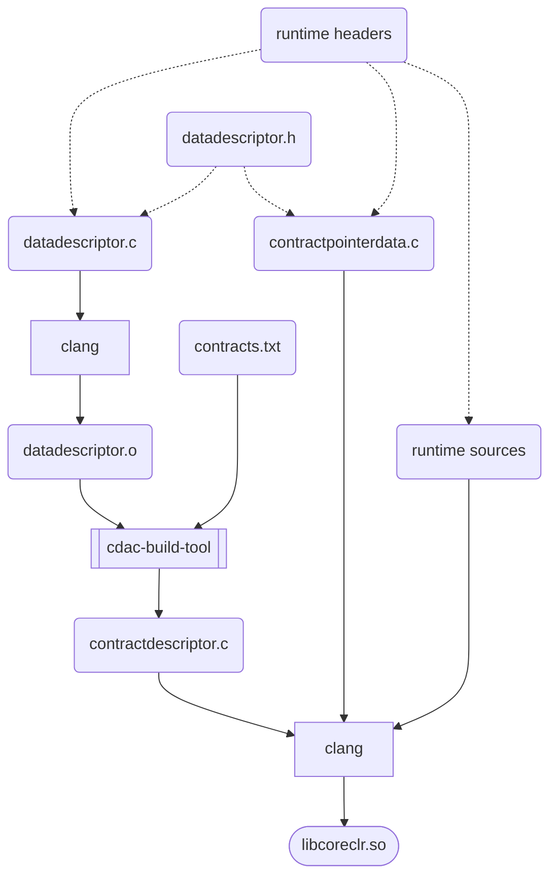
```mermaid
flowchart TB
  headers("runtime headers")
  data_header("datadescriptor.h")
  data_src("datadescriptor.c")
  compile_data["clang"]
  data_obj("datadescriptor.o")
  contracts("contracts.txt")
  globals("contractpointerdata.c")
  build[["cdac-build-tool"]]
  descriptor_src("contractdescriptor.c")
  vm("runtime sources")
  compile_runtime["clang"]
  runtime_lib(["libcoreclr.so"])

  headers -.-> data_src
  headers ~~~ data_header
  data_header -.-> data_src
  headers -.-> globals
  headers -.-> vm
  data_src --> compile_data --> data_obj --> build
  contracts ---> build
  build --> descriptor_src
  descriptor_src --> compile_runtime
  data_header -.-> globals ----> compile_runtime
  vm ----> compile_runtime --> runtime_lib
```


## Specifying data descriptors

The sample in the `sample` dir uses the following syntax (see [sample/sample.data.h](sample/sample.data.h)) to specify the data descriptor:

```c
CDAC_BASELINE("empty")
CDAC_TYPES_BEGIN()

CDAC_TYPE_BEGIN(ManagedThread)
CDAC_TYPE_INDETERMINATE(ManagedThread)
CDAC_TYPE_FIELD(ManagedThread, GCHandle, GCHandle, offsetof(ManagedThread,m_gcHandle))
CDAC_TYPE_FIELD(ManagedThread, pointer, Next, offsetof(ManagedThread,m_next))
CDAC_TYPE_END(ManagedThread)

CDAC_TYPE_BEGIN(GCHandle)
CDAC_TYPE_SIZE(sizeof(intptr_t))
CDAC_TYPE_END(GCHandle)

CDAC_TYPES_END()

CDAC_GLOBALS_BEGIN()
CDAC_GLOBAL_POINTER(ManagedThreadStore, &g_managedThreadStore)
#if FEATURE_COMINTEROP
CDAC_GLOBAL(FeatureCOMInterop, uint8, 1)
#else
CDAC_GLOBAL(FeatureCOMInterop, uint8, 0)
#endif
CDAC_GLOBAL(SomeMagicNumber, uint32, 42)
CDAC_GLOBALS_END()
```

The file is included multiple times with the macros variously defined in order to generate the
data descriptor blob.

## Implementation Details

See [data-descriptor-blob.md](./data-descriptor-blob.md)

## Workflow

### Porting and extending the data blob scraper

When porting to a new architecture, or extending the blob contents, it is recommended to
first work with the sample blob, rather than the full CoreCLR descriptor.

For example, if your target platform has a clang toolchain, something like this will provide a suitable
input for `cdac-build-tool`:

```console
$ clang -target wasm32-unknown-unknown -c -o /tmp/sample.o src/coreclr/tools/cdac-build-tool/sample/sample.blob.c
```

If you are modifying the preprocessor macros, using `-E` to emit the preprocessed output is helpful as well.

```console
$ clang -target x86_64-unknown-linux-gnu -E -o /tmp/sample.i .src/coreclr/tools/cdac-build-tool/sample/sample.blob.c
```

Running the `cdac-build-tool` with the `-v` verbose option will show progress

```console
$ ./dotnet.sh run --project src/coreclr/tools/cdac-build-tool/cdac-build-tool.csproj -- compose -v -o /tmp/contract.c /tmp/sample.o
```

It is also helpful to run the `cdac-build-tool` under a debugger with a breakpoint in `ObjectFileScraper.ScrapeInput`

**Release runtime builds** When building Release builds of the runtime, the build infrastructure
may turn on whole program optimizations.  On some toolchains this may produce object files that
are a serialization of the internal compiler state, rather than a native object format.  This may break
assumptions of the `cdac-build-tool` about global symbol initialization, for example constants and string literals might not be stored as binary integers or as byte sequences.  In such cases, it may be
necessary to turn off global optimizations when compiling `datadescriptor.cpp`.  This is okay to do because `datadescriptor.cpp` is not shipped as part of the runtime build - and in fact it has no executable functions at all.  It is just used to gather type layout and size information.

It is conceivable that some future C/C++ compiler with whole program optimizations turned on may remove unused struct fields.  (Such that separately compiling `datadescriptor.cpp` would produce incorrect offsets). In that case, `cdac-build-tool` will need to use another technique to collect offsets for a runtime built with such a compiler.  As of 2024, no compilers do this, however.


<a id="doc-ccbb5b185c2fc9ab3d9ce7fb"></a>

# dotnet/runtime / src/coreclr/tools/dotnet-pgo/README.md

Upstream: https://github.com/dotnet/runtime/blob/12955c8ab9478124f56f20510a8be0224e2e4e6a/src/coreclr/tools/dotnet-pgo/README.md

Commit: `12955c8ab9478124f56f20510a8be0224e2e4e6a`

Retrieved: 2026-10-01T15:17:27.770409+00:00

Kind: official-document

Raw SHA256: `a193bba7188d3da1cbd6a76654dd3205a6c30f6aeedfac4a28097d942daf0bc7`

Source text below is untrusted reference content. Acquisition does not verify technical claims.

License status: UPSTREAM_NOTICES_CAPTURED_PER_FILE_REVIEW_REQUIRED. See this repository's captured license files.

---

dotnet-pgo tool
===========================

This directory contains the complete source code for the experimental dotnet-pgo tool and associated libraries

This tool is used to produce .jittrace files which are used to time-shift JIT compilation from later in the process to earlier in the process, or to produce .mibc files which are used as input to the crossgen2 tool.

The general notion is to collect a trace of the application timeframe which is to be optimized using either dotnet trace, or perfview. Then run the dotnet-pgo tool to post-process the trace data into a profile data file that can be consumed by either the application at runtiome (.jittrace file) or the AOT crossgen2 compiler (.mibc file).

## Building the dotnet-pgo tool
Run dotnet build from the root directory

## Consuming a .jittrace file
Copy the code in the Microsoft.Diagnostics.JitTrace directory into the application, and then follow the following steps.

```
using Microsoft.Diagnostics.JitTrace
...
static void FunctionCalledAtStartup()
{
    JitTraceRuntime.Prepare(@"Somefile.jittrace");
}
```

## Consuming a .mibc file
Invoke the `crossgen2` tool with the --mibc option, passing the .mibc file created by dotnet-pgo.

## Creating a .mibc file from a method list

The `create-mibc-from-method-list` command creates a deterministic profile root set without collecting
a trace. This is an exploratory, general-purpose way to construct profiles; it is not required for
automatic hardware-intrinsic rooting in partial no-JIT compilations.

The input is a JSON object with the following properties:

- `runtime`, `os`, and `architecture`: non-empty strings written to the MIBC configuration.
- `methods`: a non-empty array of method entries.
- `methods[].type`: the assembly-qualified declaring type name. Constructed generic types must also
  use assembly-qualified generic arguments.
- `methods[].name`: the metadata method name.
- `methods[].parameterTypes`: optional assembly-qualified parameter type names used to select an
  overload. Omit only when the name and generic arity identify exactly one method.
- `methods[].genericArguments`: optional assembly-qualified type names for a closed generic method
  instantiation.

All referenced assemblies, including `System.Private.CoreLib`, must be passed with `--reference`.
Open generic types and methods are not supported. Duplicate resolved methods are rejected.

```json
{
  "runtime": "CoreCLR",
  "os": "linux",
  "architecture": "x64",
  "methods": [
    {
      "type": "Example.ProfileRoots, Example",
      "name": "Parse",
      "parameterTypes": [
        "System.String, System.Private.CoreLib"
      ]
    },
    {
      "type": "Example.ProfileRoots, Example",
      "name": "Create",
      "genericArguments": [
        "System.Int32, System.Private.CoreLib"
      ],
      "parameterTypes": [
        "System.Int32, System.Private.CoreLib"
      ]
    }
  ]
}
```

```console
dotnet-pgo create-mibc-from-method-list \
  --method-list methods.json \
  --reference System.Private.CoreLib.dll \
  --reference Example.dll \
  --output methods.mibc
```

## Example tracing commands used to generate the input to this tool:
Note, this tool requires MethodDetails events which are produced by the .NET 5.0 runtime, or by modifying the .NET Core 3 runtime to produce the event.

- Capture events from process 73060 where we capture both JIT and R2R events using EventPipe tracing
```
"dotnet trace collect -p 73060 --providers Microsoft-Windows-DotNETRuntime:0x6000080018:5"
```

- Capture events from process 73060 where we capture only JIT events using EventPipe tracing
```
"dotnet trace collect -p 73060 --providers Microsoft-Windows-DotNETRuntime:0x4000080018:5"
```

- Capture Jit and R2R events via perfview of all processes running using ETW tracing
```
"perfview collect -LogFile:logOfCollection.txt -DataFile:jittrace.etl -Zip:false -merge:false -providers:Microsoft-Windows-DotNETRuntime:0x6000080018:5"
```

## Example commands for using dotnet-pgo
- Given the etlfile jittrace.etl produced from perfview collect, create a matching jittrace file named jitdata.jittrace based on the data in the process named jittracetest that ran during collection of the etw data. While processing, print out all of the events processed, and warnings for methods which could not be processed.
```
H:\git\jittrace\src\Tools\dotnet-pgo\bin\Debug\netcoreapp3.0\dotnet-pgo.exe --trace-file  jittracewithlog.etl --process-name jittracetest --output-file-name withlog.jittrace --pgo-file-type jittrace --display-processed-events true
```


<a id="doc-1e5951129a6fbdccf630d0c3"></a>

# dotnet/runtime / src/coreclr/tools/r2rdump/README.md

Upstream: https://github.com/dotnet/runtime/blob/12955c8ab9478124f56f20510a8be0224e2e4e6a/src/coreclr/tools/r2rdump/README.md

Commit: `12955c8ab9478124f56f20510a8be0224e2e4e6a`

Retrieved: 2026-10-01T15:17:27.770409+00:00

Kind: official-document

Raw SHA256: `3011bfc13565390678d5c3f7b8aa204ba08e332b003bcf5fa545869d3014d39f`

Source text below is untrusted reference content. Acquisition does not verify technical claims.

License status: UPSTREAM_NOTICES_CAPTURED_PER_FILE_REVIEW_REQUIRED. See this repository's captured license files.

---

# R2RDump

Parses and outputs the contents of a ReadyToRun image

## Usage

dotnet R2RDump.dll --in &lt;path to ReadyToRun image&gt;

* -o, --out &lt;arg&gt;
	- Output file path. Dumps everything to the specified file except help message and error messages
* -x, --xml
	- Output in XML format
* --raw
	- Dump the raw bytes of each section or runtime function
* --header
	- Dump R2R header
* -d, --disasm
	- Show disassembly of methods or runtime functions
* -q, --query &lt;arg&gt;...
	- Query method by exact name, signature, row id or token
* -k, --keyword &lt;arg&gt;...
	- Search method by keyword
* -r, --runtimefunction &lt;arg&gt;...
	- Get one runtime function by id or relative virtual address
* -s, --section &lt;arg&gt;...
	- Get section by keyword
* --unwind
	- Dump unwindInfo
* --gc
	- Dump gcInfo and slot table
* --sc
	- Dump section contents
* -v, --verbose
	- Dump disassembly, unwindInfo, gcInfo and section contents

## Architectures Supported

### R2RDump Architectures

|             | x64 | x86       | ARM | ARM64 |
| ----------- | --- | --------- | --- | ----- |
| **Windows** | yes | no disasm |     |       |
| **Linux**   | yes |           |     |       |
| **OSX**     | yes | -         | -   | -     |

### Input Image Architectures

|             | x64 | x86 | ARM       | ARM64 |
| ----------- | --- | --- | --------- | ----- |
| **Windows** | yes | yes | yes       | yes   |
| **Linux**   | yes | yes | yes       | yes   |
| **OSX**     | yes | -   | -         | -     |

## ReadyToRun Format


### System.Reflection.Metadata

Used for getting method and type signatures from tokens (see: http://jilc.sourceforge.net/ecma_p2_cil.shtml)

### READYTORUN_SECTION_COMPILER_IDENTIFIER

A string describing the compiler.

Eg. "CoreCLR 4.5.30319.0 __BUILDMACHINE__"

### READYTORUN_SECTION_IMPORT_SECTIONS

A struct described in [READYTORUN_IMPORT_SECTION](../../inc/readytorun.h). Currently not parsed correctly

### READYTORUN_SECTION_RUNTIME_FUNCTIONS

A array of RVAs. For x64, each RuntimeFunction has RVAs to the start of the assembly, end of the assembly, and start of the UnwindInfo. For x86/Arm/Arm64, each RuntimeFunction has RVAs to the start of the assembly, and start of the UnwindInfo.

### READYTORUN_SECTION_METHODDEF_ENTRYPOINTS

A [NativeArray](../aot/ILCompiler.Reflection.ReadyToRun/NativeArray.cs) used for finding the index of the entrypoint RuntimeFunction for each method. The NativeArray is index by is the rowId-1 of a method. Each element in the NativeArray is an offset pointing to the RuntimeFunction index.

### READYTORUN_SECTION_AVAILABLE_TYPES

A [NativeHashtable](../aot/ILCompiler.Reflection.ReadyToRun/NativeHashtable.cs) mapping type hashcodes of types defined in the program to the rowIds. The hashcode is calculated with [ComputeNameHashCode](../../vm/typehashingalgorithms.h)(namespace) ^ [ComputeNameHashCode](../../vm/typehashingalgorithms.h)(name)

### READYTORUN_SECTION_ATTRIBUTEPRESENCE

A [NativeCuckooFilter](../aot/ILCompiler.Reflection.ReadyToRun/NativeHashtable.cs) to discover which tokens have which "System.Runtime." prefixed attributes. The System.Runtime.CompilerServices.NullableAttribute is not used in this calculation. The filter is composed of a name hash of the type name using [ComputeNameHashCode](../../vm/typehashingalgorithms.h)(namespace + name) hash combined with a hash of each token that produced it. In addition the upper 16 bits is used as the fingerprint in the filter.

### READYTORUN_SECTION_INSTANCE_METHOD_ENTRYPOINTS

A [NativeHashtable](../aot/ILCompiler.Reflection.ReadyToRun/NativeHashtable.cs) mapping type hashcodes of generic instances to the (methodFlags, methodRowId, list of types, runtimeFunctionId). Each type in the list of types corresponds to a generic type in the method.

Eg. GenericMethod&lt;S, T&gt;(T arg1, S arg2) instantiated for &lt;int, UserDefinedStruct&gt; is in the hashtable as:

(hashcode) -> (methodFlags) (methodRowId) (number of generic types) (Int32) (ValueType) (RowId of UserDefinedStruct) (offset to RuntimeFunctionId)

### UnwindInfo

A struct described in [_UNWIND_INFO](../../inc/win64unwind.h). Each RuntimeFunction has its own UnwindInfo.

For x86, it contains only an encoded function length

For x64, Arm and Arm64, it contains a bit field followed by an array of unwind codes ([_UNWIND_CODE](../../inc/win64unwind.h)) and finally padding to make it byte aligned

The unwind data info structure is used to record the effects a function has on the stack pointer and where the nonvolatile registers are saved on the stack (see https://msdn.microsoft.com/en-us/library/0kd71y96.aspx)

### GcInfo

Written into the ReadyToRun image right after UnwindInfo. Contains a header, GcSlots and GcTransitions (register liveness).

The x64/Arm/Arm64 GcInfo is written in crossgen by [GcInfoEncoder::Build](../../gcinfo/gcinfoencoder.cpp) and decoded similar to [GcInfoDecoder::EnumerateLiveSlots](../../vm/gcinfodecoder.cpp). The x86 gcInfo is written by [GCInfo::gcMakeRegPtrTable](../../jit/gcencode.cpp) and decoded similar to [GCDump::DumpGCTable](../../gcdump/i386/gcdumpx86.cpp)

Contains the code length followed by the header, GcSlots, and finally GcTransitions

The header contains flags indicating which properties are in the GcInfo. GcSlots gives details on the registers or stack pointer offsets that are used in the method. GcTransitions give the CodeOffsets (which line in the assembly code) where GcSlots (excluding untracked slots) become live or dead

In x64/Arm/Arm64, GcTransitions are grouped into chunks where each chunk covers NUM_NORM_CODE_OFFSETS_PER_CHUNK lines of assembly code. The following format is used:
> Array of offsets pointing to each chunk

> Padding to make it byte aligned

> For each chunk:
>> 1 bit indicating if it's RLE encoded

>> Array of bits indicating if each slot changed state in the chunk (ie. false if the slot is not used in the chunk). R2RDump uses this to calculate NumCouldBeLiveSlots and obtain slotIds

>> Array of bits indicating if each slot is live at the end of the chunk

>> For each slot that changed state in the chunk:
>>> Array of elements consisting of a bit set to 1 and the normCodeOffsetDelta indicating all the code offsets where the slot changed state in the chunk. CodeOffset = normCodeOffsetDelta + normChunkBaseCodeOffset + currentRangeStartOffset - cumInterruptibleLength, where normChunkBaseCodeOffset is the sum of the sizes of all preceding chunks, currentRangeStartOffset is the start offset of the interruptible range that the transition falls under and cumInterruptibleLength is the sum of the lengths of interruptible ranges that came before it

## Todo

* Support R2RDump on ARM and ARM64 (https://github.com/dotnet/runtime/issues/10753)

* Parse R2RSections: READYTORUN_SECTION_EXCEPTION_INFO, READYTORUN_SECTION_DEBUG_INFO, READYTORUN_SECTION_DELAYLOAD_METHODCALL_THUNKS, READYTORUN_SECTION_INLINING_INFO, READYTORUN_SECTION_PROFILEDATA_INFO (https://github.com/dotnet/runtime/issues/10948)

* Reenable R2RDumpTests after making it less fragile

* Fix issues with disasm on Arm (https://github.com/dotnet/runtime/issues/10959) and disasm using x86 coredistools (https://github.com/dotnet/runtime/issues/10928)

* Test R2RDump on more test cases to make sure it runs reliably and verify that the output is accurate (list of failing inputs: https://github.com/dotnet/runtime/issues/10961)


<a id="doc-108d8f7076014f91451a83b1"></a>

# dotnet/runtime / src/coreclr/tools/superpmi/readme.md

Upstream: https://github.com/dotnet/runtime/blob/12955c8ab9478124f56f20510a8be0224e2e4e6a/src/coreclr/tools/superpmi/readme.md

Commit: `12955c8ab9478124f56f20510a8be0224e2e4e6a`

Retrieved: 2026-10-01T15:17:27.770409+00:00

Kind: official-document

Raw SHA256: `74227553bdcd58821e3311765309a0e9321dcc2e13625483d236b85684821a8c`

Source text below is untrusted reference content. Acquisition does not verify technical claims.

License status: UPSTREAM_NOTICES_CAPTURED_PER_FILE_REVIEW_REQUIRED. See this repository's captured license files.

---

# Overview

This directory (`src/coreclr/tools/superpmi` in the GitHub
https://github.com/dotnet/runtime repository) contains the SuperPMI
tool used for testing the .NET just-in-time (JIT) compiler.

## Purpose

SuperPMI has two primary uses:
1. Verification that a JIT code change doesn't cause any asserts.
2. Finding test code where two JIT compilers generate different code, or
verifying that the two compilers generate the same code.

Case #1 is useful for doing quick regression checking when making a source
code change to the JIT compiler. The process is: (a) make a JIT source code
change, (b) run that newly built JIT through a SuperPMI run to verify no
asserts have been introduced.

Case #2 is useful for generating assembly language diffs, to help analyze the
impact of a JIT code change.

## SuperPMI architecture

SuperPMI works in two phases: collection and playback.

In the collection phase, the system is configured to collect SuperPMI data.
Then, run any set of .NET managed programs. When these managed programs invoke the JIT
compiler, SuperPMI gathers and captures all information passed between the
JIT and its .NET host. This data is post-processed to remove essentially
duplicate function information, and is collected into one or just a few
files.

In the playback phase, SuperPMI loads the JIT directly, and causes it to
compile all the functions that were previously compiled in the collection
phase, but using the collected data to provide answers to various questions
that the JIT needs to ask. The .NET execution engine (EE) is not invoked at all.
When doing playback for assertion checking, only a single JIT is loaded and
used for compilation. When doing playback to check for assembly diffs, both
a "baseline" and a "diff" compiler are loaded. Each JIT is asked to compile
each recorded function. The generated results are compared with a built-in
SuperPMI "near differ", which depends on an external disassembler component
called `coredistools`. Typically, scripting has SuperPMI generate a list of
functions with differences, then the script re-invokes each JIT to generate
disassembly output (using `DOTNET_JitDisasm`) for each differing function.
These are then compared either visually, or with the jitutils tool
`jit-analyze`, or both.


# Tools

There are two native executable tools: `superpmi` and `mcs`. To do the collection,
there is the `superpmi-shim-collector` binary (`.dll` or `.so` or `.dylib`).

To harness collection, there is a .NET Core C# program that is built as
part of the coreclr tests build called superpmicollect.exe
(source: src/tests/JIT/superpmi in https://github.com/dotnet/runtime repository).
This tool also functions as a SuperPMI collection and playback unit test.

The superpmicollect tool is also being moved to the jitutils repository
(https://github.com/dotnet/jitutils).

Each tool will show a help screen if passed `-?`.

Finally, there is a Python script that harnesses SuperPMI collection,
playback, and other functions, such as download of existing SuperPMI
collections from well-known locations. This tool is `superpmi.py`,
found in `src/corclr/scripts` in the dotnet/runtime repository. See
[superpmi.md](../../../scripts/superpmi.md) for more details.


# Collection

To manually do a collection (not using the `superpmi.py` script or
`superpmicollect.exe` tool), follow the following steps.

## Overall collection process

First, build the `dotnet/runtime` repo, which builds the `superpmi`, `mcs`,
and `superpmi-shim-collector` programs, along with the rest of coreclr,
and places them in the same native code directory as the JIT and the rest
of coreclr, e.g., `f:\gh\runtime\artifacts\bin\coreclr\windows.x64.Checked\superpmi.exe`
for a `dotnet/runtime` repo rooted at the `f:\gh\runtime` directory, and
built on Windows for the x64 Checked architecture / build flavor combination.

The SuperPMI collection process requires a lot of disk space. How much will
depend on the number, size, and complexity of the functions the JIT needs to
compile. Make sure that the disk where the collected data will be collected
is sufficiently large. It is also best if the data is written on an SSD, to
speed up the disk operations.

These are the general steps that are followed when doing a SuperPMI collection:

1. Collect .MC files. Set up for collection, then cause the JIT to be invoked
by either running a scenario, running tests, crossgen2 compiling assemblies,
or using PMI to force the JIT to compile functions in an assembly.
During collection, the data for each JIT compiled function is stored
in a uniquely named file with a ".MC" filename extension (for "method context").
2. Merge .MC files to .MCH file. We want all the generated data to be merged to a
single file (or some smaller set of files), to both be more manageable, and
to collect the data for multiple compiled functions into one place for easier
replay. (MCH stands for "method context hive".)
3. Remove duplicates in the .MCH file. Many compiled functions are essentially
equivalent, such as trivial class constructors, or if some functions are
compiled multiple times in different scenarios or tests. We filter out the
duplicates, which makes playback much faster, and the resultant MCH file much
smaller. This can be done as part of the "merge" step.
4. Create a "clean" .MCH with no SuperPMI failures. The original collected MCH
file might not replay cleanly. This is generally due to existing, un-investigated
SuperPMI bugs or limitations. We don't want to see these during normal playback,
so filter out the failing replays at this point so the "baseline" replay is clean.
5. Create a table of contents (TOC) file. This creates an index for the generated
MCH file that greatly speeds up certain operations.
6. Test final .MCH file is clean. This is purely to check that the resultant
MCH file is in a good state for future use.


## Collect .MC files

Set the following environment variables:

```
SuperPMIShimLogPath=<full path to an existing, empty temporary directory>
SuperPMIShimPath=<full path to clrjit.dll, the "standalone" JIT>
DOTNET_JitName=superpmi-shim-collector.dll
```

for example, on Windows:

```
mkdir f:\spmi\temp
set SuperPMIShimLogPath=f:\spmi\temp
set SuperPMIShimPath=f:\gh\runtime\artifacts\tests\coreclr\windows.x64.Checked\Tests\Core_Root\clrjit.dll
set DOTNET_JitName=superpmi-shim-collector.dll
```

(On Linux, use `libclrjit.so` and `libsuperpmi-shim-collector.so`.
On Mac, use `libclrjit.dylib` and `libsuperpmi-shim-collector.dylib`.)

Note that the `superpmi-shim-collector.dll` must live in the same directory as the `coreclr.dll`
(or libcoreclr.so on Linux) that will be invoked when running .NET Core. This will normally be
a `Core_Root` directory, since you must create such a directory to be able to run
.NET Core applications (such as by using the `corerun` tool).

If you want to collect using an official .NET Core build, you will need to build a matching set
of superpmi binaries, and copy `superpmi-shim-collector.dll` to the correct directory. This
option has not been tested (as far as I know).

Then, cause the JIT to compile some code. Do one or more of:
1. Run a managed scenario.
2. Run managed code tests.
3. Crossgen some assemblies.
4. Run PMI over some assemblies (see https://github.com/dotnet/jitutils for details on PMI)

When done running programs, un-set these environment variables.

Now, you will have a large number of .MC files in the specified temporary
directory (specified by `SuperPMIShimLogPath`).


## Merge .MC files to .MCH file

Merge the generated .MC files using the `mcs` tool:

```
mcs -merge base.mch *.mc -recursive -dedup -thin
```

This assumes the current directory is the root directory where the .MC files
were placed, namely the directory specified as `SuperPMIShimLogPath` above.
You can also specify a directory prefix to the file system regular expression.
The `-recursive` flag is only necessary if .MC files also exist in subdirectories
of this, and you want those also added to the resultant, collected `base.mch`
file. The `-dedup` and `-thin` options remove duplicates as the files are merged,
and remove the normally-unused CompileResults (e.g., the code generated during
the initial collection).

So, for the example above, you might use:

```
f:\gh\runtime\artifacts\bin\coreclr\windows.x64.Checked\mcs.exe -merge f:\spmi\base.mch f:\spmi\temp\*.mc -recursive -dedup -thin
```

Note that `mcs -merge` without `-dedup -thin` is literally just a file concatenation
of many files into one, which would double the required disk space.

After this step, you can remove all the individual .MC files unless you want
to keep them to debug the SuperPMI collection process itself.


## Remove duplicates in the .MCH file

One benefit of SuperPMI is the ability to remove duplicated compilations, so
on replay only unique functions are compiled. If you didn't use the `-merge -dedup -thin`
option above, you can do the deduplication separately, using the following to create a
"unique" set of functions:

```
mcs -removeDup -thin base.mch unique.mch
```

Note that `-thin` is not required. However, it will delete all the compilation
results collected during the collection phase, which makes the resulting MCH
file smaller. Those compilation results are not required for playback for
the ways in which we normally use SuperPMI.

For the continuing example, you might use:

```
f:\gh\runtime\artifacts\bin\coreclr\windows.x64.Checked\mcs.exe -removeDup -thin f:\spmi\base.mch f:\spmi\unique.mch
```

After this step, you can remove the base.mch file (unless you want to debug
the SuperPMI collection process itself).


## Create a "clean" .MCH with no SuperPMI failures

As stated above, due to various bugs or otherwise uninvestigated issues, a SuperPMI
replay of the unique.mch file might contain errors. We don't want that, so we filter
out those errors in a "baseline" run, as follows.

(Note that if you are following the steps above, you most likely deduplicated
during the merge operation, so you have a `base.mch` file, not a `unique.mch` file.)

```
superpmi -p -f basefail.mcl unique.mch clrjit.dll
mcs.exe -strip basefail.mcl unique.mch final.mch
```

Or, continuing the example above, giving full paths, we have:

```
f:\gh\runtime\artifacts\bin\coreclr\windows.x64.Checked\superpmi.exe -p -f f:\spmi\basefail.mcl f:\spmi\unique.mch f:\gh\runtime\artifacts\bin\coreclr\windows.x64.Checked\clrjit.dll
f:\gh\runtime\artifacts\bin\coreclr\windows.x64.Checked\mcs.exe -strip f:\spmi\basefail.mcl f:\spmi\unique.mch f:\spmi\final.mch
```


## Create a table of contents (TOC) file

This is

```
mcs -toc final.mch
```

or, using the full paths from above:

```
f:\gh\runtime\artifacts\bin\coreclr\windows.x64.Checked\mcs.exe -toc f:\spmi\final.mch
```


## Test final .MCH file is clean

This is done using a replay just like for the "create clean .MCH file" step:

```
superpmi -p -f finalfail.mcl final.mch clrjit.dll
```

Or, continuing the example above, giving full paths, we have:

```
f:\gh\runtime\artifacts\bin\coreclr\windows.x64.Checked\superpmi.exe -p -f f:\spmi\finalfail.mcl f:\spmi\final.mch f:\gh\runtime\artifacts\bin\coreclr\windows.x64.Checked\clrjit.dll
```

In this case, if `finalfail.mcl` is not empty, there was a failure in the final "check" replay.
This will lead to the same failure in all future replays, if the resultant final.mch file is
published for general use. This is annoying, but not necessarily a fatal problem.
It's possible to cycle the process, stripping this failure from the final MCH,
testing for "clean-ness" again, and repeating. It should not be necessary, however.


## Publishing the SuperPMI collection

The files that should be published for consumption either by yourself or by a group
are `final.mch` and `final.mch.mct` (the TOC). All other files described above are
intermediate files in the collection process, and are not needed afterwards.


# Playback

Once you have a merged, de-duplicated MCH collection, you can play it back
using:

    superpmi -p final.mch clrjit.dll

The `-p` switch says to utilize all the processors on your machine,
and replay in parallel. You can omit this if you wish to replay
without using parallelism (this is usually done when replaying
a single compilation, whereas `-p` is usually used when replaying
a full MCH file set of compilations).


<a id="doc-8b55ec506a21f717d064e82e"></a>

# dotnet/runtime / src/installer/managed/Microsoft.NET.HostModel/README.md

Upstream: https://github.com/dotnet/runtime/blob/12955c8ab9478124f56f20510a8be0224e2e4e6a/src/installer/managed/Microsoft.NET.HostModel/README.md

Commit: `12955c8ab9478124f56f20510a8be0224e2e4e6a`

Retrieved: 2026-10-01T15:17:27.770409+00:00

Kind: official-document

Raw SHA256: `68e52917ef032f0061c2666e4ccb6fb57586787ade18d147a046a81db1d8a994`

Source text below is untrusted reference content. Acquisition does not verify technical claims.

License status: UPSTREAM_NOTICES_CAPTURED_PER_FILE_REVIEW_REQUIRED. See this repository's captured license files.

---

Host Model
===================================

HostModel is a library used by the [SDK](https://github.com/dotnet/sdk) to perform certain transformations on host executables. The main services implemented in HostModel are:

* AppHost rewriter:  Embeds the App Name into the AppHost executable. On Windows, also copies resources from App.dll to the AppHost.
* ComHost rewriter: Creates a ComHost with an embedded CLSIDMap file to map CLSIDs to .NET Classes.

* Single-file bundler: Embeds an application and its dependencies into the AppHost, to publish a single executable, as described [here](https://github.com/dotnet/designs/blob/master/accepted/2020/single-file/design.md).

The HostModel library is in the Runtime repo because:

* The implementations of the host and HostModel are closely related, which facilitates easy development, update, and testing.
* Separating the HostModel implementation from SDK repo repo aligns with code ownership, and facilitates maintenance.

The build targets/tasks that use the HostModel library are in the SDK repo because:

* This facilitates the MSBuild tasks to be multi-targeted.
* It helps generate localized error messages, since SDK repo has the localization infrastructure.


<a id="doc-1b3471dc7285f6f62787cdd6"></a>

# dotnet/runtime / src/installer/pkg/LICENSE-MSFT.TXT

Upstream: https://github.com/dotnet/runtime/blob/12955c8ab9478124f56f20510a8be0224e2e4e6a/src/installer/pkg/LICENSE-MSFT.TXT

Commit: `12955c8ab9478124f56f20510a8be0224e2e4e6a`

Retrieved: 2026-10-01T15:17:27.770409+00:00

Kind: license

Raw SHA256: `c50e462f7d9d966b50f4a9874ccfb896b83455ac0d2e7f30aaf4bb7ad5fbd12a`

Source text below is untrusted reference content. Acquisition does not verify technical claims.

License status: UPSTREAM_NOTICES_CAPTURED_PER_FILE_REVIEW_REQUIRED. See this repository's captured license files.

---

````text
MICROSOFT SOFTWARE LICENSE TERMS
MICROSOFT .NET LIBRARY 
These license terms are an agreement between Microsoft Corporation (or based on where you live, one of its affiliates) and you. Please read them. They apply to the software named above, which includes the media on which you received it, if any. The terms also apply to any Microsoft
  * updates,
  * supplements,
  * Internet-based services, and
  * support services
for this software, unless other terms accompany those items. If so, those terms apply.
BY USING THE SOFTWARE, YOU ACCEPT THESE TERMS. IF YOU DO NOT ACCEPT THEM, DO NOT USE THE SOFTWARE.
IF YOU COMPLY WITH THESE LICENSE TERMS, YOU HAVE THE PERPETUAL RIGHTS BELOW.
1. INSTALLATION AND USE RIGHTS. 
  a. Installation and Use. You may install and use any number of copies of the software to design, develop and test your programs.
  b. Third Party Programs. The software may include third party programs that Microsoft, not the third party, licenses to you under this agreement. Notices, if any, for the third party program are included for your information only.
2. DATA. The software may collect information about you and your use of the software, and send that to Microsoft. Microsoft may use this information to improve our products and services. You can learn more about data collection and use in the help documentation and the privacy statement at https://go.microsoft.com/fwlink/?LinkId=528096. Your use of the software operates as your consent to these practices.
3. ADDITIONAL LICENSING REQUIREMENTS AND/OR USE RIGHTS.
  a. DISTRIBUTABLE CODE. The software is comprised of Distributable Code. "Distributable Code" is code that you are permitted to distribute in programs you develop if you comply with the terms below.
    i. Right to Use and Distribute. 
      * You may copy and distribute the object code form of the software.
      * Third Party Distribution. You may permit distributors of your programs to copy and distribute the Distributable Code as part of those programs.
    ii. Distribution Requirements. For any Distributable Code you distribute, you must
      * add significant primary functionality to it in your programs;
      * require distributors and external end users to agree to terms that protect it at least as much as this agreement;
      * display your valid copyright notice on your programs; and
      * indemnify, defend, and hold harmless Microsoft from any claims, including attorneys' fees, related to the distribution or use of your programs.
    iii. Distribution Restrictions. You may not
      * alter any copyright, trademark or patent notice in the Distributable Code;
      * use Microsoft's trademarks in your programs' names or in a way that suggests your programs come from or are endorsed by Microsoft;
      * include Distributable Code in malicious, deceptive or unlawful programs; or
      * modify or distribute the source code of any Distributable Code so that any part of it becomes subject to an Excluded License. An Excluded License is one that requires, as a condition of use, modification or distribution, that
      * the code be disclosed or distributed in source code form; or
      * others have the right to modify it.
4. SCOPE OF LICENSE. The software is licensed, not sold. This agreement only gives you some rights to use the software. Microsoft reserves all other rights. Unless applicable law gives you more rights despite this limitation, you may use the software only as expressly permitted in this agreement. In doing so, you must comply with any technical limitations in the software that only allow you to use it in certain ways. You may not
  * work around any technical limitations in the software;
  * reverse engineer, decompile or disassemble the software, except and only to the extent that applicable law expressly permits, despite this limitation;
  * publish the software for others to copy;
  * rent, lease or lend the software;
  * transfer the software or this agreement to any third party; or
  * use the software for commercial software hosting services.
5. BACKUP COPY. You may make one backup copy of the software. You may use it only to reinstall the software.
6. DOCUMENTATION. Any person that has valid access to your computer or internal network may copy and use the documentation for your internal, reference purposes.
7. EXPORT RESTRICTIONS. The software is subject to United States export laws and regulations. You must comply with all domestic and international export laws and regulations that apply to the software. These laws include restrictions on destinations, end users and end use. For additional information, see www.microsoft.com/exporting.
8. SUPPORT SERVICES. Because this software is "as is," we may not provide support services for it.
9. ENTIRE AGREEMENT. This agreement, and the terms for supplements, updates, Internet-based services and support services that you use, are the entire agreement for the software and support services.
10. APPLICABLE LAW.
  a. United States. If you acquired the software in the United States, Washington state law governs the interpretation of this agreement and applies to claims for breach of it, regardless of conflict of laws principles. The laws of the state where you live govern all other claims, including claims under state consumer protection laws, unfair competition laws, and in tort.
  b. Outside the United States. If you acquired the software in any other country, the laws of that country apply.
11. LEGAL EFFECT. This agreement describes certain legal rights. You may have other rights under the laws of your country. You may also have rights with respect to the party from whom you acquired the software. This agreement does not change your rights under the laws of your country if the laws of your country do not permit it to do so.
12. DISCLAIMER OF WARRANTY. THE SOFTWARE IS LICENSED "AS-IS." YOU BEAR THE RISK OF USING IT. MICROSOFT GIVES NO EXPRESS WARRANTIES, GUARANTEES OR CONDITIONS. YOU MAY HAVE ADDITIONAL CONSUMER RIGHTS OR STATUTORY GUARANTEES UNDER YOUR LOCAL LAWS WHICH THIS AGREEMENT CANNOT CHANGE. TO THE EXTENT PERMITTED UNDER YOUR LOCAL LAWS, MICROSOFT EXCLUDES THE IMPLIED WARRANTIES OF MERCHANTABILITY, FITNESS FOR A PARTICULAR PURPOSE AND NON-INFRINGEMENT.
FOR AUSTRALIA - YOU HAVE STATUTORY GUARANTEES UNDER THE AUSTRALIAN CONSUMER LAW AND NOTHING IN THESE TERMS IS INTENDED TO AFFECT THOSE RIGHTS.
13. LIMITATION ON AND EXCLUSION OF REMEDIES AND DAMAGES. YOU CAN RECOVER FROM MICROSOFT AND ITS SUPPLIERS ONLY DIRECT DAMAGES UP TO U.S. $5.00. YOU CANNOT RECOVER ANY OTHER DAMAGES, INCLUDING CONSEQUENTIAL, LOST PROFITS, SPECIAL, INDIRECT OR INCIDENTAL DAMAGES.
This limitation applies to
  * anything related to the software, services, content (including code) on third party Internet sites, or third party programs; and
  * claims for breach of contract, breach of warranty, guarantee or condition, strict liability, negligence, or other tort to the extent permitted by applicable law.
It also applies even if Microsoft knew or should have known about the possibility of the damages. The above limitation or exclusion may not apply to you because your country may not allow the exclusion or limitation of incidental, consequential or other damages.
Please note: As this software is distributed in Quebec, Canada, some of the clauses in this agreement are provided below in French.
Remarque : Ce logiciel étant distribué au Québec, Canada, certaines des clauses dans ce contrat sont fournies ci-dessous en français.
EXONÉRATION DE GARANTIE. Le logiciel visé par une licence est offert « tel quel ». Toute utilisation de ce logiciel est à votre seule risque et péril. Microsoft n'accorde aucune autre garantie expresse. Vous pouvez bénéficier de droits additionnels en vertu du droit local sur la protection des consommateurs, que ce contrat ne peut modifier. La ou elles sont permises par le droit locale, les garanties implicites de qualité marchande, d'adéquation à un usage particulier et d'absence de contrefaçon sont exclues.
LIMITATION DES DOMMAGES-INTÉRÊTS ET EXCLUSION DE RESPONSABILITÉ POUR LES DOMMAGES. Vous pouvez obtenir de Microsoft et de ses fournisseurs une indemnisation en cas de dommages directs uniquement à hauteur de 5,00 $ US. Vous ne pouvez prétendre à aucune indemnisation pour les autres dommages, y compris les dommages spéciaux, indirects ou accessoires et pertes de bénéfices.
Cette limitation concerne :
  * tout ce qui est relié au logiciel, aux services ou au contenu (y compris le code) figurant sur des sites Internet tiers ou dans des programmes tiers ; et
  * les réclamations au titre de violation de contrat ou de garantie, ou au titre de responsabilité stricte, de négligence ou d'une autre faute dans la limite autorisée par la loi en vigueur.
Elle s'applique également, même si Microsoft connaissait ou devrait connaître l'éventualité d'un tel dommage. Si votre pays n'autorise pas l'exclusion ou la limitation de responsabilité pour les dommages indirects, accessoires ou de quelque nature que ce soit, il se peut que la limitation ou l'exclusion ci-dessus ne s'appliquera pas à votre égard.
EFFET JURIDIQUE. Le présent contrat décrit certains droits juridiques. Vous pourriez avoir d'autres droits prévus par les lois de votre pays. Le présent contrat ne modifie pas les droits que vous confèrent les lois de votre pays si celles-ci ne le permettent pas.


````


<a id="doc-6ea3fcde10776a45eec71c72"></a>

# dotnet/runtime / src/installer/pkg/README.md

Upstream: https://github.com/dotnet/runtime/blob/12955c8ab9478124f56f20510a8be0224e2e4e6a/src/installer/pkg/README.md

Commit: `12955c8ab9478124f56f20510a8be0224e2e4e6a`

Retrieved: 2026-10-01T15:17:27.770409+00:00

Kind: official-document

Raw SHA256: `da401d5bc3a90d07ad21c506f6c7c8d39c928ca68bc3b9bf8a51802ceb7de51a`

Source text below is untrusted reference content. Acquisition does not verify technical claims.

License status: UPSTREAM_NOTICES_CAPTURED_PER_FILE_REVIEW_REQUIRED. See this repository's captured license files.

---

THIRD-PARTY-NOTICES.TXT in this directory contains TPNs from all repos that contribute
to installer packages that install files under dotnet directory.

This file is included in .NET Host installer package and installed to dotnet directory.
It should be updated, manually or automatically to include new TPNs for each release.

THIRD-PARTY-NOTICES.TXT in the root of this repo contains TPNs for this repo only.


<a id="doc-45ac2106179f9f5a45202e71"></a>

# dotnet/runtime / src/libraries/Common/src/Interop/Unix/System.Security.Cryptography.Native/README.md

Upstream: https://github.com/dotnet/runtime/blob/12955c8ab9478124f56f20510a8be0224e2e4e6a/src/libraries/Common/src/Interop/Unix/System.Security.Cryptography.Native/README.md

Commit: `12955c8ab9478124f56f20510a8be0224e2e4e6a`

Retrieved: 2026-10-01T15:17:27.770409+00:00

Kind: official-document

Raw SHA256: `57c74a4028d4cb598b129bed8bbef336ff7e75999e9e10ce098691801a511c98`

Source text below is untrusted reference content. Acquisition does not verify technical claims.

License status: UPSTREAM_NOTICES_CAPTURED_PER_FILE_REVIEW_REQUIRED. See this repository's captured license files.

---

# System.Security.Cryptography.Native

This folder contains C# bindings for native shim (libSystem.Security.Cryptography.Native.OpenSsl.so), shimming functionality provided by the OpenSSL library.

## Memory allocation hooks

One extra feature exposed by the native shim is tracking of memory used by
OpenSSL by hooking the memory allocation routines via
`CRYPTO_set_mem_functions`.

The functionality is enabled by setting
`DOTNET_OPENSSL_MEMORY_DEBUG` to 1. This environment
variable must be set before launching the program (calling
`Environment.SetEnvironmentVariable` at the start of the program is not
sufficient). The diagnostic API is not officially exposed and needs to be
accessed via private reflection on the `Interop.Crypto` type located in the
`System.Security.Cryptography` assembly. On this type, you can use following static
methods:

- `int GetOpenSslAllocatedMemory()`
    - Gets the total amount of memory allocated by OpenSSL
- `int GetOpenSslAllocationCount()`
    - Gets the number of allocations made by OpenSSL
- `void EnableMemoryTracking()`/`void DisableMemoryTracking()`
    - toggles tracking of individual live allocations via internal data
      structures. I.e. will keep track of live memory allocated since the start of
      tracking.
- `void ForEachTrackedAllocation(Action<IntPtr, ulong, IntPtr, int> callback)`
    - Accepts an callback and calls it for each allocation performed since the
      last `EnableMemoryTracking` call. The order of reported information does not
      correspond to the order of allocation. This method holds an internal lock
      which prevents other threads from allocating any memory from OpenSSL.
    - Callback parameters are
        - IntPtr - The pointer to the allocated object
        - ulong - size of the allocation in bytes
        - IntPtr - Pointer to a null-terminated string (`const char*`) containing the name of the file from which the allocation was made.
        - int - line number within the file specified by the previous parameter where the allocation was called from.

The debug functionality brings some overhead (header for each allocation,
locks/synchronization during each allocation) and may cause performance penalty.

### Example usage

```cs
// all above mentioned APIs are accessible via "private reflection"
BindingFlags flags = BindingFlags.InvokeMethod | BindingFlags.NonPublic | BindingFlags.Static;
var cryptoInterop = typeof(RandomNumberGenerator).Assembly.GetTypes().First(t => t.Name == "Crypto");

// enable tracking, this clears up any previously tracked allocations
cryptoInterop.InvokeMember("EnableMemoryTracking", flags, null, null, null);

// do some work that includes OpenSSL
HttpClient client = new HttpClient();
await client.GetAsync("https://www.microsoft.com");

// stop tracking (this step is optional)
cryptoInterop.InvokeMember("DisableMemoryTracking", flags, null, null, null);

using var process = Process.GetCurrentProcess();
Console.WriteLine($"Bytes known to GC [{GC.GetTotalMemory(false)}], process working set [{process.WorkingSet64}]");
Console.WriteLine("OpenSSL - currently allocated memory: {0} B", cryptoInterop.InvokeMember("GetOpenSslAllocatedMemory", flags, null, null, null));
Console.WriteLine("OpenSSL - total allocations since start: {0}", cryptoInterop.InvokeMember("GetOpenSslAllocationCount", flags, null, null, null));

Dictionary<(IntPtr file, int line), ulong> allAllocations = new();
Action<IntPtr, ulong, IntPtr, int> callback = (ptr, size, namePtr, line) =>
{
    CollectionsMarshal.GetValueRefOrAddDefault(allAllocations, (namePtr, line), out _) += size;
};
cryptoInterop.InvokeMember("ForEachTrackedAllocation", flags, null, null, [callback]);

Console.WriteLine("Total allocated OpenSSL memory by location");
foreach (var ((filenameptr, line), total) in allAllocations.OrderByDescending(kvp => kvp.Value).Take(10))
{
    string filename = Marshal.PtrToStringUTF8(filenameptr);
    Console.WriteLine($"{total:N0} B from {filename}:{line}");
}
```

<a id="doc-8a81fa212ebc00d7d76bf5d6"></a>

# dotnet/runtime / src/libraries/Common/src/System/Net/Http/aspnetcore/ReadMe.SharedCode.md

Upstream: https://github.com/dotnet/runtime/blob/12955c8ab9478124f56f20510a8be0224e2e4e6a/src/libraries/Common/src/System/Net/Http/aspnetcore/ReadMe.SharedCode.md

Commit: `12955c8ab9478124f56f20510a8be0224e2e4e6a`

Retrieved: 2026-10-01T15:17:27.770409+00:00

Kind: official-document

Raw SHA256: `aea0d3fb56e7fafbe5f9655bb2ba8e130f654972b971e5fb083089d4ffcce514`

Source text below is untrusted reference content. Acquisition does not verify technical claims.

License status: UPSTREAM_NOTICES_CAPTURED_PER_FILE_REVIEW_REQUIRED. See this repository's captured license files.

---

The code in this directory is shared between dotnet/runtime and dotnet/aspnetcore. This contains HTTP/2 and HTTP/3 protocol infrastructure such as an HPACK implementation. Any changes to this dir need to be checked into both repositories.

dotnet/runtime code paths:
- runtime\src\libraries\Common\src\System\Net\Http\aspnetcore
- runtime\src\libraries\Common\tests\Tests\System\Net\aspnetcore

dotnet/aspnetcore code paths:
- aspnetcore\src\Shared\runtime
- aspnetcore\src\Shared\test\Shared.Tests\runtime

## Copying code
- To copy code from dotnet/runtime to dotnet/aspnetcore, set ASPNETCORE_REPO to the aspnetcore repo root and then run CopyToAspNetCore.cmd.
- To copy code from dotnet/aspnetcore to dotnet/runtime, set RUNTIME_REPO to the runtime repo root and then run CopyToRuntime.cmd.

## Building dotnet/runtime code:
- https://github.com/dotnet/runtime/tree/main/docs/workflow
- Run *build.cmd* from the root once: `PS D:\github\runtime> .\build.cmd -runtimeConfiguration Release  -subset clr+libs`
- Build the individual projects:
- `PS D:\github\dotnet\src\libraries\Common\tests> dotnet build`
- `PS D:\github\dotnet\src\libraries\System.Net.Http\src> dotnet build`

### Running dotnet/runtime tests:
- `PS D:\github\runtime\src\libraries\Common\tests> dotnet build /t:test`
- `PS D:\github\runtime\src\libraries\System.Net.Http\tests\UnitTests> dotnet build /t:test`

## Building dotnet/aspnetcore code:
- https://github.com/dotnet/aspnetcore/blob/main/docs/BuildFromSource.md
- Run restore in the root once: `PS D:\github\aspnetcore> .\restore.cmd`
- Activate to use the repo local runtime: `PS D:\github\aspnetcore> . .\activate.ps1`
- Build the individual projects:
- `(aspnetcore) PS D:\github\aspnetcore\src\Shared\test\Shared.Tests> dotnet build`
- `(aspnetcore) PS D:\github\aspnetcore\src\servers\Kestrel\core\src> dotnet build`

### Running dotnet/aspnetcore tests:
- `(aspnetcore) PS D:\github\aspnetcore\src\Shared\test\Shared.Tests> dotnet test`
- `(aspnetcore) PS D:\github\aspnetcore\src\servers\Kestrel\core\test> dotnet test`

## GitHub Actions

In dotnet/aspnetcore, the [runtime-sync](https://github.com/dotnet/aspnetcore/actions/workflows/runtime-sync.yml) GitHub action automatically creates PRs to pull in changes from dotnet/runtime.

In dotnet/runtime, the [aspnetcore-sync](https://github.com/dotnet/runtime/actions/workflows/aspnetcore-sync.yml) GitHub action must be run **manually** to create PRs to pull in changes from dotnet/aspnetcore.
This is expected to be less common.


<a id="doc-4d3a09c3b6122e7b7a0b9852"></a>

# dotnet/runtime / src/libraries/Common/tests/StaticTestGenerator/README.md

Upstream: https://github.com/dotnet/runtime/blob/12955c8ab9478124f56f20510a8be0224e2e4e6a/src/libraries/Common/tests/StaticTestGenerator/README.md

Commit: `12955c8ab9478124f56f20510a8be0224e2e4e6a`

Retrieved: 2026-10-01T15:17:27.770409+00:00

Kind: official-document

Raw SHA256: `8aa80359b65e0425b4226a50203f9a608e694ee5569396ebd3d7adc9fae0c7a5`

Source text below is untrusted reference content. Acquisition does not verify technical claims.

License status: UPSTREAM_NOTICES_CAPTURED_PER_FILE_REVIEW_REQUIRED. See this repository's captured license files.

---

# Overview

This is a .NET Core utility that reflects over a runtime xunit test assembly and generates
a simple console app that invokes tests with minimal ceremony and without any reflection.
Each test invocation is emitted as a call into the public test method, with one invocation
generated per theory input.

# Usage

## Prereqs

- Build runtime from root to ensure that the testhost directory of assemblies is published, e.g. `cd d:\repos\runtime & .\build.cmd -subset libs`.
- Build the test assembly desired, e.g `cd src\libraries\System.Runtime\tests & dotnet build`.

## Running the StaticTestGenerator utility

From within the utility directory, run the utility with the arguments:
- The path to the output directory into which the resulting .cs and .csproj files are written.
- The path to a directory containing all of the runtime test host assemblies.
- The path to the test assembly to be analyzed.
- Any additional xunit options to be provided.  If none are provided, it defaults to the same inputs that are passed when testing inner loop on Windows.

For example:
```
dotnet run d:\output "d:\repos\runtime\artifacts\bin\testhost\net11.0-windows-Debug-x64\shared\Microsoft.NETCore.App\5.0.0" "d:\repos\runtime\artifacts\bin\System.Runtime.Tests\net11.0-windows-Debug\System.Runtime.Tests.dll"
```
This will run the tool and result in output written to the console like:
```
3/27/2019 10:55:37 PM | Test assembly path    : d:\repos\runtime\artifacts\bin\System.Runtime.Tests\net11.0-windows-Debug\System.Runtime.Tests.dll
3/27/2019 10:55:37 PM | Helper assemblies path: d:\repos\runtime\artifacts\bin\testhost\net11.0-windows-Debug-x64\shared\Microsoft.NETCore.App\3.0.0\
3/27/2019 10:55:37 PM | Output path           : d:\output\System.Runtime.Tests\
3/27/2019 10:55:37 PM | Xunit arguments       : d:\repos\runtime\artifacts\bin\System.Runtime.Tests\net11.0-windows-Debug\System.Runtime.Tests.dll -notrait category=nonnetcoreapptests -notrait category=nonwindowstests -notrait category=IgnoreForCI -notrait category=failing -notrait category=OuterLoop
3/27/2019 10:55:37 PM |
3/27/2019 10:55:37 PM | Loaded System.Runtime.Tests from d:\repos\runtime\artifacts\bin\System.Runtime.Tests\net11.0-windows-Debug\System.Runtime.Tests.dll
3/27/2019 10:55:37 PM | Found 5322 test methods.
3/27/2019 10:55:38 PM | Found 3469 InlineDatas / 949 MethodDatas across 5322 test methods.
3/27/2019 10:55:38 PM |
3/27/2019 10:55:38 PM | Unsupported InvokeRefReturnNetcoreTests.TestRefReturnPropertyGetValue. Generic method requires reflection invoke.
3/27/2019 10:55:38 PM | Unsupported InvokeRefReturnNetcoreTests.TestRefReturnMethodInvoke. Generic method requires reflection invoke.
3/27/2019 10:55:38 PM | Unsupported InvokeRefReturnNetcoreTests.TestNullRefReturnInvoke. Generic method requires reflection invoke.
3/27/2019 10:55:38 PM | Unsupported ArrayTests.Sort_Array_Array_Generic. Generic method requires reflection invoke.
3/27/2019 10:55:38 PM | Unsupported ArrayTests.Fill_Generic. Generic method requires reflection invoke.
3/27/2019 10:55:38 PM | Unsupported ArrayTests.IndexOf_SZArray. Generic method requires reflection invoke.
3/27/2019 10:55:38 PM | Unsupported ArrayTests.LastIndexOf_SZArray. Generic method requires reflection invoke.
3/27/2019 10:55:38 PM | Unsupported ArrayTests.Sort_Array_Generic. Generic method requires reflection invoke.
3/27/2019 10:55:38 PM | Unsupported ArrayTests.Sort_NotComparable_ThrowsInvalidOperationException. Generic method requires reflection invoke.
3/27/2019 10:55:38 PM | Unsupported ArrayTests.BinarySearch_SZArray. Generic method requires reflection invoke.
3/27/2019 10:55:38 PM | Unsupported ArrayTests.BinarySearch_TypesNotIComparable_ThrowsInvalidOperationException. Generic method requires reflection invoke.
3/27/2019 10:55:38 PM | Unsupported EnumTests.Parse. Generic method requires reflection invoke.
3/27/2019 10:55:38 PM | Unsupported EnumTests.Parse_NetCoreApp11. Generic method requires reflection invoke.
3/27/2019 10:55:38 PM |
3/27/2019 10:55:38 PM | Num unsupported: 13
3/27/2019 10:55:38 PM | Num calls written: 8289
3/27/2019 10:55:38 PM |
3/27/2019 10:55:40 PM | Wrote d:\output\System.Runtime.Tests\Program.cs
3/27/2019 10:55:40 PM | Wrote d:\output\System.Runtime.Tests\System.Runtime.Tests-runner.csproj
```
(The "Unsupported" lines are calling out tests that could not be emitted, along with the reason why.)

This will create a `System.Runtime.Tests` directory under `d:\output`, and in that directory it'll place two files,
a Program.cs containing the generated code and a System.Runtime.Tests-runner.csproj containing a minimal csproj for the solution.
The .csproj contains the necessary assembly references to build the tests.

## Tests Runner Build

Having run the utility to generate the test runner, change into the specified output directory from the above steps and do:
```
dotnet build
```
This will build the test binary.  If there are any compilation failures, there are bugs in the utility that need to be fixed.

## Tests Execution

With the test runner built, you can now execute tests. However, the tests themselves may try to load additional
assemblies, and any such assemblies should be in the same directory as the test binary in order for them to be
loadable.  One approach is to simply copy everything from the shared testhost into a folder, copy the test runner
binary into that same folder, and copy any additional dependencies (e.g. RemoteExecutorConsoleApp.exe) into that
same directory.  For example:
```
d:\CoreClrTest>corerun System.Runtime.Tests-runner.dll
System.Tests.ExceptionTests.ThrowStatementDoesNotResetExceptionStackLineSameMethod [FAIL]
Xunit.Sdk.TrueException: Assert.True() Failure
Expected: True
Actual:   False
   at Xunit.Assert.True(Nullable`1 condition, String userMessage) in C:\projects\xunit\src\xunit.assert\Asserts\BooleanAsserts.cs:line 95
   at System.Tests.ExceptionTests.VerifyCallStack(ValueTuple`3 expectedStackFrame, String reportedCallStack, Int32 skipFrames)
   at System.Tests.ExceptionTests.ThrowStatementDoesNotResetExceptionStackLineSameMethod()
   at Test.<>c.<Main>b__0_3213() in d:\tmpoutput\System.Runtime.Tests\Program.cs:line 11552
   at Test.Execute(String name, Action action, Int32& succeeded, Int32& failed) in d:\tmpoutput\System.Runtime.Tests\Program.cs:line 25179
System.Tests.ExceptionTests.ThrowStatementDoesNotResetExceptionStackLineOtherMethod [FAIL]
Xunit.Sdk.TrueException: Assert.True() Failure
Expected: True
Actual:   False
   at Xunit.Assert.True(Nullable`1 condition, String userMessage) in C:\projects\xunit\src\xunit.assert\Asserts\BooleanAsserts.cs:line 95
   at System.Tests.ExceptionTests.VerifyCallStack(ValueTuple`3 expectedStackFrame, String reportedCallStack, Int32 skipFrames)
   at System.Tests.ExceptionTests.ThrowStatementDoesNotResetExceptionStackLineOtherMethod()
   at Test.<>c.<Main>b__0_3214() in d:\tmpoutput\System.Runtime.Tests\Program.cs:line 11556
   at Test.Execute(String name, Action action, Int32& succeeded, Int32& failed) in d:\tmpoutput\System.Runtime.Tests\Program.cs:line 25179
System.Tests.ArgIteratorTests.ArgIterator_Throws_PlatformNotSupportedException [FAIL]
Xunit.Sdk.ThrowsException: Assert.Throws() Failure
Expected: typeof(System.PlatformNotSupportedException)
Actual:   typeof(System.ArgumentException): Handle is not initialized.
   at System.ArgIterator..ctor(IntPtr arglist)
   at System.ArgIterator..ctor(RuntimeArgumentHandle arglist) in F:\vsagent\80\s\src\System\ArgIterator.cs:line 39
   at System.Tests.ArgIteratorTests.<>c.<ArgIterator_Throws_PlatformNotSupportedException>b__6_0()
   at Xunit.Assert.RecordException(Action testCode) in C:\projects\xunit\src\xunit.assert\Asserts\Record.cs:line 28

Total : 31509
Passed: 31506 (99.99%)
Failed: 3 (0.01%)
```


<a id="doc-65bd1bb9040ee6425c333b20"></a>

# dotnet/runtime / src/libraries/Common/tests/System/Net/EnterpriseTests/setup/README.md

Upstream: https://github.com/dotnet/runtime/blob/12955c8ab9478124f56f20510a8be0224e2e4e6a/src/libraries/Common/tests/System/Net/EnterpriseTests/setup/README.md

Commit: `12955c8ab9478124f56f20510a8be0224e2e4e6a`

Retrieved: 2026-10-01T15:17:27.770409+00:00

Kind: official-document

Raw SHA256: `d896fd7635832d9af384f8ce3c715c134e126be83e564cdb61d38cc4861afb0e`

Source text below is untrusted reference content. Acquisition does not verify technical claims.

License status: UPSTREAM_NOTICES_CAPTURED_PER_FILE_REVIEW_REQUIRED. See this repository's captured license files.

---

# Enterprise Scenario Testing

## What Are Enterprise Scenarios?
There are many definitions for enterprise scenarios. But generally in terms of how .NET Core networking APIs are used, enterprise scenarios are those networking scenarios that are fundamentally used by businesses (a.k.a enterprises) compared with consumers. As such, they use networking components, protocols, and security authentication mechanisms that are not used by most consumers using their home networking and Internet connections.

## Networking Components of Enterprise Scenarios
Enterprise scenarios typically see the following kinds of components/protocols/security:
* Although possibly connected to the Internet, most of the networking topology is internal facing. There is use of some internal “directory” service for authentication of connected computers and users. On Windows, this can include Windows Active Directory domains with computers being domain-controllers, domain-joined, or standalone computers. On Linux, this includes Kerberos realms using KDCs and participating member computers. With .NET Core being cross-platform, this now includes connections with multiple domains and realms with various cross trust between them.
* Authentication protocols such as NTLM, Kerberos and Negotiate. These are used more than Basic and Digest. Negotiate/Kerberos requires both client and server computers to be “joined” to a common trusted directory service.
* TLS/SSL extensively used.
* The use of proxy servers for HTTP/HTTPS communication. These usually include authenticated proxies where the proxy server demands authentication typically with Negotiate or NTLM authentication schemes.
* Complex DNS architectures using various A and CNAME (alias) records.
* Use of the NegotiateStream class. This is typically seen as part of using WCF client/server architecture.
* Impersonation/Delegation of credentials. This occurs frequently in middle-tier scenarios that involve a client computer talking with a middle-tier computer (such as a web server) which makes an outbound call to another computer such as a database server. In this case, the credentials of the client computer are delegated across the middle-tier computer so that the outbound call to the database server is made in the context of the client’s credentials.


## Running the tests
These tests need to be run in the dedicated Enterprise Test environment. This environment can be created on a local dev machine as long as Docker in installed. The enterprise test environment is a collection of Linux docker containers (client and servers) connected on a common docker network.

Set the DOTNET_RUNTIME_REPO_ROOT environment variable to the path on your dev machine (the host machine) where the repo is installed:

```
# Windows cmd.exe shell example
set DOTNET_RUNTIME_REPO_ROOT=s:\GitHub\runtime
```

```bash
# Linux bash shell example
export DOTNET_RUNTIME_REPO_ROOT=/home/me/GitHub/runtime
```

Now you can start up the enterprise system on your dev machine.

```
# Build test machine images
cd %DOTNET_RUNTIME_REPO_ROOT%\src\libraries\Common\tests\System\Net\EnterpriseTests\setup
docker-compose build

# Start up test machines and network
docker-compose up -d

There should be three server containers and client:
- kdc serves as Kerberos key center and Primary Domain Controller using Samba
- apacheweb runs standard web server on port 80 and has various authentication methods enabled
- altweb is identical container but running web on non-standard port. This primarily matters for Kerberos and SPN calculation
- linuxclient is container where the tests actually run

# Connect to the 'linuxclient' container
docker exec -it linuxclient bash
```

At this point, you are in the linuxclient container. It is one "machine" which is part of an enterprise network.

Now build the repo as you would on a regular dev machine:

```bash
cd /repo
./build.sh --subset libs
```

Now you can run the enterprise tests. Currently, there are tests for System.Net.Http and System.Net.Security. You can run them in the same way you already run tests in the repo.


(System.Net.Http example shown)

```bash
cd /repo/src/libraries/System.Net.Http/tests/EnterpriseTests
/repo/dotnet.sh build /t:test
```

You can exit from the container bash shell:

```bash
exit
```

But the containers stay running. You can re-connect to the client again anytime with the same command:

```
docker exec -it linuxclient bash
```

You can edit source code on your local machine and then rebuild and rerun tests as needed.

When you are done with the enterprise test network, you can shut it down from your local dev machine.

```
cd %DOTNET_RUNTIME_REPO_ROOT%\src\libraries\Common\tests\System\Net\EnterpriseTests\setup
docker-compose down
```


<a id="doc-a4dfee939c53a367834699d3"></a>

# dotnet/runtime / src/libraries/Common/tests/System/Net/Prerequisites/README.md

Upstream: https://github.com/dotnet/runtime/blob/12955c8ab9478124f56f20510a8be0224e2e4e6a/src/libraries/Common/tests/System/Net/Prerequisites/README.md

Commit: `12955c8ab9478124f56f20510a8be0224e2e4e6a`

Retrieved: 2026-10-01T15:17:27.770409+00:00

Kind: official-document

Raw SHA256: `d16ab909306c643a1d65ea0b19fe25c7b66c5f0874dd9a73294707217b007129`

Source text below is untrusted reference content. Acquisition does not verify technical claims.

License status: UPSTREAM_NOTICES_CAPTURED_PER_FILE_REVIEW_REQUIRED. See this repository's captured license files.

---

# System.Net Test Prerequisites
Contains source files for the networking test servers in Azure or a private IIS deployment.


<a id="doc-9c3271a9ea6ee93672202a6f"></a>

# dotnet/runtime / src/libraries/Common/tests/System/Net/Security/Kerberos/README.md

Upstream: https://github.com/dotnet/runtime/blob/12955c8ab9478124f56f20510a8be0224e2e4e6a/src/libraries/Common/tests/System/Net/Security/Kerberos/README.md

Commit: `12955c8ab9478124f56f20510a8be0224e2e4e6a`

Retrieved: 2026-10-01T15:17:27.770409+00:00

Kind: official-document

Raw SHA256: `dfcd36120493b868ff3c17fa71d90659e481d673f274783f777e88c81b85e3ee`

Source text below is untrusted reference content. Acquisition does not verify technical claims.

License status: UPSTREAM_NOTICES_CAPTURED_PER_FILE_REVIEW_REQUIRED. See this repository's captured license files.

---

# Kerberos Testing Environment

## Introduction

In a typical enterprise setting, there is a domain controller that handles authentication requests and clients connecting to it. The clients here are referring both to the clients in a traditional sense (eg. `HttpClient`) and the services that are running on the server-side (eg. `HttpListener`).

Replicating that environment for unit testing is non-trivial since it usually requires multiple machines and adjusting system configuration. Alternatively, it could be set up using containers running on a single machine with a preprepared configuration. Unfortunately, using containers restricts the possibility of testing various operating systems, or at least makes it non-trivial.

To make the setup more approachable, this directory contains an implementation of `KerberosExecutor` class that sets up a virtual environment with Kerberos Domain Controller (KDC) running inside the unit test. The system configuration is then locally redirected for the test itself through environment variables to connect to this KDC instead of a system one. All the tests are run within a `RemoteExecutor` environment. The KDC is powered by the [Kerberos.NET](https://github.com/dotnet/Kerberos.NET) library.

## Usage

Since the environment currently works only on Linux and macOS platforms the test class or test method needs to be decorated to only run when `KerberosExecutor` is supported:

```csharp
[ConditionalClass(typeof(KerberosExecutor), nameof(KerberosExecutor.IsSupported))]
public class MyKerberosTest
```

The xUnit logging through `ITestOutputHelper` must be set up for the test class:

```csharp
private readonly ITestOutputHelper _testOutputHelper;

public MyKerberosTest(ITestOutputHelper testOutputHelper)
{
    _testOutputHelper = testOutputHelper;
}
```

Each test then uses the `KerberosExecutor` class to set up the virtual environment and the test code to run inside the virtual environment:

```csharp
[Fact]
public async Task Loopback_Success()
{
    using var kerberosExecutor = new KerberosExecutor(_testOutputHelper, "LINUX.CONTOSO.COM");

    kerberosExecutor.AddService("HTTP/linux.contoso.com");
    kerberosExecutor.AddUser("user");

    await kerberosExecutor.Invoke(() =>
    {
        // Test code
    }
}
```

The test itself can add its own users and services. Each service must be specified using full service principal name (SPN). In the example above the default password is used for the user, so the test would use `new NetworkCredential("user", KerberosExecutor.DefaultUserPassword, "LINUX.CONTOSO.COM")` to construct credentials for use in `HttpClient` or similar scenario.

## Logging

For failed unit test the verbose output of the KDC server is logged into the test output. If the information is insufficient it is possible to get a trace from the native libraries by setting the `KRB5_TRACE="/dev/stdout"` environment variable.

<a id="doc-436fc541e96de131682d9caf"></a>

# dotnet/runtime / src/libraries/Common/tests/Tests/System/Net/aspnetcore/ReadMe.SharedCode.md

Upstream: https://github.com/dotnet/runtime/blob/12955c8ab9478124f56f20510a8be0224e2e4e6a/src/libraries/Common/tests/Tests/System/Net/aspnetcore/ReadMe.SharedCode.md

Commit: `12955c8ab9478124f56f20510a8be0224e2e4e6a`

Retrieved: 2026-10-01T15:17:27.770409+00:00

Kind: official-document

Raw SHA256: `fe836ac98b0017ecd34913ed024569a099fa0683b2bd9193f559b9320338c934`

Source text below is untrusted reference content. Acquisition does not verify technical claims.

License status: UPSTREAM_NOTICES_CAPTURED_PER_FILE_REVIEW_REQUIRED. See this repository's captured license files.

---

The code in this directory is shared between the runtime libraries and AspNetCore. This contains tests for HTTP/2 and HTTP/3 protocol infrastructure such as HPACK. Any changes to this dir need to be checked into both repositories.

For additional details see:
- runtime/src/libraries/Common/src/System/Net/Http/aspnetcore/ReadMe.SharedCode.md
- aspnetcore/src/Shared/runtime/ReadMe.SharedCode.md


<a id="doc-4de3e2925194d33a6ad93836"></a>

# dotnet/runtime / src/libraries/Fuzzing/README.md

Upstream: https://github.com/dotnet/runtime/blob/12955c8ab9478124f56f20510a8be0224e2e4e6a/src/libraries/Fuzzing/README.md

Commit: `12955c8ab9478124f56f20510a8be0224e2e4e6a`

Retrieved: 2026-10-01T15:17:27.770409+00:00

Kind: official-document

Raw SHA256: `09af48234467b5949f024c89900e3b5d68e0aacbf79ad292bdf1c76cb31bba1f`

Source text below is untrusted reference content. Acquisition does not verify technical claims.

License status: UPSTREAM_NOTICES_CAPTURED_PER_FILE_REVIEW_REQUIRED. See this repository's captured license files.

---

# Fuzzing .NET libraries

This project contains fuzzing targets for various .NET libraries, as well as supporting code for generating OneFuzz deployments from them.
Targets are instrumented using [SharpFuzz](https://github.com/Metalnem/sharpfuzz), and ran using [libFuzzer](https://llvm.org/docs/LibFuzzer.html).

The runtime and fuzzing targets are periodically rebuilt and published to OneFuzz via [deploy-to-onefuzz.yml](../../../eng/pipelines/libraries/fuzzing/deploy-to-onefuzz.yml).

Useful links:
- [libFuzzer documentation](https://llvm.org/docs/LibFuzzer.html)
- [libFuzzer tutorial with examples](https://github.com/google/fuzzing/blob/master/tutorial/libFuzzerTutorial.md)
- [More SharpFuzz samples](https://github.com/Metalnem/dotnet-fuzzers)
- [OneFuzz documentation](https://aka.ms/onefuzz)

## Running locally

> [!NOTE]
> The instructions assume you are running on Windows as that is what the continuous fuzzing runs currently use.

### Prerequisites

Build the runtime with the desired configuration if you haven't already:
```cmd
./build.cmd clr+libs -rc release
```

> [!TIP]
> The `-rc release` configuration here builds runtime in `Release` and libraries in `Debug` mode.
> Automated fuzzing runs use a `Checked` runtime + `Debug` libraries configuration by default.
> You can use any configuration locally, but `Checked` is recommended when testing changes in `System.Private.CoreLib`.

Install the SharpFuzz command line tool:
```cmd
dotnet tool install --global SharpFuzz.CommandLine
```

### Fuzzing locally

Build the `DotnetFuzzing` fuzzing project. It is self-contained, so it will produce `DotnetFuzzing.exe` along with a copy of all required libraries.

```cmd
cd src/libraries/Fuzzing/DotnetFuzzing

dotnet build
```

Run `run.bat`, which will create separate directories for each fuzzing target, instrument the relevant assemblies, and generate a helper script for running them locally.
When iterating on changes, remember to rebuild the project again.

```cmd
dotnet build; .\run.bat
```

Start fuzzing by running the `local-run.bat` script in the folder of the fuzzer you are interested in.
```cmd
deployment/HttpHeadersFuzzer/local-run.bat
```

See the [libFuzzer options](https://llvm.org/docs/LibFuzzer.html#options) documentation for more information on how to customize the fuzzing process.
For example, here is how you can run the fuzzer against a `header-inputs` corpus directory for 10 minutes, running multiple instances in parallel:
```cmd
deployment/HttpHeadersFuzzer/local-run.bat header-inputs -max_total_time=600 -jobs=5
```

### Generating coverage reports

After letting the fuzzer run for a while, you can use the generated inputs to test code coverage.

```cmd
mkdir header-inputs
deployment/HttpHeadersFuzzer/local-run.bat header-inputs

.\collect-coverage.ps1 HttpHeadersFuzzer header-inputs
```

The HTML report can be opened from
```cmd
.\coverage-report\html\index.html
```

## Creating a new fuzzing target

To create a new fuzzing target, you need to create a new class that implements the `IFuzzer` interface.
See existing implementations in the `Fuzzers` directory for reference.

As an example, let's test that `IPAddress.TryParse` never throws on invalid input, and doesn't access any bytes after the end of `bytes`:
```c#
internal sealed class IPAddressFuzzer : IFuzzer
{
    public string[] TargetAssemblies => ["System.Net.Primitives"]; // Assembly where IPAddress lives
    public string[] TargetCoreLibPrefixes => [];

    public void FuzzTarget(ReadOnlySpan<byte> bytes)
    {
        // PooledBoundedMemory is a helper class that ensures reading past the end of the buffer will trigger an access violation.
        using var chars = PooledBoundedMemory<char>.Rent(MemoryMarshal.Cast<byte, char>(bytes), PoisonPagePlacement.After);

        _ = IPAddress.TryParse(chars.Span, out _);
    }
}
```

- `TargetAssemblies` is a list of assemblies where the tested code lives and that must be instrumented.
- `TargetCoreLibPrefixes` is the same, but for types/namespaces in `System.Private.CoreLib`.
- `FuzzTarget` is the logic that the fuzzer will run for every test input. It should exercise code from the target assemblies.

Once you've created the new target, you can follow instructions above to run it locally.
Targets are discovered via reflection, so they will automatically become available for local runs and continuous fuzzing in CI.

### Running against a sample input

The program accepts two arguments: the name of the fuzzer and the path to a sample input file / directory.
To run the HttpHeaders target against the `inputs` directory, use the following command:

```cmd
cd src/libraries/Fuzzing/DotnetFuzzing

dotnet run HttpHeadersFuzzer inputs
```

This can be useful when debugging a crash.


<a id="doc-4e9523fb274e64d8401b8d10"></a>

# dotnet/runtime / src/libraries/Microsoft.CSharp/README.md

Upstream: https://github.com/dotnet/runtime/blob/12955c8ab9478124f56f20510a8be0224e2e4e6a/src/libraries/Microsoft.CSharp/README.md

Commit: `12955c8ab9478124f56f20510a8be0224e2e4e6a`

Retrieved: 2026-10-01T15:17:27.770409+00:00

Kind: official-document

Raw SHA256: `6d2a5618dd301961e9222502fc39916c3f56387efa003157670dda8ba722660d`

Source text below is untrusted reference content. Acquisition does not verify technical claims.

License status: UPSTREAM_NOTICES_CAPTURED_PER_FILE_REVIEW_REQUIRED. See this repository's captured license files.

---

# Microsoft.CSharp library

We are not accepting feature contributions to Microsoft.CSharp.
The library is effectively archived.

The library and supporting language features are mature and no longer evolving, and the risk of code change likely exceeds the benefit.
We will consider changes that address significant bugs or regressions, or changes that are necessary to continue shipping the binaries.
Other changes will be rejected.


<a id="doc-2542870e598185d697f6a8c0"></a>

# dotnet/runtime / src/libraries/Microsoft.Extensions.Caching.Abstractions/README.md

Upstream: https://github.com/dotnet/runtime/blob/12955c8ab9478124f56f20510a8be0224e2e4e6a/src/libraries/Microsoft.Extensions.Caching.Abstractions/README.md

Commit: `12955c8ab9478124f56f20510a8be0224e2e4e6a`

Retrieved: 2026-10-01T15:17:27.770409+00:00

Kind: official-document

Raw SHA256: `943fb925dc7c186f7d9703e399ea203c2b14c4f2b44508ad8d9a2c78a233b3eb`

Source text below is untrusted reference content. Acquisition does not verify technical claims.

License status: UPSTREAM_NOTICES_CAPTURED_PER_FILE_REVIEW_REQUIRED. See this repository's captured license files.

---

# Microsoft.Extensions.Caching

Caching is combined with a core caching abstraction under `Microsoft.Extensions.Caching.Abstractions` that allows for implementing general purpose memory and distributed caches, with integration for Redis and SqlServer.

Documentation can be found at https://learn.microsoft.com/dotnet/core/extensions/caching.

## Contribution Bar
- [x] [We consider new features, new APIs, bug fixes, and performance changes](../../libraries/README.md#primary-bar)

The APIs and functionality need more investment in the upcoming .NET releases.

## Deployment
[Microsoft.Extensions.Caching.Abstractions](https://www.nuget.org/packages/Microsoft.Extensions.Caching.Abstractions) is not included in the shared framework. The package is deployed as out-of-band (OOB) and needs to be installed into projects directly.


<a id="doc-1f9a940811c64f7ede47f0fd"></a>

# dotnet/runtime / src/libraries/Microsoft.Extensions.Caching.Memory/README.md

Upstream: https://github.com/dotnet/runtime/blob/12955c8ab9478124f56f20510a8be0224e2e4e6a/src/libraries/Microsoft.Extensions.Caching.Memory/README.md

Commit: `12955c8ab9478124f56f20510a8be0224e2e4e6a`

Retrieved: 2026-10-01T15:17:27.770409+00:00

Kind: official-document

Raw SHA256: `94f2e6b9e129791986ca748d96100179ade30ae82d57c3f4e356f2866c5f4e2d`

Source text below is untrusted reference content. Acquisition does not verify technical claims.

License status: UPSTREAM_NOTICES_CAPTURED_PER_FILE_REVIEW_REQUIRED. See this repository's captured license files.

---

# Microsoft.Extensions.Caching.Memory

In-memory caching provides a general purpose memory implementation of the core caching abstractions provided under `Microsoft.Extensions.Caching.Abstractions` and it is great for apps that run in a single server, where all cached data rents memory in the app's process.

Documentation can be found at https://learn.microsoft.com/dotnet/core/extensions/caching.

## Example

The following example shows how to instantiate a single memory cache using `AddMemoryCache` API and via DI get it injected to enable them calling `GetCurrentStatistics`

```c#
// when using `services.AddMemoryCache(options => options.TrackStatistics = true);` to instantiate

    [EventSource(Name = "Microsoft-Extensions-Caching-Memory")]
    internal sealed class CachingEventSource : EventSource
    {
        public CachingEventSource(IMemoryCache memoryCache) { _memoryCache = memoryCache; }
        protected override void OnEventCommand(EventCommandEventArgs command)
        {
            if (command.Command == EventCommand.Enable)
            {
                if (_cacheHitsCounter == null)
                {
                    _cacheHitsCounter = new PollingCounter("cache-hits", this, () =>
                        _memoryCache.GetCurrentStatistics().CacheHits)
                    {
                        DisplayName = "Cache hits",
                    };
                }
            }
        }
    }
```

The stats can be viewed using the above event counter like below with `dotnet-counters` tool:


To learn more about using memory cache and getting statistics check out issue dotnet/runtime#67770.

## Contribution Bar
- [x] [We consider new features, new APIs, bug fixes, and performance changes](../../libraries/README.md#primary-bar)

The APIs and functionality need more investment in the upcoming .NET releases.

## Deployment
[Microsoft.Extensions.Caching.Memory](https://www.nuget.org/packages/Microsoft.Extensions.Caching.Memory) is included in the ASP.NET Core shared framework. The package is deployed as out-of-band (OOB) too and can be referenced into projects directly.

<a id="doc-46f803b9b3f17e6cbf7cc2d2"></a>

# dotnet/runtime / src/libraries/Microsoft.Extensions.Configuration.Abstractions/README.md

Upstream: https://github.com/dotnet/runtime/blob/12955c8ab9478124f56f20510a8be0224e2e4e6a/src/libraries/Microsoft.Extensions.Configuration.Abstractions/README.md

Commit: `12955c8ab9478124f56f20510a8be0224e2e4e6a`

Retrieved: 2026-10-01T15:17:27.770409+00:00

Kind: official-document

Raw SHA256: `c5a37d44651e590625285ee108e51fa9a57829acdfa7a5824cbe7ee7cfcc3da8`

Source text below is untrusted reference content. Acquisition does not verify technical claims.

License status: UPSTREAM_NOTICES_CAPTURED_PER_FILE_REVIEW_REQUIRED. See this repository's captured license files.

---

# Microsoft.Extensions.Configuration.Abstractions

Provides abstractions of key-value pair based configuration.

Documentation can be found at https://learn.microsoft.com/dotnet/core/extensions/configuration

## Example

The example below shows a small code sample using this library and trying out the `ConfigurationKeyName` and `ConfigurationIgnore` attributes:

```cs
public class MyClass
{
    [ConfigurationKeyName("named_property")]
    public string NamedProperty { get; set; }

    [ConfigurationIgnore]
    public string IgnoredProperty { get; set; } = "default";
}
```

Given the simple class above, we can create a dictionary to hold the configuration data and use it as the memory source to build a configuration section:

```cs
var dic = new Dictionary<string, string>
{
    {"named_property", "value for named property"},
    {"ignored_property", "this value is ignored"},
};

var config = new ConfigurationBuilder()
    .AddInMemoryCollection(dic)
    .Build();

var options = config.Get<MyClass>();
Console.WriteLine(options.NamedProperty); // returns "value for named property"
Console.WriteLine(options.IgnoredProperty); // returns "default"
```

## Contribution Bar
- [x] [We consider new features, new APIs, bug fixes, and performance changes](../README.md#contribution-bar)

The APIs and functionality are mature, but do get extended occasionally.

## Deployment
[Microsoft.Extensions.Configuration.Abstractions](https://www.nuget.org/packages/Microsoft.Extensions.Configuration.Abstractions/) is included in the ASP.NET Core shared framework. The package is deployed as out-of-band (OOB) too and can be referenced into projects directly.


<a id="doc-2709eba227d2e7132546562f"></a>

# dotnet/runtime / src/libraries/Microsoft.Extensions.Configuration.Binder/README.md

Upstream: https://github.com/dotnet/runtime/blob/12955c8ab9478124f56f20510a8be0224e2e4e6a/src/libraries/Microsoft.Extensions.Configuration.Binder/README.md

Commit: `12955c8ab9478124f56f20510a8be0224e2e4e6a`

Retrieved: 2026-10-01T15:17:27.770409+00:00

Kind: official-document

Raw SHA256: `e173a8b942ce11f607c6ea260e53583ddb168825ad7e81e4b782da315f04504e`

Source text below is untrusted reference content. Acquisition does not verify technical claims.

License status: UPSTREAM_NOTICES_CAPTURED_PER_FILE_REVIEW_REQUIRED. See this repository's captured license files.

---

# Microsoft.Extensions.Configuration.Binder

Provides the functionality to bind an object to data in configuration providers for [Microsoft.Extensions.Configuration](https://www.nuget.org/packages/Microsoft.Extensions.Configuration/).

Documentation can be found at https://learn.microsoft.com/dotnet/core/extensions/configuration.

## Contribution Bar
- [x] [We consider new features, new APIs, bug fixes, and performance changes](../README.md#contribution-bar)

The APIs and functionality are mature, but do get extended occasionally.

## Deployment
[Microsoft.Extensions.Configuration.Binder](https://www.nuget.org/packages/Microsoft.Extensions.Configuration.Binder/) is included in the ASP.NET Core shared framework. The package is deployed as out-of-band (OOB) too and can be referenced into projects directly.

## Example
The following example shows how to bind a JSON configuration section to .NET objects.

```cs
using System;
using Microsoft.Extensions.Configuration;

class Settings
{
    public string Server { get; set; }
    public string Database { get; set; }
    public Endpoint[] Endpoints { get; set; }
}

class Endpoint
{
    public string IPAddress { get; set; }
    public int Port { get; set; }
}

class Program
{
    static void Main()
    {
        // Build a configuration object from JSON file
        IConfiguration config = new ConfigurationBuilder()
            .AddJsonFile("appsettings.json")
            .Build();

        // Bind a configuration section to an instance of Settings class
        Settings settings = config.GetSection("Settings").Get<Settings>();

        // Read simple values
        Console.WriteLine($"Server: {settings.Server}");
        Console.WriteLine($"Database: {settings.Database}");

        // Read nested objects
        Console.WriteLine("Endpoints: ");
        
        foreach (Endpoint endpoint in settings.Endpoints)
        {
            Console.WriteLine($"{endpoint.IPAddress}:{endpoint.Port}");
        }
    }
}
```

To run this example, include an `appsettings.json` file with the following content in your project:

```json
{
  "Settings": {
    "Server": "example.com",
    "Database": "Northwind",
    "Endpoints": [
      {
        "IPAddress": "192.168.0.1",
        "Port": "80"
      },
      {
        "IPAddress": "192.168.10.1",
        "Port": "8080"
      }
    ]
  }
}
```

You can include a configuration file using a code like this in your `.csproj` file:

```xml
<ItemGroup>
  <Content Include="appsettings.json">
    <CopyToOutputDirectory>Always</CopyToOutputDirectory>
  </Content>
</ItemGroup>
```

## Contributing changes to the source generator

Along with the binder assembly that uses reflection, we ship a source generator assembly that provides a reflection and AOT compatible implementation. It works by intercepting regular binding calls and redirecting them to new routines that execute strongly typed binding logic.

### Worfklow

- [Build the .NET libraries and runtime assemblies](https://github.com/dotnet/runtime/tree/7ed33d80c92fa0b7ae740df60a460e984f2f442b#how-can-i-contribute)
- Make the generator changes in the `gen\` directory
- Validate the changes by running the source generator tests in `tests\SourceGeneratorTests`

### Testing

Here's a general command for running the the generator tests. They assume that you're making the changes in a Windows OS and running the from the `tests\SourceGeneratorTests\` directory.

```ps
dotnet build /t:test
```

If applicable, add new tests to validate your contribution. See [this documentation](https://github.com/dotnet/runtime/blob/7ed33d80c92fa0b7ae740df60a460e984f2f442b/docs/workflow/README.md#full-instructions-on-building-and-testing-the-runtime-repo) for details.

#### Stale generator bits

Sometimes the SDK uses stale bits of the generator. This can lead to unexpected test behavior or failures. Killing `dotnet.exe` processes usually solves the issue, e.g. with `taskkill /F /IM dotnet.exe /T`.

#### Updating baselines

Some contributions might change the logic emitted by the generator. We maintain baseline [source files](https://github.com/dotnet/runtime/tree/e3e9758a10870a8f99a93a25e54ab2837d3abefc/src/libraries/Microsoft.Extensions.Configuration.Binder/tests/SourceGenerationTests/Baselines) to track the code emitted to handle some core binding scenarios.

If the emitted code changes, these tests will fail locally and\or during continuous integration checks. You would need to update the baseline source files, manually or by using a combination of:
- The `/p:UpdateBaselines=true` switch when building `Microsoft.Extensions.Configuration.Binder` in order to use `InterceptableAttributeVersion` for testing and\or updating the baselines.
- The `/p:UpdateBaselines=true` switch when building `Microsoft.Extensions.Configuration.Binder.SourceGeneration.Tests` in order to update the test baseline files.
- The `RepoRootDir` environment variable.
- The optional `InterceptableAttributeVersion` environment variable.

The `RepoRootDir environment variable needs to be specified to the root repo path.

The `InterceptableAttributeVersion` specifies what version of the `[Interceptable]` attribute should be generated. Currently there are two versions, both of which are experimental as of July 2024, and one is selected based on the local compiler. The original version ("version 0") is expected to be deprecated. Version 1 will be used for newer compilers automatically. However, if version 0 needs to be updated when newer compilers are present, version 0 can be forced by setting the environment variable to `0`.

Sample commands (PowerShell):
```ps
> $env:RepoRootDir = "D:\repos\dotnet_runtime"
> $env:InterceptableAttributeVersion = 0 # NOTE: this is optional - see notes
> cd D:/repros/dotnet_runtime/src/libraries/Microsoft.Extensions.Configuration.Binder
> dotnet build /p:UpdateBaselines=true
> cd tests/SourceGenerationTests
> dotnet build -t:test /p:UpdateBaselines=true
```

Sample commands (command prompt):
```
set RepoRootDir = "D:\repos\dotnet_runtime"
set InterceptableAttributeVersion = 0 REM NOTE: this is optional - see notes
cd D:\repros\dotnet_runtime\src\libraries\Microsoft.Extensions.Configuration.Binder
dotnet build /p:UpdateBaselines=true
cd tests\SourceGenerationTests
dotnet build -t:test /p:UpdateBaselines=true
```

After updating the baselines:
- Inspect the changes to verify that they are valid. Note that the baseline tests will fail if the new code causes errors when building the resulting compilation.
- Rebuild `Microsoft.Extensions.Configuration.Binder.SourceGeneration.Tests` without `/p:UpdateBaselines=true` so that the tests compare against the new baselines instead of being re-generated.


<a id="doc-bca1aab80b4c56c4f1426056"></a>

# dotnet/runtime / src/libraries/Microsoft.Extensions.Configuration.CommandLine/README.md

Upstream: https://github.com/dotnet/runtime/blob/12955c8ab9478124f56f20510a8be0224e2e4e6a/src/libraries/Microsoft.Extensions.Configuration.CommandLine/README.md

Commit: `12955c8ab9478124f56f20510a8be0224e2e4e6a`

Retrieved: 2026-10-01T15:17:27.770409+00:00

Kind: official-document

Raw SHA256: `57a078890b49e6af8270a0797018899c6bf5127ab3c6edfeb7060f741678f261`

Source text below is untrusted reference content. Acquisition does not verify technical claims.

License status: UPSTREAM_NOTICES_CAPTURED_PER_FILE_REVIEW_REQUIRED. See this repository's captured license files.

---

# Microsoft.Extensions.Configuration.CommandLine

Command line configuration provider implementation for [Microsoft.Extensions.Configuration](https://www.nuget.org/packages/Microsoft.Extensions.Configuration/).

Documentation can be found at https://learn.microsoft.com/dotnet/core/extensions/configuration-providers#command-line-configuration-provider

## Contribution Bar
- [x] [We consider new features, new APIs, bug fixes, and performance changes](../README.md#contribution-bar)

The APIs and functionality are mature, but do get extended occasionally.

## Deployment
[Microsoft.Extensions.Configuration.CommandLine](https://www.nuget.org/packages/Microsoft.Extensions.Configuration.CommandLine/) is included in the ASP.NET Core shared framework. The package is deployed as out-of-band (OOB) too and can be referenced into projects directly.

## Example

The following example shows how to read application configuration from the command line. You can use a command like `dotnet run --InputPath "c:\fizz" --OutputPath "c:\buzz"` to run it.

```cs
using System;
using Microsoft.Extensions.Configuration;

class Program
{
    static void Main(string[] args)
    {
        // Build a configuration object from command line
        IConfiguration config = new ConfigurationBuilder()
            .AddCommandLine(args)
            .Build();
        
        // Read configuration values
        Console.WriteLine($"InputPath: {config["InputPath"]}");
        Console.WriteLine($"OutputPath: {config["OutputPath"]}");
    }
}
```


<a id="doc-191b50561f1050f13a3fe8d0"></a>

# dotnet/runtime / src/libraries/Microsoft.Extensions.Configuration.EnvironmentVariables/README.md

Upstream: https://github.com/dotnet/runtime/blob/12955c8ab9478124f56f20510a8be0224e2e4e6a/src/libraries/Microsoft.Extensions.Configuration.EnvironmentVariables/README.md

Commit: `12955c8ab9478124f56f20510a8be0224e2e4e6a`

Retrieved: 2026-10-01T15:17:27.770409+00:00

Kind: official-document

Raw SHA256: `73d2f9928ce5b26416af4703557c19a2edc129d9b995f107412445592a77ca94`

Source text below is untrusted reference content. Acquisition does not verify technical claims.

License status: UPSTREAM_NOTICES_CAPTURED_PER_FILE_REVIEW_REQUIRED. See this repository's captured license files.

---

# Microsoft.Extensions.Configuration.EnvironmentVariables

Environment variables configuration provider implementation for [Microsoft.Extensions.Configuration](https://www.nuget.org/packages/Microsoft.Extensions.Configuration/).

Documentation can be found at https://learn.microsoft.com/dotnet/core/extensions/configuration-providers#environment-variable-configuration-provider

## Contribution Bar
- [x] [We consider new features, new APIs, bug fixes, and performance changes](../README.md#contribution-bar)

The APIs and functionality are mature, but do get extended occasionally.

## Deployment
[Microsoft.Extensions.Configuration.EnvironmentVariables](https://www.nuget.org/packages/Microsoft.Extensions.Configuration.EnvironmentVariables/) is included in the ASP.NET Core shared framework. The package is deployed as out-of-band (OOB) too and can be referenced into projects directly.

## Example
The following example shows how to read application configuration from environment variables.

```cs
using System;
using Microsoft.Extensions.Configuration;

class Program
{
    static void Main()
    {
        // Build a configuration object from environment variables
        IConfiguration config = new ConfigurationBuilder()
            .AddEnvironmentVariables()
            .Build();
        
        // Read configuration values
        Console.WriteLine($"Server: {config["Server"]}");
        Console.WriteLine($"Database: {config["Database"]}");
    }
}
```


<a id="doc-ab44a667ef01cb705eee2176"></a>

# dotnet/runtime / src/libraries/Microsoft.Extensions.Configuration.FileExtensions/README.md

Upstream: https://github.com/dotnet/runtime/blob/12955c8ab9478124f56f20510a8be0224e2e4e6a/src/libraries/Microsoft.Extensions.Configuration.FileExtensions/README.md

Commit: `12955c8ab9478124f56f20510a8be0224e2e4e6a`

Retrieved: 2026-10-01T15:17:27.770409+00:00

Kind: official-document

Raw SHA256: `2936e2ab3a900e20cc56ed78f750b9f55bbb98286cf59f791bcaaa7bf70f80a1`

Source text below is untrusted reference content. Acquisition does not verify technical claims.

License status: UPSTREAM_NOTICES_CAPTURED_PER_FILE_REVIEW_REQUIRED. See this repository's captured license files.

---

# Microsoft.Extensions.Configuration.FileExtensions

Provides a base class for file-based configuration providers used with [Microsoft.Extensions.Configuration](https://www.nuget.org/packages/Microsoft.Extensions.Configuration/) and extension methods for configuring them.

Documentation can be found at https://learn.microsoft.com/dotnet/core/extensions/configuration

## Contribution Bar
- [x] [We consider new features, new APIs, bug fixes, and performance changes](../README.md#contribution-bar)

The APIs and functionality are mature, but do get extended occasionally.

## Deployment
[Microsoft.Extensions.Configuration.FileExtensions](https://www.nuget.org/packages/Microsoft.Extensions.Configuration.FileExtensions/) is included in the ASP.NET Core shared framework. The package is deployed as out-of-band (OOB) too and can be referenced into projects directly.


<a id="doc-1f72e95640f7dd2989dae92c"></a>

# dotnet/runtime / src/libraries/Microsoft.Extensions.Configuration.Ini/README.md

Upstream: https://github.com/dotnet/runtime/blob/12955c8ab9478124f56f20510a8be0224e2e4e6a/src/libraries/Microsoft.Extensions.Configuration.Ini/README.md

Commit: `12955c8ab9478124f56f20510a8be0224e2e4e6a`

Retrieved: 2026-10-01T15:17:27.770409+00:00

Kind: official-document

Raw SHA256: `af3b2df7e55e1abdd1b185923a48963aa44323a10f7776cff5e32990ccec5884`

Source text below is untrusted reference content. Acquisition does not verify technical claims.

License status: UPSTREAM_NOTICES_CAPTURED_PER_FILE_REVIEW_REQUIRED. See this repository's captured license files.

---

# Microsoft.Extensions.Configuration.Ini

INI configuration provider implementation for [Microsoft.Extensions.Configuration](https://www.nuget.org/packages/Microsoft.Extensions.Configuration/).

Documentation can be found at https://learn.microsoft.com/dotnet/core/extensions/configuration-providers#ini-configuration-provider

## Contribution Bar
- [x] [We consider new features, new APIs, bug fixes, and performance changes](../README.md#contribution-bar)

The APIs and functionality are mature, but do get extended occasionally.

## Deployment
[Microsoft.Extensions.Configuration.Ini](https://www.nuget.org/packages/Microsoft.Extensions.Configuration.Ini/) is included in the ASP.NET Core shared framework. The package is deployed as out-of-band (OOB) too and can be referenced into projects directly.

## Example
The following example shows how to read the application configuration from INI file.

```cs
using System;
using Microsoft.Extensions.Configuration;

class Program
{
    static void Main()
    {
        // Build a configuration object from INI file
        IConfiguration config = new ConfigurationBuilder()
            .AddIniFile("appsettings.ini")
            .Build();

        // Get a configuration section
        IConfigurationSection section = config.GetSection("Settings");

        // Read configuration values
        Console.WriteLine($"Server: {section["Server"]}");
        Console.WriteLine($"Database: {section["Database"]}");
    }
}
```

To run this example, include an `appsettings.ini` file with the following content in your project:

```
[Settings]
Server=example.com
Database=Northwind
```

You can include a configuration file using a code like this in your `.csproj` file:

```xml
<ItemGroup>
  <Content Include="appsettings.ini">
    <CopyToOutputDirectory>Always</CopyToOutputDirectory>
  </Content>
</ItemGroup>
```


<a id="doc-2456627865c15bc40083868b"></a>

# dotnet/runtime / src/libraries/Microsoft.Extensions.Configuration.Json/README.md

Upstream: https://github.com/dotnet/runtime/blob/12955c8ab9478124f56f20510a8be0224e2e4e6a/src/libraries/Microsoft.Extensions.Configuration.Json/README.md

Commit: `12955c8ab9478124f56f20510a8be0224e2e4e6a`

Retrieved: 2026-10-01T15:17:27.770409+00:00

Kind: official-document

Raw SHA256: `229fe61471a750729ca7a6718dbebd92cffb9b25bc711d52d0dcf8c2593457b5`

Source text below is untrusted reference content. Acquisition does not verify technical claims.

License status: UPSTREAM_NOTICES_CAPTURED_PER_FILE_REVIEW_REQUIRED. See this repository's captured license files.

---

# Microsoft.Extensions.Configuration.Json

JSON configuration provider implementation for [Microsoft.Extensions.Configuration](https://www.nuget.org/packages/Microsoft.Extensions.Configuration/).

Documentation can be found at https://learn.microsoft.com/dotnet/core/extensions/configuration-providers#json-configuration-provider

## Contribution Bar
- [x] [We consider new features, new APIs, bug fixes, and performance changes](../README.md#contribution-bar)

The APIs and functionality are mature, but do get extended occasionally.

## Deployment
[Microsoft.Extensions.Configuration.Json](https://www.nuget.org/packages/Microsoft.Extensions.Configuration.Json/) is included in the ASP.NET Core shared framework. The package is deployed as out-of-band (OOB) too and can be referenced into projects directly.

## Example
The following example shows how to read application settings from the JSON configuration file.

```cs
using System;
using Microsoft.Extensions.Configuration;

class Program
{
    static void Main()
    {
        // Build a configuration object from JSON file
        IConfiguration config = new ConfigurationBuilder()
            .AddJsonFile("appsettings.json")
            .Build();

        // Get a configuration section
        IConfigurationSection section = config.GetSection("Settings");

        // Read simple values
        Console.WriteLine($"Server: {section["Server"]}");
        Console.WriteLine($"Database: {section["Database"]}");

        // Read a collection
        Console.WriteLine("Ports: ");
        IConfigurationSection ports = section.GetSection("Ports");

        foreach (IConfigurationSection child in ports.GetChildren())
        {
            Console.WriteLine(child.Value);
        }
    }
}
```

To run this example, include an `appsettings.json` file with the following content in your project:

```json
{
  "Settings": {
    "Server": "example.com",
    "Database": "Northwind",
    "Ports": [ 80, 81 ]
  }
}
```

You can include a configuration file using a code like this in your `.csproj` file:

```xml
<ItemGroup>
  <Content Include="appsettings.json">
    <CopyToOutputDirectory>Always</CopyToOutputDirectory>
  </Content>
</ItemGroup>
```


<a id="doc-e89960342e67145fe3158902"></a>

# dotnet/runtime / src/libraries/Microsoft.Extensions.Configuration.UserSecrets/README.md

Upstream: https://github.com/dotnet/runtime/blob/12955c8ab9478124f56f20510a8be0224e2e4e6a/src/libraries/Microsoft.Extensions.Configuration.UserSecrets/README.md

Commit: `12955c8ab9478124f56f20510a8be0224e2e4e6a`

Retrieved: 2026-10-01T15:17:27.770409+00:00

Kind: official-document

Raw SHA256: `7b493d6f72f1f11f4be49f21c896ca7e518fb8a7353b117b8d6aab0b41e8da94`

Source text below is untrusted reference content. Acquisition does not verify technical claims.

License status: UPSTREAM_NOTICES_CAPTURED_PER_FILE_REVIEW_REQUIRED. See this repository's captured license files.

---

# Microsoft.Extensions.Configuration.UserSecrets

User secrets configuration provider implementation for [Microsoft.Extensions.Configuration](https://www.nuget.org/packages/Microsoft.Extensions.Configuration/).

Documentation can be found at https://learn.microsoft.com/aspnet/core/security/app-secrets

## Contribution Bar
- [x] [We consider new features, new APIs, bug fixes, and performance changes](../README.md#contribution-bar)

The APIs and functionality are mature, but do get extended occasionally.

## Deployment
[Microsoft.Extensions.Configuration.UserSecrets](https://www.nuget.org/packages/Microsoft.Extensions.Configuration.UserSecrets/) is included in the ASP.NET Core shared framework. The package is deployed as out-of-band (OOB) too and can be referenced into projects directly.


<a id="doc-b519d096ae5d810aeafdebf1"></a>

# dotnet/runtime / src/libraries/Microsoft.Extensions.Configuration.Xml/README.md

Upstream: https://github.com/dotnet/runtime/blob/12955c8ab9478124f56f20510a8be0224e2e4e6a/src/libraries/Microsoft.Extensions.Configuration.Xml/README.md

Commit: `12955c8ab9478124f56f20510a8be0224e2e4e6a`

Retrieved: 2026-10-01T15:17:27.770409+00:00

Kind: official-document

Raw SHA256: `6d834d2c0c551e397b2ef23df61da59ea350e7a762b12b21e0c97f25fedb19e2`

Source text below is untrusted reference content. Acquisition does not verify technical claims.

License status: UPSTREAM_NOTICES_CAPTURED_PER_FILE_REVIEW_REQUIRED. See this repository's captured license files.

---

# Microsoft.Extensions.Configuration.Xml

XML configuration provider implementation for [Microsoft.Extensions.Configuration](https://www.nuget.org/packages/Microsoft.Extensions.Configuration/).

Documentation can be found at https://learn.microsoft.com/dotnet/core/extensions/configuration-providers#xml-configuration-provider

## Contribution Bar
- [x] [We consider new features, new APIs, bug fixes, and performance changes](../README.md#contribution-bar)

The APIs and functionality are mature, but do get extended occasionally.

## Deployment
[Microsoft.Extensions.Configuration.Xml](https://www.nuget.org/packages/Microsoft.Extensions.Configuration.Xml/) is included in the ASP.NET Core shared framework. The package is deployed as out-of-band (OOB) too and can be referenced into projects directly.

## Example
The following example shows how to read the application configuration from XML file.

```cs
using System;
using Microsoft.Extensions.Configuration;

class Program
{
    static void Main()
    {
        // Build a configuration object from XML file
        IConfiguration config = new ConfigurationBuilder()
            .AddXmlFile("appsettings.xml")
            .Build();

        // Get a configuration section
        IConfigurationSection section = config.GetSection("Settings");

        // Read simple values
        Console.WriteLine($"Server: {section["Server"]}");
        Console.WriteLine($"Database: {section["Database"]}");

        // Read nested values
        Console.WriteLine($"IPAddress: {section["Endpoint:IPAddress"]}");
        Console.WriteLine($"Port: {section["Endpoint:Port"]}");
    }
}
```

To run this example, include an `appsettings.xml` file with the following content in your project:

```xml
<?xml version="1.0" encoding="utf-8" ?>
<configuration>
  <Settings>
    <Server>example.com</Server>
    <Database>Northwind</Database>
    <Endpoint>
      <IPAddress>192.168.0.10</IPAddress>
      <Port>80</Port>
    </Endpoint>
  </Settings>  
</configuration>
```

You can include a configuration file using a code like this in your `.csproj` file:

```xml
<ItemGroup>
  <Content Include="appsettings.xml">
    <CopyToOutputDirectory>Always</CopyToOutputDirectory>
  </Content>
</ItemGroup>
```


<a id="doc-eddb187000c13bae9254c334"></a>

# dotnet/runtime / src/libraries/Microsoft.Extensions.Configuration/README.md

Upstream: https://github.com/dotnet/runtime/blob/12955c8ab9478124f56f20510a8be0224e2e4e6a/src/libraries/Microsoft.Extensions.Configuration/README.md

Commit: `12955c8ab9478124f56f20510a8be0224e2e4e6a`

Retrieved: 2026-10-01T15:17:27.770409+00:00

Kind: official-document

Raw SHA256: `69c6073e39a5f637f44697e8279d9c6fecc79cc60bd4b41d84fd9a1fe92618b7`

Source text below is untrusted reference content. Acquisition does not verify technical claims.

License status: UPSTREAM_NOTICES_CAPTURED_PER_FILE_REVIEW_REQUIRED. See this repository's captured license files.

---

# Microsoft.Extensions.Configuration

`Microsoft.Extensions.Configuration` is combined with a core configuration abstraction under `Microsoft.Extensions.Configuration.Abstractions` that allows for building different kinds of configuration providers to retrieve key/value pair configuration values from in the form of `IConfiguration`.

Documentation can be found at https://learn.microsoft.com/dotnet/core/extensions/configuration.

## Contribution Bar
- [x] [We consider new features, new APIs, bug fixes, and performance changes](../README.md#contribution-bar)

The APIs and functionality are mature, but do get extended occasionally.

## Deployment
[Microsoft.Extensions.Configuration](https://www.nuget.org/packages/Microsoft.Extensions.Configuration) is included in the ASP.NET Core shared framework. The package is deployed as out-of-band (OOB) too and can be referenced into projects directly.


<a id="doc-fc30d05a0a41ab456c06a347"></a>

# dotnet/runtime / src/libraries/Microsoft.Extensions.DependencyInjection.Abstractions/README.md

Upstream: https://github.com/dotnet/runtime/blob/12955c8ab9478124f56f20510a8be0224e2e4e6a/src/libraries/Microsoft.Extensions.DependencyInjection.Abstractions/README.md

Commit: `12955c8ab9478124f56f20510a8be0224e2e4e6a`

Retrieved: 2026-10-01T15:17:27.770409+00:00

Kind: official-document

Raw SHA256: `d8620dbe1ab4e10d56a03cfeda8dcfcb52c4d7191827f8d472f36b959b7ad9ca`

Source text below is untrusted reference content. Acquisition does not verify technical claims.

License status: UPSTREAM_NOTICES_CAPTURED_PER_FILE_REVIEW_REQUIRED. See this repository's captured license files.

---

# Microsoft.Extensions.DependencyInjection.Abstractions

`Microsoft.Extensions.DependencyInjection.Abstractions` contains a core DI abstraction that allows for building different kinds of dependency injection containers to retrieve services from that have been registered with different lifetimes.

Documentation can be found at https://learn.microsoft.com/dotnet/core/extensions/dependency-injection.

## Contribution Bar
- [x] [We consider new features, new APIs, bug fixes, and performance changes](../../libraries/README.md#primary-bar)

The APIs and functionality need more investment in the upcoming .NET releases.

## Deployment
[Microsoft.Extensions.DependencyInjection.Abstractions](https://www.nuget.org/packages/Microsoft.Extensions.DependencyInjection.Abstractions) is included in the ASP.NET Core shared framework. The package is deployed as out-of-band (OOB) too and can be referenced into projects directly.

## Using other containers with Microsoft.Extensions.DependencyInjection

* [**Autofac**](https://autofac.readthedocs.org/en/latest/integration/aspnetcore.html)
* [**DryIoc**](https://www.nuget.org/packages/DryIoc.Microsoft.DependencyInjection)
* [**Grace**](https://www.nuget.org/packages/Grace.DependencyInjection.Extensions)
* [**Lamar**](https://www.nuget.org/packages/Lamar.Microsoft.DependencyInjection)
* [**LightInject**](https://github.com/seesharper/LightInject.Microsoft.DependencyInjection)
* [**StructureMap**](https://github.com/structuremap/StructureMap.Microsoft.DependencyInjection)
* [**Stashbox**](https://github.com/z4kn4fein/stashbox-extensions-dependencyinjection)
* [**Unity**](https://www.nuget.org/packages/Unity.Microsoft.DependencyInjection/)


<a id="doc-c259d327c30f6cbdc1f90cf6"></a>

# dotnet/runtime / src/libraries/Microsoft.Extensions.DependencyInjection/README.md

Upstream: https://github.com/dotnet/runtime/blob/12955c8ab9478124f56f20510a8be0224e2e4e6a/src/libraries/Microsoft.Extensions.DependencyInjection/README.md

Commit: `12955c8ab9478124f56f20510a8be0224e2e4e6a`

Retrieved: 2026-10-01T15:17:27.770409+00:00

Kind: official-document

Raw SHA256: `c08f977d54c29752526eb9796079ba5cf26dfe34f2999d636fa6415829ea554a`

Source text below is untrusted reference content. Acquisition does not verify technical claims.

License status: UPSTREAM_NOTICES_CAPTURED_PER_FILE_REVIEW_REQUIRED. See this repository's captured license files.

---

# Microsoft.Extensions.DependencyInjection

`Microsoft.Extensions.DependencyInjection` is combined with a core DI abstraction under `Microsoft.Extensions.DependencyInjection.Abstractions` that allows for building different kinds of dependency injection containers to retrieve services from that have been registered with different lifetimes.

Documentation can be found at https://learn.microsoft.com/dotnet/core/extensions/dependency-injection.

## Contribution Bar
- [x] [We consider new features, new APIs, bug fixes, and performance changes](../../libraries/README.md#primary-bar)

The APIs and functionality are mature, but do get extended occasionally.

## Deployment
[Microsoft.Extensions.DependencyInjection](https://www.nuget.org/packages/Microsoft.Extensions.DependencyInjection) is not included in the shared framework. The package is deployed as out-of-band (OOB) and needs to be installed into projects directly.

## Using other containers with Microsoft.Extensions.DependencyInjection

* [**Autofac**](https://autofac.readthedocs.org/en/latest/integration/aspnetcore.html)
* [**DryIoc**](https://www.nuget.org/packages/DryIoc.Microsoft.DependencyInjection)
* [**Grace**](https://www.nuget.org/packages/Grace.DependencyInjection.Extensions)
* [**Lamar**](https://www.nuget.org/packages/Lamar.Microsoft.DependencyInjection)
* [**LightInject**](https://github.com/seesharper/LightInject.Microsoft.DependencyInjection)
* [**StructureMap**](https://github.com/structuremap/StructureMap.Microsoft.DependencyInjection)
* [**Stashbox**](https://github.com/z4kn4fein/stashbox-extensions-dependencyinjection)
* [**Unity**](https://www.nuget.org/packages/Unity.Microsoft.DependencyInjection/)


<a id="doc-75db747eb23be264fa9b647d"></a>

# dotnet/runtime / src/libraries/Microsoft.Extensions.DependencyModel/README.md

Upstream: https://github.com/dotnet/runtime/blob/12955c8ab9478124f56f20510a8be0224e2e4e6a/src/libraries/Microsoft.Extensions.DependencyModel/README.md

Commit: `12955c8ab9478124f56f20510a8be0224e2e4e6a`

Retrieved: 2026-10-01T15:17:27.770409+00:00

Kind: official-document

Raw SHA256: `967bfd2fcc35ad1044c065da7bab026a866c9708bb39375346d3643edc678225`

Source text below is untrusted reference content. Acquisition does not verify technical claims.

License status: UPSTREAM_NOTICES_CAPTURED_PER_FILE_REVIEW_REQUIRED. See this repository's captured license files.

---

# Microsoft.Extensions.DependencyModel

`Microsoft.Extensions.DependencyModel` provides abstractions for reading .deps files. When a .NET application is compiled, the SDK generates a JSON manifest file (<ApplicationName>.deps.json) that contains information about application dependencies. You can use `Microsoft.Extensions.DependencyModel` to read information from this manifest at run time. This is useful when you want to dynamically compile code (for example, using Roslyn Emit API) referencing the same dependencies as your main application.

By default, the dependency manifest contains information about the application's target framework and runtime dependencies. Set the PreserveCompilationContext project property to true to additionally include information about reference assemblies used during compilation.

For more information, see the documentation:

- .deps.json file format
- Microsoft.Extensions.DependencyModel namespace
- Microsoft.Extensions.DependencyModel.DependencyContext

## Contribution Bar
- [x] [We consider new features, new APIs, bug fixes, and performance changes](https://github.com/dotnet/runtime/tree/main/src/libraries#contribution-bar)

The APIs and functionality are mature, but do get extended occasionally.

# Example

The following example shows how to display the list of assemblies used when compiling the current application. Include `<PreserveCompilationContext>true</PreserveCompilationContext>` in your project file to run this example.

```c#
using System;
using Microsoft.Extensions.DependencyModel;

class Program
{
    static void Main()
    {
        Console.WriteLine("Compilation libraries:");
        Console.WriteLine();

        foreach (CompilationLibrary lib in DependencyContext.Default.CompileLibraries)
        {
            foreach (string path in lib.ResolveReferencePaths())
            {
                Console.WriteLine(path);
            }
        }
    }
}
```

## Deployment
[Microsoft.Extensions.DependencyModel](https://www.nuget.org/packages/Microsoft.Extensions.DependencyModel) is deployed as out-of-band (OOB) too and can be referenced into projects directly.

<a id="doc-54901814362965d26e0d2699"></a>

# dotnet/runtime / src/libraries/Microsoft.Extensions.Diagnostics.Abstractions/README.md

Upstream: https://github.com/dotnet/runtime/blob/12955c8ab9478124f56f20510a8be0224e2e4e6a/src/libraries/Microsoft.Extensions.Diagnostics.Abstractions/README.md

Commit: `12955c8ab9478124f56f20510a8be0224e2e4e6a`

Retrieved: 2026-10-01T15:17:27.770409+00:00

Kind: official-document

Raw SHA256: `2662fb5b4471d198dcd4bd6c594fd8e741cc5930d8632edf65ed40806135eac6`

Source text below is untrusted reference content. Acquisition does not verify technical claims.

License status: UPSTREAM_NOTICES_CAPTURED_PER_FILE_REVIEW_REQUIRED. See this repository's captured license files.

---

# Microsoft.Extensions.Diagnostics.Abstractions

`Microsoft.Extensions.Diagnostics.Abstractions` provides abstractions of diagnostics. Interfaces defined in this package are implemented by classes in [Microsoft.Extensions.Diagnostics](https://www.nuget.org/packages/Microsoft.Extensions.Diagnostics/) and other diagnostics packages.

Commonly Used Types:
- `Microsoft.Extensions.Diagnostics.Metrics.IMetricsBuilder`
- `Microsoft.Extensions.Diagnostics.Metrics.IMetricsListener`
- `Microsoft.Extensions.Diagnostics.Metrics.InstrumentRule`
- `Microsoft.Extensions.Diagnostics.Metrics.MeterScope`
- `Microsoft.Extensions.Diagnostics.Metrics.MetricsBuilderExtensions`
- `Microsoft.Extensions.Diagnostics.Metrics.MetricsOptions`

Documentation can be found at https://learn.microsoft.com/dotnet/core/extensions/diagnostics.

## Contribution Bar
- [x] [We consider new features, new APIs, bug fixes, and performance changes](../../libraries/README.md#primary-bar)

The APIs and functionality are new in .NET 8 and will continue to be developed.

## Deployment
[Microsoft.Extensions.Diagnostics.Abstractions](https://www.nuget.org/packages/Microsoft.Extensions.Diagnostics.Abstractions) is included in the ASP.NET Core shared framework. The package is deployed as out-of-band (OOB) too and can be referenced into projects directly.


<a id="doc-9a52eeceddb6a219513519a8"></a>

# dotnet/runtime / src/libraries/Microsoft.Extensions.Diagnostics/README.md

Upstream: https://github.com/dotnet/runtime/blob/12955c8ab9478124f56f20510a8be0224e2e4e6a/src/libraries/Microsoft.Extensions.Diagnostics/README.md

Commit: `12955c8ab9478124f56f20510a8be0224e2e4e6a`

Retrieved: 2026-10-01T15:17:27.770409+00:00

Kind: official-document

Raw SHA256: `f6da199efc2740de356c00b7e3d9f5d5b84e3fa52077f1b19ca43eb375a40599`

Source text below is untrusted reference content. Acquisition does not verify technical claims.

License status: UPSTREAM_NOTICES_CAPTURED_PER_FILE_REVIEW_REQUIRED. See this repository's captured license files.

---

# Microsoft.Extensions.Diagnostics

`Microsoft.Extensions.Diagnostics` contains the default implementation of meter factory and extension methods for registering this default meter factory to the DI.

Commonly Used APIS:
- MetricsServiceExtensions.AddMetrics(this IServiceCollection services)
- MeterFactoryExtensions.Create(this IMeterFactory, string name, string? version = null, IEnumerable<KeyValuePair<string,object?>> tags = null,  object? scope = null)
- MetricsBuilderConfigurationExtensions.AddConfiguration(this IMetricsBuilder builder, IConfiguration configuration)
- TracingServiceExtensions.AddTracing(this IServiceCollection services)
- TracingBuilderConfigurationExtensions.AddConfiguration(this ITracingBuilder builder, IConfiguration configuration)

## Contribution Bar
- [x] [We consider new features, new APIs, bug fixes, and performance changes](https://github.com/dotnet/runtime/tree/main/src/libraries#contribution-bar)

The APIs and functionality are mature, but do get extended occasionally.

## Deployment
[Microsoft.Extensions.Diagnostics](https://www.nuget.org/packages/Microsoft.Extensions.Diagnostics) is included in the ASP.NET Core shared framework. The package is deployed as out-of-band (OOB) too and can be referenced into projects directly.

<a id="doc-82ad7cb94c9b865afe529d47"></a>

# dotnet/runtime / src/libraries/Microsoft.Extensions.FileProviders.Abstractions/README.md

Upstream: https://github.com/dotnet/runtime/blob/12955c8ab9478124f56f20510a8be0224e2e4e6a/src/libraries/Microsoft.Extensions.FileProviders.Abstractions/README.md

Commit: `12955c8ab9478124f56f20510a8be0224e2e4e6a`

Retrieved: 2026-10-01T15:17:27.770409+00:00

Kind: official-document

Raw SHA256: `fa3c55cf0d43269fc0517fcb3bd1ab9643b2253729139a467c01390cd3b5dc6d`

Source text below is untrusted reference content. Acquisition does not verify technical claims.

License status: UPSTREAM_NOTICES_CAPTURED_PER_FILE_REVIEW_REQUIRED. See this repository's captured license files.

---

# Microsoft.Extensions.FileProviders.Abstractions
This assembly provides the core abstractions for file providers. A file provider can be implemented to fetch files from distinct sources, .NET provides implementations for physical and composed file providers. ASP.NET Core provides an implementation for embedded file providers.

## Contribution Bar
- [x] [We consider new features, new APIs and performance changes](../../libraries/README.md#primary-bar)
- [x] [We consider PRs that target this library for new source code analyzers](../../libraries/README.md#secondary-bars)

## Deployment
The Microsoft.Extensions.FileProviders.Abstractions assembly is shipped as a [NuGet package](https://www.nuget.org/packages/Microsoft.Extensions.FileProviders.Abstractions).

## See also
 - [`Microsoft.Extensions.FileProviders.Composite`](../Microsoft.Extensions.FileProviders.Composite#readme)
 - [`Microsoft.Extensions.FileProviders.Physical`](../Microsoft.Extensions.FileProviders.Physical#readme)
 - `Microsoft.Extensions.FileProviders.Embedded` [NuGet package](https://www.nuget.org/packages/Microsoft.Extensions.FileProviders.Embedded/)

<a id="doc-b4ed2d6324840758620819ac"></a>

# dotnet/runtime / src/libraries/Microsoft.Extensions.FileProviders.Composite/README.md

Upstream: https://github.com/dotnet/runtime/blob/12955c8ab9478124f56f20510a8be0224e2e4e6a/src/libraries/Microsoft.Extensions.FileProviders.Composite/README.md

Commit: `12955c8ab9478124f56f20510a8be0224e2e4e6a`

Retrieved: 2026-10-01T15:17:27.770409+00:00

Kind: official-document

Raw SHA256: `2ac06fa999f4daaac0034e569ec190718b9c1606d82f2c3b21b570c322f26c21`

Source text below is untrusted reference content. Acquisition does not verify technical claims.

License status: UPSTREAM_NOTICES_CAPTURED_PER_FILE_REVIEW_REQUIRED. See this repository's captured license files.

---

# Microsoft.Extensions.FileProviders.Composite
This assembly provides an implementation of a file provider that is composed by a collection of file providers.

The primary type is [`CompositeFileProvider`](https://learn.microsoft.com/dotnet/api/microsoft.extensions.fileproviders.compositefileprovider).

Documentation can be found at https://learn.microsoft.com/dotnet/api/microsoft.extensions.fileproviders.composite.

## Contribution Bar
- [x] [We consider new features, new APIs and performance changes](../../libraries/README.md#primary-bar)
- [x] [We consider PRs that target this library for new source code analyzers](../../libraries/README.md#secondary-bars)

## Deployment
The Microsoft.Extensions.FileProviders.Composite assembly is shipped as a [NuGet package](https://www.nuget.org/packages/Microsoft.Extensions.FileProviders.Composite).

<a id="doc-4c7a65ecd7c740dcc4a443c8"></a>

# dotnet/runtime / src/libraries/Microsoft.Extensions.FileProviders.Physical/README.md

Upstream: https://github.com/dotnet/runtime/blob/12955c8ab9478124f56f20510a8be0224e2e4e6a/src/libraries/Microsoft.Extensions.FileProviders.Physical/README.md

Commit: `12955c8ab9478124f56f20510a8be0224e2e4e6a`

Retrieved: 2026-10-01T15:17:27.770409+00:00

Kind: official-document

Raw SHA256: `d0c0ca6d544030694544f3099d4794a747a8b9f9d2875f0e2b4d157b6ad90b2a`

Source text below is untrusted reference content. Acquisition does not verify technical claims.

License status: UPSTREAM_NOTICES_CAPTURED_PER_FILE_REVIEW_REQUIRED. See this repository's captured license files.

---

# Microsoft.Extensions.FileProviders.Physical
This assembly provides an implementation of a physical file provider that looks-up files from disk. It can watch for changes on disk either by using a `FileSystemWatcher` or by using polling.

The primary type is [`PhysicalFileProvider`](https://learn.microsoft.com/dotnet/api/microsoft.extensions.fileproviders.physicalfileprovider).

Documentation can be found at https://learn.microsoft.com/dotnet/api/microsoft.extensions.fileproviders.physical.

## Contribution Bar
- [x] [We consider new features, new APIs and performance changes](../../libraries/README.md#primary-bar)
- [x] [We consider PRs that target this library for new source code analyzers](../../libraries/README.md#secondary-bars)

## Deployment
The Microsoft.Extensions.FileProviders.Physical assembly is shipped as a [NuGet package](https://www.nuget.org/packages/Microsoft.Extensions.FileProviders.Physical).

<a id="doc-774cd9754075025fe686d20f"></a>

# dotnet/runtime / src/libraries/Microsoft.Extensions.FileSystemGlobbing/README.md

Upstream: https://github.com/dotnet/runtime/blob/12955c8ab9478124f56f20510a8be0224e2e4e6a/src/libraries/Microsoft.Extensions.FileSystemGlobbing/README.md

Commit: `12955c8ab9478124f56f20510a8be0224e2e4e6a`

Retrieved: 2026-10-01T15:17:27.770409+00:00

Kind: official-document

Raw SHA256: `d628805a111a4685fa0a018b5ca442eddaf6b2b58f3fba06478990d16b616999`

Source text below is untrusted reference content. Acquisition does not verify technical claims.

License status: UPSTREAM_NOTICES_CAPTURED_PER_FILE_REVIEW_REQUIRED. See this repository's captured license files.

---

# Microsoft.Extensions.FileSystemGlobbing
This assembly provides support for matching file system names/paths using [glob patterns](https://en.wikipedia.org/wiki/Glob_(programming)).

The primary type is [`Matcher`](https://learn.microsoft.com/dotnet/api/microsoft.extensions.filesystemglobbing.matcher), you can `AddInclude(string)` and/or `AddExclude(string)` glob patterns and `Execute(DirectoryInfoBase)` the matcher in order to get a `PatternMatchingResult` of the specified directory.

## Contribution Bar
- [x] [We consider new features, new APIs and performance changes](../../libraries/README.md#primary-bar)
- [x] [We consider PRs that target this library for new source code analyzers](../../libraries/README.md#secondary-bars)

## Deployment
The Microsoft.Extensions.FileSystemGlobbing assembly is shipped as a [NuGet package](https://www.nuget.org/packages/Microsoft.Extensions.FileSystemGlobbing).

<a id="doc-c22823c7371e4e6489c11a77"></a>

# dotnet/runtime / src/libraries/Microsoft.Extensions.Hosting.Abstractions/README.md

Upstream: https://github.com/dotnet/runtime/blob/12955c8ab9478124f56f20510a8be0224e2e4e6a/src/libraries/Microsoft.Extensions.Hosting.Abstractions/README.md

Commit: `12955c8ab9478124f56f20510a8be0224e2e4e6a`

Retrieved: 2026-10-01T15:17:27.770409+00:00

Kind: official-document

Raw SHA256: `6762fc948c0c9b0246c3d073d966cb21786aa42d2ebe2f963069a6b5a1f61f4a`

Source text below is untrusted reference content. Acquisition does not verify technical claims.

License status: UPSTREAM_NOTICES_CAPTURED_PER_FILE_REVIEW_REQUIRED. See this repository's captured license files.

---

# Microsoft.Extensions.Hosting.Abstractions

`Microsoft.Extensions.Hosting.Abstractions` contains a core hosting abstraction providing the pattern for using the extensions libraries to host user code in an application. Hosting helps configure Logging, Configuration, DI, and to wire up specific application models like ASP.NET Core that are built on top of hosting.

Hosting provides as a primitive the concept of a hosted service, which is how application models like ASP.NET Core integrate with the host. Users often write hosted services as to handle their own application concerns.

Hosting provides good integration for long-running console applications, windows services, ASP.NET Core.

Documentation can be found at https://learn.microsoft.com/dotnet/core/extensions/generic-host.

## Contribution Bar
- [x] [We consider new features, new APIs, bug fixes, and performance changes](../../libraries/README.md#primary-bar)

The APIs and functionality are mature and there is no active plan for investment but we are open to explore ideas to invest in it in more depth in the future. The ideal future investments here may be to:

- Support all .NET Core application models like: WinForms, WPF, UWP, Xamarin, Short-running (batch) console jobs, Blazor (client)
- Support for idle/pause in hosted services.
- Support more base-classes for hosted services like timer-based and trigger-based

## Deployment
[Microsoft.Extensions.Hosting.Abstractions](https://www.nuget.org/packages/Microsoft.Extensions.Hosting.Abstractions) is included in the ASP.NET Core shared framework. The package is deployed as out-of-band (OOB) too and can be referenced into projects directly.


<a id="doc-70ced75983e6e025ace45c42"></a>

# dotnet/runtime / src/libraries/Microsoft.Extensions.Hosting.Systemd/README.md

Upstream: https://github.com/dotnet/runtime/blob/12955c8ab9478124f56f20510a8be0224e2e4e6a/src/libraries/Microsoft.Extensions.Hosting.Systemd/README.md

Commit: `12955c8ab9478124f56f20510a8be0224e2e4e6a`

Retrieved: 2026-10-01T15:17:27.770409+00:00

Kind: official-document

Raw SHA256: `dde6ed0a15b83d4e978f2f310a58ad1f2299a5b10fe83ac1c9e8d9212614a4d2`

Source text below is untrusted reference content. Acquisition does not verify technical claims.

License status: UPSTREAM_NOTICES_CAPTURED_PER_FILE_REVIEW_REQUIRED. See this repository's captured license files.

---

# Microsoft.Extensions.Hosting.Systemd

`Microsoft.Extensions.Hosting.Systemd` contains implementation for using hosting in Systemd Services.

Documentation can be found at https://learn.microsoft.com/dotnet/core/extensions/generic-host.

## Contribution Bar
- [x] [We consider new features, new APIs, bug fixes, and performance changes](https://github.com/dotnet/runtime/tree/main/src/libraries#contribution-bar)

The APIs and functionality are mature, but do get extended occasionally.

## Deployment
[Microsoft.Extensions.Hosting.Systemd](https://www.nuget.org/packages/Microsoft.Extensions.Hosting.Systemd) is included in the ASP.NET Core shared framework. The package is deployed as out-of-band (OOB) too and can be referenced into projects directly.


<a id="doc-7a7c98b7a0b226a5b46cd9d5"></a>

# dotnet/runtime / src/libraries/Microsoft.Extensions.Hosting.WindowsServices/README.md

Upstream: https://github.com/dotnet/runtime/blob/12955c8ab9478124f56f20510a8be0224e2e4e6a/src/libraries/Microsoft.Extensions.Hosting.WindowsServices/README.md

Commit: `12955c8ab9478124f56f20510a8be0224e2e4e6a`

Retrieved: 2026-10-01T15:17:27.770409+00:00

Kind: official-document

Raw SHA256: `2896d810bb1321d45efec808f8dd8570ddd07323d94a0858e5660ee767e3fd34`

Source text below is untrusted reference content. Acquisition does not verify technical claims.

License status: UPSTREAM_NOTICES_CAPTURED_PER_FILE_REVIEW_REQUIRED. See this repository's captured license files.

---

# Microsoft.Extensions.Hosting.WindowsServices

`Microsoft.Extensions.Hosting.WindowsServices` contains implementation for using hosting in Windows Services.

Documentation can be found at https://learn.microsoft.com/dotnet/api/microsoft.extensions.hosting.

## Contribution Bar
- [x] [We consider new features, new APIs, bug fixes, and performance changes](https://github.com/dotnet/runtime/tree/main/src/libraries#contribution-bar)

The APIs and functionality are mature, but do get extended occasionally.

## Deployment
[Microsoft.Extensions.Hosting.WindowsServices](https://www.nuget.org/packages/Microsoft.Extensions.Hosting.WindowsServices) is included in the ASP.NET Core shared framework. The package is deployed as out-of-band (OOB) too and can be referenced into projects directly.


<a id="doc-cd1130fac2049ed9302a7b75"></a>

# dotnet/runtime / src/libraries/Microsoft.Extensions.Hosting/README.md

Upstream: https://github.com/dotnet/runtime/blob/12955c8ab9478124f56f20510a8be0224e2e4e6a/src/libraries/Microsoft.Extensions.Hosting/README.md

Commit: `12955c8ab9478124f56f20510a8be0224e2e4e6a`

Retrieved: 2026-10-01T15:17:27.770409+00:00

Kind: official-document

Raw SHA256: `fff4e4f20aa75d1a0dbd3a5256a706128190972c1664e8817d11c08ba0b1044a`

Source text below is untrusted reference content. Acquisition does not verify technical claims.

License status: UPSTREAM_NOTICES_CAPTURED_PER_FILE_REVIEW_REQUIRED. See this repository's captured license files.

---

# Microsoft.Extensions.Hosting

`Microsoft.Extensions.Hosting` is combined with a core hosting abstraction under `Microsoft.Extensions.Hosting.Abstractions` that provides the pattern for using the extensions libraries to host user code in an application. Hosting helps configure Logging, Configuration, DI, and to wire up specific application models like ASP.NET Core that are built on top of hosting.

Hosting provides as a primitive the concept of a hosted service, which is how application models like ASP.NET Core integrate with the host. Users often write hosted services as to handle their own application concerns.

Hosting provides good integration for long-running console applications, windows services, ASP.NET Core.

Documentation can be found at https://learn.microsoft.com/dotnet/core/extensions/generic-host.

## Contribution Bar
- [x] [We consider new features, new APIs, bug fixes, and performance changes](../../libraries/README.md#primary-bar)

The APIs and functionality are mature and there is no active plan for investment but we are open to explore ideas to invest in it in more depth in the future. The ideal future investments here may be to:

- Support all .NET Core application models like: WinForms, WPF, UWP, Xamarin, Short-running (batch) console jobs, Blazor (client)
- Support for idle/pause in hosted services.
- Support more base-classes for hosted services like timer-based and trigger-based

## Deployment
[Microsoft.Extensions.Hosting](https://www.nuget.org/packages/Microsoft.Extensions.Hosting) is not included in the shared framework. The package is deployed as out-of-band (OOB) and needs to be installed into projects directly.


<a id="doc-abb53ef582cda74a21801c38"></a>

# dotnet/runtime / src/libraries/Microsoft.Extensions.Hosting/docs/HostShutdown.md

Upstream: https://github.com/dotnet/runtime/blob/12955c8ab9478124f56f20510a8be0224e2e4e6a/src/libraries/Microsoft.Extensions.Hosting/docs/HostShutdown.md

Commit: `12955c8ab9478124f56f20510a8be0224e2e4e6a`

Retrieved: 2026-10-01T15:17:27.770409+00:00

Kind: official-document

Raw SHA256: `4a2ab71ed9dfc69e29d0e607ee85d1cdc9a5e35d3e3505b63c7a205004970235`

Source text below is untrusted reference content. Acquisition does not verify technical claims.

License status: UPSTREAM_NOTICES_CAPTURED_PER_FILE_REVIEW_REQUIRED. See this repository's captured license files.

---

# Host Shutdown

A Hosted Service process can be stopped in the following ways:

1. If someone doesn't call `Run` or `WaitForShutdown` and the app exits normally with "Main" completing
2. A crash occurs
3. The app is forcefully shut down, e.g. SIGKILL (i.e. CTRL+Z)
4. When ConsoleLifetime is used it listens for the following signals and attempts to stop the host gracefully
    1. SIGINT (i.e. CTRL+C)
    2. SIGQUIT (i.e. CTRL+BREAK on Windows, CTRL+`\` on Unix)
    3. SIGTERM (sent by other apps, e.g. `docker stop`)
5. The app calls `Environment.Exit(code)`

Scenarios (1), (2), and (3) aren't handled directly by the Hosting code. The owner of the process needs to deal with
them the same as any application.

Scenarios (4) and (5) are handled specially by the built-in Hosting logic. Specifically by the ConsoleLifetime
class. ConsoleLifetime tries to handle the "shutdown" signals listed in (4) and allow for a graceful exit to the
application.

Before .NET 6, there wasn't a way for .NET code to gracefully handle SIGTERM. To work around this limitation,
ConsoleLifetime would subscribe to `AppDomain.CurrentDomain.ProcessExit`. When `ProcessExit` was raised,
ConsoleLifetime would signal the Host to stop, and block the `ProcessExit` thread, waiting for the Host to stop.
This would allow for the clean up code in the application to run - for example, `IHostedService.StopAsync` and code after
`Host.Run` in the Main method.

This caused other issues because SIGTERM wasn't the only way `ProcessExit` was raised. It is also raised by code
in the application calling `Environment.Exit`. `Environment.Exit` isn't a graceful way of shutting down a process
in the `Microsoft.Extensions.Hosting` app model. It raises the `ProcessExit` event and then exits the process. The end of the
Main method doesn't get executed. Background and foreground threads are terminated. `finally` blocks are not executed.

Since ConsoleLifetime blocked `ProcessExit` waiting for the Host to shutdown, this behavior lead to [deadlocks][deadlocks]
due to `Environment.Exit` also blocking waiting for `ProcessExit` to return. Additionally, since the SIGTERM handling was attempting
to gracefully shut down the process, ConsoleLifetime would set the ExitCode to `0`, which [clobbered][clobbered] the user's
exit code passed to `Environment.Exit`.

[deadlocks]: https://github.com/dotnet/runtime/issues/50397
[clobbered]: https://github.com/dotnet/runtime/issues/42224

In .NET 6, we added new support to handle [POSIX signals][POSIX signals]. This allows for ConsoleLifetime to specifically
handle SIGTERM gracefully, and no longer get involved when `Environment.Exit` is invoked. For .NET 6+, ConsoleLifetime no longer
has logic to handle scenario (5) above. Apps that call `Environment.Exit`, and need to do clean up logic, can subscribe to
`ProcessExit` themselves. Hosting will no longer attempt to gracefully stop the Host in this scenario.

[POSIX signals]: https://github.com/dotnet/runtime/issues/50527

If your application uses Hosting, and you want to gracefully stop the host, you can call
[`IHostApplicationLifetime.StopApplication()`][StopApplication] instead of `Environment.Exit`.

[StopApplication]: https://learn.microsoft.com/dotnet/api/microsoft.extensions.hosting.ihostapplicationlifetime.stopapplication

### Hosting Shutdown Process

The following sequence model shows how the signals in (4) above are handled internally in the Hosting code. It isn't necessary
for the majority of users to understand this process. But for developers that need a deep understanding, this may help them
get started.

After the Host has been started, when a user calls `Run` or `WaitForShutdown`, a handler gets registered for
`ApplicationLifetime.ApplicationStopping`. Execution is paused in `WaitForShutdown`, waiting for the `ApplicationStopping`
event to be raised. This is how the "Main" method doesn't return right away, and the app stays running until
`Run`/`WaitForShutdown` returns.

When a signal is sent to the process, it kicks off the following sequence.


The control flows from `ConsoleLifetime` to `ApplicationLifetime` to raise the `ApplicationStopping` event. This signals
`WaitForShutdownAsync` to unblock the "Main" execution code. In the meantime, the POSIX signal handler returns with
`Cancel = true` since this POSIX signal has been handled.

The "Main" execution code starts executing again and tells the Host to `StopAsync()`, which in turn stops all the Hosted
Services and raises any other stopped events.

Finally, `WaitForShutdown` exits, allowing for any application clean up code to execute, and for the "Main" method
to exit gracefully.

<a id="doc-cea9230a9b75161b184d0642"></a>

# dotnet/runtime / src/libraries/Microsoft.Extensions.Hosting/tests/UnitTests/testroot/readme.txt

Upstream: https://github.com/dotnet/runtime/blob/12955c8ab9478124f56f20510a8be0224e2e4e6a/src/libraries/Microsoft.Extensions.Hosting/tests/UnitTests/testroot/readme.txt

Commit: `12955c8ab9478124f56f20510a8be0224e2e4e6a`

Retrieved: 2026-10-01T15:17:27.770409+00:00

Kind: official-document

Raw SHA256: `418c96e4f066cd8fb1c84f9056081f3aa21ccd0216e2a3e6257b5d03a9cd56e6`

Source text below is untrusted reference content. Acquisition does not verify technical claims.

License status: UPSTREAM_NOTICES_CAPTURED_PER_FILE_REVIEW_REQUIRED. See this repository's captured license files.

---

This file exists to preserve the parent directory in the GIT repo. Git does not preserve empty directories.

<a id="doc-ea44c575adc9fd2ec8520685"></a>

# dotnet/runtime / src/libraries/Microsoft.Extensions.Http/README.md

Upstream: https://github.com/dotnet/runtime/blob/12955c8ab9478124f56f20510a8be0224e2e4e6a/src/libraries/Microsoft.Extensions.Http/README.md

Commit: `12955c8ab9478124f56f20510a8be0224e2e4e6a`

Retrieved: 2026-10-01T15:17:27.770409+00:00

Kind: official-document

Raw SHA256: `d23df78aedba3e98f6d189744683171d03dd643dc9dd9bf14f866b1688c885fc`

Source text below is untrusted reference content. Acquisition does not verify technical claims.

License status: UPSTREAM_NOTICES_CAPTURED_PER_FILE_REVIEW_REQUIRED. See this repository's captured license files.

---

# Microsoft.Extensions.Http

`Microsoft.Extensions.Http` provides an implementation of an HttpClient factory as a pattern for configuring and retrieving named HttpClients in a composable way. The HttpClient factory provides extensibility to plug in DelegatingHandlers that address cross-cutting concerns such as service location, load balancing, and reliability. The default HttpClient factory provides built-in diagnostics and logging and manages the lifetimes of connections in a performant way.

Commonly Used Types:
- System.Net.Http.IHttpClientFactory

## Contribution Bar
- [x] [We consider new features, new APIs, bug fixes, and performance changes](https://github.com/dotnet/runtime/tree/main/src/libraries#contribution-bar)

The APIs and functionality are mature, but do get extended occasionally.

## Deployment
[Microsoft.Extensions.Http](https://www.nuget.org/packages/Microsoft.Extensions.Http) is deployed as out-of-band (OOB) too and can be referenced into projects directly.

<a id="doc-fc9cc01f6ff53caf55859778"></a>

# dotnet/runtime / src/libraries/Microsoft.Extensions.Logging.Abstractions/README.md

Upstream: https://github.com/dotnet/runtime/blob/12955c8ab9478124f56f20510a8be0224e2e4e6a/src/libraries/Microsoft.Extensions.Logging.Abstractions/README.md

Commit: `12955c8ab9478124f56f20510a8be0224e2e4e6a`

Retrieved: 2026-10-01T15:17:27.770409+00:00

Kind: official-document

Raw SHA256: `27a15e32e50a97390d44c3d6a2e530942883f4187ed2129fe3faa01d08c3118a`

Source text below is untrusted reference content. Acquisition does not verify technical claims.

License status: UPSTREAM_NOTICES_CAPTURED_PER_FILE_REVIEW_REQUIRED. See this repository's captured license files.

---

# Microsoft.Extensions.Logging.Abstractions

`Microsoft.Extensions.Logging.Abstractions` provides abstractions of logging. Interfaces defined in this package are implemented by classes in [Microsoft.Extensions.Logging](https://www.nuget.org/packages/Microsoft.Extensions.Logging/) and other logging packages.

Commonly Used Types:
- `Microsoft.Extensions.Logging.ILogger`
- `Microsoft.Extensions.Logging.ILoggerFactory`
- `Microsoft.Extensions.Logging.ILogger<TCategoryName>`
- `Microsoft.Extensions.Logging.LogLevel`
- `Microsoft.Extensions.Logging.Logger<T>`
- `Microsoft.Extensions.Logging.LoggerMessage`
- `Microsoft.Extensions.Logging.Abstractions.NullLogger`

Documentation can be found at https://learn.microsoft.com/dotnet/core/extensions/logging.

## Contribution Bar
- [x] [We consider new features, new APIs, bug fixes, and performance changes](../../libraries/README.md#primary-bar)
- [x] [We consider PRs that target this library for improvements to the logging source generator](../../libraries/README.md#secondary-bars)

The APIs and functionality are mature, but do get extended occasionally.

## Deployment
[Microsoft.Extensions.Logging.Abstractions](https://www.nuget.org/packages/Microsoft.Extensions.Logging.Abstractions) is included in the ASP.NET Core shared framework. The package is deployed as out-of-band (OOB) too and can be referenced into projects directly.

<a id="doc-79b983dc20d20c8522746181"></a>

# dotnet/runtime / src/libraries/Microsoft.Extensions.Logging.Abstractions/tests/Microsoft.Extensions.Logging.Generators.Tests/TestClasses/README.md

Upstream: https://github.com/dotnet/runtime/blob/12955c8ab9478124f56f20510a8be0224e2e4e6a/src/libraries/Microsoft.Extensions.Logging.Abstractions/tests/Microsoft.Extensions.Logging.Generators.Tests/TestClasses/README.md

Commit: `12955c8ab9478124f56f20510a8be0224e2e4e6a`

Retrieved: 2026-10-01T15:17:27.770409+00:00

Kind: official-document

Raw SHA256: `759fbd4adff83d718026101ef743a6d1fb81583acf83853e5ee6a9a7526739a3`

Source text below is untrusted reference content. Acquisition does not verify technical claims.

License status: UPSTREAM_NOTICES_CAPTURED_PER_FILE_REVIEW_REQUIRED. See this repository's captured license files.

---

The source files in this directory serve two purposes:

1. They are used to trigger the source generator during compilation of the test suite itself. The resulting generated code
is then tested by LoggerMessageGeneratedCodeTests.cs. This ensures the generated code works reliably.

2.They are loaded as a file from `LoggerMessageGeneratorEmitterTests.cs`, and then fed manually to the parser and then the generator
This is used strictly to calculate code coverage attained by the first case above.


<a id="doc-7d348df5ff7cdeedc7258cf4"></a>

# dotnet/runtime / src/libraries/Microsoft.Extensions.Logging.Configuration/README.md

Upstream: https://github.com/dotnet/runtime/blob/12955c8ab9478124f56f20510a8be0224e2e4e6a/src/libraries/Microsoft.Extensions.Logging.Configuration/README.md

Commit: `12955c8ab9478124f56f20510a8be0224e2e4e6a`

Retrieved: 2026-10-01T15:17:27.770409+00:00

Kind: official-document

Raw SHA256: `a5a76c8c8dd4dcec40415f0567a8eb083faa1233c6e896021bdba4ca70d5b1ea`

Source text below is untrusted reference content. Acquisition does not verify technical claims.

License status: UPSTREAM_NOTICES_CAPTURED_PER_FILE_REVIEW_REQUIRED. See this repository's captured license files.

---

# Microsoft.Extensions.Logging.Console

`Microsoft.Extensions.Logging.Configuration` provides configuration support for Microsoft.Extensions.Logging.

Documentation can be found at https://learn.microsoft.com/dotnet/core/extensions/logging.

## Contribution Bar
- [x] [We consider new features, new APIs, bug fixes, and performance changes](../../libraries/README.md#primary-bar)
- [x] [We consider PRs that target this library for improvements to the logging source generator](../../libraries/README.md#secondary-bars)

The APIs and functionality are mature, but do get extended occasionally.

## Deployment
[Microsoft.Extensions.Logging.Configuration](https://www.nuget.org/packages/Microsoft.Extensions.Logging.Configuration) is included in the ASP.NET Core shared framework. The package is deployed as out-of-band (OOB) too and can be referenced into projects directly.

<a id="doc-5be7e7f6eba4b3521b14ff26"></a>

# dotnet/runtime / src/libraries/Microsoft.Extensions.Logging.Console/README.md

Upstream: https://github.com/dotnet/runtime/blob/12955c8ab9478124f56f20510a8be0224e2e4e6a/src/libraries/Microsoft.Extensions.Logging.Console/README.md

Commit: `12955c8ab9478124f56f20510a8be0224e2e4e6a`

Retrieved: 2026-10-01T15:17:27.770409+00:00

Kind: official-document

Raw SHA256: `9624f763dc078c95621561794e31bce1984f79932420f7a88e15b0753f5d29e3`

Source text below is untrusted reference content. Acquisition does not verify technical claims.

License status: UPSTREAM_NOTICES_CAPTURED_PER_FILE_REVIEW_REQUIRED. See this repository's captured license files.

---

# Microsoft.Extensions.Logging.Console

`Microsoft.Extensions.Logging.Console` provides a Console logger provider implementation for Microsoft.Extensions.Logging.

Documentation can be found at https://learn.microsoft.com/dotnet/core/extensions/logging.

To learn about our .NET 5 feature on how to control the format of console logs check out [this documentation](https://learn.microsoft.com/dotnet/core/extensions/console-log-formatter).

To learn about our .NET 6 feature on how to use a source generator to create log messages check out [this documentation](https://learn.microsoft.com/dotnet/core/extensions/logger-message-generator).

## Contribution Bar
- [x] [We consider new features, new APIs, bug fixes, and performance changes](../../libraries/README.md#primary-bar)
- [x] [We consider PRs that target this library for improvements to the logging source generator](../../libraries/README.md#secondary-bars)

The APIs and functionality are mature, but do get extended occasionally.

## Deployment
[Microsoft.Extensions.Logging.Console](https://www.nuget.org/packages/Microsoft.Extensions.Logging.Console) is included in the ASP.NET Core shared framework. The package is deployed as out-of-band (OOB) too and can be referenced into projects directly.

<a id="doc-f5d0af715563cb40fdf936f6"></a>

# dotnet/runtime / src/libraries/Microsoft.Extensions.Logging.Debug/README.md

Upstream: https://github.com/dotnet/runtime/blob/12955c8ab9478124f56f20510a8be0224e2e4e6a/src/libraries/Microsoft.Extensions.Logging.Debug/README.md

Commit: `12955c8ab9478124f56f20510a8be0224e2e4e6a`

Retrieved: 2026-10-01T15:17:27.770409+00:00

Kind: official-document

Raw SHA256: `22c359fb767a97916aedca2039a66c074927e2c970e48d1f8a5befb8e1a2d594`

Source text below is untrusted reference content. Acquisition does not verify technical claims.

License status: UPSTREAM_NOTICES_CAPTURED_PER_FILE_REVIEW_REQUIRED. See this repository's captured license files.

---

# Microsoft.Extensions.Logging.Debug

`Microsoft.Extensions.Logging.Debug` provides a Debug output logger provider implementation for Microsoft.Extensions.Logging. This logger logs messages to a debugger monitor by writing messages with `System.Diagnostics.Debug.WriteLine()`.

Documentation can be found at https://learn.microsoft.com/dotnet/core/extensions/logging.

## Contribution Bar
- [x] [We consider new features, new APIs, bug fixes, and performance changes](../../libraries/README.md#primary-bar)
- [x] [We consider PRs that target this library for improvements to the logging source generator](../../libraries/README.md#secondary-bars)

The APIs and functionality are mature, but do get extended occasionally.

## Deployment
[Microsoft.Extensions.Logging.Debug](https://www.nuget.org/packages/Microsoft.Extensions.Logging.Debug) is included in the ASP.NET Core shared framework. The package is deployed as out-of-band (OOB) too and can be referenced into projects directly.

<a id="doc-1bd89d399264e811825bbd55"></a>

# dotnet/runtime / src/libraries/Microsoft.Extensions.Logging.EventLog/README.md

Upstream: https://github.com/dotnet/runtime/blob/12955c8ab9478124f56f20510a8be0224e2e4e6a/src/libraries/Microsoft.Extensions.Logging.EventLog/README.md

Commit: `12955c8ab9478124f56f20510a8be0224e2e4e6a`

Retrieved: 2026-10-01T15:17:27.770409+00:00

Kind: official-document

Raw SHA256: `c71d6b60db155ca1fbab04c7f99a1a94bf3ace2cdce9839825483fb95339f815`

Source text below is untrusted reference content. Acquisition does not verify technical claims.

License status: UPSTREAM_NOTICES_CAPTURED_PER_FILE_REVIEW_REQUIRED. See this repository's captured license files.

---

# Microsoft.Extensions.Logging.EventLog

`Microsoft.Extensions.Logging.EventLog` provides a Windows Event Log logger provider implementation for Microsoft.Extensions.Logging.

Documentation can be found at https://learn.microsoft.com/dotnet/core/extensions/logging.

## Contribution Bar
- [x] [We consider new features, new APIs, bug fixes, and performance changes](../../libraries/README.md#primary-bar)
- [x] [We consider PRs that target this library for improvements to the logging source generator](../../libraries/README.md#secondary-bars)

The APIs and functionality are mature, but do get extended occasionally.

## Deployment
[Microsoft.Extensions.Logging.EventLog](https://www.nuget.org/packages/Microsoft.Extensions.Logging.EventLog) is included in the ASP.NET Core shared framework. The package is deployed as out-of-band (OOB) too and can be referenced into projects directly.

<a id="doc-19b51706cabea4f16afb13ba"></a>

# dotnet/runtime / src/libraries/Microsoft.Extensions.Logging.EventSource/README.md

Upstream: https://github.com/dotnet/runtime/blob/12955c8ab9478124f56f20510a8be0224e2e4e6a/src/libraries/Microsoft.Extensions.Logging.EventSource/README.md

Commit: `12955c8ab9478124f56f20510a8be0224e2e4e6a`

Retrieved: 2026-10-01T15:17:27.770409+00:00

Kind: official-document

Raw SHA256: `79f1b0d4de9e166a0410d61968bfc33d62a5569655771c9e83c6eccdcc72975b`

Source text below is untrusted reference content. Acquisition does not verify technical claims.

License status: UPSTREAM_NOTICES_CAPTURED_PER_FILE_REVIEW_REQUIRED. See this repository's captured license files.

---

# Microsoft.Extensions.Logging.EventSource

`Microsoft.Extensions.Logging.EventSource` provides a basic implementation for the built-in event source logger provider. Using `Microsoft.Extensions.Logging.EventSource.LoggingEventSource` which is the bridge from all ILogger-based logging to EventSource/EventListener logging, logging can be enabled by enabling the event source called "Microsoft-Extensions-Logging".

Documentation can be found at https://learn.microsoft.com/dotnet/core/extensions/logging.

## Important Notes

**Logger Instance Caching**: The `EventSourceLoggerProvider` does not cache logger instances internally. Each call to `CreateLogger(string categoryName)` creates and returns a new `EventSourceLogger` instance. This is different from other logging providers like the console logger provider, which caches logger instances by category name.

If your application creates loggers for the same category name multiple times, you should cache the logger instances yourself to avoid creating unnecessary instances. The standard `ILoggerFactory` implementation already caches logger instances per category name, so this is typically not a concern when using the logging framework in the normal way (e.g., through dependency injection).

However, if you are directly calling `ILoggerProvider.CreateLogger` multiple times with the same category name, you may want to implement your own caching mechanism to prevent creating multiple logger instances.

## Contribution Bar
- [x] [We consider new features, new APIs, bug fixes, and performance changes](../../libraries/README.md#primary-bar)
- [x] [We consider PRs that target this library for improvements to the logging source generator](../../libraries/README.md#secondary-bars)

The APIs and functionality are mature, but do get extended occasionally.

## Deployment
[Microsoft.Extensions.Logging.EventSource](https://www.nuget.org/packages/Microsoft.Extensions.Logging.EventSource) is included in the ASP.NET Core shared framework. The package is deployed as out-of-band (OOB) too and can be referenced into projects directly.

<a id="doc-5915063c6b1433187757e951"></a>

# dotnet/runtime / src/libraries/Microsoft.Extensions.Logging.TraceSource/README.md

Upstream: https://github.com/dotnet/runtime/blob/12955c8ab9478124f56f20510a8be0224e2e4e6a/src/libraries/Microsoft.Extensions.Logging.TraceSource/README.md

Commit: `12955c8ab9478124f56f20510a8be0224e2e4e6a`

Retrieved: 2026-10-01T15:17:27.770409+00:00

Kind: official-document

Raw SHA256: `3fb5b45832b248df79a7518d7407b72c850aff808b3b3163fcc06106842f9fd1`

Source text below is untrusted reference content. Acquisition does not verify technical claims.

License status: UPSTREAM_NOTICES_CAPTURED_PER_FILE_REVIEW_REQUIRED. See this repository's captured license files.

---

# Microsoft.Extensions.Logging.TraceSource

`Microsoft.Extensions.Logging.TraceSource` provides a basic implementation for the built-in TraceSource logger provider. This logger logs messages to a trace listener by writing messages with `System.Diagnostics.TraceSource.TraceEvent()`.

Documentation can be found at https://learn.microsoft.com/dotnet/core/extensions/logging.

## Example

The following example shows how to display logs to a trace listener.

```cs
using System;
using Microsoft.Extensions.Logging;

class Program
{
    static void Main(string[] args)
    {
        using (var textWriterTraceListener = new TextWriterTraceListener(@"C:\logs\trace.log"))
        using (var consoleTraceListener = new ConsoleTraceListener())
        {
            using var loggerFactory = LoggerFactory.Create(builder =>
            {
                builder
                    .AddTraceSource(new SourceSwitch("Something") { Level = SourceLevels.All }, consoleTraceListener)
                    .AddTraceSource(new SourceSwitch("HouseKeeping") { Level = SourceLevels.All }, textWriterTraceListener);
                    // writer: Console.Out));
            });

            var logger = loggerFactory.CreateLogger<Program>();
            logger.LogInformation("LogInformation information");
            logger.LogWarning("LogWarning warning");

            var ts = new TraceSource("HouseKeeping", SourceLevels.All);
            ts.Listeners.Add(consoleTraceListener);
            ts.Listeners.Add(textWriterTraceListener);
            ts.TraceEvent(TraceEventType.Error, 0, "trace error");
        }
    }
}
```

## Contribution Bar
- [x] [We consider new features, new APIs, bug fixes, and performance changes](../../libraries/README.md#primary-bar)
- [x] [We consider PRs that target this library for improvements to the logging source generator](../../libraries/README.md#secondary-bars)

The APIs and functionality are mature, but do get extended occasionally.

## Deployment
[Microsoft.Extensions.Logging.TraceSource](https://www.nuget.org/packages/Microsoft.Extensions.Logging.TraceSource) is included in the ASP.NET Core shared framework. The package is deployed as out-of-band (OOB) too and can be referenced into projects directly.

<a id="doc-5ae0304d798da9442c0d30f3"></a>

# dotnet/runtime / src/libraries/Microsoft.Extensions.Logging/README.md

Upstream: https://github.com/dotnet/runtime/blob/12955c8ab9478124f56f20510a8be0224e2e4e6a/src/libraries/Microsoft.Extensions.Logging/README.md

Commit: `12955c8ab9478124f56f20510a8be0224e2e4e6a`

Retrieved: 2026-10-01T15:17:27.770409+00:00

Kind: official-document

Raw SHA256: `f24e3c55850c656651c0642bff949bfbba01253e052878243c5b12759aafd99a`

Source text below is untrusted reference content. Acquisition does not verify technical claims.

License status: UPSTREAM_NOTICES_CAPTURED_PER_FILE_REVIEW_REQUIRED. See this repository's captured license files.

---

# Microsoft.Extensions.Logging

`Microsoft.Extensions.Logging` is combined with a core logging abstraction under `Microsoft.Extensions.Logging.Abstractions`. This abstraction is available in our basic built-in implementations like console, event log, and debug (Debug.WriteLine). Also note, there is no dedicated built-in solution for file-based logging.

Documentation can be found at https://learn.microsoft.com/dotnet/core/extensions/logging.

## Examples

Prior to .NET 6, we only had two forms possible for doing logging, using `Microsoft.Extensions.Logging`:

```cs
public class LoggingSample1
{
    private ILogger _logger;

    public LoggingSample1(ILogger logger)
    {
        _logger = logger;
    }

    public void LogMethod(string name)
    {
        _logger.LogInformation("Hello {name}", name);
    }
}
```

Here are some problems with the LoggingSample1 sample using `LogInformation`, `LogWarning`, etc.:

1. We can provide event ID through these APIs, but they are not required today. Which leads to bad usages in real systems that want to react or detect specific event issues being logged.
2. Parameters passed are processed before LogLevel checks; this leads to unnecessary code paths getting triggered even when logging is disabled for a log level.
3. It requires parsing of message string on every use to find templates to substitute.

Because of these problems, the more efficient runtime approach recommended as best practices is to use LoggerMessage.Define APIs instead, illustrated below with LoggingSample2:

```cs
public class LoggingSample2
{
    private ILogger _logger;

    public LoggingSample2(ILogger logger)
    {
        _logger = logger;
    }

    public void LogMethod(string name)
    {
        Log.LogName(_logger, name);
    }

    private static class Log
    {
        private static readonly Action<ILogger, string, Exception> _logName = LoggerMessage.Define<string>(LogLevel.Information, 0, @"Hello {name}");

        public static void LogName(ILogger logger, string name)
        {
            _logName(logger, name, null!);
        }
    }
}
```

To reach a balance between performance and usability we added the compile-time logging source generator feature in .NET 6, to learn more about it and learn how to use a source generator to create log messages check out [this documentation](https://learn.microsoft.com/dotnet/core/extensions/logger-message-generator).

###  Baggage and Tags for `ActivityTrackingOptions`

.NET 5.0 exposed a new feature that allows configuring the logger builder with the `ActivityTrackingOption` to add the tracing context Span Id, Trace Id, Parent Id, Trace state, and Trace flags to the logging scope. The tracing context usually carried in `Activity.Current`.

.NET 6.0 Preview 1 extended this feature to include more tracing context properties which are the Baggage and the Tags:

```cs
  var loggerFactory = LoggerFactory.Create(logging =>
  {
      logging.Configure(options =>
      {
          options.ActivityTrackingOptions = ActivityTrackingOptions.Tags | ActivityTrackingOptions.Baggage;
      }).AddSimpleConsole(options =>
      {
          options.IncludeScopes = true;
      });
  });
```

## Contribution Bar
- [x] [We consider new features, new APIs, bug fixes, and performance changes](../../libraries/README.md#primary-bar)
- [x] [We consider PRs that target this library for improvements to the logging source generator](../../libraries/README.md#secondary-bars)

The APIs and functionality are mature, but do get extended occasionally.

## Deployment
[Microsoft.Extensions.Logging](https://www.nuget.org/packages/Microsoft.Extensions.Logging) is not included in the shared framework. The package is deployed as out-of-band (OOB) and needs to be installed into projects directly.

<a id="doc-6ac6714f62b8cd22abfd6060"></a>

# dotnet/runtime / src/libraries/Microsoft.Extensions.Options.ConfigurationExtensions/README.md

Upstream: https://github.com/dotnet/runtime/blob/12955c8ab9478124f56f20510a8be0224e2e4e6a/src/libraries/Microsoft.Extensions.Options.ConfigurationExtensions/README.md

Commit: `12955c8ab9478124f56f20510a8be0224e2e4e6a`

Retrieved: 2026-10-01T15:17:27.770409+00:00

Kind: official-document

Raw SHA256: `797885feb3b5b9bed92059389d241bd8c6280d78f1441452f79bb04d3077a8a3`

Source text below is untrusted reference content. Acquisition does not verify technical claims.

License status: UPSTREAM_NOTICES_CAPTURED_PER_FILE_REVIEW_REQUIRED. See this repository's captured license files.

---

# Microsoft.Extensions.Options

`Microsoft.Extensions.Options.ConfigurationExtensions` provides additional configuration-specific functionality related to Options.

Documentation can be found at https://learn.microsoft.com/dotnet/core/extensions/options.

## Contribution Bar
- [x] [We consider new features, new APIs, bug fixes, and performance changes](../../libraries/README.md#primary-bar)

Although the types are mature, the code base continues to evolve for better performance.

## Deployment
[Microsoft.Extensions.Options.ConfigurationExtensions](https://www.nuget.org/packages/Microsoft.Extensions.Options.ConfigurationExtensions) is not included in the shared framework. The package is deployed as out-of-band (OOB) and needs to be installed into projects directly.


<a id="doc-7e2071e7b5e3e8eeabaa9e42"></a>

# dotnet/runtime / src/libraries/Microsoft.Extensions.Options.DataAnnotations/README.md

Upstream: https://github.com/dotnet/runtime/blob/12955c8ab9478124f56f20510a8be0224e2e4e6a/src/libraries/Microsoft.Extensions.Options.DataAnnotations/README.md

Commit: `12955c8ab9478124f56f20510a8be0224e2e4e6a`

Retrieved: 2026-10-01T15:17:27.770409+00:00

Kind: official-document

Raw SHA256: `6bf987d654345b4e1d69a9b6fb08213327baf229521f2e353ca43ba91220d300`

Source text below is untrusted reference content. Acquisition does not verify technical claims.

License status: UPSTREAM_NOTICES_CAPTURED_PER_FILE_REVIEW_REQUIRED. See this repository's captured license files.

---

# Microsoft.Extensions.Options

`Microsoft.Extensions.Options.DataAnnotations` provides additional DataAnnotations specific functionality related to Options..

Documentation can be found at https://learn.microsoft.com/dotnet/core/extensions/options.

## Example

As of .NET 6 Preview 2, we can validate options on application startup, to help us ensure we do not face misconfiguration issues during production in our applications. For example, for an app with settings below:

```cs
services
    .AddOptions<MyOptions>()
    .ValidateDataAnnotations()
    .ValidateOnStart();
```

where

```cs
using System.ComponentModel.DataAnnotations;

public class MyOptions
{
    [Required(AllowEmptyStrings = false)]
    public string Name { get; set; }
}
```

upon startup we will get an error stating that the Name field is required.

## Contribution Bar
- [x] [We consider new features, new APIs, bug fixes, and performance changes](../../libraries/README.md#primary-bar)

Although the types are mature, the code base continues to evolve for better performance.

## Deployment
[Microsoft.Extensions.Options.DataAnnotations](https://www.nuget.org/packages/Microsoft.Extensions.Options.DataAnnotations) is not included in the shared framework. The package is deployed as out-of-band (OOB) and needs to be installed into projects directly.


<a id="doc-eb28af945d0d971fd9c24f2d"></a>

# dotnet/runtime / src/libraries/Microsoft.Extensions.Options/README.md

Upstream: https://github.com/dotnet/runtime/blob/12955c8ab9478124f56f20510a8be0224e2e4e6a/src/libraries/Microsoft.Extensions.Options/README.md

Commit: `12955c8ab9478124f56f20510a8be0224e2e4e6a`

Retrieved: 2026-10-01T15:17:27.770409+00:00

Kind: official-document

Raw SHA256: `59039456c4941ca4b69899f4503472003dc0d2c4575b7072a22c0d3f1dd9eac2`

Source text below is untrusted reference content. Acquisition does not verify technical claims.

License status: UPSTREAM_NOTICES_CAPTURED_PER_FILE_REVIEW_REQUIRED. See this repository's captured license files.

---

# Microsoft.Extensions.Options

`Microsoft.Extensions.Options` provides a strongly typed way of specifying and accessing settings using dependency injection and acts as a bridge between configuration, DI, and higher level libraries. This library is the glue for how an app developer uses DI to configure the behavior of a library like HttpClient Factory. This also enables user to get a strongly-typed view of their configuration.

Documentation can be found at https://learn.microsoft.com/dotnet/core/extensions/options.

## Contribution Bar
- [x] [We consider new features, new APIs, bug fixes, and performance changes](../../libraries/README.md#primary-bar)

Although the types are mature, the code base continues to evolve for better performance.

## Deployment
[Microsoft.Extensions.Options](https://www.nuget.org/packages/Microsoft.Extensions.Options) is not included in the shared framework. The package is deployed as out-of-band (OOB) and needs to be installed into projects directly.


<a id="doc-e9b96180e4a56ee78238e74b"></a>

# dotnet/runtime / src/libraries/Microsoft.Extensions.Primitives/README.md

Upstream: https://github.com/dotnet/runtime/blob/12955c8ab9478124f56f20510a8be0224e2e4e6a/src/libraries/Microsoft.Extensions.Primitives/README.md

Commit: `12955c8ab9478124f56f20510a8be0224e2e4e6a`

Retrieved: 2026-10-01T15:17:27.770409+00:00

Kind: official-document

Raw SHA256: `6e91171dfab0a7864f3a34081e78c3cf4b69b08d271ad89f43d73adfe39c285a`

Source text below is untrusted reference content. Acquisition does not verify technical claims.

License status: UPSTREAM_NOTICES_CAPTURED_PER_FILE_REVIEW_REQUIRED. See this repository's captured license files.

---

# Microsoft.Extensions.Primitives

`Microsoft.Extensions.Primitives` contains isolated types that are used in many places within console or ASP.NET Core applications using framework extensions.

Commonly Used Types:
- Microsoft.Extensions.Primitives.IChangeToken
- Microsoft.Extensions.Primitives.StringValues
- Microsoft.Extensions.Primitives.StringSegment

## Contribution Bar
- [x] [We consider new features, new APIs, bug fixes, and performance changes](https://github.com/dotnet/runtime/tree/main/src/libraries#contribution-bar)

The APIs and functionality are mature, but do get extended occasionally.

## Deployment
[Microsoft.Extensions.Primitives](https://www.nuget.org/packages/Microsoft.Extensions.Primitives) is included in the ASP.NET Core shared framework. The package is deployed as out-of-band (OOB) too and can be referenced into projects directly.

<a id="doc-566ff403dc9b0b70697e2c3a"></a>

# dotnet/runtime / src/libraries/Microsoft.NETCore.Platforms/readme.md

Upstream: https://github.com/dotnet/runtime/blob/12955c8ab9478124f56f20510a8be0224e2e4e6a/src/libraries/Microsoft.NETCore.Platforms/readme.md

Commit: `12955c8ab9478124f56f20510a8be0224e2e4e6a`

Retrieved: 2026-10-01T15:17:27.770409+00:00

Kind: official-document

Raw SHA256: `0c459c69f3e1023eb54e3f88dc9c44224f7bcd933fb9facdbc3b772b02b5c936`

Source text below is untrusted reference content. Acquisition does not verify technical claims.

License status: UPSTREAM_NOTICES_CAPTURED_PER_FILE_REVIEW_REQUIRED. See this repository's captured license files.

---

# Runtime IDs
The `Microsoft.NETCore.Platforms` transport package contains the portable and non-portable runtime identifier graph files for redistribution in the dotnet/sdk repository.

## What is a RID?
A RID is an opaque string that identifies a platform.  RIDs have relationships to other RIDs by "importing" the other RID.  In that way a RID is a directed graph of compatible RIDs.

## How does NuGet use RIDs?
When NuGet is deciding which assets to use from a package and which packages to include NuGet will consider a RID if the project.json lists a RID in its `runtimes` section.

- NuGet chooses the best RID-specific asset, where best is determined by a breadth first traversal of the RID graph.  Breadth ordering is document order.
- NuGet considers RID-specific assets for two asset types: lib and native.
- NuGet never considers RID-specific assets for compile.

### Best RID
Consider the partial RID-graph:
```
        "any": {},

        "win": {
            "#import": [ "any" ]
        },
        "win-x86": {
            "#import": [ "win" ]
        },
        "win-x64": {
            "#import": [ "win" ]
        },
        "win7": {
            "#import": [ "win" ]
        },
        "win7-x86": {
            "#import": [ "win7", "win-x86" ]
        },
        "win7-x64": {
            "#import": [ "win7", "win-x64" ]
        }
```

This can be visualized as a directed graph, as follows:
```
    win7-x64    win7-x86
       |   \   /    |
       |   win7     |
       |     |      |
    win-x64  |  win-x86
          \  |  /
            win
             |
            any
```
As such, best RID, when evaluating for win7-x64 would be:`win7-x64`, `win7`, `win-x64`, `win`, `any`
Similarly, when evaluating for `win-x64`: `win-x64`, `win`, `any`
Note that `win7` comes before `win-x64` due to the import for `win7` appearing before the import for `win-x64` in document order.

### RID-qualified assets are preferred
NuGet will always prefer a RID-qualified asset over a RID-less asset.  For example if a package contains
```
lib/netcoreapp1.0/foo.dll
runtimes/win/lib/netcoreapp1.0/foo.dll
```
When resolving for netstandard1.0/win7-x64 NuGet will choose `runtimes/win/lib/netcoreapp1.0/foo.dll`.

Additionally, NuGet will always prefer a RID-qualified asset over a RID-less asset, even if the framework is less specific for the RID-qualified asset.
```
lib/netstandard1.5/foo.dll
runtimes/win/lib/netstandard1.0/foo.dll
```
When resolving for netstandard1.5/win7-x64 NuGet will choose `runtimes/win/lib/netstandard1.0/foo.dll` over `lib/netstandard1.5/foo.dll` even though `netstandard1.5` is more specific than `netstandard1.0`.

### RID-qualified assets are never used for compile
NuGet will select different compile-assets than runtime-assets.  The compile assets can never be RID-qualified.  Consider the package:
```
lib/netstandard1.5/foo.dll
runtimes/win/lib/netstandard1.0/foo.dll
```
When resolving for netstandard1.5/win7-x64 will select `lib/netstandard1.5/foo.dll` for the compile asset and `runtimes/win/lib/netstandard1.0/foo.dll` for the runtime asset.

## Adding new RIDs
The RID graphs should be only updated with new base OSes, architectures, or C standard libraries. The RID graphs shouldn't be updated with new OS flavor- and version-specific RIDs anymore. Build from source automatically adds the non-portable distro RID encoded via the `TargetRid` property into the RID graph which allows build tools to target that RID.

<a id="doc-0db2b97971e69036ef4639ba"></a>

# dotnet/runtime / src/libraries/Microsoft.VisualBasic.Core/README.md

Upstream: https://github.com/dotnet/runtime/blob/12955c8ab9478124f56f20510a8be0224e2e4e6a/src/libraries/Microsoft.VisualBasic.Core/README.md

Commit: `12955c8ab9478124f56f20510a8be0224e2e4e6a`

Retrieved: 2026-10-01T15:17:27.770409+00:00

Kind: official-document

Raw SHA256: `9b675639867873e955247e852fbe398db647fa7ac1865a22e49c2b5d50004b1b`

Source text below is untrusted reference content. Acquisition does not verify technical claims.

License status: UPSTREAM_NOTICES_CAPTURED_PER_FILE_REVIEW_REQUIRED. See this repository's captured license files.

---

# Microsoft.VisualBasic.Core library

We are not accepting feature contributions to Microsoft.VisualBasic.Core.
The library is effectively archived.

The library and supporting language features are mature and no longer evolving, and the risk of code change likely exceeds the benefit.
We will consider changes that address significant bugs or regressions, or changes that are necessary to continue shipping the binaries.
Other changes will be rejected.


<a id="doc-ab4ef21458ae7eb1d2385873"></a>

# dotnet/runtime / src/libraries/Microsoft.Win32.Primitives/README.md

Upstream: https://github.com/dotnet/runtime/blob/12955c8ab9478124f56f20510a8be0224e2e4e6a/src/libraries/Microsoft.Win32.Primitives/README.md

Commit: `12955c8ab9478124f56f20510a8be0224e2e4e6a`

Retrieved: 2026-10-01T15:17:27.770409+00:00

Kind: official-document

Raw SHA256: `8906bebafafd4f49d6b86b04f0a33fdf2a37d486834f7e19736ccac2419f3380`

Source text below is untrusted reference content. Acquisition does not verify technical claims.

License status: UPSTREAM_NOTICES_CAPTURED_PER_FILE_REVIEW_REQUIRED. See this repository's captured license files.

---

# Microsoft.Win32.Primitives

This assembly exposes the types shared among the Win32 APIs like `System.ComponentModel.Win32Exception`.

## Contribution Bar

- [x] [We only consider fixes to maintain or improve quality](../README.md#primary-bar)
- [x] [We consider PRs that target this library for new source code analyzers](../README.md#secondary-bars)
- [x] [We consider PRs with refactoring changes due to new language features](../README.md#secondary-bars)

See the [Help Wanted](https://github.com/dotnet/runtime/issues?q=is%3Aopen+is%3Aissue+label%3Aarea-Microsoft.Win32+label%3A%22help+wanted%22) issues.

## Deployment

`Microsoft.Win32.Primitives` is provided as a [NuGet package](https://www.nuget.org/packages/Microsoft.Win32.Primitives/) and part of the `Microsoft.NetCore.App` shared framework.

<a id="doc-7edb029568d0c8685491b885"></a>

# dotnet/runtime / src/libraries/Microsoft.Win32.Registry.AccessControl/README.md

Upstream: https://github.com/dotnet/runtime/blob/12955c8ab9478124f56f20510a8be0224e2e4e6a/src/libraries/Microsoft.Win32.Registry.AccessControl/README.md

Commit: `12955c8ab9478124f56f20510a8be0224e2e4e6a`

Retrieved: 2026-10-01T15:17:27.770409+00:00

Kind: official-document

Raw SHA256: `30c3710c1d0e35b6f20afe0f0b92c3abdb3abba23c28314db40a0a3f71d4d00c`

Source text below is untrusted reference content. Acquisition does not verify technical claims.

License status: UPSTREAM_NOTICES_CAPTURED_PER_FILE_REVIEW_REQUIRED. See this repository's captured license files.

---

# Microsoft.Win32.Registry.AccessControl

This assembly provides APIs for managing access and audit control lists for Microsoft.Win32.RegistryKey.

## Contribution Bar

- [x] [We only consider fixes to maintain or improve quality](../README.md#primary-bar)
- [x] [We consider PRs that target this library for new source code analyzers](../README.md#secondary-bars)
- [x] [We consider PRs with refactoring changes due to new language features](../README.md#secondary-bars)

See the [Help Wanted](https://github.com/dotnet/runtime/issues?q=is%3Aopen+is%3Aissue+label%3Aarea-Microsoft.Win32+label%3A%22help+wanted%22) issues.

## Deployment

`Microsoft.Win32.Registry.AccessControl` is provided as a [NuGet package](https://www.nuget.org/packages/Microsoft.Win32.Registry.AccessControl/) and part of the `Microsoft.WindowsDesktop.App` shared framework.

<a id="doc-da1d810bfd32f7f3fa5f9dcc"></a>

# dotnet/runtime / src/libraries/Microsoft.Win32.Registry/README.md

Upstream: https://github.com/dotnet/runtime/blob/12955c8ab9478124f56f20510a8be0224e2e4e6a/src/libraries/Microsoft.Win32.Registry/README.md

Commit: `12955c8ab9478124f56f20510a8be0224e2e4e6a`

Retrieved: 2026-10-01T15:17:27.770409+00:00

Kind: official-document

Raw SHA256: `10234ed8c8fd789b168b0de647c8ae781703cf35a4d690ef887efef34763e0cb`

Source text below is untrusted reference content. Acquisition does not verify technical claims.

License status: UPSTREAM_NOTICES_CAPTURED_PER_FILE_REVIEW_REQUIRED. See this repository's captured license files.

---

# Microsoft.Win32.Registry

This assembly provides APIs for accessing and modifying the Windows Registry.

## Contribution Bar

- [x] [We only consider fixes to maintain or improve quality](../README.md#primary-bar)
- [x] [We consider PRs that target this library for new source code analyzers](../README.md#secondary-bars)
- [x] [We consider PRs with refactoring changes due to new language features](../README.md#secondary-bars)

See the [Help Wanted](https://github.com/dotnet/runtime/issues?q=is%3Aopen+is%3Aissue+label%3Aarea-Microsoft.Win32+label%3A%22help+wanted%22) issues.

## Deployment

`Microsoft.Win32.Registry` is provided as a [NuGet package](https://www.nuget.org/packages/Microsoft.Win32.Registry/) and part of the `Microsoft.NetCore.App` shared framework.

<a id="doc-3ac8021be9a3fccccd16ba48"></a>

# dotnet/runtime / src/libraries/Microsoft.Win32.SystemEvents/README.md

Upstream: https://github.com/dotnet/runtime/blob/12955c8ab9478124f56f20510a8be0224e2e4e6a/src/libraries/Microsoft.Win32.SystemEvents/README.md

Commit: `12955c8ab9478124f56f20510a8be0224e2e4e6a`

Retrieved: 2026-10-01T15:17:27.770409+00:00

Kind: official-document

Raw SHA256: `36a9952e0131bdcd777430b9f8b45c53f3c1f4cc3a561aee353dcef625349218`

Source text below is untrusted reference content. Acquisition does not verify technical claims.

License status: UPSTREAM_NOTICES_CAPTURED_PER_FILE_REVIEW_REQUIRED. See this repository's captured license files.

---

# Microsoft.Win32.SystemEvents

This assembly provides support for accessing Windows system event notifications.

## Contribution Bar

- [x] [We only consider fixes to maintain or improve quality](../README.md#primary-bar)
- [x] [We consider PRs that target this library for new source code analyzers](../README.md#secondary-bars)
- [x] [We consider PRs with refactoring changes due to new language features](../README.md#secondary-bars)

See the [Help Wanted](https://github.com/dotnet/runtime/issues?q=is%3Aopen+is%3Aissue+label%3Aarea-Microsoft.Win32+label%3A%22help+wanted%22) issues.

## Deployment

`Microsoft.Win32.SystemEvents` is provided as a [NuGet package](https://www.nuget.org/packages/Microsoft.Win32.SystemEvents/) and part of the `Microsoft.WindowsDesktop.App` shared framework.

<a id="doc-0702d012c306bbf38863eb55"></a>

# dotnet/runtime / src/libraries/README.md

Upstream: https://github.com/dotnet/runtime/blob/12955c8ab9478124f56f20510a8be0224e2e4e6a/src/libraries/README.md

Commit: `12955c8ab9478124f56f20510a8be0224e2e4e6a`

Retrieved: 2026-10-01T15:17:27.770409+00:00

Kind: official-document

Raw SHA256: `dc05a57c5f10353c1a10bd2445e5876f8db15849d9cfba1bd17e377f2ad5e664`

Source text below is untrusted reference content. Acquisition does not verify technical claims.

License status: UPSTREAM_NOTICES_CAPTURED_PER_FILE_REVIEW_REQUIRED. See this repository's captured license files.

---

# .NET Libraries

This folder contains the source and tests for the .NET Libraries. Different libraries are owned by different team members; refer to the [Areas](../../docs/area-owners.md#areas) list for lead and owner information.

## Contribution Bar

Some libraries are under more active development than others. Depending on the library's status, expectations for issues and pull requests can vary. Check the library's folder for a `README.md` that declares the contribution bar for that library which consists of a **Primary bar** and optional **Secondary bars**. Regardless of a library's contribution bar, refer to the [DOs and DON'Ts](../../CONTRIBUTING.md#dos-and-donts) and [Suggested Workflow](../../CONTRIBUTING.md#suggested-workflow) in our contribution guidelines before submitting a pull request.

### Assumed bars (unless a library says otherwise)
- **We consider security fixes**
- **We consider test coverage changes**
- **We don't accept style-only changes**

### Primary bar
- **We consider new features, new APIs and performance changes**
  - Both features and fixes will be considered when aligned with current efforts
    - For new APIs, please follow the [API Review Process](../../docs/project/api-review-process.md)
  - Performance gains are welcome. Update [benchmarks](https://github.com/dotnet/performance) as appropriate
  - Refactoring changes are welcome
- **We only consider fixes to maintain or improve quality**
  - New features and APIs are **not** normally accepted but there are exceptions such as when responding to runtime changes or language additions
  - The library is likely mature and feature-complete but may be extended occasionally
  - Performance gains are considered if they are lower-risk or high-impact
  - Refactoring changes are considered if there is a clear benefit
- **We only consider lower-risk or high-impact fixes to maintain or improve quality**
  - New features and APIs are **not** accepted
  - We don't accept potentially destabilizing fixes or test changes unless there is a clear need
- **We only consider fixes that unblock critical issues**
  - New features and APIs are **not** accepted
  - Infrastructure changes and other non-functional changes are considered

### Secondary bars
- **We consider PRs that target this library for new [source code analyzers](../../docs/project/analyzers.md)**
- **We don't accept refactoring changes due to new language features**

## Deployment

Some libraries are included in the .NET SDK as part of the runtime's [shared framework](https://learn.microsoft.com/dotnet/standard/glossary#shared-framework). Other libraries are deployed as out-of-band (OOB) NuGet packages and need to be installed separately.

For more information, see the [Runtime libraries overview](https://learn.microsoft.com/dotnet/standard/runtime-libraries-overview).

## Building and testing

Library tests are driven by `dotnet build /t:test <TestProject>.csproj` (not `dotnet test`), and many useful flags are not visible from `--help`. For up-front baseline build requirements (mandatory under CCA, probe-and-fall-back under CLI), see [`.github/copilot-instructions.md`](../../.github/copilot-instructions.md). See the workflow docs for the rest:

- [Building libraries](../../docs/workflow/building/libraries/README.md)
- [Testing libraries](../../docs/workflow/testing/libraries/testing.md) — includes inner-loop iteration flags such as `/p:testnobuild=true`, `/p:XunitMethodName=...`, `/p:XUnitOptions=...`, and `/p:Outerloop=true`
- [Filtering tests](../../docs/workflow/testing/libraries/filtering-tests.md)
- [Testing on WebAssembly](../../docs/workflow/testing/libraries/testing-wasm.md) · [Android](../../docs/workflow/testing/libraries/testing-android.md) · [Apple platforms](../../docs/workflow/testing/libraries/testing-apple.md)

For changes to `System.Private.CoreLib`, also rebuild the `libs.pretest` subset so the new CoreLib is copied into the testhost before running tests.


<a id="doc-7ee4420ea7dedc7d9817056b"></a>

# dotnet/runtime / src/libraries/System.CodeDom/README.md

Upstream: https://github.com/dotnet/runtime/blob/12955c8ab9478124f56f20510a8be0224e2e4e6a/src/libraries/System.CodeDom/README.md

Commit: `12955c8ab9478124f56f20510a8be0224e2e4e6a`

Retrieved: 2026-10-01T15:17:27.770409+00:00

Kind: official-document

Raw SHA256: `084c353dbc1f7833fac5994301ffa5017a5ab178eccde65beb9715d187d6bec9`

Source text below is untrusted reference content. Acquisition does not verify technical claims.

License status: UPSTREAM_NOTICES_CAPTURED_PER_FILE_REVIEW_REQUIRED. See this repository's captured license files.

---

# System.CodeDom
Contains classes that can be used to represent the elements and structure of a source code document. The classes in this namespace can be used to model the structure of a source code document that can be output as source code in a supported language using the functionality provided by the [System.CodeDom.Compiler](https://learn.microsoft.com/dotnet/api/system.codedom.compiler) namespace.

Documentation can be found at https://learn.microsoft.com/dotnet/api/system.codedom

## Contribution Bar
- [x] [We only consider fixes to maintain or improve quality](../../libraries/README.md#primary-bar)
- [x] [We consider PRs that target this library for new source code analyzers](../../libraries/README.md#secondary-bars)

## Deployment
[System.CodeDom](https://www.nuget.org/packages/System.CodeDom) is a NuGet package that gets shipped along with every release of .NET.

<a id="doc-aea456c6956b2a04eec0b284"></a>

# dotnet/runtime / src/libraries/System.Collections.Concurrent/README.md

Upstream: https://github.com/dotnet/runtime/blob/12955c8ab9478124f56f20510a8be0224e2e4e6a/src/libraries/System.Collections.Concurrent/README.md

Commit: `12955c8ab9478124f56f20510a8be0224e2e4e6a`

Retrieved: 2026-10-01T15:17:27.770409+00:00

Kind: official-document

Raw SHA256: `a52092592b985832304bffbb3260fd98f066f74a0673ebb83793a249233803f3`

Source text below is untrusted reference content. Acquisition does not verify technical claims.

License status: UPSTREAM_NOTICES_CAPTURED_PER_FILE_REVIEW_REQUIRED. See this repository's captured license files.

---

# System.Collections.Concurrent
This is the assembly that surfaces concurrent collections such as [`ConcurrentDictionary<TKey, TValue>`](https://learn.microsoft.com/dotnet/api/system.collections.concurrent.concurrentdictionary-2) and [`ConcurrentBag<T>`](https://learn.microsoft.com/dotnet/api/system.collections.concurrent.concurrentbag-1). It provides thread-safe collections that should be used whenever multiple threads are accessing the collection concurrently.

Documentation can be found at https://learn.microsoft.com/dotnet/api/system.collections.concurrent.

## Contribution Bar
- [x] [We consider new features, new APIs and performance changes](../../libraries/README.md#primary-bar)
- [x] [We consider PRs that target this library for new source code analyzers](../../libraries/README.md#secondary-bars)
- [x] [We don't accept refactoring changes due to new language features](../../libraries/README.md#secondary-bars)

See the [Help Wanted](https://github.com/dotnet/runtime/issues?q=is%3Aissue+is%3Aopen+label%3Aarea-System.Collections.Concurrent+label%3A%22help+wanted%22) issues.

## Deployment
`System.Collections.Concurrent` is included in the shared framework and also provided as a [NuGet package](https://www.nuget.org/packages/System.Collections.Concurrent).

<a id="doc-310eb01a115c5fb3e582f0c0"></a>

# dotnet/runtime / src/libraries/System.Collections.Immutable/README.md

Upstream: https://github.com/dotnet/runtime/blob/12955c8ab9478124f56f20510a8be0224e2e4e6a/src/libraries/System.Collections.Immutable/README.md

Commit: `12955c8ab9478124f56f20510a8be0224e2e4e6a`

Retrieved: 2026-10-01T15:17:27.770409+00:00

Kind: official-document

Raw SHA256: `17ce0eaee12c93a39a8eaafd95114740f6990e743238515b7cd803e1095b9621`

Source text below is untrusted reference content. Acquisition does not verify technical claims.

License status: UPSTREAM_NOTICES_CAPTURED_PER_FILE_REVIEW_REQUIRED. See this repository's captured license files.

---

# System.Collections.Immutable
This is the assembly that surfaces immutable collections such as [`ImmutableArray<T>`](https://learn.microsoft.com/dotnet/api/system.collections.immutable.immutablearray-1) and [`ImmutableDictionary<TKey, TValue>`](https://learn.microsoft.com/dotnet/api/system.collections.immutable.immutabledictionary-2).

Documentation can be found at https://learn.microsoft.com/dotnet/api/system.collections.immutable.

## Contribution Bar
- [x] [We consider new features, new APIs and performance changes](../../libraries/README.md#primary-bar)
- [x] [We consider PRs that target this library for new source code analyzers](../../libraries/README.md#secondary-bars)
- [x] [We don't accept refactoring changes due to new language features](../../libraries/README.md#secondary-bars)

See the [Help Wanted](https://github.com/dotnet/runtime/issues?q=is%3Aissue+is%3Aopen+label%3Aarea-System.Collections.Immutable+label%3A%22help+wanted%22) issues.

## Deployment
`System.Collections.Immutable` is included in the shared framework and also provided as a [NuGet package](https://www.nuget.org/packages/System.Collections.Immutable).


<a id="doc-ac9a9bd4a60b51161e59f9e1"></a>

# dotnet/runtime / src/libraries/System.Collections.NonGeneric/README.md

Upstream: https://github.com/dotnet/runtime/blob/12955c8ab9478124f56f20510a8be0224e2e4e6a/src/libraries/System.Collections.NonGeneric/README.md

Commit: `12955c8ab9478124f56f20510a8be0224e2e4e6a`

Retrieved: 2026-10-01T15:17:27.770409+00:00

Kind: official-document

Raw SHA256: `d3dcfca67553f4a3c8d63faae00f4cc30b9401145e1b68e8d379fa944e848c14`

Source text below is untrusted reference content. Acquisition does not verify technical claims.

License status: UPSTREAM_NOTICES_CAPTURED_PER_FILE_REVIEW_REQUIRED. See this repository's captured license files.

---

# System.Collections.NonGeneric
This is the assembly that generally surfaces most non-generic collections such as [`Stack`](https://learn.microsoft.com/dotnet/api/system.collections.stack) and [`Queue`](https://learn.microsoft.com/dotnet/api/system.collections.queue).

Non-generic collections that are used by lower-level parts of the framework, such as [`IList`](https://learn.microsoft.com/dotnet/api/system.collections.ilist) and [`Hashtable`](https://learn.microsoft.com/dotnet/api/system.collections.hashtable) are surfaced by the `System.Runtime` assembly. The implementations for these collections live in [System.Private.Corelib](../System.Private.Corelib/src/System/Collections/).

Documentation can be found at https://learn.microsoft.com/dotnet/csharp/programming-guide/concepts/collections.

## Contribution Bar
- [x] [We only consider fixes to maintain or improve quality](../../libraries/README.md#primary-bar)
- [x] [We consider PRs that target this library for new source code analyzers](../../libraries/README.md#secondary-bars)

## Deployment
`System.Collections.NonGeneric` is included in the shared framework and also provided as a [NuGet package](https://www.nuget.org/packages/System.Collections.NonGeneric).

<a id="doc-502cb2951aca3acf1d28aa41"></a>

# dotnet/runtime / src/libraries/System.Collections.Specialized/README.md

Upstream: https://github.com/dotnet/runtime/blob/12955c8ab9478124f56f20510a8be0224e2e4e6a/src/libraries/System.Collections.Specialized/README.md

Commit: `12955c8ab9478124f56f20510a8be0224e2e4e6a`

Retrieved: 2026-10-01T15:17:27.770409+00:00

Kind: official-document

Raw SHA256: `d1ca6229b2c5177c16f25fdc17df15cf455597a1e60480df16fafada9a6597d5`

Source text below is untrusted reference content. Acquisition does not verify technical claims.

License status: UPSTREAM_NOTICES_CAPTURED_PER_FILE_REVIEW_REQUIRED. See this repository's captured license files.

---

# System.Collections.Specialized
This is the assembly that surfaces specialized collections; for example, [`LinkedDictionary`](https://learn.microsoft.com/dotnet/api/system.collections.specialized.listdictionary), [`BitVector`](https://learn.microsoft.com/dotnet/api/system.collections.specialized.bitvector), and [`StringCollection`](https://learn.microsoft.com/dotnet/api/system.collections.specialized.stringcollection).

Documentation can be found at https://learn.microsoft.com/dotnet/api/system.collections.specialized.

## Contribution Bar
- [x] [We only consider lower-risk or high-impact fixes to maintain or improve quality](../../libraries/README.md#primary-bar)

## Deployment
`System.Collections.Specialized` is included in the shared framework and also provided as a [NuGet package](https://www.nuget.org/packages/System.Collections.Specialized).

<a id="doc-1ab6008cde8632508a6767c2"></a>

# dotnet/runtime / src/libraries/System.Collections/README.md

Upstream: https://github.com/dotnet/runtime/blob/12955c8ab9478124f56f20510a8be0224e2e4e6a/src/libraries/System.Collections/README.md

Commit: `12955c8ab9478124f56f20510a8be0224e2e4e6a`

Retrieved: 2026-10-01T15:17:27.770409+00:00

Kind: official-document

Raw SHA256: `ff0c5228f74e7b161a5b344978cddc10a38d2efd4d298195fcae98aa64fe26ed`

Source text below is untrusted reference content. Acquisition does not verify technical claims.

License status: UPSTREAM_NOTICES_CAPTURED_PER_FILE_REVIEW_REQUIRED. See this repository's captured license files.

---

# System.Collections
This is the assembly that generally surfaces generic collections such as [`List<T>`](https://learn.microsoft.com/dotnet/api/system.collections.generic.list-1) and [`PriorityQueue<TElement, TPriority>`](https://learn.microsoft.com/dotnet/api/system.collections.generic.priorityqueue-2).

Generic collection interfaces that are used by lower-level parts of the framework, such as [`IList<T>`](https://learn.microsoft.com/dotnet/api/system.collections.generic.ilist-1) and [`IAsyncEnumerable<T>`](https://learn.microsoft.com/dotnet/api/system.collections.generic.iasyncenumerable-1) are surfaced by the `System.Runtime` assembly. The implementations for these collections live in [System.Private.CoreLib](../System.Private.CoreLib/src/System/Collections/Generic).

Documentation can be found at https://learn.microsoft.com/dotnet/csharp/programming-guide/concepts/collections.

## Contribution Bar
- [x] [We consider new features, new APIs and performance changes](../../libraries/README.md#primary-bar)
- [x] [We consider PRs that target this library for new source code analyzers](../../libraries/README.md#secondary-bars)
- [x] [We don't accept refactoring changes due to new language features](../../libraries/README.md#secondary-bars)

Although a lot of the types are mature, the code base continues to evolve for better performance and to keep up with runtime enhancements.

See the [Help Wanted](https://github.com/dotnet/runtime/issues?q=is%3Aissue+is%3Aopen+label%3Aarea-System.Collections+label%3A%22help+wanted%22) issues.

## Deployment
`System.Collections` is included in the shared framework and also provided as a [NuGet package](https://www.nuget.org/packages/System.Collections).


<a id="doc-2ec5fae0524209a7112dc672"></a>

# dotnet/runtime / src/libraries/System.ComponentModel.Composition/README.md

Upstream: https://github.com/dotnet/runtime/blob/12955c8ab9478124f56f20510a8be0224e2e4e6a/src/libraries/System.ComponentModel.Composition/README.md

Commit: `12955c8ab9478124f56f20510a8be0224e2e4e6a`

Retrieved: 2026-10-01T15:17:27.770409+00:00

Kind: official-document

Raw SHA256: `f6e9299a0667c15faea6953a122ba57627f27dafe16f858bbab1f036f88895b7`

Source text below is untrusted reference content. Acquisition does not verify technical claims.

License status: UPSTREAM_NOTICES_CAPTURED_PER_FILE_REVIEW_REQUIRED. See this repository's captured license files.

---

# MEF1 vs. MEF2

* MEF1 is used to compose different pieces of code together for dynamic extensions. It has attributes like `Export` and `Import`, hooking up import classes to exports. MEF has a catalog that keeps track of exports and looks at assembly, directory, type catalogs to discover exports. Container instantiates objects and satisfies imports. We do a series of object instantiations, catalog lookups, and finding exports to get the model that is handed out from a container.

* MEF2 is purely type-based and in order to compose the graph it creates a catalog at compile-time. It builds graphs using expression trees. The expression trees in MEF2 fundamentally cannot have cycles in them. This is a limitation you get when you go for MEF2 that is an optimized version of MEF1. This was done to improve performance and to have the graph known already at compile-time.

* It is important to recognize that MEF2 is not a new version of MEF1, but instead they serve different purposes. MEF2 is mostly suitable for web apps in order to make them more efficient. MEF1, on the other hand, uses a lot of reflection code in order to import exports, to build catalogs, and to do object instantiations but then it is more flexible in that it accepts cycles. This makes MEF1 a good option for adding dynamic extensions for long running applications. For web apps it is important to have fast response times and we deal with situations where servers might shut down, which is a good use case for MEF2.

* The `System.ComponentModel.Composition` package on nuget is most widely known as MEF1 and was originally shipped for .NET Framework. `Microsoft.Composition` package later became `System.Composition` package and both are known as MEF2. For more information on MEF you can check out the [archive](https://github.com/microsoftarchive/mef) which holds old wiki documentations in it where you can find out more about differences between MEF1 and MEF2 and links to other material. The source code for MEF1 and MEF2 can be found in this repository under [`System.ComponentModel.Composition`](https://github.com/dotnet/runtime/tree/main/src/libraries/System.ComponentModel.Composition) and [`System.Composition`](https://github.com/dotnet/runtime/tree/main/src/libraries/System.Composition) respectively.


<a id="doc-3e6dd2e3f743d6400c2d883b"></a>

# dotnet/runtime / src/libraries/System.ComponentModel.TypeConverter/src/System/ComponentModel/License.cs

Upstream: https://github.com/dotnet/runtime/blob/12955c8ab9478124f56f20510a8be0224e2e4e6a/src/libraries/System.ComponentModel.TypeConverter/src/System/ComponentModel/License.cs

Commit: `12955c8ab9478124f56f20510a8be0224e2e4e6a`

Retrieved: 2026-10-01T15:17:27.770409+00:00

Kind: license

Raw SHA256: `824ab61937f83e7fe9df77b0081f38bd8597dac2240a28fcbc162a61eefa7558`

Source text below is untrusted reference content. Acquisition does not verify technical claims.

License status: UPSTREAM_NOTICES_CAPTURED_PER_FILE_REVIEW_REQUIRED. See this repository's captured license files.

---

````text
// Licensed to the .NET Foundation under one or more agreements.
// The .NET Foundation licenses this file to you under the MIT license.

namespace System.ComponentModel
{
    /// <summary>
    /// Provides the <see langword='abstract'/> base class for all licenses. A license is
    /// granted to a specific instance of a component.
    /// </summary>
    public abstract class License : IDisposable
    {
        /// <summary>
        /// When overridden in a derived class, gets the license key granted to this component.
        /// </summary>
        public abstract string LicenseKey { get; }

        /// <summary>
        /// When overridden in a derived class, releases the license.
        /// </summary>
        public abstract void Dispose();
    }
}

````


<a id="doc-f7c7b3b58c7c6be50728c43d"></a>

# dotnet/runtime / src/libraries/System.Configuration.ConfigurationManager/README.md

Upstream: https://github.com/dotnet/runtime/blob/12955c8ab9478124f56f20510a8be0224e2e4e6a/src/libraries/System.Configuration.ConfigurationManager/README.md

Commit: `12955c8ab9478124f56f20510a8be0224e2e4e6a`

Retrieved: 2026-10-01T15:17:27.770409+00:00

Kind: official-document

Raw SHA256: `921a97f28f0aa9fbc5d97e51b1afbfe9bb0b0d8e3dcad82044f8e9f9e8808304`

Source text below is untrusted reference content. Acquisition does not verify technical claims.

License status: UPSTREAM_NOTICES_CAPTURED_PER_FILE_REVIEW_REQUIRED. See this repository's captured license files.

---

# System.Configuration
Contains types that provide the programming model for handling XML configuration data (`App.config`). This library exists only to support migrating existing .NET Framework code that uses System.Configuration. The [`ConfigurationManager`](https://learn.microsoft.com/dotnet/api/system.configuration.configurationmanager) class provides access to configuration files for client applications.

Documentation can be found at https://learn.microsoft.com/dotnet/api/system.configuration

## Contribution Bar
- [x] [We only consider fixes to maintain or improve quality](../../libraries/README.md#primary-bar)
- [x] [We consider PRs that target this library for new source code analyzers](../../libraries/README.md#secondary-bars)

## Deployment
[System.Configuration ](https://www.nuget.org/packages/System.Configuration.ConfigurationManager) is a NuGet package that gets shipped along with every release of .NET.

<a id="doc-d1ef4920fc23c2b330b06ea7"></a>

# dotnet/runtime / src/libraries/System.Console/README.md

Upstream: https://github.com/dotnet/runtime/blob/12955c8ab9478124f56f20510a8be0224e2e4e6a/src/libraries/System.Console/README.md

Commit: `12955c8ab9478124f56f20510a8be0224e2e4e6a`

Retrieved: 2026-10-01T15:17:27.770409+00:00

Kind: official-document

Raw SHA256: `78db598c8146fe35689f15a74885dd2a020f5fbb0e83eb2f028760c30bbc4ddc`

Source text below is untrusted reference content. Acquisition does not verify technical claims.

License status: UPSTREAM_NOTICES_CAPTURED_PER_FILE_REVIEW_REQUIRED. See this repository's captured license files.

---

# System.Console
Contains the source and tests of assembly System.Console which includes a subset of members of the System namespace that allow you to interact with the standard input and output of console applications.

Documentation can be found at https://learn.microsoft.com/dotnet/api/system.console. The primary class is [`Console`](https://learn.microsoft.com/dotnet/api/system.console).

## Contribution Bar
- [x] [We only consider fixes to maintain or improve quality](../../libraries/README.md#primary-bar)
- [x] [We consider PRs that target this library for new source code analyzers](../../libraries/README.md#secondary-bar)

See the [Help Wanted](https://github.com/dotnet/runtime/issues?q=is%3Aopen+is%3Aissue+label%3Aarea-System.Console+label%3A%22help+wanted%22) issues.

## Deployment
`System.Console` is included in the shared framework. The package does not need to be installed into any project compatible with .NET Standard 2.0.


<a id="doc-6da01dfa606c1bd7a714c1e3"></a>

# dotnet/runtime / src/libraries/System.Console/tests/ManualTests/Readme.md

Upstream: https://github.com/dotnet/runtime/blob/12955c8ab9478124f56f20510a8be0224e2e4e6a/src/libraries/System.Console/tests/ManualTests/Readme.md

Commit: `12955c8ab9478124f56f20510a8be0224e2e4e6a`

Retrieved: 2026-10-01T15:17:27.770409+00:00

Kind: official-document

Raw SHA256: `42f3feb830c12e3e3b81eb091d7e9c6ee2a8d5a53e41e565b3a9f0f1bf6c0086`

Source text below is untrusted reference content. Acquisition does not verify technical claims.

License status: UPSTREAM_NOTICES_CAPTURED_PER_FILE_REVIEW_REQUIRED. See this repository's captured license files.

---

# System.Console manual tests

For verifying console functionality that cannot be run as fully automated.
To run the suite, follow these steps:

1. Build the CLR and libraries.
2. Using a terminal, navigate to the current folder.
3. Enable manual testing by defining the `MANUAL_TESTS` environment variable (e.g. on bash `export MANUAL_TESTS=true`).
4. Disable terminal logger output for dotnet test by setting `MSBUILDENSURESTDOUTFORTASKPROCESSES=1` environment variable. (e.g. on bash `export MSBUILDENSURESTDOUTFORTASKPROCESSES=1`).
5. Run `dotnet test` and follow the instructions in the command prompt.

## Instructions for Windows testers

VsTest on Windows redirects console input, so in order to properly execute the manual tests,
`xunit-console` must be invoked directly. To do this first run

```
> dotnet build -t:Test
```

And then copy and execute the commands logged under the `To repro directly:` section of the output logs.

## Instructions for MacOS testers

By default, Alt-Key does not work on the MacOS terminal.
Before running the tests, navigate to `Terminal > Preferences > Settings > Keyboard` or `Terminal > Preferences > Profiles > Basic > Keyboard` (depending on your macOS version) and check "Use option as meta key" at the bottom.


<a id="doc-397b4eb589b4901aea6573fc"></a>

# dotnet/runtime / src/libraries/System.Diagnostics.EventLog/README.md

Upstream: https://github.com/dotnet/runtime/blob/12955c8ab9478124f56f20510a8be0224e2e4e6a/src/libraries/System.Diagnostics.EventLog/README.md

Commit: `12955c8ab9478124f56f20510a8be0224e2e4e6a`

Retrieved: 2026-10-01T15:17:27.770409+00:00

Kind: official-document

Raw SHA256: `c7563e386363863796a011a3d5bcb365214397bef48eb363cd3fea3d1adca624`

Source text below is untrusted reference content. Acquisition does not verify technical claims.

License status: UPSTREAM_NOTICES_CAPTURED_PER_FILE_REVIEW_REQUIRED. See this repository's captured license files.

---

# System.Diagnostics.EventLog

This assembly exposes the System.Diagnostics.EventLog class, which allows the applications to use the Windows event log service.

Documentation can be found at https://learn.microsoft.com/dotnet/api/system.diagnostics.eventlog.

## Contribution Bar

- [x] [We only consider fixes to maintain or improve quality](../README.md#primary-bar)
- [x] [We consider PRs that target this library for new source code analyzers](../README.md#secondary-bars)
- [x] [We consider PRs with refactoring changes due to new language features](../README.md#secondary-bars)

See the [Help Wanted](https://github.com/dotnet/runtime/issues?q=is%3Aissue+is%3Aopen+label%3Aarea-System.Diagnostics.EventLog+label%3A%22help+wanted%22) issues.

## Deployment

`System.Diagnostics.EventLog` is provided as a [NuGet package](https://www.nuget.org/packages/System.Diagnostics.EventLog).

<a id="doc-960cefc5d6f0ba7ca12e17e3"></a>

# dotnet/runtime / src/libraries/System.Diagnostics.EventLog/src/Messages/readme.md

Upstream: https://github.com/dotnet/runtime/blob/12955c8ab9478124f56f20510a8be0224e2e4e6a/src/libraries/System.Diagnostics.EventLog/src/Messages/readme.md

Commit: `12955c8ab9478124f56f20510a8be0224e2e4e6a`

Retrieved: 2026-10-01T15:17:27.770409+00:00

Kind: official-document

Raw SHA256: `c2e1e8ed8ef7c83de74ef3630c332a7b35f26f50e96ed4770023921b327da997`

Source text below is untrusted reference content. Acquisition does not verify technical claims.

License status: UPSTREAM_NOTICES_CAPTURED_PER_FILE_REVIEW_REQUIRED. See this repository's captured license files.

---

These files are used to produce an Event Message File.

For more information see https://learn.microsoft.com/windows/win32/eventlog/message-files.

The design of the EventLog class is to allow for the registration of event sources without specifying message files.

In the case an event source does not specify it's own message file, EventLog just provides a default message file
with 64K message IDs all that just pass through the first insertion string.  This allow the event source to still
use IDs for messages, but doesn't require the caller to actually pass a message file in order to achieve this.

The process for producing the message file requires mc.exe and rc.exe which do not work cross-platform, and they
require a VS install with C++ tools.  Since these files rarely (if ever) change, we just use a manual process for
updating this res file.

To update the checked in files, manually run generateEventLogMessagesRes.cmd from a Developer Command Prompt.

<a id="doc-2f8ab4bd327341c173c2ff4e"></a>

# dotnet/runtime / src/libraries/System.Diagnostics.PerformanceCounter/README.md

Upstream: https://github.com/dotnet/runtime/blob/12955c8ab9478124f56f20510a8be0224e2e4e6a/src/libraries/System.Diagnostics.PerformanceCounter/README.md

Commit: `12955c8ab9478124f56f20510a8be0224e2e4e6a`

Retrieved: 2026-10-01T15:17:27.770409+00:00

Kind: official-document

Raw SHA256: `e08c0232fc62c750a5ed05a7933aed7c65d284f4b1fa212fb585e8043d650dc2`

Source text below is untrusted reference content. Acquisition does not verify technical claims.

License status: UPSTREAM_NOTICES_CAPTURED_PER_FILE_REVIEW_REQUIRED. See this repository's captured license files.

---

# System.Diagnostics.PerformanceCounter

This assembly exposes the System.Diagnostics.PerformanceCounter class, which allows access to Windows performance counters.

Documentation can be found at https://learn.microsoft.com/dotnet/api/system.diagnostics.performancecounter.

## Contribution Bar

- [x] [We only consider fixes to maintain or improve quality](../README.md#primary-bar)
- [x] [We consider PRs that target this library for new source code analyzers](../README.md#secondary-bars)
- [x] [We consider PRs with refactoring changes due to new language features](../README.md#secondary-bars)

See the [Help Wanted](https://github.com/dotnet/runtime/issues?q=is%3Aissue+is%3Aopen+label%3Aarea-System.Diagnostics.PerformanceCounter+label%3A%22help+wanted%22) issues.

## Deployment

`System.Diagnostics.PerformanceCounter` is provided as a [NuGet package](https://www.nuget.org/packages/System.Diagnostics.PerformanceCounter).

<a id="doc-575e622b2bd27462c5ed3b91"></a>

# dotnet/runtime / src/libraries/System.Diagnostics.Process/README.md

Upstream: https://github.com/dotnet/runtime/blob/12955c8ab9478124f56f20510a8be0224e2e4e6a/src/libraries/System.Diagnostics.Process/README.md

Commit: `12955c8ab9478124f56f20510a8be0224e2e4e6a`

Retrieved: 2026-10-01T15:17:27.770409+00:00

Kind: official-document

Raw SHA256: `d6507e1be21847f4b0261b3f896fda21cbfe7890abf4711c06a7bf59e447509f`

Source text below is untrusted reference content. Acquisition does not verify technical claims.

License status: UPSTREAM_NOTICES_CAPTURED_PER_FILE_REVIEW_REQUIRED. See this repository's captured license files.

---

# System.Diagnostics.Process
Contains the source and tests of assembly System.Diagnostics.Process which includes a subset of members of the System.Diagnostics namespace that allow you to interact with local and remote system processes.

Documentation can be found at https://learn.microsoft.com/dotnet/api/system.diagnostics. The primary class is [`Process`](https://learn.microsoft.com/dotnet/api/system.diagnostics.process).

## Contribution Bar
- [x] [We only consider fixes to maintain or improve quality](../../libraries/README.md#primary-bar)
- [x] [We consider PRs that target this library for new source code analyzers](../../libraries/README.md#secondary-bar)

See the [Help Wanted](https://github.com/dotnet/runtime/issues?q=is%3Aopen+is%3Aissue+label%3Aarea-System.Diagnostics.Process+label%3A%22help+wanted%22) issues.

## Deployment
`System.Diagnostics.Process` is included in the shared framework. The package does not need to be installed into any project compatible with .NET Standard 2.0.


<a id="doc-f9eb636cc43c84f73e55fd43"></a>

# dotnet/runtime / src/libraries/System.Diagnostics.TraceSource/README.md

Upstream: https://github.com/dotnet/runtime/blob/12955c8ab9478124f56f20510a8be0224e2e4e6a/src/libraries/System.Diagnostics.TraceSource/README.md

Commit: `12955c8ab9478124f56f20510a8be0224e2e4e6a`

Retrieved: 2026-10-01T15:17:27.770409+00:00

Kind: official-document

Raw SHA256: `0a77ce5fc7e849e826b9b4a1d6e020ad1b5f5019e0f94f07f235f6424ffb22f5`

Source text below is untrusted reference content. Acquisition does not verify technical claims.

License status: UPSTREAM_NOTICES_CAPTURED_PER_FILE_REVIEW_REQUIRED. See this repository's captured license files.

---

# System.Diagnostics.TraceSource

This assembly exposes the System.Diagnostics.TraceSource class, which provides a set of methods and properties that enable applications to trace the execution of code and associate trace messages with their source.

Documentation can be found at https://learn.microsoft.com/dotnet/api/system.diagnostics.tracesource.

## Contribution Bar

- [x] [We only consider fixes to maintain or improve quality](../README.md#primary-bar)
- [x] [We consider PRs that target this library for new source code analyzers](../README.md#secondary-bars)
- [x] [We consider PRs with refactoring changes due to new language features](../README.md#secondary-bars)

See the [Help Wanted](https://github.com/dotnet/runtime/issues?q=is%3Aissue+is%3Aopen+label%3Aarea-System.Diagnostics.TraceSource+label%3A%22help+wanted%22) issues.

## Deployment

`System.Diagnostics.TraceSource` is provided as part of the `Microsoft.NETCore.App` shared framework.


<a id="doc-b86c66557d98a9bbe7f71b17"></a>

# dotnet/runtime / src/libraries/System.Diagnostics.Tracing/documentation/EventCounterTutorial.md

Upstream: https://github.com/dotnet/runtime/blob/12955c8ab9478124f56f20510a8be0224e2e4e6a/src/libraries/System.Diagnostics.Tracing/documentation/EventCounterTutorial.md

Commit: `12955c8ab9478124f56f20510a8be0224e2e4e6a`

Retrieved: 2026-10-01T15:17:27.770409+00:00

Kind: official-document

Raw SHA256: `e432bfb13240aca065869828f6a10da44112c669e35408f34d776f2e4bf3e229`

Source text below is untrusted reference content. Acquisition does not verify technical claims.

License status: UPSTREAM_NOTICES_CAPTURED_PER_FILE_REVIEW_REQUIRED. See this repository's captured license files.

---

# Introduction Tutorial: How to measure performance for very frequent events using EventCounters

While `EventSource` is fast, logging too many events for very frequent events is still a performance hit. In this tutorial, we will introduce `EventCounter`, a mechanism for measuring performance for very frequent events.

For events that happen very frequently (for example, if it happens every few milliseconds), in general, you will want the performance overhead per event to be very low (e.g. less than a millisecond); otherwise, it is going to cost a significant performance overhead. Logging an event, at the end of the day, needs to write something to the disk. If the disk is not fast enough, you will lose events. We need a solution other than logging the event itself.

When dealing with large number of events, knowing the measure per event is not very useful either. Most of the time all we need is just some statistics out of it. So we could crank the statistics within the process itself and then write an event once in a while to report the statistics, that's what `EventCounter` will do for us. Let's take a look at an example how to do this in `Microsoft.Diagnostics.Tracing.EventSource`.

In the sequel, we assume you are familiar with the basic `EventSource` usage, if you don't, please refer to [Vance's excellent blog](https://learn.microsoft.com/archive/blogs/vancem/introduction-tutorial-logging-etw-events-in-c-system-diagnostics-tracing-eventsource) on that.

Without further ado, here is an example on how to use the `EventCounter`

```c#
// Give your event sources a descriptive name using the EventSourceAttribute, otherwise the name of the class is used.
[EventSource(Name = "Samples.EventCounterDemos.Minimal")]
public sealed class MinimalEventCounterSource : EventSource
{
    // define the singleton instance of the event source
    public static MinimalEventCounterSource Log = new MinimalEventCounterSource();
    private EventCounter requestCounter;

    private MinimalEventCounterSource() : base(EventSourceSettings.EtwSelfDescribingEventFormat)
    {
        this.requestCounter = new EventCounter("request", this);
    }

    /// <summary>
    /// Call this method to indicate that a request for a URL was made which took a particular amount of time
    public void Request(string url, float elapsedMSec)
    {
        // Notes:
        //   1. the event ID passed to WriteEvent (1) corresponds to the (implied) event ID
        //      assigned to this method. The event ID could have been explicitly declared
        //      using an EventAttribute for this method
        //   2. Each counter supports a single float value, so conceptually it maps to a single
        //      measurement in the code.
        //   3. You don't have to have log with WriteEvent if you don't think you will ever care about details
        //       of individual requests (that counter data is sufficient).
        WriteEvent(1, url, elapsedMSec);    // This logs it to the event stream if events are on.
        this.requestCounter.WriteMetric(elapsedMSec);        // This adds it to the PerfCounter called 'Request' if PerfCounters are on
    }
}
```

The `WriteEvent` line is the `EventSource` part and is not part of `EventCounter`, it was written to show that you can log a message together with the event counter.

So, with that, we logged the metric to the `EventCounter`, but unless we can actually get the statistics out of it, it is not useful. To get the statistics, we need to enable the `EventCounter` by setting off a timer how frequently we want the events, as well as a listener to capture the events, to do that, you can use PerfView. Again, we assumed familiarity with PerfView, if not, you can refer to Vance's blog on that.

There is an extra keyword that you will need to specify the turn on the EventCounters.

```
PerfView /onlyProviders=*Samples.EventCounterDemos.Minimal:EventCounterIntervalSec=1 collect
```

Note the part about `EventCounterIntervalSec`, that indicate the frequency of the sampling.

As usual, turn on PerfView, and then run the sample code - we get have something like this


Now let's drill into what the data captured means - when I copied from PerfView, it looks like this

```
ThreadID="17,800" ProcessorNumber="5" Payload="{ Name:"request", Mean:142.0735, StandardDeviation:42.07355, Count:2, Min:100, Max:184.1471, IntervalSec:1.000588 }"
```

Now it is obvious that within a sampling period, we have 9 events, and all the other statistics.

Notice that this command also logs the events, so we will get both the events and the counter statistics.


As we mentioned, to avoid overhead, sometimes we will want just the counters. This command can be used to log *only* the counters:

```
PerfView /onlyProviders=*Samples.EventCounterDemos.Minimal:*:Critical:EventCounterIntervalSec=1 collect
```

Notice the `Critical` keyword in the command line, that is used to filter out the other events with lower priorities.

In the next release of PerfView (> 2.0.26), we can visualize the counters using PerfView. To do so, you can right click on the event like this and choose the show event counter graph item:


Then it will show you a line graph showing the mean of the data like this. If you have multiple event counters, it can show multiple plots. You can also filter out a particular subset of counters using the filter text option:


<a id="doc-8e66007cb57c8aa849df2ff6"></a>

# dotnet/runtime / src/libraries/System.DirectoryServices.Protocols/README.md

Upstream: https://github.com/dotnet/runtime/blob/12955c8ab9478124f56f20510a8be0224e2e4e6a/src/libraries/System.DirectoryServices.Protocols/README.md

Commit: `12955c8ab9478124f56f20510a8be0224e2e4e6a`

Retrieved: 2026-10-01T15:17:27.770409+00:00

Kind: official-document

Raw SHA256: `4cde5bf5c3a3bc95db7fdaba3c01482e5f0bdde961f6855d1945a51c900beeab`

Source text below is untrusted reference content. Acquisition does not verify technical claims.

License status: UPSTREAM_NOTICES_CAPTURED_PER_FILE_REVIEW_REQUIRED. See this repository's captured license files.

---

# System.DirectoryServices.Protocols
This assembly contains types that provide a managed implementation of the Lightweight Directory Access Protocol (LDAP) version 3 and Directory Services Markup Language (DSML) version 2.0 (V2) standards. The main type used for interacting with an LDAP server is [LdapConnection](https://learn.microsoft.com/dotnet/api/system.directoryservices.protocols.ldapconnection) which uses some system native libraries to create a TCP/IP or UDP LDAP connection to a server, and is able to perform different types of requests to communicate to it. This assembly is supported both in Windows and Unix environments.

Documentation can be found at https://learn.microsoft.com/dotnet/api/system.directoryservices.protocols.

## Contribution Bar
- [x] [We consider new features, new APIs and performance changes](../../libraries/README.md#primary-bar)
- [x] [We consider PRs that target this library for new source code analyzers](../../libraries/README.md#secondary-bars)

This assembly's API hasn't really changed much in the past years, and most of the investment have been towards adding Unix support since prior to .NET 5, this assembly was only supported in Windows. We still haven't achieved feature parity between Windows and Unix, so most of the investment will continue to be making sure that things that are supported in Windows would also work in Unix. Also, this assembly's API design was done prior to the existance of `async/await` model, and given it is heavily reliant on network communication, feature requests to modernize the API could also be considered.

See the [Help Wanted](https://github.com/dotnet/runtime/issues?q=is%3Aissue+is%3Aopen+label%3A%22help+wanted%22+label%3Aarea-System.DirectoryServices) issues.

## Deployment
[System.DirectoryServices.Protocols](https://www.nuget.org/packages/System.DirectoryServices.Protocols) is a NuGet package that get's shipped along with every release of .NET.


<a id="doc-a15b97418e573a2222da3c58"></a>

# dotnet/runtime / src/libraries/System.Drawing.Primitives/README.md

Upstream: https://github.com/dotnet/runtime/blob/12955c8ab9478124f56f20510a8be0224e2e4e6a/src/libraries/System.Drawing.Primitives/README.md

Commit: `12955c8ab9478124f56f20510a8be0224e2e4e6a`

Retrieved: 2026-10-01T15:17:27.770409+00:00

Kind: official-document

Raw SHA256: `6dd19db42e7d4af03c8433c5033e823bfb3f61a2d3ea76326368351f080f9cc6`

Source text below is untrusted reference content. Acquisition does not verify technical claims.

License status: UPSTREAM_NOTICES_CAPTURED_PER_FILE_REVIEW_REQUIRED. See this repository's captured license files.

---

# System.Drawing.Primitives
This assembly exposes fundamental drawing APIs such as [`Point`](https://learn.microsoft.com/dotnet/api/system.drawing.point) and [`Size`](https://learn.microsoft.com/dotnet/api/system.drawing.size) which don't require access to native GDI+ libraries.

`System.Drawing.Primitives` supports not just Windows, but all officially supported platforms.

Documentation can be found at https://learn.microsoft.com/dotnet/api/system.drawing.

## Contribution Bar
- [x] [We consider new features, new APIs and performance changes](../README.md#primary-bar)
- [x] [We consider PRs that target this library for new source code analyzers](../README.md#secondary-bars)
- [x] [We consider PRs that accept refactoring changes due to new language features](../README.md#secondary-bars)

See the [Help Wanted](https://github.com/dotnet/runtime/issues?q=is%3Aissue+is%3Aopen+label%3Aarea-System.Drawing+label%3A%22help+wanted%22) issues.

## Deployment
`System.Drawing.Primitives` is part of the `Microsoft.NETCore.App` shared framework.


<a id="doc-8ab319ee2256d511f0d7c26b"></a>

# dotnet/runtime / src/libraries/System.Formats.Asn1/README.md

Upstream: https://github.com/dotnet/runtime/blob/12955c8ab9478124f56f20510a8be0224e2e4e6a/src/libraries/System.Formats.Asn1/README.md

Commit: `12955c8ab9478124f56f20510a8be0224e2e4e6a`

Retrieved: 2026-10-01T15:17:27.770409+00:00

Kind: official-document

Raw SHA256: `e4573e5bc19446ec9005ba3841357eefb76dd7d4b1d8906b7d194047d6f6296d`

Source text below is untrusted reference content. Acquisition does not verify technical claims.

License status: UPSTREAM_NOTICES_CAPTURED_PER_FILE_REVIEW_REQUIRED. See this repository's captured license files.

---

# System.Formats.Asn1

This assembly provides support for reading and writing values encoded under the [ITU X.690](https://www.itu.int/rec/T-REC-X.690) Basic Encoding Rules (BER), Canonical Encoding Rules (CER), and Distinguished Encoding Rules (DER) encodings of data types defined in [ITU X.680 Abstract Syntax Notation One](https://www.itu.int/rec/T-REC-X.680) (ASN.1).

The primary types in this assembly are [AsnReader](https://learn.microsoft.com/dotnet/api/system.formats.asn1.asnreader) and [AsnWriter](https://learn.microsoft.com/dotnet/api/system.formats.asn1.asnwriter).

Documentation can be found at https://learn.microsoft.com/dotnet/api/system.formats.asn1

## Contribution Bar

- [x] [We consider new features, new APIs and performance changes](../../libraries/README.md#primary-bar)
- [x] [We consider PRs that target this library for new source code analyzers](../../libraries/README.md#secondary-bars)

## Deployment

The library is shipped as part of the .NET shared framework and as a [NuGet package](https://www.nuget.org/packages/System.Formats.Asn1).


<a id="doc-312dcff7b9d574e1241ec1dc"></a>

# dotnet/runtime / src/libraries/System.Formats.Cbor/README.md

Upstream: https://github.com/dotnet/runtime/blob/12955c8ab9478124f56f20510a8be0224e2e4e6a/src/libraries/System.Formats.Cbor/README.md

Commit: `12955c8ab9478124f56f20510a8be0224e2e4e6a`

Retrieved: 2026-10-01T15:17:27.770409+00:00

Kind: official-document

Raw SHA256: `9460bcfc8975ef7eb8241f213a77ea9c83863d8d58a36a15d76cb85e13d821ee`

Source text below is untrusted reference content. Acquisition does not verify technical claims.

License status: UPSTREAM_NOTICES_CAPTURED_PER_FILE_REVIEW_REQUIRED. See this repository's captured license files.

---

# System.Formats.Cbor

This assembly provides support for reading and writing values in Concise Binary Object Representation (CBOR), as originally defined in [IETF RFC 7049](https://www.ietf.org/rfc/rfc7049.html).

The primary types in this assembly are [CborReader](https://learn.microsoft.com/dotnet/api/system.formats.cbor.cborreader) and [CborWriter](https://learn.microsoft.com/dotnet/api/system.formats.cbor.cborwriter).

Documentation can be found at https://learn.microsoft.com/dotnet/api/system.formats.cbor

## Contribution Bar

- [x] [We consider new features, new APIs and performance changes](../../libraries/README.md#primary-bar)
- [x] [We consider PRs that target this library for new source code analyzers](../../libraries/README.md#secondary-bars)

## Deployment

The System.Formats.Cbor assembly is shipped as a [NuGet package](https://www.nuget.org/packages/System.Formats.Cbor/).


<a id="doc-cb132ffed51bd49489142560"></a>

# dotnet/runtime / src/libraries/System.IO.Compression.Brotli/README.md

Upstream: https://github.com/dotnet/runtime/blob/12955c8ab9478124f56f20510a8be0224e2e4e6a/src/libraries/System.IO.Compression.Brotli/README.md

Commit: `12955c8ab9478124f56f20510a8be0224e2e4e6a`

Retrieved: 2026-10-01T15:17:27.770409+00:00

Kind: official-document

Raw SHA256: `c645c004153b2af6f6f342845e5987eff587f1a78724e78cee9111cabb5f8acc`

Source text below is untrusted reference content. Acquisition does not verify technical claims.

License status: UPSTREAM_NOTICES_CAPTURED_PER_FILE_REVIEW_REQUIRED. See this repository's captured license files.

---

# System.IO.Compression.Brotli
Contains the source and tests of assembly System.IO.Compression.Brotli, which includes types used to compress and decompress stream and streamless data using the Brotli algorithm.

## Contribution Bar
- [x] [We consider new features, new APIs and performance changes](../../libraries/README.md#primary-bar)
- [x] [We consider PRs that target this library for new source code analyzers](../../libraries/README.md#secondary-bars)

See the [Help Wanted](https://github.com/dotnet/runtime/issues?q=is%3Aopen+is%3Aissue+label%3Aarea-System.IO.Compression+label%3A%22help+wanted%22) issues. We don't have a specific label for Brotli issues so you will need to read through the list and see if something is available.

## Deployment
`System.IO.Compression.Brotli` is included in the shared framework since .NET Core 2.1 and .NET standard 2.1.

## See also
 - [`System.IO.Compression`](../System.IO.Compression#readme)


<a id="doc-0e35f431e66d9a6d279bfdb1"></a>

# dotnet/runtime / src/libraries/System.IO.Compression.ZipFile/README.md

Upstream: https://github.com/dotnet/runtime/blob/12955c8ab9478124f56f20510a8be0224e2e4e6a/src/libraries/System.IO.Compression.ZipFile/README.md

Commit: `12955c8ab9478124f56f20510a8be0224e2e4e6a`

Retrieved: 2026-10-01T15:17:27.770409+00:00

Kind: official-document

Raw SHA256: `1df451668dcf2e8ed12dfcc55bb0572ebf6d5f65fe5ef3928aa64204abd4645c`

Source text below is untrusted reference content. Acquisition does not verify technical claims.

License status: UPSTREAM_NOTICES_CAPTURED_PER_FILE_REVIEW_REQUIRED. See this repository's captured license files.

---

# System.IO.Compression.ZipFile
Contains convenience methods for extracting and creating zip archives and zip entries to and from file system entries.

Documentation can be found at https://learn.microsoft.com/dotnet/api/system.io.compression.zipfile and https://learn.microsoft.com/dotnet/api/system.io.compression.zipfileextensions.

## Contribution Bar
- [x] [We consider new features, new APIs and performance changes](../../libraries/README.md#primary-bar)
- [x] [We consider PRs that target this library for new source code analyzers](../../libraries/README.md#secondary-bars)

See the [Help Wanted](https://github.com/dotnet/runtime/issues?q=is%3Aopen+is%3Aissue+label%3Aarea-System.IO.Compression+label%3A%22help+wanted%22) issues. We don't have a specific label for ZipFile issues so you will need to read through the list and see if something is available.

## Deployment
`System.IO.Compression.ZipFile` is included in the shared framework. The package does not need to be installed into any project compatible with .NET Standard 2.0.

## See also
 - [`System.IO.Compression`](../System.IO.Compression#readme)


<a id="doc-c6f644bed45c86ff5d26abf9"></a>

# dotnet/runtime / src/libraries/System.IO.Compression/README.md

Upstream: https://github.com/dotnet/runtime/blob/12955c8ab9478124f56f20510a8be0224e2e4e6a/src/libraries/System.IO.Compression/README.md

Commit: `12955c8ab9478124f56f20510a8be0224e2e4e6a`

Retrieved: 2026-10-01T15:17:27.770409+00:00

Kind: official-document

Raw SHA256: `eb46977a7532ab709532fb5c75170651902885c6c52dfdee8acda2eb8141b960`

Source text below is untrusted reference content. Acquisition does not verify technical claims.

License status: UPSTREAM_NOTICES_CAPTURED_PER_FILE_REVIEW_REQUIRED. See this repository's captured license files.

---

# System.IO.Compression
Contains the source and tests of assembly System.IO.Compression, that includes types widely used on the compression space, as well as types for zip manipulation, and implementations of the Deflate, Gzip, and Zstandard algorithms.

Documentation can be found at https://learn.microsoft.com/dotnet/api/system.io.compression.

## System.IO.Compression.Native source
[../../native/libs/System.IO.Compression.Native](../../native/libs/System.IO.Compression.Native) contains the PAL (Platform Abstraction Layer) of the zlib library used by System.IO.Compression.

## Zstandard support
Zstandard (zstd) compression and decompression is supported on all platforms except browser and WASI. The Zstandard source files are located in the `Zstandard` subdirectory.

## Contribution Bar
- [x] [We consider new features, new APIs and performance changes](../../libraries/README.md#primary-bar)
- [x] [We consider PRs that target this library for new source code analyzers](../../libraries/README.md#secondary-bars)

See the [Help Wanted](https://github.com/dotnet/runtime/issues?q=is%3Aopen+is%3Aissue+label%3Aarea-System.IO.Compression+label%3A%22help+wanted%22) issues.

## Deployment
`System.IO.Compression` is included in the shared framework. The package does not need to be installed into any project compatible with .NET Standard 2.0.

## See also
 - [`System.IO.Compression.Brotli`](../System.IO.Compression.Brotli#readme)
 - [`System.IO.Compression.ZipFile`](../System.IO.Compression.ZipFile#readme)


<a id="doc-05eebd58c10b285c20c4e4c8"></a>

# dotnet/runtime / src/libraries/System.IO.FileSystem.AccessControl/README.md

Upstream: https://github.com/dotnet/runtime/blob/12955c8ab9478124f56f20510a8be0224e2e4e6a/src/libraries/System.IO.FileSystem.AccessControl/README.md

Commit: `12955c8ab9478124f56f20510a8be0224e2e4e6a`

Retrieved: 2026-10-01T15:17:27.770409+00:00

Kind: official-document

Raw SHA256: `5123e05e9350f52529b0576adf09e12d433c38d17e82aae9904e8ce58a2b8315`

Source text below is untrusted reference content. Acquisition does not verify technical claims.

License status: UPSTREAM_NOTICES_CAPTURED_PER_FILE_REVIEW_REQUIRED. See this repository's captured license files.

---

# System.IO.FileSystem.AccessControl
This assembly provides support for controling access to and auditing security-related actions on securable objects.
This assembly is only supported on Windows.

Documentation can be found at https://learn.microsoft.com/dotnet/api/system.security.accesscontrol and https://learn.microsoft.com/dotnet/api/system.io.filesystemaclextensions.

## Contribution Bar
- [x] [We only consider fixes to maintain or improve quality](../../libraries/README.md#primary-bar)
- [x] [We consider PRs that target this library for new source code analyzers](../../libraries/README.md#secondary-bars)

## Deployment
The System.IO.FileSystem.AccessControl assembly is part of the shared framework, and ships with every new release of .NET.


<a id="doc-826c9ad4f885c1654bdc18ea"></a>

# dotnet/runtime / src/libraries/System.IO.FileSystem.DriveInfo/README.md

Upstream: https://github.com/dotnet/runtime/blob/12955c8ab9478124f56f20510a8be0224e2e4e6a/src/libraries/System.IO.FileSystem.DriveInfo/README.md

Commit: `12955c8ab9478124f56f20510a8be0224e2e4e6a`

Retrieved: 2026-10-01T15:17:27.770409+00:00

Kind: official-document

Raw SHA256: `45a1634ef289bdd1b0fdda6e25744f741830dc8eadb52b2cbe6f2f5950d333a0`

Source text below is untrusted reference content. Acquisition does not verify technical claims.

License status: UPSTREAM_NOTICES_CAPTURED_PER_FILE_REVIEW_REQUIRED. See this repository's captured license files.

---

# System.IO.FileSystem.DriveInfo
This assembly provides support for querying local drive information. The primary type in this assembly is [`DriveInfo`](https://learn.microsoft.com/dotnet/api/system.io.driveinfo).

## Contribution Bar
- [x] [We consider new features, new APIs and performance changes](../../libraries/README.md#primary-bar)
- [x] [We consider PRs that target this library for new source code analyzers](../../libraries/README.md#secondary-bars)

## Deployment
The System.IO.FileSystem.DriveInfo assembly is part of the shared framework, and ships with every new release of .NET.


<a id="doc-3c710ad5da6824e561e26719"></a>

# dotnet/runtime / src/libraries/System.IO.FileSystem.Watcher/README.md

Upstream: https://github.com/dotnet/runtime/blob/12955c8ab9478124f56f20510a8be0224e2e4e6a/src/libraries/System.IO.FileSystem.Watcher/README.md

Commit: `12955c8ab9478124f56f20510a8be0224e2e4e6a`

Retrieved: 2026-10-01T15:17:27.770409+00:00

Kind: official-document

Raw SHA256: `aa62a5c8a6e11c543c990774ba991ff367132151a4b629183382b49029a71c70`

Source text below is untrusted reference content. Acquisition does not verify technical claims.

License status: UPSTREAM_NOTICES_CAPTURED_PER_FILE_REVIEW_REQUIRED. See this repository's captured license files.

---

# System.IO.FileSystem.Watcher
This assembly provides support for watching directory changes through the class `FileSystemWatcher`.

Documentation can be found at https://learn.microsoft.com/dotnet/api/system.io.filesystemwatcher.

## Contribution Bar
- [x] [We consider new features, new APIs and performance changes](../../libraries/README.md#primary-bar)
- [x] [We consider PRs that target this library for new source code analyzers](../../libraries/README.md#secondary-bars)

## Deployment
The System.IO.FileSystem.Watcher assembly is part of the shared framework, and ships with every new release of .NET.


<a id="doc-36a4358864c55032b5825d18"></a>

# dotnet/runtime / src/libraries/System.IO.IsolatedStorage/README.md

Upstream: https://github.com/dotnet/runtime/blob/12955c8ab9478124f56f20510a8be0224e2e4e6a/src/libraries/System.IO.IsolatedStorage/README.md

Commit: `12955c8ab9478124f56f20510a8be0224e2e4e6a`

Retrieved: 2026-10-01T15:17:27.770409+00:00

Kind: official-document

Raw SHA256: `0531558409256b53d96302340d5f930cdf65e0524e879d5382e4755bbfd973ad`

Source text below is untrusted reference content. Acquisition does not verify technical claims.

License status: UPSTREAM_NOTICES_CAPTURED_PER_FILE_REVIEW_REQUIRED. See this repository's captured license files.

---

# System.IO.IsolatedStorage
This assembly provides support for **standarized** isolated storages for applications at multiple scopes. The primary types in this assembly are [`IsolatedStorageFile`](https://learn.microsoft.com/dotnet/api/system.io.isolatedstorage.isolatedstoragefile) and [`IsolatedStorageFileStream`](https://learn.microsoft.com/dotnet/api/system.io.isolatedstorage.isolatedstoragefile).

Documentation can be found at https://learn.microsoft.com/dotnet/api/system.io.isolatedstorage.

## Contribution Bar
- [x] [We only consider fixes to maintain or improve quality](../../libraries/README.md#primary-bar)
- [x] [We consider PRs that target this library for new source code analyzers](../../libraries/README.md#secondary-bars)

## Deployment
The System.IO.IsolatedStorage assembly is part of the shared framework, and ships with every new release of .NET.


<a id="doc-56ea07de7fb7bd18c29e7605"></a>

# dotnet/runtime / src/libraries/System.IO.MemoryMappedFiles/README.md

Upstream: https://github.com/dotnet/runtime/blob/12955c8ab9478124f56f20510a8be0224e2e4e6a/src/libraries/System.IO.MemoryMappedFiles/README.md

Commit: `12955c8ab9478124f56f20510a8be0224e2e4e6a`

Retrieved: 2026-10-01T15:17:27.770409+00:00

Kind: official-document

Raw SHA256: `4302a1cf486ffac0415323f451f3fa525dae26c673a33be80d50579fe5ddc89c`

Source text below is untrusted reference content. Acquisition does not verify technical claims.

License status: UPSTREAM_NOTICES_CAPTURED_PER_FILE_REVIEW_REQUIRED. See this repository's captured license files.

---

# System.IO.MemoryMappedFiles
This assembly provides support for creating files into the Random-Access Memory of the application's machine. The primary types in this assembly are [`MemoryMappedFile`](https://learn.microsoft.com/dotnet/api/system.io.memorymappedfiles.memorymappedfile) used to create the in-memory file, and [`MemoryMappedViewAccessor`](https://learn.microsoft.com/dotnet/api/system.io.memorymappedfiles.memorymappedviewaccessor) and [`MemoryMappedViewStream`](https://learn.microsoft.com/dotnet/api/system.io.memorymappedfiles.memorymappedviewstream) to access the contents of the file.

Documentation can be found at https://learn.microsoft.com/dotnet/api/system.io.memorymappedfiles.

## Contribution Bar
- [x] [We consider new features, new APIs and performance changes](../../libraries/README.md#primary-bar)
- [x] [We consider PRs that target this library for new source code analyzers](../../libraries/README.md#secondary-bars)

## Deployment
The System.IO.MemoryMappedFiles assembly is part of the shared framework, and ships with every new release of .NET.


<a id="doc-77c0daf3b4d43b88c747d175"></a>

# dotnet/runtime / src/libraries/System.IO.Pipes.AccessControl/README.md

Upstream: https://github.com/dotnet/runtime/blob/12955c8ab9478124f56f20510a8be0224e2e4e6a/src/libraries/System.IO.Pipes.AccessControl/README.md

Commit: `12955c8ab9478124f56f20510a8be0224e2e4e6a`

Retrieved: 2026-10-01T15:17:27.770409+00:00

Kind: official-document

Raw SHA256: `647b65fb5b1ba9bbacedb28f53bffda469f5f3b220f8d70edca7eac4ac3f8787`

Source text below is untrusted reference content. Acquisition does not verify technical claims.

License status: UPSTREAM_NOTICES_CAPTURED_PER_FILE_REVIEW_REQUIRED. See this repository's captured license files.

---

# System.IO.Pipes.AccessControl
This assembly no longer contains executable code, it contains the code for the reference assembly and the tests for the types formerly implemented.

## Source
* All types previously implemented on this library are now part of [System.IO.Pipes](../System.IO.Pipes/) library.

* Some of the tests for types previously in this library are still in the [tests](tests/) subdirectory.

## Contribution Bar
- [x] We consider changes that move tests from the [tests](tests/) subdirectory into [System.IO.Pipes.Tests](../System.IO.Pipes/tests/) project.

## Deployment
The System.IO.Pipes.AccessControl assembly is part of the shared framework, and ships with every new release of .NET.


<a id="doc-47ea72973106490ded33b59c"></a>

# dotnet/runtime / src/libraries/System.IO.Pipes/README.md

Upstream: https://github.com/dotnet/runtime/blob/12955c8ab9478124f56f20510a8be0224e2e4e6a/src/libraries/System.IO.Pipes/README.md

Commit: `12955c8ab9478124f56f20510a8be0224e2e4e6a`

Retrieved: 2026-10-01T15:17:27.770409+00:00

Kind: official-document

Raw SHA256: `650189eaeb9ded37894049a8de1607b004003edd3a683bd6dfb8e01198aa31f6`

Source text below is untrusted reference content. Acquisition does not verify technical claims.

License status: UPSTREAM_NOTICES_CAPTURED_PER_FILE_REVIEW_REQUIRED. See this repository's captured license files.

---

# System.IO.Pipes
This assembly provides support for interprocess communication through anonymous and/or named pipes. The primary types in this assembly are [AnonymousPipeClientStream](https://learn.microsoft.com/dotnet/api/system.io.pipes.anonymouspipeclientstream), [AnonymousPipeServerStream](https://learn.microsoft.com/dotnet/api/system.io.pipes.anonymouspipeserverstream), [NamedPipeClientStream](https://learn.microsoft.com/dotnet/api/system.io.pipes.namedpipeclientstream), and [NamedPipeServerStream](https://learn.microsoft.com/dotnet/api/system.io.pipes.namedpipeserverstream).

## Contribution Bar
- [x] [We consider new features, new APIs and performance changes](../../libraries/README.md#primary-bar)
- [x] [We consider PRs that target this library for new source code analyzers](../../libraries/README.md#secondary-bars)

## Deployment
The System.IO.Pipes assembly is part of the shared framework, and ships with every new release of .NET.


<a id="doc-a872ce9db071ac41847b2452"></a>

# dotnet/runtime / src/libraries/System.Linq.AsyncEnumerable/README.md

Upstream: https://github.com/dotnet/runtime/blob/12955c8ab9478124f56f20510a8be0224e2e4e6a/src/libraries/System.Linq.AsyncEnumerable/README.md

Commit: `12955c8ab9478124f56f20510a8be0224e2e4e6a`

Retrieved: 2026-10-01T15:17:27.770409+00:00

Kind: official-document

Raw SHA256: `3f144f620b43ce1aba7e74c28325e95d78d0da996ad5340ee9d4a0c4c0af45b7`

Source text below is untrusted reference content. Acquisition does not verify technical claims.

License status: UPSTREAM_NOTICES_CAPTURED_PER_FILE_REVIEW_REQUIRED. See this repository's captured license files.

---

# System.Linq.AsyncEnumerable

Language-Integrated Query (LINQ) is the name for a set of technologies based on the integration of query capabilities directly into the C# language.

Documentation can be found at https://learn.microsoft.com/dotnet/api/system.linq.

This library provides an implementation of LINQ APIs for `IAsyncEnumerable<T>`.

## Contribution Bar

- [x] [We consider new features, new APIs and performance changes](../../libraries/README.md#primary-bar)
- [x] [We consider PRs that target this library for new source code analyzers](../../libraries/README.md#secondary-bars)

See the [Help Wanted](https://github.com/dotnet/runtime/issues?q=is%3Aissue+is%3Aopen+label%3Aarea-System.Linq+label%3A%22help+wanted%22+) issues.

## Deployment

System.Linq.AsyncEnumerable is shipped as part of the .NET shared framework and as a NuGet package.


<a id="doc-64817b1dd9e98c526183bdde"></a>

# dotnet/runtime / src/libraries/System.Linq.Expressions/README.md

Upstream: https://github.com/dotnet/runtime/blob/12955c8ab9478124f56f20510a8be0224e2e4e6a/src/libraries/System.Linq.Expressions/README.md

Commit: `12955c8ab9478124f56f20510a8be0224e2e4e6a`

Retrieved: 2026-10-01T15:17:27.770409+00:00

Kind: official-document

Raw SHA256: `d4cff288e9c5ddc65be4342aa623ae51269e5539fa8cd0554fad6c20deaea1ef`

Source text below is untrusted reference content. Acquisition does not verify technical claims.

License status: UPSTREAM_NOTICES_CAPTURED_PER_FILE_REVIEW_REQUIRED. See this repository's captured license files.

---

# System.Linq.Expressions library

We are not accepting feature contributions to System.Linq.Expressions.
The library is effectively archived.

The library and supporting language features are mature and no longer evolving, and the risk of code change likely exceeds the benefit.
We will consider changes that address significant bugs or regressions, or changes that are necessary to continue shipping the binaries.
Other changes will be rejected.


<a id="doc-ec0b5973328c39b8888976a2"></a>

# dotnet/runtime / src/libraries/System.Linq.Parallel/README.md

Upstream: https://github.com/dotnet/runtime/blob/12955c8ab9478124f56f20510a8be0224e2e4e6a/src/libraries/System.Linq.Parallel/README.md

Commit: `12955c8ab9478124f56f20510a8be0224e2e4e6a`

Retrieved: 2026-10-01T15:17:27.770409+00:00

Kind: official-document

Raw SHA256: `330b60832cb70a76fe9f27bf4126cf74d357621f9ca6d98478d74c71ebbdf3b8`

Source text below is untrusted reference content. Acquisition does not verify technical claims.

License status: UPSTREAM_NOTICES_CAPTURED_PER_FILE_REVIEW_REQUIRED. See this repository's captured license files.

---

# System.Linq.Parallel

Parallel LINQ (PLINQ) is a parallel implementation of the Language-Integrated Query (LINQ) pattern. PLINQ implements the full set of LINQ standard query operators as extension methods for the System.Linq namespace and has additional operators for parallel operations.

Documentation can be found at https://learn.microsoft.com/dotnet/api/system.linq.

## Contribution Bar

- [x] [We only consider lower-risk or high-impact fixes to maintain or improve quality](../../libraries/README.md#primary-bar)

See the [Help Wanted](https://github.com/dotnet/runtime/issues?q=is%3Aissue+is%3Aopen+label%3Aarea-System.Linq.Parallel+label%3A%22help+wanted%22) issues.

## Deployment

System.Linq.Parallel is included in the shared framework.


<a id="doc-f3827e6e06b2ee8e8b4f4964"></a>

# dotnet/runtime / src/libraries/System.Linq.Queryable/README.md

Upstream: https://github.com/dotnet/runtime/blob/12955c8ab9478124f56f20510a8be0224e2e4e6a/src/libraries/System.Linq.Queryable/README.md

Commit: `12955c8ab9478124f56f20510a8be0224e2e4e6a`

Retrieved: 2026-10-01T15:17:27.770409+00:00

Kind: official-document

Raw SHA256: `0f87b1ca126255d6ac3e4a77f75efd4b8ec20cac4b9ce5f0ca07dc8b4b908459`

Source text below is untrusted reference content. Acquisition does not verify technical claims.

License status: UPSTREAM_NOTICES_CAPTURED_PER_FILE_REVIEW_REQUIRED. See this repository's captured license files.

---

# System.Linq.Queryable

Provides a set of extension methods for querying data structures that implement `IQueryable<T>`.

Documentation can be found at https://learn.microsoft.com/dotnet/api/system.linq.

## Contribution Bar

- [x] [We consider new features, new APIs and performance changes](../../libraries/README.md#primary-bar)
- [x] [We consider PRs that target this library for new source code analyzers](../../libraries/README.md#secondary-bars)

See the [Help Wanted](https://github.com/dotnet/runtime/issues?q=is%3Aissue+is%3Aopen+label%3Aarea-System.Linq+label%3A%22help+wanted%22+) issues.

## Deployment

System.Linq.Queryable is included in the shared framework.


<a id="doc-5b40230c3ae8584574ba6f55"></a>

# dotnet/runtime / src/libraries/System.Linq/README.md

Upstream: https://github.com/dotnet/runtime/blob/12955c8ab9478124f56f20510a8be0224e2e4e6a/src/libraries/System.Linq/README.md

Commit: `12955c8ab9478124f56f20510a8be0224e2e4e6a`

Retrieved: 2026-10-01T15:17:27.770409+00:00

Kind: official-document

Raw SHA256: `8cf31ac04bc4dcbafaae063a62eb0167f568b58e7c19dc20c5abdae4f6f46cce`

Source text below is untrusted reference content. Acquisition does not verify technical claims.

License status: UPSTREAM_NOTICES_CAPTURED_PER_FILE_REVIEW_REQUIRED. See this repository's captured license files.

---

# System.Linq

Language-Integrated Query (LINQ) is the name for a set of technologies based on the integration of query capabilities directly into the C# language.

Documentation can be found at https://learn.microsoft.com/dotnet/api/system.linq.

## Contribution Bar

- [x] [We consider new features, new APIs and performance changes](../../libraries/README.md#primary-bar)
- [x] [We consider PRs that target this library for new source code analyzers](../../libraries/README.md#secondary-bars)

See the [Help Wanted](https://github.com/dotnet/runtime/issues?q=is%3Aissue+is%3Aopen+label%3Aarea-System.Linq+label%3A%22help+wanted%22+) issues.

## Deployment

System.Linq is included in the shared framework.


<a id="doc-28b3a31cafbc534795fb4337"></a>

# dotnet/runtime / src/libraries/System.Memory.Data/README.md

Upstream: https://github.com/dotnet/runtime/blob/12955c8ab9478124f56f20510a8be0224e2e4e6a/src/libraries/System.Memory.Data/README.md

Commit: `12955c8ab9478124f56f20510a8be0224e2e4e6a`

Retrieved: 2026-10-01T15:17:27.770409+00:00

Kind: official-document

Raw SHA256: `cad686b5134215fa84f7715dc53be36f785f43e5f431c3755759d84346b67a0b`

Source text below is untrusted reference content. Acquisition does not verify technical claims.

License status: UPSTREAM_NOTICES_CAPTURED_PER_FILE_REVIEW_REQUIRED. See this repository's captured license files.

---

#  System.Memory.Data library for .NET

## Binary Data
 The `BinaryData` type provides a lightweight abstraction for a payload of bytes. It provides convenient helper methods to get out commonly used primitives, such as streams, strings, or bytes. The assumption when converting to and from string is that the encoding is UTF-8.

 ### Data ownership
 When using the `byte[]` or `ReadOnlyMemory<byte>` constructors or methods, `BinaryData` will wrap the passed in bytes. When using streams, strings, or rich model types that will be serialized as Json, the data is converted into bytes and will be maintained by `BinaryData`. Thus, if you are using bytes to create your instance of `BinaryData`, changes to the underlying data will be reflected in `BinaryData` as it does not copy the bytes.

 ### Usage
 The main value of this type is its ability to easily convert from string to bytes to stream. This can greatly simplify API surface areas by exposing this type as opposed to numerous overloads or properties.

To/From string:
```C# Snippet:BinaryDataToFromString
var data = new BinaryData("some data");

// ToString will decode the bytes using UTF-8
Console.WriteLine(data.ToString()); // prints "some data"
```

 To/From bytes:
```C# Snippet:BinaryDataToFromBytes
byte[] bytes = Encoding.UTF8.GetBytes("some data");

// Create BinaryData using a constructor ...
BinaryData data = new BinaryData(bytes);

// Or using a static factory method.
data = BinaryData.FromBytes(bytes);

// There is an implicit cast defined for ReadOnlyMemory<byte>
ReadOnlyMemory<byte> rom = data;

// There is also an implicit cast defined for ReadOnlySpan<byte>
ReadOnlySpan<byte> ros = data;

// there is also a ToMemory method that gives access to the ReadOnlyMemory.
rom = data.ToMemory();

// and a ToArray method that converts into a byte array.
byte[] array = data.ToArray();
```
To/From stream:
```C# Snippet:BinaryDataToFromStream
var bytes = Encoding.UTF8.GetBytes("some data");
Stream stream = new MemoryStream(bytes);
var data = BinaryData.FromStream(stream);

// Calling ToStream will give back a stream that is backed by ReadOnlyMemory, so it is not writable.
stream = data.ToStream();
Console.WriteLine(stream.CanWrite); // prints false
```

 `BinaryData` also can be used to integrate with `ObjectSerializer`. By default, the `JsonObjectSerializer` will be used, but any serializer deriving from `ObjectSerializer` can be used.
```C# Snippet:BinaryDataToFromCustomModel
var model = new CustomModel
{
    A = "some text",
    B = 5,
    C = true
};

var data = BinaryData.FromObjectAsJson(model);
model = data.ToObjectFromJson<CustomModel>();
```


<a id="doc-bff38d5db8434e810f164dd7"></a>

# dotnet/runtime / src/libraries/System.Net.Http/tests/EnterpriseTests/README.md

Upstream: https://github.com/dotnet/runtime/blob/12955c8ab9478124f56f20510a8be0224e2e4e6a/src/libraries/System.Net.Http/tests/EnterpriseTests/README.md

Commit: `12955c8ab9478124f56f20510a8be0224e2e4e6a`

Retrieved: 2026-10-01T15:17:27.770409+00:00

Kind: official-document

Raw SHA256: `6584f3810a4caa713c4bf461354a4f0123b07eeba26a4acf5ad6fe44216cab7d`

Source text below is untrusted reference content. Acquisition does not verify technical claims.

License status: UPSTREAM_NOTICES_CAPTURED_PER_FILE_REVIEW_REQUIRED. See this repository's captured license files.

---

# Enterprise Scenario Testing

Detailed instructions for running these tests is located here:

src\libraries\Common\tests\System\Net\EnterpriseTests\setup\README.md


<a id="doc-82ff7fd76b482b77731a4883"></a>

# dotnet/runtime / src/libraries/System.Net.Http/tests/FunctionalTests/prerequisites/readme.txt

Upstream: https://github.com/dotnet/runtime/blob/12955c8ab9478124f56f20510a8be0224e2e4e6a/src/libraries/System.Net.Http/tests/FunctionalTests/prerequisites/readme.txt

Commit: `12955c8ab9478124f56f20510a8be0224e2e4e6a`

Retrieved: 2026-10-01T15:17:27.770409+00:00

Kind: official-document

Raw SHA256: `f57940bdf53255a1a4d6c051c7bdd3ef4e8cec798409cbc7244b7d2cfabae674`

Source text below is untrusted reference content. Acquisition does not verify technical claims.

License status: UPSTREAM_NOTICES_CAPTURED_PER_FILE_REVIEW_REQUIRED. See this repository's captured license files.

---

// TODO: Add more details and scripts.
// Issue #4989 (Provide a way for developers to self-instantiate a server for networking API tests)

Some Windows tests require an Active Directory domain. Both the client machine running the tests and the server endpoint need to be on the same domain.

Set up IIS and ASP.NET on the test server. Create two application directories with the following paths:

/test/auth/negotiate
/test/auth/multipleschemes

Set authentication on both application directories to use integrated Windows authentication. Disable Anonymous access.

In the 'multipleschemes' application, you'll use the BasicAuthModule.cs and web.config files in a compiled ASP.NET project. This allows Basic auth to
be offered as well but ensures that it is listed first in the response headers.

Create an additional local user account on the test machine with a specific username and password (see DefaultCredentialsTest.cs).


<a id="doc-7e4b0ecdaa250a0b4b68619b"></a>

# dotnet/runtime / src/libraries/System.Net.Http/tests/StressTests/HttpStress/Readme.md

Upstream: https://github.com/dotnet/runtime/blob/12955c8ab9478124f56f20510a8be0224e2e4e6a/src/libraries/System.Net.Http/tests/StressTests/HttpStress/Readme.md

Commit: `12955c8ab9478124f56f20510a8be0224e2e4e6a`

Retrieved: 2026-10-01T15:17:27.770409+00:00

Kind: official-document

Raw SHA256: `4867be5e961c74b23696994e4dfd683eb8ee48e7ca898f92662cc06bfcd18f42`

Source text below is untrusted reference content. Acquisition does not verify technical claims.

License status: UPSTREAM_NOTICES_CAPTURED_PER_FILE_REVIEW_REQUIRED. See this repository's captured license files.

---

## HttpStress

Provides stress testing scenaria for System.Net.Http.HttpClient and the underlying SocketsHttpHandler.

### Running the suite locally

Prerequisite: the runtime and the libraries should be [live-built](https://github.com/dotnet/runtime/tree/main/docs/workflow/building/libraries) with `build.cmd`/`build.sh`.

Use the script `build-local.sh` / `build-local.ps1` to build the stress project against the live-built runtime. This will acquire the latest daily SDK, which is TFM-compatible with the live-built runtime.

```bash
$ build-local.sh [StressConfiguration] [LibrariesConfiguration]
```

The build script will also generate the runscript that runs the stress suite using the locally built testhost in the form of `run-stress-<StressConfiguration>-<LirariesConfiguration>.sh`. To run the tests with the script, assuming that both the stress project and the libraries have been built against Release configuration:

```bash
$ run-stress-Release-Release.sh [stress suite args]
```

To get the full list of available parameters:

```bash
$ run-stress-Release-Release.sh -help
```

### Building and running with Docker

A docker image containing the live-built runtime bits and the latest daily SDK is created with the [`build-docker-sdk.sh/ps1` scripts](https://github.com/dotnet/runtime/blob/main/eng/docker/Readme.md).

It's possible to manually `docker build` a docker image containing the stress project based on the docker image created with `build-docker-sdk.sh/ps1`, however the preferred way is to use docker-compose, which can be used to target both linux and windows containers.

Docker and compose-compose are required for this step (both included in [docker for windows](https://docs.docker.com/docker-for-windows/)).

#### Using Linux containers

From the stress folder:

```powershell
PS> .\run-docker-compose.ps1
```

```bash
$ ./run-docker-compose.sh
```

This will build libraries and stress suite to a linux docker image and initialize a stress run using docker-compose.

#### Using Windows containers

Before we get started, please see
[docker documentation](https://docs.docker.com/docker-for-windows/#switch-between-windows-and-linux-containers)
on how windows containers can be enabled on your machine.
Once ready, simply run:

```powershell
PS> .\run-docker-compose.ps1 -w
```

For more details on how the `run-docker-compose.ps1` script can be used:

```powershell
Get-Help .\run-docker-compose.ps1
```

#### Passing arguments to HttpStress

The following will run the stress client and server containers passing the argument `-http 2.0` to both:

```bash
./run-docker-compose.sh -clientstressargs "-http 2.0" -serverstressargs "-http 2.0"
```

```powershell
./run-docker-compose.sh -w -clientStressArgs "-http 2.0" -serverStressArgs "-http 2.0"
```

<a id="doc-d68a3968b7df8b59d6957411"></a>

# dotnet/runtime / src/libraries/System.Net.Quic/readme.md

Upstream: https://github.com/dotnet/runtime/blob/12955c8ab9478124f56f20510a8be0224e2e4e6a/src/libraries/System.Net.Quic/readme.md

Commit: `12955c8ab9478124f56f20510a8be0224e2e4e6a`

Retrieved: 2026-10-01T15:17:27.770409+00:00

Kind: official-document

Raw SHA256: `fdbfbd384c611622da0c002b06c6ac1e15f0ef7a99d807d75a41d50bbc42daec`

Source text below is untrusted reference content. Acquisition does not verify technical claims.

License status: UPSTREAM_NOTICES_CAPTURED_PER_FILE_REVIEW_REQUIRED. See this repository's captured license files.

---

# MsQuic

`System.Net.Quic` depends on [MsQuic](https://github.com/microsoft/msquic), Microsoft, cross-platform, native implementation of the [QUIC](https://datatracker.ietf.org/wg/quic/about/) protocol.
Currently, `System.Net.Quic` depends on [**MsQuic 2.1+**](https://github.com/microsoft/msquic/tree/release/2.1).

## Usage

MsQuic library is officially published by [MsQuic](https://github.com/microsoft/msquic) so there's no need to compile it yourself.

### Windows
Prerequisites:
- Windows 11 or Windows Server 2022 or Windows 10 Insiders Fast build. This is required for SChannel support for QUIC.
  - To confirm you have a new enough build, run winver on command line and confirm you version is greater than Version 2004 (OS Build 20145.1000).
- Turned on TLS 1.3
  - It is turned on by default, to confirm you can check the appropriate registry `Computer\HKEY_LOCAL_MACHINE\SYSTEM\CurrentControlSet\Control\SecurityProviders\SCHANNEL\Protocols` (empty means default which means enabled).

During the build, the `msquic.dll` is automatically downloaded and placed in correct directories in order to be picked up by the runtime. It is also published as part of the .NET runtime for Windows.

### Linux

On Linux, `libmsquic` is published via official Microsoft Linux package repository `packages.microsoft.com`. In order to consume packages from it, you have to add it manually, see https://learn.microsoft.com/windows-server/administration/linux-package-repository-for-microsoft-software. After that, you should be able to install `libmsquic` via the package manager of your distro, e.g. for Ubuntu:
```
apt install libmsquic
```

### Build MsQuic

[MsQuic build docs](https://github.com/microsoft/msquic/blob/main/docs/BUILD.md)
You might want to test some `msquic` changes which hasn't propagated into the released package. For that, you need to build `msquic` yourself.

#### Linux
Prerequisites:
- build-essential
- cmake
- lttng-ust
- lttng-tools

`dotnet tool install --global`:
- microsoft.logging.clog
- microsoft.logging.clog2text.lttng

Run inside the msquic directory (for **Debug** build with logging on):
```bash
# build msquic in debug with logging
rm -rf build
mkdir build
cmake -B build -DCMAKE_BUILD_TYPE=Debug -DQUIC_ENABLE_LOGGING=on
cd build
cmake --build . --config Debug

# copy msquic into runtime
yes | cp -rf bin/Debug/libmsquic.* <path-to-runtime>/src/libraries/System.Net.Quic/src/
```

#### Windows
Prerequisites:
- Windows 11 or Windows Server 2022 or Windows 10 Insiders Fast build. This is required for SChannel support for QUIC.
  - To confirm you have a new enough build, run winver on command line and confirm you version is greater than Version 2004 (OS Build 20145.1000).

Follow the instructions from [msquic build documentation](https://github.com/microsoft/msquic/blob/main/docs/BUILD.md).

## Packaging

It differs greatly between Linux and Windows as we ship `libmsquic.dll` as part of .NET runtime on Windows. Whereas, `libmsquic` package must be manually installed on Linux distributions.

On top of that, we can consume officially released MsQuic builds, e.g. [MsQuic releases](https://github.com/microsoft/msquic/releases). As well as our own builds of the current MsQuic main branch via [dotnet/msquic](https://github.com/dotnet/msquic).

### Linux

For officially released Linux packages, we use [packages.microsoft.com](https://packages.microsoft.com/). MsQuic team themselves are publishing packages there, e.g. https://packages.microsoft.com/ubuntu/22.04/prod/pool/main/libm/libmsquic/.

Or, msquic can be compiled, either from a release branch or main. Then it must be copied inside `System.Net.Quic/src` directory, or installed into your system, see [fpm](https://github.com/jordansissel/fpm) to create your own package.

#### Testing

Testing on Linux is done with the help of docker images whose definition can be found in [dotnet/dotnet-buildtools-prereqs-docker](https://github.com/dotnet/dotnet-buildtools-prereqs-docker).

To consume a release version of the package, the docker image definition will contain:
```docker
RUN apt-get update \
    && apt-get upgrade -y \
    && apt-get install -y \
        apt-transport-https \
        curl \
        software-properties-common \
    && curl -sL https://packages.microsoft.com/config/debian/12/packages-microsoft-prod.deb -o packages-microsoft-prod.deb \
    && dpkg -i packages-microsoft-prod.deb \
    && rm packages-microsoft-prod.deb \
    && apt-get update \
    && apt-get install -y libmsquic
```
Source: https://github.com/dotnet/dotnet-buildtools-prereqs-docker/blob/7f86167248bcbda898a6b7f17ed01dce3adff2dd/src/debian/12/helix/amd64/Dockerfile#L22-L31

To consume the current main branch of msquic, we pull code from [dotnet/msquic](https://github.com/dotnet/msquic) and build it locally in our docker image:
```docker
WORKDIR /msquic
RUN apt-get update -y && \
    apt-get upgrade -y && \
    apt-get install -y cmake clang ruby-dev gem lttng-tools libssl-dev && \
    gem install fpm
RUN git clone --depth 1 --single-branch --branch main --recursive https://github.com/microsoft/msquic
RUN cd msquic/ && \
    mkdir build && \
    cmake -B build -DCMAKE_BUILD_TYPE=Debug -DQUIC_ENABLE_LOGGING=false -DQUIC_USE_SYSTEM_LIBCRYPTO=true -DQUIC_BUILD_TOOLS=off -DQUIC_BUILD_TEST=off -DQUIC_BUILD_PERF=off -DQUIC_TLS_LIB=quictls -DQUIC_ENABLE_SANITIZERS=on && \
    cd build && \
    cmake --build . --config Debug
RUN cd msquic/build/bin/Debug && \
    rm libmsquic.so && \
    fpm -f -s dir -t deb -n libmsquic -v $( find -type f | cut -d "." -f 4- ) \
    --license MIT --url https://github.com/microsoft/msquic --log error \
    $( ls ./* | cut -d "/" -f 2 | sed -r "s/(.*)/\1=\/usr\/lib\/\1/g" ) && \
    dpkg -i libmsquic_*.deb
```

Source:
https://github.com/dotnet/runtime/blob/c6566fb0bcc539c523be9796ba5af681bf65a904/src/libraries/System.Net.Http/tests/StressTests/HttpStress/Dockerfile#L4-L21

Note that to propagate newest sources / package to the docker image used for the test runs, it must be rebuilt by [dotnet-buildtools-prereqs-docker-all](https://dev.azure.com/dnceng/internal/_build?definitionId=1183&_a=summary) pipeline with `noCache = true` variable. And since [#76630](https://github.com/dotnet/runtime/pull/76630), the newest image will get automatically picked up by the dotnet/runtime infra.

### Windows

Officially released `msquic.dll` is published to NuGet.org, see [Microsoft.Native.Quic.MsQuic.Schannel](https://www.nuget.org/packages/Microsoft.Native.Quic.MsQuic.Schannel).

<a id="doc-5b905a7400ed3ffbecc95c64"></a>

# dotnet/runtime / src/libraries/System.Net.Requests/tests/EnterpriseTests/README.md

Upstream: https://github.com/dotnet/runtime/blob/12955c8ab9478124f56f20510a8be0224e2e4e6a/src/libraries/System.Net.Requests/tests/EnterpriseTests/README.md

Commit: `12955c8ab9478124f56f20510a8be0224e2e4e6a`

Retrieved: 2026-10-01T15:17:27.770409+00:00

Kind: official-document

Raw SHA256: `65e05a8e7960450f5c970f00e845ce694b51e46b2404c9d55e49c0d98c27a423`

Source text below is untrusted reference content. Acquisition does not verify technical claims.

License status: UPSTREAM_NOTICES_CAPTURED_PER_FILE_REVIEW_REQUIRED. See this repository's captured license files.

---

# Enterprise Scenario Testing

Detailed instructions for running these tests is located here:

src/libraries/Common/tests/System/Net/EnterpriseTests/setup/README.md

## FTP/SSL Tests

These tests validate FTP operations with SSL/TLS (FTPS) against a ProFTPD server configured in the enterprise test environment.

The tests cover:
- FTP file upload with explicit SSL/TLS
- FTP file download with explicit SSL/TLS
- Proper SSL/TLS stream closure to prevent protocol violations


<a id="doc-17f4ccfba29a431078ed8946"></a>

# dotnet/runtime / src/libraries/System.Net.Security/tests/EnterpriseTests/README.md

Upstream: https://github.com/dotnet/runtime/blob/12955c8ab9478124f56f20510a8be0224e2e4e6a/src/libraries/System.Net.Security/tests/EnterpriseTests/README.md

Commit: `12955c8ab9478124f56f20510a8be0224e2e4e6a`

Retrieved: 2026-10-01T15:17:27.770409+00:00

Kind: official-document

Raw SHA256: `6584f3810a4caa713c4bf461354a4f0123b07eeba26a4acf5ad6fe44216cab7d`

Source text below is untrusted reference content. Acquisition does not verify technical claims.

License status: UPSTREAM_NOTICES_CAPTURED_PER_FILE_REVIEW_REQUIRED. See this repository's captured license files.

---

# Enterprise Scenario Testing

Detailed instructions for running these tests is located here:

src\libraries\Common\tests\System\Net\EnterpriseTests\setup\README.md


<a id="doc-b34cf5cdc7da2bcd71d27f7a"></a>

# dotnet/runtime / src/libraries/System.Net.Security/tests/StressTests/SslStress/Readme.md

Upstream: https://github.com/dotnet/runtime/blob/12955c8ab9478124f56f20510a8be0224e2e4e6a/src/libraries/System.Net.Security/tests/StressTests/SslStress/Readme.md

Commit: `12955c8ab9478124f56f20510a8be0224e2e4e6a`

Retrieved: 2026-10-01T15:17:27.770409+00:00

Kind: official-document

Raw SHA256: `036c2270a00d52aaa6389fb26f349cfef7d3141fee85b42330cb90546201ba34`

Source text below is untrusted reference content. Acquisition does not verify technical claims.

License status: UPSTREAM_NOTICES_CAPTURED_PER_FILE_REVIEW_REQUIRED. See this repository's captured license files.

---

## SslStress

Provides stress testing scenaria for System.Net.Security.SslStream.

### Running the suite locally

Prerequisite: the runtime and the libraries should be [live-built](https://github.com/dotnet/runtime/tree/main/docs/workflow/building/libraries) with `build.cmd`/`build.sh`.

Use the script `build-local.sh` / `Build-Local.ps1` to build the stress project against the live-built runtime.

```bash
$ build-local.sh [StressConfiguration] [LibrariesConfiguration]
```

The build script will also generate the runscript that runs the stress suite using the locally built testhost in the form of `run-stress-<StressConfiguration>-<LirariesConfiguration>.sh`. To run the tests with the script, assuming that both the stress project and the libraries have been built against Release configuration:

```bash
$ run-stress-Release-Release.sh [stress suite args]
```

To get the full list of available parameters:

```bash
$ run-stress-Release-Release.sh.sh -help
```

### Building and running with Docker

A docker image containing the live-built runtime bits and the latest daily SDK is created with the [`build-docker-sdk.sh/ps1` scripts](https://github.com/dotnet/runtime/blob/main/eng/docker/Readme.md).

It's possible to manually `docker build` a docker image containing the stress project based on the docker image created with `build-docker-sdk.sh/ps1`, however the preferred way is to use docker-compose, which can be used to target both linux and windows containers.

Docker and compose-compose are required for this step (both included in [docker for windows](https://docs.docker.com/docker-for-windows/)).

#### Using Linux containers

From the stress folder:

```powershell
PS> .\run-docker-compose.ps1 -b
```

```bash
$ ./run-docker-compose.sh -b
```

This will build libraries and stress suite to a linux docker image and initialize a stress run using docker-compose.

#### Using Windows containers

Before we get started, please see
[docker documentation](https://docs.docker.com/docker-for-windows/#switch-between-windows-and-linux-containers)
on how windows containers can be enabled on your machine.
Once ready, simply run:

```powershell
PS> .\run-docker-compose.ps1 -b -w
```

For more details on how the `run-docker-compose.ps1` script can be used:

```powershell
Get-Help .\run-docker-compose.ps1
```

<a id="doc-736e05804c191456669a5092"></a>

# dotnet/runtime / src/libraries/System.Net.Sockets/tests/Scripts/readme.txt

Upstream: https://github.com/dotnet/runtime/blob/12955c8ab9478124f56f20510a8be0224e2e4e6a/src/libraries/System.Net.Sockets/tests/Scripts/readme.txt

Commit: `12955c8ab9478124f56f20510a8be0224e2e4e6a`

Retrieved: 2026-10-01T15:17:27.770409+00:00

Kind: official-document

Raw SHA256: `ac1ce8f65f54ce223b8881f685f9d6f7f9e3fb28be4e0c8b224efc64ff5c2c70`

Source text below is untrusted reference content. Acquisition does not verify technical claims.

License status: UPSTREAM_NOTICES_CAPTURED_PER_FILE_REVIEW_REQUIRED. See this repository's captured license files.

---

These are Windows PowerShell scripts

Using SocketOptionName.ReuseUnicastPort socket option requires a Windows 10 machine. In addition, the network settings for 'AutoReusePortRangeStartPort' and 'AutoReusePortRangeNumberOfPorts' must be set to nonzero values.

The recommendation for configuration is to first choose a port range on which no applications will be listening(otherwise calls to explicitly bind inside the selected port range will subsequently fail). Using tools like 'netstat' on the command line such as "netstat -a -p tcp -n" can help you determine ports in use.

The scripts shows an example of setting the configuration properly. A machine reboot is required after changing the settings.


<a id="doc-9edd33dfce1506b47c11ae5c"></a>

# dotnet/runtime / src/libraries/System.Numerics.Tensors/README.md

Upstream: https://github.com/dotnet/runtime/blob/12955c8ab9478124f56f20510a8be0224e2e4e6a/src/libraries/System.Numerics.Tensors/README.md

Commit: `12955c8ab9478124f56f20510a8be0224e2e4e6a`

Retrieved: 2026-10-01T15:17:27.770409+00:00

Kind: official-document

Raw SHA256: `9db79d0d1a87df80fd83535bdc4e12bbc10b7321c066d55359e12d08ecbc9ae0`

Source text below is untrusted reference content. Acquisition does not verify technical claims.

License status: UPSTREAM_NOTICES_CAPTURED_PER_FILE_REVIEW_REQUIRED. See this repository's captured license files.

---

# System.Numerics.Tensors

Provides APIs for performing primitive operations over tensors represented by spans of memory.

Some shape and storage behavior intentionally differs from NumPy:

- Creating a tensor from an empty shape (`[]`) produces shape `[0]`, with no elements. In NumPy,
  shape `()` has rank zero but contains one scalar element; `np.empty(())` leaves that element
  uninitialized ("empty" refers to initialization, not the number of elements).
- Squeezing shape `[1, 1]` produces shape `[1]`, rather than NumPy's rank-zero shape `()`.
  Both contain one element and can broadcast as a scalar; code that inspects rank, selects
  axes, or indexes the result must account for the retained dimension.
- Strides must be nonnegative. NumPy can represent a reversed view with a negative stride
  (for example, `array[::-1]`); use `Tensor.ReverseDimension` with dimension `0` to
  reverse the first axis instead. This produces a new tensor, not a reversed view.
- When growing a tensor, `Tensor.Resize` and `Tensor.ResizeTo` fill new elements with
  `default(T)`. Resizing `[1, 2]` to five `int` elements yields `[1, 2, 0, 0, 0]`,
  whereas `np.resize` repeats the input and yields `[1, 2, 1, 2, 1]`.
- `Tensor.ResizeTo` and concatenation into an existing destination reject a zero-stride
  dimension with more than one logical element: multiple output indexes would refer to the
  same storage and could not hold distinct values. Zero strides in singleton dimensions
  and empty destinations do not have this conflict.

When strides are omitted, a shape containing a zero-length dimension has zero strides
in every dimension. Its element count and storage requirement are zero regardless of
the other dimension lengths. Negative lengths remain invalid, and explicitly supplied
strides must still satisfy the normal layout validation.

Overlapping sources and destinations are supported for equal-length dense copies, which
use the same overlap-safe behavior as `Span<T>.CopyTo`, and for elementwise operations on identical
non-broadcast views. An in-place reversal of a dense tensor also needs no temporary
storage. Other overlapping tensor layouts throw `ArgumentException` before writing:
copying them correctly could require buffering an amount of data proportional to the
tensor's size. Nonoverlapping strided copies do not create such a buffer.


<a id="doc-23c2a2fdec136ce560963cab"></a>

# dotnet/runtime / src/libraries/System.Numerics.Vectors/README.md

Upstream: https://github.com/dotnet/runtime/blob/12955c8ab9478124f56f20510a8be0224e2e4e6a/src/libraries/System.Numerics.Vectors/README.md

Commit: `12955c8ab9478124f56f20510a8be0224e2e4e6a`

Retrieved: 2026-10-01T15:17:27.770409+00:00

Kind: official-document

Raw SHA256: `6019829d1ec8fd15a2f0bbe2c85f95394a07beee8fd8bccc05a8eac7fca4ba4a`

Source text below is untrusted reference content. Acquisition does not verify technical claims.

License status: UPSTREAM_NOTICES_CAPTURED_PER_FILE_REVIEW_REQUIRED. See this repository's captured license files.

---

# System.Numerics.Vectors
Contains select tests for [../System.Runtime.Numerics](../System.Runtime.Numerics)

<a id="doc-b597aacb796ef4d9f10fbef5"></a>

# dotnet/runtime / src/libraries/System.Private.CoreLib/Tools/GenUnicodeProp/Readme.md

Upstream: https://github.com/dotnet/runtime/blob/12955c8ab9478124f56f20510a8be0224e2e4e6a/src/libraries/System.Private.CoreLib/Tools/GenUnicodeProp/Readme.md

Commit: `12955c8ab9478124f56f20510a8be0224e2e4e6a`

Retrieved: 2026-10-01T15:17:27.770409+00:00

Kind: official-document

Raw SHA256: `7e54c245646a515cb4bb87cf0025ed1262ec85aed8b40d63071f36278d2ef6ef`

Source text below is untrusted reference content. Acquisition does not verify technical claims.

License status: UPSTREAM_NOTICES_CAPTURED_PER_FILE_REVIEW_REQUIRED. See this repository's captured license files.

---

This folder contains the program used to generate the Unicode character categories file CharUnicodeInfoData.cs.

Before running this tool, ensure the following are all in sync:

 - The package at https://github.com/dotnet/runtime-assets/tree/master/src/System.Private.Runtime.UnicodeData contains
   the up-to-date Unicode data you want to process.

 - The <SystemPrivateRuntimeUnicodeDataVersion> element in $(REPOROOT)/eng/Versions.props contains the correct version
   of the package mentioned above.

 - The <UnicodeUcdVersion> element in ./GenUnicodeProp.csproj contains the UCD version of the files you wish to process.

Once this has been configured, from this directory, invoke:

> `dotnet run`

If you want to include casing data (simple case mappings + case folding) in the generated file, execute:

> `dotnet run -- -IncludeCasingData`

Then move the generated CharUnicodeInfoData.cs file to $(LIBRARIESROOT)/System.Private.CoreLib/src/System/Globalization,
overwriting the file in that directory, and commit it. DO NOT commit the file to this directory.

### Update other components
- Follow the [instructions](https://github.com/dotnet/runtime/blob/main/src/libraries/System.Text.RegularExpressions/tools/Readme.md) to update the Unicode data in RegularExpressions library.
- Follow the [instructions](https://github.com/dotnet/runtime/blob/main/src/libraries/System.Text.Encodings.Web/tools/updating-encodings.md) to update the Unicode data in System.Text.Encodings.Web library.


<a id="doc-19719ebcb0a607b409ad8647"></a>

# dotnet/runtime / src/libraries/System.Private.CoreLib/docs/Container Design Notes.md

Upstream: https://github.com/dotnet/runtime/blob/12955c8ab9478124f56f20510a8be0224e2e4e6a/src/libraries/System.Private.CoreLib/docs/Container Design Notes.md

Commit: `12955c8ab9478124f56f20510a8be0224e2e4e6a`

Retrieved: 2026-10-01T15:17:27.770409+00:00

Kind: official-document

Raw SHA256: `0fd48479bd9cfe74546e21b18372e0ff204384ae05756a2c959aba45a513ac2a`

Source text below is untrusted reference content. Acquisition does not verify technical claims.

License status: UPSTREAM_NOTICES_CAPTURED_PER_FILE_REVIEW_REQUIRED. See this repository's captured license files.

---

# Container Design Notes
One take-away from the S.C.G.Dictionary vectorization experiment was that we had multiple constraints that were not known to all libraries developers and were only discovered later in the experiment. This document attempts to enumerate them.

## Dictionary

### Consistent Ordering

As long as you restrict yourself to only inserting new items and then - in a final pass - removing items, without ever inserting new items after a removal, the enumeration order of a Dictionary is consistent and matches the original order of insertion. i.e. for the following set of operations:

* Insert `{A,1}`
* Insert `{B,2}`
* Insert `{C,3}`
* Remove key `B`

Enumerating the dictionary will produce the following sequence of pairs: `{A,1}, {C,3}`. This behavior does not depend on the comparer provided when constructing the dictionary. Cloning or resizing a dictionary does not perturb this enumeration order.

### Safe Removal During Enumeration

While inserting items during enumeration will produce an exception, it is safe to remove items from a Dictionary even if you are currently enumerating it. Removing a key will ensure that future MoveNext operations will not produce that key/value pair. This is already documented in the 'Remarks' section of https://learn.microsoft.com/en-us/dotnet/api/system.collections.generic.dictionary-2.remove as a .NET Core 3.0 change. Note that this *does not mean remove operations are thread safe*.
Clear operations are also legal during enumeration in addition to Remove. TrimExcess, however, is *not* legal, and will invalidate enumeration.

### Non-randomized String Comparers Transition to Randomized After Collisions

By default, Dictionary will substitute high-performance 'non-randomized string comparers' for the built-in string comparers if provided one of them at construction time. After precisely 100 hash collisions (see `System.Collections.HashHelpers.HashCollisionThreshold`) the container will switch to the originally-provided randomized comparer and rehash, re-generating its hashcodes and buckets. This does not affect the contents of the entries table so it will not violate the consistent ordering guarantee listed above.

This means that the comparer actually being used by the container is not necessarily `Dictionary.Comparer` but is instead a hidden internal comparer, `Dictionary._comparer`. It is important to preserve the rule that `Dictionary.get_Comparer` returns the comparer that was provided when the container was constructed, and ensure that the use of non-randomized comparers is not observable from outside the container.

### HashCode Caching

Dictionary caches the result of `GetHashCode` for a key at insertion time inside of the `Entry` representing the key-value pair, which means that rehashing operations (with the exception of the rehash triggered by a transition to the randomized string comparers mentioned above) will not invoke `GetHashCode`. Dictionary also makes sure to compare the cached hash against the pre-computed hash of the target key during lookups, removals and insertions before calling `Equals` on the provided comparer. These behaviors are observable by end users and covered by tests, but are not guaranteed by documentation.

Passing a Dictionary of identical type to the Dictionary constructor will reuse the existing `_entries` array from the dictionary being copied if possible, so this operation also does not invoke `GetHashCode` when the source and destination comparer are identical.

Documentation states that any key used in a Dictionary must not change in any way that affects its hash after insertion, so it is technically possible to remove or change this caching behavior in the future, but if a user provides a comparer with side-effects, such a change could cause breakage.

### Thread-safety Violations Must Not Cause Memory Safety Errors or Hangs

Dictionary is designed to fail in a memory-safe way when it is manipulated from multiple threads at once without synchronization, and we have multiple tests that verify this. "Improving" Dictionary to be able to perform operations successfully across multiple threads without synchronization will as a result produce test failures and could result in observable behavior changes.

It is okay for a Dictionary to become irreversibly corrupted when manipulated from multiple threads, but it should not lead to buffer overruns or other types of memory safety errors, and operations should never hang.

### Specialization for Structs with Default Comparers

For struct-typed keys where the default comparer is used, key loops in Dictionary are specialized to use `EqualityComparer<K>.Default` directly instead of perform a virtual invoke on a comparer instance. This is represented by having a `null` `Dictionary._comparer`. The JIT performs aggressive optimizations when this specialization is done correctly.

### Prime Bucket Counts

When allocating buckets, we round the number of buckets up to the next largest or equal prime number. This is done to improve collision resistance, so any change to this behavior should be carefully examined to ensure that collision resistance does not suffer.

### Deterministic Serialization

Serialization preserves the order of all key/value pairs in addition to the internal version of the Dictionary and the internal comparer in use.

## HashSet

HashSet's implementation is based on Dictionary's so it inherits the same guarantees and traits as that container.


<a id="doc-d305f492b3fd656ae509c184"></a>

# dotnet/runtime / src/libraries/System.Private.CoreLib/src/README.md

Upstream: https://github.com/dotnet/runtime/blob/12955c8ab9478124f56f20510a8be0224e2e4e6a/src/libraries/System.Private.CoreLib/src/README.md

Commit: `12955c8ab9478124f56f20510a8be0224e2e4e6a`

Retrieved: 2026-10-01T15:17:27.770409+00:00

Kind: official-document

Raw SHA256: `9c1c74d50511b34c2c7211036f0157dc6e97983eebd92daecbcbd8d3f09d1e4b`

Source text below is untrusted reference content. Acquisition does not verify technical claims.

License status: UPSTREAM_NOTICES_CAPTURED_PER_FILE_REVIEW_REQUIRED. See this repository's captured license files.

---

# System.Private.CoreLib Shared Sources

This directory contains the shared sources for System.Private.CoreLib library. It represents the majority of the CoreLib implementation.  Each flavor of the runtime (e.g. coreclr, nativeaot, mono) provides additional files as part of their build of CoreLib to complement this directory's contents.

The goal is to have the majority of code located in this folder, as that code is used by both Mono, NativeAot and CoreCLR runtimes. The source code can be shared as a whole file or at the member level by declaring a type as `partial` and having common parts stored here and the rest in runtime-specific location.

### File Naming Convention

Any runtime-specific `partial` part which also has a shared part should use a runtime-specific file name suffix to ease the navigation.

* `*.CoreCLR.cs` for CoreCLR runtime
* `*.NativeAot.cs` for NativeAot runtime
* `*.Mono.cs` for Mono runtime

## System.Private.CoreLib CoreCLR Sources

The CoreCLR specific sources can be found at [src/coreclr/System.Private.CoreLib](../../../coreclr/System.Private.CoreLib/).

## System.Private.CoreLib NativeAot Sources

The NativeAot specific sources can be found at [src/coreclr/nativeaot/System.Private.CoreLib/src](../../../coreclr/nativeaot/System.Private.CoreLib/src/).

## System.Private.CoreLib Mono Sources

The Mono specific sources can be found at [src/mono/System.Private.CoreLib](../../../mono/System.Private.CoreLib/).


<a id="doc-c6673cb39b49e84d51d68f22"></a>

# dotnet/runtime / src/libraries/System.Private.CoreLib/src/System/Threading/Tasks/Task.cs

Upstream: https://github.com/dotnet/runtime/blob/12955c8ab9478124f56f20510a8be0224e2e4e6a/src/libraries/System.Private.CoreLib/src/System/Threading/Tasks/Task.cs

Commit: `12955c8ab9478124f56f20510a8be0224e2e4e6a`

Retrieved: 2026-10-01T15:17:27.770409+00:00

Kind: representative-code

Raw SHA256: `342d6d28c6253316031df91dbd1d796bccd7a724263b1deb048afa1675498a99`

Source text below is untrusted reference content. Acquisition does not verify technical claims.

License status: UPSTREAM_NOTICES_CAPTURED_PER_FILE_REVIEW_REQUIRED. See this repository's captured license files.

---

````text
// Licensed to the .NET Foundation under one or more agreements.
// The .NET Foundation licenses this file to you under the MIT license.

// =+=+=+=+=+=+=+=+=+=+=+=+=+=+=+=+=+=+=+=+=+=+=+=+=+=+=+=+=+=+=+=+=+=+=+=+=+=+=+=+=+=+=+
//
//
//
// A schedulable unit of work.
//
// =-=-=-=-=-=-=-=-=-=-=-=-=-=-=-=-=-=-=-=-=-=-=-=-=-=-=-=-=-=-=-=-=-=-=-=-=-=-=-=-=-=-=-

using System.Collections.Generic;
using System.Diagnostics;
using System.Diagnostics.CodeAnalysis;
using System.Diagnostics.Tracing;
using System.Runtime.CompilerServices;
using System.Runtime.ExceptionServices;
using System.Runtime.InteropServices;
using System.Runtime.Versioning;
using System.Threading.Tasks.Sources;

namespace System.Threading.Tasks
{
    /// <summary>
    /// Represents the current stage in the lifecycle of a <see cref="Task"/>.
    /// </summary>
    public enum TaskStatus
    {
        /// <summary>
        /// The task has been initialized but has not yet been scheduled.
        /// </summary>
        Created,
        /// <summary>
        /// The task is waiting to be activated and scheduled internally by the .NET Framework infrastructure.
        /// </summary>
        WaitingForActivation,
        /// <summary>
        /// The task has been scheduled for execution but has not yet begun executing.
        /// </summary>
        WaitingToRun,
        /// <summary>
        /// The task is running but has not yet completed.
        /// </summary>
        Running,
        /// <summary>
        /// The task has finished executing and is implicitly waiting for
        /// attached child tasks to complete.
        /// </summary>
        WaitingForChildrenToComplete,
        /// <summary>
        /// The task completed execution successfully.
        /// </summary>
        RanToCompletion,
        /// <summary>
        /// The task acknowledged cancellation by throwing an OperationCanceledException with its own CancellationToken
        /// while the token was in signaled state, or the task's CancellationToken was already signaled before the
        /// task started executing.
        /// </summary>
        Canceled,
        /// <summary>
        /// The task completed due to an unhandled exception.
        /// </summary>
        Faulted
    }

    /// <summary>
    /// Represents an asynchronous operation.
    /// </summary>
    /// <remarks>
    /// <para>
    /// <see cref="Task"/> instances may be created in a variety of ways. The most common approach is by
    /// using the Task type's <see cref="Factory"/> property to retrieve a <see
    /// cref="TaskFactory"/> instance that can be used to create tasks for several
    /// purposes. For example, to create a <see cref="Task"/> that runs an action, the factory's StartNew
    /// method may be used:
    /// <code>
    /// // C#
    /// var t = Task.Factory.StartNew(() => DoAction());
    ///
    /// ' Visual Basic
    /// Dim t = Task.Factory.StartNew(Function() DoAction())
    /// </code>
    /// </para>
    /// <para>
    /// The <see cref="Task"/> class also provides constructors that initialize the Task but that do not
    /// schedule it for execution. For performance reasons, TaskFactory's StartNew method should be the
    /// preferred mechanism for creating and scheduling computational tasks, but for scenarios where creation
    /// and scheduling must be separated, the constructors may be used, and the task's <see cref="Start()"/>
    /// method may then be used to schedule the task for execution at a later time.
    /// </para>
    /// <para>
    /// All members of <see cref="Task"/>, except for <see cref="Dispose()"/>, are thread-safe
    /// and may be used from multiple threads concurrently.
    /// </para>
    /// <para>
    /// For operations that return values, the <see cref="Task{TResult}"/> class
    /// should be used.
    /// </para>
    /// <para>
    /// For developers implementing custom debuggers, several internal and private members of Task may be
    /// useful (these may change from release to release). The Int32 m_taskId field serves as the backing
    /// store for the <see cref="Id"/> property, however accessing this field directly from a debugger may be
    /// more efficient than accessing the same value through the property's getter method (the
    /// s_taskIdCounter Int32 counter is used to retrieve the next available ID for a Task). Similarly, the
    /// Int32 m_stateFlags field stores information about the current lifecycle stage of the Task,
    /// information also accessible through the <see cref="Status"/> property. The m_action System.Object
    /// field stores a reference to the Task's delegate, and the m_stateObject System.Object field stores the
    /// async state passed to the Task by the developer. Finally, for debuggers that parse stack frames, the
    /// InternalWait method serves a potential marker for when a Task is entering a wait operation.
    /// </para>
    /// </remarks>
    [DebuggerTypeProxy(typeof(SystemThreadingTasks_TaskDebugView))]
    [DebuggerDisplay("Id = {Id}, Status = {Status}, Method = {DebuggerDisplayMethodDescription}")]
    public class Task : IAsyncResult, IDisposable
    {
        [ThreadStatic]
        internal static Task? t_currentTask;  // The currently executing task.

        private static int s_taskIdCounter; // static counter used to generate unique task IDs

        private int m_taskId; // this task's unique ID. initialized only if it is ever requested

        // The delegate to invoke for a delegate-backed Task.
        // This field also may be used by async state machines to cache an Action.
        internal Delegate? m_action;
        private protected object? m_stateObject; // A state object that can be optionally supplied, passed to action.
        internal TaskScheduler? m_taskScheduler; // The task scheduler this task runs under.

        internal volatile int m_stateFlags; // SOS DumpAsync command depends on this name

        private Task? ParentForDebugger => m_contingentProperties?.m_parent; // Private property used by a debugger to access this Task's parent

        [Flags]
        internal enum TaskStateFlags
        {
            // State constants for m_stateFlags;
            // The bits of m_stateFlags are allocated as follows:
            //   0x7FFF0000 - Task state flags
            //   0x0000FF00 - internal TaskCreationOptions flags
            //   0x000000FF - publicly exposed TaskCreationOptions flags
            // See TaskCreationOptions for bit values associated with TaskCreationOptions

            Started = 0x10000,                       // bin: 0000 0000 0000 0001 0000 0000 0000 0000
            DelegateInvoked = 0x20000,               // bin: 0000 0000 0000 0010 0000 0000 0000 0000
            Disposed = 0x40000,                      // bin: 0000 0000 0000 0100 0000 0000 0000 0000
            ExceptionObservedByParent = 0x80000,     // bin: 0000 0000 0000 1000 0000 0000 0000 0000
            CancellationAcknowledged = 0x100000,     // bin: 0000 0000 0001 0000 0000 0000 0000 0000
            Faulted = 0x200000,                      // bin: 0000 0000 0010 0000 0000 0000 0000 0000
            Canceled = 0x400000,                     // bin: 0000 0000 0100 0000 0000 0000 0000 0000
            WaitingOnChildren = 0x800000,            // bin: 0000 0000 1000 0000 0000 0000 0000 0000
            RanToCompletion = 0x1000000,             // bin: 0000 0001 0000 0000 0000 0000 0000 0000
            WaitingForActivation = 0x2000000,        // bin: 0000 0010 0000 0000 0000 0000 0000 0000
            CompletionReserved = 0x4000000,          // bin: 0000 0100 0000 0000 0000 0000 0000 0000
            WaitCompletionNotification = 0x10000000, // bin: 0001 0000 0000 0000 0000 0000 0000 0000
            ExecutionContextIsNull = 0x20000000,     // bin: 0010 0000 0000 0000 0000 0000 0000 0000
            TaskScheduledWasFired = 0x40000000,      // bin: 0100 0000 0000 0000 0000 0000 0000 0000

            CompletedMask = Canceled | Faulted | RanToCompletion, // A mask for all of the final states a task may be in. SOS DumpAsync command depends on these values.
            OptionsMask = 0xFFFF,                    // signifies the Options portion of m_stateFlags bin: 0000 0000 0000 0000 1111 1111 1111 1111
        }

        // Values for ContingentProperties.m_internalCancellationRequested.
        private const int CANCELLATION_REQUESTED = 0x1;

        // Can be null, a single continuation, a list of continuations, or s_taskCompletionSentinel,
        // in that order. The logic arround this object assumes it will never regress to a previous state.
        private volatile object? m_continuationObject; // SOS DumpAsync command depends on this name

        // m_continuationObject is set to this when the task completes.
        private static readonly object s_taskCompletionSentinel = new object();

        // A private flag that would be set (only) by the debugger
        // When true the Async Causality logging trace is enabled as well as a dictionary to relate operation ids with Tasks
        // The debugger sets this field together with the AsyncInstrumentation.Flags.Synchronize bit in
        // AsyncInstrumentation's active flags (this field first, then the Synchronize bit) so the next instrumentation
        // checkpoint re-syncs and observes the AsyncDebugger client. Do not change this field's name or the way the
        // Synchronize bit is composed without coordinating with the debugger; see AsyncInstrumentation.SynchronizeFlags.
        internal static bool s_asyncDebuggingEnabled; // false by default

        // This dictionary relates the task id, from an operation id located in the Async Causality log to the actual
        // task. This is to be used by the debugger ONLY. Task in this dictionary represent current active tasks.
        private static Dictionary<int, Task>? s_currentActiveTasks;

#if !MONO
        // Dictionary that relates a runtime-async Task's ID to the timestamp when the current inflight invocation started.
        // Needed because Continuations that are inflight have already been dequeued from the chain.
        private static Dictionary<int, long>? s_runtimeAsyncTaskTimestamps;
        // Dictionary to store the timestamp when the logical invocation to which the Continuation belongs started.
        private static Dictionary<object, long>? s_runtimeAsyncContinuationTimestamps;
#endif
        // These methods are a way to access the dictionary both from this class and for other classes that also
        // activate dummy tasks. Specifically the AsyncTaskMethodBuilder and AsyncTaskMethodBuilder<>
        internal static bool AddToActiveTasks(Task task)
        {
            Debug.Assert(task != null, "Null Task objects can't be added to the ActiveTasks collection");

            Dictionary<int, Task> activeTasks =
                Volatile.Read(ref s_currentActiveTasks) ??
                Interlocked.CompareExchange(ref s_currentActiveTasks, new Dictionary<int, Task>(), null) ??
                s_currentActiveTasks;

            int taskId = task.Id;
            lock (activeTasks)
            {
                activeTasks[taskId] = task;
            }
            // always return true to keep signature as bool for backwards compatibility
            return true;
        }

        internal static void RemoveFromActiveTasks(Task task)
        {
            Dictionary<int, Task>? activeTasks = s_currentActiveTasks;
            if (activeTasks is null)
                return;

            int taskId = task.Id;
            lock (activeTasks)
            {
                activeTasks.Remove(taskId);
            }
        }

#if !MONO
        private static Dictionary<object, long> GetOrCreateRuntimeAsyncContinuationTimestamps()
        {
            return Volatile.Read(ref s_runtimeAsyncContinuationTimestamps) ??
                Interlocked.CompareExchange(ref s_runtimeAsyncContinuationTimestamps, new Dictionary<object, long>(ReferenceEqualityComparer.Instance), null) ??
                s_runtimeAsyncContinuationTimestamps!;
        }

        private static Dictionary<int, long> GetOrCreateRuntimeAsyncTaskTimestamps()
        {
            return Volatile.Read(ref s_runtimeAsyncTaskTimestamps) ??
                Interlocked.CompareExchange(ref s_runtimeAsyncTaskTimestamps, new Dictionary<int, long>(), null) ??
                s_runtimeAsyncTaskTimestamps!;
        }

        internal static void ReplaceOrAddRuntimeAsyncContinuationTimestamp(Continuation curContinuation, Continuation newContinuation)
        {
            var continuationTimestamps = GetOrCreateRuntimeAsyncContinuationTimestamps();
            lock (continuationTimestamps)
            {
                if (continuationTimestamps.TryGetValue(curContinuation, out long timestampVal))
                {
                    continuationTimestamps.Remove(curContinuation);
                    continuationTimestamps[newContinuation] = timestampVal;
                }
                else
                {
                    continuationTimestamps.TryAdd(newContinuation, Stopwatch.GetTimestamp());
                }
            }
        }

        internal static void TryAddRuntimeAsyncContinuationChainTimestamps(Continuation continuationChain)
        {
            var continuationTimestamps = GetOrCreateRuntimeAsyncContinuationTimestamps();
            long timestamp = Stopwatch.GetTimestamp();
            lock (continuationTimestamps)
            {
                Continuation? nc = continuationChain;
                while (nc != null)
                {
                    continuationTimestamps.TryAdd(nc, timestamp);
                    nc = nc.Next;
                }
            }
        }

        internal static void RemoveRuntimeAsyncContinuationTimestamp(Continuation continuation)
        {
            var continuationTimestamps = s_runtimeAsyncContinuationTimestamps;
            if (continuationTimestamps is null)
                return;

            lock (continuationTimestamps)
            {
                continuationTimestamps.Remove(continuation);
            }
        }

        internal static void RemoveRuntimeAsyncContinuationChainTimestamps(Continuation continuation, uint count)
        {
            var continuationTimestamps = s_runtimeAsyncContinuationTimestamps;
            if (continuationTimestamps is null)
                return;

            lock (continuationTimestamps)
            {
                Continuation? nc = continuation;
                for (uint i = 0; i < count && nc != null; i++)
                {
                    continuationTimestamps.Remove(nc);
                    nc = nc.Next;
                }
            }
        }

        internal static void UpdateRuntimeAsyncTaskTimestamp(Task task, Continuation timestampSource)
        {
            long timestamp = 0;
            var continuationTimestamps = s_runtimeAsyncContinuationTimestamps;
            if (continuationTimestamps != null)
            {
                lock (continuationTimestamps)
                {
                    continuationTimestamps.TryGetValue(timestampSource, out timestamp);
                }
            }

            if (timestamp == 0)
            {
                timestamp = Stopwatch.GetTimestamp();
            }

            var runtimeAsyncTaskTimestamps = GetOrCreateRuntimeAsyncTaskTimestamps();
            lock (runtimeAsyncTaskTimestamps)
            {
                runtimeAsyncTaskTimestamps[task.Id] = timestamp;
            }
        }

        internal static void RemoveRuntimeAsyncTask(Task task)
        {
            RemoveFromActiveTasks(task);

            Dictionary<int, long>? runtimeAsyncTaskTimestamps = s_runtimeAsyncTaskTimestamps;
            if (runtimeAsyncTaskTimestamps is null)
                return;

            lock (runtimeAsyncTaskTimestamps)
            {
                runtimeAsyncTaskTimestamps.Remove(task.Id);
            }
        }

        internal static void RemoveRuntimeAsyncTask(Task task, Continuation continuationChain)
        {
            RemoveRuntimeAsyncTask(task);

            Dictionary<object, long>? continuationTimestamps = s_runtimeAsyncContinuationTimestamps;
            if (continuationTimestamps is null)
                return;

            lock (continuationTimestamps)
            {
                Continuation? nc = continuationChain;
                while (nc != null)
                {
                    continuationTimestamps.Remove(nc);
                    nc = nc.Next;
                }
            }
        }
#endif

        // We moved a number of Task properties into this class.  The idea is that in most cases, these properties never
        // need to be accessed during the life cycle of a Task, so we don't want to instantiate them every time.  Once
        // one of these properties needs to be written, we will instantiate a ContingentProperties object and set
        // the appropriate property.
        internal sealed class ContingentProperties
        {
            // Additional context

            internal ExecutionContext? m_capturedContext; // The execution context to run the task within, if any. Only set from non-concurrent contexts.

            // Completion fields (exceptions and event)

            internal volatile ManualResetEventSlim? m_completionEvent; // Lazily created if waiting is required.
            internal volatile TaskExceptionHolder? m_exceptionsHolder; // Tracks exceptions, if any have occurred

            // Cancellation fields (token, registration, and internally requested)

            internal CancellationToken m_cancellationToken; // Task's cancellation token, if it has one
            internal StrongBox<CancellationTokenRegistration>? m_cancellationRegistration; // Task's registration with the cancellation token
            internal volatile int m_internalCancellationRequested; // Its own field because multiple threads legally try to set it.

            // Parenting fields

            // # of active children + 1 (for this task itself).
            // Used for ensuring all children are done before this task can complete
            // The extra count helps prevent the race condition for executing the final state transition
            // (i.e. whether the last child or this task itself should call FinishStageTwo())
            internal volatile int m_completionCountdown = 1;
            // A list of child tasks that threw an exception (TCEs don't count),
            // but haven't yet been waited on by the parent, lazily initialized.
            internal volatile List<Task>? m_exceptionalChildren;
            // A task's parent, or null if parent-less. Only set during Task construction.
            internal Task? m_parent;

            /// <summary>
            /// Sets the internal completion event.
            /// </summary>
            internal void SetCompleted()
            {
                ManualResetEventSlim? mres = m_completionEvent;
                if (mres != null) SetEvent(mres);
            }

            internal static void SetEvent(ManualResetEventSlim mres)
            {
                try
                {
                    mres.Set();
                }
                catch (ObjectDisposedException)
                {
                    // The event may have been exposed to external code, in which case it could have been disposed
                    // prematurely / erroneously.  To avoid that causing problems for the unrelated stack trying to
                    // set the event, eat any disposed exceptions.
                }
            }

            /// <summary>
            /// Checks if we registered a CT callback during construction, and unregisters it.
            /// This should be called when we know the registration isn't useful anymore. Specifically from Finish() if the task has completed
            /// successfully or with an exception.
            /// </summary>
            internal void UnregisterCancellationCallback()
            {
                if (m_cancellationRegistration != null)
                {
                    // Harden against ODEs thrown from disposing of the CTR.
                    // Since the task has already been put into a final state by the time this
                    // is called, all we can do here is suppress the exception.
                    try { m_cancellationRegistration.Value.Dispose(); }
                    catch (ObjectDisposedException) { }
                    m_cancellationRegistration = null;
                }
            }
        }

        // This field will only be instantiated to some non-null value if any ContingentProperties need to be set.
        // This will be a ContingentProperties instance or a type derived from it
        internal ContingentProperties? m_contingentProperties;

        // Special internal constructor to create an already-completed task.
        // if canceled==true, create a Canceled task, or else create a RanToCompletion task.
        // Constructs the task as already completed
        internal Task(bool canceled, TaskCreationOptions creationOptions, CancellationToken ct)
        {
            _ = s_asyncDebuggingEnabled; // Debugger depends on Task cctor being run when any Task gets created
            int optionFlags = (int)creationOptions;
            if (canceled)
            {
                m_stateFlags = (int)TaskStateFlags.Canceled | (int)TaskStateFlags.CancellationAcknowledged | optionFlags;
                m_contingentProperties = new ContingentProperties() // can't have children, so just instantiate directly
                {
                    m_cancellationToken = ct,
                    m_internalCancellationRequested = CANCELLATION_REQUESTED,
                };
            }
            else
            {
                m_stateFlags = (int)TaskStateFlags.RanToCompletion | optionFlags;
            }
        }

        /// <summary>Constructor for use with promise-style tasks that aren't configurable.</summary>
        internal Task()
        {
            _ = s_asyncDebuggingEnabled; // Debugger depends on Task cctor being run when any Task gets created
            m_stateFlags = (int)TaskStateFlags.WaitingForActivation | (int)InternalTaskOptions.PromiseTask;
        }

        // Special constructor for use with promise-style tasks.
        // Added promiseStyle parameter as an aid to the compiler to distinguish between (state,TCO) and
        // (action,TCO).  It should always be true.
        internal Task(object? state, TaskCreationOptions creationOptions, bool promiseStyle)
        {
            _ = s_asyncDebuggingEnabled; // Debugger depends on Task cctor being run when any Task gets created
            Debug.Assert(promiseStyle, "Promise CTOR: promiseStyle was false");

            // Check the creationOptions. We allow the AttachedToParent option to be specified for promise tasks.
            // Also allow RunContinuationsAsynchronously because this is the constructor called by TCS
            if ((creationOptions & ~(TaskCreationOptions.AttachedToParent | TaskCreationOptions.RunContinuationsAsynchronously)) != 0)
            {
                ThrowHelper.ThrowArgumentOutOfRangeException(ExceptionArgument.creationOptions);
            }

            // Only set a parent if AttachedToParent is specified.
            if ((creationOptions & TaskCreationOptions.AttachedToParent) != 0)
            {
                Task? parent = InternalCurrent;
                if (parent != null)
                {
                    EnsureContingentPropertiesInitializedUnsafe().m_parent = parent;
                }
            }

            TaskConstructorCore(null, state, default, creationOptions, InternalTaskOptions.PromiseTask, null);
        }

        /// <summary>
        /// Initializes a new <see cref="Task"/> with the specified action.
        /// </summary>
        /// <param name="action">The delegate that represents the code to execute in the Task.</param>
        /// <exception cref="ArgumentNullException">The <paramref name="action"/> argument is null.</exception>
        public Task(Action action)
            : this(action, null, null, default, TaskCreationOptions.None, InternalTaskOptions.None, null)
        {
        }

        /// <summary>
        /// Initializes a new <see cref="Task"/> with the specified action and <see cref="Threading.CancellationToken">CancellationToken</see>.
        /// </summary>
        /// <param name="action">The delegate that represents the code to execute in the Task.</param>
        /// <param name="cancellationToken">The <see cref="Threading.CancellationToken">CancellationToken</see>
        /// that will be assigned to the new Task.</param>
        /// <exception cref="ArgumentNullException">The <paramref name="action"/> argument is null.</exception>
        /// <exception cref="ObjectDisposedException">The provided <see cref="Threading.CancellationToken">CancellationToken</see>
        /// has already been disposed.
        /// </exception>
        public Task(Action action, CancellationToken cancellationToken)
            : this(action, null, null, cancellationToken, TaskCreationOptions.None, InternalTaskOptions.None, null)
        {
        }

        /// <summary>
        /// Initializes a new <see cref="Task"/> with the specified action and creation options.
        /// </summary>
        /// <param name="action">The delegate that represents the code to execute in the task.</param>
        /// <param name="creationOptions">
        /// The <see cref="TaskCreationOptions">TaskCreationOptions</see> used to
        /// customize the Task's behavior.
        /// </param>
        /// <exception cref="ArgumentNullException">
        /// The <paramref name="action"/> argument is null.
        /// </exception>
        /// <exception cref="ArgumentOutOfRangeException">
        /// The <paramref name="creationOptions"/> argument specifies an invalid value for <see
        /// cref="TaskCreationOptions"/>.
        /// </exception>
        public Task(Action action, TaskCreationOptions creationOptions)
            : this(action, null, InternalCurrentIfAttached(creationOptions), default, creationOptions, InternalTaskOptions.None, null)
        {
        }

        /// <summary>
        /// Initializes a new <see cref="Task"/> with the specified action and creation options.
        /// </summary>
        /// <param name="action">The delegate that represents the code to execute in the task.</param>
        /// <param name="cancellationToken">The <see cref="CancellationToken"/> that will be assigned to the new task.</param>
        /// <param name="creationOptions">
        /// The <see cref="TaskCreationOptions">TaskCreationOptions</see> used to
        /// customize the Task's behavior.
        /// </param>
        /// <exception cref="ArgumentNullException">
        /// The <paramref name="action"/> argument is null.
        /// </exception>
        /// <exception cref="ArgumentOutOfRangeException">
        /// The <paramref name="creationOptions"/> argument specifies an invalid value for <see
        /// cref="TaskCreationOptions"/>.
        /// </exception>
        /// <exception cref="ObjectDisposedException">The provided <see cref="Threading.CancellationToken">CancellationToken</see>
        /// has already been disposed.
        /// </exception>
        public Task(Action action, CancellationToken cancellationToken, TaskCreationOptions creationOptions)
            : this(action, null, InternalCurrentIfAttached(creationOptions), cancellationToken, creationOptions, InternalTaskOptions.None, null)
        {
        }

        /// <summary>
        /// Initializes a new <see cref="Task"/> with the specified action and state.
        /// </summary>
        /// <param name="action">The delegate that represents the code to execute in the task.</param>
        /// <param name="state">An object representing data to be used by the action.</param>
        /// <exception cref="ArgumentNullException">
        /// The <paramref name="action"/> argument is null.
        /// </exception>
        public Task(Action<object?> action, object? state)
            : this(action, state, null, default, TaskCreationOptions.None, InternalTaskOptions.None, null)
        {
        }

        /// <summary>
        /// Initializes a new <see cref="Task"/> with the specified action, state, and options.
        /// </summary>
        /// <param name="action">The delegate that represents the code to execute in the task.</param>
        /// <param name="state">An object representing data to be used by the action.</param>
        /// <param name="cancellationToken">The <see cref="CancellationToken"/> that will be assigned to the new task.</param>
        /// <exception cref="ArgumentNullException">
        /// The <paramref name="action"/> argument is null.
        /// </exception>
        /// <exception cref="ObjectDisposedException">The provided <see cref="Threading.CancellationToken">CancellationToken</see>
        /// has already been disposed.
        /// </exception>
        public Task(Action<object?> action, object? state, CancellationToken cancellationToken)
            : this(action, state, null, cancellationToken, TaskCreationOptions.None, InternalTaskOptions.None, null)
        {
        }

        /// <summary>
        /// Initializes a new <see cref="Task"/> with the specified action, state, and options.
        /// </summary>
        /// <param name="action">The delegate that represents the code to execute in the task.</param>
        /// <param name="state">An object representing data to be used by the action.</param>
        /// <param name="creationOptions">
        /// The <see cref="TaskCreationOptions">TaskCreationOptions</see> used to
        /// customize the Task's behavior.
        /// </param>
        /// <exception cref="ArgumentNullException">
        /// The <paramref name="action"/> argument is null.
        /// </exception>
        /// <exception cref="ArgumentOutOfRangeException">
        /// The <paramref name="creationOptions"/> argument specifies an invalid value for <see
        /// cref="TaskCreationOptions"/>.
        /// </exception>
        public Task(Action<object?> action, object? state, TaskCreationOptions creationOptions)
            : this(action, state, InternalCurrentIfAttached(creationOptions), default, creationOptions, InternalTaskOptions.None, null)
        {
        }

        /// <summary>
        /// Initializes a new <see cref="Task"/> with the specified action, state, and options.
        /// </summary>
        /// <param name="action">The delegate that represents the code to execute in the task.</param>
        /// <param name="state">An object representing data to be used by the action.</param>
        /// <param name="cancellationToken">The <see cref="CancellationToken"/> that will be assigned to the new task.</param>
        /// <param name="creationOptions">
        /// The <see cref="TaskCreationOptions">TaskCreationOptions</see> used to
        /// customize the Task's behavior.
        /// </param>
        /// <exception cref="ArgumentNullException">
        /// The <paramref name="action"/> argument is null.
        /// </exception>
        /// <exception cref="ArgumentOutOfRangeException">
        /// The <paramref name="creationOptions"/> argument specifies an invalid value for <see
        /// cref="TaskCreationOptions"/>.
        /// </exception>
        /// <exception cref="ObjectDisposedException">The provided <see cref="Threading.CancellationToken">CancellationToken</see>
        /// has already been disposed.
        /// </exception>
        public Task(Action<object?> action, object? state, CancellationToken cancellationToken, TaskCreationOptions creationOptions)
            : this(action, state, InternalCurrentIfAttached(creationOptions), cancellationToken, creationOptions, InternalTaskOptions.None, null)
        {
        }

        /// <summary>
        /// An internal constructor used by the factory methods on task and its descendent(s).
        /// </summary>
        /// <param name="action">An action to execute.</param>
        /// <param name="state">Optional state to pass to the action.</param>
        /// <param name="parent">Parent of Task.</param>
        /// <param name="cancellationToken">A CancellationToken for the task.</param>
        /// <param name="scheduler">A task scheduler under which the task will run.</param>
        /// <param name="creationOptions">Options to control its execution.</param>
        /// <param name="internalOptions">Internal options to control its execution</param>
        internal Task(Delegate action, object? state, Task? parent, CancellationToken cancellationToken,
            TaskCreationOptions creationOptions, InternalTaskOptions internalOptions, TaskScheduler? scheduler)
        {
            _ = s_asyncDebuggingEnabled; // Debugger depends on Task cctor being run when any Task gets created
            if (action == null)
            {
                ThrowHelper.ThrowArgumentNullException(ExceptionArgument.action);
            }

            // Keep a link to the parent if attached
            if (parent != null && (creationOptions & TaskCreationOptions.AttachedToParent) != 0)
            {
                EnsureContingentPropertiesInitializedUnsafe().m_parent = parent;
            }

            TaskConstructorCore(action, state, cancellationToken, creationOptions, internalOptions, scheduler);

            Debug.Assert(m_contingentProperties == null || m_contingentProperties.m_capturedContext == null,
                "Captured an ExecutionContext when one was already captured.");
            CapturedContext = ExecutionContext.Capture();
        }

        /// <summary>
        /// Common logic used by the following internal ctors:
        ///     Task()
        ///     Task(object action, object state, Task parent, TaskCreationOptions options, TaskScheduler taskScheduler)
        /// </summary>
        /// <param name="action">Action for task to execute.</param>
        /// <param name="state">Object to which to pass to action (may be null)</param>
        /// <param name="scheduler">Task scheduler on which to run thread (only used by continuation tasks).</param>
        /// <param name="cancellationToken">A CancellationToken for the Task.</param>
        /// <param name="creationOptions">Options to customize behavior of Task.</param>
        /// <param name="internalOptions">Internal options to customize behavior of Task.</param>
        internal void TaskConstructorCore(Delegate? action, object? state, CancellationToken cancellationToken,
            TaskCreationOptions creationOptions, InternalTaskOptions internalOptions, TaskScheduler? scheduler)
        {
            m_action = action;
            m_stateObject = state;
            m_taskScheduler = scheduler;

            // Check for validity of options
            if ((creationOptions &
                    ~(TaskCreationOptions.AttachedToParent |
                      TaskCreationOptions.LongRunning |
                      TaskCreationOptions.DenyChildAttach |
                      TaskCreationOptions.HideScheduler |
                      TaskCreationOptions.PreferFairness |
                      TaskCreationOptions.RunContinuationsAsynchronously)) != 0)
            {
                ThrowHelper.ThrowArgumentOutOfRangeException(ExceptionArgument.creationOptions);
            }

#if DEBUG
            // Check the validity of internalOptions
            int illegalInternalOptions =
                    (int)(internalOptions &
                            ~(InternalTaskOptions.PromiseTask |
                              InternalTaskOptions.HiddenState |
                              InternalTaskOptions.ContinuationTask |
                              InternalTaskOptions.LazyCancellation |
                              InternalTaskOptions.QueuedByRuntime));
            Debug.Assert(illegalInternalOptions == 0, "TaskConstructorCore: Illegal internal options");
#endif

            // Assign options to m_stateAndOptionsFlag.
            Debug.Assert(m_stateFlags == 0, "TaskConstructorCore: non-zero m_stateFlags");
            Debug.Assert((((int)creationOptions) | (int)TaskStateFlags.OptionsMask) == (int)TaskStateFlags.OptionsMask, "TaskConstructorCore: options take too many bits");
            int tmpFlags = (int)creationOptions | (int)internalOptions; // one write to the volatile m_stateFlags instead of two when setting the above options
            m_stateFlags = m_action == null || (internalOptions & InternalTaskOptions.ContinuationTask) != 0 ?
                tmpFlags | (int)TaskStateFlags.WaitingForActivation :
                tmpFlags;

            // Now is the time to add the new task to the children list
            // of the creating task if the options call for it.
            // We can safely call the creator task's AddNewChild() method to register it,
            // because at this point we are already on its thread of execution.

            ContingentProperties? props = m_contingentProperties;
            if (props != null)
            {
                Task? parent = props.m_parent;
                if (parent != null
                    && ((creationOptions & TaskCreationOptions.AttachedToParent) != 0)
                    && ((parent.CreationOptions & TaskCreationOptions.DenyChildAttach) == 0))
                {
                    parent.AddNewChild();
                }
            }

            // if we have a non-null cancellationToken, allocate the contingent properties to save it
            // we need to do this as the very last thing in the construction path, because the CT registration could modify m_stateFlags
            if (cancellationToken.CanBeCanceled)
            {
                Debug.Assert((internalOptions & InternalTaskOptions.ContinuationTask) == 0, "TaskConstructorCore: Did not expect to see cancelable token for continuation task.");

                AssignCancellationToken(cancellationToken, null, null);
            }
        }

        /// <summary>
        /// Handles everything needed for associating a CancellationToken with a task which is being constructed.
        /// This method is meant to be called either from the TaskConstructorCore or from ContinueWithCore.
        /// </summary>
        private void AssignCancellationToken(CancellationToken cancellationToken, Task? antecedent, TaskContinuation? continuation)
        {
            // There is no need to worry about concurrency issues here because we are in the constructor path of the task --
            // there should not be any race conditions to set m_contingentProperties at this point.
            ContingentProperties props = EnsureContingentPropertiesInitializedUnsafe();
            props.m_cancellationToken = cancellationToken;

            try
            {
                // If an unstarted task has a valid CancellationToken that gets signalled while the task is still not queued
                // we need to proactively cancel it, because it may never execute to transition itself.
                // The only way to accomplish this is to register a callback on the CT.
                // We exclude Promise tasks from this, because TaskCompletionSource needs to fully control the inner tasks's lifetime (i.e. not allow external cancellations)
                if (((InternalTaskOptions)Options &
                    (InternalTaskOptions.QueuedByRuntime | InternalTaskOptions.PromiseTask | InternalTaskOptions.LazyCancellation)) == 0)
                {
                    if (cancellationToken.IsCancellationRequested)
                    {
                        // Fast path for an already-canceled cancellationToken
                        InternalCancel();
                    }
                    else
                    {
                        // Regular path for an uncanceled cancellationToken
                        CancellationTokenRegistration ctr;
                        if (antecedent == null)
                        {
                            // if no antecedent was specified, use this task's reference as the cancellation state object
                            ctr = cancellationToken.UnsafeRegister(static t => ((Task)t!).InternalCancel(), this);
                        }
                        else
                        {
                            Debug.Assert(continuation != null);

                            // If an antecedent was specified, pack this task, its antecedent and the TaskContinuation together as a tuple
                            // and use it as the cancellation state object. This will be unpacked in the cancellation callback so that
                            // antecedent.RemoveCancellation(continuation) can be invoked.
                            ctr = cancellationToken.UnsafeRegister(static t =>
                            {
                                var tuple = (TupleSlim<Task, Task, TaskContinuation>)t!;

                                Task targetTask = tuple.Item1;
                                Task antecedentTask = tuple.Item2;

                                antecedentTask.RemoveContinuation(tuple.Item3);
                                targetTask.InternalCancel();
                            }, new TupleSlim<Task, Task, TaskContinuation>(this, antecedent, continuation));
                        }

                        props.m_cancellationRegistration = new StrongBox<CancellationTokenRegistration>(ctr);
                    }
                }
            }
            catch
            {
                // If we have an exception related to our CancellationToken, then we need to subtract ourselves
                // from our parent before throwing it.
                Task? parent = m_contingentProperties?.m_parent;
                if ((parent != null) &&
                    ((Options & TaskCreationOptions.AttachedToParent) != 0)
                     && ((parent.Options & TaskCreationOptions.DenyChildAttach) == 0))
                {
                    parent.DisregardChild();
                }
                throw;
            }
        }

        // Debugger support
        private string DebuggerDisplayMethodDescription => m_action?.Method.ToString() ?? "{null}";

        // Internal property to process TaskCreationOptions access and mutation.
        internal TaskCreationOptions Options => OptionsMethod(m_stateFlags);

        // Similar to Options property, but allows for the use of a cached flags value rather than
        // a read of the volatile m_stateFlags field.
        internal static TaskCreationOptions OptionsMethod(int flags)
        {
            Debug.Assert(((int)TaskStateFlags.OptionsMask & 1) == 1, "OptionsMask needs a shift in Options.get");
            return (TaskCreationOptions)(flags & (int)TaskStateFlags.OptionsMask);
        }

        // Atomically OR-in newBits to m_stateFlags, while making sure that
        // no illegalBits are set.  Returns true on success, false on failure.
        internal bool AtomicStateUpdate(int newBits, int illegalBits)
        {
            int oldFlags = m_stateFlags;
            return
                (oldFlags & illegalBits) == 0 &&
                (Interlocked.CompareExchange(ref m_stateFlags, oldFlags | newBits, oldFlags) == oldFlags ||
                 AtomicStateUpdateSlow(newBits, illegalBits));
        }

        private bool AtomicStateUpdateSlow(int newBits, int illegalBits)
        {
            int flags = m_stateFlags;
            while (true)
            {
                if ((flags & illegalBits) != 0) return false;
                int oldFlags = Interlocked.CompareExchange(ref m_stateFlags, flags | newBits, flags);
                if (oldFlags == flags)
                {
                    return true;
                }
                flags = oldFlags;
            }
        }

        internal bool AtomicStateUpdate(int newBits, int illegalBits, ref int oldFlags)
        {
            int flags = oldFlags = m_stateFlags;
            while (true)
            {
                if ((flags & illegalBits) != 0) return false;
                oldFlags = Interlocked.CompareExchange(ref m_stateFlags, flags | newBits, flags);
                if (oldFlags == flags)
                {
                    return true;
                }
                flags = oldFlags;
            }
        }

        /// <summary>
        /// Sets or clears the TaskStateFlags.WaitCompletionNotification state bit.
        /// The debugger sets this bit to aid it in "stepping out" of an async method body.
        /// If enabled is true, this must only be called on a task that has not yet been completed.
        /// If enabled is false, this may be called on completed tasks.
        /// Either way, it should only be used for promise-style tasks.
        /// </summary>
        /// <param name="enabled">true to set the bit; false to unset the bit.</param>
        internal void SetNotificationForWaitCompletion(bool enabled)
        {
            Debug.Assert((Options & (TaskCreationOptions)InternalTaskOptions.PromiseTask) != 0,
                "Should only be used for promise-style tasks"); // hasn't been vetted on other kinds as there hasn't been a need

            if (enabled)
            {
                // Atomically set the TaskStateFlags.WaitCompletionNotification bit
                bool success = AtomicStateUpdate((int)TaskStateFlags.WaitCompletionNotification,
                                  (int)TaskStateFlags.CompletedMask | (int)TaskStateFlags.CompletionReserved);
                Debug.Assert(success, "Tried to set enabled on completed Task");
            }
            else
            {
                // Atomically clear the TaskStateFlags.WaitCompletionNotification bit
                Interlocked.And(ref m_stateFlags, ~(int)TaskStateFlags.WaitCompletionNotification);
            }
        }

        /// <summary>
        /// Calls the debugger notification method if the right bit is set and if
        /// the task itself allows for the notification to proceed.
        /// </summary>
        /// <returns>true if the debugger was notified; otherwise, false.</returns>
        internal bool NotifyDebuggerOfWaitCompletionIfNecessary()
        {
            // Notify the debugger if of any of the tasks we've waited on requires notification
            if (IsWaitNotificationEnabled && ShouldNotifyDebuggerOfWaitCompletion)
            {
                NotifyDebuggerOfWaitCompletion();
                return true;
            }
            return false;
        }

        /// <summary>Returns true if any of the supplied tasks require wait notification.</summary>
        /// <param name="tasks">The tasks to check.</param>
        /// <returns>true if any of the tasks require notification; otherwise, false.</returns>
        internal static bool AnyTaskRequiresNotifyDebuggerOfWaitCompletion(Task?[] tasks)
        {
            Debug.Assert(tasks != null, "Expected non-null array of tasks");
            foreach (Task? task in tasks)
            {
                if (task != null &&
                    task.IsWaitNotificationEnabled &&
                    task.ShouldNotifyDebuggerOfWaitCompletion) // potential recursion
                {
                    return true;
                }
            }
            return false;
        }

        /// <summary>Gets whether either the end await bit is set or (not xor) the task has not completed successfully.</summary>
        /// <returns>(DebuggerBitSet || !RanToCompletion)</returns>
        internal bool IsWaitNotificationEnabledOrNotRanToCompletion
        {
            [MethodImpl(MethodImplOptions.AggressiveInlining)]
            get => (m_stateFlags & ((int)TaskStateFlags.WaitCompletionNotification | (int)TaskStateFlags.RanToCompletion))
                        != (int)TaskStateFlags.RanToCompletion;
        }

        /// <summary>
        /// Determines whether we should inform the debugger that we're ending a join with a task.
        /// This should only be called if the debugger notification bit is set, as it is has some cost,
        /// namely it is a virtual call (however calling it if the bit is not set is not functionally
        /// harmful).  Derived implementations may choose to only conditionally call down to this base
        /// implementation.
        /// </summary>
        private protected virtual bool ShouldNotifyDebuggerOfWaitCompletion
        {
            get
            {
                // It's theoretically possible but extremely rare that this assert could fire because the
                // bit was unset between the time that it was checked and this method was called.
                // It's so remote a chance that it's worth having the assert to protect against misuse.
                bool isWaitNotificationEnabled = IsWaitNotificationEnabled;
                Debug.Assert(isWaitNotificationEnabled, "Should only be called if the wait completion bit is set.");
                return isWaitNotificationEnabled;
            }
        }

        /// <summary>Gets whether the task's debugger notification for wait completion bit is set.</summary>
        /// <returns>true if the bit is set; false if it's not set.</returns>
        [FeatureSwitchDefinition("System.Diagnostics.Debugger.IsSupported")]
        internal bool IsWaitNotificationEnabled => // internal only to enable unit tests; would otherwise be private
            (m_stateFlags & (int)TaskStateFlags.WaitCompletionNotification) != 0;

        /// <summary>Placeholder method used as a breakpoint target by the debugger.  Must not be inlined or optimized.</summary>
        /// <remarks>All joins with a task should end up calling this if their debugger notification bit is set.</remarks>
        [MethodImpl(MethodImplOptions.NoOptimization | MethodImplOptions.NoInlining)]
        private void NotifyDebuggerOfWaitCompletion()
        {
            // It's theoretically possible but extremely rare that this assert could fire because the
            // bit was unset between the time that it was checked and this method was called.
            // It's so remote a chance that it's worth having the assert to protect against misuse.
            Debug.Assert(IsWaitNotificationEnabled, "Should only be called if the wait completion bit is set.");

            // Now that we're notifying the debugger, clear the bit.  The debugger should do this anyway,
            // but this adds a bit of protection in case it fails to, and given that the debugger is involved,
            // the overhead here for the interlocked is negligable.  We do still rely on the debugger
            // to clear bits, as this doesn't recursively clear bits in the case of, for example, WhenAny.
            SetNotificationForWaitCompletion(enabled: false);
        }

        // Atomically mark a Task as started while making sure that it is not canceled.
        internal bool MarkStarted()
        {
            return AtomicStateUpdate((int)TaskStateFlags.Started, (int)TaskStateFlags.Canceled | (int)TaskStateFlags.Started);
        }

        internal void FireTaskScheduledIfNeeded(TaskScheduler ts)
        {
            if ((m_stateFlags & (int)TaskStateFlags.TaskScheduledWasFired) == 0)
            {
                m_stateFlags |= (int)TaskStateFlags.TaskScheduledWasFired;

                if (TplEventSource.Log.IsEnabled())
                {
                    Task? currentTask = InternalCurrent;
                    Task? parentTask = m_contingentProperties?.m_parent;
                    TplEventSource.Log.TaskScheduled(ts.Id, currentTask == null ? 0 : currentTask.Id,
                                        this.Id, parentTask == null ? 0 : parentTask.Id, (int)this.Options);
                }
            }
        }

        /// <summary>
        /// Internal function that will be called by a new child task to add itself to
        /// the children list of the parent (this).
        ///
        /// Since a child task can only be created from the thread executing the action delegate
        /// of this task, reentrancy is neither required nor supported. This should not be called from
        /// anywhere other than the task construction/initialization codepaths.
        /// </summary>
        internal void AddNewChild()
        {
            Debug.Assert(InternalCurrent == this, "Task.AddNewChild(): Called from an external context");

            ContingentProperties props = EnsureContingentPropertiesInitialized();

            if (props.m_completionCountdown == 1)
            {
                // A count of 1 indicates so far there was only the parent, and this is the first child task
                // Single kid => no fuss about who else is accessing the count. Let's save ourselves 100 cycles
                props.m_completionCountdown++;
            }
            else
            {
                // otherwise do it safely
                Interlocked.Increment(ref props.m_completionCountdown);
            }
        }

        // This is called in the case where a new child is added, but then encounters a CancellationToken-related exception.
        // We need to subtract that child from m_completionCountdown, or the parent will never complete.
        internal void DisregardChild()
        {
            Debug.Assert(InternalCurrent == this, "Task.DisregardChild(): Called from an external context");

            ContingentProperties props = EnsureContingentPropertiesInitialized();
            Debug.Assert(props.m_completionCountdown >= 2, "Task.DisregardChild(): Expected parent count to be >= 2");
            Interlocked.Decrement(ref props.m_completionCountdown);
        }

        /// <summary>
        /// Starts the <see cref="Task"/>, scheduling it for execution to the current <see
        /// cref="TaskScheduler">TaskScheduler</see>.
        /// </summary>
        /// <remarks>
        /// A task may only be started and run only once.  Any attempts to schedule a task a second time
        /// will result in an exception.
        /// </remarks>
        /// <exception cref="InvalidOperationException">
        /// The <see cref="Task"/> is not in a valid state to be started. It may have already been started,
        /// executed, or canceled, or it may have been created in a manner that doesn't support direct
        /// scheduling.
        /// </exception>
        public void Start()
        {
            Start(TaskScheduler.Current);
        }

        /// <summary>
        /// Starts the <see cref="Task"/>, scheduling it for execution to the specified <see
        /// cref="TaskScheduler">TaskScheduler</see>.
        /// </summary>
        /// <remarks>
        /// A task may only be started and run only once. Any attempts to schedule a task a second time will
        /// result in an exception.
        /// </remarks>
        /// <param name="scheduler">
        /// The <see cref="TaskScheduler">TaskScheduler</see> with which to associate
        /// and execute this task.
        /// </param>
        /// <exception cref="ArgumentNullException">
        /// The <paramref name="scheduler"/> argument is null.
        /// </exception>
        /// <exception cref="InvalidOperationException">
        /// The <see cref="Task"/> is not in a valid state to be started. It may have already been started,
        /// executed, or canceled, or it may have been created in a manner that doesn't support direct
        /// scheduling.
        /// </exception>
        public void Start(TaskScheduler scheduler)
        {
            // Read the volatile m_stateFlags field once and cache it for subsequent operations
            int flags = m_stateFlags;

            // Need to check this before (m_action == null) because completed tasks will
            // set m_action to null.  We would want to know if this is the reason that m_action == null.
            if (IsCompletedMethod(flags))
            {
                ThrowHelper.ThrowInvalidOperationException(ExceptionResource.Task_Start_TaskCompleted);
            }

            if (scheduler == null)
            {
                ThrowHelper.ThrowArgumentNullException(ExceptionArgument.scheduler);
            }

            TaskCreationOptions options = OptionsMethod(flags);
            if ((options & (TaskCreationOptions)InternalTaskOptions.PromiseTask) != 0)
            {
                ThrowHelper.ThrowInvalidOperationException(ExceptionResource.Task_Start_Promise);
            }
            if ((options & (TaskCreationOptions)InternalTaskOptions.ContinuationTask) != 0)
            {
                ThrowHelper.ThrowInvalidOperationException(ExceptionResource.Task_Start_ContinuationTask);
            }

            // Make sure that Task only gets started once.  Or else throw an exception.
            if (Interlocked.CompareExchange(ref m_taskScheduler, scheduler, null) != null)
            {
                ThrowHelper.ThrowInvalidOperationException(ExceptionResource.Task_Start_AlreadyStarted);
            }

            ScheduleAndStart(true);
        }

        /// <summary>
        /// Runs the <see cref="Task"/> synchronously on the current <see
        /// cref="TaskScheduler">TaskScheduler</see>.
        /// </summary>
        /// <remarks>
        /// <para>
        /// A task may only be started and run only once. Any attempts to schedule a task a second time will
        /// result in an exception.
        /// </para>
        /// <para>
        /// Tasks executed with <see cref="RunSynchronously()"/> will be associated with the current <see
        /// cref="TaskScheduler">TaskScheduler</see>.
        /// </para>
        /// <para>
        /// If the target scheduler does not support running this Task on the current thread, the Task will
        /// be scheduled for execution on the scheduler, and the current thread will block until the
        /// Task has completed execution.
        /// </para>
        /// </remarks>
        /// <exception cref="InvalidOperationException">
        /// The <see cref="Task"/> is not in a valid state to be started. It may have already been started,
        /// executed, or canceled, or it may have been created in a manner that doesn't support direct
        /// scheduling.
        /// </exception>
        public void RunSynchronously()
        {
            InternalRunSynchronously(TaskScheduler.Current, waitForCompletion: true);
        }

        /// <summary>
        /// Runs the <see cref="Task"/> synchronously on the <see
        /// cref="TaskScheduler">scheduler</see> provided.
        /// </summary>
        /// <remarks>
        /// <para>
        /// A task may only be started and run only once. Any attempts to schedule a task a second time will
        /// result in an exception.
        /// </para>
        /// <para>
        /// If the target scheduler does not support running this Task on the current thread, the Task will
        /// be scheduled for execution on the scheduler, and the current thread will block until the
        /// Task has completed execution.
        /// </para>
        /// </remarks>
        /// <exception cref="InvalidOperationException">
        /// The <see cref="Task"/> is not in a valid state to be started. It may have already been started,
        /// executed, or canceled, or it may have been created in a manner that doesn't support direct
        /// scheduling.
        /// </exception>
        /// <exception cref="ArgumentNullException">The <paramref name="scheduler"/> parameter
        /// is null.</exception>
        /// <param name="scheduler">The scheduler on which to attempt to run this task inline.</param>
        public void RunSynchronously(TaskScheduler scheduler)
        {
            if (scheduler == null)
            {
                ThrowHelper.ThrowArgumentNullException(ExceptionArgument.scheduler);
            }

            InternalRunSynchronously(scheduler, waitForCompletion: true);
        }

        //
        // Internal version of RunSynchronously that allows not waiting for completion.
        //
        internal void InternalRunSynchronously(TaskScheduler scheduler, bool waitForCompletion)
        {
            Debug.Assert(scheduler != null, "Task.InternalRunSynchronously(): null TaskScheduler");

            // Read the volatile m_stateFlags field once and cache it for subsequent operations
            int flags = m_stateFlags;

            // Can't call this method on a continuation task
            TaskCreationOptions options = OptionsMethod(flags);
            if ((options & (TaskCreationOptions)InternalTaskOptions.ContinuationTask) != 0)
            {
                ThrowHelper.ThrowInvalidOperationException(ExceptionResource.Task_RunSynchronously_Continuation);
            }

            // Can't call this method on a promise-style task
            if ((options & (TaskCreationOptions)InternalTaskOptions.PromiseTask) != 0)
            {
                ThrowHelper.ThrowInvalidOperationException(ExceptionResource.Task_RunSynchronously_Promise);
            }

            // Can't call this method on a task that has already completed
            if (IsCompletedMethod(flags))
            {
                ThrowHelper.ThrowInvalidOperationException(ExceptionResource.Task_RunSynchronously_TaskCompleted);
            }

            // Make sure that Task only gets started once.  Or else throw an exception.
            if (Interlocked.CompareExchange(ref m_taskScheduler, scheduler, null) != null)
            {
                ThrowHelper.ThrowInvalidOperationException(ExceptionResource.Task_RunSynchronously_AlreadyStarted);
            }

            // execute only if we successfully cancel when concurrent cancel attempts are made.
            // otherwise throw an exception, because we've been canceled.
            if (MarkStarted())
            {
                bool taskQueued = false;
                try
                {
                    // We wrap TryRunInline() in a try/catch block and move an excepted task to Faulted here,
                    // but not in Wait()/WaitAll()/FastWaitAll().  Here, we know for sure that the
                    // task will not be subsequently scheduled (assuming that the scheduler adheres
                    // to the guideline that an exception implies that no state change took place),
                    // so it is safe to catch the exception and move the task to a final state.  The
                    // same cannot be said for Wait()/WaitAll()/FastWaitAll().
                    taskQueued = scheduler.TryRunInline(this, false);
                    if (!taskQueued)
                    {
                        scheduler.InternalQueueTask(this);
                        taskQueued = true; // only mark this after successfully queuing the task.
                    }

                    // A successful TryRunInline doesn't guarantee completion, as there may be unfinished children.
                    // Also if we queued the task above, the task may not be done yet.
                    if (waitForCompletion && !IsCompleted)
                    {
                        SpinThenBlockingWait(Timeout.Infinite, default);
                    }
                }
                catch (Exception e)
                {
                    // we received an unexpected exception originating from a custom scheduler, which needs to be wrapped in a TSE and thrown
                    if (!taskQueued)
                    {
                        // We had a problem with TryRunInline() or QueueTask().
                        // Record the exception, marking ourselves as Completed/Faulted.
                        TaskSchedulerException tse = new TaskSchedulerException(e);
                        AddException(tse);
                        Finish(false);

                        // Mark ourselves as "handled" to avoid crashing the finalizer thread if the caller neglects to
                        // call Wait() on this task.
                        // m_contingentProperties.m_exceptionsHolder *should* already exist after AddException()
                        Debug.Assert(
                            (m_contingentProperties != null) &&
                            (m_contingentProperties.m_exceptionsHolder != null) &&
                            (m_contingentProperties.m_exceptionsHolder.ContainsFaultList),
                            "Task.InternalRunSynchronously(): Expected m_contingentProperties.m_exceptionsHolder to exist " +
                            "and to have faults recorded.");
                        m_contingentProperties.m_exceptionsHolder.MarkAsHandled(false);

                        // And re-throw.
                        throw tse;
                    }
                    // We had a problem with waiting. Just re-throw.
                    else throw;
                }
            }
            else
            {
                Debug.Assert((m_stateFlags & (int)TaskStateFlags.Canceled) != 0, "Task.RunSynchronously: expected TaskStateFlags.Canceled to be set");
                // Can't call this method on canceled task.
                ThrowHelper.ThrowInvalidOperationException(ExceptionResource.Task_RunSynchronously_TaskCompleted);
            }
        }

        ////
        //// Helper methods for Factory StartNew methods.
        ////

        // Implicitly converts action to object and handles the meat of the StartNew() logic.
        internal static Task InternalStartNew(
            Task? creatingTask, Delegate action, object? state, CancellationToken cancellationToken, TaskScheduler scheduler,
            TaskCreationOptions options, InternalTaskOptions internalOptions)
        {
            // Validate arguments.
            if (scheduler == null)
            {
                ThrowHelper.ThrowArgumentNullException(ExceptionArgument.scheduler);
            }

            // Create and schedule the task. This throws an InvalidOperationException if already shut down.
            // Here we add the InternalTaskOptions.QueuedByRuntime to the internalOptions, so that TaskConstructorCore can skip the cancellation token registration
            Task t = new Task(action, state, creatingTask, cancellationToken, options, internalOptions | InternalTaskOptions.QueuedByRuntime, scheduler);

            t.ScheduleAndStart(false);
            return t;
        }

        /// <summary>
        /// Gets a unique ID for a <see cref="Task">Task</see> or task continuation instance.
        /// </summary>
        internal static int NewId()
        {
            int newId;

            // We need to repeat if Interlocked.Increment wraps around and returns 0.
            // Otherwise next time this task's Id is queried it will get a new value
            do
            {
                newId = Interlocked.Increment(ref s_taskIdCounter);
            }
            while (newId == 0);

            if (TplEventSource.Log.IsEnabled())
                TplEventSource.Log.NewID(newId);

            return newId;
        }

        /////////////
        // properties

        /// <summary>
        /// Gets a unique ID for this <see cref="Task">Task</see> instance.
        /// </summary>
        /// <remarks>
        /// Task IDs are assigned on-demand and do not necessarily represent the order in the which Task
        /// instances were created.
        /// </remarks>
        public int Id
        {
            get
            {
                if (Volatile.Read(ref m_taskId) == 0)
                {
                    int newId = NewId();
                    Interlocked.CompareExchange(ref m_taskId, newId, 0);
                }

                return m_taskId;
            }
        }

        /// <summary>
        /// Returns the unique ID of the currently executing <see cref="Task">Task</see>.
        /// </summary>
        public static int? CurrentId
        {
            get
            {
                Task? currentTask = InternalCurrent;
                if (currentTask != null)
                    return currentTask.Id;
                else
                    return null;
            }
        }

        /// <summary>
        /// Gets the <see cref="Task">Task</see> instance currently executing, or
        /// null if none exists.
        /// </summary>
        internal static Task? InternalCurrent => t_currentTask;

        /// <summary>
        /// Gets the Task instance currently executing if the specified creation options
        /// contain AttachedToParent.
        /// </summary>
        /// <param name="creationOptions">The options to check.</param>
        /// <returns>The current task if there is one and if AttachToParent is in the options; otherwise, null.</returns>
        internal static Task? InternalCurrentIfAttached(TaskCreationOptions creationOptions)
        {
            return (creationOptions & TaskCreationOptions.AttachedToParent) != 0 ? InternalCurrent : null;
        }

        /// <summary>
        /// Gets the <see cref="AggregateException">Exception</see> that caused the <see
        /// cref="Task">Task</see> to end prematurely. If the <see
        /// cref="Task">Task</see> completed successfully or has not yet thrown any
        /// exceptions, this will return null.
        /// </summary>
        /// <remarks>
        /// Tasks that throw unhandled exceptions store the resulting exception and propagate it wrapped in a
        /// <see cref="AggregateException"/> in calls to <see cref="Wait()">Wait</see>
        /// or in accesses to the <see cref="Exception"/> property.  Any exceptions not observed by the time
        /// the Task instance is garbage collected will be propagated on the finalizer thread.
        /// </remarks>
        public AggregateException? Exception
        {
            get
            {
                AggregateException? e = null;

                // If you're faulted, retrieve the exception(s)
                if (IsFaulted) e = GetExceptions(false);

                // Only return an exception in faulted state (skip manufactured exceptions)
                // A "benevolent" race condition makes it possible to return null when IsFaulted is
                // true (i.e., if IsFaulted is set just after the check to IsFaulted above).
                Debug.Assert((e == null) || IsFaulted, "Task.Exception_get(): returning non-null value when not Faulted");

                return e;
            }
        }

        /// <summary>
        /// Gets the <see cref="TaskStatus">TaskStatus</see> of this Task.
        /// </summary>
        public TaskStatus Status
        {
            get
            {
                TaskStatus rval;

                // get a cached copy of the state flags.  This should help us
                // to get a consistent view of the flags if they are changing during the
                // execution of this method.
                int sf = m_stateFlags;

                if ((sf & (int)TaskStateFlags.Faulted) != 0) rval = TaskStatus.Faulted;
                else if ((sf & (int)TaskStateFlags.Canceled) != 0) rval = TaskStatus.Canceled;
                else if ((sf & (int)TaskStateFlags.RanToCompletion) != 0) rval = TaskStatus.RanToCompletion;
                else if ((sf & (int)TaskStateFlags.WaitingOnChildren) != 0) rval = TaskStatus.WaitingForChildrenToComplete;
                else if ((sf & (int)TaskStateFlags.DelegateInvoked) != 0) rval = TaskStatus.Running;
                else if ((sf & (int)TaskStateFlags.Started) != 0) rval = TaskStatus.WaitingToRun;
                else if ((sf & (int)TaskStateFlags.WaitingForActivation) != 0) rval = TaskStatus.WaitingForActivation;
                else rval = TaskStatus.Created;

                return rval;
            }
        }

        /// <summary>
        /// Gets whether this <see cref="Task">Task</see> instance has completed
        /// execution due to being canceled.
        /// </summary>
        /// <remarks>
        /// A <see cref="Task">Task</see> will complete in Canceled state either if its <see cref="CancellationToken">CancellationToken</see>
        /// was marked for cancellation before the task started executing, or if the task acknowledged the cancellation request on
        /// its already signaled CancellationToken by throwing an
        /// <see cref="OperationCanceledException">OperationCanceledException</see> that bears the same
        /// <see cref="Threading.CancellationToken">CancellationToken</see>.
        /// </remarks>
        public bool IsCanceled =>
                // Return true if canceled bit is set and faulted bit is not set
                (m_stateFlags & ((int)TaskStateFlags.Canceled | (int)TaskStateFlags.Faulted)) == (int)TaskStateFlags.Canceled;

        /// <summary>
        /// Returns true if this task has a cancellation token and it was signaled.
        /// To be used internally in execute entry codepaths.
        /// </summary>
        internal bool IsCancellationRequested
        {
            get
            {
                // check both the internal cancellation request flag and the CancellationToken attached to this task
                ContingentProperties? props = Volatile.Read(ref m_contingentProperties);
                return props != null &&
                    (props.m_internalCancellationRequested == CANCELLATION_REQUESTED ||
                     props.m_cancellationToken.IsCancellationRequested);
            }
        }

        /// <summary>
        /// Ensures that the contingent properties field has been initialized.
        /// ASSUMES THAT m_stateFlags IS ALREADY SET!
        /// </summary>
        /// <returns>The initialized contingent properties object.</returns>
        internal ContingentProperties EnsureContingentPropertiesInitialized()
        {
            return Volatile.Read(ref m_contingentProperties) ?? InitializeContingentProperties();

            ContingentProperties InitializeContingentProperties()
            {
                Interlocked.CompareExchange(ref m_contingentProperties, new ContingentProperties(), null);
                return m_contingentProperties;
            }
        }

        /// <summary>
        /// Without synchronization, ensures that the contingent properties field has been initialized.
        /// ASSUMES THAT m_stateFlags IS ALREADY SET!
        /// </summary>
        /// <returns>The initialized contingent properties object.</returns>
        internal ContingentProperties EnsureContingentPropertiesInitializedUnsafe() =>
            m_contingentProperties ??= new ContingentProperties();

        /// <summary>
        /// This internal property provides access to the CancellationToken that was set on the task
        /// when it was constructed.
        /// </summary>
        internal CancellationToken CancellationToken
        {
            get
            {
                ContingentProperties? props = Volatile.Read(ref m_contingentProperties);
                return (props == null) ? default : props.m_cancellationToken;
            }
        }

        /// <summary>
        /// Gets whether this <see cref="Task"/> threw an OperationCanceledException while its CancellationToken was signaled.
        /// </summary>
        internal bool IsCancellationAcknowledged => (m_stateFlags & (int)TaskStateFlags.CancellationAcknowledged) != 0;

        /// <summary>
        /// Gets whether this <see cref="Task">Task</see> has completed.
        /// </summary>
        /// <remarks>
        /// <see cref="IsCompleted"/> will return true when the Task is in one of the three
        /// final states: <see cref="TaskStatus.RanToCompletion">RanToCompletion</see>,
        /// <see cref="TaskStatus.Faulted">Faulted</see>, or
        /// <see cref="TaskStatus.Canceled">Canceled</see>.
        /// </remarks>
        public bool IsCompleted
        {
            get
            {
                int stateFlags = m_stateFlags; // enable inlining of IsCompletedMethod by "cast"ing away the volatility
                return IsCompletedMethod(stateFlags);
            }
        }

        // Similar to IsCompleted property, but allows for the use of a cached flags value
        // rather than reading the volatile m_stateFlags field.
        private static bool IsCompletedMethod(int flags)
        {
            return (flags & (int)TaskStateFlags.CompletedMask) != 0;
        }

        public bool IsCompletedSuccessfully => (m_stateFlags & (int)TaskStateFlags.CompletedMask) == (int)TaskStateFlags.RanToCompletion;

        /// <summary>
        /// Gets the <see cref="TaskCreationOptions">TaskCreationOptions</see> used
        /// to create this task.
        /// </summary>
        public TaskCreationOptions CreationOptions => Options & (TaskCreationOptions)(~InternalTaskOptions.InternalOptionsMask);

        /// <summary>Spins until the task is completed.</summary>
        /// <remarks>This should only be called if the task is in the process of being completed by another thread.</remarks>
        internal void SpinUntilCompleted()
        {
            // Spin wait until the completion is finalized by another thread.
            SpinWait sw = default;
            while (!IsCompleted)
            {
                sw.SpinOnce();
            }
        }

        /// <summary>
        /// Gets a <see cref="WaitHandle"/> that can be used to wait for the task to
        /// complete.
        /// </summary>
        /// <remarks>
        /// Using the wait functionality provided by <see cref="Wait()"/>
        /// should be preferred over using <see cref="IAsyncResult.AsyncWaitHandle"/> for similar
        /// functionality.
        /// </remarks>
        /// <exception cref="ObjectDisposedException">
        /// The <see cref="Task"/> has been disposed.
        /// </exception>
        WaitHandle IAsyncResult.AsyncWaitHandle
        {
            // Although a slim event is used internally to avoid kernel resource allocation, this function
            // forces allocation of a true WaitHandle when called.
            get
            {
                bool isDisposed = (m_stateFlags & (int)TaskStateFlags.Disposed) != 0;
                if (isDisposed)
                {
                    ThrowHelper.ThrowObjectDisposedException(ExceptionResource.Task_ThrowIfDisposed);
                }
                return CompletedEvent.WaitHandle;
            }
        }

        /// <summary>
        /// Gets the state object supplied when the <see cref="Task">Task</see> was created,
        /// or null if none was supplied.
        /// </summary>
        public object? AsyncState => (m_stateFlags & (int)InternalTaskOptions.HiddenState) == 0 ? m_stateObject : null;

        /// <summary>
        /// Gets an indication of whether the asynchronous operation completed synchronously.
        /// </summary>
        /// <value>true if the asynchronous operation completed synchronously; otherwise, false.</value>
        bool IAsyncResult.CompletedSynchronously => false;

        /// <summary>
        /// Provides access to the TaskScheduler responsible for executing this Task.
        /// </summary>
        internal TaskScheduler? ExecutingTaskScheduler => m_taskScheduler;

        /// <summary>
        /// Provides access to factory methods for creating <see cref="Task"/> and <see cref="Task{TResult}"/> instances.
        /// </summary>
        /// <remarks>
        /// The factory returned from <see cref="Factory"/> is a default instance
        /// of <see cref="TaskFactory"/>, as would result from using
        /// the default constructor on TaskFactory.
        /// </remarks>
        public static TaskFactory Factory { get; } = new TaskFactory();

        /// <summary>Singleton cached task that's been completed successfully.</summary>
        /// <remarks>It's a <see cref="Task{VoidTaskResult}"/> so it can be shared with <see cref="AsyncTaskMethodBuilder"/>.</remarks>
        internal static readonly Task<VoidTaskResult> s_cachedCompleted = new Task<VoidTaskResult>(false, default, (TaskCreationOptions)InternalTaskOptions.DoNotDispose, default);

        /// <summary>Gets a task that's already been completed successfully.</summary>
        public static Task CompletedTask
        {
            [Intrinsic]
            get => s_cachedCompleted;
        }

        /// <summary>
        /// Provides an event that can be used to wait for completion.
        /// Only called by IAsyncResult.AsyncWaitHandle, which means that we really do need to instantiate a completion event.
        /// </summary>
        internal ManualResetEventSlim CompletedEvent
        {
            get
            {
                ContingentProperties contingentProps = EnsureContingentPropertiesInitialized();
                if (contingentProps.m_completionEvent == null)
                {
                    bool wasCompleted = IsCompleted;
                    ManualResetEventSlim newMre = new ManualResetEventSlim(wasCompleted);
                    if (Interlocked.CompareExchange(ref contingentProps.m_completionEvent, newMre, null) != null)
                    {
                        // Someone else already set the value, so we will just close the event right away.
                        newMre.Dispose();
                    }
                    else if (!wasCompleted && IsCompleted)
                    {
                        // We published the event as unset, but the task has subsequently completed.
                        // Set the event's state properly so that callers don't deadlock.
                        ContingentProperties.SetEvent(newMre);
                    }
                }

                return contingentProps.m_completionEvent;
            }
        }

        /// <summary>
        /// Whether an exception has been stored into the task.
        /// </summary>
        internal bool ExceptionRecorded
        {
            get
            {
                ContingentProperties? props = Volatile.Read(ref m_contingentProperties);
                return (props != null) && (props.m_exceptionsHolder != null) && (props.m_exceptionsHolder.ContainsFaultList);
            }
        }

        /// <summary>
        /// Gets whether the <see cref="Task"/> completed due to an unhandled exception.
        /// </summary>
        /// <remarks>
        /// If <see cref="IsFaulted"/> is true, the Task's <see cref="Status"/> will be equal to
        /// <see cref="TaskStatus.Faulted">TaskStatus.Faulted</see>, and its
        /// <see cref="Exception"/> property will be non-null.
        /// </remarks>
        [MemberNotNullWhen(true, nameof(Exception))]
        public bool IsFaulted =>
            // Faulted is "king" -- if that bit is present (regardless of other bits), we are faulted.
            (m_stateFlags & (int)TaskStateFlags.Faulted) != 0;

        /// <summary>
        /// The captured execution context for the current task to run inside
        /// If the TaskStateFlags.ExecutionContextIsNull flag is set, this means ExecutionContext.Capture returned null, otherwise
        /// If the captured context is the default, nothing is saved, otherwise the m_contingentProperties inflates to save the context
        /// </summary>
        internal ExecutionContext? CapturedContext
        {
            get
            {
                if ((m_stateFlags & (int)TaskStateFlags.ExecutionContextIsNull) == (int)TaskStateFlags.ExecutionContextIsNull)
                {
                    return null;
                }
                else
                {
                    return m_contingentProperties?.m_capturedContext ?? ExecutionContext.Default;
                }
            }
            set
            {
                // There is no need to atomically set this bit because this set() method is only called during construction, and therefore there should be no contending accesses to m_stateFlags
                if (value == null)
                {
                    m_stateFlags |= (int)TaskStateFlags.ExecutionContextIsNull;
                }
                else if (value != ExecutionContext.Default) // not the default context, then inflate the contingent properties and set it
                {
                    EnsureContingentPropertiesInitializedUnsafe().m_capturedContext = value;
                }
                // else do nothing, this is the default context
            }
        }

        /////////////
        // methods

        /// <summary>
        /// Disposes the <see cref="Task"/>, releasing all of its unmanaged resources.
        /// </summary>
        /// <remarks>
        /// Unlike most of the members of <see cref="Task"/>, this method is not thread-safe.
        /// Also, <see cref="Dispose()"/> may only be called on a <see cref="Task"/> that is in one of
        /// the final states: <see cref="TaskStatus.RanToCompletion">RanToCompletion</see>,
        /// <see cref="TaskStatus.Faulted">Faulted</see>, or
        /// <see cref="TaskStatus.Canceled">Canceled</see>.
        /// </remarks>
        /// <exception cref="InvalidOperationException">
        /// The exception that is thrown if the <see cref="Task"/> is not in
        /// one of the final states: <see cref="TaskStatus.RanToCompletion">RanToCompletion</see>,
        /// <see cref="TaskStatus.Faulted">Faulted</see>, or
        /// <see cref="TaskStatus.Canceled">Canceled</see>.
        /// </exception>
        public void Dispose()
        {
            Dispose(true);
            GC.SuppressFinalize(this);
        }

        /// <summary>
        /// Disposes the <see cref="Task"/>, releasing all of its unmanaged resources.
        /// </summary>
        /// <param name="disposing">
        /// A Boolean value that indicates whether this method is being called due to a call to <see
        /// cref="Dispose()"/>.
        /// </param>
        /// <remarks>
        /// Unlike most of the members of <see cref="Task"/>, this method is not thread-safe.
        /// </remarks>
        protected virtual void Dispose(bool disposing)
        {
            if (disposing)
            {
                // Dispose is a nop if this task was created with the DoNotDispose internal option.
                // This is done before the completed check, because if we're not touching any
                // state on the task, it's ok for it to happen before completion.
                if ((Options & (TaskCreationOptions)InternalTaskOptions.DoNotDispose) != 0)
                {
                    return;
                }

                // Task must be completed to dispose
                if (!IsCompleted)
                {
                    ThrowHelper.ThrowInvalidOperationException(ExceptionResource.Task_Dispose_NotCompleted);
                }

                // Dispose of the underlying completion event if it exists
                ContingentProperties? cp = Volatile.Read(ref m_contingentProperties);
                if (cp != null)
                {
                    // Make a copy to protect against racing Disposes.
                    // If we wanted to make this a bit safer, we could use an interlocked here,
                    // but we state that Dispose is not thread safe.
                    ManualResetEventSlim? ev = cp.m_completionEvent;
                    if (ev != null)
                    {
                        // Null out the completion event in contingent props; we'll use our copy from here on out
                        cp.m_completionEvent = null;

                        // In the unlikely event that our completion event is inflated but not yet signaled,
                        // go ahead and signal the event.  If you dispose of an unsignaled MRES, then any waiters
                        // will deadlock; an ensuing Set() will not wake them up.  In the event of an AppDomainUnload,
                        // there is no guarantee that anyone else is going to signal the event, and it does no harm to
                        // call Set() twice on m_completionEvent.
                        ContingentProperties.SetEvent(ev);

                        // Finally, dispose of the event
                        ev.Dispose();
                    }
                }
            }

            // We OR the flags to indicate the object has been disposed. The task
            // has already completed at this point, and the only conceivable race condition would
            // be with the unsetting of the TaskStateFlags.WaitCompletionNotification flag, which
            // is extremely unlikely and also benign.  (Worst case: we hit a breakpoint
            // twice instead of once in the debugger.  Weird, but not lethal.)
            m_stateFlags |= (int)TaskStateFlags.Disposed;
        }

        /////////////
        // internal helpers

        /// <summary>
        /// Schedules the task for execution.
        /// </summary>
        /// <param name="needsProtection">If true, TaskStateFlags.Started bit is turned on in
        /// an atomic fashion, making sure that TaskStateFlags.Canceled does not get set
        /// underneath us.  If false, TaskStateFlags.Started bit is OR-ed right in.  This
        /// allows us to streamline things a bit for StartNew(), where competing cancellations
        /// are not a problem.</param>
        internal void ScheduleAndStart(bool needsProtection)
        {
            Debug.Assert(m_taskScheduler != null, "expected a task scheduler to have been selected");
            Debug.Assert((m_stateFlags & (int)TaskStateFlags.Started) == 0, "task has already started");

            // Set the TaskStateFlags.Started bit
            if (needsProtection)
            {
                if (!MarkStarted())
                {
                    // A cancel has snuck in before we could get started.  Quietly exit.
                    return;
                }
            }
            else
            {
                m_stateFlags |= (int)TaskStateFlags.Started;
            }

            if (s_asyncDebuggingEnabled)
                AddToActiveTasks(this);

            if (TplEventSource.Log.IsEnabled() &&
                (Options & (TaskCreationOptions)InternalTaskOptions.ContinuationTask) == 0 &&
                m_action is Delegate action)
            {
                // For all other task than TaskContinuations we want to log. TaskContinuations log in their constructor
                TplEventSource.Log.TraceOperationBegin(this.Id, "Task: " + action.GetMethodName(), 0);
            }

            try
            {
                // Queue to the indicated scheduler.
                m_taskScheduler.InternalQueueTask(this);
            }
            catch (Exception e)
            {
                // The scheduler had a problem queueing this task.  Record the exception, leaving this task in
                // a Faulted state.
                TaskSchedulerException tse = new TaskSchedulerException(e);
                AddException(tse);
                Finish(false);

                // Now we need to mark ourselves as "handled" to avoid crashing the finalizer thread if we are called from StartNew(),
                // because the exception is either propagated outside directly, or added to an enclosing parent. However we won't do this for
                // continuation tasks, because in that case we internally eat the exception and therefore we need to make sure the user does
                // later observe it explicitly or see it on the finalizer.

                if ((Options & (TaskCreationOptions)InternalTaskOptions.ContinuationTask) == 0)
                {
                    // m_contingentProperties.m_exceptionsHolder *should* already exist after AddException()
                    Debug.Assert(
                        (m_contingentProperties != null) &&
                        (m_contingentProperties.m_exceptionsHolder != null) &&
                        (m_contingentProperties.m_exceptionsHolder.ContainsFaultList),
                            "Task.ScheduleAndStart(): Expected m_contingentProperties.m_exceptionsHolder to exist " +
                            "and to have faults recorded.");

                    m_contingentProperties.m_exceptionsHolder.MarkAsHandled(false);
                }
                // re-throw the exception wrapped as a TaskSchedulerException.
                throw tse;
            }
        }

        /// <summary>
        /// Adds an exception to the list of exceptions this task has thrown.
        /// </summary>
        /// <param name="exceptionObject">An object representing either an Exception or a collection of Exceptions.</param>
        internal void AddException(object exceptionObject)
        {
            Debug.Assert(exceptionObject != null, "Task.AddException: Expected a non-null exception object");
            AddException(exceptionObject, representsCancellation: false);
        }

        /// <summary>
        /// Adds an exception to the list of exceptions this task has thrown.
        /// </summary>
        /// <param name="exceptionObject">An object representing either an Exception or a collection of Exceptions.</param>
        /// <param name="representsCancellation">Whether the exceptionObject is an OperationCanceledException representing cancellation.</param>
        internal void AddException(object exceptionObject, bool representsCancellation)
        {
            Debug.Assert(exceptionObject != null, "Task.AddException: Expected a non-null exception object");

#if DEBUG
            var eoAsException = exceptionObject as Exception;
            var eoAsEnumerableException = exceptionObject as IEnumerable<Exception>;
            var eoAsEdi = exceptionObject as ExceptionDispatchInfo;
            var eoAsEnumerableEdi = exceptionObject as IEnumerable<ExceptionDispatchInfo>;

            Debug.Assert(
                eoAsException != null || eoAsEnumerableException != null || eoAsEdi != null || eoAsEnumerableEdi != null,
                "Task.AddException: Expected an Exception, ExceptionDispatchInfo, or an IEnumerable<> of one of those");

            var eoAsOce = exceptionObject as OperationCanceledException;

            Debug.Assert(
                !representsCancellation ||
                eoAsOce != null ||
                (eoAsEdi != null && eoAsEdi.SourceException is OperationCanceledException),
                "representsCancellation should be true only if an OCE was provided.");
#endif

            //
            // WARNING: A great deal of care went into ensuring that
            // AddException() and GetExceptions() are never called
            // simultaneously.  See comment at start of GetExceptions().
            //

            // Lazily initialize the holder, ensuring only one thread wins.
            ContingentProperties props = EnsureContingentPropertiesInitialized();
            if (props.m_exceptionsHolder == null)
            {
                TaskExceptionHolder holder = new TaskExceptionHolder(this);
                if (Interlocked.CompareExchange(ref props.m_exceptionsHolder, holder, null) != null)
                {
                    // If someone else already set the value, suppress finalization.
                    holder.MarkAsHandled(false);
                }
            }

            lock (props)
            {
                props.m_exceptionsHolder.Add(exceptionObject, representsCancellation);
            }
        }

        /// <summary>
        /// Returns a list of exceptions by aggregating the holder's contents. Or null if
        /// no exceptions have been thrown.
        /// </summary>
        /// <param name="includeTaskCanceledExceptions">Whether to include a TCE if cancelled.</param>
        /// <returns>An aggregate exception, or null if no exceptions have been caught.</returns>
        private AggregateException? GetExceptions(bool includeTaskCanceledExceptions)
        {
            //
            // WARNING: The Task/Task<TResult>/TaskCompletionSource classes
            // have all been carefully crafted to ensure that GetExceptions()
            // is never called while AddException() is being called.  There
            // are locks taken on m_contingentProperties in several places:
            //
            // -- Task<TResult>.TrySetException(): The lock allows the
            //    task to be set to Faulted state, and all exceptions to
            //    be recorded, in one atomic action.
            //
            // -- Task.Exception_get(): The lock ensures that Task<TResult>.TrySetException()
            //    is allowed to complete its operation before Task.Exception_get()
            //    can access GetExceptions().
            //
            // -- Task.ThrowIfExceptional(): The lock ensures that Wait() will
            //    not attempt to call GetExceptions() while Task<TResult>.TrySetException()
            //    is in the process of calling AddException().
            //
            // For "regular" tasks, we effectively keep AddException() and GetException()
            // from being called concurrently by the way that the state flows.  Until
            // a Task is marked Faulted, Task.Exception_get() returns null.  And
            // a Task is not marked Faulted until it and all of its children have
            // completed, which means that all exceptions have been recorded.
            //
            // It might be a lot easier to follow all of this if we just required
            // that all calls to GetExceptions() and AddExceptions() were made
            // under a lock on m_contingentProperties.  But that would also
            // increase our lock occupancy time and the frequency with which we
            // would need to take the lock.
            //
            // If you add a call to GetExceptions() anywhere in the code,
            // please continue to maintain the invariant that it can't be
            // called when AddException() is being called.
            //

            // We'll lazily create a TCE if the task has been canceled.
            Exception? canceledException = null;
            if (includeTaskCanceledExceptions && IsCanceled)
            {
                // Backcompat:
                // Ideally we'd just use the cached OCE from this.GetCancellationExceptionDispatchInfo()
                // here.  However, that would result in a potentially breaking change from .NET 4, which
                // has the code here that throws a new exception instead of the original, and the EDI
                // may not contain a TCE, but an OCE or any OCE-derived type, which would mean we'd be
                // propagating an exception of a different type.
                canceledException = new TaskCanceledException(this);
                canceledException.SetCurrentStackTrace();
            }

            if (ExceptionRecorded)
            {
                // There are exceptions; get the aggregate and optionally add the canceled
                // exception to the aggregate (if applicable).
                Debug.Assert(m_contingentProperties != null && m_contingentProperties.m_exceptionsHolder != null, "ExceptionRecorded should imply this");

                // No need to lock around this, as other logic prevents the consumption of exceptions
                // before they have been completely processed.
                return m_contingentProperties.m_exceptionsHolder.CreateExceptionObject(false, canceledException);
            }
            else if (canceledException != null)
            {
                // No exceptions, but there was a cancelation. Aggregate and return it.
                return new AggregateException(canceledException);
            }

            return null;
        }

        /// <summary>Gets the exception dispatch infos once the task has faulted.</summary>
        internal List<ExceptionDispatchInfo> GetExceptionDispatchInfos()
        {
            Debug.Assert(IsFaulted && ExceptionRecorded, "Must only be used when the task has faulted with exceptions.");
            return m_contingentProperties!.m_exceptionsHolder!.GetExceptionDispatchInfos();
        }

        /// <summary>Gets the ExceptionDispatchInfo containing the OperationCanceledException for this task.</summary>
        /// <returns>The ExceptionDispatchInfo.  May be null if no OCE was stored for the task.</returns>
        internal ExceptionDispatchInfo? GetCancellationExceptionDispatchInfo()
        {
            Debug.Assert(IsCanceled, "Must only be used when the task has canceled.");
            return Volatile.Read(ref m_contingentProperties)?.m_exceptionsHolder?.GetCancellationExceptionDispatchInfo(); // may be null
        }

        /// <summary>Marks any exceptions stored in the Task as having been handled.</summary>
        internal void MarkExceptionsAsHandled()
        {
            Volatile.Read(ref m_contingentProperties)?.m_exceptionsHolder?.MarkAsHandled(calledFromFinalizer: false);
        }

        /// <summary>
        /// Throws an aggregate exception if the task contains exceptions.
        /// </summary>
        internal void ThrowIfExceptional(bool includeTaskCanceledExceptions)
        {
            Debug.Assert(IsCompleted, "ThrowIfExceptional(): Expected IsCompleted == true");

            Exception? exception = GetExceptions(includeTaskCanceledExceptions);
            if (exception != null)
            {
                UpdateExceptionObservedStatus();
                throw exception;
            }
        }

        /// <summary>Throws the exception on the ThreadPool.</summary>
        /// <param name="exception">The exception to propagate.</param>
        /// <param name="targetContext">The target context on which to propagate the exception.  Null to use the ThreadPool.</param>
        internal static void ThrowAsync(Exception exception, SynchronizationContext? targetContext)
        {
            // Capture the exception into an ExceptionDispatchInfo so that its
            // stack trace and Watson bucket info will be preserved
            var edi = ExceptionDispatchInfo.Capture(exception);

            // If the user supplied a SynchronizationContext...
            if (targetContext != null)
            {
                try
                {
                    // Post the throwing of the exception to that context, and return.
                    targetContext.Post(static state => ((ExceptionDispatchInfo)state!).Throw(), edi);
                    return;
                }
                catch (Exception postException)
                {
                    // If something goes horribly wrong in the Post, we'll
                    // propagate both exceptions on the ThreadPool
                    edi = ExceptionDispatchInfo.Capture(new AggregateException(exception, postException));
                }
            }

#if NATIVEAOT
            RuntimeExceptionHelpers.ReportUnhandledException(edi.SourceException);
#else
            // Propagate the exception(s) on the ThreadPool
            ThreadPool.QueueUserWorkItem(static state => ((ExceptionDispatchInfo)state!).Throw(), edi);

#endif // NATIVEAOT
        }

        /// <summary>
        /// Checks whether this is an attached task, and whether we are being called by the parent task.
        /// And sets the TaskStateFlags.ExceptionObservedByParent status flag based on that.
        ///
        /// This is meant to be used internally when throwing an exception, and when WaitAll is gathering
        /// exceptions for tasks it waited on. If this flag gets set, the implicit wait on children
        /// will skip exceptions to prevent duplication.
        ///
        /// This should only be called when this task has completed with an exception
        ///
        /// </summary>
        internal void UpdateExceptionObservedStatus()
        {
            Task? parent = m_contingentProperties?.m_parent;
            if ((parent != null)
                && ((Options & TaskCreationOptions.AttachedToParent) != 0)
                && ((parent.CreationOptions & TaskCreationOptions.DenyChildAttach) == 0)
                && InternalCurrent == parent)
            {
                m_stateFlags |= (int)TaskStateFlags.ExceptionObservedByParent;
            }
        }

        /// <summary>
        /// Checks whether the TaskStateFlags.ExceptionObservedByParent status flag is set,
        /// This will only be used by the implicit wait to prevent double throws
        ///
        /// </summary>
        internal bool IsExceptionObservedByParent => (m_stateFlags & (int)TaskStateFlags.ExceptionObservedByParent) != 0;

        /// <summary>
        /// Checks whether the body was ever invoked. Used by task scheduler code to verify custom schedulers actually ran the task.
        /// </summary>
        internal bool IsDelegateInvoked => (m_stateFlags & (int)TaskStateFlags.DelegateInvoked) != 0;

        /// <summary>
        /// Signals completion of this particular task.
        ///
        /// The userDelegateExecute parameter indicates whether this Finish() call comes following the
        /// full execution of the user delegate.
        ///
        /// If userDelegateExecute is false, it mean user delegate wasn't invoked at all (either due to
        /// a cancellation request, or because this task is a promise style Task). In this case, the steps
        /// involving child tasks (i.e. WaitForChildren) will be skipped.
        ///
        /// </summary>
        internal void Finish(bool userDelegateExecute)
        {
            if (m_contingentProperties == null)
            {
                FinishStageTwo();
            }
            else
            {
                FinishSlow(userDelegateExecute);
            }
        }

        private void FinishSlow(bool userDelegateExecute)
        {
            Debug.Assert(userDelegateExecute || m_contingentProperties != null);

            if (!userDelegateExecute)
            {
                // delegate didn't execute => no children. We can safely call the remaining finish stages
                FinishStageTwo();
            }
            else
            {
                ContingentProperties props = m_contingentProperties!;

                // Count of 1 => either all children finished, or there were none. Safe to complete ourselves
                // without paying the price of an Interlocked.Decrement.
                if ((props.m_completionCountdown == 1) ||
                    Interlocked.Decrement(ref props.m_completionCountdown) == 0) // Reaching this sub clause means there may be remaining active children,
                                                                                 // and we could be racing with one of them to call FinishStageTwo().
                                                                                 // So whoever does the final Interlocked.Dec is responsible to finish.
                {
                    FinishStageTwo();
                }
                else
                {
                    // Apparently some children still remain. It will be up to the last one to process the completion of this task on their own thread.
                    // We will now yield the thread back to ThreadPool. Mark our state appropriately before getting out.

                    // We have to use an atomic update for this and make sure not to overwrite a final state,
                    // because at this very moment the last child's thread may be concurrently completing us.
                    // Otherwise we risk overwriting the TaskStateFlags.RanToCompletion, _CANCELED or _FAULTED bit which may have been set by that child task.
                    // Note that the concurrent update by the last child happening in FinishStageTwo could still wipe out the TaskStateFlags.WaitingOnChildren flag,
                    // but it is not critical to maintain, therefore we dont' need to intruduce a full atomic update into FinishStageTwo

                    AtomicStateUpdate((int)TaskStateFlags.WaitingOnChildren, (int)TaskStateFlags.Faulted | (int)TaskStateFlags.Canceled | (int)TaskStateFlags.RanToCompletion);
                }

                // Now is the time to prune exceptional children. We'll walk the list and removes the ones whose exceptions we might have observed after they threw.
                // we use a local variable for exceptional children here because some other thread may be nulling out m_contingentProperties.m_exceptionalChildren
                List<Task>? exceptionalChildren = props.m_exceptionalChildren;
                if (exceptionalChildren != null)
                {
                    lock (exceptionalChildren)
                    {
                        exceptionalChildren.RemoveAll(t => t.IsExceptionObservedByParent); // RemoveAll has better performance than doing it ourselves
                    }
                }
            }
        }

        /// <summary>
        /// FinishStageTwo is to be executed as soon as we known there are no more children to complete.
        /// It can happen i) either on the thread that originally executed this task (if no children were spawned, or they all completed by the time this task's delegate quit)
        ///              ii) or on the thread that executed the last child.
        /// </summary>
        private void FinishStageTwo()
        {
            // At this point, the task is done executing and waiting for its children,
            // we can transition our task to a completion state.

            ContingentProperties? cp = Volatile.Read(ref m_contingentProperties);
            if (cp != null)
            {
                AddExceptionsFromChildren(cp);
            }

            int completionState;
            if (ExceptionRecorded)
            {
                completionState = (int)TaskStateFlags.Faulted;
                if (TplEventSource.Log.IsEnabled())
                    TplEventSource.Log.TraceOperationEnd(this.Id, AsyncCausalityStatus.Error);

                if (s_asyncDebuggingEnabled)
                    RemoveFromActiveTasks(this);
            }
            else if (IsCancellationRequested && IsCancellationAcknowledged)
            {
                // We transition into the TaskStateFlags.Canceled final state if the task's CT was signalled for cancellation,
                // and the user delegate acknowledged the cancellation request by throwing an OCE,
                // and the task hasn't otherwise transitioned into faulted state. (TaskStateFlags.Faulted trumps TaskStateFlags.Canceled)
                //
                // If the task threw an OCE without cancellation being requestsed (while the CT not being in signaled state),
                // then we regard it as a regular exception

                completionState = (int)TaskStateFlags.Canceled;
                if (TplEventSource.Log.IsEnabled())
                    TplEventSource.Log.TraceOperationEnd(this.Id, AsyncCausalityStatus.Canceled);

                if (s_asyncDebuggingEnabled)
                    RemoveFromActiveTasks(this);
            }
            else
            {
                completionState = (int)TaskStateFlags.RanToCompletion;
                if (TplEventSource.Log.IsEnabled())
                    TplEventSource.Log.TraceOperationEnd(this.Id, AsyncCausalityStatus.Completed);

                if (s_asyncDebuggingEnabled)
                    RemoveFromActiveTasks(this);
            }

            // Use Interlocked.Exchange() to effect a memory fence, preventing
            // any SetCompleted() (or later) instructions from sneak back before it.
            Interlocked.Exchange(ref m_stateFlags, m_stateFlags | completionState);

            // Set the completion event if it's been lazy allocated.
            // And if we made a cancellation registration, it's now unnecessary.
            cp = Volatile.Read(ref m_contingentProperties); // need to re-read after updating state
            if (cp != null)
            {
                cp.SetCompleted();
                cp.UnregisterCancellationCallback();
            }

            // ready to run continuations and notify parent.
            FinishStageThree();
        }

        /// <summary>
        /// Final stage of the task completion code path. Notifies the parent (if any) that another of its children are done, and runs continuations.
        /// This function is only separated out from FinishStageTwo because these two operations are also needed to be called from CancellationCleanupLogic()
        /// </summary>
        internal void FinishStageThree()
        {
            // Release the action so that holding this task object alive doesn't also
            // hold alive the body of the task.  We do this before notifying a parent,
            // so that if notifying the parent completes the parent and causes
            // its synchronous continuations to run, the GC can collect the state
            // in the interim.  And we do it before finishing continuations, because
            // continuations hold onto the task, and therefore are keeping it alive.
            m_action = null;

            ContingentProperties? cp = m_contingentProperties;
            if (cp != null)
            {
                // Similarly, null out any ExecutionContext we may have captured,
                // to avoid keeping state like async locals alive unnecessarily
                // when the Task is kept alive.
                cp.m_capturedContext = null;

                // Notify parent if this was an attached task
                NotifyParentIfPotentiallyAttachedTask();
            }

            // Activate continuations (if any).
            FinishContinuations();
        }

        internal void NotifyParentIfPotentiallyAttachedTask()
        {
            Task? parent = m_contingentProperties?.m_parent;
            if (parent != null
                 && ((parent.CreationOptions & TaskCreationOptions.DenyChildAttach) == 0)
                 && (((TaskCreationOptions)(m_stateFlags & (int)TaskStateFlags.OptionsMask)) & TaskCreationOptions.AttachedToParent) != 0)
            {
                parent.ProcessChildCompletion(this);
            }
        }

        /// <summary>
        /// This is called by children of this task when they are completed.
        /// </summary>
        internal void ProcessChildCompletion(Task childTask)
        {
            Debug.Assert(childTask != null);
            Debug.Assert(childTask.IsCompleted, "ProcessChildCompletion was called for an uncompleted task");

            Debug.Assert(childTask.m_contingentProperties?.m_parent == this, "ProcessChildCompletion should only be called for a child of this task");

            ContingentProperties? props = Volatile.Read(ref m_contingentProperties);

            // if the child threw and we haven't observed it we need to save it for future reference
            if (childTask.IsFaulted && !childTask.IsExceptionObservedByParent)
            {
                // Lazily initialize the child exception list
                if (props!.m_exceptionalChildren == null)
                {
                    Interlocked.CompareExchange(ref props.m_exceptionalChildren, new List<Task>(), null);
                }

                // In rare situations involving AppDomainUnload, it's possible (though unlikely) for FinishStageTwo() to be called
                // multiple times for the same task.  In that case, AddExceptionsFromChildren() could be nulling m_exceptionalChildren
                // out at the same time that we're processing it, resulting in a NullReferenceException here.  We'll protect
                // ourselves by caching m_exceptionChildren in a local variable.
                List<Task>? tmp = props.m_exceptionalChildren;
                if (tmp != null)
                {
                    lock (tmp)
                    {
                        tmp.Add(childTask);
                    }
                }
            }

            if (Interlocked.Decrement(ref props!.m_completionCountdown) == 0)
            {
                // This call came from the final child to complete, and apparently we have previously given up this task's right to complete itself.
                // So we need to invoke the final finish stage.

                FinishStageTwo();
            }
        }

        /// <summary>
        /// This is to be called just before the task does its final state transition.
        /// It traverses the list of exceptional children, and appends their aggregate exceptions into this one's exception list
        /// </summary>
        internal void AddExceptionsFromChildren(ContingentProperties props)
        {
            Debug.Assert(props != null);

            // In rare occurrences during AppDomainUnload() processing, it is possible for this method to be called
            // simultaneously on the same task from two different contexts.  This can result in m_exceptionalChildren
            // being nulled out while it is being processed, which could lead to a NullReferenceException.  To
            // protect ourselves, we'll cache m_exceptionalChildren in a local variable.
            List<Task>? exceptionalChildren = props.m_exceptionalChildren;

            if (exceptionalChildren != null)
            {
                // This lock is necessary because even though AddExceptionsFromChildren is last to execute, it may still
                // be racing with the code segment at the bottom of Finish() that prunes the exceptional child array.
                lock (exceptionalChildren)
                {
                    foreach (Task task in exceptionalChildren)
                    {
                        // Ensure any exceptions thrown by children are added to the parent.
                        // In doing this, we are implicitly marking children as being "handled".
                        Debug.Assert(task.IsCompleted, "Expected all tasks in list to be completed");
                        if (task.IsFaulted && !task.IsExceptionObservedByParent)
                        {
                            TaskExceptionHolder? exceptionHolder = Volatile.Read(ref task.m_contingentProperties)!.m_exceptionsHolder;
                            Debug.Assert(exceptionHolder != null);

                            // No locking necessary since child task is finished adding exceptions
                            // and concurrent CreateExceptionObject() calls do not constitute
                            // a concurrency hazard.
                            AddException(exceptionHolder.CreateExceptionObject(false, null));
                        }
                    }
                }

                // Reduce memory pressure by getting rid of the array
                props.m_exceptionalChildren = null;
            }
        }

        /// <summary>
        /// Outermost entry function to execute this task. Handles all aspects of executing a task on the caller thread.
        /// </summary>
        internal bool ExecuteEntry()
        {
            // Do atomic state transition from queued to invoked. If we observe a task that's already invoked,
            // we will return false so that TaskScheduler.ExecuteTask can throw an exception back to the custom scheduler.
            // However we don't want this exception to be throw if the task was already canceled, because it's a
            // legitimate scenario for custom schedulers to dequeue a task and mark it as canceled (example: throttling scheduler)
            int previousState = 0;
            if (!AtomicStateUpdate((int)TaskStateFlags.DelegateInvoked,
                                    (int)TaskStateFlags.DelegateInvoked | (int)TaskStateFlags.CompletedMask,
                                    ref previousState) && (previousState & (int)TaskStateFlags.Canceled) == 0)
            {
                // This task has already been invoked.  Don't invoke it again.
                return false;
            }

            if (!IsCancellationRequested & !IsCanceled)
            {
                ExecuteWithThreadLocal(ref t_currentTask);
            }
            else
            {
                ExecuteEntryCancellationRequestedOrCanceled();
            }

            return true;
        }

        /// <summary>
        /// This is used internally to execute the Task directly. ThreadPool uses this,
        /// and it is also used to invoke runtime async tasks directly.
        /// The base behavior is simply to use the entry point that's not protected from
        /// double-invoke; derived internal tasks can override to customize their behavior,
        /// which is usually done by promises that want to reuse the same object as a queued work item.
        /// </summary>
        internal virtual void ExecuteDirectly(Thread? threadPoolThread) => ExecuteEntryUnsafe(threadPoolThread);

        internal void ExecuteEntryUnsafe(Thread? threadPoolThread) // used instead of ExecuteEntry() when we don't have to worry about double-execution prevent
        {
            // Remember that we started running the task delegate.
            m_stateFlags |= (int)TaskStateFlags.DelegateInvoked;

            if (!IsCancellationRequested & !IsCanceled)
            {
                ExecuteWithThreadLocal(ref t_currentTask, threadPoolThread);
            }
            else
            {
                ExecuteEntryCancellationRequestedOrCanceled();
            }
        }

        internal void ExecuteEntryCancellationRequestedOrCanceled()
        {
            if (!IsCanceled)
            {
                int prevState = Interlocked.Exchange(ref m_stateFlags, m_stateFlags | (int)TaskStateFlags.Canceled);
                if ((prevState & (int)TaskStateFlags.Canceled) == 0)
                {
                    CancellationCleanupLogic();
                }
            }
        }

        // A trick so we can refer to the TLS slot with a byref.
        private void ExecuteWithThreadLocal(ref Task? currentTaskSlot, Thread? threadPoolThread = null)
        {
            // Remember the current task so we can restore it after running, and then
            Task? previousTask = currentTaskSlot;

            // ETW event for Task Started
            TplEventSource log = TplEventSource.Log;
            Guid savedActivityID = default;
            bool etwIsEnabled = log.IsEnabled();
            if (etwIsEnabled)
            {
                if (log.TasksSetActivityIds)
                    EventSource.SetCurrentThreadActivityId(TplEventSource.CreateGuidForTaskID(this.Id), out savedActivityID);
                // previousTask holds the actual "current task" we want to report in the event
                if (previousTask != null)
                    log.TaskStarted(previousTask.m_taskScheduler!.Id, previousTask.Id, this.Id);
                else
                    log.TaskStarted(TaskScheduler.Current.Id, 0, this.Id);

                log.TraceSynchronousWorkBegin(this.Id, CausalitySynchronousWork.Execution);
            }

            try
            {
                // place the current task into TLS.
                currentTaskSlot = this;

                // Execute the task body
                try
                {
                    ExecutionContext? ec = CapturedContext;
                    if (ec == null)
                    {
                        // No context, just run the task directly.
                        InnerInvoke();
                    }
                    else
                    {
                        // Invoke it under the captured ExecutionContext
                        if (threadPoolThread is null)
                        {
                            ExecutionContext.RunInternal(ec, s_ecCallback, this);
                        }
                        else
                        {
                            ExecutionContext.RunFromThreadPoolDispatchLoop(threadPoolThread, ec, s_ecCallback, this);
                        }
                    }
                }
                catch (Exception exn)
                {
                    // Record this exception in the task's exception list
                    HandleException(exn);
                }

                if (etwIsEnabled)
                    log.TraceSynchronousWorkEnd(CausalitySynchronousWork.Execution);

                Finish(true);
            }
            finally
            {
                currentTaskSlot = previousTask;

                // ETW event for Task Completed
                if (etwIsEnabled)
                {
                    // previousTask holds the actual "current task" we want to report in the event
                    if (previousTask != null)
                        log.TaskCompleted(previousTask.m_taskScheduler!.Id, previousTask.Id, this.Id, IsFaulted);
                    else
                        log.TaskCompleted(TaskScheduler.Current.Id, 0, this.Id, IsFaulted);

                    if (log.TasksSetActivityIds)
                        EventSource.SetCurrentThreadActivityId(savedActivityID);
                }
            }
        }

        private static readonly ContextCallback s_ecCallback = obj =>
        {
            Debug.Assert(obj is Task);
            // Only used privately to pass directly to EC.Run
            Unsafe.As<Task>(obj).InnerInvoke();
        };

        /// <summary>
        /// The actual code which invokes the body of the task. This can be overridden in derived types.
        /// </summary>
        internal virtual void InnerInvoke()
        {
            // Invoke the delegate
            Debug.Assert(m_action != null, "Null action in InnerInvoke()");
            if (m_action is Action action)
            {
                action();
                return;
            }

            if (m_action is Action<object?> actionWithState)
            {
                actionWithState(m_stateObject);
                return;
            }
            Debug.Fail("Invalid m_action in Task");
        }

        /// <summary>
        /// Performs whatever handling is necessary for an unhandled exception. Normally
        /// this just entails adding the exception to the holder object.
        /// </summary>
        /// <param name="unhandledException">The exception that went unhandled.</param>
        private void HandleException(Exception unhandledException)
        {
            Debug.Assert(unhandledException != null);

            if (unhandledException is OperationCanceledException exceptionAsOce && IsCancellationRequested &&
                m_contingentProperties!.m_cancellationToken == exceptionAsOce.CancellationToken)
            {
                // All conditions are satisfied for us to go into canceled state in Finish().
                // Mark the acknowledgement.  The exception is also stored to enable it to be
                // the exception propagated from an await.

                SetCancellationAcknowledged();
                AddException(exceptionAsOce, representsCancellation: true);
            }
            else
            {
                // Other exceptions, including any OCE from the task that doesn't match the tasks' own CT,
                // or that gets thrown without the CT being set will be treated as an ordinary exception
                // and added to the aggregate.

                AddException(unhandledException);
            }
        }

        #region Await Support
        /// <summary>Gets an awaiter used to await this <see cref="Task"/>.</summary>
        /// <returns>An awaiter instance.</returns>
        public TaskAwaiter GetAwaiter()
        {
            return new TaskAwaiter(this);
        }

        /// <summary>Configures an awaiter used to await this <see cref="Task"/>.</summary>
        /// <param name="continueOnCapturedContext">
        /// true to attempt to marshal the continuation back to the original context captured; otherwise, false.
        /// </param>
        /// <returns>An object used to await this task.</returns>
        [Intrinsic]
        public ConfiguredTaskAwaitable ConfigureAwait(bool continueOnCapturedContext)
        {
            return new ConfiguredTaskAwaitable(this, continueOnCapturedContext ? ConfigureAwaitOptions.ContinueOnCapturedContext : ConfigureAwaitOptions.None);
        }

        /// <summary>Configures an awaiter used to await this <see cref="Task"/>.</summary>
        /// <param name="options">Options used to configure how awaits on this task are performed.</param>
        /// <returns>An object used to await this task.</returns>
        /// <exception cref="ArgumentOutOfRangeException">The <paramref name="options"/> argument specifies an invalid value.</exception>
        [Intrinsic]
        public ConfiguredTaskAwaitable ConfigureAwait(ConfigureAwaitOptions options)
        {
            if ((options & ~(ConfigureAwaitOptions.ContinueOnCapturedContext |
                             ConfigureAwaitOptions.SuppressThrowing |
                             ConfigureAwaitOptions.ForceYielding)) != 0)
            {
                ThrowHelper.ThrowArgumentOutOfRangeException(ExceptionArgument.options);
            }

            return new ConfiguredTaskAwaitable(this, options);
        }

        /// <summary>
        /// Sets a continuation onto the <see cref="Task"/>.
        /// The continuation is scheduled to run in the current synchronization context is one exists,
        /// otherwise in the current task scheduler.
        /// </summary>
        /// <param name="continuationAction">The action to invoke when the <see cref="Task"/> has completed.</param>
        /// <param name="continueOnCapturedContext">
        /// true to attempt to marshal the continuation back to the original context captured; otherwise, false.
        /// </param>
        /// <param name="flowExecutionContext">Whether to flow ExecutionContext across the await.</param>
        /// <exception cref="InvalidOperationException">The awaiter was not properly initialized.</exception>
        internal void SetContinuationForAwait(
            Action continuationAction, bool continueOnCapturedContext, bool flowExecutionContext)
        {
            Debug.Assert(continuationAction != null);

            // Create the best AwaitTaskContinuation object given the request.
            // If this remains null by the end of the function, we can use the
            // continuationAction directly without wrapping it.
            TaskContinuation? tc;

            // If the user wants the continuation to run on the current "context" if there is one...
            if (continueOnCapturedContext)
            {
                // First try getting the current synchronization context.
                // If the current context is really just the base SynchronizationContext type,
                // which is intended to be equivalent to not having a current SynchronizationContext at all,
                // then ignore it.  This helps with performance by avoiding unnecessary posts and queueing
                // of work items, but more so it ensures that if code happens to publish the default context
                // as current, it won't prevent usage of a current task scheduler if there is one.
                if (SynchronizationContext.Current is SynchronizationContext syncCtx && syncCtx.GetType() != typeof(SynchronizationContext))
                {
                    tc = new SynchronizationContextAwaitTaskContinuation(syncCtx, continuationAction, flowExecutionContext);
                    goto HaveTaskContinuation;
                }

                // If there was no SynchronizationContext, then try for the current scheduler.
                // We only care about it if it's not the default.
                if (TaskScheduler.InternalCurrent is TaskScheduler scheduler && scheduler != TaskScheduler.Default)
                {
                    tc = new TaskSchedulerAwaitTaskContinuation(scheduler, continuationAction, flowExecutionContext);
                    goto HaveTaskContinuation;
                }
            }

            if (flowExecutionContext)
            {
                // We're targeting the default scheduler, so we can use the faster path
                // that assumes the default, and thus we don't need to store it.  If we're flowing
                // ExecutionContext, we need to capture it and wrap it in an AwaitTaskContinuation.
                // Otherwise, we're targeting the default scheduler and we don't need to flow ExecutionContext, so
                // we don't actually need a continuation object.  We can just store/queue the action itself.
                tc = new AwaitTaskContinuation(continuationAction, flowExecutionContext: true);
                goto HaveTaskContinuation;
            }

            // Now register the continuation, and if we couldn't register it because the task is already completing,
            // process the continuation directly (in which case make sure we schedule the continuation
            // rather than inlining it, the latter of which could result in a rare but possible stack overflow).
            Debug.Assert(!flowExecutionContext, "We already determined we're not required to flow context.");
            if (!AddTaskContinuation(continuationAction, addBeforeOthers: false))
            {
                AwaitTaskContinuation.UnsafeScheduleAction(continuationAction, this);
            }
            return;

            HaveTaskContinuation:
            if (!AddTaskContinuation(tc, addBeforeOthers: false))
            {
                tc.Run(this, canInlineContinuationTask: false);
            }
        }

        /// <summary>
        /// Sets a continuation onto the <see cref="Task"/>.
        /// The continuation is scheduled to run in the current synchronization context is one exists,
        /// otherwise in the current task scheduler.
        /// </summary>
        /// <param name="stateMachineBox">The action to invoke when the <see cref="Task"/> has completed.</param>
        /// <param name="continueOnCapturedContext">
        /// true to attempt to marshal the continuation back to the original context captured; otherwise, false.
        /// </param>
        /// <exception cref="InvalidOperationException">The awaiter was not properly initialized.</exception>
        internal void UnsafeSetContinuationForAwait(IAsyncStateMachineBox stateMachineBox, bool continueOnCapturedContext)
        {
            Debug.Assert(stateMachineBox != null);

            // This code path doesn't emit all expected TPL-related events, such as for continuations.
            // It's expected that all callers check whether events are enabled before calling this function,
            // and only call it if they're not. However, as events can be dynamically turned
            // on and off, it's possible this assert could fire even when used correctly. Do not call this
            // method unless you've checked that TplEventSource.Log.IsEnabled() is false (if it becomes true after
            // the check, that's fine, and a natural race condition that's unavoidable).

            // Create the best AwaitTaskContinuation object given the request.
            // If this remains null by the end of the function, we can use the
            // continuationAction directly without wrapping it.
            TaskContinuation? tc;

            // If the caller wants to continue on the current context/scheduler and there is one,
            // fall back to using the state machine's delegate.
            if (continueOnCapturedContext)
            {
                if (SynchronizationContext.Current is SynchronizationContext syncCtx && syncCtx.GetType() != typeof(SynchronizationContext))
                {
                    tc = new SynchronizationContextAwaitTaskContinuation(syncCtx, stateMachineBox.MoveNextAction, flowExecutionContext: false);
                    goto HaveTaskContinuation;
                }

                if (TaskScheduler.InternalCurrent is TaskScheduler scheduler && scheduler != TaskScheduler.Default)
                {
                    tc = new TaskSchedulerAwaitTaskContinuation(scheduler, stateMachineBox.MoveNextAction, flowExecutionContext: false);
                    goto HaveTaskContinuation;
                }
            }

            // Otherwise, add the state machine box directly as the continuation.
            // If we're unable to because the task has already completed, queue it.
            if (!AddTaskContinuation(stateMachineBox, addBeforeOthers: false))
            {
                ThreadPool.UnsafeQueueUserWorkItemInternal(stateMachineBox, preferLocal: true);
            }
            return;

            HaveTaskContinuation:
            if (!AddTaskContinuation(tc, addBeforeOthers: false))
            {
                tc.Run(this, canInlineContinuationTask: false);
            }
        }

        /// <summary>Creates an awaitable that asynchronously yields back to the current context when awaited.</summary>
        /// <returns>
        /// A context that, when awaited, will asynchronously transition back into the current context at the
        /// time of the await. If the current SynchronizationContext is non-null, that is treated as the current context.
        /// Otherwise, TaskScheduler.Current is treated as the current context.
        /// </returns>
        public static YieldAwaitable Yield()
        {
            return default;
        }
        #endregion

        /// <summary>
        /// Waits for the <see cref="Task"/> to complete execution.
        /// </summary>
        /// <exception cref="AggregateException">
        /// The <see cref="Task"/> was canceled -or- an exception was thrown during
        /// the execution of the <see cref="Task"/>.
        /// </exception>
        public void Wait()
        {
#if DEBUG
            bool waitResult =
#endif
            Wait(Timeout.Infinite, default);

#if DEBUG
            Debug.Assert(waitResult, "expected wait to succeed");
#endif
        }

        /// <summary>
        /// Waits for the <see cref="Task"/> to complete execution.
        /// </summary>
        /// <param name="timeout">
        /// A <see cref="TimeSpan"/> that represents the number of milliseconds to wait, or a <see
        /// cref="TimeSpan"/> that represents -1 milliseconds to wait indefinitely.
        /// </param>
        /// <returns>
        /// true if the <see cref="Task"/> completed execution within the allotted time; otherwise, false.
        /// </returns>
        /// <exception cref="AggregateException">
        /// The <see cref="Task"/> was canceled -or- an exception was thrown during the execution of the <see
        /// cref="Task"/>.
        /// </exception>
        /// <exception cref="ArgumentOutOfRangeException">
        /// <paramref name="timeout"/> is a negative number other than -1 milliseconds, which represents an
        /// infinite time-out -or- timeout is greater than
        /// <see cref="int.MaxValue"/>.
        /// </exception>
        public bool Wait(TimeSpan timeout) => Wait(timeout, default);

        /// <summary>
        /// Waits for the <see cref="Task"/> to complete execution.
        /// </summary>
        /// <param name="timeout">The time to wait, or <see cref="Timeout.InfiniteTimeSpan"/> to wait indefinitely</param>
        /// <param name="cancellationToken">
        /// A <see cref="CancellationToken"/> to observe while waiting for the task to complete.
        /// </param>
        /// <returns>
        /// true if the <see cref="Task"/> completed execution within the allotted time; otherwise, false.
        /// </returns>
        /// <exception cref="AggregateException">
        /// The <see cref="Task"/> was canceled -or- an exception was thrown during the execution of the <see
        /// cref="Task"/>.
        /// </exception>
        /// <exception cref="ArgumentOutOfRangeException">
        /// <paramref name="timeout"/> is a negative number other than -1 milliseconds, which represents an
        /// infinite time-out -or- timeout is greater than
        /// <see cref="int.MaxValue"/>.
        /// </exception>
        /// <exception cref="OperationCanceledException">
        /// The <paramref name="cancellationToken"/> was canceled.
        /// </exception>
        public bool Wait(TimeSpan timeout, CancellationToken cancellationToken)
        {
            long totalMilliseconds = (long)timeout.TotalMilliseconds;
            if (totalMilliseconds < -1 || totalMilliseconds > int.MaxValue)
            {
                ThrowHelper.ThrowArgumentOutOfRangeException(ExceptionArgument.timeout);
            }
            cancellationToken.ThrowIfCancellationRequested();

            return Wait((int)totalMilliseconds, cancellationToken);
        }

        /// <summary>
        /// Waits for the <see cref="Task"/> to complete execution.
        /// </summary>
        /// <param name="cancellationToken">
        /// A <see cref="CancellationToken"/> to observe while waiting for the task to complete.
        /// </param>
        /// <exception cref="OperationCanceledException">
        /// The <paramref name="cancellationToken"/> was canceled.
        /// </exception>
        /// <exception cref="AggregateException">
        /// The <see cref="Task"/> was canceled -or- an exception was thrown during the execution of the <see
        /// cref="Task"/>.
        /// </exception>
        public void Wait(CancellationToken cancellationToken)
        {
            Wait(Timeout.Infinite, cancellationToken);
        }

        /// <summary>
        /// Waits for the <see cref="Task"/> to complete execution.
        /// </summary>
        /// <param name="millisecondsTimeout">
        /// The number of milliseconds to wait, or <see cref="Timeout.Infinite"/> (-1) to
        /// wait indefinitely.</param>
        /// <returns>true if the <see cref="Task"/> completed execution within the allotted time; otherwise,
        /// false.
        /// </returns>
        /// <exception cref="ArgumentOutOfRangeException">
        /// <paramref name="millisecondsTimeout"/> is a negative number other than -1, which represents an
        /// infinite time-out.
        /// </exception>
        /// <exception cref="AggregateException">
        /// The <see cref="Task"/> was canceled -or- an exception was thrown during the execution of the <see
        /// cref="Task"/>.
        /// </exception>
        public bool Wait(int millisecondsTimeout)
        {
            return Wait(millisecondsTimeout, default);
        }

        /// <summary>
        /// Waits for the <see cref="Task"/> to complete execution.
        /// </summary>
        /// <param name="millisecondsTimeout">
        /// The number of milliseconds to wait, or <see cref="Timeout.Infinite"/> (-1) to
        /// wait indefinitely.
        /// </param>
        /// <param name="cancellationToken">
        /// A <see cref="CancellationToken"/> to observe while waiting for the task to complete.
        /// </param>
        /// <returns>
        /// true if the <see cref="Task"/> completed execution within the allotted time; otherwise, false.
        /// </returns>
        /// <exception cref="AggregateException">
        /// The <see cref="Task"/> was canceled -or- an exception was thrown during the execution of the <see
        /// cref="Task"/>.
        /// </exception>
        /// <exception cref="ArgumentOutOfRangeException">
        /// <paramref name="millisecondsTimeout"/> is a negative number other than -1, which represents an
        /// infinite time-out.
        /// </exception>
        /// <exception cref="OperationCanceledException">
        /// The <paramref name="cancellationToken"/> was canceled.
        /// </exception>
        public bool Wait(int millisecondsTimeout, CancellationToken cancellationToken)
        {
            if (millisecondsTimeout < -1)
            {
                ThrowHelper.ThrowArgumentOutOfRangeException(ExceptionArgument.millisecondsTimeout);
            }

            // Return immediately if we know that we've completed "clean" -- no exceptions, no cancellations
            // and if no notification to the debugger is required
            if (!IsWaitNotificationEnabledOrNotRanToCompletion) // (!DebuggerBitSet && RanToCompletion)
                return true;

            // Wait, and then return if we're still not done.
            if (!InternalWait(millisecondsTimeout, cancellationToken))
                return false;

            if (IsWaitNotificationEnabledOrNotRanToCompletion) // avoid a few unnecessary volatile reads if we completed successfully
            {
                // Notify the debugger of the wait completion if it's requested such a notification
                NotifyDebuggerOfWaitCompletionIfNecessary();

                // If cancellation was requested and the task was canceled, throw an
                // OperationCanceledException.  This is prioritized ahead of the ThrowIfExceptional
                // call to bring more determinism to cases where the same token is used to
                // cancel the Wait and to cancel the Task.  Otherwise, there's a race condition between
                // whether the Wait or the Task observes the cancellation request first,
                // and different exceptions result from the different cases.
                if (IsCanceled) cancellationToken.ThrowIfCancellationRequested();

                // If an exception occurred, or the task was cancelled, throw an exception.
                ThrowIfExceptional(true);
            }

            Debug.Assert((m_stateFlags & (int)TaskStateFlags.Faulted) == 0, "Task.Wait() completing when in Faulted state.");

            return true;
        }

        /// <summary>Gets a <see cref="Task"/> that will complete when this <see cref="Task"/> completes or when the specified <see cref="CancellationToken"/> has cancellation requested.</summary>
        /// <param name="cancellationToken">The <see cref="CancellationToken"/> to monitor for a cancellation request.</param>
        /// <returns>The <see cref="Task"/> representing the asynchronous wait.  It may or may not be the same instance as the current instance.</returns>
        public Task WaitAsync(CancellationToken cancellationToken) => WaitAsync(Timeout.UnsignedInfinite, TimeProvider.System, cancellationToken);

        /// <summary>Gets a <see cref="Task"/> that will complete when this <see cref="Task"/> completes or when the specified timeout expires.</summary>
        /// <param name="timeout">The timeout after which the <see cref="Task"/> should be faulted with a <see cref="TimeoutException"/> if it hasn't otherwise completed.</param>
        /// <returns>The <see cref="Task"/> representing the asynchronous wait.  It may or may not be the same instance as the current instance.</returns>
        public Task WaitAsync(TimeSpan timeout) => WaitAsync(ValidateTimeout(timeout, ExceptionArgument.timeout), TimeProvider.System, default);

        /// <summary>Gets a <see cref="Task"/> that will complete when this <see cref="Task"/> completes or when the specified timeout expires.</summary>
        /// <param name="timeout">The timeout after which the <see cref="Task"/> should be faulted with a <see cref="TimeoutException"/> if it hasn't otherwise completed.</param>
        /// <param name="timeProvider">The <see cref="TimeProvider"/> with which to interpret <paramref name="timeout"/>.</param>
        /// <returns>The <see cref="Task"/> representing the asynchronous wait.  It may or may not be the same instance as the current instance.</returns>
        /// <exception cref="ArgumentNullException">The <paramref name="timeProvider"/> argument is null.</exception>
        public Task WaitAsync(TimeSpan timeout, TimeProvider timeProvider)
        {
            ArgumentNullException.ThrowIfNull(timeProvider);
            return WaitAsync(ValidateTimeout(timeout, ExceptionArgument.timeout), timeProvider, default);
        }

        /// <summary>Gets a <see cref="Task"/> that will complete when this <see cref="Task"/> completes, when the specified timeout expires, or when the specified <see cref="CancellationToken"/> has cancellation requested.</summary>
        /// <param name="timeout">The timeout after which the <see cref="Task"/> should be faulted with a <see cref="TimeoutException"/> if it hasn't otherwise completed.</param>
        /// <param name="cancellationToken">The <see cref="CancellationToken"/> to monitor for a cancellation request.</param>
        /// <returns>The <see cref="Task"/> representing the asynchronous wait.  It may or may not be the same instance as the current instance.</returns>
        public Task WaitAsync(TimeSpan timeout, CancellationToken cancellationToken) =>
            WaitAsync(ValidateTimeout(timeout, ExceptionArgument.timeout), TimeProvider.System, cancellationToken);

        /// <summary>Gets a <see cref="Task"/> that will complete when this <see cref="Task"/> completes, when the specified timeout expires, or when the specified <see cref="CancellationToken"/> has cancellation requested.</summary>
        /// <param name="timeout">The timeout after which the <see cref="Task"/> should be faulted with a <see cref="TimeoutException"/> if it hasn't otherwise completed.</param>
        /// <param name="timeProvider">The <see cref="TimeProvider"/> with which to interpret <paramref name="timeout"/>.</param>
        /// <param name="cancellationToken">The <see cref="CancellationToken"/> to monitor for a cancellation request.</param>
        /// <returns>The <see cref="Task"/> representing the asynchronous wait.  It may or may not be the same instance as the current instance.</returns>
        /// <exception cref="ArgumentNullException">The <paramref name="timeProvider"/> argument is null.</exception>
        public Task WaitAsync(TimeSpan timeout, TimeProvider timeProvider, CancellationToken cancellationToken)
        {
            ArgumentNullException.ThrowIfNull(timeProvider);
            return WaitAsync(ValidateTimeout(timeout, ExceptionArgument.timeout), timeProvider, cancellationToken);
        }

        private Task WaitAsync(uint millisecondsTimeout, TimeProvider timeProvider, CancellationToken cancellationToken)
        {
            if (IsCompleted || (!cancellationToken.CanBeCanceled && millisecondsTimeout == Timeout.UnsignedInfinite))
            {
                return this;
            }

            if (cancellationToken.IsCancellationRequested)
            {
                return FromCanceled(cancellationToken);
            }

            if (millisecondsTimeout == 0)
            {
                return FromException(new TimeoutException());
            }

            return new CancellationPromise<VoidTaskResult>(this, millisecondsTimeout, timeProvider, cancellationToken);
        }

        /// <summary>Task that's completed when another task, timeout, or cancellation token triggers.</summary>
        private protected sealed class CancellationPromise<TResult> : Task<TResult>, ITaskCompletionAction
        {
            /// <summary>The source task.  It's stored so that we can remove the continuation from it upon timeout or cancellation.</summary>
            private readonly Task _task;
            /// <summary>Cancellation registration used to unregister from the token source upon timeout or the task completing.</summary>
            private readonly CancellationTokenRegistration _registration;
            /// <summary>The timer used to implement the timeout.  It's stored so that it's rooted and so that we can dispose it upon cancellation or the task completing.</summary>
            private readonly ITimer? _timer;

            internal CancellationPromise(Task source, uint millisecondsDelay, TimeProvider timeProvider, CancellationToken token)
            {
                Debug.Assert(source != null);
                Debug.Assert(millisecondsDelay != 0);

                // Register with the target task.
                _task = source;
                source.AddCompletionAction(this);

                // Register with a timer if it's needed.
                if (millisecondsDelay != Timeout.UnsignedInfinite)
                {
                    TimerCallback callback = static state =>
                    {
                        var thisRef = (CancellationPromise<TResult>)state!;
                        if (thisRef.TrySetException(new TimeoutException()))
                        {
                            thisRef.Cleanup();
                        }
                    };

                    if (timeProvider == TimeProvider.System)
                    {
                        _timer = new TimerQueueTimer(callback, this, millisecondsDelay, Timeout.UnsignedInfinite, flowExecutionContext: false);
                    }
                    else
                    {
                        using (ExecutionContext.SuppressFlow())
                        {
                            _timer = timeProvider.CreateTimer(callback, this, TimeSpan.FromMilliseconds(millisecondsDelay), Timeout.InfiniteTimeSpan);
                        }
                    }
                }

                // Register with the cancellation token.
                _registration = token.UnsafeRegister(static (state, cancellationToken) =>
                {
                    var thisRef = (CancellationPromise<TResult>)state!;
                    if (thisRef.TrySetCanceled(cancellationToken))
                    {
                        thisRef.Cleanup();
                    }
                }, this);

                // If one of the callbacks fired, it's possible they did so prior to our having registered the other callbacks,
                // and thus cleanup may have missed those additional registrations.  Just in case, check here, and if we're
                // already completed, unregister everything again.  Unregistration is idempotent and thread-safe.
                if (IsCompleted)
                {
                    Cleanup();
                }
            }

            bool ITaskCompletionAction.InvokeMayRunArbitraryCode => true;

            void ITaskCompletionAction.Invoke(Task completingTask)
            {
                Debug.Assert(completingTask.IsCompleted);

                bool set = completingTask.Status switch
                {
                    TaskStatus.Canceled => TrySetCanceled(completingTask.CancellationToken, completingTask.GetCancellationExceptionDispatchInfo()),
                    TaskStatus.Faulted => TrySetException(completingTask.GetExceptionDispatchInfos()),
                    _ => completingTask is Task<TResult> taskTResult ? TrySetResult(taskTResult.Result) : TrySetResult(),
                };

                if (set)
                {
                    Cleanup();
                }
            }

            private void Cleanup()
            {
                _registration.Dispose();
                _timer?.Dispose();
                _task.RemoveContinuation(this);
            }
        }

        // Convenience method that wraps any scheduler exception in a TaskSchedulerException
        // and rethrows it.
        private bool WrappedTryRunInline()
        {
            if (m_taskScheduler == null)
                return false;

            try
            {
                return m_taskScheduler.TryRunInline(this, true);
            }
            catch (Exception e)
            {
                throw new TaskSchedulerException(e);
            }
        }

        /// <summary>
        /// The core wait function, which is only accessible internally. It's meant to be used in places in TPL code where
        /// the current context is known or cached.
        /// </summary>
        [MethodImpl(MethodImplOptions.NoOptimization)]  // this is needed for the parallel debugger
        internal bool InternalWait(int millisecondsTimeout, CancellationToken cancellationToken) =>
            InternalWaitCore(millisecondsTimeout, cancellationToken);

        // Separated out to allow it to be optimized (caller is marked NoOptimization for VS parallel debugger
        // to be able to see the method on the stack and inspect arguments).
        private bool InternalWaitCore(int millisecondsTimeout, CancellationToken cancellationToken)
        {
            // If the task has already completed, there's nothing to wait for.
            bool returnValue = IsCompleted;
            if (returnValue)
            {
                return true;
            }

            // ETW event for Task Wait Begin
            TplEventSource log = TplEventSource.Log;
            bool etwIsEnabled = log.IsEnabled();
            if (etwIsEnabled)
            {
                Task? currentTask = InternalCurrent;
                log.TaskWaitBegin(
                    currentTask != null ? currentTask.m_taskScheduler!.Id : TaskScheduler.Default.Id, currentTask != null ? currentTask.Id : 0,
                    this.Id, TplEventSource.TaskWaitBehavior.Synchronous, 0);
            }

            // Alert a listening debugger that we can't make forward progress unless it slips threads.
            // We call NOCTD for two reasons:
            //    1. If the task runs on another thread, then we'll be blocked here indefinitely.
            //    2. If the task runs inline but takes some time to complete, it will suffer ThreadAbort with possible state corruption,
            //       and it is best to prevent this unless the user explicitly asks to view the value with thread-slipping enabled.
            Debugger.NotifyOfCrossThreadDependency();

            // We will attempt inline execution only if an infinite wait was requested
            // Inline execution doesn't make sense for finite timeouts and if a cancellation token was specified
            // because we don't know how long the task delegate will take.
            if (millisecondsTimeout == Timeout.Infinite && !cancellationToken.CanBeCanceled &&
                WrappedTryRunInline() && IsCompleted) // TryRunInline doesn't guarantee completion, as there may be unfinished children.
            {
                returnValue = true;
            }
            else
            {
                RuntimeFeature.ThrowIfMultithreadingIsNotSupported();

                returnValue = SpinThenBlockingWait(millisecondsTimeout, cancellationToken);
            }

            Debug.Assert(IsCompleted || millisecondsTimeout != Timeout.Infinite);

            // ETW event for Task Wait End
            if (etwIsEnabled)
            {
                Task? currentTask = InternalCurrent;
                if (currentTask != null)
                {
                    log.TaskWaitEnd(currentTask.m_taskScheduler!.Id, currentTask.Id, this.Id);
                }
                else
                {
                    log.TaskWaitEnd(TaskScheduler.Default.Id, 0, this.Id);
                }
                // logically the continuation is empty so we immediately fire
                log.TaskWaitContinuationComplete(this.Id);
            }

            return returnValue;
        }

        // An MRES that gets set when Invoke is called.  This replaces old logic that looked like this:
        //      ManualResetEventSlim mres = new ManualResetEventSlim(false, 0);
        //      Action<Task> completionAction = delegate {mres.Set();}
        //      AddCompletionAction(completionAction);
        // with this:
        //      SetOnInvokeMres mres = new SetOnInvokeMres();
        //      AddCompletionAction(mres, addBeforeOthers: true);
        // which saves a couple of allocations.
        //
        // Used in SpinThenBlockingWait (below), but could be seen as a general purpose mechanism.
        private sealed class SetOnInvokeMres : ManualResetEventSlim, ITaskCompletionAction
        {
            internal SetOnInvokeMres() : base(false, 0) { }
            public void Invoke(Task completingTask) { Set(); }
            public bool InvokeMayRunArbitraryCode => false;
        }

        /// <summary>
        /// Waits for the task to complete, for a timeout to occur, or for cancellation to be requested.
        /// The method first spins and then falls back to blocking on a new event.
        /// </summary>
        /// <param name="millisecondsTimeout">The timeout.</param>
        /// <param name="cancellationToken">The token.</param>
        /// <returns>true if the task is completed; otherwise, false.</returns>
        private bool SpinThenBlockingWait(int millisecondsTimeout, CancellationToken cancellationToken)
        {
            bool infiniteWait = millisecondsTimeout == Timeout.Infinite;
            uint startTimeTicks = infiniteWait ? 0 : (uint)Environment.TickCount;
            bool returnValue = SpinWait(millisecondsTimeout);
            if (!returnValue)
            {
                RuntimeFeature.ThrowIfMultithreadingIsNotSupported();

                // We're about to block waiting for the task to complete, which is expensive, and if
                // the task being waited on depends on some other work to run, this thread could end up
                // waiting for some other thread to do work. If the two threads are part of the same scheduler,
                // such as the thread pool, that could lead to a (temporary) deadlock. This is made worse by
                // it also leading to a possible priority inversion on previously queued work. Each thread in
                // the thread pool has a local queue. A key motivator for this local queue is it allows this
                // thread to create work items that it will then prioritize above all other work in the
                // pool. However, while this thread makes its own local queue the top priority, that queue is
                // every other thread's lowest priority. If this thread blocks, all of its created work that's
                // supposed to be high priority becomes low priority, and work that's typically part of a
                // currently in-flight operation gets deprioritized relative to new requests coming into the
                // pool, which can lead to the whole system slowing down or even deadlocking. To address that,
                // just before we block, we move all local work into a global queue, so that it's at least
                // prioritized by other threads more fairly with respect to other work.
                ThreadPoolWorkQueue.TransferAllLocalWorkItemsToHighPriorityGlobalQueue();

                var mres = new SetOnInvokeMres();
                try
                {
                    AddCompletionAction(mres, addBeforeOthers: true);
#pragma warning disable CA1416 // Validate platform compatibility, issue: https://github.com/dotnet/runtime/issues/44622
                    if (infiniteWait)
                    {
                        bool notifyWhenUnblocked = ThreadPool.NotifyThreadBlocked();
                        try
                        {
                            returnValue = mres.Wait(Timeout.Infinite, cancellationToken);
                        }
                        finally
                        {
                            if (notifyWhenUnblocked)
                            {
                                ThreadPool.NotifyThreadUnblocked();
                            }
                        }
                    }
                    else
                    {
                        uint elapsedTimeTicks = ((uint)Environment.TickCount) - startTimeTicks;
                        if (elapsedTimeTicks < millisecondsTimeout)
                        {
                            bool notifyWhenUnblocked = ThreadPool.NotifyThreadBlocked();
                            try
                            {
                                returnValue = mres.Wait((int)(millisecondsTimeout - elapsedTimeTicks), cancellationToken);
                            }
                            finally
                            {
                                if (notifyWhenUnblocked)
                                {
                                    ThreadPool.NotifyThreadUnblocked();
                                }
                            }
                        }
                    }
#pragma warning restore CA1416
                }
                finally
                {
                    if (!IsCompleted) RemoveContinuation(mres);
                    // Don't Dispose of the MRES, because the continuation off of this task may
                    // still be running.  This is ok, however, as we never access the MRES' WaitHandle,
                    // and thus no finalizable resources are actually allocated.
                }
            }
            return returnValue;
        }

        /// <summary>
        /// Spins briefly while checking IsCompleted
        /// </summary>
        /// <param name="millisecondsTimeout">The timeout.</param>
        /// <returns>true if the task is completed; otherwise, false.</returns>
        /// <exception cref="OperationCanceledException">The wait was canceled.</exception>
        private bool SpinWait(int millisecondsTimeout)
        {
            if (IsCompleted) return true;

            if (!RuntimeFeature.IsMultithreadingSupported)
            {
                return false;
            }

            if (millisecondsTimeout == 0)
            {
                // For 0-timeouts, we just return immediately.
                return false;
            }

            int spinCount = Threading.SpinWait.SpinCountForSpinBeforeWait;
            SpinWait spinner = default;
            while (spinner.Count < spinCount)
            {
                spinner.SpinOnce(sleep1Threshold: -1);

                if (IsCompleted)
                {
                    return true;
                }
            }

            return false;
        }

        /// <summary>
        /// Cancels the <see cref="Task"/>.
        /// </summary>
        internal void InternalCancel()
        {
            Debug.Assert((Options & (TaskCreationOptions)InternalTaskOptions.PromiseTask) == 0, "Task.InternalCancel() did not expect promise-style task");

            TaskSchedulerException? tse = null;
            bool popped = false;

            // If started, and running in a task context, we can try to pop the chore.
            if ((m_stateFlags & (int)TaskStateFlags.Started) != 0)
            {
                TaskScheduler? ts = m_taskScheduler;
                try
                {
                    popped = (ts != null) && ts.TryDequeue(this);
                }
                catch (Exception e)
                {
                    // TryDequeue threw. We don't know whether the task was properly dequeued or not. So we must let the rest of
                    // the cancellation logic run its course (record the request, attempt atomic state transition and do cleanup where appropriate)
                    // Here we will only record a TaskSchedulerException, which will later be thrown at function exit.
                    tse = new TaskSchedulerException(e);
                }
            }

            // Record the cancellation request.
            RecordInternalCancellationRequest();

            // Determine whether we need to clean up
            // This will be the case
            //     1) if we were able to pop, and we are able to update task state to TaskStateFlags.Canceled
            //     2) if the task seems to be yet unstarted, and we can transition to
            //        TaskStateFlags.Canceled before anyone else can transition into _STARTED or _CANCELED or
            //        _RAN_TO_COMPLETION or _FAULTED
            // Note that we do not check for TaskStateFlags.CompletionReserved.  That only applies to promise-style
            // tasks, and a promise-style task should not enter into this codepath.
            bool mustCleanup = false;
            if (popped)
            {
                // Include TaskStateFlags.DelegateInvoked in "illegal" bits to protect against the situation where
                // TS.TryDequeue() returns true but the task is still left on the queue.
                mustCleanup = AtomicStateUpdate((int)TaskStateFlags.Canceled, (int)TaskStateFlags.Canceled | (int)TaskStateFlags.DelegateInvoked);
            }
            else if ((m_stateFlags & (int)TaskStateFlags.Started) == 0)
            {
                mustCleanup = AtomicStateUpdate((int)TaskStateFlags.Canceled,
                    (int)TaskStateFlags.Canceled | (int)TaskStateFlags.Started | (int)TaskStateFlags.RanToCompletion |
                    (int)TaskStateFlags.Faulted | (int)TaskStateFlags.DelegateInvoked);
            }

            // do the cleanup (i.e. set completion event and finish continuations)
            if (mustCleanup)
            {
                CancellationCleanupLogic();
            }

            if (tse != null)
            {
                throw tse;
            }
        }

        /// <summary>
        /// Cancels a ContinueWith task as part of determining to see whether the continuation should run.
        /// This is only valid if the ContinueWith has a default token associated with it.
        /// </summary>
        internal void InternalCancelContinueWithInitialState()
        {
            // There isn't a cancellation token assigned to the task, which means the task is still going to be in its
            // initial state.  The only way it could have transitioned is if:
            // - it was Start'd, which isn't valid for a continuation
            // - it was canceled, which won't have happened without a token
            // - it was run as a continuation, which won't have happened because this method is only invoked once
            // As a result, we can take an optimized path that avoids inflating contingent properties.
            const int IllegalFlags = (int)TaskStateFlags.Started | (int)TaskStateFlags.CompletedMask | (int)TaskStateFlags.DelegateInvoked;
            Debug.Assert((m_stateFlags & IllegalFlags) == 0, "The continuation was in an invalid state.");
            Debug.Assert((m_stateFlags & (int)TaskStateFlags.WaitingForActivation) != 0, "Expected continuation to be waiting for activation");
            Debug.Assert(m_contingentProperties is null || m_contingentProperties.m_cancellationToken == default);

            m_stateFlags |= (int)TaskStateFlags.Canceled; // no synchronization necessary, per above comment
            CancellationCleanupLogic();
        }

        // Breaks out logic for recording a cancellation request
        internal void RecordInternalCancellationRequest()
        {
            // Record the cancellation request.
            EnsureContingentPropertiesInitialized().m_internalCancellationRequested = CANCELLATION_REQUESTED;
        }

        // Breaks out logic for recording a cancellation request
        // This overload should only be used for promise tasks where no cancellation token
        // was supplied when the task was created.
        internal void RecordInternalCancellationRequest(CancellationToken tokenToRecord, object? cancellationException)
        {
            Debug.Assert((Options & (TaskCreationOptions)InternalTaskOptions.PromiseTask) != 0, "Task.RecordInternalCancellationRequest(CancellationToken) only valid for promise-style task");

            RecordInternalCancellationRequest();
            Debug.Assert(m_contingentProperties!.m_cancellationToken == default);

            // Store the supplied cancellation token as this task's token.
            // Waiting on this task will then result in an OperationCanceledException containing this token.
            if (tokenToRecord != default)
            {
                m_contingentProperties.m_cancellationToken = tokenToRecord;
            }

            // Store the supplied cancellation exception
            if (cancellationException != null)
            {
#if DEBUG
                var oce = cancellationException as OperationCanceledException;
                if (oce == null)
                {
                    var edi = cancellationException as ExceptionDispatchInfo;
                    Debug.Assert(edi != null, "Expected either an OCE or an EDI");
                    oce = edi.SourceException as OperationCanceledException;
                    Debug.Assert(oce != null, "Expected EDI to contain an OCE");
                }
                Debug.Assert(oce.CancellationToken == tokenToRecord,
                                "Expected OCE's token to match the provided token.");
#endif
                AddException(cancellationException, representsCancellation: true);
            }
        }

        // ASSUMES THAT A SUCCESSFUL CANCELLATION HAS JUST OCCURRED ON THIS TASK!!!
        // And this method should be called at most once per task.
        internal void CancellationCleanupLogic()
        {
            Debug.Assert((m_stateFlags & ((int)TaskStateFlags.Canceled | (int)TaskStateFlags.CompletionReserved)) != 0, "Task.CancellationCleanupLogic(): Task not canceled or reserved.");
            // We'd like to be able to:
            //     Debug.Assert((m_completionEvent == null) || !m_completionEvent.IsSet, "Task.CancellationCleanupLogic(): Completion event already set.");
            // However, there is a small window for a race condition.  If someone calls Wait() between InternalCancel() and
            // here, that will set m_completionEvent, leading to a meaningless/harmless assertion.

            // This may have been set already, but we need to make sure.
            Interlocked.Exchange(ref m_stateFlags, m_stateFlags | (int)TaskStateFlags.Canceled);

            // Fire completion event if it has been lazily initialized
            ContingentProperties? cp = Volatile.Read(ref m_contingentProperties);
            if (cp != null)
            {
                cp.SetCompleted();
                cp.UnregisterCancellationCallback();
            }

            if (TplEventSource.Log.IsEnabled())
                TplEventSource.Log.TraceOperationEnd(this.Id, AsyncCausalityStatus.Canceled);

            if (s_asyncDebuggingEnabled)
                RemoveFromActiveTasks(this);

            // Notify parents, fire continuations, other cleanup.
            FinishStageThree();
        }

        /// <summary>
        /// Sets the task's cancellation acknowledged flag.
        /// </summary>
        private void SetCancellationAcknowledged()
        {
            Debug.Assert(this == InternalCurrent, "SetCancellationAcknowledged() should only be called while this is still the current task");
            Debug.Assert(IsCancellationRequested, "SetCancellationAcknowledged() should not be called if the task's CT wasn't signaled");

            m_stateFlags |= (int)TaskStateFlags.CancellationAcknowledged;
        }

        /// <summary>Completes a promise task as RanToCompletion.</summary>
        /// <remarks>If this is a Task{T}, default(T) is the implied result.</remarks>
        /// <returns>true if the task was transitioned to ran to completion; false if it was already completed.</returns>
        internal bool TrySetResult()
        {
            if (AtomicStateUpdate(
                (int)TaskStateFlags.CompletionReserved | (int)TaskStateFlags.RanToCompletion,
                (int)TaskStateFlags.CompletionReserved | (int)TaskStateFlags.RanToCompletion | (int)TaskStateFlags.Faulted | (int)TaskStateFlags.Canceled))
            {
                ContingentProperties? props = m_contingentProperties;
                if (props != null)
                {
                    NotifyParentIfPotentiallyAttachedTask();
                    props.SetCompleted();
                }
                FinishContinuations();
                return true;
            }

            return false;
        }

        // Allow multiple exceptions to be assigned to a promise-style task.
        // This is useful when a TaskCompletionSource<T> stands in as a proxy
        // for a "real" task (as we do in Unwrap(), ContinueWhenAny() and ContinueWhenAll())
        // and the "real" task ends up with multiple exceptions, which is possible when
        // a task has children.
        //
        // Called from TaskCompletionSource<T>.SetException(IEnumerable<Exception>).
        internal bool TrySetException(object exceptionObject)
        {
            // TCS.{Try}SetException() should have checked for this
            Debug.Assert(exceptionObject != null, "Expected non-null exceptionObject argument");

            // Only accept these types.
            Debug.Assert(
                (exceptionObject is Exception) || (exceptionObject is IEnumerable<Exception>) ||
                (exceptionObject is ExceptionDispatchInfo) || (exceptionObject is IEnumerable<ExceptionDispatchInfo>),
                "Expected exceptionObject to be either Exception, ExceptionDispatchInfo, or IEnumerable<> of one of those");

            bool returnValue = false;

            // "Reserve" the completion for this task, while making sure that: (1) No prior reservation
            // has been made, (2) The result has not already been set, (3) An exception has not previously
            // been recorded, and (4) Cancellation has not been requested.
            //
            // If the reservation is successful, then add the exception(s) and finish completion processing.
            //
            // The lazy initialization may not be strictly necessary, but I'd like to keep it here
            // anyway.  Some downstream logic may depend upon an inflated m_contingentProperties.
            EnsureContingentPropertiesInitialized();
            if (AtomicStateUpdate(
                (int)TaskStateFlags.CompletionReserved,
                (int)TaskStateFlags.CompletionReserved | (int)TaskStateFlags.RanToCompletion | (int)TaskStateFlags.Faulted | (int)TaskStateFlags.Canceled))
            {
                AddException(exceptionObject); // handles singleton exception or exception collection
                Finish(false);
                returnValue = true;
            }

            return returnValue;
        }

        // internal helper function breaks out logic used by TaskCompletionSource and AsyncMethodBuilder
        // If the tokenToRecord is not None, it will be stored onto the task.
        // This method is only valid for promise tasks.
        internal bool TrySetCanceled(CancellationToken tokenToRecord)
        {
            return TrySetCanceled(tokenToRecord, null);
        }

        // internal helper function breaks out logic used by TaskCompletionSource and AsyncMethodBuilder
        // If the tokenToRecord is not None, it will be stored onto the task.
        // If the OperationCanceledException is not null, it will be stored into the task's exception holder.
        // This method is only valid for promise tasks.
        internal bool TrySetCanceled(CancellationToken tokenToRecord, object? cancellationException)
        {
            Debug.Assert(
                cancellationException == null ||
                cancellationException is OperationCanceledException ||
                (cancellationException as ExceptionDispatchInfo)?.SourceException is OperationCanceledException,
                "Expected null or an OperationCanceledException");

            bool returnValue = false;

            // "Reserve" the completion for this task, while making sure that: (1) No prior reservation
            // has been made, (2) The result has not already been set, (3) An exception has not previously
            // been recorded, and (4) Cancellation has not been requested.
            //
            // If the reservation is successful, then record the cancellation and finish completion processing.
            if (AtomicStateUpdate(
                (int)TaskStateFlags.CompletionReserved,
                (int)TaskStateFlags.CompletionReserved | (int)TaskStateFlags.Canceled | (int)TaskStateFlags.Faulted | (int)TaskStateFlags.RanToCompletion))
            {
                RecordInternalCancellationRequest(tokenToRecord, cancellationException);
                CancellationCleanupLogic(); // perform cancellation cleanup actions
                returnValue = true;
            }

            return returnValue;
        }

        //
        // Continuation passing functionality (aka ContinueWith)
        //

        /// <summary>
        /// Runs all of the continuations, as appropriate.
        /// </summary>
        internal void FinishContinuations()
        {
            // Atomically store the fact that this task is completing.  From this point on, the adding of continuations will
            // result in the continuations being run/launched directly rather than being added to the continuation list.
            // Then if we grabbed any continuations, run them.
            object? continuationObject = Interlocked.Exchange(ref m_continuationObject, s_taskCompletionSentinel);
            if (continuationObject != null)
            {
                RunContinuations(continuationObject);
            }
        }

        private void RunContinuations(object continuationObject) // separated out of FinishContinuations to enable it to be inlined
        {
            Debug.Assert(continuationObject != null);

            TplEventSource log = TplEventSource.Log;
            bool etwIsEnabled = log.IsEnabled();
            if (etwIsEnabled)
                log.TraceSynchronousWorkBegin(this.Id, CausalitySynchronousWork.CompletionNotification);

            bool canInlineContinuations =
                (m_stateFlags & (int)TaskCreationOptions.RunContinuationsAsynchronously) == 0 &&
                RuntimeHelpers.TryEnsureSufficientExecutionStack();

            switch (continuationObject)
            {
#if !MONO
                // Runtime async continuation is very cheap to check for since
                // it is sealed. Its semantics cannot be described by
                // ITaskCompletionAction because it should be inlined when
                // there is only one, but run in parallel when there are
                // multiple.
                case RuntimeAsyncTaskContinuation tc:
                    tc.Execute(canInline: canInlineContinuations);
                    LogFinishCompletionNotification();
                    return;
#endif

                // Handle the single IAsyncStateMachineBox case.  This could be handled as part of the ITaskCompletionAction
                // but we want to ensure that inlining is properly handled in the face of schedulers, so its behavior
                // needs to be customized ala raw Actions.  This is also one of the most important cases, as it represents the
                // most common form of continuation, so we check it early.
                case IAsyncStateMachineBox stateMachineBox:
                    AwaitTaskContinuation.RunOrScheduleAction(stateMachineBox, canInlineContinuations);
                    LogFinishCompletionNotification();
                    return;

                // Handle the single Action case.
                case Action action:
                    AwaitTaskContinuation.RunOrScheduleAction(action, canInlineContinuations);
                    LogFinishCompletionNotification();
                    return;

                // Handle the single TaskContinuation case.
                case TaskContinuation tc:
                    tc.Run(this, canInlineContinuations);
                    LogFinishCompletionNotification();
                    return;

                // Handle the single ITaskCompletionAction case.
                case ITaskCompletionAction completionAction:
                    RunOrQueueCompletionAction(completionAction, canInlineContinuations);
                    LogFinishCompletionNotification();
                    return;
            }

            // Not a single; it must be a list.
            List<object?> list = (List<object?>)continuationObject;

            //
            // Begin processing of continuation list
            //

            // Wait for any concurrent adds or removes to be retired
            Monitor.Enter(list);
            Monitor.Exit(list);
            Span<object?> continuations = CollectionsMarshal.AsSpan(list);

            // Fire the asynchronous continuations first. However, if we're not able to run any continuations synchronously,
            // then we can skip this first pass, since the second pass that tries to run everything synchronously will instead
            // run everything asynchronously anyway.
            if (canInlineContinuations)
            {
                bool forceContinuationsAsync = false;
                for (int i = 0; i < continuations.Length; i++)
                {
                    // For StandardTaskContinuations, we respect the TaskContinuationOptions.ExecuteSynchronously option,
                    // as the developer needs to explicitly opt-into running the continuation synchronously, and if they do,
                    // they get what they asked for. ITaskCompletionActions are only ever created by the runtime, and we always
                    // try to execute them synchronously. For all other continuations (related to await), we only run it synchronously
                    // if it's the first such continuation; otherwise, we force it to run asynchronously so as to not artificially
                    // delay an await continuation behind other arbitrary user code created as a previous await continuation.

                    object? currentContinuation = continuations[i];
                    if (currentContinuation == null)
                    {
                        // The continuation was unregistered and null'd out, so just skip it.
                        continue;
                    }
                    else if (currentContinuation is ContinueWithTaskContinuation stc)
                    {
                        if ((stc.m_options & TaskContinuationOptions.ExecuteSynchronously) == 0)
                        {
                            continuations[i] = null; // so that we can skip this later
                            if (etwIsEnabled)
                                log.RunningContinuationList(Id, i, stc);
                            stc.Run(this, canInlineContinuationTask: false);
                        }
                    }
                    else if (currentContinuation is not ITaskCompletionAction)
                    {
                        if (forceContinuationsAsync)
                        {
                            continuations[i] = null;
                            if (etwIsEnabled)
                                log.RunningContinuationList(Id, i, currentContinuation);
                            switch (currentContinuation)
                            {
#if !MONO
                                case RuntimeAsyncTaskContinuation tc:
                                    tc.Execute(canInline: false);
                                    break;
#endif

                                case IAsyncStateMachineBox stateMachineBox:
                                    AwaitTaskContinuation.RunOrScheduleAction(stateMachineBox, allowInlining: false);
                                    break;

                                case Action action:
                                    AwaitTaskContinuation.RunOrScheduleAction(action, allowInlining: false);
                                    break;

                                default:
                                    Debug.Assert(currentContinuation is TaskContinuation);
                                    ((TaskContinuation)currentContinuation).Run(this, canInlineContinuationTask: false);
                                    break;
                            }
                        }
                        forceContinuationsAsync = true;
                    }
                }
            }

            // ... and then fire the synchronous continuations (if there are any).
            for (int i = 0; i < continuations.Length; i++)
            {
                object? currentContinuation = continuations[i];
                if (currentContinuation == null)
                {
                    continue;
                }
                continuations[i] = null; // to enable free'ing up memory earlier
                if (etwIsEnabled)
                    log.RunningContinuationList(Id, i, currentContinuation);

                switch (currentContinuation)
                {
#if !MONO
                    case RuntimeAsyncTaskContinuation tc:
                        tc.Execute(canInlineContinuations);
                        break;
#endif

                    case IAsyncStateMachineBox stateMachineBox:
                        AwaitTaskContinuation.RunOrScheduleAction(stateMachineBox, canInlineContinuations);
                        break;

                    case Action action:
                        AwaitTaskContinuation.RunOrScheduleAction(action, canInlineContinuations);
                        break;

                    case TaskContinuation tc:
                        tc.Run(this, canInlineContinuations);
                        break;

                    default:
                        Debug.Assert(currentContinuation is ITaskCompletionAction);
                        RunOrQueueCompletionAction((ITaskCompletionAction)currentContinuation, canInlineContinuations);
                        break;
                }
            }

            LogFinishCompletionNotification();
        }

        private void RunOrQueueCompletionAction(ITaskCompletionAction completionAction, bool allowInlining)
        {
            if (allowInlining || !completionAction.InvokeMayRunArbitraryCode)
            {
                completionAction.Invoke(this);
            }
            else
            {
                ThreadPool.UnsafeQueueUserWorkItemInternal(new CompletionActionInvoker(completionAction, this), preferLocal: true);
            }
        }

        private static void LogFinishCompletionNotification()
        {
            if (TplEventSource.Log.IsEnabled())
                TplEventSource.Log.TraceSynchronousWorkEnd(CausalitySynchronousWork.CompletionNotification);
        }

        #region Continuation methods

        #region Action<Task> continuation
        /// <summary>
        /// Creates a continuation that executes when the target <see cref="Task"/> completes.
        /// </summary>
        /// <param name="continuationAction">
        /// An action to run when the <see cref="Task"/> completes. When run, the delegate will be
        /// passed the completed task as an argument.
        /// </param>
        /// <returns>A new continuation <see cref="Task"/>.</returns>
        /// <remarks>
        /// The returned <see cref="Task"/> will not be scheduled for execution until the current task has
        /// completed, whether it completes due to running to completion successfully, faulting due to an
        /// unhandled exception, or exiting out early due to being canceled.
        /// </remarks>
        /// <exception cref="ArgumentNullException">
        /// The <paramref name="continuationAction"/> argument is null.
        /// </exception>
        public Task ContinueWith(Action<Task> continuationAction)
        {
            return ContinueWith(continuationAction, TaskScheduler.Current, default, TaskContinuationOptions.None);
        }

        /// <summary>
        /// Creates a continuation that executes when the target <see cref="Task"/> completes.
        /// </summary>
        /// <param name="continuationAction">
        /// An action to run when the <see cref="Task"/> completes. When run, the delegate will be
        /// passed the completed task as an argument.
        /// </param>
        /// <param name="cancellationToken"> The <see cref="CancellationToken"/> that will be assigned to the new continuation task.</param>
        /// <returns>A new continuation <see cref="Task"/>.</returns>
        /// <remarks>
        /// The returned <see cref="Task"/> will not be scheduled for execution until the current task has
        /// completed, whether it completes due to running to completion successfully, faulting due to an
        /// unhandled exception, or exiting out early due to being canceled.
        /// </remarks>
        /// <exception cref="ArgumentNullException">
        /// The <paramref name="continuationAction"/> argument is null.
        /// </exception>
        public Task ContinueWith(Action<Task> continuationAction, CancellationToken cancellationToken)
        {
            return ContinueWith(continuationAction, TaskScheduler.Current, cancellationToken, TaskContinuationOptions.None);
        }

        /// <summary>
        /// Creates a continuation that executes when the target <see cref="Task"/> completes.
        /// </summary>
        /// <param name="continuationAction">
        /// An action to run when the <see cref="Task"/> completes.  When run, the delegate will be
        /// passed the completed task as an argument.
        /// </param>
        /// <param name="scheduler">
        /// The <see cref="TaskScheduler"/> to associate with the continuation task and to use for its execution.
        /// </param>
        /// <returns>A new continuation <see cref="Task"/>.</returns>
        /// <remarks>
        /// The returned <see cref="Task"/> will not be scheduled for execution until the current task has
        /// completed, whether it completes due to running to completion successfully, faulting due to an
        /// unhandled exception, or exiting out early due to being canceled.
        /// </remarks>
        /// <exception cref="ArgumentNullException">
        /// The <paramref name="continuationAction"/> argument is null.
        /// </exception>
        /// <exception cref="ArgumentNullException">
        /// The <paramref name="scheduler"/> argument is null.
        /// </exception>
        public Task ContinueWith(Action<Task> continuationAction, TaskScheduler scheduler)
        {
            return ContinueWith(continuationAction, scheduler, default, TaskContinuationOptions.None);
        }

        /// <summary>
        /// Creates a continuation that executes when the target <see cref="Task"/> completes.
        /// </summary>
        /// <param name="continuationAction">
        /// An action to run when the <see cref="Task"/> completes. When run, the delegate will be
        /// passed the completed task as an argument.
        /// </param>
        /// <param name="continuationOptions">
        /// Options for when the continuation is scheduled and how it behaves. This includes criteria, such
        /// as <see
        /// cref="TaskContinuationOptions.OnlyOnCanceled">OnlyOnCanceled</see>, as
        /// well as execution options, such as <see
        /// cref="TaskContinuationOptions.ExecuteSynchronously">ExecuteSynchronously</see>.
        /// </param>
        /// <returns>A new continuation <see cref="Task"/>.</returns>
        /// <remarks>
        /// The returned <see cref="Task"/> will not be scheduled for execution until the current task has
        /// completed. If the continuation criteria specified through the <paramref
        /// name="continuationOptions"/> parameter are not met, the continuation task will be canceled
        /// instead of scheduled.
        /// </remarks>
        /// <exception cref="ArgumentNullException">
        /// The <paramref name="continuationAction"/> argument is null.
        /// </exception>
        /// <exception cref="ArgumentOutOfRangeException">
        /// The <paramref name="continuationOptions"/> argument specifies an invalid value for <see
        /// cref="TaskContinuationOptions">TaskContinuationOptions</see>.
        /// </exception>
        public Task ContinueWith(Action<Task> continuationAction, TaskContinuationOptions continuationOptions)
        {
            return ContinueWith(continuationAction, TaskScheduler.Current, default, continuationOptions);
        }

        /// <summary>
        /// Creates a continuation that executes when the target <see cref="Task"/> completes.
        /// </summary>
        /// <param name="continuationAction">
        /// An action to run when the <see cref="Task"/> completes. When run, the delegate will be
        /// passed the completed task as an argument.
        /// </param>
        /// <param name="continuationOptions">
        /// Options for when the continuation is scheduled and how it behaves. This includes criteria, such
        /// as <see
        /// cref="TaskContinuationOptions.OnlyOnCanceled">OnlyOnCanceled</see>, as
        /// well as execution options, such as <see
        /// cref="TaskContinuationOptions.ExecuteSynchronously">ExecuteSynchronously</see>.
        /// </param>
        /// <param name="cancellationToken">The <see cref="CancellationToken"/> that will be assigned to the new continuation task.</param>
        /// <param name="scheduler">
        /// The <see cref="TaskScheduler"/> to associate with the continuation task and to use for its
        /// execution.
        /// </param>
        /// <returns>A new continuation <see cref="Task"/>.</returns>
        /// <remarks>
        /// The returned <see cref="Task"/> will not be scheduled for execution until the current task has
        /// completed. If the criteria specified through the <paramref name="continuationOptions"/> parameter
        /// are not met, the continuation task will be canceled instead of scheduled.
        /// </remarks>
        /// <exception cref="ArgumentNullException">
        /// The <paramref name="continuationAction"/> argument is null.
        /// </exception>
        /// <exception cref="ArgumentOutOfRangeException">
        /// The <paramref name="continuationOptions"/> argument specifies an invalid value for <see
        /// cref="TaskContinuationOptions">TaskContinuationOptions</see>.
        /// </exception>
        /// <exception cref="ArgumentNullException">
        /// The <paramref name="scheduler"/> argument is null.
        /// </exception>
        public Task ContinueWith(Action<Task> continuationAction, CancellationToken cancellationToken,
                                 TaskContinuationOptions continuationOptions, TaskScheduler scheduler)
        {
            return ContinueWith(continuationAction, scheduler, cancellationToken, continuationOptions);
        }

        // Same as the above overload, just with a stack mark parameter.
        private Task ContinueWith(Action<Task> continuationAction, TaskScheduler scheduler,
            CancellationToken cancellationToken, TaskContinuationOptions continuationOptions)
        {
            // Throw on continuation with null action
            if (continuationAction == null)
            {
                ThrowHelper.ThrowArgumentNullException(ExceptionArgument.continuationAction);
            }

            // Throw on continuation with null TaskScheduler
            if (scheduler == null)
            {
                ThrowHelper.ThrowArgumentNullException(ExceptionArgument.scheduler);
            }

            CreationOptionsFromContinuationOptions(continuationOptions, out TaskCreationOptions creationOptions, out InternalTaskOptions internalOptions);

            Task continuationTask = new ContinuationTaskFromTask(
                this, continuationAction, null,
                creationOptions, internalOptions
            );

            // Register the continuation.  If synchronous execution is requested, this may
            // actually invoke the continuation before returning.
            ContinueWithCore(continuationTask, scheduler, cancellationToken, continuationOptions);

            return continuationTask;
        }
        #endregion

        #region Action<Task, Object> continuation

        /// <summary>
        /// Creates a continuation that executes when the target <see cref="Task"/> completes.
        /// </summary>
        /// <param name="continuationAction">
        /// An action to run when the <see cref="Task"/> completes. When run, the delegate will be
        /// passed the completed task as and the caller-supplied state object as arguments.
        /// </param>
        /// <param name="state">An object representing data to be used by the continuation action.</param>
        /// <returns>A new continuation <see cref="Task"/>.</returns>
        /// <remarks>
        /// The returned <see cref="Task"/> will not be scheduled for execution until the current task has
        /// completed, whether it completes due to running to completion successfully, faulting due to an
        /// unhandled exception, or exiting out early due to being canceled.
        /// </remarks>
        /// <exception cref="ArgumentNullException">
        /// The <paramref name="continuationAction"/> argument is null.
        /// </exception>
        public Task ContinueWith(Action<Task, object?> continuationAction, object? state)
        {
            return ContinueWith(continuationAction, state, TaskScheduler.Current, default, TaskContinuationOptions.None);
        }

        /// <summary>
        /// Creates a continuation that executes when the target <see cref="Task"/> completes.
        /// </summary>
        /// <param name="continuationAction">
        /// An action to run when the <see cref="Task"/> completes. When run, the delegate will be
        /// passed the completed task and the caller-supplied state object as arguments.
        /// </param>
        /// <param name="state">An object representing data to be used by the continuation action.</param>
        /// <param name="cancellationToken"> The <see cref="CancellationToken"/> that will be assigned to the new continuation task.</param>
        /// <returns>A new continuation <see cref="Task"/>.</returns>
        /// <remarks>
        /// The returned <see cref="Task"/> will not be scheduled for execution until the current task has
        /// completed, whether it completes due to running to completion successfully, faulting due to an
        /// unhandled exception, or exiting out early due to being canceled.
        /// </remarks>
        /// <exception cref="ArgumentNullException">
        /// The <paramref name="continuationAction"/> argument is null.
        /// </exception>
        public Task ContinueWith(Action<Task, object?> continuationAction, object? state, CancellationToken cancellationToken)
        {
            return ContinueWith(continuationAction, state, TaskScheduler.Current, cancellationToken, TaskContinuationOptions.None);
        }

        /// <summary>
        /// Creates a continuation that executes when the target <see cref="Task"/> completes.
        /// </summary>
        /// <param name="continuationAction">
        /// An action to run when the <see cref="Task"/> completes.  When run, the delegate will be
        /// passed the completed task and the caller-supplied state object as arguments.
        /// </param>
        /// <param name="state">An object representing data to be used by the continuation action.</param>
        /// <param name="scheduler">
        /// The <see cref="TaskScheduler"/> to associate with the continuation task and to use for its execution.
        /// </param>
        /// <returns>A new continuation <see cref="Task"/>.</returns>
        /// <remarks>
        /// The returned <see cref="Task"/> will not be scheduled for execution until the current task has
        /// completed, whether it completes due to running to completion successfully, faulting due to an
        /// unhandled exception, or exiting out early due to being canceled.
        /// </remarks>
        /// <exception cref="ArgumentNullException">
        /// The <paramref name="continuationAction"/> argument is null.
        /// </exception>
        /// <exception cref="ArgumentNullException">
        /// The <paramref name="scheduler"/> argument is null.
        /// </exception>
        public Task ContinueWith(Action<Task, object?> continuationAction, object? state, TaskScheduler scheduler)
        {
            return ContinueWith(continuationAction, state, scheduler, default, TaskContinuationOptions.None);
        }

        /// <summary>
        /// Creates a continuation that executes when the target <see cref="Task"/> completes.
        /// </summary>
        /// <param name="continuationAction">
        /// An action to run when the <see cref="Task"/> completes. When run, the delegate will be
        /// passed the completed task and the caller-supplied state object as arguments.
        /// </param>
        /// <param name="state">An object representing data to be used by the continuation action.</param>
        /// <param name="continuationOptions">
        /// Options for when the continuation is scheduled and how it behaves. This includes criteria, such
        /// as <see
        /// cref="TaskContinuationOptions.OnlyOnCanceled">OnlyOnCanceled</see>, as
        /// well as execution options, such as <see
        /// cref="TaskContinuationOptions.ExecuteSynchronously">ExecuteSynchronously</see>.
        /// </param>
        /// <returns>A new continuation <see cref="Task"/>.</returns>
        /// <remarks>
        /// The returned <see cref="Task"/> will not be scheduled for execution until the current task has
        /// completed. If the continuation criteria specified through the <paramref
        /// name="continuationOptions"/> parameter are not met, the continuation task will be canceled
        /// instead of scheduled.
        /// </remarks>
        /// <exception cref="ArgumentNullException">
        /// The <paramref name="continuationAction"/> argument is null.
        /// </exception>
        /// <exception cref="ArgumentOutOfRangeException">
        /// The <paramref name="continuationOptions"/> argument specifies an invalid value for <see
        /// cref="TaskContinuationOptions">TaskContinuationOptions</see>.
        /// </exception>
        public Task ContinueWith(Action<Task, object?> continuationAction, object? state, TaskContinuationOptions continuationOptions)
        {
            return ContinueWith(continuationAction, state, TaskScheduler.Current, default, continuationOptions);
        }

        /// <summary>
        /// Creates a continuation that executes when the target <see cref="Task"/> completes.
        /// </summary>
        /// <param name="continuationAction">
        /// An action to run when the <see cref="Task"/> completes. When run, the delegate will be
        /// passed the completed task and the caller-supplied state object as arguments.
        /// </param>
        /// <param name="state">An object representing data to be used by the continuation action.</param>
        /// <param name="continuationOptions">
        /// Options for when the continuation is scheduled and how it behaves. This includes criteria, such
        /// as <see
        /// cref="TaskContinuationOptions.OnlyOnCanceled">OnlyOnCanceled</see>, as
        /// well as execution options, such as <see
        /// cref="TaskContinuationOptions.ExecuteSynchronously">ExecuteSynchronously</see>.
        /// </param>
        /// <param name="cancellationToken">The <see cref="CancellationToken"/> that will be assigned to the new continuation task.</param>
        /// <param name="scheduler">
        /// The <see cref="TaskScheduler"/> to associate with the continuation task and to use for its
        /// execution.
        /// </param>
        /// <returns>A new continuation <see cref="Task"/>.</returns>
        /// <remarks>
        /// The returned <see cref="Task"/> will not be scheduled for execution until the current task has
        /// completed. If the criteria specified through the <paramref name="continuationOptions"/> parameter
        /// are not met, the continuation task will be canceled instead of scheduled.
        /// </remarks>
        /// <exception cref="ArgumentNullException">
        /// The <paramref name="continuationAction"/> argument is null.
        /// </exception>
        /// <exception cref="ArgumentOutOfRangeException">
        /// The <paramref name="continuationOptions"/> argument specifies an invalid value for <see
        /// cref="TaskContinuationOptions">TaskContinuationOptions</see>.
        /// </exception>
        /// <exception cref="ArgumentNullException">
        /// The <paramref name="scheduler"/> argument is null.
        /// </exception>
        public Task ContinueWith(Action<Task, object?> continuationAction, object? state, CancellationToken cancellationToken,
                                 TaskContinuationOptions continuationOptions, TaskScheduler scheduler)
        {
            return ContinueWith(continuationAction, state, scheduler, cancellationToken, continuationOptions);
        }

        // Same as the above overload, just with a stack mark parameter.
        private Task ContinueWith(Action<Task, object?> continuationAction, object? state, TaskScheduler scheduler,
            CancellationToken cancellationToken, TaskContinuationOptions continuationOptions)
        {
            // Throw on continuation with null action
            if (continuationAction == null)
            {
                ThrowHelper.ThrowArgumentNullException(ExceptionArgument.continuationAction);
            }

            // Throw on continuation with null TaskScheduler
            if (scheduler == null)
            {
                ThrowHelper.ThrowArgumentNullException(ExceptionArgument.scheduler);
            }

            CreationOptionsFromContinuationOptions(continuationOptions, out TaskCreationOptions creationOptions, out InternalTaskOptions internalOptions);

            Task continuationTask = new ContinuationTaskFromTask(
                this, continuationAction, state,
                creationOptions, internalOptions
            );

            // Register the continuation.  If synchronous execution is requested, this may
            // actually invoke the continuation before returning.
            ContinueWithCore(continuationTask, scheduler, cancellationToken, continuationOptions);

            return continuationTask;
        }

        #endregion

        #region Func<Task, TResult> continuation

        /// <summary>
        /// Creates a continuation that executes when the target <see cref="Task"/> completes.
        /// </summary>
        /// <typeparam name="TResult">
        /// The type of the result produced by the continuation.
        /// </typeparam>
        /// <param name="continuationFunction">
        /// A function to run when the <see cref="Task"/> completes. When run, the delegate will be
        /// passed the completed task as an argument.
        /// </param>
        /// <returns>A new continuation <see cref="Task{TResult}"/>.</returns>
        /// <remarks>
        /// The returned <see cref="Task{TResult}"/> will not be scheduled for execution until the current task has
        /// completed, whether it completes due to running to completion successfully, faulting due to an
        /// unhandled exception, or exiting out early due to being canceled.
        /// </remarks>
        /// <exception cref="ArgumentNullException">
        /// The <paramref name="continuationFunction"/> argument is null.
        /// </exception>
        public Task<TResult> ContinueWith<TResult>(Func<Task, TResult> continuationFunction)
        {
            return ContinueWith(continuationFunction, TaskScheduler.Current, default,
                TaskContinuationOptions.None);
        }

        /// <summary>
        /// Creates a continuation that executes when the target <see cref="Task"/> completes.
        /// </summary>
        /// <typeparam name="TResult">
        /// The type of the result produced by the continuation.
        /// </typeparam>
        /// <param name="continuationFunction">
        /// A function to run when the <see cref="Task"/> completes. When run, the delegate will be
        /// passed the completed task as an argument.
        /// </param>
        /// <param name="cancellationToken">The <see cref="CancellationToken"/> that will be assigned to the new continuation task.</param>
        /// <returns>A new continuation <see cref="Task{TResult}"/>.</returns>
        /// <remarks>
        /// The returned <see cref="Task{TResult}"/> will not be scheduled for execution until the current task has
        /// completed, whether it completes due to running to completion successfully, faulting due to an
        /// unhandled exception, or exiting out early due to being canceled.
        /// </remarks>
        /// <exception cref="ArgumentNullException">
        /// The <paramref name="continuationFunction"/> argument is null.
        /// </exception>
        /// <exception cref="ObjectDisposedException">The provided <see cref="Threading.CancellationToken">CancellationToken</see>
        /// has already been disposed.
        /// </exception>
        public Task<TResult> ContinueWith<TResult>(Func<Task, TResult> continuationFunction, CancellationToken cancellationToken)
        {
            return ContinueWith(continuationFunction, TaskScheduler.Current, cancellationToken, TaskContinuationOptions.None);
        }

        /// <summary>
        /// Creates a continuation that executes when the target <see cref="Task"/> completes.
        /// </summary>
        /// <typeparam name="TResult">
        /// The type of the result produced by the continuation.
        /// </typeparam>
        /// <param name="continuationFunction">
        /// A function to run when the <see cref="Task"/> completes.  When run, the delegate will be
        /// passed the completed task as an argument.
        /// </param>
        /// <param name="scheduler">
        /// The <see cref="TaskScheduler"/> to associate with the continuation task and to use for its execution.
        /// </param>
        /// <returns>A new continuation <see cref="Task{TResult}"/>.</returns>
        /// <remarks>
        /// The returned <see cref="Task{TResult}"/> will not be scheduled for execution until the current task has
        /// completed, whether it completes due to running to completion successfully, faulting due to an
        /// unhandled exception, or exiting out early due to being canceled.
        /// </remarks>
        /// <exception cref="ArgumentNullException">
        /// The <paramref name="continuationFunction"/> argument is null.
        /// </exception>
        /// <exception cref="ArgumentNullException">
        /// The <paramref name="scheduler"/> argument is null.
        /// </exception>
        public Task<TResult> ContinueWith<TResult>(Func<Task, TResult> continuationFunction, TaskScheduler scheduler)
        {
            return ContinueWith(continuationFunction, scheduler, default, TaskContinuationOptions.None);
        }

        /// <summary>
        /// Creates a continuation that executes when the target <see cref="Task"/> completes.
        /// </summary>
        /// <typeparam name="TResult">
        /// The type of the result produced by the continuation.
        /// </typeparam>
        /// <param name="continuationFunction">
        /// A function to run when the <see cref="Task"/> completes. When run, the delegate will be
        /// passed the completed task as an argument.
        /// </param>
        /// <param name="continuationOptions">
        /// Options for when the continuation is scheduled and how it behaves. This includes criteria, such
        /// as <see
        /// cref="TaskContinuationOptions.OnlyOnCanceled">OnlyOnCanceled</see>, as
        /// well as execution options, such as <see
        /// cref="TaskContinuationOptions.ExecuteSynchronously">ExecuteSynchronously</see>.
        /// </param>
        /// <returns>A new continuation <see cref="Task{TResult}"/>.</returns>
        /// <remarks>
        /// The returned <see cref="Task{TResult}"/> will not be scheduled for execution until the current task has
        /// completed. If the continuation criteria specified through the <paramref
        /// name="continuationOptions"/> parameter are not met, the continuation task will be canceled
        /// instead of scheduled.
        /// </remarks>
        /// <exception cref="ArgumentNullException">
        /// The <paramref name="continuationFunction"/> argument is null.
        /// </exception>
        /// <exception cref="ArgumentOutOfRangeException">
        /// The <paramref name="continuationOptions"/> argument specifies an invalid value for <see
        /// cref="TaskContinuationOptions">TaskContinuationOptions</see>.
        /// </exception>
        public Task<TResult> ContinueWith<TResult>(Func<Task, TResult> continuationFunction, TaskContinuationOptions continuationOptions)
        {
            return ContinueWith(continuationFunction, TaskScheduler.Current, default, continuationOptions);
        }

        /// <summary>
        /// Creates a continuation that executes when the target <see cref="Task"/> completes.
        /// </summary>
        /// <typeparam name="TResult">
        /// The type of the result produced by the continuation.
        /// </typeparam>
        /// <param name="continuationFunction">
        /// A function to run when the <see cref="Task"/> completes. When run, the delegate will be
        /// passed the completed task as an argument.
        /// </param>
        /// <param name="cancellationToken">The <see cref="CancellationToken"/> that will be assigned to the new continuation task.</param>
        /// <param name="continuationOptions">
        /// Options for when the continuation is scheduled and how it behaves. This includes criteria, such
        /// as <see
        /// cref="TaskContinuationOptions.OnlyOnCanceled">OnlyOnCanceled</see>, as
        /// well as execution options, such as <see
        /// cref="TaskContinuationOptions.ExecuteSynchronously">ExecuteSynchronously</see>.
        /// </param>
        /// <param name="scheduler">
        /// The <see cref="TaskScheduler"/> to associate with the continuation task and to use for its
        /// execution.
        /// </param>
        /// <returns>A new continuation <see cref="Task{TResult}"/>.</returns>
        /// <remarks>
        /// The returned <see cref="Task{TResult}"/> will not be scheduled for execution until the current task has
        /// completed. If the criteria specified through the <paramref name="continuationOptions"/> parameter
        /// are not met, the continuation task will be canceled instead of scheduled.
        /// </remarks>
        /// <exception cref="ArgumentNullException">
        /// The <paramref name="continuationFunction"/> argument is null.
        /// </exception>
        /// <exception cref="ArgumentOutOfRangeException">
        /// The <paramref name="continuationOptions"/> argument specifies an invalid value for <see
        /// cref="TaskContinuationOptions">TaskContinuationOptions</see>.
        /// </exception>
        /// <exception cref="ArgumentNullException">
        /// The <paramref name="scheduler"/> argument is null.
        /// </exception>
        /// <exception cref="ObjectDisposedException">The provided <see cref="Threading.CancellationToken">CancellationToken</see>
        /// has already been disposed.
        /// </exception>
        public Task<TResult> ContinueWith<TResult>(Func<Task, TResult> continuationFunction, CancellationToken cancellationToken,
                                                   TaskContinuationOptions continuationOptions, TaskScheduler scheduler)
        {
            return ContinueWith(continuationFunction, scheduler, cancellationToken, continuationOptions);
        }

        // Same as the above overload, just with a stack mark parameter.
        private Task<TResult> ContinueWith<TResult>(Func<Task, TResult> continuationFunction, TaskScheduler scheduler,
            CancellationToken cancellationToken, TaskContinuationOptions continuationOptions)
        {
            // Throw on continuation with null function
            if (continuationFunction == null)
            {
                ThrowHelper.ThrowArgumentNullException(ExceptionArgument.continuationFunction);
            }

            // Throw on continuation with null task scheduler
            if (scheduler == null)
            {
                ThrowHelper.ThrowArgumentNullException(ExceptionArgument.scheduler);
            }

            CreationOptionsFromContinuationOptions(continuationOptions, out TaskCreationOptions creationOptions, out InternalTaskOptions internalOptions);

            Task<TResult> continuationTask = new ContinuationResultTaskFromTask<TResult>(
                this, continuationFunction, null,
                creationOptions, internalOptions
            );

            // Register the continuation.  If synchronous execution is requested, this may
            // actually invoke the continuation before returning.
            ContinueWithCore(continuationTask, scheduler, cancellationToken, continuationOptions);

            return continuationTask;
        }
        #endregion

        #region Func<Task, Object, TResult> continuation

        /// <summary>
        /// Creates a continuation that executes when the target <see cref="Task"/> completes.
        /// </summary>
        /// <typeparam name="TResult">
        /// The type of the result produced by the continuation.
        /// </typeparam>
        /// <param name="continuationFunction">
        /// A function to run when the <see cref="Task"/> completes. When run, the delegate will be
        /// passed the completed task and the caller-supplied state object as arguments.
        /// </param>
        /// <param name="state">An object representing data to be used by the continuation function.</param>
        /// <returns>A new continuation <see cref="Task{TResult}"/>.</returns>
        /// <remarks>
        /// The returned <see cref="Task{TResult}"/> will not be scheduled for execution until the current task has
        /// completed, whether it completes due to running to completion successfully, faulting due to an
        /// unhandled exception, or exiting out early due to being canceled.
        /// </remarks>
        /// <exception cref="ArgumentNullException">
        /// The <paramref name="continuationFunction"/> argument is null.
        /// </exception>
        public Task<TResult> ContinueWith<TResult>(Func<Task, object?, TResult> continuationFunction, object? state)
        {
            return ContinueWith(continuationFunction, state, TaskScheduler.Current, default,
                TaskContinuationOptions.None);
        }

        /// <summary>
        /// Creates a continuation that executes when the target <see cref="Task"/> completes.
        /// </summary>
        /// <typeparam name="TResult">
        /// The type of the result produced by the continuation.
        /// </typeparam>
        /// <param name="continuationFunction">
        /// A function to run when the <see cref="Task"/> completes. When run, the delegate will be
        /// passed the completed task and the caller-supplied state object as arguments.
        /// </param>
        /// <param name="state">An object representing data to be used by the continuation function.</param>
        /// <param name="cancellationToken">The <see cref="CancellationToken"/> that will be assigned to the new continuation task.</param>
        /// <returns>A new continuation <see cref="Task{TResult}"/>.</returns>
        /// <remarks>
        /// The returned <see cref="Task{TResult}"/> will not be scheduled for execution until the current task has
        /// completed, whether it completes due to running to completion successfully, faulting due to an
        /// unhandled exception, or exiting out early due to being canceled.
        /// </remarks>
        /// <exception cref="ArgumentNullException">
        /// The <paramref name="continuationFunction"/> argument is null.
        /// </exception>
        /// <exception cref="ObjectDisposedException">The provided <see cref="Threading.CancellationToken">CancellationToken</see>
        /// has already been disposed.
        /// </exception>
        public Task<TResult> ContinueWith<TResult>(Func<Task, object?, TResult> continuationFunction, object? state, CancellationToken cancellationToken)
        {
            return ContinueWith(continuationFunction, state, TaskScheduler.Current, cancellationToken, TaskContinuationOptions.None);
        }

        /// <summary>
        /// Creates a continuation that executes when the target <see cref="Task"/> completes.
        /// </summary>
        /// <typeparam name="TResult">
        /// The type of the result produced by the continuation.
        /// </typeparam>
        /// <param name="continuationFunction">
        /// A function to run when the <see cref="Task"/> completes.  When run, the delegate will be
        /// passed the completed task and the caller-supplied state object as arguments.
        /// </param>
        /// <param name="state">An object representing data to be used by the continuation function.</param>
        /// <param name="scheduler">
        /// The <see cref="TaskScheduler"/> to associate with the continuation task and to use for its execution.
        /// </param>
        /// <returns>A new continuation <see cref="Task{TResult}"/>.</returns>
        /// <remarks>
        /// The returned <see cref="Task{TResult}"/> will not be scheduled for execution until the current task has
        /// completed, whether it completes due to running to completion successfully, faulting due to an
        /// unhandled exception, or exiting out early due to being canceled.
        /// </remarks>
        /// <exception cref="ArgumentNullException">
        /// The <paramref name="continuationFunction"/> argument is null.
        /// </exception>
        /// <exception cref="ArgumentNullException">
        /// The <paramref name="scheduler"/> argument is null.
        /// </exception>
        public Task<TResult> ContinueWith<TResult>(Func<Task, object?, TResult> continuationFunction, object? state, TaskScheduler scheduler)
        {
            return ContinueWith(continuationFunction, state, scheduler, default, TaskContinuationOptions.None);
        }

        /// <summary>
        /// Creates a continuation that executes when the target <see cref="Task"/> completes.
        /// </summary>
        /// <typeparam name="TResult">
        /// The type of the result produced by the continuation.
        /// </typeparam>
        /// <param name="continuationFunction">
        /// A function to run when the <see cref="Task"/> completes. When run, the delegate will be
        /// passed the completed task and the caller-supplied state object as arguments.
        /// </param>
        /// <param name="state">An object representing data to be used by the continuation function.</param>
        /// <param name="continuationOptions">
        /// Options for when the continuation is scheduled and how it behaves. This includes criteria, such
        /// as <see
        /// cref="TaskContinuationOptions.OnlyOnCanceled">OnlyOnCanceled</see>, as
        /// well as execution options, such as <see
        /// cref="TaskContinuationOptions.ExecuteSynchronously">ExecuteSynchronously</see>.
        /// </param>
        /// <returns>A new continuation <see cref="Task{TResult}"/>.</returns>
        /// <remarks>
        /// The returned <see cref="Task{TResult}"/> will not be scheduled for execution until the current task has
        /// completed. If the continuation criteria specified through the <paramref
        /// name="continuationOptions"/> parameter are not met, the continuation task will be canceled
        /// instead of scheduled.
        /// </remarks>
        /// <exception cref="ArgumentNullException">
        /// The <paramref name="continuationFunction"/> argument is null.
        /// </exception>
        /// <exception cref="ArgumentOutOfRangeException">
        /// The <paramref name="continuationOptions"/> argument specifies an invalid value for <see
        /// cref="TaskContinuationOptions">TaskContinuationOptions</see>.
        /// </exception>
        public Task<TResult> ContinueWith<TResult>(Func<Task, object?, TResult> continuationFunction, object? state, TaskContinuationOptions continuationOptions)
        {
            return ContinueWith(continuationFunction, state, TaskScheduler.Current, default, continuationOptions);
        }

        /// <summary>
        /// Creates a continuation that executes when the target <see cref="Task"/> completes.
        /// </summary>
        /// <typeparam name="TResult">
        /// The type of the result produced by the continuation.
        /// </typeparam>
        /// <param name="continuationFunction">
        /// A function to run when the <see cref="Task"/> completes. When run, the delegate will be
        /// passed the completed task and the caller-supplied state object as arguments.
        /// </param>
        /// <param name="state">An object representing data to be used by the continuation function.</param>
        /// <param name="cancellationToken">The <see cref="CancellationToken"/> that will be assigned to the new continuation task.</param>
        /// <param name="continuationOptions">
        /// Options for when the continuation is scheduled and how it behaves. This includes criteria, such
        /// as <see
        /// cref="TaskContinuationOptions.OnlyOnCanceled">OnlyOnCanceled</see>, as
        /// well as execution options, such as <see
        /// cref="TaskContinuationOptions.ExecuteSynchronously">ExecuteSynchronously</see>.
        /// </param>
        /// <param name="scheduler">
        /// The <see cref="TaskScheduler"/> to associate with the continuation task and to use for its
        /// execution.
        /// </param>
        /// <returns>A new continuation <see cref="Task{TResult}"/>.</returns>
        /// <remarks>
        /// The returned <see cref="Task{TResult}"/> will not be scheduled for execution until the current task has
        /// completed. If the criteria specified through the <paramref name="continuationOptions"/> parameter
        /// are not met, the continuation task will be canceled instead of scheduled.
        /// </remarks>
        /// <exception cref="ArgumentNullException">
        /// The <paramref name="continuationFunction"/> argument is null.
        /// </exception>
        /// <exception cref="ArgumentOutOfRangeException">
        /// The <paramref name="continuationOptions"/> argument specifies an invalid value for <see
        /// cref="TaskContinuationOptions">TaskContinuationOptions</see>.
        /// </exception>
        /// <exception cref="ArgumentNullException">
        /// The <paramref name="scheduler"/> argument is null.
        /// </exception>
        /// <exception cref="ObjectDisposedException">The provided <see cref="Threading.CancellationToken">CancellationToken</see>
        /// has already been disposed.
        /// </exception>
        public Task<TResult> ContinueWith<TResult>(Func<Task, object?, TResult> continuationFunction, object? state, CancellationToken cancellationToken,
                                                   TaskContinuationOptions continuationOptions, TaskScheduler scheduler)
        {
            return ContinueWith(continuationFunction, state, scheduler, cancellationToken, continuationOptions);
        }

        // Same as the above overload, just with a stack mark parameter.
        private Task<TResult> ContinueWith<TResult>(Func<Task, object?, TResult> continuationFunction, object? state, TaskScheduler scheduler,
            CancellationToken cancellationToken, TaskContinuationOptions continuationOptions)
        {
            // Throw on continuation with null function
            if (continuationFunction == null)
            {
                ThrowHelper.ThrowArgumentNullException(ExceptionArgument.continuationFunction);
            }

            // Throw on continuation with null task scheduler
            if (scheduler == null)
            {
                ThrowHelper.ThrowArgumentNullException(ExceptionArgument.scheduler);
            }

            CreationOptionsFromContinuationOptions(continuationOptions, out TaskCreationOptions creationOptions, out InternalTaskOptions internalOptions);

            Task<TResult> continuationTask = new ContinuationResultTaskFromTask<TResult>(
                this, continuationFunction, state,
                creationOptions, internalOptions
            );

            // Register the continuation.  If synchronous execution is requested, this may
            // actually invoke the continuation before returning.
            ContinueWithCore(continuationTask, scheduler, cancellationToken, continuationOptions);

            return continuationTask;
        }
        #endregion

        /// <summary>
        /// Converts TaskContinuationOptions to TaskCreationOptions, and also does
        /// some validity checking along the way.
        /// </summary>
        /// <param name="continuationOptions">Incoming TaskContinuationOptions</param>
        /// <param name="creationOptions">Outgoing TaskCreationOptions</param>
        /// <param name="internalOptions">Outgoing InternalTaskOptions</param>
        internal static void CreationOptionsFromContinuationOptions(
            TaskContinuationOptions continuationOptions,
            out TaskCreationOptions creationOptions,
            out InternalTaskOptions internalOptions)
        {
            // This is used a couple of times below
            const TaskContinuationOptions NotOnAnything =
                TaskContinuationOptions.NotOnCanceled |
                TaskContinuationOptions.NotOnFaulted |
                TaskContinuationOptions.NotOnRanToCompletion;

            const TaskContinuationOptions CreationOptionsMask =
                TaskContinuationOptions.PreferFairness |
                TaskContinuationOptions.LongRunning |
                TaskContinuationOptions.DenyChildAttach |
                TaskContinuationOptions.HideScheduler |
                TaskContinuationOptions.AttachedToParent |
                TaskContinuationOptions.RunContinuationsAsynchronously;

            // Check that LongRunning and ExecuteSynchronously are not specified together
            const TaskContinuationOptions IllegalMask = TaskContinuationOptions.ExecuteSynchronously | TaskContinuationOptions.LongRunning;
            if ((continuationOptions & IllegalMask) == IllegalMask)
            {
                ThrowHelper.ThrowArgumentOutOfRangeException(ExceptionArgument.continuationOptions, ExceptionResource.Task_ContinueWith_ESandLR);
            }

            // Check that no illegal options were specified
            if ((continuationOptions &
                ~(CreationOptionsMask | NotOnAnything |
                    TaskContinuationOptions.LazyCancellation | TaskContinuationOptions.ExecuteSynchronously)) != 0)
            {
                ThrowHelper.ThrowArgumentOutOfRangeException(ExceptionArgument.continuationOptions);
            }

            // Check that we didn't specify "not on anything"
            if ((continuationOptions & NotOnAnything) == NotOnAnything)
            {
                ThrowHelper.ThrowArgumentOutOfRangeException(ExceptionArgument.continuationOptions, ExceptionResource.Task_ContinueWith_NotOnAnything);
            }

            // This passes over all but LazyCancellation, which has no representation in TaskCreationOptions
            creationOptions = (TaskCreationOptions)(continuationOptions & CreationOptionsMask);

            // internalOptions has at least ContinuationTask and possibly LazyCancellation
            internalOptions = (continuationOptions & TaskContinuationOptions.LazyCancellation) != 0 ?
                InternalTaskOptions.ContinuationTask | InternalTaskOptions.LazyCancellation :
                InternalTaskOptions.ContinuationTask;
        }

        /// <summary>
        /// Registers the continuation and possibly runs it (if the task is already finished).
        /// </summary>
        /// <param name="continuationTask">The continuation task itself.</param>
        /// <param name="scheduler">TaskScheduler with which to associate continuation task.</param>
        /// <param name="options">Restrictions on when the continuation becomes active.</param>
        /// <param name="cancellationToken">The token to monitor for cancellation requests.</param>
        internal void ContinueWithCore(Task continuationTask,
                                       TaskScheduler scheduler,
                                       CancellationToken cancellationToken,
                                       TaskContinuationOptions options)
        {
            Debug.Assert(continuationTask != null, "Task.ContinueWithCore(): null continuationTask");
            Debug.Assert(scheduler != null, "Task.ContinueWithCore(): null scheduler");
            Debug.Assert(!continuationTask.IsCompleted, "Did not expect continuationTask to be completed");

            // Create a TaskContinuation
            var continuation = new ContinueWithTaskContinuation(continuationTask, options, scheduler);

            // If cancellationToken is cancellable, then assign it.
            if (cancellationToken.CanBeCanceled)
            {
                if (IsCompleted || cancellationToken.IsCancellationRequested)
                {
                    // If the antecedent has completed, then we will not be queuing up
                    // the continuation in the antecedent's continuation list.  Likewise,
                    // if the cancellationToken has been canceled, continuationTask will
                    // be completed in the AssignCancellationToken call below, and there
                    // is no need to queue the continuation to the antecedent's continuation
                    // list.  In either of these two cases, we will pass "null" for the antecedent,
                    // meaning "the cancellation callback should not attempt to remove the
                    // continuation from its antecedent's continuation list".
                    continuationTask.AssignCancellationToken(cancellationToken, null, null);
                }
                else
                {
                    // The antecedent is not yet complete, so there is a pretty good chance
                    // that the continuation will be queued up in the antecedent.  Assign the
                    // cancellation token with information about the antecedent, so that the
                    // continuation can be dequeued upon the signalling of the token.
                    //
                    // It's possible that the antecedent completes before the call to AddTaskContinuation,
                    // and that is a benign race condition.  It just means that the cancellation will result in
                    // a futile search of the antecedent's continuation list.
                    continuationTask.AssignCancellationToken(cancellationToken, this, continuation);
                }
            }

            // In the case of a pre-canceled token, continuationTask will have been completed
            // in a Canceled state by now.  If such is the case, there is no need to go through
            // the motions of queuing up the continuation for eventual execution.
            if (!continuationTask.IsCompleted)
            {
                // We need additional correlation produced here to ensure that at least the continuation
                // code will be correlatable to the current activity that initiated "this" task:
                //  . when the antecendent ("this") is a promise we have very little control over where
                //    the code for the promise will run (e.g. it can be a task from a user provided
                //    TaskCompletionSource or from a classic Begin/End async operation); this user or
                //    system code will likely not have stamped an activity id on the thread, so there's
                //    generally no easy correlation that can be provided between the current activity
                //    and the promise. Also the continuation code may run practically on any thread.
                //    Since there may be no correlation between the current activity and the TCS's task
                //    activity, we ensure we at least create a correlation from the current activity to
                //    the continuation that runs when the promise completes.
                if ((this.Options & (TaskCreationOptions)InternalTaskOptions.PromiseTask) != 0 &&
                    this is not ITaskCompletionAction)
                {
                    TplEventSource log = TplEventSource.Log;
                    if (log.IsEnabled())
                    {
                        log.AwaitTaskContinuationScheduled(TaskScheduler.Current.Id, CurrentId ?? 0, continuationTask.Id);
                    }
                }

                // Attempt to enqueue the continuation
                bool continuationQueued = AddTaskContinuation(continuation, addBeforeOthers: false);

                // If the continuation was not queued (because the task completed), then run it now.
                if (!continuationQueued) continuation.Run(this, canInlineContinuationTask: true);
            }
        }
        #endregion

        // Adds a lightweight completion action to a task.  This is similar to a continuation
        // task except that it is stored as an action, and thus does not require the allocation/
        // execution resources of a continuation task.
        internal void AddCompletionAction(ITaskCompletionAction action, bool addBeforeOthers = false)
        {
            if (!AddTaskContinuation(action, addBeforeOthers))
                action.Invoke(this); // run the action directly if we failed to queue the continuation (i.e., the task completed)
        }

        internal bool TryAddCompletionAction(ITaskCompletionAction action, bool addBeforeOthers = false)
            => AddTaskContinuation(action, addBeforeOthers);

        // Support method for AddTaskContinuation that takes care of multi-continuation logic.
        // Returns true if and only if the continuation was successfully queued.
        private bool AddTaskContinuationComplex(object tc, bool addBeforeOthers)
        {
            Debug.Assert(tc != null, "Expected non-null tc object in AddTaskContinuationComplex");

            object? oldValue = m_continuationObject;
            Debug.Assert(oldValue is not null, "Expected non-null m_continuationObject object");
            if (oldValue == s_taskCompletionSentinel)
            {
                return false;
            }

            // Logic for the case where we were previously storing a single continuation
            List<object?>? list = oldValue as List<object?>;
            if (list is null)
            {
                // Construct a new TaskContinuation list and CAS it in.
                list = new List<object?>();
                if (addBeforeOthers)
                {
                    list.Add(tc);
                    list.Add(oldValue);
                }
                else
                {
                    list.Add(oldValue);
                    list.Add(tc);
                }

                object? expected = oldValue;
                oldValue = Interlocked.CompareExchange(ref m_continuationObject, list, expected);
                if (oldValue == expected)
                {
                    // We successfully stored the new list with both continuations in it, so we're done.
                    return true;
                }

                // We might be racing against another thread converting the single into
                // a list, or we might be racing against task completion, so recheck for list again.
                list = oldValue as List<object?>;
                if (list is null)
                {
                    Debug.Assert(oldValue == s_taskCompletionSentinel, "Expected m_continuationObject to be list or sentinel");
                    return false;
                }
            }

            lock (list)
            {
                // It is possible for the task to complete right after we snap the copy of
                // the list.  If so, then return false without queuing the continuation.
                if (m_continuationObject == s_taskCompletionSentinel)
                {
                    return false;
                }

                // Before growing the list we remove possible null entries that are the
                // result from RemoveContinuations()
                if (list.Count == list.Capacity)
                {
                    list.RemoveAll(l => l == null);
                }

                if (addBeforeOthers)
                {
                    list.Insert(0, tc);
                }
                else
                {
                    list.Add(tc);
                }
            }

            return true; // continuation successfully queued, so return true.
        }

        // Record a continuation task or action.
        // Return true if and only if we successfully queued a continuation.
        internal bool AddTaskContinuation(object tc, bool addBeforeOthers)
        {
            Debug.Assert(tc != null);

            // Make sure that, if someone calls ContinueWith() right after waiting for the predecessor to complete,
            // we don't queue up a continuation.
            if (IsCompleted) return false;

            // Try to just jam tc into m_continuationObject
            if ((m_continuationObject != null) || (Interlocked.CompareExchange(ref m_continuationObject, tc, null) != null))
            {
                // If we get here, it means that we failed to CAS tc into m_continuationObject.
                // Therefore, we must go the more complicated route.
                return AddTaskContinuationComplex(tc, addBeforeOthers);
            }
            else return true;
        }

        // Removes a continuation task from m_continuations
        internal void RemoveContinuation(object continuationObject) // could be TaskContinuation or Action<Task>
        {
            // We need to snap a local reference to m_continuations since reading a volatile object is more costly.
            // Also to prevent the value to be changed as result of a race condition with another method.
            object? continuationsLocalRef = m_continuationObject;

            // Task is completed. Nothing to do here.
            if (continuationsLocalRef == s_taskCompletionSentinel) return;

            List<object?>? continuationsLocalListRef = continuationsLocalRef as List<object?>;
            if (continuationsLocalListRef is null)
            {
                // This is not a list. If we have a single object (the one we want to remove) we try to replace it with an empty list.
                // Note we cannot go back to a null state, since it will mess up the AddTaskContinuation logic.
                continuationsLocalRef = Interlocked.CompareExchange(ref m_continuationObject, new List<object?>(), continuationObject);
                if (continuationsLocalRef != continuationObject)
                {
                    // If we fail it means that either AddContinuationComplex won the race condition and m_continuationObject is now a List
                    // that contains the element we want to remove. Or FinishContinuations set the s_taskCompletionSentinel.
                    // So we should try to get a list one more time and if it's null then there is nothing else to do.
                    continuationsLocalListRef = continuationsLocalRef as List<object?>;
                    if (continuationsLocalListRef is null)
                        return;
                }
                else
                {
                    // Exchange was successful so we can skip the last comparison
                    return;
                }
            }

            lock (continuationsLocalListRef)
            {
                // There is a small chance that this task completed since we took a local snapshot into
                // continuationsLocalRef.  In that case, just return; we don't want to be manipulating the
                // continuation list as it is being processed.
                if (m_continuationObject == s_taskCompletionSentinel) return;

                // Find continuationObject in the continuation list
                int index = continuationsLocalListRef.IndexOf(continuationObject);

                if (index >= 0)
                {
                    // null out that TaskContinuation entry, which will be interpreted as "to be cleaned up"
                    continuationsLocalListRef[index] = null;
                }
            }
        }

        //
        // Wait methods
        //

        /// <summary>
        /// Waits for all of the provided <see cref="Task"/> objects to complete execution.
        /// </summary>
        /// <param name="tasks">
        /// An array of <see cref="Task"/> instances on which to wait.
        /// </param>
        /// <exception cref="ArgumentNullException">
        /// The <paramref name="tasks"/> argument is null.
        /// </exception>
        /// <exception cref="ArgumentNullException">
        /// The <paramref name="tasks"/> argument contains a null element.
        /// </exception>
        /// <exception cref="AggregateException">
        /// At least one of the <see cref="Task"/> instances was canceled -or- an exception was thrown during
        /// the execution of at least one of the <see cref="Task"/> instances.
        /// </exception>
        [UnsupportedOSPlatform("browser")]
        [MethodImpl(MethodImplOptions.NoOptimization)]  // this is needed for the parallel debugger
        public static void WaitAll(params Task[] tasks)
        {
            if (tasks is null)
            {
                ThrowHelper.ThrowArgumentNullException(ExceptionArgument.tasks);
            }

            bool waitResult = WaitAllCore(tasks, Timeout.Infinite, default);
            Debug.Assert(waitResult, "expected wait to succeed");
        }

        /// <summary>
        /// Waits for all of the provided <see cref="Task"/> objects to complete execution.
        /// </summary>
        /// <param name="tasks">
        /// An array of <see cref="Task"/> instances on which to wait.
        /// </param>
        /// <exception cref="ArgumentNullException">
        /// The <paramref name="tasks"/> argument contains a null element.
        /// </exception>
        /// <exception cref="AggregateException">
        /// At least one of the <see cref="Task"/> instances was canceled -or- an exception was thrown during
        /// the execution of at least one of the <see cref="Task"/> instances.
        /// </exception>
        [UnsupportedOSPlatform("browser")]
        public static void WaitAll(params ReadOnlySpan<Task> tasks)
        {
            bool waitResult = WaitAllCore(tasks, Timeout.Infinite, default);
            Debug.Assert(waitResult, "expected wait to succeed");
        }

        /// <summary>
        /// Waits for all of the provided <see cref="Task"/> objects to complete execution.
        /// </summary>
        /// <returns>
        /// true if all of the <see cref="Task"/> instances completed execution within the allotted time;
        /// otherwise, false.
        /// </returns>
        /// <param name="tasks">
        /// An array of <see cref="Task"/> instances on which to wait.
        /// </param>
        /// <param name="timeout">
        /// A <see cref="TimeSpan"/> that represents the number of milliseconds to wait, or a <see
        /// cref="TimeSpan"/> that represents -1 milliseconds to wait indefinitely.
        /// </param>
        /// <exception cref="ArgumentNullException">
        /// The <paramref name="tasks"/> argument is null.
        /// </exception>
        /// <exception cref="ArgumentException">
        /// The <paramref name="tasks"/> argument contains a null element.
        /// </exception>
        /// <exception cref="AggregateException">
        /// At least one of the <see cref="Task"/> instances was canceled -or- an exception was thrown during
        /// the execution of at least one of the <see cref="Task"/> instances.
        /// </exception>
        /// <exception cref="ArgumentOutOfRangeException">
        /// <paramref name="timeout"/> is a negative number other than -1 milliseconds, which represents an
        /// infinite time-out -or- timeout is greater than
        /// <see cref="int.MaxValue"/>.
        /// </exception>
        [UnsupportedOSPlatform("browser")]
        [MethodImpl(MethodImplOptions.NoOptimization)]  // this is needed for the parallel debugger
        public static bool WaitAll(Task[] tasks, TimeSpan timeout)
        {
            long totalMilliseconds = (long)timeout.TotalMilliseconds;
            if (totalMilliseconds is < -1 or > int.MaxValue)
            {
                ThrowHelper.ThrowArgumentOutOfRangeException(ExceptionArgument.timeout);
            }

            if (tasks is null)
            {
                ThrowHelper.ThrowArgumentNullException(ExceptionArgument.tasks);
            }

            return WaitAllCore(tasks, (int)totalMilliseconds, default);
        }

        /// <summary>
        /// Waits for all of the provided <see cref="Task"/> objects to complete execution.
        /// </summary>
        /// <returns>
        /// true if all of the <see cref="Task"/> instances completed execution within the allotted time;
        /// otherwise, false.
        /// </returns>
        /// <param name="millisecondsTimeout">
        /// The number of milliseconds to wait, or <see cref="Timeout.Infinite"/> (-1) to
        /// wait indefinitely.</param>
        /// <param name="tasks">An array of <see cref="Task"/> instances on which to wait.
        /// </param>
        /// <exception cref="ArgumentNullException">
        /// The <paramref name="tasks"/> argument is null.
        /// </exception>
        /// <exception cref="ArgumentException">
        /// The <paramref name="tasks"/> argument contains a null element.
        /// </exception>
        /// <exception cref="AggregateException">
        /// At least one of the <see cref="Task"/> instances was canceled -or- an exception was thrown during
        /// the execution of at least one of the <see cref="Task"/> instances.
        /// </exception>
        /// <exception cref="ArgumentOutOfRangeException">
        /// <paramref name="millisecondsTimeout"/> is a negative number other than -1, which represents an
        /// infinite time-out.
        /// </exception>
        [UnsupportedOSPlatform("browser")]
        [MethodImpl(MethodImplOptions.NoOptimization)]  // this is needed for the parallel debugger
        public static bool WaitAll(Task[] tasks, int millisecondsTimeout)
        {
            if (tasks is null)
            {
                ThrowHelper.ThrowArgumentNullException(ExceptionArgument.tasks);
            }

            return WaitAllCore(tasks, millisecondsTimeout, default);
        }

        /// <summary>
        /// Waits for all of the provided <see cref="Task"/> objects to complete execution.
        /// </summary>
        /// <param name="tasks">
        /// An array of <see cref="Task"/> instances on which to wait.
        /// </param>
        /// <param name="cancellationToken">
        /// A <see cref="CancellationToken"/> to observe while waiting for the tasks to complete.
        /// </param>
        /// <exception cref="ArgumentNullException">
        /// The <paramref name="tasks"/> argument is null.
        /// </exception>
        /// <exception cref="ArgumentException">
        /// The <paramref name="tasks"/> argument contains a null element.
        /// </exception>
        /// <exception cref="AggregateException">
        /// At least one of the <see cref="Task"/> instances was canceled -or- an exception was thrown during
        /// the execution of at least one of the <see cref="Task"/> instances.
        /// </exception>
        /// <exception cref="OperationCanceledException">
        /// The <paramref name="cancellationToken"/> was canceled.
        /// </exception>
        [UnsupportedOSPlatform("browser")]
        [MethodImpl(MethodImplOptions.NoOptimization)]  // this is needed for the parallel debugger
        public static void WaitAll(Task[] tasks, CancellationToken cancellationToken)
        {
            if (tasks is null)
            {
                ThrowHelper.ThrowArgumentNullException(ExceptionArgument.tasks);
            }

            WaitAllCore(tasks, Timeout.Infinite, cancellationToken);
        }

        /// <summary>
        /// Waits for all of the provided <see cref="Task"/> objects to complete execution.
        /// </summary>
        /// <returns>
        /// true if all of the <see cref="Task"/> instances completed execution within the allotted time;
        /// otherwise, false.
        /// </returns>
        /// <param name="tasks">
        /// An array of <see cref="Task"/> instances on which to wait.
        /// </param>
        /// <param name="millisecondsTimeout">
        /// The number of milliseconds to wait, or <see cref="Timeout.Infinite"/> (-1) to
        /// wait indefinitely.
        /// </param>
        /// <param name="cancellationToken">
        /// A <see cref="CancellationToken"/> to observe while waiting for the tasks to complete.
        /// </param>
        /// <exception cref="ArgumentNullException">
        /// The <paramref name="tasks"/> argument is null.
        /// </exception>
        /// <exception cref="ArgumentException">
        /// The <paramref name="tasks"/> argument contains a null element.
        /// </exception>
        /// <exception cref="AggregateException">
        /// At least one of the <see cref="Task"/> instances was canceled -or- an exception was thrown during
        /// the execution of at least one of the <see cref="Task"/> instances.
        /// </exception>
        /// <exception cref="ArgumentOutOfRangeException">
        /// <paramref name="millisecondsTimeout"/> is a negative number other than -1, which represents an
        /// infinite time-out.
        /// </exception>
        /// <exception cref="OperationCanceledException">
        /// The <paramref name="cancellationToken"/> was canceled.
        /// </exception>
        [UnsupportedOSPlatform("browser")]
        [MethodImpl(MethodImplOptions.NoOptimization)]  // this is needed for the parallel debugger
        public static bool WaitAll(Task[] tasks, int millisecondsTimeout, CancellationToken cancellationToken)
        {
            if (tasks is null)
            {
                ThrowHelper.ThrowArgumentNullException(ExceptionArgument.tasks);
            }

            return WaitAllCore(tasks, millisecondsTimeout, cancellationToken);
        }

        /// <summary>Waits for all of the provided <see cref="Task"/> objects to complete execution unless the wait is cancelled.</summary>
        /// <param name="tasks">An <see cref="IEnumerable{T}"/> of Task instances on which to wait.</param>
        /// <param name="cancellationToken">A <see cref="CancellationToken"/> to observe while waiting for the tasks to complete.</param>
        /// <exception cref="ArgumentNullException">The <paramref name="tasks"/> argument is null.</exception>
        /// <exception cref="ArgumentException">The <paramref name="tasks"/> argument contains a null element.</exception>
        /// <exception cref="ObjectDisposedException">One or more of the <see cref="Task"/> objects in tasks has been disposed.</exception>
        /// <exception cref="OperationCanceledException">The <paramref name="cancellationToken"/> was canceled.</exception>
        /// <exception cref="AggregateException">
        /// At least one of the <see cref="Task"/> instances was canceled. If a task was canceled, the <see cref="AggregateException"/>
        /// contains an <see cref="OperationCanceledException"/> in its <see cref="AggregateException.InnerExceptions"/> collection.
        /// </exception>
        [UnsupportedOSPlatform("browser")]
        public static void WaitAll(IEnumerable<Task> tasks, CancellationToken cancellationToken = default)
        {
            if (tasks is null)
            {
                ThrowHelper.ThrowArgumentNullException(ExceptionArgument.tasks);
            }

            ReadOnlySpan<Task> span =
                tasks is List<Task> list ? CollectionsMarshal.AsSpan(list) :
                tasks is Task[] array ? array :
                CollectionsMarshal.AsSpan(new List<Task>(tasks));

            WaitAllCore(span, Timeout.Infinite, cancellationToken);
        }

        // Separated out to allow it to be optimized (caller is marked NoOptimization for VS parallel debugger
        // to be able to see the method on the stack and inspect arguments).
        [UnsupportedOSPlatform("browser")]
        private static bool WaitAllCore(ReadOnlySpan<Task> tasks, int millisecondsTimeout, CancellationToken cancellationToken)
        {
            if (millisecondsTimeout < -1)
            {
                ThrowHelper.ThrowArgumentOutOfRangeException(ExceptionArgument.millisecondsTimeout);
            }

            cancellationToken.ThrowIfCancellationRequested(); // early check before we make any allocations

            //
            // In this WaitAll() implementation we have 2 alternate code paths for a task to be handled:
            // CODEPATH1: skip an already completed task, CODEPATH2: actually wait on tasks
            // We make sure that the exception behavior of Task.Wait() is replicated the same for tasks handled in either of these codepaths
            //

            List<Exception>? exceptions = null;
            List<Task>? waitedOnTaskList = null;
            List<Task>? notificationTasks = null;

            // If any of the waited-upon tasks end as Faulted or Canceled, set these to true.
            bool exceptionSeen = false, cancellationSeen = false;

            bool returnValue = true;

            // Collects incomplete tasks in "waitedOnTaskList"
            for (int i = tasks.Length - 1; i >= 0; i--)
            {
                Task task = tasks[i];

                if (task == null)
                {
                    ThrowHelper.ThrowArgumentException(ExceptionResource.Task_WaitMulti_NullTask, ExceptionArgument.tasks);
                }

                bool taskIsCompleted = task.IsCompleted;
                if (!taskIsCompleted)
                {
                    // try inlining the task only if we have an infinite timeout and an empty cancellation token
                    if (millisecondsTimeout != Timeout.Infinite || cancellationToken.CanBeCanceled)
                    {
                        // We either didn't attempt inline execution because we had a non-infinite timeout or we had a cancellable token.
                        // In all cases we need to do a full wait on the task (=> add its event into the list.)
                        AddToList(task, ref waitedOnTaskList, initSize: tasks.Length);
                    }
                    else
                    {
                        // We are eligible for inlining.  If it doesn't work, we'll do a full wait.
                        taskIsCompleted = task.WrappedTryRunInline() && task.IsCompleted; // A successful TryRunInline doesn't guarantee completion
                        if (!taskIsCompleted) AddToList(task, ref waitedOnTaskList, initSize: tasks.Length);
                    }
                }

                if (taskIsCompleted)
                {
                    if (task.IsFaulted) exceptionSeen = true;
                    else if (task.IsCanceled) cancellationSeen = true;
                    if (task.IsWaitNotificationEnabled) AddToList(task, ref notificationTasks, initSize: 1);
                }
            }

            if (waitedOnTaskList != null)
            {
                RuntimeFeature.ThrowIfMultithreadingIsNotSupported();

                // Block waiting for the tasks to complete.
                returnValue = WaitAllBlockingCore(waitedOnTaskList, millisecondsTimeout, cancellationToken);

                // If the wait didn't time out, ensure exceptions are propagated, and if a debugger is
                // attached and one of these tasks requires it, that we notify the debugger of a wait completion.
                if (returnValue)
                {
                    // Add any exceptions for this task to the collection, and if it's wait
                    // notification bit is set, store it to operate on at the end.
                    foreach (Task task in waitedOnTaskList)
                    {
                        if (task.IsFaulted) exceptionSeen = true;
                        else if (task.IsCanceled) cancellationSeen = true;
                        if (task.IsWaitNotificationEnabled) AddToList(task, ref notificationTasks, initSize: 1);
                    }
                }
            }

            // Now that we're done and about to exit, if the wait completed and if we have
            // any tasks with a notification bit set, signal the debugger if any requires it.
            if (returnValue && notificationTasks != null)
            {
                // Loop through each task tha that had its bit set, and notify the debugger
                // about the first one that requires it.  The debugger will reset the bit
                // for any tasks we don't notify of as soon as we break, so we only need to notify
                // for one.
                foreach (Task task in notificationTasks)
                {
                    if (task.NotifyDebuggerOfWaitCompletionIfNecessary()) break;
                }
            }

            // If one or more threw exceptions, aggregate and throw them.
            if (returnValue && (exceptionSeen || cancellationSeen))
            {
                // If the WaitAll was canceled and tasks were canceled but not faulted,
                // prioritize throwing an OCE for canceling the WaitAll over throwing an
                // AggregateException for all of the canceled Tasks.  This helps
                // to bring determinism to an otherwise non-determistic case of using
                // the same token to cancel both the WaitAll and the Tasks.
                if (!exceptionSeen) cancellationToken.ThrowIfCancellationRequested();

                // Now gather up and throw all of the exceptions.
                foreach (Task task in tasks) AddExceptionsForCompletedTask(ref exceptions, task);
                Debug.Assert(exceptions != null, "Should have seen at least one exception");
                ThrowHelper.ThrowAggregateException(exceptions);
            }

            return returnValue;
        }

        /// <summary>Adds an element to the list, initializing the list if it's null.</summary>
        /// <typeparam name="T">Specifies the type of data stored in the list.</typeparam>
        /// <param name="item">The item to add.</param>
        /// <param name="list">The list.</param>
        /// <param name="initSize">The size to which to initialize the list if the list is null.</param>
        private static void AddToList<T>(T item, ref List<T>? list, int initSize)
        {
            list ??= new List<T>(initSize);
            list.Add(item);
        }

        /// <summary>Performs a blocking WaitAll on the vetted list of tasks.</summary>
        /// <param name="tasks">The tasks, which have already been checked and filtered for completion.</param>
        /// <param name="millisecondsTimeout">The timeout.</param>
        /// <param name="cancellationToken">The cancellation token.</param>
        /// <returns>true if all of the tasks completed; otherwise, false.</returns>
        [UnsupportedOSPlatform("browser")]
        private static bool WaitAllBlockingCore(List<Task> tasks, int millisecondsTimeout, CancellationToken cancellationToken)
        {
            Debug.Assert(tasks != null, "Expected a non-null list of tasks");
            Debug.Assert(tasks.Count > 0, "Expected at least one task");

            RuntimeFeature.ThrowIfMultithreadingIsNotSupported();

            bool waitCompleted = false;
            var mres = new SetOnCountdownMres(tasks.Count);
            try
            {
                foreach (Task task in tasks)
                {
                    task.AddCompletionAction(mres, addBeforeOthers: true);
                }
                waitCompleted = mres.Wait(millisecondsTimeout, cancellationToken);
            }
            finally
            {
                if (!waitCompleted)
                {
                    foreach (Task task in tasks)
                    {
                        if (!task.IsCompleted) task.RemoveContinuation(mres);
                    }
                }
                // It's ok that we don't dispose of the MRES here, as we never
                // access the MRES' WaitHandle, and thus no finalizable resources
                // are actually created.  We don't always just Dispose it because
                // a continuation that's accessing the MRES could still be executing.
            }
            return waitCompleted;
        }

        // A ManualResetEventSlim that will get Set after Invoke is called count times.
        // This allows us to replace this logic:
        //      var mres = new ManualResetEventSlim(tasks.Count);
        //      Action<Task> completionAction = delegate { if (Interlocked.Decrement(ref count) == 0) mres.Set(); };
        //      foreach (var task in tasks) task.AddCompletionAction(completionAction);
        // with this logic:
        //      var mres = new SetOnCountdownMres(tasks.Count);
        //      foreach (var task in tasks) task.AddCompletionAction(mres);
        // which saves a couple of allocations.
        //
        // Used in WaitAllBlockingCore (above).
        private sealed class SetOnCountdownMres : ManualResetEventSlim, ITaskCompletionAction
        {
            private int _count;

            internal SetOnCountdownMres(int count)
            {
                Debug.Assert(count > 0, "Expected count > 0");
                _count = count;
            }

            public void Invoke(Task completingTask)
            {
                if (Interlocked.Decrement(ref _count) == 0) Set();
                Debug.Assert(_count >= 0, "Count should never go below 0");
            }

            public bool InvokeMayRunArbitraryCode => false;
        }

        /// <summary>
        /// This internal function is only meant to be called by WaitAll()
        /// If the completed task is canceled or it has other exceptions, here we will add those
        /// into the passed in exception list (which will be lazily initialized here).
        /// </summary>
        internal static void AddExceptionsForCompletedTask(ref List<Exception>? exceptions, Task t)
        {
            AggregateException? ex = t.GetExceptions(true);
            if (ex != null)
            {
                // make sure the task's exception observed status is set appropriately
                // it's possible that WaitAll was called by the parent of an attached child,
                // this will make sure it won't throw again in the implicit wait
                t.UpdateExceptionObservedStatus();

                exceptions ??= new List<Exception>(ex.InnerExceptionCount);
                exceptions.AddRange(ex.InternalInnerExceptions);
            }
        }

        /// <summary>
        /// Waits for any of the provided <see cref="Task"/> objects to complete execution.
        /// </summary>
        /// <param name="tasks">
        /// An array of <see cref="Task"/> instances on which to wait.
        /// </param>
        /// <returns>The index of the completed task in the <paramref name="tasks"/> array argument.</returns>
        /// <exception cref="ArgumentNullException">
        /// The <paramref name="tasks"/> argument is null.
        /// </exception>
        /// <exception cref="ArgumentException">
        /// The <paramref name="tasks"/> argument contains a null element.
        /// </exception>
        [MethodImpl(MethodImplOptions.NoOptimization)]  // this is needed for the parallel debugger
        public static int WaitAny(params Task[] tasks)
        {
            int waitResult = WaitAnyCore(tasks, Timeout.Infinite, default);
            Debug.Assert(tasks.Length == 0 || waitResult != -1, "expected wait to succeed");
            return waitResult;
        }

        /// <summary>
        /// Waits for any of the provided <see cref="Task"/> objects to complete execution.
        /// </summary>
        /// <param name="tasks">
        /// An array of <see cref="Task"/> instances on which to wait.
        /// </param>
        /// <param name="timeout">
        /// A <see cref="TimeSpan"/> that represents the number of milliseconds to wait, or a <see
        /// cref="TimeSpan"/> that represents -1 milliseconds to wait indefinitely.
        /// </param>
        /// <returns>
        /// The index of the completed task in the <paramref name="tasks"/> array argument, or -1 if the
        /// timeout occurred.
        /// </returns>
        /// <exception cref="ArgumentNullException">
        /// The <paramref name="tasks"/> argument is null.
        /// </exception>
        /// <exception cref="ArgumentException">
        /// The <paramref name="tasks"/> argument contains a null element.
        /// </exception>
        /// <exception cref="ArgumentOutOfRangeException">
        /// <paramref name="timeout"/> is a negative number other than -1 milliseconds, which represents an
        /// infinite time-out -or- timeout is greater than
        /// <see cref="int.MaxValue"/>.
        /// </exception>
        [MethodImpl(MethodImplOptions.NoOptimization)]  // this is needed for the parallel debugger
        public static int WaitAny(Task[] tasks, TimeSpan timeout)
        {
            long totalMilliseconds = (long)timeout.TotalMilliseconds;
            if (totalMilliseconds < -1 || totalMilliseconds > int.MaxValue)
            {
                ThrowHelper.ThrowArgumentOutOfRangeException(ExceptionArgument.timeout);
            }

            return WaitAnyCore(tasks, (int)totalMilliseconds, default);
        }

        /// <summary>
        /// Waits for any of the provided <see cref="Task"/> objects to complete execution.
        /// </summary>
        /// <param name="tasks">
        /// An array of <see cref="Task"/> instances on which to wait.
        /// </param>
        /// <param name="cancellationToken">
        /// A <see cref="CancellationToken"/> to observe while waiting for a task to complete.
        /// </param>
        /// <returns>
        /// The index of the completed task in the <paramref name="tasks"/> array argument.
        /// </returns>
        /// <exception cref="ArgumentNullException">
        /// The <paramref name="tasks"/> argument is null.
        /// </exception>
        /// <exception cref="ArgumentException">
        /// The <paramref name="tasks"/> argument contains a null element.
        /// </exception>
        /// <exception cref="OperationCanceledException">
        /// The <paramref name="cancellationToken"/> was canceled.
        /// </exception>
        [MethodImpl(MethodImplOptions.NoOptimization)]  // this is needed for the parallel debugger
        public static int WaitAny(Task[] tasks, CancellationToken cancellationToken)
        {
            return WaitAnyCore(tasks, Timeout.Infinite, cancellationToken);
        }

        /// <summary>
        /// Waits for any of the provided <see cref="Task"/> objects to complete execution.
        /// </summary>
        /// <param name="tasks">
        /// An array of <see cref="Task"/> instances on which to wait.
        /// </param>
        /// <param name="millisecondsTimeout">
        /// The number of milliseconds to wait, or <see cref="Timeout.Infinite"/> (-1) to
        /// wait indefinitely.
        /// </param>
        /// <returns>
        /// The index of the completed task in the <paramref name="tasks"/> array argument, or -1 if the
        /// timeout occurred.
        /// </returns>
        /// <exception cref="ArgumentNullException">
        /// The <paramref name="tasks"/> argument is null.
        /// </exception>
        /// <exception cref="ArgumentException">
        /// The <paramref name="tasks"/> argument contains a null element.
        /// </exception>
        /// <exception cref="ArgumentOutOfRangeException">
        /// <paramref name="millisecondsTimeout"/> is a negative number other than -1, which represents an
        /// infinite time-out.
        /// </exception>
        [MethodImpl(MethodImplOptions.NoOptimization)]  // this is needed for the parallel debugger
        public static int WaitAny(Task[] tasks, int millisecondsTimeout)
        {
            return WaitAnyCore(tasks, millisecondsTimeout, default);
        }

        /// <summary>
        /// Waits for any of the provided <see cref="Task"/> objects to complete execution.
        /// </summary>
        /// <param name="tasks">
        /// An array of <see cref="Task"/> instances on which to wait.
        /// </param>
        /// <param name="millisecondsTimeout">
        /// The number of milliseconds to wait, or <see cref="Timeout.Infinite"/> (-1) to
        /// wait indefinitely.
        /// </param>
        /// <param name="cancellationToken">
        /// A <see cref="CancellationToken"/> to observe while waiting for a task to complete.
        /// </param>
        /// <returns>
        /// The index of the completed task in the <paramref name="tasks"/> array argument, or -1 if the
        /// timeout occurred.
        /// </returns>
        /// <exception cref="ArgumentNullException">
        /// The <paramref name="tasks"/> argument is null.
        /// </exception>
        /// <exception cref="ArgumentException">
        /// The <paramref name="tasks"/> argument contains a null element.
        /// </exception>
        /// <exception cref="ArgumentOutOfRangeException">
        /// <paramref name="millisecondsTimeout"/> is a negative number other than -1, which represents an
        /// infinite time-out.
        /// </exception>
        /// <exception cref="OperationCanceledException">
        /// The <paramref name="cancellationToken"/> was canceled.
        /// </exception>
        [MethodImpl(MethodImplOptions.NoOptimization)]  // this is needed for the parallel debugger
        public static int WaitAny(Task[] tasks, int millisecondsTimeout, CancellationToken cancellationToken) =>
            WaitAnyCore(tasks, millisecondsTimeout, cancellationToken);

        // Separated out to allow it to be optimized (caller is marked NoOptimization for VS parallel debugger
        // to be able to inspect arguments).
        private static int WaitAnyCore(Task[] tasks, int millisecondsTimeout, CancellationToken cancellationToken)
        {
            if (tasks == null)
            {
                ThrowHelper.ThrowArgumentNullException(ExceptionArgument.tasks);
            }
            if (millisecondsTimeout < -1)
            {
                ThrowHelper.ThrowArgumentOutOfRangeException(ExceptionArgument.millisecondsTimeout);
            }

            cancellationToken.ThrowIfCancellationRequested(); // early check before we make any allocations

            int signaledTaskIndex = -1;

            // Make a pass through the loop to check for any tasks that may have
            // already been completed, and to verify that no tasks are null.

            for (int taskIndex = 0; taskIndex < tasks.Length; taskIndex++)
            {
                Task task = tasks[taskIndex];

                if (task == null)
                {
                    ThrowHelper.ThrowArgumentException(ExceptionResource.Task_WaitMulti_NullTask, ExceptionArgument.tasks);
                }

                if (signaledTaskIndex == -1 && task.IsCompleted)
                {
                    // We found our first completed task.  Store it, but we can't just return here,
                    // as we still need to validate the whole array for nulls.
                    signaledTaskIndex = taskIndex;
                }
            }

            if (signaledTaskIndex == -1 && tasks.Length != 0)
            {
                RuntimeFeature.ThrowIfMultithreadingIsNotSupported();

                Task<Task> firstCompleted = TaskFactory.CommonCWAnyLogic(tasks, isSyncBlocking: true);
                bool waitCompleted = firstCompleted.Wait(millisecondsTimeout, cancellationToken);
                if (waitCompleted)
                {
                    Debug.Assert(firstCompleted.Status == TaskStatus.RanToCompletion);
                    signaledTaskIndex = Array.IndexOf(tasks, firstCompleted.Result);
                    Debug.Assert(signaledTaskIndex >= 0);
                }
                else
                {
                    TaskFactory.CommonCWAnyLogicCleanup(firstCompleted);
                }
            }

            // We need to prevent the tasks array from being GC'ed until we come out of the wait.
            // This is necessary so that the Parallel Debugger can traverse it during the long wait
            // and deduce waiter/waitee relationships
            GC.KeepAlive(tasks);

            // Return the index
            return signaledTaskIndex;
        }

        #region FromResult / FromException / FromCanceled

        /// <summary>Gets a <see cref="Task{TResult}"/> that's completed successfully with the specified result.</summary>
        /// <typeparam name="TResult">The type of the result returned by the task.</typeparam>
        /// <param name="result">The result to store into the completed task.</param>
        /// <returns>The successfully completed task.</returns>
        [MethodImpl(MethodImplOptions.AggressiveInlining)] // method looks long, but for a given TResult it results in a relatively small amount of asm
        [Intrinsic]
        public static unsafe Task<TResult> FromResult<TResult>(TResult result)
        {
            // The goal of this function is to be give back a cached task if possible, or to otherwise give back a new task.
            // To give back a cached task, we need to be able to evaluate the incoming result value, and we need to avoid as
            // much overhead as possible when doing so, as this function is invoked as part of the return path from every async
            // method and Task.FromResult. Most tasks won't be cached, and thus we need the checks for those that are to be as
            // close to free as possible. This requires some trickiness given the lack of generic specialization in .NET.

            if (result is null)
            {
                // null reference types and default(Nullable<T>)
                return Task<TResult>.s_defaultResultTask;
            }

            // For Boolean, we cache all possible values.
            if (typeof(TResult) == typeof(bool)) // only the relevant branches are kept for each value-type generic instantiation
            {
                Task<bool> task = *(bool*)&result ? TaskCache.s_trueTask : TaskCache.s_falseTask;
                return *(Task<TResult>*)&task;
            }

            // For Int32, we cache a range of common values, [-1,9).
            if (typeof(TResult) == typeof(int))
            {
                // Compare to constants to avoid static field access if outside of cached range.
                int value = *(int*)&result;
                if ((uint)(value - TaskCache.InclusiveInt32Min) < (TaskCache.ExclusiveInt32Max - TaskCache.InclusiveInt32Min))
                {
                    Task<int> task = TaskCache.s_int32Tasks[value - TaskCache.InclusiveInt32Min];
                    return *(Task<TResult>*)&task;
                }
            }
            else if (!RuntimeHelpers.IsReferenceOrContainsReferences<TResult>())
            {
                // For other value types, we special-case default(TResult) if we can efficiently compare bit patterns to default/0,
                // which means any value type that's 1, 2, 4, 8, or 16 bytes in size and that doesn't contain references.
                // We don't need to go through the equality operator of the TResult because we cached a task for default(TResult),
                // so we only need to confirm that this TResult has the same bits as default(TResult).
                if ((sizeof(TResult) == sizeof(byte) && *(byte*)&result == default(byte)) ||
                    (sizeof(TResult) == sizeof(ushort) && *(ushort*)&result == default(ushort)) ||
                    (sizeof(TResult) == sizeof(uint) && *(uint*)&result == default) ||
                    (sizeof(TResult) == sizeof(ulong) && *(ulong*)&result == default) ||
                    (sizeof(TResult) == sizeof(UInt128) && *(UInt128*)&result == default))
                {
                    return Task<TResult>.s_defaultResultTask;
                }
            }

            // No cached task is available.  Manufacture a new one for this result.
            return new Task<TResult>(result);
        }

        /// <summary>Creates a <see cref="Task{TResult}"/> that's completed exceptionally with the specified exception.</summary>
        /// <param name="exception">The exception with which to complete the task.</param>
        /// <returns>The faulted task.</returns>
        public static Task FromException(Exception exception)
        {
            if (exception == null) ThrowHelper.ThrowArgumentNullException(ExceptionArgument.exception);

            var task = new Task();
            bool succeeded = task.TrySetException(exception);
            Debug.Assert(succeeded, "This should always succeed on a new task.");
            return task;
        }

        /// <summary>Creates a <see cref="Task{TResult}"/> that's completed exceptionally with the specified exception.</summary>
        /// <typeparam name="TResult">The type of the result returned by the task.</typeparam>
        /// <param name="exception">The exception with which to complete the task.</param>
        /// <returns>The faulted task.</returns>
        public static Task<TResult> FromException<TResult>(Exception exception)
        {
            if (exception == null) ThrowHelper.ThrowArgumentNullException(ExceptionArgument.exception);

            var task = new Task<TResult>();
            bool succeeded = task.TrySetException(exception);
            Debug.Assert(succeeded, "This should always succeed on a new task.");
            return task;
        }

        /// <summary>Creates a <see cref="Task"/> that's completed due to cancellation with the specified token.</summary>
        /// <param name="cancellationToken">The token with which to complete the task.</param>
        /// <returns>The canceled task.</returns>
        public static Task FromCanceled(CancellationToken cancellationToken)
        {
            if (!cancellationToken.IsCancellationRequested)
                ThrowHelper.ThrowArgumentOutOfRangeException(ExceptionArgument.cancellationToken);
            return new Task(true, TaskCreationOptions.None, cancellationToken);
        }

        /// <summary>Creates a <see cref="Task{TResult}"/> that's completed due to cancellation with the specified token.</summary>
        /// <typeparam name="TResult">The type of the result returned by the task.</typeparam>
        /// <param name="cancellationToken">The token with which to complete the task.</param>
        /// <returns>The canceled task.</returns>
        public static Task<TResult> FromCanceled<TResult>(CancellationToken cancellationToken)
        {
            if (!cancellationToken.IsCancellationRequested)
                ThrowHelper.ThrowArgumentOutOfRangeException(ExceptionArgument.cancellationToken);
            return new Task<TResult>(true, default, TaskCreationOptions.None, cancellationToken);
        }

        /// <summary>Creates a <see cref="Task"/> that's completed due to cancellation with the specified exception.</summary>
        /// <param name="exception">The exception with which to complete the task.</param>
        /// <returns>The canceled task.</returns>
        internal static Task FromCanceled(OperationCanceledException exception)
        {
            Debug.Assert(exception != null);

            var task = new Task();
            bool succeeded = task.TrySetCanceled(exception.CancellationToken, exception);
            Debug.Assert(succeeded, "This should always succeed on a new task.");
            return task;
        }

        /// <summary>Creates a <see cref="Task{TResult}"/> that's completed due to cancellation with the specified exception.</summary>
        /// <typeparam name="TResult">The type of the result returned by the task.</typeparam>
        /// <param name="exception">The exception with which to complete the task.</param>
        /// <returns>The canceled task.</returns>
        internal static Task<TResult> FromCanceled<TResult>(OperationCanceledException exception)
        {
            Debug.Assert(exception != null);

            var task = new Task<TResult>();
            bool succeeded = task.TrySetCanceled(exception.CancellationToken, exception);
            Debug.Assert(succeeded, "This should always succeed on a new task.");
            return task;
        }

        #endregion

        #region Run methods

        /// <summary>
        /// Queues the specified work to run on the ThreadPool and returns a Task handle for that work.
        /// </summary>
        /// <param name="action">The work to execute asynchronously</param>
        /// <returns>A Task that represents the work queued to execute in the ThreadPool.</returns>
        /// <exception cref="ArgumentNullException">
        /// The <paramref name="action"/> parameter was null.
        /// </exception>
        public static Task Run(Action action)
        {
            return InternalStartNew(null, action, null, default, TaskScheduler.Default,
                TaskCreationOptions.DenyChildAttach, InternalTaskOptions.None);
        }

        /// <summary>
        /// Queues the specified work to run on the ThreadPool and returns a Task handle for that work.
        /// </summary>
        /// <param name="action">The work to execute asynchronously</param>
        /// <param name="cancellationToken">A cancellation token that should be used to cancel the work</param>
        /// <returns>A Task that represents the work queued to execute in the ThreadPool.</returns>
        /// <exception cref="ArgumentNullException">
        /// The <paramref name="action"/> parameter was null.
        /// </exception>
        /// <exception cref="ObjectDisposedException">
        /// The CancellationTokenSource associated with <paramref name="cancellationToken"/> was disposed.
        /// </exception>
        public static Task Run(Action action, CancellationToken cancellationToken)
        {
            return InternalStartNew(null, action, null, cancellationToken, TaskScheduler.Default,
                TaskCreationOptions.DenyChildAttach, InternalTaskOptions.None);
        }

        /// <summary>
        /// Queues the specified work to run on the ThreadPool and returns a Task(TResult) handle for that work.
        /// </summary>
        /// <param name="function">The work to execute asynchronously</param>
        /// <returns>A Task(TResult) that represents the work queued to execute in the ThreadPool.</returns>
        /// <exception cref="ArgumentNullException">
        /// The <paramref name="function"/> parameter was null.
        /// </exception>
        public static Task<TResult> Run<TResult>(Func<TResult> function)
        {
            return Task<TResult>.StartNew(null, function, default,
                TaskCreationOptions.DenyChildAttach, InternalTaskOptions.None, TaskScheduler.Default);
        }

        /// <summary>
        /// Queues the specified work to run on the ThreadPool and returns a Task(TResult) handle for that work.
        /// </summary>
        /// <param name="function">The work to execute asynchronously</param>
        /// <param name="cancellationToken">A cancellation token that should be used to cancel the work</param>
        /// <returns>A Task(TResult) that represents the work queued to execute in the ThreadPool.</returns>
        /// <exception cref="ArgumentNullException">
        /// The <paramref name="function"/> parameter was null.
        /// </exception>
        /// <exception cref="ObjectDisposedException">
        /// The CancellationTokenSource associated with <paramref name="cancellationToken"/> was disposed.
        /// </exception>
        public static Task<TResult> Run<TResult>(Func<TResult> function, CancellationToken cancellationToken)
        {
            return Task<TResult>.StartNew(null, function, cancellationToken,
                TaskCreationOptions.DenyChildAttach, InternalTaskOptions.None, TaskScheduler.Default);
        }

        /// <summary>
        /// Queues the specified work to run on the ThreadPool and returns a proxy for the
        /// Task returned by <paramref name="function"/>.
        /// </summary>
        /// <param name="function">The work to execute asynchronously</param>
        /// <returns>A Task that represents a proxy for the Task returned by <paramref name="function"/>.</returns>
        /// <exception cref="ArgumentNullException">
        /// The <paramref name="function"/> parameter was null.
        /// </exception>
        public static Task Run(Func<Task?> function)
        {
            return Run(function, default);
        }

        /// <summary>
        /// Queues the specified work to run on the ThreadPool and returns a proxy for the
        /// Task returned by <paramref name="function"/>.
        /// </summary>
        /// <param name="function">The work to execute asynchronously</param>
        /// <param name="cancellationToken">A cancellation token that should be used to cancel the work</param>
        /// <returns>A Task that represents a proxy for the Task returned by <paramref name="function"/>.</returns>
        /// <exception cref="ArgumentNullException">
        /// The <paramref name="function"/> parameter was null.
        /// </exception>
        /// <exception cref="ObjectDisposedException">
        /// The CancellationTokenSource associated with <paramref name="cancellationToken"/> was disposed.
        /// </exception>
        public static Task Run(Func<Task?> function, CancellationToken cancellationToken)
        {
            if (function == null) ThrowHelper.ThrowArgumentNullException(ExceptionArgument.function);

            // Short-circuit if we are given a pre-canceled token
            if (cancellationToken.IsCancellationRequested)
                return FromCanceled(cancellationToken);

            // Kick off initial Task, which will call the user-supplied function and yield a Task.
            Task<Task?> task1 = Task<Task?>.Factory.StartNew(function, cancellationToken, TaskCreationOptions.DenyChildAttach, TaskScheduler.Default);

            // Create a promise-style Task to be used as a proxy for the operation
            // Set lookForOce == true so that unwrap logic can be on the lookout for OCEs thrown as faults from task1, to support in-delegate cancellation.
            UnwrapPromise<VoidTaskResult> promise = new UnwrapPromise<VoidTaskResult>(task1, lookForOce: true);

            return promise;
        }

        /// <summary>
        /// Queues the specified work to run on the ThreadPool and returns a proxy for the
        /// Task(TResult) returned by <paramref name="function"/>.
        /// </summary>
        /// <typeparam name="TResult">The type of the result returned by the proxy Task.</typeparam>
        /// <param name="function">The work to execute asynchronously</param>
        /// <returns>A Task(TResult) that represents a proxy for the Task(TResult) returned by <paramref name="function"/>.</returns>
        /// <exception cref="ArgumentNullException">
        /// The <paramref name="function"/> parameter was null.
        /// </exception>
        public static Task<TResult> Run<TResult>(Func<Task<TResult>?> function)
        {
            return Run(function, default);
        }

        /// <summary>
        /// Queues the specified work to run on the ThreadPool and returns a proxy for the
        /// Task(TResult) returned by <paramref name="function"/>.
        /// </summary>
        /// <typeparam name="TResult">The type of the result returned by the proxy Task.</typeparam>
        /// <param name="function">The work to execute asynchronously</param>
        /// <param name="cancellationToken">A cancellation token that should be used to cancel the work</param>
        /// <returns>A Task(TResult) that represents a proxy for the Task(TResult) returned by <paramref name="function"/>.</returns>
        /// <exception cref="ArgumentNullException">
        /// The <paramref name="function"/> parameter was null.
        /// </exception>
        public static Task<TResult> Run<TResult>(Func<Task<TResult>?> function, CancellationToken cancellationToken)
        {
            if (function == null) ThrowHelper.ThrowArgumentNullException(ExceptionArgument.function);

            // Short-circuit if we are given a pre-canceled token
            if (cancellationToken.IsCancellationRequested)
                return FromCanceled<TResult>(cancellationToken);

            // Kick off initial Task, which will call the user-supplied function and yield a Task.
            Task<Task<TResult>?> task1 = Task<Task<TResult>?>.Factory.StartNew(function, cancellationToken, TaskCreationOptions.DenyChildAttach, TaskScheduler.Default);

            // Create a promise-style Task to be used as a proxy for the operation
            // Set lookForOce == true so that unwrap logic can be on the lookout for OCEs thrown as faults from task1, to support in-delegate cancellation.
            UnwrapPromise<TResult> promise = new UnwrapPromise<TResult>(task1, lookForOce: true);

            return promise;
        }

        #endregion

        #region Delay methods

        /// <summary>
        /// Creates a Task that will complete after a time delay.
        /// </summary>
        /// <param name="delay">The time span to wait before completing the returned Task</param>
        /// <returns>A Task that represents the time delay</returns>
        /// <exception cref="ArgumentOutOfRangeException">
        /// The <paramref name="delay"/> is less than -1 or greater than the maximum allowed timer duration.
        /// </exception>
        /// <remarks>
        /// After the specified time delay, the Task is completed in RanToCompletion state.
        /// </remarks>
        public static Task Delay(TimeSpan delay) => Delay(delay, TimeProvider.System, default);

        /// <summary>Creates a task that completes after a specified time interval.</summary>
        /// <param name="delay">The <see cref="TimeSpan"/> to wait before completing the returned task, or <see cref="Timeout.InfiniteTimeSpan"/> to wait indefinitely.</param>
        /// <param name="timeProvider">The <see cref="TimeProvider"/> with which to interpret <paramref name="delay"/>.</param>
        /// <returns>A task that represents the time delay.</returns>
        /// <exception cref="ArgumentOutOfRangeException"><paramref name="delay"/> represents a negative time interval other than <see cref="Timeout.InfiniteTimeSpan"/>.</exception>
        /// <exception cref="ArgumentOutOfRangeException"><paramref name="delay"/>'s <see cref="TimeSpan.TotalMilliseconds"/> property is greater than 4294967294.</exception>
        /// <exception cref="ArgumentNullException">The <paramref name="timeProvider"/> argument is null.</exception>
        public static Task Delay(TimeSpan delay, TimeProvider timeProvider) => Delay(delay, timeProvider, default);

        /// <summary>
        /// Creates a Task that will complete after a time delay.
        /// </summary>
        /// <param name="delay">The time span to wait before completing the returned Task</param>
        /// <param name="cancellationToken">The cancellation token that will be checked prior to completing the returned Task</param>
        /// <returns>A Task that represents the time delay</returns>
        /// <exception cref="ArgumentOutOfRangeException">
        /// The <paramref name="delay"/> is less than -1 or greater than the maximum allowed timer duration.
        /// </exception>
        /// <exception cref="ObjectDisposedException">
        /// The <see cref="CancellationTokenSource"/> associated
        /// with <paramref name="cancellationToken"/> has already been disposed.
        /// </exception>
        /// <remarks>
        /// If the cancellation token is signaled before the specified time delay, then the Task is completed in
        /// Canceled state.  Otherwise, the Task is completed in RanToCompletion state once the specified time
        /// delay has expired.
        /// </remarks>
        public static Task Delay(TimeSpan delay, CancellationToken cancellationToken) =>
            Delay(delay, TimeProvider.System, cancellationToken);

        /// <summary>Creates a cancellable task that completes after a specified time interval.</summary>
        /// <param name="delay">The <see cref="TimeSpan"/> to wait before completing the returned task, or <see cref="Timeout.InfiniteTimeSpan"/> to wait indefinitely.</param>
        /// <param name="timeProvider">The <see cref="TimeProvider"/> with which to interpret <paramref name="delay"/>.</param>
        /// <param name="cancellationToken">A cancellation token to observe while waiting for the task to complete.</param>
        /// <returns>A task that represents the time delay.</returns>
        /// <exception cref="ArgumentOutOfRangeException"><paramref name="delay"/> represents a negative time interval other than <see cref="Timeout.InfiniteTimeSpan"/>.</exception>
        /// <exception cref="ArgumentOutOfRangeException"><paramref name="delay"/>'s <see cref="TimeSpan.TotalMilliseconds"/> property is greater than 4294967294.</exception>
        /// <exception cref="ArgumentNullException">The <paramref name="timeProvider"/> argument is null.</exception>
        public static Task Delay(TimeSpan delay, TimeProvider timeProvider, CancellationToken cancellationToken)
        {
            ArgumentNullException.ThrowIfNull(timeProvider);
            return Delay(ValidateTimeout(delay, ExceptionArgument.delay), timeProvider, cancellationToken);
        }

        /// <summary>
        /// Creates a Task that will complete after a time delay.
        /// </summary>
        /// <param name="millisecondsDelay">The number of milliseconds to wait before completing the returned Task</param>
        /// <returns>A Task that represents the time delay</returns>
        /// <exception cref="ArgumentOutOfRangeException">
        /// The <paramref name="millisecondsDelay"/> is less than -1.
        /// </exception>
        /// <remarks>
        /// After the specified time delay, the Task is completed in RanToCompletion state.
        /// </remarks>
        public static Task Delay(int millisecondsDelay) => Delay(millisecondsDelay, default);

        /// <summary>
        /// Creates a Task that will complete after a time delay.
        /// </summary>
        /// <param name="millisecondsDelay">The number of milliseconds to wait before completing the returned Task</param>
        /// <param name="cancellationToken">The cancellation token that will be checked prior to completing the returned Task</param>
        /// <returns>A Task that represents the time delay</returns>
        /// <exception cref="ArgumentOutOfRangeException">
        /// The <paramref name="millisecondsDelay"/> is less than -1.
        /// </exception>
        /// <exception cref="ObjectDisposedException">
        /// The <see cref="CancellationTokenSource"/> associated
        /// with <paramref name="cancellationToken"/> has already been disposed.
        /// </exception>
        /// <remarks>
        /// If the cancellation token is signaled before the specified time delay, then the Task is completed in
        /// Canceled state.  Otherwise, the Task is completed in RanToCompletion state once the specified time
        /// delay has expired.
        /// </remarks>
        public static Task Delay(int millisecondsDelay, CancellationToken cancellationToken)
        {
            // Throw on non-sensical time
            if (millisecondsDelay < -1)
            {
                ThrowHelper.ThrowArgumentOutOfRangeException(ExceptionArgument.millisecondsDelay, ExceptionResource.Task_Delay_InvalidMillisecondsDelay);
            }

            return Delay((uint)millisecondsDelay, TimeProvider.System, cancellationToken);
        }

        private static Task Delay(uint millisecondsDelay, TimeProvider timeProvider, CancellationToken cancellationToken) =>
            cancellationToken.IsCancellationRequested ? FromCanceled(cancellationToken) :
            millisecondsDelay == 0 ? CompletedTask :
            cancellationToken.CanBeCanceled ? new DelayPromiseWithCancellation(millisecondsDelay, timeProvider, cancellationToken) :
            new DelayPromise(millisecondsDelay, timeProvider);

        internal static uint ValidateTimeout(TimeSpan timeout, ExceptionArgument argument)
        {
            long totalMilliseconds = (long)timeout.TotalMilliseconds;
            if (totalMilliseconds < -1 || totalMilliseconds > Timer.MaxSupportedTimeout)
            {
                ThrowHelper.ThrowArgumentOutOfRangeException(argument, ExceptionResource.Task_InvalidTimerTimeSpan);
            }

            return (uint)totalMilliseconds;
        }

        /// <summary>Task that also stores the completion closure and logic for Task.Delay implementation.</summary>
        private class DelayPromise : Task
        {
            private static readonly TimerCallback s_timerCallback = TimerCallback;
            private readonly ITimer? _timer;

            internal DelayPromise(uint millisecondsDelay, TimeProvider timeProvider)
            {
                Debug.Assert(millisecondsDelay != 0);

                if (TplEventSource.Log.IsEnabled())
                    TplEventSource.Log.TraceOperationBegin(this.Id, "Task.Delay", 0);

                if (s_asyncDebuggingEnabled)
                    AddToActiveTasks(this);

                if (millisecondsDelay != Timeout.UnsignedInfinite) // no need to create the timer if it's an infinite timeout
                {
                    if (timeProvider == TimeProvider.System)
                    {
                        _timer = new TimerQueueTimer(s_timerCallback, this, millisecondsDelay, Timeout.UnsignedInfinite, flowExecutionContext: false);
                    }
                    else
                    {
                        using (ExecutionContext.SuppressFlow())
                        {
                            _timer = timeProvider.CreateTimer(s_timerCallback, this, TimeSpan.FromMilliseconds(millisecondsDelay), Timeout.InfiniteTimeSpan);
                        }
                    }

                    if (IsCompleted)
                    {
                        // Handle rare race condition where the timer fires prior to our having stored it into the field, in which case
                        // the timer won't have been cleaned up appropriately.  This call to close might race with the Cleanup call to Close,
                        // but Close is thread-safe and will be a nop if it's already been closed.
                        _timer.Dispose();
                    }
                }
            }

            // Separated out into a named method to improve Timer diagnostics in a debugger
            private static void TimerCallback(object? state) => ((DelayPromise)state!).CompleteTimedOut();

            private void CompleteTimedOut()
            {
                if (TrySetResult())
                {
                    Cleanup();

                    if (s_asyncDebuggingEnabled)
                        RemoveFromActiveTasks(this);

                    if (TplEventSource.Log.IsEnabled())
                        TplEventSource.Log.TraceOperationEnd(this.Id, AsyncCausalityStatus.Completed);
                }
            }

            protected virtual void Cleanup() => _timer?.Dispose();
        }

        /// <summary>DelayPromise that also supports cancellation.</summary>
        private sealed class DelayPromiseWithCancellation : DelayPromise
        {
            private readonly CancellationTokenRegistration _registration;

            internal DelayPromiseWithCancellation(uint millisecondsDelay, TimeProvider timeProvider, CancellationToken token) : base(millisecondsDelay, timeProvider)
            {
                Debug.Assert(token.CanBeCanceled);

                _registration = token.UnsafeRegister(static (state, cancellationToken) =>
                {
                    var thisRef = (DelayPromiseWithCancellation)state!;

                    // Normally RunContinuationsAsynchronously is set at construction time.  We don't want to
                    // set it at construction because we want the timer firing (already on a thread pool thread with
                    // a stack in which it's fine to execute arbitrary code) to synchronously invoke any continuations
                    // from this task.  However, a cancellation request will come synchronously from a call to
                    // CancellationTokenSource.Cancel, and we don't want to invoke arbitrary continuations from
                    // this delay task as part of that Cancel call.  As such, we set RunContinuationsAsynchronously
                    // after the fact, only when the task is being completed due to cancellation.  There is a race
                    // condition here, such that if the timer also fired concurrently, it might win, in which case
                    // it might also observe this RunContinuationsAsynchronously, but that's benign.  An alternative
                    // is to make the whole cancellation registration queue, but that's visible in that the Task's
                    // IsCompleted wouldn't be set synchronously as part of IsCompleted.
                    thisRef.AtomicStateUpdate((int)TaskCreationOptions.RunContinuationsAsynchronously, 0);

                    if (thisRef.TrySetCanceled(cancellationToken))
                    {
                        thisRef.Cleanup();
                        // This path doesn't invoke RemoveFromActiveTasks or TraceOperationCompletion
                        // because that's strangely already handled inside of TrySetCanceled.
                    }
                }, this);
                if (IsCompleted)
                {
                    // Handle rare race condition where the base timer fires prior to our having stored the cancellation registration into
                    // the field, in which case the call to Cleanup won't dispose of the registration.  In such a case, Cleanup will have
                    // already been called to dispose of the base timer, so we can just call Dispose on the registration directly.  This
                    // Dispose call might also race with the base calling Cleanup, but CTR.Dispose is thread-safe.
                    _registration.Dispose();
                }
            }

            protected override void Cleanup()
            {
                _registration.Dispose();
                base.Cleanup();
            }
        }
        #endregion

        #region WhenAll
        /// <summary>
        /// Creates a task that will complete when all of the supplied tasks have completed.
        /// </summary>
        /// <param name="tasks">The tasks to wait on for completion.</param>
        /// <returns>A task that represents the completion of all of the supplied tasks.</returns>
        /// <remarks>
        /// <para>
        /// If any of the supplied tasks completes in a faulted state, the returned task will also complete in a Faulted state,
        /// where its exceptions will contain the aggregation of the set of unwrapped exceptions from each of the supplied tasks.
        /// </para>
        /// <para>
        /// If none of the supplied tasks faulted but at least one of them was canceled, the returned task will end in the Canceled state.
        /// </para>
        /// <para>
        /// If none of the tasks faulted and none of the tasks were canceled, the resulting task will end in the RanToCompletion state.
        /// </para>
        /// <para>
        /// If the supplied array/enumerable contains no tasks, the returned task will immediately transition to a RanToCompletion
        /// state before it's returned to the caller.
        /// </para>
        /// </remarks>
        /// <exception cref="ArgumentNullException">
        /// The <paramref name="tasks"/> argument was null.
        /// </exception>
        /// <exception cref="ArgumentException">
        /// The <paramref name="tasks"/> collection contained a null task.
        /// </exception>
        public static Task WhenAll(IEnumerable<Task> tasks)
        {
            if (tasks is null)
            {
                ThrowHelper.ThrowArgumentNullException(ExceptionArgument.tasks);
            }

            int? count = null;
            if (tasks is ICollection<Task> taskCollection)
            {
                if (tasks is Task[] taskArray)
                {
                    return WhenAll((ReadOnlySpan<Task>)taskArray);
                }

                if (tasks is List<Task> taskList)
                {
                    return WhenAll(CollectionsMarshal.AsSpan(taskList));
                }

                count = taskCollection.Count;
            }

            // Buffer the tasks into a temporary span. Small sets of tasks are common,
            // so for <= 8 we stack allocate.
            ValueListBuilder<Task> builder = count is > 8 ?
                new ValueListBuilder<Task>(count.Value) :
                new ValueListBuilder<Task>([null, null, null, null, null, null, null, null]);
            foreach (Task task in tasks)
            {
                builder.Append(task);
            }

            Task t = WhenAll(builder.AsSpan());

            builder.Dispose();
            return t;
        }

        /// <summary>
        /// Creates a task that will complete when all of the supplied tasks have completed.
        /// </summary>
        /// <param name="tasks">The tasks to wait on for completion.</param>
        /// <returns>A task that represents the completion of all of the supplied tasks.</returns>
        /// <remarks>
        /// <para>
        /// If any of the supplied tasks completes in a faulted state, the returned task will also complete in a Faulted state,
        /// where its exceptions will contain the aggregation of the set of unwrapped exceptions from each of the supplied tasks.
        /// </para>
        /// <para>
        /// If none of the supplied tasks faulted but at least one of them was canceled, the returned task will end in the Canceled state.
        /// </para>
        /// <para>
        /// If none of the tasks faulted and none of the tasks were canceled, the resulting task will end in the RanToCompletion state.
        /// </para>
        /// <para>
        /// If the supplied array/enumerable contains no tasks, the returned task will immediately transition to a RanToCompletion
        /// state before it's returned to the caller.
        /// </para>
        /// </remarks>
        /// <exception cref="ArgumentNullException">
        /// The <paramref name="tasks"/> argument was null.
        /// </exception>
        /// <exception cref="ArgumentException">
        /// The <paramref name="tasks"/> array contained a null task.
        /// </exception>
        public static Task WhenAll(params Task[] tasks)
        {
            if (tasks is null)
            {
                ThrowHelper.ThrowArgumentNullException(ExceptionArgument.tasks);
            }

            return WhenAll((ReadOnlySpan<Task>)tasks);
        }

        /// <summary>
        /// Creates a task that will complete when all of the supplied tasks have completed.
        /// </summary>
        /// <param name="tasks">The tasks to wait on for completion.</param>
        /// <returns>A task that represents the completion of all of the supplied tasks.</returns>
        /// <remarks>
        /// <para>
        /// If any of the supplied tasks completes in a faulted state, the returned task will also complete in a Faulted state,
        /// where its exceptions will contain the aggregation of the set of unwrapped exceptions from each of the supplied tasks.
        /// </para>
        /// <para>
        /// If none of the supplied tasks faulted but at least one of them was canceled, the returned task will end in the Canceled state.
        /// </para>
        /// <para>
        /// If none of the tasks faulted and none of the tasks were canceled, the resulting task will end in the RanToCompletion state.
        /// </para>
        /// <para>
        /// If the supplied span contains no tasks, the returned task will immediately transition to a RanToCompletion
        /// state before it's returned to the caller.
        /// </para>
        /// </remarks>
        /// <exception cref="ArgumentException">The <paramref name="tasks"/> array contained a null task.</exception>
        public static Task WhenAll(params ReadOnlySpan<Task> tasks)
        {
            switch (tasks.Length)
            {
                case 0:
                    return CompletedTask;

                case 1:
                    Task t = tasks[0];
                    if (t is null)
                    {
                        ThrowHelper.ThrowArgumentException(ExceptionResource.Task_MultiTaskContinuation_NullTask, ExceptionArgument.tasks);
                    }
                    return t;

                default:
                    return new WhenAllPromise(tasks);
            }
        }

        /// <summary>A Task that gets completed when all of its constituent tasks complete.</summary>
        private sealed class WhenAllPromise : Task, ITaskCompletionAction
        {
            /// <summary>The number of tasks remaining to complete.</summary>
            private int _remainingToComplete;

            internal WhenAllPromise(ReadOnlySpan<Task> tasks)
            {
                Debug.Assert(tasks.Length != 0, "Expected a non-zero length task array");
                Debug.Assert(m_stateObject is null, "Expected to be able to use the state object field for faulted/canceled tasks.");
                m_stateFlags |= (int)InternalTaskOptions.HiddenState;

                // Throw if any of the provided tasks is null. This is best effort to inform the caller
                // they've made a mistake.  If between the time we check for nulls and the time we hook
                // up callbacks one of the entries is changed from non-null to null, we'll just ignore
                // the null at that point; any such use (e.g. calling WhenAll with an array that's mutated
                // concurrently with the synchronous call to WhenAll) is erroneous.
                foreach (Task task in tasks)
                {
                    if (task is null)
                    {
                        ThrowHelper.ThrowArgumentException(ExceptionResource.Task_MultiTaskContinuation_NullTask, ExceptionArgument.tasks);
                    }
                }

                if (TplEventSource.Log.IsEnabled())
                {
                    TplEventSource.Log.TraceOperationBegin(Id, "Task.WhenAll", 0);
                }

                if (s_asyncDebuggingEnabled)
                {
                    AddToActiveTasks(this);
                }

                _remainingToComplete = tasks.Length;

                foreach (Task task in tasks)
                {
                    if (task is null || task.IsCompleted)
                    {
                        Invoke(task); // short-circuit the completion action, if possible
                    }
                    else
                    {
                        task.AddCompletionAction(this); // simple completion action
                    }
                }
            }

            public void Invoke(Task? completedTask)
            {
                if (TplEventSource.Log.IsEnabled())
                {
                    TplEventSource.Log.TraceOperationRelation(Id, CausalityRelation.Join);
                }

                if (completedTask is not null)
                {
                    if (completedTask.IsWaitNotificationEnabled)
                    {
                        SetNotificationForWaitCompletion(enabled: true);
                    }

                    if (!completedTask.IsCompletedSuccessfully)
                    {
                        // Try to store the completed task as the first that's failed or faulted.
                        object? failedOrCanceled = Interlocked.CompareExchange(ref m_stateObject, completedTask, null);
                        if (failedOrCanceled != null)
                        {
                            // There was already something there.
                            while (true)
                            {
                                // If it was a list, add it to the list.
                                if (failedOrCanceled is List<Task> list)
                                {
                                    lock (list)
                                    {
                                        list.Add(completedTask);
                                    }
                                    break;
                                }

                                // Otherwise, it was a Task. Create a new list containing that task and this one, and store it in.
                                Debug.Assert(failedOrCanceled is Task, $"Expected Task, got {failedOrCanceled}");
                                Task first = (Task)failedOrCanceled;
                                failedOrCanceled = Interlocked.CompareExchange(ref m_stateObject, new List<Task> { first, completedTask }, first);
                                if (failedOrCanceled == first)
                                {
                                    break;
                                }

                                // We lost the race, which means we should loop around one more time and it'll be a list.
                                Debug.Assert(failedOrCanceled is List<Task>);
                            }
                        }
                    }
                }

                // Decrement the count, and only continue to complete the promise if we're the last one.
                if (Interlocked.Decrement(ref _remainingToComplete) == 0)
                {
                    object? failedOrCanceled = m_stateObject;
                    if (failedOrCanceled is null)
                    {
                        if (TplEventSource.Log.IsEnabled())
                        {
                            TplEventSource.Log.TraceOperationEnd(Id, AsyncCausalityStatus.Completed);
                        }

                        if (s_asyncDebuggingEnabled)
                        {
                            RemoveFromActiveTasks(this);
                        }

                        bool completed = TrySetResult();
                        Debug.Assert(completed);
                    }
                    else
                    {
                        // Set up some accounting variables
                        List<ExceptionDispatchInfo>? observedExceptions = null;
                        Task? canceledTask = null;

                        void HandleTask(Task task)
                        {
                            if (task.IsFaulted)
                            {
                                (observedExceptions ??= new()).AddRange(task.GetExceptionDispatchInfos());
                            }
                            else if (task.IsCanceled)
                            {
                                canceledTask ??= task; // use the first task that's canceled
                            }
                        }

                        // Loop through the completed or faulted tasks:
                        //   If any one of them faults, the result will be faulted
                        //   If none fault, but at least one is canceled, the result will be canceled
                        if (failedOrCanceled is List<Task> list)
                        {
                            foreach (Task task in list)
                            {
                                HandleTask(task);
                            }
                        }
                        else
                        {
                            Debug.Assert(failedOrCanceled is Task);
                            HandleTask((Task)failedOrCanceled);
                        }

                        if (observedExceptions != null)
                        {
                            Debug.Assert(observedExceptions.Count > 0, "Expected at least one exception");

                            // We don't need to TraceOperationCompleted here because TrySetException will call Finish and we'll log it there

                            TrySetException(observedExceptions);
                        }
                        else if (canceledTask != null)
                        {
                            TrySetCanceled(canceledTask.CancellationToken, canceledTask.GetCancellationExceptionDispatchInfo());
                        }
                    }

                    Debug.Assert(IsCompleted);
                }

                Debug.Assert(_remainingToComplete >= 0, "Count should never go below 0");
            }

            public bool InvokeMayRunArbitraryCode => true;
        }

        /// <summary>
        /// Creates a task that will complete when all of the supplied tasks have completed.
        /// </summary>
        /// <param name="tasks">The tasks to wait on for completion.</param>
        /// <returns>A task that represents the completion of all of the supplied tasks.</returns>
        /// <remarks>
        /// <para>
        /// If any of the supplied tasks completes in a faulted state, the returned task will also complete in a Faulted state,
        /// where its exceptions will contain the aggregation of the set of unwrapped exceptions from each of the supplied tasks.
        /// </para>
        /// <para>
        /// If none of the supplied tasks faulted but at least one of them was canceled, the returned task will end in the Canceled state.
        /// </para>
        /// <para>
        /// If none of the tasks faulted and none of the tasks were canceled, the resulting task will end in the RanToCompletion state.
        /// The Result of the returned task will be set to an array containing all of the results of the
        /// supplied tasks in the same order as they were provided (e.g. if the input tasks array contained t1, t2, t3, the output
        /// task's Result will return an TResult[] where arr[0] == t1.Result, arr[1] == t2.Result, and arr[2] == t3.Result).
        /// </para>
        /// <para>
        /// If the supplied array/enumerable contains no tasks, the returned task will immediately transition to a RanToCompletion
        /// state before it's returned to the caller.  The returned TResult[] will be an array of 0 elements.
        /// </para>
        /// </remarks>
        /// <exception cref="ArgumentNullException">
        /// The <paramref name="tasks"/> argument was null.
        /// </exception>
        /// <exception cref="ArgumentException">
        /// The <paramref name="tasks"/> collection contained a null task.
        /// </exception>
        public static Task<TResult[]> WhenAll<TResult>(IEnumerable<Task<TResult>> tasks)
        {
            // Take a more efficient route if tasks is actually an array
            if (tasks is Task<TResult>[] taskArray)
            {
                return WhenAll(taskArray);
            }

            // Skip a List allocation/copy if tasks is a collection
            if (tasks is ICollection<Task<TResult>> taskCollection)
            {
                int count = taskCollection.Count;
                if (count == 0)
                {
                    return new Task<TResult[]>(false, [], TaskCreationOptions.None, default);
                }

                taskArray = new Task<TResult>[count];
                taskCollection.CopyTo(taskArray, 0);
                foreach (Task<TResult> task in taskArray)
                {
                    if (task is null)
                    {
                        ThrowHelper.ThrowArgumentException(ExceptionResource.Task_MultiTaskContinuation_NullTask, ExceptionArgument.tasks);
                    }
                }

                return new WhenAllPromise<TResult>(taskArray);
            }

            // Do some argument checking and convert tasks into a List (later an array)
            if (tasks is null)
            {
                ThrowHelper.ThrowArgumentNullException(ExceptionArgument.tasks);
            }

            List<Task<TResult>> taskList = new List<Task<TResult>>();
            foreach (Task<TResult> task in tasks)
            {
                if (task is null)
                {
                    ThrowHelper.ThrowArgumentException(ExceptionResource.Task_MultiTaskContinuation_NullTask, ExceptionArgument.tasks);
                }

                taskList.Add(task);
            }

            return taskList.Count == 0 ?
                new Task<TResult[]>(false, [], TaskCreationOptions.None, default) :
                new WhenAllPromise<TResult>(taskList.ToArray());
        }

        /// <summary>
        /// Creates a task that will complete when all of the supplied tasks have completed.
        /// </summary>
        /// <typeparam name="TResult">The type of the result returned by the tasks.</typeparam>
        /// <param name="tasks">The tasks to wait on for completion.</param>
        /// <returns>A task that represents the completion of all of the supplied tasks.</returns>
        /// <remarks>
        /// <para>
        /// If any of the supplied tasks completes in a faulted state, the returned task will also complete in a Faulted state,
        /// where its exceptions will contain the aggregation of the set of unwrapped exceptions from each of the supplied tasks.
        /// </para>
        /// <para>
        /// If none of the supplied tasks faulted but at least one of them was canceled, the returned task will end in the Canceled state.
        /// </para>
        /// <para>
        /// If none of the tasks faulted and none of the tasks were canceled, the resulting task will end in the RanToCompletion state.
        /// The Result of the returned task will be set to an array containing all of the results of the
        /// supplied tasks in the same order as they were provided (e.g. if the input tasks array contained t1, t2, t3, the output
        /// task's Result will return an TResult[] where arr[0] == t1.Result, arr[1] == t2.Result, and arr[2] == t3.Result).
        /// </para>
        /// <para>
        /// If the supplied array/enumerable contains no tasks, the returned task will immediately transition to a RanToCompletion
        /// state before it's returned to the caller.  The returned TResult[] will be an array of 0 elements.
        /// </para>
        /// </remarks>
        /// <exception cref="ArgumentNullException">
        /// The <paramref name="tasks"/> argument was null.
        /// </exception>
        /// <exception cref="ArgumentException">
        /// The <paramref name="tasks"/> array contained a null task.
        /// </exception>
        public static Task<TResult[]> WhenAll<TResult>(params Task<TResult>[] tasks)
        {
            if (tasks is null)
            {
                ThrowHelper.ThrowArgumentNullException(ExceptionArgument.tasks);
            }

            return WhenAll((ReadOnlySpan<Task<TResult>>)tasks);
        }

        /// <summary>
        /// Creates a task that will complete when all of the supplied tasks have completed.
        /// </summary>
        /// <typeparam name="TResult">The type of the result returned by the tasks.</typeparam>
        /// <param name="tasks">The tasks to wait on for completion.</param>
        /// <returns>A task that represents the completion of all of the supplied tasks.</returns>
        /// <remarks>
        /// <para>
        /// If any of the supplied tasks completes in a faulted state, the returned task will also complete in a Faulted state,
        /// where its exceptions will contain the aggregation of the set of unwrapped exceptions from each of the supplied tasks.
        /// </para>
        /// <para>
        /// If none of the supplied tasks faulted but at least one of them was canceled, the returned task will end in the Canceled state.
        /// </para>
        /// <para>
        /// If none of the tasks faulted and none of the tasks were canceled, the resulting task will end in the RanToCompletion state.
        /// The Result of the returned task will be set to an array containing all of the results of the
        /// supplied tasks in the same order as they were provided (e.g. if the input tasks array contained t1, t2, t3, the output
        /// task's Result will return an TResult[] where arr[0] == t1.Result, arr[1] == t2.Result, and arr[2] == t3.Result).
        /// </para>
        /// <para>
        /// If the supplied array/enumerable contains no tasks, the returned task will immediately transition to a RanToCompletion
        /// state before it's returned to the caller.  The returned TResult[] will be an array of 0 elements.
        /// </para>
        /// </remarks>
        /// <exception cref="ArgumentException">
        /// The <paramref name="tasks"/> array contained a null task.
        /// </exception>
        public static Task<TResult[]> WhenAll<TResult>(params ReadOnlySpan<Task<TResult>> tasks)
        {
            if (tasks.IsEmpty)
            {
                return new Task<TResult[]>(false, [], TaskCreationOptions.None, default);
            }

            Task<TResult>[] tasksCopy = tasks.ToArray();
            foreach (Task<TResult> task in tasksCopy)
            {
                if (task is null)
                {
                    ThrowHelper.ThrowArgumentException(ExceptionResource.Task_MultiTaskContinuation_NullTask, ExceptionArgument.tasks);
                }
            }

            return new WhenAllPromise<TResult>(tasksCopy);
        }

        // A Task<T> that gets completed when all of its constituent tasks complete.
        // Completion logic will analyze the antecedents in order to choose completion status.
        // See comments for non-generic version of WhenAllPromise class.
        //
        // Used in InternalWhenAll<TResult>(Task<TResult>[])
        private sealed class WhenAllPromise<T> : Task<T[]>, ITaskCompletionAction
        {
            /// <summary>
            /// Stores all of the constituent tasks.  Tasks clear themselves out of this
            /// array as they complete, but only if they don't have their wait notification bit set.
            /// </summary>
            private readonly Task<T>?[] m_tasks;
            /// <summary>The number of tasks remaining to complete.</summary>
            private int m_count;

            internal WhenAllPromise(Task<T>[] tasks)
            {
                Debug.Assert(tasks != null, "Expected a non-null task array");
                Debug.Assert(tasks.Length > 0, "Expected a non-zero length task array");

                m_tasks = tasks;
                m_count = tasks.Length;

                if (TplEventSource.Log.IsEnabled())
                    TplEventSource.Log.TraceOperationBegin(this.Id, "Task.WhenAll", 0);

                if (s_asyncDebuggingEnabled)
                    AddToActiveTasks(this);

                foreach (Task<T> task in tasks)
                {
                    if (task.IsCompleted) this.Invoke(task); // short-circuit the completion action, if possible
                    else task.AddCompletionAction(this); // simple completion action
                }
            }

            public void Invoke(Task ignored)
            {
                if (TplEventSource.Log.IsEnabled())
                    TplEventSource.Log.TraceOperationRelation(this.Id, CausalityRelation.Join);

                // Decrement the count, and only continue to complete the promise if we're the last one.
                if (Interlocked.Decrement(ref m_count) == 0)
                {
                    // Set up some accounting variables
                    T[] results = new T[m_tasks.Length];
                    List<ExceptionDispatchInfo>? observedExceptions = null;
                    Task? canceledTask = null;

                    // Loop through antecedents:
                    //   If any one of them faults, the result will be faulted
                    //   If none fault, but at least one is canceled, the result will be canceled
                    //   If none fault or are canceled, then result will be RanToCompletion
                    for (int i = 0; i < m_tasks.Length; i++)
                    {
                        Task<T>? task = m_tasks[i];
                        Debug.Assert(task != null, "Constituent task in WhenAll should never be null");

                        if (task.IsFaulted)
                        {
                            observedExceptions ??= new List<ExceptionDispatchInfo>();
                            observedExceptions.AddRange(task.GetExceptionDispatchInfos());
                        }
                        else if (task.IsCanceled)
                        {
                            canceledTask ??= task; // use the first task that's canceled
                        }
                        else
                        {
                            Debug.Assert(task.Status == TaskStatus.RanToCompletion);
                            results[i] = task.GetResultCore(waitCompletionNotification: false); // avoid Result, which would triggering debug notification
                        }

                        // Regardless of completion state, if the task has its debug bit set, transfer it to the
                        // WhenAll task.  We must do this before we complete the task.
                        if (task.IsWaitNotificationEnabled) this.SetNotificationForWaitCompletion(enabled: true);
                        else m_tasks[i] = null; // avoid holding onto tasks unnecessarily
                    }

                    if (observedExceptions != null)
                    {
                        Debug.Assert(observedExceptions.Count > 0, "Expected at least one exception");

                        // We don't need to TraceOperationCompleted here because TrySetException will call Finish and we'll log it there

                        TrySetException(observedExceptions);
                    }
                    else if (canceledTask != null)
                    {
                        TrySetCanceled(canceledTask.CancellationToken, canceledTask.GetCancellationExceptionDispatchInfo());
                    }
                    else
                    {
                        if (TplEventSource.Log.IsEnabled())
                            TplEventSource.Log.TraceOperationEnd(this.Id, AsyncCausalityStatus.Completed);

                        if (s_asyncDebuggingEnabled)
                            RemoveFromActiveTasks(this);

                        TrySetResult(results);
                    }
                }
                Debug.Assert(m_count >= 0, "Count should never go below 0");
            }

            public bool InvokeMayRunArbitraryCode => true;

            /// <summary>
            /// Returns whether we should notify the debugger of a wait completion.  This returns true
            /// iff at least one constituent task has its bit set.
            /// </summary>
            private protected override bool ShouldNotifyDebuggerOfWaitCompletion =>
                base.ShouldNotifyDebuggerOfWaitCompletion &&
                AnyTaskRequiresNotifyDebuggerOfWaitCompletion(m_tasks);
        }
        #endregion

        #region WhenAny
        /// <summary>
        /// Creates a task that will complete when any of the supplied tasks have completed.
        /// </summary>
        /// <param name="tasks">The tasks to wait on for completion.</param>
        /// <returns>A task that represents the completion of one of the supplied tasks.  The return Task's Result is the task that completed.</returns>
        /// <remarks>
        /// The returned task will complete when any of the supplied tasks has completed.  The returned task will always end in the RanToCompletion state
        /// with its Result set to the first task to complete.  This is true even if the first task to complete ended in the Canceled or Faulted state.
        /// </remarks>
        /// <exception cref="ArgumentNullException">
        /// The <paramref name="tasks"/> argument was null.
        /// </exception>
        /// <exception cref="ArgumentException">
        /// The <paramref name="tasks"/> array contained a null task, or was empty.
        /// </exception>
        public static Task<Task> WhenAny(params Task[] tasks)
        {
            ArgumentNullException.ThrowIfNull(tasks);

            return WhenAnyCore((ReadOnlySpan<Task>)tasks);
        }

        /// <summary>
        /// Creates a task that will complete when any of the supplied tasks have completed.
        /// </summary>
        /// <param name="tasks">The tasks to wait on for completion.</param>
        /// <returns>A task that represents the completion of one of the supplied tasks.  The return Task's Result is the task that completed.</returns>
        /// <remarks>
        /// The returned task will complete when any of the supplied tasks has completed.  The returned task will always end in the RanToCompletion state
        /// with its Result set to the first task to complete.  This is true even if the first task to complete ended in the Canceled or Faulted state.
        /// </remarks>
        /// <exception cref="ArgumentException">
        /// The <paramref name="tasks"/> array contained a null task, or was empty.
        /// </exception>
        public static Task<Task> WhenAny(params ReadOnlySpan<Task> tasks) =>
            WhenAnyCore(tasks);

        /// <summary>
        /// Creates a task that will complete when any of the supplied tasks have completed.
        /// </summary>
        /// <param name="tasks">The tasks to wait on for completion.</param>
        /// <returns>A task that represents the completion of one of the supplied tasks.  The return Task's Result is the task that completed.</returns>
        /// <remarks>
        /// The returned task will complete when any of the supplied tasks has completed.  The returned task will always end in the RanToCompletion state
        /// with its Result set to the first task to complete.  This is true even if the first task to complete ended in the Canceled or Faulted state.
        /// </remarks>
        /// <exception cref="ArgumentException">
        /// The <paramref name="tasks"/> array contained a null task, or was empty.
        /// </exception>
        private static Task<TTask> WhenAnyCore<TTask>(ReadOnlySpan<TTask> tasks) where TTask : Task
        {
            if (tasks.Length == 2)
            {
                return WhenAny(tasks[0], tasks[1]);
            }

            if (tasks.IsEmpty)
            {
                ThrowHelper.ThrowArgumentException(ExceptionResource.Task_MultiTaskContinuation_EmptyTaskList, ExceptionArgument.tasks);
            }

            // Make a defensive copy, as the user may manipulate the input collection
            // after we return but before the WhenAny asynchronously completes.
            TTask[] tasksCopy = tasks.ToArray();
            foreach (TTask task in tasksCopy)
            {
                if (task is null)
                {
                    ThrowHelper.ThrowArgumentException(ExceptionResource.Task_MultiTaskContinuation_NullTask, ExceptionArgument.tasks);
                }
            }

            // Previously implemented CommonCWAnyLogic() can handle the rest
            return TaskFactory.CommonCWAnyLogic(tasksCopy);
        }

        /// <summary>Creates a task that will complete when either of the supplied tasks have completed.</summary>
        /// <param name="task1">The first task to wait on for completion.</param>
        /// <param name="task2">The second task to wait on for completion.</param>
        /// <returns>A task that represents the completion of one of the supplied tasks.  The return Task's Result is the task that completed.</returns>
        /// <remarks>
        /// The returned task will complete when any of the supplied tasks has completed.  The returned task will always end in the RanToCompletion state
        /// with its Result set to the first task to complete.  This is true even if the first task to complete ended in the Canceled or Faulted state.
        /// </remarks>
        /// <exception cref="ArgumentNullException">
        /// The <paramref name="task1"/> or <paramref name="task2"/> argument was null.
        /// </exception>
        public static Task<Task> WhenAny(Task task1, Task task2) =>
            WhenAny<Task>(task1, task2);

        /// <summary>Creates a task that will complete when either of the supplied tasks have completed.</summary>
        /// <param name="task1">The first task to wait on for completion.</param>
        /// <param name="task2">The second task to wait on for completion.</param>
        /// <returns>A task that represents the completion of one of the supplied tasks.  The return Task's Result is the task that completed.</returns>
        /// <remarks>
        /// The returned task will complete when any of the supplied tasks has completed.  The returned task will always end in the RanToCompletion state
        /// with its Result set to the first task to complete.  This is true even if the first task to complete ended in the Canceled or Faulted state.
        /// </remarks>
        /// <exception cref="ArgumentNullException">
        /// The <paramref name="task1"/> or <paramref name="task2"/> argument was null.
        /// </exception>
        private static Task<TTask> WhenAny<TTask>(TTask task1, TTask task2) where TTask : Task
        {
            ArgumentNullException.ThrowIfNull(task1);
            ArgumentNullException.ThrowIfNull(task2);

            return
                task1.IsCompleted ? FromResult(task1) :
                task2.IsCompleted ? FromResult(task2) :
                new TwoTaskWhenAnyPromise<TTask>(task1, task2);
        }

        /// <summary>A promise type used by WhenAny to wait on exactly two tasks.</summary>
        /// <typeparam name="TTask">Specifies the type of the task.</typeparam>
        /// <remarks>
        /// This has essentially the same logic as <see cref="TaskFactory.CompleteOnInvokePromise{TTask}"/>, but optimized
        /// for two tasks rather than any number. Exactly two tasks has shown to be the most common use-case by far.
        /// </remarks>
        private sealed class TwoTaskWhenAnyPromise<TTask> : Task<TTask>, ITaskCompletionAction where TTask : Task
        {
            private TTask? _task1, _task2;

            /// <summary>Instantiate the promise and register it with both tasks as a completion action.</summary>
            public TwoTaskWhenAnyPromise(TTask task1, TTask task2)
            {
                Debug.Assert(task1 != null && task2 != null);
                _task1 = task1;
                _task2 = task2;

                if (TplEventSource.Log.IsEnabled())
                {
                    TplEventSource.Log.TraceOperationBegin(this.Id, "Task.WhenAny", 0);
                }

                if (s_asyncDebuggingEnabled)
                {
                    AddToActiveTasks(this);
                }

                task1.AddCompletionAction(this);

                task2.AddCompletionAction(this);
                if (task1.IsCompleted)
                {
                    // If task1 has already completed, Invoke may have tried to remove the continuation from
                    // each task before task2 added the continuation, in which case it's now referencing the
                    // already completed continuation.  To deal with that race condition, explicitly check
                    // and remove the continuation here.
                    task2.RemoveContinuation(this);
                }
            }

            /// <summary>Completes this task when one of the constituent tasks completes.</summary>
            public void Invoke(Task completingTask)
            {
                Task? task1;
                if ((task1 = Interlocked.Exchange(ref _task1, null)) != null)
                {
                    Task? task2 = _task2;
                    _task2 = null;

                    Debug.Assert(task1 != null && task2 != null);
                    Debug.Assert(task1.IsCompleted || task2.IsCompleted);

                    if (TplEventSource.Log.IsEnabled())
                    {
                        TplEventSource.Log.TraceOperationRelation(this.Id, CausalityRelation.Choice);
                        TplEventSource.Log.TraceOperationEnd(this.Id, AsyncCausalityStatus.Completed);
                    }

                    if (s_asyncDebuggingEnabled)
                    {
                        RemoveFromActiveTasks(this);
                    }

                    if (!task1.IsCompleted)
                    {
                        task1.RemoveContinuation(this);
                    }
                    else
                    {
                        task2.RemoveContinuation(this);
                    }

                    bool success = TrySetResult((TTask)completingTask);
                    Debug.Assert(success, "Only one task should have gotten to this point, and thus this must be successful.");
                }
            }

            public bool InvokeMayRunArbitraryCode => true;
        }

        /// <summary>
        /// Creates a task that will complete when any of the supplied tasks have completed.
        /// </summary>
        /// <param name="tasks">The tasks to wait on for completion.</param>
        /// <returns>A task that represents the completion of one of the supplied tasks.  The return Task's Result is the task that completed.</returns>
        /// <remarks>
        /// The returned task will complete when any of the supplied tasks has completed.  The returned task will always end in the RanToCompletion state
        /// with its Result set to the first task to complete.  This is true even if the first task to complete ended in the Canceled or Faulted state.
        /// </remarks>
        /// <exception cref="ArgumentNullException">
        /// The <paramref name="tasks"/> argument was null.
        /// </exception>
        /// <exception cref="ArgumentException">
        /// The <paramref name="tasks"/> collection contained a null task, or was empty.
        /// </exception>
        public static Task<Task> WhenAny(IEnumerable<Task> tasks) =>
            WhenAny<Task>(tasks);

        /// <summary>
        /// Creates a task that will complete when any of the supplied tasks have completed.
        /// </summary>
        /// <typeparam name="TTask">The type of the result returned by the tasks.</typeparam>
        /// <param name="tasks">The tasks to wait on for completion.</param>
        /// <returns>A task that represents the completion of one of the supplied tasks.  The return Task's Result is the task that completed.</returns>
        /// <remarks>
        /// The returned task will complete when any of the supplied tasks has completed.  The returned task will always end in the RanToCompletion state
        /// with its Result set to the first task to complete.  This is true even if the first task to complete ended in the Canceled or Faulted state.
        /// </remarks>
        /// <exception cref="ArgumentException">
        /// The <paramref name="tasks"/> collection contained a null task, or was empty.
        /// </exception>
        private static Task<TTask> WhenAny<TTask>(IEnumerable<TTask> tasks) where TTask : Task
        {
            // Skip a List allocation/copy if tasks is a collection
            if (tasks is ICollection<TTask> tasksAsCollection)
            {
                // Take a more efficient path if tasks is actually a list or an array. Arrays are a bit less common,
                // since if argument was strongly-typed as an array, it would have bound to the array-based overload.
                if (tasks.GetType() == typeof(List<TTask>))
                {
                    return WhenAnyCore((ReadOnlySpan<TTask>)CollectionsMarshal.AsSpan(Unsafe.As<List<TTask>>(tasks)));
                }
                if (tasks is TTask[] tasksAsArray)
                {
                    return WhenAnyCore((ReadOnlySpan<TTask>)tasksAsArray);
                }

                int count = tasksAsCollection.Count;
                if (count <= 0)
                {
                    ThrowHelper.ThrowArgumentException(ExceptionResource.Task_MultiTaskContinuation_EmptyTaskList, ExceptionArgument.tasks);
                }

                var taskArray = new TTask[count];
                tasksAsCollection.CopyTo(taskArray, 0);
                foreach (TTask task in taskArray)
                {
                    if (task is null)
                    {
                        ThrowHelper.ThrowArgumentException(ExceptionResource.Task_MultiTaskContinuation_NullTask, ExceptionArgument.tasks);
                    }
                }

                return TaskFactory.CommonCWAnyLogic(taskArray);
            }

            if (tasks is null)
            {
                ThrowHelper.ThrowArgumentNullException(ExceptionArgument.tasks);
            }

            // Make a defensive copy, as the user may manipulate the tasks collection
            // after we return but before the WhenAny asynchronously completes.
            var taskList = new List<TTask>();
            foreach (TTask task in tasks)
            {
                if (task is null)
                {
                    ThrowHelper.ThrowArgumentException(ExceptionResource.Task_MultiTaskContinuation_NullTask, ExceptionArgument.tasks);
                }

                taskList.Add(task);
            }

            if (taskList.Count == 0)
            {
                ThrowHelper.ThrowArgumentException(ExceptionResource.Task_MultiTaskContinuation_EmptyTaskList, ExceptionArgument.tasks);
            }

            // Previously implemented CommonCWAnyLogic() can handle the rest
            return TaskFactory.CommonCWAnyLogic(taskList);
        }

        /// <summary>
        /// Creates a task that will complete when any of the supplied tasks have completed.
        /// </summary>
        /// <typeparam name="TResult">The type of the result returned by the tasks.</typeparam>
        /// <param name="tasks">The tasks to wait on for completion.</param>
        /// <returns>A task that represents the completion of one of the supplied tasks.  The return Task's Result is the task that completed.</returns>
        /// <remarks>
        /// The returned task will complete when any of the supplied tasks has completed.  The returned task will always end in the RanToCompletion state
        /// with its Result set to the first task to complete.  This is true even if the first task to complete ended in the Canceled or Faulted state.
        /// </remarks>
        /// <exception cref="ArgumentNullException">
        /// The <paramref name="tasks"/> argument was null.
        /// </exception>
        /// <exception cref="ArgumentException">
        /// The <paramref name="tasks"/> array contained a null task, or was empty.
        /// </exception>
        public static Task<Task<TResult>> WhenAny<TResult>(params Task<TResult>[] tasks)
        {
            ArgumentNullException.ThrowIfNull(tasks);

            return WhenAnyCore((ReadOnlySpan<Task<TResult>>)tasks);
        }

        /// <summary>
        /// Creates a task that will complete when any of the supplied tasks have completed.
        /// </summary>
        /// <typeparam name="TResult">The type of the result returned by the tasks.</typeparam>
        /// <param name="tasks">The tasks to wait on for completion.</param>
        /// <returns>A task that represents the completion of one of the supplied tasks.  The return Task's Result is the task that completed.</returns>
        /// <remarks>
        /// The returned task will complete when any of the supplied tasks has completed.  The returned task will always end in the RanToCompletion state
        /// with its Result set to the first task to complete.  This is true even if the first task to complete ended in the Canceled or Faulted state.
        /// </remarks>
        /// <exception cref="ArgumentException">
        /// The <paramref name="tasks"/> array contained a null task, or was empty.
        /// </exception>
        public static Task<Task<TResult>> WhenAny<TResult>(params ReadOnlySpan<Task<TResult>> tasks) =>
            WhenAnyCore(tasks);

        /// <summary>Creates a task that will complete when either of the supplied tasks have completed.</summary>
        /// <typeparam name="TResult">The type of the result returned by the tasks.</typeparam>
        /// <param name="task1">The first task to wait on for completion.</param>
        /// <param name="task2">The second task to wait on for completion.</param>
        /// <returns>A task that represents the completion of one of the supplied tasks.  The return Task's Result is the task that completed.</returns>
        /// <remarks>
        /// The returned task will complete when any of the supplied tasks has completed.  The returned task will always end in the RanToCompletion state
        /// with its Result set to the first task to complete.  This is true even if the first task to complete ended in the Canceled or Faulted state.
        /// </remarks>
        /// <exception cref="ArgumentNullException">
        /// The <paramref name="task1"/> or <paramref name="task2"/> argument was null.
        /// </exception>
        public static Task<Task<TResult>> WhenAny<TResult>(Task<TResult> task1, Task<TResult> task2) =>
            WhenAny<Task<TResult>>(task1, task2);

        /// <summary>
        /// Creates a task that will complete when any of the supplied tasks have completed.
        /// </summary>
        /// <typeparam name="TResult">The type of the result returned by the tasks.</typeparam>
        /// <param name="tasks">The tasks to wait on for completion.</param>
        /// <returns>A task that represents the completion of one of the supplied tasks.  The return Task's Result is the task that completed.</returns>
        /// <remarks>
        /// The returned task will complete when any of the supplied tasks has completed.  The returned task will always end in the RanToCompletion state
        /// with its Result set to the first task to complete.  This is true even if the first task to complete ended in the Canceled or Faulted state.
        /// </remarks>
        /// <exception cref="ArgumentNullException">
        /// The <paramref name="tasks"/> argument was null.
        /// </exception>
        /// <exception cref="ArgumentException">
        /// The <paramref name="tasks"/> collection contained a null task, or was empty.
        /// </exception>
        public static Task<Task<TResult>> WhenAny<TResult>(IEnumerable<Task<TResult>> tasks) =>
            WhenAny<Task<TResult>>(tasks);
        #endregion

        #region WhenEach
        /// <summary>Creates an <see cref="IAsyncEnumerable{T}"/> that will yield the supplied tasks as those tasks complete.</summary>
        /// <param name="tasks">The task to iterate through when completed.</param>
        /// <returns>An <see cref="IAsyncEnumerable{T}"/> for iterating through the supplied tasks.</returns>
        /// <remarks>
        /// The supplied tasks will become available to be output via the enumerable once they've completed. The exact order
        /// in which the tasks will become available is not defined.
        /// </remarks>
        /// <exception cref="ArgumentNullException"><paramref name="tasks"/> is null.</exception>
        /// <exception cref="ArgumentException"><paramref name="tasks"/> contains a null.</exception>
        public static IAsyncEnumerable<Task> WhenEach(params Task[] tasks)
        {
            ArgumentNullException.ThrowIfNull(tasks);
            return WhenEach((ReadOnlySpan<Task>)tasks);
        }

        /// <inheritdoc cref="WhenEach(Task[])"/>
        /// <param name="tasks">The tasks to iterate through as they complete.</param>
        public static IAsyncEnumerable<Task> WhenEach(params ReadOnlySpan<Task> tasks) =>
            WhenEachState.Iterate<Task>(WhenEachState.Create(tasks));

        /// <inheritdoc cref="WhenEach(Task[])"/>
        /// <param name="tasks">The tasks to iterate through as they complete.</param>
        public static IAsyncEnumerable<Task> WhenEach(IEnumerable<Task> tasks) =>
            WhenEachState.Iterate<Task>(WhenEachState.Create(tasks));

        /// <inheritdoc cref="WhenEach(Task[])"/>
        /// <typeparam name="TResult">The type of the result returned by the tasks.</typeparam>
        /// <param name="tasks">The tasks to iterate through as they complete.</param>
        public static IAsyncEnumerable<Task<TResult>> WhenEach<TResult>(params Task<TResult>[] tasks)
        {
            ArgumentNullException.ThrowIfNull(tasks);
            return WhenEach((ReadOnlySpan<Task<TResult>>)tasks);
        }

        /// <inheritdoc cref="WhenEach(Task[])"/>
        /// <typeparam name="TResult">The type of the result returned by the tasks.</typeparam>
        /// <param name="tasks">The tasks to iterate through as they complete.</param>
        public static IAsyncEnumerable<Task<TResult>> WhenEach<TResult>(params ReadOnlySpan<Task<TResult>> tasks) =>
            WhenEachState.Iterate<Task<TResult>>(WhenEachState.Create(ReadOnlySpan<Task>.CastUp(tasks)));

        /// <inheritdoc cref="WhenEach(Task[])"/>
        /// <typeparam name="TResult">The type of the result returned by the tasks.</typeparam>
        /// <param name="tasks">The tasks to iterate through as they complete.</param>
        public static IAsyncEnumerable<Task<TResult>> WhenEach<TResult>(IEnumerable<Task<TResult>> tasks) =>
            WhenEachState.Iterate<Task<TResult>>(WhenEachState.Create(tasks));

        /// <summary>Object used by <see cref="Iterate"/> to store its state.</summary>
        private sealed class WhenEachState : Queue<Task>, IValueTaskSource, ITaskCompletionAction
        {
            /// <summary>Implementation backing the ValueTask used to wait for the next task to be available.</summary>
            /// <remarks>This is a mutable struct. Do not make it readonly.</remarks>
            private ManualResetValueTaskSourceCore<bool> _waitForNextCompletedTask = new() { RunContinuationsAsynchronously = true }; // _waitForNextCompletedTask.Set is called while holding a lock
            /// <summary>0 if this has never been used in an iteration; 1 if it has.</summary>
            /// <remarks>This is used to ensure we only ever iterate through the tasks once.</remarks>
            private int _enumerated;

            /// <summary>Called at the beginning of the iterator to assume ownership of the state.</summary>
            /// <returns>true if the caller owns the state; false if the caller should end immediately.</returns>
            public bool TryStart() => Interlocked.Exchange(ref _enumerated, 1) == 0;

            /// <summary>Gets or sets the number of tasks that haven't yet been yielded.</summary>
            public int Remaining { get; set; }

            void ITaskCompletionAction.Invoke(Task completingTask)
            {
                lock (this)
                {
                    // Enqueue the task into the queue. If the Count is now 1, we transitioned from
                    // empty to non-empty, which means we need to signal the MRVTSC, as the consumer
                    // could be waiting on a ValueTask representing a completed task being available.
                    Enqueue(completingTask);
                    if (Count == 1)
                    {
                        Debug.Assert(_waitForNextCompletedTask.GetStatus(_waitForNextCompletedTask.Version) == ValueTaskSourceStatus.Pending);
                        _waitForNextCompletedTask.SetResult(default);
                    }
                }
            }
            bool ITaskCompletionAction.InvokeMayRunArbitraryCode => false;

            // Delegate to _waitForNextCompletedTask for IValueTaskSource implementation.
            void IValueTaskSource.GetResult(short token) => _waitForNextCompletedTask.GetResult(token);
            ValueTaskSourceStatus IValueTaskSource.GetStatus(short token) => _waitForNextCompletedTask.GetStatus(token);
            void IValueTaskSource.OnCompleted(Action<object?> continuation, object? state, short token, ValueTaskSourceOnCompletedFlags flags) =>
                _waitForNextCompletedTask.OnCompleted(continuation, state, token, flags);

            /// <summary>Creates a <see cref="WhenEachState"/> from the specified tasks.</summary>
            public static WhenEachState? Create(ReadOnlySpan<Task> tasks)
            {
                WhenEachState? waiter = null;

                if (tasks.Length != 0)
                {
                    waiter = new();
                    foreach (Task task in tasks)
                    {
                        if (task is null)
                        {
                            ThrowHelper.ThrowArgumentException(ExceptionResource.Task_MultiTaskContinuation_NullTask, ExceptionArgument.tasks);
                        }

                        waiter.Remaining++;
                        task.AddCompletionAction(waiter);
                    }
                }

                return waiter;
            }

            /// <inheritdoc cref="Create(ReadOnlySpan{Task})"/>
            public static WhenEachState? Create(IEnumerable<Task> tasks)
            {
                ArgumentNullException.ThrowIfNull(tasks);

                WhenEachState? waiter = null;

                IEnumerator<Task> e = tasks.GetEnumerator();
                if (e.MoveNext())
                {
                    waiter = new();
                    do
                    {
                        Task task = e.Current;
                        if (task is null)
                        {
                            ThrowHelper.ThrowArgumentException(ExceptionResource.Task_MultiTaskContinuation_NullTask, ExceptionArgument.tasks);
                        }

                        waiter.Remaining++;
                        task.AddCompletionAction(waiter);
                    }
                    while (e.MoveNext());
                }

                return waiter;
            }

            /// <summary>Iterates through the tasks represented by the provided waiter.</summary>
            public static async IAsyncEnumerable<T> Iterate<T>(WhenEachState? waiter, [EnumeratorCancellation] CancellationToken cancellationToken = default) where T : Task
            {
                // The enumerable could have GetAsyncEnumerator called on it multiple times. As we're dealing with Tasks that
                // only ever transition from non-completed to completed, re-enumeration doesn't have much benefit, so we take
                // advantage of the optimizations possible by not supporting that and simply have the semantics that, no matter
                // how many times the enumerable is enumerated, every task is yielded only once. The original GetAsyncEnumerator
                // call will give back all the tasks, and all subsequent iterations will be empty.
                if (waiter?.TryStart() is not true)
                {
                    yield break;
                }

                // Loop until we've yielded all tasks.
                while (waiter.Remaining > 0)
                {
                    // Either get the next completed task from the queue, or get a
                    // ValueTask with which to wait for the next task to complete.
                    Task? next;
                    ValueTask waitTask = default;
                    lock (waiter)
                    {
                        // Reset the MRVTSC if it was signaled, then try to dequeue a task and
                        // either return one we got or return a ValueTask that will be signaled
                        // when the next completed task is available.
                        waiter._waitForNextCompletedTask.Reset();
                        if (!waiter.TryDequeue(out next))
                        {
                            waitTask = new(waiter, waiter._waitForNextCompletedTask.Version);
                        }
                    }

                    // If we got a completed Task, yield it.
                    if (next is not null)
                    {
                        cancellationToken.ThrowIfCancellationRequested();
                        waiter.Remaining--;
                        yield return (T)next;
                        continue;
                    }

                    // If we have a cancellation token and the ValueTask isn't already completed,
                    // get a Task from the ValueTask so we can use WaitAsync to make the wait cancelable.
                    // Otherwise, just await the ValueTask directly. We don't need to be concerned
                    // about suppressing exceptions, as the ValueTask is only ever completed successfully.
                    if (cancellationToken.CanBeCanceled && !waitTask.IsCompleted)
                    {
                        waitTask = new ValueTask(waitTask.AsTask().WaitAsync(cancellationToken));
                    }
                    await waitTask.ConfigureAwait(false);
                }
            }
        }
        #endregion

        internal static Task<TResult> CreateUnwrapPromise<TResult>(Task outerTask, bool lookForOce)
        {
            Debug.Assert(outerTask != null);

            return new UnwrapPromise<TResult>(outerTask, lookForOce);
        }

        internal object? ContinuationForDiagnostics => m_continuationObject != this ? m_continuationObject : null;

        internal virtual Delegate[]? GetDelegateContinuationsForDebugger()
        {
            // Avoid an infinite loop by making sure the continuation object is not a reference to istelf.
            if (m_continuationObject != this)
                return GetDelegatesFromContinuationObject(m_continuationObject);
            else
                return null;
        }

        private static Delegate[]? GetDelegatesFromContinuationObject(object? continuationObject)
        {
            if (continuationObject != null)
            {
                if (continuationObject is Action singleAction)
                {
                    return [AsyncMethodBuilderCore.TryGetStateMachineForDebugger(singleAction)];
                }

                if (continuationObject is TaskContinuation taskContinuation)
                {
                    return taskContinuation.GetDelegateContinuationsForDebugger();
                }

                if (continuationObject is Task continuationTask)
                {
                    Delegate[]? delegates = continuationTask.GetDelegateContinuationsForDebugger();
                    if (delegates != null)
                        return delegates;
                }

                // We need this ITaskCompletionAction after the Task because in the case of UnwrapPromise
                // the VS debugger is more interested in the continuation than the internal invoke()
                if (continuationObject is ITaskCompletionAction singleCompletionAction)
                {
                    return [new Action<Task>(singleCompletionAction.Invoke)];
                }

                if (continuationObject is List<object?> continuationList)
                {
                    List<Delegate> result = new List<Delegate>();
                    foreach (object? obj in continuationList)
                    {
                        Delegate[]? innerDelegates = GetDelegatesFromContinuationObject(obj);
                        if (innerDelegates != null)
                        {
                            foreach (Delegate del in innerDelegates)
                            {
                                if (del != null)
                                    result.Add(del);
                            }
                        }
                    }

                    return result.ToArray();
                }
            }

            return null;
        }

        // Do not remove: VS debugger calls this API directly using func-eval to populate data in the tasks window
        private static Task? GetActiveTaskFromId(int taskId)
        {
            Task? task = null;
            s_currentActiveTasks?.TryGetValue(taskId, out task);
            return task;
        }
    }

    internal sealed class CompletionActionInvoker : IThreadPoolWorkItem
    {
        private readonly ITaskCompletionAction m_action;
        private readonly Task m_completingTask;

        internal CompletionActionInvoker(ITaskCompletionAction action, Task completingTask)
        {
            m_action = action;
            m_completingTask = completingTask;
        }

        void IThreadPoolWorkItem.Execute()
        {
            m_action.Invoke(m_completingTask);
        }
    }

    // Proxy class for better debugging experience
    internal sealed class SystemThreadingTasks_TaskDebugView
    {
        private readonly Task m_task;

        public SystemThreadingTasks_TaskDebugView(Task task)
        {
            m_task = task;
        }

        public object? AsyncState => m_task.AsyncState;
        public TaskCreationOptions CreationOptions => m_task.CreationOptions;
        public Exception? Exception => m_task.Exception;
        public int Id => m_task.Id;
        public bool CancellationPending => (m_task.Status == TaskStatus.WaitingToRun) && m_task.CancellationToken.IsCancellationRequested;
        public TaskStatus Status => m_task.Status;
    }

    /// <summary>
    /// Specifies flags that control optional behavior for the creation and execution of tasks.
    /// </summary>
    // NOTE: These options are a subset of TaskContinuationsOptions, thus before adding a flag check it is
    // not already in use.
    [Flags]
    public enum TaskCreationOptions
    {
        /// <summary>
        /// Specifies that the default behavior should be used.
        /// </summary>
        None = 0x0,

        /// <summary>
        /// A hint to a <see cref="TaskScheduler">TaskScheduler</see> to schedule a
        /// task in as fair a manner as possible, meaning that tasks scheduled sooner will be more likely to
        /// be run sooner, and tasks scheduled later will be more likely to be run later.
        /// </summary>
        PreferFairness = 0x01,

        /// <summary>
        /// Specifies that a task will be a long-running, course-grained operation. It provides a hint to the
        /// <see cref="TaskScheduler">TaskScheduler</see> that oversubscription may be
        /// warranted.
        /// </summary>
        LongRunning = 0x02,

        /// <summary>
        /// Specifies that a task is attached to a parent in the task hierarchy.
        /// </summary>
        AttachedToParent = 0x04,

        /// <summary>
        /// Specifies that an InvalidOperationException will be thrown if an attempt is made to attach a child task to the created task.
        /// </summary>
        DenyChildAttach = 0x08,

        /// <summary>
        /// Prevents the ambient scheduler from being seen as the current scheduler in the created task.  This means that operations
        /// like StartNew or ContinueWith that are performed in the created task will see TaskScheduler.Default as the current scheduler.
        /// </summary>
        HideScheduler = 0x10,

        // 0x20 is already being used in TaskContinuationOptions

        /// <summary>
        /// Forces continuations added to the current task to be executed asynchronously.
        /// This option has precedence over TaskContinuationOptions.ExecuteSynchronously
        /// </summary>
        RunContinuationsAsynchronously = 0x40
    }

    /// <summary>
    /// Task creation flags which are only used internally.
    /// </summary>
    [Flags]
    internal enum InternalTaskOptions
    {
        /// <summary> Specifies "No internal task options" </summary>
        None,

        /// <summary>Used to filter out internal vs. public task creation options.</summary>
        InternalOptionsMask = 0x0000FF00,

        ContinuationTask = 0x0200,
        PromiseTask = 0x0400,

        /// <summary>
        /// The state object should not be returned from the AsyncState property.
        /// </summary>
        HiddenState = 0x0800,

        /// <summary>
        /// Store the presence of TaskContinuationOptions.LazyCancellation, since it does not directly
        /// translate into any TaskCreationOptions.
        /// </summary>
        LazyCancellation = 0x1000,

        /// <summary>Specifies that the task will be queued by the runtime before handing it over to the user.
        /// This flag will be used to skip the cancellationtoken registration step, which is only meant for unstarted tasks.</summary>
        QueuedByRuntime = 0x2000,

        /// <summary>
        /// Denotes that Dispose should be a complete nop for a Task.  Used when constructing tasks that are meant to be cached/reused.
        /// </summary>
        DoNotDispose = 0x4000
    }

    /// <summary>
    /// Specifies flags that control optional behavior for the creation and execution of continuation tasks.
    /// </summary>
    [Flags]
    public enum TaskContinuationOptions
    {
        /// <summary>
        /// Default = "Continue on any, no task options, run asynchronously"
        /// Specifies that the default behavior should be used.  Continuations, by default, will
        /// be scheduled when the antecedent task completes, regardless of the task's final <see
        /// cref="TaskStatus">TaskStatus</see>.
        /// </summary>
        None = 0,

        // These are identical to their meanings and values in TaskCreationOptions

        /// <summary>
        /// A hint to a <see cref="TaskScheduler">TaskScheduler</see> to schedule a
        /// task in as fair a manner as possible, meaning that tasks scheduled sooner will be more likely to
        /// be run sooner, and tasks scheduled later will be more likely to be run later.
        /// </summary>
        PreferFairness = 0x01,

        /// <summary>
        /// Specifies that a task will be a long-running, coarse-grained operation.  It provides
        /// a hint to the <see cref="TaskScheduler">TaskScheduler</see> that
        /// oversubscription may be warranted.
        /// </summary>
        LongRunning = 0x02,
        /// <summary>
        /// Specifies that a task is attached to a parent in the task hierarchy.
        /// </summary>
        AttachedToParent = 0x04,

        /// <summary>
        /// Specifies that an InvalidOperationException will be thrown if an attempt is made to attach a child task to the created task.
        /// </summary>
        DenyChildAttach = 0x08,
        /// <summary>
        /// Prevents the ambient scheduler from being seen as the current scheduler in the created task.  This means that operations
        /// like StartNew or ContinueWith that are performed in the created task will see TaskScheduler.Default as the current scheduler.
        /// </summary>
        HideScheduler = 0x10,

        /// <summary>
        /// In the case of continuation cancellation, prevents completion of the continuation until the antecedent has completed.
        /// </summary>
        LazyCancellation = 0x20,

        RunContinuationsAsynchronously = 0x40,

        // These are specific to continuations

        /// <summary>
        /// Specifies that the continuation task should not be scheduled if its antecedent ran to completion.
        /// This option is not valid for multi-task continuations.
        /// </summary>
        NotOnRanToCompletion = 0x10000,
        /// <summary>
        /// Specifies that the continuation task should not be scheduled if its antecedent threw an unhandled
        /// exception. This option is not valid for multi-task continuations.
        /// </summary>
        NotOnFaulted = 0x20000,
        /// <summary>
        /// Specifies that the continuation task should not be scheduled if its antecedent was canceled. This
        /// option is not valid for multi-task continuations.
        /// </summary>
        NotOnCanceled = 0x40000,
        /// <summary>
        /// Specifies that the continuation task should be scheduled only if its antecedent ran to
        /// completion. This option is not valid for multi-task continuations.
        /// </summary>
        OnlyOnRanToCompletion = NotOnFaulted | NotOnCanceled,
        /// <summary>
        /// Specifies that the continuation task should be scheduled only if its antecedent threw an
        /// unhandled exception. This option is not valid for multi-task continuations.
        /// </summary>
        OnlyOnFaulted = NotOnRanToCompletion | NotOnCanceled,
        /// <summary>
        /// Specifies that the continuation task should be scheduled only if its antecedent was canceled.
        /// This option is not valid for multi-task continuations.
        /// </summary>
        OnlyOnCanceled = NotOnRanToCompletion | NotOnFaulted,
        /// <summary>
        /// Specifies that the continuation task should be executed synchronously. With this option
        /// specified, the continuation will be run on the same thread that causes the antecedent task to
        /// transition into its final state. If the antecedent is already complete when the continuation is
        /// created, the continuation will run on the thread creating the continuation.  Only very
        /// short-running continuations should be executed synchronously.
        /// </summary>
        ExecuteSynchronously = 0x80000
    }

    // Special internal struct that we use to signify that we are not interested in
    // a Task<VoidTaskResult>'s result.
    internal readonly struct VoidTaskResult { }

    // Interface to which all completion actions must conform.
    // This interface allows us to combine functionality and reduce allocations.
    // For example, see Task.SetOnInvokeMres, and its use in Task.SpinThenBlockingWait().
    // This code:
    //      ManualResetEvent mres = new ManualResetEventSlim(false, 0);
    //      Action<Task> completionAction = delegate { mres.Set() ; };
    //      AddCompletionAction(completionAction);
    // gets replaced with this:
    //      SetOnInvokeMres mres = new SetOnInvokeMres();
    //      AddCompletionAction(mres);
    // For additional examples of where this is used, see internal classes Task.SignalOnInvokeCDE,
    // Task.WhenAllPromise, Task.WhenAllPromise<T>, TaskFactory.CompleteOnCountdownPromise,
    // TaskFactory.CompleteOnCountdownPromise<T>, and TaskFactory.CompleteOnInvokePromise.
    internal interface ITaskCompletionAction
    {
        /// <summary>Invoked to run the completion action.</summary>
        void Invoke(Task completingTask);

        /// <summary>
        /// Some completion actions are considered internal implementation details of tasks,
        /// using the continuation mechanism only for performance reasons.  Such actions perform
        /// known quantities and types of work, and can be invoked safely as a continuation even
        /// if the system wants to prevent arbitrary continuations from running synchronously.
        /// This should only return false for a limited set of implementations where a small amount
        /// of work is guaranteed to be performed, e.g. setting a ManualResetEventSlim.
        /// </summary>
        bool InvokeMayRunArbitraryCode { get; }
    }

    // This class encapsulates all "unwrap" logic, and also implements ITaskCompletionAction,
    // which minimizes the allocations needed for queuing it to its antecedent.  This
    // logic is used by both the Unwrap extension methods and the unwrap-style Task.Run methods.
    internal sealed class UnwrapPromise<TResult> : Task<TResult>, ITaskCompletionAction
    {
        // The possible states for our UnwrapPromise, used by Invoke() to determine which logic to execute
        private const byte STATE_WAITING_ON_OUTER_TASK = 0; // Invoke() means "process completed outer task"
        private const byte STATE_WAITING_ON_INNER_TASK = 1; // Invoke() means "process completed inner task"
        private const byte STATE_DONE = 2;                  // Invoke() means "something went wrong and we are hosed!"

        // Keep track of our state; defaults to STATE_WAITING_ON_OUTER_TASK
        private byte _state;

        // "Should we check for OperationCanceledExceptions on the outer task and interpret them as proxy cancellation?"
        // Unwrap() sets this to false, Run() sets it to true.
        private readonly bool _lookForOce;

        public UnwrapPromise(Task outerTask, bool lookForOce)
            : base((object?)null, outerTask.CreationOptions & TaskCreationOptions.AttachedToParent)
        {
            Debug.Assert(outerTask != null, "Expected non-null outerTask");
            _lookForOce = lookForOce;

            if (TplEventSource.Log.IsEnabled())
                TplEventSource.Log.TraceOperationBegin(this.Id, "Task.Unwrap", 0);

            if (s_asyncDebuggingEnabled)
                AddToActiveTasks(this);

            // Link ourselves to the outer task.
            // If the outer task has already completed, take the fast path
            // of immediately transferring its results or processing the inner task.
            if (outerTask.IsCompleted)
            {
                ProcessCompletedOuterTask(outerTask);
            }
            else // Otherwise, process its completion asynchronously.
            {
                outerTask.AddCompletionAction(this);
            }
        }

        // For ITaskCompletionAction
        public void Invoke(Task completingTask)
        {
            // If we're ok to inline, process the task. Otherwise, we're too deep on the stack, and
            // we shouldn't run the continuation chain here, so queue a work item to call back here
            // to Invoke asynchronously.
            if (RuntimeHelpers.TryEnsureSufficientExecutionStack())
            {
                InvokeCore(completingTask);
            }
            else
            {
                InvokeCoreAsync(completingTask);
            }
        }

        /// <summary>
        /// Processes the completed task. InvokeCore could be called twice:
        /// once for the outer task, once for the inner task.
        /// </summary>
        /// <param name="completingTask">The completing outer or inner task.</param>
        private void InvokeCore(Task completingTask)
        {
            switch (_state)
            {
                case STATE_WAITING_ON_OUTER_TASK:
                    ProcessCompletedOuterTask(completingTask);
                    // We bump the state inside of ProcessCompletedOuterTask because it can also be called from the constructor.
                    break;
                case STATE_WAITING_ON_INNER_TASK:
                    bool result = TrySetFromTask(completingTask, lookForOce: false);
                    _state = STATE_DONE; // bump the state
                    Debug.Assert(result, "Expected TrySetFromTask from inner task to succeed");
                    break;
                default:
                    Debug.Fail("UnwrapPromise in illegal state");
                    break;
            }
        }

        // Calls InvokeCore asynchronously.
        private void InvokeCoreAsync(Task completingTask)
        {
            // Queue a call to Invoke.  If we're so deep on the stack that we're at risk of overflowing,
            // there's a high liklihood this thread is going to be doing lots more work before
            // returning to the thread pool (at the very least unwinding through thousands of
            // stack frames).  So we queue to the global queue.
            ThreadPool.UnsafeQueueUserWorkItem(static state =>
            {
                // InvokeCore(completingTask);
                var tuple = (TupleSlim<UnwrapPromise<TResult>, Task>)state!;
                tuple.Item1.InvokeCore(tuple.Item2);
            }, new TupleSlim<UnwrapPromise<TResult>, Task>(this, completingTask));
        }

        /// <summary>Processes the outer task once it's completed.</summary>
        /// <param name="task">The now-completed outer task.</param>
        private void ProcessCompletedOuterTask(Task task)
        {
            Debug.Assert(task != null && task.IsCompleted, "Expected non-null, completed outer task");
            Debug.Assert(_state == STATE_WAITING_ON_OUTER_TASK, "We're in the wrong state!");

            // Bump our state before proceeding any further
            _state = STATE_WAITING_ON_INNER_TASK;

            switch (task.Status)
            {
                // If the outer task did not complete successfully, then record the
                // cancellation/fault information to tcs.Task.
                case TaskStatus.Canceled:
                case TaskStatus.Faulted:
                    bool result = TrySetFromTask(task, _lookForOce);
                    Debug.Assert(result, "Expected TrySetFromTask from outer task to succeed");
                    break;

                // Otherwise, process the inner task it returned.
                case TaskStatus.RanToCompletion:
                    ProcessInnerTask(task is Task<Task<TResult>> taskOfTaskOfTResult ? // it's either a Task<Task> or Task<Task<TResult>>
                        taskOfTaskOfTResult.Result : ((Task<Task>)task).Result);
                    break;
            }
        }

        /// <summary>Transfer the completion status from "task" to ourself.</summary>
        /// <param name="task">The source task whose results should be transferred to this.</param>
        /// <param name="lookForOce">Whether or not to look for OperationCanceledExceptions in task's exceptions if it faults.</param>
        /// <returns>true if the transfer was successful; otherwise, false.</returns>
        private bool TrySetFromTask(Task task, bool lookForOce)
        {
            Debug.Assert(task != null && task.IsCompleted, "TrySetFromTask: Expected task to have completed.");

            if (TplEventSource.Log.IsEnabled())
                TplEventSource.Log.TraceOperationRelation(this.Id, CausalityRelation.Join);

            bool result = false;
            switch (task.Status)
            {
                case TaskStatus.Canceled:
                    result = TrySetCanceled(task.CancellationToken, task.GetCancellationExceptionDispatchInfo());
                    break;

                case TaskStatus.Faulted:
                    List<ExceptionDispatchInfo> edis = task.GetExceptionDispatchInfos();
                    ExceptionDispatchInfo oceEdi;
                    if (lookForOce && edis.Count > 0 &&
                        (oceEdi = edis[0]) != null &&
                        oceEdi.SourceException is OperationCanceledException oce)
                    {
                        result = TrySetCanceled(oce.CancellationToken, oceEdi);
                    }
                    else
                    {
                        result = TrySetException(edis);
                    }
                    break;

                case TaskStatus.RanToCompletion:
                    if (TplEventSource.Log.IsEnabled())
                        TplEventSource.Log.TraceOperationEnd(this.Id, AsyncCausalityStatus.Completed);

                    if (s_asyncDebuggingEnabled)
                        RemoveFromActiveTasks(this);

                    result = TrySetResult(task is Task<TResult> taskTResult ? taskTResult.Result : default);
                    break;
            }
            return result;
        }

        /// <summary>
        /// Processes the inner task of a Task{Task} or Task{Task{TResult}},
        /// transferring the appropriate results to ourself.
        /// </summary>
        /// <param name="task">The inner task returned by the task provided by the user.</param>
        private void ProcessInnerTask(Task? task)
        {
            // If the inner task is null, the proxy should be canceled.
            if (task == null)
            {
                TrySetCanceled(default);
                _state = STATE_DONE; // ... and record that we are done
            }

            // Fast path for if the inner task is already completed
            else if (task.IsCompleted)
            {
                TrySetFromTask(task, lookForOce: false);
                _state = STATE_DONE; // ... and record that we are done
            }

            // The inner task exists but is not yet complete, so when it does complete,
            // take some action to set our completion state.
            else
            {
                task.AddCompletionAction(this);
                // We'll record that we are done when Invoke() is called.
            }
        }

        public bool InvokeMayRunArbitraryCode => true;
    }
}

````


<a id="doc-90c23b9e3d672a0ae11a19b8"></a>

# dotnet/runtime / src/libraries/System.Private.Uri/docs/System.Uri Threat Model.md

Upstream: https://github.com/dotnet/runtime/blob/12955c8ab9478124f56f20510a8be0224e2e4e6a/src/libraries/System.Private.Uri/docs/System.Uri Threat Model.md

Commit: `12955c8ab9478124f56f20510a8be0224e2e4e6a`

Retrieved: 2026-10-01T15:17:27.770409+00:00

Kind: official-document

Raw SHA256: `4469cf124d2ea08d3559d4ebb5277ab0ce540b8d3c4a1e9c6fdf68467e41edd6`

Source text below is untrusted reference content. Acquisition does not verify technical claims.

License status: UPSTREAM_NOTICES_CAPTURED_PER_FILE_REVIEW_REQUIRED. See this repository's captured license files.

---

# System.Uri

This threat model applies to .NET Framework and .NET 8.0 or newer. The document tries to call out the version when some behavior changed whenever possible.  
The document was written with the implementation on modern .NET in mind, so some details may be inaccurate for .NET Framework.

`Uri` is used in practically every .NET application and very often deals with user-influenced inputs.  
We warrant that its parsing is hardened against and may be used with hostile inputs, but the developer still needs to take care to use it properly.

## Parsing

Uri parses inputs in multiple phases, as lazily as possible. There are three phases internally:
- As part of the constructor / `TryCreate` call, the minimum amount of validation is performed to decide whether an exception should be thrown.
  - This involves deciding the scheme and validating the user info/host/port.
  - The starting offset of the Path is stored on the instance.
  - The path/query/fragment are not parsed at this time, and any arbitrary set of characters will be considered valid.
- When accessing a property such as `Host`, the implementation allocates a larger internal object to store some cached fields, and offsets into every component.
  - The section up to the path is parsed again. Offsets of the Scheme/User info/Host are stored.
- When accessing components that extend beyond the authority (path/query/fragment), the rest of the input is parsed.

Throughout parsing, Uri will internally store flags about any observations it makes, e.g. was any given component already in its canonical form (will we have to modify it when properties are accessed), whether the input contained escaped dots or slashes, will the path have to be compressed, etc.  
It relies on these observations to guide later parsing / component reconstruction.

Leading and trailing whitespace is ignored (implementation-defined as `' ', '\n', '\r', '\t'`).

### Relative Uris

The constructor and `TryCreate` helpers allow the developer to specify which kind of Uri they are prepared to deal with by specifying the `UriKind.Absolute / Relative / RelativeOrAbsolute`.

If the input scheme can't be parsed and the `UriKind` allows relative Uris, a relative instance is returned.  
If the input scheme _is_ valid, it's possible that a relative instance will not be returned, even if `UriKind.Relative` is specified. This is one of the rare types of validation performed on relative Uris. E.g. `"http://host"` can't be relative, but `"http:host"` can be.

Other than the scheme, any arbitrary set of characters may be considered a valid relative Uri. `IsWellFormedOriginalString` may be used to check if the input was already escaped.

A user can query whether a `Uri` instance is relative or not by checking the `IsAbsoluteUri` property.  
Only a small subset of operations are supported on a relative Uri: `IsWellFormedOriginalString`, `ToString`, `GetHashCode`, `GetComponents` with `UriComponents.SerializationInfoString`. Other operations (e.g. querying the `Host`) throw an `InvalidOperationException`.

Such instances are rarely interacted with directly. Instead they are passed along until they can be combined into an absolute Uri via `new Uri(Uri baseUri, Uri relativeUri)` or `TryCreate(Uri? baseUri, Uri? relativeUri, out Uri? result)`.

### Scheme

```
scheme = ALPHA *( ALPHA / DIGIT / "+" / "-" / "." )
URI    = scheme ":" ...
```

The scheme is always parsed first as it affects all future parsing decisions.
Its length is currently limited at 1024 characters.

Uri uses the scheme to look up which parser to use for the remainder of the input. See also the [custom parsers](#custom-parsers) section.

Schemes with built-in recognition (e.g. http) define a set of allowed and required properties for the Uri. E.g. does it require an authority or whether it may contain a query string.

If a scheme is not recognized by the implementation, a fallback parser is allocated and cached. The internal global cache has a capacity limit (512) and will drop all entries if the limit is exceeded.
This is purely a performance optimization. While hostile inputs can manipulate the contents of this cache and force it to resize/clear, the associated performance overhead is negligible and does not exceed the inherent algorithmic complexity associated with parsing the input in the first place.

Schemes are considered to be case-insensitive. The public `string Scheme` property of `Uri` will always return the lowercase variant.

While the implementation tries to always return the same `string` instance for a given scheme, it does not guarantee this.
```c#
// BAD
if (Uri.TryCreate(input, UriKind.Absolute, out Uri? uri) &&
    ReferenceEquals(uri.Scheme, Uri.UriSchemeWss))
```
While the above example would work for `wss` in practice, it won't for `UriSchemeData` or some other arbitrary scheme.

### User info

If an `@` is present before the next delimiter (`?`/`#`/`/`/`\`), everything between the scheme and the `@` is considered as `UserInfo`.
This may contain arbitrary characters (including other reserved characters, escaped sequences, new lines).

`Uri` parsing does not attempt to distinguish between the username/password, the entire `UserInfo` is treated as a combined blob.

Querying the `UserInfo` property will return the escaped form of the input.

```c#
new Uri("http://\r:\n:![%20@host").UserInfo
// %0D:%0A:![%20
```

### Host

Uri supports IPv4, IPv6, Dns, and "Basic" host name types.

- The strictness of `IPv4` validation depends on the scheme. `http` allows the use of more relaxed patterns (e.g. 1-3 segments instead of 4, octal base) whereas a canonical format is enforced for custom schemes
    ```c#
    new Uri("http://127.0.070/").Host           // 127.0.0.56
    new Uri("http://127.0.070/").HostNameType   // IPv4
    new Uri("custom://127.0.070/").Host         // 127.0.070
    new Uri("custom://127.0.070/").HostNameType // Dns
    ```
- `IPv6` requires that the input be wrapped in brackets `[` `]`. As of .NET 11, additional restrictions were introduced on the format:
    - The address must be followed by a valid delimiter (e.g. `"http://[::]extra"` is no longer considered valid)
    - Length prefixes are no longer allowed (e.g. the `/64` in `"http://[AB::/64]/path"`)
    - Scope ID characters must be `%` or unreserved (e.g. `"http://[::%abc?def]"` is invalid because of the `?`)
- `Dns` performs some validation on the individual labels
    ```c#
    new Uri($"http://{new string('a', 63)}.def").HostNameType // Dns
    new Uri($"http://{new string('a', 64)}.def").HostNameType // Basic
    ```
- `Basic` is reported as a fallback when not matched by `Dns`. Internally it tries to parse the host as `Unc`, which still enforces restrictions on the allowed characters (letters / digits / `-` / `_` / `.`).

A custom parser may opt-in to more relaxed host parsing via `GenericUriParserOptions.GenericAuthority`.

`Uri` provides three separate `Host` properties:
- `Host`
    - Returns the escaped input. Non-ASCII hosts are returned as-is. IPv6 hosts include the brackets but not the scope.
- `IdnHost`
    - Non-ASCII hosts are punycode encoded, IPv6 hosts don't include brackets but include the scope.
- `DnsSafeHost`
    - Behaves like `IdnHost` for IPv6 and Basic hosts, and like `Host` for Dns ones. More of a historical artifact from before `IdnHost` was added.

Which one should be used depends on the use case. Typically either Host/IdnHost is used depending on whether you want the IPv6 brackets, scope ID, or punycode encoding.

### Port

```c#
public int Port
```

Parsing allows only ASCII digits. Leading `0`s are allowed in the input, but removed when normalized. A port outside the [0, 65535] range is invalid and will be rejected during construction.

```c#
new Uri("http://host:00123").Port // 123
```

The scheme (parser) may define a default port value. If one is not known, `uri.Port` will return `-1`.
```c#
new Uri("https://host").Port // 443
new Uri("idk://host").Port // -1
```

If the default port is explicitly specified in the input, it is stripped during normalization.
```c#
new Uri("http://host:080").AbsoluteUri // http://host/
```

### Path / Query / Fragment

Any arbitrary set of characters is considered valid for the Path / Query / Fragment.

The components are split by the `?` and `#` delimiters.
In rare circumstances it is possible for the path or query to contain future delimiters (e.g. `Query` may contain `#`) if `DangerousDisablePathAndQueryCanonicalization` is used, or a custom parser specified the `GenericUriParserOptions.NoQuery / NoFragment` flag.

The RFC gives the following example:  
```
  foo://example.com:8042/over/there?name=ferret#nose
  \_/   \______________/\_________/ \_________/ \__/
   |           |            |            |        |
scheme     authority       path        query   fragment
```
`Uri` properties such as `Query`, `PathAndQuery`, `Fragment` DO include the delimiters if a component exists (`?abc` will be returned instead of `abc`).

Querying these properties will return the escaped form of the input.

## GetComponents

```c#
public string GetComponents(UriComponents components, UriFormat format)
// UriComponents.Scheme, UserInfo, Host, Port, ...
// UriFormat.UriEscaped, Unescaped, SafeUnescaped
```

`GetComponents` is a core helper for extracting a string from an arbitrary set of components.

Other than slight differences in edge-cases, public properties are mostly accelerators over this helper, sometimes with extra caching.  
E.g. `string Authority` is implemented as `GetComponents(UriComponents.Host | UriComponents.Port, UriFormat.UriEscaped)`.

- `UriFormat.UriEscaped` is the option that should almost always be used, and is what properties such as `AbsolutePath`, `Query`, `AbsoluteUri` return.
- `UriFormat.Unescaped` can be misleading as it will unescape everything, including meaningful reserved characters, and the output may be interpreted as multiple other components.
- `UriFormat.SafeUnescaped` unescapes, but avoids unescaping various delimiters and reserved characters.

Consider the following case where the encoded `@` is kept escaped as part of the user info when using `SafeUnescaped`:
```c#
string name = Uri.EscapeDataString("admin@foo? a");
var uri = new Uri($"http://{name}@host/path");

// http://admin%40foo%3F%20a@host/path
Console.WriteLine(uri.GetComponents(UriComponents.AbsoluteUri, UriFormat.UriEscaped));

// http://admin%40foo%3F a@host/path (note that the space was unescaped)
Console.WriteLine(uri.GetComponents(UriComponents.AbsoluteUri, UriFormat.SafeUnescaped));

// http://admin@foo? a@host/path (completely different meaning)
Console.WriteLine(uri.GetComponents(UriComponents.AbsoluteUri, UriFormat.Unescaped));
```

Normalization ("canonicalization") is performed on the input.
E.g. `"HTTP://host:080?foo"` will become `"http://host/?foo"`. Note the scheme casing, removed default port, and the inserted `/` for the path.

## Non-ASCII

If a non-ASCII character or an escaped non-reserved character appear anywhere in the input string, Uri will eagerly perform normalization and the whole input will be parsed during construction.

Handling of non-ASCII inputs adds notable complexity to the Uri implementation, as the internal string representation is replaced if they are present.

Escaped non-reserved characters are unescaped (e.g. `%41` => `A`).

Non-ASCII characters will be escaped or unescaped according to IRI rules (see [RFC 3987](https://datatracker.ietf.org/doc/html/rfc3987#section-2.2)).
```
// RFC 3986 - Uniform Resource Identifier (URI): Generic Syntax
query     = *( pchar / "/" / "?" )
fragment  = *( pchar / "/" / "?" )

// RFC 3987 - Internationalized Resource Identifiers (IRIs)
iquery    = *( ipchar / iprivate / "/" / "?" )
ifragment = *( ipchar / "/" / "?" )
ucschar   = %xA0-D7FF / [more ranges omitted] / %xE1000-EFFFD
iprivate  = %xE000-F8FF / %xF0000-FFFFD / %x100000-10FFFD
```
Note that characters in the private ranges may only appear in a query string.

In practice this affects the behavior of `UriFormat.SafeUnescaped`/`ToString()` for these components. If a character from the private range appears outside of the query, it will be/remain escaped.

See also the [Host](#host) section for details about non-ASCII handling there.

## File paths

Uri supports parsing file paths - DOS / UNC / Unix.
They are treated as Absolute Uris.
```c#
new Uri("file://C:/foo").LocalPath // C:\foo
new Uri("file:////C/foo").IsUnc    // True
```

It also (unfortunately) supports parsing "implicit" file paths, where the scheme is not specified.
```c#
new Uri(@"C:\foo").AbsoluteUri     // file:///C:/foo
```
Implicit file paths are also treated as Absolute Uris. The `file:` scheme is implied.

Implicit paths differ from explicit ones in that they may not contain a query/fragment or percent escaped sequences.
```c#
new Uri(@"file://C:\foo%2F?bar").LocalPath // C:\foo\
new Uri(@"C:\foo%2F?bar").LocalPath        // C:\foo%2F?bar
```

Unix file paths are particularly problematic as their support is OS-dependent.
This is the only OS-specific logic in Uri (aside from globalization differences from the underlying platform).
When supported, Unix file paths are treated as Absolute Uris, often causing confusion for developers.
```c#
new Uri("/") // Throws on Windows, works on Unix
new Uri("/", UriKind.RelativeOrAbsolute).IsAbsoluteUri // False on Windows, True on Unix
new Uri("/", UriKind.Relative) // Relative on either OS
```

To help deal with such cases there is an [approved](https://github.com/dotnet/runtime/issues/59099) (but not-yet-implemented) API that allows the user to opt-out of supporting implicit file paths.
```c#
new UriCreationOptions { AllowImplicitFilePaths = false }
```

## Combining absolute and relative Uris & IsBaseOf

Combining base and relative components behaves as [suggested by the RFC](https://datatracker.ietf.org/doc/html/rfc3986#section-5.2.2).

A potential source of confusion/risk for users is the existence of "network-path reference"s. These are relative Uris that start with two slashes, and DO contain an authority (they are relative to the scheme, not the base Uri itself).
```c#
var baseUri = new Uri("https://host/path");
var uri = new Uri(baseUri, "//host2/path2");
Console.WriteLine(uri.AbsoluteUri);       // https://host2/path2
Console.WriteLine(baseUri.IsBaseOf(uri)); // False
```
When combining a trusted base with an untrusted relative url, the `IsBaseOf` helper should be used to check whether the base was modified.
An example of this is given under ["Security considerations"](https://learn.microsoft.com/dotnet/fundamentals/runtime-libraries/system-uri#security-considerations) docs.

```c#
public Uri MakeRelativeUri(Uri uri);
```
The `MakeRelativeUri` performs the inverse - given a base and a target, constructs a relative Uri that is, when combined with the base, equal to the target.

## Path compression

Uri may remove path segments when "compressing" the input that contains [dot segments](https://datatracker.ietf.org/doc/html/rfc3986#section-5.2.4).
E.g.
```c#
new Uri("http://host/first/../second/./").AbsoluteUri
// http://host/second/
```

As of .NET 11 the implementation is based on a two-pass $O(n)$ approach of first determining the ranges (segments) to be removed, then merging together the remaining ones.

When the Uri contains an authority component, the authority is rooted and won't be removed/replaced.
```c#
new Uri("http://host/../foo:88").AbsoluteUri      // http://host/foo:88
new Uri(@"C:\..\D:").AbsoluteUri                  // file:///C:/D:
new Uri(@"\\host\share\..\..\foo:88").AbsoluteUri // file://host/foo:88
```

Note that some segments, such as the UNC share, may still get replaced. If this is a concern, the caller should validate their assumptions by using the `IsBaseOf` helper.
```c#
var baseUri = new Uri(@"\\host\share\");
var uri = new Uri(baseUri, new Uri("../test", UriKind.Relative));
Console.WriteLine(baseUri.IsBaseOf(uri)); // False
```
It is up to the caller to ensure that the base Uri is properly formatted for the `IsBaseOf` call. Consider for example that the `baseUri` in the above example was `\\host\share` instead (note the missing trailing slash). In this case the root is only `\\host\`, and `IsBaseOf` returns `True`.

If the input does not have an authority (or an implied base as with DOS-style paths), path compression is not performed.
```c#
Console.WriteLine(new Uri("custom:test/..").AbsolutePath);     // test/..
Console.WriteLine(new Uri("custom:/test/..").AbsolutePath);    // /test/..
Console.WriteLine(new Uri("custom://test/..").AbsolutePath);   // /
Console.WriteLine(new Uri("custom:///test/..").AbsolutePath);  // /
Console.WriteLine(new Uri("custom:////test/..").AbsolutePath); // //
```

## DangerousDisablePathAndQueryCanonicalization

.NET 6 added a new opt-in API that allows the caller to configure how Uris are constructed.

As of .NET 11, the only option exposed is `DangerousDisablePathAndQueryCanonicalization`, which instructs `Uri` to avoid performing any transformations on the input starting with the path.

Properties such as `AbsolutePath` normally return `string`s in an escaped form. When using this flag, they will instead return a substring of the original input as-is.

As the name suggests, this makes the API dangerous as improper use may break assumptions that other logic consuming Uris is making. It is the caller's responsibility to perform sufficient escaping of the input for their use case when using this flag. Failure to do so may lead to undefined behavior.
For example, SocketsHttpHandler has an expectation that `PathAndQuery` returns an ASCII value that is sufficiently escaped for use on the wire. Improper use may present a vector for HTTP request smuggling.

The flag allows the user to override Uri's default input transformations. E.g. Uri will compress HTTP paths such as `/../`, or unescape unreserved characters ("%41" turns into "A").
The flag can be used with YARP to proxy requests more transparently.

```c#
var options = new UriCreationOptions
{
    DangerousDisablePathAndQueryCanonicalization = true
};

var uri = new Uri("http://host/pa th ?foo=\nbar#abc", options);
Console.WriteLine(uri.AbsolutePath); // "/pa th "
Console.WriteLine(uri.Query);        // "?foo=\nbar#abc"
```

`Uri.Fragment` is always assumed to be empty when this flag is used, so the path or query may contain `#` characters. Any trailing spaces are also considered part of the path/query instead of being trimmed.

To lower the chance of accidental misuse by consumers of such Uri instances, the `uri.GetComponents` API throws when the Path or Query are requested. This is because `GetComponents` accepts a `UriFormat` argument (escaped / unescaped), which may otherwise be misleading in this case.

## Algorithmic complexity & length

Up until .NET 10, Uri inputs were limited to around 65k characters (using `ushort`s internally). There was logic with an $O(n^2)$ worst-case, but mitigated due to the length restriction.

[As of .NET 10, the length limit was lifted completely.](https://learn.microsoft.com/dotnet/core/compatibility/networking/10.0/uri-length-limits-removed) The quadratic logic has been rewritten into a linear pass.
We assume that all Uri operations are sub-quadratic on .NET 10+.

The removed length restrictions mainly apply to paths, queries, and fragments as the most practical components to carry large amounts of data. Components such as the scheme and host may still enforce some limits (e.g. the scheme is currently limited at 1024 characters). Practical limitations as you approach the length limits of `string` also apply, so you can't (nor should you) use Uri to represent a 10 GB file.

While commonly used properties such as `IdnHost` and `PathAndQuery` are cached internally, not all properties are. It is possible for the caller to introduce quadratic complexity by mistake by querying the same property N times. E.g.
```c#
// BAD
for (int i = 0; i < uri.Segments.Length; i++)
    Console.WriteLine(uri.Segments[i]);
```

## Thread safety

All members of `Uri` are documented as thread-safe and may be used concurrently from multiple threads.

The type is not immutable internally as parsing happens on demand. The implementation takes care to properly synchronize any such action, or ensure that any repeated work is idempotent.  
As far as consumers of a Uri instance are concerned, it presents as if it were fully immutable.

Some string-returning properties are cached internally on the `Uri` instance. Which (if any) is considered an implementation detail that can and does change. Uri makes no guarantees that querying a property multiple times will return the same `string` instance (especially when used concurrently), but the results will be equal.

## Custom parsers

Uri has built-in knowledge of several well-known schemes, and may alter parsing behavior based on the scheme. E.g. does it support a query, or whether we should unescape dots and slashes.

A developer can also register a custom parser for a given scheme.
The registration is global for the process.
```c#
UriParser.Register(myParser, "my-scheme", defaultPort: 123);
```

There are built-in parsers that mimic the behavior of well-known schemes
```c#
UriParser.Register(new HttpStyleUriParser(), "my-scheme", defaultPort: 123);
```
or a more generic parser with more configurable options
```c#
new GenericUriParser(
    GenericUriParserOptions.DontConvertPathBackslashes |
    GenericUriParserOptions.NoFragment)
```

Internally these make use of the existing support for configurable parsing based on the scheme that is also used for well-known schemes.

Another option that is practically never used is to register a custom implementation derived from `UriParser` which can bypasses internal parsing logic. That implementation is then responsible for creating `Uri` instances for that scheme, doing the parsing, and returning results by overriding the `GetComponents` functionality.
```c#
class MyParser : UriParser
{
    protected override void InitializeAndValidate(Uri uri, out UriFormatException parsingError) =>
        parsingError = uri.OriginalString.Contains("foo") ? new UriFormatException("Bar") : null;

    protected override string GetComponents(Uri uri, UriComponents components, UriFormat format) =>
        "foo";
}
```

If such a parser is used, it is up to its implementation to perform sufficient validation and escaping. Any assumptions or guarantees made elsewhere in this document may be void  (e.g. parsing complexity).
The custom implementation is also responsible for ensuring its logic in `GetComponents` is safe to call concurrently from multiple threads.

Only one parser can be registered for a given scheme. Registering a parser for one of the built-in schemes is not allowed.  
The set of schemes that are recognized by the implementation is not documented and may change in the future. The current set includes schemes such as http, https, wss, ftp, file, etc.

Uri exposes many static fields for scheme names (`Uri.UriSchemeHttp`, `Uri.UriSchemeData`, ...). While all schemes with built-in parser recognition are currently exposed as such public fields, the inverse does not hold - the presence of the public field does not guarantee that an internal parser exists, or that it's not possible to register a custom parser for said scheme.

Notably `Uri.UriSchemeData` does _not_ currently have any special internal recognition.

See [DataUriParserDemo.cs](https://gist.github.com/MihaZupan/928e380196973d06850484dbedb445e8) for an example of a `DataUri` type that derives from `Uri`, exposes a `ReadOnlySpan<byte> Data` property, and augments (rather than replacing) existing Uri validation.
```c#
var dataUri = new DataUri("data:image/png;base64,aGVsbG8=");
Console.WriteLine(dataUri.Data.Length);
```

## IsWellFormedUriString / IsWellFormedOriginalString

There are two "IsWellFormed" helpers, one instance and one static, where the static just forwards into the instance one.

```c#
public bool IsWellFormedOriginalString();  

public static bool IsWellFormedUriString(string? uriString, UriKind uriKind) =>
    Uri.TryCreate(uriString, uriKind, out Uri? uri) &&
    uri.IsWellFormedOriginalString();
```

Checks if the original input string was already "well-formed" in an opinionated way. As implied by `IsWellFormedUriString`'s implementation, it is a strict subset of inputs that `TryCreate` accepts.

It performs further checks like whether the input was already sufficiently escaped, that an absolute Uri was not an implicit file path, contains backslashes in the path, etc.

It is rarely necessary for this check to be performed as the `Uri` instance is completely usable without it (e.g. for use with HttpClient).
We believe most uses of it are just because it *looks* like a good thing to call, sometimes leading to stricter validation than may be necessary.

For a scheme such as `http`, the assumption is that `uri.AbsoluteUri` returns a string which is itself parseable and well formed (sans [false-negative bugs](https://github.com/dotnet/runtime/issues/72632)).

## Equality

Effectively compares the `GetComponents(Scheme | Host | Port | Path | Query, SafeUnescaped)` of the two inputs.

Note that the user info and fragment are ignored.  
If the inputs are `mailto` schemes, the user info is also compared.

Comparisons are case-sensitive, except if the inputs are UNC or DOS paths.

## Static Uri helpers

### EscapeDataString / UnescapeDataString

These are the helpers that should be used when encoding/decoding query string arguments. This ensures that those arguments cannot "escape" and affect the structure of the url (e.g. insert a fragment, modify a different query argument).
```c#
// BAD
string query = $"?userId={userId}&address={address}";

// GOOD
string query = $"?userId={Uri.EscapeDataString(userId)}&address={Uri.EscapeDataString(address)}";
```

`EscapeDataString` transforms the input by escaping every input character except for those [defined as unreserved by RFC3986](https://datatracker.ietf.org/doc/html/rfc3986#section-2.3).

```
unreserved = ALPHA / DIGIT / "-" / "." / "_" / "~"
```
Non-ASCII characters are escaped by emitting the escaped UTF-8 bytes (e.g. `🍉` turns into `%F0%9F%8D%89`).
Unpaired surrogates are replaced with an escaped replacement character (`%EF%BF%BD`), making this method not fully round-trippable for an arbitrary set of `char`s.

`UnescapeDataString` performs the inverse, decoding any valid escape sequence. Invalid sequences (e.g. invalid hex `%1G`, or invalid escaped UTF-8) are preserved as-is.
We perform a single unescaping pass, so it is possible and intentional that the output may still contain sequences that are themselves escaped (e.g. `%25C3%25BC` => `%C3%BC`, which can be unescaped again to `ü`).

Invalid UTF-8 representations (e.g. `%C0%AF` - invalid encoding of `/`) are not decoded.

All `{Try}{Un}EscapeDataString` helpers run in $O(n)$.

### EscapeUriString

Similar to `EscapeDataString`, but doesn't escape reserved characters.

```c#
public static string EscapeUriString(string stringToEscape) =>
    EscapeString(stringToEscape, noEscape: UnreservedReserved);

public static string EscapeDataString(string stringToEscape) =>
    EscapeString(stringToEscape, noEscape: Unreserved);
```

As practically every usage we could see online was developers formatting query string arguments (where you should use `EscapeDataString` instead!), and it's hard to come up with a compelling usage example where ignoring reserved characters is needed, we marked the method as [marked Obsolete](https://learn.microsoft.com/dotnet/fundamentals/syslib-diagnostics/syslib0013) in .NET 6.

### CheckSchemeName

A simple helper that validates that the input follows the syntax defined by the RFC
```
scheme = ALPHA *( ALPHA / DIGIT / "+" / "-" / "." )
```
but it does not enforce a length limit, so it's therefore possible that Uri parsing will reject some inputs that `CheckSchemeName` returned `true` for.

### CheckHostName

`CheckHostName` returns an enum (IPv4/IPv6/Dns/Unknown).
For IPv6 it will accept inputs both with or without the `[]` braces (unlike "full" parsing that requires them).
`Unknown` is returned for other hosts that don't meet Dns restrictions, but such hosts may still be accepted as part of a full Uri string.  
E.g. for the host `new string('a', 64)`, `Uri.CheckHostName(host)` will return `Unknown`, but `new Uri($"http://{host}").HostNameType` will return `Basic`.  

Due to such differences, `CheckHostName` returning `true` does not guarantee that such a host will be accepted by Uri, but it returning `false` also does not guarantee that it won't be.  
In practice that does hold for common hostnames and IPv4 addresses, so it's a suitable helper for early input validation.

### Miscellaneous helpers

`Uri` also holds several static helpers related to hex processing: `IsHexEncoding`, `IsHexDigit`, `HexEscape`, `HexUnescape`, `FromHex`.
They're simple helpers that do the obvious thing in constant time.

## Use of unsafe code

Uri used excessive amounts of unsafe code (unmanaged pointers) throughout the majority of parsing routines.
While slowly reduced over the years, most of it remained until .NET 11.

As of .NET 11, all such use of pointers has been removed.  
The implementation does still make heavy use of uninitialized memory (`stackalloc` w/ `SkipLocalsInit` & `ArrayPool`), though practically always via helpers that make misuse less likely (`ValueStringBuilder`).  
With the definition of `unsafe` as of writing this document, the library compiles with `/p:AllowUnsafeBlocks=false /p:SkipLocalsInit=false`.

## Fuzzing

[Exists](https://github.com/dotnet/runtime/blob/main/src/libraries/Fuzzing/DotnetFuzzing/Fuzzers/UriFuzzer.cs).


<a id="doc-b28ea2d36b42342b9c211358"></a>

# dotnet/runtime / src/libraries/System.Private.Uri/docs/System.UriBuilder Threat Model.md

Upstream: https://github.com/dotnet/runtime/blob/12955c8ab9478124f56f20510a8be0224e2e4e6a/src/libraries/System.Private.Uri/docs/System.UriBuilder Threat Model.md

Commit: `12955c8ab9478124f56f20510a8be0224e2e4e6a`

Retrieved: 2026-10-01T15:17:27.770409+00:00

Kind: official-document

Raw SHA256: `c7091656a3ac2ad01501a11a57709ec695af3010611f76c12877b4e0bcfd2702`

Source text below is untrusted reference content. Acquisition does not verify technical claims.

License status: UPSTREAM_NOTICES_CAPTURED_PER_FILE_REVIEW_REQUIRED. See this repository's captured license files.

---

# System.UriBuilder

Applies to .NET 11 and newer.
The validation/escaping performed by earlier .NET versions (including Framework) is less strict or non-existent.

```c#
public class UriBuilder
{
    public UriBuilder();
    public UriBuilder(string uri);
    public UriBuilder(string? schemeName, string? hostName);
    public UriBuilder(string? scheme, string? host, int portNumber);
    public UriBuilder(string? scheme, string? host, int port, string? pathValue);
    public UriBuilder(string? scheme, string? host, int port, string? path, string? extraValue);
    public UriBuilder(Uri uri);

    public string Scheme { get; set; }
    public string UserName { get; set; }
    public string Password { get; set; }
    public string Host { get; set; }
    public int Port { get; set; }
    public string Path { get; set; }
    public string Query { get; set; }
    public string Fragment { get; set; }

    public Uri Uri { get; }
    public override string ToString();
}
```

`UriBuilder` is a glorified `StringBuilder`, a helper type that makes it easier to construct and modify Uri instances.

Example use:
```c#
public Uri ReplacePort(Uri uri, int newPort) =>
    new UriBuilder(uri) { Port = newPort }.Uri;
```

Its primary function w.r.t security is performing minimal input encoding to prevent most components from leaking into others. E.g. setting the UserName should not result in the Host being overwritten.
We do this on a best effort basis.

## Constructors

Unless the component is specified as an argument, `UriBuilder` assumes some defaults: `http` scheme, `localhost` host, no port, and empty path/query/fragment.

Argument validation is the same as when properties are set individually.
If an existing `Uri` instance is specified, properties are populated from that instance.

The `extraValue` argument (when non-empty) must start with a `?` or `#`, or an exception is thrown. The value is split based on these delimiters.

## Properties

`UriBuilder` exposes settable properties for every component.

The order in which properties are set does **not** matter. Property setters may perform some input validation. Whatever validation is performed is specific to the given component and does not take other components into account.  
Notably this means that the `Scheme` does not affect how other parts of the Uri are validated.

If a property setter does not throw, that does **not** guarantee that the final constructed `Uri` will be valid. The full validation is only performed when constructing the final `Uri` instance.

### Scheme

The input is validated via `Uri.CheckSchemeName`. If it's not a valid scheme, `UriBuilder` will look for the first `:` and attempt to interpret the prefix as a scheme.

```c#
var builder = new UriBuilder();
builder.Scheme = "https://example.com";
Console.WriteLine(builder.ToString()); // https://localhost/
```

The lowercase form is stored.

### UserName and Password

The input is stored as-is.
`UriBuilder.ToString` will perform some escaping of these inputs to prevent them from escaping into the authority, but a username may still leak into the password.

### Host

Non-empty values are checked for presence of any characters that may result in the value escaping past the host component (`:/\?#@[]`).

If a value contains a `:`, it is assumed to be an IPv6 address. Leading and trailing brackets are added if missing. The contents of the IPv6 address are validated not to contain any of the previously mentioned characters.

The setter does not guarantee that the value is actually a valid host / IP address.

### Port

Validated to be in the `[-1, 65535]` range.
If set to `-1`, the port is omitted from the `ToString`.

### Path

When set to null/empty, it's set to a single slash.
Non-empty values are partially escaped (can't escape into the Query/Fragment).

### Query and Fragment

When not empty, a `?`/`#` is prepended if the delimiter does not already exist.

## ToString

`ToString` is responsible for concatenating all of the individual components.
It does **not** construct the `Uri`, and does **not** check whether such a `Uri` can be constructed with the returned string.

If the `Password` is set but `UserName` is not, an exception is thrown.

If a non-empty scheme is set, it is used to determine whether the Uri may contain an authority. This is determined based on information built into Uri for well-known schemes, or by flags reported by a custom registered parser.

> [!WARNING]
> If the Scheme is set to empty/null, other components will no longer behave as expected once the `Uri` is constructed as the parser will treat the start of the next component as the possible scheme.

The UserName and Password are appended with the `/\?#@` characters percent escaped.

Other components are appended as-is.

## Uri

When the `Uri` property is accessed, the returned instance is constructed as `new Uri(ToString())`.

All properties are repopulated from the `Uri` instance and may change.

```c#
var builder = new UriBuilder
{
    UserName = "hello:world", Password = "secret", Port = -1
};

Console.WriteLine(builder.UserName); // hello:world
Console.WriteLine(builder.Password); // secret
Console.WriteLine(builder.Port);     // -1

_ = builder.Uri; // Properties have changed

Console.WriteLine(builder.UserName); // hello
Console.WriteLine(builder.Password); // world:secret
Console.WriteLine(builder.Port);     // 80
```

## Thread safety

Unlike `Uri`, `UriBuilder` is clearly mutable, and therefore **not** safe to use concurrently.


<a id="doc-ce0850b267356b0fde58cc15"></a>

# dotnet/runtime / src/libraries/System.Private.Xml.Linq/README.md

Upstream: https://github.com/dotnet/runtime/blob/12955c8ab9478124f56f20510a8be0224e2e4e6a/src/libraries/System.Private.Xml.Linq/README.md

Commit: `12955c8ab9478124f56f20510a8be0224e2e4e6a`

Retrieved: 2026-10-01T15:17:27.770409+00:00

Kind: official-document

Raw SHA256: `f7a3739e48e2617ae5223c1c37c4d224481c173f914e03a5e453bb49a0d90ee9`

Source text below is untrusted reference content. Acquisition does not verify technical claims.

License status: UPSTREAM_NOTICES_CAPTURED_PER_FILE_REVIEW_REQUIRED. See this repository's captured license files.

---

# System.Private.Xml.Linq
This assembly implements APIs for processing XML entities with LINQ operations, along with APIs to navigate and validate these entities. See the [`System.Private.Xml` README file](../System.Private.Xml/README.md) for an overview of the XML-processing libraries the framework provides.

It provides core implementations of [`XDocument`](https://learn.microsoft.com/dotnet/api/system.xml.linq.xdocument), [`XContainer`](https://learn.microsoft.com/dotnet/api/system.xml.linq.xcontainer), and related types.

Documentation can be found at https://learn.microsoft.com/dotnet/standard/linq/linq-xml-overview.

## Contribution Bar
- [x] [We only consider lower-risk or high-impact fixes to maintain or improve quality](../../libraries/README.md#primary-bar)

## Source
* XDocument: [../System.Xml.XDocument](../System.Xml.XDocument)
* XPath APIs for XDocument: [../System.Xml.XPath.XDocument](../System.Xml.XPath.XDocument)

## Deployment
The LINQ to XML processing libraries are included in the shared framework and also shipped as NuGet packages. The NuGet packages are considered "legacy" and should not be referenced by projects compatible with .NET Standard 2.0.
* [System.Xml.XDocument](https://www.nuget.org/packages/System.Xml.XDocument)
* [System.Xml.XPath.XDocument](https://www.nuget.org/packages/System.Xml.XPath.XDocument)

<a id="doc-2d7541d1d888e3ace63f2d8c"></a>

# dotnet/runtime / src/libraries/System.Private.Xml/README.md

Upstream: https://github.com/dotnet/runtime/blob/12955c8ab9478124f56f20510a8be0224e2e4e6a/src/libraries/System.Private.Xml/README.md

Commit: `12955c8ab9478124f56f20510a8be0224e2e4e6a`

Retrieved: 2026-10-01T15:17:27.770409+00:00

Kind: official-document

Raw SHA256: `163a17c12f44705bcbd0450530f3721859fdced665c32c5d705002dc9fbd450e`

Source text below is untrusted reference content. Acquisition does not verify technical claims.

License status: UPSTREAM_NOTICES_CAPTURED_PER_FILE_REVIEW_REQUIRED. See this repository's captured license files.

---

# System.Private.Xml
This is the primary XML (eXtensible Markup Language) assembly. It provides standards-based support for processing XML.

It provides core implementations of various types including [`XMLReader`](https://learn.microsoft.com/dotnet/api/system.xml.xmlreader), [`XMLWriter`](https://learn.microsoft.com/dotnet/api/system.xml.xmlwriter), [`XMLDocument`](https://learn.microsoft.com/dotnet/api/system.xml.xmldocument), [`XMLSerializer`](https://learn.microsoft.com/dotnet/api/system.xml.serialization.xmlserializer), and more. These types are exposed via the various `System.Xml[.*]` assemblies.

Documentation can be found at https://learn.microsoft.com/dotnet/standard/serialization/introducing-xml-serialization.

## Contribution Bar
- [x] [We only consider lower-risk or high-impact fixes to maintain or improve quality](../../libraries/README.md#primary-bar)

## Source

* XmlReader and XmlWriter: [../System.Xml.ReaderWriter](../System.Xml.ReaderWriter)
* XmlDocument: [../System.Xml.XmlDocument](../System.Xml.XmlDocument)
* XmlSerializer: [../System.Xml.XmlSerializer](../System.Xml.XmlSerializer)

Higher level APIs for performing LINQ operations on XML entities:
* LINQ to XML: [../System.Private.Xml.Linq](../System.Private.Xml.Linq)
* XDocument: [../System.Xml.XDocument](../System.Xml.XDocument)
* XPath: [../System.Xml.XPath](../System.Xml.XPath), [../System.Xml.XPath.XDocument](../System.Xml.XPath.XDocument)

APIs to support the creation and validation of XML digital signatures:
* System.Security.Cryptography.Xml: [../System.Security.Cryptography.Xml](../System.Security.Cryptography.Xml); for example [`EncryptedXml`](https://learn.microsoft.com/dotnet/api/system.security.cryptography.xml.encryptedxml) and [`SignedXml`](https://learn.microsoft.com/dotnet/api/system.security.cryptography.xml.signedxml).

## Deployment
The XML processing libraries are included in the shared framework and also shipped as NuGet packages.
* [System.Xml.ReaderWriter](https://www.nuget.org/packages/System.Xml.ReaderWriter)
* [System.Xml.XmlDocument](https://www.nuget.org/packages/System.Xml.XmlDocument)
* [System.Xml.XmlSerializer](https://www.nuget.org/packages/System.Xml.XmlSerializer)
* [System.Xml.XDocument](https://www.nuget.org/packages/System.Xml.XDocument)
* [System.Xml.XPath](https://www.nuget.org/packages/System.Xml.XPath)

The System.Security.Cryptography.Xml library is shipped as a NuGet package as part of .NET Platform Extensions.
* [System.Security.Cryptography.Xml](https://www.nuget.org/packages/System.Security.Cryptography.Xml/)

These NuGet packages are considered "legacy" and should not be referenced by projects compatible with .NET Standard 2.0.

<a id="doc-ac96e139560f231098935568"></a>

# dotnet/runtime / src/libraries/System.Reflection.Context/README.md

Upstream: https://github.com/dotnet/runtime/blob/12955c8ab9478124f56f20510a8be0224e2e4e6a/src/libraries/System.Reflection.Context/README.md

Commit: `12955c8ab9478124f56f20510a8be0224e2e4e6a`

Retrieved: 2026-10-01T15:17:27.770409+00:00

Kind: official-document

Raw SHA256: `8e7a813a69f164ca9b3e9086f4afab0892d339d3dd55eb03099d38bac4b5f1f9`

Source text below is untrusted reference content. Acquisition does not verify technical claims.

License status: UPSTREAM_NOTICES_CAPTURED_PER_FILE_REVIEW_REQUIRED. See this repository's captured license files.

---

# System.Reflection.Context
Used by `System.ComponentModel` to support [`CustomReflectionContext`](https://learn.microsoft.com/dotnet/api/system.reflection.context.customreflectioncontext).

Documentation can be found at https://learn.microsoft.com/dotnet/api/system.reflection.context.

## Contribution Bar
- [x] [We only consider fixes that unblock critical issues](../../libraries/README.md#primary-bar)

## Deployment
[System.Reflection.Context](https://www.nuget.org/packages/System.Reflection.Context) NuGet package


<a id="doc-fd81a31be9758ac05b2ad929"></a>

# dotnet/runtime / src/libraries/System.Reflection.DispatchProxy/README.md

Upstream: https://github.com/dotnet/runtime/blob/12955c8ab9478124f56f20510a8be0224e2e4e6a/src/libraries/System.Reflection.DispatchProxy/README.md

Commit: `12955c8ab9478124f56f20510a8be0224e2e4e6a`

Retrieved: 2026-10-01T15:17:27.770409+00:00

Kind: official-document

Raw SHA256: `24c84003ab1dc197e30841538785b0291c323bb448bdceb7ebe4dd6fd1284e5f`

Source text below is untrusted reference content. Acquisition does not verify technical claims.

License status: UPSTREAM_NOTICES_CAPTURED_PER_FILE_REVIEW_REQUIRED. See this repository's captured license files.

---

# System.Reflection.DispatchProxy
Supports the [`DispatchProxy`](https://learn.microsoft.com/dotnet/api/system.reflection.dispatchproxy) class which is used to forward methods to another class.

Documentation can be found at https://learn.microsoft.com/dotnet/api/system.reflection.dispatchproxy.

## Contribution Bar
- [x] [We consider new features, new APIs and performance changes](../../libraries/README.md#primary-bar)

Although used for key scenarios by the community, it has remained relatively unchanged. Internally it uses [Emit](../System.Reflection.Emit/README.md) to generate the proxies so it doesn't work on all platforms.

## Deployment
[System.Reflection.DispatchProxy](https://www.nuget.org/packages/System.Reflection.DispatchProxy) NuGet package


<a id="doc-8d18d6f9f22ebb1b83f05fd3"></a>

# dotnet/runtime / src/libraries/System.Reflection.Emit.ILGeneration/README.md

Upstream: https://github.com/dotnet/runtime/blob/12955c8ab9478124f56f20510a8be0224e2e4e6a/src/libraries/System.Reflection.Emit.ILGeneration/README.md

Commit: `12955c8ab9478124f56f20510a8be0224e2e4e6a`

Retrieved: 2026-10-01T15:17:27.770409+00:00

Kind: official-document

Raw SHA256: `f32bc42e463d21ef81d038af2051c69fc4fc7921452d9cfab287399323867725`

Source text below is untrusted reference content. Acquisition does not verify technical claims.

License status: UPSTREAM_NOTICES_CAPTURED_PER_FILE_REVIEW_REQUIRED. See this repository's captured license files.

---

# System.Reflection.Emit.ILGeneration
Contains types used with [`System.Reflection.Emit`](../System.Reflection.Emit/README.md).

The primary class is [`ILGenerator`](https://learn.microsoft.com/dotnet/api/system.reflection.emit.ilgenerator).

## Contribution Bar
- [x] [We consider new features, new APIs and performance changes](../../libraries/README.md#primary-bar)

See the [Help Wanted](https://github.com/dotnet/runtime/issues?q=is%3Aissue+is%3Aopen+label%3Aarea-System.Reflection.Emit+label%3A%22help+wanted%22) issues.

## Deployment
[System.Reflection.Emit.ILGeneration](https://www.nuget.org/packages/System.Reflection.Emit.ILGeneration) is included in the shared framework.

<a id="doc-0040e50512abfd7d036a039d"></a>

# dotnet/runtime / src/libraries/System.Reflection.Emit.Lightweight/README.md

Upstream: https://github.com/dotnet/runtime/blob/12955c8ab9478124f56f20510a8be0224e2e4e6a/src/libraries/System.Reflection.Emit.Lightweight/README.md

Commit: `12955c8ab9478124f56f20510a8be0224e2e4e6a`

Retrieved: 2026-10-01T15:17:27.770409+00:00

Kind: official-document

Raw SHA256: `b2a8be6e854a015156435fbcbdaf9b9f59256564140078500591bf9494b007c0`

Source text below is untrusted reference content. Acquisition does not verify technical claims.

License status: UPSTREAM_NOTICES_CAPTURED_PER_FILE_REVIEW_REQUIRED. See this repository's captured license files.

---

# System.Reflection.Emit.Lightweight
The primary class is [`DynamicMethod`](https://learn.microsoft.com/dotnet/api/system.reflection.emit.DynamicMethod).

## Contribution Bar
- [x] [We only consider fixes to maintain or improve quality](../../libraries/README.md#primary-bar)

## Deployment
[System.Reflection.Emit.Lightweight](https://www.nuget.org/packages/System.Reflection.Emit.Lightweight) is included in the shared framework.

## See also
[`System.Reflection.Emit`](../System.Reflection.Emit/README.md)


<a id="doc-8790f78251bf3186e58b4257"></a>

# dotnet/runtime / src/libraries/System.Reflection.Emit/README.md

Upstream: https://github.com/dotnet/runtime/blob/12955c8ab9478124f56f20510a8be0224e2e4e6a/src/libraries/System.Reflection.Emit/README.md

Commit: `12955c8ab9478124f56f20510a8be0224e2e4e6a`

Retrieved: 2026-10-01T15:17:27.770409+00:00

Kind: official-document

Raw SHA256: `95bd34e80210c91e20a5c1d58877dbcc3924171c9beda9518b6eee53aad820c3`

Source text below is untrusted reference content. Acquisition does not verify technical claims.

License status: UPSTREAM_NOTICES_CAPTURED_PER_FILE_REVIEW_REQUIRED. See this repository's captured license files.

---

# System.Reflection.Emit
Supports generating code dynamically and then running it in-memory. This is used to generate types dynamically which are commonly used to generate proxies and other dynamic classes that may not be known ahead-of-time (in which case C# generation could be used, for example). It is also used to invoke members more efficiently than the [`standard runtime invoke mechanism`](https://learn.microsoft.com/dotnet/api/system.reflection.methodbase.invoke). However, starting in 7.0, most IL generation is now done automatically so the need to manually generate IL for performance is reduced.

Not all platforms and runtimes support IL.Emit.

Documentation can be found at https://learn.microsoft.com/dotnet/api/system.reflection.emit. The primary class is [`AssemblyBuilder`](https://learn.microsoft.com/dotnet/api/system.reflection.emit.AssemblyBuilder).

## Contribution Bar
- [x] [We consider new features, new APIs and performance changes](../../libraries/README.md#primary-bar)

See the [Help Wanted](https://github.com/dotnet/runtime/issues?q=is%3Aissue+is%3Aopen+label%3Aarea-System.Reflection.Emit+label%3A%22help+wanted%22) issues.

The primary new feature under consideration is [AssemblyBuilder.Save()](https://github.com/dotnet/runtime/issues/62956).

## Deployment
[System.Reflection.Emit](https://www.nuget.org/packages/System.Reflection.Emit) is included in the shared framework. The package does not need to be installed into any project compatible with .NET Standard 2.1; it only needs to be installed when targeting .NET Standard 2.0.

## Source

* CoreClr-specific: [../../coreclr/System.Private.CoreLib/src/System/Reflection/Emit](../../coreclr/System.Private.CoreLib/src/System/Reflection/Emit)
* Mono-specific: [../../mono/System.Private.CoreLib/src/System/Reflection/Emit](../../mono/System.Private.CoreLib/src/System/Reflection/Emit)
* Shared between CoreClr and Mono: [../System.Private.CoreLib/src/System/Reflection/Emit](../System.Private.CoreLib/src/System/Reflection/Emit)

## See also
- [`System.Reflection.Emit.Lightweight`](../System.Reflection.Emit.Lightweight/README.md)
- [`System.Reflection.Emit.ILGeneration`](../System.Reflection.Emit.ILGeneration/README.md)


<a id="doc-96e81fda43a0409fb79bf46a"></a>

# dotnet/runtime / src/libraries/System.Reflection.Extensions/README.md

Upstream: https://github.com/dotnet/runtime/blob/12955c8ab9478124f56f20510a8be0224e2e4e6a/src/libraries/System.Reflection.Extensions/README.md

Commit: `12955c8ab9478124f56f20510a8be0224e2e4e6a`

Retrieved: 2026-10-01T15:17:27.770409+00:00

Kind: official-document

Raw SHA256: `095a8c9490b7c035ce82f1d29d6da912b34c11ed3ee5414851832bcb628c5cc7`

Source text below is untrusted reference content. Acquisition does not verify technical claims.

License status: UPSTREAM_NOTICES_CAPTURED_PER_FILE_REVIEW_REQUIRED. See this repository's captured license files.

---

# System.Reflection.Extensions
This supports forwarding types to the runtime including [CustomAttributeExtensions](https://learn.microsoft.com/dotnet/api/system.reflection.CustomAttributeExtensions), [InterfaceMapping](https://learn.microsoft.com/dotnet/api/system.reflection.InterfaceMapping) and [RuntimeReflectionExtensions](https://learn.microsoft.com/dotnet/api/system.reflection.RuntimeReflectionExtensions).

## Contribution Bar
- [x] [We only consider fixes that unblock critical issues](../../libraries/README.md#primary-bar)

This package was used in the past to expose common functionality across different runtimes in a uniform way. It continues to ship as part of the shared framework, but it is frozen for compatibility.

## Deployment
[System.Reflection.Extensions](https://www.nuget.org/packages/System.Reflection.Extensions) is included in the shared framework. The package does not need to be installed into any project compatible with .NET Standard 2.0.


<a id="doc-8a412de8c320bd4cccca42bb"></a>

# dotnet/runtime / src/libraries/System.Reflection.Metadata/README.md

Upstream: https://github.com/dotnet/runtime/blob/12955c8ab9478124f56f20510a8be0224e2e4e6a/src/libraries/System.Reflection.Metadata/README.md

Commit: `12955c8ab9478124f56f20510a8be0224e2e4e6a`

Retrieved: 2026-10-01T15:17:27.770409+00:00

Kind: official-document

Raw SHA256: `531010d7ca792b190f0241ba4b5c23ed381cda06a8b43919c84e45cd7ef441b2`

Source text below is untrusted reference content. Acquisition does not verify technical claims.

License status: UPSTREAM_NOTICES_CAPTURED_PER_FILE_REVIEW_REQUIRED. See this repository's captured license files.

---

# System.Reflection.Metadata
Documentation can be found at https://learn.microsoft.com/dotnet/api/system.reflection.metadata.

## Contribution Bar
- [x] [We consider new features, new APIs and performance changes](../../libraries/README.md#primary-bar)

See the [Help Wanted](https://github.com/dotnet/runtime/issues?q=is%3Aissue+is%3Aopen+label%3Aarea-System.Reflection.Metadata+label%3A%22help+wanted%22) issues.

## Deployment
[System.Reflection.Metadata](https://www.nuget.org/packages/System.Reflection.Metadata) is included in the shared framework.


<a id="doc-55299bd40792fbcc5ea9ef73"></a>

# dotnet/runtime / src/libraries/System.Reflection.Metadata/tests/Resources/README.md

Upstream: https://github.com/dotnet/runtime/blob/12955c8ab9478124f56f20510a8be0224e2e4e6a/src/libraries/System.Reflection.Metadata/tests/Resources/README.md

Commit: `12955c8ab9478124f56f20510a8be0224e2e4e6a`

Retrieved: 2026-10-01T15:17:27.770409+00:00

Kind: official-document

Raw SHA256: `5c60543d4a30141d637a70fb82f4c3ef4d66a9403390374f5f4de2d26603b51b`

Source text below is untrusted reference content. Acquisition does not verify technical claims.

License status: UPSTREAM_NOTICES_CAPTURED_PER_FILE_REVIEW_REQUIRED. See this repository's captured license files.

---

# System.Reflection.Metadata Tests

System.Reflection.Metadata requires binary IL input files in order to function correctly.

## Use

You can use the binary files in this directory as input to various System.Reflection.Metadata APIs.

## Building the binary files

The same-named source files include the appropriate command to use to build the binary files, using the appropriate tool.

## License

Both the source and binary files are licensed as MIT, the same as the rest of the repository. See [LICENSE](https://github.com/dotnet/runtime/blob/main/LICENSE.TXT) at the root of the repo for more information.


<a id="doc-5ef4a7d623ef43b39c9524ec"></a>

# dotnet/runtime / src/libraries/System.Reflection.MetadataLoadContext/README.md

Upstream: https://github.com/dotnet/runtime/blob/12955c8ab9478124f56f20510a8be0224e2e4e6a/src/libraries/System.Reflection.MetadataLoadContext/README.md

Commit: `12955c8ab9478124f56f20510a8be0224e2e4e6a`

Retrieved: 2026-10-01T15:17:27.770409+00:00

Kind: official-document

Raw SHA256: `3d61f39e83789d40367a2cd5aaddbb3d9b233ecf1031df956a1d10f06fe62cd3`

Source text below is untrusted reference content. Acquisition does not verify technical claims.

License status: UPSTREAM_NOTICES_CAPTURED_PER_FILE_REVIEW_REQUIRED. See this repository's captured license files.

---

# System.Reflection.MetadataLoadContext
This provides a high-level API for inspecting types given raw assembly contents according to ECMA-335. The types from a provided assembly are loaded into a [`MetadataLoadContext`](https://learn.microsoft.com/dotnet/api/system.reflection.metadataloadcontext) instance which returns `System.Type`, `System.MemberInfo`, etc. However, these reflection types do not support invocation and they are different instances from the types returned from runtime introspection. Because of this, this allows any assembly to be read, even if it's for a different platform provided that all assembly references are accounted for.

This library takes a dependency on `System.Reflection.Metadata` for reading the assembly.

## Contribution Bar
- [x] [We only consider fixes to maintain or improve quality](../../libraries/README.md#primary-bar)

## Deployment
[System.Reflection.MetadataLoadContext](https://www.nuget.org/packages/System.Reflection.MetadataLoadContext) NuGet package.


<a id="doc-48303997708ae52ddfbaee33"></a>

# dotnet/runtime / src/libraries/System.Reflection.Primitives/README.md

Upstream: https://github.com/dotnet/runtime/blob/12955c8ab9478124f56f20510a8be0224e2e4e6a/src/libraries/System.Reflection.Primitives/README.md

Commit: `12955c8ab9478124f56f20510a8be0224e2e4e6a`

Retrieved: 2026-10-01T15:17:27.770409+00:00

Kind: official-document

Raw SHA256: `d3998c5d2f6db3b91434782c4820e27a511cf5c78a75103fe1ea5f443322bba8`

Source text below is untrusted reference content. Acquisition does not verify technical claims.

License status: UPSTREAM_NOTICES_CAPTURED_PER_FILE_REVIEW_REQUIRED. See this repository's captured license files.

---

# System.Reflection.Primitives
Contains reflection types such as [TypeAttributes](https://learn.microsoft.com/dotnet/api/system.reflection.typeattributes). Some of these types are forwarded to the runtime. In the future, the non-forwarded types may be lifted to the runtime and then type forwards added.

## Contribution Bar
- [x] [We only consider fixes that unblock critical issues](../../libraries/README.md#primary-bar)

This package was used in the past to expose common functionality across different runtimes in a uniform way. It continues to ship as part of the shared framework, but it is frozen for compatibility.

## Deployment
[System.Reflection.Primitives](https://www.nuget.org/packages/System.Reflection.Primitives) is included in the shared framework. The package does not need to be installed into any project compatible with .NET Standard 2.0.


<a id="doc-ea310fe622492603cb85c078"></a>

# dotnet/runtime / src/libraries/System.Reflection.TypeExtensions/README.md

Upstream: https://github.com/dotnet/runtime/blob/12955c8ab9478124f56f20510a8be0224e2e4e6a/src/libraries/System.Reflection.TypeExtensions/README.md

Commit: `12955c8ab9478124f56f20510a8be0224e2e4e6a`

Retrieved: 2026-10-01T15:17:27.770409+00:00

Kind: official-document

Raw SHA256: `6cc53db756cc37c08c0bfa9dd42bbe81ee4628f326d2d5d4a1f07c2fcff01ea8`

Source text below is untrusted reference content. Acquisition does not verify technical claims.

License status: UPSTREAM_NOTICES_CAPTURED_PER_FILE_REVIEW_REQUIRED. See this repository's captured license files.

---

# System.Reflection.TypeExtensions
This is a facade assembly that has extension methods for common reflection types.

## Contribution Bar
- [x] [We only consider fixes that unblock critical issues](../../libraries/README.md#primary-bar)

This package was used in the past to expose common functionality across different runtimes in a uniform way. It continues to ship as part of the shared framework, but it is frozen for compatibility.

## Deployment
[System.Reflection.TypeExtensions](https://www.nuget.org/packages/System.Reflection.TypeExtensions) is included in the shared framework.  The package does not need to be installed into any project compatible with .NET Standard 2.0.


<a id="doc-b2b4bdb250b0bb03a10c2a5a"></a>

# dotnet/runtime / src/libraries/System.Resources.Extensions/README.md

Upstream: https://github.com/dotnet/runtime/blob/12955c8ab9478124f56f20510a8be0224e2e4e6a/src/libraries/System.Resources.Extensions/README.md

Commit: `12955c8ab9478124f56f20510a8be0224e2e4e6a`

Retrieved: 2026-10-01T15:17:27.770409+00:00

Kind: official-document

Raw SHA256: `217cd97b754c4235267cada98bad05c490447680d3246fb1c5bbe7dfe4c86f1e`

Source text below is untrusted reference content. Acquisition does not verify technical claims.

License status: UPSTREAM_NOTICES_CAPTURED_PER_FILE_REVIEW_REQUIRED. See this repository's captured license files.

---

# System.Resources.Extensions
Provides classes that can read and write resources in a format that supports non-primitive objects.

Documentation can be found at https://learn.microsoft.com/dotnet/api/system.resources.extensions.

## Contribution Bar
- [x] [We consider new features, new APIs and performance changes](../../libraries/README.md#primary-bar)
- [x] [We consider PRs that target this library for new source code analyzers](../../libraries/README.md#secondary-bars)

## Deployment
[System.Resources.Extensions](https://www.nuget.org/packages/System.Resources.Extensions) is a NuGet package that gets shipped along with every release of .NET.

<a id="doc-cf72afd3b0888284e192f36b"></a>

# dotnet/runtime / src/libraries/System.Resources.Writer/README.md

Upstream: https://github.com/dotnet/runtime/blob/12955c8ab9478124f56f20510a8be0224e2e4e6a/src/libraries/System.Resources.Writer/README.md

Commit: `12955c8ab9478124f56f20510a8be0224e2e4e6a`

Retrieved: 2026-10-01T15:17:27.770409+00:00

Kind: official-document

Raw SHA256: `8cfd1657c1fe74692e01eae65d45c8aecf285cc8c27bdb46cff889ca9ea8f035`

Source text below is untrusted reference content. Acquisition does not verify technical claims.

License status: UPSTREAM_NOTICES_CAPTURED_PER_FILE_REVIEW_REQUIRED. See this repository's captured license files.

---

# System.Resources.Writer
Writes resources in the system-default format to an output file or an output stream.
This is part of [System.Resources assembly](../System.Resources.ResourceManager/Readme.md).

Documentation can be found at https://learn.microsoft.com/dotnet/api/system.resources.resourcewriter.

## Contribution Bar
- [x] [We only consider fixes to maintain or improve quality](../../libraries/README.md#primary-bar)
- [x] [We consider PRs that target this library for new source code analyzers](../../libraries/README.md#secondary-bars)

## Deployment
[System.Resources.Writer](https://www.nuget.org/packages/System.Resources.Writer) is included in the shared framework. The package does not need to be installed into any project compatible with .NET Standard 2.0.

<a id="doc-f953e42ba226743d1fb4558a"></a>

# dotnet/runtime / src/libraries/System.Runtime.CompilerServices.VisualC/README.md

Upstream: https://github.com/dotnet/runtime/blob/12955c8ab9478124f56f20510a8be0224e2e4e6a/src/libraries/System.Runtime.CompilerServices.VisualC/README.md

Commit: `12955c8ab9478124f56f20510a8be0224e2e4e6a`

Retrieved: 2026-10-01T15:17:27.770409+00:00

Kind: official-document

Raw SHA256: `954a791d87ebba5f8ec95c99fb7c5a04a5e68392ca3890ba49e07271a583ee21`

Source text below is untrusted reference content. Acquisition does not verify technical claims.

License status: UPSTREAM_NOTICES_CAPTURED_PER_FILE_REVIEW_REQUIRED. See this repository's captured license files.

---

# System.Runtime.CompilerServices.VisualC
Provides attributes and metadata types used by C++/CLI.

Documentation can be found from within [System.Runtime.CompilerServices doc](https://learn.microsoft.com/dotnet/api/system.runtime.compilerservices)

## Contribution Bar
- [x] [We consider new features, new APIs and performance changes](../../libraries/README.md#primary-bar)
- [x] [We consider PRs that target this library for new source code analyzers](../../libraries/README.md#secondary-bars)

## Deployment
[System.Runtime.CompilerServices.VisualC](https://www.nuget.org/packages/System.Runtime.CompilerServices.VisualC) is included in the shared framework. The package does not need to be installed into any project compatible with .NET Standard 2.0.

<a id="doc-7141ceb49edd2ee3875eb34a"></a>

# dotnet/runtime / src/libraries/System.Runtime.Intrinsics/README.md

Upstream: https://github.com/dotnet/runtime/blob/12955c8ab9478124f56f20510a8be0224e2e4e6a/src/libraries/System.Runtime.Intrinsics/README.md

Commit: `12955c8ab9478124f56f20510a8be0224e2e4e6a`

Retrieved: 2026-10-01T15:17:27.770409+00:00

Kind: official-document

Raw SHA256: `de1e8d3390fc6a198a933b9ddb40b978a9236eabf86228a91f8e3b8d6e1d93aa`

Source text below is untrusted reference content. Acquisition does not verify technical claims.

License status: UPSTREAM_NOTICES_CAPTURED_PER_FILE_REVIEW_REQUIRED. See this repository's captured license files.

---

# System.Runtime.Intrinsics
Contains types used to create and convey register states in various sizes and formats for use with instruction-set extensions. Also exposes select instruction-set extensions for various architectures (`x86`, `Arm`, `Wasm`).

Documentation can be found here: https://learn.microsoft.com/dotnet/api/system.runtime.intrinsics.

## Contribution Bar
- [x] [We consider new features, new APIs and performance changes](../../libraries/README.md#primary-bar)

See the [Help Wanted](https://github.com/dotnet/runtime/issues?q=is%3Aissue+is%3Aopen+label%3Aarea-System.Runtime.Intrinsics+label%3A%22help+wanted%22+) issues.

## Source
* `Vector64/128/256/512`: [../System.Private.CoreLib/src/System/Runtime/Intrinsics](../System.Private.CoreLib/src/System/Runtime/Intrinsics)
* `Arm` intrinsics: [../System.Private.CoreLib/src/System/Runtime/Intrinsics/Arm](../System.Private.CoreLib/src/System/Runtime/Intrinsics/Arm)
* `Wasm` intrinsics: [../System.Private.CoreLib/src/System/Runtime/Intrinsics/Wasm](../System.Private.CoreLib/src/System/Runtime/Intrinsics/Wasm)
* `x86` intrinsics: [../System.Private.CoreLib/src/System/Runtime/Intrinsics/x86](../System.Private.CoreLib/src/System/Runtime/Intrinsics/x86)

## Tests
* `Vector64/128/256/512`: [./tests/Vectors](./tests/Vectors)
* JIT integration: [../../tests/JIT/HardwareIntrinsics](../../tests/JIT/HardwareIntrinsics)
* Everything else: [./tests](./tests)

## Deployment
`System.Runtime.Intrinsics` is included in the shared framework.

<a id="doc-3e50b811e9847b6e1736abfc"></a>

# dotnet/runtime / src/libraries/System.Runtime.Numerics/README.md

Upstream: https://github.com/dotnet/runtime/blob/12955c8ab9478124f56f20510a8be0224e2e4e6a/src/libraries/System.Runtime.Numerics/README.md

Commit: `12955c8ab9478124f56f20510a8be0224e2e4e6a`

Retrieved: 2026-10-01T15:17:27.770409+00:00

Kind: official-document

Raw SHA256: `fc21129bdb753ffe88498222af32b58ea89a0d60ca0a989e4d1ef6a19f689a41`

Source text below is untrusted reference content. Acquisition does not verify technical claims.

License status: UPSTREAM_NOTICES_CAPTURED_PER_FILE_REVIEW_REQUIRED. See this repository's captured license files.

---

# System.Runtime.Numerics
Contains additional numeric types that complement the numeric primitives (such as `Byte`, `Double`, and `Int32`) that are defined by .NET. This includes:

* The `BigInteger` structure, which is a non-primitive integral type that supports arbitrarily large integers.
* The `Complex` structure, which represents a complex number. A complex number is a number in the form *a* + *b*i, where *a* is the real part, and *b* is the imaginary part.
* The SIMD-enabled vector types, which include `Vector2`, `Vector3`, `Vector4`, `Matrix3x2`, `Matrix4x4`, `Plane`, and `Quaternion`.

Documentation can be found here: https://learn.microsoft.com/dotnet/api/system.numerics.

This area also includes all of the interfaces that make up Generic Math, which is discussed more here: https://learn.microsoft.com/dotnet/standard/generics/math.

## Contribution Bar
- [x] [We consider new features, new APIs and performance changes](../../libraries/README.md#primary-bar)

See the [Help Wanted](https://github.com/dotnet/runtime/issues?q=is%3Aissue+is%3Aopen+label%3Aarea-System.Numerics+label%3A%22help+wanted%22+) issues.


## Source
* `BigInteger` and `Complex`: [./src/System/Numerics](./src/System/Numerics).
* Everything else: [../System.Private.CoreLib/src/System/Numerics](../System.Private.CoreLib/src/System/Numerics)

## Tests
* `System.Numerics.Vectors`: [../System.Numerics.Vectors/tests](../System.Numerics.Vectors/tests)
* Everything else: [./tests](./tests)

## Deployment
[System.Runtime.Numerics](https://www.nuget.org/packages/System.Runtime.Numerics) is included in the shared framework. The package does not need to be installed into any project compatible with .NET Standard 2.0.

<a id="doc-004198d05a9b41fef6bf7ca2"></a>

# dotnet/runtime / src/libraries/System.Runtime/README.md

Upstream: https://github.com/dotnet/runtime/blob/12955c8ab9478124f56f20510a8be0224e2e4e6a/src/libraries/System.Runtime/README.md

Commit: `12955c8ab9478124f56f20510a8be0224e2e4e6a`

Retrieved: 2026-10-01T15:17:27.770409+00:00

Kind: official-document

Raw SHA256: `9695eda172f7da9083f00f4f2682b49e7f6fbbe5be6ad8ba4e3baf099e835510`

Source text below is untrusted reference content. Acquisition does not verify technical claims.

License status: UPSTREAM_NOTICES_CAPTURED_PER_FILE_REVIEW_REQUIRED. See this repository's captured license files.

---

# System.Runtime
Contains fundamental classes and base classes that define commonly-used value and reference data types, events and event handlers, interfaces, attributes, and processing exceptions.

Documentation can be found here: https://learn.microsoft.com/dotnet/api/system?view=net-7.0.

## Contribution Bar
- [x] [We consider new features, new APIs and performance changes](../../libraries/README.md#primary-bar)

See the [Help Wanted](https://github.com/dotnet/runtime/issues?q=is%3Aissue+is%3Aopen+label%3Aarea-System.Runtime+label%3A%22help+wanted%22+) issues.

## Source
* [../System.Private.CoreLib/src/System](../System.Private.CoreLib/src/System)
* Tests for this library live in [./tests](./tests) and [../System.Runtime.Extensions/tests](../System.Runtime.Extensions/tests)

## Deployment
[System.Runtime](https://www.nuget.org/packages/System.Runtime) is included in the shared framework. The package does not need to be installed into any project compatible with .NET Standard 2.0.


<a id="doc-b93dee1167a344019ae842f9"></a>

# dotnet/runtime / src/libraries/System.Runtime/tests/System.Globalization.Extensions.Tests/IdnMapping/Data/Unicode_11_0/ReadMe.txt

Upstream: https://github.com/dotnet/runtime/blob/12955c8ab9478124f56f20510a8be0224e2e4e6a/src/libraries/System.Runtime/tests/System.Globalization.Extensions.Tests/IdnMapping/Data/Unicode_11_0/ReadMe.txt

Commit: `12955c8ab9478124f56f20510a8be0224e2e4e6a`

Retrieved: 2026-10-01T15:17:27.770409+00:00

Kind: official-document

Raw SHA256: `0012d56a64c8241ddaf8f698d67f5f244c00d66b0dcd869a783ce8ad380d750a`

Source text below is untrusted reference content. Acquisition does not verify technical claims.

License status: UPSTREAM_NOTICES_CAPTURED_PER_FILE_REVIEW_REQUIRED. See this repository's captured license files.

---

# Unicode IDNA Mapping and Test Data
# Date: 2017-02-23, 20:40:00 GMT [KW]
# © 2018 Unicode®, Inc.
# Unicode and the Unicode Logo are registered trademarks of Unicode, Inc. in the U.S. and other countries.
# For terms of use, see http://www.unicode.org/terms_of_use.html

This directory contains final data files for version 11.0.0 of
UTS #46, Unicode IDNA Compatibility Processing.
 
http://www.unicode.org/reports/tr46/


<a id="doc-6916893cf170567ebbff2914"></a>

# dotnet/runtime / src/libraries/System.Runtime/tests/System.Globalization.Extensions.Tests/IdnMapping/Data/Unicode_13_0/ReadMe.txt

Upstream: https://github.com/dotnet/runtime/blob/12955c8ab9478124f56f20510a8be0224e2e4e6a/src/libraries/System.Runtime/tests/System.Globalization.Extensions.Tests/IdnMapping/Data/Unicode_13_0/ReadMe.txt

Commit: `12955c8ab9478124f56f20510a8be0224e2e4e6a`

Retrieved: 2026-10-01T15:17:27.770409+00:00

Kind: official-document

Raw SHA256: `869fa7ccf2b11a78c027830b842e3d9bafdd17274b37953047d70d5fe197dea0`

Source text below is untrusted reference content. Acquisition does not verify technical claims.

License status: UPSTREAM_NOTICES_CAPTURED_PER_FILE_REVIEW_REQUIRED. See this repository's captured license files.

---

# Unicode IDNA Mapping and Test Data
# Date: 2020-03-10, 16:31:00 GMT
# © 2020 Unicode®, Inc.
# Unicode and the Unicode Logo are registered trademarks of Unicode, Inc. in the U.S. and other countries.
# For terms of use, see http://www.unicode.org/terms_of_use.html

This directory contains final data files for version 13.0.0 of
UTS #46, Unicode IDNA Compatibility Processing.
 
http://www.unicode.org/reports/tr46/


<a id="doc-ef692eec066841d87704cc4d"></a>

# dotnet/runtime / src/libraries/System.Runtime/tests/System.Globalization.Extensions.Tests/IdnMapping/Data/Unicode_15_0/ReadMe.txt

Upstream: https://github.com/dotnet/runtime/blob/12955c8ab9478124f56f20510a8be0224e2e4e6a/src/libraries/System.Runtime/tests/System.Globalization.Extensions.Tests/IdnMapping/Data/Unicode_15_0/ReadMe.txt

Commit: `12955c8ab9478124f56f20510a8be0224e2e4e6a`

Retrieved: 2026-10-01T15:17:27.770409+00:00

Kind: official-document

Raw SHA256: `11ec269b3958bf35a5774f88085e34d33197936af38d31513003473f5ce5614d`

Source text below is untrusted reference content. Acquisition does not verify technical claims.

License status: UPSTREAM_NOTICES_CAPTURED_PER_FILE_REVIEW_REQUIRED. See this repository's captured license files.

---

# Unicode IDNA Mapping and Test Data
# Date: 2022-09-02
# © 2022 Unicode®, Inc.
# Unicode and the Unicode Logo are registered trademarks of Unicode, Inc. in the U.S. and other countries.
# For terms of use, see https://www.unicode.org/terms_of_use.html

This directory contains final data files for version 15.0.0 of
UTS #46, Unicode IDNA Compatibility Processing.
 
https://www.unicode.org/reports/tr46/


<a id="doc-8f7b8a31cfd05f644674c2f2"></a>

# dotnet/runtime / src/libraries/System.Runtime/tests/System.Globalization.Extensions.Tests/IdnMapping/Data/Unicode_15_1/ReadMe.txt

Upstream: https://github.com/dotnet/runtime/blob/12955c8ab9478124f56f20510a8be0224e2e4e6a/src/libraries/System.Runtime/tests/System.Globalization.Extensions.Tests/IdnMapping/Data/Unicode_15_1/ReadMe.txt

Commit: `12955c8ab9478124f56f20510a8be0224e2e4e6a`

Retrieved: 2026-10-01T15:17:27.770409+00:00

Kind: official-document

Raw SHA256: `709fd046ad32f6e0ddf18c92ca4086b7ce53ce6dc8a20d3f0f1fe86faed364a4`

Source text below is untrusted reference content. Acquisition does not verify technical claims.

License status: UPSTREAM_NOTICES_CAPTURED_PER_FILE_REVIEW_REQUIRED. See this repository's captured license files.

---

# Unicode IDNA Mapping and Test Data
# Date: 2023-08-28
# © 2023 Unicode®, Inc.
# Unicode and the Unicode Logo are registered trademarks of Unicode, Inc. in the U.S. and other countries.
# For terms of use, see https://www.unicode.org/terms_of_use.html

This directory contains final data files for version 15.1.0 of
UTS #46, Unicode IDNA Compatibility Processing.
 
https://www.unicode.org/reports/tr46/


<a id="doc-b85118725907dc90c4c7e660"></a>

# dotnet/runtime / src/libraries/System.Runtime/tests/System.Globalization.Extensions.Tests/IdnMapping/Data/Unicode_16_0/ReadMe.txt

Upstream: https://github.com/dotnet/runtime/blob/12955c8ab9478124f56f20510a8be0224e2e4e6a/src/libraries/System.Runtime/tests/System.Globalization.Extensions.Tests/IdnMapping/Data/Unicode_16_0/ReadMe.txt

Commit: `12955c8ab9478124f56f20510a8be0224e2e4e6a`

Retrieved: 2026-10-01T15:17:27.770409+00:00

Kind: official-document

Raw SHA256: `e108ef5f1900aa6345cf9ad028a5b1b4211f36c80815dcbca25034d789ef8461`

Source text below is untrusted reference content. Acquisition does not verify technical claims.

License status: UPSTREAM_NOTICES_CAPTURED_PER_FILE_REVIEW_REQUIRED. See this repository's captured license files.

---

# Unicode IDNA Mapping and Test Data
# Date: 2024-08-25
# © 2024 Unicode®, Inc.
# Unicode and the Unicode Logo are registered trademarks of Unicode, Inc. in the U.S. and other countries.
# For terms of use and license, see https://www.unicode.org/terms_of_use.html

This directory contains final data files for version 16.0.0 of
UTS #46, Unicode IDNA Compatibility Processing.
 
https://www.unicode.org/reports/tr46/


<a id="doc-380d42d6b8646b0738b98af6"></a>

# dotnet/runtime / src/libraries/System.Runtime/tests/System.Globalization.Extensions.Tests/IdnMapping/Data/Unicode_17_0/ReadMe.txt

Upstream: https://github.com/dotnet/runtime/blob/12955c8ab9478124f56f20510a8be0224e2e4e6a/src/libraries/System.Runtime/tests/System.Globalization.Extensions.Tests/IdnMapping/Data/Unicode_17_0/ReadMe.txt

Commit: `12955c8ab9478124f56f20510a8be0224e2e4e6a`

Retrieved: 2026-10-01T15:17:27.770409+00:00

Kind: official-document

Raw SHA256: `626a5adbd460a740e02078f09ded01b5b4183459a171fd69843d0163c1318fc0`

Source text below is untrusted reference content. Acquisition does not verify technical claims.

License status: UPSTREAM_NOTICES_CAPTURED_PER_FILE_REVIEW_REQUIRED. See this repository's captured license files.

---

# Unicode IDNA Mapping and Test Data
# Date: 2025-08-15
# © 2025 Unicode®, Inc.
# Unicode and the Unicode Logo are registered trademarks of Unicode, Inc. in the U.S. and other countries.
# For terms of use and license, see https://www.unicode.org/terms_of_use.html

This directory contains final data files for version 17.0.0 of
UTS #46, Unicode IDNA Compatibility Processing.

It also contains the data file Idna2008.txt listing the 
IDNA2008_Category Property for the same version.
The listing matches the "IDNA Derived Property" as defined in RFC 5892.

https://www.unicode.org/reports/tr46/


<a id="doc-33009543c5ea973f11fcce91"></a>

# dotnet/runtime / src/libraries/System.Runtime/tests/System.Globalization.Extensions.Tests/IdnMapping/Data/Unicode_6_0/ReadMe.txt

Upstream: https://github.com/dotnet/runtime/blob/12955c8ab9478124f56f20510a8be0224e2e4e6a/src/libraries/System.Runtime/tests/System.Globalization.Extensions.Tests/IdnMapping/Data/Unicode_6_0/ReadMe.txt

Commit: `12955c8ab9478124f56f20510a8be0224e2e4e6a`

Retrieved: 2026-10-01T15:17:27.770409+00:00

Kind: official-document

Raw SHA256: `ad0d57aa46e20a5f9a3d0ed0df54d497584ef7c1b658b34a76f6c028896d96c9`

Source text below is untrusted reference content. Acquisition does not verify technical claims.

License status: UPSTREAM_NOTICES_CAPTURED_PER_FILE_REVIEW_REQUIRED. See this repository's captured license files.

---

This directory contains data files for version 6.0 of
UTS #46: Unicode IDNA Compatibility Processing,
http://www.unicode.org/reports/tr46/tr46-5.html .

Retrieved from http://www.unicode.org/Public/idna/6.3.0/ on 4 March 2014

Copyright: http://www.unicode.org/copyright.html

COPYRIGHT AND PERMISSION NOTICE

Copyright © 1991-2015 Unicode, Inc. All rights reserved.
Distributed under the Terms of Use in 
http://www.unicode.org/copyright.html.

Permission is hereby granted, free of charge, to any person obtaining
a copy of the Unicode data files and any associated documentation
(the "Data Files") or Unicode software and any associated documentation
(the "Software") to deal in the Data Files or Software
without restriction, including without limitation the rights to use,
copy, modify, merge, publish, distribute, and/or sell copies of
the Data Files or Software, and to permit persons to whom the Data Files
or Software are furnished to do so, provided that
(a) this copyright and permission notice appear with all copies 
of the Data Files or Software,
(b) this copyright and permission notice appear in associated 
documentation, and
(c) there is clear notice in each modified Data File or in the Software
as well as in the documentation associated with the Data File(s) or
Software that the data or software has been modified.

THE DATA FILES AND SOFTWARE ARE PROVIDED "AS IS", WITHOUT WARRANTY OF
ANY KIND, EXPRESS OR IMPLIED, INCLUDING BUT NOT LIMITED TO THE
WARRANTIES OF MERCHANTABILITY, FITNESS FOR A PARTICULAR PURPOSE AND
NONINFRINGEMENT OF THIRD PARTY RIGHTS.
IN NO EVENT SHALL THE COPYRIGHT HOLDER OR HOLDERS INCLUDED IN THIS
NOTICE BE LIABLE FOR ANY CLAIM, OR ANY SPECIAL INDIRECT OR CONSEQUENTIAL
DAMAGES, OR ANY DAMAGES WHATSOEVER RESULTING FROM LOSS OF USE,
DATA OR PROFITS, WHETHER IN AN ACTION OF CONTRACT, NEGLIGENCE OR OTHER
TORTIOUS ACTION, ARISING OUT OF OR IN CONNECTION WITH THE USE OR
PERFORMANCE OF THE DATA FILES OR SOFTWARE.

Except as contained in this notice, the name of a copyright holder
shall not be used in advertising or otherwise to promote the sale,
use or other dealings in these Data Files or Software without prior
written authorization of the copyright holder.


<a id="doc-bb694c61c48aa5a2ba719566"></a>

# dotnet/runtime / src/libraries/System.Runtime/tests/System.Globalization.Extensions.Tests/IdnMapping/Data/Unicode_9_0/ReadMe.txt

Upstream: https://github.com/dotnet/runtime/blob/12955c8ab9478124f56f20510a8be0224e2e4e6a/src/libraries/System.Runtime/tests/System.Globalization.Extensions.Tests/IdnMapping/Data/Unicode_9_0/ReadMe.txt

Commit: `12955c8ab9478124f56f20510a8be0224e2e4e6a`

Retrieved: 2026-10-01T15:17:27.770409+00:00

Kind: official-document

Raw SHA256: `ac8792e0c4c9a783a5c2b2858e59cbf59e7dd14364c35e493beb4a23a99ba7c8`

Source text below is untrusted reference content. Acquisition does not verify technical claims.

License status: UPSTREAM_NOTICES_CAPTURED_PER_FILE_REVIEW_REQUIRED. See this repository's captured license files.

---

# Unicode IDNA Mapping and Test Data
# Date: 2016-06-20, 20:40:00 GMT [KW]
# © 2016 Unicode®, Inc.
# Unicode and the Unicode Logo are registered trademarks of Unicode, Inc. in the U.S. and other countries.
# For terms of use, see http://www.unicode.org/terms_of_use.html

This directory contains the final data files for version 9.0.0 of
UTS #46, Unicode IDNA Compatibility Processing.
 
http://www.unicode.org/reports/tr46/


<a id="doc-34a3cdfca80af08948f10f78"></a>

# dotnet/runtime / src/libraries/System.Runtime/tests/System.Runtime.Tests/TestModule/README.md

Upstream: https://github.com/dotnet/runtime/blob/12955c8ab9478124f56f20510a8be0224e2e4e6a/src/libraries/System.Runtime/tests/System.Runtime.Tests/TestModule/README.md

Commit: `12955c8ab9478124f56f20510a8be0224e2e4e6a`

Retrieved: 2026-10-01T15:17:27.770409+00:00

Kind: official-document

Raw SHA256: `abe7d5002e5098456acaf80e8850c8f27f35b627f12d9db82c5fb3edbbeb9c3d`

Source text below is untrusted reference content. Acquisition does not verify technical claims.

License status: UPSTREAM_NOTICES_CAPTURED_PER_FILE_REVIEW_REQUIRED. See this repository's captured license files.

---

# System.Runtime Tests

This directory contains tests for System.Runtime.

## Building the binary files

You can build this project with msbuild.

## License

Both the source and binary files are licensed as MIT, the same as the rest of the repository. See [LICENSE](https://github.com/dotnet/runtime/blob/main/LICENSE.TXT) at the root of the repo for more information.


<a id="doc-be4bdfb6cc2a5a0e931e3023"></a>

# dotnet/runtime / src/libraries/System.Security.AccessControl/README.md

Upstream: https://github.com/dotnet/runtime/blob/12955c8ab9478124f56f20510a8be0224e2e4e6a/src/libraries/System.Security.AccessControl/README.md

Commit: `12955c8ab9478124f56f20510a8be0224e2e4e6a`

Retrieved: 2026-10-01T15:17:27.770409+00:00

Kind: official-document

Raw SHA256: `202f87705d6d0aacb44cb1c65e904f20b780ec1ce3e82a67b79e758c1a13e224`

Source text below is untrusted reference content. Acquisition does not verify technical claims.

License status: UPSTREAM_NOTICES_CAPTURED_PER_FILE_REVIEW_REQUIRED. See this repository's captured license files.

---

# System.Security.AccessControl

This assembly provides support for working with Access Control Lists (ACLs) on the Microsoft Windows family of operating systems.

## Contribution Bar

- [x] [We only consider lower-risk or high-impact fixes to maintain or improve quality](../README.md#primary-bar)

## Deployment

The System.Security.AccessControl assembly is part of the shared framework, and ships with every new release of .NET.


<a id="doc-1e137e4cf2c10c231d44340c"></a>

# dotnet/runtime / src/libraries/System.Security.Claims/README.md

Upstream: https://github.com/dotnet/runtime/blob/12955c8ab9478124f56f20510a8be0224e2e4e6a/src/libraries/System.Security.Claims/README.md

Commit: `12955c8ab9478124f56f20510a8be0224e2e4e6a`

Retrieved: 2026-10-01T15:17:27.770409+00:00

Kind: official-document

Raw SHA256: `31ba81e4e22f2e4c6d4133929029dac35b8a599a240f7e9bed6f1fabe9f7cdd3`

Source text below is untrusted reference content. Acquisition does not verify technical claims.

License status: UPSTREAM_NOTICES_CAPTURED_PER_FILE_REVIEW_REQUIRED. See this repository's captured license files.

---

# System.Security.Claims

This assembly provides support for claims-based identities for the [System.Security.Principal.IIdentity](https://learn.microsoft.com/dotnet/api/system.security.principal.iidentity) and [System.Security.Principal.IPrincipal](https://learn.microsoft.com/dotnet/api/system.security.principal.iprincipal) interfaces.

## Contribution Bar

- [x] [We only consider lower-risk or high-impact fixes to maintain or improve quality](../README.md#primary-bar)

## Source

* `Claim`, `ClaimsIdentity`, `ClaimsPrincipal`, `GenericIdentity`, `GenericPrincipal` and other foundational elements are in the [src](src/) subdirectory.
* `WindowsIdentity` and `WindowsPrincipal` are part of the [System.Security.Principal.Windows](../System.Security.Principal.Windows) library.
* Claims, Identities, or Principals created from the Microsoft.IdentityModel.Tokens.Saml, Microsoft.IdentityModel.JsonWebTokens, or System.IdentityModel.Tokens.Jwt assemblies are in the [AzureAD/azure-activedirectory-identitymodel-extensions-for-dotnet](https://github.com/AzureAD/azure-activedirectory-identitymodel-extensions-for-dotnet/) repository.

## Deployment

The System.Security.Claims assembly is part of the shared framework, and ships with every new release of .NET.


<a id="doc-7847000bc4b14796520a0e67"></a>

# dotnet/runtime / src/libraries/System.Security.Cryptography.Cng/README.md

Upstream: https://github.com/dotnet/runtime/blob/12955c8ab9478124f56f20510a8be0224e2e4e6a/src/libraries/System.Security.Cryptography.Cng/README.md

Commit: `12955c8ab9478124f56f20510a8be0224e2e4e6a`

Retrieved: 2026-10-01T15:17:27.770409+00:00

Kind: official-document

Raw SHA256: `9e5873f17c925eb4cb83c9779e07f175eb01f6a6a26e1087cfd95928329093c2`

Source text below is untrusted reference content. Acquisition does not verify technical claims.

License status: UPSTREAM_NOTICES_CAPTURED_PER_FILE_REVIEW_REQUIRED. See this repository's captured license files.

---

# System.Security.Cryptography.Cng

This assembly no longer contains any code.  It is provided only to permit type unification for libraries built against previous versions of .NET.

## Contribution Bar

* We consider changes that move tests from the [tests](tests/) subdirectory into the unified [System.Security.Cryptography.Tests](../System.Security.Cryptography/tests/) project.
* We consider changes that add value to the tests, provided they cannot easily or effectively be added to the unified System.Security.Cryptography.Tests project.

## Source

* All types previously part of this library are now part of the unified [System.Security.Cryptography](../System.Security.Cryptography/) library.
* Some of the tests for types previously in this library are still in the [tests](tests/) subdirectory.

## Deployment

The System.Security.Cryptography.Cng assembly is part of the shared framework, and ships with every new release of .NET.


<a id="doc-d3980aeebf9f3d7981e28ac7"></a>

# dotnet/runtime / src/libraries/System.Security.Cryptography.Cose/README.md

Upstream: https://github.com/dotnet/runtime/blob/12955c8ab9478124f56f20510a8be0224e2e4e6a/src/libraries/System.Security.Cryptography.Cose/README.md

Commit: `12955c8ab9478124f56f20510a8be0224e2e4e6a`

Retrieved: 2026-10-01T15:17:27.770409+00:00

Kind: official-document

Raw SHA256: `ae9ef9b9b2adb18c769582fdb175daa90ad093f4d774be38b613c6ab7cb636e0`

Source text below is untrusted reference content. Acquisition does not verify technical claims.

License status: UPSTREAM_NOTICES_CAPTURED_PER_FILE_REVIEW_REQUIRED. See this repository's captured license files.

---

# System.Security.Cryptography.Cose

This assembly provides support for CBOR Object Signing and Encryption (COSE), initially defined in [IETF RFC 8152](https://www.ietf.org/rfc/rfc8152.html).

The primary types in this assembly are

* Signing
  * Single Signer (`COSE_Sign1`): [CoseSign1Message](https://learn.microsoft.com/dotnet/api/system.security.cryptography.cose.cosesign1message)
  * Multi-Signer (`COSE_Sign`): [CoseMultiSignMessage](https://learn.microsoft.com/dotnet/api/system.security.cryptography.cose.cosemultisignmessage)

Documentation can be found at https://learn.microsoft.com/dotnet/api/system.security.cryptography.cose

## Contribution Bar

- [x] [We consider new features, new APIs and performance changes](../README.md#primary-bar)
- [x] [We consider PRs that target this library for new source code analyzers](../README.md#secondary-bars)

See the [Help Wanted](https://github.com/dotnet/runtime/issues?q=is:issue+is:open+label:area-System.Security+label:%22help+wanted%22) issues.

## Source

* The source code for this assembly is in the [src](src/) subdirectory.
* Crytographic primitives are in the [System.Security.Cryptography](../System.Security.Cryptography/) assembly.
* Lower-level CBOR parsing is in the [System.Formats.Cbor](../System.Formats.Cbor/) assembly.

## Deployment

The library is shipped as a [NuGet package](https://www.nuget.org/packages/System.Security.Cryptography.Cose).


<a id="doc-e3324ecb693db3c39c8820ea"></a>

# dotnet/runtime / src/libraries/System.Security.Cryptography.Csp/README.md

Upstream: https://github.com/dotnet/runtime/blob/12955c8ab9478124f56f20510a8be0224e2e4e6a/src/libraries/System.Security.Cryptography.Csp/README.md

Commit: `12955c8ab9478124f56f20510a8be0224e2e4e6a`

Retrieved: 2026-10-01T15:17:27.770409+00:00

Kind: official-document

Raw SHA256: `5f843274e61fac798f27ab507b064adbb40afc7c14c6e67772ab45a72cf63e8b`

Source text below is untrusted reference content. Acquisition does not verify technical claims.

License status: UPSTREAM_NOTICES_CAPTURED_PER_FILE_REVIEW_REQUIRED. See this repository's captured license files.

---

# System.Security.Cryptography.Csp

This assembly no longer contains any code.  It is provided only to permit type unification for libraries built against previous versions of .NET.

## Contribution Bar

* We consider changes that move tests from the [tests](tests/) subdirectory into the unified [System.Security.Cryptography.Tests](../System.Security.Cryptography/tests/) project.
* We consider changes that add value to the tests, provided they cannot easily or effectively be added to the unified System.Security.Cryptography.Tests project.

## Source

* All types previously part of this library are now part of the unified [System.Security.Cryptography](../System.Security.Cryptography/) library.
* Some of the tests for types previously in this library are still in the [tests](tests/) subdirectory.

## Deployment

The System.Security.Cryptography.Csp assembly is part of the shared framework, and ships with every new release of .NET.


<a id="doc-e90b4e12eb68c9d17941984f"></a>

# dotnet/runtime / src/libraries/System.Security.Cryptography.OpenSsl/README.md

Upstream: https://github.com/dotnet/runtime/blob/12955c8ab9478124f56f20510a8be0224e2e4e6a/src/libraries/System.Security.Cryptography.OpenSsl/README.md

Commit: `12955c8ab9478124f56f20510a8be0224e2e4e6a`

Retrieved: 2026-10-01T15:17:27.770409+00:00

Kind: official-document

Raw SHA256: `93c51460a1a15119d1c3318d7bd7926eff0349530229c2d3176d61aee5d29691`

Source text below is untrusted reference content. Acquisition does not verify technical claims.

License status: UPSTREAM_NOTICES_CAPTURED_PER_FILE_REVIEW_REQUIRED. See this repository's captured license files.

---

# System.Security.Cryptography.OpenSsl

This assembly no longer contains any code.  It is provided only to permit type unification for libraries built against previous versions of .NET.

## Contribution Bar

* We consider changes that move tests from the [tests](tests/) subdirectory into the unified [System.Security.Cryptography.Tests](../System.Security.Cryptography/tests/) project.
* We consider changes that add value to the tests, provided they cannot easily or effectively be added to the unified System.Security.Cryptography.Tests project.

## Source

* All types previously part of this library are now part of the unified [System.Security.Cryptography](../System.Security.Cryptography/) library.
* Some of the tests for types previously in this library are still in the [tests](tests/) subdirectory.

## Deployment

The System.Security.Cryptography.OpenSsl assembly is part of the shared framework, and ships with every new release of .NET.


<a id="doc-439c50972b22a33d6725842b"></a>

# dotnet/runtime / src/libraries/System.Security.Cryptography.Pkcs/README.md

Upstream: https://github.com/dotnet/runtime/blob/12955c8ab9478124f56f20510a8be0224e2e4e6a/src/libraries/System.Security.Cryptography.Pkcs/README.md

Commit: `12955c8ab9478124f56f20510a8be0224e2e4e6a`

Retrieved: 2026-10-01T15:17:27.770409+00:00

Kind: official-document

Raw SHA256: `17db55b860231a6bf234576221c26861b8f9427aed033929f859d8fd3ca5c3cb`

Source text below is untrusted reference content. Acquisition does not verify technical claims.

License status: UPSTREAM_NOTICES_CAPTURED_PER_FILE_REVIEW_REQUIRED. See this repository's captured license files.

---

# System.Security.Cryptography.Pkcs

This assembly provides support for non-primitive cryptographic operations based on ASN.1 BER/CER/DER encoded values.
The "Pkcs" assembly and namespace names come from the ["Public Key Cryptography Standards"](https://en.wikipedia.org/wiki/PKCS) specification set, though not all types in this assembly correspond to a PKCS document.

* Cryptographic Message Syntax (CMS, the successor to PKCS#7): [SignedCms](https://learn.microsoft.com/dotnet/api/system.security.cryptography.pkcs.signedcms), [EnvelopedCms](https://learn.microsoft.com/dotnet/api/system.security.cryptography.pkcs.envelopedcms)
* Private Key Information Syntax (PKCS#8): [Pkcs8PrivateKeyInfo](https://learn.microsoft.com/dotnet/api/system.security.cryptography.pkcs.pkcs8privatekeyinfo)
* Various object attributes (PKCS#9): [Pkcs9AttributeObject](https://learn.microsoft.com/dotnet/api/system.security.cryptography.pkcs.pkcs9attributeobject)-derived types
* "Personal inFormation eXchange" (PFX, PKCS#12): [Pkcs12Info](https://learn.microsoft.com/dotnet/api/system.security.cryptography.pkcs.pkcs12info), [Pkcs12Builder](https://learn.microsoft.com/dotnet/api/system.security.cryptography.pkcs.pkcs12builder)
* IETF RFC 3161 Timestamp Tokens (not a PKCS document): [Rfc3161TimestampToken](https://learn.microsoft.com/dotnet/api/system.security.cryptography.pkcs.rfc3161timestamptoken)

Some other elements from the PKCS series exist in [System.Security.Cryptography](../System.Security.Cryptography/):
* PKCS#1 is [RSA](https://learn.microsoft.com/dotnet/api/system.security.cryptography.rsa)
* PKCS#10 is the export/import format for [CertificateRequest](https://learn.microsoft.com/dotnet/api/system.security.cryptography.x509certificates.certificaterequest)

## Contribution Bar

- [x] [We consider new features, new APIs and performance changes](../README.md#primary-bar)
- [x] [We consider PRs that target this library for new source code analyzers](../README.md#secondary-bars)

See the [Help Wanted](https://github.com/dotnet/runtime/issues?q=is:issue+is:open+label:area-System.Security+label:%22help+wanted%22) issues.

## Source

* The source code for this assembly is in the [src](src/) subdirectory.
* Crytographic primitives are in the [System.Security.Cryptography](../System.Security.Cryptography/) assembly.
* Lower-level ASN.1 BER/CER/DER parsing is in the [System.Formats.Asn1](../System.Formats.Asn1/) assembly.

## Deployment

The library is shipped as a [NuGet package](https://www.nuget.org/packages/System.Security.Cryptography.Pkcs).


<a id="doc-bd39500f55d278923bf44cf4"></a>

# dotnet/runtime / src/libraries/System.Security.Cryptography.ProtectedData/README.md

Upstream: https://github.com/dotnet/runtime/blob/12955c8ab9478124f56f20510a8be0224e2e4e6a/src/libraries/System.Security.Cryptography.ProtectedData/README.md

Commit: `12955c8ab9478124f56f20510a8be0224e2e4e6a`

Retrieved: 2026-10-01T15:17:27.770409+00:00

Kind: official-document

Raw SHA256: `a0969f590865b802b2dfaaa22723790e9c284db8323cd97cdb492288d02b1e2d`

Source text below is untrusted reference content. Acquisition does not verify technical claims.

License status: UPSTREAM_NOTICES_CAPTURED_PER_FILE_REVIEW_REQUIRED. See this repository's captured license files.

---

# System.Security.Cryptography.ProtectedData

This assembly provides a simple experience in .NET for the Microsoft Windows DPAPI [CryptProtectData](https://learn.microsoft.com/windows/win32/api/dpapi/nf-dpapi-cryptprotectdata) and [CryptUnprotectData](https://learn.microsoft.com/windows/win32/api/dpapi/nf-dpapi-cryptunprotectdata) functions.

## Contribution Bar

- [x] [We only consider fixes that unblock critical issues](../README.md#primary-bar)

This assembly has no cross-platform compatibility, and proposals to make it such will not be considered.

## Deployment

The System.Security.Cryptography.ProtectedData assembly is shipped as a [NuGet package](https://www.nuget.org/packages/System.Security.Cryptography.ProtectedData/).


<a id="doc-d4ed004acfacc46188231e59"></a>

# dotnet/runtime / src/libraries/System.Security.Cryptography.Xml/README.md

Upstream: https://github.com/dotnet/runtime/blob/12955c8ab9478124f56f20510a8be0224e2e4e6a/src/libraries/System.Security.Cryptography.Xml/README.md

Commit: `12955c8ab9478124f56f20510a8be0224e2e4e6a`

Retrieved: 2026-10-01T15:17:27.770409+00:00

Kind: official-document

Raw SHA256: `332a98151836d6ffc3e945439ae7a09e851b0d7d09fd89ea0cf4167f1677ebab`

Source text below is untrusted reference content. Acquisition does not verify technical claims.

License status: UPSTREAM_NOTICES_CAPTURED_PER_FILE_REVIEW_REQUIRED. See this repository's captured license files.

---

# System.Security.Cryptography.Xml

This assembly provides support for the [W3C XML Signature Syntax and Processing (First Edition)](https://www.w3.org/TR/xmldsig-core-20020212/) specification (also known as xmldsig), via the [SignedXml](https://learn.microsoft.com/dotnet/api/system.security.cryptography.xml.signedxml) class; and for the [W3C XML Encryption Syntax and Processing (First Edition)](https://www.w3.org/TR/2002/REC-xmlenc-core-20021210/) specification (also known as xmlenc), via the [EncryptedXml](https://learn.microsoft.com/dotnet/api/system.security.cryptography.xml.encryptedxml) class.

## Contribution Bar

- [x] [We only consider fixes that unblock critical issues](../README.md#primary-bar)

There are circumstances where this library and other implementations of xmldsig will produce incompatible answers (signatures produced by one cannot be verified by another).  These issues generally cannot be fixed, as they would invalidate signatures produced by previous versions of the library in those same circumstances.

Because of these incompatibilities, and design concerns with the specification itself, **we do not recommend the use of this library by any application** unless it needs to interoperate with existing files or services that are already based on these formats.

There are newer editions/versions of both the xmlenc and xmldsig specifications, but this implementation will not be updated to incorporate their changes.

## Deployment

The System.Security.Cryptography.Xml assembly is shipped as a [NuGet package](https://www.nuget.org/packages/System.Security.Cryptography.Xml/).


<a id="doc-3f5e5e25a2750d3168521b88"></a>

# dotnet/runtime / src/libraries/System.Security.Cryptography.Xml/tests/Samples/EncryptingDecryptingAsymmetric.cs

Upstream: https://github.com/dotnet/runtime/blob/12955c8ab9478124f56f20510a8be0224e2e4e6a/src/libraries/System.Security.Cryptography.Xml/tests/Samples/EncryptingDecryptingAsymmetric.cs

Commit: `12955c8ab9478124f56f20510a8be0224e2e4e6a`

Retrieved: 2026-10-01T15:17:27.770409+00:00

Kind: upstream-example-code

Raw SHA256: `533063634b1021e221932b353e6ab16bacde33eba3de962b03dc999bb335f151`

Source text below is untrusted reference content. Acquisition does not verify technical claims.

License status: UPSTREAM_NOTICES_CAPTURED_PER_FILE_REVIEW_REQUIRED. See this repository's captured license files.

---

````text
// Licensed to the .NET Foundation under one or more agreements.
// The .NET Foundation licenses this file to you under the MIT license.

using System;
using System.Collections.Generic;
using System.Linq;
using System.Text;
using System.Threading.Tasks;
using System.Xml;
using Xunit;

namespace System.Security.Cryptography.Xml.Tests
{
    // Simplified implementation of MSDN sample:
    // https://msdn.microsoft.com/en-us/library/ms229746(v=vs.110).aspx
    public class EncryptingAndDecryptingAsymmetric
    {
        private static XmlDocument LoadXmlFromString(string xml)
        {
            var doc = new XmlDocument();
            doc.PreserveWhitespace = true;
            doc.LoadXml(xml);
            return doc;
        }

        private static void Encrypt(XmlDocument doc, string elementName, string encryptionElementID, RSA rsaKey, string keyName, bool useOAEP)
        {
            var elementToEncrypt = (XmlElement)doc.GetElementsByTagName(elementName)[0];

            using (var sessionKey = Aes.Create())
            {
                sessionKey.KeySize = 256;

                // Encrypt the session key and add it to an EncryptedKey element.
                var encryptedKey = new EncryptedKey()
                {
                    CipherData = new CipherData(EncryptedXml.EncryptKey(sessionKey.Key, rsaKey, useOAEP)),
                    EncryptionMethod = new EncryptionMethod(useOAEP ? EncryptedXml.XmlEncRSAOAEPUrl : EncryptedXml.XmlEncRSA15Url)
                };

                // Specify which EncryptedData
                // uses this key. An XML document can have
                // multiple EncryptedData elements that use
                // different keys.
                encryptedKey.AddReference(new DataReference()
                {
                    Uri = "#" + encryptionElementID
                });

                var encryptedData = new EncryptedData()
                {
                    Type = EncryptedXml.XmlEncElementUrl,
                    Id = encryptionElementID,

                    // Create an EncryptionMethod element so that the
                    // receiver knows which algorithm to use for decryption.
                    EncryptionMethod = new EncryptionMethod(EncryptedXml.XmlEncAES256Url)
                };

                encryptedData.KeyInfo.AddClause(new KeyInfoEncryptedKey(encryptedKey));
                encryptedKey.KeyInfo.AddClause(new KeyInfoName()
                {
                    Value = keyName
                });

                var encryptedXml = new EncryptedXml();
                encryptedData.CipherData.CipherValue = encryptedXml.EncryptData(elementToEncrypt, sessionKey, false);

                EncryptedXml.ReplaceElement(elementToEncrypt, encryptedData, false);
            }
        }

        private static void Decrypt(XmlDocument doc, RSA rsaKey, string keyName)
        {
            var encrypted = new EncryptedXml(doc);
            encrypted.AddKeyNameMapping(keyName, rsaKey);
            encrypted.DecryptDocument();
        }

        [Fact]
        public void AsymmetricEncryptionRoundtripUseOAEP() =>
            AsymmetricEncryptionRoundtrip_Helper(useOAEP: true); // OAEP is recommended

        [Fact]
        public void AsymmetricEncryptionRoundtrip() =>
            AsymmetricEncryptionRoundtrip_Helper(useOAEP: false);

        private void AsymmetricEncryptionRoundtrip_Helper(bool useOAEP)
        {
            const string testString = "some text node";
            const string exampleXmlRootElement = "example";
            const string exampleXml = @"<?xml version=""1.0""?>
<example>
<test>some text node</test>
</example>";

            using (RSA key = RSA.Create())
            {
                XmlDocument xmlDocToEncrypt = LoadXmlFromString(exampleXml);
                Assert.Contains(testString, xmlDocToEncrypt.OuterXml);
                Encrypt(xmlDocToEncrypt, exampleXmlRootElement, "EncryptedElement1", key, "rsaKey", useOAEP);

                Assert.DoesNotContain(testString, xmlDocToEncrypt.OuterXml);
                XmlDocument xmlDocToDecrypt = LoadXmlFromString(xmlDocToEncrypt.OuterXml);
                Decrypt(xmlDocToDecrypt, key, "rsaKey");

                Assert.Equal(exampleXml.Replace("\r\n", "\n"), xmlDocToDecrypt.OuterXml.Replace("\r\n", "\n"));
            }
        }
    }
}

````


<a id="doc-1c4b446d69ce366dc38a9eba"></a>

# dotnet/runtime / src/libraries/System.Security.Cryptography.Xml/tests/Samples/EncryptingDecryptingSymmetric.cs

Upstream: https://github.com/dotnet/runtime/blob/12955c8ab9478124f56f20510a8be0224e2e4e6a/src/libraries/System.Security.Cryptography.Xml/tests/Samples/EncryptingDecryptingSymmetric.cs

Commit: `12955c8ab9478124f56f20510a8be0224e2e4e6a`

Retrieved: 2026-10-01T15:17:27.770409+00:00

Kind: upstream-example-code

Raw SHA256: `ed494b24073598851c3461a162552c12dbaf69a762a0e1f26c97f7170bb174f4`

Source text below is untrusted reference content. Acquisition does not verify technical claims.

License status: UPSTREAM_NOTICES_CAPTURED_PER_FILE_REVIEW_REQUIRED. See this repository's captured license files.

---

````text
// Licensed to the .NET Foundation under one or more agreements.
// The .NET Foundation licenses this file to you under the MIT license.

using System;
using System.Collections.Generic;
using System.Linq;
using System.Text;
using System.Threading.Tasks;
using System.Xml;
using Xunit;
using Xunit.Extensions;

namespace System.Security.Cryptography.Xml.Tests
{
    // Simplified implementation of MSDN sample:
    // https://msdn.microsoft.com/en-us/library/sb7w85t6(v=vs.110).aspx
    public class EncryptingAndDecryptingSymmetric
    {
        private static XmlDocument LoadXmlFromString(string xml)
        {
            var doc = new XmlDocument();
            doc.PreserveWhitespace = true;
            doc.LoadXml(xml);
            return doc;
        }

        private static void EncryptElement(XmlDocument doc, string elementName, SymmetricAlgorithm key)
        {
            var elementToEncrypt = (XmlElement)doc.GetElementsByTagName(elementName)[0];

            var encryptedXml = new EncryptedXml();
            var encryptedData = new EncryptedData()
            {
                Type = EncryptedXml.XmlEncElementUrl,
                EncryptionMethod = new EncryptionMethod(TestHelpers.GetEncryptionMethodName(key))
            };

            encryptedData.CipherData.CipherValue = encryptedXml.EncryptData(elementToEncrypt, key, false);

            EncryptedXml.ReplaceElement(elementToEncrypt, encryptedData, false);
        }

        private static void Decrypt(XmlDocument doc, SymmetricAlgorithm key)
        {
            var encryptedElement = (XmlElement)doc.GetElementsByTagName("EncryptedData")[0];

            var encryptedData = new EncryptedData();
            encryptedData.LoadXml(encryptedElement);

            var encryptedXml = new EncryptedXml();

            byte[] rgbOutput = encryptedXml.DecryptData(encryptedData, key);

            encryptedXml.ReplaceData(encryptedElement, rgbOutput);
        }

        public static IEnumerable<object[]> GetSymmetricAlgorithms()
        {
            foreach (var ctor in TestHelpers.GetSymmetricAlgorithms())
            {
                yield return new object[] { ctor };
            }
        }

        [Theory, MemberData(nameof(GetSymmetricAlgorithms))]
        public void SymmetricEncryptionRoundtrip(SymmetricAlgorithmFactory algorithmFactory)
        {
            const string testString = "some text node";
            const string ExampleXmlRootElement = "example";
            const string ExampleXml = @"<?xml version=""1.0""?>
<example>
<test>some text node</test>
</example>";

            using (var key = algorithmFactory.Create())
            {
                XmlDocument xmlDocToEncrypt = LoadXmlFromString(ExampleXml);
                Assert.Contains(testString, xmlDocToEncrypt.OuterXml);
                EncryptElement(xmlDocToEncrypt, ExampleXmlRootElement, key);

                Assert.DoesNotContain(testString, xmlDocToEncrypt.OuterXml);
                XmlDocument xmlDocToDecrypt = LoadXmlFromString(xmlDocToEncrypt.OuterXml);
                Decrypt(xmlDocToDecrypt, key);

                Assert.Equal(ExampleXml.Replace("\r\n", "\n"), xmlDocToDecrypt.OuterXml.Replace("\r\n", "\n"));
            }
        }
    }
}

````


<a id="doc-1b85f52141c9705e885b5f76"></a>

# dotnet/runtime / src/libraries/System.Security.Cryptography.Xml/tests/Samples/EncryptingDecryptingSymmetricKeyWrap.cs

Upstream: https://github.com/dotnet/runtime/blob/12955c8ab9478124f56f20510a8be0224e2e4e6a/src/libraries/System.Security.Cryptography.Xml/tests/Samples/EncryptingDecryptingSymmetricKeyWrap.cs

Commit: `12955c8ab9478124f56f20510a8be0224e2e4e6a`

Retrieved: 2026-10-01T15:17:27.770409+00:00

Kind: upstream-example-code

Raw SHA256: `b8181ee63bb615db1f7daba2240b6236c25da832fe901e024ad0cac1702ba3af`

Source text below is untrusted reference content. Acquisition does not verify technical claims.

License status: UPSTREAM_NOTICES_CAPTURED_PER_FILE_REVIEW_REQUIRED. See this repository's captured license files.

---

````text
// Licensed to the .NET Foundation under one or more agreements.
// The .NET Foundation licenses this file to you under the MIT license.

using System;
using System.Collections.Generic;
using System.Linq;
using System.Text;
using System.Threading.Tasks;
using System.Xml;
using Xunit;

namespace System.Security.Cryptography.Xml.Tests
{
    public class EncryptingDecryptingSymmetricKeyWrap
    {
        private static XmlDocument LoadXmlFromString(string xml)
        {
            var doc = new XmlDocument();
            doc.PreserveWhitespace = true;
            doc.LoadXml(xml);
            return doc;
        }

        private static void Encrypt(XmlDocument doc, string elementName, string encryptionElementID, SymmetricAlgorithm key, string keyName, SymmetricAlgorithmFactory innerKeyFactory)
        {
            var elementToEncrypt = (XmlElement)doc.GetElementsByTagName(elementName)[0];

            using (SymmetricAlgorithm innerKey = innerKeyFactory.Create())
            {
                // Encrypt the key with another key
                var encryptedKey = new EncryptedKey()
                {
                    CipherData = new CipherData(EncryptedXml.EncryptKey(innerKey.Key, key)),
                    EncryptionMethod = new EncryptionMethod(TestHelpers.GetEncryptionMethodName(key, keyWrap: true))
                };

                // Specify which EncryptedData
                // uses this key. An XML document can have
                // multiple EncryptedData elements that use
                // different keys.
                encryptedKey.AddReference(new DataReference()
                {
                    Uri = "#" + encryptionElementID
                });

                var encryptedData = new EncryptedData()
                {
                    Type = EncryptedXml.XmlEncElementUrl,
                    Id = encryptionElementID,

                    // Create an EncryptionMethod element so that the
                    // receiver knows which algorithm to use for decryption.
                    EncryptionMethod = new EncryptionMethod(TestHelpers.GetEncryptionMethodName(innerKey))
                };

                encryptedData.KeyInfo.AddClause(new KeyInfoEncryptedKey(encryptedKey));
                encryptedKey.KeyInfo.AddClause(new KeyInfoName()
                {
                    Value = keyName
                });

                var encryptedXml = new EncryptedXml();
                encryptedData.CipherData.CipherValue = encryptedXml.EncryptData(elementToEncrypt, innerKey, false);

                EncryptedXml.ReplaceElement(elementToEncrypt, encryptedData, false);
            }
        }

        private static void Decrypt(XmlDocument doc, SymmetricAlgorithm key, string keyName)
        {
            var encrypted = new EncryptedXml(doc);
            encrypted.AddKeyNameMapping(keyName, key);
            encrypted.DecryptDocument();
        }

        public static IEnumerable<object[]> GetSymmetricAlgorithmsPairs()
        {
            // DES is not supported in keywrap scenario, there is no specification string for it either
            foreach (var first in TestHelpers.GetSymmetricAlgorithms(skipDes: true))
            {
                foreach (var second in TestHelpers.GetSymmetricAlgorithms(skipDes: true))
                {
                    yield return new object[] { first, second };
                }
            }
        }

        [Theory, MemberData(nameof(GetSymmetricAlgorithmsPairs))]
        public void SymmetricKeyWrapEncryptionRoundtrip(SymmetricAlgorithmFactory keyFactory, SymmetricAlgorithmFactory innerKeyFactory)
        {
            const string testString = "some text node";
            const string exampleXmlRootElement = "example";
            const string exampleXml = @"<?xml version=""1.0""?>
<example>
<test>some text node</test>
</example>";
            const string keyName = "mytestkey";

            using (SymmetricAlgorithm key = keyFactory.Create())
            {
                XmlDocument xmlDocToEncrypt = LoadXmlFromString(exampleXml);
                Assert.Contains(testString, xmlDocToEncrypt.OuterXml);
                Encrypt(xmlDocToEncrypt, exampleXmlRootElement, "EncryptedElement1", key, keyName, innerKeyFactory);

                Assert.DoesNotContain(testString, xmlDocToEncrypt.OuterXml);
                XmlDocument xmlDocToDecrypt = LoadXmlFromString(xmlDocToEncrypt.OuterXml);
                Decrypt(xmlDocToDecrypt, key, keyName);

                Assert.Equal(exampleXml.Replace("\r\n", "\n"), xmlDocToDecrypt.OuterXml.Replace("\r\n", "\n"));
            }
        }
    }
}

````


<a id="doc-e6b8555dcbf84996cb07cd3c"></a>

# dotnet/runtime / src/libraries/System.Security.Cryptography.Xml/tests/Samples/SigningVerifying.cs

Upstream: https://github.com/dotnet/runtime/blob/12955c8ab9478124f56f20510a8be0224e2e4e6a/src/libraries/System.Security.Cryptography.Xml/tests/Samples/SigningVerifying.cs

Commit: `12955c8ab9478124f56f20510a8be0224e2e4e6a`

Retrieved: 2026-10-01T15:17:27.770409+00:00

Kind: upstream-example-code

Raw SHA256: `29d1620efcbd17533d88a8434f504057ef7a1749940cb82b6005ddbdd75f7f2a`

Source text below is untrusted reference content. Acquisition does not verify technical claims.

License status: UPSTREAM_NOTICES_CAPTURED_PER_FILE_REVIEW_REQUIRED. See this repository's captured license files.

---

````text
// Licensed to the .NET Foundation under one or more agreements.
// The .NET Foundation licenses this file to you under the MIT license.

using System;
using System.Collections.Generic;
using System.Linq;
using System.Text;
using System.Threading.Tasks;
using System.Xml;
using Xunit;

namespace System.Security.Cryptography.Xml.Tests
{
    // Implementation of MSDN samples:
    // Signing: https://msdn.microsoft.com/en-us/library/ms229745(v=vs.110).aspx
    // Verifying: https://msdn.microsoft.com/en-us/library/ms229745(v=vs.110).aspx
    public class SigningAndVerifying
    {
        const string ExampleXml = @"<?xml version=""1.0""?>
<example>
<test>some text node</test>
</example>";

        private static void SignXml(XmlDocument doc, RSA key)
        {
            var signedXml = new SignedXml(doc)
            {
                SigningKey = key
            };

            var reference = new Reference();
            reference.Uri = "";

            reference.AddTransform(new XmlDsigEnvelopedSignatureTransform());

            signedXml.AddReference(reference);

            signedXml.ComputeSignature();
            XmlElement xmlDigitalSignature = signedXml.GetXml();
            doc.DocumentElement.AppendChild(doc.ImportNode(xmlDigitalSignature, true));
        }

        private static bool VerifyXml(string signedXmlText, RSA key)
        {
            XmlDocument xmlDoc = new XmlDocument();
            xmlDoc.PreserveWhitespace = true;
            xmlDoc.LoadXml(signedXmlText);

            SignedXml signedXml = new SignedXml(xmlDoc);
            var signatureNode = (XmlElement)xmlDoc.GetElementsByTagName("Signature")[0];
            signedXml.LoadXml(signatureNode);
            return signedXml.CheckSignature(key);
        }

        [Fact]
        public void SignedXmlHasVerifiableSignature()
        {
            using (RSA key = RSA.Create())
            {
                var xmlDoc = new XmlDocument();
                xmlDoc.PreserveWhitespace = true;
                xmlDoc.LoadXml(ExampleXml);
                SignXml(xmlDoc, key);

                Assert.True(VerifyXml(xmlDoc.OuterXml, key));
            }
        }
    }
}

````


<a id="doc-a5876260534c3bb80603062d"></a>

# dotnet/runtime / src/libraries/System.Security.Cryptography.Xml/tests/Samples/SigningVerifyingWithCustomSignatureMethod.cs

Upstream: https://github.com/dotnet/runtime/blob/12955c8ab9478124f56f20510a8be0224e2e4e6a/src/libraries/System.Security.Cryptography.Xml/tests/Samples/SigningVerifyingWithCustomSignatureMethod.cs

Commit: `12955c8ab9478124f56f20510a8be0224e2e4e6a`

Retrieved: 2026-10-01T15:17:27.770409+00:00

Kind: upstream-example-code

Raw SHA256: `a1d5d3e2abf250ee223f9bb0ef1df17fe2fd9e1ecc0e085cdd74bc592ea3afbd`

Source text below is untrusted reference content. Acquisition does not verify technical claims.

License status: UPSTREAM_NOTICES_CAPTURED_PER_FILE_REVIEW_REQUIRED. See this repository's captured license files.

---

````text
// Licensed to the .NET Foundation under one or more agreements.
// The .NET Foundation licenses this file to you under the MIT license.

using System;
using System.Collections.Generic;
using System.Linq;
using System.Text;
using System.Threading.Tasks;
using System.Xml;
using Xunit;

namespace System.Security.Cryptography.Xml.Tests
{
    // Based on implementation of MSDN samples:
    // Signing: https://msdn.microsoft.com/en-us/library/ms229745(v=vs.110).aspx
    // Verifying: https://msdn.microsoft.com/en-us/library/ms229745(v=vs.110).aspx
    public class SigningAndVerifyingWithCustomSignatureMethod
    {
        const string ExampleXml = @"<?xml version=""1.0""?>
<example>
<test>some text node</test>
</example>";

        private static bool SupportsSha2Algorithms =>
            !PlatformDetection.IsNetFramework ||
            CryptoConfig.CreateFromName("http://www.w3.org/2001/04/xmldsig-more#rsa-sha384") as SignatureDescription != null;

        private static void SignXml(XmlDocument doc, RSA key, string signatureMethod, string digestMethod)
        {
            var signedXml = new SignedXml(doc)
            {
                SigningKey = key
            };

            signedXml.SignedInfo.SignatureMethod = signatureMethod;

            var reference = new Reference();
            reference.Uri = "";

            reference.AddTransform(new XmlDsigEnvelopedSignatureTransform());
            reference.DigestMethod = digestMethod;

            signedXml.AddReference(reference);

            signedXml.ComputeSignature();
            XmlElement xmlDigitalSignature = signedXml.GetXml();
            doc.DocumentElement.AppendChild(doc.ImportNode(xmlDigitalSignature, true));
        }

        private static bool VerifyXml(string signedXmlText, RSA key)
        {
            XmlDocument xmlDoc = new XmlDocument();
            xmlDoc.PreserveWhitespace = true;
            xmlDoc.LoadXml(signedXmlText);

            SignedXml signedXml = new SignedXml(xmlDoc);
            var signatureNode = (XmlElement)xmlDoc.GetElementsByTagName("Signature")[0];
            signedXml.LoadXml(signatureNode);
            return signedXml.CheckSignature(key);
        }

        // https://github.com/dotnet/runtime/issues/21481
        [ConditionalTheory(typeof(SigningAndVerifyingWithCustomSignatureMethod), nameof(SupportsSha2Algorithms))]
        [InlineData("http://www.w3.org/2001/04/xmldsig-more#rsa-sha256", "http://www.w3.org/2001/04/xmlenc#sha256")]
        [InlineData("http://www.w3.org/2001/04/xmldsig-more#rsa-sha384", "http://www.w3.org/2001/04/xmldsig-more#sha384")]
        [InlineData("http://www.w3.org/2001/04/xmldsig-more#rsa-sha512", "http://www.w3.org/2001/04/xmlenc#sha512")]
        [InlineData("http://www.w3.org/2001/04/xmldsig-more#rsa-sha256", "http://www.w3.org/2001/04/xmlenc#sha512")]
        public void SignedXmlHasVerifiableSignature(string signatureMethod, string digestMethod)
        {
            using (RSA key = RSA.Create())
            {
                var xmlDoc = new XmlDocument();
                xmlDoc.PreserveWhitespace = true;
                xmlDoc.LoadXml(ExampleXml);
                SignXml(xmlDoc, key, signatureMethod, digestMethod);
                Assert.True(VerifyXml(xmlDoc.OuterXml, key));
            }
        }
    }
}

````


<a id="doc-4407f7494e4669ff22a5a73c"></a>

# dotnet/runtime / src/libraries/System.Security.Cryptography.Xml/tests/Samples/SigningVerifyingX509Cert.cs

Upstream: https://github.com/dotnet/runtime/blob/12955c8ab9478124f56f20510a8be0224e2e4e6a/src/libraries/System.Security.Cryptography.Xml/tests/Samples/SigningVerifyingX509Cert.cs

Commit: `12955c8ab9478124f56f20510a8be0224e2e4e6a`

Retrieved: 2026-10-01T15:17:27.770409+00:00

Kind: upstream-example-code

Raw SHA256: `125ee7f2b87e310d186e73779e2959e105b427e667265c0a2886f499a807a230`

Source text below is untrusted reference content. Acquisition does not verify technical claims.

License status: UPSTREAM_NOTICES_CAPTURED_PER_FILE_REVIEW_REQUIRED. See this repository's captured license files.

---

````text
// Licensed to the .NET Foundation under one or more agreements.
// The .NET Foundation licenses this file to you under the MIT license.

using System;
using System.Collections.Generic;
using System.Linq;
using System.Security.Cryptography.X509Certificates;
using System.Text;
using System.Threading.Tasks;
using System.Xml;
using Test.Cryptography;
using Xunit;

namespace System.Security.Cryptography.Xml.Tests
{
    public class SigningVerifyingX509Cert
    {
        const string ExampleXml = @"<?xml version=""1.0""?>
<example>
<test>some text node</test>
</example>";

        private static void SignXml(XmlDocument doc, AsymmetricAlgorithm key)
        {
            var signedXml = new SignedXml(doc)
            {
                SigningKey = key
            };

            // Note: Adding KeyInfo (KeyInfoX509Data) does not provide more security
            //       Signing with private key is enough

            var reference = new Reference();
            reference.Uri = "";
            reference.AddTransform(new XmlDsigEnvelopedSignatureTransform());
            signedXml.AddReference(reference);

            signedXml.ComputeSignature();

            XmlElement xmlDigitalSignature = signedXml.GetXml();
            doc.DocumentElement.AppendChild(doc.ImportNode(xmlDigitalSignature, true));
        }

        private static bool VerifyXml(string signedXmlText, X509Certificate2 certificate)
        {
            XmlDocument xmlDoc = new XmlDocument();
            xmlDoc.PreserveWhitespace = true;
            xmlDoc.LoadXml(signedXmlText);

            SignedXml signedXml = new SignedXml(xmlDoc);
            var signatureNode = (XmlElement)xmlDoc.GetElementsByTagName("Signature")[0];
            signedXml.LoadXml(signatureNode);

            // Note: `verifySignatureOnly: true` should not be used in the production
            //       without providing application logic to verify the certificate.
            // This test bypasses certificate verification because:
            // - certificates expire - test should not be based on time
            // - we cannot guarantee that the certificate is trusted on the machine
            return signedXml.CheckSignature(certificate, verifySignatureOnly: true);
        }

        [Fact]
        [ActiveIssue("https://github.com/dotnet/runtime/issues/51370", TestPlatforms.iOS | TestPlatforms.tvOS | TestPlatforms.MacCatalyst)]
        public void SignedXmlHasCertificateVerifiableSignature()
        {
            using (X509Certificate2 x509cert = TestHelpers.GetSampleX509Certificate())
            {
                var xmlDoc = new XmlDocument();
                xmlDoc.PreserveWhitespace = true;
                xmlDoc.LoadXml(ExampleXml);

                using (RSA key = x509cert.GetRSAPrivateKey())
                {
                    SignXml(xmlDoc, key);
                }

                Assert.True(VerifyXml(xmlDoc.OuterXml, x509cert));
            }
        }

        [ConditionalFact(typeof(PlatformSupport), nameof(PlatformSupport.IsDSASupported))]
        public void SignedXmlHasDSACertificateVerifiableSignature()
        {
            using (X509Certificate2 x509cert = TestHelpers.GetSampleDSAX509Certificate())
            {
                var xmlDoc = new XmlDocument();
                xmlDoc.PreserveWhitespace = true;
                xmlDoc.LoadXml(ExampleXml);

#if NET
                using (DSA key = x509cert.GetDSAPrivateKey())
                {
                    SignXml(xmlDoc, key);
                }
#else //NETFRAMEWORK
                SignXml(xmlDoc, x509cert.PrivateKey);
#endif

                Assert.True(VerifyXml(xmlDoc.OuterXml, x509cert));
            }
        }
    }
}

````


<a id="doc-8a82864e51c76398deca9af0"></a>

# dotnet/runtime / src/libraries/System.Security.Cryptography/README.md

Upstream: https://github.com/dotnet/runtime/blob/12955c8ab9478124f56f20510a8be0224e2e4e6a/src/libraries/System.Security.Cryptography/README.md

Commit: `12955c8ab9478124f56f20510a8be0224e2e4e6a`

Retrieved: 2026-10-01T15:17:27.770409+00:00

Kind: official-document

Raw SHA256: `06ac2054057d3d37bcb8e2348c24f96e0b3d94a7fd98037257cabde794fdda55`

Source text below is untrusted reference content. Acquisition does not verify technical claims.

License status: UPSTREAM_NOTICES_CAPTURED_PER_FILE_REVIEW_REQUIRED. See this repository's captured license files.

---

# System.Security.Cryptography

This assembly provides the core cryptographic support for .NET, including
hashing (e.g. [SHA256](https://learn.microsoft.com/dotnet/api/system.security.cryptography.sha256)),
symmetric-key message authentication (e.g. [HMACSHA256](https://learn.microsoft.com/dotnet/api/system.security.cryptography.hmacsha256)),
symmetric-key encryption (e.g. [Aes](https://learn.microsoft.com/dotnet/api/system.security.cryptography.aes)),
symmetric-key authenticated encryption (e.g. [AesGcm](https://learn.microsoft.com/dotnet/api/system.security.cryptography.aesgcm)),
asymmetric (public/private key) cryptography (e.g. [RSA](https://learn.microsoft.com/dotnet/api/system.security.cryptography.rsa), [ECDsa](https://learn.microsoft.com/dotnet/api/system.security.cryptography.ecdsa), or [ECDiffieHellman](https://learn.microsoft.com/dotnet/api/system.security.cryptography.ecdiffiehellman)),
and X.509 public-key certificates ([X509Certificate2](https://learn.microsoft.com/dotnet/api/system.security.cryptography.x509certificates.x509certificate2)).

Documentation can be found at https://learn.microsoft.com/dotnet/api/system.security.cryptography and https://learn.microsoft.com/dotnet/api/system.security.cryptography.x509certificates

## Contribution Bar

- [x] [We consider new features, new APIs and performance changes](../../libraries/README.md#primary-bar)
- [x] [We consider PRs that target this library for new source code analyzers](../../libraries/README.md#secondary-bars)

When contributing to this area, please consider:

- We do not provide implementations for primitive cryptographic algorithms, and do not want to.
  - Some exceptions have been made in the past, but we do not anticipate any future exceptions.
- We generally do not add API support for an algorithm unless it is supported by at least two of
  - Microsoft Windows (via CNG)
  - OpenSSL
  - Apple macOS (via CommonCrypto or CryptoKit)

See the [Help Wanted](https://github.com/dotnet/runtime/issues?q=is%3Aissue+is%3Aopen+label%3A%22help+wanted%22+label%3Aarea-System.Security) issues.

## Source

* The managed code for core cryptographic support is in the [src](src/) subdirectory.
* Core cryptography involves a shim layer for performing [interop](../../docs/coding-guidelines/interop-guidelines.md) on most of our operating systems.
  * Apple (macOS, iOS, et cetera): [System.Security.Cryptography.Native.Apple](../../native/libs/System.Security.Cryptography.Native.Apple/)
  * Android: [System.Security.Cryptography.Native.Android](../../native/libs/System.Security.Cryptography.Native.Android/)
  * Linux and "other UNIX" (via OpenSSL): [System.Security.Cryptography.Native](../../native/libs/System.Security.Cryptography.Native/)
* Higher level cryptographic components may be in other assemblies, such as
  * [System.Security.Cryptography.Pkcs](../System.Security.Cryptography.Pkcs/)
  * [System.Security.Cryptography.Cose](../System.Security.Cryptography.Cose/)
* The lower-level ASN.1 BER/CER/DER parser is a separate library, [System.Formats.Asn1](../System.Formats.Asn1/)

## Deployment

The System.Security.Cryptography assembly is part of the shared framework, and ships with every new release of .NET.


<a id="doc-eec30dfc11e481006260427c"></a>

# dotnet/runtime / src/libraries/System.Security.Cryptography/docs/PostQuantumCrypto.SecurityDesign.md

Upstream: https://github.com/dotnet/runtime/blob/12955c8ab9478124f56f20510a8be0224e2e4e6a/src/libraries/System.Security.Cryptography/docs/PostQuantumCrypto.SecurityDesign.md

Commit: `12955c8ab9478124f56f20510a8be0224e2e4e6a`

Retrieved: 2026-10-01T15:17:27.770409+00:00

Kind: official-document

Raw SHA256: `bcd436d5764c065b4be1911e6c080c05499f2dcba51bfa50d292be919a468652`

Source text below is untrusted reference content. Acquisition does not verify technical claims.

License status: UPSTREAM_NOTICES_CAPTURED_PER_FILE_REVIEW_REQUIRED. See this repository's captured license files.

---

# Security Design for Post Quantum Cryptography (PQC) Primitive Types

## Affected Types

This document covers the following types:

* FIPS 203: Modular-Lattice Based Key Encapsulation Mechanism (ML-KEM)
  * System.Security.Cryptography.MLKem
  * System.Security.Cryptography.MLKemCng
  * System.Security.Cryptography.MLKemOpenSsl
* FIPS 204: Modular-Lattice Based Digital Signature Algorithm (ML-DSA)
  * System.Security.Cryptography.MLDsa
  * System.Security.Cryptography.MLDsaCng
  * System.Security.Cryptography.MLDsaOpenSsl
* FIPS 205: Stateless Hash-Based Digital Signature Algorithm (SLH-DSA)
  * System.Security.Cryptography.SlhDsa
  * System.Security.Cryptography.SlhDsaCng[^1]
  * System.Security.Cryptography.SlhDsaOpenSsl
* IETF LAMPS PQ Composite Sigs
  * System.Security.Cryptography.CompositeMLDsa
  * System.Security.Cryptography.CompositeMLDsaCng[^1]
  * System.Security.Cryptography.CompositeMLDsaOpenSsl[^1]

Any future public/private-key algorithms are expected to be designed along these same principles.

[^1]: This class does not yet exist because of a lack of underlying platform support, but when available the design will be unchanged.

## Basic Class Structure

* Each of the primitives has a base class defining the behavior of that algorithm. (e.g. System.Security.Cryptography.CompositeMLDsa)
* The base class is IDisposable.
  * Once disposed, the object instance is permanently unusable.
* The base class provides static (and thus non-inheritable) methods to generate a new key, or to import a key from a supported file format.
  * The key generation routine does not provide any defaults
    * FUTURE: If a successor version of a specification adds new options, the existing key generation routines may be required to default to the previous iteration's equivalent selection.
  * These key and import routines do not expose the underlying provider, that is held as an implementation detail.
    * The provider will always be a "natural" choice for the operating environment. (e.g. Windows CNG BCrypt on Windows, OpenSSL on Linux)
* Object instances have no mutable state, except for being IDisposable.
* The base class models all of the functionality from the represented algorithm. (e.g. Encapsulate and Decapsulate for ML-KEM)
* The base class models public and private key export routines for all well-defined key formats for the algorithm.
* The base class provides no `public virtual` members (or `public abstract`).
  * Inputs are validated to the extent possible, then dispatched to `protected virtual` or `protected abstract` members for processing.  (This is an aspect of the "Template Method Pattern")
* When a provider has a model for a persisted or externalized key, there is a derived type to interact with that model.
* All platform types use SafeHandle to avoid UAF
* All P/Invokes are done via `internal` methods accepting Span or ReadOnlySpan, and only break it down to pointer and length at the interop boundary.
* No `virtual` or `abstract` member will be invoked on a disposed instance.
  * Virtual methods may be invoked concurrently with disposal.
* Overloads of functions will exist for ease of use and other such design factors, but all funnel into a singular virtual/abstract method.
  * This is an aspect of the "Template Method Pattern"
* Encrypted PKCS#8 PrivateKey export is non-virtual, the base class guarantees that the caller-specified PBE parameters are respected.
  * Derived types can only export unencrypted PKCS#8, the platform performs the encryption.
* ExportSubjectPublicKeyInfo is never virtual, but always written by the base class in terms of the underlying public key format.
* The PKCS#8 export uses the Try-Write pattern to enable derived types that want to support writing attributes.
* No explicit thread-safety is utilized by these types, other than SafeHandles for managing the lifetime of native resources.
  * Any concurrency issues which result in native memory violations will be fixed.
  * Any concurrency issues that merely result in data corruption will not.

```C#
public abstract class ALGORITHM : IDisposable
{
    public static ALGORITHM GenerateKey(ALGORITHM_GENERATION_OPTIONS);
    public static ALGORITHM ImportPkcs8PrivateKey(...);
    public static ALGORITHM ImportEncryptedPkcs8PrivateKey(...);
    public static ALGORITHM ImportSubjectPublicKeyInfo(...);
    public static ALGORITHM ImportFromPem(...);
    public static ALGORITHM ImportFromEncryptedPem(...);
    public static ALGORITHM ImportALGORITHMSPECIFICPRIVATEKEYFORMAT(...);
    public static ALGORITHM ImportALGORITHMSPECIFICPUBLICKEYFORMAT(...);
    
    protected ALGORITHM(ALGORITHM_IDENTIFICATION);
    
    public void Dispose();
    protected virtual void Dispose(bool disposing);

    public ALGORITHM_IDENTIFICATION ...;
    // e.g. public MLDsaAlgorithm Algorithm { get; } for ML-DSA
    // to identify ML-DSA-44, ML-DSA-65, or ML-DSA-87, and information such as
    // the size of a signature.

    public ALGORITHM_PUBLIC_ANSWER ALGORITHM_PUBLIC_OP(...);
    protected abstract ALGORITHM_PUBLIC_ANSWER ALGORITHM_PUBLIC_OPCore(...);
    
    public ALGORITHM_PRIVATE_ANSWER ALGORITHM_PRIVATE_OP(...);
    protected abstract ALGORITHM_PRIVATE_ANSWER ALGORITHM_PRIVATE_OPCore(...);
    
    public byte[] ExportSubjectPublicKeyInfo();
    public byte[] ExportPkcs8PrivateKey();
    public byte[] ExportEncryptedPkcs8PrivateKey(...);
    public byte[] ExportALGORITHMSPECIFICPRIVATEKEYFORMAT(...);
    public byte[] ExportALGORITHMSPECIFICPUBLICKEYFORMAT(...);
    protected abstract void ExportALGORITHMSPECIFICPRIVATEKEYFORMATCore(Span<byte> destination, ...);
    protected abstract void ExportALGORITHMSPECIFICPUBLICKEYFORMATCore(Span<byte> destination, ...);
}
```

### Derived Class Structure

* Derived Classes are only used to model the underlying representation of the key.
* In addition to inherited/overriden behavior, the derived type SHOULD only expose two members:
  * A constructor, accepting the underlying key representation.
  * A method, producing the underlying key representation.
* The constructor MUST validate that the input is valid in context.

```C#
public sealed class ALGORITHMCng : ALGORITHM
{
    public ALGORITHMCng(CngKey key);
    public CngKey GetCngKey();
}

public sealed class ALGORITHMOpenSsl : ALGORITHM
{
    public ALGORITHMOpenSsl(SafeEvpPKeyHandle key);
    public SafeEvpPKeyHandle DuplicateKeyHandle();
}
```

## Key Import

### PEM

The PEM import routines for the PQC primitives follow the precedent of PEM import for AsymmetricAlgorithm types:

* PEM import will ignore content outside of a valid PEM encapsulation boundary, adhering to IETF RFC 7468.
* PEM import will ignore any content utilizing a label that is not known to the algorithm
* `ImportFromPem` considers `ENCRYPTED PRIVATE KEY` as a known label.
* PEM import will fail if not exactly one known label is encountered (i.e. zero, or more than one)
* `ImportFromPem` will fail if the only known label encountered is `ENCRYPTED PRIVATE KEY`.
  * Neither a NULL nor an empty password will be attempted.
* `ImportFromEncryptedPem` considers only `ENCRYPTED PRIVATE KEY` to be valid.
* As all currently known formats use BER encoding, PEM import will fail if the Base64-encoded data is other than a single BER-encoded value.
  * i.e. Non-BER will fail.
  * i.e. BER followed by trailing data will fail.
  * Some key formats require the more specific DER encoding, but the same payload restrictions apply.
* PEM import is valid for both public key formats and private key formats.
* `ImportFromEncryptedPem` defers work to `ImportEncryptedPkcs8PrivateKey` after decode.
* `ImportFromPem` defers work to an appropriate method, based on the label, after decode.
  * Thus there is no fuzzy matching, e.g. "BEGIN PUBLIC KEY" is only routed to ImportSubjectPublicKeyInfo

### Encrypted PKCS#8

Encrypted PKCS#8 imports follow in the precedent from AsymmetricAlgorithm.

* Decryption is done by .NET, not the underlying platform.
* Any symmetric algorithm that is supported by .NET on the current platform is allowable.
* Iteration-based KDFs are limited to 600,000 iterations.
* The decrypted value must be exactly one BER-encoded value.
* The decrypted value is then processed by ImportPkcs8PrivateKey.

### PKCS#8 PrivateKey

* Attributes are always ignored on import.
  * At this time, there are no known attributes which would apply to an ephemeral key for any of these algorithms.
  * The only attribute known to be used by any algorithm on any .NET platform is that Windows uses 2.5.29.15 (`id-ce-keyUsage`) to restrict RSA keys to sign-only or encrypt-only, or ECC keys to sign-only (to distinguish EC-DSA from EC-DH).
    * None of the PQC key classes have multiple usages, so the attribute as a restriction would not make sense.

## Algorithm/Class-Specific

### ML-KEM

```C#
public abstract partial class MLKem : IDisposable
{
    protected MLKem(MLKemAlgorithm algorithm);
    public MLKemAlgorithm Algorithm { get; }

    protected virtual void Dispose(bool disposing) { }
    protected abstract void DecapsulateCore(ReadOnlySpan<byte> ciphertext, Span<byte> sharedSecret);
    protected abstract void EncapsulateCore(Span<byte> ciphertext, Span<byte> sharedSecret);
    protected abstract void ExportDecapsulationKeyCore(Span<byte> destination);
    protected abstract void ExportEncapsulationKeyCore(Span<byte> destination);
    protected abstract void ExportPrivateSeedCore(Span<byte> destination);
    protected abstract bool TryExportPkcs8PrivateKeyCore(Span<byte> destination, out int bytesWritten);

    public static MLKem GenerateKey(MLKemAlgorithm algorithm);
    public static MLKem ImportDecapsulationKey(MLKemAlgorithm algorithm, ReadOnlySpan<byte> source);
    public static MLKem ImportEncapsulationKey(MLKemAlgorithm algorithm, ReadOnlySpan<byte> source);
    public static MLKem ImportPrivateSeed(MLKemAlgorithm algorithm, ReadOnlySpan<byte> source);
}
public sealed partial class MLKemAlgorithm : IEquatable<MLKemAlgorithm>
{
    internal MLKemAlgorithm();
    public int CiphertextSizeInBytes { get; }
    public int DecapsulationKeySizeInBytes { get; }
    public int EncapsulationKeySizeInBytes { get; }
    public static MLKemAlgorithm MLKem1024 { get; }
    public static MLKemAlgorithm MLKem512 { get; }
    public static MLKemAlgorithm MLKem768 { get; }
    public string Name { get; }
    public int PrivateSeedSizeInBytes { get; }
    public int SharedSecretSizeInBytes { get; }
    public override bool Equals([NotNullWhen(true)] object? obj);
    public bool Equals([NotNullWhen(true)] MLKemAlgorithm? other);
    public override int GetHashCode();
    public static bool operator ==(MLKemAlgorithm? left, MLKemAlgorithm? right);
    public static bool operator !=(MLKemAlgorithm? left, MLKemAlgorithm? right);
    public override string ToString();
}
```

* As the ciphertext and shared secret have deterministic lengths for each key, the base class guarantees that the parameters are precisely sized when calling the virtual Encapsulate and Decapsulate methods, reducing risk of OOB-write (Encapsulate, Decapsulate) or OOB-read (Decapsulate)
* As the data size is known for the Private Seed, Decapsulation Key, and Encapsulation Key; the base class guarantees that the key parameter to the export virtual methods (for those formats) is exactly the correct size, reducing risk of OOB-write.
  * Import is not a virtual method.
* The key instances produced from MLKem.GenerateKey or an MLKem.Import routine will always perform PKCS#8 export based on the seed, when available, and the expanded encapsulation key otherwise.  Never the "both" choice.
* PKCS#8 import verifies that the seed and encapsulation key are a match when the "both" choice was utilized.
* Importing an Encapsulation Key or a Decapsulation Key requires the caller to specify the MLKemAlgorithm, rather than determining it from the input length, to avoid potential future ambiguity should a future parameter set have a key size matching a current one.

### ML-DSA

```C#
public abstract partial class MLDsa : IDisposable
{
    protected MLDsa(MLDsaAlgorithm algorithm);
    public MLDsaAlgorithm Algorithm { get; }

    protected virtual void Dispose(bool disposing) { }
    protected abstract void ExportMLDsaPrivateSeedCore(Span<byte> destination);
    protected abstract void ExportMLDsaPublicKeyCore(Span<byte> destination);
    protected abstract void ExportMLDsaPrivateKeyCore(Span<byte> destination);
    protected abstract void SignDataCore(ReadOnlySpan<byte> data, ReadOnlySpan<byte> context, Span<byte> destination);
    protected abstract void SignMuCore(ReadOnlySpan<byte> externalMu, Span<byte> destination);
    protected abstract void SignPreHashCore(ReadOnlySpan<byte> hash, ReadOnlySpan<byte> context, string hashAlgorithmOid, Span<byte> destination);
    protected abstract bool TryExportPkcs8PrivateKeyCore(Span<byte> destination, out int bytesWritten);
    protected abstract bool VerifyDataCore(ReadOnlySpan<byte> data, ReadOnlySpan<byte> context, ReadOnlySpan<byte> signature);
    protected abstract bool VerifyMuCore(ReadOnlySpan<byte> externalMu, ReadOnlySpan<byte> signature);
    protected abstract bool VerifyPreHashCore(ReadOnlySpan<byte> hash, ReadOnlySpan<byte> context, string hashAlgorithmOid, ReadOnlySpan<byte> signature);
    
    public static MLDsa GenerateKey(MLDsaAlgorithm algorithm);
    public static MLDsa ImportMLDsaPrivateSeed(MLDsaAlgorithm algorithm, ReadOnlySpan<byte> source);
    public static MLDsa ImportMLDsaPublicKey(MLDsaAlgorithm algorithm, ReadOnlySpan<byte> source);
    public static MLDsa ImportMLDsaPrivateKey(MLDsaAlgorithm algorithm, ReadOnlySpan<byte> source);
}

public sealed partial class MLDsaAlgorithm : IEquatable<MLDsaAlgorithm>
{
    internal MLDsaAlgorithm();
    public static MLDsaAlgorithm MLDsa44 { get; }
    public static MLDsaAlgorithm MLDsa65 { get; }
    public static MLDsaAlgorithm MLDsa87 { get; }
    public string Name { get; }
    public int MuSizeInBytes { get; }
    public int PrivateSeedSizeInBytes { get; }
    public int PublicKeySizeInBytes { get; }
    public int PrivateKeySizeInBytes { get; }
    public int SignatureSizeInBytes { get; }
    public override bool Equals([NotNullWhen(true)] object? obj);
    public bool Equals([NotNullWhen(true)] MLDsaAlgorithm? other);
    public override int GetHashCode();
    public static bool operator ==(MLDsaAlgorithm? left, MLDsaAlgorithm? right);
    public static bool operator !=(MLDsaAlgorithm? left, MLDsaAlgorithm? right);
    public override string ToString();
}
```

* As the signature size is deterministic for each key, the base class guarantees that the signature parameter to the sign and verify virtual methods is exactly the correct size, reducing risk of OOB-write (sign) or OOB-read (verify).
* As the size of the mu value is deterministic for each key, the base class guarantees that the mu parameter to the sign and verify virtual methods is exactly the correct size, reducing risk of OOB-write (sign) or OOB-read (verify)
* As the data size is known for the Private Seed, Private Key, and Public Key; the base class guarantees that the key parameter to the export virtual methods (for those formats) is exactly the correct size, reducing risk of OOB-write.
  * Import is not a virtual method.
* The key instances produced from MLDsa.GenerateKey or an MLDsa.Import routine will always perform PKCS#8 export based on the seed, when available, and the expanded private key otherwise.  Never the "both" choice.
* PKCS#8 import verifies that the seed and private key are a match when the "both" choice was utilized.
* Importing a Private Key or a Public Key requires the caller to specify the MLDsaAlgorithm, rather than determining it from the input length, to avoid potential future ambiguity should a future parameter set have a key size matching a current one.
* To maximize compatibility, SignPreHash rejects calls when the algorithm OID is known, and the provided hash is not of the right length.
* To be consistent across platforms, SignPreHash rejects calls when the algorithm OID is unknown.

### SLH-DSA

```C#
public abstract partial class SlhDsa : IDisposable
{
    protected SlhDsa(SlhDsaAlgorithm algorithm);
    public SlhDsaAlgorithm Algorithm { get; }

    protected virtual void Dispose(bool disposing) { }
    protected abstract void ExportSlhDsaPublicKeyCore(Span<byte> destination);
    protected abstract void ExportSlhDsaPrivateKeyCore(Span<byte> destination);
    protected abstract void SignDataCore(ReadOnlySpan<byte> data, ReadOnlySpan<byte> context, Span<byte> destination);
    protected abstract void SignPreHashCore(ReadOnlySpan<byte> hash, ReadOnlySpan<byte> context, string hashAlgorithmOid, Span<byte> destination);
    protected abstract bool VerifyDataCore(ReadOnlySpan<byte> data, ReadOnlySpan<byte> context, ReadOnlySpan<byte> signature);
    protected abstract bool VerifyPreHashCore(ReadOnlySpan<byte> hash, ReadOnlySpan<byte> context, string hashAlgorithmOid, ReadOnlySpan<byte> signature);
    protected virtual bool TryExportPkcs8PrivateKeyCore(Span<byte> destination, out int bytesWritten);

    public static SlhDsa GenerateKey(SlhDsaAlgorithm algorithm);
    public static SlhDsa ImportSlhDsaPublicKey(SlhDsaAlgorithm algorithm, ReadOnlySpan<byte> source);
    public static SlhDsa ImportSlhDsaPrivateKey(SlhDsaAlgorithm algorithm, ReadOnlySpan<byte> source);
}
public sealed partial class SlhDsaAlgorithm : IEquatable<SlhDsaAlgorithm>
{
    internal SlhDsaAlgorithm();
    public string Name { get; }
    public int PublicKeySizeInBytes { get; }
    public int PrivateKeySizeInBytes { get; }
    public int SignatureSizeInBytes { get; }
    public static SlhDsaAlgorithm SlhDsaSha2_128f { get; }
    public static SlhDsaAlgorithm SlhDsaSha2_128s { get; }
    public static SlhDsaAlgorithm SlhDsaSha2_192f { get; }
    public static SlhDsaAlgorithm SlhDsaSha2_192s { get; }
    public static SlhDsaAlgorithm SlhDsaSha2_256f { get; }
    public static SlhDsaAlgorithm SlhDsaSha2_256s { get; }
    public static SlhDsaAlgorithm SlhDsaShake128f { get; }
    public static SlhDsaAlgorithm SlhDsaShake128s { get; }
    public static SlhDsaAlgorithm SlhDsaShake192f { get; }
    public static SlhDsaAlgorithm SlhDsaShake192s { get; }
    public static SlhDsaAlgorithm SlhDsaShake256f { get; }
    public static SlhDsaAlgorithm SlhDsaShake256s { get; }
    public override bool Equals([NotNullWhen(true)] object? obj);
    public bool Equals([NotNullWhen(true)] SlhDsaAlgorithm? other);
    public override int GetHashCode();
    public static bool operator ==(SlhDsaAlgorithm? left, SlhDsaAlgorithm? right);
    public static bool operator !=(SlhDsaAlgorithm? left, SlhDsaAlgorithm? right);
    public override string ToString();
}
```

* As the signature size is deterministic for each key, the base class guarantees that the signature parameter to the sign and verify virtual methods is exactly the correct size, reducing risk of OOB-write (sign) or OOB-read (verify).
* As the data size is known for the Private Key and Public Key; the base class guarantees that the key parameter to the export virtual methods (for those formats) is exactly the correct size, reducing risk of OOB-write.
  * Import is not a virtual method.
* Private Key and Public Key are already ambiguous on size, but rather than encode that the sizes can be distinguished with a "SHA-2 or SHAKE" boolean and a "small or fast" boolean, they require the specific SlhDsaAlgorithm to avoid other future ambiguity.
* To maximize compatibility, SignPreHash rejects calls when the algorithm OID is known, and the provided hash is not of the right length.
* To be consistent across platforms, SignPreHash rejects calls when the algorithm OID is unknown.

### Composite ML-DSA

```C#
public abstract partial class CompositeMLDsa : IDisposable
{
    protected CompositeMLDsa(CompositeMLDsaAlgorithm algorithm);
    public CompositeMLDsaAlgorithm Algorithm { get; }

    protected virtual void Dispose(bool disposing) { }
    protected abstract int ExportCompositeMLDsaPrivateKeyCore(Span<byte> destination);
    protected abstract int ExportCompositeMLDsaPublicKeyCore(Span<byte> destination);
    protected abstract bool TryExportPkcs8PrivateKeyCore(Span<byte> destination, out int bytesWritten);
    protected abstract int SignDataCore(ReadOnlySpan<byte> data, ReadOnlySpan<byte> context, Span<byte> destination, out int bytesWritten);
    protected abstract bool VerifyDataCore(ReadOnlySpan<byte> data, ReadOnlySpan<byte> context, ReadOnlySpan<byte> signature);

    public static CompositeMLDsa GenerateKey(CompositeMLDsaAlgorithm algorithm);
    public static CompositeMLDsa ImportCompositeMLDsaPrivateKey(CompositeMLDsaAlgorithm algorithm, ReadOnlySpan<byte> source);
    public static CompositeMLDsa ImportCompositeMLDsaPublicKey(CompositeMLDsaAlgorithm algorithm, ReadOnlySpan<byte> source);
}
public sealed partial class CompositeMLDsaAlgorithm : IEquatable<CompositeMLDsaAlgorithm>
{
    internal CompositeMLDsaAlgorithm();
    public int MaxSignatureSizeInBytes { get; }
    public static CompositeMLDsaAlgorithm MLDsa44WithECDsaP256 { get; }
    public static CompositeMLDsaAlgorithm MLDsa44WithEd25519 { get; }
    public static CompositeMLDsaAlgorithm MLDsa44WithRSA2048Pkcs15 { get; }
    public static CompositeMLDsaAlgorithm MLDsa44WithRSA2048Pss { get; }
    public static CompositeMLDsaAlgorithm MLDsa65WithECDsaBrainpoolP256r1 { get; }
    public static CompositeMLDsaAlgorithm MLDsa65WithECDsaP256 { get; }
    public static CompositeMLDsaAlgorithm MLDsa65WithECDsaP384 { get; }
    public static CompositeMLDsaAlgorithm MLDsa65WithEd25519 { get; }
    public static CompositeMLDsaAlgorithm MLDsa65WithRSA3072Pkcs15 { get; }
    public static CompositeMLDsaAlgorithm MLDsa65WithRSA3072Pss { get; }
    public static CompositeMLDsaAlgorithm MLDsa65WithRSA4096Pkcs15 { get; }
    public static CompositeMLDsaAlgorithm MLDsa65WithRSA4096Pss { get; }
    public static CompositeMLDsaAlgorithm MLDsa87WithECDsaBrainpoolP384r1 { get; }
    public static CompositeMLDsaAlgorithm MLDsa87WithECDsaP384 { get; }
    public static CompositeMLDsaAlgorithm MLDsa87WithECDsaP521 { get; }
    public static CompositeMLDsaAlgorithm MLDsa87WithEd448 { get; }
    public static CompositeMLDsaAlgorithm MLDsa87WithRSA3072Pss { get; }
    public static CompositeMLDsaAlgorithm MLDsa87WithRSA4096Pss { get; }
    public string Name { get; }
    public override bool Equals([NotNullWhen(true)] object? obj);
    public bool Equals([NotNullWhen(true)] CompositeMLDsaAlgorithm? other);
    public override int GetHashCode();
    public static bool operator ==(CompositeMLDsaAlgorithm? left, CompositeMLDsaAlgorithm? right);
    public static bool operator !=(CompositeMLDsaAlgorithm? left, CompositeMLDsaAlgorithm? right);
    public override string ToString();
}
```

* Signature sizes are not deterministic for every algorithm, but all algorithms have a maximum size. The derived type will only ever see a maximum signature size buffer.
* Signatures which are provably too small, or provably too large, will be rejected by Verify without invoking the derived type
  * The derived type is responsible for avoiding OOB-read on variable length signatures that are smaller than the maximum.
* Public and private key exports do not have deterministic size, but each key has a maximum size that the platform supports.  The derived will never see a buffer smaller than the maximum size.
* RSA-based composite key raw public and raw private forms do not encode PKCS1 vs PSS signature scheme, so composite keys are not self-distinguishing.  Therefore the caller must specify the intended CompositeMLDsaAlgorithm at time of import.

# Indirect Usage

## X.509 Public Key Certificates

Certificates in .NET have two concurrent representations: the .NET projection and the underlying "native" representation.
Users on any platform that restricts certificate loading/parsing to known subject public key (and/or CA signature) algorithms, and does not support these PQC types,
will be unable to interact with certificates utilizing these algorithms.
Users on platforms that do not support these PQC algorithms, but do support loading certificates with unknown algorithms,
will be able to load such a certificate, but will not be able to use the certificates in X.509 Chain Building, CMS, et cetera.

### Chain Building

Chain building is performed by the underlying OS.
If a chain involves a signature based on any of these algorithms, and the OS supports them, the OS will validate the signature;
there is no mechanism by which to limit the signature algorithms that can be utilized during a chain build.

### PKCS#12 Personal Information Exchange (PFX)

Platforms that support the algorithms in certificates generally support loading their keys from a PFX.
PFX private key matching involves loading the key and comparing its public key representation against the candidate certificate's SubjectPublicKeyInfo.
There is no mechanism by which to limit the loadable algorithms during PFX key matching.

Callers who wish to avoid the use of these algorithms in a PKCS#12/PFX load can use the `Pkcs12Info` class to
read the metadata out of a PFX as a pre-load filter.
Additionally, callers can avoid private key loading and matching by asserting Pkcs12LoaderLimits.IgnorePrivateKeys as true.

### PKCS#7/CMS SignedData

The .NET SignedCms class can find signer certificates from the embedded certificates collection.
The signature verification methods will evaluate the signature using whatever certificate matches the target SignerInfo value,
whether that certificate come from a caller provided collection or the embedded collection.

Callers who wish to avoid the use of these algorithms in SignedCms can either inspect the `SignedCms.Certificates` collection,
or see the automatically matched certificate on `SignerInfo.Certificate` before calling a CheckSignature routine.

### PKCS#7/CMS EnvelopedData

The only algorithm in this document relevant to CMS EnvelopedData is ML-KEM.
ML-KEM is represented in EnvelopedData via a RecipientInfo of type OtherRecipientInfo,
with an oriType value of id-ori-kem (1.2.840.113549.1.9.16.13.3).

On Windows, the .NET EnvelopedCms class defers work to the Windows CryptMsg\* routines.
However, the EnvelopedCms projection has a representation of each RecipientInfo to track certificate matching for KEK decryption.
The Windows PAL is only capable of representing CMSG_KEY_TRANS_RECIPIENT (KeyTransRecipient) and CMSG_KEY_AGREE_RECIPIENT (KeyAgreeRecipient),
a recipient of any other kind will fail to load.

On other platforms, the .NET EnvelopedCms class uses a managed implementation.
The managed implementation will fail to load an EnvelopedData structure containing a RecipientInfo other than KeyTransRecipientInfo or KeyAgreeRecipientInfo.

As no .NET platforms can even load an EnvelopedCms/CMS EnvelopedData value without an exception,
there is no possible indirect use of these algorithms with this type.

## TLS (SslStream, HttpClient, et al)

When .NET is acting in the TLS Client role, and mutual authentication is not being employed,
.NET is mostly "not involved" in the TLS handshake.
Therefore, the underlying connection could be authenticated by a TLS Server Certificate which
either (or both) contains a PQC SubjectPublicKeyInfo value, or is signed by a CA that utilizes a PQC algorithm.

Callers who wish to block such a handshake must make use of the server certificate verification callback and inspect the chain themselves.

When .NET is acting in the TLS Server role, or mutual authentication is being employed in the client role,
.NET is "slightly involved" in conveying the certificate and private key to the underlying system TLS libraries.
Low-touch platforms, like Windows, it is possible to have an X509Certificate2 instance that has a known private key
where .NET itself is not capable of understanding the private key, yet the certificate works in TLS.
High-touch platforms, like Linux, require .NET to understand the algorithm to understand how to forward on the private key.

Either way, the caller provides the identity certificate, and it is up to the caller to decide what certificate(s) is/are acceptable before doing so.


<a id="doc-b24978973d6cd1ce597b4356"></a>

# dotnet/runtime / src/libraries/System.Security.Cryptography/docs/X509CertificateLoader.SecurityDesign.md

Upstream: https://github.com/dotnet/runtime/blob/12955c8ab9478124f56f20510a8be0224e2e4e6a/src/libraries/System.Security.Cryptography/docs/X509CertificateLoader.SecurityDesign.md

Commit: `12955c8ab9478124f56f20510a8be0224e2e4e6a`

Retrieved: 2026-10-01T15:17:27.770409+00:00

Kind: official-document

Raw SHA256: `60f3fdadf6c9965c8dee150e0dbae5db10ac0860efc8b09ce751d702eb47f2d2`

Source text below is untrusted reference content. Acquisition does not verify technical claims.

License status: UPSTREAM_NOTICES_CAPTURED_PER_FILE_REVIEW_REQUIRED. See this repository's captured license files.

---

# Security Design for X509CertificateLoader

## Summary

The _raison d'etre_ of `X509CertificateLoader` is to separate the potentially expensive work of processing a PKCS#12/PFX from the relatively unexpensive work of processing other certificate formats.

## General Security Posture

`X509CertificateLoader` is designed to be used in making a trust decision, therefore it is expected to generally operate on the untrusted side of a trust boundary.
Therefore, it treats all input (other than control settings like `Pkcs12LoaderLimits`) as potentially hostile.

## File Formats

The now-legacy constructors (`X509Certificate2..ctor(byte[])`, `X509Certificate..ctor(byte[])`, and similar input-processing mechanisms) employed content-sniffing to determine if the input was X.509, PKCS#7 SignedData, PKCS#12 PFX, a Windows SerializedCert, a Windows SerializedStore, or an Authenticode-signed file.
While most of these formats can be processed in _O(n)_ time, based on the length of the input, the PKCS#12 PFX format contains work-factor values within it, meaning that no running-time assumptions can be made for a context-free call to `new X509Certificate2(bytes)`.

Rather than single PKCS#12 PFX out as the one thing to remove, the design of X509CertificateLoader is to limit each method group to the support of a single file format.

## File Encodings

Both the X.509 file format and the PKCS#7 SignedData format support a binary (DER/BER) and a textual (PEM) representation.
None of the rest of the formats supported by the now-legacy constructors support a textual representation.

### Encoding-Sniffing

Any method group on `X509CertificateLoader` which is processing a format that supports both a PEM and a BER/DER encoding will sniff the encoding, rather than force users to be cognizant of the difference (if requested by users, we may in the future allow single-encoding variants of these methods).

If the first byte of the provided data (either file or in-memory representation) is `0x30` then the data will be interpreted in the binary encoding, otherwise it will be interpreted in the PEM encoding.

Callers implementing a protocol or file format where only one of the two encodings is acceptable will need to do their own validation.

### Binary Encoding

The now-legacy constructors and the `SignedCms.Decode` method all behave by reading data starting at the first byte, and stop at the last _semantic_ byte (as determined by the payload contents).
While strictness is a virtue, so is compatibility, and it is in the interest of compatibility (not rejecting inputs that are identified as the correct format by `X509Certificate2.GetCertContentType`) that `X509CertificateLoader` functions in the same manner.

That is to say, supposing the byte sequence `30 02 05 00` were a valid representation of a format supported by `X509CertificateLoader` (which it is not), the loader will have identicial behavior for that input and for `30 02 05 00 BE EF`, silently discarding the two trailing bytes.

Callers implementing a protocol or file format where the trailing data is unacceptable will need to perform their own content-length validation.

#### BER, CER, or DER

Each file format uses the binary encoding most appropriate to that format.
For example, ITU-T X.509 and IETF RFC 3280 both indicate that the `Certificate` data type must always use the ASN.1 Distinguished Encoding Rules (DER) restrictions; therefore `LoadCertificate` requires a DER encoding.
Alternatively, IETF RFC 7292 describes PKCS#12 PFX as being in the relaxed Basic Encoding Rules (BER) form, so `LoadPkcs12` only requires BER (whenever a nested structure within the PKCS#12 PFX requires a DER encoding, the DER encoding will be used).

Callers implementing a protocol or file format where either Canonical Encoding Rules (CER) or DER are required where the format is specified only as BER will need to perform their own restricted-encoding validation.

### Textual Encoding

For each file format that has a textual encoding, once `X509CertificateLoader` has moved into loading the textual form it does so by treating the input as ASCII and finding the first validly encoded PEM envelope with a label appropriate to the data type.
A PEM envelope's validity is determined by the IETF RFC 7468 "lax" profile, which does not permit attributes.

So, `LoadCertificate` will skip over the PKCS7 content and only try loading the CERTIFICATE content in a payload like

```
-----BEGIN PKCS7-----
base64==
-----END PKCS7-----
-----BEGIN CERTIFICATE-----
base64==
-----END CERTIFICATE-----
```

The textual encoding loaders will ignore any text outside the relevant envelope, and as they treat the data as 8-bit ASCII rather than UTF-8, there is no notion of "invalid" data outside the envelope.

## PKCS#12 PFX Considerations

IETF RFC 7292 describes the file format for a PKCS#12 PFX.
This format has a number of visible aspects that increase the cost of work, a few non-obvious aspects that increase the cost of work, and a few items that manifest as "quirks" on Windows.
The general stance of `X509CertificateLoader` is to allow the caller to specify limits on anything that controls the amount of work that will be done while loading the PKCS#12 PFX, other than the length of the payload itself (which is already available to the caller).
As most callers will have no real idea as to what these limits should be, the default experience when using this API will be to make use of the limits represented in `Pkcs12LoaderLimits.Default`.
These defaults are a balance of retaining support for expected "normal" inputs and constraining work to reduce the impact of malicious inputs, and may change over time.

The `Pkcs12LoaderLimits` class, the mechanism that allows callers to control the amount of work performed, exposes a special sentinel value, `DangerousNoLimits`.
If the caller provides the `DangerousNoLimits` value then .NET's PFX loader is bypassed, and the contents are sent directly to `PFXImportCertStore` (on Windows).
Callers can also provide a value that is property-wise equivalent to `DangerousNoLimits`, but such a value will still execute the .NET PFX loader, albiet with no upper bound on the amount of work to perform.

Whenever a PKCS#12 PFX load is being rejected for exceeding the work limit, an instance of the dedicated exception type `Pkcs12LoadLimitExceededException` (which derives from `CryptographicException`) is thrown.
This exception will contain the name of the property whose limit was exceeded in its message (or, if multiple limits were exceeded simultaneously, the limit deemed most appropriate), but this is purely for diagnostic purposes.

### RFC 7292 Section 4, MacData

The MacData structure contains a field, `iterations`, that specifies the number of iterations to use when running the Key Derivation Function (KDF) to turn the user-provided password into the MAC key.
Callers can limit the number of iterations via the `MacIterationLimit` property, which defaults (as of .NET 9) to 300,000 iterations.

The MacData structure also, via the `mac` field, can specify the hash algorithm underlying the PKCS12 KDF algorithm.
While the performance of the KDF utilizing SHA-1 may be different than when utilizing SHA-2-512, `X509CertificateLoader` considers them be be close enough in their performance characteristics that no filtering or weighting is done on the algorithm.

### RFC 7292 Section 4.1, AuthenticatedSafe

The PKCS#12 PFX AuthenticatedSafe top-level structure allows for the SafeContents values it contains to have one of three confidentiality modes: plaintext (PKCS#7/CMS Data), password (PKCS#7/CMS EncryptedData), and public key (PKCS#7/CMS EnvelopedData).
Public-key decryption requires a different API shape than password-based decryption, and as such is not currently supported.

The password-based confidentiality mode allows specifying a symmetric encryption algorithm, a KDF algorithm, and the hash algorithm that underlies the chosen KDF algorithm.
As with MacData, it is acknowledged that not all algorithms have the exact same performance characteristics, but as all of the choices are _O(n)_ with respect to the amount of data to process, and _n_ is bounded by the length of the payload, there are no controls to restrict or weight any algorithm choices.

Password-based confidentiality also specifies the number of iterations to run for the chosen KDF.
Callers can limit the number of iterations for the KDF on a single encrypted SafeContents via the `IndividualKdfIterationLimit` property (which .NET 9 defaults to 300,000).
As there can be more than one password-based SafeContents, callers can limit the total number of iterations across all KDFs via the `TotalKdfIterationLimit` property (which .NET 9 defaults to 1,000,000).
The `TotalKdfIterationLimit` property is also shared with ShroudedKeyBag entries, there are not separate controls for totals for SafeContents vs ShroudedKeyBags.  If either the `IndividualKdfIterationLimit` or the `TotalKdfIterationLimit` would be exceeded when decrypting a SafeContents value, an exception is thrown BEFORE doing the work associated with the limit.

Callers also have the option of skipping encrypted SafeContents altogether by setting `IgnoreEncryptedAuthSafes` to `true`.
When skipped in this manner, the KDF iteration counts are not evaluated for either the individual limit nor the total limit, and the SafeContents value is not decrypted.

### RFC 7292 Section 4.2, SafeBag

IETF RFC 7292 defines 6 types of SafeBag, as well as leaving it as an open set.
Of these 6 types, `X509CertificateLoader` only ever evaluates 3: KeyBag (PKCS#8 PrivateKeyInfo), PKCS8ShroudedKeyBag (PKCS#8 EncryptedPrivateKeyInfo), and CertBag.
`X509CertificateLoader` emphatically does not traverse into SafeContentsBag.

The three supported SafeBags are all tested to ensure that any attributes are unique.
SafeBag attributes are encoded in a manner similar to the X.500 Attribute type, a collection of values that each have an Object Identifier and a set of values.
The `X509CertificateLoader` attribute filter requires a) that no two PKCS12Attribute values on the same SafeBag have the same `attrId` value, and b) that no PKCS12Attribute value has more than one value in `attrValues` (an empty set is permitted).

SafeBags that are skipped because `IgnoreEncryptedAuthSafes` is asserted are not checked for duplicate attributes.
SafeBags of a supported type that are skipped for any other reason, such as `IgnorePrivateKeys` being asserted, are still checked for duplicates and the load operation will fail if duplicates are found.

Within `X509CertificateLoader`, the duplicate attribute filter can be disabled via the (non-public) `AllowDuplicateAttributes` property.
This property is set to `true` when loading from the legacy constructors, and can be indirectly specified by callers, such as with the `DangerousNoLimits` value.

#### RFC 7292 Section 4.2.1, KeyBag

`X509CertificateLoader` discards all attributes off of a KeyBag by default, except for 1.2.840.113549.1.9.21 (PKCS#9 LocalKeyId) and 1.3.6.1.4.1.311.17.2 (Microsoft `szOID_LOCAL_MACHINE_KEYSET`).

Callers can selectively enable preservation of 1.2.840.113549.1.9.20 (PKCS#9 FriendlyName) with `PreserveKeyName`, 1.3.6.1.4.1.311.17.1 (Microsoft `szOID_PKCS_12_KEY_PROVIDER_NAME_ATTR`) with `PreserveStorageProvider`, or any attribute without an explicit mapped property with `PreserveUnknownAttributes`.

The Microsoft `szOID_LOCAL_MACHINE_KEYSET` is not controlled via the `Pkcs12LoaderLimits` type, but rather by the `X509KeyStorageFlags` enumeration.
Callers who specify `X509KeyStorageFlags.MachineKeySet` instruct the PKCS#12 PFX loader to treat _all_ keys as if this empty attribute-set were present.
Callers who specify `X509KeyStorageFlags.UserKeySet` instruct the loader to treat _all_ keys as if this empty attribute-set were absent.
The behavior of specifying both flags is not determined by .NET, but rather Windows PFXImportCertStore.
If neither flag is sepecified (the default), then it is considered on a per-key basis.

When called via the now-legacy constructors, `PreserveKeyName` and `PerserveStorageProvider` are set to `true`, otherwise their default is `false`.

For the impact of these attributes, see below.

KeyBag values can be entirely disregarded, if the caller so wishes, by setting `IgnorePrivateKeys` to `true`.

#### RFC 7292 Section 4.2.2, PKCS8ShroudedKeyBag

PKCS8ShroudedKeyBag contains a PKCS#8 EncryptedPrivateKeyInfo value.
EncryptedPrivateKeyInfo specifies the symmetric encryption algorithm, the KDF algorithm, and the hash underlying the KDF algorithm.
As with the treatment of these specifiers when processing encrypted SafeContents values in the AuthenticationSafe value, `X509CertificateLoader` does not allow restricting the algorithms and does not consider any algorithm choices to be more or less expensive than any other.

EncryptedPrivateKeyInfo also specifies the number of iterations to run along with the KDF.
As with encrypted SafeContents values within the AuthenticationSafe value, callers can control the KDF iteration limit with both `IndividualKdfIterationLimit` and `TotalKdfIterationLimit`.
`TotalKdfIterationLimit` is shared across all encrypted SafeContents values and all PKCS8ShroudedKeyBag values.

Attributes are filtered off of PKCS8ShroudedKeyBag exactly as they are for KeyBag.

PKCS8ShroudedKeyBag values can be entirely disregarded, if the caller so wishes, by setting `IgnorePrivateKeys` to `true`.

#### RFC 7292 Section 4.2.3, CertBag

In addition to X.509 public key certificates, the CertBag type can also hold an SDSI certificate (or a future certificate type).
CertBags with a certId value other than 1.2.840.113549.1.9.22.1 (X.509 public key certificate) are ignored (but are still subject to duplicate attribute rejection).

`X509CertificateLoader` discards all attributes off of a CertBag by default, except for 1.2.840.113549.1.9.21 (PKCS#9 LocalKeyId).

Callers can selectively enable preservation of 1.2.840.113549.1.9.20 (PKCS#9 FriendlyName) with `PreserveCertificateAlias`, or any attribute without an explicit mapped property with `PreserveUnknownAttributes`.

When called via the now-legacy constructors, `PreserveCertificateAlias` is set to `true`, otherwise the default is `false`.

#### Combining Certificates and Keys

As part of loading a PKCS#12 PFX, users want the `X509Certificate2` instances to know about their corresponding private key (whenever it was also present in the payload).
While loading each individual certificate is _O(n)_ work (as a function of the length of the encoded certificate), and loading each individual key is _O(n)_ work (as a function of the length of the encoded key) (except PKCS8ShroudedKeyInfo, above),
the algorithm for matching keys to certificates is fundamentally _O(c * k)_ work.
To constrain this work, `Pkcs12LoaderLimits` has two options, `MaxKeys` and `MaxCertificates`.

In .NET 9, direct usage of `X509CertificateLoader` defaults both of these values to 200.
When importing a certificate via the now-legacy constructors, these settings are both treated as **unlimited**, although the underlying loader may impose limits of its own.

#### The Effects of Attributes on Windows

When `PreserveStorageProvider` is asserted, `X509CertificateLoader` allows the 1.3.6.1.4.1.311.17.1 (Microsoft `szOID_PKCS_12_KEY_PROVIDER_NAME_ATTR`) attribute to be passed down for keys.
Windows uses this attribute to determine which CAPI Cryptographic Storage Provider or CNG Key Storage Provider to utilize for the key import process.
When the attribute is missing, or identifies a CSP/KSP that is not found, Windows chooses a default provider (for all current OS versions the default is the CNG Microsoft Software Key Storage Provider).
By excluding this value from import by default, `X509CertificateLoader` implicitly upgrades keys that would otherwise have been imported into CAPI, and also prevents the contents from specifying any "nuisance" values, such as trying to save an RSA key into a legacy DSA CSP.

When `PreserveKeyName` is asserted, `X509CertificateLoader` allows the 1.2.840.113549.1.9.20 (PKCS#9 FriendlyName) attribute to be passed down for keys.
Windows uses this attribute as the preferred value to name any key loaded without `X509KeyStorageFlags.EphemeralKeySet`.
If the key name is already in use for the specified provider, or the attribute is not present, Windows will generate a random key name.
The built-in software key storage providers do not claim the key name atomically, which means that the same PKCS#12 PFX being loaded in parallel (or two loads otherwise specifying the same key name) can end up in situations where certificate instances in multiple processes both claim ownership over a given key and will erase the key out from under each other; this race condition can also result in confusing states where an RSA certificate in one process gets matched against an ECDSA key from a different import.
By excluding this value from import by default, `X509CertificateLoader` reduces the chances of such collision to the chances of `CreateUuid` returning the same answer across processes (effectively zero).

Because `X509CertificateLoader` does not filter out 1.3.6.1.4.1.311.17.2 (Microsoft `szOID_LOCAL_MACHINE_KEYSET`) by default, importing a PKCS#12 PFX on Windows defaults to creating each key in the user scope or machine scope based on the payload contents.
Unexpectedly saving the key into the machine scope can result in over-sharing on a multi-user system, or failure to import (e.g. Access Denied).
Unexpectedly saving the key into the user scope can result in difficult to understand operational errors, where a system administrator sees a key in the LocalMachine\My store behaving properly, but it fails when running in a web service.
Callers can force all keys to go into the user scope, or the machine scope, by specifying `X509KeyStorageFlags.UserKeySet` or `X509KeyStorageFlags.MachineKeySet`, respectively.

When `PreserveCertificateAlias` is asserted, `X509CertificateLoader` allows the 1.2.840.113549.1.9.20 (PKCS#9 FriendlyName) attribute to be passed down for certificates.
When this attribute is present, Windows assigns the value to the `CERT_FRIENDLY_NAME_PROP_ID` property for the certificate, which manifests in .NET via `X509Certificate2.FriendlyName`

### Key Persistence

`X509CertificateLoader` supports three different models of persistence:

* **Ephemeral**: The key is not written to disk at all.
  * Any call to cert.GetRSAPrivateKey() (or other algorithms) will keep the key alive in memory until the returned object is disposed or finalized, otherwise
  * The key is erased from memory when the certificate is disposed or finalized.
  * This mode is selected when the caller specifies `X509KeyStorageFlags.EphemeralKeySet`
  * This mode is always used on Linux, iOS, and Android, as there is no key persistence model there.
  * This mode does not work on macOS (exception when requested).
* **Persisted**: The key is written to disk, and stays written until manually (or externally) removed.
  * This mode is selected when the caller specifies `X509KeyStorageFlags.PersistKeySet`
  * This mode is not supported on Linux (option is ignored), iOS (exception when requested), or Android (exception when requested).
  * On macOS this causes keys to be written into the user's default keychain instead of a temporary keychain.
* **Default**, also known as Temporary, also known as Ephemerally-Persisted, also known as "Perphemeral": The key is written to disk, then cleaned up as part of garbage collection.
  * Key cleanup requires that the certificate instance is either disposed or finalized.
    * As .NET Core / .NET 5+ does not guarantee finalization of objects between Main exiting and process termination, key cleanup is not guaranteed.
    * Pending key cleanup will not occur if the process terminates abnormally, including full system/kernel panic and power-loss.
  * On Linux, iOS, and Android this mode does not exist, they always use Ephemeral.
  * This mode is selected when neither `EphemeralKeySet` nor `PersistedKeySet` are specified.

In .NET 8 and older on Windows, key cleanup was sometimes tracked by the managed instance (`X509Certificate(2)` constructor) and sometimes by a property associated with the underlying `CERT_CONTEXT` value (`X509Certificate(2)Collection.Import`).
When the cleanup was tracked by a `CERT_CONTEXT` value it meant every independent managed instances tracking the same `CERT_CONTEXT` value attemped to clean up the key, which occasionally caused confusion from premature key erasure.

`X509CertificateLoader` always tracks the cleanup on the instance returned from `LoadPkcs12` or the individual instances returned with `LoadPkcs12Collection`.
As the legacy import routines are written in terms of X509CertificateLoader in .NET 9, they have changed to only tracking the cleanup on the instance(s) returned from import.

### Single-Certificate Loading

The `LoadPkcs12Collection`/`LoadPkcs12CollectionFromFile` methods load all of the X.509 public key certificates from a PKCS#12 PFX and produce them as a collection.

The `LoadPkcs12`/`LoadPkcs12FromFile` methods do more or less the same amount of work to process the PKCS#12 PFX data, then only return a single certificate instance:
the first instance (using the enumerated order of the collection import) which has an associated private key,
or (if no certificates had associated private keys) the first instance,
or (if there were no certificates at all) the method throws an exception.

Unless importing with `EphemeralKeySet`, this may result in multiple keys being written to disk.
Any such keys that were not associated with the return value will be erased from disk before the method returns.

### KDF Iteration Limits vs. Unreferenced Keys

`X509CertificateLoader` follows the "lazy decryption" scheme utilized by Windows 10 PFXImportCertStore.
If a PKCS#12 PFX contains one CertBag value and two PKCS8ShroudedKeyBag values, and the CertBag shares a PKCS#9 LocalKeyId value with only one of the PKCS8ShroudedKeyBag values (and the private key contained therein is properly matched to the public key embedded in the certificate), then the second encrypted key will never be decrypted.
However, the presence of this key counts against both the `IndividualKdfIterationLimit` and the `TotalKdfIterationLimit`, as the work-counting phase is done before key-matching or key-decryption.

### Zero-Length Passwords

The KDF defined for PKCS#12 makes a distinction between a null password and an empty password, where most callers fail to see a distinction (particularly when the password is presented as `ReadOnlySpan<char>`).
As such, most API that deals with reading from a PKCS#12 PFX (e.g. the now-legacy constructors, Windows' PFXImportCertStore, and OpenSSL's `PKCS12_parse`) will use whichever of the two versions works first.

`X509CertificateLoader` handles this state by always trying the input as-provided first, then will make one allowance that the file was built using the other zero-length password.
In the event of this password mulligan, the first work done with the wrong password is not counted toward "total" work limits.

If a PKCS#12 PFX has been created with password-based integrity (the optional MAC, which is applied by almost every PFX generator) then whichever of the two zero-length forms validates the MAC will be used for the remainder of the import process.
Thus, when a MAC is present, the decryption work is still bounded by `TotalKdfIterationLimit` but the MAC work is bounded by `2 * MacIterationLimit`.

If a PKCS#12 PFX lacks a MAC, but has one or more encrypted SafeContents values within the PFX AuthenticatedSafe; then decryption of the first AuthenticatedSafe will try both passwords (assuming the first one fails).
If neither zero-length password works the import process will fail, but if the second one succeeded the import process will continue.
In the event that the second password worked, the decryption phase is bounded by `TotalKdfIterationLimit + IndividualKdfIterationLimit`, because `TotalKdfIterationLimit` represents the ideal interpretation of the file, not the actual work done.

In the degenerate case where a PKCS#12 PFX lack a MAC, has only unencrypted SafeContents values, and contains PKCS8ShroudedKeyBag values; the total KDF iteration count instead becomes bounded by `2 * TotalKdfIterationLimit`.
While the expected upper bound is `TotalKdfIterationLimit + IndividualKdfIterationLimit`, the PKCS8ShroudedKeyBag values may be provided as-is to a backend PKCS#12 importer (such as Windows' PFXImportCertStore), and .NET cannot guarantee that the backend performs a single global fallback versus attempting both passwords for every single encrypted item.
Callers which are unwilling to accept work up to double `TotalKdfIterationLimit` for a single import need to either reject zero-length passwords, or inspect the contents of the PKCS#12 PFX manually (such as via the `Pkcs12Info` class) to ensure that it is not in this degenerate state.

## Loading From Files

Partially based on the history of `new X509Certificate2(path)` supporting extracting the signer certificate from Authenticode-signed files, `X509CertificateLoader` is generally sensitive to the notion that it may be asked to open a large file that is not valid for the requested type.
In general, `X509CertificateLoader` tries to avoid temporary buffers that will be allocated via the .NET Large Object Heap.

### LoadCertificateFromFile

* Windows: The file path is passed into CryptQueryObject, loading happens in Windows.
* Linux: The file is opened with `BIO_new_file`, then read with `d2i_X509_bio`. If that fails, `PEM_read_bio_X509_AUX` is attempted.
* macOS:
  * If the file exceeds 1 MiB (1,048,576 bytes) it is opened as a memory-mapped file and processed as bytes.
  * Otherwise, the file is read into a CryptoPool-rented array and processed as bytes.
* iOS: Large files are not expected, the file is read into a CryptoPool-rented array and processed as bytes.
* Android: Large files are not expected, the file is read into a CryptoPool-rented array and processed as bytes.

### LoadPkcs12FromFile / LoadPkcs12CollectionFromFile

The first few bytes of the file are read.
If the initial bytes do not plausibly represent a BER encoded structure that would fit within the file length, an exception is thrown without further I/O.
If the initial bytes indicate a total structure size in excess of 1 MiB (1,048,576 bytes) the file is re-opened as a memory-mapped file (without closing it) and processed as bytes;
otherwise, the file is read into a CryptoPool-rented array and processed as bytes.

## Assumptions

### Immutability of Input Data

Loading is not always done in a single pass.
Data passed to the functions accepting byte-based input is expected to be unchanging from the beginning of the import process to the end of the import process.
Modification to the data concurrent with the import process has no defined behavior.

### Caller-checked Lengths

Even linear work is eventually expensive, so callers are expected to have reasonable ingestion size limits in place for potentially hostile data.
This includes both the length of the data to interpret (or the size of the file when specified by path), and of a password provided for importing a PKCS#12 PFX.

### Underlying Performance

Except in regards to payload-specified work discussed in relation to the processing of PKCS#12 PFX data or otherwise described herein,
the system libraries and other .NET libraries utilized in performing these load operations are expected to have _O(n)_ performance based on the length of input provided.

`HashSet<string>` is used to detect duplicate attribute values, it is assumed to have _O(n log n)_ performance.
20 MiB of short-prefix OIDs (2.0, 2.1, 2.2, ..., 2.3847491) can be tested in ~530ms,
20 MiB of long-prefix OIDs (1.2.840.113549.1.9.0, 1.2.840.113549.1.9.1, ... 1.2.840.113549.1.9.1614464) can be tested in ~480ms.
As the expected maximum number of attributes on a single item is 4, and hostile inputs should have a length check, no special limit is needed on Pkcs12LoaderLimits.

# Appendix A: API Technical Impact

## X509CertificateLoader

* LoadCertificate: Loads a single X.509 public key certificate, DER or PEM, based on input data.
* LoadCertificateFromFile: Loads a single X.509 public key certificate, DER or PEM, based on an input file path.
* LoadPkcs12: Loads a PKCS#12 PFX from input data and extracts a single X.509 public key certificate, possibly with a private key.
* LoadPkcs12FromFile: Loads a PKCS#12 PFX from an input path and extracts a single X.509 public key certificate, possibly with a private key.
* LoadPkcs12: Loads a PKCS#12 PFX from input data and extracts all X.509 public key certificates, each possibly with a private key.
* LoadPkcs12FromFile: Loads a PKCS#12 PFX from an input path and extracts all X.509 public key certificates, each possibly with a private key.

## X509KeyStorageFlags to PKCS#12 routines

* DefaultKeySet: No semantic meaning, just a named zero-value.
* UserKeySet: Suppresses `szOID_LOCAL_MACHINE_KEYSET` on all PKCS8ShroudedKeyBag and KeyBag items.
  * Windows: Calls to PFXImportCertStore will be performed with `CRYPT_USER_KEYSET` set.
  * Other: Ignored.
* MachineKeySet: Treats all PKCS8ShroudedKeyBag and KeyBag items as if `szOID_LOCAL_MACHINE_KEYSET` was present, even when not.
  * Windows: Calls to PFXImportCertStore will be performed with `CRYPT_USER_KEYSET` set.
  * Other: Ignored.
* Exportable:
  * Windows: Calls to PFXImportCertStore will be performed with `CRYPT_EXPORTABLE` set.
  * Linux: Ignored, keys are always exportable.
  * macOS: Keys will be imported as exportable.
  * iOS: Not supported, throws.
  * Android: Ignored, keys are always exportable.
* UserProtected:
  * Windows: Calls to PFXImportCertStore will be performed with `CRYPT_USER_PROTECTED` set.
  * Other: Ignored.
* PersistKeySet: Keys are written to disk, and stay on disk after the associated X509Certificate2 instance is freed.
  * Linux: Ignored.
  * Android: Not supported, throws.
  * Other: performs as described.
* EphemeralKeySet: Keys are never written to disk, in memory lifetime is the maximum of the associated X509Certificate2 instance or any reference to the key (whichever is longer).
  * macOS: Not supported, throws.
  * iOS: Not supported, throws.
  * Other: performs as described.

## Pkcs12LoaderLimits to PKCS#12 routines

* static Defaults: Provides an immutable instance of the limits utilized when no other limits are specified.
  * Is defined in terms of the behavior of the default constructor for the type.
* static DangerousNoLimits: Provides an immutable instance of a lack of limits. Has special ReferenceEquals semantics on Windows to jump straight to PFXImportCertStore with no .NET-side filtering.
* MacIterationLimit: Specifies the maximum number of permissible iterations for the KDF for the PFX MAC (if present), or null for no limit.  Default is 300,000.
* IndividualKdfIterationLimit: Specifies the maximum number of permissible iterations for the KDF to a single PKCS#8 EncryptedPrivateKey or a single encrypted SafeContents value, or null for no limit.  Default is 300,000.
* TotalKdfIterationLimit: Specifies the maximum number of permissible iterations for the KDFs across all PKCS#8 EncryptedPrivateKey and encrypted SafeContents values, or null for no limit.  Default is 1,000,000.
* MaxKeys: Specifies the maximum total number of PKCS8ShroudedKeyBag and KeyBag values permitted, or null for no limit.  Default is 200.
* MaxCertificates: Specifies the maximum number of supported CertBag values permitted, or null for no limit.  Default is 200.
* PreserveStorageProvider: `true` to respect `szOID_PKCS_12_KEY_PROVIDER_NAME_ATTR` on PKCS8ShroudedKeyBag and KeyBag values; otherwise, `false`.  Default is `false`.
  * Has no effect on platforms other than Windows.
* PreserveKeyName: `true` to respect PKCS#9 FriendlyName on PKCS8ShroudedKeyBag and KeyBag values; otherwise, `false`.  Default is `false`.
  * Has no effect on platforms other than Windows.
* PreserveCertificateAlias: `true` to respect PKCS#9 FriendlyName on CertBag values; otherwise, `false`.  Default is `false`.
  * Has no effect on platforms other than Windows.
* PreserveUnknownAttributes: `true` to pass any attribute without a dedicated option to the underlying loader; `false` to remove them prior to sending to the underlying loader.  Default is `false`.
  * There are currently no known attributes which would produce any effect from this setting.
* IgnorePrivateKeys: `true` to ignore any PKCS8ShroudedKeyBag or KeyBag values; otherwise, `false`.  Default is `false`.
* IgnoreEncryptedAuthSafes: `true` to ignore any SafeContents values within the PFX Authenticated Safe that are encrypted; otherwise, `false`.  Default is `false`.


<a id="doc-3b38b0ac4a430c374f0af07d"></a>

# dotnet/runtime / src/libraries/System.Security.Cryptography/tests/osslplugins/README.md

Upstream: https://github.com/dotnet/runtime/blob/12955c8ab9478124f56f20510a8be0224e2e4e6a/src/libraries/System.Security.Cryptography/tests/osslplugins/README.md

Commit: `12955c8ab9478124f56f20510a8be0224e2e4e6a`

Retrieved: 2026-10-01T15:17:27.770409+00:00

Kind: official-document

Raw SHA256: `7e5947e131c391203d3f6d88055b061726a45263566cf0222033f92e249597ae`

Source text below is untrusted reference content. Acquisition does not verify technical claims.

License status: UPSTREAM_NOTICES_CAPTURED_PER_FILE_REVIEW_REQUIRED. See this repository's captured license files.

---

# Testing instructions for OpenSSL ENGINE

Once everything is setup tests related to TPM and our engine can be run using:

```bash
export DOTNET_CRYPTOGRAPHY_TESTS_ENGINE_ENABLE=true
./test.sh
```

This script will re-build native components, rebuild the product and then build and run subset of manual tests related to our ENGINE.

If TPM environmental variable similar to following is defined:

```bash
# 0x81000007 is just an example, read further how to get it
export DOTNET_CRYPTOGRAPHY_TESTS_TPM_ECDSA_KEY_HANDLE=0x81000007
```

then tests using TPM will be run as well and they will use `0x81000007` handle.

Instructions how to get this handle are described further in this document.

To ensure you're actually running all tests run script with following argument:

```bash
./test.sh --self-check
```

that should cause 2 sanity tests to fail (one for TPM and one for our test engine). Those are meant only as a self-check that tests are actually running. The error message should say that this failure is expected.

If you're seeing single failure and TPM tests skipped it means you have not passed the handle through environmental variable.
If you're seeing no failures or different errors then debug.

## Building and installing test OpenSSL ENGINE

Source code for our test ENGINE implementation is in [e_dntest.c](e_dntest.c) file.

In order to build and install our test engine run:

```bash
./build.sh && ./install-engine.sh
```

You should see following output:

```
INFO: Building dntest ENGINE...
INFO: dntest ENGINE built successfully...
INFO: dntest loading test successful
INFO: Installing dntest.so engine to /usr/lib/x86_64-linux-gnu/engines-3/
INFO: Installation finished successfuly
```

After installation following environmental variable can be used to enable our test engine tests with `dotnet test`:

```bash
export DOTNET_CRYPTOGRAPHY_TESTS_ENGINE_ENABLE=true
```

This step is already done by `test.sh` script.

## TPM testing

In order to test TPM you need:

- tpm2-tss-engine installed
- a TPM handle and set it with environmental variable so that tests pick it up

### Building and installing tpm2-tss-engine

You should follow [tpm2-tss-engine INSTALL.md](https://github.com/tpm2-software/tpm2-tss-engine/blob/master/INSTALL.md) page.
These instructions have worked for me for the most part except:

```bash
./configure
```

produced bunch of warnings which got treated as errors. I have suppressed them and was successfully able to build using:

```bash
./configure CFLAGS='-DOPENSSL_SUPPRESS_DEPRECATED -Wno-incompatible-pointer-types -Wno-discarded-qualifiers'
```

instead.

### Verifying installation

After installation (`sudo make install`) run following command:

```bash
openssl engine -t -c tpm2tss
```

On my installation this has printed following output:

 ```
(tpm2tss) TPM2-TSS engine for OpenSSL
 [RSA, RAND]
     [ available ]
4007A032E27F0000:error:1280006A:DSO support routines:dlfcn_bind_func:could not bind to the requested symbol name:../crypto/dso/dso_dlfcn.c:188:symname(EVP_PKEY_base_id): /usr/lib/x86_64-linux-gnu/engines-3/tpm2tss.so: undefined symbol: EVP_PKEY_base_id
4007A032E27F0000:error:1280006A:DSO support routines:DSO_bind_func:could not bind to the requested symbol name:../crypto/dso/dso_lib.c:176:
 ```

which tells me tpm2tss engine is now available.

Per https://github.com/openssl/openssl/issues/17962 those errors showed in the end can be ignored.

### Debugging tpm2-tss-engine issues

To enable extra logging use following environment variable at runtime:

```
export TSS2_LOG=all+TRACE
```

Most of the time this should not be needed but it might be useful if you're seeing issues when interacting with the ENGINE.

# Testing instructions for OpenSSL Provider

## Installation

To install TPM2 provider refer to https://github.com/tpm2-software/tpm2-openssl - on Ubuntu following step can be used:

```bash
sudo apt install tpm2-openssl tpm2-tools tpm2-abrmd libtss2-tcti-tabrmd0
```

## Running provider tests

In order to run provider tests you need to have TPM handles and set one or more of the following environmental variables:

```csharp
# Handle values are just an example - refer to 'Getting TPM handle' section for instructions on how to create or get them
export DOTNET_CRYPTOGRAPHY_TESTS_TPM_ECDSA_KEY_HANDLE=0x81000007
export DOTNET_CRYPTOGRAPHY_TESTS_TPM_ECDH_KEY_HANDLE=0x8100000d
export DOTNET_CRYPTOGRAPHY_TESTS_TPM_RSA_KEY_HANDLE=0x81000003
```

# Getting TPM handle

First, we will need `tpm2-tools`` installed:

```bash
sudo apt install tpm2-tools
```

## Getting TPM handles

If you already have a handle but you forgot what it is you can list all available handles using following command:

```bash
tpm2_getcap handles-persistent
```

it can be also used to verify if your handle got created correctly.

Command by default will only list handles but no information about them.
To get information about specific handle:

```bash
tpm2_readpublic -c 0x81000007
```

You can also extract public key like this if needed:

```bash
tpm2_readpublic -c 0x81000007 -o /tmp/key.pub
```

## Creating specific persistent handle

After you create a `ctx` file you can assign it to a specific handle rather than random:

```bash
tpm2_evictcontrol -C o -c primary.ctx 0x8100000c
```

For how to create `ctx` files see further `Creating keys and handles` section.

## Removing (evicting) persistent handles

Handle can be removed with `tpm2_evictcontrol -C o -c <persistent_handle>`, for example:

```bash
tpm2_evictcontrol -C o -c 0x81000001
```

Note that this command looks identical to the one for assigning handle but it has different effect when handle rather than `ctx` file is provided.

### Testing handle with OpenSSL CLI

In case you find issues with your handle you can test it using OpenSSL CLI, for example `0x81000004` can be tested like following:

#### RSA key

```bash
# create testdata file with some content
echo 'content' > testdata

# hash & sign data
openssl dgst -engine tpm2tss -keyform engine -sha256 -sign 0x81000007 -out testdata.sig testdata

# sign digest
openssl pkeyutl -engine tpm2tss -keyform engine -inkey 0x81000007 -sign -pkeyopt digest:sha256 -in testdata.dgst -out testdata.sig

# get public key (PEM)
openssl pkey -engine tpm2tss -inform engine -in '0x81000007' -pubout -out testkey.pub

# verify data
openssl pkeyutl -verify -in testdata.dgst -sigfile testdata.sig -inkey testkey.pub -pubin -pkeyopt digest:sha256
```

## Creating keys and handles

### Quick recipe for creating handles

Disclaimer: You should run this only on a test environment

```bash
# Create ECDSA, ECDH, RSA sign and RSA decrypt keys respectively
tpm2_createprimary -C o -g sha256 -G ecc256:ecdsa-sha256:null -c ecdsa.ctx -a 'fixedtpm|fixedparent|sensitivedataorigin|userwithauth|noda|sign'
tpm2_createprimary -C o -g sha256 -G ecc256 -c ecdh.ctx -a 'fixedtpm|fixedparent|sensitivedataorigin|userwithauth|noda|decrypt'
tpm2_createprimary -C o -g sha256 -G rsa2048 -c rsa.ctx -a 'fixedtpm|fixedparent|sensitivedataorigin|userwithauth|noda|sign|decrypt'

# Create persistent handles for them
tpm2_evictcontrol -C o -c ecdsa.ctx 0x81000007
tpm2_evictcontrol -C o -c ecdh.ctx 0x8100000d
tpm2_evictcontrol -C o -c rsa.ctx 0x81000003
```

#### Quick recipe for setup testing environments

If you've used quick recipe for creating you can setup your environment variables like following:

```bash
export DOTNET_CRYPTOGRAPHY_TESTS_TPM_ECDSA_KEY_HANDLE=0x81000007
export DOTNET_CRYPTOGRAPHY_TESTS_TPM_ECDH_KEY_HANDLE=0x8100000d
export DOTNET_CRYPTOGRAPHY_TESTS_TPM_RSA_KEY_HANDLE=0x81000003
```

### ECDSA key (SHA256)

```bash
tpm2_createprimary -C o -g sha256 -G ecc256:ecdsa-sha256:null -c primary.ctx -a 'fixedtpm|fixedparent|sensitivedataorigin|userwithauth|noda|sign'

# To create permenent handle and print it:
tpm2_evictcontrol -C o -c primary.ctx
```

### ECDH key (SHA256)

```bash
tpm2_createprimary -C o -g sha256 -G ecc256 -c primary.ctx -a 'fixedtpm|fixedparent|sensitivedataorigin|userwithauth|noda|decrypt'

# To create permenent handle and print it:
tpm2_evictcontrol -C o -c primary.ctx
```

### RSA key (signing or decryption + SHA256)

In order to restrict key to only sign or decrypt remove the appropriate flag.
In our tests some TLS scenarios RSA cert might still need decrypt operation for key exchange therefore we create RSA key that can do both.

```bash
# To create key
tpm2_createprimary -C o -g sha256 -G rsa2048 -c primary.ctx -a 'fixedtpm|fixedparent|sensitivedataorigin|userwithauth|noda|sign|decrypt'

# To restrict handle to i.e. only PSS following command can be used:
# tpm2_createprimary -C o -g sha256 -G rsa2048:rsapss:null -c primary.ctx -a 'fixedtpm|fixedparent|sensitivedataorigin|userwithauth|noda|sign'

# To create permenent handle and print it:
tpm2_evictcontrol -C o -c primary.ctx
```

### RSA key (decryption)

```bash
# To create key
tpm2_createprimary -C o -g sha256 -G rsa2048 -c primary.ctx -a 'fixedtpm|fixedparent|sensitivedataorigin|userwithauth|noda|decrypt'

# To create permenent handle and print it:
tpm2_evictcontrol -C o -c primary.ctx
```


<a id="doc-502d1f4924a413b1470867a9"></a>

# dotnet/runtime / src/libraries/System.Security.Permissions/README.md

Upstream: https://github.com/dotnet/runtime/blob/12955c8ab9478124f56f20510a8be0224e2e4e6a/src/libraries/System.Security.Permissions/README.md

Commit: `12955c8ab9478124f56f20510a8be0224e2e4e6a`

Retrieved: 2026-10-01T15:17:27.770409+00:00

Kind: official-document

Raw SHA256: `a7378b48c6d5dab89aae0ea1c722eedd5bf4cdf313f2492c19bc9e0abe4be639`

Source text below is untrusted reference content. Acquisition does not verify technical claims.

License status: UPSTREAM_NOTICES_CAPTURED_PER_FILE_REVIEW_REQUIRED. See this repository's captured license files.

---

# System.Security.Permissions

This assembly provides support for the legacy Code Access Security (CAS) system.

## Contribution Bar

- [x] [We only consider fixes that unblock critical issues](../README.md#primary-bar)

## Deployment

The System.Security.Permissions assembly is shipped as a [NuGet package](https://www.nuget.org/packages/System.Security.Permissions/).


<a id="doc-8f561806368ddf1cf4ef6d31"></a>

# dotnet/runtime / src/libraries/System.Security.Principal.Windows/README.md

Upstream: https://github.com/dotnet/runtime/blob/12955c8ab9478124f56f20510a8be0224e2e4e6a/src/libraries/System.Security.Principal.Windows/README.md

Commit: `12955c8ab9478124f56f20510a8be0224e2e4e6a`

Retrieved: 2026-10-01T15:17:27.770409+00:00

Kind: official-document

Raw SHA256: `6bc335762f69e6eb54c99d683245d22539fd83f28eb27b066028a76aea8f4e0f`

Source text below is untrusted reference content. Acquisition does not verify technical claims.

License status: UPSTREAM_NOTICES_CAPTURED_PER_FILE_REVIEW_REQUIRED. See this repository's captured license files.

---

# System.Security.Principal.Windows

This assembly provides support for [System.Security.Principal.IIdentity](https://learn.microsoft.com/dotnet/api/system.security.principal.iidentity) and [System.Security.Principal.IPrincipal](https://learn.microsoft.com/dotnet/api/system.security.principal.iprincipal) instances based on Microsoft Windows accounts.

## Contribution Bar

- [x] [We only consider fixes to maintain or improve quality](../README.md#primary-bar)

## Source

* `WindowsIdentity`, `WindowsPrincipal`, `NTAccount` and similar are in the [src](src/) subdirectory.
* `Claim`, `ClaimsIdentity`, and `ClaimsPrincipal` are part of the [System.Security.Claims](../System.Security.Claims) library.

## Deployment

The System.Security.Principal.Windows assembly is part of the shared framework, and ships with every new release of .NET.


<a id="doc-3f1087e0c0f42ad3baf99454"></a>

# dotnet/runtime / src/libraries/System.ServiceModel.Syndication/tests/TestFeeds/AtomFeeds/license-noerror.xml

Upstream: https://github.com/dotnet/runtime/blob/12955c8ab9478124f56f20510a8be0224e2e4e6a/src/libraries/System.ServiceModel.Syndication/tests/TestFeeds/AtomFeeds/license-noerror.xml

Commit: `12955c8ab9478124f56f20510a8be0224e2e4e6a`

Retrieved: 2026-10-01T15:17:27.770409+00:00

Kind: license

Raw SHA256: `dae60c2d431dc15b3a59ee6c2f1da0ebe92eae725c5802d07c9da7bb5320c707`

Source text below is untrusted reference content. Acquisition does not verify technical claims.

License status: UPSTREAM_NOTICES_CAPTURED_PER_FILE_REVIEW_REQUIRED. See this repository's captured license files.

---

````text
<!--
Description:  creativeCommons:license element
Expect:       !Error
-->

<feed xmlns="http://www.w3.org/2005/Atom"
  xmlns:creativeCommons="http://contoso.com/creativeCommonsRssModule">

  <title>Example Feed</title>
  <link href="http://contoso.com/"/>
  <updated>2003-12-13T18:30:02Z</updated>
  <author>
    <name>Author Name</name>
  </author>
  <id>urn:uuid:60a76c80-d399-11d9-b93C-0003939e0af6</id>
  <creativeCommons:license>http://contoso.com/licenses/by/2.0/</creativeCommons:license>

  <entry>
    <title>Atom-Powered Robots Run Amok</title>
    <link href="http://contoso.com/2003/12/13/atom03"/>
    <id>urn:uuid:1225c695-cfb8-4ebb-aaaa-80da344efa6a</id>
    <updated>2003-12-13T18:30:02Z</updated>
    <summary>Some text.</summary>
    <creativeCommons:license>http://contoso.com/licenses/by/2.0/</creativeCommons:license>
  </entry>

</feed>

````


<a id="doc-fa2ecee8b7a2ccd77735feaf"></a>

# dotnet/runtime / src/libraries/System.ServiceProcess.ServiceController/README.md

Upstream: https://github.com/dotnet/runtime/blob/12955c8ab9478124f56f20510a8be0224e2e4e6a/src/libraries/System.ServiceProcess.ServiceController/README.md

Commit: `12955c8ab9478124f56f20510a8be0224e2e4e6a`

Retrieved: 2026-10-01T15:17:27.770409+00:00

Kind: official-document

Raw SHA256: `63d42613761b65f216fd1ecb49fb9e1f4229c685afb6481bb280970c00408318`

Source text below is untrusted reference content. Acquisition does not verify technical claims.

License status: UPSTREAM_NOTICES_CAPTURED_PER_FILE_REVIEW_REQUIRED. See this repository's captured license files.

---

# System.ServiceProcess.ServiceController
Provides the [`System.ServiceProcess.ServiceController`](https://learn.microsoft.com/dotnet/api/system.serviceprocess.servicecontroller) class, which allows you to connect to a Windows service, manipulate it, or get information about it.

Note that `System.ServiceProcess.ServiceController` supports Windows only.

Documentation can be found at https://learn.microsoft.com/dotnet/api/system.serviceprocess.

## Contribution Bar
- [x] [We consider new features, new APIs and performance changes](../README.md#primary-bar)
- [x] [We consider PRs that target this library for new source code analyzers](../README.md#secondary-bars)

See the [Help Wanted](https://github.com/dotnet/runtime/issues?q=is%3Aissue+is%3Aopen+label%3Aarea-System.ServiceProcess+label%3A%22help+wanted%22) issues.

## Deployment
`System.ServiceProcess.ServiceController` is provided as a [NuGet package](https://www.nuget.org/packages/System.ServiceProcess.ServiceController).


<a id="doc-e5cb82026a54cd0015074b3a"></a>

# dotnet/runtime / src/libraries/System.Text.Json/README.md

Upstream: https://github.com/dotnet/runtime/blob/12955c8ab9478124f56f20510a8be0224e2e4e6a/src/libraries/System.Text.Json/README.md

Commit: `12955c8ab9478124f56f20510a8be0224e2e4e6a`

Retrieved: 2026-10-01T15:17:27.770409+00:00

Kind: official-document

Raw SHA256: `45d872049dd72f657bcdfc84798398b3f4dbc6b88988c80fc5f895173e95f6a6`

Source text below is untrusted reference content. Acquisition does not verify technical claims.

License status: UPSTREAM_NOTICES_CAPTURED_PER_FILE_REVIEW_REQUIRED. See this repository's captured license files.

---

# System.Text.Json

This project defines the `System.Text.Json` serialization library. It provides low-level, forward-only [JSON reader and writer components](https://learn.microsoft.com/dotnet/standard/serialization/system-text-json/use-dom-utf8jsonreader-utf8jsonwriter#use-utf8jsonwriter) and a JSON serialization layer for .NET types using both [runtime reflection and compile-time source generation](https://learn.microsoft.com/dotnet/standard/serialization/system-text-json/source-generation-modes). The library also includes a [couple of JSON DOM implementations](https://learn.microsoft.com/en-gb/dotnet/standard/serialization/system-text-json/use-dom-utf8jsonreader-utf8jsonwriter?pivots=dotnet-7-0#json-dom-choices) that can be used for introspection and manipulation of JSON documents.

Documentation can be found at https://learn.microsoft.com/dotnet/standard/serialization/system-text-json/overview.

## Contribution Bar

- [x] [We consider new features, new APIs and performance changes](../README.md#primary-bar)
- [x] [We consider PRs that target this library for new source code analyzers](../README.md#secondary-bars)

See the [Help Wanted](https://github.com/dotnet/runtime/issues?q=is:issue+is:open+label:area-System.Text.Json+label:%22help+wanted%22) issues.

## Source

* System.Text.Json runtime: [src/](src/)
* System.Text.Json source generator: [gen/](gen/)

## Building & Testing

Building and testing System.Text.Json follows the same workflow as other libraries. Instructions can be found in the relevant section in the [workflow guide](../../../docs/workflow/README.md).

### Debugging the Source Generator

Developers wishing to debug the compile-time source generator itself should build the source generator using the `LaunchDebugger` property:

```bash
$ cd src/libraries/System.Text.Json/
$ dotnet build -p:LaunchDebugger=true gen/System.Text.Json.SourceGeneration.Roslyn4.0.csproj # replace with appropriate Roslyn version
```

Subsequent runs of the source generator will attempt to attach themselves to a debugger. Please ensure that any IDEs consuming the source generator are restarted after the above command is run.

## Deployment

The library is shipped as part of the .NET shared framework and as a [NuGet package](https://www.nuget.org/packages/System.Text.Json). Daily builds of the NuGet package can be obtained following [these instructions](../../../docs/project/dogfooding.md#obtaining-daily-builds-of-nuget-packages).


<a id="doc-b58246e77d6bfc114001005c"></a>

# dotnet/runtime / src/libraries/System.Text.Json/docs/KeyConverter_spec.md

Upstream: https://github.com/dotnet/runtime/blob/12955c8ab9478124f56f20510a8be0224e2e4e6a/src/libraries/System.Text.Json/docs/KeyConverter_spec.md

Commit: `12955c8ab9478124f56f20510a8be0224e2e4e6a`

Retrieved: 2026-10-01T15:17:27.770409+00:00

Kind: official-document

Raw SHA256: `8a781434fa503153dd83dd7da4897bf81fc185e07df88e408b27c5ea5d870253`

Source text below is untrusted reference content. Acquisition does not verify technical claims.

License status: UPSTREAM_NOTICES_CAPTURED_PER_FILE_REVIEW_REQUIRED. See this repository's captured license files.

---

# Extend support for TKey in Dictionaries to non-string types

# Motivation
Most of our users that serialize dictionary use `Dictionary<string, TKey>`; however there is a significant amount that relies on `Dictionary<TKey, TValue>` where `TKey` is a primitive other than `string`, e.g: `int` or `Guid`, most of them came form `Newtonsoft.Json` which offers a plenty amount of support for using several types as the `TKey`, other popular .Net serializers also offer support for other types, the most common are integers (`int`, `uint`, `long`, etc.), and `enum`s (including Flags `enum`s).

# Goals
* 80%+ of dictionaries with non-string keys work out of the box, especially if they can round-trip.
* Remain high performance.

# Non-goals
* Complete parity with `Newtonsoft.Json` capabilities, especially in how string support is extended; any extension point can be through `JsonConverter<MyDictionary<non-string, TValue>>`.

# Sample
```cs
// (De)serialize into a dictionary with a non-string key.
Dictionary<int, string> root = new Dictionary<int, string>();
root.Add(1, "value");

string json = JsonSerializer.Serialize(root);
// JSON
// {
//   "1":"value"
// }

Dictionary<int, string> rootCopy = JsonSerializer.Deserialize<Dictionary<int, string>>(json);
Console.WriteLine(rootCopy[1]);
 // Prints
 // value
```

# Strawman proposal

## `KeyConverter`
Implement an internal custom mechanism that is in charge of converting a defined set of types to be supported as the dictionary `TKey`; more or less like internal `JsonConverter`s work but for dictionary keys to JSON property names and viceversa.

* The alternative that offers the best performance.

* We need to define a criteria to choose what types we should support, I suggest to do as Utf8JsonReader/Writer and support the types supported by the Utf8Parser/Formatter.

* Supported types (Types supported by [`Utf8Formatter/Parser`](https://learn.microsoft.com/dotnet/api/system.buffers.text.utf8formatter?view=netcore-3.1) + a few others that are popular):
  * Boolean
  * Byte
  * DateTime
  * DateTimeOffset
  * Decimal
  * Double
  * Enum
  * Guid
  * Int16
  * Int32
  * Int64
  * Object (Only on Serialization and if the runtime type is one of the supported types in this list)
  * SByte
  * Single
  * String
  * UInt16
  * UInt32
  * UInt64

* https://github.com/Jozkee/runtime/tree/TKey_CustomConverter

# Alternative considered

## `TypeConverter`
Use `TypeConverter` to parse and write the string representation of the type and use that as the JSON property name.
* Many .NET types count with `TypeConverter` support that provides a string interpretation of the type.
* Users can hook up `TypeConverter`s for their own types.
* Not a high-performance alternative, involves unnecessary boxing.
* https://github.com/Jozkee/runtime/tree/TKeySupport_TypeConverter

# Benchmark results
Using a dictionary that contains 100 elements.

## Serialize/Write

The custom `KeyConverter` that calls Utf8Parser underneath performs slightly faster than calling `TypeConverter`, keep in mind that `KeyConverter` is a naive implementation, it also calls `Encoding.UTF8.GetString` since `JsonNamingPolicy.ConvertName` only takes strings, this could be fixed if we add an internal method that can take a `ROS<byte>`, also the allocations are currently super high; this might be alleviated by moving the `KeyConverter` store to the `JsonSerializerOptions`.

`Dictionary<String, TValue>` results show the same numbers across branches since that still uses `DictionaryOfStringTValueConverter`.

**main:**
|                                       Type |                      Method |     Mean |     Error |    StdDev |   Median |      Min |       Max |  Gen 0 | Gen 1 | Gen 2 | Allocated |
|------------------------------------------- |---------------------------- |---------:|----------:|----------:|---------:|---------:|----------:|-------:|------:|------:|----------:|
| WriteDictionary<Dictionary<String, Int32>> |        SerializeToUtf8Bytes | 8.737 us | 0.1760 us | 0.1883 us | 8.743 us | 8.487 us |  9.030 us | 0.8867 |     - |     - |    3760 B |
| WriteDictionary<Dictionary<String, Int32>> | SerializeUtf8ObjectProperty | 9.908 us | 0.6205 us | 0.6897 us | 9.800 us | 8.994 us | 11.343 us | 0.9392 |     - |     - |    4048 B |

**KeyConverter:**
|                                       Type |                      Method |      Mean |     Error |    StdDev |    Median |      Min |       Max |  Gen 0 | Gen 1 | Gen 2 | Allocated |
|------------------------------------------- |---------------------------- |----------:|----------:|----------:|----------:|---------:|----------:|-------:|------:|------:|----------:|
|   WriteDictionary<Dictionary<Guid, Int32>> |        SerializeToUtf8Bytes |  9.874 us | 0.1383 us | 0.1226 us |  9.891 us | 9.660 us | 10.057 us | 1.1874 |     - |     - |      5 KB |
|  WriteDictionary<Dictionary<Int32, Int32>> |        SerializeToUtf8Bytes |  8.877 us | 0.2902 us | 0.3105 us |  8.770 us | 8.534 us |  9.554 us | 0.5553 |     - |     - |   2.41 KB |
| WriteDictionary<Dictionary<String, Int32>> |        SerializeToUtf8Bytes |  8.859 us | 0.2583 us | 0.2871 us |  8.828 us | 8.456 us |  9.484 us | 0.8803 |     - |     - |   3.67 KB |
|   WriteDictionary<Dictionary<Guid, Int32>> | SerializeUtf8ObjectProperty | 10.155 us | 0.2284 us | 0.2136 us | 10.124 us | 9.818 us | 10.647 us | 1.2779 |     - |     - |   5.28 KB |
|  WriteDictionary<Dictionary<Int32, Int32>> | SerializeUtf8ObjectProperty |  8.633 us | 0.2301 us | 0.2558 us |  8.640 us | 8.275 us |  9.143 us | 0.6482 |     - |     - |   2.69 KB |
| WriteDictionary<Dictionary<String, Int32>> | SerializeUtf8ObjectProperty |  8.845 us | 0.1065 us | 0.0831 us |  8.864 us | 8.666 us |  8.949 us | 0.9470 |     - |     - |   3.95 KB |

**TypeConverter:**
|                                       Type |                      Method |      Mean |     Error |    StdDev |    Median |       Min |       Max |  Gen 0 | Gen 1 | Gen 2 | Allocated |
|------------------------------------------- |---------------------------- |----------:|----------:|----------:|----------:|----------:|----------:|-------:|------:|------:|----------:|
|   WriteDictionary<Dictionary<Guid, Int32>> |        SerializeToUtf8Bytes | 19.067 us | 0.6886 us | 0.7930 us | 18.971 us | 18.249 us | 20.809 us | 4.2226 |     - |     - |   17.5 KB |
|  WriteDictionary<Dictionary<Int32, Int32>> |        SerializeToUtf8Bytes | 16.022 us | 0.2106 us | 0.1970 us | 16.021 us | 15.726 us | 16.331 us | 2.1591 |     - |     - |   9.01 KB |
| WriteDictionary<Dictionary<String, Int32>> |        SerializeToUtf8Bytes |  8.236 us | 0.1465 us | 0.1370 us |  8.232 us |  8.020 us |  8.477 us | 0.8754 |     - |     - |   3.67 KB |
|   WriteDictionary<Dictionary<Guid, Int32>> | SerializeUtf8ObjectProperty | 18.688 us | 0.3887 us | 0.4476 us | 18.726 us | 18.111 us | 19.540 us | 4.3006 |     - |     - |  17.78 KB |
|  WriteDictionary<Dictionary<Int32, Int32>> | SerializeUtf8ObjectProperty | 15.688 us | 0.2953 us | 0.3032 us | 15.658 us | 15.225 us | 16.271 us | 2.2737 |     - |     - |   9.29 KB |
| WriteDictionary<Dictionary<String, Int32>> | SerializeUtf8ObjectProperty |  8.690 us | 0.1620 us | 0.1591 us |  8.688 us |  8.435 us |  8.969 us | 0.9363 |     - |     - |   3.95 KB |


## Deserialize/Read

**main:**
|                                      Type |                   Method |     Mean |    Error |   StdDev |   Median |      Min |      Max |  Gen 0 | Gen 1 | Gen 2 | Allocated |
|------------------------------------------ |------------------------- |---------:|---------:|---------:|---------:|---------:|---------:|-------:|------:|------:|----------:|
| ReadDictionary<Dictionary<String, Int32>> | DeserializeFromUtf8Bytes | 22.05 us | 0.439 us | 0.470 us | 22.10 us | 21.23 us | 23.16 us | 4.0872 |     - |     - |   17176 B |

**KeyConverter:**
|                                      Type |                   Method |     Mean |    Error |   StdDev |   Median |      Min |      Max |  Gen 0 | Gen 1 | Gen 2 | Allocated |
|------------------------------------------ |------------------------- |---------:|---------:|---------:|---------:|---------:|---------:|-------:|------:|------:|----------:|
|   ReadDictionary<Dictionary<Guid, Int32>> | DeserializeFromUtf8Bytes | 29.35 us | 0.724 us | 0.805 us | 29.23 us | 28.50 us | 31.51 us | 5.0274 |     - |     - |  20.72 KB |
|  ReadDictionary<Dictionary<Int32, Int32>> | DeserializeFromUtf8Bytes | 20.11 us | 0.313 us | 0.278 us | 20.08 us | 19.77 us | 20.50 us | 2.7725 |     - |     - |  11.48 KB |
| ReadDictionary<Dictionary<String, Int32>> | DeserializeFromUtf8Bytes | 21.68 us | 0.453 us | 0.522 us | 21.73 us | 20.97 us | 22.79 us | 4.0213 |     - |     - |  16.77 KB |

**TypeConverter:**
|                                      Type |                   Method |     Mean |    Error |   StdDev |   Median |      Min |      Max |  Gen 0 |  Gen 1 | Gen 2 | Allocated |
|------------------------------------------ |------------------------- |---------:|---------:|---------:|---------:|---------:|---------:|-------:|-------:|------:|----------:|
|   ReadDictionary<Dictionary<Guid, Int32>> | DeserializeFromUtf8Bytes | 34.83 us | 0.669 us | 0.593 us | 34.83 us | 33.84 us | 36.17 us | 5.8045 |      - |     - |  23.84 KB |
|  ReadDictionary<Dictionary<Int32, Int32>> | DeserializeFromUtf8Bytes | 26.39 us | 0.448 us | 0.419 us | 26.33 us | 25.79 us | 27.43 us | 3.3389 |      - |     - |  13.82 KB |
| ReadDictionary<Dictionary<String, Int32>> | DeserializeFromUtf8Bytes | 21.73 us | 0.378 us | 0.336 us | 21.77 us | 21.20 us | 22.29 us | 4.0248 | 0.1750 |     - |  16.77 KB |


# Prior-art
## Newtonsoft.Json

### On write:

* if the `TKey` is a concrete primitive type*:
  * it calls `Convert.ToString()`
  except for the next types:
    * DateTime (uses `DateFormatHandling` specified in options)
    * DateTimOffset
    * Double (uses `double.ToString("R")`) // 'R' stands for round-trip
    * Single
    * Enum (uses an internal helper method)

* If the `TKey` is `object` or non-primitive.
  * it calls the `TypeConverter` of the `TKey` runtime type.
  Except for :
    * `Type`, which returns the `AssemblyQualifiedName`.
  * If the type does not have a `TypeConverter`, it calls `ToString()` on the `TKey` instance.


\* A *primitive type* is a value cataloged as such by Json.Net from [this list](https://github.com/JamesNK/Newtonsoft.Json/blob/a31156e90a14038872f54eb60ff0e9676ca4a0d8/Src/Newtonsoft.Json/Utilities/ConvertUtils.cs#L119-L168).

### On read:

* If the `TKey` is a concrete type.
  * If is a primitive that implements `IConvertible`:
    * Calls `Convert.ChangeType(propertyName, concreteType)` But first tries to manually convert on these types:
      * Enum
      * DateTime
      * BigInteger
    * If the type does not implement `IConvertible`:
      * It tries to manually convert or cast to the concrete type using a few custom helper methods.
* If the `TKey` is `object`, the entries' keys will be of type `string` if they are quoted (Newtonsoft supports unquoted properties).

## Utf8Json
Supported types:
* String
* Numerics (int, float, etc.)
* Enum
* Guid
* Boolean
* Nullables of all the above types

## Jil
Supported types:
* String
* Numerics (int, long, etc. Note: does not support floating point types)
* Enum

# Notes
1. `DictionaryKeyPolicy` will apply to the resulting string of the non-string types.
1. Should we provide a way to allow users to customize the `EnumKeyConverter` behavior, as it is done in `JsonStringEnumConverter`?
As of now `KeyConverter`s are meant to be internal types, to enable the previously described behavior we either pass the options through `JsonSerializerOptions` or through an attribute.
1. Discuss support for `object` as the `TKey` type on deserialization, should we support it in this enhancement? `object` is treated as a `JsonElement` on deserialization and is not part of the supported types on the `Utf8Parser/Formatter`.
Consider to defer it when we add support for intuitive types (parse keys as string, etc. instead of JsonElement).


<a id="doc-5f45af8ff6a5b5c6f764e7dc"></a>

# dotnet/runtime / src/libraries/System.Text.Json/docs/ParameterizedCtorSpec.md

Upstream: https://github.com/dotnet/runtime/blob/12955c8ab9478124f56f20510a8be0224e2e4e6a/src/libraries/System.Text.Json/docs/ParameterizedCtorSpec.md

Commit: `12955c8ab9478124f56f20510a8be0224e2e4e6a`

Retrieved: 2026-10-01T15:17:27.770409+00:00

Kind: official-document

Raw SHA256: `8ac898c99052ac8a2012ffbacb7b0c26f60ec5b8b5eaf4e07ebf0eb7e555ba30`

Source text below is untrusted reference content. Acquisition does not verify technical claims.

License status: UPSTREAM_NOTICES_CAPTURED_PER_FILE_REVIEW_REQUIRED. See this repository's captured license files.

---

# Deserializing objects using parameterized constructors with `JsonSerializer`

## Motivation

`JsonSerializer` deserializes instances of objects (`class`es and `struct`s) using public parameterless
constructors. If none is present, and deserialization is attempted, the serializer throws a `NotSupportedException`
with a message stating that objects without public parameterless constructors, including `interface`s and `abstract`
types, are not supported for deserialization. There is no way to deserialize an instance of an object using a parameterized constructor.

A common pattern is to make data objects immutable for various reasons. For example, given `Point`:

```C#
public struct Point
{
    public int X { get; }

    public int Y { get; }

    public Point(int x, int y) => (X, Y) = (x, y);
}
```

It would be beneficial if `JsonSerializer` could deserialize `Point` instances using the parameterized constructor above, given that mapping JSON properties into readonly members is not supported.

Also consider `User`:

```C#
public class User
{
  public string UserName { get; private set; }

  public bool Enabled { get; private set; }

  public User() { }

  public User(string userName, bool enabled)
  {
    UserName = userName;
    Enabled = enabled;
  }
}
```

`User` instances will be deserialized using the parameterless constructor above, and the `UserName` and `Enabled` properties will be ignored, even if there is JSON that maps to them in the payload.

Although there is work scheduled to support deserializing JSON directly into properties with private setters
(https://github.com/dotnet/runtime/issues/29743), providing parameterized constructor support as an option
increases the scope of support for customers with varying design needs.

Deserializing with parameterized constructors also gives the opportunity to do JSON "argument" validation once on the creation of the instance.

This feature enables deserialization support for `Tuple<...>` instances, using their parameterized constructors.

This feature is designed to support round-tripping of such "immutable" types.

There are no easy workarounds for the scenarios this feature enables:

- Support for immutable classes and structs (https://github.com/dotnet/runtime/issues/29895)
- Choosing which constructor to use
- Support for `Tuple<...>` types

Only public constructors are supported.

## New API Proposal

```C#
namespace System.Text.Json.Serialization
{
  /// <summary>
  /// When placed on a constructor, indicates that the constructor should be used to create
  /// instances of the type on deserialization.
  /// <remarks>The constructor must be public. The attribute cannot be placed on multiple constructors.</remarks>
  /// </summary>
  [AttributeUsage(AttributeTargets.Constructor, AllowMultiple = false)]
  public sealed partial class JsonConstructorAttribute : JsonAttribute
  {
    public JsonConstructorAttribute() { }
  }
}
```

### Example usage

Given an immutable class `Point`,

```C#
public class Point
{
  public int X { get; }

  public int Y { get; }

  public Point() {}

  [JsonConstructor]
  public Point(int x, int y) => (X, Y) = (x, y);
}
```

We can deserialize JSON into an instance of `Point` using `JsonSerializer`:

```C#
Point point = JsonSerializer.Deserialize<Point>(@"{""X"":1,""Y"":2}");
Console.WriteLine(point.X); // 1
Console.WriteLine(point.Y); // 2
```

## Solutions by other libraries

### `Newtonsoft.Json` (.NET)

`Newtonsoft.Json` provides a `[JsonConstructor]` attribute that allows users to specify which constructor to use. The attribute can be applied to only one constructor, which may be non-`public`.

`Newtonsoft.Json` also provides a globally applied
[`ConstructorHandling`](https://www.newtonsoft.com/json/help/html/T_Newtonsoft_Json_ConstructorHandling.htm) which determines which constructor is used if none is specified with the attribute. The options are:

`Default`: First attempt to use the public default constructor, then fall back to a single parameterized constructor,
then to the non-`public` default constructor.

`AllowNonPublicDefaultConstructor`: Newtonsoft.NET will use a non-`public` default constructor before falling back to a
parameterized constructor.

Non-`public` support is not provided by `JsonSerializer` by default, so configuring selection precedence involving non-`public` constructors is not applicable.


### `Utf8Json`

`Utf8Json` chooses the constructor with the most matched arguments by name (case insensitive). This best-fit matching approach can be considered by `JsonSerializer` in the future.

The constructor to use can also be specified with a `[SerializationConstructor]` attribute.

`Utf8Json` does not support non-`public` constructors, even with the attribute.

### `Jil` (.NET)

`Jil` supports deserialization exclusively by using a parameterless constructor (may be non-`public`), and doesn't provide options to configure the behavior.

### `Jackson` (Java)

`Jackson` provides an annotation type called
[`JsonCreator`](https://fasterxml.github.io/jackson-annotations/javadoc/2.7/com/fasterxml/jackson/annotation/JsonCreator.html)
which is very similar in functionality to the `JsonConstructor` attributes in `Newtonsoft.Json`
and proposed in this spec.

```Java
@JsonCreator
public BeanWithCreator(
    @JsonProperty("id") int id,
    @JsonProperty("theName") String name) {
    this.id = id;
    this.name = name;
}
```

As shown, a `@JsonProperty` annotation can be placed on a parameter to indicate the JSON name. Adding
`JsonParameterName` attribute to be placed on constructor parameters was considered, but `Newtonsoft.Json` does not have an equivalent for this. There's probably not a big customer need for this behavior.

In addition to constructors, the `JsonCreator` can be applied to factory creator methods. There
hasn't been any demand for this from the .NET community. Support for object deserialization with factory
creation methods can be considered in the future.

## Feature behavior

### Attribute presence

#### Without `[JsonConstructor]`

##### A public parameterless constructor will always be used if present

Given `Point`,

```C#
public class Point
{
    public int X { get; }

    public int Y { get; }

    public Point() {}

    public Point(int x, int y) => (X, Y) = (x, y);
}
```

The public parameterless constructor is used:

```C#
Point point = JsonSerializer.Deserialize<Point>(@"{""X"":1,""Y"":2}");
Console.WriteLine(point.X); // 0
Console.WriteLine(point.Y); // 0
```

##### `struct`s will always be deserialized using the default constructor if `[JsonConstructor]` is not used

Given `Point`,

```C#
public struct Point
{
    public int X { get; }

    public int Y { get; }

    public Point(int x, int y) => (X, Y) = (x, y);
}
```

The default constructor is used:

```C#
Point point = JsonSerializer.Deserialize<Point>(@"{""X"":1,""Y"":2}");
Console.WriteLine(point.X); // 0
Console.WriteLine(point.Y); // 0
```

##### A single public parameterized constructor will always be used if there's no public parameterless constructor

Given `Point`,

```C#
public class Point
{
    public int X { get; }

    public int Y { get; }

    public Point(int x, int y) => (X, Y) = (x, y);
}
```

The singular parameterized constructor is used:

```C#
Point point = JsonSerializer.Deserialize<Point>(@"{""X"":1,""Y"":2}");
Console.WriteLine(point.X); // 1
Console.WriteLine(point.Y); // 2
```

This rule does not apply to `struct`s as there's always a public parameterless constructor.

##### `NotSupportedException` is thrown when there are multiple parameterized ctors, but no public parameterless ctor

Given another definition for `Point`,

```C#
public class Point
{
    public int X { get; }

    public int Y { get; }

    public int Z { get; }

    public Point(int x, int y) => (X, Y) = (x, y);

    public Point(int x, int y, int z = 3) => (X, Y, Z) = (x, y, z);
}
```

A `NotSupportedException` is thrown because it is not clear which constructor to use. This may be resolved by using the `[JsonConstructor]`, or by adding a
public parameterless constructor.

```C#
Point point = JsonSerializer.Deserialize<Point>(@"{""X"":1,""Y"":2,""Z"":3}"); // Throws `NotSupportedException`
```

This rule does not apply to `struct`s as there's always a public parameterless constructor.

#### Using [JsonConstructor]

##### `[JsonConstructor]` can only be used on one constructor

Given `Point`,

```C#
public class Point
{
  public int X { get; }

  public int Y { get; }

  public int Z { get; }

  [JsonConstructor]
  public Point() {}

  [JsonConstructor]
  public Point(int x, int y) => (X, Y) = (x, y);
}
```

An `InvalidOperationException` is thrown:

```C#
Point point = JsonSerializer.Deserialize<Point>(@"{""X"":1,""Y"":2,""Z"":3}"); // Throws `InvalidOperationException`
```

### Parameter name matching

#### Constructor parameters that bind to object properties will use their Json property names for deserialization.

Each property's CLR name will be converted with the `camelCase` naming policy to find its matching constructor parameter. The constructor parameter will use the cached JSON property name to find a match on deserialization, and the object property will be ignored on deserialization.

This matching mechanism is optimized for object definitions that follow the
C# guidelines for naming properties and method parameters.

This proposal does not include an extension point for users to specify a policy to determine the match, but it can be considered in the future.

Consider `Point`:

```C#
public class Point
{
  public int X { get; }

  public int Y { get; }

  public Point(int x, int y) => (X, Y) = (x, y);
}
```

The `int X` property matches with the `int x` parameter, and the `int Y` property matches with the `int y` property.
With default serializer options, the properties would normally match with their exact pascal case representations. The
constructor arguments will be configured to bind with the JSON instead:

```C#
Point point = JsonSerializer.Deserialize<Point>(@"{""X"":1,""Y"":2}");

Console.WriteLine(point.X); // 1
Console.WriteLine(point.Y); // 2
```

This means that the JSON property name(s) specified for each property will be properly applied to each
matching parameter constructor. ASP.NET default settings of `camelCase` casing (and case-insensitivity) will work fine without needing extra configuration.

The benefit of this approach is that a `JsonPropertyName` attribute placed on a property would be honored by its matching constructor parameter on deserialziation,
enabling roundtripping scenarios:

```C#
public class Point
{
  [JsonPropertyName("XValue")]
  public int X { get; }

  [JsonPropertyName("YValue")]
  public int Y { get; }

  public Point(int x, int y) => (X, Y) = (x, y);
}
```

```C#
Point point = new Point(1,2);

string json = JsonSerializer.Serialize(point);
Console.WriteLine(json); // {"XValue":1,"YValue":2}

point = JsonSerializer.Deserialize<Point>(json);
Console.WriteLine(point.X); // 1
Console.WriteLine(point.Y); // 2
```

**If a constructor parameter does not match with a property, `InvalidOperationException` will be thrown if deserialization is attempted.**

**Parameter naming matching is case sensitive by default**. This can be toggled by users with the `options.PropertyNameCaseInsensitive` option.

**Constructor argument deserialization will honor the `[JsonPropertyName]`, `[JsonIgnore]`, and `[JsonConverter]` attributes placed on the matching object property.**

#### If no JSON maps to a constructor parameter, then default values are used.

This is consistent with `Newtonsoft.Json`. If no JSON maps to a constructor parameter, the following fallbacks are used in order:

- default value on constructor parameter
- CLR `default` value for the parameter type

Given `Person`,

```C#
public struct Person
{

    public string Name { get; }

    public int Age { get; }

    public Point Point { get; }

    public Person(string name, int age, Point point = new Point(1, 2))
    {
        Name = name;
        Age = age;
        Point = point;
    }
}
```

When there are no matches for a constructor parameter, a default value is used:

```C#
Person person = JsonSerializer.Deserialize<Person>("{}");
Console.WriteLine(person.Name); // null
Console.WriteLine(person.Age); // 0
Console.WriteLine(person.Point.X); 1
Console.WriteLine(person.Point.Y); 2
```

#### Members are never set with JSON properties that matched with constructor parameters

Doing this can override modifications done in constructor. `Newtonsoft.Json` has the same behavior.

Given `Point`,

```C#
public struct Point
{
    public int X { get; set; }

    public int Y { get; set; }

    [JsonConstructor]
    public Point(int x, int y)
    {
        X = 40;
        Y = 60;
    }
}
```

We can expect the following behavior:

```C#
Point obj = JsonSerializer.Deserialize<Point>(@"{""X"":1,""Y"":2}");
Assert.Equal(40, obj.X); // Would be 1 if property were set directly after object construction.
Assert.Equal(60, obj.Y); // Would be 2 if property were set directly after object construction.
```

This behavior also applies to property name matches (from JSON properties to object properties) due
to naming policy.

#### JSON properties that don't map to constructor parameters or object properties go to extension data, if present

This is in keeping with the established serializer handling of extension data.

#### Serializer uses "last one wins" semantics for constructor parameter names

This is consistent with how object properties are deserialized.

```C#
Point point = JsonSerializer.Deserialize<Point>(@"{""X"":1,""Y"":2,""X"":4}");
Assert.Equal(4, point.X); // Note, the value isn't 1.
Assert.Equal(2, point.Y);
```

The serializer will not store any extra JSON values that map to constructor arguments in extension data.

Given `Person:

```C#
public class Person
{
    public string FirstName { get; set; }

    public string LastName { get; set; }

    public Guid Id { get; }

    [JsonExtensionData]
    public Dictionary<string, JsonElement> ExtensionData { get; set; }

    public Person(Guid id) => Id = id;
}
```

We can expect the following behavior with `JsonSerializer`:

```C#
string json = @"{
    ""FirstName"":""Jet"",
    ""Id"":""270bb22b-4816-4bd9-9acd-8ec5b1a896d3"",
    ""EmailAddress"":""jetdoe@outlook.com"",
    ""Id"":""0b3aa420-2e98-47f7-8a49-fea233b89416"",
    ""LastName"":""Doe"",
    ""Id"":""63cf821d-fd47-4782-8345-576d9228a534""
    }";

Person person = JsonSerializer.Deserialize<Person>(json);
Console.WriteLine(person.FirstName); // Jet
Console.WriteLine(person.LastName); // Doe
Console.WriteLine(person.Id); // 63cf821d-fd47-4782-8345-576d9228a534 (note that the first matching JSON property "won")
Console.WriteLine(person.ExtensionData["EmailAddress"].GetString()); // jetdoe@outlook.com
Console.WriteLine(person.ExtensionData.ContainsKey("Id")); // False
```

This is consistent with `Newtonsoft.Json` behavior.

#### `options.IgnoreNullValues` is honored when deserializing constructor arguments

This is helpful to avoid a `JsonException` when null is applied to value types.

Given `PointWrapper` and `Point_3D`:

```C#
public class PointWrapper
{
	public Point_3D Point { get; }

	public PointWrapper(Point_3D point) {}
}

public struct Point_3D
{
	public int X { get; }

	public int Y { get; }

	public int Z { get; }
}
```

We can ignore `null` tokens and not pass them as arguments to a non-nullable parameter. A default value will be passed instead.
 The behavior if the serializer does not honor the `IgnoreNullValue` option would be to preemptively throw a `JsonException`, rather than leaking an `InvalidCastException` thrown by the CLR.

```C#
JsonSerializerOptions options = new JsonSerializerOptions
{
    IgnoreNullValues = true
};
PointWrapper obj = JsonSerializer.Deserialize<PointWrapper>(@"{""Point"":null}"); // obj.Point is `default`
```

In the same scenario, `Newtonsoft.Json` fails with error:

```C#
JsonSerializerSettings settings = new JsonSerializerSettings { NullValueHandling = true };
PointWrapper obj = JsonConvert.DeserializeObject<PointWrapper>(@"{""Point"":null}");

// Unhandled exception. Newtonsoft.Json.JsonSerializationException: Error converting value {null} to type 'Program+Point_3D'. Path 'Point', line 1, position 21.
```

#### Specified constructors cannot have more than 64 parameters

This is an implementation detail. If deserialization is attempted with a constructor that has more than
64 parameters, a `NotSupportedException` will be thrown.

We expect most users to have significantly less than 64 parameters, but we can respond to user feedback.

#### [`ReferenceHandling` semantics](https://github.com/dotnet/runtime/blob/13c1e65a9f7aab201fe77e3daba11946aeb7cbaa/src/libraries/System.Text.Json/docs/ReferenceHandling_spec.md) will not be applied to objects deserialized with parameterized constructors

`NotSupportedException` will be thrown if any properties named "$id", "$ref", or "$values" are found in the payload, and `options.ReferenceHandling` is set to
`ReferenceHandling.Preserve`. If the feature is off, these properties will be treated like any other (likely end up in extension data property).
This behavior prevents us from breaking people if we implement this feature in the future.

`Newtonsoft.Json` does not not honor reference metadata within objects deserialized with parameterized constructors. They are ignored and treated like any other property.

Consider an `Employee` class:

```C#
public class Employee
{
    public string FullName { get; set; }

    public Employee Manager { get; internal set; }

    public Employee(Employee manager = null)
    {
        Manager = manager;
    }
}
```

Serializing an `Employee` instance with `ReferenceHandling.Preserve` semantics may look like this:

```C#
Employee employee = new Employee();
employee.FullName = "Jet Doe";
employee.Manager = employee;

JsonSerializerOptions options = new JsonSerializerOptions
{
    ReferenceHandling = ReferenceHandling.Preserve
};

string json = JsonSerializer.Serialize(employee, options);
Console.WriteLine(json); // {"$id":"1","Manager":{"$ref":"1"},"FullName":"Jet Doe"}
```

It might be non-trivial work to resolve such scenarios on deserialization and handle error cases.

### Deserialization with parameterized constructor does not apply to enumerables

The semantics described in this document does not apply to any type that implements `IEnumerable`.
This may change in the future, particularly if an
[option to treat enumerables as objects](https://github.com/dotnet/runtime/issues/1808) with members is provided.


<a id="doc-2392ac57f146dbc94dbd126a"></a>

# dotnet/runtime / src/libraries/System.Text.Json/docs/ReferenceHandling_spec.md

Upstream: https://github.com/dotnet/runtime/blob/12955c8ab9478124f56f20510a8be0224e2e4e6a/src/libraries/System.Text.Json/docs/ReferenceHandling_spec.md

Commit: `12955c8ab9478124f56f20510a8be0224e2e4e6a`

Retrieved: 2026-10-01T15:17:27.770409+00:00

Kind: official-document

Raw SHA256: `54ac3dd33c6dc566a08f90e69616d1e134dc4756839e16830b531e3c7a9f7358`

Source text below is untrusted reference content. Acquisition does not verify technical claims.

License status: UPSTREAM_NOTICES_CAPTURED_PER_FILE_REVIEW_REQUIRED. See this repository's captured license files.

---

# Table of Contents

- [Terminology](#terminology)
- [Motivation](#motivation)
- [Proposal](#proposal)
  - [In depth](#in-depth)
  - [Compatibility](#compatibility)
- [Examples](#examples)
  - [Using Default on Deserialize](#using-default-on-deserialize)
  - [Using Default on Serialize](#using-default-on-serialize)
  - [Using Ignore on Serialize](#using-ignore-on-serialize)
  - [Using Preserve on Serialize](#using-preserve-on-serialize)
  - [Using Preserve on Deserialize](#using-preserve-on-deserialize)
- [Other languages](#other-languages)
  - [Newtonsoft.Json](#newtonsoftjson)
  - [dojo toolkit (JavaScript framework)](#dojo-toolkit-javascript-framework)
  - [flatted (JavaScript module) (probably not worth it)](#flatted-javascript-module-probably-not-worth-it)
  - [Jackson (Java)](#jackson-java)
  - [golang](#golang)
- [Ground rules](#ground-rules)
  - [Reference objects ($ref)](#reference-objects-ref)
  - [Preserved objects ($id)](#preserved-objects-id)
  - [Preserved arrays](#preserved-arrays)
  - [JSON Objects if not Collection (Class | Struct | Dictionary) - On Deserialize (and Serialize?)](#json-objects-if-not-collection-class--struct--dictionary---on-deserialize-and-serialize)
  - [JSON Object if Collection - On Deserialize](#json-object-if-collection---on-deserialize)
  - [Immutable types](#immutable-types)
  - [Value types](#value-types)
  - [Interaction with JsonPropertyNameAttribute](#interaction-with-jsonpropertynameattribute)
- [Future](#future)
- [Notes](#notes)


# Terminology

**Reference loops**: Also referred as circular references, loops occur when a property of a .NET object refers to the object itself, either directly (a -> a) or indirectly (a -> b -> a). They also occur when the element of an array refers to the array itself (arr[0] -> arr). Multiple occurrences of the same reference do not imply a cycle.

**Preserve duplicated references**: Semantically represent objects and/or arrays that have been previously written, with a reference to them when found again in the object graph (using reference equality for comparison).

**Metadata**: Extra properties on JSON objects and/or arrays (that may change their schema) to enable reference preservation when round-tripping. These additional properties are only meant to be understood by the `JsonSerializer`.

# Motivation

Currently, there is no mechanism to avoid infinite loops while serializing .NET object instances that contain cycles nor to preserve references that round-trip when using `System.Text.Json`. The `JsonSerializer` throws a `JsonException` when a loop is found within the object graph.

This is a heavily requested feature since it is considered by many as a very common scenario, especially when serializing POCOs that came from an ORM Framework, such as Entity Framework; even though the JSON specification does not support reference loops by default. Therefore, this will be implemented as an opt-in feature (for both serialization and deserialization).

The current solution to deal with cycles in the object graph while serializing is to rely on `MaxDepth` and throw a `JsonException` after it is exceeded. This was done to avoid perf overhead for cycle detection in the common case. The goal is to enable the new opt-in feature with minimal impact to existing performance.


# Proposal

```cs
namespace System.Text.Json
{
    public partial class JsonSerializerOptions
    {
        public ReferenceHandling ReferenceHandling { get; set; } = ReferenceHandling.Default;
    }
}

namespace System.Text.Json.Serialization
{
    /// <summary>
    /// This class defines the various ways the <see cref="JsonSerializer"/>
    /// can deal with references on Serialization and Deserialization.
    /// </summary>
    public sealed class ReferenceHandling
    {
        public static ReferenceHandling Default { get; }
        public static ReferenceHandling Preserve { get; }
        // TODO: decide if we keep or remove this option.
        public static ReferenceHandling Ignore { get; }
    }
}
```
See also the [internal implementation details](https://gist.github.com/Jozkee/b0922ef609f7a942f00ac2c93a976ff1).

## In depth
* **Default**:
   * **On Serialize**: Throw a `JsonException` when `MaxDepth` is exceeded. This may occur by either a reference loop or by passing a very deep object. This option will not affect the performance of the serializer.
   * **On Deserialize**: Metadata properties will not be consumed, therefore they will be treated as regular properties that can map to a real property using `JsonPropertyName` or be added to the `JsonExtensionData` overflow dictionary.

* **Preserve**:
  * **On Serialize**: When writing complex types (e.g. POCOs/non-primitive types), the serializer also writes the metadata (`$id`, `$values` and `$ref`) properties in order to reference them later by writing a reference to the previously written JSON object or array.
  * **On Deserialize**: While the other options have no effect on deserialization, `Preserve` does affect its behavior, as follows: Metadata will be expected (although is not mandatory) and the deserializer will try to understand it.

* **Ignore**:
  * **On Serialize**: Ignores (skips writing) the property/element where the reference loop is detected.
  * **On Deserialize**: Metadata properties will not be consumed, therefore they will be treated as regular properties that can map to a real property using `JsonPropertyName` or be added to the `JsonExtensionData` dictionary.

For `System.Text.Json`, the goal is to stick to the same *metadata* syntax used when preserving references using `Newtonsoft.Json` and provide a similar usage in `JsonSerializerOptions` that encompasses the needed options (e.g. provide reference preservation). This way, JSON output produced by `Newtonsoft.Json` can be deserialized by `System.Text.Json` and vice versa.

This API is exposing the `ReferenceHandling` property as a class, to be extensible in the future; and provide built-in static instances of `Default` and `Preserve` that are useful to enable the most common behaviors by just setting those in `JsonSerializerOptions.ReferenceHandling`.

With `ReferenceHandling` being a class, we can exclude things that, as of now, we are not sure are required and add them later based on customer feedback. For example, the `Object` and `Array` granularity of `Newtonsoft.Json's` `PreserveReferencesHandling` feature or the `ReferenceLoopHandling.Ignore` option.

## Compatibility

The next table show the combination of Newtonsoft's **ReferenceLoopHandling** (RLH) and **PreserveReferencesHandling** (PRH) and how to get its equivalent on System.Text.Json's *ReferenceHandling*:

|       RLH\PRH |      None |              All |          Objects |           Arrays |
|--------------:|----------:|-----------------:|-----------------:|-----------------:|
|     **Error** | *Default* | future (overlap) | future (overlap) | future (overlap) |
|    **Ignore** |  *Ignore* | future (overlap) | future (overlap) | future (overlap) |
| **Serialize** |    future |       *Preserve* |           future |           future |

Notes:
* We are deferring adding support for Newtonsoft's `MetadataPropertyHandling.ReadAhead` for now.
* `Objects` and `Arrays` granularity may apply to both, serialization and deserialization.
* (overlap) means that preserve references co-exists along with reference loop handling and we will need to define how to resolve that (On `Newtonsoft.Json`, `PreserveReferencesHandling` takes precedence); see [example](#using-a-custom-referencehandling-to-show-possible-future-usage).


# Examples

## Using Default on Deserialize
```cs
class Employee
{
    [JsonPropertyName("$id")]
    public string Identifier { get; set; }
    public Employee Manager { get; set; }

    [JsonExtensionData]
    public IDictionary<string, object> ExtensionData { get; set; }
}

private const string json =
    @"{
        ""$id"": ""1"",
        ""Name"": ""Angela"",
        ""Manager"": {
            ""$id"": ""2"",
            ""Name"": ""Bob"",
            ""Manager"": {
                ""$ref"": ""2""
            }
        }
    }";
```

```cs
public static void ReadObject()
{
    Employee angela = JsonSerializer.Deserialize<Employee>(json);
    Console.WriteLine(angela.Identifier); //prints: "1".
    Console.WriteLine(angela.Manager.Identifier); //prints: "2".
    Console.WriteLine(angela.Manager.Manager.ExtensionData["$ref"]); //prints: "2".
}
```

Note how you can annotate .Net properties to use properties that are meant for metadata and are added to the `JsonExtensionData` overflow dictionary, in case there is any, when opting-out of the `ReferenceHanding.Preserve` feature.

For the next samples, let's assume you have the following class:
```cs
class Employee
{
    public string Name { get; set; }
    public Employee Manager { get; set; }
    public List<Employee> Subordinates { get; set; }
}
```

## Using Default on Serialize
```cs
private Employee bob = new Employee { Name = "Bob" };
private Employee angela = new Employee { Name = "Angela" };

angela.Manager = bob;
bob.Subordinates = new List<Employee>{ angela };

public static void WriteObject()
{
    string json = JsonSerializer.Serialize(angela, options);
    // Throws JsonException -
    // "A possible object cycle was detected which is not supported.
    // This can either be due to a cycle or if the object depth is larger than the maximum allowed depth of 64."
}
```

## Using Ignore on Serialize
```cs
private Employee bob = new Employee { Name = "Bob" };
private Employee angela = new Employee { Name = "Angela" };

angela.Manager = bob;
bob.Subordinates = new List<Employee>{ angela };
```

On `System.Text.Json`:
```cs
public static void WriteIgnoringReferenceLoops()
{
    var options = new JsonSerializerOptions
    {
        ReferenceHandling = ReferenceHandling.Ignore
        WriteIndented = true,
    };

    string json = JsonSerializer.Serialize(angela, options);
    Console.Write(json);
}
```

On `Newtonsoft.Json`:
```cs
public static void WriteIgnoringReferenceLoops()
{
    var settings = new JsonSerializerSettings
    {
        ReferenceLoopHandling = ReferenceLoopHandling.Ignore
        Formatting = Formatting.Indented
    };

    string json = JsonConvert.SerializeObject(angela, settings);
    Console.Write(json);
}
```

Output:
```jsonc
{
    "Name": "Angela",
    "Manager": {
        "Name": "Bob",
        // Note how subordinates is empty because Angela is being ignored.
        "Subordinates": []
    }
}
```

## Using Preserve on Serialize
```cs
private Employee bob = new Employee { Name = "Bob" };
private Employee angela = new Employee { Name = "Angela" };

angela.Manager = bob;
bob.Subordinates = new List<Employee>{ angela };
```

On `System.Text.Json`:
```cs
public static void WritePreservingReference()
{
    var options = new JsonSerializerOptions
    {
        ReferenceHandling = ReferenceHandling.Preserve
        WriteIndented = true,
    };

    string json = JsonSerializer.Serialize(angela, options);
    Console.Write(json);
}
```

On `Newtonsoft.Json`:
```cs
public static void WritePreservingReference()
{
    var settings = new JsonSerializerSettings
    {
        PreserveReferencesHandling = PreserveReferencesHandling.All
        Formatting = Formatting.Indented
    };

    string json = JsonConvert.SerializeObject(angela, settings);
    Console.Write(json);
}
```

Output:
```jsonc
{
    "$id": "1",
    "Name": "Angela",
    "Manager": {
        "$id": "2",
        "Name": "Bob",
        "Subordinates": {
            // Note how the Subordinates' square braces are replaced with curly braces
            // in order to include $id and $values properties,
            // $values will now hold whatever value was meant for the Subordinates list.
            "$id": "3",
            "$values": [
                {  // Note how this object denotes reference to Angela that was previously serialized.
                    "$ref": "1"
                }
            ]
        }
    }
}
```

## Using Preserve on Deserialize
```cs
private const string json =
    @"{
        ""$id"": ""1"",
        ""Name"": ""Angela"",
        ""Manager"": {
            ""$id"": ""2"",
            ""Name"": ""Bob"",
            ""Subordinates"": {
                ""$id"": ""3"",
                ""$values"": [
                    {
                        ""$ref"": ""1""
                    }
                ]
            }
        }
    }";
```
On `System.Text.Json`:
```cs
public static void ReadJsonWithPreservedReferences(){
    var options = new JsonSerializerOptions
    {
        ReferenceHandling = ReferenceHandling.Preserve
    };

    Employee angela = JsonSerializer.Deserialize<Employee>(json, options);
    Console.WriteLine(object.ReferenceEquals(angela, angela.Manager.Subordinates[0])); //prints: true.
}
```

On `Newtonsoft.Json`:
```cs
public static void ReadJsonWithPreservedReferences(){
    var options = new JsonSerializerSettings
    {
        //Newtonsoft.Json reads metadata by default, just setting the option for illustrative purposes.
        MetadataPropertyHanding = MetadataPropertyHandling.Default
    };

    Employee angela = JsonConvert.DeserializeObject<Employee>(json, settings);
    Console.WriteLine(object.ReferenceEquals(angela, angela.Manager.Subordinates[0])); //prints: true.
}
```

# Other languages

## Newtonsoft.Json
`Newtonsoft.Json` contains settings that you can enable to deal with such problems.
* For Serialization:
  * [`ReferenceLoopHandling`](https://www.newtonsoft.com/json/help/html/T_Newtonsoft_Json_ReferenceLoopHandling.htm)
  * [`PreserveReferencesHandling`](https://www.newtonsoft.com/json/help/html/T_Newtonsoft_Json_PreserveReferencesHandling.htm)
* For Deserialization:
  * [`MetadataPropertyHandling`](https://www.newtonsoft.com/json/help/html/T_Newtonsoft_Json_MetadataPropertyHandling.htm)

When using `ReferenceLoopHandling.Ignore`, other objects that were already seen on the current graph branch will be ignored on serialization.

When using `PreserveReferencesHandling.All` you are signaling that your resulting JSON will contain *metadata* properties `$ref`, `$id` and `$values` which are going to act as reference identifiers (`$id`) and pointers (`$ref`).
Now, to read back those references, you have to use `MetadataPropertyHandling.Default` to indicate that *metadata* is expected in the payload passed to the `Deserialize` method.

* Pros
  * If we opt-in for this we could provide compatibility with Newtonsoft which is always desired by the community.
* Cons
  * Quite invasive, (it affects `JsonException.Path`, `JsonSerializerOptions.IgnoreNullValues`, `JsonPropertyNameAttribute`, and Converters).
  * This could break existing converters. For example, an array converter may expect the first token to be "[" but a preserved array starts with "{".
    * perhaps converters are more feasible with the JSON path implementation.
  * We will now accept that an array comes in valid format when starts with a curly brace "{"; below issue is related to guard against NRE when this happens:
    * https://github.com/dotnet/runtime/issues/31192

## dojo toolkit (JavaScript framework)
https://dojotoolkit.org/reference-guide/1.10/dojox/json/ref.html

Similar: https://www.npmjs.com/package/json-cyclic

* id-based (ignore this approach since it is the same as `Newtonsoft.Json`)
* path-based
  * "\#" denotes the root of the object and then uses semantics inspired by JSONPath.
  * It does not uses `$id` nor `$values` metadata, therefore, everything can be referenced.
  * Pros
    * It looks cleaner.
    * Only disruptive (weird) edge case would be a reference to an array e.g: { "MyArray": { "$ref": "#manager.subordinates" } }.
  * Cons
    * Path value will become too long on very deep objects.
    * Storing all the complex types could become very expensive, are we going to store also primitive types?
    * This would break existing converters when handling reference to an array.
    * Not compatible with `Newtonsoft.Json`.

## flatted (JavaScript module) (probably not worth it)
https://github.com/WebReflection/flatted

* While stringifying, all Objects, including Arrays and strings, are flattened out and replaced with a unique index.
* Once parsed, all indexes will be replaced through the flattened collection.
* It has 23M downloads per month.
* Every single value (primitive and complex) is preserved.
* Cons:
  * It does not look like JSON anymore.


## Jackson (Java)
https://www.baeldung.com/jackson-bidirectional-relationships-and-infinite-recursion

* Let you annotate your class with `@JsonIdentityInfo` where you can define a class property that will be used to further represent the object.

## golang
* Circularity detection will start to occur after a fixed threshold of 1,000 depth.
  * [This fix](https://go-review.googlesource.com/c/go/+/187920/) is about detecting circular references after a threshold of 1,000 and throw when found in order to prevent a non-recoverable stack overflow.

# Ground rules

As a rule of thumb, we throw on all cases where the JSON payload being read contains any metadata that is impossible to create with the `JsonSerializer` (e.g. it was hand modified). Since `System.Text.Json` is more strict, it means that certain payloads that `Newtonsoft.Json` could process, will fail with `System.Text.Json`. Specific example scenarios where that could happen are described below.

## Reference objects ($ref)

* Regular property **before** `$ref`.
  * **Newtonsoft.Json**: `$ref` is ignored if a regular property is previously found in the object.
  * **S.T.Json**: Throw - Reference objects cannot contain other properties.

```json
{
    "$id": "1",
    "Name": "Angela",
    "Manager": {
        "Name": "Bob",
        "$ref": "1"
    }
}
```

* Regular property **after** `$ref`.
  * **Newtonsoft.Json**: Throw - Additional content found in JSON reference object.
  * **S.T.Json**: Throw - Reference objects cannot contain other properties.

```json
{
    "$id": "1",
    "Name": "Angela",
    "Manager":{
        "$ref": "1",
        "Name": "Angela"
    }
}
```

* Metadata property **before** `$ref`:
  * **Newtonsoft.Json**: `$id` is disregarded, and the reference is set.
  * **S.T.Json**: Throw - Reference objects cannot contain other properties.
```json
{
    "$id": "1",
    "Name": "Angela",
    "Manager": {
        "$id": "2",
        "$ref": "1"
    }
}
```

* Metadata property **after** `$ref`:
  * **Newtonsoft.Json**: Throw with the next message: 'Additional content found in JSON reference object'.
  * **S.T.Json**: Throw - Reference objects cannot contain other properties.
```json
{
    "$id": "1",
    "Name": "Angela",
    "Manager": {
        "$ref": "1",
        "$id": "2"
    }
}
```

* Reference object is before preserved object (or preserved object was never spotted):
  * **Newtonsoft.Json**: Reference object evaluates as `null`.
  * **S.T.Json**: Throw - Reference not found.
```json
[
    {
        "$ref": "1"
    },
    {
        "$id": "1",
        "Name": "Angela"
    }
]
```

## Preserved objects ($id)

* Having more than one `$id` in the same object:
  * **Newtonsoft.Json**: last one wins, in the example, the reference object evaluates to `null` (if `$ref` would be `"2"`, it would evaluate to itself).
  * **S.T.Json**: Throw - $id must be the first property.
```json
{
    "$id": "1",
    "$id": "2",
    "Name": "Angela",
    "Manager": {
        "$ref": "1"
    }
}
```

* `$id` is not the first property:
  * **Newtonsoft.Json**: Object is not preserved and cannot be referenced, therefore any reference to it would evaluate as null.

  * **S.T.Json**: Throw - Object $id is not the first property.
  Note: In case we would want to switch, we can handle the `$id` not being the first property since we store the reference at the moment we spot the `$id` property, we throw to honor the rule of thumb.
```json
{
    "Name": "Angela",
    "$id": "1",
    "Manager": {
        "$ref": "1"
    }
}
```

* `$id` is duplicated (not necessarily nested):
  * **Newtonsoft.Json**: Throws - Error reading object reference '1'- Inner Exception: ArgumentException: A different value already has the Id '1'.
  * **S.T.Json**: Throws - Duplicated id found while preserving reference.
```json
[
    {
        "$id": "1",
        "Name": "Angela"
    },
    {
        "$id": "1",
        "Name": "Bob"
    }
]
```

## Preserved arrays
A regular array is `[ elem1, elem2 ]`.
A preserved array is written in the next format `{ "$id": "1", "$values": [ elem1, elem2 ] }`

* Preserved array does not contain any metadata:
  * **Newtonsoft.Json**: Throws - Cannot deserialize the current JSON object into type 'System.Collections.Generic.List`1
  * **S.T.Json**: Throw - Preserved array $values property was not present or its value is not an array.

  ```json
  {}
  ```

* Preserved array only contains $id:
  * **Newtonsoft.Json**: Throws - Cannot deserialize the current JSON object into type 'System.Collections.Generic.List`1
  * **S.T.Json**: Throw - Preserved array $values property was not present or its value is not an array.

  ```json
  {
      "$id": "1"
  }
  ```

* Preserved array only contains `$values`:
  * **Newtonsoft.Json**: Does not throw and the payload evaluates to the array in the property.
  * **S.T.Json**: Throw - Preserved arrays cannot lack an identifier.

  ```json
  {
      "$values": []
  }
  ```

* Preserved array `$values` property is null
  * **Newtonsoft.Json**: Throw - Unexpected token while deserializing object: EndObject. Path ''.
  * **S.T.Json**: Throw - Invalid token after $values metadata property.

  ```json
  {
      "$id": "1",
      "$values": null
  }
  ```

* Preserved array `$values` property is a primitive value
  * **Newtonsoft.Json**: Unexpected token while deserializing object: EndObject. Path ''.
  * **S.T.Json**: Throw - Invalid token after $values metadata property.

  ```json
  {
      "$id": "1",
      "$values": 1
  }
  ```

* Preserved array `$values` property contains object
  * **Newtonsoft.Json**: Unexpected token while deserializing object: EndObject. Path ''.
  * **S.T.Json**: Throw - Invalid token after $values metadata property.

  ```json
  {
      "$id": "1",
      "$values": {}
  }
  ```

* Preserved array contains a property other than `$id` and `$values`
  * **Newtonsoft.Json**: Ignores other properties.
  * **S.T.Json**: Throw - Invalid property in preserved array.

  ```json
  {
      "$id": "1",
      "$values": [1, 2, 3],
      "TrailingProperty": "Hello world"
  }
  ```

## JSON Objects if not Enumerable (Class | Struct | Dictionary) - On Deserialize (and Serialize?)

* `$ref` **Valid** under conditions:
  * must be the only property in the object.

* `$id` **Valid** under conditions:
  * must be the first property in the object.

* `$values` **Not valid**

* `$.*` **Not valid**

* `\u0024.*` **valid**

* `\u0024id*` **valid** but not considered metadata.

Note: For Dictionary keys on serialize, should we allow serializing keys `$id`, `$ref` and `$values`? If we allow it, then there is a potential round-tripping issue.
Sample of similar issue with `DictionaryKeyPolicy`:
```cs
public static void TestDictionary_Collision()
{
    var root = new Dictionary<string, int>();
    root["helloWorld"] = 100;
    root["HelloWorld"] = 200;

    var opts = new JsonSerializerOptions
    {
        DictionaryKeyPolicy = JsonNamingPolicy.CamelCase
    };

    string json = JsonSerializer.Serialize(root, opts);
    Console.WriteLine(json);
    /* Output:
    {"helloWorld":100,"helloWorld":200} */

    // Round tripping issue
    root = JsonSerializer.Deserialize<Dictionary<string, int>>(json);
}
```

Resolution for above issue:
On serialization, when a JSON property name, that is either a dictionary key or a CLR class property, starts with a '$' character, we must write the escaped character "\u0024" instead.

On deserialization, metadata will be digested by using only the raw bytes, so no encoded characters are allowed in metadata; to read JSON properties that start with a '$' you will need to pass it with the escaped '$' (\u0024) or turn the feature off.


## JSON Object if Enumerable - On Deserialize

* `$ref` **Valid** under conditions:
  * must be the only property in the object.

* `$id` **Valid** under conditions:
  * must be the first property in the object.

* `$values` **Valid** under conditions:
  * must be after `$id`

* `.*` **Not Valid** any property other than above metadata will not be valid.


## Immutable types
Since these types are created with the help of an internal converter, and they are not parsed until the entire block of JSON finishes; nested reference to these types is impossible to identify, unless you re-scan the resulting object, which is too expensive.

With that said, the deserializer will throw when it reads `$id` on any of these types. When serializing (e.g. writing) those types, however, they are going to be preserved as any other collection type (`{ "$id": "1", "$values": [...] }`) since those types can still be parsed into a collection type that is supported.

Note: By the same principle, `Newtonsoft.Json` does not support parsing JSON arrays into immutables as well.
Note 2: When using immutable types and `ReferenceHandling.Preserve`, you will not be able to generate payloads that are capables of round-tripping.

* **Immutable types**: e.g: `ImmutableList` and `ImmutableDictionary`
* **System.Array**: e.g: `Array<T>` and `T[]`

## Value types

* **Serialization**:
The serializer emits an `$id` for every JSON complex type. However, to reduce bandwidth, structs will not be written with metadata, since it would be meaningless due `ReferenceEquals` is used when comparing the objects and no backpointer reference would be ever written to an struct.

```cs
public static void SerializeStructs()
{
    EmployeeStruct angela = new EmployeeStruct
    {
        Name = "Angela"
    };

    List<EmployeeStruct> employees = new List<EmployeeStruct>
    {
        angela,
        angela
    };

    var options = new JsonSerializerOptions
    {
        ReferenceHandling = ReferenceHandling.Preserve
    };

    string json = JsonSerializer.Serialize(employees, options);
    Console.WriteLine(json);
}

Output:
```json
{
    "$id": "1",
    "$values": [
        {
            "Name": "Angela"
        },
        {
            "Name": "Angela"
        }
    ]
}
```

* **Deserialization**:
The deserializer will throw when it reads `$ref` within a property that matches to a value type (such as a struct) and `ReferenceHandling.Preserve` is set.

Example:
```cs
public static void DeserializeStructs()
{
    string json = @"
    {
        ""$id"": ""1"",
        ""$values"": [
            {
                ""$id"": ""2"",
                ""Name"": ""Angela""
            },
            {
                ""$ref"": ""2""
            }
        ]
    }";

    var options = new JsonSerializerOptions
    {
        ReferenceHandling = ReferenceHandling.Preserve
    };

    List<EmployeeStruct> root = JsonSerializer.Deserialize<List<EmployeeStruct>>(json, options);
    // Throws JsonException.
}
```

In other words, having a `$ref` property in a struct, is never emitted by the serializer and reading such a payload (for instance, if the payload was hand-crafted) is not supported by the deserializer. However, since `Newtonsoft.Json` does emit `$id` for value-type objects `System.Text.Json` will allow reading struct objects that contain `$id`, regardless of not being able to create such payloads.

## Interaction with JsonPropertyNameAttribute
Let's say you have the following class:

```cs
private class EmployeeAnnotated
{
    [JsonPropertyName("$id")]
    public string Identifier { get; set; }
    [JsonPropertyName("$ref")]
    public string Reference { get; set; }
    [JsonPropertyName("$values")]
    public List<EmployeeAnnotated> Values { get; set; }

    public string Name { get; set; }
}
```

Both on serialization and deserialization:

```cs
public static void DeSerializeWithPreserve()
{
    var root = new EmployeeAnnotated();
    var opts = new JsonSerializerOptions
    {
        ReferenceHandling = ReferenceHandling.Preserve
    };

    // The property will be emitted with the '$' encoded.
    string json = JsonSerializer.Serialize(root, opts);
    Console.WriteLine(json);
}
```

```json
{
    "\u0024id": null,
    "\u0024ref": null,
    "\u0024values": null
}
```

If the name of your property starts with '$', either by using `JsonPropertyNameAttribute`, by using F#, or by any other reason, that leading '$' (and that one only), will be replaced with its encoded equivalent `\u0024`.

# Future
Things that we may want to consider building on top based on customer feedback:

* (De)Serialize can define its own, independently configurable reference handling behavior (for example, you could opt-out from preserve reference on serialization but opt-in for reading them on deserialization).

* Expose a `ReferenceResolver` to override the logic that preserves references (the caller creates their own implementation of a reference resolver).

* Expose the `ReferenceResolver` in `Converters` to have access to the map of references.

* Create `JsonReferenceHandlingAttribute` to enable annotating properties and classes with their own isolated `ReferenceHandling` behavior (I am deferring this feature because the constant checking for attributes was causing too much perf overhead on the main path, but maybe we can try moving the attribute check to the warm-up method to reduce the runtime increase).
```cs
// Example of a class annotated with JsonReferenceHandling attributes.
[JsonReferenceHandling(ReferenceHandling.Preserve)]
public class Employee {
    public string Name { get; set; }

    [JsonReferenceHandling(ReferenceHandling.Ignore)]
    public Employee Manager { get; set; }

    public List<Employee> Subordinates { get; set; }
}
```

## Using a custom `ReferenceHandling` (shows potential API evolution and usage).
```cs
public static void WriteIgnoringReferenceLoopsAndReadPreservedReferences()
{
    var bob = new Employee { Name = "Bob" };
    var angela = new Employee { Name = "Angela" };

    angela.Manager = bob;
    bob.Subordinates = new List<Employee>{ angela };

    var allEmployees = new List<Employee>
    {
        angela,
        bob
    };

    var options = new JsonSerializerOptions
    {
        ReferenceHandling = new ReferenceHandling(
            PreserveReferencesHandling.All, // Preserve References Handling on serialization.
            PreserveReferencesHandling.All, // Preserve References Handling on deserialization.
            ReferenceLoopHandling.Ignore) // Reference Loop Handling on serialization.
        WriteIndented = true,
    };

    string json = JsonSerializer.Serialize(allEmployees, options);
    Console.Write(json);

    /* Output:
    [
        {
            "$id": "1",
            "Name": "Angela",
            "Manager": {
                "$id": "2",
                "Name": "Bob",
                "Subordinates": {
                    "$id": "3",
                    // Note how subordinates is empty because Angela is being ignored.
                    // Alternatively: we may let PreserveReferenceHandling take precedence and write the reference instead?
                    "$values": []
                }
            }
        },
        {
            // Note how element 2 is written as a reference
            // since was previously seen in allEmployees[0].Manager
            "$ref": "2"
        }
    ]
    */

    allEmployees = JsonSerializer.Deserialize<List<Employee>>(json, options);
    Console.WriteLine(allEmployees[0].Manager == allEmployees[1]);
    /* Output: true */
}
```

# Notes

1. `MaxDepth` validation will not be affected by `ReferenceHandling.Preserve`.
2. We are merging the `Newtonsoft.Json` types [`ReferenceLoopHandling`](https://www.newtonsoft.com/json/help/html/T_Newtonsoft_Json_ReferenceLoopHandling.htm), [`MetadataPropertyHandling`](https://www.newtonsoft.com/json/help/html/T_Newtonsoft_Json_MetadataPropertyHandling.htm) (without `ReadAhead`), and [`PreserveReferencesHandling`](https://www.newtonsoft.com/json/help/html/T_Newtonsoft_Json_PreserveReferencesHandling.htm) (without the granularity of `Objects` and `Arrays`) into one single class; `ReferenceHandling`.
3. While immutable types and `System.Arrays` can be serialized with preserve semantics, they will not be supported when trying to deserialize them as a reference. Those types are created with the help of an internal converter and they are not parsed until the entire block of JSON finishes. Nested reference to these types is impossible to identify, unless you re-scan the resulting object, which is too expensive.
4. Value types, such as structs that contain preserve semantics, will not be supported when deserializing as well. This is because the serializer will never emit a reference object to those types and doing so implies boxing of value types.
5. Additional features, such as converter support, `ReferenceResolver`, `JsonPropertyAttribute.IsReference` and `JsonPropertyAttribute.ReferenceLoopHandling`,  that build on top of `ReferenceLoopHandling` and `PreserveReferencesHandling` were considered but they can be added in the future based on customer requests.
6. We are still looking for evidence that backs up supporting `ReferenceHandling.Ignore`. This option will not ship if said evidence is not found.
7. Round-tripping support for preserved references into the `JsonExtensionData` is currently not supported (we emit the metadata on serialization and we create a JsonElement on deserialization instead), while in `Newtonsoft.Json` they are supported. This may change in a future based on customer feedback.


<a id="doc-c87bd01814cf50b28eff1613"></a>

# dotnet/runtime / src/libraries/System.Text.Json/docs/SerializerProgrammingModel.md

Upstream: https://github.com/dotnet/runtime/blob/12955c8ab9478124f56f20510a8be0224e2e4e6a/src/libraries/System.Text.Json/docs/SerializerProgrammingModel.md

Commit: `12955c8ab9478124f56f20510a8be0224e2e4e6a`

Retrieved: 2026-10-01T15:17:27.770409+00:00

Kind: official-document

Raw SHA256: `ddaa2d3b5301eed45c0177572a4be367006dbc7bd50556be4796ff99adc219d1`

Source text below is untrusted reference content. Acquisition does not verify technical claims.

License status: UPSTREAM_NOTICES_CAPTURED_PER_FILE_REVIEW_REQUIRED. See this repository's captured license files.

---

This document describes the current serializer API (both committed and forward-looking) and provides information on associated features.

The APIs shown here reflection Preview 5.

Design points:
- Due to time constraints, and to gather feedback, the feature set is intended to a minimum viable product for 3.0.
- An expectation is that a significant percent of Json.NET consumers would be able to use this, especially for ASP.NET scenarios. However, with the 3.0 release being a minimum viable product, that percent is not known. However, the percent will never be 100%, and that is neither a goal nor a long-term goal, because Json.NET has [many features](https://www.newtonsoft.com/json/help/html/JsonNetVsDotNetSerializers.htm) and some are not target requirements.
- Simple POCO object scenarios are targeted. These are typically used for DTO scenarios.
- The API designed to be extensible for new features in subsequent releases and by the community.
- Design-time attributes for defining the various options, but still support modifications at run-time.
- High performance - Minimal CPU and memory allocation overhead on top of the lower-level reader\writer.

# API
## JsonSerializer
This static class is the main entry point.

Let's start with coding examples before the formal API is provided.

Using a simple POCO class:
```cs
    public class Person
    {
        public string FirstName { get; set; }
        public string LastName { get; set; }
        public DateTime? BirthDay { get; set; }
    }
```

To deserialize a JSON string into a POCO instance:
```cs
    string json = ...
    Person person = JsonSerializer.Deserialize<Person>(json);
```

To serialize an object to a JSON string:
```cs
    Person person = ...
    string json = JsonSerializer.Serialize(person);
```

Note there are also byte[]-based methods of these which are faster than using the string-based methods because the bytes (as UTF8) do not need to be converted to\from string (UTF16).

```cs
namespace System.Text.Json.Serialization
{
    public static partial class JsonSerializer
    {
        public static object Deserialize(System.ReadOnlySpan<byte> utf8Json, System.Type returnType, System.Text.Json.JsonSerializerOptions options = null) { throw null; }
        public static object Deserialize(string json, System.Type returnType, System.Text.Json.JsonSerializerOptions options = null) { throw null; }
        public static TValue Deserialize<TValue>(System.ReadOnlySpan<byte> utf8Json, System.Text.Json.JsonSerializerOptions options = null) { throw null; }
        public static TValue Deserialize<TValue>(string json, System.Text.Json.JsonSerializerOptions options = null) { throw null; }
        public static System.Threading.Tasks.ValueTask<object> DeserializeAsync(System.IO.Stream utf8Json, System.Type returnType, System.Text.Json.JsonSerializerOptions options = null, System.Threading.CancellationToken cancellationToken = default(System.Threading.CancellationToken)) { throw null; }
        public static System.Threading.Tasks.ValueTask<TValue> DeserializeAsync<TValue>(System.IO.Stream utf8Json, System.Text.Json.JsonSerializerOptions options = null, System.Threading.CancellationToken cancellationToken = default(System.Threading.CancellationToken)) { throw null; }
        public static object Deserialize(ref System.Text.Json.Utf8JsonReader reader, System.Type returnType, System.Text.Json.JsonSerializerOptions options = null) { throw null; }
        public static TValue Deserialize<TValue>(ref System.Text.Json.Utf8JsonReader reader, System.Text.Json.JsonSerializerOptions options = null) { throw null; }

        public static string Serialize(object value, System.Type inputType, System.Text.Json.JsonSerializerOptions options = null) { throw null; }
        public static string Serialize<TValue>(TValue value, System.Text.Json.JsonSerializerOptions options = null) { throw null; }
        public static byte[] SerializeToUtf8Bytes(object value, System.Type inputType, System.Text.Json.JsonSerializerOptions options = null) { throw null; }
        public static byte[] SerializeToUtf8Bytes<TValue>(TValue value, System.Text.Json.JsonSerializerOptions options = null) { throw null; }
        public static System.Threading.Tasks.Task SerializeAsync(System.IO.Stream utf8Json, object value, System.Type inputType, System.Text.Json.JsonSerializerOptions options = null, System.Threading.CancellationToken cancellationToken = default(System.Threading.CancellationToken)) { throw null; }
        public static System.Threading.Tasks.Task SerializeAsync<TValue>(System.IO.Stream utf8Json, TValue value, System.Text.Json.JsonSerializerOptions options = null, System.Threading.CancellationToken cancellationToken = default(System.Threading.CancellationToken)) { throw null; }
        public static void Serialize(System.Text.Json.Utf8JsonWriter writer, object value, System.Type inputType, System.Text.Json.JsonSerializerOptions options = null) { }
        public static void Serialize<TValue>(System.Text.Json.Utf8JsonWriter writer, TValue value, System.Text.Json.JsonSerializerOptions options = null) { }
    }
}
```
## JsonSerializerOptions
This class contains the options that are used during (de)serialization and optionally passed as the last argument into methods in `JsonSerializer`. If not specified, a global version is used (which is not accessible).

For performance, when a `JsonSerializerOptions` instance is created, it should be cached or re-used because caches are held by it.

```cs
namespace System.Text.Json.Serialization
{
    public class JsonSerializerOptions
    {
        public JsonSerializerOptions();

        // Note that all bool-based properties are false by default.

        public bool AllowTrailingCommas { get; set; }
        public int DefaultBufferSize { get; set; }
        public JsonNamingPolicy DictionaryKeyPolicy { get; set; }
        public bool IgnoreNullValues { get; set; }
        public bool IgnoreReadOnlyProperties { get; set; }
        public int MaxDepth { get; set; }
        public bool PropertyNameCaseInsensitive { get; set; }
        public JsonNamingPolicy PropertyNamingPolicy { get; set; }
        public JsonCommentHandling ReadCommentHandling { get; set; }
        public bool WriteIndented { get; set; }
    }
}

```
## Property Name feature
This feature determine how a property name is (de)serialized. Functionality includes:
- An attribute used to specify an explicit name (`JsonPropertyNameAttribute`).
- The `JsonSerializerOptions.PropertyNamingPolicy` property specifies a name converter for properties, such as a converter for camel-casing.
- A similar `DictionaryKeyPolicy` property is used to specify a name converter for dictionary keys.

To change a property name using the attribute (JSON will contain "birthdate" instead of "BirthDay")
```cs
    public class Person
    {
...
        [JsonPropertyName("birthdate")] public DateTime BirthDay { get; set; }
...
    }
```

To specify camel-casing:
```cs
    var options = new JsonSerializerOptions();
    options.PropertyNamingPolicy = JsonNamingPolicy.CamelCase;

    // Be sure to specify the options class on calls to the serializer:
    string json = JsonSerializer.Serialize(person, options);
```

It is possible to author a new converter by deriving from `JsonNamingPolicy` and overriding `ConvertName`.

### API
```cs
namespace System.Text.Json.Serialization
{
    [AttributeUsage(AttributeTargets.Class | AttributeTargets.Property, AllowMultiple = false)]
    public sealed class JsonPropertyNameAttribute : System.Text.Json.Serialization.JsonAttribute
    {
        public JsonPropertyNameAttribute(string name) { }
        public string Name { get; }
    }

    public abstract partial class JsonNamingPolicy
    {
        public static System.Text.Json.Serialization.JsonNamingPolicy CamelCase { get; }

        protected JsonNamingPolicy() { }
        public abstract string ConvertName(string name);
    }
}
```

## Ignore feature
The `JsonIgnore` attribute specifies that the property is not serialized or deserialized.

```cs
    [JsonIgnore] public DateTime? BirthDay { get; set; }
```

### API
```cs
   [System.AttributeUsage(AttributeTargets.Property, AllowMultiple=false)]
   public sealed partial class JsonIgnoreAttribute : System.Text.Json.Serialization.JsonAttribute
   {
       public JsonIgnoreAttribute() { }
   }
```

## Case insensitivity feature
The `JsonSerializerOptions.PropertyNameCaseInsensitive` property specifies that property names in JSON should be treated as being case-insensitive when finding the corresponding property name on an object. The default is case-sensitive.

Note that Json.NET is case-insensitive by default.

## Date Support
Dates are not part of JSON, so an internal converter is supplied. Dates are typically JSON strings. Currently there is an internal `DateTime` and `DateTimeOffset` converter that currently supports ISO 8601 formats. See https://github.com/dotnet/runtime/issues/28459 for more information.

If the internal converter is not sufficient, such as when the format has a custom format or is not ISO 8601 compatible, then a developer will be able to add a new value converter.

## Enum Support
By default, Enums are treated as longs in the JSON. This is most efficient. There will be future support to be based on strings; likely through an attribute to change the default for a given property and an option on `JsonSerializerOptions` to change the default globally.

## ICollection and Array Converter feature
By default there is an internal converter that supports any concrete class that implements IList<T> and an Array converter that supports jagged arrays (`foo[][]`) but not multidimensional (`foo[,]`).

Work is underway to support collections in the System.Collections.Immutable namespace and others automatically.

## Extensibility and manual (de)serialization
This is a pending feature and design work and requirement gathering is underway. There will likely be two types of converters: a "value" converter for primitive types that have a single value in JSON (such as a number or string) and an "object" converter that allows access to the reader and writer and will have before- and after- callbacks. These converters will be registered with `JsonSerializerOptions`.

# API comparison to Json.NET
## Simple scenario
Json.NET:
```cs
    Person person = ...;
    string json = JsonConvert.SerializeObject(person);
    person = JsonConvert.DeserializeObject(json);
```

JsonSerializer:
```cs
    Person person = ...;
    string json = JsonSerializer.Serialize(person);
    person = JsonSerializer.Deserialize(json);
```
## Simple scenario with run-time settings
Json.NET:
```cs
    var settings = new JsonSerializerSettings();
    settings.NullValueHandling = NullValueHandling.Ignore;
    string json = JsonConvert.SerializeObject(person, settings);
```

JsonSerializer:
```cs
    var options = new JsonSerializerOptions();
    options.IgnoreNullValues = true;
    string json = JsonSerializer.Serialize(person, options);
```

Note that Json.NET also has a `JsonSerializer` class with instance methods for advanced scenarios. See also Json.NET [code samples](https://www.newtonsoft.com/json/help/html/Samples.htm) and [documentation](https://www.newtonsoft.com/json/help/html/R_Project_Documentation.htm).

# Design notes
## JsonSerializerOptions
If an instance of `JsonSerializerOptions` is not specified when calling read\write then a default instance is used which is immutable and private. Having a global\static instance is not a viable feature because of unintended side effects when more than one area of code changes the same settings. Having a instance specified per thread\context mechanism is possible, but will only be added pending feedback. It is expected that ASP.NET and other consumers that have non-default settings maintain their own global, thread or stack variable and pass that in on every call. ASP.NET and others may also want to read a .config file at startup in order to initialize the options instance.

An instance of this class and exposed objects will be immutable once (de)serialization has occurred. This allows the instance to be shared globally with the same settings without the worry of side effects. The immutability is also desired with a future code-generation feature. Due to the immutable nature and fine-grain control over options through Attributes, it is expected that the instance is shared across users and applications. We may provide a Clone() method pending feedback.

## Static typing \ polymorphic behavior
The Read\Write methods specify statically (at compile time) the POCO type through `<TValue>` which below is `<Person>`:
```cs
    Person person = JsonSerializer.Deserialize<Person>(utf8);
    JsonSerializer.SerializeToUtf8Bytes<Person>(person);

    // Due to generic inference, Write can be simplified as:
    JsonSerializer.SerializeToUtf8Bytes(person);
```

For Read, this means that if the `utf8` data has additional properties that originally came from a derived class (e.g. a Customer class that derived from Person), only a Person object is instantiated. This is fairly obvious, since there is no hint to say a Customer was originally serialized.

For Write, this means that even if the actual `person` object is a derived type (e.g. a Customer instance), only the data from Person (and base classes, but not derived classes) are serialized. This is as not as obvious as Read, since the Write method could have internally called `object.GetType()` to obtain the type.

Because serialization of an object tree in an opt-out model (all properties are serialized by default), this static typing helps prevent misuses such as accidental data exposure of a derived runtime-created type.

However, static typing also limits polymorphic scenarios. This overload can be used with `GetType()` to address this:
```cs
    JsonSerializer.SerializeToUtf8Bytes(person, person.GetType());
```

In this case, if `person` is actually a Customer object, the Customer will be serialized.

When POCO objects are returned from other properties or collection, they follow the same static typing based on the property's type or the collection's generic type. There is not a mechanism to support polymorphic behavior here, although that could be added in the future as an opt-in model.

## Async support for Stream and Pipe (Pipe support pending active discussions)
The design supports async methods that can stream with a buffer size around the size of the largest property value which means the capability to asynchronously (de)serialize a very large object tree with a minimal memory footprint. This is unlike other serializers which may "drain" the Stream upfront during deserialization and pass around a potentially very large buffer which can cause the allocations to be placed on the Large Object Heap and cause other performance issues or simply run out of memory.

Currently the async `await` calls on Stream and Pipe is based on a byte threshold determined by the current buffer size.

For the Stream-based async methods, the Stream's `DeserializeAsync()` \ `SerializeAsync()` are awaited. There is no call to `FlushAsync()` - it is expected the consumer does this or uses a Stream or an adapter that can auto-flush.

## Performance
The goal is to have a super fast (de)serializer given the feature set with minimal overhead on top of the reader and writer.

Design notes:
- Uses IL Emit by default for object creation. Property set\get are handled through direct delegates. There is potential here for additional emit support (including build-time or code-gen support) and\or new reflection features.
- Avoid boxing when feasible. POCO properties that are value types should not be boxed (and unboxed in IL).
- No objects created on the heap during (de)serialization after warm-up, with the exception of the POCO instance and its related state during serialization.
- No expensive reflection or other calls after warm-up (all items cached).
- Optimized lookup for property names using an array of long integers as the key (containing the first 6 bytes of the name plus 2 bytes for size) with fallback to comparing to byte[] when the key is a match (no conversion from byte to string necessary for the name). For POCO types with a high count of properties, we may (TBD) use a secondary algorithm such as a hashtable.

# Pending features not covered here

## Pending features that will affect the public API

### Loosely-typed arrays and objects
Support for the equivalent of `JArray.Load(serializer)` and `JObject.Load(serializer)` to process out-of-order properties or loosely-typed objects that have to be manually (de)serialized. This is being done
### Underflow \ overflow feature
These are important for version resiliency as they can be used to be backwards- or forward- compatible with changes to JSON schemas. It also allows the POCO object to have minimal deserialized properties for the local logic but enables preserving the other loosely-typed properties for later serialization \ round-trip support.
#### Default values \ underflow
Support default values for underflow (missing JSON data when deserializing), and trimming of default values when serializing.
#### Overflow
Ability to remember overflow (JSON data with no matching POCO property). Must support round-tripping meaning the ability to pass back this state (obtained during deserialize) back to a serialize method.
### Required Fields
Ability to specify which fields are required.

## Pending features that do not affect the public API

### IDictionary support
### Default creation of types for collections of type IEnumerable<T>, IList<T> or ICollection<T>.

# Currently supported Types
- Array (see the feature notes)
- Boolean
- Byte
- Char (as a JSON string of length 1)
- DateTime (see the feature notes)
- DateTimeOffset (see the feature notes)
- Dictionary<string, TValue> (currently just primitives in Preview 5)
- Double
- Enum (as integer for now)
- Int16
- Int32
- Int64
- IEnumerable (see the feature notes)
- IList (see the feature notes)
- Object (polymorphic mode for serialization only)
- Nullable < T >
- SByte
- Single
- String
- UInt16
- UInt32
- UInt64


<a id="doc-a2d1e960d6818d11439ddb9f"></a>

# dotnet/runtime / src/libraries/System.Text.Json/docs/ThreatModel.md

Upstream: https://github.com/dotnet/runtime/blob/12955c8ab9478124f56f20510a8be0224e2e4e6a/src/libraries/System.Text.Json/docs/ThreatModel.md

Commit: `12955c8ab9478124f56f20510a8be0224e2e4e6a`

Retrieved: 2026-10-01T15:17:27.770409+00:00

Kind: official-document

Raw SHA256: `1bcbb03ad2eab401dcc9c1084ee9b71d2666c007c111f810502e73cb62cd6889`

Source text below is untrusted reference content. Acquisition does not verify technical claims.

License status: UPSTREAM_NOTICES_CAPTURED_PER_FILE_REVIEW_REQUIRED. See this repository's captured license files.

---

# `System.Text.Json` Threat Model

## Summary

`System.Text.Json` is a .NET library providing a serializer (`JsonSerializer`), reader (`Utf8JsonReader`), and writer (`Utf8JsonWriter`) implementation for the JavaScript Object Notation (JSON) Data Interchange Format, as specified in [RFC 8259](https://tools.ietf.org/html/rfc8259). The `JsonDocument` and `JsonElement` types are provided as immutable JSON document representations, and `JsonElement` instances are deserialized when JSON payloads are intended to map with `typeof(object)` properties or collection elements, for example with non-generic collections.

The emphasis of this document is to describe security threats that were considered when designing `JsonSerializer`, and how they can be mitigated.

## Serialization

The notes in this section apply to the following serialization methods:

- [`JsonSerializer.Serialize`](https://learn.microsoft.com/dotnet/api/system.text.json.jsonserializer.serialize?view=net-5.0)
- [`JsonSerializer.SerializeAsync`](https://learn.microsoft.com/dotnet/api/system.text.json.jsonserializer.serializeasync?view=net-5.0)
- [`JsonSerializer.SerializeToUtf8Bytes`](https://learn.microsoft.com/dotnet/api/system.text.json.jsonserializer.serializetoutf8bytes?view=net-5.0)

### Threat: Stack overflow due to circular references

.NET object graphs existing at runtime are generally trusted as inputs to `Utf8JsonWriter` and `JsonSerializer.Serialize` when writing. However, circular references in the instantiated input object graphs may cause a [`StackOverflowException`](https://learn.microsoft.com/dotnet/api/system.stackoverflowexception?view=net-5.0) if not guarded against, and possibly cause the application process to crash.

#### Mitigation

Circular references are detected when writing due to a maximum depth setting (64 by default), and a clear [`JsonException`](https://learn.microsoft.com/dotnet/api/system.text.json.jsonexception?view=net-5.0) is thrown when this depth is exceeded. Note that the reference handling feature implemented by the serializer provides a way to preserve object references on serialization and deserialization.

### Threat: Unintentional information disclosure

`JsonSerializer` provides an opt-in only feature to allow the serialization of non-public properties and fields. If utilized, this may allow the exposure of private and internal data outside of the type or assembly during serialization. Additionally, the shape of a type can be exposed during serialization.

#### Mitigation

- By default, `JsonSerializer` does not allow the serialization of non-public members of input types and will not call any non-public surface area. An explicit opt-in is required to include these members. If this feature is utilized, be sure to understand your type's serialization projection and what data may be exposed.

- Be aware that the same type may have multiple serialization projections, depending on the serializer in use. The same type may expose one set of data when used with `System.Text.Json.JsonSerializer` and another set of data when used with `Newtonsoft.Json.JsonConvert`. Accidentally using the wrong serializer may lead to information disclosure. For example, a property that is annotated with `Newtonsoft.Json.JsonIgnoreAttribute` will be skipped when serializing and deserializing with `JsonConvert`, but will potentially be included when processed with `JsonSerializer`, as `System.Text.Json`'s serializer does not honor `Newtonsoft.Json` attributes.

## Deserialization

The notes in this section apply to the following deserialization methods:

- [`JsonSerializer.Deserialize`](https://learn.microsoft.com/dotnet/api/system.text.json.jsonserializer.deserialize?view=net-5.0)
- [`JsonSerializer.DeserializeAsync`](https://learn.microsoft.com/dotnet/api/system.text.json.jsonserializer.deserializeasync?view=net-5.0)

The `Utf8JsonReader` class, leveraged by `JsonSerializer` for deserialization, accepts arbitrary UTF-8 text or binary data as input, and is therefore expected to handle data from potentially untrusted sources.

### Threat: Denial-of-Service (DoS) attacks due to deeply nested JSON

Unreasonably deeply nested JSON may be constructed to exhaust stack space on the machine performing deserialization. If unguarded against, this may cause the application process to crash, possibly resulting in a denial of service.

#### Mitigation

The reader has a `MaxDepth` property with a default value of 64 to avoid recursing too deep in JSON. The deserializer also has a `JsonSerializerOptions.MaxDepth` property (same default of 64) that is passed to the reader to configure the reader’s `MaxDepth`. The serializer assumes the reader will throw and thus does not check the value itself. The serializer uses the same `MaxDepth` for both serialization and deserialization. During serialization, the serializer does need to check against the `MaxDepth` since the writer does not have a configurable max. However, the writer does have a fail-safe limit of 1,000 depth which means a `MaxDepth` setting of > 1000 is not honored during serialization but is honored during deserialization.

### Threat: Algorithmic complexity attacks

Algorithmic complexity attacks have been considered as part of the design of `JsonSerializer`.

#### Mitigations

There is no known way to craft JSON that can cause the deserializer to do more work than the adversary had to do. That is, given a payload of length _n_ bytes, the total amount of work performed and memory allocated by `Utf8JsonReader` and `JsonSerializer.Deserialize` will be bounded by `O(n)`. There are no unmitigated `O(n^2)` or higher complexity algorithms in the deserialization routines.

### Threat: Loading `System.Type`s based on untrusted user data

Loading unintended types may have significant consequences, whether the type is malicious or just has security-sensitive side effects. A type may contain an exploitable security vulnerability, perform security-sensitive actions in its instance or `static` constructor, have a large memory footprint that facilitates DoS attacks, or may throw non-recoverable exceptions. Types may have `static` constructors that run as soon as the type is loaded and before any instances are created. For these reasons, it is important to control the set of types that the deserializer may load.

From the perspective of the serializer, this means that deserializing `System.Type` instances from JSON input is dangerous. Similarly, unrestricted polymorphic deserialization via type metadata in JSON, where a string representing the specific type to create is passed to an API such as `Type.GetType(string)`, is dangerous.

#### Mitigation

- Serialization and deserialization of `System.Type` instances is not supported by `JsonSerializer` by default. A custom converter can be implemented to handle `System.Type` instances, but care should be taken to avoid processing untrusted data.

- If a polymorphic deserialization feature is implemented in the future, it will **not** utilize a mechanism where the type to create is specified via passing an arbitrary JSON string to `Type.GetType(string)` and instantiating the indicated instance.

### Threat: Deserialized instances being in an unintended state

An instance of a type or an instantiated object graph may have internal consistency constraints that must be enforced. Care must be taken to avoid breaking these constraints during deserialization.

#### Mitigation

This situation can be avoided by being aware of the following points:

- Constructors run when `JsonSerializer.Deserialize` deserializes POCOs. Therefore, logic in constructors may participate in state management of the deserialized instance.

- If necessitated by your deserialization scenario, use callbacks to ensure that the object is in a valid state. This is not yet a first-class feature in the serializer, but a workaround is described in the [How to migrate from Newtonsoft.Json to System.Text.Json document](https://learn.microsoft.com/dotnet/standard/serialization/system-text-json-migrate-from-newtonsoft-how-to#callbacks). Be aware that this workaround potentially degrades performance.

- Where applicable, consider validating object graphs deserialized from untrusted data sources before processing them. Each individual object may be in a consistent state, but an object graph as a whole may not be.

### Threat: Hash collision vulnerability with dictionaries whose keys are not strings

A vulnerability exists when serializable types contain dictionaries whose keys are not strings; for example `Dictionary<int, ...>`, `Dictionary<double, ...>`, and `Dictionary<Employee, ...>`. The problem occurs if a large number of values are inserted into a hashtable where a large number of those values generate the same hash code. This can be used as a DoS attack. This applies broadly to collection types which bucket entries based on a hash code. For example, object graphs which contain properties typed as `HashSet<T>` (where `T` != `string`) may be subject to the same attack.

#### Mitigation

- `JsonSerializer` does not instantiate and populate any dictionaries with non-string keys in an unbounded manner in its internal implementation.

- When deserializing, dictionaries with non-string keys existing in the object graphs of input serializable types will be arbitrarily populated as dictated by the input payloads. Be sure to understand the nature of possible payloads that may be deserialized to dictionary members or types and if they present any security vulnerabilities.

## Serialization and deserialization

These notes apply to both serialization and deserialization.

### Threat: User-provided code execution with adverse effects

A number of routines in the `JsonSerializer` implementation run code that is provided by the user. For example, when deserializing, `JsonSerializer.Deserialize` may call user-provided constructors and property/field set accessors. Similarly when serializing, `JsonSerializer.Serialize` and property/field get accessors may be called.

The `JsonConverter` type provides a way for users to author logic that handles the serialization of a type, property, or field. This presents an extensibility point which will be invoked by the serializer.

These surface areas present security vulnerabilities in the event that they contain code that is malicious or just has security-sensitive side effects.

#### Mitigation

It is the responsibility of the code author to ensure that no security vulnerabilities exist. For example, if you create a serializable type with a property of type integer, and in the set accessor implementation allocate an array based on the property value, you expose the possibility of a DoS attack if a malicious message contains an extremely large value for this data member. In general, avoid any allocations based on incoming data or long-running processing in user-provided code (especially if long-running processing can be caused by a small amount of incoming data, i.e. not bounded linearly).

Also, you should ensure that there is no malicious code in any members within an input object graph, or custom converters which could be called by the serializer, including for types you do not own.

### Threat: Information disclosure due to exception messages

The message for an exception thrown by the serializer may contain the value or partial value of the current JSON property (on deserialization) or CLR property (on serialization) being processed. This is direct “user data” exposed; without this information it would be more difficult to determine what the errors are. It is expected that any application that displays or saves this information treats it as raw text.

#### Mitigation

- When using the serializer, consider what information might be included if an exception is thrown when handling your input data.

- Be cautious about how the raw data from the exception message is processed or forwarded by your application.

### Threat: Errors due to badly constructed, malicious, or non-RFC-compliant JSON payloads

Malicious payloads may contain badly formatted JSON in an attempt to cause unexpected exceptions, put the serializer or reader in an invalid state, or cause other security-sensitive problems.

The `JsonWriterOptions.SkipValidation` property specifies whether to allow a caller to write invalid JSON using `Utf8JsonWriter`. For better performance when writing, `JsonSerializer` sets this property to `true`. This setting is used even when a user-provided converter is used to serialize a type. This means that the only safeguard the `JsonSerializer.Serialize` offers against writing invalid JSON is ensuring that the nesting level of the written JSON is the same when the converter is finished as when it started. This limited validation opens the possiblility of writing invalid JSON that may be accidently (or intentionally) misused and presents a threat when passed as an input to parsers such as `JsonSerializer.Deserialize`.

By default, the `JsonSerializer` and `Utf8JsonReader` strictly honor the [RFC 8259 specification](https://tools.ietf.org/html/rfc8259). When enabling non-RFC-compliant behaviors (such as permitting single or multi-line comments when reading JSON), different deserializers may interpret incoming payloads differently. This could result in two different deserializers reading the exact same payload but populating an object's members with different values. This may have security implications for distributed systems. For example, if a validating frontend uses one deserializer but the backend system uses a different deserializer, this may present an opportunity for an adversary to craft a payload which appears safe when seen by the frontend but which is malicious when deserialized by the backend.

#### Mitigation

- The `Utf8JsonReader`, `Utf8JsonWriter`, and `JsonSerializer` types adhere to the [RFC 8259 specification](https://tools.ietf.org/html/rfc8259) by default, requiring the input and output payloads follow the standard formatting for strings, numbers, lists, and objects. Payloads that don't conform will cause a clear `JsonException` to be thrown when reading.

- Understand how different JSON processing routines across a distributed system handle inputs for both serialization and deserialization, and how any differences may affect the security of the entire system.

- Avoid writing serialization converters that produce non-standard output and thus require the receiver to opt in to potentially dangerous behaviors.

- When advancing through JSON payloads, the `Utf8JsonReader` validates that the next token does not violate RFC 8529. However, a deserialization converter may decide to validate that the next token is compatible with the target type they wish to obtain. For instance, if you are expecting a `JsonTokenType.Number` the reader will not validate that the next token is not a `JsonTokenType.StartObject`. For such cases, the converter could check the payload and throw a `JsonException` if it is invalid, similar to what the serializer would do. Otherwise, the reader will throw an `InvalidOperationException`.

    If a `JsonException` or `NotSupportedException` is thrown from a custom converter without a message, the serializer will append a message that includes the path to the part of the JSON that caused the error. For more information on error handling in converters, see [How to write custom converters for JSON serialization (marshalling) in .NET](https://learn.microsoft.com/dotnet/standard/serialization/system-text-json-converters-how-to?pivots=dotnet-5-0#error-handling).

## `JsonSerializerOptions`

The notes in this section apply to usages of the [`JsonSerializerOptions`](https://learn.microsoft.com/dotnet/api/system.text.json.jsonserializeroptions?view=net-5.0) type.

### Threat: Poor CPU throughput due to not caching custom `JsonSerializerOptions` instances

`JsonSerializerOptions` can be used to specify custom options when using the serializer. When a new options instance is passed to the serializer, it undergoes a warm-up phase during the first serialization of every type (for which data is present) in the object graph of the input type. This warm-up includes creating a cache of metadata it needs to perform serialization: funcs to property getters, setters, ctor arguments, specified attributes etc. This metadata cache is stored in the options instance. This process is not cheap, and can lead to very bad CPU time performance if done repeatedly.

#### Mitigation

It is recommended to cache options instances for reuse on subsequent calls to the serializer to avoid unnecessarily undergoing the warm-up repeatedly. Not caching the options instance can lead to performance issues.

If an options instance is not passed to the serializer, a default options instance is internally created and cached as a static variable. This means the warm-up phase is only performed once for every type when using the default options instance.

### Threat: Memory exhaustion due to (de)serializing numerous types

`JsonSerializer` creates and caches metadata for each unique type that is passed to it as an input (along with serializable types in their object graphs). This metadata is cached on the default `JsonSerializerOptions` instance, or in custom instances that are passed to the serializer. Serializing and deserializing numerous types, for example, multiple anonymous types or types created with reflection, can cause memory to be exhausted due to all the metadata being cached.

#### Mitigation

Be sure to maintain an upper bound to the number of types being passed to `JsonSerializer`, for both serialization and deserialization. For example, if implementing an API backend, do not accidentally create throwaway (dynamically generated) types per request to represent response data to be serialized and returned to the client.

### Threat: Elevation of privilege

`JsonSerializer` makes no trust decisions, so there's no potential risk due to accidental elevation of privilege. Systems built on top of JSON serialization such as ASP.NET Core's type serialization and custom user libraries need to determine security considerations for input and output data processed by the `JsonSerializer`.

## Implementation considerations

- When deserializing, `JsonSerializer.Deserialize` utilizes `Utf8JsonReader`'s `Read()` method to parse, validate, and advance through JSON payloads. The reader also provides methods for data type conversions, for example parsing `DateTime` instances from JSON strings. This functionality is utilized by the serializer when mapping JSON to types and properties. This process is typically a forward-only operation.

    However, the deserializer will "rewind" if all of the following conditions are met:

    - The `DeserializeAsync` method is used.
    - A custom converter is used for the given property type.
    - The JSON value starts with a StartArray or StartObject. If the JSON value is a primitive (e.g. string, number, bool, null) then the logic assumes no "read-ahead" is necessary for the converter.

    When these conditions are met, the deserializer will "read-ahead" or "skip" to the end of the current JSON scope (not all of the JSON) so that the converter won't encounter a situation where `reader.Read()` returns `false` due to lack of data in the current buffer held by the reader. Then the deserializer "rewinds" the offset back to the beginning so the custom converter sees the first token (which will be a `StartArray` or `StartObject`).

    This special "rewind" mode is **not** `O(n^2)`; instead it is a two-pass algorithm (so `O(2n)`).

    Another scenario where the serializer will go through the input a second time is during synchronous deserialization of objects with parameterized constructors (added in 5.0). The algorithm for this scenario consists of an optimized two-pass read of the JSON payload. The first pass parses the payload for constructor arguments needed to construct the object, while keeping track of the positions and metadata for JSON properties that map to regular CLR object properties. This first read is through the entire subset of the payload that corresponds to the particular object being deserialized to ensure “last one wins” semantics. On the second pass, only JSON mapping directly to properties on POCOs (and not via constructor) is processed.

- All exceptions that can be thrown directly from the `System.Text.Json` APIs have been documented. Exceptions thrown by lower level APIs which are not part of the normal execution flow of the various types are not documented. An example is `OutOfMemoryException` which can be thrown by `ArrayBufferWriter<T>` when used by `Utf8JsonWriter` and there is no more available memory to write data to.

    Exceptions thrown by the `System.Text.Json` APIs may contain the following:
    - Size of the buffer
    - Length of committed and uncommitted bytes
    - Current token type
    - The value or partial value of the current JSON property (on deserialization) or CLR property (on serialization) being processed.

- The serializer, reader, and writer strictly honor the [RFC 8259 specification](https://tools.ietf.org/html/rfc8259) by default, but more permissive settings such as allowing trailing commas, allowing quoted numbers, and allowing, skipping, or disallowing both single-line and multi-line comments can be opted-into with `JsonSerializerOptions` and `JsonReaderOptions`.

- The serializer has a built-in converter for `DateTime` and `DateTimeOffset` types which parses and formats according to the ISO 8601:1-2019 extended profile. The specification and information about workarounds using custom converters is documented in the docs website: https://learn.microsoft.com/dotnet/standard/datetime/system-text-json-support.

- The reference handling feature utilizes a non-standard JSON schema adopted from `Newtonsoft.Json` in which "$id", "$ref", and "$values" metadata properties are interspersed in JSON to allow keeping track of object references. When deserializing, this allows objects to point to each other in the resulting instance. When serializing, the resulting JSON is formatted using the previously mentioned representation. This feature is opt-in only (not enabled by default). When the feature is enabled, any deviation from the expected metadata in the input payloads when deserializing will cause a `JsonException` to be thrown.

- There are no unmitigated `O(n^2)` or higher complexity algorithms in the `System.Text.Json` APIs.

- Various UTF-8 and UTF-16 encode and decode APIs in `System.Text.Encoding`, as well as APIs in `System.Text.Web.Encodings` are used extensively to handle transcoding and JSON escaping logic. These APIs are safe for untrusted input. No JSON values are passed to other APIs as input (for example obtaining a `System.Type` instance from the string). No other transformations are applied on the input or output payloads of the serializer.

- When deserializing, `JsonSerializer` creates a `JsonElement` for JSON that is applied to a member type of `System.Object`. This has potential usability and performance issues in cases such as when a non-generic `IList` property will create a `JsonElement` for each member even if the JSON array only contains primitive values such a `string`s or `bool`s. This is the default behavior since there is no universal, consistent algorithm to map arbitrary JSON data to primitives like `string`, `double` etc. Treating the data as a property bag with `JsonElement` works for all cases and is consistent since it is based upon the CLR type and not the JSON contents. An alternative implementation which creates boxed primitives rather than `JsonElement`s is ambiguous, such as sometimes treating a JSON string as a `DateTime` (detected by parsing), or by creating a `double` for a JSON number if a decimal point is present (which can cause accuracy issues if `decimal` is expected) or creating a `long` for a JSON number if there is no decimal point (which can cause range issues if a `ulong` or `BigInteger` is expected). Thus the default is consistent and safe instead of convenient. It is possible, however, to change the `System.Object` behavior by using a custom converter.

 - When writing, `JsonSerializer` and `Utf8JsonWriter` escape all non-ASCII characters by default to provide defense-in-depth protections against cross-site scripting (XSS) or information-disclosure attacks. HTML-sensitive characters, such as `<`, `>`, `&`, and `'` are escaped as well. We provide an option to override the default behavior by specifying a custom `System.Text.Encodings.Web.JavaScriptEncoder`.

     `JavaScriptEncoder.UnsafeRelaxedJsonEscaping`, a built-in, more permissive encoder is provided. It doesn't escape HTML-sensitive characters or offer additional defense-in-depth protections against XSS or information-disclosure attacks. It should only be used when it is known that the client will be interpreting the resulting payload as UTF-8 encoded JSON. Never allow the output of `UnsafeRelaxedJsonEscaping` to be emitted into an HTML page or a `<script>` element.

- When deserializing, properties are processed in the order specified by the input payload. When serializing, properties are written according to the non-deterministic order returned when fetching the properties of a POCO with reflection. Do not rely on a specific property ordering of JSON when deserializing, or on a specific order when serializing. If a feature to specify serialization order is implemented in the serializer, assumptions based on ordering may then be utilized safely.


<a id="doc-d59daa66675836dd5dbeb88a"></a>

# dotnet/runtime / src/libraries/System.Text.Json/roadmap/README.md

Upstream: https://github.com/dotnet/runtime/blob/12955c8ab9478124f56f20510a8be0224e2e4e6a/src/libraries/System.Text.Json/roadmap/README.md

Commit: `12955c8ab9478124f56f20510a8be0224e2e4e6a`

Retrieved: 2026-10-01T15:17:27.770409+00:00

Kind: official-document

Raw SHA256: `02adea9701fd1eda06d6fe54c75e86bc27289563ac19d2bb0a893a2db81547c8`

Source text below is untrusted reference content. Acquisition does not verify technical claims.

License status: UPSTREAM_NOTICES_CAPTURED_PER_FILE_REVIEW_REQUIRED. See this repository's captured license files.

---

# System.Text.Json Roadmap

## Overview

* Our goal is to provide high-performance JSON APIs built into .NET Runtime.
  See the [announcement](https://github.com/dotnet/announcements/issues/90) for more details.
  - For the first version of the library, our objective is to remove the
    dependency on JSON.NET within the shared framework.
  - The primary focus will be on core functionality with emphasis on performance
    over capabilities and additional features.


## Design Requirements

* Optimize for performance and allocations over usability and convenience.
  - The mainline scenarios should remain easy and efficient, while all others
    should be pay-for-play
* Focus primarily on providing UTF-8 support.
* Provide capabilities to support data from both streams and pipelines.
  - Some work/boilerplate code required by the caller is acceptable
* No unnecessary levels of abstraction that would make writing higher level
  concepts on top of the Reader/Writer APIs untenable.

## Components

### JsonReader/JsonWriter

* JsonReader provides a high-performance API for forward-only, read-only access
  to the UTF-8 encoded JSON text. It processes the text sequentially with no
  caching. It is a foundational component at the bottom of the stack and
  higher-level types that support additional functionality. It is primarily
  targeted at advanced developers.
  - Strict validation based on the [JSON RFC](https://tools.ietf.org/html/rfc8259) by default
  - Ability to set max depth
  - Ability to support skipping comments and provides extensible mechanism to
    opt-in to lenient behaviour if performance isn't regressed
  - Rejects invalid JSON and provides basic error info like line number
  - Support for reentrancy to read incomplete data, and continue reading once
    more data is presented
  - Does not directly support async
* JsonWriter provides a high-performance API for forward-only writing UTF-8
  encoded JSON text to an `IBufferWriter<T>`.
  - Supports writing unformatted (compact) JSON as well as formatted/indented JSON
  - Does not allow writing invalid JSON according to the [JSON RFC](https://tools.ietf.org/html/rfc8259)
  - Does not directly support async
  - Can accept a `JsonDocument` and write it to the output interface

### JsonDocument

* Provides the ability to parse and represent a JSON document in-memory from
  UTF-8 encoded JSON text. This will enable the caller to query the JSON
  Document Object Model (DOM), i.e. random access of various nodes.
  - Ability to modify the DOM once it has been generated would be limited
    to slicing (i.e. only removing nodes would be supported)
  - Builds on top of the JsonReader
  - Ability to detach and retain a subset of the doc for stashing/later use
  - More details to follow

### JsonSerializer/Deserializer

* Builds on top of the JsonReader and JsonWriter.
* Optimized for performance over feature richness for v1.
* The deserializer will be based on `Reflection.Emit`.
* More details to follow - @glennc, @terrajobst, @steveharter

## Higher-level types

### JsonStreamReader/JsonStreamWriter & JsonPipeReader/JsonPipeWriter

* The underlying `JsonReader` supports reading data within `ReadOnlySpan<byte>`
  and therefore it would likely be a ref struct. This makes reading from a
  `Stream`, especially within an async context, difficult to achieve. Due to this,
  the caller would have to fetch data from the stream themselves and pass it
  to the low-level API. To make it easier for users, a higher-level type should
  be provided that accepts a stream and provides async capabilities without
  forcing the user to write the boilerplate code that deals with the ref struct
  workhorse.
* The underlying `JsonReader` supports reading data within
  `ReadOnlySequence<byte>` as well so it is feasible for the user to read data
  coming from a `Pipe` (from within an async context) as a sequence of segments
  and pass that along. Like streams, providing a higher-level type can help with
  making the end-to-end usage easier for the user when dealing with pipes.
* A [stream <-> pipe adapter](https://github.com/dotnet/runtime/issues/25087) will help with the interoperability of these types
  in general.

## Out of Current Scope & Future Considerations

* Support for netstandard for .NET Framework and other platforms
* Utf8String support
* AOT support
* JSON schema support
  - Specification for providing metadata to annotate and provide structural
    validation of JSON documents ([currently draft-07](http://json-schema.org/))

## API Discussions & Issues

* [JsonReader API Review](https://github.com/dotnet/apireviews/tree/master/2018/System.Text.Json)
* Placeholder for future API proposal issues


<a id="doc-71ae402009305d4df2e63b07"></a>

# dotnet/runtime / src/libraries/System.Text.Json/source_package/README.md

Upstream: https://github.com/dotnet/runtime/blob/12955c8ab9478124f56f20510a8be0224e2e4e6a/src/libraries/System.Text.Json/source_package/README.md

Commit: `12955c8ab9478124f56f20510a8be0224e2e4e6a`

Retrieved: 2026-10-01T15:17:27.770409+00:00

Kind: official-document

Raw SHA256: `fe4bb0ee775d1773d445479e7c424b48f14495077edfdf9b4c066f4fce4c2521`

Source text below is untrusted reference content. Acquisition does not verify technical claims.

License status: UPSTREAM_NOTICES_CAPTURED_PER_FILE_REVIEW_REQUIRED. See this repository's captured license files.

---

# System.Text.Json Source Package

We are no longer producing the source package, and instead are shipping a System.Text.Json NuGet package which is compatible with netstandard2.0. Please visit [NuGet](https://www.nuget.org/packages/System.Text.Json/) in order to download it.


<a id="doc-684bd513db3dfc7cc0637537"></a>

# dotnet/runtime / src/libraries/System.Text.Json/tests/System.Text.Json.Tests/SourceGenRegressionTests/README.md

Upstream: https://github.com/dotnet/runtime/blob/12955c8ab9478124f56f20510a8be0224e2e4e6a/src/libraries/System.Text.Json/tests/System.Text.Json.Tests/SourceGenRegressionTests/README.md

Commit: `12955c8ab9478124f56f20510a8be0224e2e4e6a`

Retrieved: 2026-10-01T15:17:27.770409+00:00

Kind: official-document

Raw SHA256: `5acc4b1842e807d8370e38cc81eb77a53937c1f53fdca57c1ffdf7709c36ce90`

Source text below is untrusted reference content. Acquisition does not verify technical claims.

License status: UPSTREAM_NOTICES_CAPTURED_PER_FILE_REVIEW_REQUIRED. See this repository's captured license files.

---

## System.Text.Json source generation regression suite

Validates that pre-generated source code from earlier versions of the source generator is compatible with the current System.Text.Json runtime components.
The projects & instructions used to generate the source code can be find in [this repo](https://github.com/eiriktsarpalis/stj-regressionsuite).


<a id="doc-2ebabb93915c12100095af54"></a>

# dotnet/runtime / src/libraries/System.Text.RegularExpressions/README.md

Upstream: https://github.com/dotnet/runtime/blob/12955c8ab9478124f56f20510a8be0224e2e4e6a/src/libraries/System.Text.RegularExpressions/README.md

Commit: `12955c8ab9478124f56f20510a8be0224e2e4e6a`

Retrieved: 2026-10-01T15:17:27.770409+00:00

Kind: official-document

Raw SHA256: `be72f73d562a2fb68f0e7f8f5a67481a1b1a02abc2340a4b8ccff0176e535f1f`

Source text below is untrusted reference content. Acquisition does not verify technical claims.

License status: UPSTREAM_NOTICES_CAPTURED_PER_FILE_REVIEW_REQUIRED. See this repository's captured license files.

---

# System.Text.RegularExpressions
This assembly provides regular expression functionality. The main type contained in the assembly is [Regex](https://learn.microsoft.com/dotnet/api/system.text.regularexpressions.regex) class, which represents an immutable regular expression object which can be used to test for matches on given input strings or spans.

Documentation can be found at https://learn.microsoft.com/dotnet/api/system.text.regularexpressions.

## Contribution Bar
- [x] [We consider new features, new APIs and performance changes](../../libraries/README.md#primary-bar)
- [x] [We consider PRs that target this library for new source code analyzers](../../libraries/README.md#secondary-bars)

Recent improvements to the library are detailed at:
- [Regex Performance Improvements in .NET 5](https://devblogs.microsoft.com/dotnet/regex-performance-improvements-in-net-5/)
- [Regular Expression Improvements in .NET 7](https://devblogs.microsoft.com/dotnet/regular-expression-improvements-in-dotnet-7/)

We plan on continuing to focus on performance as well as to add new APIs and features to the engines.

See the [Help Wanted](https://github.com/dotnet/runtime/issues?q=is%3Aissue+is%3Aopen+label%3A%22help+wanted%22+label%3Aarea-System.Text.RegularExpressions) issues.

## Deployment
System.Text.RegularExpressions assembly is part of the shared framework, and ships with every new release of .NET.


<a id="doc-c14a17879427e42501202f6e"></a>

# dotnet/runtime / src/libraries/System.Text.RegularExpressions/tools/GenRegexNamedBlocks/README.md

Upstream: https://github.com/dotnet/runtime/blob/12955c8ab9478124f56f20510a8be0224e2e4e6a/src/libraries/System.Text.RegularExpressions/tools/GenRegexNamedBlocks/README.md

Commit: `12955c8ab9478124f56f20510a8be0224e2e4e6a`

Retrieved: 2026-10-01T15:17:27.770409+00:00

Kind: official-document

Raw SHA256: `930814d32e46eb28846e73d2821619c982ee659738f94850396aff7140609b68`

Source text below is untrusted reference content. Acquisition does not verify technical claims.

License status: UPSTREAM_NOTICES_CAPTURED_PER_FILE_REVIEW_REQUIRED. See this repository's captured license files.

---

# GenRegexNamedBlocks Tool

## Overview

This tool generates the named Unicode blocks for `RegexCharClass.cs` based on the Unicode Character Database (UCD) `Blocks.txt` file. Named blocks allow regex patterns to match characters in specific Unicode blocks using syntax like `\p{IsBasicLatin}` or `\p{IsGreek}`.

The current implementation is based on **Unicode 17.0**.

## Usage

To update the named blocks when a new Unicode version is released:

1. Download the `Blocks.txt` file from the Unicode Consortium:
   ```
   https://www.unicode.org/Public/UCD/latest/ucd/Blocks.txt
   ```


2. Run the tool from this directory:
   ```bash
   dotnet run -- <path-to-Blocks.txt> ../../src/System/Text/RegularExpressions/RegexCharClass.Tables.cs
   ```

3. The tool will generate the `RegexCharClass.Tables.cs` file with all named blocks

4. Update tests in `RegexCharacterSetTests.cs` to include tests for new blocks if needed

5. Build and test to ensure all tests pass

## Notes

- The tool automatically excludes:
  - Blocks outside the Basic Multilingual Plane (BMP) (code points >= U+10000)
  - Surrogate blocks (U+D800-U+DFFF)
  - Private Use Area blocks


- Block names are converted to "Is" + alphanumeric characters + hyphens (e.g., "Greek and Coptic" becomes "IsGreekandCoptic")

- The tool sorts blocks alphabetically by name for consistent output

- For backward compatibility, some aliases like "IsGreek" (alias for "IsGreekandCoptic") should be manually maintained

## See Also

- [Unicode Character Database](https://www.unicode.org/ucd/)
- [Unicode Block Names](https://www.unicode.org/Public/UCD/latest/ucd/Blocks.txt)
- Related tool: `src/libraries/System.Text.Encodings.Web/tools/GenUnicodeRanges/`


<a id="doc-e92828d4ac3d6867adef93f5"></a>

# dotnet/runtime / src/libraries/System.Text.RegularExpressions/tools/Readme.md

Upstream: https://github.com/dotnet/runtime/blob/12955c8ab9478124f56f20510a8be0224e2e4e6a/src/libraries/System.Text.RegularExpressions/tools/Readme.md

Commit: `12955c8ab9478124f56f20510a8be0224e2e4e6a`

Retrieved: 2026-10-01T15:17:27.770409+00:00

Kind: official-document

Raw SHA256: `2bb785aa95b8317a01bf7706f146aa62f1878d18fdbebc9f901cc56d05ddcb3a`

Source text below is untrusted reference content. Acquisition does not verify technical claims.

License status: UPSTREAM_NOTICES_CAPTURED_PER_FILE_REVIEW_REQUIRED. See this repository's captured license files.

---

# GenerateRegexCasingTable Tool

## Overview

This tool is used for generating RegexCaseEquivalences.Data.cs which contains the three tables that will be used for performing matching operations when using RegexOptions.IgnoreCase. This tool will need to be used every time that we are ingesting a new version of Unicode in the repo. The current table contains the Unicode data from version 16.0.0.

## Updating the version of Unicode used

For instructions on how to update Unicode version on the whole repo, you find the instructions [here](../../System.Private.CoreLib/Tools/GenUnicodeProp/Updating-Unicode-Versions.md).

These are the steps to follow in order to update the Regex case equivalence table:

1. Download UnicodeData.txt from the version of Unicode that you are updating to from unicode.org. For example, for version 15.0.0, you can find that file [here](https://www.unicode.org/Public/15.0.0/ucd/UnicodeData.txt).
2. Once you have that file locally, run the following command from the command line: `dotnet run -- <pathToUnicodeData.txt>`.
3. A file named `RegexCaseEquivalences.Data.cs` will be created in this directory. Use it to replace the one at `src/libraries/System.Text.RegularExpressions/src/System/Text/RegularExpressions/`.
4. Update this Readme Unicode version mentioned in the overview section to point to the version that was used to produce the table.

## Updating UnicodeCategoryRanges.cs file

`UnicodeCategoryRanges.cs` is programmatically generated file which provides serialized Binary Decision Diagram (BDD) Unicode category definitions.
Expect some tests can fail if updating the Unicode Categories data in the runtime without updating `UnicodeCategoryRanges.cs`. Here is some example of such failure:
```
      System.Text.RegularExpressions.Tests.RegexMatchTests.StandardCharSets_SameMeaningAcrossAllEngines(singleCharPattern: "\\w") [FAIL]
        Expected: True
        Actual:   False
        Stack Trace:
          C:\oss\runtime\src\libraries\System.Text.RegularExpressions\tests\FunctionalTests\Regex.Match.Tests.cs(2500,0): at System.Text.RegularExpressions.Tests.RegexMatchTests.VerifyIsMatch(Regex r, String input, Boolean expected, TimeSpan timeout, String pattern, RegexOptions options)
          C:\oss\runtime\src\libraries\System.Text.RegularExpressions\tests\FunctionalTests\Regex.Match.Tests.cs(2456,0): at System.Text.RegularExpressions.Tests.RegexMatchTests.StandardCharSets_SameMeaningAcrossAllEngines(String singleCharPattern)
```

To update `UnicodeCategoryRanges.cs`:
- Build the libraries and the test with `Debug` configuration.
- The code generate the file exist in [UnicodeCategoryRangesGenerator.Generate](https://github.com/dotnet/runtime/blob/ad9efe886e16b179f2ce8e93221386d420ffe10d/src/libraries/System.Text.RegularExpressions/src/System/Text/RegularExpressions/Symbolic/UnicodeCategoryRangesGenerator.cs#L21) method.
- To call `UnicodeCategoryRangesGenerator.Generate`, set the [Enabled](https://github.com/dotnet/runtime/blob/70e1072edc6c1a399f77a4de7de84045193f1409/src/libraries/System.Text.RegularExpressions/tests/FunctionalTests/RegexExperiment.cs#L26) property to true. Then run the test case [System.Text.RegularExpressions.Tests.RegexExperiment.RegenerateUnicodeTables()](https://github.com/dotnet/runtime/blob/70e1072edc6c1a399f77a4de7de84045193f1409/src/libraries/System.Text.RegularExpressions/tests/FunctionalTests/RegexExperiment.cs#L38) which will generate the `UnicodeCategoryRanges.cs` file in the %temp% folder.
- Copy the file `UnicodeCategoryRanges.cs` from the %temp% folder to the path https://github.com/dotnet/runtime/blob/ad9efe886e16b179f2ce8e93221386d420ffe10d/src/libraries/System.Text.RegularExpressions/src/System/Text/RegularExpressions/Symbolic


<a id="doc-2948e67b773c2ea7fd1df7fb"></a>

# dotnet/runtime / src/libraries/System.Threading.Channels/README.md

Upstream: https://github.com/dotnet/runtime/blob/12955c8ab9478124f56f20510a8be0224e2e4e6a/src/libraries/System.Threading.Channels/README.md

Commit: `12955c8ab9478124f56f20510a8be0224e2e4e6a`

Retrieved: 2026-10-01T15:17:27.770409+00:00

Kind: official-document

Raw SHA256: `e83bc45c944cbeb2e0f06885e6dc5f1a3b471fb8c88465a396293bc5247d745a`

Source text below is untrusted reference content. Acquisition does not verify technical claims.

License status: UPSTREAM_NOTICES_CAPTURED_PER_FILE_REVIEW_REQUIRED. See this repository's captured license files.

---

# System.Threading.Channels
Provides a set of synchronization data structures for passing data between producers and consumers asynchronously.

Documentation can be found at https://learn.microsoft.com/dotnet/api/system.threading.channels

## Contribution Bar
- [x] [We consider new features, new APIs and performance changes](../../libraries/README.md#primary-bar)
- [x] [We consider PRs that target this library for new source code analyzers](../../libraries/README.md#secondary-bars)

## Deployment
[System.Threading.Channels](https://www.nuget.org/packages/System.Threading.Channels) is a NuGet package that gets shipped along with every release of .NET.

<a id="doc-7e47076f276b9e1a6940c7e8"></a>

# dotnet/runtime / src/libraries/System.Threading.Tasks.Dataflow/README.md

Upstream: https://github.com/dotnet/runtime/blob/12955c8ab9478124f56f20510a8be0224e2e4e6a/src/libraries/System.Threading.Tasks.Dataflow/README.md

Commit: `12955c8ab9478124f56f20510a8be0224e2e4e6a`

Retrieved: 2026-10-01T15:17:27.770409+00:00

Kind: official-document

Raw SHA256: `b6f2819c8181d16745469434ed74d85a621ee1fcc102a589d88a2541f53cced6`

Source text below is untrusted reference content. Acquisition does not verify technical claims.

License status: UPSTREAM_NOTICES_CAPTURED_PER_FILE_REVIEW_REQUIRED. See this repository's captured license files.

---

# System.Threading.Tasks.Dataflow
Provides an actor-based programming model that supports in-process message passing for coarse-grained dataflow and pipelining tasks.

Documentation can be found at https://learn.microsoft.com/dotnet/api/system.threading.tasks.dataflow

## Contribution Bar
- [x] [We consider new features, new APIs and performance changes](../../libraries/README.md#primary-bar)
- [x] [We consider PRs that target this library for new source code analyzers](../../libraries/README.md#secondary-bars)

## Deployment
[System.Threading.Tasks.Dataflow](https://www.nuget.org/packages/System.Threading.Tasks.Dataflow) is a NuGet package that gets shipped along with every release of .NET.

<a id="doc-73d34aa79913e977dcb454aa"></a>

# dotnet/runtime / src/libraries/System.Threading.Tasks.Parallel/README.md

Upstream: https://github.com/dotnet/runtime/blob/12955c8ab9478124f56f20510a8be0224e2e4e6a/src/libraries/System.Threading.Tasks.Parallel/README.md

Commit: `12955c8ab9478124f56f20510a8be0224e2e4e6a`

Retrieved: 2026-10-01T15:17:27.770409+00:00

Kind: official-document

Raw SHA256: `1dbb645219c7c6b815ed08bfda3b6f43a5f7e0038cda7c709ec0ff8ea964d75b`

Source text below is untrusted reference content. Acquisition does not verify technical claims.

License status: UPSTREAM_NOTICES_CAPTURED_PER_FILE_REVIEW_REQUIRED. See this repository's captured license files.

---

# System.Threading.Tasks.Parallel
Provides the [System.Threading.Tasks.Parallel](https://learn.microsoft.com/dotnet/api/system.threading.tasks.parallel) class, which adds support for running loops and iterators in parallel.

Documentation can be found at https://learn.microsoft.com/dotnet/api/system.threading.tasks.parallel

## Contribution Bar
- [x] [We consider new features, new APIs and performance changes](../../libraries/README.md#primary-bar)
- [x] [We consider PRs that target this library for new source code analyzers](../../libraries/README.md#secondary-bars)

## Deployment
[System.Threading.Tasks.Parallel](https://www.nuget.org/packages/System.Threading.Tasks.Parallel) is included in the shared framework. The package does not need to be installed into any project compatible with .NET Standard 2.0.

<a id="doc-08379b38d95533e4508cd4d9"></a>

# dotnet/runtime / src/libraries/System.Xml.ReaderWriter/README.md

Upstream: https://github.com/dotnet/runtime/blob/12955c8ab9478124f56f20510a8be0224e2e4e6a/src/libraries/System.Xml.ReaderWriter/README.md

Commit: `12955c8ab9478124f56f20510a8be0224e2e4e6a`

Retrieved: 2026-10-01T15:17:27.770409+00:00

Kind: official-document

Raw SHA256: `41c25d340711dfdaef876bc4380b97ea6bae07857dedec0c7c4c2b80198a4c15`

Source text below is untrusted reference content. Acquisition does not verify technical claims.

License status: UPSTREAM_NOTICES_CAPTURED_PER_FILE_REVIEW_REQUIRED. See this repository's captured license files.

---

# System.Xml.ReaderWriter
This assembly surfaces [`XmlReader`](https://learn.microsoft.com/dotnet/api/system.xml.xmlreader), [`XMLWriter`](https://learn.microsoft.com/dotnet/api/system.xml.xmlwriter), and related types. See the [`System.Private.Xml` README file](../System.Private.Xml/README.md) for an overview of the XML-processing libraries the framework provides.

Documentation can be found at https://learn.microsoft.com/dotnet/standard/serialization/introducing-xml-serialization.

## Contribution Bar
- [x] [We only consider lower-risk or high-impact fixes to maintain or improve quality](../../libraries/README.md#primary-bar)

## Deployment
The `System.Xml.ReaderWriter` library is included in the shared framework and also shipped as a [NuGet package](https://www.nuget.org/packages/System.Xml.ReaderWriter). The NuGet package is considered "legacy" and should not be referenced by projects compatible with .NET Standard 2.0.

<a id="doc-3e837b262b84afc4d3e4a2a0"></a>

# dotnet/runtime / src/libraries/System.Xml.XDocument/README.md

Upstream: https://github.com/dotnet/runtime/blob/12955c8ab9478124f56f20510a8be0224e2e4e6a/src/libraries/System.Xml.XDocument/README.md

Commit: `12955c8ab9478124f56f20510a8be0224e2e4e6a`

Retrieved: 2026-10-01T15:17:27.770409+00:00

Kind: official-document

Raw SHA256: `326a1369f882d9586802492e791de171ec0030f73b584d8036e09d59b90c82f1`

Source text below is untrusted reference content. Acquisition does not verify technical claims.

License status: UPSTREAM_NOTICES_CAPTURED_PER_FILE_REVIEW_REQUIRED. See this repository's captured license files.

---

# System.Xml.XDocument
This assembly surfaces [`XDocument`](https://learn.microsoft.com/dotnet/api/system.xml.linq.xdocument) and related types. See the [`System.Private.Xml` README file](../System.Private.Xml/README.md) for an overview of the XML-processing libraries the framework provides.

Documentation can be found at https://learn.microsoft.com/dotnet/standard/linq/linq-xml-overview.

## Contribution Bar
- [x] [We only consider lower-risk or high-impact fixes to maintain or improve quality](../../libraries/README.md#primary-bar)

## Deployment
The `System.Xml.XDocument` library is included in the shared framework and also shipped as a [NuGet package](https://www.nuget.org/packages/System.Xml.XDocument). The NuGet package is considered "legacy" and should not be referenced by projects compatible with .NET Standard 2.0.

<a id="doc-49757df457a138ea333604f5"></a>

# dotnet/runtime / src/libraries/System.Xml.XPath.XDocument/README.md

Upstream: https://github.com/dotnet/runtime/blob/12955c8ab9478124f56f20510a8be0224e2e4e6a/src/libraries/System.Xml.XPath.XDocument/README.md

Commit: `12955c8ab9478124f56f20510a8be0224e2e4e6a`

Retrieved: 2026-10-01T15:17:27.770409+00:00

Kind: official-document

Raw SHA256: `8af0d6c218f5479bc3639d915ae38cb2267392821362013dee82830b66dddb81`

Source text below is untrusted reference content. Acquisition does not verify technical claims.

License status: UPSTREAM_NOTICES_CAPTURED_PER_FILE_REVIEW_REQUIRED. See this repository's captured license files.

---

# System.Xml.XPath.XDocument
This assembly surfaces extensions for navigating XML documents, including the [`XDocumentExtensions`](https://learn.microsoft.com/dotnet/api/system.xml.xpath.xdocumentextensions) class. See the [`System.Private.Xml` README file](../System.Private.Xml/README.md) for an overview of the XML-processing libraries the framework provides.

Documentation can be found at https://learn.microsoft.com/dotnet/standard/linq/linq-xml-overview.

## Contribution Bar
- [x] [We only consider lower-risk or high-impact fixes to maintain or improve quality](../../libraries/README.md#primary-bar)

## Deployment
The `System.Xml.XPath.XDocument` library is included in the shared framework and also shipped as a [NuGet package](https://www.nuget.org/packages/System.Xml.XPath.XDocument).The NuGet package is considered "legacy" and should not be referenced by projects compatible with .NET Standard 2.0.

<a id="doc-5da172c7489fd09ae5b85b76"></a>

# dotnet/runtime / src/libraries/System.Xml.XPath/README.md

Upstream: https://github.com/dotnet/runtime/blob/12955c8ab9478124f56f20510a8be0224e2e4e6a/src/libraries/System.Xml.XPath/README.md

Commit: `12955c8ab9478124f56f20510a8be0224e2e4e6a`

Retrieved: 2026-10-01T15:17:27.770409+00:00

Kind: official-document

Raw SHA256: `df096d92fc9936b7ffa6563d427b4965ff50f4e8248afc21f6424133c51c81a4`

Source text below is untrusted reference content. Acquisition does not verify technical claims.

License status: UPSTREAM_NOTICES_CAPTURED_PER_FILE_REVIEW_REQUIRED. See this repository's captured license files.

---

# System.Xml.XPath
This assembly surfaces [`XPathDocument`](https://learn.microsoft.com/dotnet/api/system.xml.xpath.xpathdocument) and [`XPathException`](https://learn.microsoft.com/dotnet/api/system.xml.xpath.xpathexception). See the [`System.Private.Xml` README file](../System.Private.Xml/README.md) for an overview of the XML-processing libraries the framework provides.

Documentation can be found at https://learn.microsoft.com/dotnet/standard/serialization/introducing-xml-serialization.

## Contribution Bar
- [x] [We only consider lower-risk or high-impact fixes to maintain or improve quality](../../libraries/README.md#primary-bar)

## Deployment
The `System.Xml.XPath` library is included in the shared framework and also shipped as a [NuGet package](https://www.nuget.org/packages/System.Xml.XPath). The NuGet package is considered "legacy" and should not be referenced by projects compatible with .NET Standard 2.0.

<a id="doc-a6ec51bae978a0755ce986ea"></a>

# dotnet/runtime / src/libraries/System.Xml.XmlSerializer/README.md

Upstream: https://github.com/dotnet/runtime/blob/12955c8ab9478124f56f20510a8be0224e2e4e6a/src/libraries/System.Xml.XmlSerializer/README.md

Commit: `12955c8ab9478124f56f20510a8be0224e2e4e6a`

Retrieved: 2026-10-01T15:17:27.770409+00:00

Kind: official-document

Raw SHA256: `60fdd9c1a4ba41771ba5406925131e8312b2817be2cfca8d090a4287a113cce8`

Source text below is untrusted reference content. Acquisition does not verify technical claims.

License status: UPSTREAM_NOTICES_CAPTURED_PER_FILE_REVIEW_REQUIRED. See this repository's captured license files.

---

# System.Xml.XMLSerializer
This assembly surfaces [`XMLSerializer`](https://learn.microsoft.com/dotnet/api/system.xml.serialization.xmlserializer) and related types. See the [`System.Private.Xml` README file](../System.Private.Xml/README.md) for an overview of the XML-processing libraries the framework provides.

Documentation can be found at https://learn.microsoft.com/dotnet/standard/serialization/introducing-xml-serialization.

## Contribution Bar
- [x] [We only consider lower-risk or high-impact fixes to maintain or improve quality](../../libraries/README.md#primary-bar)

## Deployment
The `System.Xml.XMLSerializer` library is included in the shared framework and also shipped as a [NuGet package](https://www.nuget.org/packages/System.Xml.XMLSerializer). The NuGet package is considered "legacy" and should not be referenced by projects compatible with .NET Standard 2.0.

<a id="doc-0ffb27107c1868b6c588f4c5"></a>

# dotnet/runtime / src/libraries/shims/README.md

Upstream: https://github.com/dotnet/runtime/blob/12955c8ab9478124f56f20510a8be0224e2e4e6a/src/libraries/shims/README.md

Commit: `12955c8ab9478124f56f20510a8be0224e2e4e6a`

Retrieved: 2026-10-01T15:17:27.770409+00:00

Kind: official-document

Raw SHA256: `5bd8f89938003c2246ceca30dfa4ee0c1698cfce64ab29007983f6c2c149a0fe`

Source text below is untrusted reference content. Acquisition does not verify technical claims.

License status: UPSTREAM_NOTICES_CAPTURED_PER_FILE_REVIEW_REQUIRED. See this repository's captured license files.

---

# .NETCoreApp shared framework facade assemblies ("shims")

The projects under this directory are pure facade assemblies (also called shims) and don't contain any source code aside from `System.Runtime.CompilerServices.TypeForwardedTo` assembly attributes.

Currently, the following types of facades are checked-in:
- .NET Framework facade assemblies (i.e. mscorlib.dll) which enable loading .NET Framework compiled assemblies into a .NETCoreApp environment.
- .NET Standard facade assembly (netstandard.dll) which enables loading .NET Standard compiled assemblies into a .NETCoreApp environment.
- .NET facade assemblies (i.e. System.AppContext.dll) which enable loading assemblies compiled against a previous version of the .NETCoreApp shared framework.

Some facade folders contain reference source projects ("ref") in addition to source projects ("src"). Those might exist because of the source project referencing internal types or type forwarding to a different destination assembly. If only a source project exists, the compiled assembly will be included in both the targeting and the runtime pack.

<a id="doc-776d234e1063835d3fd5bc18"></a>

# dotnet/runtime / src/libraries/shims/stubs/README.md

Upstream: https://github.com/dotnet/runtime/blob/12955c8ab9478124f56f20510a8be0224e2e4e6a/src/libraries/shims/stubs/README.md

Commit: `12955c8ab9478124f56f20510a8be0224e2e4e6a`

Retrieved: 2026-10-01T15:17:27.770409+00:00

Kind: official-document

Raw SHA256: `8ea7b0ca8955464797713da6e323f0174fe6bf9ca0703ff38a88772433ea419d`

Source text below is untrusted reference content. Acquisition does not verify technical claims.

License status: UPSTREAM_NOTICES_CAPTURED_PER_FILE_REVIEW_REQUIRED. See this repository's captured license files.

---

# .NETCoreApp type forwarded stub assemblies

The projects under this directory are type forwarded stub assemblies, used by the .NETCoreApp shims (and System.Windows.Extensions) to compile type forwards against types that aren't part of the Microsoft.NETCore.App shared framework.

<a id="doc-1a7f4472d11a0f3fc2776209"></a>

# dotnet/runtime / src/mono/README.md

Upstream: https://github.com/dotnet/runtime/blob/12955c8ab9478124f56f20510a8be0224e2e4e6a/src/mono/README.md

Commit: `12955c8ab9478124f56f20510a8be0224e2e4e6a`

Retrieved: 2026-10-01T15:17:27.770409+00:00

Kind: official-document

Raw SHA256: `bb033a44f92f4a5d290963ae23f1e0915eecf101c7370f12e77172f134a182b1`

Source text below is untrusted reference content. Acquisition does not verify technical claims.

License status: UPSTREAM_NOTICES_CAPTURED_PER_FILE_REVIEW_REQUIRED. See this repository's captured license files.

---

# Mono

This folder contains the source for Mono, the .NET runtime implementation used
for mobile (iOS, Android), browser (WebAssembly), and WASI workloads.

## Building and testing

Mono uses different build subsets and host configurations than CoreCLR. See
the workflow docs for the authoritative instructions — they cover the
configuration matrix (LLVM, AOT, interpreter, WASM, mobile) that the top-level
`build.sh`/`build.cmd` help text does not. For up-front baseline build
requirements (mandatory under CCA, probe-and-fall-back under CLI), see
[`.github/copilot-instructions.md`](/.github/copilot-instructions.md).

- [Building Mono](/docs/workflow/building/mono/README.md)
- [Testing Mono](/docs/workflow/testing/mono/testing.md)
- [Testing libraries on WebAssembly](/docs/workflow/testing/libraries/testing-wasm.md)
- [Testing libraries on Android](/docs/workflow/testing/libraries/testing-android.md)
- [Testing libraries on Apple platforms](/docs/workflow/testing/libraries/testing-apple.md)

CoreCLR-style runtime tests under [`../tests`](../tests/) can also be run
against Mono — see the testing doc above.


<a id="doc-781a4d068004cc72b32e9c59"></a>

# dotnet/runtime / src/mono/System.Private.CoreLib/README.md

Upstream: https://github.com/dotnet/runtime/blob/12955c8ab9478124f56f20510a8be0224e2e4e6a/src/mono/System.Private.CoreLib/README.md

Commit: `12955c8ab9478124f56f20510a8be0224e2e4e6a`

Retrieved: 2026-10-01T15:17:27.770409+00:00

Kind: official-document

Raw SHA256: `51cfd23e364280fc2b12d6a5d7f353863e7939395319e8975685a6f1ef2ac93a`

Source text below is untrusted reference content. Acquisition does not verify technical claims.

License status: UPSTREAM_NOTICES_CAPTURED_PER_FILE_REVIEW_REQUIRED. See this repository's captured license files.

---

# System.Private.CoreLib for Mono Runtime

This folder contains the Mono runtime-specific portion of System.Private.CoreLib.dll. See [/src/libraries/System.Private.CoreLib/src/](/src/libraries/System.Private.CoreLib/src/README.md) for more details.


<a id="doc-4bfd2c7a6d3cf5efcfde06db"></a>

# dotnet/runtime / src/mono/browser/README.md

Upstream: https://github.com/dotnet/runtime/blob/12955c8ab9478124f56f20510a8be0224e2e4e6a/src/mono/browser/README.md

Commit: `12955c8ab9478124f56f20510a8be0224e2e4e6a`

Retrieved: 2026-10-01T15:17:27.770409+00:00

Kind: official-document

Raw SHA256: `db48534cdd169c3216ea70d9f68c559986a7de2d33327808ea5daea2320892a0`

Source text below is untrusted reference content. Acquisition does not verify technical claims.

License status: UPSTREAM_NOTICES_CAPTURED_PER_FILE_REVIEW_REQUIRED. See this repository's captured license files.

---

# Build WebAssembly

This document covers building .NET for WebAssembly in the browser. For WebAssembly documentation including testing, debugging, and deployment, see [WebAssembly Documentation](../../../docs/workflow/wasm-documentation.md).

If you haven't already done so, please read [this document](../../../docs/workflow/README.md#Build_Requirements) to understand the build requirements for your operating system. If you are specifically interested in building libraries for WebAssembly, read [Libraries WebAssembly](../../../docs/workflow/building/libraries/webassembly-instructions.md). Emscripten that is needed to build the project will be provisioned automatically into a shared cache under the repository's main checkout (see [wasm tool provisioning](../../../docs/workflow/building/libraries/webassembly-instructions.md#wasm-tool-provisioning)), unless the `EMSDK_PATH` variable is set. (The separate `make provision-wasm` target in this directory is a manual workflow that installs a *hackable* upstream emsdk clone into `src/mono/browser/emsdk`; it is independent of the shared cache and is only needed when patching emscripten itself.)

### Windows

Windows build [requirements](../../../docs/workflow/requirements/windows-requirements.md)

**Note:** The EMSDK has an implicit dependency on Python for it to be initialized. A consequence of this is that if the system doesn't have Python installed prior to attempting a build, the automatic provisioning will fail and be in an invalid state. Therefore, if Python needs to be installed after a build attempt the provisioned emscripten cache entry (see [wasm tool provisioning](../../../docs/workflow/building/libraries/webassembly-instructions.md#wasm-tool-provisioning); by default under `<main checkout>/.dotnet/wasm-tools/emscripten/`) should be manually deleted and then a rebuild attempted.

## Building

At this time no other build dependencies are necessary to start building for WebAssembly. If you haven't already done so, please read [this document](../../../docs/workflow/README.md#Configurations) to understand configurations. Artifacts will be placed in `artifacts/bin/microsoft.netcore.app.runtime.browser-wasm/Release/`.

## macOS

* To build the whole repository, including libraries:

`make build-all`

* To build just the runtime (useful when doing incremental builds with only runtime changes):

`make runtime`

**Note:** Additional msbuild arguments can be passed with: `make build-all MSBUILD_ARGS="/p:a=b"`

## Windows

`build.cmd -os browser -subset mono+libs` in the repo top level directory.

## Linux

* To build the whole repository, including libraries:

`build.sh -os browser -subset mono+libs` in the repo top level directory.


# Running tests

## Installation of JavaScript engines

The latest engines can be installed with jsvu (JavaScript engine Version Updater https://github.com/GoogleChromeLabs/jsvu)

### macOS

* Install npm with brew:

`brew install npm`

* Install jsvu with npm:

`npm install jsvu -g`

* Run jsvu and install `v8`, `SpiderMonkey`, or `JavaScriptCore` engines:

`jsvu`

Add `~/.jsvu` to your `PATH`:

`export PATH="${HOME}/.jsvu:${PATH}"`

### Windows

* Install node/npm from https://nodejs.org/en/ and add its npm and nodejs directories to the `PATH` environment variable

* Install jsvu with npm:

`npm install jsvu -g`

* Run jsvu and install `v8`, `SpiderMonkey`, or `JavaScriptCore` engines:

`jsvu`

* Add `~/.jsvu` to the `PATH` environment variable

## Libraries tests

Library tests can be run with js engines: `v8`, `SpiderMonkey`,or `JavaScriptCore`:

### macOS

* `v8`: `make run-tests-v8-$(lib_name)`
* SpiderMonkey: `make run-tests-sm-$(lib_name)`
* JavaScriptCore: `make run-tests-jsc-$(lib_name)`
* Or default: `make run-tests-$(lib_name)`. This runs the tests with `v8`.

For example, for `System.Collections.Concurrent`: `make run-tests-v8-System.Collections.Concurrent`

### Windows

Library tests on windows can be run as described in [testing-libraries](../../../docs/workflow/testing/libraries/testing.md#testing-libraries) documentation. Without setting additional properties, it will run tests for all libraries on `v8` engine:

`.\build.cmd libs.tests -test -os browser`

* `JSEngine` property can be used to specify which engine to use. Right now `v8` and `SpiderMonkey` engines can be used.

Examples of running tests for individual libraries:

`.\dotnet.cmd build /t:Test /p:TargetOS=browser src\libraries\System.Collections.Concurrent\tests`
`.\dotnet.cmd build /t:Test /p:TargetOS=browser /p:JSEngine="SpiderMonkey" src\libraries\System.Text.Json\tests`

### Browser tests on macOS

Or they can be run with a browser (Chrome):

`make run-browser-tests-$(lib_name)`

Note: this needs `chromedriver`, and `Google Chrome` to be installed.

For example, for `System.Collections.Concurrent`: `make run-browser-tests-System.Collections.Concurrent`

These tests are run with `xharness wasm test-browser`, for running on the browser. And `xharness wasm test` for others.
The wrapper script used to actually run these tests, accepts:

`$XHARNESS_COMMAND`, which defaults to `test`.
`$XHARNESS_CLI_PATH` (see next section)

### Using a local build of xharness

XHarness consists of two pieces for WASM

#### 1. CLI/host

* set `XHARNESS_CLI_PATH=/path/to/xharness/artifacts/bin/Microsoft.DotNet.XHarness.CLI/Debug/net9.0/Microsoft.DotNet.XHarness.CLI.dll`

**Note:** Additional msbuild arguments can be passed with: `make ..  MSBUILD_ARGS="/p:a=b"`

#### 2. Test runner running inside of the browser

All library tests are hosted by `WasmTestRunner.csproj`. The project references XHarness nuget for running tests using Xunit. To make changes and iterate quickly

- Add property `<RestoreAdditionalProjectSources>$(RestoreAdditionalProjectSources);LOCAL_CLONE_OF_XHARNESS\artifacts\packages\Debug\Shipping</RestoreAdditionalProjectSources>` in `WasmTestRunner.csproj`.
- Set environment variable in your terminal `$env:NUGET_PACKAGES="$pwd\.nuget"` (so that nuget packages are restored to local folder `.nuget`)
- Run "Pack" in the XHarness solution in Visual Studio on `Microsoft.DotNet.XHarness.TestRunners.Common` or `Microsoft.DotNet.XHarness.TestRunners.Xunit` based on your changes (it will generate a nuget package in `LOCAL_CLONE_OF_XHARNESS\artifacts\packages\Debug\Shipping`).
- Build WasmTestRunner `.\dotnet.cmd build -c Debug .\src\libraries\Common\tests\WasmTestRunner\WasmTestRunner.csproj`.
- If you need to iterate, delete Xunit or Common nuget cache `rm -r .\.nuget\microsoft.dotnet.xharness.testrunners.xunit\` or `rm -r .\.nuget\microsoft.dotnet.xharness.testrunners.common\`.

### Symbolicating traces

Exceptions thrown after the runtime starts get symbolicating from js itself. Exceptions before that, like asserts containing native traces get symbolicated by xharness using `src/mono/wasm/symbolicator`.

If you need to symbolicate some traces manually, then you need the corresponding `dotnet.native.js.symbols` file. Then:

```console
src/mono/wasm/symbolicator$ dotnet run /path/to/dotnet.native.js.symbols /path/to/file/with/traces
```

When not relinking, or not building with AOT, you can find `dotnet.native.js.symbols` in the runtime pack.

## Debugger tests on macOS

Debugger tests need `Google Chrome` to be installed.

`make run-debugger-tests`

To run a test with `FooBar` in the name:

`make run-debugger-tests TEST_FILTER=FooBar`

(See https://learn.microsoft.com/dotnet/core/testing/selective-unit-tests?pivots=xunit for filter options)

Additional arguments for `dotnet test` can be passed via `MSBUILD_ARGS` or `TEST_ARGS`. For example `MSBUILD_ARGS="/p:WasmDebugLevel=5"`. Though only one of `TEST_ARGS`, or `TEST_FILTER` can be used at a time.

Chrome can be installed for testing by setting `InstallChromeForDebuggerTests=true` when building the tests.

## Run samples

The samples in `src/mono/sample/wasm` can be build and run like this:

* console Hello world sample

`dotnet build /t:RunSample console-v8/Wasm.Console.V8.Sample.csproj`

* browser TestMeaning sample

`dotnet build /t:RunSample browser/Wasm.Browser.Sample.csproj`

To build and run the samples with AOT, add `/p:RunAOTCompilation=true` to the above command lines.

* bench sample

Also check [bench](../sample/wasm/browser-bench/README.md) sample to measure mono/wasm runtime performance.

## Wasm App Host

[Use dotnet run to run wasm applications](host/README.md)

## Templates

The wasm templates, located in the `templates` directory, are templates for `dotnet new`, VS and VS for Mac. They are packaged and distributed as part of the `wasm-experimental` workload. The remaining template is `wasmbrowser` for browser WebAssembly applications.

For details about using `dotnet new` see the dotnet tool [documentation](https://learn.microsoft.com/dotnet/core/tools/dotnet-new).

To test changes in the template, use `dotnet new install --force src/mono/wasm/templates/templates/browser`.

## ES6 modules

JavaScript part of the .NET runtime for WebAssembly is composed of several ES6 modules.

#### dotnet.js

`dotnet.js` is entry point ("loader") containing public API for interacting with .NET runtime. This is the file that you import into your JavaScript code. This file don't change during app development. Adding fingerprint on this file can be turned on by setting msbuild property `WasmFingerprintDotnetJs=true`.

#### dotnet.native.js

`dotnet.native.js` contains emscripten API and is loaded by the loader. This file changes when native build (relink) is invoked. The file name always contains fingerprint to avoid stale cache during app development.

#### dotnet.runtime.js

`dotnet.runtime.js` contains the rest JavaScript part of the .NET runtime. The file name also always contains fingerprint.

## Analyzing binary wasm files

We have few tools to analyze binary wasm files. The [wa-info](https://github.com/radekdoulik/wa-info#wa-info) and [wa-diff](https://github.com/radekdoulik/wa-info#wa-info) to analyze `dotnet.native.wasm` in the `AppBundle` directory, once you build your app. These can be easily [installed](https://github.com/radekdoulik/wa-info#installation) as dotnet tools.

They are handy to quickly disassemble functions and inspect webassembly module sections. The wa-diff is able to compare 2 wasm files, so you can for example check the effect of changes in your source code. You can see changes in the functions code as well as changes in sizes of sections and of code.

There is also the [wa-edit](https://github.com/radekdoulik/wa-info#wa-edit) tool, which is now used to prototype improved warm startup.

## Properties That Trigger Relinking

### What is Relinking?

Relinking is the process of rebuilding the native WebAssembly runtime (`dotnet.native.js`, `dotnet.native.wasm`, etc.) with updated or trimmed content, often resulting in a smaller or more optimized output. This is necessary when certain configuration properties or source changes require regeneration of the native artifacts.

### Properties That Trigger Relinking in `browser.proj`

The following MSBuild properties will trigger a relinking (full rebuild of native artifacts) during the browser/wasm build process:

- **`WasmBuildNative`** - `/p:WasmBuildNative=true` - Forces a fresh build of the native runtime components.
- **`WasmRelinkNative`** - `/p:WasmRelinkNative=true` - Explicitly requests relinking, even if not otherwise required by other property changes.
- **`RunAOTCompilation`** - `/p:RunAOTCompilation=true` - Enables Ahead-of-Time (AOT) compilation. Changing this requires relinking to produce the correct output.
- **`WasmEnableExceptionHandling`** - `/p:WasmEnableExceptionHandling=true` - Changes exception handling mechanisms in the native runtime.
- **`EnableDiagnostics`** - `/p:EnableDiagnostics=true` - Enables or disables diagnostic features in the native runtime.
- **`WasmProfilers`** - `/p:WasmProfilers=...` - Changes profiler configuration in the native runtime.
- **`EmccMaximumHeapSize`** - `/p:EmccMaximumHeapSize=...` - Controls memory layout configuration.
- **`EmccInitialHeapSize`** - `/p:EmccInitialHeapSize=...` - Controls memory layout together with `EmccMaximumHeapSize`. Heap size configuration applies only for browser scenarios.
- **`WasmBuildArgs`** - Any change to arguments passed via `/p:WasmBuildArgs=...` (such as enabling/disabling additional features or options) will trigger a relink.
- **Configuration/Target Architecture** - Changing `/p:Configuration=Debug|Release` or `/p:RuntimeIdentifier=browser-wasm`, etc., can require relinking for correct native output.

#### Notes

- Relinking ensures that the produced WebAssembly binaries reflect the current set of build options and runtime features.
- For incremental developer workflows, minimizing unnecessary relinks speeds up build times.
- The relink process is managed by MSBuild targets in `browser.proj`—refer to that file for the most up-to-date logic.
- Source changes to native code (C/C++/Emscripten sources) in `src/mono/browser` or dependent directories will naturally trigger a relink.

For questions or advanced scenarios, see the [WebAssembly build instructions](../../../docs/workflow/building/libraries/webassembly-instructions.md).

## Upgrading Emscripten

Bumping Emscripten version involves these steps:

* update https://github.com/dotnet/runtime/blob/main/src/mono/browser/emscripten-version.txt
* bump emscripten versions in docker images in https://github.com/dotnet/dotnet-buildtools-prereqs-docker
* bump emscripten in https://github.com/dotnet/emsdk
* bump docker images in https://github.com/dotnet/icu, update emscripten files in eng/patches/
* update version number in docs
* bump `EmsdkVersion` in https://github.com/dotnet/runtime/blob/main/eng/Versions.props
* update the version and sha hash of the `Microsoft.NET.Runtime.Emscripten.Internal` dependency in https://github.com/dotnet/runtime/blob/main/eng/Version.Details.xml. The sha is the commit hash in https://github.com/dotnet/emsdk and the package version can be found at https://dev.azure.com/dnceng/public/_packaging?_a=feed&feed=dotnet6. That package carries no files, it only tracks the version of the emsdk packages, whose own IDs contain the Emscripten version and the RID.
* update packages in the workload manifest https://github.com/dotnet/runtime/blob/main/src/mono/nuget/Microsoft.NET.Workload.Mono.Toolchain.Current.Manifest/WorkloadManifest.json.in

## Upgrading NPM packages

Two things to keep in mind:

1. We use the Azure DevOps NPM registry (configured in `src/mono/browser/runtime/.npmrc`).  When
   updating `package.json`, you will need to be logged in (see instructions for Windows and
   mac/Linux, below) in order for the registry to populate with the correct package versions.
   Otherwise, CI builds will fail.

2. Currently the Emscripten SDK uses NPM version 6 which creates `package-lock.json` files in the
  "v1" format.  When updating NPM packages, it is important to use this older version of NPM (for
  example by using the `emsdk_env.sh` script to set the right environment variables) or by using the
  `--lockfile-format=1` option with more recent versions of NPM.

### Windows

The steps below will download the `vsts-npm-auth` tool from https://dev.azure.com/dnceng/public/_artifacts/feed/dotnet-public-npm/connect/npm

In folder `src\mono\browser\runtime\`

```sh
rm -rf node_modules
rm package-lock.json
npm install -g vsts-npm-auth`
vsts-npm-auth -config .npmrc
npm cache clean --force
npm outdated
npm update --lockfile-version=1
```

### mac/Linux

Go to https://dev.azure.com/dnceng/public/_artifacts/feed/dotnet-public-npm/connect/npm and log in and click on the "Other" tab.
Follow the instructions to set up your `~/.npmrc` with a personal authentication token.

In folder `src/mono/browser/runtime/`

```sh
rm -rf node_modules
rm package-lock.json
npm cache clean --force
npm outdated
npm update --lockfile-version=1
```

## Code style

* Is enforced via [eslint](https://eslint.org/) and rules are in `./.eslintrc.js`
* You could check the style by running `npm run lint` in `src/mono/browser/runtime` directory
* You can install [plugin into your VS Code](https://marketplace.visualstudio.com/items?itemName=dbaeumer.vscode-eslint) to show you the errors as you type

## Builds on CI

* For PRs, tests are generally triggered based on path changes. But if you have a change which would not trigger the relevant builds, then you can run `runtime-wasm` pipeline manually to run all of them. Comment `/azp run runtime-wasm` on the PR.

### How do I know which jobs run on CI, and when?

## PR:

* `only-pc` means `only on relevant path changes`

### Run by default

* `runtime` runs jobs only when relevant paths change. And for `AOT`, only smoke tests are run.

| .                 | runtime                       |
| ----------------- | --------------------          |
| libtests          | linux+windows: all,   only-pc |
| libtests eat      | linux+windows: smoke, only-pc |
| libtests aot      | linux+windows: smoke, only-pc |
| high resource aot | none                          |
| Wasm.Build.Tests  | linux+windows:        only-pc |
| Debugger tests    | linux+windows:        only-pc |
| Runtime tests     | linux+windows:        only-pc |

### Run manually with `/azp run ..`

* `runtime-wasm*` pipelines are triggered manually, and they only run the jobs that would not run on any default pipelines based on path changes.
* The `AOT` jobs run only smoke tests on `runtime`, and on `runtime-wasm*` pipelines all the `AOT` tests are run.

| .                 | runtime-wasm               | runtime-wasm-libtests | runtime-wasm-non-libtests |
| ----------------- | -------------------------- | --------------------  | --------------------      |
| libtests          | linux+windows: all         | linux+windows: all    | none                      |
| libtests eat      | linux:         all         | linux:         all    | none                      |
| libtests aot      | linux+windows: all         | linux+windows: all    | none                      |
| high resource aot | linux+windows: all         | linux+windows: all    | none                      |
| Wasm.Build.Tests  | linux+windows              | none                  | linux+windows             |
| Debugger tests    | linux+windows              | none                  | linux+windows             |
| Runtime tests     | linux                      | none                  | linux                     |
| Multi-thread      | linux: all tests           | linux: all tests      | none                      |

* `runtime-extra-platforms` does not run any wasm jobs on PRs
* `high resource aot` runs a few specific library tests with AOT, that require more memory to AOT.

* `runtime-wasm-dbgtests` runs all the debugger test jobs

## Rolling build (twice a day):

* `runtime` runs all the wasm jobs, but `AOT` still only runs smoke tests.
* `runtime-extra-platforms` also runs by default. And it runs only the cases not covered by `runtime`.

| .                 | runtime                    | runtime-extra-platforms (always run) |
| ----------------- | -------------              | ------------------------------------ |
| libtests          | linux+windows: all         | none                                 |
| libtests eat      | linux: all                 | none                                 |
| libtests aot      | linux+windows: smoke       | linux+windows: all                   |
| high resource aot | none                       | linux+windows: all                   |
|                   |                            |                                      |
| Wasm.Build.Tests  | linux+windows              | none                                 |
| Debugger tests    | linux+windows              | none                                 |
| Runtime tests     | linux                      | none                                 |
| Multi-thread      | linux: build only          | none                                 |

* `high resource aot` runs a few specific library tests with AOT, that require more memory to AOT.


## Test setup on CI

Tests are run with V8, Chrome, node, and wasmtime for the various jobs.

- V8: the version used is from `eng/testing/BrowserVersions.props`. This is used for all the library tests, and WBT, but *not* runtime tests.
- Chrome: Same as V8.
- Node: fixed version from emsdk
- wasmtime - fixed version in `src/mono/wasi/wasmtime-version.txt`.
- wasi-sdk - fixed version in `eng/wasm/wasi-sdk-version.txt`.

All of these are downloaded into the shared wasm tool cache described in [webassembly-instructions.md](../../../docs/workflow/building/libraries/webassembly-instructions.md#wasm-tool-provisioning).

### `eng/testing/BrowserVersions.props`

This file is updated once a week by a github action `.github/workflows/bump-chrome-version.yml`, and the version is obtained by `src/tasks/WasmBuildTasks/GetChromeVersions.cs` task.

# Perf pipeline

- V8 version used to run the microbenchmarks is from `eng/testing/BrowserVersions.props`

TBD

## Updates needed

- when the base OS is upgraded, check if the version of node installed in the `eng/pipelines/coreclr/templates/run-performance-job.yml` needs an upgrade too.


<a id="doc-9307f727ebd1a72f6b5c9afd"></a>

# dotnet/runtime / src/mono/browser/debugger/README.md

Upstream: https://github.com/dotnet/runtime/blob/12955c8ab9478124f56f20510a8be0224e2e4e6a/src/mono/browser/debugger/README.md

Commit: `12955c8ab9478124f56f20510a8be0224e2e4e6a`

Retrieved: 2026-10-01T15:17:27.770409+00:00

Kind: official-document

Raw SHA256: `f2c73f3d80080bfc6e63e5c4e213b938cefc06e25811662e7c614c39d4f907cc`

Source text below is untrusted reference content. Acquisition does not verify technical claims.

License status: UPSTREAM_NOTICES_CAPTURED_PER_FILE_REVIEW_REQUIRED. See this repository's captured license files.

---

# Wasm debugger

## Debug proxy

- Protocol messages are truncated when logged, to 64k, by default. But this can be changed by setting `WASM_DONT_TRUNCATE_LOG_MESSAGES=1`.

## Projects

- `DebuggerTestSuite` - project with all the tests, and the test harness
- `Wasm.Debugger.Tests` - a wrapper project to fit in the global build


<a id="doc-13ae088021fc2699fff562de"></a>

# dotnet/runtime / src/mono/browser/runtime/pthreads/README.md

Upstream: https://github.com/dotnet/runtime/blob/12955c8ab9478124f56f20510a8be0224e2e4e6a/src/mono/browser/runtime/pthreads/README.md

Commit: `12955c8ab9478124f56f20510a8be0224e2e4e6a`

Retrieved: 2026-10-01T15:17:27.770409+00:00

Kind: official-document

Raw SHA256: `c2c2341d6c2625000c6df13a1d3721876e26c09bddd7738ebca27076b5830bd1`

Source text below is untrusted reference content. Acquisition does not verify technical claims.

License status: UPSTREAM_NOTICES_CAPTURED_PER_FILE_REVIEW_REQUIRED. See this repository's captured license files.

---

# Mono PThreads interface

## Summary

This is an internal API for the Mono runtime that provides some JS-side conveniences for working with pthreads.

Currently this provides an API to register lifecycle event handlers that will run inside workers when Emscripten runs pthreads on the worker.

Additionally, the API sets up a dedicated dotnet-specific channel for sending messages between the browser thread and individual pthreads.  Unlike the WebWorker `worker.postMessage` `DedicatedWorkerGlobalScope.postMessage` these ports:

1. Are not used by Emscripten or any other JS library.  They are specific to dotnet.
2. Are tied to the lifetime of the *pthread* not of the worker.  If Emscripten reuses a worker to start a new pthread, the runtime will get a new message channel between that new pthread and the browser thread.

In the future, this may also provide APIs to establish a dedicated channel between any two arbitrary pthreads.
WebWorkers have a hierarchical relationship where the browser thread can talk to workers, but the workers cannot talk to each other.
On the other hand, pthreads in native code have a peer relationship: any two threads can talk to each other.  The new API will help bridge the gap and provide a mechanism for the threads to communicate with each other in JS.

## Main thread API

In the main thread, `pthreads/ui-thread` provides a `getThread` function that returns a `{ pthread_ptr: pthread_ptr, worker: Worker, port: MessagePort }` object that can be used to communicate with the worker thread.

## Worker thread API

In the worker threads, `pthread/worker-*` provides `currentWorkerThreadEvents` which is an [`EventTarget`](https://developer.mozilla.org/en-US/docs/Web/API/EventTarget) that fires `'dotnet:pthread:created'` and `'dotnet:pthread:attached'` events when a pthread is started on the worker, and when that pthread attaches to the Mono runtime. A good place to add event listeners is in `mono_wasm_pthread_worker_init` in `startup.ts`.
The events have a `portToMain` property which is a dotnet-specific `MessagePort` for posting messages to the main thread and for listening for messages from the main thread.

## Implementation

   This is meant to provide a dedicated communication channel between a pthread and the main thread.
   The Emscripten threading APIs don't provide a way to send  [Transferable objects](https://developer.mozilla.org/en-US/docs/Glossary/Transferable_objects)
     from one pthread to another.  It is also not great for sending around JS objects in general.

   Instead, we hook a single custom message that gets called when a messsage is received from the pthread when it's created.

   This is how we set it up:

   1. We replace emscripten's `PThread.loadWasmModuleToWorker` and `PThread.theadInit`(`threadInitTLS` in later emscripten versions) method with our own that call `afterLoadWasmModuleToWorker` and `afterThreadInit`, respectively.
   2. On the main browser thread `PThread.loadWasmModuleToWorker` is called to create workers for Emscripten's worker pool.  It calls our `afterLoadWasmModuleToWorker`.
   3. `afterLoadWasmModuleToWorker` installs a `worker.AddEventListener("message", handler)` handler that watches for a custom mono "channel_created" message which receives a pthread id and a MessagePort whenever a thread is created on that worker.
   4. Something in the native code calls `pthread_create`
   5. A pthread is created and emscripten sends a command to a worker to create a pthread.
   6. The worker runs Emscripten's `PThread.threadInit` JS function which calls our `afterThreadInit` in the new thread running on the new worker
   7. the worker wakes posts the "channel_created" message to the main thread on the worker message event handler
   8. our custom message handler runs on the main thread and receives the MessagePort
   9. now the main thread and the worker have a dedicated communication channel

Additionally, inside the worker we fire `'dotnet:pthread:created'` and `dotnet:pthread:attached'` events
when the worker begins running a new pthread, and when that pthread attaches to the Mono runtime, respectively.

This could get better if the following things changed in Emscripten:

   1. If we could have a way to avoid collisions with Emscripten's own message handlers entirely, we wouldn't need a MessageChannel at all, we could just piggyback on the normal worker communication.


<a id="doc-5931c12235849d1bd40d95e9"></a>

# dotnet/runtime / src/mono/mono/offsets/README.md

Upstream: https://github.com/dotnet/runtime/blob/12955c8ab9478124f56f20510a8be0224e2e4e6a/src/mono/mono/offsets/README.md

Commit: `12955c8ab9478124f56f20510a8be0224e2e4e6a`

Retrieved: 2026-10-01T15:17:27.770409+00:00

Kind: official-document

Raw SHA256: `4ba1632016ea66d6d475ca78c591c7d01be45471cd4c3df5af7d1822f5f2a652`

Source text below is untrusted reference content. Acquisition does not verify technical claims.

License status: UPSTREAM_NOTICES_CAPTURED_PER_FILE_REVIEW_REQUIRED. See this repository's captured license files.

---

This is a tool to generate offsets file for use by the mono cross compilers.

It depends on python and libclang.


<a id="doc-2a195d11441c6d7fc172fe88"></a>

# dotnet/runtime / src/mono/mono/tests/tailcall/readme.txt

Upstream: https://github.com/dotnet/runtime/blob/12955c8ab9478124f56f20510a8be0224e2e4e6a/src/mono/mono/tests/tailcall/readme.txt

Commit: `12955c8ab9478124f56f20510a8be0224e2e4e6a`

Retrieved: 2026-10-01T15:17:27.770409+00:00

Kind: official-document

Raw SHA256: `6aab6534f3a9950a6dcd4f543025d5644a32f5b9f346d0f77cc4f0bfe246a920`

Source text below is untrusted reference content. Acquisition does not verify technical claims.

License status: UPSTREAM_NOTICES_CAPTURED_PER_FILE_REVIEW_REQUIRED. See this repository's captured license files.

---

--------------------------------------------------------------------

February 21 2018

Initial tests are imported from coreclr roughly via:

cd /dev2
git clone https://github.com/dotnet/coreclr # 66f840939e81a6e240a01edfea61976363bc51d6
cd /dev2/mono/mono/tests
mkdir -p tailcall/coreclr
cd tailcall/coreclr
cp -prv /dev2/coreclr/tests/src/* .
find . | grep proj$ | xargs rm
find . | grep -vi tail | xargs rm
a few times:
find . | xargs rmdir

and that this point optional:
	for a in `find . -type f`; do if  [ ! -e $(basename $a) ] ; then mv $a $(basename $a)  ; fi done
	a few:
	find . | grep -vi tail | xargs rmdir


	and then optionally pick up stragglers.

--------------------------------------------------------------------

February 21 2018
There a few buckets of known behavior in mono and .NET regarding tail calls.

Intuition is only partly correct.

Intuitively, a tail call can be performed when the outgoing parameters
match incoming parameters in "location" (specific register or stack location)
and count. Some wiggle room could be afforded for integer types -- signedess
would not matter, nor exact size, as long as fits in a regster.

Passing the address of a local would seem disallowed, however might be allowed
within the red zone? This is mentioned in ECMA.

Managed-pointer-ness would be helpful to match up, but this requirement
depends flexible details -- as long as GC info is accurate and/or GC is not
allowed while a location changes, ok.

Exception handling would likely get in the way -- you can't have a handler in scope
if your frame has been torn down, as exception handling needs a way
to know your scope is live -- either via RIP or a thread local linked list.
As well, this is mentioned in ECMA.

Mono does not tailcall virtual calls.
  No intuition assists me here.
  FIXME: Specific test cases that demonstrate this.

Mono does not tailcall "something about generics, generic value types, generic context".
  No intuition assists me here.
  FIXME: Specific test cases that demonstrate this.

.NET goes very far out of its way to allow the outgoing and incoming signatures
to vary arbitrarily, including growing the parameter list unboundedly.
This is very surprising. There is a specification (FIXME) to do this for CoreCLR/Unix,
however CoreCLR/Unix presently does not do this.

--------------------------------------------------------------------

February 21 2018

The imported CoreCLR tailcall tests have a variety of good and bad aspects.
 - Most are .il.
 - Some are .cs.
 - Some have explicit tail calls.
 - Some have non demarked but easily optimized calls.
 - Some can be run on Unix. Some cannot -- p/invoke to user32.dll.
 - P/invoke is a useful portably interesting variation, even if user32.dll is not portable.
 - Most can be built stand alone, but not all.
 - When executed:
    Some succeeded whether or not a tailcall optimization is done.
    Some run forever.
    Some run out of stack, at least in the absence of tailcall.
 - Some use generics, some do not -- at least the first F# test (citation needed).

These variations make for usual simple run/don't-run, or succeed/fail partitioning of the tests
not trivial.

Due to the fact that many are not runnable, it becomes desirable to
use mono --compile-all switch, which will not run the code, just JIT it.

However this switch skips generics.

Therefore, we must either fix this switch, and/or develop new runnable portable tests,
that clearly indicate their success or failure, with an exit code.

It is important to consider the CoreCLR tests as just a starting point, and not the
desired end state of tailcall tests.

--------------------------------------------------------------------

February 21 2018

An approximate test plan should be:
  generate a combinatorial series of tests with the following variables

 - tailcall in try and outside of try
	Inside try cannot be optimized.
 - tailcall in except and outside of except
	Inside except cannot be optimized?
 - tailcall with exactly matching signatures
	Exactly matching is easier. Non-matching varies in ease.
 - tailcall with non matching signatures, but for which all parameters are in registers
	Same registers is easy.
 - tailcall with all parameters in registers and tailcall using stack for registers
	All registers should be easy, no matter the precise signature.
	Same stack should be easy.
	Varying stack, bigger or smaller, is very difficult but not impossible.
 - tailcall with managed pointers and non-managed pointers (integers)
 - tailcall with integer and tailcall with float
 - tailcall where parameters includes a passthrough ref parameter
 - tailcall to same function and tailcall to other function
   - Same function is particularly trivial and less interesting.
 - Tailcall with:
	generic reference types
	non-generic reference types
	generic value types
	non-generic value types
	reference types
	non-reference typess -- integer, float, value
 	virtual and non-virtual
	static and non-static
	varargs and non-varargs (how to construct varargs?)
	p/invoke and non-p/invoke
	call to same assembly and call to outside assembly (ECMA discerns this)


<a id="doc-3f9b119e1aea2a1b3fefcf13"></a>

# dotnet/runtime / src/mono/nuget/Microsoft.NET.Runtime.MonoAOTCompiler.Task/README.md

Upstream: https://github.com/dotnet/runtime/blob/12955c8ab9478124f56f20510a8be0224e2e4e6a/src/mono/nuget/Microsoft.NET.Runtime.MonoAOTCompiler.Task/README.md

Commit: `12955c8ab9478124f56f20510a8be0224e2e4e6a`

Retrieved: 2026-10-01T15:17:27.770409+00:00

Kind: official-document

Raw SHA256: `e4d9eff4fac6d088c46acab7255a983c68260195c911facc4405d87f2a8d70b2`

Source text below is untrusted reference content. Acquisition does not verify technical claims.

License status: UPSTREAM_NOTICES_CAPTURED_PER_FILE_REVIEW_REQUIRED. See this repository's captured license files.

---

# MonoAOTCompiler MSBuild Task NuPkg
The `MonoAOTCompiler` MSBuild task is also useful outside the context of `dotnet/runtime`. The task is made available through a NuGet Package containing the `MonoAOTCompiler.dll` assembly produced from building `MonoAOTCompiler.csproj`. To use the task in a project, reference the NuGet package, with the appropriate nuget source.

## NuGet.config
```
<?xml version="1.0" encoding="utf-8"?>
<configuration>
  <packageSources>
    <add key="dotnet6" value="https://pkgs.dev.azure.com/dnceng/public/_packaging/dotnet6/nuget/v3/index.json" />
  </packageSources>
</configuration>
```

## In the project file
```
<!-- Import the NuGet package into the project -->
<ItemGroup>
    <PackageReference Include="Microsoft.NET.Runtime.MonoAOTCompiler.Task" Version="<desired-dotnet-6-sdk-version>" />
</ItemGroup>

<!-- Use the MonoAOTCompiler task in a target -->
<Target>
    <MonoAOTCompiler 
        CompilerBinaryPath="$(CompilerBinaryPath)"
        Assemblies="@(Assemblies)"
        <!-- Other parameters -->
        >
        <Output TaskParameter="CompiledAssemblies" ItemName="CompiledAssemblies" />
    </MonoAOTCompiler>
</Target>
```

------------
Use `UsingTask` directly
## In the project file
```
<!-- Import the NuGet package into the project -->
<ItemGroup>
    <PackageReference Include="Microsoft.NET.Runtime.MonoAOTCompiler.Task" Version="<desired-dotnet-6-sdk-version>" GeneratePathProperty="true" />
</ItemGroup>

<UsingTask TaskName="MonoAOTCompiler"
           AssemblyFile="$(PkgMicrosoft_NET_Runtime_MonoAOTCompiler_Task)/tasks/net/MonoAOTCompiler.dll" />

<!-- Use the MonoAOTCompiler task in a target -->
<Target>
    <MonoAOTCompiler 
        CompilerBinaryPath="$(CompilerBinaryPath)"
        Assemblies="@(Assemblies)"
        <!-- Other parameters -->
        >
        <Output TaskParameter="CompiledAssemblies" ItemName="CompiledAssemblies" />
    </MonoAOTCompiler>
</Target>
```

<a id="doc-3231478e357680a8c1e3a80e"></a>

# dotnet/runtime / src/mono/nuget/Microsoft.NET.Runtime.MonoTargets.Sdk/README.md

Upstream: https://github.com/dotnet/runtime/blob/12955c8ab9478124f56f20510a8be0224e2e4e6a/src/mono/nuget/Microsoft.NET.Runtime.MonoTargets.Sdk/README.md

Commit: `12955c8ab9478124f56f20510a8be0224e2e4e6a`

Retrieved: 2026-10-01T15:17:27.770409+00:00

Kind: official-document

Raw SHA256: `ad267ca9f4016c2aeb3182ba7338dc039271453a60910936d0be39fc88594d12`

Source text below is untrusted reference content. Acquisition does not verify technical claims.

License status: UPSTREAM_NOTICES_CAPTURED_PER_FILE_REVIEW_REQUIRED. See this repository's captured license files.

---

# Mono Runtime Host support targets

This Sdk provides additional tasks and targets for workloads hosting the MonoVM .NET runtime.

## component-manifest.targets

See https://github.com/dotnet/runtime/blob/main/docs/design/mono/components.md

## RuntimeConfigParserTask
The `RuntimeConfigParserTask` task converts a json `runtimeconfig.json` to a binary blob for MonoVM's `monovm_runtimeconfig_initialize` API.
To use the task in a project, reference the NuGet package, with the appropriate nuget source.

### NuGet.config
```xml
<?xml version="1.0" encoding="utf-8"?>
<configuration>
  <packageSources>
    <add key="dotnet6" value="https://pkgs.dev.azure.com/dnceng/public/_packaging/dotnet6/nuget/v3/index.json" />
  </packageSources>
</configuration>
```

### In the project file
```xml
<!-- Import the NuGet package into the project -->
<ItemGroup>
    <PackageReference Include="Microsoft.NET.Runtime.MonoTargets.Sdk" Version="<desired-dotnet-6-sdk-version>" />
</ItemGroup>

<!-- Use the RuntimeConfigParser task in a target -->
<Target>
    <RuntimeConfigParserTask
        RuntimeConfigFile="$(Path_to_runtimeconfig.json_file)"
        OutputFile="$(Path_to_generated_binary_file)"
        RuntimeConfigReservedProperties="@(runtime_properties_reserved_by_host)">
    </RuntimeConfigParserTask>
</Target>
```

## ILStrip

This is a task that removes the IL methods bodies from assemblies.  Useful in conjunction with AOT compilation.

```
<Target>
  <ItemGroup>
    <AssembliesToStrip Include="A.dll" OutputPath="stripped\A.dll">
  </ItemGroup>
  </ItemGroup>
  <ILStrip Assemblies="@(AssembliesToStrip)" />
</Target>
```

The `OutputPath` metadata is optional. If it is not present, the items will be updated in place.


<a id="doc-068521e7cd5d7433eeaffbbd"></a>

# dotnet/runtime / src/mono/nuget/Microsoft.NET.Runtime.WorkloadTesting.Internal/README.md

Upstream: https://github.com/dotnet/runtime/blob/12955c8ab9478124f56f20510a8be0224e2e4e6a/src/mono/nuget/Microsoft.NET.Runtime.WorkloadTesting.Internal/README.md

Commit: `12955c8ab9478124f56f20510a8be0224e2e4e6a`

Retrieved: 2026-10-01T15:17:27.770409+00:00

Kind: official-document

Raw SHA256: `7d0b5c2da7297544840587ef17a957dd8bd28d0aa11de4c873e04f6d41d265a7`

Source text below is untrusted reference content. Acquisition does not verify technical claims.

License status: UPSTREAM_NOTICES_CAPTURED_PER_FILE_REVIEW_REQUIRED. See this repository's captured license files.

---

Tasks, and targets to support workload testing in `dotnet` repositories.

# Relevant msbuild properties:

- `$(InstallWorkloadForTesting)` - required
- `$(BuiltNuGetsDir)` - required
- `$(DotNetInstallArgumentsForWorkloadsTesting)` - required
- `$(TemplateNuGetConfigPathForWorkloadTesting)` - required

- `$(TestUsingWorkloads)` - optional
- `$(SkipTempDirectoryCleanup)` - optional
- `$(VersionBandForManifestPackages)` - optional
- `$(ExtraWorkloadInstallCommandArguments)` - optional
- `$(WorkloadInstallCommandOutputImportance)` - optional, defaults to `Normal`

## `$(PackageSourceNameForBuiltPackages)` - optional

`<add key="<$sourceName>" value="file:///..." />`

Defaults to `nuget-local`.

## `$(NuGetConfigPackageSourceMappingsForWorkloadTesting)` - optional

For a value of `*Aspire*;Foo*`, a package source mapping will be added to the local nuget source
added for built nugets:

```xml
  <packageSourceMapping>
    <packageSource key="nuget-local">
      <package pattern="*Aspire*" />
      <package pattern="Foo*" />
    </packageSource>
    ...
```

# items

- `@(DefaultPropertiesForNuGetBuild)`


<a id="doc-b6a8e231e7378a2b533a3618"></a>

# dotnet/runtime / src/mono/sample/iOS-NativeAOT/README.md

Upstream: https://github.com/dotnet/runtime/blob/12955c8ab9478124f56f20510a8be0224e2e4e6a/src/mono/sample/iOS-NativeAOT/README.md

Commit: `12955c8ab9478124f56f20510a8be0224e2e4e6a`

Retrieved: 2026-10-01T15:17:27.770409+00:00

Kind: official-document

Raw SHA256: `9f4058cdfe097beffc7da2e5ff08b49bebd964281caf9d34166f736f8abafe3a`

Source text below is untrusted reference content. Acquisition does not verify technical claims.

License status: UPSTREAM_NOTICES_CAPTURED_PER_FILE_REVIEW_REQUIRED. See this repository's captured license files.

---

# NativeAOT iOS sample app

## Description

This sample application is intended to be used by developers who work on enabling NativeAOT on iOS-like platforms and can serve as PoC for verifying support for the following systems:
- ios
- iossimulator
- tvos
- tvossimulator
- maccatalyst

The sample shares the source code with the Mono sample specified at: `../iOS/Program.cs` and in general should have the same behavior as MonoAOT.

## Scenarios

There are two scenarios for building and testing the NativeAOT support for iOS:
1. Testing against locally built internals
    - Uses locally built ILCompiler, build integration targets, framework and runtime libraries
    - Should be used in CI testing
2. Testing against locally built packages - **end-to-end** testing
    - References locally built ILCompiler and runtime packages
    - Should be used by developers performing end-to-end validation

## How to build and test

### 1. Testing against locally built internals

When building for the first time (on a clean checkout) run from this directory the following `make` command:
``` bash
make world
```

The command performs the following:
1. Build all required runtime components and dependencies
2. Build the sample app and bundle it into an application bundle

By default the build will use `Debug` build configuration and target `iossimulator`.
To change this behavior, specify the desired setting in the following way:
``` bash
make world BUILD_CONFIG=Release TARGET_OS=ios
```

### 2. Testing against locally built packages - end-to-end testing

When building for the first time (on a clean checkout) run from this directory the following `make` command:
``` bash
make world USE_RUNTIME_PACKS=true
```

The command performs the following:
1. Builds ILCompiler and runtime packages:
    - `Microsoft.DotNet.ILCompiler.8.0.0-dev` (host)
    - `runtime.<host_os>-<host_arch>.Microsoft.DotNet.ILCompiler.8.0.0-dev` (host)
    - `Microsoft.NETCore.App.Runtime.NativeAOT.<target_os>-<target_arch>.8.0.0-dev` (target)

    NOTE:
    - The packages can be found at: `artifacts/packages/<config>/Shipping/*.8.0.0-dev.nupkg`
    - During the build of the application NuGet is instructed to use the local `./packages` folder (in the current directory) as the folder for restored packages, which should be deleted when testing incremental changes. This is required as the packages built locally always have the same version - `8.0.0-dev`. For convenience, targets in the `Makefile` are automatically removing this folder on a rebuild.
2. Build the sample app using locally built packages 1) and bundle it into an application bundle

By default the build will use `Debug` build configuration and target `iossimulator`.
To change this behavior, specify the desired setting in the following way:
``` bash
make world USE_RUNTIME_PACKS=true BUILD_CONFIG=Release TARGET_OS=ios
```

NOTE: In general, the make variable `USE_RUNTIME_PACKS` controls which scenario will be used during the build (the default value is `false`)

### To avoid building all the dependencies

For future builds, you can run just:
``` bash
make
```
which will skip building all the runtime dependencies, assuming those have been already properly built, and build the MSBuild task used for bundling the application and the application it self.

For convenience, it is also possible to rebuild only the application it self with:
``` bash
make hello-app
```

NOTE: Pay attention to the scenario you are testing `USE_RUNTIME_PACKS=true or false`

### Deploy and run

#### Simulator

To test the application on a simulator include the following in your make command `DEPLOY_AND_RUN=true` e.g.,:
``` bash
make hello-app DEPLOY_AND_RUN=true
```

#### Device

To test the application on a device, a provisioning profile needs to be specified.
This can be achieved by defining `DevTeamProvisioning` environment variable with a valid team ID (see [developer.apple.com/account/#/membership](https://developer.apple.com/account/#/membership), scroll down to `Team ID`) for example:
``` bash
export DevTeamProvisioning=A1B2C3D4E5; make hello-app TARGET_OS=ios DEPLOY_AND_RUN=true
```
Assuming `A1B2C3D4E5` is a valid team ID.

### One-liners

On a clean dotnet/runtime checkout, from this directory, run:

``` bash
export DevTeamProvisioning=A1B2C3D4E5; make world BUILD_CONFIG=Release TARGET_OS=ios DEPLOY_AND_RUN=true
```

- This command will build everything necessary to run and deploy the application on an iOS device using the locally built internals.

``` bash
export DevTeamProvisioning=A1B2C3D4E5; make world BUILD_CONFIG=Release TARGET_OS=ios DEPLOY_AND_RUN=true USE_RUNTIME_PACKS=true
```

- This command will build everything necessary to run and deploy the application on an iOS device using the locally built packages.

### Custom builds

Check the `Makefile` for individual list of targets and variables to further customize your builds.


<a id="doc-6506caff8eba14ae57b571d6"></a>

# dotnet/runtime / src/mono/sample/mbr/README.md

Upstream: https://github.com/dotnet/runtime/blob/12955c8ab9478124f56f20510a8be0224e2e4e6a/src/mono/sample/mbr/README.md

Commit: `12955c8ab9478124f56f20510a8be0224e2e4e6a`

Retrieved: 2026-10-01T15:17:27.770409+00:00

Kind: official-document

Raw SHA256: `ad903d8902c642da9a115ee5dae67e9244860061db805a5a87127970c346e51d`

Source text below is untrusted reference content. Acquisition does not verify technical claims.

License status: UPSTREAM_NOTICES_CAPTURED_PER_FILE_REVIEW_REQUIRED. See this repository's captured license files.

---


# Mono Method Body Replacement Samples

## Prerequisites

To run the tests you will need to build a Mono runtime with the `hot_reload` component.

## Building

Both Debug and Release configurations should work.

For desktop:

```console
build.sh -s Mono+Libs
```


For WebAssembly:

Make sure `EMSDK_PATH` is set (see [workflow](../../../../docs/workflow/building/libraries/webassembly-instructions.md))
```console
build.sh --os browser
```

For Apple targets:

```console
build.sh --os maccatalyst -s mono+libs
```

or

```console
build.sh --os iossimulator -s mono+libs
```

## Running

For console (desktop):

```
make CONFIG=Debug publish && make CONFIG=Debug run
```

The output from `run` should print an old string, apply an update and then print a new string

For browser (WebAssembly):

```
make CONFIG=Debug && make CONFIG=Debug run
```

Then go to http://localhost:8000/ and click the button once or twice (the example has 2 updates prebuilt)

For Apple targets:

for ios simulator
```
make run-sim
```

for Mac Catalyst

```
make run-catalyst
```


<a id="doc-60ff01061fdb30b4bea13d51"></a>

# dotnet/runtime / src/mono/sample/wasm/blazor-frame/README.md

Upstream: https://github.com/dotnet/runtime/blob/12955c8ab9478124f56f20510a8be0224e2e4e6a/src/mono/sample/wasm/blazor-frame/README.md

Commit: `12955c8ab9478124f56f20510a8be0224e2e4e6a`

Retrieved: 2026-10-01T15:17:27.770409+00:00

Kind: official-document

Raw SHA256: `f025dd79a8242fb7f3bdf5df7a29acc016794c3ad4ee7e240e9c4151c570143d`

Source text below is untrusted reference content. Acquisition does not verify technical claims.

License status: UPSTREAM_NOTICES_CAPTURED_PER_FILE_REVIEW_REQUIRED. See this repository's captured license files.

---

blazor-frame is slightly modified blazor template project, used by the browser-bench sample
to measure blazor startup performance. It is created with `dotnet new blazorwasm` and patched.


<a id="doc-86280a08be74e6bf361598a6"></a>

# dotnet/runtime / src/mono/sample/wasm/browser-bench/README.md

Upstream: https://github.com/dotnet/runtime/blob/12955c8ab9478124f56f20510a8be0224e2e4e6a/src/mono/sample/wasm/browser-bench/README.md

Commit: `12955c8ab9478124f56f20510a8be0224e2e4e6a`

Retrieved: 2026-10-01T15:17:27.770409+00:00

Kind: official-document

Raw SHA256: `4c4376e7c5f612f1a736107e9c9df701d21f945673012d0243158abf64ff4fd2`

Source text below is untrusted reference content. Acquisition does not verify technical claims.

License status: UPSTREAM_NOTICES_CAPTURED_PER_FILE_REVIEW_REQUIRED. See this repository's captured license files.

---

## Simple wasm benchmark sample app

Runs various performance measurements. It is intended as a quick tool to measure mono/wasm performance
in dotnet/runtime repo, using in-tree runtime. Can be used to check performance impact of runtime changes
and the summary is provided in [.md](https://guides.github.com/features/mastering-markdown/) markdown format,
suitable for commit messages and PR descriptions.

Browser and console versions are available.

### Running the benchmark

To run the benchmark on linux/mac:

    > make build
    > make run

can be used in the `browser-bench/` and also in the `browser-bench/Console/`.

To run the benchmark on windows:

    > dotnet build /t:RunSample

### Blazor startup measurements

To run the benchmark with blazor startup measurements, set `BlazorStartup` property to `true`, like:

    > dotnet build /t:RunSample /p:BlazorStartup=true

### How to check that the startup patches are up to date

To check that the startup measurements work, build the repo first like

    > ./build.sh -bl -os browser -c Release -subset mono+libs+packs

in the repository root and then try to run the bench with startup measurements like

    > ./dotnet.sh build -c Release /t:RunSample /p:BlazorStartup=true /p:BrowserStartup=true src/mono/sample/wasm/browser-bench

When the patches are out of date, the build will fail and the benchmark will not run.

### Additional build arguments

The benchmark project is built in a separate process, so to pass additional msbuild arguments, use `BuildAdditionalArgs` property, like:

    > dotnet build /t:RunSample  /p:BuildAdditionalArgs="/p:WasmEnableSIMD=false"

Example console output:

    > make run
    console.debug: MONO_WASM: Initializing mono runtime
    console.debug: MONO_WASM: ICU data archive(s) loaded, disabling invariant mode
    console.info: Initializing.....
    Benchmark started
    Exceptions, NoExceptionHandling count: 8344090, per call: 6.807213249138013E-05ms, total: 0.568s
    Exceptions, NoExceptionHandling count: 8500347, per call: 6.940893118833855E-05ms, total: 0.59s
    ...
    .md
    | measurement | time |
    |-:|-:|
    |        Exceptions, NoExceptionHandling |     0.0680us |
    |                   Exceptions, TryCatch |     0.0723us |
    |              Exceptions, TryCatchThrow |     0.0035ms |
    |             Exceptions, TryCatchFilter |     0.0848us |
    |       Exceptions, TryCatchFilterInline |     0.0659us |
    |        Exceptions, TryCatchFilterThrow |     0.0046ms |
    | Exceptions, TryCatchFilterThrowApplies |     0.0036ms |
    |         Json, non-ASCII text serialize |    15.3855ms |
    |       Json, non-ASCII text deserialize |    24.7299ms |
    |                  Json, small serialize |     0.2980ms |
    |                Json, small deserialize |     0.5080ms |
    |                  Json, large serialize |    95.3333ms |
    |                Json, large deserialize |   141.4737ms |

The `.md` output will look like this:

| measurement | time |
|-:|-:|
|        Exceptions, NoExceptionHandling |     0.0680us |
|                   Exceptions, TryCatch |     0.0723us |
|              Exceptions, TryCatchThrow |     0.0035ms |
|             Exceptions, TryCatchFilter |     0.0848us |
|       Exceptions, TryCatchFilterInline |     0.0659us |
|        Exceptions, TryCatchFilterThrow |     0.0046ms |
| Exceptions, TryCatchFilterThrowApplies |     0.0036ms |
|         Json, non-ASCII text serialize |    15.3855ms |
|       Json, non-ASCII text deserialize |    24.7299ms |
|                  Json, small serialize |     0.2980ms |
|                Json, small deserialize |     0.5080ms |
|                  Json, large serialize |    95.3333ms |
|                Json, large deserialize |   141.4737ms |

Multiple results can be also easily combined together in text editor to have a table with measurements next to each other for comparison.

### Filter jobs/measurements

The `-t` option can be used to run subset of jobs/measurements like this, 1st line linux/mac, 2nd line windows:

    > make run ARGS="-t Json:non,Exceptions:Inline"
    > dotnet build /v:n /t:RunSample /p:Args="-t Json:non%2cExceptions:Inline"

Note the escaped `,` character (`%2c`) in the dotnet property above.

### Console options

    > make run ARGS=-h
    ...
    Simple mono wasm benchmark
    
    Copyright 2021 Microsoft Corporation
    
    Options:
      -h, --help, -?             Show this message and exit
      -t, --tasks=VALUE          Filter comma separated tasks and its measurements
                                   matching, TASK[:REGEX][,TASK[:REGEX],...].
                                   Example: -t Json:non,Exceptions:Inline


<a id="doc-d40db1876d503624cf2bb098"></a>

# dotnet/runtime / src/mono/sample/wasm/browser-logprofile/README.md

Upstream: https://github.com/dotnet/runtime/blob/12955c8ab9478124f56f20510a8be0224e2e4e6a/src/mono/sample/wasm/browser-logprofile/README.md

Commit: `12955c8ab9478124f56f20510a8be0224e2e4e6a`

Retrieved: 2026-10-01T15:17:27.770409+00:00

Kind: official-document

Raw SHA256: `3d10fc5585109a5615d06735258c93acfcc7d492c58a18615d06eff354d568d8`

Source text below is untrusted reference content. Acquisition does not verify technical claims.

License status: UPSTREAM_NOTICES_CAPTURED_PER_FILE_REVIEW_REQUIRED. See this repository's captured license files.

---

## How to run a sample app with log profiling enabled

### Build the sample
1. Build the runtime
1. Build the sample with `make`
1. Run the sample with `make run`
1. Navigate to https://localhost:8000


<a id="doc-1cc09f95ccebf94fa498cbb9"></a>

# dotnet/runtime / src/mono/sample/wasm/browser-profile/README.md

Upstream: https://github.com/dotnet/runtime/blob/12955c8ab9478124f56f20510a8be0224e2e4e6a/src/mono/sample/wasm/browser-profile/README.md

Commit: `12955c8ab9478124f56f20510a8be0224e2e4e6a`

Retrieved: 2026-10-01T15:17:27.770409+00:00

Kind: official-document

Raw SHA256: `b0edbc4fbd99bfed265cc502059c456914a7ec3268cd3a78a5870040ecb1f7bd`

Source text below is untrusted reference content. Acquisition does not verify technical claims.

License status: UPSTREAM_NOTICES_CAPTURED_PER_FILE_REVIEW_REQUIRED. See this repository's captured license files.

---

## How to run a sample app with AOT profiling enabled

### Setting up a project with profiling

1. Define a `write_at` method. By default it is:

```
[JSExport]
[MethodImpl(MethodImplOptions.NoInlining)]
public static void StopProfile(){}
```

2. Initialize the profiler in the main javascript (e.g. main.js)

```
await dotnet
    .withConfig({
        aotProfilerOptions: {
            writeAt: "<Namespace.Class::StopProfile>",
            sendTo: "System.Runtime.InteropServices.JavaScript.JavaScriptExports::DumpAotProfileData"
        }
    })
    .create();
```

3. Call the `write_at` method at the end of the app, either in C# or in JS. To call the `write_at` method in JS, make use of bindings:

```
const exports = await getAssemblyExports("<ProjectName>");
exports.<Namespace.Class.StopProfile>();
```

When the `write_at` method is called, the `send_to` method `DumpAotProfileData` stores the profile data into `INTERNAL.aotProfileData`

4. Download `INTERNAL.aotProfileData` in JS, using something similar to:

```
function saveProfile() {
  var a = document.createElement('a');
  var blob = new Blob([INTERNAL.aotProfileData]);
  a.href = URL.createObjectURL(blob);
  a.download = "data.aotprofile";
  // Append anchor to body.
  document.body.appendChild(a);
  a.click();

  // Remove anchor from body
  document.body.removeChild(a);
}
```

### Build and Run a project with profiling
1. To enable profiling during a build, we need to make use of WasmApp.InTree.targets/props by importing into the project file:

`<Import Project="$(BrowserProjectRoot)build\WasmApp.InTree.targets" />` <br/>
`<Import Project="$(BrowserProjectRoot)build\WasmApp.InTree.props" />`

For more information on how to utilize WasmApp.InTree.targets/props consult the wasm build directory [README.md](../../../wasm/README.md)

2. To get the profile data, run:

`make get-aot-profile`

Which will build and run the current project with AOT disabled and the AOT profiler enabled.

3. Go to localhost:8000 and the profile will automatically download.

4. To use the profile data in the project, run:

`make use-aot-profile PROFILE_PATH=<path to profile file>`


<a id="doc-4a97f504c3b6429467f73468"></a>

# dotnet/runtime / src/mono/wasi/README.md

Upstream: https://github.com/dotnet/runtime/blob/12955c8ab9478124f56f20510a8be0224e2e4e6a/src/mono/wasi/README.md

Commit: `12955c8ab9478124f56f20510a8be0224e2e4e6a`

Retrieved: 2026-10-01T15:17:27.770409+00:00

Kind: official-document

Raw SHA256: `f8302862ede16770a8109fa24fc457ddc12fec6b4d0f8679c27706bc21fcc90a`

Source text below is untrusted reference content. Acquisition does not verify technical claims.

License status: UPSTREAM_NOTICES_CAPTURED_PER_FILE_REVIEW_REQUIRED. See this repository's captured license files.

---

# Prototype WASI support

This directory contains a build configuration for WASI support, plus a basic sample. This is not intended for production use, nor is it currently supported. This is a step towards possible future support.

For WebAssembly documentation, see [WebAssembly Documentation](../../../docs/workflow/wasm-documentation.md).

## Try it out

Here is a quick overview of how to consume published artifacts. Assuming .NET SDK is already installed, you should run:

```
dotnet workload install wasi-experimental
```

This will install the workload for building .NET based WASI apps.
You can start from the sample projects under `src/mono/sample/wasi`, or author a project that targets `wasi-wasm`, and run it with

```
dotnet run
```

The `runtimeconfig.template.json` contains `perHostConfig` section where wasm hosts can be configured

### Wasi SDK

The workload for the time being doesn't include Wasi SDK, which is responsible for native compilation.
If you don't need to modify runtime configuration, you can omit this step. In case you get:

```
error : Could not find wasi-sdk. Either set $(WASI_SDK_PATH), or use workloads to get the sdk. SDK is required for building native files.
```

you will need to separately download a WASI SDK from https://github.com/WebAssembly/wasi-sdk and point an environment variable `WASI_SDK_PATH` to a location where you extract it.

### Optional build flags

- `WasmSingleFileBundle` - bundle all assets into the `.wasm`. The output file name will match the project name.
- `InvariantGlobalization` - remove globalization support, decrease the publish size.
- More details can be found at https://github.com/dotnet/runtime/blob/main/src/mono/wasm/build/WasmApp.Common.targets and https://github.com/dotnet/runtime/blob/main/src/mono/wasi/build/WasiApp.targets

## Properties That Trigger Relinking

### What is Relinking?

Relinking in WASI builds refers to regenerating the native WASI runtime artifacts (such as `dotnet.native.wasi`, etc.) to reflect changes in configuration, features, or source. This process is essential for producing correct, optimized binaries for WASI environments.

### Properties That Trigger Relinking in `wasi.proj`

The following MSBuild properties will trigger a relinking during the WASI build process:

- **`WasiBuildNative`** - `/p:WasiBuildNative=true` - Forces a rebuild of all native WASI binaries, regardless of detected changes.
- **`WasiRelinkNative`** - `/p:WasiRelinkNative=true` - Explicitly requests relinking of native WASI artifacts.
- **`RunAOTCompilation`** - `/p:RunAOTCompilation=true` - Enables AOT compilation for WASI. Changing this property requires relinking for correct WASI output.
- **`WasmSingleFileBundle`** - `/p:WasmSingleFileBundle=true` - Bundles all assets into the `.wasm` file, requiring native relinking.
- **`EnableDiagnostics`** - `/p:EnableDiagnostics=true` - Enables or disables diagnostic features in the native runtime.
- **`WasmProfilers`** - `/p:WasmProfilers=...` - Changes profiler configuration in the native runtime.
- **`WasmEnableSIMD`** - `/p:WasmEnableSIMD=true` - Enables or disables SIMD instruction support.
- **`WasiBuildArgs`** - Any change to `/p:WasiBuildArgs=...` (custom build flags or feature toggles) can trigger a relink.
- **Configuration/Target Architecture** - Changing `/p:Configuration=Debug|Release` or `/p:RuntimeIdentifier=wasi-wasm`, etc., may require relinking.

#### Notes

- Correct relinking ensures WASI binaries are up-to-date and accurately reflect the intended configuration.
- Avoid unnecessary relinking for faster incremental builds.
- The relink logic is defined in `wasi.proj` and supporting MSBuild files.
- Source changes to native sources in `src/mono/wasi` or related directories will always trigger a relink.

For more detailed WASI build and configuration guidance, see the [WASI build documentation](../../../docs/workflow/building/libraries/webassembly-instructions.md).

## How it works

The mechanism for executing .NET code in a WASI runtime environment is equivalent to how `dotnet.wasm` executes .NET code in a browser environment. That is, it runs the Mono interpreter to execute .NET bytecode that has been built in the normal way. It should also work with AOT but this is not yet attempted.

## How to build the runtime

on Linux:
```.sh
./build.sh -bl -os wasi -subset mono+libs -c Debug
```
or for just native rebuild
```.sh
./build.sh -bl -os wasi -subset mono.runtime+libs.native+mono.wasiruntime -c Debug
```
You can enable full assertion messages for local release builds using
`-p:MonoEnableAssertMessages=true`

And you can use that runtime pack when building outside of the `dotnet/runtime` tree by overriding the runtime pack via


```xml
    <PropertyGroup>
        <DotnetRuntimeRepoRoot>../path/to/dotnet/runtime</DotnetRuntimeRepoRoot>
    </PropertyGroup>
	<ItemGroup>
		<!-- update runtime pack to local build -->
		<ResolvedRuntimePack PackageDirectory="$(DotnetRuntimeRepoRoot)/artifacts/bin/microsoft.netcore.app.runtime.wasi-wasm/Release"
			Condition="'%(ResolvedRuntimePack.FrameworkName)' == 'Microsoft.NETCore.App'" />
	</ItemGroup>
```

### 3. Run it

Finally, you can build and run the sample:

```
./dotnet.sh build /p:TargetOS=wasi /p:Configuration=Debug /t:RunSample src/mono/sample/wasi/console
```

### 4. Debug it

For detailed WASI debugging instructions, see the [WebAssembly Debugging Reference](../../../docs/workflow/debugging/mono/wasm-debugging.md#for-wasi-applications).


<a id="doc-608f1465a4b267c4d268f370"></a>

# dotnet/runtime / src/mono/wasm/Wasm.Build.Tests/README.md

Upstream: https://github.com/dotnet/runtime/blob/12955c8ab9478124f56f20510a8be0224e2e4e6a/src/mono/wasm/Wasm.Build.Tests/README.md

Commit: `12955c8ab9478124f56f20510a8be0224e2e4e6a`

Retrieved: 2026-10-01T15:17:27.770409+00:00

Kind: official-document

Raw SHA256: `0fdcc6b6f3a93dfad7ed5f0e1a0a8fa7a2f35a9bc524c6b3baa2f420686995ec`

Source text below is untrusted reference content. Acquisition does not verify technical claims.

License status: UPSTREAM_NOTICES_CAPTURED_PER_FILE_REVIEW_REQUIRED. See this repository's captured license files.

---

# Wasm.Build.Tests

Contains tests for wasm project builds, eg. for aot, relinking, globalization
etc. The intent is to check if the build inputs result in a correct app bundle
being generated.

- When running locally, it tests against a local workload install (based on `artifacts`)
  - but this can be turned off with `/p:TestUsingWorkloads=false`
  - in which case, it will run against a sdk that has updated workload
    manifests for `wasm-tools*`, but does not have the workload installed.
    Typically installed in `artifacts/bin/dotnet-none`.

- On CI, both workload, and no-workload cases are tested, for both the Mono and
  the CoreCLR runtime flavor. The `wasm-tools` workload supports both flavors, so
  the two flavors run the same two lanes; only the set of test classes differs.
  That set is discovered from the built test assembly (see the `GenerateHelixJobsList`
  target in `Wasm.Build.Tests.csproj`), and classes or test methods marked
  `[TestCategory("mono")]` or `[TestCategory("coreclr")]` are left out of the other
  flavor's runs.

- Running:

Linux/macOS: `$ make -C src/mono/(browser|wasi) run-build-tests`
Windows: `.\dotnet.cmd build .\src\mono\wasm\Wasm.Build.Tests\Wasm.Build.Tests.csproj -c Release -t:Test -p:TargetOS=browser -p:TargetArchitecture=wasm`

- Specific tests can be run via `XUnitClassName`, and `XUnitMethodName`
  - e.g. `XUnitClassName=Wasm.Build.Tests.BlazorWasmTests` for running class of tests
  - e.g. `XUnitMethodName=Wasm.Build.Tests.Blazor.MiscTests3.WithDllImportInMainAssembly` for running a specific test.

## Running on helix

The wasm.build.tests are built, and sent as a payload to helix, alongwith
either sdk+no-workload-installed, or sdk+workload. And on helix the individual unit
tests generate test projects, and build those.

## About the tests

Most of the tests are structured on the idea that for a given case (or
combination of options), we want to:

1. build once
2. run the same build with different hosts, eg. Chrome, Firefox etc.

For this, the builds get cached using `ProjectInfo` as the key.

## notes:

- when running locally, the default is to test with workloads. For this, sdk
  with `$(SdkVersionForWorkloadTesting)` is installed in
  `artifacts/bin/dotnet-latest`. And the workload packs are installed there
  using packages in `artifacts/packages/$(Configuration)/Shipping`.
    - If the packages get updated, then the workload will get installed again.

    - Keep in mind, that if you have any non-test changes, and don't regenerate
      the nuget packages, then you will still be running tests against the
      "old" sdk

- If you aren't explicitly testing workloads, then it can be useful to run the
  tests with `-p:TestUsingWorkloads=false`, and this will cause the tests to
  use the build bits from the usual locations in artifacts, without requiring
  regenerating the nugets, and workload re-install.

- Each test is saved in directory with randomly generated name and unique `ProjectInfo`. `ProjectInfo` can be used to find the binlogs, or cached builds.

## Useful environment variables

- `SHOW_BUILD_OUTPUT` - will show the build output to the console
- `SKIP_PROJECT_CLEANUP` - won't remove the temporary project directories generated for the tests

## How to add tests

Blazor specific tests should be located in `Blazor` directory. New test classes are picked up automatically - the per-class Helix work item list is generated from the built test assembly, so there is no list to update. Annotate classes and test methods that only apply to one runtime with `[TestCategory("mono")]` or `[TestCategory("coreclr")]`, and they will be left out of the other flavor's runs. If you are adding a new test to an existing class, make sure it does not prolong the execution time significantly. Tests run on parallel on CI and having one class running much longer than the average prolongs the total execution time.

If you want to test templating mechanism, use `CreateWasmTemplateProject`. Otherwise, use `CopyTestAsset` with either `WasmBasicTestApp` or `BlazorBasicTestApp`, adding your custom `TestScenario` or using a generic `DotnetRun` scenario in case of WASM app and adding a page with test in case of Blazor app. Bigger snippets of code should be saved in `src/mono/wasm/testassets` and placed in the application using methods: `ReplaceFile` or `File.Move`. Replacing existing small parts of code with custom lines is done with `UpdateFile`.

<a id="doc-4705fc4a225403392c1f459b"></a>

# dotnet/runtime / src/mono/wasm/host/README.md

Upstream: https://github.com/dotnet/runtime/blob/12955c8ab9478124f56f20510a8be0224e2e4e6a/src/mono/wasm/host/README.md

Commit: `12955c8ab9478124f56f20510a8be0224e2e4e6a`

Retrieved: 2026-10-01T15:17:27.770409+00:00

Kind: official-document

Raw SHA256: `f2f13af56172d75cfc9ce931945b6e21a34eef19b89e40c6a535b75cfdbdf290`

Source text below is untrusted reference content. Acquisition does not verify technical claims.

License status: UPSTREAM_NOTICES_CAPTURED_PER_FILE_REVIEW_REQUIRED. See this repository's captured license files.

---

# Wasm App Host

WasmAppHost is used when `dotnet run` executes for projects targeting wasm.

## Command line arguments

- **--debug** | **-d**: Whether to start debug server. [More on debugging](../debugger/debugger.md).
- **--host** | **-h**: A host configuration name.
- **--runtime-config** | **-r**: A path for the runtimeconfig.json to use.

## Runtime config

The `runtimeconfig.template.json` is a template that used by the .NET runtime to run the application. The configuration for Wasm App Host is defined int the `wasmHostProperties`. Following properties can be applied.

- `webServerPort`: A port number to start HTTP server on, defaults to `9000`.
- `perHostConfig`: An array of configuration per host type.
- `defaultConfig`: A name of the default per-host configuration.
- `firefoxProxyPort`: A port number where Mono debug proxy for Firefox is listening.
- `firefoxDebuggingPort`: A port number where Firefox is listening for remote debugging.
- `chromeProxyPort`: A port number where Mono debug proxy for Chrome is listening.
- `chromeDebuggingPort`: A port number where Chrome is listening for remote debugging.

## Per host configuration

Wasm App Host supports running the application on various hosts, like browser, node js, v8, etc. These hosts has configuration in the `wasmHostProperties/perHostConfig`. Each of the configurations in this array has a name that can be passed as a command-line argument `--host` (`-h`) when starting the application, or set as a `defaultConfig` in the `runtimeconfig.template.json`. If it's not specified, the first declaration is used.

> To use JavaScript engines or node, the executable needs to be present in the `PATH`.

Depending on the host type, various properties can be set.

### Browser

- `host: browser`: specifies that this configuration is for running on the browser.
- `html-path`: A relative path of an HTML file to open in the browser. Eg.: `index.html`

### V8

- `host: v8`: specifies that this configuration is for running with `V8`.
- `js-path`: A relative path of a JavaScript file to execute. Eg.: `main.mjs`

### Node JS

- `host: nodejs`: specifies that this configuration is for running with `NodeJS`.
- `js-path`: A relative path of a JavaScript file to execute. Eg.: `main.mjs`

### SpiderMonkey

- `host: spidermonkey`: specifies that this configuration is for running with `SpiderMonkey`.
- `js-path`: A relative path of a JavaScript file to execute. Eg.: `main.mjs`

### JavaScriptCore

- `host: javascriptcore`: specifies that this configuration is for running with `JavaScriptCore`.
- `js-path`: A relative path of a JavaScript file to execute. Eg.: `main.mjs`

<a id="doc-8278d6df66fa26eda082716e"></a>

# dotnet/runtime / src/mono/wasm/testassets/WasmBasicTestApp/README.md

Upstream: https://github.com/dotnet/runtime/blob/12955c8ab9478124f56f20510a8be0224e2e4e6a/src/mono/wasm/testassets/WasmBasicTestApp/README.md

Commit: `12955c8ab9478124f56f20510a8be0224e2e4e6a`

Retrieved: 2026-10-01T15:17:27.770409+00:00

Kind: official-document

Raw SHA256: `e26254734aa736a411be0b05218ef0becc8aa2a1b9a48d41536661a077fbccd4`

Source text below is untrusted reference content. Acquisition does not verify technical claims.

License status: UPSTREAM_NOTICES_CAPTURED_PER_FILE_REVIEW_REQUIRED. See this repository's captured license files.

---

## WasmBasicTestApp

This is a test application used by various Wasm.Build.Tests. The idea is to share a common behavior (so that we don't have to maintain many test apps) and tweak it for the test case.
It typically suits scenario where you need more than a plain template app. If the test case is too different, feel free to create another app.

### Usage

The app reads `test` query parameter and uses it to switch between test cases. Entrypoint is `main.js`.
There is common unit, then switch based on test case for modifying app startup, then app starts and executes next switch based on test case for actually running code.

Some test cases passes additional parameters to differentiate behavior, see `src/mono/wasm/Wasm.Build.Tests`.

### Running out side of WBT

One of the benefits is that you can copy the app out of intree and run the app without running Wasm.Build.Tests with just `dotnet run`.

<a id="doc-95a621485bb281be6f2b71df"></a>

# dotnet/runtime / src/native/corehost/browserhost/ReadMe.md

Upstream: https://github.com/dotnet/runtime/blob/12955c8ab9478124f56f20510a8be0224e2e4e6a/src/native/corehost/browserhost/ReadMe.md

Commit: `12955c8ab9478124f56f20510a8be0224e2e4e6a`

Retrieved: 2026-10-01T15:17:27.770409+00:00

Kind: official-document

Raw SHA256: `9487ae0dcffd0d2eccc527e9f03af9bd562d9f14e9836f02b6bf2cddf9c9493f`

Source text below is untrusted reference content. Acquisition does not verify technical claims.

License status: UPSTREAM_NOTICES_CAPTURED_PER_FILE_REVIEW_REQUIRED. See this repository's captured license files.

---

# browserhost

**Emscripten application** and **JavaScript wrapper and a loader** for it.

## Loader dotnet.js

It loads application manifest and based on the manifest, it downloads other JS modules, managed assemblies and other assets.
It plays role of a host and a public API for JavaScript user code.
It's good to keep this file small, so that it could start the download cascade as soon as possible.
It's **JavaScript ES6 module**

- `loader/dotnet.ts` compiled -> `dotnet.js`

## Native host

Implements native part of the CoreCLR host and exposes it as an internal JavaScript interface to the loader.
It is **Emscripten application** statically linked from libraries.

- `libSystem.Native.Browser.js` linked -> `dotnet.native.js`
- `libSystem.Native.Browser.Utils.js` linked -> `dotnet.native.js`
- `libSystem.Runtime.InteropServices.JavaScript.Native.js` linked -> `dotnet.native.js`
- `libSystem.Native.Browser.a` linked -> `dotnet.native.wasm`
- `libSystem.Runtime.InteropServices.JavaScript.Native.a` linked -> `dotnet.native.wasm`
- `host/index.ts` -> compiled -> `libBrowserHost.js` linked -> `dotnet.native.js`
- `host/libBrowserHost.footer.js` -> compiled -> `libBrowserHost.js` linked -> `dotnet.native.js`
- `host/browserhost.cpp` compiled -> `libBrowserHost.a` linked -> `dotnet.native.wasm`
- `empty.c` compiled + linked -> `dotnet.native.wasm`

## Build
TypeScript is compiled by `src/native/rollup.config.js`
JavaScript tools like `npm`, `tsc`, `rollup` are installed in `src/native/package.json`.
JS tools depend on `nodeJS` installation of Emscripten.
Emscripten compilations is part of `src/native/corehost/CMakeLists.txt`
Final app static linking happens here in `CMakeLists.txt`


<a id="doc-668c579e9269e44cedc745ad"></a>

# dotnet/runtime / src/native/eventpipe/README.md

Upstream: https://github.com/dotnet/runtime/blob/12955c8ab9478124f56f20510a8be0224e2e4e6a/src/native/eventpipe/README.md

Commit: `12955c8ab9478124f56f20510a8be0224e2e4e6a`

Retrieved: 2026-10-01T15:17:27.770409+00:00

Kind: official-document

Raw SHA256: `f3cdc0767f692313bd659e322d4fe904c231c3d1c6f2c50895aaff4c07de870b`

Source text below is untrusted reference content. Acquisition does not verify technical claims.

License status: UPSTREAM_NOTICES_CAPTURED_PER_FILE_REVIEW_REQUIRED. See this repository's captured license files.

---

# EventPipe and DiagnosticServer

If there is information you wish was here and it isn't, please add it :)

## Overview

EventPipe is a cross-platform eventing library written in C with significant inspiration from ETW
on Windows. Previously when .NET primarily ran on Windows we relied solely on ETW, but now that
we run on multiple platforms we wanted to have cross platform logging supported directly in the
runtime. For more info see [the docs](https://learn.microsoft.com/dotnet/core/diagnostics/eventpipe).

DiagnosticServer is a simple RPC mechanism that allows external tools to communicate with the
runtime over named pipes and sockets. External tools send the runtime commands which the runtime
executes and responds to. Creating EventPipe logging sessions are one of the commands supported
over the RPC channel but there are also others entirely unrelated to EventPipe functionality.

## EventPipe concepts

EventPipe collects structured log messages from instrumented code, potentially buffers it, and then
emits it to a logging sink, typically a serialized file on disk, named pipe or socket. The schema for
each logged message is defined in an EventPipeEvent. EventPipeProviders act as namespaces for
EventPipeEvents. In order to receive log messages a telemetry consumer creates an EventPipeSession
which records the configuration about which EventPipeEvents should be enabled, which logging
sink should be used, and manages storage for intermediate storage.

A simple workflow looks like this:
1. Managed code creates an EventSource. The implementation of EventSource automatically creates
EventPipeProvider and EventPipeEvent objects that correspond to the EventSource object and the
individual logging methods on the EventSource. At this point nobody is listening so invoking
EventPipe WriteEvent() APIs don't record any data.

2. At some point a user uses dotnet-trace to send an IPC command to the runtime that creates
a new EventPipeSession. This session enables some providers specifying a level and keywords
which determine the events to enable. The session creates an EventPipeBufferManager to manage
the in-memory log buffering and starts a thread that will dequeue messages from the buffer
and serialize them to an outbound stream.

3. Now when EventSource APIs are called, WriteEvent() serializes a buffer of data and saves it
in the session's buffer. Asynchronously a session specific thread dequeues it, formats it, and
writes it out to the IPC stream.

4. dotnet-trace listening at the other end of the IPC stream receives the log messages and
serializes them to disk. Later the user takes that file to Visual Studio or PerfView to visualize
the contents.


## Guide to the code

EventPipe was initially written in C++ for coreclr and then translated to C for use by both Mono and
CoreCLR runtimes. The code depends solely on the C runtime and a limited set of runtime specific
implementations for basic datatypes, locks, threads, etc. The set of functionality each runtime is
expected to provide is defined in ep-rt-* files (ep=EventPipe and rt=Runtime). Each runtime then
needs to compile a separate lib that implements this ABI and link it together. For example CoreCLR's
implementation is in ../../coreclr/vm/eventing/eventpipe and mono's implementation is in
../../mono/mono/eventpipe. Files starting with ep-* are the runtime neutral portions.

Files starting with ds-* are the runtime neutral implementation of DiagnosticServer. ds-rt-* files
are the runtime specific dependencies, following the same pattern used by EventPipe.

### Getters and Setters

The code uses macros to define getter and setter functions in ep-getter-setter.h. It maps like this:
```
typename_get_fieldname(instance) { return instance->fieldname; }
typename_get_fieldname_ref(instance) { return &(instance->fieldname); }
typename_get_fieldname_cref(const instance) { return &(instance->fieldname); }
typename_set_fieldname(instance, value) { instance->fieldname = value); }
```


### Datatypes

Many templated datatypes are defined implicitly using macros such as EP_RT_DEFINE_ARRAY().
These macros define a set of functions following a specific naming pattern and like all *rt*
functionality the expectation is that each runtime will implement it. These indirections make the
code a little harder to follow but you can decode it if you understand the mapping. The source is
always definitive but at this time here is mapping:

````
                 CoreCLR                                               Mono
ARRAY            CQuickArrayList                                       GArray
LIST             SList                                                 GList
QUEUE            SList                                                 GQueue
HASH_MAP         SHash<NoRemoveSHashTraits<MapSHashTraits<T1,T2>>>     GHashTable
HASH_MAP_REMOVE  SHash<MapSHashTraits<T1,T2>>                          GHashTable
````

Given some method such as ep_rt_thread_session_state_array_init() you can't find it directly in the
source because it is constructed by macros, however we can still track it down if we need to:
1. The naming convention is always ep_rt_datatype_func. Extract just the type
   "thread_session_state_array" and do a text search for it in the runtime specific source.
   You should find:
```
EP_RT_DEFINE_ARRAY (thread_session_state_array, ep_rt_thread_session_state_array_t, ep_rt_thread_session_state_array_iterator_t, EventPipeThreadSessionState *)
EP_RT_DEFINE_LOCAL_ARRAY (thread_session_state_array, ep_rt_thread_session_state_array_t, ep_rt_thread_session_state_array_iterator_t, EventPipeThreadSessionState *)
```
2. EP_RT_DEFINE_ARRAY and EP_RT_DEFINE_LOCAL_ARRAY are defined:
```
#define EP_RT_DEFINE_ARRAY(array_name, array_type, iterator_type, item_type) \
	EP_RT_DEFINE_ARRAY_PREFIX(ep, array_name, array_type, iterator_type, item_type)
#define EP_RT_DEFINE_LOCAL_ARRAY(array_name, array_type, iterator_type, item_type) \
	EP_RT_DEFINE_LOCAL_ARRAY_PREFIX(ep, array_name, array_type, iterator_type, item_type)
```
3. Searching for these ARRAY_PREFIX and LOCAL_ARRAY_PREFIX macros we find that LOCAL_ARRAY_PREFIX defined the
init method (where the method name is constructed by the EP_RT_BUILD_TYPE_FUNC_NAME macro)
```
#define EP_RT_DEFINE_LOCAL_ARRAY_PREFIX(prefix_name, array_name, array_type, iterator_type, item_type) \
	static inline void EP_RT_BUILD_TYPE_FUNC_NAME(prefix_name, array_name, init) (array_type *ep_array) { \
		STATIC_CONTRACT_NOTHROW; \
	} \
```
In this case the init() method did nothing other than provide a placeholder for the static contract.


<a id="doc-c725b3ad8587c619cbe13512"></a>

# dotnet/runtime / src/native/libs/ReadMe.md

Upstream: https://github.com/dotnet/runtime/blob/12955c8ab9478124f56f20510a8be0224e2e4e6a/src/native/libs/ReadMe.md

Commit: `12955c8ab9478124f56f20510a8be0224e2e4e6a`

Retrieved: 2026-10-01T15:17:27.770409+00:00

Kind: official-document

Raw SHA256: `66339c18549c7335762265f63cfea58e299ec7d8184724d16fcd7f295debdb67`

Source text below is untrusted reference content. Acquisition does not verify technical claims.

License status: UPSTREAM_NOTICES_CAPTURED_PER_FILE_REVIEW_REQUIRED. See this repository's captured license files.

---

For information on how to build, how to update the binplacing of the native artifacts please refer to
[How to building native components only](../../../docs/workflow/building/libraries/README.md#how-to-building-native-components-only)
section in the libraries' building document.


<a id="doc-a7a37699f32fe03ee394da7b"></a>

# dotnet/runtime / src/native/libs/System.Native.Browser/ReadMe.md

Upstream: https://github.com/dotnet/runtime/blob/12955c8ab9478124f56f20510a8be0224e2e4e6a/src/native/libs/System.Native.Browser/ReadMe.md

Commit: `12955c8ab9478124f56f20510a8be0224e2e4e6a`

Retrieved: 2026-10-01T15:17:27.770409+00:00

Kind: official-document

Raw SHA256: `7cd52a41ce7009558496be823e190dbeceda957cb4251e541d2f4314850d85b3`

Source text below is untrusted reference content. Acquisition does not verify technical claims.

License status: UPSTREAM_NOTICES_CAPTURED_PER_FILE_REVIEW_REQUIRED. See this repository's captured license files.

---

# System.Native.Browser

This library implements PAL for the VM/runtime.

It is a TypeScript project that is compiled via `src\native\rollup.config.js` into **Emscripten library**.
And a native library compiled by CMake into `libSystem.Native.Browser.a` as part of `/src/native/libs/CMakeLists.txt`

## Emscripten library
- `native/index` compiled -> `libSystem.Native.Browser.js` linked ->`dotnet.native.js`
- `libSystem.Native.Browser.footer.js` compiled -> `libSystem.Native.Browser.js` linked ->`dotnet.native.js`
- `libSystem.Native.Browser.Utils.footer.js` compiled -> `libSystem.Native.Browser.Utils.js` linked ->`dotnet.native.js`
- `libSystem.Native.Browser.extpost.js` linked ->`dotnet.native.js`
- `entrypoints.c` compiled -> `libSystem.Native.Browser.a` linked -> `dotnet.native.wasm`

## Build
TypeScript is compiled by `src/native/rollup.config.js`
JavaScript tools like `npm`, `tsc`, `rollup` are installed in `src/native/package.json`.
JS tools depend on `nodeJS` installation of Emscripten.
Emscripten compilations is part of `/src/native/libs/CMakeLists.txt`
Final static linking happens in `/src/native/corehost/browserhost/CMakeLists.txt`


<a id="doc-be58f6e5c03435c39cf91314"></a>

# dotnet/runtime / src/native/libs/System.Runtime.InteropServices.JavaScript.Native/ReadMe.md

Upstream: https://github.com/dotnet/runtime/blob/12955c8ab9478124f56f20510a8be0224e2e4e6a/src/native/libs/System.Runtime.InteropServices.JavaScript.Native/ReadMe.md

Commit: `12955c8ab9478124f56f20510a8be0224e2e4e6a`

Retrieved: 2026-10-01T15:17:27.770409+00:00

Kind: official-document

Raw SHA256: `75482af653bd1b733ed49a326082fee392cc2c85cf83667fc1c4021382abe944`

Source text below is untrusted reference content. Acquisition does not verify technical claims.

License status: UPSTREAM_NOTICES_CAPTURED_PER_FILE_REVIEW_REQUIRED. See this repository's captured license files.

---

# System.Runtime.InteropServices.JavaScript.Native

This library implements interop between JS and .NET
This library also implements public JS API related JS interop.

## Native interop helpers
- `native/index` compiled -> `libSystem.Runtime.InteropServices.JavaScript.Native.js` linked ->`dotnet.native.js`
- `libSystem.Runtime.InteropServices.JavaScript.Native.footer.js` compiled -> `libSystem.Runtime.InteropServices.JavaScript.Native.js` linked ->`dotnet.native.js`
- `ententrypoints.c` compiled -> `libSystem.Runtime.InteropServices.JavaScript.Native.a` linked -> `dotnet.native.wasm`

## JavaScript interop helpers
- `dotnet.runtime.ts` compiled -> `dotnet.runtime.js`

## Build
TypeScript is compiled by `src/native/rollup.config.js`
JavaScript tools like `npm`, `tsc`, `rollup` are installed in `src/native/package.json`.
JS tools depend on `nodeJS` installation of Emscripten.
Emscripten compilations is part of `/src/native/libs/CMakeLists.txt`
Final static linking happens in `/src/native/corehost/browserhost/CMakeLists.txt`


<a id="doc-a8cf9463642623a17cf20689"></a>

# dotnet/runtime / src/native/managed/README.md

Upstream: https://github.com/dotnet/runtime/blob/12955c8ab9478124f56f20510a8be0224e2e4e6a/src/native/managed/README.md

Commit: `12955c8ab9478124f56f20510a8be0224e2e4e6a`

Retrieved: 2026-10-01T15:17:27.770409+00:00

Kind: official-document

Raw SHA256: `9cb2d13f4b7a65980da0bc404381d87f07a2fa492ff217492b57c91de3f55dd4`

Source text below is untrusted reference content. Acquisition does not verify technical claims.

License status: UPSTREAM_NOTICES_CAPTURED_PER_FILE_REVIEW_REQUIRED. See this repository's captured license files.

---

# Native runtime component libraries using NativeAOT

This directory contains managed libraries that will be compiled using NativeAOT and can be used in runtime components.

## Adding a new managed library

Add a new subdirectory to `src/native/managed` for your library with a `src`, `inc` and `test` subdirectories:

``` console
$ mkdir -p libMyNewLibrary/src libMyNewLibrary/inc libMyNewLibrary/test
$ dotnet new classlib -n libMyNewLibrary -o libMyNewLibrary/src
```

In `src/native/managed/compile-native.proj`, add
`src/native/managed/libMyNewLibrary/src/libMyNewLibrary.csproj` to the `NativeLibsProjectsToBuild`
item group.

In `src/native/managed/libMyNewLibrary/src/libMyNewLibrary.csproj`:
1. Define an item `@(InstallRuntimeComponentDestination)` that has directory names relative to `artifacts/bin/<runtimeFlavor>/<os.arch.config>/` where the shared library should be installed.  It's a good idea to have at least `.`:
    ```xml
      <ItemGroup>
          <InstallRuntimeComponentDestination Include="." />
          <InstallRuntimeComponentDestination Include="sharedFramework" Condition="'$(RuntimeFlavor)' == 'coreclr'"/>
      </ItemGroup>
    ```

Limitations:

* The project should be called `libXXXX` - currently the infrastructure expects a `lib` prefix on all platforms.

* Currently only shared library output is supported.  In principle static linking is possible, but the
infrastructure is not finished yet.  Additionally, mixing Debug/Release configurations with static
linking will not be supported on Windows.


<a id="doc-b21e64bd3e1015e9b3f9aad9"></a>

# dotnet/runtime / src/native/managed/cdac/Microsoft.Diagnostics.DataContractReader.Legacy/README.md

Upstream: https://github.com/dotnet/runtime/blob/12955c8ab9478124f56f20510a8be0224e2e4e6a/src/native/managed/cdac/Microsoft.Diagnostics.DataContractReader.Legacy/README.md

Commit: `12955c8ab9478124f56f20510a8be0224e2e4e6a`

Retrieved: 2026-10-01T15:17:27.770409+00:00

Kind: official-document

Raw SHA256: `7dab45b73f14d0a76e0baa5cd244c3de379e0b982d9a9e648400dea49fb941e6`

Source text below is untrusted reference content. Acquisition does not verify technical claims.

License status: UPSTREAM_NOTICES_CAPTURED_PER_FILE_REVIEW_REQUIRED. See this repository's captured license files.

---

# Microsoft.Diagnostics.DataContractReader.Legacy

This project contains `SOSDacImpl`, which implements the `ISOSDacInterface*` and
`IXCLRDataProcess` COM-style APIs by delegating to the cDAC contract layer.

## Implementing a new SOSDacImpl method

When a method currently delegates to `_legacyImpl` (returning `E_NOTIMPL` when null),
replace it with a cDAC implementation following this pattern:

```csharp
int ISOSDacInterface8.ExampleMethod(uint* pResult)
{
    int hr = HResults.S_OK;
    try
    {
        // 1. Validate pointer arguments inside the try block
        if (pResult is null)
            throw new ArgumentException();

        // 2. Get the relevant contract and call it
        IGC gc = _target.Contracts.GC;
        *pResult = gc.SomeMethod();
    }
    catch (System.Exception ex)
    {
        hr = ex.HResult;
    }

    // 3. Cross-validate with legacy DAC in debug builds
#if DEBUG
    if (_legacyImpl8 is not null)
    {
        uint resultLocal;
        int hrLocal = _legacyImpl8.ExampleMethod(&resultLocal);
        Debug.Assert(hrLocal == hr, $"cDAC: {hr:x}, DAC: {hrLocal:x}");
        if (hr == HResults.S_OK)
        {
            Debug.Assert(*pResult == resultLocal);
        }
    }
#endif
    return hr;
}
```

### Key conventions

- **HResult returns**: Methods return `int` HResult codes, not exceptions.
  Use `HResults.S_OK`, `HResults.S_FALSE`, `HResults.E_INVALIDARG`, etc.
- **Null pointer checks**: Validate output pointer arguments *inside* the try block
  and throw `ArgumentException`. The catch block converts this to an HResult code.
- **Exception handling**: Wrap all contract calls in try/catch. The catch converts
  exceptions to HResult codes via `ex.HResult`. When the native DAC has an explicit
  readability check (e.g., `ptr.IsValid()` or `DACGetMethodTableFromObjectPointer`
  returning NULL), catch `VirtualReadException` specifically and return the same
  HResult the native DAC returns (typically `E_INVALIDARG`). Avoid catching all
  exceptions and mapping to a single HRESULT, as this can mask unrelated bugs.
- **Debug cross-validation**: In `#if DEBUG`, call the legacy implementation (if
  available) and assert the results match. This catches discrepancies during testing.

### Legacy comparison state

cDAC APIs do not fall back to the legacy DAC. APIs without a cDAC implementation
return `E_NOTIMPL`.

Some stateful validation paths create a corresponding legacy enumeration or child
object and keep it in sync with the cDAC object. These legacy objects are used only
to compare results; their failures and return values must not determine cDAC
behavior. Legacy interfaces and comparison state are initialized only in Debug builds;
Release builds retain the fallback interface only as an opaque lifetime root. The
assertions that compare HResults and values belong inside `#if DEBUG`.

### Sized-buffer protocol

Several `ISOSDacInterface8` methods use a two-call pattern where the caller first
queries the needed buffer size, then calls again with a sufficiently large buffer:

```csharp
int GetSomeTable(uint count, Data* buffer, uint* pNeeded)
```

The protocol is:
1. Always set `*pNeeded` to the required count (if `pNeeded` is not null).
2. If `count > 0 && buffer is null`: throw `ArgumentException`.
3. If `count < needed`: return `S_FALSE` (buffer too small, but `*pNeeded` is set).
4. If `count >= needed`: populate `buffer` and return `S_OK`.

This matches the native implementation in `src/coreclr/debug/daccess/request.cpp`.

### Pointer conversions

- `TargetPointer` → `ClrDataAddress`: use `pointer.ToClrDataAddress(_target)`.
  On 32-bit targets, this **sign-extends** the value (e.g., `0xAA000000` becomes
  `0xFFFFFFFF_AA000000`). This matches native DAC behavior.
- `ClrDataAddress` → `TargetPointer`: use `address.ToTargetPointer(_target)`.

Both are defined in `ConversionExtensions.cs`.


<a id="doc-e15f4f3f523cd7e568dbfeab"></a>

# dotnet/runtime / src/native/managed/cdac/README.md

Upstream: https://github.com/dotnet/runtime/blob/12955c8ab9478124f56f20510a8be0224e2e4e6a/src/native/managed/cdac/README.md

Commit: `12955c8ab9478124f56f20510a8be0224e2e4e6a`

Retrieved: 2026-10-01T15:17:27.770409+00:00

Kind: official-document

Raw SHA256: `2d9e66285274c3dc08aa6b58ad2d311a5e505dac1d4b3f4d57db604fa010376e`

Source text below is untrusted reference content. Acquisition does not verify technical claims.

License status: UPSTREAM_NOTICES_CAPTURED_PER_FILE_REVIEW_REQUIRED. See this repository's captured license files.

---

# cDAC (Data Contract Reader)

The cDAC is a managed implementation of the diagnostic data access layer. It enables
diagnostic tools to inspect .NET runtime process state by reading memory through
well-defined data contracts, without requiring version-matched native DAC/DBI libraries.

See [docs/design/datacontracts/datacontracts_design.md](/docs/design/datacontracts/datacontracts_design.md)
for the full design and motivation.

## Architecture

The cDAC has a layered architecture. When implementing or testing, it's important to
understand which layer you're working at:

```
ISOSDacInterface* / IXCLRDataProcess (COM-style API surface)
        │
        ▼
   SOSDacImpl          (Microsoft.Diagnostics.DataContractReader.Legacy)
        │                 Translates COM APIs into contract calls.
        │                 Handles HResult protocols, pointer conversions,
        │                 and #if DEBUG cross-validation with legacy DAC.
        ▼
   Contract interfaces   (Microsoft.Diagnostics.DataContractReader.Contracts)
        │                 e.g., IGC, IThread, ILoader — pure managed APIs
        │                 returning strongly-typed structs.
        ▼
   Data types            (Microsoft.Diagnostics.DataContractReader.Contracts/Data/)
        │                 e.g., Data.Generation, Data.CFinalize — read fields
        │                 from target memory at specified addresses/offsets.
        ▼
   Target memory         (Microsoft.Diagnostics.DataContractReader.Abstractions)
                          ReadPointer, ReadGlobal, ReadNUInt, etc.
```

- **To implement a new SOSDac API**: work in `SOSDacImpl` (Legacy project), calling
  existing contracts. See the [Legacy project README](Microsoft.Diagnostics.DataContractReader.Legacy/README.md).
- **To implement a new contract**: work in the Contracts project. See the
  [contract specifications](/docs/design/datacontracts/) for the data descriptors
  and algorithms each contract must implement.
- **To write tests**: see the [tests README](tests/README.md).

## Project structure

| Directory | Purpose |
|-----------|---------|
| `Microsoft.Diagnostics.DataContractReader.Abstractions` | Core abstractions: `Target`, `TargetPointer`, `DataType`, contract interfaces |
| `Microsoft.Diagnostics.DataContractReader.Contracts` | Contract implementations (e.g., `GC_1`) and data type readers |
| `Microsoft.Diagnostics.DataContractReader.Legacy` | `SOSDacImpl` — bridges `ISOSDacInterface*` COM APIs to contracts |
| `Microsoft.Diagnostics.DataContractReader` | Contract/data descriptor parsing and `Target` construction |
| `mscordaccore_universal` | Entry point that wires everything together |
| `tests` | Unit tests with mock memory infrastructure |

## Contract specifications

Each contract has a specification document in
[docs/design/datacontracts/](/docs/design/datacontracts/) describing:

- The API surface (C# structs and methods)
- Data descriptors (type layouts and field offsets)
- Global variables (with types and which GC mode they apply to)
- Algorithmic pseudo-code for the implementation

Key specs: [GC](/docs/design/datacontracts/GC.md) ·
[Thread](/docs/design/datacontracts/Thread.md) ·
[Loader](/docs/design/datacontracts/Loader.md) ·
[RuntimeTypeSystem](/docs/design/datacontracts/RuntimeTypeSystem.md)

## Unit testing

### Opening the solution

The [`cdac.slnx`](cdac.slnx) solution file in this directory brings all cDAC projects and
tests into scope. In VS Code, run the ".NET: Open Solution" command and select
`src/native/managed/cdac/cdac.slnx`. In Visual Studio, open the file directly. You can then
use Test Explorer to run and debug tests.

### Running unit tests from the command line

Use the `dotnet.sh` (or `dotnet.cmd`) script in the repo root:

```bash
./dotnet.sh build /t:Test \
  src/native/managed/cdac/tests/UnitTests/Microsoft.Diagnostics.DataContractReader.Tests.csproj \
  -c Debug -p:RuntimeConfiguration=Debug -p:LibrariesConfiguration=Release
```

> **Note:** If you mix release libraries and a debug runtime, you must pass both
> `-p:RuntimeConfiguration=Debug` and `-p:LibrariesConfiguration=Release` so the test
> project resolves the correct shared framework. If everything is Debug, then just
> `-c Debug` is sufficient.

## End-to-end testing with WinDbg

### Building a sample app

Create a hello-world app to use as a debugger target:

```cmd
cd C:\helloworld
dotnet new console -f net9.0
```

Add `<RollForward>LatestMajor</RollForward>` to the `.csproj` `<PropertyGroup>` so it can
run on a .NET 10+ checkout. Add a `Console.ReadKey()` in `Program.cs` to keep the process
alive while debugging.

Create a PowerShell script `debug.ps1` to launch WinDbg with the cDAC enabled:

```powershell
$env:DOTNET_ENABLE_CDAC=1
windbgx C:\runtime\artifacts\bin\testhost\net10.0-windows-Debug-x64\dotnet.exe .\bin\Debug\net9.0\helloworld.dll
```

Replace `C:\runtime` with your runtime repo checkout path. You can also use `corerun.exe`
with a CORE_ROOT directory instead of the testhost `dotnet.exe`.

### Debugging the cDAC with Visual Studio

1. Run `debug.ps1` from above.
2. In WinDbg, hit Run and wait for the app to reach the `Console.ReadKey()` pause.
3. Open Visual Studio and select "Attach to process".
4. Attach to the `enghost.exe` process with mixed native and managed debugging.
5. Set breakpoints in `request.cpp` (native DAC) or `SOSDacImpl.cs` (managed cDAC).

### Useful SOS commands for testing

| Command | What it exercises |
|---------|-------------------|
| `!clrthreads` | Thread enumeration APIs |
| `!dumpstack` | Stack walking — calls many SOS APIs in `request.cpp` |
| `!dso` / `!dumpstackobjects` | Object inspection for specific object types |

Click on thread hyperlinks from `!clrthreads` output to switch the active thread before
running `!dumpstack`.

## Integration testing with SOS

The [dotnet/diagnostics](https://github.com/dotnet/diagnostics) repo has SOS tests that
exercise the cDAC end-to-end against a live .NET process. These tests can run in two modes:
with the legacy DAC or with the cDAC enabled.

### How cDAC is activated

`SOSDacImpl` has `#if DEBUG` cross-validation that compares cDAC results against the legacy
DAC. To enable this, build the cDAC in Debug configuration while everything else can be
Release. Some stateful validation paths keep a legacy enumeration or child object in sync
with its cDAC counterpart so later calls can be compared. Release cDAC builds retain the
fallback interface only to preserve its required lifetime and never invoke it.

At runtime, the DAC checks the `ENABLE_CDAC` config knob
([daccess.cpp](/src/coreclr/debug/daccess/daccess.cpp)). When set to `1`, it looks up the
`DotNetRuntimeContractDescriptor` symbol in the target process, creates the managed cDAC
interface via `mscordaccore_universal`, and routes SOS queries through it.

### Building the runtime for SOS testing

Build from the runtime repo root:

```bash
./build.sh clr+clr.hosts+libs+tools.cdac -c Debug -lc Release
```

The debug build of the runtime (`-rc Debug`, which is the default when `-c Debug` is used)
is required for the brittle DAC to delegate to the cDAC. Release build of the libraries
(`-lc Release`) is highly recommended for a faster inner loop.

Once the initial build is done, shorter incremental rebuilds can be done with:

```bash
./build.sh clr.native+tools.cdac -c Debug -lc Release
```

This produces a testhost at:
`artifacts/bin/testhost/net<version>-<os>-Debug-<arch>/shared/Microsoft.NETCore.App/<version>/`

### Running SOS tests in the diagnostics repo

See [privatebuildtesting.md](https://github.com/dotnet/diagnostics/blob/main/documentation/privatebuildtesting.md)
in the diagnostics repo for the full procedure. The key steps are:

```bash
# Build managed code (skip native if already built)
./eng/build.sh -c Release --restore --build -skipnative

# Install test runtimes, overlay your local build, and run tests with cDAC
./eng/build.sh -c Release -test -useCdac -privatebuild -installruntimes \
  -liveRuntimeDir <path-to-testhost-shared-framework>
```

The `-useCdac` flag sets `SOS_TEST_CDAC=true`, which causes the test runner (`SOSRunner.cs`)
to set `DOTNET_ENABLE_CDAC=1` on each test process.

### CI pipeline

The `runtime-diagnostics.yml` pipeline runs the SOS tests automatically on every PR that
touches `src/native/managed/cdac/**` or `src/coreclr/debug/runtimeinfo/**`. It runs the
tests twice — once with `-useCdac` (cDAC path) and once without (legacy DAC path) — on
Windows x64.

> **Note:** The runtime and diagnostics repos must be on the same major version. CLRMD
> validates the DAC binary version against the runtime, so a cross-major-version mismatch
> (e.g., 11.0 runtime with 10.0 diagnostics repo) causes `CreateDacInstance` failures.


<a id="doc-d2c636fccfe559d5ba6cba56"></a>

# dotnet/runtime / src/native/managed/cdac/scripts/README.md

Upstream: https://github.com/dotnet/runtime/blob/12955c8ab9478124f56f20510a8be0224e2e4e6a/src/native/managed/cdac/scripts/README.md

Commit: `12955c8ab9478124f56f20510a8be0224e2e4e6a`

Retrieved: 2026-10-01T15:17:27.770409+00:00

Kind: official-document

Raw SHA256: `393559083ce56f327aaf63e04eaec7daa61446c2c0fd85d896a3c8d4785f0eba`

Source text below is untrusted reference content. Acquisition does not verify technical claims.

License status: UPSTREAM_NOTICES_CAPTURED_PER_FILE_REVIEW_REQUIRED. See this repository's captured license files.

---

# cDAC Scripts

Ad-hoc developer tools for inspecting .NET crash dumps using the cDAC (contract-based Data Access) reader.

## cdac-dump-inspect

A command-line tool that opens a .NET process dump with [ClrMD](https://github.com/microsoft/clrmd) and the cDAC, and runs diagnostic commands against it.

### Prerequisites

- A .NET SDK — the script prefers the repo-local `.dotnet` SDK (installed by `build.cmd`/`build.sh`) but falls back to any `dotnet` on your PATH
- A .NET crash dump (Windows minidump, Linux coredump, or macOS coredump) from a runtime that includes the `DotNetRuntimeContractDescriptor` export

### Quick Start

From the repo root:

```powershell
# Print the contract descriptor (contracts, types, globals)
./src/native/managed/cdac/scripts/cdac-dump-inspect.ps1 descriptor <dump-path>

# List managed threads
./src/native/managed/cdac/scripts/cdac-dump-inspect.ps1 threads <dump-path>

# Print managed stack traces
./src/native/managed/cdac/scripts/cdac-dump-inspect.ps1 stacks <dump-path>
```

Or run directly with `dotnet run`:

```powershell
.dotnet/dotnet run --project src/native/managed/cdac/scripts/cdac-dump-inspect.csproj -c Release -- descriptor <dump-path>
```

### Commands

| Command | Description |
|---------|-------------|
| `descriptor` | Print the full contract descriptor: version, baseline, contracts with versions, types with fields, globals, and sub-descriptors. Detects merge conflicts across descriptors. |
| `threads` | List all managed threads with OS ID, thread state, and address |
| `stacks` | Walk the managed stack for each thread, showing instruction pointers and method descriptors |

### Options (PowerShell wrapper)

| Option | Description |
|--------|-------------|
| `-Release` | Build in Release configuration (default: Debug) |

### Examples

```powershell
# Inspect contracts in a Linux coredump
./src/native/managed/cdac/scripts/cdac-dump-inspect.ps1 descriptor ~/dumps/crash.coredump

# List threads in a Windows minidump
./src/native/managed/cdac/scripts/cdac-dump-inspect.ps1 threads C:\dumps\app.dmp

# Get stack traces (Release build for no debug assertions)
./src/native/managed/cdac/scripts/cdac-dump-inspect.ps1 stacks C:\dumps\app.dmp -Release
```

### Notes

- The dump must be from a runtime that embeds the cDAC contract descriptor (the `DotNetRuntimeContractDescriptor` export in coreclr). Older runtimes or stripped builds may not include it.
- The tool reads dumps using ClrMD's `DataTarget.LoadDump`, which supports Windows minidumps, Linux ELF coredumps, and macOS Mach-O coredumps.
- Thread and stack commands require matching data descriptor versions between the dump's runtime and the locally-built cDAC contracts. Version mismatches may produce errors or empty results.
- For Release builds, debug assertions in the cDAC are disabled, which allows reading dumps with minor version mismatches.

### See Also

- [cDAC overview](../README.md)
- [cDAC tests](../tests/README.md)
- [Contract descriptor format](../../../../../docs/design/datacontracts/contract-descriptor.md)


<a id="doc-411c566c91727f9e5bb5ecb3"></a>

# dotnet/runtime / src/native/managed/cdac/tests/DumpTests/README.md

Upstream: https://github.com/dotnet/runtime/blob/12955c8ab9478124f56f20510a8be0224e2e4e6a/src/native/managed/cdac/tests/DumpTests/README.md

Commit: `12955c8ab9478124f56f20510a8be0224e2e4e6a`

Retrieved: 2026-10-01T15:17:27.770409+00:00

Kind: official-document

Raw SHA256: `4d545ad4128f1d885ed72e2f9094ca6fb83b54d6a96a95082a012876d9b56011`

Source text below is untrusted reference content. Acquisition does not verify technical claims.

License status: UPSTREAM_NOTICES_CAPTURED_PER_FILE_REVIEW_REQUIRED. See this repository's captured license files.

---

# cDAC Dump Tests

Integration tests that validate the cDAC (contract-based Data Access Component) reader
against real crash dumps. Each test loads a dump produced by a purpose-built debuggee
app, creates a `ContractDescriptorTarget` via ClrMD, and exercises one or more cDAC
contracts against real runtime data structures.

## Overview

### Architecture

```
Debuggees/          Purpose-built console apps that crash via FailFast
DumpTests.targets   MSBuild logic to build debuggees, run them, and collect dumps
RunDumpTests.ps1    Windows helper script to orchestrate dump generation + test runs
DumpTestBase.cs     Base class: loads a dump, creates a cDAC Target, handles skipping
ClrMdDumpHost.cs    Wraps ClrMD DataTarget for memory reads and symbol lookup
TestConfiguration   Runtime version descriptor, implements IXunitSerializable
*DumpTests.cs       Test classes organized by cDAC contract
```

### Debuggees

Each debuggee is a small console app under `Debuggees/` that exercises specific runtime
features and then calls `Environment.FailFast()` to produce a crash dump.

| Debuggee | Purpose | Dump Type |
|----------|---------|-----------|
| BasicThreads | Thread management, thread store | Heap |
| GCRoots | GC object graphs, pinned handles | Heap |
| ServerGC | Server GC mode heap structures | Heap |
| StackWalk | Deterministic call stack (Main→A→B→C→FailFast) | Heap |
| MultiModule | Multi-assembly metadata resolution | Heap |
| TypeHierarchy | Type inheritance, method tables | Heap |
| PInvokeStub | P/Invoke with SetLastError ILStub | Full |
| VarargPInvoke | Vararg P/Invoke via __arglist (sprintf) | Full |
| SyncBlock | Sync block locks | Heap |
| CCW | COM callable wrappers (CCW) on Windows | Heap |
| RCWCleanupList | STA-context RCW entries in g_pRCWCleanupList on Windows | Heap |
| RCW | COM RCW with populated interface entry cache on Windows | Heap |
| ComWrappers | ComWrappers-based MOW and RCW | Heap |
| ExceptionHandlingInfo | EH clause reading test | Heap |
| LocalVariables | Info about local variables | Heap |
| AsyncContinuation | Reading async continuation method tables | Heap |
| CollectibleGenericInst | Generic instantiation with a type argument from a collectible ALC | Heap |

The dump type is configured per-debuggee via the `DumpTypes` property in each debuggee's
`.csproj` (default: `Heap`, set in `Debuggees/Directory.Build.props`). Debuggees that
need full memory content (e.g., metadata-heavy scenarios) override this to `Full`.

### Test Classes

Each test class targets a specific cDAC contract and specifies which debuggee dump to
use. Tests are `[ConditionalTheory]` methods parameterized by `TestConfiguration`.

| Test Class | Contract | Debuggee |
|------------|----------|----------|
| ThreadDumpTests | Thread | BasicThreads |
| RuntimeInfoDumpTests | RuntimeInfo | BasicThreads |
| WorkstationGCDumpTests | GC (Workstation) | GCRoots |
| ServerGCDumpTests | GC (Server) | ServerGC |
| StackWalkDumpTests | StackWalk | StackWalk |
| RuntimeTypeSystemDumpTests | RuntimeTypeSystem | TypeHierarchy |
| LoaderDumpTests | Loader | MultiModule |
| EcmaMetadataDumpTests | EcmaMetadata | MultiModule |
| PInvokeStubDumpTests | StackWalk + RTS | PInvokeStub |
| VarargPInvokeDumpTests | StackWalk + RTS | VarargPInvoke |
| SyncBlockDumpTests | SyncBlock | SyncBlock |
| CCWDumpTests | BuiltInCOM | CCW |
| RCWCleanupListDumpTests | BuiltInCOM | RCWCleanupList |
| RCWDumpTests | BuiltInCOM | RCW |
| ComWrappersDumpTests | ComWrappers | ComWrappers |
| CollectibleGenericInstDumpTests | RuntimeTypeSystem | CollectibleGenericInst |

### Runtime Versions

Tests run against multiple runtime versions via `TestConfiguration`:

- **`local`** — Framework-dependent build run with the repo's testhost (the runtime
  you just built). Used for validating current development work.
- **`net10.0`** — Self-contained publish against the released .NET 10 runtime. Used
  for cross-version compatibility testing.

Each version produces a separate test invocation via `[MemberData(nameof(TestConfigurations))]`.

> **Note:** .NET 10 did not support cDAC in heap dumps. Heap dump tests for net10.0
> are automatically skipped. Only full dump tests (RuntimeTypeSystem, Loader,
> EcmaMetadata) run against net10.0.

### Test Skipping

Tests can be conditionally skipped using attributes:

- **`[SkipOnVersion("net10.0", "reason")]`** — Skip when running against a specific
  runtime version. Evaluated before the dump is loaded.
- **`[SkipOnOS("linux", "reason")]`** — Skip when the dumps were generated on a specific
  OS. Requires `dump-info.json` to be present in the version directory. Valid values:
  `windows`, `linux`, `osx`, `freebsd`.
- **`[SkipOnOS(IncludeOnly = "windows", Reason = "reason")]`** — Run *only* when the
  dumps were generated on the specified OS. Skips on all other platforms. Useful for
  debuggees that depend on platform-specific native libraries (e.g., `msvcrt.dll`).

Multiple skip attributes can be stacked on a single method.

### Dump Metadata

Each version directory contains a `dump-info.json` file describing the platform where
the dumps were generated:

```json
{
  "os": "windows",
  "arch": "x64"
}
```

This is auto-generated by `DumpTests.targets` during dump generation. When running
tests, `DumpTestBase` loads this metadata and evaluates `[SkipOnOS]` attributes.
If `dump-info.json` is not present, OS-based skipping is silently disabled.

### Dump Directory Layout

Dumps are written to:

```
artifacts/dumps/cdac/{version}/{dumptype}/{r2rmode}/{debuggee}/{debuggee}.dmp
```

For example:

```
artifacts/dumps/cdac/
  local/
    dump-info.json
    heap/
      r2r/
        BasicThreads/BasicThreads.dmp
      jit/
        BasicThreads/BasicThreads.dmp
    full/
      r2r/
        PInvokeStub/PInvokeStub.dmp
  net10.0/
    dump-info.json
    full/
      r2r/
        TypeHierarchy/TypeHierarchy.dmp
```

## Running Locally (Windows)

### Prerequisites

1. Build the runtime and test host:

   ```cmd
   build.cmd clr+libs+tools.cdac -rc release
   ```

2. Ensure the repo dotnet (`.dotnet/dotnet.exe`) is available.

### Using RunDumpTests.ps1

The `RunDumpTests.ps1` script is the recommended way to run locally on Windows.
Run it from the `DumpTests/` directory.

```powershell
# Generate dumps and run all tests
.\RunDumpTests.ps1

# Generate dumps only (no tests)
.\RunDumpTests.ps1 -Action dumps

# Run tests only (dumps must already exist)
.\RunDumpTests.ps1 -Action test

# Target a specific runtime version
.\RunDumpTests.ps1 -Versions local

# Force regeneration of existing dumps
.\RunDumpTests.ps1 -Force

# Filter tests by name
.\RunDumpTests.ps1 -Filter "*StackWalk*"
```

> **Admin Note (Windows):** Heap dumps require the DAC (`mscordaccore.dll`), which is
> unsigned in local builds. Pass `-SetSignatureCheck` on first run to set the
> `DisableAuxProviderSignatureCheck` registry key under
> `HKLM\SOFTWARE\Microsoft\Windows NT\CurrentVersion\MiniDumpSettings`.
> This requires running as Administrator.

### Using MSBuild Directly

You can also invoke dump generation directly via MSBuild:

```cmd
.dotnet\dotnet msbuild src\native\managed\cdac\tests\DumpTests\Microsoft.Diagnostics.DataContractReader.DumpTests.csproj /t:GenerateAllDumps /v:minimal
```

And run the tests:

```cmd
.dotnet\dotnet test src\native\managed\cdac\tests\DumpTests\Microsoft.Diagnostics.DataContractReader.DumpTests.csproj
```

### Using a CI Dump Archive

If you have a `.tar.gz` archive of dumps from CI, you can run tests against them
without generating dumps locally:

```powershell
.\RunDumpTests.ps1 -DumpArchive C:\Downloads\CdacDumps_linux_x64.tar.gz
```

This extracts the archive, auto-detects which runtime versions are present, and
runs the tests with `CDAC_DUMP_ROOT` pointing to the extracted dumps.

## Code Coverage

To collect code coverage for the cDAC reader, pass `-Coverage` to `RunDumpTests.ps1`:

```powershell
.\RunDumpTests.ps1 -Coverage
```

This uses [coverlet](https://github.com/coverlet-coverage/coverlet) to instrument the
test run and [ReportGenerator](https://github.com/danielpalme/ReportGenerator) to
produce an HTML report.

### Prerequisites

Restore the required dotnet tools (one-time setup from the DumpTests directory):

```powershell
dotnet tool restore
```

This installs `coverlet` and `reportgenerator` as local tools.

### Output

- **Raw coverage data:** `artifacts/TestResults/cdac-dump-tests/`
- **HTML report:** `artifacts/coverage/cdac-dump-tests/index.html`
- **Text summary:** printed to the console after the test run

Coverage is collected for the `Microsoft.Diagnostics.DataContractReader.*` assemblies
exercised during the test run. The report shows which cDAC contract implementations
are covered by the dump tests.

## CI Pipeline

The CI pipeline is defined in `eng/pipelines/runtime-diagnostics.yml` and runs on
a schedule (nightly) and on PRs that touch `src/native/managed/cdac/**` or
`eng/pipelines/**`.

### Current CI Behavior

CI currently generates **local dumps only** (`CIDumpVersionsOnly=true`). The net10.0
self-contained publish requires a separate .NET 10 SDK which is not available on CI
agents.

The pipeline has three stages:

1. **Build** — Builds the runtime (`clr+libs+tools.cdac+host+packs`) and runs the
   standard diagnostics test suite (with and without cDAC).

2. **DumpCreation** — Builds the runtime, invokes `GenerateAllDumps` to create crash
   dumps for each debuggee, and publishes the dumps as pipeline artifacts. Runs on
   each platform in `cdacDumpPlatforms` (currently `windows_x64` and `linux_x64`).

3. **DumpTest** — Downloads dump artifacts from all platforms and runs the test suite
   against each set of dumps. This enables cross-platform validation (e.g., running
   Linux dump analysis on a Windows host). Tests for net10.0 are skipped via
   `SkipDumpVersions=net10.0`.

## Adding a New Debuggee

1. Create a new directory under `Debuggees/` with a `.csproj` and `Program.cs`.
2. The app should exercise the runtime feature you want to test, then call
   `Environment.FailFast("message")` to trigger a crash dump.
3. The `.csproj` inherits defaults from `Debuggees/Directory.Build.props`
   (output path, target frameworks, `DumpTypes=Heap`).
4. Override `<DumpTypes>Full</DumpTypes>` if your test needs full memory dumps.
5. The debuggee is auto-discovered by `DumpTests.targets` — no list to update.

## Adding a New Test

1. Create a new test class inheriting from `DumpTestBase`.
2. Override `DebuggeeName` to match the debuggee directory name.
3. Override `DumpType` if the debuggee uses full dumps (`"full"`).
4. Write tests as `[ConditionalTheory]` with `[MemberData(nameof(TestConfigurations))]`.
5. Call `InitializeDumpTest(config)` as the first line of every test method.
6. Use `[SkipOnVersion("net10.0", "reason")]` for version-specific skipping.
7. Use `[SkipOnOS(IncludeOnly = "windows", Reason = "reason")]` for platform-specific tests.


<a id="doc-1862baba1915029aae6b606f"></a>

# dotnet/runtime / src/native/managed/cdac/tests/StressTests/README.md

Upstream: https://github.com/dotnet/runtime/blob/12955c8ab9478124f56f20510a8be0224e2e4e6a/src/native/managed/cdac/tests/StressTests/README.md

Commit: `12955c8ab9478124f56f20510a8be0224e2e4e6a`

Retrieved: 2026-10-01T15:17:27.770409+00:00

Kind: official-document

Raw SHA256: `ae5999b6b39a59227f0313bef3a7f0c741a5b2d336925360b15bd3ef98db968a`

Source text below is untrusted reference content. Acquisition does not verify technical claims.

License status: UPSTREAM_NOTICES_CAPTURED_PER_FILE_REVIEW_REQUIRED. See this repository's captured license files.

---

# cDAC Stress Tests

Integration tests that verify the cDAC's stack reference enumeration matches the runtime's
GC root scanning under GC stress conditions.

See [known-issues.md](known-issues.md) for the current pass/fail matrix and a catalog of
investigated gaps.

## Quickstart (Windows x64)

From the repo root:

```powershell
# 1. Build CoreCLR + cDAC (Checked is recommended; Debug also works)
.\build.cmd -subset clr.native+tools.cdac -c Checked -rc Checked -lc Release

# 2. Generate the Core_Root layout the debuggees run against
.\src\tests\build.cmd Checked generatelayoutonly -SkipRestorePackages /p:LibrariesConfiguration=Release

# 3. Run the stress suite (debuggees auto-built; allocation-point verification)
.\src\native\managed\cdac\tests\StressTests\RunStressTests.ps1 -SkipBuild -Configuration Checked
```

Equivalent on Linux/macOS: replace `.cmd` with `.sh` and invoke `pwsh ./RunStressTests.ps1 ...`.

## How It Works

Each test runs a debuggee console app under `corerun` with `DOTNET_CdacStress` set, which
turns on hooks in `src/coreclr/vm/cdacstress.cpp`. The native hook:

1. Walks the stack at each managed allocation (the only trigger point currently wired —
   `gchelpers.cpp` call sites; the historical `gccover.cpp` instruction-level hooks
   have been removed).
2. Compares cDAC's `GetStackReferences` output against the runtime's own GC root
   enumeration (the single oracle).
3. Writes structured per-frame results (with resolved method names) to
   `DOTNET_CdacStressLogFile`.

### `DOTNET_CdacStress` flag layout

The DWORD is split into byte-wide regions:

| Byte | Region   | Bits        | Meaning                                       |
|------|----------|-------------|-----------------------------------------------|
| 0    | WHERE    | `0x000000FF`| Trigger points -- when the harness fires      |
| 1    | WHAT     | `0x0000FF00`| Sub-checks -- which comparison runs           |
| 2    | MODIFIERS| `0x00FF0000`| Output / behavior knobs                       |

A useful configuration sets at least one WHERE and at least one WHAT bit.

| Bits         | Region   | Name      | Meaning                                                                      |
|--------------|----------|-----------|------------------------------------------------------------------------------|
| `0x00000001` | WHERE    | ALLOC     | Verify at every managed allocation (`gchelpers.cpp`)                         |
| `0x00000100` | WHAT     | GCREFS    | Compare cDAC `GetStackReferences` vs runtime GC root oracle                  |
| `0x00000200` | WHAT     | ARGITER   | Compare cDAC `CallingConvention.EnumerateArguments`-derived GCRefMap blobs vs runtime `ComputeCallRefMap` byte-for-byte (`[ARG_PASS]` / `[ARG_FAIL]` / `[ARG_SKIP]` / `[ARG_ERROR]` per MD, with a `[ARG_STATS]` summary at shutdown) |
| `0x00010000` | MODIFIER | VERBOSE   | Rich per-ref diagnostics in the log                                          |

Common combinations:
- `0x00101` -- ALLOC + GCREFS (default for `RunStressTests.ps1` and `GCRefStress_*` xunit theories)
- `0x00201` -- ALLOC + ARGITER (default for `ArgIterStress_*` xunit theories; independent run on the same Helix build so the two sub-checks don't share state)
- `0x00301` -- ALLOC + GCREFS + ARGITER (validates both sub-checks in one process)
- `0x10101` -- ALLOC + GCREFS + VERBOSE (use when triaging a GCREFS mismatch)

### Per-sub-check summary markers

The native harness emits one machine-readable line per enabled sub-check at
shutdown, parsed by `CdacStressResults`:

- `[GC_STATS] verifications=N pass=N fail=N known_issue=N` -- emitted iff GCREFS ran
- `[ARG_STATS] pass=N fail=N skip=N error=N` -- emitted iff ARGITER ran

Both lines are gated on their respective `IsCdacStress*Enabled()` helpers, so a
pure-ARGITER run does not produce `[GC_STATS]` and vice versa. The xunit
`AssertAll*Passed` helpers use the presence of the marker (`AnyGcRefsRecorded`
/ `AnyArgIterRecorded`) to distinguish "sub-check did not run" from "ran but
recorded zero verifications".

### Pass/fail semantics in the log

- **[PASS]** — cDAC matches the runtime
- **[KNOWN_ISSUE]** — cDAC differs, but every diff is on a Frame the cDAC explicitly
  marked as deferred (e.g. `PromoteCallerStack` not yet ported for that transition type)
- **[FAIL]** — cDAC differs from the runtime on a Frame that *should* be implemented,
  or cDAC's `GetStackReferences` failed at the API boundary

See [known-issues.md § Log Format](known-issues.md#log-format) for the per-frame log shape.

## Running Tests

### Using `RunStressTests.ps1` (recommended for local dev)

```powershell
# Run all debuggees (allocation-point verification, no GCStress)
.\RunStressTests.ps1 -SkipBuild -Configuration Checked

# Run a single debuggee
.\RunStressTests.ps1 -SkipBuild -Configuration Checked -Debuggee BasicAlloc

# Run with verbose per-ref diagnostics (use when triaging a mismatch)
.\RunStressTests.ps1 -SkipBuild -Configuration Checked -CdacStress 0x10101
```

Logs land under
`artifacts\tests\coreclr\<os>.<arch>.<config>\Tests\cdacstresslogs\<debuggee>.log`.

### Using `dotnet test` (xUnit harness — same path CI runs)

The xUnit harness defaults to `DOTNET_CdacStress=0x101` (ALLOC + GCREFS).

```powershell
# Build and run all stress tests
.\.dotnet\dotnet.exe test src\native\managed\cdac\tests\StressTests

# Run a specific debuggee
.\.dotnet\dotnet.exe test src\native\managed\cdac\tests\StressTests --filter "FullyQualifiedName~BasicAlloc"

# Override CdacStress flags for a single run (e.g. enable verbose diagnostics)
$env:DOTNET_CdacStress = "0x10101"
.\.dotnet\dotnet.exe test src\native\managed\cdac\tests\StressTests

# Point at an existing Core_Root explicitly
$env:CORE_ROOT = "path\to\Core_Root"
.\.dotnet\dotnet.exe test src\native\managed\cdac\tests\StressTests
```

## Triaging Failures

1. Open the per-debuggee log (`<debuggee>.log`).
2. Search for `^\[FAIL\]` to find failing verifications.
3. Each failure prints `[STACK_TRACE]` with `cDAC=X RT=Y` per frame; the `[<-- MISMATCH]`
   marker pinpoints the offending frame.
4. Cross-check against [known-issues.md](known-issues.md) — the gap may already be tracked.
5. To reproduce in a debugger, rerun the single debuggee under `corerun` with the same
   `DOTNET_CdacStress` value and attach.

## Adding a New Debuggee

1. Create a folder under `Debuggees/` with a `.csproj` or `.ilproj` and its source
2. C# projects only need `<Project Sdk="Microsoft.NET.Sdk" />`; IL projects use
   `<Project Sdk="Microsoft.NET.Sdk.IL">`
   (inherits OutputType=Exe and TFM from `Directory.Build.props`)
3. `Main()` must return `100` on success
4. Use `[MethodImpl(MethodImplOptions.NoInlining)]` on methods to prevent inlining
5. Use `GC.KeepAlive()` to ensure objects are live at GC stress points
6. Add the debuggee name to `CdacStressTests.Debuggees`

## Debuggee Catalog

| Debuggee | Scenarios |
|----------|-----------|
| **BasicAlloc** | Objects, strings, arrays, many live refs |
| **ExceptionHandling** | try/catch/finally funclets, nested exceptions, filter funclets, rethrow |
| **DeepStack** | Deep recursion with live refs at each frame |
| **Generics** | Generic method instantiations, interface dispatch, delegates |
| **PInvoke** | P/Invoke transitions, pinned GC handles, struct with object refs (Windows-only) |
| **MultiThread** | Concurrent threads with synchronized GC stress |
| **Comprehensive** | All-in-one: every scenario in a single run |
| **StructScenarios** | Struct returns, by-ref params |
| **DynamicMethods** | DynamicMethod / IL emit |
| **InlineArrayByRefLike** | IL-defined byref-like inline array containing two `int32&` values, passed by value |
| **CallSignatures** | Wide signature surface for the ARGITER sub-check (primitives, byref/ptr, structs, generics) |
| **CrossModule** | Calls across multiple assemblies exercising cross-module type references |
| **NotYetLoadedArgType** | Regression coverage for the cDAC dropping a GC-root whose argument type is not yet loaded when a `PrestubMethodFrame` is scanned. |
| **VarArgs** | `__arglist` / VASigCookie validation for ARGITER (Windows x86/x64/ARM64 only; excluded from GCREFS until GetStackReferences walks the cookie signature) |

## Architecture

```
CdacStressTestBase.RunGCRefStressAsync(debuggeeName)
  │
  ├── Locate core_root/corerun (CORE_ROOT env or default path)
  ├── Locate debuggee DLL (artifacts/bin/StressTests/<name>/...)
  ├── Start Process: corerun <debuggee.dll>
  │     Environment:
  │       DOTNET_CdacStress=0x101
  │       DOTNET_CdacStressLogFile=<temp file>
  │       DOTNET_ContinueOnAssert=1
  ├── Wait for exit (timeout: 300s)
  ├── Parse results log → CdacStressResults
  └── Assert: exit=100, zero failures
```


<a id="doc-942e8b9d8a5d7b5da35bb110"></a>

# dotnet/runtime / src/native/managed/cdac/tests/UnitTests/README.md

Upstream: https://github.com/dotnet/runtime/blob/12955c8ab9478124f56f20510a8be0224e2e4e6a/src/native/managed/cdac/tests/UnitTests/README.md

Commit: `12955c8ab9478124f56f20510a8be0224e2e4e6a`

Retrieved: 2026-10-01T15:17:27.770409+00:00

Kind: official-document

Raw SHA256: `5456e968a54cf2d5a38b0c6f58e5f2a28f7de279c89a9c6074f8a267e71f1bff`

Source text below is untrusted reference content. Acquisition does not verify technical claims.

License status: UPSTREAM_NOTICES_CAPTURED_PER_FILE_REVIEW_REQUIRED. See this repository's captured license files.

---

# cDAC Tests

Unit tests for the cDAC data contract reader. Tests use mock memory to simulate
a target process without needing a real runtime.

For integration tests that exercise the cDAC against a real runtime, see:

- [DumpTests](../DumpTests/README.md) — validates cDAC contracts against crash dumps
  produced by purpose-built debuggees.
- [StressTests](../StressTests/README.md) — in-process GC stress verification that
  compares cDAC stack-reference enumeration against the runtime's own GC root
  scanning at every wired stress trigger point (currently managed allocation).

## Building and running

```bash
export PATH="$(pwd)/.dotnet:$PATH"   # from repo root
dotnet build src/native/managed/cdac/tests
dotnet test src/native/managed/cdac/tests
```

To run a subset:
```bash
dotnet test src/native/managed/cdac/tests --filter "FullyQualifiedName~GCTests"
```

## Test layers

Tests can validate behavior at two layers:

- **Contract-level tests** (e.g., `GCTests.cs`): Call contract APIs like
  `IGC.GetHeapData()` directly. Use these to verify that contracts correctly
  read and interpret mock target memory.
- **SOSDacImpl-level tests** (e.g., `SOSDacInterface8Tests.cs`): Call through
  `ISOSDacInterface*` on `SOSDacImpl`. Use these to verify the full API surface
  including HResult protocols, pointer conversions, and buffer sizing.

When implementing a new `SOSDacImpl` method backed by an existing contract, write
tests at the SOSDacImpl level. When implementing a new contract, write tests at
the contract level.

## Preferred unit test shape

The preferred shape for these tests is:

1. Use a helper that creates the contract interface or legacy interface under
   test.
2. Pass that helper a callback that configures the backing state through a
   builder or other focused setup object.
3. In the test body, call APIs on the interface returned by the helper and
   assert on the results.

An example:

```csharp
[Theory]
[ClassData(typeof(MockTarget.StdArch))]
public void GetSimpleComCallWrapperData_ReturnsRefCountMasked(MockTarget.Architecture arch)
{
    ulong wrapperAddress = 0;
    ulong expectedRefCount = 0x1234_5678;

    IBuiltInCOM contract = CreateBuiltInCOM(arch, builtInCom =>
    {
        MockSimpleComCallWrapper simpleWrapper = builtInCom.AddSimpleComCallWrapper();
        MockComCallWrapper wrapper = builtInCom.AddComCallWrapper();
        simpleWrapper.RefCount = expectedRefCount;
        simpleWrapper.MainWrapper = wrapper.Address;
        wrapper.SimpleWrapper = simpleWrapper.Address;
        wrapper.Next = ulong.MaxValue;
        wrapperAddress = wrapper.Address;
    });

    SimpleComCallWrapperData result =
        contract.GetSimpleComCallWrapperData(new TargetPointer(wrapperAddress));

    Assert.Equal(expectedRefCount, result.RefCount);
}
```

Tests run on all four architecture combinations using `[ClassData(typeof(MockTarget.StdArch))]`:
- 64-bit little-endian, 64-bit big-endian
- 32-bit little-endian, 32-bit big-endian

On 32-bit targets, `ClrDataAddress` values are sign-extended. When writing
SOSDacImpl-level tests or asserting on address values, prefer addresses below
`0x8000_0000` or account for the sign extension in the expected value.
## Implementing the helper that returns the contract

Helpers should hide target construction and return the contract or legacy
interface that the test will call. The `BuiltInCOM` example shows a good shape
for these helpers:

1. Accept the target architecture and a callback that configures backing state.
2. Create the low-level memory builder and any subsystem-specific builder.
3. Let the callback populate the backing state.
4. Build a `TestPlaceholderTarget` from the builder's memory reader, types, and
   globals.
5. Register the contract(s) the test needs.
6. Return the interface under test.

Keep the helper focused on one subsystem and one main interface surface. If a
test needs additional collaborating contracts, accept them as optional
parameters or wire them up inside the helper in one place.

```csharp
private static IBuiltInCOM CreateBuiltInCOM(
    MockTarget.Architecture arch,
    Action<MockBuiltInComBuilder> configure,
    ISyncBlock? syncBlock = null)
{
    TargetTestHelpers helpers = new(arch);
    MockMemorySpace.Builder builder = new(helpers);
    MockMemorySpace.BumpAllocator allocator =
        builder.CreateAllocator(AllocationRangeStart, AllocationRangeEnd, minAlign: 16);
    MockBuiltInComBuilder builtInCom = new(builder, allocator, arch);

    configure(builtInCom);

    var target = new TestPlaceholderTarget(
        arch,
        builder.GetMemoryContext().ReadFromTarget,
        CreateContractTypes(builtInCom),
        CreateContractGlobals(builtInCom));

    target.SetContracts(Mock.Of<ContractRegistry>(
        c => c.BuiltInCOM == ((IContractFactory<IBuiltInCOM>)new BuiltInCOMFactory()).CreateContract(target, "c1")
          && c.SyncBlock == (syncBlock ?? Mock.Of<ISyncBlock>())));

    return target.Contracts.BuiltInCOM;
}
```

## Mocking target memory

`MockDescriptors/` contains helpers that set up mock target memory for each
subsystem.

### Sub-system builder

For structure-heavy subsystems, prefer a subsystem-specific builder in the
style of `MockBuiltInComBuilder`. That builder should use the shared mock
memory builder and allocator to populate subsystem state, while also exposing
reusable `Layout<TView>` instances and any subsystem globals or constants that
the contract helper needs when it creates the `TestPlaceholderTarget`.

The builder should expose:

- allocation helpers that return named wrappers such as `AddComCallWrapper()`
  or `AddSimpleComCallWrapper()`
- layout properties that the contract helper can convert into `Target.TypeInfo`
- global properties that the contract helper can surface through the target

```csharp
internal sealed class MockBuiltInComBuilder
{
    internal Layout<MockSimpleComCallWrapper> SimpleComCallWrapperLayout { get; }
    internal Layout<MockComCallWrapper> ComCallWrapperLayout { get; }
    internal Layout<MockComMethodTable> ComMethodTableLayout { get; }

    public ulong TearOffAddRefGlobalAddress { get; }
    public ulong TearOffAddRefSimpleGlobalAddress { get; }

    public MockSimpleComCallWrapper AddSimpleComCallWrapper()
        => SimpleComCallWrapperLayout.Create(
            AllocateAndAdd((ulong)SimpleComCallWrapperLayout.Size, "SimpleComCallWrapper"));

    public MockComCallWrapper AddComCallWrapper()
        => ComCallWrapperLayout.Create(
            AllocateAndAdd((ulong)ComCallWrapperLayout.Size, "ComCallWrapper"));
}
```

This lets setup code compose structures through named operations, while keeping
type/global registration close to the same builder. Because the underlying
memory builder and allocator can be shared, multiple subsystem builders can
participate in a more complex mock target when needed.

When one subsystem needs to materialize another subsystem's structures, prefer
builder-to-builder composition over re-implementing the same heap layout logic.
For example, if an object-focused helper needs `SyncBlock`-shaped memory, let
the object builder depend on `MockSyncBlockBuilder` for that portion of the
setup and keep object-specific work limited to object headers, globals, and
relationships such as sync-table entries. This keeps the canonical memory shape
for each structure in one place.

Sub-system builders, `Layout<TView>` definitions, and `TypedView` types should
not take direct dependencies on cDAC assembly types. Keep them expressed in
terms of mock-memory concepts and primitive layout information so they can be
extracted into a separate assembly later if needed.

In practice, that means builders should not expose or cache cDAC-facing types
such as `Dictionary<DataType, Target.TypeInfo>`, `TargetPointer`, or other cDAC
wrapper types. Keep layout ownership in the builder, but perform the
`DataType`/`Target.TypeInfo` translation in the contract helper or test layer
that constructs the `TestPlaceholderTarget`, and use primitive values such as
`ulong` for target pointers on builder surfaces.

Apply the same rule to globals: builders should expose one property per global
value they own, and the helper/test layer should translate those properties into
the `(string Name, ulong Value)` globals table passed to `TestPlaceholderTarget`.

#### Keep low-level mock memory setup out of tests

Prefer reusable helpers that let tests describe the state they care about in
terms of named structures, properties, and relationships. When a test needs
exact memory control, concentrate the low-level details in the helper callback,
builder, or typed wrapper rather than repeating `Slice(...)`, offset
arithmetic, and pointer writes in each test body.

#### TypedViews for mock structures

For tests that need to build up native-looking structures in mock memory, use
the `Layout` / `TypedView` helpers inside the helper or builder layer when the
memory shape is reused or the wrapper makes the setup clearer. These helpers
are useful when a mock structure has:

- named fields with target-dependent pointer sizes
- embedded inline arrays
- a header followed by variable-sized trailing data

The usual pattern is:

1. Add a static `CreateLayout` method on the `TypedView` type that defines the
   layout once for that structure.
2. Follow it with typed property accessors that read and write named fields
   through `ReadPointerField`, `WriteUInt32Field`, and similar helpers.
3. Allocate mock memory for that layout (plus any trailing data, if needed).
4. Create a typed wrapper and populate fields through properties, collection
   wrappers, or indexed accessors.
5. Prefer APIs that return the typed wrapper itself rather than just its address
   when callers will continue populating or inspecting that structure.
6. Return the typed wrapper from the helper or builder when setup code needs to
   connect multiple structures together.

```csharp
internal sealed class MockComMethodTable : TypedView
{
    private const string FlagsFieldName = "Flags";
    private const string MethodTableFieldName = "MethodTable";

    public static Layout<MockComMethodTable> CreateLayout(MockTarget.Architecture architecture)
        => new SequentialLayoutBuilder("ComMethodTable", architecture)
            .AddPointerField(FlagsFieldName)
            .AddPointerField(MethodTableFieldName)
            .Build<MockComMethodTable>();

    public ulong Flags
    {
        get => ReadPointerField(FlagsFieldName);
        set => WritePointerField(FlagsFieldName, value);
    }

    public ulong MethodTable
    {
        get => ReadPointerField(MethodTableFieldName);
        set => WritePointerField(MethodTableFieldName, value);
    }
}
```

Prefer adding typed accessors when multiple tests need to interpret the same
memory shape. This keeps helper code focused on the contract behavior being
exercised instead of repeating offset arithmetic. Fall back to direct span or
offset writes for one-off cases where a wrapper would add indirection without
improving readability.

#### Composite (embedded) fields

When a layout contains an embedded struct (not a pointer to it), reserve space
for the embedded value explicitly in the layout:

```csharp
Layout<MockAllocContext> allocContextLayout =
    MockAllocContext.CreateLayout(architecture);

Layout<MockGeneration> generationLayout =
    new SequentialLayoutBuilder("Generation", architecture)
        .AddField("AllocationContext", allocContextLayout.Size)
        .AddPointerField("StartSegment")
        .Build<MockGeneration>();
```

Without the explicit size, the layout engine won't know how much space to reserve.

#### Embedded arrays vs pointer fields

Some fields are pointers to external data, others are the start of an inline array.
Check how the `Data.*` constructor reads the field:

- **Pointer**: `target.ReadPointer(address + offset)` → allocate separate memory,
  write a pointer to it.
- **Embedded/inline**: `address + offset` (no ReadPointer) → write array elements
  directly into the struct at that offset.

#### Global indirection levels

Globals have different indirection patterns depending on the subsystem.
Check how the contract reads the global:

- **`ReadGlobal<T>(name)`**: reads a primitive value directly from the global.
  The global value in the mock is the value itself.
- **`ReadGlobalPointer(name)`**: reads a pointer stored at the global address.
  The global value in the mock is the *address* of a memory fragment containing
  the actual pointer value.
- **Double indirection** (`ReadPointer(ReadGlobalPointer(name))`): the global
  points to memory that contains a pointer to the actual data.


<a id="doc-a07199a8465edc6cab6e92b7"></a>

# dotnet/runtime / src/native/managed/cdac/tools/CdacUsageGraph/README.md

Upstream: https://github.com/dotnet/runtime/blob/12955c8ab9478124f56f20510a8be0224e2e4e6a/src/native/managed/cdac/tools/CdacUsageGraph/README.md

Commit: `12955c8ab9478124f56f20510a8be0224e2e4e6a`

Retrieved: 2026-10-01T15:17:27.770409+00:00

Kind: official-document

Raw SHA256: `641a10ebafdcef7049899feb7a442f27ce53e7b6bf392fabb480b70a94d2d13a`

Source text below is untrusted reference content. Acquisition does not verify technical claims.

License status: UPSTREAM_NOTICES_CAPTURED_PER_FILE_REVIEW_REQUIRED. See this repository's captured license files.

---

# CdacUsageGraph

A standalone Roslyn analysis tool that extracts the **contract -> Data-type usage
graph** for the cDAC (contract-based Data Access Component) and compares it against
the hand-written `docs/design/datacontracts/*.md` data-descriptor tables.

For each registered contract (and version), it reports which `Data.*` structs and
which of their `[Field]` descriptor fields the contract implementation uses.

## What it does

1. Opens the real cDAC `Microsoft.Diagnostics.DataContractReader.Contracts.csproj`
   in the Debug configuration through Roslyn `MSBuildWorkspace` and obtains its
   generated `CSharpCompilation`.
   This preserves evaluated compile items, linked files, project references, build
   properties, references, analyzer configuration, and the real
   `Microsoft.Diagnostics.DataContractReader.DataGenerator` output. The analysis
   therefore includes the same generated Data constructors, `IData<T>.Create`
   factories, `Write<Property>` methods and helper types as the product build.
2. Parses `CoreCLRContracts.Register` to map `(interface, version) -> impl type`.
3. Discovers real `IData<TSelf>` Data types and the typed
   `[DataDescriptorDependency]` / `[UsesDataDescriptorTypeSize]` metadata on
   their properties and methods.
4. Performs a **forward interprocedural specialization walk** from each registered
   contract interface implementation, its selected constructor, and
   **field/property initializers**, propagating a `(contract, version)` label through:
   - helper method calls (into the same assembly),
   - constructed helper objects (`new FrameHelpers(...)`), including those built in
     field initializers (e.g. `StressLog_1`'s `new SmallStressMessageReader(...)`),
   - method-group callbacks passed across contract boundaries,
   - base/generic-base classes (with type-parameter substitution),
   - virtual/interface dispatch over the contract's reachable constructed types,
   - reads through a shared Data-implemented interface (e.g. an `IExceptionClauseData`
     or `IGCHeap` local that may hold one of several Data types at runtime -- each
     implementation's dependency metadata is conservatively attributed), and
   - static-abstract dispatch through a generic type parameter
     (`TImpl.StubPrecode_GetMethodDesc(...)`).
   Generic contract bases are specialized per registered version, so static-abstract
   and virtual calls reach only that version's concrete implementation.
5. Collects usage into a single per-`(contract, version, Data type)` field map (the set
   of Data types used is derivable from its keys). `UsageWalker` owns contract reachability
   and descriptor dependency effects:
   - `GetOrAdd<Data.X>()` / generic type arguments / `new Data.X(...)` --
     recorded as a type usage (an entry with no field if nothing is read),
   - uses of an `IData` property or method -- recorded only from its typed
     `[DataDescriptorDependency]` fields and `[UsesDataDescriptorTypeSize]` marker. The data
     generator emits this metadata for lazy `[Field]`, `[FieldAddress]`, and
     `[InstanceDataStart]` properties, `GetSize`, `Get*Offset`, and write helpers;
     handwritten parsed properties declare it directly; unannotated computed properties are
     walked to their annotated dependencies,
   Global reads through `ReadGlobal*` / `TryReadGlobal*` are collected with their
   resolved name, native type, and required/optional access. Constant names propagate
   through helper parameters, switch expressions, and string concatenation; enum-derived
   name families are represented symbolically (for example, `<FrameType>Identifier`).
   Generated `[StaticReference]` Data methods are modeled directly from their source
   attributes rather than by traversing the generated `TypeNameResolver`.
   Native field storage types are carried directly by each dependency attribute. Both
   attributes can optionally name a different descriptor type when a member reads a
   field or size from another layout.
   `IData` constructors and `OnInit` methods are analyzed normally, including their
   descriptor reads, globals, callbacks, and cross-contract behavior.
   Each Data type has one ordered cDAC name set from
   `[CdacType]`: the first name is used in reports and all names are available for
   layout lookup. This handles adapter names (`DynamicILBlobEntry` ->
   `DynamicILBlobTable`) and managed layout names without requiring a `DataType`
   enum element.

## Build & run

The tool is part of the runtime's Arcade build (subset `tools.cdactests`), targeting
`$(NetCoreAppToolCurrent)` and using the repo-central Roslyn / `System.CommandLine`
versions. Build/test it with the repo build:

```bash
./build.sh -s tools.cdac+tools.cdactests -c Debug -test     # build.cmd on Windows
```

For a quick local run of the analysis (using the repo SDK under `.dotnet`):

```powershell
dotnet run --project src/CdacUsageGraph -c Debug
```

Optional arguments: `--cdac-root <dir>` (the cDAC source root; auto-detected if
omitted) and `--output <dir>` (defaults to this folder's `output/`).

The tool also has a `docs` sub-command that fills the generated marker blocks in
`docs/design/datacontracts/*.md` (see below).

### Project layout

```
CdacUsageGraph/                        # tool root (part of the Arcade build)
├── CdacUsageGraph.slnx
├── src/
│   └── CdacUsageGraph/                # the tool (Exe): thin Program.cs + all analysis logic
│       ├── AnalysisOptions.cs, AnalysisPipeline.cs, Commands.cs, Locator.cs, Program.cs
│       ├── Compilation/               # CdacCompilationLoader / MSBuildWorkspace (phase A)
│       ├── Discovery/                 # DataTypeInfo/Index, ContractRegistrationParser (phase B)
│       ├── Analysis/                  # UsageWalker and collection (phase C/D)
│       ├── Model/                     # UsageGraph and related immutable result types
│       ├── Reporting/                 # IReportWriter + Markdown/JSON writers (phase E)
│       └── Docs/                      # DocGenerator + DocDescriptorMeanings (fills the docs marker blocks)
└── tests/
    └── CdacUsageGraph.Tests/          # xUnit: in-memory-compilation, end-to-end, and doc-drift tests
```

The analysis logic lives in the single `CdacUsageGraph` project (folders are namespaces); the
test project references it via `<ProjectReference>` + `InternalsVisibleTo`.

### Outputs (written to `./output`)

| File | Contents |
|------|----------|
| `contract-data-graph.md`      | `(contract, version) -> Data types` table |
| `contract-field-usage.md`     | `(contract, version, Data.Type, field) -> native type` dependency rows |
| `contract-global-usage.md`    | `(contract, version, global) -> native type and required/optional access` |
| `contract-contracts-used.md`  | `(contract, version) -> other contracts used` (`_target.Contracts.<X>`) |
| `contract-usage.json`         | Machine-readable graph |

### Tests

```powershell
dotnet test tests/CdacUsageGraph.Tests -c Debug
```

Included tests cover discovery, the end-to-end walk against the real cDAC source, and the
documentation generator. The repository documentation gates run from
`src/native/managed/cdac/tests/UsageTests`.

### Generating / checking the docs

The `docs` sub-command (and its thin `generate-docs.ps1` wrapper) fills the generated marker
blocks from the analysis, merging in `data-descriptor-meanings.json` and
`data-descriptor-overrides.json`:

```powershell
pwsh ./generate-docs.ps1           # rewrite marked blocks in place
pwsh ./generate-docs.ps1 -Check    # fail on drift (same logic as the CI unit test)
```

`usage` is the only supported marker kind. By default, each block contains the complete
alphabetized tables for the selected contract version:

```markdown
<!-- BEGIN GENERATED: usage contract=Thread version=c1 -->
<!-- END GENERATED: usage contract=Thread version=c1 -->
```

Add `diff-from=<version>` to emit only descriptor, global, and contract dependency additions and
removals relative to another registered version:

```markdown
<!-- BEGIN GENERATED: usage contract=ExecutionManager version=c2 diff-from=c1 -->
<!-- END GENERATED: usage contract=ExecutionManager version=c2 diff-from=c1 -->
```

Descriptor rows are sorted by descriptor name and then field name; the sidecar supplies
human-authored meanings while names and native types come from the analysis.
`data-descriptor-meanings.json` stores one canonical `_fields` map keyed by `Type.Field` and one
canonical `_globals` map keyed by global name. `data-descriptor-overrides.json` stores
`_supplement` and `_suppress` entries keyed by a contract name or by `Contract@version`; version
entries are combined with any contract-wide entries. Supplements may use a key-to-native-type map
when the descriptor is not statically known to the usage graph.

The documentation generation logic lives in `Docs/DocGenerator.cs` so the CI unit test and the
regen use one implementation. `MSBuildWorkspace` evaluates the real Contracts project, including
its linked CoreCLR source files and generator analyzer reference. Workspace load failures,
compilation errors, or missing Data types / registrations fail immediately rather than producing
a silently under-reported graph.

## Known limitations

- **Conservative method bodies.** Every operation in a reachable method body is considered.
  Version-specific capabilities should therefore be represented by version-specific methods
  rather than conditions inside a shared implementation.
- **Interface-typed reads are conservative.** When a contract reads a member through
  an interface implemented by several Data types (e.g. `IExceptionClauseData`,
  `IGCHeap`), the read is attributed to *every* implementing Data type -- the concrete
  runtime type can't be known statically. Each implementation's
  typed dependency metadata is applied.
- Reachable method-group callbacks and inline anonymous-function bodies are analyzed. Delegate
  values flowing through arbitrary fields, collections, or external factories remain conservative.
- **Cross-contract** dependencies are correctly *not* attributed to the caller: a
  contract that calls `_target.Contracts.<X>` records `X` in its **Contracts used**
  list rather than absorbing `X`'s data descriptors.


<a id="doc-902e47e72035a3e80f6a9f03"></a>

# dotnet/runtime / src/native/public/README.md

Upstream: https://github.com/dotnet/runtime/blob/12955c8ab9478124f56f20510a8be0224e2e4e6a/src/native/public/README.md

Commit: `12955c8ab9478124f56f20510a8be0224e2e4e6a`

Retrieved: 2026-10-01T15:17:27.770409+00:00

Kind: official-document

Raw SHA256: `1f7f9350cde7458cd23043cbeb72f54e8b0ea70c4b79ca34c3fbde847f0b0757`

Source text below is untrusted reference content. Acquisition does not verify technical claims.

License status: UPSTREAM_NOTICES_CAPTURED_PER_FILE_REVIEW_REQUIRED. See this repository's captured license files.

---

# Public .NET APIs #

The contents of this directory include headers for various native APIs exposed
by the .NET runtimes.

These include:

- The Mono Embedding API
- ...

## The Mono Embedding API ##

The headers in this directory constitute the `mono-2.0` runtime embedding API.  They represent a
contract between the runtime and clients.  Care must be taken to ensure that API and ABI
compatibility is not broken.  For example: adding or removing function arguments, changing the
return type, changing the layout of defined non-opaque structs, changing the calling convention, etc
may potentially break existing clients and should not be undertaken lightly.

Adding functions constitutes a contract between the runtime and potential future clients.  Adding a
new public API function incurs a maintenance cost.  Care should be taken.

### Unstable embedding API ###

The headers `mono-private-unstable.h` in each subdirectory are an exception to the above guarantees.
Functions added to these headers represent "work in progress" and may break API semantics or ABI
compatibility.  Clients using these functions are generally tightly coupled to the development of
the runtime and take on responsibility for any breaking changes.


<a id="doc-5deb707fc390f3cebda09874"></a>

# dotnet/runtime / src/samples/LibraryImportGeneratorSample/Program.cs

Upstream: https://github.com/dotnet/runtime/blob/12955c8ab9478124f56f20510a8be0224e2e4e6a/src/samples/LibraryImportGeneratorSample/Program.cs

Commit: `12955c8ab9478124f56f20510a8be0224e2e4e6a`

Retrieved: 2026-10-01T15:17:27.770409+00:00

Kind: upstream-example-code

Raw SHA256: `a6c5acf2dec92c85862e99ec08f376885006c9f7447190d1a87e7be80c36224f`

Source text below is untrusted reference content. Acquisition does not verify technical claims.

License status: UPSTREAM_NOTICES_CAPTURED_PER_FILE_REVIEW_REQUIRED. See this repository's captured license files.

---

````text
// Licensed to the .NET Foundation under one or more agreements.
// The .NET Foundation licenses this file to you under the MIT license.

using System;
using System.Runtime.InteropServices;

namespace Demo
{
    internal static partial class NativeExportsNE
    {
        public const string NativeExportsNE_Binary = "Microsoft.Interop.Tests." + nameof(NativeExportsNE);

        [LibraryImport(NativeExportsNE_Binary, EntryPoint = "sumi")]
        public static partial int Sum(int a, int b);

        [LibraryImport(NativeExportsNE_Binary, EntryPoint = "sumouti")]
        public static partial void Sum(int a, int b, out int c);

        [LibraryImport(NativeExportsNE_Binary, EntryPoint = "sumrefi")]
        public static partial void Sum(int a, ref int b);
    }

    internal static class Program
    {
        public static void Main(string[] args)
        {
            int a = 12;
            int b = 13;
            int c = NativeExportsNE.Sum(a, b);
            Console.WriteLine($"{a} + {b} = {c}");

            NativeExportsNE.Sum(a, b, out c);
            Console.WriteLine($"{a} + {b} = {c}");

            c = b;
            NativeExportsNE.Sum(a, ref c);
            Console.WriteLine($"{a} + {b} = {c}");
        }
    }
}

````


<a id="doc-176e3aecc37a1aa49351ef93"></a>

# dotnet/runtime / src/tasks/Crossgen2Tasks/README.md

Upstream: https://github.com/dotnet/runtime/blob/12955c8ab9478124f56f20510a8be0224e2e4e6a/src/tasks/Crossgen2Tasks/README.md

Commit: `12955c8ab9478124f56f20510a8be0224e2e4e6a`

Retrieved: 2026-10-01T15:17:27.770409+00:00

Kind: official-document

Raw SHA256: `6b79dd25a3f9b4696d07467ff10542a11e697c4644f29637476f94f85c6fc763`

Source text below is untrusted reference content. Acquisition does not verify technical claims.

License status: UPSTREAM_NOTICES_CAPTURED_PER_FILE_REVIEW_REQUIRED. See this repository's captured license files.

---

The files in this directory are equivalent/identical to corresponding files in the sdk repo. They should be kept equivalent.

The files in the subdirectory CommoonFilesPulledFromSdkRepo do not need to be updated aggressively as they change.
The files in the subdirectory ShimFilesSimulatingLogicInSdkRepo are simply in place to make the functionality be close enough so that these tasks can easily be compiled.

<a id="doc-0acf085d8d538d944ea6763f"></a>

# dotnet/runtime / src/tasks/MonoTargetsTasks/JsonToItemsTaskFactory/README.md

Upstream: https://github.com/dotnet/runtime/blob/12955c8ab9478124f56f20510a8be0224e2e4e6a/src/tasks/MonoTargetsTasks/JsonToItemsTaskFactory/README.md

Commit: `12955c8ab9478124f56f20510a8be0224e2e4e6a`

Retrieved: 2026-10-01T15:17:27.770409+00:00

Kind: official-document

Raw SHA256: `f738d31ea2818eba87c58cee9c665d0eee250a12bfea9efbe15f023a83aa506a`

Source text below is untrusted reference content. Acquisition does not verify technical claims.

License status: UPSTREAM_NOTICES_CAPTURED_PER_FILE_REVIEW_REQUIRED. See this repository's captured license files.

---

# JsonToItemsTaskFactory

A utility for reading json blobs into MSBuild items and properties.

## Json blob format

The json data must be a single toplevel dictionary with a `"properties"` or an `"items"` key (both are optional).

The `"properties"` value must be a dictionary with more string values.  The keys are case-insensitive and duplicates are not allowed.

The `"items"` value must be an array of either string or dictionary elements (or a mix of both).
String elements use the string value as the `Identity`.
Dictionary elements must have strings as values, and must include an `"Identity"` key, and as many other metadata key/value pairs as desired.  This dictionary is also case-insensitive and duplicate metadata keys are also not allowed.

#### Example

```json
{
    "properties": {
        "x1": "val1",
        "X2": "val2",
    },
    "items" : {
        "FunFiles": ["funFile1.txt", "funFile2.txt"],
        "FilesWithMeta": [{"identity": "funFile3.txt", "TargetPath": "bin/fun3"},
                        "funFile3.and.a.half.txt",
                        {"identity": "funFile4.txt", "TargetPath": "bin/fun4"}]
    }
}
```

## UsingTask and Writing Targets

To use the task, you need to reference the assembly and add the task to the project, as well as declare the task parameters that correspond to the properties and items you want to retrieve from the json blob.

```xml
<UsingTask TaskName="MyJsonReader" AssemblyFile="..\MonoTargetsTasks\bin\Debug\net\MonoTargetsTasks.dll"
        TaskFactory="JsonToItemsTaskFactory.JsonToItemsTaskFactory">
    <ParameterGroup>
        <X1 ParameterType="System.String" Required="false" Output="true" />
        <FunFiles ParameterType="Microsoft.Build.Framework.ITaskItem[]" Required="false" Output="true" />
        <FilesWithMeta ParameterType="Microsoft.Build.Framework.ITaskItem[]" Required="false" Output="true" />
    </ParameterGroup>
</UsingTask>
```

The parameter group parameters are all optional. They must be non-required outputs of type `System.String` or `Microsoft.Build.Framework.ITaskItem[]`.  The former declares properties to capture from the file, while the latter declares item lists.

The above declares a task `MyJsonReader` which will be used to retries the `X1` property and the `FunFiles` and `FilesWithMeta` items.

To use the task, a `JsonFilePath` attribute specifies the file to read.

```xml
<Target Name="RunMe">
    <MyJsonReader JsonFilePath="$(MSBuildThisFileDirectory)\example.jsonc">
        <Output TaskParameter="X1" PropertyName="FromJsonX1" />
        <Output TaskParameter="FunFiles" ItemName="FromJsonFunFiles" />
        <Output TaskParameter="FilesWithMeta" ItemName="FromJsonWithMeta" />
    </MyJsonReader> 
    <Message Importance="High" Text="X1 = $(FromJsonX1)" />
    <Message Importance="High" Text="FunFiles = @(FromJsonFunFiles)" />
    <ItemGroup>
        <FromJsonWithMetaWithTP Include="@(FromJsonWithMeta->HasMetadata('TargetPath'))" />
        <FromJsonWithMetaWithoutTP Include="@(FromJsonWithMeta)" Exclude="@(FromJsonWithMetaWithTP)" />
    </ItemGroup>
    <Message Importance="High" Text="FilesWithMeta = @(FromJsonWithMetaWithTP)  TargetPath='%(TargetPath)'"/>
    <Message Importance="High" Text="FilesWithMeta = @(FromJsonWithMetaWithoutTP)  (No TargetPath)" />
</Target>
```

When the target `RunMe` runs, the task will read the json file and populate the outputs.  Running the target, the output will be:

```console
$ dotnet build Example
  X1 = val1
  FunFiles = funFile1.txt;funFile2.txt
  FilesWithMeta = funFile3.txt  TargetPath='bin/fun3'
  FilesWithMeta = funFile4.txt  TargetPath='bin/fun4'
  FilesWithMeta = funFile3.and.a.half.txt  (No TargetPath)

Build succeeded.
    0 Warning(s)
    0 Error(s)
Time Elapsed 00:00:00.15
```


<a id="doc-efec0d497ee046afc564d4ae"></a>

# dotnet/runtime / src/tasks/README.md

Upstream: https://github.com/dotnet/runtime/blob/12955c8ab9478124f56f20510a8be0224e2e4e6a/src/tasks/README.md

Commit: `12955c8ab9478124f56f20510a8be0224e2e4e6a`

Retrieved: 2026-10-01T15:17:27.770409+00:00

Kind: official-document

Raw SHA256: `80bf9cda5982f82c7a3a5e3d5359da545d9fabd33d5e91ed5fa3a5ced6dcf5da`

Source text below is untrusted reference content. Acquisition does not verify technical claims.

License status: UPSTREAM_NOTICES_CAPTURED_PER_FILE_REVIEW_REQUIRED. See this repository's captured license files.

---

# MSBuild repository local tasks
This directory contains shipping MSBuild tasks and non-shipping tasks which don't contribute to restore inputs. Custom reusable tasks used during the build live in https://github.com/dotnet/arcade.


<a id="doc-be73e6dc4398601ce716ea49"></a>

# dotnet/runtime / src/tests/FunctionalTests/Android/Device_Emulator/AOT_PROFILED/README.md

Upstream: https://github.com/dotnet/runtime/blob/12955c8ab9478124f56f20510a8be0224e2e4e6a/src/tests/FunctionalTests/Android/Device_Emulator/AOT_PROFILED/README.md

Commit: `12955c8ab9478124f56f20510a8be0224e2e4e6a`

Retrieved: 2026-10-01T15:17:27.770409+00:00

Kind: official-document

Raw SHA256: `7f425c9aeabd0d97a4aa6983f585059f58a070b20c5252458ea4c67919c34837`

Source text below is untrusted reference content. Acquisition does not verify technical claims.

License status: UPSTREAM_NOTICES_CAPTURED_PER_FILE_REVIEW_REQUIRED. See this repository's captured license files.

---

See [Profiled Ahead-Of-Time Compilation on Mono](/docs/design/mono/profiled-aot.md#android----running-through-the-android-profiled-aot-functional-test)

<a id="doc-f76bae6374c7f55550226f60"></a>

# dotnet/runtime / src/tests/FunctionalTests/README.md

Upstream: https://github.com/dotnet/runtime/blob/12955c8ab9478124f56f20510a8be0224e2e4e6a/src/tests/FunctionalTests/README.md

Commit: `12955c8ab9478124f56f20510a8be0224e2e4e6a`

Retrieved: 2026-10-01T15:17:27.770409+00:00

Kind: official-document

Raw SHA256: `e165ce9c37fec189c652505ad08744b69fb50c8e4a3db34cf62f2fcf97a0f959`

Source text below is untrusted reference content. Acquisition does not verify technical claims.

License status: UPSTREAM_NOTICES_CAPTURED_PER_FILE_REVIEW_REQUIRED. See this repository's captured license files.

---

# Functional tests

This directory contains the functional tests for the supported platforms.

Currently the functional tests build is incorporated into the library tests build.

The functional tests run in CI.

<a id="doc-e9a4289a5bbec79fc2f2543a"></a>

# dotnet/runtime / src/tests/GC/Scenarios/Samples/gc.cs

Upstream: https://github.com/dotnet/runtime/blob/12955c8ab9478124f56f20510a8be0224e2e4e6a/src/tests/GC/Scenarios/Samples/gc.cs

Commit: `12955c8ab9478124f56f20510a8be0224e2e4e6a`

Retrieved: 2026-10-01T15:17:27.770409+00:00

Kind: upstream-example-code

Raw SHA256: `79b141a2d183d548cb1a386adc642349c23bce9c6f168b706911bbc18a8f591e`

Source text below is untrusted reference content. Acquisition does not verify technical claims.

License status: UPSTREAM_NOTICES_CAPTURED_PER_FILE_REVIEW_REQUIRED. See this repository's captured license files.

---

````text
// Licensed to the .NET Foundation under one or more agreements.
// The .NET Foundation licenses this file to you under the MIT license.

/*=====================================================================
  File:      GC.cs

  Summary:   Demonstrates how the garbage collector works.

---------------------------------------------------------------------
  This file is part of the Microsoft COM+ 2.0 SDK Code Samples.

  Copyright (C) 2000 Microsoft Corporation.  All rights reserved.

This source code is intended only as a supplement to Microsoft
Development Tools and/or on-line documentation.  See these other
materials for detailed information regarding Microsoft code samples.

THIS CODE AND INFORMATION ARE PROVIDED "AS IS" WITHOUT WARRANTY OF ANY
KIND, EITHER EXPRESSED OR IMPLIED, INCLUDING BUT NOT LIMITED TO THE
IMPLIED WARRANTIES OF MERCHANTABILITY AND/OR FITNESS FOR A
PARTICULAR PURPOSE.
=====================================================================*/


// Add the classes in the following namespaces to our namespace
using System;
using System.Threading;
using Xunit;


///////////////////////////////////////////////////////////////////////////////


// Note that deriving from Object is optional since it is always implied
public class BaseObj : Object {
    private String name;    // Each object has a name to help identify it

    // Note that explicitly calling the base class's constructor is
    // optional since the compiler ensures it anyway.
    // Also note that there is no concept of a destructor.
    public BaseObj(String name) : base() {
        this.name = name;
        Display("BaseObj Constructor");
    }

    public void Display(String status) {
        Application.Display(String.Format("Obj({0}): {1}", name, status));
    }

    // A Finalize method is the closest thing to a destructor but many of the
    // semantics are different. The demos in this application demonstrate this.
    //protected override void Finalize() {
    ~BaseObj() {
        Display("BaseObj Finalize");

        // If possible, do not have a Finalize method for your class. Finalize
        // methods usually run when the heap is low on available storage
        // and needs to be garbage collected. This can hurt application
        // performance significantly.

        // If you must implement a Finalize method, make it run fast, avoid
        // synchronizing on other threads, do not block, and
        // avoid raising any exceptions (although the Finalizer thread
        // automatically recovers from any unhandled exceptions).

        // NOTE: In the future, exceptions may be caught using an
        // AppDomain-registered unhandled Finalize Exception Handler

        // While discouraged, you may call methods on object's referred
        // to by this object. However, you must be aware that the other
        // objects may have already had their Finalize method called
        // causing these objects to be in an unpredictable state.
        // This is because the system does not guarantees that
        // Finalizers will be called in any particular order.
    }
}


///////////////////////////////////////////////////////////////////////////////


// This class shows how to derive a class from another class and how base class
// Finalize methods are NOT automatically called. By contrast, base class
// destructors (in unmanaged code) are automatically called.
// This is one example of how destructors and Finalize methods differ.
public class DerivedObj : BaseObj {
    public DerivedObj(String s) : base(s) {
        Display("DerivedObj Constructor");
    }

    //protected override void Finalize() {
      ~DerivedObj() {
        Display("DerivedObj Finalize");

        // The GC has a special thread dedicated to executing Finalize
        // methods. You can tell that this thread is different from the
        // application's main thread by comparing the thread's hash codes.
        Display("Finalize thread's hash code: "
            + Thread.CurrentThread.GetHashCode());

        // BaseObj's Finalize is NOT called unless you execute the line below
        // base.Finalize();        //commented by vaishak due to breaking change
    }
}


///////////////////////////////////////////////////////////////////////////////


// This class shows how an object can resurrect itself
public class ResurrectObj : BaseObj {

    // Indicates if object should resurrect itself when collected
    private Boolean allowResurrection = true;   // Assume resurrection

    public ResurrectObj(String s) : base(s) {
        Display("ResurrectObj Constructor");
    }

    public void SetResurrection(Boolean allowResurrection) {
        this.allowResurrection = allowResurrection;
    }

    //protected override void Finalize() {
      ~ResurrectObj() {
        Display("ResurrectObj Finalize");
        if (allowResurrection) {
            Display("This object is being resurrected");
            // Resurrect this object by making something refer to it
            Application.ResObjHolder = this;

            // When the GC calls an object's Finalize method, it assumes that
            // there is no need to ever call it again. However, we've now
            // resurrected this object and the line below forces the GC to call
            // this object's Finalize again when the object is destroyed again.
            // BEWARE: If ReRegisterForFinalize is called multiple times, the
            // object's Finalize method will be called multiple times.
            GC.ReRegisterForFinalize(this);

            // If this object contains a member referencing another object,
            // The other object may have been finalized before this object
            // gets resurrected. Note that resurrecting this object forces
            // the referenced object to be resurrected as well. This object
            // can continue to use the referenced object even though it was
            // finalized.

        } else {
            Display("This object is NOT being resurrected");
        }
    }
}


///////////////////////////////////////////////////////////////////////////////


// This class shows how the GC improves performance using generations
public class GenObj : BaseObj {
    public GenObj(String s) : base(s) {
        Display("GenObj Constructor");
    }

    public void DisplayGeneration() {
        Display(String.Format("Generation: {0}", GC.GetGeneration(this)));
    }
}


///////////////////////////////////////////////////////////////////////////////


// This class shows the proper way to implement explicit cleanup.
public class DisposeObj : BaseObj {
    public DisposeObj(String s) : base(s) {
        Display("DisposeObj Constructor");
    }

    // When an object of this type wants to be explicitly cleaned-up, the user
    // of this object should call Dispose at the desired code location.
    public void Dispose() {
        Display("DisposeObj Dispose");
        // Usually Dispose() calls Finalize so that you can
        // implement all the cleanup code in one place.
        // Finalize();    //commented by vaishak due to breaking change

        // Tell the garbage collector that the object doesn't require any
        // cleanup when collected since Dispose was called explicitly.
        GC.SuppressFinalize(this);
    }

    // Put the object cleanup code in the Finalize method
    //protected override void Finalize() {
    ~DisposeObj(){
        Display("DisposeObj Finalize");
        // This function can be called by Dispose() or by the GC
        // If called by Dispose, the application's thread executes this code
        // If called by the GC, then a special GC thread executes this code
    }
}


///////////////////////////////////////////////////////////////////////////////


// This class represents the application itself
public class Application {
    static private int indent = 0;

    static public void Display(String s) {
        for (int x = 0; x < indent * 3; x++)
            Console.Write(" ");
        Console.WriteLine(s);
    }

    static public void Display(int preIndent, String s, int postIndent) {
        indent += preIndent;
        Display(s);
        indent += postIndent;
    }

    static public void Collect() {
        Display(0, "Forcing a garbage collection", 0);
        GC.Collect();
    }

    static public void Collect(int generation) {
        Display(0, "Forcing a garbage collection of generation " + generation, 0);
        GC.Collect(generation);
    }

    static public void WaitForFinalizers() {
        Display(0, "Waiting for Finalizers to complete", +1);
        GC.WaitForPendingFinalizers();
        Display(-1, "Finalizers are complete", 0);
    }

    // This method demonstrates how the GC works.
    private static void Introduction() {
        Display(0, "\n\nDemo start: Introduction to Garbage Collection.", +1);

        // Create a new DerivedObj in the managed heap
        // Note: Both BaseObj and DerivedObj constructors are called
        DerivedObj obj = new DerivedObj("Introduction");

        obj = null; // We no longer need this object

        // The object is unreachable so forcing a GC causes it to be finalized.
        Collect();

        // Wait for the GC's Finalize thread to finish
        // executing all queued Finalize methods.
        WaitForFinalizers();
        // NOTE: The GC calls the most-derived (farthest away from
        // the Object base class) Finalize only.
        // Base class Finalize functions are called only if the most-derived
        // Finalize method explicitly calls its base class's Finalize method.

        // This is the same test as above with one slight variation
        obj = new DerivedObj("Introduction");
        // obj = null; // Variation: this line is commented out
        Collect();
        WaitForFinalizers();
        // Notice that we get identical results as above: the Finalize method
        // runs because the jitter's optimizer knows that obj is not
        // referenced later in this function.

        Display(-1, "Demo stop: Introduction to Garbage Collection.", 0);
    }


    // This reference is accessed in the ResurrectObj.Finalize method and
    // is used to create a strong reference to an object (resurrecting it).
    static public ResurrectObj ResObjHolder;    // Defaults to null


    // These methods demonstrate how the GC supports resurrection.
    // NOTE: Resurrection is discouraged.
    private static void ResurrectionInit() {
        // Create a ResurrectionObj
        ResurrectObj obj = new ResurrectObj("Resurrection");

        // Destroy all strong references to the new ResurrectionObj
        obj = null;
    }

    private static void ResurrectionDemo() {
        Display(0, "\n\nDemo start: Object Resurrection.", +1);

        // Create a ResurrectionObj and drop it on the floor.
        ResurrectionInit();

        // Force the GC to determine that the object is unreachable.
        Collect();
        WaitForFinalizers(); // You should see the Finalize method called.

        // However, the ResurrectionObj's Finalize method
        // resurrects the object keeping it alive. It does this by placing a
        // reference to the dying-object in Application.ResObjHolder

        // You can see that ResurrectionObj still exists because
        // the following line doesn't raise an exception.
        ResObjHolder.Display("Still alive after Finalize called");

        // Prevent the ResurrectionObj object from resurrecting itself again,
        ResObjHolder.SetResurrection(false);

        // Now, let's destroy this last reference to the ResurrectionObj
        ResObjHolder = null;

        // Force the GC to determine that the object is unreachable.
        Collect();
        WaitForFinalizers(); // You should see the Finalize method called.
        Display(-1, "Demo stop: Object Resurrection.", 0);
    }


    // This method demonstrates how to implement a type that allows its users
    // to explicitly dispose/close the object. For many object's this paradigm
    // is strongly encouranged.
    private static void DisposeDemo() {
        Display(0, "\n\nDemo start: Disposing an object versus Finalize.", +1);
        DisposeObj obj = new DisposeObj("Explicitly disposed");
        obj.Dispose();  // Explicitly cleanup this object, Finalize should run
        obj = null;
        Collect();
        WaitForFinalizers(); // Finalize should NOT run (it was suppressed)

        obj = new DisposeObj("Implicitly disposed");
        obj = null;
        Collect();
        WaitForFinalizers(); // No explicit cleanup, Finalize SHOULD run
        Display(-1, "Demo stop: Disposing an object versus Finalize.", 0);
    }


    // This method demonstrates the unbalanced nature of ReRegisterForFinalize
    // and SuppressFinalize. The main point is if your code makes multiple
    // calls to ReRegisterForFinalize (without intervening calls to
    // SuppressFinalize) the Finalize method may get called multiple times.
    private static void FinalizationQDemo() {
        Display(0, "\n\nDemo start: Suppressing and ReRegistering for Finalize.", +1);
        // Since this object has a Finalize method, a reference to the object
        // will be added to the finalization queue.
        BaseObj obj = new BaseObj("Finalization Queue");

        // Add another 2 references onto the finalization queue
        // NOTE: Don't do this in a normal app. This is only for demo purposes.
        GC.ReRegisterForFinalize(obj);
        GC.ReRegisterForFinalize(obj);

        // There are now 3 references to this object on the finalization queue.

        // Set a bit flag on this object indicating that it should NOT be finalized.
        GC.SuppressFinalize(obj);

        // There are now 3 references to this object on the finalization queue.
        // If the object were unreachable, the 1st call to this object's Finalize
        // method will be discarded but the 2nd & 3rd calls to Finalize will execute.

        // Sets the same bit effectively doing nothing!
        GC.SuppressFinalize(obj);

        obj = null;   // Remove the strong reference to the object.

        // Force a GC so that the object gets finalized
        Collect();
        // NOTE: Finalize is called twice because only the 1st call is suppressed!
        WaitForFinalizers();
        Display(-1, "Demo stop: Suppressing and ReRegistering for Finalize.", 0);
    }


    // This method demonstrates how objects are promoted between generations.
    // Applications could take advantage of this info to improve performance
    // but most applications will ignore this information.
    private static void GenerationDemo() {
        Display(0, "\n\nDemo start: Understanding Generations.", +1);

        // Let's see how many generations the managed heap supports (we know it's 2)
        Display("Maximum GC generations: " + GC.MaxGeneration);

        // Create a new BaseObj in the heap
        GenObj obj = new GenObj("Generation");

        // Since this object is newly created, it should be in generation 0
        obj.DisplayGeneration();    // Displays 0

        // Performing a GC promotes the object's generation
        Collect();
        obj.DisplayGeneration();    // Displays 1

        Collect();
        obj.DisplayGeneration();    // Displays 2

        Collect();
        obj.DisplayGeneration();    // Displays 2   (max generation)

        obj = null;             // Destroy the strong reference to this object

        Collect(0);             // Collect objects in generation 0
        WaitForFinalizers();    // We should see nothing

        Collect(1);             // Collect objects in generation 1
        WaitForFinalizers();    // We should see nothing

        Collect(2);             // Same as Collect()
        WaitForFinalizers();    // Now, we should see the Finalize method run

        Display(-1, "Demo stop: Understanding Generations.", 0);
    }


    // This method demonstrates how weak references (WR) work. A WR allows
    // the GC to collect objects if the managed heap is low on memory.
    // WRs are useful to apps that have large amounts of easily-reconstructed
    // data that they want to keep around to improve performance. But, if the
    // system is low on memory, the objects can be destroyed and replaced when
    // the app knows that it needs it again.
    private static void WeakRefDemo(Boolean trackResurrection) {
        Display(0, String.Format(
            "\n\nDemo start: WeakReferences that {0}track resurrections.",
            trackResurrection ? "" : "do not "), +1);

        // Create an object
        BaseObj obj = new BaseObj("WeakRef");

        // Create a WeakReference object that refers to the new object
        WeakReference wr = new WeakReference(obj, trackResurrection);

        // The object is still reachable, so it is not finalized.
        Collect();
        WaitForFinalizers(); // The Finalize method should NOT execute
        obj.Display("Still exists");

        // Let's remove the strong reference to the object
        obj = null;     // Destroy strong reference to this object

        // The following line creates a strong reference to the object
        obj = (BaseObj) wr.Target;
        Display("Strong reference to object obtained: " + (obj != null));

        obj = null;     // Destroy strong reference to this object again.

        // The GC considers the object to be unreachable and collects it.
        Collect();
        WaitForFinalizers();    // Finalize should run.

        // This object resurrects itself when its Finalize method is called.
        // If wr is NOT tracking resurrection, wr thinks the object is dead
        // If wr is tracking resurrection, wr thinks the object is still alive

        // NOTE: If the object referred to by wr doesn't have a Finalize method,
        // then wr would think that the object is dead regardless of whether
        // wr is tracking resurrection or not. For example:
        //    Object obj = new Object();   // Object doesn't have a Finalize method
        //    WeakReference wr = new WeakReference(obj, true);
        //    obj = null;
        //    Collect();
        //    WaitForFinalizers();       // Does nothing
        //    obj = (Object) wr.Target;  // returns null

        // The following line attempts to create a strong reference to the object
        obj = (BaseObj) wr.Target;
        Display("Strong reference to object obtained: " + (obj != null));

        if (obj != null) {
            // The strong reference was obtained so this wr must be
            // tracking resurrection. At this point we have a strong
            // reference to an object that has been finalized but its memory
            // has not yet been reclaimed by the collector.
            obj.Display("See, I'm still alive");

            obj = null; // Destroy the strong reference to the object

            // Collect reclaims the object's memory since this object
            // has no Finalize method registered for it anymore.
            Collect();
            WaitForFinalizers();    // We should see nothing here

            obj = (BaseObj) wr.Target;  // This now returns null
            Display("Strong reference to object obtained: " + (obj != null));
        }

        // Cleanup everything about this demo so there is no affect on the next demo
        obj = null;           // Destroy strong reference (if it exists)
        wr = null;            // Destroy the WeakReference object (optional)
        Collect();
        WaitForFinalizers();

        // NOTE: You are dicouraged from using the WeakReference.IsAlive property
        // because the object may be killed immediately after IsAlive returns
        // making the return value incorrect. If the Target property returns
        // a non-null value, then the object is alive and will stay alive
        // since you have a reference to it. If Target returns null, then the
        // object is dead.
        Display(-1, String.Format("Demo stop: WeakReferences that {0}track resurrections.",
            trackResurrection ? "" : "do not "), 0);
    }


    // WebAssembly ReadyToRun code reports untracked and call-spilled stack GC refs as always live
    // (see "GC References at Call Sites" in docs/design/coreclr/botr/clr-abi.md and
    // https://github.com/dotnet/runtime/issues/134803), so objects can outlive the collections this
    // sample expects to finalize them.
    public static bool HasPreciseStackRootLifetimes => !TestLibrary.PlatformDetection.IsWasmReadyToRun;

    [SkipOnCoreClr("This test is not compatible with GC stress.", RuntimeTestModes.AnyGCStress)]
    [ConditionalFact(typeof(Application), nameof(HasPreciseStackRootLifetimes))]
    public static void TestEntryPoint()
    {
    // Environment.ExitCode = 1;
        Display("To fully understand this sample, you should step through the");
        Display("code in the debugger while monitoring the output generated.\n");
        Display("NOTE: The demos in this application assume that no garbage");
        Display("      collections occur naturally. To ensure this, the sample");
        Display("      objects are small in size and few are allocated.\n");
        Display("Main thread's hash code: " + Thread.CurrentThread.GetHashCode());

        Introduction();      // GC introduction
        ResurrectionDemo();  // Demos object resurrection
        DisposeDemo();       // Demos the use of Dispose & Finalize
        FinalizationQDemo(); // Demos the use of SuppressFinalize & ReRegisterForFinalize
        GenerationDemo();    // Demos GC generations
        WeakRefDemo(false);  // Demos WeakReferences without resurrection tracking
        WeakRefDemo(true);   // Demos WeakReferences with resurrection tracking

        // Demos Finalize on Shutdown semantics (this demo is inline)
        Display(0, "\n\nDemo start: Finalize on shutdown.", +1);

        // When Main returns, obj will have its Finalize method called.
        BaseObj obj = new BaseObj("Shutdown");

        // This is the last line of code executed before the application terminates.
        Display(-1, "Demo stop: Finalize on shutdown (application is now terminating)", 0);
    }
}


///////////////////////////////// End of File /////////////////////////////////

````


<a id="doc-1d2db505f14342473a7136c8"></a>

# dotnet/runtime / src/tests/Interop/ReadMe.md

Upstream: https://github.com/dotnet/runtime/blob/12955c8ab9478124f56f20510a8be0224e2e4e6a/src/tests/Interop/ReadMe.md

Commit: `12955c8ab9478124f56f20510a8be0224e2e4e6a`

Retrieved: 2026-10-01T15:17:27.770409+00:00

Kind: official-document

Raw SHA256: `5b3d509ede7b546714360b66443da7a082d72c32e00568f1eb36f256d82a846f`

Source text below is untrusted reference content. Acquisition does not verify technical claims.

License status: UPSTREAM_NOTICES_CAPTURED_PER_FILE_REVIEW_REQUIRED. See this repository's captured license files.

---

# Interop Testing

Testing Interop in the CoreCLR repo follows other tests in the repo and utilizes a series of small EXE projects that exercise a specific feature.

See `Documentation/building/test-configuration.md` for details on how to create new tests.

## Assets

There should be no more than **1** project type per folder (i.e. a folder can contain a managed and native but no more than **1** of each).

Ancillary source assets for all tests should be located in `Interop/common` and can be easily added to all managed tests via the `Interop.settings.targets` file or native tests via `Interop.cmake`.

A common pattern for testing is using xUnit's `Assert` utilities. These utilities can be referenced via `CoreCLRTestLibrary` which is included in all test projects by `Directory.Build.targets` in this directory. In order to use, add the following `using Xunit;` in the relevant test file.

### Managed

Managed tests should be designed to use the [SDK style project](https://learn.microsoft.com/dotnet/core/tools/csproj) system provided by [`dotnet-cli`](https://github.com/dotnet/cli).

### Native

Native test assets use [CMake](https://cmake.org/) and can leverage any of the product build assets. In addition to the use of CMake projects, all native projects should include the following:

`include ("${CLR_INTEROP_TEST_ROOT}/Interop.cmake")`

The above import allows all native projects to be maintained in a unified way.

Native assets should be written in a manner that is as portable as possible across platforms (i.e. Windows, MacOS, Linux).

**Note** Native assets are hard to get right and in many instances scenarios they test may not apply to all platforms. See details in `Documentation/building/test-configuration.md` about how to disable a tests for a specific platform.

## Testing Areas

Interop testing is divided into several areas.

### P/Invoke

The P/Invoke bucket represents tests that involve a [Platform Invoke](https://learn.microsoft.com/dotnet/standard/native-interop) scenario.

Testing P/Invoke has two aspects:

1) Marshaling types
    * Primitives
    * `Array`
    * Structure
    * Union
    * `String`
    * `Delegate`
1) `DllImportAttribute`
    * Attribute values
    * Search paths

### Marshal API

The Marshal API surface area testing is traditionally done via unit testing and far better suited in the [library test folder](https://github.com/dotnet/runtime/tree/main/src/libraries/System.Runtime.InteropServices/tests). Cases where testing the API surface area requires native tests assets will be performed in the [coreclr test folder](https://github.com/dotnet/runtime/tree/main/src/tests/Interop) repo.

### NativeLibrary

This series has unit tests corresponding to `System.Runtime.NativeLibrary` APIs and related events in `System.Runtime.Loader.AssemblyLoadContext`.

## Common Task steps

### Adding new native project
1) Update `src/tests/Interop/CMakeLists.txt` to include new test asset directory.
1) Verify project builds by running `build-tests.cmd`/`build-tests.sh` from repo root.

### Adding new managed project
1) The build system automatically discovers managed test projects.
1) Verify project builds by running `build-tests.cmd`/`build-tests.sh` from repo root.


<a id="doc-996ec3556d3eefab2c6c0e73"></a>

# dotnet/runtime / src/tests/JIT/Directed/debugging/debuginfo/README.txt

Upstream: https://github.com/dotnet/runtime/blob/12955c8ab9478124f56f20510a8be0224e2e4e6a/src/tests/JIT/Directed/debugging/debuginfo/README.txt

Commit: `12955c8ab9478124f56f20510a8be0224e2e4e6a`

Retrieved: 2026-10-01T15:17:27.770409+00:00

Kind: official-document

Raw SHA256: `f2ae4f444cdd56b118ce6b61120401609429d3e0c2ca2e2f255889a46a400112`

Source text below is untrusted reference content. Acquisition does not verify technical claims.

License status: UPSTREAM_NOTICES_CAPTURED_PER_FILE_REVIEW_REQUIRED. See this repository's captured license files.

---

This directory contains tests for debugging information generated by the JIT.
The tests are written in IL inside the tests.il file by creating a method in the
DebugInfoMethods class and marking them with the ExpectedILMappings attribute.
In that attribute, the IL offsets at which mappings are expected to be generated
can be specified for both debug (DebuggableAttribute with
DisableOptimizations) and optimized builds.

To debug these tests, run the 'tester' project, which will JIT all methods in
tests.il in both debug and release (you may need to turn off tiered
compilation).

* attribute.cs/csproj: Project containing ExpectedILMappingsAttribute, to avoid
  circular dependencies

* tests.il: File containing the tests marked with ExpectedILMappings

* tests_d.ilproj/tests_r.ilproj: Both these projects just add tests.il, the only
  difference is that the former has DebuggableAttribute with
  DisableOptimizations and the latter does not.

* tester.cs/csproj: The orchestrator of the tests, references tests_d and
  tests_r and jits the test methods using RuntimeHelpers.PrepareMethod, collects
  the IL mappings emitted using runtime events, and validates that the mappings
  match the data in ExpectedILMappings.


<a id="doc-29fdd3ad136da56fe78f7400"></a>

# dotnet/runtime / src/tests/JIT/Performance/CodeQuality/BenchmarksGame/LICENSE.TXT

Upstream: https://github.com/dotnet/runtime/blob/12955c8ab9478124f56f20510a8be0224e2e4e6a/src/tests/JIT/Performance/CodeQuality/BenchmarksGame/LICENSE.TXT

Commit: `12955c8ab9478124f56f20510a8be0224e2e4e6a`

Retrieved: 2026-10-01T15:17:27.770409+00:00

Kind: license

Raw SHA256: `ac84518f817e5f55be6f9e9d5d1195fd53ecb1b01b6860df9525db3573ab00e1`

Source text below is untrusted reference content. Acquisition does not verify technical claims.

License status: UPSTREAM_NOTICES_CAPTURED_PER_FILE_REVIEW_REQUIRED. See this repository's captured license files.

---

````text
Revised BSD license

This is a specific instance of the Open Source Initiative (OSI) BSD license template
http://www.opensource.org/licenses/bsd-license.php


Copyright © 2004-2008 Brent Fulgham, 2005-2016 Isaac Gouy
All rights reserved.

Redistribution and use in source and binary forms, with or without modification, are permitted provided that the following conditions are met:

   Redistributions of source code must retain the above copyright notice, this list of conditions and the following disclaimer.

   Redistributions in binary form must reproduce the above copyright notice, this list of conditions and the following disclaimer in the documentation and/or other materials provided with the distribution.

   Neither the name of "The Computer Language Benchmarks Game" nor the name of "The Computer Language Shootout Benchmarks" nor the names of its contributors may be used to endorse or promote products derived from this software without specific prior written permission.

THIS SOFTWARE IS PROVIDED BY THE COPYRIGHT HOLDERS AND CONTRIBUTORS "AS IS" AND ANY EXPRESS OR IMPLIED WARRANTIES, INCLUDING, BUT NOT LIMITED TO, THE IMPLIED WARRANTIES OF MERCHANTABILITY AND FITNESS FOR A PARTICULAR PURPOSE ARE DISCLAIMED. IN NO EVENT SHALL THE COPYRIGHT OWNER OR CONTRIBUTORS BE LIABLE FOR ANY DIRECT, INDIRECT, INCIDENTAL, SPECIAL, EXEMPLARY, OR CONSEQUENTIAL DAMAGES (INCLUDING, BUT NOT LIMITED TO, PROCUREMENT OF SUBSTITUTE GOODS OR SERVICES; LOSS OF USE, DATA, OR PROFITS; OR BUSINESS INTERRUPTION) HOWEVER CAUSED AND ON ANY THEORY OF LIABILITY, WHETHER IN CONTRACT, STRICT LIABILITY, OR TORT (INCLUDING NEGLIGENCE OR OTHERWISE) ARISING IN ANY WAY OUT OF THE USE OF THIS SOFTWARE, EVEN IF ADVISED OF THE POSSIBILITY OF SUCH DAMAGE.

````


<a id="doc-f5a2db382cd68babed9db98d"></a>

# dotnet/runtime / src/tests/JIT/Performance/CodeQuality/BenchmarksGame/README.TXT

Upstream: https://github.com/dotnet/runtime/blob/12955c8ab9478124f56f20510a8be0224e2e4e6a/src/tests/JIT/Performance/CodeQuality/BenchmarksGame/README.TXT

Commit: `12955c8ab9478124f56f20510a8be0224e2e4e6a`

Retrieved: 2026-10-01T15:17:27.770409+00:00

Kind: official-document

Raw SHA256: `ac79ab207bc3ab48b56bb7d1be1c337b795c785ae08c801da2f8dbfd1c2ad684`

Source text below is untrusted reference content. Acquisition does not verify technical claims.

License status: UPSTREAM_NOTICES_CAPTURED_PER_FILE_REVIEW_REQUIRED. See this repository's captured license files.

---

The benchmarks in these sub-directories are based on

   The Computer Language Benchmarks Game
   http://benchmarksgame.alioth.debian.org/ 

See the adjoining LICENSE.TXT file for license terms.

Our intention with these tests is twofold:
 1 - To track .NET Core's performance on these benchmarks in the
     same benchmarking system used for other internal .NET Core
     performance benchmarks.
 2 - To make these available for daily JIT (and runtime) development,
     as a factor in assessing the performance impact of compiler
     (and runtime) changes.

The benchmarks have been modified to fit into the CoreCLR test and
performance test framework, as follows:

 - adding validity checks to ensure optimizers correctly optimize 
   and do not remove computation
 - adding return codes to main based on those checks
 - adding an xunit-performance entry point, and adjusting work so each
   xunit-performance iteration is approximately 1 second on modern x64
   hardware
 - reducing verbosity when run as a benchmark
 - calling different APIs in a few places to allow compiling against
   netstandard1.4
 - reformatting
 - in the case of pidigits, implementing on top of .NET's BigInteger
   type rather than p/invokes to the native GMP library

These benchmarks are just a subset of the benchmarks available in C# from
the Benchmarks Game site. The highest-scoring C# .NET Core variant of each
benchmark is included, and in the (common) case of benchmarks where the
best-scoring variant uses multiple threads, we've also selected variants
that do not rely on multiple threads, to ensure relative benchmark stability
across a variety of machines.


<a id="doc-5d5ee4c9f7aad6ca9c2c6268"></a>

# dotnet/runtime / src/tests/Loader/classloader/MethodImpl/Desktop/README.txt

Upstream: https://github.com/dotnet/runtime/blob/12955c8ab9478124f56f20510a8be0224e2e4e6a/src/tests/Loader/classloader/MethodImpl/Desktop/README.txt

Commit: `12955c8ab9478124f56f20510a8be0224e2e4e6a`

Retrieved: 2026-10-01T15:17:27.770409+00:00

Kind: official-document

Raw SHA256: `67503c62f041663b128fff4f306e9b957048f5a6db498ab0e69ccf65aa7acca9`

Source text below is untrusted reference content. Acquisition does not verify technical claims.

License status: UPSTREAM_NOTICES_CAPTURED_PER_FILE_REVIEW_REQUIRED. See this repository's captured license files.

---

According to SimonHal in a hallway chat on 8/29/03, the MethodImpl
(.override) mechanism is a "body" override, not a "virtual" override.
So calling virtually or non-virtually should result in the same
behavior.  To "virtualize" a call, as far as he seemed concerned, has
everything to do with seeking out the method override in the most
derived class.

So MethodImpls aren't method "virtualization".  They are simply a
way to declare method body overrides.  Now, the ECMA spec in Partition
II says that in a MethodImpl, both the declaration and the
implementation are supposed to be virtual.  According to PII 21.25, an
error should be thrown if either the MethodDeclaration or MethodBody
are not virtual.

As a consequence of all of this, Simon is not surprised if a
non-virtual call on a method in a class that has a .override within
the same class actually invokes the .override method.  That is because
there's only one slot for the method in the method table, and by using
.override, we have determined that the .override method gets that
slot.  So it won't matter whether the method is called virtually or
non-virtually, the result is the same.

Another consequence of this is that if the original declaration that
is being overridden has a body itself and then is .overridden in the
same class, it will be impossible to invoke that original method,
regardless of whether calls are virtual or non-virtual.


Another MethodImpl test is located under
Loader\ClassLoader\Regressions\163172

<a id="doc-0a640d3f09fb65be6b2a1f63"></a>

# dotnet/runtime / src/tests/README.md

Upstream: https://github.com/dotnet/runtime/blob/12955c8ab9478124f56f20510a8be0224e2e4e6a/src/tests/README.md

Commit: `12955c8ab9478124f56f20510a8be0224e2e4e6a`

Retrieved: 2026-10-01T15:17:27.770409+00:00

Kind: official-document

Raw SHA256: `f23c4d5212cd0a4f00c5b139b309b619e9b0d7790d469ad391e7fe5a59ff1425`

Source text below is untrusted reference content. Acquisition does not verify technical claims.

License status: UPSTREAM_NOTICES_CAPTURED_PER_FILE_REVIEW_REQUIRED. See this repository's captured license files.

---

# Runtime Tests

This folder is the **CoreCLR / runtime test tree**. Tests here exercise the
runtime itself (JIT, GC, EE, interop, threading, tracing, …) rather than the
managed libraries — for those, see `src/libraries/<Name>/tests/`.

Tests are driven by `src/tests/build.sh` and `src/tests/run.sh`, not by
`dotnet test`. The wrong tool will silently report "0 test projects" or fail
to find a testhost.

## Building and running

For up-front baseline build requirements (mandatory under CCA,
probe-and-fall-back under CLI), see
[`.github/copilot-instructions.md`](/.github/copilot-instructions.md).

- [Testing CoreCLR](/docs/workflow/testing/coreclr/testing.md) — the
  authoritative guide for this tree, including `Core_Root` setup, single-test
  builds, and `corerun`
- [Test configuration options](/docs/workflow/testing/coreclr/test-configuration.md)
- [`<RequiresProcessIsolation>` tests](/docs/workflow/testing/coreclr/requiresprocessisolation.md)
- [Disasm checks](/docs/workflow/testing/coreclr/disasm-checks.md)
- [Unix test instructions](/docs/workflow/testing/coreclr/unix-test-instructions.md) · [Windows test instructions](/docs/workflow/testing/coreclr/windows-test-instructions.md)
- [Running ARM32 tests](/docs/workflow/testing/coreclr/running-arm32-tests.md)
- [GC stress runs](/docs/workflow/testing/coreclr/gc-stress-run-readme.md)

Run `src/tests/build.sh -h` for the full flag list. A few commonly-missed
flags:

| Flag | Description |
|------|-------------|
| `-Test <path>` | Build one project |
| `-Tree <path>` | Build a subtree recursively |
| `-priority1` (`-Priority 1` on Windows) | Required for tests with `<CLRTestPriority>1</CLRTestPriority>`; without it the build silently reports "0 test projects" |
| `-GenerateLayoutOnly` | Generate `Core_Root` only (required before running individual tests with `corerun`) |

Many subdirectories under `src/tests/` have their own `README.md` with
area-specific authoring and run guidance — read them before making changes.


<a id="doc-e7e5617acb22e51458e5c0c1"></a>

# dotnet/runtime / src/tests/baseservices/exceptions/inproccrashreport/README.md

Upstream: https://github.com/dotnet/runtime/blob/12955c8ab9478124f56f20510a8be0224e2e4e6a/src/tests/baseservices/exceptions/inproccrashreport/README.md

Commit: `12955c8ab9478124f56f20510a8be0224e2e4e6a`

Retrieved: 2026-10-01T15:17:27.770409+00:00

Kind: official-document

Raw SHA256: `cc805857bba14f4d596aef4ca9d2f6885da924df04a61284279ce4f509b14d05`

Source text below is untrusted reference content. Acquisition does not verify technical claims.

License status: UPSTREAM_NOTICES_CAPTURED_PER_FILE_REVIEW_REQUIRED. See this repository's captured license files.

---

# In-process crash reporter tests

Under normal use, the in-process crash reporter writes diagnostics while handling a fatal signal and the application then terminates. These tests invoke the reporter with fixed crash data without raising a real signal, which keeps the process alive so managed assertions can inspect the generated report.

The test-native library links the production formatter, writers, lifecycle, reporter, and watchdog from CoreCLR's built PAL archive. The native driver initializes its own PAL instance and supplies deterministic threads, stack frames, modules, exception details, signal information, and register state, then calls `InProcCrashReportSignalDispatcher` directly. This validates report construction and formatting, but not PAL signal dispatch, process termination, real VM stack walking, module lookup, or watchdog timing.

The same managed validation and native driver run as regular CoreCLR tests on desktop Unix, through AndroidAppBuilder on Android, and through AppleAppBuilder on iOS, iOS Simulator, and MacCatalyst arm64. Mobile projects are thin packaging adapters, not separate reporter implementations.

| Scenario | Expected output |
| --- | --- |
| `RichSigsegv` | One completed JSON file and a compact report: three thread records, interleaved managed/native frames, generic names, exact registers and frame metadata, exception details, and module associations. |
| `Abort` | One completed JSON file and a compact report: two thread records, `SIGABRT`, a native-only crash stack, and no managed exception fields. |
| `StackOverflow` | One completed JSON file and a compact report: a managed stack-overflow exception, 42 total frames represented by three trace entries, and a recursive entry repeated 40 times. Tests emission, not stack exhaustion or trace compression. |
| `ConsoleOnly` | The rich compact report, without even creating the lifecycle report directory despite being given a valid root. |
| `OnDemand` | Sequential and concurrent JSON/compact requests with changing signals, using the same rich assertions. Null, nested, and overlapping requests are rejected; failed sinks stop receiving writes and later requests succeed. Mixed signal-shaped/on-demand requests test both directions of contention. The first request needs no services; only the final signal-shaped owner creates lifecycle output. |

Every test must exit normally with code 100; none intentionally crashes. Desktop projects use isolated generated test runners because the native reporter retains process-wide state. Thread records in the reports are synthetic; the on-demand concurrency checks use real threads to issue competing requests.

The concurrency checks hold an on-demand request inside its first output callback while JSON and compact requests run on two other threads. Both contenders must return false without invoking their output callbacks or writing bytes, before the owner is released. A signal-dispatch request also runs while that owner is held and must return without enumerating threads, emitting compact output, or creating lifecycle files. Four cases cover JSON/compact owners that either complete or fail their sink. Successful owner output and subsequent requests are validated to detect writer-state corruption or an unreleased guard.

A final case holds a signal-shaped owner inside the fixture's thread-enumeration callback while on-demand requests in both formats are rejected. After release, the signal owner must produce one completed JSON file and a valid compact report. On-demand requests must remain rejected afterwards because the signal path retains its guard. This case runs last in the existing isolated process; the reporter is not reset or replaced. Coordination uses explicit handshakes and bounded waits, not timing sleeps. All of these calls target the same private reporter instance and exercise its admission guard, not PAL's separate fatal-signal gate.

Each invocation owns a unique output directory. Successful runs delete it; failed runs print its location and retain the files, including incomplete reports. Bounded report contents and native I/O diagnostics also appear in the test log.

Desktop Helix runs write beneath `HELIX_WORKITEM_UPLOAD_ROOT` so failed outputs are collected automatically; local runs use the temporary directory. Android failures package the files as `inproccrashreport.zip` in the app's external files directory. The local runner and Helix use XHarness's existing `--device-out-folder` option to retrieve this archive before uninstalling the app. An empty archive remains on success because XHarness requires the configured artifact to exist. A single archive also works with XHarness's Android 11 file-copy fallback, which cannot copy a directory. Archiving requires the managed failure handler to run; an unexpected native crash or forced termination may leave only the empty archive and runner logs.

Apple runs retain the standard XHarness logs, but app-owned crash-report files are not currently copied to the host before app cleanup.

## Layout

The projects under this directory run on desktop Unix CoreCLR. Matching projects under `src/tests/FunctionalTests/Android/Device_Emulator/InProcCrashReport` package the same test sources for Android. The Android projects are excluded from Mono discovery because the reporter is a CoreCLR component.

`Shared/Program.cs` runs the scenario and validates its outputs. `Shared/inproccrashreport_test_driver.cpp` initializes PAL, checks its process ID, and supplies deterministic callback data and register state. `Shared/InProcCrashReport.Unix.props` connects the non-mobile Unix projects to `CMakeLists.txt`; the Android projects use `InProcCrashReport.Common.props`. Both adapters link the driver to the built PAL archive and minipal. PAL symbols stay private to the test library, separate from the PAL inside the hosting CoreCLR.

The driver uses `PAL_InitializeDLL`, which does not install fatal-signal handlers. Reporter callback registration uses real PAL code, but the tests invoke the dispatcher themselves. The real watchdog is linked but disabled in the service settings; PAL and reporter state remain alive until the isolated process exits.

The Android `Shared` directory contains `android_log_interpose.c/.h` to capture compact reports from Android logging using `--wrap=__android_log_write`, forwarding calls to liblog through `__real___android_log_write`. Its `config.h` supplies CoreCLR platform/architecture definitions missing from AndroidAppBuilder. Desktop tests redirect stderr and get those definitions from the native test build, without a test-specific configuration header.

The Apple projects live under `src/tests/FunctionalTests/iOS/InProcCrashReport`. Each scenario is a separate app and process, including OnDemand's final signal-report-first case. Their `Shared/CMakeLists.txt` imports the repository's native platform/compiler configuration and the shared fixture target. It links the matching product PAL and minipal archives into `libInProcCrashReportNative.dylib`, exporting only `InProcCrashReportTest_*`. The hosting CoreCLR is a different dylib with a different PAL instance. Do not link the fixture PAL into the app executable or substitute a macOS archive for an iOS, simulator, or Catalyst archive.

AppleAppBuilder's existing dylib resource packaging and signing handle the fixture. No Android native-source injection, ELF linker flags, copied reporter implementation, or builder extension is used. Native P/Invoke resolves the packaged dylib; OnDemand also exercises reverse P/Invoke on real managed threads. Apple uses the same stderr capture and Darwin `ucontext_t`/machine-context register initialization as desktop macOS.

AndroidAppBuilder normally uses `ANDROID_STL=none` because its app-launcher sources are C. The Android test props explicitly add the NDK C++ headers and statically link `libc++_static` and `libc++abi`, keeping those symbols private. No replacement C++ runtime is needed, and no `libc++_shared.so` needs to be packaged. Desktop builds use the normal C++ runtime.

Real fatal-signal and real-runtime callback coverage requires an external process to inspect output after the crashing process exits and is intentionally separate from these deterministic fidelity tests. Watchdog behavior, concurrent crashes, frame limits/truncation, and lifecycle retention or disk failures also need separate coverage.

## CI coverage

Desktop tests use normal CoreCLR test discovery. Android tests are included in full-suite CoreCLR archive builds, not the default PR smoke selection, to keep APK packaging and device execution off that path. They run in the daily `runtime-extra-platforms` lanes and explicitly requested `/azp run runtime-android` or `/azp run runtime-androidemulator` PR builds. Selection uses `RunSmokeTestsOnly=false` and `ArchiveTests=true`, not an outerloop category; Mono and NativeAOT remain excluded.

Apple projects have the same full-suite/archive restriction and are limited to CoreCLR arm64 on `ios`, `iossimulator`, and `maccatalyst`. They are outside the existing CoreCLR smoke-project glob. The run-only Helix registration explicitly expects **100**, rather than the sample apps' default of 42. The current simulator and Catalyst extra-platforms CoreCLR lanes build apps on Helix; the archive contains the already-linked fixture dylib, managed inputs, and the standard Apple proxy project. PAL archives, native source paths, and native build intermediates are not required on the runner. Discovery and archive inspection alone do not establish hosted Helix coverage.

## Run locally

Build CoreCLR for the matching platform, architecture, and configuration before building these tests. All adapters use its installed PAL archive; Android and Apple also use minipal from the matching native build intermediates. Rebuild CoreCLR after changing reporter implementation code; rebuilding only the test does not rebuild the reporter.

For a desktop product in a different location or configuration, pass `-cmakeargs "-DCRASH_REPORT_PAL_LIBRARY=<path to libcoreclrpal.a>"` to the native test build. Custom system-libunwind products also require the matching `CLR_CMAKE_USE_SYSTEM_LIBUNWIND` CMake setting.

Run a desktop scenario with the normal CoreCLR test command for its project. For Android, build a CoreCLR Android test environment and start an emulator as described in the [CoreCLR Android documentation](../../../../../docs/workflow/building/coreclr/android.md), then run the matching Android project through its `Test` target.

### macOS arm64

From the repository root:

```bash
./build.sh clr+libs -arch arm64 -c Release -rc Checked -lc Release
src/tests/build.sh arm64 Checked -tree baseservices/exceptions/inproccrashreport -p:LibrariesConfiguration=Release
src/tests/build.sh arm64 Checked -generatelayoutonly -p:LibrariesConfiguration=Release
export CORE_ROOT="$PWD/artifacts/tests/coreclr/osx.arm64.Checked/Tests/Core_Root"
scenario=RichSigsegv
"$CORE_ROOT/corerun" "artifacts/tests/coreclr/osx.arm64.Checked/baseservices/exceptions/inproccrashreport/$scenario/InProcCrashReport.$scenario/InProcCrashReport.$scenario.dll"
```

The direct `corerun` command returns 100 on success, not shell exit code zero.

### Apple app bundles

Build each target separately. `iossimulator` is not interchangeable with `ios` or `maccatalyst`.

```bash
target=iossimulator # or maccatalyst or ios
./build.sh clr+clr.runtime+libs+packs -os "$target" -arch arm64 -cross -c Release
scenario=RichSigsegv
project="src/tests/FunctionalTests/iOS/InProcCrashReport/$scenario/iOS.InProcCrashReport.$scenario.Test.csproj"
./dotnet.sh build "$project" -c Release -t:Test \
  -p:TargetOS="$target" -p:TargetArchitecture=arm64 \
  -p:UseMonoRuntime=false -p:UseNativeAOTRuntime=false
```

Start with RichSigsegv to check both JSON and compact output, then run `Abort`, `StackOverflow`, `ConsoleOnly`, and `OnDemand` through their own projects. Repeat OnDemand by relaunching its app, not by calling its entry point again in the same process. The test runner returns zero only when XHarness observes the app's expected exit code 100.

CoreCLR Apple builds use composite Mach-O ReadyToRun with interpreter fallback by default. `-p:PublishReadyToRun=false` selects interpreted managed code instead; neither mode uses Mono, NativeAOT, or assumes desktop JIT support. Simulator builds use unsigned bundles, MacCatalyst defaults to ad-hoc signing, and physical iOS execution requires a connected device and a valid development team/provisioning profile (`-p:DevTeamProvisioning=<team>`). The in-tree `DevTeamProvisioning=-` default permits unsigned device build inspection, not device execution.

Without a provisioned physical device, build with `-p:TargetOS=ios -p:DevTeamProvisioning=-` and **omit `-t:Test`**. This produces an unsigned `Release-iphoneos` bundle; it does not validate installation, device execution, or provisioning.

For a build-on-Helix input archive, use a clean app-bundle output directory when switching from local execution or changing trimming settings. Otherwise, the existing archive bundler can retain stale assemblies from the earlier configuration. Build targets sequentially because NuGet intermediates are shared across target OSes:

```bash
signing=-
if [ "$target" = maccatalyst ]; then signing=adhoc; fi
./dotnet.sh build "$project" -c Release \
  -p:TargetOS="$target" -p:TargetArchitecture=arm64 \
  -p:UseMonoRuntime=false -p:UseNativeAOTRuntime=false \
  -p:ArchiveTests=true -p:BuildTestsOnHelix=true \
  -p:ContinuousIntegrationBuild=true -p:DevTeamProvisioning="$signing"
```

Inspect `artifacts/helix/runonly/<target>.AnyCPU.Release/` and its generated proxy inputs. The archive does not need the fixture's PAL/minipal archives or source tree on the runner; standard runtime-pack assets are still included. On the host, `nm -gU` should show only the four reporter-test exports in the fixture; `otool -L` must not contain developer-machine library paths. App signing also covers packaged dylibs. A locally executed app or locally replayed proxy build is not a hosted Helix run.

Generate the actual Helix work-item commands **without submitting a job** using this specific target:

```bash
./dotnet.sh msbuild src/libraries/sendtohelixhelp.proj \
  -t:CreateAppleWorkItems -p:TargetOS="$target" -p:TargetArchitecture=arm64 \
  -p:Configuration=Release -p:RuntimeFlavor=CoreCLR \
  -p:Scenario=BuildiOSApps -p:NeedsToBuildAppsOnHelix=true \
  -p:HelixTargetQueue=local-inspection-only -getItem:HelixWorkItem
```

Each new work item must use the matching Apple target and `--expected-exit-code "100"`. This checks registration and command generation, not hosted execution.

To repeat an already built app without rebuilding:

```bash
app="<absolute-path-to-OnDemand.app>"
target=ios-simulator-64 # or maccatalyst or ios-device
for iteration in {1..20}; do
  ./dotnet.sh xharness apple run --app "$app" --targets "$target" \
    --output-directory "$PWD/artifacts/tmp/ondemand-$iteration" \
    --expected-exit-code 100 --signal-app-end --timeout 00:05:00 || break
done
```


<a id="doc-03609a2b3213a52d6b82047a"></a>

# dotnet/runtime / src/tests/ilasm/PortablePdb/Resources/README.txt

Upstream: https://github.com/dotnet/runtime/blob/12955c8ab9478124f56f20510a8be0224e2e4e6a/src/tests/ilasm/PortablePdb/Resources/README.txt

Commit: `12955c8ab9478124f56f20510a8be0224e2e4e6a`

Retrieved: 2026-10-01T15:17:27.770409+00:00

Kind: official-document

Raw SHA256: `da38518ce1746c766875a7699ae8309af6a14be71ee3c9bf8a0588ddf26fb352`

Source text below is untrusted reference content. Acquisition does not verify technical claims.

License status: UPSTREAM_NOTICES_CAPTURED_PER_FILE_REVIEW_REQUIRED. See this repository's captured license files.

---

In order to verify whether ilasm produces correct portable pdb format one can do the following:

1. Copy 'TestMethodDebugInformation' directory with its contents to:
    - WINDOWS: C:\\tmp\\
    - LINUX:   /tmp/
2. Run IlasmPortablePdb tests which reference .cs source files from 'TestMethodDebugInformation':
    .\..\TestFiles\TestMethodDebugInformation_*.il
3. On successful completion load the generated dlls from tests output directory:
    TestMethodDebugInformation_*.dll
    TestMethodDebugInformation_*.pdb
   with a debugger and step through the .cs code to verify correctness of the portable PDB format

NOTE: this should work only if 'TestMethodDebugInformation' directory is properly placed in paths
specified in 1.


<a id="doc-e3f66cbd7cf0dba054911ecf"></a>

# dotnet/runtime / src/tests/profiler/README.md

Upstream: https://github.com/dotnet/runtime/blob/12955c8ab9478124f56f20510a8be0224e2e4e6a/src/tests/profiler/README.md

Commit: `12955c8ab9478124f56f20510a8be0224e2e4e6a`

Retrieved: 2026-10-01T15:17:27.770409+00:00

Kind: official-document

Raw SHA256: `965398a68deac00bbdf4e974231ca0c24eefb5b560392ac015bf0718d72d06a3`

Source text below is untrusted reference content. Acquisition does not verify technical claims.

License status: UPSTREAM_NOTICES_CAPTURED_PER_FILE_REVIEW_REQUIRED. See this repository's captured license files.

---

# Profiler Tests

## Architecture
A profiler attaches to a managed process via environment variables that need to be set before the process is launched. Our profiler tests do the test verification in the native profiler code, so the output of the profiler needs to be verified. To achieve both of these things the profiler tests are a wrapper that re-launch themselves with the correct environment variables set and also verify that the profiler succeeded in its verification.

## How to run one to investigate
Because of this two layer architecture just running the managed test executable will not run the test. You have to set the appropriate environment variables and pass the RunTest argument. The easiest way to create a script like the following

```
#~/bin/bash

export DOTNET_ENABLE_PROFILING=1
export DOTNET_PROFILER={2726B5B4-3F88-462D-AEC0-4EFDC8D7B921}
export DOTNET_PROFILER_PATH=<Path to test binaries>/profiler/eventpipe/eventpipe/libProfiler.so

<Path to test binaries>/Core_Root/corerun <Path to test binaries>/profiler/eventpipe/eventpipe/eventpipe.dll RunTest
```

**Note:** The `CORECLR_` prefix is still supported for backwards compatibility but may be removed in the future. Use the `DOTNET_` prefix for new projects.

<a id="doc-310837f29712cef22230a613"></a>

# dotnet/runtime / src/tests/profiler/native/README.md

Upstream: https://github.com/dotnet/runtime/blob/12955c8ab9478124f56f20510a8be0224e2e4e6a/src/tests/profiler/native/README.md

Commit: `12955c8ab9478124f56f20510a8be0224e2e4e6a`

Retrieved: 2026-10-01T15:17:27.770409+00:00

Kind: official-document

Raw SHA256: `c94abb73d14cf0dca2a5298d7298b9a52f847eb0963dc13bbf85445bd9bf1013`

Source text below is untrusted reference content. Acquisition does not verify technical claims.

License status: UPSTREAM_NOTICES_CAPTURED_PER_FILE_REVIEW_REQUIRED. See this repository's captured license files.

---

# Profiler.dll

This directory builds Profilers\Profiler.dll, which contains various implementations of ICorProfilerCallback used in our tests. It is used by ProfilerTestRunner.cs in ../common.

### Goals

1) Easy to run/debug a profiler test manually simply by executing the managed test binary + setting minimal env vars:

    DOTNET_ENABLE_PROFILING=1
    DOTNET_PROFILER={CLSID_of_profiler}
    DOTNET_PROFILER_PATH=path_to_profiler_dll

> **Note:** The `CORECLR_` prefix is still supported for backwards compatibility but may be removed in the future. Use the `DOTNET_` prefix for new projects.

We should be very careful about adding any additional dependencies such as env vars or assumptions that certain files will reside in certain places. Any such dependencies need to be clearly documented.

2) Easy to understand what the test is doing given only an understanding of the ICorProfiler interfaces and basic C++.
This means we make limited use of helper functions, macros, and new interfaces that wrap or abstract the underlying APIs. If we do add another layer, it should represent a non-trivial unit of complexity (eg IL-rewriting) and using it should be optional for only a subset of tests that need it. Tests should also avoid trying to test too much at the same time. Making a new test for new functionality is a relatively quick operation.


### Implementation of this profiler dll:

There is a small set of shared implementation for all profiler implementations:

1. profiler.def - the dll exported entrypoints
2. dllmain.cpp - implementation of the exported entrypoints
3. classfactory.h/.cpp - implementation of standard COM IClassFactory, used to instantiate a new profiler
4. profiler.h/.cpp - a base class for all profiler implementations. It provides IUnknown, do-nothing implementations of all ICorProfilerCallbackXXX interfaces, and the pCorProfilerInfo field that allows calling back into the runtime

All the rest of the implementation is in test-specific profiler implementations that derive from the Profiler class. Each of these is in a sub-directory. See gcbasicprofiler/gcbasicprofiler.h/.cpp for a simple example.

### Adding a new profiler

When you want to test new profiler APIs you will need a new test profiler implementation. I recommend using the GC Basic Events test in gcbasicprofiler as an example. The steps are:

1) Get your new profiler building:

 - Copy and rename gcbasicprofiler folder for the native part.
 - Rename the source files and the gcbasicprofiler type within the source.
 - Add the new source files to CMakeLists.txt
 - Copy and rename gc managed folder for the managed part.
 - Rename the gc.cs and gc.csproj and update the profiler GUID + test name.
   static readonly Guid YourProfilerGuid = new Guid("XXXXXXXX-XXXX-XXXX-XXXX-XXXXXXXXXXXX");
   ...
       return ProfilerTestRunner.Run(profileePath: System.Reflection.Assembly.GetExecutingAssembly().Location,
           testName: "YourFeature",
           profilerClsid: YourProfilerGuid);

2) Make your new profiler creatable via COM:

 - Create a new GUID and replace the one in YourProfiler::GetClsid()
 - Update classfactory.cpp to include your new profiler's header and add its GUID to the list of profiler instances in ClassFactory::CreateInstance

    ...
    else if (clsid == YourProfiler::GetClsid())
    {
        profiler = new YourProfiler();
    }
    else
    ...

3) If required, update the version of ICorProfilerInfo needed for the test
   in profiler.h
   protected:
      static void NotifyManagedCodeViaCallback(ICorProfilerInfo13 *pCorProfilerInfo);
   ...
   public:
      ICorProfilerInfo13* pCorProfilerInfo;

   in profiler.cpp
   HRESULT queryInterfaceResult = pICorProfilerInfoUnk->QueryInterface(__uuidof(ICorProfilerInfo13), reinterpret_cast<void **>(&this->pCorProfilerInfo));
   ...
   void Profiler::NotifyManagedCodeViaCallback(ICorProfilerInfo13 *pCorProfilerInfo)

Also add it into profiler/native/guids.cpp if not already present
   DEFINE_GUID(IID_ICorProfilerInfo13,                    0x6E6C7EE2,0x0701,0x4EC2,0x9D,0x29,0x2E,0x87,0x33,0xB6,0x69,0x34);

4) Override the profiler callback functions that are relevant for your test and delete the rest. At minimum you will need to ensure that the test prints the phrase "PROFILER TEST PASSES" at some point to indicate this is a passing test. Typically that occurs in the Shutdown() method. It is also likely you want to override Initialize() in order to call SetEventMask so that the profiler receives events.


<a id="doc-68787e2148966f61c8f001d0"></a>

# dotnet/runtime / src/tests/tracing/eventpipe/README.md

Upstream: https://github.com/dotnet/runtime/blob/12955c8ab9478124f56f20510a8be0224e2e4e6a/src/tests/tracing/eventpipe/README.md

Commit: `12955c8ab9478124f56f20510a8be0224e2e4e6a`

Retrieved: 2026-10-01T15:17:27.770409+00:00

Kind: official-document

Raw SHA256: `cb8a658241e7db27127f79ef4114473e165e869e19f77b4cf76f0fcf6bda77c9`

Source text below is untrusted reference content. Acquisition does not verify technical claims.

License status: UPSTREAM_NOTICES_CAPTURED_PER_FILE_REVIEW_REQUIRED. See this repository's captured license files.

---

# EventPipe Tests

This directory contains tests for the EventPipe diagnostics subsystem. Most
tests use the shared `IpcTraceTest` infrastructure located in `common/`.

## How the tests work

Each test is a self-contained managed application that:

1. Creates a `DiagnosticsClient` connected to its own process.
2. Starts an EventPipe session with one or more providers.
3. Runs an event-generating action (e.g., GC collections, CPU work, exceptions).
4. Reads the event stream back and validates event counts and/or payloads.
5. Returns exit code **100** on success or a non-zero value on failure.

The orchestration is handled by `IpcTraceTest.RunAndValidateEventCounts()` in
`common/IpcTraceTest.cs`.

## Writing a new test

Use an existing test as a template. `eventsvalidation/GCEvents.cs` and
`GCEvents.csproj` are good starting points.

### Project file

```xml
<Project Sdk="Microsoft.NET.Sdk">
  <PropertyGroup>
    <RequiresProcessIsolation>true</RequiresProcessIsolation>
    <TargetFrameworkIdentifier>.NETCoreApp</TargetFrameworkIdentifier>
    <AllowUnsafeBlocks>true</AllowUnsafeBlocks>
    <CLRTestPriority>1</CLRTestPriority>
    <UnloadabilityIncompatible>true</UnloadabilityIncompatible>
    <GCStressIncompatible>true</GCStressIncompatible>
    <JitOptimizationSensitive>true</JitOptimizationSensitive>
  </PropertyGroup>
  <ItemGroup>
    <Compile Include="MyTest.cs" />
    <ProjectReference Include="../common/eventpipe_common.csproj" />
    <ProjectReference Include="../common/Microsoft.Diagnostics.NETCore.Client/Microsoft.Diagnostics.NETCore.Client.csproj" />
    <ProjectReference Include="$(TestLibraryProjectPath)" />
  </ItemGroup>
</Project>
```

### Test structure

```csharp
var providers = new List<EventPipeProvider>()
{
    new EventPipeProvider("Microsoft-DotNETCore-SampleProfiler", EventLevel.Verbose)
};

return IpcTraceTest.RunAndValidateEventCounts(
    expectedEventCounts,
    eventGeneratingAction,
    providers,
    1024,
    optionalTraceValidator);
```

### Accessing event payloads

Register a handler via `source.Dynamic.All` and filter by `ProviderName`:

```csharp
source.Dynamic.All += (eventData) =>
{
    if (eventData.ProviderName != "Microsoft-DotNETCore-SampleProfiler")
        return;

    // Read the raw payload bytes (works for all events):
    Span<byte> data = eventData.EventData().AsSpan();
    uint value = BitConverter.ToUInt32(data.Slice(0, 4));

    // Or use named fields (only for events with well-known TraceEvent schemas):
    // object obj = eventData.PayloadByName("fieldName");
};
```

### Validation callback

The optional validator has the signature `Func<EventPipeEventSource, Func<int>>`.
Register event handlers in the outer function, then return an inner `Func<int>`
that checks the collected data and returns `100` (pass) or `-1` (fail).

### Non-lossy (Block) buffering

By default a session drops events when its buffer fills. Passing a `bufferingMode`
of `EventPipeBufferingMode.Block` instead parks the producer until the drain thread
frees capacity, so no events are lost. Pair it with a small `circularBufferMB` to
exercise the parking path and `failOnEventsLost` to assert that nothing was dropped:

```csharp
return IpcTraceTest.RunAndValidateEventCounts(
    expectedEventCounts,
    eventGeneratingAction,
    providers,
    circularBufferMB: 1,
    bufferingMode: EventPipeBufferingMode.Block,
    failOnEventsLost: true);
```

## Common providers

| Provider | Purpose |
|----------|---------|
| `Microsoft-DotNETCore-SampleProfiler` | CPU sampling (ThreadSample events) |
| `Microsoft-Windows-DotNETRuntime` | CLR runtime events (GC, exceptions, JIT, etc.) |
| `Microsoft-Windows-DotNETRuntimeRundown` | Rundown events (method symbols, modules) |

## Subdirectory layout

| Directory | Contents |
|-----------|----------|
| `common/` | Shared infrastructure (`IpcTraceTest`, `DiagnosticsClient`, helpers) |
| `eventsvalidation/` | Tests that validate specific event types and payloads |
| `providervalidation/` | Tests that validate provider registration and event counts |
| `rundownvalidation/` | Tests for rundown event correctness |
| `config/`, `diagnosticport/`, `reverse*/` | Diagnostic port and configuration tests |


<a id="doc-6451e2f0547e7b0bc767d78f"></a>

# dotnet/runtime / src/tests/tracing/eventpipe/randomizedallocationsampling/manual/README.md

Upstream: https://github.com/dotnet/runtime/blob/12955c8ab9478124f56f20510a8be0224e2e4e6a/src/tests/tracing/eventpipe/randomizedallocationsampling/manual/README.md

Commit: `12955c8ab9478124f56f20510a8be0224e2e4e6a`

Retrieved: 2026-10-01T15:17:27.770409+00:00

Kind: official-document

Raw SHA256: `95d6a41dd4775a4d49b19ebd0cb360e8930e046408fe1611abce8609cbc35bb8`

Source text below is untrusted reference content. Acquisition does not verify technical claims.

License status: UPSTREAM_NOTICES_CAPTURED_PER_FILE_REVIEW_REQUIRED. See this repository's captured license files.

---

# Manual Testing for Randomized Allocation Sampling

This folder has a test app (Allocate sub-folder) and a profiler (AllocationProfiler sub-folder) that together can be used to experimentally
observe the distribution of sampling events that are generated for different allocation scenarios. To run it:

1. Build both projects. These projects are just vanilla .NET 8 console apps and don't align with all the expectations of an in-repo automated test.
   Copy the manual folder somewhere outside the repo directory hierarchy and remove the underscore on the end of the two csproj files, then use VS
   or dotnet build to build them.
2. Run the Allocate app with corerun and use the --scenario argument to select an allocation scenario you want to validate
3. The Allocate app will print its own PID to the console and wait.
4. Run the AllocationProfiler passing in the allocate app PID as an argument
5. Hit Enter in the Allocate app to begin the allocations. You will see output in the profiler app's console showing the measurements. For example:

 ```
 Tag  SCount  TCount       SSize       TSize  UnitSize  UpscaledSize  UpscaledCount  Name
 -------------------------------------------------------------------------------------------
   S       1       0          24           0        24        102412           4267  System.Int16
  ST      44      61        1056        1464        24       4506128         187755  Object8
  ST       1       1          32          32        32        102416           3200  System.Reflection.MetadataImport
  ST      67      30        2144         960        32       6861872         214433  Object16
  ST      80     169        3840        8112        48       8193920         170706  Object32
   S       1       0          56           0        56        102428           1829  MemberInfoCache`1[System.Reflection.RuntimeMethodInfo]
  ST       2       3         160         240        80        204880           2561  System.String
   S       2       0         128           0        64        204864           3201  System.Reflection.RuntimeMethodBody
   S       1       0          80           0        80        102440           1280  System.Signature
  ST     143      86       11440        6880        80      14648920         183111  Object64
   S       2       0         222           0       111        204911           1846  System.Byte[]
   S       1       0          96           0        96        102448           1067  System.Reflection.RuntimeParameterInfo
   S       1       0         112           0       112        102456            914  System.Reflection.ParameterInfo[]
  ST     280     272       40320       39168       144      28692164         199251  Object128
   S       2       0       58224           0     29112        235289              8  EventMetadata[]
  ST       1       1     8388632     8388640   8388632       8388632              1  Object0[]
   T       0       1           0         336       336             0              0  System.Reflection.RuntimeFieldInfo[]
   T       0       1           0          48        48             0              0  System.Text.StringBuilder
```

- The **Tag** column shows if Allocation**T**ick and/or Allocation**S**ampled events where received for instances of a given type
- The **S**-prefixed colums refer to data from AllocationSampled events payload
- The **T**-prefixed colums refer to data from AllocationTick events payload
- The final **Upscaled**XXX columns are computed from AllocationSampled events payload

In this special case, the same number of 200000 instances were created and should be checked in the **UpscaledCount** column.

In a second case, 2 threads allocate 200000 instances of objects with x1/x2/x3 size ratio to see how the relative size distribution is conserved:

```
Tag  SCount  TCount       SSize       TSize  UnitSize  UpscaledSize  UpscaledCount  Name
-------------------------------------------------------------------------------------------
 ST      47      67        1128        1608        24       4813364         200556  Object24
 ST      65      48        2080        1536        32       6657040         208032  Object32
 ST     108      94        5184        4512        48      11061792         230454  Object48
 ST     132     145        8448        9280        64      13521024         211266  Object64
 ST     155      87       11160        6264        72      15877580         220521  Object72
 ST     191     192       18336       18432        96      19567569         203828  Object96
 ST       2       2    16777264    16777280   8388632      16777264              2  Object0[]
```


A dedicated `AllocationsRunEventSource` has been created to allow monitoring multiple allocation runs and compute percentiles:
```
> starts 10 iterations allocating 1000000 instances
0|
Tag  SCount  TCount       SSize       TSize  UnitSize  UpscaledSize  UpscaledCount  Name
-------------------------------------------------------------------------------------------
 ST     246     224        5904        5376        24      25193352        1049723  Allocate.WithFinalizer
 ST       5       7         320         448        64        512160           8002  System.RuntimeFieldInfoStub
 ST     702     719       50544       51768        72      71910074         998751  System.Int32[,]
 ST     946     859       90816       82464        96      96915815        1009539  System.String
 ST    1842    1887      362874      377400       197     188802295         958387  System.Byte[]
 ST       3       3    56000072    56000096  18666690      56000072              3  System.Object[]
1|
Tag  SCount  TCount       SSize       TSize  UnitSize  UpscaledSize  UpscaledCount  Name
-------------------------------------------------------------------------------------------
 ST     283     224        6792        5376        24      28982596        1207608  Allocate.WithFinalizer
 ST     675     711       48600       51192        72      69144302         960337  System.Int32[,]
 ST     974     867       93504       83232        96      99784359        1039420  System.String
 ST    1861    1888      366617      377600       197     190749767         968272  System.Byte[]
 ST       3       3    56000072    56000096  18666690      56000072              3  System.Object[]
2|
Tag  SCount  TCount       SSize       TSize  UnitSize  UpscaledSize  UpscaledCount  Name
-------------------------------------------------------------------------------------------
 ST     215     236        5160        5664        24      22018580         917440  Allocate.WithFinalizer
 ST       1       1          64          64        64        102432           1600  System.RuntimeFieldInfoStub
 ST     697     650       50184       46800        72      71397894         991637  System.Int32[,]
 ST     927     917       88992       88032        96      94969302         989263  System.String
 ST    1895    1886      373315      377200       197     194234717         985963  System.Byte[]
 ST       3       3    56000072    56000096  18666690      56000072              3  System.Object[]
  T       0       1           0         288       288             0              0  System.GCMemoryInfoData
3|
...
8|
Tag  SCount  TCount       SSize       TSize  UnitSize  UpscaledSize  UpscaledCount  Name
-------------------------------------------------------------------------------------------
 ST     244     213        5856        5112        24      24988528        1041188  Allocate.WithFinalizer
 ST     710     681       51120       49032        72      72729562        1010132  System.Int32[,]
 ST     974     918       93504       88128        96      99784359        1039420  System.String
 ST    1920    1875      378240      375000       197     196797180         998970  System.Byte[]
 ST       3       3    56000072    56000096  18666690      56000072              3  System.Object[]
9|
Tag  SCount  TCount       SSize       TSize  UnitSize  UpscaledSize  UpscaledCount  Name
-------------------------------------------------------------------------------------------
 ST     236     219        5664        5256        24      24169232        1007051  Allocate.WithFinalizer
 ST     698     682       50256       49104        72      71500330         993060  System.Int32[,]
 ST     940     913       90240       87648        96      96301127        1003136  System.String
 ST    1982    1874      390454      374800       197     203152089        1031228  System.Byte[]
 ST       3       3    56000072    56000096  18666690      56000072              3  System.Object[]

< run stops
```


Feel free to allocate the patterns you want in other methods of the **_Allocate_** project and use the _DynamicAllocationSampling_ events listener to get a synthetic view of the different allocation events.

<a id="doc-09432cf17947a5d7951bf242"></a>

# dotnet/runtime / src/tests/tracing/userevents/README.md

Upstream: https://github.com/dotnet/runtime/blob/12955c8ab9478124f56f20510a8be0224e2e4e6a/src/tests/tracing/userevents/README.md

Commit: `12955c8ab9478124f56f20510a8be0224e2e4e6a`

Retrieved: 2026-10-01T15:17:27.770409+00:00

Kind: official-document

Raw SHA256: `3188e56afb1a8de06a5d0b217d188b0b40866ea9a0c6cff9ef00acb25b81ee25`

Source text below is untrusted reference content. Acquisition does not verify technical claims.

License status: UPSTREAM_NOTICES_CAPTURED_PER_FILE_REVIEW_REQUIRED. See this repository's captured license files.

---

# User Events Functional Tests

This directory contains **functional tests** for the .NET user_events scenario. These tests validate that .NET Runtime user events can be emitted via EventPipe and collected by [one-collect](https://github.com/microsoft/one-collect/)'s `record-trace` tool.

## High-level Test Flow

Each scenario (for example, `basic`) uses the same pattern:

1. **Scenario invokes the shared test runner**

    User events scenarios can differ in their tracee logic, the events expected in the .nettrace, the record-trace script used to collect those events, and how long it takes for the tracee to emit them and for record-trace to resolve symbols and write the .nettrace. To handle this variance, UserEventsTestRunner lets each scenario pass in its scenario-specific record-trace script path, the path to its test assembly (used to spawn the tracee process), a validator that checks for the expected events from the tracee, and optional timeouts for both the tracee and record-trace to exit gracefully.

2. **`UserEventsTestRunner` orchestrates tracing and validation**

    Using this configuration, UserEventsTestRunner first checks whether user events are supported. It then starts record-trace with the scenario’s script and launches the tracee process so it can emit events. After the run completes, the runner stops both the tracee and record-trace, opens the resulting .nettrace with EventPipeEventSource, and applies the scenario’s validator to confirm that the expected events were recorded. Finally, it returns an exit code indicating whether the scenario passed or failed.

## Layout

- `common/`
  - `UserEventsRequirements.cs` - Checks whether the environment supports user events.
  - `UserEventsTestRunner.cs` - Shared runner that coordinates `record-trace`, the tracee process, and event validation.
  - `userevents_common.csproj` - Common project for shared user events test logic.
- `<scenario>/`
  - `<scenario>.cs` - The tracee workload logic used when invoked with the `tracee` argument.
  - `<scenario>.csproj` - Project file for the scenario.
  - `<scenario>.script` - `record-trace` script that configures how to collect the trace for the scenario.

Each scenario reuses the common runner and shared `record-trace` deployable instead of duplicating binaries or orchestration logic. The `basic` scenario serves as a concrete example of how to add additional scenarios.


<a id="doc-4dd9460f587a11d3ed073018"></a>

# dotnet/runtime / src/tools/hotreload-delta-gen/Microsoft.DotNet.HotReload.Utils.Generator.BuildTool/README.md

Upstream: https://github.com/dotnet/runtime/blob/12955c8ab9478124f56f20510a8be0224e2e4e6a/src/tools/hotreload-delta-gen/Microsoft.DotNet.HotReload.Utils.Generator.BuildTool/README.md

Commit: `12955c8ab9478124f56f20510a8be0224e2e4e6a`

Retrieved: 2026-10-01T15:17:27.770409+00:00

Kind: official-document

Raw SHA256: `52757951c1f8d870ed8c34fedd444b5510603431d05c779507deccaef8a302d3`

Source text below is untrusted reference content. Acquisition does not verify technical claims.

License status: UPSTREAM_NOTICES_CAPTURED_PER_FILE_REVIEW_REQUIRED. See this repository's captured license files.

---

# Microsoft.DotNet.HotReload.Utils.Generator.BuildTool #

Generate deltas as part of an MSBuild project.

## How to use it ##

Starting with an existing SDK-style project, add:

```xml
  <ItemGroup>
    <PackageReference Include="Microsoft.DotNet.HotReload.Utils.Generator.BuildTool" Version="..." />
  </ItemGroup>

  <PropertyGroup>
    <DeltaScript>deltascript.json</DeltaScript>
  </PropertyGroup>
```

Where the `deltascript.json` file contains the changes to be applied:

```json
{"changes":
    [
        {"document": "relativePath/to/file.cs", "update": "relativePath/to/file_v1.cs"},
        {"document": "file2.cs", "update": "file2_v2.cs"},
        {"document": "relativePath/to/file.cs", "update": "relativePath/to/file_v3.cs"}
    ]
}
```

The tool will run as part of the build after the `Build` target and generate `.dmeta`, `.dil` and `.dpdb` files in `$(OutputPath)`.


<a id="doc-62022457ef06df602d4caf86"></a>

# dotnet/runtime / src/tools/ilasm/README.md

Upstream: https://github.com/dotnet/runtime/blob/12955c8ab9478124f56f20510a8be0224e2e4e6a/src/tools/ilasm/README.md

Commit: `12955c8ab9478124f56f20510a8be0224e2e4e6a`

Retrieved: 2026-10-01T15:17:27.770409+00:00

Kind: official-document

Raw SHA256: `b029df2a04c4eeabf332518615d2d215ab084c8b0de77dcadb175de21942970c`

Source text below is untrusted reference content. Acquisition does not verify technical claims.

License status: UPSTREAM_NOTICES_CAPTURED_PER_FILE_REVIEW_REQUIRED. See this repository's captured license files.

---

# ILAssembler Build Workflow

This directory contains the ILAssembler tool and its build instructions.

## Build Instructions

### Regular Builds
For everyday development and regular builds, simply run:

```
./dotnet.sh build src/tools/ilasm/src/ILAssembler
```

### Updating Generated Files
If you modify any `.g4` grammar files (rare), you must regenerate the parser and related files:

```
./dotnet.sh build src/tools/ilasm/src/ILAssembler/gen
```

This will update the generated files before building the main project.

---

For more details, see the main repository README or contact the maintainers.


<a id="doc-235bebc29850808f27f95cb4"></a>

# dotnet/runtime / src/tools/illink/README.md

Upstream: https://github.com/dotnet/runtime/blob/12955c8ab9478124f56f20510a8be0224e2e4e6a/src/tools/illink/README.md

Commit: `12955c8ab9478124f56f20510a8be0224e2e4e6a`

Retrieved: 2026-10-01T15:17:27.770409+00:00

Kind: official-document

Raw SHA256: `ab7b8b1387f622c9321df938b1f7a166e34a5d1098c150ff1bd522ff60b492c7`

Source text below is untrusted reference content. Acquisition does not verify technical claims.

License status: UPSTREAM_NOTICES_CAPTURED_PER_FILE_REVIEW_REQUIRED. See this repository's captured license files.

---

# Trimming Tools

This project hosts various tools and msbuild tasks which are used when trimming managed applications with modern .NET.

## IL Trimmer

The [IL Trimmer](src/linker/README.md) is the developer's tool that can be used to produce apps that contain only code and assembly dependencies which are necessary to run the app. It's fully integrated into
.NET SDKs via [ILLink.Tasks](src/ILLink.Tasks/README.md) build task and exposed via `dotnet publish` trimming [settings](https://learn.microsoft.com/dotnet/core/deploying/trim-self-contained#trim-your-app---cli).

The trimmer is always enabled for all size sensitive .NET workloads like Blazor WebAssembly, Xamarin or .NET mobile and can be manually enabled for other project types. The default apps trimming setting can be further customized by using a number of [msbuild properties](https://learn.microsoft.com/dotnet/core/deploying/trimming-options).

## Source Code Analyzer

Another tool available for developers is implemented as [Roslyn Analyzer](src/ILLink.RoslynAnalyzer) which runs on source code and warns developers about code patterns and APIs which are problematic when building code which could be used with trimmed apps.

# Contributing
We welcome contributions! Many developers have helped make this project better by reporting [issues](https://github.com/dotnet/runtime/issues) or contributing [pull requests](https://github.com/dotnet/runtime/pulls) and tagging with the label `area-Tools-ILLink`.


<a id="doc-84eee2ec61099d4e928879fc"></a>

# dotnet/runtime / src/tools/illink/src/ILLink.RoslynAnalyzer/README.md

Upstream: https://github.com/dotnet/runtime/blob/12955c8ab9478124f56f20510a8be0224e2e4e6a/src/tools/illink/src/ILLink.RoslynAnalyzer/README.md

Commit: `12955c8ab9478124f56f20510a8be0224e2e4e6a`

Retrieved: 2026-10-01T15:17:27.770409+00:00

Kind: official-document

Raw SHA256: `04e497f52533fcc7b310f69507ec246146d5ddd35aacb8cee991648866a5f5d3`

Source text below is untrusted reference content. Acquisition does not verify technical claims.

License status: UPSTREAM_NOTICES_CAPTURED_PER_FILE_REVIEW_REQUIRED. See this repository's captured license files.

---

# ILLink.RoslynAnalyzer

## Using a local build

To use a local build of the analyzer in another project, modify the `Analyzer` ItemGroup as follows:

```xml
<Target Name="UseLocalILLinkAnalyzer" BeforeTargets="CoreCompile">
  <ItemGroup>
    <Analyzer Remove="@(Analyzer)" Condition="'%(Filename)' == 'ILLink.RoslynAnalyzer'" />
    <Analyzer Include="path/to/runtime/artifacts/bin/ILLink.RoslynAnalyzer/Debug/netstandard2.0/ILLink.RoslynAnalyzer.dll" />
  </ItemGroup>
</Target>
```

<a id="doc-a71ccab4daeb0912c681c8e6"></a>

# dotnet/runtime / src/tools/illink/src/ILLink.Tasks/README.md

Upstream: https://github.com/dotnet/runtime/blob/12955c8ab9478124f56f20510a8be0224e2e4e6a/src/tools/illink/src/ILLink.Tasks/README.md

Commit: `12955c8ab9478124f56f20510a8be0224e2e4e6a`

Retrieved: 2026-10-01T15:17:27.770409+00:00

Kind: official-document

Raw SHA256: `fce8614b2293d0eb571de09c8246d10c6c1ba82a2c2107edf4476a769e8613ac`

Source text below is untrusted reference content. Acquisition does not verify technical claims.

License status: UPSTREAM_NOTICES_CAPTURED_PER_FILE_REVIEW_REQUIRED. See this repository's captured license files.

---

# ILLink.Tasks

This library contains MSBuild tasks that run the ILLink as part of the .NET Core toolchain. It uses the same code as ILLink but exposes the command line arguments as MSBuild properties.

More details about how to use the task is in [docs/](/docs/tools/illink/illink-tasks.md) folder.

## Building

To build ILLink.Tasks:

```sh
$ dotnet restore illink.slnx
$ dotnet pack illink.slnx
```

To produce a package:
```sh
$ ./eng/dotnet.{sh/ps1} pack illink.slnx
```


<a id="doc-d3a33e48411cdd9d7f05ca31"></a>

# dotnet/runtime / src/tools/illink/src/linker/README.md

Upstream: https://github.com/dotnet/runtime/blob/12955c8ab9478124f56f20510a8be0224e2e4e6a/src/tools/illink/src/linker/README.md

Commit: `12955c8ab9478124f56f20510a8be0224e2e4e6a`

Retrieved: 2026-10-01T15:17:27.770409+00:00

Kind: official-document

Raw SHA256: `63e8353a42be1d04b4aca4eac6b6b6e3a6c699aa210586e0cd021bea015cde7c`

Source text below is untrusted reference content. Acquisition does not verify technical claims.

License status: UPSTREAM_NOTICES_CAPTURED_PER_FILE_REVIEW_REQUIRED. See this repository's captured license files.

---

# IL Linker

The IL Linker is a tool one can use to only ship the minimal possible set of
functions that a set of programs might require to run as opposed to the full
libraries.

## How does the IL Linker work?

The IL Linker tool analyses the intermediate code (CIL) produced by every compiler
targeting the .NET platform like mcs, csc, vbnc, booc or others. It will walk
through all the code that it is given to it, and basically, perform a mark and
sweep operations on all the code that it is referenced, to only keep what is
necessary for the source program to run.

For more details about how the IL Linker tool works and other documentation please
check [docs/](../../../../../docs/tools/illink/README.md) folder.
